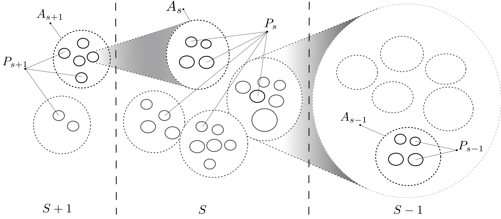
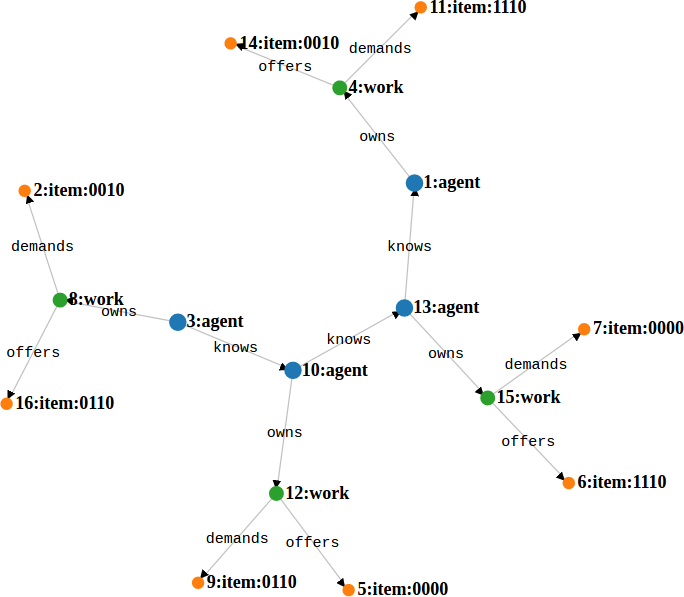
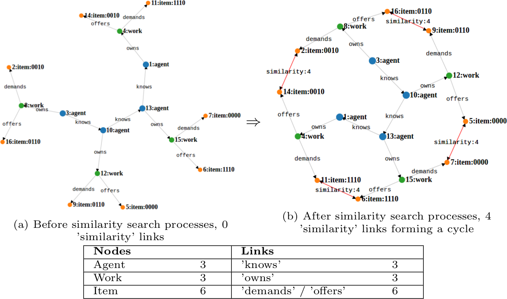
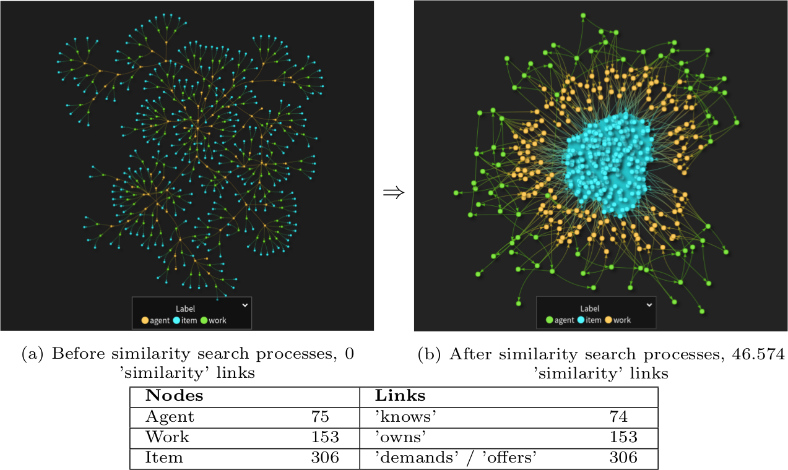

---
header-includes: \usepackage{subfig}
output:
  html_document:
    df_print: paged
---  

# Decentralized computing in OfferNet(s)

We consider a simplified framework of decentralized barter exchange between independent and heterogeneous agents -- **Offer Networks** -- for demonstrating main properties of what we call **open-ended decentralized computing** -- a paradigm for researching and testing the possibility of computational emergence of open-ended intelligence [@weinbaum_weaver_open_2017],[@weinbaum_weaver_open-ended_2018] by performing computer simulations.

We first shortly introduce main concepts of open-ended decentralized computing and then show how they are being mapped to the Offer Networks architecture. Finally, results of preliminary experiments are presented and discussed. We discuss the possibilities of opportunities of extension of  Offer Networks architecture as we go.  

## Open-ended decentralized computing

Open-ended intelligence is an abstraction of the process of human cognitive development, extended to general agents and systems. Three facets of it are (1) the philosophical concept of individuation, (2) sense-making and (3) the individuation (via progressive determination) of general cognitive agents. Open-ended intelligence can be framed in terms of a decentralized, self-organising scalable network of interacting agents. A critical aspect of individuation of intelligence here is disparity resolution and coordination among independent and heterogeneous agents which *a priori* hold distinct value systems. Please see [@weinbaum_weaver_open_2017] for the introduction of the concept in the context of Artificial General Intelligence and [@weinbaum_weaver_open-ended_2018] for in-depth metaphysical treatment of the framework.

### Basic principles

Main aspects of the open-ended decentralized computing derived from the open-ended intelligence philosophy are:

* **Network of heterogenous agents**. First, since open-ended intelligence is framed in terms of decentralized network of interacting agents, it determines the usage of an Actor model of computation [@hewitt_universal_1973], [@agha_concurrent_1985], [@zenil_what_2013], [@hewitt_viewing_1976] as a computational framework. Actor model features communication medium where many independent and heterogeneous agents interact via message passing. Even though each individual actor in the framework can represent a deterministic computation (algorithm), a network of actors in its general form is non-deterministic -- probabilistic and deterministic behaviours can be represented using it, but the general formalism itself is not constrained in any way by them.

* **Stigmergic coordination**. Second, the possibility of progressive determination of emergent structures in a network (in terms of assemblages of actors) is implemented via the universal mechanism of stigmergic coordination [@heylighen_stigmergy_2016]. Stigmergy is a mechanism of indirect coordination between actions of otherwise independent actors via the shared medium or context where individual actions shape the medium and medium influences further individual actions in recursive way. Thus generalized concept of stigmergy is equivalent to the concept of progressive determination, which is the actual mechanism of individuation [@weinbaum_weaver_open_2017], [@veitas_living_2017]. In Open-ended decentralized computing, the shared medium allowing for stigmergic coordination and progressive determination is implemented as a graph (concretely -- property graph [@robinson_graph_2015], [@rodriguez_graph_2010]) which can be read from and written to by each actor in a concurrent and asynchronous manner. Often used notion of stigmergy to denote indirect communication in colonies of eusocial insects via pheromone traces is but a special case.

* **Decentralization**. Third, open-ended decentralized computing meticulously follows the principle of open-ended intelligence in that it is not constrained by any *a priori*  goals. We conceive a framework which is not constrained by pre-defined structures and general goals, yet where they **can** emerge from the interaction among elements or indirectly influenced by limiting behavioural repertoire of agents participating in the network. Implementation wise, we strictly enforce the principle of decentralization -- positing that there could exist no actor or agent *a priori* having complete and full knowledge of the network (i.e. underlying graph structure) or control over it<sup>[1](#information-control-decentralization)</sup>. Such agent in principle could emerge from indirect or direct coordination happening in the network, but it cannot obtain such "privileged" status before interaction begins (hence -- no *a priori*). The principle of decentralization, apart from conceptual importance, influences many software design and rather low level decisions on coding level -- e.g. prohibition of global and shared data structures apart the network itself <sup>[2](#no-need-for-global-structure)</sup>.

### Directions of simulation modelling research

Open-ended decentralized computing is a research direction and a practically applicable paradigm. The chosen research method for advancing it is **simulation modelling** which encompasses two aspects: (1) designing and implementing a software architecture based on aforementioned principles having practical importance and (2) running computational experiments on it. OfferNet(s) software architecture <sup>[3](#singnet-offernet)</sup> is such a framework. Purposes of simulation modelling research reflect the double nature of Offer Networks -- as an implementation of open-ended decentralized computing framework and a pragmatic application of it for solving well-defined (or definable) problems. We first start with delineation of the former and then go on to describe the latter.

From the broadest conceptual perspective we want to operationalize the principle of progressive determination in a working software architecture. Such an architecture would demonstrate practical aspects of open-ended intelligence philosophy and pave a way for its application in many contexts, including, but not limited to the quest for the Artificial General Intelligence. In summary, the software architecture is meant for researching:

* The very possibility of implementing the mechanism of progressive determination in the computational medium;
* Identifying and demonstrating contexts where application of decentralized mechanism of progressive determination makes more sense from practical perspective than conventional centralized algorithms;
* Demonstrate bottom-up emergence of higher order structures in the network having detectable, yet not *a priori* defined functionality in the context of the network; such structures take form of *ad-hoc* assemblages of lower level actors.

## Offer Networks

Offer Networks is a concept of an alternative economy where Agents (humans, AIs and more or less simple programs and intelligences) find, negotiate and execute locally and globally beneficial series of hybrid exchanges (monetary and non-monetary) of tangible and/or intangible goods. It was first proposed by [@goertzel_beyond_2015] in the context of post-money economy and further developed by [@heylighen_offer_2017] in the context of Global Brain research.

Offer Networks is a practical context enabling implementation and testing of the mechanism of progressive determination and generalized stigmergic cooperation in a computational medium. Notwithstanding, it is a research project on its own, aiming at conceiving, conceptualizing and proof-of-concept implementation of alternative economy for the age of decentralized and autonomous AI technologies. 

### Model specification

Offer Networks model is conceived as a special case of certain computational aspects of the descriptive model of the individuation of cognition [@weinbaum_weaver_synthetic_2017], [@weinbaum_weaver_open_2017]. As such it adheres to the main conceptual principles of the open-ended intelligence and decentralized computing, but does not attempt to fully cover them.

Relation between conceptual models of individuation of cognition and Offer Networks is well conveyed via graphical representations of both: 

```{r picture-scales-of-individuation, fig.cap='Conceptual model of individuation of cognition in terms of relationship among scales, populations and boundaries. The chosen scale of analysis is $S$. $S+1$ is the higher scale while $S-1$ is the lower scale. $P_{s}$ denotes a population of agents at scale $S$. Solid circles denote the agents of population $P$ at any scale. Dashed lined circles denote super-agents at any scale e.g. -- $A_{s}$ at the center of the figure, denotes a super-agent that emerges from the interactions of agents in $P_{s}$. Super-agents at scale $S$ are the agents of the population $P_{s+1}$. The $i-th$ super-agent at scale $S$ is denoted $A_{s}^{i}$, the superscript is omitted if unneeded. Also, the subscript $S$ is omitted from $A$ or $P$ in the text if it is redundant (adapted from [@weinbaum_weaver_synthetic_2017]).', fig.show = "hold", fig.ncol = 1, out.width='80%', fig.align='center', echo=FALSE, eval=TRUE}

```

```{r architecture, fig.cap='Conceptual architecture of OfferNet as a self-organizing network of interacting agents', out.width='60%', fig.align='center', echo=FALSE}
knitr::include_graphics("pictures/OfferNet_architecture.png")
```

Most importantly, both models describe interactions between heterogeneous agents that give rise to higher order behaviours of assemblages of agents. The main difference is that the model of individuation of cognition is very abstract, while the OfferNet model features specific types of agents and their relations as required by the domain. We will not go into details of the mapping of the models, but rather explain in more detail components of Offer Networks model. Let us first start with the data structure and then explain distributed processes performed on it by agents.

#### Data structure

The data structure of OfferNet(s) is a property graph, composed from nodes of type $[agent, work, item]$ and edges of type $[knows, owns, demands, offers, similarity]$:

```{r offernet-initial-structure, fig.cap='OfferNet(s) graph structure: note that the initial structure does not contain *similarity* links, which appear in the graph only after processes are run.', out.width='45%', fig.align='center', echo=FALSE}

```

* **Agents** form a type of social network by relating to each other via 'knows' links. The only hard constraint for the network of agents is that it should be connected. Nevertheless, the effectiveness of processes running on this network very much depends on how they are connected -- i.e. the topology of $agent \xrightarrow{\text{knows}} agent$ subnetwork (see explanation about processes below). Agents also relate to one or more $work$ via $owns$ links -- representing situations when an agent publishes what it 'wishes' to exchange in the network;
* A **work** represents a specialized 'process of exchange' that an agent is willing to execute if any interested parties exist in the network. As every process, $work$ has inputs ($demands$) and outputs ($offers$). In the current simplified model a $work$ features one $demand$ and one $offer$ yet in principle arbitrary complex works can be represented -- e.g. featuring more than one input (energy, computational resources or a monetary payment) or output. This aspect is particularly interesting with respect to potential integration of OfferNet(s) framework to SingularityNET -- considering that a $work$ can involve 'exchange' of data output (e.g. text description of image) for data input (e.g. image to be described) and certain amount of AGI tokens. Note that in this case, a $work$ would not be a 'process of exchange' but rather a 'process of text summarization' which nevertheless can be perfectly well represented within the same framework. Finally, in OfferNet(s), a $work$ connects to $items$ of exchange via $demands$ or $offers$ link.
* An **item** is an actual item of exchange. In OfferNet(s) this is limited to actual physical or non-physical items where $demands$ link means that it is an input and $offers$ -- output. In a more generalized model an item could be a representation of any input or output (data, token, energy units, etc.); 

#### Processes

Following basic principles of open-ended decentralized computing, Offer Networks is implemented as an ecosystem of decentralized processes interacting via the stigmergic medium. Note, that on the general level these principles are in line with the conceptual model of **Cognitive Synergy** -- "a dynamic in which multiple cognitive processes, cooperating to control the same cognitive system, assist each other in overcoming bottlenecks encountered during their internal processing". The model of cognitive synergy is used explicitly in the design of OpenCog cognitive architecture [@goertzel_toward_2017]. The list of decentralized processes is open-ended -- any process can be added by an agent participating in the network. Processes required for basic functionality of OfferNet(s) are:

1. [Similarity search](#process1-similarity-search);
2. [Find cycles of changeable items](process2-find-cycles-of-changeable-items);
3. [Find and connect items of exchange via similarity links](process3-find-and-connect-similar-items-of-exchange-via-similarity-links);
4. [Execute exchange cycles](process4-execute-exchange-cycles);

These processes are described in detail below. Additionally, every experiment designed to answer a specific research question can feature specialized processes for that purpose -- discussed under description of an [experiment](#experiment-comparison-of-decentralized-and-centralized-search). Finally, OfferNet(s) architecture can be broadly extended by adding different processes and their interactions -- discussed in [further steps](#further-steps) following Experiment 1.

##### Process#1: Similarity search

Similarity search process searches similar `item`s in the network and connects them with `similarity` links. The ability to measure similarity of items is based on a uniform [representation](https://singnet.github.io/offernet/public/offernet-documentation/conceptual-framework.html#representation-theory-of-value) and [description](https://singnet.github.io/offernet/public/offernet-documentation/conceptual-framework.html#description-of-items-of-exchange) of item value. [Similarity measure](https://singnet.github.io/offernet/public/offernet-documentation/conceptual-framework.html#similarity-measure) also can take different forms. Recall furthermore, that initially `item`s are related only indirectly via agents that have posted them into a network. The goal of similarity search process is to connect items directly and by this keep the data structure of OfferNet(s) in a form that would make finding cycles in possible and efficient. For the visual representation of how similarity search mutates the graph, see figures below.

```{r mutation-small-graph, fig.cap='Graph mutations due to similarity search process illustrated on the toy graph.', out.width='100%', fig.align='center', echo=FALSE}

```

```{r mutation-larger-graph, fig.cap='Visualization of larger graph mutations due to similarity search process.', out.width='100%', fig.align='center', echo=FALSE}

```

At the current version of OfferNet(s) software framework<sup>[4](#singnet-offernet-d784d1c)</sup>, `item` values are represented as real numbers in the range $[0,1]$. Similarity between two items is then calculated using the formula $Sim = 1 - abs(value_{i1} - value_{i2})$ which also results in the real number of range $[0,1]$. The closer the number to one, the more `similar` items are. 

Algorithmically, similarity search is implemented in two flavours -- centralized and decentralized. Comparison of performance of them forms the basis of Experiment 1 (see [description further](#discussion-of-results)).

###### Centralized similarity search

Centralized similarity search simply fetches all items in the network, compares each item value with every other and creates `similarity` link between them if the similarity value exceeds a parameter called `similaritySearchThreshold`. This parameter regulates the density of connectivity between `items` on the one hand and the ability for agents to exchange "fuzzy" similar items on the other.

Centralized similarity search requires a full scan of the graph in order to collect data on all items demanded or offered by agents at certain moment in time, combining this data into a single data structure and then processing it in a centralized (but possibly distributed) manner. 

Currently the process is implemented by [`connectAllSimilarCentralized`](https://github.com/singnet/offernet/blob/30c9d7b5b7fcab5d6fa1cf6bb97c86ccc6cb7c2f/src/main/groovy/OfferNet.groovy#L698) routine.

###### Decentralized similarity search

Decentralized similarity search, contrary to the centralized flavour, works only on behalf of an agent that initiates the search and does not require fetching all item values from the network. It operates as a spreading activation which starts with the items of the initiating agent and checks similarity of items of its neighbours. Decentralized similarity search takes `similaritySearchThreshold` and `maxDistance` parameters. The former serves the same way as in centralized search, while the latter determines how far into the neighbourhood the spreading activation process traverses.

Currently the process is implemented by [`searchAndConnect`](https://github.com/singnet/offernet/blob/30c9d7b5b7fcab5d6fa1cf6bb97c86ccc6cb7c2f/src/main/groovy/Agent.groovy#L367) routine.

##### Process#2: Find cycles of changeable items

In graph theory a cycle is a collection of vertices and edges among them where each vertex present the collection is reachable from itself via the edges present in the collection. Cycle search is the process that finds such data structures in an OfferNet(s) graph (see picture below).

##### Process#3: Find and connect similar items of exchange via similarity links

##### Process#4: Execute exchange cycles

#### Research questions

The ambition of Offer Networks (as an alternative economy) is to **conceive, implement and test mechanisms of search, matching and execution of exchange of goods and services in a decentralized system both in terms of information and control**<sup>[1](#information-control-decentralization)</sup>. Note, that such definition of decentralization does not enforce homogeneity of agents -- i.e. agents can wildly differ in their knowledge of the network and exercisable control, yet still be far from omniscient and omnipotent at the scale of the whole network. Actually, such dynamic heterogeneity is a desirable property leading to beneficial social network dynamics [@veitas_living_2017]. Also note that it differs from the original formulation of the goal of Offer Networks as *search and execute globally optimal set of exchanges that would maximally satisfy outstanding offers/demands by maximum number of agents* [@goertzel_matching_2015] by relaxing optimality requirement.

We are working towards this goal by asking (and answering) concrete research questions which allow for clear formulation and testing of scientific and computational hypotheses -- a process leading to incremental building of the system. The current research horizon encompasses following questions:

1. **What are parameters that determine advantages and disadvantages of decentralized and centralized search algorithms in different contexts**?. In principle, Offer Networks goals can be achieved by either centralized (global) or decentralized (local) processes running on the same data structure as defined earlier. In practice, however, the feasibility of any of the approaches is largely determined by concrete circumstances and context-specific aspects. For example, centralized algorithms can optimize results at the cost of combinatorial explosion of computational complexity needed to carry them out, while decentralized algorithms may achieve sub-optimal, but still "good enough" results faster. The very term "good enough" implies context dependency. In order to provide at least some insights to this question we set-up centralized and decentralized search processes in Offer Networks and test them with different parameters (see [design](https://singnet.github.io/offernet/public/offernet-documentation/implementation.html#compare-decentralized-and-centralized-search), [results](https://singnet.github.io/offernet/public/experiment-decentralized-vs-centralized/) and [discussion](#discussion-of-results) of the experiment on comparing decentralized and centralized search).

2.  **Can we conceive decentralized processes which make themselves more efficient by utilizing results of 'traces' left by preceding processes**? This research question addresses the feasibility of implementing stigmergic coordination principle of the open-ended decentralized computing as formulated [above](#basic-principles) in different contexts. Such processes, interacting among each other in a decentralized way, would implement **learning** ability of the network. Similar to the first research question, the learning ability of the network can be implemented in a centralized or decentralized manner. The design of the experiment needed to answer this research question is informed by the insights from results of the first experiment  -- see its [further steps](#further-steps).

3. **How can we utilize learning network of heterogeneous processes for implementing a decentralized exchange of goods and services**? Answering this research question requires integration of the answers and insights from research question 1 and 2 in an Offer Networks system. The actual design of experiments required for answering this research question will be approached after obtaining and interpreting results of the experiment based on the second research question.


## Footnotes

<a name="information-control-decentralization">1</a>: Two types of decentralization can be distinguished -- decentralization of information and decentralization of control. Decentralization of information means that no actor in a network can have full knowledge of the whole network (i.e. to know its global state), while decentralization of control -- that no single agent can exercise actions that single-handedly determine dynamics of the network.

<a name="no-need-for-global-structure">2</a>: Actually, even the usage of a global structure (graph) for representing the network itself is determined by technical/pragmatic convenience rather than conceptual necessity.

<a name="singnet-offernet">3</a>: [https://github.com/singnet/offernet](https://github.com/singnet/offernet); development is supported by SingularityNET Foundation ([https://singularitynet.io/research-initiatives/](https://singularitynet.io/research-initiatives/)).

<a name="singnet-offernet-d784d1c"></a>: singnet/offernet git repo, commit number [d784d1c](https://github.com/singnet/offernet/tree/d784d1c27e71202441e26d55badb4f9a22f7d8da).