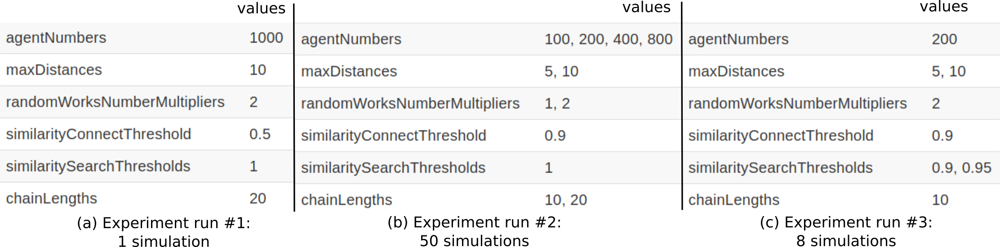

# Experiment #1: comparison of decentralized and centralized search{#experiment-one}

With this experiment we would like to see how centralized similarity search and cycle search processes perform with comparison to decentralized processes. 

## Setup

For that purpose we have implemented [Process #1](#process1-similarity-search) and Process #2(#process2-find-cycles-of-changeable-items) in centralized and decentralized flavours. In order to compare them we follow these steps:

1. First, we create an Offer Network of predefined size (parameter `agentNumber`); We experiment with the random graph (where agents are randomly connected with 'knows' links) and a small-world graph, where we know the diameter of the network in advance;
2. Then we artificially create a list of items which, if correctly searched and connected in the OfferNet(s) graph, form a chain . The length of the predefined cycle is set by parameter `chainLength`;
3. Items from the list are assigned to random agents in the network;
4. Then, we create a special `taskAgent` owning a `work` which, when correctly connected to the potential chain inserted in the network by step 2, closes it into a loop forming a cycle (see figure \@ref(fig:cycle-search-two-graphs)). 
5. Finally, we run the decentralized and centralized processes on the same graph and retain running times of each method:
	5.1. Similarity search process connects all similar items with 'similarity' links, as [explained above]((#process1-similarity-search));
	5.2. Cycle search process is run on behalf of taskAgent and discovers the cycle inserted by step 2 (in case similarity search process correctly connected similar items);

An experiment is a series of simulations, each of which takes the following parameters:

* `agentNumber`: number of agents in the network (apart from taskAgent);
* `similarityConnectThreshold`: the minimum similarity value between items connected with explicit link by similarity search process;
* `chainLength`: the length of the chain inserted into the network by step 2;
* `similaritySearchThreshold`: minimal similarity of items to be considered as eligible for exchange;
* `maxDistance`: radius of agent's neighbour network when searching for similar items;
* `randomWorksNumberMultiplier`: the number of random works and items which are assigned to the agents in the network to make cycle search more realistic;


```{r all-simulation-parameters, fig.cap='List of all simulation parameters used for experiments (3 separate runs, 59 simulations).', out.width='100%', fig.align='center', echo=FALSE}

```

Detailed data about all experiments, simulations, their parameters and descriptive analysis of obtained results is provided in Electronic Laboratory Notebook [here](https://singnet.github.io/offernet/public/experiment-decentralized-vs-centralized/all-experiments.html). In the next two sections we discuss insights of the analysis and further steps based on them.

##  Discussion

## On decentralized versus centralized computation

As many non-trivial (and interesting) questions, the issue of whether centralized or decentralized models are "better" cannot be answered in a univocal manner. The short and not very informative answer to this question would be "it depends" -- you can always find cases and examples where one of them works better. Our goal is therefore not to answer 'yes or no' but to figure out parameters and circumstances where one or another type of model or algorithm fairs better. 

Notwithstanding what was said above, decentralized and centralized computation models are not equal in terms of their expressivity. It can be shown that a centralized computation is a special case of the decentralized model. For this we have to establish a relation between non-determinism and decentralization. Recall first that any computation or a program can be expressed as a graph of atomic program steps (as nodes) and transitions between them (as links) [@turchin_concept_1986], [@pennachin_i._2014]. In general any Turing machine can be represented as a graph [@laud_complexity_2011], as illustrated in figure below:

```{r turing-machines-as-graphs, fig.cap='Representing Turing machines as graphs (adapted from [@laud_complexity_2011]).', out.width='100%', fig.align='center', echo=FALSE}
knitr::include_graphics("pictures/turing_machines_as_graphs.png")
```
A centralized system is a system where all transitions between atomic program steps are known and controlled by a central observer -- this corresponds to the figure on the left. In a decentralized system, every atomic program has a freedom to choose any possible transition and this choice cannot be a priori known or controlled in any manner by the central observer -- figure on the right. It is easy to see, that left image is the special case of right image, i.e. a non-deterministic / decentralized computation can be reduced to deterministic / centralized by pruning a number of links in the initial graph. 

Bottom line is that it makes sense to start designing a computational framework or architecture based on decentralized model but allow for a centralized computation to emerge out of it rather than the other way round.

* overall, decentralized search is faster than centralized in connecting similar items and finding a cycle, yet it depends on parameters;
* centralized search explodes by number of vertices in the graph (items);
* decentralized search explodes depending on edges in the graph (similarity edges between items);
* decentralized search is sensitive to the topology of the graph, while centralized search is not;
* the number of processes in centralized search is roughly proportional to the number of items in the graph, but these processes are very short;
* the number of processes in decentralized search is roughly proportional to the number of agents in the graph, but average time of the process is roughly proportional to the number of links;

## Insights and future steps

* Decentralized search can be optimized by smartly constructing traversals which do not traverse all edges in the graph (some sort of 'biased spreading activation')  - the topic of the Experiment #2;
* Decentralized search can be optimized by controling topology of the graph -- namely, keeping the diameter of the graph in certain range;


## Additional notes (flexibility of the model){#additional-notes}

* General treatment of the OfferNet(s) model (for interaction of processes)
* Ability to calculate costs of exchange (e.g. in OfferNet(s) transportation costs)
* Represent data as agents with offer/demand pairs;
* Dynamic negotiation between agents;
* 'Efficiency' measure of the network operation -- the number of exchanges per unit of time;