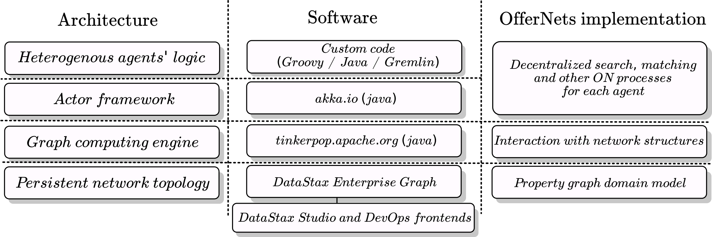
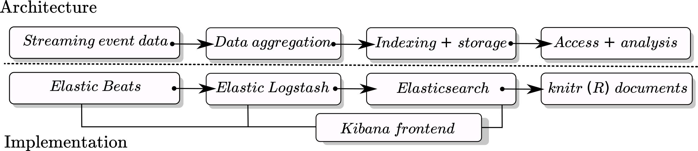

```{r setup, include=FALSE}
knitr::opts_chunk$set(echo = FALSE)
```

## What is OfferNets

OfferNets is a research initiative that aims at creating a radically decentralized economy which is powered by diverse network of independently operating and interacting agents. It combines two R&D paths which are tightly related yet embrace different levels of abstraction:

(a) *Decentralized computing*: a massively scalable computing model and a software framework supporting asynchronous execution of heterogeneous processes concurrently using a shared data structure and allowing to model any mixture of emergent and controlled coordination among them.
(b) *OfferNets economy*: a decentralized economy providing alternative to purely currency based exchanges; it features a complex network of interactions and optimizes reciprocal exchanges of goods and services by finding agents with compatible and complementary preferences and coordinating their interactions.

Research and development of (b) is crucially dependent on (a) but the importance and application of the latter is much broader than the former. This means that we are designing the decentralized computing and simulation modelling platform to be maximally horizontally scalable beyond applications for OfferNets economy.

## Scope & directions

### Decentralized computing

The concept of open-ended decentralized computing is an idea being developed within OfferNets research initiative which allows heterogeneous asynchronous processes to achieve spontaneous or guided compatibility via indirect communication through a shared topological space. The rationale of pursuing implementation and computational testing of this model is to conceive a computational framework able to perform large scale simulations of decentralized systems, including economy, different combinations of governance regimes and structures, multiple currencies, barter networks and more. Furthermore, despite the model is inherently decentralized, it allows to implement (or emerge) different levels of centralization as considered needed. The architecture of the computational framework is documented in more detail [here](https://singnet.github.io/offernet/public/offernet-documentation/conceptual-framework.html#conceptual-architecture).

### Simulation engine

The software architecture on which OfferNets simulations are run consists of two large parts: 

(1) actor framework for powering asynchronous execution of heterogeneous agents' logic and peer-to-peer interactions via message passing;

(2) graph database powered by enterprise level graph database server for keeping and updating the topology information of the network and enabling indirect communication. 
The conceptual architecture, software stack and its Offer Networks implementation are summarized in the picture below.

##### ***Figure 1: OfferNets simulation engine software stack***
{width=600px}

### Monitoring and analysis engine;

Simulation modelling requires collection and analysis of information about events happening in the system during runtime. Since a decentralized applications framework by definition does not contain a single point of access to the system, we have built a specialized engine for collecting and handling large amounts of streaming data coming from many sources. The basic principle of the engine is based on issuing monitoring messages on behalf of each agent and then catching and indexing them into a single (but possibly distributed) database. The technical basis of the engine is [ElasticStack](https://www.elastic.co/products) -- an integrated streaming data management and analysis solution.

##### ***Figure 2: Monitoring and analysis pipeline***
{width=600px}

The monitoring pipeline is fully distributed, with possibility to be scaled to multiple machines and is tolerant to failures and restarts of each component separately. Likewise, the simulation engine, is readily scalable to multiple machines depending on the required load for simulation or production environments. Both provide real time monitoring capabilities across all machines via web front-ends; additionally real time network, agent activity monitoring and event capturing is available via custom based web front-ends accepting data streams from other parts of the infrastructure. 

### OfferNets economy

Decentralized computing model and architecture allows to implement, test, deploy and observe evolution of virtually unconstrained number of computational processes interacting and coordinating directly or indirectly within the same ecosystem. The challenge is to define concrete processes, design their interaction and fine-tune the system to preferred dynamics for OfferNets economy.

#### OfferNets domain model and processes implementation

OfferNets domain model is specified as a property graph schema in terms of types of nodes, their properties, types of edges, their properties and processes defining graph traversal and mutation constraints (see documentation [page](https://singnet.github.io/offernet/public/discussions/decentralized-computing-in-offernets.html#data-structure)). Beyond that every agent operating in the network is allowed to implement any process. Processes that require interaction with the social graph of OfferNets are implemented as graph traversals, other processes -- as regular asyncrhonous algorithms. In the current version OfferNets implements basic similarity search and cycle search processes with cycle execution and advanced search processes in the pipeline (see documentation [page](https://singnet.github.io/offernet/public/discussions/decentralized-computing-in-offernets.html#processes)).

#### Simulation modelling

Simulation modelling amounts for conceiving, implementing and running computational experiments on OfferNets software framework and then analysing data collected via the monitoring engine. Due to large parameter space and many simulations needed for exploring it properly it is computationally intensive process. Furthermore, it is an open ended process in the sense, that every simulation raises questions and informs the set-up of the next one by that iteratively perfecting both computational infrastructure and domain model. Since the start of simulation modelling experiments in August 2018 we are running simulations aimed at comparing centralized and decentralized search algorithms on the same graph structures.

```{r stats, results='asis',echo=FALSE,message=FALSE,warning=FALSE,error=FALSE,output=FALSE, source = FALSE}
library(plotly)
library(ggplot2)
LoadToEnvironment <- function(RData, env = new.env()){
  load(RData, env)
  return(env) 
}

exp11.df <- LoadToEnvironment('~/offernet/docs/decentralized-vs-centralized-bookdown-corrected/R_data/summary_of_all_experiments.Rdata')$summary.df
exp11.df <- exp11.df[which(exp11.df$similarityConnectThreshold != "NA"),]
exp11.df <- select(exp11.df, sum_wallTime_min_total)
exp12.df <- LoadToEnvironment('~/offernet/docs/experiment-1-run-2-corrected/R_data/summary_of_all_experiments.Rdata')$summary.df
exp12.df <- select(exp12.df, sum_wallTime_min_total)
exp13.df <- LoadToEnvironment('~/offernet/docs/experiment-1-run-3-corrected/R_data/summary_of_all_experiments.Rdata')$summary.df
exp13.df <- select(exp13.df, sum_wallTime_min_total)
exp14.df <- LoadToEnvironment('~/offernet/docs/experiment-1-run-4/R_data/summary_of_all_experiments.Rdata')$summary.df
exp14.df <- select(exp14.df, sum_wallTime_min_total)
exp15.df <- LoadToEnvironment('~/offernet/docs/experiment-1-run-5/R_data/summary_of_all_experiments.Rdata')$summary.df
exp15.df <- select(exp15.df, sum_wallTime_min_total)
exp16.df <- LoadToEnvironment('~/offernet/docs/experiment-1-run-6/R_data/summary_of_all_experiments.Rdata')$summary.df
exp16.df <- select(exp16.df, sum_wallTime_min_total)
exp17.df <- LoadToEnvironment('~/offernet/docs/experiment-1-run-7/R_data/summary_of_all_experiments.Rdata')$summary.df
exp17.df <- select(exp17.df, sum_wallTime_min_total)
exp18.df <- LoadToEnvironment('~/offernet/docs/experiment-1-run-7/R_data/summary_of_all_experiments.Rdata')$summary.df
exp18.df <- select(exp18.df, sum_wallTime_min_total)

all.df <- exp11.df
all.df <- rbind(all.df, exp12.df)
all.df <- rbind(all.df, exp13.df)
all.df <- rbind(all.df, exp14.df)
all.df <- rbind(all.df, exp15.df)
all.df <- rbind(all.df, exp16.df)
all.df <- rbind(all.df, exp17.df)
all.df <- rbind(all.df, exp18.df)

library(elastic)
conn<-connect(es_port = 9200)
cstats <- cluster_stats()

metrics <- c(
  'Number of simulations',
  'Aggregate simulation time (user)',
  'Data points (= elementary events)',
  'Database size'
)
values <- c(
  format(nrow(all.df),scientific=FALSE),
  format(round((sum(all.df$sum_wallTime_min_total) / 60),2), decimal.mark=",", big.mark=" ",small.mark=".",  nsmall = 2),
  format(cstats$indices$docs$count, decimal.mark=",", big.mark=" ",small.mark=".", small.interval=3),
  format(round(cstats$indices$store$size_in_bytes / 1024 / 1024 / 1024,2), decimal.mark=",", big.mark=" ",small.mark=".", small.interval=3)
  )
units <- c(
  'units',
  'hours',
  'units',
  'GB'
)

stats.df <- data.frame(metrics,values,units)
names(stats.df) <- c('Metric','Value','Unit')
library(kableExtra)
kable(stats.df,format.args = list(decimal.mark = '.', big.mark = ",")) %>%
  kable_styling(bootstrap_options='condensed',full_width = FALSE, position = 'left') 
    #column_spec(0:ncol(experiment.df),width="10em") 
    #add_header_above(c("labels"=5))


```

Raw results, analysis, interpretation of simulation data as well design for new experiments are compiled into the [electronic laboratory notebook](https://singnet.github.io/offernet/public/elabnotebook/), that is constantly updated as new results. The notebook collects living documents written in R/markdown that directly query the database of simulation data. The raw data is publicly available on [singnet/offernet](https://github.com/singnet/offernet) repository.

## Progress and status

```{r timeline-diagrammer, results = 'asis', fig.width = 7, fig.height = 3, fig.align='left'}
#install.packages('DiagrammeR')
library(DiagrammeR)

mermaid("
gantt
dateFormat  YYYY-MM-DD

section Software framework and coding
Computational framework       	:done,          framework_1,    2018-02-16, 2018-08-01
Monitoring and analysis engine  :done,   	    framework_2,    2018-06-05, 2018-09-01
OfferNets domain model and processes :active,  framework_3, 2018-06-05, 2019-01-01
	
section Simulation modelling
Experiment 1                  :crit, active,        	exp_1,   2018-08-01, 2018-10-25
Stress testing	    		      :   	  			exp_2,   after exp_1, 2018-11-15
Experiment 2                  :          		exp_3,   after exp_2, 2018-12-15
Other experiments              :             exp_oth, 2019-01-01, 2019-02-01
")
```

## Integration to SingularityNET main network

OfferNets research initiative is estimated to contribute to the development of SingularityNET's decentralized AI network in a few different ways. The exact avenues and scope of integration  will be determined after BETA launch from these possibilities:

1. Developing an automated decentralized marketplace and economy of AI agents on top of the SingularityNET network. Since OfferNets provides a generic decentralized mechanism of chaining processes by their inputs and outputs it may be a basis for the research into mechanism of automatic work-flow construction from SingularityNET AI agents.
1. Large scale simulations and testing on top of SingularityNET BETA, including simulations of reputation systems. OfferNets simulation framework and monitoring engine allows to implement a simulation layer on top of BETA infrastructure by constructing simulated AI service providers with different behaviours that would call SingulartiNET infrastructure by its gRPC API.
1. Providing conceptual and computational insights into operation and governance of decentralized network of independent agents for implementation in SingularityNET. OfferNets follows a radically decentralized design philosophy, but real-world systems often require a healthy balance between centralization and decentralization. Pushing the limits of decentralization in research environment provides insights that may be useful in more pragmatic settings, yet have to be separately tested and implemented.
1. Further conceptual and simulation modelling research into new decentralized economic and social models maximizing capabilities of AI and advanced autonomous robot integration in SingularityNET and possibly beyond. This avenue can be extended to include partnerships with existing think-tanks of new economic and social governance thinking.

## Resources

1. Previous and currently ongoing academic research:

* Weinbaum, D. (Weaver), & Veitas, V. (2017). Open ended intelligence: the individuation of intelligent agents. Journal of Experimental & Theoretical Artificial Intelligence, 29(2), 371–396. https://doi.org/10.1080/0952813X.2016.1185748;
* Veitas, V., & Weinbaum, D. (2017). Living Cognitive Society: A ‘digital’ World of Views. Technological Forecasting and Social Change, 114, 16–26. https://doi.org/10.1016/j.techfore.2016.05.002;
* Veitas, V.K. (2019). Synthetic Cognitive Development of decentralized self-organizing systems. PhD Thesis (forthcoming).
  
2. Offer Networks documentation:

* Concept and implementation [https://singnet.github.io/offernet/public/offernet-documentation/index.html](https://singnet.github.io/offernet/public/offernet-documentation/index.html) 
* Electronic Lab Notebook [https://singnet.github.io/offernet/public/elabnotebook/](https://singnet.github.io/offernet/public/elabnotebook/)
  
3. Git repo: [https://github.com/singnet/offernet](https://github.com/singnet/offernet)