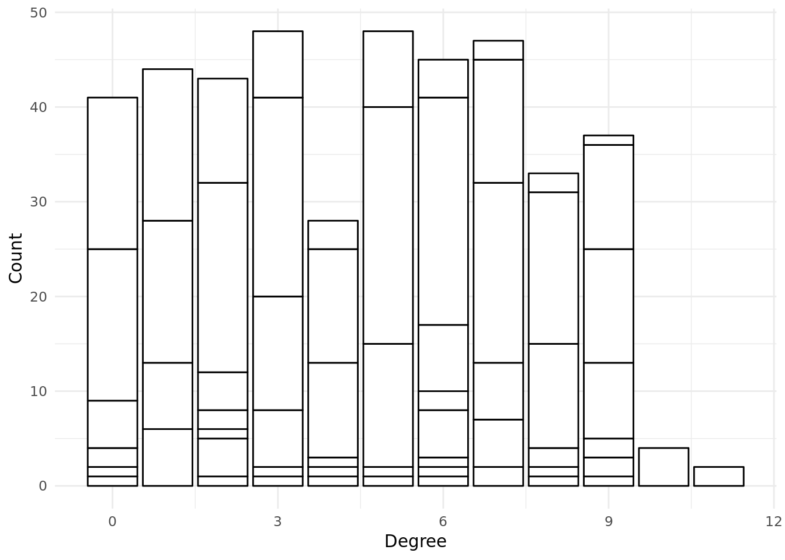
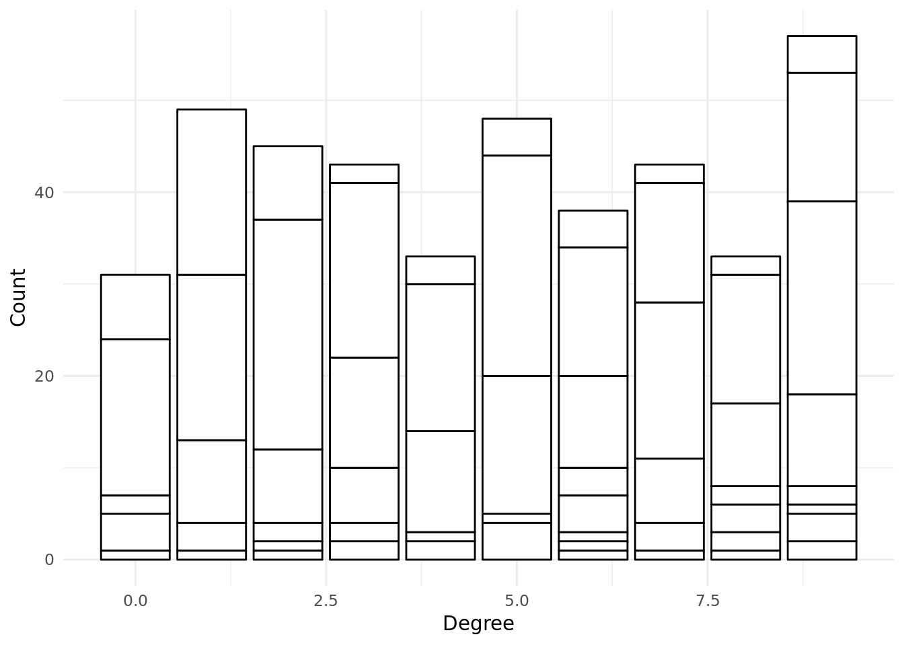
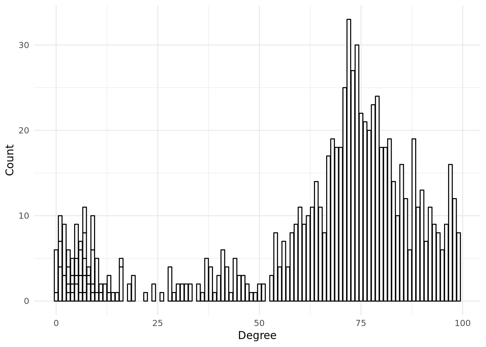
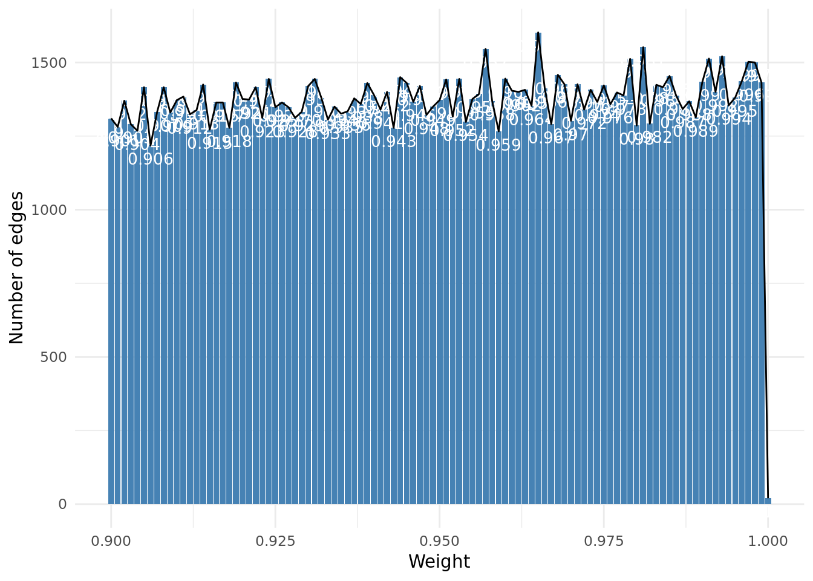
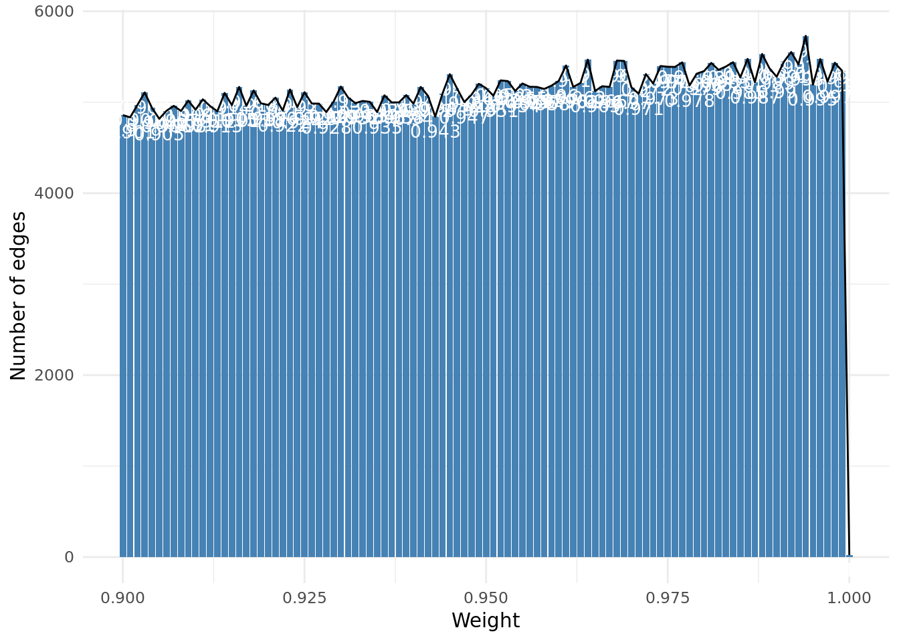
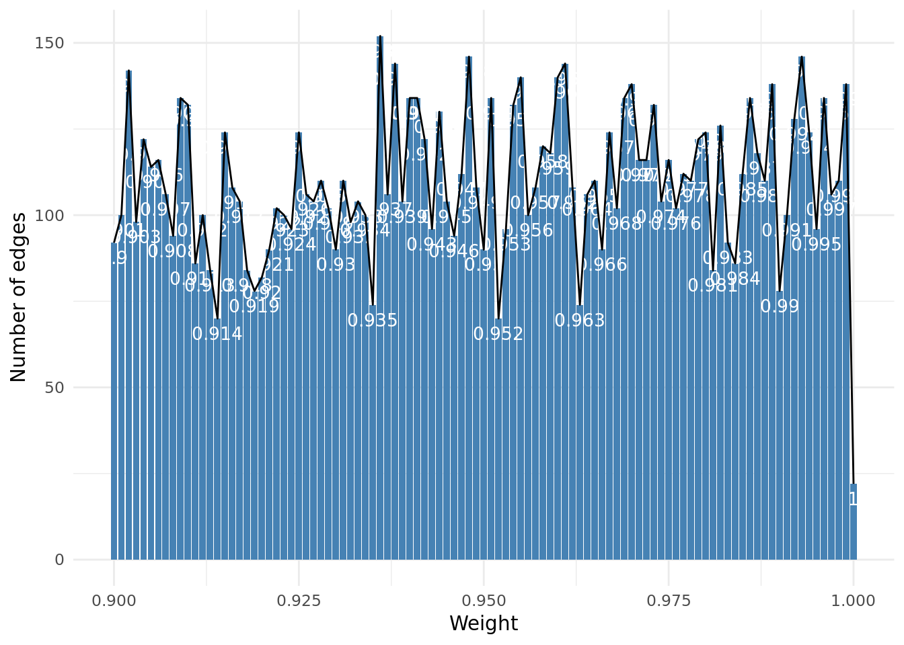
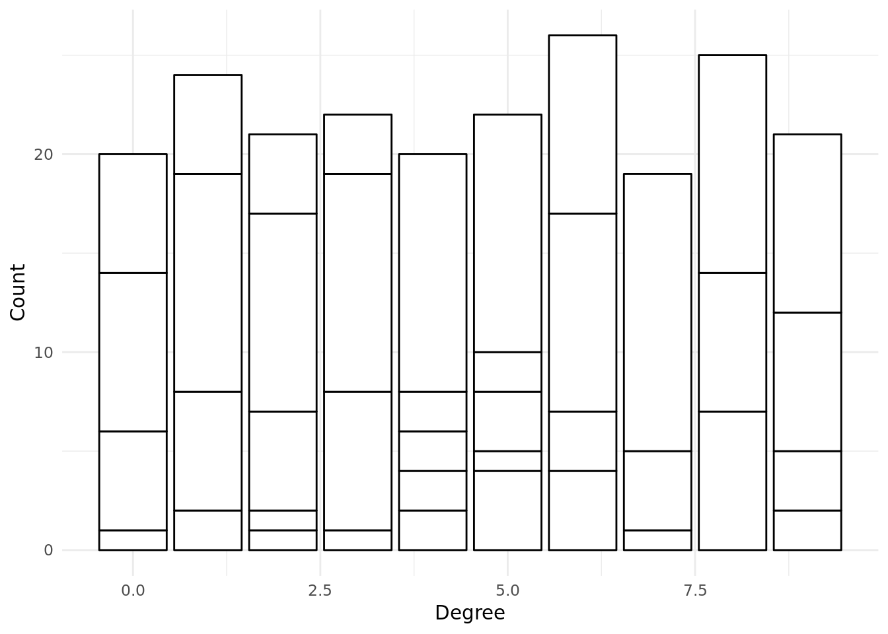

--- 
title: "Additional experiments for decentralized vs centralized search"
author: "Kabir Veitas (kabir@singularitynet.io)"
date: "2018-09-07"
bibliography: book.bib
documentclass: book
github-repo: singnet/offernet
link-citations: yes
site: bookdown::bookdown_site
biblio-style: apalike
url: http\://seankross.com/bookdown-start/
---

# Introduction

The following additional experiments were run in order to a bit better figure out the relationship that agent number and edge number plays in decentralized search and centralized search, keeping all other paramters equal. These experiments are:

|No. | expermentId | Comment |
|:--|:--|:--|
|1 | EXP09-04-01-13-AzAjTh | Run time dependency on edge numbers (all other parameters the same); edge number is modulated by similarityConnectThreshold parameter |
|2 | EXP09-04-11-00-zmNPzL | Run time dependency on agent number (all other parameters the same) |
|3 | EXP09-04-04-11-kvIbMs | 800 agents simulation (repeating crashed one) |

<!--#### variables: -->
   

# Experiment  1 

800 agents simulation (repeating crashed one) 

## Experimental set up 

<table class="table table-condensed" style="width: auto !important; ">
 <thead>
  <tr>
   <th style="text-align:left;">   </th>
   <th style="text-align:left;"> Values </th>
  </tr>
 </thead>
<tbody>
  <tr>
   <td style="text-align:left;"> experimentId </td>
   <td style="text-align:left;"> EXP09-04-04-11-kvIbMs </td>
  </tr>
  <tr>
   <td style="text-align:left;"> agentNumbers </td>
   <td style="text-align:left;"> 800 </td>
  </tr>
  <tr>
   <td style="text-align:left;"> maxDistances </td>
   <td style="text-align:left;"> 10 </td>
  </tr>
  <tr>
   <td style="text-align:left;"> randomWorksNumberMultipliers </td>
   <td style="text-align:left;"> 2 </td>
  </tr>
  <tr>
   <td style="text-align:left;"> similarityConnectThresholds </td>
   <td style="text-align:left;"> 0.9 </td>
  </tr>
  <tr>
   <td style="text-align:left;"> chainLengths </td>
   <td style="text-align:left;"> 10 </td>
  </tr>
</tbody>
</table>
## Descriptive analysis of each simulation

###  SIM09-04-04-11-QX3wao--CV 

#### simulationParameters 

<table class="table table-condensed" style="width: auto !important; ">
 <thead>
  <tr>
   <th style="text-align:left;"> agentNumber </th>
   <th style="text-align:left;"> similarityConnectThreshold </th>
   <th style="text-align:left;"> chainLength </th>
   <th style="text-align:left;"> similaritySearchThreshold </th>
   <th style="text-align:left;"> maxDistance </th>
   <th style="text-align:left;"> randomWorksNumberMultiplier </th>
  </tr>
 </thead>
<tbody>
  <tr>
   <td style="text-align:left;width: 20em; "> 800 </td>
   <td style="text-align:left;width: 15em; "> 0.9 </td>
   <td style="text-align:left;width: 15em; "> 10 </td>
   <td style="text-align:left;width: 15em; "> 1 </td>
   <td style="text-align:left;width: 15em; "> 10 </td>
   <td style="text-align:left;width: 15em; "> 2 </td>
  </tr>
</tbody>
</table>
#### allEdgesByLabel

<table class="table table-condensed" style="width: auto !important; ">
 <thead>
  <tr>
   <th style="text-align:right;"> edges_offers </th>
   <th style="text-align:right;"> edges_similarity </th>
   <th style="text-align:right;"> edges_owns </th>
   <th style="text-align:right;"> edges_demands </th>
   <th style="text-align:right;"> edges_knows </th>
   <th style="text-align:right;"> edges_total </th>
  </tr>
 </thead>
<tbody>
  <tr>
   <td style="text-align:right;width: 5em; "> 1,610 </td>
   <td style="text-align:right;width: 5em; "> 2,007,454 </td>
   <td style="text-align:right;width: 5em; "> 1,610 </td>
   <td style="text-align:right;width: 5em; "> 1,610 </td>
   <td style="text-align:right;width: 5em; "> 4,801 </td>
   <td style="text-align:right;width: 5em; "> 2,017,085 </td>
  </tr>
</tbody>
</table>
#### allVerticesByType

<table class="table table-condensed" style="width: auto !important; ">
 <thead>
  <tr>
   <th style="text-align:right;"> vertices_agent </th>
   <th style="text-align:right;"> vertices_item </th>
   <th style="text-align:right;"> vertices_work </th>
   <th style="text-align:right;"> vertices_total </th>
  </tr>
 </thead>
<tbody>
  <tr>
   <td style="text-align:right;width: 5em; "> 801 </td>
   <td style="text-align:right;width: 5em; "> 3,220 </td>
   <td style="text-align:right;width: 5em; "> 1,610 </td>
   <td style="text-align:right;width: 5em; "> 5,631 </td>
  </tr>
</tbody>
</table>
#### distribution of similarityEdgesByWeight

#### Degree distribution of item->similarity->item edges

#### Degree distribution of agent->knows->agent edges

#### Runing time by method 

<table class="table table-condensed" style="width: auto !important; ">
 <thead>
  <tr>
   <th style="text-align:left;"> key </th>
   <th style="text-align:right;"> doc_count </th>
   <th style="text-align:right;"> sum_wallTime_ms.value </th>
   <th style="text-align:left;"> avg_wallTime_ms.value </th>
  </tr>
 </thead>
<tbody>
  <tr>
   <td style="text-align:left;"> connectIfSimilar </td>
   <td style="text-align:right;"> 257,499 </td>
   <td style="text-align:right;"> 3,608,209 </td>
   <td style="text-align:left;"> 14.0125165534623 </td>
  </tr>
  <tr>
   <td style="text-align:left;"> existsSimilarity </td>
   <td style="text-align:right;"> 257,499 </td>
   <td style="text-align:right;"> 3,599,639 </td>
   <td style="text-align:left;"> 13.979234870815 </td>
  </tr>
  <tr>
   <td style="text-align:left;"> similarityEdges </td>
   <td style="text-align:right;"> 257,499 </td>
   <td style="text-align:right;"> 3,488,034 </td>
   <td style="text-align:left;"> 13.5458157119057 </td>
  </tr>
  <tr>
   <td style="text-align:left;"> cycleSearch </td>
   <td style="text-align:right;"> 956 </td>
   <td style="text-align:right;"> 53,942 </td>
   <td style="text-align:left;"> 56.4246861924686 </td>
  </tr>
  <tr>
   <td style="text-align:left;"> getWorks </td>
   <td style="text-align:right;"> 955 </td>
   <td style="text-align:right;"> 6,895 </td>
   <td style="text-align:left;"> 7.21989528795812 </td>
  </tr>
  <tr>
   <td style="text-align:left;"> init </td>
   <td style="text-align:right;"> 802 </td>
   <td style="text-align:right;"> 201,392 </td>
   <td style="text-align:left;"> 251.112219451372 </td>
  </tr>
  <tr>
   <td style="text-align:left;"> connectAllSimilar </td>
   <td style="text-align:right;"> 81 </td>
   <td style="text-align:right;"> 3,611,470 </td>
   <td style="text-align:left;"> 44586.049382716 </td>
  </tr>
  <tr>
   <td style="text-align:left;"> connect </td>
   <td style="text-align:right;"> 72 </td>
   <td style="text-align:right;"> 216 </td>
   <td style="text-align:left;"> 3 </td>
  </tr>
  <tr>
   <td style="text-align:left;"> searchAndConnect </td>
   <td style="text-align:right;"> 10 </td>
   <td style="text-align:right;"> 825,394 </td>
   <td style="text-align:left;"> 82539.4 </td>
  </tr>
  <tr>
   <td style="text-align:left;font-weight: bold;"> Total </td>
   <td style="text-align:right;font-weight: bold;"> 775,373 </td>
   <td style="text-align:right;font-weight: bold;"> 15,395,191 </td>
   <td style="text-align:left;font-weight: bold;">  </td>
  </tr>
</tbody>
</table>
####  Found structures 

#####  Cycles 

Number of cycles found:  1 

<button class="btn btn-primary" data-toggle="collapse" data-target="#IIVVXLBPHH"> Show/Hide foundCycle query </button> 
 
  
     GET /filebeat-*/_search 
              { 
                "query": {
                  "bool": {
                    "must": [
                      { "match_phrase": {
                        "simulationId": "SIM09-04-04-11-QX3wao--CV"
                        }
                      },
                      { "bool": {
                        "should": [
                          { "match": {
                            "keyword": "foundCycle"
                          }}
                        ]
                      }}
                    ]
                  }
                }
              }
     

#####  Paths 

Number of paths found:  0 

<button class="btn btn-primary" data-toggle="collapse" data-target="#QOBITAEDIY"> Show/Hide foundPath query </button> 
 
  
     GET /filebeat-*/_search 
              { 
                "query": {
                  "bool": {
                    "must": [
                      { "match_phrase": {
                        "simulationId": "SIM09-04-04-11-QX3wao--CV"
                        }
                      },
                      { "bool": {
                        "should": [
                          { "match": {
                            "keyword": "foundPath"
                          }}
                        ]
                      }}
                    ]
                  }
                }
              }
     

###  SIM09-04-04-11-QX3wao--DV 

#### simulationParameters 

<table class="table table-condensed" style="width: auto !important; ">
 <thead>
  <tr>
   <th style="text-align:left;"> agentNumber </th>
   <th style="text-align:left;"> similarityConnectThreshold </th>
   <th style="text-align:left;"> chainLength </th>
   <th style="text-align:left;"> similaritySearchThreshold </th>
   <th style="text-align:left;"> maxDistance </th>
   <th style="text-align:left;"> randomWorksNumberMultiplier </th>
  </tr>
 </thead>
<tbody>
  <tr>
   <td style="text-align:left;width: 20em; "> 800 </td>
   <td style="text-align:left;width: 15em; "> 0.9 </td>
   <td style="text-align:left;width: 15em; "> 10 </td>
   <td style="text-align:left;width: 15em; "> 1 </td>
   <td style="text-align:left;width: 15em; "> 10 </td>
   <td style="text-align:left;width: 15em; "> 2 </td>
  </tr>
</tbody>
</table>
#### allEdgesByLabel

<table class="table table-condensed" style="width: auto !important; ">
 <thead>
  <tr>
   <th style="text-align:right;"> edges_offers </th>
   <th style="text-align:right;"> edges_similarity </th>
   <th style="text-align:right;"> edges_owns </th>
   <th style="text-align:right;"> edges_demands </th>
   <th style="text-align:right;"> edges_knows </th>
   <th style="text-align:right;"> edges_total </th>
  </tr>
 </thead>
<tbody>
  <tr>
   <td style="text-align:right;width: 5em; "> 1,610 </td>
   <td style="text-align:right;width: 5em; "> 2,007,284 </td>
   <td style="text-align:right;width: 5em; "> 1,610 </td>
   <td style="text-align:right;width: 5em; "> 1,610 </td>
   <td style="text-align:right;width: 5em; "> 4,801 </td>
   <td style="text-align:right;width: 5em; "> 2,016,915 </td>
  </tr>
</tbody>
</table>
#### allVerticesByType

<table class="table table-condensed" style="width: auto !important; ">
 <thead>
  <tr>
   <th style="text-align:right;"> vertices_agent </th>
   <th style="text-align:right;"> vertices_item </th>
   <th style="text-align:right;"> vertices_work </th>
   <th style="text-align:right;"> vertices_total </th>
  </tr>
 </thead>
<tbody>
  <tr>
   <td style="text-align:right;width: 5em; "> 801 </td>
   <td style="text-align:right;width: 5em; "> 3,220 </td>
   <td style="text-align:right;width: 5em; "> 1,610 </td>
   <td style="text-align:right;width: 5em; "> 5,631 </td>
  </tr>
</tbody>
</table>
#### distribution of similarityEdgesByWeight

#### Degree distribution of item->similarity->item edges

#### Degree distribution of agent->knows->agent edges

#### Runing time by method 

<table class="table table-condensed" style="width: auto !important; ">
 <thead>
  <tr>
   <th style="text-align:left;"> key </th>
   <th style="text-align:right;"> doc_count </th>
   <th style="text-align:right;"> sum_wallTime_ms.value </th>
   <th style="text-align:left;"> avg_wallTime_ms.value </th>
  </tr>
 </thead>
<tbody>
  <tr>
   <td style="text-align:left;"> knowsAgent </td>
   <td style="text-align:right;"> 4,801 </td>
   <td style="text-align:right;"> 10,493 </td>
   <td style="text-align:left;"> 2.18558633617996 </td>
  </tr>
  <tr>
   <td style="text-align:left;"> addItemToWork </td>
   <td style="text-align:right;"> 3,220 </td>
   <td style="text-align:right;"> 47,540 </td>
   <td style="text-align:left;"> 14.7639751552795 </td>
  </tr>
  <tr>
   <td style="text-align:left;"> ownsWork </td>
   <td style="text-align:right;"> 1,610 </td>
   <td style="text-align:right;"> 22,568 </td>
   <td style="text-align:left;"> 14.0173913043478 </td>
  </tr>
  <tr>
   <td style="text-align:left;"> individualCycleSearch </td>
   <td style="text-align:right;"> 960 </td>
   <td style="text-align:right;"> 62 </td>
   <td style="text-align:left;"> 0.0645833333333333 </td>
  </tr>
  <tr>
   <td style="text-align:left;"> init </td>
   <td style="text-align:right;"> 803 </td>
   <td style="text-align:right;"> 194,078 </td>
   <td style="text-align:left;"> 241.691158156912 </td>
  </tr>
  <tr>
   <td style="text-align:left;"> searchAndConnect </td>
   <td style="text-align:right;"> 791 </td>
   <td style="text-align:right;"> 44,226,828 </td>
   <td style="text-align:left;"> 55912.5512010114 </td>
  </tr>
  <tr>
   <td style="text-align:left;"> getWorksItems </td>
   <td style="text-align:right;"> 18 </td>
   <td style="text-align:right;"> 54 </td>
   <td style="text-align:left;"> 3 </td>
  </tr>
  <tr>
   <td style="text-align:left;"> getWorks </td>
   <td style="text-align:right;"> 6 </td>
   <td style="text-align:right;"> 131,917 </td>
   <td style="text-align:left;"> 21986.1666666667 </td>
  </tr>
  <tr>
   <td style="text-align:left;"> cycleSearch </td>
   <td style="text-align:right;"> 5 </td>
   <td style="text-align:right;"> 234,176 </td>
   <td style="text-align:left;"> 46835.2 </td>
  </tr>
  <tr>
   <td style="text-align:left;font-weight: bold;"> Total </td>
   <td style="text-align:right;font-weight: bold;"> 12,214 </td>
   <td style="text-align:right;font-weight: bold;"> 44,867,716 </td>
   <td style="text-align:left;font-weight: bold;">  </td>
  </tr>
</tbody>
</table>
####  Found structures 

#####  Cycles 

Number of cycles found:  3 

<button class="btn btn-primary" data-toggle="collapse" data-target="#FOAKOXETLS"> Show/Hide foundCycle query </button> 
 
  
     GET /filebeat-*/_search 
              { 
                "query": {
                  "bool": {
                    "must": [
                      { "match_phrase": {
                        "simulationId": "SIM09-04-04-11-QX3wao--DV"
                        }
                      },
                      { "bool": {
                        "should": [
                          { "match": {
                            "keyword": "foundCycle"
                          }}
                        ]
                      }}
                    ]
                  }
                }
              }
     

#####  Paths 

Number of paths found:  0 

<button class="btn btn-primary" data-toggle="collapse" data-target="#BTCOWHHZGG"> Show/Hide foundPath query </button> 
 
  
     GET /filebeat-*/_search 
              { 
                "query": {
                  "bool": {
                    "must": [
                      { "match_phrase": {
                        "simulationId": "SIM09-04-04-11-QX3wao--DV"
                        }
                      },
                      { "bool": {
                        "should": [
                          { "match": {
                            "keyword": "foundPath"
                          }}
                        ]
                      }}
                    ]
                  }
                }
              }
     

## Scatterplots of experiment 

   

# Experiment  2 

Run time dependency on agent number (all other parameters the same) 

## Experimental set up 

<table class="table table-condensed" style="width: auto !important; ">
 <thead>
  <tr>
   <th style="text-align:left;">   </th>
   <th style="text-align:left;"> Values </th>
  </tr>
 </thead>
<tbody>
  <tr>
   <td style="text-align:left;"> experimentId </td>
   <td style="text-align:left;"> EXP09-04-11-00-zmNPzL </td>
  </tr>
  <tr>
   <td style="text-align:left;"> agentNumbers </td>
   <td style="text-align:left;"> 50, 100, 200, 400, 800 </td>
  </tr>
  <tr>
   <td style="text-align:left;"> maxDistances </td>
   <td style="text-align:left;"> 10 </td>
  </tr>
  <tr>
   <td style="text-align:left;"> randomWorksNumberMultipliers </td>
   <td style="text-align:left;"> 2 </td>
  </tr>
  <tr>
   <td style="text-align:left;"> similarityConnectThresholds </td>
   <td style="text-align:left;"> 0.9 </td>
  </tr>
  <tr>
   <td style="text-align:left;"> chainLengths </td>
   <td style="text-align:left;"> 10 </td>
  </tr>
</tbody>
</table>
## Descriptive analysis of each simulation

###  SIM09-04-11-01-4YaSGh--CV 

#### simulationParameters 

<table class="table table-condensed" style="width: auto !important; ">
 <thead>
  <tr>
   <th style="text-align:left;"> agentNumber </th>
   <th style="text-align:left;"> similarityConnectThreshold </th>
   <th style="text-align:left;"> chainLength </th>
   <th style="text-align:left;"> similaritySearchThreshold </th>
   <th style="text-align:left;"> maxDistance </th>
   <th style="text-align:left;"> randomWorksNumberMultiplier </th>
  </tr>
 </thead>
<tbody>
  <tr>
   <td style="text-align:left;width: 20em; "> 100 </td>
   <td style="text-align:left;width: 15em; "> 0.9 </td>
   <td style="text-align:left;width: 15em; "> 10 </td>
   <td style="text-align:left;width: 15em; "> 1 </td>
   <td style="text-align:left;width: 15em; "> 10 </td>
   <td style="text-align:left;width: 15em; "> 2 </td>
  </tr>
</tbody>
</table>
#### allEdgesByLabel

<table class="table table-condensed" style="width: auto !important; ">
 <thead>
  <tr>
   <th style="text-align:right;"> edges_offers </th>
   <th style="text-align:right;"> edges_similarity </th>
   <th style="text-align:right;"> edges_owns </th>
   <th style="text-align:right;"> edges_demands </th>
   <th style="text-align:right;"> edges_knows </th>
   <th style="text-align:right;"> edges_total </th>
  </tr>
 </thead>
<tbody>
  <tr>
   <td style="text-align:right;width: 5em; "> 210 </td>
   <td style="text-align:right;width: 5em; "> 37,414 </td>
   <td style="text-align:right;width: 5em; "> 210 </td>
   <td style="text-align:right;width: 5em; "> 210 </td>
   <td style="text-align:right;width: 5em; "> 601 </td>
   <td style="text-align:right;width: 5em; "> 38,645 </td>
  </tr>
</tbody>
</table>
#### allVerticesByType

<table class="table table-condensed" style="width: auto !important; ">
 <thead>
  <tr>
   <th style="text-align:right;"> vertices_agent </th>
   <th style="text-align:right;"> vertices_item </th>
   <th style="text-align:right;"> vertices_work </th>
   <th style="text-align:right;"> vertices_total </th>
  </tr>
 </thead>
<tbody>
  <tr>
   <td style="text-align:right;width: 5em; "> 101 </td>
   <td style="text-align:right;width: 5em; "> 420 </td>
   <td style="text-align:right;width: 5em; "> 210 </td>
   <td style="text-align:right;width: 5em; "> 731 </td>
  </tr>
</tbody>
</table>
#### distribution of similarityEdgesByWeight

#### Degree distribution of item->similarity->item edges

#### Degree distribution of agent->knows->agent edges

#### Runing time by method 

<table class="table table-condensed" style="width: auto !important; ">
 <thead>
  <tr>
   <th style="text-align:left;"> key </th>
   <th style="text-align:right;"> doc_count </th>
   <th style="text-align:right;"> sum_wallTime_ms.value </th>
   <th style="text-align:left;"> avg_wallTime_ms.value </th>
  </tr>
 </thead>
<tbody>
  <tr>
   <td style="text-align:left;"> connectIfSimilar </td>
   <td style="text-align:right;"> 87,990 </td>
   <td style="text-align:right;"> 280,495 </td>
   <td style="text-align:left;"> 3.1878054324355 </td>
  </tr>
  <tr>
   <td style="text-align:left;"> existsSimilarity </td>
   <td style="text-align:right;"> 87,990 </td>
   <td style="text-align:right;"> 278,272 </td>
   <td style="text-align:left;"> 3.16254119786339 </td>
  </tr>
  <tr>
   <td style="text-align:left;"> similarityEdges </td>
   <td style="text-align:right;"> 87,990 </td>
   <td style="text-align:right;"> 271,983 </td>
   <td style="text-align:left;"> 3.09106716672349 </td>
  </tr>
  <tr>
   <td style="text-align:left;"> connectAllSimilar </td>
   <td style="text-align:right;"> 420 </td>
   <td style="text-align:right;"> 281,428 </td>
   <td style="text-align:left;"> 670.066666666667 </td>
  </tr>
  <tr>
   <td style="text-align:left;"> connect </td>
   <td style="text-align:right;"> 199 </td>
   <td style="text-align:right;"> 418 </td>
   <td style="text-align:left;"> 2.10050251256281 </td>
  </tr>
  <tr>
   <td style="text-align:left;"> init </td>
   <td style="text-align:right;"> 103 </td>
   <td style="text-align:right;"> 9,982 </td>
   <td style="text-align:left;"> 96.9126213592233 </td>
  </tr>
  <tr>
   <td style="text-align:left;font-weight: bold;"> Total </td>
   <td style="text-align:right;font-weight: bold;"> 264,692 </td>
   <td style="text-align:right;font-weight: bold;"> 1,122,578 </td>
   <td style="text-align:left;font-weight: bold;">  </td>
  </tr>
</tbody>
</table>
####  Found structures 

#####  Cycles 

Number of cycles found:  1 

<button class="btn btn-primary" data-toggle="collapse" data-target="#CUVQHZAUME"> Show/Hide foundCycle query </button> 
 
  
     GET /filebeat-*/_search 
              { 
                "query": {
                  "bool": {
                    "must": [
                      { "match_phrase": {
                        "simulationId": "SIM09-04-11-01-4YaSGh--CV"
                        }
                      },
                      { "bool": {
                        "should": [
                          { "match": {
                            "keyword": "foundCycle"
                          }}
                        ]
                      }}
                    ]
                  }
                }
              }
     

#####  Paths 

Number of paths found:  0 

<button class="btn btn-primary" data-toggle="collapse" data-target="#HNQVVIGMEQ"> Show/Hide foundPath query </button> 
 
  
     GET /filebeat-*/_search 
              { 
                "query": {
                  "bool": {
                    "must": [
                      { "match_phrase": {
                        "simulationId": "SIM09-04-11-01-4YaSGh--CV"
                        }
                      },
                      { "bool": {
                        "should": [
                          { "match": {
                            "keyword": "foundPath"
                          }}
                        ]
                      }}
                    ]
                  }
                }
              }
     

###  SIM09-04-11-01-4YaSGh--DV 

#### simulationParameters 

<table class="table table-condensed" style="width: auto !important; ">
 <thead>
  <tr>
   <th style="text-align:left;"> agentNumber </th>
   <th style="text-align:left;"> similarityConnectThreshold </th>
   <th style="text-align:left;"> chainLength </th>
   <th style="text-align:left;"> similaritySearchThreshold </th>
   <th style="text-align:left;"> maxDistance </th>
   <th style="text-align:left;"> randomWorksNumberMultiplier </th>
  </tr>
 </thead>
<tbody>
  <tr>
   <td style="text-align:left;width: 20em; "> 100 </td>
   <td style="text-align:left;width: 15em; "> 0.9 </td>
   <td style="text-align:left;width: 15em; "> 10 </td>
   <td style="text-align:left;width: 15em; "> 1 </td>
   <td style="text-align:left;width: 15em; "> 10 </td>
   <td style="text-align:left;width: 15em; "> 2 </td>
  </tr>
</tbody>
</table>
#### allEdgesByLabel

<table class="table table-condensed" style="width: auto !important; ">
 <thead>
  <tr>
   <th style="text-align:right;"> edges_offers </th>
   <th style="text-align:right;"> edges_similarity </th>
   <th style="text-align:right;"> edges_owns </th>
   <th style="text-align:right;"> edges_demands </th>
   <th style="text-align:right;"> edges_knows </th>
   <th style="text-align:right;"> edges_total </th>
  </tr>
 </thead>
<tbody>
  <tr>
   <td style="text-align:right;width: 5em; "> 210 </td>
   <td style="text-align:right;width: 5em; "> 37,016 </td>
   <td style="text-align:right;width: 5em; "> 210 </td>
   <td style="text-align:right;width: 5em; "> 210 </td>
   <td style="text-align:right;width: 5em; "> 601 </td>
   <td style="text-align:right;width: 5em; "> 38,247 </td>
  </tr>
</tbody>
</table>
#### allVerticesByType

<table class="table table-condensed" style="width: auto !important; ">
 <thead>
  <tr>
   <th style="text-align:right;"> vertices_agent </th>
   <th style="text-align:right;"> vertices_item </th>
   <th style="text-align:right;"> vertices_work </th>
   <th style="text-align:right;"> vertices_total </th>
  </tr>
 </thead>
<tbody>
  <tr>
   <td style="text-align:right;width: 5em; "> 101 </td>
   <td style="text-align:right;width: 5em; "> 420 </td>
   <td style="text-align:right;width: 5em; "> 210 </td>
   <td style="text-align:right;width: 5em; "> 731 </td>
  </tr>
</tbody>
</table>
#### distribution of similarityEdgesByWeight

#### Degree distribution of item->similarity->item edges

#### Degree distribution of agent->knows->agent edges

#### Runing time by method 

<table class="table table-condensed" style="width: auto !important; ">
 <thead>
  <tr>
   <th style="text-align:left;">   </th>
   <th style="text-align:left;"> key </th>
   <th style="text-align:right;"> doc_count </th>
   <th style="text-align:right;"> sum_wallTime_ms.value </th>
   <th style="text-align:left;"> avg_wallTime_ms.value </th>
  </tr>
 </thead>
<tbody>
  <tr>
   <td style="text-align:left;"> 1 </td>
   <td style="text-align:left;"> knowsAgent </td>
   <td style="text-align:right;"> 601 </td>
   <td style="text-align:right;"> 1,134 </td>
   <td style="text-align:left;"> 1.88685524126456 </td>
  </tr>
  <tr>
   <td style="text-align:left;"> 2 </td>
   <td style="text-align:left;"> addItemToWork </td>
   <td style="text-align:right;"> 420 </td>
   <td style="text-align:right;"> 3,258 </td>
   <td style="text-align:left;"> 7.75714285714286 </td>
  </tr>
  <tr>
   <td style="text-align:left;"> 3 </td>
   <td style="text-align:left;"> ownsWork </td>
   <td style="text-align:right;"> 210 </td>
   <td style="text-align:right;"> 1,757 </td>
   <td style="text-align:left;"> 8.36666666666667 </td>
  </tr>
  <tr>
   <td style="text-align:left;"> 4 </td>
   <td style="text-align:left;"> init </td>
   <td style="text-align:right;"> 103 </td>
   <td style="text-align:right;"> 10,176 </td>
   <td style="text-align:left;"> 98.7961165048544 </td>
  </tr>
  <tr>
   <td style="text-align:left;"> 5 </td>
   <td style="text-align:left;"> searchAndConnect </td>
   <td style="text-align:right;"> 101 </td>
   <td style="text-align:right;"> 171,292 </td>
   <td style="text-align:left;"> 1695.9603960396 </td>
  </tr>
  <tr>
   <td style="text-align:left;"> 6 </td>
   <td style="text-align:left;"> getWorksItems </td>
   <td style="text-align:right;"> 18 </td>
   <td style="text-align:right;"> 31 </td>
   <td style="text-align:left;"> 1.72222222222222 </td>
  </tr>
  <tr>
   <td style="text-align:left;"> 8 </td>
   <td style="text-align:left;"> cycleSearch </td>
   <td style="text-align:right;"> 6 </td>
   <td style="text-align:right;"> 1,683 </td>
   <td style="text-align:left;"> 280.5 </td>
  </tr>
  <tr>
   <td style="text-align:left;"> 9 </td>
   <td style="text-align:left;"> getWorks </td>
   <td style="text-align:right;"> 6 </td>
   <td style="text-align:right;"> 1,355 </td>
   <td style="text-align:left;"> 225.833333333333 </td>
  </tr>
  <tr>
   <td style="text-align:left;"> 10 </td>
   <td style="text-align:left;"> individualCycleSearch </td>
   <td style="text-align:right;"> 6 </td>
   <td style="text-align:right;"> 0 </td>
   <td style="text-align:left;"> 0 </td>
  </tr>
  <tr>
   <td style="text-align:left;font-weight: bold;"> 11 </td>
   <td style="text-align:left;font-weight: bold;"> Total </td>
   <td style="text-align:right;font-weight: bold;"> 1,471 </td>
   <td style="text-align:right;font-weight: bold;"> 190,686 </td>
   <td style="text-align:left;font-weight: bold;">  </td>
  </tr>
</tbody>
</table>
####  Found structures 

#####  Cycles 

Number of cycles found:  5 

<button class="btn btn-primary" data-toggle="collapse" data-target="#OURICKBVRG"> Show/Hide foundCycle query </button> 
 
  
     GET /filebeat-*/_search 
              { 
                "query": {
                  "bool": {
                    "must": [
                      { "match_phrase": {
                        "simulationId": "SIM09-04-11-01-4YaSGh--DV"
                        }
                      },
                      { "bool": {
                        "should": [
                          { "match": {
                            "keyword": "foundCycle"
                          }}
                        ]
                      }}
                    ]
                  }
                }
              }
     

#####  Paths 

Number of paths found:  1 

<button class="btn btn-primary" data-toggle="collapse" data-target="#TERAIBDTXS"> Show/Hide foundPath query </button> 
 
  
     GET /filebeat-*/_search 
              { 
                "query": {
                  "bool": {
                    "must": [
                      { "match_phrase": {
                        "simulationId": "SIM09-04-11-01-4YaSGh--DV"
                        }
                      },
                      { "bool": {
                        "should": [
                          { "match": {
                            "keyword": "foundPath"
                          }}
                        ]
                      }}
                    ]
                  }
                }
              }
     

###  SIM09-04-11-06-vouK3X--CV 

#### simulationParameters 

<table class="table table-condensed" style="width: auto !important; ">
 <thead>
  <tr>
   <th style="text-align:left;"> agentNumber </th>
   <th style="text-align:left;"> similarityConnectThreshold </th>
   <th style="text-align:left;"> chainLength </th>
   <th style="text-align:left;"> similaritySearchThreshold </th>
   <th style="text-align:left;"> maxDistance </th>
   <th style="text-align:left;"> randomWorksNumberMultiplier </th>
  </tr>
 </thead>
<tbody>
  <tr>
   <td style="text-align:left;width: 20em; "> 200 </td>
   <td style="text-align:left;width: 15em; "> 0.9 </td>
   <td style="text-align:left;width: 15em; "> 10 </td>
   <td style="text-align:left;width: 15em; "> 1 </td>
   <td style="text-align:left;width: 15em; "> 10 </td>
   <td style="text-align:left;width: 15em; "> 2 </td>
  </tr>
</tbody>
</table>
#### allEdgesByLabel

<table class="table table-condensed" style="width: auto !important; ">
 <thead>
  <tr>
   <th style="text-align:right;"> edges_offers </th>
   <th style="text-align:right;"> edges_similarity </th>
   <th style="text-align:right;"> edges_owns </th>
   <th style="text-align:right;"> edges_demands </th>
   <th style="text-align:right;"> edges_knows </th>
   <th style="text-align:right;"> edges_total </th>
  </tr>
 </thead>
<tbody>
  <tr>
   <td style="text-align:right;width: 5em; "> 410 </td>
   <td style="text-align:right;width: 5em; "> 138,996 </td>
   <td style="text-align:right;width: 5em; "> 410 </td>
   <td style="text-align:right;width: 5em; "> 410 </td>
   <td style="text-align:right;width: 5em; "> 1,201 </td>
   <td style="text-align:right;width: 5em; "> 141,427 </td>
  </tr>
</tbody>
</table>
#### allVerticesByType

<table class="table table-condensed" style="width: auto !important; ">
 <thead>
  <tr>
   <th style="text-align:right;"> vertices_agent </th>
   <th style="text-align:right;"> vertices_item </th>
   <th style="text-align:right;"> vertices_work </th>
   <th style="text-align:right;"> vertices_total </th>
  </tr>
 </thead>
<tbody>
  <tr>
   <td style="text-align:right;width: 5em; "> 201 </td>
   <td style="text-align:right;width: 5em; "> 820 </td>
   <td style="text-align:right;width: 5em; "> 410 </td>
   <td style="text-align:right;width: 5em; "> 1,431 </td>
  </tr>
</tbody>
</table>
#### distribution of similarityEdgesByWeight

#### Degree distribution of item->similarity->item edges

#### Degree distribution of agent->knows->agent edges

#### Runing time by method 

<table class="table table-condensed" style="width: auto !important; ">
 <thead>
  <tr>
   <th style="text-align:left;"> key </th>
   <th style="text-align:right;"> doc_count </th>
   <th style="text-align:right;"> sum_wallTime_ms.value </th>
   <th style="text-align:left;"> avg_wallTime_ms.value </th>
  </tr>
 </thead>
<tbody>
  <tr>
   <td style="text-align:left;"> connectIfSimilar </td>
   <td style="text-align:right;"> 335,790 </td>
   <td style="text-align:right;"> 1,644,273 </td>
   <td style="text-align:left;"> 4.89673009916912 </td>
  </tr>
  <tr>
   <td style="text-align:left;"> existsSimilarity </td>
   <td style="text-align:right;"> 335,790 </td>
   <td style="text-align:right;"> 1,635,461 </td>
   <td style="text-align:left;"> 4.87048750707287 </td>
  </tr>
  <tr>
   <td style="text-align:left;"> similarityEdges </td>
   <td style="text-align:right;"> 335,790 </td>
   <td style="text-align:right;"> 1,598,087 </td>
   <td style="text-align:left;"> 4.75918580064921 </td>
  </tr>
  <tr>
   <td style="text-align:left;"> connectAllSimilar </td>
   <td style="text-align:right;"> 820 </td>
   <td style="text-align:right;"> 1,648,328 </td>
   <td style="text-align:left;"> 2010.15609756098 </td>
  </tr>
  <tr>
   <td style="text-align:left;"> connect </td>
   <td style="text-align:right;"> 413 </td>
   <td style="text-align:right;"> 955 </td>
   <td style="text-align:left;"> 2.31234866828087 </td>
  </tr>
  <tr>
   <td style="text-align:left;"> init </td>
   <td style="text-align:right;"> 203 </td>
   <td style="text-align:right;"> 13,132 </td>
   <td style="text-align:left;"> 64.6896551724138 </td>
  </tr>
  <tr>
   <td style="text-align:left;font-weight: bold;"> Total </td>
   <td style="text-align:right;font-weight: bold;"> 1,008,806 </td>
   <td style="text-align:right;font-weight: bold;"> 6,540,236 </td>
   <td style="text-align:left;font-weight: bold;">  </td>
  </tr>
</tbody>
</table>
####  Found structures 

#####  Cycles 

Number of cycles found:  1 

<button class="btn btn-primary" data-toggle="collapse" data-target="#FVPYLRWLLK"> Show/Hide foundCycle query </button> 
 
  
     GET /filebeat-*/_search 
              { 
                "query": {
                  "bool": {
                    "must": [
                      { "match_phrase": {
                        "simulationId": "SIM09-04-11-06-vouK3X--CV"
                        }
                      },
                      { "bool": {
                        "should": [
                          { "match": {
                            "keyword": "foundCycle"
                          }}
                        ]
                      }}
                    ]
                  }
                }
              }
     

#####  Paths 

Number of paths found:  0 

<button class="btn btn-primary" data-toggle="collapse" data-target="#FPXNLVIGSN"> Show/Hide foundPath query </button> 
 
  
     GET /filebeat-*/_search 
              { 
                "query": {
                  "bool": {
                    "must": [
                      { "match_phrase": {
                        "simulationId": "SIM09-04-11-06-vouK3X--CV"
                        }
                      },
                      { "bool": {
                        "should": [
                          { "match": {
                            "keyword": "foundPath"
                          }}
                        ]
                      }}
                    ]
                  }
                }
              }
     

###  SIM09-04-11-06-vouK3X--DV 

#### simulationParameters 

<table class="table table-condensed" style="width: auto !important; ">
 <thead>
  <tr>
   <th style="text-align:left;"> agentNumber </th>
   <th style="text-align:left;"> similarityConnectThreshold </th>
   <th style="text-align:left;"> chainLength </th>
   <th style="text-align:left;"> similaritySearchThreshold </th>
   <th style="text-align:left;"> maxDistance </th>
   <th style="text-align:left;"> randomWorksNumberMultiplier </th>
  </tr>
 </thead>
<tbody>
  <tr>
   <td style="text-align:left;width: 20em; "> 200 </td>
   <td style="text-align:left;width: 15em; "> 0.9 </td>
   <td style="text-align:left;width: 15em; "> 10 </td>
   <td style="text-align:left;width: 15em; "> 1 </td>
   <td style="text-align:left;width: 15em; "> 10 </td>
   <td style="text-align:left;width: 15em; "> 2 </td>
  </tr>
</tbody>
</table>
#### allEdgesByLabel

<table class="table table-condensed" style="width: auto !important; ">
 <thead>
  <tr>
   <th style="text-align:right;"> edges_offers </th>
   <th style="text-align:right;"> edges_similarity </th>
   <th style="text-align:right;"> edges_owns </th>
   <th style="text-align:right;"> edges_demands </th>
   <th style="text-align:right;"> edges_knows </th>
   <th style="text-align:right;"> edges_total </th>
  </tr>
 </thead>
<tbody>
  <tr>
   <td style="text-align:right;width: 5em; "> 410 </td>
   <td style="text-align:right;width: 5em; "> 137,952 </td>
   <td style="text-align:right;width: 5em; "> 410 </td>
   <td style="text-align:right;width: 5em; "> 410 </td>
   <td style="text-align:right;width: 5em; "> 1,201 </td>
   <td style="text-align:right;width: 5em; "> 140,383 </td>
  </tr>
</tbody>
</table>
#### allVerticesByType

<table class="table table-condensed" style="width: auto !important; ">
 <thead>
  <tr>
   <th style="text-align:right;"> vertices_agent </th>
   <th style="text-align:right;"> vertices_item </th>
   <th style="text-align:right;"> vertices_work </th>
   <th style="text-align:right;"> vertices_total </th>
  </tr>
 </thead>
<tbody>
  <tr>
   <td style="text-align:right;width: 5em; "> 201 </td>
   <td style="text-align:right;width: 5em; "> 820 </td>
   <td style="text-align:right;width: 5em; "> 410 </td>
   <td style="text-align:right;width: 5em; "> 1,431 </td>
  </tr>
</tbody>
</table>
#### distribution of similarityEdgesByWeight

#### Degree distribution of item->similarity->item edges

#### Degree distribution of agent->knows->agent edges

#### Runing time by method 

<table class="table table-condensed" style="width: auto !important; ">
 <thead>
  <tr>
   <th style="text-align:left;"> key </th>
   <th style="text-align:right;"> doc_count </th>
   <th style="text-align:right;"> sum_wallTime_ms.value </th>
   <th style="text-align:left;"> avg_wallTime_ms.value </th>
  </tr>
 </thead>
<tbody>
  <tr>
   <td style="text-align:left;"> knowsAgent </td>
   <td style="text-align:right;"> 1,201 </td>
   <td style="text-align:right;"> 2,100 </td>
   <td style="text-align:left;"> 1.74854288093256 </td>
  </tr>
  <tr>
   <td style="text-align:left;"> addItemToWork </td>
   <td style="text-align:right;"> 820 </td>
   <td style="text-align:right;"> 6,106 </td>
   <td style="text-align:left;"> 7.44634146341463 </td>
  </tr>
  <tr>
   <td style="text-align:left;"> ownsWork </td>
   <td style="text-align:right;"> 410 </td>
   <td style="text-align:right;"> 2,970 </td>
   <td style="text-align:left;"> 7.24390243902439 </td>
  </tr>
  <tr>
   <td style="text-align:left;"> init </td>
   <td style="text-align:right;"> 203 </td>
   <td style="text-align:right;"> 12,958 </td>
   <td style="text-align:left;"> 63.8325123152709 </td>
  </tr>
  <tr>
   <td style="text-align:left;"> searchAndConnect </td>
   <td style="text-align:right;"> 201 </td>
   <td style="text-align:right;"> 880,506 </td>
   <td style="text-align:left;"> 4380.62686567164 </td>
  </tr>
  <tr>
   <td style="text-align:left;"> cycleSearch </td>
   <td style="text-align:right;"> 27 </td>
   <td style="text-align:right;"> 12,079 </td>
   <td style="text-align:left;"> 447.37037037037 </td>
  </tr>
  <tr>
   <td style="text-align:left;"> getWorks </td>
   <td style="text-align:right;"> 27 </td>
   <td style="text-align:right;"> 2,304 </td>
   <td style="text-align:left;"> 85.3333333333333 </td>
  </tr>
  <tr>
   <td style="text-align:left;"> individualCycleSearch </td>
   <td style="text-align:right;"> 27 </td>
   <td style="text-align:right;"> 1 </td>
   <td style="text-align:left;"> 0.037037037037037 </td>
  </tr>
  <tr>
   <td style="text-align:left;font-weight: bold;"> Total </td>
   <td style="text-align:right;font-weight: bold;"> 2,916 </td>
   <td style="text-align:right;font-weight: bold;"> 919,024 </td>
   <td style="text-align:left;font-weight: bold;">  </td>
  </tr>
</tbody>
</table>
####  Found structures 

#####  Cycles 

Number of cycles found:  21 

<button class="btn btn-primary" data-toggle="collapse" data-target="#YSZRCNJHVJ"> Show/Hide foundCycle query </button> 
 
  
     GET /filebeat-*/_search 
              { 
                "query": {
                  "bool": {
                    "must": [
                      { "match_phrase": {
                        "simulationId": "SIM09-04-11-06-vouK3X--DV"
                        }
                      },
                      { "bool": {
                        "should": [
                          { "match": {
                            "keyword": "foundCycle"
                          }}
                        ]
                      }}
                    ]
                  }
                }
              }
     

#####  Paths 

Number of paths found:  1 

<button class="btn btn-primary" data-toggle="collapse" data-target="#VFTEWJLWSG"> Show/Hide foundPath query </button> 
 
  
     GET /filebeat-*/_search 
              { 
                "query": {
                  "bool": {
                    "must": [
                      { "match_phrase": {
                        "simulationId": "SIM09-04-11-06-vouK3X--DV"
                        }
                      },
                      { "bool": {
                        "should": [
                          { "match": {
                            "keyword": "foundPath"
                          }}
                        ]
                      }}
                    ]
                  }
                }
              }
     

###  SIM09-04-11-35-FroPBm--CV 

#### simulationParameters 

<table class="table table-condensed" style="width: auto !important; ">
 <thead>
  <tr>
   <th style="text-align:left;"> agentNumber </th>
   <th style="text-align:left;"> similarityConnectThreshold </th>
   <th style="text-align:left;"> chainLength </th>
   <th style="text-align:left;"> similaritySearchThreshold </th>
   <th style="text-align:left;"> maxDistance </th>
   <th style="text-align:left;"> randomWorksNumberMultiplier </th>
  </tr>
 </thead>
<tbody>
  <tr>
   <td style="text-align:left;width: 20em; "> 400 </td>
   <td style="text-align:left;width: 15em; "> 0.9 </td>
   <td style="text-align:left;width: 15em; "> 10 </td>
   <td style="text-align:left;width: 15em; "> 1 </td>
   <td style="text-align:left;width: 15em; "> 10 </td>
   <td style="text-align:left;width: 15em; "> 2 </td>
  </tr>
</tbody>
</table>
#### allEdgesByLabel

<table class="table table-condensed" style="width: auto !important; ">
 <thead>
  <tr>
   <th style="text-align:right;"> edges_offers </th>
   <th style="text-align:right;"> edges_similarity </th>
   <th style="text-align:right;"> edges_owns </th>
   <th style="text-align:right;"> edges_demands </th>
   <th style="text-align:right;"> edges_knows </th>
   <th style="text-align:right;"> edges_total </th>
  </tr>
 </thead>
<tbody>
  <tr>
   <td style="text-align:right;width: 5em; "> 810 </td>
   <td style="text-align:right;width: 5em; "> 516,016 </td>
   <td style="text-align:right;width: 5em; "> 810 </td>
   <td style="text-align:right;width: 5em; "> 810 </td>
   <td style="text-align:right;width: 5em; "> 2,401 </td>
   <td style="text-align:right;width: 5em; "> 520,847 </td>
  </tr>
</tbody>
</table>
#### allVerticesByType

<table class="table table-condensed" style="width: auto !important; ">
 <thead>
  <tr>
   <th style="text-align:right;"> vertices_agent </th>
   <th style="text-align:right;"> vertices_item </th>
   <th style="text-align:right;"> vertices_work </th>
   <th style="text-align:right;"> vertices_total </th>
  </tr>
 </thead>
<tbody>
  <tr>
   <td style="text-align:right;width: 5em; "> 401 </td>
   <td style="text-align:right;width: 5em; "> 1,620 </td>
   <td style="text-align:right;width: 5em; "> 810 </td>
   <td style="text-align:right;width: 5em; "> 2,831 </td>
  </tr>
</tbody>
</table>
#### distribution of similarityEdgesByWeight

#### Degree distribution of item->similarity->item edges

#### Degree distribution of agent->knows->agent edges

#### Runing time by method 

<table class="table table-condensed" style="width: auto !important; ">
 <thead>
  <tr>
   <th style="text-align:left;"> key </th>
   <th style="text-align:right;"> doc_count </th>
   <th style="text-align:right;"> sum_wallTime_ms.value </th>
   <th style="text-align:left;"> avg_wallTime_ms.value </th>
  </tr>
 </thead>
<tbody>
  <tr>
   <td style="text-align:left;"> connectIfSimilar </td>
   <td style="text-align:right;"> 448,749 </td>
   <td style="text-align:right;"> 3,594,659 </td>
   <td style="text-align:left;"> 8.01040002317554 </td>
  </tr>
  <tr>
   <td style="text-align:left;"> existsSimilarity </td>
   <td style="text-align:right;"> 448,749 </td>
   <td style="text-align:right;"> 3,581,696 </td>
   <td style="text-align:left;"> 7.98151305072546 </td>
  </tr>
  <tr>
   <td style="text-align:left;"> similarityEdges </td>
   <td style="text-align:right;"> 448,749 </td>
   <td style="text-align:right;"> 3,495,869 </td>
   <td style="text-align:left;"> 7.79025468580431 </td>
  </tr>
  <tr>
   <td style="text-align:left;"> init </td>
   <td style="text-align:right;"> 403 </td>
   <td style="text-align:right;"> 45,380 </td>
   <td style="text-align:left;"> 112.605459057072 </td>
  </tr>
  <tr>
   <td style="text-align:left;"> connectAllSimilar </td>
   <td style="text-align:right;"> 306 </td>
   <td style="text-align:right;"> 3,600,209 </td>
   <td style="text-align:left;"> 11765.3888888889 </td>
  </tr>
  <tr>
   <td style="text-align:left;"> connect </td>
   <td style="text-align:right;"> 264 </td>
   <td style="text-align:right;"> 724 </td>
   <td style="text-align:left;"> 2.74242424242424 </td>
  </tr>
  <tr>
   <td style="text-align:left;"> cycleSearch </td>
   <td style="text-align:right;"> 87 </td>
   <td style="text-align:right;"> 5,466 </td>
   <td style="text-align:left;"> 62.8275862068966 </td>
  </tr>
  <tr>
   <td style="text-align:left;"> getWorks </td>
   <td style="text-align:right;"> 86 </td>
   <td style="text-align:right;"> 494 </td>
   <td style="text-align:left;"> 5.74418604651163 </td>
  </tr>
  <tr>
   <td style="text-align:left;"> searchAndConnect </td>
   <td style="text-align:right;"> 10 </td>
   <td style="text-align:right;"> 221,661 </td>
   <td style="text-align:left;"> 22166.1 </td>
  </tr>
  <tr>
   <td style="text-align:left;font-weight: bold;"> Total </td>
   <td style="text-align:right;font-weight: bold;"> 1,347,403 </td>
   <td style="text-align:right;font-weight: bold;"> 14,546,158 </td>
   <td style="text-align:left;font-weight: bold;">  </td>
  </tr>
</tbody>
</table>
####  Found structures 

#####  Cycles 

Number of cycles found:  1 

<button class="btn btn-primary" data-toggle="collapse" data-target="#XKOALNDYZK"> Show/Hide foundCycle query </button> 
 
  
     GET /filebeat-*/_search 
              { 
                "query": {
                  "bool": {
                    "must": [
                      { "match_phrase": {
                        "simulationId": "SIM09-04-11-35-FroPBm--CV"
                        }
                      },
                      { "bool": {
                        "should": [
                          { "match": {
                            "keyword": "foundCycle"
                          }}
                        ]
                      }}
                    ]
                  }
                }
              }
     

#####  Paths 

Number of paths found:  0 

<button class="btn btn-primary" data-toggle="collapse" data-target="#JLGFLUONCB"> Show/Hide foundPath query </button> 
 
  
     GET /filebeat-*/_search 
              { 
                "query": {
                  "bool": {
                    "must": [
                      { "match_phrase": {
                        "simulationId": "SIM09-04-11-35-FroPBm--CV"
                        }
                      },
                      { "bool": {
                        "should": [
                          { "match": {
                            "keyword": "foundPath"
                          }}
                        ]
                      }}
                    ]
                  }
                }
              }
     

###  SIM09-04-11-35-FroPBm--DV 

#### simulationParameters 

<table class="table table-condensed" style="width: auto !important; ">
 <thead>
  <tr>
   <th style="text-align:left;"> agentNumber </th>
   <th style="text-align:left;"> similarityConnectThreshold </th>
   <th style="text-align:left;"> chainLength </th>
   <th style="text-align:left;"> similaritySearchThreshold </th>
   <th style="text-align:left;"> maxDistance </th>
   <th style="text-align:left;"> randomWorksNumberMultiplier </th>
  </tr>
 </thead>
<tbody>
  <tr>
   <td style="text-align:left;width: 20em; "> 400 </td>
   <td style="text-align:left;width: 15em; "> 0.9 </td>
   <td style="text-align:left;width: 15em; "> 10 </td>
   <td style="text-align:left;width: 15em; "> 1 </td>
   <td style="text-align:left;width: 15em; "> 10 </td>
   <td style="text-align:left;width: 15em; "> 2 </td>
  </tr>
</tbody>
</table>
#### allEdgesByLabel

<table class="table table-condensed" style="width: auto !important; ">
 <thead>
  <tr>
   <th style="text-align:right;"> edges_offers </th>
   <th style="text-align:right;"> edges_similarity </th>
   <th style="text-align:right;"> edges_owns </th>
   <th style="text-align:right;"> edges_demands </th>
   <th style="text-align:right;"> edges_knows </th>
   <th style="text-align:right;"> edges_total </th>
  </tr>
 </thead>
<tbody>
  <tr>
   <td style="text-align:right;width: 5em; "> 810 </td>
   <td style="text-align:right;width: 5em; "> 515,321 </td>
   <td style="text-align:right;width: 5em; "> 810 </td>
   <td style="text-align:right;width: 5em; "> 810 </td>
   <td style="text-align:right;width: 5em; "> 2,401 </td>
   <td style="text-align:right;width: 5em; "> 520,152 </td>
  </tr>
</tbody>
</table>
#### allVerticesByType

<table class="table table-condensed" style="width: auto !important; ">
 <thead>
  <tr>
   <th style="text-align:right;"> vertices_agent </th>
   <th style="text-align:right;"> vertices_item </th>
   <th style="text-align:right;"> vertices_work </th>
   <th style="text-align:right;"> vertices_total </th>
  </tr>
 </thead>
<tbody>
  <tr>
   <td style="text-align:right;width: 5em; "> 401 </td>
   <td style="text-align:right;width: 5em; "> 1,620 </td>
   <td style="text-align:right;width: 5em; "> 810 </td>
   <td style="text-align:right;width: 5em; "> 2,831 </td>
  </tr>
</tbody>
</table>
#### distribution of similarityEdgesByWeight

#### Degree distribution of item->similarity->item edges

#### Degree distribution of agent->knows->agent edges

#### Runing time by method 

<table class="table table-condensed" style="width: auto !important; ">
 <thead>
  <tr>
   <th style="text-align:left;"> key </th>
   <th style="text-align:right;"> doc_count </th>
   <th style="text-align:right;"> sum_wallTime_ms.value </th>
   <th style="text-align:left;"> avg_wallTime_ms.value </th>
  </tr>
 </thead>
<tbody>
  <tr>
   <td style="text-align:left;"> knowsAgent </td>
   <td style="text-align:right;"> 2,401 </td>
   <td style="text-align:right;"> 4,072 </td>
   <td style="text-align:left;"> 1.69596001665973 </td>
  </tr>
  <tr>
   <td style="text-align:left;"> addItemToWork </td>
   <td style="text-align:right;"> 1,620 </td>
   <td style="text-align:right;"> 16,020 </td>
   <td style="text-align:left;"> 9.88888888888889 </td>
  </tr>
  <tr>
   <td style="text-align:left;"> ownsWork </td>
   <td style="text-align:right;"> 810 </td>
   <td style="text-align:right;"> 7,971 </td>
   <td style="text-align:left;"> 9.84074074074074 </td>
  </tr>
  <tr>
   <td style="text-align:left;"> init </td>
   <td style="text-align:right;"> 403 </td>
   <td style="text-align:right;"> 42,705 </td>
   <td style="text-align:left;"> 105.967741935484 </td>
  </tr>
  <tr>
   <td style="text-align:left;"> searchAndConnect </td>
   <td style="text-align:right;"> 391 </td>
   <td style="text-align:right;"> 5,453,735 </td>
   <td style="text-align:left;"> 13948.1713554987 </td>
  </tr>
  <tr>
   <td style="text-align:left;"> individualCycleSearch </td>
   <td style="text-align:right;"> 91 </td>
   <td style="text-align:right;"> 6 </td>
   <td style="text-align:left;"> 0.0659340659340659 </td>
  </tr>
  <tr>
   <td style="text-align:left;"> getWorksItems </td>
   <td style="text-align:right;"> 18 </td>
   <td style="text-align:right;"> 28 </td>
   <td style="text-align:left;"> 1.55555555555556 </td>
  </tr>
  <tr>
   <td style="text-align:left;"> getWorks </td>
   <td style="text-align:right;"> 6 </td>
   <td style="text-align:right;"> 31,555 </td>
   <td style="text-align:left;"> 5259.16666666667 </td>
  </tr>
  <tr>
   <td style="text-align:left;"> cycleSearch </td>
   <td style="text-align:right;"> 5 </td>
   <td style="text-align:right;"> 53,858 </td>
   <td style="text-align:left;"> 10771.6 </td>
  </tr>
  <tr>
   <td style="text-align:left;font-weight: bold;"> Total </td>
   <td style="text-align:right;font-weight: bold;"> 5,745 </td>
   <td style="text-align:right;font-weight: bold;"> 5,609,950 </td>
   <td style="text-align:left;font-weight: bold;">  </td>
  </tr>
</tbody>
</table>
####  Found structures 

#####  Cycles 

Number of cycles found:  3 

<button class="btn btn-primary" data-toggle="collapse" data-target="#PNWITSUMGJ"> Show/Hide foundCycle query </button> 
 
  
     GET /filebeat-*/_search 
              { 
                "query": {
                  "bool": {
                    "must": [
                      { "match_phrase": {
                        "simulationId": "SIM09-04-11-35-FroPBm--DV"
                        }
                      },
                      { "bool": {
                        "should": [
                          { "match": {
                            "keyword": "foundCycle"
                          }}
                        ]
                      }}
                    ]
                  }
                }
              }
     

#####  Paths 

Number of paths found:  0 

<button class="btn btn-primary" data-toggle="collapse" data-target="#ZCBUOLTKDP"> Show/Hide foundPath query </button> 
 
  
     GET /filebeat-*/_search 
              { 
                "query": {
                  "bool": {
                    "must": [
                      { "match_phrase": {
                        "simulationId": "SIM09-04-11-35-FroPBm--DV"
                        }
                      },
                      { "bool": {
                        "should": [
                          { "match": {
                            "keyword": "foundPath"
                          }}
                        ]
                      }}
                    ]
                  }
                }
              }
     

###  SIM09-04-11-00-wrFr95--CV 

#### simulationParameters 

<table class="table table-condensed" style="width: auto !important; ">
 <thead>
  <tr>
   <th style="text-align:left;"> agentNumber </th>
   <th style="text-align:left;"> similarityConnectThreshold </th>
   <th style="text-align:left;"> chainLength </th>
   <th style="text-align:left;"> similaritySearchThreshold </th>
   <th style="text-align:left;"> maxDistance </th>
   <th style="text-align:left;"> randomWorksNumberMultiplier </th>
  </tr>
 </thead>
<tbody>
  <tr>
   <td style="text-align:left;width: 20em; "> 50 </td>
   <td style="text-align:left;width: 15em; "> 0.9 </td>
   <td style="text-align:left;width: 15em; "> 10 </td>
   <td style="text-align:left;width: 15em; "> 1 </td>
   <td style="text-align:left;width: 15em; "> 10 </td>
   <td style="text-align:left;width: 15em; "> 2 </td>
  </tr>
</tbody>
</table>
#### allEdgesByLabel

<table class="table table-condensed" style="width: auto !important; ">
 <thead>
  <tr>
   <th style="text-align:right;"> edges_offers </th>
   <th style="text-align:right;"> edges_similarity </th>
   <th style="text-align:right;"> edges_owns </th>
   <th style="text-align:right;"> edges_demands </th>
   <th style="text-align:right;"> edges_knows </th>
   <th style="text-align:right;"> edges_total </th>
  </tr>
 </thead>
<tbody>
  <tr>
   <td style="text-align:right;width: 5em; "> 110 </td>
   <td style="text-align:right;width: 5em; "> 11,264 </td>
   <td style="text-align:right;width: 5em; "> 110 </td>
   <td style="text-align:right;width: 5em; "> 110 </td>
   <td style="text-align:right;width: 5em; "> 201 </td>
   <td style="text-align:right;width: 5em; "> 11,795 </td>
  </tr>
</tbody>
</table>
#### allVerticesByType

<table class="table table-condensed" style="width: auto !important; ">
 <thead>
  <tr>
   <th style="text-align:right;"> vertices_agent </th>
   <th style="text-align:right;"> vertices_item </th>
   <th style="text-align:right;"> vertices_work </th>
   <th style="text-align:right;"> vertices_total </th>
  </tr>
 </thead>
<tbody>
  <tr>
   <td style="text-align:right;width: 5em; "> 51 </td>
   <td style="text-align:right;width: 5em; "> 220 </td>
   <td style="text-align:right;width: 5em; "> 110 </td>
   <td style="text-align:right;width: 5em; "> 381 </td>
  </tr>
</tbody>
</table>
#### distribution of similarityEdgesByWeight

#### Degree distribution of item->similarity->item edges

#### Degree distribution of agent->knows->agent edges

#### Runing time by method 

<table class="table table-condensed" style="width: auto !important; ">
 <thead>
  <tr>
   <th style="text-align:left;"> key </th>
   <th style="text-align:right;"> doc_count </th>
   <th style="text-align:right;"> sum_wallTime_ms.value </th>
   <th style="text-align:left;"> avg_wallTime_ms.value </th>
  </tr>
 </thead>
<tbody>
  <tr>
   <td style="text-align:left;"> connectIfSimilar </td>
   <td style="text-align:right;"> 24,090 </td>
   <td style="text-align:right;"> 58,896 </td>
   <td style="text-align:left;"> 2.44483188044832 </td>
  </tr>
  <tr>
   <td style="text-align:left;"> existsSimilarity </td>
   <td style="text-align:right;"> 24,090 </td>
   <td style="text-align:right;"> 58,144 </td>
   <td style="text-align:left;"> 2.41361560813616 </td>
  </tr>
  <tr>
   <td style="text-align:left;"> similarityEdges </td>
   <td style="text-align:right;"> 24,090 </td>
   <td style="text-align:right;"> 56,736 </td>
   <td style="text-align:left;"> 2.35516811955168 </td>
  </tr>
  <tr>
   <td style="text-align:left;"> connectAllSimilar </td>
   <td style="text-align:right;"> 220 </td>
   <td style="text-align:right;"> 59,189 </td>
   <td style="text-align:left;"> 269.040909090909 </td>
  </tr>
  <tr>
   <td style="text-align:left;"> connect </td>
   <td style="text-align:right;"> 92 </td>
   <td style="text-align:right;"> 185 </td>
   <td style="text-align:left;"> 2.01086956521739 </td>
  </tr>
  <tr>
   <td style="text-align:left;"> init </td>
   <td style="text-align:right;"> 53 </td>
   <td style="text-align:right;"> 8,642 </td>
   <td style="text-align:left;"> 163.056603773585 </td>
  </tr>
  <tr>
   <td style="text-align:left;font-weight: bold;"> Total </td>
   <td style="text-align:right;font-weight: bold;"> 72,635 </td>
   <td style="text-align:right;font-weight: bold;"> 241,792 </td>
   <td style="text-align:left;font-weight: bold;">  </td>
  </tr>
</tbody>
</table>
####  Found structures 

#####  Cycles 

Number of cycles found:  1 

<button class="btn btn-primary" data-toggle="collapse" data-target="#OAVVVXFJUQ"> Show/Hide foundCycle query </button> 
 
  
     GET /filebeat-*/_search 
              { 
                "query": {
                  "bool": {
                    "must": [
                      { "match_phrase": {
                        "simulationId": "SIM09-04-11-00-wrFr95--CV"
                        }
                      },
                      { "bool": {
                        "should": [
                          { "match": {
                            "keyword": "foundCycle"
                          }}
                        ]
                      }}
                    ]
                  }
                }
              }
     

#####  Paths 

Number of paths found:  0 

<button class="btn btn-primary" data-toggle="collapse" data-target="#FXFQPINKAJ"> Show/Hide foundPath query </button> 
 
  
     GET /filebeat-*/_search 
              { 
                "query": {
                  "bool": {
                    "must": [
                      { "match_phrase": {
                        "simulationId": "SIM09-04-11-00-wrFr95--CV"
                        }
                      },
                      { "bool": {
                        "should": [
                          { "match": {
                            "keyword": "foundPath"
                          }}
                        ]
                      }}
                    ]
                  }
                }
              }
     

###  SIM09-04-11-00-wrFr95--DV 

#### simulationParameters 

<table class="table table-condensed" style="width: auto !important; ">
 <thead>
  <tr>
   <th style="text-align:left;"> agentNumber </th>
   <th style="text-align:left;"> similarityConnectThreshold </th>
   <th style="text-align:left;"> chainLength </th>
   <th style="text-align:left;"> similaritySearchThreshold </th>
   <th style="text-align:left;"> maxDistance </th>
   <th style="text-align:left;"> randomWorksNumberMultiplier </th>
  </tr>
 </thead>
<tbody>
  <tr>
   <td style="text-align:left;width: 20em; "> 50 </td>
   <td style="text-align:left;width: 15em; "> 0.9 </td>
   <td style="text-align:left;width: 15em; "> 10 </td>
   <td style="text-align:left;width: 15em; "> 1 </td>
   <td style="text-align:left;width: 15em; "> 10 </td>
   <td style="text-align:left;width: 15em; "> 2 </td>
  </tr>
</tbody>
</table>
#### allEdgesByLabel

<table class="table table-condensed" style="width: auto !important; ">
 <thead>
  <tr>
   <th style="text-align:right;"> edges_offers </th>
   <th style="text-align:right;"> edges_similarity </th>
   <th style="text-align:right;"> edges_owns </th>
   <th style="text-align:right;"> edges_demands </th>
   <th style="text-align:right;"> edges_knows </th>
   <th style="text-align:right;"> edges_total </th>
  </tr>
 </thead>
<tbody>
  <tr>
   <td style="text-align:right;width: 5em; "> 110 </td>
   <td style="text-align:right;width: 5em; "> 11,080 </td>
   <td style="text-align:right;width: 5em; "> 110 </td>
   <td style="text-align:right;width: 5em; "> 110 </td>
   <td style="text-align:right;width: 5em; "> 201 </td>
   <td style="text-align:right;width: 5em; "> 11,611 </td>
  </tr>
</tbody>
</table>
#### allVerticesByType

<table class="table table-condensed" style="width: auto !important; ">
 <thead>
  <tr>
   <th style="text-align:right;"> vertices_agent </th>
   <th style="text-align:right;"> vertices_item </th>
   <th style="text-align:right;"> vertices_work </th>
   <th style="text-align:right;"> vertices_total </th>
  </tr>
 </thead>
<tbody>
  <tr>
   <td style="text-align:right;width: 5em; "> 51 </td>
   <td style="text-align:right;width: 5em; "> 220 </td>
   <td style="text-align:right;width: 5em; "> 110 </td>
   <td style="text-align:right;width: 5em; "> 381 </td>
  </tr>
</tbody>
</table>
#### distribution of similarityEdgesByWeight

#### Degree distribution of item->similarity->item edges

#### Degree distribution of agent->knows->agent edges

#### Runing time by method 

<table class="table table-condensed" style="width: auto !important; ">
 <thead>
  <tr>
   <th style="text-align:left;">   </th>
   <th style="text-align:left;"> key </th>
   <th style="text-align:right;"> doc_count </th>
   <th style="text-align:right;"> sum_wallTime_ms.value </th>
   <th style="text-align:left;"> avg_wallTime_ms.value </th>
  </tr>
 </thead>
<tbody>
  <tr>
   <td style="text-align:left;"> 1 </td>
   <td style="text-align:left;"> addItemToWork </td>
   <td style="text-align:right;"> 220 </td>
   <td style="text-align:right;"> 3,739 </td>
   <td style="text-align:left;"> 16.9954545454545 </td>
  </tr>
  <tr>
   <td style="text-align:left;"> 2 </td>
   <td style="text-align:left;"> knowsAgent </td>
   <td style="text-align:right;"> 201 </td>
   <td style="text-align:right;"> 636 </td>
   <td style="text-align:left;"> 3.16417910447761 </td>
  </tr>
  <tr>
   <td style="text-align:left;"> 3 </td>
   <td style="text-align:left;"> ownsWork </td>
   <td style="text-align:right;"> 110 </td>
   <td style="text-align:right;"> 1,403 </td>
   <td style="text-align:left;"> 12.7545454545455 </td>
  </tr>
  <tr>
   <td style="text-align:left;"> 4 </td>
   <td style="text-align:left;"> init </td>
   <td style="text-align:right;"> 53 </td>
   <td style="text-align:right;"> 9,118 </td>
   <td style="text-align:left;"> 172.037735849057 </td>
  </tr>
  <tr>
   <td style="text-align:left;"> 5 </td>
   <td style="text-align:left;"> searchAndConnect </td>
   <td style="text-align:right;"> 51 </td>
   <td style="text-align:right;"> 38,608 </td>
   <td style="text-align:left;"> 757.019607843137 </td>
  </tr>
  <tr>
   <td style="text-align:left;"> 6 </td>
   <td style="text-align:left;"> getWorksItems </td>
   <td style="text-align:right;"> 18 </td>
   <td style="text-align:right;"> 56 </td>
   <td style="text-align:left;"> 3.11111111111111 </td>
  </tr>
  <tr>
   <td style="text-align:left;"> 9 </td>
   <td style="text-align:left;"> cycleSearch </td>
   <td style="text-align:right;"> 2 </td>
   <td style="text-align:right;"> 48 </td>
   <td style="text-align:left;"> 24 </td>
  </tr>
  <tr>
   <td style="text-align:left;"> 10 </td>
   <td style="text-align:left;"> getWorks </td>
   <td style="text-align:right;"> 2 </td>
   <td style="text-align:right;"> 549 </td>
   <td style="text-align:left;"> 274.5 </td>
  </tr>
  <tr>
   <td style="text-align:left;font-weight: bold;"> 11 </td>
   <td style="text-align:left;font-weight: bold;"> Total </td>
   <td style="text-align:right;font-weight: bold;"> 657 </td>
   <td style="text-align:right;font-weight: bold;"> 54,157 </td>
   <td style="text-align:left;font-weight: bold;">  </td>
  </tr>
</tbody>
</table>
####  Found structures 

#####  Cycles 

Number of cycles found:  2 

<button class="btn btn-primary" data-toggle="collapse" data-target="#MNEBHLCVEH"> Show/Hide foundCycle query </button> 
 
  
     GET /filebeat-*/_search 
              { 
                "query": {
                  "bool": {
                    "must": [
                      { "match_phrase": {
                        "simulationId": "SIM09-04-11-00-wrFr95--DV"
                        }
                      },
                      { "bool": {
                        "should": [
                          { "match": {
                            "keyword": "foundCycle"
                          }}
                        ]
                      }}
                    ]
                  }
                }
              }
     

#####  Paths 

Number of paths found:  0 

<button class="btn btn-primary" data-toggle="collapse" data-target="#NJNIEYSRQJ"> Show/Hide foundPath query </button> 
 
  
     GET /filebeat-*/_search 
              { 
                "query": {
                  "bool": {
                    "must": [
                      { "match_phrase": {
                        "simulationId": "SIM09-04-11-00-wrFr95--DV"
                        }
                      },
                      { "bool": {
                        "should": [
                          { "match": {
                            "keyword": "foundPath"
                          }}
                        ]
                      }}
                    ]
                  }
                }
              }
     

## Scatterplots of experiment 

   

# Experiment  3 

Run time dependency on edge numbers (all other parameters the same); edge number is modulated by similarityConnectThreshold parameter 

## Experimental set up 

<table class="table table-condensed" style="width: auto !important; ">
 <thead>
  <tr>
   <th style="text-align:left;">   </th>
   <th style="text-align:left;"> Values </th>
  </tr>
 </thead>
<tbody>
  <tr>
   <td style="text-align:left;"> experimentId </td>
   <td style="text-align:left;"> EXP09-04-01-13-AzAjTh </td>
  </tr>
  <tr>
   <td style="text-align:left;"> agentNumbers </td>
   <td style="text-align:left;"> 100 </td>
  </tr>
  <tr>
   <td style="text-align:left;"> maxDistances </td>
   <td style="text-align:left;"> 10 </td>
  </tr>
  <tr>
   <td style="text-align:left;"> randomWorksNumberMultipliers </td>
   <td style="text-align:left;"> 2 </td>
  </tr>
  <tr>
   <td style="text-align:left;"> similarityConnectThresholds </td>
   <td style="text-align:left;"> 0.5, 0.6, 0.7, 0.8, 0.9 </td>
  </tr>
  <tr>
   <td style="text-align:left;"> chainLengths </td>
   <td style="text-align:left;"> 10 </td>
  </tr>
</tbody>
</table>
## Descriptive analysis of each simulation

###  SIM09-04-01-13-vhDeFY--CV 

#### simulationParameters 

<table class="table table-condensed" style="width: auto !important; ">
 <thead>
  <tr>
   <th style="text-align:left;"> agentNumber </th>
   <th style="text-align:left;"> similarityConnectThreshold </th>
   <th style="text-align:left;"> chainLength </th>
   <th style="text-align:left;"> similaritySearchThreshold </th>
   <th style="text-align:left;"> maxDistance </th>
   <th style="text-align:left;"> randomWorksNumberMultiplier </th>
  </tr>
 </thead>
<tbody>
  <tr>
   <td style="text-align:left;width: 20em; "> 100 </td>
   <td style="text-align:left;width: 15em; "> 0.5 </td>
   <td style="text-align:left;width: 15em; "> 10 </td>
   <td style="text-align:left;width: 15em; "> 1 </td>
   <td style="text-align:left;width: 15em; "> 10 </td>
   <td style="text-align:left;width: 15em; "> 2 </td>
  </tr>
</tbody>
</table>
#### allEdgesByLabel

<table class="table table-condensed" style="width: auto !important; ">
 <thead>
  <tr>
   <th style="text-align:right;"> edges_offers </th>
   <th style="text-align:right;"> edges_similarity </th>
   <th style="text-align:right;"> edges_owns </th>
   <th style="text-align:right;"> edges_demands </th>
   <th style="text-align:right;"> edges_knows </th>
   <th style="text-align:right;"> edges_total </th>
  </tr>
 </thead>
<tbody>
  <tr>
   <td style="text-align:right;width: 5em; "> 210 </td>
   <td style="text-align:right;width: 5em; "> 156,822 </td>
   <td style="text-align:right;width: 5em; "> 210 </td>
   <td style="text-align:right;width: 5em; "> 210 </td>
   <td style="text-align:right;width: 5em; "> 601 </td>
   <td style="text-align:right;width: 5em; "> 158,053 </td>
  </tr>
</tbody>
</table>
#### allVerticesByType

<table class="table table-condensed" style="width: auto !important; ">
 <thead>
  <tr>
   <th style="text-align:right;"> vertices_agent </th>
   <th style="text-align:right;"> vertices_item </th>
   <th style="text-align:right;"> vertices_work </th>
   <th style="text-align:right;"> vertices_total </th>
  </tr>
 </thead>
<tbody>
  <tr>
   <td style="text-align:right;width: 5em; "> 101 </td>
   <td style="text-align:right;width: 5em; "> 420 </td>
   <td style="text-align:right;width: 5em; "> 210 </td>
   <td style="text-align:right;width: 5em; "> 731 </td>
  </tr>
</tbody>
</table>
#### distribution of similarityEdgesByWeight

#### Degree distribution of item->similarity->item edges

#### Degree distribution of agent->knows->agent edges

#### Runing time by method 

<table class="table table-condensed" style="width: auto !important; ">
 <thead>
  <tr>
   <th style="text-align:left;"> key </th>
   <th style="text-align:right;"> doc_count </th>
   <th style="text-align:right;"> sum_wallTime_ms.value </th>
   <th style="text-align:left;"> avg_wallTime_ms.value </th>
  </tr>
 </thead>
<tbody>
  <tr>
   <td style="text-align:left;"> connectIfSimilar </td>
   <td style="text-align:right;"> 87,990 </td>
   <td style="text-align:right;"> 757,651 </td>
   <td style="text-align:left;"> 8.61064893737925 </td>
  </tr>
  <tr>
   <td style="text-align:left;"> existsSimilarity </td>
   <td style="text-align:right;"> 87,990 </td>
   <td style="text-align:right;"> 753,816 </td>
   <td style="text-align:left;"> 8.56706443914081 </td>
  </tr>
  <tr>
   <td style="text-align:left;"> similarityEdges </td>
   <td style="text-align:right;"> 87,990 </td>
   <td style="text-align:right;"> 734,134 </td>
   <td style="text-align:left;"> 8.34337992953745 </td>
  </tr>
  <tr>
   <td style="text-align:left;"> connect </td>
   <td style="text-align:right;"> 712 </td>
   <td style="text-align:right;"> 1,847 </td>
   <td style="text-align:left;"> 2.59410112359551 </td>
  </tr>
  <tr>
   <td style="text-align:left;"> connectAllSimilar </td>
   <td style="text-align:right;"> 420 </td>
   <td style="text-align:right;"> 758,632 </td>
   <td style="text-align:left;"> 1806.26666666667 </td>
  </tr>
  <tr>
   <td style="text-align:left;"> init </td>
   <td style="text-align:right;"> 103 </td>
   <td style="text-align:right;"> 10,368 </td>
   <td style="text-align:left;"> 100.660194174757 </td>
  </tr>
  <tr>
   <td style="text-align:left;font-weight: bold;"> Total </td>
   <td style="text-align:right;font-weight: bold;"> 265,205 </td>
   <td style="text-align:right;font-weight: bold;"> 3,016,448 </td>
   <td style="text-align:left;font-weight: bold;">  </td>
  </tr>
</tbody>
</table>
####  Found structures 

#####  Cycles 

Number of cycles found:  1 

<button class="btn btn-primary" data-toggle="collapse" data-target="#TNDQXMUTQR"> Show/Hide foundCycle query </button> 
 
  
     GET /filebeat-*/_search 
              { 
                "query": {
                  "bool": {
                    "must": [
                      { "match_phrase": {
                        "simulationId": "SIM09-04-01-13-vhDeFY--CV"
                        }
                      },
                      { "bool": {
                        "should": [
                          { "match": {
                            "keyword": "foundCycle"
                          }}
                        ]
                      }}
                    ]
                  }
                }
              }
     

#####  Paths 

Number of paths found:  0 

<button class="btn btn-primary" data-toggle="collapse" data-target="#TCXUNIXZPD"> Show/Hide foundPath query </button> 
 
  
     GET /filebeat-*/_search 
              { 
                "query": {
                  "bool": {
                    "must": [
                      { "match_phrase": {
                        "simulationId": "SIM09-04-01-13-vhDeFY--CV"
                        }
                      },
                      { "bool": {
                        "should": [
                          { "match": {
                            "keyword": "foundPath"
                          }}
                        ]
                      }}
                    ]
                  }
                }
              }
     

###  SIM09-04-01-13-vhDeFY--DV 

#### simulationParameters 

<table class="table table-condensed" style="width: auto !important; ">
 <thead>
  <tr>
   <th style="text-align:left;"> agentNumber </th>
   <th style="text-align:left;"> similarityConnectThreshold </th>
   <th style="text-align:left;"> chainLength </th>
   <th style="text-align:left;"> similaritySearchThreshold </th>
   <th style="text-align:left;"> maxDistance </th>
   <th style="text-align:left;"> randomWorksNumberMultiplier </th>
  </tr>
 </thead>
<tbody>
  <tr>
   <td style="text-align:left;width: 20em; "> 100 </td>
   <td style="text-align:left;width: 15em; "> 0.5 </td>
   <td style="text-align:left;width: 15em; "> 10 </td>
   <td style="text-align:left;width: 15em; "> 1 </td>
   <td style="text-align:left;width: 15em; "> 10 </td>
   <td style="text-align:left;width: 15em; "> 2 </td>
  </tr>
</tbody>
</table>
#### allEdgesByLabel

<table class="table table-condensed" style="width: auto !important; ">
 <thead>
  <tr>
   <th style="text-align:right;"> edges_offers </th>
   <th style="text-align:right;"> edges_similarity </th>
   <th style="text-align:right;"> edges_owns </th>
   <th style="text-align:right;"> edges_demands </th>
   <th style="text-align:right;"> edges_knows </th>
   <th style="text-align:right;"> edges_total </th>
  </tr>
 </thead>
<tbody>
  <tr>
   <td style="text-align:right;width: 5em; "> 210 </td>
   <td style="text-align:right;width: 5em; "> 153,891 </td>
   <td style="text-align:right;width: 5em; "> 210 </td>
   <td style="text-align:right;width: 5em; "> 210 </td>
   <td style="text-align:right;width: 5em; "> 601 </td>
   <td style="text-align:right;width: 5em; "> 155,122 </td>
  </tr>
</tbody>
</table>
#### allVerticesByType

<table class="table table-condensed" style="width: auto !important; ">
 <thead>
  <tr>
   <th style="text-align:right;"> vertices_agent </th>
   <th style="text-align:right;"> vertices_item </th>
   <th style="text-align:right;"> vertices_work </th>
   <th style="text-align:right;"> vertices_total </th>
  </tr>
 </thead>
<tbody>
  <tr>
   <td style="text-align:right;width: 5em; "> 101 </td>
   <td style="text-align:right;width: 5em; "> 420 </td>
   <td style="text-align:right;width: 5em; "> 210 </td>
   <td style="text-align:right;width: 5em; "> 731 </td>
  </tr>
</tbody>
</table>
#### distribution of similarityEdgesByWeight

#### Degree distribution of item->similarity->item edges

#### Degree distribution of agent->knows->agent edges

#### Runing time by method 

<table class="table table-condensed" style="width: auto !important; ">
 <thead>
  <tr>
   <th style="text-align:left;">   </th>
   <th style="text-align:left;"> key </th>
   <th style="text-align:right;"> doc_count </th>
   <th style="text-align:right;"> sum_wallTime_ms.value </th>
   <th style="text-align:left;"> avg_wallTime_ms.value </th>
  </tr>
 </thead>
<tbody>
  <tr>
   <td style="text-align:left;"> 1 </td>
   <td style="text-align:left;"> knowsAgent </td>
   <td style="text-align:right;"> 601 </td>
   <td style="text-align:right;"> 1,373 </td>
   <td style="text-align:left;"> 2.28452579034942 </td>
  </tr>
  <tr>
   <td style="text-align:left;"> 2 </td>
   <td style="text-align:left;"> addItemToWork </td>
   <td style="text-align:right;"> 420 </td>
   <td style="text-align:right;"> 8,044 </td>
   <td style="text-align:left;"> 19.152380952381 </td>
  </tr>
  <tr>
   <td style="text-align:left;"> 3 </td>
   <td style="text-align:left;"> ownsWork </td>
   <td style="text-align:right;"> 210 </td>
   <td style="text-align:right;"> 3,744 </td>
   <td style="text-align:left;"> 17.8285714285714 </td>
  </tr>
  <tr>
   <td style="text-align:left;"> 4 </td>
   <td style="text-align:left;"> init </td>
   <td style="text-align:right;"> 103 </td>
   <td style="text-align:right;"> 11,472 </td>
   <td style="text-align:left;"> 111.378640776699 </td>
  </tr>
  <tr>
   <td style="text-align:left;"> 5 </td>
   <td style="text-align:left;"> searchAndConnect </td>
   <td style="text-align:right;"> 101 </td>
   <td style="text-align:right;"> 781,481 </td>
   <td style="text-align:left;"> 7737.43564356436 </td>
  </tr>
  <tr>
   <td style="text-align:left;"> 6 </td>
   <td style="text-align:left;"> cycleSearch </td>
   <td style="text-align:right;"> 25 </td>
   <td style="text-align:right;"> 9,604 </td>
   <td style="text-align:left;"> 384.16 </td>
  </tr>
  <tr>
   <td style="text-align:left;"> 7 </td>
   <td style="text-align:left;"> getWorks </td>
   <td style="text-align:right;"> 25 </td>
   <td style="text-align:right;"> 8,283 </td>
   <td style="text-align:left;"> 331.32 </td>
  </tr>
  <tr>
   <td style="text-align:left;"> 8 </td>
   <td style="text-align:left;"> individualCycleSearch </td>
   <td style="text-align:right;"> 25 </td>
   <td style="text-align:right;"> 21 </td>
   <td style="text-align:left;"> 0.84 </td>
  </tr>
  <tr>
   <td style="text-align:left;"> 10 </td>
   <td style="text-align:left;"> getWorksItems </td>
   <td style="text-align:right;"> 18 </td>
   <td style="text-align:right;"> 46 </td>
   <td style="text-align:left;"> 2.55555555555556 </td>
  </tr>
  <tr>
   <td style="text-align:left;font-weight: bold;"> 11 </td>
   <td style="text-align:left;font-weight: bold;"> Total </td>
   <td style="text-align:right;font-weight: bold;"> 1,528 </td>
   <td style="text-align:right;font-weight: bold;"> 824,068 </td>
   <td style="text-align:left;font-weight: bold;">  </td>
  </tr>
</tbody>
</table>
####  Found structures 

#####  Cycles 

Number of cycles found:  18 

<button class="btn btn-primary" data-toggle="collapse" data-target="#BHSWXTWUMQ"> Show/Hide foundCycle query </button> 
 
  
     GET /filebeat-*/_search 
              { 
                "query": {
                  "bool": {
                    "must": [
                      { "match_phrase": {
                        "simulationId": "SIM09-04-01-13-vhDeFY--DV"
                        }
                      },
                      { "bool": {
                        "should": [
                          { "match": {
                            "keyword": "foundCycle"
                          }}
                        ]
                      }}
                    ]
                  }
                }
              }
     

#####  Paths 

Number of paths found:  0 

<button class="btn btn-primary" data-toggle="collapse" data-target="#UQTZYRLWLF"> Show/Hide foundPath query </button> 
 
  
     GET /filebeat-*/_search 
              { 
                "query": {
                  "bool": {
                    "must": [
                      { "match_phrase": {
                        "simulationId": "SIM09-04-01-13-vhDeFY--DV"
                        }
                      },
                      { "bool": {
                        "should": [
                          { "match": {
                            "keyword": "foundPath"
                          }}
                        ]
                      }}
                    ]
                  }
                }
              }
     

###  SIM09-04-01-26-odY6eJ--CV 

#### simulationParameters 

<table class="table table-condensed" style="width: auto !important; ">
 <thead>
  <tr>
   <th style="text-align:left;"> agentNumber </th>
   <th style="text-align:left;"> similarityConnectThreshold </th>
   <th style="text-align:left;"> chainLength </th>
   <th style="text-align:left;"> similaritySearchThreshold </th>
   <th style="text-align:left;"> maxDistance </th>
   <th style="text-align:left;"> randomWorksNumberMultiplier </th>
  </tr>
 </thead>
<tbody>
  <tr>
   <td style="text-align:left;width: 20em; "> 100 </td>
   <td style="text-align:left;width: 15em; "> 0.6 </td>
   <td style="text-align:left;width: 15em; "> 10 </td>
   <td style="text-align:left;width: 15em; "> 1 </td>
   <td style="text-align:left;width: 15em; "> 10 </td>
   <td style="text-align:left;width: 15em; "> 2 </td>
  </tr>
</tbody>
</table>
#### allEdgesByLabel

<table class="table table-condensed" style="width: auto !important; ">
 <thead>
  <tr>
   <th style="text-align:right;"> edges_offers </th>
   <th style="text-align:right;"> edges_similarity </th>
   <th style="text-align:right;"> edges_owns </th>
   <th style="text-align:right;"> edges_demands </th>
   <th style="text-align:right;"> edges_knows </th>
   <th style="text-align:right;"> edges_total </th>
  </tr>
 </thead>
<tbody>
  <tr>
   <td style="text-align:right;width: 5em; "> 210 </td>
   <td style="text-align:right;width: 5em; "> 133,014 </td>
   <td style="text-align:right;width: 5em; "> 210 </td>
   <td style="text-align:right;width: 5em; "> 210 </td>
   <td style="text-align:right;width: 5em; "> 601 </td>
   <td style="text-align:right;width: 5em; "> 134,245 </td>
  </tr>
</tbody>
</table>
#### allVerticesByType

<table class="table table-condensed" style="width: auto !important; ">
 <thead>
  <tr>
   <th style="text-align:right;"> vertices_agent </th>
   <th style="text-align:right;"> vertices_item </th>
   <th style="text-align:right;"> vertices_work </th>
   <th style="text-align:right;"> vertices_total </th>
  </tr>
 </thead>
<tbody>
  <tr>
   <td style="text-align:right;width: 5em; "> 101 </td>
   <td style="text-align:right;width: 5em; "> 420 </td>
   <td style="text-align:right;width: 5em; "> 210 </td>
   <td style="text-align:right;width: 5em; "> 731 </td>
  </tr>
</tbody>
</table>
#### distribution of similarityEdgesByWeight

#### Degree distribution of item->similarity->item edges

#### Degree distribution of agent->knows->agent edges

#### Runing time by method 

<table class="table table-condensed" style="width: auto !important; ">
 <thead>
  <tr>
   <th style="text-align:left;"> key </th>
   <th style="text-align:right;"> doc_count </th>
   <th style="text-align:right;"> sum_wallTime_ms.value </th>
   <th style="text-align:left;"> avg_wallTime_ms.value </th>
  </tr>
 </thead>
<tbody>
  <tr>
   <td style="text-align:left;"> connectIfSimilar </td>
   <td style="text-align:right;"> 87,990 </td>
   <td style="text-align:right;"> 650,627 </td>
   <td style="text-align:left;"> 7.39432890101148 </td>
  </tr>
  <tr>
   <td style="text-align:left;"> existsSimilarity </td>
   <td style="text-align:right;"> 87,990 </td>
   <td style="text-align:right;"> 646,704 </td>
   <td style="text-align:left;"> 7.34974428912376 </td>
  </tr>
  <tr>
   <td style="text-align:left;"> similarityEdges </td>
   <td style="text-align:right;"> 87,990 </td>
   <td style="text-align:right;"> 629,178 </td>
   <td style="text-align:left;"> 7.15056256392772 </td>
  </tr>
  <tr>
   <td style="text-align:left;"> connect </td>
   <td style="text-align:right;"> 653 </td>
   <td style="text-align:right;"> 1,713 </td>
   <td style="text-align:left;"> 2.62327718223583 </td>
  </tr>
  <tr>
   <td style="text-align:left;"> connectAllSimilar </td>
   <td style="text-align:right;"> 420 </td>
   <td style="text-align:right;"> 651,659 </td>
   <td style="text-align:left;"> 1551.56904761905 </td>
  </tr>
  <tr>
   <td style="text-align:left;"> init </td>
   <td style="text-align:right;"> 103 </td>
   <td style="text-align:right;"> 9,637 </td>
   <td style="text-align:left;"> 93.5631067961165 </td>
  </tr>
  <tr>
   <td style="text-align:left;font-weight: bold;"> Total </td>
   <td style="text-align:right;font-weight: bold;"> 265,146 </td>
   <td style="text-align:right;font-weight: bold;"> 2,589,518 </td>
   <td style="text-align:left;font-weight: bold;">  </td>
  </tr>
</tbody>
</table>
####  Found structures 

#####  Cycles 

Number of cycles found:  1 

<button class="btn btn-primary" data-toggle="collapse" data-target="#MRGQKCONQH"> Show/Hide foundCycle query </button> 
 
  
     GET /filebeat-*/_search 
              { 
                "query": {
                  "bool": {
                    "must": [
                      { "match_phrase": {
                        "simulationId": "SIM09-04-01-26-odY6eJ--CV"
                        }
                      },
                      { "bool": {
                        "should": [
                          { "match": {
                            "keyword": "foundCycle"
                          }}
                        ]
                      }}
                    ]
                  }
                }
              }
     

#####  Paths 

Number of paths found:  0 

<button class="btn btn-primary" data-toggle="collapse" data-target="#TALIQFZPXT"> Show/Hide foundPath query </button> 
 
  
     GET /filebeat-*/_search 
              { 
                "query": {
                  "bool": {
                    "must": [
                      { "match_phrase": {
                        "simulationId": "SIM09-04-01-26-odY6eJ--CV"
                        }
                      },
                      { "bool": {
                        "should": [
                          { "match": {
                            "keyword": "foundPath"
                          }}
                        ]
                      }}
                    ]
                  }
                }
              }
     

###  SIM09-04-01-26-odY6eJ--DV 

#### simulationParameters 

<table class="table table-condensed" style="width: auto !important; ">
 <thead>
  <tr>
   <th style="text-align:left;"> agentNumber </th>
   <th style="text-align:left;"> similarityConnectThreshold </th>
   <th style="text-align:left;"> chainLength </th>
   <th style="text-align:left;"> similaritySearchThreshold </th>
   <th style="text-align:left;"> maxDistance </th>
   <th style="text-align:left;"> randomWorksNumberMultiplier </th>
  </tr>
 </thead>
<tbody>
  <tr>
   <td style="text-align:left;width: 20em; "> 100 </td>
   <td style="text-align:left;width: 15em; "> 0.6 </td>
   <td style="text-align:left;width: 15em; "> 10 </td>
   <td style="text-align:left;width: 15em; "> 1 </td>
   <td style="text-align:left;width: 15em; "> 10 </td>
   <td style="text-align:left;width: 15em; "> 2 </td>
  </tr>
</tbody>
</table>
#### allEdgesByLabel

<table class="table table-condensed" style="width: auto !important; ">
 <thead>
  <tr>
   <th style="text-align:right;"> edges_offers </th>
   <th style="text-align:right;"> edges_similarity </th>
   <th style="text-align:right;"> edges_owns </th>
   <th style="text-align:right;"> edges_demands </th>
   <th style="text-align:right;"> edges_knows </th>
   <th style="text-align:right;"> edges_total </th>
  </tr>
 </thead>
<tbody>
  <tr>
   <td style="text-align:right;width: 5em; "> 210 </td>
   <td style="text-align:right;width: 5em; "> 130,030 </td>
   <td style="text-align:right;width: 5em; "> 210 </td>
   <td style="text-align:right;width: 5em; "> 210 </td>
   <td style="text-align:right;width: 5em; "> 601 </td>
   <td style="text-align:right;width: 5em; "> 131,261 </td>
  </tr>
</tbody>
</table>
#### allVerticesByType

<table class="table table-condensed" style="width: auto !important; ">
 <thead>
  <tr>
   <th style="text-align:right;"> vertices_agent </th>
   <th style="text-align:right;"> vertices_item </th>
   <th style="text-align:right;"> vertices_work </th>
   <th style="text-align:right;"> vertices_total </th>
  </tr>
 </thead>
<tbody>
  <tr>
   <td style="text-align:right;width: 5em; "> 101 </td>
   <td style="text-align:right;width: 5em; "> 420 </td>
   <td style="text-align:right;width: 5em; "> 210 </td>
   <td style="text-align:right;width: 5em; "> 731 </td>
  </tr>
</tbody>
</table>
#### distribution of similarityEdgesByWeight

#### Degree distribution of item->similarity->item edges

#### Degree distribution of agent->knows->agent edges

#### Runing time by method 

<table class="table table-condensed" style="width: auto !important; ">
 <thead>
  <tr>
   <th style="text-align:left;"> key </th>
   <th style="text-align:right;"> doc_count </th>
   <th style="text-align:right;"> sum_wallTime_ms.value </th>
   <th style="text-align:left;"> avg_wallTime_ms.value </th>
  </tr>
 </thead>
<tbody>
  <tr>
   <td style="text-align:left;"> knowsAgent </td>
   <td style="text-align:right;"> 601 </td>
   <td style="text-align:right;"> 883 </td>
   <td style="text-align:left;"> 1.46921797004992 </td>
  </tr>
  <tr>
   <td style="text-align:left;"> addItemToWork </td>
   <td style="text-align:right;"> 420 </td>
   <td style="text-align:right;"> 4,116 </td>
   <td style="text-align:left;"> 9.8 </td>
  </tr>
  <tr>
   <td style="text-align:left;"> ownsWork </td>
   <td style="text-align:right;"> 210 </td>
   <td style="text-align:right;"> 2,058 </td>
   <td style="text-align:left;"> 9.8 </td>
  </tr>
  <tr>
   <td style="text-align:left;"> init </td>
   <td style="text-align:right;"> 103 </td>
   <td style="text-align:right;"> 10,022 </td>
   <td style="text-align:left;"> 97.3009708737864 </td>
  </tr>
  <tr>
   <td style="text-align:left;"> searchAndConnect </td>
   <td style="text-align:right;"> 101 </td>
   <td style="text-align:right;"> 625,932 </td>
   <td style="text-align:left;"> 6197.34653465346 </td>
  </tr>
  <tr>
   <td style="text-align:left;"> cycleSearch </td>
   <td style="text-align:right;"> 20 </td>
   <td style="text-align:right;"> 5,790 </td>
   <td style="text-align:left;"> 289.5 </td>
  </tr>
  <tr>
   <td style="text-align:left;"> getWorks </td>
   <td style="text-align:right;"> 20 </td>
   <td style="text-align:right;"> 6,784 </td>
   <td style="text-align:left;"> 339.2 </td>
  </tr>
  <tr>
   <td style="text-align:left;"> individualCycleSearch </td>
   <td style="text-align:right;"> 20 </td>
   <td style="text-align:right;"> 2 </td>
   <td style="text-align:left;"> 0.1 </td>
  </tr>
  <tr>
   <td style="text-align:left;font-weight: bold;"> Total </td>
   <td style="text-align:right;font-weight: bold;"> 1,495 </td>
   <td style="text-align:right;font-weight: bold;"> 655,587 </td>
   <td style="text-align:left;font-weight: bold;">  </td>
  </tr>
</tbody>
</table>
####  Found structures 

#####  Cycles 

Number of cycles found:  19 

<button class="btn btn-primary" data-toggle="collapse" data-target="#JPTZTZMEEC"> Show/Hide foundCycle query </button> 
 
  
     GET /filebeat-*/_search 
              { 
                "query": {
                  "bool": {
                    "must": [
                      { "match_phrase": {
                        "simulationId": "SIM09-04-01-26-odY6eJ--DV"
                        }
                      },
                      { "bool": {
                        "should": [
                          { "match": {
                            "keyword": "foundCycle"
                          }}
                        ]
                      }}
                    ]
                  }
                }
              }
     

#####  Paths 

Number of paths found:  0 

<button class="btn btn-primary" data-toggle="collapse" data-target="#JSZNVMQPIF"> Show/Hide foundPath query </button> 
 
  
     GET /filebeat-*/_search 
              { 
                "query": {
                  "bool": {
                    "must": [
                      { "match_phrase": {
                        "simulationId": "SIM09-04-01-26-odY6eJ--DV"
                        }
                      },
                      { "bool": {
                        "should": [
                          { "match": {
                            "keyword": "foundPath"
                          }}
                        ]
                      }}
                    ]
                  }
                }
              }
     

###  SIM09-04-01-38-zWrEUZ--CV 

#### simulationParameters 

<table class="table table-condensed" style="width: auto !important; ">
 <thead>
  <tr>
   <th style="text-align:left;"> agentNumber </th>
   <th style="text-align:left;"> similarityConnectThreshold </th>
   <th style="text-align:left;"> chainLength </th>
   <th style="text-align:left;"> similaritySearchThreshold </th>
   <th style="text-align:left;"> maxDistance </th>
   <th style="text-align:left;"> randomWorksNumberMultiplier </th>
  </tr>
 </thead>
<tbody>
  <tr>
   <td style="text-align:left;width: 20em; "> 100 </td>
   <td style="text-align:left;width: 15em; "> 0.7 </td>
   <td style="text-align:left;width: 15em; "> 10 </td>
   <td style="text-align:left;width: 15em; "> 1 </td>
   <td style="text-align:left;width: 15em; "> 10 </td>
   <td style="text-align:left;width: 15em; "> 2 </td>
  </tr>
</tbody>
</table>
#### allEdgesByLabel

<table class="table table-condensed" style="width: auto !important; ">
 <thead>
  <tr>
   <th style="text-align:right;"> edges_offers </th>
   <th style="text-align:right;"> edges_similarity </th>
   <th style="text-align:right;"> edges_owns </th>
   <th style="text-align:right;"> edges_demands </th>
   <th style="text-align:right;"> edges_knows </th>
   <th style="text-align:right;"> edges_total </th>
  </tr>
 </thead>
<tbody>
  <tr>
   <td style="text-align:right;width: 5em; "> 210 </td>
   <td style="text-align:right;width: 5em; "> 109,158 </td>
   <td style="text-align:right;width: 5em; "> 210 </td>
   <td style="text-align:right;width: 5em; "> 210 </td>
   <td style="text-align:right;width: 5em; "> 601 </td>
   <td style="text-align:right;width: 5em; "> 110,389 </td>
  </tr>
</tbody>
</table>
#### allVerticesByType

<table class="table table-condensed" style="width: auto !important; ">
 <thead>
  <tr>
   <th style="text-align:right;"> vertices_agent </th>
   <th style="text-align:right;"> vertices_item </th>
   <th style="text-align:right;"> vertices_work </th>
   <th style="text-align:right;"> vertices_total </th>
  </tr>
 </thead>
<tbody>
  <tr>
   <td style="text-align:right;width: 5em; "> 101 </td>
   <td style="text-align:right;width: 5em; "> 420 </td>
   <td style="text-align:right;width: 5em; "> 210 </td>
   <td style="text-align:right;width: 5em; "> 731 </td>
  </tr>
</tbody>
</table>
#### distribution of similarityEdgesByWeight

#### Degree distribution of item->similarity->item edges

#### Degree distribution of agent->knows->agent edges

#### Runing time by method 

<table class="table table-condensed" style="width: auto !important; ">
 <thead>
  <tr>
   <th style="text-align:left;"> key </th>
   <th style="text-align:right;"> doc_count </th>
   <th style="text-align:right;"> sum_wallTime_ms.value </th>
   <th style="text-align:left;"> avg_wallTime_ms.value </th>
  </tr>
 </thead>
<tbody>
  <tr>
   <td style="text-align:left;"> connectIfSimilar </td>
   <td style="text-align:right;"> 87,990 </td>
   <td style="text-align:right;"> 570,062 </td>
   <td style="text-align:left;"> 6.47871349016934 </td>
  </tr>
  <tr>
   <td style="text-align:left;"> existsSimilarity </td>
   <td style="text-align:right;"> 87,990 </td>
   <td style="text-align:right;"> 566,726 </td>
   <td style="text-align:left;"> 6.44080009091942 </td>
  </tr>
  <tr>
   <td style="text-align:left;"> similarityEdges </td>
   <td style="text-align:right;"> 87,990 </td>
   <td style="text-align:right;"> 551,759 </td>
   <td style="text-align:left;"> 6.27070121604728 </td>
  </tr>
  <tr>
   <td style="text-align:left;"> connect </td>
   <td style="text-align:right;"> 487 </td>
   <td style="text-align:right;"> 1,125 </td>
   <td style="text-align:left;"> 2.31006160164271 </td>
  </tr>
  <tr>
   <td style="text-align:left;"> connectAllSimilar </td>
   <td style="text-align:right;"> 420 </td>
   <td style="text-align:right;"> 571,047 </td>
   <td style="text-align:left;"> 1359.63571428571 </td>
  </tr>
  <tr>
   <td style="text-align:left;"> init </td>
   <td style="text-align:right;"> 103 </td>
   <td style="text-align:right;"> 9,743 </td>
   <td style="text-align:left;"> 94.5922330097087 </td>
  </tr>
  <tr>
   <td style="text-align:left;font-weight: bold;"> Total </td>
   <td style="text-align:right;font-weight: bold;"> 264,980 </td>
   <td style="text-align:right;font-weight: bold;"> 2,270,462 </td>
   <td style="text-align:left;font-weight: bold;">  </td>
  </tr>
</tbody>
</table>
####  Found structures 

#####  Cycles 

Number of cycles found:  1 

<button class="btn btn-primary" data-toggle="collapse" data-target="#QFFIJJVBVL"> Show/Hide foundCycle query </button> 
 
  
     GET /filebeat-*/_search 
              { 
                "query": {
                  "bool": {
                    "must": [
                      { "match_phrase": {
                        "simulationId": "SIM09-04-01-38-zWrEUZ--CV"
                        }
                      },
                      { "bool": {
                        "should": [
                          { "match": {
                            "keyword": "foundCycle"
                          }}
                        ]
                      }}
                    ]
                  }
                }
              }
     

#####  Paths 

Number of paths found:  0 

<button class="btn btn-primary" data-toggle="collapse" data-target="#SWUHMKTDNE"> Show/Hide foundPath query </button> 
 
  
     GET /filebeat-*/_search 
              { 
                "query": {
                  "bool": {
                    "must": [
                      { "match_phrase": {
                        "simulationId": "SIM09-04-01-38-zWrEUZ--CV"
                        }
                      },
                      { "bool": {
                        "should": [
                          { "match": {
                            "keyword": "foundPath"
                          }}
                        ]
                      }}
                    ]
                  }
                }
              }
     

###  SIM09-04-01-38-zWrEUZ--DV 

#### simulationParameters 

<table class="table table-condensed" style="width: auto !important; ">
 <thead>
  <tr>
   <th style="text-align:left;"> agentNumber </th>
   <th style="text-align:left;"> similarityConnectThreshold </th>
   <th style="text-align:left;"> chainLength </th>
   <th style="text-align:left;"> similaritySearchThreshold </th>
   <th style="text-align:left;"> maxDistance </th>
   <th style="text-align:left;"> randomWorksNumberMultiplier </th>
  </tr>
 </thead>
<tbody>
  <tr>
   <td style="text-align:left;width: 20em; "> 100 </td>
   <td style="text-align:left;width: 15em; "> 0.7 </td>
   <td style="text-align:left;width: 15em; "> 10 </td>
   <td style="text-align:left;width: 15em; "> 1 </td>
   <td style="text-align:left;width: 15em; "> 10 </td>
   <td style="text-align:left;width: 15em; "> 2 </td>
  </tr>
</tbody>
</table>
#### allEdgesByLabel

<table class="table table-condensed" style="width: auto !important; ">
 <thead>
  <tr>
   <th style="text-align:right;"> edges_offers </th>
   <th style="text-align:right;"> edges_similarity </th>
   <th style="text-align:right;"> edges_owns </th>
   <th style="text-align:right;"> edges_demands </th>
   <th style="text-align:right;"> edges_knows </th>
   <th style="text-align:right;"> edges_total </th>
  </tr>
 </thead>
<tbody>
  <tr>
   <td style="text-align:right;width: 5em; "> 210 </td>
   <td style="text-align:right;width: 5em; "> 106,910 </td>
   <td style="text-align:right;width: 5em; "> 210 </td>
   <td style="text-align:right;width: 5em; "> 210 </td>
   <td style="text-align:right;width: 5em; "> 601 </td>
   <td style="text-align:right;width: 5em; "> 108,141 </td>
  </tr>
</tbody>
</table>
#### allVerticesByType

<table class="table table-condensed" style="width: auto !important; ">
 <thead>
  <tr>
   <th style="text-align:right;"> vertices_agent </th>
   <th style="text-align:right;"> vertices_item </th>
   <th style="text-align:right;"> vertices_work </th>
   <th style="text-align:right;"> vertices_total </th>
  </tr>
 </thead>
<tbody>
  <tr>
   <td style="text-align:right;width: 5em; "> 101 </td>
   <td style="text-align:right;width: 5em; "> 420 </td>
   <td style="text-align:right;width: 5em; "> 210 </td>
   <td style="text-align:right;width: 5em; "> 731 </td>
  </tr>
</tbody>
</table>
#### distribution of similarityEdgesByWeight

#### Degree distribution of item->similarity->item edges

#### Degree distribution of agent->knows->agent edges

#### Runing time by method 

<table class="table table-condensed" style="width: auto !important; ">
 <thead>
  <tr>
   <th style="text-align:left;"> key </th>
   <th style="text-align:right;"> doc_count </th>
   <th style="text-align:right;"> sum_wallTime_ms.value </th>
   <th style="text-align:left;"> avg_wallTime_ms.value </th>
  </tr>
 </thead>
<tbody>
  <tr>
   <td style="text-align:left;"> knowsAgent </td>
   <td style="text-align:right;"> 601 </td>
   <td style="text-align:right;"> 1,030 </td>
   <td style="text-align:left;"> 1.71381031613977 </td>
  </tr>
  <tr>
   <td style="text-align:left;"> addItemToWork </td>
   <td style="text-align:right;"> 420 </td>
   <td style="text-align:right;"> 2,544 </td>
   <td style="text-align:left;"> 6.05714285714286 </td>
  </tr>
  <tr>
   <td style="text-align:left;"> ownsWork </td>
   <td style="text-align:right;"> 210 </td>
   <td style="text-align:right;"> 1,436 </td>
   <td style="text-align:left;"> 6.83809523809524 </td>
  </tr>
  <tr>
   <td style="text-align:left;"> init </td>
   <td style="text-align:right;"> 103 </td>
   <td style="text-align:right;"> 9,638 </td>
   <td style="text-align:left;"> 93.5728155339806 </td>
  </tr>
  <tr>
   <td style="text-align:left;"> searchAndConnect </td>
   <td style="text-align:right;"> 101 </td>
   <td style="text-align:right;"> 476,173 </td>
   <td style="text-align:left;"> 4714.58415841584 </td>
  </tr>
  <tr>
   <td style="text-align:left;"> getWorksItems </td>
   <td style="text-align:right;"> 18 </td>
   <td style="text-align:right;"> 43 </td>
   <td style="text-align:left;"> 2.38888888888889 </td>
  </tr>
  <tr>
   <td style="text-align:left;"> cycleSearch </td>
   <td style="text-align:right;"> 15 </td>
   <td style="text-align:right;"> 655 </td>
   <td style="text-align:left;"> 43.6666666666667 </td>
  </tr>
  <tr>
   <td style="text-align:left;"> getWorks </td>
   <td style="text-align:right;"> 15 </td>
   <td style="text-align:right;"> 1,103 </td>
   <td style="text-align:left;"> 73.5333333333333 </td>
  </tr>
  <tr>
   <td style="text-align:left;"> individualCycleSearch </td>
   <td style="text-align:right;"> 15 </td>
   <td style="text-align:right;"> 0 </td>
   <td style="text-align:left;"> 0 </td>
  </tr>
  <tr>
   <td style="text-align:left;font-weight: bold;"> Total </td>
   <td style="text-align:right;font-weight: bold;"> 1,498 </td>
   <td style="text-align:right;font-weight: bold;"> 492,622 </td>
   <td style="text-align:left;font-weight: bold;">  </td>
  </tr>
</tbody>
</table>
####  Found structures 

#####  Cycles 

Number of cycles found:  14 

<button class="btn btn-primary" data-toggle="collapse" data-target="#XIAPOHNDFE"> Show/Hide foundCycle query </button> 
 
  
     GET /filebeat-*/_search 
              { 
                "query": {
                  "bool": {
                    "must": [
                      { "match_phrase": {
                        "simulationId": "SIM09-04-01-38-zWrEUZ--DV"
                        }
                      },
                      { "bool": {
                        "should": [
                          { "match": {
                            "keyword": "foundCycle"
                          }}
                        ]
                      }}
                    ]
                  }
                }
              }
     

#####  Paths 

Number of paths found:  0 

<button class="btn btn-primary" data-toggle="collapse" data-target="#ASQJQFLCMW"> Show/Hide foundPath query </button> 
 
  
     GET /filebeat-*/_search 
              { 
                "query": {
                  "bool": {
                    "must": [
                      { "match_phrase": {
                        "simulationId": "SIM09-04-01-38-zWrEUZ--DV"
                        }
                      },
                      { "bool": {
                        "should": [
                          { "match": {
                            "keyword": "foundPath"
                          }}
                        ]
                      }}
                    ]
                  }
                }
              }
     

###  SIM09-04-01-48-PGR9J8--CV 

#### simulationParameters 

<table class="table table-condensed" style="width: auto !important; ">
 <thead>
  <tr>
   <th style="text-align:left;"> agentNumber </th>
   <th style="text-align:left;"> similarityConnectThreshold </th>
   <th style="text-align:left;"> chainLength </th>
   <th style="text-align:left;"> similaritySearchThreshold </th>
   <th style="text-align:left;"> maxDistance </th>
   <th style="text-align:left;"> randomWorksNumberMultiplier </th>
  </tr>
 </thead>
<tbody>
  <tr>
   <td style="text-align:left;width: 20em; "> 100 </td>
   <td style="text-align:left;width: 15em; "> 0.8 </td>
   <td style="text-align:left;width: 15em; "> 10 </td>
   <td style="text-align:left;width: 15em; "> 1 </td>
   <td style="text-align:left;width: 15em; "> 10 </td>
   <td style="text-align:left;width: 15em; "> 2 </td>
  </tr>
</tbody>
</table>
#### allEdgesByLabel

<table class="table table-condensed" style="width: auto !important; ">
 <thead>
  <tr>
   <th style="text-align:right;"> edges_offers </th>
   <th style="text-align:right;"> edges_similarity </th>
   <th style="text-align:right;"> edges_owns </th>
   <th style="text-align:right;"> edges_demands </th>
   <th style="text-align:right;"> edges_knows </th>
   <th style="text-align:right;"> edges_total </th>
  </tr>
 </thead>
<tbody>
  <tr>
   <td style="text-align:right;width: 5em; "> 210 </td>
   <td style="text-align:right;width: 5em; "> 73,966 </td>
   <td style="text-align:right;width: 5em; "> 210 </td>
   <td style="text-align:right;width: 5em; "> 210 </td>
   <td style="text-align:right;width: 5em; "> 601 </td>
   <td style="text-align:right;width: 5em; "> 75,197 </td>
  </tr>
</tbody>
</table>
#### allVerticesByType

<table class="table table-condensed" style="width: auto !important; ">
 <thead>
  <tr>
   <th style="text-align:right;"> vertices_agent </th>
   <th style="text-align:right;"> vertices_item </th>
   <th style="text-align:right;"> vertices_work </th>
   <th style="text-align:right;"> vertices_total </th>
  </tr>
 </thead>
<tbody>
  <tr>
   <td style="text-align:right;width: 5em; "> 101 </td>
   <td style="text-align:right;width: 5em; "> 420 </td>
   <td style="text-align:right;width: 5em; "> 210 </td>
   <td style="text-align:right;width: 5em; "> 731 </td>
  </tr>
</tbody>
</table>
#### distribution of similarityEdgesByWeight

#### Degree distribution of item->similarity->item edges

#### Degree distribution of agent->knows->agent edges

#### Runing time by method 

<table class="table table-condensed" style="width: auto !important; ">
 <thead>
  <tr>
   <th style="text-align:left;"> key </th>
   <th style="text-align:right;"> doc_count </th>
   <th style="text-align:right;"> sum_wallTime_ms.value </th>
   <th style="text-align:left;"> avg_wallTime_ms.value </th>
  </tr>
 </thead>
<tbody>
  <tr>
   <td style="text-align:left;"> connectIfSimilar </td>
   <td style="text-align:right;"> 87,990 </td>
   <td style="text-align:right;"> 427,215 </td>
   <td style="text-align:left;"> 4.85526764405046 </td>
  </tr>
  <tr>
   <td style="text-align:left;"> existsSimilarity </td>
   <td style="text-align:right;"> 87,990 </td>
   <td style="text-align:right;"> 424,119 </td>
   <td style="text-align:left;"> 4.8200818274804 </td>
  </tr>
  <tr>
   <td style="text-align:left;"> similarityEdges </td>
   <td style="text-align:right;"> 87,990 </td>
   <td style="text-align:right;"> 413,386 </td>
   <td style="text-align:left;"> 4.69810205705194 </td>
  </tr>
  <tr>
   <td style="text-align:left;"> connectAllSimilar </td>
   <td style="text-align:right;"> 420 </td>
   <td style="text-align:right;"> 428,291 </td>
   <td style="text-align:left;"> 1019.74047619048 </td>
  </tr>
  <tr>
   <td style="text-align:left;"> connect </td>
   <td style="text-align:right;"> 396 </td>
   <td style="text-align:right;"> 891 </td>
   <td style="text-align:left;"> 2.25 </td>
  </tr>
  <tr>
   <td style="text-align:left;"> init </td>
   <td style="text-align:right;"> 103 </td>
   <td style="text-align:right;"> 9,807 </td>
   <td style="text-align:left;"> 95.2135922330097 </td>
  </tr>
  <tr>
   <td style="text-align:left;font-weight: bold;"> Total </td>
   <td style="text-align:right;font-weight: bold;"> 264,889 </td>
   <td style="text-align:right;font-weight: bold;"> 1,703,709 </td>
   <td style="text-align:left;font-weight: bold;">  </td>
  </tr>
</tbody>
</table>
####  Found structures 

#####  Cycles 

Number of cycles found:  1 

<button class="btn btn-primary" data-toggle="collapse" data-target="#GPFIDKWXEQ"> Show/Hide foundCycle query </button> 
 
  
     GET /filebeat-*/_search 
              { 
                "query": {
                  "bool": {
                    "must": [
                      { "match_phrase": {
                        "simulationId": "SIM09-04-01-48-PGR9J8--CV"
                        }
                      },
                      { "bool": {
                        "should": [
                          { "match": {
                            "keyword": "foundCycle"
                          }}
                        ]
                      }}
                    ]
                  }
                }
              }
     

#####  Paths 

Number of paths found:  0 

<button class="btn btn-primary" data-toggle="collapse" data-target="#WIZYWGFSGB"> Show/Hide foundPath query </button> 
 
  
     GET /filebeat-*/_search 
              { 
                "query": {
                  "bool": {
                    "must": [
                      { "match_phrase": {
                        "simulationId": "SIM09-04-01-48-PGR9J8--CV"
                        }
                      },
                      { "bool": {
                        "should": [
                          { "match": {
                            "keyword": "foundPath"
                          }}
                        ]
                      }}
                    ]
                  }
                }
              }
     

###  SIM09-04-01-48-PGR9J8--DV 

#### simulationParameters 

<table class="table table-condensed" style="width: auto !important; ">
 <thead>
  <tr>
   <th style="text-align:left;"> agentNumber </th>
   <th style="text-align:left;"> similarityConnectThreshold </th>
   <th style="text-align:left;"> chainLength </th>
   <th style="text-align:left;"> similaritySearchThreshold </th>
   <th style="text-align:left;"> maxDistance </th>
   <th style="text-align:left;"> randomWorksNumberMultiplier </th>
  </tr>
 </thead>
<tbody>
  <tr>
   <td style="text-align:left;width: 20em; "> 100 </td>
   <td style="text-align:left;width: 15em; "> 0.8 </td>
   <td style="text-align:left;width: 15em; "> 10 </td>
   <td style="text-align:left;width: 15em; "> 1 </td>
   <td style="text-align:left;width: 15em; "> 10 </td>
   <td style="text-align:left;width: 15em; "> 2 </td>
  </tr>
</tbody>
</table>
#### allEdgesByLabel

<table class="table table-condensed" style="width: auto !important; ">
 <thead>
  <tr>
   <th style="text-align:right;"> edges_offers </th>
   <th style="text-align:right;"> edges_similarity </th>
   <th style="text-align:right;"> edges_owns </th>
   <th style="text-align:right;"> edges_demands </th>
   <th style="text-align:right;"> edges_knows </th>
   <th style="text-align:right;"> edges_total </th>
  </tr>
 </thead>
<tbody>
  <tr>
   <td style="text-align:right;width: 5em; "> 210 </td>
   <td style="text-align:right;width: 5em; "> 73,104 </td>
   <td style="text-align:right;width: 5em; "> 210 </td>
   <td style="text-align:right;width: 5em; "> 210 </td>
   <td style="text-align:right;width: 5em; "> 601 </td>
   <td style="text-align:right;width: 5em; "> 74,335 </td>
  </tr>
</tbody>
</table>
#### allVerticesByType

<table class="table table-condensed" style="width: auto !important; ">
 <thead>
  <tr>
   <th style="text-align:right;"> vertices_agent </th>
   <th style="text-align:right;"> vertices_item </th>
   <th style="text-align:right;"> vertices_work </th>
   <th style="text-align:right;"> vertices_total </th>
  </tr>
 </thead>
<tbody>
  <tr>
   <td style="text-align:right;width: 5em; "> 101 </td>
   <td style="text-align:right;width: 5em; "> 420 </td>
   <td style="text-align:right;width: 5em; "> 210 </td>
   <td style="text-align:right;width: 5em; "> 731 </td>
  </tr>
</tbody>
</table>
#### distribution of similarityEdgesByWeight

#### Degree distribution of item->similarity->item edges

#### Degree distribution of agent->knows->agent edges

#### Runing time by method 

<table class="table table-condensed" style="width: auto !important; ">
 <thead>
  <tr>
   <th style="text-align:left;">   </th>
   <th style="text-align:left;"> key </th>
   <th style="text-align:right;"> doc_count </th>
   <th style="text-align:right;"> sum_wallTime_ms.value </th>
   <th style="text-align:left;"> avg_wallTime_ms.value </th>
  </tr>
 </thead>
<tbody>
  <tr>
   <td style="text-align:left;"> 1 </td>
   <td style="text-align:left;"> knowsAgent </td>
   <td style="text-align:right;"> 601 </td>
   <td style="text-align:right;"> 989 </td>
   <td style="text-align:left;"> 1.64559068219634 </td>
  </tr>
  <tr>
   <td style="text-align:left;"> 2 </td>
   <td style="text-align:left;"> addItemToWork </td>
   <td style="text-align:right;"> 420 </td>
   <td style="text-align:right;"> 2,568 </td>
   <td style="text-align:left;"> 6.11428571428571 </td>
  </tr>
  <tr>
   <td style="text-align:left;"> 3 </td>
   <td style="text-align:left;"> ownsWork </td>
   <td style="text-align:right;"> 210 </td>
   <td style="text-align:right;"> 1,363 </td>
   <td style="text-align:left;"> 6.49047619047619 </td>
  </tr>
  <tr>
   <td style="text-align:left;"> 4 </td>
   <td style="text-align:left;"> init </td>
   <td style="text-align:right;"> 103 </td>
   <td style="text-align:right;"> 9,790 </td>
   <td style="text-align:left;"> 95.0485436893204 </td>
  </tr>
  <tr>
   <td style="text-align:left;"> 5 </td>
   <td style="text-align:left;"> searchAndConnect </td>
   <td style="text-align:right;"> 101 </td>
   <td style="text-align:right;"> 303,078 </td>
   <td style="text-align:left;"> 3000.77227722772 </td>
  </tr>
  <tr>
   <td style="text-align:left;"> 6 </td>
   <td style="text-align:left;"> getWorksItems </td>
   <td style="text-align:right;"> 18 </td>
   <td style="text-align:right;"> 95 </td>
   <td style="text-align:left;"> 5.27777777777778 </td>
  </tr>
  <tr>
   <td style="text-align:left;"> 8 </td>
   <td style="text-align:left;"> cycleSearch </td>
   <td style="text-align:right;"> 10 </td>
   <td style="text-align:right;"> 3,126 </td>
   <td style="text-align:left;"> 312.6 </td>
  </tr>
  <tr>
   <td style="text-align:left;"> 9 </td>
   <td style="text-align:left;"> getWorks </td>
   <td style="text-align:right;"> 10 </td>
   <td style="text-align:right;"> 2,870 </td>
   <td style="text-align:left;"> 287 </td>
  </tr>
  <tr>
   <td style="text-align:left;"> 10 </td>
   <td style="text-align:left;"> individualCycleSearch </td>
   <td style="text-align:right;"> 10 </td>
   <td style="text-align:right;"> 1 </td>
   <td style="text-align:left;"> 0.1 </td>
  </tr>
  <tr>
   <td style="text-align:left;font-weight: bold;"> 11 </td>
   <td style="text-align:left;font-weight: bold;"> Total </td>
   <td style="text-align:right;font-weight: bold;"> 1,483 </td>
   <td style="text-align:right;font-weight: bold;"> 323,880 </td>
   <td style="text-align:left;font-weight: bold;">  </td>
  </tr>
</tbody>
</table>
####  Found structures 

#####  Cycles 

Number of cycles found:  10 

<button class="btn btn-primary" data-toggle="collapse" data-target="#NMPIANMKSD"> Show/Hide foundCycle query </button> 
 
  
     GET /filebeat-*/_search 
              { 
                "query": {
                  "bool": {
                    "must": [
                      { "match_phrase": {
                        "simulationId": "SIM09-04-01-48-PGR9J8--DV"
                        }
                      },
                      { "bool": {
                        "should": [
                          { "match": {
                            "keyword": "foundCycle"
                          }}
                        ]
                      }}
                    ]
                  }
                }
              }
     

#####  Paths 

Number of paths found:  0 

<button class="btn btn-primary" data-toggle="collapse" data-target="#VCKFVKZYKT"> Show/Hide foundPath query </button> 
 
  
     GET /filebeat-*/_search 
              { 
                "query": {
                  "bool": {
                    "must": [
                      { "match_phrase": {
                        "simulationId": "SIM09-04-01-48-PGR9J8--DV"
                        }
                      },
                      { "bool": {
                        "should": [
                          { "match": {
                            "keyword": "foundPath"
                          }}
                        ]
                      }}
                    ]
                  }
                }
              }
     

###  SIM09-04-01-55-8swVEv--CV 

#### simulationParameters 

<table class="table table-condensed" style="width: auto !important; ">
 <thead>
  <tr>
   <th style="text-align:left;"> agentNumber </th>
   <th style="text-align:left;"> similarityConnectThreshold </th>
   <th style="text-align:left;"> chainLength </th>
   <th style="text-align:left;"> similaritySearchThreshold </th>
   <th style="text-align:left;"> maxDistance </th>
   <th style="text-align:left;"> randomWorksNumberMultiplier </th>
  </tr>
 </thead>
<tbody>
  <tr>
   <td style="text-align:left;width: 20em; "> 100 </td>
   <td style="text-align:left;width: 15em; "> 0.9 </td>
   <td style="text-align:left;width: 15em; "> 10 </td>
   <td style="text-align:left;width: 15em; "> 1 </td>
   <td style="text-align:left;width: 15em; "> 10 </td>
   <td style="text-align:left;width: 15em; "> 2 </td>
  </tr>
</tbody>
</table>
#### allEdgesByLabel

<table class="table table-condensed" style="width: auto !important; ">
 <thead>
  <tr>
   <th style="text-align:right;"> edges_offers </th>
   <th style="text-align:right;"> edges_similarity </th>
   <th style="text-align:right;"> edges_owns </th>
   <th style="text-align:right;"> edges_demands </th>
   <th style="text-align:right;"> edges_knows </th>
   <th style="text-align:right;"> edges_total </th>
  </tr>
 </thead>
<tbody>
  <tr>
   <td style="text-align:right;width: 5em; "> 210 </td>
   <td style="text-align:right;width: 5em; "> 37,490 </td>
   <td style="text-align:right;width: 5em; "> 210 </td>
   <td style="text-align:right;width: 5em; "> 210 </td>
   <td style="text-align:right;width: 5em; "> 601 </td>
   <td style="text-align:right;width: 5em; "> 38,721 </td>
  </tr>
</tbody>
</table>
#### allVerticesByType

<table class="table table-condensed" style="width: auto !important; ">
 <thead>
  <tr>
   <th style="text-align:right;"> vertices_agent </th>
   <th style="text-align:right;"> vertices_item </th>
   <th style="text-align:right;"> vertices_work </th>
   <th style="text-align:right;"> vertices_total </th>
  </tr>
 </thead>
<tbody>
  <tr>
   <td style="text-align:right;width: 5em; "> 101 </td>
   <td style="text-align:right;width: 5em; "> 420 </td>
   <td style="text-align:right;width: 5em; "> 210 </td>
   <td style="text-align:right;width: 5em; "> 731 </td>
  </tr>
</tbody>
</table>
#### distribution of similarityEdgesByWeight

#### Degree distribution of item->similarity->item edges

#### Degree distribution of agent->knows->agent edges

#### Runing time by method 

<table class="table table-condensed" style="width: auto !important; ">
 <thead>
  <tr>
   <th style="text-align:left;"> key </th>
   <th style="text-align:right;"> doc_count </th>
   <th style="text-align:right;"> sum_wallTime_ms.value </th>
   <th style="text-align:left;"> avg_wallTime_ms.value </th>
  </tr>
 </thead>
<tbody>
  <tr>
   <td style="text-align:left;"> connectIfSimilar </td>
   <td style="text-align:right;"> 87,990 </td>
   <td style="text-align:right;"> 279,568 </td>
   <td style="text-align:left;"> 3.17727014433458 </td>
  </tr>
  <tr>
   <td style="text-align:left;"> existsSimilarity </td>
   <td style="text-align:right;"> 87,990 </td>
   <td style="text-align:right;"> 277,113 </td>
   <td style="text-align:left;"> 3.14936924650528 </td>
  </tr>
  <tr>
   <td style="text-align:left;"> similarityEdges </td>
   <td style="text-align:right;"> 87,990 </td>
   <td style="text-align:right;"> 270,916 </td>
   <td style="text-align:left;"> 3.07894078872599 </td>
  </tr>
  <tr>
   <td style="text-align:left;"> connectAllSimilar </td>
   <td style="text-align:right;"> 420 </td>
   <td style="text-align:right;"> 280,541 </td>
   <td style="text-align:left;"> 667.954761904762 </td>
  </tr>
  <tr>
   <td style="text-align:left;"> connect </td>
   <td style="text-align:right;"> 202 </td>
   <td style="text-align:right;"> 447 </td>
   <td style="text-align:left;"> 2.21287128712871 </td>
  </tr>
  <tr>
   <td style="text-align:left;"> init </td>
   <td style="text-align:right;"> 102 </td>
   <td style="text-align:right;"> 3,251 </td>
   <td style="text-align:left;"> 31.8725490196078 </td>
  </tr>
  <tr>
   <td style="text-align:left;font-weight: bold;"> Total </td>
   <td style="text-align:right;font-weight: bold;"> 264,694 </td>
   <td style="text-align:right;font-weight: bold;"> 1,111,836 </td>
   <td style="text-align:left;font-weight: bold;">  </td>
  </tr>
</tbody>
</table>
####  Found structures 

#####  Cycles 

Number of cycles found:  1 

<button class="btn btn-primary" data-toggle="collapse" data-target="#GVXTBJMWKT"> Show/Hide foundCycle query </button> 
 
  
     GET /filebeat-*/_search 
              { 
                "query": {
                  "bool": {
                    "must": [
                      { "match_phrase": {
                        "simulationId": "SIM09-04-01-55-8swVEv--CV"
                        }
                      },
                      { "bool": {
                        "should": [
                          { "match": {
                            "keyword": "foundCycle"
                          }}
                        ]
                      }}
                    ]
                  }
                }
              }
     

#####  Paths 

Number of paths found:  0 

<button class="btn btn-primary" data-toggle="collapse" data-target="#JULHGGOIRO"> Show/Hide foundPath query </button> 
 
  
     GET /filebeat-*/_search 
              { 
                "query": {
                  "bool": {
                    "must": [
                      { "match_phrase": {
                        "simulationId": "SIM09-04-01-55-8swVEv--CV"
                        }
                      },
                      { "bool": {
                        "should": [
                          { "match": {
                            "keyword": "foundPath"
                          }}
                        ]
                      }}
                    ]
                  }
                }
              }
     

###  SIM09-04-01-55-8swVEv--DV 

#### simulationParameters 

<table class="table table-condensed" style="width: auto !important; ">
 <thead>
  <tr>
   <th style="text-align:left;"> agentNumber </th>
   <th style="text-align:left;"> similarityConnectThreshold </th>
   <th style="text-align:left;"> chainLength </th>
   <th style="text-align:left;"> similaritySearchThreshold </th>
   <th style="text-align:left;"> maxDistance </th>
   <th style="text-align:left;"> randomWorksNumberMultiplier </th>
  </tr>
 </thead>
<tbody>
  <tr>
   <td style="text-align:left;width: 20em; "> 100 </td>
   <td style="text-align:left;width: 15em; "> 0.9 </td>
   <td style="text-align:left;width: 15em; "> 10 </td>
   <td style="text-align:left;width: 15em; "> 1 </td>
   <td style="text-align:left;width: 15em; "> 10 </td>
   <td style="text-align:left;width: 15em; "> 2 </td>
  </tr>
</tbody>
</table>
#### allEdgesByLabel

<table class="table table-condensed" style="width: auto !important; ">
 <thead>
  <tr>
   <th style="text-align:right;"> edges_offers </th>
   <th style="text-align:right;"> edges_similarity </th>
   <th style="text-align:right;"> edges_owns </th>
   <th style="text-align:right;"> edges_demands </th>
   <th style="text-align:right;"> edges_knows </th>
   <th style="text-align:right;"> edges_total </th>
  </tr>
 </thead>
<tbody>
  <tr>
   <td style="text-align:right;width: 5em; "> 210 </td>
   <td style="text-align:right;width: 5em; "> 37,086 </td>
   <td style="text-align:right;width: 5em; "> 210 </td>
   <td style="text-align:right;width: 5em; "> 210 </td>
   <td style="text-align:right;width: 5em; "> 601 </td>
   <td style="text-align:right;width: 5em; "> 38,317 </td>
  </tr>
</tbody>
</table>
#### allVerticesByType

<table class="table table-condensed" style="width: auto !important; ">
 <thead>
  <tr>
   <th style="text-align:right;"> vertices_agent </th>
   <th style="text-align:right;"> vertices_item </th>
   <th style="text-align:right;"> vertices_work </th>
   <th style="text-align:right;"> vertices_total </th>
  </tr>
 </thead>
<tbody>
  <tr>
   <td style="text-align:right;width: 5em; "> 101 </td>
   <td style="text-align:right;width: 5em; "> 420 </td>
   <td style="text-align:right;width: 5em; "> 210 </td>
   <td style="text-align:right;width: 5em; "> 731 </td>
  </tr>
</tbody>
</table>
#### distribution of similarityEdgesByWeight

#### Degree distribution of item->similarity->item edges

#### Degree distribution of agent->knows->agent edges

#### Runing time by method 

<table class="table table-condensed" style="width: auto !important; ">
 <thead>
  <tr>
   <th style="text-align:left;">   </th>
   <th style="text-align:left;"> key </th>
   <th style="text-align:right;"> doc_count </th>
   <th style="text-align:right;"> sum_wallTime_ms.value </th>
   <th style="text-align:left;"> avg_wallTime_ms.value </th>
  </tr>
 </thead>
<tbody>
  <tr>
   <td style="text-align:left;"> 1 </td>
   <td style="text-align:left;"> knowsAgent </td>
   <td style="text-align:right;"> 601 </td>
   <td style="text-align:right;"> 992 </td>
   <td style="text-align:left;"> 1.65058236272879 </td>
  </tr>
  <tr>
   <td style="text-align:left;"> 2 </td>
   <td style="text-align:left;"> addItemToWork </td>
   <td style="text-align:right;"> 420 </td>
   <td style="text-align:right;"> 3,135 </td>
   <td style="text-align:left;"> 7.46428571428571 </td>
  </tr>
  <tr>
   <td style="text-align:left;"> 3 </td>
   <td style="text-align:left;"> ownsWork </td>
   <td style="text-align:right;"> 210 </td>
   <td style="text-align:right;"> 1,913 </td>
   <td style="text-align:left;"> 9.10952380952381 </td>
  </tr>
  <tr>
   <td style="text-align:left;"> 4 </td>
   <td style="text-align:left;"> init </td>
   <td style="text-align:right;"> 103 </td>
   <td style="text-align:right;"> 9,860 </td>
   <td style="text-align:left;"> 95.7281553398058 </td>
  </tr>
  <tr>
   <td style="text-align:left;"> 5 </td>
   <td style="text-align:left;"> searchAndConnect </td>
   <td style="text-align:right;"> 101 </td>
   <td style="text-align:right;"> 169,566 </td>
   <td style="text-align:left;"> 1678.87128712871 </td>
  </tr>
  <tr>
   <td style="text-align:left;"> 6 </td>
   <td style="text-align:left;"> getWorksItems </td>
   <td style="text-align:right;"> 18 </td>
   <td style="text-align:right;"> 27 </td>
   <td style="text-align:left;"> 1.5 </td>
  </tr>
  <tr>
   <td style="text-align:left;"> 8 </td>
   <td style="text-align:left;"> cycleSearch </td>
   <td style="text-align:right;"> 6 </td>
   <td style="text-align:right;"> 1,496 </td>
   <td style="text-align:left;"> 249.333333333333 </td>
  </tr>
  <tr>
   <td style="text-align:left;"> 9 </td>
   <td style="text-align:left;"> getWorks </td>
   <td style="text-align:right;"> 6 </td>
   <td style="text-align:right;"> 1,502 </td>
   <td style="text-align:left;"> 250.333333333333 </td>
  </tr>
  <tr>
   <td style="text-align:left;"> 10 </td>
   <td style="text-align:left;"> individualCycleSearch </td>
   <td style="text-align:right;"> 6 </td>
   <td style="text-align:right;"> 0 </td>
   <td style="text-align:left;"> 0 </td>
  </tr>
  <tr>
   <td style="text-align:left;font-weight: bold;"> 11 </td>
   <td style="text-align:left;font-weight: bold;"> Total </td>
   <td style="text-align:right;font-weight: bold;"> 1,471 </td>
   <td style="text-align:right;font-weight: bold;"> 188,491 </td>
   <td style="text-align:left;font-weight: bold;">  </td>
  </tr>
</tbody>
</table>
####  Found structures 

#####  Cycles 

Number of cycles found:  6 

<button class="btn btn-primary" data-toggle="collapse" data-target="#QUXOQDZBVB"> Show/Hide foundCycle query </button> 
 
  
     GET /filebeat-*/_search 
              { 
                "query": {
                  "bool": {
                    "must": [
                      { "match_phrase": {
                        "simulationId": "SIM09-04-01-55-8swVEv--DV"
                        }
                      },
                      { "bool": {
                        "should": [
                          { "match": {
                            "keyword": "foundCycle"
                          }}
                        ]
                      }}
                    ]
                  }
                }
              }
     

#####  Paths 

Number of paths found:  0 

<button class="btn btn-primary" data-toggle="collapse" data-target="#BWLCMYXJXW"> Show/Hide foundPath query </button> 
 
  
     GET /filebeat-*/_search 
              { 
                "query": {
                  "bool": {
                    "must": [
                      { "match_phrase": {
                        "simulationId": "SIM09-04-01-55-8swVEv--DV"
                        }
                      },
                      { "bool": {
                        "should": [
                          { "match": {
                            "keyword": "foundPath"
                          }}
                        ]
                      }}
                    ]
                  }
                }
              }
     

## Scatterplots of experiment 

  

# Cross analysis of all additional experiments

## Summary data 

<table class="table table-condensed" style="width: auto !important; ">
 <thead>
  <tr>
   <th style="text-align:left;"> experimentId </th>
   <th style="text-align:left;"> simulationId </th>
   <th style="text-align:right;"> agentNumber </th>
   <th style="text-align:left;"> similarityConnectThreshold </th>
   <th style="text-align:right;"> chainLength </th>
   <th style="text-align:right;"> similaritySearchThreshold </th>
   <th style="text-align:left;"> maxDistance </th>
   <th style="text-align:right;"> randomWorksNumberMultiplier </th>
   <th style="text-align:right;"> edges_offers </th>
   <th style="text-align:right;"> edges_similarity </th>
   <th style="text-align:right;"> edges_owns </th>
   <th style="text-align:right;"> edges_demands </th>
   <th style="text-align:right;"> edges_knows </th>
   <th style="text-align:right;"> edges_total </th>
   <th style="text-align:right;"> vertices_agent </th>
   <th style="text-align:right;"> vertices_item </th>
   <th style="text-align:right;"> vertices_work </th>
   <th style="text-align:right;"> vertices_total </th>
   <th style="text-align:right;"> sum_wallTime_ms_total </th>
   <th style="text-align:right;"> process_total </th>
   <th style="text-align:right;"> foundCycles </th>
   <th style="text-align:right;"> foundPaths </th>
   <th style="text-align:right;"> sum_wallTime_min_total </th>
   <th style="text-align:left;"> simulationType </th>
  </tr>
 </thead>
<tbody>
  <tr>
   <td style="text-align:left;"> EXP09-04-04-11-kvIbMs </td>
   <td style="text-align:left;"> SIM09-04-04-11-QX3wao--CV </td>
   <td style="text-align:right;"> 800 </td>
   <td style="text-align:left;"> 0.9 </td>
   <td style="text-align:right;"> 10 </td>
   <td style="text-align:right;"> 1 </td>
   <td style="text-align:left;"> 10 </td>
   <td style="text-align:right;"> 2 </td>
   <td style="text-align:right;"> 1,610 </td>
   <td style="text-align:right;"> 2,007,454 </td>
   <td style="text-align:right;"> 1,610 </td>
   <td style="text-align:right;"> 1,610 </td>
   <td style="text-align:right;"> 4,801 </td>
   <td style="text-align:right;"> 2,017,085 </td>
   <td style="text-align:right;"> 801 </td>
   <td style="text-align:right;"> 3,220 </td>
   <td style="text-align:right;"> 1,610 </td>
   <td style="text-align:right;"> 5,631 </td>
   <td style="text-align:right;"> 15,395,191 </td>
   <td style="text-align:right;"> 775,373 </td>
   <td style="text-align:right;"> 1 </td>
   <td style="text-align:right;"> 0 </td>
   <td style="text-align:right;"> 256.5865167 </td>
   <td style="text-align:left;"> Centralized </td>
  </tr>
  <tr>
   <td style="text-align:left;"> EXP09-04-04-11-kvIbMs </td>
   <td style="text-align:left;"> SIM09-04-04-11-QX3wao--DV </td>
   <td style="text-align:right;"> 800 </td>
   <td style="text-align:left;"> 0.9 </td>
   <td style="text-align:right;"> 10 </td>
   <td style="text-align:right;"> 1 </td>
   <td style="text-align:left;"> 10 </td>
   <td style="text-align:right;"> 2 </td>
   <td style="text-align:right;"> 1,610 </td>
   <td style="text-align:right;"> 2,007,284 </td>
   <td style="text-align:right;"> 1,610 </td>
   <td style="text-align:right;"> 1,610 </td>
   <td style="text-align:right;"> 4,801 </td>
   <td style="text-align:right;"> 2,016,915 </td>
   <td style="text-align:right;"> 801 </td>
   <td style="text-align:right;"> 3,220 </td>
   <td style="text-align:right;"> 1,610 </td>
   <td style="text-align:right;"> 5,631 </td>
   <td style="text-align:right;"> 44,867,716 </td>
   <td style="text-align:right;"> 12,214 </td>
   <td style="text-align:right;"> 3 </td>
   <td style="text-align:right;"> 0 </td>
   <td style="text-align:right;"> 747.7952667 </td>
   <td style="text-align:left;"> Decentralized </td>
  </tr>
  <tr>
   <td style="text-align:left;"> EXP09-04-11-00-zmNPzL </td>
   <td style="text-align:left;"> SIM09-04-11-01-4YaSGh--CV </td>
   <td style="text-align:right;"> 100 </td>
   <td style="text-align:left;"> 0.9 </td>
   <td style="text-align:right;"> 10 </td>
   <td style="text-align:right;"> 1 </td>
   <td style="text-align:left;"> 10 </td>
   <td style="text-align:right;"> 2 </td>
   <td style="text-align:right;"> 210 </td>
   <td style="text-align:right;"> 37,414 </td>
   <td style="text-align:right;"> 210 </td>
   <td style="text-align:right;"> 210 </td>
   <td style="text-align:right;"> 601 </td>
   <td style="text-align:right;"> 38,645 </td>
   <td style="text-align:right;"> 101 </td>
   <td style="text-align:right;"> 420 </td>
   <td style="text-align:right;"> 210 </td>
   <td style="text-align:right;"> 731 </td>
   <td style="text-align:right;"> 1,122,578 </td>
   <td style="text-align:right;"> 264,692 </td>
   <td style="text-align:right;"> 1 </td>
   <td style="text-align:right;"> 0 </td>
   <td style="text-align:right;"> 18.7096333 </td>
   <td style="text-align:left;"> Centralized </td>
  </tr>
  <tr>
   <td style="text-align:left;"> EXP09-04-11-00-zmNPzL </td>
   <td style="text-align:left;"> SIM09-04-11-01-4YaSGh--DV </td>
   <td style="text-align:right;"> 100 </td>
   <td style="text-align:left;"> 0.9 </td>
   <td style="text-align:right;"> 10 </td>
   <td style="text-align:right;"> 1 </td>
   <td style="text-align:left;"> 10 </td>
   <td style="text-align:right;"> 2 </td>
   <td style="text-align:right;"> 210 </td>
   <td style="text-align:right;"> 37,016 </td>
   <td style="text-align:right;"> 210 </td>
   <td style="text-align:right;"> 210 </td>
   <td style="text-align:right;"> 601 </td>
   <td style="text-align:right;"> 38,247 </td>
   <td style="text-align:right;"> 101 </td>
   <td style="text-align:right;"> 420 </td>
   <td style="text-align:right;"> 210 </td>
   <td style="text-align:right;"> 731 </td>
   <td style="text-align:right;"> 190,686 </td>
   <td style="text-align:right;"> 1,471 </td>
   <td style="text-align:right;"> 5 </td>
   <td style="text-align:right;"> 1 </td>
   <td style="text-align:right;"> 3.1781000 </td>
   <td style="text-align:left;"> Decentralized </td>
  </tr>
  <tr>
   <td style="text-align:left;"> EXP09-04-11-00-zmNPzL </td>
   <td style="text-align:left;"> SIM09-04-11-06-vouK3X--CV </td>
   <td style="text-align:right;"> 200 </td>
   <td style="text-align:left;"> 0.9 </td>
   <td style="text-align:right;"> 10 </td>
   <td style="text-align:right;"> 1 </td>
   <td style="text-align:left;"> 10 </td>
   <td style="text-align:right;"> 2 </td>
   <td style="text-align:right;"> 410 </td>
   <td style="text-align:right;"> 138,996 </td>
   <td style="text-align:right;"> 410 </td>
   <td style="text-align:right;"> 410 </td>
   <td style="text-align:right;"> 1,201 </td>
   <td style="text-align:right;"> 141,427 </td>
   <td style="text-align:right;"> 201 </td>
   <td style="text-align:right;"> 820 </td>
   <td style="text-align:right;"> 410 </td>
   <td style="text-align:right;"> 1,431 </td>
   <td style="text-align:right;"> 6,540,236 </td>
   <td style="text-align:right;"> 1,008,806 </td>
   <td style="text-align:right;"> 1 </td>
   <td style="text-align:right;"> 0 </td>
   <td style="text-align:right;"> 109.0039333 </td>
   <td style="text-align:left;"> Centralized </td>
  </tr>
  <tr>
   <td style="text-align:left;"> EXP09-04-11-00-zmNPzL </td>
   <td style="text-align:left;"> SIM09-04-11-06-vouK3X--DV </td>
   <td style="text-align:right;"> 200 </td>
   <td style="text-align:left;"> 0.9 </td>
   <td style="text-align:right;"> 10 </td>
   <td style="text-align:right;"> 1 </td>
   <td style="text-align:left;"> 10 </td>
   <td style="text-align:right;"> 2 </td>
   <td style="text-align:right;"> 410 </td>
   <td style="text-align:right;"> 137,952 </td>
   <td style="text-align:right;"> 410 </td>
   <td style="text-align:right;"> 410 </td>
   <td style="text-align:right;"> 1,201 </td>
   <td style="text-align:right;"> 140,383 </td>
   <td style="text-align:right;"> 201 </td>
   <td style="text-align:right;"> 820 </td>
   <td style="text-align:right;"> 410 </td>
   <td style="text-align:right;"> 1,431 </td>
   <td style="text-align:right;"> 919,024 </td>
   <td style="text-align:right;"> 2,916 </td>
   <td style="text-align:right;"> 21 </td>
   <td style="text-align:right;"> 1 </td>
   <td style="text-align:right;"> 15.3170667 </td>
   <td style="text-align:left;"> Decentralized </td>
  </tr>
  <tr>
   <td style="text-align:left;"> EXP09-04-11-00-zmNPzL </td>
   <td style="text-align:left;"> SIM09-04-11-35-FroPBm--CV </td>
   <td style="text-align:right;"> 400 </td>
   <td style="text-align:left;"> 0.9 </td>
   <td style="text-align:right;"> 10 </td>
   <td style="text-align:right;"> 1 </td>
   <td style="text-align:left;"> 10 </td>
   <td style="text-align:right;"> 2 </td>
   <td style="text-align:right;"> 810 </td>
   <td style="text-align:right;"> 516,016 </td>
   <td style="text-align:right;"> 810 </td>
   <td style="text-align:right;"> 810 </td>
   <td style="text-align:right;"> 2,401 </td>
   <td style="text-align:right;"> 520,847 </td>
   <td style="text-align:right;"> 401 </td>
   <td style="text-align:right;"> 1,620 </td>
   <td style="text-align:right;"> 810 </td>
   <td style="text-align:right;"> 2,831 </td>
   <td style="text-align:right;"> 14,546,158 </td>
   <td style="text-align:right;"> 1,347,403 </td>
   <td style="text-align:right;"> 1 </td>
   <td style="text-align:right;"> 0 </td>
   <td style="text-align:right;"> 242.4359667 </td>
   <td style="text-align:left;"> Centralized </td>
  </tr>
  <tr>
   <td style="text-align:left;"> EXP09-04-11-00-zmNPzL </td>
   <td style="text-align:left;"> SIM09-04-11-35-FroPBm--DV </td>
   <td style="text-align:right;"> 400 </td>
   <td style="text-align:left;"> 0.9 </td>
   <td style="text-align:right;"> 10 </td>
   <td style="text-align:right;"> 1 </td>
   <td style="text-align:left;"> 10 </td>
   <td style="text-align:right;"> 2 </td>
   <td style="text-align:right;"> 810 </td>
   <td style="text-align:right;"> 515,321 </td>
   <td style="text-align:right;"> 810 </td>
   <td style="text-align:right;"> 810 </td>
   <td style="text-align:right;"> 2,401 </td>
   <td style="text-align:right;"> 520,152 </td>
   <td style="text-align:right;"> 401 </td>
   <td style="text-align:right;"> 1,620 </td>
   <td style="text-align:right;"> 810 </td>
   <td style="text-align:right;"> 2,831 </td>
   <td style="text-align:right;"> 5,609,950 </td>
   <td style="text-align:right;"> 5,745 </td>
   <td style="text-align:right;"> 3 </td>
   <td style="text-align:right;"> 0 </td>
   <td style="text-align:right;"> 93.4991667 </td>
   <td style="text-align:left;"> Decentralized </td>
  </tr>
  <tr>
   <td style="text-align:left;"> EXP09-04-11-00-zmNPzL </td>
   <td style="text-align:left;"> SIM09-04-11-00-wrFr95--CV </td>
   <td style="text-align:right;"> 50 </td>
   <td style="text-align:left;"> 0.9 </td>
   <td style="text-align:right;"> 10 </td>
   <td style="text-align:right;"> 1 </td>
   <td style="text-align:left;"> 10 </td>
   <td style="text-align:right;"> 2 </td>
   <td style="text-align:right;"> 110 </td>
   <td style="text-align:right;"> 11,264 </td>
   <td style="text-align:right;"> 110 </td>
   <td style="text-align:right;"> 110 </td>
   <td style="text-align:right;"> 201 </td>
   <td style="text-align:right;"> 11,795 </td>
   <td style="text-align:right;"> 51 </td>
   <td style="text-align:right;"> 220 </td>
   <td style="text-align:right;"> 110 </td>
   <td style="text-align:right;"> 381 </td>
   <td style="text-align:right;"> 241,792 </td>
   <td style="text-align:right;"> 72,635 </td>
   <td style="text-align:right;"> 1 </td>
   <td style="text-align:right;"> 0 </td>
   <td style="text-align:right;"> 4.0298667 </td>
   <td style="text-align:left;"> Centralized </td>
  </tr>
  <tr>
   <td style="text-align:left;"> EXP09-04-11-00-zmNPzL </td>
   <td style="text-align:left;"> SIM09-04-11-00-wrFr95--DV </td>
   <td style="text-align:right;"> 50 </td>
   <td style="text-align:left;"> 0.9 </td>
   <td style="text-align:right;"> 10 </td>
   <td style="text-align:right;"> 1 </td>
   <td style="text-align:left;"> 10 </td>
   <td style="text-align:right;"> 2 </td>
   <td style="text-align:right;"> 110 </td>
   <td style="text-align:right;"> 11,080 </td>
   <td style="text-align:right;"> 110 </td>
   <td style="text-align:right;"> 110 </td>
   <td style="text-align:right;"> 201 </td>
   <td style="text-align:right;"> 11,611 </td>
   <td style="text-align:right;"> 51 </td>
   <td style="text-align:right;"> 220 </td>
   <td style="text-align:right;"> 110 </td>
   <td style="text-align:right;"> 381 </td>
   <td style="text-align:right;"> 54,157 </td>
   <td style="text-align:right;"> 657 </td>
   <td style="text-align:right;"> 2 </td>
   <td style="text-align:right;"> 0 </td>
   <td style="text-align:right;"> 0.9026167 </td>
   <td style="text-align:left;"> Decentralized </td>
  </tr>
  <tr>
   <td style="text-align:left;"> EXP09-04-01-13-AzAjTh </td>
   <td style="text-align:left;"> SIM09-04-01-13-vhDeFY--CV </td>
   <td style="text-align:right;"> 100 </td>
   <td style="text-align:left;"> 0.5 </td>
   <td style="text-align:right;"> 10 </td>
   <td style="text-align:right;"> 1 </td>
   <td style="text-align:left;"> 10 </td>
   <td style="text-align:right;"> 2 </td>
   <td style="text-align:right;"> 210 </td>
   <td style="text-align:right;"> 156,822 </td>
   <td style="text-align:right;"> 210 </td>
   <td style="text-align:right;"> 210 </td>
   <td style="text-align:right;"> 601 </td>
   <td style="text-align:right;"> 158,053 </td>
   <td style="text-align:right;"> 101 </td>
   <td style="text-align:right;"> 420 </td>
   <td style="text-align:right;"> 210 </td>
   <td style="text-align:right;"> 731 </td>
   <td style="text-align:right;"> 3,016,448 </td>
   <td style="text-align:right;"> 265,205 </td>
   <td style="text-align:right;"> 1 </td>
   <td style="text-align:right;"> 0 </td>
   <td style="text-align:right;"> 50.2741333 </td>
   <td style="text-align:left;"> Centralized </td>
  </tr>
  <tr>
   <td style="text-align:left;"> EXP09-04-01-13-AzAjTh </td>
   <td style="text-align:left;"> SIM09-04-01-13-vhDeFY--DV </td>
   <td style="text-align:right;"> 100 </td>
   <td style="text-align:left;"> 0.5 </td>
   <td style="text-align:right;"> 10 </td>
   <td style="text-align:right;"> 1 </td>
   <td style="text-align:left;"> 10 </td>
   <td style="text-align:right;"> 2 </td>
   <td style="text-align:right;"> 210 </td>
   <td style="text-align:right;"> 153,891 </td>
   <td style="text-align:right;"> 210 </td>
   <td style="text-align:right;"> 210 </td>
   <td style="text-align:right;"> 601 </td>
   <td style="text-align:right;"> 155,122 </td>
   <td style="text-align:right;"> 101 </td>
   <td style="text-align:right;"> 420 </td>
   <td style="text-align:right;"> 210 </td>
   <td style="text-align:right;"> 731 </td>
   <td style="text-align:right;"> 824,068 </td>
   <td style="text-align:right;"> 1,528 </td>
   <td style="text-align:right;"> 18 </td>
   <td style="text-align:right;"> 0 </td>
   <td style="text-align:right;"> 13.7344667 </td>
   <td style="text-align:left;"> Decentralized </td>
  </tr>
  <tr>
   <td style="text-align:left;"> EXP09-04-01-13-AzAjTh </td>
   <td style="text-align:left;"> SIM09-04-01-26-odY6eJ--CV </td>
   <td style="text-align:right;"> 100 </td>
   <td style="text-align:left;"> 0.6 </td>
   <td style="text-align:right;"> 10 </td>
   <td style="text-align:right;"> 1 </td>
   <td style="text-align:left;"> 10 </td>
   <td style="text-align:right;"> 2 </td>
   <td style="text-align:right;"> 210 </td>
   <td style="text-align:right;"> 133,014 </td>
   <td style="text-align:right;"> 210 </td>
   <td style="text-align:right;"> 210 </td>
   <td style="text-align:right;"> 601 </td>
   <td style="text-align:right;"> 134,245 </td>
   <td style="text-align:right;"> 101 </td>
   <td style="text-align:right;"> 420 </td>
   <td style="text-align:right;"> 210 </td>
   <td style="text-align:right;"> 731 </td>
   <td style="text-align:right;"> 2,589,518 </td>
   <td style="text-align:right;"> 265,146 </td>
   <td style="text-align:right;"> 1 </td>
   <td style="text-align:right;"> 0 </td>
   <td style="text-align:right;"> 43.1586333 </td>
   <td style="text-align:left;"> Centralized </td>
  </tr>
  <tr>
   <td style="text-align:left;"> EXP09-04-01-13-AzAjTh </td>
   <td style="text-align:left;"> SIM09-04-01-26-odY6eJ--DV </td>
   <td style="text-align:right;"> 100 </td>
   <td style="text-align:left;"> 0.6 </td>
   <td style="text-align:right;"> 10 </td>
   <td style="text-align:right;"> 1 </td>
   <td style="text-align:left;"> 10 </td>
   <td style="text-align:right;"> 2 </td>
   <td style="text-align:right;"> 210 </td>
   <td style="text-align:right;"> 130,030 </td>
   <td style="text-align:right;"> 210 </td>
   <td style="text-align:right;"> 210 </td>
   <td style="text-align:right;"> 601 </td>
   <td style="text-align:right;"> 131,261 </td>
   <td style="text-align:right;"> 101 </td>
   <td style="text-align:right;"> 420 </td>
   <td style="text-align:right;"> 210 </td>
   <td style="text-align:right;"> 731 </td>
   <td style="text-align:right;"> 655,587 </td>
   <td style="text-align:right;"> 1,495 </td>
   <td style="text-align:right;"> 19 </td>
   <td style="text-align:right;"> 0 </td>
   <td style="text-align:right;"> 10.9264500 </td>
   <td style="text-align:left;"> Decentralized </td>
  </tr>
  <tr>
   <td style="text-align:left;"> EXP09-04-01-13-AzAjTh </td>
   <td style="text-align:left;"> SIM09-04-01-38-zWrEUZ--CV </td>
   <td style="text-align:right;"> 100 </td>
   <td style="text-align:left;"> 0.7 </td>
   <td style="text-align:right;"> 10 </td>
   <td style="text-align:right;"> 1 </td>
   <td style="text-align:left;"> 10 </td>
   <td style="text-align:right;"> 2 </td>
   <td style="text-align:right;"> 210 </td>
   <td style="text-align:right;"> 109,158 </td>
   <td style="text-align:right;"> 210 </td>
   <td style="text-align:right;"> 210 </td>
   <td style="text-align:right;"> 601 </td>
   <td style="text-align:right;"> 110,389 </td>
   <td style="text-align:right;"> 101 </td>
   <td style="text-align:right;"> 420 </td>
   <td style="text-align:right;"> 210 </td>
   <td style="text-align:right;"> 731 </td>
   <td style="text-align:right;"> 2,270,462 </td>
   <td style="text-align:right;"> 264,980 </td>
   <td style="text-align:right;"> 1 </td>
   <td style="text-align:right;"> 0 </td>
   <td style="text-align:right;"> 37.8410333 </td>
   <td style="text-align:left;"> Centralized </td>
  </tr>
  <tr>
   <td style="text-align:left;"> EXP09-04-01-13-AzAjTh </td>
   <td style="text-align:left;"> SIM09-04-01-38-zWrEUZ--DV </td>
   <td style="text-align:right;"> 100 </td>
   <td style="text-align:left;"> 0.7 </td>
   <td style="text-align:right;"> 10 </td>
   <td style="text-align:right;"> 1 </td>
   <td style="text-align:left;"> 10 </td>
   <td style="text-align:right;"> 2 </td>
   <td style="text-align:right;"> 210 </td>
   <td style="text-align:right;"> 106,910 </td>
   <td style="text-align:right;"> 210 </td>
   <td style="text-align:right;"> 210 </td>
   <td style="text-align:right;"> 601 </td>
   <td style="text-align:right;"> 108,141 </td>
   <td style="text-align:right;"> 101 </td>
   <td style="text-align:right;"> 420 </td>
   <td style="text-align:right;"> 210 </td>
   <td style="text-align:right;"> 731 </td>
   <td style="text-align:right;"> 492,622 </td>
   <td style="text-align:right;"> 1,498 </td>
   <td style="text-align:right;"> 14 </td>
   <td style="text-align:right;"> 0 </td>
   <td style="text-align:right;"> 8.2103667 </td>
   <td style="text-align:left;"> Decentralized </td>
  </tr>
  <tr>
   <td style="text-align:left;"> EXP09-04-01-13-AzAjTh </td>
   <td style="text-align:left;"> SIM09-04-01-48-PGR9J8--CV </td>
   <td style="text-align:right;"> 100 </td>
   <td style="text-align:left;"> 0.8 </td>
   <td style="text-align:right;"> 10 </td>
   <td style="text-align:right;"> 1 </td>
   <td style="text-align:left;"> 10 </td>
   <td style="text-align:right;"> 2 </td>
   <td style="text-align:right;"> 210 </td>
   <td style="text-align:right;"> 73,966 </td>
   <td style="text-align:right;"> 210 </td>
   <td style="text-align:right;"> 210 </td>
   <td style="text-align:right;"> 601 </td>
   <td style="text-align:right;"> 75,197 </td>
   <td style="text-align:right;"> 101 </td>
   <td style="text-align:right;"> 420 </td>
   <td style="text-align:right;"> 210 </td>
   <td style="text-align:right;"> 731 </td>
   <td style="text-align:right;"> 1,703,709 </td>
   <td style="text-align:right;"> 264,889 </td>
   <td style="text-align:right;"> 1 </td>
   <td style="text-align:right;"> 0 </td>
   <td style="text-align:right;"> 28.3951500 </td>
   <td style="text-align:left;"> Centralized </td>
  </tr>
  <tr>
   <td style="text-align:left;"> EXP09-04-01-13-AzAjTh </td>
   <td style="text-align:left;"> SIM09-04-01-48-PGR9J8--DV </td>
   <td style="text-align:right;"> 100 </td>
   <td style="text-align:left;"> 0.8 </td>
   <td style="text-align:right;"> 10 </td>
   <td style="text-align:right;"> 1 </td>
   <td style="text-align:left;"> 10 </td>
   <td style="text-align:right;"> 2 </td>
   <td style="text-align:right;"> 210 </td>
   <td style="text-align:right;"> 73,104 </td>
   <td style="text-align:right;"> 210 </td>
   <td style="text-align:right;"> 210 </td>
   <td style="text-align:right;"> 601 </td>
   <td style="text-align:right;"> 74,335 </td>
   <td style="text-align:right;"> 101 </td>
   <td style="text-align:right;"> 420 </td>
   <td style="text-align:right;"> 210 </td>
   <td style="text-align:right;"> 731 </td>
   <td style="text-align:right;"> 323,880 </td>
   <td style="text-align:right;"> 1,483 </td>
   <td style="text-align:right;"> 10 </td>
   <td style="text-align:right;"> 0 </td>
   <td style="text-align:right;"> 5.3980000 </td>
   <td style="text-align:left;"> Decentralized </td>
  </tr>
  <tr>
   <td style="text-align:left;"> EXP09-04-01-13-AzAjTh </td>
   <td style="text-align:left;"> SIM09-04-01-55-8swVEv--CV </td>
   <td style="text-align:right;"> 100 </td>
   <td style="text-align:left;"> 0.9 </td>
   <td style="text-align:right;"> 10 </td>
   <td style="text-align:right;"> 1 </td>
   <td style="text-align:left;"> 10 </td>
   <td style="text-align:right;"> 2 </td>
   <td style="text-align:right;"> 210 </td>
   <td style="text-align:right;"> 37,490 </td>
   <td style="text-align:right;"> 210 </td>
   <td style="text-align:right;"> 210 </td>
   <td style="text-align:right;"> 601 </td>
   <td style="text-align:right;"> 38,721 </td>
   <td style="text-align:right;"> 101 </td>
   <td style="text-align:right;"> 420 </td>
   <td style="text-align:right;"> 210 </td>
   <td style="text-align:right;"> 731 </td>
   <td style="text-align:right;"> 1,111,836 </td>
   <td style="text-align:right;"> 264,694 </td>
   <td style="text-align:right;"> 1 </td>
   <td style="text-align:right;"> 0 </td>
   <td style="text-align:right;"> 18.5306000 </td>
   <td style="text-align:left;"> Centralized </td>
  </tr>
  <tr>
   <td style="text-align:left;"> EXP09-04-01-13-AzAjTh </td>
   <td style="text-align:left;"> SIM09-04-01-55-8swVEv--DV </td>
   <td style="text-align:right;"> 100 </td>
   <td style="text-align:left;"> 0.9 </td>
   <td style="text-align:right;"> 10 </td>
   <td style="text-align:right;"> 1 </td>
   <td style="text-align:left;"> 10 </td>
   <td style="text-align:right;"> 2 </td>
   <td style="text-align:right;"> 210 </td>
   <td style="text-align:right;"> 37,086 </td>
   <td style="text-align:right;"> 210 </td>
   <td style="text-align:right;"> 210 </td>
   <td style="text-align:right;"> 601 </td>
   <td style="text-align:right;"> 38,317 </td>
   <td style="text-align:right;"> 101 </td>
   <td style="text-align:right;"> 420 </td>
   <td style="text-align:right;"> 210 </td>
   <td style="text-align:right;"> 731 </td>
   <td style="text-align:right;"> 188,491 </td>
   <td style="text-align:right;"> 1,471 </td>
   <td style="text-align:right;"> 6 </td>
   <td style="text-align:right;"> 0 </td>
   <td style="text-align:right;"> 3.1415167 </td>
   <td style="text-align:left;"> Decentralized </td>
  </tr>
</tbody>
</table>

## Scatterplots of all experiments 

