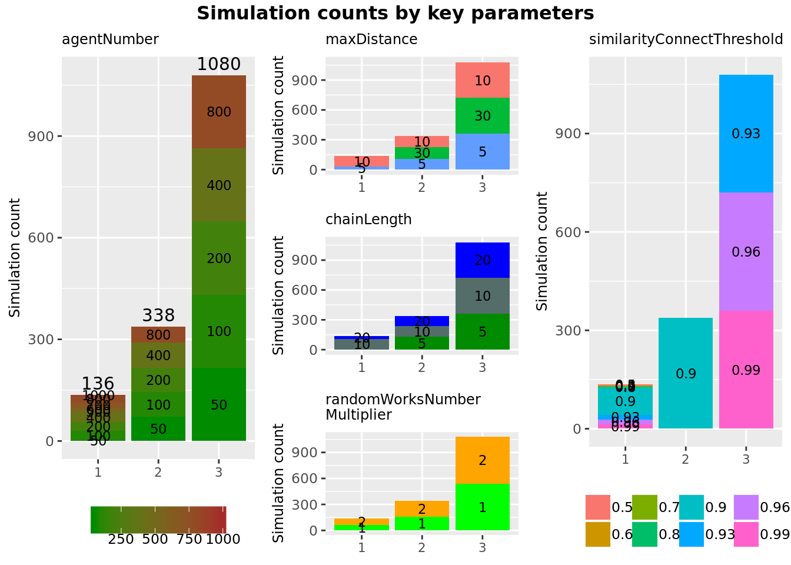

# Experiment #1: comparison of decentralized and centralized search{#experiment-one}

With this experiment we would like to see how centralized similarity search and cycle search processes perform with comparison to decentralized processes. Preliminary design of the experiment is explained [here](https://singnet.github.io/offernet/public/offernet-documentation/implementation.html#compare-decentralized-and-centralized-search).

## Setup

For that purpose we have implemented [Process #1](#process1-similarity-search) and [Process #2](#process2-find-cycles-of-changeable-items) in centralized and decentralized flavours. In order to compare them we follow these steps:

1. First, we create an Offer Network of predefined size (parameter `agentNumber`); We experiment with the random graph (where agents are randomly connected with `knows` links) and a small-world graph, where we know the diameter of the network in advance;
2. Then we artificially create a list of items which, if correctly searched and connected in the OfferNet(s) graph, would form a chain. The length of the predefined chain is set by parameter `chainLength`;
3. Items from the list are assigned to random agents in the network;
4. Then, we create a special `taskAgent` owning a `work` which, when correctly connected to the potential chain inserted into the network by step 2, closes it into a loop forming a cycle (as shown in the figure \@ref(fig:cycle-search-two-graphs)). 
5. Finally, we run the decentralized and centralized processes on the same graph and log running times of each method.

	5.1. Similarity search process connects all similar items with 'similarity' links, as explained [here]((#process1-similarity-search));

	5.2. Cycle search process is run on behalf of taskAgent and discovers the cycle inserted by step 2 (in case similarity search process correctly connected similar items) -- as explained [here](#process2-find-cycles-of-changeable-items);

	Note, that in decentralized case the all times of running the process on behalf of separate agents is aggregated.

An experiment is a series of simulations, each of which takes the following parameters:

* `agentNumber`: number of agents in the network (apart from `taskAgent`);
* `similarityConnectThreshold`: the minimum similarity value between items connected with explicit link by similarity search process;
* `chainLength`: the length of the chain inserted into the network by step 2;
* `similaritySearchThreshold`: minimal similarity of items to be considered as eligible for exchange;
* `maxDistance`: radius of agent's neighbour network when searching for similar items;
* `randomWorksNumberMultiplier`: the number of random works and items which are assigned to the agents in the network to make cycle search more realistic;

(\#fig:all-simulation-parameters)Distribution of simulation parameters of all analysed experiments ( 1050  simulations in total).

Detailed data about all experiments, simulations, their parameters and descriptive analysis of obtained results is provided in Electronic Laboratory Notebook [here](https://singnet.github.io/offernet/public/experiment-decentralized-vs-centralized/all-experiments.html). In the next two sections we discuss insights of the analysis and further steps based on them.

##  Discussion

### On decentralized versus centralized computation

As many non-trivial (and interesting) questions, the issue of whether centralized or decentralized models are "better" cannot be answered in a univocal manner. The short and not very informative answer to this question would be "it depends" -- you can always find cases and examples where one of them works better. Our goal is therefore not to answer 'yes or no' but to figure out parameters and circumstances where one or another type of model or algorithm fairs better. 

Notwithstanding what was said above, decentralized and centralized computation models are not equal in terms of their expressivity. It can be shown that centralized computation is a special case of the decentralized model. For this we have to establish a relation between non-determinism and decentralization. Recall first that any computation or a program can be expressed as a graph of atomic program steps (as nodes) and transitions between them (as links) [@turchin_concept_1986; @pennachin_i._2014]. In general any Turing machine can be represented as a graph [@laud_complexity_2011]:

(\#fig:turing-machines-as-graphs)Representing Turing machines as graphs (adapted from [@laud_complexity_2011]).

A centralized system is a system where all transitions between atomic program steps are known and controlled by a central observer -- this corresponds to the figure on the left. In a decentralized system, every atomic program has a freedom to choose any possible transition and this choice cannot be *a priori* known or controlled in any manner by the central observer -- this corresponds to the figure on the right. It is easy to see, that left image is the special case of right image, i.e. a non-deterministic / decentralized computation can be reduced to deterministic / centralized by pruning a number of links in the initial graph. 

Bottom line, is that it makes sense to start designing a computational framework or architecture based on decentralized model but allow for a centralized computation to emerge out of it rather than the other way round. Even if emergence is not considered due high computational costs and overall unpredictability, it still makes sense to use decentralized framework and represent centralized processes 'manually'.

### Sensitivity to graph topology

One of the first hypotheses that experiments seem to support is that decentralized and centralized search have very different sensibility to the underlying graph topology. That is, centralized search algorithm is more sensitive to how many agent nodes are in the graph and not on how they are connected, while decentralized search **is** sensitive to the topology of $agent \xrightarrow{\text{knows}} agent$ subgraph. This is because decentralized graph traversals continue only as deep as constrained by `maxDistance` parameters (which defines the radius of agent network to be searched -- see [setup](#setup)) and if the diameter of graph is larger than this radius, then the cycle may not be found (even though it exists in a network). It is of course possible to increase `maxDistance` parameter to the arbitrary large number, but this also may increase time of search drastically (see graph below).

<!--html_preserve-->

<script type="application/json" data-for="htmlwidget-c908cdf2adc5e9cb4d34">{"x":{"data":[{"x":[0.785000837501138,0.952988144382835,0.864022147282958,0.656542027182877,0.698417351581156,0.901881846040487,0.687694637756795,0.723149884678423,0.998188510537148,0.936281150672585,0.75069023668766,0.660937223210931,0.678302617371082,0.692657986562699,0.740770140010863,0.91325193233788,0.862876951042563,0.680409978702664,0.938825079705566,0.776674230303615,0.675187711138278,0.798717115167528,0.999071766342968,0.850409038923681,0.73950489172712,0.710099428799003,0.794291112665087,0.934325928613543,0.71721464600414,0.790270597301424,0.958276622742414,0.750909345597029,0.884288492240012,0.62346867620945,0.6544957539998,0.811371658742428,0.681471071392298,0.677770381886512,0.758422161173075,0.773084507882595,0.917908294219524,0.801600666623563,0.704520731698722,0.944346920214593,0.774286974873394,0.699708947632462,0.652758989389986,1.00134937642142,0.680072281137109,0.841222168132663,0.87938041780144,0.916529288422316,0.806018852908164,0.700903946068138,0.989627435617149,0.840643397998065,0.798633308522403,0.719998506922275,1.00983627112582,0.644768992532045,0.869979696255177,0.959872181713581,0.714113278407604,0.737686621863395,0.818860700912774,0.721581158135086,0.895830460358411,0.909828136954457,0.769629427045584,0.685342135466635,0.902932444866747,0.775468396116048,0.973321063350886,0.813472943380475,0.639945351704955,0.853407563455403,0.763493982236832,0.856424842495471,0.702428226545453,0.818014694750309,0.834968691505492,0.82525243461132,0.797824983857572,0.774458270706236,0.710472922027111,0.908716333564371,1.00986956693232,0.71764017585665,0.998560865502805,0.798304754775017,0.75322645585984,0.98987977784127,0.972482536081225,0.944779749680311,0.988003820180893,0.669905208144337,0.660142078157514,0.656638042069972,0.68158296495676,0.712182843592018,0.903619691450149,0.902839457802475,0.675486999005079,0.914250969141722,0.741102147009224,0.676903980690986,0.836415511835366,1.01249542459846,0.658506159577519,0.98691823547706,0.922299316432327,0.637770410906523,0.922494666837156,0.692170183174312,1.0038005348295,0.803733956534415,0.981041711382568,0.836839819420129,0.763024443667382,0.65592452827841,0.696462637372315,0.743460383825004,0.753285357169807,0.911892349552363,0.718424986489117,0.934945850353688,0.837854476924986,0.657806588988751,0.822303879447281,0.790176555421203,0.668860749062151,0.722126568481326,0.631158132385462,0.661382259242237,0.918745319079608,0.624927713349462,0.695761013310403,0.681758182961494,0.838527678325772,0.836980891507119,0.974938446749002,1.01168804634362,0.931643938180059,0.833579022809863,0.640872676763684,0.872817007917911,0.977459610905498,0.93465574933216,0.613777371216565,0.823783421423286,0.897768898401409,0.992101406492293,0.701039449032396,0.930681114085019,1.01210636887699,0.992290341854095,0.620352860260755,0.991674944758415,0.935982540622354,0.741166898421943,0.940264591015875,0.758332197833806,0.619590265955776,0.702205930743366,0.904289419669658,0.747050735168159,1.65535576697439,1.97838889155537,1.87120877616107,1.98540791226551,1.83817313322797,1.80729285003617,1.9251410250552,1.66966480938718,1.73692310657352,1.78928379062563,1.70674079060554,2.00119775617495,1.74182982277125,1.78541440526023,1.83675573561341,1.93844260256737,1.73946595471352,1.78858739808202,1.85596065931022,1.79105619722977,1.9530009184964,1.75716612851247,1.8483226807788,1.91539733111858,1.7828872974962,1.69581143679097,1.98753731697798,1.92329122219235,1.94837059723213,1.90412755440921,1.75357774542645,1.6158428282477,1.63155704224482,1.83668989613652,1.98489341950044,1.75045287590474,1.84198498409241,1.75646656379104,1.77068965425715,1.7846890501678,1.64766743937507,1.69147471766919,1.69868444046006,1.78398481803015,1.81360757164657,1.85229028621688,1.75532596064731,1.80031794598326,1.73119341759011,1.62423224579543,1.72208567867056,1.64494153186679,1.69290838772431,1.7311055386439,1.75233649061993,1.89825868727639,1.65152032775804,1.66697511849925,1.73119300603867,1.84636208685115,1.88746748045087,1.69108552867547,1.92462199265137,1.68987498907372,1.69846580522135,1.79275712613016,1.76606837231666,1.95804023155943,1.62690181527287,1.95431795725599,1.85138647481799,1.79709055647254,1.64192331330851,1.97727479385212,1.73208321006969,1.9168255395256,1.64451612476259,1.90315048964694,1.87343187462538,1.78487897068262,1.85868085408583,1.66812344277278,1.77846205784008,1.61506541492417,1.98634800678119,1.72084033563733,1.65269943065941,1.71075361985713,1.94087800681591,1.92728075031191,1.62136341650039,1.89693708010018,1.76538381064311,1.71996827870607,1.68240640424192,1.71291507780552,1.66052447734401,2.00393441878259,1.90286698080599,1.87663932442665,1.79254464581609,1.90477940961719,1.77429761746898,1.98982855724171,1.91508708242327,1.81925163650885,2.00825020214543,1.65404260680079,1.96088391477242,1.86758872624487,2.00479981936514,1.75992629267275,1.97490883758292,1.97528593279421,1.78442658614367,1.88751519899815,1.86131249656901,1.91251549171284,1.99250360950828,1.74594854218885,1.91946646040305,1.87494471613318,1.95722115328535,1.91763068279251,1.84388376604766,1.61608546702191,1.71001830687746,1.93651834679767,1.66056205984205,1.94772898098454,2.00765097783878,1.89083840819076,1.64974857298657,1.86191873084754,2.01056058723479,1.88759774705395,1.89187158579007,1.9580035187304,1.92267258791253,1.79206456309184,1.61427875095978,1.91865194998682,1.79423198532313,1.64813730204478,1.64399684192613,1.61662590904161,1.85653705885634,1.63327094297856,1.74738720273599,1.70182219753042,1.83077799025923,1.94554942119867,1.69258290277794,1.6991756641306,1.79062934042886,1.74129289807752,1.76303224153817,1.619696328789,1.7647494032979,1.97474131239578,1.69667704775929,1.72193918395787,1.91316106012091,1.70826194826514,1.62376872589812,1.63210157742724,2.00896452246234,1.92995085790753,1.7460798653774,1.99879133393988,1.95619756039232,1.73121912227944,1.76395676247776,1.89365193303674,1.94555621314794,1.87080884547904,1.79673156840727,1.86039500236511,1.78174569671974,1.78720186594874,1.86567365704104,1.87312044166028,1.91566073168069,1.98408326655626,1.69418420223519,1.90807273611426,1.99594494123012,1.97171761915088,1.74308791318908,1.67483953088522,1.68430603304878,1.74813916422427,1.6187048478052,1.92133327303454,1.73219967093319,1.96513015367091,1.66956469528377,1.99566875658929,1.85883275968954,1.98236228795722,1.85894183274359,1.98292415728793,1.954246500507,1.64939438188449,1.73651419132948,1.64088830817491,1.64830287508667,1.68740924848244,1.78447570810094,1.82331882826984,1.73223792035133,2.00762527547777,1.62819574410096,1.69966745590791,2.69601251585409,2.71693330425769,2.79336461098865,2.96300302641466,2.68033940717578,2.9773808227852,2.94352485751733,2.85202377382666,2.70355120077729,2.94313831441104,2.77248021801934,2.91870267419145,2.85113551421091,2.68992893397808,2.85361876320094,2.85793177792802,2.98352431962267,2.77204003017396,2.77434364398941,2.88172598965466,2.93705631364137,2.89501556074247,2.63810197198764,2.91926904376596,2.74735356066376,2.90302066002041,2.90138529334217,2.65911534968764,2.99410153487697,2.68727712128311,2.76012066891417,2.65132341170683,2.95257416209206,2.74742520581931,2.89711852585897,2.67907023318112,2.90242929523811,2.6859899350442,2.81436478812248,2.70379569707438,2.92948424825445,2.71250931126997,2.94967259224504,2.84075738238171,2.68465634072199,2.85957797728479,2.93765515694395,2.76526060560718,2.96352061619982,2.6803188059479,3.00995443714783,2.75925572756678,2.96321870544925,2.95510631790385,2.768146991916,2.66727426517755,2.97218001494184,3.00224568238482,2.65219560014084,2.96312436843291,2.91046478236094,2.72736317636445,2.79563031392172,2.90586127694696,2.62800263352692,2.92677530087531,2.81337014678866,2.66220978843048,2.92924918420613,2.73820027839392,2.80919030886143,3.00461026597768,2.77953571164981,2.62914492692798,2.87944690901786,2.79430383173749,2.73398978747427,2.71415862496942,2.85130880307406,2.63583256192505,2.93775018472224,2.82666716948152,2.61277724774554,2.68490514606237,2.7691326954402,2.86579889077693,2.89551197532564,2.92481796713546,2.64807223994285,2.7873969996348,2.6518452920951,2.64834710173309,2.81694997502491,2.97835301235318,2.78624267289415,2.62626524772495,2.63297894187272,2.81668012617156,2.73799757007509,2.70168904382736,3.00935217803344,2.66582650355995,2.69905453929678,2.75234323423356,2.79354364024475,2.74987966595218,2.6610735709779,2.69012766238302,2.91650758208707,2.75009892666712,3.00013437280431,2.64135485496372,2.74111674055457,2.99924160744995,2.74628974702209,2.79856312470511,2.81823945362121,2.67248365227133,2.62122391164303,2.87091900995001,2.95878846067935,2.89439078075811,2.84502962902188,2.91728901192546,2.84673130717128,2.88992490312085,2.82118901498616,2.6757020319812,2.70355270430446,2.89121155925095,2.70541894454509,2.87761519895867,2.6839832989499,2.9175695752725,2.67665051696822,2.66565157994628,2.7258407684043,2.91091566355899,2.61736404597759,2.69643834447488,2.93339695669711,2.77710728626698,2.86790493959561,3.00227120229974,2.81202459223568,2.93604978276417,2.71177476998419,2.78891996489838,2.7847518818453,2.88936665058136,2.78074207389727,2.72089080968872,2.97791129164398,2.94530885964632,2.94380534915254,2.91084771510214,2.90460530817509,2.64824815960601,2.79552633110434],"y":[4.25891666666667,0.864583333333333,1.08965,4.9487,4.3407,24.1201166666667,4.87353333333333,26.5259333333333,46.41885,33.5931,24.6729166666667,60.20735,26.3878,1.4548,1.71753333333333,0.331516666666667,0.2914,1.34156666666667,1.34205,0.5211,0.473316666666667,1.86016666666667,1.79705,0.31565,0.240533333333333,1.14128333333333,1.05868333333333,2.33146666666667,2.07305,11.515,11.3993333333333,2.59111666666667,2.24576666666667,11.16205,11.0130833333333,1.39551666666667,1.32055,7.28735,7.04163333333333,12.6294166666667,68.4632666666667,60.2287333333333,12.0211833333333,87.2164333333333,60.3863,16.7419166666667,15.9072166666667,10.1636166666667,9.65391666666667,57.83155,59.20205,81.1628666666667,63.1609333333333,17.07675,61.0788166666667,16.4895166666667,21.0331166666667,23.7983166666667,64.6452,60.80415,24.98475,25.8829333333333,64.9391833333333,60.3070166666667,64.3503,60.5025,4.20703333333333,61.3371666666667,3.76693333333333,1.52681666666667,0.215633333333333,0.705166666666667,0.676816666666667,0.21425,0.287566666666667,0.2745,0.851283333333333,0.846616666666667,0.158683333333333,0.1636,0.633916666666667,0.643316666666667,0.665366666666667,0.681683333333333,2.56021666666667,2.68073333333333,0.873716666666667,0.827466666666667,2.9172,2.96296666666667,0.6323,0.61045,2.5538,2.4509,2.80718333333333,2.84243333333333,12.01095,12.5407666666667,3.28335,3.37906666666667,13.3905166666667,14.2704833333333,2.56963333333333,11.2506166666667,11.3616,2.57785,14.2341666666667,14.45025,61.2961666666667,60.0935166666667,16.59185,16.8475,64.7881833333333,60.12945,12.5115666666667,13.1071666666667,59.2869,60.08825,46.8584166666667,48.95525,2.21536666666667,1.33415,47.578,49.44685,2.2275,3.83423333333333,44.9942333333333,47.9900166666667,61.1072333333333,60.2371833333333,0.218533333333333,0.211583333333333,0.900483333333333,0.8542,0.335683333333333,0.3197,1.04766666666667,1.00443333333333,0.797333333333333,0.194933333333333,0.195633333333333,0.799716666666667,4.04691666666667,0.9731,0.915633333333333,4.00761666666667,1.23233333333333,1.13871666666667,4.72023333333333,4.89053333333333,0.856883333333333,0.823416666666667,3.57596666666667,3.59678333333333,4.73828333333333,4.77803333333333,23.8064166666667,24.91165,5.93901666666667,5.8198,27.8718166666667,29.3255,4.19675,4.13411666666667,21.1345,21.9960333333333,12.9345666666667,14.1484166666667,4.28695,0.8756,1.11501666666667,4.95726666666667,76.04855,81.8205666666667,4.26466666666667,24.81605,4.86948333333333,26.6231333333333,49.8389333333333,29.9891833333333,24.7931333333333,60.1732666666667,26.7074166666667,60.2680666666667,366.1479,366.147116666667,186.874983333333,7.65033333333333,63.7704833333333,0.995916666666667,4.70681666666667,12.6958833333333,10.9085,9.5543,7.165,4.69328333333333,27.51125,63.86105,75.1176166666667,27.8705166666667,22.0603666666667,16.3033166666667,9.49923333333333,49.84715,40.0251,29.35145,16.156,60.1021,60.0693833333333,46.31235,24.7682166666667,64.20465,60.0572166666667,35.8899833333333,60.1351833333333,60.98345,61.1433166666667,60.39095,60.6063666666667,62.9815,61.5992,60.1179666666667,50.1176666666667,61.61695,69.8621833333333,60.4004,62.0784,0.30255,0.315466666666667,1.34081666666667,1.31803333333333,0.470733333333333,0.485766666666667,1.89308333333333,1.83091666666667,0.24695,0.233266666666667,1.06738333333333,1.12673333333333,2.23305,2.0675,11.9825,11.5159666666667,2.41645,2.30073333333333,11.0896333333333,11.2844166666667,1.32096666666667,1.31866666666667,9.7725,9.78201666666667,12.4813,12.2764,62.4251333333333,60.1991,16.3945333333333,16.1029166666667,82.0789,60.4446666666667,9.97246666666667,9.86483333333333,60.3273,60.1435333333333,65.5629666666667,61.7396166666667,15.3915166666667,61.2024,60.1296166666667,23.61765,24.6832666666667,11.1478166666667,25.9427333333333,26.16605,2.43408333333333,60.2624166666667,3.23438333333333,60.1750666666667,5.83051666666667,71.8132333333333,3.14021666666667,5.27385,74.4459,2.37445,61.1516166666667,0.197033333333333,0.18465,0.673783333333333,0.695966666666667,0.272716666666667,0.2847,0.882816666666667,0.856183333333333,0.160333333333333,0.144383333333333,0.646516666666667,0.627983333333333,0.682216666666667,0.694266666666667,2.63941666666667,2.6584,0.81075,0.871733333333333,2.95076666666667,2.96868333333333,0.64745,0.621166666666667,2.43261666666667,2.42878333333333,2.9404,2.90743333333333,12.6637166666667,12.7834166666667,13.9959166666667,3.4287,3.46413333333333,13.7816666666667,11.4377166666667,11.7882,2.646,2.65775,14.4032,14.7709833333333,60.5550833333333,60.0541166666667,65.1655833333333,60.09755,17.2012833333333,17.17695,12.9816166666667,13.1687333333333,62.07815,60.0465166666667,48.4802166666667,60.4183833333333,61.1694666666667,49.5516,48.7657166666667,48.5152333333333,5.21495,60.2589333333333,82.4638,47.1439666666667,48.4046666666667,3.49553333333333,0.233566666666667,0.23525,0.827116666666667,0.868,0.33175,0.307966666666667,1.0531,1.05185,0.8205,0.809783333333333,0.189116666666667,0.183533333333333,4.01523333333333,4.0036,0.934633333333333,0.910583333333333,1.18038333333333,1.17236666666667,4.80206666666667,4.71276666666667,0.8127,0.7773,3.61723333333333,3.56248333333333,4.81835,4.76151666666667,24.9209166666667,24.9245166666667,29.6054333333333,5.88428333333333,5.95415,30.1292,4.19025,4.21273333333333,21.8436666666667,22.30115,12.5018333333333,27.28565,81.06865,87.4805833333333,233.232016666667,239.753033333333,0.29715,0.3175,1.32691666666667,1.34345,0.481433333333333,0.48805,1.85348333333333,1.82628333333333,0.22535,0.234533333333333,1.11361666666667,1.11138333333333,2.24245,2.20198333333333,9.14883333333333,9.18066666666667,2.42508333333333,2.44218333333333,11.8647166666667,11.6546166666667,1.34846666666667,1.31996666666667,9.91038333333333,10.0621166666667,12.5512,12.6097833333333,60.2245333333333,60.20555,16.6237833333333,17.0128666666667,60.3977666666667,60.5190666666667,9.89596666666667,10.7805666666667,60.1661333333333,61.4039,60.2329666666667,60.3000333333333,69.7565666666667,71.1688833333333,60.1501666666667,60.1811166666667,27.0067666666667,27.18935,25.9429166666667,26.5044333333333,60.3121333333333,60.2629,60.14445,87.33175,60.1775166666667,70.88775,60.5975,62.8746666666667,69.7833666666667,61.4704,72.4119833333333,0.2124,0.195633333333333,0.672766666666667,0.680183333333333,0.301716666666667,0.262183333333333,0.859516666666667,0.8369,0.150816666666667,0.153916666666667,0.618483333333333,0.669716666666667,0.710866666666667,0.6852,2.77051666666667,2.73811666666667,0.8453,0.8104,2.98993333333333,3.00646666666667,0.62475,0.61565,2.5679,2.51326666666667,2.85286666666667,2.98265,12.6915333333333,12.8255666666667,14.2343666666667,14.0957333333333,3.49586666666667,3.42376666666667,11.5851166666667,11.6722,2.66583333333333,2.62363333333333,14.9458833333333,14.8883666666667,60.0676666666667,60.6949,60.1488,60.1173833333333,17.25385,17.6827,60.0396666666667,60.0582333333333,13.6134833333333,13.4267166666667,49.506,48.9227333333333,60.17295,70.4836166666667,49.5312166666667,50.0299666666667,61.10225,60.3389333333333,92.5317666666667,60.07655,47.84345,50.9487666666667,0.24075,0.235683333333333,0.84625,0.83505,0.3221,0.32145,1.10145,1.1042,0.7901,0.739133333333333,0.202783333333333,0.193366666666667,4.12093333333333,4.10293333333333,0.95315,0.928433333333333,1.16806666666667,1.18185,4.87688333333333,4.8916,0.76815,0.779116666666667,3.54728333333333,3.57993333333333,4.8948,4.91191666666667,25.3282333333333,25.57055,29.6605833333333,30.29325,5.95198333333333,6.07603333333333,4.11136666666667,4.21761666666667,22.4718,22.66075],"text":["maxDistance: 5 sum_wallTime_min_total: 4.258917e+00 simulationType: Centralized","maxDistance: 5 sum_wallTime_min_total: 8.645833e-01 simulationType: Centralized","maxDistance: 5 sum_wallTime_min_total: 1.089650e+00 simulationType: Centralized","maxDistance: 5 sum_wallTime_min_total: 4.948700e+00 simulationType: Centralized","maxDistance: 5 sum_wallTime_min_total: 4.340700e+00 simulationType: Centralized","maxDistance: 5 sum_wallTime_min_total: 2.412012e+01 simulationType: Centralized","maxDistance: 5 sum_wallTime_min_total: 4.873533e+00 simulationType: Centralized","maxDistance: 5 sum_wallTime_min_total: 2.652593e+01 simulationType: Centralized","maxDistance: 5 sum_wallTime_min_total: 4.641885e+01 simulationType: Centralized","maxDistance: 5 sum_wallTime_min_total: 3.359310e+01 simulationType: Centralized","maxDistance: 5 sum_wallTime_min_total: 2.467292e+01 simulationType: Centralized","maxDistance: 5 sum_wallTime_min_total: 6.020735e+01 simulationType: Centralized","maxDistance: 5 sum_wallTime_min_total: 2.638780e+01 simulationType: Centralized","maxDistance: 5 sum_wallTime_min_total: 1.454800e+00 simulationType: Centralized","maxDistance: 5 sum_wallTime_min_total: 1.717533e+00 simulationType: Centralized","maxDistance: 5 sum_wallTime_min_total: 3.315167e-01 simulationType: Centralized","maxDistance: 5 sum_wallTime_min_total: 2.914000e-01 simulationType: Centralized","maxDistance: 5 sum_wallTime_min_total: 1.341567e+00 simulationType: Centralized","maxDistance: 5 sum_wallTime_min_total: 1.342050e+00 simulationType: Centralized","maxDistance: 5 sum_wallTime_min_total: 5.211000e-01 simulationType: Centralized","maxDistance: 5 sum_wallTime_min_total: 4.733167e-01 simulationType: Centralized","maxDistance: 5 sum_wallTime_min_total: 1.860167e+00 simulationType: Centralized","maxDistance: 5 sum_wallTime_min_total: 1.797050e+00 simulationType: Centralized","maxDistance: 5 sum_wallTime_min_total: 3.156500e-01 simulationType: Centralized","maxDistance: 5 sum_wallTime_min_total: 2.405333e-01 simulationType: Centralized","maxDistance: 5 sum_wallTime_min_total: 1.141283e+00 simulationType: Centralized","maxDistance: 5 sum_wallTime_min_total: 1.058683e+00 simulationType: Centralized","maxDistance: 5 sum_wallTime_min_total: 2.331467e+00 simulationType: Centralized","maxDistance: 5 sum_wallTime_min_total: 2.073050e+00 simulationType: Centralized","maxDistance: 5 sum_wallTime_min_total: 1.151500e+01 simulationType: Centralized","maxDistance: 5 sum_wallTime_min_total: 1.139933e+01 simulationType: Centralized","maxDistance: 5 sum_wallTime_min_total: 2.591117e+00 simulationType: Centralized","maxDistance: 5 sum_wallTime_min_total: 2.245767e+00 simulationType: Centralized","maxDistance: 5 sum_wallTime_min_total: 1.116205e+01 simulationType: Centralized","maxDistance: 5 sum_wallTime_min_total: 1.101308e+01 simulationType: Centralized","maxDistance: 5 sum_wallTime_min_total: 1.395517e+00 simulationType: Centralized","maxDistance: 5 sum_wallTime_min_total: 1.320550e+00 simulationType: Centralized","maxDistance: 5 sum_wallTime_min_total: 7.287350e+00 simulationType: Centralized","maxDistance: 5 sum_wallTime_min_total: 7.041633e+00 simulationType: Centralized","maxDistance: 5 sum_wallTime_min_total: 1.262942e+01 simulationType: Centralized","maxDistance: 5 sum_wallTime_min_total: 6.846327e+01 simulationType: Centralized","maxDistance: 5 sum_wallTime_min_total: 6.022873e+01 simulationType: Centralized","maxDistance: 5 sum_wallTime_min_total: 1.202118e+01 simulationType: Centralized","maxDistance: 5 sum_wallTime_min_total: 8.721643e+01 simulationType: Centralized","maxDistance: 5 sum_wallTime_min_total: 6.038630e+01 simulationType: Centralized","maxDistance: 5 sum_wallTime_min_total: 1.674192e+01 simulationType: Centralized","maxDistance: 5 sum_wallTime_min_total: 1.590722e+01 simulationType: Centralized","maxDistance: 5 sum_wallTime_min_total: 1.016362e+01 simulationType: Centralized","maxDistance: 5 sum_wallTime_min_total: 9.653917e+00 simulationType: Centralized","maxDistance: 5 sum_wallTime_min_total: 5.783155e+01 simulationType: Centralized","maxDistance: 5 sum_wallTime_min_total: 5.920205e+01 simulationType: Centralized","maxDistance: 5 sum_wallTime_min_total: 8.116287e+01 simulationType: Centralized","maxDistance: 5 sum_wallTime_min_total: 6.316093e+01 simulationType: Centralized","maxDistance: 5 sum_wallTime_min_total: 1.707675e+01 simulationType: Centralized","maxDistance: 5 sum_wallTime_min_total: 6.107882e+01 simulationType: Centralized","maxDistance: 5 sum_wallTime_min_total: 1.648952e+01 simulationType: Centralized","maxDistance: 5 sum_wallTime_min_total: 2.103312e+01 simulationType: Centralized","maxDistance: 5 sum_wallTime_min_total: 2.379832e+01 simulationType: Centralized","maxDistance: 5 sum_wallTime_min_total: 6.464520e+01 simulationType: Centralized","maxDistance: 5 sum_wallTime_min_total: 6.080415e+01 simulationType: Centralized","maxDistance: 5 sum_wallTime_min_total: 2.498475e+01 simulationType: Centralized","maxDistance: 5 sum_wallTime_min_total: 2.588293e+01 simulationType: Centralized","maxDistance: 5 sum_wallTime_min_total: 6.493918e+01 simulationType: Centralized","maxDistance: 5 sum_wallTime_min_total: 6.030702e+01 simulationType: Centralized","maxDistance: 5 sum_wallTime_min_total: 6.435030e+01 simulationType: Centralized","maxDistance: 5 sum_wallTime_min_total: 6.050250e+01 simulationType: Centralized","maxDistance: 5 sum_wallTime_min_total: 4.207033e+00 simulationType: Centralized","maxDistance: 5 sum_wallTime_min_total: 6.133717e+01 simulationType: Centralized","maxDistance: 5 sum_wallTime_min_total: 3.766933e+00 simulationType: Centralized","maxDistance: 5 sum_wallTime_min_total: 1.526817e+00 simulationType: Centralized","maxDistance: 5 sum_wallTime_min_total: 2.156333e-01 simulationType: Centralized","maxDistance: 5 sum_wallTime_min_total: 7.051667e-01 simulationType: Centralized","maxDistance: 5 sum_wallTime_min_total: 6.768167e-01 simulationType: Centralized","maxDistance: 5 sum_wallTime_min_total: 2.142500e-01 simulationType: Centralized","maxDistance: 5 sum_wallTime_min_total: 2.875667e-01 simulationType: Centralized","maxDistance: 5 sum_wallTime_min_total: 2.745000e-01 simulationType: Centralized","maxDistance: 5 sum_wallTime_min_total: 8.512833e-01 simulationType: Centralized","maxDistance: 5 sum_wallTime_min_total: 8.466167e-01 simulationType: Centralized","maxDistance: 5 sum_wallTime_min_total: 1.586833e-01 simulationType: Centralized","maxDistance: 5 sum_wallTime_min_total: 1.636000e-01 simulationType: Centralized","maxDistance: 5 sum_wallTime_min_total: 6.339167e-01 simulationType: Centralized","maxDistance: 5 sum_wallTime_min_total: 6.433167e-01 simulationType: Centralized","maxDistance: 5 sum_wallTime_min_total: 6.653667e-01 simulationType: Centralized","maxDistance: 5 sum_wallTime_min_total: 6.816833e-01 simulationType: Centralized","maxDistance: 5 sum_wallTime_min_total: 2.560217e+00 simulationType: Centralized","maxDistance: 5 sum_wallTime_min_total: 2.680733e+00 simulationType: Centralized","maxDistance: 5 sum_wallTime_min_total: 8.737167e-01 simulationType: Centralized","maxDistance: 5 sum_wallTime_min_total: 8.274667e-01 simulationType: Centralized","maxDistance: 5 sum_wallTime_min_total: 2.917200e+00 simulationType: Centralized","maxDistance: 5 sum_wallTime_min_total: 2.962967e+00 simulationType: Centralized","maxDistance: 5 sum_wallTime_min_total: 6.323000e-01 simulationType: Centralized","maxDistance: 5 sum_wallTime_min_total: 6.104500e-01 simulationType: Centralized","maxDistance: 5 sum_wallTime_min_total: 2.553800e+00 simulationType: Centralized","maxDistance: 5 sum_wallTime_min_total: 2.450900e+00 simulationType: Centralized","maxDistance: 5 sum_wallTime_min_total: 2.807183e+00 simulationType: Centralized","maxDistance: 5 sum_wallTime_min_total: 2.842433e+00 simulationType: Centralized","maxDistance: 5 sum_wallTime_min_total: 1.201095e+01 simulationType: Centralized","maxDistance: 5 sum_wallTime_min_total: 1.254077e+01 simulationType: Centralized","maxDistance: 5 sum_wallTime_min_total: 3.283350e+00 simulationType: Centralized","maxDistance: 5 sum_wallTime_min_total: 3.379067e+00 simulationType: Centralized","maxDistance: 5 sum_wallTime_min_total: 1.339052e+01 simulationType: Centralized","maxDistance: 5 sum_wallTime_min_total: 1.427048e+01 simulationType: Centralized","maxDistance: 5 sum_wallTime_min_total: 2.569633e+00 simulationType: Centralized","maxDistance: 5 sum_wallTime_min_total: 1.125062e+01 simulationType: Centralized","maxDistance: 5 sum_wallTime_min_total: 1.136160e+01 simulationType: Centralized","maxDistance: 5 sum_wallTime_min_total: 2.577850e+00 simulationType: Centralized","maxDistance: 5 sum_wallTime_min_total: 1.423417e+01 simulationType: Centralized","maxDistance: 5 sum_wallTime_min_total: 1.445025e+01 simulationType: Centralized","maxDistance: 5 sum_wallTime_min_total: 6.129617e+01 simulationType: Centralized","maxDistance: 5 sum_wallTime_min_total: 6.009352e+01 simulationType: Centralized","maxDistance: 5 sum_wallTime_min_total: 1.659185e+01 simulationType: Centralized","maxDistance: 5 sum_wallTime_min_total: 1.684750e+01 simulationType: Centralized","maxDistance: 5 sum_wallTime_min_total: 6.478818e+01 simulationType: Centralized","maxDistance: 5 sum_wallTime_min_total: 6.012945e+01 simulationType: Centralized","maxDistance: 5 sum_wallTime_min_total: 1.251157e+01 simulationType: Centralized","maxDistance: 5 sum_wallTime_min_total: 1.310717e+01 simulationType: Centralized","maxDistance: 5 sum_wallTime_min_total: 5.928690e+01 simulationType: Centralized","maxDistance: 5 sum_wallTime_min_total: 6.008825e+01 simulationType: Centralized","maxDistance: 5 sum_wallTime_min_total: 4.685842e+01 simulationType: Centralized","maxDistance: 5 sum_wallTime_min_total: 4.895525e+01 simulationType: Centralized","maxDistance: 5 sum_wallTime_min_total: 2.215367e+00 simulationType: Centralized","maxDistance: 5 sum_wallTime_min_total: 1.334150e+00 simulationType: Centralized","maxDistance: 5 sum_wallTime_min_total: 4.757800e+01 simulationType: Centralized","maxDistance: 5 sum_wallTime_min_total: 4.944685e+01 simulationType: Centralized","maxDistance: 5 sum_wallTime_min_total: 2.227500e+00 simulationType: Centralized","maxDistance: 5 sum_wallTime_min_total: 3.834233e+00 simulationType: Centralized","maxDistance: 5 sum_wallTime_min_total: 4.499423e+01 simulationType: Centralized","maxDistance: 5 sum_wallTime_min_total: 4.799002e+01 simulationType: Centralized","maxDistance: 5 sum_wallTime_min_total: 6.110723e+01 simulationType: Centralized","maxDistance: 5 sum_wallTime_min_total: 6.023718e+01 simulationType: Centralized","maxDistance: 5 sum_wallTime_min_total: 2.185333e-01 simulationType: Centralized","maxDistance: 5 sum_wallTime_min_total: 2.115833e-01 simulationType: Centralized","maxDistance: 5 sum_wallTime_min_total: 9.004833e-01 simulationType: Centralized","maxDistance: 5 sum_wallTime_min_total: 8.542000e-01 simulationType: Centralized","maxDistance: 5 sum_wallTime_min_total: 3.356833e-01 simulationType: Centralized","maxDistance: 5 sum_wallTime_min_total: 3.197000e-01 simulationType: Centralized","maxDistance: 5 sum_wallTime_min_total: 1.047667e+00 simulationType: Centralized","maxDistance: 5 sum_wallTime_min_total: 1.004433e+00 simulationType: Centralized","maxDistance: 5 sum_wallTime_min_total: 7.973333e-01 simulationType: Centralized","maxDistance: 5 sum_wallTime_min_total: 1.949333e-01 simulationType: Centralized","maxDistance: 5 sum_wallTime_min_total: 1.956333e-01 simulationType: Centralized","maxDistance: 5 sum_wallTime_min_total: 7.997167e-01 simulationType: Centralized","maxDistance: 5 sum_wallTime_min_total: 4.046917e+00 simulationType: Centralized","maxDistance: 5 sum_wallTime_min_total: 9.731000e-01 simulationType: Centralized","maxDistance: 5 sum_wallTime_min_total: 9.156333e-01 simulationType: Centralized","maxDistance: 5 sum_wallTime_min_total: 4.007617e+00 simulationType: Centralized","maxDistance: 5 sum_wallTime_min_total: 1.232333e+00 simulationType: Centralized","maxDistance: 5 sum_wallTime_min_total: 1.138717e+00 simulationType: Centralized","maxDistance: 5 sum_wallTime_min_total: 4.720233e+00 simulationType: Centralized","maxDistance: 5 sum_wallTime_min_total: 4.890533e+00 simulationType: Centralized","maxDistance: 5 sum_wallTime_min_total: 8.568833e-01 simulationType: Centralized","maxDistance: 5 sum_wallTime_min_total: 8.234167e-01 simulationType: Centralized","maxDistance: 5 sum_wallTime_min_total: 3.575967e+00 simulationType: Centralized","maxDistance: 5 sum_wallTime_min_total: 3.596783e+00 simulationType: Centralized","maxDistance: 5 sum_wallTime_min_total: 4.738283e+00 simulationType: Centralized","maxDistance: 5 sum_wallTime_min_total: 4.778033e+00 simulationType: Centralized","maxDistance: 5 sum_wallTime_min_total: 2.380642e+01 simulationType: Centralized","maxDistance: 5 sum_wallTime_min_total: 2.491165e+01 simulationType: Centralized","maxDistance: 5 sum_wallTime_min_total: 5.939017e+00 simulationType: Centralized","maxDistance: 5 sum_wallTime_min_total: 5.819800e+00 simulationType: Centralized","maxDistance: 5 sum_wallTime_min_total: 2.787182e+01 simulationType: Centralized","maxDistance: 5 sum_wallTime_min_total: 2.932550e+01 simulationType: Centralized","maxDistance: 5 sum_wallTime_min_total: 4.196750e+00 simulationType: Centralized","maxDistance: 5 sum_wallTime_min_total: 4.134117e+00 simulationType: Centralized","maxDistance: 5 sum_wallTime_min_total: 2.113450e+01 simulationType: Centralized","maxDistance: 5 sum_wallTime_min_total: 2.199603e+01 simulationType: Centralized","maxDistance: 10 sum_wallTime_min_total: 1.293457e+01 simulationType: Centralized","maxDistance: 10 sum_wallTime_min_total: 1.414842e+01 simulationType: Centralized","maxDistance: 10 sum_wallTime_min_total: 4.286950e+00 simulationType: Centralized","maxDistance: 10 sum_wallTime_min_total: 8.756000e-01 simulationType: Centralized","maxDistance: 10 sum_wallTime_min_total: 1.115017e+00 simulationType: Centralized","maxDistance: 10 sum_wallTime_min_total: 4.957267e+00 simulationType: Centralized","maxDistance: 10 sum_wallTime_min_total: 7.604855e+01 simulationType: Centralized","maxDistance: 10 sum_wallTime_min_total: 8.182057e+01 simulationType: Centralized","maxDistance: 10 sum_wallTime_min_total: 4.264667e+00 simulationType: Centralized","maxDistance: 10 sum_wallTime_min_total: 2.481605e+01 simulationType: Centralized","maxDistance: 10 sum_wallTime_min_total: 4.869483e+00 simulationType: Centralized","maxDistance: 10 sum_wallTime_min_total: 2.662313e+01 simulationType: Centralized","maxDistance: 10 sum_wallTime_min_total: 4.983893e+01 simulationType: Centralized","maxDistance: 10 sum_wallTime_min_total: 2.998918e+01 simulationType: Centralized","maxDistance: 10 sum_wallTime_min_total: 2.479313e+01 simulationType: Centralized","maxDistance: 10 sum_wallTime_min_total: 6.017327e+01 simulationType: Centralized","maxDistance: 10 sum_wallTime_min_total: 2.670742e+01 simulationType: Centralized","maxDistance: 10 sum_wallTime_min_total: 6.026807e+01 simulationType: Centralized","maxDistance: 10 sum_wallTime_min_total: 3.661479e+02 simulationType: Centralized","maxDistance: 10 sum_wallTime_min_total: 3.661471e+02 simulationType: Centralized","maxDistance: 10 sum_wallTime_min_total: 1.868750e+02 simulationType: Centralized","maxDistance: 10 sum_wallTime_min_total: 7.650333e+00 simulationType: Centralized","maxDistance: 10 sum_wallTime_min_total: 6.377048e+01 simulationType: Centralized","maxDistance: 10 sum_wallTime_min_total: 9.959167e-01 simulationType: Centralized","maxDistance: 10 sum_wallTime_min_total: 4.706817e+00 simulationType: Centralized","maxDistance: 10 sum_wallTime_min_total: 1.269588e+01 simulationType: Centralized","maxDistance: 10 sum_wallTime_min_total: 1.090850e+01 simulationType: Centralized","maxDistance: 10 sum_wallTime_min_total: 9.554300e+00 simulationType: Centralized","maxDistance: 10 sum_wallTime_min_total: 7.165000e+00 simulationType: Centralized","maxDistance: 10 sum_wallTime_min_total: 4.693283e+00 simulationType: Centralized","maxDistance: 10 sum_wallTime_min_total: 2.751125e+01 simulationType: Centralized","maxDistance: 10 sum_wallTime_min_total: 6.386105e+01 simulationType: Centralized","maxDistance: 10 sum_wallTime_min_total: 7.511762e+01 simulationType: Centralized","maxDistance: 10 sum_wallTime_min_total: 2.787052e+01 simulationType: Centralized","maxDistance: 10 sum_wallTime_min_total: 2.206037e+01 simulationType: Centralized","maxDistance: 10 sum_wallTime_min_total: 1.630332e+01 simulationType: Centralized","maxDistance: 10 sum_wallTime_min_total: 9.499233e+00 simulationType: Centralized","maxDistance: 10 sum_wallTime_min_total: 4.984715e+01 simulationType: Centralized","maxDistance: 10 sum_wallTime_min_total: 4.002510e+01 simulationType: Centralized","maxDistance: 10 sum_wallTime_min_total: 2.935145e+01 simulationType: Centralized","maxDistance: 10 sum_wallTime_min_total: 1.615600e+01 simulationType: Centralized","maxDistance: 10 sum_wallTime_min_total: 6.010210e+01 simulationType: Centralized","maxDistance: 10 sum_wallTime_min_total: 6.006938e+01 simulationType: Centralized","maxDistance: 10 sum_wallTime_min_total: 4.631235e+01 simulationType: Centralized","maxDistance: 10 sum_wallTime_min_total: 2.476822e+01 simulationType: Centralized","maxDistance: 10 sum_wallTime_min_total: 6.420465e+01 simulationType: Centralized","maxDistance: 10 sum_wallTime_min_total: 6.005722e+01 simulationType: Centralized","maxDistance: 10 sum_wallTime_min_total: 3.588998e+01 simulationType: Centralized","maxDistance: 10 sum_wallTime_min_total: 6.013518e+01 simulationType: Centralized","maxDistance: 10 sum_wallTime_min_total: 6.098345e+01 simulationType: Centralized","maxDistance: 10 sum_wallTime_min_total: 6.114332e+01 simulationType: Centralized","maxDistance: 10 sum_wallTime_min_total: 6.039095e+01 simulationType: Centralized","maxDistance: 10 sum_wallTime_min_total: 6.060637e+01 simulationType: Centralized","maxDistance: 10 sum_wallTime_min_total: 6.298150e+01 simulationType: Centralized","maxDistance: 10 sum_wallTime_min_total: 6.159920e+01 simulationType: Centralized","maxDistance: 10 sum_wallTime_min_total: 6.011797e+01 simulationType: Centralized","maxDistance: 10 sum_wallTime_min_total: 5.011767e+01 simulationType: Centralized","maxDistance: 10 sum_wallTime_min_total: 6.161695e+01 simulationType: Centralized","maxDistance: 10 sum_wallTime_min_total: 6.986218e+01 simulationType: Centralized","maxDistance: 10 sum_wallTime_min_total: 6.040040e+01 simulationType: Centralized","maxDistance: 10 sum_wallTime_min_total: 6.207840e+01 simulationType: Centralized","maxDistance: 10 sum_wallTime_min_total: 3.025500e-01 simulationType: Centralized","maxDistance: 10 sum_wallTime_min_total: 3.154667e-01 simulationType: Centralized","maxDistance: 10 sum_wallTime_min_total: 1.340817e+00 simulationType: Centralized","maxDistance: 10 sum_wallTime_min_total: 1.318033e+00 simulationType: Centralized","maxDistance: 10 sum_wallTime_min_total: 4.707333e-01 simulationType: Centralized","maxDistance: 10 sum_wallTime_min_total: 4.857667e-01 simulationType: Centralized","maxDistance: 10 sum_wallTime_min_total: 1.893083e+00 simulationType: Centralized","maxDistance: 10 sum_wallTime_min_total: 1.830917e+00 simulationType: Centralized","maxDistance: 10 sum_wallTime_min_total: 2.469500e-01 simulationType: Centralized","maxDistance: 10 sum_wallTime_min_total: 2.332667e-01 simulationType: Centralized","maxDistance: 10 sum_wallTime_min_total: 1.067383e+00 simulationType: Centralized","maxDistance: 10 sum_wallTime_min_total: 1.126733e+00 simulationType: Centralized","maxDistance: 10 sum_wallTime_min_total: 2.233050e+00 simulationType: Centralized","maxDistance: 10 sum_wallTime_min_total: 2.067500e+00 simulationType: Centralized","maxDistance: 10 sum_wallTime_min_total: 1.198250e+01 simulationType: Centralized","maxDistance: 10 sum_wallTime_min_total: 1.151597e+01 simulationType: Centralized","maxDistance: 10 sum_wallTime_min_total: 2.416450e+00 simulationType: Centralized","maxDistance: 10 sum_wallTime_min_total: 2.300733e+00 simulationType: Centralized","maxDistance: 10 sum_wallTime_min_total: 1.108963e+01 simulationType: Centralized","maxDistance: 10 sum_wallTime_min_total: 1.128442e+01 simulationType: Centralized","maxDistance: 10 sum_wallTime_min_total: 1.320967e+00 simulationType: Centralized","maxDistance: 10 sum_wallTime_min_total: 1.318667e+00 simulationType: Centralized","maxDistance: 10 sum_wallTime_min_total: 9.772500e+00 simulationType: Centralized","maxDistance: 10 sum_wallTime_min_total: 9.782017e+00 simulationType: Centralized","maxDistance: 10 sum_wallTime_min_total: 1.248130e+01 simulationType: Centralized","maxDistance: 10 sum_wallTime_min_total: 1.227640e+01 simulationType: Centralized","maxDistance: 10 sum_wallTime_min_total: 6.242513e+01 simulationType: Centralized","maxDistance: 10 sum_wallTime_min_total: 6.019910e+01 simulationType: Centralized","maxDistance: 10 sum_wallTime_min_total: 1.639453e+01 simulationType: Centralized","maxDistance: 10 sum_wallTime_min_total: 1.610292e+01 simulationType: Centralized","maxDistance: 10 sum_wallTime_min_total: 8.207890e+01 simulationType: Centralized","maxDistance: 10 sum_wallTime_min_total: 6.044467e+01 simulationType: Centralized","maxDistance: 10 sum_wallTime_min_total: 9.972467e+00 simulationType: Centralized","maxDistance: 10 sum_wallTime_min_total: 9.864833e+00 simulationType: Centralized","maxDistance: 10 sum_wallTime_min_total: 6.032730e+01 simulationType: Centralized","maxDistance: 10 sum_wallTime_min_total: 6.014353e+01 simulationType: Centralized","maxDistance: 10 sum_wallTime_min_total: 6.556297e+01 simulationType: Centralized","maxDistance: 10 sum_wallTime_min_total: 6.173962e+01 simulationType: Centralized","maxDistance: 10 sum_wallTime_min_total: 1.539152e+01 simulationType: Centralized","maxDistance: 10 sum_wallTime_min_total: 6.120240e+01 simulationType: Centralized","maxDistance: 10 sum_wallTime_min_total: 6.012962e+01 simulationType: Centralized","maxDistance: 10 sum_wallTime_min_total: 2.361765e+01 simulationType: Centralized","maxDistance: 10 sum_wallTime_min_total: 2.468327e+01 simulationType: Centralized","maxDistance: 10 sum_wallTime_min_total: 1.114782e+01 simulationType: Centralized","maxDistance: 10 sum_wallTime_min_total: 2.594273e+01 simulationType: Centralized","maxDistance: 10 sum_wallTime_min_total: 2.616605e+01 simulationType: Centralized","maxDistance: 10 sum_wallTime_min_total: 2.434083e+00 simulationType: Centralized","maxDistance: 10 sum_wallTime_min_total: 6.026242e+01 simulationType: Centralized","maxDistance: 10 sum_wallTime_min_total: 3.234383e+00 simulationType: Centralized","maxDistance: 10 sum_wallTime_min_total: 6.017507e+01 simulationType: Centralized","maxDistance: 10 sum_wallTime_min_total: 5.830517e+00 simulationType: Centralized","maxDistance: 10 sum_wallTime_min_total: 7.181323e+01 simulationType: Centralized","maxDistance: 10 sum_wallTime_min_total: 3.140217e+00 simulationType: Centralized","maxDistance: 10 sum_wallTime_min_total: 5.273850e+00 simulationType: Centralized","maxDistance: 10 sum_wallTime_min_total: 7.444590e+01 simulationType: Centralized","maxDistance: 10 sum_wallTime_min_total: 2.374450e+00 simulationType: Centralized","maxDistance: 10 sum_wallTime_min_total: 6.115162e+01 simulationType: Centralized","maxDistance: 10 sum_wallTime_min_total: 1.970333e-01 simulationType: Centralized","maxDistance: 10 sum_wallTime_min_total: 1.846500e-01 simulationType: Centralized","maxDistance: 10 sum_wallTime_min_total: 6.737833e-01 simulationType: Centralized","maxDistance: 10 sum_wallTime_min_total: 6.959667e-01 simulationType: Centralized","maxDistance: 10 sum_wallTime_min_total: 2.727167e-01 simulationType: Centralized","maxDistance: 10 sum_wallTime_min_total: 2.847000e-01 simulationType: Centralized","maxDistance: 10 sum_wallTime_min_total: 8.828167e-01 simulationType: Centralized","maxDistance: 10 sum_wallTime_min_total: 8.561833e-01 simulationType: Centralized","maxDistance: 10 sum_wallTime_min_total: 1.603333e-01 simulationType: Centralized","maxDistance: 10 sum_wallTime_min_total: 1.443833e-01 simulationType: Centralized","maxDistance: 10 sum_wallTime_min_total: 6.465167e-01 simulationType: Centralized","maxDistance: 10 sum_wallTime_min_total: 6.279833e-01 simulationType: Centralized","maxDistance: 10 sum_wallTime_min_total: 6.822167e-01 simulationType: Centralized","maxDistance: 10 sum_wallTime_min_total: 6.942667e-01 simulationType: Centralized","maxDistance: 10 sum_wallTime_min_total: 2.639417e+00 simulationType: Centralized","maxDistance: 10 sum_wallTime_min_total: 2.658400e+00 simulationType: Centralized","maxDistance: 10 sum_wallTime_min_total: 8.107500e-01 simulationType: Centralized","maxDistance: 10 sum_wallTime_min_total: 8.717333e-01 simulationType: Centralized","maxDistance: 10 sum_wallTime_min_total: 2.950767e+00 simulationType: Centralized","maxDistance: 10 sum_wallTime_min_total: 2.968683e+00 simulationType: Centralized","maxDistance: 10 sum_wallTime_min_total: 6.474500e-01 simulationType: Centralized","maxDistance: 10 sum_wallTime_min_total: 6.211667e-01 simulationType: Centralized","maxDistance: 10 sum_wallTime_min_total: 2.432617e+00 simulationType: Centralized","maxDistance: 10 sum_wallTime_min_total: 2.428783e+00 simulationType: Centralized","maxDistance: 10 sum_wallTime_min_total: 2.940400e+00 simulationType: Centralized","maxDistance: 10 sum_wallTime_min_total: 2.907433e+00 simulationType: Centralized","maxDistance: 10 sum_wallTime_min_total: 1.266372e+01 simulationType: Centralized","maxDistance: 10 sum_wallTime_min_total: 1.278342e+01 simulationType: Centralized","maxDistance: 10 sum_wallTime_min_total: 1.399592e+01 simulationType: Centralized","maxDistance: 10 sum_wallTime_min_total: 3.428700e+00 simulationType: Centralized","maxDistance: 10 sum_wallTime_min_total: 3.464133e+00 simulationType: Centralized","maxDistance: 10 sum_wallTime_min_total: 1.378167e+01 simulationType: Centralized","maxDistance: 10 sum_wallTime_min_total: 1.143772e+01 simulationType: Centralized","maxDistance: 10 sum_wallTime_min_total: 1.178820e+01 simulationType: Centralized","maxDistance: 10 sum_wallTime_min_total: 2.646000e+00 simulationType: Centralized","maxDistance: 10 sum_wallTime_min_total: 2.657750e+00 simulationType: Centralized","maxDistance: 10 sum_wallTime_min_total: 1.440320e+01 simulationType: Centralized","maxDistance: 10 sum_wallTime_min_total: 1.477098e+01 simulationType: Centralized","maxDistance: 10 sum_wallTime_min_total: 6.055508e+01 simulationType: Centralized","maxDistance: 10 sum_wallTime_min_total: 6.005412e+01 simulationType: Centralized","maxDistance: 10 sum_wallTime_min_total: 6.516558e+01 simulationType: Centralized","maxDistance: 10 sum_wallTime_min_total: 6.009755e+01 simulationType: Centralized","maxDistance: 10 sum_wallTime_min_total: 1.720128e+01 simulationType: Centralized","maxDistance: 10 sum_wallTime_min_total: 1.717695e+01 simulationType: Centralized","maxDistance: 10 sum_wallTime_min_total: 1.298162e+01 simulationType: Centralized","maxDistance: 10 sum_wallTime_min_total: 1.316873e+01 simulationType: Centralized","maxDistance: 10 sum_wallTime_min_total: 6.207815e+01 simulationType: Centralized","maxDistance: 10 sum_wallTime_min_total: 6.004652e+01 simulationType: Centralized","maxDistance: 10 sum_wallTime_min_total: 4.848022e+01 simulationType: Centralized","maxDistance: 10 sum_wallTime_min_total: 6.041838e+01 simulationType: Centralized","maxDistance: 10 sum_wallTime_min_total: 6.116947e+01 simulationType: Centralized","maxDistance: 10 sum_wallTime_min_total: 4.955160e+01 simulationType: Centralized","maxDistance: 10 sum_wallTime_min_total: 4.876572e+01 simulationType: Centralized","maxDistance: 10 sum_wallTime_min_total: 4.851523e+01 simulationType: Centralized","maxDistance: 10 sum_wallTime_min_total: 5.214950e+00 simulationType: Centralized","maxDistance: 10 sum_wallTime_min_total: 6.025893e+01 simulationType: Centralized","maxDistance: 10 sum_wallTime_min_total: 8.246380e+01 simulationType: Centralized","maxDistance: 10 sum_wallTime_min_total: 4.714397e+01 simulationType: Centralized","maxDistance: 10 sum_wallTime_min_total: 4.840467e+01 simulationType: Centralized","maxDistance: 10 sum_wallTime_min_total: 3.495533e+00 simulationType: Centralized","maxDistance: 10 sum_wallTime_min_total: 2.335667e-01 simulationType: Centralized","maxDistance: 10 sum_wallTime_min_total: 2.352500e-01 simulationType: Centralized","maxDistance: 10 sum_wallTime_min_total: 8.271167e-01 simulationType: Centralized","maxDistance: 10 sum_wallTime_min_total: 8.680000e-01 simulationType: Centralized","maxDistance: 10 sum_wallTime_min_total: 3.317500e-01 simulationType: Centralized","maxDistance: 10 sum_wallTime_min_total: 3.079667e-01 simulationType: Centralized","maxDistance: 10 sum_wallTime_min_total: 1.053100e+00 simulationType: Centralized","maxDistance: 10 sum_wallTime_min_total: 1.051850e+00 simulationType: Centralized","maxDistance: 10 sum_wallTime_min_total: 8.205000e-01 simulationType: Centralized","maxDistance: 10 sum_wallTime_min_total: 8.097833e-01 simulationType: Centralized","maxDistance: 10 sum_wallTime_min_total: 1.891167e-01 simulationType: Centralized","maxDistance: 10 sum_wallTime_min_total: 1.835333e-01 simulationType: Centralized","maxDistance: 10 sum_wallTime_min_total: 4.015233e+00 simulationType: Centralized","maxDistance: 10 sum_wallTime_min_total: 4.003600e+00 simulationType: Centralized","maxDistance: 10 sum_wallTime_min_total: 9.346333e-01 simulationType: Centralized","maxDistance: 10 sum_wallTime_min_total: 9.105833e-01 simulationType: Centralized","maxDistance: 10 sum_wallTime_min_total: 1.180383e+00 simulationType: Centralized","maxDistance: 10 sum_wallTime_min_total: 1.172367e+00 simulationType: Centralized","maxDistance: 10 sum_wallTime_min_total: 4.802067e+00 simulationType: Centralized","maxDistance: 10 sum_wallTime_min_total: 4.712767e+00 simulationType: Centralized","maxDistance: 10 sum_wallTime_min_total: 8.127000e-01 simulationType: Centralized","maxDistance: 10 sum_wallTime_min_total: 7.773000e-01 simulationType: Centralized","maxDistance: 10 sum_wallTime_min_total: 3.617233e+00 simulationType: Centralized","maxDistance: 10 sum_wallTime_min_total: 3.562483e+00 simulationType: Centralized","maxDistance: 10 sum_wallTime_min_total: 4.818350e+00 simulationType: Centralized","maxDistance: 10 sum_wallTime_min_total: 4.761517e+00 simulationType: Centralized","maxDistance: 10 sum_wallTime_min_total: 2.492092e+01 simulationType: Centralized","maxDistance: 10 sum_wallTime_min_total: 2.492452e+01 simulationType: Centralized","maxDistance: 10 sum_wallTime_min_total: 2.960543e+01 simulationType: Centralized","maxDistance: 10 sum_wallTime_min_total: 5.884283e+00 simulationType: Centralized","maxDistance: 10 sum_wallTime_min_total: 5.954150e+00 simulationType: Centralized","maxDistance: 10 sum_wallTime_min_total: 3.012920e+01 simulationType: Centralized","maxDistance: 10 sum_wallTime_min_total: 4.190250e+00 simulationType: Centralized","maxDistance: 10 sum_wallTime_min_total: 4.212733e+00 simulationType: Centralized","maxDistance: 10 sum_wallTime_min_total: 2.184367e+01 simulationType: Centralized","maxDistance: 10 sum_wallTime_min_total: 2.230115e+01 simulationType: Centralized","maxDistance: 30 sum_wallTime_min_total: 1.250183e+01 simulationType: Centralized","maxDistance: 30 sum_wallTime_min_total: 2.728565e+01 simulationType: Centralized","maxDistance: 30 sum_wallTime_min_total: 8.106865e+01 simulationType: Centralized","maxDistance: 30 sum_wallTime_min_total: 8.748058e+01 simulationType: Centralized","maxDistance: 30 sum_wallTime_min_total: 2.332320e+02 simulationType: Centralized","maxDistance: 30 sum_wallTime_min_total: 2.397530e+02 simulationType: Centralized","maxDistance: 30 sum_wallTime_min_total: 2.971500e-01 simulationType: Centralized","maxDistance: 30 sum_wallTime_min_total: 3.175000e-01 simulationType: Centralized","maxDistance: 30 sum_wallTime_min_total: 1.326917e+00 simulationType: Centralized","maxDistance: 30 sum_wallTime_min_total: 1.343450e+00 simulationType: Centralized","maxDistance: 30 sum_wallTime_min_total: 4.814333e-01 simulationType: Centralized","maxDistance: 30 sum_wallTime_min_total: 4.880500e-01 simulationType: Centralized","maxDistance: 30 sum_wallTime_min_total: 1.853483e+00 simulationType: Centralized","maxDistance: 30 sum_wallTime_min_total: 1.826283e+00 simulationType: Centralized","maxDistance: 30 sum_wallTime_min_total: 2.253500e-01 simulationType: Centralized","maxDistance: 30 sum_wallTime_min_total: 2.345333e-01 simulationType: Centralized","maxDistance: 30 sum_wallTime_min_total: 1.113617e+00 simulationType: Centralized","maxDistance: 30 sum_wallTime_min_total: 1.111383e+00 simulationType: Centralized","maxDistance: 30 sum_wallTime_min_total: 2.242450e+00 simulationType: Centralized","maxDistance: 30 sum_wallTime_min_total: 2.201983e+00 simulationType: Centralized","maxDistance: 30 sum_wallTime_min_total: 9.148833e+00 simulationType: Centralized","maxDistance: 30 sum_wallTime_min_total: 9.180667e+00 simulationType: Centralized","maxDistance: 30 sum_wallTime_min_total: 2.425083e+00 simulationType: Centralized","maxDistance: 30 sum_wallTime_min_total: 2.442183e+00 simulationType: Centralized","maxDistance: 30 sum_wallTime_min_total: 1.186472e+01 simulationType: Centralized","maxDistance: 30 sum_wallTime_min_total: 1.165462e+01 simulationType: Centralized","maxDistance: 30 sum_wallTime_min_total: 1.348467e+00 simulationType: Centralized","maxDistance: 30 sum_wallTime_min_total: 1.319967e+00 simulationType: Centralized","maxDistance: 30 sum_wallTime_min_total: 9.910383e+00 simulationType: Centralized","maxDistance: 30 sum_wallTime_min_total: 1.006212e+01 simulationType: Centralized","maxDistance: 30 sum_wallTime_min_total: 1.255120e+01 simulationType: Centralized","maxDistance: 30 sum_wallTime_min_total: 1.260978e+01 simulationType: Centralized","maxDistance: 30 sum_wallTime_min_total: 6.022453e+01 simulationType: Centralized","maxDistance: 30 sum_wallTime_min_total: 6.020555e+01 simulationType: Centralized","maxDistance: 30 sum_wallTime_min_total: 1.662378e+01 simulationType: Centralized","maxDistance: 30 sum_wallTime_min_total: 1.701287e+01 simulationType: Centralized","maxDistance: 30 sum_wallTime_min_total: 6.039777e+01 simulationType: Centralized","maxDistance: 30 sum_wallTime_min_total: 6.051907e+01 simulationType: Centralized","maxDistance: 30 sum_wallTime_min_total: 9.895967e+00 simulationType: Centralized","maxDistance: 30 sum_wallTime_min_total: 1.078057e+01 simulationType: Centralized","maxDistance: 30 sum_wallTime_min_total: 6.016613e+01 simulationType: Centralized","maxDistance: 30 sum_wallTime_min_total: 6.140390e+01 simulationType: Centralized","maxDistance: 30 sum_wallTime_min_total: 6.023297e+01 simulationType: Centralized","maxDistance: 30 sum_wallTime_min_total: 6.030003e+01 simulationType: Centralized","maxDistance: 30 sum_wallTime_min_total: 6.975657e+01 simulationType: Centralized","maxDistance: 30 sum_wallTime_min_total: 7.116888e+01 simulationType: Centralized","maxDistance: 30 sum_wallTime_min_total: 6.015017e+01 simulationType: Centralized","maxDistance: 30 sum_wallTime_min_total: 6.018112e+01 simulationType: Centralized","maxDistance: 30 sum_wallTime_min_total: 2.700677e+01 simulationType: Centralized","maxDistance: 30 sum_wallTime_min_total: 2.718935e+01 simulationType: Centralized","maxDistance: 30 sum_wallTime_min_total: 2.594292e+01 simulationType: Centralized","maxDistance: 30 sum_wallTime_min_total: 2.650443e+01 simulationType: Centralized","maxDistance: 30 sum_wallTime_min_total: 6.031213e+01 simulationType: Centralized","maxDistance: 30 sum_wallTime_min_total: 6.026290e+01 simulationType: Centralized","maxDistance: 30 sum_wallTime_min_total: 6.014445e+01 simulationType: Centralized","maxDistance: 30 sum_wallTime_min_total: 8.733175e+01 simulationType: Centralized","maxDistance: 30 sum_wallTime_min_total: 6.017752e+01 simulationType: Centralized","maxDistance: 30 sum_wallTime_min_total: 7.088775e+01 simulationType: Centralized","maxDistance: 30 sum_wallTime_min_total: 6.059750e+01 simulationType: Centralized","maxDistance: 30 sum_wallTime_min_total: 6.287467e+01 simulationType: Centralized","maxDistance: 30 sum_wallTime_min_total: 6.978337e+01 simulationType: Centralized","maxDistance: 30 sum_wallTime_min_total: 6.147040e+01 simulationType: Centralized","maxDistance: 30 sum_wallTime_min_total: 7.241198e+01 simulationType: Centralized","maxDistance: 30 sum_wallTime_min_total: 2.124000e-01 simulationType: Centralized","maxDistance: 30 sum_wallTime_min_total: 1.956333e-01 simulationType: Centralized","maxDistance: 30 sum_wallTime_min_total: 6.727667e-01 simulationType: Centralized","maxDistance: 30 sum_wallTime_min_total: 6.801833e-01 simulationType: Centralized","maxDistance: 30 sum_wallTime_min_total: 3.017167e-01 simulationType: Centralized","maxDistance: 30 sum_wallTime_min_total: 2.621833e-01 simulationType: Centralized","maxDistance: 30 sum_wallTime_min_total: 8.595167e-01 simulationType: Centralized","maxDistance: 30 sum_wallTime_min_total: 8.369000e-01 simulationType: Centralized","maxDistance: 30 sum_wallTime_min_total: 1.508167e-01 simulationType: Centralized","maxDistance: 30 sum_wallTime_min_total: 1.539167e-01 simulationType: Centralized","maxDistance: 30 sum_wallTime_min_total: 6.184833e-01 simulationType: Centralized","maxDistance: 30 sum_wallTime_min_total: 6.697167e-01 simulationType: Centralized","maxDistance: 30 sum_wallTime_min_total: 7.108667e-01 simulationType: Centralized","maxDistance: 30 sum_wallTime_min_total: 6.852000e-01 simulationType: Centralized","maxDistance: 30 sum_wallTime_min_total: 2.770517e+00 simulationType: Centralized","maxDistance: 30 sum_wallTime_min_total: 2.738117e+00 simulationType: Centralized","maxDistance: 30 sum_wallTime_min_total: 8.453000e-01 simulationType: Centralized","maxDistance: 30 sum_wallTime_min_total: 8.104000e-01 simulationType: Centralized","maxDistance: 30 sum_wallTime_min_total: 2.989933e+00 simulationType: Centralized","maxDistance: 30 sum_wallTime_min_total: 3.006467e+00 simulationType: Centralized","maxDistance: 30 sum_wallTime_min_total: 6.247500e-01 simulationType: Centralized","maxDistance: 30 sum_wallTime_min_total: 6.156500e-01 simulationType: Centralized","maxDistance: 30 sum_wallTime_min_total: 2.567900e+00 simulationType: Centralized","maxDistance: 30 sum_wallTime_min_total: 2.513267e+00 simulationType: Centralized","maxDistance: 30 sum_wallTime_min_total: 2.852867e+00 simulationType: Centralized","maxDistance: 30 sum_wallTime_min_total: 2.982650e+00 simulationType: Centralized","maxDistance: 30 sum_wallTime_min_total: 1.269153e+01 simulationType: Centralized","maxDistance: 30 sum_wallTime_min_total: 1.282557e+01 simulationType: Centralized","maxDistance: 30 sum_wallTime_min_total: 1.423437e+01 simulationType: Centralized","maxDistance: 30 sum_wallTime_min_total: 1.409573e+01 simulationType: Centralized","maxDistance: 30 sum_wallTime_min_total: 3.495867e+00 simulationType: Centralized","maxDistance: 30 sum_wallTime_min_total: 3.423767e+00 simulationType: Centralized","maxDistance: 30 sum_wallTime_min_total: 1.158512e+01 simulationType: Centralized","maxDistance: 30 sum_wallTime_min_total: 1.167220e+01 simulationType: Centralized","maxDistance: 30 sum_wallTime_min_total: 2.665833e+00 simulationType: Centralized","maxDistance: 30 sum_wallTime_min_total: 2.623633e+00 simulationType: Centralized","maxDistance: 30 sum_wallTime_min_total: 1.494588e+01 simulationType: Centralized","maxDistance: 30 sum_wallTime_min_total: 1.488837e+01 simulationType: Centralized","maxDistance: 30 sum_wallTime_min_total: 6.006767e+01 simulationType: Centralized","maxDistance: 30 sum_wallTime_min_total: 6.069490e+01 simulationType: Centralized","maxDistance: 30 sum_wallTime_min_total: 6.014880e+01 simulationType: Centralized","maxDistance: 30 sum_wallTime_min_total: 6.011738e+01 simulationType: Centralized","maxDistance: 30 sum_wallTime_min_total: 1.725385e+01 simulationType: Centralized","maxDistance: 30 sum_wallTime_min_total: 1.768270e+01 simulationType: Centralized","maxDistance: 30 sum_wallTime_min_total: 6.003967e+01 simulationType: Centralized","maxDistance: 30 sum_wallTime_min_total: 6.005823e+01 simulationType: Centralized","maxDistance: 30 sum_wallTime_min_total: 1.361348e+01 simulationType: Centralized","maxDistance: 30 sum_wallTime_min_total: 1.342672e+01 simulationType: Centralized","maxDistance: 30 sum_wallTime_min_total: 4.950600e+01 simulationType: Centralized","maxDistance: 30 sum_wallTime_min_total: 4.892273e+01 simulationType: Centralized","maxDistance: 30 sum_wallTime_min_total: 6.017295e+01 simulationType: Centralized","maxDistance: 30 sum_wallTime_min_total: 7.048362e+01 simulationType: Centralized","maxDistance: 30 sum_wallTime_min_total: 4.953122e+01 simulationType: Centralized","maxDistance: 30 sum_wallTime_min_total: 5.002997e+01 simulationType: Centralized","maxDistance: 30 sum_wallTime_min_total: 6.110225e+01 simulationType: Centralized","maxDistance: 30 sum_wallTime_min_total: 6.033893e+01 simulationType: Centralized","maxDistance: 30 sum_wallTime_min_total: 9.253177e+01 simulationType: Centralized","maxDistance: 30 sum_wallTime_min_total: 6.007655e+01 simulationType: Centralized","maxDistance: 30 sum_wallTime_min_total: 4.784345e+01 simulationType: Centralized","maxDistance: 30 sum_wallTime_min_total: 5.094877e+01 simulationType: Centralized","maxDistance: 30 sum_wallTime_min_total: 2.407500e-01 simulationType: Centralized","maxDistance: 30 sum_wallTime_min_total: 2.356833e-01 simulationType: Centralized","maxDistance: 30 sum_wallTime_min_total: 8.462500e-01 simulationType: Centralized","maxDistance: 30 sum_wallTime_min_total: 8.350500e-01 simulationType: Centralized","maxDistance: 30 sum_wallTime_min_total: 3.221000e-01 simulationType: Centralized","maxDistance: 30 sum_wallTime_min_total: 3.214500e-01 simulationType: Centralized","maxDistance: 30 sum_wallTime_min_total: 1.101450e+00 simulationType: Centralized","maxDistance: 30 sum_wallTime_min_total: 1.104200e+00 simulationType: Centralized","maxDistance: 30 sum_wallTime_min_total: 7.901000e-01 simulationType: Centralized","maxDistance: 30 sum_wallTime_min_total: 7.391333e-01 simulationType: Centralized","maxDistance: 30 sum_wallTime_min_total: 2.027833e-01 simulationType: Centralized","maxDistance: 30 sum_wallTime_min_total: 1.933667e-01 simulationType: Centralized","maxDistance: 30 sum_wallTime_min_total: 4.120933e+00 simulationType: Centralized","maxDistance: 30 sum_wallTime_min_total: 4.102933e+00 simulationType: Centralized","maxDistance: 30 sum_wallTime_min_total: 9.531500e-01 simulationType: Centralized","maxDistance: 30 sum_wallTime_min_total: 9.284333e-01 simulationType: Centralized","maxDistance: 30 sum_wallTime_min_total: 1.168067e+00 simulationType: Centralized","maxDistance: 30 sum_wallTime_min_total: 1.181850e+00 simulationType: Centralized","maxDistance: 30 sum_wallTime_min_total: 4.876883e+00 simulationType: Centralized","maxDistance: 30 sum_wallTime_min_total: 4.891600e+00 simulationType: Centralized","maxDistance: 30 sum_wallTime_min_total: 7.681500e-01 simulationType: Centralized","maxDistance: 30 sum_wallTime_min_total: 7.791167e-01 simulationType: Centralized","maxDistance: 30 sum_wallTime_min_total: 3.547283e+00 simulationType: Centralized","maxDistance: 30 sum_wallTime_min_total: 3.579933e+00 simulationType: Centralized","maxDistance: 30 sum_wallTime_min_total: 4.894800e+00 simulationType: Centralized","maxDistance: 30 sum_wallTime_min_total: 4.911917e+00 simulationType: Centralized","maxDistance: 30 sum_wallTime_min_total: 2.532823e+01 simulationType: Centralized","maxDistance: 30 sum_wallTime_min_total: 2.557055e+01 simulationType: Centralized","maxDistance: 30 sum_wallTime_min_total: 2.966058e+01 simulationType: Centralized","maxDistance: 30 sum_wallTime_min_total: 3.029325e+01 simulationType: Centralized","maxDistance: 30 sum_wallTime_min_total: 5.951983e+00 simulationType: Centralized","maxDistance: 30 sum_wallTime_min_total: 6.076033e+00 simulationType: Centralized","maxDistance: 30 sum_wallTime_min_total: 4.111367e+00 simulationType: Centralized","maxDistance: 30 sum_wallTime_min_total: 4.217617e+00 simulationType: Centralized","maxDistance: 30 sum_wallTime_min_total: 2.247180e+01 simulationType: Centralized","maxDistance: 30 sum_wallTime_min_total: 2.266075e+01 simulationType: Centralized"],"type":"scatter","mode":"markers","marker":{"autocolorscale":false,"color":"rgba(248,118,109,1)","opacity":1,"size":5.66929133858268,"symbol":"circle","line":{"width":1.88976377952756,"color":"rgba(248,118,109,1)"}},"hoveron":"points","name":"Centralized","legendgroup":"Centralized","showlegend":true,"xaxis":"x","yaxis":"y","hoverinfo":"text","frame":null},{"x":[1.07393645262346,1.26694296514615,1.28105608504266,1.20113060697913,1.16969319414347,1.24689819030464,1.34664738541469,1.19769785692915,1.20048162303865,1.11522884070873,1.17675548819825,1.31582555398345,1.09822643958032,1.02653422746807,1.048365616519,1.19472297951579,1.34141186466441,1.05789509480819,1.29363550655544,1.12715258058161,1.24401066480204,1.17268859585747,1.34173367638141,1.22552569815889,1.29401327222586,1.24539403729141,1.0878581110388,1.18302045222372,1.27801726963371,1.36593351196498,1.28738873200491,1.1412054467015,1.0703583329916,1.19258048851043,1.27123615993187,1.07259141523391,1.05697230361402,1.30815493185073,1.2216025213711,1.07409057412297,1.27041298616678,1.09079642724246,1.04499512352049,1.26430141031742,1.02694331398234,1.08018162483349,1.38295927653089,1.15773026570678,1.08718774011359,1.21543556526303,1.34925577538088,1.32475665109232,1.06249073678628,1.25666689472273,1.16944585619494,1.01461706748232,1.18270103139803,1.18217748710886,1.31203216891736,1.15250440463424,1.26008841237053,1.06013621641323,1.22054648352787,1.08630221905187,1.18464915333316,1.01292611230165,1.04956765566021,0.994767560157925,1.31867522634566,1.23278733370826,1.2632870759815,1.33524733353406,0.994373836647719,1.19433192228898,1.31922349780798,1.19855373250321,1.18834258159623,1.30017554312944,1.38663179026917,1.02567019453272,1.21738138440996,1.34129804568365,1.24783972837031,1.18060249891132,1.23032346647233,1.08970546200871,1.13020507730544,1.04345600586385,1.37791559742764,1.31220450783148,1.05359641471878,1.38691072268412,1.06946564121172,1.28481554882601,1.15468349102885,1.14471845356748,1.02214542394504,1.11903044320643,1.33849963815883,1.36377677572891,1.29762977659702,1.0643247182481,1.35306714456528,1.0057519315742,1.039523726888,1.36039801426232,1.35766025418416,1.27893286943436,1.17750636357814,0.992999682016671,1.26800700807944,1.27210608040914,1.26681107319891,1.36365282684565,1.07256982456893,1.31220816317946,1.19454020811245,1.12449509846047,1.31268532490358,1.3811625582166,1.09293095730245,1.00075477743521,1.32493193829432,1.10021088924259,1.08044769903645,1.32099698493257,1.01087674032897,1.38589950297028,1.15012973267585,1.35342492638156,1.08190818568692,1.00970688415691,1.26325539490208,1.36252389159054,1.10810318142176,1.16567575018853,1.35424727862701,1.26655537113547,1.04045306723565,1.26600941456854,0.997927539702505,1.37166451960802,1.09234979031608,1.00299896281213,1.12515784045681,1.21742984848097,1.31011580117047,1.06839778358117,1.14335272908211,1.02539809662849,1.24863237962127,1.28956550201401,1.30269341664389,1.09981425963342,1.02783352229744,1.18910692762584,1.07359036207199,1.29623014191166,1.34481991175562,1.16079797623679,1.02078934498131,1.19897091956809,1.36786773754284,1.29335764925927,1.1796898339875,1.22253297222778,1.05666339993477,2.10635405769572,2.03723956001922,2.3846419413574,2.35410962849855,2.28847754271701,2.06971818171442,2.17783904969692,2.22084878301248,2.14900059150532,2.14147733431309,2.07887550229207,2.30823465576395,2.18530778465793,2.22421603370458,2.15928669208661,2.37192292828113,2.08465953283012,2.14150381665677,2.14159842375666,2.28525769691914,2.32052079103887,2.36462970655411,1.99985762676224,2.28279770687222,2.07745474465191,2.14121410828084,2.28749257130548,2.05127854486927,2.02947453754023,2.33584544546902,2.23845156934112,2.27732178810984,2.26147080026567,2.38248281460255,2.2553693337366,2.3552377927117,2.21469010384753,2.16787117579952,2.19849832328036,2.36529241241515,2.04690060075372,2.3818648211658,2.25523925805464,2.31260049827397,2.37836897103116,2.37463571550325,2.33421405861154,2.06649881098419,2.05324163306504,2.08474993379787,2.19699432821944,2.17189189782366,2.00990589819849,2.04910788927227,2.31938978750259,2.31488867793232,2.32476955763996,2.10394542599097,2.02742929402739,2.19606293905526,2.1411668010056,2.19302369896322,2.20482612382621,2.10481247473508,2.06385569153354,2.28932469300926,2.18356451364234,2.17768281223252,2.27069675503299,2.36619746917859,2.12684758706018,2.11928807841614,2.26478019775823,2.22631474165246,2.38283409131691,2.30774723608047,2.22780628371984,2.31811654046178,2.27580235442147,2.25326578579843,2.31323144733906,2.15928759714589,2.11687940414995,2.02021176274866,2.12450980693102,2.30626722900197,2.26701776636764,2.14822656000033,2.25593884903938,2.0459942471236,2.10201058965176,1.99533627294004,2.03178048944101,2.16323291333392,2.19921085480601,2.04169900175184,2.14879940627143,2.11368991583586,2.27495408430696,2.13571464456618,2.07083914279938,2.21342490427196,2.19315740112215,2.09046062193811,2.25954263526946,2.31662677209824,2.21033698450774,2.29123032847419,2.25589804174379,2.20583703834563,2.27794740153477,2.3806501340121,2.19830158436671,2.03999627418816,2.34288708129898,2.09570963969454,2.12779195960611,2.35150333028287,2.2882142867893,2.34575402578339,2.13919695774093,2.01440783813596,2.14111263370141,2.09274957226589,2.18101408015937,2.34838572759181,2.24737891396508,2.18712134966627,2.2881442213431,2.02591505134478,2.22201188625768,2.1118732213974,2.26555659435689,2.08483482357115,2.14590956540778,2.09453250886872,2.10290813334286,2.05759027050808,2.13910390567034,2.02495591370389,2.31266854032874,2.21324195079505,2.176043632254,2.33046671813354,2.07614352479577,2.0415765017271,2.23321513645351,2.0536164753139,2.24540677564219,2.11421579932794,2.16054380871356,2.38711568424478,2.28758438192308,2.28507632697001,2.15546819381416,2.36454323623329,2.11562806507573,2.01300534587353,2.09799163313583,2.05278140567243,2.04165667388588,2.32923897234723,2.27921105707064,2.11647754497826,2.38259208789095,2.05660287728533,2.28552551856264,2.2011998668313,2.24038979057223,2.13066495042294,2.37626991551369,2.29769509946927,2.29827784094959,2.11238057054579,2.08544875141233,2.22353727510199,2.13541579246521,2.01726467106491,2.16709208767861,2.32184795476496,2.03197912666947,2.25567321954295,2.11240540863946,2.19594788737595,2.00546820545569,2.2754929353483,2.26215160386637,2.0313733455725,2.04392119804397,2.08774790475145,2.05988671015948,2.23723871484399,2.11573186032474,2.32684549242258,1.99145806785673,2.00367802316323,2.19206747310236,2.37515204148367,2.0362136548385,2.18634552666917,2.09386387169361,2.08811405356973,2.28240507533774,2.06875642295927,2.36006124867126,2.23192712701857,2.07298244684935,2.26298903524876,2.09129451159388,2.35748856291175,2.31122015733272,2.3271210516803,2.08074286738411,2.12026484329253,2.17835220200941,3.3622922311537,3.10196797177196,3.2357278320007,2.99029189925641,3.27419625455514,3.1913499427028,3.21144597781822,3.04533397760242,3.25743792541325,2.99744581105188,3.19498304584995,3.35789217585698,3.0919777543284,3.05624966612086,3.30280050784349,3.22125320956111,3.36008425522596,3.09006308475509,3.18251108508557,3.31461976533756,3.07717665899545,3.28573733065277,3.35024408530444,2.99352064384148,3.20034358566627,3.21610114853829,3.17190956715494,3.36809103926644,3.20910570714623,3.12172623611987,3.01184544861317,3.10431419955567,3.13999249758199,3.32728692963719,3.35956228515133,3.13813433256,3.26675783945248,3.31696434151381,3.33181252330542,3.17379313958809,2.99709514928982,3.17401087796316,3.34855939885601,3.02993453005329,3.07942818831652,3.23286991892383,3.0925642115064,3.07428040318191,2.99863809272647,3.17841821797192,3.17869673185051,3.29264351204038,3.12074577556923,3.27080637700856,3.20766812795773,3.28569596428424,3.33999557802454,3.01749740447849,3.01364349937066,2.9916635941714,3.09541035704315,3.18817284898832,3.18053611172363,3.13054737923667,3.33334194757044,3.04794918084517,3.14642070867121,3.36744675571099,3.14917233977467,3.14470224333927,3.32338391169906,3.03925149850547,3.13032654095441,2.99554398553446,3.05140666598454,3.19223902523518,3.22864554328844,2.99092528093606,3.24876498840749,3.38570765405893,3.19148985510692,3.31436575409025,3.32244488019496,3.29475750820711,3.21625958113,2.99349197093397,3.2321928315796,3.07312666801736,3.31977690719068,3.14289570394903,3.07803604369983,3.2376223214902,3.15406865337864,3.18691168762743,2.9909868449904,3.16217064158991,3.16227688007057,3.19611228788272,3.04033873137087,3.10750411693007,3.06970090605319,3.09160668952391,3.25401387056336,3.37068634722382,2.99928832510486,3.14329917198047,3.24754780689254,3.22648214614019,3.12673712139949,3.07623656941578,3.22865898609161,3.17799260038883,3.32628235751763,3.07740909056738,3.0361433009617,3.11667431853712,3.28208584664389,3.09128752537072,3.12346316734329,3.08580374969169,3.08610673276708,3.0060917140916,3.18748563257977,3.18776651965454,3.20360533939674,3.07875910177827,3.05732841016725,3.26855103047565,3.08156125750393,3.26498851329088,3.12000360814854,3.32408232847229,3.355884530209,3.01626337692142,3.18084017960355,3.31496563991532,3.0855532403104,3.18518380196765,3.25498430673033,3.12862052554265,3.01262626629323,3.17915390022099,3.01292675277218,3.08168368032202,3.34050524029881,3.26337444828823,3.38559008799493,3.34612724399194,3.31531554292887,2.992665226385,3.21180503070354,3.13505585622042,3.35730542447418,3.25168894287199,3.27557826600969,3.30582329081371,3.28458053423092,3.28465104298666,3.13662616144866],"y":[1.17468333333333,2.51975,0.89495,1.0954,2.75466666666667,3.92483333333333,13.3513333333333,3.70186666666667,14.7301333333333,13.9500333333333,13.88305,17.7730833333333,71.24185,19.8576333333333,78.0551333333333,82.6483166666667,0.4473,0.2848,0.912183333333333,0.728733333333333,1.63768333333333,0.414866666666667,0.9069,0.989383333333333,0.245033333333333,0.317166666666667,0.701933333333333,0.689433333333333,1.53775,2.56206666666667,3.48516666666667,8.51516666666667,3.65376666666667,2.15946666666667,3.75528333333333,6.6365,0.631416666666667,1.46376666666667,1.87473333333333,4.91453333333333,2.35953333333333,7.26793333333333,40.0198166666667,10.8568333333333,10.4292333333333,56.4532166666667,3.86121666666667,13.5724,2.43521666666667,8.90565,7.48121666666667,35.4893333333333,9.38648333333333,68.0410333333333,29.0489666666667,304.55645,24.5189833333333,3.44731666666667,17.0627333333333,7.52903333333333,81.9323833333333,6.31751666666667,18.4167666666667,6.48408333333333,76.1362833333333,4.40586666666667,78.6650833333333,14.66525,447.283333333333,12.4186,479.8611,0.178983333333333,0.8994,0.29215,0.853066666666667,3.66243333333333,0.14975,6.44956666666667,0.339016666666667,2.56053333333333,0.1632,0.166633333333333,0.262716666666667,0.828516666666667,0.575933333333333,1.03855,1.55058333333333,0.819766666666667,0.888133333333333,1.08955,1.73416666666667,3.80188333333333,0.547433333333333,3.58818333333333,1.43078333333333,0.961966666666667,2.7183,2.59658333333333,7.25381666666667,1.05253333333333,3.00333333333333,2.27778333333333,7.53498333333333,1.27985,1.77466666666667,5.9458,2.66713333333333,1.9974,13.7865166666667,4.12193333333333,31.64885,2.39073333333333,14.9159833333333,6.55931666666667,51.1184833333333,1.98215,11.9629833333333,3.51116666666667,26.8047666666667,2.7995,23.2255333333333,5.44376666666667,63.5914333333333,2.71513333333333,29.8477666666667,5.66506666666667,68.7711666666667,4.4878,25.77805,5.63823333333333,67.2515166666667,1.88281666666667,0.142516666666667,0.8561,0.3703,2.86316666666667,0.20095,0.777533333333333,0.46165,0.393716666666667,0.127666666666667,0.12405,0.9128,2.38598333333333,2.69878333333333,0.9378,1.12086666666667,0.72615,1.01213333333333,2.40076666666667,2.81626666666667,0.791933333333333,0.90145,1.1135,1.99133333333333,1.4433,3.74516666666667,2.63553333333333,13.2776333333333,1.37731666666667,5.96678333333333,2.99968333333333,14.5619333333333,1.1005,3.7469,3.74926666666667,10.7935666666667,6.99798333333333,18.25265,2.62036666666667,0.956333333333333,0.9862,2.92221666666667,70.6087666666667,107.80395,3.50306666666667,14.1234166666667,3.88551666666667,12.7387166666667,14.0288833333333,12.6089166666667,18.3878166666667,90.1208166666667,18.1167333333333,84.2221833333333,535.5888,570.9497,1666.4563,2273.9575,1169.50283333333,2746.58733333333,0.65705,2.92086666666667,13.2684,10.6051833333333,7.9937,5.17318333333333,2.86365,15.0640333333333,92.0317166666667,742.230966666667,22.3591166666667,18.3957666666667,13.65025,11.2397333333333,36.2420166666667,31.3118666666667,21.4764833333333,17.82285,67.4958833333333,48.4111333333333,36.2283833333333,23.7844166666667,91.9980166666667,49.3390333333333,37.5996833333333,72.1374,563.100216666667,350.873583333333,170.992083333333,93.65935,138.301366666667,94.9265166666667,63.6018166666667,44.6378,890.72125,497.088066666667,256.284966666667,125.879916666667,0.329733333333333,0.311716666666667,0.639966666666667,0.703883333333333,0.3243,0.305666666666667,0.984033333333333,1.11421666666667,0.181016666666667,0.230366666666667,0.63375,0.667583333333333,2.05048333333333,2.84928333333333,6.06668333333333,8.02606666666667,1.61885,2.42901666666667,5.70878333333333,7.56166666666667,1.68893333333333,1.56266666666667,6.69483333333333,6.47266666666667,8.10173333333333,11.0776,28.8511833333333,36.91755,15.6171666666667,13.5111833333333,44.3038,59.4761,7.35805,9.43825,27.5386666666667,36.7449666666667,37.9612333333333,74.8837333333333,157.1392,326.6005,82.3921333333333,15.0744666666667,18.4013333333333,53.6194,11.6808666666667,17.19905,49.8172833333333,79.60075,35.84145,95.8308,158.386566666667,628.48295,148.649333333333,236.324316666667,643.3439,175.321883333333,637.3705,0.108266666666667,0.1228,0.24875,0.293066666666667,0.1507,0.181533333333333,0.300966666666667,0.32945,0.101466666666667,0.133366666666667,0.279516666666667,0.25825,0.4848,0.643666666666667,1.11621666666667,1.50085,0.7039,0.748466666666667,1.46526666666667,1.61526666666667,0.428183333333333,0.567916666666667,1.04731666666667,1.41248333333333,8.74231666666667,3.03701666666667,4.67933333333333,7.5975,8.59523333333333,3.6099,2.99495,7.11473333333333,5.20361666666667,6.47496666666667,1.78286666666667,2.53746666666667,7.52868333333333,13.8857,20.8703166666667,36.3709333333333,27.1119,39.4656666666667,26.9593833333333,16.54325,7.87893333333333,13.6492166666667,20.572,34.1880666666667,22.3750166666667,49.6161666666667,90.6467333333333,35.7171833333333,13.76045,36.8670333333333,41.8049,98.2150833333333,65.8845833333333,12.4755166666667,32.1631833333333,40.1073666666667,0.7282,0.132133333333333,0.276166666666667,0.325166666666667,0.1712,0.21115,0.431166666666667,0.4703,0.268566666666667,0.338116666666667,0.11325,0.124033333333333,1.93625,2.33261666666667,0.56685,0.840433333333333,2.01213333333333,1.0091,11.6279,2.74046666666667,3.13855,0.695733333333333,1.57761666666667,2.10726666666667,2.71426666666667,4.35718333333333,16.52895,13.4028833333333,15.2550666666667,4.3167,5.5453,27.5275333333333,2.77843333333333,3.64128333333333,8.41511666666667,12.46175,10.4283,13.2080166666667,85.11845,90.4111666666667,1568.26321666667,1627.06645,0.247833333333333,0.249666666666667,0.68405,0.728316666666667,0.410283333333333,0.323083333333333,0.988116666666667,0.962266666666667,0.268466666666667,0.211783333333333,0.6401,0.68415,2.16351666666667,2.80741666666667,5.50161666666667,5.57423333333333,2.12786666666667,2.14278333333333,6.15081666666667,7.57958333333333,1.30568333333333,1.52306666666667,6.43991666666667,6.39926666666667,10.1144833333333,12.34405,42.4298166666667,42.6940666666667,12.0677666666667,14.20935,50.9322833333333,60.8625,9.02026666666667,10.5579666666667,32.2442666666667,33.9836333333333,69.5852833333333,82.1468166666667,287.0796,296.327233333333,69.5946333333333,71.71925,20.0536166666667,21.2456,15.3139,16.7079666666667,76.5682833333333,85.9903166666667,98.6919333333333,75.9900833333333,101.1885,581.048133333333,634.632766666667,553.96865,557.180466666667,632.0335,552.871716666667,0.121816666666667,0.135916666666667,0.261633333333333,0.30015,0.169166666666667,0.18205,0.282533333333333,0.32285,0.122733333333333,0.0983166666666667,0.21955,0.278883333333333,0.536233333333333,0.707183333333333,1.38356666666667,1.5602,0.523083333333333,0.79575,1.54025,1.57791666666667,0.411983333333333,0.5468,1.19281666666667,1.31561666666667,2.39926666666667,3.0547,5.64343333333333,7.70221666666667,7.35758333333333,8.5154,2.39583333333333,3.4437,5.7305,6.3981,2.17226666666667,2.82605,10.82175,15.0381,30.11355,33.0166166666667,36.7180166666667,42.3476333333333,13.3521333333333,17.26765,26.8507833333333,34.1206,10.1875833333333,13.4715,27.0596333333333,34.2654,78.7171666666667,81.2251166666667,28.9571666666667,37.0925833333333,81.47655,94.31325,43.0316833333333,89.6841,24.8409666666667,27.7782833333333,0.149833333333333,0.157866666666667,0.362583333333333,0.393816666666667,0.206216666666667,0.275666666666667,0.456733333333333,0.465716666666667,0.342283333333333,0.375116666666667,0.116266666666667,0.10825,2.03211666666667,2.3852,0.738283333333333,0.897433333333333,0.850883333333333,0.928183333333333,2.23005,2.6106,0.664866666666667,0.812266666666667,1.78991666666667,2.10013333333333,3.81648333333333,4.38543333333333,11.0776166666667,13.5466,14.1347666666667,14.1621666666667,3.75541666666667,5.60385,3.0326,4.0831,10.4967166666667,11.28185],"text":["maxDistance: 5 sum_wallTime_min_total: 1.174683e+00 simulationType: Decentralized","maxDistance: 5 sum_wallTime_min_total: 2.519750e+00 simulationType: Decentralized","maxDistance: 5 sum_wallTime_min_total: 8.949500e-01 simulationType: Decentralized","maxDistance: 5 sum_wallTime_min_total: 1.095400e+00 simulationType: Decentralized","maxDistance: 5 sum_wallTime_min_total: 2.754667e+00 simulationType: Decentralized","maxDistance: 5 sum_wallTime_min_total: 3.924833e+00 simulationType: Decentralized","maxDistance: 5 sum_wallTime_min_total: 1.335133e+01 simulationType: Decentralized","maxDistance: 5 sum_wallTime_min_total: 3.701867e+00 simulationType: Decentralized","maxDistance: 5 sum_wallTime_min_total: 1.473013e+01 simulationType: Decentralized","maxDistance: 5 sum_wallTime_min_total: 1.395003e+01 simulationType: Decentralized","maxDistance: 5 sum_wallTime_min_total: 1.388305e+01 simulationType: Decentralized","maxDistance: 5 sum_wallTime_min_total: 1.777308e+01 simulationType: Decentralized","maxDistance: 5 sum_wallTime_min_total: 7.124185e+01 simulationType: Decentralized","maxDistance: 5 sum_wallTime_min_total: 1.985763e+01 simulationType: Decentralized","maxDistance: 5 sum_wallTime_min_total: 7.805513e+01 simulationType: Decentralized","maxDistance: 5 sum_wallTime_min_total: 8.264832e+01 simulationType: Decentralized","maxDistance: 5 sum_wallTime_min_total: 4.473000e-01 simulationType: Decentralized","maxDistance: 5 sum_wallTime_min_total: 2.848000e-01 simulationType: Decentralized","maxDistance: 5 sum_wallTime_min_total: 9.121833e-01 simulationType: Decentralized","maxDistance: 5 sum_wallTime_min_total: 7.287333e-01 simulationType: Decentralized","maxDistance: 5 sum_wallTime_min_total: 1.637683e+00 simulationType: Decentralized","maxDistance: 5 sum_wallTime_min_total: 4.148667e-01 simulationType: Decentralized","maxDistance: 5 sum_wallTime_min_total: 9.069000e-01 simulationType: Decentralized","maxDistance: 5 sum_wallTime_min_total: 9.893833e-01 simulationType: Decentralized","maxDistance: 5 sum_wallTime_min_total: 2.450333e-01 simulationType: Decentralized","maxDistance: 5 sum_wallTime_min_total: 3.171667e-01 simulationType: Decentralized","maxDistance: 5 sum_wallTime_min_total: 7.019333e-01 simulationType: Decentralized","maxDistance: 5 sum_wallTime_min_total: 6.894333e-01 simulationType: Decentralized","maxDistance: 5 sum_wallTime_min_total: 1.537750e+00 simulationType: Decentralized","maxDistance: 5 sum_wallTime_min_total: 2.562067e+00 simulationType: Decentralized","maxDistance: 5 sum_wallTime_min_total: 3.485167e+00 simulationType: Decentralized","maxDistance: 5 sum_wallTime_min_total: 8.515167e+00 simulationType: Decentralized","maxDistance: 5 sum_wallTime_min_total: 3.653767e+00 simulationType: Decentralized","maxDistance: 5 sum_wallTime_min_total: 2.159467e+00 simulationType: Decentralized","maxDistance: 5 sum_wallTime_min_total: 3.755283e+00 simulationType: Decentralized","maxDistance: 5 sum_wallTime_min_total: 6.636500e+00 simulationType: Decentralized","maxDistance: 5 sum_wallTime_min_total: 6.314167e-01 simulationType: Decentralized","maxDistance: 5 sum_wallTime_min_total: 1.463767e+00 simulationType: Decentralized","maxDistance: 5 sum_wallTime_min_total: 1.874733e+00 simulationType: Decentralized","maxDistance: 5 sum_wallTime_min_total: 4.914533e+00 simulationType: Decentralized","maxDistance: 5 sum_wallTime_min_total: 2.359533e+00 simulationType: Decentralized","maxDistance: 5 sum_wallTime_min_total: 7.267933e+00 simulationType: Decentralized","maxDistance: 5 sum_wallTime_min_total: 4.001982e+01 simulationType: Decentralized","maxDistance: 5 sum_wallTime_min_total: 1.085683e+01 simulationType: Decentralized","maxDistance: 5 sum_wallTime_min_total: 1.042923e+01 simulationType: Decentralized","maxDistance: 5 sum_wallTime_min_total: 5.645322e+01 simulationType: Decentralized","maxDistance: 5 sum_wallTime_min_total: 3.861217e+00 simulationType: Decentralized","maxDistance: 5 sum_wallTime_min_total: 1.357240e+01 simulationType: Decentralized","maxDistance: 5 sum_wallTime_min_total: 2.435217e+00 simulationType: Decentralized","maxDistance: 5 sum_wallTime_min_total: 8.905650e+00 simulationType: Decentralized","maxDistance: 5 sum_wallTime_min_total: 7.481217e+00 simulationType: Decentralized","maxDistance: 5 sum_wallTime_min_total: 3.548933e+01 simulationType: Decentralized","maxDistance: 5 sum_wallTime_min_total: 9.386483e+00 simulationType: Decentralized","maxDistance: 5 sum_wallTime_min_total: 6.804103e+01 simulationType: Decentralized","maxDistance: 5 sum_wallTime_min_total: 2.904897e+01 simulationType: Decentralized","maxDistance: 5 sum_wallTime_min_total: 3.045564e+02 simulationType: Decentralized","maxDistance: 5 sum_wallTime_min_total: 2.451898e+01 simulationType: Decentralized","maxDistance: 5 sum_wallTime_min_total: 3.447317e+00 simulationType: Decentralized","maxDistance: 5 sum_wallTime_min_total: 1.706273e+01 simulationType: Decentralized","maxDistance: 5 sum_wallTime_min_total: 7.529033e+00 simulationType: Decentralized","maxDistance: 5 sum_wallTime_min_total: 8.193238e+01 simulationType: Decentralized","maxDistance: 5 sum_wallTime_min_total: 6.317517e+00 simulationType: Decentralized","maxDistance: 5 sum_wallTime_min_total: 1.841677e+01 simulationType: Decentralized","maxDistance: 5 sum_wallTime_min_total: 6.484083e+00 simulationType: Decentralized","maxDistance: 5 sum_wallTime_min_total: 7.613628e+01 simulationType: Decentralized","maxDistance: 5 sum_wallTime_min_total: 4.405867e+00 simulationType: Decentralized","maxDistance: 5 sum_wallTime_min_total: 7.866508e+01 simulationType: Decentralized","maxDistance: 5 sum_wallTime_min_total: 1.466525e+01 simulationType: Decentralized","maxDistance: 5 sum_wallTime_min_total: 4.472833e+02 simulationType: Decentralized","maxDistance: 5 sum_wallTime_min_total: 1.241860e+01 simulationType: Decentralized","maxDistance: 5 sum_wallTime_min_total: 4.798611e+02 simulationType: Decentralized","maxDistance: 5 sum_wallTime_min_total: 1.789833e-01 simulationType: Decentralized","maxDistance: 5 sum_wallTime_min_total: 8.994000e-01 simulationType: Decentralized","maxDistance: 5 sum_wallTime_min_total: 2.921500e-01 simulationType: Decentralized","maxDistance: 5 sum_wallTime_min_total: 8.530667e-01 simulationType: Decentralized","maxDistance: 5 sum_wallTime_min_total: 3.662433e+00 simulationType: Decentralized","maxDistance: 5 sum_wallTime_min_total: 1.497500e-01 simulationType: Decentralized","maxDistance: 5 sum_wallTime_min_total: 6.449567e+00 simulationType: Decentralized","maxDistance: 5 sum_wallTime_min_total: 3.390167e-01 simulationType: Decentralized","maxDistance: 5 sum_wallTime_min_total: 2.560533e+00 simulationType: Decentralized","maxDistance: 5 sum_wallTime_min_total: 1.632000e-01 simulationType: Decentralized","maxDistance: 5 sum_wallTime_min_total: 1.666333e-01 simulationType: Decentralized","maxDistance: 5 sum_wallTime_min_total: 2.627167e-01 simulationType: Decentralized","maxDistance: 5 sum_wallTime_min_total: 8.285167e-01 simulationType: Decentralized","maxDistance: 5 sum_wallTime_min_total: 5.759333e-01 simulationType: Decentralized","maxDistance: 5 sum_wallTime_min_total: 1.038550e+00 simulationType: Decentralized","maxDistance: 5 sum_wallTime_min_total: 1.550583e+00 simulationType: Decentralized","maxDistance: 5 sum_wallTime_min_total: 8.197667e-01 simulationType: Decentralized","maxDistance: 5 sum_wallTime_min_total: 8.881333e-01 simulationType: Decentralized","maxDistance: 5 sum_wallTime_min_total: 1.089550e+00 simulationType: Decentralized","maxDistance: 5 sum_wallTime_min_total: 1.734167e+00 simulationType: Decentralized","maxDistance: 5 sum_wallTime_min_total: 3.801883e+00 simulationType: Decentralized","maxDistance: 5 sum_wallTime_min_total: 5.474333e-01 simulationType: Decentralized","maxDistance: 5 sum_wallTime_min_total: 3.588183e+00 simulationType: Decentralized","maxDistance: 5 sum_wallTime_min_total: 1.430783e+00 simulationType: Decentralized","maxDistance: 5 sum_wallTime_min_total: 9.619667e-01 simulationType: Decentralized","maxDistance: 5 sum_wallTime_min_total: 2.718300e+00 simulationType: Decentralized","maxDistance: 5 sum_wallTime_min_total: 2.596583e+00 simulationType: Decentralized","maxDistance: 5 sum_wallTime_min_total: 7.253817e+00 simulationType: Decentralized","maxDistance: 5 sum_wallTime_min_total: 1.052533e+00 simulationType: Decentralized","maxDistance: 5 sum_wallTime_min_total: 3.003333e+00 simulationType: Decentralized","maxDistance: 5 sum_wallTime_min_total: 2.277783e+00 simulationType: Decentralized","maxDistance: 5 sum_wallTime_min_total: 7.534983e+00 simulationType: Decentralized","maxDistance: 5 sum_wallTime_min_total: 1.279850e+00 simulationType: Decentralized","maxDistance: 5 sum_wallTime_min_total: 1.774667e+00 simulationType: Decentralized","maxDistance: 5 sum_wallTime_min_total: 5.945800e+00 simulationType: Decentralized","maxDistance: 5 sum_wallTime_min_total: 2.667133e+00 simulationType: Decentralized","maxDistance: 5 sum_wallTime_min_total: 1.997400e+00 simulationType: Decentralized","maxDistance: 5 sum_wallTime_min_total: 1.378652e+01 simulationType: Decentralized","maxDistance: 5 sum_wallTime_min_total: 4.121933e+00 simulationType: Decentralized","maxDistance: 5 sum_wallTime_min_total: 3.164885e+01 simulationType: Decentralized","maxDistance: 5 sum_wallTime_min_total: 2.390733e+00 simulationType: Decentralized","maxDistance: 5 sum_wallTime_min_total: 1.491598e+01 simulationType: Decentralized","maxDistance: 5 sum_wallTime_min_total: 6.559317e+00 simulationType: Decentralized","maxDistance: 5 sum_wallTime_min_total: 5.111848e+01 simulationType: Decentralized","maxDistance: 5 sum_wallTime_min_total: 1.982150e+00 simulationType: Decentralized","maxDistance: 5 sum_wallTime_min_total: 1.196298e+01 simulationType: Decentralized","maxDistance: 5 sum_wallTime_min_total: 3.511167e+00 simulationType: Decentralized","maxDistance: 5 sum_wallTime_min_total: 2.680477e+01 simulationType: Decentralized","maxDistance: 5 sum_wallTime_min_total: 2.799500e+00 simulationType: Decentralized","maxDistance: 5 sum_wallTime_min_total: 2.322553e+01 simulationType: Decentralized","maxDistance: 5 sum_wallTime_min_total: 5.443767e+00 simulationType: Decentralized","maxDistance: 5 sum_wallTime_min_total: 6.359143e+01 simulationType: Decentralized","maxDistance: 5 sum_wallTime_min_total: 2.715133e+00 simulationType: Decentralized","maxDistance: 5 sum_wallTime_min_total: 2.984777e+01 simulationType: Decentralized","maxDistance: 5 sum_wallTime_min_total: 5.665067e+00 simulationType: Decentralized","maxDistance: 5 sum_wallTime_min_total: 6.877117e+01 simulationType: Decentralized","maxDistance: 5 sum_wallTime_min_total: 4.487800e+00 simulationType: Decentralized","maxDistance: 5 sum_wallTime_min_total: 2.577805e+01 simulationType: Decentralized","maxDistance: 5 sum_wallTime_min_total: 5.638233e+00 simulationType: Decentralized","maxDistance: 5 sum_wallTime_min_total: 6.725152e+01 simulationType: Decentralized","maxDistance: 5 sum_wallTime_min_total: 1.882817e+00 simulationType: Decentralized","maxDistance: 5 sum_wallTime_min_total: 1.425167e-01 simulationType: Decentralized","maxDistance: 5 sum_wallTime_min_total: 8.561000e-01 simulationType: Decentralized","maxDistance: 5 sum_wallTime_min_total: 3.703000e-01 simulationType: Decentralized","maxDistance: 5 sum_wallTime_min_total: 2.863167e+00 simulationType: Decentralized","maxDistance: 5 sum_wallTime_min_total: 2.009500e-01 simulationType: Decentralized","maxDistance: 5 sum_wallTime_min_total: 7.775333e-01 simulationType: Decentralized","maxDistance: 5 sum_wallTime_min_total: 4.616500e-01 simulationType: Decentralized","maxDistance: 5 sum_wallTime_min_total: 3.937167e-01 simulationType: Decentralized","maxDistance: 5 sum_wallTime_min_total: 1.276667e-01 simulationType: Decentralized","maxDistance: 5 sum_wallTime_min_total: 1.240500e-01 simulationType: Decentralized","maxDistance: 5 sum_wallTime_min_total: 9.128000e-01 simulationType: Decentralized","maxDistance: 5 sum_wallTime_min_total: 2.385983e+00 simulationType: Decentralized","maxDistance: 5 sum_wallTime_min_total: 2.698783e+00 simulationType: Decentralized","maxDistance: 5 sum_wallTime_min_total: 9.378000e-01 simulationType: Decentralized","maxDistance: 5 sum_wallTime_min_total: 1.120867e+00 simulationType: Decentralized","maxDistance: 5 sum_wallTime_min_total: 7.261500e-01 simulationType: Decentralized","maxDistance: 5 sum_wallTime_min_total: 1.012133e+00 simulationType: Decentralized","maxDistance: 5 sum_wallTime_min_total: 2.400767e+00 simulationType: Decentralized","maxDistance: 5 sum_wallTime_min_total: 2.816267e+00 simulationType: Decentralized","maxDistance: 5 sum_wallTime_min_total: 7.919333e-01 simulationType: Decentralized","maxDistance: 5 sum_wallTime_min_total: 9.014500e-01 simulationType: Decentralized","maxDistance: 5 sum_wallTime_min_total: 1.113500e+00 simulationType: Decentralized","maxDistance: 5 sum_wallTime_min_total: 1.991333e+00 simulationType: Decentralized","maxDistance: 5 sum_wallTime_min_total: 1.443300e+00 simulationType: Decentralized","maxDistance: 5 sum_wallTime_min_total: 3.745167e+00 simulationType: Decentralized","maxDistance: 5 sum_wallTime_min_total: 2.635533e+00 simulationType: Decentralized","maxDistance: 5 sum_wallTime_min_total: 1.327763e+01 simulationType: Decentralized","maxDistance: 5 sum_wallTime_min_total: 1.377317e+00 simulationType: Decentralized","maxDistance: 5 sum_wallTime_min_total: 5.966783e+00 simulationType: Decentralized","maxDistance: 5 sum_wallTime_min_total: 2.999683e+00 simulationType: Decentralized","maxDistance: 5 sum_wallTime_min_total: 1.456193e+01 simulationType: Decentralized","maxDistance: 5 sum_wallTime_min_total: 1.100500e+00 simulationType: Decentralized","maxDistance: 5 sum_wallTime_min_total: 3.746900e+00 simulationType: Decentralized","maxDistance: 5 sum_wallTime_min_total: 3.749267e+00 simulationType: Decentralized","maxDistance: 5 sum_wallTime_min_total: 1.079357e+01 simulationType: Decentralized","maxDistance: 10 sum_wallTime_min_total: 6.997983e+00 simulationType: Decentralized","maxDistance: 10 sum_wallTime_min_total: 1.825265e+01 simulationType: Decentralized","maxDistance: 10 sum_wallTime_min_total: 2.620367e+00 simulationType: Decentralized","maxDistance: 10 sum_wallTime_min_total: 9.563333e-01 simulationType: Decentralized","maxDistance: 10 sum_wallTime_min_total: 9.862000e-01 simulationType: Decentralized","maxDistance: 10 sum_wallTime_min_total: 2.922217e+00 simulationType: Decentralized","maxDistance: 10 sum_wallTime_min_total: 7.060877e+01 simulationType: Decentralized","maxDistance: 10 sum_wallTime_min_total: 1.078040e+02 simulationType: Decentralized","maxDistance: 10 sum_wallTime_min_total: 3.503067e+00 simulationType: Decentralized","maxDistance: 10 sum_wallTime_min_total: 1.412342e+01 simulationType: Decentralized","maxDistance: 10 sum_wallTime_min_total: 3.885517e+00 simulationType: Decentralized","maxDistance: 10 sum_wallTime_min_total: 1.273872e+01 simulationType: Decentralized","maxDistance: 10 sum_wallTime_min_total: 1.402888e+01 simulationType: Decentralized","maxDistance: 10 sum_wallTime_min_total: 1.260892e+01 simulationType: Decentralized","maxDistance: 10 sum_wallTime_min_total: 1.838782e+01 simulationType: Decentralized","maxDistance: 10 sum_wallTime_min_total: 9.012082e+01 simulationType: Decentralized","maxDistance: 10 sum_wallTime_min_total: 1.811673e+01 simulationType: Decentralized","maxDistance: 10 sum_wallTime_min_total: 8.422218e+01 simulationType: Decentralized","maxDistance: 10 sum_wallTime_min_total: 5.355888e+02 simulationType: Decentralized","maxDistance: 10 sum_wallTime_min_total: 5.709497e+02 simulationType: Decentralized","maxDistance: 10 sum_wallTime_min_total: 1.666456e+03 simulationType: Decentralized","maxDistance: 10 sum_wallTime_min_total: 2.273957e+03 simulationType: Decentralized","maxDistance: 10 sum_wallTime_min_total: 1.169503e+03 simulationType: Decentralized","maxDistance: 10 sum_wallTime_min_total: 2.746587e+03 simulationType: Decentralized","maxDistance: 10 sum_wallTime_min_total: 6.570500e-01 simulationType: Decentralized","maxDistance: 10 sum_wallTime_min_total: 2.920867e+00 simulationType: Decentralized","maxDistance: 10 sum_wallTime_min_total: 1.326840e+01 simulationType: Decentralized","maxDistance: 10 sum_wallTime_min_total: 1.060518e+01 simulationType: Decentralized","maxDistance: 10 sum_wallTime_min_total: 7.993700e+00 simulationType: Decentralized","maxDistance: 10 sum_wallTime_min_total: 5.173183e+00 simulationType: Decentralized","maxDistance: 10 sum_wallTime_min_total: 2.863650e+00 simulationType: Decentralized","maxDistance: 10 sum_wallTime_min_total: 1.506403e+01 simulationType: Decentralized","maxDistance: 10 sum_wallTime_min_total: 9.203172e+01 simulationType: Decentralized","maxDistance: 10 sum_wallTime_min_total: 7.422310e+02 simulationType: Decentralized","maxDistance: 10 sum_wallTime_min_total: 2.235912e+01 simulationType: Decentralized","maxDistance: 10 sum_wallTime_min_total: 1.839577e+01 simulationType: Decentralized","maxDistance: 10 sum_wallTime_min_total: 1.365025e+01 simulationType: Decentralized","maxDistance: 10 sum_wallTime_min_total: 1.123973e+01 simulationType: Decentralized","maxDistance: 10 sum_wallTime_min_total: 3.624202e+01 simulationType: Decentralized","maxDistance: 10 sum_wallTime_min_total: 3.131187e+01 simulationType: Decentralized","maxDistance: 10 sum_wallTime_min_total: 2.147648e+01 simulationType: Decentralized","maxDistance: 10 sum_wallTime_min_total: 1.782285e+01 simulationType: Decentralized","maxDistance: 10 sum_wallTime_min_total: 6.749588e+01 simulationType: Decentralized","maxDistance: 10 sum_wallTime_min_total: 4.841113e+01 simulationType: Decentralized","maxDistance: 10 sum_wallTime_min_total: 3.622838e+01 simulationType: Decentralized","maxDistance: 10 sum_wallTime_min_total: 2.378442e+01 simulationType: Decentralized","maxDistance: 10 sum_wallTime_min_total: 9.199802e+01 simulationType: Decentralized","maxDistance: 10 sum_wallTime_min_total: 4.933903e+01 simulationType: Decentralized","maxDistance: 10 sum_wallTime_min_total: 3.759968e+01 simulationType: Decentralized","maxDistance: 10 sum_wallTime_min_total: 7.213740e+01 simulationType: Decentralized","maxDistance: 10 sum_wallTime_min_total: 5.631002e+02 simulationType: Decentralized","maxDistance: 10 sum_wallTime_min_total: 3.508736e+02 simulationType: Decentralized","maxDistance: 10 sum_wallTime_min_total: 1.709921e+02 simulationType: Decentralized","maxDistance: 10 sum_wallTime_min_total: 9.365935e+01 simulationType: Decentralized","maxDistance: 10 sum_wallTime_min_total: 1.383014e+02 simulationType: Decentralized","maxDistance: 10 sum_wallTime_min_total: 9.492652e+01 simulationType: Decentralized","maxDistance: 10 sum_wallTime_min_total: 6.360182e+01 simulationType: Decentralized","maxDistance: 10 sum_wallTime_min_total: 4.463780e+01 simulationType: Decentralized","maxDistance: 10 sum_wallTime_min_total: 8.907213e+02 simulationType: Decentralized","maxDistance: 10 sum_wallTime_min_total: 4.970881e+02 simulationType: Decentralized","maxDistance: 10 sum_wallTime_min_total: 2.562850e+02 simulationType: Decentralized","maxDistance: 10 sum_wallTime_min_total: 1.258799e+02 simulationType: Decentralized","maxDistance: 10 sum_wallTime_min_total: 3.297333e-01 simulationType: Decentralized","maxDistance: 10 sum_wallTime_min_total: 3.117167e-01 simulationType: Decentralized","maxDistance: 10 sum_wallTime_min_total: 6.399667e-01 simulationType: Decentralized","maxDistance: 10 sum_wallTime_min_total: 7.038833e-01 simulationType: Decentralized","maxDistance: 10 sum_wallTime_min_total: 3.243000e-01 simulationType: Decentralized","maxDistance: 10 sum_wallTime_min_total: 3.056667e-01 simulationType: Decentralized","maxDistance: 10 sum_wallTime_min_total: 9.840333e-01 simulationType: Decentralized","maxDistance: 10 sum_wallTime_min_total: 1.114217e+00 simulationType: Decentralized","maxDistance: 10 sum_wallTime_min_total: 1.810167e-01 simulationType: Decentralized","maxDistance: 10 sum_wallTime_min_total: 2.303667e-01 simulationType: Decentralized","maxDistance: 10 sum_wallTime_min_total: 6.337500e-01 simulationType: Decentralized","maxDistance: 10 sum_wallTime_min_total: 6.675833e-01 simulationType: Decentralized","maxDistance: 10 sum_wallTime_min_total: 2.050483e+00 simulationType: Decentralized","maxDistance: 10 sum_wallTime_min_total: 2.849283e+00 simulationType: Decentralized","maxDistance: 10 sum_wallTime_min_total: 6.066683e+00 simulationType: Decentralized","maxDistance: 10 sum_wallTime_min_total: 8.026067e+00 simulationType: Decentralized","maxDistance: 10 sum_wallTime_min_total: 1.618850e+00 simulationType: Decentralized","maxDistance: 10 sum_wallTime_min_total: 2.429017e+00 simulationType: Decentralized","maxDistance: 10 sum_wallTime_min_total: 5.708783e+00 simulationType: Decentralized","maxDistance: 10 sum_wallTime_min_total: 7.561667e+00 simulationType: Decentralized","maxDistance: 10 sum_wallTime_min_total: 1.688933e+00 simulationType: Decentralized","maxDistance: 10 sum_wallTime_min_total: 1.562667e+00 simulationType: Decentralized","maxDistance: 10 sum_wallTime_min_total: 6.694833e+00 simulationType: Decentralized","maxDistance: 10 sum_wallTime_min_total: 6.472667e+00 simulationType: Decentralized","maxDistance: 10 sum_wallTime_min_total: 8.101733e+00 simulationType: Decentralized","maxDistance: 10 sum_wallTime_min_total: 1.107760e+01 simulationType: Decentralized","maxDistance: 10 sum_wallTime_min_total: 2.885118e+01 simulationType: Decentralized","maxDistance: 10 sum_wallTime_min_total: 3.691755e+01 simulationType: Decentralized","maxDistance: 10 sum_wallTime_min_total: 1.561717e+01 simulationType: Decentralized","maxDistance: 10 sum_wallTime_min_total: 1.351118e+01 simulationType: Decentralized","maxDistance: 10 sum_wallTime_min_total: 4.430380e+01 simulationType: Decentralized","maxDistance: 10 sum_wallTime_min_total: 5.947610e+01 simulationType: Decentralized","maxDistance: 10 sum_wallTime_min_total: 7.358050e+00 simulationType: Decentralized","maxDistance: 10 sum_wallTime_min_total: 9.438250e+00 simulationType: Decentralized","maxDistance: 10 sum_wallTime_min_total: 2.753867e+01 simulationType: Decentralized","maxDistance: 10 sum_wallTime_min_total: 3.674497e+01 simulationType: Decentralized","maxDistance: 10 sum_wallTime_min_total: 3.796123e+01 simulationType: Decentralized","maxDistance: 10 sum_wallTime_min_total: 7.488373e+01 simulationType: Decentralized","maxDistance: 10 sum_wallTime_min_total: 1.571392e+02 simulationType: Decentralized","maxDistance: 10 sum_wallTime_min_total: 3.266005e+02 simulationType: Decentralized","maxDistance: 10 sum_wallTime_min_total: 8.239213e+01 simulationType: Decentralized","maxDistance: 10 sum_wallTime_min_total: 1.507447e+01 simulationType: Decentralized","maxDistance: 10 sum_wallTime_min_total: 1.840133e+01 simulationType: Decentralized","maxDistance: 10 sum_wallTime_min_total: 5.361940e+01 simulationType: Decentralized","maxDistance: 10 sum_wallTime_min_total: 1.168087e+01 simulationType: Decentralized","maxDistance: 10 sum_wallTime_min_total: 1.719905e+01 simulationType: Decentralized","maxDistance: 10 sum_wallTime_min_total: 4.981728e+01 simulationType: Decentralized","maxDistance: 10 sum_wallTime_min_total: 7.960075e+01 simulationType: Decentralized","maxDistance: 10 sum_wallTime_min_total: 3.584145e+01 simulationType: Decentralized","maxDistance: 10 sum_wallTime_min_total: 9.583080e+01 simulationType: Decentralized","maxDistance: 10 sum_wallTime_min_total: 1.583866e+02 simulationType: Decentralized","maxDistance: 10 sum_wallTime_min_total: 6.284829e+02 simulationType: Decentralized","maxDistance: 10 sum_wallTime_min_total: 1.486493e+02 simulationType: Decentralized","maxDistance: 10 sum_wallTime_min_total: 2.363243e+02 simulationType: Decentralized","maxDistance: 10 sum_wallTime_min_total: 6.433439e+02 simulationType: Decentralized","maxDistance: 10 sum_wallTime_min_total: 1.753219e+02 simulationType: Decentralized","maxDistance: 10 sum_wallTime_min_total: 6.373705e+02 simulationType: Decentralized","maxDistance: 10 sum_wallTime_min_total: 1.082667e-01 simulationType: Decentralized","maxDistance: 10 sum_wallTime_min_total: 1.228000e-01 simulationType: Decentralized","maxDistance: 10 sum_wallTime_min_total: 2.487500e-01 simulationType: Decentralized","maxDistance: 10 sum_wallTime_min_total: 2.930667e-01 simulationType: Decentralized","maxDistance: 10 sum_wallTime_min_total: 1.507000e-01 simulationType: Decentralized","maxDistance: 10 sum_wallTime_min_total: 1.815333e-01 simulationType: Decentralized","maxDistance: 10 sum_wallTime_min_total: 3.009667e-01 simulationType: Decentralized","maxDistance: 10 sum_wallTime_min_total: 3.294500e-01 simulationType: Decentralized","maxDistance: 10 sum_wallTime_min_total: 1.014667e-01 simulationType: Decentralized","maxDistance: 10 sum_wallTime_min_total: 1.333667e-01 simulationType: Decentralized","maxDistance: 10 sum_wallTime_min_total: 2.795167e-01 simulationType: Decentralized","maxDistance: 10 sum_wallTime_min_total: 2.582500e-01 simulationType: Decentralized","maxDistance: 10 sum_wallTime_min_total: 4.848000e-01 simulationType: Decentralized","maxDistance: 10 sum_wallTime_min_total: 6.436667e-01 simulationType: Decentralized","maxDistance: 10 sum_wallTime_min_total: 1.116217e+00 simulationType: Decentralized","maxDistance: 10 sum_wallTime_min_total: 1.500850e+00 simulationType: Decentralized","maxDistance: 10 sum_wallTime_min_total: 7.039000e-01 simulationType: Decentralized","maxDistance: 10 sum_wallTime_min_total: 7.484667e-01 simulationType: Decentralized","maxDistance: 10 sum_wallTime_min_total: 1.465267e+00 simulationType: Decentralized","maxDistance: 10 sum_wallTime_min_total: 1.615267e+00 simulationType: Decentralized","maxDistance: 10 sum_wallTime_min_total: 4.281833e-01 simulationType: Decentralized","maxDistance: 10 sum_wallTime_min_total: 5.679167e-01 simulationType: Decentralized","maxDistance: 10 sum_wallTime_min_total: 1.047317e+00 simulationType: Decentralized","maxDistance: 10 sum_wallTime_min_total: 1.412483e+00 simulationType: Decentralized","maxDistance: 10 sum_wallTime_min_total: 8.742317e+00 simulationType: Decentralized","maxDistance: 10 sum_wallTime_min_total: 3.037017e+00 simulationType: Decentralized","maxDistance: 10 sum_wallTime_min_total: 4.679333e+00 simulationType: Decentralized","maxDistance: 10 sum_wallTime_min_total: 7.597500e+00 simulationType: Decentralized","maxDistance: 10 sum_wallTime_min_total: 8.595233e+00 simulationType: Decentralized","maxDistance: 10 sum_wallTime_min_total: 3.609900e+00 simulationType: Decentralized","maxDistance: 10 sum_wallTime_min_total: 2.994950e+00 simulationType: Decentralized","maxDistance: 10 sum_wallTime_min_total: 7.114733e+00 simulationType: Decentralized","maxDistance: 10 sum_wallTime_min_total: 5.203617e+00 simulationType: Decentralized","maxDistance: 10 sum_wallTime_min_total: 6.474967e+00 simulationType: Decentralized","maxDistance: 10 sum_wallTime_min_total: 1.782867e+00 simulationType: Decentralized","maxDistance: 10 sum_wallTime_min_total: 2.537467e+00 simulationType: Decentralized","maxDistance: 10 sum_wallTime_min_total: 7.528683e+00 simulationType: Decentralized","maxDistance: 10 sum_wallTime_min_total: 1.388570e+01 simulationType: Decentralized","maxDistance: 10 sum_wallTime_min_total: 2.087032e+01 simulationType: Decentralized","maxDistance: 10 sum_wallTime_min_total: 3.637093e+01 simulationType: Decentralized","maxDistance: 10 sum_wallTime_min_total: 2.711190e+01 simulationType: Decentralized","maxDistance: 10 sum_wallTime_min_total: 3.946567e+01 simulationType: Decentralized","maxDistance: 10 sum_wallTime_min_total: 2.695938e+01 simulationType: Decentralized","maxDistance: 10 sum_wallTime_min_total: 1.654325e+01 simulationType: Decentralized","maxDistance: 10 sum_wallTime_min_total: 7.878933e+00 simulationType: Decentralized","maxDistance: 10 sum_wallTime_min_total: 1.364922e+01 simulationType: Decentralized","maxDistance: 10 sum_wallTime_min_total: 2.057200e+01 simulationType: Decentralized","maxDistance: 10 sum_wallTime_min_total: 3.418807e+01 simulationType: Decentralized","maxDistance: 10 sum_wallTime_min_total: 2.237502e+01 simulationType: Decentralized","maxDistance: 10 sum_wallTime_min_total: 4.961617e+01 simulationType: Decentralized","maxDistance: 10 sum_wallTime_min_total: 9.064673e+01 simulationType: Decentralized","maxDistance: 10 sum_wallTime_min_total: 3.571718e+01 simulationType: Decentralized","maxDistance: 10 sum_wallTime_min_total: 1.376045e+01 simulationType: Decentralized","maxDistance: 10 sum_wallTime_min_total: 3.686703e+01 simulationType: Decentralized","maxDistance: 10 sum_wallTime_min_total: 4.180490e+01 simulationType: Decentralized","maxDistance: 10 sum_wallTime_min_total: 9.821508e+01 simulationType: Decentralized","maxDistance: 10 sum_wallTime_min_total: 6.588458e+01 simulationType: Decentralized","maxDistance: 10 sum_wallTime_min_total: 1.247552e+01 simulationType: Decentralized","maxDistance: 10 sum_wallTime_min_total: 3.216318e+01 simulationType: Decentralized","maxDistance: 10 sum_wallTime_min_total: 4.010737e+01 simulationType: Decentralized","maxDistance: 10 sum_wallTime_min_total: 7.282000e-01 simulationType: Decentralized","maxDistance: 10 sum_wallTime_min_total: 1.321333e-01 simulationType: Decentralized","maxDistance: 10 sum_wallTime_min_total: 2.761667e-01 simulationType: Decentralized","maxDistance: 10 sum_wallTime_min_total: 3.251667e-01 simulationType: Decentralized","maxDistance: 10 sum_wallTime_min_total: 1.712000e-01 simulationType: Decentralized","maxDistance: 10 sum_wallTime_min_total: 2.111500e-01 simulationType: Decentralized","maxDistance: 10 sum_wallTime_min_total: 4.311667e-01 simulationType: Decentralized","maxDistance: 10 sum_wallTime_min_total: 4.703000e-01 simulationType: Decentralized","maxDistance: 10 sum_wallTime_min_total: 2.685667e-01 simulationType: Decentralized","maxDistance: 10 sum_wallTime_min_total: 3.381167e-01 simulationType: Decentralized","maxDistance: 10 sum_wallTime_min_total: 1.132500e-01 simulationType: Decentralized","maxDistance: 10 sum_wallTime_min_total: 1.240333e-01 simulationType: Decentralized","maxDistance: 10 sum_wallTime_min_total: 1.936250e+00 simulationType: Decentralized","maxDistance: 10 sum_wallTime_min_total: 2.332617e+00 simulationType: Decentralized","maxDistance: 10 sum_wallTime_min_total: 5.668500e-01 simulationType: Decentralized","maxDistance: 10 sum_wallTime_min_total: 8.404333e-01 simulationType: Decentralized","maxDistance: 10 sum_wallTime_min_total: 2.012133e+00 simulationType: Decentralized","maxDistance: 10 sum_wallTime_min_total: 1.009100e+00 simulationType: Decentralized","maxDistance: 10 sum_wallTime_min_total: 1.162790e+01 simulationType: Decentralized","maxDistance: 10 sum_wallTime_min_total: 2.740467e+00 simulationType: Decentralized","maxDistance: 10 sum_wallTime_min_total: 3.138550e+00 simulationType: Decentralized","maxDistance: 10 sum_wallTime_min_total: 6.957333e-01 simulationType: Decentralized","maxDistance: 10 sum_wallTime_min_total: 1.577617e+00 simulationType: Decentralized","maxDistance: 10 sum_wallTime_min_total: 2.107267e+00 simulationType: Decentralized","maxDistance: 10 sum_wallTime_min_total: 2.714267e+00 simulationType: Decentralized","maxDistance: 10 sum_wallTime_min_total: 4.357183e+00 simulationType: Decentralized","maxDistance: 10 sum_wallTime_min_total: 1.652895e+01 simulationType: Decentralized","maxDistance: 10 sum_wallTime_min_total: 1.340288e+01 simulationType: Decentralized","maxDistance: 10 sum_wallTime_min_total: 1.525507e+01 simulationType: Decentralized","maxDistance: 10 sum_wallTime_min_total: 4.316700e+00 simulationType: Decentralized","maxDistance: 10 sum_wallTime_min_total: 5.545300e+00 simulationType: Decentralized","maxDistance: 10 sum_wallTime_min_total: 2.752753e+01 simulationType: Decentralized","maxDistance: 10 sum_wallTime_min_total: 2.778433e+00 simulationType: Decentralized","maxDistance: 10 sum_wallTime_min_total: 3.641283e+00 simulationType: Decentralized","maxDistance: 10 sum_wallTime_min_total: 8.415117e+00 simulationType: Decentralized","maxDistance: 10 sum_wallTime_min_total: 1.246175e+01 simulationType: Decentralized","maxDistance: 30 sum_wallTime_min_total: 1.042830e+01 simulationType: Decentralized","maxDistance: 30 sum_wallTime_min_total: 1.320802e+01 simulationType: Decentralized","maxDistance: 30 sum_wallTime_min_total: 8.511845e+01 simulationType: Decentralized","maxDistance: 30 sum_wallTime_min_total: 9.041117e+01 simulationType: Decentralized","maxDistance: 30 sum_wallTime_min_total: 1.568263e+03 simulationType: Decentralized","maxDistance: 30 sum_wallTime_min_total: 1.627066e+03 simulationType: Decentralized","maxDistance: 30 sum_wallTime_min_total: 2.478333e-01 simulationType: Decentralized","maxDistance: 30 sum_wallTime_min_total: 2.496667e-01 simulationType: Decentralized","maxDistance: 30 sum_wallTime_min_total: 6.840500e-01 simulationType: Decentralized","maxDistance: 30 sum_wallTime_min_total: 7.283167e-01 simulationType: Decentralized","maxDistance: 30 sum_wallTime_min_total: 4.102833e-01 simulationType: Decentralized","maxDistance: 30 sum_wallTime_min_total: 3.230833e-01 simulationType: Decentralized","maxDistance: 30 sum_wallTime_min_total: 9.881167e-01 simulationType: Decentralized","maxDistance: 30 sum_wallTime_min_total: 9.622667e-01 simulationType: Decentralized","maxDistance: 30 sum_wallTime_min_total: 2.684667e-01 simulationType: Decentralized","maxDistance: 30 sum_wallTime_min_total: 2.117833e-01 simulationType: Decentralized","maxDistance: 30 sum_wallTime_min_total: 6.401000e-01 simulationType: Decentralized","maxDistance: 30 sum_wallTime_min_total: 6.841500e-01 simulationType: Decentralized","maxDistance: 30 sum_wallTime_min_total: 2.163517e+00 simulationType: Decentralized","maxDistance: 30 sum_wallTime_min_total: 2.807417e+00 simulationType: Decentralized","maxDistance: 30 sum_wallTime_min_total: 5.501617e+00 simulationType: Decentralized","maxDistance: 30 sum_wallTime_min_total: 5.574233e+00 simulationType: Decentralized","maxDistance: 30 sum_wallTime_min_total: 2.127867e+00 simulationType: Decentralized","maxDistance: 30 sum_wallTime_min_total: 2.142783e+00 simulationType: Decentralized","maxDistance: 30 sum_wallTime_min_total: 6.150817e+00 simulationType: Decentralized","maxDistance: 30 sum_wallTime_min_total: 7.579583e+00 simulationType: Decentralized","maxDistance: 30 sum_wallTime_min_total: 1.305683e+00 simulationType: Decentralized","maxDistance: 30 sum_wallTime_min_total: 1.523067e+00 simulationType: Decentralized","maxDistance: 30 sum_wallTime_min_total: 6.439917e+00 simulationType: Decentralized","maxDistance: 30 sum_wallTime_min_total: 6.399267e+00 simulationType: Decentralized","maxDistance: 30 sum_wallTime_min_total: 1.011448e+01 simulationType: Decentralized","maxDistance: 30 sum_wallTime_min_total: 1.234405e+01 simulationType: Decentralized","maxDistance: 30 sum_wallTime_min_total: 4.242982e+01 simulationType: Decentralized","maxDistance: 30 sum_wallTime_min_total: 4.269407e+01 simulationType: Decentralized","maxDistance: 30 sum_wallTime_min_total: 1.206777e+01 simulationType: Decentralized","maxDistance: 30 sum_wallTime_min_total: 1.420935e+01 simulationType: Decentralized","maxDistance: 30 sum_wallTime_min_total: 5.093228e+01 simulationType: Decentralized","maxDistance: 30 sum_wallTime_min_total: 6.086250e+01 simulationType: Decentralized","maxDistance: 30 sum_wallTime_min_total: 9.020267e+00 simulationType: Decentralized","maxDistance: 30 sum_wallTime_min_total: 1.055797e+01 simulationType: Decentralized","maxDistance: 30 sum_wallTime_min_total: 3.224427e+01 simulationType: Decentralized","maxDistance: 30 sum_wallTime_min_total: 3.398363e+01 simulationType: Decentralized","maxDistance: 30 sum_wallTime_min_total: 6.958528e+01 simulationType: Decentralized","maxDistance: 30 sum_wallTime_min_total: 8.214682e+01 simulationType: Decentralized","maxDistance: 30 sum_wallTime_min_total: 2.870796e+02 simulationType: Decentralized","maxDistance: 30 sum_wallTime_min_total: 2.963272e+02 simulationType: Decentralized","maxDistance: 30 sum_wallTime_min_total: 6.959463e+01 simulationType: Decentralized","maxDistance: 30 sum_wallTime_min_total: 7.171925e+01 simulationType: Decentralized","maxDistance: 30 sum_wallTime_min_total: 2.005362e+01 simulationType: Decentralized","maxDistance: 30 sum_wallTime_min_total: 2.124560e+01 simulationType: Decentralized","maxDistance: 30 sum_wallTime_min_total: 1.531390e+01 simulationType: Decentralized","maxDistance: 30 sum_wallTime_min_total: 1.670797e+01 simulationType: Decentralized","maxDistance: 30 sum_wallTime_min_total: 7.656828e+01 simulationType: Decentralized","maxDistance: 30 sum_wallTime_min_total: 8.599032e+01 simulationType: Decentralized","maxDistance: 30 sum_wallTime_min_total: 9.869193e+01 simulationType: Decentralized","maxDistance: 30 sum_wallTime_min_total: 7.599008e+01 simulationType: Decentralized","maxDistance: 30 sum_wallTime_min_total: 1.011885e+02 simulationType: Decentralized","maxDistance: 30 sum_wallTime_min_total: 5.810481e+02 simulationType: Decentralized","maxDistance: 30 sum_wallTime_min_total: 6.346328e+02 simulationType: Decentralized","maxDistance: 30 sum_wallTime_min_total: 5.539687e+02 simulationType: Decentralized","maxDistance: 30 sum_wallTime_min_total: 5.571805e+02 simulationType: Decentralized","maxDistance: 30 sum_wallTime_min_total: 6.320335e+02 simulationType: Decentralized","maxDistance: 30 sum_wallTime_min_total: 5.528717e+02 simulationType: Decentralized","maxDistance: 30 sum_wallTime_min_total: 1.218167e-01 simulationType: Decentralized","maxDistance: 30 sum_wallTime_min_total: 1.359167e-01 simulationType: Decentralized","maxDistance: 30 sum_wallTime_min_total: 2.616333e-01 simulationType: Decentralized","maxDistance: 30 sum_wallTime_min_total: 3.001500e-01 simulationType: Decentralized","maxDistance: 30 sum_wallTime_min_total: 1.691667e-01 simulationType: Decentralized","maxDistance: 30 sum_wallTime_min_total: 1.820500e-01 simulationType: Decentralized","maxDistance: 30 sum_wallTime_min_total: 2.825333e-01 simulationType: Decentralized","maxDistance: 30 sum_wallTime_min_total: 3.228500e-01 simulationType: Decentralized","maxDistance: 30 sum_wallTime_min_total: 1.227333e-01 simulationType: Decentralized","maxDistance: 30 sum_wallTime_min_total: 9.831667e-02 simulationType: Decentralized","maxDistance: 30 sum_wallTime_min_total: 2.195500e-01 simulationType: Decentralized","maxDistance: 30 sum_wallTime_min_total: 2.788833e-01 simulationType: Decentralized","maxDistance: 30 sum_wallTime_min_total: 5.362333e-01 simulationType: Decentralized","maxDistance: 30 sum_wallTime_min_total: 7.071833e-01 simulationType: Decentralized","maxDistance: 30 sum_wallTime_min_total: 1.383567e+00 simulationType: Decentralized","maxDistance: 30 sum_wallTime_min_total: 1.560200e+00 simulationType: Decentralized","maxDistance: 30 sum_wallTime_min_total: 5.230833e-01 simulationType: Decentralized","maxDistance: 30 sum_wallTime_min_total: 7.957500e-01 simulationType: Decentralized","maxDistance: 30 sum_wallTime_min_total: 1.540250e+00 simulationType: Decentralized","maxDistance: 30 sum_wallTime_min_total: 1.577917e+00 simulationType: Decentralized","maxDistance: 30 sum_wallTime_min_total: 4.119833e-01 simulationType: Decentralized","maxDistance: 30 sum_wallTime_min_total: 5.468000e-01 simulationType: Decentralized","maxDistance: 30 sum_wallTime_min_total: 1.192817e+00 simulationType: Decentralized","maxDistance: 30 sum_wallTime_min_total: 1.315617e+00 simulationType: Decentralized","maxDistance: 30 sum_wallTime_min_total: 2.399267e+00 simulationType: Decentralized","maxDistance: 30 sum_wallTime_min_total: 3.054700e+00 simulationType: Decentralized","maxDistance: 30 sum_wallTime_min_total: 5.643433e+00 simulationType: Decentralized","maxDistance: 30 sum_wallTime_min_total: 7.702217e+00 simulationType: Decentralized","maxDistance: 30 sum_wallTime_min_total: 7.357583e+00 simulationType: Decentralized","maxDistance: 30 sum_wallTime_min_total: 8.515400e+00 simulationType: Decentralized","maxDistance: 30 sum_wallTime_min_total: 2.395833e+00 simulationType: Decentralized","maxDistance: 30 sum_wallTime_min_total: 3.443700e+00 simulationType: Decentralized","maxDistance: 30 sum_wallTime_min_total: 5.730500e+00 simulationType: Decentralized","maxDistance: 30 sum_wallTime_min_total: 6.398100e+00 simulationType: Decentralized","maxDistance: 30 sum_wallTime_min_total: 2.172267e+00 simulationType: Decentralized","maxDistance: 30 sum_wallTime_min_total: 2.826050e+00 simulationType: Decentralized","maxDistance: 30 sum_wallTime_min_total: 1.082175e+01 simulationType: Decentralized","maxDistance: 30 sum_wallTime_min_total: 1.503810e+01 simulationType: Decentralized","maxDistance: 30 sum_wallTime_min_total: 3.011355e+01 simulationType: Decentralized","maxDistance: 30 sum_wallTime_min_total: 3.301662e+01 simulationType: Decentralized","maxDistance: 30 sum_wallTime_min_total: 3.671802e+01 simulationType: Decentralized","maxDistance: 30 sum_wallTime_min_total: 4.234763e+01 simulationType: Decentralized","maxDistance: 30 sum_wallTime_min_total: 1.335213e+01 simulationType: Decentralized","maxDistance: 30 sum_wallTime_min_total: 1.726765e+01 simulationType: Decentralized","maxDistance: 30 sum_wallTime_min_total: 2.685078e+01 simulationType: Decentralized","maxDistance: 30 sum_wallTime_min_total: 3.412060e+01 simulationType: Decentralized","maxDistance: 30 sum_wallTime_min_total: 1.018758e+01 simulationType: Decentralized","maxDistance: 30 sum_wallTime_min_total: 1.347150e+01 simulationType: Decentralized","maxDistance: 30 sum_wallTime_min_total: 2.705963e+01 simulationType: Decentralized","maxDistance: 30 sum_wallTime_min_total: 3.426540e+01 simulationType: Decentralized","maxDistance: 30 sum_wallTime_min_total: 7.871717e+01 simulationType: Decentralized","maxDistance: 30 sum_wallTime_min_total: 8.122512e+01 simulationType: Decentralized","maxDistance: 30 sum_wallTime_min_total: 2.895717e+01 simulationType: Decentralized","maxDistance: 30 sum_wallTime_min_total: 3.709258e+01 simulationType: Decentralized","maxDistance: 30 sum_wallTime_min_total: 8.147655e+01 simulationType: Decentralized","maxDistance: 30 sum_wallTime_min_total: 9.431325e+01 simulationType: Decentralized","maxDistance: 30 sum_wallTime_min_total: 4.303168e+01 simulationType: Decentralized","maxDistance: 30 sum_wallTime_min_total: 8.968410e+01 simulationType: Decentralized","maxDistance: 30 sum_wallTime_min_total: 2.484097e+01 simulationType: Decentralized","maxDistance: 30 sum_wallTime_min_total: 2.777828e+01 simulationType: Decentralized","maxDistance: 30 sum_wallTime_min_total: 1.498333e-01 simulationType: Decentralized","maxDistance: 30 sum_wallTime_min_total: 1.578667e-01 simulationType: Decentralized","maxDistance: 30 sum_wallTime_min_total: 3.625833e-01 simulationType: Decentralized","maxDistance: 30 sum_wallTime_min_total: 3.938167e-01 simulationType: Decentralized","maxDistance: 30 sum_wallTime_min_total: 2.062167e-01 simulationType: Decentralized","maxDistance: 30 sum_wallTime_min_total: 2.756667e-01 simulationType: Decentralized","maxDistance: 30 sum_wallTime_min_total: 4.567333e-01 simulationType: Decentralized","maxDistance: 30 sum_wallTime_min_total: 4.657167e-01 simulationType: Decentralized","maxDistance: 30 sum_wallTime_min_total: 3.422833e-01 simulationType: Decentralized","maxDistance: 30 sum_wallTime_min_total: 3.751167e-01 simulationType: Decentralized","maxDistance: 30 sum_wallTime_min_total: 1.162667e-01 simulationType: Decentralized","maxDistance: 30 sum_wallTime_min_total: 1.082500e-01 simulationType: Decentralized","maxDistance: 30 sum_wallTime_min_total: 2.032117e+00 simulationType: Decentralized","maxDistance: 30 sum_wallTime_min_total: 2.385200e+00 simulationType: Decentralized","maxDistance: 30 sum_wallTime_min_total: 7.382833e-01 simulationType: Decentralized","maxDistance: 30 sum_wallTime_min_total: 8.974333e-01 simulationType: Decentralized","maxDistance: 30 sum_wallTime_min_total: 8.508833e-01 simulationType: Decentralized","maxDistance: 30 sum_wallTime_min_total: 9.281833e-01 simulationType: Decentralized","maxDistance: 30 sum_wallTime_min_total: 2.230050e+00 simulationType: Decentralized","maxDistance: 30 sum_wallTime_min_total: 2.610600e+00 simulationType: Decentralized","maxDistance: 30 sum_wallTime_min_total: 6.648667e-01 simulationType: Decentralized","maxDistance: 30 sum_wallTime_min_total: 8.122667e-01 simulationType: Decentralized","maxDistance: 30 sum_wallTime_min_total: 1.789917e+00 simulationType: Decentralized","maxDistance: 30 sum_wallTime_min_total: 2.100133e+00 simulationType: Decentralized","maxDistance: 30 sum_wallTime_min_total: 3.816483e+00 simulationType: Decentralized","maxDistance: 30 sum_wallTime_min_total: 4.385433e+00 simulationType: Decentralized","maxDistance: 30 sum_wallTime_min_total: 1.107762e+01 simulationType: Decentralized","maxDistance: 30 sum_wallTime_min_total: 1.354660e+01 simulationType: Decentralized","maxDistance: 30 sum_wallTime_min_total: 1.413477e+01 simulationType: Decentralized","maxDistance: 30 sum_wallTime_min_total: 1.416217e+01 simulationType: Decentralized","maxDistance: 30 sum_wallTime_min_total: 3.755417e+00 simulationType: Decentralized","maxDistance: 30 sum_wallTime_min_total: 5.603850e+00 simulationType: Decentralized","maxDistance: 30 sum_wallTime_min_total: 3.032600e+00 simulationType: Decentralized","maxDistance: 30 sum_wallTime_min_total: 4.083100e+00 simulationType: Decentralized","maxDistance: 30 sum_wallTime_min_total: 1.049672e+01 simulationType: Decentralized","maxDistance: 30 sum_wallTime_min_total: 1.128185e+01 simulationType: Decentralized"],"type":"scatter","mode":"markers","marker":{"autocolorscale":false,"color":"rgba(0,191,196,1)","opacity":1,"size":5.66929133858268,"symbol":"circle","line":{"width":1.88976377952756,"color":"rgba(0,191,196,1)"}},"hoveron":"points","name":"Decentralized","legendgroup":"Decentralized","showlegend":true,"xaxis":"x","yaxis":"y","hoverinfo":"text","frame":null}],"layout":{"margin":{"t":26.958904109589,"r":7.30593607305936,"b":40.9132420091324,"l":48.9497716894977},"plot_bgcolor":"rgba(235,235,235,1)","paper_bgcolor":"rgba(255,255,255,1)","font":{"color":"rgba(0,0,0,1)","family":"","size":14.6118721461187},"xaxis":{"domain":[0,1],"automargin":true,"type":"linear","autorange":false,"range":[0.4,3.6],"tickmode":"array","ticktext":["5","10","30"],"tickvals":[1,2,3],"categoryorder":"array","categoryarray":["5","10","30"],"nticks":null,"ticks":"outside","tickcolor":"rgba(51,51,51,1)","ticklen":3.65296803652968,"tickwidth":0.66417600664176,"showticklabels":true,"tickfont":{"color":"rgba(77,77,77,1)","family":"","size":11.689497716895},"tickangle":-0,"showline":false,"linecolor":null,"linewidth":0,"showgrid":true,"gridcolor":"rgba(255,255,255,1)","gridwidth":0.66417600664176,"zeroline":false,"anchor":"y","title":"maxDistance","titlefont":{"color":"rgba(0,0,0,1)","family":"","size":14.6118721461187},"hoverformat":".2f"},"yaxis":{"domain":[0,1],"automargin":true,"type":"linear","autorange":false,"range":[-137.226134166667,2883.91178416667],"tickmode":"array","ticktext":["0","1000","2000"],"tickvals":[0,1000,2000],"categoryorder":"array","categoryarray":["0","1000","2000"],"nticks":null,"ticks":"outside","tickcolor":"rgba(51,51,51,1)","ticklen":3.65296803652968,"tickwidth":0.66417600664176,"showticklabels":true,"tickfont":{"color":"rgba(77,77,77,1)","family":"","size":11.689497716895},"tickangle":-0,"showline":false,"linecolor":null,"linewidth":0,"showgrid":true,"gridcolor":"rgba(255,255,255,1)","gridwidth":0.66417600664176,"zeroline":false,"anchor":"x","title":"simulationTime, minutes","titlefont":{"color":"rgba(0,0,0,1)","family":"","size":14.6118721461187},"hoverformat":".2f"},"shapes":[{"type":"rect","fillcolor":null,"line":{"color":null,"width":0,"linetype":[]},"yref":"paper","xref":"paper","x0":0,"x1":1,"y0":0,"y1":1}],"showlegend":true,"legend":{"bgcolor":"rgba(255,255,255,1)","bordercolor":"transparent","borderwidth":1.88976377952756,"font":{"color":"rgba(0,0,0,1)","family":"","size":11.689497716895},"y":1},"hovermode":"closest","barmode":"relative"},"config":{"doubleClick":"reset","modeBarButtonsToAdd":[{"name":"Collaborate","icon":{"width":1000,"ascent":500,"descent":-50,"path":"M487 375c7-10 9-23 5-36l-79-259c-3-12-11-23-22-31-11-8-22-12-35-12l-263 0c-15 0-29 5-43 15-13 10-23 23-28 37-5 13-5 25-1 37 0 0 0 3 1 7 1 5 1 8 1 11 0 2 0 4-1 6 0 3-1 5-1 6 1 2 2 4 3 6 1 2 2 4 4 6 2 3 4 5 5 7 5 7 9 16 13 26 4 10 7 19 9 26 0 2 0 5 0 9-1 4-1 6 0 8 0 2 2 5 4 8 3 3 5 5 5 7 4 6 8 15 12 26 4 11 7 19 7 26 1 1 0 4 0 9-1 4-1 7 0 8 1 2 3 5 6 8 4 4 6 6 6 7 4 5 8 13 13 24 4 11 7 20 7 28 1 1 0 4 0 7-1 3-1 6-1 7 0 2 1 4 3 6 1 1 3 4 5 6 2 3 3 5 5 6 1 2 3 5 4 9 2 3 3 7 5 10 1 3 2 6 4 10 2 4 4 7 6 9 2 3 4 5 7 7 3 2 7 3 11 3 3 0 8 0 13-1l0-1c7 2 12 2 14 2l218 0c14 0 25-5 32-16 8-10 10-23 6-37l-79-259c-7-22-13-37-20-43-7-7-19-10-37-10l-248 0c-5 0-9-2-11-5-2-3-2-7 0-12 4-13 18-20 41-20l264 0c5 0 10 2 16 5 5 3 8 6 10 11l85 282c2 5 2 10 2 17 7-3 13-7 17-13z m-304 0c-1-3-1-5 0-7 1-1 3-2 6-2l174 0c2 0 4 1 7 2 2 2 4 4 5 7l6 18c0 3 0 5-1 7-1 1-3 2-6 2l-173 0c-3 0-5-1-8-2-2-2-4-4-4-7z m-24-73c-1-3-1-5 0-7 2-2 3-2 6-2l174 0c2 0 5 0 7 2 3 2 4 4 5 7l6 18c1 2 0 5-1 6-1 2-3 3-5 3l-174 0c-3 0-5-1-7-3-3-1-4-4-5-6z"},"click":"function(gd) { \n        // is this being viewed in RStudio?\n        if (location.search == '?viewer_pane=1') {\n          alert('To learn about plotly for collaboration, visit:\\n https://cpsievert.github.io/plotly_book/plot-ly-for-collaboration.html');\n        } else {\n          window.open('https://cpsievert.github.io/plotly_book/plot-ly-for-collaboration.html', '_blank');\n        }\n      }"}],"cloud":false},"source":"A","attrs":{"503e157c54b0":{"x":{},"y":{},"colour":{},"type":"scatter"}},"cur_data":"503e157c54b0","visdat":{"503e157c54b0":["function (y) ","x"]},"highlight":{"on":"plotly_click","persistent":false,"dynamic":false,"selectize":false,"opacityDim":0.2,"selected":{"opacity":1},"debounce":0},"base_url":"https://plot.ly"},"evals":["config.modeBarButtonsToAdd.0.click"],"jsHooks":[]}</script><!--/html_preserve-->

(\#fig:simulation-time-vs-maxDistance)Dependence of simulation time on maxDistance parameter.

For confirming the sensitivity of algorithms to graph topology we also ran experiments with the same parameters on two different graph topologies  -- (1) randomly connected and (2) small world with diameter of less than 10. As shown in the diagram below, success rate of finding a cycle in a random graph is often lower than 100% (except when the depth of each traversal is made very large), while working on small world graph with a known diameter and corresponding `maxDistance` parameter guarantees that the cycle will be found if it exists in the graph even in a decentralized scenario.

(\#fig:random-and-smallWorld-graphs)Success rate of finding a cycle in random and small world graphs, depending on `maxDistance` parameter. Small world graphs were with known diameter of =< 10. Note that with random graphs, `maxDistance` of 5 and 10 is not enough to traverse the whole graph, while 30 often provides (but does not guarantee!) full coverage. Similarly, `maxDistance` of 5 is not always enough to traverse small world graph which has larger diameter of around 10.

### Decentralized search time increases by the number of edges

As provided by the results of experiments with parameters described in table \@ref(fig:all-simulation-parameters), decentralized search is marginally faster when there is relatively small number of links in the graph, yet its time complexity quickly increases with the number of `similarity` edges (see figure \@ref(fig:simulation-time-vs-similarity-edges). Dependency is plotted separately for graph with different `agentNumber` parameters, since number of vertices and number of edges in the graph are not independent variables -- `agentNumber` is the parameter of simulation, but number of edges is an emergent variable. We use the number of `similarity` edges rather than total number of edges in the graph only for the reason that the number of `similarity` edges exceeds numbers of other types of edges by a few orders of magnitude and renders them 'unimportant'.

(\#fig:simulation-time-vs-similarity-edges)Dependence of simulation time on `similarity` edges in the graph as modulated by `similarityConnectThreshold` parameter for different agent numbers. Note, that centralized search is somewhat faster than decentralized which has to be investigated further.

### Centralized search time increases by the number of vertices

Theoretically, centralized search time depends on the number of vertexes in the graph, due to the way centralized search works (see [explanation](#centralized-similarity-search)). In practice it is somewhat problematic to estimate, since number number of edges is very much dependent from number of vertices in the graph and it is difficult to isolate the two -- especially since number of edges is an emergent variable and not a parameter that can be manually set. Nevertheless, the dependency of simulation times on `agentNumbers` indicates that time increases with `agentNumber`.

(\#fig:centralized-search-by-vertices)Time needed for centralized search roughly increases depending on number of item vertices in the graph: important parameters used for simulations displayed: agentNumbers=[50, 100, 200, 400,500,600,700,800]; Note, that in case of similarityConnectThreshold=0.9, there seems to be an anomaly, causes of which have to be investigated further.

## Insights and future steps

Based on the results of experiments and above discussion we can confidently make  the following considerations in order to guide further design of the software framework:

* First, centralized search is not feasible for graphs with large number of nodes. This is not very surprising as it is known that many graph algorithms tend to behave exponentially. Note, that even in case of "moderate" exponential behaviour it is not acceptable for us, since the goal of the Offer Networks architecture (and open-ended decentralized computing framework in general) is to conceive conceptual and computational model able to achieve practical solutions on very large graph data structures -- with at least millions of vertices and tens of millions of edges. Smaller graphs, while may be useful for academic research purposes, do not sound interesting enough for devising a computational model of alternative economy.
* Second, decentralization is sought as a conceptual remedy for intractability of centralized algorithms when run on very large (and dynamic) data structures. As explained [above](#on-decentralized-versus-centralized-computation), decentralization comes at a cost of increased aggregated computational complexity and loss of optimality but in principle enables to achieve asymptotic results in practically acceptable time frames. While decentralized search algorithms of OfferNet(s) do not perform very well when running on (1) graph structures with large diameters of $agent \xrightarrow{\text{knows}} agent$ subgraphs and (2) graphs with large amount of similarity links between items, decentralization provides possibilities of optimizations, which are not available in centralized computation;
* Decentralized search can be greatly improved by following optimizations to be explored by [Experiment #2](https://singnet.github.io/offernet/public/offernet-documentation/implementation.html#design-and-demonstrate-learning-capabilities-of-the-network):
	* smartly constructing traversals which dynamically prune search tree based on certain criteria, which could be individual for each agent. In OfferNet(s) model such criteria could be the degree of `similarity` among `items`;
	* controlling topology of the graph by connecting `items` of the graph into $item \xrightarrow{\text{similarity}} item$ subgraph with bounded diameter and then running search processes [#4](#execute-cycles) along with processes [#1](#process1-similarity-search).
* Last, but not least, as demonstrated by running times on graphs with large number of edges (see figure \@ref(fig:simulation-time-vs-similarity-edges)) large scale simulations are needed to reveal certain non-linear behaviours that cannot be extrapolated from small scale simulations alone (i.e. the observation that time needed for decentralized search exceeds centralized search only when number of edges is roughly above one million).

<!--
## Additional notes (flexibility of the model){#additional-notes}

* General treatment of the OfferNet(s) model (for interaction of processes)
* Ability to calculate costs of exchange (e.g. in OfferNet(s) transportation costs)
* Represent data as agents with offer/demand pairs;
* Dynamic negotiation between agents;
* 'Efficiency' measure of the network operation -- the number of exchanges per unit of time;
-->
