--- 
title: "Detailed analysis of original decentralized vs centralized experiment runs"
author: "Kabir Veitas (kabir@singularitynet.io)"
date: "2018-10-03"
bibliography: book.bib
documentclass: book
github-repo: singnet/offernet
link-citations: yes
site: bookdown::bookdown_site
biblio-style: apalike
url: http\://seankross.com/bookdown-start/
---

# Introduction

These experiment runs were the only ones which were done on both random graph and small world graph, therefore they show how graph topology influence running times. Since graph topology is important for decentralized search, I want to pull out this data and visualize it.

<!--#### variables: -->
   

# Experiment  1 

 

## Experimental set up 

<table class="table table-condensed" style="width: auto !important; ">
 <thead>
  <tr>
   <th style="text-align:left;">   </th>
   <th style="text-align:left;"> Values </th>
  </tr>
 </thead>
<tbody>
  <tr>
   <td style="text-align:left;"> experimentId </td>
   <td style="text-align:left;"> EXP08-02-03-31-H5aVtH </td>
  </tr>
  <tr>
   <td style="text-align:left;"> agentNumbers </td>
   <td style="text-align:left;"> 100, 200, 500 </td>
  </tr>
  <tr>
   <td style="text-align:left;"> maxDistances </td>
   <td style="text-align:left;"> 10, 30 </td>
  </tr>
  <tr>
   <td style="text-align:left;"> randomWorksNumberMultipliers </td>
   <td style="text-align:left;"> 2 </td>
  </tr>
  <tr>
   <td style="text-align:left;"> chainLengths </td>
   <td style="text-align:left;"> 10, 20 </td>
  </tr>
</tbody>
</table>
## Descriptive analysis of each simulation

###  SIM08-02-03-31-FfrhJ9--CV 

#### simulationParameters 

<table class="table table-condensed" style="width: auto !important; ">
 <thead>
  <tr>
   <th style="text-align:left;"> agentNumber </th>
   <th style="text-align:left;"> chainLength </th>
   <th style="text-align:left;"> similaritySearchThreshold </th>
   <th style="text-align:left;"> maxDistance </th>
   <th style="text-align:left;"> randomWorksNumberMultiplier </th>
  </tr>
 </thead>
<tbody>
  <tr>
   <td style="text-align:left;width: 20em; "> 100 </td>
   <td style="text-align:left;width: 15em; "> 10 </td>
   <td style="text-align:left;width: 15em; "> 1 </td>
   <td style="text-align:left;width: 15em; "> 10 </td>
   <td style="text-align:left;width: 15em; "> 2 </td>
  </tr>
</tbody>
</table>
#### Degree distribution of agent->knows->agent edges

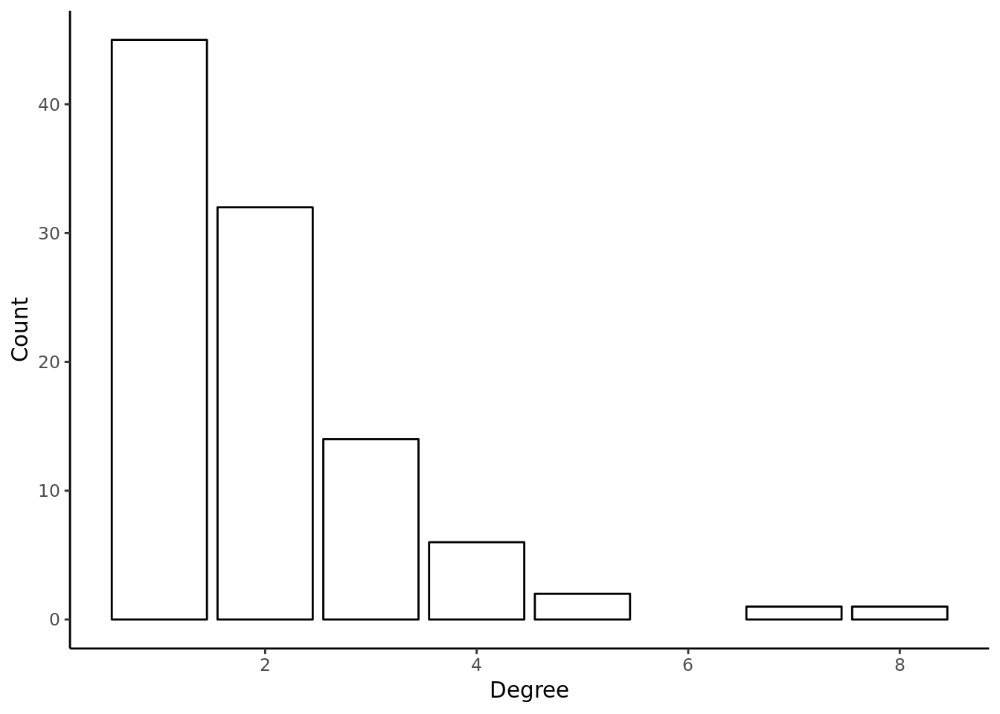

#### Runing time by method 

<table class="table table-condensed" style="width: auto !important; ">
 <thead>
  <tr>
   <th style="text-align:left;">   </th>
   <th style="text-align:left;"> key </th>
   <th style="text-align:right;"> doc_count </th>
   <th style="text-align:right;"> sum_wallTime_ms.value </th>
   <th style="text-align:left;"> avg_wallTime_ms.value </th>
   <th style="text-align:left;"> includedInTotal </th>
  </tr>
 </thead>
<tbody>
  <tr>
   <td style="text-align:left;"> 1 </td>
   <td style="text-align:left;"> connectIfSimilar </td>
   <td style="text-align:right;"> 87,990 </td>
   <td style="text-align:right;"> 683,237 </td>
   <td style="text-align:left;"> 7.7649391976361 </td>
   <td style="text-align:left;"> No </td>
  </tr>
  <tr>
   <td style="text-align:left;"> 2 </td>
   <td style="text-align:left;"> existsSimilarity </td>
   <td style="text-align:right;"> 87,990 </td>
   <td style="text-align:right;"> 676,351 </td>
   <td style="text-align:left;"> 7.68668030458007 </td>
   <td style="text-align:left;"> No </td>
  </tr>
  <tr>
   <td style="text-align:left;"> 3 </td>
   <td style="text-align:left;"> similarityEdges </td>
   <td style="text-align:right;"> 87,990 </td>
   <td style="text-align:right;"> 659,278 </td>
   <td style="text-align:left;"> 7.49264689169224 </td>
   <td style="text-align:left;"> No </td>
  </tr>
  <tr>
   <td style="text-align:left;"> 4 </td>
   <td style="text-align:left;"> connect </td>
   <td style="text-align:right;"> 2,733 </td>
   <td style="text-align:right;"> 4,926 </td>
   <td style="text-align:left;"> 1.80241492864984 </td>
   <td style="text-align:left;"> Yes </td>
  </tr>
  <tr>
   <td style="text-align:left;"> 5 </td>
   <td style="text-align:left;"> connectAllSimilar </td>
   <td style="text-align:right;"> 420 </td>
   <td style="text-align:right;"> 684,210 </td>
   <td style="text-align:left;"> 1629.07142857143 </td>
   <td style="text-align:left;"> Yes </td>
  </tr>
  <tr>
   <td style="text-align:left;"> 6 </td>
   <td style="text-align:left;"> init </td>
   <td style="text-align:right;"> 103 </td>
   <td style="text-align:right;"> 9,981 </td>
   <td style="text-align:left;"> 96.9029126213592 </td>
   <td style="text-align:left;"> No </td>
  </tr>
  <tr>
   <td style="text-align:left;"> 9 </td>
   <td style="text-align:left;"> connectAllSimilarCentralized </td>
   <td style="text-align:right;"> 1 </td>
   <td style="text-align:right;"> 684,232 </td>
   <td style="text-align:left;"> 684232 </td>
   <td style="text-align:left;"> Yes </td>
  </tr>
  <tr>
   <td style="text-align:left;"> 10 </td>
   <td style="text-align:left;"> cycleSearch </td>
   <td style="text-align:right;"> 1 </td>
   <td style="text-align:right;"> 19 </td>
   <td style="text-align:left;"> 19 </td>
   <td style="text-align:left;"> Yes </td>
  </tr>
  <tr>
   <td style="text-align:left;font-weight: bold;"> 11 </td>
   <td style="text-align:left;font-weight: bold;"> Total </td>
   <td style="text-align:right;font-weight: bold;"> 3,158 </td>
   <td style="text-align:right;font-weight: bold;"> 1,373,524 </td>
   <td style="text-align:left;font-weight: bold;">  </td>
   <td style="text-align:left;font-weight: bold;">  </td>
  </tr>
</tbody>
</table>
####  Found structures 

#####  Cycles 

Number of cycles found:  1 

<button class="btn btn-primary" data-toggle="collapse" data-target="#IJRURIHGNA"> Show/Hide foundCycle query </button> 
 
  
     GET /filebeat-*/_search 
              { 
                "query": {
                  "bool": {
                    "must": [
                      { "match_phrase": {
                        "simulationId": "SIM08-02-03-31-FfrhJ9--CV"
                        }
                      },
                      { "bool": {
                        "should": [
                          { "match": {
                            "keyword": "foundCycle"
                          }}
                        ]
                      }}
                    ]
                  }
                }
              }
     

#####  Paths 

Number of paths found:  0 

<button class="btn btn-primary" data-toggle="collapse" data-target="#DQXGWQDXLJ"> Show/Hide foundPath query </button> 
 
  
     GET /filebeat-*/_search 
              { 
                "query": {
                  "bool": {
                    "must": [
                      { "match_phrase": {
                        "simulationId": "SIM08-02-03-31-FfrhJ9--CV"
                        }
                      },
                      { "bool": {
                        "should": [
                          { "match": {
                            "keyword": "foundPath"
                          }}
                        ]
                      }}
                    ]
                  }
                }
              }
     

###  SIM08-02-03-31-FfrhJ9--DV 

#### simulationParameters 

<table class="table table-condensed" style="width: auto !important; ">
 <thead>
  <tr>
   <th style="text-align:left;"> agentNumber </th>
   <th style="text-align:left;"> chainLength </th>
   <th style="text-align:left;"> similaritySearchThreshold </th>
   <th style="text-align:left;"> maxDistance </th>
   <th style="text-align:left;"> randomWorksNumberMultiplier </th>
  </tr>
 </thead>
<tbody>
  <tr>
   <td style="text-align:left;width: 20em; "> 100 </td>
   <td style="text-align:left;width: 15em; "> 10 </td>
   <td style="text-align:left;width: 15em; "> 1 </td>
   <td style="text-align:left;width: 15em; "> 10 </td>
   <td style="text-align:left;width: 15em; "> 2 </td>
  </tr>
</tbody>
</table>
#### Degree distribution of agent->knows->agent edges

#### Runing time by method 

<table class="table table-condensed" style="width: auto !important; ">
 <thead>
  <tr>
   <th style="text-align:left;"> key </th>
   <th style="text-align:right;"> doc_count </th>
   <th style="text-align:right;"> sum_wallTime_ms.value </th>
   <th style="text-align:left;"> avg_wallTime_ms.value </th>
   <th style="text-align:left;"> includedInTotal </th>
  </tr>
 </thead>
<tbody>
  <tr>
   <td style="text-align:left;"> addItemToWork </td>
   <td style="text-align:right;"> 420 </td>
   <td style="text-align:right;"> 8,370 </td>
   <td style="text-align:left;"> 19.9285714285714 </td>
   <td style="text-align:left;"> No </td>
  </tr>
  <tr>
   <td style="text-align:left;"> ownsWork </td>
   <td style="text-align:right;"> 210 </td>
   <td style="text-align:right;"> 3,696 </td>
   <td style="text-align:left;"> 17.6 </td>
   <td style="text-align:left;"> No </td>
  </tr>
  <tr>
   <td style="text-align:left;"> init </td>
   <td style="text-align:right;"> 103 </td>
   <td style="text-align:right;"> 11,278 </td>
   <td style="text-align:left;"> 109.495145631068 </td>
   <td style="text-align:left;"> No </td>
  </tr>
  <tr>
   <td style="text-align:left;"> knowsAgent </td>
   <td style="text-align:right;"> 100 </td>
   <td style="text-align:right;"> 283 </td>
   <td style="text-align:left;"> 2.83 </td>
   <td style="text-align:left;"> No </td>
  </tr>
  <tr>
   <td style="text-align:left;"> searchAndConnect </td>
   <td style="text-align:right;"> 100 </td>
   <td style="text-align:right;"> 593,119 </td>
   <td style="text-align:left;"> 5931.19 </td>
   <td style="text-align:left;"> Yes </td>
  </tr>
  <tr>
   <td style="text-align:left;"> cycleSearch </td>
   <td style="text-align:right;"> 19 </td>
   <td style="text-align:right;"> 800 </td>
   <td style="text-align:left;"> 42.1052631578947 </td>
   <td style="text-align:left;"> Yes </td>
  </tr>
  <tr>
   <td style="text-align:left;"> getWorks </td>
   <td style="text-align:right;"> 19 </td>
   <td style="text-align:right;"> 75 </td>
   <td style="text-align:left;"> 3.94736842105263 </td>
   <td style="text-align:left;"> No </td>
  </tr>
  <tr>
   <td style="text-align:left;"> individualCycleSearch </td>
   <td style="text-align:right;"> 19 </td>
   <td style="text-align:right;"> 97 </td>
   <td style="text-align:left;"> 5.10526315789474 </td>
   <td style="text-align:left;"> Yes </td>
  </tr>
  <tr>
   <td style="text-align:left;"> getWorksItems </td>
   <td style="text-align:right;"> 18 </td>
   <td style="text-align:right;"> 107 </td>
   <td style="text-align:left;"> 5.94444444444444 </td>
   <td style="text-align:left;"> Yes </td>
  </tr>
  <tr>
   <td style="text-align:left;font-weight: bold;"> Total </td>
   <td style="text-align:right;font-weight: bold;"> 161 </td>
   <td style="text-align:right;font-weight: bold;"> 595,138 </td>
   <td style="text-align:left;font-weight: bold;">  </td>
   <td style="text-align:left;font-weight: bold;">  </td>
  </tr>
</tbody>
</table>
####  Found structures 

#####  Cycles 

Number of cycles found:  2 

<button class="btn btn-primary" data-toggle="collapse" data-target="#CGQYWVWWGL"> Show/Hide foundCycle query </button> 
 
  
     GET /filebeat-*/_search 
              { 
                "query": {
                  "bool": {
                    "must": [
                      { "match_phrase": {
                        "simulationId": "SIM08-02-03-31-FfrhJ9--DV"
                        }
                      },
                      { "bool": {
                        "should": [
                          { "match": {
                            "keyword": "foundCycle"
                          }}
                        ]
                      }}
                    ]
                  }
                }
              }
     

#####  Paths 

Number of paths found:  0 

<button class="btn btn-primary" data-toggle="collapse" data-target="#XFOSRNSKDZ"> Show/Hide foundPath query </button> 
 
  
     GET /filebeat-*/_search 
              { 
                "query": {
                  "bool": {
                    "must": [
                      { "match_phrase": {
                        "simulationId": "SIM08-02-03-31-FfrhJ9--DV"
                        }
                      },
                      { "bool": {
                        "should": [
                          { "match": {
                            "keyword": "foundPath"
                          }}
                        ]
                      }}
                    ]
                  }
                }
              }
     

###  SIM08-02-03-43-3iwnzW--CV 

#### simulationParameters 

<table class="table table-condensed" style="width: auto !important; ">
 <thead>
  <tr>
   <th style="text-align:left;"> agentNumber </th>
   <th style="text-align:left;"> chainLength </th>
   <th style="text-align:left;"> similaritySearchThreshold </th>
   <th style="text-align:left;"> maxDistance </th>
   <th style="text-align:left;"> randomWorksNumberMultiplier </th>
  </tr>
 </thead>
<tbody>
  <tr>
   <td style="text-align:left;width: 20em; "> 100 </td>
   <td style="text-align:left;width: 15em; "> 10 </td>
   <td style="text-align:left;width: 15em; "> 1 </td>
   <td style="text-align:left;width: 15em; "> 30 </td>
   <td style="text-align:left;width: 15em; "> 2 </td>
  </tr>
</tbody>
</table>
#### Degree distribution of agent->knows->agent edges

#### Runing time by method 

<table class="table table-condensed" style="width: auto !important; ">
 <thead>
  <tr>
   <th style="text-align:left;">   </th>
   <th style="text-align:left;"> key </th>
   <th style="text-align:right;"> doc_count </th>
   <th style="text-align:right;"> sum_wallTime_ms.value </th>
   <th style="text-align:left;"> avg_wallTime_ms.value </th>
   <th style="text-align:left;"> includedInTotal </th>
  </tr>
 </thead>
<tbody>
  <tr>
   <td style="text-align:left;"> 1 </td>
   <td style="text-align:left;"> connectIfSimilar </td>
   <td style="text-align:right;"> 87,990 </td>
   <td style="text-align:right;"> 695,976 </td>
   <td style="text-align:left;"> 7.90971701329697 </td>
   <td style="text-align:left;"> No </td>
  </tr>
  <tr>
   <td style="text-align:left;"> 2 </td>
   <td style="text-align:left;"> existsSimilarity </td>
   <td style="text-align:right;"> 87,990 </td>
   <td style="text-align:right;"> 692,829 </td>
   <td style="text-align:left;"> 7.87395158540743 </td>
   <td style="text-align:left;"> No </td>
  </tr>
  <tr>
   <td style="text-align:left;"> 3 </td>
   <td style="text-align:left;"> similarityEdges </td>
   <td style="text-align:right;"> 87,990 </td>
   <td style="text-align:right;"> 675,815 </td>
   <td style="text-align:left;"> 7.68058870326173 </td>
   <td style="text-align:left;"> No </td>
  </tr>
  <tr>
   <td style="text-align:left;"> 4 </td>
   <td style="text-align:left;"> connect </td>
   <td style="text-align:right;"> 805 </td>
   <td style="text-align:right;"> 1,462 </td>
   <td style="text-align:left;"> 1.81614906832298 </td>
   <td style="text-align:left;"> Yes </td>
  </tr>
  <tr>
   <td style="text-align:left;"> 5 </td>
   <td style="text-align:left;"> connectAllSimilar </td>
   <td style="text-align:right;"> 420 </td>
   <td style="text-align:right;"> 696,874 </td>
   <td style="text-align:left;"> 1659.22380952381 </td>
   <td style="text-align:left;"> Yes </td>
  </tr>
  <tr>
   <td style="text-align:left;"> 6 </td>
   <td style="text-align:left;"> init </td>
   <td style="text-align:right;"> 103 </td>
   <td style="text-align:right;"> 9,430 </td>
   <td style="text-align:left;"> 91.5533980582524 </td>
   <td style="text-align:left;"> No </td>
  </tr>
  <tr>
   <td style="text-align:left;"> 9 </td>
   <td style="text-align:left;"> connectAllSimilarCentralized </td>
   <td style="text-align:right;"> 1 </td>
   <td style="text-align:right;"> 696,889 </td>
   <td style="text-align:left;"> 696889 </td>
   <td style="text-align:left;"> Yes </td>
  </tr>
  <tr>
   <td style="text-align:left;"> 10 </td>
   <td style="text-align:left;"> cycleSearch </td>
   <td style="text-align:right;"> 1 </td>
   <td style="text-align:right;"> 19 </td>
   <td style="text-align:left;"> 19 </td>
   <td style="text-align:left;"> Yes </td>
  </tr>
  <tr>
   <td style="text-align:left;font-weight: bold;"> 11 </td>
   <td style="text-align:left;font-weight: bold;"> Total </td>
   <td style="text-align:right;font-weight: bold;"> 1,230 </td>
   <td style="text-align:right;font-weight: bold;"> 1,395,363 </td>
   <td style="text-align:left;font-weight: bold;">  </td>
   <td style="text-align:left;font-weight: bold;">  </td>
  </tr>
</tbody>
</table>
####  Found structures 

#####  Cycles 

Number of cycles found:  1 

<button class="btn btn-primary" data-toggle="collapse" data-target="#TFSLMKAOUN"> Show/Hide foundCycle query </button> 
 
  
     GET /filebeat-*/_search 
              { 
                "query": {
                  "bool": {
                    "must": [
                      { "match_phrase": {
                        "simulationId": "SIM08-02-03-43-3iwnzW--CV"
                        }
                      },
                      { "bool": {
                        "should": [
                          { "match": {
                            "keyword": "foundCycle"
                          }}
                        ]
                      }}
                    ]
                  }
                }
              }
     

#####  Paths 

Number of paths found:  0 

<button class="btn btn-primary" data-toggle="collapse" data-target="#KZZBPCJDBW"> Show/Hide foundPath query </button> 
 
  
     GET /filebeat-*/_search 
              { 
                "query": {
                  "bool": {
                    "must": [
                      { "match_phrase": {
                        "simulationId": "SIM08-02-03-43-3iwnzW--CV"
                        }
                      },
                      { "bool": {
                        "should": [
                          { "match": {
                            "keyword": "foundPath"
                          }}
                        ]
                      }}
                    ]
                  }
                }
              }
     

###  SIM08-02-03-43-3iwnzW--DV 

#### simulationParameters 

<table class="table table-condensed" style="width: auto !important; ">
 <thead>
  <tr>
   <th style="text-align:left;"> agentNumber </th>
   <th style="text-align:left;"> chainLength </th>
   <th style="text-align:left;"> similaritySearchThreshold </th>
   <th style="text-align:left;"> maxDistance </th>
   <th style="text-align:left;"> randomWorksNumberMultiplier </th>
  </tr>
 </thead>
<tbody>
  <tr>
   <td style="text-align:left;width: 20em; "> 100 </td>
   <td style="text-align:left;width: 15em; "> 10 </td>
   <td style="text-align:left;width: 15em; "> 1 </td>
   <td style="text-align:left;width: 15em; "> 30 </td>
   <td style="text-align:left;width: 15em; "> 2 </td>
  </tr>
</tbody>
</table>
#### Degree distribution of agent->knows->agent edges

#### Runing time by method 

<table class="table table-condensed" style="width: auto !important; ">
 <thead>
  <tr>
   <th style="text-align:left;"> key </th>
   <th style="text-align:right;"> doc_count </th>
   <th style="text-align:right;"> sum_wallTime_ms.value </th>
   <th style="text-align:left;"> avg_wallTime_ms.value </th>
   <th style="text-align:left;"> includedInTotal </th>
  </tr>
 </thead>
<tbody>
  <tr>
   <td style="text-align:left;"> addItemToWork </td>
   <td style="text-align:right;"> 420 </td>
   <td style="text-align:right;"> 4,880 </td>
   <td style="text-align:left;"> 11.6190476190476 </td>
   <td style="text-align:left;"> No </td>
  </tr>
  <tr>
   <td style="text-align:left;"> ownsWork </td>
   <td style="text-align:right;"> 210 </td>
   <td style="text-align:right;"> 2,398 </td>
   <td style="text-align:left;"> 11.4190476190476 </td>
   <td style="text-align:left;"> No </td>
  </tr>
  <tr>
   <td style="text-align:left;"> init </td>
   <td style="text-align:right;"> 103 </td>
   <td style="text-align:right;"> 10,081 </td>
   <td style="text-align:left;"> 97.873786407767 </td>
   <td style="text-align:left;"> No </td>
  </tr>
  <tr>
   <td style="text-align:left;"> knowsAgent </td>
   <td style="text-align:right;"> 100 </td>
   <td style="text-align:right;"> 212 </td>
   <td style="text-align:left;"> 2.12 </td>
   <td style="text-align:left;"> No </td>
  </tr>
  <tr>
   <td style="text-align:left;"> searchAndConnect </td>
   <td style="text-align:right;"> 100 </td>
   <td style="text-align:right;"> 582,272 </td>
   <td style="text-align:left;"> 5822.72 </td>
   <td style="text-align:left;"> Yes </td>
  </tr>
  <tr>
   <td style="text-align:left;"> cycleSearch </td>
   <td style="text-align:right;"> 21 </td>
   <td style="text-align:right;"> 8,764 </td>
   <td style="text-align:left;"> 417.333333333333 </td>
   <td style="text-align:left;"> Yes </td>
  </tr>
  <tr>
   <td style="text-align:left;"> getWorks </td>
   <td style="text-align:right;"> 21 </td>
   <td style="text-align:right;"> 4,826 </td>
   <td style="text-align:left;"> 229.809523809524 </td>
   <td style="text-align:left;"> No </td>
  </tr>
  <tr>
   <td style="text-align:left;"> individualCycleSearch </td>
   <td style="text-align:right;"> 21 </td>
   <td style="text-align:right;"> 4 </td>
   <td style="text-align:left;"> 0.19047619047619 </td>
   <td style="text-align:left;"> Yes </td>
  </tr>
  <tr>
   <td style="text-align:left;"> getWorksItems </td>
   <td style="text-align:right;"> 18 </td>
   <td style="text-align:right;"> 33 </td>
   <td style="text-align:left;"> 1.83333333333333 </td>
   <td style="text-align:left;"> Yes </td>
  </tr>
  <tr>
   <td style="text-align:left;font-weight: bold;"> Total </td>
   <td style="text-align:right;font-weight: bold;"> 166 </td>
   <td style="text-align:right;font-weight: bold;"> 597,963 </td>
   <td style="text-align:left;font-weight: bold;">  </td>
   <td style="text-align:left;font-weight: bold;">  </td>
  </tr>
</tbody>
</table>
####  Found structures 

#####  Cycles 

Number of cycles found:  5 

<button class="btn btn-primary" data-toggle="collapse" data-target="#UTNPJLBFKG"> Show/Hide foundCycle query </button> 
 
  
     GET /filebeat-*/_search 
              { 
                "query": {
                  "bool": {
                    "must": [
                      { "match_phrase": {
                        "simulationId": "SIM08-02-03-43-3iwnzW--DV"
                        }
                      },
                      { "bool": {
                        "should": [
                          { "match": {
                            "keyword": "foundCycle"
                          }}
                        ]
                      }}
                    ]
                  }
                }
              }
     

#####  Paths 

Number of paths found:  1 

<button class="btn btn-primary" data-toggle="collapse" data-target="#EPBJBWXWSK"> Show/Hide foundPath query </button> 
 
  
     GET /filebeat-*/_search 
              { 
                "query": {
                  "bool": {
                    "must": [
                      { "match_phrase": {
                        "simulationId": "SIM08-02-03-43-3iwnzW--DV"
                        }
                      },
                      { "bool": {
                        "should": [
                          { "match": {
                            "keyword": "foundPath"
                          }}
                        ]
                      }}
                    ]
                  }
                }
              }
     

###  SIM08-02-03-55-5gpeBJ--CV 

#### simulationParameters 

<table class="table table-condensed" style="width: auto !important; ">
 <thead>
  <tr>
   <th style="text-align:left;"> agentNumber </th>
   <th style="text-align:left;"> chainLength </th>
   <th style="text-align:left;"> similaritySearchThreshold </th>
   <th style="text-align:left;"> maxDistance </th>
   <th style="text-align:left;"> randomWorksNumberMultiplier </th>
  </tr>
 </thead>
<tbody>
  <tr>
   <td style="text-align:left;width: 20em; "> 100 </td>
   <td style="text-align:left;width: 15em; "> 20 </td>
   <td style="text-align:left;width: 15em; "> 1 </td>
   <td style="text-align:left;width: 15em; "> 10 </td>
   <td style="text-align:left;width: 15em; "> 2 </td>
  </tr>
</tbody>
</table>
#### Degree distribution of agent->knows->agent edges

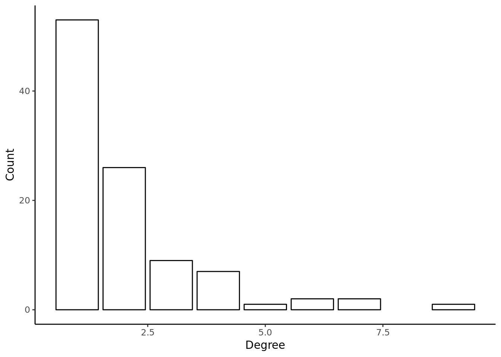

#### Runing time by method 

<table class="table table-condensed" style="width: auto !important; ">
 <thead>
  <tr>
   <th style="text-align:left;">   </th>
   <th style="text-align:left;"> key </th>
   <th style="text-align:right;"> doc_count </th>
   <th style="text-align:right;"> sum_wallTime_ms.value </th>
   <th style="text-align:left;"> avg_wallTime_ms.value </th>
   <th style="text-align:left;"> includedInTotal </th>
  </tr>
 </thead>
<tbody>
  <tr>
   <td style="text-align:left;"> 1 </td>
   <td style="text-align:left;"> connectIfSimilar </td>
   <td style="text-align:right;"> 96,580 </td>
   <td style="text-align:right;"> 780,059 </td>
   <td style="text-align:left;"> 8.07681714640712 </td>
   <td style="text-align:left;"> No </td>
  </tr>
  <tr>
   <td style="text-align:left;"> 2 </td>
   <td style="text-align:left;"> existsSimilarity </td>
   <td style="text-align:right;"> 96,580 </td>
   <td style="text-align:right;"> 768,342 </td>
   <td style="text-align:left;"> 7.95549803271899 </td>
   <td style="text-align:left;"> No </td>
  </tr>
  <tr>
   <td style="text-align:left;"> 3 </td>
   <td style="text-align:left;"> similarityEdges </td>
   <td style="text-align:right;"> 96,580 </td>
   <td style="text-align:right;"> 749,125 </td>
   <td style="text-align:left;"> 7.7565230896666 </td>
   <td style="text-align:left;"> No </td>
  </tr>
  <tr>
   <td style="text-align:left;"> 4 </td>
   <td style="text-align:left;"> connect </td>
   <td style="text-align:right;"> 5,243 </td>
   <td style="text-align:right;"> 9,510 </td>
   <td style="text-align:left;"> 1.81384703414076 </td>
   <td style="text-align:left;"> Yes </td>
  </tr>
  <tr>
   <td style="text-align:left;"> 5 </td>
   <td style="text-align:left;"> connectAllSimilar </td>
   <td style="text-align:right;"> 440 </td>
   <td style="text-align:right;"> 781,063 </td>
   <td style="text-align:left;"> 1775.14318181818 </td>
   <td style="text-align:left;"> Yes </td>
  </tr>
  <tr>
   <td style="text-align:left;"> 6 </td>
   <td style="text-align:left;"> init </td>
   <td style="text-align:right;"> 103 </td>
   <td style="text-align:right;"> 9,955 </td>
   <td style="text-align:left;"> 96.6504854368932 </td>
   <td style="text-align:left;"> No </td>
  </tr>
  <tr>
   <td style="text-align:left;"> 9 </td>
   <td style="text-align:left;"> connectAllSimilarCentralized </td>
   <td style="text-align:right;"> 1 </td>
   <td style="text-align:right;"> 781,083 </td>
   <td style="text-align:left;"> 781083 </td>
   <td style="text-align:left;"> Yes </td>
  </tr>
  <tr>
   <td style="text-align:left;"> 10 </td>
   <td style="text-align:left;"> cycleSearch </td>
   <td style="text-align:right;"> 1 </td>
   <td style="text-align:right;"> 38 </td>
   <td style="text-align:left;"> 38 </td>
   <td style="text-align:left;"> Yes </td>
  </tr>
  <tr>
   <td style="text-align:left;font-weight: bold;"> 11 </td>
   <td style="text-align:left;font-weight: bold;"> Total </td>
   <td style="text-align:right;font-weight: bold;"> 5,688 </td>
   <td style="text-align:right;font-weight: bold;"> 1,571,931 </td>
   <td style="text-align:left;font-weight: bold;">  </td>
   <td style="text-align:left;font-weight: bold;">  </td>
  </tr>
</tbody>
</table>
####  Found structures 

#####  Cycles 

Number of cycles found:  1 

<button class="btn btn-primary" data-toggle="collapse" data-target="#IMEVXNXIDT"> Show/Hide foundCycle query </button> 
 
  
     GET /filebeat-*/_search 
              { 
                "query": {
                  "bool": {
                    "must": [
                      { "match_phrase": {
                        "simulationId": "SIM08-02-03-55-5gpeBJ--CV"
                        }
                      },
                      { "bool": {
                        "should": [
                          { "match": {
                            "keyword": "foundCycle"
                          }}
                        ]
                      }}
                    ]
                  }
                }
              }
     

#####  Paths 

Number of paths found:  0 

<button class="btn btn-primary" data-toggle="collapse" data-target="#LJILLCPQRV"> Show/Hide foundPath query </button> 
 
  
     GET /filebeat-*/_search 
              { 
                "query": {
                  "bool": {
                    "must": [
                      { "match_phrase": {
                        "simulationId": "SIM08-02-03-55-5gpeBJ--CV"
                        }
                      },
                      { "bool": {
                        "should": [
                          { "match": {
                            "keyword": "foundPath"
                          }}
                        ]
                      }}
                    ]
                  }
                }
              }
     

###  SIM08-02-03-55-5gpeBJ--DV 

#### simulationParameters 

<table class="table table-condensed" style="width: auto !important; ">
 <thead>
  <tr>
   <th style="text-align:left;"> agentNumber </th>
   <th style="text-align:left;"> chainLength </th>
   <th style="text-align:left;"> similaritySearchThreshold </th>
   <th style="text-align:left;"> maxDistance </th>
   <th style="text-align:left;"> randomWorksNumberMultiplier </th>
  </tr>
 </thead>
<tbody>
  <tr>
   <td style="text-align:left;width: 20em; "> 100 </td>
   <td style="text-align:left;width: 15em; "> 20 </td>
   <td style="text-align:left;width: 15em; "> 1 </td>
   <td style="text-align:left;width: 15em; "> 10 </td>
   <td style="text-align:left;width: 15em; "> 2 </td>
  </tr>
</tbody>
</table>
#### Degree distribution of agent->knows->agent edges

#### Runing time by method 

<table class="table table-condensed" style="width: auto !important; ">
 <thead>
  <tr>
   <th style="text-align:left;">   </th>
   <th style="text-align:left;"> key </th>
   <th style="text-align:right;"> doc_count </th>
   <th style="text-align:right;"> sum_wallTime_ms.value </th>
   <th style="text-align:left;"> avg_wallTime_ms.value </th>
   <th style="text-align:left;"> includedInTotal </th>
  </tr>
 </thead>
<tbody>
  <tr>
   <td style="text-align:left;"> 2 </td>
   <td style="text-align:left;"> cycleSearch </td>
   <td style="text-align:right;"> 3,599 </td>
   <td style="text-align:right;"> 306,878 </td>
   <td style="text-align:left;"> 85.2675743262017 </td>
   <td style="text-align:left;"> Yes </td>
  </tr>
  <tr>
   <td style="text-align:left;"> 3 </td>
   <td style="text-align:left;"> getWorks </td>
   <td style="text-align:right;"> 3,599 </td>
   <td style="text-align:right;"> 27,823 </td>
   <td style="text-align:left;"> 7.73075854404001 </td>
   <td style="text-align:left;"> No </td>
  </tr>
  <tr>
   <td style="text-align:left;"> 4 </td>
   <td style="text-align:left;"> individualCycleSearch </td>
   <td style="text-align:right;"> 3,599 </td>
   <td style="text-align:right;"> 274 </td>
   <td style="text-align:left;"> 0.0761322589608225 </td>
   <td style="text-align:left;"> Yes </td>
  </tr>
  <tr>
   <td style="text-align:left;"> 6 </td>
   <td style="text-align:left;"> addItemToWork </td>
   <td style="text-align:right;"> 440 </td>
   <td style="text-align:right;"> 3,155 </td>
   <td style="text-align:left;"> 7.17045454545455 </td>
   <td style="text-align:left;"> No </td>
  </tr>
  <tr>
   <td style="text-align:left;"> 7 </td>
   <td style="text-align:left;"> ownsWork </td>
   <td style="text-align:right;"> 220 </td>
   <td style="text-align:right;"> 1,549 </td>
   <td style="text-align:left;"> 7.04090909090909 </td>
   <td style="text-align:left;"> No </td>
  </tr>
  <tr>
   <td style="text-align:left;"> 8 </td>
   <td style="text-align:left;"> init </td>
   <td style="text-align:right;"> 103 </td>
   <td style="text-align:right;"> 9,460 </td>
   <td style="text-align:left;"> 91.8446601941748 </td>
   <td style="text-align:left;"> No </td>
  </tr>
  <tr>
   <td style="text-align:left;"> 9 </td>
   <td style="text-align:left;"> searchAndConnect </td>
   <td style="text-align:right;"> 101 </td>
   <td style="text-align:right;"> 561,006 </td>
   <td style="text-align:left;"> 5554.51485148515 </td>
   <td style="text-align:left;"> Yes </td>
  </tr>
  <tr>
   <td style="text-align:left;"> 10 </td>
   <td style="text-align:left;"> knowsAgent </td>
   <td style="text-align:right;"> 100 </td>
   <td style="text-align:right;"> 182 </td>
   <td style="text-align:left;"> 1.82 </td>
   <td style="text-align:left;"> No </td>
  </tr>
  <tr>
   <td style="text-align:left;font-weight: bold;"> 1 </td>
   <td style="text-align:left;font-weight: bold;"> Total </td>
   <td style="text-align:right;font-weight: bold;"> 14,497 </td>
   <td style="text-align:right;font-weight: bold;"> 1,838,004 </td>
   <td style="text-align:left;font-weight: bold;">  </td>
   <td style="text-align:left;font-weight: bold;">  </td>
  </tr>
</tbody>
</table>
####  Found structures 

#####  Cycles 

Number of cycles found:  0 

<button class="btn btn-primary" data-toggle="collapse" data-target="#NKOJOTGIIO"> Show/Hide foundCycle query </button> 
 
  
     GET /filebeat-*/_search 
              { 
                "query": {
                  "bool": {
                    "must": [
                      { "match_phrase": {
                        "simulationId": "SIM08-02-03-55-5gpeBJ--DV"
                        }
                      },
                      { "bool": {
                        "should": [
                          { "match": {
                            "keyword": "foundCycle"
                          }}
                        ]
                      }}
                    ]
                  }
                }
              }
     

#####  Paths 

Number of paths found:  3599 

<button class="btn btn-primary" data-toggle="collapse" data-target="#ZELPZKLQTR"> Show/Hide foundPath query </button> 
 
  
     GET /filebeat-*/_search 
              { 
                "query": {
                  "bool": {
                    "must": [
                      { "match_phrase": {
                        "simulationId": "SIM08-02-03-55-5gpeBJ--DV"
                        }
                      },
                      { "bool": {
                        "should": [
                          { "match": {
                            "keyword": "foundPath"
                          }}
                        ]
                      }}
                    ]
                  }
                }
              }
     

###  SIM08-02-05-08-HpL6gr--CV 

#### simulationParameters 

<table class="table table-condensed" style="width: auto !important; ">
 <thead>
  <tr>
   <th style="text-align:left;"> agentNumber </th>
   <th style="text-align:left;"> chainLength </th>
   <th style="text-align:left;"> similaritySearchThreshold </th>
   <th style="text-align:left;"> maxDistance </th>
   <th style="text-align:left;"> randomWorksNumberMultiplier </th>
  </tr>
 </thead>
<tbody>
  <tr>
   <td style="text-align:left;width: 20em; "> 100 </td>
   <td style="text-align:left;width: 15em; "> 20 </td>
   <td style="text-align:left;width: 15em; "> 1 </td>
   <td style="text-align:left;width: 15em; "> 30 </td>
   <td style="text-align:left;width: 15em; "> 2 </td>
  </tr>
</tbody>
</table>
#### Degree distribution of agent->knows->agent edges

#### Runing time by method 

<table class="table table-condensed" style="width: auto !important; ">
 <thead>
  <tr>
   <th style="text-align:left;">   </th>
   <th style="text-align:left;"> key </th>
   <th style="text-align:right;"> doc_count </th>
   <th style="text-align:right;"> sum_wallTime_ms.value </th>
   <th style="text-align:left;"> avg_wallTime_ms.value </th>
   <th style="text-align:left;"> includedInTotal </th>
  </tr>
 </thead>
<tbody>
  <tr>
   <td style="text-align:left;"> 1 </td>
   <td style="text-align:left;"> connectIfSimilar </td>
   <td style="text-align:right;"> 96,580 </td>
   <td style="text-align:right;"> 785,536 </td>
   <td style="text-align:left;"> 8.1335266100642 </td>
   <td style="text-align:left;"> No </td>
  </tr>
  <tr>
   <td style="text-align:left;"> 2 </td>
   <td style="text-align:left;"> existsSimilarity </td>
   <td style="text-align:right;"> 96,580 </td>
   <td style="text-align:right;"> 781,996 </td>
   <td style="text-align:left;"> 8.09687305860427 </td>
   <td style="text-align:left;"> No </td>
  </tr>
  <tr>
   <td style="text-align:left;"> 3 </td>
   <td style="text-align:left;"> similarityEdges </td>
   <td style="text-align:right;"> 96,580 </td>
   <td style="text-align:right;"> 762,605 </td>
   <td style="text-align:left;"> 7.89609650031062 </td>
   <td style="text-align:left;"> No </td>
  </tr>
  <tr>
   <td style="text-align:left;"> 4 </td>
   <td style="text-align:left;"> connect </td>
   <td style="text-align:right;"> 897 </td>
   <td style="text-align:right;"> 1,612 </td>
   <td style="text-align:left;"> 1.79710144927536 </td>
   <td style="text-align:left;"> Yes </td>
  </tr>
  <tr>
   <td style="text-align:left;"> 5 </td>
   <td style="text-align:left;"> connectAllSimilar </td>
   <td style="text-align:right;"> 440 </td>
   <td style="text-align:right;"> 786,543 </td>
   <td style="text-align:left;"> 1787.59772727273 </td>
   <td style="text-align:left;"> Yes </td>
  </tr>
  <tr>
   <td style="text-align:left;"> 6 </td>
   <td style="text-align:left;"> init </td>
   <td style="text-align:right;"> 103 </td>
   <td style="text-align:right;"> 10,252 </td>
   <td style="text-align:left;"> 99.5339805825243 </td>
   <td style="text-align:left;"> No </td>
  </tr>
  <tr>
   <td style="text-align:left;"> 7 </td>
   <td style="text-align:left;"> searchAndConnect </td>
   <td style="text-align:right;"> 4 </td>
   <td style="text-align:right;"> 54,489 </td>
   <td style="text-align:left;"> 13622.25 </td>
   <td style="text-align:left;"> Yes </td>
  </tr>
  <tr>
   <td style="text-align:left;"> 10 </td>
   <td style="text-align:left;"> connectAllSimilarCentralized </td>
   <td style="text-align:right;"> 1 </td>
   <td style="text-align:right;"> 786,564 </td>
   <td style="text-align:left;"> 786564 </td>
   <td style="text-align:left;"> Yes </td>
  </tr>
  <tr>
   <td style="text-align:left;font-weight: bold;"> 11 </td>
   <td style="text-align:left;font-weight: bold;"> Total </td>
   <td style="text-align:right;font-weight: bold;"> 1,345 </td>
   <td style="text-align:right;font-weight: bold;"> 1,629,444 </td>
   <td style="text-align:left;font-weight: bold;">  </td>
   <td style="text-align:left;font-weight: bold;">  </td>
  </tr>
</tbody>
</table>
####  Found structures 

#####  Cycles 

Number of cycles found:  1 

<button class="btn btn-primary" data-toggle="collapse" data-target="#QZAUSYRDWR"> Show/Hide foundCycle query </button> 
 
  
     GET /filebeat-*/_search 
              { 
                "query": {
                  "bool": {
                    "must": [
                      { "match_phrase": {
                        "simulationId": "SIM08-02-05-08-HpL6gr--CV"
                        }
                      },
                      { "bool": {
                        "should": [
                          { "match": {
                            "keyword": "foundCycle"
                          }}
                        ]
                      }}
                    ]
                  }
                }
              }
     

#####  Paths 

Number of paths found:  0 

<button class="btn btn-primary" data-toggle="collapse" data-target="#OODAJMXZUA"> Show/Hide foundPath query </button> 
 
  
     GET /filebeat-*/_search 
              { 
                "query": {
                  "bool": {
                    "must": [
                      { "match_phrase": {
                        "simulationId": "SIM08-02-05-08-HpL6gr--CV"
                        }
                      },
                      { "bool": {
                        "should": [
                          { "match": {
                            "keyword": "foundPath"
                          }}
                        ]
                      }}
                    ]
                  }
                }
              }
     

###  SIM08-02-05-08-HpL6gr--DV 

#### simulationParameters 

<table class="table table-condensed" style="width: auto !important; ">
 <thead>
  <tr>
   <th style="text-align:left;"> agentNumber </th>
   <th style="text-align:left;"> chainLength </th>
   <th style="text-align:left;"> similaritySearchThreshold </th>
   <th style="text-align:left;"> maxDistance </th>
   <th style="text-align:left;"> randomWorksNumberMultiplier </th>
  </tr>
 </thead>
<tbody>
  <tr>
   <td style="text-align:left;width: 20em; "> 100 </td>
   <td style="text-align:left;width: 15em; "> 20 </td>
   <td style="text-align:left;width: 15em; "> 1 </td>
   <td style="text-align:left;width: 15em; "> 30 </td>
   <td style="text-align:left;width: 15em; "> 2 </td>
  </tr>
</tbody>
</table>
#### Degree distribution of agent->knows->agent edges

#### Runing time by method 

<table class="table table-condensed" style="width: auto !important; ">
 <thead>
  <tr>
   <th style="text-align:left;"> key </th>
   <th style="text-align:right;"> doc_count </th>
   <th style="text-align:right;"> sum_wallTime_ms.value </th>
   <th style="text-align:left;"> avg_wallTime_ms.value </th>
   <th style="text-align:left;"> includedInTotal </th>
  </tr>
 </thead>
<tbody>
  <tr>
   <td style="text-align:left;"> addItemToWork </td>
   <td style="text-align:right;"> 440 </td>
   <td style="text-align:right;"> 2,905 </td>
   <td style="text-align:left;"> 6.60227272727273 </td>
   <td style="text-align:left;"> No </td>
  </tr>
  <tr>
   <td style="text-align:left;"> ownsWork </td>
   <td style="text-align:right;"> 220 </td>
   <td style="text-align:right;"> 1,543 </td>
   <td style="text-align:left;"> 7.01363636363636 </td>
   <td style="text-align:left;"> No </td>
  </tr>
  <tr>
   <td style="text-align:left;"> init </td>
   <td style="text-align:right;"> 103 </td>
   <td style="text-align:right;"> 10,180 </td>
   <td style="text-align:left;"> 98.8349514563107 </td>
   <td style="text-align:left;"> No </td>
  </tr>
  <tr>
   <td style="text-align:left;"> knowsAgent </td>
   <td style="text-align:right;"> 100 </td>
   <td style="text-align:right;"> 167 </td>
   <td style="text-align:left;"> 1.67 </td>
   <td style="text-align:left;"> No </td>
  </tr>
  <tr>
   <td style="text-align:left;"> searchAndConnect </td>
   <td style="text-align:right;"> 97 </td>
   <td style="text-align:right;"> 599,577 </td>
   <td style="text-align:left;"> 6181.20618556701 </td>
   <td style="text-align:left;"> Yes </td>
  </tr>
  <tr>
   <td style="text-align:left;"> getWorksItems </td>
   <td style="text-align:right;"> 38 </td>
   <td style="text-align:right;"> 69 </td>
   <td style="text-align:left;"> 1.81578947368421 </td>
   <td style="text-align:left;"> Yes </td>
  </tr>
  <tr>
   <td style="text-align:left;"> cycleSearch </td>
   <td style="text-align:right;"> 22 </td>
   <td style="text-align:right;"> 1,191 </td>
   <td style="text-align:left;"> 54.1363636363636 </td>
   <td style="text-align:left;"> Yes </td>
  </tr>
  <tr>
   <td style="text-align:left;"> getWorks </td>
   <td style="text-align:right;"> 22 </td>
   <td style="text-align:right;"> 3,161 </td>
   <td style="text-align:left;"> 143.681818181818 </td>
   <td style="text-align:left;"> No </td>
  </tr>
  <tr>
   <td style="text-align:left;"> individualCycleSearch </td>
   <td style="text-align:right;"> 22 </td>
   <td style="text-align:right;"> 1 </td>
   <td style="text-align:left;"> 0.0454545454545455 </td>
   <td style="text-align:left;"> Yes </td>
  </tr>
  <tr>
   <td style="text-align:left;font-weight: bold;"> Total </td>
   <td style="text-align:right;font-weight: bold;"> 184 </td>
   <td style="text-align:right;font-weight: bold;"> 601,744 </td>
   <td style="text-align:left;font-weight: bold;">  </td>
   <td style="text-align:left;font-weight: bold;">  </td>
  </tr>
</tbody>
</table>
####  Found structures 

#####  Cycles 

Number of cycles found:  3 

<button class="btn btn-primary" data-toggle="collapse" data-target="#UTSQQLARGG"> Show/Hide foundCycle query </button> 
 
  
     GET /filebeat-*/_search 
              { 
                "query": {
                  "bool": {
                    "must": [
                      { "match_phrase": {
                        "simulationId": "SIM08-02-05-08-HpL6gr--DV"
                        }
                      },
                      { "bool": {
                        "should": [
                          { "match": {
                            "keyword": "foundCycle"
                          }}
                        ]
                      }}
                    ]
                  }
                }
              }
     

#####  Paths 

Number of paths found:  0 

<button class="btn btn-primary" data-toggle="collapse" data-target="#CUWQGZUKVM"> Show/Hide foundPath query </button> 
 
  
     GET /filebeat-*/_search 
              { 
                "query": {
                  "bool": {
                    "must": [
                      { "match_phrase": {
                        "simulationId": "SIM08-02-05-08-HpL6gr--DV"
                        }
                      },
                      { "bool": {
                        "should": [
                          { "match": {
                            "keyword": "foundPath"
                          }}
                        ]
                      }}
                    ]
                  }
                }
              }
     

###  SIM08-02-05-22-PxKDei--CV 

#### simulationParameters 

<table class="table table-condensed" style="width: auto !important; ">
 <thead>
  <tr>
   <th style="text-align:left;"> agentNumber </th>
   <th style="text-align:left;"> chainLength </th>
   <th style="text-align:left;"> similaritySearchThreshold </th>
   <th style="text-align:left;"> maxDistance </th>
   <th style="text-align:left;"> randomWorksNumberMultiplier </th>
  </tr>
 </thead>
<tbody>
  <tr>
   <td style="text-align:left;width: 20em; "> 200 </td>
   <td style="text-align:left;width: 15em; "> 10 </td>
   <td style="text-align:left;width: 15em; "> 1 </td>
   <td style="text-align:left;width: 15em; "> 10 </td>
   <td style="text-align:left;width: 15em; "> 2 </td>
  </tr>
</tbody>
</table>
#### Degree distribution of agent->knows->agent edges

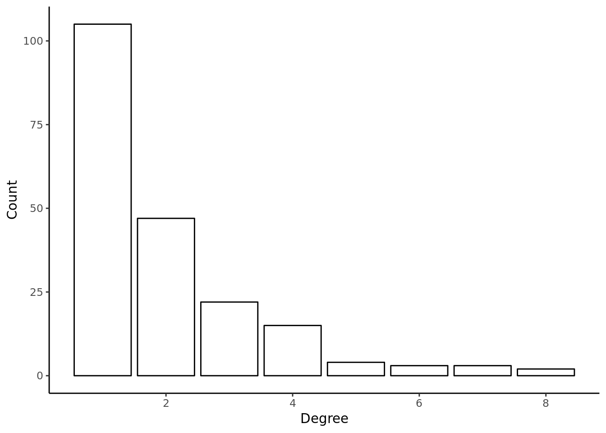

#### Runing time by method 

<table class="table table-condensed" style="width: auto !important; ">
 <thead>
  <tr>
   <th style="text-align:left;">   </th>
   <th style="text-align:left;"> key </th>
   <th style="text-align:right;"> doc_count </th>
   <th style="text-align:right;"> sum_wallTime_ms.value </th>
   <th style="text-align:left;"> avg_wallTime_ms.value </th>
   <th style="text-align:left;"> includedInTotal </th>
  </tr>
 </thead>
<tbody>
  <tr>
   <td style="text-align:left;"> 1 </td>
   <td style="text-align:left;"> connectIfSimilar </td>
   <td style="text-align:right;"> 274,365 </td>
   <td style="text-align:right;"> 3,598,180 </td>
   <td style="text-align:left;"> 13.1145736518871 </td>
   <td style="text-align:left;"> No </td>
  </tr>
  <tr>
   <td style="text-align:left;"> 2 </td>
   <td style="text-align:left;"> existsSimilarity </td>
   <td style="text-align:right;"> 274,365 </td>
   <td style="text-align:right;"> 3,537,525 </td>
   <td style="text-align:left;"> 12.8934995352906 </td>
   <td style="text-align:left;"> No </td>
  </tr>
  <tr>
   <td style="text-align:left;"> 3 </td>
   <td style="text-align:left;"> similarityEdges </td>
   <td style="text-align:right;"> 274,365 </td>
   <td style="text-align:right;"> 3,440,257 </td>
   <td style="text-align:left;"> 12.5389790971881 </td>
   <td style="text-align:left;"> No </td>
  </tr>
  <tr>
   <td style="text-align:left;"> 4 </td>
   <td style="text-align:left;"> connect </td>
   <td style="text-align:right;"> 28,157 </td>
   <td style="text-align:right;"> 53,602 </td>
   <td style="text-align:left;"> 1.90368292076571 </td>
   <td style="text-align:left;"> Yes </td>
  </tr>
  <tr>
   <td style="text-align:left;"> 5 </td>
   <td style="text-align:left;"> connectAllSimilar </td>
   <td style="text-align:right;"> 469 </td>
   <td style="text-align:right;"> 3,601,478 </td>
   <td style="text-align:left;"> 7679.05756929637 </td>
   <td style="text-align:left;"> Yes </td>
  </tr>
  <tr>
   <td style="text-align:left;"> 6 </td>
   <td style="text-align:left;"> init </td>
   <td style="text-align:right;"> 203 </td>
   <td style="text-align:right;"> 12,971 </td>
   <td style="text-align:left;"> 63.8965517241379 </td>
   <td style="text-align:left;"> No </td>
  </tr>
  <tr>
   <td style="text-align:left;"> 10 </td>
   <td style="text-align:left;"> connectAllSimilarCentralized </td>
   <td style="text-align:right;"> 1 </td>
   <td style="text-align:right;"> 3,601,485 </td>
   <td style="text-align:left;"> 3601485 </td>
   <td style="text-align:left;"> Yes </td>
  </tr>
  <tr>
   <td style="text-align:left;font-weight: bold;"> 11 </td>
   <td style="text-align:left;font-weight: bold;"> Total </td>
   <td style="text-align:right;font-weight: bold;"> 28,634 </td>
   <td style="text-align:right;font-weight: bold;"> 7,260,446 </td>
   <td style="text-align:left;font-weight: bold;">  </td>
   <td style="text-align:left;font-weight: bold;">  </td>
  </tr>
</tbody>
</table>
####  Found structures 

#####  Cycles 

Number of cycles found:  0 

<button class="btn btn-primary" data-toggle="collapse" data-target="#NASXGVLQXM"> Show/Hide foundCycle query </button> 
 
  
     GET /filebeat-*/_search 
              { 
                "query": {
                  "bool": {
                    "must": [
                      { "match_phrase": {
                        "simulationId": "SIM08-02-05-22-PxKDei--CV"
                        }
                      },
                      { "bool": {
                        "should": [
                          { "match": {
                            "keyword": "foundCycle"
                          }}
                        ]
                      }}
                    ]
                  }
                }
              }
     

#####  Paths 

Number of paths found:  0 

<button class="btn btn-primary" data-toggle="collapse" data-target="#HOYBEJMXIP"> Show/Hide foundPath query </button> 
 
  
     GET /filebeat-*/_search 
              { 
                "query": {
                  "bool": {
                    "must": [
                      { "match_phrase": {
                        "simulationId": "SIM08-02-05-22-PxKDei--CV"
                        }
                      },
                      { "bool": {
                        "should": [
                          { "match": {
                            "keyword": "foundPath"
                          }}
                        ]
                      }}
                    ]
                  }
                }
              }
     

###  SIM08-02-05-22-PxKDei--DV 

#### simulationParameters 

<table class="table table-condensed" style="width: auto !important; ">
 <thead>
  <tr>
   <th style="text-align:left;"> agentNumber </th>
   <th style="text-align:left;"> chainLength </th>
   <th style="text-align:left;"> similaritySearchThreshold </th>
   <th style="text-align:left;"> maxDistance </th>
   <th style="text-align:left;"> randomWorksNumberMultiplier </th>
  </tr>
 </thead>
<tbody>
  <tr>
   <td style="text-align:left;width: 20em; "> 200 </td>
   <td style="text-align:left;width: 15em; "> 10 </td>
   <td style="text-align:left;width: 15em; "> 1 </td>
   <td style="text-align:left;width: 15em; "> 10 </td>
   <td style="text-align:left;width: 15em; "> 2 </td>
  </tr>
</tbody>
</table>
#### Degree distribution of agent->knows->agent edges

#### Runing time by method 

<table class="table table-condensed" style="width: auto !important; ">
 <thead>
  <tr>
   <th style="text-align:left;">   </th>
   <th style="text-align:left;"> key </th>
   <th style="text-align:right;"> doc_count </th>
   <th style="text-align:right;"> sum_wallTime_ms.value </th>
   <th style="text-align:left;"> avg_wallTime_ms.value </th>
   <th style="text-align:left;"> includedInTotal </th>
  </tr>
 </thead>
<tbody>
  <tr>
   <td style="text-align:left;"> 2 </td>
   <td style="text-align:left;"> cycleSearch </td>
   <td style="text-align:right;"> 3,599 </td>
   <td style="text-align:right;"> 91,081 </td>
   <td style="text-align:left;"> 25.3073075854404 </td>
   <td style="text-align:left;"> Yes </td>
  </tr>
  <tr>
   <td style="text-align:left;"> 3 </td>
   <td style="text-align:left;"> getWorks </td>
   <td style="text-align:right;"> 3,599 </td>
   <td style="text-align:right;"> 40,637 </td>
   <td style="text-align:left;"> 11.2911919977772 </td>
   <td style="text-align:left;"> No </td>
  </tr>
  <tr>
   <td style="text-align:left;"> 4 </td>
   <td style="text-align:left;"> individualCycleSearch </td>
   <td style="text-align:right;"> 3,599 </td>
   <td style="text-align:right;"> 187 </td>
   <td style="text-align:left;"> 0.0519588774659628 </td>
   <td style="text-align:left;"> Yes </td>
  </tr>
  <tr>
   <td style="text-align:left;"> 6 </td>
   <td style="text-align:left;"> addItemToWork </td>
   <td style="text-align:right;"> 820 </td>
   <td style="text-align:right;"> 7,573 </td>
   <td style="text-align:left;"> 9.23536585365854 </td>
   <td style="text-align:left;"> No </td>
  </tr>
  <tr>
   <td style="text-align:left;"> 7 </td>
   <td style="text-align:left;"> ownsWork </td>
   <td style="text-align:right;"> 410 </td>
   <td style="text-align:right;"> 3,680 </td>
   <td style="text-align:left;"> 8.97560975609756 </td>
   <td style="text-align:left;"> No </td>
  </tr>
  <tr>
   <td style="text-align:left;"> 8 </td>
   <td style="text-align:left;"> init </td>
   <td style="text-align:right;"> 203 </td>
   <td style="text-align:right;"> 12,780 </td>
   <td style="text-align:left;"> 62.9556650246305 </td>
   <td style="text-align:left;"> No </td>
  </tr>
  <tr>
   <td style="text-align:left;"> 9 </td>
   <td style="text-align:left;"> searchAndConnect </td>
   <td style="text-align:right;"> 201 </td>
   <td style="text-align:right;"> 4,360,459 </td>
   <td style="text-align:left;"> 21693.8258706468 </td>
   <td style="text-align:left;"> Yes </td>
  </tr>
  <tr>
   <td style="text-align:left;"> 10 </td>
   <td style="text-align:left;"> knowsAgent </td>
   <td style="text-align:right;"> 200 </td>
   <td style="text-align:right;"> 349 </td>
   <td style="text-align:left;"> 1.745 </td>
   <td style="text-align:left;"> No </td>
  </tr>
  <tr>
   <td style="text-align:left;font-weight: bold;"> 1 </td>
   <td style="text-align:left;font-weight: bold;"> Total </td>
   <td style="text-align:right;font-weight: bold;"> 14,597 </td>
   <td style="text-align:right;font-weight: bold;"> 4,580,399 </td>
   <td style="text-align:left;font-weight: bold;">  </td>
   <td style="text-align:left;font-weight: bold;">  </td>
  </tr>
</tbody>
</table>
####  Found structures 

#####  Cycles 

Number of cycles found:  0 

<button class="btn btn-primary" data-toggle="collapse" data-target="#AFAYHMDEZC"> Show/Hide foundCycle query </button> 
 
  
     GET /filebeat-*/_search 
              { 
                "query": {
                  "bool": {
                    "must": [
                      { "match_phrase": {
                        "simulationId": "SIM08-02-05-22-PxKDei--DV"
                        }
                      },
                      { "bool": {
                        "should": [
                          { "match": {
                            "keyword": "foundCycle"
                          }}
                        ]
                      }}
                    ]
                  }
                }
              }
     

#####  Paths 

Number of paths found:  3599 

<button class="btn btn-primary" data-toggle="collapse" data-target="#CVAZHODLOI"> Show/Hide foundPath query </button> 
 
  
     GET /filebeat-*/_search 
              { 
                "query": {
                  "bool": {
                    "must": [
                      { "match_phrase": {
                        "simulationId": "SIM08-02-05-22-PxKDei--DV"
                        }
                      },
                      { "bool": {
                        "should": [
                          { "match": {
                            "keyword": "foundPath"
                          }}
                        ]
                      }}
                    ]
                  }
                }
              }
     

###  SIM08-02-07-22-JYcIUB--CV 

#### simulationParameters 

<table class="table table-condensed" style="width: auto !important; ">
 <thead>
  <tr>
   <th style="text-align:left;"> agentNumber </th>
   <th style="text-align:left;"> chainLength </th>
   <th style="text-align:left;"> similaritySearchThreshold </th>
   <th style="text-align:left;"> maxDistance </th>
   <th style="text-align:left;"> randomWorksNumberMultiplier </th>
  </tr>
 </thead>
<tbody>
  <tr>
   <td style="text-align:left;width: 20em; "> 200 </td>
   <td style="text-align:left;width: 15em; "> 10 </td>
   <td style="text-align:left;width: 15em; "> 1 </td>
   <td style="text-align:left;width: 15em; "> 30 </td>
   <td style="text-align:left;width: 15em; "> 2 </td>
  </tr>
</tbody>
</table>
#### Degree distribution of agent->knows->agent edges

#### Runing time by method 

<table class="table table-condensed" style="width: auto !important; ">
 <thead>
  <tr>
   <th style="text-align:left;"> key </th>
   <th style="text-align:right;"> doc_count </th>
   <th style="text-align:right;"> sum_wallTime_ms.value </th>
   <th style="text-align:left;"> avg_wallTime_ms.value </th>
   <th style="text-align:left;"> includedInTotal </th>
  </tr>
 </thead>
<tbody>
  <tr>
   <td style="text-align:left;"> connectIfSimilar </td>
   <td style="text-align:right;"> 262,254 </td>
   <td style="text-align:right;"> 3,601,199 </td>
   <td style="text-align:left;"> 13.7317219184455 </td>
   <td style="text-align:left;"> No </td>
  </tr>
  <tr>
   <td style="text-align:left;"> existsSimilarity </td>
   <td style="text-align:right;"> 262,254 </td>
   <td style="text-align:right;"> 3,592,842 </td>
   <td style="text-align:left;"> 13.6998558649248 </td>
   <td style="text-align:left;"> No </td>
  </tr>
  <tr>
   <td style="text-align:left;"> similarityEdges </td>
   <td style="text-align:right;"> 262,254 </td>
   <td style="text-align:right;"> 3,490,703 </td>
   <td style="text-align:left;"> 13.3103899273224 </td>
   <td style="text-align:left;"> No </td>
  </tr>
  <tr>
   <td style="text-align:left;"> connect </td>
   <td style="text-align:right;"> 1,255 </td>
   <td style="text-align:right;"> 2,414 </td>
   <td style="text-align:left;"> 1.92350597609562 </td>
   <td style="text-align:left;"> Yes </td>
  </tr>
  <tr>
   <td style="text-align:left;"> connectAllSimilar </td>
   <td style="text-align:right;"> 436 </td>
   <td style="text-align:right;"> 3,604,007 </td>
   <td style="text-align:left;"> 8266.07110091743 </td>
   <td style="text-align:left;"> Yes </td>
  </tr>
  <tr>
   <td style="text-align:left;"> init </td>
   <td style="text-align:right;"> 203 </td>
   <td style="text-align:right;"> 16,109 </td>
   <td style="text-align:left;"> 79.3546798029557 </td>
   <td style="text-align:left;"> No </td>
  </tr>
  <tr>
   <td style="text-align:left;"> cycleSearch </td>
   <td style="text-align:right;"> 158 </td>
   <td style="text-align:right;"> 9,956 </td>
   <td style="text-align:left;"> 63.0126582278481 </td>
   <td style="text-align:left;"> Yes </td>
  </tr>
  <tr>
   <td style="text-align:left;"> getWorks </td>
   <td style="text-align:right;"> 157 </td>
   <td style="text-align:right;"> 663 </td>
   <td style="text-align:left;"> 4.22292993630573 </td>
   <td style="text-align:left;"> Yes </td>
  </tr>
  <tr>
   <td style="text-align:left;"> searchAndConnect </td>
   <td style="text-align:right;"> 9 </td>
   <td style="text-align:right;"> 396,303 </td>
   <td style="text-align:left;"> 44033.6666666667 </td>
   <td style="text-align:left;"> Yes </td>
  </tr>
  <tr>
   <td style="text-align:left;font-weight: bold;"> Total </td>
   <td style="text-align:right;font-weight: bold;"> 2,020 </td>
   <td style="text-align:right;font-weight: bold;"> 4,018,600 </td>
   <td style="text-align:left;font-weight: bold;">  </td>
   <td style="text-align:left;font-weight: bold;">  </td>
  </tr>
</tbody>
</table>
####  Found structures 

#####  Cycles 

Number of cycles found:  0 

<button class="btn btn-primary" data-toggle="collapse" data-target="#ZUHAXOJHWC"> Show/Hide foundCycle query </button> 
 
  
     GET /filebeat-*/_search 
              { 
                "query": {
                  "bool": {
                    "must": [
                      { "match_phrase": {
                        "simulationId": "SIM08-02-07-22-JYcIUB--CV"
                        }
                      },
                      { "bool": {
                        "should": [
                          { "match": {
                            "keyword": "foundCycle"
                          }}
                        ]
                      }}
                    ]
                  }
                }
              }
     

#####  Paths 

Number of paths found:  0 

<button class="btn btn-primary" data-toggle="collapse" data-target="#EDFSTTRWVD"> Show/Hide foundPath query </button> 
 
  
     GET /filebeat-*/_search 
              { 
                "query": {
                  "bool": {
                    "must": [
                      { "match_phrase": {
                        "simulationId": "SIM08-02-07-22-JYcIUB--CV"
                        }
                      },
                      { "bool": {
                        "should": [
                          { "match": {
                            "keyword": "foundPath"
                          }}
                        ]
                      }}
                    ]
                  }
                }
              }
     

###  SIM08-02-07-22-JYcIUB--DV 

#### simulationParameters 

<table class="table table-condensed" style="width: auto !important; ">
 <thead>
  <tr>
   <th style="text-align:left;"> agentNumber </th>
   <th style="text-align:left;"> chainLength </th>
   <th style="text-align:left;"> similaritySearchThreshold </th>
   <th style="text-align:left;"> maxDistance </th>
   <th style="text-align:left;"> randomWorksNumberMultiplier </th>
  </tr>
 </thead>
<tbody>
  <tr>
   <td style="text-align:left;width: 20em; "> 200 </td>
   <td style="text-align:left;width: 15em; "> 10 </td>
   <td style="text-align:left;width: 15em; "> 1 </td>
   <td style="text-align:left;width: 15em; "> 30 </td>
   <td style="text-align:left;width: 15em; "> 2 </td>
  </tr>
</tbody>
</table>
#### Degree distribution of agent->knows->agent edges

#### Runing time by method 

<table class="table table-condensed" style="width: auto !important; ">
 <thead>
  <tr>
   <th style="text-align:left;"> key </th>
   <th style="text-align:right;"> doc_count </th>
   <th style="text-align:right;"> sum_wallTime_ms.value </th>
   <th style="text-align:left;"> avg_wallTime_ms.value </th>
   <th style="text-align:left;"> includedInTotal </th>
  </tr>
 </thead>
<tbody>
  <tr>
   <td style="text-align:left;"> addItemToWork </td>
   <td style="text-align:right;"> 820 </td>
   <td style="text-align:right;"> 5,839 </td>
   <td style="text-align:left;"> 7.12073170731707 </td>
   <td style="text-align:left;"> No </td>
  </tr>
  <tr>
   <td style="text-align:left;"> ownsWork </td>
   <td style="text-align:right;"> 410 </td>
   <td style="text-align:right;"> 3,052 </td>
   <td style="text-align:left;"> 7.44390243902439 </td>
   <td style="text-align:left;"> No </td>
  </tr>
  <tr>
   <td style="text-align:left;"> init </td>
   <td style="text-align:right;"> 203 </td>
   <td style="text-align:right;"> 12,890 </td>
   <td style="text-align:left;"> 63.4975369458128 </td>
   <td style="text-align:left;"> No </td>
  </tr>
  <tr>
   <td style="text-align:left;"> knowsAgent </td>
   <td style="text-align:right;"> 200 </td>
   <td style="text-align:right;"> 331 </td>
   <td style="text-align:left;"> 1.655 </td>
   <td style="text-align:left;"> No </td>
  </tr>
  <tr>
   <td style="text-align:left;"> searchAndConnect </td>
   <td style="text-align:right;"> 192 </td>
   <td style="text-align:right;"> 5,346,298 </td>
   <td style="text-align:left;"> 27845.3020833333 </td>
   <td style="text-align:left;"> Yes </td>
  </tr>
  <tr>
   <td style="text-align:left;"> individualCycleSearch </td>
   <td style="text-align:right;"> 167 </td>
   <td style="text-align:right;"> 0 </td>
   <td style="text-align:left;"> 0 </td>
   <td style="text-align:left;"> Yes </td>
  </tr>
  <tr>
   <td style="text-align:left;"> getWorksItems </td>
   <td style="text-align:right;"> 18 </td>
   <td style="text-align:right;"> 46 </td>
   <td style="text-align:left;"> 2.55555555555556 </td>
   <td style="text-align:left;"> Yes </td>
  </tr>
  <tr>
   <td style="text-align:left;"> getWorks </td>
   <td style="text-align:right;"> 10 </td>
   <td style="text-align:right;"> 28,251 </td>
   <td style="text-align:left;"> 2825.1 </td>
   <td style="text-align:left;"> No </td>
  </tr>
  <tr>
   <td style="text-align:left;"> cycleSearch </td>
   <td style="text-align:right;"> 9 </td>
   <td style="text-align:right;"> 35,746 </td>
   <td style="text-align:left;"> 3971.77777777778 </td>
   <td style="text-align:left;"> Yes </td>
  </tr>
  <tr>
   <td style="text-align:left;font-weight: bold;"> Total </td>
   <td style="text-align:right;font-weight: bold;"> 388 </td>
   <td style="text-align:right;font-weight: bold;"> 5,406,924 </td>
   <td style="text-align:left;font-weight: bold;">  </td>
   <td style="text-align:left;font-weight: bold;">  </td>
  </tr>
</tbody>
</table>
####  Found structures 

#####  Cycles 

Number of cycles found:  2 

<button class="btn btn-primary" data-toggle="collapse" data-target="#FKGRAFGGOG"> Show/Hide foundCycle query </button> 
 
  
     GET /filebeat-*/_search 
              { 
                "query": {
                  "bool": {
                    "must": [
                      { "match_phrase": {
                        "simulationId": "SIM08-02-07-22-JYcIUB--DV"
                        }
                      },
                      { "bool": {
                        "should": [
                          { "match": {
                            "keyword": "foundCycle"
                          }}
                        ]
                      }}
                    ]
                  }
                }
              }
     

#####  Paths 

Number of paths found:  0 

<button class="btn btn-primary" data-toggle="collapse" data-target="#HNEIWEMZJR"> Show/Hide foundPath query </button> 
 
  
     GET /filebeat-*/_search 
              { 
                "query": {
                  "bool": {
                    "must": [
                      { "match_phrase": {
                        "simulationId": "SIM08-02-07-22-JYcIUB--DV"
                        }
                      },
                      { "bool": {
                        "should": [
                          { "match": {
                            "keyword": "foundPath"
                          }}
                        ]
                      }}
                    ]
                  }
                }
              }
     

###  SIM08-02-08-26-9uC2Mm--CV 

#### simulationParameters 

<table class="table table-condensed" style="width: auto !important; ">
 <thead>
  <tr>
   <th style="text-align:left;"> agentNumber </th>
   <th style="text-align:left;"> chainLength </th>
   <th style="text-align:left;"> similaritySearchThreshold </th>
   <th style="text-align:left;"> maxDistance </th>
   <th style="text-align:left;"> randomWorksNumberMultiplier </th>
  </tr>
 </thead>
<tbody>
  <tr>
   <td style="text-align:left;width: 20em; "> 200 </td>
   <td style="text-align:left;width: 15em; "> 20 </td>
   <td style="text-align:left;width: 15em; "> 1 </td>
   <td style="text-align:left;width: 15em; "> 10 </td>
   <td style="text-align:left;width: 15em; "> 2 </td>
  </tr>
</tbody>
</table>
#### Degree distribution of agent->knows->agent edges

#### Runing time by method 

<table class="table table-condensed" style="width: auto !important; ">
 <thead>
  <tr>
   <th style="text-align:left;">   </th>
   <th style="text-align:left;"> key </th>
   <th style="text-align:right;"> doc_count </th>
   <th style="text-align:right;"> sum_wallTime_ms.value </th>
   <th style="text-align:left;"> avg_wallTime_ms.value </th>
   <th style="text-align:left;"> includedInTotal </th>
  </tr>
 </thead>
<tbody>
  <tr>
   <td style="text-align:left;"> 1 </td>
   <td style="text-align:left;"> connectIfSimilar </td>
   <td style="text-align:right;"> 281,504 </td>
   <td style="text-align:right;"> 3,599,983 </td>
   <td style="text-align:left;"> 12.7883902182562 </td>
   <td style="text-align:left;"> No </td>
  </tr>
  <tr>
   <td style="text-align:left;"> 2 </td>
   <td style="text-align:left;"> existsSimilarity </td>
   <td style="text-align:right;"> 281,504 </td>
   <td style="text-align:right;"> 3,490,885 </td>
   <td style="text-align:left;"> 12.4008362225759 </td>
   <td style="text-align:left;"> No </td>
  </tr>
  <tr>
   <td style="text-align:left;"> 3 </td>
   <td style="text-align:left;"> similarityEdges </td>
   <td style="text-align:right;"> 281,504 </td>
   <td style="text-align:right;"> 3,392,778 </td>
   <td style="text-align:left;"> 12.0523260770717 </td>
   <td style="text-align:left;"> No </td>
  </tr>
  <tr>
   <td style="text-align:left;"> 4 </td>
   <td style="text-align:left;"> connect </td>
   <td style="text-align:right;"> 53,068 </td>
   <td style="text-align:right;"> 100,932 </td>
   <td style="text-align:left;"> 1.90193713725786 </td>
   <td style="text-align:left;"> Yes </td>
  </tr>
  <tr>
   <td style="text-align:left;"> 5 </td>
   <td style="text-align:left;"> connectAllSimilar </td>
   <td style="text-align:right;"> 463 </td>
   <td style="text-align:right;"> 3,603,537 </td>
   <td style="text-align:left;"> 7783.01727861771 </td>
   <td style="text-align:left;"> Yes </td>
  </tr>
  <tr>
   <td style="text-align:left;"> 6 </td>
   <td style="text-align:left;"> init </td>
   <td style="text-align:right;"> 203 </td>
   <td style="text-align:right;"> 12,221 </td>
   <td style="text-align:left;"> 60.2019704433498 </td>
   <td style="text-align:left;"> No </td>
  </tr>
  <tr>
   <td style="text-align:left;"> 10 </td>
   <td style="text-align:left;"> connectAllSimilarCentralized </td>
   <td style="text-align:right;"> 1 </td>
   <td style="text-align:right;"> 3,603,549 </td>
   <td style="text-align:left;"> 3603549 </td>
   <td style="text-align:left;"> Yes </td>
  </tr>
  <tr>
   <td style="text-align:left;font-weight: bold;"> 11 </td>
   <td style="text-align:left;font-weight: bold;"> Total </td>
   <td style="text-align:right;font-weight: bold;"> 53,539 </td>
   <td style="text-align:right;font-weight: bold;"> 7,311,522 </td>
   <td style="text-align:left;font-weight: bold;">  </td>
   <td style="text-align:left;font-weight: bold;">  </td>
  </tr>
</tbody>
</table>
####  Found structures 

#####  Cycles 

Number of cycles found:  0 

<button class="btn btn-primary" data-toggle="collapse" data-target="#VPTQDVSZCB"> Show/Hide foundCycle query </button> 
 
  
     GET /filebeat-*/_search 
              { 
                "query": {
                  "bool": {
                    "must": [
                      { "match_phrase": {
                        "simulationId": "SIM08-02-08-26-9uC2Mm--CV"
                        }
                      },
                      { "bool": {
                        "should": [
                          { "match": {
                            "keyword": "foundCycle"
                          }}
                        ]
                      }}
                    ]
                  }
                }
              }
     

#####  Paths 

Number of paths found:  0 

<button class="btn btn-primary" data-toggle="collapse" data-target="#RPRXOPHNGM"> Show/Hide foundPath query </button> 
 
  
     GET /filebeat-*/_search 
              { 
                "query": {
                  "bool": {
                    "must": [
                      { "match_phrase": {
                        "simulationId": "SIM08-02-08-26-9uC2Mm--CV"
                        }
                      },
                      { "bool": {
                        "should": [
                          { "match": {
                            "keyword": "foundPath"
                          }}
                        ]
                      }}
                    ]
                  }
                }
              }
     

###  SIM08-02-08-26-9uC2Mm--DV 

#### simulationParameters 

<table class="table table-condensed" style="width: auto !important; ">
 <thead>
  <tr>
   <th style="text-align:left;"> agentNumber </th>
   <th style="text-align:left;"> chainLength </th>
   <th style="text-align:left;"> similaritySearchThreshold </th>
   <th style="text-align:left;"> maxDistance </th>
   <th style="text-align:left;"> randomWorksNumberMultiplier </th>
  </tr>
 </thead>
<tbody>
  <tr>
   <td style="text-align:left;width: 20em; "> 200 </td>
   <td style="text-align:left;width: 15em; "> 20 </td>
   <td style="text-align:left;width: 15em; "> 1 </td>
   <td style="text-align:left;width: 15em; "> 10 </td>
   <td style="text-align:left;width: 15em; "> 2 </td>
  </tr>
</tbody>
</table>
#### Degree distribution of agent->knows->agent edges

#### Runing time by method 

<table class="table table-condensed" style="width: auto !important; ">
 <thead>
  <tr>
   <th style="text-align:left;">   </th>
   <th style="text-align:left;"> key </th>
   <th style="text-align:right;"> doc_count </th>
   <th style="text-align:right;"> sum_wallTime_ms.value </th>
   <th style="text-align:left;"> avg_wallTime_ms.value </th>
   <th style="text-align:left;"> includedInTotal </th>
  </tr>
 </thead>
<tbody>
  <tr>
   <td style="text-align:left;"> 2 </td>
   <td style="text-align:left;"> cycleSearch </td>
   <td style="text-align:right;"> 3,600 </td>
   <td style="text-align:right;"> 100,966 </td>
   <td style="text-align:left;"> 28.0461111111111 </td>
   <td style="text-align:left;"> Yes </td>
  </tr>
  <tr>
   <td style="text-align:left;"> 3 </td>
   <td style="text-align:left;"> getWorks </td>
   <td style="text-align:right;"> 3,600 </td>
   <td style="text-align:right;"> 38,305 </td>
   <td style="text-align:left;"> 10.6402777777778 </td>
   <td style="text-align:left;"> No </td>
  </tr>
  <tr>
   <td style="text-align:left;"> 4 </td>
   <td style="text-align:left;"> individualCycleSearch </td>
   <td style="text-align:right;"> 3,600 </td>
   <td style="text-align:right;"> 146 </td>
   <td style="text-align:left;"> 0.0405555555555556 </td>
   <td style="text-align:left;"> Yes </td>
  </tr>
  <tr>
   <td style="text-align:left;"> 6 </td>
   <td style="text-align:left;"> addItemToWork </td>
   <td style="text-align:right;"> 840 </td>
   <td style="text-align:right;"> 7,058 </td>
   <td style="text-align:left;"> 8.40238095238095 </td>
   <td style="text-align:left;"> No </td>
  </tr>
  <tr>
   <td style="text-align:left;"> 7 </td>
   <td style="text-align:left;"> ownsWork </td>
   <td style="text-align:right;"> 420 </td>
   <td style="text-align:right;"> 3,381 </td>
   <td style="text-align:left;"> 8.05 </td>
   <td style="text-align:left;"> No </td>
  </tr>
  <tr>
   <td style="text-align:left;"> 8 </td>
   <td style="text-align:left;"> init </td>
   <td style="text-align:right;"> 203 </td>
   <td style="text-align:right;"> 12,760 </td>
   <td style="text-align:left;"> 62.8571428571429 </td>
   <td style="text-align:left;"> No </td>
  </tr>
  <tr>
   <td style="text-align:left;"> 9 </td>
   <td style="text-align:left;"> searchAndConnect </td>
   <td style="text-align:right;"> 201 </td>
   <td style="text-align:right;"> 3,383,251 </td>
   <td style="text-align:left;"> 16832.0945273632 </td>
   <td style="text-align:left;"> Yes </td>
  </tr>
  <tr>
   <td style="text-align:left;"> 10 </td>
   <td style="text-align:left;"> knowsAgent </td>
   <td style="text-align:right;"> 200 </td>
   <td style="text-align:right;"> 338 </td>
   <td style="text-align:left;"> 1.69 </td>
   <td style="text-align:left;"> No </td>
  </tr>
  <tr>
   <td style="text-align:left;font-weight: bold;"> 1 </td>
   <td style="text-align:left;font-weight: bold;"> Total </td>
   <td style="text-align:right;font-weight: bold;"> 14,601 </td>
   <td style="text-align:right;font-weight: bold;"> 3,632,727 </td>
   <td style="text-align:left;font-weight: bold;">  </td>
   <td style="text-align:left;font-weight: bold;">  </td>
  </tr>
</tbody>
</table>
####  Found structures 

#####  Cycles 

Number of cycles found:  0 

<button class="btn btn-primary" data-toggle="collapse" data-target="#XLGBOTXUBG"> Show/Hide foundCycle query </button> 
 
  
     GET /filebeat-*/_search 
              { 
                "query": {
                  "bool": {
                    "must": [
                      { "match_phrase": {
                        "simulationId": "SIM08-02-08-26-9uC2Mm--DV"
                        }
                      },
                      { "bool": {
                        "should": [
                          { "match": {
                            "keyword": "foundCycle"
                          }}
                        ]
                      }}
                    ]
                  }
                }
              }
     

#####  Paths 

Number of paths found:  3600 

<button class="btn btn-primary" data-toggle="collapse" data-target="#YJJPDFJXBB"> Show/Hide foundPath query </button> 
 
  
     GET /filebeat-*/_search 
              { 
                "query": {
                  "bool": {
                    "must": [
                      { "match_phrase": {
                        "simulationId": "SIM08-02-08-26-9uC2Mm--DV"
                        }
                      },
                      { "bool": {
                        "should": [
                          { "match": {
                            "keyword": "foundPath"
                          }}
                        ]
                      }}
                    ]
                  }
                }
              }
     

###  SIM08-02-10-26-8wMSwZ--CV 

#### simulationParameters 

<table class="table table-condensed" style="width: auto !important; ">
 <thead>
  <tr>
   <th style="text-align:left;"> agentNumber </th>
   <th style="text-align:left;"> chainLength </th>
   <th style="text-align:left;"> similaritySearchThreshold </th>
   <th style="text-align:left;"> maxDistance </th>
   <th style="text-align:left;"> randomWorksNumberMultiplier </th>
  </tr>
 </thead>
<tbody>
  <tr>
   <td style="text-align:left;width: 20em; "> 200 </td>
   <td style="text-align:left;width: 15em; "> 20 </td>
   <td style="text-align:left;width: 15em; "> 1 </td>
   <td style="text-align:left;width: 15em; "> 30 </td>
   <td style="text-align:left;width: 15em; "> 2 </td>
  </tr>
</tbody>
</table>
#### Degree distribution of agent->knows->agent edges

#### Runing time by method 

<table class="table table-condensed" style="width: auto !important; ">
 <thead>
  <tr>
   <th style="text-align:left;"> key </th>
   <th style="text-align:right;"> doc_count </th>
   <th style="text-align:right;"> sum_wallTime_ms.value </th>
   <th style="text-align:left;"> avg_wallTime_ms.value </th>
   <th style="text-align:left;"> includedInTotal </th>
  </tr>
 </thead>
<tbody>
  <tr>
   <td style="text-align:left;"> connectIfSimilar </td>
   <td style="text-align:right;"> 263,549 </td>
   <td style="text-align:right;"> 3,598,888 </td>
   <td style="text-align:left;"> 13.6554796261796 </td>
   <td style="text-align:left;"> No </td>
  </tr>
  <tr>
   <td style="text-align:left;"> existsSimilarity </td>
   <td style="text-align:right;"> 263,549 </td>
   <td style="text-align:right;"> 3,591,056 </td>
   <td style="text-align:left;"> 13.6257621922299 </td>
   <td style="text-align:left;"> No </td>
  </tr>
  <tr>
   <td style="text-align:left;"> similarityEdges </td>
   <td style="text-align:right;"> 263,549 </td>
   <td style="text-align:right;"> 3,489,173 </td>
   <td style="text-align:left;"> 13.2391813287093 </td>
   <td style="text-align:left;"> No </td>
  </tr>
  <tr>
   <td style="text-align:left;"> connect </td>
   <td style="text-align:right;"> 1,151 </td>
   <td style="text-align:right;"> 2,169 </td>
   <td style="text-align:left;"> 1.88444830582103 </td>
   <td style="text-align:left;"> Yes </td>
  </tr>
  <tr>
   <td style="text-align:left;"> connectAllSimilar </td>
   <td style="text-align:right;"> 418 </td>
   <td style="text-align:right;"> 3,601,799 </td>
   <td style="text-align:left;"> 8616.74401913876 </td>
   <td style="text-align:left;"> Yes </td>
  </tr>
  <tr>
   <td style="text-align:left;"> init </td>
   <td style="text-align:right;"> 203 </td>
   <td style="text-align:right;"> 15,153 </td>
   <td style="text-align:left;"> 74.6453201970443 </td>
   <td style="text-align:left;"> No </td>
  </tr>
  <tr>
   <td style="text-align:left;"> cycleSearch </td>
   <td style="text-align:right;"> 167 </td>
   <td style="text-align:right;"> 14,192 </td>
   <td style="text-align:left;"> 84.9820359281437 </td>
   <td style="text-align:left;"> Yes </td>
  </tr>
  <tr>
   <td style="text-align:left;"> getWorks </td>
   <td style="text-align:right;"> 166 </td>
   <td style="text-align:right;"> 472 </td>
   <td style="text-align:left;"> 2.8433734939759 </td>
   <td style="text-align:left;"> Yes </td>
  </tr>
  <tr>
   <td style="text-align:left;"> searchAndConnect </td>
   <td style="text-align:right;"> 6 </td>
   <td style="text-align:right;"> 278,776 </td>
   <td style="text-align:left;"> 46462.6666666667 </td>
   <td style="text-align:left;"> Yes </td>
  </tr>
  <tr>
   <td style="text-align:left;font-weight: bold;"> Total </td>
   <td style="text-align:right;font-weight: bold;"> 1,913 </td>
   <td style="text-align:right;font-weight: bold;"> 3,902,928 </td>
   <td style="text-align:left;font-weight: bold;">  </td>
   <td style="text-align:left;font-weight: bold;">  </td>
  </tr>
</tbody>
</table>
####  Found structures 

#####  Cycles 

Number of cycles found:  0 

<button class="btn btn-primary" data-toggle="collapse" data-target="#ZATEOEHVYJ"> Show/Hide foundCycle query </button> 
 
  
     GET /filebeat-*/_search 
              { 
                "query": {
                  "bool": {
                    "must": [
                      { "match_phrase": {
                        "simulationId": "SIM08-02-10-26-8wMSwZ--CV"
                        }
                      },
                      { "bool": {
                        "should": [
                          { "match": {
                            "keyword": "foundCycle"
                          }}
                        ]
                      }}
                    ]
                  }
                }
              }
     

#####  Paths 

Number of paths found:  0 

<button class="btn btn-primary" data-toggle="collapse" data-target="#XWPHIJSVLQ"> Show/Hide foundPath query </button> 
 
  
     GET /filebeat-*/_search 
              { 
                "query": {
                  "bool": {
                    "must": [
                      { "match_phrase": {
                        "simulationId": "SIM08-02-10-26-8wMSwZ--CV"
                        }
                      },
                      { "bool": {
                        "should": [
                          { "match": {
                            "keyword": "foundPath"
                          }}
                        ]
                      }}
                    ]
                  }
                }
              }
     

###  SIM08-02-10-26-8wMSwZ--DV 

#### simulationParameters 

<table class="table table-condensed" style="width: auto !important; ">
 <thead>
  <tr>
   <th style="text-align:left;"> agentNumber </th>
   <th style="text-align:left;"> chainLength </th>
   <th style="text-align:left;"> similaritySearchThreshold </th>
   <th style="text-align:left;"> maxDistance </th>
   <th style="text-align:left;"> randomWorksNumberMultiplier </th>
  </tr>
 </thead>
<tbody>
  <tr>
   <td style="text-align:left;width: 20em; "> 200 </td>
   <td style="text-align:left;width: 15em; "> 20 </td>
   <td style="text-align:left;width: 15em; "> 1 </td>
   <td style="text-align:left;width: 15em; "> 30 </td>
   <td style="text-align:left;width: 15em; "> 2 </td>
  </tr>
</tbody>
</table>
#### Degree distribution of agent->knows->agent edges

#### Runing time by method 

<table class="table table-condensed" style="width: auto !important; ">
 <thead>
  <tr>
   <th style="text-align:left;"> key </th>
   <th style="text-align:right;"> doc_count </th>
   <th style="text-align:right;"> sum_wallTime_ms.value </th>
   <th style="text-align:left;"> avg_wallTime_ms.value </th>
   <th style="text-align:left;"> includedInTotal </th>
  </tr>
 </thead>
<tbody>
  <tr>
   <td style="text-align:left;"> addItemToWork </td>
   <td style="text-align:right;"> 840 </td>
   <td style="text-align:right;"> 5,919 </td>
   <td style="text-align:left;"> 7.04642857142857 </td>
   <td style="text-align:left;"> No </td>
  </tr>
  <tr>
   <td style="text-align:left;"> ownsWork </td>
   <td style="text-align:right;"> 420 </td>
   <td style="text-align:right;"> 2,818 </td>
   <td style="text-align:left;"> 6.70952380952381 </td>
   <td style="text-align:left;"> No </td>
  </tr>
  <tr>
   <td style="text-align:left;"> init </td>
   <td style="text-align:right;"> 203 </td>
   <td style="text-align:right;"> 12,303 </td>
   <td style="text-align:left;"> 60.6059113300493 </td>
   <td style="text-align:left;"> No </td>
  </tr>
  <tr>
   <td style="text-align:left;"> knowsAgent </td>
   <td style="text-align:right;"> 200 </td>
   <td style="text-align:right;"> 346 </td>
   <td style="text-align:left;"> 1.73 </td>
   <td style="text-align:left;"> No </td>
  </tr>
  <tr>
   <td style="text-align:left;"> searchAndConnect </td>
   <td style="text-align:right;"> 195 </td>
   <td style="text-align:right;"> 5,610,076 </td>
   <td style="text-align:left;"> 28769.6205128205 </td>
   <td style="text-align:left;"> Yes </td>
  </tr>
  <tr>
   <td style="text-align:left;"> individualCycleSearch </td>
   <td style="text-align:right;"> 181 </td>
   <td style="text-align:right;"> 3 </td>
   <td style="text-align:left;"> 0.0165745856353591 </td>
   <td style="text-align:left;"> Yes </td>
  </tr>
  <tr>
   <td style="text-align:left;"> getWorksItems </td>
   <td style="text-align:right;"> 38 </td>
   <td style="text-align:right;"> 64 </td>
   <td style="text-align:left;"> 1.68421052631579 </td>
   <td style="text-align:left;"> Yes </td>
  </tr>
  <tr>
   <td style="text-align:left;"> getWorks </td>
   <td style="text-align:right;"> 15 </td>
   <td style="text-align:right;"> 28,448 </td>
   <td style="text-align:left;"> 1896.53333333333 </td>
   <td style="text-align:left;"> No </td>
  </tr>
  <tr>
   <td style="text-align:left;"> cycleSearch </td>
   <td style="text-align:right;"> 14 </td>
   <td style="text-align:right;"> 64,654 </td>
   <td style="text-align:left;"> 4618.14285714286 </td>
   <td style="text-align:left;"> Yes </td>
  </tr>
  <tr>
   <td style="text-align:left;font-weight: bold;"> Total </td>
   <td style="text-align:right;font-weight: bold;"> 431 </td>
   <td style="text-align:right;font-weight: bold;"> 5,720,772 </td>
   <td style="text-align:left;font-weight: bold;">  </td>
   <td style="text-align:left;font-weight: bold;">  </td>
  </tr>
</tbody>
</table>
####  Found structures 

#####  Cycles 

Number of cycles found:  2 

<button class="btn btn-primary" data-toggle="collapse" data-target="#WOKUUWCEOL"> Show/Hide foundCycle query </button> 
 
  
     GET /filebeat-*/_search 
              { 
                "query": {
                  "bool": {
                    "must": [
                      { "match_phrase": {
                        "simulationId": "SIM08-02-10-26-8wMSwZ--DV"
                        }
                      },
                      { "bool": {
                        "should": [
                          { "match": {
                            "keyword": "foundCycle"
                          }}
                        ]
                      }}
                    ]
                  }
                }
              }
     

#####  Paths 

Number of paths found:  1 

<button class="btn btn-primary" data-toggle="collapse" data-target="#FSZIQBMVNL"> Show/Hide foundPath query </button> 
 
  
     GET /filebeat-*/_search 
              { 
                "query": {
                  "bool": {
                    "must": [
                      { "match_phrase": {
                        "simulationId": "SIM08-02-10-26-8wMSwZ--DV"
                        }
                      },
                      { "bool": {
                        "should": [
                          { "match": {
                            "keyword": "foundPath"
                          }}
                        ]
                      }}
                    ]
                  }
                }
              }
     

###  SIM08-02-11-29-JjmpZp--CV 

#### simulationParameters 

<table class="table table-condensed" style="width: auto !important; ">
 <thead>
  <tr>
   <th style="text-align:left;"> agentNumber </th>
   <th style="text-align:left;"> chainLength </th>
   <th style="text-align:left;"> similaritySearchThreshold </th>
   <th style="text-align:left;"> maxDistance </th>
   <th style="text-align:left;"> randomWorksNumberMultiplier </th>
  </tr>
 </thead>
<tbody>
  <tr>
   <td style="text-align:left;width: 20em; "> 500 </td>
   <td style="text-align:left;width: 15em; "> 10 </td>
   <td style="text-align:left;width: 15em; "> 1 </td>
   <td style="text-align:left;width: 15em; "> 10 </td>
   <td style="text-align:left;width: 15em; "> 2 </td>
  </tr>
</tbody>
</table>
#### Degree distribution of agent->knows->agent edges

#### Runing time by method 

<table class="table table-condensed" style="width: auto !important; ">
 <thead>
  <tr>
   <th style="text-align:left;">   </th>
   <th style="text-align:left;"> key </th>
   <th style="text-align:right;"> doc_count </th>
   <th style="text-align:right;"> sum_wallTime_ms.value </th>
   <th style="text-align:left;"> avg_wallTime_ms.value </th>
   <th style="text-align:left;"> includedInTotal </th>
  </tr>
 </thead>
<tbody>
  <tr>
   <td style="text-align:left;"> 1 </td>
   <td style="text-align:left;"> connectIfSimilar </td>
   <td style="text-align:right;"> 154,479 </td>
   <td style="text-align:right;"> 3,633,232 </td>
   <td style="text-align:left;"> 23.5192615177467 </td>
   <td style="text-align:left;"> No </td>
  </tr>
  <tr>
   <td style="text-align:left;"> 2 </td>
   <td style="text-align:left;"> existsSimilarity </td>
   <td style="text-align:right;"> 154,479 </td>
   <td style="text-align:right;"> 3,524,536 </td>
   <td style="text-align:left;"> 22.8156318981868 </td>
   <td style="text-align:left;"> No </td>
  </tr>
  <tr>
   <td style="text-align:left;"> 3 </td>
   <td style="text-align:left;"> similarityEdges </td>
   <td style="text-align:right;"> 154,479 </td>
   <td style="text-align:right;"> 3,408,508 </td>
   <td style="text-align:left;"> 22.0645395166981 </td>
   <td style="text-align:left;"> No </td>
  </tr>
  <tr>
   <td style="text-align:left;"> 4 </td>
   <td style="text-align:left;"> connect </td>
   <td style="text-align:right;"> 52,295 </td>
   <td style="text-align:right;"> 102,585 </td>
   <td style="text-align:left;"> 1.96165981451382 </td>
   <td style="text-align:left;"> Yes </td>
  </tr>
  <tr>
   <td style="text-align:left;"> 5 </td>
   <td style="text-align:left;"> init </td>
   <td style="text-align:right;"> 503 </td>
   <td style="text-align:right;"> 24,758 </td>
   <td style="text-align:left;"> 49.220675944334 </td>
   <td style="text-align:left;"> No </td>
  </tr>
  <tr>
   <td style="text-align:left;"> 6 </td>
   <td style="text-align:left;"> connectAllSimilar </td>
   <td style="text-align:right;"> 78 </td>
   <td style="text-align:right;"> 3,635,523 </td>
   <td style="text-align:left;"> 46609.2692307692 </td>
   <td style="text-align:left;"> Yes </td>
  </tr>
  <tr>
   <td style="text-align:left;"> 10 </td>
   <td style="text-align:left;"> connectAllSimilarCentralized </td>
   <td style="text-align:right;"> 1 </td>
   <td style="text-align:right;"> 3,635,526 </td>
   <td style="text-align:left;"> 3635526 </td>
   <td style="text-align:left;"> Yes </td>
  </tr>
  <tr>
   <td style="text-align:left;font-weight: bold;"> 11 </td>
   <td style="text-align:left;font-weight: bold;"> Total </td>
   <td style="text-align:right;font-weight: bold;"> 52,381 </td>
   <td style="text-align:right;font-weight: bold;"> 7,387,412 </td>
   <td style="text-align:left;font-weight: bold;">  </td>
   <td style="text-align:left;font-weight: bold;">  </td>
  </tr>
</tbody>
</table>
####  Found structures 

#####  Cycles 

Number of cycles found:  0 

<button class="btn btn-primary" data-toggle="collapse" data-target="#STMSVNWRFK"> Show/Hide foundCycle query </button> 
 
  
     GET /filebeat-*/_search 
              { 
                "query": {
                  "bool": {
                    "must": [
                      { "match_phrase": {
                        "simulationId": "SIM08-02-11-29-JjmpZp--CV"
                        }
                      },
                      { "bool": {
                        "should": [
                          { "match": {
                            "keyword": "foundCycle"
                          }}
                        ]
                      }}
                    ]
                  }
                }
              }
     

#####  Paths 

Number of paths found:  0 

<button class="btn btn-primary" data-toggle="collapse" data-target="#PSWVWMURDM"> Show/Hide foundPath query </button> 
 
  
     GET /filebeat-*/_search 
              { 
                "query": {
                  "bool": {
                    "must": [
                      { "match_phrase": {
                        "simulationId": "SIM08-02-11-29-JjmpZp--CV"
                        }
                      },
                      { "bool": {
                        "should": [
                          { "match": {
                            "keyword": "foundPath"
                          }}
                        ]
                      }}
                    ]
                  }
                }
              }
     

###  SIM08-02-11-29-JjmpZp--DV 

#### simulationParameters 

<table class="table table-condensed" style="width: auto !important; ">
 <thead>
  <tr>
   <th style="text-align:left;"> agentNumber </th>
   <th style="text-align:left;"> chainLength </th>
   <th style="text-align:left;"> similaritySearchThreshold </th>
   <th style="text-align:left;"> maxDistance </th>
   <th style="text-align:left;"> randomWorksNumberMultiplier </th>
  </tr>
 </thead>
<tbody>
  <tr>
   <td style="text-align:left;width: 20em; "> 500 </td>
   <td style="text-align:left;width: 15em; "> 10 </td>
   <td style="text-align:left;width: 15em; "> 1 </td>
   <td style="text-align:left;width: 15em; "> 10 </td>
   <td style="text-align:left;width: 15em; "> 2 </td>
  </tr>
</tbody>
</table>
#### Degree distribution of agent->knows->agent edges

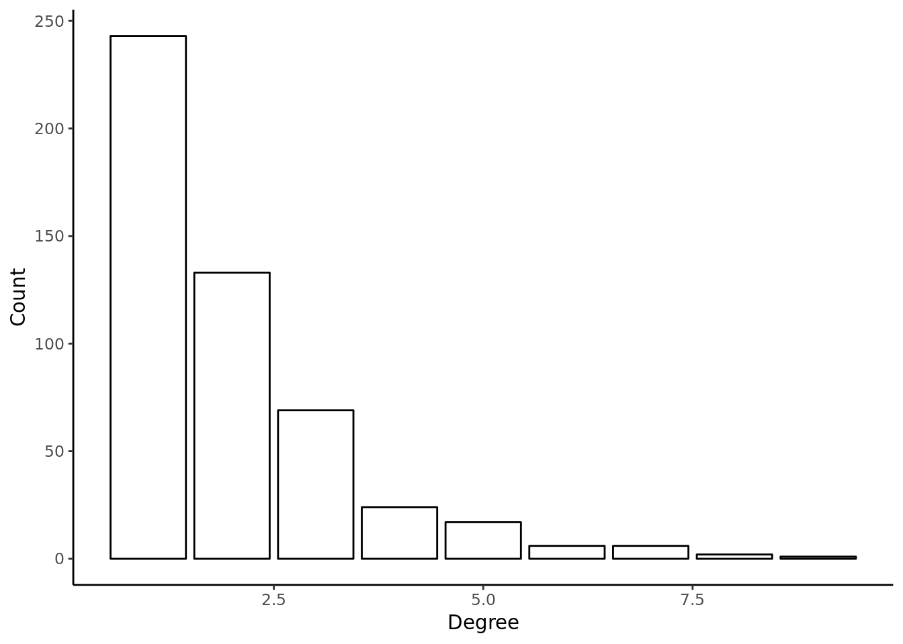

#### Runing time by method 

<table class="table table-condensed" style="width: auto !important; ">
 <thead>
  <tr>
   <th style="text-align:left;">   </th>
   <th style="text-align:left;"> key </th>
   <th style="text-align:right;"> doc_count </th>
   <th style="text-align:right;"> sum_wallTime_ms.value </th>
   <th style="text-align:left;"> avg_wallTime_ms.value </th>
   <th style="text-align:left;"> includedInTotal </th>
  </tr>
 </thead>
<tbody>
  <tr>
   <td style="text-align:left;"> 2 </td>
   <td style="text-align:left;"> cycleSearch </td>
   <td style="text-align:right;"> 3,600 </td>
   <td style="text-align:right;"> 180,249 </td>
   <td style="text-align:left;"> 50.0691666666667 </td>
   <td style="text-align:left;"> Yes </td>
  </tr>
  <tr>
   <td style="text-align:left;"> 3 </td>
   <td style="text-align:left;"> getWorks </td>
   <td style="text-align:right;"> 3,600 </td>
   <td style="text-align:right;"> 88,301 </td>
   <td style="text-align:left;"> 24.5280555555556 </td>
   <td style="text-align:left;"> No </td>
  </tr>
  <tr>
   <td style="text-align:left;"> 4 </td>
   <td style="text-align:left;"> individualCycleSearch </td>
   <td style="text-align:right;"> 3,600 </td>
   <td style="text-align:right;"> 119 </td>
   <td style="text-align:left;"> 0.0330555555555556 </td>
   <td style="text-align:left;"> Yes </td>
  </tr>
  <tr>
   <td style="text-align:left;"> 6 </td>
   <td style="text-align:left;"> addItemToWork </td>
   <td style="text-align:right;"> 2,020 </td>
   <td style="text-align:right;"> 15,273 </td>
   <td style="text-align:left;"> 7.56089108910891 </td>
   <td style="text-align:left;"> No </td>
  </tr>
  <tr>
   <td style="text-align:left;"> 7 </td>
   <td style="text-align:left;"> ownsWork </td>
   <td style="text-align:right;"> 1,010 </td>
   <td style="text-align:right;"> 7,509 </td>
   <td style="text-align:left;"> 7.43465346534653 </td>
   <td style="text-align:left;"> No </td>
  </tr>
  <tr>
   <td style="text-align:left;"> 8 </td>
   <td style="text-align:left;"> init </td>
   <td style="text-align:right;"> 503 </td>
   <td style="text-align:right;"> 21,257 </td>
   <td style="text-align:left;"> 42.2604373757455 </td>
   <td style="text-align:left;"> No </td>
  </tr>
  <tr>
   <td style="text-align:left;"> 9 </td>
   <td style="text-align:left;"> searchAndConnect </td>
   <td style="text-align:right;"> 501 </td>
   <td style="text-align:right;"> 33,010,369 </td>
   <td style="text-align:left;"> 65888.9600798403 </td>
   <td style="text-align:left;"> Yes </td>
  </tr>
  <tr>
   <td style="text-align:left;"> 10 </td>
   <td style="text-align:left;"> knowsAgent </td>
   <td style="text-align:right;"> 500 </td>
   <td style="text-align:right;"> 850 </td>
   <td style="text-align:left;"> 1.7 </td>
   <td style="text-align:left;"> No </td>
  </tr>
  <tr>
   <td style="text-align:left;font-weight: bold;"> 1 </td>
   <td style="text-align:left;font-weight: bold;"> Total </td>
   <td style="text-align:right;font-weight: bold;"> 14,901 </td>
   <td style="text-align:right;font-weight: bold;"> 33,423,768 </td>
   <td style="text-align:left;font-weight: bold;">  </td>
   <td style="text-align:left;font-weight: bold;">  </td>
  </tr>
</tbody>
</table>
####  Found structures 

#####  Cycles 

Number of cycles found:  0 

<button class="btn btn-primary" data-toggle="collapse" data-target="#QLDLKHZBJU"> Show/Hide foundCycle query </button> 
 
  
     GET /filebeat-*/_search 
              { 
                "query": {
                  "bool": {
                    "must": [
                      { "match_phrase": {
                        "simulationId": "SIM08-02-11-29-JjmpZp--DV"
                        }
                      },
                      { "bool": {
                        "should": [
                          { "match": {
                            "keyword": "foundCycle"
                          }}
                        ]
                      }}
                    ]
                  }
                }
              }
     

#####  Paths 

Number of paths found:  3600 

<button class="btn btn-primary" data-toggle="collapse" data-target="#UZQODENHJH"> Show/Hide foundPath query </button> 
 
  
     GET /filebeat-*/_search 
              { 
                "query": {
                  "bool": {
                    "must": [
                      { "match_phrase": {
                        "simulationId": "SIM08-02-11-29-JjmpZp--DV"
                        }
                      },
                      { "bool": {
                        "should": [
                          { "match": {
                            "keyword": "foundPath"
                          }}
                        ]
                      }}
                    ]
                  }
                }
              }
     

## Scatterplots of experiment 

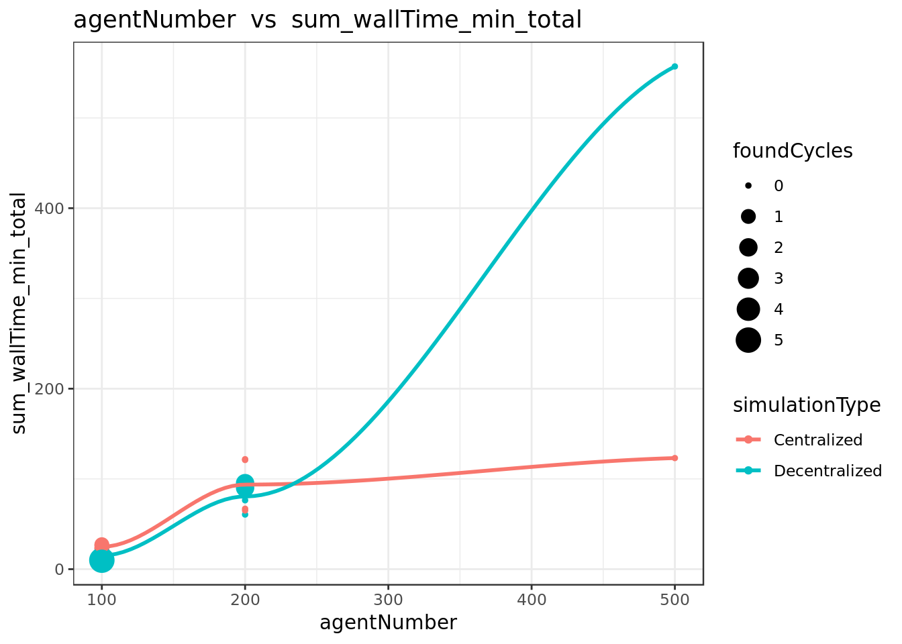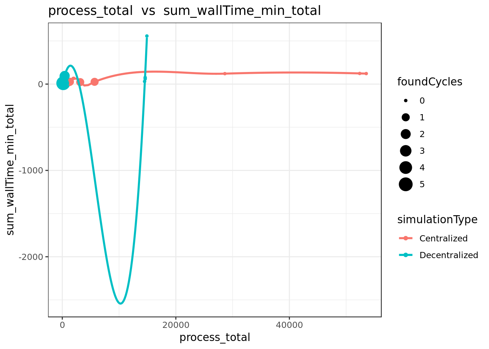   

# Experiment  2 

 

## Experimental set up 

<table class="table table-condensed" style="width: auto !important; ">
 <thead>
  <tr>
   <th style="text-align:left;">   </th>
   <th style="text-align:left;"> Values </th>
  </tr>
 </thead>
<tbody>
  <tr>
   <td style="text-align:left;"> experimentId </td>
   <td style="text-align:left;"> EXP08-05-12-48-qrNbzW </td>
  </tr>
  <tr>
   <td style="text-align:left;"> agentNumbers </td>
   <td style="text-align:left;"> 100, 200, 500 </td>
  </tr>
  <tr>
   <td style="text-align:left;"> maxDistances </td>
   <td style="text-align:left;"> 10, 30 </td>
  </tr>
  <tr>
   <td style="text-align:left;"> randomWorksNumberMultipliers </td>
   <td style="text-align:left;"> 2 </td>
  </tr>
  <tr>
   <td style="text-align:left;"> chainLengths </td>
   <td style="text-align:left;"> 10, 20 </td>
  </tr>
</tbody>
</table>
## Descriptive analysis of each simulation

###  SIM08-05-12-48-xsitDp--CV 

#### simulationParameters 

<table class="table table-condensed" style="width: auto !important; ">
 <thead>
  <tr>
   <th style="text-align:left;"> agentNumber </th>
   <th style="text-align:right;"> similarityConnectThreshold </th>
   <th style="text-align:left;"> chainLength </th>
   <th style="text-align:left;"> similaritySearchThreshold </th>
   <th style="text-align:left;"> maxDistance </th>
   <th style="text-align:left;"> randomWorksNumberMultiplier </th>
  </tr>
 </thead>
<tbody>
  <tr>
   <td style="text-align:left;width: 20em; "> 100 </td>
   <td style="text-align:right;width: 15em; "> 0.5 </td>
   <td style="text-align:left;width: 15em; "> 10 </td>
   <td style="text-align:left;width: 15em; "> 1 </td>
   <td style="text-align:left;width: 15em; "> 10 </td>
   <td style="text-align:left;width: 15em; "> 2 </td>
  </tr>
</tbody>
</table>
#### Degree distribution of agent->knows->agent edges

#### Runing time by method 

<table class="table table-condensed" style="width: auto !important; ">
 <thead>
  <tr>
   <th style="text-align:left;"> key </th>
   <th style="text-align:right;"> doc_count </th>
   <th style="text-align:right;"> sum_wallTime_ms.value </th>
   <th style="text-align:left;"> avg_wallTime_ms.value </th>
   <th style="text-align:left;"> includedInTotal </th>
  </tr>
 </thead>
<tbody>
  <tr>
   <td style="text-align:left;"> connectIfSimilar </td>
   <td style="text-align:right;"> 87,990 </td>
   <td style="text-align:right;"> 690,222 </td>
   <td style="text-align:left;"> 7.84432321854756 </td>
   <td style="text-align:left;"> No </td>
  </tr>
  <tr>
   <td style="text-align:left;"> existsSimilarity </td>
   <td style="text-align:right;"> 87,990 </td>
   <td style="text-align:right;"> 661,208 </td>
   <td style="text-align:left;"> 7.51458120240936 </td>
   <td style="text-align:left;"> No </td>
  </tr>
  <tr>
   <td style="text-align:left;"> similarityEdges </td>
   <td style="text-align:right;"> 87,990 </td>
   <td style="text-align:right;"> 644,003 </td>
   <td style="text-align:left;"> 7.31904761904762 </td>
   <td style="text-align:left;"> No </td>
  </tr>
  <tr>
   <td style="text-align:left;"> connect </td>
   <td style="text-align:right;"> 13,942 </td>
   <td style="text-align:right;"> 26,564 </td>
   <td style="text-align:left;"> 1.90532204848659 </td>
   <td style="text-align:left;"> Yes </td>
  </tr>
  <tr>
   <td style="text-align:left;"> connectAllSimilar </td>
   <td style="text-align:right;"> 420 </td>
   <td style="text-align:right;"> 691,307 </td>
   <td style="text-align:left;"> 1645.96904761905 </td>
   <td style="text-align:left;"> Yes </td>
  </tr>
  <tr>
   <td style="text-align:left;"> init </td>
   <td style="text-align:right;"> 103 </td>
   <td style="text-align:right;"> 11,702 </td>
   <td style="text-align:left;"> 113.611650485437 </td>
   <td style="text-align:left;"> No </td>
  </tr>
  <tr>
   <td style="text-align:left;"> searchAndConnect </td>
   <td style="text-align:right;"> 10 </td>
   <td style="text-align:right;"> 55,982 </td>
   <td style="text-align:left;"> 5598.2 </td>
   <td style="text-align:left;"> Yes </td>
  </tr>
  <tr>
   <td style="text-align:left;"> cycleSearch </td>
   <td style="text-align:right;"> 9 </td>
   <td style="text-align:right;"> 665 </td>
   <td style="text-align:left;"> 73.8888888888889 </td>
   <td style="text-align:left;"> Yes </td>
  </tr>
  <tr>
   <td style="text-align:left;"> getWorks </td>
   <td style="text-align:right;"> 9 </td>
   <td style="text-align:right;"> 200 </td>
   <td style="text-align:left;"> 22.2222222222222 </td>
   <td style="text-align:left;"> Yes </td>
  </tr>
  <tr>
   <td style="text-align:left;font-weight: bold;"> Total </td>
   <td style="text-align:right;font-weight: bold;"> 14,395 </td>
   <td style="text-align:right;font-weight: bold;"> 776,074 </td>
   <td style="text-align:left;font-weight: bold;">  </td>
   <td style="text-align:left;font-weight: bold;">  </td>
  </tr>
</tbody>
</table>
####  Found structures 

#####  Cycles 

Number of cycles found:  1 

<button class="btn btn-primary" data-toggle="collapse" data-target="#LPSWSCJWNV"> Show/Hide foundCycle query </button> 
 
  
     GET /filebeat-*/_search 
              { 
                "query": {
                  "bool": {
                    "must": [
                      { "match_phrase": {
                        "simulationId": "SIM08-05-12-48-xsitDp--CV"
                        }
                      },
                      { "bool": {
                        "should": [
                          { "match": {
                            "keyword": "foundCycle"
                          }}
                        ]
                      }}
                    ]
                  }
                }
              }
     

#####  Paths 

Number of paths found:  0 

<button class="btn btn-primary" data-toggle="collapse" data-target="#SEDVSISMBS"> Show/Hide foundPath query </button> 
 
  
     GET /filebeat-*/_search 
              { 
                "query": {
                  "bool": {
                    "must": [
                      { "match_phrase": {
                        "simulationId": "SIM08-05-12-48-xsitDp--CV"
                        }
                      },
                      { "bool": {
                        "should": [
                          { "match": {
                            "keyword": "foundPath"
                          }}
                        ]
                      }}
                    ]
                  }
                }
              }
     

###  SIM08-05-12-48-xsitDp--DV 

#### simulationParameters 

<table class="table table-condensed" style="width: auto !important; ">
 <thead>
  <tr>
   <th style="text-align:left;"> agentNumber </th>
   <th style="text-align:right;"> similarityConnectThreshold </th>
   <th style="text-align:left;"> chainLength </th>
   <th style="text-align:left;"> similaritySearchThreshold </th>
   <th style="text-align:left;"> maxDistance </th>
   <th style="text-align:left;"> randomWorksNumberMultiplier </th>
  </tr>
 </thead>
<tbody>
  <tr>
   <td style="text-align:left;width: 20em; "> 100 </td>
   <td style="text-align:right;width: 15em; "> 0.5 </td>
   <td style="text-align:left;width: 15em; "> 10 </td>
   <td style="text-align:left;width: 15em; "> 1 </td>
   <td style="text-align:left;width: 15em; "> 10 </td>
   <td style="text-align:left;width: 15em; "> 2 </td>
  </tr>
</tbody>
</table>
#### Degree distribution of agent->knows->agent edges

#### Runing time by method 

<table class="table table-condensed" style="width: auto !important; ">
 <thead>
  <tr>
   <th style="text-align:left;"> key </th>
   <th style="text-align:right;"> doc_count </th>
   <th style="text-align:right;"> sum_wallTime_ms.value </th>
   <th style="text-align:left;"> avg_wallTime_ms.value </th>
   <th style="text-align:left;"> includedInTotal </th>
  </tr>
 </thead>
<tbody>
  <tr>
   <td style="text-align:left;"> addItemToWork </td>
   <td style="text-align:right;"> 420 </td>
   <td style="text-align:right;"> 6,689 </td>
   <td style="text-align:left;"> 15.9261904761905 </td>
   <td style="text-align:left;"> No </td>
  </tr>
  <tr>
   <td style="text-align:left;"> ownsWork </td>
   <td style="text-align:right;"> 210 </td>
   <td style="text-align:right;"> 3,067 </td>
   <td style="text-align:left;"> 14.6047619047619 </td>
   <td style="text-align:left;"> No </td>
  </tr>
  <tr>
   <td style="text-align:left;"> init </td>
   <td style="text-align:right;"> 103 </td>
   <td style="text-align:right;"> 12,116 </td>
   <td style="text-align:left;"> 117.631067961165 </td>
   <td style="text-align:left;"> No </td>
  </tr>
  <tr>
   <td style="text-align:left;"> knowsAgent </td>
   <td style="text-align:right;"> 100 </td>
   <td style="text-align:right;"> 303 </td>
   <td style="text-align:left;"> 3.03 </td>
   <td style="text-align:left;"> No </td>
  </tr>
  <tr>
   <td style="text-align:left;"> searchAndConnect </td>
   <td style="text-align:right;"> 91 </td>
   <td style="text-align:right;"> 410,537 </td>
   <td style="text-align:left;"> 4511.3956043956 </td>
   <td style="text-align:left;"> Yes </td>
  </tr>
  <tr>
   <td style="text-align:left;"> getWorksItems </td>
   <td style="text-align:right;"> 18 </td>
   <td style="text-align:right;"> 51 </td>
   <td style="text-align:left;"> 2.83333333333333 </td>
   <td style="text-align:left;"> Yes </td>
  </tr>
  <tr>
   <td style="text-align:left;"> individualCycleSearch </td>
   <td style="text-align:right;"> 14 </td>
   <td style="text-align:right;"> 116 </td>
   <td style="text-align:left;"> 8.28571428571429 </td>
   <td style="text-align:left;"> Yes </td>
  </tr>
  <tr>
   <td style="text-align:left;"> cycleSearch </td>
   <td style="text-align:right;"> 6 </td>
   <td style="text-align:right;"> 7,184 </td>
   <td style="text-align:left;"> 1197.33333333333 </td>
   <td style="text-align:left;"> Yes </td>
  </tr>
  <tr>
   <td style="text-align:left;"> getWorks </td>
   <td style="text-align:right;"> 6 </td>
   <td style="text-align:right;"> 3,149 </td>
   <td style="text-align:left;"> 524.833333333333 </td>
   <td style="text-align:left;"> No </td>
  </tr>
  <tr>
   <td style="text-align:left;font-weight: bold;"> Total </td>
   <td style="text-align:right;font-weight: bold;"> 131 </td>
   <td style="text-align:right;font-weight: bold;"> 419,879 </td>
   <td style="text-align:left;font-weight: bold;">  </td>
   <td style="text-align:left;font-weight: bold;">  </td>
  </tr>
</tbody>
</table>
####  Found structures 

#####  Cycles 

Number of cycles found:  1 

<button class="btn btn-primary" data-toggle="collapse" data-target="#FDVBLXNFFU"> Show/Hide foundCycle query </button> 
 
  
     GET /filebeat-*/_search 
              { 
                "query": {
                  "bool": {
                    "must": [
                      { "match_phrase": {
                        "simulationId": "SIM08-05-12-48-xsitDp--DV"
                        }
                      },
                      { "bool": {
                        "should": [
                          { "match": {
                            "keyword": "foundCycle"
                          }}
                        ]
                      }}
                    ]
                  }
                }
              }
     

#####  Paths 

Number of paths found:  0 

<button class="btn btn-primary" data-toggle="collapse" data-target="#GMBRDQYLWR"> Show/Hide foundPath query </button> 
 
  
     GET /filebeat-*/_search 
              { 
                "query": {
                  "bool": {
                    "must": [
                      { "match_phrase": {
                        "simulationId": "SIM08-05-12-48-xsitDp--DV"
                        }
                      },
                      { "bool": {
                        "should": [
                          { "match": {
                            "keyword": "foundPath"
                          }}
                        ]
                      }}
                    ]
                  }
                }
              }
     

###  SIM08-05-01-00-fbyPmL--CV 

#### simulationParameters 

<table class="table table-condensed" style="width: auto !important; ">
 <thead>
  <tr>
   <th style="text-align:left;"> agentNumber </th>
   <th style="text-align:right;"> similarityConnectThreshold </th>
   <th style="text-align:left;"> chainLength </th>
   <th style="text-align:left;"> similaritySearchThreshold </th>
   <th style="text-align:left;"> maxDistance </th>
   <th style="text-align:left;"> randomWorksNumberMultiplier </th>
  </tr>
 </thead>
<tbody>
  <tr>
   <td style="text-align:left;width: 20em; "> 100 </td>
   <td style="text-align:right;width: 15em; "> 0.5 </td>
   <td style="text-align:left;width: 15em; "> 10 </td>
   <td style="text-align:left;width: 15em; "> 1 </td>
   <td style="text-align:left;width: 15em; "> 30 </td>
   <td style="text-align:left;width: 15em; "> 2 </td>
  </tr>
</tbody>
</table>
#### Degree distribution of agent->knows->agent edges

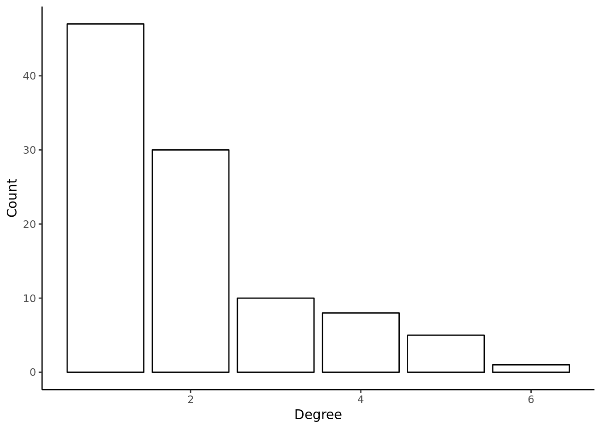

#### Runing time by method 

<table class="table table-condensed" style="width: auto !important; ">
 <thead>
  <tr>
   <th style="text-align:left;"> key </th>
   <th style="text-align:right;"> doc_count </th>
   <th style="text-align:right;"> sum_wallTime_ms.value </th>
   <th style="text-align:left;"> avg_wallTime_ms.value </th>
   <th style="text-align:left;"> includedInTotal </th>
  </tr>
 </thead>
<tbody>
  <tr>
   <td style="text-align:left;"> connectIfSimilar </td>
   <td style="text-align:right;"> 87,990 </td>
   <td style="text-align:right;"> 708,959 </td>
   <td style="text-align:left;"> 8.05726787134902 </td>
   <td style="text-align:left;"> No </td>
  </tr>
  <tr>
   <td style="text-align:left;"> existsSimilarity </td>
   <td style="text-align:right;"> 87,990 </td>
   <td style="text-align:right;"> 705,644 </td>
   <td style="text-align:left;"> 8.01959313558359 </td>
   <td style="text-align:left;"> No </td>
  </tr>
  <tr>
   <td style="text-align:left;"> similarityEdges </td>
   <td style="text-align:right;"> 87,990 </td>
   <td style="text-align:right;"> 687,613 </td>
   <td style="text-align:left;"> 7.81467212183203 </td>
   <td style="text-align:left;"> No </td>
  </tr>
  <tr>
   <td style="text-align:left;"> connect </td>
   <td style="text-align:right;"> 787 </td>
   <td style="text-align:right;"> 1,564 </td>
   <td style="text-align:left;"> 1.98729351969504 </td>
   <td style="text-align:left;"> Yes </td>
  </tr>
  <tr>
   <td style="text-align:left;"> connectAllSimilar </td>
   <td style="text-align:right;"> 420 </td>
   <td style="text-align:right;"> 709,911 </td>
   <td style="text-align:left;"> 1690.26428571429 </td>
   <td style="text-align:left;"> Yes </td>
  </tr>
  <tr>
   <td style="text-align:left;"> init </td>
   <td style="text-align:right;"> 103 </td>
   <td style="text-align:right;"> 9,844 </td>
   <td style="text-align:left;"> 95.5728155339806 </td>
   <td style="text-align:left;"> No </td>
  </tr>
  <tr>
   <td style="text-align:left;"> searchAndConnect </td>
   <td style="text-align:right;"> 3 </td>
   <td style="text-align:right;"> 37,914 </td>
   <td style="text-align:left;"> 12638 </td>
   <td style="text-align:left;"> Yes </td>
  </tr>
  <tr>
   <td style="text-align:left;font-weight: bold;"> Total </td>
   <td style="text-align:right;font-weight: bold;"> 1,214 </td>
   <td style="text-align:right;font-weight: bold;"> 750,110 </td>
   <td style="text-align:left;font-weight: bold;">  </td>
   <td style="text-align:left;font-weight: bold;">  </td>
  </tr>
</tbody>
</table>
####  Found structures 

#####  Cycles 

Number of cycles found:  1 

<button class="btn btn-primary" data-toggle="collapse" data-target="#ZXLLEDIILY"> Show/Hide foundCycle query </button> 
 
  
     GET /filebeat-*/_search 
              { 
                "query": {
                  "bool": {
                    "must": [
                      { "match_phrase": {
                        "simulationId": "SIM08-05-01-00-fbyPmL--CV"
                        }
                      },
                      { "bool": {
                        "should": [
                          { "match": {
                            "keyword": "foundCycle"
                          }}
                        ]
                      }}
                    ]
                  }
                }
              }
     

#####  Paths 

Number of paths found:  0 

<button class="btn btn-primary" data-toggle="collapse" data-target="#RSPLGLIVHJ"> Show/Hide foundPath query </button> 
 
  
     GET /filebeat-*/_search 
              { 
                "query": {
                  "bool": {
                    "must": [
                      { "match_phrase": {
                        "simulationId": "SIM08-05-01-00-fbyPmL--CV"
                        }
                      },
                      { "bool": {
                        "should": [
                          { "match": {
                            "keyword": "foundPath"
                          }}
                        ]
                      }}
                    ]
                  }
                }
              }
     

###  SIM08-05-01-00-fbyPmL--DV 

#### simulationParameters 

<table class="table table-condensed" style="width: auto !important; ">
 <thead>
  <tr>
   <th style="text-align:left;"> agentNumber </th>
   <th style="text-align:right;"> similarityConnectThreshold </th>
   <th style="text-align:left;"> chainLength </th>
   <th style="text-align:left;"> similaritySearchThreshold </th>
   <th style="text-align:left;"> maxDistance </th>
   <th style="text-align:left;"> randomWorksNumberMultiplier </th>
  </tr>
 </thead>
<tbody>
  <tr>
   <td style="text-align:left;width: 20em; "> 100 </td>
   <td style="text-align:right;width: 15em; "> 0.5 </td>
   <td style="text-align:left;width: 15em; "> 10 </td>
   <td style="text-align:left;width: 15em; "> 1 </td>
   <td style="text-align:left;width: 15em; "> 30 </td>
   <td style="text-align:left;width: 15em; "> 2 </td>
  </tr>
</tbody>
</table>
#### Degree distribution of agent->knows->agent edges

#### Runing time by method 

<table class="table table-condensed" style="width: auto !important; ">
 <thead>
  <tr>
   <th style="text-align:left;"> key </th>
   <th style="text-align:right;"> doc_count </th>
   <th style="text-align:right;"> sum_wallTime_ms.value </th>
   <th style="text-align:left;"> avg_wallTime_ms.value </th>
   <th style="text-align:left;"> includedInTotal </th>
  </tr>
 </thead>
<tbody>
  <tr>
   <td style="text-align:left;"> addItemToWork </td>
   <td style="text-align:right;"> 420 </td>
   <td style="text-align:right;"> 5,117 </td>
   <td style="text-align:left;"> 12.1833333333333 </td>
   <td style="text-align:left;"> No </td>
  </tr>
  <tr>
   <td style="text-align:left;"> ownsWork </td>
   <td style="text-align:right;"> 210 </td>
   <td style="text-align:right;"> 2,516 </td>
   <td style="text-align:left;"> 11.9809523809524 </td>
   <td style="text-align:left;"> No </td>
  </tr>
  <tr>
   <td style="text-align:left;"> init </td>
   <td style="text-align:right;"> 103 </td>
   <td style="text-align:right;"> 10,224 </td>
   <td style="text-align:left;"> 99.2621359223301 </td>
   <td style="text-align:left;"> No </td>
  </tr>
  <tr>
   <td style="text-align:left;"> knowsAgent </td>
   <td style="text-align:right;"> 100 </td>
   <td style="text-align:right;"> 204 </td>
   <td style="text-align:left;"> 2.04 </td>
   <td style="text-align:left;"> No </td>
  </tr>
  <tr>
   <td style="text-align:left;"> searchAndConnect </td>
   <td style="text-align:right;"> 98 </td>
   <td style="text-align:right;"> 623,784 </td>
   <td style="text-align:left;"> 6365.14285714286 </td>
   <td style="text-align:left;"> Yes </td>
  </tr>
  <tr>
   <td style="text-align:left;"> cycleSearch </td>
   <td style="text-align:right;"> 21 </td>
   <td style="text-align:right;"> 832 </td>
   <td style="text-align:left;"> 39.6190476190476 </td>
   <td style="text-align:left;"> Yes </td>
  </tr>
  <tr>
   <td style="text-align:left;"> getWorks </td>
   <td style="text-align:right;"> 21 </td>
   <td style="text-align:right;"> 3,900 </td>
   <td style="text-align:left;"> 185.714285714286 </td>
   <td style="text-align:left;"> No </td>
  </tr>
  <tr>
   <td style="text-align:left;"> individualCycleSearch </td>
   <td style="text-align:right;"> 21 </td>
   <td style="text-align:right;"> 2 </td>
   <td style="text-align:left;"> 0.0952380952380952 </td>
   <td style="text-align:left;"> Yes </td>
  </tr>
  <tr>
   <td style="text-align:left;"> getWorksItems </td>
   <td style="text-align:right;"> 18 </td>
   <td style="text-align:right;"> 37 </td>
   <td style="text-align:left;"> 2.05555555555556 </td>
   <td style="text-align:left;"> Yes </td>
  </tr>
  <tr>
   <td style="text-align:left;font-weight: bold;"> Total </td>
   <td style="text-align:right;font-weight: bold;"> 163 </td>
   <td style="text-align:right;font-weight: bold;"> 625,698 </td>
   <td style="text-align:left;font-weight: bold;">  </td>
   <td style="text-align:left;font-weight: bold;">  </td>
  </tr>
</tbody>
</table>
####  Found structures 

#####  Cycles 

Number of cycles found:  2 

<button class="btn btn-primary" data-toggle="collapse" data-target="#ZLBHQIMKJE"> Show/Hide foundCycle query </button> 
 
  
     GET /filebeat-*/_search 
              { 
                "query": {
                  "bool": {
                    "must": [
                      { "match_phrase": {
                        "simulationId": "SIM08-05-01-00-fbyPmL--DV"
                        }
                      },
                      { "bool": {
                        "should": [
                          { "match": {
                            "keyword": "foundCycle"
                          }}
                        ]
                      }}
                    ]
                  }
                }
              }
     

#####  Paths 

Number of paths found:  0 

<button class="btn btn-primary" data-toggle="collapse" data-target="#PWZYPAMONM"> Show/Hide foundPath query </button> 
 
  
     GET /filebeat-*/_search 
              { 
                "query": {
                  "bool": {
                    "must": [
                      { "match_phrase": {
                        "simulationId": "SIM08-05-01-00-fbyPmL--DV"
                        }
                      },
                      { "bool": {
                        "should": [
                          { "match": {
                            "keyword": "foundPath"
                          }}
                        ]
                      }}
                    ]
                  }
                }
              }
     

###  SIM08-05-01-13-Rou4Mt--CV 

#### simulationParameters 

<table class="table table-condensed" style="width: auto !important; ">
 <thead>
  <tr>
   <th style="text-align:left;"> agentNumber </th>
   <th style="text-align:right;"> similarityConnectThreshold </th>
   <th style="text-align:left;"> chainLength </th>
   <th style="text-align:left;"> similaritySearchThreshold </th>
   <th style="text-align:left;"> maxDistance </th>
   <th style="text-align:left;"> randomWorksNumberMultiplier </th>
  </tr>
 </thead>
<tbody>
  <tr>
   <td style="text-align:left;width: 20em; "> 100 </td>
   <td style="text-align:right;width: 15em; "> 0.5 </td>
   <td style="text-align:left;width: 15em; "> 20 </td>
   <td style="text-align:left;width: 15em; "> 1 </td>
   <td style="text-align:left;width: 15em; "> 10 </td>
   <td style="text-align:left;width: 15em; "> 2 </td>
  </tr>
</tbody>
</table>
#### Degree distribution of agent->knows->agent edges

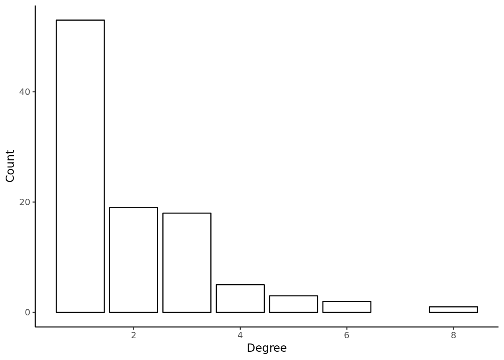

#### Runing time by method 

<table class="table table-condensed" style="width: auto !important; ">
 <thead>
  <tr>
   <th style="text-align:left;"> key </th>
   <th style="text-align:right;"> doc_count </th>
   <th style="text-align:right;"> sum_wallTime_ms.value </th>
   <th style="text-align:left;"> avg_wallTime_ms.value </th>
   <th style="text-align:left;"> includedInTotal </th>
  </tr>
 </thead>
<tbody>
  <tr>
   <td style="text-align:left;"> connectIfSimilar </td>
   <td style="text-align:right;"> 96,580 </td>
   <td style="text-align:right;"> 839,387 </td>
   <td style="text-align:left;"> 8.69110581901015 </td>
   <td style="text-align:left;"> No </td>
  </tr>
  <tr>
   <td style="text-align:left;"> existsSimilarity </td>
   <td style="text-align:right;"> 96,580 </td>
   <td style="text-align:right;"> 829,673 </td>
   <td style="text-align:left;"> 8.59052598881756 </td>
   <td style="text-align:left;"> No </td>
  </tr>
  <tr>
   <td style="text-align:left;"> similarityEdges </td>
   <td style="text-align:right;"> 96,580 </td>
   <td style="text-align:right;"> 809,392 </td>
   <td style="text-align:left;"> 8.38053427210603 </td>
   <td style="text-align:left;"> No </td>
  </tr>
  <tr>
   <td style="text-align:left;"> connect </td>
   <td style="text-align:right;"> 3,999 </td>
   <td style="text-align:right;"> 7,576 </td>
   <td style="text-align:left;"> 1.8944736184046 </td>
   <td style="text-align:left;"> Yes </td>
  </tr>
  <tr>
   <td style="text-align:left;"> connectAllSimilar </td>
   <td style="text-align:right;"> 440 </td>
   <td style="text-align:right;"> 840,519 </td>
   <td style="text-align:left;"> 1910.27045454545 </td>
   <td style="text-align:left;"> Yes </td>
  </tr>
  <tr>
   <td style="text-align:left;"> init </td>
   <td style="text-align:right;"> 103 </td>
   <td style="text-align:right;"> 9,781 </td>
   <td style="text-align:left;"> 94.9611650485437 </td>
   <td style="text-align:left;"> No </td>
  </tr>
  <tr>
   <td style="text-align:left;font-weight: bold;"> Total </td>
   <td style="text-align:right;font-weight: bold;"> 4,444 </td>
   <td style="text-align:right;font-weight: bold;"> 848,905 </td>
   <td style="text-align:left;font-weight: bold;">  </td>
   <td style="text-align:left;font-weight: bold;">  </td>
  </tr>
</tbody>
</table>
####  Found structures 

#####  Cycles 

Number of cycles found:  1 

<button class="btn btn-primary" data-toggle="collapse" data-target="#LGYBLVVUYR"> Show/Hide foundCycle query </button> 
 
  
     GET /filebeat-*/_search 
              { 
                "query": {
                  "bool": {
                    "must": [
                      { "match_phrase": {
                        "simulationId": "SIM08-05-01-13-Rou4Mt--CV"
                        }
                      },
                      { "bool": {
                        "should": [
                          { "match": {
                            "keyword": "foundCycle"
                          }}
                        ]
                      }}
                    ]
                  }
                }
              }
     

#####  Paths 

Number of paths found:  0 

<button class="btn btn-primary" data-toggle="collapse" data-target="#GJIIUANNDM"> Show/Hide foundPath query </button> 
 
  
     GET /filebeat-*/_search 
              { 
                "query": {
                  "bool": {
                    "must": [
                      { "match_phrase": {
                        "simulationId": "SIM08-05-01-13-Rou4Mt--CV"
                        }
                      },
                      { "bool": {
                        "should": [
                          { "match": {
                            "keyword": "foundPath"
                          }}
                        ]
                      }}
                    ]
                  }
                }
              }
     

###  SIM08-05-01-13-Rou4Mt--DV 

#### simulationParameters 

<table class="table table-condensed" style="width: auto !important; ">
 <thead>
  <tr>
   <th style="text-align:left;"> agentNumber </th>
   <th style="text-align:right;"> similarityConnectThreshold </th>
   <th style="text-align:left;"> chainLength </th>
   <th style="text-align:left;"> similaritySearchThreshold </th>
   <th style="text-align:left;"> maxDistance </th>
   <th style="text-align:left;"> randomWorksNumberMultiplier </th>
  </tr>
 </thead>
<tbody>
  <tr>
   <td style="text-align:left;width: 20em; "> 100 </td>
   <td style="text-align:right;width: 15em; "> 0.5 </td>
   <td style="text-align:left;width: 15em; "> 20 </td>
   <td style="text-align:left;width: 15em; "> 1 </td>
   <td style="text-align:left;width: 15em; "> 10 </td>
   <td style="text-align:left;width: 15em; "> 2 </td>
  </tr>
</tbody>
</table>
#### Degree distribution of agent->knows->agent edges

#### Runing time by method 

<table class="table table-condensed" style="width: auto !important; ">
 <thead>
  <tr>
   <th style="text-align:left;">   </th>
   <th style="text-align:left;"> key </th>
   <th style="text-align:right;"> doc_count </th>
   <th style="text-align:right;"> sum_wallTime_ms.value </th>
   <th style="text-align:left;"> avg_wallTime_ms.value </th>
   <th style="text-align:left;"> includedInTotal </th>
  </tr>
 </thead>
<tbody>
  <tr>
   <td style="text-align:left;"> 2 </td>
   <td style="text-align:left;"> cycleSearch </td>
   <td style="text-align:right;"> 10,797 </td>
   <td style="text-align:right;"> 151,904 </td>
   <td style="text-align:left;"> 14.0690932666481 </td>
   <td style="text-align:left;"> Yes </td>
  </tr>
  <tr>
   <td style="text-align:left;"> 3 </td>
   <td style="text-align:left;"> getWorks </td>
   <td style="text-align:right;"> 10,797 </td>
   <td style="text-align:right;"> 85,410 </td>
   <td style="text-align:left;"> 7.91053070297305 </td>
   <td style="text-align:left;"> No </td>
  </tr>
  <tr>
   <td style="text-align:left;"> 4 </td>
   <td style="text-align:left;"> individualCycleSearch </td>
   <td style="text-align:right;"> 10,797 </td>
   <td style="text-align:right;"> 504 </td>
   <td style="text-align:left;"> 0.0466796332314532 </td>
   <td style="text-align:left;"> Yes </td>
  </tr>
  <tr>
   <td style="text-align:left;"> 6 </td>
   <td style="text-align:left;"> addItemToWork </td>
   <td style="text-align:right;"> 440 </td>
   <td style="text-align:right;"> 2,891 </td>
   <td style="text-align:left;"> 6.57045454545455 </td>
   <td style="text-align:left;"> No </td>
  </tr>
  <tr>
   <td style="text-align:left;"> 7 </td>
   <td style="text-align:left;"> ownsWork </td>
   <td style="text-align:right;"> 220 </td>
   <td style="text-align:right;"> 1,519 </td>
   <td style="text-align:left;"> 6.90454545454545 </td>
   <td style="text-align:left;"> No </td>
  </tr>
  <tr>
   <td style="text-align:left;"> 8 </td>
   <td style="text-align:left;"> init </td>
   <td style="text-align:right;"> 103 </td>
   <td style="text-align:right;"> 9,855 </td>
   <td style="text-align:left;"> 95.6796116504854 </td>
   <td style="text-align:left;"> No </td>
  </tr>
  <tr>
   <td style="text-align:left;"> 9 </td>
   <td style="text-align:left;"> searchAndConnect </td>
   <td style="text-align:right;"> 101 </td>
   <td style="text-align:right;"> 607,356 </td>
   <td style="text-align:left;"> 6013.42574257426 </td>
   <td style="text-align:left;"> Yes </td>
  </tr>
  <tr>
   <td style="text-align:left;"> 10 </td>
   <td style="text-align:left;"> knowsAgent </td>
   <td style="text-align:right;"> 100 </td>
   <td style="text-align:right;"> 215 </td>
   <td style="text-align:left;"> 2.15 </td>
   <td style="text-align:left;"> No </td>
  </tr>
  <tr>
   <td style="text-align:left;font-weight: bold;"> 1 </td>
   <td style="text-align:left;font-weight: bold;"> Total </td>
   <td style="text-align:right;font-weight: bold;"> 43,289 </td>
   <td style="text-align:right;font-weight: bold;"> 1,095,159 </td>
   <td style="text-align:left;font-weight: bold;">  </td>
   <td style="text-align:left;font-weight: bold;">  </td>
  </tr>
</tbody>
</table>
####  Found structures 

#####  Cycles 

Number of cycles found:  0 

<button class="btn btn-primary" data-toggle="collapse" data-target="#IFGMCLJUWG"> Show/Hide foundCycle query </button> 
 
  
     GET /filebeat-*/_search 
              { 
                "query": {
                  "bool": {
                    "must": [
                      { "match_phrase": {
                        "simulationId": "SIM08-05-01-13-Rou4Mt--DV"
                        }
                      },
                      { "bool": {
                        "should": [
                          { "match": {
                            "keyword": "foundCycle"
                          }}
                        ]
                      }}
                    ]
                  }
                }
              }
     

#####  Paths 

Number of paths found:  10797 

<button class="btn btn-primary" data-toggle="collapse" data-target="#MWATCGRRWC"> Show/Hide foundPath query </button> 
 
  
     GET /filebeat-*/_search 
              { 
                "query": {
                  "bool": {
                    "must": [
                      { "match_phrase": {
                        "simulationId": "SIM08-05-01-13-Rou4Mt--DV"
                        }
                      },
                      { "bool": {
                        "should": [
                          { "match": {
                            "keyword": "foundPath"
                          }}
                        ]
                      }}
                    ]
                  }
                }
              }
     

###  SIM08-05-04-27-jTgnYK--CV 

#### simulationParameters 

<table class="table table-condensed" style="width: auto !important; ">
 <thead>
  <tr>
   <th style="text-align:left;"> agentNumber </th>
   <th style="text-align:right;"> similarityConnectThreshold </th>
   <th style="text-align:left;"> chainLength </th>
   <th style="text-align:left;"> similaritySearchThreshold </th>
   <th style="text-align:left;"> maxDistance </th>
   <th style="text-align:left;"> randomWorksNumberMultiplier </th>
  </tr>
 </thead>
<tbody>
  <tr>
   <td style="text-align:left;width: 20em; "> 100 </td>
   <td style="text-align:right;width: 15em; "> 0.5 </td>
   <td style="text-align:left;width: 15em; "> 20 </td>
   <td style="text-align:left;width: 15em; "> 1 </td>
   <td style="text-align:left;width: 15em; "> 30 </td>
   <td style="text-align:left;width: 15em; "> 2 </td>
  </tr>
</tbody>
</table>
#### Degree distribution of agent->knows->agent edges

#### Runing time by method 

<table class="table table-condensed" style="width: auto !important; ">
 <thead>
  <tr>
   <th style="text-align:left;">   </th>
   <th style="text-align:left;"> key </th>
   <th style="text-align:right;"> doc_count </th>
   <th style="text-align:right;"> sum_wallTime_ms.value </th>
   <th style="text-align:left;"> avg_wallTime_ms.value </th>
   <th style="text-align:left;"> includedInTotal </th>
  </tr>
 </thead>
<tbody>
  <tr>
   <td style="text-align:left;"> 1 </td>
   <td style="text-align:left;"> connectIfSimilar </td>
   <td style="text-align:right;"> 96,580 </td>
   <td style="text-align:right;"> 816,605 </td>
   <td style="text-align:left;"> 8.45521847173328 </td>
   <td style="text-align:left;"> No </td>
  </tr>
  <tr>
   <td style="text-align:left;"> 2 </td>
   <td style="text-align:left;"> existsSimilarity </td>
   <td style="text-align:right;"> 96,580 </td>
   <td style="text-align:right;"> 812,952 </td>
   <td style="text-align:left;"> 8.41739490577759 </td>
   <td style="text-align:left;"> No </td>
  </tr>
  <tr>
   <td style="text-align:left;"> 3 </td>
   <td style="text-align:left;"> similarityEdges </td>
   <td style="text-align:right;"> 96,580 </td>
   <td style="text-align:right;"> 792,437 </td>
   <td style="text-align:left;"> 8.20498032718989 </td>
   <td style="text-align:left;"> No </td>
  </tr>
  <tr>
   <td style="text-align:left;"> 4 </td>
   <td style="text-align:left;"> connect </td>
   <td style="text-align:right;"> 877 </td>
   <td style="text-align:right;"> 1,697 </td>
   <td style="text-align:left;"> 1.93500570125428 </td>
   <td style="text-align:left;"> Yes </td>
  </tr>
  <tr>
   <td style="text-align:left;"> 5 </td>
   <td style="text-align:left;"> connectAllSimilar </td>
   <td style="text-align:right;"> 440 </td>
   <td style="text-align:right;"> 817,592 </td>
   <td style="text-align:left;"> 1858.16363636364 </td>
   <td style="text-align:left;"> Yes </td>
  </tr>
  <tr>
   <td style="text-align:left;"> 6 </td>
   <td style="text-align:left;"> init </td>
   <td style="text-align:right;"> 103 </td>
   <td style="text-align:right;"> 10,251 </td>
   <td style="text-align:left;"> 99.5242718446602 </td>
   <td style="text-align:left;"> No </td>
  </tr>
  <tr>
   <td style="text-align:left;"> 9 </td>
   <td style="text-align:left;"> connectAllSimilarCentralized </td>
   <td style="text-align:right;"> 1 </td>
   <td style="text-align:right;"> 817,605 </td>
   <td style="text-align:left;"> 817605 </td>
   <td style="text-align:left;"> Yes </td>
  </tr>
  <tr>
   <td style="text-align:left;"> 10 </td>
   <td style="text-align:left;"> cycleSearch </td>
   <td style="text-align:right;"> 1 </td>
   <td style="text-align:right;"> 47 </td>
   <td style="text-align:left;"> 47 </td>
   <td style="text-align:left;"> Yes </td>
  </tr>
  <tr>
   <td style="text-align:left;font-weight: bold;"> 11 </td>
   <td style="text-align:left;font-weight: bold;"> Total </td>
   <td style="text-align:right;font-weight: bold;"> 1,322 </td>
   <td style="text-align:right;font-weight: bold;"> 1,637,139 </td>
   <td style="text-align:left;font-weight: bold;">  </td>
   <td style="text-align:left;font-weight: bold;">  </td>
  </tr>
</tbody>
</table>
####  Found structures 

#####  Cycles 

Number of cycles found:  1 

<button class="btn btn-primary" data-toggle="collapse" data-target="#WGFGCWSOTB"> Show/Hide foundCycle query </button> 
 
  
     GET /filebeat-*/_search 
              { 
                "query": {
                  "bool": {
                    "must": [
                      { "match_phrase": {
                        "simulationId": "SIM08-05-04-27-jTgnYK--CV"
                        }
                      },
                      { "bool": {
                        "should": [
                          { "match": {
                            "keyword": "foundCycle"
                          }}
                        ]
                      }}
                    ]
                  }
                }
              }
     

#####  Paths 

Number of paths found:  0 

<button class="btn btn-primary" data-toggle="collapse" data-target="#CLKMMDYFEE"> Show/Hide foundPath query </button> 
 
  
     GET /filebeat-*/_search 
              { 
                "query": {
                  "bool": {
                    "must": [
                      { "match_phrase": {
                        "simulationId": "SIM08-05-04-27-jTgnYK--CV"
                        }
                      },
                      { "bool": {
                        "should": [
                          { "match": {
                            "keyword": "foundPath"
                          }}
                        ]
                      }}
                    ]
                  }
                }
              }
     

###  SIM08-05-04-27-jTgnYK--DV 

#### simulationParameters 

<table class="table table-condensed" style="width: auto !important; ">
 <thead>
  <tr>
   <th style="text-align:left;"> agentNumber </th>
   <th style="text-align:right;"> similarityConnectThreshold </th>
   <th style="text-align:left;"> chainLength </th>
   <th style="text-align:left;"> similaritySearchThreshold </th>
   <th style="text-align:left;"> maxDistance </th>
   <th style="text-align:left;"> randomWorksNumberMultiplier </th>
  </tr>
 </thead>
<tbody>
  <tr>
   <td style="text-align:left;width: 20em; "> 100 </td>
   <td style="text-align:right;width: 15em; "> 0.5 </td>
   <td style="text-align:left;width: 15em; "> 20 </td>
   <td style="text-align:left;width: 15em; "> 1 </td>
   <td style="text-align:left;width: 15em; "> 30 </td>
   <td style="text-align:left;width: 15em; "> 2 </td>
  </tr>
</tbody>
</table>
#### Degree distribution of agent->knows->agent edges

#### Runing time by method 

<table class="table table-condensed" style="width: auto !important; ">
 <thead>
  <tr>
   <th style="text-align:left;"> key </th>
   <th style="text-align:right;"> doc_count </th>
   <th style="text-align:right;"> sum_wallTime_ms.value </th>
   <th style="text-align:left;"> avg_wallTime_ms.value </th>
   <th style="text-align:left;"> includedInTotal </th>
  </tr>
 </thead>
<tbody>
  <tr>
   <td style="text-align:left;"> addItemToWork </td>
   <td style="text-align:right;"> 440 </td>
   <td style="text-align:right;"> 2,948 </td>
   <td style="text-align:left;"> 6.7 </td>
   <td style="text-align:left;"> No </td>
  </tr>
  <tr>
   <td style="text-align:left;"> ownsWork </td>
   <td style="text-align:right;"> 220 </td>
   <td style="text-align:right;"> 1,650 </td>
   <td style="text-align:left;"> 7.5 </td>
   <td style="text-align:left;"> No </td>
  </tr>
  <tr>
   <td style="text-align:left;"> init </td>
   <td style="text-align:right;"> 103 </td>
   <td style="text-align:right;"> 9,823 </td>
   <td style="text-align:left;"> 95.368932038835 </td>
   <td style="text-align:left;"> No </td>
  </tr>
  <tr>
   <td style="text-align:left;"> searchAndConnect </td>
   <td style="text-align:right;"> 101 </td>
   <td style="text-align:right;"> 790,073 </td>
   <td style="text-align:left;"> 7822.50495049505 </td>
   <td style="text-align:left;"> Yes </td>
  </tr>
  <tr>
   <td style="text-align:left;"> knowsAgent </td>
   <td style="text-align:right;"> 100 </td>
   <td style="text-align:right;"> 211 </td>
   <td style="text-align:left;"> 2.11 </td>
   <td style="text-align:left;"> No </td>
  </tr>
  <tr>
   <td style="text-align:left;"> getWorksItems </td>
   <td style="text-align:right;"> 38 </td>
   <td style="text-align:right;"> 55 </td>
   <td style="text-align:left;"> 1.44736842105263 </td>
   <td style="text-align:left;"> Yes </td>
  </tr>
  <tr>
   <td style="text-align:left;"> cycleSearch </td>
   <td style="text-align:right;"> 27 </td>
   <td style="text-align:right;"> 1,248 </td>
   <td style="text-align:left;"> 46.2222222222222 </td>
   <td style="text-align:left;"> Yes </td>
  </tr>
  <tr>
   <td style="text-align:left;"> getWorks </td>
   <td style="text-align:right;"> 27 </td>
   <td style="text-align:right;"> 61 </td>
   <td style="text-align:left;"> 2.25925925925926 </td>
   <td style="text-align:left;"> No </td>
  </tr>
  <tr>
   <td style="text-align:left;"> individualCycleSearch </td>
   <td style="text-align:right;"> 27 </td>
   <td style="text-align:right;"> 1 </td>
   <td style="text-align:left;"> 0.037037037037037 </td>
   <td style="text-align:left;"> Yes </td>
  </tr>
  <tr>
   <td style="text-align:left;font-weight: bold;"> Total </td>
   <td style="text-align:right;font-weight: bold;"> 201 </td>
   <td style="text-align:right;font-weight: bold;"> 792,481 </td>
   <td style="text-align:left;font-weight: bold;">  </td>
   <td style="text-align:left;font-weight: bold;">  </td>
  </tr>
</tbody>
</table>
####  Found structures 

#####  Cycles 

Number of cycles found:  4 

<button class="btn btn-primary" data-toggle="collapse" data-target="#YTTALSYXLU"> Show/Hide foundCycle query </button> 
 
  
     GET /filebeat-*/_search 
              { 
                "query": {
                  "bool": {
                    "must": [
                      { "match_phrase": {
                        "simulationId": "SIM08-05-04-27-jTgnYK--DV"
                        }
                      },
                      { "bool": {
                        "should": [
                          { "match": {
                            "keyword": "foundCycle"
                          }}
                        ]
                      }}
                    ]
                  }
                }
              }
     

#####  Paths 

Number of paths found:  4 

<button class="btn btn-primary" data-toggle="collapse" data-target="#XFLSKKZOOS"> Show/Hide foundPath query </button> 
 
  
     GET /filebeat-*/_search 
              { 
                "query": {
                  "bool": {
                    "must": [
                      { "match_phrase": {
                        "simulationId": "SIM08-05-04-27-jTgnYK--DV"
                        }
                      },
                      { "bool": {
                        "should": [
                          { "match": {
                            "keyword": "foundPath"
                          }}
                        ]
                      }}
                    ]
                  }
                }
              }
     

###  SIM08-05-04-41-DCfxMF--CV 

#### simulationParameters 

<table class="table table-condensed" style="width: auto !important; ">
 <thead>
  <tr>
   <th style="text-align:left;"> agentNumber </th>
   <th style="text-align:right;"> similarityConnectThreshold </th>
   <th style="text-align:left;"> chainLength </th>
   <th style="text-align:left;"> similaritySearchThreshold </th>
   <th style="text-align:left;"> maxDistance </th>
   <th style="text-align:left;"> randomWorksNumberMultiplier </th>
  </tr>
 </thead>
<tbody>
  <tr>
   <td style="text-align:left;width: 20em; "> 200 </td>
   <td style="text-align:right;width: 15em; "> 0.5 </td>
   <td style="text-align:left;width: 15em; "> 10 </td>
   <td style="text-align:left;width: 15em; "> 1 </td>
   <td style="text-align:left;width: 15em; "> 10 </td>
   <td style="text-align:left;width: 15em; "> 2 </td>
  </tr>
</tbody>
</table>
#### Degree distribution of agent->knows->agent edges

#### Runing time by method 

<table class="table table-condensed" style="width: auto !important; ">
 <thead>
  <tr>
   <th style="text-align:left;"> key </th>
   <th style="text-align:right;"> doc_count </th>
   <th style="text-align:right;"> sum_wallTime_ms.value </th>
   <th style="text-align:left;"> avg_wallTime_ms.value </th>
   <th style="text-align:left;"> includedInTotal </th>
  </tr>
 </thead>
<tbody>
  <tr>
   <td style="text-align:left;"> connectIfSimilar </td>
   <td style="text-align:right;"> 335,790 </td>
   <td style="text-align:right;"> 4,425,911 </td>
   <td style="text-align:left;"> 13.1805920366896 </td>
   <td style="text-align:left;"> No </td>
  </tr>
  <tr>
   <td style="text-align:left;"> existsSimilarity </td>
   <td style="text-align:right;"> 335,790 </td>
   <td style="text-align:right;"> 4,286,480 </td>
   <td style="text-align:left;"> 12.7653593019447 </td>
   <td style="text-align:left;"> No </td>
  </tr>
  <tr>
   <td style="text-align:left;"> similarityEdges </td>
   <td style="text-align:right;"> 335,790 </td>
   <td style="text-align:right;"> 4,174,991 </td>
   <td style="text-align:left;"> 12.4333392894368 </td>
   <td style="text-align:left;"> No </td>
  </tr>
  <tr>
   <td style="text-align:left;"> connect </td>
   <td style="text-align:right;"> 64,147 </td>
   <td style="text-align:right;"> 128,894 </td>
   <td style="text-align:left;"> 2.00935351614261 </td>
   <td style="text-align:left;"> Yes </td>
  </tr>
  <tr>
   <td style="text-align:left;"> connectAllSimilar </td>
   <td style="text-align:right;"> 820 </td>
   <td style="text-align:right;"> 4,430,241 </td>
   <td style="text-align:left;"> 5402.73292682927 </td>
   <td style="text-align:left;"> Yes </td>
  </tr>
  <tr>
   <td style="text-align:left;"> init </td>
   <td style="text-align:right;"> 203 </td>
   <td style="text-align:right;"> 13,044 </td>
   <td style="text-align:left;"> 64.256157635468 </td>
   <td style="text-align:left;"> No </td>
  </tr>
  <tr>
   <td style="text-align:left;font-weight: bold;"> Total </td>
   <td style="text-align:right;font-weight: bold;"> 64,975 </td>
   <td style="text-align:right;font-weight: bold;"> 4,562,913 </td>
   <td style="text-align:left;font-weight: bold;">  </td>
   <td style="text-align:left;font-weight: bold;">  </td>
  </tr>
</tbody>
</table>
####  Found structures 

#####  Cycles 

Number of cycles found:  1 

<button class="btn btn-primary" data-toggle="collapse" data-target="#DVRTIIDVRP"> Show/Hide foundCycle query </button> 
 
  
     GET /filebeat-*/_search 
              { 
                "query": {
                  "bool": {
                    "must": [
                      { "match_phrase": {
                        "simulationId": "SIM08-05-04-41-DCfxMF--CV"
                        }
                      },
                      { "bool": {
                        "should": [
                          { "match": {
                            "keyword": "foundCycle"
                          }}
                        ]
                      }}
                    ]
                  }
                }
              }
     

#####  Paths 

Number of paths found:  0 

<button class="btn btn-primary" data-toggle="collapse" data-target="#LFTDDHTWFJ"> Show/Hide foundPath query </button> 
 
  
     GET /filebeat-*/_search 
              { 
                "query": {
                  "bool": {
                    "must": [
                      { "match_phrase": {
                        "simulationId": "SIM08-05-04-41-DCfxMF--CV"
                        }
                      },
                      { "bool": {
                        "should": [
                          { "match": {
                            "keyword": "foundPath"
                          }}
                        ]
                      }}
                    ]
                  }
                }
              }
     

###  SIM08-05-04-41-DCfxMF--DV 

#### simulationParameters 

<table class="table table-condensed" style="width: auto !important; ">
 <thead>
  <tr>
   <th style="text-align:left;"> agentNumber </th>
   <th style="text-align:right;"> similarityConnectThreshold </th>
   <th style="text-align:left;"> chainLength </th>
   <th style="text-align:left;"> similaritySearchThreshold </th>
   <th style="text-align:left;"> maxDistance </th>
   <th style="text-align:left;"> randomWorksNumberMultiplier </th>
  </tr>
 </thead>
<tbody>
  <tr>
   <td style="text-align:left;width: 20em; "> 200 </td>
   <td style="text-align:right;width: 15em; "> 0.5 </td>
   <td style="text-align:left;width: 15em; "> 10 </td>
   <td style="text-align:left;width: 15em; "> 1 </td>
   <td style="text-align:left;width: 15em; "> 10 </td>
   <td style="text-align:left;width: 15em; "> 2 </td>
  </tr>
</tbody>
</table>
#### Degree distribution of agent->knows->agent edges

#### Runing time by method 

<table class="table table-condensed" style="width: auto !important; ">
 <thead>
  <tr>
   <th style="text-align:left;">   </th>
   <th style="text-align:left;"> key </th>
   <th style="text-align:right;"> doc_count </th>
   <th style="text-align:right;"> sum_wallTime_ms.value </th>
   <th style="text-align:left;"> avg_wallTime_ms.value </th>
   <th style="text-align:left;"> includedInTotal </th>
  </tr>
 </thead>
<tbody>
  <tr>
   <td style="text-align:left;"> 2 </td>
   <td style="text-align:left;"> cycleSearch </td>
   <td style="text-align:right;"> 10,798 </td>
   <td style="text-align:right;"> 248,778 </td>
   <td style="text-align:left;"> 23.039266530839 </td>
   <td style="text-align:left;"> Yes </td>
  </tr>
  <tr>
   <td style="text-align:left;"> 3 </td>
   <td style="text-align:left;"> getWorks </td>
   <td style="text-align:right;"> 10,798 </td>
   <td style="text-align:right;"> 95,657 </td>
   <td style="text-align:left;"> 8.858770142619 </td>
   <td style="text-align:left;"> No </td>
  </tr>
  <tr>
   <td style="text-align:left;"> 4 </td>
   <td style="text-align:left;"> individualCycleSearch </td>
   <td style="text-align:right;"> 10,798 </td>
   <td style="text-align:right;"> 388 </td>
   <td style="text-align:left;"> 0.0359325801074273 </td>
   <td style="text-align:left;"> Yes </td>
  </tr>
  <tr>
   <td style="text-align:left;"> 6 </td>
   <td style="text-align:left;"> addItemToWork </td>
   <td style="text-align:right;"> 820 </td>
   <td style="text-align:right;"> 4,731 </td>
   <td style="text-align:left;"> 5.76951219512195 </td>
   <td style="text-align:left;"> No </td>
  </tr>
  <tr>
   <td style="text-align:left;"> 7 </td>
   <td style="text-align:left;"> ownsWork </td>
   <td style="text-align:right;"> 410 </td>
   <td style="text-align:right;"> 2,387 </td>
   <td style="text-align:left;"> 5.8219512195122 </td>
   <td style="text-align:left;"> No </td>
  </tr>
  <tr>
   <td style="text-align:left;"> 8 </td>
   <td style="text-align:left;"> init </td>
   <td style="text-align:right;"> 203 </td>
   <td style="text-align:right;"> 13,160 </td>
   <td style="text-align:left;"> 64.8275862068966 </td>
   <td style="text-align:left;"> No </td>
  </tr>
  <tr>
   <td style="text-align:left;"> 9 </td>
   <td style="text-align:left;"> searchAndConnect </td>
   <td style="text-align:right;"> 201 </td>
   <td style="text-align:right;"> 3,487,867 </td>
   <td style="text-align:left;"> 17352.5721393035 </td>
   <td style="text-align:left;"> Yes </td>
  </tr>
  <tr>
   <td style="text-align:left;"> 10 </td>
   <td style="text-align:left;"> knowsAgent </td>
   <td style="text-align:right;"> 200 </td>
   <td style="text-align:right;"> 345 </td>
   <td style="text-align:left;"> 1.725 </td>
   <td style="text-align:left;"> No </td>
  </tr>
  <tr>
   <td style="text-align:left;font-weight: bold;"> 1 </td>
   <td style="text-align:left;font-weight: bold;"> Total </td>
   <td style="text-align:right;font-weight: bold;"> 43,393 </td>
   <td style="text-align:right;font-weight: bold;"> 4,236,526 </td>
   <td style="text-align:left;font-weight: bold;">  </td>
   <td style="text-align:left;font-weight: bold;">  </td>
  </tr>
</tbody>
</table>
####  Found structures 

#####  Cycles 

Number of cycles found:  0 

<button class="btn btn-primary" data-toggle="collapse" data-target="#LTLCRYRVKM"> Show/Hide foundCycle query </button> 
 
  
     GET /filebeat-*/_search 
              { 
                "query": {
                  "bool": {
                    "must": [
                      { "match_phrase": {
                        "simulationId": "SIM08-05-04-41-DCfxMF--DV"
                        }
                      },
                      { "bool": {
                        "should": [
                          { "match": {
                            "keyword": "foundCycle"
                          }}
                        ]
                      }}
                    ]
                  }
                }
              }
     

#####  Paths 

Number of paths found:  10798 

<button class="btn btn-primary" data-toggle="collapse" data-target="#DOYHGCRGCN"> Show/Hide foundPath query </button> 
 
  
     GET /filebeat-*/_search 
              { 
                "query": {
                  "bool": {
                    "must": [
                      { "match_phrase": {
                        "simulationId": "SIM08-05-04-41-DCfxMF--DV"
                        }
                      },
                      { "bool": {
                        "should": [
                          { "match": {
                            "keyword": "foundPath"
                          }}
                        ]
                      }}
                    ]
                  }
                }
              }
     

###  SIM08-05-08-55-pe7AVI--CV 

#### simulationParameters 

<table class="table table-condensed" style="width: auto !important; ">
 <thead>
  <tr>
   <th style="text-align:left;"> agentNumber </th>
   <th style="text-align:right;"> similarityConnectThreshold </th>
   <th style="text-align:left;"> chainLength </th>
   <th style="text-align:left;"> similaritySearchThreshold </th>
   <th style="text-align:left;"> maxDistance </th>
   <th style="text-align:left;"> randomWorksNumberMultiplier </th>
  </tr>
 </thead>
<tbody>
  <tr>
   <td style="text-align:left;width: 20em; "> 200 </td>
   <td style="text-align:right;width: 15em; "> 0.5 </td>
   <td style="text-align:left;width: 15em; "> 10 </td>
   <td style="text-align:left;width: 15em; "> 1 </td>
   <td style="text-align:left;width: 15em; "> 30 </td>
   <td style="text-align:left;width: 15em; "> 2 </td>
  </tr>
</tbody>
</table>
#### Degree distribution of agent->knows->agent edges

#### Runing time by method 

<table class="table table-condensed" style="width: auto !important; ">
 <thead>
  <tr>
   <th style="text-align:left;"> key </th>
   <th style="text-align:right;"> doc_count </th>
   <th style="text-align:right;"> sum_wallTime_ms.value </th>
   <th style="text-align:left;"> avg_wallTime_ms.value </th>
   <th style="text-align:left;"> includedInTotal </th>
  </tr>
 </thead>
<tbody>
  <tr>
   <td style="text-align:left;"> connectIfSimilar </td>
   <td style="text-align:right;"> 335,790 </td>
   <td style="text-align:right;"> 4,493,310 </td>
   <td style="text-align:left;"> 13.3813097471634 </td>
   <td style="text-align:left;"> No </td>
  </tr>
  <tr>
   <td style="text-align:left;"> existsSimilarity </td>
   <td style="text-align:right;"> 335,790 </td>
   <td style="text-align:right;"> 4,482,222 </td>
   <td style="text-align:left;"> 13.3482891092647 </td>
   <td style="text-align:left;"> No </td>
  </tr>
  <tr>
   <td style="text-align:left;"> similarityEdges </td>
   <td style="text-align:right;"> 335,790 </td>
   <td style="text-align:right;"> 4,355,846 </td>
   <td style="text-align:left;"> 12.9719348402275 </td>
   <td style="text-align:left;"> No </td>
  </tr>
  <tr>
   <td style="text-align:left;"> connect </td>
   <td style="text-align:right;"> 1,576 </td>
   <td style="text-align:right;"> 3,244 </td>
   <td style="text-align:left;"> 2.05837563451777 </td>
   <td style="text-align:left;"> Yes </td>
  </tr>
  <tr>
   <td style="text-align:left;"> connectAllSimilar </td>
   <td style="text-align:right;"> 820 </td>
   <td style="text-align:right;"> 4,497,056 </td>
   <td style="text-align:left;"> 5484.21463414634 </td>
   <td style="text-align:left;"> Yes </td>
  </tr>
  <tr>
   <td style="text-align:left;"> init </td>
   <td style="text-align:right;"> 203 </td>
   <td style="text-align:right;"> 16,229 </td>
   <td style="text-align:left;"> 79.9458128078818 </td>
   <td style="text-align:left;"> No </td>
  </tr>
  <tr>
   <td style="text-align:left;"> cycleSearch </td>
   <td style="text-align:right;"> 147 </td>
   <td style="text-align:right;"> 9,063 </td>
   <td style="text-align:left;"> 61.6530612244898 </td>
   <td style="text-align:left;"> Yes </td>
  </tr>
  <tr>
   <td style="text-align:left;"> getWorks </td>
   <td style="text-align:right;"> 146 </td>
   <td style="text-align:right;"> 680 </td>
   <td style="text-align:left;"> 4.65753424657534 </td>
   <td style="text-align:left;"> Yes </td>
  </tr>
  <tr>
   <td style="text-align:left;"> searchAndConnect </td>
   <td style="text-align:right;"> 8 </td>
   <td style="text-align:right;"> 349,519 </td>
   <td style="text-align:left;"> 43689.875 </td>
   <td style="text-align:left;"> Yes </td>
  </tr>
  <tr>
   <td style="text-align:left;font-weight: bold;"> Total </td>
   <td style="text-align:right;font-weight: bold;"> 2,702 </td>
   <td style="text-align:right;font-weight: bold;"> 4,864,119 </td>
   <td style="text-align:left;font-weight: bold;">  </td>
   <td style="text-align:left;font-weight: bold;">  </td>
  </tr>
</tbody>
</table>
####  Found structures 

#####  Cycles 

Number of cycles found:  1 

<button class="btn btn-primary" data-toggle="collapse" data-target="#PWGAVWFUTF"> Show/Hide foundCycle query </button> 
 
  
     GET /filebeat-*/_search 
              { 
                "query": {
                  "bool": {
                    "must": [
                      { "match_phrase": {
                        "simulationId": "SIM08-05-08-55-pe7AVI--CV"
                        }
                      },
                      { "bool": {
                        "should": [
                          { "match": {
                            "keyword": "foundCycle"
                          }}
                        ]
                      }}
                    ]
                  }
                }
              }
     

#####  Paths 

Number of paths found:  0 

<button class="btn btn-primary" data-toggle="collapse" data-target="#AXIQLYAHVP"> Show/Hide foundPath query </button> 
 
  
     GET /filebeat-*/_search 
              { 
                "query": {
                  "bool": {
                    "must": [
                      { "match_phrase": {
                        "simulationId": "SIM08-05-08-55-pe7AVI--CV"
                        }
                      },
                      { "bool": {
                        "should": [
                          { "match": {
                            "keyword": "foundPath"
                          }}
                        ]
                      }}
                    ]
                  }
                }
              }
     

###  SIM08-05-08-55-pe7AVI--DV 

#### simulationParameters 

<table class="table table-condensed" style="width: auto !important; ">
 <thead>
  <tr>
   <th style="text-align:left;"> agentNumber </th>
   <th style="text-align:right;"> similarityConnectThreshold </th>
   <th style="text-align:left;"> chainLength </th>
   <th style="text-align:left;"> similaritySearchThreshold </th>
   <th style="text-align:left;"> maxDistance </th>
   <th style="text-align:left;"> randomWorksNumberMultiplier </th>
  </tr>
 </thead>
<tbody>
  <tr>
   <td style="text-align:left;width: 20em; "> 200 </td>
   <td style="text-align:right;width: 15em; "> 0.5 </td>
   <td style="text-align:left;width: 15em; "> 10 </td>
   <td style="text-align:left;width: 15em; "> 1 </td>
   <td style="text-align:left;width: 15em; "> 30 </td>
   <td style="text-align:left;width: 15em; "> 2 </td>
  </tr>
</tbody>
</table>
#### Degree distribution of agent->knows->agent edges

#### Runing time by method 

<table class="table table-condensed" style="width: auto !important; ">
 <thead>
  <tr>
   <th style="text-align:left;"> key </th>
   <th style="text-align:right;"> doc_count </th>
   <th style="text-align:right;"> sum_wallTime_ms.value </th>
   <th style="text-align:left;"> avg_wallTime_ms.value </th>
   <th style="text-align:left;"> includedInTotal </th>
  </tr>
 </thead>
<tbody>
  <tr>
   <td style="text-align:left;"> addItemToWork </td>
   <td style="text-align:right;"> 820 </td>
   <td style="text-align:right;"> 5,953 </td>
   <td style="text-align:left;"> 7.25975609756098 </td>
   <td style="text-align:left;"> No </td>
  </tr>
  <tr>
   <td style="text-align:left;"> ownsWork </td>
   <td style="text-align:right;"> 410 </td>
   <td style="text-align:right;"> 2,832 </td>
   <td style="text-align:left;"> 6.90731707317073 </td>
   <td style="text-align:left;"> No </td>
  </tr>
  <tr>
   <td style="text-align:left;"> init </td>
   <td style="text-align:right;"> 203 </td>
   <td style="text-align:right;"> 13,018 </td>
   <td style="text-align:left;"> 64.128078817734 </td>
   <td style="text-align:left;"> No </td>
  </tr>
  <tr>
   <td style="text-align:left;"> knowsAgent </td>
   <td style="text-align:right;"> 200 </td>
   <td style="text-align:right;"> 352 </td>
   <td style="text-align:left;"> 1.76 </td>
   <td style="text-align:left;"> No </td>
  </tr>
  <tr>
   <td style="text-align:left;"> searchAndConnect </td>
   <td style="text-align:right;"> 193 </td>
   <td style="text-align:right;"> 5,104,321 </td>
   <td style="text-align:left;"> 26447.2590673575 </td>
   <td style="text-align:left;"> Yes </td>
  </tr>
  <tr>
   <td style="text-align:left;"> individualCycleSearch </td>
   <td style="text-align:right;"> 158 </td>
   <td style="text-align:right;"> 1 </td>
   <td style="text-align:left;"> 0.00632911392405063 </td>
   <td style="text-align:left;"> Yes </td>
  </tr>
  <tr>
   <td style="text-align:left;"> getWorksItems </td>
   <td style="text-align:right;"> 18 </td>
   <td style="text-align:right;"> 70 </td>
   <td style="text-align:left;"> 3.88888888888889 </td>
   <td style="text-align:left;"> Yes </td>
  </tr>
  <tr>
   <td style="text-align:left;"> getWorks </td>
   <td style="text-align:right;"> 13 </td>
   <td style="text-align:right;"> 639 </td>
   <td style="text-align:left;"> 49.1538461538462 </td>
   <td style="text-align:left;"> No </td>
  </tr>
  <tr>
   <td style="text-align:left;"> cycleSearch </td>
   <td style="text-align:right;"> 12 </td>
   <td style="text-align:right;"> 1,725 </td>
   <td style="text-align:left;"> 143.75 </td>
   <td style="text-align:left;"> Yes </td>
  </tr>
  <tr>
   <td style="text-align:left;font-weight: bold;"> Total </td>
   <td style="text-align:right;font-weight: bold;"> 384 </td>
   <td style="text-align:right;font-weight: bold;"> 5,107,107 </td>
   <td style="text-align:left;font-weight: bold;">  </td>
   <td style="text-align:left;font-weight: bold;">  </td>
  </tr>
</tbody>
</table>
####  Found structures 

#####  Cycles 

Number of cycles found:  3 

<button class="btn btn-primary" data-toggle="collapse" data-target="#OLDLDGWZBW"> Show/Hide foundCycle query </button> 
 
  
     GET /filebeat-*/_search 
              { 
                "query": {
                  "bool": {
                    "must": [
                      { "match_phrase": {
                        "simulationId": "SIM08-05-08-55-pe7AVI--DV"
                        }
                      },
                      { "bool": {
                        "should": [
                          { "match": {
                            "keyword": "foundCycle"
                          }}
                        ]
                      }}
                    ]
                  }
                }
              }
     

#####  Paths 

Number of paths found:  0 

<button class="btn btn-primary" data-toggle="collapse" data-target="#UGPAOBUFSE"> Show/Hide foundPath query </button> 
 
  
     GET /filebeat-*/_search 
              { 
                "query": {
                  "bool": {
                    "must": [
                      { "match_phrase": {
                        "simulationId": "SIM08-05-08-55-pe7AVI--DV"
                        }
                      },
                      { "bool": {
                        "should": [
                          { "match": {
                            "keyword": "foundPath"
                          }}
                        ]
                      }}
                    ]
                  }
                }
              }
     

###  SIM08-05-10-13-wTf6Ij--CV 

#### simulationParameters 

<table class="table table-condensed" style="width: auto !important; ">
 <thead>
  <tr>
   <th style="text-align:left;"> agentNumber </th>
   <th style="text-align:right;"> similarityConnectThreshold </th>
   <th style="text-align:left;"> chainLength </th>
   <th style="text-align:left;"> similaritySearchThreshold </th>
   <th style="text-align:left;"> maxDistance </th>
   <th style="text-align:left;"> randomWorksNumberMultiplier </th>
  </tr>
 </thead>
<tbody>
  <tr>
   <td style="text-align:left;width: 20em; "> 200 </td>
   <td style="text-align:right;width: 15em; "> 0.5 </td>
   <td style="text-align:left;width: 15em; "> 20 </td>
   <td style="text-align:left;width: 15em; "> 1 </td>
   <td style="text-align:left;width: 15em; "> 10 </td>
   <td style="text-align:left;width: 15em; "> 2 </td>
  </tr>
</tbody>
</table>
#### Degree distribution of agent->knows->agent edges

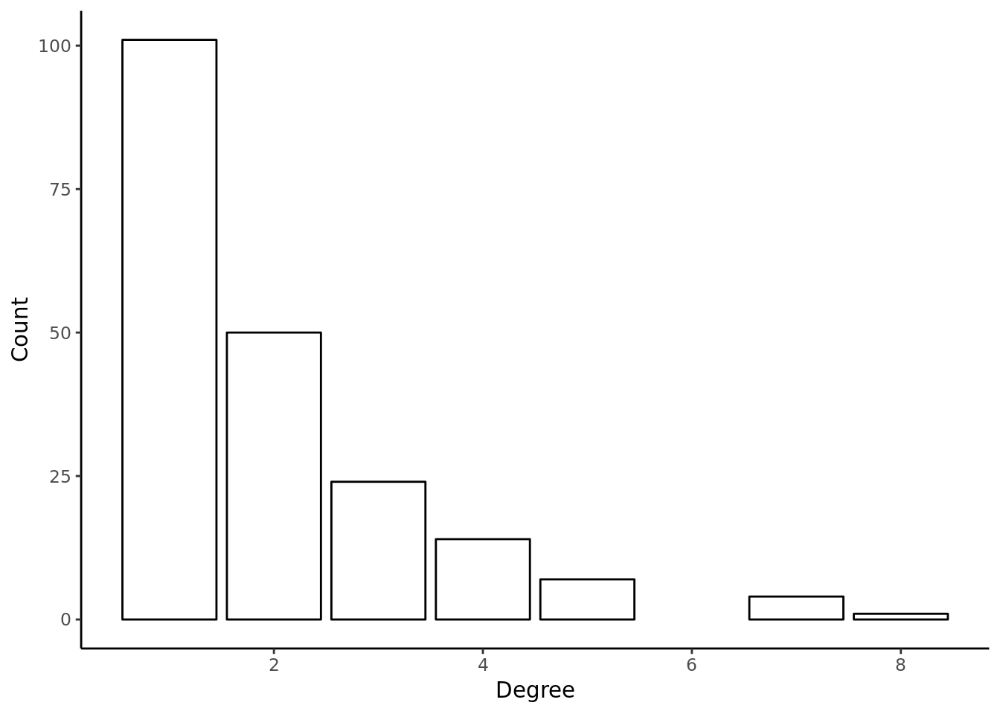

#### Runing time by method 

<table class="table table-condensed" style="width: auto !important; ">
 <thead>
  <tr>
   <th style="text-align:left;"> key </th>
   <th style="text-align:right;"> doc_count </th>
   <th style="text-align:right;"> sum_wallTime_ms.value </th>
   <th style="text-align:left;"> avg_wallTime_ms.value </th>
   <th style="text-align:left;"> includedInTotal </th>
  </tr>
 </thead>
<tbody>
  <tr>
   <td style="text-align:left;"> connectIfSimilar </td>
   <td style="text-align:right;"> 352,380 </td>
   <td style="text-align:right;"> 4,791,061 </td>
   <td style="text-align:left;"> 13.5962909359214 </td>
   <td style="text-align:left;"> No </td>
  </tr>
  <tr>
   <td style="text-align:left;"> existsSimilarity </td>
   <td style="text-align:right;"> 352,380 </td>
   <td style="text-align:right;"> 4,671,763 </td>
   <td style="text-align:left;"> 13.257741642545 </td>
   <td style="text-align:left;"> No </td>
  </tr>
  <tr>
   <td style="text-align:left;"> similarityEdges </td>
   <td style="text-align:right;"> 352,380 </td>
   <td style="text-align:right;"> 4,540,919 </td>
   <td style="text-align:left;"> 12.8864265849367 </td>
   <td style="text-align:left;"> No </td>
  </tr>
  <tr>
   <td style="text-align:left;"> connect </td>
   <td style="text-align:right;"> 49,192 </td>
   <td style="text-align:right;"> 109,222 </td>
   <td style="text-align:left;"> 2.22032037729712 </td>
   <td style="text-align:left;"> Yes </td>
  </tr>
  <tr>
   <td style="text-align:left;"> connectAllSimilar </td>
   <td style="text-align:right;"> 840 </td>
   <td style="text-align:right;"> 4,795,548 </td>
   <td style="text-align:left;"> 5708.98571428571 </td>
   <td style="text-align:left;"> Yes </td>
  </tr>
  <tr>
   <td style="text-align:left;"> init </td>
   <td style="text-align:right;"> 203 </td>
   <td style="text-align:right;"> 13,018 </td>
   <td style="text-align:left;"> 64.128078817734 </td>
   <td style="text-align:left;"> No </td>
  </tr>
  <tr>
   <td style="text-align:left;font-weight: bold;"> Total </td>
   <td style="text-align:right;font-weight: bold;"> 50,040 </td>
   <td style="text-align:right;font-weight: bold;"> 4,909,234 </td>
   <td style="text-align:left;font-weight: bold;">  </td>
   <td style="text-align:left;font-weight: bold;">  </td>
  </tr>
</tbody>
</table>
####  Found structures 

#####  Cycles 

Number of cycles found:  1 

<button class="btn btn-primary" data-toggle="collapse" data-target="#FNCUONLFLX"> Show/Hide foundCycle query </button> 
 
  
     GET /filebeat-*/_search 
              { 
                "query": {
                  "bool": {
                    "must": [
                      { "match_phrase": {
                        "simulationId": "SIM08-05-10-13-wTf6Ij--CV"
                        }
                      },
                      { "bool": {
                        "should": [
                          { "match": {
                            "keyword": "foundCycle"
                          }}
                        ]
                      }}
                    ]
                  }
                }
              }
     

#####  Paths 

Number of paths found:  0 

<button class="btn btn-primary" data-toggle="collapse" data-target="#SXVSCRGEKJ"> Show/Hide foundPath query </button> 
 
  
     GET /filebeat-*/_search 
              { 
                "query": {
                  "bool": {
                    "must": [
                      { "match_phrase": {
                        "simulationId": "SIM08-05-10-13-wTf6Ij--CV"
                        }
                      },
                      { "bool": {
                        "should": [
                          { "match": {
                            "keyword": "foundPath"
                          }}
                        ]
                      }}
                    ]
                  }
                }
              }
     

###  SIM08-05-10-13-wTf6Ij--DV 

#### simulationParameters 

<table class="table table-condensed" style="width: auto !important; ">
 <thead>
  <tr>
   <th style="text-align:left;"> agentNumber </th>
   <th style="text-align:right;"> similarityConnectThreshold </th>
   <th style="text-align:left;"> chainLength </th>
   <th style="text-align:left;"> similaritySearchThreshold </th>
   <th style="text-align:left;"> maxDistance </th>
   <th style="text-align:left;"> randomWorksNumberMultiplier </th>
  </tr>
 </thead>
<tbody>
  <tr>
   <td style="text-align:left;width: 20em; "> 200 </td>
   <td style="text-align:right;width: 15em; "> 0.5 </td>
   <td style="text-align:left;width: 15em; "> 20 </td>
   <td style="text-align:left;width: 15em; "> 1 </td>
   <td style="text-align:left;width: 15em; "> 10 </td>
   <td style="text-align:left;width: 15em; "> 2 </td>
  </tr>
</tbody>
</table>
#### Degree distribution of agent->knows->agent edges

#### Runing time by method 

<table class="table table-condensed" style="width: auto !important; ">
 <thead>
  <tr>
   <th style="text-align:left;">   </th>
   <th style="text-align:left;"> key </th>
   <th style="text-align:right;"> doc_count </th>
   <th style="text-align:right;"> sum_wallTime_ms.value </th>
   <th style="text-align:left;"> avg_wallTime_ms.value </th>
   <th style="text-align:left;"> includedInTotal </th>
  </tr>
 </thead>
<tbody>
  <tr>
   <td style="text-align:left;"> 2 </td>
   <td style="text-align:left;"> cycleSearch </td>
   <td style="text-align:right;"> 10,798 </td>
   <td style="text-align:right;"> 870,298 </td>
   <td style="text-align:left;"> 80.5980737173551 </td>
   <td style="text-align:left;"> Yes </td>
  </tr>
  <tr>
   <td style="text-align:left;"> 3 </td>
   <td style="text-align:left;"> getWorks </td>
   <td style="text-align:right;"> 10,798 </td>
   <td style="text-align:right;"> 95,938 </td>
   <td style="text-align:left;"> 8.88479348027412 </td>
   <td style="text-align:left;"> No </td>
  </tr>
  <tr>
   <td style="text-align:left;"> 4 </td>
   <td style="text-align:left;"> individualCycleSearch </td>
   <td style="text-align:right;"> 10,798 </td>
   <td style="text-align:right;"> 437 </td>
   <td style="text-align:left;"> 0.0404704574921282 </td>
   <td style="text-align:left;"> Yes </td>
  </tr>
  <tr>
   <td style="text-align:left;"> 6 </td>
   <td style="text-align:left;"> addItemToWork </td>
   <td style="text-align:right;"> 840 </td>
   <td style="text-align:right;"> 5,501 </td>
   <td style="text-align:left;"> 6.54880952380952 </td>
   <td style="text-align:left;"> No </td>
  </tr>
  <tr>
   <td style="text-align:left;"> 7 </td>
   <td style="text-align:left;"> ownsWork </td>
   <td style="text-align:right;"> 420 </td>
   <td style="text-align:right;"> 3,001 </td>
   <td style="text-align:left;"> 7.1452380952381 </td>
   <td style="text-align:left;"> No </td>
  </tr>
  <tr>
   <td style="text-align:left;"> 8 </td>
   <td style="text-align:left;"> init </td>
   <td style="text-align:right;"> 203 </td>
   <td style="text-align:right;"> 13,012 </td>
   <td style="text-align:left;"> 64.0985221674877 </td>
   <td style="text-align:left;"> No </td>
  </tr>
  <tr>
   <td style="text-align:left;"> 9 </td>
   <td style="text-align:left;"> searchAndConnect </td>
   <td style="text-align:right;"> 201 </td>
   <td style="text-align:right;"> 4,081,034 </td>
   <td style="text-align:left;"> 20303.6517412935 </td>
   <td style="text-align:left;"> Yes </td>
  </tr>
  <tr>
   <td style="text-align:left;"> 10 </td>
   <td style="text-align:left;"> knowsAgent </td>
   <td style="text-align:right;"> 200 </td>
   <td style="text-align:right;"> 386 </td>
   <td style="text-align:left;"> 1.93 </td>
   <td style="text-align:left;"> No </td>
  </tr>
  <tr>
   <td style="text-align:left;font-weight: bold;"> 1 </td>
   <td style="text-align:left;font-weight: bold;"> Total </td>
   <td style="text-align:right;font-weight: bold;"> 43,393 </td>
   <td style="text-align:right;font-weight: bold;"> 6,468,237 </td>
   <td style="text-align:left;font-weight: bold;">  </td>
   <td style="text-align:left;font-weight: bold;">  </td>
  </tr>
</tbody>
</table>
####  Found structures 

#####  Cycles 

Number of cycles found:  0 

<button class="btn btn-primary" data-toggle="collapse" data-target="#KZVYFSTGHB"> Show/Hide foundCycle query </button> 
 
  
     GET /filebeat-*/_search 
              { 
                "query": {
                  "bool": {
                    "must": [
                      { "match_phrase": {
                        "simulationId": "SIM08-05-10-13-wTf6Ij--DV"
                        }
                      },
                      { "bool": {
                        "should": [
                          { "match": {
                            "keyword": "foundCycle"
                          }}
                        ]
                      }}
                    ]
                  }
                }
              }
     

#####  Paths 

Number of paths found:  10798 

<button class="btn btn-primary" data-toggle="collapse" data-target="#XHWHRDVDCA"> Show/Hide foundPath query </button> 
 
  
     GET /filebeat-*/_search 
              { 
                "query": {
                  "bool": {
                    "must": [
                      { "match_phrase": {
                        "simulationId": "SIM08-05-10-13-wTf6Ij--DV"
                        }
                      },
                      { "bool": {
                        "should": [
                          { "match": {
                            "keyword": "foundPath"
                          }}
                        ]
                      }}
                    ]
                  }
                }
              }
     

###  SIM08-06-02-34-XiXore--CV 

#### simulationParameters 

<table class="table table-condensed" style="width: auto !important; ">
 <thead>
  <tr>
   <th style="text-align:left;"> agentNumber </th>
   <th style="text-align:right;"> similarityConnectThreshold </th>
   <th style="text-align:left;"> chainLength </th>
   <th style="text-align:left;"> similaritySearchThreshold </th>
   <th style="text-align:left;"> maxDistance </th>
   <th style="text-align:left;"> randomWorksNumberMultiplier </th>
  </tr>
 </thead>
<tbody>
  <tr>
   <td style="text-align:left;width: 20em; "> 200 </td>
   <td style="text-align:right;width: 15em; "> 0.5 </td>
   <td style="text-align:left;width: 15em; "> 20 </td>
   <td style="text-align:left;width: 15em; "> 1 </td>
   <td style="text-align:left;width: 15em; "> 30 </td>
   <td style="text-align:left;width: 15em; "> 2 </td>
  </tr>
</tbody>
</table>
#### Degree distribution of agent->knows->agent edges

#### Runing time by method 

<table class="table table-condensed" style="width: auto !important; ">
 <thead>
  <tr>
   <th style="text-align:left;"> key </th>
   <th style="text-align:right;"> doc_count </th>
   <th style="text-align:right;"> sum_wallTime_ms.value </th>
   <th style="text-align:left;"> avg_wallTime_ms.value </th>
   <th style="text-align:left;"> includedInTotal </th>
  </tr>
 </thead>
<tbody>
  <tr>
   <td style="text-align:left;"> connectIfSimilar </td>
   <td style="text-align:right;"> 352,380 </td>
   <td style="text-align:right;"> 4,896,392 </td>
   <td style="text-align:left;"> 13.895204041092 </td>
   <td style="text-align:left;"> No </td>
  </tr>
  <tr>
   <td style="text-align:left;"> existsSimilarity </td>
   <td style="text-align:right;"> 352,380 </td>
   <td style="text-align:right;"> 4,885,019 </td>
   <td style="text-align:left;"> 13.862929224133 </td>
   <td style="text-align:left;"> No </td>
  </tr>
  <tr>
   <td style="text-align:left;"> similarityEdges </td>
   <td style="text-align:right;"> 352,380 </td>
   <td style="text-align:right;"> 4,755,435 </td>
   <td style="text-align:left;"> 13.4951898518645 </td>
   <td style="text-align:left;"> No </td>
  </tr>
  <tr>
   <td style="text-align:left;"> connect </td>
   <td style="text-align:right;"> 1,637 </td>
   <td style="text-align:right;"> 3,482 </td>
   <td style="text-align:left;"> 2.12706169822847 </td>
   <td style="text-align:left;"> Yes </td>
  </tr>
  <tr>
   <td style="text-align:left;"> connectAllSimilar </td>
   <td style="text-align:right;"> 840 </td>
   <td style="text-align:right;"> 4,900,300 </td>
   <td style="text-align:left;"> 5833.69047619048 </td>
   <td style="text-align:left;"> Yes </td>
  </tr>
  <tr>
   <td style="text-align:left;"> init </td>
   <td style="text-align:right;"> 203 </td>
   <td style="text-align:right;"> 16,167 </td>
   <td style="text-align:left;"> 79.64039408867 </td>
   <td style="text-align:left;"> No </td>
  </tr>
  <tr>
   <td style="text-align:left;"> cycleSearch </td>
   <td style="text-align:right;"> 168 </td>
   <td style="text-align:right;"> 17,202 </td>
   <td style="text-align:left;"> 102.392857142857 </td>
   <td style="text-align:left;"> Yes </td>
  </tr>
  <tr>
   <td style="text-align:left;"> getWorks </td>
   <td style="text-align:right;"> 167 </td>
   <td style="text-align:right;"> 983 </td>
   <td style="text-align:left;"> 5.88622754491018 </td>
   <td style="text-align:left;"> Yes </td>
  </tr>
  <tr>
   <td style="text-align:left;"> searchAndConnect </td>
   <td style="text-align:right;"> 9 </td>
   <td style="text-align:right;"> 321,644 </td>
   <td style="text-align:left;"> 35738.2222222222 </td>
   <td style="text-align:left;"> Yes </td>
  </tr>
  <tr>
   <td style="text-align:left;font-weight: bold;"> Total </td>
   <td style="text-align:right;font-weight: bold;"> 2,826 </td>
   <td style="text-align:right;font-weight: bold;"> 5,248,835 </td>
   <td style="text-align:left;font-weight: bold;">  </td>
   <td style="text-align:left;font-weight: bold;">  </td>
  </tr>
</tbody>
</table>
####  Found structures 

#####  Cycles 

Number of cycles found:  1 

<button class="btn btn-primary" data-toggle="collapse" data-target="#EYZCCVVPFA"> Show/Hide foundCycle query </button> 
 
  
     GET /filebeat-*/_search 
              { 
                "query": {
                  "bool": {
                    "must": [
                      { "match_phrase": {
                        "simulationId": "SIM08-06-02-34-XiXore--CV"
                        }
                      },
                      { "bool": {
                        "should": [
                          { "match": {
                            "keyword": "foundCycle"
                          }}
                        ]
                      }}
                    ]
                  }
                }
              }
     

#####  Paths 

Number of paths found:  0 

<button class="btn btn-primary" data-toggle="collapse" data-target="#SFLDFBNZQI"> Show/Hide foundPath query </button> 
 
  
     GET /filebeat-*/_search 
              { 
                "query": {
                  "bool": {
                    "must": [
                      { "match_phrase": {
                        "simulationId": "SIM08-06-02-34-XiXore--CV"
                        }
                      },
                      { "bool": {
                        "should": [
                          { "match": {
                            "keyword": "foundPath"
                          }}
                        ]
                      }}
                    ]
                  }
                }
              }
     

###  SIM08-06-02-34-XiXore--DV 

#### simulationParameters 

<table class="table table-condensed" style="width: auto !important; ">
 <thead>
  <tr>
   <th style="text-align:left;"> agentNumber </th>
   <th style="text-align:right;"> similarityConnectThreshold </th>
   <th style="text-align:left;"> chainLength </th>
   <th style="text-align:left;"> similaritySearchThreshold </th>
   <th style="text-align:left;"> maxDistance </th>
   <th style="text-align:left;"> randomWorksNumberMultiplier </th>
  </tr>
 </thead>
<tbody>
  <tr>
   <td style="text-align:left;width: 20em; "> 200 </td>
   <td style="text-align:right;width: 15em; "> 0.5 </td>
   <td style="text-align:left;width: 15em; "> 20 </td>
   <td style="text-align:left;width: 15em; "> 1 </td>
   <td style="text-align:left;width: 15em; "> 30 </td>
   <td style="text-align:left;width: 15em; "> 2 </td>
  </tr>
</tbody>
</table>
#### Degree distribution of agent->knows->agent edges

#### Runing time by method 

<table class="table table-condensed" style="width: auto !important; ">
 <thead>
  <tr>
   <th style="text-align:left;"> key </th>
   <th style="text-align:right;"> doc_count </th>
   <th style="text-align:right;"> sum_wallTime_ms.value </th>
   <th style="text-align:left;"> avg_wallTime_ms.value </th>
   <th style="text-align:left;"> includedInTotal </th>
  </tr>
 </thead>
<tbody>
  <tr>
   <td style="text-align:left;"> addItemToWork </td>
   <td style="text-align:right;"> 840 </td>
   <td style="text-align:right;"> 5,846 </td>
   <td style="text-align:left;"> 6.95952380952381 </td>
   <td style="text-align:left;"> No </td>
  </tr>
  <tr>
   <td style="text-align:left;"> ownsWork </td>
   <td style="text-align:right;"> 420 </td>
   <td style="text-align:right;"> 3,107 </td>
   <td style="text-align:left;"> 7.39761904761905 </td>
   <td style="text-align:left;"> No </td>
  </tr>
  <tr>
   <td style="text-align:left;"> init </td>
   <td style="text-align:right;"> 203 </td>
   <td style="text-align:right;"> 13,089 </td>
   <td style="text-align:left;"> 64.4778325123153 </td>
   <td style="text-align:left;"> No </td>
  </tr>
  <tr>
   <td style="text-align:left;"> knowsAgent </td>
   <td style="text-align:right;"> 200 </td>
   <td style="text-align:right;"> 350 </td>
   <td style="text-align:left;"> 1.75 </td>
   <td style="text-align:left;"> No </td>
  </tr>
  <tr>
   <td style="text-align:left;"> searchAndConnect </td>
   <td style="text-align:right;"> 192 </td>
   <td style="text-align:right;"> 5,349,315 </td>
   <td style="text-align:left;"> 27861.015625 </td>
   <td style="text-align:left;"> Yes </td>
  </tr>
  <tr>
   <td style="text-align:left;"> individualCycleSearch </td>
   <td style="text-align:right;"> 176 </td>
   <td style="text-align:right;"> 5 </td>
   <td style="text-align:left;"> 0.0284090909090909 </td>
   <td style="text-align:left;"> Yes </td>
  </tr>
  <tr>
   <td style="text-align:left;"> getWorksItems </td>
   <td style="text-align:right;"> 38 </td>
   <td style="text-align:right;"> 52 </td>
   <td style="text-align:left;"> 1.36842105263158 </td>
   <td style="text-align:left;"> Yes </td>
  </tr>
  <tr>
   <td style="text-align:left;"> getWorks </td>
   <td style="text-align:right;"> 10 </td>
   <td style="text-align:right;"> 42,824 </td>
   <td style="text-align:left;"> 4282.4 </td>
   <td style="text-align:left;"> No </td>
  </tr>
  <tr>
   <td style="text-align:left;"> cycleSearch </td>
   <td style="text-align:right;"> 9 </td>
   <td style="text-align:right;"> 39,022 </td>
   <td style="text-align:left;"> 4335.77777777778 </td>
   <td style="text-align:left;"> Yes </td>
  </tr>
  <tr>
   <td style="text-align:left;font-weight: bold;"> Total </td>
   <td style="text-align:right;font-weight: bold;"> 418 </td>
   <td style="text-align:right;font-weight: bold;"> 5,424,670 </td>
   <td style="text-align:left;font-weight: bold;">  </td>
   <td style="text-align:left;font-weight: bold;">  </td>
  </tr>
</tbody>
</table>
####  Found structures 

#####  Cycles 

Number of cycles found:  2 

<button class="btn btn-primary" data-toggle="collapse" data-target="#RSIDPUUIBJ"> Show/Hide foundCycle query </button> 
 
  
     GET /filebeat-*/_search 
              { 
                "query": {
                  "bool": {
                    "must": [
                      { "match_phrase": {
                        "simulationId": "SIM08-06-02-34-XiXore--DV"
                        }
                      },
                      { "bool": {
                        "should": [
                          { "match": {
                            "keyword": "foundCycle"
                          }}
                        ]
                      }}
                    ]
                  }
                }
              }
     

#####  Paths 

Number of paths found:  1 

<button class="btn btn-primary" data-toggle="collapse" data-target="#VUDYXJCCTG"> Show/Hide foundPath query </button> 
 
  
     GET /filebeat-*/_search 
              { 
                "query": {
                  "bool": {
                    "must": [
                      { "match_phrase": {
                        "simulationId": "SIM08-06-02-34-XiXore--DV"
                        }
                      },
                      { "bool": {
                        "should": [
                          { "match": {
                            "keyword": "foundPath"
                          }}
                        ]
                      }}
                    ]
                  }
                }
              }
     

###  SIM08-06-03-59-3M733K--CV 

#### simulationParameters 

<table class="table table-condensed" style="width: auto !important; ">
 <thead>
  <tr>
   <th style="text-align:left;"> agentNumber </th>
   <th style="text-align:right;"> similarityConnectThreshold </th>
   <th style="text-align:left;"> chainLength </th>
   <th style="text-align:left;"> similaritySearchThreshold </th>
   <th style="text-align:left;"> maxDistance </th>
   <th style="text-align:left;"> randomWorksNumberMultiplier </th>
  </tr>
 </thead>
<tbody>
  <tr>
   <td style="text-align:left;width: 20em; "> 500 </td>
   <td style="text-align:right;width: 15em; "> 0.5 </td>
   <td style="text-align:left;width: 15em; "> 10 </td>
   <td style="text-align:left;width: 15em; "> 1 </td>
   <td style="text-align:left;width: 15em; "> 10 </td>
   <td style="text-align:left;width: 15em; "> 2 </td>
  </tr>
</tbody>
</table>
#### Degree distribution of agent->knows->agent edges

#### Runing time by method 

<table class="table table-condensed" style="width: auto !important; ">
 <thead>
  <tr>
   <th style="text-align:left;">   </th>
   <th style="text-align:left;"> key </th>
   <th style="text-align:right;"> doc_count </th>
   <th style="text-align:right;"> sum_wallTime_ms.value </th>
   <th style="text-align:left;"> avg_wallTime_ms.value </th>
   <th style="text-align:left;"> includedInTotal </th>
  </tr>
 </thead>
<tbody>
  <tr>
   <td style="text-align:left;"> 1 </td>
   <td style="text-align:left;"> connectIfSimilar </td>
   <td style="text-align:right;"> 450,537 </td>
   <td style="text-align:right;"> 10,806,033 </td>
   <td style="text-align:left;"> 23.984784823444 </td>
   <td style="text-align:left;"> No </td>
  </tr>
  <tr>
   <td style="text-align:left;"> 2 </td>
   <td style="text-align:left;"> existsSimilarity </td>
   <td style="text-align:right;"> 450,537 </td>
   <td style="text-align:right;"> 10,458,895 </td>
   <td style="text-align:left;"> 23.2142865069905 </td>
   <td style="text-align:left;"> No </td>
  </tr>
  <tr>
   <td style="text-align:left;"> 3 </td>
   <td style="text-align:left;"> similarityEdges </td>
   <td style="text-align:right;"> 450,537 </td>
   <td style="text-align:right;"> 10,143,532 </td>
   <td style="text-align:left;"> 22.5143151394891 </td>
   <td style="text-align:left;"> No </td>
  </tr>
  <tr>
   <td style="text-align:left;"> 4 </td>
   <td style="text-align:left;"> connect </td>
   <td style="text-align:right;"> 142,456 </td>
   <td style="text-align:right;"> 329,527 </td>
   <td style="text-align:left;"> 2.31318442185657 </td>
   <td style="text-align:left;"> Yes </td>
  </tr>
  <tr>
   <td style="text-align:left;"> 5 </td>
   <td style="text-align:left;"> init </td>
   <td style="text-align:right;"> 503 </td>
   <td style="text-align:right;"> 23,851 </td>
   <td style="text-align:left;"> 47.4174950298211 </td>
   <td style="text-align:left;"> No </td>
  </tr>
  <tr>
   <td style="text-align:left;"> 6 </td>
   <td style="text-align:left;"> connectAllSimilar </td>
   <td style="text-align:right;"> 237 </td>
   <td style="text-align:right;"> 10,812,529 </td>
   <td style="text-align:left;"> 45622.4852320675 </td>
   <td style="text-align:left;"> Yes </td>
  </tr>
  <tr>
   <td style="text-align:left;"> 10 </td>
   <td style="text-align:left;"> connectAllSimilarCentralized </td>
   <td style="text-align:right;"> 1 </td>
   <td style="text-align:right;"> 10,812,544 </td>
   <td style="text-align:left;"> 10812544 </td>
   <td style="text-align:left;"> Yes </td>
  </tr>
  <tr>
   <td style="text-align:left;font-weight: bold;"> 11 </td>
   <td style="text-align:left;font-weight: bold;"> Total </td>
   <td style="text-align:right;font-weight: bold;"> 142,701 </td>
   <td style="text-align:right;font-weight: bold;"> 21,968,874 </td>
   <td style="text-align:left;font-weight: bold;">  </td>
   <td style="text-align:left;font-weight: bold;">  </td>
  </tr>
</tbody>
</table>
####  Found structures 

#####  Cycles 

Number of cycles found:  0 

<button class="btn btn-primary" data-toggle="collapse" data-target="#SNFNBSBLPL"> Show/Hide foundCycle query </button> 
 
  
     GET /filebeat-*/_search 
              { 
                "query": {
                  "bool": {
                    "must": [
                      { "match_phrase": {
                        "simulationId": "SIM08-06-03-59-3M733K--CV"
                        }
                      },
                      { "bool": {
                        "should": [
                          { "match": {
                            "keyword": "foundCycle"
                          }}
                        ]
                      }}
                    ]
                  }
                }
              }
     

#####  Paths 

Number of paths found:  0 

<button class="btn btn-primary" data-toggle="collapse" data-target="#DDOYHNRBJI"> Show/Hide foundPath query </button> 
 
  
     GET /filebeat-*/_search 
              { 
                "query": {
                  "bool": {
                    "must": [
                      { "match_phrase": {
                        "simulationId": "SIM08-06-03-59-3M733K--CV"
                        }
                      },
                      { "bool": {
                        "should": [
                          { "match": {
                            "keyword": "foundPath"
                          }}
                        ]
                      }}
                    ]
                  }
                }
              }
     

###  SIM08-06-03-59-3M733K--DV 

#### simulationParameters 

<table class="table table-condensed" style="width: auto !important; ">
 <thead>
  <tr>
   <th style="text-align:left;"> agentNumber </th>
   <th style="text-align:right;"> similarityConnectThreshold </th>
   <th style="text-align:left;"> chainLength </th>
   <th style="text-align:left;"> similaritySearchThreshold </th>
   <th style="text-align:left;"> maxDistance </th>
   <th style="text-align:left;"> randomWorksNumberMultiplier </th>
  </tr>
 </thead>
<tbody>
  <tr>
   <td style="text-align:left;width: 20em; "> 500 </td>
   <td style="text-align:right;width: 15em; "> 0.5 </td>
   <td style="text-align:left;width: 15em; "> 10 </td>
   <td style="text-align:left;width: 15em; "> 1 </td>
   <td style="text-align:left;width: 15em; "> 10 </td>
   <td style="text-align:left;width: 15em; "> 2 </td>
  </tr>
</tbody>
</table>
#### Degree distribution of agent->knows->agent edges

#### Runing time by method 

<table class="table table-condensed" style="width: auto !important; ">
 <thead>
  <tr>
   <th style="text-align:left;">   </th>
   <th style="text-align:left;"> key </th>
   <th style="text-align:right;"> doc_count </th>
   <th style="text-align:right;"> sum_wallTime_ms.value </th>
   <th style="text-align:left;"> avg_wallTime_ms.value </th>
   <th style="text-align:left;"> includedInTotal </th>
  </tr>
 </thead>
<tbody>
  <tr>
   <td style="text-align:left;"> 2 </td>
   <td style="text-align:left;"> cycleSearch </td>
   <td style="text-align:right;"> 10,798 </td>
   <td style="text-align:right;"> 373,705 </td>
   <td style="text-align:left;"> 34.6087238377477 </td>
   <td style="text-align:left;"> Yes </td>
  </tr>
  <tr>
   <td style="text-align:left;"> 3 </td>
   <td style="text-align:left;"> getWorks </td>
   <td style="text-align:right;"> 10,798 </td>
   <td style="text-align:right;"> 170,507 </td>
   <td style="text-align:left;"> 15.7906093721059 </td>
   <td style="text-align:left;"> No </td>
  </tr>
  <tr>
   <td style="text-align:left;"> 4 </td>
   <td style="text-align:left;"> individualCycleSearch </td>
   <td style="text-align:right;"> 10,798 </td>
   <td style="text-align:right;"> 339 </td>
   <td style="text-align:left;"> 0.0313947027227264 </td>
   <td style="text-align:left;"> Yes </td>
  </tr>
  <tr>
   <td style="text-align:left;"> 6 </td>
   <td style="text-align:left;"> addItemToWork </td>
   <td style="text-align:right;"> 2,020 </td>
   <td style="text-align:right;"> 14,630 </td>
   <td style="text-align:left;"> 7.24257425742574 </td>
   <td style="text-align:left;"> No </td>
  </tr>
  <tr>
   <td style="text-align:left;"> 7 </td>
   <td style="text-align:left;"> ownsWork </td>
   <td style="text-align:right;"> 1,010 </td>
   <td style="text-align:right;"> 7,241 </td>
   <td style="text-align:left;"> 7.16930693069307 </td>
   <td style="text-align:left;"> No </td>
  </tr>
  <tr>
   <td style="text-align:left;"> 8 </td>
   <td style="text-align:left;"> init </td>
   <td style="text-align:right;"> 503 </td>
   <td style="text-align:right;"> 21,071 </td>
   <td style="text-align:left;"> 41.8906560636183 </td>
   <td style="text-align:left;"> No </td>
  </tr>
  <tr>
   <td style="text-align:left;"> 9 </td>
   <td style="text-align:left;"> searchAndConnect </td>
   <td style="text-align:right;"> 501 </td>
   <td style="text-align:right;"> 31,434,057 </td>
   <td style="text-align:left;"> 62742.628742515 </td>
   <td style="text-align:left;"> Yes </td>
  </tr>
  <tr>
   <td style="text-align:left;"> 10 </td>
   <td style="text-align:left;"> knowsAgent </td>
   <td style="text-align:right;"> 500 </td>
   <td style="text-align:right;"> 909 </td>
   <td style="text-align:left;"> 1.818 </td>
   <td style="text-align:left;"> No </td>
  </tr>
  <tr>
   <td style="text-align:left;font-weight: bold;"> 1 </td>
   <td style="text-align:left;font-weight: bold;"> Total </td>
   <td style="text-align:right;font-weight: bold;"> 43,693 </td>
   <td style="text-align:right;font-weight: bold;"> 32,135,328 </td>
   <td style="text-align:left;font-weight: bold;">  </td>
   <td style="text-align:left;font-weight: bold;">  </td>
  </tr>
</tbody>
</table>
####  Found structures 

#####  Cycles 

Number of cycles found:  0 

<button class="btn btn-primary" data-toggle="collapse" data-target="#UIRUIORKWY"> Show/Hide foundCycle query </button> 
 
  
     GET /filebeat-*/_search 
              { 
                "query": {
                  "bool": {
                    "must": [
                      { "match_phrase": {
                        "simulationId": "SIM08-06-03-59-3M733K--DV"
                        }
                      },
                      { "bool": {
                        "should": [
                          { "match": {
                            "keyword": "foundCycle"
                          }}
                        ]
                      }}
                    ]
                  }
                }
              }
     

#####  Paths 

Number of paths found:  10798 

<button class="btn btn-primary" data-toggle="collapse" data-target="#MIEYWJQWGG"> Show/Hide foundPath query </button> 
 
  
     GET /filebeat-*/_search 
              { 
                "query": {
                  "bool": {
                    "must": [
                      { "match_phrase": {
                        "simulationId": "SIM08-06-03-59-3M733K--DV"
                        }
                      },
                      { "bool": {
                        "should": [
                          { "match": {
                            "keyword": "foundPath"
                          }}
                        ]
                      }}
                    ]
                  }
                }
              }
     

###  SIM08-06-10-00-gUuNrz--CV 

#### simulationParameters 

<table class="table table-condensed" style="width: auto !important; ">
 <thead>
  <tr>
   <th style="text-align:left;"> agentNumber </th>
   <th style="text-align:right;"> similarityConnectThreshold </th>
   <th style="text-align:left;"> chainLength </th>
   <th style="text-align:left;"> similaritySearchThreshold </th>
   <th style="text-align:left;"> maxDistance </th>
   <th style="text-align:left;"> randomWorksNumberMultiplier </th>
  </tr>
 </thead>
<tbody>
  <tr>
   <td style="text-align:left;width: 20em; "> 500 </td>
   <td style="text-align:right;width: 15em; "> 0.5 </td>
   <td style="text-align:left;width: 15em; "> 10 </td>
   <td style="text-align:left;width: 15em; "> 1 </td>
   <td style="text-align:left;width: 15em; "> 30 </td>
   <td style="text-align:left;width: 15em; "> 2 </td>
  </tr>
</tbody>
</table>
#### Degree distribution of agent->knows->agent edges

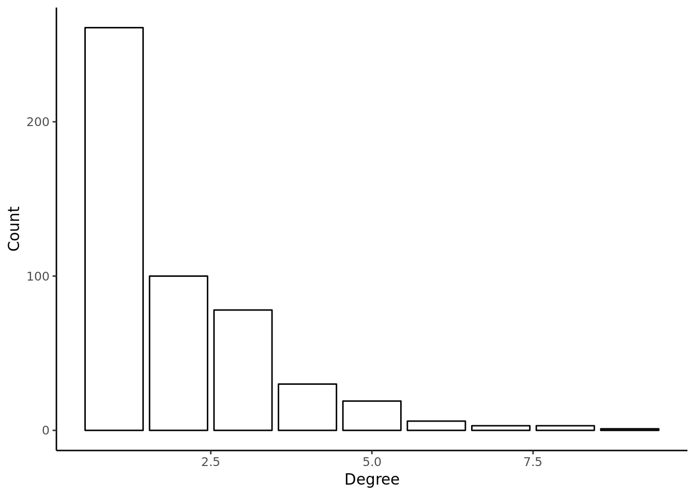

#### Runing time by method 

<table class="table table-condensed" style="width: auto !important; ">
 <thead>
  <tr>
   <th style="text-align:left;"> key </th>
   <th style="text-align:right;"> doc_count </th>
   <th style="text-align:right;"> sum_wallTime_ms.value </th>
   <th style="text-align:left;"> avg_wallTime_ms.value </th>
   <th style="text-align:left;"> includedInTotal </th>
  </tr>
 </thead>
<tbody>
  <tr>
   <td style="text-align:left;"> connectIfSimilar </td>
   <td style="text-align:right;"> 369,312 </td>
   <td style="text-align:right;"> 10,856,688 </td>
   <td style="text-align:left;"> 29.3970626462178 </td>
   <td style="text-align:left;"> No </td>
  </tr>
  <tr>
   <td style="text-align:left;"> existsSimilarity </td>
   <td style="text-align:right;"> 369,312 </td>
   <td style="text-align:right;"> 10,845,174 </td>
   <td style="text-align:left;"> 29.3658857551339 </td>
   <td style="text-align:left;"> No </td>
  </tr>
  <tr>
   <td style="text-align:left;"> similarityEdges </td>
   <td style="text-align:right;"> 369,312 </td>
   <td style="text-align:right;"> 10,491,405 </td>
   <td style="text-align:left;"> 28.4079721211334 </td>
   <td style="text-align:left;"> No </td>
  </tr>
  <tr>
   <td style="text-align:left;"> cycleSearch </td>
   <td style="text-align:right;"> 2,258 </td>
   <td style="text-align:right;"> 169,797 </td>
   <td style="text-align:left;"> 75.1979627989371 </td>
   <td style="text-align:left;"> Yes </td>
  </tr>
  <tr>
   <td style="text-align:left;"> getWorks </td>
   <td style="text-align:right;"> 2,257 </td>
   <td style="text-align:right;"> 13,950 </td>
   <td style="text-align:left;"> 6.1807709348693 </td>
   <td style="text-align:left;"> Yes </td>
  </tr>
  <tr>
   <td style="text-align:left;"> connect </td>
   <td style="text-align:right;"> 665 </td>
   <td style="text-align:right;"> 1,616 </td>
   <td style="text-align:left;"> 2.43007518796992 </td>
   <td style="text-align:left;"> Yes </td>
  </tr>
  <tr>
   <td style="text-align:left;"> init </td>
   <td style="text-align:right;"> 503 </td>
   <td style="text-align:right;"> 593,065 </td>
   <td style="text-align:left;"> 1179.05566600398 </td>
   <td style="text-align:left;"> No </td>
  </tr>
  <tr>
   <td style="text-align:left;"> connectAllSimilar </td>
   <td style="text-align:right;"> 192 </td>
   <td style="text-align:right;"> 10,860,905 </td>
   <td style="text-align:left;"> 56567.2135416667 </td>
   <td style="text-align:left;"> Yes </td>
  </tr>
  <tr>
   <td style="text-align:left;"> searchAndConnect </td>
   <td style="text-align:right;"> 11 </td>
   <td style="text-align:right;"> 2,913,499 </td>
   <td style="text-align:left;"> 264863.545454545 </td>
   <td style="text-align:left;"> Yes </td>
  </tr>
  <tr>
   <td style="text-align:left;font-weight: bold;"> Total </td>
   <td style="text-align:right;font-weight: bold;"> 5,388 </td>
   <td style="text-align:right;font-weight: bold;"> 13,993,921 </td>
   <td style="text-align:left;font-weight: bold;">  </td>
   <td style="text-align:left;font-weight: bold;">  </td>
  </tr>
</tbody>
</table>
####  Found structures 

#####  Cycles 

Number of cycles found:  0 

<button class="btn btn-primary" data-toggle="collapse" data-target="#OAAPBWAWAX"> Show/Hide foundCycle query </button> 
 
  
     GET /filebeat-*/_search 
              { 
                "query": {
                  "bool": {
                    "must": [
                      { "match_phrase": {
                        "simulationId": "SIM08-06-10-00-gUuNrz--CV"
                        }
                      },
                      { "bool": {
                        "should": [
                          { "match": {
                            "keyword": "foundCycle"
                          }}
                        ]
                      }}
                    ]
                  }
                }
              }
     

#####  Paths 

Number of paths found:  0 

<button class="btn btn-primary" data-toggle="collapse" data-target="#TJCJBQSIFL"> Show/Hide foundPath query </button> 
 
  
     GET /filebeat-*/_search 
              { 
                "query": {
                  "bool": {
                    "must": [
                      { "match_phrase": {
                        "simulationId": "SIM08-06-10-00-gUuNrz--CV"
                        }
                      },
                      { "bool": {
                        "should": [
                          { "match": {
                            "keyword": "foundPath"
                          }}
                        ]
                      }}
                    ]
                  }
                }
              }
     

###  SIM08-06-10-00-gUuNrz--DV 

#### simulationParameters 

<table class="table table-condensed" style="width: auto !important; ">
 <thead>
  <tr>
   <th style="text-align:left;"> agentNumber </th>
   <th style="text-align:right;"> similarityConnectThreshold </th>
   <th style="text-align:left;"> chainLength </th>
   <th style="text-align:left;"> similaritySearchThreshold </th>
   <th style="text-align:left;"> maxDistance </th>
   <th style="text-align:left;"> randomWorksNumberMultiplier </th>
  </tr>
 </thead>
<tbody>
  <tr>
   <td style="text-align:left;width: 20em; "> 500 </td>
   <td style="text-align:right;width: 15em; "> 0.5 </td>
   <td style="text-align:left;width: 15em; "> 10 </td>
   <td style="text-align:left;width: 15em; "> 1 </td>
   <td style="text-align:left;width: 15em; "> 30 </td>
   <td style="text-align:left;width: 15em; "> 2 </td>
  </tr>
</tbody>
</table>
#### Degree distribution of agent->knows->agent edges

#### Runing time by method 

<table class="table table-condensed" style="width: auto !important; ">
 <thead>
  <tr>
   <th style="text-align:left;"> key </th>
   <th style="text-align:right;"> doc_count </th>
   <th style="text-align:right;"> sum_wallTime_ms.value </th>
   <th style="text-align:left;"> avg_wallTime_ms.value </th>
   <th style="text-align:left;"> includedInTotal </th>
  </tr>
 </thead>
<tbody>
  <tr>
   <td style="text-align:left;"> individualCycleSearch </td>
   <td style="text-align:right;"> 2,261 </td>
   <td style="text-align:right;"> 50 </td>
   <td style="text-align:left;"> 0.0221141088014153 </td>
   <td style="text-align:left;"> Yes </td>
  </tr>
  <tr>
   <td style="text-align:left;"> addItemToWork </td>
   <td style="text-align:right;"> 2,020 </td>
   <td style="text-align:right;"> 16,871 </td>
   <td style="text-align:left;"> 8.3519801980198 </td>
   <td style="text-align:left;"> No </td>
  </tr>
  <tr>
   <td style="text-align:left;"> ownsWork </td>
   <td style="text-align:right;"> 1,010 </td>
   <td style="text-align:right;"> 8,080 </td>
   <td style="text-align:left;"> 8 </td>
   <td style="text-align:left;"> No </td>
  </tr>
  <tr>
   <td style="text-align:left;"> init </td>
   <td style="text-align:right;"> 503 </td>
   <td style="text-align:right;"> 567,507 </td>
   <td style="text-align:left;"> 1128.24453280318 </td>
   <td style="text-align:left;"> No </td>
  </tr>
  <tr>
   <td style="text-align:left;"> knowsAgent </td>
   <td style="text-align:right;"> 500 </td>
   <td style="text-align:right;"> 916 </td>
   <td style="text-align:left;"> 1.832 </td>
   <td style="text-align:left;"> No </td>
  </tr>
  <tr>
   <td style="text-align:left;"> searchAndConnect </td>
   <td style="text-align:right;"> 490 </td>
   <td style="text-align:right;"> 93,339,219 </td>
   <td style="text-align:left;"> 190488.202040816 </td>
   <td style="text-align:left;"> Yes </td>
  </tr>
  <tr>
   <td style="text-align:left;"> getWorksItems </td>
   <td style="text-align:right;"> 18 </td>
   <td style="text-align:right;"> 48 </td>
   <td style="text-align:left;"> 2.66666666666667 </td>
   <td style="text-align:left;"> Yes </td>
  </tr>
  <tr>
   <td style="text-align:left;"> getWorks </td>
   <td style="text-align:right;"> 4 </td>
   <td style="text-align:right;"> 416,448 </td>
   <td style="text-align:left;"> 104112 </td>
   <td style="text-align:left;"> No </td>
  </tr>
  <tr>
   <td style="text-align:left;"> cycleSearch </td>
   <td style="text-align:right;"> 3 </td>
   <td style="text-align:right;"> 568,681 </td>
   <td style="text-align:left;"> 189560.333333333 </td>
   <td style="text-align:left;"> Yes </td>
  </tr>
  <tr>
   <td style="text-align:left;font-weight: bold;"> Total </td>
   <td style="text-align:right;font-weight: bold;"> 2,774 </td>
   <td style="text-align:right;font-weight: bold;"> 94,095,793 </td>
   <td style="text-align:left;font-weight: bold;">  </td>
   <td style="text-align:left;font-weight: bold;">  </td>
  </tr>
</tbody>
</table>
####  Found structures 

#####  Cycles 

Number of cycles found:  1 

<button class="btn btn-primary" data-toggle="collapse" data-target="#QVAGBKKTZT"> Show/Hide foundCycle query </button> 
 
  
     GET /filebeat-*/_search 
              { 
                "query": {
                  "bool": {
                    "must": [
                      { "match_phrase": {
                        "simulationId": "SIM08-06-10-00-gUuNrz--DV"
                        }
                      },
                      { "bool": {
                        "should": [
                          { "match": {
                            "keyword": "foundCycle"
                          }}
                        ]
                      }}
                    ]
                  }
                }
              }
     

#####  Paths 

Number of paths found:  0 

<button class="btn btn-primary" data-toggle="collapse" data-target="#CKKMKUPPUX"> Show/Hide foundPath query </button> 
 
  
     GET /filebeat-*/_search 
              { 
                "query": {
                  "bool": {
                    "must": [
                      { "match_phrase": {
                        "simulationId": "SIM08-06-10-00-gUuNrz--DV"
                        }
                      },
                      { "bool": {
                        "should": [
                          { "match": {
                            "keyword": "foundPath"
                          }}
                        ]
                      }}
                    ]
                  }
                }
              }
     

###  SIM08-06-01-49-ubMTmD--CV 

#### simulationParameters 

<table class="table table-condensed" style="width: auto !important; ">
 <thead>
  <tr>
   <th style="text-align:left;"> agentNumber </th>
   <th style="text-align:right;"> similarityConnectThreshold </th>
   <th style="text-align:left;"> chainLength </th>
   <th style="text-align:left;"> similaritySearchThreshold </th>
   <th style="text-align:left;"> maxDistance </th>
   <th style="text-align:left;"> randomWorksNumberMultiplier </th>
  </tr>
 </thead>
<tbody>
  <tr>
   <td style="text-align:left;width: 20em; "> 500 </td>
   <td style="text-align:right;width: 15em; "> 0.5 </td>
   <td style="text-align:left;width: 15em; "> 20 </td>
   <td style="text-align:left;width: 15em; "> 1 </td>
   <td style="text-align:left;width: 15em; "> 10 </td>
   <td style="text-align:left;width: 15em; "> 2 </td>
  </tr>
</tbody>
</table>
#### Degree distribution of agent->knows->agent edges

#### Runing time by method 

<table class="table table-condensed" style="width: auto !important; ">
 <thead>
  <tr>
   <th style="text-align:left;">   </th>
   <th style="text-align:left;"> key </th>
   <th style="text-align:right;"> doc_count </th>
   <th style="text-align:right;"> sum_wallTime_ms.value </th>
   <th style="text-align:left;"> avg_wallTime_ms.value </th>
   <th style="text-align:left;"> includedInTotal </th>
  </tr>
 </thead>
<tbody>
  <tr>
   <td style="text-align:left;"> 1 </td>
   <td style="text-align:left;"> connectIfSimilar </td>
   <td style="text-align:right;"> 431,760 </td>
   <td style="text-align:right;"> 10,806,217 </td>
   <td style="text-align:left;"> 25.0282958124884 </td>
   <td style="text-align:left;"> No </td>
  </tr>
  <tr>
   <td style="text-align:left;"> 2 </td>
   <td style="text-align:left;"> existsSimilarity </td>
   <td style="text-align:right;"> 431,760 </td>
   <td style="text-align:right;"> 10,459,798 </td>
   <td style="text-align:left;"> 24.2259542338336 </td>
   <td style="text-align:left;"> No </td>
  </tr>
  <tr>
   <td style="text-align:left;"> 3 </td>
   <td style="text-align:left;"> similarityEdges </td>
   <td style="text-align:right;"> 431,760 </td>
   <td style="text-align:right;"> 10,135,471 </td>
   <td style="text-align:left;"> 23.4747799703539 </td>
   <td style="text-align:left;"> No </td>
  </tr>
  <tr>
   <td style="text-align:left;"> 4 </td>
   <td style="text-align:left;"> connect </td>
   <td style="text-align:right;"> 141,061 </td>
   <td style="text-align:right;"> 329,488 </td>
   <td style="text-align:left;"> 2.33578380984113 </td>
   <td style="text-align:left;"> Yes </td>
  </tr>
  <tr>
   <td style="text-align:left;"> 5 </td>
   <td style="text-align:left;"> init </td>
   <td style="text-align:right;"> 503 </td>
   <td style="text-align:right;"> 24,883 </td>
   <td style="text-align:left;"> 49.4691848906561 </td>
   <td style="text-align:left;"> No </td>
  </tr>
  <tr>
   <td style="text-align:left;"> 6 </td>
   <td style="text-align:left;"> connectAllSimilar </td>
   <td style="text-align:right;"> 224 </td>
   <td style="text-align:right;"> 10,812,483 </td>
   <td style="text-align:left;"> 48270.0133928571 </td>
   <td style="text-align:left;"> Yes </td>
  </tr>
  <tr>
   <td style="text-align:left;"> 10 </td>
   <td style="text-align:left;"> connectAllSimilarCentralized </td>
   <td style="text-align:right;"> 1 </td>
   <td style="text-align:right;"> 10,812,498 </td>
   <td style="text-align:left;"> 10812498 </td>
   <td style="text-align:left;"> Yes </td>
  </tr>
  <tr>
   <td style="text-align:left;font-weight: bold;"> 11 </td>
   <td style="text-align:left;font-weight: bold;"> Total </td>
   <td style="text-align:right;font-weight: bold;"> 141,293 </td>
   <td style="text-align:right;font-weight: bold;"> 21,968,827 </td>
   <td style="text-align:left;font-weight: bold;">  </td>
   <td style="text-align:left;font-weight: bold;">  </td>
  </tr>
</tbody>
</table>
####  Found structures 

#####  Cycles 

Number of cycles found:  0 

<button class="btn btn-primary" data-toggle="collapse" data-target="#ILWBBRLYUA"> Show/Hide foundCycle query </button> 
 
  
     GET /filebeat-*/_search 
              { 
                "query": {
                  "bool": {
                    "must": [
                      { "match_phrase": {
                        "simulationId": "SIM08-06-01-49-ubMTmD--CV"
                        }
                      },
                      { "bool": {
                        "should": [
                          { "match": {
                            "keyword": "foundCycle"
                          }}
                        ]
                      }}
                    ]
                  }
                }
              }
     

#####  Paths 

Number of paths found:  0 

<button class="btn btn-primary" data-toggle="collapse" data-target="#HUCEWUTZXH"> Show/Hide foundPath query </button> 
 
  
     GET /filebeat-*/_search 
              { 
                "query": {
                  "bool": {
                    "must": [
                      { "match_phrase": {
                        "simulationId": "SIM08-06-01-49-ubMTmD--CV"
                        }
                      },
                      { "bool": {
                        "should": [
                          { "match": {
                            "keyword": "foundPath"
                          }}
                        ]
                      }}
                    ]
                  }
                }
              }
     

###  SIM08-06-01-49-ubMTmD--DV 

#### simulationParameters 

<table class="table table-condensed" style="width: auto !important; ">
 <thead>
  <tr>
   <th style="text-align:left;"> agentNumber </th>
   <th style="text-align:right;"> similarityConnectThreshold </th>
   <th style="text-align:left;"> chainLength </th>
   <th style="text-align:left;"> similaritySearchThreshold </th>
   <th style="text-align:left;"> maxDistance </th>
   <th style="text-align:left;"> randomWorksNumberMultiplier </th>
  </tr>
 </thead>
<tbody>
  <tr>
   <td style="text-align:left;width: 20em; "> 500 </td>
   <td style="text-align:right;width: 15em; "> 0.5 </td>
   <td style="text-align:left;width: 15em; "> 20 </td>
   <td style="text-align:left;width: 15em; "> 1 </td>
   <td style="text-align:left;width: 15em; "> 10 </td>
   <td style="text-align:left;width: 15em; "> 2 </td>
  </tr>
</tbody>
</table>
#### Degree distribution of agent->knows->agent edges

#### Runing time by method 

<table class="table table-condensed" style="width: auto !important; ">
 <thead>
  <tr>
   <th style="text-align:left;">   </th>
   <th style="text-align:left;"> key </th>
   <th style="text-align:right;"> doc_count </th>
   <th style="text-align:right;"> sum_wallTime_ms.value </th>
   <th style="text-align:left;"> avg_wallTime_ms.value </th>
   <th style="text-align:left;"> includedInTotal </th>
  </tr>
 </thead>
<tbody>
  <tr>
   <td style="text-align:left;"> 2 </td>
   <td style="text-align:left;"> cycleSearch </td>
   <td style="text-align:right;"> 10,798 </td>
   <td style="text-align:right;"> 455,574 </td>
   <td style="text-align:left;"> 42.1905908501574 </td>
   <td style="text-align:left;"> Yes </td>
  </tr>
  <tr>
   <td style="text-align:left;"> 3 </td>
   <td style="text-align:left;"> getWorks </td>
   <td style="text-align:right;"> 10,798 </td>
   <td style="text-align:right;"> 147,354 </td>
   <td style="text-align:left;"> 13.6464160029635 </td>
   <td style="text-align:left;"> No </td>
  </tr>
  <tr>
   <td style="text-align:left;"> 4 </td>
   <td style="text-align:left;"> individualCycleSearch </td>
   <td style="text-align:right;"> 10,798 </td>
   <td style="text-align:right;"> 360 </td>
   <td style="text-align:left;"> 0.0333395073161697 </td>
   <td style="text-align:left;"> Yes </td>
  </tr>
  <tr>
   <td style="text-align:left;"> 6 </td>
   <td style="text-align:left;"> addItemToWork </td>
   <td style="text-align:right;"> 2,040 </td>
   <td style="text-align:right;"> 16,307 </td>
   <td style="text-align:left;"> 7.99362745098039 </td>
   <td style="text-align:left;"> No </td>
  </tr>
  <tr>
   <td style="text-align:left;"> 7 </td>
   <td style="text-align:left;"> ownsWork </td>
   <td style="text-align:right;"> 1,020 </td>
   <td style="text-align:right;"> 8,279 </td>
   <td style="text-align:left;"> 8.11666666666667 </td>
   <td style="text-align:left;"> No </td>
  </tr>
  <tr>
   <td style="text-align:left;"> 8 </td>
   <td style="text-align:left;"> init </td>
   <td style="text-align:right;"> 503 </td>
   <td style="text-align:right;"> 22,408 </td>
   <td style="text-align:left;"> 44.5487077534791 </td>
   <td style="text-align:left;"> No </td>
  </tr>
  <tr>
   <td style="text-align:left;"> 9 </td>
   <td style="text-align:left;"> searchAndConnect </td>
   <td style="text-align:right;"> 501 </td>
   <td style="text-align:right;"> 33,408,384 </td>
   <td style="text-align:left;"> 66683.4011976048 </td>
   <td style="text-align:left;"> Yes </td>
  </tr>
  <tr>
   <td style="text-align:left;"> 10 </td>
   <td style="text-align:left;"> knowsAgent </td>
   <td style="text-align:right;"> 500 </td>
   <td style="text-align:right;"> 884 </td>
   <td style="text-align:left;"> 1.768 </td>
   <td style="text-align:left;"> No </td>
  </tr>
  <tr>
   <td style="text-align:left;font-weight: bold;"> 1 </td>
   <td style="text-align:left;font-weight: bold;"> Total </td>
   <td style="text-align:right;font-weight: bold;"> 43,693 </td>
   <td style="text-align:right;font-weight: bold;"> 34,256,982 </td>
   <td style="text-align:left;font-weight: bold;">  </td>
   <td style="text-align:left;font-weight: bold;">  </td>
  </tr>
</tbody>
</table>
####  Found structures 

#####  Cycles 

Number of cycles found:  0 

<button class="btn btn-primary" data-toggle="collapse" data-target="#BALUUPMLCV"> Show/Hide foundCycle query </button> 
 
  
     GET /filebeat-*/_search 
              { 
                "query": {
                  "bool": {
                    "must": [
                      { "match_phrase": {
                        "simulationId": "SIM08-06-01-49-ubMTmD--DV"
                        }
                      },
                      { "bool": {
                        "should": [
                          { "match": {
                            "keyword": "foundCycle"
                          }}
                        ]
                      }}
                    ]
                  }
                }
              }
     

#####  Paths 

Number of paths found:  10798 

<button class="btn btn-primary" data-toggle="collapse" data-target="#XMGXKFWHSZ"> Show/Hide foundPath query </button> 
 
  
     GET /filebeat-*/_search 
              { 
                "query": {
                  "bool": {
                    "must": [
                      { "match_phrase": {
                        "simulationId": "SIM08-06-01-49-ubMTmD--DV"
                        }
                      },
                      { "bool": {
                        "should": [
                          { "match": {
                            "keyword": "foundPath"
                          }}
                        ]
                      }}
                    ]
                  }
                }
              }
     

###  SIM08-06-07-50-iBjLoU--CV 

#### simulationParameters 

<table class="table table-condensed" style="width: auto !important; ">
 <thead>
  <tr>
   <th style="text-align:left;"> agentNumber </th>
   <th style="text-align:right;"> similarityConnectThreshold </th>
   <th style="text-align:left;"> chainLength </th>
   <th style="text-align:left;"> similaritySearchThreshold </th>
   <th style="text-align:left;"> maxDistance </th>
   <th style="text-align:left;"> randomWorksNumberMultiplier </th>
  </tr>
 </thead>
<tbody>
  <tr>
   <td style="text-align:left;width: 20em; "> 500 </td>
   <td style="text-align:right;width: 15em; "> 0.5 </td>
   <td style="text-align:left;width: 15em; "> 20 </td>
   <td style="text-align:left;width: 15em; "> 1 </td>
   <td style="text-align:left;width: 15em; "> 30 </td>
   <td style="text-align:left;width: 15em; "> 2 </td>
  </tr>
</tbody>
</table>
#### Degree distribution of agent->knows->agent edges

#### Runing time by method 

<table class="table table-condensed" style="width: auto !important; ">
 <thead>
  <tr>
   <th style="text-align:left;"> key </th>
   <th style="text-align:right;"> doc_count </th>
   <th style="text-align:right;"> sum_wallTime_ms.value </th>
   <th style="text-align:left;"> avg_wallTime_ms.value </th>
   <th style="text-align:left;"> includedInTotal </th>
  </tr>
 </thead>
<tbody>
  <tr>
   <td style="text-align:left;"> connectIfSimilar </td>
   <td style="text-align:right;"> 360,195 </td>
   <td style="text-align:right;"> 10,814,266 </td>
   <td style="text-align:left;"> 30.0233651216702 </td>
   <td style="text-align:left;"> No </td>
  </tr>
  <tr>
   <td style="text-align:left;"> existsSimilarity </td>
   <td style="text-align:right;"> 360,195 </td>
   <td style="text-align:right;"> 10,803,158 </td>
   <td style="text-align:left;"> 29.9925262704924 </td>
   <td style="text-align:left;"> No </td>
  </tr>
  <tr>
   <td style="text-align:left;"> similarityEdges </td>
   <td style="text-align:right;"> 360,195 </td>
   <td style="text-align:right;"> 10,449,765 </td>
   <td style="text-align:left;"> 29.0114104859868 </td>
   <td style="text-align:left;"> No </td>
  </tr>
  <tr>
   <td style="text-align:left;"> cycleSearch </td>
   <td style="text-align:right;"> 2,926 </td>
   <td style="text-align:right;"> 392,479 </td>
   <td style="text-align:left;"> 134.134996582365 </td>
   <td style="text-align:left;"> Yes </td>
  </tr>
  <tr>
   <td style="text-align:left;"> getWorks </td>
   <td style="text-align:right;"> 2,925 </td>
   <td style="text-align:right;"> 10,964 </td>
   <td style="text-align:left;"> 3.74837606837607 </td>
   <td style="text-align:left;"> Yes </td>
  </tr>
  <tr>
   <td style="text-align:left;"> connect </td>
   <td style="text-align:right;"> 728 </td>
   <td style="text-align:right;"> 1,743 </td>
   <td style="text-align:left;"> 2.39423076923077 </td>
   <td style="text-align:left;"> Yes </td>
  </tr>
  <tr>
   <td style="text-align:left;"> init </td>
   <td style="text-align:right;"> 502 </td>
   <td style="text-align:right;"> 45,623 </td>
   <td style="text-align:left;"> 90.8824701195219 </td>
   <td style="text-align:left;"> No </td>
  </tr>
  <tr>
   <td style="text-align:left;"> connectAllSimilar </td>
   <td style="text-align:right;"> 185 </td>
   <td style="text-align:right;"> 10,818,283 </td>
   <td style="text-align:left;"> 58477.2054054054 </td>
   <td style="text-align:left;"> Yes </td>
  </tr>
  <tr>
   <td style="text-align:left;"> searchAndConnect </td>
   <td style="text-align:right;"> 10 </td>
   <td style="text-align:right;"> 3,122,605 </td>
   <td style="text-align:left;"> 312260.5 </td>
   <td style="text-align:left;"> Yes </td>
  </tr>
  <tr>
   <td style="text-align:left;font-weight: bold;"> Total </td>
   <td style="text-align:right;font-weight: bold;"> 6,779 </td>
   <td style="text-align:right;font-weight: bold;"> 14,385,182 </td>
   <td style="text-align:left;font-weight: bold;">  </td>
   <td style="text-align:left;font-weight: bold;">  </td>
  </tr>
</tbody>
</table>
####  Found structures 

#####  Cycles 

Number of cycles found:  0 

<button class="btn btn-primary" data-toggle="collapse" data-target="#RXTPGHHTUZ"> Show/Hide foundCycle query </button> 
 
  
     GET /filebeat-*/_search 
              { 
                "query": {
                  "bool": {
                    "must": [
                      { "match_phrase": {
                        "simulationId": "SIM08-06-07-50-iBjLoU--CV"
                        }
                      },
                      { "bool": {
                        "should": [
                          { "match": {
                            "keyword": "foundCycle"
                          }}
                        ]
                      }}
                    ]
                  }
                }
              }
     

#####  Paths 

Number of paths found:  0 

<button class="btn btn-primary" data-toggle="collapse" data-target="#AQQIKCSALL"> Show/Hide foundPath query </button> 
 
  
     GET /filebeat-*/_search 
              { 
                "query": {
                  "bool": {
                    "must": [
                      { "match_phrase": {
                        "simulationId": "SIM08-06-07-50-iBjLoU--CV"
                        }
                      },
                      { "bool": {
                        "should": [
                          { "match": {
                            "keyword": "foundPath"
                          }}
                        ]
                      }}
                    ]
                  }
                }
              }
     

###  SIM08-06-07-50-iBjLoU--DV 

#### simulationParameters 

<table class="table table-condensed" style="width: auto !important; ">
 <thead>
  <tr>
   <th style="text-align:left;"> agentNumber </th>
   <th style="text-align:right;"> similarityConnectThreshold </th>
   <th style="text-align:left;"> chainLength </th>
   <th style="text-align:left;"> similaritySearchThreshold </th>
   <th style="text-align:left;"> maxDistance </th>
   <th style="text-align:left;"> randomWorksNumberMultiplier </th>
  </tr>
 </thead>
<tbody>
  <tr>
   <td style="text-align:left;width: 20em; "> 500 </td>
   <td style="text-align:right;width: 15em; "> 0.5 </td>
   <td style="text-align:left;width: 15em; "> 20 </td>
   <td style="text-align:left;width: 15em; "> 1 </td>
   <td style="text-align:left;width: 15em; "> 30 </td>
   <td style="text-align:left;width: 15em; "> 2 </td>
  </tr>
</tbody>
</table>
#### Degree distribution of agent->knows->agent edges

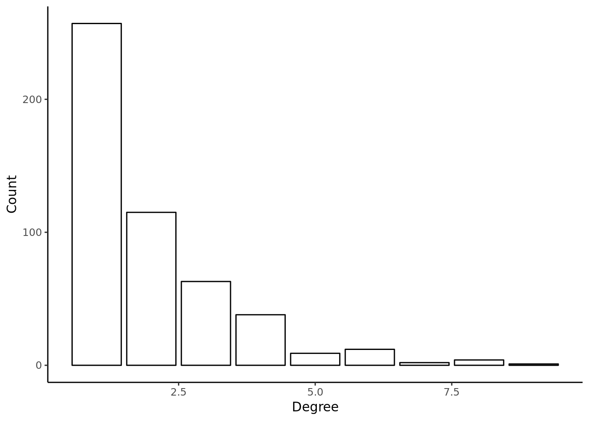

#### Runing time by method 

<table class="table table-condensed" style="width: auto !important; ">
 <thead>
  <tr>
   <th style="text-align:left;"> key </th>
   <th style="text-align:right;"> doc_count </th>
   <th style="text-align:right;"> sum_wallTime_ms.value </th>
   <th style="text-align:left;"> avg_wallTime_ms.value </th>
   <th style="text-align:left;"> includedInTotal </th>
  </tr>
 </thead>
<tbody>
  <tr>
   <td style="text-align:left;"> individualCycleSearch </td>
   <td style="text-align:right;"> 2,934 </td>
   <td style="text-align:right;"> 68 </td>
   <td style="text-align:left;"> 0.0231765507839127 </td>
   <td style="text-align:left;"> Yes </td>
  </tr>
  <tr>
   <td style="text-align:left;"> addItemToWork </td>
   <td style="text-align:right;"> 2,040 </td>
   <td style="text-align:right;"> 13,530 </td>
   <td style="text-align:left;"> 6.63235294117647 </td>
   <td style="text-align:left;"> No </td>
  </tr>
  <tr>
   <td style="text-align:left;"> ownsWork </td>
   <td style="text-align:right;"> 1,020 </td>
   <td style="text-align:right;"> 6,486 </td>
   <td style="text-align:left;"> 6.35882352941176 </td>
   <td style="text-align:left;"> No </td>
  </tr>
  <tr>
   <td style="text-align:left;"> init </td>
   <td style="text-align:right;"> 503 </td>
   <td style="text-align:right;"> 24,302 </td>
   <td style="text-align:left;"> 48.3141153081511 </td>
   <td style="text-align:left;"> No </td>
  </tr>
  <tr>
   <td style="text-align:left;"> knowsAgent </td>
   <td style="text-align:right;"> 500 </td>
   <td style="text-align:right;"> 948 </td>
   <td style="text-align:left;"> 1.896 </td>
   <td style="text-align:left;"> No </td>
  </tr>
  <tr>
   <td style="text-align:left;"> searchAndConnect </td>
   <td style="text-align:right;"> 491 </td>
   <td style="text-align:right;"> 96,548,944 </td>
   <td style="text-align:left;"> 196637.360488798 </td>
   <td style="text-align:left;"> Yes </td>
  </tr>
  <tr>
   <td style="text-align:left;"> getWorksItems </td>
   <td style="text-align:right;"> 38 </td>
   <td style="text-align:right;"> 63 </td>
   <td style="text-align:left;"> 1.65789473684211 </td>
   <td style="text-align:left;"> Yes </td>
  </tr>
  <tr>
   <td style="text-align:left;"> getWorks </td>
   <td style="text-align:right;"> 9 </td>
   <td style="text-align:right;"> 371,184 </td>
   <td style="text-align:left;"> 41242.6666666667 </td>
   <td style="text-align:left;"> No </td>
  </tr>
  <tr>
   <td style="text-align:left;"> cycleSearch </td>
   <td style="text-align:right;"> 8 </td>
   <td style="text-align:right;"> 597,356 </td>
   <td style="text-align:left;"> 74669.5 </td>
   <td style="text-align:left;"> Yes </td>
  </tr>
  <tr>
   <td style="text-align:left;font-weight: bold;"> Total </td>
   <td style="text-align:right;font-weight: bold;"> 3,475 </td>
   <td style="text-align:right;font-weight: bold;"> 97,623,987 </td>
   <td style="text-align:left;font-weight: bold;">  </td>
   <td style="text-align:left;font-weight: bold;">  </td>
  </tr>
</tbody>
</table>
####  Found structures 

#####  Cycles 

Number of cycles found:  1 

<button class="btn btn-primary" data-toggle="collapse" data-target="#PCQZMRXKHV"> Show/Hide foundCycle query </button> 
 
  
     GET /filebeat-*/_search 
              { 
                "query": {
                  "bool": {
                    "must": [
                      { "match_phrase": {
                        "simulationId": "SIM08-06-07-50-iBjLoU--DV"
                        }
                      },
                      { "bool": {
                        "should": [
                          { "match": {
                            "keyword": "foundCycle"
                          }}
                        ]
                      }}
                    ]
                  }
                }
              }
     

#####  Paths 

Number of paths found:  3 

<button class="btn btn-primary" data-toggle="collapse" data-target="#HTBYUTVTZF"> Show/Hide foundPath query </button> 
 
  
     GET /filebeat-*/_search 
              { 
                "query": {
                  "bool": {
                    "must": [
                      { "match_phrase": {
                        "simulationId": "SIM08-06-07-50-iBjLoU--DV"
                        }
                      },
                      { "bool": {
                        "should": [
                          { "match": {
                            "keyword": "foundPath"
                          }}
                        ]
                      }}
                    ]
                  }
                }
              }
     

## Scatterplots of experiment 

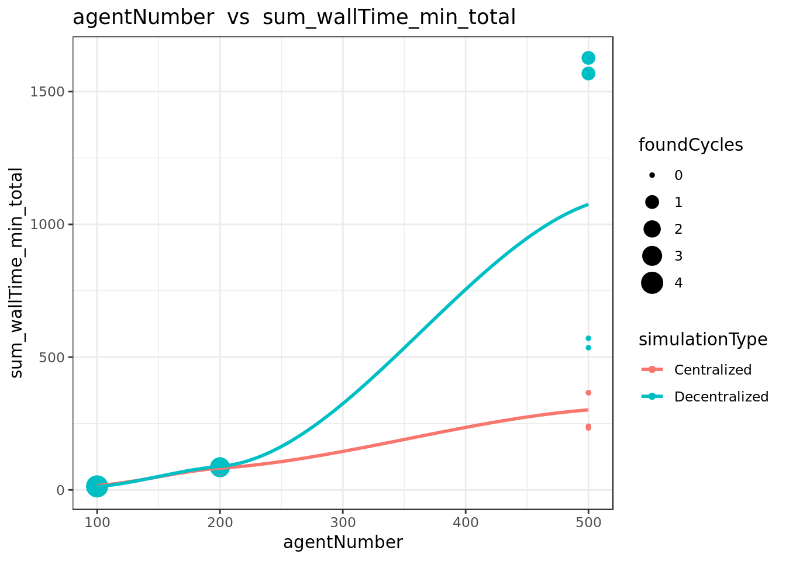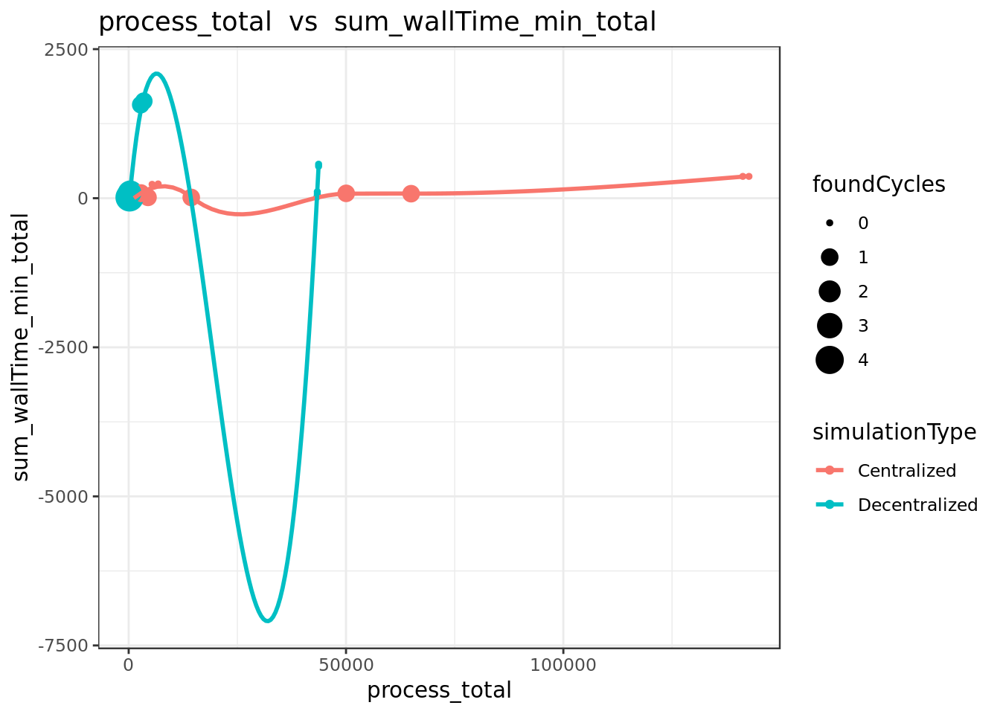   

# Experiment  3 

 

## Experimental set up 

<table class="table table-condensed" style="width: auto !important; ">
 <thead>
  <tr>
   <th style="text-align:left;">   </th>
   <th style="text-align:left;"> Values </th>
  </tr>
 </thead>
<tbody>
  <tr>
   <td style="text-align:left;"> experimentId </td>
   <td style="text-align:left;"> EXP08-07-05-04-95KIBv </td>
  </tr>
  <tr>
   <td style="text-align:left;"> agentNumbers </td>
   <td style="text-align:left;"> 500, 1000, 2000 </td>
  </tr>
  <tr>
   <td style="text-align:left;"> maxDistances </td>
   <td style="text-align:left;"> 10 </td>
  </tr>
  <tr>
   <td style="text-align:left;"> randomWorksNumberMultipliers </td>
   <td style="text-align:left;"> 2 </td>
  </tr>
  <tr>
   <td style="text-align:left;"> chainLengths </td>
   <td style="text-align:left;"> 20 </td>
  </tr>
</tbody>
</table>
## Descriptive analysis of each simulation

###  SIM08-07-10-52-xUntt9--CV 

#### simulationParameters 

<table class="table table-condensed" style="width: auto !important; ">
 <thead>
  <tr>
   <th style="text-align:left;"> agentNumber </th>
   <th style="text-align:left;"> chainLength </th>
   <th style="text-align:left;"> similaritySearchThreshold </th>
   <th style="text-align:left;"> maxDistance </th>
   <th style="text-align:left;"> randomWorksNumberMultiplier </th>
  </tr>
 </thead>
<tbody>
  <tr>
   <td style="text-align:left;width: 20em; "> 1000 </td>
   <td style="text-align:left;width: 15em; "> 20 </td>
   <td style="text-align:left;width: 15em; "> 1 </td>
   <td style="text-align:left;width: 15em; "> 10 </td>
   <td style="text-align:left;width: 15em; "> 2 </td>
  </tr>
</tbody>
</table>
#### Degree distribution of agent->knows->agent edges

#### Runing time by method 

<table class="table table-condensed" style="width: auto !important; ">
 <thead>
  <tr>
   <th style="text-align:left;">   </th>
   <th style="text-align:left;"> key </th>
   <th style="text-align:right;"> doc_count </th>
   <th style="text-align:right;"> sum_wallTime_ms.value </th>
   <th style="text-align:left;"> avg_wallTime_ms.value </th>
   <th style="text-align:left;"> includedInTotal </th>
  </tr>
 </thead>
<tbody>
  <tr>
   <td style="text-align:left;"> 1 </td>
   <td style="text-align:left;"> connectIfSimilar </td>
   <td style="text-align:right;"> 232,609 </td>
   <td style="text-align:right;"> 10,914,094 </td>
   <td style="text-align:left;"> 46.9203427210469 </td>
   <td style="text-align:left;"> No </td>
  </tr>
  <tr>
   <td style="text-align:left;"> 2 </td>
   <td style="text-align:left;"> existsSimilarity </td>
   <td style="text-align:right;"> 232,609 </td>
   <td style="text-align:right;"> 10,729,118 </td>
   <td style="text-align:left;"> 46.1251198362918 </td>
   <td style="text-align:left;"> No </td>
  </tr>
  <tr>
   <td style="text-align:left;"> 3 </td>
   <td style="text-align:left;"> similarityEdges </td>
   <td style="text-align:right;"> 232,609 </td>
   <td style="text-align:right;"> 10,331,737 </td>
   <td style="text-align:left;"> 44.4167551556475 </td>
   <td style="text-align:left;"> No </td>
  </tr>
  <tr>
   <td style="text-align:left;"> 4 </td>
   <td style="text-align:left;"> connect </td>
   <td style="text-align:right;"> 67,423 </td>
   <td style="text-align:right;"> 175,762 </td>
   <td style="text-align:left;"> 2.60685522744464 </td>
   <td style="text-align:left;"> Yes </td>
  </tr>
  <tr>
   <td style="text-align:left;"> 5 </td>
   <td style="text-align:left;"> init </td>
   <td style="text-align:right;"> 503 </td>
   <td style="text-align:right;"> 22,791 </td>
   <td style="text-align:left;"> 45.3101391650099 </td>
   <td style="text-align:left;"> No </td>
  </tr>
  <tr>
   <td style="text-align:left;"> 6 </td>
   <td style="text-align:left;"> connectAllSimilar </td>
   <td style="text-align:right;"> 58 </td>
   <td style="text-align:right;"> 10,917,553 </td>
   <td style="text-align:left;"> 188233.672413793 </td>
   <td style="text-align:left;"> Yes </td>
  </tr>
  <tr>
   <td style="text-align:left;"> 10 </td>
   <td style="text-align:left;"> connectAllSimilarCentralized </td>
   <td style="text-align:right;"> 1 </td>
   <td style="text-align:right;"> 10,917,559 </td>
   <td style="text-align:left;"> 10917559 </td>
   <td style="text-align:left;"> Yes </td>
  </tr>
  <tr>
   <td style="text-align:left;font-weight: bold;"> 11 </td>
   <td style="text-align:left;font-weight: bold;"> Total </td>
   <td style="text-align:right;font-weight: bold;"> 67,488 </td>
   <td style="text-align:right;font-weight: bold;"> 22,079,160 </td>
   <td style="text-align:left;font-weight: bold;">  </td>
   <td style="text-align:left;font-weight: bold;">  </td>
  </tr>
</tbody>
</table>
####  Found structures 

#####  Cycles 

Number of cycles found:  0 

<button class="btn btn-primary" data-toggle="collapse" data-target="#QDELAKOOLQ"> Show/Hide foundCycle query </button> 
 
  
     GET /filebeat-*/_search 
              { 
                "query": {
                  "bool": {
                    "must": [
                      { "match_phrase": {
                        "simulationId": "SIM08-07-10-52-xUntt9--CV"
                        }
                      },
                      { "bool": {
                        "should": [
                          { "match": {
                            "keyword": "foundCycle"
                          }}
                        ]
                      }}
                    ]
                  }
                }
              }
     

#####  Paths 

Number of paths found:  0 

<button class="btn btn-primary" data-toggle="collapse" data-target="#BVPMUIWXWX"> Show/Hide foundPath query </button> 
 
  
     GET /filebeat-*/_search 
              { 
                "query": {
                  "bool": {
                    "must": [
                      { "match_phrase": {
                        "simulationId": "SIM08-07-10-52-xUntt9--CV"
                        }
                      },
                      { "bool": {
                        "should": [
                          { "match": {
                            "keyword": "foundPath"
                          }}
                        ]
                      }}
                    ]
                  }
                }
              }
     

###  SIM08-07-10-52-xUntt9--DV 

#### simulationParameters 

<table class="table table-condensed" style="width: auto !important; ">
 <thead>
  <tr>
   <th style="text-align:left;"> agentNumber </th>
   <th style="text-align:left;"> chainLength </th>
   <th style="text-align:left;"> similaritySearchThreshold </th>
   <th style="text-align:left;"> maxDistance </th>
   <th style="text-align:left;"> randomWorksNumberMultiplier </th>
  </tr>
 </thead>
<tbody>
  <tr>
   <td style="text-align:left;width: 20em; "> 1000 </td>
   <td style="text-align:left;width: 15em; "> 20 </td>
   <td style="text-align:left;width: 15em; "> 1 </td>
   <td style="text-align:left;width: 15em; "> 10 </td>
   <td style="text-align:left;width: 15em; "> 2 </td>
  </tr>
</tbody>
</table>
#### Degree distribution of agent->knows->agent edges

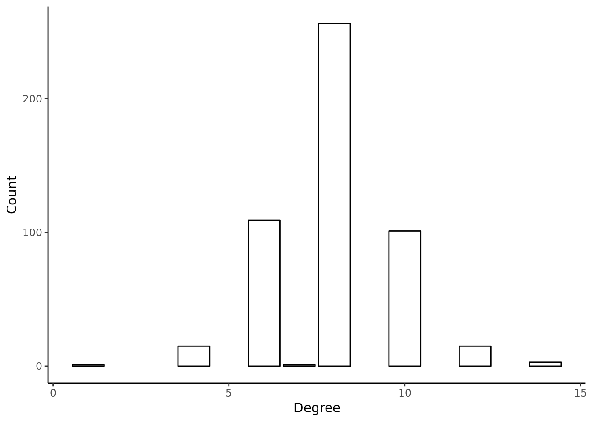

#### Runing time by method 

<table class="table table-condensed" style="width: auto !important; ">
 <thead>
  <tr>
   <th style="text-align:left;">   </th>
   <th style="text-align:left;"> key </th>
   <th style="text-align:right;"> doc_count </th>
   <th style="text-align:right;"> sum_wallTime_ms.value </th>
   <th style="text-align:left;"> avg_wallTime_ms.value </th>
   <th style="text-align:left;"> includedInTotal </th>
  </tr>
 </thead>
<tbody>
  <tr>
   <td style="text-align:left;"> 1 </td>
   <td style="text-align:left;"> individualCycleSearch </td>
   <td style="text-align:right;"> 10,798 </td>
   <td style="text-align:right;"> 314 </td>
   <td style="text-align:left;"> 0.0290794591591035 </td>
   <td style="text-align:left;"> Yes </td>
  </tr>
  <tr>
   <td style="text-align:left;"> 2 </td>
   <td style="text-align:left;"> addItemToWork </td>
   <td style="text-align:right;"> 4,040 </td>
   <td style="text-align:right;"> 33,411 </td>
   <td style="text-align:left;"> 8.2700495049505 </td>
   <td style="text-align:left;"> No </td>
  </tr>
  <tr>
   <td style="text-align:left;"> 3 </td>
   <td style="text-align:left;"> ownsWork </td>
   <td style="text-align:right;"> 2,020 </td>
   <td style="text-align:right;"> 15,988 </td>
   <td style="text-align:left;"> 7.91485148514851 </td>
   <td style="text-align:left;"> No </td>
  </tr>
  <tr>
   <td style="text-align:left;"> 4 </td>
   <td style="text-align:left;"> knowsAgent </td>
   <td style="text-align:right;"> 2,001 </td>
   <td style="text-align:right;"> 2,916 </td>
   <td style="text-align:left;"> 1.45727136431784 </td>
   <td style="text-align:left;"> No </td>
  </tr>
  <tr>
   <td style="text-align:left;"> 5 </td>
   <td style="text-align:left;"> init </td>
   <td style="text-align:right;"> 504 </td>
   <td style="text-align:right;"> 734,561 </td>
   <td style="text-align:left;"> 1457.4623015873 </td>
   <td style="text-align:left;"> No </td>
  </tr>
  <tr>
   <td style="text-align:left;"> 6 </td>
   <td style="text-align:left;"> searchAndConnect </td>
   <td style="text-align:right;"> 148 </td>
   <td style="text-align:right;"> 122,382,915 </td>
   <td style="text-align:left;"> 826911.587837838 </td>
   <td style="text-align:left;"> Yes </td>
  </tr>
  <tr>
   <td style="text-align:left;"> 7 </td>
   <td style="text-align:left;"> getWorksItems </td>
   <td style="text-align:right;"> 38 </td>
   <td style="text-align:right;"> 84 </td>
   <td style="text-align:left;"> 2.21052631578947 </td>
   <td style="text-align:left;"> Yes </td>
  </tr>
  <tr>
   <td style="text-align:left;"> 8 </td>
   <td style="text-align:left;"> cycleSearch </td>
   <td style="text-align:right;"> 2 </td>
   <td style="text-align:right;"> 2,330,479 </td>
   <td style="text-align:left;"> 1165239.5 </td>
   <td style="text-align:left;"> Yes </td>
  </tr>
  <tr>
   <td style="text-align:left;"> 10 </td>
   <td style="text-align:left;"> getWorks </td>
   <td style="text-align:right;"> 2 </td>
   <td style="text-align:right;"> 703,035 </td>
   <td style="text-align:left;"> 351517.5 </td>
   <td style="text-align:left;"> No </td>
  </tr>
  <tr>
   <td style="text-align:left;font-weight: bold;"> 11 </td>
   <td style="text-align:left;font-weight: bold;"> Total </td>
   <td style="text-align:right;font-weight: bold;"> 10,988 </td>
   <td style="text-align:right;font-weight: bold;"> 124,714,149 </td>
   <td style="text-align:left;font-weight: bold;">  </td>
   <td style="text-align:left;font-weight: bold;">  </td>
  </tr>
</tbody>
</table>
####  Found structures 

#####  Cycles 

Number of cycles found:  0 

<button class="btn btn-primary" data-toggle="collapse" data-target="#OWDEDYZUEZ"> Show/Hide foundCycle query </button> 
 
  
     GET /filebeat-*/_search 
              { 
                "query": {
                  "bool": {
                    "must": [
                      { "match_phrase": {
                        "simulationId": "SIM08-07-10-52-xUntt9--DV"
                        }
                      },
                      { "bool": {
                        "should": [
                          { "match": {
                            "keyword": "foundCycle"
                          }}
                        ]
                      }}
                    ]
                  }
                }
              }
     

#####  Paths 

Number of paths found:  1 

<button class="btn btn-primary" data-toggle="collapse" data-target="#DZBMKVBCJK"> Show/Hide foundPath query </button> 
 
  
     GET /filebeat-*/_search 
              { 
                "query": {
                  "bool": {
                    "must": [
                      { "match_phrase": {
                        "simulationId": "SIM08-07-10-52-xUntt9--DV"
                        }
                      },
                      { "bool": {
                        "should": [
                          { "match": {
                            "keyword": "foundPath"
                          }}
                        ]
                      }}
                    ]
                  }
                }
              }
     

###  SIM08-08-04-54-3b98M6--CV 

#### simulationParameters 

<table class="table table-condensed" style="width: auto !important; ">
 <thead>
  <tr>
   <th style="text-align:left;"> agentNumber </th>
   <th style="text-align:left;"> chainLength </th>
   <th style="text-align:left;"> similaritySearchThreshold </th>
   <th style="text-align:left;"> maxDistance </th>
   <th style="text-align:left;"> randomWorksNumberMultiplier </th>
  </tr>
 </thead>
<tbody>
  <tr>
   <td style="text-align:left;width: 20em; "> 2000 </td>
   <td style="text-align:left;width: 15em; "> 20 </td>
   <td style="text-align:left;width: 15em; "> 1 </td>
   <td style="text-align:left;width: 15em; "> 10 </td>
   <td style="text-align:left;width: 15em; "> 2 </td>
  </tr>
</tbody>
</table>
#### Degree distribution of agent->knows->agent edges

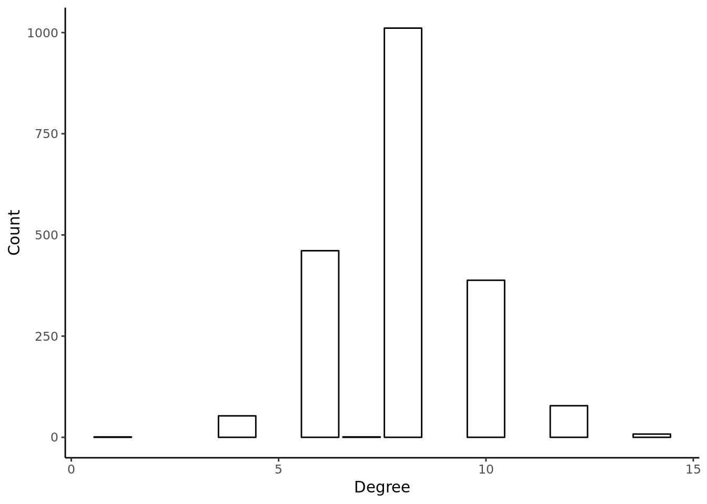

#### Runing time by method 

<table class="table table-condensed" style="width: auto !important; ">
 <thead>
  <tr>
   <th style="text-align:left;">   </th>
   <th style="text-align:left;"> key </th>
   <th style="text-align:right;"> doc_count </th>
   <th style="text-align:right;"> sum_wallTime_ms.value </th>
   <th style="text-align:left;"> avg_wallTime_ms.value </th>
   <th style="text-align:left;"> includedInTotal </th>
  </tr>
 </thead>
<tbody>
  <tr>
   <td style="text-align:left;"> 1 </td>
   <td style="text-align:left;"> connectIfSimilar </td>
   <td style="text-align:right;"> 192,660 </td>
   <td style="text-align:right;"> 11,040,921 </td>
   <td style="text-align:left;"> 57.3078013080037 </td>
   <td style="text-align:left;"> No </td>
  </tr>
  <tr>
   <td style="text-align:left;"> 2 </td>
   <td style="text-align:left;"> existsSimilarity </td>
   <td style="text-align:right;"> 192,660 </td>
   <td style="text-align:right;"> 10,705,361 </td>
   <td style="text-align:left;"> 55.5660801411814 </td>
   <td style="text-align:left;"> No </td>
  </tr>
  <tr>
   <td style="text-align:left;"> 3 </td>
   <td style="text-align:left;"> similarityEdges </td>
   <td style="text-align:right;"> 192,660 </td>
   <td style="text-align:right;"> 10,279,751 </td>
   <td style="text-align:left;"> 53.3569552579674 </td>
   <td style="text-align:left;"> No </td>
  </tr>
  <tr>
   <td style="text-align:left;"> 4 </td>
   <td style="text-align:left;"> connect </td>
   <td style="text-align:right;"> 122,302 </td>
   <td style="text-align:right;"> 324,948 </td>
   <td style="text-align:left;"> 2.65693120308744 </td>
   <td style="text-align:left;"> Yes </td>
  </tr>
  <tr>
   <td style="text-align:left;"> 5 </td>
   <td style="text-align:left;"> init </td>
   <td style="text-align:right;"> 2,002 </td>
   <td style="text-align:right;"> 85,482 </td>
   <td style="text-align:left;"> 42.6983016983017 </td>
   <td style="text-align:left;"> No </td>
  </tr>
  <tr>
   <td style="text-align:left;"> 6 </td>
   <td style="text-align:left;"> connectAllSimilar </td>
   <td style="text-align:right;"> 24 </td>
   <td style="text-align:right;"> 11,044,311 </td>
   <td style="text-align:left;"> 460179.625 </td>
   <td style="text-align:left;"> Yes </td>
  </tr>
  <tr>
   <td style="text-align:left;"> 10 </td>
   <td style="text-align:left;"> connectAllSimilarCentralized </td>
   <td style="text-align:right;"> 1 </td>
   <td style="text-align:right;"> 11,044,313 </td>
   <td style="text-align:left;"> 11044313 </td>
   <td style="text-align:left;"> Yes </td>
  </tr>
  <tr>
   <td style="text-align:left;font-weight: bold;"> 11 </td>
   <td style="text-align:left;font-weight: bold;"> Total </td>
   <td style="text-align:right;font-weight: bold;"> 122,333 </td>
   <td style="text-align:right;font-weight: bold;"> 22,504,537 </td>
   <td style="text-align:left;font-weight: bold;">  </td>
   <td style="text-align:left;font-weight: bold;">  </td>
  </tr>
</tbody>
</table>
####  Found structures 

#####  Cycles 

Number of cycles found:  0 

<button class="btn btn-primary" data-toggle="collapse" data-target="#BTUUHGLUMA"> Show/Hide foundCycle query </button> 
 
  
     GET /filebeat-*/_search 
              { 
                "query": {
                  "bool": {
                    "must": [
                      { "match_phrase": {
                        "simulationId": "SIM08-08-04-54-3b98M6--CV"
                        }
                      },
                      { "bool": {
                        "should": [
                          { "match": {
                            "keyword": "foundCycle"
                          }}
                        ]
                      }}
                    ]
                  }
                }
              }
     

#####  Paths 

Number of paths found:  0 

<button class="btn btn-primary" data-toggle="collapse" data-target="#HZNDHYJBLL"> Show/Hide foundPath query </button> 
 
  
     GET /filebeat-*/_search 
              { 
                "query": {
                  "bool": {
                    "must": [
                      { "match_phrase": {
                        "simulationId": "SIM08-08-04-54-3b98M6--CV"
                        }
                      },
                      { "bool": {
                        "should": [
                          { "match": {
                            "keyword": "foundPath"
                          }}
                        ]
                      }}
                    ]
                  }
                }
              }
     

###  SIM08-08-04-54-3b98M6--DV 

#### simulationParameters 

<table class="table table-condensed" style="width: auto !important; ">
 <thead>
  <tr>
   <th style="text-align:left;"> agentNumber </th>
   <th style="text-align:left;"> chainLength </th>
   <th style="text-align:left;"> similaritySearchThreshold </th>
   <th style="text-align:left;"> maxDistance </th>
   <th style="text-align:left;"> randomWorksNumberMultiplier </th>
  </tr>
 </thead>
<tbody>
  <tr>
   <td style="text-align:left;width: 20em; "> 2000 </td>
   <td style="text-align:left;width: 15em; "> 20 </td>
   <td style="text-align:left;width: 15em; "> 1 </td>
   <td style="text-align:left;width: 15em; "> 10 </td>
   <td style="text-align:left;width: 15em; "> 2 </td>
  </tr>
</tbody>
</table>
#### Degree distribution of agent->knows->agent edges

#### Runing time by method 

<table class="table table-condensed" style="width: auto !important; ">
 <thead>
  <tr>
   <th style="text-align:left;">   </th>
   <th style="text-align:left;"> key </th>
   <th style="text-align:right;"> doc_count </th>
   <th style="text-align:right;"> sum_wallTime_ms.value </th>
   <th style="text-align:left;"> avg_wallTime_ms.value </th>
   <th style="text-align:left;"> includedInTotal </th>
  </tr>
 </thead>
<tbody>
  <tr>
   <td style="text-align:left;"> 1 </td>
   <td style="text-align:left;"> individualCycleSearch </td>
   <td style="text-align:right;"> 10,798 </td>
   <td style="text-align:right;"> 295 </td>
   <td style="text-align:left;"> 0.0273198740507501 </td>
   <td style="text-align:left;"> Yes </td>
  </tr>
  <tr>
   <td style="text-align:left;"> 2 </td>
   <td style="text-align:left;"> addItemToWork </td>
   <td style="text-align:right;"> 8,040 </td>
   <td style="text-align:right;"> 77,124 </td>
   <td style="text-align:left;"> 9.59253731343284 </td>
   <td style="text-align:left;"> No </td>
  </tr>
  <tr>
   <td style="text-align:left;"> 3 </td>
   <td style="text-align:left;"> knowsAgent </td>
   <td style="text-align:right;"> 8,001 </td>
   <td style="text-align:right;"> 12,117 </td>
   <td style="text-align:left;"> 1.51443569553806 </td>
   <td style="text-align:left;"> No </td>
  </tr>
  <tr>
   <td style="text-align:left;"> 4 </td>
   <td style="text-align:left;"> ownsWork </td>
   <td style="text-align:right;"> 4,020 </td>
   <td style="text-align:right;"> 38,318 </td>
   <td style="text-align:left;"> 9.5318407960199 </td>
   <td style="text-align:left;"> No </td>
  </tr>
  <tr>
   <td style="text-align:left;"> 5 </td>
   <td style="text-align:left;"> init </td>
   <td style="text-align:right;"> 2,014 </td>
   <td style="text-align:right;"> 7,436,107 </td>
   <td style="text-align:left;"> 3692.20804369414 </td>
   <td style="text-align:left;"> No </td>
  </tr>
  <tr>
   <td style="text-align:left;"> 6 </td>
   <td style="text-align:left;"> searchAndConnect </td>
   <td style="text-align:right;"> 153 </td>
   <td style="text-align:right;"> 135,466,270 </td>
   <td style="text-align:left;"> 885400.45751634 </td>
   <td style="text-align:left;"> Yes </td>
  </tr>
  <tr>
   <td style="text-align:left;"> 7 </td>
   <td style="text-align:left;"> getWorksItems </td>
   <td style="text-align:right;"> 38 </td>
   <td style="text-align:right;"> 140 </td>
   <td style="text-align:left;"> 3.68421052631579 </td>
   <td style="text-align:left;"> Yes </td>
  </tr>
  <tr>
   <td style="text-align:left;"> 9 </td>
   <td style="text-align:left;"> addChainToNetwork </td>
   <td style="text-align:right;"> 1 </td>
   <td style="text-align:right;"> 0 </td>
   <td style="text-align:left;"> 0 </td>
   <td style="text-align:left;"> Yes </td>
  </tr>
  <tr>
   <td style="text-align:left;"> 10 </td>
   <td style="text-align:left;"> addRandomWorksToAgents </td>
   <td style="text-align:right;"> 1 </td>
   <td style="text-align:right;"> 8 </td>
   <td style="text-align:left;"> 8 </td>
   <td style="text-align:left;"> Yes </td>
  </tr>
  <tr>
   <td style="text-align:left;font-weight: bold;"> 11 </td>
   <td style="text-align:left;font-weight: bold;"> Total </td>
   <td style="text-align:right;font-weight: bold;"> 10,993 </td>
   <td style="text-align:right;font-weight: bold;"> 135,467,751 </td>
   <td style="text-align:left;font-weight: bold;">  </td>
   <td style="text-align:left;font-weight: bold;">  </td>
  </tr>
</tbody>
</table>
####  Found structures 

#####  Cycles 

Number of cycles found:  0 

<button class="btn btn-primary" data-toggle="collapse" data-target="#ZXTEWUCUOY"> Show/Hide foundCycle query </button> 
 
  
     GET /filebeat-*/_search 
              { 
                "query": {
                  "bool": {
                    "must": [
                      { "match_phrase": {
                        "simulationId": "SIM08-08-04-54-3b98M6--DV"
                        }
                      },
                      { "bool": {
                        "should": [
                          { "match": {
                            "keyword": "foundCycle"
                          }}
                        ]
                      }}
                    ]
                  }
                }
              }
     

#####  Paths 

Number of paths found:  0 

<button class="btn btn-primary" data-toggle="collapse" data-target="#GAGAXNVWAW"> Show/Hide foundPath query </button> 
 
  
     GET /filebeat-*/_search 
              { 
                "query": {
                  "bool": {
                    "must": [
                      { "match_phrase": {
                        "simulationId": "SIM08-08-04-54-3b98M6--DV"
                        }
                      },
                      { "bool": {
                        "should": [
                          { "match": {
                            "keyword": "foundPath"
                          }}
                        ]
                      }}
                    ]
                  }
                }
              }
     

###  SIM08-07-05-04-gVussF--CV 

#### simulationParameters 

<table class="table table-condensed" style="width: auto !important; ">
 <thead>
  <tr>
   <th style="text-align:left;"> agentNumber </th>
   <th style="text-align:left;"> chainLength </th>
   <th style="text-align:left;"> similaritySearchThreshold </th>
   <th style="text-align:left;"> maxDistance </th>
   <th style="text-align:left;"> randomWorksNumberMultiplier </th>
  </tr>
 </thead>
<tbody>
  <tr>
   <td style="text-align:left;width: 20em; "> 500 </td>
   <td style="text-align:left;width: 15em; "> 20 </td>
   <td style="text-align:left;width: 15em; "> 1 </td>
   <td style="text-align:left;width: 15em; "> 10 </td>
   <td style="text-align:left;width: 15em; "> 2 </td>
  </tr>
</tbody>
</table>
#### Degree distribution of agent->knows->agent edges

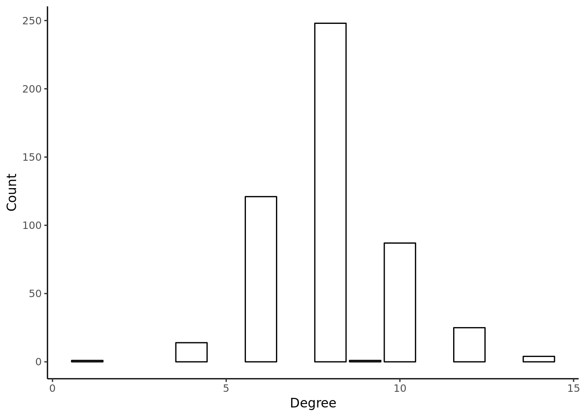

#### Runing time by method 

<table class="table table-condensed" style="width: auto !important; ">
 <thead>
  <tr>
   <th style="text-align:left;"> key </th>
   <th style="text-align:right;"> doc_count </th>
   <th style="text-align:right;"> sum_wallTime_ms.value </th>
   <th style="text-align:left;"> avg_wallTime_ms.value </th>
   <th style="text-align:left;"> includedInTotal </th>
  </tr>
 </thead>
<tbody>
  <tr>
   <td style="text-align:left;"> connectIfSimilar </td>
   <td style="text-align:right;"> 358,340 </td>
   <td style="text-align:right;"> 10,855,572 </td>
   <td style="text-align:left;"> 30.2940559245409 </td>
   <td style="text-align:left;"> No </td>
  </tr>
  <tr>
   <td style="text-align:left;"> existsSimilarity </td>
   <td style="text-align:right;"> 358,340 </td>
   <td style="text-align:right;"> 10,844,369 </td>
   <td style="text-align:left;"> 30.2627923201429 </td>
   <td style="text-align:left;"> No </td>
  </tr>
  <tr>
   <td style="text-align:left;"> similarityEdges </td>
   <td style="text-align:right;"> 358,340 </td>
   <td style="text-align:right;"> 10,455,150 </td>
   <td style="text-align:left;"> 29.176619969861 </td>
   <td style="text-align:left;"> No </td>
  </tr>
  <tr>
   <td style="text-align:left;"> cycleSearch </td>
   <td style="text-align:right;"> 9,840 </td>
   <td style="text-align:right;"> 1,160,984 </td>
   <td style="text-align:left;"> 117.986178861789 </td>
   <td style="text-align:left;"> Yes </td>
  </tr>
  <tr>
   <td style="text-align:left;"> getWorks </td>
   <td style="text-align:right;"> 9,840 </td>
   <td style="text-align:right;"> 26,373 </td>
   <td style="text-align:left;"> 2.68018292682927 </td>
   <td style="text-align:left;"> Yes </td>
  </tr>
  <tr>
   <td style="text-align:left;"> connect </td>
   <td style="text-align:right;"> 671 </td>
   <td style="text-align:right;"> 1,886 </td>
   <td style="text-align:left;"> 2.8107302533532 </td>
   <td style="text-align:left;"> Yes </td>
  </tr>
  <tr>
   <td style="text-align:left;"> init </td>
   <td style="text-align:right;"> 503 </td>
   <td style="text-align:right;"> 134,613 </td>
   <td style="text-align:left;"> 267.62027833002 </td>
   <td style="text-align:left;"> No </td>
  </tr>
  <tr>
   <td style="text-align:left;"> connectAllSimilar </td>
   <td style="text-align:right;"> 184 </td>
   <td style="text-align:right;"> 10,859,643 </td>
   <td style="text-align:left;"> 59019.7989130435 </td>
   <td style="text-align:left;"> Yes </td>
  </tr>
  <tr>
   <td style="text-align:left;"> searchAndConnect </td>
   <td style="text-align:right;"> 10 </td>
   <td style="text-align:right;"> 1,627,251 </td>
   <td style="text-align:left;"> 162725.1 </td>
   <td style="text-align:left;"> Yes </td>
  </tr>
  <tr>
   <td style="text-align:left;font-weight: bold;"> Total </td>
   <td style="text-align:right;font-weight: bold;"> 20,550 </td>
   <td style="text-align:right;font-weight: bold;"> 13,709,537 </td>
   <td style="text-align:left;font-weight: bold;">  </td>
   <td style="text-align:left;font-weight: bold;">  </td>
  </tr>
</tbody>
</table>
####  Found structures 

#####  Cycles 

Number of cycles found:  0 

<button class="btn btn-primary" data-toggle="collapse" data-target="#WJYYWTHVTT"> Show/Hide foundCycle query </button> 
 
  
     GET /filebeat-*/_search 
              { 
                "query": {
                  "bool": {
                    "must": [
                      { "match_phrase": {
                        "simulationId": "SIM08-07-05-04-gVussF--CV"
                        }
                      },
                      { "bool": {
                        "should": [
                          { "match": {
                            "keyword": "foundCycle"
                          }}
                        ]
                      }}
                    ]
                  }
                }
              }
     

#####  Paths 

Number of paths found:  0 

<button class="btn btn-primary" data-toggle="collapse" data-target="#PSUDBBXBFI"> Show/Hide foundPath query </button> 
 
  
     GET /filebeat-*/_search 
              { 
                "query": {
                  "bool": {
                    "must": [
                      { "match_phrase": {
                        "simulationId": "SIM08-07-05-04-gVussF--CV"
                        }
                      },
                      { "bool": {
                        "should": [
                          { "match": {
                            "keyword": "foundPath"
                          }}
                        ]
                      }}
                    ]
                  }
                }
              }
     

###  SIM08-07-05-04-gVussF--DV 

#### simulationParameters 

<table class="table table-condensed" style="width: auto !important; ">
 <thead>
  <tr>
   <th style="text-align:left;"> agentNumber </th>
   <th style="text-align:left;"> chainLength </th>
   <th style="text-align:left;"> similaritySearchThreshold </th>
   <th style="text-align:left;"> maxDistance </th>
   <th style="text-align:left;"> randomWorksNumberMultiplier </th>
  </tr>
 </thead>
<tbody>
  <tr>
   <td style="text-align:left;width: 20em; "> 500 </td>
   <td style="text-align:left;width: 15em; "> 20 </td>
   <td style="text-align:left;width: 15em; "> 1 </td>
   <td style="text-align:left;width: 15em; "> 10 </td>
   <td style="text-align:left;width: 15em; "> 2 </td>
  </tr>
</tbody>
</table>
#### Degree distribution of agent->knows->agent edges

#### Runing time by method 

<table class="table table-condensed" style="width: auto !important; ">
 <thead>
  <tr>
   <th style="text-align:left;"> key </th>
   <th style="text-align:right;"> doc_count </th>
   <th style="text-align:right;"> sum_wallTime_ms.value </th>
   <th style="text-align:left;"> avg_wallTime_ms.value </th>
   <th style="text-align:left;"> includedInTotal </th>
  </tr>
 </thead>
<tbody>
  <tr>
   <td style="text-align:left;"> individualCycleSearch </td>
   <td style="text-align:right;"> 9,844 </td>
   <td style="text-align:right;"> 348 </td>
   <td style="text-align:left;"> 0.0353514831369362 </td>
   <td style="text-align:left;"> Yes </td>
  </tr>
  <tr>
   <td style="text-align:left;"> addItemToWork </td>
   <td style="text-align:right;"> 2,040 </td>
   <td style="text-align:right;"> 26,092 </td>
   <td style="text-align:left;"> 12.7901960784314 </td>
   <td style="text-align:left;"> No </td>
  </tr>
  <tr>
   <td style="text-align:left;"> knowsAgent </td>
   <td style="text-align:right;"> 2,001 </td>
   <td style="text-align:right;"> 3,687 </td>
   <td style="text-align:left;"> 1.84257871064468 </td>
   <td style="text-align:left;"> No </td>
  </tr>
  <tr>
   <td style="text-align:left;"> ownsWork </td>
   <td style="text-align:right;"> 1,020 </td>
   <td style="text-align:right;"> 12,960 </td>
   <td style="text-align:left;"> 12.7058823529412 </td>
   <td style="text-align:left;"> No </td>
  </tr>
  <tr>
   <td style="text-align:left;"> init </td>
   <td style="text-align:right;"> 503 </td>
   <td style="text-align:right;"> 110,122 </td>
   <td style="text-align:left;"> 218.93041749503 </td>
   <td style="text-align:left;"> No </td>
  </tr>
  <tr>
   <td style="text-align:left;"> searchAndConnect </td>
   <td style="text-align:right;"> 491 </td>
   <td style="text-align:right;"> 349,704,775 </td>
   <td style="text-align:left;"> 712229.684317719 </td>
   <td style="text-align:left;"> Yes </td>
  </tr>
  <tr>
   <td style="text-align:left;"> getWorksItems </td>
   <td style="text-align:right;"> 38 </td>
   <td style="text-align:right;"> 106 </td>
   <td style="text-align:left;"> 2.78947368421053 </td>
   <td style="text-align:left;"> Yes </td>
  </tr>
  <tr>
   <td style="text-align:left;"> cycleSearch </td>
   <td style="text-align:right;"> 4 </td>
   <td style="text-align:right;"> 467,866 </td>
   <td style="text-align:left;"> 116966.5 </td>
   <td style="text-align:left;"> Yes </td>
  </tr>
  <tr>
   <td style="text-align:left;"> getWorks </td>
   <td style="text-align:right;"> 4 </td>
   <td style="text-align:right;"> 238,373 </td>
   <td style="text-align:left;"> 59593.25 </td>
   <td style="text-align:left;"> No </td>
  </tr>
  <tr>
   <td style="text-align:left;font-weight: bold;"> Total </td>
   <td style="text-align:right;font-weight: bold;"> 10,379 </td>
   <td style="text-align:right;font-weight: bold;"> 350,553,320 </td>
   <td style="text-align:left;font-weight: bold;">  </td>
   <td style="text-align:left;font-weight: bold;">  </td>
  </tr>
</tbody>
</table>
####  Found structures 

#####  Cycles 

Number of cycles found:  1 

<button class="btn btn-primary" data-toggle="collapse" data-target="#RAXMXYNMGD"> Show/Hide foundCycle query </button> 
 
  
     GET /filebeat-*/_search 
              { 
                "query": {
                  "bool": {
                    "must": [
                      { "match_phrase": {
                        "simulationId": "SIM08-07-05-04-gVussF--DV"
                        }
                      },
                      { "bool": {
                        "should": [
                          { "match": {
                            "keyword": "foundCycle"
                          }}
                        ]
                      }}
                    ]
                  }
                }
              }
     

#####  Paths 

Number of paths found:  1 

<button class="btn btn-primary" data-toggle="collapse" data-target="#POSETQMAJG"> Show/Hide foundPath query </button> 
 
  
     GET /filebeat-*/_search 
              { 
                "query": {
                  "bool": {
                    "must": [
                      { "match_phrase": {
                        "simulationId": "SIM08-07-05-04-gVussF--DV"
                        }
                      },
                      { "bool": {
                        "should": [
                          { "match": {
                            "keyword": "foundPath"
                          }}
                        ]
                      }}
                    ]
                  }
                }
              }
     

## Scatterplots of experiment 

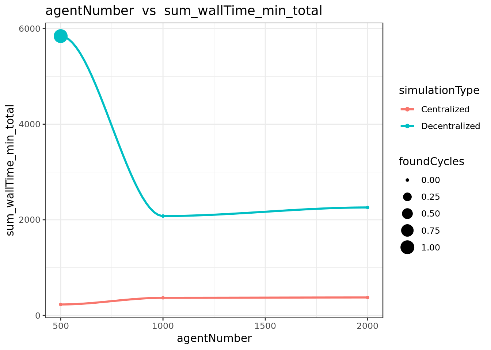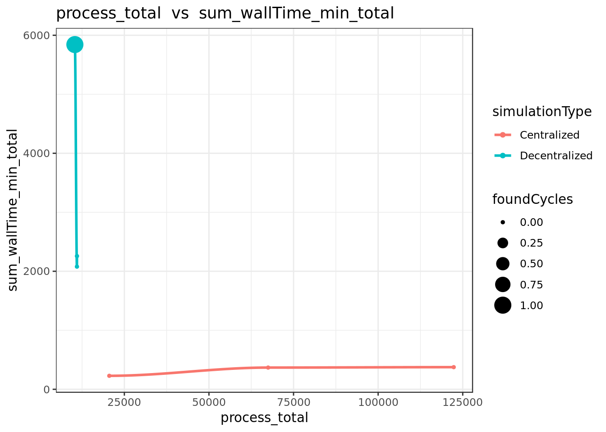   

# Experiment  4 

 

## Experimental set up 

<table class="table table-condensed" style="width: auto !important; ">
 <thead>
  <tr>
   <th style="text-align:left;">   </th>
   <th style="text-align:left;"> Values </th>
  </tr>
 </thead>
<tbody>
  <tr>
   <td style="text-align:left;"> experimentId </td>
   <td style="text-align:left;"> EXP08-09-01-35-9owMuE </td>
  </tr>
  <tr>
   <td style="text-align:left;"> agentNumbers </td>
   <td style="text-align:left;"> 500, 1000, 2000, 5000 </td>
  </tr>
  <tr>
   <td style="text-align:left;"> maxDistances </td>
   <td style="text-align:left;"> 10 </td>
  </tr>
  <tr>
   <td style="text-align:left;"> randomWorksNumberMultipliers </td>
   <td style="text-align:left;"> 2 </td>
  </tr>
  <tr>
   <td style="text-align:left;"> chainLengths </td>
   <td style="text-align:left;"> 20 </td>
  </tr>
</tbody>
</table>
## Descriptive analysis of each simulation

###  SIM08-09-01-35-DxaCjz--CV 

#### simulationParameters 

<table class="table table-condensed" style="width: auto !important; ">
 <thead>
  <tr>
   <th style="text-align:left;"> agentNumber </th>
   <th style="text-align:left;"> chainLength </th>
   <th style="text-align:left;"> similaritySearchThreshold </th>
   <th style="text-align:left;"> maxDistance </th>
   <th style="text-align:left;"> randomWorksNumberMultiplier </th>
  </tr>
 </thead>
<tbody>
  <tr>
   <td style="text-align:left;width: 20em; "> 500 </td>
   <td style="text-align:left;width: 15em; "> 20 </td>
   <td style="text-align:left;width: 15em; "> 1 </td>
   <td style="text-align:left;width: 15em; "> 10 </td>
   <td style="text-align:left;width: 15em; "> 2 </td>
  </tr>
</tbody>
</table>
#### Degree distribution of agent->knows->agent edges

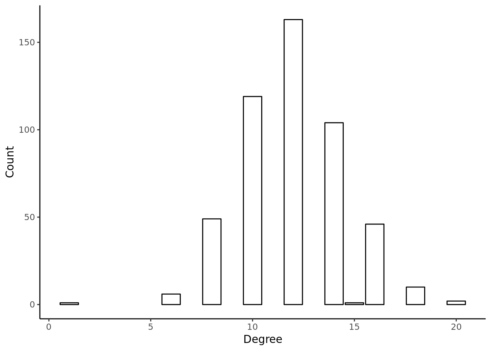

#### Runing time by method 

<table class="table table-condensed" style="width: auto !important; ">
 <thead>
  <tr>
   <th style="text-align:left;"> key </th>
   <th style="text-align:right;"> doc_count </th>
   <th style="text-align:right;"> sum_wallTime_ms.value </th>
   <th style="text-align:left;"> avg_wallTime_ms.value </th>
   <th style="text-align:left;"> includedInTotal </th>
  </tr>
 </thead>
<tbody>
  <tr>
   <td style="text-align:left;"> connectIfSimilar </td>
   <td style="text-align:right;"> 114,627 </td>
   <td style="text-align:right;"> 3,643,072 </td>
   <td style="text-align:left;"> 31.781971088836 </td>
   <td style="text-align:left;"> No </td>
  </tr>
  <tr>
   <td style="text-align:left;"> existsSimilarity </td>
   <td style="text-align:right;"> 114,627 </td>
   <td style="text-align:right;"> 3,639,507 </td>
   <td style="text-align:left;"> 31.750870213824 </td>
   <td style="text-align:left;"> No </td>
  </tr>
  <tr>
   <td style="text-align:left;"> similarityEdges </td>
   <td style="text-align:right;"> 114,627 </td>
   <td style="text-align:right;"> 3,508,913 </td>
   <td style="text-align:left;"> 30.6115749343523 </td>
   <td style="text-align:left;"> No </td>
  </tr>
  <tr>
   <td style="text-align:left;"> cycleSearch </td>
   <td style="text-align:right;"> 2,704 </td>
   <td style="text-align:right;"> 399,858 </td>
   <td style="text-align:left;"> 147.876479289941 </td>
   <td style="text-align:left;"> Yes </td>
  </tr>
  <tr>
   <td style="text-align:left;"> getWorks </td>
   <td style="text-align:right;"> 2,703 </td>
   <td style="text-align:right;"> 10,304 </td>
   <td style="text-align:left;"> 3.81206067332593 </td>
   <td style="text-align:left;"> Yes </td>
  </tr>
  <tr>
   <td style="text-align:left;"> init </td>
   <td style="text-align:right;"> 503 </td>
   <td style="text-align:right;"> 188,883 </td>
   <td style="text-align:left;"> 375.512922465209 </td>
   <td style="text-align:left;"> No </td>
  </tr>
  <tr>
   <td style="text-align:left;"> connect </td>
   <td style="text-align:right;"> 170 </td>
   <td style="text-align:right;"> 411 </td>
   <td style="text-align:left;"> 2.41764705882353 </td>
   <td style="text-align:left;"> Yes </td>
  </tr>
  <tr>
   <td style="text-align:left;"> connectAllSimilar </td>
   <td style="text-align:right;"> 57 </td>
   <td style="text-align:right;"> 3,644,405 </td>
   <td style="text-align:left;"> 63936.9298245614 </td>
   <td style="text-align:left;"> Yes </td>
  </tr>
  <tr>
   <td style="text-align:left;"> searchAndConnect </td>
   <td style="text-align:right;"> 10 </td>
   <td style="text-align:right;"> 2,394,368 </td>
   <td style="text-align:left;"> 239436.8 </td>
   <td style="text-align:left;"> Yes </td>
  </tr>
  <tr>
   <td style="text-align:left;font-weight: bold;"> Total </td>
   <td style="text-align:right;font-weight: bold;"> 5,649 </td>
   <td style="text-align:right;font-weight: bold;"> 6,488,447 </td>
   <td style="text-align:left;font-weight: bold;">  </td>
   <td style="text-align:left;font-weight: bold;">  </td>
  </tr>
</tbody>
</table>
####  Found structures 

#####  Cycles 

Number of cycles found:  1 

<button class="btn btn-primary" data-toggle="collapse" data-target="#YTHNOISHGD"> Show/Hide foundCycle query </button> 
 
  
     GET /filebeat-*/_search 
              { 
                "query": {
                  "bool": {
                    "must": [
                      { "match_phrase": {
                        "simulationId": "SIM08-09-01-35-DxaCjz--CV"
                        }
                      },
                      { "bool": {
                        "should": [
                          { "match": {
                            "keyword": "foundCycle"
                          }}
                        ]
                      }}
                    ]
                  }
                }
              }
     

#####  Paths 

Number of paths found:  0 

<button class="btn btn-primary" data-toggle="collapse" data-target="#LMHHEGKNFN"> Show/Hide foundPath query </button> 
 
  
     GET /filebeat-*/_search 
              { 
                "query": {
                  "bool": {
                    "must": [
                      { "match_phrase": {
                        "simulationId": "SIM08-09-01-35-DxaCjz--CV"
                        }
                      },
                      { "bool": {
                        "should": [
                          { "match": {
                            "keyword": "foundPath"
                          }}
                        ]
                      }}
                    ]
                  }
                }
              }
     

###  SIM08-09-01-35-DxaCjz--DV 

#### simulationParameters 

<table class="table table-condensed" style="width: auto !important; ">
 <thead>
  <tr>
   <th style="text-align:left;"> agentNumber </th>
   <th style="text-align:left;"> chainLength </th>
   <th style="text-align:left;"> similaritySearchThreshold </th>
   <th style="text-align:left;"> maxDistance </th>
   <th style="text-align:left;"> randomWorksNumberMultiplier </th>
  </tr>
 </thead>
<tbody>
  <tr>
   <td style="text-align:left;width: 20em; "> 500 </td>
   <td style="text-align:left;width: 15em; "> 20 </td>
   <td style="text-align:left;width: 15em; "> 1 </td>
   <td style="text-align:left;width: 15em; "> 10 </td>
   <td style="text-align:left;width: 15em; "> 2 </td>
  </tr>
</tbody>
</table>
#### Degree distribution of agent->knows->agent edges

#### Runing time by method 

<table class="table table-condensed" style="width: auto !important; ">
 <thead>
  <tr>
   <th style="text-align:left;"> key </th>
   <th style="text-align:right;"> doc_count </th>
   <th style="text-align:right;"> sum_wallTime_ms.value </th>
   <th style="text-align:left;"> avg_wallTime_ms.value </th>
   <th style="text-align:left;"> includedInTotal </th>
  </tr>
 </thead>
<tbody>
  <tr>
   <td style="text-align:left;"> knowsAgent </td>
   <td style="text-align:right;"> 3,001 </td>
   <td style="text-align:right;"> 5,810 </td>
   <td style="text-align:left;"> 1.93602132622459 </td>
   <td style="text-align:left;"> No </td>
  </tr>
  <tr>
   <td style="text-align:left;"> individualCycleSearch </td>
   <td style="text-align:right;"> 2,711 </td>
   <td style="text-align:right;"> 130 </td>
   <td style="text-align:left;"> 0.0479527849502029 </td>
   <td style="text-align:left;"> Yes </td>
  </tr>
  <tr>
   <td style="text-align:left;"> addItemToWork </td>
   <td style="text-align:right;"> 2,040 </td>
   <td style="text-align:right;"> 29,225 </td>
   <td style="text-align:left;"> 14.3259803921569 </td>
   <td style="text-align:left;"> No </td>
  </tr>
  <tr>
   <td style="text-align:left;"> ownsWork </td>
   <td style="text-align:right;"> 1,020 </td>
   <td style="text-align:right;"> 14,963 </td>
   <td style="text-align:left;"> 14.6696078431373 </td>
   <td style="text-align:left;"> No </td>
  </tr>
  <tr>
   <td style="text-align:left;"> init </td>
   <td style="text-align:right;"> 503 </td>
   <td style="text-align:right;"> 149,345 </td>
   <td style="text-align:left;"> 296.908548707753 </td>
   <td style="text-align:left;"> No </td>
  </tr>
  <tr>
   <td style="text-align:left;"> searchAndConnect </td>
   <td style="text-align:right;"> 491 </td>
   <td style="text-align:right;"> 83,886,537 </td>
   <td style="text-align:left;"> 170848.344195519 </td>
   <td style="text-align:left;"> Yes </td>
  </tr>
  <tr>
   <td style="text-align:left;"> getWorksItems </td>
   <td style="text-align:right;"> 38 </td>
   <td style="text-align:right;"> 94 </td>
   <td style="text-align:left;"> 2.47368421052632 </td>
   <td style="text-align:left;"> Yes </td>
  </tr>
  <tr>
   <td style="text-align:left;"> getWorks </td>
   <td style="text-align:right;"> 9 </td>
   <td style="text-align:right;"> 497,631 </td>
   <td style="text-align:left;"> 55292.3333333333 </td>
   <td style="text-align:left;"> No </td>
  </tr>
  <tr>
   <td style="text-align:left;"> cycleSearch </td>
   <td style="text-align:right;"> 8 </td>
   <td style="text-align:right;"> 1,040,635 </td>
   <td style="text-align:left;"> 130079.375 </td>
   <td style="text-align:left;"> Yes </td>
  </tr>
  <tr>
   <td style="text-align:left;font-weight: bold;"> Total </td>
   <td style="text-align:right;font-weight: bold;"> 3,254 </td>
   <td style="text-align:right;font-weight: bold;"> 85,948,580 </td>
   <td style="text-align:left;font-weight: bold;">  </td>
   <td style="text-align:left;font-weight: bold;">  </td>
  </tr>
</tbody>
</table>
####  Found structures 

#####  Cycles 

Number of cycles found:  1 

<button class="btn btn-primary" data-toggle="collapse" data-target="#DDNGXFYLJO"> Show/Hide foundCycle query </button> 
 
  
     GET /filebeat-*/_search 
              { 
                "query": {
                  "bool": {
                    "must": [
                      { "match_phrase": {
                        "simulationId": "SIM08-09-01-35-DxaCjz--DV"
                        }
                      },
                      { "bool": {
                        "should": [
                          { "match": {
                            "keyword": "foundCycle"
                          }}
                        ]
                      }}
                    ]
                  }
                }
              }
     

#####  Paths 

Number of paths found:  5 

<button class="btn btn-primary" data-toggle="collapse" data-target="#MGCHCOZWBE"> Show/Hide foundPath query </button> 
 
  
     GET /filebeat-*/_search 
              { 
                "query": {
                  "bool": {
                    "must": [
                      { "match_phrase": {
                        "simulationId": "SIM08-09-01-35-DxaCjz--DV"
                        }
                      },
                      { "bool": {
                        "should": [
                          { "match": {
                            "keyword": "foundPath"
                          }}
                        ]
                      }}
                    ]
                  }
                }
              }
     

## Scatterplots of experiment 

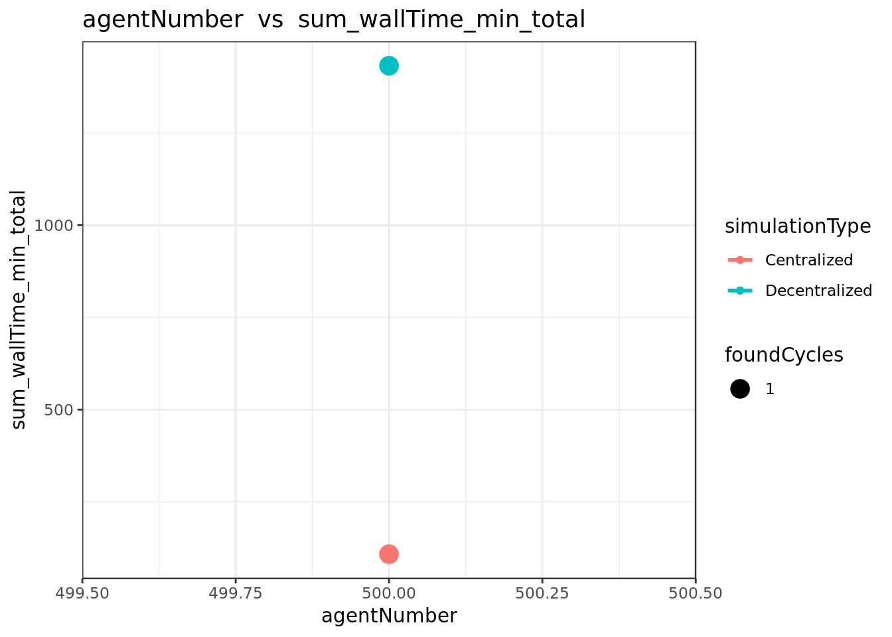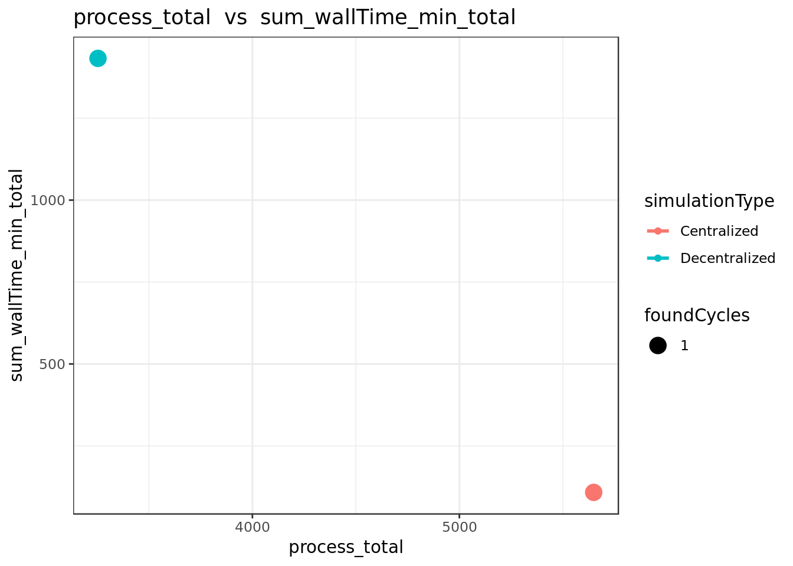   

# Experiment  5 

 

## Experimental set up 

<table class="table table-condensed" style="width: auto !important; ">
 <thead>
  <tr>
   <th style="text-align:left;">   </th>
   <th style="text-align:left;"> Values </th>
  </tr>
 </thead>
<tbody>
  <tr>
   <td style="text-align:left;"> experimentId </td>
   <td style="text-align:left;"> EXP08-09-05-27-BmCFH6 </td>
  </tr>
  <tr>
   <td style="text-align:left;"> agentNumbers </td>
   <td style="text-align:left;"> 500, 1000, 2000 </td>
  </tr>
  <tr>
   <td style="text-align:left;"> maxDistances </td>
   <td style="text-align:left;"> 10 </td>
  </tr>
  <tr>
   <td style="text-align:left;"> randomWorksNumberMultipliers </td>
   <td style="text-align:left;"> 2 </td>
  </tr>
  <tr>
   <td style="text-align:left;"> chainLengths </td>
   <td style="text-align:left;"> 20 </td>
  </tr>
</tbody>
</table>
## Descriptive analysis of each simulation

###  SIM08-09-09-20-UidsEi--CV 

#### simulationParameters 

<table class="table table-condensed" style="width: auto !important; ">
 <thead>
  <tr>
   <th style="text-align:left;"> agentNumber </th>
   <th style="text-align:right;"> similarityConnectThreshold </th>
   <th style="text-align:left;"> chainLength </th>
   <th style="text-align:left;"> similaritySearchThreshold </th>
   <th style="text-align:left;"> maxDistance </th>
   <th style="text-align:left;"> randomWorksNumberMultiplier </th>
  </tr>
 </thead>
<tbody>
  <tr>
   <td style="text-align:left;width: 20em; "> 1000 </td>
   <td style="text-align:right;width: 15em; "> 0.5 </td>
   <td style="text-align:left;width: 15em; "> 20 </td>
   <td style="text-align:left;width: 15em; "> 1 </td>
   <td style="text-align:left;width: 15em; "> 10 </td>
   <td style="text-align:left;width: 15em; "> 2 </td>
  </tr>
</tbody>
</table>
#### Degree distribution of agent->knows->agent edges

#### Runing time by method 

<table class="table table-condensed" style="width: auto !important; ">
 <thead>
  <tr>
   <th style="text-align:left;">   </th>
   <th style="text-align:left;"> key </th>
   <th style="text-align:right;"> doc_count </th>
   <th style="text-align:right;"> sum_wallTime_ms.value </th>
   <th style="text-align:left;"> avg_wallTime_ms.value </th>
   <th style="text-align:left;"> includedInTotal </th>
  </tr>
 </thead>
<tbody>
  <tr>
   <td style="text-align:left;"> 1 </td>
   <td style="text-align:left;"> connectIfSimilar </td>
   <td style="text-align:right;"> 228,627 </td>
   <td style="text-align:right;"> 11,016,774 </td>
   <td style="text-align:left;"> 48.1866708656458 </td>
   <td style="text-align:left;"> No </td>
  </tr>
  <tr>
   <td style="text-align:left;"> 2 </td>
   <td style="text-align:left;"> existsSimilarity </td>
   <td style="text-align:right;"> 228,627 </td>
   <td style="text-align:right;"> 10,836,045 </td>
   <td style="text-align:left;"> 47.396173680274 </td>
   <td style="text-align:left;"> No </td>
  </tr>
  <tr>
   <td style="text-align:left;"> 3 </td>
   <td style="text-align:left;"> similarityEdges </td>
   <td style="text-align:right;"> 228,627 </td>
   <td style="text-align:right;"> 10,437,670 </td>
   <td style="text-align:left;"> 45.6537066925604 </td>
   <td style="text-align:left;"> No </td>
  </tr>
  <tr>
   <td style="text-align:left;"> 4 </td>
   <td style="text-align:left;"> connect </td>
   <td style="text-align:right;"> 56,973 </td>
   <td style="text-align:right;"> 171,427 </td>
   <td style="text-align:left;"> 3.00891650430906 </td>
   <td style="text-align:left;"> Yes </td>
  </tr>
  <tr>
   <td style="text-align:left;"> 6 </td>
   <td style="text-align:left;"> cycleSearch </td>
   <td style="text-align:right;"> 10,798 </td>
   <td style="text-align:right;"> 110,143 </td>
   <td style="text-align:left;"> 10.2003148731247 </td>
   <td style="text-align:left;"> Yes </td>
  </tr>
  <tr>
   <td style="text-align:left;"> 7 </td>
   <td style="text-align:left;"> getWorks </td>
   <td style="text-align:right;"> 10,798 </td>
   <td style="text-align:right;"> 109,570 </td>
   <td style="text-align:left;"> 10.1472494906464 </td>
   <td style="text-align:left;"> Yes </td>
  </tr>
  <tr>
   <td style="text-align:left;"> 8 </td>
   <td style="text-align:left;"> individualCycleSearch </td>
   <td style="text-align:right;"> 10,798 </td>
   <td style="text-align:right;"> 342 </td>
   <td style="text-align:left;"> 0.0316725319503612 </td>
   <td style="text-align:left;"> Yes </td>
  </tr>
  <tr>
   <td style="text-align:left;"> 10 </td>
   <td style="text-align:left;"> init </td>
   <td style="text-align:right;"> 1,003 </td>
   <td style="text-align:right;"> 37,496 </td>
   <td style="text-align:left;"> 37.3838484546361 </td>
   <td style="text-align:left;"> No </td>
  </tr>
  <tr>
   <td style="text-align:left;font-weight: bold;"> 11 </td>
   <td style="text-align:left;font-weight: bold;"> Total </td>
   <td style="text-align:right;font-weight: bold;"> 110,963 </td>
   <td style="text-align:right;font-weight: bold;"> 459,020 </td>
   <td style="text-align:left;font-weight: bold;">  </td>
   <td style="text-align:left;font-weight: bold;">  </td>
  </tr>
</tbody>
</table>
####  Found structures 

#####  Cycles 

Number of cycles found:  0 

<button class="btn btn-primary" data-toggle="collapse" data-target="#QTBWGFGVWE"> Show/Hide foundCycle query </button> 
 
  
     GET /filebeat-*/_search 
              { 
                "query": {
                  "bool": {
                    "must": [
                      { "match_phrase": {
                        "simulationId": "SIM08-09-09-20-UidsEi--CV"
                        }
                      },
                      { "bool": {
                        "should": [
                          { "match": {
                            "keyword": "foundCycle"
                          }}
                        ]
                      }}
                    ]
                  }
                }
              }
     

#####  Paths 

Number of paths found:  10798 

<button class="btn btn-primary" data-toggle="collapse" data-target="#GIUZAUHCFI"> Show/Hide foundPath query </button> 
 
  
     GET /filebeat-*/_search 
              { 
                "query": {
                  "bool": {
                    "must": [
                      { "match_phrase": {
                        "simulationId": "SIM08-09-09-20-UidsEi--CV"
                        }
                      },
                      { "bool": {
                        "should": [
                          { "match": {
                            "keyword": "foundPath"
                          }}
                        ]
                      }}
                    ]
                  }
                }
              }
     

###  SIM08-09-09-20-UidsEi--DV 

#### simulationParameters 

<table class="table table-condensed" style="width: auto !important; ">
 <thead>
  <tr>
   <th style="text-align:left;"> agentNumber </th>
   <th style="text-align:right;"> similarityConnectThreshold </th>
   <th style="text-align:left;"> chainLength </th>
   <th style="text-align:left;"> similaritySearchThreshold </th>
   <th style="text-align:left;"> maxDistance </th>
   <th style="text-align:left;"> randomWorksNumberMultiplier </th>
  </tr>
 </thead>
<tbody>
  <tr>
   <td style="text-align:left;width: 20em; "> 1000 </td>
   <td style="text-align:right;width: 15em; "> 0.5 </td>
   <td style="text-align:left;width: 15em; "> 20 </td>
   <td style="text-align:left;width: 15em; "> 1 </td>
   <td style="text-align:left;width: 15em; "> 10 </td>
   <td style="text-align:left;width: 15em; "> 2 </td>
  </tr>
</tbody>
</table>
#### Degree distribution of agent->knows->agent edges

#### Runing time by method 

<table class="table table-condensed" style="width: auto !important; ">
 <thead>
  <tr>
   <th style="text-align:left;">   </th>
   <th style="text-align:left;"> key </th>
   <th style="text-align:right;"> doc_count </th>
   <th style="text-align:right;"> sum_wallTime_ms.value </th>
   <th style="text-align:left;"> avg_wallTime_ms.value </th>
   <th style="text-align:left;"> includedInTotal </th>
  </tr>
 </thead>
<tbody>
  <tr>
   <td style="text-align:left;"> 1 </td>
   <td style="text-align:left;"> individualCycleSearch </td>
   <td style="text-align:right;"> 10,798 </td>
   <td style="text-align:right;"> 281 </td>
   <td style="text-align:left;"> 0.0260233376551213 </td>
   <td style="text-align:left;"> Yes </td>
  </tr>
  <tr>
   <td style="text-align:left;"> 2 </td>
   <td style="text-align:left;"> knowsAgent </td>
   <td style="text-align:right;"> 6,001 </td>
   <td style="text-align:right;"> 9,079 </td>
   <td style="text-align:left;"> 1.51291451424763 </td>
   <td style="text-align:left;"> No </td>
  </tr>
  <tr>
   <td style="text-align:left;"> 3 </td>
   <td style="text-align:left;"> addItemToWork </td>
   <td style="text-align:right;"> 4,040 </td>
   <td style="text-align:right;"> 43,112 </td>
   <td style="text-align:left;"> 10.6712871287129 </td>
   <td style="text-align:left;"> No </td>
  </tr>
  <tr>
   <td style="text-align:left;"> 4 </td>
   <td style="text-align:left;"> ownsWork </td>
   <td style="text-align:right;"> 2,020 </td>
   <td style="text-align:right;"> 20,952 </td>
   <td style="text-align:left;"> 10.3722772277228 </td>
   <td style="text-align:left;"> No </td>
  </tr>
  <tr>
   <td style="text-align:left;"> 5 </td>
   <td style="text-align:left;"> init </td>
   <td style="text-align:right;"> 1,004 </td>
   <td style="text-align:right;"> 917,265 </td>
   <td style="text-align:left;"> 913.610557768924 </td>
   <td style="text-align:left;"> No </td>
  </tr>
  <tr>
   <td style="text-align:left;"> 6 </td>
   <td style="text-align:left;"> searchAndConnect </td>
   <td style="text-align:right;"> 279 </td>
   <td style="text-align:right;"> 136,407,105 </td>
   <td style="text-align:left;"> 488914.35483871 </td>
   <td style="text-align:left;"> Yes </td>
  </tr>
  <tr>
   <td style="text-align:left;"> 7 </td>
   <td style="text-align:left;"> getWorksItems </td>
   <td style="text-align:right;"> 38 </td>
   <td style="text-align:right;"> 76 </td>
   <td style="text-align:left;"> 2 </td>
   <td style="text-align:left;"> Yes </td>
  </tr>
  <tr>
   <td style="text-align:left;"> 9 </td>
   <td style="text-align:left;"> addChainToNetwork </td>
   <td style="text-align:right;"> 1 </td>
   <td style="text-align:right;"> 0 </td>
   <td style="text-align:left;"> 0 </td>
   <td style="text-align:left;"> Yes </td>
  </tr>
  <tr>
   <td style="text-align:left;"> 10 </td>
   <td style="text-align:left;"> addRandomWorksToAgents </td>
   <td style="text-align:right;"> 1 </td>
   <td style="text-align:right;"> 25 </td>
   <td style="text-align:left;"> 25 </td>
   <td style="text-align:left;"> Yes </td>
  </tr>
  <tr>
   <td style="text-align:left;font-weight: bold;"> 11 </td>
   <td style="text-align:left;font-weight: bold;"> Total </td>
   <td style="text-align:right;font-weight: bold;"> 11,122 </td>
   <td style="text-align:right;font-weight: bold;"> 136,437,450 </td>
   <td style="text-align:left;font-weight: bold;">  </td>
   <td style="text-align:left;font-weight: bold;">  </td>
  </tr>
</tbody>
</table>
####  Found structures 

#####  Cycles 

Number of cycles found:  0 

<button class="btn btn-primary" data-toggle="collapse" data-target="#HTTWKKHNNJ"> Show/Hide foundCycle query </button> 
 
  
     GET /filebeat-*/_search 
              { 
                "query": {
                  "bool": {
                    "must": [
                      { "match_phrase": {
                        "simulationId": "SIM08-09-09-20-UidsEi--DV"
                        }
                      },
                      { "bool": {
                        "should": [
                          { "match": {
                            "keyword": "foundCycle"
                          }}
                        ]
                      }}
                    ]
                  }
                }
              }
     

#####  Paths 

Number of paths found:  0 

<button class="btn btn-primary" data-toggle="collapse" data-target="#NSGDFRYWNS"> Show/Hide foundPath query </button> 
 
  
     GET /filebeat-*/_search 
              { 
                "query": {
                  "bool": {
                    "must": [
                      { "match_phrase": {
                        "simulationId": "SIM08-09-09-20-UidsEi--DV"
                        }
                      },
                      { "bool": {
                        "should": [
                          { "match": {
                            "keyword": "foundPath"
                          }}
                        ]
                      }}
                    ]
                  }
                }
              }
     

###  SIM08-10-06-29-jKDYmz--DV 

#### simulationParameters 

<table class="table table-condensed" style="width: auto !important; ">
 <thead>
  <tr>
   <th style="text-align:left;"> agentNumber </th>
   <th style="text-align:right;"> similarityConnectThreshold </th>
   <th style="text-align:left;"> chainLength </th>
   <th style="text-align:left;"> similaritySearchThreshold </th>
   <th style="text-align:left;"> maxDistance </th>
   <th style="text-align:left;"> randomWorksNumberMultiplier </th>
  </tr>
 </thead>
<tbody>
  <tr>
   <td style="text-align:left;width: 20em; "> 2000 </td>
   <td style="text-align:right;width: 15em; "> 0.5 </td>
   <td style="text-align:left;width: 15em; "> 20 </td>
   <td style="text-align:left;width: 15em; "> 1 </td>
   <td style="text-align:left;width: 15em; "> 10 </td>
   <td style="text-align:left;width: 15em; "> 2 </td>
  </tr>
</tbody>
</table>
#### Degree distribution of agent->knows->agent edges

#### Runing time by method 

<table class="table table-condensed" style="width: auto !important; ">
 <thead>
  <tr>
   <th style="text-align:left;">   </th>
   <th style="text-align:left;"> key </th>
   <th style="text-align:right;"> doc_count </th>
   <th style="text-align:right;"> sum_wallTime_ms.value </th>
   <th style="text-align:left;"> avg_wallTime_ms.value </th>
   <th style="text-align:left;"> includedInTotal </th>
  </tr>
 </thead>
<tbody>
  <tr>
   <td style="text-align:left;"> 1 </td>
   <td style="text-align:left;"> knowsAgent </td>
   <td style="text-align:right;"> 12,001 </td>
   <td style="text-align:right;"> 18,313 </td>
   <td style="text-align:left;"> 1.52595617031914 </td>
   <td style="text-align:left;"> No </td>
  </tr>
  <tr>
   <td style="text-align:left;"> 2 </td>
   <td style="text-align:left;"> individualCycleSearch </td>
   <td style="text-align:right;"> 10,798 </td>
   <td style="text-align:right;"> 245 </td>
   <td style="text-align:left;"> 0.0226893869235044 </td>
   <td style="text-align:left;"> Yes </td>
  </tr>
  <tr>
   <td style="text-align:left;"> 3 </td>
   <td style="text-align:left;"> addItemToWork </td>
   <td style="text-align:right;"> 8,040 </td>
   <td style="text-align:right;"> 76,400 </td>
   <td style="text-align:left;"> 9.50248756218905 </td>
   <td style="text-align:left;"> No </td>
  </tr>
  <tr>
   <td style="text-align:left;"> 4 </td>
   <td style="text-align:left;"> ownsWork </td>
   <td style="text-align:right;"> 4,020 </td>
   <td style="text-align:right;"> 36,178 </td>
   <td style="text-align:left;"> 8.99950248756219 </td>
   <td style="text-align:left;"> No </td>
  </tr>
  <tr>
   <td style="text-align:left;"> 5 </td>
   <td style="text-align:left;"> init </td>
   <td style="text-align:right;"> 2,012 </td>
   <td style="text-align:right;"> 7,301,696 </td>
   <td style="text-align:left;"> 3629.07355864811 </td>
   <td style="text-align:left;"> No </td>
  </tr>
  <tr>
   <td style="text-align:left;"> 6 </td>
   <td style="text-align:left;"> searchAndConnect </td>
   <td style="text-align:right;"> 160 </td>
   <td style="text-align:right;"> 164,755,230 </td>
   <td style="text-align:left;"> 1029720.1875 </td>
   <td style="text-align:left;"> Yes </td>
  </tr>
  <tr>
   <td style="text-align:left;"> 7 </td>
   <td style="text-align:left;"> getWorksItems </td>
   <td style="text-align:right;"> 38 </td>
   <td style="text-align:right;"> 77 </td>
   <td style="text-align:left;"> 2.02631578947368 </td>
   <td style="text-align:left;"> Yes </td>
  </tr>
  <tr>
   <td style="text-align:left;"> 9 </td>
   <td style="text-align:left;"> addChainToNetwork </td>
   <td style="text-align:right;"> 1 </td>
   <td style="text-align:right;"> 0 </td>
   <td style="text-align:left;"> 0 </td>
   <td style="text-align:left;"> Yes </td>
  </tr>
  <tr>
   <td style="text-align:left;"> 10 </td>
   <td style="text-align:left;"> addRandomWorksToAgents </td>
   <td style="text-align:right;"> 1 </td>
   <td style="text-align:right;"> 34 </td>
   <td style="text-align:left;"> 34 </td>
   <td style="text-align:left;"> Yes </td>
  </tr>
  <tr>
   <td style="text-align:left;font-weight: bold;"> 11 </td>
   <td style="text-align:left;font-weight: bold;"> Total </td>
   <td style="text-align:right;font-weight: bold;"> 11,003 </td>
   <td style="text-align:right;font-weight: bold;"> 164,795,240 </td>
   <td style="text-align:left;font-weight: bold;">  </td>
   <td style="text-align:left;font-weight: bold;">  </td>
  </tr>
</tbody>
</table>
####  Found structures 

#####  Cycles 

Number of cycles found:  0 

<button class="btn btn-primary" data-toggle="collapse" data-target="#ADULIZIDVG"> Show/Hide foundCycle query </button> 
 
  
     GET /filebeat-*/_search 
              { 
                "query": {
                  "bool": {
                    "must": [
                      { "match_phrase": {
                        "simulationId": "SIM08-10-06-29-jKDYmz--DV"
                        }
                      },
                      { "bool": {
                        "should": [
                          { "match": {
                            "keyword": "foundCycle"
                          }}
                        ]
                      }}
                    ]
                  }
                }
              }
     

#####  Paths 

Number of paths found:  0 

<button class="btn btn-primary" data-toggle="collapse" data-target="#ZJWIBSNJPP"> Show/Hide foundPath query </button> 
 
  
     GET /filebeat-*/_search 
              { 
                "query": {
                  "bool": {
                    "must": [
                      { "match_phrase": {
                        "simulationId": "SIM08-10-06-29-jKDYmz--DV"
                        }
                      },
                      { "bool": {
                        "should": [
                          { "match": {
                            "keyword": "foundPath"
                          }}
                        ]
                      }}
                    ]
                  }
                }
              }
     

###  SIM08-09-05-27-CLiEJf--CV 

#### simulationParameters 

<table class="table table-condensed" style="width: auto !important; ">
 <thead>
  <tr>
   <th style="text-align:left;"> agentNumber </th>
   <th style="text-align:right;"> similarityConnectThreshold </th>
   <th style="text-align:left;"> chainLength </th>
   <th style="text-align:left;"> similaritySearchThreshold </th>
   <th style="text-align:left;"> maxDistance </th>
   <th style="text-align:left;"> randomWorksNumberMultiplier </th>
  </tr>
 </thead>
<tbody>
  <tr>
   <td style="text-align:left;width: 20em; "> 500 </td>
   <td style="text-align:right;width: 15em; "> 0.5 </td>
   <td style="text-align:left;width: 15em; "> 20 </td>
   <td style="text-align:left;width: 15em; "> 1 </td>
   <td style="text-align:left;width: 15em; "> 10 </td>
   <td style="text-align:left;width: 15em; "> 2 </td>
  </tr>
</tbody>
</table>
#### Degree distribution of agent->knows->agent edges

#### Runing time by method 

<table class="table table-condensed" style="width: auto !important; ">
 <thead>
  <tr>
   <th style="text-align:left;"> key </th>
   <th style="text-align:right;"> doc_count </th>
   <th style="text-align:right;"> sum_wallTime_ms.value </th>
   <th style="text-align:left;"> avg_wallTime_ms.value </th>
   <th style="text-align:left;"> includedInTotal </th>
  </tr>
 </thead>
<tbody>
  <tr>
   <td style="text-align:left;"> connectIfSimilar </td>
   <td style="text-align:right;"> 343,464 </td>
   <td style="text-align:right;"> 10,857,914 </td>
   <td style="text-align:left;"> 31.6129608925535 </td>
   <td style="text-align:left;"> No </td>
  </tr>
  <tr>
   <td style="text-align:left;"> existsSimilarity </td>
   <td style="text-align:right;"> 343,464 </td>
   <td style="text-align:right;"> 10,846,726 </td>
   <td style="text-align:left;"> 31.5803868818857 </td>
   <td style="text-align:left;"> No </td>
  </tr>
  <tr>
   <td style="text-align:left;"> similarityEdges </td>
   <td style="text-align:right;"> 343,464 </td>
   <td style="text-align:right;"> 10,477,761 </td>
   <td style="text-align:left;"> 30.5061403815247 </td>
   <td style="text-align:left;"> No </td>
  </tr>
  <tr>
   <td style="text-align:left;"> cycleSearch </td>
   <td style="text-align:right;"> 2,538 </td>
   <td style="text-align:right;"> 311,220 </td>
   <td style="text-align:left;"> 122.624113475177 </td>
   <td style="text-align:left;"> Yes </td>
  </tr>
  <tr>
   <td style="text-align:left;"> getWorks </td>
   <td style="text-align:right;"> 2,537 </td>
   <td style="text-align:right;"> 8,188 </td>
   <td style="text-align:left;"> 3.22743397713835 </td>
   <td style="text-align:left;"> Yes </td>
  </tr>
  <tr>
   <td style="text-align:left;"> connect </td>
   <td style="text-align:right;"> 616 </td>
   <td style="text-align:right;"> 1,907 </td>
   <td style="text-align:left;"> 3.09577922077922 </td>
   <td style="text-align:left;"> Yes </td>
  </tr>
  <tr>
   <td style="text-align:left;"> init </td>
   <td style="text-align:right;"> 503 </td>
   <td style="text-align:right;"> 22,853 </td>
   <td style="text-align:left;"> 45.4333996023857 </td>
   <td style="text-align:left;"> No </td>
  </tr>
  <tr>
   <td style="text-align:left;"> connectAllSimilar </td>
   <td style="text-align:right;"> 176 </td>
   <td style="text-align:right;"> 10,861,818 </td>
   <td style="text-align:left;"> 61714.875 </td>
   <td style="text-align:left;"> Yes </td>
  </tr>
  <tr>
   <td style="text-align:left;font-weight: bold;"> Total </td>
   <td style="text-align:right;font-weight: bold;"> 5,873 </td>
   <td style="text-align:right;font-weight: bold;"> 11,212,499 </td>
   <td style="text-align:left;font-weight: bold;">  </td>
   <td style="text-align:left;font-weight: bold;">  </td>
  </tr>
</tbody>
</table>
####  Found structures 

#####  Cycles 

Number of cycles found:  1 

<button class="btn btn-primary" data-toggle="collapse" data-target="#EEDCGTDAQL"> Show/Hide foundCycle query </button> 
 
  
     GET /filebeat-*/_search 
              { 
                "query": {
                  "bool": {
                    "must": [
                      { "match_phrase": {
                        "simulationId": "SIM08-09-05-27-CLiEJf--CV"
                        }
                      },
                      { "bool": {
                        "should": [
                          { "match": {
                            "keyword": "foundCycle"
                          }}
                        ]
                      }}
                    ]
                  }
                }
              }
     

#####  Paths 

Number of paths found:  0 

<button class="btn btn-primary" data-toggle="collapse" data-target="#FLIOTXJCVF"> Show/Hide foundPath query </button> 
 
  
     GET /filebeat-*/_search 
              { 
                "query": {
                  "bool": {
                    "must": [
                      { "match_phrase": {
                        "simulationId": "SIM08-09-05-27-CLiEJf--CV"
                        }
                      },
                      { "bool": {
                        "should": [
                          { "match": {
                            "keyword": "foundPath"
                          }}
                        ]
                      }}
                    ]
                  }
                }
              }
     

###  SIM08-09-05-27-CLiEJf--DV 

#### simulationParameters 

<table class="table table-condensed" style="width: auto !important; ">
 <thead>
  <tr>
   <th style="text-align:left;"> agentNumber </th>
   <th style="text-align:right;"> similarityConnectThreshold </th>
   <th style="text-align:left;"> chainLength </th>
   <th style="text-align:left;"> similaritySearchThreshold </th>
   <th style="text-align:left;"> maxDistance </th>
   <th style="text-align:left;"> randomWorksNumberMultiplier </th>
  </tr>
 </thead>
<tbody>
  <tr>
   <td style="text-align:left;width: 20em; "> 500 </td>
   <td style="text-align:right;width: 15em; "> 0.5 </td>
   <td style="text-align:left;width: 15em; "> 20 </td>
   <td style="text-align:left;width: 15em; "> 1 </td>
   <td style="text-align:left;width: 15em; "> 10 </td>
   <td style="text-align:left;width: 15em; "> 2 </td>
  </tr>
</tbody>
</table>
#### Degree distribution of agent->knows->agent edges

#### Runing time by method 

<table class="table table-condensed" style="width: auto !important; ">
 <thead>
  <tr>
   <th style="text-align:left;"> key </th>
   <th style="text-align:right;"> doc_count </th>
   <th style="text-align:right;"> sum_wallTime_ms.value </th>
   <th style="text-align:left;"> avg_wallTime_ms.value </th>
   <th style="text-align:left;"> includedInTotal </th>
  </tr>
 </thead>
<tbody>
  <tr>
   <td style="text-align:left;"> knowsAgent </td>
   <td style="text-align:right;"> 3,001 </td>
   <td style="text-align:right;"> 5,828 </td>
   <td style="text-align:left;"> 1.94201932689104 </td>
   <td style="text-align:left;"> No </td>
  </tr>
  <tr>
   <td style="text-align:left;"> individualCycleSearch </td>
   <td style="text-align:right;"> 2,635 </td>
   <td style="text-align:right;"> 97 </td>
   <td style="text-align:left;"> 0.0368121442125237 </td>
   <td style="text-align:left;"> Yes </td>
  </tr>
  <tr>
   <td style="text-align:left;"> addItemToWork </td>
   <td style="text-align:right;"> 2,040 </td>
   <td style="text-align:right;"> 28,190 </td>
   <td style="text-align:left;"> 13.8186274509804 </td>
   <td style="text-align:left;"> No </td>
  </tr>
  <tr>
   <td style="text-align:left;"> ownsWork </td>
   <td style="text-align:right;"> 1,020 </td>
   <td style="text-align:right;"> 13,695 </td>
   <td style="text-align:left;"> 13.4264705882353 </td>
   <td style="text-align:left;"> No </td>
  </tr>
  <tr>
   <td style="text-align:left;"> init </td>
   <td style="text-align:right;"> 503 </td>
   <td style="text-align:right;"> 22,426 </td>
   <td style="text-align:left;"> 44.5844930417495 </td>
   <td style="text-align:left;"> No </td>
  </tr>
  <tr>
   <td style="text-align:left;"> searchAndConnect </td>
   <td style="text-align:right;"> 500 </td>
   <td style="text-align:right;"> 99,301,753 </td>
   <td style="text-align:left;"> 198603.506 </td>
   <td style="text-align:left;"> Yes </td>
  </tr>
  <tr>
   <td style="text-align:left;"> getWorks </td>
   <td style="text-align:right;"> 99 </td>
   <td style="text-align:right;"> 275,430 </td>
   <td style="text-align:left;"> 2782.12121212121 </td>
   <td style="text-align:left;"> No </td>
  </tr>
  <tr>
   <td style="text-align:left;"> cycleSearch </td>
   <td style="text-align:right;"> 98 </td>
   <td style="text-align:right;"> 393,311 </td>
   <td style="text-align:left;"> 4013.37755102041 </td>
   <td style="text-align:left;"> Yes </td>
  </tr>
  <tr>
   <td style="text-align:left;font-weight: bold;"> Total </td>
   <td style="text-align:right;font-weight: bold;"> 3,407 </td>
   <td style="text-align:right;font-weight: bold;"> 99,987,378 </td>
   <td style="text-align:left;font-weight: bold;">  </td>
   <td style="text-align:left;font-weight: bold;">  </td>
  </tr>
</tbody>
</table>
####  Found structures 

#####  Cycles 

Number of cycles found:  87 

<button class="btn btn-primary" data-toggle="collapse" data-target="#BVSCXORWID"> Show/Hide foundCycle query </button> 
 
  
     GET /filebeat-*/_search 
              { 
                "query": {
                  "bool": {
                    "must": [
                      { "match_phrase": {
                        "simulationId": "SIM08-09-05-27-CLiEJf--DV"
                        }
                      },
                      { "bool": {
                        "should": [
                          { "match": {
                            "keyword": "foundCycle"
                          }}
                        ]
                      }}
                    ]
                  }
                }
              }
     

#####  Paths 

Number of paths found:  0 

<button class="btn btn-primary" data-toggle="collapse" data-target="#CEBEMAINSA"> Show/Hide foundPath query </button> 
 
  
     GET /filebeat-*/_search 
              { 
                "query": {
                  "bool": {
                    "must": [
                      { "match_phrase": {
                        "simulationId": "SIM08-09-05-27-CLiEJf--DV"
                        }
                      },
                      { "bool": {
                        "should": [
                          { "match": {
                            "keyword": "foundPath"
                          }}
                        ]
                      }}
                    ]
                  }
                }
              }
     

## Scatterplots of experiment 

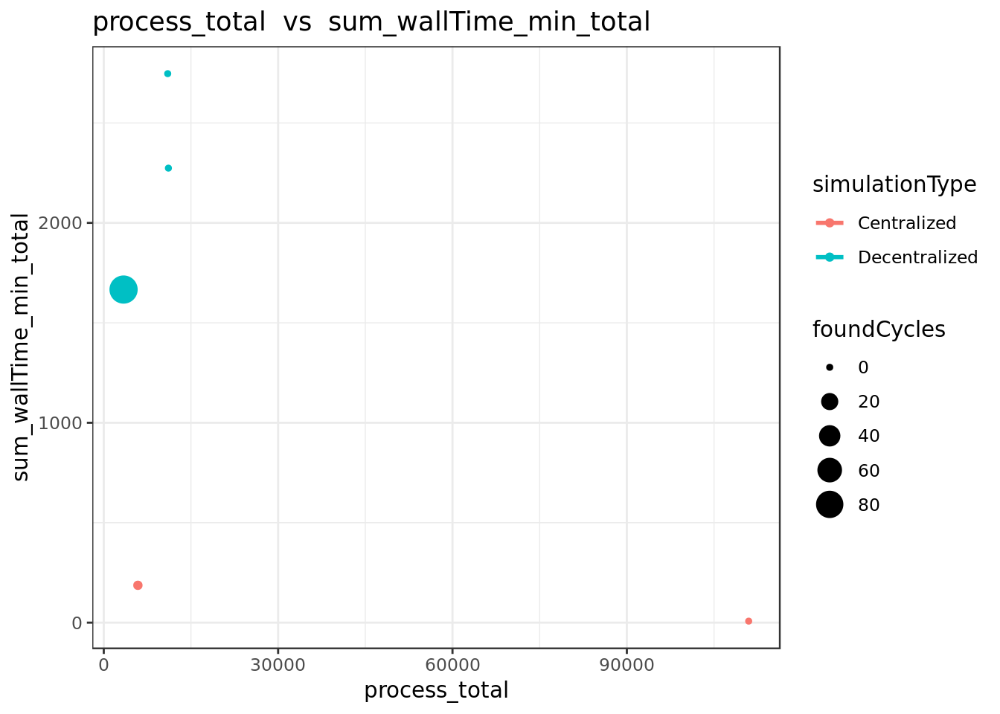   

# Experiment  6 

 

## Experimental set up 

<table class="table table-condensed" style="width: auto !important; ">
 <thead>
  <tr>
   <th style="text-align:left;">   </th>
   <th style="text-align:left;"> Values </th>
  </tr>
 </thead>
<tbody>
  <tr>
   <td style="text-align:left;"> experimentId </td>
   <td style="text-align:left;"> EXP08-10-01-33-JYSw5Z </td>
  </tr>
  <tr>
   <td style="text-align:left;"> agentNumbers </td>
   <td style="text-align:left;"> 1000 </td>
  </tr>
  <tr>
   <td style="text-align:left;"> maxDistances </td>
   <td style="text-align:left;"> 10 </td>
  </tr>
  <tr>
   <td style="text-align:left;"> randomWorksNumberMultipliers </td>
   <td style="text-align:left;"> 2 </td>
  </tr>
  <tr>
   <td style="text-align:left;"> chainLengths </td>
   <td style="text-align:left;"> 20 </td>
  </tr>
</tbody>
</table>
## Descriptive analysis of each simulation

###  SIM08-10-01-33-niVTL7--CV 

#### simulationParameters 

<table class="table table-condensed" style="width: auto !important; ">
 <thead>
  <tr>
   <th style="text-align:left;"> agentNumber </th>
   <th style="text-align:right;"> similarityConnectThreshold </th>
   <th style="text-align:left;"> chainLength </th>
   <th style="text-align:left;"> similaritySearchThreshold </th>
   <th style="text-align:left;"> maxDistance </th>
   <th style="text-align:left;"> randomWorksNumberMultiplier </th>
  </tr>
 </thead>
<tbody>
  <tr>
   <td style="text-align:left;width: 20em; "> 1000 </td>
   <td style="text-align:right;width: 15em; "> 0.5 </td>
   <td style="text-align:left;width: 15em; "> 20 </td>
   <td style="text-align:left;width: 15em; "> 1 </td>
   <td style="text-align:left;width: 15em; "> 10 </td>
   <td style="text-align:left;width: 15em; "> 2 </td>
  </tr>
</tbody>
</table>
#### Degree distribution of agent->knows->agent edges

#### Runing time by method 

<table class="table table-condensed" style="width: auto !important; ">
 <thead>
  <tr>
   <th style="text-align:left;"> key </th>
   <th style="text-align:right;"> doc_count </th>
   <th style="text-align:right;"> sum_wallTime_ms.value </th>
   <th style="text-align:left;"> avg_wallTime_ms.value </th>
   <th style="text-align:left;"> includedInTotal </th>
  </tr>
 </thead>
<tbody>
  <tr>
   <td style="text-align:left;"> connectIfSimilar </td>
   <td style="text-align:right;"> 212,689 </td>
   <td style="text-align:right;"> 3,619,153 </td>
   <td style="text-align:left;"> 17.0161738500816 </td>
   <td style="text-align:left;"> No </td>
  </tr>
  <tr>
   <td style="text-align:left;"> existsSimilarity </td>
   <td style="text-align:right;"> 212,689 </td>
   <td style="text-align:right;"> 3,612,514 </td>
   <td style="text-align:left;"> 16.9849592597643 </td>
   <td style="text-align:left;"> No </td>
  </tr>
  <tr>
   <td style="text-align:left;"> similarityEdges </td>
   <td style="text-align:right;"> 212,689 </td>
   <td style="text-align:right;"> 3,524,418 </td>
   <td style="text-align:left;"> 16.5707582432566 </td>
   <td style="text-align:left;"> No </td>
  </tr>
  <tr>
   <td style="text-align:left;"> cycleSearch </td>
   <td style="text-align:right;"> 2,104 </td>
   <td style="text-align:right;"> 168,395 </td>
   <td style="text-align:left;"> 80.0356463878327 </td>
   <td style="text-align:left;"> Yes </td>
  </tr>
  <tr>
   <td style="text-align:left;"> getWorks </td>
   <td style="text-align:right;"> 2,103 </td>
   <td style="text-align:right;"> 6,464 </td>
   <td style="text-align:left;"> 3.07370423204945 </td>
   <td style="text-align:left;"> Yes </td>
  </tr>
  <tr>
   <td style="text-align:left;"> init </td>
   <td style="text-align:right;"> 1,002 </td>
   <td style="text-align:right;"> 30,929 </td>
   <td style="text-align:left;"> 30.8672654690619 </td>
   <td style="text-align:left;"> No </td>
  </tr>
  <tr>
   <td style="text-align:left;"> connectAllSimilar </td>
   <td style="text-align:right;"> 53 </td>
   <td style="text-align:right;"> 3,621,513 </td>
   <td style="text-align:left;"> 68330.4339622642 </td>
   <td style="text-align:left;"> Yes </td>
  </tr>
  <tr>
   <td style="text-align:left;"> connect </td>
   <td style="text-align:right;"> 45 </td>
   <td style="text-align:right;"> 91 </td>
   <td style="text-align:left;"> 2.02222222222222 </td>
   <td style="text-align:left;"> Yes </td>
  </tr>
  <tr>
   <td style="text-align:left;font-weight: bold;"> Total </td>
   <td style="text-align:right;font-weight: bold;"> 4,311 </td>
   <td style="text-align:right;font-weight: bold;"> 3,826,229 </td>
   <td style="text-align:left;font-weight: bold;">  </td>
   <td style="text-align:left;font-weight: bold;">  </td>
  </tr>
</tbody>
</table>
####  Found structures 

#####  Cycles 

Number of cycles found:  1 

<button class="btn btn-primary" data-toggle="collapse" data-target="#BOCYVNLHPP"> Show/Hide foundCycle query </button> 
 
  
     GET /filebeat-*/_search 
              { 
                "query": {
                  "bool": {
                    "must": [
                      { "match_phrase": {
                        "simulationId": "SIM08-10-01-33-niVTL7--CV"
                        }
                      },
                      { "bool": {
                        "should": [
                          { "match": {
                            "keyword": "foundCycle"
                          }}
                        ]
                      }}
                    ]
                  }
                }
              }
     

#####  Paths 

Number of paths found:  0 

<button class="btn btn-primary" data-toggle="collapse" data-target="#IJDNZYSWWC"> Show/Hide foundPath query </button> 
 
  
     GET /filebeat-*/_search 
              { 
                "query": {
                  "bool": {
                    "must": [
                      { "match_phrase": {
                        "simulationId": "SIM08-10-01-33-niVTL7--CV"
                        }
                      },
                      { "bool": {
                        "should": [
                          { "match": {
                            "keyword": "foundPath"
                          }}
                        ]
                      }}
                    ]
                  }
                }
              }
     

###  SIM08-10-01-33-niVTL7--DV 

#### simulationParameters 

<table class="table table-condensed" style="width: auto !important; ">
 <thead>
  <tr>
   <th style="text-align:left;"> agentNumber </th>
   <th style="text-align:right;"> similarityConnectThreshold </th>
   <th style="text-align:left;"> chainLength </th>
   <th style="text-align:left;"> similaritySearchThreshold </th>
   <th style="text-align:left;"> maxDistance </th>
   <th style="text-align:left;"> randomWorksNumberMultiplier </th>
  </tr>
 </thead>
<tbody>
  <tr>
   <td style="text-align:left;width: 20em; "> 1000 </td>
   <td style="text-align:right;width: 15em; "> 0.5 </td>
   <td style="text-align:left;width: 15em; "> 20 </td>
   <td style="text-align:left;width: 15em; "> 1 </td>
   <td style="text-align:left;width: 15em; "> 10 </td>
   <td style="text-align:left;width: 15em; "> 2 </td>
  </tr>
</tbody>
</table>
#### Degree distribution of agent->knows->agent edges

#### Runing time by method 

<table class="table table-condensed" style="width: auto !important; ">
 <thead>
  <tr>
   <th style="text-align:left;"> key </th>
   <th style="text-align:right;"> doc_count </th>
   <th style="text-align:right;"> sum_wallTime_ms.value </th>
   <th style="text-align:left;"> avg_wallTime_ms.value </th>
   <th style="text-align:left;"> includedInTotal </th>
  </tr>
 </thead>
<tbody>
  <tr>
   <td style="text-align:left;"> knowsAgent </td>
   <td style="text-align:right;"> 6,001 </td>
   <td style="text-align:right;"> 11,347 </td>
   <td style="text-align:left;"> 1.89085152474588 </td>
   <td style="text-align:left;"> No </td>
  </tr>
  <tr>
   <td style="text-align:left;"> addItemToWork </td>
   <td style="text-align:right;"> 4,040 </td>
   <td style="text-align:right;"> 49,028 </td>
   <td style="text-align:left;"> 12.1356435643564 </td>
   <td style="text-align:left;"> No </td>
  </tr>
  <tr>
   <td style="text-align:left;"> individualCycleSearch </td>
   <td style="text-align:right;"> 2,271 </td>
   <td style="text-align:right;"> 108 </td>
   <td style="text-align:left;"> 0.047556142668428 </td>
   <td style="text-align:left;"> Yes </td>
  </tr>
  <tr>
   <td style="text-align:left;"> ownsWork </td>
   <td style="text-align:right;"> 2,020 </td>
   <td style="text-align:right;"> 23,026 </td>
   <td style="text-align:left;"> 11.3990099009901 </td>
   <td style="text-align:left;"> No </td>
  </tr>
  <tr>
   <td style="text-align:left;"> init </td>
   <td style="text-align:right;"> 1,003 </td>
   <td style="text-align:right;"> 38,497 </td>
   <td style="text-align:left;"> 38.3818544366899 </td>
   <td style="text-align:left;"> No </td>
  </tr>
  <tr>
   <td style="text-align:left;"> searchAndConnect </td>
   <td style="text-align:right;"> 1,001 </td>
   <td style="text-align:right;"> 68,202,836 </td>
   <td style="text-align:left;"> 68134.7012987013 </td>
   <td style="text-align:left;"> Yes </td>
  </tr>
  <tr>
   <td style="text-align:left;"> getWorks </td>
   <td style="text-align:right;"> 169 </td>
   <td style="text-align:right;"> 241,737 </td>
   <td style="text-align:left;"> 1430.39644970414 </td>
   <td style="text-align:left;"> No </td>
  </tr>
  <tr>
   <td style="text-align:left;"> cycleSearch </td>
   <td style="text-align:right;"> 168 </td>
   <td style="text-align:right;"> 962,340 </td>
   <td style="text-align:left;"> 5728.21428571429 </td>
   <td style="text-align:left;"> Yes </td>
  </tr>
  <tr>
   <td style="text-align:left;font-weight: bold;"> Total </td>
   <td style="text-align:right;font-weight: bold;"> 3,746 </td>
   <td style="text-align:right;font-weight: bold;"> 70,170,170 </td>
   <td style="text-align:left;font-weight: bold;">  </td>
   <td style="text-align:left;font-weight: bold;">  </td>
  </tr>
</tbody>
</table>
####  Found structures 

#####  Cycles 

Number of cycles found:  138 

<button class="btn btn-primary" data-toggle="collapse" data-target="#RLKWYIPGVJ"> Show/Hide foundCycle query </button> 
 
  
     GET /filebeat-*/_search 
              { 
                "query": {
                  "bool": {
                    "must": [
                      { "match_phrase": {
                        "simulationId": "SIM08-10-01-33-niVTL7--DV"
                        }
                      },
                      { "bool": {
                        "should": [
                          { "match": {
                            "keyword": "foundCycle"
                          }}
                        ]
                      }}
                    ]
                  }
                }
              }
     

#####  Paths 

Number of paths found:  15 

<button class="btn btn-primary" data-toggle="collapse" data-target="#JENEJOZUQC"> Show/Hide foundPath query </button> 
 
  
     GET /filebeat-*/_search 
              { 
                "query": {
                  "bool": {
                    "must": [
                      { "match_phrase": {
                        "simulationId": "SIM08-10-01-33-niVTL7--DV"
                        }
                      },
                      { "bool": {
                        "should": [
                          { "match": {
                            "keyword": "foundPath"
                          }}
                        ]
                      }}
                    ]
                  }
                }
              }
     

## Scatterplots of experiment 

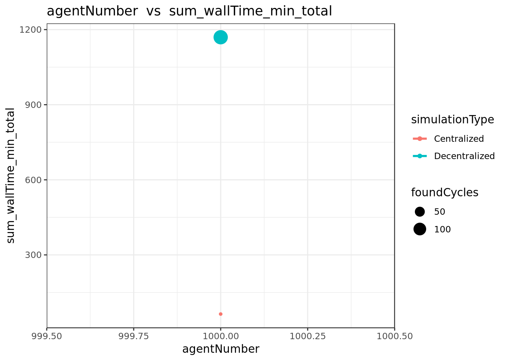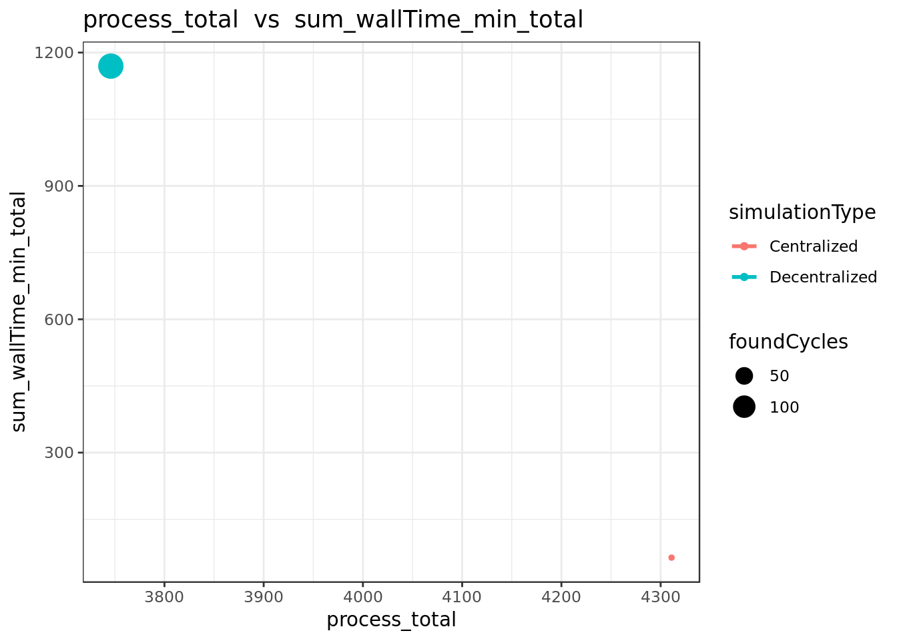   

# Experiment  7 

 

## Experimental set up 

<table class="table table-condensed" style="width: auto !important; ">
 <thead>
  <tr>
   <th style="text-align:left;">   </th>
   <th style="text-align:left;"> Values </th>
  </tr>
 </thead>
<tbody>
  <tr>
   <td style="text-align:left;"> experimentId </td>
   <td style="text-align:left;"> EXP08-10-10-15-t7WP6v </td>
  </tr>
  <tr>
   <td style="text-align:left;"> agentNumbers </td>
   <td style="text-align:left;"> 100, 200, 400, 800 </td>
  </tr>
  <tr>
   <td style="text-align:left;"> maxDistances </td>
   <td style="text-align:left;"> 5, 10 </td>
  </tr>
  <tr>
   <td style="text-align:left;"> randomWorksNumberMultipliers </td>
   <td style="text-align:left;"> 1, 2 </td>
  </tr>
  <tr>
   <td style="text-align:left;"> similarityConnectThresholds </td>
   <td style="text-align:left;"> 0.85, 0.95 </td>
  </tr>
  <tr>
   <td style="text-align:left;"> chainLengths </td>
   <td style="text-align:left;"> 10, 20 </td>
  </tr>
</tbody>
</table>
## Descriptive analysis of each simulation

###  SIM08-10-10-15-26LQ2S--CV 

#### simulationParameters 

<table class="table table-condensed" style="width: auto !important; ">
 <thead>
  <tr>
   <th style="text-align:left;"> agentNumber </th>
   <th style="text-align:left;"> chainLength </th>
   <th style="text-align:left;"> similaritySearchThreshold </th>
   <th style="text-align:left;"> maxDistance </th>
   <th style="text-align:left;"> randomWorksNumberMultiplier </th>
   <th style="text-align:left;"> similarityConnectThreshold </th>
  </tr>
 </thead>
<tbody>
  <tr>
   <td style="text-align:left;width: 20em; "> 100 </td>
   <td style="text-align:left;width: 15em; "> 10 </td>
   <td style="text-align:left;width: 15em; "> 0.95 </td>
   <td style="text-align:left;width: 15em; "> 5 </td>
   <td style="text-align:left;width: 15em; "> 1 </td>
   <td style="text-align:left;width: 15em; "> NA </td>
  </tr>
</tbody>
</table>
#### Degree distribution of agent->knows->agent edges

#### Runing time by method 

<table class="table table-condensed" style="width: auto !important; ">
 <thead>
  <tr>
   <th style="text-align:left;"> key </th>
   <th style="text-align:right;"> doc_count </th>
   <th style="text-align:right;"> sum_wallTime_ms.value </th>
   <th style="text-align:left;"> avg_wallTime_ms.value </th>
   <th style="text-align:left;"> includedInTotal </th>
  </tr>
 </thead>
<tbody>
  <tr>
   <td style="text-align:left;"> connectIfSimilar </td>
   <td style="text-align:right;"> 24,090 </td>
   <td style="text-align:right;"> 69,488 </td>
   <td style="text-align:left;"> 2.88451639684516 </td>
   <td style="text-align:left;"> No </td>
  </tr>
  <tr>
   <td style="text-align:left;"> existsSimilarity </td>
   <td style="text-align:right;"> 24,090 </td>
   <td style="text-align:right;"> 68,742 </td>
   <td style="text-align:left;"> 2.85354919053549 </td>
   <td style="text-align:left;"> No </td>
  </tr>
  <tr>
   <td style="text-align:left;"> similarityEdges </td>
   <td style="text-align:right;"> 24,090 </td>
   <td style="text-align:right;"> 67,188 </td>
   <td style="text-align:left;"> 2.78904109589041 </td>
   <td style="text-align:left;"> No </td>
  </tr>
  <tr>
   <td style="text-align:left;"> connectAllSimilar </td>
   <td style="text-align:right;"> 220 </td>
   <td style="text-align:right;"> 69,717 </td>
   <td style="text-align:left;"> 316.895454545455 </td>
   <td style="text-align:left;"> Yes </td>
  </tr>
  <tr>
   <td style="text-align:left;"> init </td>
   <td style="text-align:right;"> 104 </td>
   <td style="text-align:right;"> 23,019 </td>
   <td style="text-align:left;"> 221.336538461538 </td>
   <td style="text-align:left;"> No </td>
  </tr>
  <tr>
   <td style="text-align:left;"> connect </td>
   <td style="text-align:right;"> 86 </td>
   <td style="text-align:right;"> 221 </td>
   <td style="text-align:left;"> 2.56976744186047 </td>
   <td style="text-align:left;"> Yes </td>
  </tr>
  <tr>
   <td style="text-align:left;"> individualCycleSearch </td>
   <td style="text-align:right;"> 12 </td>
   <td style="text-align:right;"> 1 </td>
   <td style="text-align:left;"> 0.0833333333333333 </td>
   <td style="text-align:left;"> Yes </td>
  </tr>
  <tr>
   <td style="text-align:left;"> cycleSearch </td>
   <td style="text-align:right;"> 9 </td>
   <td style="text-align:right;"> 3,266 </td>
   <td style="text-align:left;"> 362.888888888889 </td>
   <td style="text-align:left;"> Yes </td>
  </tr>
  <tr>
   <td style="text-align:left;"> getWorks </td>
   <td style="text-align:right;"> 8 </td>
   <td style="text-align:right;"> 20 </td>
   <td style="text-align:left;"> 2.5 </td>
   <td style="text-align:left;"> Yes </td>
  </tr>
  <tr>
   <td style="text-align:left;font-weight: bold;"> Total </td>
   <td style="text-align:right;font-weight: bold;"> 340 </td>
   <td style="text-align:right;font-weight: bold;"> 73,396 </td>
   <td style="text-align:left;font-weight: bold;">  </td>
   <td style="text-align:left;font-weight: bold;">  </td>
  </tr>
</tbody>
</table>
####  Found structures 

#####  Cycles 

Number of cycles found:  1 

<button class="btn btn-primary" data-toggle="collapse" data-target="#KELIYOIPAU"> Show/Hide foundCycle query </button> 
 
  
     GET /filebeat-*/_search 
              { 
                "query": {
                  "bool": {
                    "must": [
                      { "match_phrase": {
                        "simulationId": "SIM08-10-10-15-26LQ2S--CV"
                        }
                      },
                      { "bool": {
                        "should": [
                          { "match": {
                            "keyword": "foundCycle"
                          }}
                        ]
                      }}
                    ]
                  }
                }
              }
     

#####  Paths 

Number of paths found:  0 

<button class="btn btn-primary" data-toggle="collapse" data-target="#JIMEHSDHBA"> Show/Hide foundPath query </button> 
 
  
     GET /filebeat-*/_search 
              { 
                "query": {
                  "bool": {
                    "must": [
                      { "match_phrase": {
                        "simulationId": "SIM08-10-10-15-26LQ2S--CV"
                        }
                      },
                      { "bool": {
                        "should": [
                          { "match": {
                            "keyword": "foundPath"
                          }}
                        ]
                      }}
                    ]
                  }
                }
              }
     

###  SIM08-10-10-15-26LQ2S--DV 

#### simulationParameters 

<table class="table table-condensed" style="width: auto !important; ">
 <thead>
  <tr>
   <th style="text-align:left;"> agentNumber </th>
   <th style="text-align:left;"> chainLength </th>
   <th style="text-align:left;"> similaritySearchThreshold </th>
   <th style="text-align:left;"> maxDistance </th>
   <th style="text-align:left;"> randomWorksNumberMultiplier </th>
   <th style="text-align:left;"> similarityConnectThreshold </th>
  </tr>
 </thead>
<tbody>
  <tr>
   <td style="text-align:left;width: 20em; "> 100 </td>
   <td style="text-align:left;width: 15em; "> 10 </td>
   <td style="text-align:left;width: 15em; "> 0.95 </td>
   <td style="text-align:left;width: 15em; "> 5 </td>
   <td style="text-align:left;width: 15em; "> 1 </td>
   <td style="text-align:left;width: 15em; "> 0.85 </td>
  </tr>
</tbody>
</table>
#### Degree distribution of agent->knows->agent edges

#### Runing time by method 

<table class="table table-condensed" style="width: auto !important; ">
 <thead>
  <tr>
   <th style="text-align:left;"> key </th>
   <th style="text-align:right;"> doc_count </th>
   <th style="text-align:right;"> sum_wallTime_ms.value </th>
   <th style="text-align:left;"> avg_wallTime_ms.value </th>
   <th style="text-align:left;"> includedInTotal </th>
  </tr>
 </thead>
<tbody>
  <tr>
   <td style="text-align:left;"> knowsAgent </td>
   <td style="text-align:right;"> 601 </td>
   <td style="text-align:right;"> 1,538 </td>
   <td style="text-align:left;"> 2.55906821963394 </td>
   <td style="text-align:left;"> No </td>
  </tr>
  <tr>
   <td style="text-align:left;"> addItemToWork </td>
   <td style="text-align:right;"> 220 </td>
   <td style="text-align:right;"> 5,121 </td>
   <td style="text-align:left;"> 23.2772727272727 </td>
   <td style="text-align:left;"> No </td>
  </tr>
  <tr>
   <td style="text-align:left;"> ownsWork </td>
   <td style="text-align:right;"> 110 </td>
   <td style="text-align:right;"> 2,228 </td>
   <td style="text-align:left;"> 20.2545454545455 </td>
   <td style="text-align:left;"> No </td>
  </tr>
  <tr>
   <td style="text-align:left;"> init </td>
   <td style="text-align:right;"> 103 </td>
   <td style="text-align:right;"> 10,035 </td>
   <td style="text-align:left;"> 97.4271844660194 </td>
   <td style="text-align:left;"> No </td>
  </tr>
  <tr>
   <td style="text-align:left;"> searchAndConnect </td>
   <td style="text-align:right;"> 101 </td>
   <td style="text-align:right;"> 68,078 </td>
   <td style="text-align:left;"> 674.039603960396 </td>
   <td style="text-align:left;"> Yes </td>
  </tr>
  <tr>
   <td style="text-align:left;"> getWorksItems </td>
   <td style="text-align:right;"> 18 </td>
   <td style="text-align:right;"> 44 </td>
   <td style="text-align:left;"> 2.44444444444444 </td>
   <td style="text-align:left;"> Yes </td>
  </tr>
  <tr>
   <td style="text-align:left;"> individualCycleSearch </td>
   <td style="text-align:right;"> 13 </td>
   <td style="text-align:right;"> 18 </td>
   <td style="text-align:left;"> 1.38461538461538 </td>
   <td style="text-align:left;"> Yes </td>
  </tr>
  <tr>
   <td style="text-align:left;"> getWorks </td>
   <td style="text-align:right;"> 7 </td>
   <td style="text-align:right;"> 587 </td>
   <td style="text-align:left;"> 83.8571428571429 </td>
   <td style="text-align:left;"> No </td>
  </tr>
  <tr>
   <td style="text-align:left;"> cycleSearch </td>
   <td style="text-align:right;"> 6 </td>
   <td style="text-align:right;"> 2,154 </td>
   <td style="text-align:left;"> 359 </td>
   <td style="text-align:left;"> Yes </td>
  </tr>
  <tr>
   <td style="text-align:left;font-weight: bold;"> Total </td>
   <td style="text-align:right;font-weight: bold;"> 143 </td>
   <td style="text-align:right;font-weight: bold;"> 70,481 </td>
   <td style="text-align:left;font-weight: bold;">  </td>
   <td style="text-align:left;font-weight: bold;">  </td>
  </tr>
</tbody>
</table>
####  Found structures 

#####  Cycles 

Number of cycles found:  2 

<button class="btn btn-primary" data-toggle="collapse" data-target="#NQCLGLRVRS"> Show/Hide foundCycle query </button> 
 
  
     GET /filebeat-*/_search 
              { 
                "query": {
                  "bool": {
                    "must": [
                      { "match_phrase": {
                        "simulationId": "SIM08-10-10-15-26LQ2S--DV"
                        }
                      },
                      { "bool": {
                        "should": [
                          { "match": {
                            "keyword": "foundCycle"
                          }}
                        ]
                      }}
                    ]
                  }
                }
              }
     

#####  Paths 

Number of paths found:  0 

<button class="btn btn-primary" data-toggle="collapse" data-target="#BULYLBZMBU"> Show/Hide foundPath query </button> 
 
  
     GET /filebeat-*/_search 
              { 
                "query": {
                  "bool": {
                    "must": [
                      { "match_phrase": {
                        "simulationId": "SIM08-10-10-15-26LQ2S--DV"
                        }
                      },
                      { "bool": {
                        "should": [
                          { "match": {
                            "keyword": "foundPath"
                          }}
                        ]
                      }}
                    ]
                  }
                }
              }
     

## Scatterplots of experiment 

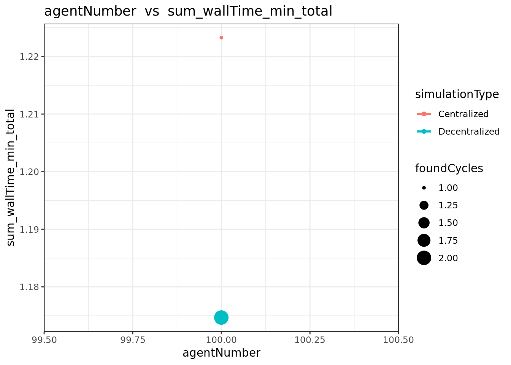   

# Experiment  8 

 

## Experimental set up 

<table class="table table-condensed" style="width: auto !important; ">
 <thead>
  <tr>
   <th style="text-align:left;">   </th>
   <th style="text-align:left;"> Values </th>
  </tr>
 </thead>
<tbody>
  <tr>
   <td style="text-align:left;"> experimentId </td>
   <td style="text-align:left;"> EXP08-11-12-38-3dSVwT </td>
  </tr>
  <tr>
   <td style="text-align:left;"> agentNumbers </td>
   <td style="text-align:left;"> 100, 200, 400, 800 </td>
  </tr>
  <tr>
   <td style="text-align:left;"> maxDistances </td>
   <td style="text-align:left;"> 5, 10 </td>
  </tr>
  <tr>
   <td style="text-align:left;"> randomWorksNumberMultipliers </td>
   <td style="text-align:left;"> 1, 2 </td>
  </tr>
  <tr>
   <td style="text-align:left;"> similarityConnectThresholds </td>
   <td style="text-align:left;"> 0.85, 0.95 </td>
  </tr>
  <tr>
   <td style="text-align:left;"> chainLengths </td>
   <td style="text-align:left;"> 10, 20 </td>
  </tr>
</tbody>
</table>
## Descriptive analysis of each simulation

###  SIM08-11-12-38-Ea8VAf--CV 

#### simulationParameters 

<table class="table table-condensed" style="width: auto !important; ">
 <thead>
  <tr>
   <th style="text-align:left;"> agentNumber </th>
   <th style="text-align:left;"> chainLength </th>
   <th style="text-align:left;"> similaritySearchThreshold </th>
   <th style="text-align:left;"> maxDistance </th>
   <th style="text-align:left;"> randomWorksNumberMultiplier </th>
  </tr>
 </thead>
<tbody>
  <tr>
   <td style="text-align:left;width: 20em; "> 100 </td>
   <td style="text-align:left;width: 15em; "> 10 </td>
   <td style="text-align:left;width: 15em; "> 0.95, </td>
   <td style="text-align:left;width: 15em; "> 5 </td>
   <td style="text-align:left;width: 15em; "> 1 </td>
  </tr>
</tbody>
</table>
#### Degree distribution of agent->knows->agent edges

#### Runing time by method 

<table class="table table-condensed" style="width: auto !important; ">
 <thead>
  <tr>
   <th style="text-align:left;"> key </th>
   <th style="text-align:right;"> doc_count </th>
   <th style="text-align:right;"> sum_wallTime_ms.value </th>
   <th style="text-align:left;"> avg_wallTime_ms.value </th>
   <th style="text-align:left;"> includedInTotal </th>
  </tr>
 </thead>
<tbody>
  <tr>
   <td style="text-align:left;"> connectIfSimilar </td>
   <td style="text-align:right;"> 24,090 </td>
   <td style="text-align:right;"> 62,884 </td>
   <td style="text-align:left;"> 2.61037775010378 </td>
   <td style="text-align:left;"> No </td>
  </tr>
  <tr>
   <td style="text-align:left;"> existsSimilarity </td>
   <td style="text-align:right;"> 24,090 </td>
   <td style="text-align:right;"> 62,173 </td>
   <td style="text-align:left;"> 2.58086342880863 </td>
   <td style="text-align:left;"> No </td>
  </tr>
  <tr>
   <td style="text-align:left;"> similarityEdges </td>
   <td style="text-align:right;"> 24,090 </td>
   <td style="text-align:right;"> 60,578 </td>
   <td style="text-align:left;"> 2.51465338314653 </td>
   <td style="text-align:left;"> No </td>
  </tr>
  <tr>
   <td style="text-align:left;"> connectAllSimilar </td>
   <td style="text-align:right;"> 220 </td>
   <td style="text-align:right;"> 63,161 </td>
   <td style="text-align:left;"> 287.095454545455 </td>
   <td style="text-align:left;"> Yes </td>
  </tr>
  <tr>
   <td style="text-align:left;"> init </td>
   <td style="text-align:right;"> 102 </td>
   <td style="text-align:right;"> 3,324 </td>
   <td style="text-align:left;"> 32.5882352941176 </td>
   <td style="text-align:left;"> No </td>
  </tr>
  <tr>
   <td style="text-align:left;"> connect </td>
   <td style="text-align:right;"> 89 </td>
   <td style="text-align:right;"> 166 </td>
   <td style="text-align:left;"> 1.86516853932584 </td>
   <td style="text-align:left;"> Yes </td>
  </tr>
  <tr>
   <td style="text-align:left;"> individualCycleSearch </td>
   <td style="text-align:right;"> 11 </td>
   <td style="text-align:right;"> 0 </td>
   <td style="text-align:left;"> 0 </td>
   <td style="text-align:left;"> Yes </td>
  </tr>
  <tr>
   <td style="text-align:left;"> cycleSearch </td>
   <td style="text-align:right;"> 9 </td>
   <td style="text-align:right;"> 2,743 </td>
   <td style="text-align:left;"> 304.777777777778 </td>
   <td style="text-align:left;"> Yes </td>
  </tr>
  <tr>
   <td style="text-align:left;"> getWorks </td>
   <td style="text-align:right;"> 8 </td>
   <td style="text-align:right;"> 18 </td>
   <td style="text-align:left;"> 2.25 </td>
   <td style="text-align:left;"> Yes </td>
  </tr>
  <tr>
   <td style="text-align:left;font-weight: bold;"> Total </td>
   <td style="text-align:right;font-weight: bold;"> 342 </td>
   <td style="text-align:right;font-weight: bold;"> 66,318 </td>
   <td style="text-align:left;font-weight: bold;">  </td>
   <td style="text-align:left;font-weight: bold;">  </td>
  </tr>
</tbody>
</table>
####  Found structures 

#####  Cycles 

Number of cycles found:  1 

<button class="btn btn-primary" data-toggle="collapse" data-target="#XYNKZCLZCJ"> Show/Hide foundCycle query </button> 
 
  
     GET /filebeat-*/_search 
              { 
                "query": {
                  "bool": {
                    "must": [
                      { "match_phrase": {
                        "simulationId": "SIM08-11-12-38-Ea8VAf--CV"
                        }
                      },
                      { "bool": {
                        "should": [
                          { "match": {
                            "keyword": "foundCycle"
                          }}
                        ]
                      }}
                    ]
                  }
                }
              }
     

#####  Paths 

Number of paths found:  0 

<button class="btn btn-primary" data-toggle="collapse" data-target="#MYBBEBZHDA"> Show/Hide foundPath query </button> 
 
  
     GET /filebeat-*/_search 
              { 
                "query": {
                  "bool": {
                    "must": [
                      { "match_phrase": {
                        "simulationId": "SIM08-11-12-38-Ea8VAf--CV"
                        }
                      },
                      { "bool": {
                        "should": [
                          { "match": {
                            "keyword": "foundPath"
                          }}
                        ]
                      }}
                    ]
                  }
                }
              }
     

###  SIM08-11-12-38-Ea8VAf--DV 

#### simulationParameters 

<table class="table table-condensed" style="width: auto !important; ">
 <thead>
  <tr>
   <th style="text-align:left;"> agentNumber </th>
   <th style="text-align:left;"> chainLength </th>
   <th style="text-align:left;"> similaritySearchThreshold </th>
   <th style="text-align:left;"> maxDistance </th>
   <th style="text-align:left;"> randomWorksNumberMultiplier </th>
  </tr>
 </thead>
<tbody>
  <tr>
   <td style="text-align:left;width: 20em; "> 100 </td>
   <td style="text-align:left;width: 15em; "> 10 </td>
   <td style="text-align:left;width: 15em; "> 0.95 </td>
   <td style="text-align:left;width: 15em; "> 5 </td>
   <td style="text-align:left;width: 15em; "> 1 </td>
  </tr>
</tbody>
</table>
#### Degree distribution of agent->knows->agent edges

#### Runing time by method 

<table class="table table-condensed" style="width: auto !important; ">
 <thead>
  <tr>
   <th style="text-align:left;"> key </th>
   <th style="text-align:right;"> doc_count </th>
   <th style="text-align:right;"> sum_wallTime_ms.value </th>
   <th style="text-align:left;"> avg_wallTime_ms.value </th>
   <th style="text-align:left;"> includedInTotal </th>
  </tr>
 </thead>
<tbody>
  <tr>
   <td style="text-align:left;"> knowsAgent </td>
   <td style="text-align:right;"> 601 </td>
   <td style="text-align:right;"> 1,238 </td>
   <td style="text-align:left;"> 2.05990016638935 </td>
   <td style="text-align:left;"> No </td>
  </tr>
  <tr>
   <td style="text-align:left;"> addItemToWork </td>
   <td style="text-align:right;"> 220 </td>
   <td style="text-align:right;"> 3,770 </td>
   <td style="text-align:left;"> 17.1363636363636 </td>
   <td style="text-align:left;"> No </td>
  </tr>
  <tr>
   <td style="text-align:left;"> ownsWork </td>
   <td style="text-align:right;"> 110 </td>
   <td style="text-align:right;"> 1,317 </td>
   <td style="text-align:left;"> 11.9727272727273 </td>
   <td style="text-align:left;"> No </td>
  </tr>
  <tr>
   <td style="text-align:left;"> init </td>
   <td style="text-align:right;"> 103 </td>
   <td style="text-align:right;"> 8,214 </td>
   <td style="text-align:left;"> 79.747572815534 </td>
   <td style="text-align:left;"> No </td>
  </tr>
  <tr>
   <td style="text-align:left;"> searchAndConnect </td>
   <td style="text-align:right;"> 101 </td>
   <td style="text-align:right;"> 66,866 </td>
   <td style="text-align:left;"> 662.039603960396 </td>
   <td style="text-align:left;"> Yes </td>
  </tr>
  <tr>
   <td style="text-align:left;"> getWorksItems </td>
   <td style="text-align:right;"> 18 </td>
   <td style="text-align:right;"> 43 </td>
   <td style="text-align:left;"> 2.38888888888889 </td>
   <td style="text-align:left;"> Yes </td>
  </tr>
  <tr>
   <td style="text-align:left;"> individualCycleSearch </td>
   <td style="text-align:right;"> 13 </td>
   <td style="text-align:right;"> 17 </td>
   <td style="text-align:left;"> 1.30769230769231 </td>
   <td style="text-align:left;"> Yes </td>
  </tr>
  <tr>
   <td style="text-align:left;"> getWorks </td>
   <td style="text-align:right;"> 7 </td>
   <td style="text-align:right;"> 580 </td>
   <td style="text-align:left;"> 82.8571428571429 </td>
   <td style="text-align:left;"> No </td>
  </tr>
  <tr>
   <td style="text-align:left;"> cycleSearch </td>
   <td style="text-align:right;"> 6 </td>
   <td style="text-align:right;"> 2,463 </td>
   <td style="text-align:left;"> 410.5 </td>
   <td style="text-align:left;"> Yes </td>
  </tr>
  <tr>
   <td style="text-align:left;font-weight: bold;"> Total </td>
   <td style="text-align:right;font-weight: bold;"> 143 </td>
   <td style="text-align:right;font-weight: bold;"> 69,598 </td>
   <td style="text-align:left;font-weight: bold;">  </td>
   <td style="text-align:left;font-weight: bold;">  </td>
  </tr>
</tbody>
</table>
####  Found structures 

#####  Cycles 

Number of cycles found:  2 

<button class="btn btn-primary" data-toggle="collapse" data-target="#GMTCQOUWPY"> Show/Hide foundCycle query </button> 
 
  
     GET /filebeat-*/_search 
              { 
                "query": {
                  "bool": {
                    "must": [
                      { "match_phrase": {
                        "simulationId": "SIM08-11-12-38-Ea8VAf--DV"
                        }
                      },
                      { "bool": {
                        "should": [
                          { "match": {
                            "keyword": "foundCycle"
                          }}
                        ]
                      }}
                    ]
                  }
                }
              }
     

#####  Paths 

Number of paths found:  0 

<button class="btn btn-primary" data-toggle="collapse" data-target="#QPCNXTJAXD"> Show/Hide foundPath query </button> 
 
  
     GET /filebeat-*/_search 
              { 
                "query": {
                  "bool": {
                    "must": [
                      { "match_phrase": {
                        "simulationId": "SIM08-11-12-38-Ea8VAf--DV"
                        }
                      },
                      { "bool": {
                        "should": [
                          { "match": {
                            "keyword": "foundPath"
                          }}
                        ]
                      }}
                    ]
                  }
                }
              }
     

## Scatterplots of experiment 

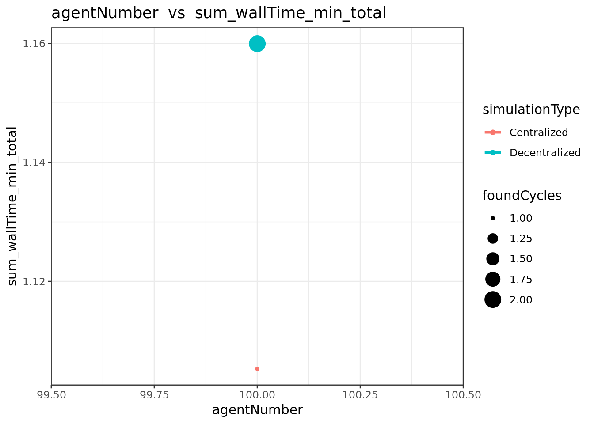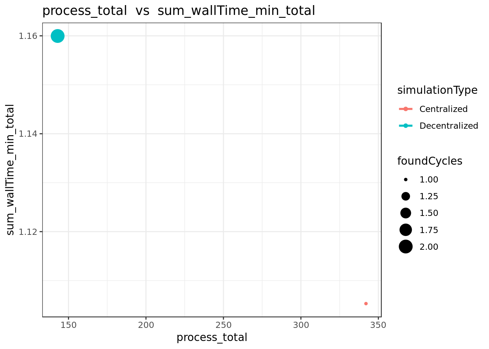   

# Experiment  9 

 

## Experimental set up 

<table class="table table-condensed" style="width: auto !important; ">
 <thead>
  <tr>
   <th style="text-align:left;">   </th>
   <th style="text-align:left;"> Values </th>
  </tr>
 </thead>
<tbody>
  <tr>
   <td style="text-align:left;"> experimentId </td>
   <td style="text-align:left;"> EXP08-11-12-44-BoTBgN </td>
  </tr>
  <tr>
   <td style="text-align:left;"> agentNumbers </td>
   <td style="text-align:left;"> 100, 200, 400, 800 </td>
  </tr>
  <tr>
   <td style="text-align:left;"> maxDistances </td>
   <td style="text-align:left;"> 5, 10 </td>
  </tr>
  <tr>
   <td style="text-align:left;"> randomWorksNumberMultipliers </td>
   <td style="text-align:left;"> 1, 2 </td>
  </tr>
  <tr>
   <td style="text-align:left;"> similarityConnectThresholds </td>
   <td style="text-align:left;"> 0.85, 0.95 </td>
  </tr>
  <tr>
   <td style="text-align:left;"> chainLengths </td>
   <td style="text-align:left;"> 10, 20 </td>
  </tr>
</tbody>
</table>
## Descriptive analysis of each simulation

###  SIM08-11-12-44-neSDUd--CV 

#### simulationParameters 

<table class="table table-condensed" style="width: auto !important; ">
 <thead>
  <tr>
   <th style="text-align:left;"> agentNumber </th>
   <th style="text-align:left;"> chainLength </th>
   <th style="text-align:left;"> similaritySearchThreshold </th>
   <th style="text-align:left;"> maxDistance </th>
   <th style="text-align:left;"> randomWorksNumberMultiplier </th>
  </tr>
 </thead>
<tbody>
  <tr>
   <td style="text-align:left;width: 20em; "> 100 </td>
   <td style="text-align:left;width: 15em; "> 10 </td>
   <td style="text-align:left;width: 15em; "> 0.95, </td>
   <td style="text-align:left;width: 15em; "> 5 </td>
   <td style="text-align:left;width: 15em; "> 1 </td>
  </tr>
</tbody>
</table>
#### Degree distribution of agent->knows->agent edges

#### Runing time by method 

<table class="table table-condensed" style="width: auto !important; ">
 <thead>
  <tr>
   <th style="text-align:left;"> key </th>
   <th style="text-align:right;"> doc_count </th>
   <th style="text-align:right;"> sum_wallTime_ms.value </th>
   <th style="text-align:left;"> avg_wallTime_ms.value </th>
   <th style="text-align:left;"> includedInTotal </th>
  </tr>
 </thead>
<tbody>
  <tr>
   <td style="text-align:left;"> connectIfSimilar </td>
   <td style="text-align:right;"> 24,090 </td>
   <td style="text-align:right;"> 62,066 </td>
   <td style="text-align:left;"> 2.57642175176422 </td>
   <td style="text-align:left;"> No </td>
  </tr>
  <tr>
   <td style="text-align:left;"> existsSimilarity </td>
   <td style="text-align:right;"> 24,090 </td>
   <td style="text-align:right;"> 61,306 </td>
   <td style="text-align:left;"> 2.54487339144873 </td>
   <td style="text-align:left;"> No </td>
  </tr>
  <tr>
   <td style="text-align:left;"> similarityEdges </td>
   <td style="text-align:right;"> 24,090 </td>
   <td style="text-align:right;"> 59,739 </td>
   <td style="text-align:left;"> 2.47982565379826 </td>
   <td style="text-align:left;"> No </td>
  </tr>
  <tr>
   <td style="text-align:left;"> connectAllSimilar </td>
   <td style="text-align:right;"> 220 </td>
   <td style="text-align:right;"> 62,320 </td>
   <td style="text-align:left;"> 283.272727272727 </td>
   <td style="text-align:left;"> Yes </td>
  </tr>
  <tr>
   <td style="text-align:left;"> connect </td>
   <td style="text-align:right;"> 106 </td>
   <td style="text-align:right;"> 189 </td>
   <td style="text-align:left;"> 1.78301886792453 </td>
   <td style="text-align:left;"> Yes </td>
  </tr>
  <tr>
   <td style="text-align:left;"> init </td>
   <td style="text-align:right;"> 104 </td>
   <td style="text-align:right;"> 22,681 </td>
   <td style="text-align:left;"> 218.086538461538 </td>
   <td style="text-align:left;"> No </td>
  </tr>
  <tr>
   <td style="text-align:left;"> individualCycleSearch </td>
   <td style="text-align:right;"> 13 </td>
   <td style="text-align:right;"> 1 </td>
   <td style="text-align:left;"> 0.0769230769230769 </td>
   <td style="text-align:left;"> Yes </td>
  </tr>
  <tr>
   <td style="text-align:left;"> cycleSearch </td>
   <td style="text-align:right;"> 9 </td>
   <td style="text-align:right;"> 3,303 </td>
   <td style="text-align:left;"> 367 </td>
   <td style="text-align:left;"> Yes </td>
  </tr>
  <tr>
   <td style="text-align:left;"> getWorks </td>
   <td style="text-align:right;"> 8 </td>
   <td style="text-align:right;"> 31 </td>
   <td style="text-align:left;"> 3.875 </td>
   <td style="text-align:left;"> Yes </td>
  </tr>
  <tr>
   <td style="text-align:left;font-weight: bold;"> Total </td>
   <td style="text-align:right;font-weight: bold;"> 361 </td>
   <td style="text-align:right;font-weight: bold;"> 66,092 </td>
   <td style="text-align:left;font-weight: bold;">  </td>
   <td style="text-align:left;font-weight: bold;">  </td>
  </tr>
</tbody>
</table>
####  Found structures 

#####  Cycles 

Number of cycles found:  1 

<button class="btn btn-primary" data-toggle="collapse" data-target="#RJVJBLUYTR"> Show/Hide foundCycle query </button> 
 
  
     GET /filebeat-*/_search 
              { 
                "query": {
                  "bool": {
                    "must": [
                      { "match_phrase": {
                        "simulationId": "SIM08-11-12-44-neSDUd--CV"
                        }
                      },
                      { "bool": {
                        "should": [
                          { "match": {
                            "keyword": "foundCycle"
                          }}
                        ]
                      }}
                    ]
                  }
                }
              }
     

#####  Paths 

Number of paths found:  0 

<button class="btn btn-primary" data-toggle="collapse" data-target="#QVWCNBRELS"> Show/Hide foundPath query </button> 
 
  
     GET /filebeat-*/_search 
              { 
                "query": {
                  "bool": {
                    "must": [
                      { "match_phrase": {
                        "simulationId": "SIM08-11-12-44-neSDUd--CV"
                        }
                      },
                      { "bool": {
                        "should": [
                          { "match": {
                            "keyword": "foundPath"
                          }}
                        ]
                      }}
                    ]
                  }
                }
              }
     

###  SIM08-11-12-44-neSDUd--DV 

#### simulationParameters 

<table class="table table-condensed" style="width: auto !important; ">
 <thead>
  <tr>
   <th style="text-align:left;"> agentNumber </th>
   <th style="text-align:left;"> chainLength </th>
   <th style="text-align:left;"> similaritySearchThreshold </th>
   <th style="text-align:left;"> maxDistance </th>
   <th style="text-align:left;"> randomWorksNumberMultiplier </th>
  </tr>
 </thead>
<tbody>
  <tr>
   <td style="text-align:left;width: 20em; "> 100 </td>
   <td style="text-align:left;width: 15em; "> 10 </td>
   <td style="text-align:left;width: 15em; "> 0.95 </td>
   <td style="text-align:left;width: 15em; "> 5 </td>
   <td style="text-align:left;width: 15em; "> 1 </td>
  </tr>
</tbody>
</table>
#### Degree distribution of agent->knows->agent edges

#### Runing time by method 

<table class="table table-condensed" style="width: auto !important; ">
 <thead>
  <tr>
   <th style="text-align:left;"> key </th>
   <th style="text-align:right;"> doc_count </th>
   <th style="text-align:right;"> sum_wallTime_ms.value </th>
   <th style="text-align:left;"> avg_wallTime_ms.value </th>
   <th style="text-align:left;"> includedInTotal </th>
  </tr>
 </thead>
<tbody>
  <tr>
   <td style="text-align:left;"> knowsAgent </td>
   <td style="text-align:right;"> 601 </td>
   <td style="text-align:right;"> 1,253 </td>
   <td style="text-align:left;"> 2.08485856905158 </td>
   <td style="text-align:left;"> No </td>
  </tr>
  <tr>
   <td style="text-align:left;"> addItemToWork </td>
   <td style="text-align:right;"> 220 </td>
   <td style="text-align:right;"> 3,446 </td>
   <td style="text-align:left;"> 15.6636363636364 </td>
   <td style="text-align:left;"> No </td>
  </tr>
  <tr>
   <td style="text-align:left;"> ownsWork </td>
   <td style="text-align:right;"> 110 </td>
   <td style="text-align:right;"> 1,154 </td>
   <td style="text-align:left;"> 10.4909090909091 </td>
   <td style="text-align:left;"> No </td>
  </tr>
  <tr>
   <td style="text-align:left;"> init </td>
   <td style="text-align:right;"> 103 </td>
   <td style="text-align:right;"> 8,322 </td>
   <td style="text-align:left;"> 80.7961165048544 </td>
   <td style="text-align:left;"> No </td>
  </tr>
  <tr>
   <td style="text-align:left;"> searchAndConnect </td>
   <td style="text-align:right;"> 101 </td>
   <td style="text-align:right;"> 58,593 </td>
   <td style="text-align:left;"> 580.128712871287 </td>
   <td style="text-align:left;"> Yes </td>
  </tr>
  <tr>
   <td style="text-align:left;"> getWorksItems </td>
   <td style="text-align:right;"> 18 </td>
   <td style="text-align:right;"> 45 </td>
   <td style="text-align:left;"> 2.5 </td>
   <td style="text-align:left;"> Yes </td>
  </tr>
  <tr>
   <td style="text-align:left;"> individualCycleSearch </td>
   <td style="text-align:right;"> 13 </td>
   <td style="text-align:right;"> 6 </td>
   <td style="text-align:left;"> 0.461538461538462 </td>
   <td style="text-align:left;"> Yes </td>
  </tr>
  <tr>
   <td style="text-align:left;"> getWorks </td>
   <td style="text-align:right;"> 7 </td>
   <td style="text-align:right;"> 549 </td>
   <td style="text-align:left;"> 78.4285714285714 </td>
   <td style="text-align:left;"> No </td>
  </tr>
  <tr>
   <td style="text-align:left;"> cycleSearch </td>
   <td style="text-align:right;"> 6 </td>
   <td style="text-align:right;"> 2,898 </td>
   <td style="text-align:left;"> 483 </td>
   <td style="text-align:left;"> Yes </td>
  </tr>
  <tr>
   <td style="text-align:left;font-weight: bold;"> Total </td>
   <td style="text-align:right;font-weight: bold;"> 143 </td>
   <td style="text-align:right;font-weight: bold;"> 61,767 </td>
   <td style="text-align:left;font-weight: bold;">  </td>
   <td style="text-align:left;font-weight: bold;">  </td>
  </tr>
</tbody>
</table>
####  Found structures 

#####  Cycles 

Number of cycles found:  1 

<button class="btn btn-primary" data-toggle="collapse" data-target="#IRAMYYJZDG"> Show/Hide foundCycle query </button> 
 
  
     GET /filebeat-*/_search 
              { 
                "query": {
                  "bool": {
                    "must": [
                      { "match_phrase": {
                        "simulationId": "SIM08-11-12-44-neSDUd--DV"
                        }
                      },
                      { "bool": {
                        "should": [
                          { "match": {
                            "keyword": "foundCycle"
                          }}
                        ]
                      }}
                    ]
                  }
                }
              }
     

#####  Paths 

Number of paths found:  0 

<button class="btn btn-primary" data-toggle="collapse" data-target="#FIQRQMHSSE"> Show/Hide foundPath query </button> 
 
  
     GET /filebeat-*/_search 
              { 
                "query": {
                  "bool": {
                    "must": [
                      { "match_phrase": {
                        "simulationId": "SIM08-11-12-44-neSDUd--DV"
                        }
                      },
                      { "bool": {
                        "should": [
                          { "match": {
                            "keyword": "foundPath"
                          }}
                        ]
                      }}
                    ]
                  }
                }
              }
     

## Scatterplots of experiment 

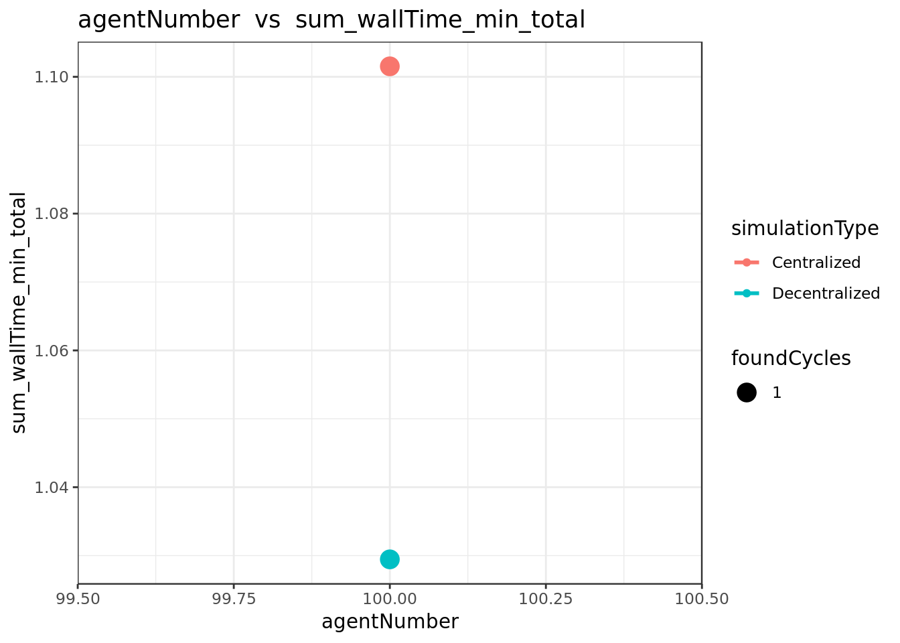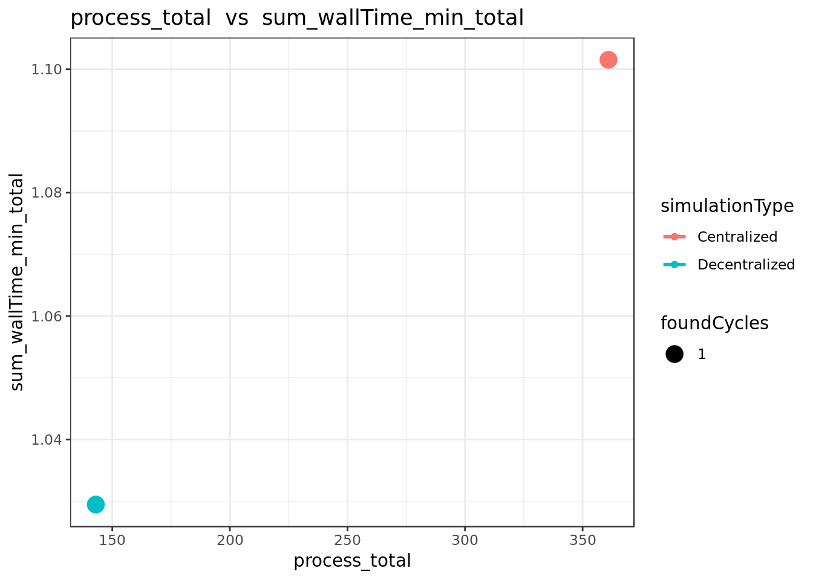   

# Experiment  10 

 

## Experimental set up 

<table class="table table-condensed" style="width: auto !important; ">
 <thead>
  <tr>
   <th style="text-align:left;">   </th>
   <th style="text-align:left;"> Values </th>
  </tr>
 </thead>
<tbody>
  <tr>
   <td style="text-align:left;"> experimentId </td>
   <td style="text-align:left;"> EXP08-11-12-54-LgXUNA </td>
  </tr>
  <tr>
   <td style="text-align:left;"> agentNumbers </td>
   <td style="text-align:left;"> 100, 200, 400, 800 </td>
  </tr>
  <tr>
   <td style="text-align:left;"> maxDistances </td>
   <td style="text-align:left;"> 5, 10 </td>
  </tr>
  <tr>
   <td style="text-align:left;"> randomWorksNumberMultipliers </td>
   <td style="text-align:left;"> 1, 2 </td>
  </tr>
  <tr>
   <td style="text-align:left;"> chainLengths </td>
   <td style="text-align:left;"> 10, 20 </td>
  </tr>
</tbody>
</table>
## Descriptive analysis of each simulation

###  SIM08-11-12-54-ykmwIK--CV 

#### simulationParameters 

<table class="table table-condensed" style="width: auto !important; ">
 <thead>
  <tr>
   <th style="text-align:left;"> agentNumber </th>
   <th style="text-align:left;"> chainLength </th>
   <th style="text-align:left;"> similaritySearchThreshold </th>
   <th style="text-align:left;"> maxDistance </th>
   <th style="text-align:left;"> randomWorksNumberMultiplier </th>
  </tr>
 </thead>
<tbody>
  <tr>
   <td style="text-align:left;width: 20em; "> 100 </td>
   <td style="text-align:left;width: 15em; "> 10 </td>
   <td style="text-align:left;width: 15em; "> 0.95 </td>
   <td style="text-align:left;width: 15em; "> 5 </td>
   <td style="text-align:left;width: 15em; "> 1 </td>
  </tr>
</tbody>
</table>
#### Degree distribution of agent->knows->agent edges

#### Runing time by method 

<table class="table table-condensed" style="width: auto !important; ">
 <thead>
  <tr>
   <th style="text-align:left;"> key </th>
   <th style="text-align:right;"> doc_count </th>
   <th style="text-align:right;"> sum_wallTime_ms.value </th>
   <th style="text-align:left;"> avg_wallTime_ms.value </th>
   <th style="text-align:left;"> includedInTotal </th>
  </tr>
 </thead>
<tbody>
  <tr>
   <td style="text-align:left;"> connectIfSimilar </td>
   <td style="text-align:right;"> 24,090 </td>
   <td style="text-align:right;"> 50,782 </td>
   <td style="text-align:left;"> 2.10801162308012 </td>
   <td style="text-align:left;"> No </td>
  </tr>
  <tr>
   <td style="text-align:left;"> existsSimilarity </td>
   <td style="text-align:right;"> 24,090 </td>
   <td style="text-align:right;"> 50,108 </td>
   <td style="text-align:left;"> 2.08003320880033 </td>
   <td style="text-align:left;"> No </td>
  </tr>
  <tr>
   <td style="text-align:left;"> similarityEdges </td>
   <td style="text-align:right;"> 24,090 </td>
   <td style="text-align:right;"> 48,835 </td>
   <td style="text-align:left;"> 2.0271897052719 </td>
   <td style="text-align:left;"> No </td>
  </tr>
  <tr>
   <td style="text-align:left;"> connectAllSimilar </td>
   <td style="text-align:right;"> 220 </td>
   <td style="text-align:right;"> 51,070 </td>
   <td style="text-align:left;"> 232.136363636364 </td>
   <td style="text-align:left;"> Yes </td>
  </tr>
  <tr>
   <td style="text-align:left;"> init </td>
   <td style="text-align:right;"> 102 </td>
   <td style="text-align:right;"> 3,336 </td>
   <td style="text-align:left;"> 32.7058823529412 </td>
   <td style="text-align:left;"> No </td>
  </tr>
  <tr>
   <td style="text-align:left;"> connect </td>
   <td style="text-align:right;"> 58 </td>
   <td style="text-align:right;"> 96 </td>
   <td style="text-align:left;"> 1.6551724137931 </td>
   <td style="text-align:left;"> Yes </td>
  </tr>
  <tr>
   <td style="text-align:left;"> individualCycleSearch </td>
   <td style="text-align:right;"> 11 </td>
   <td style="text-align:right;"> 1 </td>
   <td style="text-align:left;"> 0.0909090909090909 </td>
   <td style="text-align:left;"> Yes </td>
  </tr>
  <tr>
   <td style="text-align:left;"> cycleSearch </td>
   <td style="text-align:right;"> 7 </td>
   <td style="text-align:right;"> 2,135 </td>
   <td style="text-align:left;"> 305 </td>
   <td style="text-align:left;"> Yes </td>
  </tr>
  <tr>
   <td style="text-align:left;"> getWorks </td>
   <td style="text-align:right;"> 6 </td>
   <td style="text-align:right;"> 15 </td>
   <td style="text-align:left;"> 2.5 </td>
   <td style="text-align:left;"> Yes </td>
  </tr>
  <tr>
   <td style="text-align:left;font-weight: bold;"> Total </td>
   <td style="text-align:right;font-weight: bold;"> 307 </td>
   <td style="text-align:right;font-weight: bold;"> 53,494 </td>
   <td style="text-align:left;font-weight: bold;">  </td>
   <td style="text-align:left;font-weight: bold;">  </td>
  </tr>
</tbody>
</table>
####  Found structures 

#####  Cycles 

Number of cycles found:  1 

<button class="btn btn-primary" data-toggle="collapse" data-target="#VDYQNCSWKM"> Show/Hide foundCycle query </button> 
 
  
     GET /filebeat-*/_search 
              { 
                "query": {
                  "bool": {
                    "must": [
                      { "match_phrase": {
                        "simulationId": "SIM08-11-12-54-ykmwIK--CV"
                        }
                      },
                      { "bool": {
                        "should": [
                          { "match": {
                            "keyword": "foundCycle"
                          }}
                        ]
                      }}
                    ]
                  }
                }
              }
     

#####  Paths 

Number of paths found:  0 

<button class="btn btn-primary" data-toggle="collapse" data-target="#NVYGDBWFDC"> Show/Hide foundPath query </button> 
 
  
     GET /filebeat-*/_search 
              { 
                "query": {
                  "bool": {
                    "must": [
                      { "match_phrase": {
                        "simulationId": "SIM08-11-12-54-ykmwIK--CV"
                        }
                      },
                      { "bool": {
                        "should": [
                          { "match": {
                            "keyword": "foundPath"
                          }}
                        ]
                      }}
                    ]
                  }
                }
              }
     

###  SIM08-11-12-54-ykmwIK--DV 

#### simulationParameters 

<table class="table table-condensed" style="width: auto !important; ">
 <thead>
  <tr>
   <th style="text-align:left;"> agentNumber </th>
   <th style="text-align:left;"> chainLength </th>
   <th style="text-align:left;"> similaritySearchThreshold </th>
   <th style="text-align:left;"> maxDistance </th>
   <th style="text-align:left;"> randomWorksNumberMultiplier </th>
  </tr>
 </thead>
<tbody>
  <tr>
   <td style="text-align:left;width: 20em; "> 100 </td>
   <td style="text-align:left;width: 15em; "> 10 </td>
   <td style="text-align:left;width: 15em; "> 0.95 </td>
   <td style="text-align:left;width: 15em; "> 5 </td>
   <td style="text-align:left;width: 15em; "> 1 </td>
  </tr>
</tbody>
</table>
#### Degree distribution of agent->knows->agent edges

#### Runing time by method 

<table class="table table-condensed" style="width: auto !important; ">
 <thead>
  <tr>
   <th style="text-align:left;"> key </th>
   <th style="text-align:right;"> doc_count </th>
   <th style="text-align:right;"> sum_wallTime_ms.value </th>
   <th style="text-align:left;"> avg_wallTime_ms.value </th>
   <th style="text-align:left;"> includedInTotal </th>
  </tr>
 </thead>
<tbody>
  <tr>
   <td style="text-align:left;"> knowsAgent </td>
   <td style="text-align:right;"> 601 </td>
   <td style="text-align:right;"> 1,343 </td>
   <td style="text-align:left;"> 2.23460898502496 </td>
   <td style="text-align:left;"> No </td>
  </tr>
  <tr>
   <td style="text-align:left;"> addItemToWork </td>
   <td style="text-align:right;"> 220 </td>
   <td style="text-align:right;"> 4,865 </td>
   <td style="text-align:left;"> 22.1136363636364 </td>
   <td style="text-align:left;"> No </td>
  </tr>
  <tr>
   <td style="text-align:left;"> ownsWork </td>
   <td style="text-align:right;"> 110 </td>
   <td style="text-align:right;"> 1,144 </td>
   <td style="text-align:left;"> 10.4 </td>
   <td style="text-align:left;"> No </td>
  </tr>
  <tr>
   <td style="text-align:left;"> init </td>
   <td style="text-align:right;"> 103 </td>
   <td style="text-align:right;"> 10,575 </td>
   <td style="text-align:left;"> 102.669902912621 </td>
   <td style="text-align:left;"> No </td>
  </tr>
  <tr>
   <td style="text-align:left;"> searchAndConnect </td>
   <td style="text-align:right;"> 101 </td>
   <td style="text-align:right;"> 58,168 </td>
   <td style="text-align:left;"> 575.920792079208 </td>
   <td style="text-align:left;"> Yes </td>
  </tr>
  <tr>
   <td style="text-align:left;"> getWorksItems </td>
   <td style="text-align:right;"> 18 </td>
   <td style="text-align:right;"> 38 </td>
   <td style="text-align:left;"> 2.11111111111111 </td>
   <td style="text-align:left;"> Yes </td>
  </tr>
  <tr>
   <td style="text-align:left;"> individualCycleSearch </td>
   <td style="text-align:right;"> 11 </td>
   <td style="text-align:right;"> 4 </td>
   <td style="text-align:left;"> 0.363636363636364 </td>
   <td style="text-align:left;"> Yes </td>
  </tr>
  <tr>
   <td style="text-align:left;"> getWorks </td>
   <td style="text-align:right;"> 7 </td>
   <td style="text-align:right;"> 376 </td>
   <td style="text-align:left;"> 53.7142857142857 </td>
   <td style="text-align:left;"> No </td>
  </tr>
  <tr>
   <td style="text-align:left;"> cycleSearch </td>
   <td style="text-align:right;"> 6 </td>
   <td style="text-align:right;"> 2,485 </td>
   <td style="text-align:left;"> 414.166666666667 </td>
   <td style="text-align:left;"> Yes </td>
  </tr>
  <tr>
   <td style="text-align:left;font-weight: bold;"> Total </td>
   <td style="text-align:right;font-weight: bold;"> 141 </td>
   <td style="text-align:right;font-weight: bold;"> 60,865 </td>
   <td style="text-align:left;font-weight: bold;">  </td>
   <td style="text-align:left;font-weight: bold;">  </td>
  </tr>
</tbody>
</table>
####  Found structures 

#####  Cycles 

Number of cycles found:  2 

<button class="btn btn-primary" data-toggle="collapse" data-target="#ZHFEZCBNJD"> Show/Hide foundCycle query </button> 
 
  
     GET /filebeat-*/_search 
              { 
                "query": {
                  "bool": {
                    "must": [
                      { "match_phrase": {
                        "simulationId": "SIM08-11-12-54-ykmwIK--DV"
                        }
                      },
                      { "bool": {
                        "should": [
                          { "match": {
                            "keyword": "foundCycle"
                          }}
                        ]
                      }}
                    ]
                  }
                }
              }
     

#####  Paths 

Number of paths found:  0 

<button class="btn btn-primary" data-toggle="collapse" data-target="#UIJCILKWAP"> Show/Hide foundPath query </button> 
 
  
     GET /filebeat-*/_search 
              { 
                "query": {
                  "bool": {
                    "must": [
                      { "match_phrase": {
                        "simulationId": "SIM08-11-12-54-ykmwIK--DV"
                        }
                      },
                      { "bool": {
                        "should": [
                          { "match": {
                            "keyword": "foundPath"
                          }}
                        ]
                      }}
                    ]
                  }
                }
              }
     

## Scatterplots of experiment 

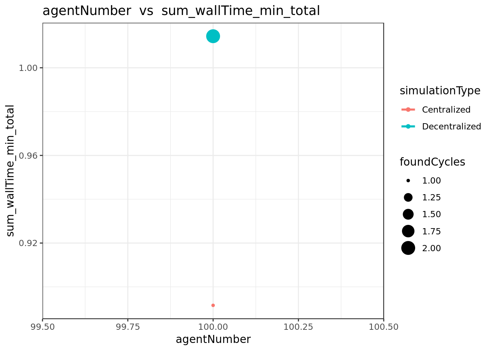   

# Experiment  11 

 

## Experimental set up 

<table class="table table-condensed" style="width: auto !important; ">
 <thead>
  <tr>
   <th style="text-align:left;">   </th>
   <th style="text-align:left;"> Values </th>
  </tr>
 </thead>
<tbody>
  <tr>
   <td style="text-align:left;"> experimentId </td>
   <td style="text-align:left;"> EXP08-11-12-58-3BvMSL </td>
  </tr>
  <tr>
   <td style="text-align:left;"> agentNumbers </td>
   <td style="text-align:left;"> 100, 200, 400, 800 </td>
  </tr>
  <tr>
   <td style="text-align:left;"> maxDistances </td>
   <td style="text-align:left;"> 5, 10 </td>
  </tr>
  <tr>
   <td style="text-align:left;"> randomWorksNumberMultipliers </td>
   <td style="text-align:left;"> 1, 2 </td>
  </tr>
  <tr>
   <td style="text-align:left;"> chainLengths </td>
   <td style="text-align:left;"> 10, 20 </td>
  </tr>
</tbody>
</table>
## Descriptive analysis of each simulation

###  SIM08-11-01-05-AZFerX--CV 

#### simulationParameters 

<table class="table table-condensed" style="width: auto !important; ">
 <thead>
  <tr>
   <th style="text-align:left;"> agentNumber </th>
   <th style="text-align:right;"> similarityConnectThreshold </th>
   <th style="text-align:left;"> chainLength </th>
   <th style="text-align:left;"> similaritySearchThreshold </th>
   <th style="text-align:left;"> maxDistance </th>
   <th style="text-align:left;"> randomWorksNumberMultiplier </th>
  </tr>
 </thead>
<tbody>
  <tr>
   <td style="text-align:left;width: 20em; "> 100 </td>
   <td style="text-align:right;width: 15em; "> 0.9 </td>
   <td style="text-align:left;width: 15em; "> 10 </td>
   <td style="text-align:left;width: 15em; "> 1 </td>
   <td style="text-align:left;width: 15em; "> 10 </td>
   <td style="text-align:left;width: 15em; "> 2 </td>
  </tr>
</tbody>
</table>
#### Degree distribution of agent->knows->agent edges

#### Runing time by method 

<table class="table table-condensed" style="width: auto !important; ">
 <thead>
  <tr>
   <th style="text-align:left;"> key </th>
   <th style="text-align:right;"> doc_count </th>
   <th style="text-align:right;"> sum_wallTime_ms.value </th>
   <th style="text-align:left;"> avg_wallTime_ms.value </th>
   <th style="text-align:left;"> includedInTotal </th>
  </tr>
 </thead>
<tbody>
  <tr>
   <td style="text-align:left;"> connectIfSimilar </td>
   <td style="text-align:right;"> 87,990 </td>
   <td style="text-align:right;"> 255,286 </td>
   <td style="text-align:left;"> 2.90130696670076 </td>
   <td style="text-align:left;"> No </td>
  </tr>
  <tr>
   <td style="text-align:left;"> existsSimilarity </td>
   <td style="text-align:right;"> 87,990 </td>
   <td style="text-align:right;"> 253,162 </td>
   <td style="text-align:left;"> 2.87716785998409 </td>
   <td style="text-align:left;"> No </td>
  </tr>
  <tr>
   <td style="text-align:left;"> similarityEdges </td>
   <td style="text-align:right;"> 87,990 </td>
   <td style="text-align:right;"> 247,102 </td>
   <td style="text-align:left;"> 2.80829639731788 </td>
   <td style="text-align:left;"> No </td>
  </tr>
  <tr>
   <td style="text-align:left;"> connectAllSimilar </td>
   <td style="text-align:right;"> 420 </td>
   <td style="text-align:right;"> 256,249 </td>
   <td style="text-align:left;"> 610.116666666667 </td>
   <td style="text-align:left;"> Yes </td>
  </tr>
  <tr>
   <td style="text-align:left;"> connect </td>
   <td style="text-align:right;"> 192 </td>
   <td style="text-align:right;"> 362 </td>
   <td style="text-align:left;"> 1.88541666666667 </td>
   <td style="text-align:left;"> Yes </td>
  </tr>
  <tr>
   <td style="text-align:left;"> init </td>
   <td style="text-align:right;"> 103 </td>
   <td style="text-align:right;"> 9,520 </td>
   <td style="text-align:left;"> 92.4271844660194 </td>
   <td style="text-align:left;"> No </td>
  </tr>
  <tr>
   <td style="text-align:left;font-weight: bold;"> Total </td>
   <td style="text-align:right;font-weight: bold;"> 620 </td>
   <td style="text-align:right;font-weight: bold;"> 257,217 </td>
   <td style="text-align:left;font-weight: bold;">  </td>
   <td style="text-align:left;font-weight: bold;">  </td>
  </tr>
</tbody>
</table>
####  Found structures 

#####  Cycles 

Number of cycles found:  1 

<button class="btn btn-primary" data-toggle="collapse" data-target="#CBSGPRQZOZ"> Show/Hide foundCycle query </button> 
 
  
     GET /filebeat-*/_search 
              { 
                "query": {
                  "bool": {
                    "must": [
                      { "match_phrase": {
                        "simulationId": "SIM08-11-01-05-AZFerX--CV"
                        }
                      },
                      { "bool": {
                        "should": [
                          { "match": {
                            "keyword": "foundCycle"
                          }}
                        ]
                      }}
                    ]
                  }
                }
              }
     

#####  Paths 

Number of paths found:  0 

<button class="btn btn-primary" data-toggle="collapse" data-target="#YJDRSTTDAL"> Show/Hide foundPath query </button> 
 
  
     GET /filebeat-*/_search 
              { 
                "query": {
                  "bool": {
                    "must": [
                      { "match_phrase": {
                        "simulationId": "SIM08-11-01-05-AZFerX--CV"
                        }
                      },
                      { "bool": {
                        "should": [
                          { "match": {
                            "keyword": "foundPath"
                          }}
                        ]
                      }}
                    ]
                  }
                }
              }
     

###  SIM08-11-01-05-AZFerX--DV 

#### simulationParameters 

<table class="table table-condensed" style="width: auto !important; ">
 <thead>
  <tr>
   <th style="text-align:left;"> agentNumber </th>
   <th style="text-align:right;"> similarityConnectThreshold </th>
   <th style="text-align:left;"> chainLength </th>
   <th style="text-align:left;"> similaritySearchThreshold </th>
   <th style="text-align:left;"> maxDistance </th>
   <th style="text-align:left;"> randomWorksNumberMultiplier </th>
  </tr>
 </thead>
<tbody>
  <tr>
   <td style="text-align:left;width: 20em; "> 100 </td>
   <td style="text-align:right;width: 15em; "> 0.9 </td>
   <td style="text-align:left;width: 15em; "> 10 </td>
   <td style="text-align:left;width: 15em; "> 1 </td>
   <td style="text-align:left;width: 15em; "> 10 </td>
   <td style="text-align:left;width: 15em; "> 2 </td>
  </tr>
</tbody>
</table>
#### Degree distribution of agent->knows->agent edges

#### Runing time by method 

<table class="table table-condensed" style="width: auto !important; ">
 <thead>
  <tr>
   <th style="text-align:left;">   </th>
   <th style="text-align:left;"> key </th>
   <th style="text-align:right;"> doc_count </th>
   <th style="text-align:right;"> sum_wallTime_ms.value </th>
   <th style="text-align:left;"> avg_wallTime_ms.value </th>
   <th style="text-align:left;"> includedInTotal </th>
  </tr>
 </thead>
<tbody>
  <tr>
   <td style="text-align:left;"> 1 </td>
   <td style="text-align:left;"> knowsAgent </td>
   <td style="text-align:right;"> 601 </td>
   <td style="text-align:right;"> 854 </td>
   <td style="text-align:left;"> 1.42096505823627 </td>
   <td style="text-align:left;"> No </td>
  </tr>
  <tr>
   <td style="text-align:left;"> 2 </td>
   <td style="text-align:left;"> addItemToWork </td>
   <td style="text-align:right;"> 420 </td>
   <td style="text-align:right;"> 3,867 </td>
   <td style="text-align:left;"> 9.20714285714286 </td>
   <td style="text-align:left;"> No </td>
  </tr>
  <tr>
   <td style="text-align:left;"> 3 </td>
   <td style="text-align:left;"> ownsWork </td>
   <td style="text-align:right;"> 210 </td>
   <td style="text-align:right;"> 1,794 </td>
   <td style="text-align:left;"> 8.54285714285714 </td>
   <td style="text-align:left;"> No </td>
  </tr>
  <tr>
   <td style="text-align:left;"> 4 </td>
   <td style="text-align:left;"> init </td>
   <td style="text-align:right;"> 103 </td>
   <td style="text-align:right;"> 9,544 </td>
   <td style="text-align:left;"> 92.6601941747573 </td>
   <td style="text-align:left;"> No </td>
  </tr>
  <tr>
   <td style="text-align:left;"> 5 </td>
   <td style="text-align:left;"> searchAndConnect </td>
   <td style="text-align:right;"> 101 </td>
   <td style="text-align:right;"> 154,301 </td>
   <td style="text-align:left;"> 1527.73267326733 </td>
   <td style="text-align:left;"> Yes </td>
  </tr>
  <tr>
   <td style="text-align:left;"> 6 </td>
   <td style="text-align:left;"> getWorksItems </td>
   <td style="text-align:right;"> 18 </td>
   <td style="text-align:right;"> 42 </td>
   <td style="text-align:left;"> 2.33333333333333 </td>
   <td style="text-align:left;"> Yes </td>
  </tr>
  <tr>
   <td style="text-align:left;"> 8 </td>
   <td style="text-align:left;"> cycleSearch </td>
   <td style="text-align:right;"> 5 </td>
   <td style="text-align:right;"> 1,129 </td>
   <td style="text-align:left;"> 225.8 </td>
   <td style="text-align:left;"> Yes </td>
  </tr>
  <tr>
   <td style="text-align:left;"> 10 </td>
   <td style="text-align:left;"> getWorks </td>
   <td style="text-align:right;"> 5 </td>
   <td style="text-align:right;"> 1,520 </td>
   <td style="text-align:left;"> 304 </td>
   <td style="text-align:left;"> No </td>
  </tr>
  <tr>
   <td style="text-align:left;font-weight: bold;"> 11 </td>
   <td style="text-align:left;font-weight: bold;"> Total </td>
   <td style="text-align:right;font-weight: bold;"> 134 </td>
   <td style="text-align:right;font-weight: bold;"> 157,222 </td>
   <td style="text-align:left;font-weight: bold;">  </td>
   <td style="text-align:left;font-weight: bold;">  </td>
  </tr>
</tbody>
</table>
####  Found structures 

#####  Cycles 

Number of cycles found:  4 

<button class="btn btn-primary" data-toggle="collapse" data-target="#SRUCHQXOCR"> Show/Hide foundCycle query </button> 
 
  
     GET /filebeat-*/_search 
              { 
                "query": {
                  "bool": {
                    "must": [
                      { "match_phrase": {
                        "simulationId": "SIM08-11-01-05-AZFerX--DV"
                        }
                      },
                      { "bool": {
                        "should": [
                          { "match": {
                            "keyword": "foundCycle"
                          }}
                        ]
                      }}
                    ]
                  }
                }
              }
     

#####  Paths 

Number of paths found:  1 

<button class="btn btn-primary" data-toggle="collapse" data-target="#NVLKGFNEJP"> Show/Hide foundPath query </button> 
 
  
     GET /filebeat-*/_search 
              { 
                "query": {
                  "bool": {
                    "must": [
                      { "match_phrase": {
                        "simulationId": "SIM08-11-01-05-AZFerX--DV"
                        }
                      },
                      { "bool": {
                        "should": [
                          { "match": {
                            "keyword": "foundPath"
                          }}
                        ]
                      }}
                    ]
                  }
                }
              }
     

###  SIM08-11-12-59-AkTEKa--CV 

#### simulationParameters 

<table class="table table-condensed" style="width: auto !important; ">
 <thead>
  <tr>
   <th style="text-align:left;"> agentNumber </th>
   <th style="text-align:right;"> similarityConnectThreshold </th>
   <th style="text-align:left;"> chainLength </th>
   <th style="text-align:left;"> similaritySearchThreshold </th>
   <th style="text-align:left;"> maxDistance </th>
   <th style="text-align:left;"> randomWorksNumberMultiplier </th>
  </tr>
 </thead>
<tbody>
  <tr>
   <td style="text-align:left;width: 20em; "> 100 </td>
   <td style="text-align:right;width: 15em; "> 0.9 </td>
   <td style="text-align:left;width: 15em; "> 10 </td>
   <td style="text-align:left;width: 15em; "> 1 </td>
   <td style="text-align:left;width: 15em; "> 10 </td>
   <td style="text-align:left;width: 15em; "> 1 </td>
  </tr>
</tbody>
</table>
#### Degree distribution of agent->knows->agent edges

#### Runing time by method 

<table class="table table-condensed" style="width: auto !important; ">
 <thead>
  <tr>
   <th style="text-align:left;"> key </th>
   <th style="text-align:right;"> doc_count </th>
   <th style="text-align:right;"> sum_wallTime_ms.value </th>
   <th style="text-align:left;"> avg_wallTime_ms.value </th>
   <th style="text-align:left;"> includedInTotal </th>
  </tr>
 </thead>
<tbody>
  <tr>
   <td style="text-align:left;"> connectIfSimilar </td>
   <td style="text-align:right;"> 24,090 </td>
   <td style="text-align:right;"> 51,871 </td>
   <td style="text-align:left;"> 2.15321710253217 </td>
   <td style="text-align:left;"> No </td>
  </tr>
  <tr>
   <td style="text-align:left;"> existsSimilarity </td>
   <td style="text-align:right;"> 24,090 </td>
   <td style="text-align:right;"> 51,293 </td>
   <td style="text-align:left;"> 2.12922374429224 </td>
   <td style="text-align:left;"> No </td>
  </tr>
  <tr>
   <td style="text-align:left;"> similarityEdges </td>
   <td style="text-align:right;"> 24,090 </td>
   <td style="text-align:right;"> 50,042 </td>
   <td style="text-align:left;"> 2.07729348277294 </td>
   <td style="text-align:left;"> No </td>
  </tr>
  <tr>
   <td style="text-align:left;"> connectAllSimilar </td>
   <td style="text-align:right;"> 220 </td>
   <td style="text-align:right;"> 52,135 </td>
   <td style="text-align:left;"> 236.977272727273 </td>
   <td style="text-align:left;"> Yes </td>
  </tr>
  <tr>
   <td style="text-align:left;"> init </td>
   <td style="text-align:right;"> 103 </td>
   <td style="text-align:right;"> 9,884 </td>
   <td style="text-align:left;"> 95.9611650485437 </td>
   <td style="text-align:left;"> No </td>
  </tr>
  <tr>
   <td style="text-align:left;"> connect </td>
   <td style="text-align:right;"> 65 </td>
   <td style="text-align:right;"> 107 </td>
   <td style="text-align:left;"> 1.64615384615385 </td>
   <td style="text-align:left;"> Yes </td>
  </tr>
  <tr>
   <td style="text-align:left;font-weight: bold;"> Total </td>
   <td style="text-align:right;font-weight: bold;"> 293 </td>
   <td style="text-align:right;font-weight: bold;"> 52,536 </td>
   <td style="text-align:left;font-weight: bold;">  </td>
   <td style="text-align:left;font-weight: bold;">  </td>
  </tr>
</tbody>
</table>
####  Found structures 

#####  Cycles 

Number of cycles found:  1 

<button class="btn btn-primary" data-toggle="collapse" data-target="#ZXEQWABXRG"> Show/Hide foundCycle query </button> 
 
  
     GET /filebeat-*/_search 
              { 
                "query": {
                  "bool": {
                    "must": [
                      { "match_phrase": {
                        "simulationId": "SIM08-11-12-59-AkTEKa--CV"
                        }
                      },
                      { "bool": {
                        "should": [
                          { "match": {
                            "keyword": "foundCycle"
                          }}
                        ]
                      }}
                    ]
                  }
                }
              }
     

#####  Paths 

Number of paths found:  0 

<button class="btn btn-primary" data-toggle="collapse" data-target="#HXCCDBNHNX"> Show/Hide foundPath query </button> 
 
  
     GET /filebeat-*/_search 
              { 
                "query": {
                  "bool": {
                    "must": [
                      { "match_phrase": {
                        "simulationId": "SIM08-11-12-59-AkTEKa--CV"
                        }
                      },
                      { "bool": {
                        "should": [
                          { "match": {
                            "keyword": "foundPath"
                          }}
                        ]
                      }}
                    ]
                  }
                }
              }
     

###  SIM08-11-12-59-AkTEKa--DV 

#### simulationParameters 

<table class="table table-condensed" style="width: auto !important; ">
 <thead>
  <tr>
   <th style="text-align:left;"> agentNumber </th>
   <th style="text-align:right;"> similarityConnectThreshold </th>
   <th style="text-align:left;"> chainLength </th>
   <th style="text-align:left;"> similaritySearchThreshold </th>
   <th style="text-align:left;"> maxDistance </th>
   <th style="text-align:left;"> randomWorksNumberMultiplier </th>
  </tr>
 </thead>
<tbody>
  <tr>
   <td style="text-align:left;width: 20em; "> 100 </td>
   <td style="text-align:right;width: 15em; "> 0.9 </td>
   <td style="text-align:left;width: 15em; "> 10 </td>
   <td style="text-align:left;width: 15em; "> 1 </td>
   <td style="text-align:left;width: 15em; "> 10 </td>
   <td style="text-align:left;width: 15em; "> 1 </td>
  </tr>
</tbody>
</table>
#### Degree distribution of agent->knows->agent edges

#### Runing time by method 

<table class="table table-condensed" style="width: auto !important; ">
 <thead>
  <tr>
   <th style="text-align:left;">   </th>
   <th style="text-align:left;"> key </th>
   <th style="text-align:right;"> doc_count </th>
   <th style="text-align:right;"> sum_wallTime_ms.value </th>
   <th style="text-align:left;"> avg_wallTime_ms.value </th>
   <th style="text-align:left;"> includedInTotal </th>
  </tr>
 </thead>
<tbody>
  <tr>
   <td style="text-align:left;"> 1 </td>
   <td style="text-align:left;"> knowsAgent </td>
   <td style="text-align:right;"> 601 </td>
   <td style="text-align:right;"> 846 </td>
   <td style="text-align:left;"> 1.40765391014975 </td>
   <td style="text-align:left;"> No </td>
  </tr>
  <tr>
   <td style="text-align:left;"> 2 </td>
   <td style="text-align:left;"> addItemToWork </td>
   <td style="text-align:right;"> 220 </td>
   <td style="text-align:right;"> 2,480 </td>
   <td style="text-align:left;"> 11.2727272727273 </td>
   <td style="text-align:left;"> No </td>
  </tr>
  <tr>
   <td style="text-align:left;"> 3 </td>
   <td style="text-align:left;"> ownsWork </td>
   <td style="text-align:right;"> 110 </td>
   <td style="text-align:right;"> 1,046 </td>
   <td style="text-align:left;"> 9.50909090909091 </td>
   <td style="text-align:left;"> No </td>
  </tr>
  <tr>
   <td style="text-align:left;"> 4 </td>
   <td style="text-align:left;"> init </td>
   <td style="text-align:right;"> 103 </td>
   <td style="text-align:right;"> 10,189 </td>
   <td style="text-align:left;"> 98.9223300970874 </td>
   <td style="text-align:left;"> No </td>
  </tr>
  <tr>
   <td style="text-align:left;"> 5 </td>
   <td style="text-align:left;"> searchAndConnect </td>
   <td style="text-align:right;"> 101 </td>
   <td style="text-align:right;"> 56,929 </td>
   <td style="text-align:left;"> 563.653465346535 </td>
   <td style="text-align:left;"> Yes </td>
  </tr>
  <tr>
   <td style="text-align:left;"> 6 </td>
   <td style="text-align:left;"> getWorksItems </td>
   <td style="text-align:right;"> 18 </td>
   <td style="text-align:right;"> 32 </td>
   <td style="text-align:left;"> 1.77777777777778 </td>
   <td style="text-align:left;"> Yes </td>
  </tr>
  <tr>
   <td style="text-align:left;"> 9 </td>
   <td style="text-align:left;"> cycleSearch </td>
   <td style="text-align:right;"> 3 </td>
   <td style="text-align:right;"> 33 </td>
   <td style="text-align:left;"> 11 </td>
   <td style="text-align:left;"> Yes </td>
  </tr>
  <tr>
   <td style="text-align:left;"> 10 </td>
   <td style="text-align:left;"> getWorks </td>
   <td style="text-align:right;"> 3 </td>
   <td style="text-align:right;"> 36 </td>
   <td style="text-align:left;"> 12 </td>
   <td style="text-align:left;"> No </td>
  </tr>
  <tr>
   <td style="text-align:left;font-weight: bold;"> 11 </td>
   <td style="text-align:left;font-weight: bold;"> Total </td>
   <td style="text-align:right;font-weight: bold;"> 130 </td>
   <td style="text-align:right;font-weight: bold;"> 57,380 </td>
   <td style="text-align:left;font-weight: bold;">  </td>
   <td style="text-align:left;font-weight: bold;">  </td>
  </tr>
</tbody>
</table>
####  Found structures 

#####  Cycles 

Number of cycles found:  1 

<button class="btn btn-primary" data-toggle="collapse" data-target="#CHDNUUJRSB"> Show/Hide foundCycle query </button> 
 
  
     GET /filebeat-*/_search 
              { 
                "query": {
                  "bool": {
                    "must": [
                      { "match_phrase": {
                        "simulationId": "SIM08-11-12-59-AkTEKa--DV"
                        }
                      },
                      { "bool": {
                        "should": [
                          { "match": {
                            "keyword": "foundCycle"
                          }}
                        ]
                      }}
                    ]
                  }
                }
              }
     

#####  Paths 

Number of paths found:  2 

<button class="btn btn-primary" data-toggle="collapse" data-target="#HUFFODHBRF"> Show/Hide foundPath query </button> 
 
  
     GET /filebeat-*/_search 
              { 
                "query": {
                  "bool": {
                    "must": [
                      { "match_phrase": {
                        "simulationId": "SIM08-11-12-59-AkTEKa--DV"
                        }
                      },
                      { "bool": {
                        "should": [
                          { "match": {
                            "keyword": "foundPath"
                          }}
                        ]
                      }}
                    ]
                  }
                }
              }
     

###  SIM08-11-01-01-9svHYu--CV 

#### simulationParameters 

<table class="table table-condensed" style="width: auto !important; ">
 <thead>
  <tr>
   <th style="text-align:left;"> agentNumber </th>
   <th style="text-align:right;"> similarityConnectThreshold </th>
   <th style="text-align:left;"> chainLength </th>
   <th style="text-align:left;"> similaritySearchThreshold </th>
   <th style="text-align:left;"> maxDistance </th>
   <th style="text-align:left;"> randomWorksNumberMultiplier </th>
  </tr>
 </thead>
<tbody>
  <tr>
   <td style="text-align:left;width: 20em; "> 100 </td>
   <td style="text-align:right;width: 15em; "> 0.9 </td>
   <td style="text-align:left;width: 15em; "> 10 </td>
   <td style="text-align:left;width: 15em; "> 1 </td>
   <td style="text-align:left;width: 15em; "> 5 </td>
   <td style="text-align:left;width: 15em; "> 2 </td>
  </tr>
</tbody>
</table>
#### Degree distribution of agent->knows->agent edges

#### Runing time by method 

<table class="table table-condensed" style="width: auto !important; ">
 <thead>
  <tr>
   <th style="text-align:left;"> key </th>
   <th style="text-align:right;"> doc_count </th>
   <th style="text-align:right;"> sum_wallTime_ms.value </th>
   <th style="text-align:left;"> avg_wallTime_ms.value </th>
   <th style="text-align:left;"> includedInTotal </th>
  </tr>
 </thead>
<tbody>
  <tr>
   <td style="text-align:left;"> connectIfSimilar </td>
   <td style="text-align:right;"> 87,990 </td>
   <td style="text-align:right;"> 253,533 </td>
   <td style="text-align:left;"> 2.88138424821002 </td>
   <td style="text-align:left;"> No </td>
  </tr>
  <tr>
   <td style="text-align:left;"> existsSimilarity </td>
   <td style="text-align:right;"> 87,990 </td>
   <td style="text-align:right;"> 251,335 </td>
   <td style="text-align:left;"> 2.85640413683373 </td>
   <td style="text-align:left;"> No </td>
  </tr>
  <tr>
   <td style="text-align:left;"> similarityEdges </td>
   <td style="text-align:right;"> 87,990 </td>
   <td style="text-align:right;"> 245,263 </td>
   <td style="text-align:left;"> 2.78739629503353 </td>
   <td style="text-align:left;"> No </td>
  </tr>
  <tr>
   <td style="text-align:left;"> connectAllSimilar </td>
   <td style="text-align:right;"> 420 </td>
   <td style="text-align:right;"> 254,501 </td>
   <td style="text-align:left;"> 605.954761904762 </td>
   <td style="text-align:left;"> Yes </td>
  </tr>
  <tr>
   <td style="text-align:left;"> connect </td>
   <td style="text-align:right;"> 222 </td>
   <td style="text-align:right;"> 416 </td>
   <td style="text-align:left;"> 1.87387387387387 </td>
   <td style="text-align:left;"> Yes </td>
  </tr>
  <tr>
   <td style="text-align:left;"> init </td>
   <td style="text-align:right;"> 103 </td>
   <td style="text-align:right;"> 9,429 </td>
   <td style="text-align:left;"> 91.5436893203884 </td>
   <td style="text-align:left;"> No </td>
  </tr>
  <tr>
   <td style="text-align:left;font-weight: bold;"> Total </td>
   <td style="text-align:right;font-weight: bold;"> 650 </td>
   <td style="text-align:right;font-weight: bold;"> 255,535 </td>
   <td style="text-align:left;font-weight: bold;">  </td>
   <td style="text-align:left;font-weight: bold;">  </td>
  </tr>
</tbody>
</table>
####  Found structures 

#####  Cycles 

Number of cycles found:  1 

<button class="btn btn-primary" data-toggle="collapse" data-target="#SELYYRSCYY"> Show/Hide foundCycle query </button> 
 
  
     GET /filebeat-*/_search 
              { 
                "query": {
                  "bool": {
                    "must": [
                      { "match_phrase": {
                        "simulationId": "SIM08-11-01-01-9svHYu--CV"
                        }
                      },
                      { "bool": {
                        "should": [
                          { "match": {
                            "keyword": "foundCycle"
                          }}
                        ]
                      }}
                    ]
                  }
                }
              }
     

#####  Paths 

Number of paths found:  0 

<button class="btn btn-primary" data-toggle="collapse" data-target="#KYLXIQKSSK"> Show/Hide foundPath query </button> 
 
  
     GET /filebeat-*/_search 
              { 
                "query": {
                  "bool": {
                    "must": [
                      { "match_phrase": {
                        "simulationId": "SIM08-11-01-01-9svHYu--CV"
                        }
                      },
                      { "bool": {
                        "should": [
                          { "match": {
                            "keyword": "foundPath"
                          }}
                        ]
                      }}
                    ]
                  }
                }
              }
     

###  SIM08-11-01-01-9svHYu--DV 

#### simulationParameters 

<table class="table table-condensed" style="width: auto !important; ">
 <thead>
  <tr>
   <th style="text-align:left;"> agentNumber </th>
   <th style="text-align:right;"> similarityConnectThreshold </th>
   <th style="text-align:left;"> chainLength </th>
   <th style="text-align:left;"> similaritySearchThreshold </th>
   <th style="text-align:left;"> maxDistance </th>
   <th style="text-align:left;"> randomWorksNumberMultiplier </th>
  </tr>
 </thead>
<tbody>
  <tr>
   <td style="text-align:left;width: 20em; "> 100 </td>
   <td style="text-align:right;width: 15em; "> 0.9 </td>
   <td style="text-align:left;width: 15em; "> 10 </td>
   <td style="text-align:left;width: 15em; "> 1 </td>
   <td style="text-align:left;width: 15em; "> 5 </td>
   <td style="text-align:left;width: 15em; "> 2 </td>
  </tr>
</tbody>
</table>
#### Degree distribution of agent->knows->agent edges

#### Runing time by method 

<table class="table table-condensed" style="width: auto !important; ">
 <thead>
  <tr>
   <th style="text-align:left;">   </th>
   <th style="text-align:left;"> key </th>
   <th style="text-align:right;"> doc_count </th>
   <th style="text-align:right;"> sum_wallTime_ms.value </th>
   <th style="text-align:left;"> avg_wallTime_ms.value </th>
   <th style="text-align:left;"> includedInTotal </th>
  </tr>
 </thead>
<tbody>
  <tr>
   <td style="text-align:left;"> 1 </td>
   <td style="text-align:left;"> knowsAgent </td>
   <td style="text-align:right;"> 601 </td>
   <td style="text-align:right;"> 882 </td>
   <td style="text-align:left;"> 1.4675540765391 </td>
   <td style="text-align:left;"> No </td>
  </tr>
  <tr>
   <td style="text-align:left;"> 2 </td>
   <td style="text-align:left;"> addItemToWork </td>
   <td style="text-align:right;"> 420 </td>
   <td style="text-align:right;"> 3,490 </td>
   <td style="text-align:left;"> 8.30952380952381 </td>
   <td style="text-align:left;"> No </td>
  </tr>
  <tr>
   <td style="text-align:left;"> 3 </td>
   <td style="text-align:left;"> ownsWork </td>
   <td style="text-align:right;"> 210 </td>
   <td style="text-align:right;"> 1,770 </td>
   <td style="text-align:left;"> 8.42857142857143 </td>
   <td style="text-align:left;"> No </td>
  </tr>
  <tr>
   <td style="text-align:left;"> 4 </td>
   <td style="text-align:left;"> init </td>
   <td style="text-align:right;"> 103 </td>
   <td style="text-align:right;"> 9,977 </td>
   <td style="text-align:left;"> 96.8640776699029 </td>
   <td style="text-align:left;"> No </td>
  </tr>
  <tr>
   <td style="text-align:left;"> 5 </td>
   <td style="text-align:left;"> searchAndConnect </td>
   <td style="text-align:right;"> 101 </td>
   <td style="text-align:right;"> 150,192 </td>
   <td style="text-align:left;"> 1487.0495049505 </td>
   <td style="text-align:left;"> Yes </td>
  </tr>
  <tr>
   <td style="text-align:left;"> 6 </td>
   <td style="text-align:left;"> getWorksItems </td>
   <td style="text-align:right;"> 18 </td>
   <td style="text-align:right;"> 27 </td>
   <td style="text-align:left;"> 1.5 </td>
   <td style="text-align:left;"> Yes </td>
  </tr>
  <tr>
   <td style="text-align:left;"> 8 </td>
   <td style="text-align:left;"> cycleSearch </td>
   <td style="text-align:right;"> 5 </td>
   <td style="text-align:right;"> 116 </td>
   <td style="text-align:left;"> 23.2 </td>
   <td style="text-align:left;"> Yes </td>
  </tr>
  <tr>
   <td style="text-align:left;"> 10 </td>
   <td style="text-align:left;"> getWorks </td>
   <td style="text-align:right;"> 5 </td>
   <td style="text-align:right;"> 81 </td>
   <td style="text-align:left;"> 16.2 </td>
   <td style="text-align:left;"> No </td>
  </tr>
  <tr>
   <td style="text-align:left;font-weight: bold;"> 11 </td>
   <td style="text-align:left;font-weight: bold;"> Total </td>
   <td style="text-align:right;font-weight: bold;"> 134 </td>
   <td style="text-align:right;font-weight: bold;"> 151,185 </td>
   <td style="text-align:left;font-weight: bold;">  </td>
   <td style="text-align:left;font-weight: bold;">  </td>
  </tr>
</tbody>
</table>
####  Found structures 

#####  Cycles 

Number of cycles found:  5 

<button class="btn btn-primary" data-toggle="collapse" data-target="#ZTZEDQYRHD"> Show/Hide foundCycle query </button> 
 
  
     GET /filebeat-*/_search 
              { 
                "query": {
                  "bool": {
                    "must": [
                      { "match_phrase": {
                        "simulationId": "SIM08-11-01-01-9svHYu--DV"
                        }
                      },
                      { "bool": {
                        "should": [
                          { "match": {
                            "keyword": "foundCycle"
                          }}
                        ]
                      }}
                    ]
                  }
                }
              }
     

#####  Paths 

Number of paths found:  0 

<button class="btn btn-primary" data-toggle="collapse" data-target="#GVHUZESZUG"> Show/Hide foundPath query </button> 
 
  
     GET /filebeat-*/_search 
              { 
                "query": {
                  "bool": {
                    "must": [
                      { "match_phrase": {
                        "simulationId": "SIM08-11-01-01-9svHYu--DV"
                        }
                      },
                      { "bool": {
                        "should": [
                          { "match": {
                            "keyword": "foundPath"
                          }}
                        ]
                      }}
                    ]
                  }
                }
              }
     

###  SIM08-11-12-58-5ZEBa6--CV 

#### simulationParameters 

<table class="table table-condensed" style="width: auto !important; ">
 <thead>
  <tr>
   <th style="text-align:left;"> agentNumber </th>
   <th style="text-align:right;"> similarityConnectThreshold </th>
   <th style="text-align:left;"> chainLength </th>
   <th style="text-align:left;"> similaritySearchThreshold </th>
   <th style="text-align:left;"> maxDistance </th>
   <th style="text-align:left;"> randomWorksNumberMultiplier </th>
  </tr>
 </thead>
<tbody>
  <tr>
   <td style="text-align:left;width: 20em; "> 100 </td>
   <td style="text-align:right;width: 15em; "> 0.9 </td>
   <td style="text-align:left;width: 15em; "> 10 </td>
   <td style="text-align:left;width: 15em; "> 1 </td>
   <td style="text-align:left;width: 15em; "> 5 </td>
   <td style="text-align:left;width: 15em; "> 1 </td>
  </tr>
</tbody>
</table>
#### Degree distribution of agent->knows->agent edges

#### Runing time by method 

<table class="table table-condensed" style="width: auto !important; ">
 <thead>
  <tr>
   <th style="text-align:left;"> key </th>
   <th style="text-align:right;"> doc_count </th>
   <th style="text-align:right;"> sum_wallTime_ms.value </th>
   <th style="text-align:left;"> avg_wallTime_ms.value </th>
   <th style="text-align:left;"> includedInTotal </th>
  </tr>
 </thead>
<tbody>
  <tr>
   <td style="text-align:left;"> connectIfSimilar </td>
   <td style="text-align:right;"> 24,090 </td>
   <td style="text-align:right;"> 51,162 </td>
   <td style="text-align:left;"> 2.12378580323786 </td>
   <td style="text-align:left;"> No </td>
  </tr>
  <tr>
   <td style="text-align:left;"> existsSimilarity </td>
   <td style="text-align:right;"> 24,090 </td>
   <td style="text-align:right;"> 50,453 </td>
   <td style="text-align:left;"> 2.09435450394355 </td>
   <td style="text-align:left;"> No </td>
  </tr>
  <tr>
   <td style="text-align:left;"> similarityEdges </td>
   <td style="text-align:right;"> 24,090 </td>
   <td style="text-align:right;"> 49,169 </td>
   <td style="text-align:left;"> 2.04105437941054 </td>
   <td style="text-align:left;"> No </td>
  </tr>
  <tr>
   <td style="text-align:left;"> connectAllSimilar </td>
   <td style="text-align:right;"> 220 </td>
   <td style="text-align:right;"> 51,430 </td>
   <td style="text-align:left;"> 233.772727272727 </td>
   <td style="text-align:left;"> Yes </td>
  </tr>
  <tr>
   <td style="text-align:left;"> init </td>
   <td style="text-align:right;"> 103 </td>
   <td style="text-align:right;"> 10,183 </td>
   <td style="text-align:left;"> 98.8640776699029 </td>
   <td style="text-align:left;"> No </td>
  </tr>
  <tr>
   <td style="text-align:left;"> connect </td>
   <td style="text-align:right;"> 60 </td>
   <td style="text-align:right;"> 120 </td>
   <td style="text-align:left;"> 2 </td>
   <td style="text-align:left;"> Yes </td>
  </tr>
  <tr>
   <td style="text-align:left;font-weight: bold;"> Total </td>
   <td style="text-align:right;font-weight: bold;"> 288 </td>
   <td style="text-align:right;font-weight: bold;"> 51,875 </td>
   <td style="text-align:left;font-weight: bold;">  </td>
   <td style="text-align:left;font-weight: bold;">  </td>
  </tr>
</tbody>
</table>
####  Found structures 

#####  Cycles 

Number of cycles found:  1 

<button class="btn btn-primary" data-toggle="collapse" data-target="#BOPXSCPBNK"> Show/Hide foundCycle query </button> 
 
  
     GET /filebeat-*/_search 
              { 
                "query": {
                  "bool": {
                    "must": [
                      { "match_phrase": {
                        "simulationId": "SIM08-11-12-58-5ZEBa6--CV"
                        }
                      },
                      { "bool": {
                        "should": [
                          { "match": {
                            "keyword": "foundCycle"
                          }}
                        ]
                      }}
                    ]
                  }
                }
              }
     

#####  Paths 

Number of paths found:  0 

<button class="btn btn-primary" data-toggle="collapse" data-target="#UHQZQZIFUU"> Show/Hide foundPath query </button> 
 
  
     GET /filebeat-*/_search 
              { 
                "query": {
                  "bool": {
                    "must": [
                      { "match_phrase": {
                        "simulationId": "SIM08-11-12-58-5ZEBa6--CV"
                        }
                      },
                      { "bool": {
                        "should": [
                          { "match": {
                            "keyword": "foundPath"
                          }}
                        ]
                      }}
                    ]
                  }
                }
              }
     

###  SIM08-11-12-58-5ZEBa6--DV 

#### simulationParameters 

<table class="table table-condensed" style="width: auto !important; ">
 <thead>
  <tr>
   <th style="text-align:left;"> agentNumber </th>
   <th style="text-align:right;"> similarityConnectThreshold </th>
   <th style="text-align:left;"> chainLength </th>
   <th style="text-align:left;"> similaritySearchThreshold </th>
   <th style="text-align:left;"> maxDistance </th>
   <th style="text-align:left;"> randomWorksNumberMultiplier </th>
  </tr>
 </thead>
<tbody>
  <tr>
   <td style="text-align:left;width: 20em; "> 100 </td>
   <td style="text-align:right;width: 15em; "> 0.9 </td>
   <td style="text-align:left;width: 15em; "> 10 </td>
   <td style="text-align:left;width: 15em; "> 1 </td>
   <td style="text-align:left;width: 15em; "> 5 </td>
   <td style="text-align:left;width: 15em; "> 1 </td>
  </tr>
</tbody>
</table>
#### Degree distribution of agent->knows->agent edges

#### Runing time by method 

<table class="table table-condensed" style="width: auto !important; ">
 <thead>
  <tr>
   <th style="text-align:left;">   </th>
   <th style="text-align:left;"> key </th>
   <th style="text-align:right;"> doc_count </th>
   <th style="text-align:right;"> sum_wallTime_ms.value </th>
   <th style="text-align:left;"> avg_wallTime_ms.value </th>
   <th style="text-align:left;"> includedInTotal </th>
  </tr>
 </thead>
<tbody>
  <tr>
   <td style="text-align:left;"> 1 </td>
   <td style="text-align:left;"> knowsAgent </td>
   <td style="text-align:right;"> 601 </td>
   <td style="text-align:right;"> 1,312 </td>
   <td style="text-align:left;"> 2.18302828618968 </td>
   <td style="text-align:left;"> No </td>
  </tr>
  <tr>
   <td style="text-align:left;"> 2 </td>
   <td style="text-align:left;"> addItemToWork </td>
   <td style="text-align:right;"> 220 </td>
   <td style="text-align:right;"> 3,254 </td>
   <td style="text-align:left;"> 14.7909090909091 </td>
   <td style="text-align:left;"> No </td>
  </tr>
  <tr>
   <td style="text-align:left;"> 3 </td>
   <td style="text-align:left;"> ownsWork </td>
   <td style="text-align:right;"> 110 </td>
   <td style="text-align:right;"> 1,145 </td>
   <td style="text-align:left;"> 10.4090909090909 </td>
   <td style="text-align:left;"> No </td>
  </tr>
  <tr>
   <td style="text-align:left;"> 4 </td>
   <td style="text-align:left;"> init </td>
   <td style="text-align:right;"> 103 </td>
   <td style="text-align:right;"> 7,927 </td>
   <td style="text-align:left;"> 76.9611650485437 </td>
   <td style="text-align:left;"> No </td>
  </tr>
  <tr>
   <td style="text-align:left;"> 5 </td>
   <td style="text-align:left;"> searchAndConnect </td>
   <td style="text-align:right;"> 101 </td>
   <td style="text-align:right;"> 52,583 </td>
   <td style="text-align:left;"> 520.623762376238 </td>
   <td style="text-align:left;"> Yes </td>
  </tr>
  <tr>
   <td style="text-align:left;"> 6 </td>
   <td style="text-align:left;"> getWorksItems </td>
   <td style="text-align:right;"> 18 </td>
   <td style="text-align:right;"> 44 </td>
   <td style="text-align:left;"> 2.44444444444444 </td>
   <td style="text-align:left;"> Yes </td>
  </tr>
  <tr>
   <td style="text-align:left;"> 9 </td>
   <td style="text-align:left;"> cycleSearch </td>
   <td style="text-align:right;"> 2 </td>
   <td style="text-align:right;"> 484 </td>
   <td style="text-align:left;"> 242 </td>
   <td style="text-align:left;"> Yes </td>
  </tr>
  <tr>
   <td style="text-align:left;"> 10 </td>
   <td style="text-align:left;"> getWorks </td>
   <td style="text-align:right;"> 2 </td>
   <td style="text-align:right;"> 423 </td>
   <td style="text-align:left;"> 211.5 </td>
   <td style="text-align:left;"> No </td>
  </tr>
  <tr>
   <td style="text-align:left;font-weight: bold;"> 11 </td>
   <td style="text-align:left;font-weight: bold;"> Total </td>
   <td style="text-align:right;font-weight: bold;"> 128 </td>
   <td style="text-align:right;font-weight: bold;"> 53,697 </td>
   <td style="text-align:left;font-weight: bold;">  </td>
   <td style="text-align:left;font-weight: bold;">  </td>
  </tr>
</tbody>
</table>
####  Found structures 

#####  Cycles 

Number of cycles found:  2 

<button class="btn btn-primary" data-toggle="collapse" data-target="#NTNPTLYEFU"> Show/Hide foundCycle query </button> 
 
  
     GET /filebeat-*/_search 
              { 
                "query": {
                  "bool": {
                    "must": [
                      { "match_phrase": {
                        "simulationId": "SIM08-11-12-58-5ZEBa6--DV"
                        }
                      },
                      { "bool": {
                        "should": [
                          { "match": {
                            "keyword": "foundCycle"
                          }}
                        ]
                      }}
                    ]
                  }
                }
              }
     

#####  Paths 

Number of paths found:  0 

<button class="btn btn-primary" data-toggle="collapse" data-target="#EIZJDQLJDA"> Show/Hide foundPath query </button> 
 
  
     GET /filebeat-*/_search 
              { 
                "query": {
                  "bool": {
                    "must": [
                      { "match_phrase": {
                        "simulationId": "SIM08-11-12-58-5ZEBa6--DV"
                        }
                      },
                      { "bool": {
                        "should": [
                          { "match": {
                            "keyword": "foundPath"
                          }}
                        ]
                      }}
                    ]
                  }
                }
              }
     

###  SIM08-11-01-11-j9XCLm--CV 

#### simulationParameters 

<table class="table table-condensed" style="width: auto !important; ">
 <thead>
  <tr>
   <th style="text-align:left;"> agentNumber </th>
   <th style="text-align:right;"> similarityConnectThreshold </th>
   <th style="text-align:left;"> chainLength </th>
   <th style="text-align:left;"> similaritySearchThreshold </th>
   <th style="text-align:left;"> maxDistance </th>
   <th style="text-align:left;"> randomWorksNumberMultiplier </th>
  </tr>
 </thead>
<tbody>
  <tr>
   <td style="text-align:left;width: 20em; "> 100 </td>
   <td style="text-align:right;width: 15em; "> 0.9 </td>
   <td style="text-align:left;width: 15em; "> 20 </td>
   <td style="text-align:left;width: 15em; "> 1 </td>
   <td style="text-align:left;width: 15em; "> 10 </td>
   <td style="text-align:left;width: 15em; "> 1 </td>
  </tr>
</tbody>
</table>
#### Degree distribution of agent->knows->agent edges

#### Runing time by method 

<table class="table table-condensed" style="width: auto !important; ">
 <thead>
  <tr>
   <th style="text-align:left;"> key </th>
   <th style="text-align:right;"> doc_count </th>
   <th style="text-align:right;"> sum_wallTime_ms.value </th>
   <th style="text-align:left;"> avg_wallTime_ms.value </th>
   <th style="text-align:left;"> includedInTotal </th>
  </tr>
 </thead>
<tbody>
  <tr>
   <td style="text-align:left;"> connectIfSimilar </td>
   <td style="text-align:right;"> 28,680 </td>
   <td style="text-align:right;"> 65,973 </td>
   <td style="text-align:left;"> 2.30031380753138 </td>
   <td style="text-align:left;"> No </td>
  </tr>
  <tr>
   <td style="text-align:left;"> existsSimilarity </td>
   <td style="text-align:right;"> 28,680 </td>
   <td style="text-align:right;"> 65,300 </td>
   <td style="text-align:left;"> 2.2768479776848 </td>
   <td style="text-align:left;"> No </td>
  </tr>
  <tr>
   <td style="text-align:left;"> similarityEdges </td>
   <td style="text-align:right;"> 28,680 </td>
   <td style="text-align:right;"> 63,799 </td>
   <td style="text-align:left;"> 2.22451185495119 </td>
   <td style="text-align:left;"> No </td>
  </tr>
  <tr>
   <td style="text-align:left;"> connectAllSimilar </td>
   <td style="text-align:right;"> 240 </td>
   <td style="text-align:right;"> 66,298 </td>
   <td style="text-align:left;"> 276.241666666667 </td>
   <td style="text-align:left;"> Yes </td>
  </tr>
  <tr>
   <td style="text-align:left;"> init </td>
   <td style="text-align:right;"> 103 </td>
   <td style="text-align:right;"> 9,772 </td>
   <td style="text-align:left;"> 94.873786407767 </td>
   <td style="text-align:left;"> No </td>
  </tr>
  <tr>
   <td style="text-align:left;"> connect </td>
   <td style="text-align:right;"> 82 </td>
   <td style="text-align:right;"> 165 </td>
   <td style="text-align:left;"> 2.01219512195122 </td>
   <td style="text-align:left;"> Yes </td>
  </tr>
  <tr>
   <td style="text-align:left;font-weight: bold;"> Total </td>
   <td style="text-align:right;font-weight: bold;"> 330 </td>
   <td style="text-align:right;font-weight: bold;"> 66,901 </td>
   <td style="text-align:left;font-weight: bold;">  </td>
   <td style="text-align:left;font-weight: bold;">  </td>
  </tr>
</tbody>
</table>
####  Found structures 

#####  Cycles 

Number of cycles found:  1 

<button class="btn btn-primary" data-toggle="collapse" data-target="#WKFKPMYMGV"> Show/Hide foundCycle query </button> 
 
  
     GET /filebeat-*/_search 
              { 
                "query": {
                  "bool": {
                    "must": [
                      { "match_phrase": {
                        "simulationId": "SIM08-11-01-11-j9XCLm--CV"
                        }
                      },
                      { "bool": {
                        "should": [
                          { "match": {
                            "keyword": "foundCycle"
                          }}
                        ]
                      }}
                    ]
                  }
                }
              }
     

#####  Paths 

Number of paths found:  0 

<button class="btn btn-primary" data-toggle="collapse" data-target="#IDDLBIVCRI"> Show/Hide foundPath query </button> 
 
  
     GET /filebeat-*/_search 
              { 
                "query": {
                  "bool": {
                    "must": [
                      { "match_phrase": {
                        "simulationId": "SIM08-11-01-11-j9XCLm--CV"
                        }
                      },
                      { "bool": {
                        "should": [
                          { "match": {
                            "keyword": "foundPath"
                          }}
                        ]
                      }}
                    ]
                  }
                }
              }
     

###  SIM08-11-01-11-j9XCLm--DV 

#### simulationParameters 

<table class="table table-condensed" style="width: auto !important; ">
 <thead>
  <tr>
   <th style="text-align:left;"> agentNumber </th>
   <th style="text-align:right;"> similarityConnectThreshold </th>
   <th style="text-align:left;"> chainLength </th>
   <th style="text-align:left;"> similaritySearchThreshold </th>
   <th style="text-align:left;"> maxDistance </th>
   <th style="text-align:left;"> randomWorksNumberMultiplier </th>
  </tr>
 </thead>
<tbody>
  <tr>
   <td style="text-align:left;width: 20em; "> 100 </td>
   <td style="text-align:right;width: 15em; "> 0.9 </td>
   <td style="text-align:left;width: 15em; "> 20 </td>
   <td style="text-align:left;width: 15em; "> 1 </td>
   <td style="text-align:left;width: 15em; "> 10 </td>
   <td style="text-align:left;width: 15em; "> 1 </td>
  </tr>
</tbody>
</table>
#### Degree distribution of agent->knows->agent edges

#### Runing time by method 

<table class="table table-condensed" style="width: auto !important; ">
 <thead>
  <tr>
   <th style="text-align:left;">   </th>
   <th style="text-align:left;"> key </th>
   <th style="text-align:right;"> doc_count </th>
   <th style="text-align:right;"> sum_wallTime_ms.value </th>
   <th style="text-align:left;"> avg_wallTime_ms.value </th>
   <th style="text-align:left;"> includedInTotal </th>
  </tr>
 </thead>
<tbody>
  <tr>
   <td style="text-align:left;"> 1 </td>
   <td style="text-align:left;"> knowsAgent </td>
   <td style="text-align:right;"> 601 </td>
   <td style="text-align:right;"> 853 </td>
   <td style="text-align:left;"> 1.41930116472546 </td>
   <td style="text-align:left;"> No </td>
  </tr>
  <tr>
   <td style="text-align:left;"> 2 </td>
   <td style="text-align:left;"> addItemToWork </td>
   <td style="text-align:right;"> 240 </td>
   <td style="text-align:right;"> 1,643 </td>
   <td style="text-align:left;"> 6.84583333333333 </td>
   <td style="text-align:left;"> No </td>
  </tr>
  <tr>
   <td style="text-align:left;"> 3 </td>
   <td style="text-align:left;"> ownsWork </td>
   <td style="text-align:right;"> 120 </td>
   <td style="text-align:right;"> 903 </td>
   <td style="text-align:left;"> 7.525 </td>
   <td style="text-align:left;"> No </td>
  </tr>
  <tr>
   <td style="text-align:left;"> 4 </td>
   <td style="text-align:left;"> init </td>
   <td style="text-align:right;"> 103 </td>
   <td style="text-align:right;"> 10,056 </td>
   <td style="text-align:left;"> 97.631067961165 </td>
   <td style="text-align:left;"> No </td>
  </tr>
  <tr>
   <td style="text-align:left;"> 5 </td>
   <td style="text-align:left;"> searchAndConnect </td>
   <td style="text-align:right;"> 101 </td>
   <td style="text-align:right;"> 58,336 </td>
   <td style="text-align:left;"> 577.584158415842 </td>
   <td style="text-align:left;"> Yes </td>
  </tr>
  <tr>
   <td style="text-align:left;"> 6 </td>
   <td style="text-align:left;"> getWorksItems </td>
   <td style="text-align:right;"> 38 </td>
   <td style="text-align:right;"> 86 </td>
   <td style="text-align:left;"> 2.26315789473684 </td>
   <td style="text-align:left;"> Yes </td>
  </tr>
  <tr>
   <td style="text-align:left;"> 9 </td>
   <td style="text-align:left;"> cycleSearch </td>
   <td style="text-align:right;"> 3 </td>
   <td style="text-align:right;"> 63 </td>
   <td style="text-align:left;"> 21 </td>
   <td style="text-align:left;"> Yes </td>
  </tr>
  <tr>
   <td style="text-align:left;"> 10 </td>
   <td style="text-align:left;"> getWorks </td>
   <td style="text-align:right;"> 3 </td>
   <td style="text-align:right;"> 19 </td>
   <td style="text-align:left;"> 6.33333333333333 </td>
   <td style="text-align:left;"> No </td>
  </tr>
  <tr>
   <td style="text-align:left;font-weight: bold;"> 11 </td>
   <td style="text-align:left;font-weight: bold;"> Total </td>
   <td style="text-align:right;font-weight: bold;"> 150 </td>
   <td style="text-align:right;font-weight: bold;"> 59,172 </td>
   <td style="text-align:left;font-weight: bold;">  </td>
   <td style="text-align:left;font-weight: bold;">  </td>
  </tr>
</tbody>
</table>
####  Found structures 

#####  Cycles 

Number of cycles found:  1 

<button class="btn btn-primary" data-toggle="collapse" data-target="#THBRJFRYEW"> Show/Hide foundCycle query </button> 
 
  
     GET /filebeat-*/_search 
              { 
                "query": {
                  "bool": {
                    "must": [
                      { "match_phrase": {
                        "simulationId": "SIM08-11-01-11-j9XCLm--DV"
                        }
                      },
                      { "bool": {
                        "should": [
                          { "match": {
                            "keyword": "foundCycle"
                          }}
                        ]
                      }}
                    ]
                  }
                }
              }
     

#####  Paths 

Number of paths found:  2 

<button class="btn btn-primary" data-toggle="collapse" data-target="#JYXTDRZTQJ"> Show/Hide foundPath query </button> 
 
  
     GET /filebeat-*/_search 
              { 
                "query": {
                  "bool": {
                    "must": [
                      { "match_phrase": {
                        "simulationId": "SIM08-11-01-11-j9XCLm--DV"
                        }
                      },
                      { "bool": {
                        "should": [
                          { "match": {
                            "keyword": "foundPath"
                          }}
                        ]
                      }}
                    ]
                  }
                }
              }
     

###  SIM08-11-01-18-bWXLYd--CV 

#### simulationParameters 

<table class="table table-condensed" style="width: auto !important; ">
 <thead>
  <tr>
   <th style="text-align:left;"> agentNumber </th>
   <th style="text-align:right;"> similarityConnectThreshold </th>
   <th style="text-align:left;"> chainLength </th>
   <th style="text-align:left;"> similaritySearchThreshold </th>
   <th style="text-align:left;"> maxDistance </th>
   <th style="text-align:left;"> randomWorksNumberMultiplier </th>
  </tr>
 </thead>
<tbody>
  <tr>
   <td style="text-align:left;width: 20em; "> 100 </td>
   <td style="text-align:right;width: 15em; "> 0.9 </td>
   <td style="text-align:left;width: 15em; "> 20 </td>
   <td style="text-align:left;width: 15em; "> 1 </td>
   <td style="text-align:left;width: 15em; "> 10 </td>
   <td style="text-align:left;width: 15em; "> 2 </td>
  </tr>
</tbody>
</table>
#### Degree distribution of agent->knows->agent edges

#### Runing time by method 

<table class="table table-condensed" style="width: auto !important; ">
 <thead>
  <tr>
   <th style="text-align:left;"> key </th>
   <th style="text-align:right;"> doc_count </th>
   <th style="text-align:right;"> sum_wallTime_ms.value </th>
   <th style="text-align:left;"> avg_wallTime_ms.value </th>
   <th style="text-align:left;"> includedInTotal </th>
  </tr>
 </thead>
<tbody>
  <tr>
   <td style="text-align:left;"> connectIfSimilar </td>
   <td style="text-align:right;"> 96,580 </td>
   <td style="text-align:right;"> 295,118 </td>
   <td style="text-align:left;"> 3.05568440670946 </td>
   <td style="text-align:left;"> No </td>
  </tr>
  <tr>
   <td style="text-align:left;"> existsSimilarity </td>
   <td style="text-align:right;"> 96,580 </td>
   <td style="text-align:right;"> 292,705 </td>
   <td style="text-align:left;"> 3.03069993787534 </td>
   <td style="text-align:left;"> No </td>
  </tr>
  <tr>
   <td style="text-align:left;"> similarityEdges </td>
   <td style="text-align:right;"> 96,580 </td>
   <td style="text-align:right;"> 285,668 </td>
   <td style="text-align:left;"> 2.9578380617105 </td>
   <td style="text-align:left;"> No </td>
  </tr>
  <tr>
   <td style="text-align:left;"> connectAllSimilar </td>
   <td style="text-align:right;"> 440 </td>
   <td style="text-align:right;"> 296,146 </td>
   <td style="text-align:left;"> 673.059090909091 </td>
   <td style="text-align:left;"> Yes </td>
  </tr>
  <tr>
   <td style="text-align:left;"> connect </td>
   <td style="text-align:right;"> 238 </td>
   <td style="text-align:right;"> 444 </td>
   <td style="text-align:left;"> 1.86554621848739 </td>
   <td style="text-align:left;"> Yes </td>
  </tr>
  <tr>
   <td style="text-align:left;"> init </td>
   <td style="text-align:right;"> 103 </td>
   <td style="text-align:right;"> 10,077 </td>
   <td style="text-align:left;"> 97.8349514563107 </td>
   <td style="text-align:left;"> No </td>
  </tr>
  <tr>
   <td style="text-align:left;font-weight: bold;"> Total </td>
   <td style="text-align:right;font-weight: bold;"> 686 </td>
   <td style="text-align:right;font-weight: bold;"> 297,436 </td>
   <td style="text-align:left;font-weight: bold;">  </td>
   <td style="text-align:left;font-weight: bold;">  </td>
  </tr>
</tbody>
</table>
####  Found structures 

#####  Cycles 

Number of cycles found:  1 

<button class="btn btn-primary" data-toggle="collapse" data-target="#PDOCQIHUKF"> Show/Hide foundCycle query </button> 
 
  
     GET /filebeat-*/_search 
              { 
                "query": {
                  "bool": {
                    "must": [
                      { "match_phrase": {
                        "simulationId": "SIM08-11-01-18-bWXLYd--CV"
                        }
                      },
                      { "bool": {
                        "should": [
                          { "match": {
                            "keyword": "foundCycle"
                          }}
                        ]
                      }}
                    ]
                  }
                }
              }
     

#####  Paths 

Number of paths found:  0 

<button class="btn btn-primary" data-toggle="collapse" data-target="#NRJFRIFDOI"> Show/Hide foundPath query </button> 
 
  
     GET /filebeat-*/_search 
              { 
                "query": {
                  "bool": {
                    "must": [
                      { "match_phrase": {
                        "simulationId": "SIM08-11-01-18-bWXLYd--CV"
                        }
                      },
                      { "bool": {
                        "should": [
                          { "match": {
                            "keyword": "foundPath"
                          }}
                        ]
                      }}
                    ]
                  }
                }
              }
     

###  SIM08-11-01-18-bWXLYd--DV 

#### simulationParameters 

<table class="table table-condensed" style="width: auto !important; ">
 <thead>
  <tr>
   <th style="text-align:left;"> agentNumber </th>
   <th style="text-align:right;"> similarityConnectThreshold </th>
   <th style="text-align:left;"> chainLength </th>
   <th style="text-align:left;"> similaritySearchThreshold </th>
   <th style="text-align:left;"> maxDistance </th>
   <th style="text-align:left;"> randomWorksNumberMultiplier </th>
  </tr>
 </thead>
<tbody>
  <tr>
   <td style="text-align:left;width: 20em; "> 100 </td>
   <td style="text-align:right;width: 15em; "> 0.9 </td>
   <td style="text-align:left;width: 15em; "> 20 </td>
   <td style="text-align:left;width: 15em; "> 1 </td>
   <td style="text-align:left;width: 15em; "> 10 </td>
   <td style="text-align:left;width: 15em; "> 2 </td>
  </tr>
</tbody>
</table>
#### Degree distribution of agent->knows->agent edges

#### Runing time by method 

<table class="table table-condensed" style="width: auto !important; ">
 <thead>
  <tr>
   <th style="text-align:left;">   </th>
   <th style="text-align:left;"> key </th>
   <th style="text-align:right;"> doc_count </th>
   <th style="text-align:right;"> sum_wallTime_ms.value </th>
   <th style="text-align:left;"> avg_wallTime_ms.value </th>
   <th style="text-align:left;"> includedInTotal </th>
  </tr>
 </thead>
<tbody>
  <tr>
   <td style="text-align:left;"> 1 </td>
   <td style="text-align:left;"> knowsAgent </td>
   <td style="text-align:right;"> 601 </td>
   <td style="text-align:right;"> 841 </td>
   <td style="text-align:left;"> 1.39933444259567 </td>
   <td style="text-align:left;"> No </td>
  </tr>
  <tr>
   <td style="text-align:left;"> 2 </td>
   <td style="text-align:left;"> addItemToWork </td>
   <td style="text-align:right;"> 440 </td>
   <td style="text-align:right;"> 4,043 </td>
   <td style="text-align:left;"> 9.18863636363636 </td>
   <td style="text-align:left;"> No </td>
  </tr>
  <tr>
   <td style="text-align:left;"> 3 </td>
   <td style="text-align:left;"> ownsWork </td>
   <td style="text-align:right;"> 220 </td>
   <td style="text-align:right;"> 1,873 </td>
   <td style="text-align:left;"> 8.51363636363636 </td>
   <td style="text-align:left;"> No </td>
  </tr>
  <tr>
   <td style="text-align:left;"> 4 </td>
   <td style="text-align:left;"> init </td>
   <td style="text-align:right;"> 103 </td>
   <td style="text-align:right;"> 10,112 </td>
   <td style="text-align:left;"> 98.1747572815534 </td>
   <td style="text-align:left;"> No </td>
  </tr>
  <tr>
   <td style="text-align:left;"> 5 </td>
   <td style="text-align:left;"> searchAndConnect </td>
   <td style="text-align:right;"> 101 </td>
   <td style="text-align:right;"> 172,148 </td>
   <td style="text-align:left;"> 1704.43564356436 </td>
   <td style="text-align:left;"> Yes </td>
  </tr>
  <tr>
   <td style="text-align:left;"> 6 </td>
   <td style="text-align:left;"> getWorksItems </td>
   <td style="text-align:right;"> 38 </td>
   <td style="text-align:right;"> 98 </td>
   <td style="text-align:left;"> 2.57894736842105 </td>
   <td style="text-align:left;"> Yes </td>
  </tr>
  <tr>
   <td style="text-align:left;"> 8 </td>
   <td style="text-align:left;"> cycleSearch </td>
   <td style="text-align:right;"> 6 </td>
   <td style="text-align:right;"> 1,675 </td>
   <td style="text-align:left;"> 279.166666666667 </td>
   <td style="text-align:left;"> Yes </td>
  </tr>
  <tr>
   <td style="text-align:left;"> 9 </td>
   <td style="text-align:left;"> getWorks </td>
   <td style="text-align:right;"> 6 </td>
   <td style="text-align:right;"> 1,590 </td>
   <td style="text-align:left;"> 265 </td>
   <td style="text-align:left;"> No </td>
  </tr>
  <tr>
   <td style="text-align:left;"> 10 </td>
   <td style="text-align:left;"> individualCycleSearch </td>
   <td style="text-align:right;"> 6 </td>
   <td style="text-align:right;"> 1 </td>
   <td style="text-align:left;"> 0.166666666666667 </td>
   <td style="text-align:left;"> Yes </td>
  </tr>
  <tr>
   <td style="text-align:left;font-weight: bold;"> 11 </td>
   <td style="text-align:left;font-weight: bold;"> Total </td>
   <td style="text-align:right;font-weight: bold;"> 157 </td>
   <td style="text-align:right;font-weight: bold;"> 175,333 </td>
   <td style="text-align:left;font-weight: bold;">  </td>
   <td style="text-align:left;font-weight: bold;">  </td>
  </tr>
</tbody>
</table>
####  Found structures 

#####  Cycles 

Number of cycles found:  4 

<button class="btn btn-primary" data-toggle="collapse" data-target="#HIXVDHTFKH"> Show/Hide foundCycle query </button> 
 
  
     GET /filebeat-*/_search 
              { 
                "query": {
                  "bool": {
                    "must": [
                      { "match_phrase": {
                        "simulationId": "SIM08-11-01-18-bWXLYd--DV"
                        }
                      },
                      { "bool": {
                        "should": [
                          { "match": {
                            "keyword": "foundCycle"
                          }}
                        ]
                      }}
                    ]
                  }
                }
              }
     

#####  Paths 

Number of paths found:  2 

<button class="btn btn-primary" data-toggle="collapse" data-target="#FECNMHIHPI"> Show/Hide foundPath query </button> 
 
  
     GET /filebeat-*/_search 
              { 
                "query": {
                  "bool": {
                    "must": [
                      { "match_phrase": {
                        "simulationId": "SIM08-11-01-18-bWXLYd--DV"
                        }
                      },
                      { "bool": {
                        "should": [
                          { "match": {
                            "keyword": "foundPath"
                          }}
                        ]
                      }}
                    ]
                  }
                }
              }
     

###  SIM08-11-01-10-bCM5fk--CV 

#### simulationParameters 

<table class="table table-condensed" style="width: auto !important; ">
 <thead>
  <tr>
   <th style="text-align:left;"> agentNumber </th>
   <th style="text-align:right;"> similarityConnectThreshold </th>
   <th style="text-align:left;"> chainLength </th>
   <th style="text-align:left;"> similaritySearchThreshold </th>
   <th style="text-align:left;"> maxDistance </th>
   <th style="text-align:left;"> randomWorksNumberMultiplier </th>
  </tr>
 </thead>
<tbody>
  <tr>
   <td style="text-align:left;width: 20em; "> 100 </td>
   <td style="text-align:right;width: 15em; "> 0.9 </td>
   <td style="text-align:left;width: 15em; "> 20 </td>
   <td style="text-align:left;width: 15em; "> 1 </td>
   <td style="text-align:left;width: 15em; "> 5 </td>
   <td style="text-align:left;width: 15em; "> 1 </td>
  </tr>
</tbody>
</table>
#### Degree distribution of agent->knows->agent edges

#### Runing time by method 

<table class="table table-condensed" style="width: auto !important; ">
 <thead>
  <tr>
   <th style="text-align:left;"> key </th>
   <th style="text-align:right;"> doc_count </th>
   <th style="text-align:right;"> sum_wallTime_ms.value </th>
   <th style="text-align:left;"> avg_wallTime_ms.value </th>
   <th style="text-align:left;"> includedInTotal </th>
  </tr>
 </thead>
<tbody>
  <tr>
   <td style="text-align:left;"> connectIfSimilar </td>
   <td style="text-align:right;"> 28,680 </td>
   <td style="text-align:right;"> 64,530 </td>
   <td style="text-align:left;"> 2.25 </td>
   <td style="text-align:left;"> No </td>
  </tr>
  <tr>
   <td style="text-align:left;"> existsSimilarity </td>
   <td style="text-align:right;"> 28,680 </td>
   <td style="text-align:right;"> 63,848 </td>
   <td style="text-align:left;"> 2.22622036262204 </td>
   <td style="text-align:left;"> No </td>
  </tr>
  <tr>
   <td style="text-align:left;"> similarityEdges </td>
   <td style="text-align:right;"> 28,680 </td>
   <td style="text-align:right;"> 62,354 </td>
   <td style="text-align:left;"> 2.17412831241283 </td>
   <td style="text-align:left;"> No </td>
  </tr>
  <tr>
   <td style="text-align:left;"> connectAllSimilar </td>
   <td style="text-align:right;"> 240 </td>
   <td style="text-align:right;"> 64,807 </td>
   <td style="text-align:left;"> 270.029166666667 </td>
   <td style="text-align:left;"> Yes </td>
  </tr>
  <tr>
   <td style="text-align:left;"> init </td>
   <td style="text-align:right;"> 103 </td>
   <td style="text-align:right;"> 10,011 </td>
   <td style="text-align:left;"> 97.1941747572816 </td>
   <td style="text-align:left;"> No </td>
  </tr>
  <tr>
   <td style="text-align:left;"> connect </td>
   <td style="text-align:right;"> 67 </td>
   <td style="text-align:right;"> 118 </td>
   <td style="text-align:left;"> 1.76119402985075 </td>
   <td style="text-align:left;"> Yes </td>
  </tr>
  <tr>
   <td style="text-align:left;font-weight: bold;"> Total </td>
   <td style="text-align:right;font-weight: bold;"> 315 </td>
   <td style="text-align:right;font-weight: bold;"> 65,379 </td>
   <td style="text-align:left;font-weight: bold;">  </td>
   <td style="text-align:left;font-weight: bold;">  </td>
  </tr>
</tbody>
</table>
####  Found structures 

#####  Cycles 

Number of cycles found:  1 

<button class="btn btn-primary" data-toggle="collapse" data-target="#UALYLAZDHL"> Show/Hide foundCycle query </button> 
 
  
     GET /filebeat-*/_search 
              { 
                "query": {
                  "bool": {
                    "must": [
                      { "match_phrase": {
                        "simulationId": "SIM08-11-01-10-bCM5fk--CV"
                        }
                      },
                      { "bool": {
                        "should": [
                          { "match": {
                            "keyword": "foundCycle"
                          }}
                        ]
                      }}
                    ]
                  }
                }
              }
     

#####  Paths 

Number of paths found:  0 

<button class="btn btn-primary" data-toggle="collapse" data-target="#OFACSYJWIR"> Show/Hide foundPath query </button> 
 
  
     GET /filebeat-*/_search 
              { 
                "query": {
                  "bool": {
                    "must": [
                      { "match_phrase": {
                        "simulationId": "SIM08-11-01-10-bCM5fk--CV"
                        }
                      },
                      { "bool": {
                        "should": [
                          { "match": {
                            "keyword": "foundPath"
                          }}
                        ]
                      }}
                    ]
                  }
                }
              }
     

###  SIM08-11-01-10-bCM5fk--DV 

#### simulationParameters 

<table class="table table-condensed" style="width: auto !important; ">
 <thead>
  <tr>
   <th style="text-align:left;"> agentNumber </th>
   <th style="text-align:right;"> similarityConnectThreshold </th>
   <th style="text-align:left;"> chainLength </th>
   <th style="text-align:left;"> similaritySearchThreshold </th>
   <th style="text-align:left;"> maxDistance </th>
   <th style="text-align:left;"> randomWorksNumberMultiplier </th>
  </tr>
 </thead>
<tbody>
  <tr>
   <td style="text-align:left;width: 20em; "> 100 </td>
   <td style="text-align:right;width: 15em; "> 0.9 </td>
   <td style="text-align:left;width: 15em; "> 20 </td>
   <td style="text-align:left;width: 15em; "> 1 </td>
   <td style="text-align:left;width: 15em; "> 5 </td>
   <td style="text-align:left;width: 15em; "> 1 </td>
  </tr>
</tbody>
</table>
#### Degree distribution of agent->knows->agent edges

#### Runing time by method 

<table class="table table-condensed" style="width: auto !important; ">
 <thead>
  <tr>
   <th style="text-align:left;">   </th>
   <th style="text-align:left;"> key </th>
   <th style="text-align:right;"> doc_count </th>
   <th style="text-align:right;"> sum_wallTime_ms.value </th>
   <th style="text-align:left;"> avg_wallTime_ms.value </th>
   <th style="text-align:left;"> includedInTotal </th>
  </tr>
 </thead>
<tbody>
  <tr>
   <td style="text-align:left;"> 1 </td>
   <td style="text-align:left;"> knowsAgent </td>
   <td style="text-align:right;"> 601 </td>
   <td style="text-align:right;"> 948 </td>
   <td style="text-align:left;"> 1.57737104825291 </td>
   <td style="text-align:left;"> No </td>
  </tr>
  <tr>
   <td style="text-align:left;"> 2 </td>
   <td style="text-align:left;"> addItemToWork </td>
   <td style="text-align:right;"> 240 </td>
   <td style="text-align:right;"> 1,550 </td>
   <td style="text-align:left;"> 6.45833333333333 </td>
   <td style="text-align:left;"> No </td>
  </tr>
  <tr>
   <td style="text-align:left;"> 3 </td>
   <td style="text-align:left;"> ownsWork </td>
   <td style="text-align:right;"> 120 </td>
   <td style="text-align:right;"> 1,132 </td>
   <td style="text-align:left;"> 9.43333333333333 </td>
   <td style="text-align:left;"> No </td>
  </tr>
  <tr>
   <td style="text-align:left;"> 4 </td>
   <td style="text-align:left;"> init </td>
   <td style="text-align:right;"> 103 </td>
   <td style="text-align:right;"> 9,599 </td>
   <td style="text-align:left;"> 93.1941747572816 </td>
   <td style="text-align:left;"> No </td>
  </tr>
  <tr>
   <td style="text-align:left;"> 5 </td>
   <td style="text-align:left;"> searchAndConnect </td>
   <td style="text-align:right;"> 101 </td>
   <td style="text-align:right;"> 64,666 </td>
   <td style="text-align:left;"> 640.257425742574 </td>
   <td style="text-align:left;"> Yes </td>
  </tr>
  <tr>
   <td style="text-align:left;"> 6 </td>
   <td style="text-align:left;"> getWorksItems </td>
   <td style="text-align:right;"> 38 </td>
   <td style="text-align:right;"> 59 </td>
   <td style="text-align:left;"> 1.55263157894737 </td>
   <td style="text-align:left;"> Yes </td>
  </tr>
  <tr>
   <td style="text-align:left;"> 9 </td>
   <td style="text-align:left;"> cycleSearch </td>
   <td style="text-align:right;"> 3 </td>
   <td style="text-align:right;"> 120 </td>
   <td style="text-align:left;"> 40 </td>
   <td style="text-align:left;"> Yes </td>
  </tr>
  <tr>
   <td style="text-align:left;"> 10 </td>
   <td style="text-align:left;"> getWorks </td>
   <td style="text-align:right;"> 3 </td>
   <td style="text-align:right;"> 333 </td>
   <td style="text-align:left;"> 111 </td>
   <td style="text-align:left;"> No </td>
  </tr>
  <tr>
   <td style="text-align:left;font-weight: bold;"> 11 </td>
   <td style="text-align:left;font-weight: bold;"> Total </td>
   <td style="text-align:right;font-weight: bold;"> 150 </td>
   <td style="text-align:right;font-weight: bold;"> 65,724 </td>
   <td style="text-align:left;font-weight: bold;">  </td>
   <td style="text-align:left;font-weight: bold;">  </td>
  </tr>
</tbody>
</table>
####  Found structures 

#####  Cycles 

Number of cycles found:  3 

<button class="btn btn-primary" data-toggle="collapse" data-target="#WDSVVEPRNY"> Show/Hide foundCycle query </button> 
 
  
     GET /filebeat-*/_search 
              { 
                "query": {
                  "bool": {
                    "must": [
                      { "match_phrase": {
                        "simulationId": "SIM08-11-01-10-bCM5fk--DV"
                        }
                      },
                      { "bool": {
                        "should": [
                          { "match": {
                            "keyword": "foundCycle"
                          }}
                        ]
                      }}
                    ]
                  }
                }
              }
     

#####  Paths 

Number of paths found:  0 

<button class="btn btn-primary" data-toggle="collapse" data-target="#PSZWJNUZOP"> Show/Hide foundPath query </button> 
 
  
     GET /filebeat-*/_search 
              { 
                "query": {
                  "bool": {
                    "must": [
                      { "match_phrase": {
                        "simulationId": "SIM08-11-01-10-bCM5fk--DV"
                        }
                      },
                      { "bool": {
                        "should": [
                          { "match": {
                            "keyword": "foundPath"
                          }}
                        ]
                      }}
                    ]
                  }
                }
              }
     

###  SIM08-11-01-13-7mwJNk--CV 

#### simulationParameters 

<table class="table table-condensed" style="width: auto !important; ">
 <thead>
  <tr>
   <th style="text-align:left;"> agentNumber </th>
   <th style="text-align:right;"> similarityConnectThreshold </th>
   <th style="text-align:left;"> chainLength </th>
   <th style="text-align:left;"> similaritySearchThreshold </th>
   <th style="text-align:left;"> maxDistance </th>
   <th style="text-align:left;"> randomWorksNumberMultiplier </th>
  </tr>
 </thead>
<tbody>
  <tr>
   <td style="text-align:left;width: 20em; "> 100 </td>
   <td style="text-align:right;width: 15em; "> 0.9 </td>
   <td style="text-align:left;width: 15em; "> 20 </td>
   <td style="text-align:left;width: 15em; "> 1 </td>
   <td style="text-align:left;width: 15em; "> 5 </td>
   <td style="text-align:left;width: 15em; "> 2 </td>
  </tr>
</tbody>
</table>
#### Degree distribution of agent->knows->agent edges

#### Runing time by method 

<table class="table table-condensed" style="width: auto !important; ">
 <thead>
  <tr>
   <th style="text-align:left;"> key </th>
   <th style="text-align:right;"> doc_count </th>
   <th style="text-align:right;"> sum_wallTime_ms.value </th>
   <th style="text-align:left;"> avg_wallTime_ms.value </th>
   <th style="text-align:left;"> includedInTotal </th>
  </tr>
 </thead>
<tbody>
  <tr>
   <td style="text-align:left;"> connectIfSimilar </td>
   <td style="text-align:right;"> 96,580 </td>
   <td style="text-align:right;"> 294,634 </td>
   <td style="text-align:left;"> 3.05067301718782 </td>
   <td style="text-align:left;"> No </td>
  </tr>
  <tr>
   <td style="text-align:left;"> existsSimilarity </td>
   <td style="text-align:right;"> 96,580 </td>
   <td style="text-align:right;"> 292,177 </td>
   <td style="text-align:left;"> 3.02523296748809 </td>
   <td style="text-align:left;"> No </td>
  </tr>
  <tr>
   <td style="text-align:left;"> similarityEdges </td>
   <td style="text-align:right;"> 96,580 </td>
   <td style="text-align:right;"> 285,175 </td>
   <td style="text-align:left;"> 2.95273348519362 </td>
   <td style="text-align:left;"> No </td>
  </tr>
  <tr>
   <td style="text-align:left;"> connectAllSimilar </td>
   <td style="text-align:right;"> 440 </td>
   <td style="text-align:right;"> 295,749 </td>
   <td style="text-align:left;"> 672.156818181818 </td>
   <td style="text-align:left;"> Yes </td>
  </tr>
  <tr>
   <td style="text-align:left;"> connect </td>
   <td style="text-align:right;"> 238 </td>
   <td style="text-align:right;"> 420 </td>
   <td style="text-align:left;"> 1.76470588235294 </td>
   <td style="text-align:left;"> Yes </td>
  </tr>
  <tr>
   <td style="text-align:left;"> init </td>
   <td style="text-align:right;"> 103 </td>
   <td style="text-align:right;"> 9,918 </td>
   <td style="text-align:left;"> 96.2912621359223 </td>
   <td style="text-align:left;"> No </td>
  </tr>
  <tr>
   <td style="text-align:left;font-weight: bold;"> Total </td>
   <td style="text-align:right;font-weight: bold;"> 686 </td>
   <td style="text-align:right;font-weight: bold;"> 296,922 </td>
   <td style="text-align:left;font-weight: bold;">  </td>
   <td style="text-align:left;font-weight: bold;">  </td>
  </tr>
</tbody>
</table>
####  Found structures 

#####  Cycles 

Number of cycles found:  1 

<button class="btn btn-primary" data-toggle="collapse" data-target="#NVALGIBOYM"> Show/Hide foundCycle query </button> 
 
  
     GET /filebeat-*/_search 
              { 
                "query": {
                  "bool": {
                    "must": [
                      { "match_phrase": {
                        "simulationId": "SIM08-11-01-13-7mwJNk--CV"
                        }
                      },
                      { "bool": {
                        "should": [
                          { "match": {
                            "keyword": "foundCycle"
                          }}
                        ]
                      }}
                    ]
                  }
                }
              }
     

#####  Paths 

Number of paths found:  0 

<button class="btn btn-primary" data-toggle="collapse" data-target="#PREOQMQGNA"> Show/Hide foundPath query </button> 
 
  
     GET /filebeat-*/_search 
              { 
                "query": {
                  "bool": {
                    "must": [
                      { "match_phrase": {
                        "simulationId": "SIM08-11-01-13-7mwJNk--CV"
                        }
                      },
                      { "bool": {
                        "should": [
                          { "match": {
                            "keyword": "foundPath"
                          }}
                        ]
                      }}
                    ]
                  }
                }
              }
     

###  SIM08-11-01-13-7mwJNk--DV 

#### simulationParameters 

<table class="table table-condensed" style="width: auto !important; ">
 <thead>
  <tr>
   <th style="text-align:left;"> agentNumber </th>
   <th style="text-align:right;"> similarityConnectThreshold </th>
   <th style="text-align:left;"> chainLength </th>
   <th style="text-align:left;"> similaritySearchThreshold </th>
   <th style="text-align:left;"> maxDistance </th>
   <th style="text-align:left;"> randomWorksNumberMultiplier </th>
  </tr>
 </thead>
<tbody>
  <tr>
   <td style="text-align:left;width: 20em; "> 100 </td>
   <td style="text-align:right;width: 15em; "> 0.9 </td>
   <td style="text-align:left;width: 15em; "> 20 </td>
   <td style="text-align:left;width: 15em; "> 1 </td>
   <td style="text-align:left;width: 15em; "> 5 </td>
   <td style="text-align:left;width: 15em; "> 2 </td>
  </tr>
</tbody>
</table>
#### Degree distribution of agent->knows->agent edges

#### Runing time by method 

<table class="table table-condensed" style="width: auto !important; ">
 <thead>
  <tr>
   <th style="text-align:left;">   </th>
   <th style="text-align:left;"> key </th>
   <th style="text-align:right;"> doc_count </th>
   <th style="text-align:right;"> sum_wallTime_ms.value </th>
   <th style="text-align:left;"> avg_wallTime_ms.value </th>
   <th style="text-align:left;"> includedInTotal </th>
  </tr>
 </thead>
<tbody>
  <tr>
   <td style="text-align:left;"> 1 </td>
   <td style="text-align:left;"> knowsAgent </td>
   <td style="text-align:right;"> 601 </td>
   <td style="text-align:right;"> 847 </td>
   <td style="text-align:left;"> 1.40931780366057 </td>
   <td style="text-align:left;"> No </td>
  </tr>
  <tr>
   <td style="text-align:left;"> 2 </td>
   <td style="text-align:left;"> addItemToWork </td>
   <td style="text-align:right;"> 440 </td>
   <td style="text-align:right;"> 4,303 </td>
   <td style="text-align:left;"> 9.77954545454545 </td>
   <td style="text-align:left;"> No </td>
  </tr>
  <tr>
   <td style="text-align:left;"> 3 </td>
   <td style="text-align:left;"> ownsWork </td>
   <td style="text-align:right;"> 220 </td>
   <td style="text-align:right;"> 2,183 </td>
   <td style="text-align:left;"> 9.92272727272727 </td>
   <td style="text-align:left;"> No </td>
  </tr>
  <tr>
   <td style="text-align:left;"> 4 </td>
   <td style="text-align:left;"> init </td>
   <td style="text-align:right;"> 103 </td>
   <td style="text-align:right;"> 9,905 </td>
   <td style="text-align:left;"> 96.1650485436893 </td>
   <td style="text-align:left;"> No </td>
  </tr>
  <tr>
   <td style="text-align:left;"> 5 </td>
   <td style="text-align:left;"> searchAndConnect </td>
   <td style="text-align:right;"> 101 </td>
   <td style="text-align:right;"> 161,415 </td>
   <td style="text-align:left;"> 1598.16831683168 </td>
   <td style="text-align:left;"> Yes </td>
  </tr>
  <tr>
   <td style="text-align:left;"> 6 </td>
   <td style="text-align:left;"> getWorksItems </td>
   <td style="text-align:right;"> 38 </td>
   <td style="text-align:right;"> 72 </td>
   <td style="text-align:left;"> 1.89473684210526 </td>
   <td style="text-align:left;"> Yes </td>
  </tr>
  <tr>
   <td style="text-align:left;"> 8 </td>
   <td style="text-align:left;"> cycleSearch </td>
   <td style="text-align:right;"> 6 </td>
   <td style="text-align:right;"> 1,713 </td>
   <td style="text-align:left;"> 285.5 </td>
   <td style="text-align:left;"> Yes </td>
  </tr>
  <tr>
   <td style="text-align:left;"> 9 </td>
   <td style="text-align:left;"> getWorks </td>
   <td style="text-align:right;"> 6 </td>
   <td style="text-align:right;"> 1,482 </td>
   <td style="text-align:left;"> 247 </td>
   <td style="text-align:left;"> No </td>
  </tr>
  <tr>
   <td style="text-align:left;"> 10 </td>
   <td style="text-align:left;"> individualCycleSearch </td>
   <td style="text-align:right;"> 6 </td>
   <td style="text-align:right;"> 0 </td>
   <td style="text-align:left;"> 0 </td>
   <td style="text-align:left;"> Yes </td>
  </tr>
  <tr>
   <td style="text-align:left;font-weight: bold;"> 11 </td>
   <td style="text-align:left;font-weight: bold;"> Total </td>
   <td style="text-align:right;font-weight: bold;"> 157 </td>
   <td style="text-align:right;font-weight: bold;"> 165,280 </td>
   <td style="text-align:left;font-weight: bold;">  </td>
   <td style="text-align:left;font-weight: bold;">  </td>
  </tr>
</tbody>
</table>
####  Found structures 

#####  Cycles 

Number of cycles found:  5 

<button class="btn btn-primary" data-toggle="collapse" data-target="#ALMRQVBBOQ"> Show/Hide foundCycle query </button> 
 
  
     GET /filebeat-*/_search 
              { 
                "query": {
                  "bool": {
                    "must": [
                      { "match_phrase": {
                        "simulationId": "SIM08-11-01-13-7mwJNk--DV"
                        }
                      },
                      { "bool": {
                        "should": [
                          { "match": {
                            "keyword": "foundCycle"
                          }}
                        ]
                      }}
                    ]
                  }
                }
              }
     

#####  Paths 

Number of paths found:  1 

<button class="btn btn-primary" data-toggle="collapse" data-target="#BLJDTYWMRN"> Show/Hide foundPath query </button> 
 
  
     GET /filebeat-*/_search 
              { 
                "query": {
                  "bool": {
                    "must": [
                      { "match_phrase": {
                        "simulationId": "SIM08-11-01-13-7mwJNk--DV"
                        }
                      },
                      { "bool": {
                        "should": [
                          { "match": {
                            "keyword": "foundPath"
                          }}
                        ]
                      }}
                    ]
                  }
                }
              }
     

###  SIM08-11-01-28-2mwNJ9--CV 

#### simulationParameters 

<table class="table table-condensed" style="width: auto !important; ">
 <thead>
  <tr>
   <th style="text-align:left;"> agentNumber </th>
   <th style="text-align:right;"> similarityConnectThreshold </th>
   <th style="text-align:left;"> chainLength </th>
   <th style="text-align:left;"> similaritySearchThreshold </th>
   <th style="text-align:left;"> maxDistance </th>
   <th style="text-align:left;"> randomWorksNumberMultiplier </th>
  </tr>
 </thead>
<tbody>
  <tr>
   <td style="text-align:left;width: 20em; "> 200 </td>
   <td style="text-align:right;width: 15em; "> 0.9 </td>
   <td style="text-align:left;width: 15em; "> 10 </td>
   <td style="text-align:left;width: 15em; "> 1 </td>
   <td style="text-align:left;width: 15em; "> 10 </td>
   <td style="text-align:left;width: 15em; "> 1 </td>
  </tr>
</tbody>
</table>
#### Degree distribution of agent->knows->agent edges

#### Runing time by method 

<table class="table table-condensed" style="width: auto !important; ">
 <thead>
  <tr>
   <th style="text-align:left;"> key </th>
   <th style="text-align:right;"> doc_count </th>
   <th style="text-align:right;"> sum_wallTime_ms.value </th>
   <th style="text-align:left;"> avg_wallTime_ms.value </th>
   <th style="text-align:left;"> includedInTotal </th>
  </tr>
 </thead>
<tbody>
  <tr>
   <td style="text-align:left;"> connectIfSimilar </td>
   <td style="text-align:right;"> 87,990 </td>
   <td style="text-align:right;"> 254,045 </td>
   <td style="text-align:left;"> 2.88720309126037 </td>
   <td style="text-align:left;"> No </td>
  </tr>
  <tr>
   <td style="text-align:left;"> existsSimilarity </td>
   <td style="text-align:right;"> 87,990 </td>
   <td style="text-align:right;"> 251,994 </td>
   <td style="text-align:left;"> 2.86389362427549 </td>
   <td style="text-align:left;"> No </td>
  </tr>
  <tr>
   <td style="text-align:left;"> similarityEdges </td>
   <td style="text-align:right;"> 87,990 </td>
   <td style="text-align:right;"> 246,062 </td>
   <td style="text-align:left;"> 2.79647687237186 </td>
   <td style="text-align:left;"> No </td>
  </tr>
  <tr>
   <td style="text-align:left;"> connectAllSimilar </td>
   <td style="text-align:right;"> 420 </td>
   <td style="text-align:right;"> 255,023 </td>
   <td style="text-align:left;"> 607.197619047619 </td>
   <td style="text-align:left;"> Yes </td>
  </tr>
  <tr>
   <td style="text-align:left;"> init </td>
   <td style="text-align:right;"> 203 </td>
   <td style="text-align:right;"> 13,063 </td>
   <td style="text-align:left;"> 64.3497536945813 </td>
   <td style="text-align:left;"> No </td>
  </tr>
  <tr>
   <td style="text-align:left;"> connect </td>
   <td style="text-align:right;"> 130 </td>
   <td style="text-align:right;"> 223 </td>
   <td style="text-align:left;"> 1.71538461538462 </td>
   <td style="text-align:left;"> Yes </td>
  </tr>
  <tr>
   <td style="text-align:left;font-weight: bold;"> Total </td>
   <td style="text-align:right;font-weight: bold;"> 558 </td>
   <td style="text-align:right;font-weight: bold;"> 255,880 </td>
   <td style="text-align:left;font-weight: bold;">  </td>
   <td style="text-align:left;font-weight: bold;">  </td>
  </tr>
</tbody>
</table>
####  Found structures 

#####  Cycles 

Number of cycles found:  1 

<button class="btn btn-primary" data-toggle="collapse" data-target="#VTVLPDFAMW"> Show/Hide foundCycle query </button> 
 
  
     GET /filebeat-*/_search 
              { 
                "query": {
                  "bool": {
                    "must": [
                      { "match_phrase": {
                        "simulationId": "SIM08-11-01-28-2mwNJ9--CV"
                        }
                      },
                      { "bool": {
                        "should": [
                          { "match": {
                            "keyword": "foundCycle"
                          }}
                        ]
                      }}
                    ]
                  }
                }
              }
     

#####  Paths 

Number of paths found:  0 

<button class="btn btn-primary" data-toggle="collapse" data-target="#PFNPVNCTJB"> Show/Hide foundPath query </button> 
 
  
     GET /filebeat-*/_search 
              { 
                "query": {
                  "bool": {
                    "must": [
                      { "match_phrase": {
                        "simulationId": "SIM08-11-01-28-2mwNJ9--CV"
                        }
                      },
                      { "bool": {
                        "should": [
                          { "match": {
                            "keyword": "foundPath"
                          }}
                        ]
                      }}
                    ]
                  }
                }
              }
     

###  SIM08-11-01-28-2mwNJ9--DV 

#### simulationParameters 

<table class="table table-condensed" style="width: auto !important; ">
 <thead>
  <tr>
   <th style="text-align:left;"> agentNumber </th>
   <th style="text-align:right;"> similarityConnectThreshold </th>
   <th style="text-align:left;"> chainLength </th>
   <th style="text-align:left;"> similaritySearchThreshold </th>
   <th style="text-align:left;"> maxDistance </th>
   <th style="text-align:left;"> randomWorksNumberMultiplier </th>
  </tr>
 </thead>
<tbody>
  <tr>
   <td style="text-align:left;width: 20em; "> 200 </td>
   <td style="text-align:right;width: 15em; "> 0.9 </td>
   <td style="text-align:left;width: 15em; "> 10 </td>
   <td style="text-align:left;width: 15em; "> 1 </td>
   <td style="text-align:left;width: 15em; "> 10 </td>
   <td style="text-align:left;width: 15em; "> 1 </td>
  </tr>
</tbody>
</table>
#### Degree distribution of agent->knows->agent edges

#### Runing time by method 

<table class="table table-condensed" style="width: auto !important; ">
 <thead>
  <tr>
   <th style="text-align:left;">   </th>
   <th style="text-align:left;"> key </th>
   <th style="text-align:right;"> doc_count </th>
   <th style="text-align:right;"> sum_wallTime_ms.value </th>
   <th style="text-align:left;"> avg_wallTime_ms.value </th>
   <th style="text-align:left;"> includedInTotal </th>
  </tr>
 </thead>
<tbody>
  <tr>
   <td style="text-align:left;"> 1 </td>
   <td style="text-align:left;"> knowsAgent </td>
   <td style="text-align:right;"> 1,201 </td>
   <td style="text-align:right;"> 1,654 </td>
   <td style="text-align:left;"> 1.37718567860117 </td>
   <td style="text-align:left;"> No </td>
  </tr>
  <tr>
   <td style="text-align:left;"> 2 </td>
   <td style="text-align:left;"> addItemToWork </td>
   <td style="text-align:right;"> 420 </td>
   <td style="text-align:right;"> 2,943 </td>
   <td style="text-align:left;"> 7.00714285714286 </td>
   <td style="text-align:left;"> No </td>
  </tr>
  <tr>
   <td style="text-align:left;"> 3 </td>
   <td style="text-align:left;"> ownsWork </td>
   <td style="text-align:right;"> 210 </td>
   <td style="text-align:right;"> 1,597 </td>
   <td style="text-align:left;"> 7.6047619047619 </td>
   <td style="text-align:left;"> No </td>
  </tr>
  <tr>
   <td style="text-align:left;"> 4 </td>
   <td style="text-align:left;"> init </td>
   <td style="text-align:right;"> 203 </td>
   <td style="text-align:right;"> 12,860 </td>
   <td style="text-align:left;"> 63.3497536945813 </td>
   <td style="text-align:left;"> No </td>
  </tr>
  <tr>
   <td style="text-align:left;"> 5 </td>
   <td style="text-align:left;"> searchAndConnect </td>
   <td style="text-align:right;"> 201 </td>
   <td style="text-align:right;"> 204,269 </td>
   <td style="text-align:left;"> 1016.26368159204 </td>
   <td style="text-align:left;"> Yes </td>
  </tr>
  <tr>
   <td style="text-align:left;"> 6 </td>
   <td style="text-align:left;"> getWorksItems </td>
   <td style="text-align:right;"> 18 </td>
   <td style="text-align:right;"> 34 </td>
   <td style="text-align:left;"> 1.88888888888889 </td>
   <td style="text-align:left;"> Yes </td>
  </tr>
  <tr>
   <td style="text-align:left;"> 8 </td>
   <td style="text-align:left;"> cycleSearch </td>
   <td style="text-align:right;"> 5 </td>
   <td style="text-align:right;"> 2,445 </td>
   <td style="text-align:left;"> 489 </td>
   <td style="text-align:left;"> Yes </td>
  </tr>
  <tr>
   <td style="text-align:left;"> 10 </td>
   <td style="text-align:left;"> getWorks </td>
   <td style="text-align:right;"> 5 </td>
   <td style="text-align:right;"> 839 </td>
   <td style="text-align:left;"> 167.8 </td>
   <td style="text-align:left;"> No </td>
  </tr>
  <tr>
   <td style="text-align:left;font-weight: bold;"> 11 </td>
   <td style="text-align:left;font-weight: bold;"> Total </td>
   <td style="text-align:right;font-weight: bold;"> 234 </td>
   <td style="text-align:right;font-weight: bold;"> 210,184 </td>
   <td style="text-align:left;font-weight: bold;">  </td>
   <td style="text-align:left;font-weight: bold;">  </td>
  </tr>
</tbody>
</table>
####  Found structures 

#####  Cycles 

Number of cycles found:  5 

<button class="btn btn-primary" data-toggle="collapse" data-target="#GERUFPUHMV"> Show/Hide foundCycle query </button> 
 
  
     GET /filebeat-*/_search 
              { 
                "query": {
                  "bool": {
                    "must": [
                      { "match_phrase": {
                        "simulationId": "SIM08-11-01-28-2mwNJ9--DV"
                        }
                      },
                      { "bool": {
                        "should": [
                          { "match": {
                            "keyword": "foundCycle"
                          }}
                        ]
                      }}
                    ]
                  }
                }
              }
     

#####  Paths 

Number of paths found:  0 

<button class="btn btn-primary" data-toggle="collapse" data-target="#OIHXEDTYDW"> Show/Hide foundPath query </button> 
 
  
     GET /filebeat-*/_search 
              { 
                "query": {
                  "bool": {
                    "must": [
                      { "match_phrase": {
                        "simulationId": "SIM08-11-01-28-2mwNJ9--DV"
                        }
                      },
                      { "bool": {
                        "should": [
                          { "match": {
                            "keyword": "foundPath"
                          }}
                        ]
                      }}
                    ]
                  }
                }
              }
     

###  SIM08-11-01-58-qocSnR--CV 

#### simulationParameters 

<table class="table table-condensed" style="width: auto !important; ">
 <thead>
  <tr>
   <th style="text-align:left;"> agentNumber </th>
   <th style="text-align:right;"> similarityConnectThreshold </th>
   <th style="text-align:left;"> chainLength </th>
   <th style="text-align:left;"> similaritySearchThreshold </th>
   <th style="text-align:left;"> maxDistance </th>
   <th style="text-align:left;"> randomWorksNumberMultiplier </th>
  </tr>
 </thead>
<tbody>
  <tr>
   <td style="text-align:left;width: 20em; "> 200 </td>
   <td style="text-align:right;width: 15em; "> 0.9 </td>
   <td style="text-align:left;width: 15em; "> 10 </td>
   <td style="text-align:left;width: 15em; "> 1 </td>
   <td style="text-align:left;width: 15em; "> 10 </td>
   <td style="text-align:left;width: 15em; "> 2 </td>
  </tr>
</tbody>
</table>
#### Degree distribution of agent->knows->agent edges

#### Runing time by method 

<table class="table table-condensed" style="width: auto !important; ">
 <thead>
  <tr>
   <th style="text-align:left;"> key </th>
   <th style="text-align:right;"> doc_count </th>
   <th style="text-align:right;"> sum_wallTime_ms.value </th>
   <th style="text-align:left;"> avg_wallTime_ms.value </th>
   <th style="text-align:left;"> includedInTotal </th>
  </tr>
 </thead>
<tbody>
  <tr>
   <td style="text-align:left;"> connectIfSimilar </td>
   <td style="text-align:right;"> 335,790 </td>
   <td style="text-align:right;"> 1,482,954 </td>
   <td style="text-align:left;"> 4.41631376753328 </td>
   <td style="text-align:left;"> No </td>
  </tr>
  <tr>
   <td style="text-align:left;"> existsSimilarity </td>
   <td style="text-align:right;"> 335,790 </td>
   <td style="text-align:right;"> 1,474,782 </td>
   <td style="text-align:left;"> 4.39197712856249 </td>
   <td style="text-align:left;"> No </td>
  </tr>
  <tr>
   <td style="text-align:left;"> similarityEdges </td>
   <td style="text-align:right;"> 335,790 </td>
   <td style="text-align:right;"> 1,441,376 </td>
   <td style="text-align:left;"> 4.29249233151672 </td>
   <td style="text-align:left;"> No </td>
  </tr>
  <tr>
   <td style="text-align:left;"> connectAllSimilar </td>
   <td style="text-align:right;"> 820 </td>
   <td style="text-align:right;"> 1,486,825 </td>
   <td style="text-align:left;"> 1813.2012195122 </td>
   <td style="text-align:left;"> Yes </td>
  </tr>
  <tr>
   <td style="text-align:left;"> connect </td>
   <td style="text-align:right;"> 394 </td>
   <td style="text-align:right;"> 788 </td>
   <td style="text-align:left;"> 2 </td>
   <td style="text-align:left;"> Yes </td>
  </tr>
  <tr>
   <td style="text-align:left;"> init </td>
   <td style="text-align:right;"> 203 </td>
   <td style="text-align:right;"> 13,073 </td>
   <td style="text-align:left;"> 64.3990147783251 </td>
   <td style="text-align:left;"> No </td>
  </tr>
  <tr>
   <td style="text-align:left;font-weight: bold;"> Total </td>
   <td style="text-align:right;font-weight: bold;"> 1,222 </td>
   <td style="text-align:right;font-weight: bold;"> 1,488,963 </td>
   <td style="text-align:left;font-weight: bold;">  </td>
   <td style="text-align:left;font-weight: bold;">  </td>
  </tr>
</tbody>
</table>
####  Found structures 

#####  Cycles 

Number of cycles found:  1 

<button class="btn btn-primary" data-toggle="collapse" data-target="#VBABWLEXRF"> Show/Hide foundCycle query </button> 
 
  
     GET /filebeat-*/_search 
              { 
                "query": {
                  "bool": {
                    "must": [
                      { "match_phrase": {
                        "simulationId": "SIM08-11-01-58-qocSnR--CV"
                        }
                      },
                      { "bool": {
                        "should": [
                          { "match": {
                            "keyword": "foundCycle"
                          }}
                        ]
                      }}
                    ]
                  }
                }
              }
     

#####  Paths 

Number of paths found:  0 

<button class="btn btn-primary" data-toggle="collapse" data-target="#WLZVKLFMBQ"> Show/Hide foundPath query </button> 
 
  
     GET /filebeat-*/_search 
              { 
                "query": {
                  "bool": {
                    "must": [
                      { "match_phrase": {
                        "simulationId": "SIM08-11-01-58-qocSnR--CV"
                        }
                      },
                      { "bool": {
                        "should": [
                          { "match": {
                            "keyword": "foundPath"
                          }}
                        ]
                      }}
                    ]
                  }
                }
              }
     

###  SIM08-11-01-58-qocSnR--DV 

#### simulationParameters 

<table class="table table-condensed" style="width: auto !important; ">
 <thead>
  <tr>
   <th style="text-align:left;"> agentNumber </th>
   <th style="text-align:right;"> similarityConnectThreshold </th>
   <th style="text-align:left;"> chainLength </th>
   <th style="text-align:left;"> similaritySearchThreshold </th>
   <th style="text-align:left;"> maxDistance </th>
   <th style="text-align:left;"> randomWorksNumberMultiplier </th>
  </tr>
 </thead>
<tbody>
  <tr>
   <td style="text-align:left;width: 20em; "> 200 </td>
   <td style="text-align:right;width: 15em; "> 0.9 </td>
   <td style="text-align:left;width: 15em; "> 10 </td>
   <td style="text-align:left;width: 15em; "> 1 </td>
   <td style="text-align:left;width: 15em; "> 10 </td>
   <td style="text-align:left;width: 15em; "> 2 </td>
  </tr>
</tbody>
</table>
#### Degree distribution of agent->knows->agent edges

#### Runing time by method 

<table class="table table-condensed" style="width: auto !important; ">
 <thead>
  <tr>
   <th style="text-align:left;"> key </th>
   <th style="text-align:right;"> doc_count </th>
   <th style="text-align:right;"> sum_wallTime_ms.value </th>
   <th style="text-align:left;"> avg_wallTime_ms.value </th>
   <th style="text-align:left;"> includedInTotal </th>
  </tr>
 </thead>
<tbody>
  <tr>
   <td style="text-align:left;"> knowsAgent </td>
   <td style="text-align:right;"> 1,201 </td>
   <td style="text-align:right;"> 1,721 </td>
   <td style="text-align:left;"> 1.43297252289759 </td>
   <td style="text-align:left;"> No </td>
  </tr>
  <tr>
   <td style="text-align:left;"> addItemToWork </td>
   <td style="text-align:right;"> 820 </td>
   <td style="text-align:right;"> 4,954 </td>
   <td style="text-align:left;"> 6.04146341463415 </td>
   <td style="text-align:left;"> No </td>
  </tr>
  <tr>
   <td style="text-align:left;"> ownsWork </td>
   <td style="text-align:right;"> 410 </td>
   <td style="text-align:right;"> 2,729 </td>
   <td style="text-align:left;"> 6.65609756097561 </td>
   <td style="text-align:left;"> No </td>
  </tr>
  <tr>
   <td style="text-align:left;"> init </td>
   <td style="text-align:right;"> 203 </td>
   <td style="text-align:right;"> 13,343 </td>
   <td style="text-align:left;"> 65.7290640394089 </td>
   <td style="text-align:left;"> No </td>
  </tr>
  <tr>
   <td style="text-align:left;"> searchAndConnect </td>
   <td style="text-align:right;"> 201 </td>
   <td style="text-align:right;"> 843,787 </td>
   <td style="text-align:left;"> 4197.94527363184 </td>
   <td style="text-align:left;"> Yes </td>
  </tr>
  <tr>
   <td style="text-align:left;"> cycleSearch </td>
   <td style="text-align:right;"> 25 </td>
   <td style="text-align:right;"> 959 </td>
   <td style="text-align:left;"> 38.36 </td>
   <td style="text-align:left;"> Yes </td>
  </tr>
  <tr>
   <td style="text-align:left;"> getWorks </td>
   <td style="text-align:right;"> 25 </td>
   <td style="text-align:right;"> 366 </td>
   <td style="text-align:left;"> 14.64 </td>
   <td style="text-align:left;"> No </td>
  </tr>
  <tr>
   <td style="text-align:left;"> individualCycleSearch </td>
   <td style="text-align:right;"> 25 </td>
   <td style="text-align:right;"> 2 </td>
   <td style="text-align:left;"> 0.08 </td>
   <td style="text-align:left;"> Yes </td>
  </tr>
  <tr>
   <td style="text-align:left;font-weight: bold;"> Total </td>
   <td style="text-align:right;font-weight: bold;"> 297 </td>
   <td style="text-align:right;font-weight: bold;"> 847,405 </td>
   <td style="text-align:left;font-weight: bold;">  </td>
   <td style="text-align:left;font-weight: bold;">  </td>
  </tr>
</tbody>
</table>
####  Found structures 

#####  Cycles 

Number of cycles found:  23 

<button class="btn btn-primary" data-toggle="collapse" data-target="#GUVGPRPDCD"> Show/Hide foundCycle query </button> 
 
  
     GET /filebeat-*/_search 
              { 
                "query": {
                  "bool": {
                    "must": [
                      { "match_phrase": {
                        "simulationId": "SIM08-11-01-58-qocSnR--DV"
                        }
                      },
                      { "bool": {
                        "should": [
                          { "match": {
                            "keyword": "foundCycle"
                          }}
                        ]
                      }}
                    ]
                  }
                }
              }
     

#####  Paths 

Number of paths found:  0 

<button class="btn btn-primary" data-toggle="collapse" data-target="#VGPHYFYVET"> Show/Hide foundPath query </button> 
 
  
     GET /filebeat-*/_search 
              { 
                "query": {
                  "bool": {
                    "must": [
                      { "match_phrase": {
                        "simulationId": "SIM08-11-01-58-qocSnR--DV"
                        }
                      },
                      { "bool": {
                        "should": [
                          { "match": {
                            "keyword": "foundPath"
                          }}
                        ]
                      }}
                    ]
                  }
                }
              }
     

###  SIM08-11-01-23-LU7jps--CV 

#### simulationParameters 

<table class="table table-condensed" style="width: auto !important; ">
 <thead>
  <tr>
   <th style="text-align:left;"> agentNumber </th>
   <th style="text-align:right;"> similarityConnectThreshold </th>
   <th style="text-align:left;"> chainLength </th>
   <th style="text-align:left;"> similaritySearchThreshold </th>
   <th style="text-align:left;"> maxDistance </th>
   <th style="text-align:left;"> randomWorksNumberMultiplier </th>
  </tr>
 </thead>
<tbody>
  <tr>
   <td style="text-align:left;width: 20em; "> 200 </td>
   <td style="text-align:right;width: 15em; "> 0.9 </td>
   <td style="text-align:left;width: 15em; "> 10 </td>
   <td style="text-align:left;width: 15em; "> 1 </td>
   <td style="text-align:left;width: 15em; "> 5 </td>
   <td style="text-align:left;width: 15em; "> 1 </td>
  </tr>
</tbody>
</table>
#### Degree distribution of agent->knows->agent edges

#### Runing time by method 

<table class="table table-condensed" style="width: auto !important; ">
 <thead>
  <tr>
   <th style="text-align:left;"> key </th>
   <th style="text-align:right;"> doc_count </th>
   <th style="text-align:right;"> sum_wallTime_ms.value </th>
   <th style="text-align:left;"> avg_wallTime_ms.value </th>
   <th style="text-align:left;"> includedInTotal </th>
  </tr>
 </thead>
<tbody>
  <tr>
   <td style="text-align:left;"> connectIfSimilar </td>
   <td style="text-align:right;"> 87,990 </td>
   <td style="text-align:right;"> 258,492 </td>
   <td style="text-align:left;"> 2.93774292533242 </td>
   <td style="text-align:left;"> No </td>
  </tr>
  <tr>
   <td style="text-align:left;"> existsSimilarity </td>
   <td style="text-align:right;"> 87,990 </td>
   <td style="text-align:right;"> 256,387 </td>
   <td style="text-align:left;"> 2.91381975224457 </td>
   <td style="text-align:left;"> No </td>
  </tr>
  <tr>
   <td style="text-align:left;"> similarityEdges </td>
   <td style="text-align:right;"> 87,990 </td>
   <td style="text-align:right;"> 250,412 </td>
   <td style="text-align:left;"> 2.84591430844414 </td>
   <td style="text-align:left;"> No </td>
  </tr>
  <tr>
   <td style="text-align:left;"> connectAllSimilar </td>
   <td style="text-align:right;"> 420 </td>
   <td style="text-align:right;"> 259,450 </td>
   <td style="text-align:left;"> 617.738095238095 </td>
   <td style="text-align:left;"> Yes </td>
  </tr>
  <tr>
   <td style="text-align:left;"> init </td>
   <td style="text-align:right;"> 203 </td>
   <td style="text-align:right;"> 12,668 </td>
   <td style="text-align:left;"> 62.4039408866995 </td>
   <td style="text-align:left;"> No </td>
  </tr>
  <tr>
   <td style="text-align:left;"> connect </td>
   <td style="text-align:right;"> 151 </td>
   <td style="text-align:right;"> 275 </td>
   <td style="text-align:left;"> 1.82119205298013 </td>
   <td style="text-align:left;"> Yes </td>
  </tr>
  <tr>
   <td style="text-align:left;font-weight: bold;"> Total </td>
   <td style="text-align:right;font-weight: bold;"> 579 </td>
   <td style="text-align:right;font-weight: bold;"> 260,442 </td>
   <td style="text-align:left;font-weight: bold;">  </td>
   <td style="text-align:left;font-weight: bold;">  </td>
  </tr>
</tbody>
</table>
####  Found structures 

#####  Cycles 

Number of cycles found:  1 

<button class="btn btn-primary" data-toggle="collapse" data-target="#LGGYYFOHGJ"> Show/Hide foundCycle query </button> 
 
  
     GET /filebeat-*/_search 
              { 
                "query": {
                  "bool": {
                    "must": [
                      { "match_phrase": {
                        "simulationId": "SIM08-11-01-23-LU7jps--CV"
                        }
                      },
                      { "bool": {
                        "should": [
                          { "match": {
                            "keyword": "foundCycle"
                          }}
                        ]
                      }}
                    ]
                  }
                }
              }
     

#####  Paths 

Number of paths found:  0 

<button class="btn btn-primary" data-toggle="collapse" data-target="#TJGSHATSSL"> Show/Hide foundPath query </button> 
 
  
     GET /filebeat-*/_search 
              { 
                "query": {
                  "bool": {
                    "must": [
                      { "match_phrase": {
                        "simulationId": "SIM08-11-01-23-LU7jps--CV"
                        }
                      },
                      { "bool": {
                        "should": [
                          { "match": {
                            "keyword": "foundPath"
                          }}
                        ]
                      }}
                    ]
                  }
                }
              }
     

###  SIM08-11-01-23-LU7jps--DV 

#### simulationParameters 

<table class="table table-condensed" style="width: auto !important; ">
 <thead>
  <tr>
   <th style="text-align:left;"> agentNumber </th>
   <th style="text-align:right;"> similarityConnectThreshold </th>
   <th style="text-align:left;"> chainLength </th>
   <th style="text-align:left;"> similaritySearchThreshold </th>
   <th style="text-align:left;"> maxDistance </th>
   <th style="text-align:left;"> randomWorksNumberMultiplier </th>
  </tr>
 </thead>
<tbody>
  <tr>
   <td style="text-align:left;width: 20em; "> 200 </td>
   <td style="text-align:right;width: 15em; "> 0.9 </td>
   <td style="text-align:left;width: 15em; "> 10 </td>
   <td style="text-align:left;width: 15em; "> 1 </td>
   <td style="text-align:left;width: 15em; "> 5 </td>
   <td style="text-align:left;width: 15em; "> 1 </td>
  </tr>
</tbody>
</table>
#### Degree distribution of agent->knows->agent edges

#### Runing time by method 

<table class="table table-condensed" style="width: auto !important; ">
 <thead>
  <tr>
   <th style="text-align:left;">   </th>
   <th style="text-align:left;"> key </th>
   <th style="text-align:right;"> doc_count </th>
   <th style="text-align:right;"> sum_wallTime_ms.value </th>
   <th style="text-align:left;"> avg_wallTime_ms.value </th>
   <th style="text-align:left;"> includedInTotal </th>
  </tr>
 </thead>
<tbody>
  <tr>
   <td style="text-align:left;"> 1 </td>
   <td style="text-align:left;"> knowsAgent </td>
   <td style="text-align:right;"> 1,201 </td>
   <td style="text-align:right;"> 1,754 </td>
   <td style="text-align:left;"> 1.46044962531224 </td>
   <td style="text-align:left;"> No </td>
  </tr>
  <tr>
   <td style="text-align:left;"> 2 </td>
   <td style="text-align:left;"> addItemToWork </td>
   <td style="text-align:right;"> 420 </td>
   <td style="text-align:right;"> 2,778 </td>
   <td style="text-align:left;"> 6.61428571428571 </td>
   <td style="text-align:left;"> No </td>
  </tr>
  <tr>
   <td style="text-align:left;"> 3 </td>
   <td style="text-align:left;"> ownsWork </td>
   <td style="text-align:right;"> 210 </td>
   <td style="text-align:right;"> 1,533 </td>
   <td style="text-align:left;"> 7.3 </td>
   <td style="text-align:left;"> No </td>
  </tr>
  <tr>
   <td style="text-align:left;"> 4 </td>
   <td style="text-align:left;"> init </td>
   <td style="text-align:right;"> 203 </td>
   <td style="text-align:right;"> 12,975 </td>
   <td style="text-align:left;"> 63.9162561576355 </td>
   <td style="text-align:left;"> No </td>
  </tr>
  <tr>
   <td style="text-align:left;"> 5 </td>
   <td style="text-align:left;"> searchAndConnect </td>
   <td style="text-align:right;"> 201 </td>
   <td style="text-align:right;"> 230,794 </td>
   <td style="text-align:left;"> 1148.22885572139 </td>
   <td style="text-align:left;"> Yes </td>
  </tr>
  <tr>
   <td style="text-align:left;"> 6 </td>
   <td style="text-align:left;"> getWorksItems </td>
   <td style="text-align:right;"> 18 </td>
   <td style="text-align:right;"> 43 </td>
   <td style="text-align:left;"> 2.38888888888889 </td>
   <td style="text-align:left;"> Yes </td>
  </tr>
  <tr>
   <td style="text-align:left;"> 8 </td>
   <td style="text-align:left;"> cycleSearch </td>
   <td style="text-align:right;"> 8 </td>
   <td style="text-align:right;"> 2,361 </td>
   <td style="text-align:left;"> 295.125 </td>
   <td style="text-align:left;"> Yes </td>
  </tr>
  <tr>
   <td style="text-align:left;"> 9 </td>
   <td style="text-align:left;"> getWorks </td>
   <td style="text-align:right;"> 8 </td>
   <td style="text-align:right;"> 770 </td>
   <td style="text-align:left;"> 96.25 </td>
   <td style="text-align:left;"> No </td>
  </tr>
  <tr>
   <td style="text-align:left;"> 10 </td>
   <td style="text-align:left;"> individualCycleSearch </td>
   <td style="text-align:right;"> 8 </td>
   <td style="text-align:right;"> 0 </td>
   <td style="text-align:left;"> 0 </td>
   <td style="text-align:left;"> Yes </td>
  </tr>
  <tr>
   <td style="text-align:left;font-weight: bold;"> 11 </td>
   <td style="text-align:left;font-weight: bold;"> Total </td>
   <td style="text-align:right;font-weight: bold;"> 243 </td>
   <td style="text-align:right;font-weight: bold;"> 235,490 </td>
   <td style="text-align:left;font-weight: bold;">  </td>
   <td style="text-align:left;font-weight: bold;">  </td>
  </tr>
</tbody>
</table>
####  Found structures 

#####  Cycles 

Number of cycles found:  7 

<button class="btn btn-primary" data-toggle="collapse" data-target="#UTFKKOCUKX"> Show/Hide foundCycle query </button> 
 
  
     GET /filebeat-*/_search 
              { 
                "query": {
                  "bool": {
                    "must": [
                      { "match_phrase": {
                        "simulationId": "SIM08-11-01-23-LU7jps--DV"
                        }
                      },
                      { "bool": {
                        "should": [
                          { "match": {
                            "keyword": "foundCycle"
                          }}
                        ]
                      }}
                    ]
                  }
                }
              }
     

#####  Paths 

Number of paths found:  1 

<button class="btn btn-primary" data-toggle="collapse" data-target="#WNXUCXUYTF"> Show/Hide foundPath query </button> 
 
  
     GET /filebeat-*/_search 
              { 
                "query": {
                  "bool": {
                    "must": [
                      { "match_phrase": {
                        "simulationId": "SIM08-11-01-23-LU7jps--DV"
                        }
                      },
                      { "bool": {
                        "should": [
                          { "match": {
                            "keyword": "foundPath"
                          }}
                        ]
                      }}
                    ]
                  }
                }
              }
     

###  SIM08-11-01-33-2tryyr--CV 

#### simulationParameters 

<table class="table table-condensed" style="width: auto !important; ">
 <thead>
  <tr>
   <th style="text-align:left;"> agentNumber </th>
   <th style="text-align:right;"> similarityConnectThreshold </th>
   <th style="text-align:left;"> chainLength </th>
   <th style="text-align:left;"> similaritySearchThreshold </th>
   <th style="text-align:left;"> maxDistance </th>
   <th style="text-align:left;"> randomWorksNumberMultiplier </th>
  </tr>
 </thead>
<tbody>
  <tr>
   <td style="text-align:left;width: 20em; "> 200 </td>
   <td style="text-align:right;width: 15em; "> 0.9 </td>
   <td style="text-align:left;width: 15em; "> 10 </td>
   <td style="text-align:left;width: 15em; "> 1 </td>
   <td style="text-align:left;width: 15em; "> 5 </td>
   <td style="text-align:left;width: 15em; "> 2 </td>
  </tr>
</tbody>
</table>
#### Degree distribution of agent->knows->agent edges

#### Runing time by method 

<table class="table table-condensed" style="width: auto !important; ">
 <thead>
  <tr>
   <th style="text-align:left;"> key </th>
   <th style="text-align:right;"> doc_count </th>
   <th style="text-align:right;"> sum_wallTime_ms.value </th>
   <th style="text-align:left;"> avg_wallTime_ms.value </th>
   <th style="text-align:left;"> includedInTotal </th>
  </tr>
 </thead>
<tbody>
  <tr>
   <td style="text-align:left;"> connectIfSimilar </td>
   <td style="text-align:right;"> 335,790 </td>
   <td style="text-align:right;"> 1,440,725 </td>
   <td style="text-align:left;"> 4.29055361982191 </td>
   <td style="text-align:left;"> No </td>
  </tr>
  <tr>
   <td style="text-align:left;"> existsSimilarity </td>
   <td style="text-align:right;"> 335,790 </td>
   <td style="text-align:right;"> 1,432,194 </td>
   <td style="text-align:left;"> 4.26514786026981 </td>
   <td style="text-align:left;"> No </td>
  </tr>
  <tr>
   <td style="text-align:left;"> similarityEdges </td>
   <td style="text-align:right;"> 335,790 </td>
   <td style="text-align:right;"> 1,399,042 </td>
   <td style="text-align:left;"> 4.16641948837071 </td>
   <td style="text-align:left;"> No </td>
  </tr>
  <tr>
   <td style="text-align:left;"> connectAllSimilar </td>
   <td style="text-align:right;"> 820 </td>
   <td style="text-align:right;"> 1,444,754 </td>
   <td style="text-align:left;"> 1761.89512195122 </td>
   <td style="text-align:left;"> Yes </td>
  </tr>
  <tr>
   <td style="text-align:left;"> connect </td>
   <td style="text-align:right;"> 538 </td>
   <td style="text-align:right;"> 1,120 </td>
   <td style="text-align:left;"> 2.0817843866171 </td>
   <td style="text-align:left;"> Yes </td>
  </tr>
  <tr>
   <td style="text-align:left;"> init </td>
   <td style="text-align:right;"> 203 </td>
   <td style="text-align:right;"> 12,938 </td>
   <td style="text-align:left;"> 63.7339901477833 </td>
   <td style="text-align:left;"> No </td>
  </tr>
  <tr>
   <td style="text-align:left;font-weight: bold;"> Total </td>
   <td style="text-align:right;font-weight: bold;"> 1,366 </td>
   <td style="text-align:right;font-weight: bold;"> 1,447,207 </td>
   <td style="text-align:left;font-weight: bold;">  </td>
   <td style="text-align:left;font-weight: bold;">  </td>
  </tr>
</tbody>
</table>
####  Found structures 

#####  Cycles 

Number of cycles found:  1 

<button class="btn btn-primary" data-toggle="collapse" data-target="#UHWQWHUBPD"> Show/Hide foundCycle query </button> 
 
  
     GET /filebeat-*/_search 
              { 
                "query": {
                  "bool": {
                    "must": [
                      { "match_phrase": {
                        "simulationId": "SIM08-11-01-33-2tryyr--CV"
                        }
                      },
                      { "bool": {
                        "should": [
                          { "match": {
                            "keyword": "foundCycle"
                          }}
                        ]
                      }}
                    ]
                  }
                }
              }
     

#####  Paths 

Number of paths found:  0 

<button class="btn btn-primary" data-toggle="collapse" data-target="#FDAOXZZPXQ"> Show/Hide foundPath query </button> 
 
  
     GET /filebeat-*/_search 
              { 
                "query": {
                  "bool": {
                    "must": [
                      { "match_phrase": {
                        "simulationId": "SIM08-11-01-33-2tryyr--CV"
                        }
                      },
                      { "bool": {
                        "should": [
                          { "match": {
                            "keyword": "foundPath"
                          }}
                        ]
                      }}
                    ]
                  }
                }
              }
     

###  SIM08-11-01-33-2tryyr--DV 

#### simulationParameters 

<table class="table table-condensed" style="width: auto !important; ">
 <thead>
  <tr>
   <th style="text-align:left;"> agentNumber </th>
   <th style="text-align:right;"> similarityConnectThreshold </th>
   <th style="text-align:left;"> chainLength </th>
   <th style="text-align:left;"> similaritySearchThreshold </th>
   <th style="text-align:left;"> maxDistance </th>
   <th style="text-align:left;"> randomWorksNumberMultiplier </th>
  </tr>
 </thead>
<tbody>
  <tr>
   <td style="text-align:left;width: 20em; "> 200 </td>
   <td style="text-align:right;width: 15em; "> 0.9 </td>
   <td style="text-align:left;width: 15em; "> 10 </td>
   <td style="text-align:left;width: 15em; "> 1 </td>
   <td style="text-align:left;width: 15em; "> 5 </td>
   <td style="text-align:left;width: 15em; "> 2 </td>
  </tr>
</tbody>
</table>
#### Degree distribution of agent->knows->agent edges

#### Runing time by method 

<table class="table table-condensed" style="width: auto !important; ">
 <thead>
  <tr>
   <th style="text-align:left;">   </th>
   <th style="text-align:left;"> key </th>
   <th style="text-align:right;"> doc_count </th>
   <th style="text-align:right;"> sum_wallTime_ms.value </th>
   <th style="text-align:left;"> avg_wallTime_ms.value </th>
   <th style="text-align:left;"> includedInTotal </th>
  </tr>
 </thead>
<tbody>
  <tr>
   <td style="text-align:left;"> 1 </td>
   <td style="text-align:left;"> knowsAgent </td>
   <td style="text-align:right;"> 1,201 </td>
   <td style="text-align:right;"> 1,763 </td>
   <td style="text-align:left;"> 1.46794338051624 </td>
   <td style="text-align:left;"> No </td>
  </tr>
  <tr>
   <td style="text-align:left;"> 2 </td>
   <td style="text-align:left;"> addItemToWork </td>
   <td style="text-align:right;"> 820 </td>
   <td style="text-align:right;"> 5,662 </td>
   <td style="text-align:left;"> 6.90487804878049 </td>
   <td style="text-align:left;"> No </td>
  </tr>
  <tr>
   <td style="text-align:left;"> 3 </td>
   <td style="text-align:left;"> ownsWork </td>
   <td style="text-align:right;"> 410 </td>
   <td style="text-align:right;"> 2,992 </td>
   <td style="text-align:left;"> 7.29756097560976 </td>
   <td style="text-align:left;"> No </td>
  </tr>
  <tr>
   <td style="text-align:left;"> 4 </td>
   <td style="text-align:left;"> init </td>
   <td style="text-align:right;"> 203 </td>
   <td style="text-align:right;"> 13,455 </td>
   <td style="text-align:left;"> 66.2807881773399 </td>
   <td style="text-align:left;"> No </td>
  </tr>
  <tr>
   <td style="text-align:left;"> 5 </td>
   <td style="text-align:left;"> searchAndConnect </td>
   <td style="text-align:right;"> 201 </td>
   <td style="text-align:right;"> 798,431 </td>
   <td style="text-align:left;"> 3972.29353233831 </td>
   <td style="text-align:left;"> Yes </td>
  </tr>
  <tr>
   <td style="text-align:left;"> 7 </td>
   <td style="text-align:left;"> cycleSearch </td>
   <td style="text-align:right;"> 24 </td>
   <td style="text-align:right;"> 449 </td>
   <td style="text-align:left;"> 18.7083333333333 </td>
   <td style="text-align:left;"> Yes </td>
  </tr>
  <tr>
   <td style="text-align:left;"> 8 </td>
   <td style="text-align:left;"> getWorks </td>
   <td style="text-align:right;"> 24 </td>
   <td style="text-align:right;"> 68 </td>
   <td style="text-align:left;"> 2.83333333333333 </td>
   <td style="text-align:left;"> No </td>
  </tr>
  <tr>
   <td style="text-align:left;"> 9 </td>
   <td style="text-align:left;"> individualCycleSearch </td>
   <td style="text-align:right;"> 24 </td>
   <td style="text-align:right;"> 1 </td>
   <td style="text-align:left;"> 0.0416666666666667 </td>
   <td style="text-align:left;"> Yes </td>
  </tr>
  <tr>
   <td style="text-align:left;font-weight: bold;"> 11 </td>
   <td style="text-align:left;font-weight: bold;"> Total </td>
   <td style="text-align:right;font-weight: bold;"> 297 </td>
   <td style="text-align:right;font-weight: bold;"> 801,080 </td>
   <td style="text-align:left;font-weight: bold;">  </td>
   <td style="text-align:left;font-weight: bold;">  </td>
  </tr>
</tbody>
</table>
####  Found structures 

#####  Cycles 

Number of cycles found:  24 

<button class="btn btn-primary" data-toggle="collapse" data-target="#BZTKQVMNBZ"> Show/Hide foundCycle query </button> 
 
  
     GET /filebeat-*/_search 
              { 
                "query": {
                  "bool": {
                    "must": [
                      { "match_phrase": {
                        "simulationId": "SIM08-11-01-33-2tryyr--DV"
                        }
                      },
                      { "bool": {
                        "should": [
                          { "match": {
                            "keyword": "foundCycle"
                          }}
                        ]
                      }}
                    ]
                  }
                }
              }
     

#####  Paths 

Number of paths found:  0 

<button class="btn btn-primary" data-toggle="collapse" data-target="#IOKADHDPXZ"> Show/Hide foundPath query </button> 
 
  
     GET /filebeat-*/_search 
              { 
                "query": {
                  "bool": {
                    "must": [
                      { "match_phrase": {
                        "simulationId": "SIM08-11-01-33-2tryyr--DV"
                        }
                      },
                      { "bool": {
                        "should": [
                          { "match": {
                            "keyword": "foundPath"
                          }}
                        ]
                      }}
                    ]
                  }
                }
              }
     

###  SIM08-11-02-29-wnUn7p--CV 

#### simulationParameters 

<table class="table table-condensed" style="width: auto !important; ">
 <thead>
  <tr>
   <th style="text-align:left;"> agentNumber </th>
   <th style="text-align:right;"> similarityConnectThreshold </th>
   <th style="text-align:left;"> chainLength </th>
   <th style="text-align:left;"> similaritySearchThreshold </th>
   <th style="text-align:left;"> maxDistance </th>
   <th style="text-align:left;"> randomWorksNumberMultiplier </th>
  </tr>
 </thead>
<tbody>
  <tr>
   <td style="text-align:left;width: 20em; "> 200 </td>
   <td style="text-align:right;width: 15em; "> 0.9 </td>
   <td style="text-align:left;width: 15em; "> 20 </td>
   <td style="text-align:left;width: 15em; "> 1 </td>
   <td style="text-align:left;width: 15em; "> 10 </td>
   <td style="text-align:left;width: 15em; "> 1 </td>
  </tr>
</tbody>
</table>
#### Degree distribution of agent->knows->agent edges

#### Runing time by method 

<table class="table table-condensed" style="width: auto !important; ">
 <thead>
  <tr>
   <th style="text-align:left;"> key </th>
   <th style="text-align:right;"> doc_count </th>
   <th style="text-align:right;"> sum_wallTime_ms.value </th>
   <th style="text-align:left;"> avg_wallTime_ms.value </th>
   <th style="text-align:left;"> includedInTotal </th>
  </tr>
 </thead>
<tbody>
  <tr>
   <td style="text-align:left;"> connectIfSimilar </td>
   <td style="text-align:right;"> 96,580 </td>
   <td style="text-align:right;"> 290,099 </td>
   <td style="text-align:left;"> 3.0037171256989 </td>
   <td style="text-align:left;"> No </td>
  </tr>
  <tr>
   <td style="text-align:left;"> existsSimilarity </td>
   <td style="text-align:right;"> 96,580 </td>
   <td style="text-align:right;"> 287,936 </td>
   <td style="text-align:left;"> 2.98132118451025 </td>
   <td style="text-align:left;"> No </td>
  </tr>
  <tr>
   <td style="text-align:left;"> similarityEdges </td>
   <td style="text-align:right;"> 96,580 </td>
   <td style="text-align:right;"> 281,422 </td>
   <td style="text-align:left;"> 2.91387450817975 </td>
   <td style="text-align:left;"> No </td>
  </tr>
  <tr>
   <td style="text-align:left;"> connectAllSimilar </td>
   <td style="text-align:right;"> 440 </td>
   <td style="text-align:right;"> 291,148 </td>
   <td style="text-align:left;"> 661.7 </td>
   <td style="text-align:left;"> Yes </td>
  </tr>
  <tr>
   <td style="text-align:left;"> init </td>
   <td style="text-align:right;"> 203 </td>
   <td style="text-align:right;"> 12,959 </td>
   <td style="text-align:left;"> 63.8374384236453 </td>
   <td style="text-align:left;"> No </td>
  </tr>
  <tr>
   <td style="text-align:left;"> connect </td>
   <td style="text-align:right;"> 133 </td>
   <td style="text-align:right;"> 242 </td>
   <td style="text-align:left;"> 1.81954887218045 </td>
   <td style="text-align:left;"> Yes </td>
  </tr>
  <tr>
   <td style="text-align:left;font-weight: bold;"> Total </td>
   <td style="text-align:right;font-weight: bold;"> 581 </td>
   <td style="text-align:right;font-weight: bold;"> 292,169 </td>
   <td style="text-align:left;font-weight: bold;">  </td>
   <td style="text-align:left;font-weight: bold;">  </td>
  </tr>
</tbody>
</table>
####  Found structures 

#####  Cycles 

Number of cycles found:  1 

<button class="btn btn-primary" data-toggle="collapse" data-target="#XRARABAHWP"> Show/Hide foundCycle query </button> 
 
  
     GET /filebeat-*/_search 
              { 
                "query": {
                  "bool": {
                    "must": [
                      { "match_phrase": {
                        "simulationId": "SIM08-11-02-29-wnUn7p--CV"
                        }
                      },
                      { "bool": {
                        "should": [
                          { "match": {
                            "keyword": "foundCycle"
                          }}
                        ]
                      }}
                    ]
                  }
                }
              }
     

#####  Paths 

Number of paths found:  0 

<button class="btn btn-primary" data-toggle="collapse" data-target="#YWQSXKXMZP"> Show/Hide foundPath query </button> 
 
  
     GET /filebeat-*/_search 
              { 
                "query": {
                  "bool": {
                    "must": [
                      { "match_phrase": {
                        "simulationId": "SIM08-11-02-29-wnUn7p--CV"
                        }
                      },
                      { "bool": {
                        "should": [
                          { "match": {
                            "keyword": "foundPath"
                          }}
                        ]
                      }}
                    ]
                  }
                }
              }
     

###  SIM08-11-02-29-wnUn7p--DV 

#### simulationParameters 

<table class="table table-condensed" style="width: auto !important; ">
 <thead>
  <tr>
   <th style="text-align:left;"> agentNumber </th>
   <th style="text-align:right;"> similarityConnectThreshold </th>
   <th style="text-align:left;"> chainLength </th>
   <th style="text-align:left;"> similaritySearchThreshold </th>
   <th style="text-align:left;"> maxDistance </th>
   <th style="text-align:left;"> randomWorksNumberMultiplier </th>
  </tr>
 </thead>
<tbody>
  <tr>
   <td style="text-align:left;width: 20em; "> 200 </td>
   <td style="text-align:right;width: 15em; "> 0.9 </td>
   <td style="text-align:left;width: 15em; "> 20 </td>
   <td style="text-align:left;width: 15em; "> 1 </td>
   <td style="text-align:left;width: 15em; "> 10 </td>
   <td style="text-align:left;width: 15em; "> 1 </td>
  </tr>
</tbody>
</table>
#### Degree distribution of agent->knows->agent edges

#### Runing time by method 

<table class="table table-condensed" style="width: auto !important; ">
 <thead>
  <tr>
   <th style="text-align:left;">   </th>
   <th style="text-align:left;"> key </th>
   <th style="text-align:right;"> doc_count </th>
   <th style="text-align:right;"> sum_wallTime_ms.value </th>
   <th style="text-align:left;"> avg_wallTime_ms.value </th>
   <th style="text-align:left;"> includedInTotal </th>
  </tr>
 </thead>
<tbody>
  <tr>
   <td style="text-align:left;"> 1 </td>
   <td style="text-align:left;"> knowsAgent </td>
   <td style="text-align:right;"> 1,201 </td>
   <td style="text-align:right;"> 1,646 </td>
   <td style="text-align:left;"> 1.37052456286428 </td>
   <td style="text-align:left;"> No </td>
  </tr>
  <tr>
   <td style="text-align:left;"> 2 </td>
   <td style="text-align:left;"> addItemToWork </td>
   <td style="text-align:right;"> 440 </td>
   <td style="text-align:right;"> 2,640 </td>
   <td style="text-align:left;"> 6 </td>
   <td style="text-align:left;"> No </td>
  </tr>
  <tr>
   <td style="text-align:left;"> 3 </td>
   <td style="text-align:left;"> ownsWork </td>
   <td style="text-align:right;"> 220 </td>
   <td style="text-align:right;"> 1,403 </td>
   <td style="text-align:left;"> 6.37727272727273 </td>
   <td style="text-align:left;"> No </td>
  </tr>
  <tr>
   <td style="text-align:left;"> 4 </td>
   <td style="text-align:left;"> init </td>
   <td style="text-align:right;"> 203 </td>
   <td style="text-align:right;"> 13,361 </td>
   <td style="text-align:left;"> 65.8177339901478 </td>
   <td style="text-align:left;"> No </td>
  </tr>
  <tr>
   <td style="text-align:left;"> 5 </td>
   <td style="text-align:left;"> searchAndConnect </td>
   <td style="text-align:right;"> 201 </td>
   <td style="text-align:right;"> 225,679 </td>
   <td style="text-align:left;"> 1122.78109452736 </td>
   <td style="text-align:left;"> Yes </td>
  </tr>
  <tr>
   <td style="text-align:left;"> 6 </td>
   <td style="text-align:left;"> getWorksItems </td>
   <td style="text-align:right;"> 38 </td>
   <td style="text-align:right;"> 56 </td>
   <td style="text-align:left;"> 1.47368421052632 </td>
   <td style="text-align:left;"> Yes </td>
  </tr>
  <tr>
   <td style="text-align:left;"> 8 </td>
   <td style="text-align:left;"> cycleSearch </td>
   <td style="text-align:right;"> 8 </td>
   <td style="text-align:right;"> 3,632 </td>
   <td style="text-align:left;"> 454 </td>
   <td style="text-align:left;"> Yes </td>
  </tr>
  <tr>
   <td style="text-align:left;"> 9 </td>
   <td style="text-align:left;"> getWorks </td>
   <td style="text-align:right;"> 8 </td>
   <td style="text-align:right;"> 773 </td>
   <td style="text-align:left;"> 96.625 </td>
   <td style="text-align:left;"> No </td>
  </tr>
  <tr>
   <td style="text-align:left;"> 10 </td>
   <td style="text-align:left;"> individualCycleSearch </td>
   <td style="text-align:right;"> 8 </td>
   <td style="text-align:right;"> 0 </td>
   <td style="text-align:left;"> 0 </td>
   <td style="text-align:left;"> Yes </td>
  </tr>
  <tr>
   <td style="text-align:left;font-weight: bold;"> 11 </td>
   <td style="text-align:left;font-weight: bold;"> Total </td>
   <td style="text-align:right;font-weight: bold;"> 263 </td>
   <td style="text-align:right;font-weight: bold;"> 233,131 </td>
   <td style="text-align:left;font-weight: bold;">  </td>
   <td style="text-align:left;font-weight: bold;">  </td>
  </tr>
</tbody>
</table>
####  Found structures 

#####  Cycles 

Number of cycles found:  6 

<button class="btn btn-primary" data-toggle="collapse" data-target="#MUBSKYAAJO"> Show/Hide foundCycle query </button> 
 
  
     GET /filebeat-*/_search 
              { 
                "query": {
                  "bool": {
                    "must": [
                      { "match_phrase": {
                        "simulationId": "SIM08-11-02-29-wnUn7p--DV"
                        }
                      },
                      { "bool": {
                        "should": [
                          { "match": {
                            "keyword": "foundCycle"
                          }}
                        ]
                      }}
                    ]
                  }
                }
              }
     

#####  Paths 

Number of paths found:  2 

<button class="btn btn-primary" data-toggle="collapse" data-target="#CRBDGAPUZI"> Show/Hide foundPath query </button> 
 
  
     GET /filebeat-*/_search 
              { 
                "query": {
                  "bool": {
                    "must": [
                      { "match_phrase": {
                        "simulationId": "SIM08-11-02-29-wnUn7p--DV"
                        }
                      },
                      { "bool": {
                        "should": [
                          { "match": {
                            "keyword": "foundPath"
                          }}
                        ]
                      }}
                    ]
                  }
                }
              }
     

###  SIM08-11-03-02-JQ4Xga--CV 

#### simulationParameters 

<table class="table table-condensed" style="width: auto !important; ">
 <thead>
  <tr>
   <th style="text-align:left;"> agentNumber </th>
   <th style="text-align:right;"> similarityConnectThreshold </th>
   <th style="text-align:left;"> chainLength </th>
   <th style="text-align:left;"> similaritySearchThreshold </th>
   <th style="text-align:left;"> maxDistance </th>
   <th style="text-align:left;"> randomWorksNumberMultiplier </th>
  </tr>
 </thead>
<tbody>
  <tr>
   <td style="text-align:left;width: 20em; "> 200 </td>
   <td style="text-align:right;width: 15em; "> 0.9 </td>
   <td style="text-align:left;width: 15em; "> 20 </td>
   <td style="text-align:left;width: 15em; "> 1 </td>
   <td style="text-align:left;width: 15em; "> 10 </td>
   <td style="text-align:left;width: 15em; "> 2 </td>
  </tr>
</tbody>
</table>
#### Degree distribution of agent->knows->agent edges

#### Runing time by method 

<table class="table table-condensed" style="width: auto !important; ">
 <thead>
  <tr>
   <th style="text-align:left;"> key </th>
   <th style="text-align:right;"> doc_count </th>
   <th style="text-align:right;"> sum_wallTime_ms.value </th>
   <th style="text-align:left;"> avg_wallTime_ms.value </th>
   <th style="text-align:left;"> includedInTotal </th>
  </tr>
 </thead>
<tbody>
  <tr>
   <td style="text-align:left;"> connectIfSimilar </td>
   <td style="text-align:right;"> 352,380 </td>
   <td style="text-align:right;"> 1,590,911 </td>
   <td style="text-align:left;"> 4.5147596344855 </td>
   <td style="text-align:left;"> No </td>
  </tr>
  <tr>
   <td style="text-align:left;"> existsSimilarity </td>
   <td style="text-align:right;"> 352,380 </td>
   <td style="text-align:right;"> 1,582,130 </td>
   <td style="text-align:left;"> 4.48984051308247 </td>
   <td style="text-align:left;"> No </td>
  </tr>
  <tr>
   <td style="text-align:left;"> similarityEdges </td>
   <td style="text-align:right;"> 352,380 </td>
   <td style="text-align:right;"> 1,542,923 </td>
   <td style="text-align:left;"> 4.37857710426244 </td>
   <td style="text-align:left;"> No </td>
  </tr>
  <tr>
   <td style="text-align:left;"> connectAllSimilar </td>
   <td style="text-align:right;"> 840 </td>
   <td style="text-align:right;"> 1,595,049 </td>
   <td style="text-align:left;"> 1898.86785714286 </td>
   <td style="text-align:left;"> Yes </td>
  </tr>
  <tr>
   <td style="text-align:left;"> connect </td>
   <td style="text-align:right;"> 396 </td>
   <td style="text-align:right;"> 812 </td>
   <td style="text-align:left;"> 2.05050505050505 </td>
   <td style="text-align:left;"> Yes </td>
  </tr>
  <tr>
   <td style="text-align:left;"> init </td>
   <td style="text-align:right;"> 203 </td>
   <td style="text-align:right;"> 13,070 </td>
   <td style="text-align:left;"> 64.384236453202 </td>
   <td style="text-align:left;"> No </td>
  </tr>
  <tr>
   <td style="text-align:left;font-weight: bold;"> Total </td>
   <td style="text-align:right;font-weight: bold;"> 1,244 </td>
   <td style="text-align:right;font-weight: bold;"> 1,597,388 </td>
   <td style="text-align:left;font-weight: bold;">  </td>
   <td style="text-align:left;font-weight: bold;">  </td>
  </tr>
</tbody>
</table>
####  Found structures 

#####  Cycles 

Number of cycles found:  1 

<button class="btn btn-primary" data-toggle="collapse" data-target="#KXMBYEAANK"> Show/Hide foundCycle query </button> 
 
  
     GET /filebeat-*/_search 
              { 
                "query": {
                  "bool": {
                    "must": [
                      { "match_phrase": {
                        "simulationId": "SIM08-11-03-02-JQ4Xga--CV"
                        }
                      },
                      { "bool": {
                        "should": [
                          { "match": {
                            "keyword": "foundCycle"
                          }}
                        ]
                      }}
                    ]
                  }
                }
              }
     

#####  Paths 

Number of paths found:  0 

<button class="btn btn-primary" data-toggle="collapse" data-target="#GXWYXRBYHK"> Show/Hide foundPath query </button> 
 
  
     GET /filebeat-*/_search 
              { 
                "query": {
                  "bool": {
                    "must": [
                      { "match_phrase": {
                        "simulationId": "SIM08-11-03-02-JQ4Xga--CV"
                        }
                      },
                      { "bool": {
                        "should": [
                          { "match": {
                            "keyword": "foundPath"
                          }}
                        ]
                      }}
                    ]
                  }
                }
              }
     

###  SIM08-11-03-02-JQ4Xga--DV 

#### simulationParameters 

<table class="table table-condensed" style="width: auto !important; ">
 <thead>
  <tr>
   <th style="text-align:left;"> agentNumber </th>
   <th style="text-align:right;"> similarityConnectThreshold </th>
   <th style="text-align:left;"> chainLength </th>
   <th style="text-align:left;"> similaritySearchThreshold </th>
   <th style="text-align:left;"> maxDistance </th>
   <th style="text-align:left;"> randomWorksNumberMultiplier </th>
  </tr>
 </thead>
<tbody>
  <tr>
   <td style="text-align:left;width: 20em; "> 200 </td>
   <td style="text-align:right;width: 15em; "> 0.9 </td>
   <td style="text-align:left;width: 15em; "> 20 </td>
   <td style="text-align:left;width: 15em; "> 1 </td>
   <td style="text-align:left;width: 15em; "> 10 </td>
   <td style="text-align:left;width: 15em; "> 2 </td>
  </tr>
</tbody>
</table>
#### Degree distribution of agent->knows->agent edges

#### Runing time by method 

<table class="table table-condensed" style="width: auto !important; ">
 <thead>
  <tr>
   <th style="text-align:left;"> key </th>
   <th style="text-align:right;"> doc_count </th>
   <th style="text-align:right;"> sum_wallTime_ms.value </th>
   <th style="text-align:left;"> avg_wallTime_ms.value </th>
   <th style="text-align:left;"> includedInTotal </th>
  </tr>
 </thead>
<tbody>
  <tr>
   <td style="text-align:left;"> knowsAgent </td>
   <td style="text-align:right;"> 1,201 </td>
   <td style="text-align:right;"> 1,731 </td>
   <td style="text-align:left;"> 1.44129891756869 </td>
   <td style="text-align:left;"> No </td>
  </tr>
  <tr>
   <td style="text-align:left;"> addItemToWork </td>
   <td style="text-align:right;"> 840 </td>
   <td style="text-align:right;"> 6,288 </td>
   <td style="text-align:left;"> 7.48571428571429 </td>
   <td style="text-align:left;"> No </td>
  </tr>
  <tr>
   <td style="text-align:left;"> ownsWork </td>
   <td style="text-align:right;"> 420 </td>
   <td style="text-align:right;"> 3,796 </td>
   <td style="text-align:left;"> 9.03809523809524 </td>
   <td style="text-align:left;"> No </td>
  </tr>
  <tr>
   <td style="text-align:left;"> init </td>
   <td style="text-align:right;"> 203 </td>
   <td style="text-align:right;"> 13,765 </td>
   <td style="text-align:left;"> 67.807881773399 </td>
   <td style="text-align:left;"> No </td>
  </tr>
  <tr>
   <td style="text-align:left;"> searchAndConnect </td>
   <td style="text-align:right;"> 201 </td>
   <td style="text-align:right;"> 736,765 </td>
   <td style="text-align:left;"> 3665.49751243781 </td>
   <td style="text-align:left;"> Yes </td>
  </tr>
  <tr>
   <td style="text-align:left;"> getWorksItems </td>
   <td style="text-align:right;"> 38 </td>
   <td style="text-align:right;"> 67 </td>
   <td style="text-align:left;"> 1.76315789473684 </td>
   <td style="text-align:left;"> Yes </td>
  </tr>
  <tr>
   <td style="text-align:left;"> cycleSearch </td>
   <td style="text-align:right;"> 27 </td>
   <td style="text-align:right;"> 12,542 </td>
   <td style="text-align:left;"> 464.518518518519 </td>
   <td style="text-align:left;"> Yes </td>
  </tr>
  <tr>
   <td style="text-align:left;"> getWorks </td>
   <td style="text-align:right;"> 27 </td>
   <td style="text-align:right;"> 2,584 </td>
   <td style="text-align:left;"> 95.7037037037037 </td>
   <td style="text-align:left;"> No </td>
  </tr>
  <tr>
   <td style="text-align:left;"> individualCycleSearch </td>
   <td style="text-align:right;"> 27 </td>
   <td style="text-align:right;"> 1 </td>
   <td style="text-align:left;"> 0.037037037037037 </td>
   <td style="text-align:left;"> Yes </td>
  </tr>
  <tr>
   <td style="text-align:left;font-weight: bold;"> Total </td>
   <td style="text-align:right;font-weight: bold;"> 311 </td>
   <td style="text-align:right;font-weight: bold;"> 764,323 </td>
   <td style="text-align:left;font-weight: bold;">  </td>
   <td style="text-align:left;font-weight: bold;">  </td>
  </tr>
</tbody>
</table>
####  Found structures 

#####  Cycles 

Number of cycles found:  15 

<button class="btn btn-primary" data-toggle="collapse" data-target="#LESKTZIGYT"> Show/Hide foundCycle query </button> 
 
  
     GET /filebeat-*/_search 
              { 
                "query": {
                  "bool": {
                    "must": [
                      { "match_phrase": {
                        "simulationId": "SIM08-11-03-02-JQ4Xga--DV"
                        }
                      },
                      { "bool": {
                        "should": [
                          { "match": {
                            "keyword": "foundCycle"
                          }}
                        ]
                      }}
                    ]
                  }
                }
              }
     

#####  Paths 

Number of paths found:  3 

<button class="btn btn-primary" data-toggle="collapse" data-target="#IOUYTSGZBE"> Show/Hide foundPath query </button> 
 
  
     GET /filebeat-*/_search 
              { 
                "query": {
                  "bool": {
                    "must": [
                      { "match_phrase": {
                        "simulationId": "SIM08-11-03-02-JQ4Xga--DV"
                        }
                      },
                      { "bool": {
                        "should": [
                          { "match": {
                            "keyword": "foundPath"
                          }}
                        ]
                      }}
                    ]
                  }
                }
              }
     

###  SIM08-11-02-24-HT69z4--CV 

#### simulationParameters 

<table class="table table-condensed" style="width: auto !important; ">
 <thead>
  <tr>
   <th style="text-align:left;"> agentNumber </th>
   <th style="text-align:right;"> similarityConnectThreshold </th>
   <th style="text-align:left;"> chainLength </th>
   <th style="text-align:left;"> similaritySearchThreshold </th>
   <th style="text-align:left;"> maxDistance </th>
   <th style="text-align:left;"> randomWorksNumberMultiplier </th>
  </tr>
 </thead>
<tbody>
  <tr>
   <td style="text-align:left;width: 20em; "> 200 </td>
   <td style="text-align:right;width: 15em; "> 0.9 </td>
   <td style="text-align:left;width: 15em; "> 20 </td>
   <td style="text-align:left;width: 15em; "> 1 </td>
   <td style="text-align:left;width: 15em; "> 5 </td>
   <td style="text-align:left;width: 15em; "> 1 </td>
  </tr>
</tbody>
</table>
#### Degree distribution of agent->knows->agent edges

#### Runing time by method 

<table class="table table-condensed" style="width: auto !important; ">
 <thead>
  <tr>
   <th style="text-align:left;"> key </th>
   <th style="text-align:right;"> doc_count </th>
   <th style="text-align:right;"> sum_wallTime_ms.value </th>
   <th style="text-align:left;"> avg_wallTime_ms.value </th>
   <th style="text-align:left;"> includedInTotal </th>
  </tr>
 </thead>
<tbody>
  <tr>
   <td style="text-align:left;"> connectIfSimilar </td>
   <td style="text-align:right;"> 96,580 </td>
   <td style="text-align:right;"> 290,138 </td>
   <td style="text-align:left;"> 3.0041209360116 </td>
   <td style="text-align:left;"> No </td>
  </tr>
  <tr>
   <td style="text-align:left;"> existsSimilarity </td>
   <td style="text-align:right;"> 96,580 </td>
   <td style="text-align:right;"> 287,730 </td>
   <td style="text-align:left;"> 2.97918823773038 </td>
   <td style="text-align:left;"> No </td>
  </tr>
  <tr>
   <td style="text-align:left;"> similarityEdges </td>
   <td style="text-align:right;"> 96,580 </td>
   <td style="text-align:right;"> 281,246 </td>
   <td style="text-align:left;"> 2.91205218471733 </td>
   <td style="text-align:left;"> No </td>
  </tr>
  <tr>
   <td style="text-align:left;"> connectAllSimilar </td>
   <td style="text-align:right;"> 440 </td>
   <td style="text-align:right;"> 291,253 </td>
   <td style="text-align:left;"> 661.938636363636 </td>
   <td style="text-align:left;"> Yes </td>
  </tr>
  <tr>
   <td style="text-align:left;"> init </td>
   <td style="text-align:right;"> 203 </td>
   <td style="text-align:right;"> 13,239 </td>
   <td style="text-align:left;"> 65.2167487684729 </td>
   <td style="text-align:left;"> No </td>
  </tr>
  <tr>
   <td style="text-align:left;"> connect </td>
   <td style="text-align:right;"> 181 </td>
   <td style="text-align:right;"> 376 </td>
   <td style="text-align:left;"> 2.07734806629834 </td>
   <td style="text-align:left;"> Yes </td>
  </tr>
  <tr>
   <td style="text-align:left;font-weight: bold;"> Total </td>
   <td style="text-align:right;font-weight: bold;"> 629 </td>
   <td style="text-align:right;font-weight: bold;"> 292,412 </td>
   <td style="text-align:left;font-weight: bold;">  </td>
   <td style="text-align:left;font-weight: bold;">  </td>
  </tr>
</tbody>
</table>
####  Found structures 

#####  Cycles 

Number of cycles found:  1 

<button class="btn btn-primary" data-toggle="collapse" data-target="#WOVPIZLRVD"> Show/Hide foundCycle query </button> 
 
  
     GET /filebeat-*/_search 
              { 
                "query": {
                  "bool": {
                    "must": [
                      { "match_phrase": {
                        "simulationId": "SIM08-11-02-24-HT69z4--CV"
                        }
                      },
                      { "bool": {
                        "should": [
                          { "match": {
                            "keyword": "foundCycle"
                          }}
                        ]
                      }}
                    ]
                  }
                }
              }
     

#####  Paths 

Number of paths found:  0 

<button class="btn btn-primary" data-toggle="collapse" data-target="#UVVAEODJOD"> Show/Hide foundPath query </button> 
 
  
     GET /filebeat-*/_search 
              { 
                "query": {
                  "bool": {
                    "must": [
                      { "match_phrase": {
                        "simulationId": "SIM08-11-02-24-HT69z4--CV"
                        }
                      },
                      { "bool": {
                        "should": [
                          { "match": {
                            "keyword": "foundPath"
                          }}
                        ]
                      }}
                    ]
                  }
                }
              }
     

###  SIM08-11-02-24-HT69z4--DV 

#### simulationParameters 

<table class="table table-condensed" style="width: auto !important; ">
 <thead>
  <tr>
   <th style="text-align:left;"> agentNumber </th>
   <th style="text-align:right;"> similarityConnectThreshold </th>
   <th style="text-align:left;"> chainLength </th>
   <th style="text-align:left;"> similaritySearchThreshold </th>
   <th style="text-align:left;"> maxDistance </th>
   <th style="text-align:left;"> randomWorksNumberMultiplier </th>
  </tr>
 </thead>
<tbody>
  <tr>
   <td style="text-align:left;width: 20em; "> 200 </td>
   <td style="text-align:right;width: 15em; "> 0.9 </td>
   <td style="text-align:left;width: 15em; "> 20 </td>
   <td style="text-align:left;width: 15em; "> 1 </td>
   <td style="text-align:left;width: 15em; "> 5 </td>
   <td style="text-align:left;width: 15em; "> 1 </td>
  </tr>
</tbody>
</table>
#### Degree distribution of agent->knows->agent edges

#### Runing time by method 

<table class="table table-condensed" style="width: auto !important; ">
 <thead>
  <tr>
   <th style="text-align:left;">   </th>
   <th style="text-align:left;"> key </th>
   <th style="text-align:right;"> doc_count </th>
   <th style="text-align:right;"> sum_wallTime_ms.value </th>
   <th style="text-align:left;"> avg_wallTime_ms.value </th>
   <th style="text-align:left;"> includedInTotal </th>
  </tr>
 </thead>
<tbody>
  <tr>
   <td style="text-align:left;"> 1 </td>
   <td style="text-align:left;"> knowsAgent </td>
   <td style="text-align:right;"> 1,201 </td>
   <td style="text-align:right;"> 1,706 </td>
   <td style="text-align:left;"> 1.42048293089092 </td>
   <td style="text-align:left;"> No </td>
  </tr>
  <tr>
   <td style="text-align:left;"> 2 </td>
   <td style="text-align:left;"> addItemToWork </td>
   <td style="text-align:right;"> 440 </td>
   <td style="text-align:right;"> 2,887 </td>
   <td style="text-align:left;"> 6.56136363636364 </td>
   <td style="text-align:left;"> No </td>
  </tr>
  <tr>
   <td style="text-align:left;"> 3 </td>
   <td style="text-align:left;"> ownsWork </td>
   <td style="text-align:right;"> 220 </td>
   <td style="text-align:right;"> 1,493 </td>
   <td style="text-align:left;"> 6.78636363636364 </td>
   <td style="text-align:left;"> No </td>
  </tr>
  <tr>
   <td style="text-align:left;"> 4 </td>
   <td style="text-align:left;"> init </td>
   <td style="text-align:right;"> 203 </td>
   <td style="text-align:right;"> 13,432 </td>
   <td style="text-align:left;"> 66.1674876847291 </td>
   <td style="text-align:left;"> No </td>
  </tr>
  <tr>
   <td style="text-align:left;"> 5 </td>
   <td style="text-align:left;"> searchAndConnect </td>
   <td style="text-align:right;"> 201 </td>
   <td style="text-align:right;"> 216,266 </td>
   <td style="text-align:left;"> 1075.95024875622 </td>
   <td style="text-align:left;"> Yes </td>
  </tr>
  <tr>
   <td style="text-align:left;"> 6 </td>
   <td style="text-align:left;"> getWorksItems </td>
   <td style="text-align:right;"> 38 </td>
   <td style="text-align:right;"> 57 </td>
   <td style="text-align:left;"> 1.5 </td>
   <td style="text-align:left;"> Yes </td>
  </tr>
  <tr>
   <td style="text-align:left;"> 8 </td>
   <td style="text-align:left;"> cycleSearch </td>
   <td style="text-align:right;"> 9 </td>
   <td style="text-align:right;"> 2,764 </td>
   <td style="text-align:left;"> 307.111111111111 </td>
   <td style="text-align:left;"> Yes </td>
  </tr>
  <tr>
   <td style="text-align:left;"> 9 </td>
   <td style="text-align:left;"> getWorks </td>
   <td style="text-align:right;"> 9 </td>
   <td style="text-align:right;"> 1,593 </td>
   <td style="text-align:left;"> 177 </td>
   <td style="text-align:left;"> No </td>
  </tr>
  <tr>
   <td style="text-align:left;"> 10 </td>
   <td style="text-align:left;"> individualCycleSearch </td>
   <td style="text-align:right;"> 9 </td>
   <td style="text-align:right;"> 0 </td>
   <td style="text-align:left;"> 0 </td>
   <td style="text-align:left;"> Yes </td>
  </tr>
  <tr>
   <td style="text-align:left;font-weight: bold;"> 11 </td>
   <td style="text-align:left;font-weight: bold;"> Total </td>
   <td style="text-align:right;font-weight: bold;"> 266 </td>
   <td style="text-align:right;font-weight: bold;"> 222,112 </td>
   <td style="text-align:left;font-weight: bold;">  </td>
   <td style="text-align:left;font-weight: bold;">  </td>
  </tr>
</tbody>
</table>
####  Found structures 

#####  Cycles 

Number of cycles found:  1 

<button class="btn btn-primary" data-toggle="collapse" data-target="#YZWSKCDTFJ"> Show/Hide foundCycle query </button> 
 
  
     GET /filebeat-*/_search 
              { 
                "query": {
                  "bool": {
                    "must": [
                      { "match_phrase": {
                        "simulationId": "SIM08-11-02-24-HT69z4--DV"
                        }
                      },
                      { "bool": {
                        "should": [
                          { "match": {
                            "keyword": "foundCycle"
                          }}
                        ]
                      }}
                    ]
                  }
                }
              }
     

#####  Paths 

Number of paths found:  8 

<button class="btn btn-primary" data-toggle="collapse" data-target="#UCFIIKVCSO"> Show/Hide foundPath query </button> 
 
  
     GET /filebeat-*/_search 
              { 
                "query": {
                  "bool": {
                    "must": [
                      { "match_phrase": {
                        "simulationId": "SIM08-11-02-24-HT69z4--DV"
                        }
                      },
                      { "bool": {
                        "should": [
                          { "match": {
                            "keyword": "foundPath"
                          }}
                        ]
                      }}
                    ]
                  }
                }
              }
     

###  SIM08-11-02-34-qV6kk7--CV 

#### simulationParameters 

<table class="table table-condensed" style="width: auto !important; ">
 <thead>
  <tr>
   <th style="text-align:left;"> agentNumber </th>
   <th style="text-align:right;"> similarityConnectThreshold </th>
   <th style="text-align:left;"> chainLength </th>
   <th style="text-align:left;"> similaritySearchThreshold </th>
   <th style="text-align:left;"> maxDistance </th>
   <th style="text-align:left;"> randomWorksNumberMultiplier </th>
  </tr>
 </thead>
<tbody>
  <tr>
   <td style="text-align:left;width: 20em; "> 200 </td>
   <td style="text-align:right;width: 15em; "> 0.9 </td>
   <td style="text-align:left;width: 15em; "> 20 </td>
   <td style="text-align:left;width: 15em; "> 1 </td>
   <td style="text-align:left;width: 15em; "> 5 </td>
   <td style="text-align:left;width: 15em; "> 2 </td>
  </tr>
</tbody>
</table>
#### Degree distribution of agent->knows->agent edges

#### Runing time by method 

<table class="table table-condensed" style="width: auto !important; ">
 <thead>
  <tr>
   <th style="text-align:left;"> key </th>
   <th style="text-align:right;"> doc_count </th>
   <th style="text-align:right;"> sum_wallTime_ms.value </th>
   <th style="text-align:left;"> avg_wallTime_ms.value </th>
   <th style="text-align:left;"> includedInTotal </th>
  </tr>
 </thead>
<tbody>
  <tr>
   <td style="text-align:left;"> connectIfSimilar </td>
   <td style="text-align:right;"> 352,380 </td>
   <td style="text-align:right;"> 1,584,860 </td>
   <td style="text-align:left;"> 4.49758783131846 </td>
   <td style="text-align:left;"> No </td>
  </tr>
  <tr>
   <td style="text-align:left;"> existsSimilarity </td>
   <td style="text-align:right;"> 352,380 </td>
   <td style="text-align:right;"> 1,575,769 </td>
   <td style="text-align:left;"> 4.47178897780805 </td>
   <td style="text-align:left;"> No </td>
  </tr>
  <tr>
   <td style="text-align:left;"> similarityEdges </td>
   <td style="text-align:right;"> 352,380 </td>
   <td style="text-align:right;"> 1,536,860 </td>
   <td style="text-align:left;"> 4.36137124694932 </td>
   <td style="text-align:left;"> No </td>
  </tr>
  <tr>
   <td style="text-align:left;"> connectAllSimilar </td>
   <td style="text-align:right;"> 840 </td>
   <td style="text-align:right;"> 1,588,888 </td>
   <td style="text-align:left;"> 1891.53333333333 </td>
   <td style="text-align:left;"> Yes </td>
  </tr>
  <tr>
   <td style="text-align:left;"> connect </td>
   <td style="text-align:right;"> 567 </td>
   <td style="text-align:right;"> 1,140 </td>
   <td style="text-align:left;"> 2.01058201058201 </td>
   <td style="text-align:left;"> Yes </td>
  </tr>
  <tr>
   <td style="text-align:left;"> init </td>
   <td style="text-align:right;"> 203 </td>
   <td style="text-align:right;"> 13,357 </td>
   <td style="text-align:left;"> 65.7980295566502 </td>
   <td style="text-align:left;"> No </td>
  </tr>
  <tr>
   <td style="text-align:left;font-weight: bold;"> Total </td>
   <td style="text-align:right;font-weight: bold;"> 1,415 </td>
   <td style="text-align:right;font-weight: bold;"> 1,591,556 </td>
   <td style="text-align:left;font-weight: bold;">  </td>
   <td style="text-align:left;font-weight: bold;">  </td>
  </tr>
</tbody>
</table>
####  Found structures 

#####  Cycles 

Number of cycles found:  1 

<button class="btn btn-primary" data-toggle="collapse" data-target="#UGJKTLPCOV"> Show/Hide foundCycle query </button> 
 
  
     GET /filebeat-*/_search 
              { 
                "query": {
                  "bool": {
                    "must": [
                      { "match_phrase": {
                        "simulationId": "SIM08-11-02-34-qV6kk7--CV"
                        }
                      },
                      { "bool": {
                        "should": [
                          { "match": {
                            "keyword": "foundCycle"
                          }}
                        ]
                      }}
                    ]
                  }
                }
              }
     

#####  Paths 

Number of paths found:  0 

<button class="btn btn-primary" data-toggle="collapse" data-target="#CUNEAJOPSY"> Show/Hide foundPath query </button> 
 
  
     GET /filebeat-*/_search 
              { 
                "query": {
                  "bool": {
                    "must": [
                      { "match_phrase": {
                        "simulationId": "SIM08-11-02-34-qV6kk7--CV"
                        }
                      },
                      { "bool": {
                        "should": [
                          { "match": {
                            "keyword": "foundPath"
                          }}
                        ]
                      }}
                    ]
                  }
                }
              }
     

###  SIM08-11-02-34-qV6kk7--DV 

#### simulationParameters 

<table class="table table-condensed" style="width: auto !important; ">
 <thead>
  <tr>
   <th style="text-align:left;"> agentNumber </th>
   <th style="text-align:right;"> similarityConnectThreshold </th>
   <th style="text-align:left;"> chainLength </th>
   <th style="text-align:left;"> similaritySearchThreshold </th>
   <th style="text-align:left;"> maxDistance </th>
   <th style="text-align:left;"> randomWorksNumberMultiplier </th>
  </tr>
 </thead>
<tbody>
  <tr>
   <td style="text-align:left;width: 20em; "> 200 </td>
   <td style="text-align:right;width: 15em; "> 0.9 </td>
   <td style="text-align:left;width: 15em; "> 20 </td>
   <td style="text-align:left;width: 15em; "> 1 </td>
   <td style="text-align:left;width: 15em; "> 5 </td>
   <td style="text-align:left;width: 15em; "> 2 </td>
  </tr>
</tbody>
</table>
#### Degree distribution of agent->knows->agent edges

#### Runing time by method 

<table class="table table-condensed" style="width: auto !important; ">
 <thead>
  <tr>
   <th style="text-align:left;"> key </th>
   <th style="text-align:right;"> doc_count </th>
   <th style="text-align:right;"> sum_wallTime_ms.value </th>
   <th style="text-align:left;"> avg_wallTime_ms.value </th>
   <th style="text-align:left;"> includedInTotal </th>
  </tr>
 </thead>
<tbody>
  <tr>
   <td style="text-align:left;"> knowsAgent </td>
   <td style="text-align:right;"> 1,201 </td>
   <td style="text-align:right;"> 1,709 </td>
   <td style="text-align:left;"> 1.42298084929226 </td>
   <td style="text-align:left;"> No </td>
  </tr>
  <tr>
   <td style="text-align:left;"> addItemToWork </td>
   <td style="text-align:right;"> 840 </td>
   <td style="text-align:right;"> 5,498 </td>
   <td style="text-align:left;"> 6.5452380952381 </td>
   <td style="text-align:left;"> No </td>
  </tr>
  <tr>
   <td style="text-align:left;"> ownsWork </td>
   <td style="text-align:right;"> 420 </td>
   <td style="text-align:right;"> 3,187 </td>
   <td style="text-align:left;"> 7.58809523809524 </td>
   <td style="text-align:left;"> No </td>
  </tr>
  <tr>
   <td style="text-align:left;"> init </td>
   <td style="text-align:right;"> 203 </td>
   <td style="text-align:right;"> 13,217 </td>
   <td style="text-align:left;"> 65.1083743842365 </td>
   <td style="text-align:left;"> No </td>
  </tr>
  <tr>
   <td style="text-align:left;"> searchAndConnect </td>
   <td style="text-align:right;"> 201 </td>
   <td style="text-align:right;"> 874,359 </td>
   <td style="text-align:left;"> 4350.0447761194 </td>
   <td style="text-align:left;"> Yes </td>
  </tr>
  <tr>
   <td style="text-align:left;"> getWorksItems </td>
   <td style="text-align:right;"> 38 </td>
   <td style="text-align:right;"> 91 </td>
   <td style="text-align:left;"> 2.39473684210526 </td>
   <td style="text-align:left;"> Yes </td>
  </tr>
  <tr>
   <td style="text-align:left;"> cycleSearch </td>
   <td style="text-align:right;"> 26 </td>
   <td style="text-align:right;"> 5,362 </td>
   <td style="text-align:left;"> 206.230769230769 </td>
   <td style="text-align:left;"> Yes </td>
  </tr>
  <tr>
   <td style="text-align:left;"> getWorks </td>
   <td style="text-align:right;"> 26 </td>
   <td style="text-align:right;"> 3,542 </td>
   <td style="text-align:left;"> 136.230769230769 </td>
   <td style="text-align:left;"> No </td>
  </tr>
  <tr>
   <td style="text-align:left;"> individualCycleSearch </td>
   <td style="text-align:right;"> 26 </td>
   <td style="text-align:right;"> 0 </td>
   <td style="text-align:left;"> 0 </td>
   <td style="text-align:left;"> Yes </td>
  </tr>
  <tr>
   <td style="text-align:left;font-weight: bold;"> Total </td>
   <td style="text-align:right;font-weight: bold;"> 306 </td>
   <td style="text-align:right;font-weight: bold;"> 883,808 </td>
   <td style="text-align:left;font-weight: bold;">  </td>
   <td style="text-align:left;font-weight: bold;">  </td>
  </tr>
</tbody>
</table>
####  Found structures 

#####  Cycles 

Number of cycles found:  14 

<button class="btn btn-primary" data-toggle="collapse" data-target="#WQNJTXBCHO"> Show/Hide foundCycle query </button> 
 
  
     GET /filebeat-*/_search 
              { 
                "query": {
                  "bool": {
                    "must": [
                      { "match_phrase": {
                        "simulationId": "SIM08-11-02-34-qV6kk7--DV"
                        }
                      },
                      { "bool": {
                        "should": [
                          { "match": {
                            "keyword": "foundCycle"
                          }}
                        ]
                      }}
                    ]
                  }
                }
              }
     

#####  Paths 

Number of paths found:  1 

<button class="btn btn-primary" data-toggle="collapse" data-target="#QAWAHNZKPQ"> Show/Hide foundPath query </button> 
 
  
     GET /filebeat-*/_search 
              { 
                "query": {
                  "bool": {
                    "must": [
                      { "match_phrase": {
                        "simulationId": "SIM08-11-02-34-qV6kk7--DV"
                        }
                      },
                      { "bool": {
                        "should": [
                          { "match": {
                            "keyword": "foundPath"
                          }}
                        ]
                      }}
                    ]
                  }
                }
              }
     

###  SIM08-11-03-55-uLoEi8--CV 

#### simulationParameters 

<table class="table table-condensed" style="width: auto !important; ">
 <thead>
  <tr>
   <th style="text-align:left;"> agentNumber </th>
   <th style="text-align:right;"> similarityConnectThreshold </th>
   <th style="text-align:left;"> chainLength </th>
   <th style="text-align:left;"> similaritySearchThreshold </th>
   <th style="text-align:left;"> maxDistance </th>
   <th style="text-align:left;"> randomWorksNumberMultiplier </th>
  </tr>
 </thead>
<tbody>
  <tr>
   <td style="text-align:left;width: 20em; "> 400 </td>
   <td style="text-align:right;width: 15em; "> 0.9 </td>
   <td style="text-align:left;width: 15em; "> 10 </td>
   <td style="text-align:left;width: 15em; "> 1 </td>
   <td style="text-align:left;width: 15em; "> 10 </td>
   <td style="text-align:left;width: 15em; "> 1 </td>
  </tr>
</tbody>
</table>
#### Degree distribution of agent->knows->agent edges

#### Runing time by method 

<table class="table table-condensed" style="width: auto !important; ">
 <thead>
  <tr>
   <th style="text-align:left;"> key </th>
   <th style="text-align:right;"> doc_count </th>
   <th style="text-align:right;"> sum_wallTime_ms.value </th>
   <th style="text-align:left;"> avg_wallTime_ms.value </th>
   <th style="text-align:left;"> includedInTotal </th>
  </tr>
 </thead>
<tbody>
  <tr>
   <td style="text-align:left;"> connectIfSimilar </td>
   <td style="text-align:right;"> 335,790 </td>
   <td style="text-align:right;"> 1,448,083 </td>
   <td style="text-align:left;"> 4.31246612466125 </td>
   <td style="text-align:left;"> No </td>
  </tr>
  <tr>
   <td style="text-align:left;"> existsSimilarity </td>
   <td style="text-align:right;"> 335,790 </td>
   <td style="text-align:right;"> 1,440,255 </td>
   <td style="text-align:left;"> 4.2891539354954 </td>
   <td style="text-align:left;"> No </td>
  </tr>
  <tr>
   <td style="text-align:left;"> similarityEdges </td>
   <td style="text-align:right;"> 335,790 </td>
   <td style="text-align:right;"> 1,405,633 </td>
   <td style="text-align:left;"> 4.18604782751124 </td>
   <td style="text-align:left;"> No </td>
  </tr>
  <tr>
   <td style="text-align:left;"> connectAllSimilar </td>
   <td style="text-align:right;"> 820 </td>
   <td style="text-align:right;"> 1,451,949 </td>
   <td style="text-align:left;"> 1770.66951219512 </td>
   <td style="text-align:left;"> Yes </td>
  </tr>
  <tr>
   <td style="text-align:left;"> init </td>
   <td style="text-align:right;"> 403 </td>
   <td style="text-align:right;"> 20,529 </td>
   <td style="text-align:left;"> 50.9404466501241 </td>
   <td style="text-align:left;"> No </td>
  </tr>
  <tr>
   <td style="text-align:left;"> connect </td>
   <td style="text-align:right;"> 224 </td>
   <td style="text-align:right;"> 465 </td>
   <td style="text-align:left;"> 2.07589285714286 </td>
   <td style="text-align:left;"> Yes </td>
  </tr>
  <tr>
   <td style="text-align:left;"> cycleSearch </td>
   <td style="text-align:right;"> 14 </td>
   <td style="text-align:right;"> 526 </td>
   <td style="text-align:left;"> 37.5714285714286 </td>
   <td style="text-align:left;"> Yes </td>
  </tr>
  <tr>
   <td style="text-align:left;"> getWorks </td>
   <td style="text-align:right;"> 13 </td>
   <td style="text-align:right;"> 47 </td>
   <td style="text-align:left;"> 3.61538461538462 </td>
   <td style="text-align:left;"> Yes </td>
  </tr>
  <tr>
   <td style="text-align:left;"> searchAndConnect </td>
   <td style="text-align:right;"> 10 </td>
   <td style="text-align:right;"> 33,743 </td>
   <td style="text-align:left;"> 3374.3 </td>
   <td style="text-align:left;"> Yes </td>
  </tr>
  <tr>
   <td style="text-align:left;font-weight: bold;"> Total </td>
   <td style="text-align:right;font-weight: bold;"> 1,086 </td>
   <td style="text-align:right;font-weight: bold;"> 1,487,588 </td>
   <td style="text-align:left;font-weight: bold;">  </td>
   <td style="text-align:left;font-weight: bold;">  </td>
  </tr>
</tbody>
</table>
####  Found structures 

#####  Cycles 

Number of cycles found:  1 

<button class="btn btn-primary" data-toggle="collapse" data-target="#VSWQVHAXFM"> Show/Hide foundCycle query </button> 
 
  
     GET /filebeat-*/_search 
              { 
                "query": {
                  "bool": {
                    "must": [
                      { "match_phrase": {
                        "simulationId": "SIM08-11-03-55-uLoEi8--CV"
                        }
                      },
                      { "bool": {
                        "should": [
                          { "match": {
                            "keyword": "foundCycle"
                          }}
                        ]
                      }}
                    ]
                  }
                }
              }
     

#####  Paths 

Number of paths found:  0 

<button class="btn btn-primary" data-toggle="collapse" data-target="#XIQUFUXMLL"> Show/Hide foundPath query </button> 
 
  
     GET /filebeat-*/_search 
              { 
                "query": {
                  "bool": {
                    "must": [
                      { "match_phrase": {
                        "simulationId": "SIM08-11-03-55-uLoEi8--CV"
                        }
                      },
                      { "bool": {
                        "should": [
                          { "match": {
                            "keyword": "foundPath"
                          }}
                        ]
                      }}
                    ]
                  }
                }
              }
     

###  SIM08-11-03-55-uLoEi8--DV 

#### simulationParameters 

<table class="table table-condensed" style="width: auto !important; ">
 <thead>
  <tr>
   <th style="text-align:left;"> agentNumber </th>
   <th style="text-align:right;"> similarityConnectThreshold </th>
   <th style="text-align:left;"> chainLength </th>
   <th style="text-align:left;"> similaritySearchThreshold </th>
   <th style="text-align:left;"> maxDistance </th>
   <th style="text-align:left;"> randomWorksNumberMultiplier </th>
  </tr>
 </thead>
<tbody>
  <tr>
   <td style="text-align:left;width: 20em; "> 400 </td>
   <td style="text-align:right;width: 15em; "> 0.9 </td>
   <td style="text-align:left;width: 15em; "> 10 </td>
   <td style="text-align:left;width: 15em; "> 1 </td>
   <td style="text-align:left;width: 15em; "> 10 </td>
   <td style="text-align:left;width: 15em; "> 1 </td>
  </tr>
</tbody>
</table>
#### Degree distribution of agent->knows->agent edges

#### Runing time by method 

<table class="table table-condensed" style="width: auto !important; ">
 <thead>
  <tr>
   <th style="text-align:left;"> key </th>
   <th style="text-align:right;"> doc_count </th>
   <th style="text-align:right;"> sum_wallTime_ms.value </th>
   <th style="text-align:left;"> avg_wallTime_ms.value </th>
   <th style="text-align:left;"> includedInTotal </th>
  </tr>
 </thead>
<tbody>
  <tr>
   <td style="text-align:left;"> knowsAgent </td>
   <td style="text-align:right;"> 2,401 </td>
   <td style="text-align:right;"> 3,763 </td>
   <td style="text-align:left;"> 1.56726364014994 </td>
   <td style="text-align:left;"> No </td>
  </tr>
  <tr>
   <td style="text-align:left;"> addItemToWork </td>
   <td style="text-align:right;"> 820 </td>
   <td style="text-align:right;"> 6,862 </td>
   <td style="text-align:left;"> 8.36829268292683 </td>
   <td style="text-align:left;"> No </td>
  </tr>
  <tr>
   <td style="text-align:left;"> ownsWork </td>
   <td style="text-align:right;"> 410 </td>
   <td style="text-align:right;"> 3,203 </td>
   <td style="text-align:left;"> 7.81219512195122 </td>
   <td style="text-align:left;"> No </td>
  </tr>
  <tr>
   <td style="text-align:left;"> init </td>
   <td style="text-align:right;"> 403 </td>
   <td style="text-align:right;"> 20,596 </td>
   <td style="text-align:left;"> 51.106699751861 </td>
   <td style="text-align:left;"> No </td>
  </tr>
  <tr>
   <td style="text-align:left;"> searchAndConnect </td>
   <td style="text-align:right;"> 391 </td>
   <td style="text-align:right;"> 1,090,159 </td>
   <td style="text-align:left;"> 2788.13043478261 </td>
   <td style="text-align:left;"> Yes </td>
  </tr>
  <tr>
   <td style="text-align:left;"> individualCycleSearch </td>
   <td style="text-align:right;"> 21 </td>
   <td style="text-align:right;"> 0 </td>
   <td style="text-align:left;"> 0 </td>
   <td style="text-align:left;"> Yes </td>
  </tr>
  <tr>
   <td style="text-align:left;"> getWorksItems </td>
   <td style="text-align:right;"> 18 </td>
   <td style="text-align:right;"> 29 </td>
   <td style="text-align:left;"> 1.61111111111111 </td>
   <td style="text-align:left;"> Yes </td>
  </tr>
  <tr>
   <td style="text-align:left;"> getWorks </td>
   <td style="text-align:right;"> 9 </td>
   <td style="text-align:right;"> 4,218 </td>
   <td style="text-align:left;"> 468.666666666667 </td>
   <td style="text-align:left;"> No </td>
  </tr>
  <tr>
   <td style="text-align:left;"> cycleSearch </td>
   <td style="text-align:right;"> 8 </td>
   <td style="text-align:right;"> 9,929 </td>
   <td style="text-align:left;"> 1241.125 </td>
   <td style="text-align:left;"> Yes </td>
  </tr>
  <tr>
   <td style="text-align:left;font-weight: bold;"> Total </td>
   <td style="text-align:right;font-weight: bold;"> 443 </td>
   <td style="text-align:right;font-weight: bold;"> 1,103,269 </td>
   <td style="text-align:left;font-weight: bold;">  </td>
   <td style="text-align:left;font-weight: bold;">  </td>
  </tr>
</tbody>
</table>
####  Found structures 

#####  Cycles 

Number of cycles found:  3 

<button class="btn btn-primary" data-toggle="collapse" data-target="#XIGDGMGPFU"> Show/Hide foundCycle query </button> 
 
  
     GET /filebeat-*/_search 
              { 
                "query": {
                  "bool": {
                    "must": [
                      { "match_phrase": {
                        "simulationId": "SIM08-11-03-55-uLoEi8--DV"
                        }
                      },
                      { "bool": {
                        "should": [
                          { "match": {
                            "keyword": "foundCycle"
                          }}
                        ]
                      }}
                    ]
                  }
                }
              }
     

#####  Paths 

Number of paths found:  0 

<button class="btn btn-primary" data-toggle="collapse" data-target="#NKMCXZILLV"> Show/Hide foundPath query </button> 
 
  
     GET /filebeat-*/_search 
              { 
                "query": {
                  "bool": {
                    "must": [
                      { "match_phrase": {
                        "simulationId": "SIM08-11-03-55-uLoEi8--DV"
                        }
                      },
                      { "bool": {
                        "should": [
                          { "match": {
                            "keyword": "foundPath"
                          }}
                        ]
                      }}
                    ]
                  }
                }
              }
     

###  SIM08-11-06-21-3RT7tA--CV 

#### simulationParameters 

<table class="table table-condensed" style="width: auto !important; ">
 <thead>
  <tr>
   <th style="text-align:left;"> agentNumber </th>
   <th style="text-align:right;"> similarityConnectThreshold </th>
   <th style="text-align:left;"> chainLength </th>
   <th style="text-align:left;"> similaritySearchThreshold </th>
   <th style="text-align:left;"> maxDistance </th>
   <th style="text-align:left;"> randomWorksNumberMultiplier </th>
  </tr>
 </thead>
<tbody>
  <tr>
   <td style="text-align:left;width: 20em; "> 400 </td>
   <td style="text-align:right;width: 15em; "> 0.9 </td>
   <td style="text-align:left;width: 15em; "> 10 </td>
   <td style="text-align:left;width: 15em; "> 1 </td>
   <td style="text-align:left;width: 15em; "> 10 </td>
   <td style="text-align:left;width: 15em; "> 2 </td>
  </tr>
</tbody>
</table>
#### Degree distribution of agent->knows->agent edges

#### Runing time by method 

<table class="table table-condensed" style="width: auto !important; ">
 <thead>
  <tr>
   <th style="text-align:left;"> key </th>
   <th style="text-align:right;"> doc_count </th>
   <th style="text-align:right;"> sum_wallTime_ms.value </th>
   <th style="text-align:left;"> avg_wallTime_ms.value </th>
   <th style="text-align:left;"> includedInTotal </th>
  </tr>
 </thead>
<tbody>
  <tr>
   <td style="text-align:left;"> connectIfSimilar </td>
   <td style="text-align:right;"> 490,269 </td>
   <td style="text-align:right;"> 3,597,725 </td>
   <td style="text-align:left;"> 7.33826735934762 </td>
   <td style="text-align:left;"> No </td>
  </tr>
  <tr>
   <td style="text-align:left;"> existsSimilarity </td>
   <td style="text-align:right;"> 490,269 </td>
   <td style="text-align:right;"> 3,584,582 </td>
   <td style="text-align:left;"> 7.31145962726585 </td>
   <td style="text-align:left;"> No </td>
  </tr>
  <tr>
   <td style="text-align:left;"> similarityEdges </td>
   <td style="text-align:right;"> 490,269 </td>
   <td style="text-align:right;"> 3,497,046 </td>
   <td style="text-align:left;"> 7.13291274789962 </td>
   <td style="text-align:left;"> No </td>
  </tr>
  <tr>
   <td style="text-align:left;"> init </td>
   <td style="text-align:right;"> 403 </td>
   <td style="text-align:right;"> 19,864 </td>
   <td style="text-align:left;"> 49.2903225806452 </td>
   <td style="text-align:left;"> No </td>
  </tr>
  <tr>
   <td style="text-align:left;"> connectAllSimilar </td>
   <td style="text-align:right;"> 338 </td>
   <td style="text-align:right;"> 3,603,878 </td>
   <td style="text-align:left;"> 10662.3609467456 </td>
   <td style="text-align:left;"> Yes </td>
  </tr>
  <tr>
   <td style="text-align:left;"> connect </td>
   <td style="text-align:right;"> 328 </td>
   <td style="text-align:right;"> 802 </td>
   <td style="text-align:left;"> 2.44512195121951 </td>
   <td style="text-align:left;"> Yes </td>
  </tr>
  <tr>
   <td style="text-align:left;"> cycleSearch </td>
   <td style="text-align:right;"> 39 </td>
   <td style="text-align:right;"> 927 </td>
   <td style="text-align:left;"> 23.7692307692308 </td>
   <td style="text-align:left;"> Yes </td>
  </tr>
  <tr>
   <td style="text-align:left;"> getWorks </td>
   <td style="text-align:right;"> 38 </td>
   <td style="text-align:right;"> 87 </td>
   <td style="text-align:left;"> 2.28947368421053 </td>
   <td style="text-align:left;"> Yes </td>
  </tr>
  <tr>
   <td style="text-align:left;font-weight: bold;"> Total </td>
   <td style="text-align:right;font-weight: bold;"> 749 </td>
   <td style="text-align:right;font-weight: bold;"> 3,610,396 </td>
   <td style="text-align:left;font-weight: bold;">  </td>
   <td style="text-align:left;font-weight: bold;">  </td>
  </tr>
</tbody>
</table>
####  Found structures 

#####  Cycles 

Number of cycles found:  1 

<button class="btn btn-primary" data-toggle="collapse" data-target="#WBESLIOSNI"> Show/Hide foundCycle query </button> 
 
  
     GET /filebeat-*/_search 
              { 
                "query": {
                  "bool": {
                    "must": [
                      { "match_phrase": {
                        "simulationId": "SIM08-11-06-21-3RT7tA--CV"
                        }
                      },
                      { "bool": {
                        "should": [
                          { "match": {
                            "keyword": "foundCycle"
                          }}
                        ]
                      }}
                    ]
                  }
                }
              }
     

#####  Paths 

Number of paths found:  0 

<button class="btn btn-primary" data-toggle="collapse" data-target="#UBGEPMYTUT"> Show/Hide foundPath query </button> 
 
  
     GET /filebeat-*/_search 
              { 
                "query": {
                  "bool": {
                    "must": [
                      { "match_phrase": {
                        "simulationId": "SIM08-11-06-21-3RT7tA--CV"
                        }
                      },
                      { "bool": {
                        "should": [
                          { "match": {
                            "keyword": "foundPath"
                          }}
                        ]
                      }}
                    ]
                  }
                }
              }
     

###  SIM08-11-06-21-3RT7tA--DV 

#### simulationParameters 

<table class="table table-condensed" style="width: auto !important; ">
 <thead>
  <tr>
   <th style="text-align:left;"> agentNumber </th>
   <th style="text-align:right;"> similarityConnectThreshold </th>
   <th style="text-align:left;"> chainLength </th>
   <th style="text-align:left;"> similaritySearchThreshold </th>
   <th style="text-align:left;"> maxDistance </th>
   <th style="text-align:left;"> randomWorksNumberMultiplier </th>
  </tr>
 </thead>
<tbody>
  <tr>
   <td style="text-align:left;width: 20em; "> 400 </td>
   <td style="text-align:right;width: 15em; "> 0.9 </td>
   <td style="text-align:left;width: 15em; "> 10 </td>
   <td style="text-align:left;width: 15em; "> 1 </td>
   <td style="text-align:left;width: 15em; "> 10 </td>
   <td style="text-align:left;width: 15em; "> 2 </td>
  </tr>
</tbody>
</table>
#### Degree distribution of agent->knows->agent edges

#### Runing time by method 

<table class="table table-condensed" style="width: auto !important; ">
 <thead>
  <tr>
   <th style="text-align:left;"> key </th>
   <th style="text-align:right;"> doc_count </th>
   <th style="text-align:right;"> sum_wallTime_ms.value </th>
   <th style="text-align:left;"> avg_wallTime_ms.value </th>
   <th style="text-align:left;"> includedInTotal </th>
  </tr>
 </thead>
<tbody>
  <tr>
   <td style="text-align:left;"> knowsAgent </td>
   <td style="text-align:right;"> 2,401 </td>
   <td style="text-align:right;"> 3,982 </td>
   <td style="text-align:left;"> 1.65847563515202 </td>
   <td style="text-align:left;"> No </td>
  </tr>
  <tr>
   <td style="text-align:left;"> addItemToWork </td>
   <td style="text-align:right;"> 1,620 </td>
   <td style="text-align:right;"> 12,709 </td>
   <td style="text-align:left;"> 7.84506172839506 </td>
   <td style="text-align:left;"> No </td>
  </tr>
  <tr>
   <td style="text-align:left;"> ownsWork </td>
   <td style="text-align:right;"> 810 </td>
   <td style="text-align:right;"> 6,508 </td>
   <td style="text-align:left;"> 8.03456790123457 </td>
   <td style="text-align:left;"> No </td>
  </tr>
  <tr>
   <td style="text-align:left;"> init </td>
   <td style="text-align:right;"> 403 </td>
   <td style="text-align:right;"> 20,287 </td>
   <td style="text-align:left;"> 50.3399503722084 </td>
   <td style="text-align:left;"> No </td>
  </tr>
  <tr>
   <td style="text-align:left;"> searchAndConnect </td>
   <td style="text-align:right;"> 401 </td>
   <td style="text-align:right;"> 5,382,336 </td>
   <td style="text-align:left;"> 13422.2842892768 </td>
   <td style="text-align:left;"> Yes </td>
  </tr>
  <tr>
   <td style="text-align:left;"> individualCycleSearch </td>
   <td style="text-align:right;"> 153 </td>
   <td style="text-align:right;"> 2 </td>
   <td style="text-align:left;"> 0.0130718954248366 </td>
   <td style="text-align:left;"> Yes </td>
  </tr>
  <tr>
   <td style="text-align:left;"> getWorks </td>
   <td style="text-align:right;"> 116 </td>
   <td style="text-align:right;"> 11,955 </td>
   <td style="text-align:left;"> 103.060344827586 </td>
   <td style="text-align:left;"> No </td>
  </tr>
  <tr>
   <td style="text-align:left;"> cycleSearch </td>
   <td style="text-align:right;"> 115 </td>
   <td style="text-align:right;"> 14,139 </td>
   <td style="text-align:left;"> 122.947826086957 </td>
   <td style="text-align:left;"> Yes </td>
  </tr>
  <tr>
   <td style="text-align:left;font-weight: bold;"> Total </td>
   <td style="text-align:right;font-weight: bold;"> 815 </td>
   <td style="text-align:right;font-weight: bold;"> 5,407,249 </td>
   <td style="text-align:left;font-weight: bold;">  </td>
   <td style="text-align:left;font-weight: bold;">  </td>
  </tr>
</tbody>
</table>
####  Found structures 

#####  Cycles 

Number of cycles found:  73 

<button class="btn btn-primary" data-toggle="collapse" data-target="#HUMDWPQEAL"> Show/Hide foundCycle query </button> 
 
  
     GET /filebeat-*/_search 
              { 
                "query": {
                  "bool": {
                    "must": [
                      { "match_phrase": {
                        "simulationId": "SIM08-11-06-21-3RT7tA--DV"
                        }
                      },
                      { "bool": {
                        "should": [
                          { "match": {
                            "keyword": "foundCycle"
                          }}
                        ]
                      }}
                    ]
                  }
                }
              }
     

#####  Paths 

Number of paths found:  0 

<button class="btn btn-primary" data-toggle="collapse" data-target="#BTBQTOYSHU"> Show/Hide foundPath query </button> 
 
  
     GET /filebeat-*/_search 
              { 
                "query": {
                  "bool": {
                    "must": [
                      { "match_phrase": {
                        "simulationId": "SIM08-11-06-21-3RT7tA--DV"
                        }
                      },
                      { "bool": {
                        "should": [
                          { "match": {
                            "keyword": "foundPath"
                          }}
                        ]
                      }}
                    ]
                  }
                }
              }
     

###  SIM08-11-03-29-rephNw--CV 

#### simulationParameters 

<table class="table table-condensed" style="width: auto !important; ">
 <thead>
  <tr>
   <th style="text-align:left;"> agentNumber </th>
   <th style="text-align:right;"> similarityConnectThreshold </th>
   <th style="text-align:left;"> chainLength </th>
   <th style="text-align:left;"> similaritySearchThreshold </th>
   <th style="text-align:left;"> maxDistance </th>
   <th style="text-align:left;"> randomWorksNumberMultiplier </th>
  </tr>
 </thead>
<tbody>
  <tr>
   <td style="text-align:left;width: 20em; "> 400 </td>
   <td style="text-align:right;width: 15em; "> 0.9 </td>
   <td style="text-align:left;width: 15em; "> 10 </td>
   <td style="text-align:left;width: 15em; "> 1 </td>
   <td style="text-align:left;width: 15em; "> 5 </td>
   <td style="text-align:left;width: 15em; "> 1 </td>
  </tr>
</tbody>
</table>
#### Degree distribution of agent->knows->agent edges

#### Runing time by method 

<table class="table table-condensed" style="width: auto !important; ">
 <thead>
  <tr>
   <th style="text-align:left;"> key </th>
   <th style="text-align:right;"> doc_count </th>
   <th style="text-align:right;"> sum_wallTime_ms.value </th>
   <th style="text-align:left;"> avg_wallTime_ms.value </th>
   <th style="text-align:left;"> includedInTotal </th>
  </tr>
 </thead>
<tbody>
  <tr>
   <td style="text-align:left;"> connectIfSimilar </td>
   <td style="text-align:right;"> 335,790 </td>
   <td style="text-align:right;"> 1,471,381 </td>
   <td style="text-align:left;"> 4.3818487745317 </td>
   <td style="text-align:left;"> No </td>
  </tr>
  <tr>
   <td style="text-align:left;"> existsSimilarity </td>
   <td style="text-align:right;"> 335,790 </td>
   <td style="text-align:right;"> 1,460,295 </td>
   <td style="text-align:left;"> 4.34883409273653 </td>
   <td style="text-align:left;"> No </td>
  </tr>
  <tr>
   <td style="text-align:left;"> similarityEdges </td>
   <td style="text-align:right;"> 335,790 </td>
   <td style="text-align:right;"> 1,425,991 </td>
   <td style="text-align:left;"> 4.24667500521159 </td>
   <td style="text-align:left;"> No </td>
  </tr>
  <tr>
   <td style="text-align:left;"> connect </td>
   <td style="text-align:right;"> 1,719 </td>
   <td style="text-align:right;"> 3,630 </td>
   <td style="text-align:left;"> 2.11169284467714 </td>
   <td style="text-align:left;"> Yes </td>
  </tr>
  <tr>
   <td style="text-align:left;"> connectAllSimilar </td>
   <td style="text-align:right;"> 820 </td>
   <td style="text-align:right;"> 1,475,321 </td>
   <td style="text-align:left;"> 1799.17195121951 </td>
   <td style="text-align:left;"> Yes </td>
  </tr>
  <tr>
   <td style="text-align:left;"> init </td>
   <td style="text-align:right;"> 403 </td>
   <td style="text-align:right;"> 19,305 </td>
   <td style="text-align:left;"> 47.9032258064516 </td>
   <td style="text-align:left;"> No </td>
  </tr>
  <tr>
   <td style="text-align:left;font-weight: bold;"> Total </td>
   <td style="text-align:right;font-weight: bold;"> 2,547 </td>
   <td style="text-align:right;font-weight: bold;"> 1,480,375 </td>
   <td style="text-align:left;font-weight: bold;">  </td>
   <td style="text-align:left;font-weight: bold;">  </td>
  </tr>
</tbody>
</table>
####  Found structures 

#####  Cycles 

Number of cycles found:  1 

<button class="btn btn-primary" data-toggle="collapse" data-target="#FRMNVSROXL"> Show/Hide foundCycle query </button> 
 
  
     GET /filebeat-*/_search 
              { 
                "query": {
                  "bool": {
                    "must": [
                      { "match_phrase": {
                        "simulationId": "SIM08-11-03-29-rephNw--CV"
                        }
                      },
                      { "bool": {
                        "should": [
                          { "match": {
                            "keyword": "foundCycle"
                          }}
                        ]
                      }}
                    ]
                  }
                }
              }
     

#####  Paths 

Number of paths found:  0 

<button class="btn btn-primary" data-toggle="collapse" data-target="#QVBIUXOMTE"> Show/Hide foundPath query </button> 
 
  
     GET /filebeat-*/_search 
              { 
                "query": {
                  "bool": {
                    "must": [
                      { "match_phrase": {
                        "simulationId": "SIM08-11-03-29-rephNw--CV"
                        }
                      },
                      { "bool": {
                        "should": [
                          { "match": {
                            "keyword": "foundPath"
                          }}
                        ]
                      }}
                    ]
                  }
                }
              }
     

###  SIM08-11-03-29-rephNw--DV 

#### simulationParameters 

<table class="table table-condensed" style="width: auto !important; ">
 <thead>
  <tr>
   <th style="text-align:left;"> agentNumber </th>
   <th style="text-align:right;"> similarityConnectThreshold </th>
   <th style="text-align:left;"> chainLength </th>
   <th style="text-align:left;"> similaritySearchThreshold </th>
   <th style="text-align:left;"> maxDistance </th>
   <th style="text-align:left;"> randomWorksNumberMultiplier </th>
  </tr>
 </thead>
<tbody>
  <tr>
   <td style="text-align:left;width: 20em; "> 400 </td>
   <td style="text-align:right;width: 15em; "> 0.9 </td>
   <td style="text-align:left;width: 15em; "> 10 </td>
   <td style="text-align:left;width: 15em; "> 1 </td>
   <td style="text-align:left;width: 15em; "> 5 </td>
   <td style="text-align:left;width: 15em; "> 1 </td>
  </tr>
</tbody>
</table>
#### Degree distribution of agent->knows->agent edges

#### Runing time by method 

<table class="table table-condensed" style="width: auto !important; ">
 <thead>
  <tr>
   <th style="text-align:left;"> key </th>
   <th style="text-align:right;"> doc_count </th>
   <th style="text-align:right;"> sum_wallTime_ms.value </th>
   <th style="text-align:left;"> avg_wallTime_ms.value </th>
   <th style="text-align:left;"> includedInTotal </th>
  </tr>
 </thead>
<tbody>
  <tr>
   <td style="text-align:left;"> knowsAgent </td>
   <td style="text-align:right;"> 2,401 </td>
   <td style="text-align:right;"> 3,436 </td>
   <td style="text-align:left;"> 1.43107038733861 </td>
   <td style="text-align:left;"> No </td>
  </tr>
  <tr>
   <td style="text-align:left;"> addItemToWork </td>
   <td style="text-align:right;"> 820 </td>
   <td style="text-align:right;"> 5,877 </td>
   <td style="text-align:left;"> 7.16707317073171 </td>
   <td style="text-align:left;"> No </td>
  </tr>
  <tr>
   <td style="text-align:left;"> ownsWork </td>
   <td style="text-align:right;"> 410 </td>
   <td style="text-align:right;"> 2,960 </td>
   <td style="text-align:left;"> 7.21951219512195 </td>
   <td style="text-align:left;"> No </td>
  </tr>
  <tr>
   <td style="text-align:left;"> init </td>
   <td style="text-align:right;"> 403 </td>
   <td style="text-align:right;"> 19,542 </td>
   <td style="text-align:left;"> 48.4913151364764 </td>
   <td style="text-align:left;"> No </td>
  </tr>
  <tr>
   <td style="text-align:left;"> searchAndConnect </td>
   <td style="text-align:right;"> 401 </td>
   <td style="text-align:right;"> 1,062,586 </td>
   <td style="text-align:left;"> 2649.84039900249 </td>
   <td style="text-align:left;"> Yes </td>
  </tr>
  <tr>
   <td style="text-align:left;"> cycleSearch </td>
   <td style="text-align:right;"> 30 </td>
   <td style="text-align:right;"> 1,182 </td>
   <td style="text-align:left;"> 39.4 </td>
   <td style="text-align:left;"> Yes </td>
  </tr>
  <tr>
   <td style="text-align:left;"> getWorks </td>
   <td style="text-align:right;"> 30 </td>
   <td style="text-align:right;"> 97 </td>
   <td style="text-align:left;"> 3.23333333333333 </td>
   <td style="text-align:left;"> No </td>
  </tr>
  <tr>
   <td style="text-align:left;"> individualCycleSearch </td>
   <td style="text-align:right;"> 30 </td>
   <td style="text-align:right;"> 2 </td>
   <td style="text-align:left;"> 0.0666666666666667 </td>
   <td style="text-align:left;"> Yes </td>
  </tr>
  <tr>
   <td style="text-align:left;font-weight: bold;"> Total </td>
   <td style="text-align:right;font-weight: bold;"> 511 </td>
   <td style="text-align:right;font-weight: bold;"> 1,066,385 </td>
   <td style="text-align:left;font-weight: bold;">  </td>
   <td style="text-align:left;font-weight: bold;">  </td>
  </tr>
</tbody>
</table>
####  Found structures 

#####  Cycles 

Number of cycles found:  25 

<button class="btn btn-primary" data-toggle="collapse" data-target="#XJDGZWHHPZ"> Show/Hide foundCycle query </button> 
 
  
     GET /filebeat-*/_search 
              { 
                "query": {
                  "bool": {
                    "must": [
                      { "match_phrase": {
                        "simulationId": "SIM08-11-03-29-rephNw--DV"
                        }
                      },
                      { "bool": {
                        "should": [
                          { "match": {
                            "keyword": "foundCycle"
                          }}
                        ]
                      }}
                    ]
                  }
                }
              }
     

#####  Paths 

Number of paths found:  0 

<button class="btn btn-primary" data-toggle="collapse" data-target="#HGUWOVUHGX"> Show/Hide foundPath query </button> 
 
  
     GET /filebeat-*/_search 
              { 
                "query": {
                  "bool": {
                    "must": [
                      { "match_phrase": {
                        "simulationId": "SIM08-11-03-29-rephNw--DV"
                        }
                      },
                      { "bool": {
                        "should": [
                          { "match": {
                            "keyword": "foundPath"
                          }}
                        ]
                      }}
                    ]
                  }
                }
              }
     

###  SIM08-11-04-21-PcvZuy--CV 

#### simulationParameters 

<table class="table table-condensed" style="width: auto !important; ">
 <thead>
  <tr>
   <th style="text-align:left;"> agentNumber </th>
   <th style="text-align:right;"> similarityConnectThreshold </th>
   <th style="text-align:left;"> chainLength </th>
   <th style="text-align:left;"> similaritySearchThreshold </th>
   <th style="text-align:left;"> maxDistance </th>
   <th style="text-align:left;"> randomWorksNumberMultiplier </th>
  </tr>
 </thead>
<tbody>
  <tr>
   <td style="text-align:left;width: 20em; "> 400 </td>
   <td style="text-align:right;width: 15em; "> 0.9 </td>
   <td style="text-align:left;width: 15em; "> 10 </td>
   <td style="text-align:left;width: 15em; "> 1 </td>
   <td style="text-align:left;width: 15em; "> 5 </td>
   <td style="text-align:left;width: 15em; "> 2 </td>
  </tr>
</tbody>
</table>
#### Degree distribution of agent->knows->agent edges

#### Runing time by method 

<table class="table table-condensed" style="width: auto !important; ">
 <thead>
  <tr>
   <th style="text-align:left;"> key </th>
   <th style="text-align:right;"> doc_count </th>
   <th style="text-align:right;"> sum_wallTime_ms.value </th>
   <th style="text-align:left;"> avg_wallTime_ms.value </th>
   <th style="text-align:left;"> includedInTotal </th>
  </tr>
 </thead>
<tbody>
  <tr>
   <td style="text-align:left;"> connectIfSimilar </td>
   <td style="text-align:right;"> 500,489 </td>
   <td style="text-align:right;"> 3,595,171 </td>
   <td style="text-align:left;"> 7.18331671625151 </td>
   <td style="text-align:left;"> No </td>
  </tr>
  <tr>
   <td style="text-align:left;"> existsSimilarity </td>
   <td style="text-align:right;"> 500,489 </td>
   <td style="text-align:right;"> 3,576,337 </td>
   <td style="text-align:left;"> 7.14568551956187 </td>
   <td style="text-align:left;"> No </td>
  </tr>
  <tr>
   <td style="text-align:left;"> similarityEdges </td>
   <td style="text-align:right;"> 500,489 </td>
   <td style="text-align:right;"> 3,487,851 </td>
   <td style="text-align:left;"> 6.96888642907237 </td>
   <td style="text-align:left;"> No </td>
  </tr>
  <tr>
   <td style="text-align:left;"> connect </td>
   <td style="text-align:right;"> 2,816 </td>
   <td style="text-align:right;"> 6,322 </td>
   <td style="text-align:left;"> 2.24502840909091 </td>
   <td style="text-align:left;"> Yes </td>
  </tr>
  <tr>
   <td style="text-align:left;"> init </td>
   <td style="text-align:right;"> 403 </td>
   <td style="text-align:right;"> 19,999 </td>
   <td style="text-align:left;"> 49.6253101736973 </td>
   <td style="text-align:left;"> No </td>
  </tr>
  <tr>
   <td style="text-align:left;"> connectAllSimilar </td>
   <td style="text-align:right;"> 346 </td>
   <td style="text-align:right;"> 3,601,483 </td>
   <td style="text-align:left;"> 10408.9104046243 </td>
   <td style="text-align:left;"> Yes </td>
  </tr>
  <tr>
   <td style="text-align:left;font-weight: bold;"> Total </td>
   <td style="text-align:right;font-weight: bold;"> 3,170 </td>
   <td style="text-align:right;font-weight: bold;"> 3,612,441 </td>
   <td style="text-align:left;font-weight: bold;">  </td>
   <td style="text-align:left;font-weight: bold;">  </td>
  </tr>
</tbody>
</table>
####  Found structures 

#####  Cycles 

Number of cycles found:  1 

<button class="btn btn-primary" data-toggle="collapse" data-target="#WPRJFHTVCL"> Show/Hide foundCycle query </button> 
 
  
     GET /filebeat-*/_search 
              { 
                "query": {
                  "bool": {
                    "must": [
                      { "match_phrase": {
                        "simulationId": "SIM08-11-04-21-PcvZuy--CV"
                        }
                      },
                      { "bool": {
                        "should": [
                          { "match": {
                            "keyword": "foundCycle"
                          }}
                        ]
                      }}
                    ]
                  }
                }
              }
     

#####  Paths 

Number of paths found:  0 

<button class="btn btn-primary" data-toggle="collapse" data-target="#MWHOPYSGRT"> Show/Hide foundPath query </button> 
 
  
     GET /filebeat-*/_search 
              { 
                "query": {
                  "bool": {
                    "must": [
                      { "match_phrase": {
                        "simulationId": "SIM08-11-04-21-PcvZuy--CV"
                        }
                      },
                      { "bool": {
                        "should": [
                          { "match": {
                            "keyword": "foundPath"
                          }}
                        ]
                      }}
                    ]
                  }
                }
              }
     

###  SIM08-11-04-21-PcvZuy--DV 

#### simulationParameters 

<table class="table table-condensed" style="width: auto !important; ">
 <thead>
  <tr>
   <th style="text-align:left;"> agentNumber </th>
   <th style="text-align:right;"> similarityConnectThreshold </th>
   <th style="text-align:left;"> chainLength </th>
   <th style="text-align:left;"> similaritySearchThreshold </th>
   <th style="text-align:left;"> maxDistance </th>
   <th style="text-align:left;"> randomWorksNumberMultiplier </th>
  </tr>
 </thead>
<tbody>
  <tr>
   <td style="text-align:left;width: 20em; "> 400 </td>
   <td style="text-align:right;width: 15em; "> 0.9 </td>
   <td style="text-align:left;width: 15em; "> 10 </td>
   <td style="text-align:left;width: 15em; "> 1 </td>
   <td style="text-align:left;width: 15em; "> 5 </td>
   <td style="text-align:left;width: 15em; "> 2 </td>
  </tr>
</tbody>
</table>
#### Degree distribution of agent->knows->agent edges

#### Runing time by method 

<table class="table table-condensed" style="width: auto !important; ">
 <thead>
  <tr>
   <th style="text-align:left;">   </th>
   <th style="text-align:left;"> key </th>
   <th style="text-align:right;"> doc_count </th>
   <th style="text-align:right;"> sum_wallTime_ms.value </th>
   <th style="text-align:left;"> avg_wallTime_ms.value </th>
   <th style="text-align:left;"> includedInTotal </th>
  </tr>
 </thead>
<tbody>
  <tr>
   <td style="text-align:left;"> 2 </td>
   <td style="text-align:left;"> cycleSearch </td>
   <td style="text-align:right;"> 3,600 </td>
   <td style="text-align:right;"> 84,992 </td>
   <td style="text-align:left;"> 23.6088888888889 </td>
   <td style="text-align:left;"> Yes </td>
  </tr>
  <tr>
   <td style="text-align:left;"> 3 </td>
   <td style="text-align:left;"> getWorks </td>
   <td style="text-align:right;"> 3,600 </td>
   <td style="text-align:right;"> 43,008 </td>
   <td style="text-align:left;"> 11.9466666666667 </td>
   <td style="text-align:left;"> No </td>
  </tr>
  <tr>
   <td style="text-align:left;"> 4 </td>
   <td style="text-align:left;"> individualCycleSearch </td>
   <td style="text-align:right;"> 3,600 </td>
   <td style="text-align:right;"> 166 </td>
   <td style="text-align:left;"> 0.0461111111111111 </td>
   <td style="text-align:left;"> Yes </td>
  </tr>
  <tr>
   <td style="text-align:left;"> 6 </td>
   <td style="text-align:left;"> knowsAgent </td>
   <td style="text-align:right;"> 2,401 </td>
   <td style="text-align:right;"> 3,564 </td>
   <td style="text-align:left;"> 1.48438150770512 </td>
   <td style="text-align:left;"> No </td>
  </tr>
  <tr>
   <td style="text-align:left;"> 7 </td>
   <td style="text-align:left;"> addItemToWork </td>
   <td style="text-align:right;"> 1,620 </td>
   <td style="text-align:right;"> 11,460 </td>
   <td style="text-align:left;"> 7.07407407407407 </td>
   <td style="text-align:left;"> No </td>
  </tr>
  <tr>
   <td style="text-align:left;"> 8 </td>
   <td style="text-align:left;"> ownsWork </td>
   <td style="text-align:right;"> 810 </td>
   <td style="text-align:right;"> 6,111 </td>
   <td style="text-align:left;"> 7.54444444444444 </td>
   <td style="text-align:left;"> No </td>
  </tr>
  <tr>
   <td style="text-align:left;"> 9 </td>
   <td style="text-align:left;"> init </td>
   <td style="text-align:right;"> 403 </td>
   <td style="text-align:right;"> 19,429 </td>
   <td style="text-align:left;"> 48.2109181141439 </td>
   <td style="text-align:left;"> No </td>
  </tr>
  <tr>
   <td style="text-align:left;"> 10 </td>
   <td style="text-align:left;"> searchAndConnect </td>
   <td style="text-align:right;"> 401 </td>
   <td style="text-align:right;"> 4,110,379 </td>
   <td style="text-align:left;"> 10250.3216957606 </td>
   <td style="text-align:left;"> Yes </td>
  </tr>
  <tr>
   <td style="text-align:left;font-weight: bold;"> 1 </td>
   <td style="text-align:left;font-weight: bold;"> Total </td>
   <td style="text-align:right;font-weight: bold;"> 14,801 </td>
   <td style="text-align:right;font-weight: bold;"> 4,274,511 </td>
   <td style="text-align:left;font-weight: bold;">  </td>
   <td style="text-align:left;font-weight: bold;">  </td>
  </tr>
</tbody>
</table>
####  Found structures 

#####  Cycles 

Number of cycles found:  0 

<button class="btn btn-primary" data-toggle="collapse" data-target="#SIRKJQMCIG"> Show/Hide foundCycle query </button> 
 
  
     GET /filebeat-*/_search 
              { 
                "query": {
                  "bool": {
                    "must": [
                      { "match_phrase": {
                        "simulationId": "SIM08-11-04-21-PcvZuy--DV"
                        }
                      },
                      { "bool": {
                        "should": [
                          { "match": {
                            "keyword": "foundCycle"
                          }}
                        ]
                      }}
                    ]
                  }
                }
              }
     

#####  Paths 

Number of paths found:  3600 

<button class="btn btn-primary" data-toggle="collapse" data-target="#UCCDPNMYHI"> Show/Hide foundPath query </button> 
 
  
     GET /filebeat-*/_search 
              { 
                "query": {
                  "bool": {
                    "must": [
                      { "match_phrase": {
                        "simulationId": "SIM08-11-04-21-PcvZuy--DV"
                        }
                      },
                      { "bool": {
                        "should": [
                          { "match": {
                            "keyword": "foundPath"
                          }}
                        ]
                      }}
                    ]
                  }
                }
              }
     

###  SIM08-11-08-52-e9mxSB--CV 

#### simulationParameters 

<table class="table table-condensed" style="width: auto !important; ">
 <thead>
  <tr>
   <th style="text-align:left;"> agentNumber </th>
   <th style="text-align:right;"> similarityConnectThreshold </th>
   <th style="text-align:left;"> chainLength </th>
   <th style="text-align:left;"> similaritySearchThreshold </th>
   <th style="text-align:left;"> maxDistance </th>
   <th style="text-align:left;"> randomWorksNumberMultiplier </th>
  </tr>
 </thead>
<tbody>
  <tr>
   <td style="text-align:left;width: 20em; "> 400 </td>
   <td style="text-align:right;width: 15em; "> 0.9 </td>
   <td style="text-align:left;width: 15em; "> 20 </td>
   <td style="text-align:left;width: 15em; "> 1 </td>
   <td style="text-align:left;width: 15em; "> 10 </td>
   <td style="text-align:left;width: 15em; "> 1 </td>
  </tr>
</tbody>
</table>
#### Degree distribution of agent->knows->agent edges

#### Runing time by method 

<table class="table table-condensed" style="width: auto !important; ">
 <thead>
  <tr>
   <th style="text-align:left;"> key </th>
   <th style="text-align:right;"> doc_count </th>
   <th style="text-align:right;"> sum_wallTime_ms.value </th>
   <th style="text-align:left;"> avg_wallTime_ms.value </th>
   <th style="text-align:left;"> includedInTotal </th>
  </tr>
 </thead>
<tbody>
  <tr>
   <td style="text-align:left;"> connectIfSimilar </td>
   <td style="text-align:right;"> 352,380 </td>
   <td style="text-align:right;"> 1,596,186 </td>
   <td style="text-align:left;"> 4.52972926953857 </td>
   <td style="text-align:left;"> No </td>
  </tr>
  <tr>
   <td style="text-align:left;"> existsSimilarity </td>
   <td style="text-align:right;"> 352,380 </td>
   <td style="text-align:right;"> 1,588,061 </td>
   <td style="text-align:left;"> 4.50667177478858 </td>
   <td style="text-align:left;"> No </td>
  </tr>
  <tr>
   <td style="text-align:left;"> similarityEdges </td>
   <td style="text-align:right;"> 352,380 </td>
   <td style="text-align:right;"> 1,551,126 </td>
   <td style="text-align:left;"> 4.40185595096203 </td>
   <td style="text-align:left;"> No </td>
  </tr>
  <tr>
   <td style="text-align:left;"> connectAllSimilar </td>
   <td style="text-align:right;"> 840 </td>
   <td style="text-align:right;"> 1,600,310 </td>
   <td style="text-align:left;"> 1905.13095238095 </td>
   <td style="text-align:left;"> Yes </td>
  </tr>
  <tr>
   <td style="text-align:left;"> init </td>
   <td style="text-align:right;"> 403 </td>
   <td style="text-align:right;"> 20,336 </td>
   <td style="text-align:left;"> 50.4615384615385 </td>
   <td style="text-align:left;"> No </td>
  </tr>
  <tr>
   <td style="text-align:left;"> connect </td>
   <td style="text-align:right;"> 251 </td>
   <td style="text-align:right;"> 543 </td>
   <td style="text-align:left;"> 2.16334661354582 </td>
   <td style="text-align:left;"> Yes </td>
  </tr>
  <tr>
   <td style="text-align:left;font-weight: bold;"> Total </td>
   <td style="text-align:right;font-weight: bold;"> 1,099 </td>
   <td style="text-align:right;font-weight: bold;"> 1,602,445 </td>
   <td style="text-align:left;font-weight: bold;">  </td>
   <td style="text-align:left;font-weight: bold;">  </td>
  </tr>
</tbody>
</table>
####  Found structures 

#####  Cycles 

Number of cycles found:  1 

<button class="btn btn-primary" data-toggle="collapse" data-target="#RNXUMSGIEB"> Show/Hide foundCycle query </button> 
 
  
     GET /filebeat-*/_search 
              { 
                "query": {
                  "bool": {
                    "must": [
                      { "match_phrase": {
                        "simulationId": "SIM08-11-08-52-e9mxSB--CV"
                        }
                      },
                      { "bool": {
                        "should": [
                          { "match": {
                            "keyword": "foundCycle"
                          }}
                        ]
                      }}
                    ]
                  }
                }
              }
     

#####  Paths 

Number of paths found:  0 

<button class="btn btn-primary" data-toggle="collapse" data-target="#ANFHKACVSG"> Show/Hide foundPath query </button> 
 
  
     GET /filebeat-*/_search 
              { 
                "query": {
                  "bool": {
                    "must": [
                      { "match_phrase": {
                        "simulationId": "SIM08-11-08-52-e9mxSB--CV"
                        }
                      },
                      { "bool": {
                        "should": [
                          { "match": {
                            "keyword": "foundPath"
                          }}
                        ]
                      }}
                    ]
                  }
                }
              }
     

###  SIM08-11-08-52-e9mxSB--DV 

#### simulationParameters 

<table class="table table-condensed" style="width: auto !important; ">
 <thead>
  <tr>
   <th style="text-align:left;"> agentNumber </th>
   <th style="text-align:right;"> similarityConnectThreshold </th>
   <th style="text-align:left;"> chainLength </th>
   <th style="text-align:left;"> similaritySearchThreshold </th>
   <th style="text-align:left;"> maxDistance </th>
   <th style="text-align:left;"> randomWorksNumberMultiplier </th>
  </tr>
 </thead>
<tbody>
  <tr>
   <td style="text-align:left;width: 20em; "> 400 </td>
   <td style="text-align:right;width: 15em; "> 0.9 </td>
   <td style="text-align:left;width: 15em; "> 20 </td>
   <td style="text-align:left;width: 15em; "> 1 </td>
   <td style="text-align:left;width: 15em; "> 10 </td>
   <td style="text-align:left;width: 15em; "> 1 </td>
  </tr>
</tbody>
</table>
#### Degree distribution of agent->knows->agent edges

#### Runing time by method 

<table class="table table-condensed" style="width: auto !important; ">
 <thead>
  <tr>
   <th style="text-align:left;"> key </th>
   <th style="text-align:right;"> doc_count </th>
   <th style="text-align:right;"> sum_wallTime_ms.value </th>
   <th style="text-align:left;"> avg_wallTime_ms.value </th>
   <th style="text-align:left;"> includedInTotal </th>
  </tr>
 </thead>
<tbody>
  <tr>
   <td style="text-align:left;"> knowsAgent </td>
   <td style="text-align:right;"> 2,401 </td>
   <td style="text-align:right;"> 3,450 </td>
   <td style="text-align:left;"> 1.4369012911287 </td>
   <td style="text-align:left;"> No </td>
  </tr>
  <tr>
   <td style="text-align:left;"> addItemToWork </td>
   <td style="text-align:right;"> 840 </td>
   <td style="text-align:right;"> 5,644 </td>
   <td style="text-align:left;"> 6.71904761904762 </td>
   <td style="text-align:left;"> No </td>
  </tr>
  <tr>
   <td style="text-align:left;"> ownsWork </td>
   <td style="text-align:right;"> 420 </td>
   <td style="text-align:right;"> 2,937 </td>
   <td style="text-align:left;"> 6.99285714285714 </td>
   <td style="text-align:left;"> No </td>
  </tr>
  <tr>
   <td style="text-align:left;"> init </td>
   <td style="text-align:right;"> 403 </td>
   <td style="text-align:right;"> 21,056 </td>
   <td style="text-align:left;"> 52.2481389578164 </td>
   <td style="text-align:left;"> No </td>
  </tr>
  <tr>
   <td style="text-align:left;"> searchAndConnect </td>
   <td style="text-align:right;"> 401 </td>
   <td style="text-align:right;"> 1,054,373 </td>
   <td style="text-align:left;"> 2629.35910224439 </td>
   <td style="text-align:left;"> Yes </td>
  </tr>
  <tr>
   <td style="text-align:left;"> getWorksItems </td>
   <td style="text-align:right;"> 38 </td>
   <td style="text-align:right;"> 59 </td>
   <td style="text-align:left;"> 1.55263157894737 </td>
   <td style="text-align:left;"> Yes </td>
  </tr>
  <tr>
   <td style="text-align:left;"> cycleSearch </td>
   <td style="text-align:right;"> 26 </td>
   <td style="text-align:right;"> 17,695 </td>
   <td style="text-align:left;"> 680.576923076923 </td>
   <td style="text-align:left;"> Yes </td>
  </tr>
  <tr>
   <td style="text-align:left;"> getWorks </td>
   <td style="text-align:right;"> 26 </td>
   <td style="text-align:right;"> 4,958 </td>
   <td style="text-align:left;"> 190.692307692308 </td>
   <td style="text-align:left;"> No </td>
  </tr>
  <tr>
   <td style="text-align:left;"> individualCycleSearch </td>
   <td style="text-align:right;"> 26 </td>
   <td style="text-align:right;"> 0 </td>
   <td style="text-align:left;"> 0 </td>
   <td style="text-align:left;"> Yes </td>
  </tr>
  <tr>
   <td style="text-align:left;font-weight: bold;"> Total </td>
   <td style="text-align:right;font-weight: bold;"> 498 </td>
   <td style="text-align:right;font-weight: bold;"> 1,087,004 </td>
   <td style="text-align:left;font-weight: bold;">  </td>
   <td style="text-align:left;font-weight: bold;">  </td>
  </tr>
</tbody>
</table>
####  Found structures 

#####  Cycles 

Number of cycles found:  3 

<button class="btn btn-primary" data-toggle="collapse" data-target="#SNHUHDKZFE"> Show/Hide foundCycle query </button> 
 
  
     GET /filebeat-*/_search 
              { 
                "query": {
                  "bool": {
                    "must": [
                      { "match_phrase": {
                        "simulationId": "SIM08-11-08-52-e9mxSB--DV"
                        }
                      },
                      { "bool": {
                        "should": [
                          { "match": {
                            "keyword": "foundCycle"
                          }}
                        ]
                      }}
                    ]
                  }
                }
              }
     

#####  Paths 

Number of paths found:  4 

<button class="btn btn-primary" data-toggle="collapse" data-target="#DDJEXCBFIT"> Show/Hide foundPath query </button> 
 
  
     GET /filebeat-*/_search 
              { 
                "query": {
                  "bool": {
                    "must": [
                      { "match_phrase": {
                        "simulationId": "SIM08-11-08-52-e9mxSB--DV"
                        }
                      },
                      { "bool": {
                        "should": [
                          { "match": {
                            "keyword": "foundPath"
                          }}
                        ]
                      }}
                    ]
                  }
                }
              }
     

###  SIM08-11-12-21-b9wEmt--CV 

#### simulationParameters 

<table class="table table-condensed" style="width: auto !important; ">
 <thead>
  <tr>
   <th style="text-align:left;"> agentNumber </th>
   <th style="text-align:right;"> similarityConnectThreshold </th>
   <th style="text-align:left;"> chainLength </th>
   <th style="text-align:left;"> similaritySearchThreshold </th>
   <th style="text-align:left;"> maxDistance </th>
   <th style="text-align:left;"> randomWorksNumberMultiplier </th>
  </tr>
 </thead>
<tbody>
  <tr>
   <td style="text-align:left;width: 20em; "> 400 </td>
   <td style="text-align:right;width: 15em; "> 0.9 </td>
   <td style="text-align:left;width: 15em; "> 20 </td>
   <td style="text-align:left;width: 15em; "> 1 </td>
   <td style="text-align:left;width: 15em; "> 10 </td>
   <td style="text-align:left;width: 15em; "> 2 </td>
  </tr>
</tbody>
</table>
#### Degree distribution of agent->knows->agent edges

#### Runing time by method 

<table class="table table-condensed" style="width: auto !important; ">
 <thead>
  <tr>
   <th style="text-align:left;"> key </th>
   <th style="text-align:right;"> doc_count </th>
   <th style="text-align:right;"> sum_wallTime_ms.value </th>
   <th style="text-align:left;"> avg_wallTime_ms.value </th>
   <th style="text-align:left;"> includedInTotal </th>
  </tr>
 </thead>
<tbody>
  <tr>
   <td style="text-align:left;"> connectIfSimilar </td>
   <td style="text-align:right;"> 477,394 </td>
   <td style="text-align:right;"> 3,599,665 </td>
   <td style="text-align:left;"> 7.54023929919521 </td>
   <td style="text-align:left;"> No </td>
  </tr>
  <tr>
   <td style="text-align:left;"> existsSimilarity </td>
   <td style="text-align:right;"> 477,394 </td>
   <td style="text-align:right;"> 3,587,078 </td>
   <td style="text-align:left;"> 7.51387323678136 </td>
   <td style="text-align:left;"> No </td>
  </tr>
  <tr>
   <td style="text-align:left;"> similarityEdges </td>
   <td style="text-align:right;"> 477,394 </td>
   <td style="text-align:right;"> 3,498,717 </td>
   <td style="text-align:left;"> 7.32878293401258 </td>
   <td style="text-align:left;"> No </td>
  </tr>
  <tr>
   <td style="text-align:left;"> init </td>
   <td style="text-align:right;"> 403 </td>
   <td style="text-align:right;"> 21,635 </td>
   <td style="text-align:left;"> 53.6848635235732 </td>
   <td style="text-align:left;"> No </td>
  </tr>
  <tr>
   <td style="text-align:left;"> connectAllSimilar </td>
   <td style="text-align:right;"> 323 </td>
   <td style="text-align:right;"> 3,605,716 </td>
   <td style="text-align:left;"> 11163.2074303406 </td>
   <td style="text-align:left;"> Yes </td>
  </tr>
  <tr>
   <td style="text-align:left;"> connect </td>
   <td style="text-align:right;"> 279 </td>
   <td style="text-align:right;"> 609 </td>
   <td style="text-align:left;"> 2.18279569892473 </td>
   <td style="text-align:left;"> Yes </td>
  </tr>
  <tr>
   <td style="text-align:left;"> cycleSearch </td>
   <td style="text-align:right;"> 93 </td>
   <td style="text-align:right;"> 4,665 </td>
   <td style="text-align:left;"> 50.1612903225806 </td>
   <td style="text-align:left;"> Yes </td>
  </tr>
  <tr>
   <td style="text-align:left;"> getWorks </td>
   <td style="text-align:right;"> 92 </td>
   <td style="text-align:right;"> 203 </td>
   <td style="text-align:left;"> 2.20652173913043 </td>
   <td style="text-align:left;"> Yes </td>
  </tr>
  <tr>
   <td style="text-align:left;font-weight: bold;"> Total </td>
   <td style="text-align:right;font-weight: bold;"> 793 </td>
   <td style="text-align:right;font-weight: bold;"> 3,616,084 </td>
   <td style="text-align:left;font-weight: bold;">  </td>
   <td style="text-align:left;font-weight: bold;">  </td>
  </tr>
</tbody>
</table>
####  Found structures 

#####  Cycles 

Number of cycles found:  1 

<button class="btn btn-primary" data-toggle="collapse" data-target="#GDEZOJCWLT"> Show/Hide foundCycle query </button> 
 
  
     GET /filebeat-*/_search 
              { 
                "query": {
                  "bool": {
                    "must": [
                      { "match_phrase": {
                        "simulationId": "SIM08-11-12-21-b9wEmt--CV"
                        }
                      },
                      { "bool": {
                        "should": [
                          { "match": {
                            "keyword": "foundCycle"
                          }}
                        ]
                      }}
                    ]
                  }
                }
              }
     

#####  Paths 

Number of paths found:  0 

<button class="btn btn-primary" data-toggle="collapse" data-target="#BDDIDCSRGQ"> Show/Hide foundPath query </button> 
 
  
     GET /filebeat-*/_search 
              { 
                "query": {
                  "bool": {
                    "must": [
                      { "match_phrase": {
                        "simulationId": "SIM08-11-12-21-b9wEmt--CV"
                        }
                      },
                      { "bool": {
                        "should": [
                          { "match": {
                            "keyword": "foundPath"
                          }}
                        ]
                      }}
                    ]
                  }
                }
              }
     

###  SIM08-11-12-21-b9wEmt--DV 

#### simulationParameters 

<table class="table table-condensed" style="width: auto !important; ">
 <thead>
  <tr>
   <th style="text-align:left;"> agentNumber </th>
   <th style="text-align:right;"> similarityConnectThreshold </th>
   <th style="text-align:left;"> chainLength </th>
   <th style="text-align:left;"> similaritySearchThreshold </th>
   <th style="text-align:left;"> maxDistance </th>
   <th style="text-align:left;"> randomWorksNumberMultiplier </th>
  </tr>
 </thead>
<tbody>
  <tr>
   <td style="text-align:left;width: 20em; "> 400 </td>
   <td style="text-align:right;width: 15em; "> 0.9 </td>
   <td style="text-align:left;width: 15em; "> 20 </td>
   <td style="text-align:left;width: 15em; "> 1 </td>
   <td style="text-align:left;width: 15em; "> 10 </td>
   <td style="text-align:left;width: 15em; "> 2 </td>
  </tr>
</tbody>
</table>
#### Degree distribution of agent->knows->agent edges

#### Runing time by method 

<table class="table table-condensed" style="width: auto !important; ">
 <thead>
  <tr>
   <th style="text-align:left;"> key </th>
   <th style="text-align:right;"> doc_count </th>
   <th style="text-align:right;"> sum_wallTime_ms.value </th>
   <th style="text-align:left;"> avg_wallTime_ms.value </th>
   <th style="text-align:left;"> includedInTotal </th>
  </tr>
 </thead>
<tbody>
  <tr>
   <td style="text-align:left;"> knowsAgent </td>
   <td style="text-align:right;"> 2,401 </td>
   <td style="text-align:right;"> 3,671 </td>
   <td style="text-align:left;"> 1.52894627238651 </td>
   <td style="text-align:left;"> No </td>
  </tr>
  <tr>
   <td style="text-align:left;"> addItemToWork </td>
   <td style="text-align:right;"> 1,640 </td>
   <td style="text-align:right;"> 12,260 </td>
   <td style="text-align:left;"> 7.47560975609756 </td>
   <td style="text-align:left;"> No </td>
  </tr>
  <tr>
   <td style="text-align:left;"> ownsWork </td>
   <td style="text-align:right;"> 820 </td>
   <td style="text-align:right;"> 6,628 </td>
   <td style="text-align:left;"> 8.08292682926829 </td>
   <td style="text-align:left;"> No </td>
  </tr>
  <tr>
   <td style="text-align:left;"> init </td>
   <td style="text-align:right;"> 403 </td>
   <td style="text-align:right;"> 21,635 </td>
   <td style="text-align:left;"> 53.6848635235732 </td>
   <td style="text-align:left;"> No </td>
  </tr>
  <tr>
   <td style="text-align:left;"> searchAndConnect </td>
   <td style="text-align:right;"> 401 </td>
   <td style="text-align:right;"> 4,951,242 </td>
   <td style="text-align:left;"> 12347.2369077307 </td>
   <td style="text-align:left;"> Yes </td>
  </tr>
  <tr>
   <td style="text-align:left;"> individualCycleSearch </td>
   <td style="text-align:right;"> 149 </td>
   <td style="text-align:right;"> 2 </td>
   <td style="text-align:left;"> 0.0134228187919463 </td>
   <td style="text-align:left;"> Yes </td>
  </tr>
  <tr>
   <td style="text-align:left;"> getWorks </td>
   <td style="text-align:right;"> 58 </td>
   <td style="text-align:right;"> 20,483 </td>
   <td style="text-align:left;"> 353.155172413793 </td>
   <td style="text-align:left;"> No </td>
  </tr>
  <tr>
   <td style="text-align:left;"> cycleSearch </td>
   <td style="text-align:right;"> 57 </td>
   <td style="text-align:right;"> 48,339 </td>
   <td style="text-align:left;"> 848.052631578947 </td>
   <td style="text-align:left;"> Yes </td>
  </tr>
  <tr>
   <td style="text-align:left;"> getWorksItems </td>
   <td style="text-align:right;"> 38 </td>
   <td style="text-align:right;"> 78 </td>
   <td style="text-align:left;"> 2.05263157894737 </td>
   <td style="text-align:left;"> Yes </td>
  </tr>
  <tr>
   <td style="text-align:left;font-weight: bold;"> Total </td>
   <td style="text-align:right;font-weight: bold;"> 682 </td>
   <td style="text-align:right;font-weight: bold;"> 5,053,331 </td>
   <td style="text-align:left;font-weight: bold;">  </td>
   <td style="text-align:left;font-weight: bold;">  </td>
  </tr>
</tbody>
</table>
####  Found structures 

#####  Cycles 

Number of cycles found:  34 

<button class="btn btn-primary" data-toggle="collapse" data-target="#DRYUGTEBHG"> Show/Hide foundCycle query </button> 
 
  
     GET /filebeat-*/_search 
              { 
                "query": {
                  "bool": {
                    "must": [
                      { "match_phrase": {
                        "simulationId": "SIM08-11-12-21-b9wEmt--DV"
                        }
                      },
                      { "bool": {
                        "should": [
                          { "match": {
                            "keyword": "foundCycle"
                          }}
                        ]
                      }}
                    ]
                  }
                }
              }
     

#####  Paths 

Number of paths found:  3 

<button class="btn btn-primary" data-toggle="collapse" data-target="#GZBSSDYZOP"> Show/Hide foundPath query </button> 
 
  
     GET /filebeat-*/_search 
              { 
                "query": {
                  "bool": {
                    "must": [
                      { "match_phrase": {
                        "simulationId": "SIM08-11-12-21-b9wEmt--DV"
                        }
                      },
                      { "bool": {
                        "should": [
                          { "match": {
                            "keyword": "foundPath"
                          }}
                        ]
                      }}
                    ]
                  }
                }
              }
     

###  SIM08-11-07-25-JPeHEv--CV 

#### simulationParameters 

<table class="table table-condensed" style="width: auto !important; ">
 <thead>
  <tr>
   <th style="text-align:left;"> agentNumber </th>
   <th style="text-align:right;"> similarityConnectThreshold </th>
   <th style="text-align:left;"> chainLength </th>
   <th style="text-align:left;"> similaritySearchThreshold </th>
   <th style="text-align:left;"> maxDistance </th>
   <th style="text-align:left;"> randomWorksNumberMultiplier </th>
  </tr>
 </thead>
<tbody>
  <tr>
   <td style="text-align:left;width: 20em; "> 400 </td>
   <td style="text-align:right;width: 15em; "> 0.9 </td>
   <td style="text-align:left;width: 15em; "> 20 </td>
   <td style="text-align:left;width: 15em; "> 1 </td>
   <td style="text-align:left;width: 15em; "> 5 </td>
   <td style="text-align:left;width: 15em; "> 1 </td>
  </tr>
</tbody>
</table>
#### Degree distribution of agent->knows->agent edges

#### Runing time by method 

<table class="table table-condensed" style="width: auto !important; ">
 <thead>
  <tr>
   <th style="text-align:left;"> key </th>
   <th style="text-align:right;"> doc_count </th>
   <th style="text-align:right;"> sum_wallTime_ms.value </th>
   <th style="text-align:left;"> avg_wallTime_ms.value </th>
   <th style="text-align:left;"> includedInTotal </th>
  </tr>
 </thead>
<tbody>
  <tr>
   <td style="text-align:left;"> connectIfSimilar </td>
   <td style="text-align:right;"> 352,380 </td>
   <td style="text-align:right;"> 1,572,953 </td>
   <td style="text-align:left;"> 4.46379760485839 </td>
   <td style="text-align:left;"> No </td>
  </tr>
  <tr>
   <td style="text-align:left;"> existsSimilarity </td>
   <td style="text-align:right;"> 352,380 </td>
   <td style="text-align:right;"> 1,560,789 </td>
   <td style="text-align:left;"> 4.42927805210284 </td>
   <td style="text-align:left;"> No </td>
  </tr>
  <tr>
   <td style="text-align:left;"> similarityEdges </td>
   <td style="text-align:right;"> 352,380 </td>
   <td style="text-align:right;"> 1,523,755 </td>
   <td style="text-align:left;"> 4.32418128157103 </td>
   <td style="text-align:left;"> No </td>
  </tr>
  <tr>
   <td style="text-align:left;"> connect </td>
   <td style="text-align:right;"> 2,217 </td>
   <td style="text-align:right;"> 4,549 </td>
   <td style="text-align:left;"> 2.05187189896256 </td>
   <td style="text-align:left;"> Yes </td>
  </tr>
  <tr>
   <td style="text-align:left;"> connectAllSimilar </td>
   <td style="text-align:right;"> 840 </td>
   <td style="text-align:right;"> 1,577,049 </td>
   <td style="text-align:left;"> 1877.43928571429 </td>
   <td style="text-align:left;"> Yes </td>
  </tr>
  <tr>
   <td style="text-align:left;"> init </td>
   <td style="text-align:right;"> 403 </td>
   <td style="text-align:right;"> 20,608 </td>
   <td style="text-align:left;"> 51.136476426799 </td>
   <td style="text-align:left;"> No </td>
  </tr>
  <tr>
   <td style="text-align:left;font-weight: bold;"> Total </td>
   <td style="text-align:right;font-weight: bold;"> 3,065 </td>
   <td style="text-align:right;font-weight: bold;"> 1,583,268 </td>
   <td style="text-align:left;font-weight: bold;">  </td>
   <td style="text-align:left;font-weight: bold;">  </td>
  </tr>
</tbody>
</table>
####  Found structures 

#####  Cycles 

Number of cycles found:  1 

<button class="btn btn-primary" data-toggle="collapse" data-target="#JGOHGULUKY"> Show/Hide foundCycle query </button> 
 
  
     GET /filebeat-*/_search 
              { 
                "query": {
                  "bool": {
                    "must": [
                      { "match_phrase": {
                        "simulationId": "SIM08-11-07-25-JPeHEv--CV"
                        }
                      },
                      { "bool": {
                        "should": [
                          { "match": {
                            "keyword": "foundCycle"
                          }}
                        ]
                      }}
                    ]
                  }
                }
              }
     

#####  Paths 

Number of paths found:  0 

<button class="btn btn-primary" data-toggle="collapse" data-target="#AESUHFDUCL"> Show/Hide foundPath query </button> 
 
  
     GET /filebeat-*/_search 
              { 
                "query": {
                  "bool": {
                    "must": [
                      { "match_phrase": {
                        "simulationId": "SIM08-11-07-25-JPeHEv--CV"
                        }
                      },
                      { "bool": {
                        "should": [
                          { "match": {
                            "keyword": "foundPath"
                          }}
                        ]
                      }}
                    ]
                  }
                }
              }
     

###  SIM08-11-07-25-JPeHEv--DV 

#### simulationParameters 

<table class="table table-condensed" style="width: auto !important; ">
 <thead>
  <tr>
   <th style="text-align:left;"> agentNumber </th>
   <th style="text-align:right;"> similarityConnectThreshold </th>
   <th style="text-align:left;"> chainLength </th>
   <th style="text-align:left;"> similaritySearchThreshold </th>
   <th style="text-align:left;"> maxDistance </th>
   <th style="text-align:left;"> randomWorksNumberMultiplier </th>
  </tr>
 </thead>
<tbody>
  <tr>
   <td style="text-align:left;width: 20em; "> 400 </td>
   <td style="text-align:right;width: 15em; "> 0.9 </td>
   <td style="text-align:left;width: 15em; "> 20 </td>
   <td style="text-align:left;width: 15em; "> 1 </td>
   <td style="text-align:left;width: 15em; "> 5 </td>
   <td style="text-align:left;width: 15em; "> 1 </td>
  </tr>
</tbody>
</table>
#### Degree distribution of agent->knows->agent edges

#### Runing time by method 

<table class="table table-condensed" style="width: auto !important; ">
 <thead>
  <tr>
   <th style="text-align:left;">   </th>
   <th style="text-align:left;"> key </th>
   <th style="text-align:right;"> doc_count </th>
   <th style="text-align:right;"> sum_wallTime_ms.value </th>
   <th style="text-align:left;"> avg_wallTime_ms.value </th>
   <th style="text-align:left;"> includedInTotal </th>
  </tr>
 </thead>
<tbody>
  <tr>
   <td style="text-align:left;"> 2 </td>
   <td style="text-align:left;"> cycleSearch </td>
   <td style="text-align:right;"> 3,600 </td>
   <td style="text-align:right;"> 22,634 </td>
   <td style="text-align:left;"> 6.28722222222222 </td>
   <td style="text-align:left;"> Yes </td>
  </tr>
  <tr>
   <td style="text-align:left;"> 3 </td>
   <td style="text-align:left;"> getWorks </td>
   <td style="text-align:right;"> 3,600 </td>
   <td style="text-align:right;"> 34,436 </td>
   <td style="text-align:left;"> 9.56555555555556 </td>
   <td style="text-align:left;"> No </td>
  </tr>
  <tr>
   <td style="text-align:left;"> 4 </td>
   <td style="text-align:left;"> individualCycleSearch </td>
   <td style="text-align:right;"> 3,600 </td>
   <td style="text-align:right;"> 128 </td>
   <td style="text-align:left;"> 0.0355555555555556 </td>
   <td style="text-align:left;"> Yes </td>
  </tr>
  <tr>
   <td style="text-align:left;"> 6 </td>
   <td style="text-align:left;"> knowsAgent </td>
   <td style="text-align:right;"> 2,401 </td>
   <td style="text-align:right;"> 3,525 </td>
   <td style="text-align:left;"> 1.46813827571845 </td>
   <td style="text-align:left;"> No </td>
  </tr>
  <tr>
   <td style="text-align:left;"> 7 </td>
   <td style="text-align:left;"> addItemToWork </td>
   <td style="text-align:right;"> 840 </td>
   <td style="text-align:right;"> 8,115 </td>
   <td style="text-align:left;"> 9.66071428571429 </td>
   <td style="text-align:left;"> No </td>
  </tr>
  <tr>
   <td style="text-align:left;"> 8 </td>
   <td style="text-align:left;"> ownsWork </td>
   <td style="text-align:right;"> 420 </td>
   <td style="text-align:right;"> 4,320 </td>
   <td style="text-align:left;"> 10.2857142857143 </td>
   <td style="text-align:left;"> No </td>
  </tr>
  <tr>
   <td style="text-align:left;"> 9 </td>
   <td style="text-align:left;"> init </td>
   <td style="text-align:right;"> 403 </td>
   <td style="text-align:right;"> 19,837 </td>
   <td style="text-align:left;"> 49.2233250620347 </td>
   <td style="text-align:left;"> No </td>
  </tr>
  <tr>
   <td style="text-align:left;"> 10 </td>
   <td style="text-align:left;"> searchAndConnect </td>
   <td style="text-align:right;"> 401 </td>
   <td style="text-align:right;"> 1,143,440 </td>
   <td style="text-align:left;"> 2851.47132169576 </td>
   <td style="text-align:left;"> Yes </td>
  </tr>
  <tr>
   <td style="text-align:left;font-weight: bold;"> 1 </td>
   <td style="text-align:left;font-weight: bold;"> Total </td>
   <td style="text-align:right;font-weight: bold;"> 14,801 </td>
   <td style="text-align:right;font-weight: bold;"> 1,191,458 </td>
   <td style="text-align:left;font-weight: bold;">  </td>
   <td style="text-align:left;font-weight: bold;">  </td>
  </tr>
</tbody>
</table>
####  Found structures 

#####  Cycles 

Number of cycles found:  0 

<button class="btn btn-primary" data-toggle="collapse" data-target="#ZSRBZSWKKB"> Show/Hide foundCycle query </button> 
 
  
     GET /filebeat-*/_search 
              { 
                "query": {
                  "bool": {
                    "must": [
                      { "match_phrase": {
                        "simulationId": "SIM08-11-07-25-JPeHEv--DV"
                        }
                      },
                      { "bool": {
                        "should": [
                          { "match": {
                            "keyword": "foundCycle"
                          }}
                        ]
                      }}
                    ]
                  }
                }
              }
     

#####  Paths 

Number of paths found:  3600 

<button class="btn btn-primary" data-toggle="collapse" data-target="#YOIEJFSGKE"> Show/Hide foundPath query </button> 
 
  
     GET /filebeat-*/_search 
              { 
                "query": {
                  "bool": {
                    "must": [
                      { "match_phrase": {
                        "simulationId": "SIM08-11-07-25-JPeHEv--DV"
                        }
                      },
                      { "bool": {
                        "should": [
                          { "match": {
                            "keyword": "foundPath"
                          }}
                        ]
                      }}
                    ]
                  }
                }
              }
     

###  SIM08-11-09-20-5oCIZR--CV 

#### simulationParameters 

<table class="table table-condensed" style="width: auto !important; ">
 <thead>
  <tr>
   <th style="text-align:left;"> agentNumber </th>
   <th style="text-align:right;"> similarityConnectThreshold </th>
   <th style="text-align:left;"> chainLength </th>
   <th style="text-align:left;"> similaritySearchThreshold </th>
   <th style="text-align:left;"> maxDistance </th>
   <th style="text-align:left;"> randomWorksNumberMultiplier </th>
  </tr>
 </thead>
<tbody>
  <tr>
   <td style="text-align:left;width: 20em; "> 400 </td>
   <td style="text-align:right;width: 15em; "> 0.9 </td>
   <td style="text-align:left;width: 15em; "> 20 </td>
   <td style="text-align:left;width: 15em; "> 1 </td>
   <td style="text-align:left;width: 15em; "> 5 </td>
   <td style="text-align:left;width: 15em; "> 2 </td>
  </tr>
</tbody>
</table>
#### Degree distribution of agent->knows->agent edges

#### Runing time by method 

<table class="table table-condensed" style="width: auto !important; ">
 <thead>
  <tr>
   <th style="text-align:left;">   </th>
   <th style="text-align:left;"> key </th>
   <th style="text-align:right;"> doc_count </th>
   <th style="text-align:right;"> sum_wallTime_ms.value </th>
   <th style="text-align:left;"> avg_wallTime_ms.value </th>
   <th style="text-align:left;"> includedInTotal </th>
  </tr>
 </thead>
<tbody>
  <tr>
   <td style="text-align:left;"> 1 </td>
   <td style="text-align:left;"> connectIfSimilar </td>
   <td style="text-align:right;"> 480,025 </td>
   <td style="text-align:right;"> 3,601,188 </td>
   <td style="text-align:left;"> 7.50208426644446 </td>
   <td style="text-align:left;"> No </td>
  </tr>
  <tr>
   <td style="text-align:left;"> 2 </td>
   <td style="text-align:left;"> existsSimilarity </td>
   <td style="text-align:right;"> 480,025 </td>
   <td style="text-align:right;"> 3,581,880 </td>
   <td style="text-align:left;"> 7.46186136138743 </td>
   <td style="text-align:left;"> No </td>
  </tr>
  <tr>
   <td style="text-align:left;"> 3 </td>
   <td style="text-align:left;"> similarityEdges </td>
   <td style="text-align:right;"> 480,025 </td>
   <td style="text-align:right;"> 3,493,932 </td>
   <td style="text-align:left;"> 7.27864590385917 </td>
   <td style="text-align:left;"> No </td>
  </tr>
  <tr>
   <td style="text-align:left;"> 5 </td>
   <td style="text-align:left;"> cycleSearch </td>
   <td style="text-align:right;"> 3,600 </td>
   <td style="text-align:right;"> 26,017 </td>
   <td style="text-align:left;"> 7.22694444444444 </td>
   <td style="text-align:left;"> Yes </td>
  </tr>
  <tr>
   <td style="text-align:left;"> 6 </td>
   <td style="text-align:left;"> getWorks </td>
   <td style="text-align:right;"> 3,600 </td>
   <td style="text-align:right;"> 30,789 </td>
   <td style="text-align:left;"> 8.5525 </td>
   <td style="text-align:left;"> Yes </td>
  </tr>
  <tr>
   <td style="text-align:left;"> 7 </td>
   <td style="text-align:left;"> individualCycleSearch </td>
   <td style="text-align:right;"> 3,600 </td>
   <td style="text-align:right;"> 123 </td>
   <td style="text-align:left;"> 0.0341666666666667 </td>
   <td style="text-align:left;"> Yes </td>
  </tr>
  <tr>
   <td style="text-align:left;"> 9 </td>
   <td style="text-align:left;"> connect </td>
   <td style="text-align:right;"> 3,039 </td>
   <td style="text-align:right;"> 7,306 </td>
   <td style="text-align:left;"> 2.40408028956894 </td>
   <td style="text-align:left;"> Yes </td>
  </tr>
  <tr>
   <td style="text-align:left;"> 10 </td>
   <td style="text-align:left;"> init </td>
   <td style="text-align:right;"> 403 </td>
   <td style="text-align:right;"> 20,992 </td>
   <td style="text-align:left;"> 52.0893300248139 </td>
   <td style="text-align:left;"> No </td>
  </tr>
  <tr>
   <td style="text-align:left;font-weight: bold;"> 11 </td>
   <td style="text-align:left;font-weight: bold;"> Total </td>
   <td style="text-align:right;font-weight: bold;"> 21,039 </td>
   <td style="text-align:right;font-weight: bold;"> 87,288 </td>
   <td style="text-align:left;font-weight: bold;">  </td>
   <td style="text-align:left;font-weight: bold;">  </td>
  </tr>
</tbody>
</table>
####  Found structures 

#####  Cycles 

Number of cycles found:  0 

<button class="btn btn-primary" data-toggle="collapse" data-target="#MNZHFXESPF"> Show/Hide foundCycle query </button> 
 
  
     GET /filebeat-*/_search 
              { 
                "query": {
                  "bool": {
                    "must": [
                      { "match_phrase": {
                        "simulationId": "SIM08-11-09-20-5oCIZR--CV"
                        }
                      },
                      { "bool": {
                        "should": [
                          { "match": {
                            "keyword": "foundCycle"
                          }}
                        ]
                      }}
                    ]
                  }
                }
              }
     

#####  Paths 

Number of paths found:  3600 

<button class="btn btn-primary" data-toggle="collapse" data-target="#YGILQOIAPI"> Show/Hide foundPath query </button> 
 
  
     GET /filebeat-*/_search 
              { 
                "query": {
                  "bool": {
                    "must": [
                      { "match_phrase": {
                        "simulationId": "SIM08-11-09-20-5oCIZR--CV"
                        }
                      },
                      { "bool": {
                        "should": [
                          { "match": {
                            "keyword": "foundPath"
                          }}
                        ]
                      }}
                    ]
                  }
                }
              }
     

###  SIM08-11-09-20-5oCIZR--DV 

#### simulationParameters 

<table class="table table-condensed" style="width: auto !important; ">
 <thead>
  <tr>
   <th style="text-align:left;"> agentNumber </th>
   <th style="text-align:right;"> similarityConnectThreshold </th>
   <th style="text-align:left;"> chainLength </th>
   <th style="text-align:left;"> similaritySearchThreshold </th>
   <th style="text-align:left;"> maxDistance </th>
   <th style="text-align:left;"> randomWorksNumberMultiplier </th>
  </tr>
 </thead>
<tbody>
  <tr>
   <td style="text-align:left;width: 20em; "> 400 </td>
   <td style="text-align:right;width: 15em; "> 0.9 </td>
   <td style="text-align:left;width: 15em; "> 20 </td>
   <td style="text-align:left;width: 15em; "> 1 </td>
   <td style="text-align:left;width: 15em; "> 5 </td>
   <td style="text-align:left;width: 15em; "> 2 </td>
  </tr>
</tbody>
</table>
#### Degree distribution of agent->knows->agent edges

#### Runing time by method 

<table class="table table-condensed" style="width: auto !important; ">
 <thead>
  <tr>
   <th style="text-align:left;">   </th>
   <th style="text-align:left;"> key </th>
   <th style="text-align:right;"> doc_count </th>
   <th style="text-align:right;"> sum_wallTime_ms.value </th>
   <th style="text-align:left;"> avg_wallTime_ms.value </th>
   <th style="text-align:left;"> includedInTotal </th>
  </tr>
 </thead>
<tbody>
  <tr>
   <td style="text-align:left;"> 2 </td>
   <td style="text-align:left;"> cycleSearch </td>
   <td style="text-align:right;"> 3,600 </td>
   <td style="text-align:right;"> 88,929 </td>
   <td style="text-align:left;"> 24.7025 </td>
   <td style="text-align:left;"> Yes </td>
  </tr>
  <tr>
   <td style="text-align:left;"> 3 </td>
   <td style="text-align:left;"> getWorks </td>
   <td style="text-align:right;"> 3,600 </td>
   <td style="text-align:right;"> 41,892 </td>
   <td style="text-align:left;"> 11.6366666666667 </td>
   <td style="text-align:left;"> No </td>
  </tr>
  <tr>
   <td style="text-align:left;"> 4 </td>
   <td style="text-align:left;"> individualCycleSearch </td>
   <td style="text-align:right;"> 3,600 </td>
   <td style="text-align:right;"> 105 </td>
   <td style="text-align:left;"> 0.0291666666666667 </td>
   <td style="text-align:left;"> Yes </td>
  </tr>
  <tr>
   <td style="text-align:left;"> 6 </td>
   <td style="text-align:left;"> knowsAgent </td>
   <td style="text-align:right;"> 2,401 </td>
   <td style="text-align:right;"> 3,653 </td>
   <td style="text-align:left;"> 1.52144939608496 </td>
   <td style="text-align:left;"> No </td>
  </tr>
  <tr>
   <td style="text-align:left;"> 7 </td>
   <td style="text-align:left;"> addItemToWork </td>
   <td style="text-align:right;"> 1,640 </td>
   <td style="text-align:right;"> 15,810 </td>
   <td style="text-align:left;"> 9.64024390243902 </td>
   <td style="text-align:left;"> No </td>
  </tr>
  <tr>
   <td style="text-align:left;"> 8 </td>
   <td style="text-align:left;"> ownsWork </td>
   <td style="text-align:right;"> 820 </td>
   <td style="text-align:right;"> 7,920 </td>
   <td style="text-align:left;"> 9.65853658536585 </td>
   <td style="text-align:left;"> No </td>
  </tr>
  <tr>
   <td style="text-align:left;"> 9 </td>
   <td style="text-align:left;"> init </td>
   <td style="text-align:right;"> 403 </td>
   <td style="text-align:right;"> 20,805 </td>
   <td style="text-align:left;"> 51.6253101736973 </td>
   <td style="text-align:left;"> No </td>
  </tr>
  <tr>
   <td style="text-align:left;"> 10 </td>
   <td style="text-align:left;"> searchAndConnect </td>
   <td style="text-align:right;"> 401 </td>
   <td style="text-align:right;"> 4,502,036 </td>
   <td style="text-align:left;"> 11227.0224438903 </td>
   <td style="text-align:left;"> Yes </td>
  </tr>
  <tr>
   <td style="text-align:left;font-weight: bold;"> 1 </td>
   <td style="text-align:left;font-weight: bold;"> Total </td>
   <td style="text-align:right;font-weight: bold;"> 14,801 </td>
   <td style="text-align:right;font-weight: bold;"> 4,683,308 </td>
   <td style="text-align:left;font-weight: bold;">  </td>
   <td style="text-align:left;font-weight: bold;">  </td>
  </tr>
</tbody>
</table>
####  Found structures 

#####  Cycles 

Number of cycles found:  0 

<button class="btn btn-primary" data-toggle="collapse" data-target="#HKBVHOYHIW"> Show/Hide foundCycle query </button> 
 
  
     GET /filebeat-*/_search 
              { 
                "query": {
                  "bool": {
                    "must": [
                      { "match_phrase": {
                        "simulationId": "SIM08-11-09-20-5oCIZR--DV"
                        }
                      },
                      { "bool": {
                        "should": [
                          { "match": {
                            "keyword": "foundCycle"
                          }}
                        ]
                      }}
                    ]
                  }
                }
              }
     

#####  Paths 

Number of paths found:  3600 

<button class="btn btn-primary" data-toggle="collapse" data-target="#FDJCWJFWNQ"> Show/Hide foundPath query </button> 
 
  
     GET /filebeat-*/_search 
              { 
                "query": {
                  "bool": {
                    "must": [
                      { "match_phrase": {
                        "simulationId": "SIM08-11-09-20-5oCIZR--DV"
                        }
                      },
                      { "bool": {
                        "should": [
                          { "match": {
                            "keyword": "foundPath"
                          }}
                        ]
                      }}
                    ]
                  }
                }
              }
     

###  SIM08-11-01-25-9f8vyU--CV 

#### simulationParameters 

<table class="table table-condensed" style="width: auto !important; ">
 <thead>
  <tr>
   <th style="text-align:left;"> agentNumber </th>
   <th style="text-align:right;"> similarityConnectThreshold </th>
   <th style="text-align:left;"> chainLength </th>
   <th style="text-align:left;"> similaritySearchThreshold </th>
   <th style="text-align:left;"> maxDistance </th>
   <th style="text-align:left;"> randomWorksNumberMultiplier </th>
  </tr>
 </thead>
<tbody>
  <tr>
   <td style="text-align:left;width: 20em; "> 800 </td>
   <td style="text-align:right;width: 15em; "> 0.9 </td>
   <td style="text-align:left;width: 15em; "> 10 </td>
   <td style="text-align:left;width: 15em; "> 1 </td>
   <td style="text-align:left;width: 15em; "> 5 </td>
   <td style="text-align:left;width: 15em; "> 1 </td>
  </tr>
</tbody>
</table>
#### Degree distribution of agent->knows->agent edges

#### Runing time by method 

<table class="table table-condensed" style="width: auto !important; ">
 <thead>
  <tr>
   <th style="text-align:left;">   </th>
   <th style="text-align:left;"> key </th>
   <th style="text-align:right;"> doc_count </th>
   <th style="text-align:right;"> sum_wallTime_ms.value </th>
   <th style="text-align:left;"> avg_wallTime_ms.value </th>
   <th style="text-align:left;"> includedInTotal </th>
  </tr>
 </thead>
<tbody>
  <tr>
   <td style="text-align:left;"> 1 </td>
   <td style="text-align:left;"> connectIfSimilar </td>
   <td style="text-align:right;"> 504,305 </td>
   <td style="text-align:right;"> 3,594,184 </td>
   <td style="text-align:left;"> 7.12700449132965 </td>
   <td style="text-align:left;"> No </td>
  </tr>
  <tr>
   <td style="text-align:left;"> 2 </td>
   <td style="text-align:left;"> existsSimilarity </td>
   <td style="text-align:right;"> 504,305 </td>
   <td style="text-align:right;"> 3,553,477 </td>
   <td style="text-align:left;"> 7.04628548199998 </td>
   <td style="text-align:left;"> No </td>
  </tr>
  <tr>
   <td style="text-align:left;"> 3 </td>
   <td style="text-align:left;"> similarityEdges </td>
   <td style="text-align:right;"> 504,305 </td>
   <td style="text-align:right;"> 3,466,346 </td>
   <td style="text-align:left;"> 6.87351106968997 </td>
   <td style="text-align:left;"> No </td>
  </tr>
  <tr>
   <td style="text-align:left;"> 4 </td>
   <td style="text-align:left;"> connect </td>
   <td style="text-align:right;"> 11,643 </td>
   <td style="text-align:right;"> 27,781 </td>
   <td style="text-align:left;"> 2.3860688825904 </td>
   <td style="text-align:left;"> Yes </td>
  </tr>
  <tr>
   <td style="text-align:left;"> 6 </td>
   <td style="text-align:left;"> cycleSearch </td>
   <td style="text-align:right;"> 3,600 </td>
   <td style="text-align:right;"> 23,272 </td>
   <td style="text-align:left;"> 6.46444444444444 </td>
   <td style="text-align:left;"> Yes </td>
  </tr>
  <tr>
   <td style="text-align:left;"> 7 </td>
   <td style="text-align:left;"> getWorks </td>
   <td style="text-align:right;"> 3,600 </td>
   <td style="text-align:right;"> 30,923 </td>
   <td style="text-align:left;"> 8.58972222222222 </td>
   <td style="text-align:left;"> Yes </td>
  </tr>
  <tr>
   <td style="text-align:left;"> 8 </td>
   <td style="text-align:left;"> individualCycleSearch </td>
   <td style="text-align:right;"> 3,600 </td>
   <td style="text-align:right;"> 111 </td>
   <td style="text-align:left;"> 0.0308333333333333 </td>
   <td style="text-align:left;"> Yes </td>
  </tr>
  <tr>
   <td style="text-align:left;"> 10 </td>
   <td style="text-align:left;"> init </td>
   <td style="text-align:right;"> 803 </td>
   <td style="text-align:right;"> 36,590 </td>
   <td style="text-align:left;"> 45.5666251556663 </td>
   <td style="text-align:left;"> No </td>
  </tr>
  <tr>
   <td style="text-align:left;font-weight: bold;"> 11 </td>
   <td style="text-align:left;font-weight: bold;"> Total </td>
   <td style="text-align:right;font-weight: bold;"> 29,643 </td>
   <td style="text-align:right;font-weight: bold;"> 103,052 </td>
   <td style="text-align:left;font-weight: bold;">  </td>
   <td style="text-align:left;font-weight: bold;">  </td>
  </tr>
</tbody>
</table>
####  Found structures 

#####  Cycles 

Number of cycles found:  0 

<button class="btn btn-primary" data-toggle="collapse" data-target="#VQGUSSBVKF"> Show/Hide foundCycle query </button> 
 
  
     GET /filebeat-*/_search 
              { 
                "query": {
                  "bool": {
                    "must": [
                      { "match_phrase": {
                        "simulationId": "SIM08-11-01-25-9f8vyU--CV"
                        }
                      },
                      { "bool": {
                        "should": [
                          { "match": {
                            "keyword": "foundCycle"
                          }}
                        ]
                      }}
                    ]
                  }
                }
              }
     

#####  Paths 

Number of paths found:  3600 

<button class="btn btn-primary" data-toggle="collapse" data-target="#SDBUPVDFAL"> Show/Hide foundPath query </button> 
 
  
     GET /filebeat-*/_search 
              { 
                "query": {
                  "bool": {
                    "must": [
                      { "match_phrase": {
                        "simulationId": "SIM08-11-01-25-9f8vyU--CV"
                        }
                      },
                      { "bool": {
                        "should": [
                          { "match": {
                            "keyword": "foundPath"
                          }}
                        ]
                      }}
                    ]
                  }
                }
              }
     

###  SIM08-11-01-25-9f8vyU--DV 

#### simulationParameters 

<table class="table table-condensed" style="width: auto !important; ">
 <thead>
  <tr>
   <th style="text-align:left;"> agentNumber </th>
   <th style="text-align:right;"> similarityConnectThreshold </th>
   <th style="text-align:left;"> chainLength </th>
   <th style="text-align:left;"> similaritySearchThreshold </th>
   <th style="text-align:left;"> maxDistance </th>
   <th style="text-align:left;"> randomWorksNumberMultiplier </th>
  </tr>
 </thead>
<tbody>
  <tr>
   <td style="text-align:left;width: 20em; "> 800 </td>
   <td style="text-align:right;width: 15em; "> 0.9 </td>
   <td style="text-align:left;width: 15em; "> 10 </td>
   <td style="text-align:left;width: 15em; "> 1 </td>
   <td style="text-align:left;width: 15em; "> 5 </td>
   <td style="text-align:left;width: 15em; "> 1 </td>
  </tr>
</tbody>
</table>
#### Degree distribution of agent->knows->agent edges

#### Runing time by method 

<table class="table table-condensed" style="width: auto !important; ">
 <thead>
  <tr>
   <th style="text-align:left;">   </th>
   <th style="text-align:left;"> key </th>
   <th style="text-align:right;"> doc_count </th>
   <th style="text-align:right;"> sum_wallTime_ms.value </th>
   <th style="text-align:left;"> avg_wallTime_ms.value </th>
   <th style="text-align:left;"> includedInTotal </th>
  </tr>
 </thead>
<tbody>
  <tr>
   <td style="text-align:left;"> 1 </td>
   <td style="text-align:left;"> knowsAgent </td>
   <td style="text-align:right;"> 4,801 </td>
   <td style="text-align:right;"> 7,257 </td>
   <td style="text-align:left;"> 1.51156009164757 </td>
   <td style="text-align:left;"> No </td>
  </tr>
  <tr>
   <td style="text-align:left;"> 3 </td>
   <td style="text-align:left;"> cycleSearch </td>
   <td style="text-align:right;"> 3,600 </td>
   <td style="text-align:right;"> 55,873 </td>
   <td style="text-align:left;"> 15.5202777777778 </td>
   <td style="text-align:left;"> Yes </td>
  </tr>
  <tr>
   <td style="text-align:left;"> 4 </td>
   <td style="text-align:left;"> getWorks </td>
   <td style="text-align:right;"> 3,600 </td>
   <td style="text-align:right;"> 37,437 </td>
   <td style="text-align:left;"> 10.3991666666667 </td>
   <td style="text-align:left;"> No </td>
  </tr>
  <tr>
   <td style="text-align:left;"> 5 </td>
   <td style="text-align:left;"> individualCycleSearch </td>
   <td style="text-align:right;"> 3,600 </td>
   <td style="text-align:right;"> 120 </td>
   <td style="text-align:left;"> 0.0333333333333333 </td>
   <td style="text-align:left;"> Yes </td>
  </tr>
  <tr>
   <td style="text-align:left;"> 7 </td>
   <td style="text-align:left;"> addItemToWork </td>
   <td style="text-align:right;"> 1,620 </td>
   <td style="text-align:right;"> 21,024 </td>
   <td style="text-align:left;"> 12.9777777777778 </td>
   <td style="text-align:left;"> No </td>
  </tr>
  <tr>
   <td style="text-align:left;"> 8 </td>
   <td style="text-align:left;"> ownsWork </td>
   <td style="text-align:right;"> 810 </td>
   <td style="text-align:right;"> 9,446 </td>
   <td style="text-align:left;"> 11.6617283950617 </td>
   <td style="text-align:left;"> No </td>
  </tr>
  <tr>
   <td style="text-align:left;"> 9 </td>
   <td style="text-align:left;"> init </td>
   <td style="text-align:right;"> 803 </td>
   <td style="text-align:right;"> 36,408 </td>
   <td style="text-align:left;"> 45.3399750933998 </td>
   <td style="text-align:left;"> No </td>
  </tr>
  <tr>
   <td style="text-align:left;"> 10 </td>
   <td style="text-align:left;"> searchAndConnect </td>
   <td style="text-align:right;"> 801 </td>
   <td style="text-align:right;"> 4,845,913 </td>
   <td style="text-align:left;"> 6049.82896379526 </td>
   <td style="text-align:left;"> Yes </td>
  </tr>
  <tr>
   <td style="text-align:left;font-weight: bold;"> 11 </td>
   <td style="text-align:left;font-weight: bold;"> Total </td>
   <td style="text-align:right;font-weight: bold;"> 15,201 </td>
   <td style="text-align:right;font-weight: bold;"> 4,958,899 </td>
   <td style="text-align:left;font-weight: bold;">  </td>
   <td style="text-align:left;font-weight: bold;">  </td>
  </tr>
</tbody>
</table>
####  Found structures 

#####  Cycles 

Number of cycles found:  0 

<button class="btn btn-primary" data-toggle="collapse" data-target="#QBIEDGJIPZ"> Show/Hide foundCycle query </button> 
 
  
     GET /filebeat-*/_search 
              { 
                "query": {
                  "bool": {
                    "must": [
                      { "match_phrase": {
                        "simulationId": "SIM08-11-01-25-9f8vyU--DV"
                        }
                      },
                      { "bool": {
                        "should": [
                          { "match": {
                            "keyword": "foundCycle"
                          }}
                        ]
                      }}
                    ]
                  }
                }
              }
     

#####  Paths 

Number of paths found:  3600 

<button class="btn btn-primary" data-toggle="collapse" data-target="#JRJYVLPOGE"> Show/Hide foundPath query </button> 
 
  
     GET /filebeat-*/_search 
              { 
                "query": {
                  "bool": {
                    "must": [
                      { "match_phrase": {
                        "simulationId": "SIM08-11-01-25-9f8vyU--DV"
                        }
                      },
                      { "bool": {
                        "should": [
                          { "match": {
                            "keyword": "foundPath"
                          }}
                        ]
                      }}
                    ]
                  }
                }
              }
     

## Scatterplots of experiment 

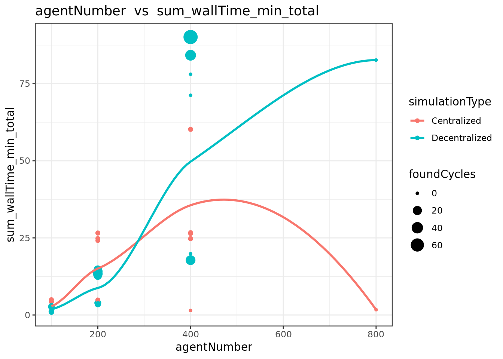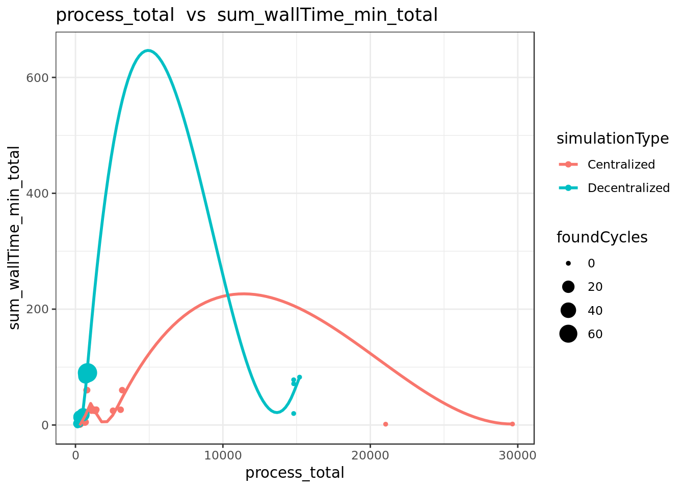   

# Experiment  12 

 

## Experimental set up 

<table class="table table-condensed" style="width: auto !important; ">
 <thead>
  <tr>
   <th style="text-align:left;">   </th>
   <th style="text-align:left;"> Values </th>
  </tr>
 </thead>
<tbody>
  <tr>
   <td style="text-align:left;"> experimentId </td>
   <td style="text-align:left;"> EXP08-12-11-17-5tvhCK </td>
  </tr>
  <tr>
   <td style="text-align:left;"> agentNumbers </td>
   <td style="text-align:left;"> 200 </td>
  </tr>
  <tr>
   <td style="text-align:left;"> maxDistances </td>
   <td style="text-align:left;"> 5, 10 </td>
  </tr>
  <tr>
   <td style="text-align:left;"> randomWorksNumberMultipliers </td>
   <td style="text-align:left;"> 2 </td>
  </tr>
  <tr>
   <td style="text-align:left;"> chainLengths </td>
   <td style="text-align:left;"> 10 </td>
  </tr>
</tbody>
</table>
## Descriptive analysis of each simulation

###  SIM08-12-12-23-DDd6WJ--CV 

#### simulationParameters 

<table class="table table-condensed" style="width: auto !important; ">
 <thead>
  <tr>
   <th style="text-align:left;"> agentNumber </th>
   <th style="text-align:right;"> similarityConnectThreshold </th>
   <th style="text-align:left;"> chainLength </th>
   <th style="text-align:left;"> similaritySearchThreshold </th>
   <th style="text-align:left;"> maxDistance </th>
   <th style="text-align:left;"> randomWorksNumberMultiplier </th>
  </tr>
 </thead>
<tbody>
  <tr>
   <td style="text-align:left;width: 20em; "> 200 </td>
   <td style="text-align:right;width: 15em; "> 0.9 </td>
   <td style="text-align:left;width: 15em; "> 10 </td>
   <td style="text-align:left;width: 15em; "> 0.9 </td>
   <td style="text-align:left;width: 15em; "> 10 </td>
   <td style="text-align:left;width: 15em; "> 2 </td>
  </tr>
</tbody>
</table>
#### Degree distribution of agent->knows->agent edges

#### Runing time by method 

<table class="table table-condensed" style="width: auto !important; ">
 <thead>
  <tr>
   <th style="text-align:left;"> key </th>
   <th style="text-align:right;"> doc_count </th>
   <th style="text-align:right;"> sum_wallTime_ms.value </th>
   <th style="text-align:left;"> avg_wallTime_ms.value </th>
   <th style="text-align:left;"> includedInTotal </th>
  </tr>
 </thead>
<tbody>
  <tr>
   <td style="text-align:left;"> connectIfSimilar </td>
   <td style="text-align:right;"> 335,790 </td>
   <td style="text-align:right;"> 1,561,507 </td>
   <td style="text-align:left;"> 4.65024866732184 </td>
   <td style="text-align:left;"> No </td>
  </tr>
  <tr>
   <td style="text-align:left;"> existsSimilarity </td>
   <td style="text-align:right;"> 335,790 </td>
   <td style="text-align:right;"> 1,553,231 </td>
   <td style="text-align:left;"> 4.62560231096816 </td>
   <td style="text-align:left;"> No </td>
  </tr>
  <tr>
   <td style="text-align:left;"> similarityEdges </td>
   <td style="text-align:right;"> 335,790 </td>
   <td style="text-align:right;"> 1,518,238 </td>
   <td style="text-align:left;"> 4.52139134578159 </td>
   <td style="text-align:left;"> No </td>
  </tr>
  <tr>
   <td style="text-align:left;"> connectAllSimilar </td>
   <td style="text-align:right;"> 820 </td>
   <td style="text-align:right;"> 1,565,255 </td>
   <td style="text-align:left;"> 1908.84756097561 </td>
   <td style="text-align:left;"> Yes </td>
  </tr>
  <tr>
   <td style="text-align:left;"> connect </td>
   <td style="text-align:right;"> 378 </td>
   <td style="text-align:right;"> 812 </td>
   <td style="text-align:left;"> 2.14814814814815 </td>
   <td style="text-align:left;"> Yes </td>
  </tr>
  <tr>
   <td style="text-align:left;"> cycleSearch </td>
   <td style="text-align:right;"> 286 </td>
   <td style="text-align:right;"> 1,422,293 </td>
   <td style="text-align:left;"> 4973.05244755245 </td>
   <td style="text-align:left;"> Yes </td>
  </tr>
  <tr>
   <td style="text-align:left;"> getWorks </td>
   <td style="text-align:right;"> 285 </td>
   <td style="text-align:right;"> 1,176 </td>
   <td style="text-align:left;"> 4.12631578947368 </td>
   <td style="text-align:left;"> Yes </td>
  </tr>
  <tr>
   <td style="text-align:left;"> individualCycleSearch </td>
   <td style="text-align:right;"> 268 </td>
   <td style="text-align:right;"> 4 </td>
   <td style="text-align:left;"> 0.0149253731343284 </td>
   <td style="text-align:left;"> Yes </td>
  </tr>
  <tr>
   <td style="text-align:left;"> init </td>
   <td style="text-align:right;"> 203 </td>
   <td style="text-align:right;"> 12,804 </td>
   <td style="text-align:left;"> 63.0738916256158 </td>
   <td style="text-align:left;"> No </td>
  </tr>
  <tr>
   <td style="text-align:left;font-weight: bold;"> Total </td>
   <td style="text-align:right;font-weight: bold;"> 2,042 </td>
   <td style="text-align:right;font-weight: bold;"> 2,990,336 </td>
   <td style="text-align:left;font-weight: bold;">  </td>
   <td style="text-align:left;font-weight: bold;">  </td>
  </tr>
</tbody>
</table>
####  Found structures 

#####  Cycles 

Number of cycles found:  1 

<button class="btn btn-primary" data-toggle="collapse" data-target="#GVIFGDHBHV"> Show/Hide foundCycle query </button> 
 
  
     GET /filebeat-*/_search 
              { 
                "query": {
                  "bool": {
                    "must": [
                      { "match_phrase": {
                        "simulationId": "SIM08-12-12-23-DDd6WJ--CV"
                        }
                      },
                      { "bool": {
                        "should": [
                          { "match": {
                            "keyword": "foundCycle"
                          }}
                        ]
                      }}
                    ]
                  }
                }
              }
     

#####  Paths 

Number of paths found:  0 

<button class="btn btn-primary" data-toggle="collapse" data-target="#NQNYWXTWBX"> Show/Hide foundPath query </button> 
 
  
     GET /filebeat-*/_search 
              { 
                "query": {
                  "bool": {
                    "must": [
                      { "match_phrase": {
                        "simulationId": "SIM08-12-12-23-DDd6WJ--CV"
                        }
                      },
                      { "bool": {
                        "should": [
                          { "match": {
                            "keyword": "foundPath"
                          }}
                        ]
                      }}
                    ]
                  }
                }
              }
     

###  SIM08-12-12-23-DDd6WJ--DV 

#### simulationParameters 

<table class="table table-condensed" style="width: auto !important; ">
 <thead>
  <tr>
   <th style="text-align:left;"> agentNumber </th>
   <th style="text-align:right;"> similarityConnectThreshold </th>
   <th style="text-align:left;"> chainLength </th>
   <th style="text-align:left;"> similaritySearchThreshold </th>
   <th style="text-align:left;"> maxDistance </th>
   <th style="text-align:left;"> randomWorksNumberMultiplier </th>
  </tr>
 </thead>
<tbody>
  <tr>
   <td style="text-align:left;width: 20em; "> 200 </td>
   <td style="text-align:right;width: 15em; "> 0.9 </td>
   <td style="text-align:left;width: 15em; "> 10 </td>
   <td style="text-align:left;width: 15em; "> 0.9 </td>
   <td style="text-align:left;width: 15em; "> 10 </td>
   <td style="text-align:left;width: 15em; "> 2 </td>
  </tr>
</tbody>
</table>
#### Degree distribution of agent->knows->agent edges

#### Runing time by method 

<table class="table table-condensed" style="width: auto !important; ">
 <thead>
  <tr>
   <th style="text-align:left;">   </th>
   <th style="text-align:left;"> key </th>
   <th style="text-align:right;"> doc_count </th>
   <th style="text-align:right;"> sum_wallTime_ms.value </th>
   <th style="text-align:left;"> avg_wallTime_ms.value </th>
   <th style="text-align:left;"> includedInTotal </th>
  </tr>
 </thead>
<tbody>
  <tr>
   <td style="text-align:left;"> 1 </td>
   <td style="text-align:left;"> knowsAgent </td>
   <td style="text-align:right;"> 1,201 </td>
   <td style="text-align:right;"> 1,783 </td>
   <td style="text-align:left;"> 1.48459616985845 </td>
   <td style="text-align:left;"> No </td>
  </tr>
  <tr>
   <td style="text-align:left;"> 2 </td>
   <td style="text-align:left;"> addItemToWork </td>
   <td style="text-align:right;"> 820 </td>
   <td style="text-align:right;"> 5,181 </td>
   <td style="text-align:left;"> 6.31829268292683 </td>
   <td style="text-align:left;"> No </td>
  </tr>
  <tr>
   <td style="text-align:left;"> 3 </td>
   <td style="text-align:left;"> ownsWork </td>
   <td style="text-align:right;"> 410 </td>
   <td style="text-align:right;"> 2,869 </td>
   <td style="text-align:left;"> 6.99756097560976 </td>
   <td style="text-align:left;"> No </td>
  </tr>
  <tr>
   <td style="text-align:left;"> 4 </td>
   <td style="text-align:left;"> individualCycleSearch </td>
   <td style="text-align:right;"> 286 </td>
   <td style="text-align:right;"> 12 </td>
   <td style="text-align:left;"> 0.041958041958042 </td>
   <td style="text-align:left;"> Yes </td>
  </tr>
  <tr>
   <td style="text-align:left;"> 5 </td>
   <td style="text-align:left;"> init </td>
   <td style="text-align:right;"> 203 </td>
   <td style="text-align:right;"> 12,781 </td>
   <td style="text-align:left;"> 62.9605911330049 </td>
   <td style="text-align:left;"> No </td>
  </tr>
  <tr>
   <td style="text-align:left;"> 6 </td>
   <td style="text-align:left;"> searchAndConnect </td>
   <td style="text-align:right;"> 201 </td>
   <td style="text-align:right;"> 840,980 </td>
   <td style="text-align:left;"> 4183.98009950249 </td>
   <td style="text-align:left;"> Yes </td>
  </tr>
  <tr>
   <td style="text-align:left;"> 7 </td>
   <td style="text-align:left;"> getWorksItems </td>
   <td style="text-align:right;"> 18 </td>
   <td style="text-align:right;"> 34 </td>
   <td style="text-align:left;"> 1.88888888888889 </td>
   <td style="text-align:left;"> Yes </td>
  </tr>
  <tr>
   <td style="text-align:left;"> 9 </td>
   <td style="text-align:left;"> getWorks </td>
   <td style="text-align:right;"> 2 </td>
   <td style="text-align:right;"> 3,746 </td>
   <td style="text-align:left;"> 1873 </td>
   <td style="text-align:left;"> No </td>
  </tr>
  <tr>
   <td style="text-align:left;"> 10 </td>
   <td style="text-align:left;"> addChainToNetwork </td>
   <td style="text-align:right;"> 1 </td>
   <td style="text-align:right;"> 0 </td>
   <td style="text-align:left;"> 0 </td>
   <td style="text-align:left;"> Yes </td>
  </tr>
  <tr>
   <td style="text-align:left;font-weight: bold;"> 11 </td>
   <td style="text-align:left;font-weight: bold;"> Total </td>
   <td style="text-align:right;font-weight: bold;"> 511 </td>
   <td style="text-align:right;font-weight: bold;"> 841,733 </td>
   <td style="text-align:left;font-weight: bold;">  </td>
   <td style="text-align:left;font-weight: bold;">  </td>
  </tr>
</tbody>
</table>
####  Found structures 

#####  Cycles 

Number of cycles found:  1 

<button class="btn btn-primary" data-toggle="collapse" data-target="#DCNTQKRSIR"> Show/Hide foundCycle query </button> 
 
  
     GET /filebeat-*/_search 
              { 
                "query": {
                  "bool": {
                    "must": [
                      { "match_phrase": {
                        "simulationId": "SIM08-12-12-23-DDd6WJ--DV"
                        }
                      },
                      { "bool": {
                        "should": [
                          { "match": {
                            "keyword": "foundCycle"
                          }}
                        ]
                      }}
                    ]
                  }
                }
              }
     

#####  Paths 

Number of paths found:  0 

<button class="btn btn-primary" data-toggle="collapse" data-target="#TPMCMAXYAT"> Show/Hide foundPath query </button> 
 
  
     GET /filebeat-*/_search 
              { 
                "query": {
                  "bool": {
                    "must": [
                      { "match_phrase": {
                        "simulationId": "SIM08-12-12-23-DDd6WJ--DV"
                        }
                      },
                      { "bool": {
                        "should": [
                          { "match": {
                            "keyword": "foundPath"
                          }}
                        ]
                      }}
                    ]
                  }
                }
              }
     

###  SIM08-12-12-59-7pHkve--CV 

#### simulationParameters 

<table class="table table-condensed" style="width: auto !important; ">
 <thead>
  <tr>
   <th style="text-align:left;"> agentNumber </th>
   <th style="text-align:right;"> similarityConnectThreshold </th>
   <th style="text-align:left;"> chainLength </th>
   <th style="text-align:left;"> similaritySearchThreshold </th>
   <th style="text-align:left;"> maxDistance </th>
   <th style="text-align:left;"> randomWorksNumberMultiplier </th>
  </tr>
 </thead>
<tbody>
  <tr>
   <td style="text-align:left;width: 20em; "> 200 </td>
   <td style="text-align:right;width: 15em; "> 0.9 </td>
   <td style="text-align:left;width: 15em; "> 10 </td>
   <td style="text-align:left;width: 15em; "> 0.95 </td>
   <td style="text-align:left;width: 15em; "> 10 </td>
   <td style="text-align:left;width: 15em; "> 2 </td>
  </tr>
</tbody>
</table>
#### Degree distribution of agent->knows->agent edges

#### Runing time by method 

<table class="table table-condensed" style="width: auto !important; ">
 <thead>
  <tr>
   <th style="text-align:left;"> key </th>
   <th style="text-align:right;"> doc_count </th>
   <th style="text-align:right;"> sum_wallTime_ms.value </th>
   <th style="text-align:left;"> avg_wallTime_ms.value </th>
   <th style="text-align:left;"> includedInTotal </th>
  </tr>
 </thead>
<tbody>
  <tr>
   <td style="text-align:left;"> connectIfSimilar </td>
   <td style="text-align:right;"> 335,790 </td>
   <td style="text-align:right;"> 1,516,725 </td>
   <td style="text-align:left;"> 4.51688555347092 </td>
   <td style="text-align:left;"> No </td>
  </tr>
  <tr>
   <td style="text-align:left;"> existsSimilarity </td>
   <td style="text-align:right;"> 335,790 </td>
   <td style="text-align:right;"> 1,509,006 </td>
   <td style="text-align:left;"> 4.49389797194675 </td>
   <td style="text-align:left;"> No </td>
  </tr>
  <tr>
   <td style="text-align:left;"> similarityEdges </td>
   <td style="text-align:right;"> 335,790 </td>
   <td style="text-align:right;"> 1,475,713 </td>
   <td style="text-align:left;"> 4.3947496947497 </td>
   <td style="text-align:left;"> No </td>
  </tr>
  <tr>
   <td style="text-align:left;"> connectAllSimilar </td>
   <td style="text-align:right;"> 820 </td>
   <td style="text-align:right;"> 1,520,363 </td>
   <td style="text-align:left;"> 1854.1012195122 </td>
   <td style="text-align:left;"> Yes </td>
  </tr>
  <tr>
   <td style="text-align:left;"> connect </td>
   <td style="text-align:right;"> 380 </td>
   <td style="text-align:right;"> 702 </td>
   <td style="text-align:left;"> 1.84736842105263 </td>
   <td style="text-align:left;"> Yes </td>
  </tr>
  <tr>
   <td style="text-align:left;"> init </td>
   <td style="text-align:right;"> 202 </td>
   <td style="text-align:right;"> 13,338 </td>
   <td style="text-align:left;"> 66.029702970297 </td>
   <td style="text-align:left;"> No </td>
  </tr>
  <tr>
   <td style="text-align:left;"> individualCycleSearch </td>
   <td style="text-align:right;"> 135 </td>
   <td style="text-align:right;"> 5 </td>
   <td style="text-align:left;"> 0.037037037037037 </td>
   <td style="text-align:left;"> Yes </td>
  </tr>
  <tr>
   <td style="text-align:left;"> cycleSearch </td>
   <td style="text-align:right;"> 79 </td>
   <td style="text-align:right;"> 227,366 </td>
   <td style="text-align:left;"> 2878.05063291139 </td>
   <td style="text-align:left;"> Yes </td>
  </tr>
  <tr>
   <td style="text-align:left;"> getWorks </td>
   <td style="text-align:right;"> 78 </td>
   <td style="text-align:right;"> 291 </td>
   <td style="text-align:left;"> 3.73076923076923 </td>
   <td style="text-align:left;"> Yes </td>
  </tr>
  <tr>
   <td style="text-align:left;"> searchAndConnect </td>
   <td style="text-align:right;"> 9 </td>
   <td style="text-align:right;"> 50,624 </td>
   <td style="text-align:left;"> 5624.88888888889 </td>
   <td style="text-align:left;"> Yes </td>
  </tr>
  <tr>
   <td style="text-align:left;font-weight: bold;"> Total </td>
   <td style="text-align:right;font-weight: bold;"> 1,501 </td>
   <td style="text-align:right;font-weight: bold;"> 1,799,351 </td>
   <td style="text-align:left;font-weight: bold;">  </td>
   <td style="text-align:left;font-weight: bold;">  </td>
  </tr>
</tbody>
</table>
####  Found structures 

#####  Cycles 

Number of cycles found:  1 

<button class="btn btn-primary" data-toggle="collapse" data-target="#WMACJSMQAB"> Show/Hide foundCycle query </button> 
 
  
     GET /filebeat-*/_search 
              { 
                "query": {
                  "bool": {
                    "must": [
                      { "match_phrase": {
                        "simulationId": "SIM08-12-12-59-7pHkve--CV"
                        }
                      },
                      { "bool": {
                        "should": [
                          { "match": {
                            "keyword": "foundCycle"
                          }}
                        ]
                      }}
                    ]
                  }
                }
              }
     

#####  Paths 

Number of paths found:  0 

<button class="btn btn-primary" data-toggle="collapse" data-target="#WYLSQAQQUZ"> Show/Hide foundPath query </button> 
 
  
     GET /filebeat-*/_search 
              { 
                "query": {
                  "bool": {
                    "must": [
                      { "match_phrase": {
                        "simulationId": "SIM08-12-12-59-7pHkve--CV"
                        }
                      },
                      { "bool": {
                        "should": [
                          { "match": {
                            "keyword": "foundPath"
                          }}
                        ]
                      }}
                    ]
                  }
                }
              }
     

###  SIM08-12-12-59-7pHkve--DV 

#### simulationParameters 

<table class="table table-condensed" style="width: auto !important; ">
 <thead>
  <tr>
   <th style="text-align:left;"> agentNumber </th>
   <th style="text-align:right;"> similarityConnectThreshold </th>
   <th style="text-align:left;"> chainLength </th>
   <th style="text-align:left;"> similaritySearchThreshold </th>
   <th style="text-align:left;"> maxDistance </th>
   <th style="text-align:left;"> randomWorksNumberMultiplier </th>
  </tr>
 </thead>
<tbody>
  <tr>
   <td style="text-align:left;width: 20em; "> 200 </td>
   <td style="text-align:right;width: 15em; "> 0.9 </td>
   <td style="text-align:left;width: 15em; "> 10 </td>
   <td style="text-align:left;width: 15em; "> 0.95 </td>
   <td style="text-align:left;width: 15em; "> 10 </td>
   <td style="text-align:left;width: 15em; "> 2 </td>
  </tr>
</tbody>
</table>
#### Degree distribution of agent->knows->agent edges

#### Runing time by method 

<table class="table table-condensed" style="width: auto !important; ">
 <thead>
  <tr>
   <th style="text-align:left;">   </th>
   <th style="text-align:left;"> key </th>
   <th style="text-align:right;"> doc_count </th>
   <th style="text-align:right;"> sum_wallTime_ms.value </th>
   <th style="text-align:left;"> avg_wallTime_ms.value </th>
   <th style="text-align:left;"> includedInTotal </th>
  </tr>
 </thead>
<tbody>
  <tr>
   <td style="text-align:left;"> 1 </td>
   <td style="text-align:left;"> knowsAgent </td>
   <td style="text-align:right;"> 1,201 </td>
   <td style="text-align:right;"> 1,761 </td>
   <td style="text-align:left;"> 1.46627810158201 </td>
   <td style="text-align:left;"> No </td>
  </tr>
  <tr>
   <td style="text-align:left;"> 2 </td>
   <td style="text-align:left;"> addItemToWork </td>
   <td style="text-align:right;"> 820 </td>
   <td style="text-align:right;"> 6,448 </td>
   <td style="text-align:left;"> 7.86341463414634 </td>
   <td style="text-align:left;"> No </td>
  </tr>
  <tr>
   <td style="text-align:left;"> 3 </td>
   <td style="text-align:left;"> ownsWork </td>
   <td style="text-align:right;"> 410 </td>
   <td style="text-align:right;"> 3,317 </td>
   <td style="text-align:left;"> 8.09024390243902 </td>
   <td style="text-align:left;"> No </td>
  </tr>
  <tr>
   <td style="text-align:left;"> 4 </td>
   <td style="text-align:left;"> init </td>
   <td style="text-align:right;"> 203 </td>
   <td style="text-align:right;"> 20,011 </td>
   <td style="text-align:left;"> 98.576354679803 </td>
   <td style="text-align:left;"> No </td>
  </tr>
  <tr>
   <td style="text-align:left;"> 5 </td>
   <td style="text-align:left;"> searchAndConnect </td>
   <td style="text-align:right;"> 192 </td>
   <td style="text-align:right;"> 737,930 </td>
   <td style="text-align:left;"> 3843.38541666667 </td>
   <td style="text-align:left;"> Yes </td>
  </tr>
  <tr>
   <td style="text-align:left;"> 6 </td>
   <td style="text-align:left;"> individualCycleSearch </td>
   <td style="text-align:right;"> 79 </td>
   <td style="text-align:right;"> 3 </td>
   <td style="text-align:left;"> 0.0379746835443038 </td>
   <td style="text-align:left;"> Yes </td>
  </tr>
  <tr>
   <td style="text-align:left;"> 7 </td>
   <td style="text-align:left;"> getWorksItems </td>
   <td style="text-align:right;"> 18 </td>
   <td style="text-align:right;"> 34 </td>
   <td style="text-align:left;"> 1.88888888888889 </td>
   <td style="text-align:left;"> Yes </td>
  </tr>
  <tr>
   <td style="text-align:left;"> 9 </td>
   <td style="text-align:left;"> getWorks </td>
   <td style="text-align:right;"> 3 </td>
   <td style="text-align:right;"> 6,490 </td>
   <td style="text-align:left;"> 2163.33333333333 </td>
   <td style="text-align:left;"> No </td>
  </tr>
  <tr>
   <td style="text-align:left;"> 10 </td>
   <td style="text-align:left;"> cycleSearch </td>
   <td style="text-align:right;"> 2 </td>
   <td style="text-align:right;"> 13,699 </td>
   <td style="text-align:left;"> 6849.5 </td>
   <td style="text-align:left;"> Yes </td>
  </tr>
  <tr>
   <td style="text-align:left;font-weight: bold;"> 11 </td>
   <td style="text-align:left;font-weight: bold;"> Total </td>
   <td style="text-align:right;font-weight: bold;"> 296 </td>
   <td style="text-align:right;font-weight: bold;"> 756,535 </td>
   <td style="text-align:left;font-weight: bold;">  </td>
   <td style="text-align:left;font-weight: bold;">  </td>
  </tr>
</tbody>
</table>
####  Found structures 

#####  Cycles 

Number of cycles found:  1 

<button class="btn btn-primary" data-toggle="collapse" data-target="#IBLKNTSNCI"> Show/Hide foundCycle query </button> 
 
  
     GET /filebeat-*/_search 
              { 
                "query": {
                  "bool": {
                    "must": [
                      { "match_phrase": {
                        "simulationId": "SIM08-12-12-59-7pHkve--DV"
                        }
                      },
                      { "bool": {
                        "should": [
                          { "match": {
                            "keyword": "foundCycle"
                          }}
                        ]
                      }}
                    ]
                  }
                }
              }
     

#####  Paths 

Number of paths found:  0 

<button class="btn btn-primary" data-toggle="collapse" data-target="#IAMFOWOOPI"> Show/Hide foundPath query </button> 
 
  
     GET /filebeat-*/_search 
              { 
                "query": {
                  "bool": {
                    "must": [
                      { "match_phrase": {
                        "simulationId": "SIM08-12-12-59-7pHkve--DV"
                        }
                      },
                      { "bool": {
                        "should": [
                          { "match": {
                            "keyword": "foundPath"
                          }}
                        ]
                      }}
                    ]
                  }
                }
              }
     

###  SIM08-12-11-17-FUJWvx--CV 

#### simulationParameters 

<table class="table table-condensed" style="width: auto !important; ">
 <thead>
  <tr>
   <th style="text-align:left;"> agentNumber </th>
   <th style="text-align:right;"> similarityConnectThreshold </th>
   <th style="text-align:left;"> chainLength </th>
   <th style="text-align:left;"> similaritySearchThreshold </th>
   <th style="text-align:left;"> maxDistance </th>
   <th style="text-align:left;"> randomWorksNumberMultiplier </th>
  </tr>
 </thead>
<tbody>
  <tr>
   <td style="text-align:left;width: 20em; "> 200 </td>
   <td style="text-align:right;width: 15em; "> 0.9 </td>
   <td style="text-align:left;width: 15em; "> 10 </td>
   <td style="text-align:left;width: 15em; "> 0.9 </td>
   <td style="text-align:left;width: 15em; "> 5 </td>
   <td style="text-align:left;width: 15em; "> 2 </td>
  </tr>
</tbody>
</table>
#### Degree distribution of agent->knows->agent edges

#### Runing time by method 

<table class="table table-condensed" style="width: auto !important; ">
 <thead>
  <tr>
   <th style="text-align:left;"> key </th>
   <th style="text-align:right;"> doc_count </th>
   <th style="text-align:right;"> sum_wallTime_ms.value </th>
   <th style="text-align:left;"> avg_wallTime_ms.value </th>
   <th style="text-align:left;"> includedInTotal </th>
  </tr>
 </thead>
<tbody>
  <tr>
   <td style="text-align:left;"> connectIfSimilar </td>
   <td style="text-align:right;"> 335,790 </td>
   <td style="text-align:right;"> 1,562,690 </td>
   <td style="text-align:left;"> 4.65377170255219 </td>
   <td style="text-align:left;"> No </td>
  </tr>
  <tr>
   <td style="text-align:left;"> existsSimilarity </td>
   <td style="text-align:right;"> 335,790 </td>
   <td style="text-align:right;"> 1,554,200 </td>
   <td style="text-align:left;"> 4.62848804312219 </td>
   <td style="text-align:left;"> No </td>
  </tr>
  <tr>
   <td style="text-align:left;"> similarityEdges </td>
   <td style="text-align:right;"> 335,790 </td>
   <td style="text-align:right;"> 1,519,374 </td>
   <td style="text-align:left;"> 4.52477441257929 </td>
   <td style="text-align:left;"> No </td>
  </tr>
  <tr>
   <td style="text-align:left;"> connectAllSimilar </td>
   <td style="text-align:right;"> 820 </td>
   <td style="text-align:right;"> 1,566,298 </td>
   <td style="text-align:left;"> 1910.11951219512 </td>
   <td style="text-align:left;"> Yes </td>
  </tr>
  <tr>
   <td style="text-align:left;"> connect </td>
   <td style="text-align:right;"> 465 </td>
   <td style="text-align:right;"> 1,012 </td>
   <td style="text-align:left;"> 2.17634408602151 </td>
   <td style="text-align:left;"> Yes </td>
  </tr>
  <tr>
   <td style="text-align:left;"> individualCycleSearch </td>
   <td style="text-align:right;"> 270 </td>
   <td style="text-align:right;"> 13 </td>
   <td style="text-align:left;"> 0.0481481481481481 </td>
   <td style="text-align:left;"> Yes </td>
  </tr>
  <tr>
   <td style="text-align:left;"> cycleSearch </td>
   <td style="text-align:right;"> 236 </td>
   <td style="text-align:right;"> 1,169,076 </td>
   <td style="text-align:left;"> 4953.71186440678 </td>
   <td style="text-align:left;"> Yes </td>
  </tr>
  <tr>
   <td style="text-align:left;"> getWorks </td>
   <td style="text-align:right;"> 235 </td>
   <td style="text-align:right;"> 1,215 </td>
   <td style="text-align:left;"> 5.17021276595745 </td>
   <td style="text-align:left;"> Yes </td>
  </tr>
  <tr>
   <td style="text-align:left;"> init </td>
   <td style="text-align:right;"> 203 </td>
   <td style="text-align:right;"> 16,129 </td>
   <td style="text-align:left;"> 79.4532019704433 </td>
   <td style="text-align:left;"> No </td>
  </tr>
  <tr>
   <td style="text-align:left;"> searchAndConnect </td>
   <td style="text-align:right;"> 9 </td>
   <td style="text-align:right;"> 47,517 </td>
   <td style="text-align:left;"> 5279.66666666667 </td>
   <td style="text-align:left;"> Yes </td>
  </tr>
  <tr>
   <td style="text-align:left;font-weight: bold;"> Total </td>
   <td style="text-align:right;font-weight: bold;"> 2,035 </td>
   <td style="text-align:right;font-weight: bold;"> 2,785,131 </td>
   <td style="text-align:left;font-weight: bold;">  </td>
   <td style="text-align:left;font-weight: bold;">  </td>
  </tr>
</tbody>
</table>
####  Found structures 

#####  Cycles 

Number of cycles found:  1 

<button class="btn btn-primary" data-toggle="collapse" data-target="#LFGDJOOGMX"> Show/Hide foundCycle query </button> 
 
  
     GET /filebeat-*/_search 
              { 
                "query": {
                  "bool": {
                    "must": [
                      { "match_phrase": {
                        "simulationId": "SIM08-12-11-17-FUJWvx--CV"
                        }
                      },
                      { "bool": {
                        "should": [
                          { "match": {
                            "keyword": "foundCycle"
                          }}
                        ]
                      }}
                    ]
                  }
                }
              }
     

#####  Paths 

Number of paths found:  0 

<button class="btn btn-primary" data-toggle="collapse" data-target="#EBFITXISAH"> Show/Hide foundPath query </button> 
 
  
     GET /filebeat-*/_search 
              { 
                "query": {
                  "bool": {
                    "must": [
                      { "match_phrase": {
                        "simulationId": "SIM08-12-11-17-FUJWvx--CV"
                        }
                      },
                      { "bool": {
                        "should": [
                          { "match": {
                            "keyword": "foundPath"
                          }}
                        ]
                      }}
                    ]
                  }
                }
              }
     

###  SIM08-12-11-17-FUJWvx--DV 

#### simulationParameters 

<table class="table table-condensed" style="width: auto !important; ">
 <thead>
  <tr>
   <th style="text-align:left;"> agentNumber </th>
   <th style="text-align:right;"> similarityConnectThreshold </th>
   <th style="text-align:left;"> chainLength </th>
   <th style="text-align:left;"> similaritySearchThreshold </th>
   <th style="text-align:left;"> maxDistance </th>
   <th style="text-align:left;"> randomWorksNumberMultiplier </th>
  </tr>
 </thead>
<tbody>
  <tr>
   <td style="text-align:left;width: 20em; "> 200 </td>
   <td style="text-align:right;width: 15em; "> 0.9 </td>
   <td style="text-align:left;width: 15em; "> 10 </td>
   <td style="text-align:left;width: 15em; "> 0.9 </td>
   <td style="text-align:left;width: 15em; "> 5 </td>
   <td style="text-align:left;width: 15em; "> 2 </td>
  </tr>
</tbody>
</table>
#### Degree distribution of agent->knows->agent edges

#### Runing time by method 

<table class="table table-condensed" style="width: auto !important; ">
 <thead>
  <tr>
   <th style="text-align:left;">   </th>
   <th style="text-align:left;"> key </th>
   <th style="text-align:right;"> doc_count </th>
   <th style="text-align:right;"> sum_wallTime_ms.value </th>
   <th style="text-align:left;"> avg_wallTime_ms.value </th>
   <th style="text-align:left;"> includedInTotal </th>
  </tr>
 </thead>
<tbody>
  <tr>
   <td style="text-align:left;"> 1 </td>
   <td style="text-align:left;"> knowsAgent </td>
   <td style="text-align:right;"> 1,201 </td>
   <td style="text-align:right;"> 2,844 </td>
   <td style="text-align:left;"> 2.36802664446295 </td>
   <td style="text-align:left;"> No </td>
  </tr>
  <tr>
   <td style="text-align:left;"> 2 </td>
   <td style="text-align:left;"> addItemToWork </td>
   <td style="text-align:right;"> 820 </td>
   <td style="text-align:right;"> 10,419 </td>
   <td style="text-align:left;"> 12.7060975609756 </td>
   <td style="text-align:left;"> No </td>
  </tr>
  <tr>
   <td style="text-align:left;"> 3 </td>
   <td style="text-align:left;"> ownsWork </td>
   <td style="text-align:right;"> 410 </td>
   <td style="text-align:right;"> 5,059 </td>
   <td style="text-align:left;"> 12.3390243902439 </td>
   <td style="text-align:left;"> No </td>
  </tr>
  <tr>
   <td style="text-align:left;"> 4 </td>
   <td style="text-align:left;"> individualCycleSearch </td>
   <td style="text-align:right;"> 236 </td>
   <td style="text-align:right;"> 25 </td>
   <td style="text-align:left;"> 0.105932203389831 </td>
   <td style="text-align:left;"> Yes </td>
  </tr>
  <tr>
   <td style="text-align:left;"> 5 </td>
   <td style="text-align:left;"> init </td>
   <td style="text-align:right;"> 203 </td>
   <td style="text-align:right;"> 17,696 </td>
   <td style="text-align:left;"> 87.1724137931034 </td>
   <td style="text-align:left;"> No </td>
  </tr>
  <tr>
   <td style="text-align:left;"> 6 </td>
   <td style="text-align:left;"> searchAndConnect </td>
   <td style="text-align:right;"> 192 </td>
   <td style="text-align:right;"> 831,367 </td>
   <td style="text-align:left;"> 4330.03645833333 </td>
   <td style="text-align:left;"> Yes </td>
  </tr>
  <tr>
   <td style="text-align:left;"> 7 </td>
   <td style="text-align:left;"> getWorksItems </td>
   <td style="text-align:right;"> 18 </td>
   <td style="text-align:right;"> 55 </td>
   <td style="text-align:left;"> 3.05555555555556 </td>
   <td style="text-align:left;"> Yes </td>
  </tr>
  <tr>
   <td style="text-align:left;"> 9 </td>
   <td style="text-align:left;"> getWorks </td>
   <td style="text-align:right;"> 2 </td>
   <td style="text-align:right;"> 5,939 </td>
   <td style="text-align:left;"> 2969.5 </td>
   <td style="text-align:left;"> No </td>
  </tr>
  <tr>
   <td style="text-align:left;"> 10 </td>
   <td style="text-align:left;"> addChainToNetwork </td>
   <td style="text-align:right;"> 1 </td>
   <td style="text-align:right;"> 0 </td>
   <td style="text-align:left;"> 0 </td>
   <td style="text-align:left;"> Yes </td>
  </tr>
  <tr>
   <td style="text-align:left;font-weight: bold;"> 11 </td>
   <td style="text-align:left;font-weight: bold;"> Total </td>
   <td style="text-align:right;font-weight: bold;"> 452 </td>
   <td style="text-align:right;font-weight: bold;"> 837,002 </td>
   <td style="text-align:left;font-weight: bold;">  </td>
   <td style="text-align:left;font-weight: bold;">  </td>
  </tr>
</tbody>
</table>
####  Found structures 

#####  Cycles 

Number of cycles found:  1 

<button class="btn btn-primary" data-toggle="collapse" data-target="#YWMVOZMJMG"> Show/Hide foundCycle query </button> 
 
  
     GET /filebeat-*/_search 
              { 
                "query": {
                  "bool": {
                    "must": [
                      { "match_phrase": {
                        "simulationId": "SIM08-12-11-17-FUJWvx--DV"
                        }
                      },
                      { "bool": {
                        "should": [
                          { "match": {
                            "keyword": "foundCycle"
                          }}
                        ]
                      }}
                    ]
                  }
                }
              }
     

#####  Paths 

Number of paths found:  0 

<button class="btn btn-primary" data-toggle="collapse" data-target="#LTQAXASMDX"> Show/Hide foundPath query </button> 
 
  
     GET /filebeat-*/_search 
              { 
                "query": {
                  "bool": {
                    "must": [
                      { "match_phrase": {
                        "simulationId": "SIM08-12-11-17-FUJWvx--DV"
                        }
                      },
                      { "bool": {
                        "should": [
                          { "match": {
                            "keyword": "foundPath"
                          }}
                        ]
                      }}
                    ]
                  }
                }
              }
     

###  SIM08-12-11-52-Upza75--CV 

#### simulationParameters 

<table class="table table-condensed" style="width: auto !important; ">
 <thead>
  <tr>
   <th style="text-align:left;"> agentNumber </th>
   <th style="text-align:right;"> similarityConnectThreshold </th>
   <th style="text-align:left;"> chainLength </th>
   <th style="text-align:left;"> similaritySearchThreshold </th>
   <th style="text-align:left;"> maxDistance </th>
   <th style="text-align:left;"> randomWorksNumberMultiplier </th>
  </tr>
 </thead>
<tbody>
  <tr>
   <td style="text-align:left;width: 20em; "> 200 </td>
   <td style="text-align:right;width: 15em; "> 0.9 </td>
   <td style="text-align:left;width: 15em; "> 10 </td>
   <td style="text-align:left;width: 15em; "> 0.95 </td>
   <td style="text-align:left;width: 15em; "> 5 </td>
   <td style="text-align:left;width: 15em; "> 2 </td>
  </tr>
</tbody>
</table>
#### Degree distribution of agent->knows->agent edges

#### Runing time by method 

<table class="table table-condensed" style="width: auto !important; ">
 <thead>
  <tr>
   <th style="text-align:left;"> key </th>
   <th style="text-align:right;"> doc_count </th>
   <th style="text-align:right;"> sum_wallTime_ms.value </th>
   <th style="text-align:left;"> avg_wallTime_ms.value </th>
   <th style="text-align:left;"> includedInTotal </th>
  </tr>
 </thead>
<tbody>
  <tr>
   <td style="text-align:left;"> connectIfSimilar </td>
   <td style="text-align:right;"> 335,790 </td>
   <td style="text-align:right;"> 1,538,649 </td>
   <td style="text-align:left;"> 4.58217636022514 </td>
   <td style="text-align:left;"> No </td>
  </tr>
  <tr>
   <td style="text-align:left;"> existsSimilarity </td>
   <td style="text-align:right;"> 335,790 </td>
   <td style="text-align:right;"> 1,530,256 </td>
   <td style="text-align:left;"> 4.55718157181572 </td>
   <td style="text-align:left;"> No </td>
  </tr>
  <tr>
   <td style="text-align:left;"> similarityEdges </td>
   <td style="text-align:right;"> 335,790 </td>
   <td style="text-align:right;"> 1,495,470 </td>
   <td style="text-align:left;"> 4.45358706334316 </td>
   <td style="text-align:left;"> No </td>
  </tr>
  <tr>
   <td style="text-align:left;"> connectAllSimilar </td>
   <td style="text-align:right;"> 820 </td>
   <td style="text-align:right;"> 1,542,243 </td>
   <td style="text-align:left;"> 1880.78414634146 </td>
   <td style="text-align:left;"> Yes </td>
  </tr>
  <tr>
   <td style="text-align:left;"> connect </td>
   <td style="text-align:right;"> 559 </td>
   <td style="text-align:right;"> 1,259 </td>
   <td style="text-align:left;"> 2.25223613595707 </td>
   <td style="text-align:left;"> Yes </td>
  </tr>
  <tr>
   <td style="text-align:left;"> init </td>
   <td style="text-align:right;"> 203 </td>
   <td style="text-align:right;"> 12,786 </td>
   <td style="text-align:left;"> 62.9852216748768 </td>
   <td style="text-align:left;"> No </td>
  </tr>
  <tr>
   <td style="text-align:left;"> cycleSearch </td>
   <td style="text-align:right;"> 162 </td>
   <td style="text-align:right;"> 470,761 </td>
   <td style="text-align:left;"> 2905.93209876543 </td>
   <td style="text-align:left;"> Yes </td>
  </tr>
  <tr>
   <td style="text-align:left;"> getWorks </td>
   <td style="text-align:right;"> 162 </td>
   <td style="text-align:right;"> 530 </td>
   <td style="text-align:left;"> 3.2716049382716 </td>
   <td style="text-align:left;"> Yes </td>
  </tr>
  <tr>
   <td style="text-align:left;"> individualCycleSearch </td>
   <td style="text-align:right;"> 140 </td>
   <td style="text-align:right;"> 4 </td>
   <td style="text-align:left;"> 0.0285714285714286 </td>
   <td style="text-align:left;"> Yes </td>
  </tr>
  <tr>
   <td style="text-align:left;font-weight: bold;"> Total </td>
   <td style="text-align:right;font-weight: bold;"> 1,848 </td>
   <td style="text-align:right;font-weight: bold;"> 2,015,586 </td>
   <td style="text-align:left;font-weight: bold;">  </td>
   <td style="text-align:left;font-weight: bold;">  </td>
  </tr>
</tbody>
</table>
####  Found structures 

#####  Cycles 

Number of cycles found:  1 

<button class="btn btn-primary" data-toggle="collapse" data-target="#KLUNCSZNDH"> Show/Hide foundCycle query </button> 
 
  
     GET /filebeat-*/_search 
              { 
                "query": {
                  "bool": {
                    "must": [
                      { "match_phrase": {
                        "simulationId": "SIM08-12-11-52-Upza75--CV"
                        }
                      },
                      { "bool": {
                        "should": [
                          { "match": {
                            "keyword": "foundCycle"
                          }}
                        ]
                      }}
                    ]
                  }
                }
              }
     

#####  Paths 

Number of paths found:  0 

<button class="btn btn-primary" data-toggle="collapse" data-target="#OUIMVIMYFX"> Show/Hide foundPath query </button> 
 
  
     GET /filebeat-*/_search 
              { 
                "query": {
                  "bool": {
                    "must": [
                      { "match_phrase": {
                        "simulationId": "SIM08-12-11-52-Upza75--CV"
                        }
                      },
                      { "bool": {
                        "should": [
                          { "match": {
                            "keyword": "foundPath"
                          }}
                        ]
                      }}
                    ]
                  }
                }
              }
     

###  SIM08-12-11-52-Upza75--DV 

#### simulationParameters 

<table class="table table-condensed" style="width: auto !important; ">
 <thead>
  <tr>
   <th style="text-align:left;"> agentNumber </th>
   <th style="text-align:right;"> similarityConnectThreshold </th>
   <th style="text-align:left;"> chainLength </th>
   <th style="text-align:left;"> similaritySearchThreshold </th>
   <th style="text-align:left;"> maxDistance </th>
   <th style="text-align:left;"> randomWorksNumberMultiplier </th>
  </tr>
 </thead>
<tbody>
  <tr>
   <td style="text-align:left;width: 20em; "> 200 </td>
   <td style="text-align:right;width: 15em; "> 0.9 </td>
   <td style="text-align:left;width: 15em; "> 10 </td>
   <td style="text-align:left;width: 15em; "> 0.95 </td>
   <td style="text-align:left;width: 15em; "> 5 </td>
   <td style="text-align:left;width: 15em; "> 2 </td>
  </tr>
</tbody>
</table>
#### Degree distribution of agent->knows->agent edges

#### Runing time by method 

<table class="table table-condensed" style="width: auto !important; ">
 <thead>
  <tr>
   <th style="text-align:left;">   </th>
   <th style="text-align:left;"> key </th>
   <th style="text-align:right;"> doc_count </th>
   <th style="text-align:right;"> sum_wallTime_ms.value </th>
   <th style="text-align:left;"> avg_wallTime_ms.value </th>
   <th style="text-align:left;"> includedInTotal </th>
  </tr>
 </thead>
<tbody>
  <tr>
   <td style="text-align:left;"> 1 </td>
   <td style="text-align:left;"> knowsAgent </td>
   <td style="text-align:right;"> 1,201 </td>
   <td style="text-align:right;"> 1,811 </td>
   <td style="text-align:left;"> 1.50791007493755 </td>
   <td style="text-align:left;"> No </td>
  </tr>
  <tr>
   <td style="text-align:left;"> 2 </td>
   <td style="text-align:left;"> addItemToWork </td>
   <td style="text-align:right;"> 820 </td>
   <td style="text-align:right;"> 5,494 </td>
   <td style="text-align:left;"> 6.7 </td>
   <td style="text-align:left;"> No </td>
  </tr>
  <tr>
   <td style="text-align:left;"> 3 </td>
   <td style="text-align:left;"> ownsWork </td>
   <td style="text-align:right;"> 410 </td>
   <td style="text-align:right;"> 2,494 </td>
   <td style="text-align:left;"> 6.08292682926829 </td>
   <td style="text-align:left;"> No </td>
  </tr>
  <tr>
   <td style="text-align:left;"> 4 </td>
   <td style="text-align:left;"> init </td>
   <td style="text-align:right;"> 203 </td>
   <td style="text-align:right;"> 12,762 </td>
   <td style="text-align:left;"> 62.8669950738916 </td>
   <td style="text-align:left;"> No </td>
  </tr>
  <tr>
   <td style="text-align:left;"> 5 </td>
   <td style="text-align:left;"> searchAndConnect </td>
   <td style="text-align:right;"> 201 </td>
   <td style="text-align:right;"> 832,230 </td>
   <td style="text-align:left;"> 4140.44776119403 </td>
   <td style="text-align:left;"> Yes </td>
  </tr>
  <tr>
   <td style="text-align:left;"> 6 </td>
   <td style="text-align:left;"> individualCycleSearch </td>
   <td style="text-align:right;"> 162 </td>
   <td style="text-align:right;"> 8 </td>
   <td style="text-align:left;"> 0.0493827160493827 </td>
   <td style="text-align:left;"> Yes </td>
  </tr>
  <tr>
   <td style="text-align:left;"> 7 </td>
   <td style="text-align:left;"> getWorksItems </td>
   <td style="text-align:right;"> 18 </td>
   <td style="text-align:right;"> 37 </td>
   <td style="text-align:left;"> 2.05555555555556 </td>
   <td style="text-align:left;"> Yes </td>
  </tr>
  <tr>
   <td style="text-align:left;"> 9 </td>
   <td style="text-align:left;"> getWorks </td>
   <td style="text-align:right;"> 2 </td>
   <td style="text-align:right;"> 3,582 </td>
   <td style="text-align:left;"> 1791 </td>
   <td style="text-align:left;"> No </td>
  </tr>
  <tr>
   <td style="text-align:left;"> 10 </td>
   <td style="text-align:left;"> addChainToNetwork </td>
   <td style="text-align:right;"> 1 </td>
   <td style="text-align:right;"> 0 </td>
   <td style="text-align:left;"> 0 </td>
   <td style="text-align:left;"> Yes </td>
  </tr>
  <tr>
   <td style="text-align:left;font-weight: bold;"> 11 </td>
   <td style="text-align:left;font-weight: bold;"> Total </td>
   <td style="text-align:right;font-weight: bold;"> 387 </td>
   <td style="text-align:right;font-weight: bold;"> 832,983 </td>
   <td style="text-align:left;font-weight: bold;">  </td>
   <td style="text-align:left;font-weight: bold;">  </td>
  </tr>
</tbody>
</table>
####  Found structures 

#####  Cycles 

Number of cycles found:  1 

<button class="btn btn-primary" data-toggle="collapse" data-target="#DFIKFZEAEH"> Show/Hide foundCycle query </button> 
 
  
     GET /filebeat-*/_search 
              { 
                "query": {
                  "bool": {
                    "must": [
                      { "match_phrase": {
                        "simulationId": "SIM08-12-11-52-Upza75--DV"
                        }
                      },
                      { "bool": {
                        "should": [
                          { "match": {
                            "keyword": "foundCycle"
                          }}
                        ]
                      }}
                    ]
                  }
                }
              }
     

#####  Paths 

Number of paths found:  0 

<button class="btn btn-primary" data-toggle="collapse" data-target="#QPIUDYYOAE"> Show/Hide foundPath query </button> 
 
  
     GET /filebeat-*/_search 
              { 
                "query": {
                  "bool": {
                    "must": [
                      { "match_phrase": {
                        "simulationId": "SIM08-12-11-52-Upza75--DV"
                        }
                      },
                      { "bool": {
                        "should": [
                          { "match": {
                            "keyword": "foundPath"
                          }}
                        ]
                      }}
                    ]
                  }
                }
              }
     

## Scatterplots of experiment 

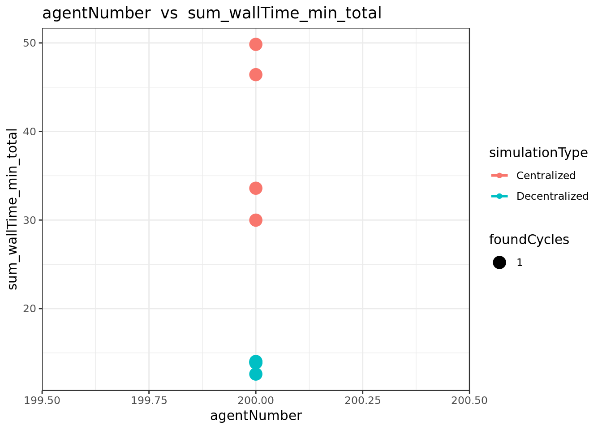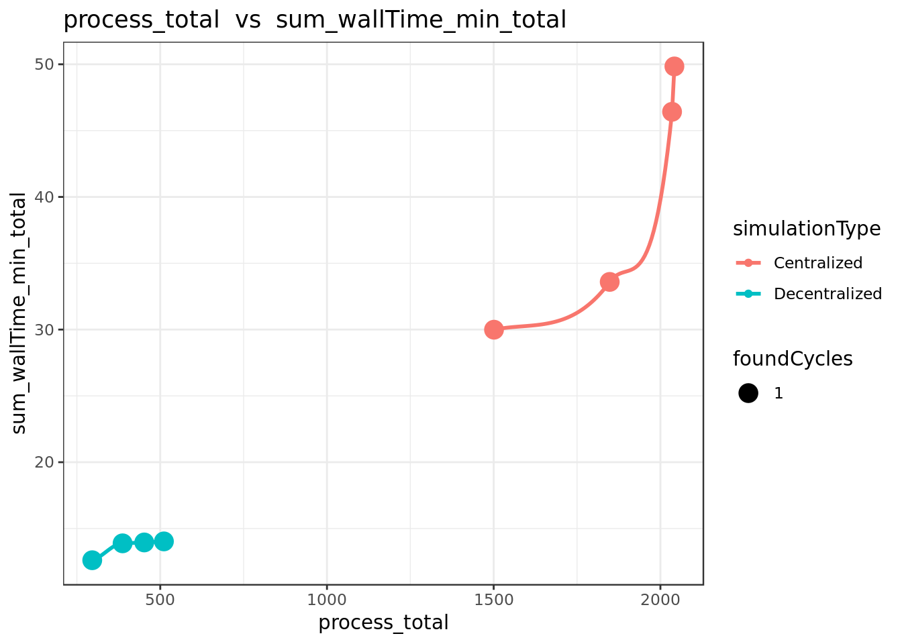  

# Cross analysis of all additional experiments

## Summary data 

<table class="table table-condensed" style="width: auto !important; ">
 <thead>
  <tr>
   <th style="text-align:left;"> experimentId </th>
   <th style="text-align:left;"> simulationId </th>
   <th style="text-align:right;"> agentNumber </th>
   <th style="text-align:right;"> chainLength </th>
   <th style="text-align:right;"> similaritySearchThreshold </th>
   <th style="text-align:left;"> maxDistance </th>
   <th style="text-align:right;"> randomWorksNumberMultiplier </th>
   <th style="text-align:right;"> sum_wallTime_ms_total </th>
   <th style="text-align:right;"> process_total </th>
   <th style="text-align:right;"> foundCycles </th>
   <th style="text-align:right;"> foundPaths </th>
   <th style="text-align:right;"> sum_wallTime_min_total </th>
   <th style="text-align:left;"> simulationType </th>
   <th style="text-align:left;"> similarityConnectThreshold </th>
  </tr>
 </thead>
<tbody>
  <tr>
   <td style="text-align:left;"> EXP08-02-03-31-H5aVtH </td>
   <td style="text-align:left;"> SIM08-02-03-31-FfrhJ9--CV </td>
   <td style="text-align:right;"> 100 </td>
   <td style="text-align:right;"> 10 </td>
   <td style="text-align:right;"> 1.00 </td>
   <td style="text-align:left;"> 10 </td>
   <td style="text-align:right;"> 2 </td>
   <td style="text-align:right;"> 1,373,524 </td>
   <td style="text-align:right;"> 3,158 </td>
   <td style="text-align:right;"> 1 </td>
   <td style="text-align:right;"> 0 </td>
   <td style="text-align:right;"> 22.8920667 </td>
   <td style="text-align:left;"> Centralized </td>
   <td style="text-align:left;"> NA </td>
  </tr>
  <tr>
   <td style="text-align:left;"> EXP08-02-03-31-H5aVtH </td>
   <td style="text-align:left;"> SIM08-02-03-31-FfrhJ9--DV </td>
   <td style="text-align:right;"> 100 </td>
   <td style="text-align:right;"> 10 </td>
   <td style="text-align:right;"> 1.00 </td>
   <td style="text-align:left;"> 10 </td>
   <td style="text-align:right;"> 2 </td>
   <td style="text-align:right;"> 595,138 </td>
   <td style="text-align:right;"> 161 </td>
   <td style="text-align:right;"> 2 </td>
   <td style="text-align:right;"> 0 </td>
   <td style="text-align:right;"> 9.9189667 </td>
   <td style="text-align:left;"> Decentralized </td>
   <td style="text-align:left;"> NA </td>
  </tr>
  <tr>
   <td style="text-align:left;"> EXP08-02-03-31-H5aVtH </td>
   <td style="text-align:left;"> SIM08-02-03-43-3iwnzW--CV </td>
   <td style="text-align:right;"> 100 </td>
   <td style="text-align:right;"> 10 </td>
   <td style="text-align:right;"> 1.00 </td>
   <td style="text-align:left;"> 30 </td>
   <td style="text-align:right;"> 2 </td>
   <td style="text-align:right;"> 1,395,363 </td>
   <td style="text-align:right;"> 1,230 </td>
   <td style="text-align:right;"> 1 </td>
   <td style="text-align:right;"> 0 </td>
   <td style="text-align:right;"> 23.2560500 </td>
   <td style="text-align:left;"> Centralized </td>
   <td style="text-align:left;"> NA </td>
  </tr>
  <tr>
   <td style="text-align:left;"> EXP08-02-03-31-H5aVtH </td>
   <td style="text-align:left;"> SIM08-02-03-43-3iwnzW--DV </td>
   <td style="text-align:right;"> 100 </td>
   <td style="text-align:right;"> 10 </td>
   <td style="text-align:right;"> 1.00 </td>
   <td style="text-align:left;"> 30 </td>
   <td style="text-align:right;"> 2 </td>
   <td style="text-align:right;"> 597,963 </td>
   <td style="text-align:right;"> 166 </td>
   <td style="text-align:right;"> 5 </td>
   <td style="text-align:right;"> 1 </td>
   <td style="text-align:right;"> 9.9660500 </td>
   <td style="text-align:left;"> Decentralized </td>
   <td style="text-align:left;"> NA </td>
  </tr>
  <tr>
   <td style="text-align:left;"> EXP08-02-03-31-H5aVtH </td>
   <td style="text-align:left;"> SIM08-02-03-55-5gpeBJ--CV </td>
   <td style="text-align:right;"> 100 </td>
   <td style="text-align:right;"> 20 </td>
   <td style="text-align:right;"> 1.00 </td>
   <td style="text-align:left;"> 10 </td>
   <td style="text-align:right;"> 2 </td>
   <td style="text-align:right;"> 1,571,931 </td>
   <td style="text-align:right;"> 5,688 </td>
   <td style="text-align:right;"> 1 </td>
   <td style="text-align:right;"> 0 </td>
   <td style="text-align:right;"> 26.1988500 </td>
   <td style="text-align:left;"> Centralized </td>
   <td style="text-align:left;"> NA </td>
  </tr>
  <tr>
   <td style="text-align:left;"> EXP08-02-03-31-H5aVtH </td>
   <td style="text-align:left;"> SIM08-02-03-55-5gpeBJ--DV </td>
   <td style="text-align:right;"> 100 </td>
   <td style="text-align:right;"> 20 </td>
   <td style="text-align:right;"> 1.00 </td>
   <td style="text-align:left;"> 10 </td>
   <td style="text-align:right;"> 2 </td>
   <td style="text-align:right;"> 1,838,004 </td>
   <td style="text-align:right;"> 14,497 </td>
   <td style="text-align:right;"> 0 </td>
   <td style="text-align:right;"> 3,599 </td>
   <td style="text-align:right;"> 30.6334000 </td>
   <td style="text-align:left;"> Decentralized </td>
   <td style="text-align:left;"> NA </td>
  </tr>
  <tr>
   <td style="text-align:left;"> EXP08-02-03-31-H5aVtH </td>
   <td style="text-align:left;"> SIM08-02-05-08-HpL6gr--CV </td>
   <td style="text-align:right;"> 100 </td>
   <td style="text-align:right;"> 20 </td>
   <td style="text-align:right;"> 1.00 </td>
   <td style="text-align:left;"> 30 </td>
   <td style="text-align:right;"> 2 </td>
   <td style="text-align:right;"> 1,629,444 </td>
   <td style="text-align:right;"> 1,345 </td>
   <td style="text-align:right;"> 1 </td>
   <td style="text-align:right;"> 0 </td>
   <td style="text-align:right;"> 27.1574000 </td>
   <td style="text-align:left;"> Centralized </td>
   <td style="text-align:left;"> NA </td>
  </tr>
  <tr>
   <td style="text-align:left;"> EXP08-02-03-31-H5aVtH </td>
   <td style="text-align:left;"> SIM08-02-05-08-HpL6gr--DV </td>
   <td style="text-align:right;"> 100 </td>
   <td style="text-align:right;"> 20 </td>
   <td style="text-align:right;"> 1.00 </td>
   <td style="text-align:left;"> 30 </td>
   <td style="text-align:right;"> 2 </td>
   <td style="text-align:right;"> 601,744 </td>
   <td style="text-align:right;"> 184 </td>
   <td style="text-align:right;"> 3 </td>
   <td style="text-align:right;"> 0 </td>
   <td style="text-align:right;"> 10.0290667 </td>
   <td style="text-align:left;"> Decentralized </td>
   <td style="text-align:left;"> NA </td>
  </tr>
  <tr>
   <td style="text-align:left;"> EXP08-02-03-31-H5aVtH </td>
   <td style="text-align:left;"> SIM08-02-05-22-PxKDei--CV </td>
   <td style="text-align:right;"> 200 </td>
   <td style="text-align:right;"> 10 </td>
   <td style="text-align:right;"> 1.00 </td>
   <td style="text-align:left;"> 10 </td>
   <td style="text-align:right;"> 2 </td>
   <td style="text-align:right;"> 7,260,446 </td>
   <td style="text-align:right;"> 28,634 </td>
   <td style="text-align:right;"> 0 </td>
   <td style="text-align:right;"> 0 </td>
   <td style="text-align:right;"> 121.0074333 </td>
   <td style="text-align:left;"> Centralized </td>
   <td style="text-align:left;"> NA </td>
  </tr>
  <tr>
   <td style="text-align:left;"> EXP08-02-03-31-H5aVtH </td>
   <td style="text-align:left;"> SIM08-02-05-22-PxKDei--DV </td>
   <td style="text-align:right;"> 200 </td>
   <td style="text-align:right;"> 10 </td>
   <td style="text-align:right;"> 1.00 </td>
   <td style="text-align:left;"> 10 </td>
   <td style="text-align:right;"> 2 </td>
   <td style="text-align:right;"> 4,580,399 </td>
   <td style="text-align:right;"> 14,597 </td>
   <td style="text-align:right;"> 0 </td>
   <td style="text-align:right;"> 3,599 </td>
   <td style="text-align:right;"> 76.3399833 </td>
   <td style="text-align:left;"> Decentralized </td>
   <td style="text-align:left;"> NA </td>
  </tr>
  <tr>
   <td style="text-align:left;"> EXP08-02-03-31-H5aVtH </td>
   <td style="text-align:left;"> SIM08-02-07-22-JYcIUB--CV </td>
   <td style="text-align:right;"> 200 </td>
   <td style="text-align:right;"> 10 </td>
   <td style="text-align:right;"> 1.00 </td>
   <td style="text-align:left;"> 30 </td>
   <td style="text-align:right;"> 2 </td>
   <td style="text-align:right;"> 4,018,600 </td>
   <td style="text-align:right;"> 2,020 </td>
   <td style="text-align:right;"> 0 </td>
   <td style="text-align:right;"> 0 </td>
   <td style="text-align:right;"> 66.9766667 </td>
   <td style="text-align:left;"> Centralized </td>
   <td style="text-align:left;"> NA </td>
  </tr>
  <tr>
   <td style="text-align:left;"> EXP08-02-03-31-H5aVtH </td>
   <td style="text-align:left;"> SIM08-02-07-22-JYcIUB--DV </td>
   <td style="text-align:right;"> 200 </td>
   <td style="text-align:right;"> 10 </td>
   <td style="text-align:right;"> 1.00 </td>
   <td style="text-align:left;"> 30 </td>
   <td style="text-align:right;"> 2 </td>
   <td style="text-align:right;"> 5,406,924 </td>
   <td style="text-align:right;"> 388 </td>
   <td style="text-align:right;"> 2 </td>
   <td style="text-align:right;"> 0 </td>
   <td style="text-align:right;"> 90.1154000 </td>
   <td style="text-align:left;"> Decentralized </td>
   <td style="text-align:left;"> NA </td>
  </tr>
  <tr>
   <td style="text-align:left;"> EXP08-02-03-31-H5aVtH </td>
   <td style="text-align:left;"> SIM08-02-08-26-9uC2Mm--CV </td>
   <td style="text-align:right;"> 200 </td>
   <td style="text-align:right;"> 20 </td>
   <td style="text-align:right;"> 1.00 </td>
   <td style="text-align:left;"> 10 </td>
   <td style="text-align:right;"> 2 </td>
   <td style="text-align:right;"> 7,311,522 </td>
   <td style="text-align:right;"> 53,539 </td>
   <td style="text-align:right;"> 0 </td>
   <td style="text-align:right;"> 0 </td>
   <td style="text-align:right;"> 121.8587000 </td>
   <td style="text-align:left;"> Centralized </td>
   <td style="text-align:left;"> NA </td>
  </tr>
  <tr>
   <td style="text-align:left;"> EXP08-02-03-31-H5aVtH </td>
   <td style="text-align:left;"> SIM08-02-08-26-9uC2Mm--DV </td>
   <td style="text-align:right;"> 200 </td>
   <td style="text-align:right;"> 20 </td>
   <td style="text-align:right;"> 1.00 </td>
   <td style="text-align:left;"> 10 </td>
   <td style="text-align:right;"> 2 </td>
   <td style="text-align:right;"> 3,632,727 </td>
   <td style="text-align:right;"> 14,601 </td>
   <td style="text-align:right;"> 0 </td>
   <td style="text-align:right;"> 3,600 </td>
   <td style="text-align:right;"> 60.5454500 </td>
   <td style="text-align:left;"> Decentralized </td>
   <td style="text-align:left;"> NA </td>
  </tr>
  <tr>
   <td style="text-align:left;"> EXP08-02-03-31-H5aVtH </td>
   <td style="text-align:left;"> SIM08-02-10-26-8wMSwZ--CV </td>
   <td style="text-align:right;"> 200 </td>
   <td style="text-align:right;"> 20 </td>
   <td style="text-align:right;"> 1.00 </td>
   <td style="text-align:left;"> 30 </td>
   <td style="text-align:right;"> 2 </td>
   <td style="text-align:right;"> 3,902,928 </td>
   <td style="text-align:right;"> 1,913 </td>
   <td style="text-align:right;"> 0 </td>
   <td style="text-align:right;"> 0 </td>
   <td style="text-align:right;"> 65.0488000 </td>
   <td style="text-align:left;"> Centralized </td>
   <td style="text-align:left;"> NA </td>
  </tr>
  <tr>
   <td style="text-align:left;"> EXP08-02-03-31-H5aVtH </td>
   <td style="text-align:left;"> SIM08-02-10-26-8wMSwZ--DV </td>
   <td style="text-align:right;"> 200 </td>
   <td style="text-align:right;"> 20 </td>
   <td style="text-align:right;"> 1.00 </td>
   <td style="text-align:left;"> 30 </td>
   <td style="text-align:right;"> 2 </td>
   <td style="text-align:right;"> 5,720,772 </td>
   <td style="text-align:right;"> 431 </td>
   <td style="text-align:right;"> 2 </td>
   <td style="text-align:right;"> 1 </td>
   <td style="text-align:right;"> 95.3462000 </td>
   <td style="text-align:left;"> Decentralized </td>
   <td style="text-align:left;"> NA </td>
  </tr>
  <tr>
   <td style="text-align:left;"> EXP08-02-03-31-H5aVtH </td>
   <td style="text-align:left;"> SIM08-02-11-29-JjmpZp--CV </td>
   <td style="text-align:right;"> 500 </td>
   <td style="text-align:right;"> 10 </td>
   <td style="text-align:right;"> 1.00 </td>
   <td style="text-align:left;"> 10 </td>
   <td style="text-align:right;"> 2 </td>
   <td style="text-align:right;"> 7,387,412 </td>
   <td style="text-align:right;"> 52,381 </td>
   <td style="text-align:right;"> 0 </td>
   <td style="text-align:right;"> 0 </td>
   <td style="text-align:right;"> 123.1235333 </td>
   <td style="text-align:left;"> Centralized </td>
   <td style="text-align:left;"> NA </td>
  </tr>
  <tr>
   <td style="text-align:left;"> EXP08-02-03-31-H5aVtH </td>
   <td style="text-align:left;"> SIM08-02-11-29-JjmpZp--DV </td>
   <td style="text-align:right;"> 500 </td>
   <td style="text-align:right;"> 10 </td>
   <td style="text-align:right;"> 1.00 </td>
   <td style="text-align:left;"> 10 </td>
   <td style="text-align:right;"> 2 </td>
   <td style="text-align:right;"> 33,423,768 </td>
   <td style="text-align:right;"> 14,901 </td>
   <td style="text-align:right;"> 0 </td>
   <td style="text-align:right;"> 3,600 </td>
   <td style="text-align:right;"> 557.0628000 </td>
   <td style="text-align:left;"> Decentralized </td>
   <td style="text-align:left;"> NA </td>
  </tr>
  <tr>
   <td style="text-align:left;"> EXP08-05-12-48-qrNbzW </td>
   <td style="text-align:left;"> SIM08-05-12-48-xsitDp--CV </td>
   <td style="text-align:right;"> 100 </td>
   <td style="text-align:right;"> 10 </td>
   <td style="text-align:right;"> 1.00 </td>
   <td style="text-align:left;"> 10 </td>
   <td style="text-align:right;"> 2 </td>
   <td style="text-align:right;"> 776,074 </td>
   <td style="text-align:right;"> 14,395 </td>
   <td style="text-align:right;"> 1 </td>
   <td style="text-align:right;"> 0 </td>
   <td style="text-align:right;"> 12.9345667 </td>
   <td style="text-align:left;"> Centralized </td>
   <td style="text-align:left;"> 0.5 </td>
  </tr>
  <tr>
   <td style="text-align:left;"> EXP08-05-12-48-qrNbzW </td>
   <td style="text-align:left;"> SIM08-05-12-48-xsitDp--DV </td>
   <td style="text-align:right;"> 100 </td>
   <td style="text-align:right;"> 10 </td>
   <td style="text-align:right;"> 1.00 </td>
   <td style="text-align:left;"> 10 </td>
   <td style="text-align:right;"> 2 </td>
   <td style="text-align:right;"> 419,879 </td>
   <td style="text-align:right;"> 131 </td>
   <td style="text-align:right;"> 1 </td>
   <td style="text-align:right;"> 0 </td>
   <td style="text-align:right;"> 6.9979833 </td>
   <td style="text-align:left;"> Decentralized </td>
   <td style="text-align:left;"> 0.5 </td>
  </tr>
  <tr>
   <td style="text-align:left;"> EXP08-05-12-48-qrNbzW </td>
   <td style="text-align:left;"> SIM08-05-01-00-fbyPmL--CV </td>
   <td style="text-align:right;"> 100 </td>
   <td style="text-align:right;"> 10 </td>
   <td style="text-align:right;"> 1.00 </td>
   <td style="text-align:left;"> 30 </td>
   <td style="text-align:right;"> 2 </td>
   <td style="text-align:right;"> 750,110 </td>
   <td style="text-align:right;"> 1,214 </td>
   <td style="text-align:right;"> 1 </td>
   <td style="text-align:right;"> 0 </td>
   <td style="text-align:right;"> 12.5018333 </td>
   <td style="text-align:left;"> Centralized </td>
   <td style="text-align:left;"> 0.5 </td>
  </tr>
  <tr>
   <td style="text-align:left;"> EXP08-05-12-48-qrNbzW </td>
   <td style="text-align:left;"> SIM08-05-01-00-fbyPmL--DV </td>
   <td style="text-align:right;"> 100 </td>
   <td style="text-align:right;"> 10 </td>
   <td style="text-align:right;"> 1.00 </td>
   <td style="text-align:left;"> 30 </td>
   <td style="text-align:right;"> 2 </td>
   <td style="text-align:right;"> 625,698 </td>
   <td style="text-align:right;"> 163 </td>
   <td style="text-align:right;"> 2 </td>
   <td style="text-align:right;"> 0 </td>
   <td style="text-align:right;"> 10.4283000 </td>
   <td style="text-align:left;"> Decentralized </td>
   <td style="text-align:left;"> 0.5 </td>
  </tr>
  <tr>
   <td style="text-align:left;"> EXP08-05-12-48-qrNbzW </td>
   <td style="text-align:left;"> SIM08-05-01-13-Rou4Mt--CV </td>
   <td style="text-align:right;"> 100 </td>
   <td style="text-align:right;"> 20 </td>
   <td style="text-align:right;"> 1.00 </td>
   <td style="text-align:left;"> 10 </td>
   <td style="text-align:right;"> 2 </td>
   <td style="text-align:right;"> 848,905 </td>
   <td style="text-align:right;"> 4,444 </td>
   <td style="text-align:right;"> 1 </td>
   <td style="text-align:right;"> 0 </td>
   <td style="text-align:right;"> 14.1484167 </td>
   <td style="text-align:left;"> Centralized </td>
   <td style="text-align:left;"> 0.5 </td>
  </tr>
  <tr>
   <td style="text-align:left;"> EXP08-05-12-48-qrNbzW </td>
   <td style="text-align:left;"> SIM08-05-01-13-Rou4Mt--DV </td>
   <td style="text-align:right;"> 100 </td>
   <td style="text-align:right;"> 20 </td>
   <td style="text-align:right;"> 1.00 </td>
   <td style="text-align:left;"> 10 </td>
   <td style="text-align:right;"> 2 </td>
   <td style="text-align:right;"> 1,095,159 </td>
   <td style="text-align:right;"> 43,289 </td>
   <td style="text-align:right;"> 0 </td>
   <td style="text-align:right;"> 10,797 </td>
   <td style="text-align:right;"> 18.2526500 </td>
   <td style="text-align:left;"> Decentralized </td>
   <td style="text-align:left;"> 0.5 </td>
  </tr>
  <tr>
   <td style="text-align:left;"> EXP08-05-12-48-qrNbzW </td>
   <td style="text-align:left;"> SIM08-05-04-27-jTgnYK--CV </td>
   <td style="text-align:right;"> 100 </td>
   <td style="text-align:right;"> 20 </td>
   <td style="text-align:right;"> 1.00 </td>
   <td style="text-align:left;"> 30 </td>
   <td style="text-align:right;"> 2 </td>
   <td style="text-align:right;"> 1,637,139 </td>
   <td style="text-align:right;"> 1,322 </td>
   <td style="text-align:right;"> 1 </td>
   <td style="text-align:right;"> 0 </td>
   <td style="text-align:right;"> 27.2856500 </td>
   <td style="text-align:left;"> Centralized </td>
   <td style="text-align:left;"> 0.5 </td>
  </tr>
  <tr>
   <td style="text-align:left;"> EXP08-05-12-48-qrNbzW </td>
   <td style="text-align:left;"> SIM08-05-04-27-jTgnYK--DV </td>
   <td style="text-align:right;"> 100 </td>
   <td style="text-align:right;"> 20 </td>
   <td style="text-align:right;"> 1.00 </td>
   <td style="text-align:left;"> 30 </td>
   <td style="text-align:right;"> 2 </td>
   <td style="text-align:right;"> 792,481 </td>
   <td style="text-align:right;"> 201 </td>
   <td style="text-align:right;"> 4 </td>
   <td style="text-align:right;"> 4 </td>
   <td style="text-align:right;"> 13.2080167 </td>
   <td style="text-align:left;"> Decentralized </td>
   <td style="text-align:left;"> 0.5 </td>
  </tr>
  <tr>
   <td style="text-align:left;"> EXP08-05-12-48-qrNbzW </td>
   <td style="text-align:left;"> SIM08-05-04-41-DCfxMF--CV </td>
   <td style="text-align:right;"> 200 </td>
   <td style="text-align:right;"> 10 </td>
   <td style="text-align:right;"> 1.00 </td>
   <td style="text-align:left;"> 10 </td>
   <td style="text-align:right;"> 2 </td>
   <td style="text-align:right;"> 4,562,913 </td>
   <td style="text-align:right;"> 64,975 </td>
   <td style="text-align:right;"> 1 </td>
   <td style="text-align:right;"> 0 </td>
   <td style="text-align:right;"> 76.0485500 </td>
   <td style="text-align:left;"> Centralized </td>
   <td style="text-align:left;"> 0.5 </td>
  </tr>
  <tr>
   <td style="text-align:left;"> EXP08-05-12-48-qrNbzW </td>
   <td style="text-align:left;"> SIM08-05-04-41-DCfxMF--DV </td>
   <td style="text-align:right;"> 200 </td>
   <td style="text-align:right;"> 10 </td>
   <td style="text-align:right;"> 1.00 </td>
   <td style="text-align:left;"> 10 </td>
   <td style="text-align:right;"> 2 </td>
   <td style="text-align:right;"> 4,236,526 </td>
   <td style="text-align:right;"> 43,393 </td>
   <td style="text-align:right;"> 0 </td>
   <td style="text-align:right;"> 10,798 </td>
   <td style="text-align:right;"> 70.6087667 </td>
   <td style="text-align:left;"> Decentralized </td>
   <td style="text-align:left;"> 0.5 </td>
  </tr>
  <tr>
   <td style="text-align:left;"> EXP08-05-12-48-qrNbzW </td>
   <td style="text-align:left;"> SIM08-05-08-55-pe7AVI--CV </td>
   <td style="text-align:right;"> 200 </td>
   <td style="text-align:right;"> 10 </td>
   <td style="text-align:right;"> 1.00 </td>
   <td style="text-align:left;"> 30 </td>
   <td style="text-align:right;"> 2 </td>
   <td style="text-align:right;"> 4,864,119 </td>
   <td style="text-align:right;"> 2,702 </td>
   <td style="text-align:right;"> 1 </td>
   <td style="text-align:right;"> 0 </td>
   <td style="text-align:right;"> 81.0686500 </td>
   <td style="text-align:left;"> Centralized </td>
   <td style="text-align:left;"> 0.5 </td>
  </tr>
  <tr>
   <td style="text-align:left;"> EXP08-05-12-48-qrNbzW </td>
   <td style="text-align:left;"> SIM08-05-08-55-pe7AVI--DV </td>
   <td style="text-align:right;"> 200 </td>
   <td style="text-align:right;"> 10 </td>
   <td style="text-align:right;"> 1.00 </td>
   <td style="text-align:left;"> 30 </td>
   <td style="text-align:right;"> 2 </td>
   <td style="text-align:right;"> 5,107,107 </td>
   <td style="text-align:right;"> 384 </td>
   <td style="text-align:right;"> 3 </td>
   <td style="text-align:right;"> 0 </td>
   <td style="text-align:right;"> 85.1184500 </td>
   <td style="text-align:left;"> Decentralized </td>
   <td style="text-align:left;"> 0.5 </td>
  </tr>
  <tr>
   <td style="text-align:left;"> EXP08-05-12-48-qrNbzW </td>
   <td style="text-align:left;"> SIM08-05-10-13-wTf6Ij--CV </td>
   <td style="text-align:right;"> 200 </td>
   <td style="text-align:right;"> 20 </td>
   <td style="text-align:right;"> 1.00 </td>
   <td style="text-align:left;"> 10 </td>
   <td style="text-align:right;"> 2 </td>
   <td style="text-align:right;"> 4,909,234 </td>
   <td style="text-align:right;"> 50,040 </td>
   <td style="text-align:right;"> 1 </td>
   <td style="text-align:right;"> 0 </td>
   <td style="text-align:right;"> 81.8205667 </td>
   <td style="text-align:left;"> Centralized </td>
   <td style="text-align:left;"> 0.5 </td>
  </tr>
  <tr>
   <td style="text-align:left;"> EXP08-05-12-48-qrNbzW </td>
   <td style="text-align:left;"> SIM08-05-10-13-wTf6Ij--DV </td>
   <td style="text-align:right;"> 200 </td>
   <td style="text-align:right;"> 20 </td>
   <td style="text-align:right;"> 1.00 </td>
   <td style="text-align:left;"> 10 </td>
   <td style="text-align:right;"> 2 </td>
   <td style="text-align:right;"> 6,468,237 </td>
   <td style="text-align:right;"> 43,393 </td>
   <td style="text-align:right;"> 0 </td>
   <td style="text-align:right;"> 10,798 </td>
   <td style="text-align:right;"> 107.8039500 </td>
   <td style="text-align:left;"> Decentralized </td>
   <td style="text-align:left;"> 0.5 </td>
  </tr>
  <tr>
   <td style="text-align:left;"> EXP08-05-12-48-qrNbzW </td>
   <td style="text-align:left;"> SIM08-06-02-34-XiXore--CV </td>
   <td style="text-align:right;"> 200 </td>
   <td style="text-align:right;"> 20 </td>
   <td style="text-align:right;"> 1.00 </td>
   <td style="text-align:left;"> 30 </td>
   <td style="text-align:right;"> 2 </td>
   <td style="text-align:right;"> 5,248,835 </td>
   <td style="text-align:right;"> 2,826 </td>
   <td style="text-align:right;"> 1 </td>
   <td style="text-align:right;"> 0 </td>
   <td style="text-align:right;"> 87.4805833 </td>
   <td style="text-align:left;"> Centralized </td>
   <td style="text-align:left;"> 0.5 </td>
  </tr>
  <tr>
   <td style="text-align:left;"> EXP08-05-12-48-qrNbzW </td>
   <td style="text-align:left;"> SIM08-06-02-34-XiXore--DV </td>
   <td style="text-align:right;"> 200 </td>
   <td style="text-align:right;"> 20 </td>
   <td style="text-align:right;"> 1.00 </td>
   <td style="text-align:left;"> 30 </td>
   <td style="text-align:right;"> 2 </td>
   <td style="text-align:right;"> 5,424,670 </td>
   <td style="text-align:right;"> 418 </td>
   <td style="text-align:right;"> 2 </td>
   <td style="text-align:right;"> 1 </td>
   <td style="text-align:right;"> 90.4111667 </td>
   <td style="text-align:left;"> Decentralized </td>
   <td style="text-align:left;"> 0.5 </td>
  </tr>
  <tr>
   <td style="text-align:left;"> EXP08-05-12-48-qrNbzW </td>
   <td style="text-align:left;"> SIM08-06-03-59-3M733K--CV </td>
   <td style="text-align:right;"> 500 </td>
   <td style="text-align:right;"> 10 </td>
   <td style="text-align:right;"> 1.00 </td>
   <td style="text-align:left;"> 10 </td>
   <td style="text-align:right;"> 2 </td>
   <td style="text-align:right;"> 21,968,874 </td>
   <td style="text-align:right;"> 142,701 </td>
   <td style="text-align:right;"> 0 </td>
   <td style="text-align:right;"> 0 </td>
   <td style="text-align:right;"> 366.1479000 </td>
   <td style="text-align:left;"> Centralized </td>
   <td style="text-align:left;"> 0.5 </td>
  </tr>
  <tr>
   <td style="text-align:left;"> EXP08-05-12-48-qrNbzW </td>
   <td style="text-align:left;"> SIM08-06-03-59-3M733K--DV </td>
   <td style="text-align:right;"> 500 </td>
   <td style="text-align:right;"> 10 </td>
   <td style="text-align:right;"> 1.00 </td>
   <td style="text-align:left;"> 10 </td>
   <td style="text-align:right;"> 2 </td>
   <td style="text-align:right;"> 32,135,328 </td>
   <td style="text-align:right;"> 43,693 </td>
   <td style="text-align:right;"> 0 </td>
   <td style="text-align:right;"> 10,798 </td>
   <td style="text-align:right;"> 535.5888000 </td>
   <td style="text-align:left;"> Decentralized </td>
   <td style="text-align:left;"> 0.5 </td>
  </tr>
  <tr>
   <td style="text-align:left;"> EXP08-05-12-48-qrNbzW </td>
   <td style="text-align:left;"> SIM08-06-10-00-gUuNrz--CV </td>
   <td style="text-align:right;"> 500 </td>
   <td style="text-align:right;"> 10 </td>
   <td style="text-align:right;"> 1.00 </td>
   <td style="text-align:left;"> 30 </td>
   <td style="text-align:right;"> 2 </td>
   <td style="text-align:right;"> 13,993,921 </td>
   <td style="text-align:right;"> 5,388 </td>
   <td style="text-align:right;"> 0 </td>
   <td style="text-align:right;"> 0 </td>
   <td style="text-align:right;"> 233.2320167 </td>
   <td style="text-align:left;"> Centralized </td>
   <td style="text-align:left;"> 0.5 </td>
  </tr>
  <tr>
   <td style="text-align:left;"> EXP08-05-12-48-qrNbzW </td>
   <td style="text-align:left;"> SIM08-06-10-00-gUuNrz--DV </td>
   <td style="text-align:right;"> 500 </td>
   <td style="text-align:right;"> 10 </td>
   <td style="text-align:right;"> 1.00 </td>
   <td style="text-align:left;"> 30 </td>
   <td style="text-align:right;"> 2 </td>
   <td style="text-align:right;"> 94,095,793 </td>
   <td style="text-align:right;"> 2,774 </td>
   <td style="text-align:right;"> 1 </td>
   <td style="text-align:right;"> 0 </td>
   <td style="text-align:right;"> 1,568.2632167 </td>
   <td style="text-align:left;"> Decentralized </td>
   <td style="text-align:left;"> 0.5 </td>
  </tr>
  <tr>
   <td style="text-align:left;"> EXP08-05-12-48-qrNbzW </td>
   <td style="text-align:left;"> SIM08-06-01-49-ubMTmD--CV </td>
   <td style="text-align:right;"> 500 </td>
   <td style="text-align:right;"> 20 </td>
   <td style="text-align:right;"> 1.00 </td>
   <td style="text-align:left;"> 10 </td>
   <td style="text-align:right;"> 2 </td>
   <td style="text-align:right;"> 21,968,827 </td>
   <td style="text-align:right;"> 141,293 </td>
   <td style="text-align:right;"> 0 </td>
   <td style="text-align:right;"> 0 </td>
   <td style="text-align:right;"> 366.1471167 </td>
   <td style="text-align:left;"> Centralized </td>
   <td style="text-align:left;"> 0.5 </td>
  </tr>
  <tr>
   <td style="text-align:left;"> EXP08-05-12-48-qrNbzW </td>
   <td style="text-align:left;"> SIM08-06-01-49-ubMTmD--DV </td>
   <td style="text-align:right;"> 500 </td>
   <td style="text-align:right;"> 20 </td>
   <td style="text-align:right;"> 1.00 </td>
   <td style="text-align:left;"> 10 </td>
   <td style="text-align:right;"> 2 </td>
   <td style="text-align:right;"> 34,256,982 </td>
   <td style="text-align:right;"> 43,693 </td>
   <td style="text-align:right;"> 0 </td>
   <td style="text-align:right;"> 10,798 </td>
   <td style="text-align:right;"> 570.9497000 </td>
   <td style="text-align:left;"> Decentralized </td>
   <td style="text-align:left;"> 0.5 </td>
  </tr>
  <tr>
   <td style="text-align:left;"> EXP08-05-12-48-qrNbzW </td>
   <td style="text-align:left;"> SIM08-06-07-50-iBjLoU--CV </td>
   <td style="text-align:right;"> 500 </td>
   <td style="text-align:right;"> 20 </td>
   <td style="text-align:right;"> 1.00 </td>
   <td style="text-align:left;"> 30 </td>
   <td style="text-align:right;"> 2 </td>
   <td style="text-align:right;"> 14,385,182 </td>
   <td style="text-align:right;"> 6,779 </td>
   <td style="text-align:right;"> 0 </td>
   <td style="text-align:right;"> 0 </td>
   <td style="text-align:right;"> 239.7530333 </td>
   <td style="text-align:left;"> Centralized </td>
   <td style="text-align:left;"> 0.5 </td>
  </tr>
  <tr>
   <td style="text-align:left;"> EXP08-05-12-48-qrNbzW </td>
   <td style="text-align:left;"> SIM08-06-07-50-iBjLoU--DV </td>
   <td style="text-align:right;"> 500 </td>
   <td style="text-align:right;"> 20 </td>
   <td style="text-align:right;"> 1.00 </td>
   <td style="text-align:left;"> 30 </td>
   <td style="text-align:right;"> 2 </td>
   <td style="text-align:right;"> 97,623,987 </td>
   <td style="text-align:right;"> 3,475 </td>
   <td style="text-align:right;"> 1 </td>
   <td style="text-align:right;"> 3 </td>
   <td style="text-align:right;"> 1,627.0664500 </td>
   <td style="text-align:left;"> Decentralized </td>
   <td style="text-align:left;"> 0.5 </td>
  </tr>
  <tr>
   <td style="text-align:left;"> EXP08-07-05-04-95KIBv </td>
   <td style="text-align:left;"> SIM08-07-10-52-xUntt9--CV </td>
   <td style="text-align:right;"> 1,000 </td>
   <td style="text-align:right;"> 20 </td>
   <td style="text-align:right;"> 1.00 </td>
   <td style="text-align:left;"> 10 </td>
   <td style="text-align:right;"> 2 </td>
   <td style="text-align:right;"> 22,079,160 </td>
   <td style="text-align:right;"> 67,488 </td>
   <td style="text-align:right;"> 0 </td>
   <td style="text-align:right;"> 0 </td>
   <td style="text-align:right;"> 367.9860000 </td>
   <td style="text-align:left;"> Centralized </td>
   <td style="text-align:left;"> NA </td>
  </tr>
  <tr>
   <td style="text-align:left;"> EXP08-07-05-04-95KIBv </td>
   <td style="text-align:left;"> SIM08-07-10-52-xUntt9--DV </td>
   <td style="text-align:right;"> 1,000 </td>
   <td style="text-align:right;"> 20 </td>
   <td style="text-align:right;"> 1.00 </td>
   <td style="text-align:left;"> 10 </td>
   <td style="text-align:right;"> 2 </td>
   <td style="text-align:right;"> 124,714,149 </td>
   <td style="text-align:right;"> 10,988 </td>
   <td style="text-align:right;"> 0 </td>
   <td style="text-align:right;"> 1 </td>
   <td style="text-align:right;"> 2,078.5691500 </td>
   <td style="text-align:left;"> Decentralized </td>
   <td style="text-align:left;"> NA </td>
  </tr>
  <tr>
   <td style="text-align:left;"> EXP08-07-05-04-95KIBv </td>
   <td style="text-align:left;"> SIM08-08-04-54-3b98M6--CV </td>
   <td style="text-align:right;"> 2,000 </td>
   <td style="text-align:right;"> 20 </td>
   <td style="text-align:right;"> 1.00 </td>
   <td style="text-align:left;"> 10 </td>
   <td style="text-align:right;"> 2 </td>
   <td style="text-align:right;"> 22,504,537 </td>
   <td style="text-align:right;"> 122,333 </td>
   <td style="text-align:right;"> 0 </td>
   <td style="text-align:right;"> 0 </td>
   <td style="text-align:right;"> 375.0756167 </td>
   <td style="text-align:left;"> Centralized </td>
   <td style="text-align:left;"> NA </td>
  </tr>
  <tr>
   <td style="text-align:left;"> EXP08-07-05-04-95KIBv </td>
   <td style="text-align:left;"> SIM08-08-04-54-3b98M6--DV </td>
   <td style="text-align:right;"> 2,000 </td>
   <td style="text-align:right;"> 20 </td>
   <td style="text-align:right;"> 1.00 </td>
   <td style="text-align:left;"> 10 </td>
   <td style="text-align:right;"> 2 </td>
   <td style="text-align:right;"> 135,467,751 </td>
   <td style="text-align:right;"> 10,993 </td>
   <td style="text-align:right;"> 0 </td>
   <td style="text-align:right;"> 0 </td>
   <td style="text-align:right;"> 2,257.7958500 </td>
   <td style="text-align:left;"> Decentralized </td>
   <td style="text-align:left;"> NA </td>
  </tr>
  <tr>
   <td style="text-align:left;"> EXP08-07-05-04-95KIBv </td>
   <td style="text-align:left;"> SIM08-07-05-04-gVussF--CV </td>
   <td style="text-align:right;"> 500 </td>
   <td style="text-align:right;"> 20 </td>
   <td style="text-align:right;"> 1.00 </td>
   <td style="text-align:left;"> 10 </td>
   <td style="text-align:right;"> 2 </td>
   <td style="text-align:right;"> 13,709,537 </td>
   <td style="text-align:right;"> 20,550 </td>
   <td style="text-align:right;"> 0 </td>
   <td style="text-align:right;"> 0 </td>
   <td style="text-align:right;"> 228.4922833 </td>
   <td style="text-align:left;"> Centralized </td>
   <td style="text-align:left;"> NA </td>
  </tr>
  <tr>
   <td style="text-align:left;"> EXP08-07-05-04-95KIBv </td>
   <td style="text-align:left;"> SIM08-07-05-04-gVussF--DV </td>
   <td style="text-align:right;"> 500 </td>
   <td style="text-align:right;"> 20 </td>
   <td style="text-align:right;"> 1.00 </td>
   <td style="text-align:left;"> 10 </td>
   <td style="text-align:right;"> 2 </td>
   <td style="text-align:right;"> 350,553,320 </td>
   <td style="text-align:right;"> 10,379 </td>
   <td style="text-align:right;"> 1 </td>
   <td style="text-align:right;"> 1 </td>
   <td style="text-align:right;"> 5,842.5553333 </td>
   <td style="text-align:left;"> Decentralized </td>
   <td style="text-align:left;"> NA </td>
  </tr>
  <tr>
   <td style="text-align:left;"> EXP08-09-01-35-9owMuE </td>
   <td style="text-align:left;"> SIM08-09-01-35-DxaCjz--CV </td>
   <td style="text-align:right;"> 500 </td>
   <td style="text-align:right;"> 20 </td>
   <td style="text-align:right;"> 1.00 </td>
   <td style="text-align:left;"> 10 </td>
   <td style="text-align:right;"> 2 </td>
   <td style="text-align:right;"> 6,488,447 </td>
   <td style="text-align:right;"> 5,649 </td>
   <td style="text-align:right;"> 1 </td>
   <td style="text-align:right;"> 0 </td>
   <td style="text-align:right;"> 108.1407833 </td>
   <td style="text-align:left;"> Centralized </td>
   <td style="text-align:left;"> NA </td>
  </tr>
  <tr>
   <td style="text-align:left;"> EXP08-09-01-35-9owMuE </td>
   <td style="text-align:left;"> SIM08-09-01-35-DxaCjz--DV </td>
   <td style="text-align:right;"> 500 </td>
   <td style="text-align:right;"> 20 </td>
   <td style="text-align:right;"> 1.00 </td>
   <td style="text-align:left;"> 10 </td>
   <td style="text-align:right;"> 2 </td>
   <td style="text-align:right;"> 85,948,580 </td>
   <td style="text-align:right;"> 3,254 </td>
   <td style="text-align:right;"> 1 </td>
   <td style="text-align:right;"> 5 </td>
   <td style="text-align:right;"> 1,432.4763333 </td>
   <td style="text-align:left;"> Decentralized </td>
   <td style="text-align:left;"> NA </td>
  </tr>
  <tr>
   <td style="text-align:left;"> EXP08-09-05-27-BmCFH6 </td>
   <td style="text-align:left;"> SIM08-09-09-20-UidsEi--CV </td>
   <td style="text-align:right;"> 1,000 </td>
   <td style="text-align:right;"> 20 </td>
   <td style="text-align:right;"> 1.00 </td>
   <td style="text-align:left;"> 10 </td>
   <td style="text-align:right;"> 2 </td>
   <td style="text-align:right;"> 459,020 </td>
   <td style="text-align:right;"> 110,963 </td>
   <td style="text-align:right;"> 0 </td>
   <td style="text-align:right;"> 10,798 </td>
   <td style="text-align:right;"> 7.6503333 </td>
   <td style="text-align:left;"> Centralized </td>
   <td style="text-align:left;"> 0.5 </td>
  </tr>
  <tr>
   <td style="text-align:left;"> EXP08-09-05-27-BmCFH6 </td>
   <td style="text-align:left;"> SIM08-09-09-20-UidsEi--DV </td>
   <td style="text-align:right;"> 1,000 </td>
   <td style="text-align:right;"> 20 </td>
   <td style="text-align:right;"> 1.00 </td>
   <td style="text-align:left;"> 10 </td>
   <td style="text-align:right;"> 2 </td>
   <td style="text-align:right;"> 136,437,450 </td>
   <td style="text-align:right;"> 11,122 </td>
   <td style="text-align:right;"> 0 </td>
   <td style="text-align:right;"> 0 </td>
   <td style="text-align:right;"> 2,273.9575000 </td>
   <td style="text-align:left;"> Decentralized </td>
   <td style="text-align:left;"> 0.5 </td>
  </tr>
  <tr>
   <td style="text-align:left;"> EXP08-09-05-27-BmCFH6 </td>
   <td style="text-align:left;"> SIM08-10-06-29-jKDYmz--DV </td>
   <td style="text-align:right;"> 2,000 </td>
   <td style="text-align:right;"> 20 </td>
   <td style="text-align:right;"> 1.00 </td>
   <td style="text-align:left;"> 10 </td>
   <td style="text-align:right;"> 2 </td>
   <td style="text-align:right;"> 164,795,240 </td>
   <td style="text-align:right;"> 11,003 </td>
   <td style="text-align:right;"> 0 </td>
   <td style="text-align:right;"> 0 </td>
   <td style="text-align:right;"> 2,746.5873333 </td>
   <td style="text-align:left;"> Decentralized </td>
   <td style="text-align:left;"> 0.5 </td>
  </tr>
  <tr>
   <td style="text-align:left;"> EXP08-09-05-27-BmCFH6 </td>
   <td style="text-align:left;"> SIM08-09-05-27-CLiEJf--CV </td>
   <td style="text-align:right;"> 500 </td>
   <td style="text-align:right;"> 20 </td>
   <td style="text-align:right;"> 1.00 </td>
   <td style="text-align:left;"> 10 </td>
   <td style="text-align:right;"> 2 </td>
   <td style="text-align:right;"> 11,212,499 </td>
   <td style="text-align:right;"> 5,873 </td>
   <td style="text-align:right;"> 1 </td>
   <td style="text-align:right;"> 0 </td>
   <td style="text-align:right;"> 186.8749833 </td>
   <td style="text-align:left;"> Centralized </td>
   <td style="text-align:left;"> 0.5 </td>
  </tr>
  <tr>
   <td style="text-align:left;"> EXP08-09-05-27-BmCFH6 </td>
   <td style="text-align:left;"> SIM08-09-05-27-CLiEJf--DV </td>
   <td style="text-align:right;"> 500 </td>
   <td style="text-align:right;"> 20 </td>
   <td style="text-align:right;"> 1.00 </td>
   <td style="text-align:left;"> 10 </td>
   <td style="text-align:right;"> 2 </td>
   <td style="text-align:right;"> 99,987,378 </td>
   <td style="text-align:right;"> 3,407 </td>
   <td style="text-align:right;"> 87 </td>
   <td style="text-align:right;"> 0 </td>
   <td style="text-align:right;"> 1,666.4563000 </td>
   <td style="text-align:left;"> Decentralized </td>
   <td style="text-align:left;"> 0.5 </td>
  </tr>
  <tr>
   <td style="text-align:left;"> EXP08-10-01-33-JYSw5Z </td>
   <td style="text-align:left;"> SIM08-10-01-33-niVTL7--CV </td>
   <td style="text-align:right;"> 1,000 </td>
   <td style="text-align:right;"> 20 </td>
   <td style="text-align:right;"> 1.00 </td>
   <td style="text-align:left;"> 10 </td>
   <td style="text-align:right;"> 2 </td>
   <td style="text-align:right;"> 3,826,229 </td>
   <td style="text-align:right;"> 4,311 </td>
   <td style="text-align:right;"> 1 </td>
   <td style="text-align:right;"> 0 </td>
   <td style="text-align:right;"> 63.7704833 </td>
   <td style="text-align:left;"> Centralized </td>
   <td style="text-align:left;"> 0.5 </td>
  </tr>
  <tr>
   <td style="text-align:left;"> EXP08-10-01-33-JYSw5Z </td>
   <td style="text-align:left;"> SIM08-10-01-33-niVTL7--DV </td>
   <td style="text-align:right;"> 1,000 </td>
   <td style="text-align:right;"> 20 </td>
   <td style="text-align:right;"> 1.00 </td>
   <td style="text-align:left;"> 10 </td>
   <td style="text-align:right;"> 2 </td>
   <td style="text-align:right;"> 70,170,170 </td>
   <td style="text-align:right;"> 3,746 </td>
   <td style="text-align:right;"> 138 </td>
   <td style="text-align:right;"> 15 </td>
   <td style="text-align:right;"> 1,169.5028333 </td>
   <td style="text-align:left;"> Decentralized </td>
   <td style="text-align:left;"> 0.5 </td>
  </tr>
  <tr>
   <td style="text-align:left;"> EXP08-10-10-15-t7WP6v </td>
   <td style="text-align:left;"> SIM08-10-10-15-26LQ2S--CV </td>
   <td style="text-align:right;"> 100 </td>
   <td style="text-align:right;"> 10 </td>
   <td style="text-align:right;"> 0.95 </td>
   <td style="text-align:left;"> 5 </td>
   <td style="text-align:right;"> 1 </td>
   <td style="text-align:right;"> 73,396 </td>
   <td style="text-align:right;"> 340 </td>
   <td style="text-align:right;"> 1 </td>
   <td style="text-align:right;"> 0 </td>
   <td style="text-align:right;"> 1.2232667 </td>
   <td style="text-align:left;"> Centralized </td>
   <td style="text-align:left;"> NA </td>
  </tr>
  <tr>
   <td style="text-align:left;"> EXP08-10-10-15-t7WP6v </td>
   <td style="text-align:left;"> SIM08-10-10-15-26LQ2S--DV </td>
   <td style="text-align:right;"> 100 </td>
   <td style="text-align:right;"> 10 </td>
   <td style="text-align:right;"> 0.95 </td>
   <td style="text-align:left;"> 5 </td>
   <td style="text-align:right;"> 1 </td>
   <td style="text-align:right;"> 70,481 </td>
   <td style="text-align:right;"> 143 </td>
   <td style="text-align:right;"> 2 </td>
   <td style="text-align:right;"> 0 </td>
   <td style="text-align:right;"> 1.1746833 </td>
   <td style="text-align:left;"> Decentralized </td>
   <td style="text-align:left;"> 0.85 </td>
  </tr>
  <tr>
   <td style="text-align:left;"> EXP08-11-12-38-3dSVwT </td>
   <td style="text-align:left;"> SIM08-11-12-38-Ea8VAf--CV </td>
   <td style="text-align:right;"> 100 </td>
   <td style="text-align:right;"> 10 </td>
   <td style="text-align:right;"> NA </td>
   <td style="text-align:left;"> 5 </td>
   <td style="text-align:right;"> 1 </td>
   <td style="text-align:right;"> 66,318 </td>
   <td style="text-align:right;"> 342 </td>
   <td style="text-align:right;"> 1 </td>
   <td style="text-align:right;"> 0 </td>
   <td style="text-align:right;"> 1.1053000 </td>
   <td style="text-align:left;"> Centralized </td>
   <td style="text-align:left;"> NA </td>
  </tr>
  <tr>
   <td style="text-align:left;"> EXP08-11-12-38-3dSVwT </td>
   <td style="text-align:left;"> SIM08-11-12-38-Ea8VAf--DV </td>
   <td style="text-align:right;"> 100 </td>
   <td style="text-align:right;"> 10 </td>
   <td style="text-align:right;"> 0.95 </td>
   <td style="text-align:left;"> 5 </td>
   <td style="text-align:right;"> 1 </td>
   <td style="text-align:right;"> 69,598 </td>
   <td style="text-align:right;"> 143 </td>
   <td style="text-align:right;"> 2 </td>
   <td style="text-align:right;"> 0 </td>
   <td style="text-align:right;"> 1.1599667 </td>
   <td style="text-align:left;"> Decentralized </td>
   <td style="text-align:left;"> NA </td>
  </tr>
  <tr>
   <td style="text-align:left;"> EXP08-11-12-44-BoTBgN </td>
   <td style="text-align:left;"> SIM08-11-12-44-neSDUd--CV </td>
   <td style="text-align:right;"> 100 </td>
   <td style="text-align:right;"> 10 </td>
   <td style="text-align:right;"> NA </td>
   <td style="text-align:left;"> 5 </td>
   <td style="text-align:right;"> 1 </td>
   <td style="text-align:right;"> 66,092 </td>
   <td style="text-align:right;"> 361 </td>
   <td style="text-align:right;"> 1 </td>
   <td style="text-align:right;"> 0 </td>
   <td style="text-align:right;"> 1.1015333 </td>
   <td style="text-align:left;"> Centralized </td>
   <td style="text-align:left;"> NA </td>
  </tr>
  <tr>
   <td style="text-align:left;"> EXP08-11-12-44-BoTBgN </td>
   <td style="text-align:left;"> SIM08-11-12-44-neSDUd--DV </td>
   <td style="text-align:right;"> 100 </td>
   <td style="text-align:right;"> 10 </td>
   <td style="text-align:right;"> 0.95 </td>
   <td style="text-align:left;"> 5 </td>
   <td style="text-align:right;"> 1 </td>
   <td style="text-align:right;"> 61,767 </td>
   <td style="text-align:right;"> 143 </td>
   <td style="text-align:right;"> 1 </td>
   <td style="text-align:right;"> 0 </td>
   <td style="text-align:right;"> 1.0294500 </td>
   <td style="text-align:left;"> Decentralized </td>
   <td style="text-align:left;"> NA </td>
  </tr>
  <tr>
   <td style="text-align:left;"> EXP08-11-12-54-LgXUNA </td>
   <td style="text-align:left;"> SIM08-11-12-54-ykmwIK--CV </td>
   <td style="text-align:right;"> 100 </td>
   <td style="text-align:right;"> 10 </td>
   <td style="text-align:right;"> 0.95 </td>
   <td style="text-align:left;"> 5 </td>
   <td style="text-align:right;"> 1 </td>
   <td style="text-align:right;"> 53,494 </td>
   <td style="text-align:right;"> 307 </td>
   <td style="text-align:right;"> 1 </td>
   <td style="text-align:right;"> 0 </td>
   <td style="text-align:right;"> 0.8915667 </td>
   <td style="text-align:left;"> Centralized </td>
   <td style="text-align:left;"> NA </td>
  </tr>
  <tr>
   <td style="text-align:left;"> EXP08-11-12-54-LgXUNA </td>
   <td style="text-align:left;"> SIM08-11-12-54-ykmwIK--DV </td>
   <td style="text-align:right;"> 100 </td>
   <td style="text-align:right;"> 10 </td>
   <td style="text-align:right;"> 0.95 </td>
   <td style="text-align:left;"> 5 </td>
   <td style="text-align:right;"> 1 </td>
   <td style="text-align:right;"> 60,865 </td>
   <td style="text-align:right;"> 141 </td>
   <td style="text-align:right;"> 2 </td>
   <td style="text-align:right;"> 0 </td>
   <td style="text-align:right;"> 1.0144167 </td>
   <td style="text-align:left;"> Decentralized </td>
   <td style="text-align:left;"> NA </td>
  </tr>
  <tr>
   <td style="text-align:left;"> EXP08-11-12-58-3BvMSL </td>
   <td style="text-align:left;"> SIM08-11-01-05-AZFerX--CV </td>
   <td style="text-align:right;"> 100 </td>
   <td style="text-align:right;"> 10 </td>
   <td style="text-align:right;"> 1.00 </td>
   <td style="text-align:left;"> 10 </td>
   <td style="text-align:right;"> 2 </td>
   <td style="text-align:right;"> 257,217 </td>
   <td style="text-align:right;"> 620 </td>
   <td style="text-align:right;"> 1 </td>
   <td style="text-align:right;"> 0 </td>
   <td style="text-align:right;"> 4.2869500 </td>
   <td style="text-align:left;"> Centralized </td>
   <td style="text-align:left;"> 0.9 </td>
  </tr>
  <tr>
   <td style="text-align:left;"> EXP08-11-12-58-3BvMSL </td>
   <td style="text-align:left;"> SIM08-11-01-05-AZFerX--DV </td>
   <td style="text-align:right;"> 100 </td>
   <td style="text-align:right;"> 10 </td>
   <td style="text-align:right;"> 1.00 </td>
   <td style="text-align:left;"> 10 </td>
   <td style="text-align:right;"> 2 </td>
   <td style="text-align:right;"> 157,222 </td>
   <td style="text-align:right;"> 134 </td>
   <td style="text-align:right;"> 4 </td>
   <td style="text-align:right;"> 1 </td>
   <td style="text-align:right;"> 2.6203667 </td>
   <td style="text-align:left;"> Decentralized </td>
   <td style="text-align:left;"> 0.9 </td>
  </tr>
  <tr>
   <td style="text-align:left;"> EXP08-11-12-58-3BvMSL </td>
   <td style="text-align:left;"> SIM08-11-12-59-AkTEKa--CV </td>
   <td style="text-align:right;"> 100 </td>
   <td style="text-align:right;"> 10 </td>
   <td style="text-align:right;"> 1.00 </td>
   <td style="text-align:left;"> 10 </td>
   <td style="text-align:right;"> 1 </td>
   <td style="text-align:right;"> 52,536 </td>
   <td style="text-align:right;"> 293 </td>
   <td style="text-align:right;"> 1 </td>
   <td style="text-align:right;"> 0 </td>
   <td style="text-align:right;"> 0.8756000 </td>
   <td style="text-align:left;"> Centralized </td>
   <td style="text-align:left;"> 0.9 </td>
  </tr>
  <tr>
   <td style="text-align:left;"> EXP08-11-12-58-3BvMSL </td>
   <td style="text-align:left;"> SIM08-11-12-59-AkTEKa--DV </td>
   <td style="text-align:right;"> 100 </td>
   <td style="text-align:right;"> 10 </td>
   <td style="text-align:right;"> 1.00 </td>
   <td style="text-align:left;"> 10 </td>
   <td style="text-align:right;"> 1 </td>
   <td style="text-align:right;"> 57,380 </td>
   <td style="text-align:right;"> 130 </td>
   <td style="text-align:right;"> 1 </td>
   <td style="text-align:right;"> 2 </td>
   <td style="text-align:right;"> 0.9563333 </td>
   <td style="text-align:left;"> Decentralized </td>
   <td style="text-align:left;"> 0.9 </td>
  </tr>
  <tr>
   <td style="text-align:left;"> EXP08-11-12-58-3BvMSL </td>
   <td style="text-align:left;"> SIM08-11-01-01-9svHYu--CV </td>
   <td style="text-align:right;"> 100 </td>
   <td style="text-align:right;"> 10 </td>
   <td style="text-align:right;"> 1.00 </td>
   <td style="text-align:left;"> 5 </td>
   <td style="text-align:right;"> 2 </td>
   <td style="text-align:right;"> 255,535 </td>
   <td style="text-align:right;"> 650 </td>
   <td style="text-align:right;"> 1 </td>
   <td style="text-align:right;"> 0 </td>
   <td style="text-align:right;"> 4.2589167 </td>
   <td style="text-align:left;"> Centralized </td>
   <td style="text-align:left;"> 0.9 </td>
  </tr>
  <tr>
   <td style="text-align:left;"> EXP08-11-12-58-3BvMSL </td>
   <td style="text-align:left;"> SIM08-11-01-01-9svHYu--DV </td>
   <td style="text-align:right;"> 100 </td>
   <td style="text-align:right;"> 10 </td>
   <td style="text-align:right;"> 1.00 </td>
   <td style="text-align:left;"> 5 </td>
   <td style="text-align:right;"> 2 </td>
   <td style="text-align:right;"> 151,185 </td>
   <td style="text-align:right;"> 134 </td>
   <td style="text-align:right;"> 5 </td>
   <td style="text-align:right;"> 0 </td>
   <td style="text-align:right;"> 2.5197500 </td>
   <td style="text-align:left;"> Decentralized </td>
   <td style="text-align:left;"> 0.9 </td>
  </tr>
  <tr>
   <td style="text-align:left;"> EXP08-11-12-58-3BvMSL </td>
   <td style="text-align:left;"> SIM08-11-12-58-5ZEBa6--CV </td>
   <td style="text-align:right;"> 100 </td>
   <td style="text-align:right;"> 10 </td>
   <td style="text-align:right;"> 1.00 </td>
   <td style="text-align:left;"> 5 </td>
   <td style="text-align:right;"> 1 </td>
   <td style="text-align:right;"> 51,875 </td>
   <td style="text-align:right;"> 288 </td>
   <td style="text-align:right;"> 1 </td>
   <td style="text-align:right;"> 0 </td>
   <td style="text-align:right;"> 0.8645833 </td>
   <td style="text-align:left;"> Centralized </td>
   <td style="text-align:left;"> 0.9 </td>
  </tr>
  <tr>
   <td style="text-align:left;"> EXP08-11-12-58-3BvMSL </td>
   <td style="text-align:left;"> SIM08-11-12-58-5ZEBa6--DV </td>
   <td style="text-align:right;"> 100 </td>
   <td style="text-align:right;"> 10 </td>
   <td style="text-align:right;"> 1.00 </td>
   <td style="text-align:left;"> 5 </td>
   <td style="text-align:right;"> 1 </td>
   <td style="text-align:right;"> 53,697 </td>
   <td style="text-align:right;"> 128 </td>
   <td style="text-align:right;"> 2 </td>
   <td style="text-align:right;"> 0 </td>
   <td style="text-align:right;"> 0.8949500 </td>
   <td style="text-align:left;"> Decentralized </td>
   <td style="text-align:left;"> 0.9 </td>
  </tr>
  <tr>
   <td style="text-align:left;"> EXP08-11-12-58-3BvMSL </td>
   <td style="text-align:left;"> SIM08-11-01-11-j9XCLm--CV </td>
   <td style="text-align:right;"> 100 </td>
   <td style="text-align:right;"> 20 </td>
   <td style="text-align:right;"> 1.00 </td>
   <td style="text-align:left;"> 10 </td>
   <td style="text-align:right;"> 1 </td>
   <td style="text-align:right;"> 66,901 </td>
   <td style="text-align:right;"> 330 </td>
   <td style="text-align:right;"> 1 </td>
   <td style="text-align:right;"> 0 </td>
   <td style="text-align:right;"> 1.1150167 </td>
   <td style="text-align:left;"> Centralized </td>
   <td style="text-align:left;"> 0.9 </td>
  </tr>
  <tr>
   <td style="text-align:left;"> EXP08-11-12-58-3BvMSL </td>
   <td style="text-align:left;"> SIM08-11-01-11-j9XCLm--DV </td>
   <td style="text-align:right;"> 100 </td>
   <td style="text-align:right;"> 20 </td>
   <td style="text-align:right;"> 1.00 </td>
   <td style="text-align:left;"> 10 </td>
   <td style="text-align:right;"> 1 </td>
   <td style="text-align:right;"> 59,172 </td>
   <td style="text-align:right;"> 150 </td>
   <td style="text-align:right;"> 1 </td>
   <td style="text-align:right;"> 2 </td>
   <td style="text-align:right;"> 0.9862000 </td>
   <td style="text-align:left;"> Decentralized </td>
   <td style="text-align:left;"> 0.9 </td>
  </tr>
  <tr>
   <td style="text-align:left;"> EXP08-11-12-58-3BvMSL </td>
   <td style="text-align:left;"> SIM08-11-01-18-bWXLYd--CV </td>
   <td style="text-align:right;"> 100 </td>
   <td style="text-align:right;"> 20 </td>
   <td style="text-align:right;"> 1.00 </td>
   <td style="text-align:left;"> 10 </td>
   <td style="text-align:right;"> 2 </td>
   <td style="text-align:right;"> 297,436 </td>
   <td style="text-align:right;"> 686 </td>
   <td style="text-align:right;"> 1 </td>
   <td style="text-align:right;"> 0 </td>
   <td style="text-align:right;"> 4.9572667 </td>
   <td style="text-align:left;"> Centralized </td>
   <td style="text-align:left;"> 0.9 </td>
  </tr>
  <tr>
   <td style="text-align:left;"> EXP08-11-12-58-3BvMSL </td>
   <td style="text-align:left;"> SIM08-11-01-18-bWXLYd--DV </td>
   <td style="text-align:right;"> 100 </td>
   <td style="text-align:right;"> 20 </td>
   <td style="text-align:right;"> 1.00 </td>
   <td style="text-align:left;"> 10 </td>
   <td style="text-align:right;"> 2 </td>
   <td style="text-align:right;"> 175,333 </td>
   <td style="text-align:right;"> 157 </td>
   <td style="text-align:right;"> 4 </td>
   <td style="text-align:right;"> 2 </td>
   <td style="text-align:right;"> 2.9222167 </td>
   <td style="text-align:left;"> Decentralized </td>
   <td style="text-align:left;"> 0.9 </td>
  </tr>
  <tr>
   <td style="text-align:left;"> EXP08-11-12-58-3BvMSL </td>
   <td style="text-align:left;"> SIM08-11-01-10-bCM5fk--CV </td>
   <td style="text-align:right;"> 100 </td>
   <td style="text-align:right;"> 20 </td>
   <td style="text-align:right;"> 1.00 </td>
   <td style="text-align:left;"> 5 </td>
   <td style="text-align:right;"> 1 </td>
   <td style="text-align:right;"> 65,379 </td>
   <td style="text-align:right;"> 315 </td>
   <td style="text-align:right;"> 1 </td>
   <td style="text-align:right;"> 0 </td>
   <td style="text-align:right;"> 1.0896500 </td>
   <td style="text-align:left;"> Centralized </td>
   <td style="text-align:left;"> 0.9 </td>
  </tr>
  <tr>
   <td style="text-align:left;"> EXP08-11-12-58-3BvMSL </td>
   <td style="text-align:left;"> SIM08-11-01-10-bCM5fk--DV </td>
   <td style="text-align:right;"> 100 </td>
   <td style="text-align:right;"> 20 </td>
   <td style="text-align:right;"> 1.00 </td>
   <td style="text-align:left;"> 5 </td>
   <td style="text-align:right;"> 1 </td>
   <td style="text-align:right;"> 65,724 </td>
   <td style="text-align:right;"> 150 </td>
   <td style="text-align:right;"> 3 </td>
   <td style="text-align:right;"> 0 </td>
   <td style="text-align:right;"> 1.0954000 </td>
   <td style="text-align:left;"> Decentralized </td>
   <td style="text-align:left;"> 0.9 </td>
  </tr>
  <tr>
   <td style="text-align:left;"> EXP08-11-12-58-3BvMSL </td>
   <td style="text-align:left;"> SIM08-11-01-13-7mwJNk--CV </td>
   <td style="text-align:right;"> 100 </td>
   <td style="text-align:right;"> 20 </td>
   <td style="text-align:right;"> 1.00 </td>
   <td style="text-align:left;"> 5 </td>
   <td style="text-align:right;"> 2 </td>
   <td style="text-align:right;"> 296,922 </td>
   <td style="text-align:right;"> 686 </td>
   <td style="text-align:right;"> 1 </td>
   <td style="text-align:right;"> 0 </td>
   <td style="text-align:right;"> 4.9487000 </td>
   <td style="text-align:left;"> Centralized </td>
   <td style="text-align:left;"> 0.9 </td>
  </tr>
  <tr>
   <td style="text-align:left;"> EXP08-11-12-58-3BvMSL </td>
   <td style="text-align:left;"> SIM08-11-01-13-7mwJNk--DV </td>
   <td style="text-align:right;"> 100 </td>
   <td style="text-align:right;"> 20 </td>
   <td style="text-align:right;"> 1.00 </td>
   <td style="text-align:left;"> 5 </td>
   <td style="text-align:right;"> 2 </td>
   <td style="text-align:right;"> 165,280 </td>
   <td style="text-align:right;"> 157 </td>
   <td style="text-align:right;"> 5 </td>
   <td style="text-align:right;"> 1 </td>
   <td style="text-align:right;"> 2.7546667 </td>
   <td style="text-align:left;"> Decentralized </td>
   <td style="text-align:left;"> 0.9 </td>
  </tr>
  <tr>
   <td style="text-align:left;"> EXP08-11-12-58-3BvMSL </td>
   <td style="text-align:left;"> SIM08-11-01-28-2mwNJ9--CV </td>
   <td style="text-align:right;"> 200 </td>
   <td style="text-align:right;"> 10 </td>
   <td style="text-align:right;"> 1.00 </td>
   <td style="text-align:left;"> 10 </td>
   <td style="text-align:right;"> 1 </td>
   <td style="text-align:right;"> 255,880 </td>
   <td style="text-align:right;"> 558 </td>
   <td style="text-align:right;"> 1 </td>
   <td style="text-align:right;"> 0 </td>
   <td style="text-align:right;"> 4.2646667 </td>
   <td style="text-align:left;"> Centralized </td>
   <td style="text-align:left;"> 0.9 </td>
  </tr>
  <tr>
   <td style="text-align:left;"> EXP08-11-12-58-3BvMSL </td>
   <td style="text-align:left;"> SIM08-11-01-28-2mwNJ9--DV </td>
   <td style="text-align:right;"> 200 </td>
   <td style="text-align:right;"> 10 </td>
   <td style="text-align:right;"> 1.00 </td>
   <td style="text-align:left;"> 10 </td>
   <td style="text-align:right;"> 1 </td>
   <td style="text-align:right;"> 210,184 </td>
   <td style="text-align:right;"> 234 </td>
   <td style="text-align:right;"> 5 </td>
   <td style="text-align:right;"> 0 </td>
   <td style="text-align:right;"> 3.5030667 </td>
   <td style="text-align:left;"> Decentralized </td>
   <td style="text-align:left;"> 0.9 </td>
  </tr>
  <tr>
   <td style="text-align:left;"> EXP08-11-12-58-3BvMSL </td>
   <td style="text-align:left;"> SIM08-11-01-58-qocSnR--CV </td>
   <td style="text-align:right;"> 200 </td>
   <td style="text-align:right;"> 10 </td>
   <td style="text-align:right;"> 1.00 </td>
   <td style="text-align:left;"> 10 </td>
   <td style="text-align:right;"> 2 </td>
   <td style="text-align:right;"> 1,488,963 </td>
   <td style="text-align:right;"> 1,222 </td>
   <td style="text-align:right;"> 1 </td>
   <td style="text-align:right;"> 0 </td>
   <td style="text-align:right;"> 24.8160500 </td>
   <td style="text-align:left;"> Centralized </td>
   <td style="text-align:left;"> 0.9 </td>
  </tr>
  <tr>
   <td style="text-align:left;"> EXP08-11-12-58-3BvMSL </td>
   <td style="text-align:left;"> SIM08-11-01-58-qocSnR--DV </td>
   <td style="text-align:right;"> 200 </td>
   <td style="text-align:right;"> 10 </td>
   <td style="text-align:right;"> 1.00 </td>
   <td style="text-align:left;"> 10 </td>
   <td style="text-align:right;"> 2 </td>
   <td style="text-align:right;"> 847,405 </td>
   <td style="text-align:right;"> 297 </td>
   <td style="text-align:right;"> 23 </td>
   <td style="text-align:right;"> 0 </td>
   <td style="text-align:right;"> 14.1234167 </td>
   <td style="text-align:left;"> Decentralized </td>
   <td style="text-align:left;"> 0.9 </td>
  </tr>
  <tr>
   <td style="text-align:left;"> EXP08-11-12-58-3BvMSL </td>
   <td style="text-align:left;"> SIM08-11-01-23-LU7jps--CV </td>
   <td style="text-align:right;"> 200 </td>
   <td style="text-align:right;"> 10 </td>
   <td style="text-align:right;"> 1.00 </td>
   <td style="text-align:left;"> 5 </td>
   <td style="text-align:right;"> 1 </td>
   <td style="text-align:right;"> 260,442 </td>
   <td style="text-align:right;"> 579 </td>
   <td style="text-align:right;"> 1 </td>
   <td style="text-align:right;"> 0 </td>
   <td style="text-align:right;"> 4.3407000 </td>
   <td style="text-align:left;"> Centralized </td>
   <td style="text-align:left;"> 0.9 </td>
  </tr>
  <tr>
   <td style="text-align:left;"> EXP08-11-12-58-3BvMSL </td>
   <td style="text-align:left;"> SIM08-11-01-23-LU7jps--DV </td>
   <td style="text-align:right;"> 200 </td>
   <td style="text-align:right;"> 10 </td>
   <td style="text-align:right;"> 1.00 </td>
   <td style="text-align:left;"> 5 </td>
   <td style="text-align:right;"> 1 </td>
   <td style="text-align:right;"> 235,490 </td>
   <td style="text-align:right;"> 243 </td>
   <td style="text-align:right;"> 7 </td>
   <td style="text-align:right;"> 1 </td>
   <td style="text-align:right;"> 3.9248333 </td>
   <td style="text-align:left;"> Decentralized </td>
   <td style="text-align:left;"> 0.9 </td>
  </tr>
  <tr>
   <td style="text-align:left;"> EXP08-11-12-58-3BvMSL </td>
   <td style="text-align:left;"> SIM08-11-01-33-2tryyr--CV </td>
   <td style="text-align:right;"> 200 </td>
   <td style="text-align:right;"> 10 </td>
   <td style="text-align:right;"> 1.00 </td>
   <td style="text-align:left;"> 5 </td>
   <td style="text-align:right;"> 2 </td>
   <td style="text-align:right;"> 1,447,207 </td>
   <td style="text-align:right;"> 1,366 </td>
   <td style="text-align:right;"> 1 </td>
   <td style="text-align:right;"> 0 </td>
   <td style="text-align:right;"> 24.1201167 </td>
   <td style="text-align:left;"> Centralized </td>
   <td style="text-align:left;"> 0.9 </td>
  </tr>
  <tr>
   <td style="text-align:left;"> EXP08-11-12-58-3BvMSL </td>
   <td style="text-align:left;"> SIM08-11-01-33-2tryyr--DV </td>
   <td style="text-align:right;"> 200 </td>
   <td style="text-align:right;"> 10 </td>
   <td style="text-align:right;"> 1.00 </td>
   <td style="text-align:left;"> 5 </td>
   <td style="text-align:right;"> 2 </td>
   <td style="text-align:right;"> 801,080 </td>
   <td style="text-align:right;"> 297 </td>
   <td style="text-align:right;"> 24 </td>
   <td style="text-align:right;"> 0 </td>
   <td style="text-align:right;"> 13.3513333 </td>
   <td style="text-align:left;"> Decentralized </td>
   <td style="text-align:left;"> 0.9 </td>
  </tr>
  <tr>
   <td style="text-align:left;"> EXP08-11-12-58-3BvMSL </td>
   <td style="text-align:left;"> SIM08-11-02-29-wnUn7p--CV </td>
   <td style="text-align:right;"> 200 </td>
   <td style="text-align:right;"> 20 </td>
   <td style="text-align:right;"> 1.00 </td>
   <td style="text-align:left;"> 10 </td>
   <td style="text-align:right;"> 1 </td>
   <td style="text-align:right;"> 292,169 </td>
   <td style="text-align:right;"> 581 </td>
   <td style="text-align:right;"> 1 </td>
   <td style="text-align:right;"> 0 </td>
   <td style="text-align:right;"> 4.8694833 </td>
   <td style="text-align:left;"> Centralized </td>
   <td style="text-align:left;"> 0.9 </td>
  </tr>
  <tr>
   <td style="text-align:left;"> EXP08-11-12-58-3BvMSL </td>
   <td style="text-align:left;"> SIM08-11-02-29-wnUn7p--DV </td>
   <td style="text-align:right;"> 200 </td>
   <td style="text-align:right;"> 20 </td>
   <td style="text-align:right;"> 1.00 </td>
   <td style="text-align:left;"> 10 </td>
   <td style="text-align:right;"> 1 </td>
   <td style="text-align:right;"> 233,131 </td>
   <td style="text-align:right;"> 263 </td>
   <td style="text-align:right;"> 6 </td>
   <td style="text-align:right;"> 2 </td>
   <td style="text-align:right;"> 3.8855167 </td>
   <td style="text-align:left;"> Decentralized </td>
   <td style="text-align:left;"> 0.9 </td>
  </tr>
  <tr>
   <td style="text-align:left;"> EXP08-11-12-58-3BvMSL </td>
   <td style="text-align:left;"> SIM08-11-03-02-JQ4Xga--CV </td>
   <td style="text-align:right;"> 200 </td>
   <td style="text-align:right;"> 20 </td>
   <td style="text-align:right;"> 1.00 </td>
   <td style="text-align:left;"> 10 </td>
   <td style="text-align:right;"> 2 </td>
   <td style="text-align:right;"> 1,597,388 </td>
   <td style="text-align:right;"> 1,244 </td>
   <td style="text-align:right;"> 1 </td>
   <td style="text-align:right;"> 0 </td>
   <td style="text-align:right;"> 26.6231333 </td>
   <td style="text-align:left;"> Centralized </td>
   <td style="text-align:left;"> 0.9 </td>
  </tr>
  <tr>
   <td style="text-align:left;"> EXP08-11-12-58-3BvMSL </td>
   <td style="text-align:left;"> SIM08-11-03-02-JQ4Xga--DV </td>
   <td style="text-align:right;"> 200 </td>
   <td style="text-align:right;"> 20 </td>
   <td style="text-align:right;"> 1.00 </td>
   <td style="text-align:left;"> 10 </td>
   <td style="text-align:right;"> 2 </td>
   <td style="text-align:right;"> 764,323 </td>
   <td style="text-align:right;"> 311 </td>
   <td style="text-align:right;"> 15 </td>
   <td style="text-align:right;"> 3 </td>
   <td style="text-align:right;"> 12.7387167 </td>
   <td style="text-align:left;"> Decentralized </td>
   <td style="text-align:left;"> 0.9 </td>
  </tr>
  <tr>
   <td style="text-align:left;"> EXP08-11-12-58-3BvMSL </td>
   <td style="text-align:left;"> SIM08-11-02-24-HT69z4--CV </td>
   <td style="text-align:right;"> 200 </td>
   <td style="text-align:right;"> 20 </td>
   <td style="text-align:right;"> 1.00 </td>
   <td style="text-align:left;"> 5 </td>
   <td style="text-align:right;"> 1 </td>
   <td style="text-align:right;"> 292,412 </td>
   <td style="text-align:right;"> 629 </td>
   <td style="text-align:right;"> 1 </td>
   <td style="text-align:right;"> 0 </td>
   <td style="text-align:right;"> 4.8735333 </td>
   <td style="text-align:left;"> Centralized </td>
   <td style="text-align:left;"> 0.9 </td>
  </tr>
  <tr>
   <td style="text-align:left;"> EXP08-11-12-58-3BvMSL </td>
   <td style="text-align:left;"> SIM08-11-02-24-HT69z4--DV </td>
   <td style="text-align:right;"> 200 </td>
   <td style="text-align:right;"> 20 </td>
   <td style="text-align:right;"> 1.00 </td>
   <td style="text-align:left;"> 5 </td>
   <td style="text-align:right;"> 1 </td>
   <td style="text-align:right;"> 222,112 </td>
   <td style="text-align:right;"> 266 </td>
   <td style="text-align:right;"> 1 </td>
   <td style="text-align:right;"> 8 </td>
   <td style="text-align:right;"> 3.7018667 </td>
   <td style="text-align:left;"> Decentralized </td>
   <td style="text-align:left;"> 0.9 </td>
  </tr>
  <tr>
   <td style="text-align:left;"> EXP08-11-12-58-3BvMSL </td>
   <td style="text-align:left;"> SIM08-11-02-34-qV6kk7--CV </td>
   <td style="text-align:right;"> 200 </td>
   <td style="text-align:right;"> 20 </td>
   <td style="text-align:right;"> 1.00 </td>
   <td style="text-align:left;"> 5 </td>
   <td style="text-align:right;"> 2 </td>
   <td style="text-align:right;"> 1,591,556 </td>
   <td style="text-align:right;"> 1,415 </td>
   <td style="text-align:right;"> 1 </td>
   <td style="text-align:right;"> 0 </td>
   <td style="text-align:right;"> 26.5259333 </td>
   <td style="text-align:left;"> Centralized </td>
   <td style="text-align:left;"> 0.9 </td>
  </tr>
  <tr>
   <td style="text-align:left;"> EXP08-11-12-58-3BvMSL </td>
   <td style="text-align:left;"> SIM08-11-02-34-qV6kk7--DV </td>
   <td style="text-align:right;"> 200 </td>
   <td style="text-align:right;"> 20 </td>
   <td style="text-align:right;"> 1.00 </td>
   <td style="text-align:left;"> 5 </td>
   <td style="text-align:right;"> 2 </td>
   <td style="text-align:right;"> 883,808 </td>
   <td style="text-align:right;"> 306 </td>
   <td style="text-align:right;"> 14 </td>
   <td style="text-align:right;"> 1 </td>
   <td style="text-align:right;"> 14.7301333 </td>
   <td style="text-align:left;"> Decentralized </td>
   <td style="text-align:left;"> 0.9 </td>
  </tr>
  <tr>
   <td style="text-align:left;"> EXP08-11-12-58-3BvMSL </td>
   <td style="text-align:left;"> SIM08-11-03-55-uLoEi8--CV </td>
   <td style="text-align:right;"> 400 </td>
   <td style="text-align:right;"> 10 </td>
   <td style="text-align:right;"> 1.00 </td>
   <td style="text-align:left;"> 10 </td>
   <td style="text-align:right;"> 1 </td>
   <td style="text-align:right;"> 1,487,588 </td>
   <td style="text-align:right;"> 1,086 </td>
   <td style="text-align:right;"> 1 </td>
   <td style="text-align:right;"> 0 </td>
   <td style="text-align:right;"> 24.7931333 </td>
   <td style="text-align:left;"> Centralized </td>
   <td style="text-align:left;"> 0.9 </td>
  </tr>
  <tr>
   <td style="text-align:left;"> EXP08-11-12-58-3BvMSL </td>
   <td style="text-align:left;"> SIM08-11-03-55-uLoEi8--DV </td>
   <td style="text-align:right;"> 400 </td>
   <td style="text-align:right;"> 10 </td>
   <td style="text-align:right;"> 1.00 </td>
   <td style="text-align:left;"> 10 </td>
   <td style="text-align:right;"> 1 </td>
   <td style="text-align:right;"> 1,103,269 </td>
   <td style="text-align:right;"> 443 </td>
   <td style="text-align:right;"> 3 </td>
   <td style="text-align:right;"> 0 </td>
   <td style="text-align:right;"> 18.3878167 </td>
   <td style="text-align:left;"> Decentralized </td>
   <td style="text-align:left;"> 0.9 </td>
  </tr>
  <tr>
   <td style="text-align:left;"> EXP08-11-12-58-3BvMSL </td>
   <td style="text-align:left;"> SIM08-11-06-21-3RT7tA--CV </td>
   <td style="text-align:right;"> 400 </td>
   <td style="text-align:right;"> 10 </td>
   <td style="text-align:right;"> 1.00 </td>
   <td style="text-align:left;"> 10 </td>
   <td style="text-align:right;"> 2 </td>
   <td style="text-align:right;"> 3,610,396 </td>
   <td style="text-align:right;"> 749 </td>
   <td style="text-align:right;"> 1 </td>
   <td style="text-align:right;"> 0 </td>
   <td style="text-align:right;"> 60.1732667 </td>
   <td style="text-align:left;"> Centralized </td>
   <td style="text-align:left;"> 0.9 </td>
  </tr>
  <tr>
   <td style="text-align:left;"> EXP08-11-12-58-3BvMSL </td>
   <td style="text-align:left;"> SIM08-11-06-21-3RT7tA--DV </td>
   <td style="text-align:right;"> 400 </td>
   <td style="text-align:right;"> 10 </td>
   <td style="text-align:right;"> 1.00 </td>
   <td style="text-align:left;"> 10 </td>
   <td style="text-align:right;"> 2 </td>
   <td style="text-align:right;"> 5,407,249 </td>
   <td style="text-align:right;"> 815 </td>
   <td style="text-align:right;"> 73 </td>
   <td style="text-align:right;"> 0 </td>
   <td style="text-align:right;"> 90.1208167 </td>
   <td style="text-align:left;"> Decentralized </td>
   <td style="text-align:left;"> 0.9 </td>
  </tr>
  <tr>
   <td style="text-align:left;"> EXP08-11-12-58-3BvMSL </td>
   <td style="text-align:left;"> SIM08-11-03-29-rephNw--CV </td>
   <td style="text-align:right;"> 400 </td>
   <td style="text-align:right;"> 10 </td>
   <td style="text-align:right;"> 1.00 </td>
   <td style="text-align:left;"> 5 </td>
   <td style="text-align:right;"> 1 </td>
   <td style="text-align:right;"> 1,480,375 </td>
   <td style="text-align:right;"> 2,547 </td>
   <td style="text-align:right;"> 1 </td>
   <td style="text-align:right;"> 0 </td>
   <td style="text-align:right;"> 24.6729167 </td>
   <td style="text-align:left;"> Centralized </td>
   <td style="text-align:left;"> 0.9 </td>
  </tr>
  <tr>
   <td style="text-align:left;"> EXP08-11-12-58-3BvMSL </td>
   <td style="text-align:left;"> SIM08-11-03-29-rephNw--DV </td>
   <td style="text-align:right;"> 400 </td>
   <td style="text-align:right;"> 10 </td>
   <td style="text-align:right;"> 1.00 </td>
   <td style="text-align:left;"> 5 </td>
   <td style="text-align:right;"> 1 </td>
   <td style="text-align:right;"> 1,066,385 </td>
   <td style="text-align:right;"> 511 </td>
   <td style="text-align:right;"> 25 </td>
   <td style="text-align:right;"> 0 </td>
   <td style="text-align:right;"> 17.7730833 </td>
   <td style="text-align:left;"> Decentralized </td>
   <td style="text-align:left;"> 0.9 </td>
  </tr>
  <tr>
   <td style="text-align:left;"> EXP08-11-12-58-3BvMSL </td>
   <td style="text-align:left;"> SIM08-11-04-21-PcvZuy--CV </td>
   <td style="text-align:right;"> 400 </td>
   <td style="text-align:right;"> 10 </td>
   <td style="text-align:right;"> 1.00 </td>
   <td style="text-align:left;"> 5 </td>
   <td style="text-align:right;"> 2 </td>
   <td style="text-align:right;"> 3,612,441 </td>
   <td style="text-align:right;"> 3,170 </td>
   <td style="text-align:right;"> 1 </td>
   <td style="text-align:right;"> 0 </td>
   <td style="text-align:right;"> 60.2073500 </td>
   <td style="text-align:left;"> Centralized </td>
   <td style="text-align:left;"> 0.9 </td>
  </tr>
  <tr>
   <td style="text-align:left;"> EXP08-11-12-58-3BvMSL </td>
   <td style="text-align:left;"> SIM08-11-04-21-PcvZuy--DV </td>
   <td style="text-align:right;"> 400 </td>
   <td style="text-align:right;"> 10 </td>
   <td style="text-align:right;"> 1.00 </td>
   <td style="text-align:left;"> 5 </td>
   <td style="text-align:right;"> 2 </td>
   <td style="text-align:right;"> 4,274,511 </td>
   <td style="text-align:right;"> 14,801 </td>
   <td style="text-align:right;"> 0 </td>
   <td style="text-align:right;"> 3,600 </td>
   <td style="text-align:right;"> 71.2418500 </td>
   <td style="text-align:left;"> Decentralized </td>
   <td style="text-align:left;"> 0.9 </td>
  </tr>
  <tr>
   <td style="text-align:left;"> EXP08-11-12-58-3BvMSL </td>
   <td style="text-align:left;"> SIM08-11-08-52-e9mxSB--CV </td>
   <td style="text-align:right;"> 400 </td>
   <td style="text-align:right;"> 20 </td>
   <td style="text-align:right;"> 1.00 </td>
   <td style="text-align:left;"> 10 </td>
   <td style="text-align:right;"> 1 </td>
   <td style="text-align:right;"> 1,602,445 </td>
   <td style="text-align:right;"> 1,099 </td>
   <td style="text-align:right;"> 1 </td>
   <td style="text-align:right;"> 0 </td>
   <td style="text-align:right;"> 26.7074167 </td>
   <td style="text-align:left;"> Centralized </td>
   <td style="text-align:left;"> 0.9 </td>
  </tr>
  <tr>
   <td style="text-align:left;"> EXP08-11-12-58-3BvMSL </td>
   <td style="text-align:left;"> SIM08-11-08-52-e9mxSB--DV </td>
   <td style="text-align:right;"> 400 </td>
   <td style="text-align:right;"> 20 </td>
   <td style="text-align:right;"> 1.00 </td>
   <td style="text-align:left;"> 10 </td>
   <td style="text-align:right;"> 1 </td>
   <td style="text-align:right;"> 1,087,004 </td>
   <td style="text-align:right;"> 498 </td>
   <td style="text-align:right;"> 3 </td>
   <td style="text-align:right;"> 4 </td>
   <td style="text-align:right;"> 18.1167333 </td>
   <td style="text-align:left;"> Decentralized </td>
   <td style="text-align:left;"> 0.9 </td>
  </tr>
  <tr>
   <td style="text-align:left;"> EXP08-11-12-58-3BvMSL </td>
   <td style="text-align:left;"> SIM08-11-12-21-b9wEmt--CV </td>
   <td style="text-align:right;"> 400 </td>
   <td style="text-align:right;"> 20 </td>
   <td style="text-align:right;"> 1.00 </td>
   <td style="text-align:left;"> 10 </td>
   <td style="text-align:right;"> 2 </td>
   <td style="text-align:right;"> 3,616,084 </td>
   <td style="text-align:right;"> 793 </td>
   <td style="text-align:right;"> 1 </td>
   <td style="text-align:right;"> 0 </td>
   <td style="text-align:right;"> 60.2680667 </td>
   <td style="text-align:left;"> Centralized </td>
   <td style="text-align:left;"> 0.9 </td>
  </tr>
  <tr>
   <td style="text-align:left;"> EXP08-11-12-58-3BvMSL </td>
   <td style="text-align:left;"> SIM08-11-12-21-b9wEmt--DV </td>
   <td style="text-align:right;"> 400 </td>
   <td style="text-align:right;"> 20 </td>
   <td style="text-align:right;"> 1.00 </td>
   <td style="text-align:left;"> 10 </td>
   <td style="text-align:right;"> 2 </td>
   <td style="text-align:right;"> 5,053,331 </td>
   <td style="text-align:right;"> 682 </td>
   <td style="text-align:right;"> 34 </td>
   <td style="text-align:right;"> 3 </td>
   <td style="text-align:right;"> 84.2221833 </td>
   <td style="text-align:left;"> Decentralized </td>
   <td style="text-align:left;"> 0.9 </td>
  </tr>
  <tr>
   <td style="text-align:left;"> EXP08-11-12-58-3BvMSL </td>
   <td style="text-align:left;"> SIM08-11-07-25-JPeHEv--CV </td>
   <td style="text-align:right;"> 400 </td>
   <td style="text-align:right;"> 20 </td>
   <td style="text-align:right;"> 1.00 </td>
   <td style="text-align:left;"> 5 </td>
   <td style="text-align:right;"> 1 </td>
   <td style="text-align:right;"> 1,583,268 </td>
   <td style="text-align:right;"> 3,065 </td>
   <td style="text-align:right;"> 1 </td>
   <td style="text-align:right;"> 0 </td>
   <td style="text-align:right;"> 26.3878000 </td>
   <td style="text-align:left;"> Centralized </td>
   <td style="text-align:left;"> 0.9 </td>
  </tr>
  <tr>
   <td style="text-align:left;"> EXP08-11-12-58-3BvMSL </td>
   <td style="text-align:left;"> SIM08-11-07-25-JPeHEv--DV </td>
   <td style="text-align:right;"> 400 </td>
   <td style="text-align:right;"> 20 </td>
   <td style="text-align:right;"> 1.00 </td>
   <td style="text-align:left;"> 5 </td>
   <td style="text-align:right;"> 1 </td>
   <td style="text-align:right;"> 1,191,458 </td>
   <td style="text-align:right;"> 14,801 </td>
   <td style="text-align:right;"> 0 </td>
   <td style="text-align:right;"> 3,600 </td>
   <td style="text-align:right;"> 19.8576333 </td>
   <td style="text-align:left;"> Decentralized </td>
   <td style="text-align:left;"> 0.9 </td>
  </tr>
  <tr>
   <td style="text-align:left;"> EXP08-11-12-58-3BvMSL </td>
   <td style="text-align:left;"> SIM08-11-09-20-5oCIZR--CV </td>
   <td style="text-align:right;"> 400 </td>
   <td style="text-align:right;"> 20 </td>
   <td style="text-align:right;"> 1.00 </td>
   <td style="text-align:left;"> 5 </td>
   <td style="text-align:right;"> 2 </td>
   <td style="text-align:right;"> 87,288 </td>
   <td style="text-align:right;"> 21,039 </td>
   <td style="text-align:right;"> 0 </td>
   <td style="text-align:right;"> 3,600 </td>
   <td style="text-align:right;"> 1.4548000 </td>
   <td style="text-align:left;"> Centralized </td>
   <td style="text-align:left;"> 0.9 </td>
  </tr>
  <tr>
   <td style="text-align:left;"> EXP08-11-12-58-3BvMSL </td>
   <td style="text-align:left;"> SIM08-11-09-20-5oCIZR--DV </td>
   <td style="text-align:right;"> 400 </td>
   <td style="text-align:right;"> 20 </td>
   <td style="text-align:right;"> 1.00 </td>
   <td style="text-align:left;"> 5 </td>
   <td style="text-align:right;"> 2 </td>
   <td style="text-align:right;"> 4,683,308 </td>
   <td style="text-align:right;"> 14,801 </td>
   <td style="text-align:right;"> 0 </td>
   <td style="text-align:right;"> 3,600 </td>
   <td style="text-align:right;"> 78.0551333 </td>
   <td style="text-align:left;"> Decentralized </td>
   <td style="text-align:left;"> 0.9 </td>
  </tr>
  <tr>
   <td style="text-align:left;"> EXP08-11-12-58-3BvMSL </td>
   <td style="text-align:left;"> SIM08-11-01-25-9f8vyU--CV </td>
   <td style="text-align:right;"> 800 </td>
   <td style="text-align:right;"> 10 </td>
   <td style="text-align:right;"> 1.00 </td>
   <td style="text-align:left;"> 5 </td>
   <td style="text-align:right;"> 1 </td>
   <td style="text-align:right;"> 103,052 </td>
   <td style="text-align:right;"> 29,643 </td>
   <td style="text-align:right;"> 0 </td>
   <td style="text-align:right;"> 3,600 </td>
   <td style="text-align:right;"> 1.7175333 </td>
   <td style="text-align:left;"> Centralized </td>
   <td style="text-align:left;"> 0.9 </td>
  </tr>
  <tr>
   <td style="text-align:left;"> EXP08-11-12-58-3BvMSL </td>
   <td style="text-align:left;"> SIM08-11-01-25-9f8vyU--DV </td>
   <td style="text-align:right;"> 800 </td>
   <td style="text-align:right;"> 10 </td>
   <td style="text-align:right;"> 1.00 </td>
   <td style="text-align:left;"> 5 </td>
   <td style="text-align:right;"> 1 </td>
   <td style="text-align:right;"> 4,958,899 </td>
   <td style="text-align:right;"> 15,201 </td>
   <td style="text-align:right;"> 0 </td>
   <td style="text-align:right;"> 3,600 </td>
   <td style="text-align:right;"> 82.6483167 </td>
   <td style="text-align:left;"> Decentralized </td>
   <td style="text-align:left;"> 0.9 </td>
  </tr>
  <tr>
   <td style="text-align:left;"> EXP08-12-11-17-5tvhCK </td>
   <td style="text-align:left;"> SIM08-12-12-23-DDd6WJ--CV </td>
   <td style="text-align:right;"> 200 </td>
   <td style="text-align:right;"> 10 </td>
   <td style="text-align:right;"> 0.90 </td>
   <td style="text-align:left;"> 10 </td>
   <td style="text-align:right;"> 2 </td>
   <td style="text-align:right;"> 2,990,336 </td>
   <td style="text-align:right;"> 2,042 </td>
   <td style="text-align:right;"> 1 </td>
   <td style="text-align:right;"> 0 </td>
   <td style="text-align:right;"> 49.8389333 </td>
   <td style="text-align:left;"> Centralized </td>
   <td style="text-align:left;"> 0.9 </td>
  </tr>
  <tr>
   <td style="text-align:left;"> EXP08-12-11-17-5tvhCK </td>
   <td style="text-align:left;"> SIM08-12-12-23-DDd6WJ--DV </td>
   <td style="text-align:right;"> 200 </td>
   <td style="text-align:right;"> 10 </td>
   <td style="text-align:right;"> 0.90 </td>
   <td style="text-align:left;"> 10 </td>
   <td style="text-align:right;"> 2 </td>
   <td style="text-align:right;"> 841,733 </td>
   <td style="text-align:right;"> 511 </td>
   <td style="text-align:right;"> 1 </td>
   <td style="text-align:right;"> 0 </td>
   <td style="text-align:right;"> 14.0288833 </td>
   <td style="text-align:left;"> Decentralized </td>
   <td style="text-align:left;"> 0.9 </td>
  </tr>
  <tr>
   <td style="text-align:left;"> EXP08-12-11-17-5tvhCK </td>
   <td style="text-align:left;"> SIM08-12-12-59-7pHkve--CV </td>
   <td style="text-align:right;"> 200 </td>
   <td style="text-align:right;"> 10 </td>
   <td style="text-align:right;"> 0.95 </td>
   <td style="text-align:left;"> 10 </td>
   <td style="text-align:right;"> 2 </td>
   <td style="text-align:right;"> 1,799,351 </td>
   <td style="text-align:right;"> 1,501 </td>
   <td style="text-align:right;"> 1 </td>
   <td style="text-align:right;"> 0 </td>
   <td style="text-align:right;"> 29.9891833 </td>
   <td style="text-align:left;"> Centralized </td>
   <td style="text-align:left;"> 0.9 </td>
  </tr>
  <tr>
   <td style="text-align:left;"> EXP08-12-11-17-5tvhCK </td>
   <td style="text-align:left;"> SIM08-12-12-59-7pHkve--DV </td>
   <td style="text-align:right;"> 200 </td>
   <td style="text-align:right;"> 10 </td>
   <td style="text-align:right;"> 0.95 </td>
   <td style="text-align:left;"> 10 </td>
   <td style="text-align:right;"> 2 </td>
   <td style="text-align:right;"> 756,535 </td>
   <td style="text-align:right;"> 296 </td>
   <td style="text-align:right;"> 1 </td>
   <td style="text-align:right;"> 0 </td>
   <td style="text-align:right;"> 12.6089167 </td>
   <td style="text-align:left;"> Decentralized </td>
   <td style="text-align:left;"> 0.9 </td>
  </tr>
  <tr>
   <td style="text-align:left;"> EXP08-12-11-17-5tvhCK </td>
   <td style="text-align:left;"> SIM08-12-11-17-FUJWvx--CV </td>
   <td style="text-align:right;"> 200 </td>
   <td style="text-align:right;"> 10 </td>
   <td style="text-align:right;"> 0.90 </td>
   <td style="text-align:left;"> 5 </td>
   <td style="text-align:right;"> 2 </td>
   <td style="text-align:right;"> 2,785,131 </td>
   <td style="text-align:right;"> 2,035 </td>
   <td style="text-align:right;"> 1 </td>
   <td style="text-align:right;"> 0 </td>
   <td style="text-align:right;"> 46.4188500 </td>
   <td style="text-align:left;"> Centralized </td>
   <td style="text-align:left;"> 0.9 </td>
  </tr>
  <tr>
   <td style="text-align:left;"> EXP08-12-11-17-5tvhCK </td>
   <td style="text-align:left;"> SIM08-12-11-17-FUJWvx--DV </td>
   <td style="text-align:right;"> 200 </td>
   <td style="text-align:right;"> 10 </td>
   <td style="text-align:right;"> 0.90 </td>
   <td style="text-align:left;"> 5 </td>
   <td style="text-align:right;"> 2 </td>
   <td style="text-align:right;"> 837,002 </td>
   <td style="text-align:right;"> 452 </td>
   <td style="text-align:right;"> 1 </td>
   <td style="text-align:right;"> 0 </td>
   <td style="text-align:right;"> 13.9500333 </td>
   <td style="text-align:left;"> Decentralized </td>
   <td style="text-align:left;"> 0.9 </td>
  </tr>
  <tr>
   <td style="text-align:left;"> EXP08-12-11-17-5tvhCK </td>
   <td style="text-align:left;"> SIM08-12-11-52-Upza75--CV </td>
   <td style="text-align:right;"> 200 </td>
   <td style="text-align:right;"> 10 </td>
   <td style="text-align:right;"> 0.95 </td>
   <td style="text-align:left;"> 5 </td>
   <td style="text-align:right;"> 2 </td>
   <td style="text-align:right;"> 2,015,586 </td>
   <td style="text-align:right;"> 1,848 </td>
   <td style="text-align:right;"> 1 </td>
   <td style="text-align:right;"> 0 </td>
   <td style="text-align:right;"> 33.5931000 </td>
   <td style="text-align:left;"> Centralized </td>
   <td style="text-align:left;"> 0.9 </td>
  </tr>
  <tr>
   <td style="text-align:left;"> EXP08-12-11-17-5tvhCK </td>
   <td style="text-align:left;"> SIM08-12-11-52-Upza75--DV </td>
   <td style="text-align:right;"> 200 </td>
   <td style="text-align:right;"> 10 </td>
   <td style="text-align:right;"> 0.95 </td>
   <td style="text-align:left;"> 5 </td>
   <td style="text-align:right;"> 2 </td>
   <td style="text-align:right;"> 832,983 </td>
   <td style="text-align:right;"> 387 </td>
   <td style="text-align:right;"> 1 </td>
   <td style="text-align:right;"> 0 </td>
   <td style="text-align:right;"> 13.8830500 </td>
   <td style="text-align:left;"> Decentralized </td>
   <td style="text-align:left;"> 0.9 </td>
  </tr>
</tbody>
</table>

## Scatterplots of all experiments 

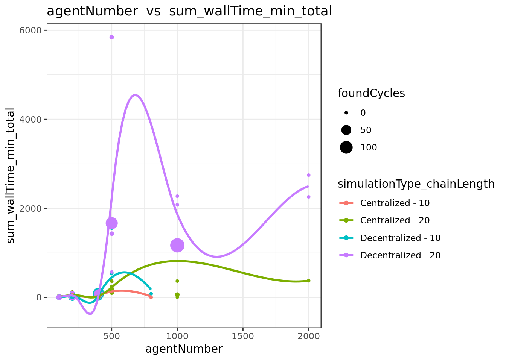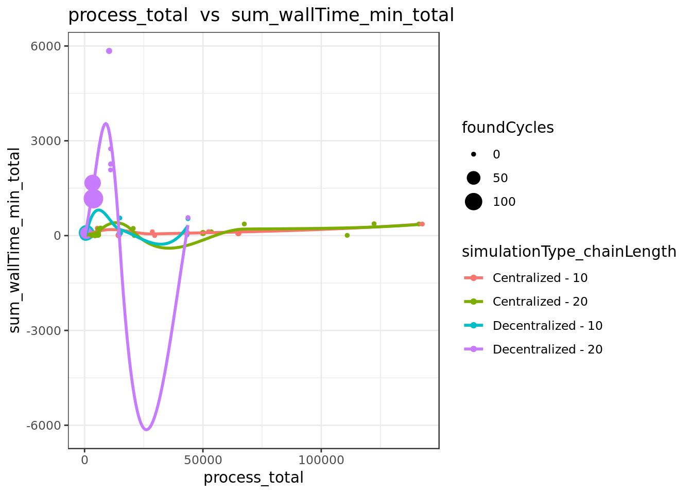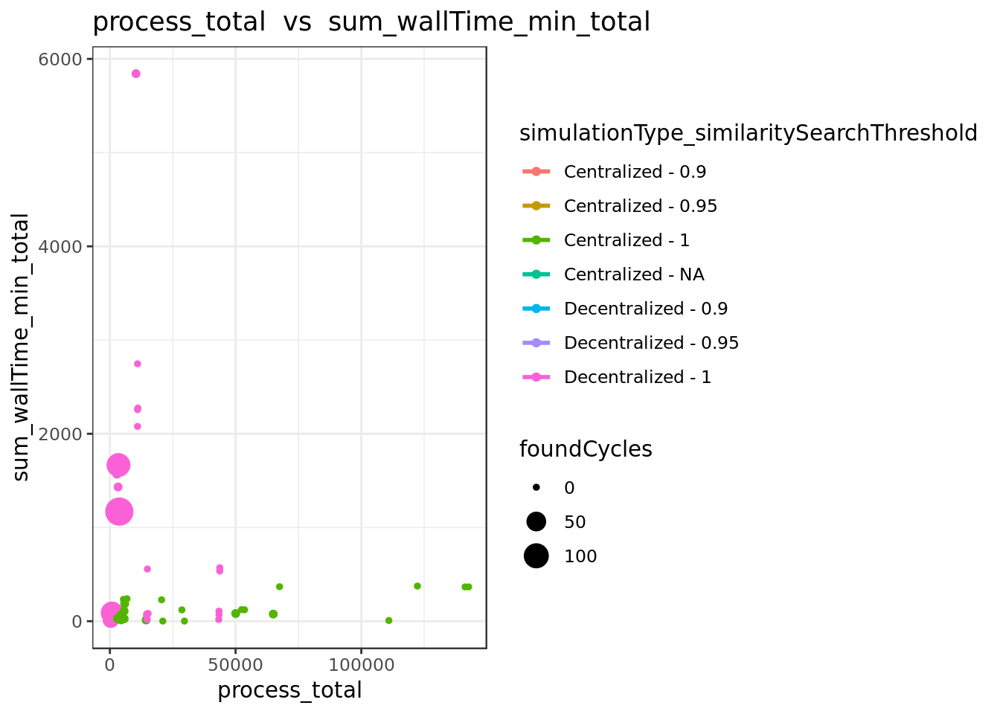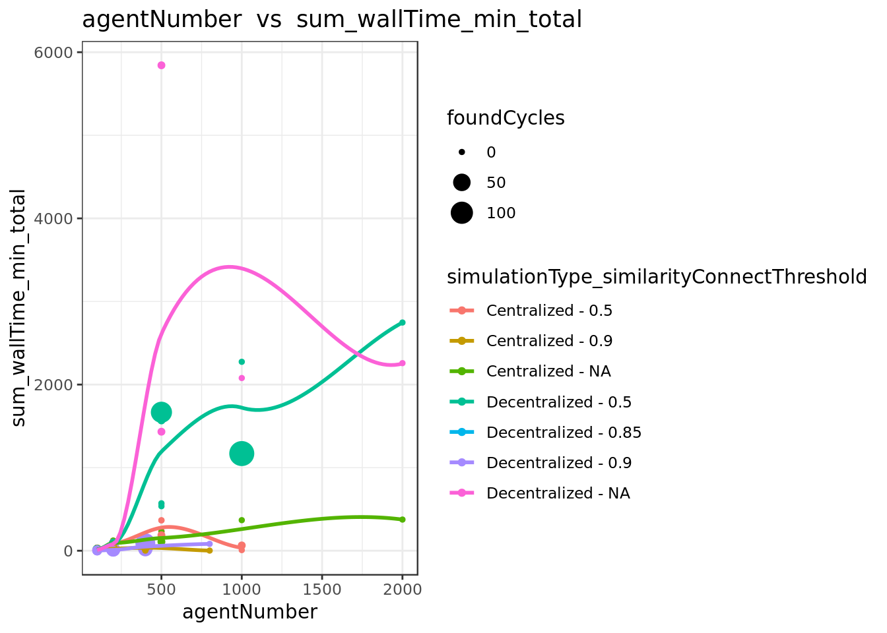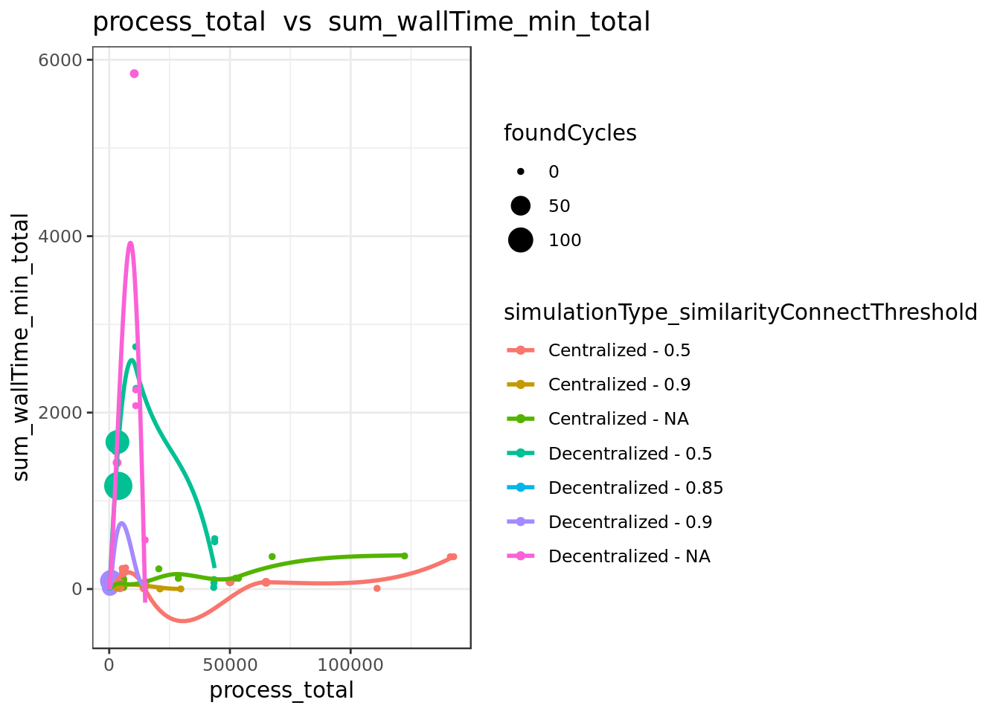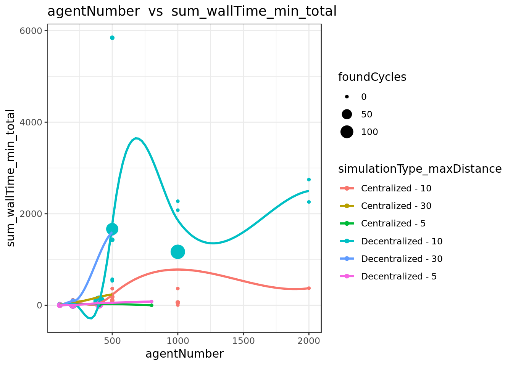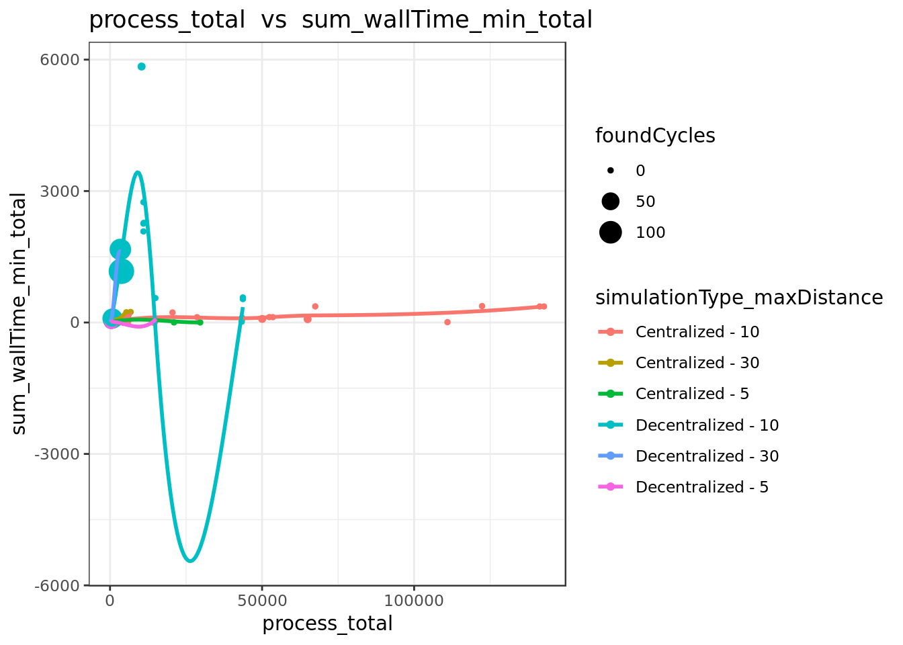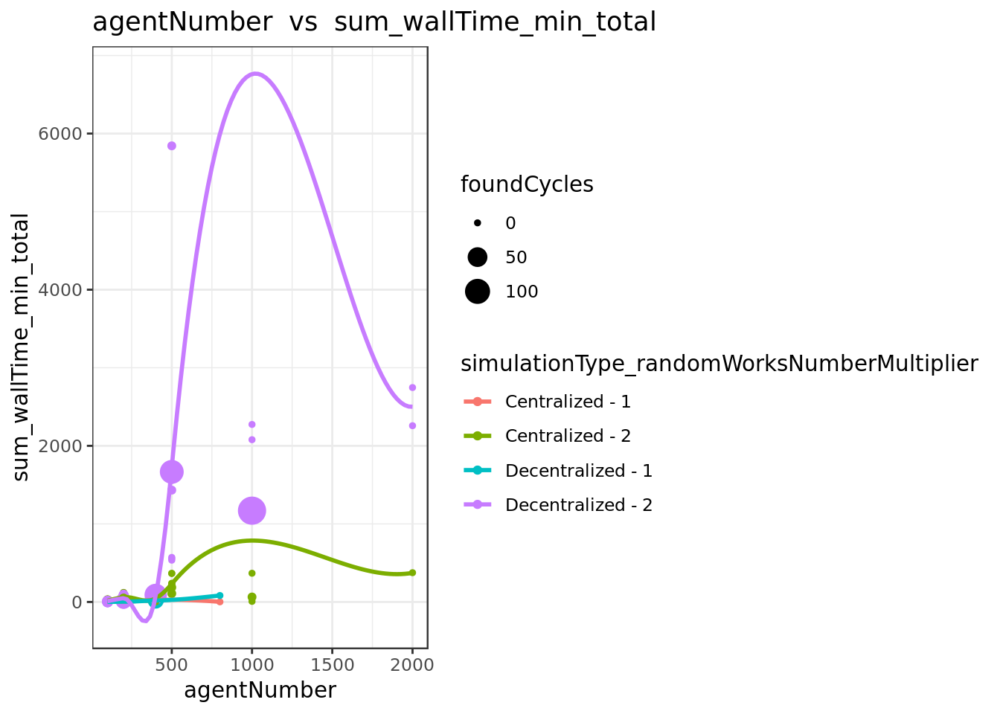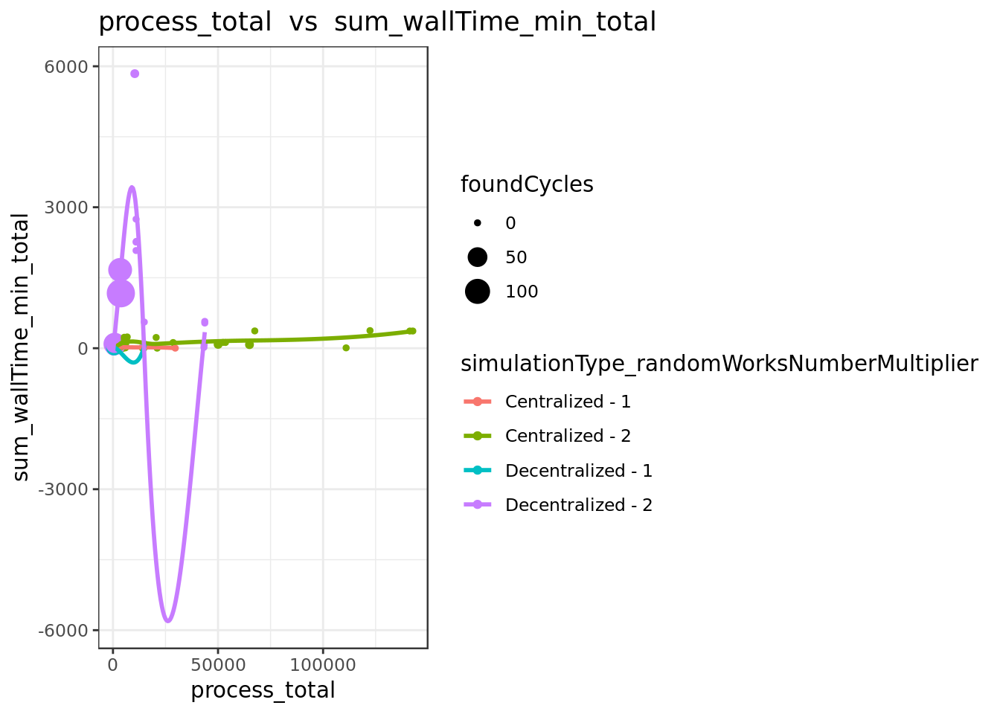  

## Regression analysis 
