--- 
title: "Tidy experiment with well distributed properties -- 1"
author: "Kabir Veitas (kabir@singularitynet.io)"
date: "2018-10-03"
bibliography: book.bib
documentclass: book
github-repo: singnet/offernet
link-citations: yes
site: bookdown::bookdown_site
biblio-style: apalike
url: http\://seankross.com/bookdown-start/
---

# Introduction

The goal was to procude data that would allow to compare the centralized and decentralized algorithms performance when the number of item nodes or number of similarity nodes increases. The problem is that number of nodes and links in the graph are obviously related -- so they are not independent variables. Furthermore, number of links is not a direct parameter of the simulation. Rather `similarity` links get created during a simulation and depend on `similarityConnectThreshold` parameters which regulates how similar item values should be in order to be connected by an explicit link, and the item values are initialized randomly. In short, number of links is an emergent variable, therefore the following run was meant to try out several parameter values (based on the knowledge from previous experiments) in order to come up with graphs and link numbers that are comparable.

|No. | expermentId | Comment |
|:--|:--|:--|
|1 | EXP09-25-07-21-KtTayU | agentNumbers=[50, 100, 200, 400, 800] : chainLengths=[5, 10, 20] : randomWorksNumberMultipliers=[1, 2] : maxDistances=[5, 10, 30] : similaritySearchThresholds=[1] : similarityConnectThresholds=[0.9] : graphTypes=[random, smallWorld] ; Crashed somewhere on 400 agents in be start of randomWorksNumberMultiplier 2. |
|2 | EXP09-30-10-25-HycEjd | agentNumbers=[400] : chainLengths=[5] : randomWorksNumberMultipliers=[2] : maxDistances=[5, 10, 30] : similaritySearchThresholds=[1] : similarityConnectThresholds=[0.9] : graphTypes=[random, smallWorld]; Rerunning from the place where crashed; |

<!--#### variables: -->
   

# Experiment  1 

agentNumbers=[50, 100, 200, 400, 800] : chainLengths=[5, 10, 20] : randomWorksNumberMultipliers=[1, 2] : maxDistances=[5, 10, 30] : similaritySearchThresholds=[1] : similarityConnectThresholds=[0.9] : graphTypes=[random, smallWorld] ; Crashed somewhere on 400 agents in be start of randomWorksNumberMultiplier 2. 

## Experimental set up 

<table class="table table-condensed" style="width: auto !important; ">
 <thead>
  <tr>
   <th style="text-align:left;">   </th>
   <th style="text-align:left;"> Values </th>
  </tr>
 </thead>
<tbody>
  <tr>
   <td style="text-align:left;"> experimentId </td>
   <td style="text-align:left;"> EXP09-25-07-21-KtTayU </td>
  </tr>
  <tr>
   <td style="text-align:left;"> agentNumbers </td>
   <td style="text-align:left;"> 50, 100, 200, 400, 800 </td>
  </tr>
  <tr>
   <td style="text-align:left;"> maxDistances </td>
   <td style="text-align:left;"> 5, 10, 30 </td>
  </tr>
  <tr>
   <td style="text-align:left;"> randomWorksNumberMultipliers </td>
   <td style="text-align:left;"> 1, 2 </td>
  </tr>
  <tr>
   <td style="text-align:left;"> similarityConnectThresholds </td>
   <td style="text-align:left;"> 0.9 </td>
  </tr>
  <tr>
   <td style="text-align:left;"> graphTypes </td>
   <td style="text-align:left;"> random, smallWorld </td>
  </tr>
  <tr>
   <td style="text-align:left;"> chainLengths </td>
   <td style="text-align:left;"> 5, 10, 20 </td>
  </tr>
</tbody>
</table>
## Descriptive analysis of each simulation

###  SIM09-26-06-15-XqPLAK--CV 

#### simulationParameters 

<table class="table table-condensed" style="width: auto !important; ">
 <thead>
  <tr>
   <th style="text-align:left;"> agentNumber </th>
   <th style="text-align:left;"> similarityConnectThreshold </th>
   <th style="text-align:left;"> graphType </th>
   <th style="text-align:left;"> chainLength </th>
   <th style="text-align:left;"> similaritySearchThreshold </th>
   <th style="text-align:left;"> maxDistance </th>
   <th style="text-align:left;"> randomWorksNumberMultiplier </th>
  </tr>
 </thead>
<tbody>
  <tr>
   <td style="text-align:left;width: 20em; "> 100 </td>
   <td style="text-align:left;width: 15em; "> 0.9 </td>
   <td style="text-align:left;width: 15em; "> random </td>
   <td style="text-align:left;width: 15em; "> 10 </td>
   <td style="text-align:left;width: 15em; "> 1 </td>
   <td style="text-align:left;width: 15em; "> 10 </td>
   <td style="text-align:left;width: 15em; "> 1 </td>
  </tr>
</tbody>
</table>
#### allEdgesByLabel

<table class="table table-condensed" style="width: auto !important; ">
 <thead>
  <tr>
   <th style="text-align:right;"> edges_offers </th>
   <th style="text-align:right;"> edges_similarity </th>
   <th style="text-align:right;"> edges_owns </th>
   <th style="text-align:right;"> edges_demands </th>
   <th style="text-align:right;"> edges_knows </th>
   <th style="text-align:right;"> edges_total </th>
  </tr>
 </thead>
<tbody>
  <tr>
   <td style="text-align:right;width: 5em; "> 110 </td>
   <td style="text-align:right;width: 5em; "> 10,174 </td>
   <td style="text-align:right;width: 5em; "> 110 </td>
   <td style="text-align:right;width: 5em; "> 110 </td>
   <td style="text-align:right;width: 5em; "> 100 </td>
   <td style="text-align:right;width: 5em; "> 10,604 </td>
  </tr>
</tbody>
</table>
#### allVerticesByType

<table class="table table-condensed" style="width: auto !important; ">
 <thead>
  <tr>
   <th style="text-align:right;"> vertices_agent </th>
   <th style="text-align:right;"> vertices_item </th>
   <th style="text-align:right;"> vertices_work </th>
   <th style="text-align:right;"> vertices_total </th>
  </tr>
 </thead>
<tbody>
  <tr>
   <td style="text-align:right;width: 5em; "> 101 </td>
   <td style="text-align:right;width: 5em; "> 220 </td>
   <td style="text-align:right;width: 5em; "> 110 </td>
   <td style="text-align:right;width: 5em; "> 431 </td>
  </tr>
</tbody>
</table>
#### distribution of similarityEdgesByWeight

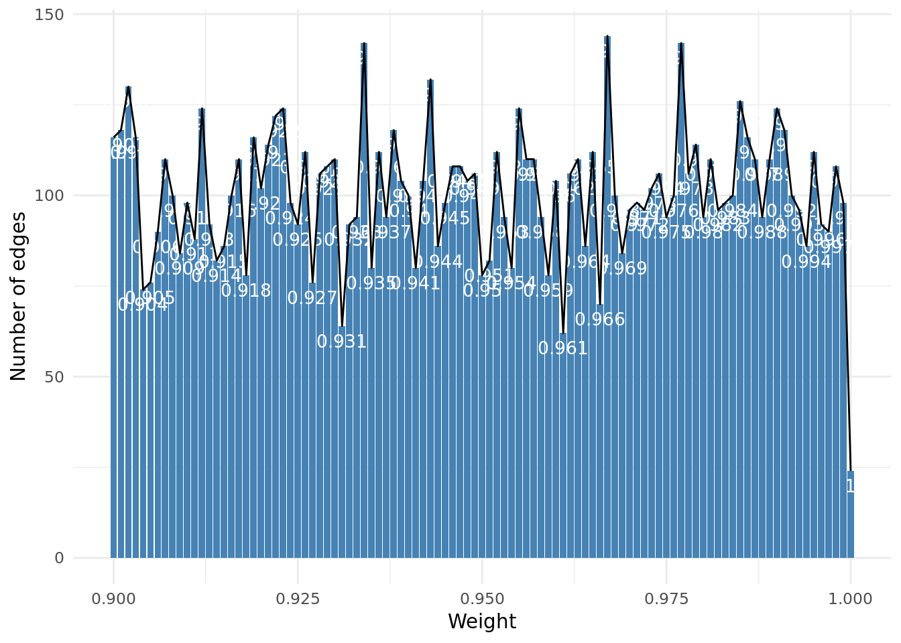

#### Degree distribution of item->similarity->item edges

#### Degree distribution of agent->knows->agent edges

#### Runing time by method 

<table class="table table-condensed" style="width: auto !important; ">
 <thead>
  <tr>
   <th style="text-align:left;"> key </th>
   <th style="text-align:right;"> doc_count </th>
   <th style="text-align:right;"> sum_wallTime_ms.value </th>
   <th style="text-align:left;"> avg_wallTime_ms.value </th>
   <th style="text-align:left;"> includedInTotal </th>
  </tr>
 </thead>
<tbody>
  <tr>
   <td style="text-align:left;"> connectIfSimilar </td>
   <td style="text-align:right;"> 24,090 </td>
   <td style="text-align:right;"> 127,734 </td>
   <td style="text-align:left;"> 5.30236612702366 </td>
   <td style="text-align:left;"> No </td>
  </tr>
  <tr>
   <td style="text-align:left;"> existsSimilarity </td>
   <td style="text-align:right;"> 24,090 </td>
   <td style="text-align:right;"> 122,185 </td>
   <td style="text-align:left;"> 5.07202158572022 </td>
   <td style="text-align:left;"> No </td>
  </tr>
  <tr>
   <td style="text-align:left;"> similarityEdges </td>
   <td style="text-align:right;"> 24,090 </td>
   <td style="text-align:right;"> 120,686 </td>
   <td style="text-align:left;"> 5.00979659609797 </td>
   <td style="text-align:left;"> No </td>
  </tr>
  <tr>
   <td style="text-align:left;"> connect </td>
   <td style="text-align:right;"> 848 </td>
   <td style="text-align:right;"> 4,961 </td>
   <td style="text-align:left;"> 5.8502358490566 </td>
   <td style="text-align:left;"> Yes </td>
  </tr>
  <tr>
   <td style="text-align:left;"> connectAllSimilar </td>
   <td style="text-align:right;"> 220 </td>
   <td style="text-align:right;"> 128,042 </td>
   <td style="text-align:left;"> 582.009090909091 </td>
   <td style="text-align:left;"> Yes </td>
  </tr>
  <tr>
   <td style="text-align:left;"> init </td>
   <td style="text-align:right;"> 103 </td>
   <td style="text-align:right;"> 16,644 </td>
   <td style="text-align:left;"> 161.592233009709 </td>
   <td style="text-align:left;"> No </td>
  </tr>
  <tr>
   <td style="text-align:left;font-weight: bold;"> Total </td>
   <td style="text-align:right;font-weight: bold;"> 1,076 </td>
   <td style="text-align:right;font-weight: bold;"> 133,983 </td>
   <td style="text-align:left;font-weight: bold;">  </td>
   <td style="text-align:left;font-weight: bold;">  </td>
  </tr>
</tbody>
</table>
####  Found structures 

#####  Cycles 

Number of cycles found:  1 

<button class="btn btn-primary" data-toggle="collapse" data-target="#OYBVPWTQVD"> Show/Hide foundCycle query </button> 
 
  
     GET /filebeat-*/_search 
              { 
                "query": {
                  "bool": {
                    "must": [
                      { "match_phrase": {
                        "simulationId": "SIM09-26-06-15-XqPLAK--CV"
                        }
                      },
                      { "bool": {
                        "should": [
                          { "match": {
                            "keyword": "foundCycle"
                          }}
                        ]
                      }}
                    ]
                  }
                }
              }
     

#####  Paths 

Number of paths found:  0 

<button class="btn btn-primary" data-toggle="collapse" data-target="#OVBGFUIQSG"> Show/Hide foundPath query </button> 
 
  
     GET /filebeat-*/_search 
              { 
                "query": {
                  "bool": {
                    "must": [
                      { "match_phrase": {
                        "simulationId": "SIM09-26-06-15-XqPLAK--CV"
                        }
                      },
                      { "bool": {
                        "should": [
                          { "match": {
                            "keyword": "foundPath"
                          }}
                        ]
                      }}
                    ]
                  }
                }
              }
     

###  SIM09-26-06-15-XqPLAK--DV 

#### simulationParameters 

<table class="table table-condensed" style="width: auto !important; ">
 <thead>
  <tr>
   <th style="text-align:left;"> agentNumber </th>
   <th style="text-align:left;"> similarityConnectThreshold </th>
   <th style="text-align:left;"> graphType </th>
   <th style="text-align:left;"> chainLength </th>
   <th style="text-align:left;"> similaritySearchThreshold </th>
   <th style="text-align:left;"> maxDistance </th>
   <th style="text-align:left;"> randomWorksNumberMultiplier </th>
  </tr>
 </thead>
<tbody>
  <tr>
   <td style="text-align:left;width: 20em; "> 100 </td>
   <td style="text-align:left;width: 15em; "> 0.9 </td>
   <td style="text-align:left;width: 15em; "> random </td>
   <td style="text-align:left;width: 15em; "> 10 </td>
   <td style="text-align:left;width: 15em; "> 1 </td>
   <td style="text-align:left;width: 15em; "> 10 </td>
   <td style="text-align:left;width: 15em; "> 1 </td>
  </tr>
</tbody>
</table>
#### allEdgesByLabel

<table class="table table-condensed" style="width: auto !important; ">
 <thead>
  <tr>
   <th style="text-align:right;"> edges_offers </th>
   <th style="text-align:right;"> edges_similarity </th>
   <th style="text-align:right;"> edges_owns </th>
   <th style="text-align:right;"> edges_demands </th>
   <th style="text-align:right;"> edges_knows </th>
   <th style="text-align:right;"> edges_total </th>
  </tr>
 </thead>
<tbody>
  <tr>
   <td style="text-align:right;width: 5em; "> 110 </td>
   <td style="text-align:right;width: 5em; "> 8,478 </td>
   <td style="text-align:right;width: 5em; "> 110 </td>
   <td style="text-align:right;width: 5em; "> 110 </td>
   <td style="text-align:right;width: 5em; "> 100 </td>
   <td style="text-align:right;width: 5em; "> 8,908 </td>
  </tr>
</tbody>
</table>
#### allVerticesByType

<table class="table table-condensed" style="width: auto !important; ">
 <thead>
  <tr>
   <th style="text-align:right;"> vertices_agent </th>
   <th style="text-align:right;"> vertices_item </th>
   <th style="text-align:right;"> vertices_work </th>
   <th style="text-align:right;"> vertices_total </th>
  </tr>
 </thead>
<tbody>
  <tr>
   <td style="text-align:right;width: 5em; "> 101 </td>
   <td style="text-align:right;width: 5em; "> 220 </td>
   <td style="text-align:right;width: 5em; "> 110 </td>
   <td style="text-align:right;width: 5em; "> 431 </td>
  </tr>
</tbody>
</table>
#### distribution of similarityEdgesByWeight

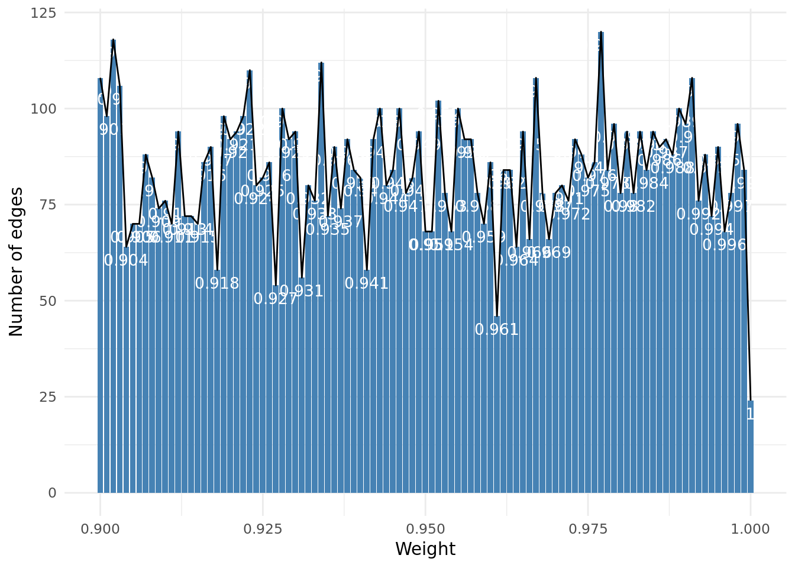

#### Degree distribution of item->similarity->item edges

#### Degree distribution of agent->knows->agent edges

#### Runing time by method 

<table class="table table-condensed" style="width: auto !important; ">
 <thead>
  <tr>
   <th style="text-align:left;">   </th>
   <th style="text-align:left;"> key </th>
   <th style="text-align:right;"> doc_count </th>
   <th style="text-align:right;"> sum_wallTime_ms.value </th>
   <th style="text-align:left;"> avg_wallTime_ms.value </th>
   <th style="text-align:left;"> includedInTotal </th>
  </tr>
 </thead>
<tbody>
  <tr>
   <td style="text-align:left;"> 1 </td>
   <td style="text-align:left;"> addItemToWork </td>
   <td style="text-align:right;"> 220 </td>
   <td style="text-align:right;"> 8,533 </td>
   <td style="text-align:left;"> 38.7863636363636 </td>
   <td style="text-align:left;"> No </td>
  </tr>
  <tr>
   <td style="text-align:left;"> 2 </td>
   <td style="text-align:left;"> ownsWork </td>
   <td style="text-align:right;"> 110 </td>
   <td style="text-align:right;"> 4,039 </td>
   <td style="text-align:left;"> 36.7181818181818 </td>
   <td style="text-align:left;"> No </td>
  </tr>
  <tr>
   <td style="text-align:left;"> 3 </td>
   <td style="text-align:left;"> init </td>
   <td style="text-align:right;"> 103 </td>
   <td style="text-align:right;"> 17,149 </td>
   <td style="text-align:left;"> 166.495145631068 </td>
   <td style="text-align:left;"> No </td>
  </tr>
  <tr>
   <td style="text-align:left;"> 4 </td>
   <td style="text-align:left;"> searchAndConnect </td>
   <td style="text-align:right;"> 101 </td>
   <td style="text-align:right;"> 120,926 </td>
   <td style="text-align:left;"> 1197.28712871287 </td>
   <td style="text-align:left;"> Yes </td>
  </tr>
  <tr>
   <td style="text-align:left;"> 5 </td>
   <td style="text-align:left;"> knowsAgent </td>
   <td style="text-align:right;"> 100 </td>
   <td style="text-align:right;"> 1,383 </td>
   <td style="text-align:left;"> 13.83 </td>
   <td style="text-align:left;"> No </td>
  </tr>
  <tr>
   <td style="text-align:left;"> 6 </td>
   <td style="text-align:left;"> getWorksItems </td>
   <td style="text-align:right;"> 18 </td>
   <td style="text-align:right;"> 32 </td>
   <td style="text-align:left;"> 1.77777777777778 </td>
   <td style="text-align:left;"> Yes </td>
  </tr>
  <tr>
   <td style="text-align:left;"> 8 </td>
   <td style="text-align:left;"> cycleSearch </td>
   <td style="text-align:right;"> 5 </td>
   <td style="text-align:right;"> 143 </td>
   <td style="text-align:left;"> 28.6 </td>
   <td style="text-align:left;"> Yes </td>
  </tr>
  <tr>
   <td style="text-align:left;"> 10 </td>
   <td style="text-align:left;"> getWorks </td>
   <td style="text-align:right;"> 5 </td>
   <td style="text-align:right;"> 250 </td>
   <td style="text-align:left;"> 50 </td>
   <td style="text-align:left;"> No </td>
  </tr>
  <tr>
   <td style="text-align:left;font-weight: bold;"> 11 </td>
   <td style="text-align:left;font-weight: bold;"> Total </td>
   <td style="text-align:right;font-weight: bold;"> 134 </td>
   <td style="text-align:right;font-weight: bold;"> 123,029 </td>
   <td style="text-align:left;font-weight: bold;">  </td>
   <td style="text-align:left;font-weight: bold;">  </td>
  </tr>
</tbody>
</table>
####  Found structures 

#####  Cycles 

Number of cycles found:  5 

<button class="btn btn-primary" data-toggle="collapse" data-target="#VUYOZEZKCJ"> Show/Hide foundCycle query </button> 
 
  
     GET /filebeat-*/_search 
              { 
                "query": {
                  "bool": {
                    "must": [
                      { "match_phrase": {
                        "simulationId": "SIM09-26-06-15-XqPLAK--DV"
                        }
                      },
                      { "bool": {
                        "should": [
                          { "match": {
                            "keyword": "foundCycle"
                          }}
                        ]
                      }}
                    ]
                  }
                }
              }
     

#####  Paths 

Number of paths found:  0 

<button class="btn btn-primary" data-toggle="collapse" data-target="#WFUEPVCVTD"> Show/Hide foundPath query </button> 
 
  
     GET /filebeat-*/_search 
              { 
                "query": {
                  "bool": {
                    "must": [
                      { "match_phrase": {
                        "simulationId": "SIM09-26-06-15-XqPLAK--DV"
                        }
                      },
                      { "bool": {
                        "should": [
                          { "match": {
                            "keyword": "foundPath"
                          }}
                        ]
                      }}
                    ]
                  }
                }
              }
     

###  SIM09-26-06-18-msqSat--CV 

#### simulationParameters 

<table class="table table-condensed" style="width: auto !important; ">
 <thead>
  <tr>
   <th style="text-align:left;"> agentNumber </th>
   <th style="text-align:left;"> similarityConnectThreshold </th>
   <th style="text-align:left;"> graphType </th>
   <th style="text-align:left;"> chainLength </th>
   <th style="text-align:left;"> similaritySearchThreshold </th>
   <th style="text-align:left;"> maxDistance </th>
   <th style="text-align:left;"> randomWorksNumberMultiplier </th>
  </tr>
 </thead>
<tbody>
  <tr>
   <td style="text-align:left;width: 20em; "> 100 </td>
   <td style="text-align:left;width: 15em; "> 0.9 </td>
   <td style="text-align:left;width: 15em; "> smallWorld </td>
   <td style="text-align:left;width: 15em; "> 10 </td>
   <td style="text-align:left;width: 15em; "> 1 </td>
   <td style="text-align:left;width: 15em; "> 10 </td>
   <td style="text-align:left;width: 15em; "> 1 </td>
  </tr>
</tbody>
</table>
#### allEdgesByLabel

<table class="table table-condensed" style="width: auto !important; ">
 <thead>
  <tr>
   <th style="text-align:right;"> edges_offers </th>
   <th style="text-align:right;"> edges_similarity </th>
   <th style="text-align:right;"> edges_owns </th>
   <th style="text-align:right;"> edges_demands </th>
   <th style="text-align:right;"> edges_knows </th>
   <th style="text-align:right;"> edges_total </th>
  </tr>
 </thead>
<tbody>
  <tr>
   <td style="text-align:right;width: 5em; "> 110 </td>
   <td style="text-align:right;width: 5em; "> 10,352 </td>
   <td style="text-align:right;width: 5em; "> 110 </td>
   <td style="text-align:right;width: 5em; "> 110 </td>
   <td style="text-align:right;width: 5em; "> 601 </td>
   <td style="text-align:right;width: 5em; "> 11,283 </td>
  </tr>
</tbody>
</table>
#### allVerticesByType

<table class="table table-condensed" style="width: auto !important; ">
 <thead>
  <tr>
   <th style="text-align:right;"> vertices_agent </th>
   <th style="text-align:right;"> vertices_item </th>
   <th style="text-align:right;"> vertices_work </th>
   <th style="text-align:right;"> vertices_total </th>
  </tr>
 </thead>
<tbody>
  <tr>
   <td style="text-align:right;width: 5em; "> 101 </td>
   <td style="text-align:right;width: 5em; "> 220 </td>
   <td style="text-align:right;width: 5em; "> 110 </td>
   <td style="text-align:right;width: 5em; "> 431 </td>
  </tr>
</tbody>
</table>
#### distribution of similarityEdgesByWeight

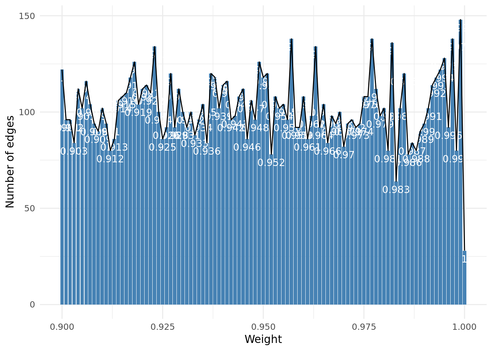

#### Degree distribution of item->similarity->item edges

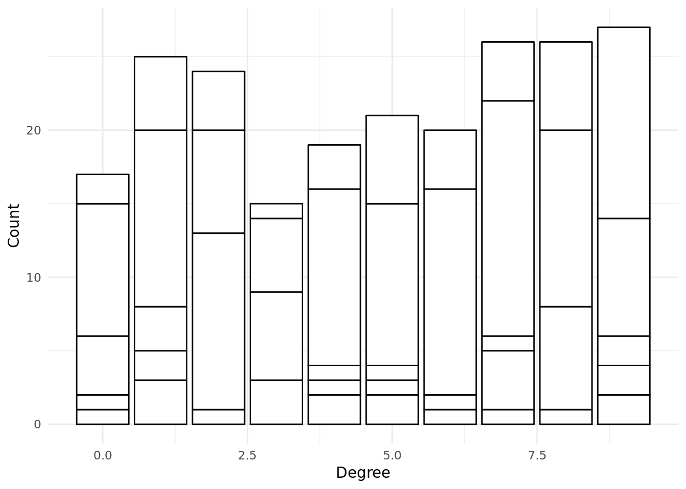

#### Degree distribution of agent->knows->agent edges

#### Runing time by method 

<table class="table table-condensed" style="width: auto !important; ">
 <thead>
  <tr>
   <th style="text-align:left;"> key </th>
   <th style="text-align:right;"> doc_count </th>
   <th style="text-align:right;"> sum_wallTime_ms.value </th>
   <th style="text-align:left;"> avg_wallTime_ms.value </th>
   <th style="text-align:left;"> includedInTotal </th>
  </tr>
 </thead>
<tbody>
  <tr>
   <td style="text-align:left;"> connectIfSimilar </td>
   <td style="text-align:right;"> 24,090 </td>
   <td style="text-align:right;"> 122,401 </td>
   <td style="text-align:left;"> 5.08098796180988 </td>
   <td style="text-align:left;"> No </td>
  </tr>
  <tr>
   <td style="text-align:left;"> existsSimilarity </td>
   <td style="text-align:right;"> 24,090 </td>
   <td style="text-align:right;"> 121,574 </td>
   <td style="text-align:left;"> 5.04665836446658 </td>
   <td style="text-align:left;"> No </td>
  </tr>
  <tr>
   <td style="text-align:left;"> similarityEdges </td>
   <td style="text-align:right;"> 24,090 </td>
   <td style="text-align:right;"> 120,010 </td>
   <td style="text-align:left;"> 4.98173515981735 </td>
   <td style="text-align:left;"> No </td>
  </tr>
  <tr>
   <td style="text-align:left;"> connectAllSimilar </td>
   <td style="text-align:right;"> 220 </td>
   <td style="text-align:right;"> 122,685 </td>
   <td style="text-align:left;"> 557.659090909091 </td>
   <td style="text-align:left;"> Yes </td>
  </tr>
  <tr>
   <td style="text-align:left;"> init </td>
   <td style="text-align:right;"> 103 </td>
   <td style="text-align:right;"> 16,514 </td>
   <td style="text-align:left;"> 160.330097087379 </td>
   <td style="text-align:left;"> No </td>
  </tr>
  <tr>
   <td style="text-align:left;"> connect </td>
   <td style="text-align:right;"> 50 </td>
   <td style="text-align:right;"> 262 </td>
   <td style="text-align:left;"> 5.24 </td>
   <td style="text-align:left;"> Yes </td>
  </tr>
  <tr>
   <td style="text-align:left;font-weight: bold;"> Total </td>
   <td style="text-align:right;font-weight: bold;"> 278 </td>
   <td style="text-align:right;font-weight: bold;"> 124,050 </td>
   <td style="text-align:left;font-weight: bold;">  </td>
   <td style="text-align:left;font-weight: bold;">  </td>
  </tr>
</tbody>
</table>
####  Found structures 

#####  Cycles 

Number of cycles found:  1 

<button class="btn btn-primary" data-toggle="collapse" data-target="#KJPMBXCLSW"> Show/Hide foundCycle query </button> 
 
  
     GET /filebeat-*/_search 
              { 
                "query": {
                  "bool": {
                    "must": [
                      { "match_phrase": {
                        "simulationId": "SIM09-26-06-18-msqSat--CV"
                        }
                      },
                      { "bool": {
                        "should": [
                          { "match": {
                            "keyword": "foundCycle"
                          }}
                        ]
                      }}
                    ]
                  }
                }
              }
     

#####  Paths 

Number of paths found:  0 

<button class="btn btn-primary" data-toggle="collapse" data-target="#MUXJHTLFYK"> Show/Hide foundPath query </button> 
 
  
     GET /filebeat-*/_search 
              { 
                "query": {
                  "bool": {
                    "must": [
                      { "match_phrase": {
                        "simulationId": "SIM09-26-06-18-msqSat--CV"
                        }
                      },
                      { "bool": {
                        "should": [
                          { "match": {
                            "keyword": "foundPath"
                          }}
                        ]
                      }}
                    ]
                  }
                }
              }
     

###  SIM09-26-06-18-msqSat--DV 

#### simulationParameters 

<table class="table table-condensed" style="width: auto !important; ">
 <thead>
  <tr>
   <th style="text-align:left;"> agentNumber </th>
   <th style="text-align:left;"> similarityConnectThreshold </th>
   <th style="text-align:left;"> graphType </th>
   <th style="text-align:left;"> chainLength </th>
   <th style="text-align:left;"> similaritySearchThreshold </th>
   <th style="text-align:left;"> maxDistance </th>
   <th style="text-align:left;"> randomWorksNumberMultiplier </th>
  </tr>
 </thead>
<tbody>
  <tr>
   <td style="text-align:left;width: 20em; "> 100 </td>
   <td style="text-align:left;width: 15em; "> 0.9 </td>
   <td style="text-align:left;width: 15em; "> smallWorld </td>
   <td style="text-align:left;width: 15em; "> 10 </td>
   <td style="text-align:left;width: 15em; "> 1 </td>
   <td style="text-align:left;width: 15em; "> 10 </td>
   <td style="text-align:left;width: 15em; "> 1 </td>
  </tr>
</tbody>
</table>
#### allEdgesByLabel

<table class="table table-condensed" style="width: auto !important; ">
 <thead>
  <tr>
   <th style="text-align:right;"> edges_offers </th>
   <th style="text-align:right;"> edges_similarity </th>
   <th style="text-align:right;"> edges_owns </th>
   <th style="text-align:right;"> edges_demands </th>
   <th style="text-align:right;"> edges_knows </th>
   <th style="text-align:right;"> edges_total </th>
  </tr>
 </thead>
<tbody>
  <tr>
   <td style="text-align:right;width: 5em; "> 110 </td>
   <td style="text-align:right;width: 5em; "> 10,252 </td>
   <td style="text-align:right;width: 5em; "> 110 </td>
   <td style="text-align:right;width: 5em; "> 110 </td>
   <td style="text-align:right;width: 5em; "> 601 </td>
   <td style="text-align:right;width: 5em; "> 11,183 </td>
  </tr>
</tbody>
</table>
#### allVerticesByType

<table class="table table-condensed" style="width: auto !important; ">
 <thead>
  <tr>
   <th style="text-align:right;"> vertices_agent </th>
   <th style="text-align:right;"> vertices_item </th>
   <th style="text-align:right;"> vertices_work </th>
   <th style="text-align:right;"> vertices_total </th>
  </tr>
 </thead>
<tbody>
  <tr>
   <td style="text-align:right;width: 5em; "> 101 </td>
   <td style="text-align:right;width: 5em; "> 220 </td>
   <td style="text-align:right;width: 5em; "> 110 </td>
   <td style="text-align:right;width: 5em; "> 431 </td>
  </tr>
</tbody>
</table>
#### distribution of similarityEdgesByWeight

#### Degree distribution of item->similarity->item edges

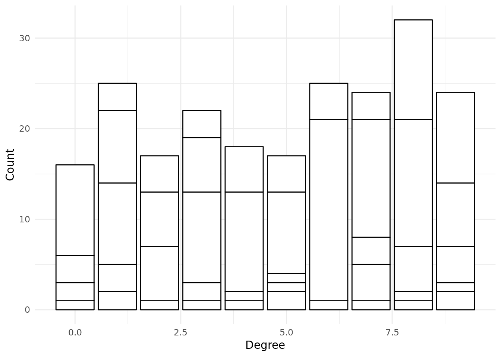

#### Degree distribution of agent->knows->agent edges

#### Runing time by method 

<table class="table table-condensed" style="width: auto !important; ">
 <thead>
  <tr>
   <th style="text-align:left;"> key </th>
   <th style="text-align:right;"> doc_count </th>
   <th style="text-align:right;"> sum_wallTime_ms.value </th>
   <th style="text-align:left;"> avg_wallTime_ms.value </th>
   <th style="text-align:left;"> includedInTotal </th>
  </tr>
 </thead>
<tbody>
  <tr>
   <td style="text-align:left;"> knowsAgent </td>
   <td style="text-align:right;"> 601 </td>
   <td style="text-align:right;"> 2,696 </td>
   <td style="text-align:left;"> 4.48585690515807 </td>
   <td style="text-align:left;"> No </td>
  </tr>
  <tr>
   <td style="text-align:left;"> addItemToWork </td>
   <td style="text-align:right;"> 220 </td>
   <td style="text-align:right;"> 7,014 </td>
   <td style="text-align:left;"> 31.8818181818182 </td>
   <td style="text-align:left;"> No </td>
  </tr>
  <tr>
   <td style="text-align:left;"> ownsWork </td>
   <td style="text-align:right;"> 110 </td>
   <td style="text-align:right;"> 6,331 </td>
   <td style="text-align:left;"> 57.5545454545455 </td>
   <td style="text-align:left;"> No </td>
  </tr>
  <tr>
   <td style="text-align:left;"> init </td>
   <td style="text-align:right;"> 103 </td>
   <td style="text-align:right;"> 17,212 </td>
   <td style="text-align:left;"> 167.106796116505 </td>
   <td style="text-align:left;"> No </td>
  </tr>
  <tr>
   <td style="text-align:left;"> searchAndConnect </td>
   <td style="text-align:right;"> 101 </td>
   <td style="text-align:right;"> 166,688 </td>
   <td style="text-align:left;"> 1650.37623762376 </td>
   <td style="text-align:left;"> Yes </td>
  </tr>
  <tr>
   <td style="text-align:left;"> getWorksItems </td>
   <td style="text-align:right;"> 18 </td>
   <td style="text-align:right;"> 38 </td>
   <td style="text-align:left;"> 2.11111111111111 </td>
   <td style="text-align:left;"> Yes </td>
  </tr>
  <tr>
   <td style="text-align:left;"> cycleSearch </td>
   <td style="text-align:right;"> 6 </td>
   <td style="text-align:right;"> 2,561 </td>
   <td style="text-align:left;"> 426.833333333333 </td>
   <td style="text-align:left;"> Yes </td>
  </tr>
  <tr>
   <td style="text-align:left;"> getWorks </td>
   <td style="text-align:right;"> 6 </td>
   <td style="text-align:right;"> 1,243 </td>
   <td style="text-align:left;"> 207.166666666667 </td>
   <td style="text-align:left;"> No </td>
  </tr>
  <tr>
   <td style="text-align:left;"> individualCycleSearch </td>
   <td style="text-align:right;"> 6 </td>
   <td style="text-align:right;"> 0 </td>
   <td style="text-align:left;"> 0 </td>
   <td style="text-align:left;"> Yes </td>
  </tr>
  <tr>
   <td style="text-align:left;font-weight: bold;"> Total </td>
   <td style="text-align:right;font-weight: bold;"> 136 </td>
   <td style="text-align:right;font-weight: bold;"> 170,957 </td>
   <td style="text-align:left;font-weight: bold;">  </td>
   <td style="text-align:left;font-weight: bold;">  </td>
  </tr>
</tbody>
</table>
####  Found structures 

#####  Cycles 

Number of cycles found:  5 

<button class="btn btn-primary" data-toggle="collapse" data-target="#OSIZOIJWQL"> Show/Hide foundCycle query </button> 
 
  
     GET /filebeat-*/_search 
              { 
                "query": {
                  "bool": {
                    "must": [
                      { "match_phrase": {
                        "simulationId": "SIM09-26-06-18-msqSat--DV"
                        }
                      },
                      { "bool": {
                        "should": [
                          { "match": {
                            "keyword": "foundCycle"
                          }}
                        ]
                      }}
                    ]
                  }
                }
              }
     

#####  Paths 

Number of paths found:  0 

<button class="btn btn-primary" data-toggle="collapse" data-target="#JZJTTFOICX"> Show/Hide foundPath query </button> 
 
  
     GET /filebeat-*/_search 
              { 
                "query": {
                  "bool": {
                    "must": [
                      { "match_phrase": {
                        "simulationId": "SIM09-26-06-18-msqSat--DV"
                        }
                      },
                      { "bool": {
                        "should": [
                          { "match": {
                            "keyword": "foundPath"
                          }}
                        ]
                      }}
                    ]
                  }
                }
              }
     

###  SIM09-26-08-49-CAp4n2--CV 

#### simulationParameters 

<table class="table table-condensed" style="width: auto !important; ">
 <thead>
  <tr>
   <th style="text-align:left;"> agentNumber </th>
   <th style="text-align:left;"> similarityConnectThreshold </th>
   <th style="text-align:left;"> graphType </th>
   <th style="text-align:left;"> chainLength </th>
   <th style="text-align:left;"> similaritySearchThreshold </th>
   <th style="text-align:left;"> maxDistance </th>
   <th style="text-align:left;"> randomWorksNumberMultiplier </th>
  </tr>
 </thead>
<tbody>
  <tr>
   <td style="text-align:left;width: 20em; "> 100 </td>
   <td style="text-align:left;width: 15em; "> 0.9 </td>
   <td style="text-align:left;width: 15em; "> random </td>
   <td style="text-align:left;width: 15em; "> 10 </td>
   <td style="text-align:left;width: 15em; "> 1 </td>
   <td style="text-align:left;width: 15em; "> 10 </td>
   <td style="text-align:left;width: 15em; "> 2 </td>
  </tr>
</tbody>
</table>
#### allEdgesByLabel

<table class="table table-condensed" style="width: auto !important; ">
 <thead>
  <tr>
   <th style="text-align:right;"> edges_offers </th>
   <th style="text-align:right;"> edges_similarity </th>
   <th style="text-align:right;"> edges_owns </th>
   <th style="text-align:right;"> edges_demands </th>
   <th style="text-align:right;"> edges_knows </th>
   <th style="text-align:right;"> edges_total </th>
  </tr>
 </thead>
<tbody>
  <tr>
   <td style="text-align:right;width: 5em; "> 210 </td>
   <td style="text-align:right;width: 5em; "> 37,232 </td>
   <td style="text-align:right;width: 5em; "> 210 </td>
   <td style="text-align:right;width: 5em; "> 210 </td>
   <td style="text-align:right;width: 5em; "> 100 </td>
   <td style="text-align:right;width: 5em; "> 37,962 </td>
  </tr>
</tbody>
</table>
#### allVerticesByType

<table class="table table-condensed" style="width: auto !important; ">
 <thead>
  <tr>
   <th style="text-align:right;"> vertices_agent </th>
   <th style="text-align:right;"> vertices_item </th>
   <th style="text-align:right;"> vertices_work </th>
   <th style="text-align:right;"> vertices_total </th>
  </tr>
 </thead>
<tbody>
  <tr>
   <td style="text-align:right;width: 5em; "> 101 </td>
   <td style="text-align:right;width: 5em; "> 420 </td>
   <td style="text-align:right;width: 5em; "> 210 </td>
   <td style="text-align:right;width: 5em; "> 731 </td>
  </tr>
</tbody>
</table>
#### distribution of similarityEdgesByWeight

#### Degree distribution of item->similarity->item edges

#### Degree distribution of agent->knows->agent edges

#### Runing time by method 

<table class="table table-condensed" style="width: auto !important; ">
 <thead>
  <tr>
   <th style="text-align:left;"> key </th>
   <th style="text-align:right;"> doc_count </th>
   <th style="text-align:right;"> sum_wallTime_ms.value </th>
   <th style="text-align:left;"> avg_wallTime_ms.value </th>
   <th style="text-align:left;"> includedInTotal </th>
  </tr>
 </thead>
<tbody>
  <tr>
   <td style="text-align:left;"> connectIfSimilar </td>
   <td style="text-align:right;"> 87,990 </td>
   <td style="text-align:right;"> 706,743 </td>
   <td style="text-align:left;"> 8.03208319127174 </td>
   <td style="text-align:left;"> No </td>
  </tr>
  <tr>
   <td style="text-align:left;"> existsSimilarity </td>
   <td style="text-align:right;"> 87,990 </td>
   <td style="text-align:right;"> 695,157 </td>
   <td style="text-align:left;"> 7.90040913740198 </td>
   <td style="text-align:left;"> No </td>
  </tr>
  <tr>
   <td style="text-align:left;"> similarityEdges </td>
   <td style="text-align:right;"> 87,990 </td>
   <td style="text-align:right;"> 685,869 </td>
   <td style="text-align:left;"> 7.79485168769178 </td>
   <td style="text-align:left;"> No </td>
  </tr>
  <tr>
   <td style="text-align:left;"> connect </td>
   <td style="text-align:right;"> 1,629 </td>
   <td style="text-align:right;"> 9,351 </td>
   <td style="text-align:left;"> 5.74033149171271 </td>
   <td style="text-align:left;"> Yes </td>
  </tr>
  <tr>
   <td style="text-align:left;"> connectAllSimilar </td>
   <td style="text-align:right;"> 420 </td>
   <td style="text-align:right;"> 707,879 </td>
   <td style="text-align:left;"> 1685.42619047619 </td>
   <td style="text-align:left;"> Yes </td>
  </tr>
  <tr>
   <td style="text-align:left;"> init </td>
   <td style="text-align:right;"> 103 </td>
   <td style="text-align:right;"> 18,315 </td>
   <td style="text-align:left;"> 177.815533980583 </td>
   <td style="text-align:left;"> No </td>
  </tr>
  <tr>
   <td style="text-align:left;font-weight: bold;"> Total </td>
   <td style="text-align:right;font-weight: bold;"> 2,057 </td>
   <td style="text-align:right;font-weight: bold;"> 718,950 </td>
   <td style="text-align:left;font-weight: bold;">  </td>
   <td style="text-align:left;font-weight: bold;">  </td>
  </tr>
</tbody>
</table>
####  Found structures 

#####  Cycles 

Number of cycles found:  1 

<button class="btn btn-primary" data-toggle="collapse" data-target="#BATQPHTMMD"> Show/Hide foundCycle query </button> 
 
  
     GET /filebeat-*/_search 
              { 
                "query": {
                  "bool": {
                    "must": [
                      { "match_phrase": {
                        "simulationId": "SIM09-26-08-49-CAp4n2--CV"
                        }
                      },
                      { "bool": {
                        "should": [
                          { "match": {
                            "keyword": "foundCycle"
                          }}
                        ]
                      }}
                    ]
                  }
                }
              }
     

#####  Paths 

Number of paths found:  0 

<button class="btn btn-primary" data-toggle="collapse" data-target="#PYFVOMCJKZ"> Show/Hide foundPath query </button> 
 
  
     GET /filebeat-*/_search 
              { 
                "query": {
                  "bool": {
                    "must": [
                      { "match_phrase": {
                        "simulationId": "SIM09-26-08-49-CAp4n2--CV"
                        }
                      },
                      { "bool": {
                        "should": [
                          { "match": {
                            "keyword": "foundPath"
                          }}
                        ]
                      }}
                    ]
                  }
                }
              }
     

###  SIM09-26-08-49-CAp4n2--DV 

#### simulationParameters 

<table class="table table-condensed" style="width: auto !important; ">
 <thead>
  <tr>
   <th style="text-align:left;"> agentNumber </th>
   <th style="text-align:left;"> similarityConnectThreshold </th>
   <th style="text-align:left;"> graphType </th>
   <th style="text-align:left;"> chainLength </th>
   <th style="text-align:left;"> similaritySearchThreshold </th>
   <th style="text-align:left;"> maxDistance </th>
   <th style="text-align:left;"> randomWorksNumberMultiplier </th>
  </tr>
 </thead>
<tbody>
  <tr>
   <td style="text-align:left;width: 20em; "> 100 </td>
   <td style="text-align:left;width: 15em; "> 0.9 </td>
   <td style="text-align:left;width: 15em; "> random </td>
   <td style="text-align:left;width: 15em; "> 10 </td>
   <td style="text-align:left;width: 15em; "> 1 </td>
   <td style="text-align:left;width: 15em; "> 10 </td>
   <td style="text-align:left;width: 15em; "> 2 </td>
  </tr>
</tbody>
</table>
#### allEdgesByLabel

<table class="table table-condensed" style="width: auto !important; ">
 <thead>
  <tr>
   <th style="text-align:right;"> edges_offers </th>
   <th style="text-align:right;"> edges_similarity </th>
   <th style="text-align:right;"> edges_owns </th>
   <th style="text-align:right;"> edges_demands </th>
   <th style="text-align:right;"> edges_knows </th>
   <th style="text-align:right;"> edges_total </th>
  </tr>
 </thead>
<tbody>
  <tr>
   <td style="text-align:right;width: 5em; "> 210 </td>
   <td style="text-align:right;width: 5em; "> 33,974 </td>
   <td style="text-align:right;width: 5em; "> 210 </td>
   <td style="text-align:right;width: 5em; "> 210 </td>
   <td style="text-align:right;width: 5em; "> 100 </td>
   <td style="text-align:right;width: 5em; "> 34,704 </td>
  </tr>
</tbody>
</table>
#### allVerticesByType

<table class="table table-condensed" style="width: auto !important; ">
 <thead>
  <tr>
   <th style="text-align:right;"> vertices_agent </th>
   <th style="text-align:right;"> vertices_item </th>
   <th style="text-align:right;"> vertices_work </th>
   <th style="text-align:right;"> vertices_total </th>
  </tr>
 </thead>
<tbody>
  <tr>
   <td style="text-align:right;width: 5em; "> 101 </td>
   <td style="text-align:right;width: 5em; "> 420 </td>
   <td style="text-align:right;width: 5em; "> 210 </td>
   <td style="text-align:right;width: 5em; "> 731 </td>
  </tr>
</tbody>
</table>
#### distribution of similarityEdgesByWeight

#### Degree distribution of item->similarity->item edges

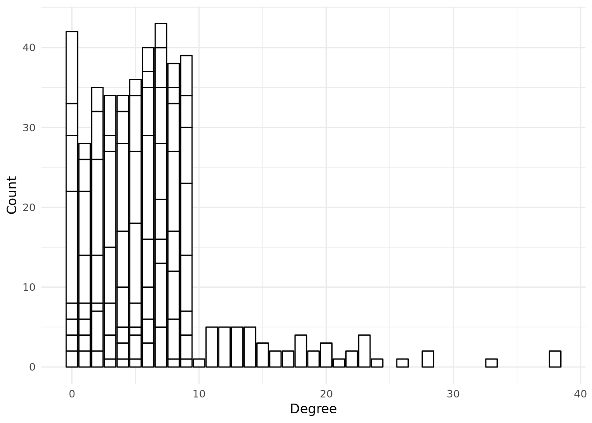

#### Degree distribution of agent->knows->agent edges

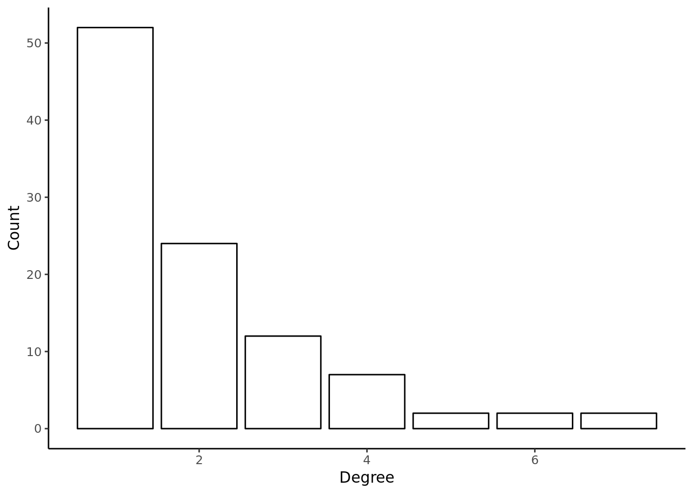

#### Runing time by method 

<table class="table table-condensed" style="width: auto !important; ">
 <thead>
  <tr>
   <th style="text-align:left;"> key </th>
   <th style="text-align:right;"> doc_count </th>
   <th style="text-align:right;"> sum_wallTime_ms.value </th>
   <th style="text-align:left;"> avg_wallTime_ms.value </th>
   <th style="text-align:left;"> includedInTotal </th>
  </tr>
 </thead>
<tbody>
  <tr>
   <td style="text-align:left;"> addItemToWork </td>
   <td style="text-align:right;"> 420 </td>
   <td style="text-align:right;"> 7,381 </td>
   <td style="text-align:left;"> 17.5738095238095 </td>
   <td style="text-align:left;"> No </td>
  </tr>
  <tr>
   <td style="text-align:left;"> ownsWork </td>
   <td style="text-align:right;"> 210 </td>
   <td style="text-align:right;"> 5,136 </td>
   <td style="text-align:left;"> 24.4571428571429 </td>
   <td style="text-align:left;"> No </td>
  </tr>
  <tr>
   <td style="text-align:left;"> init </td>
   <td style="text-align:right;"> 103 </td>
   <td style="text-align:right;"> 18,656 </td>
   <td style="text-align:left;"> 181.126213592233 </td>
   <td style="text-align:left;"> No </td>
  </tr>
  <tr>
   <td style="text-align:left;"> searchAndConnect </td>
   <td style="text-align:right;"> 101 </td>
   <td style="text-align:right;"> 350,246 </td>
   <td style="text-align:left;"> 3467.78217821782 </td>
   <td style="text-align:left;"> Yes </td>
  </tr>
  <tr>
   <td style="text-align:left;"> knowsAgent </td>
   <td style="text-align:right;"> 100 </td>
   <td style="text-align:right;"> 1,598 </td>
   <td style="text-align:left;"> 15.98 </td>
   <td style="text-align:left;"> No </td>
  </tr>
  <tr>
   <td style="text-align:left;"> getWorksItems </td>
   <td style="text-align:right;"> 18 </td>
   <td style="text-align:right;"> 328 </td>
   <td style="text-align:left;"> 18.2222222222222 </td>
   <td style="text-align:left;"> Yes </td>
  </tr>
  <tr>
   <td style="text-align:left;"> cycleSearch </td>
   <td style="text-align:right;"> 13 </td>
   <td style="text-align:right;"> 6,704 </td>
   <td style="text-align:left;"> 515.692307692308 </td>
   <td style="text-align:left;"> Yes </td>
  </tr>
  <tr>
   <td style="text-align:left;"> getWorks </td>
   <td style="text-align:right;"> 13 </td>
   <td style="text-align:right;"> 3,073 </td>
   <td style="text-align:left;"> 236.384615384615 </td>
   <td style="text-align:left;"> No </td>
  </tr>
  <tr>
   <td style="text-align:left;"> individualCycleSearch </td>
   <td style="text-align:right;"> 13 </td>
   <td style="text-align:right;"> 0 </td>
   <td style="text-align:left;"> 0 </td>
   <td style="text-align:left;"> Yes </td>
  </tr>
  <tr>
   <td style="text-align:left;font-weight: bold;"> Total </td>
   <td style="text-align:right;font-weight: bold;"> 153 </td>
   <td style="text-align:right;font-weight: bold;"> 364,001 </td>
   <td style="text-align:left;font-weight: bold;">  </td>
   <td style="text-align:left;font-weight: bold;">  </td>
  </tr>
</tbody>
</table>
####  Found structures 

#####  Cycles 

Number of cycles found:  7 

<button class="btn btn-primary" data-toggle="collapse" data-target="#BBXEPRLTEF"> Show/Hide foundCycle query </button> 
 
  
     GET /filebeat-*/_search 
              { 
                "query": {
                  "bool": {
                    "must": [
                      { "match_phrase": {
                        "simulationId": "SIM09-26-08-49-CAp4n2--DV"
                        }
                      },
                      { "bool": {
                        "should": [
                          { "match": {
                            "keyword": "foundCycle"
                          }}
                        ]
                      }}
                    ]
                  }
                }
              }
     

#####  Paths 

Number of paths found:  1 

<button class="btn btn-primary" data-toggle="collapse" data-target="#VXIFQLPGHS"> Show/Hide foundPath query </button> 
 
  
     GET /filebeat-*/_search 
              { 
                "query": {
                  "bool": {
                    "must": [
                      { "match_phrase": {
                        "simulationId": "SIM09-26-08-49-CAp4n2--DV"
                        }
                      },
                      { "bool": {
                        "should": [
                          { "match": {
                            "keyword": "foundPath"
                          }}
                        ]
                      }}
                    ]
                  }
                }
              }
     

###  SIM09-26-09-01-uC4dep--CV 

#### simulationParameters 

<table class="table table-condensed" style="width: auto !important; ">
 <thead>
  <tr>
   <th style="text-align:left;"> agentNumber </th>
   <th style="text-align:left;"> similarityConnectThreshold </th>
   <th style="text-align:left;"> graphType </th>
   <th style="text-align:left;"> chainLength </th>
   <th style="text-align:left;"> similaritySearchThreshold </th>
   <th style="text-align:left;"> maxDistance </th>
   <th style="text-align:left;"> randomWorksNumberMultiplier </th>
  </tr>
 </thead>
<tbody>
  <tr>
   <td style="text-align:left;width: 20em; "> 100 </td>
   <td style="text-align:left;width: 15em; "> 0.9 </td>
   <td style="text-align:left;width: 15em; "> smallWorld </td>
   <td style="text-align:left;width: 15em; "> 10 </td>
   <td style="text-align:left;width: 15em; "> 1 </td>
   <td style="text-align:left;width: 15em; "> 10 </td>
   <td style="text-align:left;width: 15em; "> 2 </td>
  </tr>
</tbody>
</table>
#### allEdgesByLabel

<table class="table table-condensed" style="width: auto !important; ">
 <thead>
  <tr>
   <th style="text-align:right;"> edges_offers </th>
   <th style="text-align:right;"> edges_similarity </th>
   <th style="text-align:right;"> edges_owns </th>
   <th style="text-align:right;"> edges_demands </th>
   <th style="text-align:right;"> edges_knows </th>
   <th style="text-align:right;"> edges_total </th>
  </tr>
 </thead>
<tbody>
  <tr>
   <td style="text-align:right;width: 5em; "> 210 </td>
   <td style="text-align:right;width: 5em; "> 37,426 </td>
   <td style="text-align:right;width: 5em; "> 210 </td>
   <td style="text-align:right;width: 5em; "> 210 </td>
   <td style="text-align:right;width: 5em; "> 601 </td>
   <td style="text-align:right;width: 5em; "> 38,657 </td>
  </tr>
</tbody>
</table>
#### allVerticesByType

<table class="table table-condensed" style="width: auto !important; ">
 <thead>
  <tr>
   <th style="text-align:right;"> vertices_agent </th>
   <th style="text-align:right;"> vertices_item </th>
   <th style="text-align:right;"> vertices_work </th>
   <th style="text-align:right;"> vertices_total </th>
  </tr>
 </thead>
<tbody>
  <tr>
   <td style="text-align:right;width: 5em; "> 101 </td>
   <td style="text-align:right;width: 5em; "> 420 </td>
   <td style="text-align:right;width: 5em; "> 210 </td>
   <td style="text-align:right;width: 5em; "> 731 </td>
  </tr>
</tbody>
</table>
#### distribution of similarityEdgesByWeight

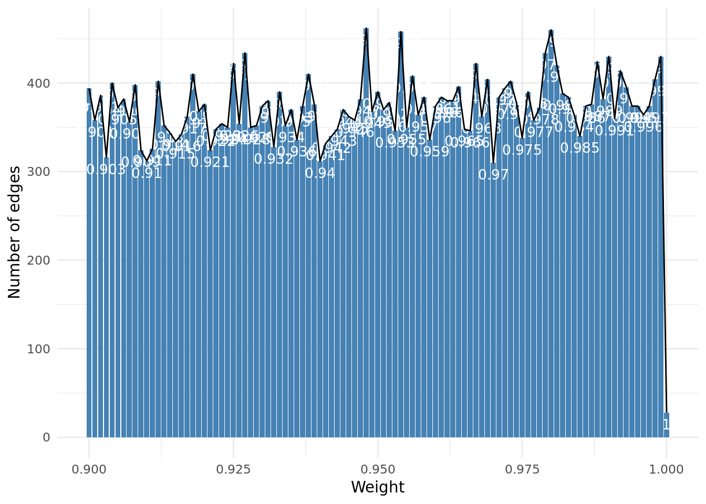

#### Degree distribution of item->similarity->item edges

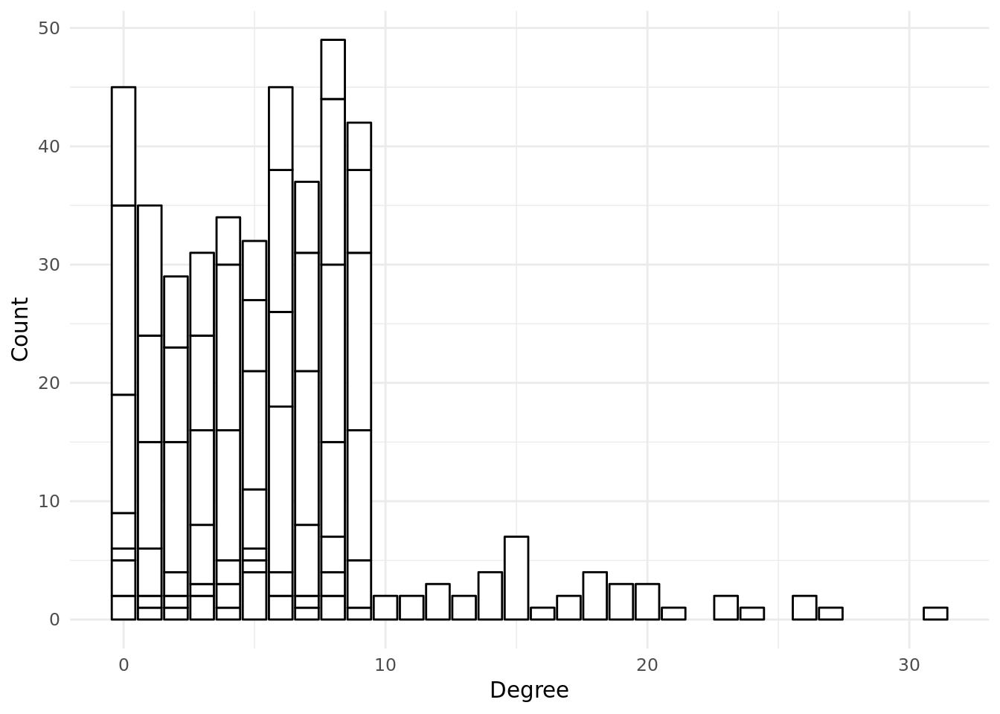

#### Degree distribution of agent->knows->agent edges

#### Runing time by method 

<table class="table table-condensed" style="width: auto !important; ">
 <thead>
  <tr>
   <th style="text-align:left;"> key </th>
   <th style="text-align:right;"> doc_count </th>
   <th style="text-align:right;"> sum_wallTime_ms.value </th>
   <th style="text-align:left;"> avg_wallTime_ms.value </th>
   <th style="text-align:left;"> includedInTotal </th>
  </tr>
 </thead>
<tbody>
  <tr>
   <td style="text-align:left;"> connectIfSimilar </td>
   <td style="text-align:right;"> 87,990 </td>
   <td style="text-align:right;"> 687,332 </td>
   <td style="text-align:left;"> 7.81147857711104 </td>
   <td style="text-align:left;"> No </td>
  </tr>
  <tr>
   <td style="text-align:left;"> existsSimilarity </td>
   <td style="text-align:right;"> 87,990 </td>
   <td style="text-align:right;"> 684,026 </td>
   <td style="text-align:left;"> 7.7739061256961 </td>
   <td style="text-align:left;"> No </td>
  </tr>
  <tr>
   <td style="text-align:left;"> similarityEdges </td>
   <td style="text-align:right;"> 87,990 </td>
   <td style="text-align:right;"> 676,212 </td>
   <td style="text-align:left;"> 7.68510057961132 </td>
   <td style="text-align:left;"> No </td>
  </tr>
  <tr>
   <td style="text-align:left;"> connectAllSimilar </td>
   <td style="text-align:right;"> 420 </td>
   <td style="text-align:right;"> 688,393 </td>
   <td style="text-align:left;"> 1639.03095238095 </td>
   <td style="text-align:left;"> Yes </td>
  </tr>
  <tr>
   <td style="text-align:left;"> connect </td>
   <td style="text-align:right;"> 190 </td>
   <td style="text-align:right;"> 1,140 </td>
   <td style="text-align:left;"> 6 </td>
   <td style="text-align:left;"> Yes </td>
  </tr>
  <tr>
   <td style="text-align:left;"> init </td>
   <td style="text-align:right;"> 103 </td>
   <td style="text-align:right;"> 17,760 </td>
   <td style="text-align:left;"> 172.427184466019 </td>
   <td style="text-align:left;"> No </td>
  </tr>
  <tr>
   <td style="text-align:left;font-weight: bold;"> Total </td>
   <td style="text-align:right;font-weight: bold;"> 618 </td>
   <td style="text-align:right;font-weight: bold;"> 690,958 </td>
   <td style="text-align:left;font-weight: bold;">  </td>
   <td style="text-align:left;font-weight: bold;">  </td>
  </tr>
</tbody>
</table>
####  Found structures 

#####  Cycles 

Number of cycles found:  1 

<button class="btn btn-primary" data-toggle="collapse" data-target="#YJVDBGDLDQ"> Show/Hide foundCycle query </button> 
 
  
     GET /filebeat-*/_search 
              { 
                "query": {
                  "bool": {
                    "must": [
                      { "match_phrase": {
                        "simulationId": "SIM09-26-09-01-uC4dep--CV"
                        }
                      },
                      { "bool": {
                        "should": [
                          { "match": {
                            "keyword": "foundCycle"
                          }}
                        ]
                      }}
                    ]
                  }
                }
              }
     

#####  Paths 

Number of paths found:  0 

<button class="btn btn-primary" data-toggle="collapse" data-target="#KHGKTFGUZB"> Show/Hide foundPath query </button> 
 
  
     GET /filebeat-*/_search 
              { 
                "query": {
                  "bool": {
                    "must": [
                      { "match_phrase": {
                        "simulationId": "SIM09-26-09-01-uC4dep--CV"
                        }
                      },
                      { "bool": {
                        "should": [
                          { "match": {
                            "keyword": "foundPath"
                          }}
                        ]
                      }}
                    ]
                  }
                }
              }
     

###  SIM09-26-09-01-uC4dep--DV 

#### simulationParameters 

<table class="table table-condensed" style="width: auto !important; ">
 <thead>
  <tr>
   <th style="text-align:left;"> agentNumber </th>
   <th style="text-align:left;"> similarityConnectThreshold </th>
   <th style="text-align:left;"> graphType </th>
   <th style="text-align:left;"> chainLength </th>
   <th style="text-align:left;"> similaritySearchThreshold </th>
   <th style="text-align:left;"> maxDistance </th>
   <th style="text-align:left;"> randomWorksNumberMultiplier </th>
  </tr>
 </thead>
<tbody>
  <tr>
   <td style="text-align:left;width: 20em; "> 100 </td>
   <td style="text-align:left;width: 15em; "> 0.9 </td>
   <td style="text-align:left;width: 15em; "> smallWorld </td>
   <td style="text-align:left;width: 15em; "> 10 </td>
   <td style="text-align:left;width: 15em; "> 1 </td>
   <td style="text-align:left;width: 15em; "> 10 </td>
   <td style="text-align:left;width: 15em; "> 2 </td>
  </tr>
</tbody>
</table>
#### allEdgesByLabel

<table class="table table-condensed" style="width: auto !important; ">
 <thead>
  <tr>
   <th style="text-align:right;"> edges_offers </th>
   <th style="text-align:right;"> edges_similarity </th>
   <th style="text-align:right;"> edges_owns </th>
   <th style="text-align:right;"> edges_demands </th>
   <th style="text-align:right;"> edges_knows </th>
   <th style="text-align:right;"> edges_total </th>
  </tr>
 </thead>
<tbody>
  <tr>
   <td style="text-align:right;width: 5em; "> 210 </td>
   <td style="text-align:right;width: 5em; "> 37,046 </td>
   <td style="text-align:right;width: 5em; "> 210 </td>
   <td style="text-align:right;width: 5em; "> 210 </td>
   <td style="text-align:right;width: 5em; "> 601 </td>
   <td style="text-align:right;width: 5em; "> 38,277 </td>
  </tr>
</tbody>
</table>
#### allVerticesByType

<table class="table table-condensed" style="width: auto !important; ">
 <thead>
  <tr>
   <th style="text-align:right;"> vertices_agent </th>
   <th style="text-align:right;"> vertices_item </th>
   <th style="text-align:right;"> vertices_work </th>
   <th style="text-align:right;"> vertices_total </th>
  </tr>
 </thead>
<tbody>
  <tr>
   <td style="text-align:right;width: 5em; "> 101 </td>
   <td style="text-align:right;width: 5em; "> 420 </td>
   <td style="text-align:right;width: 5em; "> 210 </td>
   <td style="text-align:right;width: 5em; "> 731 </td>
  </tr>
</tbody>
</table>
#### distribution of similarityEdgesByWeight

#### Degree distribution of item->similarity->item edges

#### Degree distribution of agent->knows->agent edges

#### Runing time by method 

<table class="table table-condensed" style="width: auto !important; ">
 <thead>
  <tr>
   <th style="text-align:left;"> key </th>
   <th style="text-align:right;"> doc_count </th>
   <th style="text-align:right;"> sum_wallTime_ms.value </th>
   <th style="text-align:left;"> avg_wallTime_ms.value </th>
   <th style="text-align:left;"> includedInTotal </th>
  </tr>
 </thead>
<tbody>
  <tr>
   <td style="text-align:left;"> knowsAgent </td>
   <td style="text-align:right;"> 601 </td>
   <td style="text-align:right;"> 2,138 </td>
   <td style="text-align:left;"> 3.55740432612313 </td>
   <td style="text-align:left;"> No </td>
  </tr>
  <tr>
   <td style="text-align:left;"> addItemToWork </td>
   <td style="text-align:right;"> 420 </td>
   <td style="text-align:right;"> 15,971 </td>
   <td style="text-align:left;"> 38.0261904761905 </td>
   <td style="text-align:left;"> No </td>
  </tr>
  <tr>
   <td style="text-align:left;"> ownsWork </td>
   <td style="text-align:right;"> 210 </td>
   <td style="text-align:right;"> 9,045 </td>
   <td style="text-align:left;"> 43.0714285714286 </td>
   <td style="text-align:left;"> No </td>
  </tr>
  <tr>
   <td style="text-align:left;"> init </td>
   <td style="text-align:right;"> 103 </td>
   <td style="text-align:right;"> 18,447 </td>
   <td style="text-align:left;"> 179.097087378641 </td>
   <td style="text-align:left;"> No </td>
  </tr>
  <tr>
   <td style="text-align:left;"> searchAndConnect </td>
   <td style="text-align:right;"> 101 </td>
   <td style="text-align:right;"> 477,883 </td>
   <td style="text-align:left;"> 4731.51485148515 </td>
   <td style="text-align:left;"> Yes </td>
  </tr>
  <tr>
   <td style="text-align:left;"> getWorksItems </td>
   <td style="text-align:right;"> 18 </td>
   <td style="text-align:right;"> 103 </td>
   <td style="text-align:left;"> 5.72222222222222 </td>
   <td style="text-align:left;"> Yes </td>
  </tr>
  <tr>
   <td style="text-align:left;"> cycleSearch </td>
   <td style="text-align:right;"> 16 </td>
   <td style="text-align:right;"> 753 </td>
   <td style="text-align:left;"> 47.0625 </td>
   <td style="text-align:left;"> Yes </td>
  </tr>
  <tr>
   <td style="text-align:left;"> getWorks </td>
   <td style="text-align:right;"> 16 </td>
   <td style="text-align:right;"> 995 </td>
   <td style="text-align:left;"> 62.1875 </td>
   <td style="text-align:left;"> No </td>
  </tr>
  <tr>
   <td style="text-align:left;"> individualCycleSearch </td>
   <td style="text-align:right;"> 16 </td>
   <td style="text-align:right;"> 0 </td>
   <td style="text-align:left;"> 0 </td>
   <td style="text-align:left;"> Yes </td>
  </tr>
  <tr>
   <td style="text-align:left;font-weight: bold;"> Total </td>
   <td style="text-align:right;font-weight: bold;"> 158 </td>
   <td style="text-align:right;font-weight: bold;"> 481,564 </td>
   <td style="text-align:left;font-weight: bold;">  </td>
   <td style="text-align:left;font-weight: bold;">  </td>
  </tr>
</tbody>
</table>
####  Found structures 

#####  Cycles 

Number of cycles found:  7 

<button class="btn btn-primary" data-toggle="collapse" data-target="#VSPBWFPBJQ"> Show/Hide foundCycle query </button> 
 
  
     GET /filebeat-*/_search 
              { 
                "query": {
                  "bool": {
                    "must": [
                      { "match_phrase": {
                        "simulationId": "SIM09-26-09-01-uC4dep--DV"
                        }
                      },
                      { "bool": {
                        "should": [
                          { "match": {
                            "keyword": "foundCycle"
                          }}
                        ]
                      }}
                    ]
                  }
                }
              }
     

#####  Paths 

Number of paths found:  0 

<button class="btn btn-primary" data-toggle="collapse" data-target="#WNYINNKHRS"> Show/Hide foundPath query </button> 
 
  
     GET /filebeat-*/_search 
              { 
                "query": {
                  "bool": {
                    "must": [
                      { "match_phrase": {
                        "simulationId": "SIM09-26-09-01-uC4dep--DV"
                        }
                      },
                      { "bool": {
                        "should": [
                          { "match": {
                            "keyword": "foundPath"
                          }}
                        ]
                      }}
                    ]
                  }
                }
              }
     

###  SIM09-26-06-20-tGqpmN--CV 

#### simulationParameters 

<table class="table table-condensed" style="width: auto !important; ">
 <thead>
  <tr>
   <th style="text-align:left;"> agentNumber </th>
   <th style="text-align:left;"> similarityConnectThreshold </th>
   <th style="text-align:left;"> graphType </th>
   <th style="text-align:left;"> chainLength </th>
   <th style="text-align:left;"> similaritySearchThreshold </th>
   <th style="text-align:left;"> maxDistance </th>
   <th style="text-align:left;"> randomWorksNumberMultiplier </th>
  </tr>
 </thead>
<tbody>
  <tr>
   <td style="text-align:left;width: 20em; "> 100 </td>
   <td style="text-align:left;width: 15em; "> 0.9 </td>
   <td style="text-align:left;width: 15em; "> random </td>
   <td style="text-align:left;width: 15em; "> 10 </td>
   <td style="text-align:left;width: 15em; "> 1 </td>
   <td style="text-align:left;width: 15em; "> 30 </td>
   <td style="text-align:left;width: 15em; "> 1 </td>
  </tr>
</tbody>
</table>
#### allEdgesByLabel

<table class="table table-condensed" style="width: auto !important; ">
 <thead>
  <tr>
   <th style="text-align:right;"> edges_offers </th>
   <th style="text-align:right;"> edges_similarity </th>
   <th style="text-align:right;"> edges_owns </th>
   <th style="text-align:right;"> edges_demands </th>
   <th style="text-align:right;"> edges_knows </th>
   <th style="text-align:right;"> edges_total </th>
  </tr>
 </thead>
<tbody>
  <tr>
   <td style="text-align:right;width: 5em; "> 110 </td>
   <td style="text-align:right;width: 5em; "> 10,876 </td>
   <td style="text-align:right;width: 5em; "> 110 </td>
   <td style="text-align:right;width: 5em; "> 110 </td>
   <td style="text-align:right;width: 5em; "> 100 </td>
   <td style="text-align:right;width: 5em; "> 11,306 </td>
  </tr>
</tbody>
</table>
#### allVerticesByType

<table class="table table-condensed" style="width: auto !important; ">
 <thead>
  <tr>
   <th style="text-align:right;"> vertices_agent </th>
   <th style="text-align:right;"> vertices_item </th>
   <th style="text-align:right;"> vertices_work </th>
   <th style="text-align:right;"> vertices_total </th>
  </tr>
 </thead>
<tbody>
  <tr>
   <td style="text-align:right;width: 5em; "> 101 </td>
   <td style="text-align:right;width: 5em; "> 220 </td>
   <td style="text-align:right;width: 5em; "> 110 </td>
   <td style="text-align:right;width: 5em; "> 431 </td>
  </tr>
</tbody>
</table>
#### distribution of similarityEdgesByWeight

#### Degree distribution of item->similarity->item edges

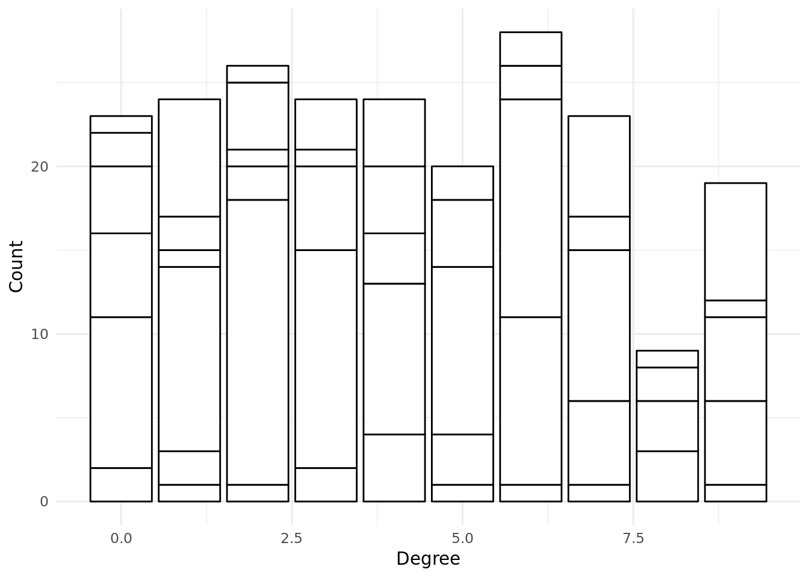

#### Degree distribution of agent->knows->agent edges

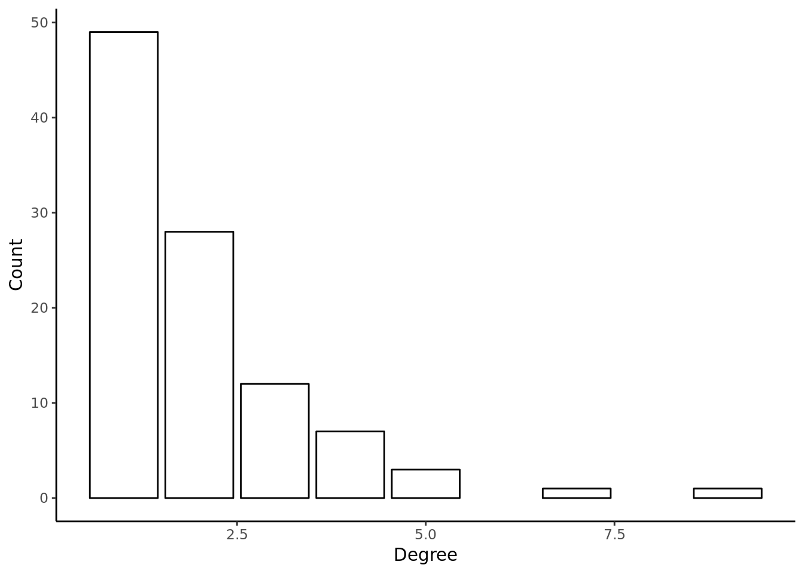

#### Runing time by method 

<table class="table table-condensed" style="width: auto !important; ">
 <thead>
  <tr>
   <th style="text-align:left;"> key </th>
   <th style="text-align:right;"> doc_count </th>
   <th style="text-align:right;"> sum_wallTime_ms.value </th>
   <th style="text-align:left;"> avg_wallTime_ms.value </th>
   <th style="text-align:left;"> includedInTotal </th>
  </tr>
 </thead>
<tbody>
  <tr>
   <td style="text-align:left;"> connectIfSimilar </td>
   <td style="text-align:right;"> 24,090 </td>
   <td style="text-align:right;"> 133,199 </td>
   <td style="text-align:left;"> 5.52922374429224 </td>
   <td style="text-align:left;"> No </td>
  </tr>
  <tr>
   <td style="text-align:left;"> existsSimilarity </td>
   <td style="text-align:right;"> 24,090 </td>
   <td style="text-align:right;"> 132,289 </td>
   <td style="text-align:left;"> 5.49144873391449 </td>
   <td style="text-align:left;"> No </td>
  </tr>
  <tr>
   <td style="text-align:left;"> similarityEdges </td>
   <td style="text-align:right;"> 24,090 </td>
   <td style="text-align:right;"> 130,431 </td>
   <td style="text-align:left;"> 5.41432129514321 </td>
   <td style="text-align:left;"> No </td>
  </tr>
  <tr>
   <td style="text-align:left;"> connectAllSimilar </td>
   <td style="text-align:right;"> 220 </td>
   <td style="text-align:right;"> 133,466 </td>
   <td style="text-align:left;"> 606.663636363636 </td>
   <td style="text-align:left;"> Yes </td>
  </tr>
  <tr>
   <td style="text-align:left;"> init </td>
   <td style="text-align:right;"> 103 </td>
   <td style="text-align:right;"> 16,873 </td>
   <td style="text-align:left;"> 163.815533980583 </td>
   <td style="text-align:left;"> No </td>
  </tr>
  <tr>
   <td style="text-align:left;"> connect </td>
   <td style="text-align:right;"> 73 </td>
   <td style="text-align:right;"> 328 </td>
   <td style="text-align:left;"> 4.49315068493151 </td>
   <td style="text-align:left;"> Yes </td>
  </tr>
  <tr>
   <td style="text-align:left;font-weight: bold;"> Total </td>
   <td style="text-align:right;font-weight: bold;"> 301 </td>
   <td style="text-align:right;font-weight: bold;"> 134,547 </td>
   <td style="text-align:left;font-weight: bold;">  </td>
   <td style="text-align:left;font-weight: bold;">  </td>
  </tr>
</tbody>
</table>
####  Found structures 

#####  Cycles 

Number of cycles found:  1 

<button class="btn btn-primary" data-toggle="collapse" data-target="#GVJQCYSTWI"> Show/Hide foundCycle query </button> 
 
  
     GET /filebeat-*/_search 
              { 
                "query": {
                  "bool": {
                    "must": [
                      { "match_phrase": {
                        "simulationId": "SIM09-26-06-20-tGqpmN--CV"
                        }
                      },
                      { "bool": {
                        "should": [
                          { "match": {
                            "keyword": "foundCycle"
                          }}
                        ]
                      }}
                    ]
                  }
                }
              }
     

#####  Paths 

Number of paths found:  0 

<button class="btn btn-primary" data-toggle="collapse" data-target="#QVXYBCBJYF"> Show/Hide foundPath query </button> 
 
  
     GET /filebeat-*/_search 
              { 
                "query": {
                  "bool": {
                    "must": [
                      { "match_phrase": {
                        "simulationId": "SIM09-26-06-20-tGqpmN--CV"
                        }
                      },
                      { "bool": {
                        "should": [
                          { "match": {
                            "keyword": "foundPath"
                          }}
                        ]
                      }}
                    ]
                  }
                }
              }
     

###  SIM09-26-06-20-tGqpmN--DV 

#### simulationParameters 

<table class="table table-condensed" style="width: auto !important; ">
 <thead>
  <tr>
   <th style="text-align:left;"> agentNumber </th>
   <th style="text-align:left;"> similarityConnectThreshold </th>
   <th style="text-align:left;"> graphType </th>
   <th style="text-align:left;"> chainLength </th>
   <th style="text-align:left;"> similaritySearchThreshold </th>
   <th style="text-align:left;"> maxDistance </th>
   <th style="text-align:left;"> randomWorksNumberMultiplier </th>
  </tr>
 </thead>
<tbody>
  <tr>
   <td style="text-align:left;width: 20em; "> 100 </td>
   <td style="text-align:left;width: 15em; "> 0.9 </td>
   <td style="text-align:left;width: 15em; "> random </td>
   <td style="text-align:left;width: 15em; "> 10 </td>
   <td style="text-align:left;width: 15em; "> 1 </td>
   <td style="text-align:left;width: 15em; "> 30 </td>
   <td style="text-align:left;width: 15em; "> 1 </td>
  </tr>
</tbody>
</table>
#### allEdgesByLabel

<table class="table table-condensed" style="width: auto !important; ">
 <thead>
  <tr>
   <th style="text-align:right;"> edges_offers </th>
   <th style="text-align:right;"> edges_similarity </th>
   <th style="text-align:right;"> edges_owns </th>
   <th style="text-align:right;"> edges_demands </th>
   <th style="text-align:right;"> edges_knows </th>
   <th style="text-align:right;"> edges_total </th>
  </tr>
 </thead>
<tbody>
  <tr>
   <td style="text-align:right;width: 5em; "> 110 </td>
   <td style="text-align:right;width: 5em; "> 10,730 </td>
   <td style="text-align:right;width: 5em; "> 110 </td>
   <td style="text-align:right;width: 5em; "> 110 </td>
   <td style="text-align:right;width: 5em; "> 100 </td>
   <td style="text-align:right;width: 5em; "> 11,160 </td>
  </tr>
</tbody>
</table>
#### allVerticesByType

<table class="table table-condensed" style="width: auto !important; ">
 <thead>
  <tr>
   <th style="text-align:right;"> vertices_agent </th>
   <th style="text-align:right;"> vertices_item </th>
   <th style="text-align:right;"> vertices_work </th>
   <th style="text-align:right;"> vertices_total </th>
  </tr>
 </thead>
<tbody>
  <tr>
   <td style="text-align:right;width: 5em; "> 101 </td>
   <td style="text-align:right;width: 5em; "> 220 </td>
   <td style="text-align:right;width: 5em; "> 110 </td>
   <td style="text-align:right;width: 5em; "> 431 </td>
  </tr>
</tbody>
</table>
#### distribution of similarityEdgesByWeight

#### Degree distribution of item->similarity->item edges

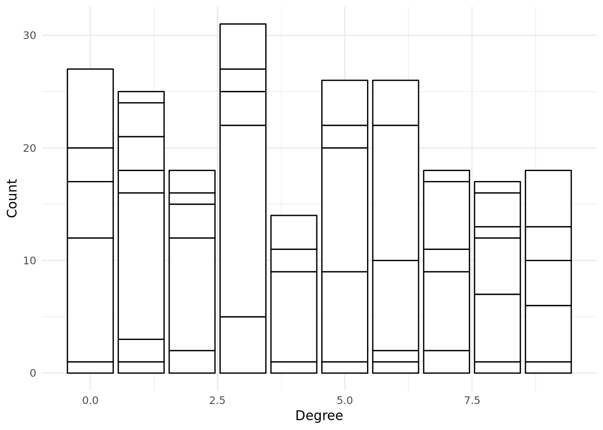

#### Degree distribution of agent->knows->agent edges

#### Runing time by method 

<table class="table table-condensed" style="width: auto !important; ">
 <thead>
  <tr>
   <th style="text-align:left;">   </th>
   <th style="text-align:left;"> key </th>
   <th style="text-align:right;"> doc_count </th>
   <th style="text-align:right;"> sum_wallTime_ms.value </th>
   <th style="text-align:left;"> avg_wallTime_ms.value </th>
   <th style="text-align:left;"> includedInTotal </th>
  </tr>
 </thead>
<tbody>
  <tr>
   <td style="text-align:left;"> 1 </td>
   <td style="text-align:left;"> addItemToWork </td>
   <td style="text-align:right;"> 220 </td>
   <td style="text-align:right;"> 9,583 </td>
   <td style="text-align:left;"> 43.5590909090909 </td>
   <td style="text-align:left;"> No </td>
  </tr>
  <tr>
   <td style="text-align:left;"> 2 </td>
   <td style="text-align:left;"> ownsWork </td>
   <td style="text-align:right;"> 110 </td>
   <td style="text-align:right;"> 4,438 </td>
   <td style="text-align:left;"> 40.3454545454545 </td>
   <td style="text-align:left;"> No </td>
  </tr>
  <tr>
   <td style="text-align:left;"> 3 </td>
   <td style="text-align:left;"> init </td>
   <td style="text-align:right;"> 103 </td>
   <td style="text-align:right;"> 17,144 </td>
   <td style="text-align:left;"> 166.446601941748 </td>
   <td style="text-align:left;"> No </td>
  </tr>
  <tr>
   <td style="text-align:left;"> 4 </td>
   <td style="text-align:left;"> searchAndConnect </td>
   <td style="text-align:right;"> 101 </td>
   <td style="text-align:right;"> 124,782 </td>
   <td style="text-align:left;"> 1235.46534653465 </td>
   <td style="text-align:left;"> Yes </td>
  </tr>
  <tr>
   <td style="text-align:left;"> 5 </td>
   <td style="text-align:left;"> knowsAgent </td>
   <td style="text-align:right;"> 100 </td>
   <td style="text-align:right;"> 2,407 </td>
   <td style="text-align:left;"> 24.07 </td>
   <td style="text-align:left;"> No </td>
  </tr>
  <tr>
   <td style="text-align:left;"> 6 </td>
   <td style="text-align:left;"> getWorksItems </td>
   <td style="text-align:right;"> 18 </td>
   <td style="text-align:right;"> 164 </td>
   <td style="text-align:left;"> 9.11111111111111 </td>
   <td style="text-align:left;"> Yes </td>
  </tr>
  <tr>
   <td style="text-align:left;"> 8 </td>
   <td style="text-align:left;"> cycleSearch </td>
   <td style="text-align:right;"> 5 </td>
   <td style="text-align:right;"> 1,670 </td>
   <td style="text-align:left;"> 334 </td>
   <td style="text-align:left;"> Yes </td>
  </tr>
  <tr>
   <td style="text-align:left;"> 10 </td>
   <td style="text-align:left;"> getWorks </td>
   <td style="text-align:right;"> 5 </td>
   <td style="text-align:right;"> 1,073 </td>
   <td style="text-align:left;"> 214.6 </td>
   <td style="text-align:left;"> No </td>
  </tr>
  <tr>
   <td style="text-align:left;font-weight: bold;"> 11 </td>
   <td style="text-align:left;font-weight: bold;"> Total </td>
   <td style="text-align:right;font-weight: bold;"> 134 </td>
   <td style="text-align:right;font-weight: bold;"> 129,811 </td>
   <td style="text-align:left;font-weight: bold;">  </td>
   <td style="text-align:left;font-weight: bold;">  </td>
  </tr>
</tbody>
</table>
####  Found structures 

#####  Cycles 

Number of cycles found:  4 

<button class="btn btn-primary" data-toggle="collapse" data-target="#ZWDPJKXKEA"> Show/Hide foundCycle query </button> 
 
  
     GET /filebeat-*/_search 
              { 
                "query": {
                  "bool": {
                    "must": [
                      { "match_phrase": {
                        "simulationId": "SIM09-26-06-20-tGqpmN--DV"
                        }
                      },
                      { "bool": {
                        "should": [
                          { "match": {
                            "keyword": "foundCycle"
                          }}
                        ]
                      }}
                    ]
                  }
                }
              }
     

#####  Paths 

Number of paths found:  1 

<button class="btn btn-primary" data-toggle="collapse" data-target="#TPLGGSBBER"> Show/Hide foundPath query </button> 
 
  
     GET /filebeat-*/_search 
              { 
                "query": {
                  "bool": {
                    "must": [
                      { "match_phrase": {
                        "simulationId": "SIM09-26-06-20-tGqpmN--DV"
                        }
                      },
                      { "bool": {
                        "should": [
                          { "match": {
                            "keyword": "foundPath"
                          }}
                        ]
                      }}
                    ]
                  }
                }
              }
     

###  SIM09-26-06-23-W7ZUAu--CV 

#### simulationParameters 

<table class="table table-condensed" style="width: auto !important; ">
 <thead>
  <tr>
   <th style="text-align:left;"> agentNumber </th>
   <th style="text-align:left;"> similarityConnectThreshold </th>
   <th style="text-align:left;"> graphType </th>
   <th style="text-align:left;"> chainLength </th>
   <th style="text-align:left;"> similaritySearchThreshold </th>
   <th style="text-align:left;"> maxDistance </th>
   <th style="text-align:left;"> randomWorksNumberMultiplier </th>
  </tr>
 </thead>
<tbody>
  <tr>
   <td style="text-align:left;width: 20em; "> 100 </td>
   <td style="text-align:left;width: 15em; "> 0.9 </td>
   <td style="text-align:left;width: 15em; "> smallWorld </td>
   <td style="text-align:left;width: 15em; "> 10 </td>
   <td style="text-align:left;width: 15em; "> 1 </td>
   <td style="text-align:left;width: 15em; "> 30 </td>
   <td style="text-align:left;width: 15em; "> 1 </td>
  </tr>
</tbody>
</table>
#### allEdgesByLabel

<table class="table table-condensed" style="width: auto !important; ">
 <thead>
  <tr>
   <th style="text-align:right;"> edges_offers </th>
   <th style="text-align:right;"> edges_similarity </th>
   <th style="text-align:right;"> edges_owns </th>
   <th style="text-align:right;"> edges_demands </th>
   <th style="text-align:right;"> edges_knows </th>
   <th style="text-align:right;"> edges_total </th>
  </tr>
 </thead>
<tbody>
  <tr>
   <td style="text-align:right;width: 5em; "> 110 </td>
   <td style="text-align:right;width: 5em; "> 10,926 </td>
   <td style="text-align:right;width: 5em; "> 110 </td>
   <td style="text-align:right;width: 5em; "> 110 </td>
   <td style="text-align:right;width: 5em; "> 601 </td>
   <td style="text-align:right;width: 5em; "> 11,857 </td>
  </tr>
</tbody>
</table>
#### allVerticesByType

<table class="table table-condensed" style="width: auto !important; ">
 <thead>
  <tr>
   <th style="text-align:right;"> vertices_agent </th>
   <th style="text-align:right;"> vertices_item </th>
   <th style="text-align:right;"> vertices_work </th>
   <th style="text-align:right;"> vertices_total </th>
  </tr>
 </thead>
<tbody>
  <tr>
   <td style="text-align:right;width: 5em; "> 101 </td>
   <td style="text-align:right;width: 5em; "> 220 </td>
   <td style="text-align:right;width: 5em; "> 110 </td>
   <td style="text-align:right;width: 5em; "> 431 </td>
  </tr>
</tbody>
</table>
#### distribution of similarityEdgesByWeight

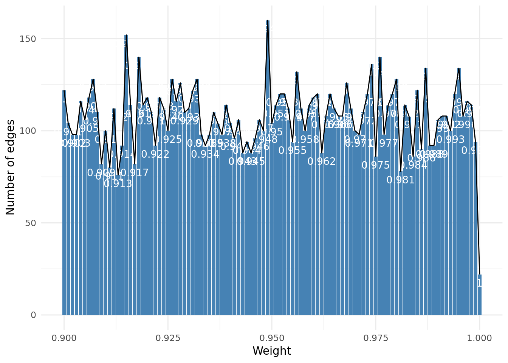

#### Degree distribution of item->similarity->item edges

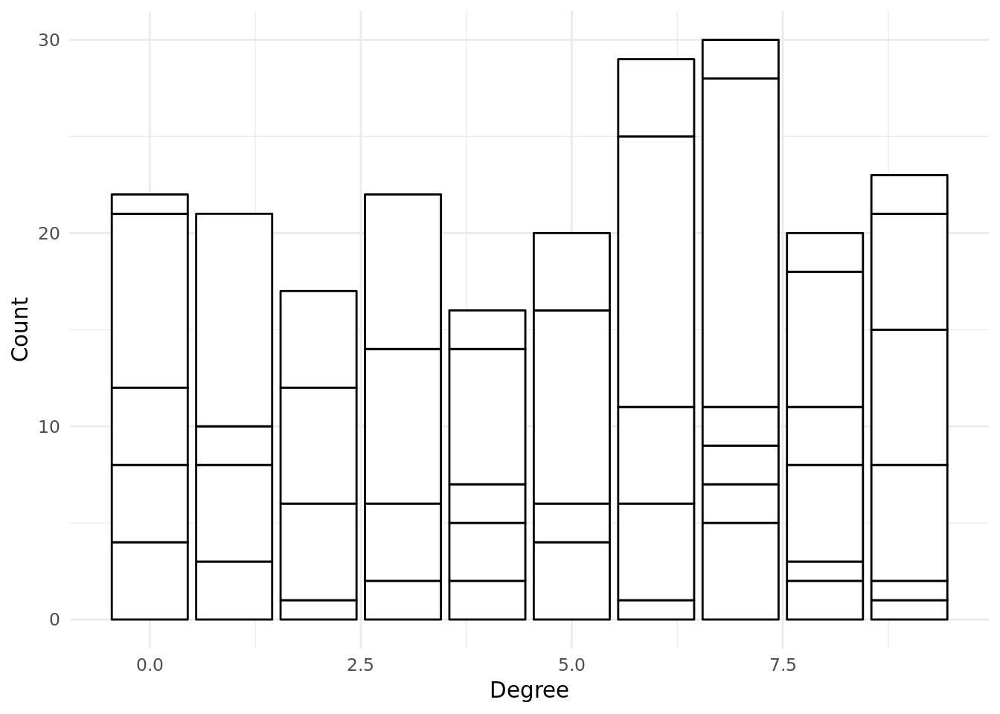

#### Degree distribution of agent->knows->agent edges

#### Runing time by method 

<table class="table table-condensed" style="width: auto !important; ">
 <thead>
  <tr>
   <th style="text-align:left;"> key </th>
   <th style="text-align:right;"> doc_count </th>
   <th style="text-align:right;"> sum_wallTime_ms.value </th>
   <th style="text-align:left;"> avg_wallTime_ms.value </th>
   <th style="text-align:left;"> includedInTotal </th>
  </tr>
 </thead>
<tbody>
  <tr>
   <td style="text-align:left;"> connectIfSimilar </td>
   <td style="text-align:right;"> 24,090 </td>
   <td style="text-align:right;"> 130,309 </td>
   <td style="text-align:left;"> 5.40925695309257 </td>
   <td style="text-align:left;"> No </td>
  </tr>
  <tr>
   <td style="text-align:left;"> existsSimilarity </td>
   <td style="text-align:right;"> 24,090 </td>
   <td style="text-align:right;"> 129,220 </td>
   <td style="text-align:left;"> 5.36405147364052 </td>
   <td style="text-align:left;"> No </td>
  </tr>
  <tr>
   <td style="text-align:left;"> similarityEdges </td>
   <td style="text-align:right;"> 24,090 </td>
   <td style="text-align:right;"> 127,517 </td>
   <td style="text-align:left;"> 5.29335823993358 </td>
   <td style="text-align:left;"> No </td>
  </tr>
  <tr>
   <td style="text-align:left;"> connectAllSimilar </td>
   <td style="text-align:right;"> 220 </td>
   <td style="text-align:right;"> 130,589 </td>
   <td style="text-align:left;"> 593.586363636364 </td>
   <td style="text-align:left;"> Yes </td>
  </tr>
  <tr>
   <td style="text-align:left;"> init </td>
   <td style="text-align:right;"> 103 </td>
   <td style="text-align:right;"> 17,279 </td>
   <td style="text-align:left;"> 167.757281553398 </td>
   <td style="text-align:left;"> No </td>
  </tr>
  <tr>
   <td style="text-align:left;"> connect </td>
   <td style="text-align:right;"> 66 </td>
   <td style="text-align:right;"> 537 </td>
   <td style="text-align:left;"> 8.13636363636364 </td>
   <td style="text-align:left;"> Yes </td>
  </tr>
  <tr>
   <td style="text-align:left;font-weight: bold;"> Total </td>
   <td style="text-align:right;font-weight: bold;"> 294 </td>
   <td style="text-align:right;font-weight: bold;"> 132,119 </td>
   <td style="text-align:left;font-weight: bold;">  </td>
   <td style="text-align:left;font-weight: bold;">  </td>
  </tr>
</tbody>
</table>
####  Found structures 

#####  Cycles 

Number of cycles found:  1 

<button class="btn btn-primary" data-toggle="collapse" data-target="#PKRCUOISFG"> Show/Hide foundCycle query </button> 
 
  
     GET /filebeat-*/_search 
              { 
                "query": {
                  "bool": {
                    "must": [
                      { "match_phrase": {
                        "simulationId": "SIM09-26-06-23-W7ZUAu--CV"
                        }
                      },
                      { "bool": {
                        "should": [
                          { "match": {
                            "keyword": "foundCycle"
                          }}
                        ]
                      }}
                    ]
                  }
                }
              }
     

#####  Paths 

Number of paths found:  0 

<button class="btn btn-primary" data-toggle="collapse" data-target="#ERZTLBKHHW"> Show/Hide foundPath query </button> 
 
  
     GET /filebeat-*/_search 
              { 
                "query": {
                  "bool": {
                    "must": [
                      { "match_phrase": {
                        "simulationId": "SIM09-26-06-23-W7ZUAu--CV"
                        }
                      },
                      { "bool": {
                        "should": [
                          { "match": {
                            "keyword": "foundPath"
                          }}
                        ]
                      }}
                    ]
                  }
                }
              }
     

###  SIM09-26-06-23-W7ZUAu--DV 

#### simulationParameters 

<table class="table table-condensed" style="width: auto !important; ">
 <thead>
  <tr>
   <th style="text-align:left;"> agentNumber </th>
   <th style="text-align:left;"> similarityConnectThreshold </th>
   <th style="text-align:left;"> graphType </th>
   <th style="text-align:left;"> chainLength </th>
   <th style="text-align:left;"> similaritySearchThreshold </th>
   <th style="text-align:left;"> maxDistance </th>
   <th style="text-align:left;"> randomWorksNumberMultiplier </th>
  </tr>
 </thead>
<tbody>
  <tr>
   <td style="text-align:left;width: 20em; "> 100 </td>
   <td style="text-align:left;width: 15em; "> 0.9 </td>
   <td style="text-align:left;width: 15em; "> smallWorld </td>
   <td style="text-align:left;width: 15em; "> 10 </td>
   <td style="text-align:left;width: 15em; "> 1 </td>
   <td style="text-align:left;width: 15em; "> 30 </td>
   <td style="text-align:left;width: 15em; "> 1 </td>
  </tr>
</tbody>
</table>
#### allEdgesByLabel

<table class="table table-condensed" style="width: auto !important; ">
 <thead>
  <tr>
   <th style="text-align:right;"> edges_offers </th>
   <th style="text-align:right;"> edges_similarity </th>
   <th style="text-align:right;"> edges_owns </th>
   <th style="text-align:right;"> edges_demands </th>
   <th style="text-align:right;"> edges_knows </th>
   <th style="text-align:right;"> edges_total </th>
  </tr>
 </thead>
<tbody>
  <tr>
   <td style="text-align:right;width: 5em; "> 110 </td>
   <td style="text-align:right;width: 5em; "> 10,794 </td>
   <td style="text-align:right;width: 5em; "> 110 </td>
   <td style="text-align:right;width: 5em; "> 110 </td>
   <td style="text-align:right;width: 5em; "> 601 </td>
   <td style="text-align:right;width: 5em; "> 11,725 </td>
  </tr>
</tbody>
</table>
#### allVerticesByType

<table class="table table-condensed" style="width: auto !important; ">
 <thead>
  <tr>
   <th style="text-align:right;"> vertices_agent </th>
   <th style="text-align:right;"> vertices_item </th>
   <th style="text-align:right;"> vertices_work </th>
   <th style="text-align:right;"> vertices_total </th>
  </tr>
 </thead>
<tbody>
  <tr>
   <td style="text-align:right;width: 5em; "> 101 </td>
   <td style="text-align:right;width: 5em; "> 220 </td>
   <td style="text-align:right;width: 5em; "> 110 </td>
   <td style="text-align:right;width: 5em; "> 431 </td>
  </tr>
</tbody>
</table>
#### distribution of similarityEdgesByWeight

#### Degree distribution of item->similarity->item edges

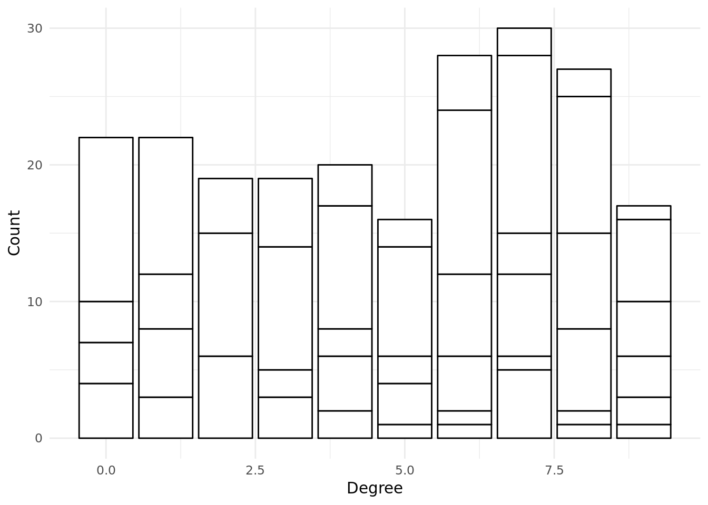

#### Degree distribution of agent->knows->agent edges

#### Runing time by method 

<table class="table table-condensed" style="width: auto !important; ">
 <thead>
  <tr>
   <th style="text-align:left;">   </th>
   <th style="text-align:left;"> key </th>
   <th style="text-align:right;"> doc_count </th>
   <th style="text-align:right;"> sum_wallTime_ms.value </th>
   <th style="text-align:left;"> avg_wallTime_ms.value </th>
   <th style="text-align:left;"> includedInTotal </th>
  </tr>
 </thead>
<tbody>
  <tr>
   <td style="text-align:left;"> 1 </td>
   <td style="text-align:left;"> knowsAgent </td>
   <td style="text-align:right;"> 601 </td>
   <td style="text-align:right;"> 3,469 </td>
   <td style="text-align:left;"> 5.7720465890183 </td>
   <td style="text-align:left;"> No </td>
  </tr>
  <tr>
   <td style="text-align:left;"> 2 </td>
   <td style="text-align:left;"> addItemToWork </td>
   <td style="text-align:right;"> 220 </td>
   <td style="text-align:right;"> 4,381 </td>
   <td style="text-align:left;"> 19.9136363636364 </td>
   <td style="text-align:left;"> No </td>
  </tr>
  <tr>
   <td style="text-align:left;"> 3 </td>
   <td style="text-align:left;"> ownsWork </td>
   <td style="text-align:right;"> 110 </td>
   <td style="text-align:right;"> 3,647 </td>
   <td style="text-align:left;"> 33.1545454545455 </td>
   <td style="text-align:left;"> No </td>
  </tr>
  <tr>
   <td style="text-align:left;"> 4 </td>
   <td style="text-align:left;"> init </td>
   <td style="text-align:right;"> 103 </td>
   <td style="text-align:right;"> 18,346 </td>
   <td style="text-align:left;"> 178.116504854369 </td>
   <td style="text-align:left;"> No </td>
  </tr>
  <tr>
   <td style="text-align:left;"> 5 </td>
   <td style="text-align:left;"> searchAndConnect </td>
   <td style="text-align:right;"> 101 </td>
   <td style="text-align:right;"> 165,480 </td>
   <td style="text-align:left;"> 1638.41584158416 </td>
   <td style="text-align:left;"> Yes </td>
  </tr>
  <tr>
   <td style="text-align:left;"> 6 </td>
   <td style="text-align:left;"> getWorksItems </td>
   <td style="text-align:right;"> 18 </td>
   <td style="text-align:right;"> 31 </td>
   <td style="text-align:left;"> 1.72222222222222 </td>
   <td style="text-align:left;"> Yes </td>
  </tr>
  <tr>
   <td style="text-align:left;"> 8 </td>
   <td style="text-align:left;"> cycleSearch </td>
   <td style="text-align:right;"> 6 </td>
   <td style="text-align:right;"> 1,343 </td>
   <td style="text-align:left;"> 223.833333333333 </td>
   <td style="text-align:left;"> Yes </td>
  </tr>
  <tr>
   <td style="text-align:left;"> 9 </td>
   <td style="text-align:left;"> getWorks </td>
   <td style="text-align:right;"> 6 </td>
   <td style="text-align:right;"> 1,444 </td>
   <td style="text-align:left;"> 240.666666666667 </td>
   <td style="text-align:left;"> No </td>
  </tr>
  <tr>
   <td style="text-align:left;"> 10 </td>
   <td style="text-align:left;"> individualCycleSearch </td>
   <td style="text-align:right;"> 6 </td>
   <td style="text-align:right;"> 0 </td>
   <td style="text-align:left;"> 0 </td>
   <td style="text-align:left;"> Yes </td>
  </tr>
  <tr>
   <td style="text-align:left;font-weight: bold;"> 11 </td>
   <td style="text-align:left;font-weight: bold;"> Total </td>
   <td style="text-align:right;font-weight: bold;"> 137 </td>
   <td style="text-align:right;font-weight: bold;"> 168,445 </td>
   <td style="text-align:left;font-weight: bold;">  </td>
   <td style="text-align:left;font-weight: bold;">  </td>
  </tr>
</tbody>
</table>
####  Found structures 

#####  Cycles 

Number of cycles found:  6 

<button class="btn btn-primary" data-toggle="collapse" data-target="#MOHMWDNOJL"> Show/Hide foundCycle query </button> 
 
  
     GET /filebeat-*/_search 
              { 
                "query": {
                  "bool": {
                    "must": [
                      { "match_phrase": {
                        "simulationId": "SIM09-26-06-23-W7ZUAu--DV"
                        }
                      },
                      { "bool": {
                        "should": [
                          { "match": {
                            "keyword": "foundCycle"
                          }}
                        ]
                      }}
                    ]
                  }
                }
              }
     

#####  Paths 

Number of paths found:  0 

<button class="btn btn-primary" data-toggle="collapse" data-target="#RJHBRWOWQL"> Show/Hide foundPath query </button> 
 
  
     GET /filebeat-*/_search 
              { 
                "query": {
                  "bool": {
                    "must": [
                      { "match_phrase": {
                        "simulationId": "SIM09-26-06-23-W7ZUAu--DV"
                        }
                      },
                      { "bool": {
                        "should": [
                          { "match": {
                            "keyword": "foundPath"
                          }}
                        ]
                      }}
                    ]
                  }
                }
              }
     

###  SIM09-26-09-14-SJNkHe--CV 

#### simulationParameters 

<table class="table table-condensed" style="width: auto !important; ">
 <thead>
  <tr>
   <th style="text-align:left;"> agentNumber </th>
   <th style="text-align:left;"> similarityConnectThreshold </th>
   <th style="text-align:left;"> graphType </th>
   <th style="text-align:left;"> chainLength </th>
   <th style="text-align:left;"> similaritySearchThreshold </th>
   <th style="text-align:left;"> maxDistance </th>
   <th style="text-align:left;"> randomWorksNumberMultiplier </th>
  </tr>
 </thead>
<tbody>
  <tr>
   <td style="text-align:left;width: 20em; "> 100 </td>
   <td style="text-align:left;width: 15em; "> 0.9 </td>
   <td style="text-align:left;width: 15em; "> random </td>
   <td style="text-align:left;width: 15em; "> 10 </td>
   <td style="text-align:left;width: 15em; "> 1 </td>
   <td style="text-align:left;width: 15em; "> 30 </td>
   <td style="text-align:left;width: 15em; "> 2 </td>
  </tr>
</tbody>
</table>
#### allEdgesByLabel

<table class="table table-condensed" style="width: auto !important; ">
 <thead>
  <tr>
   <th style="text-align:right;"> edges_offers </th>
   <th style="text-align:right;"> edges_similarity </th>
   <th style="text-align:right;"> edges_owns </th>
   <th style="text-align:right;"> edges_demands </th>
   <th style="text-align:right;"> edges_knows </th>
   <th style="text-align:right;"> edges_total </th>
  </tr>
 </thead>
<tbody>
  <tr>
   <td style="text-align:right;width: 5em; "> 210 </td>
   <td style="text-align:right;width: 5em; "> 37,450 </td>
   <td style="text-align:right;width: 5em; "> 210 </td>
   <td style="text-align:right;width: 5em; "> 210 </td>
   <td style="text-align:right;width: 5em; "> 100 </td>
   <td style="text-align:right;width: 5em; "> 38,180 </td>
  </tr>
</tbody>
</table>
#### allVerticesByType

<table class="table table-condensed" style="width: auto !important; ">
 <thead>
  <tr>
   <th style="text-align:right;"> vertices_agent </th>
   <th style="text-align:right;"> vertices_item </th>
   <th style="text-align:right;"> vertices_work </th>
   <th style="text-align:right;"> vertices_total </th>
  </tr>
 </thead>
<tbody>
  <tr>
   <td style="text-align:right;width: 5em; "> 101 </td>
   <td style="text-align:right;width: 5em; "> 420 </td>
   <td style="text-align:right;width: 5em; "> 210 </td>
   <td style="text-align:right;width: 5em; "> 731 </td>
  </tr>
</tbody>
</table>
#### distribution of similarityEdgesByWeight

#### Degree distribution of item->similarity->item edges

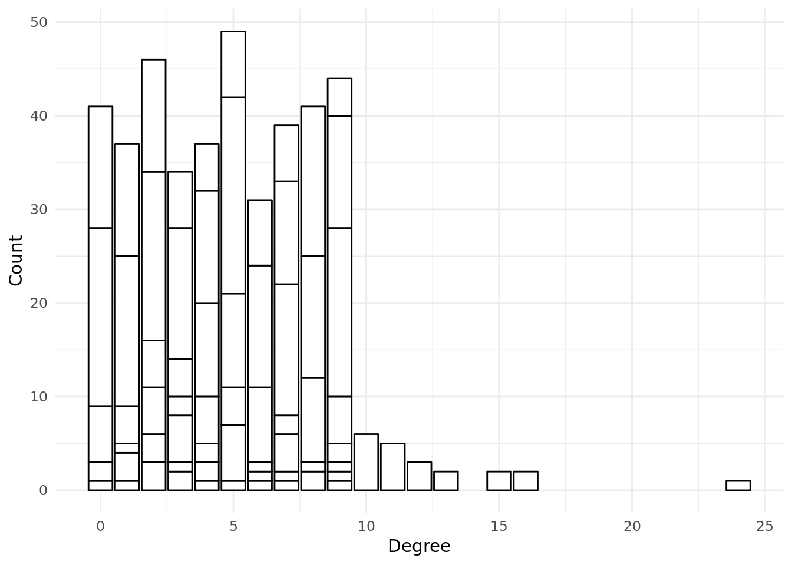

#### Degree distribution of agent->knows->agent edges

#### Runing time by method 

<table class="table table-condensed" style="width: auto !important; ">
 <thead>
  <tr>
   <th style="text-align:left;"> key </th>
   <th style="text-align:right;"> doc_count </th>
   <th style="text-align:right;"> sum_wallTime_ms.value </th>
   <th style="text-align:left;"> avg_wallTime_ms.value </th>
   <th style="text-align:left;"> includedInTotal </th>
  </tr>
 </thead>
<tbody>
  <tr>
   <td style="text-align:left;"> connectIfSimilar </td>
   <td style="text-align:right;"> 87,990 </td>
   <td style="text-align:right;"> 546,322 </td>
   <td style="text-align:left;"> 6.20891010342084 </td>
   <td style="text-align:left;"> No </td>
  </tr>
  <tr>
   <td style="text-align:left;"> existsSimilarity </td>
   <td style="text-align:right;"> 87,990 </td>
   <td style="text-align:right;"> 543,874 </td>
   <td style="text-align:left;"> 6.18108876008637 </td>
   <td style="text-align:left;"> No </td>
  </tr>
  <tr>
   <td style="text-align:left;"> similarityEdges </td>
   <td style="text-align:right;"> 87,990 </td>
   <td style="text-align:right;"> 536,933 </td>
   <td style="text-align:left;"> 6.10220479599955 </td>
   <td style="text-align:left;"> No </td>
  </tr>
  <tr>
   <td style="text-align:left;"> connectAllSimilar </td>
   <td style="text-align:right;"> 420 </td>
   <td style="text-align:right;"> 547,317 </td>
   <td style="text-align:left;"> 1303.13571428571 </td>
   <td style="text-align:left;"> Yes </td>
  </tr>
  <tr>
   <td style="text-align:left;"> connect </td>
   <td style="text-align:right;"> 195 </td>
   <td style="text-align:right;"> 551 </td>
   <td style="text-align:left;"> 2.82564102564103 </td>
   <td style="text-align:left;"> Yes </td>
  </tr>
  <tr>
   <td style="text-align:left;"> init </td>
   <td style="text-align:right;"> 103 </td>
   <td style="text-align:right;"> 16,190 </td>
   <td style="text-align:left;"> 157.184466019417 </td>
   <td style="text-align:left;"> No </td>
  </tr>
  <tr>
   <td style="text-align:left;font-weight: bold;"> Total </td>
   <td style="text-align:right;font-weight: bold;"> 623 </td>
   <td style="text-align:right;font-weight: bold;"> 548,930 </td>
   <td style="text-align:left;font-weight: bold;">  </td>
   <td style="text-align:left;font-weight: bold;">  </td>
  </tr>
</tbody>
</table>
####  Found structures 

#####  Cycles 

Number of cycles found:  1 

<button class="btn btn-primary" data-toggle="collapse" data-target="#QVTQQDFLLU"> Show/Hide foundCycle query </button> 
 
  
     GET /filebeat-*/_search 
              { 
                "query": {
                  "bool": {
                    "must": [
                      { "match_phrase": {
                        "simulationId": "SIM09-26-09-14-SJNkHe--CV"
                        }
                      },
                      { "bool": {
                        "should": [
                          { "match": {
                            "keyword": "foundCycle"
                          }}
                        ]
                      }}
                    ]
                  }
                }
              }
     

#####  Paths 

Number of paths found:  0 

<button class="btn btn-primary" data-toggle="collapse" data-target="#WQKVBAHPVL"> Show/Hide foundPath query </button> 
 
  
     GET /filebeat-*/_search 
              { 
                "query": {
                  "bool": {
                    "must": [
                      { "match_phrase": {
                        "simulationId": "SIM09-26-09-14-SJNkHe--CV"
                        }
                      },
                      { "bool": {
                        "should": [
                          { "match": {
                            "keyword": "foundPath"
                          }}
                        ]
                      }}
                    ]
                  }
                }
              }
     

###  SIM09-26-09-14-SJNkHe--DV 

#### simulationParameters 

<table class="table table-condensed" style="width: auto !important; ">
 <thead>
  <tr>
   <th style="text-align:left;"> agentNumber </th>
   <th style="text-align:left;"> similarityConnectThreshold </th>
   <th style="text-align:left;"> graphType </th>
   <th style="text-align:left;"> chainLength </th>
   <th style="text-align:left;"> similaritySearchThreshold </th>
   <th style="text-align:left;"> maxDistance </th>
   <th style="text-align:left;"> randomWorksNumberMultiplier </th>
  </tr>
 </thead>
<tbody>
  <tr>
   <td style="text-align:left;width: 20em; "> 100 </td>
   <td style="text-align:left;width: 15em; "> 0.9 </td>
   <td style="text-align:left;width: 15em; "> random </td>
   <td style="text-align:left;width: 15em; "> 10 </td>
   <td style="text-align:left;width: 15em; "> 1 </td>
   <td style="text-align:left;width: 15em; "> 30 </td>
   <td style="text-align:left;width: 15em; "> 2 </td>
  </tr>
</tbody>
</table>
#### allEdgesByLabel

<table class="table table-condensed" style="width: auto !important; ">
 <thead>
  <tr>
   <th style="text-align:right;"> edges_offers </th>
   <th style="text-align:right;"> edges_similarity </th>
   <th style="text-align:right;"> edges_owns </th>
   <th style="text-align:right;"> edges_demands </th>
   <th style="text-align:right;"> edges_knows </th>
   <th style="text-align:right;"> edges_total </th>
  </tr>
 </thead>
<tbody>
  <tr>
   <td style="text-align:right;width: 5em; "> 210 </td>
   <td style="text-align:right;width: 5em; "> 37,060 </td>
   <td style="text-align:right;width: 5em; "> 210 </td>
   <td style="text-align:right;width: 5em; "> 210 </td>
   <td style="text-align:right;width: 5em; "> 100 </td>
   <td style="text-align:right;width: 5em; "> 37,790 </td>
  </tr>
</tbody>
</table>
#### allVerticesByType

<table class="table table-condensed" style="width: auto !important; ">
 <thead>
  <tr>
   <th style="text-align:right;"> vertices_agent </th>
   <th style="text-align:right;"> vertices_item </th>
   <th style="text-align:right;"> vertices_work </th>
   <th style="text-align:right;"> vertices_total </th>
  </tr>
 </thead>
<tbody>
  <tr>
   <td style="text-align:right;width: 5em; "> 101 </td>
   <td style="text-align:right;width: 5em; "> 420 </td>
   <td style="text-align:right;width: 5em; "> 210 </td>
   <td style="text-align:right;width: 5em; "> 731 </td>
  </tr>
</tbody>
</table>
#### distribution of similarityEdgesByWeight

#### Degree distribution of item->similarity->item edges

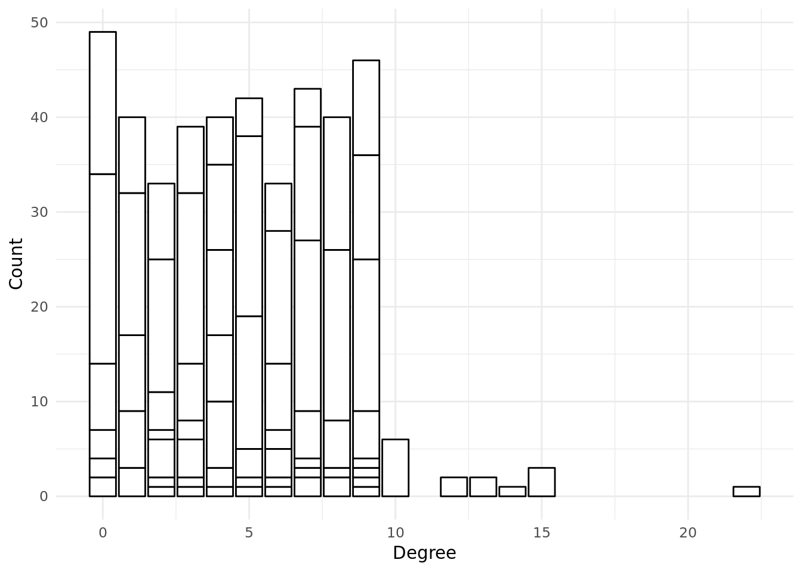

#### Degree distribution of agent->knows->agent edges

#### Runing time by method 

<table class="table table-condensed" style="width: auto !important; ">
 <thead>
  <tr>
   <th style="text-align:left;"> key </th>
   <th style="text-align:right;"> doc_count </th>
   <th style="text-align:right;"> sum_wallTime_ms.value </th>
   <th style="text-align:left;"> avg_wallTime_ms.value </th>
   <th style="text-align:left;"> includedInTotal </th>
  </tr>
 </thead>
<tbody>
  <tr>
   <td style="text-align:left;"> addItemToWork </td>
   <td style="text-align:right;"> 420 </td>
   <td style="text-align:right;"> 4,835 </td>
   <td style="text-align:left;"> 11.5119047619048 </td>
   <td style="text-align:left;"> No </td>
  </tr>
  <tr>
   <td style="text-align:left;"> ownsWork </td>
   <td style="text-align:right;"> 210 </td>
   <td style="text-align:right;"> 3,746 </td>
   <td style="text-align:left;"> 17.8380952380952 </td>
   <td style="text-align:left;"> No </td>
  </tr>
  <tr>
   <td style="text-align:left;"> init </td>
   <td style="text-align:right;"> 103 </td>
   <td style="text-align:right;"> 16,671 </td>
   <td style="text-align:left;"> 161.854368932039 </td>
   <td style="text-align:left;"> No </td>
  </tr>
  <tr>
   <td style="text-align:left;"> searchAndConnect </td>
   <td style="text-align:right;"> 101 </td>
   <td style="text-align:right;"> 322,063 </td>
   <td style="text-align:left;"> 3188.74257425743 </td>
   <td style="text-align:left;"> Yes </td>
  </tr>
  <tr>
   <td style="text-align:left;"> knowsAgent </td>
   <td style="text-align:right;"> 100 </td>
   <td style="text-align:right;"> 1,268 </td>
   <td style="text-align:left;"> 12.68 </td>
   <td style="text-align:left;"> No </td>
  </tr>
  <tr>
   <td style="text-align:left;"> getWorksItems </td>
   <td style="text-align:right;"> 18 </td>
   <td style="text-align:right;"> 103 </td>
   <td style="text-align:left;"> 5.72222222222222 </td>
   <td style="text-align:left;"> Yes </td>
  </tr>
  <tr>
   <td style="text-align:left;"> cycleSearch </td>
   <td style="text-align:right;"> 11 </td>
   <td style="text-align:right;"> 3,530 </td>
   <td style="text-align:left;"> 320.909090909091 </td>
   <td style="text-align:left;"> Yes </td>
  </tr>
  <tr>
   <td style="text-align:left;"> getWorks </td>
   <td style="text-align:right;"> 11 </td>
   <td style="text-align:right;"> 3,500 </td>
   <td style="text-align:left;"> 318.181818181818 </td>
   <td style="text-align:left;"> No </td>
  </tr>
  <tr>
   <td style="text-align:left;"> individualCycleSearch </td>
   <td style="text-align:right;"> 11 </td>
   <td style="text-align:right;"> 0 </td>
   <td style="text-align:left;"> 0 </td>
   <td style="text-align:left;"> Yes </td>
  </tr>
  <tr>
   <td style="text-align:left;font-weight: bold;"> Total </td>
   <td style="text-align:right;font-weight: bold;"> 150 </td>
   <td style="text-align:right;font-weight: bold;"> 330,097 </td>
   <td style="text-align:left;font-weight: bold;">  </td>
   <td style="text-align:left;font-weight: bold;">  </td>
  </tr>
</tbody>
</table>
####  Found structures 

#####  Cycles 

Number of cycles found:  8 

<button class="btn btn-primary" data-toggle="collapse" data-target="#WZKODHVCRX"> Show/Hide foundCycle query </button> 
 
  
     GET /filebeat-*/_search 
              { 
                "query": {
                  "bool": {
                    "must": [
                      { "match_phrase": {
                        "simulationId": "SIM09-26-09-14-SJNkHe--DV"
                        }
                      },
                      { "bool": {
                        "should": [
                          { "match": {
                            "keyword": "foundCycle"
                          }}
                        ]
                      }}
                    ]
                  }
                }
              }
     

#####  Paths 

Number of paths found:  1 

<button class="btn btn-primary" data-toggle="collapse" data-target="#SGVBYIORSX"> Show/Hide foundPath query </button> 
 
  
     GET /filebeat-*/_search 
              { 
                "query": {
                  "bool": {
                    "must": [
                      { "match_phrase": {
                        "simulationId": "SIM09-26-09-14-SJNkHe--DV"
                        }
                      },
                      { "bool": {
                        "should": [
                          { "match": {
                            "keyword": "foundPath"
                          }}
                        ]
                      }}
                    ]
                  }
                }
              }
     

###  SIM09-26-09-24-EehHnS--CV 

#### simulationParameters 

<table class="table table-condensed" style="width: auto !important; ">
 <thead>
  <tr>
   <th style="text-align:left;"> agentNumber </th>
   <th style="text-align:left;"> similarityConnectThreshold </th>
   <th style="text-align:left;"> graphType </th>
   <th style="text-align:left;"> chainLength </th>
   <th style="text-align:left;"> similaritySearchThreshold </th>
   <th style="text-align:left;"> maxDistance </th>
   <th style="text-align:left;"> randomWorksNumberMultiplier </th>
  </tr>
 </thead>
<tbody>
  <tr>
   <td style="text-align:left;width: 20em; "> 100 </td>
   <td style="text-align:left;width: 15em; "> 0.9 </td>
   <td style="text-align:left;width: 15em; "> smallWorld </td>
   <td style="text-align:left;width: 15em; "> 10 </td>
   <td style="text-align:left;width: 15em; "> 1 </td>
   <td style="text-align:left;width: 15em; "> 30 </td>
   <td style="text-align:left;width: 15em; "> 2 </td>
  </tr>
</tbody>
</table>
#### allEdgesByLabel

<table class="table table-condensed" style="width: auto !important; ">
 <thead>
  <tr>
   <th style="text-align:right;"> edges_offers </th>
   <th style="text-align:right;"> edges_similarity </th>
   <th style="text-align:right;"> edges_owns </th>
   <th style="text-align:right;"> edges_demands </th>
   <th style="text-align:right;"> edges_knows </th>
   <th style="text-align:right;"> edges_total </th>
  </tr>
 </thead>
<tbody>
  <tr>
   <td style="text-align:right;width: 5em; "> 210 </td>
   <td style="text-align:right;width: 5em; "> 37,178 </td>
   <td style="text-align:right;width: 5em; "> 210 </td>
   <td style="text-align:right;width: 5em; "> 210 </td>
   <td style="text-align:right;width: 5em; "> 601 </td>
   <td style="text-align:right;width: 5em; "> 38,409 </td>
  </tr>
</tbody>
</table>
#### allVerticesByType

<table class="table table-condensed" style="width: auto !important; ">
 <thead>
  <tr>
   <th style="text-align:right;"> vertices_agent </th>
   <th style="text-align:right;"> vertices_item </th>
   <th style="text-align:right;"> vertices_work </th>
   <th style="text-align:right;"> vertices_total </th>
  </tr>
 </thead>
<tbody>
  <tr>
   <td style="text-align:right;width: 5em; "> 101 </td>
   <td style="text-align:right;width: 5em; "> 420 </td>
   <td style="text-align:right;width: 5em; "> 210 </td>
   <td style="text-align:right;width: 5em; "> 731 </td>
  </tr>
</tbody>
</table>
#### distribution of similarityEdgesByWeight

#### Degree distribution of item->similarity->item edges

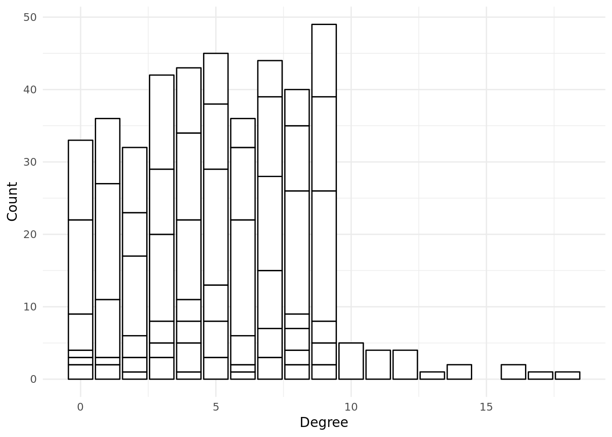

#### Degree distribution of agent->knows->agent edges

#### Runing time by method 

<table class="table table-condensed" style="width: auto !important; ">
 <thead>
  <tr>
   <th style="text-align:left;"> key </th>
   <th style="text-align:right;"> doc_count </th>
   <th style="text-align:right;"> sum_wallTime_ms.value </th>
   <th style="text-align:left;"> avg_wallTime_ms.value </th>
   <th style="text-align:left;"> includedInTotal </th>
  </tr>
 </thead>
<tbody>
  <tr>
   <td style="text-align:left;"> connectIfSimilar </td>
   <td style="text-align:right;"> 87,990 </td>
   <td style="text-align:right;"> 547,554 </td>
   <td style="text-align:left;"> 6.22291169451074 </td>
   <td style="text-align:left;"> No </td>
  </tr>
  <tr>
   <td style="text-align:left;"> existsSimilarity </td>
   <td style="text-align:right;"> 87,990 </td>
   <td style="text-align:right;"> 544,369 </td>
   <td style="text-align:left;"> 6.18671439936356 </td>
   <td style="text-align:left;"> No </td>
  </tr>
  <tr>
   <td style="text-align:left;"> similarityEdges </td>
   <td style="text-align:right;"> 87,990 </td>
   <td style="text-align:right;"> 537,489 </td>
   <td style="text-align:left;"> 6.10852369587453 </td>
   <td style="text-align:left;"> No </td>
  </tr>
  <tr>
   <td style="text-align:left;"> connectAllSimilar </td>
   <td style="text-align:right;"> 420 </td>
   <td style="text-align:right;"> 548,568 </td>
   <td style="text-align:left;"> 1306.11428571429 </td>
   <td style="text-align:left;"> Yes </td>
  </tr>
  <tr>
   <td style="text-align:left;"> connect </td>
   <td style="text-align:right;"> 202 </td>
   <td style="text-align:right;"> 1,144 </td>
   <td style="text-align:left;"> 5.66336633663366 </td>
   <td style="text-align:left;"> Yes </td>
  </tr>
  <tr>
   <td style="text-align:left;"> init </td>
   <td style="text-align:right;"> 103 </td>
   <td style="text-align:right;"> 14,951 </td>
   <td style="text-align:left;"> 145.155339805825 </td>
   <td style="text-align:left;"> No </td>
  </tr>
  <tr>
   <td style="text-align:left;font-weight: bold;"> Total </td>
   <td style="text-align:right;font-weight: bold;"> 630 </td>
   <td style="text-align:right;font-weight: bold;"> 550,840 </td>
   <td style="text-align:left;font-weight: bold;">  </td>
   <td style="text-align:left;font-weight: bold;">  </td>
  </tr>
</tbody>
</table>
####  Found structures 

#####  Cycles 

Number of cycles found:  1 

<button class="btn btn-primary" data-toggle="collapse" data-target="#PILHNTYLWV"> Show/Hide foundCycle query </button> 
 
  
     GET /filebeat-*/_search 
              { 
                "query": {
                  "bool": {
                    "must": [
                      { "match_phrase": {
                        "simulationId": "SIM09-26-09-24-EehHnS--CV"
                        }
                      },
                      { "bool": {
                        "should": [
                          { "match": {
                            "keyword": "foundCycle"
                          }}
                        ]
                      }}
                    ]
                  }
                }
              }
     

#####  Paths 

Number of paths found:  0 

<button class="btn btn-primary" data-toggle="collapse" data-target="#PJZYXYEFVC"> Show/Hide foundPath query </button> 
 
  
     GET /filebeat-*/_search 
              { 
                "query": {
                  "bool": {
                    "must": [
                      { "match_phrase": {
                        "simulationId": "SIM09-26-09-24-EehHnS--CV"
                        }
                      },
                      { "bool": {
                        "should": [
                          { "match": {
                            "keyword": "foundPath"
                          }}
                        ]
                      }}
                    ]
                  }
                }
              }
     

###  SIM09-26-09-24-EehHnS--DV 

#### simulationParameters 

<table class="table table-condensed" style="width: auto !important; ">
 <thead>
  <tr>
   <th style="text-align:left;"> agentNumber </th>
   <th style="text-align:left;"> similarityConnectThreshold </th>
   <th style="text-align:left;"> graphType </th>
   <th style="text-align:left;"> chainLength </th>
   <th style="text-align:left;"> similaritySearchThreshold </th>
   <th style="text-align:left;"> maxDistance </th>
   <th style="text-align:left;"> randomWorksNumberMultiplier </th>
  </tr>
 </thead>
<tbody>
  <tr>
   <td style="text-align:left;width: 20em; "> 100 </td>
   <td style="text-align:left;width: 15em; "> 0.9 </td>
   <td style="text-align:left;width: 15em; "> smallWorld </td>
   <td style="text-align:left;width: 15em; "> 10 </td>
   <td style="text-align:left;width: 15em; "> 1 </td>
   <td style="text-align:left;width: 15em; "> 30 </td>
   <td style="text-align:left;width: 15em; "> 2 </td>
  </tr>
</tbody>
</table>
#### allEdgesByLabel

<table class="table table-condensed" style="width: auto !important; ">
 <thead>
  <tr>
   <th style="text-align:right;"> edges_offers </th>
   <th style="text-align:right;"> edges_similarity </th>
   <th style="text-align:right;"> edges_owns </th>
   <th style="text-align:right;"> edges_demands </th>
   <th style="text-align:right;"> edges_knows </th>
   <th style="text-align:right;"> edges_total </th>
  </tr>
 </thead>
<tbody>
  <tr>
   <td style="text-align:right;width: 5em; "> 210 </td>
   <td style="text-align:right;width: 5em; "> 36,774 </td>
   <td style="text-align:right;width: 5em; "> 210 </td>
   <td style="text-align:right;width: 5em; "> 210 </td>
   <td style="text-align:right;width: 5em; "> 601 </td>
   <td style="text-align:right;width: 5em; "> 38,005 </td>
  </tr>
</tbody>
</table>
#### allVerticesByType

<table class="table table-condensed" style="width: auto !important; ">
 <thead>
  <tr>
   <th style="text-align:right;"> vertices_agent </th>
   <th style="text-align:right;"> vertices_item </th>
   <th style="text-align:right;"> vertices_work </th>
   <th style="text-align:right;"> vertices_total </th>
  </tr>
 </thead>
<tbody>
  <tr>
   <td style="text-align:right;width: 5em; "> 101 </td>
   <td style="text-align:right;width: 5em; "> 420 </td>
   <td style="text-align:right;width: 5em; "> 210 </td>
   <td style="text-align:right;width: 5em; "> 731 </td>
  </tr>
</tbody>
</table>
#### distribution of similarityEdgesByWeight

#### Degree distribution of item->similarity->item edges

#### Degree distribution of agent->knows->agent edges

#### Runing time by method 

<table class="table table-condensed" style="width: auto !important; ">
 <thead>
  <tr>
   <th style="text-align:left;"> key </th>
   <th style="text-align:right;"> doc_count </th>
   <th style="text-align:right;"> sum_wallTime_ms.value </th>
   <th style="text-align:left;"> avg_wallTime_ms.value </th>
   <th style="text-align:left;"> includedInTotal </th>
  </tr>
 </thead>
<tbody>
  <tr>
   <td style="text-align:left;"> knowsAgent </td>
   <td style="text-align:right;"> 601 </td>
   <td style="text-align:right;"> 1,726 </td>
   <td style="text-align:left;"> 2.87188019966722 </td>
   <td style="text-align:left;"> No </td>
  </tr>
  <tr>
   <td style="text-align:left;"> addItemToWork </td>
   <td style="text-align:right;"> 420 </td>
   <td style="text-align:right;"> 6,588 </td>
   <td style="text-align:left;"> 15.6857142857143 </td>
   <td style="text-align:left;"> No </td>
  </tr>
  <tr>
   <td style="text-align:left;"> ownsWork </td>
   <td style="text-align:right;"> 210 </td>
   <td style="text-align:right;"> 4,657 </td>
   <td style="text-align:left;"> 22.1761904761905 </td>
   <td style="text-align:left;"> No </td>
  </tr>
  <tr>
   <td style="text-align:left;"> init </td>
   <td style="text-align:right;"> 103 </td>
   <td style="text-align:right;"> 17,400 </td>
   <td style="text-align:left;"> 168.932038834951 </td>
   <td style="text-align:left;"> No </td>
  </tr>
  <tr>
   <td style="text-align:left;"> searchAndConnect </td>
   <td style="text-align:right;"> 101 </td>
   <td style="text-align:right;"> 331,709 </td>
   <td style="text-align:left;"> 3284.24752475248 </td>
   <td style="text-align:left;"> Yes </td>
  </tr>
  <tr>
   <td style="text-align:left;"> getWorksItems </td>
   <td style="text-align:right;"> 18 </td>
   <td style="text-align:right;"> 359 </td>
   <td style="text-align:left;"> 19.9444444444444 </td>
   <td style="text-align:left;"> Yes </td>
  </tr>
  <tr>
   <td style="text-align:left;"> cycleSearch </td>
   <td style="text-align:right;"> 11 </td>
   <td style="text-align:right;"> 417 </td>
   <td style="text-align:left;"> 37.9090909090909 </td>
   <td style="text-align:left;"> Yes </td>
  </tr>
  <tr>
   <td style="text-align:left;"> getWorks </td>
   <td style="text-align:right;"> 11 </td>
   <td style="text-align:right;"> 949 </td>
   <td style="text-align:left;"> 86.2727272727273 </td>
   <td style="text-align:left;"> No </td>
  </tr>
  <tr>
   <td style="text-align:left;"> individualCycleSearch </td>
   <td style="text-align:right;"> 11 </td>
   <td style="text-align:right;"> 1 </td>
   <td style="text-align:left;"> 0.0909090909090909 </td>
   <td style="text-align:left;"> Yes </td>
  </tr>
  <tr>
   <td style="text-align:left;font-weight: bold;"> Total </td>
   <td style="text-align:right;font-weight: bold;"> 150 </td>
   <td style="text-align:right;font-weight: bold;"> 334,454 </td>
   <td style="text-align:left;font-weight: bold;">  </td>
   <td style="text-align:left;font-weight: bold;">  </td>
  </tr>
</tbody>
</table>
####  Found structures 

#####  Cycles 

Number of cycles found:  9 

<button class="btn btn-primary" data-toggle="collapse" data-target="#RMPZSDOZAH"> Show/Hide foundCycle query </button> 
 
  
     GET /filebeat-*/_search 
              { 
                "query": {
                  "bool": {
                    "must": [
                      { "match_phrase": {
                        "simulationId": "SIM09-26-09-24-EehHnS--DV"
                        }
                      },
                      { "bool": {
                        "should": [
                          { "match": {
                            "keyword": "foundCycle"
                          }}
                        ]
                      }}
                    ]
                  }
                }
              }
     

#####  Paths 

Number of paths found:  0 

<button class="btn btn-primary" data-toggle="collapse" data-target="#UEQFRDCRTN"> Show/Hide foundPath query </button> 
 
  
     GET /filebeat-*/_search 
              { 
                "query": {
                  "bool": {
                    "must": [
                      { "match_phrase": {
                        "simulationId": "SIM09-26-09-24-EehHnS--DV"
                        }
                      },
                      { "bool": {
                        "should": [
                          { "match": {
                            "keyword": "foundPath"
                          }}
                        ]
                      }}
                    ]
                  }
                }
              }
     

###  SIM09-26-05-10-HVztIP--CV 

#### simulationParameters 

<table class="table table-condensed" style="width: auto !important; ">
 <thead>
  <tr>
   <th style="text-align:left;"> agentNumber </th>
   <th style="text-align:left;"> similarityConnectThreshold </th>
   <th style="text-align:left;"> graphType </th>
   <th style="text-align:left;"> chainLength </th>
   <th style="text-align:left;"> similaritySearchThreshold </th>
   <th style="text-align:left;"> maxDistance </th>
   <th style="text-align:left;"> randomWorksNumberMultiplier </th>
  </tr>
 </thead>
<tbody>
  <tr>
   <td style="text-align:left;width: 20em; "> 100 </td>
   <td style="text-align:left;width: 15em; "> 0.9 </td>
   <td style="text-align:left;width: 15em; "> random </td>
   <td style="text-align:left;width: 15em; "> 10 </td>
   <td style="text-align:left;width: 15em; "> 1 </td>
   <td style="text-align:left;width: 15em; "> 5 </td>
   <td style="text-align:left;width: 15em; "> 1 </td>
  </tr>
</tbody>
</table>
#### allEdgesByLabel

<table class="table table-condensed" style="width: auto !important; ">
 <thead>
  <tr>
   <th style="text-align:right;"> edges_offers </th>
   <th style="text-align:right;"> edges_similarity </th>
   <th style="text-align:right;"> edges_owns </th>
   <th style="text-align:right;"> edges_demands </th>
   <th style="text-align:right;"> edges_knows </th>
   <th style="text-align:right;"> edges_total </th>
  </tr>
 </thead>
<tbody>
  <tr>
   <td style="text-align:right;width: 5em; "> 110 </td>
   <td style="text-align:right;width: 5em; "> 9,614 </td>
   <td style="text-align:right;width: 5em; "> 110 </td>
   <td style="text-align:right;width: 5em; "> 110 </td>
   <td style="text-align:right;width: 5em; "> 100 </td>
   <td style="text-align:right;width: 5em; "> 10,044 </td>
  </tr>
</tbody>
</table>
#### allVerticesByType

<table class="table table-condensed" style="width: auto !important; ">
 <thead>
  <tr>
   <th style="text-align:right;"> vertices_agent </th>
   <th style="text-align:right;"> vertices_item </th>
   <th style="text-align:right;"> vertices_work </th>
   <th style="text-align:right;"> vertices_total </th>
  </tr>
 </thead>
<tbody>
  <tr>
   <td style="text-align:right;width: 5em; "> 101 </td>
   <td style="text-align:right;width: 5em; "> 220 </td>
   <td style="text-align:right;width: 5em; "> 110 </td>
   <td style="text-align:right;width: 5em; "> 431 </td>
  </tr>
</tbody>
</table>
#### distribution of similarityEdgesByWeight

#### Degree distribution of item->similarity->item edges

#### Degree distribution of agent->knows->agent edges

#### Runing time by method 

<table class="table table-condensed" style="width: auto !important; ">
 <thead>
  <tr>
   <th style="text-align:left;"> key </th>
   <th style="text-align:right;"> doc_count </th>
   <th style="text-align:right;"> sum_wallTime_ms.value </th>
   <th style="text-align:left;"> avg_wallTime_ms.value </th>
   <th style="text-align:left;"> includedInTotal </th>
  </tr>
 </thead>
<tbody>
  <tr>
   <td style="text-align:left;"> connectIfSimilar </td>
   <td style="text-align:right;"> 24,090 </td>
   <td style="text-align:right;"> 122,231 </td>
   <td style="text-align:left;"> 5.07393109173931 </td>
   <td style="text-align:left;"> No </td>
  </tr>
  <tr>
   <td style="text-align:left;"> existsSimilarity </td>
   <td style="text-align:right;"> 24,090 </td>
   <td style="text-align:right;"> 105,145 </td>
   <td style="text-align:left;"> 4.36467413864674 </td>
   <td style="text-align:left;"> No </td>
  </tr>
  <tr>
   <td style="text-align:left;"> similarityEdges </td>
   <td style="text-align:right;"> 24,090 </td>
   <td style="text-align:right;"> 103,748 </td>
   <td style="text-align:left;"> 4.30668327106683 </td>
   <td style="text-align:left;"> No </td>
  </tr>
  <tr>
   <td style="text-align:left;"> connect </td>
   <td style="text-align:right;"> 3,000 </td>
   <td style="text-align:right;"> 16,430 </td>
   <td style="text-align:left;"> 5.47666666666667 </td>
   <td style="text-align:left;"> Yes </td>
  </tr>
  <tr>
   <td style="text-align:left;"> connectAllSimilar </td>
   <td style="text-align:right;"> 220 </td>
   <td style="text-align:right;"> 122,573 </td>
   <td style="text-align:left;"> 557.15 </td>
   <td style="text-align:left;"> Yes </td>
  </tr>
  <tr>
   <td style="text-align:left;"> init </td>
   <td style="text-align:right;"> 103 </td>
   <td style="text-align:right;"> 16,049 </td>
   <td style="text-align:left;"> 155.815533980583 </td>
   <td style="text-align:left;"> No </td>
  </tr>
  <tr>
   <td style="text-align:left;font-weight: bold;"> Total </td>
   <td style="text-align:right;font-weight: bold;"> 3,228 </td>
   <td style="text-align:right;font-weight: bold;"> 139,888 </td>
   <td style="text-align:left;font-weight: bold;">  </td>
   <td style="text-align:left;font-weight: bold;">  </td>
  </tr>
</tbody>
</table>
####  Found structures 

#####  Cycles 

Number of cycles found:  1 

<button class="btn btn-primary" data-toggle="collapse" data-target="#VCXNWSXNBQ"> Show/Hide foundCycle query </button> 
 
  
     GET /filebeat-*/_search 
              { 
                "query": {
                  "bool": {
                    "must": [
                      { "match_phrase": {
                        "simulationId": "SIM09-26-05-10-HVztIP--CV"
                        }
                      },
                      { "bool": {
                        "should": [
                          { "match": {
                            "keyword": "foundCycle"
                          }}
                        ]
                      }}
                    ]
                  }
                }
              }
     

#####  Paths 

Number of paths found:  0 

<button class="btn btn-primary" data-toggle="collapse" data-target="#CWEZBALFWJ"> Show/Hide foundPath query </button> 
 
  
     GET /filebeat-*/_search 
              { 
                "query": {
                  "bool": {
                    "must": [
                      { "match_phrase": {
                        "simulationId": "SIM09-26-05-10-HVztIP--CV"
                        }
                      },
                      { "bool": {
                        "should": [
                          { "match": {
                            "keyword": "foundPath"
                          }}
                        ]
                      }}
                    ]
                  }
                }
              }
     

###  SIM09-26-05-10-HVztIP--DV 

#### simulationParameters 

<table class="table table-condensed" style="width: auto !important; ">
 <thead>
  <tr>
   <th style="text-align:left;"> agentNumber </th>
   <th style="text-align:left;"> similarityConnectThreshold </th>
   <th style="text-align:left;"> graphType </th>
   <th style="text-align:left;"> chainLength </th>
   <th style="text-align:left;"> similaritySearchThreshold </th>
   <th style="text-align:left;"> maxDistance </th>
   <th style="text-align:left;"> randomWorksNumberMultiplier </th>
  </tr>
 </thead>
<tbody>
  <tr>
   <td style="text-align:left;width: 20em; "> 100 </td>
   <td style="text-align:left;width: 15em; "> 0.9 </td>
   <td style="text-align:left;width: 15em; "> random </td>
   <td style="text-align:left;width: 15em; "> 10 </td>
   <td style="text-align:left;width: 15em; "> 1 </td>
   <td style="text-align:left;width: 15em; "> 5 </td>
   <td style="text-align:left;width: 15em; "> 1 </td>
  </tr>
</tbody>
</table>
#### allEdgesByLabel

<table class="table table-condensed" style="width: auto !important; ">
 <thead>
  <tr>
   <th style="text-align:right;"> edges_offers </th>
   <th style="text-align:right;"> edges_similarity </th>
   <th style="text-align:right;"> edges_owns </th>
   <th style="text-align:right;"> edges_demands </th>
   <th style="text-align:right;"> edges_knows </th>
   <th style="text-align:right;"> edges_total </th>
  </tr>
 </thead>
<tbody>
  <tr>
   <td style="text-align:right;width: 5em; "> 110 </td>
   <td style="text-align:right;width: 5em; "> 3,614 </td>
   <td style="text-align:right;width: 5em; "> 110 </td>
   <td style="text-align:right;width: 5em; "> 110 </td>
   <td style="text-align:right;width: 5em; "> 100 </td>
   <td style="text-align:right;width: 5em; "> 4,044 </td>
  </tr>
</tbody>
</table>
#### allVerticesByType

<table class="table table-condensed" style="width: auto !important; ">
 <thead>
  <tr>
   <th style="text-align:right;"> vertices_agent </th>
   <th style="text-align:right;"> vertices_item </th>
   <th style="text-align:right;"> vertices_work </th>
   <th style="text-align:right;"> vertices_total </th>
  </tr>
 </thead>
<tbody>
  <tr>
   <td style="text-align:right;width: 5em; "> 101 </td>
   <td style="text-align:right;width: 5em; "> 220 </td>
   <td style="text-align:right;width: 5em; "> 110 </td>
   <td style="text-align:right;width: 5em; "> 431 </td>
  </tr>
</tbody>
</table>
#### distribution of similarityEdgesByWeight

#### Degree distribution of item->similarity->item edges

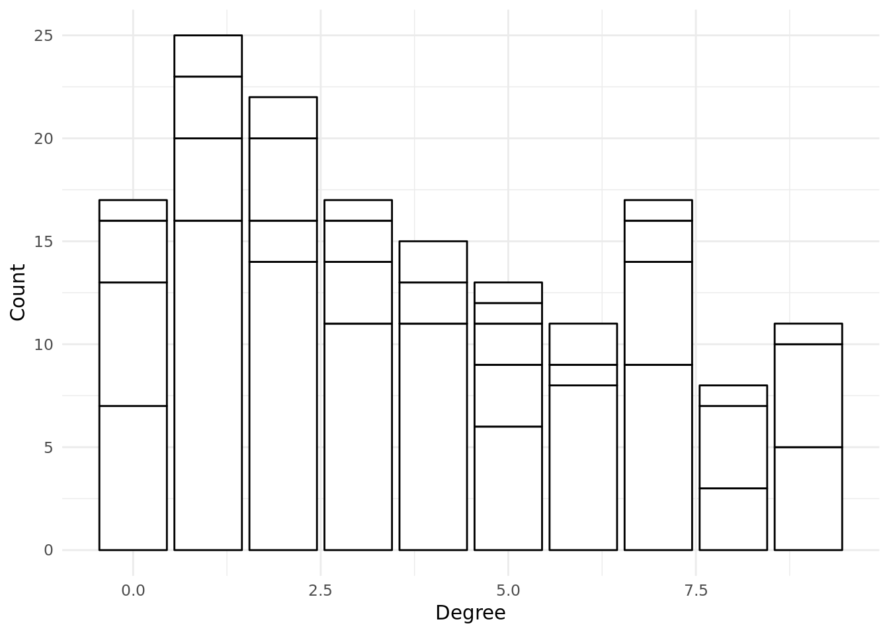

#### Degree distribution of agent->knows->agent edges

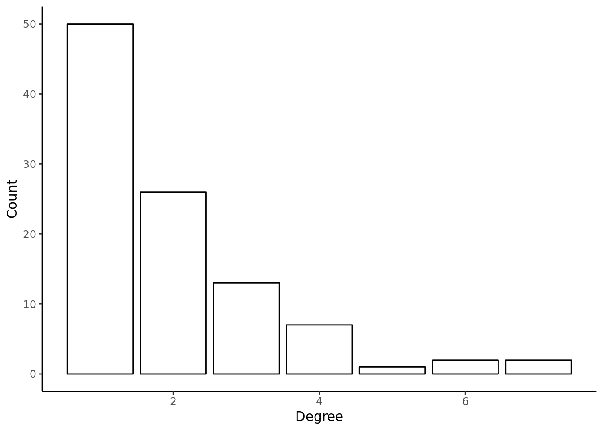

#### Runing time by method 

<table class="table table-condensed" style="width: auto !important; ">
 <thead>
  <tr>
   <th style="text-align:left;">   </th>
   <th style="text-align:left;"> key </th>
   <th style="text-align:right;"> doc_count </th>
   <th style="text-align:right;"> sum_wallTime_ms.value </th>
   <th style="text-align:left;"> avg_wallTime_ms.value </th>
   <th style="text-align:left;"> includedInTotal </th>
  </tr>
 </thead>
<tbody>
  <tr>
   <td style="text-align:left;"> 2 </td>
   <td style="text-align:left;"> cycleSearch </td>
   <td style="text-align:right;"> 3,600 </td>
   <td style="text-align:right;"> 24,818 </td>
   <td style="text-align:left;"> 6.89388888888889 </td>
   <td style="text-align:left;"> Yes </td>
  </tr>
  <tr>
   <td style="text-align:left;"> 3 </td>
   <td style="text-align:left;"> getWorks </td>
   <td style="text-align:right;"> 3,600 </td>
   <td style="text-align:right;"> 115,563 </td>
   <td style="text-align:left;"> 32.1008333333333 </td>
   <td style="text-align:left;"> No </td>
  </tr>
  <tr>
   <td style="text-align:left;"> 4 </td>
   <td style="text-align:left;"> individualCycleSearch </td>
   <td style="text-align:right;"> 3,600 </td>
   <td style="text-align:right;"> 74 </td>
   <td style="text-align:left;"> 0.0205555555555556 </td>
   <td style="text-align:left;"> Yes </td>
  </tr>
  <tr>
   <td style="text-align:left;"> 6 </td>
   <td style="text-align:left;"> addItemToWork </td>
   <td style="text-align:right;"> 220 </td>
   <td style="text-align:right;"> 3,492 </td>
   <td style="text-align:left;"> 15.8727272727273 </td>
   <td style="text-align:left;"> No </td>
  </tr>
  <tr>
   <td style="text-align:left;"> 7 </td>
   <td style="text-align:left;"> ownsWork </td>
   <td style="text-align:right;"> 110 </td>
   <td style="text-align:right;"> 1,748 </td>
   <td style="text-align:left;"> 15.8909090909091 </td>
   <td style="text-align:left;"> No </td>
  </tr>
  <tr>
   <td style="text-align:left;"> 8 </td>
   <td style="text-align:left;"> init </td>
   <td style="text-align:right;"> 103 </td>
   <td style="text-align:right;"> 18,036 </td>
   <td style="text-align:left;"> 175.106796116505 </td>
   <td style="text-align:left;"> No </td>
  </tr>
  <tr>
   <td style="text-align:left;"> 9 </td>
   <td style="text-align:left;"> searchAndConnect </td>
   <td style="text-align:right;"> 101 </td>
   <td style="text-align:right;"> 49,974 </td>
   <td style="text-align:left;"> 494.792079207921 </td>
   <td style="text-align:left;"> Yes </td>
  </tr>
  <tr>
   <td style="text-align:left;"> 10 </td>
   <td style="text-align:left;"> knowsAgent </td>
   <td style="text-align:right;"> 100 </td>
   <td style="text-align:right;"> 2,127 </td>
   <td style="text-align:left;"> 21.27 </td>
   <td style="text-align:left;"> No </td>
  </tr>
  <tr>
   <td style="text-align:left;font-weight: bold;"> 1 </td>
   <td style="text-align:left;font-weight: bold;"> Total </td>
   <td style="text-align:right;font-weight: bold;"> 14,501 </td>
   <td style="text-align:right;font-weight: bold;"> 92,265 </td>
   <td style="text-align:left;font-weight: bold;">  </td>
   <td style="text-align:left;font-weight: bold;">  </td>
  </tr>
</tbody>
</table>
####  Found structures 

#####  Cycles 

Number of cycles found:  0 

<button class="btn btn-primary" data-toggle="collapse" data-target="#TZVJSMKYHQ"> Show/Hide foundCycle query </button> 
 
  
     GET /filebeat-*/_search 
              { 
                "query": {
                  "bool": {
                    "must": [
                      { "match_phrase": {
                        "simulationId": "SIM09-26-05-10-HVztIP--DV"
                        }
                      },
                      { "bool": {
                        "should": [
                          { "match": {
                            "keyword": "foundCycle"
                          }}
                        ]
                      }}
                    ]
                  }
                }
              }
     

#####  Paths 

Number of paths found:  3600 

<button class="btn btn-primary" data-toggle="collapse" data-target="#DPBPURFPXY"> Show/Hide foundPath query </button> 
 
  
     GET /filebeat-*/_search 
              { 
                "query": {
                  "bool": {
                    "must": [
                      { "match_phrase": {
                        "simulationId": "SIM09-26-05-10-HVztIP--DV"
                        }
                      },
                      { "bool": {
                        "should": [
                          { "match": {
                            "keyword": "foundPath"
                          }}
                        ]
                      }}
                    ]
                  }
                }
              }
     

###  SIM09-26-06-12-oqNsd7--CV 

#### simulationParameters 

<table class="table table-condensed" style="width: auto !important; ">
 <thead>
  <tr>
   <th style="text-align:left;"> agentNumber </th>
   <th style="text-align:left;"> similarityConnectThreshold </th>
   <th style="text-align:left;"> graphType </th>
   <th style="text-align:left;"> chainLength </th>
   <th style="text-align:left;"> similaritySearchThreshold </th>
   <th style="text-align:left;"> maxDistance </th>
   <th style="text-align:left;"> randomWorksNumberMultiplier </th>
  </tr>
 </thead>
<tbody>
  <tr>
   <td style="text-align:left;width: 20em; "> 100 </td>
   <td style="text-align:left;width: 15em; "> 0.9 </td>
   <td style="text-align:left;width: 15em; "> smallWorld </td>
   <td style="text-align:left;width: 15em; "> 10 </td>
   <td style="text-align:left;width: 15em; "> 1 </td>
   <td style="text-align:left;width: 15em; "> 5 </td>
   <td style="text-align:left;width: 15em; "> 1 </td>
  </tr>
</tbody>
</table>
#### allEdgesByLabel

<table class="table table-condensed" style="width: auto !important; ">
 <thead>
  <tr>
   <th style="text-align:right;"> edges_offers </th>
   <th style="text-align:right;"> edges_similarity </th>
   <th style="text-align:right;"> edges_owns </th>
   <th style="text-align:right;"> edges_demands </th>
   <th style="text-align:right;"> edges_knows </th>
   <th style="text-align:right;"> edges_total </th>
  </tr>
 </thead>
<tbody>
  <tr>
   <td style="text-align:right;width: 5em; "> 110 </td>
   <td style="text-align:right;width: 5em; "> 10,180 </td>
   <td style="text-align:right;width: 5em; "> 110 </td>
   <td style="text-align:right;width: 5em; "> 110 </td>
   <td style="text-align:right;width: 5em; "> 601 </td>
   <td style="text-align:right;width: 5em; "> 11,111 </td>
  </tr>
</tbody>
</table>
#### allVerticesByType

<table class="table table-condensed" style="width: auto !important; ">
 <thead>
  <tr>
   <th style="text-align:right;"> vertices_agent </th>
   <th style="text-align:right;"> vertices_item </th>
   <th style="text-align:right;"> vertices_work </th>
   <th style="text-align:right;"> vertices_total </th>
  </tr>
 </thead>
<tbody>
  <tr>
   <td style="text-align:right;width: 5em; "> 101 </td>
   <td style="text-align:right;width: 5em; "> 220 </td>
   <td style="text-align:right;width: 5em; "> 110 </td>
   <td style="text-align:right;width: 5em; "> 431 </td>
  </tr>
</tbody>
</table>
#### distribution of similarityEdgesByWeight

#### Degree distribution of item->similarity->item edges

#### Degree distribution of agent->knows->agent edges

#### Runing time by method 

<table class="table table-condensed" style="width: auto !important; ">
 <thead>
  <tr>
   <th style="text-align:left;"> key </th>
   <th style="text-align:right;"> doc_count </th>
   <th style="text-align:right;"> sum_wallTime_ms.value </th>
   <th style="text-align:left;"> avg_wallTime_ms.value </th>
   <th style="text-align:left;"> includedInTotal </th>
  </tr>
 </thead>
<tbody>
  <tr>
   <td style="text-align:left;"> connectIfSimilar </td>
   <td style="text-align:right;"> 24,090 </td>
   <td style="text-align:right;"> 123,134 </td>
   <td style="text-align:left;"> 5.11141552511415 </td>
   <td style="text-align:left;"> No </td>
  </tr>
  <tr>
   <td style="text-align:left;"> existsSimilarity </td>
   <td style="text-align:right;"> 24,090 </td>
   <td style="text-align:right;"> 122,385 </td>
   <td style="text-align:left;"> 5.08032378580324 </td>
   <td style="text-align:left;"> No </td>
  </tr>
  <tr>
   <td style="text-align:left;"> similarityEdges </td>
   <td style="text-align:right;"> 24,090 </td>
   <td style="text-align:right;"> 120,677 </td>
   <td style="text-align:left;"> 5.00942299709423 </td>
   <td style="text-align:left;"> No </td>
  </tr>
  <tr>
   <td style="text-align:left;"> connectAllSimilar </td>
   <td style="text-align:right;"> 220 </td>
   <td style="text-align:right;"> 123,405 </td>
   <td style="text-align:left;"> 560.931818181818 </td>
   <td style="text-align:left;"> Yes </td>
  </tr>
  <tr>
   <td style="text-align:left;"> init </td>
   <td style="text-align:right;"> 103 </td>
   <td style="text-align:right;"> 15,648 </td>
   <td style="text-align:left;"> 151.922330097087 </td>
   <td style="text-align:left;"> No </td>
  </tr>
  <tr>
   <td style="text-align:left;"> connect </td>
   <td style="text-align:right;"> 66 </td>
   <td style="text-align:right;"> 176 </td>
   <td style="text-align:left;"> 2.66666666666667 </td>
   <td style="text-align:left;"> Yes </td>
  </tr>
  <tr>
   <td style="text-align:left;font-weight: bold;"> Total </td>
   <td style="text-align:right;font-weight: bold;"> 294 </td>
   <td style="text-align:right;font-weight: bold;"> 124,383 </td>
   <td style="text-align:left;font-weight: bold;">  </td>
   <td style="text-align:left;font-weight: bold;">  </td>
  </tr>
</tbody>
</table>
####  Found structures 

#####  Cycles 

Number of cycles found:  1 

<button class="btn btn-primary" data-toggle="collapse" data-target="#KXDSCGEOGW"> Show/Hide foundCycle query </button> 
 
  
     GET /filebeat-*/_search 
              { 
                "query": {
                  "bool": {
                    "must": [
                      { "match_phrase": {
                        "simulationId": "SIM09-26-06-12-oqNsd7--CV"
                        }
                      },
                      { "bool": {
                        "should": [
                          { "match": {
                            "keyword": "foundCycle"
                          }}
                        ]
                      }}
                    ]
                  }
                }
              }
     

#####  Paths 

Number of paths found:  0 

<button class="btn btn-primary" data-toggle="collapse" data-target="#ZTRFKENGCD"> Show/Hide foundPath query </button> 
 
  
     GET /filebeat-*/_search 
              { 
                "query": {
                  "bool": {
                    "must": [
                      { "match_phrase": {
                        "simulationId": "SIM09-26-06-12-oqNsd7--CV"
                        }
                      },
                      { "bool": {
                        "should": [
                          { "match": {
                            "keyword": "foundPath"
                          }}
                        ]
                      }}
                    ]
                  }
                }
              }
     

###  SIM09-26-06-12-oqNsd7--DV 

#### simulationParameters 

<table class="table table-condensed" style="width: auto !important; ">
 <thead>
  <tr>
   <th style="text-align:left;"> agentNumber </th>
   <th style="text-align:left;"> similarityConnectThreshold </th>
   <th style="text-align:left;"> graphType </th>
   <th style="text-align:left;"> chainLength </th>
   <th style="text-align:left;"> similaritySearchThreshold </th>
   <th style="text-align:left;"> maxDistance </th>
   <th style="text-align:left;"> randomWorksNumberMultiplier </th>
  </tr>
 </thead>
<tbody>
  <tr>
   <td style="text-align:left;width: 20em; "> 100 </td>
   <td style="text-align:left;width: 15em; "> 0.9 </td>
   <td style="text-align:left;width: 15em; "> smallWorld </td>
   <td style="text-align:left;width: 15em; "> 10 </td>
   <td style="text-align:left;width: 15em; "> 1 </td>
   <td style="text-align:left;width: 15em; "> 5 </td>
   <td style="text-align:left;width: 15em; "> 1 </td>
  </tr>
</tbody>
</table>
#### allEdgesByLabel

<table class="table table-condensed" style="width: auto !important; ">
 <thead>
  <tr>
   <th style="text-align:right;"> edges_offers </th>
   <th style="text-align:right;"> edges_similarity </th>
   <th style="text-align:right;"> edges_owns </th>
   <th style="text-align:right;"> edges_demands </th>
   <th style="text-align:right;"> edges_knows </th>
   <th style="text-align:right;"> edges_total </th>
  </tr>
 </thead>
<tbody>
  <tr>
   <td style="text-align:right;width: 5em; "> 110 </td>
   <td style="text-align:right;width: 5em; "> 10,048 </td>
   <td style="text-align:right;width: 5em; "> 110 </td>
   <td style="text-align:right;width: 5em; "> 110 </td>
   <td style="text-align:right;width: 5em; "> 601 </td>
   <td style="text-align:right;width: 5em; "> 10,979 </td>
  </tr>
</tbody>
</table>
#### allVerticesByType

<table class="table table-condensed" style="width: auto !important; ">
 <thead>
  <tr>
   <th style="text-align:right;"> vertices_agent </th>
   <th style="text-align:right;"> vertices_item </th>
   <th style="text-align:right;"> vertices_work </th>
   <th style="text-align:right;"> vertices_total </th>
  </tr>
 </thead>
<tbody>
  <tr>
   <td style="text-align:right;width: 5em; "> 101 </td>
   <td style="text-align:right;width: 5em; "> 220 </td>
   <td style="text-align:right;width: 5em; "> 110 </td>
   <td style="text-align:right;width: 5em; "> 431 </td>
  </tr>
</tbody>
</table>
#### distribution of similarityEdgesByWeight

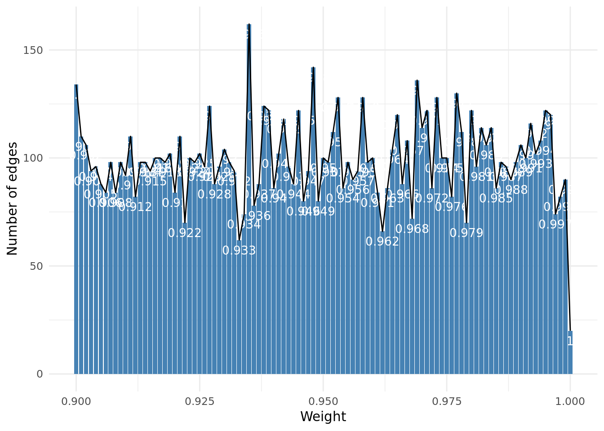

#### Degree distribution of item->similarity->item edges

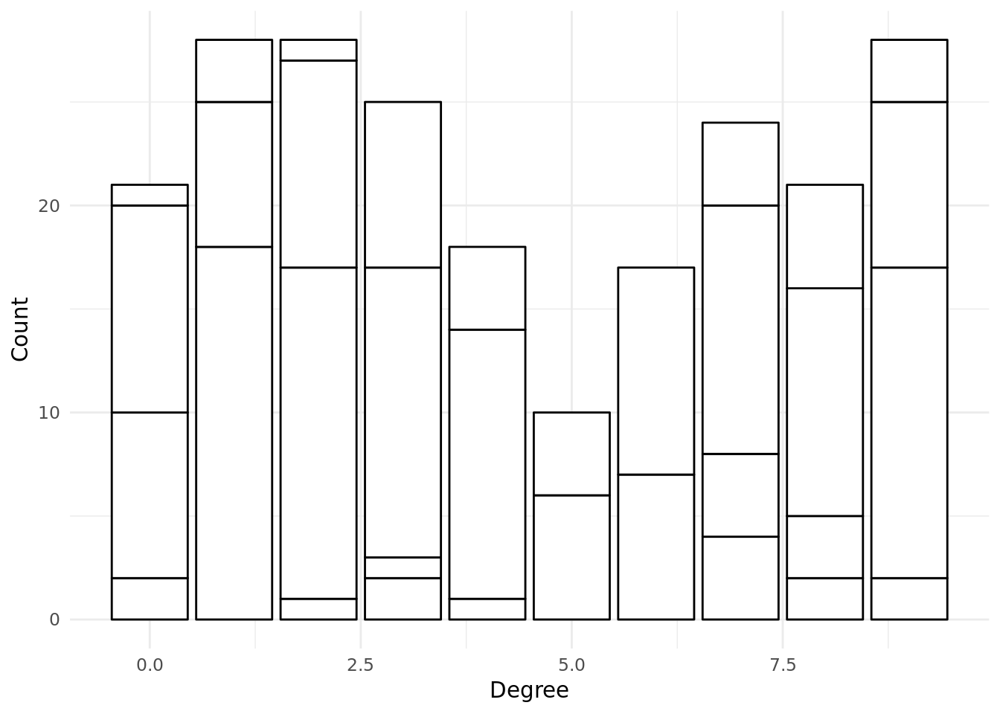

#### Degree distribution of agent->knows->agent edges

#### Runing time by method 

<table class="table table-condensed" style="width: auto !important; ">
 <thead>
  <tr>
   <th style="text-align:left;">   </th>
   <th style="text-align:left;"> key </th>
   <th style="text-align:right;"> doc_count </th>
   <th style="text-align:right;"> sum_wallTime_ms.value </th>
   <th style="text-align:left;"> avg_wallTime_ms.value </th>
   <th style="text-align:left;"> includedInTotal </th>
  </tr>
 </thead>
<tbody>
  <tr>
   <td style="text-align:left;"> 1 </td>
   <td style="text-align:left;"> knowsAgent </td>
   <td style="text-align:right;"> 601 </td>
   <td style="text-align:right;"> 2,165 </td>
   <td style="text-align:left;"> 3.60232945091514 </td>
   <td style="text-align:left;"> No </td>
  </tr>
  <tr>
   <td style="text-align:left;"> 2 </td>
   <td style="text-align:left;"> addItemToWork </td>
   <td style="text-align:right;"> 220 </td>
   <td style="text-align:right;"> 5,223 </td>
   <td style="text-align:left;"> 23.7409090909091 </td>
   <td style="text-align:left;"> No </td>
  </tr>
  <tr>
   <td style="text-align:left;"> 3 </td>
   <td style="text-align:left;"> ownsWork </td>
   <td style="text-align:right;"> 110 </td>
   <td style="text-align:right;"> 2,319 </td>
   <td style="text-align:left;"> 21.0818181818182 </td>
   <td style="text-align:left;"> No </td>
  </tr>
  <tr>
   <td style="text-align:left;"> 4 </td>
   <td style="text-align:left;"> init </td>
   <td style="text-align:right;"> 103 </td>
   <td style="text-align:right;"> 17,527 </td>
   <td style="text-align:left;"> 170.165048543689 </td>
   <td style="text-align:left;"> No </td>
  </tr>
  <tr>
   <td style="text-align:left;"> 5 </td>
   <td style="text-align:left;"> searchAndConnect </td>
   <td style="text-align:right;"> 101 </td>
   <td style="text-align:right;"> 149,890 </td>
   <td style="text-align:left;"> 1484.05940594059 </td>
   <td style="text-align:left;"> Yes </td>
  </tr>
  <tr>
   <td style="text-align:left;"> 6 </td>
   <td style="text-align:left;"> getWorksItems </td>
   <td style="text-align:right;"> 18 </td>
   <td style="text-align:right;"> 42 </td>
   <td style="text-align:left;"> 2.33333333333333 </td>
   <td style="text-align:left;"> Yes </td>
  </tr>
  <tr>
   <td style="text-align:left;"> 8 </td>
   <td style="text-align:left;"> cycleSearch </td>
   <td style="text-align:right;"> 5 </td>
   <td style="text-align:right;"> 1,474 </td>
   <td style="text-align:left;"> 294.8 </td>
   <td style="text-align:left;"> Yes </td>
  </tr>
  <tr>
   <td style="text-align:left;"> 10 </td>
   <td style="text-align:left;"> getWorks </td>
   <td style="text-align:right;"> 5 </td>
   <td style="text-align:right;"> 1,307 </td>
   <td style="text-align:left;"> 261.4 </td>
   <td style="text-align:left;"> No </td>
  </tr>
  <tr>
   <td style="text-align:left;font-weight: bold;"> 11 </td>
   <td style="text-align:left;font-weight: bold;"> Total </td>
   <td style="text-align:right;font-weight: bold;"> 134 </td>
   <td style="text-align:right;font-weight: bold;"> 153,724 </td>
   <td style="text-align:left;font-weight: bold;">  </td>
   <td style="text-align:left;font-weight: bold;">  </td>
  </tr>
</tbody>
</table>
####  Found structures 

#####  Cycles 

Number of cycles found:  5 

<button class="btn btn-primary" data-toggle="collapse" data-target="#WCPBREUCZF"> Show/Hide foundCycle query </button> 
 
  
     GET /filebeat-*/_search 
              { 
                "query": {
                  "bool": {
                    "must": [
                      { "match_phrase": {
                        "simulationId": "SIM09-26-06-12-oqNsd7--DV"
                        }
                      },
                      { "bool": {
                        "should": [
                          { "match": {
                            "keyword": "foundCycle"
                          }}
                        ]
                      }}
                    ]
                  }
                }
              }
     

#####  Paths 

Number of paths found:  0 

<button class="btn btn-primary" data-toggle="collapse" data-target="#PZKVSWKUYV"> Show/Hide foundPath query </button> 
 
  
     GET /filebeat-*/_search 
              { 
                "query": {
                  "bool": {
                    "must": [
                      { "match_phrase": {
                        "simulationId": "SIM09-26-06-12-oqNsd7--DV"
                        }
                      },
                      { "bool": {
                        "should": [
                          { "match": {
                            "keyword": "foundPath"
                          }}
                        ]
                      }}
                    ]
                  }
                }
              }
     

###  SIM09-26-06-26-kRX5dE--CV 

#### simulationParameters 

<table class="table table-condensed" style="width: auto !important; ">
 <thead>
  <tr>
   <th style="text-align:left;"> agentNumber </th>
   <th style="text-align:left;"> similarityConnectThreshold </th>
   <th style="text-align:left;"> graphType </th>
   <th style="text-align:left;"> chainLength </th>
   <th style="text-align:left;"> similaritySearchThreshold </th>
   <th style="text-align:left;"> maxDistance </th>
   <th style="text-align:left;"> randomWorksNumberMultiplier </th>
  </tr>
 </thead>
<tbody>
  <tr>
   <td style="text-align:left;width: 20em; "> 100 </td>
   <td style="text-align:left;width: 15em; "> 0.9 </td>
   <td style="text-align:left;width: 15em; "> random </td>
   <td style="text-align:left;width: 15em; "> 10 </td>
   <td style="text-align:left;width: 15em; "> 1 </td>
   <td style="text-align:left;width: 15em; "> 5 </td>
   <td style="text-align:left;width: 15em; "> 2 </td>
  </tr>
</tbody>
</table>
#### allEdgesByLabel

<table class="table table-condensed" style="width: auto !important; ">
 <thead>
  <tr>
   <th style="text-align:right;"> edges_offers </th>
   <th style="text-align:right;"> edges_similarity </th>
   <th style="text-align:right;"> edges_owns </th>
   <th style="text-align:right;"> edges_demands </th>
   <th style="text-align:right;"> edges_knows </th>
   <th style="text-align:right;"> edges_total </th>
  </tr>
 </thead>
<tbody>
  <tr>
   <td style="text-align:right;width: 5em; "> 210 </td>
   <td style="text-align:right;width: 5em; "> 34,372 </td>
   <td style="text-align:right;width: 5em; "> 210 </td>
   <td style="text-align:right;width: 5em; "> 210 </td>
   <td style="text-align:right;width: 5em; "> 100 </td>
   <td style="text-align:right;width: 5em; "> 35,102 </td>
  </tr>
</tbody>
</table>
#### allVerticesByType

<table class="table table-condensed" style="width: auto !important; ">
 <thead>
  <tr>
   <th style="text-align:right;"> vertices_agent </th>
   <th style="text-align:right;"> vertices_item </th>
   <th style="text-align:right;"> vertices_work </th>
   <th style="text-align:right;"> vertices_total </th>
  </tr>
 </thead>
<tbody>
  <tr>
   <td style="text-align:right;width: 5em; "> 101 </td>
   <td style="text-align:right;width: 5em; "> 420 </td>
   <td style="text-align:right;width: 5em; "> 210 </td>
   <td style="text-align:right;width: 5em; "> 731 </td>
  </tr>
</tbody>
</table>
#### distribution of similarityEdgesByWeight

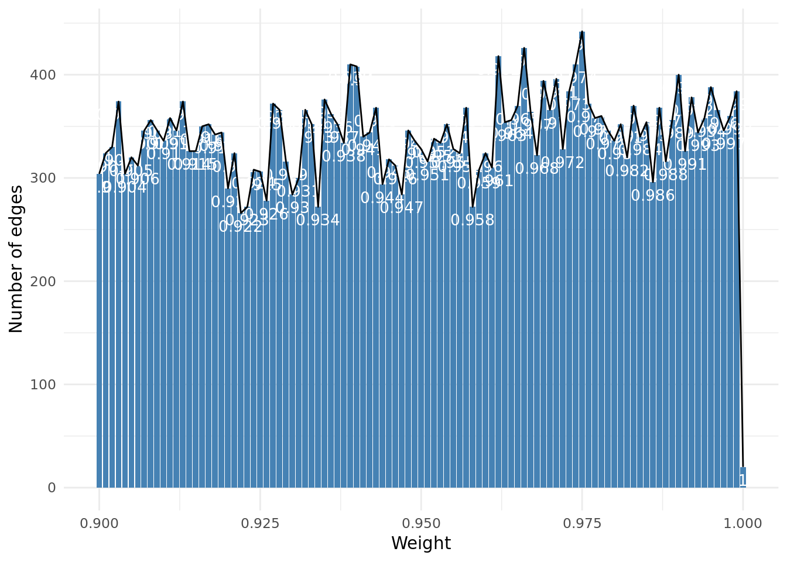

#### Degree distribution of item->similarity->item edges

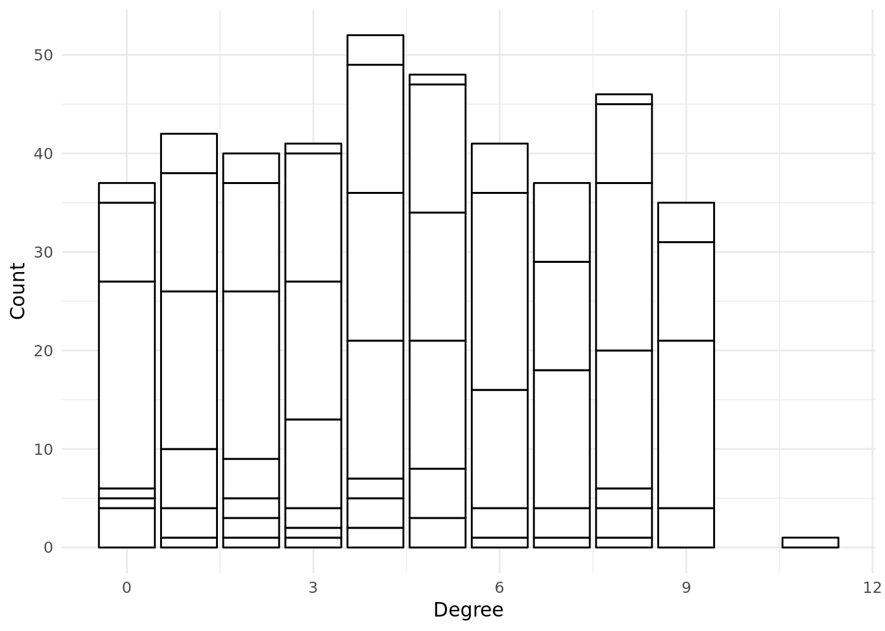

#### Degree distribution of agent->knows->agent edges

#### Runing time by method 

<table class="table table-condensed" style="width: auto !important; ">
 <thead>
  <tr>
   <th style="text-align:left;"> key </th>
   <th style="text-align:right;"> doc_count </th>
   <th style="text-align:right;"> sum_wallTime_ms.value </th>
   <th style="text-align:left;"> avg_wallTime_ms.value </th>
   <th style="text-align:left;"> includedInTotal </th>
  </tr>
 </thead>
<tbody>
  <tr>
   <td style="text-align:left;"> connectIfSimilar </td>
   <td style="text-align:right;"> 87,990 </td>
   <td style="text-align:right;"> 618,144 </td>
   <td style="text-align:left;"> 7.02516195022162 </td>
   <td style="text-align:left;"> No </td>
  </tr>
  <tr>
   <td style="text-align:left;"> existsSimilarity </td>
   <td style="text-align:right;"> 87,990 </td>
   <td style="text-align:right;"> 545,717 </td>
   <td style="text-align:left;"> 6.20203432208205 </td>
   <td style="text-align:left;"> No </td>
  </tr>
  <tr>
   <td style="text-align:left;"> similarityEdges </td>
   <td style="text-align:right;"> 87,990 </td>
   <td style="text-align:right;"> 538,990 </td>
   <td style="text-align:left;"> 6.12558245255143 </td>
   <td style="text-align:left;"> No </td>
  </tr>
  <tr>
   <td style="text-align:left;"> connect </td>
   <td style="text-align:right;"> 10,600 </td>
   <td style="text-align:right;"> 69,833 </td>
   <td style="text-align:left;"> 6.58801886792453 </td>
   <td style="text-align:left;"> Yes </td>
  </tr>
  <tr>
   <td style="text-align:left;"> connectAllSimilar </td>
   <td style="text-align:right;"> 420 </td>
   <td style="text-align:right;"> 619,455 </td>
   <td style="text-align:left;"> 1474.89285714286 </td>
   <td style="text-align:left;"> Yes </td>
  </tr>
  <tr>
   <td style="text-align:left;"> init </td>
   <td style="text-align:right;"> 103 </td>
   <td style="text-align:right;"> 17,565 </td>
   <td style="text-align:left;"> 170.533980582524 </td>
   <td style="text-align:left;"> No </td>
  </tr>
  <tr>
   <td style="text-align:left;font-weight: bold;"> Total </td>
   <td style="text-align:right;font-weight: bold;"> 11,028 </td>
   <td style="text-align:right;font-weight: bold;"> 690,900 </td>
   <td style="text-align:left;font-weight: bold;">  </td>
   <td style="text-align:left;font-weight: bold;">  </td>
  </tr>
</tbody>
</table>
####  Found structures 

#####  Cycles 

Number of cycles found:  1 

<button class="btn btn-primary" data-toggle="collapse" data-target="#ORRLEGNNEL"> Show/Hide foundCycle query </button> 
 
  
     GET /filebeat-*/_search 
              { 
                "query": {
                  "bool": {
                    "must": [
                      { "match_phrase": {
                        "simulationId": "SIM09-26-06-26-kRX5dE--CV"
                        }
                      },
                      { "bool": {
                        "should": [
                          { "match": {
                            "keyword": "foundCycle"
                          }}
                        ]
                      }}
                    ]
                  }
                }
              }
     

#####  Paths 

Number of paths found:  0 

<button class="btn btn-primary" data-toggle="collapse" data-target="#PDNWTMXWAW"> Show/Hide foundPath query </button> 
 
  
     GET /filebeat-*/_search 
              { 
                "query": {
                  "bool": {
                    "must": [
                      { "match_phrase": {
                        "simulationId": "SIM09-26-06-26-kRX5dE--CV"
                        }
                      },
                      { "bool": {
                        "should": [
                          { "match": {
                            "keyword": "foundPath"
                          }}
                        ]
                      }}
                    ]
                  }
                }
              }
     

###  SIM09-26-06-26-kRX5dE--DV 

#### simulationParameters 

<table class="table table-condensed" style="width: auto !important; ">
 <thead>
  <tr>
   <th style="text-align:left;"> agentNumber </th>
   <th style="text-align:left;"> similarityConnectThreshold </th>
   <th style="text-align:left;"> graphType </th>
   <th style="text-align:left;"> chainLength </th>
   <th style="text-align:left;"> similaritySearchThreshold </th>
   <th style="text-align:left;"> maxDistance </th>
   <th style="text-align:left;"> randomWorksNumberMultiplier </th>
  </tr>
 </thead>
<tbody>
  <tr>
   <td style="text-align:left;width: 20em; "> 100 </td>
   <td style="text-align:left;width: 15em; "> 0.9 </td>
   <td style="text-align:left;width: 15em; "> random </td>
   <td style="text-align:left;width: 15em; "> 10 </td>
   <td style="text-align:left;width: 15em; "> 1 </td>
   <td style="text-align:left;width: 15em; "> 5 </td>
   <td style="text-align:left;width: 15em; "> 2 </td>
  </tr>
</tbody>
</table>
#### allEdgesByLabel

<table class="table table-condensed" style="width: auto !important; ">
 <thead>
  <tr>
   <th style="text-align:right;"> edges_offers </th>
   <th style="text-align:right;"> edges_similarity </th>
   <th style="text-align:right;"> edges_owns </th>
   <th style="text-align:right;"> edges_demands </th>
   <th style="text-align:right;"> edges_knows </th>
   <th style="text-align:right;"> edges_total </th>
  </tr>
 </thead>
<tbody>
  <tr>
   <td style="text-align:right;width: 5em; "> 210 </td>
   <td style="text-align:right;width: 5em; "> 13,172 </td>
   <td style="text-align:right;width: 5em; "> 210 </td>
   <td style="text-align:right;width: 5em; "> 210 </td>
   <td style="text-align:right;width: 5em; "> 100 </td>
   <td style="text-align:right;width: 5em; "> 13,902 </td>
  </tr>
</tbody>
</table>
#### allVerticesByType

<table class="table table-condensed" style="width: auto !important; ">
 <thead>
  <tr>
   <th style="text-align:right;"> vertices_agent </th>
   <th style="text-align:right;"> vertices_item </th>
   <th style="text-align:right;"> vertices_work </th>
   <th style="text-align:right;"> vertices_total </th>
  </tr>
 </thead>
<tbody>
  <tr>
   <td style="text-align:right;width: 5em; "> 101 </td>
   <td style="text-align:right;width: 5em; "> 420 </td>
   <td style="text-align:right;width: 5em; "> 210 </td>
   <td style="text-align:right;width: 5em; "> 731 </td>
  </tr>
</tbody>
</table>
#### distribution of similarityEdgesByWeight

#### Degree distribution of item->similarity->item edges

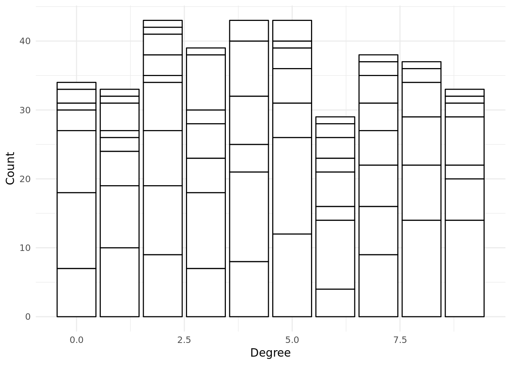

#### Degree distribution of agent->knows->agent edges

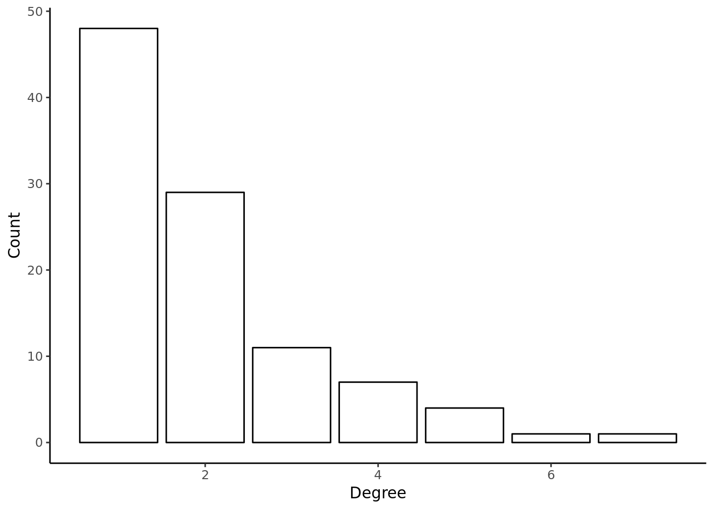

#### Runing time by method 

<table class="table table-condensed" style="width: auto !important; ">
 <thead>
  <tr>
   <th style="text-align:left;">   </th>
   <th style="text-align:left;"> key </th>
   <th style="text-align:right;"> doc_count </th>
   <th style="text-align:right;"> sum_wallTime_ms.value </th>
   <th style="text-align:left;"> avg_wallTime_ms.value </th>
   <th style="text-align:left;"> includedInTotal </th>
  </tr>
 </thead>
<tbody>
  <tr>
   <td style="text-align:left;"> 2 </td>
   <td style="text-align:left;"> cycleSearch </td>
   <td style="text-align:right;"> 3,600 </td>
   <td style="text-align:right;"> 34,590 </td>
   <td style="text-align:left;"> 9.60833333333333 </td>
   <td style="text-align:left;"> Yes </td>
  </tr>
  <tr>
   <td style="text-align:left;"> 3 </td>
   <td style="text-align:left;"> getWorks </td>
   <td style="text-align:right;"> 3,600 </td>
   <td style="text-align:right;"> 145,393 </td>
   <td style="text-align:left;"> 40.3869444444444 </td>
   <td style="text-align:left;"> No </td>
  </tr>
  <tr>
   <td style="text-align:left;"> 4 </td>
   <td style="text-align:left;"> individualCycleSearch </td>
   <td style="text-align:right;"> 3,600 </td>
   <td style="text-align:right;"> 78 </td>
   <td style="text-align:left;"> 0.0216666666666667 </td>
   <td style="text-align:left;"> Yes </td>
  </tr>
  <tr>
   <td style="text-align:left;"> 6 </td>
   <td style="text-align:left;"> addItemToWork </td>
   <td style="text-align:right;"> 420 </td>
   <td style="text-align:right;"> 9,353 </td>
   <td style="text-align:left;"> 22.2690476190476 </td>
   <td style="text-align:left;"> No </td>
  </tr>
  <tr>
   <td style="text-align:left;"> 7 </td>
   <td style="text-align:left;"> ownsWork </td>
   <td style="text-align:right;"> 210 </td>
   <td style="text-align:right;"> 4,033 </td>
   <td style="text-align:left;"> 19.2047619047619 </td>
   <td style="text-align:left;"> No </td>
  </tr>
  <tr>
   <td style="text-align:left;"> 8 </td>
   <td style="text-align:left;"> init </td>
   <td style="text-align:right;"> 103 </td>
   <td style="text-align:right;"> 18,000 </td>
   <td style="text-align:left;"> 174.757281553398 </td>
   <td style="text-align:left;"> No </td>
  </tr>
  <tr>
   <td style="text-align:left;"> 9 </td>
   <td style="text-align:left;"> searchAndConnect </td>
   <td style="text-align:right;"> 101 </td>
   <td style="text-align:right;"> 153,713 </td>
   <td style="text-align:left;"> 1521.91089108911 </td>
   <td style="text-align:left;"> Yes </td>
  </tr>
  <tr>
   <td style="text-align:left;"> 10 </td>
   <td style="text-align:left;"> knowsAgent </td>
   <td style="text-align:right;"> 100 </td>
   <td style="text-align:right;"> 2,935 </td>
   <td style="text-align:left;"> 29.35 </td>
   <td style="text-align:left;"> No </td>
  </tr>
  <tr>
   <td style="text-align:left;font-weight: bold;"> 1 </td>
   <td style="text-align:left;font-weight: bold;"> Total </td>
   <td style="text-align:right;font-weight: bold;"> 14,501 </td>
   <td style="text-align:right;font-weight: bold;"> 209,110 </td>
   <td style="text-align:left;font-weight: bold;">  </td>
   <td style="text-align:left;font-weight: bold;">  </td>
  </tr>
</tbody>
</table>
####  Found structures 

#####  Cycles 

Number of cycles found:  0 

<button class="btn btn-primary" data-toggle="collapse" data-target="#GIWRGBNSSP"> Show/Hide foundCycle query </button> 
 
  
     GET /filebeat-*/_search 
              { 
                "query": {
                  "bool": {
                    "must": [
                      { "match_phrase": {
                        "simulationId": "SIM09-26-06-26-kRX5dE--DV"
                        }
                      },
                      { "bool": {
                        "should": [
                          { "match": {
                            "keyword": "foundCycle"
                          }}
                        ]
                      }}
                    ]
                  }
                }
              }
     

#####  Paths 

Number of paths found:  3600 

<button class="btn btn-primary" data-toggle="collapse" data-target="#LJNULHBWAK"> Show/Hide foundPath query </button> 
 
  
     GET /filebeat-*/_search 
              { 
                "query": {
                  "bool": {
                    "must": [
                      { "match_phrase": {
                        "simulationId": "SIM09-26-06-26-kRX5dE--DV"
                        }
                      },
                      { "bool": {
                        "should": [
                          { "match": {
                            "keyword": "foundPath"
                          }}
                        ]
                      }}
                    ]
                  }
                }
              }
     

###  SIM09-26-07-37-aEwVbk--CV 

#### simulationParameters 

<table class="table table-condensed" style="width: auto !important; ">
 <thead>
  <tr>
   <th style="text-align:left;"> agentNumber </th>
   <th style="text-align:left;"> similarityConnectThreshold </th>
   <th style="text-align:left;"> graphType </th>
   <th style="text-align:left;"> chainLength </th>
   <th style="text-align:left;"> similaritySearchThreshold </th>
   <th style="text-align:left;"> maxDistance </th>
   <th style="text-align:left;"> randomWorksNumberMultiplier </th>
  </tr>
 </thead>
<tbody>
  <tr>
   <td style="text-align:left;width: 20em; "> 100 </td>
   <td style="text-align:left;width: 15em; "> 0.9 </td>
   <td style="text-align:left;width: 15em; "> smallWorld </td>
   <td style="text-align:left;width: 15em; "> 10 </td>
   <td style="text-align:left;width: 15em; "> 1 </td>
   <td style="text-align:left;width: 15em; "> 5 </td>
   <td style="text-align:left;width: 15em; "> 2 </td>
  </tr>
</tbody>
</table>
#### allEdgesByLabel

<table class="table table-condensed" style="width: auto !important; ">
 <thead>
  <tr>
   <th style="text-align:right;"> edges_offers </th>
   <th style="text-align:right;"> edges_similarity </th>
   <th style="text-align:right;"> edges_owns </th>
   <th style="text-align:right;"> edges_demands </th>
   <th style="text-align:right;"> edges_knows </th>
   <th style="text-align:right;"> edges_total </th>
  </tr>
 </thead>
<tbody>
  <tr>
   <td style="text-align:right;width: 5em; "> 210 </td>
   <td style="text-align:right;width: 5em; "> 37,378 </td>
   <td style="text-align:right;width: 5em; "> 210 </td>
   <td style="text-align:right;width: 5em; "> 210 </td>
   <td style="text-align:right;width: 5em; "> 601 </td>
   <td style="text-align:right;width: 5em; "> 38,609 </td>
  </tr>
</tbody>
</table>
#### allVerticesByType

<table class="table table-condensed" style="width: auto !important; ">
 <thead>
  <tr>
   <th style="text-align:right;"> vertices_agent </th>
   <th style="text-align:right;"> vertices_item </th>
   <th style="text-align:right;"> vertices_work </th>
   <th style="text-align:right;"> vertices_total </th>
  </tr>
 </thead>
<tbody>
  <tr>
   <td style="text-align:right;width: 5em; "> 101 </td>
   <td style="text-align:right;width: 5em; "> 420 </td>
   <td style="text-align:right;width: 5em; "> 210 </td>
   <td style="text-align:right;width: 5em; "> 731 </td>
  </tr>
</tbody>
</table>
#### distribution of similarityEdgesByWeight

#### Degree distribution of item->similarity->item edges

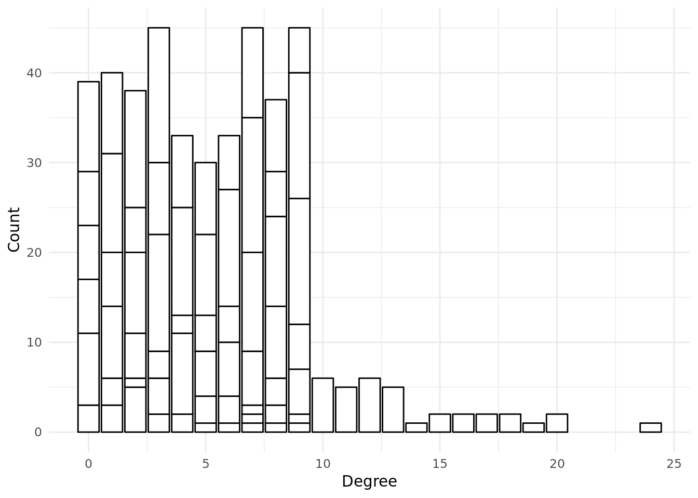

#### Degree distribution of agent->knows->agent edges

#### Runing time by method 

<table class="table table-condensed" style="width: auto !important; ">
 <thead>
  <tr>
   <th style="text-align:left;"> key </th>
   <th style="text-align:right;"> doc_count </th>
   <th style="text-align:right;"> sum_wallTime_ms.value </th>
   <th style="text-align:left;"> avg_wallTime_ms.value </th>
   <th style="text-align:left;"> includedInTotal </th>
  </tr>
 </thead>
<tbody>
  <tr>
   <td style="text-align:left;"> connectIfSimilar </td>
   <td style="text-align:right;"> 87,990 </td>
   <td style="text-align:right;"> 679,943 </td>
   <td style="text-align:left;"> 7.72750312535515 </td>
   <td style="text-align:left;"> No </td>
  </tr>
  <tr>
   <td style="text-align:left;"> existsSimilarity </td>
   <td style="text-align:right;"> 87,990 </td>
   <td style="text-align:right;"> 676,418 </td>
   <td style="text-align:left;"> 7.68744175474486 </td>
   <td style="text-align:left;"> No </td>
  </tr>
  <tr>
   <td style="text-align:left;"> similarityEdges </td>
   <td style="text-align:right;"> 87,990 </td>
   <td style="text-align:right;"> 668,034 </td>
   <td style="text-align:left;"> 7.59215819979543 </td>
   <td style="text-align:left;"> No </td>
  </tr>
  <tr>
   <td style="text-align:left;"> connectAllSimilar </td>
   <td style="text-align:right;"> 420 </td>
   <td style="text-align:right;"> 681,088 </td>
   <td style="text-align:left;"> 1621.6380952381 </td>
   <td style="text-align:left;"> Yes </td>
  </tr>
  <tr>
   <td style="text-align:left;"> connect </td>
   <td style="text-align:right;"> 211 </td>
   <td style="text-align:right;"> 1,259 </td>
   <td style="text-align:left;"> 5.96682464454976 </td>
   <td style="text-align:left;"> Yes </td>
  </tr>
  <tr>
   <td style="text-align:left;"> init </td>
   <td style="text-align:right;"> 103 </td>
   <td style="text-align:right;"> 17,653 </td>
   <td style="text-align:left;"> 171.388349514563 </td>
   <td style="text-align:left;"> No </td>
  </tr>
  <tr>
   <td style="text-align:left;font-weight: bold;"> Total </td>
   <td style="text-align:right;font-weight: bold;"> 639 </td>
   <td style="text-align:right;font-weight: bold;"> 683,960 </td>
   <td style="text-align:left;font-weight: bold;">  </td>
   <td style="text-align:left;font-weight: bold;">  </td>
  </tr>
</tbody>
</table>
####  Found structures 

#####  Cycles 

Number of cycles found:  1 

<button class="btn btn-primary" data-toggle="collapse" data-target="#AZSSGQYKII"> Show/Hide foundCycle query </button> 
 
  
     GET /filebeat-*/_search 
              { 
                "query": {
                  "bool": {
                    "must": [
                      { "match_phrase": {
                        "simulationId": "SIM09-26-07-37-aEwVbk--CV"
                        }
                      },
                      { "bool": {
                        "should": [
                          { "match": {
                            "keyword": "foundCycle"
                          }}
                        ]
                      }}
                    ]
                  }
                }
              }
     

#####  Paths 

Number of paths found:  0 

<button class="btn btn-primary" data-toggle="collapse" data-target="#XSZDUFJTAO"> Show/Hide foundPath query </button> 
 
  
     GET /filebeat-*/_search 
              { 
                "query": {
                  "bool": {
                    "must": [
                      { "match_phrase": {
                        "simulationId": "SIM09-26-07-37-aEwVbk--CV"
                        }
                      },
                      { "bool": {
                        "should": [
                          { "match": {
                            "keyword": "foundPath"
                          }}
                        ]
                      }}
                    ]
                  }
                }
              }
     

###  SIM09-26-07-37-aEwVbk--DV 

#### simulationParameters 

<table class="table table-condensed" style="width: auto !important; ">
 <thead>
  <tr>
   <th style="text-align:left;"> agentNumber </th>
   <th style="text-align:left;"> similarityConnectThreshold </th>
   <th style="text-align:left;"> graphType </th>
   <th style="text-align:left;"> chainLength </th>
   <th style="text-align:left;"> similaritySearchThreshold </th>
   <th style="text-align:left;"> maxDistance </th>
   <th style="text-align:left;"> randomWorksNumberMultiplier </th>
  </tr>
 </thead>
<tbody>
  <tr>
   <td style="text-align:left;width: 20em; "> 100 </td>
   <td style="text-align:left;width: 15em; "> 0.9 </td>
   <td style="text-align:left;width: 15em; "> smallWorld </td>
   <td style="text-align:left;width: 15em; "> 10 </td>
   <td style="text-align:left;width: 15em; "> 1 </td>
   <td style="text-align:left;width: 15em; "> 5 </td>
   <td style="text-align:left;width: 15em; "> 2 </td>
  </tr>
</tbody>
</table>
#### allEdgesByLabel

<table class="table table-condensed" style="width: auto !important; ">
 <thead>
  <tr>
   <th style="text-align:right;"> edges_offers </th>
   <th style="text-align:right;"> edges_similarity </th>
   <th style="text-align:right;"> edges_owns </th>
   <th style="text-align:right;"> edges_demands </th>
   <th style="text-align:right;"> edges_knows </th>
   <th style="text-align:right;"> edges_total </th>
  </tr>
 </thead>
<tbody>
  <tr>
   <td style="text-align:right;width: 5em; "> 210 </td>
   <td style="text-align:right;width: 5em; "> 36,956 </td>
   <td style="text-align:right;width: 5em; "> 210 </td>
   <td style="text-align:right;width: 5em; "> 210 </td>
   <td style="text-align:right;width: 5em; "> 601 </td>
   <td style="text-align:right;width: 5em; "> 38,187 </td>
  </tr>
</tbody>
</table>
#### allVerticesByType

<table class="table table-condensed" style="width: auto !important; ">
 <thead>
  <tr>
   <th style="text-align:right;"> vertices_agent </th>
   <th style="text-align:right;"> vertices_item </th>
   <th style="text-align:right;"> vertices_work </th>
   <th style="text-align:right;"> vertices_total </th>
  </tr>
 </thead>
<tbody>
  <tr>
   <td style="text-align:right;width: 5em; "> 101 </td>
   <td style="text-align:right;width: 5em; "> 420 </td>
   <td style="text-align:right;width: 5em; "> 210 </td>
   <td style="text-align:right;width: 5em; "> 731 </td>
  </tr>
</tbody>
</table>
#### distribution of similarityEdgesByWeight

#### Degree distribution of item->similarity->item edges

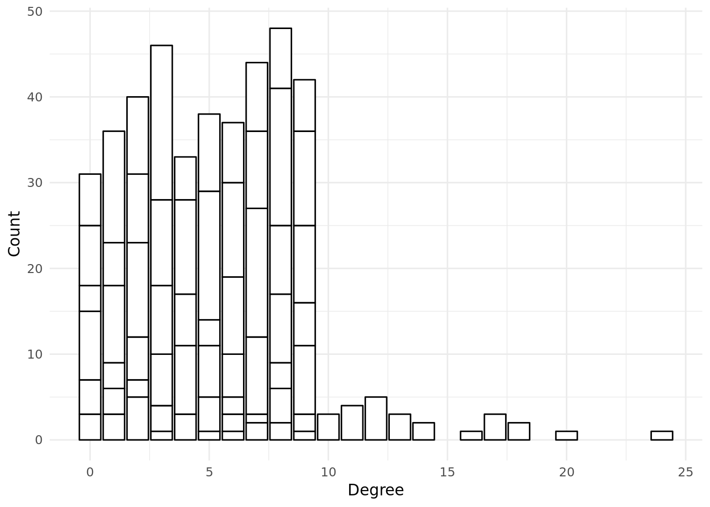

#### Degree distribution of agent->knows->agent edges

#### Runing time by method 

<table class="table table-condensed" style="width: auto !important; ">
 <thead>
  <tr>
   <th style="text-align:left;">   </th>
   <th style="text-align:left;"> key </th>
   <th style="text-align:right;"> doc_count </th>
   <th style="text-align:right;"> sum_wallTime_ms.value </th>
   <th style="text-align:left;"> avg_wallTime_ms.value </th>
   <th style="text-align:left;"> includedInTotal </th>
  </tr>
 </thead>
<tbody>
  <tr>
   <td style="text-align:left;"> 2 </td>
   <td style="text-align:left;"> cycleSearch </td>
   <td style="text-align:right;"> 3,600 </td>
   <td style="text-align:right;"> 32,606 </td>
   <td style="text-align:left;"> 9.05722222222222 </td>
   <td style="text-align:left;"> Yes </td>
  </tr>
  <tr>
   <td style="text-align:left;"> 3 </td>
   <td style="text-align:left;"> getWorks </td>
   <td style="text-align:right;"> 3,600 </td>
   <td style="text-align:right;"> 171,472 </td>
   <td style="text-align:left;"> 47.6311111111111 </td>
   <td style="text-align:left;"> No </td>
  </tr>
  <tr>
   <td style="text-align:left;"> 4 </td>
   <td style="text-align:left;"> individualCycleSearch </td>
   <td style="text-align:right;"> 3,600 </td>
   <td style="text-align:right;"> 95 </td>
   <td style="text-align:left;"> 0.0263888888888889 </td>
   <td style="text-align:left;"> Yes </td>
  </tr>
  <tr>
   <td style="text-align:left;"> 6 </td>
   <td style="text-align:left;"> knowsAgent </td>
   <td style="text-align:right;"> 601 </td>
   <td style="text-align:right;"> 3,439 </td>
   <td style="text-align:left;"> 5.72212978369384 </td>
   <td style="text-align:left;"> No </td>
  </tr>
  <tr>
   <td style="text-align:left;"> 7 </td>
   <td style="text-align:left;"> addItemToWork </td>
   <td style="text-align:right;"> 420 </td>
   <td style="text-align:right;"> 8,235 </td>
   <td style="text-align:left;"> 19.6071428571429 </td>
   <td style="text-align:left;"> No </td>
  </tr>
  <tr>
   <td style="text-align:left;"> 8 </td>
   <td style="text-align:left;"> ownsWork </td>
   <td style="text-align:right;"> 210 </td>
   <td style="text-align:right;"> 6,359 </td>
   <td style="text-align:left;"> 30.2809523809524 </td>
   <td style="text-align:left;"> No </td>
  </tr>
  <tr>
   <td style="text-align:left;"> 9 </td>
   <td style="text-align:left;"> init </td>
   <td style="text-align:right;"> 103 </td>
   <td style="text-align:right;"> 19,807 </td>
   <td style="text-align:left;"> 192.300970873786 </td>
   <td style="text-align:left;"> No </td>
  </tr>
  <tr>
   <td style="text-align:left;"> 10 </td>
   <td style="text-align:left;"> searchAndConnect </td>
   <td style="text-align:right;"> 101 </td>
   <td style="text-align:right;"> 454,584 </td>
   <td style="text-align:left;"> 4500.83168316832 </td>
   <td style="text-align:left;"> Yes </td>
  </tr>
  <tr>
   <td style="text-align:left;font-weight: bold;"> 1 </td>
   <td style="text-align:left;font-weight: bold;"> Total </td>
   <td style="text-align:right;font-weight: bold;"> 14,501 </td>
   <td style="text-align:right;font-weight: bold;"> 510,910 </td>
   <td style="text-align:left;font-weight: bold;">  </td>
   <td style="text-align:left;font-weight: bold;">  </td>
  </tr>
</tbody>
</table>
####  Found structures 

#####  Cycles 

Number of cycles found:  0 

<button class="btn btn-primary" data-toggle="collapse" data-target="#BHYWYDYDXA"> Show/Hide foundCycle query </button> 
 
  
     GET /filebeat-*/_search 
              { 
                "query": {
                  "bool": {
                    "must": [
                      { "match_phrase": {
                        "simulationId": "SIM09-26-07-37-aEwVbk--DV"
                        }
                      },
                      { "bool": {
                        "should": [
                          { "match": {
                            "keyword": "foundCycle"
                          }}
                        ]
                      }}
                    ]
                  }
                }
              }
     

#####  Paths 

Number of paths found:  3600 

<button class="btn btn-primary" data-toggle="collapse" data-target="#HXMKTXGEOQ"> Show/Hide foundPath query </button> 
 
  
     GET /filebeat-*/_search 
              { 
                "query": {
                  "bool": {
                    "must": [
                      { "match_phrase": {
                        "simulationId": "SIM09-26-07-37-aEwVbk--DV"
                        }
                      },
                      { "bool": {
                        "should": [
                          { "match": {
                            "keyword": "foundPath"
                          }}
                        ]
                      }}
                    ]
                  }
                }
              }
     

###  SIM09-26-10-39-FFZgYX--CV 

#### simulationParameters 

<table class="table table-condensed" style="width: auto !important; ">
 <thead>
  <tr>
   <th style="text-align:left;"> agentNumber </th>
   <th style="text-align:left;"> similarityConnectThreshold </th>
   <th style="text-align:left;"> graphType </th>
   <th style="text-align:left;"> chainLength </th>
   <th style="text-align:left;"> similaritySearchThreshold </th>
   <th style="text-align:left;"> maxDistance </th>
   <th style="text-align:left;"> randomWorksNumberMultiplier </th>
  </tr>
 </thead>
<tbody>
  <tr>
   <td style="text-align:left;width: 20em; "> 100 </td>
   <td style="text-align:left;width: 15em; "> 0.9 </td>
   <td style="text-align:left;width: 15em; "> random </td>
   <td style="text-align:left;width: 15em; "> 20 </td>
   <td style="text-align:left;width: 15em; "> 1 </td>
   <td style="text-align:left;width: 15em; "> 10 </td>
   <td style="text-align:left;width: 15em; "> 1 </td>
  </tr>
</tbody>
</table>
#### allEdgesByLabel

<table class="table table-condensed" style="width: auto !important; ">
 <thead>
  <tr>
   <th style="text-align:right;"> edges_offers </th>
   <th style="text-align:right;"> edges_similarity </th>
   <th style="text-align:right;"> edges_owns </th>
   <th style="text-align:right;"> edges_demands </th>
   <th style="text-align:right;"> edges_knows </th>
   <th style="text-align:right;"> edges_total </th>
  </tr>
 </thead>
<tbody>
  <tr>
   <td style="text-align:right;width: 5em; "> 120 </td>
   <td style="text-align:right;width: 5em; "> 12,598 </td>
   <td style="text-align:right;width: 5em; "> 120 </td>
   <td style="text-align:right;width: 5em; "> 120 </td>
   <td style="text-align:right;width: 5em; "> 100 </td>
   <td style="text-align:right;width: 5em; "> 13,058 </td>
  </tr>
</tbody>
</table>
#### allVerticesByType

<table class="table table-condensed" style="width: auto !important; ">
 <thead>
  <tr>
   <th style="text-align:right;"> vertices_agent </th>
   <th style="text-align:right;"> vertices_item </th>
   <th style="text-align:right;"> vertices_work </th>
   <th style="text-align:right;"> vertices_total </th>
  </tr>
 </thead>
<tbody>
  <tr>
   <td style="text-align:right;width: 5em; "> 101 </td>
   <td style="text-align:right;width: 5em; "> 240 </td>
   <td style="text-align:right;width: 5em; "> 120 </td>
   <td style="text-align:right;width: 5em; "> 461 </td>
  </tr>
</tbody>
</table>
#### distribution of similarityEdgesByWeight

#### Degree distribution of item->similarity->item edges

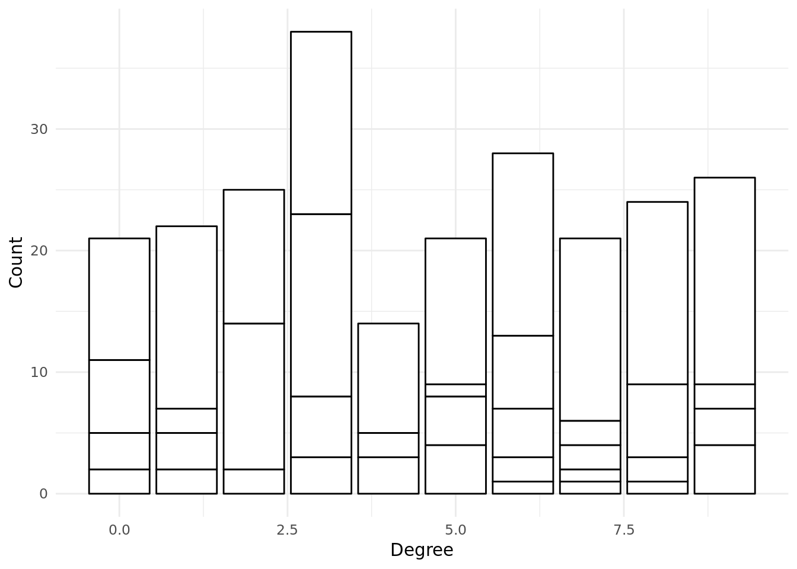

#### Degree distribution of agent->knows->agent edges

#### Runing time by method 

<table class="table table-condensed" style="width: auto !important; ">
 <thead>
  <tr>
   <th style="text-align:left;"> key </th>
   <th style="text-align:right;"> doc_count </th>
   <th style="text-align:right;"> sum_wallTime_ms.value </th>
   <th style="text-align:left;"> avg_wallTime_ms.value </th>
   <th style="text-align:left;"> includedInTotal </th>
  </tr>
 </thead>
<tbody>
  <tr>
   <td style="text-align:left;"> connectIfSimilar </td>
   <td style="text-align:right;"> 28,680 </td>
   <td style="text-align:right;"> 141,838 </td>
   <td style="text-align:left;"> 4.9455369595537 </td>
   <td style="text-align:left;"> No </td>
  </tr>
  <tr>
   <td style="text-align:left;"> existsSimilarity </td>
   <td style="text-align:right;"> 28,680 </td>
   <td style="text-align:right;"> 139,230 </td>
   <td style="text-align:left;"> 4.85460251046025 </td>
   <td style="text-align:left;"> No </td>
  </tr>
  <tr>
   <td style="text-align:left;"> similarityEdges </td>
   <td style="text-align:right;"> 28,680 </td>
   <td style="text-align:right;"> 137,642 </td>
   <td style="text-align:left;"> 4.79923291492329 </td>
   <td style="text-align:left;"> No </td>
  </tr>
  <tr>
   <td style="text-align:left;"> connect </td>
   <td style="text-align:right;"> 454 </td>
   <td style="text-align:right;"> 1,935 </td>
   <td style="text-align:left;"> 4.26211453744493 </td>
   <td style="text-align:left;"> Yes </td>
  </tr>
  <tr>
   <td style="text-align:left;"> connectAllSimilar </td>
   <td style="text-align:right;"> 240 </td>
   <td style="text-align:right;"> 142,151 </td>
   <td style="text-align:left;"> 592.295833333333 </td>
   <td style="text-align:left;"> Yes </td>
  </tr>
  <tr>
   <td style="text-align:left;"> init </td>
   <td style="text-align:right;"> 103 </td>
   <td style="text-align:right;"> 15,766 </td>
   <td style="text-align:left;"> 153.067961165049 </td>
   <td style="text-align:left;"> No </td>
  </tr>
  <tr>
   <td style="text-align:left;font-weight: bold;"> Total </td>
   <td style="text-align:right;font-weight: bold;"> 702 </td>
   <td style="text-align:right;font-weight: bold;"> 144,987 </td>
   <td style="text-align:left;font-weight: bold;">  </td>
   <td style="text-align:left;font-weight: bold;">  </td>
  </tr>
</tbody>
</table>
####  Found structures 

#####  Cycles 

Number of cycles found:  1 

<button class="btn btn-primary" data-toggle="collapse" data-target="#OVSJYTLFJQ"> Show/Hide foundCycle query </button> 
 
  
     GET /filebeat-*/_search 
              { 
                "query": {
                  "bool": {
                    "must": [
                      { "match_phrase": {
                        "simulationId": "SIM09-26-10-39-FFZgYX--CV"
                        }
                      },
                      { "bool": {
                        "should": [
                          { "match": {
                            "keyword": "foundCycle"
                          }}
                        ]
                      }}
                    ]
                  }
                }
              }
     

#####  Paths 

Number of paths found:  0 

<button class="btn btn-primary" data-toggle="collapse" data-target="#MXEUCPYPMQ"> Show/Hide foundPath query </button> 
 
  
     GET /filebeat-*/_search 
              { 
                "query": {
                  "bool": {
                    "must": [
                      { "match_phrase": {
                        "simulationId": "SIM09-26-10-39-FFZgYX--CV"
                        }
                      },
                      { "bool": {
                        "should": [
                          { "match": {
                            "keyword": "foundPath"
                          }}
                        ]
                      }}
                    ]
                  }
                }
              }
     

###  SIM09-26-10-39-FFZgYX--DV 

#### simulationParameters 

<table class="table table-condensed" style="width: auto !important; ">
 <thead>
  <tr>
   <th style="text-align:left;"> agentNumber </th>
   <th style="text-align:left;"> similarityConnectThreshold </th>
   <th style="text-align:left;"> graphType </th>
   <th style="text-align:left;"> chainLength </th>
   <th style="text-align:left;"> similaritySearchThreshold </th>
   <th style="text-align:left;"> maxDistance </th>
   <th style="text-align:left;"> randomWorksNumberMultiplier </th>
  </tr>
 </thead>
<tbody>
  <tr>
   <td style="text-align:left;width: 20em; "> 100 </td>
   <td style="text-align:left;width: 15em; "> 0.9 </td>
   <td style="text-align:left;width: 15em; "> random </td>
   <td style="text-align:left;width: 15em; "> 20 </td>
   <td style="text-align:left;width: 15em; "> 1 </td>
   <td style="text-align:left;width: 15em; "> 10 </td>
   <td style="text-align:left;width: 15em; "> 1 </td>
  </tr>
</tbody>
</table>
#### allEdgesByLabel

<table class="table table-condensed" style="width: auto !important; ">
 <thead>
  <tr>
   <th style="text-align:right;"> edges_offers </th>
   <th style="text-align:right;"> edges_similarity </th>
   <th style="text-align:right;"> edges_owns </th>
   <th style="text-align:right;"> edges_demands </th>
   <th style="text-align:right;"> edges_knows </th>
   <th style="text-align:right;"> edges_total </th>
  </tr>
 </thead>
<tbody>
  <tr>
   <td style="text-align:right;width: 5em; "> 120 </td>
   <td style="text-align:right;width: 5em; "> 11,690 </td>
   <td style="text-align:right;width: 5em; "> 120 </td>
   <td style="text-align:right;width: 5em; "> 120 </td>
   <td style="text-align:right;width: 5em; "> 100 </td>
   <td style="text-align:right;width: 5em; "> 12,150 </td>
  </tr>
</tbody>
</table>
#### allVerticesByType

<table class="table table-condensed" style="width: auto !important; ">
 <thead>
  <tr>
   <th style="text-align:right;"> vertices_agent </th>
   <th style="text-align:right;"> vertices_item </th>
   <th style="text-align:right;"> vertices_work </th>
   <th style="text-align:right;"> vertices_total </th>
  </tr>
 </thead>
<tbody>
  <tr>
   <td style="text-align:right;width: 5em; "> 101 </td>
   <td style="text-align:right;width: 5em; "> 240 </td>
   <td style="text-align:right;width: 5em; "> 120 </td>
   <td style="text-align:right;width: 5em; "> 461 </td>
  </tr>
</tbody>
</table>
#### distribution of similarityEdgesByWeight

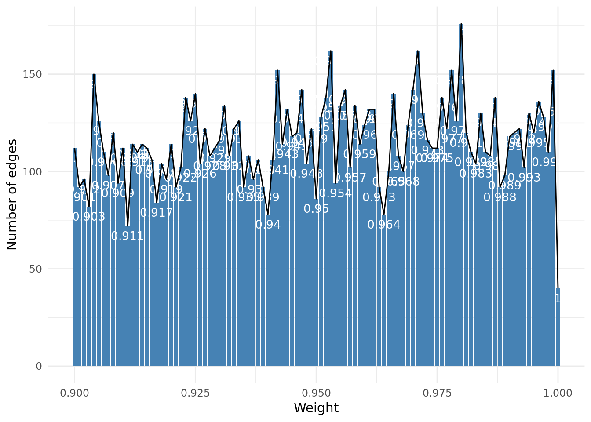

#### Degree distribution of item->similarity->item edges

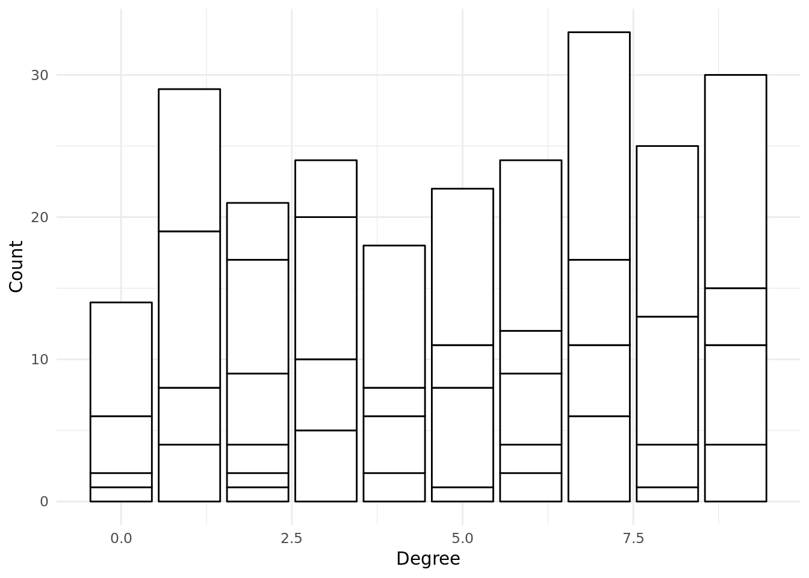

#### Degree distribution of agent->knows->agent edges

#### Runing time by method 

<table class="table table-condensed" style="width: auto !important; ">
 <thead>
  <tr>
   <th style="text-align:left;">   </th>
   <th style="text-align:left;"> key </th>
   <th style="text-align:right;"> doc_count </th>
   <th style="text-align:right;"> sum_wallTime_ms.value </th>
   <th style="text-align:left;"> avg_wallTime_ms.value </th>
   <th style="text-align:left;"> includedInTotal </th>
  </tr>
 </thead>
<tbody>
  <tr>
   <td style="text-align:left;"> 1 </td>
   <td style="text-align:left;"> addItemToWork </td>
   <td style="text-align:right;"> 240 </td>
   <td style="text-align:right;"> 2,698 </td>
   <td style="text-align:left;"> 11.2416666666667 </td>
   <td style="text-align:left;"> No </td>
  </tr>
  <tr>
   <td style="text-align:left;"> 2 </td>
   <td style="text-align:left;"> ownsWork </td>
   <td style="text-align:right;"> 120 </td>
   <td style="text-align:right;"> 3,187 </td>
   <td style="text-align:left;"> 26.5583333333333 </td>
   <td style="text-align:left;"> No </td>
  </tr>
  <tr>
   <td style="text-align:left;"> 3 </td>
   <td style="text-align:left;"> init </td>
   <td style="text-align:right;"> 103 </td>
   <td style="text-align:right;"> 15,101 </td>
   <td style="text-align:left;"> 146.611650485437 </td>
   <td style="text-align:left;"> No </td>
  </tr>
  <tr>
   <td style="text-align:left;"> 4 </td>
   <td style="text-align:left;"> searchAndConnect </td>
   <td style="text-align:right;"> 101 </td>
   <td style="text-align:right;"> 95,271 </td>
   <td style="text-align:left;"> 943.277227722772 </td>
   <td style="text-align:left;"> Yes </td>
  </tr>
  <tr>
   <td style="text-align:left;"> 5 </td>
   <td style="text-align:left;"> knowsAgent </td>
   <td style="text-align:right;"> 100 </td>
   <td style="text-align:right;"> 910 </td>
   <td style="text-align:left;"> 9.1 </td>
   <td style="text-align:left;"> No </td>
  </tr>
  <tr>
   <td style="text-align:left;"> 6 </td>
   <td style="text-align:left;"> getWorksItems </td>
   <td style="text-align:right;"> 38 </td>
   <td style="text-align:right;"> 59 </td>
   <td style="text-align:left;"> 1.55263157894737 </td>
   <td style="text-align:left;"> Yes </td>
  </tr>
  <tr>
   <td style="text-align:left;"> 9 </td>
   <td style="text-align:left;"> cycleSearch </td>
   <td style="text-align:right;"> 4 </td>
   <td style="text-align:right;"> 286 </td>
   <td style="text-align:left;"> 71.5 </td>
   <td style="text-align:left;"> Yes </td>
  </tr>
  <tr>
   <td style="text-align:left;"> 10 </td>
   <td style="text-align:left;"> getWorks </td>
   <td style="text-align:right;"> 4 </td>
   <td style="text-align:right;"> 227 </td>
   <td style="text-align:left;"> 56.75 </td>
   <td style="text-align:left;"> No </td>
  </tr>
  <tr>
   <td style="text-align:left;font-weight: bold;"> 11 </td>
   <td style="text-align:left;font-weight: bold;"> Total </td>
   <td style="text-align:right;font-weight: bold;"> 152 </td>
   <td style="text-align:right;font-weight: bold;"> 97,131 </td>
   <td style="text-align:left;font-weight: bold;">  </td>
   <td style="text-align:left;font-weight: bold;">  </td>
  </tr>
</tbody>
</table>
####  Found structures 

#####  Cycles 

Number of cycles found:  4 

<button class="btn btn-primary" data-toggle="collapse" data-target="#ARQXSNNFPL"> Show/Hide foundCycle query </button> 
 
  
     GET /filebeat-*/_search 
              { 
                "query": {
                  "bool": {
                    "must": [
                      { "match_phrase": {
                        "simulationId": "SIM09-26-10-39-FFZgYX--DV"
                        }
                      },
                      { "bool": {
                        "should": [
                          { "match": {
                            "keyword": "foundCycle"
                          }}
                        ]
                      }}
                    ]
                  }
                }
              }
     

#####  Paths 

Number of paths found:  0 

<button class="btn btn-primary" data-toggle="collapse" data-target="#SUNRGIUQON"> Show/Hide foundPath query </button> 
 
  
     GET /filebeat-*/_search 
              { 
                "query": {
                  "bool": {
                    "must": [
                      { "match_phrase": {
                        "simulationId": "SIM09-26-10-39-FFZgYX--DV"
                        }
                      },
                      { "bool": {
                        "should": [
                          { "match": {
                            "keyword": "foundPath"
                          }}
                        ]
                      }}
                    ]
                  }
                }
              }
     

###  SIM09-26-10-42-zY7xLB--CV 

#### simulationParameters 

<table class="table table-condensed" style="width: auto !important; ">
 <thead>
  <tr>
   <th style="text-align:left;"> agentNumber </th>
   <th style="text-align:left;"> similarityConnectThreshold </th>
   <th style="text-align:left;"> graphType </th>
   <th style="text-align:left;"> chainLength </th>
   <th style="text-align:left;"> similaritySearchThreshold </th>
   <th style="text-align:left;"> maxDistance </th>
   <th style="text-align:left;"> randomWorksNumberMultiplier </th>
  </tr>
 </thead>
<tbody>
  <tr>
   <td style="text-align:left;width: 20em; "> 100 </td>
   <td style="text-align:left;width: 15em; "> 0.9 </td>
   <td style="text-align:left;width: 15em; "> smallWorld </td>
   <td style="text-align:left;width: 15em; "> 20 </td>
   <td style="text-align:left;width: 15em; "> 1 </td>
   <td style="text-align:left;width: 15em; "> 10 </td>
   <td style="text-align:left;width: 15em; "> 1 </td>
  </tr>
</tbody>
</table>
#### allEdgesByLabel

<table class="table table-condensed" style="width: auto !important; ">
 <thead>
  <tr>
   <th style="text-align:right;"> edges_offers </th>
   <th style="text-align:right;"> edges_similarity </th>
   <th style="text-align:right;"> edges_owns </th>
   <th style="text-align:right;"> edges_demands </th>
   <th style="text-align:right;"> edges_knows </th>
   <th style="text-align:right;"> edges_total </th>
  </tr>
 </thead>
<tbody>
  <tr>
   <td style="text-align:right;width: 5em; "> 120 </td>
   <td style="text-align:right;width: 5em; "> 12,074 </td>
   <td style="text-align:right;width: 5em; "> 120 </td>
   <td style="text-align:right;width: 5em; "> 120 </td>
   <td style="text-align:right;width: 5em; "> 601 </td>
   <td style="text-align:right;width: 5em; "> 13,035 </td>
  </tr>
</tbody>
</table>
#### allVerticesByType

<table class="table table-condensed" style="width: auto !important; ">
 <thead>
  <tr>
   <th style="text-align:right;"> vertices_agent </th>
   <th style="text-align:right;"> vertices_item </th>
   <th style="text-align:right;"> vertices_work </th>
   <th style="text-align:right;"> vertices_total </th>
  </tr>
 </thead>
<tbody>
  <tr>
   <td style="text-align:right;width: 5em; "> 101 </td>
   <td style="text-align:right;width: 5em; "> 240 </td>
   <td style="text-align:right;width: 5em; "> 120 </td>
   <td style="text-align:right;width: 5em; "> 461 </td>
  </tr>
</tbody>
</table>
#### distribution of similarityEdgesByWeight

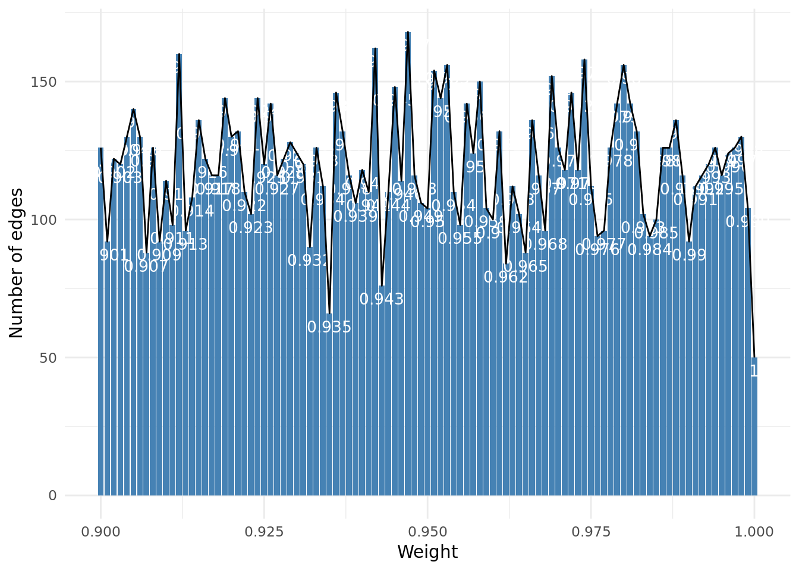

#### Degree distribution of item->similarity->item edges

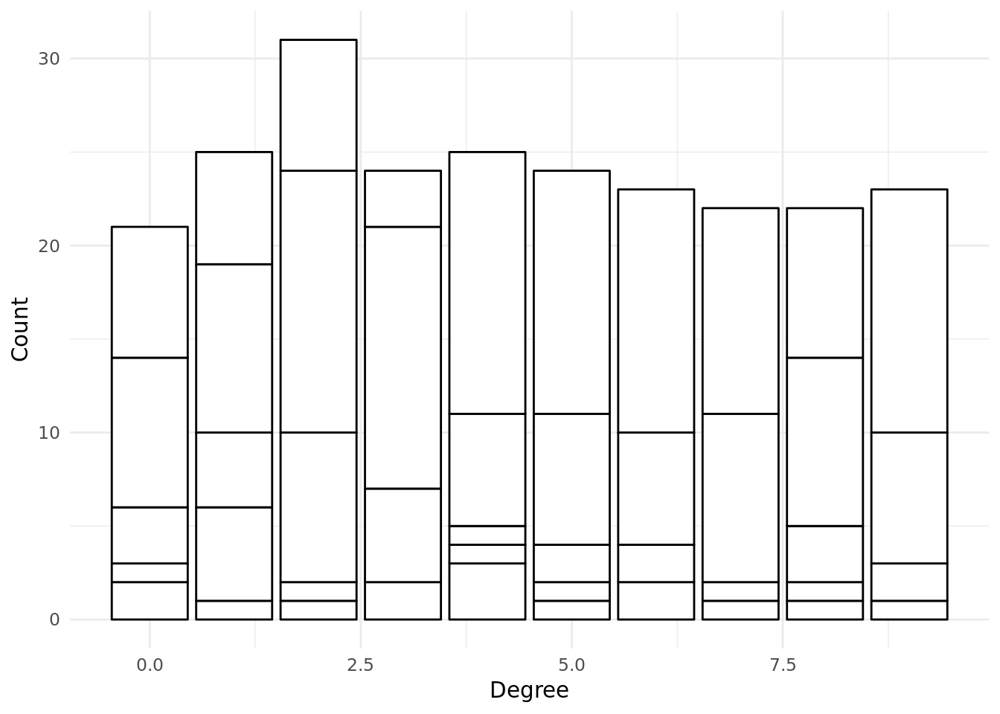

#### Degree distribution of agent->knows->agent edges

#### Runing time by method 

<table class="table table-condensed" style="width: auto !important; ">
 <thead>
  <tr>
   <th style="text-align:left;"> key </th>
   <th style="text-align:right;"> doc_count </th>
   <th style="text-align:right;"> sum_wallTime_ms.value </th>
   <th style="text-align:left;"> avg_wallTime_ms.value </th>
   <th style="text-align:left;"> includedInTotal </th>
  </tr>
 </thead>
<tbody>
  <tr>
   <td style="text-align:left;"> connectIfSimilar </td>
   <td style="text-align:right;"> 28,680 </td>
   <td style="text-align:right;"> 136,147 </td>
   <td style="text-align:left;"> 4.7471059972106 </td>
   <td style="text-align:left;"> No </td>
  </tr>
  <tr>
   <td style="text-align:left;"> existsSimilarity </td>
   <td style="text-align:right;"> 28,680 </td>
   <td style="text-align:right;"> 134,966 </td>
   <td style="text-align:left;"> 4.70592747559275 </td>
   <td style="text-align:left;"> No </td>
  </tr>
  <tr>
   <td style="text-align:left;"> similarityEdges </td>
   <td style="text-align:right;"> 28,680 </td>
   <td style="text-align:right;"> 133,368 </td>
   <td style="text-align:left;"> 4.65020920502092 </td>
   <td style="text-align:left;"> No </td>
  </tr>
  <tr>
   <td style="text-align:left;"> connectAllSimilar </td>
   <td style="text-align:right;"> 240 </td>
   <td style="text-align:right;"> 136,468 </td>
   <td style="text-align:left;"> 568.616666666667 </td>
   <td style="text-align:left;"> Yes </td>
  </tr>
  <tr>
   <td style="text-align:left;"> init </td>
   <td style="text-align:right;"> 103 </td>
   <td style="text-align:right;"> 14,538 </td>
   <td style="text-align:left;"> 141.145631067961 </td>
   <td style="text-align:left;"> No </td>
  </tr>
  <tr>
   <td style="text-align:left;"> connect </td>
   <td style="text-align:right;"> 66 </td>
   <td style="text-align:right;"> 565 </td>
   <td style="text-align:left;"> 8.56060606060606 </td>
   <td style="text-align:left;"> Yes </td>
  </tr>
  <tr>
   <td style="text-align:left;font-weight: bold;"> Total </td>
   <td style="text-align:right;font-weight: bold;"> 314 </td>
   <td style="text-align:right;font-weight: bold;"> 138,044 </td>
   <td style="text-align:left;font-weight: bold;">  </td>
   <td style="text-align:left;font-weight: bold;">  </td>
  </tr>
</tbody>
</table>
####  Found structures 

#####  Cycles 

Number of cycles found:  1 

<button class="btn btn-primary" data-toggle="collapse" data-target="#KHFOHNOVOX"> Show/Hide foundCycle query </button> 
 
  
     GET /filebeat-*/_search 
              { 
                "query": {
                  "bool": {
                    "must": [
                      { "match_phrase": {
                        "simulationId": "SIM09-26-10-42-zY7xLB--CV"
                        }
                      },
                      { "bool": {
                        "should": [
                          { "match": {
                            "keyword": "foundCycle"
                          }}
                        ]
                      }}
                    ]
                  }
                }
              }
     

#####  Paths 

Number of paths found:  0 

<button class="btn btn-primary" data-toggle="collapse" data-target="#DPCKNBHRCY"> Show/Hide foundPath query </button> 
 
  
     GET /filebeat-*/_search 
              { 
                "query": {
                  "bool": {
                    "must": [
                      { "match_phrase": {
                        "simulationId": "SIM09-26-10-42-zY7xLB--CV"
                        }
                      },
                      { "bool": {
                        "should": [
                          { "match": {
                            "keyword": "foundPath"
                          }}
                        ]
                      }}
                    ]
                  }
                }
              }
     

###  SIM09-26-10-42-zY7xLB--DV 

#### simulationParameters 

<table class="table table-condensed" style="width: auto !important; ">
 <thead>
  <tr>
   <th style="text-align:left;"> agentNumber </th>
   <th style="text-align:left;"> similarityConnectThreshold </th>
   <th style="text-align:left;"> graphType </th>
   <th style="text-align:left;"> chainLength </th>
   <th style="text-align:left;"> similaritySearchThreshold </th>
   <th style="text-align:left;"> maxDistance </th>
   <th style="text-align:left;"> randomWorksNumberMultiplier </th>
  </tr>
 </thead>
<tbody>
  <tr>
   <td style="text-align:left;width: 20em; "> 100 </td>
   <td style="text-align:left;width: 15em; "> 0.9 </td>
   <td style="text-align:left;width: 15em; "> smallWorld </td>
   <td style="text-align:left;width: 15em; "> 20 </td>
   <td style="text-align:left;width: 15em; "> 1 </td>
   <td style="text-align:left;width: 15em; "> 10 </td>
   <td style="text-align:left;width: 15em; "> 1 </td>
  </tr>
</tbody>
</table>
#### allEdgesByLabel

<table class="table table-condensed" style="width: auto !important; ">
 <thead>
  <tr>
   <th style="text-align:right;"> edges_offers </th>
   <th style="text-align:right;"> edges_similarity </th>
   <th style="text-align:right;"> edges_owns </th>
   <th style="text-align:right;"> edges_demands </th>
   <th style="text-align:right;"> edges_knows </th>
   <th style="text-align:right;"> edges_total </th>
  </tr>
 </thead>
<tbody>
  <tr>
   <td style="text-align:right;width: 5em; "> 120 </td>
   <td style="text-align:right;width: 5em; "> 11,942 </td>
   <td style="text-align:right;width: 5em; "> 120 </td>
   <td style="text-align:right;width: 5em; "> 120 </td>
   <td style="text-align:right;width: 5em; "> 601 </td>
   <td style="text-align:right;width: 5em; "> 12,903 </td>
  </tr>
</tbody>
</table>
#### allVerticesByType

<table class="table table-condensed" style="width: auto !important; ">
 <thead>
  <tr>
   <th style="text-align:right;"> vertices_agent </th>
   <th style="text-align:right;"> vertices_item </th>
   <th style="text-align:right;"> vertices_work </th>
   <th style="text-align:right;"> vertices_total </th>
  </tr>
 </thead>
<tbody>
  <tr>
   <td style="text-align:right;width: 5em; "> 101 </td>
   <td style="text-align:right;width: 5em; "> 240 </td>
   <td style="text-align:right;width: 5em; "> 120 </td>
   <td style="text-align:right;width: 5em; "> 461 </td>
  </tr>
</tbody>
</table>
#### distribution of similarityEdgesByWeight

#### Degree distribution of item->similarity->item edges

#### Degree distribution of agent->knows->agent edges

#### Runing time by method 

<table class="table table-condensed" style="width: auto !important; ">
 <thead>
  <tr>
   <th style="text-align:left;">   </th>
   <th style="text-align:left;"> key </th>
   <th style="text-align:right;"> doc_count </th>
   <th style="text-align:right;"> sum_wallTime_ms.value </th>
   <th style="text-align:left;"> avg_wallTime_ms.value </th>
   <th style="text-align:left;"> includedInTotal </th>
  </tr>
 </thead>
<tbody>
  <tr>
   <td style="text-align:left;"> 1 </td>
   <td style="text-align:left;"> knowsAgent </td>
   <td style="text-align:right;"> 601 </td>
   <td style="text-align:right;"> 2,329 </td>
   <td style="text-align:left;"> 3.87520798668885 </td>
   <td style="text-align:left;"> No </td>
  </tr>
  <tr>
   <td style="text-align:left;"> 2 </td>
   <td style="text-align:left;"> addItemToWork </td>
   <td style="text-align:right;"> 240 </td>
   <td style="text-align:right;"> 7,787 </td>
   <td style="text-align:left;"> 32.4458333333333 </td>
   <td style="text-align:left;"> No </td>
  </tr>
  <tr>
   <td style="text-align:left;"> 3 </td>
   <td style="text-align:left;"> ownsWork </td>
   <td style="text-align:right;"> 120 </td>
   <td style="text-align:right;"> 4,559 </td>
   <td style="text-align:left;"> 37.9916666666667 </td>
   <td style="text-align:left;"> No </td>
  </tr>
  <tr>
   <td style="text-align:left;"> 4 </td>
   <td style="text-align:left;"> init </td>
   <td style="text-align:right;"> 103 </td>
   <td style="text-align:right;"> 15,853 </td>
   <td style="text-align:left;"> 153.912621359223 </td>
   <td style="text-align:left;"> No </td>
  </tr>
  <tr>
   <td style="text-align:left;"> 5 </td>
   <td style="text-align:left;"> searchAndConnect </td>
   <td style="text-align:right;"> 101 </td>
   <td style="text-align:right;"> 142,397 </td>
   <td style="text-align:left;"> 1409.87128712871 </td>
   <td style="text-align:left;"> Yes </td>
  </tr>
  <tr>
   <td style="text-align:left;"> 6 </td>
   <td style="text-align:left;"> getWorksItems </td>
   <td style="text-align:right;"> 38 </td>
   <td style="text-align:right;"> 89 </td>
   <td style="text-align:left;"> 2.34210526315789 </td>
   <td style="text-align:left;"> Yes </td>
  </tr>
  <tr>
   <td style="text-align:left;"> 7 </td>
   <td style="text-align:left;"> cycleSearch </td>
   <td style="text-align:right;"> 5 </td>
   <td style="text-align:right;"> 2,872 </td>
   <td style="text-align:left;"> 574.4 </td>
   <td style="text-align:left;"> Yes </td>
  </tr>
  <tr>
   <td style="text-align:left;"> 9 </td>
   <td style="text-align:left;"> getWorks </td>
   <td style="text-align:right;"> 5 </td>
   <td style="text-align:right;"> 1,169 </td>
   <td style="text-align:left;"> 233.8 </td>
   <td style="text-align:left;"> No </td>
  </tr>
  <tr>
   <td style="text-align:left;"> 10 </td>
   <td style="text-align:left;"> individualCycleSearch </td>
   <td style="text-align:right;"> 5 </td>
   <td style="text-align:right;"> 0 </td>
   <td style="text-align:left;"> 0 </td>
   <td style="text-align:left;"> Yes </td>
  </tr>
  <tr>
   <td style="text-align:left;font-weight: bold;"> 11 </td>
   <td style="text-align:left;font-weight: bold;"> Total </td>
   <td style="text-align:right;font-weight: bold;"> 154 </td>
   <td style="text-align:right;font-weight: bold;"> 145,741 </td>
   <td style="text-align:left;font-weight: bold;">  </td>
   <td style="text-align:left;font-weight: bold;">  </td>
  </tr>
</tbody>
</table>
####  Found structures 

#####  Cycles 

Number of cycles found:  3 

<button class="btn btn-primary" data-toggle="collapse" data-target="#ZEOZHOAMVM"> Show/Hide foundCycle query </button> 
 
  
     GET /filebeat-*/_search 
              { 
                "query": {
                  "bool": {
                    "must": [
                      { "match_phrase": {
                        "simulationId": "SIM09-26-10-42-zY7xLB--DV"
                        }
                      },
                      { "bool": {
                        "should": [
                          { "match": {
                            "keyword": "foundCycle"
                          }}
                        ]
                      }}
                    ]
                  }
                }
              }
     

#####  Paths 

Number of paths found:  1 

<button class="btn btn-primary" data-toggle="collapse" data-target="#LRZJUQUJOD"> Show/Hide foundPath query </button> 
 
  
     GET /filebeat-*/_search 
              { 
                "query": {
                  "bool": {
                    "must": [
                      { "match_phrase": {
                        "simulationId": "SIM09-26-10-42-zY7xLB--DV"
                        }
                      },
                      { "bool": {
                        "should": [
                          { "match": {
                            "keyword": "foundPath"
                          }}
                        ]
                      }}
                    ]
                  }
                }
              }
     

###  SIM09-26-12-13-BBy9z8--CV 

#### simulationParameters 

<table class="table table-condensed" style="width: auto !important; ">
 <thead>
  <tr>
   <th style="text-align:left;"> agentNumber </th>
   <th style="text-align:left;"> similarityConnectThreshold </th>
   <th style="text-align:left;"> graphType </th>
   <th style="text-align:left;"> chainLength </th>
   <th style="text-align:left;"> similaritySearchThreshold </th>
   <th style="text-align:left;"> maxDistance </th>
   <th style="text-align:left;"> randomWorksNumberMultiplier </th>
  </tr>
 </thead>
<tbody>
  <tr>
   <td style="text-align:left;width: 20em; "> 100 </td>
   <td style="text-align:left;width: 15em; "> 0.9 </td>
   <td style="text-align:left;width: 15em; "> random </td>
   <td style="text-align:left;width: 15em; "> 20 </td>
   <td style="text-align:left;width: 15em; "> 1 </td>
   <td style="text-align:left;width: 15em; "> 10 </td>
   <td style="text-align:left;width: 15em; "> 2 </td>
  </tr>
</tbody>
</table>
#### allEdgesByLabel

<table class="table table-condensed" style="width: auto !important; ">
 <thead>
  <tr>
   <th style="text-align:right;"> edges_offers </th>
   <th style="text-align:right;"> edges_similarity </th>
   <th style="text-align:right;"> edges_owns </th>
   <th style="text-align:right;"> edges_demands </th>
   <th style="text-align:right;"> edges_knows </th>
   <th style="text-align:right;"> edges_total </th>
  </tr>
 </thead>
<tbody>
  <tr>
   <td style="text-align:right;width: 5em; "> 220 </td>
   <td style="text-align:right;width: 5em; "> 40,962 </td>
   <td style="text-align:right;width: 5em; "> 220 </td>
   <td style="text-align:right;width: 5em; "> 220 </td>
   <td style="text-align:right;width: 5em; "> 100 </td>
   <td style="text-align:right;width: 5em; "> 41,722 </td>
  </tr>
</tbody>
</table>
#### allVerticesByType

<table class="table table-condensed" style="width: auto !important; ">
 <thead>
  <tr>
   <th style="text-align:right;"> vertices_agent </th>
   <th style="text-align:right;"> vertices_item </th>
   <th style="text-align:right;"> vertices_work </th>
   <th style="text-align:right;"> vertices_total </th>
  </tr>
 </thead>
<tbody>
  <tr>
   <td style="text-align:right;width: 5em; "> 101 </td>
   <td style="text-align:right;width: 5em; "> 440 </td>
   <td style="text-align:right;width: 5em; "> 220 </td>
   <td style="text-align:right;width: 5em; "> 761 </td>
  </tr>
</tbody>
</table>
#### distribution of similarityEdgesByWeight

#### Degree distribution of item->similarity->item edges

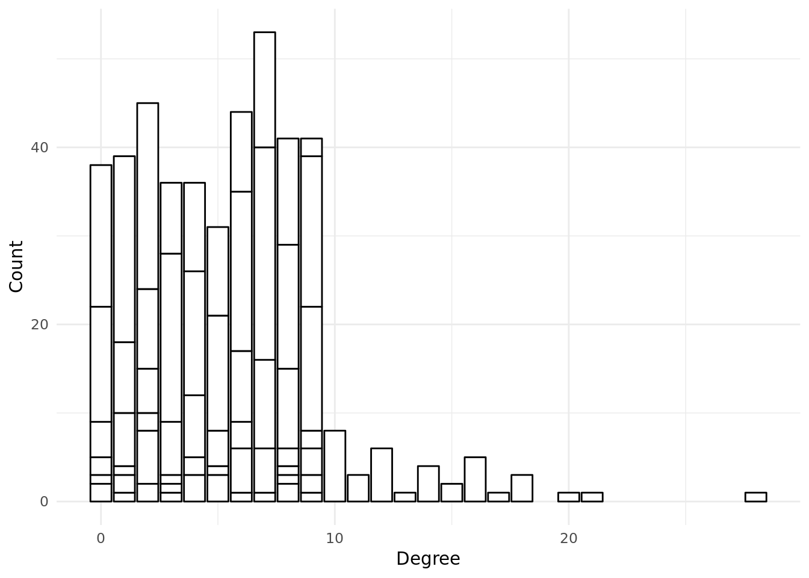

#### Degree distribution of agent->knows->agent edges

#### Runing time by method 

<table class="table table-condensed" style="width: auto !important; ">
 <thead>
  <tr>
   <th style="text-align:left;"> key </th>
   <th style="text-align:right;"> doc_count </th>
   <th style="text-align:right;"> sum_wallTime_ms.value </th>
   <th style="text-align:left;"> avg_wallTime_ms.value </th>
   <th style="text-align:left;"> includedInTotal </th>
  </tr>
 </thead>
<tbody>
  <tr>
   <td style="text-align:left;"> connectIfSimilar </td>
   <td style="text-align:right;"> 96,580 </td>
   <td style="text-align:right;"> 656,573 </td>
   <td style="text-align:left;"> 6.7982294470905 </td>
   <td style="text-align:left;"> No </td>
  </tr>
  <tr>
   <td style="text-align:left;"> existsSimilarity </td>
   <td style="text-align:right;"> 96,580 </td>
   <td style="text-align:right;"> 648,257 </td>
   <td style="text-align:left;"> 6.71212466349141 </td>
   <td style="text-align:left;"> No </td>
  </tr>
  <tr>
   <td style="text-align:left;"> similarityEdges </td>
   <td style="text-align:right;"> 96,580 </td>
   <td style="text-align:right;"> 640,825 </td>
   <td style="text-align:left;"> 6.63517291364672 </td>
   <td style="text-align:left;"> No </td>
  </tr>
  <tr>
   <td style="text-align:left;"> connect </td>
   <td style="text-align:right;"> 844 </td>
   <td style="text-align:right;"> 6,114 </td>
   <td style="text-align:left;"> 7.24407582938389 </td>
   <td style="text-align:left;"> Yes </td>
  </tr>
  <tr>
   <td style="text-align:left;"> connectAllSimilar </td>
   <td style="text-align:right;"> 440 </td>
   <td style="text-align:right;"> 657,755 </td>
   <td style="text-align:left;"> 1494.89772727273 </td>
   <td style="text-align:left;"> Yes </td>
  </tr>
  <tr>
   <td style="text-align:left;"> init </td>
   <td style="text-align:right;"> 103 </td>
   <td style="text-align:right;"> 15,635 </td>
   <td style="text-align:left;"> 151.796116504854 </td>
   <td style="text-align:left;"> No </td>
  </tr>
  <tr>
   <td style="text-align:left;font-weight: bold;"> Total </td>
   <td style="text-align:right;font-weight: bold;"> 1,292 </td>
   <td style="text-align:right;font-weight: bold;"> 665,378 </td>
   <td style="text-align:left;font-weight: bold;">  </td>
   <td style="text-align:left;font-weight: bold;">  </td>
  </tr>
</tbody>
</table>
####  Found structures 

#####  Cycles 

Number of cycles found:  1 

<button class="btn btn-primary" data-toggle="collapse" data-target="#EEXMDTIIZZ"> Show/Hide foundCycle query </button> 
 
  
     GET /filebeat-*/_search 
              { 
                "query": {
                  "bool": {
                    "must": [
                      { "match_phrase": {
                        "simulationId": "SIM09-26-12-13-BBy9z8--CV"
                        }
                      },
                      { "bool": {
                        "should": [
                          { "match": {
                            "keyword": "foundCycle"
                          }}
                        ]
                      }}
                    ]
                  }
                }
              }
     

#####  Paths 

Number of paths found:  0 

<button class="btn btn-primary" data-toggle="collapse" data-target="#FAAJSIQEQC"> Show/Hide foundPath query </button> 
 
  
     GET /filebeat-*/_search 
              { 
                "query": {
                  "bool": {
                    "must": [
                      { "match_phrase": {
                        "simulationId": "SIM09-26-12-13-BBy9z8--CV"
                        }
                      },
                      { "bool": {
                        "should": [
                          { "match": {
                            "keyword": "foundPath"
                          }}
                        ]
                      }}
                    ]
                  }
                }
              }
     

###  SIM09-26-12-13-BBy9z8--DV 

#### simulationParameters 

<table class="table table-condensed" style="width: auto !important; ">
 <thead>
  <tr>
   <th style="text-align:left;"> agentNumber </th>
   <th style="text-align:left;"> similarityConnectThreshold </th>
   <th style="text-align:left;"> graphType </th>
   <th style="text-align:left;"> chainLength </th>
   <th style="text-align:left;"> similaritySearchThreshold </th>
   <th style="text-align:left;"> maxDistance </th>
   <th style="text-align:left;"> randomWorksNumberMultiplier </th>
  </tr>
 </thead>
<tbody>
  <tr>
   <td style="text-align:left;width: 20em; "> 100 </td>
   <td style="text-align:left;width: 15em; "> 0.9 </td>
   <td style="text-align:left;width: 15em; "> random </td>
   <td style="text-align:left;width: 15em; "> 20 </td>
   <td style="text-align:left;width: 15em; "> 1 </td>
   <td style="text-align:left;width: 15em; "> 10 </td>
   <td style="text-align:left;width: 15em; "> 2 </td>
  </tr>
</tbody>
</table>
#### allEdgesByLabel

<table class="table table-condensed" style="width: auto !important; ">
 <thead>
  <tr>
   <th style="text-align:right;"> edges_offers </th>
   <th style="text-align:right;"> edges_similarity </th>
   <th style="text-align:right;"> edges_owns </th>
   <th style="text-align:right;"> edges_demands </th>
   <th style="text-align:right;"> edges_knows </th>
   <th style="text-align:right;"> edges_total </th>
  </tr>
 </thead>
<tbody>
  <tr>
   <td style="text-align:right;width: 5em; "> 220 </td>
   <td style="text-align:right;width: 5em; "> 39,274 </td>
   <td style="text-align:right;width: 5em; "> 220 </td>
   <td style="text-align:right;width: 5em; "> 220 </td>
   <td style="text-align:right;width: 5em; "> 100 </td>
   <td style="text-align:right;width: 5em; "> 40,034 </td>
  </tr>
</tbody>
</table>
#### allVerticesByType

<table class="table table-condensed" style="width: auto !important; ">
 <thead>
  <tr>
   <th style="text-align:right;"> vertices_agent </th>
   <th style="text-align:right;"> vertices_item </th>
   <th style="text-align:right;"> vertices_work </th>
   <th style="text-align:right;"> vertices_total </th>
  </tr>
 </thead>
<tbody>
  <tr>
   <td style="text-align:right;width: 5em; "> 101 </td>
   <td style="text-align:right;width: 5em; "> 440 </td>
   <td style="text-align:right;width: 5em; "> 220 </td>
   <td style="text-align:right;width: 5em; "> 761 </td>
  </tr>
</tbody>
</table>
#### distribution of similarityEdgesByWeight

#### Degree distribution of item->similarity->item edges

#### Degree distribution of agent->knows->agent edges

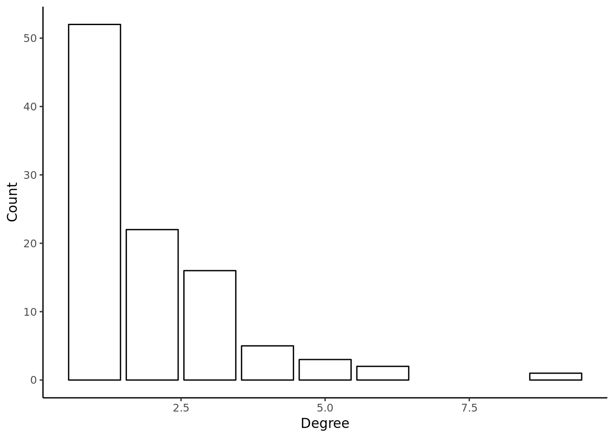

#### Runing time by method 

<table class="table table-condensed" style="width: auto !important; ">
 <thead>
  <tr>
   <th style="text-align:left;"> key </th>
   <th style="text-align:right;"> doc_count </th>
   <th style="text-align:right;"> sum_wallTime_ms.value </th>
   <th style="text-align:left;"> avg_wallTime_ms.value </th>
   <th style="text-align:left;"> includedInTotal </th>
  </tr>
 </thead>
<tbody>
  <tr>
   <td style="text-align:left;"> addItemToWork </td>
   <td style="text-align:right;"> 440 </td>
   <td style="text-align:right;"> 7,010 </td>
   <td style="text-align:left;"> 15.9318181818182 </td>
   <td style="text-align:left;"> No </td>
  </tr>
  <tr>
   <td style="text-align:left;"> ownsWork </td>
   <td style="text-align:right;"> 220 </td>
   <td style="text-align:right;"> 4,836 </td>
   <td style="text-align:left;"> 21.9818181818182 </td>
   <td style="text-align:left;"> No </td>
  </tr>
  <tr>
   <td style="text-align:left;"> init </td>
   <td style="text-align:right;"> 103 </td>
   <td style="text-align:right;"> 16,429 </td>
   <td style="text-align:left;"> 159.504854368932 </td>
   <td style="text-align:left;"> No </td>
  </tr>
  <tr>
   <td style="text-align:left;"> searchAndConnect </td>
   <td style="text-align:right;"> 101 </td>
   <td style="text-align:right;"> 330,240 </td>
   <td style="text-align:left;"> 3269.70297029703 </td>
   <td style="text-align:left;"> Yes </td>
  </tr>
  <tr>
   <td style="text-align:left;"> knowsAgent </td>
   <td style="text-align:right;"> 100 </td>
   <td style="text-align:right;"> 1,231 </td>
   <td style="text-align:left;"> 12.31 </td>
   <td style="text-align:left;"> No </td>
  </tr>
  <tr>
   <td style="text-align:left;"> getWorksItems </td>
   <td style="text-align:right;"> 38 </td>
   <td style="text-align:right;"> 225 </td>
   <td style="text-align:left;"> 5.92105263157895 </td>
   <td style="text-align:left;"> Yes </td>
  </tr>
  <tr>
   <td style="text-align:left;"> cycleSearch </td>
   <td style="text-align:right;"> 13 </td>
   <td style="text-align:right;"> 5,730 </td>
   <td style="text-align:left;"> 440.769230769231 </td>
   <td style="text-align:left;"> Yes </td>
  </tr>
  <tr>
   <td style="text-align:left;"> getWorks </td>
   <td style="text-align:right;"> 13 </td>
   <td style="text-align:right;"> 3,832 </td>
   <td style="text-align:left;"> 294.769230769231 </td>
   <td style="text-align:left;"> No </td>
  </tr>
  <tr>
   <td style="text-align:left;"> individualCycleSearch </td>
   <td style="text-align:right;"> 13 </td>
   <td style="text-align:right;"> 1 </td>
   <td style="text-align:left;"> 0.0769230769230769 </td>
   <td style="text-align:left;"> Yes </td>
  </tr>
  <tr>
   <td style="text-align:left;font-weight: bold;"> Total </td>
   <td style="text-align:right;font-weight: bold;"> 172 </td>
   <td style="text-align:right;font-weight: bold;"> 342,527 </td>
   <td style="text-align:left;font-weight: bold;">  </td>
   <td style="text-align:left;font-weight: bold;">  </td>
  </tr>
</tbody>
</table>
####  Found structures 

#####  Cycles 

Number of cycles found:  6 

<button class="btn btn-primary" data-toggle="collapse" data-target="#IWUBWLLZPS"> Show/Hide foundCycle query </button> 
 
  
     GET /filebeat-*/_search 
              { 
                "query": {
                  "bool": {
                    "must": [
                      { "match_phrase": {
                        "simulationId": "SIM09-26-12-13-BBy9z8--DV"
                        }
                      },
                      { "bool": {
                        "should": [
                          { "match": {
                            "keyword": "foundCycle"
                          }}
                        ]
                      }}
                    ]
                  }
                }
              }
     

#####  Paths 

Number of paths found:  1 

<button class="btn btn-primary" data-toggle="collapse" data-target="#YRQNQWRCLC"> Show/Hide foundPath query </button> 
 
  
     GET /filebeat-*/_search 
              { 
                "query": {
                  "bool": {
                    "must": [
                      { "match_phrase": {
                        "simulationId": "SIM09-26-12-13-BBy9z8--DV"
                        }
                      },
                      { "bool": {
                        "should": [
                          { "match": {
                            "keyword": "foundPath"
                          }}
                        ]
                      }}
                    ]
                  }
                }
              }
     

###  SIM09-26-12-25-KyXpwF--CV 

#### simulationParameters 

<table class="table table-condensed" style="width: auto !important; ">
 <thead>
  <tr>
   <th style="text-align:left;"> agentNumber </th>
   <th style="text-align:left;"> similarityConnectThreshold </th>
   <th style="text-align:left;"> graphType </th>
   <th style="text-align:left;"> chainLength </th>
   <th style="text-align:left;"> similaritySearchThreshold </th>
   <th style="text-align:left;"> maxDistance </th>
   <th style="text-align:left;"> randomWorksNumberMultiplier </th>
  </tr>
 </thead>
<tbody>
  <tr>
   <td style="text-align:left;width: 20em; "> 100 </td>
   <td style="text-align:left;width: 15em; "> 0.9 </td>
   <td style="text-align:left;width: 15em; "> smallWorld </td>
   <td style="text-align:left;width: 15em; "> 20 </td>
   <td style="text-align:left;width: 15em; "> 1 </td>
   <td style="text-align:left;width: 15em; "> 10 </td>
   <td style="text-align:left;width: 15em; "> 2 </td>
  </tr>
</tbody>
</table>
#### allEdgesByLabel

<table class="table table-condensed" style="width: auto !important; ">
 <thead>
  <tr>
   <th style="text-align:right;"> edges_offers </th>
   <th style="text-align:right;"> edges_similarity </th>
   <th style="text-align:right;"> edges_owns </th>
   <th style="text-align:right;"> edges_demands </th>
   <th style="text-align:right;"> edges_knows </th>
   <th style="text-align:right;"> edges_total </th>
  </tr>
 </thead>
<tbody>
  <tr>
   <td style="text-align:right;width: 5em; "> 220 </td>
   <td style="text-align:right;width: 5em; "> 40,962 </td>
   <td style="text-align:right;width: 5em; "> 220 </td>
   <td style="text-align:right;width: 5em; "> 220 </td>
   <td style="text-align:right;width: 5em; "> 601 </td>
   <td style="text-align:right;width: 5em; "> 42,223 </td>
  </tr>
</tbody>
</table>
#### allVerticesByType

<table class="table table-condensed" style="width: auto !important; ">
 <thead>
  <tr>
   <th style="text-align:right;"> vertices_agent </th>
   <th style="text-align:right;"> vertices_item </th>
   <th style="text-align:right;"> vertices_work </th>
   <th style="text-align:right;"> vertices_total </th>
  </tr>
 </thead>
<tbody>
  <tr>
   <td style="text-align:right;width: 5em; "> 101 </td>
   <td style="text-align:right;width: 5em; "> 440 </td>
   <td style="text-align:right;width: 5em; "> 220 </td>
   <td style="text-align:right;width: 5em; "> 761 </td>
  </tr>
</tbody>
</table>
#### distribution of similarityEdgesByWeight

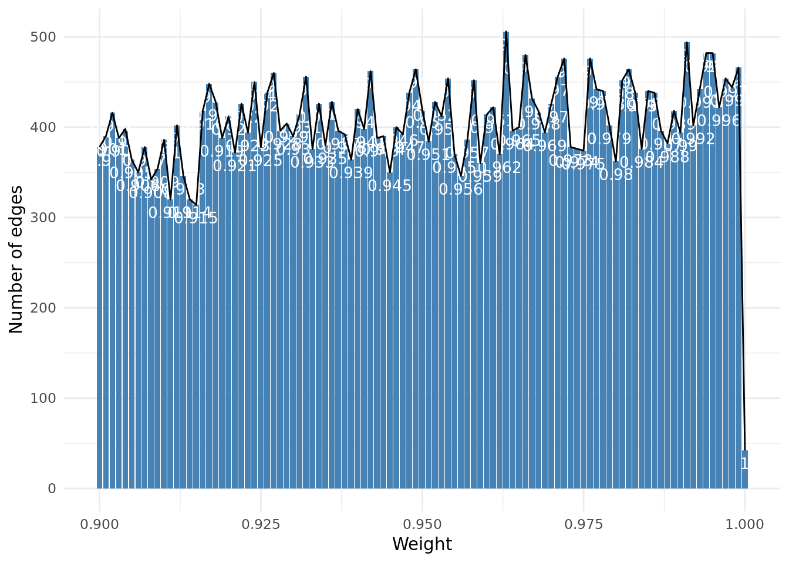

#### Degree distribution of item->similarity->item edges

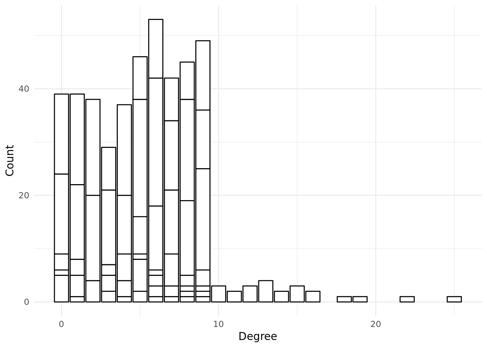

#### Degree distribution of agent->knows->agent edges

#### Runing time by method 

<table class="table table-condensed" style="width: auto !important; ">
 <thead>
  <tr>
   <th style="text-align:left;"> key </th>
   <th style="text-align:right;"> doc_count </th>
   <th style="text-align:right;"> sum_wallTime_ms.value </th>
   <th style="text-align:left;"> avg_wallTime_ms.value </th>
   <th style="text-align:left;"> includedInTotal </th>
  </tr>
 </thead>
<tbody>
  <tr>
   <td style="text-align:left;"> connectIfSimilar </td>
   <td style="text-align:right;"> 96,580 </td>
   <td style="text-align:right;"> 672,642 </td>
   <td style="text-align:left;"> 6.96460965003106 </td>
   <td style="text-align:left;"> No </td>
  </tr>
  <tr>
   <td style="text-align:left;"> existsSimilarity </td>
   <td style="text-align:right;"> 96,580 </td>
   <td style="text-align:right;"> 668,638 </td>
   <td style="text-align:left;"> 6.92315179126113 </td>
   <td style="text-align:left;"> No </td>
  </tr>
  <tr>
   <td style="text-align:left;"> similarityEdges </td>
   <td style="text-align:right;"> 96,580 </td>
   <td style="text-align:right;"> 661,123 </td>
   <td style="text-align:left;"> 6.84534065023814 </td>
   <td style="text-align:left;"> No </td>
  </tr>
  <tr>
   <td style="text-align:left;"> connectAllSimilar </td>
   <td style="text-align:right;"> 440 </td>
   <td style="text-align:right;"> 673,774 </td>
   <td style="text-align:left;"> 1531.30454545455 </td>
   <td style="text-align:left;"> Yes </td>
  </tr>
  <tr>
   <td style="text-align:left;"> connect </td>
   <td style="text-align:right;"> 243 </td>
   <td style="text-align:right;"> 1,814 </td>
   <td style="text-align:left;"> 7.46502057613169 </td>
   <td style="text-align:left;"> Yes </td>
  </tr>
  <tr>
   <td style="text-align:left;"> init </td>
   <td style="text-align:right;"> 103 </td>
   <td style="text-align:right;"> 16,798 </td>
   <td style="text-align:left;"> 163.087378640777 </td>
   <td style="text-align:left;"> No </td>
  </tr>
  <tr>
   <td style="text-align:left;font-weight: bold;"> Total </td>
   <td style="text-align:right;font-weight: bold;"> 691 </td>
   <td style="text-align:right;font-weight: bold;"> 677,065 </td>
   <td style="text-align:left;font-weight: bold;">  </td>
   <td style="text-align:left;font-weight: bold;">  </td>
  </tr>
</tbody>
</table>
####  Found structures 

#####  Cycles 

Number of cycles found:  1 

<button class="btn btn-primary" data-toggle="collapse" data-target="#EBNXYQWDOL"> Show/Hide foundCycle query </button> 
 
  
     GET /filebeat-*/_search 
              { 
                "query": {
                  "bool": {
                    "must": [
                      { "match_phrase": {
                        "simulationId": "SIM09-26-12-25-KyXpwF--CV"
                        }
                      },
                      { "bool": {
                        "should": [
                          { "match": {
                            "keyword": "foundCycle"
                          }}
                        ]
                      }}
                    ]
                  }
                }
              }
     

#####  Paths 

Number of paths found:  0 

<button class="btn btn-primary" data-toggle="collapse" data-target="#HILVMHZGZK"> Show/Hide foundPath query </button> 
 
  
     GET /filebeat-*/_search 
              { 
                "query": {
                  "bool": {
                    "must": [
                      { "match_phrase": {
                        "simulationId": "SIM09-26-12-25-KyXpwF--CV"
                        }
                      },
                      { "bool": {
                        "should": [
                          { "match": {
                            "keyword": "foundPath"
                          }}
                        ]
                      }}
                    ]
                  }
                }
              }
     

###  SIM09-26-12-25-KyXpwF--DV 

#### simulationParameters 

<table class="table table-condensed" style="width: auto !important; ">
 <thead>
  <tr>
   <th style="text-align:left;"> agentNumber </th>
   <th style="text-align:left;"> similarityConnectThreshold </th>
   <th style="text-align:left;"> graphType </th>
   <th style="text-align:left;"> chainLength </th>
   <th style="text-align:left;"> similaritySearchThreshold </th>
   <th style="text-align:left;"> maxDistance </th>
   <th style="text-align:left;"> randomWorksNumberMultiplier </th>
  </tr>
 </thead>
<tbody>
  <tr>
   <td style="text-align:left;width: 20em; "> 100 </td>
   <td style="text-align:left;width: 15em; "> 0.9 </td>
   <td style="text-align:left;width: 15em; "> smallWorld </td>
   <td style="text-align:left;width: 15em; "> 20 </td>
   <td style="text-align:left;width: 15em; "> 1 </td>
   <td style="text-align:left;width: 15em; "> 10 </td>
   <td style="text-align:left;width: 15em; "> 2 </td>
  </tr>
</tbody>
</table>
#### allEdgesByLabel

<table class="table table-condensed" style="width: auto !important; ">
 <thead>
  <tr>
   <th style="text-align:right;"> edges_offers </th>
   <th style="text-align:right;"> edges_similarity </th>
   <th style="text-align:right;"> edges_owns </th>
   <th style="text-align:right;"> edges_demands </th>
   <th style="text-align:right;"> edges_knows </th>
   <th style="text-align:right;"> edges_total </th>
  </tr>
 </thead>
<tbody>
  <tr>
   <td style="text-align:right;width: 5em; "> 220 </td>
   <td style="text-align:right;width: 5em; "> 40,476 </td>
   <td style="text-align:right;width: 5em; "> 220 </td>
   <td style="text-align:right;width: 5em; "> 220 </td>
   <td style="text-align:right;width: 5em; "> 601 </td>
   <td style="text-align:right;width: 5em; "> 41,737 </td>
  </tr>
</tbody>
</table>
#### allVerticesByType

<table class="table table-condensed" style="width: auto !important; ">
 <thead>
  <tr>
   <th style="text-align:right;"> vertices_agent </th>
   <th style="text-align:right;"> vertices_item </th>
   <th style="text-align:right;"> vertices_work </th>
   <th style="text-align:right;"> vertices_total </th>
  </tr>
 </thead>
<tbody>
  <tr>
   <td style="text-align:right;width: 5em; "> 101 </td>
   <td style="text-align:right;width: 5em; "> 440 </td>
   <td style="text-align:right;width: 5em; "> 220 </td>
   <td style="text-align:right;width: 5em; "> 761 </td>
  </tr>
</tbody>
</table>
#### distribution of similarityEdgesByWeight

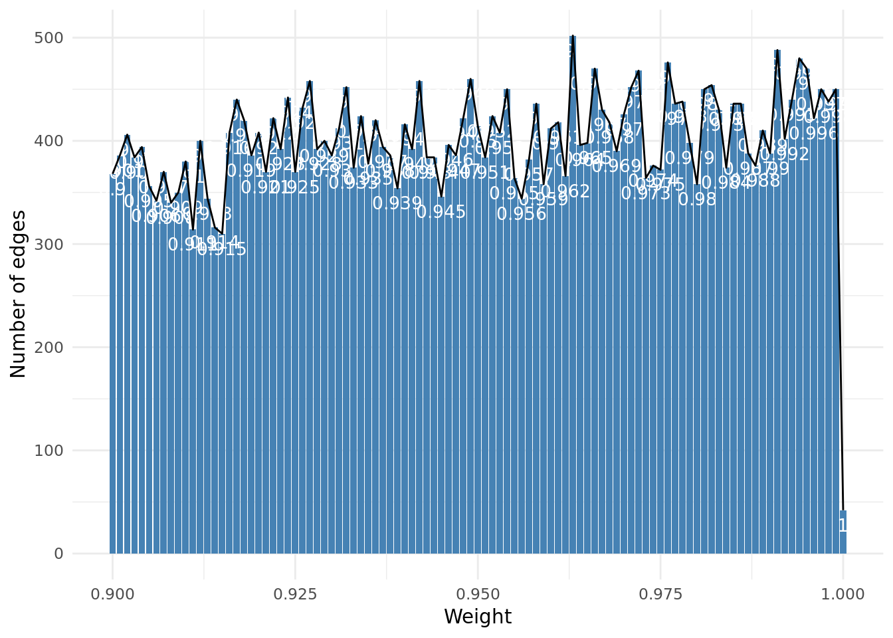

#### Degree distribution of item->similarity->item edges

#### Degree distribution of agent->knows->agent edges

#### Runing time by method 

<table class="table table-condensed" style="width: auto !important; ">
 <thead>
  <tr>
   <th style="text-align:left;"> key </th>
   <th style="text-align:right;"> doc_count </th>
   <th style="text-align:right;"> sum_wallTime_ms.value </th>
   <th style="text-align:left;"> avg_wallTime_ms.value </th>
   <th style="text-align:left;"> includedInTotal </th>
  </tr>
 </thead>
<tbody>
  <tr>
   <td style="text-align:left;"> knowsAgent </td>
   <td style="text-align:right;"> 601 </td>
   <td style="text-align:right;"> 2,197 </td>
   <td style="text-align:left;"> 3.65557404326123 </td>
   <td style="text-align:left;"> No </td>
  </tr>
  <tr>
   <td style="text-align:left;"> addItemToWork </td>
   <td style="text-align:right;"> 440 </td>
   <td style="text-align:right;"> 11,113 </td>
   <td style="text-align:left;"> 25.2568181818182 </td>
   <td style="text-align:left;"> No </td>
  </tr>
  <tr>
   <td style="text-align:left;"> ownsWork </td>
   <td style="text-align:right;"> 220 </td>
   <td style="text-align:right;"> 4,939 </td>
   <td style="text-align:left;"> 22.45 </td>
   <td style="text-align:left;"> No </td>
  </tr>
  <tr>
   <td style="text-align:left;"> init </td>
   <td style="text-align:right;"> 103 </td>
   <td style="text-align:right;"> 17,419 </td>
   <td style="text-align:left;"> 169.116504854369 </td>
   <td style="text-align:left;"> No </td>
  </tr>
  <tr>
   <td style="text-align:left;"> searchAndConnect </td>
   <td style="text-align:right;"> 101 </td>
   <td style="text-align:right;"> 448,793 </td>
   <td style="text-align:left;"> 4443.49504950495 </td>
   <td style="text-align:left;"> Yes </td>
  </tr>
  <tr>
   <td style="text-align:left;"> getWorksItems </td>
   <td style="text-align:right;"> 38 </td>
   <td style="text-align:right;"> 56 </td>
   <td style="text-align:left;"> 1.47368421052632 </td>
   <td style="text-align:left;"> Yes </td>
  </tr>
  <tr>
   <td style="text-align:left;"> cycleSearch </td>
   <td style="text-align:right;"> 15 </td>
   <td style="text-align:right;"> 2,063 </td>
   <td style="text-align:left;"> 137.533333333333 </td>
   <td style="text-align:left;"> Yes </td>
  </tr>
  <tr>
   <td style="text-align:left;"> getWorks </td>
   <td style="text-align:right;"> 15 </td>
   <td style="text-align:right;"> 379 </td>
   <td style="text-align:left;"> 25.2666666666667 </td>
   <td style="text-align:left;"> No </td>
  </tr>
  <tr>
   <td style="text-align:left;"> individualCycleSearch </td>
   <td style="text-align:right;"> 15 </td>
   <td style="text-align:right;"> 1 </td>
   <td style="text-align:left;"> 0.0666666666666667 </td>
   <td style="text-align:left;"> Yes </td>
  </tr>
  <tr>
   <td style="text-align:left;font-weight: bold;"> Total </td>
   <td style="text-align:right;font-weight: bold;"> 175 </td>
   <td style="text-align:right;font-weight: bold;"> 453,700 </td>
   <td style="text-align:left;font-weight: bold;">  </td>
   <td style="text-align:left;font-weight: bold;">  </td>
  </tr>
</tbody>
</table>
####  Found structures 

#####  Cycles 

Number of cycles found:  6 

<button class="btn btn-primary" data-toggle="collapse" data-target="#HMWUASXNNJ"> Show/Hide foundCycle query </button> 
 
  
     GET /filebeat-*/_search 
              { 
                "query": {
                  "bool": {
                    "must": [
                      { "match_phrase": {
                        "simulationId": "SIM09-26-12-25-KyXpwF--DV"
                        }
                      },
                      { "bool": {
                        "should": [
                          { "match": {
                            "keyword": "foundCycle"
                          }}
                        ]
                      }}
                    ]
                  }
                }
              }
     

#####  Paths 

Number of paths found:  0 

<button class="btn btn-primary" data-toggle="collapse" data-target="#ZHHSCGSADW"> Show/Hide foundPath query </button> 
 
  
     GET /filebeat-*/_search 
              { 
                "query": {
                  "bool": {
                    "must": [
                      { "match_phrase": {
                        "simulationId": "SIM09-26-12-25-KyXpwF--DV"
                        }
                      },
                      { "bool": {
                        "should": [
                          { "match": {
                            "keyword": "foundPath"
                          }}
                        ]
                      }}
                    ]
                  }
                }
              }
     

###  SIM09-26-10-45-M99ZgU--CV 

#### simulationParameters 

<table class="table table-condensed" style="width: auto !important; ">
 <thead>
  <tr>
   <th style="text-align:left;"> agentNumber </th>
   <th style="text-align:left;"> similarityConnectThreshold </th>
   <th style="text-align:left;"> graphType </th>
   <th style="text-align:left;"> chainLength </th>
   <th style="text-align:left;"> similaritySearchThreshold </th>
   <th style="text-align:left;"> maxDistance </th>
   <th style="text-align:left;"> randomWorksNumberMultiplier </th>
  </tr>
 </thead>
<tbody>
  <tr>
   <td style="text-align:left;width: 20em; "> 100 </td>
   <td style="text-align:left;width: 15em; "> 0.9 </td>
   <td style="text-align:left;width: 15em; "> random </td>
   <td style="text-align:left;width: 15em; "> 20 </td>
   <td style="text-align:left;width: 15em; "> 1 </td>
   <td style="text-align:left;width: 15em; "> 30 </td>
   <td style="text-align:left;width: 15em; "> 1 </td>
  </tr>
</tbody>
</table>
#### allEdgesByLabel

<table class="table table-condensed" style="width: auto !important; ">
 <thead>
  <tr>
   <th style="text-align:right;"> edges_offers </th>
   <th style="text-align:right;"> edges_similarity </th>
   <th style="text-align:right;"> edges_owns </th>
   <th style="text-align:right;"> edges_demands </th>
   <th style="text-align:right;"> edges_knows </th>
   <th style="text-align:right;"> edges_total </th>
  </tr>
 </thead>
<tbody>
  <tr>
   <td style="text-align:right;width: 5em; "> 120 </td>
   <td style="text-align:right;width: 5em; "> 12,524 </td>
   <td style="text-align:right;width: 5em; "> 120 </td>
   <td style="text-align:right;width: 5em; "> 120 </td>
   <td style="text-align:right;width: 5em; "> 100 </td>
   <td style="text-align:right;width: 5em; "> 12,984 </td>
  </tr>
</tbody>
</table>
#### allVerticesByType

<table class="table table-condensed" style="width: auto !important; ">
 <thead>
  <tr>
   <th style="text-align:right;"> vertices_agent </th>
   <th style="text-align:right;"> vertices_item </th>
   <th style="text-align:right;"> vertices_work </th>
   <th style="text-align:right;"> vertices_total </th>
  </tr>
 </thead>
<tbody>
  <tr>
   <td style="text-align:right;width: 5em; "> 101 </td>
   <td style="text-align:right;width: 5em; "> 240 </td>
   <td style="text-align:right;width: 5em; "> 120 </td>
   <td style="text-align:right;width: 5em; "> 461 </td>
  </tr>
</tbody>
</table>
#### distribution of similarityEdgesByWeight

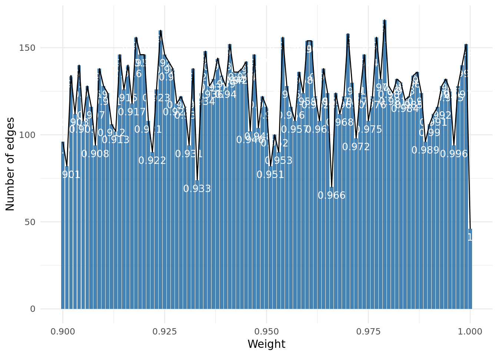

#### Degree distribution of item->similarity->item edges

#### Degree distribution of agent->knows->agent edges

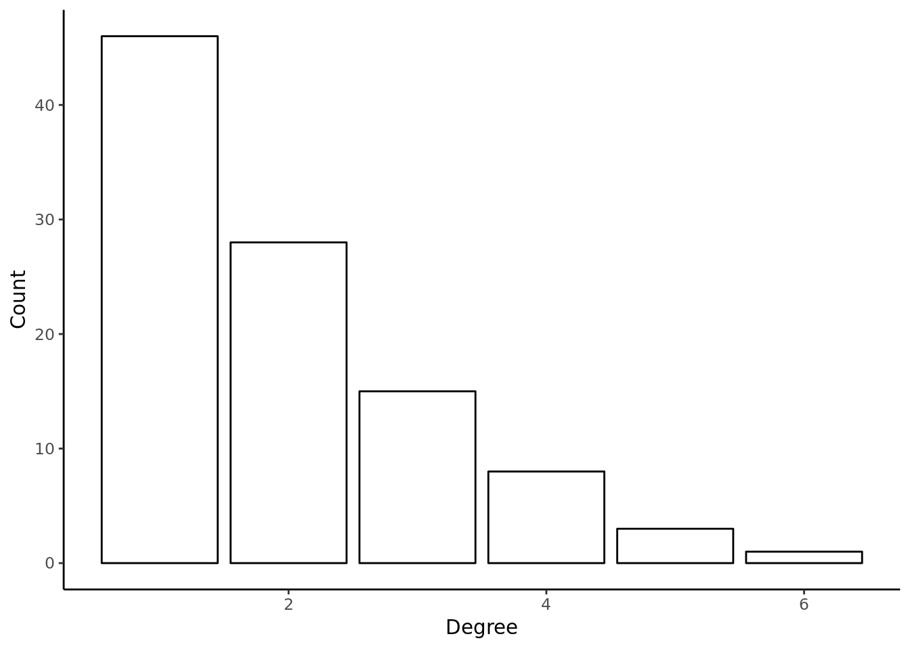

#### Runing time by method 

<table class="table table-condensed" style="width: auto !important; ">
 <thead>
  <tr>
   <th style="text-align:left;"> key </th>
   <th style="text-align:right;"> doc_count </th>
   <th style="text-align:right;"> sum_wallTime_ms.value </th>
   <th style="text-align:left;"> avg_wallTime_ms.value </th>
   <th style="text-align:left;"> includedInTotal </th>
  </tr>
 </thead>
<tbody>
  <tr>
   <td style="text-align:left;"> connectIfSimilar </td>
   <td style="text-align:right;"> 28,680 </td>
   <td style="text-align:right;"> 144,080 </td>
   <td style="text-align:left;"> 5.02370990237099 </td>
   <td style="text-align:left;"> No </td>
  </tr>
  <tr>
   <td style="text-align:left;"> existsSimilarity </td>
   <td style="text-align:right;"> 28,680 </td>
   <td style="text-align:right;"> 142,979 </td>
   <td style="text-align:left;"> 4.98532078103208 </td>
   <td style="text-align:left;"> No </td>
  </tr>
  <tr>
   <td style="text-align:left;"> similarityEdges </td>
   <td style="text-align:right;"> 28,680 </td>
   <td style="text-align:right;"> 141,441 </td>
   <td style="text-align:left;"> 4.93169456066946 </td>
   <td style="text-align:left;"> No </td>
  </tr>
  <tr>
   <td style="text-align:left;"> connectAllSimilar </td>
   <td style="text-align:right;"> 240 </td>
   <td style="text-align:right;"> 144,357 </td>
   <td style="text-align:left;"> 601.4875 </td>
   <td style="text-align:left;"> Yes </td>
  </tr>
  <tr>
   <td style="text-align:left;"> init </td>
   <td style="text-align:right;"> 103 </td>
   <td style="text-align:right;"> 15,723 </td>
   <td style="text-align:left;"> 152.650485436893 </td>
   <td style="text-align:left;"> No </td>
  </tr>
  <tr>
   <td style="text-align:left;"> connect </td>
   <td style="text-align:right;"> 70 </td>
   <td style="text-align:right;"> 537 </td>
   <td style="text-align:left;"> 7.67142857142857 </td>
   <td style="text-align:left;"> Yes </td>
  </tr>
  <tr>
   <td style="text-align:left;font-weight: bold;"> Total </td>
   <td style="text-align:right;font-weight: bold;"> 318 </td>
   <td style="text-align:right;font-weight: bold;"> 145,505 </td>
   <td style="text-align:left;font-weight: bold;">  </td>
   <td style="text-align:left;font-weight: bold;">  </td>
  </tr>
</tbody>
</table>
####  Found structures 

#####  Cycles 

Number of cycles found:  1 

<button class="btn btn-primary" data-toggle="collapse" data-target="#QOVSBDPHHF"> Show/Hide foundCycle query </button> 
 
  
     GET /filebeat-*/_search 
              { 
                "query": {
                  "bool": {
                    "must": [
                      { "match_phrase": {
                        "simulationId": "SIM09-26-10-45-M99ZgU--CV"
                        }
                      },
                      { "bool": {
                        "should": [
                          { "match": {
                            "keyword": "foundCycle"
                          }}
                        ]
                      }}
                    ]
                  }
                }
              }
     

#####  Paths 

Number of paths found:  0 

<button class="btn btn-primary" data-toggle="collapse" data-target="#QQUIUWDOGR"> Show/Hide foundPath query </button> 
 
  
     GET /filebeat-*/_search 
              { 
                "query": {
                  "bool": {
                    "must": [
                      { "match_phrase": {
                        "simulationId": "SIM09-26-10-45-M99ZgU--CV"
                        }
                      },
                      { "bool": {
                        "should": [
                          { "match": {
                            "keyword": "foundPath"
                          }}
                        ]
                      }}
                    ]
                  }
                }
              }
     

###  SIM09-26-10-45-M99ZgU--DV 

#### simulationParameters 

<table class="table table-condensed" style="width: auto !important; ">
 <thead>
  <tr>
   <th style="text-align:left;"> agentNumber </th>
   <th style="text-align:left;"> similarityConnectThreshold </th>
   <th style="text-align:left;"> graphType </th>
   <th style="text-align:left;"> chainLength </th>
   <th style="text-align:left;"> similaritySearchThreshold </th>
   <th style="text-align:left;"> maxDistance </th>
   <th style="text-align:left;"> randomWorksNumberMultiplier </th>
  </tr>
 </thead>
<tbody>
  <tr>
   <td style="text-align:left;width: 20em; "> 100 </td>
   <td style="text-align:left;width: 15em; "> 0.9 </td>
   <td style="text-align:left;width: 15em; "> random </td>
   <td style="text-align:left;width: 15em; "> 20 </td>
   <td style="text-align:left;width: 15em; "> 1 </td>
   <td style="text-align:left;width: 15em; "> 30 </td>
   <td style="text-align:left;width: 15em; "> 1 </td>
  </tr>
</tbody>
</table>
#### allEdgesByLabel

<table class="table table-condensed" style="width: auto !important; ">
 <thead>
  <tr>
   <th style="text-align:right;"> edges_offers </th>
   <th style="text-align:right;"> edges_similarity </th>
   <th style="text-align:right;"> edges_owns </th>
   <th style="text-align:right;"> edges_demands </th>
   <th style="text-align:right;"> edges_knows </th>
   <th style="text-align:right;"> edges_total </th>
  </tr>
 </thead>
<tbody>
  <tr>
   <td style="text-align:right;width: 5em; "> 120 </td>
   <td style="text-align:right;width: 5em; "> 12,384 </td>
   <td style="text-align:right;width: 5em; "> 120 </td>
   <td style="text-align:right;width: 5em; "> 120 </td>
   <td style="text-align:right;width: 5em; "> 100 </td>
   <td style="text-align:right;width: 5em; "> 12,844 </td>
  </tr>
</tbody>
</table>
#### allVerticesByType

<table class="table table-condensed" style="width: auto !important; ">
 <thead>
  <tr>
   <th style="text-align:right;"> vertices_agent </th>
   <th style="text-align:right;"> vertices_item </th>
   <th style="text-align:right;"> vertices_work </th>
   <th style="text-align:right;"> vertices_total </th>
  </tr>
 </thead>
<tbody>
  <tr>
   <td style="text-align:right;width: 5em; "> 101 </td>
   <td style="text-align:right;width: 5em; "> 240 </td>
   <td style="text-align:right;width: 5em; "> 120 </td>
   <td style="text-align:right;width: 5em; "> 461 </td>
  </tr>
</tbody>
</table>
#### distribution of similarityEdgesByWeight

#### Degree distribution of item->similarity->item edges

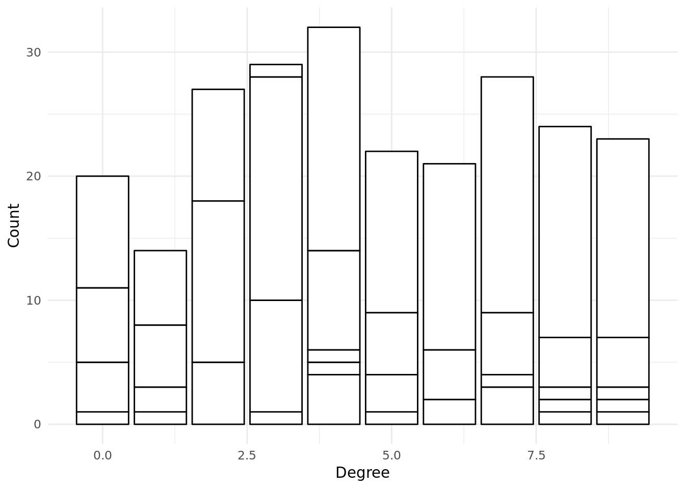

#### Degree distribution of agent->knows->agent edges

#### Runing time by method 

<table class="table table-condensed" style="width: auto !important; ">
 <thead>
  <tr>
   <th style="text-align:left;">   </th>
   <th style="text-align:left;"> key </th>
   <th style="text-align:right;"> doc_count </th>
   <th style="text-align:right;"> sum_wallTime_ms.value </th>
   <th style="text-align:left;"> avg_wallTime_ms.value </th>
   <th style="text-align:left;"> includedInTotal </th>
  </tr>
 </thead>
<tbody>
  <tr>
   <td style="text-align:left;"> 1 </td>
   <td style="text-align:left;"> addItemToWork </td>
   <td style="text-align:right;"> 240 </td>
   <td style="text-align:right;"> 5,472 </td>
   <td style="text-align:left;"> 22.8 </td>
   <td style="text-align:left;"> No </td>
  </tr>
  <tr>
   <td style="text-align:left;"> 2 </td>
   <td style="text-align:left;"> ownsWork </td>
   <td style="text-align:right;"> 120 </td>
   <td style="text-align:right;"> 3,564 </td>
   <td style="text-align:left;"> 29.7 </td>
   <td style="text-align:left;"> No </td>
  </tr>
  <tr>
   <td style="text-align:left;"> 3 </td>
   <td style="text-align:left;"> init </td>
   <td style="text-align:right;"> 103 </td>
   <td style="text-align:right;"> 16,013 </td>
   <td style="text-align:left;"> 155.466019417476 </td>
   <td style="text-align:left;"> No </td>
  </tr>
  <tr>
   <td style="text-align:left;"> 4 </td>
   <td style="text-align:left;"> searchAndConnect </td>
   <td style="text-align:right;"> 101 </td>
   <td style="text-align:right;"> 124,617 </td>
   <td style="text-align:left;"> 1233.83168316832 </td>
   <td style="text-align:left;"> Yes </td>
  </tr>
  <tr>
   <td style="text-align:left;"> 5 </td>
   <td style="text-align:left;"> knowsAgent </td>
   <td style="text-align:right;"> 100 </td>
   <td style="text-align:right;"> 1,971 </td>
   <td style="text-align:left;"> 19.71 </td>
   <td style="text-align:left;"> No </td>
  </tr>
  <tr>
   <td style="text-align:left;"> 6 </td>
   <td style="text-align:left;"> getWorksItems </td>
   <td style="text-align:right;"> 38 </td>
   <td style="text-align:right;"> 60 </td>
   <td style="text-align:left;"> 1.57894736842105 </td>
   <td style="text-align:left;"> Yes </td>
  </tr>
  <tr>
   <td style="text-align:left;"> 8 </td>
   <td style="text-align:left;"> cycleSearch </td>
   <td style="text-align:right;"> 5 </td>
   <td style="text-align:right;"> 410 </td>
   <td style="text-align:left;"> 82 </td>
   <td style="text-align:left;"> Yes </td>
  </tr>
  <tr>
   <td style="text-align:left;"> 10 </td>
   <td style="text-align:left;"> getWorks </td>
   <td style="text-align:right;"> 5 </td>
   <td style="text-align:right;"> 1,044 </td>
   <td style="text-align:left;"> 208.8 </td>
   <td style="text-align:left;"> No </td>
  </tr>
  <tr>
   <td style="text-align:left;font-weight: bold;"> 11 </td>
   <td style="text-align:left;font-weight: bold;"> Total </td>
   <td style="text-align:right;font-weight: bold;"> 154 </td>
   <td style="text-align:right;font-weight: bold;"> 127,672 </td>
   <td style="text-align:left;font-weight: bold;">  </td>
   <td style="text-align:left;font-weight: bold;">  </td>
  </tr>
</tbody>
</table>
####  Found structures 

#####  Cycles 

Number of cycles found:  5 

<button class="btn btn-primary" data-toggle="collapse" data-target="#PXTJECGTFG"> Show/Hide foundCycle query </button> 
 
  
     GET /filebeat-*/_search 
              { 
                "query": {
                  "bool": {
                    "must": [
                      { "match_phrase": {
                        "simulationId": "SIM09-26-10-45-M99ZgU--DV"
                        }
                      },
                      { "bool": {
                        "should": [
                          { "match": {
                            "keyword": "foundCycle"
                          }}
                        ]
                      }}
                    ]
                  }
                }
              }
     

#####  Paths 

Number of paths found:  0 

<button class="btn btn-primary" data-toggle="collapse" data-target="#VYWJAIADIC"> Show/Hide foundPath query </button> 
 
  
     GET /filebeat-*/_search 
              { 
                "query": {
                  "bool": {
                    "must": [
                      { "match_phrase": {
                        "simulationId": "SIM09-26-10-45-M99ZgU--DV"
                        }
                      },
                      { "bool": {
                        "should": [
                          { "match": {
                            "keyword": "foundPath"
                          }}
                        ]
                      }}
                    ]
                  }
                }
              }
     

###  SIM09-26-10-48-E5AvXX--CV 

#### simulationParameters 

<table class="table table-condensed" style="width: auto !important; ">
 <thead>
  <tr>
   <th style="text-align:left;"> agentNumber </th>
   <th style="text-align:left;"> similarityConnectThreshold </th>
   <th style="text-align:left;"> graphType </th>
   <th style="text-align:left;"> chainLength </th>
   <th style="text-align:left;"> similaritySearchThreshold </th>
   <th style="text-align:left;"> maxDistance </th>
   <th style="text-align:left;"> randomWorksNumberMultiplier </th>
  </tr>
 </thead>
<tbody>
  <tr>
   <td style="text-align:left;width: 20em; "> 100 </td>
   <td style="text-align:left;width: 15em; "> 0.9 </td>
   <td style="text-align:left;width: 15em; "> smallWorld </td>
   <td style="text-align:left;width: 15em; "> 20 </td>
   <td style="text-align:left;width: 15em; "> 1 </td>
   <td style="text-align:left;width: 15em; "> 30 </td>
   <td style="text-align:left;width: 15em; "> 1 </td>
  </tr>
</tbody>
</table>
#### allEdgesByLabel

<table class="table table-condensed" style="width: auto !important; ">
 <thead>
  <tr>
   <th style="text-align:right;"> edges_offers </th>
   <th style="text-align:right;"> edges_similarity </th>
   <th style="text-align:right;"> edges_owns </th>
   <th style="text-align:right;"> edges_demands </th>
   <th style="text-align:right;"> edges_knows </th>
   <th style="text-align:right;"> edges_total </th>
  </tr>
 </thead>
<tbody>
  <tr>
   <td style="text-align:right;width: 5em; "> 120 </td>
   <td style="text-align:right;width: 5em; "> 12,474 </td>
   <td style="text-align:right;width: 5em; "> 120 </td>
   <td style="text-align:right;width: 5em; "> 120 </td>
   <td style="text-align:right;width: 5em; "> 601 </td>
   <td style="text-align:right;width: 5em; "> 13,435 </td>
  </tr>
</tbody>
</table>
#### allVerticesByType

<table class="table table-condensed" style="width: auto !important; ">
 <thead>
  <tr>
   <th style="text-align:right;"> vertices_agent </th>
   <th style="text-align:right;"> vertices_item </th>
   <th style="text-align:right;"> vertices_work </th>
   <th style="text-align:right;"> vertices_total </th>
  </tr>
 </thead>
<tbody>
  <tr>
   <td style="text-align:right;width: 5em; "> 101 </td>
   <td style="text-align:right;width: 5em; "> 240 </td>
   <td style="text-align:right;width: 5em; "> 120 </td>
   <td style="text-align:right;width: 5em; "> 461 </td>
  </tr>
</tbody>
</table>
#### distribution of similarityEdgesByWeight

#### Degree distribution of item->similarity->item edges

#### Degree distribution of agent->knows->agent edges

#### Runing time by method 

<table class="table table-condensed" style="width: auto !important; ">
 <thead>
  <tr>
   <th style="text-align:left;"> key </th>
   <th style="text-align:right;"> doc_count </th>
   <th style="text-align:right;"> sum_wallTime_ms.value </th>
   <th style="text-align:left;"> avg_wallTime_ms.value </th>
   <th style="text-align:left;"> includedInTotal </th>
  </tr>
 </thead>
<tbody>
  <tr>
   <td style="text-align:left;"> connectIfSimilar </td>
   <td style="text-align:right;"> 28,680 </td>
   <td style="text-align:right;"> 144,789 </td>
   <td style="text-align:left;"> 5.0484309623431 </td>
   <td style="text-align:left;"> No </td>
  </tr>
  <tr>
   <td style="text-align:left;"> existsSimilarity </td>
   <td style="text-align:right;"> 28,680 </td>
   <td style="text-align:right;"> 143,726 </td>
   <td style="text-align:left;"> 5.01136680613668 </td>
   <td style="text-align:left;"> No </td>
  </tr>
  <tr>
   <td style="text-align:left;"> similarityEdges </td>
   <td style="text-align:right;"> 28,680 </td>
   <td style="text-align:right;"> 142,156 </td>
   <td style="text-align:left;"> 4.95662482566248 </td>
   <td style="text-align:left;"> No </td>
  </tr>
  <tr>
   <td style="text-align:left;"> connectAllSimilar </td>
   <td style="text-align:right;"> 240 </td>
   <td style="text-align:right;"> 145,101 </td>
   <td style="text-align:left;"> 604.5875 </td>
   <td style="text-align:left;"> Yes </td>
  </tr>
  <tr>
   <td style="text-align:left;"> init </td>
   <td style="text-align:right;"> 103 </td>
   <td style="text-align:right;"> 15,294 </td>
   <td style="text-align:left;"> 148.485436893204 </td>
   <td style="text-align:left;"> No </td>
  </tr>
  <tr>
   <td style="text-align:left;"> connect </td>
   <td style="text-align:right;"> 67 </td>
   <td style="text-align:right;"> 472 </td>
   <td style="text-align:left;"> 7.04477611940298 </td>
   <td style="text-align:left;"> Yes </td>
  </tr>
  <tr>
   <td style="text-align:left;font-weight: bold;"> Total </td>
   <td style="text-align:right;font-weight: bold;"> 315 </td>
   <td style="text-align:right;font-weight: bold;"> 146,531 </td>
   <td style="text-align:left;font-weight: bold;">  </td>
   <td style="text-align:left;font-weight: bold;">  </td>
  </tr>
</tbody>
</table>
####  Found structures 

#####  Cycles 

Number of cycles found:  1 

<button class="btn btn-primary" data-toggle="collapse" data-target="#DCKDCWBPJW"> Show/Hide foundCycle query </button> 
 
  
     GET /filebeat-*/_search 
              { 
                "query": {
                  "bool": {
                    "must": [
                      { "match_phrase": {
                        "simulationId": "SIM09-26-10-48-E5AvXX--CV"
                        }
                      },
                      { "bool": {
                        "should": [
                          { "match": {
                            "keyword": "foundCycle"
                          }}
                        ]
                      }}
                    ]
                  }
                }
              }
     

#####  Paths 

Number of paths found:  0 

<button class="btn btn-primary" data-toggle="collapse" data-target="#XAEBWHLILK"> Show/Hide foundPath query </button> 
 
  
     GET /filebeat-*/_search 
              { 
                "query": {
                  "bool": {
                    "must": [
                      { "match_phrase": {
                        "simulationId": "SIM09-26-10-48-E5AvXX--CV"
                        }
                      },
                      { "bool": {
                        "should": [
                          { "match": {
                            "keyword": "foundPath"
                          }}
                        ]
                      }}
                    ]
                  }
                }
              }
     

###  SIM09-26-10-48-E5AvXX--DV 

#### simulationParameters 

<table class="table table-condensed" style="width: auto !important; ">
 <thead>
  <tr>
   <th style="text-align:left;"> agentNumber </th>
   <th style="text-align:left;"> similarityConnectThreshold </th>
   <th style="text-align:left;"> graphType </th>
   <th style="text-align:left;"> chainLength </th>
   <th style="text-align:left;"> similaritySearchThreshold </th>
   <th style="text-align:left;"> maxDistance </th>
   <th style="text-align:left;"> randomWorksNumberMultiplier </th>
  </tr>
 </thead>
<tbody>
  <tr>
   <td style="text-align:left;width: 20em; "> 100 </td>
   <td style="text-align:left;width: 15em; "> 0.9 </td>
   <td style="text-align:left;width: 15em; "> smallWorld </td>
   <td style="text-align:left;width: 15em; "> 20 </td>
   <td style="text-align:left;width: 15em; "> 1 </td>
   <td style="text-align:left;width: 15em; "> 30 </td>
   <td style="text-align:left;width: 15em; "> 1 </td>
  </tr>
</tbody>
</table>
#### allEdgesByLabel

<table class="table table-condensed" style="width: auto !important; ">
 <thead>
  <tr>
   <th style="text-align:right;"> edges_offers </th>
   <th style="text-align:right;"> edges_similarity </th>
   <th style="text-align:right;"> edges_owns </th>
   <th style="text-align:right;"> edges_demands </th>
   <th style="text-align:right;"> edges_knows </th>
   <th style="text-align:right;"> edges_total </th>
  </tr>
 </thead>
<tbody>
  <tr>
   <td style="text-align:right;width: 5em; "> 120 </td>
   <td style="text-align:right;width: 5em; "> 12,340 </td>
   <td style="text-align:right;width: 5em; "> 120 </td>
   <td style="text-align:right;width: 5em; "> 120 </td>
   <td style="text-align:right;width: 5em; "> 601 </td>
   <td style="text-align:right;width: 5em; "> 13,301 </td>
  </tr>
</tbody>
</table>
#### allVerticesByType

<table class="table table-condensed" style="width: auto !important; ">
 <thead>
  <tr>
   <th style="text-align:right;"> vertices_agent </th>
   <th style="text-align:right;"> vertices_item </th>
   <th style="text-align:right;"> vertices_work </th>
   <th style="text-align:right;"> vertices_total </th>
  </tr>
 </thead>
<tbody>
  <tr>
   <td style="text-align:right;width: 5em; "> 101 </td>
   <td style="text-align:right;width: 5em; "> 240 </td>
   <td style="text-align:right;width: 5em; "> 120 </td>
   <td style="text-align:right;width: 5em; "> 461 </td>
  </tr>
</tbody>
</table>
#### distribution of similarityEdgesByWeight

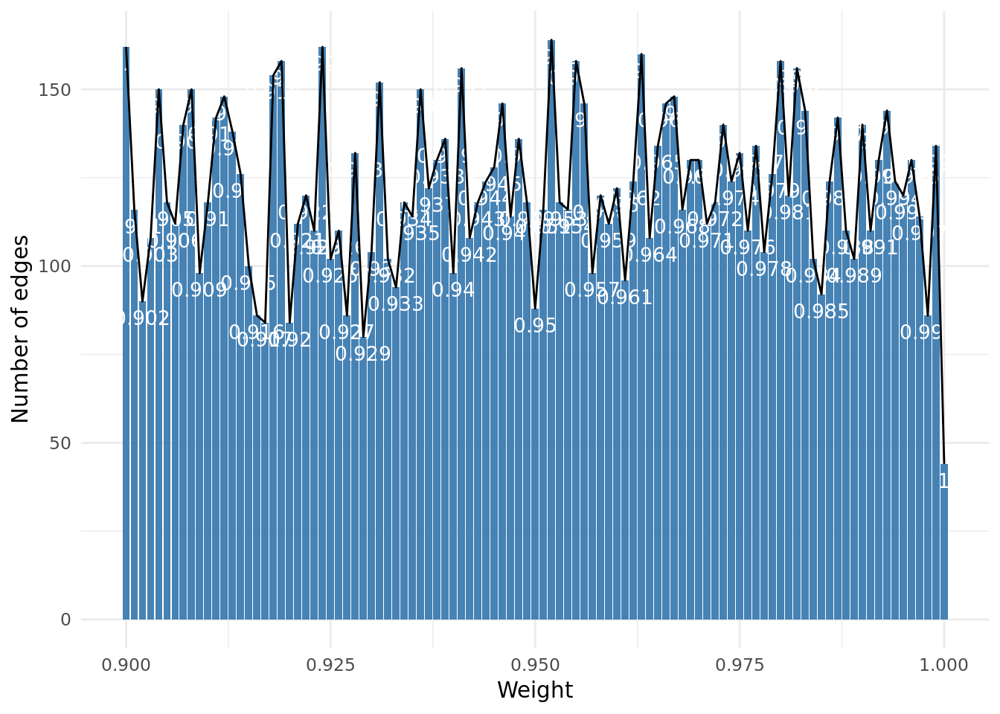

#### Degree distribution of item->similarity->item edges

#### Degree distribution of agent->knows->agent edges

#### Runing time by method 

<table class="table table-condensed" style="width: auto !important; ">
 <thead>
  <tr>
   <th style="text-align:left;">   </th>
   <th style="text-align:left;"> key </th>
   <th style="text-align:right;"> doc_count </th>
   <th style="text-align:right;"> sum_wallTime_ms.value </th>
   <th style="text-align:left;"> avg_wallTime_ms.value </th>
   <th style="text-align:left;"> includedInTotal </th>
  </tr>
 </thead>
<tbody>
  <tr>
   <td style="text-align:left;"> 1 </td>
   <td style="text-align:left;"> knowsAgent </td>
   <td style="text-align:right;"> 601 </td>
   <td style="text-align:right;"> 2,202 </td>
   <td style="text-align:left;"> 3.66389351081531 </td>
   <td style="text-align:left;"> No </td>
  </tr>
  <tr>
   <td style="text-align:left;"> 2 </td>
   <td style="text-align:left;"> addItemToWork </td>
   <td style="text-align:right;"> 240 </td>
   <td style="text-align:right;"> 8,320 </td>
   <td style="text-align:left;"> 34.6666666666667 </td>
   <td style="text-align:left;"> No </td>
  </tr>
  <tr>
   <td style="text-align:left;"> 3 </td>
   <td style="text-align:left;"> ownsWork </td>
   <td style="text-align:right;"> 120 </td>
   <td style="text-align:right;"> 5,582 </td>
   <td style="text-align:left;"> 46.5166666666667 </td>
   <td style="text-align:left;"> No </td>
  </tr>
  <tr>
   <td style="text-align:left;"> 4 </td>
   <td style="text-align:left;"> init </td>
   <td style="text-align:right;"> 103 </td>
   <td style="text-align:right;"> 15,933 </td>
   <td style="text-align:left;"> 154.68932038835 </td>
   <td style="text-align:left;"> No </td>
  </tr>
  <tr>
   <td style="text-align:left;"> 5 </td>
   <td style="text-align:left;"> searchAndConnect </td>
   <td style="text-align:right;"> 101 </td>
   <td style="text-align:right;"> 122,674 </td>
   <td style="text-align:left;"> 1214.59405940594 </td>
   <td style="text-align:left;"> Yes </td>
  </tr>
  <tr>
   <td style="text-align:left;"> 6 </td>
   <td style="text-align:left;"> getWorksItems </td>
   <td style="text-align:right;"> 38 </td>
   <td style="text-align:right;"> 221 </td>
   <td style="text-align:left;"> 5.81578947368421 </td>
   <td style="text-align:left;"> Yes </td>
  </tr>
  <tr>
   <td style="text-align:left;"> 8 </td>
   <td style="text-align:left;"> cycleSearch </td>
   <td style="text-align:right;"> 5 </td>
   <td style="text-align:right;"> 1,881 </td>
   <td style="text-align:left;"> 376.2 </td>
   <td style="text-align:left;"> Yes </td>
  </tr>
  <tr>
   <td style="text-align:left;"> 10 </td>
   <td style="text-align:left;"> getWorks </td>
   <td style="text-align:right;"> 5 </td>
   <td style="text-align:right;"> 1,000 </td>
   <td style="text-align:left;"> 200 </td>
   <td style="text-align:left;"> No </td>
  </tr>
  <tr>
   <td style="text-align:left;font-weight: bold;"> 11 </td>
   <td style="text-align:left;font-weight: bold;"> Total </td>
   <td style="text-align:right;font-weight: bold;"> 154 </td>
   <td style="text-align:right;font-weight: bold;"> 128,567 </td>
   <td style="text-align:left;font-weight: bold;">  </td>
   <td style="text-align:left;font-weight: bold;">  </td>
  </tr>
</tbody>
</table>
####  Found structures 

#####  Cycles 

Number of cycles found:  4 

<button class="btn btn-primary" data-toggle="collapse" data-target="#OIBTCSJAPY"> Show/Hide foundCycle query </button> 
 
  
     GET /filebeat-*/_search 
              { 
                "query": {
                  "bool": {
                    "must": [
                      { "match_phrase": {
                        "simulationId": "SIM09-26-10-48-E5AvXX--DV"
                        }
                      },
                      { "bool": {
                        "should": [
                          { "match": {
                            "keyword": "foundCycle"
                          }}
                        ]
                      }}
                    ]
                  }
                }
              }
     

#####  Paths 

Number of paths found:  1 

<button class="btn btn-primary" data-toggle="collapse" data-target="#BMNHWKJGBN"> Show/Hide foundPath query </button> 
 
  
     GET /filebeat-*/_search 
              { 
                "query": {
                  "bool": {
                    "must": [
                      { "match_phrase": {
                        "simulationId": "SIM09-26-10-48-E5AvXX--DV"
                        }
                      },
                      { "bool": {
                        "should": [
                          { "match": {
                            "keyword": "foundPath"
                          }}
                        ]
                      }}
                    ]
                  }
                }
              }
     

###  SIM09-26-12-37-c8sCsh--CV 

#### simulationParameters 

<table class="table table-condensed" style="width: auto !important; ">
 <thead>
  <tr>
   <th style="text-align:left;"> agentNumber </th>
   <th style="text-align:left;"> similarityConnectThreshold </th>
   <th style="text-align:left;"> graphType </th>
   <th style="text-align:left;"> chainLength </th>
   <th style="text-align:left;"> similaritySearchThreshold </th>
   <th style="text-align:left;"> maxDistance </th>
   <th style="text-align:left;"> randomWorksNumberMultiplier </th>
  </tr>
 </thead>
<tbody>
  <tr>
   <td style="text-align:left;width: 20em; "> 100 </td>
   <td style="text-align:left;width: 15em; "> 0.9 </td>
   <td style="text-align:left;width: 15em; "> random </td>
   <td style="text-align:left;width: 15em; "> 20 </td>
   <td style="text-align:left;width: 15em; "> 1 </td>
   <td style="text-align:left;width: 15em; "> 30 </td>
   <td style="text-align:left;width: 15em; "> 2 </td>
  </tr>
</tbody>
</table>
#### allEdgesByLabel

<table class="table table-condensed" style="width: auto !important; ">
 <thead>
  <tr>
   <th style="text-align:right;"> edges_offers </th>
   <th style="text-align:right;"> edges_similarity </th>
   <th style="text-align:right;"> edges_owns </th>
   <th style="text-align:right;"> edges_demands </th>
   <th style="text-align:right;"> edges_knows </th>
   <th style="text-align:right;"> edges_total </th>
  </tr>
 </thead>
<tbody>
  <tr>
   <td style="text-align:right;width: 5em; "> 220 </td>
   <td style="text-align:right;width: 5em; "> 40,316 </td>
   <td style="text-align:right;width: 5em; "> 220 </td>
   <td style="text-align:right;width: 5em; "> 220 </td>
   <td style="text-align:right;width: 5em; "> 100 </td>
   <td style="text-align:right;width: 5em; "> 41,076 </td>
  </tr>
</tbody>
</table>
#### allVerticesByType

<table class="table table-condensed" style="width: auto !important; ">
 <thead>
  <tr>
   <th style="text-align:right;"> vertices_agent </th>
   <th style="text-align:right;"> vertices_item </th>
   <th style="text-align:right;"> vertices_work </th>
   <th style="text-align:right;"> vertices_total </th>
  </tr>
 </thead>
<tbody>
  <tr>
   <td style="text-align:right;width: 5em; "> 101 </td>
   <td style="text-align:right;width: 5em; "> 440 </td>
   <td style="text-align:right;width: 5em; "> 220 </td>
   <td style="text-align:right;width: 5em; "> 761 </td>
  </tr>
</tbody>
</table>
#### distribution of similarityEdgesByWeight

#### Degree distribution of item->similarity->item edges

#### Degree distribution of agent->knows->agent edges

#### Runing time by method 

<table class="table table-condensed" style="width: auto !important; ">
 <thead>
  <tr>
   <th style="text-align:left;"> key </th>
   <th style="text-align:right;"> doc_count </th>
   <th style="text-align:right;"> sum_wallTime_ms.value </th>
   <th style="text-align:left;"> avg_wallTime_ms.value </th>
   <th style="text-align:left;"> includedInTotal </th>
  </tr>
 </thead>
<tbody>
  <tr>
   <td style="text-align:left;"> connectIfSimilar </td>
   <td style="text-align:right;"> 96,580 </td>
   <td style="text-align:right;"> 707,419 </td>
   <td style="text-align:left;"> 7.32469455373783 </td>
   <td style="text-align:left;"> No </td>
  </tr>
  <tr>
   <td style="text-align:left;"> existsSimilarity </td>
   <td style="text-align:right;"> 96,580 </td>
   <td style="text-align:right;"> 703,774 </td>
   <td style="text-align:left;"> 7.2869538206668 </td>
   <td style="text-align:left;"> No </td>
  </tr>
  <tr>
   <td style="text-align:left;"> similarityEdges </td>
   <td style="text-align:right;"> 96,580 </td>
   <td style="text-align:right;"> 696,357 </td>
   <td style="text-align:left;"> 7.21015738248084 </td>
   <td style="text-align:left;"> No </td>
  </tr>
  <tr>
   <td style="text-align:left;"> connectAllSimilar </td>
   <td style="text-align:right;"> 440 </td>
   <td style="text-align:right;"> 708,564 </td>
   <td style="text-align:left;"> 1610.37272727273 </td>
   <td style="text-align:left;"> Yes </td>
  </tr>
  <tr>
   <td style="text-align:left;"> connect </td>
   <td style="text-align:right;"> 214 </td>
   <td style="text-align:right;"> 1,456 </td>
   <td style="text-align:left;"> 6.80373831775701 </td>
   <td style="text-align:left;"> Yes </td>
  </tr>
  <tr>
   <td style="text-align:left;"> init </td>
   <td style="text-align:right;"> 103 </td>
   <td style="text-align:right;"> 16,285 </td>
   <td style="text-align:left;"> 158.106796116505 </td>
   <td style="text-align:left;"> No </td>
  </tr>
  <tr>
   <td style="text-align:left;font-weight: bold;"> Total </td>
   <td style="text-align:right;font-weight: bold;"> 662 </td>
   <td style="text-align:right;font-weight: bold;"> 711,883 </td>
   <td style="text-align:left;font-weight: bold;">  </td>
   <td style="text-align:left;font-weight: bold;">  </td>
  </tr>
</tbody>
</table>
####  Found structures 

#####  Cycles 

Number of cycles found:  1 

<button class="btn btn-primary" data-toggle="collapse" data-target="#LCEFVHYBBA"> Show/Hide foundCycle query </button> 
 
  
     GET /filebeat-*/_search 
              { 
                "query": {
                  "bool": {
                    "must": [
                      { "match_phrase": {
                        "simulationId": "SIM09-26-12-37-c8sCsh--CV"
                        }
                      },
                      { "bool": {
                        "should": [
                          { "match": {
                            "keyword": "foundCycle"
                          }}
                        ]
                      }}
                    ]
                  }
                }
              }
     

#####  Paths 

Number of paths found:  0 

<button class="btn btn-primary" data-toggle="collapse" data-target="#VTCCZQEYFN"> Show/Hide foundPath query </button> 
 
  
     GET /filebeat-*/_search 
              { 
                "query": {
                  "bool": {
                    "must": [
                      { "match_phrase": {
                        "simulationId": "SIM09-26-12-37-c8sCsh--CV"
                        }
                      },
                      { "bool": {
                        "should": [
                          { "match": {
                            "keyword": "foundPath"
                          }}
                        ]
                      }}
                    ]
                  }
                }
              }
     

###  SIM09-26-12-37-c8sCsh--DV 

#### simulationParameters 

<table class="table table-condensed" style="width: auto !important; ">
 <thead>
  <tr>
   <th style="text-align:left;"> agentNumber </th>
   <th style="text-align:left;"> similarityConnectThreshold </th>
   <th style="text-align:left;"> graphType </th>
   <th style="text-align:left;"> chainLength </th>
   <th style="text-align:left;"> similaritySearchThreshold </th>
   <th style="text-align:left;"> maxDistance </th>
   <th style="text-align:left;"> randomWorksNumberMultiplier </th>
  </tr>
 </thead>
<tbody>
  <tr>
   <td style="text-align:left;width: 20em; "> 100 </td>
   <td style="text-align:left;width: 15em; "> 0.9 </td>
   <td style="text-align:left;width: 15em; "> random </td>
   <td style="text-align:left;width: 15em; "> 20 </td>
   <td style="text-align:left;width: 15em; "> 1 </td>
   <td style="text-align:left;width: 15em; "> 30 </td>
   <td style="text-align:left;width: 15em; "> 2 </td>
  </tr>
</tbody>
</table>
#### allEdgesByLabel

<table class="table table-condensed" style="width: auto !important; ">
 <thead>
  <tr>
   <th style="text-align:right;"> edges_offers </th>
   <th style="text-align:right;"> edges_similarity </th>
   <th style="text-align:right;"> edges_owns </th>
   <th style="text-align:right;"> edges_demands </th>
   <th style="text-align:right;"> edges_knows </th>
   <th style="text-align:right;"> edges_total </th>
  </tr>
 </thead>
<tbody>
  <tr>
   <td style="text-align:right;width: 5em; "> 220 </td>
   <td style="text-align:right;width: 5em; "> 39,888 </td>
   <td style="text-align:right;width: 5em; "> 220 </td>
   <td style="text-align:right;width: 5em; "> 220 </td>
   <td style="text-align:right;width: 5em; "> 100 </td>
   <td style="text-align:right;width: 5em; "> 40,648 </td>
  </tr>
</tbody>
</table>
#### allVerticesByType

<table class="table table-condensed" style="width: auto !important; ">
 <thead>
  <tr>
   <th style="text-align:right;"> vertices_agent </th>
   <th style="text-align:right;"> vertices_item </th>
   <th style="text-align:right;"> vertices_work </th>
   <th style="text-align:right;"> vertices_total </th>
  </tr>
 </thead>
<tbody>
  <tr>
   <td style="text-align:right;width: 5em; "> 101 </td>
   <td style="text-align:right;width: 5em; "> 440 </td>
   <td style="text-align:right;width: 5em; "> 220 </td>
   <td style="text-align:right;width: 5em; "> 761 </td>
  </tr>
</tbody>
</table>
#### distribution of similarityEdgesByWeight

#### Degree distribution of item->similarity->item edges

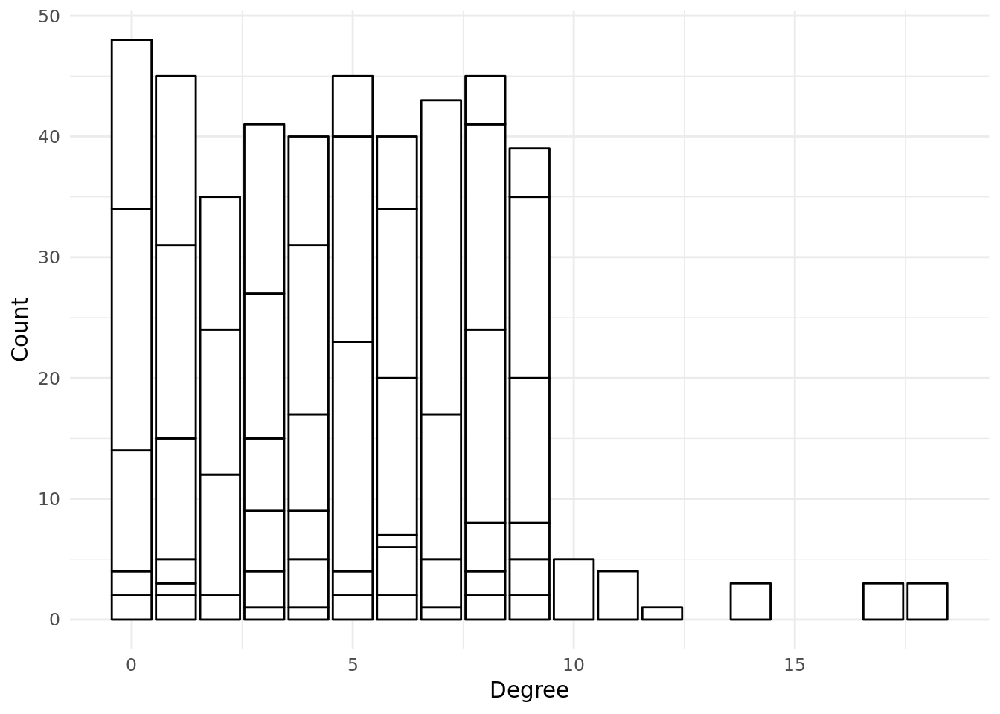

#### Degree distribution of agent->knows->agent edges

#### Runing time by method 

<table class="table table-condensed" style="width: auto !important; ">
 <thead>
  <tr>
   <th style="text-align:left;"> key </th>
   <th style="text-align:right;"> doc_count </th>
   <th style="text-align:right;"> sum_wallTime_ms.value </th>
   <th style="text-align:left;"> avg_wallTime_ms.value </th>
   <th style="text-align:left;"> includedInTotal </th>
  </tr>
 </thead>
<tbody>
  <tr>
   <td style="text-align:left;"> addItemToWork </td>
   <td style="text-align:right;"> 440 </td>
   <td style="text-align:right;"> 12,915 </td>
   <td style="text-align:left;"> 29.3522727272727 </td>
   <td style="text-align:left;"> No </td>
  </tr>
  <tr>
   <td style="text-align:left;"> ownsWork </td>
   <td style="text-align:right;"> 220 </td>
   <td style="text-align:right;"> 7,037 </td>
   <td style="text-align:left;"> 31.9863636363636 </td>
   <td style="text-align:left;"> No </td>
  </tr>
  <tr>
   <td style="text-align:left;"> init </td>
   <td style="text-align:right;"> 103 </td>
   <td style="text-align:right;"> 17,491 </td>
   <td style="text-align:left;"> 169.815533980583 </td>
   <td style="text-align:left;"> No </td>
  </tr>
  <tr>
   <td style="text-align:left;"> searchAndConnect </td>
   <td style="text-align:right;"> 101 </td>
   <td style="text-align:right;"> 361,919 </td>
   <td style="text-align:left;"> 3583.35643564356 </td>
   <td style="text-align:left;"> Yes </td>
  </tr>
  <tr>
   <td style="text-align:left;"> knowsAgent </td>
   <td style="text-align:right;"> 100 </td>
   <td style="text-align:right;"> 1,839 </td>
   <td style="text-align:left;"> 18.39 </td>
   <td style="text-align:left;"> No </td>
  </tr>
  <tr>
   <td style="text-align:left;"> getWorksItems </td>
   <td style="text-align:right;"> 38 </td>
   <td style="text-align:right;"> 70 </td>
   <td style="text-align:left;"> 1.84210526315789 </td>
   <td style="text-align:left;"> Yes </td>
  </tr>
  <tr>
   <td style="text-align:left;"> cycleSearch </td>
   <td style="text-align:right;"> 13 </td>
   <td style="text-align:right;"> 3,442 </td>
   <td style="text-align:left;"> 264.769230769231 </td>
   <td style="text-align:left;"> Yes </td>
  </tr>
  <tr>
   <td style="text-align:left;"> getWorks </td>
   <td style="text-align:right;"> 13 </td>
   <td style="text-align:right;"> 3,372 </td>
   <td style="text-align:left;"> 259.384615384615 </td>
   <td style="text-align:left;"> No </td>
  </tr>
  <tr>
   <td style="text-align:left;"> individualCycleSearch </td>
   <td style="text-align:right;"> 13 </td>
   <td style="text-align:right;"> 0 </td>
   <td style="text-align:left;"> 0 </td>
   <td style="text-align:left;"> Yes </td>
  </tr>
  <tr>
   <td style="text-align:left;font-weight: bold;"> Total </td>
   <td style="text-align:right;font-weight: bold;"> 171 </td>
   <td style="text-align:right;font-weight: bold;"> 369,049 </td>
   <td style="text-align:left;font-weight: bold;">  </td>
   <td style="text-align:left;font-weight: bold;">  </td>
  </tr>
</tbody>
</table>
####  Found structures 

#####  Cycles 

Number of cycles found:  5 

<button class="btn btn-primary" data-toggle="collapse" data-target="#ZHVZRGVVDL"> Show/Hide foundCycle query </button> 
 
  
     GET /filebeat-*/_search 
              { 
                "query": {
                  "bool": {
                    "must": [
                      { "match_phrase": {
                        "simulationId": "SIM09-26-12-37-c8sCsh--DV"
                        }
                      },
                      { "bool": {
                        "should": [
                          { "match": {
                            "keyword": "foundCycle"
                          }}
                        ]
                      }}
                    ]
                  }
                }
              }
     

#####  Paths 

Number of paths found:  1 

<button class="btn btn-primary" data-toggle="collapse" data-target="#VAILVKZRIU"> Show/Hide foundPath query </button> 
 
  
     GET /filebeat-*/_search 
              { 
                "query": {
                  "bool": {
                    "must": [
                      { "match_phrase": {
                        "simulationId": "SIM09-26-12-37-c8sCsh--DV"
                        }
                      },
                      { "bool": {
                        "should": [
                          { "match": {
                            "keyword": "foundPath"
                          }}
                        ]
                      }}
                    ]
                  }
                }
              }
     

###  SIM09-26-12-49-NT2Tuu--CV 

#### simulationParameters 

<table class="table table-condensed" style="width: auto !important; ">
 <thead>
  <tr>
   <th style="text-align:left;"> agentNumber </th>
   <th style="text-align:left;"> similarityConnectThreshold </th>
   <th style="text-align:left;"> graphType </th>
   <th style="text-align:left;"> chainLength </th>
   <th style="text-align:left;"> similaritySearchThreshold </th>
   <th style="text-align:left;"> maxDistance </th>
   <th style="text-align:left;"> randomWorksNumberMultiplier </th>
  </tr>
 </thead>
<tbody>
  <tr>
   <td style="text-align:left;width: 20em; "> 100 </td>
   <td style="text-align:left;width: 15em; "> 0.9 </td>
   <td style="text-align:left;width: 15em; "> smallWorld </td>
   <td style="text-align:left;width: 15em; "> 20 </td>
   <td style="text-align:left;width: 15em; "> 1 </td>
   <td style="text-align:left;width: 15em; "> 30 </td>
   <td style="text-align:left;width: 15em; "> 2 </td>
  </tr>
</tbody>
</table>
#### allEdgesByLabel

<table class="table table-condensed" style="width: auto !important; ">
 <thead>
  <tr>
   <th style="text-align:right;"> edges_offers </th>
   <th style="text-align:right;"> edges_similarity </th>
   <th style="text-align:right;"> edges_owns </th>
   <th style="text-align:right;"> edges_demands </th>
   <th style="text-align:right;"> edges_knows </th>
   <th style="text-align:right;"> edges_total </th>
  </tr>
 </thead>
<tbody>
  <tr>
   <td style="text-align:right;width: 5em; "> 220 </td>
   <td style="text-align:right;width: 5em; "> 40,592 </td>
   <td style="text-align:right;width: 5em; "> 220 </td>
   <td style="text-align:right;width: 5em; "> 220 </td>
   <td style="text-align:right;width: 5em; "> 601 </td>
   <td style="text-align:right;width: 5em; "> 41,853 </td>
  </tr>
</tbody>
</table>
#### allVerticesByType

<table class="table table-condensed" style="width: auto !important; ">
 <thead>
  <tr>
   <th style="text-align:right;"> vertices_agent </th>
   <th style="text-align:right;"> vertices_item </th>
   <th style="text-align:right;"> vertices_work </th>
   <th style="text-align:right;"> vertices_total </th>
  </tr>
 </thead>
<tbody>
  <tr>
   <td style="text-align:right;width: 5em; "> 101 </td>
   <td style="text-align:right;width: 5em; "> 440 </td>
   <td style="text-align:right;width: 5em; "> 220 </td>
   <td style="text-align:right;width: 5em; "> 761 </td>
  </tr>
</tbody>
</table>
#### distribution of similarityEdgesByWeight

#### Degree distribution of item->similarity->item edges

#### Degree distribution of agent->knows->agent edges

#### Runing time by method 

<table class="table table-condensed" style="width: auto !important; ">
 <thead>
  <tr>
   <th style="text-align:left;"> key </th>
   <th style="text-align:right;"> doc_count </th>
   <th style="text-align:right;"> sum_wallTime_ms.value </th>
   <th style="text-align:left;"> avg_wallTime_ms.value </th>
   <th style="text-align:left;"> includedInTotal </th>
  </tr>
 </thead>
<tbody>
  <tr>
   <td style="text-align:left;"> connectIfSimilar </td>
   <td style="text-align:right;"> 96,580 </td>
   <td style="text-align:right;"> 694,970 </td>
   <td style="text-align:left;"> 7.19579623110375 </td>
   <td style="text-align:left;"> No </td>
  </tr>
  <tr>
   <td style="text-align:left;"> existsSimilarity </td>
   <td style="text-align:right;"> 96,580 </td>
   <td style="text-align:right;"> 691,130 </td>
   <td style="text-align:left;"> 7.15603644646925 </td>
   <td style="text-align:left;"> No </td>
  </tr>
  <tr>
   <td style="text-align:left;"> similarityEdges </td>
   <td style="text-align:right;"> 96,580 </td>
   <td style="text-align:right;"> 683,408 </td>
   <td style="text-align:left;"> 7.07608200455581 </td>
   <td style="text-align:left;"> No </td>
  </tr>
  <tr>
   <td style="text-align:left;"> connectAllSimilar </td>
   <td style="text-align:right;"> 440 </td>
   <td style="text-align:right;"> 696,101 </td>
   <td style="text-align:left;"> 1582.04772727273 </td>
   <td style="text-align:left;"> Yes </td>
  </tr>
  <tr>
   <td style="text-align:left;"> connect </td>
   <td style="text-align:right;"> 210 </td>
   <td style="text-align:right;"> 1,605 </td>
   <td style="text-align:left;"> 7.64285714285714 </td>
   <td style="text-align:left;"> Yes </td>
  </tr>
  <tr>
   <td style="text-align:left;"> init </td>
   <td style="text-align:right;"> 103 </td>
   <td style="text-align:right;"> 16,116 </td>
   <td style="text-align:left;"> 156.466019417476 </td>
   <td style="text-align:left;"> No </td>
  </tr>
  <tr>
   <td style="text-align:left;font-weight: bold;"> Total </td>
   <td style="text-align:right;font-weight: bold;"> 658 </td>
   <td style="text-align:right;font-weight: bold;"> 699,277 </td>
   <td style="text-align:left;font-weight: bold;">  </td>
   <td style="text-align:left;font-weight: bold;">  </td>
  </tr>
</tbody>
</table>
####  Found structures 

#####  Cycles 

Number of cycles found:  1 

<button class="btn btn-primary" data-toggle="collapse" data-target="#IRKTVZNDCW"> Show/Hide foundCycle query </button> 
 
  
     GET /filebeat-*/_search 
              { 
                "query": {
                  "bool": {
                    "must": [
                      { "match_phrase": {
                        "simulationId": "SIM09-26-12-49-NT2Tuu--CV"
                        }
                      },
                      { "bool": {
                        "should": [
                          { "match": {
                            "keyword": "foundCycle"
                          }}
                        ]
                      }}
                    ]
                  }
                }
              }
     

#####  Paths 

Number of paths found:  0 

<button class="btn btn-primary" data-toggle="collapse" data-target="#RGHWCEJLEE"> Show/Hide foundPath query </button> 
 
  
     GET /filebeat-*/_search 
              { 
                "query": {
                  "bool": {
                    "must": [
                      { "match_phrase": {
                        "simulationId": "SIM09-26-12-49-NT2Tuu--CV"
                        }
                      },
                      { "bool": {
                        "should": [
                          { "match": {
                            "keyword": "foundPath"
                          }}
                        ]
                      }}
                    ]
                  }
                }
              }
     

###  SIM09-26-12-49-NT2Tuu--DV 

#### simulationParameters 

<table class="table table-condensed" style="width: auto !important; ">
 <thead>
  <tr>
   <th style="text-align:left;"> agentNumber </th>
   <th style="text-align:left;"> similarityConnectThreshold </th>
   <th style="text-align:left;"> graphType </th>
   <th style="text-align:left;"> chainLength </th>
   <th style="text-align:left;"> similaritySearchThreshold </th>
   <th style="text-align:left;"> maxDistance </th>
   <th style="text-align:left;"> randomWorksNumberMultiplier </th>
  </tr>
 </thead>
<tbody>
  <tr>
   <td style="text-align:left;width: 20em; "> 100 </td>
   <td style="text-align:left;width: 15em; "> 0.9 </td>
   <td style="text-align:left;width: 15em; "> smallWorld </td>
   <td style="text-align:left;width: 15em; "> 20 </td>
   <td style="text-align:left;width: 15em; "> 1 </td>
   <td style="text-align:left;width: 15em; "> 30 </td>
   <td style="text-align:left;width: 15em; "> 2 </td>
  </tr>
</tbody>
</table>
#### allEdgesByLabel

<table class="table table-condensed" style="width: auto !important; ">
 <thead>
  <tr>
   <th style="text-align:right;"> edges_offers </th>
   <th style="text-align:right;"> edges_similarity </th>
   <th style="text-align:right;"> edges_owns </th>
   <th style="text-align:right;"> edges_demands </th>
   <th style="text-align:right;"> edges_knows </th>
   <th style="text-align:right;"> edges_total </th>
  </tr>
 </thead>
<tbody>
  <tr>
   <td style="text-align:right;width: 5em; "> 220 </td>
   <td style="text-align:right;width: 5em; "> 40,172 </td>
   <td style="text-align:right;width: 5em; "> 220 </td>
   <td style="text-align:right;width: 5em; "> 220 </td>
   <td style="text-align:right;width: 5em; "> 601 </td>
   <td style="text-align:right;width: 5em; "> 41,433 </td>
  </tr>
</tbody>
</table>
#### allVerticesByType

<table class="table table-condensed" style="width: auto !important; ">
 <thead>
  <tr>
   <th style="text-align:right;"> vertices_agent </th>
   <th style="text-align:right;"> vertices_item </th>
   <th style="text-align:right;"> vertices_work </th>
   <th style="text-align:right;"> vertices_total </th>
  </tr>
 </thead>
<tbody>
  <tr>
   <td style="text-align:right;width: 5em; "> 101 </td>
   <td style="text-align:right;width: 5em; "> 440 </td>
   <td style="text-align:right;width: 5em; "> 220 </td>
   <td style="text-align:right;width: 5em; "> 761 </td>
  </tr>
</tbody>
</table>
#### distribution of similarityEdgesByWeight

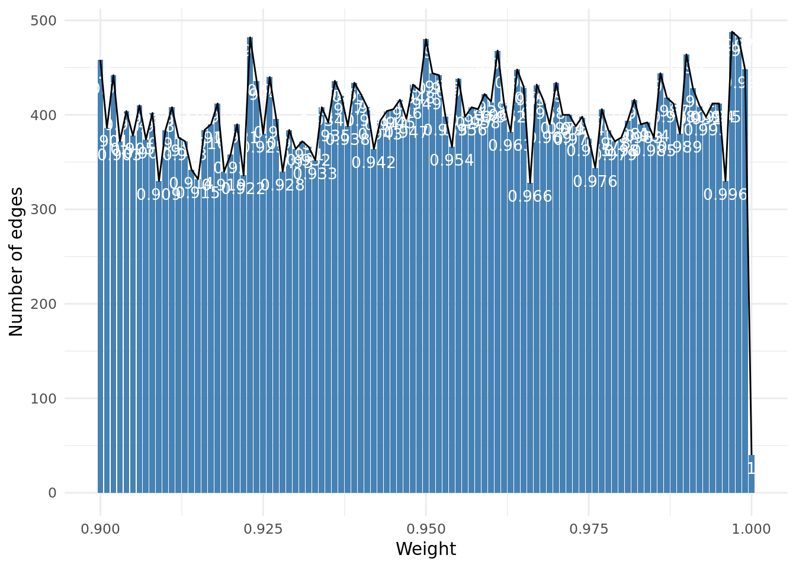

#### Degree distribution of item->similarity->item edges

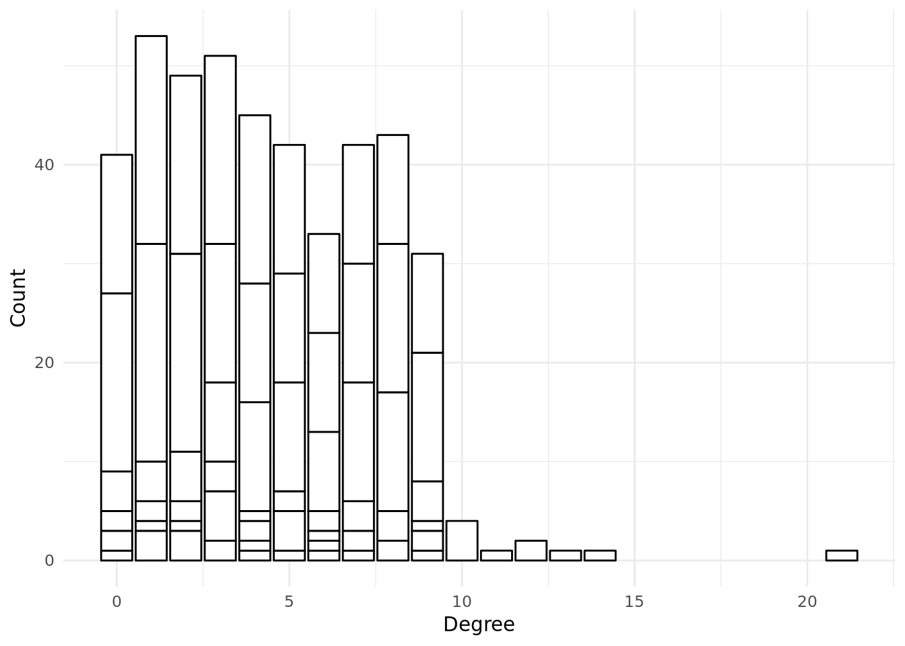

#### Degree distribution of agent->knows->agent edges

#### Runing time by method 

<table class="table table-condensed" style="width: auto !important; ">
 <thead>
  <tr>
   <th style="text-align:left;"> key </th>
   <th style="text-align:right;"> doc_count </th>
   <th style="text-align:right;"> sum_wallTime_ms.value </th>
   <th style="text-align:left;"> avg_wallTime_ms.value </th>
   <th style="text-align:left;"> includedInTotal </th>
  </tr>
 </thead>
<tbody>
  <tr>
   <td style="text-align:left;"> knowsAgent </td>
   <td style="text-align:right;"> 601 </td>
   <td style="text-align:right;"> 3,011 </td>
   <td style="text-align:left;"> 5.00998336106489 </td>
   <td style="text-align:left;"> No </td>
  </tr>
  <tr>
   <td style="text-align:left;"> addItemToWork </td>
   <td style="text-align:right;"> 440 </td>
   <td style="text-align:right;"> 10,001 </td>
   <td style="text-align:left;"> 22.7295454545455 </td>
   <td style="text-align:left;"> No </td>
  </tr>
  <tr>
   <td style="text-align:left;"> ownsWork </td>
   <td style="text-align:right;"> 220 </td>
   <td style="text-align:right;"> 7,546 </td>
   <td style="text-align:left;"> 34.3 </td>
   <td style="text-align:left;"> No </td>
  </tr>
  <tr>
   <td style="text-align:left;"> init </td>
   <td style="text-align:right;"> 103 </td>
   <td style="text-align:right;"> 16,621 </td>
   <td style="text-align:left;"> 161.368932038835 </td>
   <td style="text-align:left;"> No </td>
  </tr>
  <tr>
   <td style="text-align:left;"> searchAndConnect </td>
   <td style="text-align:right;"> 101 </td>
   <td style="text-align:right;"> 450,096 </td>
   <td style="text-align:left;"> 4456.39603960396 </td>
   <td style="text-align:left;"> Yes </td>
  </tr>
  <tr>
   <td style="text-align:left;"> getWorksItems </td>
   <td style="text-align:right;"> 38 </td>
   <td style="text-align:right;"> 227 </td>
   <td style="text-align:left;"> 5.97368421052632 </td>
   <td style="text-align:left;"> Yes </td>
  </tr>
  <tr>
   <td style="text-align:left;"> cycleSearch </td>
   <td style="text-align:right;"> 15 </td>
   <td style="text-align:right;"> 2,078 </td>
   <td style="text-align:left;"> 138.533333333333 </td>
   <td style="text-align:left;"> Yes </td>
  </tr>
  <tr>
   <td style="text-align:left;"> getWorks </td>
   <td style="text-align:right;"> 15 </td>
   <td style="text-align:right;"> 325 </td>
   <td style="text-align:left;"> 21.6666666666667 </td>
   <td style="text-align:left;"> No </td>
  </tr>
  <tr>
   <td style="text-align:left;"> individualCycleSearch </td>
   <td style="text-align:right;"> 15 </td>
   <td style="text-align:right;"> 0 </td>
   <td style="text-align:left;"> 0 </td>
   <td style="text-align:left;"> Yes </td>
  </tr>
  <tr>
   <td style="text-align:left;font-weight: bold;"> Total </td>
   <td style="text-align:right;font-weight: bold;"> 174 </td>
   <td style="text-align:right;font-weight: bold;"> 454,775 </td>
   <td style="text-align:left;font-weight: bold;">  </td>
   <td style="text-align:left;font-weight: bold;">  </td>
  </tr>
</tbody>
</table>
####  Found structures 

#####  Cycles 

Number of cycles found:  5 

<button class="btn btn-primary" data-toggle="collapse" data-target="#YVKDHFUQZH"> Show/Hide foundCycle query </button> 
 
  
     GET /filebeat-*/_search 
              { 
                "query": {
                  "bool": {
                    "must": [
                      { "match_phrase": {
                        "simulationId": "SIM09-26-12-49-NT2Tuu--DV"
                        }
                      },
                      { "bool": {
                        "should": [
                          { "match": {
                            "keyword": "foundCycle"
                          }}
                        ]
                      }}
                    ]
                  }
                }
              }
     

#####  Paths 

Number of paths found:  0 

<button class="btn btn-primary" data-toggle="collapse" data-target="#DVSMPWEXWD"> Show/Hide foundPath query </button> 
 
  
     GET /filebeat-*/_search 
              { 
                "query": {
                  "bool": {
                    "must": [
                      { "match_phrase": {
                        "simulationId": "SIM09-26-12-49-NT2Tuu--DV"
                        }
                      },
                      { "bool": {
                        "should": [
                          { "match": {
                            "keyword": "foundPath"
                          }}
                        ]
                      }}
                    ]
                  }
                }
              }
     

###  SIM09-26-09-33-6tFhcV--CV 

#### simulationParameters 

<table class="table table-condensed" style="width: auto !important; ">
 <thead>
  <tr>
   <th style="text-align:left;"> agentNumber </th>
   <th style="text-align:left;"> similarityConnectThreshold </th>
   <th style="text-align:left;"> graphType </th>
   <th style="text-align:left;"> chainLength </th>
   <th style="text-align:left;"> similaritySearchThreshold </th>
   <th style="text-align:left;"> maxDistance </th>
   <th style="text-align:left;"> randomWorksNumberMultiplier </th>
  </tr>
 </thead>
<tbody>
  <tr>
   <td style="text-align:left;width: 20em; "> 100 </td>
   <td style="text-align:left;width: 15em; "> 0.9 </td>
   <td style="text-align:left;width: 15em; "> random </td>
   <td style="text-align:left;width: 15em; "> 20 </td>
   <td style="text-align:left;width: 15em; "> 1 </td>
   <td style="text-align:left;width: 15em; "> 5 </td>
   <td style="text-align:left;width: 15em; "> 1 </td>
  </tr>
</tbody>
</table>
#### allEdgesByLabel

<table class="table table-condensed" style="width: auto !important; ">
 <thead>
  <tr>
   <th style="text-align:right;"> edges_offers </th>
   <th style="text-align:right;"> edges_similarity </th>
   <th style="text-align:right;"> edges_owns </th>
   <th style="text-align:right;"> edges_demands </th>
   <th style="text-align:right;"> edges_knows </th>
   <th style="text-align:right;"> edges_total </th>
  </tr>
 </thead>
<tbody>
  <tr>
   <td style="text-align:right;width: 5em; "> 120 </td>
   <td style="text-align:right;width: 5em; "> 11,480 </td>
   <td style="text-align:right;width: 5em; "> 120 </td>
   <td style="text-align:right;width: 5em; "> 120 </td>
   <td style="text-align:right;width: 5em; "> 100 </td>
   <td style="text-align:right;width: 5em; "> 11,940 </td>
  </tr>
</tbody>
</table>
#### allVerticesByType

<table class="table table-condensed" style="width: auto !important; ">
 <thead>
  <tr>
   <th style="text-align:right;"> vertices_agent </th>
   <th style="text-align:right;"> vertices_item </th>
   <th style="text-align:right;"> vertices_work </th>
   <th style="text-align:right;"> vertices_total </th>
  </tr>
 </thead>
<tbody>
  <tr>
   <td style="text-align:right;width: 5em; "> 101 </td>
   <td style="text-align:right;width: 5em; "> 240 </td>
   <td style="text-align:right;width: 5em; "> 120 </td>
   <td style="text-align:right;width: 5em; "> 461 </td>
  </tr>
</tbody>
</table>
#### distribution of similarityEdgesByWeight

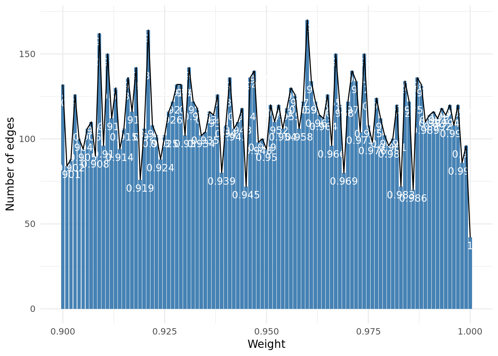

#### Degree distribution of item->similarity->item edges

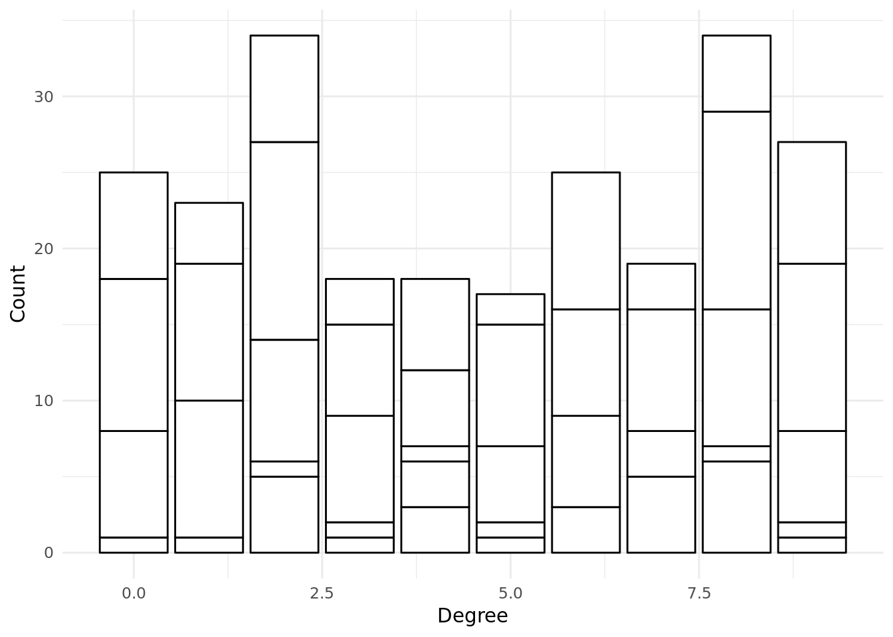

#### Degree distribution of agent->knows->agent edges

#### Runing time by method 

<table class="table table-condensed" style="width: auto !important; ">
 <thead>
  <tr>
   <th style="text-align:left;"> key </th>
   <th style="text-align:right;"> doc_count </th>
   <th style="text-align:right;"> sum_wallTime_ms.value </th>
   <th style="text-align:left;"> avg_wallTime_ms.value </th>
   <th style="text-align:left;"> includedInTotal </th>
  </tr>
 </thead>
<tbody>
  <tr>
   <td style="text-align:left;"> connectIfSimilar </td>
   <td style="text-align:right;"> 28,680 </td>
   <td style="text-align:right;"> 133,779 </td>
   <td style="text-align:left;"> 4.66453974895397 </td>
   <td style="text-align:left;"> No </td>
  </tr>
  <tr>
   <td style="text-align:left;"> existsSimilarity </td>
   <td style="text-align:right;"> 28,680 </td>
   <td style="text-align:right;"> 112,697 </td>
   <td style="text-align:left;"> 3.9294630404463 </td>
   <td style="text-align:left;"> No </td>
  </tr>
  <tr>
   <td style="text-align:left;"> similarityEdges </td>
   <td style="text-align:right;"> 28,680 </td>
   <td style="text-align:right;"> 111,424 </td>
   <td style="text-align:left;"> 3.88507670850767 </td>
   <td style="text-align:left;"> No </td>
  </tr>
  <tr>
   <td style="text-align:left;"> connect </td>
   <td style="text-align:right;"> 4,208 </td>
   <td style="text-align:right;"> 20,346 </td>
   <td style="text-align:left;"> 4.83507604562738 </td>
   <td style="text-align:left;"> Yes </td>
  </tr>
  <tr>
   <td style="text-align:left;"> connectAllSimilar </td>
   <td style="text-align:right;"> 240 </td>
   <td style="text-align:right;"> 134,122 </td>
   <td style="text-align:left;"> 558.841666666667 </td>
   <td style="text-align:left;"> Yes </td>
  </tr>
  <tr>
   <td style="text-align:left;"> init </td>
   <td style="text-align:right;"> 103 </td>
   <td style="text-align:right;"> 14,051 </td>
   <td style="text-align:left;"> 136.417475728155 </td>
   <td style="text-align:left;"> No </td>
  </tr>
  <tr>
   <td style="text-align:left;font-weight: bold;"> Total </td>
   <td style="text-align:right;font-weight: bold;"> 4,456 </td>
   <td style="text-align:right;font-weight: bold;"> 155,467 </td>
   <td style="text-align:left;font-weight: bold;">  </td>
   <td style="text-align:left;font-weight: bold;">  </td>
  </tr>
</tbody>
</table>
####  Found structures 

#####  Cycles 

Number of cycles found:  1 

<button class="btn btn-primary" data-toggle="collapse" data-target="#KDRQHMJQAT"> Show/Hide foundCycle query </button> 
 
  
     GET /filebeat-*/_search 
              { 
                "query": {
                  "bool": {
                    "must": [
                      { "match_phrase": {
                        "simulationId": "SIM09-26-09-33-6tFhcV--CV"
                        }
                      },
                      { "bool": {
                        "should": [
                          { "match": {
                            "keyword": "foundCycle"
                          }}
                        ]
                      }}
                    ]
                  }
                }
              }
     

#####  Paths 

Number of paths found:  0 

<button class="btn btn-primary" data-toggle="collapse" data-target="#QVQIOMVTRQ"> Show/Hide foundPath query </button> 
 
  
     GET /filebeat-*/_search 
              { 
                "query": {
                  "bool": {
                    "must": [
                      { "match_phrase": {
                        "simulationId": "SIM09-26-09-33-6tFhcV--CV"
                        }
                      },
                      { "bool": {
                        "should": [
                          { "match": {
                            "keyword": "foundPath"
                          }}
                        ]
                      }}
                    ]
                  }
                }
              }
     

###  SIM09-26-09-33-6tFhcV--DV 

#### simulationParameters 

<table class="table table-condensed" style="width: auto !important; ">
 <thead>
  <tr>
   <th style="text-align:left;"> agentNumber </th>
   <th style="text-align:left;"> similarityConnectThreshold </th>
   <th style="text-align:left;"> graphType </th>
   <th style="text-align:left;"> chainLength </th>
   <th style="text-align:left;"> similaritySearchThreshold </th>
   <th style="text-align:left;"> maxDistance </th>
   <th style="text-align:left;"> randomWorksNumberMultiplier </th>
  </tr>
 </thead>
<tbody>
  <tr>
   <td style="text-align:left;width: 20em; "> 100 </td>
   <td style="text-align:left;width: 15em; "> 0.9 </td>
   <td style="text-align:left;width: 15em; "> random </td>
   <td style="text-align:left;width: 15em; "> 20 </td>
   <td style="text-align:left;width: 15em; "> 1 </td>
   <td style="text-align:left;width: 15em; "> 5 </td>
   <td style="text-align:left;width: 15em; "> 1 </td>
  </tr>
</tbody>
</table>
#### allEdgesByLabel

<table class="table table-condensed" style="width: auto !important; ">
 <thead>
  <tr>
   <th style="text-align:right;"> edges_offers </th>
   <th style="text-align:right;"> edges_similarity </th>
   <th style="text-align:right;"> edges_owns </th>
   <th style="text-align:right;"> edges_demands </th>
   <th style="text-align:right;"> edges_knows </th>
   <th style="text-align:right;"> edges_total </th>
  </tr>
 </thead>
<tbody>
  <tr>
   <td style="text-align:right;width: 5em; "> 120 </td>
   <td style="text-align:right;width: 5em; "> 3,064 </td>
   <td style="text-align:right;width: 5em; "> 120 </td>
   <td style="text-align:right;width: 5em; "> 120 </td>
   <td style="text-align:right;width: 5em; "> 100 </td>
   <td style="text-align:right;width: 5em; "> 3,524 </td>
  </tr>
</tbody>
</table>
#### allVerticesByType

<table class="table table-condensed" style="width: auto !important; ">
 <thead>
  <tr>
   <th style="text-align:right;"> vertices_agent </th>
   <th style="text-align:right;"> vertices_item </th>
   <th style="text-align:right;"> vertices_work </th>
   <th style="text-align:right;"> vertices_total </th>
  </tr>
 </thead>
<tbody>
  <tr>
   <td style="text-align:right;width: 5em; "> 101 </td>
   <td style="text-align:right;width: 5em; "> 240 </td>
   <td style="text-align:right;width: 5em; "> 120 </td>
   <td style="text-align:right;width: 5em; "> 461 </td>
  </tr>
</tbody>
</table>
#### distribution of similarityEdgesByWeight

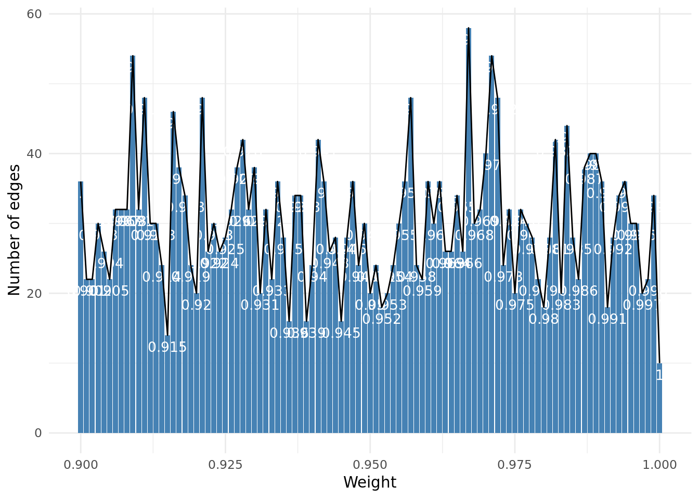

#### Degree distribution of item->similarity->item edges

#### Degree distribution of agent->knows->agent edges

#### Runing time by method 

<table class="table table-condensed" style="width: auto !important; ">
 <thead>
  <tr>
   <th style="text-align:left;">   </th>
   <th style="text-align:left;"> key </th>
   <th style="text-align:right;"> doc_count </th>
   <th style="text-align:right;"> sum_wallTime_ms.value </th>
   <th style="text-align:left;"> avg_wallTime_ms.value </th>
   <th style="text-align:left;"> includedInTotal </th>
  </tr>
 </thead>
<tbody>
  <tr>
   <td style="text-align:left;"> 2 </td>
   <td style="text-align:left;"> cycleSearch </td>
   <td style="text-align:right;"> 3,600 </td>
   <td style="text-align:right;"> 50,118 </td>
   <td style="text-align:left;"> 13.9216666666667 </td>
   <td style="text-align:left;"> Yes </td>
  </tr>
  <tr>
   <td style="text-align:left;"> 3 </td>
   <td style="text-align:left;"> getWorks </td>
   <td style="text-align:right;"> 3,600 </td>
   <td style="text-align:right;"> 108,324 </td>
   <td style="text-align:left;"> 30.09 </td>
   <td style="text-align:left;"> No </td>
  </tr>
  <tr>
   <td style="text-align:left;"> 4 </td>
   <td style="text-align:left;"> individualCycleSearch </td>
   <td style="text-align:right;"> 3,600 </td>
   <td style="text-align:right;"> 67 </td>
   <td style="text-align:left;"> 0.0186111111111111 </td>
   <td style="text-align:left;"> Yes </td>
  </tr>
  <tr>
   <td style="text-align:left;"> 6 </td>
   <td style="text-align:left;"> addItemToWork </td>
   <td style="text-align:right;"> 240 </td>
   <td style="text-align:right;"> 7,220 </td>
   <td style="text-align:left;"> 30.0833333333333 </td>
   <td style="text-align:left;"> No </td>
  </tr>
  <tr>
   <td style="text-align:left;"> 7 </td>
   <td style="text-align:left;"> ownsWork </td>
   <td style="text-align:right;"> 120 </td>
   <td style="text-align:right;"> 7,481 </td>
   <td style="text-align:left;"> 62.3416666666667 </td>
   <td style="text-align:left;"> No </td>
  </tr>
  <tr>
   <td style="text-align:left;"> 8 </td>
   <td style="text-align:left;"> init </td>
   <td style="text-align:right;"> 103 </td>
   <td style="text-align:right;"> 16,293 </td>
   <td style="text-align:left;"> 158.184466019417 </td>
   <td style="text-align:left;"> No </td>
  </tr>
  <tr>
   <td style="text-align:left;"> 9 </td>
   <td style="text-align:left;"> searchAndConnect </td>
   <td style="text-align:right;"> 101 </td>
   <td style="text-align:right;"> 40,335 </td>
   <td style="text-align:left;"> 399.356435643564 </td>
   <td style="text-align:left;"> Yes </td>
  </tr>
  <tr>
   <td style="text-align:left;"> 10 </td>
   <td style="text-align:left;"> knowsAgent </td>
   <td style="text-align:right;"> 100 </td>
   <td style="text-align:right;"> 1,755 </td>
   <td style="text-align:left;"> 17.55 </td>
   <td style="text-align:left;"> No </td>
  </tr>
  <tr>
   <td style="text-align:left;font-weight: bold;"> 1 </td>
   <td style="text-align:left;font-weight: bold;"> Total </td>
   <td style="text-align:right;font-weight: bold;"> 14,501 </td>
   <td style="text-align:right;font-weight: bold;"> 219,226 </td>
   <td style="text-align:left;font-weight: bold;">  </td>
   <td style="text-align:left;font-weight: bold;">  </td>
  </tr>
</tbody>
</table>
####  Found structures 

#####  Cycles 

Number of cycles found:  0 

<button class="btn btn-primary" data-toggle="collapse" data-target="#KFULZCHKOY"> Show/Hide foundCycle query </button> 
 
  
     GET /filebeat-*/_search 
              { 
                "query": {
                  "bool": {
                    "must": [
                      { "match_phrase": {
                        "simulationId": "SIM09-26-09-33-6tFhcV--DV"
                        }
                      },
                      { "bool": {
                        "should": [
                          { "match": {
                            "keyword": "foundCycle"
                          }}
                        ]
                      }}
                    ]
                  }
                }
              }
     

#####  Paths 

Number of paths found:  3600 

<button class="btn btn-primary" data-toggle="collapse" data-target="#JGDZHMVVED"> Show/Hide foundPath query </button> 
 
  
     GET /filebeat-*/_search 
              { 
                "query": {
                  "bool": {
                    "must": [
                      { "match_phrase": {
                        "simulationId": "SIM09-26-09-33-6tFhcV--DV"
                        }
                      },
                      { "bool": {
                        "should": [
                          { "match": {
                            "keyword": "foundPath"
                          }}
                        ]
                      }}
                    ]
                  }
                }
              }
     

###  SIM09-26-10-36-uiUJrV--CV 

#### simulationParameters 

<table class="table table-condensed" style="width: auto !important; ">
 <thead>
  <tr>
   <th style="text-align:left;"> agentNumber </th>
   <th style="text-align:left;"> similarityConnectThreshold </th>
   <th style="text-align:left;"> graphType </th>
   <th style="text-align:left;"> chainLength </th>
   <th style="text-align:left;"> similaritySearchThreshold </th>
   <th style="text-align:left;"> maxDistance </th>
   <th style="text-align:left;"> randomWorksNumberMultiplier </th>
  </tr>
 </thead>
<tbody>
  <tr>
   <td style="text-align:left;width: 20em; "> 100 </td>
   <td style="text-align:left;width: 15em; "> 0.9 </td>
   <td style="text-align:left;width: 15em; "> smallWorld </td>
   <td style="text-align:left;width: 15em; "> 20 </td>
   <td style="text-align:left;width: 15em; "> 1 </td>
   <td style="text-align:left;width: 15em; "> 5 </td>
   <td style="text-align:left;width: 15em; "> 1 </td>
  </tr>
</tbody>
</table>
#### allEdgesByLabel

<table class="table table-condensed" style="width: auto !important; ">
 <thead>
  <tr>
   <th style="text-align:right;"> edges_offers </th>
   <th style="text-align:right;"> edges_similarity </th>
   <th style="text-align:right;"> edges_owns </th>
   <th style="text-align:right;"> edges_demands </th>
   <th style="text-align:right;"> edges_knows </th>
   <th style="text-align:right;"> edges_total </th>
  </tr>
 </thead>
<tbody>
  <tr>
   <td style="text-align:right;width: 5em; "> 120 </td>
   <td style="text-align:right;width: 5em; "> 12,366 </td>
   <td style="text-align:right;width: 5em; "> 120 </td>
   <td style="text-align:right;width: 5em; "> 120 </td>
   <td style="text-align:right;width: 5em; "> 601 </td>
   <td style="text-align:right;width: 5em; "> 13,327 </td>
  </tr>
</tbody>
</table>
#### allVerticesByType

<table class="table table-condensed" style="width: auto !important; ">
 <thead>
  <tr>
   <th style="text-align:right;"> vertices_agent </th>
   <th style="text-align:right;"> vertices_item </th>
   <th style="text-align:right;"> vertices_work </th>
   <th style="text-align:right;"> vertices_total </th>
  </tr>
 </thead>
<tbody>
  <tr>
   <td style="text-align:right;width: 5em; "> 101 </td>
   <td style="text-align:right;width: 5em; "> 240 </td>
   <td style="text-align:right;width: 5em; "> 120 </td>
   <td style="text-align:right;width: 5em; "> 461 </td>
  </tr>
</tbody>
</table>
#### distribution of similarityEdgesByWeight

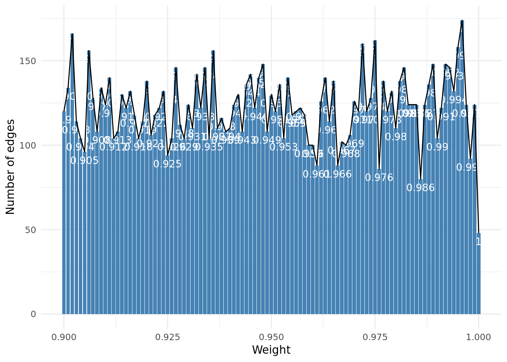

#### Degree distribution of item->similarity->item edges

#### Degree distribution of agent->knows->agent edges

#### Runing time by method 

<table class="table table-condensed" style="width: auto !important; ">
 <thead>
  <tr>
   <th style="text-align:left;"> key </th>
   <th style="text-align:right;"> doc_count </th>
   <th style="text-align:right;"> sum_wallTime_ms.value </th>
   <th style="text-align:left;"> avg_wallTime_ms.value </th>
   <th style="text-align:left;"> includedInTotal </th>
  </tr>
 </thead>
<tbody>
  <tr>
   <td style="text-align:left;"> connectIfSimilar </td>
   <td style="text-align:right;"> 28,680 </td>
   <td style="text-align:right;"> 133,117 </td>
   <td style="text-align:left;"> 4.64145746164575 </td>
   <td style="text-align:left;"> No </td>
  </tr>
  <tr>
   <td style="text-align:left;"> existsSimilarity </td>
   <td style="text-align:right;"> 28,680 </td>
   <td style="text-align:right;"> 132,365 </td>
   <td style="text-align:left;"> 4.61523709902371 </td>
   <td style="text-align:left;"> No </td>
  </tr>
  <tr>
   <td style="text-align:left;"> similarityEdges </td>
   <td style="text-align:right;"> 28,680 </td>
   <td style="text-align:right;"> 130,811 </td>
   <td style="text-align:left;"> 4.5610529986053 </td>
   <td style="text-align:left;"> No </td>
  </tr>
  <tr>
   <td style="text-align:left;"> connectAllSimilar </td>
   <td style="text-align:right;"> 240 </td>
   <td style="text-align:right;"> 133,413 </td>
   <td style="text-align:left;"> 555.8875 </td>
   <td style="text-align:left;"> Yes </td>
  </tr>
  <tr>
   <td style="text-align:left;"> init </td>
   <td style="text-align:right;"> 103 </td>
   <td style="text-align:right;"> 14,091 </td>
   <td style="text-align:left;"> 136.805825242718 </td>
   <td style="text-align:left;"> No </td>
  </tr>
  <tr>
   <td style="text-align:left;"> connect </td>
   <td style="text-align:right;"> 64 </td>
   <td style="text-align:right;"> 208 </td>
   <td style="text-align:left;"> 3.25 </td>
   <td style="text-align:left;"> Yes </td>
  </tr>
  <tr>
   <td style="text-align:left;font-weight: bold;"> Total </td>
   <td style="text-align:right;font-weight: bold;"> 312 </td>
   <td style="text-align:right;font-weight: bold;"> 134,746 </td>
   <td style="text-align:left;font-weight: bold;">  </td>
   <td style="text-align:left;font-weight: bold;">  </td>
  </tr>
</tbody>
</table>
####  Found structures 

#####  Cycles 

Number of cycles found:  1 

<button class="btn btn-primary" data-toggle="collapse" data-target="#TLRLQDUIIU"> Show/Hide foundCycle query </button> 
 
  
     GET /filebeat-*/_search 
              { 
                "query": {
                  "bool": {
                    "must": [
                      { "match_phrase": {
                        "simulationId": "SIM09-26-10-36-uiUJrV--CV"
                        }
                      },
                      { "bool": {
                        "should": [
                          { "match": {
                            "keyword": "foundCycle"
                          }}
                        ]
                      }}
                    ]
                  }
                }
              }
     

#####  Paths 

Number of paths found:  0 

<button class="btn btn-primary" data-toggle="collapse" data-target="#OEKMDPPBIX"> Show/Hide foundPath query </button> 
 
  
     GET /filebeat-*/_search 
              { 
                "query": {
                  "bool": {
                    "must": [
                      { "match_phrase": {
                        "simulationId": "SIM09-26-10-36-uiUJrV--CV"
                        }
                      },
                      { "bool": {
                        "should": [
                          { "match": {
                            "keyword": "foundPath"
                          }}
                        ]
                      }}
                    ]
                  }
                }
              }
     

###  SIM09-26-10-36-uiUJrV--DV 

#### simulationParameters 

<table class="table table-condensed" style="width: auto !important; ">
 <thead>
  <tr>
   <th style="text-align:left;"> agentNumber </th>
   <th style="text-align:left;"> similarityConnectThreshold </th>
   <th style="text-align:left;"> graphType </th>
   <th style="text-align:left;"> chainLength </th>
   <th style="text-align:left;"> similaritySearchThreshold </th>
   <th style="text-align:left;"> maxDistance </th>
   <th style="text-align:left;"> randomWorksNumberMultiplier </th>
  </tr>
 </thead>
<tbody>
  <tr>
   <td style="text-align:left;width: 20em; "> 100 </td>
   <td style="text-align:left;width: 15em; "> 0.9 </td>
   <td style="text-align:left;width: 15em; "> smallWorld </td>
   <td style="text-align:left;width: 15em; "> 20 </td>
   <td style="text-align:left;width: 15em; "> 1 </td>
   <td style="text-align:left;width: 15em; "> 5 </td>
   <td style="text-align:left;width: 15em; "> 1 </td>
  </tr>
</tbody>
</table>
#### allEdgesByLabel

<table class="table table-condensed" style="width: auto !important; ">
 <thead>
  <tr>
   <th style="text-align:right;"> edges_offers </th>
   <th style="text-align:right;"> edges_similarity </th>
   <th style="text-align:right;"> edges_owns </th>
   <th style="text-align:right;"> edges_demands </th>
   <th style="text-align:right;"> edges_knows </th>
   <th style="text-align:right;"> edges_total </th>
  </tr>
 </thead>
<tbody>
  <tr>
   <td style="text-align:right;width: 5em; "> 120 </td>
   <td style="text-align:right;width: 5em; "> 12,238 </td>
   <td style="text-align:right;width: 5em; "> 120 </td>
   <td style="text-align:right;width: 5em; "> 120 </td>
   <td style="text-align:right;width: 5em; "> 601 </td>
   <td style="text-align:right;width: 5em; "> 13,199 </td>
  </tr>
</tbody>
</table>
#### allVerticesByType

<table class="table table-condensed" style="width: auto !important; ">
 <thead>
  <tr>
   <th style="text-align:right;"> vertices_agent </th>
   <th style="text-align:right;"> vertices_item </th>
   <th style="text-align:right;"> vertices_work </th>
   <th style="text-align:right;"> vertices_total </th>
  </tr>
 </thead>
<tbody>
  <tr>
   <td style="text-align:right;width: 5em; "> 101 </td>
   <td style="text-align:right;width: 5em; "> 240 </td>
   <td style="text-align:right;width: 5em; "> 120 </td>
   <td style="text-align:right;width: 5em; "> 461 </td>
  </tr>
</tbody>
</table>
#### distribution of similarityEdgesByWeight

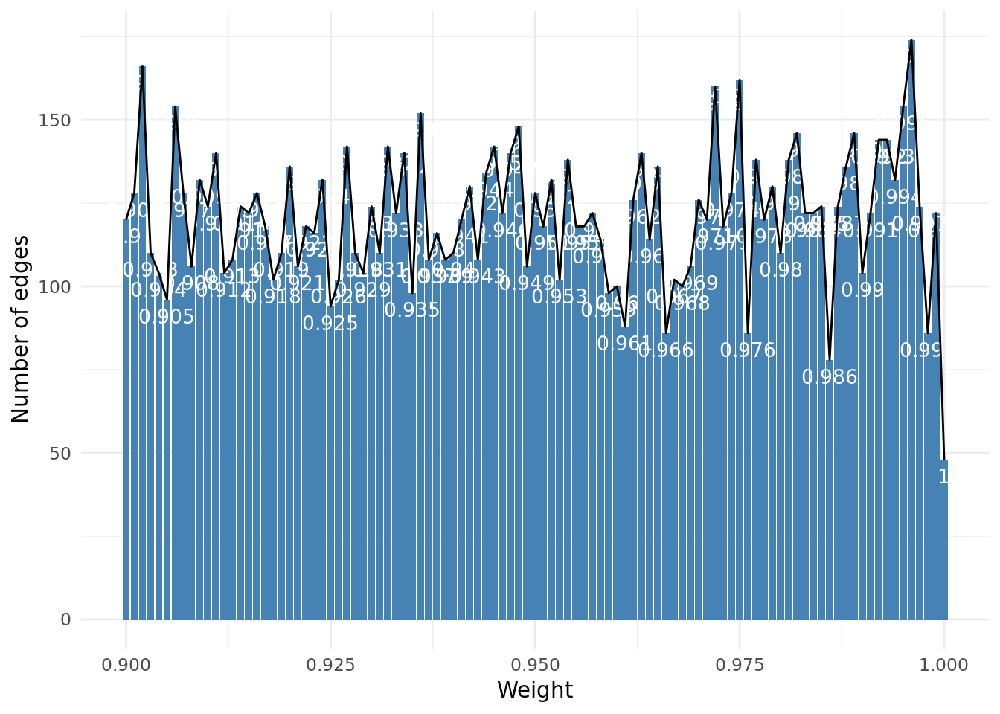

#### Degree distribution of item->similarity->item edges

#### Degree distribution of agent->knows->agent edges

#### Runing time by method 

<table class="table table-condensed" style="width: auto !important; ">
 <thead>
  <tr>
   <th style="text-align:left;">   </th>
   <th style="text-align:left;"> key </th>
   <th style="text-align:right;"> doc_count </th>
   <th style="text-align:right;"> sum_wallTime_ms.value </th>
   <th style="text-align:left;"> avg_wallTime_ms.value </th>
   <th style="text-align:left;"> includedInTotal </th>
  </tr>
 </thead>
<tbody>
  <tr>
   <td style="text-align:left;"> 1 </td>
   <td style="text-align:left;"> knowsAgent </td>
   <td style="text-align:right;"> 601 </td>
   <td style="text-align:right;"> 2,014 </td>
   <td style="text-align:left;"> 3.35108153078203 </td>
   <td style="text-align:left;"> No </td>
  </tr>
  <tr>
   <td style="text-align:left;"> 2 </td>
   <td style="text-align:left;"> addItemToWork </td>
   <td style="text-align:right;"> 240 </td>
   <td style="text-align:right;"> 4,709 </td>
   <td style="text-align:left;"> 19.6208333333333 </td>
   <td style="text-align:left;"> No </td>
  </tr>
  <tr>
   <td style="text-align:left;"> 3 </td>
   <td style="text-align:left;"> ownsWork </td>
   <td style="text-align:right;"> 120 </td>
   <td style="text-align:right;"> 3,722 </td>
   <td style="text-align:left;"> 31.0166666666667 </td>
   <td style="text-align:left;"> No </td>
  </tr>
  <tr>
   <td style="text-align:left;"> 4 </td>
   <td style="text-align:left;"> init </td>
   <td style="text-align:right;"> 103 </td>
   <td style="text-align:right;"> 15,487 </td>
   <td style="text-align:left;"> 150.359223300971 </td>
   <td style="text-align:left;"> No </td>
  </tr>
  <tr>
   <td style="text-align:left;"> 5 </td>
   <td style="text-align:left;"> searchAndConnect </td>
   <td style="text-align:right;"> 101 </td>
   <td style="text-align:right;"> 125,448 </td>
   <td style="text-align:left;"> 1242.05940594059 </td>
   <td style="text-align:left;"> Yes </td>
  </tr>
  <tr>
   <td style="text-align:left;"> 6 </td>
   <td style="text-align:left;"> getWorksItems </td>
   <td style="text-align:right;"> 38 </td>
   <td style="text-align:right;"> 214 </td>
   <td style="text-align:left;"> 5.63157894736842 </td>
   <td style="text-align:left;"> Yes </td>
  </tr>
  <tr>
   <td style="text-align:left;"> 8 </td>
   <td style="text-align:left;"> cycleSearch </td>
   <td style="text-align:right;"> 5 </td>
   <td style="text-align:right;"> 1,469 </td>
   <td style="text-align:left;"> 293.8 </td>
   <td style="text-align:left;"> Yes </td>
  </tr>
  <tr>
   <td style="text-align:left;"> 10 </td>
   <td style="text-align:left;"> getWorks </td>
   <td style="text-align:right;"> 5 </td>
   <td style="text-align:right;"> 970 </td>
   <td style="text-align:left;"> 194 </td>
   <td style="text-align:left;"> No </td>
  </tr>
  <tr>
   <td style="text-align:left;font-weight: bold;"> 11 </td>
   <td style="text-align:left;font-weight: bold;"> Total </td>
   <td style="text-align:right;font-weight: bold;"> 154 </td>
   <td style="text-align:right;font-weight: bold;"> 129,568 </td>
   <td style="text-align:left;font-weight: bold;">  </td>
   <td style="text-align:left;font-weight: bold;">  </td>
  </tr>
</tbody>
</table>
####  Found structures 

#####  Cycles 

Number of cycles found:  4 

<button class="btn btn-primary" data-toggle="collapse" data-target="#TONVCMSIMI"> Show/Hide foundCycle query </button> 
 
  
     GET /filebeat-*/_search 
              { 
                "query": {
                  "bool": {
                    "must": [
                      { "match_phrase": {
                        "simulationId": "SIM09-26-10-36-uiUJrV--DV"
                        }
                      },
                      { "bool": {
                        "should": [
                          { "match": {
                            "keyword": "foundCycle"
                          }}
                        ]
                      }}
                    ]
                  }
                }
              }
     

#####  Paths 

Number of paths found:  1 

<button class="btn btn-primary" data-toggle="collapse" data-target="#SOICQLDOUZ"> Show/Hide foundPath query </button> 
 
  
     GET /filebeat-*/_search 
              { 
                "query": {
                  "bool": {
                    "must": [
                      { "match_phrase": {
                        "simulationId": "SIM09-26-10-36-uiUJrV--DV"
                        }
                      },
                      { "bool": {
                        "should": [
                          { "match": {
                            "keyword": "foundPath"
                          }}
                        ]
                      }}
                    ]
                  }
                }
              }
     

###  SIM09-26-10-51-B8uwhW--CV 

#### simulationParameters 

<table class="table table-condensed" style="width: auto !important; ">
 <thead>
  <tr>
   <th style="text-align:left;"> agentNumber </th>
   <th style="text-align:left;"> similarityConnectThreshold </th>
   <th style="text-align:left;"> graphType </th>
   <th style="text-align:left;"> chainLength </th>
   <th style="text-align:left;"> similaritySearchThreshold </th>
   <th style="text-align:left;"> maxDistance </th>
   <th style="text-align:left;"> randomWorksNumberMultiplier </th>
  </tr>
 </thead>
<tbody>
  <tr>
   <td style="text-align:left;width: 20em; "> 100 </td>
   <td style="text-align:left;width: 15em; "> 0.9 </td>
   <td style="text-align:left;width: 15em; "> random </td>
   <td style="text-align:left;width: 15em; "> 20 </td>
   <td style="text-align:left;width: 15em; "> 1 </td>
   <td style="text-align:left;width: 15em; "> 5 </td>
   <td style="text-align:left;width: 15em; "> 2 </td>
  </tr>
</tbody>
</table>
#### allEdgesByLabel

<table class="table table-condensed" style="width: auto !important; ">
 <thead>
  <tr>
   <th style="text-align:right;"> edges_offers </th>
   <th style="text-align:right;"> edges_similarity </th>
   <th style="text-align:right;"> edges_owns </th>
   <th style="text-align:right;"> edges_demands </th>
   <th style="text-align:right;"> edges_knows </th>
   <th style="text-align:right;"> edges_total </th>
  </tr>
 </thead>
<tbody>
  <tr>
   <td style="text-align:right;width: 5em; "> 220 </td>
   <td style="text-align:right;width: 5em; "> 37,702 </td>
   <td style="text-align:right;width: 5em; "> 220 </td>
   <td style="text-align:right;width: 5em; "> 220 </td>
   <td style="text-align:right;width: 5em; "> 100 </td>
   <td style="text-align:right;width: 5em; "> 38,462 </td>
  </tr>
</tbody>
</table>
#### allVerticesByType

<table class="table table-condensed" style="width: auto !important; ">
 <thead>
  <tr>
   <th style="text-align:right;"> vertices_agent </th>
   <th style="text-align:right;"> vertices_item </th>
   <th style="text-align:right;"> vertices_work </th>
   <th style="text-align:right;"> vertices_total </th>
  </tr>
 </thead>
<tbody>
  <tr>
   <td style="text-align:right;width: 5em; "> 101 </td>
   <td style="text-align:right;width: 5em; "> 440 </td>
   <td style="text-align:right;width: 5em; "> 220 </td>
   <td style="text-align:right;width: 5em; "> 761 </td>
  </tr>
</tbody>
</table>
#### distribution of similarityEdgesByWeight

#### Degree distribution of item->similarity->item edges


#### Degree distribution of agent->knows->agent edges

#### Runing time by method 

<table class="table table-condensed" style="width: auto !important; ">
 <thead>
  <tr>
   <th style="text-align:left;"> key </th>
   <th style="text-align:right;"> doc_count </th>
   <th style="text-align:right;"> sum_wallTime_ms.value </th>
   <th style="text-align:left;"> avg_wallTime_ms.value </th>
   <th style="text-align:left;"> includedInTotal </th>
  </tr>
 </thead>
<tbody>
  <tr>
   <td style="text-align:left;"> connectIfSimilar </td>
   <td style="text-align:right;"> 96,580 </td>
   <td style="text-align:right;"> 598,862 </td>
   <td style="text-align:left;"> 6.20068337129841 </td>
   <td style="text-align:left;"> No </td>
  </tr>
  <tr>
   <td style="text-align:left;"> existsSimilarity </td>
   <td style="text-align:right;"> 96,580 </td>
   <td style="text-align:right;"> 528,660 </td>
   <td style="text-align:left;"> 5.47380410022779 </td>
   <td style="text-align:left;"> No </td>
  </tr>
  <tr>
   <td style="text-align:left;"> similarityEdges </td>
   <td style="text-align:right;"> 96,580 </td>
   <td style="text-align:right;"> 522,719 </td>
   <td style="text-align:left;"> 5.41229032926072 </td>
   <td style="text-align:left;"> No </td>
  </tr>
  <tr>
   <td style="text-align:left;"> connect </td>
   <td style="text-align:right;"> 12,129 </td>
   <td style="text-align:right;"> 67,647 </td>
   <td style="text-align:left;"> 5.57729408854811 </td>
   <td style="text-align:left;"> Yes </td>
  </tr>
  <tr>
   <td style="text-align:left;"> connectAllSimilar </td>
   <td style="text-align:right;"> 440 </td>
   <td style="text-align:right;"> 600,175 </td>
   <td style="text-align:left;"> 1364.03409090909 </td>
   <td style="text-align:left;"> Yes </td>
  </tr>
  <tr>
   <td style="text-align:left;"> init </td>
   <td style="text-align:right;"> 103 </td>
   <td style="text-align:right;"> 15,066 </td>
   <td style="text-align:left;"> 146.271844660194 </td>
   <td style="text-align:left;"> No </td>
  </tr>
  <tr>
   <td style="text-align:left;font-weight: bold;"> Total </td>
   <td style="text-align:right;font-weight: bold;"> 12,577 </td>
   <td style="text-align:right;font-weight: bold;"> 669,723 </td>
   <td style="text-align:left;font-weight: bold;">  </td>
   <td style="text-align:left;font-weight: bold;">  </td>
  </tr>
</tbody>
</table>
####  Found structures 

#####  Cycles 

Number of cycles found:  1 

<button class="btn btn-primary" data-toggle="collapse" data-target="#RXKCHBAEAB"> Show/Hide foundCycle query </button> 
 
  
     GET /filebeat-*/_search 
              { 
                "query": {
                  "bool": {
                    "must": [
                      { "match_phrase": {
                        "simulationId": "SIM09-26-10-51-B8uwhW--CV"
                        }
                      },
                      { "bool": {
                        "should": [
                          { "match": {
                            "keyword": "foundCycle"
                          }}
                        ]
                      }}
                    ]
                  }
                }
              }
     

#####  Paths 

Number of paths found:  0 

<button class="btn btn-primary" data-toggle="collapse" data-target="#FANKEEYQMN"> Show/Hide foundPath query </button> 
 
  
     GET /filebeat-*/_search 
              { 
                "query": {
                  "bool": {
                    "must": [
                      { "match_phrase": {
                        "simulationId": "SIM09-26-10-51-B8uwhW--CV"
                        }
                      },
                      { "bool": {
                        "should": [
                          { "match": {
                            "keyword": "foundPath"
                          }}
                        ]
                      }}
                    ]
                  }
                }
              }
     

###  SIM09-26-10-51-B8uwhW--DV 

#### simulationParameters 

<table class="table table-condensed" style="width: auto !important; ">
 <thead>
  <tr>
   <th style="text-align:left;"> agentNumber </th>
   <th style="text-align:left;"> similarityConnectThreshold </th>
   <th style="text-align:left;"> graphType </th>
   <th style="text-align:left;"> chainLength </th>
   <th style="text-align:left;"> similaritySearchThreshold </th>
   <th style="text-align:left;"> maxDistance </th>
   <th style="text-align:left;"> randomWorksNumberMultiplier </th>
  </tr>
 </thead>
<tbody>
  <tr>
   <td style="text-align:left;width: 20em; "> 100 </td>
   <td style="text-align:left;width: 15em; "> 0.9 </td>
   <td style="text-align:left;width: 15em; "> random </td>
   <td style="text-align:left;width: 15em; "> 20 </td>
   <td style="text-align:left;width: 15em; "> 1 </td>
   <td style="text-align:left;width: 15em; "> 5 </td>
   <td style="text-align:left;width: 15em; "> 2 </td>
  </tr>
</tbody>
</table>
#### allEdgesByLabel

<table class="table table-condensed" style="width: auto !important; ">
 <thead>
  <tr>
   <th style="text-align:right;"> edges_offers </th>
   <th style="text-align:right;"> edges_similarity </th>
   <th style="text-align:right;"> edges_owns </th>
   <th style="text-align:right;"> edges_demands </th>
   <th style="text-align:right;"> edges_knows </th>
   <th style="text-align:right;"> edges_total </th>
  </tr>
 </thead>
<tbody>
  <tr>
   <td style="text-align:right;width: 5em; "> 220 </td>
   <td style="text-align:right;width: 5em; "> 13,444 </td>
   <td style="text-align:right;width: 5em; "> 220 </td>
   <td style="text-align:right;width: 5em; "> 220 </td>
   <td style="text-align:right;width: 5em; "> 100 </td>
   <td style="text-align:right;width: 5em; "> 14,204 </td>
  </tr>
</tbody>
</table>
#### allVerticesByType

<table class="table table-condensed" style="width: auto !important; ">
 <thead>
  <tr>
   <th style="text-align:right;"> vertices_agent </th>
   <th style="text-align:right;"> vertices_item </th>
   <th style="text-align:right;"> vertices_work </th>
   <th style="text-align:right;"> vertices_total </th>
  </tr>
 </thead>
<tbody>
  <tr>
   <td style="text-align:right;width: 5em; "> 101 </td>
   <td style="text-align:right;width: 5em; "> 440 </td>
   <td style="text-align:right;width: 5em; "> 220 </td>
   <td style="text-align:right;width: 5em; "> 761 </td>
  </tr>
</tbody>
</table>
#### distribution of similarityEdgesByWeight

#### Degree distribution of item->similarity->item edges

#### Degree distribution of agent->knows->agent edges

#### Runing time by method 

<table class="table table-condensed" style="width: auto !important; ">
 <thead>
  <tr>
   <th style="text-align:left;">   </th>
   <th style="text-align:left;"> key </th>
   <th style="text-align:right;"> doc_count </th>
   <th style="text-align:right;"> sum_wallTime_ms.value </th>
   <th style="text-align:left;"> avg_wallTime_ms.value </th>
   <th style="text-align:left;"> includedInTotal </th>
  </tr>
 </thead>
<tbody>
  <tr>
   <td style="text-align:left;"> 2 </td>
   <td style="text-align:left;"> cycleSearch </td>
   <td style="text-align:right;"> 3,600 </td>
   <td style="text-align:right;"> 35,236 </td>
   <td style="text-align:left;"> 9.78777777777778 </td>
   <td style="text-align:left;"> Yes </td>
  </tr>
  <tr>
   <td style="text-align:left;"> 3 </td>
   <td style="text-align:left;"> getWorks </td>
   <td style="text-align:right;"> 3,600 </td>
   <td style="text-align:right;"> 126,213 </td>
   <td style="text-align:left;"> 35.0591666666667 </td>
   <td style="text-align:left;"> No </td>
  </tr>
  <tr>
   <td style="text-align:left;"> 4 </td>
   <td style="text-align:left;"> individualCycleSearch </td>
   <td style="text-align:right;"> 3,600 </td>
   <td style="text-align:right;"> 66 </td>
   <td style="text-align:left;"> 0.0183333333333333 </td>
   <td style="text-align:left;"> Yes </td>
  </tr>
  <tr>
   <td style="text-align:left;"> 6 </td>
   <td style="text-align:left;"> addItemToWork </td>
   <td style="text-align:right;"> 440 </td>
   <td style="text-align:right;"> 6,266 </td>
   <td style="text-align:left;"> 14.2409090909091 </td>
   <td style="text-align:left;"> No </td>
  </tr>
  <tr>
   <td style="text-align:left;"> 7 </td>
   <td style="text-align:left;"> ownsWork </td>
   <td style="text-align:right;"> 220 </td>
   <td style="text-align:right;"> 5,549 </td>
   <td style="text-align:left;"> 25.2227272727273 </td>
   <td style="text-align:left;"> No </td>
  </tr>
  <tr>
   <td style="text-align:left;"> 8 </td>
   <td style="text-align:left;"> init </td>
   <td style="text-align:right;"> 103 </td>
   <td style="text-align:right;"> 16,620 </td>
   <td style="text-align:left;"> 161.359223300971 </td>
   <td style="text-align:left;"> No </td>
  </tr>
  <tr>
   <td style="text-align:left;"> 9 </td>
   <td style="text-align:left;"> searchAndConnect </td>
   <td style="text-align:right;"> 101 </td>
   <td style="text-align:right;"> 110,407 </td>
   <td style="text-align:left;"> 1093.13861386139 </td>
   <td style="text-align:left;"> Yes </td>
  </tr>
  <tr>
   <td style="text-align:left;"> 10 </td>
   <td style="text-align:left;"> knowsAgent </td>
   <td style="text-align:right;"> 100 </td>
   <td style="text-align:right;"> 358 </td>
   <td style="text-align:left;"> 3.58 </td>
   <td style="text-align:left;"> No </td>
  </tr>
  <tr>
   <td style="text-align:left;font-weight: bold;"> 1 </td>
   <td style="text-align:left;font-weight: bold;"> Total </td>
   <td style="text-align:right;font-weight: bold;"> 14,501 </td>
   <td style="text-align:right;font-weight: bold;"> 225,317 </td>
   <td style="text-align:left;font-weight: bold;">  </td>
   <td style="text-align:left;font-weight: bold;">  </td>
  </tr>
</tbody>
</table>
####  Found structures 

#####  Cycles 

Number of cycles found:  0 

<button class="btn btn-primary" data-toggle="collapse" data-target="#JRDCCWIRQP"> Show/Hide foundCycle query </button> 
 
  
     GET /filebeat-*/_search 
              { 
                "query": {
                  "bool": {
                    "must": [
                      { "match_phrase": {
                        "simulationId": "SIM09-26-10-51-B8uwhW--DV"
                        }
                      },
                      { "bool": {
                        "should": [
                          { "match": {
                            "keyword": "foundCycle"
                          }}
                        ]
                      }}
                    ]
                  }
                }
              }
     

#####  Paths 

Number of paths found:  3600 

<button class="btn btn-primary" data-toggle="collapse" data-target="#MKOAYXUOPB"> Show/Hide foundPath query </button> 
 
  
     GET /filebeat-*/_search 
              { 
                "query": {
                  "bool": {
                    "must": [
                      { "match_phrase": {
                        "simulationId": "SIM09-26-10-51-B8uwhW--DV"
                        }
                      },
                      { "bool": {
                        "should": [
                          { "match": {
                            "keyword": "foundPath"
                          }}
                        ]
                      }}
                    ]
                  }
                }
              }
     

###  SIM09-26-12-01-ZXnVNV--CV 

#### simulationParameters 

<table class="table table-condensed" style="width: auto !important; ">
 <thead>
  <tr>
   <th style="text-align:left;"> agentNumber </th>
   <th style="text-align:left;"> similarityConnectThreshold </th>
   <th style="text-align:left;"> graphType </th>
   <th style="text-align:left;"> chainLength </th>
   <th style="text-align:left;"> similaritySearchThreshold </th>
   <th style="text-align:left;"> maxDistance </th>
   <th style="text-align:left;"> randomWorksNumberMultiplier </th>
  </tr>
 </thead>
<tbody>
  <tr>
   <td style="text-align:left;width: 20em; "> 100 </td>
   <td style="text-align:left;width: 15em; "> 0.9 </td>
   <td style="text-align:left;width: 15em; "> smallWorld </td>
   <td style="text-align:left;width: 15em; "> 20 </td>
   <td style="text-align:left;width: 15em; "> 1 </td>
   <td style="text-align:left;width: 15em; "> 5 </td>
   <td style="text-align:left;width: 15em; "> 2 </td>
  </tr>
</tbody>
</table>
#### allEdgesByLabel

<table class="table table-condensed" style="width: auto !important; ">
 <thead>
  <tr>
   <th style="text-align:right;"> edges_offers </th>
   <th style="text-align:right;"> edges_similarity </th>
   <th style="text-align:right;"> edges_owns </th>
   <th style="text-align:right;"> edges_demands </th>
   <th style="text-align:right;"> edges_knows </th>
   <th style="text-align:right;"> edges_total </th>
  </tr>
 </thead>
<tbody>
  <tr>
   <td style="text-align:right;width: 5em; "> 220 </td>
   <td style="text-align:right;width: 5em; "> 40,650 </td>
   <td style="text-align:right;width: 5em; "> 220 </td>
   <td style="text-align:right;width: 5em; "> 220 </td>
   <td style="text-align:right;width: 5em; "> 601 </td>
   <td style="text-align:right;width: 5em; "> 41,911 </td>
  </tr>
</tbody>
</table>
#### allVerticesByType

<table class="table table-condensed" style="width: auto !important; ">
 <thead>
  <tr>
   <th style="text-align:right;"> vertices_agent </th>
   <th style="text-align:right;"> vertices_item </th>
   <th style="text-align:right;"> vertices_work </th>
   <th style="text-align:right;"> vertices_total </th>
  </tr>
 </thead>
<tbody>
  <tr>
   <td style="text-align:right;width: 5em; "> 101 </td>
   <td style="text-align:right;width: 5em; "> 440 </td>
   <td style="text-align:right;width: 5em; "> 220 </td>
   <td style="text-align:right;width: 5em; "> 761 </td>
  </tr>
</tbody>
</table>
#### distribution of similarityEdgesByWeight


#### Degree distribution of item->similarity->item edges

#### Degree distribution of agent->knows->agent edges

#### Runing time by method 

<table class="table table-condensed" style="width: auto !important; ">
 <thead>
  <tr>
   <th style="text-align:left;"> key </th>
   <th style="text-align:right;"> doc_count </th>
   <th style="text-align:right;"> sum_wallTime_ms.value </th>
   <th style="text-align:left;"> avg_wallTime_ms.value </th>
   <th style="text-align:left;"> includedInTotal </th>
  </tr>
 </thead>
<tbody>
  <tr>
   <td style="text-align:left;"> connectIfSimilar </td>
   <td style="text-align:right;"> 96,580 </td>
   <td style="text-align:right;"> 656,477 </td>
   <td style="text-align:left;"> 6.79723545247463 </td>
   <td style="text-align:left;"> No </td>
  </tr>
  <tr>
   <td style="text-align:left;"> existsSimilarity </td>
   <td style="text-align:right;"> 96,580 </td>
   <td style="text-align:right;"> 652,878 </td>
   <td style="text-align:left;"> 6.75997100849037 </td>
   <td style="text-align:left;"> No </td>
  </tr>
  <tr>
   <td style="text-align:left;"> similarityEdges </td>
   <td style="text-align:right;"> 96,580 </td>
   <td style="text-align:right;"> 645,386 </td>
   <td style="text-align:left;"> 6.68239801201077 </td>
   <td style="text-align:left;"> No </td>
  </tr>
  <tr>
   <td style="text-align:left;"> connectAllSimilar </td>
   <td style="text-align:right;"> 440 </td>
   <td style="text-align:right;"> 657,602 </td>
   <td style="text-align:left;"> 1494.55 </td>
   <td style="text-align:left;"> Yes </td>
  </tr>
  <tr>
   <td style="text-align:left;"> connect </td>
   <td style="text-align:right;"> 218 </td>
   <td style="text-align:right;"> 1,406 </td>
   <td style="text-align:left;"> 6.44954128440367 </td>
   <td style="text-align:left;"> Yes </td>
  </tr>
  <tr>
   <td style="text-align:left;"> init </td>
   <td style="text-align:right;"> 103 </td>
   <td style="text-align:right;"> 14,534 </td>
   <td style="text-align:left;"> 141.106796116505 </td>
   <td style="text-align:left;"> No </td>
  </tr>
  <tr>
   <td style="text-align:left;font-weight: bold;"> Total </td>
   <td style="text-align:right;font-weight: bold;"> 666 </td>
   <td style="text-align:right;font-weight: bold;"> 660,785 </td>
   <td style="text-align:left;font-weight: bold;">  </td>
   <td style="text-align:left;font-weight: bold;">  </td>
  </tr>
</tbody>
</table>
####  Found structures 

#####  Cycles 

Number of cycles found:  1 

<button class="btn btn-primary" data-toggle="collapse" data-target="#DDEGCJFUGV"> Show/Hide foundCycle query </button> 
 
  
     GET /filebeat-*/_search 
              { 
                "query": {
                  "bool": {
                    "must": [
                      { "match_phrase": {
                        "simulationId": "SIM09-26-12-01-ZXnVNV--CV"
                        }
                      },
                      { "bool": {
                        "should": [
                          { "match": {
                            "keyword": "foundCycle"
                          }}
                        ]
                      }}
                    ]
                  }
                }
              }
     

#####  Paths 

Number of paths found:  0 

<button class="btn btn-primary" data-toggle="collapse" data-target="#TFNYVFVQTW"> Show/Hide foundPath query </button> 
 
  
     GET /filebeat-*/_search 
              { 
                "query": {
                  "bool": {
                    "must": [
                      { "match_phrase": {
                        "simulationId": "SIM09-26-12-01-ZXnVNV--CV"
                        }
                      },
                      { "bool": {
                        "should": [
                          { "match": {
                            "keyword": "foundPath"
                          }}
                        ]
                      }}
                    ]
                  }
                }
              }
     

###  SIM09-26-12-01-ZXnVNV--DV 

#### simulationParameters 

<table class="table table-condensed" style="width: auto !important; ">
 <thead>
  <tr>
   <th style="text-align:left;"> agentNumber </th>
   <th style="text-align:left;"> similarityConnectThreshold </th>
   <th style="text-align:left;"> graphType </th>
   <th style="text-align:left;"> chainLength </th>
   <th style="text-align:left;"> similaritySearchThreshold </th>
   <th style="text-align:left;"> maxDistance </th>
   <th style="text-align:left;"> randomWorksNumberMultiplier </th>
  </tr>
 </thead>
<tbody>
  <tr>
   <td style="text-align:left;width: 20em; "> 100 </td>
   <td style="text-align:left;width: 15em; "> 0.9 </td>
   <td style="text-align:left;width: 15em; "> smallWorld </td>
   <td style="text-align:left;width: 15em; "> 20 </td>
   <td style="text-align:left;width: 15em; "> 1 </td>
   <td style="text-align:left;width: 15em; "> 5 </td>
   <td style="text-align:left;width: 15em; "> 2 </td>
  </tr>
</tbody>
</table>
#### allEdgesByLabel

<table class="table table-condensed" style="width: auto !important; ">
 <thead>
  <tr>
   <th style="text-align:right;"> edges_offers </th>
   <th style="text-align:right;"> edges_similarity </th>
   <th style="text-align:right;"> edges_owns </th>
   <th style="text-align:right;"> edges_demands </th>
   <th style="text-align:right;"> edges_knows </th>
   <th style="text-align:right;"> edges_total </th>
  </tr>
 </thead>
<tbody>
  <tr>
   <td style="text-align:right;width: 5em; "> 220 </td>
   <td style="text-align:right;width: 5em; "> 40,214 </td>
   <td style="text-align:right;width: 5em; "> 220 </td>
   <td style="text-align:right;width: 5em; "> 220 </td>
   <td style="text-align:right;width: 5em; "> 601 </td>
   <td style="text-align:right;width: 5em; "> 41,475 </td>
  </tr>
</tbody>
</table>
#### allVerticesByType

<table class="table table-condensed" style="width: auto !important; ">
 <thead>
  <tr>
   <th style="text-align:right;"> vertices_agent </th>
   <th style="text-align:right;"> vertices_item </th>
   <th style="text-align:right;"> vertices_work </th>
   <th style="text-align:right;"> vertices_total </th>
  </tr>
 </thead>
<tbody>
  <tr>
   <td style="text-align:right;width: 5em; "> 101 </td>
   <td style="text-align:right;width: 5em; "> 440 </td>
   <td style="text-align:right;width: 5em; "> 220 </td>
   <td style="text-align:right;width: 5em; "> 761 </td>
  </tr>
</tbody>
</table>
#### distribution of similarityEdgesByWeight


#### Degree distribution of item->similarity->item edges


#### Degree distribution of agent->knows->agent edges

#### Runing time by method 

<table class="table table-condensed" style="width: auto !important; ">
 <thead>
  <tr>
   <th style="text-align:left;"> key </th>
   <th style="text-align:right;"> doc_count </th>
   <th style="text-align:right;"> sum_wallTime_ms.value </th>
   <th style="text-align:left;"> avg_wallTime_ms.value </th>
   <th style="text-align:left;"> includedInTotal </th>
  </tr>
 </thead>
<tbody>
  <tr>
   <td style="text-align:left;"> knowsAgent </td>
   <td style="text-align:right;"> 601 </td>
   <td style="text-align:right;"> 2,253 </td>
   <td style="text-align:left;"> 3.74875207986689 </td>
   <td style="text-align:left;"> No </td>
  </tr>
  <tr>
   <td style="text-align:left;"> addItemToWork </td>
   <td style="text-align:right;"> 440 </td>
   <td style="text-align:right;"> 11,946 </td>
   <td style="text-align:left;"> 27.15 </td>
   <td style="text-align:left;"> No </td>
  </tr>
  <tr>
   <td style="text-align:left;"> ownsWork </td>
   <td style="text-align:right;"> 220 </td>
   <td style="text-align:right;"> 6,233 </td>
   <td style="text-align:left;"> 28.3318181818182 </td>
   <td style="text-align:left;"> No </td>
  </tr>
  <tr>
   <td style="text-align:left;"> init </td>
   <td style="text-align:right;"> 103 </td>
   <td style="text-align:right;"> 16,052 </td>
   <td style="text-align:left;"> 155.844660194175 </td>
   <td style="text-align:left;"> No </td>
  </tr>
  <tr>
   <td style="text-align:left;"> searchAndConnect </td>
   <td style="text-align:right;"> 101 </td>
   <td style="text-align:right;"> 387,428 </td>
   <td style="text-align:left;"> 3835.92079207921 </td>
   <td style="text-align:left;"> Yes </td>
  </tr>
  <tr>
   <td style="text-align:left;"> getWorksItems </td>
   <td style="text-align:right;"> 38 </td>
   <td style="text-align:right;"> 83 </td>
   <td style="text-align:left;"> 2.18421052631579 </td>
   <td style="text-align:left;"> Yes </td>
  </tr>
  <tr>
   <td style="text-align:left;"> cycleSearch </td>
   <td style="text-align:right;"> 14 </td>
   <td style="text-align:right;"> 4,991 </td>
   <td style="text-align:left;"> 356.5 </td>
   <td style="text-align:left;"> Yes </td>
  </tr>
  <tr>
   <td style="text-align:left;"> getWorks </td>
   <td style="text-align:right;"> 14 </td>
   <td style="text-align:right;"> 3,403 </td>
   <td style="text-align:left;"> 243.071428571429 </td>
   <td style="text-align:left;"> No </td>
  </tr>
  <tr>
   <td style="text-align:left;"> individualCycleSearch </td>
   <td style="text-align:right;"> 14 </td>
   <td style="text-align:right;"> 0 </td>
   <td style="text-align:left;"> 0 </td>
   <td style="text-align:left;"> Yes </td>
  </tr>
  <tr>
   <td style="text-align:left;font-weight: bold;"> Total </td>
   <td style="text-align:right;font-weight: bold;"> 174 </td>
   <td style="text-align:right;font-weight: bold;"> 398,190 </td>
   <td style="text-align:left;font-weight: bold;">  </td>
   <td style="text-align:left;font-weight: bold;">  </td>
  </tr>
</tbody>
</table>
####  Found structures 

#####  Cycles 

Number of cycles found:  5 

<button class="btn btn-primary" data-toggle="collapse" data-target="#VWUKGIOVLO"> Show/Hide foundCycle query </button> 
 
  
     GET /filebeat-*/_search 
              { 
                "query": {
                  "bool": {
                    "must": [
                      { "match_phrase": {
                        "simulationId": "SIM09-26-12-01-ZXnVNV--DV"
                        }
                      },
                      { "bool": {
                        "should": [
                          { "match": {
                            "keyword": "foundCycle"
                          }}
                        ]
                      }}
                    ]
                  }
                }
              }
     

#####  Paths 

Number of paths found:  2 

<button class="btn btn-primary" data-toggle="collapse" data-target="#ZSYRDIVFYC"> Show/Hide foundPath query </button> 
 
  
     GET /filebeat-*/_search 
              { 
                "query": {
                  "bool": {
                    "must": [
                      { "match_phrase": {
                        "simulationId": "SIM09-26-12-01-ZXnVNV--DV"
                        }
                      },
                      { "bool": {
                        "should": [
                          { "match": {
                            "keyword": "foundPath"
                          }}
                        ]
                      }}
                    ]
                  }
                }
              }
     

###  SIM09-26-01-06-E7QU4H--CV 

#### simulationParameters 

<table class="table table-condensed" style="width: auto !important; ">
 <thead>
  <tr>
   <th style="text-align:left;"> agentNumber </th>
   <th style="text-align:left;"> similarityConnectThreshold </th>
   <th style="text-align:left;"> graphType </th>
   <th style="text-align:left;"> chainLength </th>
   <th style="text-align:left;"> similaritySearchThreshold </th>
   <th style="text-align:left;"> maxDistance </th>
   <th style="text-align:left;"> randomWorksNumberMultiplier </th>
  </tr>
 </thead>
<tbody>
  <tr>
   <td style="text-align:left;width: 20em; "> 100 </td>
   <td style="text-align:left;width: 15em; "> 0.9 </td>
   <td style="text-align:left;width: 15em; "> random </td>
   <td style="text-align:left;width: 15em; "> 5 </td>
   <td style="text-align:left;width: 15em; "> 1 </td>
   <td style="text-align:left;width: 15em; "> 10 </td>
   <td style="text-align:left;width: 15em; "> 1 </td>
  </tr>
</tbody>
</table>
#### allEdgesByLabel

<table class="table table-condensed" style="width: auto !important; ">
 <thead>
  <tr>
   <th style="text-align:right;"> edges_offers </th>
   <th style="text-align:right;"> edges_similarity </th>
   <th style="text-align:right;"> edges_owns </th>
   <th style="text-align:right;"> edges_demands </th>
   <th style="text-align:right;"> edges_knows </th>
   <th style="text-align:right;"> edges_total </th>
  </tr>
 </thead>
<tbody>
  <tr>
   <td style="text-align:right;width: 5em; "> 105 </td>
   <td style="text-align:right;width: 5em; "> 9,300 </td>
   <td style="text-align:right;width: 5em; "> 105 </td>
   <td style="text-align:right;width: 5em; "> 105 </td>
   <td style="text-align:right;width: 5em; "> 100 </td>
   <td style="text-align:right;width: 5em; "> 9,715 </td>
  </tr>
</tbody>
</table>
#### allVerticesByType

<table class="table table-condensed" style="width: auto !important; ">
 <thead>
  <tr>
   <th style="text-align:right;"> vertices_agent </th>
   <th style="text-align:right;"> vertices_item </th>
   <th style="text-align:right;"> vertices_work </th>
   <th style="text-align:right;"> vertices_total </th>
  </tr>
 </thead>
<tbody>
  <tr>
   <td style="text-align:right;width: 5em; "> 101 </td>
   <td style="text-align:right;width: 5em; "> 210 </td>
   <td style="text-align:right;width: 5em; "> 105 </td>
   <td style="text-align:right;width: 5em; "> 416 </td>
  </tr>
</tbody>
</table>
#### distribution of similarityEdgesByWeight


#### Degree distribution of item->similarity->item edges


#### Degree distribution of agent->knows->agent edges

#### Runing time by method 

<table class="table table-condensed" style="width: auto !important; ">
 <thead>
  <tr>
   <th style="text-align:left;"> key </th>
   <th style="text-align:right;"> doc_count </th>
   <th style="text-align:right;"> sum_wallTime_ms.value </th>
   <th style="text-align:left;"> avg_wallTime_ms.value </th>
   <th style="text-align:left;"> includedInTotal </th>
  </tr>
 </thead>
<tbody>
  <tr>
   <td style="text-align:left;"> connectIfSimilar </td>
   <td style="text-align:right;"> 21,945 </td>
   <td style="text-align:right;"> 77,395 </td>
   <td style="text-align:left;"> 3.5267714741399 </td>
   <td style="text-align:left;"> No </td>
  </tr>
  <tr>
   <td style="text-align:left;"> existsSimilarity </td>
   <td style="text-align:right;"> 21,945 </td>
   <td style="text-align:right;"> 75,655 </td>
   <td style="text-align:left;"> 3.44748234221918 </td>
   <td style="text-align:left;"> No </td>
  </tr>
  <tr>
   <td style="text-align:left;"> similarityEdges </td>
   <td style="text-align:right;"> 21,945 </td>
   <td style="text-align:right;"> 74,612 </td>
   <td style="text-align:left;"> 3.39995443153338 </td>
   <td style="text-align:left;"> No </td>
  </tr>
  <tr>
   <td style="text-align:left;"> connect </td>
   <td style="text-align:right;"> 435 </td>
   <td style="text-align:right;"> 1,316 </td>
   <td style="text-align:left;"> 3.02528735632184 </td>
   <td style="text-align:left;"> Yes </td>
  </tr>
  <tr>
   <td style="text-align:left;"> connectAllSimilar </td>
   <td style="text-align:right;"> 210 </td>
   <td style="text-align:right;"> 77,610 </td>
   <td style="text-align:left;"> 369.571428571429 </td>
   <td style="text-align:left;"> Yes </td>
  </tr>
  <tr>
   <td style="text-align:left;"> init </td>
   <td style="text-align:right;"> 103 </td>
   <td style="text-align:right;"> 12,130 </td>
   <td style="text-align:left;"> 117.766990291262 </td>
   <td style="text-align:left;"> No </td>
  </tr>
  <tr>
   <td style="text-align:left;font-weight: bold;"> Total </td>
   <td style="text-align:right;font-weight: bold;"> 653 </td>
   <td style="text-align:right;font-weight: bold;"> 79,258 </td>
   <td style="text-align:left;font-weight: bold;">  </td>
   <td style="text-align:left;font-weight: bold;">  </td>
  </tr>
</tbody>
</table>
####  Found structures 

#####  Cycles 

Number of cycles found:  1 

<button class="btn btn-primary" data-toggle="collapse" data-target="#DKIIPAOGLB"> Show/Hide foundCycle query </button> 
 
  
     GET /filebeat-*/_search 
              { 
                "query": {
                  "bool": {
                    "must": [
                      { "match_phrase": {
                        "simulationId": "SIM09-26-01-06-E7QU4H--CV"
                        }
                      },
                      { "bool": {
                        "should": [
                          { "match": {
                            "keyword": "foundCycle"
                          }}
                        ]
                      }}
                    ]
                  }
                }
              }
     

#####  Paths 

Number of paths found:  0 

<button class="btn btn-primary" data-toggle="collapse" data-target="#LXSCLBQLNI"> Show/Hide foundPath query </button> 
 
  
     GET /filebeat-*/_search 
              { 
                "query": {
                  "bool": {
                    "must": [
                      { "match_phrase": {
                        "simulationId": "SIM09-26-01-06-E7QU4H--CV"
                        }
                      },
                      { "bool": {
                        "should": [
                          { "match": {
                            "keyword": "foundPath"
                          }}
                        ]
                      }}
                    ]
                  }
                }
              }
     

###  SIM09-26-01-06-E7QU4H--DV 

#### simulationParameters 

<table class="table table-condensed" style="width: auto !important; ">
 <thead>
  <tr>
   <th style="text-align:left;"> agentNumber </th>
   <th style="text-align:left;"> similarityConnectThreshold </th>
   <th style="text-align:left;"> graphType </th>
   <th style="text-align:left;"> chainLength </th>
   <th style="text-align:left;"> similaritySearchThreshold </th>
   <th style="text-align:left;"> maxDistance </th>
   <th style="text-align:left;"> randomWorksNumberMultiplier </th>
  </tr>
 </thead>
<tbody>
  <tr>
   <td style="text-align:left;width: 20em; "> 100 </td>
   <td style="text-align:left;width: 15em; "> 0.9 </td>
   <td style="text-align:left;width: 15em; "> random </td>
   <td style="text-align:left;width: 15em; "> 5 </td>
   <td style="text-align:left;width: 15em; "> 1 </td>
   <td style="text-align:left;width: 15em; "> 10 </td>
   <td style="text-align:left;width: 15em; "> 1 </td>
  </tr>
</tbody>
</table>
#### allEdgesByLabel

<table class="table table-condensed" style="width: auto !important; ">
 <thead>
  <tr>
   <th style="text-align:right;"> edges_offers </th>
   <th style="text-align:right;"> edges_similarity </th>
   <th style="text-align:right;"> edges_owns </th>
   <th style="text-align:right;"> edges_demands </th>
   <th style="text-align:right;"> edges_knows </th>
   <th style="text-align:right;"> edges_total </th>
  </tr>
 </thead>
<tbody>
  <tr>
   <td style="text-align:right;width: 5em; "> 105 </td>
   <td style="text-align:right;width: 5em; "> 8,430 </td>
   <td style="text-align:right;width: 5em; "> 105 </td>
   <td style="text-align:right;width: 5em; "> 105 </td>
   <td style="text-align:right;width: 5em; "> 100 </td>
   <td style="text-align:right;width: 5em; "> 8,845 </td>
  </tr>
</tbody>
</table>
#### allVerticesByType

<table class="table table-condensed" style="width: auto !important; ">
 <thead>
  <tr>
   <th style="text-align:right;"> vertices_agent </th>
   <th style="text-align:right;"> vertices_item </th>
   <th style="text-align:right;"> vertices_work </th>
   <th style="text-align:right;"> vertices_total </th>
  </tr>
 </thead>
<tbody>
  <tr>
   <td style="text-align:right;width: 5em; "> 101 </td>
   <td style="text-align:right;width: 5em; "> 210 </td>
   <td style="text-align:right;width: 5em; "> 105 </td>
   <td style="text-align:right;width: 5em; "> 416 </td>
  </tr>
</tbody>
</table>
#### distribution of similarityEdgesByWeight

#### Degree distribution of item->similarity->item edges

#### Degree distribution of agent->knows->agent edges

#### Runing time by method 

<table class="table table-condensed" style="width: auto !important; ">
 <thead>
  <tr>
   <th style="text-align:left;">   </th>
   <th style="text-align:left;"> key </th>
   <th style="text-align:right;"> doc_count </th>
   <th style="text-align:right;"> sum_wallTime_ms.value </th>
   <th style="text-align:left;"> avg_wallTime_ms.value </th>
   <th style="text-align:left;"> includedInTotal </th>
  </tr>
 </thead>
<tbody>
  <tr>
   <td style="text-align:left;"> 2 </td>
   <td style="text-align:left;"> cycleSearch </td>
   <td style="text-align:right;"> 3,600 </td>
   <td style="text-align:right;"> 13,469 </td>
   <td style="text-align:left;"> 3.74138888888889 </td>
   <td style="text-align:left;"> Yes </td>
  </tr>
  <tr>
   <td style="text-align:left;"> 3 </td>
   <td style="text-align:left;"> getWorks </td>
   <td style="text-align:right;"> 3,600 </td>
   <td style="text-align:right;"> 63,276 </td>
   <td style="text-align:left;"> 17.5766666666667 </td>
   <td style="text-align:left;"> No </td>
  </tr>
  <tr>
   <td style="text-align:left;"> 4 </td>
   <td style="text-align:left;"> individualCycleSearch </td>
   <td style="text-align:right;"> 3,600 </td>
   <td style="text-align:right;"> 91 </td>
   <td style="text-align:left;"> 0.0252777777777778 </td>
   <td style="text-align:left;"> Yes </td>
  </tr>
  <tr>
   <td style="text-align:left;"> 6 </td>
   <td style="text-align:left;"> addItemToWork </td>
   <td style="text-align:right;"> 210 </td>
   <td style="text-align:right;"> 2,381 </td>
   <td style="text-align:left;"> 11.3380952380952 </td>
   <td style="text-align:left;"> No </td>
  </tr>
  <tr>
   <td style="text-align:left;"> 7 </td>
   <td style="text-align:left;"> ownsWork </td>
   <td style="text-align:right;"> 105 </td>
   <td style="text-align:right;"> 2,461 </td>
   <td style="text-align:left;"> 23.4380952380952 </td>
   <td style="text-align:left;"> No </td>
  </tr>
  <tr>
   <td style="text-align:left;"> 8 </td>
   <td style="text-align:left;"> init </td>
   <td style="text-align:right;"> 103 </td>
   <td style="text-align:right;"> 12,150 </td>
   <td style="text-align:left;"> 117.961165048544 </td>
   <td style="text-align:left;"> No </td>
  </tr>
  <tr>
   <td style="text-align:left;"> 9 </td>
   <td style="text-align:left;"> searchAndConnect </td>
   <td style="text-align:right;"> 101 </td>
   <td style="text-align:right;"> 75,923 </td>
   <td style="text-align:left;"> 751.712871287129 </td>
   <td style="text-align:left;"> Yes </td>
  </tr>
  <tr>
   <td style="text-align:left;"> 10 </td>
   <td style="text-align:left;"> knowsAgent </td>
   <td style="text-align:right;"> 100 </td>
   <td style="text-align:right;"> 611 </td>
   <td style="text-align:left;"> 6.11 </td>
   <td style="text-align:left;"> No </td>
  </tr>
  <tr>
   <td style="text-align:left;font-weight: bold;"> 1 </td>
   <td style="text-align:left;font-weight: bold;"> Total </td>
   <td style="text-align:right;font-weight: bold;"> 14,501 </td>
   <td style="text-align:right;font-weight: bold;"> 101,336 </td>
   <td style="text-align:left;font-weight: bold;">  </td>
   <td style="text-align:left;font-weight: bold;">  </td>
  </tr>
</tbody>
</table>
####  Found structures 

#####  Cycles 

Number of cycles found:  0 

<button class="btn btn-primary" data-toggle="collapse" data-target="#VSKUZFXHXX"> Show/Hide foundCycle query </button> 
 
  
     GET /filebeat-*/_search 
              { 
                "query": {
                  "bool": {
                    "must": [
                      { "match_phrase": {
                        "simulationId": "SIM09-26-01-06-E7QU4H--DV"
                        }
                      },
                      { "bool": {
                        "should": [
                          { "match": {
                            "keyword": "foundCycle"
                          }}
                        ]
                      }}
                    ]
                  }
                }
              }
     

#####  Paths 

Number of paths found:  3600 

<button class="btn btn-primary" data-toggle="collapse" data-target="#RDWRCKOKIC"> Show/Hide foundPath query </button> 
 
  
     GET /filebeat-*/_search 
              { 
                "query": {
                  "bool": {
                    "must": [
                      { "match_phrase": {
                        "simulationId": "SIM09-26-01-06-E7QU4H--DV"
                        }
                      },
                      { "bool": {
                        "should": [
                          { "match": {
                            "keyword": "foundPath"
                          }}
                        ]
                      }}
                    ]
                  }
                }
              }
     

###  SIM09-26-02-08-GwC3k5--CV 

#### simulationParameters 

<table class="table table-condensed" style="width: auto !important; ">
 <thead>
  <tr>
   <th style="text-align:left;"> agentNumber </th>
   <th style="text-align:left;"> similarityConnectThreshold </th>
   <th style="text-align:left;"> graphType </th>
   <th style="text-align:left;"> chainLength </th>
   <th style="text-align:left;"> similaritySearchThreshold </th>
   <th style="text-align:left;"> maxDistance </th>
   <th style="text-align:left;"> randomWorksNumberMultiplier </th>
  </tr>
 </thead>
<tbody>
  <tr>
   <td style="text-align:left;width: 20em; "> 100 </td>
   <td style="text-align:left;width: 15em; "> 0.9 </td>
   <td style="text-align:left;width: 15em; "> smallWorld </td>
   <td style="text-align:left;width: 15em; "> 5 </td>
   <td style="text-align:left;width: 15em; "> 1 </td>
   <td style="text-align:left;width: 15em; "> 10 </td>
   <td style="text-align:left;width: 15em; "> 1 </td>
  </tr>
</tbody>
</table>
#### allEdgesByLabel

<table class="table table-condensed" style="width: auto !important; ">
 <thead>
  <tr>
   <th style="text-align:right;"> edges_offers </th>
   <th style="text-align:right;"> edges_similarity </th>
   <th style="text-align:right;"> edges_owns </th>
   <th style="text-align:right;"> edges_demands </th>
   <th style="text-align:right;"> edges_knows </th>
   <th style="text-align:right;"> edges_total </th>
  </tr>
 </thead>
<tbody>
  <tr>
   <td style="text-align:right;width: 5em; "> 105 </td>
   <td style="text-align:right;width: 5em; "> 9,410 </td>
   <td style="text-align:right;width: 5em; "> 105 </td>
   <td style="text-align:right;width: 5em; "> 105 </td>
   <td style="text-align:right;width: 5em; "> 601 </td>
   <td style="text-align:right;width: 5em; "> 10,326 </td>
  </tr>
</tbody>
</table>
#### allVerticesByType

<table class="table table-condensed" style="width: auto !important; ">
 <thead>
  <tr>
   <th style="text-align:right;"> vertices_agent </th>
   <th style="text-align:right;"> vertices_item </th>
   <th style="text-align:right;"> vertices_work </th>
   <th style="text-align:right;"> vertices_total </th>
  </tr>
 </thead>
<tbody>
  <tr>
   <td style="text-align:right;width: 5em; "> 101 </td>
   <td style="text-align:right;width: 5em; "> 210 </td>
   <td style="text-align:right;width: 5em; "> 105 </td>
   <td style="text-align:right;width: 5em; "> 416 </td>
  </tr>
</tbody>
</table>
#### distribution of similarityEdgesByWeight


#### Degree distribution of item->similarity->item edges


#### Degree distribution of agent->knows->agent edges

#### Runing time by method 

<table class="table table-condensed" style="width: auto !important; ">
 <thead>
  <tr>
   <th style="text-align:left;"> key </th>
   <th style="text-align:right;"> doc_count </th>
   <th style="text-align:right;"> sum_wallTime_ms.value </th>
   <th style="text-align:left;"> avg_wallTime_ms.value </th>
   <th style="text-align:left;"> includedInTotal </th>
  </tr>
 </thead>
<tbody>
  <tr>
   <td style="text-align:left;"> connectIfSimilar </td>
   <td style="text-align:right;"> 21,945 </td>
   <td style="text-align:right;"> 78,178 </td>
   <td style="text-align:left;"> 3.56245158350421 </td>
   <td style="text-align:left;"> No </td>
  </tr>
  <tr>
   <td style="text-align:left;"> existsSimilarity </td>
   <td style="text-align:right;"> 21,945 </td>
   <td style="text-align:right;"> 77,635 </td>
   <td style="text-align:left;"> 3.53770790612896 </td>
   <td style="text-align:left;"> No </td>
  </tr>
  <tr>
   <td style="text-align:left;"> similarityEdges </td>
   <td style="text-align:right;"> 21,945 </td>
   <td style="text-align:right;"> 76,498 </td>
   <td style="text-align:left;"> 3.48589655958077 </td>
   <td style="text-align:left;"> No </td>
  </tr>
  <tr>
   <td style="text-align:left;"> connectAllSimilar </td>
   <td style="text-align:right;"> 210 </td>
   <td style="text-align:right;"> 78,399 </td>
   <td style="text-align:left;"> 373.328571428571 </td>
   <td style="text-align:left;"> Yes </td>
  </tr>
  <tr>
   <td style="text-align:left;"> init </td>
   <td style="text-align:right;"> 103 </td>
   <td style="text-align:right;"> 12,306 </td>
   <td style="text-align:left;"> 119.47572815534 </td>
   <td style="text-align:left;"> No </td>
  </tr>
  <tr>
   <td style="text-align:left;"> connect </td>
   <td style="text-align:right;"> 61 </td>
   <td style="text-align:right;"> 131 </td>
   <td style="text-align:left;"> 2.14754098360656 </td>
   <td style="text-align:left;"> Yes </td>
  </tr>
  <tr>
   <td style="text-align:left;font-weight: bold;"> Total </td>
   <td style="text-align:right;font-weight: bold;"> 279 </td>
   <td style="text-align:right;font-weight: bold;"> 79,120 </td>
   <td style="text-align:left;font-weight: bold;">  </td>
   <td style="text-align:left;font-weight: bold;">  </td>
  </tr>
</tbody>
</table>
####  Found structures 

#####  Cycles 

Number of cycles found:  1 

<button class="btn btn-primary" data-toggle="collapse" data-target="#BLVNRDSDUI"> Show/Hide foundCycle query </button> 
 
  
     GET /filebeat-*/_search 
              { 
                "query": {
                  "bool": {
                    "must": [
                      { "match_phrase": {
                        "simulationId": "SIM09-26-02-08-GwC3k5--CV"
                        }
                      },
                      { "bool": {
                        "should": [
                          { "match": {
                            "keyword": "foundCycle"
                          }}
                        ]
                      }}
                    ]
                  }
                }
              }
     

#####  Paths 

Number of paths found:  0 

<button class="btn btn-primary" data-toggle="collapse" data-target="#IOJDLDQJQM"> Show/Hide foundPath query </button> 
 
  
     GET /filebeat-*/_search 
              { 
                "query": {
                  "bool": {
                    "must": [
                      { "match_phrase": {
                        "simulationId": "SIM09-26-02-08-GwC3k5--CV"
                        }
                      },
                      { "bool": {
                        "should": [
                          { "match": {
                            "keyword": "foundPath"
                          }}
                        ]
                      }}
                    ]
                  }
                }
              }
     

###  SIM09-26-02-08-GwC3k5--DV 

#### simulationParameters 

<table class="table table-condensed" style="width: auto !important; ">
 <thead>
  <tr>
   <th style="text-align:left;"> agentNumber </th>
   <th style="text-align:left;"> similarityConnectThreshold </th>
   <th style="text-align:left;"> graphType </th>
   <th style="text-align:left;"> chainLength </th>
   <th style="text-align:left;"> similaritySearchThreshold </th>
   <th style="text-align:left;"> maxDistance </th>
   <th style="text-align:left;"> randomWorksNumberMultiplier </th>
  </tr>
 </thead>
<tbody>
  <tr>
   <td style="text-align:left;width: 20em; "> 100 </td>
   <td style="text-align:left;width: 15em; "> 0.9 </td>
   <td style="text-align:left;width: 15em; "> smallWorld </td>
   <td style="text-align:left;width: 15em; "> 5 </td>
   <td style="text-align:left;width: 15em; "> 1 </td>
   <td style="text-align:left;width: 15em; "> 10 </td>
   <td style="text-align:left;width: 15em; "> 1 </td>
  </tr>
</tbody>
</table>
#### allEdgesByLabel

<table class="table table-condensed" style="width: auto !important; ">
 <thead>
  <tr>
   <th style="text-align:right;"> edges_offers </th>
   <th style="text-align:right;"> edges_similarity </th>
   <th style="text-align:right;"> edges_owns </th>
   <th style="text-align:right;"> edges_demands </th>
   <th style="text-align:right;"> edges_knows </th>
   <th style="text-align:right;"> edges_total </th>
  </tr>
 </thead>
<tbody>
  <tr>
   <td style="text-align:right;width: 5em; "> 105 </td>
   <td style="text-align:right;width: 5em; "> 9,288 </td>
   <td style="text-align:right;width: 5em; "> 105 </td>
   <td style="text-align:right;width: 5em; "> 105 </td>
   <td style="text-align:right;width: 5em; "> 601 </td>
   <td style="text-align:right;width: 5em; "> 10,204 </td>
  </tr>
</tbody>
</table>
#### allVerticesByType

<table class="table table-condensed" style="width: auto !important; ">
 <thead>
  <tr>
   <th style="text-align:right;"> vertices_agent </th>
   <th style="text-align:right;"> vertices_item </th>
   <th style="text-align:right;"> vertices_work </th>
   <th style="text-align:right;"> vertices_total </th>
  </tr>
 </thead>
<tbody>
  <tr>
   <td style="text-align:right;width: 5em; "> 101 </td>
   <td style="text-align:right;width: 5em; "> 210 </td>
   <td style="text-align:right;width: 5em; "> 105 </td>
   <td style="text-align:right;width: 5em; "> 416 </td>
  </tr>
</tbody>
</table>
#### distribution of similarityEdgesByWeight


#### Degree distribution of item->similarity->item edges


#### Degree distribution of agent->knows->agent edges

#### Runing time by method 

<table class="table table-condensed" style="width: auto !important; ">
 <thead>
  <tr>
   <th style="text-align:left;">   </th>
   <th style="text-align:left;"> key </th>
   <th style="text-align:right;"> doc_count </th>
   <th style="text-align:right;"> sum_wallTime_ms.value </th>
   <th style="text-align:left;"> avg_wallTime_ms.value </th>
   <th style="text-align:left;"> includedInTotal </th>
  </tr>
 </thead>
<tbody>
  <tr>
   <td style="text-align:left;"> 1 </td>
   <td style="text-align:left;"> knowsAgent </td>
   <td style="text-align:right;"> 601 </td>
   <td style="text-align:right;"> 1,989 </td>
   <td style="text-align:left;"> 3.30948419301165 </td>
   <td style="text-align:left;"> No </td>
  </tr>
  <tr>
   <td style="text-align:left;"> 2 </td>
   <td style="text-align:left;"> addItemToWork </td>
   <td style="text-align:right;"> 210 </td>
   <td style="text-align:right;"> 2,069 </td>
   <td style="text-align:left;"> 9.85238095238095 </td>
   <td style="text-align:left;"> No </td>
  </tr>
  <tr>
   <td style="text-align:left;"> 3 </td>
   <td style="text-align:left;"> ownsWork </td>
   <td style="text-align:right;"> 105 </td>
   <td style="text-align:right;"> 1,688 </td>
   <td style="text-align:left;"> 16.0761904761905 </td>
   <td style="text-align:left;"> No </td>
  </tr>
  <tr>
   <td style="text-align:left;"> 4 </td>
   <td style="text-align:left;"> init </td>
   <td style="text-align:right;"> 103 </td>
   <td style="text-align:right;"> 12,637 </td>
   <td style="text-align:left;"> 122.68932038835 </td>
   <td style="text-align:left;"> No </td>
  </tr>
  <tr>
   <td style="text-align:left;"> 5 </td>
   <td style="text-align:left;"> searchAndConnect </td>
   <td style="text-align:right;"> 101 </td>
   <td style="text-align:right;"> 93,028 </td>
   <td style="text-align:left;"> 921.069306930693 </td>
   <td style="text-align:left;"> Yes </td>
  </tr>
  <tr>
   <td style="text-align:left;"> 6 </td>
   <td style="text-align:left;"> getWorksItems </td>
   <td style="text-align:right;"> 8 </td>
   <td style="text-align:right;"> 13 </td>
   <td style="text-align:left;"> 1.625 </td>
   <td style="text-align:left;"> Yes </td>
  </tr>
  <tr>
   <td style="text-align:left;"> 9 </td>
   <td style="text-align:left;"> cycleSearch </td>
   <td style="text-align:right;"> 4 </td>
   <td style="text-align:right;"> 93 </td>
   <td style="text-align:left;"> 23.25 </td>
   <td style="text-align:left;"> Yes </td>
  </tr>
  <tr>
   <td style="text-align:left;"> 10 </td>
   <td style="text-align:left;"> getWorks </td>
   <td style="text-align:right;"> 4 </td>
   <td style="text-align:right;"> 9 </td>
   <td style="text-align:left;"> 2.25 </td>
   <td style="text-align:left;"> No </td>
  </tr>
  <tr>
   <td style="text-align:left;font-weight: bold;"> 11 </td>
   <td style="text-align:left;font-weight: bold;"> Total </td>
   <td style="text-align:right;font-weight: bold;"> 122 </td>
   <td style="text-align:right;font-weight: bold;"> 93,760 </td>
   <td style="text-align:left;font-weight: bold;">  </td>
   <td style="text-align:left;font-weight: bold;">  </td>
  </tr>
</tbody>
</table>
####  Found structures 

#####  Cycles 

Number of cycles found:  4 

<button class="btn btn-primary" data-toggle="collapse" data-target="#IPJYXHKPUC"> Show/Hide foundCycle query </button> 
 
  
     GET /filebeat-*/_search 
              { 
                "query": {
                  "bool": {
                    "must": [
                      { "match_phrase": {
                        "simulationId": "SIM09-26-02-08-GwC3k5--DV"
                        }
                      },
                      { "bool": {
                        "should": [
                          { "match": {
                            "keyword": "foundCycle"
                          }}
                        ]
                      }}
                    ]
                  }
                }
              }
     

#####  Paths 

Number of paths found:  0 

<button class="btn btn-primary" data-toggle="collapse" data-target="#QWCTKSFSCW"> Show/Hide foundPath query </button> 
 
  
     GET /filebeat-*/_search 
              { 
                "query": {
                  "bool": {
                    "must": [
                      { "match_phrase": {
                        "simulationId": "SIM09-26-02-08-GwC3k5--DV"
                        }
                      },
                      { "bool": {
                        "should": [
                          { "match": {
                            "keyword": "foundPath"
                          }}
                        ]
                      }}
                    ]
                  }
                }
              }
     

###  SIM09-26-03-28-ht52nt--CV 

#### simulationParameters 

<table class="table table-condensed" style="width: auto !important; ">
 <thead>
  <tr>
   <th style="text-align:left;"> agentNumber </th>
   <th style="text-align:left;"> similarityConnectThreshold </th>
   <th style="text-align:left;"> graphType </th>
   <th style="text-align:left;"> chainLength </th>
   <th style="text-align:left;"> similaritySearchThreshold </th>
   <th style="text-align:left;"> maxDistance </th>
   <th style="text-align:left;"> randomWorksNumberMultiplier </th>
  </tr>
 </thead>
<tbody>
  <tr>
   <td style="text-align:left;width: 20em; "> 100 </td>
   <td style="text-align:left;width: 15em; "> 0.9 </td>
   <td style="text-align:left;width: 15em; "> random </td>
   <td style="text-align:left;width: 15em; "> 5 </td>
   <td style="text-align:left;width: 15em; "> 1 </td>
   <td style="text-align:left;width: 15em; "> 10 </td>
   <td style="text-align:left;width: 15em; "> 2 </td>
  </tr>
</tbody>
</table>
#### allEdgesByLabel

<table class="table table-condensed" style="width: auto !important; ">
 <thead>
  <tr>
   <th style="text-align:right;"> edges_offers </th>
   <th style="text-align:right;"> edges_similarity </th>
   <th style="text-align:right;"> edges_owns </th>
   <th style="text-align:right;"> edges_demands </th>
   <th style="text-align:right;"> edges_knows </th>
   <th style="text-align:right;"> edges_total </th>
  </tr>
 </thead>
<tbody>
  <tr>
   <td style="text-align:right;width: 5em; "> 205 </td>
   <td style="text-align:right;width: 5em; "> 35,312 </td>
   <td style="text-align:right;width: 5em; "> 205 </td>
   <td style="text-align:right;width: 5em; "> 205 </td>
   <td style="text-align:right;width: 5em; "> 100 </td>
   <td style="text-align:right;width: 5em; "> 36,027 </td>
  </tr>
</tbody>
</table>
#### allVerticesByType

<table class="table table-condensed" style="width: auto !important; ">
 <thead>
  <tr>
   <th style="text-align:right;"> vertices_agent </th>
   <th style="text-align:right;"> vertices_item </th>
   <th style="text-align:right;"> vertices_work </th>
   <th style="text-align:right;"> vertices_total </th>
  </tr>
 </thead>
<tbody>
  <tr>
   <td style="text-align:right;width: 5em; "> 101 </td>
   <td style="text-align:right;width: 5em; "> 410 </td>
   <td style="text-align:right;width: 5em; "> 205 </td>
   <td style="text-align:right;width: 5em; "> 716 </td>
  </tr>
</tbody>
</table>
#### distribution of similarityEdgesByWeight


#### Degree distribution of item->similarity->item edges

#### Degree distribution of agent->knows->agent edges

#### Runing time by method 

<table class="table table-condensed" style="width: auto !important; ">
 <thead>
  <tr>
   <th style="text-align:left;"> key </th>
   <th style="text-align:right;"> doc_count </th>
   <th style="text-align:right;"> sum_wallTime_ms.value </th>
   <th style="text-align:left;"> avg_wallTime_ms.value </th>
   <th style="text-align:left;"> includedInTotal </th>
  </tr>
 </thead>
<tbody>
  <tr>
   <td style="text-align:left;"> connectIfSimilar </td>
   <td style="text-align:right;"> 83,845 </td>
   <td style="text-align:right;"> 577,150 </td>
   <td style="text-align:left;"> 6.88353509451965 </td>
   <td style="text-align:left;"> No </td>
  </tr>
  <tr>
   <td style="text-align:left;"> existsSimilarity </td>
   <td style="text-align:right;"> 83,845 </td>
   <td style="text-align:right;"> 567,884 </td>
   <td style="text-align:left;"> 6.77302164708689 </td>
   <td style="text-align:left;"> No </td>
  </tr>
  <tr>
   <td style="text-align:left;"> similarityEdges </td>
   <td style="text-align:right;"> 83,845 </td>
   <td style="text-align:right;"> 559,879 </td>
   <td style="text-align:left;"> 6.67754785616316 </td>
   <td style="text-align:left;"> No </td>
  </tr>
  <tr>
   <td style="text-align:left;"> connect </td>
   <td style="text-align:right;"> 1,321 </td>
   <td style="text-align:right;"> 7,100 </td>
   <td style="text-align:left;"> 5.37471612414837 </td>
   <td style="text-align:left;"> Yes </td>
  </tr>
  <tr>
   <td style="text-align:left;"> connectAllSimilar </td>
   <td style="text-align:right;"> 410 </td>
   <td style="text-align:right;"> 578,223 </td>
   <td style="text-align:left;"> 1410.3 </td>
   <td style="text-align:left;"> Yes </td>
  </tr>
  <tr>
   <td style="text-align:left;"> init </td>
   <td style="text-align:right;"> 103 </td>
   <td style="text-align:right;"> 14,467 </td>
   <td style="text-align:left;"> 140.456310679612 </td>
   <td style="text-align:left;"> No </td>
  </tr>
  <tr>
   <td style="text-align:left;font-weight: bold;"> Total </td>
   <td style="text-align:right;font-weight: bold;"> 1,739 </td>
   <td style="text-align:right;font-weight: bold;"> 586,350 </td>
   <td style="text-align:left;font-weight: bold;">  </td>
   <td style="text-align:left;font-weight: bold;">  </td>
  </tr>
</tbody>
</table>
####  Found structures 

#####  Cycles 

Number of cycles found:  1 

<button class="btn btn-primary" data-toggle="collapse" data-target="#UCYGYLCRJI"> Show/Hide foundCycle query </button> 
 
  
     GET /filebeat-*/_search 
              { 
                "query": {
                  "bool": {
                    "must": [
                      { "match_phrase": {
                        "simulationId": "SIM09-26-03-28-ht52nt--CV"
                        }
                      },
                      { "bool": {
                        "should": [
                          { "match": {
                            "keyword": "foundCycle"
                          }}
                        ]
                      }}
                    ]
                  }
                }
              }
     

#####  Paths 

Number of paths found:  0 

<button class="btn btn-primary" data-toggle="collapse" data-target="#HNXUEONRDG"> Show/Hide foundPath query </button> 
 
  
     GET /filebeat-*/_search 
              { 
                "query": {
                  "bool": {
                    "must": [
                      { "match_phrase": {
                        "simulationId": "SIM09-26-03-28-ht52nt--CV"
                        }
                      },
                      { "bool": {
                        "should": [
                          { "match": {
                            "keyword": "foundPath"
                          }}
                        ]
                      }}
                    ]
                  }
                }
              }
     

###  SIM09-26-03-28-ht52nt--DV 

#### simulationParameters 

<table class="table table-condensed" style="width: auto !important; ">
 <thead>
  <tr>
   <th style="text-align:left;"> agentNumber </th>
   <th style="text-align:left;"> similarityConnectThreshold </th>
   <th style="text-align:left;"> graphType </th>
   <th style="text-align:left;"> chainLength </th>
   <th style="text-align:left;"> similaritySearchThreshold </th>
   <th style="text-align:left;"> maxDistance </th>
   <th style="text-align:left;"> randomWorksNumberMultiplier </th>
  </tr>
 </thead>
<tbody>
  <tr>
   <td style="text-align:left;width: 20em; "> 100 </td>
   <td style="text-align:left;width: 15em; "> 0.9 </td>
   <td style="text-align:left;width: 15em; "> random </td>
   <td style="text-align:left;width: 15em; "> 5 </td>
   <td style="text-align:left;width: 15em; "> 1 </td>
   <td style="text-align:left;width: 15em; "> 10 </td>
   <td style="text-align:left;width: 15em; "> 2 </td>
  </tr>
</tbody>
</table>
#### allEdgesByLabel

<table class="table table-condensed" style="width: auto !important; ">
 <thead>
  <tr>
   <th style="text-align:right;"> edges_offers </th>
   <th style="text-align:right;"> edges_similarity </th>
   <th style="text-align:right;"> edges_owns </th>
   <th style="text-align:right;"> edges_demands </th>
   <th style="text-align:right;"> edges_knows </th>
   <th style="text-align:right;"> edges_total </th>
  </tr>
 </thead>
<tbody>
  <tr>
   <td style="text-align:right;width: 5em; "> 205 </td>
   <td style="text-align:right;width: 5em; "> 32,670 </td>
   <td style="text-align:right;width: 5em; "> 205 </td>
   <td style="text-align:right;width: 5em; "> 205 </td>
   <td style="text-align:right;width: 5em; "> 100 </td>
   <td style="text-align:right;width: 5em; "> 33,385 </td>
  </tr>
</tbody>
</table>
#### allVerticesByType

<table class="table table-condensed" style="width: auto !important; ">
 <thead>
  <tr>
   <th style="text-align:right;"> vertices_agent </th>
   <th style="text-align:right;"> vertices_item </th>
   <th style="text-align:right;"> vertices_work </th>
   <th style="text-align:right;"> vertices_total </th>
  </tr>
 </thead>
<tbody>
  <tr>
   <td style="text-align:right;width: 5em; "> 101 </td>
   <td style="text-align:right;width: 5em; "> 410 </td>
   <td style="text-align:right;width: 5em; "> 205 </td>
   <td style="text-align:right;width: 5em; "> 716 </td>
  </tr>
</tbody>
</table>
#### distribution of similarityEdgesByWeight

#### Degree distribution of item->similarity->item edges

#### Degree distribution of agent->knows->agent edges


#### Runing time by method 

<table class="table table-condensed" style="width: auto !important; ">
 <thead>
  <tr>
   <th style="text-align:left;">   </th>
   <th style="text-align:left;"> key </th>
   <th style="text-align:right;"> doc_count </th>
   <th style="text-align:right;"> sum_wallTime_ms.value </th>
   <th style="text-align:left;"> avg_wallTime_ms.value </th>
   <th style="text-align:left;"> includedInTotal </th>
  </tr>
 </thead>
<tbody>
  <tr>
   <td style="text-align:left;"> 2 </td>
   <td style="text-align:left;"> cycleSearch </td>
   <td style="text-align:right;"> 3,600 </td>
   <td style="text-align:right;"> 41,009 </td>
   <td style="text-align:left;"> 11.3913888888889 </td>
   <td style="text-align:left;"> Yes </td>
  </tr>
  <tr>
   <td style="text-align:left;"> 3 </td>
   <td style="text-align:left;"> getWorks </td>
   <td style="text-align:right;"> 3,600 </td>
   <td style="text-align:right;"> 95,852 </td>
   <td style="text-align:left;"> 26.6255555555556 </td>
   <td style="text-align:left;"> No </td>
  </tr>
  <tr>
   <td style="text-align:left;"> 4 </td>
   <td style="text-align:left;"> individualCycleSearch </td>
   <td style="text-align:right;"> 3,600 </td>
   <td style="text-align:right;"> 68 </td>
   <td style="text-align:left;"> 0.0188888888888889 </td>
   <td style="text-align:left;"> Yes </td>
  </tr>
  <tr>
   <td style="text-align:left;"> 6 </td>
   <td style="text-align:left;"> addItemToWork </td>
   <td style="text-align:right;"> 410 </td>
   <td style="text-align:right;"> 4,099 </td>
   <td style="text-align:left;"> 9.99756097560976 </td>
   <td style="text-align:left;"> No </td>
  </tr>
  <tr>
   <td style="text-align:left;"> 7 </td>
   <td style="text-align:left;"> ownsWork </td>
   <td style="text-align:right;"> 205 </td>
   <td style="text-align:right;"> 2,409 </td>
   <td style="text-align:left;"> 11.7512195121951 </td>
   <td style="text-align:left;"> No </td>
  </tr>
  <tr>
   <td style="text-align:left;"> 8 </td>
   <td style="text-align:left;"> init </td>
   <td style="text-align:right;"> 103 </td>
   <td style="text-align:right;"> 12,650 </td>
   <td style="text-align:left;"> 122.815533980583 </td>
   <td style="text-align:left;"> No </td>
  </tr>
  <tr>
   <td style="text-align:left;"> 9 </td>
   <td style="text-align:left;"> searchAndConnect </td>
   <td style="text-align:right;"> 101 </td>
   <td style="text-align:right;"> 231,738 </td>
   <td style="text-align:left;"> 2294.43564356436 </td>
   <td style="text-align:left;"> Yes </td>
  </tr>
  <tr>
   <td style="text-align:left;"> 10 </td>
   <td style="text-align:left;"> knowsAgent </td>
   <td style="text-align:right;"> 100 </td>
   <td style="text-align:right;"> 1,081 </td>
   <td style="text-align:left;"> 10.81 </td>
   <td style="text-align:left;"> No </td>
  </tr>
  <tr>
   <td style="text-align:left;font-weight: bold;"> 1 </td>
   <td style="text-align:left;font-weight: bold;"> Total </td>
   <td style="text-align:right;font-weight: bold;"> 14,501 </td>
   <td style="text-align:right;font-weight: bold;"> 401,690 </td>
   <td style="text-align:left;font-weight: bold;">  </td>
   <td style="text-align:left;font-weight: bold;">  </td>
  </tr>
</tbody>
</table>
####  Found structures 

#####  Cycles 

Number of cycles found:  0 

<button class="btn btn-primary" data-toggle="collapse" data-target="#GHIAPQYWNG"> Show/Hide foundCycle query </button> 
 
  
     GET /filebeat-*/_search 
              { 
                "query": {
                  "bool": {
                    "must": [
                      { "match_phrase": {
                        "simulationId": "SIM09-26-03-28-ht52nt--DV"
                        }
                      },
                      { "bool": {
                        "should": [
                          { "match": {
                            "keyword": "foundCycle"
                          }}
                        ]
                      }}
                    ]
                  }
                }
              }
     

#####  Paths 

Number of paths found:  3600 

<button class="btn btn-primary" data-toggle="collapse" data-target="#VSGDPRMGJY"> Show/Hide foundPath query </button> 
 
  
     GET /filebeat-*/_search 
              { 
                "query": {
                  "bool": {
                    "must": [
                      { "match_phrase": {
                        "simulationId": "SIM09-26-03-28-ht52nt--DV"
                        }
                      },
                      { "bool": {
                        "should": [
                          { "match": {
                            "keyword": "foundPath"
                          }}
                        ]
                      }}
                    ]
                  }
                }
              }
     

###  SIM09-26-04-38-aRD9Uu--CV 

#### simulationParameters 

<table class="table table-condensed" style="width: auto !important; ">
 <thead>
  <tr>
   <th style="text-align:left;"> agentNumber </th>
   <th style="text-align:left;"> similarityConnectThreshold </th>
   <th style="text-align:left;"> graphType </th>
   <th style="text-align:left;"> chainLength </th>
   <th style="text-align:left;"> similaritySearchThreshold </th>
   <th style="text-align:left;"> maxDistance </th>
   <th style="text-align:left;"> randomWorksNumberMultiplier </th>
  </tr>
 </thead>
<tbody>
  <tr>
   <td style="text-align:left;width: 20em; "> 100 </td>
   <td style="text-align:left;width: 15em; "> 0.9 </td>
   <td style="text-align:left;width: 15em; "> smallWorld </td>
   <td style="text-align:left;width: 15em; "> 5 </td>
   <td style="text-align:left;width: 15em; "> 1 </td>
   <td style="text-align:left;width: 15em; "> 10 </td>
   <td style="text-align:left;width: 15em; "> 2 </td>
  </tr>
</tbody>
</table>
#### allEdgesByLabel

<table class="table table-condensed" style="width: auto !important; ">
 <thead>
  <tr>
   <th style="text-align:right;"> edges_offers </th>
   <th style="text-align:right;"> edges_similarity </th>
   <th style="text-align:right;"> edges_owns </th>
   <th style="text-align:right;"> edges_demands </th>
   <th style="text-align:right;"> edges_knows </th>
   <th style="text-align:right;"> edges_total </th>
  </tr>
 </thead>
<tbody>
  <tr>
   <td style="text-align:right;width: 5em; "> 205 </td>
   <td style="text-align:right;width: 5em; "> 35,298 </td>
   <td style="text-align:right;width: 5em; "> 205 </td>
   <td style="text-align:right;width: 5em; "> 205 </td>
   <td style="text-align:right;width: 5em; "> 601 </td>
   <td style="text-align:right;width: 5em; "> 36,514 </td>
  </tr>
</tbody>
</table>
#### allVerticesByType

<table class="table table-condensed" style="width: auto !important; ">
 <thead>
  <tr>
   <th style="text-align:right;"> vertices_agent </th>
   <th style="text-align:right;"> vertices_item </th>
   <th style="text-align:right;"> vertices_work </th>
   <th style="text-align:right;"> vertices_total </th>
  </tr>
 </thead>
<tbody>
  <tr>
   <td style="text-align:right;width: 5em; "> 101 </td>
   <td style="text-align:right;width: 5em; "> 410 </td>
   <td style="text-align:right;width: 5em; "> 205 </td>
   <td style="text-align:right;width: 5em; "> 716 </td>
  </tr>
</tbody>
</table>
#### distribution of similarityEdgesByWeight

#### Degree distribution of item->similarity->item edges


#### Degree distribution of agent->knows->agent edges

#### Runing time by method 

<table class="table table-condensed" style="width: auto !important; ">
 <thead>
  <tr>
   <th style="text-align:left;"> key </th>
   <th style="text-align:right;"> doc_count </th>
   <th style="text-align:right;"> sum_wallTime_ms.value </th>
   <th style="text-align:left;"> avg_wallTime_ms.value </th>
   <th style="text-align:left;"> includedInTotal </th>
  </tr>
 </thead>
<tbody>
  <tr>
   <td style="text-align:left;"> connectIfSimilar </td>
   <td style="text-align:right;"> 83,845 </td>
   <td style="text-align:right;"> 583,411 </td>
   <td style="text-align:left;"> 6.95820859920091 </td>
   <td style="text-align:left;"> No </td>
  </tr>
  <tr>
   <td style="text-align:left;"> existsSimilarity </td>
   <td style="text-align:right;"> 83,845 </td>
   <td style="text-align:right;"> 580,142 </td>
   <td style="text-align:left;"> 6.91921998926591 </td>
   <td style="text-align:left;"> No </td>
  </tr>
  <tr>
   <td style="text-align:left;"> similarityEdges </td>
   <td style="text-align:right;"> 83,845 </td>
   <td style="text-align:right;"> 571,663 </td>
   <td style="text-align:left;"> 6.81809290953545 </td>
   <td style="text-align:left;"> No </td>
  </tr>
  <tr>
   <td style="text-align:left;"> connectAllSimilar </td>
   <td style="text-align:right;"> 410 </td>
   <td style="text-align:right;"> 584,471 </td>
   <td style="text-align:left;"> 1425.53902439024 </td>
   <td style="text-align:left;"> Yes </td>
  </tr>
  <tr>
   <td style="text-align:left;"> connect </td>
   <td style="text-align:right;"> 220 </td>
   <td style="text-align:right;"> 1,222 </td>
   <td style="text-align:left;"> 5.55454545454545 </td>
   <td style="text-align:left;"> Yes </td>
  </tr>
  <tr>
   <td style="text-align:left;"> init </td>
   <td style="text-align:right;"> 103 </td>
   <td style="text-align:right;"> 15,087 </td>
   <td style="text-align:left;"> 146.47572815534 </td>
   <td style="text-align:left;"> No </td>
  </tr>
  <tr>
   <td style="text-align:left;font-weight: bold;"> Total </td>
   <td style="text-align:right;font-weight: bold;"> 638 </td>
   <td style="text-align:right;font-weight: bold;"> 586,921 </td>
   <td style="text-align:left;font-weight: bold;">  </td>
   <td style="text-align:left;font-weight: bold;">  </td>
  </tr>
</tbody>
</table>
####  Found structures 

#####  Cycles 

Number of cycles found:  1 

<button class="btn btn-primary" data-toggle="collapse" data-target="#VXUMGOBPPG"> Show/Hide foundCycle query </button> 
 
  
     GET /filebeat-*/_search 
              { 
                "query": {
                  "bool": {
                    "must": [
                      { "match_phrase": {
                        "simulationId": "SIM09-26-04-38-aRD9Uu--CV"
                        }
                      },
                      { "bool": {
                        "should": [
                          { "match": {
                            "keyword": "foundCycle"
                          }}
                        ]
                      }}
                    ]
                  }
                }
              }
     

#####  Paths 

Number of paths found:  0 

<button class="btn btn-primary" data-toggle="collapse" data-target="#HSDOGBOOLA"> Show/Hide foundPath query </button> 
 
  
     GET /filebeat-*/_search 
              { 
                "query": {
                  "bool": {
                    "must": [
                      { "match_phrase": {
                        "simulationId": "SIM09-26-04-38-aRD9Uu--CV"
                        }
                      },
                      { "bool": {
                        "should": [
                          { "match": {
                            "keyword": "foundPath"
                          }}
                        ]
                      }}
                    ]
                  }
                }
              }
     

###  SIM09-26-04-38-aRD9Uu--DV 

#### simulationParameters 

<table class="table table-condensed" style="width: auto !important; ">
 <thead>
  <tr>
   <th style="text-align:left;"> agentNumber </th>
   <th style="text-align:left;"> similarityConnectThreshold </th>
   <th style="text-align:left;"> graphType </th>
   <th style="text-align:left;"> chainLength </th>
   <th style="text-align:left;"> similaritySearchThreshold </th>
   <th style="text-align:left;"> maxDistance </th>
   <th style="text-align:left;"> randomWorksNumberMultiplier </th>
  </tr>
 </thead>
<tbody>
  <tr>
   <td style="text-align:left;width: 20em; "> 100 </td>
   <td style="text-align:left;width: 15em; "> 0.9 </td>
   <td style="text-align:left;width: 15em; "> smallWorld </td>
   <td style="text-align:left;width: 15em; "> 5 </td>
   <td style="text-align:left;width: 15em; "> 1 </td>
   <td style="text-align:left;width: 15em; "> 10 </td>
   <td style="text-align:left;width: 15em; "> 2 </td>
  </tr>
</tbody>
</table>
#### allEdgesByLabel

<table class="table table-condensed" style="width: auto !important; ">
 <thead>
  <tr>
   <th style="text-align:right;"> edges_offers </th>
   <th style="text-align:right;"> edges_similarity </th>
   <th style="text-align:right;"> edges_owns </th>
   <th style="text-align:right;"> edges_demands </th>
   <th style="text-align:right;"> edges_knows </th>
   <th style="text-align:right;"> edges_total </th>
  </tr>
 </thead>
<tbody>
  <tr>
   <td style="text-align:right;width: 5em; "> 205 </td>
   <td style="text-align:right;width: 5em; "> 34,838 </td>
   <td style="text-align:right;width: 5em; "> 205 </td>
   <td style="text-align:right;width: 5em; "> 205 </td>
   <td style="text-align:right;width: 5em; "> 601 </td>
   <td style="text-align:right;width: 5em; "> 36,054 </td>
  </tr>
</tbody>
</table>
#### allVerticesByType

<table class="table table-condensed" style="width: auto !important; ">
 <thead>
  <tr>
   <th style="text-align:right;"> vertices_agent </th>
   <th style="text-align:right;"> vertices_item </th>
   <th style="text-align:right;"> vertices_work </th>
   <th style="text-align:right;"> vertices_total </th>
  </tr>
 </thead>
<tbody>
  <tr>
   <td style="text-align:right;width: 5em; "> 101 </td>
   <td style="text-align:right;width: 5em; "> 410 </td>
   <td style="text-align:right;width: 5em; "> 205 </td>
   <td style="text-align:right;width: 5em; "> 716 </td>
  </tr>
</tbody>
</table>
#### distribution of similarityEdgesByWeight

#### Degree distribution of item->similarity->item edges


#### Degree distribution of agent->knows->agent edges


#### Runing time by method 

<table class="table table-condensed" style="width: auto !important; ">
 <thead>
  <tr>
   <th style="text-align:left;">   </th>
   <th style="text-align:left;"> key </th>
   <th style="text-align:right;"> doc_count </th>
   <th style="text-align:right;"> sum_wallTime_ms.value </th>
   <th style="text-align:left;"> avg_wallTime_ms.value </th>
   <th style="text-align:left;"> includedInTotal </th>
  </tr>
 </thead>
<tbody>
  <tr>
   <td style="text-align:left;"> 1 </td>
   <td style="text-align:left;"> knowsAgent </td>
   <td style="text-align:right;"> 601 </td>
   <td style="text-align:right;"> 2,662 </td>
   <td style="text-align:left;"> 4.42928452579035 </td>
   <td style="text-align:left;"> No </td>
  </tr>
  <tr>
   <td style="text-align:left;"> 2 </td>
   <td style="text-align:left;"> addItemToWork </td>
   <td style="text-align:right;"> 410 </td>
   <td style="text-align:right;"> 6,436 </td>
   <td style="text-align:left;"> 15.6975609756098 </td>
   <td style="text-align:left;"> No </td>
  </tr>
  <tr>
   <td style="text-align:left;"> 3 </td>
   <td style="text-align:left;"> ownsWork </td>
   <td style="text-align:right;"> 205 </td>
   <td style="text-align:right;"> 3,156 </td>
   <td style="text-align:left;"> 15.3951219512195 </td>
   <td style="text-align:left;"> No </td>
  </tr>
  <tr>
   <td style="text-align:left;"> 4 </td>
   <td style="text-align:left;"> init </td>
   <td style="text-align:right;"> 103 </td>
   <td style="text-align:right;"> 15,213 </td>
   <td style="text-align:left;"> 147.699029126214 </td>
   <td style="text-align:left;"> No </td>
  </tr>
  <tr>
   <td style="text-align:left;"> 5 </td>
   <td style="text-align:left;"> searchAndConnect </td>
   <td style="text-align:right;"> 101 </td>
   <td style="text-align:right;"> 386,148 </td>
   <td style="text-align:left;"> 3823.24752475248 </td>
   <td style="text-align:left;"> Yes </td>
  </tr>
  <tr>
   <td style="text-align:left;"> 7 </td>
   <td style="text-align:left;"> cycleSearch </td>
   <td style="text-align:right;"> 12 </td>
   <td style="text-align:right;"> 253 </td>
   <td style="text-align:left;"> 21.0833333333333 </td>
   <td style="text-align:left;"> Yes </td>
  </tr>
  <tr>
   <td style="text-align:left;"> 8 </td>
   <td style="text-align:left;"> getWorks </td>
   <td style="text-align:right;"> 12 </td>
   <td style="text-align:right;"> 3,306 </td>
   <td style="text-align:left;"> 275.5 </td>
   <td style="text-align:left;"> No </td>
  </tr>
  <tr>
   <td style="text-align:left;"> 9 </td>
   <td style="text-align:left;"> individualCycleSearch </td>
   <td style="text-align:right;"> 12 </td>
   <td style="text-align:right;"> 0 </td>
   <td style="text-align:left;"> 0 </td>
   <td style="text-align:left;"> Yes </td>
  </tr>
  <tr>
   <td style="text-align:left;font-weight: bold;"> 11 </td>
   <td style="text-align:left;font-weight: bold;"> Total </td>
   <td style="text-align:right;font-weight: bold;"> 149 </td>
   <td style="text-align:right;font-weight: bold;"> 388,360 </td>
   <td style="text-align:left;font-weight: bold;">  </td>
   <td style="text-align:left;font-weight: bold;">  </td>
  </tr>
</tbody>
</table>
####  Found structures 

#####  Cycles 

Number of cycles found:  12 

<button class="btn btn-primary" data-toggle="collapse" data-target="#WLKGMYMLPN"> Show/Hide foundCycle query </button> 
 
  
     GET /filebeat-*/_search 
              { 
                "query": {
                  "bool": {
                    "must": [
                      { "match_phrase": {
                        "simulationId": "SIM09-26-04-38-aRD9Uu--DV"
                        }
                      },
                      { "bool": {
                        "should": [
                          { "match": {
                            "keyword": "foundCycle"
                          }}
                        ]
                      }}
                    ]
                  }
                }
              }
     

#####  Paths 

Number of paths found:  0 

<button class="btn btn-primary" data-toggle="collapse" data-target="#RDXZVNMSWQ"> Show/Hide foundPath query </button> 
 
  
     GET /filebeat-*/_search 
              { 
                "query": {
                  "bool": {
                    "must": [
                      { "match_phrase": {
                        "simulationId": "SIM09-26-04-38-aRD9Uu--DV"
                        }
                      },
                      { "bool": {
                        "should": [
                          { "match": {
                            "keyword": "foundPath"
                          }}
                        ]
                      }}
                    ]
                  }
                }
              }
     

###  SIM09-26-02-09-Yiwj2Q--CV 

#### simulationParameters 

<table class="table table-condensed" style="width: auto !important; ">
 <thead>
  <tr>
   <th style="text-align:left;"> agentNumber </th>
   <th style="text-align:left;"> similarityConnectThreshold </th>
   <th style="text-align:left;"> graphType </th>
   <th style="text-align:left;"> chainLength </th>
   <th style="text-align:left;"> similaritySearchThreshold </th>
   <th style="text-align:left;"> maxDistance </th>
   <th style="text-align:left;"> randomWorksNumberMultiplier </th>
  </tr>
 </thead>
<tbody>
  <tr>
   <td style="text-align:left;width: 20em; "> 100 </td>
   <td style="text-align:left;width: 15em; "> 0.9 </td>
   <td style="text-align:left;width: 15em; "> random </td>
   <td style="text-align:left;width: 15em; "> 5 </td>
   <td style="text-align:left;width: 15em; "> 1 </td>
   <td style="text-align:left;width: 15em; "> 30 </td>
   <td style="text-align:left;width: 15em; "> 1 </td>
  </tr>
</tbody>
</table>
#### allEdgesByLabel

<table class="table table-condensed" style="width: auto !important; ">
 <thead>
  <tr>
   <th style="text-align:right;"> edges_offers </th>
   <th style="text-align:right;"> edges_similarity </th>
   <th style="text-align:right;"> edges_owns </th>
   <th style="text-align:right;"> edges_demands </th>
   <th style="text-align:right;"> edges_knows </th>
   <th style="text-align:right;"> edges_total </th>
  </tr>
 </thead>
<tbody>
  <tr>
   <td style="text-align:right;width: 5em; "> 105 </td>
   <td style="text-align:right;width: 5em; "> 9,520 </td>
   <td style="text-align:right;width: 5em; "> 105 </td>
   <td style="text-align:right;width: 5em; "> 105 </td>
   <td style="text-align:right;width: 5em; "> 100 </td>
   <td style="text-align:right;width: 5em; "> 9,935 </td>
  </tr>
</tbody>
</table>
#### allVerticesByType

<table class="table table-condensed" style="width: auto !important; ">
 <thead>
  <tr>
   <th style="text-align:right;"> vertices_agent </th>
   <th style="text-align:right;"> vertices_item </th>
   <th style="text-align:right;"> vertices_work </th>
   <th style="text-align:right;"> vertices_total </th>
  </tr>
 </thead>
<tbody>
  <tr>
   <td style="text-align:right;width: 5em; "> 101 </td>
   <td style="text-align:right;width: 5em; "> 210 </td>
   <td style="text-align:right;width: 5em; "> 105 </td>
   <td style="text-align:right;width: 5em; "> 416 </td>
  </tr>
</tbody>
</table>
#### distribution of similarityEdgesByWeight


#### Degree distribution of item->similarity->item edges


#### Degree distribution of agent->knows->agent edges

#### Runing time by method 

<table class="table table-condensed" style="width: auto !important; ">
 <thead>
  <tr>
   <th style="text-align:left;"> key </th>
   <th style="text-align:right;"> doc_count </th>
   <th style="text-align:right;"> sum_wallTime_ms.value </th>
   <th style="text-align:left;"> avg_wallTime_ms.value </th>
   <th style="text-align:left;"> includedInTotal </th>
  </tr>
 </thead>
<tbody>
  <tr>
   <td style="text-align:left;"> connectIfSimilar </td>
   <td style="text-align:right;"> 21,945 </td>
   <td style="text-align:right;"> 79,749 </td>
   <td style="text-align:left;"> 3.63403964456596 </td>
   <td style="text-align:left;"> No </td>
  </tr>
  <tr>
   <td style="text-align:left;"> existsSimilarity </td>
   <td style="text-align:right;"> 21,945 </td>
   <td style="text-align:right;"> 78,834 </td>
   <td style="text-align:left;"> 3.59234449760766 </td>
   <td style="text-align:left;"> No </td>
  </tr>
  <tr>
   <td style="text-align:left;"> similarityEdges </td>
   <td style="text-align:right;"> 21,945 </td>
   <td style="text-align:right;"> 77,801 </td>
   <td style="text-align:left;"> 3.54527227158806 </td>
   <td style="text-align:left;"> No </td>
  </tr>
  <tr>
   <td style="text-align:left;"> connectAllSimilar </td>
   <td style="text-align:right;"> 210 </td>
   <td style="text-align:right;"> 79,970 </td>
   <td style="text-align:left;"> 380.809523809524 </td>
   <td style="text-align:left;"> Yes </td>
  </tr>
  <tr>
   <td style="text-align:left;"> init </td>
   <td style="text-align:right;"> 103 </td>
   <td style="text-align:right;"> 12,613 </td>
   <td style="text-align:left;"> 122.456310679612 </td>
   <td style="text-align:left;"> No </td>
  </tr>
  <tr>
   <td style="text-align:left;"> connect </td>
   <td style="text-align:right;"> 62 </td>
   <td style="text-align:right;"> 508 </td>
   <td style="text-align:left;"> 8.19354838709677 </td>
   <td style="text-align:left;"> Yes </td>
  </tr>
  <tr>
   <td style="text-align:left;font-weight: bold;"> Total </td>
   <td style="text-align:right;font-weight: bold;"> 280 </td>
   <td style="text-align:right;font-weight: bold;"> 80,908 </td>
   <td style="text-align:left;font-weight: bold;">  </td>
   <td style="text-align:left;font-weight: bold;">  </td>
  </tr>
</tbody>
</table>
####  Found structures 

#####  Cycles 

Number of cycles found:  1 

<button class="btn btn-primary" data-toggle="collapse" data-target="#QAQLHBLWXH"> Show/Hide foundCycle query </button> 
 
  
     GET /filebeat-*/_search 
              { 
                "query": {
                  "bool": {
                    "must": [
                      { "match_phrase": {
                        "simulationId": "SIM09-26-02-09-Yiwj2Q--CV"
                        }
                      },
                      { "bool": {
                        "should": [
                          { "match": {
                            "keyword": "foundCycle"
                          }}
                        ]
                      }}
                    ]
                  }
                }
              }
     

#####  Paths 

Number of paths found:  0 

<button class="btn btn-primary" data-toggle="collapse" data-target="#LIPMSSMAYC"> Show/Hide foundPath query </button> 
 
  
     GET /filebeat-*/_search 
              { 
                "query": {
                  "bool": {
                    "must": [
                      { "match_phrase": {
                        "simulationId": "SIM09-26-02-09-Yiwj2Q--CV"
                        }
                      },
                      { "bool": {
                        "should": [
                          { "match": {
                            "keyword": "foundPath"
                          }}
                        ]
                      }}
                    ]
                  }
                }
              }
     

###  SIM09-26-02-09-Yiwj2Q--DV 

#### simulationParameters 

<table class="table table-condensed" style="width: auto !important; ">
 <thead>
  <tr>
   <th style="text-align:left;"> agentNumber </th>
   <th style="text-align:left;"> similarityConnectThreshold </th>
   <th style="text-align:left;"> graphType </th>
   <th style="text-align:left;"> chainLength </th>
   <th style="text-align:left;"> similaritySearchThreshold </th>
   <th style="text-align:left;"> maxDistance </th>
   <th style="text-align:left;"> randomWorksNumberMultiplier </th>
  </tr>
 </thead>
<tbody>
  <tr>
   <td style="text-align:left;width: 20em; "> 100 </td>
   <td style="text-align:left;width: 15em; "> 0.9 </td>
   <td style="text-align:left;width: 15em; "> random </td>
   <td style="text-align:left;width: 15em; "> 5 </td>
   <td style="text-align:left;width: 15em; "> 1 </td>
   <td style="text-align:left;width: 15em; "> 30 </td>
   <td style="text-align:left;width: 15em; "> 1 </td>
  </tr>
</tbody>
</table>
#### allEdgesByLabel

<table class="table table-condensed" style="width: auto !important; ">
 <thead>
  <tr>
   <th style="text-align:right;"> edges_offers </th>
   <th style="text-align:right;"> edges_similarity </th>
   <th style="text-align:right;"> edges_owns </th>
   <th style="text-align:right;"> edges_demands </th>
   <th style="text-align:right;"> edges_knows </th>
   <th style="text-align:right;"> edges_total </th>
  </tr>
 </thead>
<tbody>
  <tr>
   <td style="text-align:right;width: 5em; "> 105 </td>
   <td style="text-align:right;width: 5em; "> 9,396 </td>
   <td style="text-align:right;width: 5em; "> 105 </td>
   <td style="text-align:right;width: 5em; "> 105 </td>
   <td style="text-align:right;width: 5em; "> 100 </td>
   <td style="text-align:right;width: 5em; "> 9,811 </td>
  </tr>
</tbody>
</table>
#### allVerticesByType

<table class="table table-condensed" style="width: auto !important; ">
 <thead>
  <tr>
   <th style="text-align:right;"> vertices_agent </th>
   <th style="text-align:right;"> vertices_item </th>
   <th style="text-align:right;"> vertices_work </th>
   <th style="text-align:right;"> vertices_total </th>
  </tr>
 </thead>
<tbody>
  <tr>
   <td style="text-align:right;width: 5em; "> 101 </td>
   <td style="text-align:right;width: 5em; "> 210 </td>
   <td style="text-align:right;width: 5em; "> 105 </td>
   <td style="text-align:right;width: 5em; "> 416 </td>
  </tr>
</tbody>
</table>
#### distribution of similarityEdgesByWeight


#### Degree distribution of item->similarity->item edges

#### Degree distribution of agent->knows->agent edges


#### Runing time by method 

<table class="table table-condensed" style="width: auto !important; ">
 <thead>
  <tr>
   <th style="text-align:left;">   </th>
   <th style="text-align:left;"> key </th>
   <th style="text-align:right;"> doc_count </th>
   <th style="text-align:right;"> sum_wallTime_ms.value </th>
   <th style="text-align:left;"> avg_wallTime_ms.value </th>
   <th style="text-align:left;"> includedInTotal </th>
  </tr>
 </thead>
<tbody>
  <tr>
   <td style="text-align:left;"> 1 </td>
   <td style="text-align:left;"> addItemToWork </td>
   <td style="text-align:right;"> 210 </td>
   <td style="text-align:right;"> 2,004 </td>
   <td style="text-align:left;"> 9.54285714285714 </td>
   <td style="text-align:left;"> No </td>
  </tr>
  <tr>
   <td style="text-align:left;"> 2 </td>
   <td style="text-align:left;"> ownsWork </td>
   <td style="text-align:right;"> 105 </td>
   <td style="text-align:right;"> 2,373 </td>
   <td style="text-align:left;"> 22.6 </td>
   <td style="text-align:left;"> No </td>
  </tr>
  <tr>
   <td style="text-align:left;"> 3 </td>
   <td style="text-align:left;"> init </td>
   <td style="text-align:right;"> 103 </td>
   <td style="text-align:right;"> 12,971 </td>
   <td style="text-align:left;"> 125.932038834951 </td>
   <td style="text-align:left;"> No </td>
  </tr>
  <tr>
   <td style="text-align:left;"> 4 </td>
   <td style="text-align:left;"> searchAndConnect </td>
   <td style="text-align:right;"> 101 </td>
   <td style="text-align:right;"> 77,245 </td>
   <td style="text-align:left;"> 764.80198019802 </td>
   <td style="text-align:left;"> Yes </td>
  </tr>
  <tr>
   <td style="text-align:left;"> 5 </td>
   <td style="text-align:left;"> knowsAgent </td>
   <td style="text-align:right;"> 100 </td>
   <td style="text-align:right;"> 507 </td>
   <td style="text-align:left;"> 5.07 </td>
   <td style="text-align:left;"> No </td>
  </tr>
  <tr>
   <td style="text-align:left;"> 6 </td>
   <td style="text-align:left;"> getWorksItems </td>
   <td style="text-align:right;"> 8 </td>
   <td style="text-align:right;"> 228 </td>
   <td style="text-align:left;"> 28.5 </td>
   <td style="text-align:left;"> Yes </td>
  </tr>
  <tr>
   <td style="text-align:left;"> 9 </td>
   <td style="text-align:left;"> cycleSearch </td>
   <td style="text-align:right;"> 3 </td>
   <td style="text-align:right;"> 39 </td>
   <td style="text-align:left;"> 13 </td>
   <td style="text-align:left;"> Yes </td>
  </tr>
  <tr>
   <td style="text-align:left;"> 10 </td>
   <td style="text-align:left;"> getWorks </td>
   <td style="text-align:right;"> 3 </td>
   <td style="text-align:right;"> 174 </td>
   <td style="text-align:left;"> 58 </td>
   <td style="text-align:left;"> No </td>
  </tr>
  <tr>
   <td style="text-align:left;font-weight: bold;"> 11 </td>
   <td style="text-align:left;font-weight: bold;"> Total </td>
   <td style="text-align:right;font-weight: bold;"> 120 </td>
   <td style="text-align:right;font-weight: bold;"> 78,341 </td>
   <td style="text-align:left;font-weight: bold;">  </td>
   <td style="text-align:left;font-weight: bold;">  </td>
  </tr>
</tbody>
</table>
####  Found structures 

#####  Cycles 

Number of cycles found:  3 

<button class="btn btn-primary" data-toggle="collapse" data-target="#FWCWATRAJX"> Show/Hide foundCycle query </button> 
 
  
     GET /filebeat-*/_search 
              { 
                "query": {
                  "bool": {
                    "must": [
                      { "match_phrase": {
                        "simulationId": "SIM09-26-02-09-Yiwj2Q--DV"
                        }
                      },
                      { "bool": {
                        "should": [
                          { "match": {
                            "keyword": "foundCycle"
                          }}
                        ]
                      }}
                    ]
                  }
                }
              }
     

#####  Paths 

Number of paths found:  0 

<button class="btn btn-primary" data-toggle="collapse" data-target="#BZNWHBQCRE"> Show/Hide foundPath query </button> 
 
  
     GET /filebeat-*/_search 
              { 
                "query": {
                  "bool": {
                    "must": [
                      { "match_phrase": {
                        "simulationId": "SIM09-26-02-09-Yiwj2Q--DV"
                        }
                      },
                      { "bool": {
                        "should": [
                          { "match": {
                            "keyword": "foundPath"
                          }}
                        ]
                      }}
                    ]
                  }
                }
              }
     

###  SIM09-26-02-11-3VxURD--CV 

#### simulationParameters 

<table class="table table-condensed" style="width: auto !important; ">
 <thead>
  <tr>
   <th style="text-align:left;"> agentNumber </th>
   <th style="text-align:left;"> similarityConnectThreshold </th>
   <th style="text-align:left;"> graphType </th>
   <th style="text-align:left;"> chainLength </th>
   <th style="text-align:left;"> similaritySearchThreshold </th>
   <th style="text-align:left;"> maxDistance </th>
   <th style="text-align:left;"> randomWorksNumberMultiplier </th>
  </tr>
 </thead>
<tbody>
  <tr>
   <td style="text-align:left;width: 20em; "> 100 </td>
   <td style="text-align:left;width: 15em; "> 0.9 </td>
   <td style="text-align:left;width: 15em; "> smallWorld </td>
   <td style="text-align:left;width: 15em; "> 5 </td>
   <td style="text-align:left;width: 15em; "> 1 </td>
   <td style="text-align:left;width: 15em; "> 30 </td>
   <td style="text-align:left;width: 15em; "> 1 </td>
  </tr>
</tbody>
</table>
#### allEdgesByLabel

<table class="table table-condensed" style="width: auto !important; ">
 <thead>
  <tr>
   <th style="text-align:right;"> edges_offers </th>
   <th style="text-align:right;"> edges_similarity </th>
   <th style="text-align:right;"> edges_owns </th>
   <th style="text-align:right;"> edges_demands </th>
   <th style="text-align:right;"> edges_knows </th>
   <th style="text-align:right;"> edges_total </th>
  </tr>
 </thead>
<tbody>
  <tr>
   <td style="text-align:right;width: 5em; "> 105 </td>
   <td style="text-align:right;width: 5em; "> 9,366 </td>
   <td style="text-align:right;width: 5em; "> 105 </td>
   <td style="text-align:right;width: 5em; "> 105 </td>
   <td style="text-align:right;width: 5em; "> 601 </td>
   <td style="text-align:right;width: 5em; "> 10,282 </td>
  </tr>
</tbody>
</table>
#### allVerticesByType

<table class="table table-condensed" style="width: auto !important; ">
 <thead>
  <tr>
   <th style="text-align:right;"> vertices_agent </th>
   <th style="text-align:right;"> vertices_item </th>
   <th style="text-align:right;"> vertices_work </th>
   <th style="text-align:right;"> vertices_total </th>
  </tr>
 </thead>
<tbody>
  <tr>
   <td style="text-align:right;width: 5em; "> 101 </td>
   <td style="text-align:right;width: 5em; "> 210 </td>
   <td style="text-align:right;width: 5em; "> 105 </td>
   <td style="text-align:right;width: 5em; "> 416 </td>
  </tr>
</tbody>
</table>
#### distribution of similarityEdgesByWeight


#### Degree distribution of item->similarity->item edges


#### Degree distribution of agent->knows->agent edges

#### Runing time by method 

<table class="table table-condensed" style="width: auto !important; ">
 <thead>
  <tr>
   <th style="text-align:left;"> key </th>
   <th style="text-align:right;"> doc_count </th>
   <th style="text-align:right;"> sum_wallTime_ms.value </th>
   <th style="text-align:left;"> avg_wallTime_ms.value </th>
   <th style="text-align:left;"> includedInTotal </th>
  </tr>
 </thead>
<tbody>
  <tr>
   <td style="text-align:left;"> connectIfSimilar </td>
   <td style="text-align:right;"> 21,945 </td>
   <td style="text-align:right;"> 78,382 </td>
   <td style="text-align:left;"> 3.57174755069492 </td>
   <td style="text-align:left;"> No </td>
  </tr>
  <tr>
   <td style="text-align:left;"> existsSimilarity </td>
   <td style="text-align:right;"> 21,945 </td>
   <td style="text-align:right;"> 77,717 </td>
   <td style="text-align:left;"> 3.54144452039189 </td>
   <td style="text-align:left;"> No </td>
  </tr>
  <tr>
   <td style="text-align:left;"> similarityEdges </td>
   <td style="text-align:right;"> 21,945 </td>
   <td style="text-align:right;"> 76,669 </td>
   <td style="text-align:left;"> 3.49368876737298 </td>
   <td style="text-align:left;"> No </td>
  </tr>
  <tr>
   <td style="text-align:left;"> connectAllSimilar </td>
   <td style="text-align:right;"> 210 </td>
   <td style="text-align:right;"> 78,605 </td>
   <td style="text-align:left;"> 374.309523809524 </td>
   <td style="text-align:left;"> Yes </td>
  </tr>
  <tr>
   <td style="text-align:left;"> init </td>
   <td style="text-align:right;"> 103 </td>
   <td style="text-align:right;"> 12,031 </td>
   <td style="text-align:left;"> 116.805825242718 </td>
   <td style="text-align:left;"> No </td>
  </tr>
  <tr>
   <td style="text-align:left;"> connect </td>
   <td style="text-align:right;"> 47 </td>
   <td style="text-align:right;"> 245 </td>
   <td style="text-align:left;"> 5.21276595744681 </td>
   <td style="text-align:left;"> Yes </td>
  </tr>
  <tr>
   <td style="text-align:left;font-weight: bold;"> Total </td>
   <td style="text-align:right;font-weight: bold;"> 265 </td>
   <td style="text-align:right;font-weight: bold;"> 79,198 </td>
   <td style="text-align:left;font-weight: bold;">  </td>
   <td style="text-align:left;font-weight: bold;">  </td>
  </tr>
</tbody>
</table>
####  Found structures 

#####  Cycles 

Number of cycles found:  1 

<button class="btn btn-primary" data-toggle="collapse" data-target="#VMPVFRQNSP"> Show/Hide foundCycle query </button> 
 
  
     GET /filebeat-*/_search 
              { 
                "query": {
                  "bool": {
                    "must": [
                      { "match_phrase": {
                        "simulationId": "SIM09-26-02-11-3VxURD--CV"
                        }
                      },
                      { "bool": {
                        "should": [
                          { "match": {
                            "keyword": "foundCycle"
                          }}
                        ]
                      }}
                    ]
                  }
                }
              }
     

#####  Paths 

Number of paths found:  0 

<button class="btn btn-primary" data-toggle="collapse" data-target="#SLTRGOATNY"> Show/Hide foundPath query </button> 
 
  
     GET /filebeat-*/_search 
              { 
                "query": {
                  "bool": {
                    "must": [
                      { "match_phrase": {
                        "simulationId": "SIM09-26-02-11-3VxURD--CV"
                        }
                      },
                      { "bool": {
                        "should": [
                          { "match": {
                            "keyword": "foundPath"
                          }}
                        ]
                      }}
                    ]
                  }
                }
              }
     

###  SIM09-26-02-11-3VxURD--DV 

#### simulationParameters 

<table class="table table-condensed" style="width: auto !important; ">
 <thead>
  <tr>
   <th style="text-align:left;"> agentNumber </th>
   <th style="text-align:left;"> similarityConnectThreshold </th>
   <th style="text-align:left;"> graphType </th>
   <th style="text-align:left;"> chainLength </th>
   <th style="text-align:left;"> similaritySearchThreshold </th>
   <th style="text-align:left;"> maxDistance </th>
   <th style="text-align:left;"> randomWorksNumberMultiplier </th>
  </tr>
 </thead>
<tbody>
  <tr>
   <td style="text-align:left;width: 20em; "> 100 </td>
   <td style="text-align:left;width: 15em; "> 0.9 </td>
   <td style="text-align:left;width: 15em; "> smallWorld </td>
   <td style="text-align:left;width: 15em; "> 5 </td>
   <td style="text-align:left;width: 15em; "> 1 </td>
   <td style="text-align:left;width: 15em; "> 30 </td>
   <td style="text-align:left;width: 15em; "> 1 </td>
  </tr>
</tbody>
</table>
#### allEdgesByLabel

<table class="table table-condensed" style="width: auto !important; ">
 <thead>
  <tr>
   <th style="text-align:right;"> edges_offers </th>
   <th style="text-align:right;"> edges_similarity </th>
   <th style="text-align:right;"> edges_owns </th>
   <th style="text-align:right;"> edges_demands </th>
   <th style="text-align:right;"> edges_knows </th>
   <th style="text-align:right;"> edges_total </th>
  </tr>
 </thead>
<tbody>
  <tr>
   <td style="text-align:right;width: 5em; "> 105 </td>
   <td style="text-align:right;width: 5em; "> 9,272 </td>
   <td style="text-align:right;width: 5em; "> 105 </td>
   <td style="text-align:right;width: 5em; "> 105 </td>
   <td style="text-align:right;width: 5em; "> 601 </td>
   <td style="text-align:right;width: 5em; "> 10,188 </td>
  </tr>
</tbody>
</table>
#### allVerticesByType

<table class="table table-condensed" style="width: auto !important; ">
 <thead>
  <tr>
   <th style="text-align:right;"> vertices_agent </th>
   <th style="text-align:right;"> vertices_item </th>
   <th style="text-align:right;"> vertices_work </th>
   <th style="text-align:right;"> vertices_total </th>
  </tr>
 </thead>
<tbody>
  <tr>
   <td style="text-align:right;width: 5em; "> 101 </td>
   <td style="text-align:right;width: 5em; "> 210 </td>
   <td style="text-align:right;width: 5em; "> 105 </td>
   <td style="text-align:right;width: 5em; "> 416 </td>
  </tr>
</tbody>
</table>
#### distribution of similarityEdgesByWeight


#### Degree distribution of item->similarity->item edges

#### Degree distribution of agent->knows->agent edges

#### Runing time by method 

<table class="table table-condensed" style="width: auto !important; ">
 <thead>
  <tr>
   <th style="text-align:left;">   </th>
   <th style="text-align:left;"> key </th>
   <th style="text-align:right;"> doc_count </th>
   <th style="text-align:right;"> sum_wallTime_ms.value </th>
   <th style="text-align:left;"> avg_wallTime_ms.value </th>
   <th style="text-align:left;"> includedInTotal </th>
  </tr>
 </thead>
<tbody>
  <tr>
   <td style="text-align:left;"> 1 </td>
   <td style="text-align:left;"> knowsAgent </td>
   <td style="text-align:right;"> 601 </td>
   <td style="text-align:right;"> 1,732 </td>
   <td style="text-align:left;"> 2.88186356073211 </td>
   <td style="text-align:left;"> No </td>
  </tr>
  <tr>
   <td style="text-align:left;"> 2 </td>
   <td style="text-align:left;"> addItemToWork </td>
   <td style="text-align:right;"> 210 </td>
   <td style="text-align:right;"> 4,491 </td>
   <td style="text-align:left;"> 21.3857142857143 </td>
   <td style="text-align:left;"> No </td>
  </tr>
  <tr>
   <td style="text-align:left;"> 3 </td>
   <td style="text-align:left;"> ownsWork </td>
   <td style="text-align:right;"> 105 </td>
   <td style="text-align:right;"> 1,338 </td>
   <td style="text-align:left;"> 12.7428571428571 </td>
   <td style="text-align:left;"> No </td>
  </tr>
  <tr>
   <td style="text-align:left;"> 4 </td>
   <td style="text-align:left;"> init </td>
   <td style="text-align:right;"> 103 </td>
   <td style="text-align:right;"> 13,001 </td>
   <td style="text-align:left;"> 126.223300970874 </td>
   <td style="text-align:left;"> No </td>
  </tr>
  <tr>
   <td style="text-align:left;"> 5 </td>
   <td style="text-align:left;"> searchAndConnect </td>
   <td style="text-align:right;"> 101 </td>
   <td style="text-align:right;"> 90,542 </td>
   <td style="text-align:left;"> 896.455445544554 </td>
   <td style="text-align:left;"> Yes </td>
  </tr>
  <tr>
   <td style="text-align:left;"> 6 </td>
   <td style="text-align:left;"> getWorksItems </td>
   <td style="text-align:right;"> 8 </td>
   <td style="text-align:right;"> 12 </td>
   <td style="text-align:left;"> 1.5 </td>
   <td style="text-align:left;"> Yes </td>
  </tr>
  <tr>
   <td style="text-align:left;"> 9 </td>
   <td style="text-align:left;"> cycleSearch </td>
   <td style="text-align:right;"> 3 </td>
   <td style="text-align:right;"> 39 </td>
   <td style="text-align:left;"> 13 </td>
   <td style="text-align:left;"> Yes </td>
  </tr>
  <tr>
   <td style="text-align:left;"> 10 </td>
   <td style="text-align:left;"> getWorks </td>
   <td style="text-align:right;"> 3 </td>
   <td style="text-align:right;"> 19 </td>
   <td style="text-align:left;"> 6.33333333333333 </td>
   <td style="text-align:left;"> No </td>
  </tr>
  <tr>
   <td style="text-align:left;font-weight: bold;"> 11 </td>
   <td style="text-align:left;font-weight: bold;"> Total </td>
   <td style="text-align:right;font-weight: bold;"> 120 </td>
   <td style="text-align:right;font-weight: bold;"> 91,384 </td>
   <td style="text-align:left;font-weight: bold;">  </td>
   <td style="text-align:left;font-weight: bold;">  </td>
  </tr>
</tbody>
</table>
####  Found structures 

#####  Cycles 

Number of cycles found:  3 

<button class="btn btn-primary" data-toggle="collapse" data-target="#SCVSVUBJKD"> Show/Hide foundCycle query </button> 
 
  
     GET /filebeat-*/_search 
              { 
                "query": {
                  "bool": {
                    "must": [
                      { "match_phrase": {
                        "simulationId": "SIM09-26-02-11-3VxURD--DV"
                        }
                      },
                      { "bool": {
                        "should": [
                          { "match": {
                            "keyword": "foundCycle"
                          }}
                        ]
                      }}
                    ]
                  }
                }
              }
     

#####  Paths 

Number of paths found:  0 

<button class="btn btn-primary" data-toggle="collapse" data-target="#KGIOCKVFFX"> Show/Hide foundPath query </button> 
 
  
     GET /filebeat-*/_search 
              { 
                "query": {
                  "bool": {
                    "must": [
                      { "match_phrase": {
                        "simulationId": "SIM09-26-02-11-3VxURD--DV"
                        }
                      },
                      { "bool": {
                        "should": [
                          { "match": {
                            "keyword": "foundPath"
                          }}
                        ]
                      }}
                    ]
                  }
                }
              }
     

###  SIM09-26-04-48-QZQas8--CV 

#### simulationParameters 

<table class="table table-condensed" style="width: auto !important; ">
 <thead>
  <tr>
   <th style="text-align:left;"> agentNumber </th>
   <th style="text-align:left;"> similarityConnectThreshold </th>
   <th style="text-align:left;"> graphType </th>
   <th style="text-align:left;"> chainLength </th>
   <th style="text-align:left;"> similaritySearchThreshold </th>
   <th style="text-align:left;"> maxDistance </th>
   <th style="text-align:left;"> randomWorksNumberMultiplier </th>
  </tr>
 </thead>
<tbody>
  <tr>
   <td style="text-align:left;width: 20em; "> 100 </td>
   <td style="text-align:left;width: 15em; "> 0.9 </td>
   <td style="text-align:left;width: 15em; "> random </td>
   <td style="text-align:left;width: 15em; "> 5 </td>
   <td style="text-align:left;width: 15em; "> 1 </td>
   <td style="text-align:left;width: 15em; "> 30 </td>
   <td style="text-align:left;width: 15em; "> 2 </td>
  </tr>
</tbody>
</table>
#### allEdgesByLabel

<table class="table table-condensed" style="width: auto !important; ">
 <thead>
  <tr>
   <th style="text-align:right;"> edges_offers </th>
   <th style="text-align:right;"> edges_similarity </th>
   <th style="text-align:right;"> edges_owns </th>
   <th style="text-align:right;"> edges_demands </th>
   <th style="text-align:right;"> edges_knows </th>
   <th style="text-align:right;"> edges_total </th>
  </tr>
 </thead>
<tbody>
  <tr>
   <td style="text-align:right;width: 5em; "> 205 </td>
   <td style="text-align:right;width: 5em; "> 35,318 </td>
   <td style="text-align:right;width: 5em; "> 205 </td>
   <td style="text-align:right;width: 5em; "> 205 </td>
   <td style="text-align:right;width: 5em; "> 100 </td>
   <td style="text-align:right;width: 5em; "> 36,033 </td>
  </tr>
</tbody>
</table>
#### allVerticesByType

<table class="table table-condensed" style="width: auto !important; ">
 <thead>
  <tr>
   <th style="text-align:right;"> vertices_agent </th>
   <th style="text-align:right;"> vertices_item </th>
   <th style="text-align:right;"> vertices_work </th>
   <th style="text-align:right;"> vertices_total </th>
  </tr>
 </thead>
<tbody>
  <tr>
   <td style="text-align:right;width: 5em; "> 101 </td>
   <td style="text-align:right;width: 5em; "> 410 </td>
   <td style="text-align:right;width: 5em; "> 205 </td>
   <td style="text-align:right;width: 5em; "> 716 </td>
  </tr>
</tbody>
</table>
#### distribution of similarityEdgesByWeight


#### Degree distribution of item->similarity->item edges


#### Degree distribution of agent->knows->agent edges

#### Runing time by method 

<table class="table table-condensed" style="width: auto !important; ">
 <thead>
  <tr>
   <th style="text-align:left;"> key </th>
   <th style="text-align:right;"> doc_count </th>
   <th style="text-align:right;"> sum_wallTime_ms.value </th>
   <th style="text-align:left;"> avg_wallTime_ms.value </th>
   <th style="text-align:left;"> includedInTotal </th>
  </tr>
 </thead>
<tbody>
  <tr>
   <td style="text-align:left;"> connectIfSimilar </td>
   <td style="text-align:right;"> 83,845 </td>
   <td style="text-align:right;"> 591,138 </td>
   <td style="text-align:left;"> 7.05036674816626 </td>
   <td style="text-align:left;"> No </td>
  </tr>
  <tr>
   <td style="text-align:left;"> existsSimilarity </td>
   <td style="text-align:right;"> 83,845 </td>
   <td style="text-align:right;"> 587,831 </td>
   <td style="text-align:left;"> 7.01092492098515 </td>
   <td style="text-align:left;"> No </td>
  </tr>
  <tr>
   <td style="text-align:left;"> similarityEdges </td>
   <td style="text-align:right;"> 83,845 </td>
   <td style="text-align:right;"> 580,077 </td>
   <td style="text-align:left;"> 6.91844474923967 </td>
   <td style="text-align:left;"> No </td>
  </tr>
  <tr>
   <td style="text-align:left;"> connectAllSimilar </td>
   <td style="text-align:right;"> 410 </td>
   <td style="text-align:right;"> 592,194 </td>
   <td style="text-align:left;"> 1444.3756097561 </td>
   <td style="text-align:left;"> Yes </td>
  </tr>
  <tr>
   <td style="text-align:left;"> connect </td>
   <td style="text-align:right;"> 236 </td>
   <td style="text-align:right;"> 1,161 </td>
   <td style="text-align:left;"> 4.91949152542373 </td>
   <td style="text-align:left;"> Yes </td>
  </tr>
  <tr>
   <td style="text-align:left;"> init </td>
   <td style="text-align:right;"> 103 </td>
   <td style="text-align:right;"> 15,712 </td>
   <td style="text-align:left;"> 152.543689320388 </td>
   <td style="text-align:left;"> No </td>
  </tr>
  <tr>
   <td style="text-align:left;font-weight: bold;"> Total </td>
   <td style="text-align:right;font-weight: bold;"> 654 </td>
   <td style="text-align:right;font-weight: bold;"> 594,623 </td>
   <td style="text-align:left;font-weight: bold;">  </td>
   <td style="text-align:left;font-weight: bold;">  </td>
  </tr>
</tbody>
</table>
####  Found structures 

#####  Cycles 

Number of cycles found:  1 

<button class="btn btn-primary" data-toggle="collapse" data-target="#EJDUPFEEFB"> Show/Hide foundCycle query </button> 
 
  
     GET /filebeat-*/_search 
              { 
                "query": {
                  "bool": {
                    "must": [
                      { "match_phrase": {
                        "simulationId": "SIM09-26-04-48-QZQas8--CV"
                        }
                      },
                      { "bool": {
                        "should": [
                          { "match": {
                            "keyword": "foundCycle"
                          }}
                        ]
                      }}
                    ]
                  }
                }
              }
     

#####  Paths 

Number of paths found:  0 

<button class="btn btn-primary" data-toggle="collapse" data-target="#DKEJPOMVMJ"> Show/Hide foundPath query </button> 
 
  
     GET /filebeat-*/_search 
              { 
                "query": {
                  "bool": {
                    "must": [
                      { "match_phrase": {
                        "simulationId": "SIM09-26-04-48-QZQas8--CV"
                        }
                      },
                      { "bool": {
                        "should": [
                          { "match": {
                            "keyword": "foundPath"
                          }}
                        ]
                      }}
                    ]
                  }
                }
              }
     

###  SIM09-26-04-48-QZQas8--DV 

#### simulationParameters 

<table class="table table-condensed" style="width: auto !important; ">
 <thead>
  <tr>
   <th style="text-align:left;"> agentNumber </th>
   <th style="text-align:left;"> similarityConnectThreshold </th>
   <th style="text-align:left;"> graphType </th>
   <th style="text-align:left;"> chainLength </th>
   <th style="text-align:left;"> similaritySearchThreshold </th>
   <th style="text-align:left;"> maxDistance </th>
   <th style="text-align:left;"> randomWorksNumberMultiplier </th>
  </tr>
 </thead>
<tbody>
  <tr>
   <td style="text-align:left;width: 20em; "> 100 </td>
   <td style="text-align:left;width: 15em; "> 0.9 </td>
   <td style="text-align:left;width: 15em; "> random </td>
   <td style="text-align:left;width: 15em; "> 5 </td>
   <td style="text-align:left;width: 15em; "> 1 </td>
   <td style="text-align:left;width: 15em; "> 30 </td>
   <td style="text-align:left;width: 15em; "> 2 </td>
  </tr>
</tbody>
</table>
#### allEdgesByLabel

<table class="table table-condensed" style="width: auto !important; ">
 <thead>
  <tr>
   <th style="text-align:right;"> edges_offers </th>
   <th style="text-align:right;"> edges_similarity </th>
   <th style="text-align:right;"> edges_owns </th>
   <th style="text-align:right;"> edges_demands </th>
   <th style="text-align:right;"> edges_knows </th>
   <th style="text-align:right;"> edges_total </th>
  </tr>
 </thead>
<tbody>
  <tr>
   <td style="text-align:right;width: 5em; "> 205 </td>
   <td style="text-align:right;width: 5em; "> 34,846 </td>
   <td style="text-align:right;width: 5em; "> 205 </td>
   <td style="text-align:right;width: 5em; "> 205 </td>
   <td style="text-align:right;width: 5em; "> 100 </td>
   <td style="text-align:right;width: 5em; "> 35,561 </td>
  </tr>
</tbody>
</table>
#### allVerticesByType

<table class="table table-condensed" style="width: auto !important; ">
 <thead>
  <tr>
   <th style="text-align:right;"> vertices_agent </th>
   <th style="text-align:right;"> vertices_item </th>
   <th style="text-align:right;"> vertices_work </th>
   <th style="text-align:right;"> vertices_total </th>
  </tr>
 </thead>
<tbody>
  <tr>
   <td style="text-align:right;width: 5em; "> 101 </td>
   <td style="text-align:right;width: 5em; "> 410 </td>
   <td style="text-align:right;width: 5em; "> 205 </td>
   <td style="text-align:right;width: 5em; "> 716 </td>
  </tr>
</tbody>
</table>
#### distribution of similarityEdgesByWeight


#### Degree distribution of item->similarity->item edges

#### Degree distribution of agent->knows->agent edges

#### Runing time by method 

<table class="table table-condensed" style="width: auto !important; ">
 <thead>
  <tr>
   <th style="text-align:left;">   </th>
   <th style="text-align:left;"> key </th>
   <th style="text-align:right;"> doc_count </th>
   <th style="text-align:right;"> sum_wallTime_ms.value </th>
   <th style="text-align:left;"> avg_wallTime_ms.value </th>
   <th style="text-align:left;"> includedInTotal </th>
  </tr>
 </thead>
<tbody>
  <tr>
   <td style="text-align:left;"> 1 </td>
   <td style="text-align:left;"> addItemToWork </td>
   <td style="text-align:right;"> 410 </td>
   <td style="text-align:right;"> 7,023 </td>
   <td style="text-align:left;"> 17.1292682926829 </td>
   <td style="text-align:left;"> No </td>
  </tr>
  <tr>
   <td style="text-align:left;"> 2 </td>
   <td style="text-align:left;"> ownsWork </td>
   <td style="text-align:right;"> 205 </td>
   <td style="text-align:right;"> 4,226 </td>
   <td style="text-align:left;"> 20.6146341463415 </td>
   <td style="text-align:left;"> No </td>
  </tr>
  <tr>
   <td style="text-align:left;"> 3 </td>
   <td style="text-align:left;"> init </td>
   <td style="text-align:right;"> 103 </td>
   <td style="text-align:right;"> 15,038 </td>
   <td style="text-align:left;"> 146 </td>
   <td style="text-align:left;"> No </td>
  </tr>
  <tr>
   <td style="text-align:left;"> 4 </td>
   <td style="text-align:left;"> searchAndConnect </td>
   <td style="text-align:right;"> 101 </td>
   <td style="text-align:right;"> 384,730 </td>
   <td style="text-align:left;"> 3809.20792079208 </td>
   <td style="text-align:left;"> Yes </td>
  </tr>
  <tr>
   <td style="text-align:left;"> 5 </td>
   <td style="text-align:left;"> knowsAgent </td>
   <td style="text-align:right;"> 100 </td>
   <td style="text-align:right;"> 1,543 </td>
   <td style="text-align:left;"> 15.43 </td>
   <td style="text-align:left;"> No </td>
  </tr>
  <tr>
   <td style="text-align:left;"> 7 </td>
   <td style="text-align:left;"> cycleSearch </td>
   <td style="text-align:right;"> 13 </td>
   <td style="text-align:right;"> 433 </td>
   <td style="text-align:left;"> 33.3076923076923 </td>
   <td style="text-align:left;"> Yes </td>
  </tr>
  <tr>
   <td style="text-align:left;"> 8 </td>
   <td style="text-align:left;"> getWorks </td>
   <td style="text-align:right;"> 13 </td>
   <td style="text-align:right;"> 256 </td>
   <td style="text-align:left;"> 19.6923076923077 </td>
   <td style="text-align:left;"> No </td>
  </tr>
  <tr>
   <td style="text-align:left;"> 9 </td>
   <td style="text-align:left;"> individualCycleSearch </td>
   <td style="text-align:right;"> 13 </td>
   <td style="text-align:right;"> 0 </td>
   <td style="text-align:left;"> 0 </td>
   <td style="text-align:left;"> Yes </td>
  </tr>
  <tr>
   <td style="text-align:left;font-weight: bold;"> 11 </td>
   <td style="text-align:left;font-weight: bold;"> Total </td>
   <td style="text-align:right;font-weight: bold;"> 153 </td>
   <td style="text-align:right;font-weight: bold;"> 386,395 </td>
   <td style="text-align:left;font-weight: bold;">  </td>
   <td style="text-align:left;font-weight: bold;">  </td>
  </tr>
</tbody>
</table>
####  Found structures 

#####  Cycles 

Number of cycles found:  13 

<button class="btn btn-primary" data-toggle="collapse" data-target="#TZGTEFDXIK"> Show/Hide foundCycle query </button> 
 
  
     GET /filebeat-*/_search 
              { 
                "query": {
                  "bool": {
                    "must": [
                      { "match_phrase": {
                        "simulationId": "SIM09-26-04-48-QZQas8--DV"
                        }
                      },
                      { "bool": {
                        "should": [
                          { "match": {
                            "keyword": "foundCycle"
                          }}
                        ]
                      }}
                    ]
                  }
                }
              }
     

#####  Paths 

Number of paths found:  0 

<button class="btn btn-primary" data-toggle="collapse" data-target="#XIBVONJJYR"> Show/Hide foundPath query </button> 
 
  
     GET /filebeat-*/_search 
              { 
                "query": {
                  "bool": {
                    "must": [
                      { "match_phrase": {
                        "simulationId": "SIM09-26-04-48-QZQas8--DV"
                        }
                      },
                      { "bool": {
                        "should": [
                          { "match": {
                            "keyword": "foundPath"
                          }}
                        ]
                      }}
                    ]
                  }
                }
              }
     

###  SIM09-26-04-59-KqAtLQ--CV 

#### simulationParameters 

<table class="table table-condensed" style="width: auto !important; ">
 <thead>
  <tr>
   <th style="text-align:left;"> agentNumber </th>
   <th style="text-align:left;"> similarityConnectThreshold </th>
   <th style="text-align:left;"> graphType </th>
   <th style="text-align:left;"> chainLength </th>
   <th style="text-align:left;"> similaritySearchThreshold </th>
   <th style="text-align:left;"> maxDistance </th>
   <th style="text-align:left;"> randomWorksNumberMultiplier </th>
  </tr>
 </thead>
<tbody>
  <tr>
   <td style="text-align:left;width: 20em; "> 100 </td>
   <td style="text-align:left;width: 15em; "> 0.9 </td>
   <td style="text-align:left;width: 15em; "> smallWorld </td>
   <td style="text-align:left;width: 15em; "> 5 </td>
   <td style="text-align:left;width: 15em; "> 1 </td>
   <td style="text-align:left;width: 15em; "> 30 </td>
   <td style="text-align:left;width: 15em; "> 2 </td>
  </tr>
</tbody>
</table>
#### allEdgesByLabel

<table class="table table-condensed" style="width: auto !important; ">
 <thead>
  <tr>
   <th style="text-align:right;"> edges_offers </th>
   <th style="text-align:right;"> edges_similarity </th>
   <th style="text-align:right;"> edges_owns </th>
   <th style="text-align:right;"> edges_demands </th>
   <th style="text-align:right;"> edges_knows </th>
   <th style="text-align:right;"> edges_total </th>
  </tr>
 </thead>
<tbody>
  <tr>
   <td style="text-align:right;width: 5em; "> 205 </td>
   <td style="text-align:right;width: 5em; "> 35,562 </td>
   <td style="text-align:right;width: 5em; "> 205 </td>
   <td style="text-align:right;width: 5em; "> 205 </td>
   <td style="text-align:right;width: 5em; "> 601 </td>
   <td style="text-align:right;width: 5em; "> 36,778 </td>
  </tr>
</tbody>
</table>
#### allVerticesByType

<table class="table table-condensed" style="width: auto !important; ">
 <thead>
  <tr>
   <th style="text-align:right;"> vertices_agent </th>
   <th style="text-align:right;"> vertices_item </th>
   <th style="text-align:right;"> vertices_work </th>
   <th style="text-align:right;"> vertices_total </th>
  </tr>
 </thead>
<tbody>
  <tr>
   <td style="text-align:right;width: 5em; "> 101 </td>
   <td style="text-align:right;width: 5em; "> 410 </td>
   <td style="text-align:right;width: 5em; "> 205 </td>
   <td style="text-align:right;width: 5em; "> 716 </td>
  </tr>
</tbody>
</table>
#### distribution of similarityEdgesByWeight


#### Degree distribution of item->similarity->item edges


#### Degree distribution of agent->knows->agent edges

#### Runing time by method 

<table class="table table-condensed" style="width: auto !important; ">
 <thead>
  <tr>
   <th style="text-align:left;"> key </th>
   <th style="text-align:right;"> doc_count </th>
   <th style="text-align:right;"> sum_wallTime_ms.value </th>
   <th style="text-align:left;"> avg_wallTime_ms.value </th>
   <th style="text-align:left;"> includedInTotal </th>
  </tr>
 </thead>
<tbody>
  <tr>
   <td style="text-align:left;"> connectIfSimilar </td>
   <td style="text-align:right;"> 83,845 </td>
   <td style="text-align:right;"> 600,509 </td>
   <td style="text-align:left;"> 7.16213250641064 </td>
   <td style="text-align:left;"> No </td>
  </tr>
  <tr>
   <td style="text-align:left;"> existsSimilarity </td>
   <td style="text-align:right;"> 83,845 </td>
   <td style="text-align:right;"> 597,122 </td>
   <td style="text-align:left;"> 7.12173653765877 </td>
   <td style="text-align:left;"> No </td>
  </tr>
  <tr>
   <td style="text-align:left;"> similarityEdges </td>
   <td style="text-align:right;"> 83,845 </td>
   <td style="text-align:right;"> 588,557 </td>
   <td style="text-align:left;"> 7.01958375573976 </td>
   <td style="text-align:left;"> No </td>
  </tr>
  <tr>
   <td style="text-align:left;"> connectAllSimilar </td>
   <td style="text-align:right;"> 410 </td>
   <td style="text-align:right;"> 601,586 </td>
   <td style="text-align:left;"> 1467.28292682927 </td>
   <td style="text-align:left;"> Yes </td>
  </tr>
  <tr>
   <td style="text-align:left;"> connect </td>
   <td style="text-align:right;"> 176 </td>
   <td style="text-align:right;"> 1,167 </td>
   <td style="text-align:left;"> 6.63068181818182 </td>
   <td style="text-align:left;"> Yes </td>
  </tr>
  <tr>
   <td style="text-align:left;"> init </td>
   <td style="text-align:right;"> 103 </td>
   <td style="text-align:right;"> 16,583 </td>
   <td style="text-align:left;"> 161 </td>
   <td style="text-align:left;"> No </td>
  </tr>
  <tr>
   <td style="text-align:left;font-weight: bold;"> Total </td>
   <td style="text-align:right;font-weight: bold;"> 594 </td>
   <td style="text-align:right;font-weight: bold;"> 603,727 </td>
   <td style="text-align:left;font-weight: bold;">  </td>
   <td style="text-align:left;font-weight: bold;">  </td>
  </tr>
</tbody>
</table>
####  Found structures 

#####  Cycles 

Number of cycles found:  1 

<button class="btn btn-primary" data-toggle="collapse" data-target="#TGOFADHQFI"> Show/Hide foundCycle query </button> 
 
  
     GET /filebeat-*/_search 
              { 
                "query": {
                  "bool": {
                    "must": [
                      { "match_phrase": {
                        "simulationId": "SIM09-26-04-59-KqAtLQ--CV"
                        }
                      },
                      { "bool": {
                        "should": [
                          { "match": {
                            "keyword": "foundCycle"
                          }}
                        ]
                      }}
                    ]
                  }
                }
              }
     

#####  Paths 

Number of paths found:  0 

<button class="btn btn-primary" data-toggle="collapse" data-target="#KVOGLWBCQA"> Show/Hide foundPath query </button> 
 
  
     GET /filebeat-*/_search 
              { 
                "query": {
                  "bool": {
                    "must": [
                      { "match_phrase": {
                        "simulationId": "SIM09-26-04-59-KqAtLQ--CV"
                        }
                      },
                      { "bool": {
                        "should": [
                          { "match": {
                            "keyword": "foundPath"
                          }}
                        ]
                      }}
                    ]
                  }
                }
              }
     

###  SIM09-26-04-59-KqAtLQ--DV 

#### simulationParameters 

<table class="table table-condensed" style="width: auto !important; ">
 <thead>
  <tr>
   <th style="text-align:left;"> agentNumber </th>
   <th style="text-align:left;"> similarityConnectThreshold </th>
   <th style="text-align:left;"> graphType </th>
   <th style="text-align:left;"> chainLength </th>
   <th style="text-align:left;"> similaritySearchThreshold </th>
   <th style="text-align:left;"> maxDistance </th>
   <th style="text-align:left;"> randomWorksNumberMultiplier </th>
  </tr>
 </thead>
<tbody>
  <tr>
   <td style="text-align:left;width: 20em; "> 100 </td>
   <td style="text-align:left;width: 15em; "> 0.9 </td>
   <td style="text-align:left;width: 15em; "> smallWorld </td>
   <td style="text-align:left;width: 15em; "> 5 </td>
   <td style="text-align:left;width: 15em; "> 1 </td>
   <td style="text-align:left;width: 15em; "> 30 </td>
   <td style="text-align:left;width: 15em; "> 2 </td>
  </tr>
</tbody>
</table>
#### allEdgesByLabel

<table class="table table-condensed" style="width: auto !important; ">
 <thead>
  <tr>
   <th style="text-align:right;"> edges_offers </th>
   <th style="text-align:right;"> edges_similarity </th>
   <th style="text-align:right;"> edges_owns </th>
   <th style="text-align:right;"> edges_demands </th>
   <th style="text-align:right;"> edges_knows </th>
   <th style="text-align:right;"> edges_total </th>
  </tr>
 </thead>
<tbody>
  <tr>
   <td style="text-align:right;width: 5em; "> 205 </td>
   <td style="text-align:right;width: 5em; "> 35,141 </td>
   <td style="text-align:right;width: 5em; "> 205 </td>
   <td style="text-align:right;width: 5em; "> 205 </td>
   <td style="text-align:right;width: 5em; "> 601 </td>
   <td style="text-align:right;width: 5em; "> 36,357 </td>
  </tr>
</tbody>
</table>
#### allVerticesByType

<table class="table table-condensed" style="width: auto !important; ">
 <thead>
  <tr>
   <th style="text-align:right;"> vertices_agent </th>
   <th style="text-align:right;"> vertices_item </th>
   <th style="text-align:right;"> vertices_work </th>
   <th style="text-align:right;"> vertices_total </th>
  </tr>
 </thead>
<tbody>
  <tr>
   <td style="text-align:right;width: 5em; "> 101 </td>
   <td style="text-align:right;width: 5em; "> 410 </td>
   <td style="text-align:right;width: 5em; "> 205 </td>
   <td style="text-align:right;width: 5em; "> 716 </td>
  </tr>
</tbody>
</table>
#### distribution of similarityEdgesByWeight

#### Degree distribution of item->similarity->item edges

#### Degree distribution of agent->knows->agent edges

#### Runing time by method 

<table class="table table-condensed" style="width: auto !important; ">
 <thead>
  <tr>
   <th style="text-align:left;">   </th>
   <th style="text-align:left;"> key </th>
   <th style="text-align:right;"> doc_count </th>
   <th style="text-align:right;"> sum_wallTime_ms.value </th>
   <th style="text-align:left;"> avg_wallTime_ms.value </th>
   <th style="text-align:left;"> includedInTotal </th>
  </tr>
 </thead>
<tbody>
  <tr>
   <td style="text-align:left;"> 1 </td>
   <td style="text-align:left;"> knowsAgent </td>
   <td style="text-align:right;"> 601 </td>
   <td style="text-align:right;"> 2,522 </td>
   <td style="text-align:left;"> 4.19633943427621 </td>
   <td style="text-align:left;"> No </td>
  </tr>
  <tr>
   <td style="text-align:left;"> 2 </td>
   <td style="text-align:left;"> addItemToWork </td>
   <td style="text-align:right;"> 410 </td>
   <td style="text-align:right;"> 12,984 </td>
   <td style="text-align:left;"> 31.6682926829268 </td>
   <td style="text-align:left;"> No </td>
  </tr>
  <tr>
   <td style="text-align:left;"> 3 </td>
   <td style="text-align:left;"> ownsWork </td>
   <td style="text-align:right;"> 205 </td>
   <td style="text-align:right;"> 4,786 </td>
   <td style="text-align:left;"> 23.3463414634146 </td>
   <td style="text-align:left;"> No </td>
  </tr>
  <tr>
   <td style="text-align:left;"> 4 </td>
   <td style="text-align:left;"> init </td>
   <td style="text-align:right;"> 103 </td>
   <td style="text-align:right;"> 16,071 </td>
   <td style="text-align:left;"> 156.029126213592 </td>
   <td style="text-align:left;"> No </td>
  </tr>
  <tr>
   <td style="text-align:left;"> 5 </td>
   <td style="text-align:left;"> searchAndConnect </td>
   <td style="text-align:right;"> 101 </td>
   <td style="text-align:right;"> 374,250 </td>
   <td style="text-align:left;"> 3705.44554455446 </td>
   <td style="text-align:left;"> Yes </td>
  </tr>
  <tr>
   <td style="text-align:left;"> 7 </td>
   <td style="text-align:left;"> cycleSearch </td>
   <td style="text-align:right;"> 11 </td>
   <td style="text-align:right;"> 3,871 </td>
   <td style="text-align:left;"> 351.909090909091 </td>
   <td style="text-align:left;"> Yes </td>
  </tr>
  <tr>
   <td style="text-align:left;"> 8 </td>
   <td style="text-align:left;"> getWorks </td>
   <td style="text-align:right;"> 11 </td>
   <td style="text-align:right;"> 4,512 </td>
   <td style="text-align:left;"> 410.181818181818 </td>
   <td style="text-align:left;"> No </td>
  </tr>
  <tr>
   <td style="text-align:left;"> 9 </td>
   <td style="text-align:left;"> individualCycleSearch </td>
   <td style="text-align:right;"> 11 </td>
   <td style="text-align:right;"> 0 </td>
   <td style="text-align:left;"> 0 </td>
   <td style="text-align:left;"> Yes </td>
  </tr>
  <tr>
   <td style="text-align:left;font-weight: bold;"> 11 </td>
   <td style="text-align:left;font-weight: bold;"> Total </td>
   <td style="text-align:right;font-weight: bold;"> 145 </td>
   <td style="text-align:right;font-weight: bold;"> 383,956 </td>
   <td style="text-align:left;font-weight: bold;">  </td>
   <td style="text-align:left;font-weight: bold;">  </td>
  </tr>
</tbody>
</table>
####  Found structures 

#####  Cycles 

Number of cycles found:  11 

<button class="btn btn-primary" data-toggle="collapse" data-target="#BAQONIEZNO"> Show/Hide foundCycle query </button> 
 
  
     GET /filebeat-*/_search 
              { 
                "query": {
                  "bool": {
                    "must": [
                      { "match_phrase": {
                        "simulationId": "SIM09-26-04-59-KqAtLQ--DV"
                        }
                      },
                      { "bool": {
                        "should": [
                          { "match": {
                            "keyword": "foundCycle"
                          }}
                        ]
                      }}
                    ]
                  }
                }
              }
     

#####  Paths 

Number of paths found:  0 

<button class="btn btn-primary" data-toggle="collapse" data-target="#FUCSKXJPFC"> Show/Hide foundPath query </button> 
 
  
     GET /filebeat-*/_search 
              { 
                "query": {
                  "bool": {
                    "must": [
                      { "match_phrase": {
                        "simulationId": "SIM09-26-04-59-KqAtLQ--DV"
                        }
                      },
                      { "bool": {
                        "should": [
                          { "match": {
                            "keyword": "foundPath"
                          }}
                        ]
                      }}
                    ]
                  }
                }
              }
     

###  SIM09-26-01-03-sIixe5--CV 

#### simulationParameters 

<table class="table table-condensed" style="width: auto !important; ">
 <thead>
  <tr>
   <th style="text-align:left;"> agentNumber </th>
   <th style="text-align:left;"> similarityConnectThreshold </th>
   <th style="text-align:left;"> graphType </th>
   <th style="text-align:left;"> chainLength </th>
   <th style="text-align:left;"> similaritySearchThreshold </th>
   <th style="text-align:left;"> maxDistance </th>
   <th style="text-align:left;"> randomWorksNumberMultiplier </th>
  </tr>
 </thead>
<tbody>
  <tr>
   <td style="text-align:left;width: 20em; "> 100 </td>
   <td style="text-align:left;width: 15em; "> 0.9 </td>
   <td style="text-align:left;width: 15em; "> random </td>
   <td style="text-align:left;width: 15em; "> 5 </td>
   <td style="text-align:left;width: 15em; "> 1 </td>
   <td style="text-align:left;width: 15em; "> 5 </td>
   <td style="text-align:left;width: 15em; "> 1 </td>
  </tr>
</tbody>
</table>
#### allEdgesByLabel

<table class="table table-condensed" style="width: auto !important; ">
 <thead>
  <tr>
   <th style="text-align:right;"> edges_offers </th>
   <th style="text-align:right;"> edges_similarity </th>
   <th style="text-align:right;"> edges_owns </th>
   <th style="text-align:right;"> edges_demands </th>
   <th style="text-align:right;"> edges_knows </th>
   <th style="text-align:right;"> edges_total </th>
  </tr>
 </thead>
<tbody>
  <tr>
   <td style="text-align:right;width: 5em; "> 105 </td>
   <td style="text-align:right;width: 5em; "> 9,186 </td>
   <td style="text-align:right;width: 5em; "> 105 </td>
   <td style="text-align:right;width: 5em; "> 105 </td>
   <td style="text-align:right;width: 5em; "> 100 </td>
   <td style="text-align:right;width: 5em; "> 9,601 </td>
  </tr>
</tbody>
</table>
#### allVerticesByType

<table class="table table-condensed" style="width: auto !important; ">
 <thead>
  <tr>
   <th style="text-align:right;"> vertices_agent </th>
   <th style="text-align:right;"> vertices_item </th>
   <th style="text-align:right;"> vertices_work </th>
   <th style="text-align:right;"> vertices_total </th>
  </tr>
 </thead>
<tbody>
  <tr>
   <td style="text-align:right;width: 5em; "> 101 </td>
   <td style="text-align:right;width: 5em; "> 210 </td>
   <td style="text-align:right;width: 5em; "> 105 </td>
   <td style="text-align:right;width: 5em; "> 416 </td>
  </tr>
</tbody>
</table>
#### distribution of similarityEdgesByWeight

#### Degree distribution of item->similarity->item edges

#### Degree distribution of agent->knows->agent edges

#### Runing time by method 

<table class="table table-condensed" style="width: auto !important; ">
 <thead>
  <tr>
   <th style="text-align:left;"> key </th>
   <th style="text-align:right;"> doc_count </th>
   <th style="text-align:right;"> sum_wallTime_ms.value </th>
   <th style="text-align:left;"> avg_wallTime_ms.value </th>
   <th style="text-align:left;"> includedInTotal </th>
  </tr>
 </thead>
<tbody>
  <tr>
   <td style="text-align:left;"> connectIfSimilar </td>
   <td style="text-align:right;"> 21,945 </td>
   <td style="text-align:right;"> 76,184 </td>
   <td style="text-align:left;"> 3.47158806106175 </td>
   <td style="text-align:left;"> No </td>
  </tr>
  <tr>
   <td style="text-align:left;"> existsSimilarity </td>
   <td style="text-align:right;"> 21,945 </td>
   <td style="text-align:right;"> 68,799 </td>
   <td style="text-align:left;"> 3.13506493506494 </td>
   <td style="text-align:left;"> No </td>
  </tr>
  <tr>
   <td style="text-align:left;"> similarityEdges </td>
   <td style="text-align:right;"> 21,945 </td>
   <td style="text-align:right;"> 67,847 </td>
   <td style="text-align:left;"> 3.09168375484165 </td>
   <td style="text-align:left;"> No </td>
  </tr>
  <tr>
   <td style="text-align:left;"> connect </td>
   <td style="text-align:right;"> 2,036 </td>
   <td style="text-align:right;"> 6,855 </td>
   <td style="text-align:left;"> 3.36689587426326 </td>
   <td style="text-align:left;"> Yes </td>
  </tr>
  <tr>
   <td style="text-align:left;"> connectAllSimilar </td>
   <td style="text-align:right;"> 210 </td>
   <td style="text-align:right;"> 76,458 </td>
   <td style="text-align:left;"> 364.085714285714 </td>
   <td style="text-align:left;"> Yes </td>
  </tr>
  <tr>
   <td style="text-align:left;"> init </td>
   <td style="text-align:right;"> 103 </td>
   <td style="text-align:right;"> 11,691 </td>
   <td style="text-align:left;"> 113.504854368932 </td>
   <td style="text-align:left;"> No </td>
  </tr>
  <tr>
   <td style="text-align:left;font-weight: bold;"> Total </td>
   <td style="text-align:right;font-weight: bold;"> 2,254 </td>
   <td style="text-align:right;font-weight: bold;"> 83,731 </td>
   <td style="text-align:left;font-weight: bold;">  </td>
   <td style="text-align:left;font-weight: bold;">  </td>
  </tr>
</tbody>
</table>
####  Found structures 

#####  Cycles 

Number of cycles found:  1 

<button class="btn btn-primary" data-toggle="collapse" data-target="#CKHZJGUCOU"> Show/Hide foundCycle query </button> 
 
  
     GET /filebeat-*/_search 
              { 
                "query": {
                  "bool": {
                    "must": [
                      { "match_phrase": {
                        "simulationId": "SIM09-26-01-03-sIixe5--CV"
                        }
                      },
                      { "bool": {
                        "should": [
                          { "match": {
                            "keyword": "foundCycle"
                          }}
                        ]
                      }}
                    ]
                  }
                }
              }
     

#####  Paths 

Number of paths found:  0 

<button class="btn btn-primary" data-toggle="collapse" data-target="#RUPJLZCJUL"> Show/Hide foundPath query </button> 
 
  
     GET /filebeat-*/_search 
              { 
                "query": {
                  "bool": {
                    "must": [
                      { "match_phrase": {
                        "simulationId": "SIM09-26-01-03-sIixe5--CV"
                        }
                      },
                      { "bool": {
                        "should": [
                          { "match": {
                            "keyword": "foundPath"
                          }}
                        ]
                      }}
                    ]
                  }
                }
              }
     

###  SIM09-26-01-03-sIixe5--DV 

#### simulationParameters 

<table class="table table-condensed" style="width: auto !important; ">
 <thead>
  <tr>
   <th style="text-align:left;"> agentNumber </th>
   <th style="text-align:left;"> similarityConnectThreshold </th>
   <th style="text-align:left;"> graphType </th>
   <th style="text-align:left;"> chainLength </th>
   <th style="text-align:left;"> similaritySearchThreshold </th>
   <th style="text-align:left;"> maxDistance </th>
   <th style="text-align:left;"> randomWorksNumberMultiplier </th>
  </tr>
 </thead>
<tbody>
  <tr>
   <td style="text-align:left;width: 20em; "> 100 </td>
   <td style="text-align:left;width: 15em; "> 0.9 </td>
   <td style="text-align:left;width: 15em; "> random </td>
   <td style="text-align:left;width: 15em; "> 5 </td>
   <td style="text-align:left;width: 15em; "> 1 </td>
   <td style="text-align:left;width: 15em; "> 5 </td>
   <td style="text-align:left;width: 15em; "> 1 </td>
  </tr>
</tbody>
</table>
#### allEdgesByLabel

<table class="table table-condensed" style="width: auto !important; ">
 <thead>
  <tr>
   <th style="text-align:right;"> edges_offers </th>
   <th style="text-align:right;"> edges_similarity </th>
   <th style="text-align:right;"> edges_owns </th>
   <th style="text-align:right;"> edges_demands </th>
   <th style="text-align:right;"> edges_knows </th>
   <th style="text-align:right;"> edges_total </th>
  </tr>
 </thead>
<tbody>
  <tr>
   <td style="text-align:right;width: 5em; "> 105 </td>
   <td style="text-align:right;width: 5em; "> 5,114 </td>
   <td style="text-align:right;width: 5em; "> 105 </td>
   <td style="text-align:right;width: 5em; "> 105 </td>
   <td style="text-align:right;width: 5em; "> 100 </td>
   <td style="text-align:right;width: 5em; "> 5,529 </td>
  </tr>
</tbody>
</table>
#### allVerticesByType

<table class="table table-condensed" style="width: auto !important; ">
 <thead>
  <tr>
   <th style="text-align:right;"> vertices_agent </th>
   <th style="text-align:right;"> vertices_item </th>
   <th style="text-align:right;"> vertices_work </th>
   <th style="text-align:right;"> vertices_total </th>
  </tr>
 </thead>
<tbody>
  <tr>
   <td style="text-align:right;width: 5em; "> 101 </td>
   <td style="text-align:right;width: 5em; "> 210 </td>
   <td style="text-align:right;width: 5em; "> 105 </td>
   <td style="text-align:right;width: 5em; "> 416 </td>
  </tr>
</tbody>
</table>
#### distribution of similarityEdgesByWeight

#### Degree distribution of item->similarity->item edges

#### Degree distribution of agent->knows->agent edges

#### Runing time by method 

<table class="table table-condensed" style="width: auto !important; ">
 <thead>
  <tr>
   <th style="text-align:left;">   </th>
   <th style="text-align:left;"> key </th>
   <th style="text-align:right;"> doc_count </th>
   <th style="text-align:right;"> sum_wallTime_ms.value </th>
   <th style="text-align:left;"> avg_wallTime_ms.value </th>
   <th style="text-align:left;"> includedInTotal </th>
  </tr>
 </thead>
<tbody>
  <tr>
   <td style="text-align:left;"> 1 </td>
   <td style="text-align:left;"> addItemToWork </td>
   <td style="text-align:right;"> 210 </td>
   <td style="text-align:right;"> 1,729 </td>
   <td style="text-align:left;"> 8.23333333333333 </td>
   <td style="text-align:left;"> No </td>
  </tr>
  <tr>
   <td style="text-align:left;"> 2 </td>
   <td style="text-align:left;"> ownsWork </td>
   <td style="text-align:right;"> 105 </td>
   <td style="text-align:right;"> 1,631 </td>
   <td style="text-align:left;"> 15.5333333333333 </td>
   <td style="text-align:left;"> No </td>
  </tr>
  <tr>
   <td style="text-align:left;"> 3 </td>
   <td style="text-align:left;"> init </td>
   <td style="text-align:right;"> 103 </td>
   <td style="text-align:right;"> 12,521 </td>
   <td style="text-align:left;"> 121.563106796117 </td>
   <td style="text-align:left;"> No </td>
  </tr>
  <tr>
   <td style="text-align:left;"> 4 </td>
   <td style="text-align:left;"> searchAndConnect </td>
   <td style="text-align:right;"> 101 </td>
   <td style="text-align:right;"> 37,319 </td>
   <td style="text-align:left;"> 369.49504950495 </td>
   <td style="text-align:left;"> Yes </td>
  </tr>
  <tr>
   <td style="text-align:left;"> 5 </td>
   <td style="text-align:left;"> knowsAgent </td>
   <td style="text-align:right;"> 100 </td>
   <td style="text-align:right;"> 1,321 </td>
   <td style="text-align:left;"> 13.21 </td>
   <td style="text-align:left;"> No </td>
  </tr>
  <tr>
   <td style="text-align:left;"> 6 </td>
   <td style="text-align:left;"> getWorksItems </td>
   <td style="text-align:right;"> 8 </td>
   <td style="text-align:right;"> 15 </td>
   <td style="text-align:left;"> 1.875 </td>
   <td style="text-align:left;"> Yes </td>
  </tr>
  <tr>
   <td style="text-align:left;"> 9 </td>
   <td style="text-align:left;"> cycleSearch </td>
   <td style="text-align:right;"> 2 </td>
   <td style="text-align:right;"> 150 </td>
   <td style="text-align:left;"> 75 </td>
   <td style="text-align:left;"> Yes </td>
  </tr>
  <tr>
   <td style="text-align:left;"> 10 </td>
   <td style="text-align:left;"> getWorks </td>
   <td style="text-align:right;"> 2 </td>
   <td style="text-align:right;"> 202 </td>
   <td style="text-align:left;"> 101 </td>
   <td style="text-align:left;"> No </td>
  </tr>
  <tr>
   <td style="text-align:left;font-weight: bold;"> 11 </td>
   <td style="text-align:left;font-weight: bold;"> Total </td>
   <td style="text-align:right;font-weight: bold;"> 118 </td>
   <td style="text-align:right;font-weight: bold;"> 37,885 </td>
   <td style="text-align:left;font-weight: bold;">  </td>
   <td style="text-align:left;font-weight: bold;">  </td>
  </tr>
</tbody>
</table>
####  Found structures 

#####  Cycles 

Number of cycles found:  2 

<button class="btn btn-primary" data-toggle="collapse" data-target="#JWAHIVSOGI"> Show/Hide foundCycle query </button> 
 
  
     GET /filebeat-*/_search 
              { 
                "query": {
                  "bool": {
                    "must": [
                      { "match_phrase": {
                        "simulationId": "SIM09-26-01-03-sIixe5--DV"
                        }
                      },
                      { "bool": {
                        "should": [
                          { "match": {
                            "keyword": "foundCycle"
                          }}
                        ]
                      }}
                    ]
                  }
                }
              }
     

#####  Paths 

Number of paths found:  0 

<button class="btn btn-primary" data-toggle="collapse" data-target="#HBUXGOHLDZ"> Show/Hide foundPath query </button> 
 
  
     GET /filebeat-*/_search 
              { 
                "query": {
                  "bool": {
                    "must": [
                      { "match_phrase": {
                        "simulationId": "SIM09-26-01-03-sIixe5--DV"
                        }
                      },
                      { "bool": {
                        "should": [
                          { "match": {
                            "keyword": "foundPath"
                          }}
                        ]
                      }}
                    ]
                  }
                }
              }
     

###  SIM09-26-01-04-GIpq4K--CV 

#### simulationParameters 

<table class="table table-condensed" style="width: auto !important; ">
 <thead>
  <tr>
   <th style="text-align:left;"> agentNumber </th>
   <th style="text-align:left;"> similarityConnectThreshold </th>
   <th style="text-align:left;"> graphType </th>
   <th style="text-align:left;"> chainLength </th>
   <th style="text-align:left;"> similaritySearchThreshold </th>
   <th style="text-align:left;"> maxDistance </th>
   <th style="text-align:left;"> randomWorksNumberMultiplier </th>
  </tr>
 </thead>
<tbody>
  <tr>
   <td style="text-align:left;width: 20em; "> 100 </td>
   <td style="text-align:left;width: 15em; "> 0.9 </td>
   <td style="text-align:left;width: 15em; "> smallWorld </td>
   <td style="text-align:left;width: 15em; "> 5 </td>
   <td style="text-align:left;width: 15em; "> 1 </td>
   <td style="text-align:left;width: 15em; "> 5 </td>
   <td style="text-align:left;width: 15em; "> 1 </td>
  </tr>
</tbody>
</table>
#### allEdgesByLabel

<table class="table table-condensed" style="width: auto !important; ">
 <thead>
  <tr>
   <th style="text-align:right;"> edges_offers </th>
   <th style="text-align:right;"> edges_similarity </th>
   <th style="text-align:right;"> edges_owns </th>
   <th style="text-align:right;"> edges_demands </th>
   <th style="text-align:right;"> edges_knows </th>
   <th style="text-align:right;"> edges_total </th>
  </tr>
 </thead>
<tbody>
  <tr>
   <td style="text-align:right;width: 5em; "> 105 </td>
   <td style="text-align:right;width: 5em; "> 9,624 </td>
   <td style="text-align:right;width: 5em; "> 105 </td>
   <td style="text-align:right;width: 5em; "> 105 </td>
   <td style="text-align:right;width: 5em; "> 601 </td>
   <td style="text-align:right;width: 5em; "> 10,540 </td>
  </tr>
</tbody>
</table>
#### allVerticesByType

<table class="table table-condensed" style="width: auto !important; ">
 <thead>
  <tr>
   <th style="text-align:right;"> vertices_agent </th>
   <th style="text-align:right;"> vertices_item </th>
   <th style="text-align:right;"> vertices_work </th>
   <th style="text-align:right;"> vertices_total </th>
  </tr>
 </thead>
<tbody>
  <tr>
   <td style="text-align:right;width: 5em; "> 101 </td>
   <td style="text-align:right;width: 5em; "> 210 </td>
   <td style="text-align:right;width: 5em; "> 105 </td>
   <td style="text-align:right;width: 5em; "> 416 </td>
  </tr>
</tbody>
</table>
#### distribution of similarityEdgesByWeight


#### Degree distribution of item->similarity->item edges

#### Degree distribution of agent->knows->agent edges

#### Runing time by method 

<table class="table table-condensed" style="width: auto !important; ">
 <thead>
  <tr>
   <th style="text-align:left;"> key </th>
   <th style="text-align:right;"> doc_count </th>
   <th style="text-align:right;"> sum_wallTime_ms.value </th>
   <th style="text-align:left;"> avg_wallTime_ms.value </th>
   <th style="text-align:left;"> includedInTotal </th>
  </tr>
 </thead>
<tbody>
  <tr>
   <td style="text-align:left;"> connectIfSimilar </td>
   <td style="text-align:right;"> 21,945 </td>
   <td style="text-align:right;"> 78,422 </td>
   <td style="text-align:left;"> 3.57357028935976 </td>
   <td style="text-align:left;"> No </td>
  </tr>
  <tr>
   <td style="text-align:left;"> existsSimilarity </td>
   <td style="text-align:right;"> 21,945 </td>
   <td style="text-align:right;"> 77,817 </td>
   <td style="text-align:left;"> 3.546001367054 </td>
   <td style="text-align:left;"> No </td>
  </tr>
  <tr>
   <td style="text-align:left;"> similarityEdges </td>
   <td style="text-align:right;"> 21,945 </td>
   <td style="text-align:right;"> 76,719 </td>
   <td style="text-align:left;"> 3.49596719070403 </td>
   <td style="text-align:left;"> No </td>
  </tr>
  <tr>
   <td style="text-align:left;"> connectAllSimilar </td>
   <td style="text-align:right;"> 210 </td>
   <td style="text-align:right;"> 78,646 </td>
   <td style="text-align:left;"> 374.504761904762 </td>
   <td style="text-align:left;"> Yes </td>
  </tr>
  <tr>
   <td style="text-align:left;"> init </td>
   <td style="text-align:right;"> 103 </td>
   <td style="text-align:right;"> 11,414 </td>
   <td style="text-align:left;"> 110.815533980583 </td>
   <td style="text-align:left;"> No </td>
  </tr>
  <tr>
   <td style="text-align:left;"> connect </td>
   <td style="text-align:right;"> 57 </td>
   <td style="text-align:right;"> 150 </td>
   <td style="text-align:left;"> 2.63157894736842 </td>
   <td style="text-align:left;"> Yes </td>
  </tr>
  <tr>
   <td style="text-align:left;font-weight: bold;"> Total </td>
   <td style="text-align:right;font-weight: bold;"> 275 </td>
   <td style="text-align:right;font-weight: bold;"> 79,233 </td>
   <td style="text-align:left;font-weight: bold;">  </td>
   <td style="text-align:left;font-weight: bold;">  </td>
  </tr>
</tbody>
</table>
####  Found structures 

#####  Cycles 

Number of cycles found:  1 

<button class="btn btn-primary" data-toggle="collapse" data-target="#ZSTLTKHSLF"> Show/Hide foundCycle query </button> 
 
  
     GET /filebeat-*/_search 
              { 
                "query": {
                  "bool": {
                    "must": [
                      { "match_phrase": {
                        "simulationId": "SIM09-26-01-04-GIpq4K--CV"
                        }
                      },
                      { "bool": {
                        "should": [
                          { "match": {
                            "keyword": "foundCycle"
                          }}
                        ]
                      }}
                    ]
                  }
                }
              }
     

#####  Paths 

Number of paths found:  0 

<button class="btn btn-primary" data-toggle="collapse" data-target="#AFJJRZQPYD"> Show/Hide foundPath query </button> 
 
  
     GET /filebeat-*/_search 
              { 
                "query": {
                  "bool": {
                    "must": [
                      { "match_phrase": {
                        "simulationId": "SIM09-26-01-04-GIpq4K--CV"
                        }
                      },
                      { "bool": {
                        "should": [
                          { "match": {
                            "keyword": "foundPath"
                          }}
                        ]
                      }}
                    ]
                  }
                }
              }
     

###  SIM09-26-01-04-GIpq4K--DV 

#### simulationParameters 

<table class="table table-condensed" style="width: auto !important; ">
 <thead>
  <tr>
   <th style="text-align:left;"> agentNumber </th>
   <th style="text-align:left;"> similarityConnectThreshold </th>
   <th style="text-align:left;"> graphType </th>
   <th style="text-align:left;"> chainLength </th>
   <th style="text-align:left;"> similaritySearchThreshold </th>
   <th style="text-align:left;"> maxDistance </th>
   <th style="text-align:left;"> randomWorksNumberMultiplier </th>
  </tr>
 </thead>
<tbody>
  <tr>
   <td style="text-align:left;width: 20em; "> 100 </td>
   <td style="text-align:left;width: 15em; "> 0.9 </td>
   <td style="text-align:left;width: 15em; "> smallWorld </td>
   <td style="text-align:left;width: 15em; "> 5 </td>
   <td style="text-align:left;width: 15em; "> 1 </td>
   <td style="text-align:left;width: 15em; "> 5 </td>
   <td style="text-align:left;width: 15em; "> 1 </td>
  </tr>
</tbody>
</table>
#### allEdgesByLabel

<table class="table table-condensed" style="width: auto !important; ">
 <thead>
  <tr>
   <th style="text-align:right;"> edges_offers </th>
   <th style="text-align:right;"> edges_similarity </th>
   <th style="text-align:right;"> edges_owns </th>
   <th style="text-align:right;"> edges_demands </th>
   <th style="text-align:right;"> edges_knows </th>
   <th style="text-align:right;"> edges_total </th>
  </tr>
 </thead>
<tbody>
  <tr>
   <td style="text-align:right;width: 5em; "> 105 </td>
   <td style="text-align:right;width: 5em; "> 9,510 </td>
   <td style="text-align:right;width: 5em; "> 105 </td>
   <td style="text-align:right;width: 5em; "> 105 </td>
   <td style="text-align:right;width: 5em; "> 601 </td>
   <td style="text-align:right;width: 5em; "> 10,426 </td>
  </tr>
</tbody>
</table>
#### allVerticesByType

<table class="table table-condensed" style="width: auto !important; ">
 <thead>
  <tr>
   <th style="text-align:right;"> vertices_agent </th>
   <th style="text-align:right;"> vertices_item </th>
   <th style="text-align:right;"> vertices_work </th>
   <th style="text-align:right;"> vertices_total </th>
  </tr>
 </thead>
<tbody>
  <tr>
   <td style="text-align:right;width: 5em; "> 101 </td>
   <td style="text-align:right;width: 5em; "> 210 </td>
   <td style="text-align:right;width: 5em; "> 105 </td>
   <td style="text-align:right;width: 5em; "> 416 </td>
  </tr>
</tbody>
</table>
#### distribution of similarityEdgesByWeight


#### Degree distribution of item->similarity->item edges


#### Degree distribution of agent->knows->agent edges

#### Runing time by method 

<table class="table table-condensed" style="width: auto !important; ">
 <thead>
  <tr>
   <th style="text-align:left;">   </th>
   <th style="text-align:left;"> key </th>
   <th style="text-align:right;"> doc_count </th>
   <th style="text-align:right;"> sum_wallTime_ms.value </th>
   <th style="text-align:left;"> avg_wallTime_ms.value </th>
   <th style="text-align:left;"> includedInTotal </th>
  </tr>
 </thead>
<tbody>
  <tr>
   <td style="text-align:left;"> 1 </td>
   <td style="text-align:left;"> knowsAgent </td>
   <td style="text-align:right;"> 601 </td>
   <td style="text-align:right;"> 1,894 </td>
   <td style="text-align:left;"> 3.15141430948419 </td>
   <td style="text-align:left;"> No </td>
  </tr>
  <tr>
   <td style="text-align:left;"> 2 </td>
   <td style="text-align:left;"> addItemToWork </td>
   <td style="text-align:right;"> 210 </td>
   <td style="text-align:right;"> 2,531 </td>
   <td style="text-align:left;"> 12.052380952381 </td>
   <td style="text-align:left;"> No </td>
  </tr>
  <tr>
   <td style="text-align:left;"> 3 </td>
   <td style="text-align:left;"> ownsWork </td>
   <td style="text-align:right;"> 105 </td>
   <td style="text-align:right;"> 2,364 </td>
   <td style="text-align:left;"> 22.5142857142857 </td>
   <td style="text-align:left;"> No </td>
  </tr>
  <tr>
   <td style="text-align:left;"> 4 </td>
   <td style="text-align:left;"> init </td>
   <td style="text-align:right;"> 103 </td>
   <td style="text-align:right;"> 12,639 </td>
   <td style="text-align:left;"> 122.708737864078 </td>
   <td style="text-align:left;"> No </td>
  </tr>
  <tr>
   <td style="text-align:left;"> 5 </td>
   <td style="text-align:left;"> searchAndConnect </td>
   <td style="text-align:right;"> 101 </td>
   <td style="text-align:right;"> 86,931 </td>
   <td style="text-align:left;"> 860.70297029703 </td>
   <td style="text-align:left;"> Yes </td>
  </tr>
  <tr>
   <td style="text-align:left;"> 6 </td>
   <td style="text-align:left;"> getWorksItems </td>
   <td style="text-align:right;"> 8 </td>
   <td style="text-align:right;"> 16 </td>
   <td style="text-align:left;"> 2 </td>
   <td style="text-align:left;"> Yes </td>
  </tr>
  <tr>
   <td style="text-align:left;"> 9 </td>
   <td style="text-align:left;"> cycleSearch </td>
   <td style="text-align:right;"> 3 </td>
   <td style="text-align:right;"> 284 </td>
   <td style="text-align:left;"> 94.6666666666667 </td>
   <td style="text-align:left;"> Yes </td>
  </tr>
  <tr>
   <td style="text-align:left;"> 10 </td>
   <td style="text-align:left;"> getWorks </td>
   <td style="text-align:right;"> 3 </td>
   <td style="text-align:right;"> 967 </td>
   <td style="text-align:left;"> 322.333333333333 </td>
   <td style="text-align:left;"> No </td>
  </tr>
  <tr>
   <td style="text-align:left;font-weight: bold;"> 11 </td>
   <td style="text-align:left;font-weight: bold;"> Total </td>
   <td style="text-align:right;font-weight: bold;"> 120 </td>
   <td style="text-align:right;font-weight: bold;"> 87,826 </td>
   <td style="text-align:left;font-weight: bold;">  </td>
   <td style="text-align:left;font-weight: bold;">  </td>
  </tr>
</tbody>
</table>
####  Found structures 

#####  Cycles 

Number of cycles found:  3 

<button class="btn btn-primary" data-toggle="collapse" data-target="#FOCADTNUMD"> Show/Hide foundCycle query </button> 
 
  
     GET /filebeat-*/_search 
              { 
                "query": {
                  "bool": {
                    "must": [
                      { "match_phrase": {
                        "simulationId": "SIM09-26-01-04-GIpq4K--DV"
                        }
                      },
                      { "bool": {
                        "should": [
                          { "match": {
                            "keyword": "foundCycle"
                          }}
                        ]
                      }}
                    ]
                  }
                }
              }
     

#####  Paths 

Number of paths found:  0 

<button class="btn btn-primary" data-toggle="collapse" data-target="#SCXWGFGTSC"> Show/Hide foundPath query </button> 
 
  
     GET /filebeat-*/_search 
              { 
                "query": {
                  "bool": {
                    "must": [
                      { "match_phrase": {
                        "simulationId": "SIM09-26-01-04-GIpq4K--DV"
                        }
                      },
                      { "bool": {
                        "should": [
                          { "match": {
                            "keyword": "foundPath"
                          }}
                        ]
                      }}
                    ]
                  }
                }
              }
     

###  SIM09-26-02-13-7UBd7o--CV 

#### simulationParameters 

<table class="table table-condensed" style="width: auto !important; ">
 <thead>
  <tr>
   <th style="text-align:left;"> agentNumber </th>
   <th style="text-align:left;"> similarityConnectThreshold </th>
   <th style="text-align:left;"> graphType </th>
   <th style="text-align:left;"> chainLength </th>
   <th style="text-align:left;"> similaritySearchThreshold </th>
   <th style="text-align:left;"> maxDistance </th>
   <th style="text-align:left;"> randomWorksNumberMultiplier </th>
  </tr>
 </thead>
<tbody>
  <tr>
   <td style="text-align:left;width: 20em; "> 100 </td>
   <td style="text-align:left;width: 15em; "> 0.9 </td>
   <td style="text-align:left;width: 15em; "> random </td>
   <td style="text-align:left;width: 15em; "> 5 </td>
   <td style="text-align:left;width: 15em; "> 1 </td>
   <td style="text-align:left;width: 15em; "> 5 </td>
   <td style="text-align:left;width: 15em; "> 2 </td>
  </tr>
</tbody>
</table>
#### allEdgesByLabel

<table class="table table-condensed" style="width: auto !important; ">
 <thead>
  <tr>
   <th style="text-align:right;"> edges_offers </th>
   <th style="text-align:right;"> edges_similarity </th>
   <th style="text-align:right;"> edges_owns </th>
   <th style="text-align:right;"> edges_demands </th>
   <th style="text-align:right;"> edges_knows </th>
   <th style="text-align:right;"> edges_total </th>
  </tr>
 </thead>
<tbody>
  <tr>
   <td style="text-align:right;width: 5em; "> 205 </td>
   <td style="text-align:right;width: 5em; "> 33,618 </td>
   <td style="text-align:right;width: 5em; "> 205 </td>
   <td style="text-align:right;width: 5em; "> 205 </td>
   <td style="text-align:right;width: 5em; "> 100 </td>
   <td style="text-align:right;width: 5em; "> 34,333 </td>
  </tr>
</tbody>
</table>
#### allVerticesByType

<table class="table table-condensed" style="width: auto !important; ">
 <thead>
  <tr>
   <th style="text-align:right;"> vertices_agent </th>
   <th style="text-align:right;"> vertices_item </th>
   <th style="text-align:right;"> vertices_work </th>
   <th style="text-align:right;"> vertices_total </th>
  </tr>
 </thead>
<tbody>
  <tr>
   <td style="text-align:right;width: 5em; "> 101 </td>
   <td style="text-align:right;width: 5em; "> 410 </td>
   <td style="text-align:right;width: 5em; "> 205 </td>
   <td style="text-align:right;width: 5em; "> 716 </td>
  </tr>
</tbody>
</table>
#### distribution of similarityEdgesByWeight

#### Degree distribution of item->similarity->item edges


#### Degree distribution of agent->knows->agent edges

#### Runing time by method 

<table class="table table-condensed" style="width: auto !important; ">
 <thead>
  <tr>
   <th style="text-align:left;"> key </th>
   <th style="text-align:right;"> doc_count </th>
   <th style="text-align:right;"> sum_wallTime_ms.value </th>
   <th style="text-align:left;"> avg_wallTime_ms.value </th>
   <th style="text-align:left;"> includedInTotal </th>
  </tr>
 </thead>
<tbody>
  <tr>
   <td style="text-align:left;"> similarityEdges </td>
   <td style="text-align:right;"> 84,161 </td>
   <td style="text-align:right;"> 348,440 </td>
   <td style="text-align:left;"> 4.14015993155975 </td>
   <td style="text-align:left;"> No </td>
  </tr>
  <tr>
   <td style="text-align:left;"> connectIfSimilar </td>
   <td style="text-align:right;"> 84,159 </td>
   <td style="text-align:right;"> 394,891 </td>
   <td style="text-align:left;"> 4.69220166589432 </td>
   <td style="text-align:left;"> No </td>
  </tr>
  <tr>
   <td style="text-align:left;"> existsSimilarity </td>
   <td style="text-align:right;"> 84,159 </td>
   <td style="text-align:right;"> 353,502 </td>
   <td style="text-align:left;"> 4.20040637364988 </td>
   <td style="text-align:left;"> No </td>
  </tr>
  <tr>
   <td style="text-align:left;"> connect </td>
   <td style="text-align:right;"> 9,743 </td>
   <td style="text-align:right;"> 39,325 </td>
   <td style="text-align:left;"> 4.03623114030586 </td>
   <td style="text-align:left;"> Yes </td>
  </tr>
  <tr>
   <td style="text-align:left;"> connectAllSimilar </td>
   <td style="text-align:right;"> 413 </td>
   <td style="text-align:right;"> 397,193 </td>
   <td style="text-align:left;"> 961.726392251816 </td>
   <td style="text-align:left;"> Yes </td>
  </tr>
  <tr>
   <td style="text-align:left;"> init </td>
   <td style="text-align:right;"> 103 </td>
   <td style="text-align:right;"> 13,004 </td>
   <td style="text-align:left;"> 126.252427184466 </td>
   <td style="text-align:left;"> No </td>
  </tr>
  <tr>
   <td style="text-align:left;font-weight: bold;"> Total </td>
   <td style="text-align:right;font-weight: bold;"> 10,164 </td>
   <td style="text-align:right;font-weight: bold;"> 437,241 </td>
   <td style="text-align:left;font-weight: bold;">  </td>
   <td style="text-align:left;font-weight: bold;">  </td>
  </tr>
</tbody>
</table>
####  Found structures 

#####  Cycles 

Number of cycles found:  1 

<button class="btn btn-primary" data-toggle="collapse" data-target="#FYACQBAVJM"> Show/Hide foundCycle query </button> 
 
  
     GET /filebeat-*/_search 
              { 
                "query": {
                  "bool": {
                    "must": [
                      { "match_phrase": {
                        "simulationId": "SIM09-26-02-13-7UBd7o--CV"
                        }
                      },
                      { "bool": {
                        "should": [
                          { "match": {
                            "keyword": "foundCycle"
                          }}
                        ]
                      }}
                    ]
                  }
                }
              }
     

#####  Paths 

Number of paths found:  0 

<button class="btn btn-primary" data-toggle="collapse" data-target="#BVZZPZNQKR"> Show/Hide foundPath query </button> 
 
  
     GET /filebeat-*/_search 
              { 
                "query": {
                  "bool": {
                    "must": [
                      { "match_phrase": {
                        "simulationId": "SIM09-26-02-13-7UBd7o--CV"
                        }
                      },
                      { "bool": {
                        "should": [
                          { "match": {
                            "keyword": "foundPath"
                          }}
                        ]
                      }}
                    ]
                  }
                }
              }
     

###  SIM09-26-02-13-7UBd7o--DV 

#### simulationParameters 

<table class="table table-condensed" style="width: auto !important; ">
 <thead>
  <tr>
   <th style="text-align:left;"> agentNumber </th>
   <th style="text-align:left;"> similarityConnectThreshold </th>
   <th style="text-align:left;"> graphType </th>
   <th style="text-align:left;"> chainLength </th>
   <th style="text-align:left;"> similaritySearchThreshold </th>
   <th style="text-align:left;"> maxDistance </th>
   <th style="text-align:left;"> randomWorksNumberMultiplier </th>
  </tr>
 </thead>
<tbody>
  <tr>
   <td style="text-align:left;width: 20em; "> 100 </td>
   <td style="text-align:left;width: 15em; "> 0.9 </td>
   <td style="text-align:left;width: 15em; "> random </td>
   <td style="text-align:left;width: 15em; "> 5 </td>
   <td style="text-align:left;width: 15em; "> 1 </td>
   <td style="text-align:left;width: 15em; "> 5 </td>
   <td style="text-align:left;width: 15em; "> 2 </td>
  </tr>
</tbody>
</table>
#### allEdgesByLabel

<table class="table table-condensed" style="width: auto !important; ">
 <thead>
  <tr>
   <th style="text-align:right;"> edges_offers </th>
   <th style="text-align:right;"> edges_similarity </th>
   <th style="text-align:right;"> edges_owns </th>
   <th style="text-align:right;"> edges_demands </th>
   <th style="text-align:right;"> edges_knows </th>
   <th style="text-align:right;"> edges_total </th>
  </tr>
 </thead>
<tbody>
  <tr>
   <td style="text-align:right;width: 5em; "> 205 </td>
   <td style="text-align:right;width: 5em; "> 14,216 </td>
   <td style="text-align:right;width: 5em; "> 205 </td>
   <td style="text-align:right;width: 5em; "> 205 </td>
   <td style="text-align:right;width: 5em; "> 100 </td>
   <td style="text-align:right;width: 5em; "> 14,931 </td>
  </tr>
</tbody>
</table>
#### allVerticesByType

<table class="table table-condensed" style="width: auto !important; ">
 <thead>
  <tr>
   <th style="text-align:right;"> vertices_agent </th>
   <th style="text-align:right;"> vertices_item </th>
   <th style="text-align:right;"> vertices_work </th>
   <th style="text-align:right;"> vertices_total </th>
  </tr>
 </thead>
<tbody>
  <tr>
   <td style="text-align:right;width: 5em; "> 101 </td>
   <td style="text-align:right;width: 5em; "> 410 </td>
   <td style="text-align:right;width: 5em; "> 205 </td>
   <td style="text-align:right;width: 5em; "> 716 </td>
  </tr>
</tbody>
</table>
#### distribution of similarityEdgesByWeight


#### Degree distribution of item->similarity->item edges


#### Degree distribution of agent->knows->agent edges


#### Runing time by method 

<table class="table table-condensed" style="width: auto !important; ">
 <thead>
  <tr>
   <th style="text-align:left;">   </th>
   <th style="text-align:left;"> key </th>
   <th style="text-align:right;"> doc_count </th>
   <th style="text-align:right;"> sum_wallTime_ms.value </th>
   <th style="text-align:left;"> avg_wallTime_ms.value </th>
   <th style="text-align:left;"> includedInTotal </th>
  </tr>
 </thead>
<tbody>
  <tr>
   <td style="text-align:left;"> 2 </td>
   <td style="text-align:left;"> cycleSearch </td>
   <td style="text-align:right;"> 3,600 </td>
   <td style="text-align:right;"> 13,514 </td>
   <td style="text-align:left;"> 3.75388888888889 </td>
   <td style="text-align:left;"> Yes </td>
  </tr>
  <tr>
   <td style="text-align:left;"> 3 </td>
   <td style="text-align:left;"> getWorks </td>
   <td style="text-align:right;"> 3,600 </td>
   <td style="text-align:right;"> 64,379 </td>
   <td style="text-align:left;"> 17.8830555555556 </td>
   <td style="text-align:left;"> No </td>
  </tr>
  <tr>
   <td style="text-align:left;"> 4 </td>
   <td style="text-align:left;"> individualCycleSearch </td>
   <td style="text-align:right;"> 3,600 </td>
   <td style="text-align:right;"> 78 </td>
   <td style="text-align:left;"> 0.0216666666666667 </td>
   <td style="text-align:left;"> Yes </td>
  </tr>
  <tr>
   <td style="text-align:left;"> 6 </td>
   <td style="text-align:left;"> addItemToWork </td>
   <td style="text-align:right;"> 410 </td>
   <td style="text-align:right;"> 4,194 </td>
   <td style="text-align:left;"> 10.2292682926829 </td>
   <td style="text-align:left;"> No </td>
  </tr>
  <tr>
   <td style="text-align:left;"> 7 </td>
   <td style="text-align:left;"> ownsWork </td>
   <td style="text-align:right;"> 205 </td>
   <td style="text-align:right;"> 2,588 </td>
   <td style="text-align:left;"> 12.6243902439024 </td>
   <td style="text-align:left;"> No </td>
  </tr>
  <tr>
   <td style="text-align:left;"> 8 </td>
   <td style="text-align:left;"> init </td>
   <td style="text-align:right;"> 103 </td>
   <td style="text-align:right;"> 12,647 </td>
   <td style="text-align:left;"> 122.78640776699 </td>
   <td style="text-align:left;"> No </td>
  </tr>
  <tr>
   <td style="text-align:left;"> 9 </td>
   <td style="text-align:left;"> searchAndConnect </td>
   <td style="text-align:right;"> 101 </td>
   <td style="text-align:right;"> 86,335 </td>
   <td style="text-align:left;"> 854.80198019802 </td>
   <td style="text-align:left;"> Yes </td>
  </tr>
  <tr>
   <td style="text-align:left;"> 10 </td>
   <td style="text-align:left;"> knowsAgent </td>
   <td style="text-align:right;"> 100 </td>
   <td style="text-align:right;"> 1,063 </td>
   <td style="text-align:left;"> 10.63 </td>
   <td style="text-align:left;"> No </td>
  </tr>
  <tr>
   <td style="text-align:left;font-weight: bold;"> 1 </td>
   <td style="text-align:left;font-weight: bold;"> Total </td>
   <td style="text-align:right;font-weight: bold;"> 14,501 </td>
   <td style="text-align:right;font-weight: bold;"> 112,484 </td>
   <td style="text-align:left;font-weight: bold;">  </td>
   <td style="text-align:left;font-weight: bold;">  </td>
  </tr>
</tbody>
</table>
####  Found structures 

#####  Cycles 

Number of cycles found:  0 

<button class="btn btn-primary" data-toggle="collapse" data-target="#LAOMCDFZGB"> Show/Hide foundCycle query </button> 
 
  
     GET /filebeat-*/_search 
              { 
                "query": {
                  "bool": {
                    "must": [
                      { "match_phrase": {
                        "simulationId": "SIM09-26-02-13-7UBd7o--DV"
                        }
                      },
                      { "bool": {
                        "should": [
                          { "match": {
                            "keyword": "foundCycle"
                          }}
                        ]
                      }}
                    ]
                  }
                }
              }
     

#####  Paths 

Number of paths found:  3600 

<button class="btn btn-primary" data-toggle="collapse" data-target="#EZJRQXLRLN"> Show/Hide foundPath query </button> 
 
  
     GET /filebeat-*/_search 
              { 
                "query": {
                  "bool": {
                    "must": [
                      { "match_phrase": {
                        "simulationId": "SIM09-26-02-13-7UBd7o--DV"
                        }
                      },
                      { "bool": {
                        "should": [
                          { "match": {
                            "keyword": "foundPath"
                          }}
                        ]
                      }}
                    ]
                  }
                }
              }
     

###  SIM09-26-03-20-j8WE6i--CV 

#### simulationParameters 

<table class="table table-condensed" style="width: auto !important; ">
 <thead>
  <tr>
   <th style="text-align:left;"> agentNumber </th>
   <th style="text-align:left;"> similarityConnectThreshold </th>
   <th style="text-align:left;"> graphType </th>
   <th style="text-align:left;"> chainLength </th>
   <th style="text-align:left;"> similaritySearchThreshold </th>
   <th style="text-align:left;"> maxDistance </th>
   <th style="text-align:left;"> randomWorksNumberMultiplier </th>
  </tr>
 </thead>
<tbody>
  <tr>
   <td style="text-align:left;width: 20em; "> 100 </td>
   <td style="text-align:left;width: 15em; "> 0.9 </td>
   <td style="text-align:left;width: 15em; "> smallWorld </td>
   <td style="text-align:left;width: 15em; "> 5 </td>
   <td style="text-align:left;width: 15em; "> 1 </td>
   <td style="text-align:left;width: 15em; "> 5 </td>
   <td style="text-align:left;width: 15em; "> 2 </td>
  </tr>
</tbody>
</table>
#### allEdgesByLabel

<table class="table table-condensed" style="width: auto !important; ">
 <thead>
  <tr>
   <th style="text-align:right;"> edges_offers </th>
   <th style="text-align:right;"> edges_similarity </th>
   <th style="text-align:right;"> edges_owns </th>
   <th style="text-align:right;"> edges_demands </th>
   <th style="text-align:right;"> edges_knows </th>
   <th style="text-align:right;"> edges_total </th>
  </tr>
 </thead>
<tbody>
  <tr>
   <td style="text-align:right;width: 5em; "> 205 </td>
   <td style="text-align:right;width: 5em; "> 36,230 </td>
   <td style="text-align:right;width: 5em; "> 205 </td>
   <td style="text-align:right;width: 5em; "> 205 </td>
   <td style="text-align:right;width: 5em; "> 601 </td>
   <td style="text-align:right;width: 5em; "> 37,446 </td>
  </tr>
</tbody>
</table>
#### allVerticesByType

<table class="table table-condensed" style="width: auto !important; ">
 <thead>
  <tr>
   <th style="text-align:right;"> vertices_agent </th>
   <th style="text-align:right;"> vertices_item </th>
   <th style="text-align:right;"> vertices_work </th>
   <th style="text-align:right;"> vertices_total </th>
  </tr>
 </thead>
<tbody>
  <tr>
   <td style="text-align:right;width: 5em; "> 101 </td>
   <td style="text-align:right;width: 5em; "> 410 </td>
   <td style="text-align:right;width: 5em; "> 205 </td>
   <td style="text-align:right;width: 5em; "> 716 </td>
  </tr>
</tbody>
</table>
#### distribution of similarityEdgesByWeight

#### Degree distribution of item->similarity->item edges

#### Degree distribution of agent->knows->agent edges

#### Runing time by method 

<table class="table table-condensed" style="width: auto !important; ">
 <thead>
  <tr>
   <th style="text-align:left;"> key </th>
   <th style="text-align:right;"> doc_count </th>
   <th style="text-align:right;"> sum_wallTime_ms.value </th>
   <th style="text-align:left;"> avg_wallTime_ms.value </th>
   <th style="text-align:left;"> includedInTotal </th>
  </tr>
 </thead>
<tbody>
  <tr>
   <td style="text-align:left;"> existsSimilarity </td>
   <td style="text-align:right;"> 82,715 </td>
   <td style="text-align:right;"> 417,131 </td>
   <td style="text-align:left;"> 5.04299099316932 </td>
   <td style="text-align:left;"> No </td>
  </tr>
  <tr>
   <td style="text-align:left;"> connectIfSimilar </td>
   <td style="text-align:right;"> 82,706 </td>
   <td style="text-align:right;"> 420,026 </td>
   <td style="text-align:left;"> 5.0785432737649 </td>
   <td style="text-align:left;"> No </td>
  </tr>
  <tr>
   <td style="text-align:left;"> similarityEdges </td>
   <td style="text-align:right;"> 82,706 </td>
   <td style="text-align:right;"> 411,095 </td>
   <td style="text-align:left;"> 4.97055836335937 </td>
   <td style="text-align:left;"> No </td>
  </tr>
  <tr>
   <td style="text-align:left;"> connectAllSimilar </td>
   <td style="text-align:right;"> 407 </td>
   <td style="text-align:right;"> 420,436 </td>
   <td style="text-align:left;"> 1033.01228501229 </td>
   <td style="text-align:left;"> Yes </td>
  </tr>
  <tr>
   <td style="text-align:left;"> connect </td>
   <td style="text-align:right;"> 204 </td>
   <td style="text-align:right;"> 1,257 </td>
   <td style="text-align:left;"> 6.16176470588235 </td>
   <td style="text-align:left;"> Yes </td>
  </tr>
  <tr>
   <td style="text-align:left;"> init </td>
   <td style="text-align:right;"> 103 </td>
   <td style="text-align:right;"> 12,136 </td>
   <td style="text-align:left;"> 117.825242718447 </td>
   <td style="text-align:left;"> No </td>
  </tr>
  <tr>
   <td style="text-align:left;font-weight: bold;"> Total </td>
   <td style="text-align:right;font-weight: bold;"> 619 </td>
   <td style="text-align:right;font-weight: bold;"> 422,498 </td>
   <td style="text-align:left;font-weight: bold;">  </td>
   <td style="text-align:left;font-weight: bold;">  </td>
  </tr>
</tbody>
</table>
####  Found structures 

#####  Cycles 

Number of cycles found:  1 

<button class="btn btn-primary" data-toggle="collapse" data-target="#KPNJIBJOER"> Show/Hide foundCycle query </button> 
 
  
     GET /filebeat-*/_search 
              { 
                "query": {
                  "bool": {
                    "must": [
                      { "match_phrase": {
                        "simulationId": "SIM09-26-03-20-j8WE6i--CV"
                        }
                      },
                      { "bool": {
                        "should": [
                          { "match": {
                            "keyword": "foundCycle"
                          }}
                        ]
                      }}
                    ]
                  }
                }
              }
     

#####  Paths 

Number of paths found:  0 

<button class="btn btn-primary" data-toggle="collapse" data-target="#BMWDFFTRIF"> Show/Hide foundPath query </button> 
 
  
     GET /filebeat-*/_search 
              { 
                "query": {
                  "bool": {
                    "must": [
                      { "match_phrase": {
                        "simulationId": "SIM09-26-03-20-j8WE6i--CV"
                        }
                      },
                      { "bool": {
                        "should": [
                          { "match": {
                            "keyword": "foundPath"
                          }}
                        ]
                      }}
                    ]
                  }
                }
              }
     

###  SIM09-26-03-20-j8WE6i--DV 

#### simulationParameters 

<table class="table table-condensed" style="width: auto !important; ">
 <thead>
  <tr>
   <th style="text-align:left;"> agentNumber </th>
   <th style="text-align:left;"> similarityConnectThreshold </th>
   <th style="text-align:left;"> graphType </th>
   <th style="text-align:left;"> chainLength </th>
   <th style="text-align:left;"> similaritySearchThreshold </th>
   <th style="text-align:left;"> maxDistance </th>
   <th style="text-align:left;"> randomWorksNumberMultiplier </th>
  </tr>
 </thead>
<tbody>
  <tr>
   <td style="text-align:left;width: 20em; "> 100 </td>
   <td style="text-align:left;width: 15em; "> 0.9 </td>
   <td style="text-align:left;width: 15em; "> smallWorld </td>
   <td style="text-align:left;width: 15em; "> 5 </td>
   <td style="text-align:left;width: 15em; "> 1 </td>
   <td style="text-align:left;width: 15em; "> 5 </td>
   <td style="text-align:left;width: 15em; "> 2 </td>
  </tr>
</tbody>
</table>
#### allEdgesByLabel

<table class="table table-condensed" style="width: auto !important; ">
 <thead>
  <tr>
   <th style="text-align:right;"> edges_offers </th>
   <th style="text-align:right;"> edges_similarity </th>
   <th style="text-align:right;"> edges_owns </th>
   <th style="text-align:right;"> edges_demands </th>
   <th style="text-align:right;"> edges_knows </th>
   <th style="text-align:right;"> edges_total </th>
  </tr>
 </thead>
<tbody>
  <tr>
   <td style="text-align:right;width: 5em; "> 205 </td>
   <td style="text-align:right;width: 5em; "> 35,816 </td>
   <td style="text-align:right;width: 5em; "> 205 </td>
   <td style="text-align:right;width: 5em; "> 205 </td>
   <td style="text-align:right;width: 5em; "> 601 </td>
   <td style="text-align:right;width: 5em; "> 37,032 </td>
  </tr>
</tbody>
</table>
#### allVerticesByType

<table class="table table-condensed" style="width: auto !important; ">
 <thead>
  <tr>
   <th style="text-align:right;"> vertices_agent </th>
   <th style="text-align:right;"> vertices_item </th>
   <th style="text-align:right;"> vertices_work </th>
   <th style="text-align:right;"> vertices_total </th>
  </tr>
 </thead>
<tbody>
  <tr>
   <td style="text-align:right;width: 5em; "> 101 </td>
   <td style="text-align:right;width: 5em; "> 410 </td>
   <td style="text-align:right;width: 5em; "> 205 </td>
   <td style="text-align:right;width: 5em; "> 716 </td>
  </tr>
</tbody>
</table>
#### distribution of similarityEdgesByWeight

#### Degree distribution of item->similarity->item edges


#### Degree distribution of agent->knows->agent edges

#### Runing time by method 

<table class="table table-condensed" style="width: auto !important; ">
 <thead>
  <tr>
   <th style="text-align:left;">   </th>
   <th style="text-align:left;"> key </th>
   <th style="text-align:right;"> doc_count </th>
   <th style="text-align:right;"> sum_wallTime_ms.value </th>
   <th style="text-align:left;"> avg_wallTime_ms.value </th>
   <th style="text-align:left;"> includedInTotal </th>
  </tr>
 </thead>
<tbody>
  <tr>
   <td style="text-align:left;"> 1 </td>
   <td style="text-align:left;"> knowsAgent </td>
   <td style="text-align:right;"> 601 </td>
   <td style="text-align:right;"> 1,566 </td>
   <td style="text-align:left;"> 2.60565723793677 </td>
   <td style="text-align:left;"> No </td>
  </tr>
  <tr>
   <td style="text-align:left;"> 2 </td>
   <td style="text-align:left;"> addItemToWork </td>
   <td style="text-align:right;"> 410 </td>
   <td style="text-align:right;"> 5,381 </td>
   <td style="text-align:left;"> 13.1243902439024 </td>
   <td style="text-align:left;"> No </td>
  </tr>
  <tr>
   <td style="text-align:left;"> 3 </td>
   <td style="text-align:left;"> ownsWork </td>
   <td style="text-align:right;"> 205 </td>
   <td style="text-align:right;"> 2,952 </td>
   <td style="text-align:left;"> 14.4 </td>
   <td style="text-align:left;"> No </td>
  </tr>
  <tr>
   <td style="text-align:left;"> 4 </td>
   <td style="text-align:left;"> init </td>
   <td style="text-align:right;"> 103 </td>
   <td style="text-align:right;"> 13,720 </td>
   <td style="text-align:left;"> 133.203883495146 </td>
   <td style="text-align:left;"> No </td>
  </tr>
  <tr>
   <td style="text-align:left;"> 5 </td>
   <td style="text-align:left;"> searchAndConnect </td>
   <td style="text-align:right;"> 101 </td>
   <td style="text-align:right;"> 294,053 </td>
   <td style="text-align:left;"> 2911.41584158416 </td>
   <td style="text-align:left;"> Yes </td>
  </tr>
  <tr>
   <td style="text-align:left;"> 7 </td>
   <td style="text-align:left;"> cycleSearch </td>
   <td style="text-align:right;"> 10 </td>
   <td style="text-align:right;"> 107 </td>
   <td style="text-align:left;"> 10.7 </td>
   <td style="text-align:left;"> Yes </td>
  </tr>
  <tr>
   <td style="text-align:left;"> 8 </td>
   <td style="text-align:left;"> getWorks </td>
   <td style="text-align:right;"> 10 </td>
   <td style="text-align:right;"> 2,712 </td>
   <td style="text-align:left;"> 271.2 </td>
   <td style="text-align:left;"> No </td>
  </tr>
  <tr>
   <td style="text-align:left;"> 9 </td>
   <td style="text-align:left;"> individualCycleSearch </td>
   <td style="text-align:right;"> 10 </td>
   <td style="text-align:right;"> 0 </td>
   <td style="text-align:left;"> 0 </td>
   <td style="text-align:left;"> Yes </td>
  </tr>
  <tr>
   <td style="text-align:left;font-weight: bold;"> 11 </td>
   <td style="text-align:left;font-weight: bold;"> Total </td>
   <td style="text-align:right;font-weight: bold;"> 141 </td>
   <td style="text-align:right;font-weight: bold;"> 294,872 </td>
   <td style="text-align:left;font-weight: bold;">  </td>
   <td style="text-align:left;font-weight: bold;">  </td>
  </tr>
</tbody>
</table>
####  Found structures 

#####  Cycles 

Number of cycles found:  10 

<button class="btn btn-primary" data-toggle="collapse" data-target="#UTFBBIPGVN"> Show/Hide foundCycle query </button> 
 
  
     GET /filebeat-*/_search 
              { 
                "query": {
                  "bool": {
                    "must": [
                      { "match_phrase": {
                        "simulationId": "SIM09-26-03-20-j8WE6i--DV"
                        }
                      },
                      { "bool": {
                        "should": [
                          { "match": {
                            "keyword": "foundCycle"
                          }}
                        ]
                      }}
                    ]
                  }
                }
              }
     

#####  Paths 

Number of paths found:  0 

<button class="btn btn-primary" data-toggle="collapse" data-target="#OFXPDVEWQN"> Show/Hide foundPath query </button> 
 
  
     GET /filebeat-*/_search 
              { 
                "query": {
                  "bool": {
                    "must": [
                      { "match_phrase": {
                        "simulationId": "SIM09-26-03-20-j8WE6i--DV"
                        }
                      },
                      { "bool": {
                        "should": [
                          { "match": {
                            "keyword": "foundPath"
                          }}
                        ]
                      }}
                    ]
                  }
                }
              }
     

###  SIM09-27-01-31-KS9jwa--CV 

#### simulationParameters 

<table class="table table-condensed" style="width: auto !important; ">
 <thead>
  <tr>
   <th style="text-align:left;"> agentNumber </th>
   <th style="text-align:left;"> similarityConnectThreshold </th>
   <th style="text-align:left;"> graphType </th>
   <th style="text-align:left;"> chainLength </th>
   <th style="text-align:left;"> similaritySearchThreshold </th>
   <th style="text-align:left;"> maxDistance </th>
   <th style="text-align:left;"> randomWorksNumberMultiplier </th>
  </tr>
 </thead>
<tbody>
  <tr>
   <td style="text-align:left;width: 20em; "> 200 </td>
   <td style="text-align:left;width: 15em; "> 0.9 </td>
   <td style="text-align:left;width: 15em; "> random </td>
   <td style="text-align:left;width: 15em; "> 10 </td>
   <td style="text-align:left;width: 15em; "> 1 </td>
   <td style="text-align:left;width: 15em; "> 10 </td>
   <td style="text-align:left;width: 15em; "> 1 </td>
  </tr>
</tbody>
</table>
#### allEdgesByLabel

<table class="table table-condensed" style="width: auto !important; ">
 <thead>
  <tr>
   <th style="text-align:right;"> edges_offers </th>
   <th style="text-align:right;"> edges_similarity </th>
   <th style="text-align:right;"> edges_owns </th>
   <th style="text-align:right;"> edges_demands </th>
   <th style="text-align:right;"> edges_knows </th>
   <th style="text-align:right;"> edges_total </th>
  </tr>
 </thead>
<tbody>
  <tr>
   <td style="text-align:right;width: 5em; "> 210 </td>
   <td style="text-align:right;width: 5em; "> 35,428 </td>
   <td style="text-align:right;width: 5em; "> 210 </td>
   <td style="text-align:right;width: 5em; "> 210 </td>
   <td style="text-align:right;width: 5em; "> 200 </td>
   <td style="text-align:right;width: 5em; "> 36,258 </td>
  </tr>
</tbody>
</table>
#### allVerticesByType

<table class="table table-condensed" style="width: auto !important; ">
 <thead>
  <tr>
   <th style="text-align:right;"> vertices_agent </th>
   <th style="text-align:right;"> vertices_item </th>
   <th style="text-align:right;"> vertices_work </th>
   <th style="text-align:right;"> vertices_total </th>
  </tr>
 </thead>
<tbody>
  <tr>
   <td style="text-align:right;width: 5em; "> 201 </td>
   <td style="text-align:right;width: 5em; "> 420 </td>
   <td style="text-align:right;width: 5em; "> 210 </td>
   <td style="text-align:right;width: 5em; "> 831 </td>
  </tr>
</tbody>
</table>
#### distribution of similarityEdgesByWeight

#### Degree distribution of item->similarity->item edges

#### Degree distribution of agent->knows->agent edges

#### Runing time by method 

<table class="table table-condensed" style="width: auto !important; ">
 <thead>
  <tr>
   <th style="text-align:left;"> key </th>
   <th style="text-align:right;"> doc_count </th>
   <th style="text-align:right;"> sum_wallTime_ms.value </th>
   <th style="text-align:left;"> avg_wallTime_ms.value </th>
   <th style="text-align:left;"> includedInTotal </th>
  </tr>
 </thead>
<tbody>
  <tr>
   <td style="text-align:left;"> connectIfSimilar </td>
   <td style="text-align:right;"> 87,990 </td>
   <td style="text-align:right;"> 713,184 </td>
   <td style="text-align:left;"> 8.10528469144221 </td>
   <td style="text-align:left;"> No </td>
  </tr>
  <tr>
   <td style="text-align:left;"> existsSimilarity </td>
   <td style="text-align:right;"> 87,990 </td>
   <td style="text-align:right;"> 677,995 </td>
   <td style="text-align:left;"> 7.70536424593704 </td>
   <td style="text-align:left;"> No </td>
  </tr>
  <tr>
   <td style="text-align:left;"> similarityEdges </td>
   <td style="text-align:right;"> 87,990 </td>
   <td style="text-align:right;"> 671,441 </td>
   <td style="text-align:left;"> 7.63087850892147 </td>
   <td style="text-align:left;"> No </td>
  </tr>
  <tr>
   <td style="text-align:left;"> connect </td>
   <td style="text-align:right;"> 3,921 </td>
   <td style="text-align:right;"> 33,058 </td>
   <td style="text-align:left;"> 8.43101249681204 </td>
   <td style="text-align:left;"> Yes </td>
  </tr>
  <tr>
   <td style="text-align:left;"> connectAllSimilar </td>
   <td style="text-align:right;"> 420 </td>
   <td style="text-align:right;"> 714,275 </td>
   <td style="text-align:left;"> 1700.65476190476 </td>
   <td style="text-align:left;"> Yes </td>
  </tr>
  <tr>
   <td style="text-align:left;"> init </td>
   <td style="text-align:right;"> 203 </td>
   <td style="text-align:right;"> 25,764 </td>
   <td style="text-align:left;"> 126.916256157635 </td>
   <td style="text-align:left;"> No </td>
  </tr>
  <tr>
   <td style="text-align:left;font-weight: bold;"> Total </td>
   <td style="text-align:right;font-weight: bold;"> 4,349 </td>
   <td style="text-align:right;font-weight: bold;"> 748,878 </td>
   <td style="text-align:left;font-weight: bold;">  </td>
   <td style="text-align:left;font-weight: bold;">  </td>
  </tr>
</tbody>
</table>
####  Found structures 

#####  Cycles 

Number of cycles found:  1 

<button class="btn btn-primary" data-toggle="collapse" data-target="#GVOWCWQDRR"> Show/Hide foundCycle query </button> 
 
  
     GET /filebeat-*/_search 
              { 
                "query": {
                  "bool": {
                    "must": [
                      { "match_phrase": {
                        "simulationId": "SIM09-27-01-31-KS9jwa--CV"
                        }
                      },
                      { "bool": {
                        "should": [
                          { "match": {
                            "keyword": "foundCycle"
                          }}
                        ]
                      }}
                    ]
                  }
                }
              }
     

#####  Paths 

Number of paths found:  0 

<button class="btn btn-primary" data-toggle="collapse" data-target="#VIXPHWUCOA"> Show/Hide foundPath query </button> 
 
  
     GET /filebeat-*/_search 
              { 
                "query": {
                  "bool": {
                    "must": [
                      { "match_phrase": {
                        "simulationId": "SIM09-27-01-31-KS9jwa--CV"
                        }
                      },
                      { "bool": {
                        "should": [
                          { "match": {
                            "keyword": "foundPath"
                          }}
                        ]
                      }}
                    ]
                  }
                }
              }
     

###  SIM09-27-01-31-KS9jwa--DV 

#### simulationParameters 

<table class="table table-condensed" style="width: auto !important; ">
 <thead>
  <tr>
   <th style="text-align:left;"> agentNumber </th>
   <th style="text-align:left;"> similarityConnectThreshold </th>
   <th style="text-align:left;"> graphType </th>
   <th style="text-align:left;"> chainLength </th>
   <th style="text-align:left;"> similaritySearchThreshold </th>
   <th style="text-align:left;"> maxDistance </th>
   <th style="text-align:left;"> randomWorksNumberMultiplier </th>
  </tr>
 </thead>
<tbody>
  <tr>
   <td style="text-align:left;width: 20em; "> 200 </td>
   <td style="text-align:left;width: 15em; "> 0.9 </td>
   <td style="text-align:left;width: 15em; "> random </td>
   <td style="text-align:left;width: 15em; "> 10 </td>
   <td style="text-align:left;width: 15em; "> 1 </td>
   <td style="text-align:left;width: 15em; "> 10 </td>
   <td style="text-align:left;width: 15em; "> 1 </td>
  </tr>
</tbody>
</table>
#### allEdgesByLabel

<table class="table table-condensed" style="width: auto !important; ">
 <thead>
  <tr>
   <th style="text-align:right;"> edges_offers </th>
   <th style="text-align:right;"> edges_similarity </th>
   <th style="text-align:right;"> edges_owns </th>
   <th style="text-align:right;"> edges_demands </th>
   <th style="text-align:right;"> edges_knows </th>
   <th style="text-align:right;"> edges_total </th>
  </tr>
 </thead>
<tbody>
  <tr>
   <td style="text-align:right;width: 5em; "> 210 </td>
   <td style="text-align:right;width: 5em; "> 27,586 </td>
   <td style="text-align:right;width: 5em; "> 210 </td>
   <td style="text-align:right;width: 5em; "> 210 </td>
   <td style="text-align:right;width: 5em; "> 200 </td>
   <td style="text-align:right;width: 5em; "> 28,416 </td>
  </tr>
</tbody>
</table>
#### allVerticesByType

<table class="table table-condensed" style="width: auto !important; ">
 <thead>
  <tr>
   <th style="text-align:right;"> vertices_agent </th>
   <th style="text-align:right;"> vertices_item </th>
   <th style="text-align:right;"> vertices_work </th>
   <th style="text-align:right;"> vertices_total </th>
  </tr>
 </thead>
<tbody>
  <tr>
   <td style="text-align:right;width: 5em; "> 201 </td>
   <td style="text-align:right;width: 5em; "> 420 </td>
   <td style="text-align:right;width: 5em; "> 210 </td>
   <td style="text-align:right;width: 5em; "> 831 </td>
  </tr>
</tbody>
</table>
#### distribution of similarityEdgesByWeight


#### Degree distribution of item->similarity->item edges

#### Degree distribution of agent->knows->agent edges

#### Runing time by method 

<table class="table table-condensed" style="width: auto !important; ">
 <thead>
  <tr>
   <th style="text-align:left;">   </th>
   <th style="text-align:left;"> key </th>
   <th style="text-align:right;"> doc_count </th>
   <th style="text-align:right;"> sum_wallTime_ms.value </th>
   <th style="text-align:left;"> avg_wallTime_ms.value </th>
   <th style="text-align:left;"> includedInTotal </th>
  </tr>
 </thead>
<tbody>
  <tr>
   <td style="text-align:left;"> 2 </td>
   <td style="text-align:left;"> cycleSearch </td>
   <td style="text-align:right;"> 3,600 </td>
   <td style="text-align:right;"> 58,557 </td>
   <td style="text-align:left;"> 16.2658333333333 </td>
   <td style="text-align:left;"> Yes </td>
  </tr>
  <tr>
   <td style="text-align:left;"> 3 </td>
   <td style="text-align:left;"> getWorks </td>
   <td style="text-align:right;"> 3,600 </td>
   <td style="text-align:right;"> 203,073 </td>
   <td style="text-align:left;"> 56.4091666666667 </td>
   <td style="text-align:left;"> No </td>
  </tr>
  <tr>
   <td style="text-align:left;"> 4 </td>
   <td style="text-align:left;"> individualCycleSearch </td>
   <td style="text-align:right;"> 3,600 </td>
   <td style="text-align:right;"> 72 </td>
   <td style="text-align:left;"> 0.02 </td>
   <td style="text-align:left;"> Yes </td>
  </tr>
  <tr>
   <td style="text-align:left;"> 6 </td>
   <td style="text-align:left;"> addItemToWork </td>
   <td style="text-align:right;"> 420 </td>
   <td style="text-align:right;"> 7,869 </td>
   <td style="text-align:left;"> 18.7357142857143 </td>
   <td style="text-align:left;"> No </td>
  </tr>
  <tr>
   <td style="text-align:left;"> 7 </td>
   <td style="text-align:left;"> ownsWork </td>
   <td style="text-align:right;"> 210 </td>
   <td style="text-align:right;"> 10,580 </td>
   <td style="text-align:left;"> 50.3809523809524 </td>
   <td style="text-align:left;"> No </td>
  </tr>
  <tr>
   <td style="text-align:left;"> 8 </td>
   <td style="text-align:left;"> init </td>
   <td style="text-align:right;"> 203 </td>
   <td style="text-align:right;"> 28,576 </td>
   <td style="text-align:left;"> 140.768472906404 </td>
   <td style="text-align:left;"> No </td>
  </tr>
  <tr>
   <td style="text-align:left;"> 9 </td>
   <td style="text-align:left;"> searchAndConnect </td>
   <td style="text-align:right;"> 201 </td>
   <td style="text-align:right;"> 395,562 </td>
   <td style="text-align:left;"> 1967.97014925373 </td>
   <td style="text-align:left;"> Yes </td>
  </tr>
  <tr>
   <td style="text-align:left;"> 10 </td>
   <td style="text-align:left;"> knowsAgent </td>
   <td style="text-align:right;"> 200 </td>
   <td style="text-align:right;"> 5,158 </td>
   <td style="text-align:left;"> 25.79 </td>
   <td style="text-align:left;"> No </td>
  </tr>
  <tr>
   <td style="text-align:left;font-weight: bold;"> 1 </td>
   <td style="text-align:left;font-weight: bold;"> Total </td>
   <td style="text-align:right;font-weight: bold;"> 14,601 </td>
   <td style="text-align:right;font-weight: bold;"> 486,104 </td>
   <td style="text-align:left;font-weight: bold;">  </td>
   <td style="text-align:left;font-weight: bold;">  </td>
  </tr>
</tbody>
</table>
####  Found structures 

#####  Cycles 

Number of cycles found:  0 

<button class="btn btn-primary" data-toggle="collapse" data-target="#TDOOXRMBMP"> Show/Hide foundCycle query </button> 
 
  
     GET /filebeat-*/_search 
              { 
                "query": {
                  "bool": {
                    "must": [
                      { "match_phrase": {
                        "simulationId": "SIM09-27-01-31-KS9jwa--DV"
                        }
                      },
                      { "bool": {
                        "should": [
                          { "match": {
                            "keyword": "foundCycle"
                          }}
                        ]
                      }}
                    ]
                  }
                }
              }
     

#####  Paths 

Number of paths found:  3600 

<button class="btn btn-primary" data-toggle="collapse" data-target="#GXZMJDDYQL"> Show/Hide foundPath query </button> 
 
  
     GET /filebeat-*/_search 
              { 
                "query": {
                  "bool": {
                    "must": [
                      { "match_phrase": {
                        "simulationId": "SIM09-27-01-31-KS9jwa--DV"
                        }
                      },
                      { "bool": {
                        "should": [
                          { "match": {
                            "keyword": "foundPath"
                          }}
                        ]
                      }}
                    ]
                  }
                }
              }
     

###  SIM09-27-02-44-oKmm9a--CV 

#### simulationParameters 

<table class="table table-condensed" style="width: auto !important; ">
 <thead>
  <tr>
   <th style="text-align:left;"> agentNumber </th>
   <th style="text-align:left;"> similarityConnectThreshold </th>
   <th style="text-align:left;"> graphType </th>
   <th style="text-align:left;"> chainLength </th>
   <th style="text-align:left;"> similaritySearchThreshold </th>
   <th style="text-align:left;"> maxDistance </th>
   <th style="text-align:left;"> randomWorksNumberMultiplier </th>
  </tr>
 </thead>
<tbody>
  <tr>
   <td style="text-align:left;width: 20em; "> 200 </td>
   <td style="text-align:left;width: 15em; "> 0.9 </td>
   <td style="text-align:left;width: 15em; "> smallWorld </td>
   <td style="text-align:left;width: 15em; "> 10 </td>
   <td style="text-align:left;width: 15em; "> 1 </td>
   <td style="text-align:left;width: 15em; "> 10 </td>
   <td style="text-align:left;width: 15em; "> 1 </td>
  </tr>
</tbody>
</table>
#### allEdgesByLabel

<table class="table table-condensed" style="width: auto !important; ">
 <thead>
  <tr>
   <th style="text-align:right;"> edges_offers </th>
   <th style="text-align:right;"> edges_similarity </th>
   <th style="text-align:right;"> edges_owns </th>
   <th style="text-align:right;"> edges_demands </th>
   <th style="text-align:right;"> edges_knows </th>
   <th style="text-align:right;"> edges_total </th>
  </tr>
 </thead>
<tbody>
  <tr>
   <td style="text-align:right;width: 5em; "> 210 </td>
   <td style="text-align:right;width: 5em; "> 36,116 </td>
   <td style="text-align:right;width: 5em; "> 210 </td>
   <td style="text-align:right;width: 5em; "> 210 </td>
   <td style="text-align:right;width: 5em; "> 1,201 </td>
   <td style="text-align:right;width: 5em; "> 37,947 </td>
  </tr>
</tbody>
</table>
#### allVerticesByType

<table class="table table-condensed" style="width: auto !important; ">
 <thead>
  <tr>
   <th style="text-align:right;"> vertices_agent </th>
   <th style="text-align:right;"> vertices_item </th>
   <th style="text-align:right;"> vertices_work </th>
   <th style="text-align:right;"> vertices_total </th>
  </tr>
 </thead>
<tbody>
  <tr>
   <td style="text-align:right;width: 5em; "> 201 </td>
   <td style="text-align:right;width: 5em; "> 420 </td>
   <td style="text-align:right;width: 5em; "> 210 </td>
   <td style="text-align:right;width: 5em; "> 831 </td>
  </tr>
</tbody>
</table>
#### distribution of similarityEdgesByWeight


#### Degree distribution of item->similarity->item edges


#### Degree distribution of agent->knows->agent edges

#### Runing time by method 

<table class="table table-condensed" style="width: auto !important; ">
 <thead>
  <tr>
   <th style="text-align:left;"> key </th>
   <th style="text-align:right;"> doc_count </th>
   <th style="text-align:right;"> sum_wallTime_ms.value </th>
   <th style="text-align:left;"> avg_wallTime_ms.value </th>
   <th style="text-align:left;"> includedInTotal </th>
  </tr>
 </thead>
<tbody>
  <tr>
   <td style="text-align:left;"> connectIfSimilar </td>
   <td style="text-align:right;"> 87,990 </td>
   <td style="text-align:right;"> 732,147 </td>
   <td style="text-align:left;"> 8.32079781793386 </td>
   <td style="text-align:left;"> No </td>
  </tr>
  <tr>
   <td style="text-align:left;"> existsSimilarity </td>
   <td style="text-align:right;"> 87,990 </td>
   <td style="text-align:right;"> 729,012 </td>
   <td style="text-align:left;"> 8.28516876917832 </td>
   <td style="text-align:left;"> No </td>
  </tr>
  <tr>
   <td style="text-align:left;"> similarityEdges </td>
   <td style="text-align:right;"> 87,990 </td>
   <td style="text-align:right;"> 722,170 </td>
   <td style="text-align:left;"> 8.20740993294693 </td>
   <td style="text-align:left;"> No </td>
  </tr>
  <tr>
   <td style="text-align:left;"> connectAllSimilar </td>
   <td style="text-align:right;"> 420 </td>
   <td style="text-align:right;"> 733,274 </td>
   <td style="text-align:left;"> 1745.89047619048 </td>
   <td style="text-align:left;"> Yes </td>
  </tr>
  <tr>
   <td style="text-align:left;"> init </td>
   <td style="text-align:right;"> 203 </td>
   <td style="text-align:right;"> 27,549 </td>
   <td style="text-align:left;"> 135.709359605911 </td>
   <td style="text-align:left;"> No </td>
  </tr>
  <tr>
   <td style="text-align:left;"> connect </td>
   <td style="text-align:right;"> 132 </td>
   <td style="text-align:right;"> 964 </td>
   <td style="text-align:left;"> 7.3030303030303 </td>
   <td style="text-align:left;"> Yes </td>
  </tr>
  <tr>
   <td style="text-align:left;font-weight: bold;"> Total </td>
   <td style="text-align:right;font-weight: bold;"> 560 </td>
   <td style="text-align:right;font-weight: bold;"> 736,584 </td>
   <td style="text-align:left;font-weight: bold;">  </td>
   <td style="text-align:left;font-weight: bold;">  </td>
  </tr>
</tbody>
</table>
####  Found structures 

#####  Cycles 

Number of cycles found:  1 

<button class="btn btn-primary" data-toggle="collapse" data-target="#IHFFLDZOYY"> Show/Hide foundCycle query </button> 
 
  
     GET /filebeat-*/_search 
              { 
                "query": {
                  "bool": {
                    "must": [
                      { "match_phrase": {
                        "simulationId": "SIM09-27-02-44-oKmm9a--CV"
                        }
                      },
                      { "bool": {
                        "should": [
                          { "match": {
                            "keyword": "foundCycle"
                          }}
                        ]
                      }}
                    ]
                  }
                }
              }
     

#####  Paths 

Number of paths found:  0 

<button class="btn btn-primary" data-toggle="collapse" data-target="#GYONUFCAFV"> Show/Hide foundPath query </button> 
 
  
     GET /filebeat-*/_search 
              { 
                "query": {
                  "bool": {
                    "must": [
                      { "match_phrase": {
                        "simulationId": "SIM09-27-02-44-oKmm9a--CV"
                        }
                      },
                      { "bool": {
                        "should": [
                          { "match": {
                            "keyword": "foundPath"
                          }}
                        ]
                      }}
                    ]
                  }
                }
              }
     

###  SIM09-27-02-44-oKmm9a--DV 

#### simulationParameters 

<table class="table table-condensed" style="width: auto !important; ">
 <thead>
  <tr>
   <th style="text-align:left;"> agentNumber </th>
   <th style="text-align:left;"> similarityConnectThreshold </th>
   <th style="text-align:left;"> graphType </th>
   <th style="text-align:left;"> chainLength </th>
   <th style="text-align:left;"> similaritySearchThreshold </th>
   <th style="text-align:left;"> maxDistance </th>
   <th style="text-align:left;"> randomWorksNumberMultiplier </th>
  </tr>
 </thead>
<tbody>
  <tr>
   <td style="text-align:left;width: 20em; "> 200 </td>
   <td style="text-align:left;width: 15em; "> 0.9 </td>
   <td style="text-align:left;width: 15em; "> smallWorld </td>
   <td style="text-align:left;width: 15em; "> 10 </td>
   <td style="text-align:left;width: 15em; "> 1 </td>
   <td style="text-align:left;width: 15em; "> 10 </td>
   <td style="text-align:left;width: 15em; "> 1 </td>
  </tr>
</tbody>
</table>
#### allEdgesByLabel

<table class="table table-condensed" style="width: auto !important; ">
 <thead>
  <tr>
   <th style="text-align:right;"> edges_offers </th>
   <th style="text-align:right;"> edges_similarity </th>
   <th style="text-align:right;"> edges_owns </th>
   <th style="text-align:right;"> edges_demands </th>
   <th style="text-align:right;"> edges_knows </th>
   <th style="text-align:right;"> edges_total </th>
  </tr>
 </thead>
<tbody>
  <tr>
   <td style="text-align:right;width: 5em; "> 210 </td>
   <td style="text-align:right;width: 5em; "> 35,852 </td>
   <td style="text-align:right;width: 5em; "> 210 </td>
   <td style="text-align:right;width: 5em; "> 210 </td>
   <td style="text-align:right;width: 5em; "> 1,201 </td>
   <td style="text-align:right;width: 5em; "> 37,683 </td>
  </tr>
</tbody>
</table>
#### allVerticesByType

<table class="table table-condensed" style="width: auto !important; ">
 <thead>
  <tr>
   <th style="text-align:right;"> vertices_agent </th>
   <th style="text-align:right;"> vertices_item </th>
   <th style="text-align:right;"> vertices_work </th>
   <th style="text-align:right;"> vertices_total </th>
  </tr>
 </thead>
<tbody>
  <tr>
   <td style="text-align:right;width: 5em; "> 201 </td>
   <td style="text-align:right;width: 5em; "> 420 </td>
   <td style="text-align:right;width: 5em; "> 210 </td>
   <td style="text-align:right;width: 5em; "> 831 </td>
  </tr>
</tbody>
</table>
#### distribution of similarityEdgesByWeight

#### Degree distribution of item->similarity->item edges

#### Degree distribution of agent->knows->agent edges

#### Runing time by method 

<table class="table table-condensed" style="width: auto !important; ">
 <thead>
  <tr>
   <th style="text-align:left;"> key </th>
   <th style="text-align:right;"> doc_count </th>
   <th style="text-align:right;"> sum_wallTime_ms.value </th>
   <th style="text-align:left;"> avg_wallTime_ms.value </th>
   <th style="text-align:left;"> includedInTotal </th>
  </tr>
 </thead>
<tbody>
  <tr>
   <td style="text-align:left;"> knowsAgent </td>
   <td style="text-align:right;"> 1,201 </td>
   <td style="text-align:right;"> 6,126 </td>
   <td style="text-align:left;"> 5.1007493755204 </td>
   <td style="text-align:left;"> No </td>
  </tr>
  <tr>
   <td style="text-align:left;"> addItemToWork </td>
   <td style="text-align:right;"> 420 </td>
   <td style="text-align:right;"> 10,263 </td>
   <td style="text-align:left;"> 24.4357142857143 </td>
   <td style="text-align:left;"> No </td>
  </tr>
  <tr>
   <td style="text-align:left;"> ownsWork </td>
   <td style="text-align:right;"> 210 </td>
   <td style="text-align:right;"> 2,957 </td>
   <td style="text-align:left;"> 14.0809523809524 </td>
   <td style="text-align:left;"> No </td>
  </tr>
  <tr>
   <td style="text-align:left;"> init </td>
   <td style="text-align:right;"> 203 </td>
   <td style="text-align:right;"> 30,584 </td>
   <td style="text-align:left;"> 150.660098522167 </td>
   <td style="text-align:left;"> No </td>
  </tr>
  <tr>
   <td style="text-align:left;"> searchAndConnect </td>
   <td style="text-align:right;"> 201 </td>
   <td style="text-align:right;"> 646,013 </td>
   <td style="text-align:left;"> 3213.99502487562 </td>
   <td style="text-align:left;"> Yes </td>
  </tr>
  <tr>
   <td style="text-align:left;"> cycleSearch </td>
   <td style="text-align:right;"> 19 </td>
   <td style="text-align:right;"> 10,190 </td>
   <td style="text-align:left;"> 536.315789473684 </td>
   <td style="text-align:left;"> Yes </td>
  </tr>
  <tr>
   <td style="text-align:left;"> getWorks </td>
   <td style="text-align:right;"> 19 </td>
   <td style="text-align:right;"> 4,358 </td>
   <td style="text-align:left;"> 229.368421052632 </td>
   <td style="text-align:left;"> No </td>
  </tr>
  <tr>
   <td style="text-align:left;"> individualCycleSearch </td>
   <td style="text-align:right;"> 19 </td>
   <td style="text-align:right;"> 0 </td>
   <td style="text-align:left;"> 0 </td>
   <td style="text-align:left;"> Yes </td>
  </tr>
  <tr>
   <td style="text-align:left;"> getWorksItems </td>
   <td style="text-align:right;"> 18 </td>
   <td style="text-align:right;"> 54 </td>
   <td style="text-align:left;"> 3 </td>
   <td style="text-align:left;"> Yes </td>
  </tr>
  <tr>
   <td style="text-align:left;font-weight: bold;"> Total </td>
   <td style="text-align:right;font-weight: bold;"> 264 </td>
   <td style="text-align:right;font-weight: bold;"> 664,656 </td>
   <td style="text-align:left;font-weight: bold;">  </td>
   <td style="text-align:left;font-weight: bold;">  </td>
  </tr>
</tbody>
</table>
####  Found structures 

#####  Cycles 

Number of cycles found:  6 

<button class="btn btn-primary" data-toggle="collapse" data-target="#SGBZBLSVJO"> Show/Hide foundCycle query </button> 
 
  
     GET /filebeat-*/_search 
              { 
                "query": {
                  "bool": {
                    "must": [
                      { "match_phrase": {
                        "simulationId": "SIM09-27-02-44-oKmm9a--DV"
                        }
                      },
                      { "bool": {
                        "should": [
                          { "match": {
                            "keyword": "foundCycle"
                          }}
                        ]
                      }}
                    ]
                  }
                }
              }
     

#####  Paths 

Number of paths found:  1 

<button class="btn btn-primary" data-toggle="collapse" data-target="#OZWZVRCZYZ"> Show/Hide foundPath query </button> 
 
  
     GET /filebeat-*/_search 
              { 
                "query": {
                  "bool": {
                    "must": [
                      { "match_phrase": {
                        "simulationId": "SIM09-27-02-44-oKmm9a--DV"
                        }
                      },
                      { "bool": {
                        "should": [
                          { "match": {
                            "keyword": "foundPath"
                          }}
                        ]
                      }}
                    ]
                  }
                }
              }
     

###  SIM09-27-06-29-MQix8m--CV 

#### simulationParameters 

<table class="table table-condensed" style="width: auto !important; ">
 <thead>
  <tr>
   <th style="text-align:left;"> agentNumber </th>
   <th style="text-align:left;"> similarityConnectThreshold </th>
   <th style="text-align:left;"> graphType </th>
   <th style="text-align:left;"> chainLength </th>
   <th style="text-align:left;"> similaritySearchThreshold </th>
   <th style="text-align:left;"> maxDistance </th>
   <th style="text-align:left;"> randomWorksNumberMultiplier </th>
  </tr>
 </thead>
<tbody>
  <tr>
   <td style="text-align:left;width: 20em; "> 200 </td>
   <td style="text-align:left;width: 15em; "> 0.9 </td>
   <td style="text-align:left;width: 15em; "> random </td>
   <td style="text-align:left;width: 15em; "> 10 </td>
   <td style="text-align:left;width: 15em; "> 1 </td>
   <td style="text-align:left;width: 15em; "> 10 </td>
   <td style="text-align:left;width: 15em; "> 2 </td>
  </tr>
</tbody>
</table>
#### allEdgesByLabel

<table class="table table-condensed" style="width: auto !important; ">
 <thead>
  <tr>
   <th style="text-align:right;"> edges_offers </th>
   <th style="text-align:right;"> edges_similarity </th>
   <th style="text-align:right;"> edges_owns </th>
   <th style="text-align:right;"> edges_demands </th>
   <th style="text-align:right;"> edges_knows </th>
   <th style="text-align:right;"> edges_total </th>
  </tr>
 </thead>
<tbody>
  <tr>
   <td style="text-align:right;width: 5em; "> 410 </td>
   <td style="text-align:right;width: 5em; "> 130,372 </td>
   <td style="text-align:right;width: 5em; "> 410 </td>
   <td style="text-align:right;width: 5em; "> 410 </td>
   <td style="text-align:right;width: 5em; "> 200 </td>
   <td style="text-align:right;width: 5em; "> 131,802 </td>
  </tr>
</tbody>
</table>
#### allVerticesByType

<table class="table table-condensed" style="width: auto !important; ">
 <thead>
  <tr>
   <th style="text-align:right;"> vertices_agent </th>
   <th style="text-align:right;"> vertices_item </th>
   <th style="text-align:right;"> vertices_work </th>
   <th style="text-align:right;"> vertices_total </th>
  </tr>
 </thead>
<tbody>
  <tr>
   <td style="text-align:right;width: 5em; "> 201 </td>
   <td style="text-align:right;width: 5em; "> 820 </td>
   <td style="text-align:right;width: 5em; "> 410 </td>
   <td style="text-align:right;width: 5em; "> 1,431 </td>
  </tr>
</tbody>
</table>
#### distribution of similarityEdgesByWeight


#### Degree distribution of item->similarity->item edges

#### Degree distribution of agent->knows->agent edges

#### Runing time by method 

<table class="table table-condensed" style="width: auto !important; ">
 <thead>
  <tr>
   <th style="text-align:left;"> key </th>
   <th style="text-align:right;"> doc_count </th>
   <th style="text-align:right;"> sum_wallTime_ms.value </th>
   <th style="text-align:left;"> avg_wallTime_ms.value </th>
   <th style="text-align:left;"> includedInTotal </th>
  </tr>
 </thead>
<tbody>
  <tr>
   <td style="text-align:left;"> connectIfSimilar </td>
   <td style="text-align:right;"> 291,537 </td>
   <td style="text-align:right;"> 3,596,576 </td>
   <td style="text-align:left;"> 12.3366022151562 </td>
   <td style="text-align:left;"> No </td>
  </tr>
  <tr>
   <td style="text-align:left;"> existsSimilarity </td>
   <td style="text-align:right;"> 291,537 </td>
   <td style="text-align:right;"> 3,447,217 </td>
   <td style="text-align:left;"> 11.8242864542065 </td>
   <td style="text-align:left;"> No </td>
  </tr>
  <tr>
   <td style="text-align:left;"> similarityEdges </td>
   <td style="text-align:right;"> 291,537 </td>
   <td style="text-align:right;"> 3,413,050 </td>
   <td style="text-align:left;"> 11.707090352168 </td>
   <td style="text-align:left;"> No </td>
  </tr>
  <tr>
   <td style="text-align:left;"> connect </td>
   <td style="text-align:right;"> 13,006 </td>
   <td style="text-align:right;"> 140,929 </td>
   <td style="text-align:left;"> 10.8356912194372 </td>
   <td style="text-align:left;"> Yes </td>
  </tr>
  <tr>
   <td style="text-align:left;"> connectAllSimilar </td>
   <td style="text-align:right;"> 522 </td>
   <td style="text-align:right;"> 3,600,599 </td>
   <td style="text-align:left;"> 6897.69923371647 </td>
   <td style="text-align:left;"> Yes </td>
  </tr>
  <tr>
   <td style="text-align:left;"> init </td>
   <td style="text-align:right;"> 203 </td>
   <td style="text-align:right;"> 30,485 </td>
   <td style="text-align:left;"> 150.172413793103 </td>
   <td style="text-align:left;"> No </td>
  </tr>
  <tr>
   <td style="text-align:left;font-weight: bold;"> Total </td>
   <td style="text-align:right;font-weight: bold;"> 13,536 </td>
   <td style="text-align:right;font-weight: bold;"> 3,745,508 </td>
   <td style="text-align:left;font-weight: bold;">  </td>
   <td style="text-align:left;font-weight: bold;">  </td>
  </tr>
</tbody>
</table>
####  Found structures 

#####  Cycles 

Number of cycles found:  1 

<button class="btn btn-primary" data-toggle="collapse" data-target="#VKDJZYAEGD"> Show/Hide foundCycle query </button> 
 
  
     GET /filebeat-*/_search 
              { 
                "query": {
                  "bool": {
                    "must": [
                      { "match_phrase": {
                        "simulationId": "SIM09-27-06-29-MQix8m--CV"
                        }
                      },
                      { "bool": {
                        "should": [
                          { "match": {
                            "keyword": "foundCycle"
                          }}
                        ]
                      }}
                    ]
                  }
                }
              }
     

#####  Paths 

Number of paths found:  0 

<button class="btn btn-primary" data-toggle="collapse" data-target="#TDGJOBHXER"> Show/Hide foundPath query </button> 
 
  
     GET /filebeat-*/_search 
              { 
                "query": {
                  "bool": {
                    "must": [
                      { "match_phrase": {
                        "simulationId": "SIM09-27-06-29-MQix8m--CV"
                        }
                      },
                      { "bool": {
                        "should": [
                          { "match": {
                            "keyword": "foundPath"
                          }}
                        ]
                      }}
                    ]
                  }
                }
              }
     

###  SIM09-27-06-29-MQix8m--DV 

#### simulationParameters 

<table class="table table-condensed" style="width: auto !important; ">
 <thead>
  <tr>
   <th style="text-align:left;"> agentNumber </th>
   <th style="text-align:left;"> similarityConnectThreshold </th>
   <th style="text-align:left;"> graphType </th>
   <th style="text-align:left;"> chainLength </th>
   <th style="text-align:left;"> similaritySearchThreshold </th>
   <th style="text-align:left;"> maxDistance </th>
   <th style="text-align:left;"> randomWorksNumberMultiplier </th>
  </tr>
 </thead>
<tbody>
  <tr>
   <td style="text-align:left;width: 20em; "> 200 </td>
   <td style="text-align:left;width: 15em; "> 0.9 </td>
   <td style="text-align:left;width: 15em; "> random </td>
   <td style="text-align:left;width: 15em; "> 10 </td>
   <td style="text-align:left;width: 15em; "> 1 </td>
   <td style="text-align:left;width: 15em; "> 10 </td>
   <td style="text-align:left;width: 15em; "> 2 </td>
  </tr>
</tbody>
</table>
#### allEdgesByLabel

<table class="table table-condensed" style="width: auto !important; ">
 <thead>
  <tr>
   <th style="text-align:right;"> edges_offers </th>
   <th style="text-align:right;"> edges_similarity </th>
   <th style="text-align:right;"> edges_owns </th>
   <th style="text-align:right;"> edges_demands </th>
   <th style="text-align:right;"> edges_knows </th>
   <th style="text-align:right;"> edges_total </th>
  </tr>
 </thead>
<tbody>
  <tr>
   <td style="text-align:right;width: 5em; "> 410 </td>
   <td style="text-align:right;width: 5em; "> 104,360 </td>
   <td style="text-align:right;width: 5em; "> 410 </td>
   <td style="text-align:right;width: 5em; "> 410 </td>
   <td style="text-align:right;width: 5em; "> 200 </td>
   <td style="text-align:right;width: 5em; "> 105,790 </td>
  </tr>
</tbody>
</table>
#### allVerticesByType

<table class="table table-condensed" style="width: auto !important; ">
 <thead>
  <tr>
   <th style="text-align:right;"> vertices_agent </th>
   <th style="text-align:right;"> vertices_item </th>
   <th style="text-align:right;"> vertices_work </th>
   <th style="text-align:right;"> vertices_total </th>
  </tr>
 </thead>
<tbody>
  <tr>
   <td style="text-align:right;width: 5em; "> 201 </td>
   <td style="text-align:right;width: 5em; "> 820 </td>
   <td style="text-align:right;width: 5em; "> 410 </td>
   <td style="text-align:right;width: 5em; "> 1,431 </td>
  </tr>
</tbody>
</table>
#### distribution of similarityEdgesByWeight


#### Degree distribution of item->similarity->item edges

#### Degree distribution of agent->knows->agent edges


#### Runing time by method 

<table class="table table-condensed" style="width: auto !important; ">
 <thead>
  <tr>
   <th style="text-align:left;">   </th>
   <th style="text-align:left;"> key </th>
   <th style="text-align:right;"> doc_count </th>
   <th style="text-align:right;"> sum_wallTime_ms.value </th>
   <th style="text-align:left;"> avg_wallTime_ms.value </th>
   <th style="text-align:left;"> includedInTotal </th>
  </tr>
 </thead>
<tbody>
  <tr>
   <td style="text-align:left;"> 2 </td>
   <td style="text-align:left;"> cycleSearch </td>
   <td style="text-align:right;"> 3,600 </td>
   <td style="text-align:right;"> 81,090 </td>
   <td style="text-align:left;"> 22.525 </td>
   <td style="text-align:left;"> Yes </td>
  </tr>
  <tr>
   <td style="text-align:left;"> 3 </td>
   <td style="text-align:left;"> getWorks </td>
   <td style="text-align:right;"> 3,600 </td>
   <td style="text-align:right;"> 244,463 </td>
   <td style="text-align:left;"> 67.9063888888889 </td>
   <td style="text-align:left;"> No </td>
  </tr>
  <tr>
   <td style="text-align:left;"> 4 </td>
   <td style="text-align:left;"> individualCycleSearch </td>
   <td style="text-align:right;"> 3,600 </td>
   <td style="text-align:right;"> 77 </td>
   <td style="text-align:left;"> 0.0213888888888889 </td>
   <td style="text-align:left;"> Yes </td>
  </tr>
  <tr>
   <td style="text-align:left;"> 6 </td>
   <td style="text-align:left;"> addItemToWork </td>
   <td style="text-align:right;"> 820 </td>
   <td style="text-align:right;"> 20,793 </td>
   <td style="text-align:left;"> 25.3573170731707 </td>
   <td style="text-align:left;"> No </td>
  </tr>
  <tr>
   <td style="text-align:left;"> 7 </td>
   <td style="text-align:left;"> ownsWork </td>
   <td style="text-align:right;"> 410 </td>
   <td style="text-align:right;"> 9,507 </td>
   <td style="text-align:left;"> 23.1878048780488 </td>
   <td style="text-align:left;"> No </td>
  </tr>
  <tr>
   <td style="text-align:left;"> 8 </td>
   <td style="text-align:left;"> init </td>
   <td style="text-align:right;"> 203 </td>
   <td style="text-align:right;"> 32,344 </td>
   <td style="text-align:left;"> 159.330049261084 </td>
   <td style="text-align:left;"> No </td>
  </tr>
  <tr>
   <td style="text-align:left;"> 9 </td>
   <td style="text-align:left;"> searchAndConnect </td>
   <td style="text-align:right;"> 201 </td>
   <td style="text-align:right;"> 1,610,187 </td>
   <td style="text-align:left;"> 8010.88059701493 </td>
   <td style="text-align:left;"> Yes </td>
  </tr>
  <tr>
   <td style="text-align:left;"> 10 </td>
   <td style="text-align:left;"> knowsAgent </td>
   <td style="text-align:right;"> 200 </td>
   <td style="text-align:right;"> 7,788 </td>
   <td style="text-align:left;"> 38.94 </td>
   <td style="text-align:left;"> No </td>
  </tr>
  <tr>
   <td style="text-align:left;font-weight: bold;"> 1 </td>
   <td style="text-align:left;font-weight: bold;"> Total </td>
   <td style="text-align:right;font-weight: bold;"> 14,601 </td>
   <td style="text-align:right;font-weight: bold;"> 1,731,071 </td>
   <td style="text-align:left;font-weight: bold;">  </td>
   <td style="text-align:left;font-weight: bold;">  </td>
  </tr>
</tbody>
</table>
####  Found structures 

#####  Cycles 

Number of cycles found:  0 

<button class="btn btn-primary" data-toggle="collapse" data-target="#TPGONWFFBC"> Show/Hide foundCycle query </button> 
 
  
     GET /filebeat-*/_search 
              { 
                "query": {
                  "bool": {
                    "must": [
                      { "match_phrase": {
                        "simulationId": "SIM09-27-06-29-MQix8m--DV"
                        }
                      },
                      { "bool": {
                        "should": [
                          { "match": {
                            "keyword": "foundCycle"
                          }}
                        ]
                      }}
                    ]
                  }
                }
              }
     

#####  Paths 

Number of paths found:  3600 

<button class="btn btn-primary" data-toggle="collapse" data-target="#BVAZATKPGJ"> Show/Hide foundPath query </button> 
 
  
     GET /filebeat-*/_search 
              { 
                "query": {
                  "bool": {
                    "must": [
                      { "match_phrase": {
                        "simulationId": "SIM09-27-06-29-MQix8m--DV"
                        }
                      },
                      { "bool": {
                        "should": [
                          { "match": {
                            "keyword": "foundPath"
                          }}
                        ]
                      }}
                    ]
                  }
                }
              }
     

###  SIM09-27-08-30-rp7cU3--CV 

#### simulationParameters 

<table class="table table-condensed" style="width: auto !important; ">
 <thead>
  <tr>
   <th style="text-align:left;"> agentNumber </th>
   <th style="text-align:left;"> similarityConnectThreshold </th>
   <th style="text-align:left;"> graphType </th>
   <th style="text-align:left;"> chainLength </th>
   <th style="text-align:left;"> similaritySearchThreshold </th>
   <th style="text-align:left;"> maxDistance </th>
   <th style="text-align:left;"> randomWorksNumberMultiplier </th>
  </tr>
 </thead>
<tbody>
  <tr>
   <td style="text-align:left;width: 20em; "> 200 </td>
   <td style="text-align:left;width: 15em; "> 0.9 </td>
   <td style="text-align:left;width: 15em; "> smallWorld </td>
   <td style="text-align:left;width: 15em; "> 10 </td>
   <td style="text-align:left;width: 15em; "> 1 </td>
   <td style="text-align:left;width: 15em; "> 10 </td>
   <td style="text-align:left;width: 15em; "> 2 </td>
  </tr>
</tbody>
</table>
#### allEdgesByLabel

<table class="table table-condensed" style="width: auto !important; ">
 <thead>
  <tr>
   <th style="text-align:right;"> edges_offers </th>
   <th style="text-align:right;"> edges_similarity </th>
   <th style="text-align:right;"> edges_owns </th>
   <th style="text-align:right;"> edges_demands </th>
   <th style="text-align:right;"> edges_knows </th>
   <th style="text-align:right;"> edges_total </th>
  </tr>
 </thead>
<tbody>
  <tr>
   <td style="text-align:right;width: 5em; "> 410 </td>
   <td style="text-align:right;width: 5em; "> 135,802 </td>
   <td style="text-align:right;width: 5em; "> 410 </td>
   <td style="text-align:right;width: 5em; "> 410 </td>
   <td style="text-align:right;width: 5em; "> 1,201 </td>
   <td style="text-align:right;width: 5em; "> 138,233 </td>
  </tr>
</tbody>
</table>
#### allVerticesByType

<table class="table table-condensed" style="width: auto !important; ">
 <thead>
  <tr>
   <th style="text-align:right;"> vertices_agent </th>
   <th style="text-align:right;"> vertices_item </th>
   <th style="text-align:right;"> vertices_work </th>
   <th style="text-align:right;"> vertices_total </th>
  </tr>
 </thead>
<tbody>
  <tr>
   <td style="text-align:right;width: 5em; "> 201 </td>
   <td style="text-align:right;width: 5em; "> 820 </td>
   <td style="text-align:right;width: 5em; "> 410 </td>
   <td style="text-align:right;width: 5em; "> 1,431 </td>
  </tr>
</tbody>
</table>
#### Degree distribution of item->similarity->item edges

#### Degree distribution of agent->knows->agent edges

#### Runing time by method 

<table class="table table-condensed" style="width: auto !important; ">
 <thead>
  <tr>
   <th style="text-align:left;"> key </th>
   <th style="text-align:right;"> doc_count </th>
   <th style="text-align:right;"> sum_wallTime_ms.value </th>
   <th style="text-align:left;"> avg_wallTime_ms.value </th>
   <th style="text-align:left;"> includedInTotal </th>
  </tr>
 </thead>
<tbody>
  <tr>
   <td style="text-align:left;"> connectIfSimilar </td>
   <td style="text-align:right;"> 272,955 </td>
   <td style="text-align:right;"> 3,599,370 </td>
   <td style="text-align:left;"> 13.1866791229324 </td>
   <td style="text-align:left;"> No </td>
  </tr>
  <tr>
   <td style="text-align:left;"> existsSimilarity </td>
   <td style="text-align:right;"> 272,955 </td>
   <td style="text-align:right;"> 3,587,953 </td>
   <td style="text-align:left;"> 13.1448517154842 </td>
   <td style="text-align:left;"> No </td>
  </tr>
  <tr>
   <td style="text-align:left;"> similarityEdges </td>
   <td style="text-align:right;"> 272,955 </td>
   <td style="text-align:right;"> 3,553,419 </td>
   <td style="text-align:left;"> 13.018332692202 </td>
   <td style="text-align:left;"> No </td>
  </tr>
  <tr>
   <td style="text-align:left;"> connectAllSimilar </td>
   <td style="text-align:right;"> 465 </td>
   <td style="text-align:right;"> 3,603,100 </td>
   <td style="text-align:left;"> 7748.60215053763 </td>
   <td style="text-align:left;"> Yes </td>
  </tr>
  <tr>
   <td style="text-align:left;"> connect </td>
   <td style="text-align:right;"> 321 </td>
   <td style="text-align:right;"> 4,036 </td>
   <td style="text-align:left;"> 12.5732087227414 </td>
   <td style="text-align:left;"> Yes </td>
  </tr>
  <tr>
   <td style="text-align:left;"> init </td>
   <td style="text-align:right;"> 203 </td>
   <td style="text-align:right;"> 31,409 </td>
   <td style="text-align:left;"> 154.724137931034 </td>
   <td style="text-align:left;"> No </td>
  </tr>
  <tr>
   <td style="text-align:left;"> cycleSearch </td>
   <td style="text-align:right;"> 17 </td>
   <td style="text-align:right;"> 1,022 </td>
   <td style="text-align:left;"> 60.1176470588235 </td>
   <td style="text-align:left;"> Yes </td>
  </tr>
  <tr>
   <td style="text-align:left;"> getWorks </td>
   <td style="text-align:right;"> 16 </td>
   <td style="text-align:right;"> 32 </td>
   <td style="text-align:left;"> 2 </td>
   <td style="text-align:left;"> Yes </td>
  </tr>
  <tr>
   <td style="text-align:left;font-weight: bold;"> Total </td>
   <td style="text-align:right;font-weight: bold;"> 825 </td>
   <td style="text-align:right;font-weight: bold;"> 3,611,946 </td>
   <td style="text-align:left;font-weight: bold;">  </td>
   <td style="text-align:left;font-weight: bold;">  </td>
  </tr>
</tbody>
</table>
####  Found structures 

#####  Cycles 

Number of cycles found:  1 

<button class="btn btn-primary" data-toggle="collapse" data-target="#EWEMFGFOON"> Show/Hide foundCycle query </button> 
 
  
     GET /filebeat-*/_search 
              { 
                "query": {
                  "bool": {
                    "must": [
                      { "match_phrase": {
                        "simulationId": "SIM09-27-08-30-rp7cU3--CV"
                        }
                      },
                      { "bool": {
                        "should": [
                          { "match": {
                            "keyword": "foundCycle"
                          }}
                        ]
                      }}
                    ]
                  }
                }
              }
     

#####  Paths 

Number of paths found:  0 

<button class="btn btn-primary" data-toggle="collapse" data-target="#GKNRLBVQAH"> Show/Hide foundPath query </button> 
 
  
     GET /filebeat-*/_search 
              { 
                "query": {
                  "bool": {
                    "must": [
                      { "match_phrase": {
                        "simulationId": "SIM09-27-08-30-rp7cU3--CV"
                        }
                      },
                      { "bool": {
                        "should": [
                          { "match": {
                            "keyword": "foundPath"
                          }}
                        ]
                      }}
                    ]
                  }
                }
              }
     

###  SIM09-27-08-30-rp7cU3--DV 

#### simulationParameters 

<table class="table table-condensed" style="width: auto !important; ">
 <thead>
  <tr>
   <th style="text-align:left;"> agentNumber </th>
   <th style="text-align:left;"> similarityConnectThreshold </th>
   <th style="text-align:left;"> graphType </th>
   <th style="text-align:left;"> chainLength </th>
   <th style="text-align:left;"> similaritySearchThreshold </th>
   <th style="text-align:left;"> maxDistance </th>
   <th style="text-align:left;"> randomWorksNumberMultiplier </th>
  </tr>
 </thead>
<tbody>
  <tr>
   <td style="text-align:left;width: 20em; "> 200 </td>
   <td style="text-align:left;width: 15em; "> 0.9 </td>
   <td style="text-align:left;width: 15em; "> smallWorld </td>
   <td style="text-align:left;width: 15em; "> 10 </td>
   <td style="text-align:left;width: 15em; "> 1 </td>
   <td style="text-align:left;width: 15em; "> 10 </td>
   <td style="text-align:left;width: 15em; "> 2 </td>
  </tr>
</tbody>
</table>
#### allEdgesByLabel

<table class="table table-condensed" style="width: auto !important; ">
 <thead>
  <tr>
   <th style="text-align:right;"> edges_offers </th>
   <th style="text-align:right;"> edges_similarity </th>
   <th style="text-align:right;"> edges_owns </th>
   <th style="text-align:right;"> edges_demands </th>
   <th style="text-align:right;"> edges_knows </th>
   <th style="text-align:right;"> edges_total </th>
  </tr>
 </thead>
<tbody>
  <tr>
   <td style="text-align:right;width: 5em; "> 410 </td>
   <td style="text-align:right;width: 5em; "> 134,985 </td>
   <td style="text-align:right;width: 5em; "> 410 </td>
   <td style="text-align:right;width: 5em; "> 410 </td>
   <td style="text-align:right;width: 5em; "> 1,201 </td>
   <td style="text-align:right;width: 5em; "> 137,416 </td>
  </tr>
</tbody>
</table>
#### allVerticesByType

<table class="table table-condensed" style="width: auto !important; ">
 <thead>
  <tr>
   <th style="text-align:right;"> vertices_agent </th>
   <th style="text-align:right;"> vertices_item </th>
   <th style="text-align:right;"> vertices_work </th>
   <th style="text-align:right;"> vertices_total </th>
  </tr>
 </thead>
<tbody>
  <tr>
   <td style="text-align:right;width: 5em; "> 201 </td>
   <td style="text-align:right;width: 5em; "> 820 </td>
   <td style="text-align:right;width: 5em; "> 410 </td>
   <td style="text-align:right;width: 5em; "> 1,431 </td>
  </tr>
</tbody>
</table>
#### distribution of similarityEdgesByWeight


#### Degree distribution of item->similarity->item edges


#### Degree distribution of agent->knows->agent edges

#### Runing time by method 

<table class="table table-condensed" style="width: auto !important; ">
 <thead>
  <tr>
   <th style="text-align:left;"> key </th>
   <th style="text-align:right;"> doc_count </th>
   <th style="text-align:right;"> sum_wallTime_ms.value </th>
   <th style="text-align:left;"> avg_wallTime_ms.value </th>
   <th style="text-align:left;"> includedInTotal </th>
  </tr>
 </thead>
<tbody>
  <tr>
   <td style="text-align:left;"> knowsAgent </td>
   <td style="text-align:right;"> 1,201 </td>
   <td style="text-align:right;"> 5,758 </td>
   <td style="text-align:left;"> 4.79433805162365 </td>
   <td style="text-align:left;"> No </td>
  </tr>
  <tr>
   <td style="text-align:left;"> addItemToWork </td>
   <td style="text-align:right;"> 820 </td>
   <td style="text-align:right;"> 25,828 </td>
   <td style="text-align:left;"> 31.4975609756098 </td>
   <td style="text-align:left;"> No </td>
  </tr>
  <tr>
   <td style="text-align:left;"> ownsWork </td>
   <td style="text-align:right;"> 410 </td>
   <td style="text-align:right;"> 14,436 </td>
   <td style="text-align:left;"> 35.209756097561 </td>
   <td style="text-align:left;"> No </td>
  </tr>
  <tr>
   <td style="text-align:left;"> init </td>
   <td style="text-align:right;"> 203 </td>
   <td style="text-align:right;"> 32,312 </td>
   <td style="text-align:left;"> 159.172413793103 </td>
   <td style="text-align:left;"> No </td>
  </tr>
  <tr>
   <td style="text-align:left;"> searchAndConnect </td>
   <td style="text-align:right;"> 201 </td>
   <td style="text-align:right;"> 2,154,858 </td>
   <td style="text-align:left;"> 10720.6865671642 </td>
   <td style="text-align:left;"> Yes </td>
  </tr>
  <tr>
   <td style="text-align:left;"> individualCycleSearch </td>
   <td style="text-align:right;"> 57 </td>
   <td style="text-align:right;"> 4 </td>
   <td style="text-align:left;"> 0.0701754385964912 </td>
   <td style="text-align:left;"> Yes </td>
  </tr>
  <tr>
   <td style="text-align:left;"> getWorks </td>
   <td style="text-align:right;"> 42 </td>
   <td style="text-align:right;"> 12,851 </td>
   <td style="text-align:left;"> 305.97619047619 </td>
   <td style="text-align:left;"> No </td>
  </tr>
  <tr>
   <td style="text-align:left;"> cycleSearch </td>
   <td style="text-align:right;"> 41 </td>
   <td style="text-align:right;"> 34,561 </td>
   <td style="text-align:left;"> 842.951219512195 </td>
   <td style="text-align:left;"> Yes </td>
  </tr>
  <tr>
   <td style="text-align:left;"> getWorksItems </td>
   <td style="text-align:right;"> 18 </td>
   <td style="text-align:right;"> 350 </td>
   <td style="text-align:left;"> 19.4444444444444 </td>
   <td style="text-align:left;"> Yes </td>
  </tr>
  <tr>
   <td style="text-align:left;font-weight: bold;"> Total </td>
   <td style="text-align:right;font-weight: bold;"> 332 </td>
   <td style="text-align:right;font-weight: bold;"> 2,215,053 </td>
   <td style="text-align:left;font-weight: bold;">  </td>
   <td style="text-align:left;font-weight: bold;">  </td>
  </tr>
</tbody>
</table>
####  Found structures 

#####  Cycles 

Number of cycles found:  14 

<button class="btn btn-primary" data-toggle="collapse" data-target="#HYRVJHJICS"> Show/Hide foundCycle query </button> 
 
  
     GET /filebeat-*/_search 
              { 
                "query": {
                  "bool": {
                    "must": [
                      { "match_phrase": {
                        "simulationId": "SIM09-27-08-30-rp7cU3--DV"
                        }
                      },
                      { "bool": {
                        "should": [
                          { "match": {
                            "keyword": "foundCycle"
                          }}
                        ]
                      }}
                    ]
                  }
                }
              }
     

#####  Paths 

Number of paths found:  1 

<button class="btn btn-primary" data-toggle="collapse" data-target="#KZGMPZKVYB"> Show/Hide foundPath query </button> 
 
  
     GET /filebeat-*/_search 
              { 
                "query": {
                  "bool": {
                    "must": [
                      { "match_phrase": {
                        "simulationId": "SIM09-27-08-30-rp7cU3--DV"
                        }
                      },
                      { "bool": {
                        "should": [
                          { "match": {
                            "keyword": "foundPath"
                          }}
                        ]
                      }}
                    ]
                  }
                }
              }
     

###  SIM09-27-02-58-wayxHX--CV 

#### simulationParameters 

<table class="table table-condensed" style="width: auto !important; ">
 <thead>
  <tr>
   <th style="text-align:left;"> agentNumber </th>
   <th style="text-align:left;"> similarityConnectThreshold </th>
   <th style="text-align:left;"> graphType </th>
   <th style="text-align:left;"> chainLength </th>
   <th style="text-align:left;"> similaritySearchThreshold </th>
   <th style="text-align:left;"> maxDistance </th>
   <th style="text-align:left;"> randomWorksNumberMultiplier </th>
  </tr>
 </thead>
<tbody>
  <tr>
   <td style="text-align:left;width: 20em; "> 200 </td>
   <td style="text-align:left;width: 15em; "> 0.9 </td>
   <td style="text-align:left;width: 15em; "> random </td>
   <td style="text-align:left;width: 15em; "> 10 </td>
   <td style="text-align:left;width: 15em; "> 1 </td>
   <td style="text-align:left;width: 15em; "> 30 </td>
   <td style="text-align:left;width: 15em; "> 1 </td>
  </tr>
</tbody>
</table>
#### allEdgesByLabel

<table class="table table-condensed" style="width: auto !important; ">
 <thead>
  <tr>
   <th style="text-align:right;"> edges_offers </th>
   <th style="text-align:right;"> edges_similarity </th>
   <th style="text-align:right;"> edges_owns </th>
   <th style="text-align:right;"> edges_demands </th>
   <th style="text-align:right;"> edges_knows </th>
   <th style="text-align:right;"> edges_total </th>
  </tr>
 </thead>
<tbody>
  <tr>
   <td style="text-align:right;width: 5em; "> 210 </td>
   <td style="text-align:right;width: 5em; "> 36,098 </td>
   <td style="text-align:right;width: 5em; "> 210 </td>
   <td style="text-align:right;width: 5em; "> 210 </td>
   <td style="text-align:right;width: 5em; "> 200 </td>
   <td style="text-align:right;width: 5em; "> 36,928 </td>
  </tr>
</tbody>
</table>
#### allVerticesByType

<table class="table table-condensed" style="width: auto !important; ">
 <thead>
  <tr>
   <th style="text-align:right;"> vertices_agent </th>
   <th style="text-align:right;"> vertices_item </th>
   <th style="text-align:right;"> vertices_work </th>
   <th style="text-align:right;"> vertices_total </th>
  </tr>
 </thead>
<tbody>
  <tr>
   <td style="text-align:right;width: 5em; "> 201 </td>
   <td style="text-align:right;width: 5em; "> 420 </td>
   <td style="text-align:right;width: 5em; "> 210 </td>
   <td style="text-align:right;width: 5em; "> 831 </td>
  </tr>
</tbody>
</table>
#### distribution of similarityEdgesByWeight


#### Degree distribution of item->similarity->item edges


#### Degree distribution of agent->knows->agent edges


#### Runing time by method 

<table class="table table-condensed" style="width: auto !important; ">
 <thead>
  <tr>
   <th style="text-align:left;"> key </th>
   <th style="text-align:right;"> doc_count </th>
   <th style="text-align:right;"> sum_wallTime_ms.value </th>
   <th style="text-align:left;"> avg_wallTime_ms.value </th>
   <th style="text-align:left;"> includedInTotal </th>
  </tr>
 </thead>
<tbody>
  <tr>
   <td style="text-align:left;"> connectIfSimilar </td>
   <td style="text-align:right;"> 87,990 </td>
   <td style="text-align:right;"> 748,661 </td>
   <td style="text-align:left;"> 8.5084782361632 </td>
   <td style="text-align:left;"> No </td>
  </tr>
  <tr>
   <td style="text-align:left;"> existsSimilarity </td>
   <td style="text-align:right;"> 87,990 </td>
   <td style="text-align:right;"> 744,875 </td>
   <td style="text-align:left;"> 8.46545061938857 </td>
   <td style="text-align:left;"> No </td>
  </tr>
  <tr>
   <td style="text-align:left;"> similarityEdges </td>
   <td style="text-align:right;"> 87,990 </td>
   <td style="text-align:right;"> 737,857 </td>
   <td style="text-align:left;"> 8.38569155585862 </td>
   <td style="text-align:left;"> No </td>
  </tr>
  <tr>
   <td style="text-align:left;"> connectAllSimilar </td>
   <td style="text-align:right;"> 420 </td>
   <td style="text-align:right;"> 749,737 </td>
   <td style="text-align:left;"> 1785.0880952381 </td>
   <td style="text-align:left;"> Yes </td>
  </tr>
  <tr>
   <td style="text-align:left;"> init </td>
   <td style="text-align:right;"> 203 </td>
   <td style="text-align:right;"> 28,481 </td>
   <td style="text-align:left;"> 140.300492610837 </td>
   <td style="text-align:left;"> No </td>
  </tr>
  <tr>
   <td style="text-align:left;"> connect </td>
   <td style="text-align:right;"> 149 </td>
   <td style="text-align:right;"> 1,686 </td>
   <td style="text-align:left;"> 11.3154362416107 </td>
   <td style="text-align:left;"> Yes </td>
  </tr>
  <tr>
   <td style="text-align:left;font-weight: bold;"> Total </td>
   <td style="text-align:right;font-weight: bold;"> 577 </td>
   <td style="text-align:right;font-weight: bold;"> 753,072 </td>
   <td style="text-align:left;font-weight: bold;">  </td>
   <td style="text-align:left;font-weight: bold;">  </td>
  </tr>
</tbody>
</table>
####  Found structures 

#####  Cycles 

Number of cycles found:  1 

<button class="btn btn-primary" data-toggle="collapse" data-target="#KGZKOSUIOE"> Show/Hide foundCycle query </button> 
 
  
     GET /filebeat-*/_search 
              { 
                "query": {
                  "bool": {
                    "must": [
                      { "match_phrase": {
                        "simulationId": "SIM09-27-02-58-wayxHX--CV"
                        }
                      },
                      { "bool": {
                        "should": [
                          { "match": {
                            "keyword": "foundCycle"
                          }}
                        ]
                      }}
                    ]
                  }
                }
              }
     

#####  Paths 

Number of paths found:  0 

<button class="btn btn-primary" data-toggle="collapse" data-target="#MJWCHMYTDB"> Show/Hide foundPath query </button> 
 
  
     GET /filebeat-*/_search 
              { 
                "query": {
                  "bool": {
                    "must": [
                      { "match_phrase": {
                        "simulationId": "SIM09-27-02-58-wayxHX--CV"
                        }
                      },
                      { "bool": {
                        "should": [
                          { "match": {
                            "keyword": "foundPath"
                          }}
                        ]
                      }}
                    ]
                  }
                }
              }
     

###  SIM09-27-02-58-wayxHX--DV 

#### simulationParameters 

<table class="table table-condensed" style="width: auto !important; ">
 <thead>
  <tr>
   <th style="text-align:left;"> agentNumber </th>
   <th style="text-align:left;"> similarityConnectThreshold </th>
   <th style="text-align:left;"> graphType </th>
   <th style="text-align:left;"> chainLength </th>
   <th style="text-align:left;"> similaritySearchThreshold </th>
   <th style="text-align:left;"> maxDistance </th>
   <th style="text-align:left;"> randomWorksNumberMultiplier </th>
  </tr>
 </thead>
<tbody>
  <tr>
   <td style="text-align:left;width: 20em; "> 200 </td>
   <td style="text-align:left;width: 15em; "> 0.9 </td>
   <td style="text-align:left;width: 15em; "> random </td>
   <td style="text-align:left;width: 15em; "> 10 </td>
   <td style="text-align:left;width: 15em; "> 1 </td>
   <td style="text-align:left;width: 15em; "> 30 </td>
   <td style="text-align:left;width: 15em; "> 1 </td>
  </tr>
</tbody>
</table>
#### allEdgesByLabel

<table class="table table-condensed" style="width: auto !important; ">
 <thead>
  <tr>
   <th style="text-align:right;"> edges_offers </th>
   <th style="text-align:right;"> edges_similarity </th>
   <th style="text-align:right;"> edges_owns </th>
   <th style="text-align:right;"> edges_demands </th>
   <th style="text-align:right;"> edges_knows </th>
   <th style="text-align:right;"> edges_total </th>
  </tr>
 </thead>
<tbody>
  <tr>
   <td style="text-align:right;width: 5em; "> 210 </td>
   <td style="text-align:right;width: 5em; "> 35,800 </td>
   <td style="text-align:right;width: 5em; "> 210 </td>
   <td style="text-align:right;width: 5em; "> 210 </td>
   <td style="text-align:right;width: 5em; "> 200 </td>
   <td style="text-align:right;width: 5em; "> 36,630 </td>
  </tr>
</tbody>
</table>
#### allVerticesByType

<table class="table table-condensed" style="width: auto !important; ">
 <thead>
  <tr>
   <th style="text-align:right;"> vertices_agent </th>
   <th style="text-align:right;"> vertices_item </th>
   <th style="text-align:right;"> vertices_work </th>
   <th style="text-align:right;"> vertices_total </th>
  </tr>
 </thead>
<tbody>
  <tr>
   <td style="text-align:right;width: 5em; "> 201 </td>
   <td style="text-align:right;width: 5em; "> 420 </td>
   <td style="text-align:right;width: 5em; "> 210 </td>
   <td style="text-align:right;width: 5em; "> 831 </td>
  </tr>
</tbody>
</table>
#### distribution of similarityEdgesByWeight

#### Degree distribution of item->similarity->item edges


#### Degree distribution of agent->knows->agent edges

#### Runing time by method 

<table class="table table-condensed" style="width: auto !important; ">
 <thead>
  <tr>
   <th style="text-align:left;"> key </th>
   <th style="text-align:right;"> doc_count </th>
   <th style="text-align:right;"> sum_wallTime_ms.value </th>
   <th style="text-align:left;"> avg_wallTime_ms.value </th>
   <th style="text-align:left;"> includedInTotal </th>
  </tr>
 </thead>
<tbody>
  <tr>
   <td style="text-align:left;"> addItemToWork </td>
   <td style="text-align:right;"> 420 </td>
   <td style="text-align:right;"> 8,051 </td>
   <td style="text-align:left;"> 19.1690476190476 </td>
   <td style="text-align:left;"> No </td>
  </tr>
  <tr>
   <td style="text-align:left;"> ownsWork </td>
   <td style="text-align:right;"> 210 </td>
   <td style="text-align:right;"> 2,752 </td>
   <td style="text-align:left;"> 13.1047619047619 </td>
   <td style="text-align:left;"> No </td>
  </tr>
  <tr>
   <td style="text-align:left;"> init </td>
   <td style="text-align:right;"> 203 </td>
   <td style="text-align:right;"> 29,599 </td>
   <td style="text-align:left;"> 145.807881773399 </td>
   <td style="text-align:left;"> No </td>
  </tr>
  <tr>
   <td style="text-align:left;"> searchAndConnect </td>
   <td style="text-align:right;"> 201 </td>
   <td style="text-align:right;"> 602,362 </td>
   <td style="text-align:left;"> 2996.82587064677 </td>
   <td style="text-align:left;"> Yes </td>
  </tr>
  <tr>
   <td style="text-align:left;"> knowsAgent </td>
   <td style="text-align:right;"> 200 </td>
   <td style="text-align:right;"> 5,005 </td>
   <td style="text-align:left;"> 25.025 </td>
   <td style="text-align:left;"> No </td>
  </tr>
  <tr>
   <td style="text-align:left;"> cycleSearch </td>
   <td style="text-align:right;"> 19 </td>
   <td style="text-align:right;"> 2,376 </td>
   <td style="text-align:left;"> 125.052631578947 </td>
   <td style="text-align:left;"> Yes </td>
  </tr>
  <tr>
   <td style="text-align:left;"> getWorks </td>
   <td style="text-align:right;"> 19 </td>
   <td style="text-align:right;"> 199 </td>
   <td style="text-align:left;"> 10.4736842105263 </td>
   <td style="text-align:left;"> No </td>
  </tr>
  <tr>
   <td style="text-align:left;"> individualCycleSearch </td>
   <td style="text-align:right;"> 19 </td>
   <td style="text-align:right;"> 1 </td>
   <td style="text-align:left;"> 0.0526315789473684 </td>
   <td style="text-align:left;"> Yes </td>
  </tr>
  <tr>
   <td style="text-align:left;"> getWorksItems </td>
   <td style="text-align:right;"> 18 </td>
   <td style="text-align:right;"> 306 </td>
   <td style="text-align:left;"> 17 </td>
   <td style="text-align:left;"> Yes </td>
  </tr>
  <tr>
   <td style="text-align:left;font-weight: bold;"> Total </td>
   <td style="text-align:right;font-weight: bold;"> 264 </td>
   <td style="text-align:right;font-weight: bold;"> 606,869 </td>
   <td style="text-align:left;font-weight: bold;">  </td>
   <td style="text-align:left;font-weight: bold;">  </td>
  </tr>
</tbody>
</table>
####  Found structures 

#####  Cycles 

Number of cycles found:  7 

<button class="btn btn-primary" data-toggle="collapse" data-target="#IGFMGOGBPC"> Show/Hide foundCycle query </button> 
 
  
     GET /filebeat-*/_search 
              { 
                "query": {
                  "bool": {
                    "must": [
                      { "match_phrase": {
                        "simulationId": "SIM09-27-02-58-wayxHX--DV"
                        }
                      },
                      { "bool": {
                        "should": [
                          { "match": {
                            "keyword": "foundCycle"
                          }}
                        ]
                      }}
                    ]
                  }
                }
              }
     

#####  Paths 

Number of paths found:  0 

<button class="btn btn-primary" data-toggle="collapse" data-target="#OYDZWMZTUL"> Show/Hide foundPath query </button> 
 
  
     GET /filebeat-*/_search 
              { 
                "query": {
                  "bool": {
                    "must": [
                      { "match_phrase": {
                        "simulationId": "SIM09-27-02-58-wayxHX--DV"
                        }
                      },
                      { "bool": {
                        "should": [
                          { "match": {
                            "keyword": "foundPath"
                          }}
                        ]
                      }}
                    ]
                  }
                }
              }
     

###  SIM09-27-03-11-BFawLg--CV 

#### simulationParameters 

<table class="table table-condensed" style="width: auto !important; ">
 <thead>
  <tr>
   <th style="text-align:left;"> agentNumber </th>
   <th style="text-align:left;"> similarityConnectThreshold </th>
   <th style="text-align:left;"> graphType </th>
   <th style="text-align:left;"> chainLength </th>
   <th style="text-align:left;"> similaritySearchThreshold </th>
   <th style="text-align:left;"> maxDistance </th>
   <th style="text-align:left;"> randomWorksNumberMultiplier </th>
  </tr>
 </thead>
<tbody>
  <tr>
   <td style="text-align:left;width: 20em; "> 200 </td>
   <td style="text-align:left;width: 15em; "> 0.9 </td>
   <td style="text-align:left;width: 15em; "> smallWorld </td>
   <td style="text-align:left;width: 15em; "> 10 </td>
   <td style="text-align:left;width: 15em; "> 1 </td>
   <td style="text-align:left;width: 15em; "> 30 </td>
   <td style="text-align:left;width: 15em; "> 1 </td>
  </tr>
</tbody>
</table>
#### allEdgesByLabel

<table class="table table-condensed" style="width: auto !important; ">
 <thead>
  <tr>
   <th style="text-align:right;"> edges_offers </th>
   <th style="text-align:right;"> edges_similarity </th>
   <th style="text-align:right;"> edges_owns </th>
   <th style="text-align:right;"> edges_demands </th>
   <th style="text-align:right;"> edges_knows </th>
   <th style="text-align:right;"> edges_total </th>
  </tr>
 </thead>
<tbody>
  <tr>
   <td style="text-align:right;width: 5em; "> 210 </td>
   <td style="text-align:right;width: 5em; "> 35,646 </td>
   <td style="text-align:right;width: 5em; "> 210 </td>
   <td style="text-align:right;width: 5em; "> 210 </td>
   <td style="text-align:right;width: 5em; "> 1,201 </td>
   <td style="text-align:right;width: 5em; "> 37,477 </td>
  </tr>
</tbody>
</table>
#### allVerticesByType

<table class="table table-condensed" style="width: auto !important; ">
 <thead>
  <tr>
   <th style="text-align:right;"> vertices_agent </th>
   <th style="text-align:right;"> vertices_item </th>
   <th style="text-align:right;"> vertices_work </th>
   <th style="text-align:right;"> vertices_total </th>
  </tr>
 </thead>
<tbody>
  <tr>
   <td style="text-align:right;width: 5em; "> 201 </td>
   <td style="text-align:right;width: 5em; "> 420 </td>
   <td style="text-align:right;width: 5em; "> 210 </td>
   <td style="text-align:right;width: 5em; "> 831 </td>
  </tr>
</tbody>
</table>
#### distribution of similarityEdgesByWeight

#### Degree distribution of item->similarity->item edges

#### Degree distribution of agent->knows->agent edges

#### Runing time by method 

<table class="table table-condensed" style="width: auto !important; ">
 <thead>
  <tr>
   <th style="text-align:left;"> key </th>
   <th style="text-align:right;"> doc_count </th>
   <th style="text-align:right;"> sum_wallTime_ms.value </th>
   <th style="text-align:left;"> avg_wallTime_ms.value </th>
   <th style="text-align:left;"> includedInTotal </th>
  </tr>
 </thead>
<tbody>
  <tr>
   <td style="text-align:left;"> connectIfSimilar </td>
   <td style="text-align:right;"> 87,990 </td>
   <td style="text-align:right;"> 752,983 </td>
   <td style="text-align:left;"> 8.55759745425617 </td>
   <td style="text-align:left;"> No </td>
  </tr>
  <tr>
   <td style="text-align:left;"> existsSimilarity </td>
   <td style="text-align:right;"> 87,990 </td>
   <td style="text-align:right;"> 750,302 </td>
   <td style="text-align:left;"> 8.52712808273667 </td>
   <td style="text-align:left;"> No </td>
  </tr>
  <tr>
   <td style="text-align:left;"> similarityEdges </td>
   <td style="text-align:right;"> 87,990 </td>
   <td style="text-align:right;"> 743,557 </td>
   <td style="text-align:left;"> 8.45047164450506 </td>
   <td style="text-align:left;"> No </td>
  </tr>
  <tr>
   <td style="text-align:left;"> connectAllSimilar </td>
   <td style="text-align:right;"> 420 </td>
   <td style="text-align:right;"> 754,099 </td>
   <td style="text-align:left;"> 1795.47380952381 </td>
   <td style="text-align:left;"> Yes </td>
  </tr>
  <tr>
   <td style="text-align:left;"> init </td>
   <td style="text-align:right;"> 203 </td>
   <td style="text-align:right;"> 29,158 </td>
   <td style="text-align:left;"> 143.635467980296 </td>
   <td style="text-align:left;"> No </td>
  </tr>
  <tr>
   <td style="text-align:left;"> connect </td>
   <td style="text-align:right;"> 125 </td>
   <td style="text-align:right;"> 585 </td>
   <td style="text-align:left;"> 4.68 </td>
   <td style="text-align:left;"> Yes </td>
  </tr>
  <tr>
   <td style="text-align:left;font-weight: bold;"> Total </td>
   <td style="text-align:right;font-weight: bold;"> 553 </td>
   <td style="text-align:right;font-weight: bold;"> 756,587 </td>
   <td style="text-align:left;font-weight: bold;">  </td>
   <td style="text-align:left;font-weight: bold;">  </td>
  </tr>
</tbody>
</table>
####  Found structures 

#####  Cycles 

Number of cycles found:  1 

<button class="btn btn-primary" data-toggle="collapse" data-target="#CBJAHBWHOF"> Show/Hide foundCycle query </button> 
 
  
     GET /filebeat-*/_search 
              { 
                "query": {
                  "bool": {
                    "must": [
                      { "match_phrase": {
                        "simulationId": "SIM09-27-03-11-BFawLg--CV"
                        }
                      },
                      { "bool": {
                        "should": [
                          { "match": {
                            "keyword": "foundCycle"
                          }}
                        ]
                      }}
                    ]
                  }
                }
              }
     

#####  Paths 

Number of paths found:  0 

<button class="btn btn-primary" data-toggle="collapse" data-target="#DWRIXPBVQH"> Show/Hide foundPath query </button> 
 
  
     GET /filebeat-*/_search 
              { 
                "query": {
                  "bool": {
                    "must": [
                      { "match_phrase": {
                        "simulationId": "SIM09-27-03-11-BFawLg--CV"
                        }
                      },
                      { "bool": {
                        "should": [
                          { "match": {
                            "keyword": "foundPath"
                          }}
                        ]
                      }}
                    ]
                  }
                }
              }
     

###  SIM09-27-03-11-BFawLg--DV 

#### simulationParameters 

<table class="table table-condensed" style="width: auto !important; ">
 <thead>
  <tr>
   <th style="text-align:left;"> agentNumber </th>
   <th style="text-align:left;"> similarityConnectThreshold </th>
   <th style="text-align:left;"> graphType </th>
   <th style="text-align:left;"> chainLength </th>
   <th style="text-align:left;"> similaritySearchThreshold </th>
   <th style="text-align:left;"> maxDistance </th>
   <th style="text-align:left;"> randomWorksNumberMultiplier </th>
  </tr>
 </thead>
<tbody>
  <tr>
   <td style="text-align:left;width: 20em; "> 200 </td>
   <td style="text-align:left;width: 15em; "> 0.9 </td>
   <td style="text-align:left;width: 15em; "> smallWorld </td>
   <td style="text-align:left;width: 15em; "> 10 </td>
   <td style="text-align:left;width: 15em; "> 1 </td>
   <td style="text-align:left;width: 15em; "> 30 </td>
   <td style="text-align:left;width: 15em; "> 1 </td>
  </tr>
</tbody>
</table>
#### allEdgesByLabel

<table class="table table-condensed" style="width: auto !important; ">
 <thead>
  <tr>
   <th style="text-align:right;"> edges_offers </th>
   <th style="text-align:right;"> edges_similarity </th>
   <th style="text-align:right;"> edges_owns </th>
   <th style="text-align:right;"> edges_demands </th>
   <th style="text-align:right;"> edges_knows </th>
   <th style="text-align:right;"> edges_total </th>
  </tr>
 </thead>
<tbody>
  <tr>
   <td style="text-align:right;width: 5em; "> 210 </td>
   <td style="text-align:right;width: 5em; "> 35,396 </td>
   <td style="text-align:right;width: 5em; "> 210 </td>
   <td style="text-align:right;width: 5em; "> 210 </td>
   <td style="text-align:right;width: 5em; "> 1,201 </td>
   <td style="text-align:right;width: 5em; "> 37,227 </td>
  </tr>
</tbody>
</table>
#### allVerticesByType

<table class="table table-condensed" style="width: auto !important; ">
 <thead>
  <tr>
   <th style="text-align:right;"> vertices_agent </th>
   <th style="text-align:right;"> vertices_item </th>
   <th style="text-align:right;"> vertices_work </th>
   <th style="text-align:right;"> vertices_total </th>
  </tr>
 </thead>
<tbody>
  <tr>
   <td style="text-align:right;width: 5em; "> 201 </td>
   <td style="text-align:right;width: 5em; "> 420 </td>
   <td style="text-align:right;width: 5em; "> 210 </td>
   <td style="text-align:right;width: 5em; "> 831 </td>
  </tr>
</tbody>
</table>
#### distribution of similarityEdgesByWeight

#### Degree distribution of item->similarity->item edges

#### Degree distribution of agent->knows->agent edges

#### Runing time by method 

<table class="table table-condensed" style="width: auto !important; ">
 <thead>
  <tr>
   <th style="text-align:left;"> key </th>
   <th style="text-align:right;"> doc_count </th>
   <th style="text-align:right;"> sum_wallTime_ms.value </th>
   <th style="text-align:left;"> avg_wallTime_ms.value </th>
   <th style="text-align:left;"> includedInTotal </th>
  </tr>
 </thead>
<tbody>
  <tr>
   <td style="text-align:left;"> knowsAgent </td>
   <td style="text-align:right;"> 1,201 </td>
   <td style="text-align:right;"> 4,993 </td>
   <td style="text-align:left;"> 4.15736885928393 </td>
   <td style="text-align:left;"> No </td>
  </tr>
  <tr>
   <td style="text-align:left;"> addItemToWork </td>
   <td style="text-align:right;"> 420 </td>
   <td style="text-align:right;"> 6,808 </td>
   <td style="text-align:left;"> 16.2095238095238 </td>
   <td style="text-align:left;"> No </td>
  </tr>
  <tr>
   <td style="text-align:left;"> ownsWork </td>
   <td style="text-align:right;"> 210 </td>
   <td style="text-align:right;"> 2,930 </td>
   <td style="text-align:left;"> 13.952380952381 </td>
   <td style="text-align:left;"> No </td>
  </tr>
  <tr>
   <td style="text-align:left;"> init </td>
   <td style="text-align:right;"> 203 </td>
   <td style="text-align:right;"> 31,001 </td>
   <td style="text-align:left;"> 152.714285714286 </td>
   <td style="text-align:left;"> No </td>
  </tr>
  <tr>
   <td style="text-align:left;"> searchAndConnect </td>
   <td style="text-align:right;"> 201 </td>
   <td style="text-align:right;"> 734,221 </td>
   <td style="text-align:left;"> 3652.8407960199 </td>
   <td style="text-align:left;"> Yes </td>
  </tr>
  <tr>
   <td style="text-align:left;"> cycleSearch </td>
   <td style="text-align:right;"> 22 </td>
   <td style="text-align:right;"> 4,041 </td>
   <td style="text-align:left;"> 183.681818181818 </td>
   <td style="text-align:left;"> Yes </td>
  </tr>
  <tr>
   <td style="text-align:left;"> getWorks </td>
   <td style="text-align:right;"> 22 </td>
   <td style="text-align:right;"> 2,492 </td>
   <td style="text-align:left;"> 113.272727272727 </td>
   <td style="text-align:left;"> No </td>
  </tr>
  <tr>
   <td style="text-align:left;"> individualCycleSearch </td>
   <td style="text-align:right;"> 22 </td>
   <td style="text-align:right;"> 0 </td>
   <td style="text-align:left;"> 0 </td>
   <td style="text-align:left;"> Yes </td>
  </tr>
  <tr>
   <td style="text-align:left;"> getWorksItems </td>
   <td style="text-align:right;"> 18 </td>
   <td style="text-align:right;"> 188 </td>
   <td style="text-align:left;"> 10.4444444444444 </td>
   <td style="text-align:left;"> Yes </td>
  </tr>
  <tr>
   <td style="text-align:left;font-weight: bold;"> Total </td>
   <td style="text-align:right;font-weight: bold;"> 271 </td>
   <td style="text-align:right;font-weight: bold;"> 740,643 </td>
   <td style="text-align:left;font-weight: bold;">  </td>
   <td style="text-align:left;font-weight: bold;">  </td>
  </tr>
</tbody>
</table>
####  Found structures 

#####  Cycles 

Number of cycles found:  8 

<button class="btn btn-primary" data-toggle="collapse" data-target="#MJTQFVGEPX"> Show/Hide foundCycle query </button> 
 
  
     GET /filebeat-*/_search 
              { 
                "query": {
                  "bool": {
                    "must": [
                      { "match_phrase": {
                        "simulationId": "SIM09-27-03-11-BFawLg--DV"
                        }
                      },
                      { "bool": {
                        "should": [
                          { "match": {
                            "keyword": "foundCycle"
                          }}
                        ]
                      }}
                    ]
                  }
                }
              }
     

#####  Paths 

Number of paths found:  0 

<button class="btn btn-primary" data-toggle="collapse" data-target="#DJDABOERQG"> Show/Hide foundPath query </button> 
 
  
     GET /filebeat-*/_search 
              { 
                "query": {
                  "bool": {
                    "must": [
                      { "match_phrase": {
                        "simulationId": "SIM09-27-03-11-BFawLg--DV"
                        }
                      },
                      { "bool": {
                        "should": [
                          { "match": {
                            "keyword": "foundPath"
                          }}
                        ]
                      }}
                    ]
                  }
                }
              }
     

###  SIM09-27-09-32-BCDtWN--CV 

#### simulationParameters 

<table class="table table-condensed" style="width: auto !important; ">
 <thead>
  <tr>
   <th style="text-align:left;"> agentNumber </th>
   <th style="text-align:left;"> similarityConnectThreshold </th>
   <th style="text-align:left;"> graphType </th>
   <th style="text-align:left;"> chainLength </th>
   <th style="text-align:left;"> similaritySearchThreshold </th>
   <th style="text-align:left;"> maxDistance </th>
   <th style="text-align:left;"> randomWorksNumberMultiplier </th>
  </tr>
 </thead>
<tbody>
  <tr>
   <td style="text-align:left;width: 20em; "> 200 </td>
   <td style="text-align:left;width: 15em; "> 0.9 </td>
   <td style="text-align:left;width: 15em; "> random </td>
   <td style="text-align:left;width: 15em; "> 10 </td>
   <td style="text-align:left;width: 15em; "> 1 </td>
   <td style="text-align:left;width: 15em; "> 30 </td>
   <td style="text-align:left;width: 15em; "> 2 </td>
  </tr>
</tbody>
</table>
#### allEdgesByLabel

<table class="table table-condensed" style="width: auto !important; ">
 <thead>
  <tr>
   <th style="text-align:right;"> edges_offers </th>
   <th style="text-align:right;"> edges_similarity </th>
   <th style="text-align:right;"> edges_owns </th>
   <th style="text-align:right;"> edges_demands </th>
   <th style="text-align:right;"> edges_knows </th>
   <th style="text-align:right;"> edges_total </th>
  </tr>
 </thead>
<tbody>
  <tr>
   <td style="text-align:right;width: 5em; "> 410 </td>
   <td style="text-align:right;width: 5em; "> 135,370 </td>
   <td style="text-align:right;width: 5em; "> 410 </td>
   <td style="text-align:right;width: 5em; "> 410 </td>
   <td style="text-align:right;width: 5em; "> 200 </td>
   <td style="text-align:right;width: 5em; "> 136,800 </td>
  </tr>
</tbody>
</table>
#### allVerticesByType

<table class="table table-condensed" style="width: auto !important; ">
 <thead>
  <tr>
   <th style="text-align:right;"> vertices_agent </th>
   <th style="text-align:right;"> vertices_item </th>
   <th style="text-align:right;"> vertices_work </th>
   <th style="text-align:right;"> vertices_total </th>
  </tr>
 </thead>
<tbody>
  <tr>
   <td style="text-align:right;width: 5em; "> 201 </td>
   <td style="text-align:right;width: 5em; "> 820 </td>
   <td style="text-align:right;width: 5em; "> 410 </td>
   <td style="text-align:right;width: 5em; "> 1,431 </td>
  </tr>
</tbody>
</table>
#### distribution of similarityEdgesByWeight

#### Degree distribution of item->similarity->item edges


#### Degree distribution of agent->knows->agent edges

#### Runing time by method 

<table class="table table-condensed" style="width: auto !important; ">
 <thead>
  <tr>
   <th style="text-align:left;"> key </th>
   <th style="text-align:right;"> doc_count </th>
   <th style="text-align:right;"> sum_wallTime_ms.value </th>
   <th style="text-align:left;"> avg_wallTime_ms.value </th>
   <th style="text-align:left;"> includedInTotal </th>
  </tr>
 </thead>
<tbody>
  <tr>
   <td style="text-align:left;"> connectIfSimilar </td>
   <td style="text-align:right;"> 252,354 </td>
   <td style="text-align:right;"> 3,599,633 </td>
   <td style="text-align:left;"> 14.2642201035054 </td>
   <td style="text-align:left;"> No </td>
  </tr>
  <tr>
   <td style="text-align:left;"> existsSimilarity </td>
   <td style="text-align:right;"> 252,354 </td>
   <td style="text-align:right;"> 3,588,903 </td>
   <td style="text-align:left;"> 14.2217004683896 </td>
   <td style="text-align:left;"> No </td>
  </tr>
  <tr>
   <td style="text-align:left;"> similarityEdges </td>
   <td style="text-align:right;"> 252,354 </td>
   <td style="text-align:right;"> 3,557,676 </td>
   <td style="text-align:left;"> 14.097957630947 </td>
   <td style="text-align:left;"> No </td>
  </tr>
  <tr>
   <td style="text-align:left;"> connectAllSimilar </td>
   <td style="text-align:right;"> 411 </td>
   <td style="text-align:right;"> 3,603,012 </td>
   <td style="text-align:left;"> 8766.45255474453 </td>
   <td style="text-align:left;"> Yes </td>
  </tr>
  <tr>
   <td style="text-align:left;"> connect </td>
   <td style="text-align:right;"> 296 </td>
   <td style="text-align:right;"> 3,754 </td>
   <td style="text-align:left;"> 12.6824324324324 </td>
   <td style="text-align:left;"> Yes </td>
  </tr>
  <tr>
   <td style="text-align:left;"> init </td>
   <td style="text-align:right;"> 203 </td>
   <td style="text-align:right;"> 32,978 </td>
   <td style="text-align:left;"> 162.453201970443 </td>
   <td style="text-align:left;"> No </td>
  </tr>
  <tr>
   <td style="text-align:left;"> cycleSearch </td>
   <td style="text-align:right;"> 35 </td>
   <td style="text-align:right;"> 1,601 </td>
   <td style="text-align:left;"> 45.7428571428571 </td>
   <td style="text-align:left;"> Yes </td>
  </tr>
  <tr>
   <td style="text-align:left;"> getWorks </td>
   <td style="text-align:right;"> 34 </td>
   <td style="text-align:right;"> 708 </td>
   <td style="text-align:left;"> 20.8235294117647 </td>
   <td style="text-align:left;"> Yes </td>
  </tr>
  <tr>
   <td style="text-align:left;font-weight: bold;"> Total </td>
   <td style="text-align:right;font-weight: bold;"> 782 </td>
   <td style="text-align:right;font-weight: bold;"> 3,613,472 </td>
   <td style="text-align:left;font-weight: bold;">  </td>
   <td style="text-align:left;font-weight: bold;">  </td>
  </tr>
</tbody>
</table>
####  Found structures 

#####  Cycles 

Number of cycles found:  1 

<button class="btn btn-primary" data-toggle="collapse" data-target="#YDHKFUDODT"> Show/Hide foundCycle query </button> 
 
  
     GET /filebeat-*/_search 
              { 
                "query": {
                  "bool": {
                    "must": [
                      { "match_phrase": {
                        "simulationId": "SIM09-27-09-32-BCDtWN--CV"
                        }
                      },
                      { "bool": {
                        "should": [
                          { "match": {
                            "keyword": "foundCycle"
                          }}
                        ]
                      }}
                    ]
                  }
                }
              }
     

#####  Paths 

Number of paths found:  0 

<button class="btn btn-primary" data-toggle="collapse" data-target="#ZAVGGCSZFF"> Show/Hide foundPath query </button> 
 
  
     GET /filebeat-*/_search 
              { 
                "query": {
                  "bool": {
                    "must": [
                      { "match_phrase": {
                        "simulationId": "SIM09-27-09-32-BCDtWN--CV"
                        }
                      },
                      { "bool": {
                        "should": [
                          { "match": {
                            "keyword": "foundPath"
                          }}
                        ]
                      }}
                    ]
                  }
                }
              }
     

###  SIM09-27-09-32-BCDtWN--DV 

#### simulationParameters 

<table class="table table-condensed" style="width: auto !important; ">
 <thead>
  <tr>
   <th style="text-align:left;"> agentNumber </th>
   <th style="text-align:left;"> similarityConnectThreshold </th>
   <th style="text-align:left;"> graphType </th>
   <th style="text-align:left;"> chainLength </th>
   <th style="text-align:left;"> similaritySearchThreshold </th>
   <th style="text-align:left;"> maxDistance </th>
   <th style="text-align:left;"> randomWorksNumberMultiplier </th>
  </tr>
 </thead>
<tbody>
  <tr>
   <td style="text-align:left;width: 20em; "> 200 </td>
   <td style="text-align:left;width: 15em; "> 0.9 </td>
   <td style="text-align:left;width: 15em; "> random </td>
   <td style="text-align:left;width: 15em; "> 10 </td>
   <td style="text-align:left;width: 15em; "> 1 </td>
   <td style="text-align:left;width: 15em; "> 30 </td>
   <td style="text-align:left;width: 15em; "> 2 </td>
  </tr>
</tbody>
</table>
#### allEdgesByLabel

<table class="table table-condensed" style="width: auto !important; ">
 <thead>
  <tr>
   <th style="text-align:right;"> edges_offers </th>
   <th style="text-align:right;"> edges_similarity </th>
   <th style="text-align:right;"> edges_owns </th>
   <th style="text-align:right;"> edges_demands </th>
   <th style="text-align:right;"> edges_knows </th>
   <th style="text-align:right;"> edges_total </th>
  </tr>
 </thead>
<tbody>
  <tr>
   <td style="text-align:right;width: 5em; "> 410 </td>
   <td style="text-align:right;width: 5em; "> 134,778 </td>
   <td style="text-align:right;width: 5em; "> 410 </td>
   <td style="text-align:right;width: 5em; "> 410 </td>
   <td style="text-align:right;width: 5em; "> 200 </td>
   <td style="text-align:right;width: 5em; "> 136,208 </td>
  </tr>
</tbody>
</table>
#### allVerticesByType

<table class="table table-condensed" style="width: auto !important; ">
 <thead>
  <tr>
   <th style="text-align:right;"> vertices_agent </th>
   <th style="text-align:right;"> vertices_item </th>
   <th style="text-align:right;"> vertices_work </th>
   <th style="text-align:right;"> vertices_total </th>
  </tr>
 </thead>
<tbody>
  <tr>
   <td style="text-align:right;width: 5em; "> 201 </td>
   <td style="text-align:right;width: 5em; "> 820 </td>
   <td style="text-align:right;width: 5em; "> 410 </td>
   <td style="text-align:right;width: 5em; "> 1,431 </td>
  </tr>
</tbody>
</table>
#### distribution of similarityEdgesByWeight

#### Degree distribution of item->similarity->item edges

#### Degree distribution of agent->knows->agent edges

#### Runing time by method 

<table class="table table-condensed" style="width: auto !important; ">
 <thead>
  <tr>
   <th style="text-align:left;"> key </th>
   <th style="text-align:right;"> doc_count </th>
   <th style="text-align:right;"> sum_wallTime_ms.value </th>
   <th style="text-align:left;"> avg_wallTime_ms.value </th>
   <th style="text-align:left;"> includedInTotal </th>
  </tr>
 </thead>
<tbody>
  <tr>
   <td style="text-align:left;"> addItemToWork </td>
   <td style="text-align:right;"> 820 </td>
   <td style="text-align:right;"> 16,933 </td>
   <td style="text-align:left;"> 20.65 </td>
   <td style="text-align:left;"> No </td>
  </tr>
  <tr>
   <td style="text-align:left;"> ownsWork </td>
   <td style="text-align:right;"> 410 </td>
   <td style="text-align:right;"> 9,369 </td>
   <td style="text-align:left;"> 22.8512195121951 </td>
   <td style="text-align:left;"> No </td>
  </tr>
  <tr>
   <td style="text-align:left;"> init </td>
   <td style="text-align:right;"> 203 </td>
   <td style="text-align:right;"> 35,250 </td>
   <td style="text-align:left;"> 173.645320197044 </td>
   <td style="text-align:left;"> No </td>
  </tr>
  <tr>
   <td style="text-align:left;"> searchAndConnect </td>
   <td style="text-align:right;"> 201 </td>
   <td style="text-align:right;"> 2,516,901 </td>
   <td style="text-align:left;"> 12521.8955223881 </td>
   <td style="text-align:left;"> Yes </td>
  </tr>
  <tr>
   <td style="text-align:left;"> knowsAgent </td>
   <td style="text-align:right;"> 200 </td>
   <td style="text-align:right;"> 9,976 </td>
   <td style="text-align:left;"> 49.88 </td>
   <td style="text-align:left;"> No </td>
  </tr>
  <tr>
   <td style="text-align:left;"> individualCycleSearch </td>
   <td style="text-align:right;"> 74 </td>
   <td style="text-align:right;"> 1 </td>
   <td style="text-align:left;"> 0.0135135135135135 </td>
   <td style="text-align:left;"> Yes </td>
  </tr>
  <tr>
   <td style="text-align:left;"> getWorks </td>
   <td style="text-align:right;"> 41 </td>
   <td style="text-align:right;"> 9,084 </td>
   <td style="text-align:left;"> 221.560975609756 </td>
   <td style="text-align:left;"> No </td>
  </tr>
  <tr>
   <td style="text-align:left;"> cycleSearch </td>
   <td style="text-align:right;"> 40 </td>
   <td style="text-align:right;"> 18,481 </td>
   <td style="text-align:left;"> 462.025 </td>
   <td style="text-align:left;"> Yes </td>
  </tr>
  <tr>
   <td style="text-align:left;"> getWorksItems </td>
   <td style="text-align:right;"> 18 </td>
   <td style="text-align:right;"> 139 </td>
   <td style="text-align:left;"> 7.72222222222222 </td>
   <td style="text-align:left;"> Yes </td>
  </tr>
  <tr>
   <td style="text-align:left;font-weight: bold;"> Total </td>
   <td style="text-align:right;font-weight: bold;"> 349 </td>
   <td style="text-align:right;font-weight: bold;"> 2,545,789 </td>
   <td style="text-align:left;font-weight: bold;">  </td>
   <td style="text-align:left;font-weight: bold;">  </td>
  </tr>
</tbody>
</table>
####  Found structures 

#####  Cycles 

Number of cycles found:  16 

<button class="btn btn-primary" data-toggle="collapse" data-target="#GMXVDCPZDB"> Show/Hide foundCycle query </button> 
 
  
     GET /filebeat-*/_search 
              { 
                "query": {
                  "bool": {
                    "must": [
                      { "match_phrase": {
                        "simulationId": "SIM09-27-09-32-BCDtWN--DV"
                        }
                      },
                      { "bool": {
                        "should": [
                          { "match": {
                            "keyword": "foundCycle"
                          }}
                        ]
                      }}
                    ]
                  }
                }
              }
     

#####  Paths 

Number of paths found:  0 

<button class="btn btn-primary" data-toggle="collapse" data-target="#TLIUSUYYCF"> Show/Hide foundPath query </button> 
 
  
     GET /filebeat-*/_search 
              { 
                "query": {
                  "bool": {
                    "must": [
                      { "match_phrase": {
                        "simulationId": "SIM09-27-09-32-BCDtWN--DV"
                        }
                      },
                      { "bool": {
                        "should": [
                          { "match": {
                            "keyword": "foundPath"
                          }}
                        ]
                      }}
                    ]
                  }
                }
              }
     

###  SIM09-27-10-35-fkjari--CV 

#### simulationParameters 

<table class="table table-condensed" style="width: auto !important; ">
 <thead>
  <tr>
   <th style="text-align:left;"> agentNumber </th>
   <th style="text-align:left;"> similarityConnectThreshold </th>
   <th style="text-align:left;"> graphType </th>
   <th style="text-align:left;"> chainLength </th>
   <th style="text-align:left;"> similaritySearchThreshold </th>
   <th style="text-align:left;"> maxDistance </th>
   <th style="text-align:left;"> randomWorksNumberMultiplier </th>
  </tr>
 </thead>
<tbody>
  <tr>
   <td style="text-align:left;width: 20em; "> 200 </td>
   <td style="text-align:left;width: 15em; "> 0.9 </td>
   <td style="text-align:left;width: 15em; "> smallWorld </td>
   <td style="text-align:left;width: 15em; "> 10 </td>
   <td style="text-align:left;width: 15em; "> 1 </td>
   <td style="text-align:left;width: 15em; "> 30 </td>
   <td style="text-align:left;width: 15em; "> 2 </td>
  </tr>
</tbody>
</table>
#### allEdgesByLabel

<table class="table table-condensed" style="width: auto !important; ">
 <thead>
  <tr>
   <th style="text-align:right;"> edges_offers </th>
   <th style="text-align:right;"> edges_similarity </th>
   <th style="text-align:right;"> edges_owns </th>
   <th style="text-align:right;"> edges_demands </th>
   <th style="text-align:right;"> edges_knows </th>
   <th style="text-align:right;"> edges_total </th>
  </tr>
 </thead>
<tbody>
  <tr>
   <td style="text-align:right;width: 5em; "> 410 </td>
   <td style="text-align:right;width: 5em; "> 135,020 </td>
   <td style="text-align:right;width: 5em; "> 410 </td>
   <td style="text-align:right;width: 5em; "> 410 </td>
   <td style="text-align:right;width: 5em; "> 1,201 </td>
   <td style="text-align:right;width: 5em; "> 137,451 </td>
  </tr>
</tbody>
</table>
#### allVerticesByType

<table class="table table-condensed" style="width: auto !important; ">
 <thead>
  <tr>
   <th style="text-align:right;"> vertices_agent </th>
   <th style="text-align:right;"> vertices_item </th>
   <th style="text-align:right;"> vertices_work </th>
   <th style="text-align:right;"> vertices_total </th>
  </tr>
 </thead>
<tbody>
  <tr>
   <td style="text-align:right;width: 5em; "> 201 </td>
   <td style="text-align:right;width: 5em; "> 820 </td>
   <td style="text-align:right;width: 5em; "> 410 </td>
   <td style="text-align:right;width: 5em; "> 1,431 </td>
  </tr>
</tbody>
</table>
#### Degree distribution of item->similarity->item edges

#### Degree distribution of agent->knows->agent edges

#### Runing time by method 

<table class="table table-condensed" style="width: auto !important; ">
 <thead>
  <tr>
   <th style="text-align:left;"> key </th>
   <th style="text-align:right;"> doc_count </th>
   <th style="text-align:right;"> sum_wallTime_ms.value </th>
   <th style="text-align:left;"> avg_wallTime_ms.value </th>
   <th style="text-align:left;"> includedInTotal </th>
  </tr>
 </thead>
<tbody>
  <tr>
   <td style="text-align:left;"> connectIfSimilar </td>
   <td style="text-align:right;"> 272,955 </td>
   <td style="text-align:right;"> 3,596,442 </td>
   <td style="text-align:left;"> 13.1759520800132 </td>
   <td style="text-align:left;"> No </td>
  </tr>
  <tr>
   <td style="text-align:left;"> existsSimilarity </td>
   <td style="text-align:right;"> 272,955 </td>
   <td style="text-align:right;"> 3,584,421 </td>
   <td style="text-align:left;"> 13.1319118536022 </td>
   <td style="text-align:left;"> No </td>
  </tr>
  <tr>
   <td style="text-align:left;"> similarityEdges </td>
   <td style="text-align:right;"> 272,955 </td>
   <td style="text-align:right;"> 3,550,248 </td>
   <td style="text-align:left;"> 13.0067153926471 </td>
   <td style="text-align:left;"> No </td>
  </tr>
  <tr>
   <td style="text-align:left;"> connectAllSimilar </td>
   <td style="text-align:right;"> 465 </td>
   <td style="text-align:right;"> 3,599,992 </td>
   <td style="text-align:left;"> 7741.91827956989 </td>
   <td style="text-align:left;"> Yes </td>
  </tr>
  <tr>
   <td style="text-align:left;"> connect </td>
   <td style="text-align:right;"> 336 </td>
   <td style="text-align:right;"> 4,526 </td>
   <td style="text-align:left;"> 13.4702380952381 </td>
   <td style="text-align:left;"> Yes </td>
  </tr>
  <tr>
   <td style="text-align:left;"> init </td>
   <td style="text-align:right;"> 203 </td>
   <td style="text-align:right;"> 30,115 </td>
   <td style="text-align:left;"> 148.349753694581 </td>
   <td style="text-align:left;"> No </td>
  </tr>
  <tr>
   <td style="text-align:left;"> cycleSearch </td>
   <td style="text-align:right;"> 38 </td>
   <td style="text-align:right;"> 2,842 </td>
   <td style="text-align:left;"> 74.7894736842105 </td>
   <td style="text-align:left;"> Yes </td>
  </tr>
  <tr>
   <td style="text-align:left;"> getWorks </td>
   <td style="text-align:right;"> 37 </td>
   <td style="text-align:right;"> 487 </td>
   <td style="text-align:left;"> 13.1621621621622 </td>
   <td style="text-align:left;"> Yes </td>
  </tr>
  <tr>
   <td style="text-align:left;font-weight: bold;"> Total </td>
   <td style="text-align:right;font-weight: bold;"> 882 </td>
   <td style="text-align:right;font-weight: bold;"> 3,612,333 </td>
   <td style="text-align:left;font-weight: bold;">  </td>
   <td style="text-align:left;font-weight: bold;">  </td>
  </tr>
</tbody>
</table>
####  Found structures 

#####  Cycles 

Number of cycles found:  1 

<button class="btn btn-primary" data-toggle="collapse" data-target="#TLWYGSEZUO"> Show/Hide foundCycle query </button> 
 
  
     GET /filebeat-*/_search 
              { 
                "query": {
                  "bool": {
                    "must": [
                      { "match_phrase": {
                        "simulationId": "SIM09-27-10-35-fkjari--CV"
                        }
                      },
                      { "bool": {
                        "should": [
                          { "match": {
                            "keyword": "foundCycle"
                          }}
                        ]
                      }}
                    ]
                  }
                }
              }
     

#####  Paths 

Number of paths found:  0 

<button class="btn btn-primary" data-toggle="collapse" data-target="#UKLOIEBUJF"> Show/Hide foundPath query </button> 
 
  
     GET /filebeat-*/_search 
              { 
                "query": {
                  "bool": {
                    "must": [
                      { "match_phrase": {
                        "simulationId": "SIM09-27-10-35-fkjari--CV"
                        }
                      },
                      { "bool": {
                        "should": [
                          { "match": {
                            "keyword": "foundPath"
                          }}
                        ]
                      }}
                    ]
                  }
                }
              }
     

###  SIM09-27-10-35-fkjari--DV 

#### simulationParameters 

<table class="table table-condensed" style="width: auto !important; ">
 <thead>
  <tr>
   <th style="text-align:left;"> agentNumber </th>
   <th style="text-align:left;"> similarityConnectThreshold </th>
   <th style="text-align:left;"> graphType </th>
   <th style="text-align:left;"> chainLength </th>
   <th style="text-align:left;"> similaritySearchThreshold </th>
   <th style="text-align:left;"> maxDistance </th>
   <th style="text-align:left;"> randomWorksNumberMultiplier </th>
  </tr>
 </thead>
<tbody>
  <tr>
   <td style="text-align:left;width: 20em; "> 200 </td>
   <td style="text-align:left;width: 15em; "> 0.9 </td>
   <td style="text-align:left;width: 15em; "> smallWorld </td>
   <td style="text-align:left;width: 15em; "> 10 </td>
   <td style="text-align:left;width: 15em; "> 1 </td>
   <td style="text-align:left;width: 15em; "> 30 </td>
   <td style="text-align:left;width: 15em; "> 2 </td>
  </tr>
</tbody>
</table>
#### allEdgesByLabel

<table class="table table-condensed" style="width: auto !important; ">
 <thead>
  <tr>
   <th style="text-align:right;"> edges_offers </th>
   <th style="text-align:right;"> edges_similarity </th>
   <th style="text-align:right;"> edges_owns </th>
   <th style="text-align:right;"> edges_demands </th>
   <th style="text-align:right;"> edges_knows </th>
   <th style="text-align:right;"> edges_total </th>
  </tr>
 </thead>
<tbody>
  <tr>
   <td style="text-align:right;width: 5em; "> 410 </td>
   <td style="text-align:right;width: 5em; "> 134,327 </td>
   <td style="text-align:right;width: 5em; "> 410 </td>
   <td style="text-align:right;width: 5em; "> 410 </td>
   <td style="text-align:right;width: 5em; "> 1,201 </td>
   <td style="text-align:right;width: 5em; "> 136,758 </td>
  </tr>
</tbody>
</table>
#### allVerticesByType

<table class="table table-condensed" style="width: auto !important; ">
 <thead>
  <tr>
   <th style="text-align:right;"> vertices_agent </th>
   <th style="text-align:right;"> vertices_item </th>
   <th style="text-align:right;"> vertices_work </th>
   <th style="text-align:right;"> vertices_total </th>
  </tr>
 </thead>
<tbody>
  <tr>
   <td style="text-align:right;width: 5em; "> 201 </td>
   <td style="text-align:right;width: 5em; "> 820 </td>
   <td style="text-align:right;width: 5em; "> 410 </td>
   <td style="text-align:right;width: 5em; "> 1,431 </td>
  </tr>
</tbody>
</table>
#### distribution of similarityEdgesByWeight


#### Degree distribution of item->similarity->item edges

#### Degree distribution of agent->knows->agent edges

#### Runing time by method 

<table class="table table-condensed" style="width: auto !important; ">
 <thead>
  <tr>
   <th style="text-align:left;"> key </th>
   <th style="text-align:right;"> doc_count </th>
   <th style="text-align:right;"> sum_wallTime_ms.value </th>
   <th style="text-align:left;"> avg_wallTime_ms.value </th>
   <th style="text-align:left;"> includedInTotal </th>
  </tr>
 </thead>
<tbody>
  <tr>
   <td style="text-align:left;"> knowsAgent </td>
   <td style="text-align:right;"> 1,201 </td>
   <td style="text-align:right;"> 6,856 </td>
   <td style="text-align:left;"> 5.70857618651124 </td>
   <td style="text-align:left;"> No </td>
  </tr>
  <tr>
   <td style="text-align:left;"> addItemToWork </td>
   <td style="text-align:right;"> 820 </td>
   <td style="text-align:right;"> 33,629 </td>
   <td style="text-align:left;"> 41.0109756097561 </td>
   <td style="text-align:left;"> No </td>
  </tr>
  <tr>
   <td style="text-align:left;"> ownsWork </td>
   <td style="text-align:right;"> 410 </td>
   <td style="text-align:right;"> 7,183 </td>
   <td style="text-align:left;"> 17.519512195122 </td>
   <td style="text-align:left;"> No </td>
  </tr>
  <tr>
   <td style="text-align:left;"> init </td>
   <td style="text-align:right;"> 203 </td>
   <td style="text-align:right;"> 32,842 </td>
   <td style="text-align:left;"> 161.783251231527 </td>
   <td style="text-align:left;"> No </td>
  </tr>
  <tr>
   <td style="text-align:left;"> searchAndConnect </td>
   <td style="text-align:right;"> 201 </td>
   <td style="text-align:right;"> 2,512,934 </td>
   <td style="text-align:left;"> 12502.1592039801 </td>
   <td style="text-align:left;"> Yes </td>
  </tr>
  <tr>
   <td style="text-align:left;"> individualCycleSearch </td>
   <td style="text-align:right;"> 79 </td>
   <td style="text-align:right;"> 7 </td>
   <td style="text-align:left;"> 0.0886075949367089 </td>
   <td style="text-align:left;"> Yes </td>
  </tr>
  <tr>
   <td style="text-align:left;"> getWorks </td>
   <td style="text-align:right;"> 43 </td>
   <td style="text-align:right;"> 16,419 </td>
   <td style="text-align:left;"> 381.837209302326 </td>
   <td style="text-align:left;"> No </td>
  </tr>
  <tr>
   <td style="text-align:left;"> cycleSearch </td>
   <td style="text-align:right;"> 42 </td>
   <td style="text-align:right;"> 24,121 </td>
   <td style="text-align:left;"> 574.309523809524 </td>
   <td style="text-align:left;"> Yes </td>
  </tr>
  <tr>
   <td style="text-align:left;font-weight: bold;"> Total </td>
   <td style="text-align:right;font-weight: bold;"> 368 </td>
   <td style="text-align:right;font-weight: bold;"> 2,561,644 </td>
   <td style="text-align:left;font-weight: bold;">  </td>
   <td style="text-align:left;font-weight: bold;">  </td>
  </tr>
</tbody>
</table>
####  Found structures 

#####  Cycles 

Number of cycles found:  17 

<button class="btn btn-primary" data-toggle="collapse" data-target="#SSULIEEYQN"> Show/Hide foundCycle query </button> 
 
  
     GET /filebeat-*/_search 
              { 
                "query": {
                  "bool": {
                    "must": [
                      { "match_phrase": {
                        "simulationId": "SIM09-27-10-35-fkjari--DV"
                        }
                      },
                      { "bool": {
                        "should": [
                          { "match": {
                            "keyword": "foundCycle"
                          }}
                        ]
                      }}
                    ]
                  }
                }
              }
     

#####  Paths 

Number of paths found:  6 

<button class="btn btn-primary" data-toggle="collapse" data-target="#VVTVBQPVGR"> Show/Hide foundPath query </button> 
 
  
     GET /filebeat-*/_search 
              { 
                "query": {
                  "bool": {
                    "must": [
                      { "match_phrase": {
                        "simulationId": "SIM09-27-10-35-fkjari--DV"
                        }
                      },
                      { "bool": {
                        "should": [
                          { "match": {
                            "keyword": "foundPath"
                          }}
                        ]
                      }}
                    ]
                  }
                }
              }
     

###  SIM09-26-11-06-C28sYr--CV 

#### simulationParameters 

<table class="table table-condensed" style="width: auto !important; ">
 <thead>
  <tr>
   <th style="text-align:left;"> agentNumber </th>
   <th style="text-align:left;"> similarityConnectThreshold </th>
   <th style="text-align:left;"> graphType </th>
   <th style="text-align:left;"> chainLength </th>
   <th style="text-align:left;"> similaritySearchThreshold </th>
   <th style="text-align:left;"> maxDistance </th>
   <th style="text-align:left;"> randomWorksNumberMultiplier </th>
  </tr>
 </thead>
<tbody>
  <tr>
   <td style="text-align:left;width: 20em; "> 200 </td>
   <td style="text-align:left;width: 15em; "> 0.9 </td>
   <td style="text-align:left;width: 15em; "> random </td>
   <td style="text-align:left;width: 15em; "> 10 </td>
   <td style="text-align:left;width: 15em; "> 1 </td>
   <td style="text-align:left;width: 15em; "> 5 </td>
   <td style="text-align:left;width: 15em; "> 1 </td>
  </tr>
</tbody>
</table>
#### allEdgesByLabel

<table class="table table-condensed" style="width: auto !important; ">
 <thead>
  <tr>
   <th style="text-align:right;"> edges_offers </th>
   <th style="text-align:right;"> edges_similarity </th>
   <th style="text-align:right;"> edges_owns </th>
   <th style="text-align:right;"> edges_demands </th>
   <th style="text-align:right;"> edges_knows </th>
   <th style="text-align:right;"> edges_total </th>
  </tr>
 </thead>
<tbody>
  <tr>
   <td style="text-align:right;width: 5em; "> 210 </td>
   <td style="text-align:right;width: 5em; "> 33,998 </td>
   <td style="text-align:right;width: 5em; "> 210 </td>
   <td style="text-align:right;width: 5em; "> 210 </td>
   <td style="text-align:right;width: 5em; "> 200 </td>
   <td style="text-align:right;width: 5em; "> 34,828 </td>
  </tr>
</tbody>
</table>
#### allVerticesByType

<table class="table table-condensed" style="width: auto !important; ">
 <thead>
  <tr>
   <th style="text-align:right;"> vertices_agent </th>
   <th style="text-align:right;"> vertices_item </th>
   <th style="text-align:right;"> vertices_work </th>
   <th style="text-align:right;"> vertices_total </th>
  </tr>
 </thead>
<tbody>
  <tr>
   <td style="text-align:right;width: 5em; "> 201 </td>
   <td style="text-align:right;width: 5em; "> 420 </td>
   <td style="text-align:right;width: 5em; "> 210 </td>
   <td style="text-align:right;width: 5em; "> 831 </td>
  </tr>
</tbody>
</table>
#### distribution of similarityEdgesByWeight

#### Degree distribution of item->similarity->item edges


#### Degree distribution of agent->knows->agent edges

#### Runing time by method 

<table class="table table-condensed" style="width: auto !important; ">
 <thead>
  <tr>
   <th style="text-align:left;"> key </th>
   <th style="text-align:right;"> doc_count </th>
   <th style="text-align:right;"> sum_wallTime_ms.value </th>
   <th style="text-align:left;"> avg_wallTime_ms.value </th>
   <th style="text-align:left;"> includedInTotal </th>
  </tr>
 </thead>
<tbody>
  <tr>
   <td style="text-align:left;"> connectIfSimilar </td>
   <td style="text-align:right;"> 87,990 </td>
   <td style="text-align:right;"> 659,307 </td>
   <td style="text-align:left;"> 7.49297647459939 </td>
   <td style="text-align:left;"> No </td>
  </tr>
  <tr>
   <td style="text-align:left;"> existsSimilarity </td>
   <td style="text-align:right;"> 87,990 </td>
   <td style="text-align:right;"> 561,433 </td>
   <td style="text-align:left;"> 6.3806455279009 </td>
   <td style="text-align:left;"> No </td>
  </tr>
  <tr>
   <td style="text-align:left;"> similarityEdges </td>
   <td style="text-align:right;"> 87,990 </td>
   <td style="text-align:right;"> 555,939 </td>
   <td style="text-align:left;"> 6.318206614388 </td>
   <td style="text-align:left;"> No </td>
  </tr>
  <tr>
   <td style="text-align:left;"> connect </td>
   <td style="text-align:right;"> 13,505 </td>
   <td style="text-align:right;"> 95,465 </td>
   <td style="text-align:left;"> 7.06886338393188 </td>
   <td style="text-align:left;"> Yes </td>
  </tr>
  <tr>
   <td style="text-align:left;"> connectAllSimilar </td>
   <td style="text-align:right;"> 420 </td>
   <td style="text-align:right;"> 660,527 </td>
   <td style="text-align:left;"> 1572.68333333333 </td>
   <td style="text-align:left;"> Yes </td>
  </tr>
  <tr>
   <td style="text-align:left;"> init </td>
   <td style="text-align:right;"> 203 </td>
   <td style="text-align:right;"> 25,576 </td>
   <td style="text-align:left;"> 125.990147783251 </td>
   <td style="text-align:left;"> No </td>
  </tr>
  <tr>
   <td style="text-align:left;font-weight: bold;"> Total </td>
   <td style="text-align:right;font-weight: bold;"> 13,933 </td>
   <td style="text-align:right;font-weight: bold;"> 757,765 </td>
   <td style="text-align:left;font-weight: bold;">  </td>
   <td style="text-align:left;font-weight: bold;">  </td>
  </tr>
</tbody>
</table>
####  Found structures 

#####  Cycles 

Number of cycles found:  1 

<button class="btn btn-primary" data-toggle="collapse" data-target="#FXYBHBHNAP"> Show/Hide foundCycle query </button> 
 
  
     GET /filebeat-*/_search 
              { 
                "query": {
                  "bool": {
                    "must": [
                      { "match_phrase": {
                        "simulationId": "SIM09-26-11-06-C28sYr--CV"
                        }
                      },
                      { "bool": {
                        "should": [
                          { "match": {
                            "keyword": "foundCycle"
                          }}
                        ]
                      }}
                    ]
                  }
                }
              }
     

#####  Paths 

Number of paths found:  0 

<button class="btn btn-primary" data-toggle="collapse" data-target="#BMMLOEXRQZ"> Show/Hide foundPath query </button> 
 
  
     GET /filebeat-*/_search 
              { 
                "query": {
                  "bool": {
                    "must": [
                      { "match_phrase": {
                        "simulationId": "SIM09-26-11-06-C28sYr--CV"
                        }
                      },
                      { "bool": {
                        "should": [
                          { "match": {
                            "keyword": "foundPath"
                          }}
                        ]
                      }}
                    ]
                  }
                }
              }
     

###  SIM09-26-11-06-C28sYr--DV 

#### simulationParameters 

<table class="table table-condensed" style="width: auto !important; ">
 <thead>
  <tr>
   <th style="text-align:left;"> agentNumber </th>
   <th style="text-align:left;"> similarityConnectThreshold </th>
   <th style="text-align:left;"> graphType </th>
   <th style="text-align:left;"> chainLength </th>
   <th style="text-align:left;"> similaritySearchThreshold </th>
   <th style="text-align:left;"> maxDistance </th>
   <th style="text-align:left;"> randomWorksNumberMultiplier </th>
  </tr>
 </thead>
<tbody>
  <tr>
   <td style="text-align:left;width: 20em; "> 200 </td>
   <td style="text-align:left;width: 15em; "> 0.9 </td>
   <td style="text-align:left;width: 15em; "> random </td>
   <td style="text-align:left;width: 15em; "> 10 </td>
   <td style="text-align:left;width: 15em; "> 1 </td>
   <td style="text-align:left;width: 15em; "> 5 </td>
   <td style="text-align:left;width: 15em; "> 1 </td>
  </tr>
</tbody>
</table>
#### allEdgesByLabel

<table class="table table-condensed" style="width: auto !important; ">
 <thead>
  <tr>
   <th style="text-align:right;"> edges_offers </th>
   <th style="text-align:right;"> edges_similarity </th>
   <th style="text-align:right;"> edges_owns </th>
   <th style="text-align:right;"> edges_demands </th>
   <th style="text-align:right;"> edges_knows </th>
   <th style="text-align:right;"> edges_total </th>
  </tr>
 </thead>
<tbody>
  <tr>
   <td style="text-align:right;width: 5em; "> 210 </td>
   <td style="text-align:right;width: 5em; "> 6,988 </td>
   <td style="text-align:right;width: 5em; "> 210 </td>
   <td style="text-align:right;width: 5em; "> 210 </td>
   <td style="text-align:right;width: 5em; "> 200 </td>
   <td style="text-align:right;width: 5em; "> 7,818 </td>
  </tr>
</tbody>
</table>
#### allVerticesByType

<table class="table table-condensed" style="width: auto !important; ">
 <thead>
  <tr>
   <th style="text-align:right;"> vertices_agent </th>
   <th style="text-align:right;"> vertices_item </th>
   <th style="text-align:right;"> vertices_work </th>
   <th style="text-align:right;"> vertices_total </th>
  </tr>
 </thead>
<tbody>
  <tr>
   <td style="text-align:right;width: 5em; "> 201 </td>
   <td style="text-align:right;width: 5em; "> 420 </td>
   <td style="text-align:right;width: 5em; "> 210 </td>
   <td style="text-align:right;width: 5em; "> 831 </td>
  </tr>
</tbody>
</table>
#### distribution of similarityEdgesByWeight


#### Degree distribution of item->similarity->item edges

#### Degree distribution of agent->knows->agent edges


#### Runing time by method 

<table class="table table-condensed" style="width: auto !important; ">
 <thead>
  <tr>
   <th style="text-align:left;">   </th>
   <th style="text-align:left;"> key </th>
   <th style="text-align:right;"> doc_count </th>
   <th style="text-align:right;"> sum_wallTime_ms.value </th>
   <th style="text-align:left;"> avg_wallTime_ms.value </th>
   <th style="text-align:left;"> includedInTotal </th>
  </tr>
 </thead>
<tbody>
  <tr>
   <td style="text-align:left;"> 2 </td>
   <td style="text-align:left;"> cycleSearch </td>
   <td style="text-align:right;"> 3,600 </td>
   <td style="text-align:right;"> 27,470 </td>
   <td style="text-align:left;"> 7.63055555555556 </td>
   <td style="text-align:left;"> Yes </td>
  </tr>
  <tr>
   <td style="text-align:left;"> 3 </td>
   <td style="text-align:left;"> getWorks </td>
   <td style="text-align:right;"> 3,600 </td>
   <td style="text-align:right;"> 217,821 </td>
   <td style="text-align:left;"> 60.5058333333333 </td>
   <td style="text-align:left;"> No </td>
  </tr>
  <tr>
   <td style="text-align:left;"> 4 </td>
   <td style="text-align:left;"> individualCycleSearch </td>
   <td style="text-align:right;"> 3,600 </td>
   <td style="text-align:right;"> 63 </td>
   <td style="text-align:left;"> 0.0175 </td>
   <td style="text-align:left;"> Yes </td>
  </tr>
  <tr>
   <td style="text-align:left;"> 6 </td>
   <td style="text-align:left;"> addItemToWork </td>
   <td style="text-align:right;"> 420 </td>
   <td style="text-align:right;"> 10,640 </td>
   <td style="text-align:left;"> 25.3333333333333 </td>
   <td style="text-align:left;"> No </td>
  </tr>
  <tr>
   <td style="text-align:left;"> 7 </td>
   <td style="text-align:left;"> ownsWork </td>
   <td style="text-align:right;"> 210 </td>
   <td style="text-align:right;"> 6,572 </td>
   <td style="text-align:left;"> 31.2952380952381 </td>
   <td style="text-align:left;"> No </td>
  </tr>
  <tr>
   <td style="text-align:left;"> 8 </td>
   <td style="text-align:left;"> init </td>
   <td style="text-align:right;"> 203 </td>
   <td style="text-align:right;"> 29,114 </td>
   <td style="text-align:left;"> 143.418719211823 </td>
   <td style="text-align:left;"> No </td>
  </tr>
  <tr>
   <td style="text-align:left;"> 9 </td>
   <td style="text-align:left;"> searchAndConnect </td>
   <td style="text-align:right;"> 201 </td>
   <td style="text-align:right;"> 91,525 </td>
   <td style="text-align:left;"> 455.348258706468 </td>
   <td style="text-align:left;"> Yes </td>
  </tr>
  <tr>
   <td style="text-align:left;"> 10 </td>
   <td style="text-align:left;"> knowsAgent </td>
   <td style="text-align:right;"> 200 </td>
   <td style="text-align:right;"> 5,795 </td>
   <td style="text-align:left;"> 28.975 </td>
   <td style="text-align:left;"> No </td>
  </tr>
  <tr>
   <td style="text-align:left;font-weight: bold;"> 1 </td>
   <td style="text-align:left;font-weight: bold;"> Total </td>
   <td style="text-align:right;font-weight: bold;"> 14,601 </td>
   <td style="text-align:right;font-weight: bold;"> 141,572 </td>
   <td style="text-align:left;font-weight: bold;">  </td>
   <td style="text-align:left;font-weight: bold;">  </td>
  </tr>
</tbody>
</table>
####  Found structures 

#####  Cycles 

Number of cycles found:  0 

<button class="btn btn-primary" data-toggle="collapse" data-target="#BCFNDDILSG"> Show/Hide foundCycle query </button> 
 
  
     GET /filebeat-*/_search 
              { 
                "query": {
                  "bool": {
                    "must": [
                      { "match_phrase": {
                        "simulationId": "SIM09-26-11-06-C28sYr--DV"
                        }
                      },
                      { "bool": {
                        "should": [
                          { "match": {
                            "keyword": "foundCycle"
                          }}
                        ]
                      }}
                    ]
                  }
                }
              }
     

#####  Paths 

Number of paths found:  3600 

<button class="btn btn-primary" data-toggle="collapse" data-target="#WQZLWGMNZC"> Show/Hide foundPath query </button> 
 
  
     GET /filebeat-*/_search 
              { 
                "query": {
                  "bool": {
                    "must": [
                      { "match_phrase": {
                        "simulationId": "SIM09-26-11-06-C28sYr--DV"
                        }
                      },
                      { "bool": {
                        "should": [
                          { "match": {
                            "keyword": "foundPath"
                          }}
                        ]
                      }}
                    ]
                  }
                }
              }
     

###  SIM09-27-03-25-FPvUfB--CV 

#### simulationParameters 

<table class="table table-condensed" style="width: auto !important; ">
 <thead>
  <tr>
   <th style="text-align:left;"> agentNumber </th>
   <th style="text-align:left;"> similarityConnectThreshold </th>
   <th style="text-align:left;"> graphType </th>
   <th style="text-align:left;"> chainLength </th>
   <th style="text-align:left;"> similaritySearchThreshold </th>
   <th style="text-align:left;"> maxDistance </th>
   <th style="text-align:left;"> randomWorksNumberMultiplier </th>
  </tr>
 </thead>
<tbody>
  <tr>
   <td style="text-align:left;width: 20em; "> 200 </td>
   <td style="text-align:left;width: 15em; "> 0.9 </td>
   <td style="text-align:left;width: 15em; "> random </td>
   <td style="text-align:left;width: 15em; "> 10 </td>
   <td style="text-align:left;width: 15em; "> 1 </td>
   <td style="text-align:left;width: 15em; "> 5 </td>
   <td style="text-align:left;width: 15em; "> 2 </td>
  </tr>
</tbody>
</table>
#### allEdgesByLabel

<table class="table table-condensed" style="width: auto !important; ">
 <thead>
  <tr>
   <th style="text-align:right;"> edges_offers </th>
   <th style="text-align:right;"> edges_similarity </th>
   <th style="text-align:right;"> edges_owns </th>
   <th style="text-align:right;"> edges_demands </th>
   <th style="text-align:right;"> edges_knows </th>
   <th style="text-align:right;"> edges_total </th>
  </tr>
 </thead>
<tbody>
  <tr>
   <td style="text-align:right;width: 5em; "> 410 </td>
   <td style="text-align:right;width: 5em; "> 126,674 </td>
   <td style="text-align:right;width: 5em; "> 410 </td>
   <td style="text-align:right;width: 5em; "> 410 </td>
   <td style="text-align:right;width: 5em; "> 200 </td>
   <td style="text-align:right;width: 5em; "> 128,104 </td>
  </tr>
</tbody>
</table>
#### allVerticesByType

<table class="table table-condensed" style="width: auto !important; ">
 <thead>
  <tr>
   <th style="text-align:right;"> vertices_agent </th>
   <th style="text-align:right;"> vertices_item </th>
   <th style="text-align:right;"> vertices_work </th>
   <th style="text-align:right;"> vertices_total </th>
  </tr>
 </thead>
<tbody>
  <tr>
   <td style="text-align:right;width: 5em; "> 201 </td>
   <td style="text-align:right;width: 5em; "> 820 </td>
   <td style="text-align:right;width: 5em; "> 410 </td>
   <td style="text-align:right;width: 5em; "> 1,431 </td>
  </tr>
</tbody>
</table>
#### Degree distribution of item->similarity->item edges


#### Degree distribution of agent->knows->agent edges

#### Runing time by method 

<table class="table table-condensed" style="width: auto !important; ">
 <thead>
  <tr>
   <th style="text-align:left;"> key </th>
   <th style="text-align:right;"> doc_count </th>
   <th style="text-align:right;"> sum_wallTime_ms.value </th>
   <th style="text-align:left;"> avg_wallTime_ms.value </th>
   <th style="text-align:left;"> includedInTotal </th>
  </tr>
 </thead>
<tbody>
  <tr>
   <td style="text-align:left;"> connectIfSimilar </td>
   <td style="text-align:right;"> 323,700 </td>
   <td style="text-align:right;"> 3,594,882 </td>
   <td style="text-align:left;"> 11.1055977757183 </td>
   <td style="text-align:left;"> No </td>
  </tr>
  <tr>
   <td style="text-align:left;"> existsSimilarity </td>
   <td style="text-align:right;"> 323,700 </td>
   <td style="text-align:right;"> 3,081,040 </td>
   <td style="text-align:left;"> 9.51819586036454 </td>
   <td style="text-align:left;"> No </td>
  </tr>
  <tr>
   <td style="text-align:left;"> similarityEdges </td>
   <td style="text-align:right;"> 323,700 </td>
   <td style="text-align:right;"> 3,050,388 </td>
   <td style="text-align:left;"> 9.42350324374421 </td>
   <td style="text-align:left;"> No </td>
  </tr>
  <tr>
   <td style="text-align:left;"> connect </td>
   <td style="text-align:right;"> 51,174 </td>
   <td style="text-align:right;"> 503,656 </td>
   <td style="text-align:left;"> 9.84202915543049 </td>
   <td style="text-align:left;"> Yes </td>
  </tr>
  <tr>
   <td style="text-align:left;"> connectAllSimilar </td>
   <td style="text-align:right;"> 664 </td>
   <td style="text-align:right;"> 3,600,126 </td>
   <td style="text-align:left;"> 5421.8765060241 </td>
   <td style="text-align:left;"> Yes </td>
  </tr>
  <tr>
   <td style="text-align:left;"> init </td>
   <td style="text-align:right;"> 203 </td>
   <td style="text-align:right;"> 28,201 </td>
   <td style="text-align:left;"> 138.92118226601 </td>
   <td style="text-align:left;"> No </td>
  </tr>
  <tr>
   <td style="text-align:left;font-weight: bold;"> Total </td>
   <td style="text-align:right;font-weight: bold;"> 51,846 </td>
   <td style="text-align:right;font-weight: bold;"> 4,107,796 </td>
   <td style="text-align:left;font-weight: bold;">  </td>
   <td style="text-align:left;font-weight: bold;">  </td>
  </tr>
</tbody>
</table>
####  Found structures 

#####  Cycles 

Number of cycles found:  1 

<button class="btn btn-primary" data-toggle="collapse" data-target="#UAOKELBLCB"> Show/Hide foundCycle query </button> 
 
  
     GET /filebeat-*/_search 
              { 
                "query": {
                  "bool": {
                    "must": [
                      { "match_phrase": {
                        "simulationId": "SIM09-27-03-25-FPvUfB--CV"
                        }
                      },
                      { "bool": {
                        "should": [
                          { "match": {
                            "keyword": "foundCycle"
                          }}
                        ]
                      }}
                    ]
                  }
                }
              }
     

#####  Paths 

Number of paths found:  0 

<button class="btn btn-primary" data-toggle="collapse" data-target="#YDZOEQSRVL"> Show/Hide foundPath query </button> 
 
  
     GET /filebeat-*/_search 
              { 
                "query": {
                  "bool": {
                    "must": [
                      { "match_phrase": {
                        "simulationId": "SIM09-27-03-25-FPvUfB--CV"
                        }
                      },
                      { "bool": {
                        "should": [
                          { "match": {
                            "keyword": "foundPath"
                          }}
                        ]
                      }}
                    ]
                  }
                }
              }
     

###  SIM09-27-03-25-FPvUfB--DV 

#### simulationParameters 

<table class="table table-condensed" style="width: auto !important; ">
 <thead>
  <tr>
   <th style="text-align:left;"> agentNumber </th>
   <th style="text-align:left;"> similarityConnectThreshold </th>
   <th style="text-align:left;"> graphType </th>
   <th style="text-align:left;"> chainLength </th>
   <th style="text-align:left;"> similaritySearchThreshold </th>
   <th style="text-align:left;"> maxDistance </th>
   <th style="text-align:left;"> randomWorksNumberMultiplier </th>
  </tr>
 </thead>
<tbody>
  <tr>
   <td style="text-align:left;width: 20em; "> 200 </td>
   <td style="text-align:left;width: 15em; "> 0.9 </td>
   <td style="text-align:left;width: 15em; "> random </td>
   <td style="text-align:left;width: 15em; "> 10 </td>
   <td style="text-align:left;width: 15em; "> 1 </td>
   <td style="text-align:left;width: 15em; "> 5 </td>
   <td style="text-align:left;width: 15em; "> 2 </td>
  </tr>
</tbody>
</table>
#### allEdgesByLabel

<table class="table table-condensed" style="width: auto !important; ">
 <thead>
  <tr>
   <th style="text-align:right;"> edges_offers </th>
   <th style="text-align:right;"> edges_similarity </th>
   <th style="text-align:right;"> edges_owns </th>
   <th style="text-align:right;"> edges_demands </th>
   <th style="text-align:right;"> edges_knows </th>
   <th style="text-align:right;"> edges_total </th>
  </tr>
 </thead>
<tbody>
  <tr>
   <td style="text-align:right;width: 5em; "> 410 </td>
   <td style="text-align:right;width: 5em; "> 24,326 </td>
   <td style="text-align:right;width: 5em; "> 410 </td>
   <td style="text-align:right;width: 5em; "> 410 </td>
   <td style="text-align:right;width: 5em; "> 200 </td>
   <td style="text-align:right;width: 5em; "> 25,756 </td>
  </tr>
</tbody>
</table>
#### allVerticesByType

<table class="table table-condensed" style="width: auto !important; ">
 <thead>
  <tr>
   <th style="text-align:right;"> vertices_agent </th>
   <th style="text-align:right;"> vertices_item </th>
   <th style="text-align:right;"> vertices_work </th>
   <th style="text-align:right;"> vertices_total </th>
  </tr>
 </thead>
<tbody>
  <tr>
   <td style="text-align:right;width: 5em; "> 201 </td>
   <td style="text-align:right;width: 5em; "> 820 </td>
   <td style="text-align:right;width: 5em; "> 410 </td>
   <td style="text-align:right;width: 5em; "> 1,431 </td>
  </tr>
</tbody>
</table>
#### distribution of similarityEdgesByWeight

#### Degree distribution of item->similarity->item edges


#### Degree distribution of agent->knows->agent edges

#### Runing time by method 

<table class="table table-condensed" style="width: auto !important; ">
 <thead>
  <tr>
   <th style="text-align:left;">   </th>
   <th style="text-align:left;"> key </th>
   <th style="text-align:right;"> doc_count </th>
   <th style="text-align:right;"> sum_wallTime_ms.value </th>
   <th style="text-align:left;"> avg_wallTime_ms.value </th>
   <th style="text-align:left;"> includedInTotal </th>
  </tr>
 </thead>
<tbody>
  <tr>
   <td style="text-align:left;"> 2 </td>
   <td style="text-align:left;"> cycleSearch </td>
   <td style="text-align:right;"> 3,600 </td>
   <td style="text-align:right;"> 61,943 </td>
   <td style="text-align:left;"> 17.2063888888889 </td>
   <td style="text-align:left;"> Yes </td>
  </tr>
  <tr>
   <td style="text-align:left;"> 3 </td>
   <td style="text-align:left;"> getWorks </td>
   <td style="text-align:right;"> 3,600 </td>
   <td style="text-align:right;"> 221,232 </td>
   <td style="text-align:left;"> 61.4533333333333 </td>
   <td style="text-align:left;"> No </td>
  </tr>
  <tr>
   <td style="text-align:left;"> 4 </td>
   <td style="text-align:left;"> individualCycleSearch </td>
   <td style="text-align:right;"> 3,600 </td>
   <td style="text-align:right;"> 78 </td>
   <td style="text-align:left;"> 0.0216666666666667 </td>
   <td style="text-align:left;"> Yes </td>
  </tr>
  <tr>
   <td style="text-align:left;"> 6 </td>
   <td style="text-align:left;"> addItemToWork </td>
   <td style="text-align:right;"> 820 </td>
   <td style="text-align:right;"> 17,734 </td>
   <td style="text-align:left;"> 21.6268292682927 </td>
   <td style="text-align:left;"> No </td>
  </tr>
  <tr>
   <td style="text-align:left;"> 7 </td>
   <td style="text-align:left;"> ownsWork </td>
   <td style="text-align:right;"> 410 </td>
   <td style="text-align:right;"> 9,502 </td>
   <td style="text-align:left;"> 23.1756097560976 </td>
   <td style="text-align:left;"> No </td>
  </tr>
  <tr>
   <td style="text-align:left;"> 8 </td>
   <td style="text-align:left;"> init </td>
   <td style="text-align:right;"> 203 </td>
   <td style="text-align:right;"> 30,876 </td>
   <td style="text-align:left;"> 152.098522167488 </td>
   <td style="text-align:left;"> No </td>
  </tr>
  <tr>
   <td style="text-align:left;"> 9 </td>
   <td style="text-align:left;"> searchAndConnect </td>
   <td style="text-align:right;"> 201 </td>
   <td style="text-align:right;"> 347,147 </td>
   <td style="text-align:left;"> 1727.09950248756 </td>
   <td style="text-align:left;"> Yes </td>
  </tr>
  <tr>
   <td style="text-align:left;"> 10 </td>
   <td style="text-align:left;"> knowsAgent </td>
   <td style="text-align:right;"> 200 </td>
   <td style="text-align:right;"> 6,573 </td>
   <td style="text-align:left;"> 32.865 </td>
   <td style="text-align:left;"> No </td>
  </tr>
  <tr>
   <td style="text-align:left;font-weight: bold;"> 1 </td>
   <td style="text-align:left;font-weight: bold;"> Total </td>
   <td style="text-align:right;font-weight: bold;"> 14,601 </td>
   <td style="text-align:right;font-weight: bold;"> 436,076 </td>
   <td style="text-align:left;font-weight: bold;">  </td>
   <td style="text-align:left;font-weight: bold;">  </td>
  </tr>
</tbody>
</table>
####  Found structures 

#####  Cycles 

Number of cycles found:  0 

<button class="btn btn-primary" data-toggle="collapse" data-target="#BRUAJAAAHE"> Show/Hide foundCycle query </button> 
 
  
     GET /filebeat-*/_search 
              { 
                "query": {
                  "bool": {
                    "must": [
                      { "match_phrase": {
                        "simulationId": "SIM09-27-03-25-FPvUfB--DV"
                        }
                      },
                      { "bool": {
                        "should": [
                          { "match": {
                            "keyword": "foundCycle"
                          }}
                        ]
                      }}
                    ]
                  }
                }
              }
     

#####  Paths 

Number of paths found:  3600 

<button class="btn btn-primary" data-toggle="collapse" data-target="#ZFMYGDNJFP"> Show/Hide foundPath query </button> 
 
  
     GET /filebeat-*/_search 
              { 
                "query": {
                  "bool": {
                    "must": [
                      { "match_phrase": {
                        "simulationId": "SIM09-27-03-25-FPvUfB--DV"
                        }
                      },
                      { "bool": {
                        "should": [
                          { "match": {
                            "keyword": "foundPath"
                          }}
                        ]
                      }}
                    ]
                  }
                }
              }
     

###  SIM09-27-05-26-pSmvhM--CV 

#### simulationParameters 

<table class="table table-condensed" style="width: auto !important; ">
 <thead>
  <tr>
   <th style="text-align:left;"> agentNumber </th>
   <th style="text-align:left;"> similarityConnectThreshold </th>
   <th style="text-align:left;"> graphType </th>
   <th style="text-align:left;"> chainLength </th>
   <th style="text-align:left;"> similaritySearchThreshold </th>
   <th style="text-align:left;"> maxDistance </th>
   <th style="text-align:left;"> randomWorksNumberMultiplier </th>
  </tr>
 </thead>
<tbody>
  <tr>
   <td style="text-align:left;width: 20em; "> 200 </td>
   <td style="text-align:left;width: 15em; "> 0.9 </td>
   <td style="text-align:left;width: 15em; "> smallWorld </td>
   <td style="text-align:left;width: 15em; "> 10 </td>
   <td style="text-align:left;width: 15em; "> 1 </td>
   <td style="text-align:left;width: 15em; "> 5 </td>
   <td style="text-align:left;width: 15em; "> 2 </td>
  </tr>
</tbody>
</table>
#### allEdgesByLabel

<table class="table table-condensed" style="width: auto !important; ">
 <thead>
  <tr>
   <th style="text-align:right;"> edges_offers </th>
   <th style="text-align:right;"> edges_similarity </th>
   <th style="text-align:right;"> edges_owns </th>
   <th style="text-align:right;"> edges_demands </th>
   <th style="text-align:right;"> edges_knows </th>
   <th style="text-align:right;"> edges_total </th>
  </tr>
 </thead>
<tbody>
  <tr>
   <td style="text-align:right;width: 5em; "> 410 </td>
   <td style="text-align:right;width: 5em; "> 133,078 </td>
   <td style="text-align:right;width: 5em; "> 410 </td>
   <td style="text-align:right;width: 5em; "> 410 </td>
   <td style="text-align:right;width: 5em; "> 1,201 </td>
   <td style="text-align:right;width: 5em; "> 135,509 </td>
  </tr>
</tbody>
</table>
#### allVerticesByType

<table class="table table-condensed" style="width: auto !important; ">
 <thead>
  <tr>
   <th style="text-align:right;"> vertices_agent </th>
   <th style="text-align:right;"> vertices_item </th>
   <th style="text-align:right;"> vertices_work </th>
   <th style="text-align:right;"> vertices_total </th>
  </tr>
 </thead>
<tbody>
  <tr>
   <td style="text-align:right;width: 5em; "> 201 </td>
   <td style="text-align:right;width: 5em; "> 820 </td>
   <td style="text-align:right;width: 5em; "> 410 </td>
   <td style="text-align:right;width: 5em; "> 1,431 </td>
  </tr>
</tbody>
</table>
#### distribution of similarityEdgesByWeight


#### Degree distribution of item->similarity->item edges


#### Degree distribution of agent->knows->agent edges

#### Runing time by method 

<table class="table table-condensed" style="width: auto !important; ">
 <thead>
  <tr>
   <th style="text-align:left;"> key </th>
   <th style="text-align:right;"> doc_count </th>
   <th style="text-align:right;"> sum_wallTime_ms.value </th>
   <th style="text-align:left;"> avg_wallTime_ms.value </th>
   <th style="text-align:left;"> includedInTotal </th>
  </tr>
 </thead>
<tbody>
  <tr>
   <td style="text-align:left;"> connectIfSimilar </td>
   <td style="text-align:right;"> 284,750 </td>
   <td style="text-align:right;"> 3,598,228 </td>
   <td style="text-align:left;"> 12.6364460052678 </td>
   <td style="text-align:left;"> No </td>
  </tr>
  <tr>
   <td style="text-align:left;"> existsSimilarity </td>
   <td style="text-align:right;"> 284,750 </td>
   <td style="text-align:right;"> 3,583,755 </td>
   <td style="text-align:left;"> 12.5856189640035 </td>
   <td style="text-align:left;"> No </td>
  </tr>
  <tr>
   <td style="text-align:left;"> similarityEdges </td>
   <td style="text-align:right;"> 284,750 </td>
   <td style="text-align:right;"> 3,547,893 </td>
   <td style="text-align:left;"> 12.4596769095698 </td>
   <td style="text-align:left;"> No </td>
  </tr>
  <tr>
   <td style="text-align:left;"> connect </td>
   <td style="text-align:right;"> 502 </td>
   <td style="text-align:right;"> 6,516 </td>
   <td style="text-align:left;"> 12.9800796812749 </td>
   <td style="text-align:left;"> Yes </td>
  </tr>
  <tr>
   <td style="text-align:left;"> connectAllSimilar </td>
   <td style="text-align:right;"> 500 </td>
   <td style="text-align:right;"> 3,601,888 </td>
   <td style="text-align:left;"> 7203.776 </td>
   <td style="text-align:left;"> Yes </td>
  </tr>
  <tr>
   <td style="text-align:left;"> init </td>
   <td style="text-align:right;"> 203 </td>
   <td style="text-align:right;"> 30,799 </td>
   <td style="text-align:left;"> 151.71921182266 </td>
   <td style="text-align:left;"> No </td>
  </tr>
  <tr>
   <td style="text-align:left;"> cycleSearch </td>
   <td style="text-align:right;"> 32 </td>
   <td style="text-align:right;"> 2,369 </td>
   <td style="text-align:left;"> 74.03125 </td>
   <td style="text-align:left;"> Yes </td>
  </tr>
  <tr>
   <td style="text-align:left;"> getWorks </td>
   <td style="text-align:right;"> 31 </td>
   <td style="text-align:right;"> 86 </td>
   <td style="text-align:left;"> 2.7741935483871 </td>
   <td style="text-align:left;"> Yes </td>
  </tr>
  <tr>
   <td style="text-align:left;font-weight: bold;"> Total </td>
   <td style="text-align:right;font-weight: bold;"> 1,071 </td>
   <td style="text-align:right;font-weight: bold;"> 3,613,724 </td>
   <td style="text-align:left;font-weight: bold;">  </td>
   <td style="text-align:left;font-weight: bold;">  </td>
  </tr>
</tbody>
</table>
####  Found structures 

#####  Cycles 

Number of cycles found:  1 

<button class="btn btn-primary" data-toggle="collapse" data-target="#UJTRPQNWQW"> Show/Hide foundCycle query </button> 
 
  
     GET /filebeat-*/_search 
              { 
                "query": {
                  "bool": {
                    "must": [
                      { "match_phrase": {
                        "simulationId": "SIM09-27-05-26-pSmvhM--CV"
                        }
                      },
                      { "bool": {
                        "should": [
                          { "match": {
                            "keyword": "foundCycle"
                          }}
                        ]
                      }}
                    ]
                  }
                }
              }
     

#####  Paths 

Number of paths found:  0 

<button class="btn btn-primary" data-toggle="collapse" data-target="#UOPKITBSWT"> Show/Hide foundPath query </button> 
 
  
     GET /filebeat-*/_search 
              { 
                "query": {
                  "bool": {
                    "must": [
                      { "match_phrase": {
                        "simulationId": "SIM09-27-05-26-pSmvhM--CV"
                        }
                      },
                      { "bool": {
                        "should": [
                          { "match": {
                            "keyword": "foundPath"
                          }}
                        ]
                      }}
                    ]
                  }
                }
              }
     

###  SIM09-27-05-26-pSmvhM--DV 

#### simulationParameters 

<table class="table table-condensed" style="width: auto !important; ">
 <thead>
  <tr>
   <th style="text-align:left;"> agentNumber </th>
   <th style="text-align:left;"> similarityConnectThreshold </th>
   <th style="text-align:left;"> graphType </th>
   <th style="text-align:left;"> chainLength </th>
   <th style="text-align:left;"> similaritySearchThreshold </th>
   <th style="text-align:left;"> maxDistance </th>
   <th style="text-align:left;"> randomWorksNumberMultiplier </th>
  </tr>
 </thead>
<tbody>
  <tr>
   <td style="text-align:left;width: 20em; "> 200 </td>
   <td style="text-align:left;width: 15em; "> 0.9 </td>
   <td style="text-align:left;width: 15em; "> smallWorld </td>
   <td style="text-align:left;width: 15em; "> 10 </td>
   <td style="text-align:left;width: 15em; "> 1 </td>
   <td style="text-align:left;width: 15em; "> 5 </td>
   <td style="text-align:left;width: 15em; "> 2 </td>
  </tr>
</tbody>
</table>
#### allEdgesByLabel

<table class="table table-condensed" style="width: auto !important; ">
 <thead>
  <tr>
   <th style="text-align:right;"> edges_offers </th>
   <th style="text-align:right;"> edges_similarity </th>
   <th style="text-align:right;"> edges_owns </th>
   <th style="text-align:right;"> edges_demands </th>
   <th style="text-align:right;"> edges_knows </th>
   <th style="text-align:right;"> edges_total </th>
  </tr>
 </thead>
<tbody>
  <tr>
   <td style="text-align:right;width: 5em; "> 410 </td>
   <td style="text-align:right;width: 5em; "> 132,074 </td>
   <td style="text-align:right;width: 5em; "> 410 </td>
   <td style="text-align:right;width: 5em; "> 410 </td>
   <td style="text-align:right;width: 5em; "> 1,201 </td>
   <td style="text-align:right;width: 5em; "> 134,505 </td>
  </tr>
</tbody>
</table>
#### allVerticesByType

<table class="table table-condensed" style="width: auto !important; ">
 <thead>
  <tr>
   <th style="text-align:right;"> vertices_agent </th>
   <th style="text-align:right;"> vertices_item </th>
   <th style="text-align:right;"> vertices_work </th>
   <th style="text-align:right;"> vertices_total </th>
  </tr>
 </thead>
<tbody>
  <tr>
   <td style="text-align:right;width: 5em; "> 201 </td>
   <td style="text-align:right;width: 5em; "> 820 </td>
   <td style="text-align:right;width: 5em; "> 410 </td>
   <td style="text-align:right;width: 5em; "> 1,431 </td>
  </tr>
</tbody>
</table>
#### distribution of similarityEdgesByWeight

#### Degree distribution of item->similarity->item edges

#### Degree distribution of agent->knows->agent edges


#### Runing time by method 

<table class="table table-condensed" style="width: auto !important; ">
 <thead>
  <tr>
   <th style="text-align:left;"> key </th>
   <th style="text-align:right;"> doc_count </th>
   <th style="text-align:right;"> sum_wallTime_ms.value </th>
   <th style="text-align:left;"> avg_wallTime_ms.value </th>
   <th style="text-align:left;"> includedInTotal </th>
  </tr>
 </thead>
<tbody>
  <tr>
   <td style="text-align:left;"> knowsAgent </td>
   <td style="text-align:right;"> 1,201 </td>
   <td style="text-align:right;"> 5,659 </td>
   <td style="text-align:left;"> 4.71190674437968 </td>
   <td style="text-align:left;"> No </td>
  </tr>
  <tr>
   <td style="text-align:left;"> addItemToWork </td>
   <td style="text-align:right;"> 820 </td>
   <td style="text-align:right;"> 22,643 </td>
   <td style="text-align:left;"> 27.6134146341463 </td>
   <td style="text-align:left;"> No </td>
  </tr>
  <tr>
   <td style="text-align:left;"> ownsWork </td>
   <td style="text-align:right;"> 410 </td>
   <td style="text-align:right;"> 10,018 </td>
   <td style="text-align:left;"> 24.4341463414634 </td>
   <td style="text-align:left;"> No </td>
  </tr>
  <tr>
   <td style="text-align:left;"> init </td>
   <td style="text-align:right;"> 203 </td>
   <td style="text-align:right;"> 30,511 </td>
   <td style="text-align:left;"> 150.300492610837 </td>
   <td style="text-align:left;"> No </td>
  </tr>
  <tr>
   <td style="text-align:left;"> searchAndConnect </td>
   <td style="text-align:right;"> 201 </td>
   <td style="text-align:right;"> 2,392,577 </td>
   <td style="text-align:left;"> 11903.368159204 </td>
   <td style="text-align:left;"> Yes </td>
  </tr>
  <tr>
   <td style="text-align:left;"> individualCycleSearch </td>
   <td style="text-align:right;"> 70 </td>
   <td style="text-align:right;"> 1 </td>
   <td style="text-align:left;"> 0.0142857142857143 </td>
   <td style="text-align:left;"> Yes </td>
  </tr>
  <tr>
   <td style="text-align:left;"> getWorks </td>
   <td style="text-align:right;"> 40 </td>
   <td style="text-align:right;"> 10,317 </td>
   <td style="text-align:left;"> 257.925 </td>
   <td style="text-align:left;"> No </td>
  </tr>
  <tr>
   <td style="text-align:left;"> cycleSearch </td>
   <td style="text-align:right;"> 39 </td>
   <td style="text-align:right;"> 1,868 </td>
   <td style="text-align:left;"> 47.8974358974359 </td>
   <td style="text-align:left;"> Yes </td>
  </tr>
  <tr>
   <td style="text-align:left;"> getWorksItems </td>
   <td style="text-align:right;"> 18 </td>
   <td style="text-align:right;"> 92 </td>
   <td style="text-align:left;"> 5.11111111111111 </td>
   <td style="text-align:left;"> Yes </td>
  </tr>
  <tr>
   <td style="text-align:left;font-weight: bold;"> Total </td>
   <td style="text-align:right;font-weight: bold;"> 343 </td>
   <td style="text-align:right;font-weight: bold;"> 2,401,189 </td>
   <td style="text-align:left;font-weight: bold;">  </td>
   <td style="text-align:left;font-weight: bold;">  </td>
  </tr>
</tbody>
</table>
####  Found structures 

#####  Cycles 

Number of cycles found:  15 

<button class="btn btn-primary" data-toggle="collapse" data-target="#DCGXYBDPLI"> Show/Hide foundCycle query </button> 
 
  
     GET /filebeat-*/_search 
              { 
                "query": {
                  "bool": {
                    "must": [
                      { "match_phrase": {
                        "simulationId": "SIM09-27-05-26-pSmvhM--DV"
                        }
                      },
                      { "bool": {
                        "should": [
                          { "match": {
                            "keyword": "foundCycle"
                          }}
                        ]
                      }}
                    ]
                  }
                }
              }
     

#####  Paths 

Number of paths found:  0 

<button class="btn btn-primary" data-toggle="collapse" data-target="#PZEUKLCRIN"> Show/Hide foundPath query </button> 
 
  
     GET /filebeat-*/_search 
              { 
                "query": {
                  "bool": {
                    "must": [
                      { "match_phrase": {
                        "simulationId": "SIM09-27-05-26-pSmvhM--DV"
                        }
                      },
                      { "bool": {
                        "should": [
                          { "match": {
                            "keyword": "foundPath"
                          }}
                        ]
                      }}
                    ]
                  }
                }
              }
     

###  SIM09-27-12-18-RiiwIi--CV 

#### simulationParameters 

<table class="table table-condensed" style="width: auto !important; ">
 <thead>
  <tr>
   <th style="text-align:left;"> agentNumber </th>
   <th style="text-align:left;"> similarityConnectThreshold </th>
   <th style="text-align:left;"> graphType </th>
   <th style="text-align:left;"> chainLength </th>
   <th style="text-align:left;"> similaritySearchThreshold </th>
   <th style="text-align:left;"> maxDistance </th>
   <th style="text-align:left;"> randomWorksNumberMultiplier </th>
  </tr>
 </thead>
<tbody>
  <tr>
   <td style="text-align:left;width: 20em; "> 200 </td>
   <td style="text-align:left;width: 15em; "> 0.9 </td>
   <td style="text-align:left;width: 15em; "> smallWorld </td>
   <td style="text-align:left;width: 15em; "> 10 </td>
   <td style="text-align:left;width: 15em; "> 1 </td>
   <td style="text-align:left;width: 15em; "> 5 </td>
   <td style="text-align:left;width: 15em; "> 1 </td>
  </tr>
</tbody>
</table>
#### allEdgesByLabel

<table class="table table-condensed" style="width: auto !important; ">
 <thead>
  <tr>
   <th style="text-align:right;"> edges_offers </th>
   <th style="text-align:right;"> edges_similarity </th>
   <th style="text-align:right;"> edges_owns </th>
   <th style="text-align:right;"> edges_demands </th>
   <th style="text-align:right;"> edges_knows </th>
   <th style="text-align:right;"> edges_total </th>
  </tr>
 </thead>
<tbody>
  <tr>
   <td style="text-align:right;width: 5em; "> 210 </td>
   <td style="text-align:right;width: 5em; "> 35,840 </td>
   <td style="text-align:right;width: 5em; "> 210 </td>
   <td style="text-align:right;width: 5em; "> 210 </td>
   <td style="text-align:right;width: 5em; "> 1,201 </td>
   <td style="text-align:right;width: 5em; "> 37,671 </td>
  </tr>
</tbody>
</table>
#### allVerticesByType

<table class="table table-condensed" style="width: auto !important; ">
 <thead>
  <tr>
   <th style="text-align:right;"> vertices_agent </th>
   <th style="text-align:right;"> vertices_item </th>
   <th style="text-align:right;"> vertices_work </th>
   <th style="text-align:right;"> vertices_total </th>
  </tr>
 </thead>
<tbody>
  <tr>
   <td style="text-align:right;width: 5em; "> 201 </td>
   <td style="text-align:right;width: 5em; "> 420 </td>
   <td style="text-align:right;width: 5em; "> 210 </td>
   <td style="text-align:right;width: 5em; "> 831 </td>
  </tr>
</tbody>
</table>
#### distribution of similarityEdgesByWeight

#### Degree distribution of item->similarity->item edges


#### Degree distribution of agent->knows->agent edges

#### Runing time by method 

<table class="table table-condensed" style="width: auto !important; ">
 <thead>
  <tr>
   <th style="text-align:left;"> key </th>
   <th style="text-align:right;"> doc_count </th>
   <th style="text-align:right;"> sum_wallTime_ms.value </th>
   <th style="text-align:left;"> avg_wallTime_ms.value </th>
   <th style="text-align:left;"> includedInTotal </th>
  </tr>
 </thead>
<tbody>
  <tr>
   <td style="text-align:left;"> connectIfSimilar </td>
   <td style="text-align:right;"> 87,990 </td>
   <td style="text-align:right;"> 716,658 </td>
   <td style="text-align:left;"> 8.14476645073304 </td>
   <td style="text-align:left;"> No </td>
  </tr>
  <tr>
   <td style="text-align:left;"> existsSimilarity </td>
   <td style="text-align:right;"> 87,990 </td>
   <td style="text-align:right;"> 712,631 </td>
   <td style="text-align:left;"> 8.09899988635072 </td>
   <td style="text-align:left;"> No </td>
  </tr>
  <tr>
   <td style="text-align:left;"> similarityEdges </td>
   <td style="text-align:right;"> 87,990 </td>
   <td style="text-align:right;"> 705,622 </td>
   <td style="text-align:left;"> 8.01934310717127 </td>
   <td style="text-align:left;"> No </td>
  </tr>
  <tr>
   <td style="text-align:left;"> connectAllSimilar </td>
   <td style="text-align:right;"> 420 </td>
   <td style="text-align:right;"> 717,733 </td>
   <td style="text-align:left;"> 1708.8880952381 </td>
   <td style="text-align:left;"> Yes </td>
  </tr>
  <tr>
   <td style="text-align:left;"> connect </td>
   <td style="text-align:right;"> 211 </td>
   <td style="text-align:right;"> 1,897 </td>
   <td style="text-align:left;"> 8.99052132701422 </td>
   <td style="text-align:left;"> Yes </td>
  </tr>
  <tr>
   <td style="text-align:left;"> init </td>
   <td style="text-align:right;"> 203 </td>
   <td style="text-align:right;"> 26,063 </td>
   <td style="text-align:left;"> 128.389162561576 </td>
   <td style="text-align:left;"> No </td>
  </tr>
  <tr>
   <td style="text-align:left;font-weight: bold;"> Total </td>
   <td style="text-align:right;font-weight: bold;"> 639 </td>
   <td style="text-align:right;font-weight: bold;"> 721,271 </td>
   <td style="text-align:left;font-weight: bold;">  </td>
   <td style="text-align:left;font-weight: bold;">  </td>
  </tr>
</tbody>
</table>
####  Found structures 

#####  Cycles 

Number of cycles found:  1 

<button class="btn btn-primary" data-toggle="collapse" data-target="#ABQIXNECWC"> Show/Hide foundCycle query </button> 
 
  
     GET /filebeat-*/_search 
              { 
                "query": {
                  "bool": {
                    "must": [
                      { "match_phrase": {
                        "simulationId": "SIM09-27-12-18-RiiwIi--CV"
                        }
                      },
                      { "bool": {
                        "should": [
                          { "match": {
                            "keyword": "foundCycle"
                          }}
                        ]
                      }}
                    ]
                  }
                }
              }
     

#####  Paths 

Number of paths found:  0 

<button class="btn btn-primary" data-toggle="collapse" data-target="#BAJDNCWMJM"> Show/Hide foundPath query </button> 
 
  
     GET /filebeat-*/_search 
              { 
                "query": {
                  "bool": {
                    "must": [
                      { "match_phrase": {
                        "simulationId": "SIM09-27-12-18-RiiwIi--CV"
                        }
                      },
                      { "bool": {
                        "should": [
                          { "match": {
                            "keyword": "foundPath"
                          }}
                        ]
                      }}
                    ]
                  }
                }
              }
     

###  SIM09-27-12-18-RiiwIi--DV 

#### simulationParameters 

<table class="table table-condensed" style="width: auto !important; ">
 <thead>
  <tr>
   <th style="text-align:left;"> agentNumber </th>
   <th style="text-align:left;"> similarityConnectThreshold </th>
   <th style="text-align:left;"> graphType </th>
   <th style="text-align:left;"> chainLength </th>
   <th style="text-align:left;"> similaritySearchThreshold </th>
   <th style="text-align:left;"> maxDistance </th>
   <th style="text-align:left;"> randomWorksNumberMultiplier </th>
  </tr>
 </thead>
<tbody>
  <tr>
   <td style="text-align:left;width: 20em; "> 200 </td>
   <td style="text-align:left;width: 15em; "> 0.9 </td>
   <td style="text-align:left;width: 15em; "> smallWorld </td>
   <td style="text-align:left;width: 15em; "> 10 </td>
   <td style="text-align:left;width: 15em; "> 1 </td>
   <td style="text-align:left;width: 15em; "> 5 </td>
   <td style="text-align:left;width: 15em; "> 1 </td>
  </tr>
</tbody>
</table>
#### allEdgesByLabel

<table class="table table-condensed" style="width: auto !important; ">
 <thead>
  <tr>
   <th style="text-align:right;"> edges_offers </th>
   <th style="text-align:right;"> edges_similarity </th>
   <th style="text-align:right;"> edges_owns </th>
   <th style="text-align:right;"> edges_demands </th>
   <th style="text-align:right;"> edges_knows </th>
   <th style="text-align:right;"> edges_total </th>
  </tr>
 </thead>
<tbody>
  <tr>
   <td style="text-align:right;width: 5em; "> 210 </td>
   <td style="text-align:right;width: 5em; "> 35,418 </td>
   <td style="text-align:right;width: 5em; "> 210 </td>
   <td style="text-align:right;width: 5em; "> 210 </td>
   <td style="text-align:right;width: 5em; "> 1,201 </td>
   <td style="text-align:right;width: 5em; "> 37,249 </td>
  </tr>
</tbody>
</table>
#### allVerticesByType

<table class="table table-condensed" style="width: auto !important; ">
 <thead>
  <tr>
   <th style="text-align:right;"> vertices_agent </th>
   <th style="text-align:right;"> vertices_item </th>
   <th style="text-align:right;"> vertices_work </th>
   <th style="text-align:right;"> vertices_total </th>
  </tr>
 </thead>
<tbody>
  <tr>
   <td style="text-align:right;width: 5em; "> 201 </td>
   <td style="text-align:right;width: 5em; "> 420 </td>
   <td style="text-align:right;width: 5em; "> 210 </td>
   <td style="text-align:right;width: 5em; "> 831 </td>
  </tr>
</tbody>
</table>
#### distribution of similarityEdgesByWeight


#### Degree distribution of item->similarity->item edges


#### Degree distribution of agent->knows->agent edges

#### Runing time by method 

<table class="table table-condensed" style="width: auto !important; ">
 <thead>
  <tr>
   <th style="text-align:left;">   </th>
   <th style="text-align:left;"> key </th>
   <th style="text-align:right;"> doc_count </th>
   <th style="text-align:right;"> sum_wallTime_ms.value </th>
   <th style="text-align:left;"> avg_wallTime_ms.value </th>
   <th style="text-align:left;"> includedInTotal </th>
  </tr>
 </thead>
<tbody>
  <tr>
   <td style="text-align:left;"> 2 </td>
   <td style="text-align:left;"> cycleSearch </td>
   <td style="text-align:right;"> 3,600 </td>
   <td style="text-align:right;"> 39,928 </td>
   <td style="text-align:left;"> 11.0911111111111 </td>
   <td style="text-align:left;"> Yes </td>
  </tr>
  <tr>
   <td style="text-align:left;"> 3 </td>
   <td style="text-align:left;"> getWorks </td>
   <td style="text-align:right;"> 3,600 </td>
   <td style="text-align:right;"> 226,949 </td>
   <td style="text-align:left;"> 63.0413888888889 </td>
   <td style="text-align:left;"> No </td>
  </tr>
  <tr>
   <td style="text-align:left;"> 4 </td>
   <td style="text-align:left;"> individualCycleSearch </td>
   <td style="text-align:right;"> 3,600 </td>
   <td style="text-align:right;"> 85 </td>
   <td style="text-align:left;"> 0.0236111111111111 </td>
   <td style="text-align:left;"> Yes </td>
  </tr>
  <tr>
   <td style="text-align:left;"> 6 </td>
   <td style="text-align:left;"> knowsAgent </td>
   <td style="text-align:right;"> 1,201 </td>
   <td style="text-align:right;"> 5,464 </td>
   <td style="text-align:left;"> 4.54954204829309 </td>
   <td style="text-align:left;"> No </td>
  </tr>
  <tr>
   <td style="text-align:left;"> 7 </td>
   <td style="text-align:left;"> addItemToWork </td>
   <td style="text-align:right;"> 420 </td>
   <td style="text-align:right;"> 3,034 </td>
   <td style="text-align:left;"> 7.22380952380952 </td>
   <td style="text-align:left;"> No </td>
  </tr>
  <tr>
   <td style="text-align:left;"> 8 </td>
   <td style="text-align:left;"> ownsWork </td>
   <td style="text-align:right;"> 210 </td>
   <td style="text-align:right;"> 1,707 </td>
   <td style="text-align:left;"> 8.12857142857143 </td>
   <td style="text-align:left;"> No </td>
  </tr>
  <tr>
   <td style="text-align:left;"> 9 </td>
   <td style="text-align:left;"> init </td>
   <td style="text-align:right;"> 203 </td>
   <td style="text-align:right;"> 31,245 </td>
   <td style="text-align:left;"> 153.916256157635 </td>
   <td style="text-align:left;"> No </td>
  </tr>
  <tr>
   <td style="text-align:left;"> 10 </td>
   <td style="text-align:left;"> searchAndConnect </td>
   <td style="text-align:right;"> 201 </td>
   <td style="text-align:right;"> 585,262 </td>
   <td style="text-align:left;"> 2911.75124378109 </td>
   <td style="text-align:left;"> Yes </td>
  </tr>
  <tr>
   <td style="text-align:left;font-weight: bold;"> 1 </td>
   <td style="text-align:left;font-weight: bold;"> Total </td>
   <td style="text-align:right;font-weight: bold;"> 14,601 </td>
   <td style="text-align:right;font-weight: bold;"> 651,410 </td>
   <td style="text-align:left;font-weight: bold;">  </td>
   <td style="text-align:left;font-weight: bold;">  </td>
  </tr>
</tbody>
</table>
####  Found structures 

#####  Cycles 

Number of cycles found:  0 

<button class="btn btn-primary" data-toggle="collapse" data-target="#XCDNYCSDYU"> Show/Hide foundCycle query </button> 
 
  
     GET /filebeat-*/_search 
              { 
                "query": {
                  "bool": {
                    "must": [
                      { "match_phrase": {
                        "simulationId": "SIM09-27-12-18-RiiwIi--DV"
                        }
                      },
                      { "bool": {
                        "should": [
                          { "match": {
                            "keyword": "foundCycle"
                          }}
                        ]
                      }}
                    ]
                  }
                }
              }
     

#####  Paths 

Number of paths found:  3600 

<button class="btn btn-primary" data-toggle="collapse" data-target="#WSBMGDVVWF"> Show/Hide foundPath query </button> 
 
  
     GET /filebeat-*/_search 
              { 
                "query": {
                  "bool": {
                    "must": [
                      { "match_phrase": {
                        "simulationId": "SIM09-27-12-18-RiiwIi--DV"
                        }
                      },
                      { "bool": {
                        "should": [
                          { "match": {
                            "keyword": "foundPath"
                          }}
                        ]
                      }}
                    ]
                  }
                }
              }
     

###  SIM09-27-01-10-5PaJmy--CV 

#### simulationParameters 

<table class="table table-condensed" style="width: auto !important; ">
 <thead>
  <tr>
   <th style="text-align:left;"> agentNumber </th>
   <th style="text-align:left;"> similarityConnectThreshold </th>
   <th style="text-align:left;"> graphType </th>
   <th style="text-align:left;"> chainLength </th>
   <th style="text-align:left;"> similaritySearchThreshold </th>
   <th style="text-align:left;"> maxDistance </th>
   <th style="text-align:left;"> randomWorksNumberMultiplier </th>
  </tr>
 </thead>
<tbody>
  <tr>
   <td style="text-align:left;width: 20em; "> 200 </td>
   <td style="text-align:left;width: 15em; "> 0.9 </td>
   <td style="text-align:left;width: 15em; "> random </td>
   <td style="text-align:left;width: 15em; "> 20 </td>
   <td style="text-align:left;width: 15em; "> 1 </td>
   <td style="text-align:left;width: 15em; "> 10 </td>
   <td style="text-align:left;width: 15em; "> 1 </td>
  </tr>
</tbody>
</table>
#### allEdgesByLabel

<table class="table table-condensed" style="width: auto !important; ">
 <thead>
  <tr>
   <th style="text-align:right;"> edges_offers </th>
   <th style="text-align:right;"> edges_similarity </th>
   <th style="text-align:right;"> edges_owns </th>
   <th style="text-align:right;"> edges_demands </th>
   <th style="text-align:right;"> edges_knows </th>
   <th style="text-align:right;"> edges_total </th>
  </tr>
 </thead>
<tbody>
  <tr>
   <td style="text-align:right;width: 5em; "> 220 </td>
   <td style="text-align:right;width: 5em; "> 38,542 </td>
   <td style="text-align:right;width: 5em; "> 220 </td>
   <td style="text-align:right;width: 5em; "> 220 </td>
   <td style="text-align:right;width: 5em; "> 200 </td>
   <td style="text-align:right;width: 5em; "> 39,402 </td>
  </tr>
</tbody>
</table>
#### allVerticesByType

<table class="table table-condensed" style="width: auto !important; ">
 <thead>
  <tr>
   <th style="text-align:right;"> vertices_agent </th>
   <th style="text-align:right;"> vertices_item </th>
   <th style="text-align:right;"> vertices_work </th>
   <th style="text-align:right;"> vertices_total </th>
  </tr>
 </thead>
<tbody>
  <tr>
   <td style="text-align:right;width: 5em; "> 201 </td>
   <td style="text-align:right;width: 5em; "> 440 </td>
   <td style="text-align:right;width: 5em; "> 220 </td>
   <td style="text-align:right;width: 5em; "> 861 </td>
  </tr>
</tbody>
</table>
#### distribution of similarityEdgesByWeight


#### Degree distribution of item->similarity->item edges

#### Degree distribution of agent->knows->agent edges

#### Runing time by method 

<table class="table table-condensed" style="width: auto !important; ">
 <thead>
  <tr>
   <th style="text-align:left;"> key </th>
   <th style="text-align:right;"> doc_count </th>
   <th style="text-align:right;"> sum_wallTime_ms.value </th>
   <th style="text-align:left;"> avg_wallTime_ms.value </th>
   <th style="text-align:left;"> includedInTotal </th>
  </tr>
 </thead>
<tbody>
  <tr>
   <td style="text-align:left;"> connectIfSimilar </td>
   <td style="text-align:right;"> 96,580 </td>
   <td style="text-align:right;"> 931,391 </td>
   <td style="text-align:left;"> 9.64372540898737 </td>
   <td style="text-align:left;"> No </td>
  </tr>
  <tr>
   <td style="text-align:left;"> existsSimilarity </td>
   <td style="text-align:right;"> 96,580 </td>
   <td style="text-align:right;"> 879,974 </td>
   <td style="text-align:left;"> 9.11134810519776 </td>
   <td style="text-align:left;"> No </td>
  </tr>
  <tr>
   <td style="text-align:left;"> similarityEdges </td>
   <td style="text-align:right;"> 96,580 </td>
   <td style="text-align:right;"> 872,581 </td>
   <td style="text-align:left;"> 9.03480016566577 </td>
   <td style="text-align:left;"> No </td>
  </tr>
  <tr>
   <td style="text-align:left;"> connect </td>
   <td style="text-align:right;"> 5,100 </td>
   <td style="text-align:right;"> 48,994 </td>
   <td style="text-align:left;"> 9.60666666666667 </td>
   <td style="text-align:left;"> Yes </td>
  </tr>
  <tr>
   <td style="text-align:left;"> connectAllSimilar </td>
   <td style="text-align:right;"> 440 </td>
   <td style="text-align:right;"> 932,684 </td>
   <td style="text-align:left;"> 2119.73636363636 </td>
   <td style="text-align:left;"> Yes </td>
  </tr>
  <tr>
   <td style="text-align:left;"> init </td>
   <td style="text-align:right;"> 203 </td>
   <td style="text-align:right;"> 34,049 </td>
   <td style="text-align:left;"> 167.729064039409 </td>
   <td style="text-align:left;"> No </td>
  </tr>
  <tr>
   <td style="text-align:left;font-weight: bold;"> Total </td>
   <td style="text-align:right;font-weight: bold;"> 5,548 </td>
   <td style="text-align:right;font-weight: bold;"> 983,672 </td>
   <td style="text-align:left;font-weight: bold;">  </td>
   <td style="text-align:left;font-weight: bold;">  </td>
  </tr>
</tbody>
</table>
####  Found structures 

#####  Cycles 

Number of cycles found:  1 

<button class="btn btn-primary" data-toggle="collapse" data-target="#CNRPFEQUWX"> Show/Hide foundCycle query </button> 
 
  
     GET /filebeat-*/_search 
              { 
                "query": {
                  "bool": {
                    "must": [
                      { "match_phrase": {
                        "simulationId": "SIM09-27-01-10-5PaJmy--CV"
                        }
                      },
                      { "bool": {
                        "should": [
                          { "match": {
                            "keyword": "foundCycle"
                          }}
                        ]
                      }}
                    ]
                  }
                }
              }
     

#####  Paths 

Number of paths found:  0 

<button class="btn btn-primary" data-toggle="collapse" data-target="#GHKGBMOXCS"> Show/Hide foundPath query </button> 
 
  
     GET /filebeat-*/_search 
              { 
                "query": {
                  "bool": {
                    "must": [
                      { "match_phrase": {
                        "simulationId": "SIM09-27-01-10-5PaJmy--CV"
                        }
                      },
                      { "bool": {
                        "should": [
                          { "match": {
                            "keyword": "foundPath"
                          }}
                        ]
                      }}
                    ]
                  }
                }
              }
     

###  SIM09-27-01-10-5PaJmy--DV 

#### simulationParameters 

<table class="table table-condensed" style="width: auto !important; ">
 <thead>
  <tr>
   <th style="text-align:left;"> agentNumber </th>
   <th style="text-align:left;"> similarityConnectThreshold </th>
   <th style="text-align:left;"> graphType </th>
   <th style="text-align:left;"> chainLength </th>
   <th style="text-align:left;"> similaritySearchThreshold </th>
   <th style="text-align:left;"> maxDistance </th>
   <th style="text-align:left;"> randomWorksNumberMultiplier </th>
  </tr>
 </thead>
<tbody>
  <tr>
   <td style="text-align:left;width: 20em; "> 200 </td>
   <td style="text-align:left;width: 15em; "> 0.9 </td>
   <td style="text-align:left;width: 15em; "> random </td>
   <td style="text-align:left;width: 15em; "> 20 </td>
   <td style="text-align:left;width: 15em; "> 1 </td>
   <td style="text-align:left;width: 15em; "> 10 </td>
   <td style="text-align:left;width: 15em; "> 1 </td>
  </tr>
</tbody>
</table>
#### allEdgesByLabel

<table class="table table-condensed" style="width: auto !important; ">
 <thead>
  <tr>
   <th style="text-align:right;"> edges_offers </th>
   <th style="text-align:right;"> edges_similarity </th>
   <th style="text-align:right;"> edges_owns </th>
   <th style="text-align:right;"> edges_demands </th>
   <th style="text-align:right;"> edges_knows </th>
   <th style="text-align:right;"> edges_total </th>
  </tr>
 </thead>
<tbody>
  <tr>
   <td style="text-align:right;width: 5em; "> 220 </td>
   <td style="text-align:right;width: 5em; "> 28,342 </td>
   <td style="text-align:right;width: 5em; "> 220 </td>
   <td style="text-align:right;width: 5em; "> 220 </td>
   <td style="text-align:right;width: 5em; "> 200 </td>
   <td style="text-align:right;width: 5em; "> 29,202 </td>
  </tr>
</tbody>
</table>
#### allVerticesByType

<table class="table table-condensed" style="width: auto !important; ">
 <thead>
  <tr>
   <th style="text-align:right;"> vertices_agent </th>
   <th style="text-align:right;"> vertices_item </th>
   <th style="text-align:right;"> vertices_work </th>
   <th style="text-align:right;"> vertices_total </th>
  </tr>
 </thead>
<tbody>
  <tr>
   <td style="text-align:right;width: 5em; "> 201 </td>
   <td style="text-align:right;width: 5em; "> 440 </td>
   <td style="text-align:right;width: 5em; "> 220 </td>
   <td style="text-align:right;width: 5em; "> 861 </td>
  </tr>
</tbody>
</table>
#### distribution of similarityEdgesByWeight

#### Degree distribution of item->similarity->item edges


#### Degree distribution of agent->knows->agent edges

#### Runing time by method 

<table class="table table-condensed" style="width: auto !important; ">
 <thead>
  <tr>
   <th style="text-align:left;">   </th>
   <th style="text-align:left;"> key </th>
   <th style="text-align:right;"> doc_count </th>
   <th style="text-align:right;"> sum_wallTime_ms.value </th>
   <th style="text-align:left;"> avg_wallTime_ms.value </th>
   <th style="text-align:left;"> includedInTotal </th>
  </tr>
 </thead>
<tbody>
  <tr>
   <td style="text-align:left;"> 2 </td>
   <td style="text-align:left;"> cycleSearch </td>
   <td style="text-align:right;"> 3,600 </td>
   <td style="text-align:right;"> 151,635 </td>
   <td style="text-align:left;"> 42.1208333333333 </td>
   <td style="text-align:left;"> Yes </td>
  </tr>
  <tr>
   <td style="text-align:left;"> 3 </td>
   <td style="text-align:left;"> getWorks </td>
   <td style="text-align:right;"> 3,600 </td>
   <td style="text-align:right;"> 270,901 </td>
   <td style="text-align:left;"> 75.2502777777778 </td>
   <td style="text-align:left;"> No </td>
  </tr>
  <tr>
   <td style="text-align:left;"> 4 </td>
   <td style="text-align:left;"> individualCycleSearch </td>
   <td style="text-align:right;"> 3,600 </td>
   <td style="text-align:right;"> 80 </td>
   <td style="text-align:left;"> 0.0222222222222222 </td>
   <td style="text-align:left;"> Yes </td>
  </tr>
  <tr>
   <td style="text-align:left;"> 6 </td>
   <td style="text-align:left;"> addItemToWork </td>
   <td style="text-align:right;"> 440 </td>
   <td style="text-align:right;"> 20,082 </td>
   <td style="text-align:left;"> 45.6409090909091 </td>
   <td style="text-align:left;"> No </td>
  </tr>
  <tr>
   <td style="text-align:left;"> 7 </td>
   <td style="text-align:left;"> ownsWork </td>
   <td style="text-align:right;"> 220 </td>
   <td style="text-align:right;"> 10,404 </td>
   <td style="text-align:left;"> 47.2909090909091 </td>
   <td style="text-align:left;"> No </td>
  </tr>
  <tr>
   <td style="text-align:left;"> 8 </td>
   <td style="text-align:left;"> init </td>
   <td style="text-align:right;"> 203 </td>
   <td style="text-align:right;"> 35,268 </td>
   <td style="text-align:left;"> 173.733990147783 </td>
   <td style="text-align:left;"> No </td>
  </tr>
  <tr>
   <td style="text-align:left;"> 9 </td>
   <td style="text-align:left;"> searchAndConnect </td>
   <td style="text-align:right;"> 201 </td>
   <td style="text-align:right;"> 545,081 </td>
   <td style="text-align:left;"> 2711.84577114428 </td>
   <td style="text-align:left;"> Yes </td>
  </tr>
  <tr>
   <td style="text-align:left;"> 10 </td>
   <td style="text-align:left;"> knowsAgent </td>
   <td style="text-align:right;"> 200 </td>
   <td style="text-align:right;"> 8,173 </td>
   <td style="text-align:left;"> 40.865 </td>
   <td style="text-align:left;"> No </td>
  </tr>
  <tr>
   <td style="text-align:left;font-weight: bold;"> 1 </td>
   <td style="text-align:left;font-weight: bold;"> Total </td>
   <td style="text-align:right;font-weight: bold;"> 14,601 </td>
   <td style="text-align:right;font-weight: bold;"> 937,030 </td>
   <td style="text-align:left;font-weight: bold;">  </td>
   <td style="text-align:left;font-weight: bold;">  </td>
  </tr>
</tbody>
</table>
####  Found structures 

#####  Cycles 

Number of cycles found:  0 

<button class="btn btn-primary" data-toggle="collapse" data-target="#IPVCMFGLHD"> Show/Hide foundCycle query </button> 
 
  
     GET /filebeat-*/_search 
              { 
                "query": {
                  "bool": {
                    "must": [
                      { "match_phrase": {
                        "simulationId": "SIM09-27-01-10-5PaJmy--DV"
                        }
                      },
                      { "bool": {
                        "should": [
                          { "match": {
                            "keyword": "foundCycle"
                          }}
                        ]
                      }}
                    ]
                  }
                }
              }
     

#####  Paths 

Number of paths found:  3600 

<button class="btn btn-primary" data-toggle="collapse" data-target="#MFUNULMFEY"> Show/Hide foundPath query </button> 
 
  
     GET /filebeat-*/_search 
              { 
                "query": {
                  "bool": {
                    "must": [
                      { "match_phrase": {
                        "simulationId": "SIM09-27-01-10-5PaJmy--DV"
                        }
                      },
                      { "bool": {
                        "should": [
                          { "match": {
                            "keyword": "foundPath"
                          }}
                        ]
                      }}
                    ]
                  }
                }
              }
     

###  SIM09-27-02-27-9ALPGb--CV 

#### simulationParameters 

<table class="table table-condensed" style="width: auto !important; ">
 <thead>
  <tr>
   <th style="text-align:left;"> agentNumber </th>
   <th style="text-align:left;"> similarityConnectThreshold </th>
   <th style="text-align:left;"> graphType </th>
   <th style="text-align:left;"> chainLength </th>
   <th style="text-align:left;"> similaritySearchThreshold </th>
   <th style="text-align:left;"> maxDistance </th>
   <th style="text-align:left;"> randomWorksNumberMultiplier </th>
  </tr>
 </thead>
<tbody>
  <tr>
   <td style="text-align:left;width: 20em; "> 200 </td>
   <td style="text-align:left;width: 15em; "> 0.9 </td>
   <td style="text-align:left;width: 15em; "> smallWorld </td>
   <td style="text-align:left;width: 15em; "> 20 </td>
   <td style="text-align:left;width: 15em; "> 1 </td>
   <td style="text-align:left;width: 15em; "> 10 </td>
   <td style="text-align:left;width: 15em; "> 1 </td>
  </tr>
</tbody>
</table>
#### allEdgesByLabel

<table class="table table-condensed" style="width: auto !important; ">
 <thead>
  <tr>
   <th style="text-align:right;"> edges_offers </th>
   <th style="text-align:right;"> edges_similarity </th>
   <th style="text-align:right;"> edges_owns </th>
   <th style="text-align:right;"> edges_demands </th>
   <th style="text-align:right;"> edges_knows </th>
   <th style="text-align:right;"> edges_total </th>
  </tr>
 </thead>
<tbody>
  <tr>
   <td style="text-align:right;width: 5em; "> 220 </td>
   <td style="text-align:right;width: 5em; "> 39,298 </td>
   <td style="text-align:right;width: 5em; "> 220 </td>
   <td style="text-align:right;width: 5em; "> 220 </td>
   <td style="text-align:right;width: 5em; "> 1,201 </td>
   <td style="text-align:right;width: 5em; "> 41,159 </td>
  </tr>
</tbody>
</table>
#### allVerticesByType

<table class="table table-condensed" style="width: auto !important; ">
 <thead>
  <tr>
   <th style="text-align:right;"> vertices_agent </th>
   <th style="text-align:right;"> vertices_item </th>
   <th style="text-align:right;"> vertices_work </th>
   <th style="text-align:right;"> vertices_total </th>
  </tr>
 </thead>
<tbody>
  <tr>
   <td style="text-align:right;width: 5em; "> 201 </td>
   <td style="text-align:right;width: 5em; "> 440 </td>
   <td style="text-align:right;width: 5em; "> 220 </td>
   <td style="text-align:right;width: 5em; "> 861 </td>
  </tr>
</tbody>
</table>
#### distribution of similarityEdgesByWeight

#### Degree distribution of item->similarity->item edges


#### Degree distribution of agent->knows->agent edges

#### Runing time by method 

<table class="table table-condensed" style="width: auto !important; ">
 <thead>
  <tr>
   <th style="text-align:left;"> key </th>
   <th style="text-align:right;"> doc_count </th>
   <th style="text-align:right;"> sum_wallTime_ms.value </th>
   <th style="text-align:left;"> avg_wallTime_ms.value </th>
   <th style="text-align:left;"> includedInTotal </th>
  </tr>
 </thead>
<tbody>
  <tr>
   <td style="text-align:left;"> connectIfSimilar </td>
   <td style="text-align:right;"> 96,580 </td>
   <td style="text-align:right;"> 959,965 </td>
   <td style="text-align:left;"> 9.93958376475461 </td>
   <td style="text-align:left;"> No </td>
  </tr>
  <tr>
   <td style="text-align:left;"> existsSimilarity </td>
   <td style="text-align:right;"> 96,580 </td>
   <td style="text-align:right;"> 955,700 </td>
   <td style="text-align:left;"> 9.8954234831228 </td>
   <td style="text-align:left;"> No </td>
  </tr>
  <tr>
   <td style="text-align:left;"> similarityEdges </td>
   <td style="text-align:right;"> 96,580 </td>
   <td style="text-align:right;"> 947,779 </td>
   <td style="text-align:left;"> 9.81340857320356 </td>
   <td style="text-align:left;"> No </td>
  </tr>
  <tr>
   <td style="text-align:left;"> connectAllSimilar </td>
   <td style="text-align:right;"> 440 </td>
   <td style="text-align:right;"> 961,146 </td>
   <td style="text-align:left;"> 2184.42272727273 </td>
   <td style="text-align:left;"> Yes </td>
  </tr>
  <tr>
   <td style="text-align:left;"> init </td>
   <td style="text-align:right;"> 203 </td>
   <td style="text-align:right;"> 34,290 </td>
   <td style="text-align:left;"> 168.916256157635 </td>
   <td style="text-align:left;"> No </td>
  </tr>
  <tr>
   <td style="text-align:left;"> connect </td>
   <td style="text-align:right;"> 146 </td>
   <td style="text-align:right;"> 1,789 </td>
   <td style="text-align:left;"> 12.2534246575342 </td>
   <td style="text-align:left;"> Yes </td>
  </tr>
  <tr>
   <td style="text-align:left;"> cycleSearch </td>
   <td style="text-align:right;"> 10 </td>
   <td style="text-align:right;"> 973 </td>
   <td style="text-align:left;"> 97.3 </td>
   <td style="text-align:left;"> Yes </td>
  </tr>
  <tr>
   <td style="text-align:left;"> getWorks </td>
   <td style="text-align:right;"> 9 </td>
   <td style="text-align:right;"> 59 </td>
   <td style="text-align:left;"> 6.55555555555556 </td>
   <td style="text-align:left;"> Yes </td>
  </tr>
  <tr>
   <td style="text-align:left;font-weight: bold;"> Total </td>
   <td style="text-align:right;font-weight: bold;"> 611 </td>
   <td style="text-align:right;font-weight: bold;"> 966,175 </td>
   <td style="text-align:left;font-weight: bold;">  </td>
   <td style="text-align:left;font-weight: bold;">  </td>
  </tr>
</tbody>
</table>
####  Found structures 

#####  Cycles 

Number of cycles found:  1 

<button class="btn btn-primary" data-toggle="collapse" data-target="#CPOHZSBVST"> Show/Hide foundCycle query </button> 
 
  
     GET /filebeat-*/_search 
              { 
                "query": {
                  "bool": {
                    "must": [
                      { "match_phrase": {
                        "simulationId": "SIM09-27-02-27-9ALPGb--CV"
                        }
                      },
                      { "bool": {
                        "should": [
                          { "match": {
                            "keyword": "foundCycle"
                          }}
                        ]
                      }}
                    ]
                  }
                }
              }
     

#####  Paths 

Number of paths found:  0 

<button class="btn btn-primary" data-toggle="collapse" data-target="#ECVOQMCFOD"> Show/Hide foundPath query </button> 
 
  
     GET /filebeat-*/_search 
              { 
                "query": {
                  "bool": {
                    "must": [
                      { "match_phrase": {
                        "simulationId": "SIM09-27-02-27-9ALPGb--CV"
                        }
                      },
                      { "bool": {
                        "should": [
                          { "match": {
                            "keyword": "foundPath"
                          }}
                        ]
                      }}
                    ]
                  }
                }
              }
     

###  SIM09-27-02-27-9ALPGb--DV 

#### simulationParameters 

<table class="table table-condensed" style="width: auto !important; ">
 <thead>
  <tr>
   <th style="text-align:left;"> agentNumber </th>
   <th style="text-align:left;"> similarityConnectThreshold </th>
   <th style="text-align:left;"> graphType </th>
   <th style="text-align:left;"> chainLength </th>
   <th style="text-align:left;"> similaritySearchThreshold </th>
   <th style="text-align:left;"> maxDistance </th>
   <th style="text-align:left;"> randomWorksNumberMultiplier </th>
  </tr>
 </thead>
<tbody>
  <tr>
   <td style="text-align:left;width: 20em; "> 200 </td>
   <td style="text-align:left;width: 15em; "> 0.9 </td>
   <td style="text-align:left;width: 15em; "> smallWorld </td>
   <td style="text-align:left;width: 15em; "> 20 </td>
   <td style="text-align:left;width: 15em; "> 1 </td>
   <td style="text-align:left;width: 15em; "> 10 </td>
   <td style="text-align:left;width: 15em; "> 1 </td>
  </tr>
</tbody>
</table>
#### allEdgesByLabel

<table class="table table-condensed" style="width: auto !important; ">
 <thead>
  <tr>
   <th style="text-align:right;"> edges_offers </th>
   <th style="text-align:right;"> edges_similarity </th>
   <th style="text-align:right;"> edges_owns </th>
   <th style="text-align:right;"> edges_demands </th>
   <th style="text-align:right;"> edges_knows </th>
   <th style="text-align:right;"> edges_total </th>
  </tr>
 </thead>
<tbody>
  <tr>
   <td style="text-align:right;width: 5em; "> 220 </td>
   <td style="text-align:right;width: 5em; "> 39,006 </td>
   <td style="text-align:right;width: 5em; "> 220 </td>
   <td style="text-align:right;width: 5em; "> 220 </td>
   <td style="text-align:right;width: 5em; "> 1,201 </td>
   <td style="text-align:right;width: 5em; "> 40,867 </td>
  </tr>
</tbody>
</table>
#### allVerticesByType

<table class="table table-condensed" style="width: auto !important; ">
 <thead>
  <tr>
   <th style="text-align:right;"> vertices_agent </th>
   <th style="text-align:right;"> vertices_item </th>
   <th style="text-align:right;"> vertices_work </th>
   <th style="text-align:right;"> vertices_total </th>
  </tr>
 </thead>
<tbody>
  <tr>
   <td style="text-align:right;width: 5em; "> 201 </td>
   <td style="text-align:right;width: 5em; "> 440 </td>
   <td style="text-align:right;width: 5em; "> 220 </td>
   <td style="text-align:right;width: 5em; "> 861 </td>
  </tr>
</tbody>
</table>
#### distribution of similarityEdgesByWeight


#### Degree distribution of item->similarity->item edges


#### Degree distribution of agent->knows->agent edges

#### Runing time by method 

<table class="table table-condensed" style="width: auto !important; ">
 <thead>
  <tr>
   <th style="text-align:left;"> key </th>
   <th style="text-align:right;"> doc_count </th>
   <th style="text-align:right;"> sum_wallTime_ms.value </th>
   <th style="text-align:left;"> avg_wallTime_ms.value </th>
   <th style="text-align:left;"> includedInTotal </th>
  </tr>
 </thead>
<tbody>
  <tr>
   <td style="text-align:left;"> knowsAgent </td>
   <td style="text-align:right;"> 1,201 </td>
   <td style="text-align:right;"> 6,259 </td>
   <td style="text-align:left;"> 5.21149042464613 </td>
   <td style="text-align:left;"> No </td>
  </tr>
  <tr>
   <td style="text-align:left;"> addItemToWork </td>
   <td style="text-align:right;"> 440 </td>
   <td style="text-align:right;"> 23,723 </td>
   <td style="text-align:left;"> 53.9159090909091 </td>
   <td style="text-align:left;"> No </td>
  </tr>
  <tr>
   <td style="text-align:left;"> ownsWork </td>
   <td style="text-align:right;"> 220 </td>
   <td style="text-align:right;"> 7,900 </td>
   <td style="text-align:left;"> 35.9090909090909 </td>
   <td style="text-align:left;"> No </td>
  </tr>
  <tr>
   <td style="text-align:left;"> init </td>
   <td style="text-align:right;"> 203 </td>
   <td style="text-align:right;"> 36,204 </td>
   <td style="text-align:left;"> 178.344827586207 </td>
   <td style="text-align:left;"> No </td>
  </tr>
  <tr>
   <td style="text-align:left;"> searchAndConnect </td>
   <td style="text-align:right;"> 201 </td>
   <td style="text-align:right;"> 789,076 </td>
   <td style="text-align:left;"> 3925.75124378109 </td>
   <td style="text-align:left;"> Yes </td>
  </tr>
  <tr>
   <td style="text-align:left;"> getWorksItems </td>
   <td style="text-align:right;"> 38 </td>
   <td style="text-align:right;"> 103 </td>
   <td style="text-align:left;"> 2.71052631578947 </td>
   <td style="text-align:left;"> Yes </td>
  </tr>
  <tr>
   <td style="text-align:left;"> individualCycleSearch </td>
   <td style="text-align:right;"> 27 </td>
   <td style="text-align:right;"> 0 </td>
   <td style="text-align:left;"> 0 </td>
   <td style="text-align:left;"> Yes </td>
  </tr>
  <tr>
   <td style="text-align:left;"> getWorks </td>
   <td style="text-align:right;"> 19 </td>
   <td style="text-align:right;"> 5,020 </td>
   <td style="text-align:left;"> 264.210526315789 </td>
   <td style="text-align:left;"> No </td>
  </tr>
  <tr>
   <td style="text-align:left;"> cycleSearch </td>
   <td style="text-align:right;"> 18 </td>
   <td style="text-align:right;"> 10,338 </td>
   <td style="text-align:left;"> 574.333333333333 </td>
   <td style="text-align:left;"> Yes </td>
  </tr>
  <tr>
   <td style="text-align:left;font-weight: bold;"> Total </td>
   <td style="text-align:right;font-weight: bold;"> 293 </td>
   <td style="text-align:right;font-weight: bold;"> 810,671 </td>
   <td style="text-align:left;font-weight: bold;">  </td>
   <td style="text-align:left;font-weight: bold;">  </td>
  </tr>
</tbody>
</table>
####  Found structures 

#####  Cycles 

Number of cycles found:  5 

<button class="btn btn-primary" data-toggle="collapse" data-target="#JZDLRZVFWN"> Show/Hide foundCycle query </button> 
 
  
     GET /filebeat-*/_search 
              { 
                "query": {
                  "bool": {
                    "must": [
                      { "match_phrase": {
                        "simulationId": "SIM09-27-02-27-9ALPGb--DV"
                        }
                      },
                      { "bool": {
                        "should": [
                          { "match": {
                            "keyword": "foundCycle"
                          }}
                        ]
                      }}
                    ]
                  }
                }
              }
     

#####  Paths 

Number of paths found:  4 

<button class="btn btn-primary" data-toggle="collapse" data-target="#CEEEXFAWIS"> Show/Hide foundPath query </button> 
 
  
     GET /filebeat-*/_search 
              { 
                "query": {
                  "bool": {
                    "must": [
                      { "match_phrase": {
                        "simulationId": "SIM09-27-02-27-9ALPGb--DV"
                        }
                      },
                      { "bool": {
                        "should": [
                          { "match": {
                            "keyword": "foundPath"
                          }}
                        ]
                      }}
                    ]
                  }
                }
              }
     

###  SIM09-27-07-26-jn7Iyx--CV 

#### simulationParameters 

<table class="table table-condensed" style="width: auto !important; ">
 <thead>
  <tr>
   <th style="text-align:left;"> agentNumber </th>
   <th style="text-align:left;"> similarityConnectThreshold </th>
   <th style="text-align:left;"> graphType </th>
   <th style="text-align:left;"> chainLength </th>
   <th style="text-align:left;"> similaritySearchThreshold </th>
   <th style="text-align:left;"> maxDistance </th>
   <th style="text-align:left;"> randomWorksNumberMultiplier </th>
  </tr>
 </thead>
<tbody>
  <tr>
   <td style="text-align:left;width: 20em; "> 200 </td>
   <td style="text-align:left;width: 15em; "> 0.9 </td>
   <td style="text-align:left;width: 15em; "> random </td>
   <td style="text-align:left;width: 15em; "> 20 </td>
   <td style="text-align:left;width: 15em; "> 1 </td>
   <td style="text-align:left;width: 15em; "> 10 </td>
   <td style="text-align:left;width: 15em; "> 2 </td>
  </tr>
</tbody>
</table>
#### allEdgesByLabel

<table class="table table-condensed" style="width: auto !important; ">
 <thead>
  <tr>
   <th style="text-align:right;"> edges_offers </th>
   <th style="text-align:right;"> edges_similarity </th>
   <th style="text-align:right;"> edges_owns </th>
   <th style="text-align:right;"> edges_demands </th>
   <th style="text-align:right;"> edges_knows </th>
   <th style="text-align:right;"> edges_total </th>
  </tr>
 </thead>
<tbody>
  <tr>
   <td style="text-align:right;width: 5em; "> 420 </td>
   <td style="text-align:right;width: 5em; "> 131,246 </td>
   <td style="text-align:right;width: 5em; "> 420 </td>
   <td style="text-align:right;width: 5em; "> 420 </td>
   <td style="text-align:right;width: 5em; "> 200 </td>
   <td style="text-align:right;width: 5em; "> 132,706 </td>
  </tr>
</tbody>
</table>
#### allVerticesByType

<table class="table table-condensed" style="width: auto !important; ">
 <thead>
  <tr>
   <th style="text-align:right;"> vertices_agent </th>
   <th style="text-align:right;"> vertices_item </th>
   <th style="text-align:right;"> vertices_work </th>
   <th style="text-align:right;"> vertices_total </th>
  </tr>
 </thead>
<tbody>
  <tr>
   <td style="text-align:right;width: 5em; "> 201 </td>
   <td style="text-align:right;width: 5em; "> 840 </td>
   <td style="text-align:right;width: 5em; "> 420 </td>
   <td style="text-align:right;width: 5em; "> 1,461 </td>
  </tr>
</tbody>
</table>
#### Degree distribution of item->similarity->item edges


#### Degree distribution of agent->knows->agent edges

#### Runing time by method 

<table class="table table-condensed" style="width: auto !important; ">
 <thead>
  <tr>
   <th style="text-align:left;">   </th>
   <th style="text-align:left;"> key </th>
   <th style="text-align:right;"> doc_count </th>
   <th style="text-align:right;"> sum_wallTime_ms.value </th>
   <th style="text-align:left;"> avg_wallTime_ms.value </th>
   <th style="text-align:left;"> includedInTotal </th>
  </tr>
 </thead>
<tbody>
  <tr>
   <td style="text-align:left;"> 1 </td>
   <td style="text-align:left;"> connectIfSimilar </td>
   <td style="text-align:right;"> 243,569 </td>
   <td style="text-align:right;"> 3,598,580 </td>
   <td style="text-align:left;"> 14.7743760494973 </td>
   <td style="text-align:left;"> No </td>
  </tr>
  <tr>
   <td style="text-align:left;"> 2 </td>
   <td style="text-align:left;"> existsSimilarity </td>
   <td style="text-align:right;"> 243,569 </td>
   <td style="text-align:right;"> 3,458,534 </td>
   <td style="text-align:left;"> 14.1994014016562 </td>
   <td style="text-align:left;"> No </td>
  </tr>
  <tr>
   <td style="text-align:left;"> 3 </td>
   <td style="text-align:left;"> similarityEdges </td>
   <td style="text-align:right;"> 243,569 </td>
   <td style="text-align:right;"> 3,431,410 </td>
   <td style="text-align:left;"> 14.0880407605237 </td>
   <td style="text-align:left;"> No </td>
  </tr>
  <tr>
   <td style="text-align:left;"> 4 </td>
   <td style="text-align:left;"> connect </td>
   <td style="text-align:right;"> 10,170 </td>
   <td style="text-align:right;"> 133,267 </td>
   <td style="text-align:left;"> 13.1039331366765 </td>
   <td style="text-align:left;"> Yes </td>
  </tr>
  <tr>
   <td style="text-align:left;"> 6 </td>
   <td style="text-align:left;"> cycleSearch </td>
   <td style="text-align:right;"> 3,600 </td>
   <td style="text-align:right;"> 257,124 </td>
   <td style="text-align:left;"> 71.4233333333333 </td>
   <td style="text-align:left;"> Yes </td>
  </tr>
  <tr>
   <td style="text-align:left;"> 7 </td>
   <td style="text-align:left;"> getWorks </td>
   <td style="text-align:right;"> 3,600 </td>
   <td style="text-align:right;"> 311,043 </td>
   <td style="text-align:left;"> 86.4008333333333 </td>
   <td style="text-align:left;"> Yes </td>
  </tr>
  <tr>
   <td style="text-align:left;"> 8 </td>
   <td style="text-align:left;"> individualCycleSearch </td>
   <td style="text-align:right;"> 3,600 </td>
   <td style="text-align:right;"> 45 </td>
   <td style="text-align:left;"> 0.0125 </td>
   <td style="text-align:left;"> Yes </td>
  </tr>
  <tr>
   <td style="text-align:left;"> 10 </td>
   <td style="text-align:left;"> connectAllSimilar </td>
   <td style="text-align:right;"> 373 </td>
   <td style="text-align:right;"> 3,601,917 </td>
   <td style="text-align:left;"> 9656.61394101877 </td>
   <td style="text-align:left;"> Yes </td>
  </tr>
  <tr>
   <td style="text-align:left;font-weight: bold;"> 11 </td>
   <td style="text-align:left;font-weight: bold;"> Total </td>
   <td style="text-align:right;font-weight: bold;"> 28,543 </td>
   <td style="text-align:right;font-weight: bold;"> 4,924,734 </td>
   <td style="text-align:left;font-weight: bold;">  </td>
   <td style="text-align:left;font-weight: bold;">  </td>
  </tr>
</tbody>
</table>
####  Found structures 

#####  Cycles 

Number of cycles found:  0 

<button class="btn btn-primary" data-toggle="collapse" data-target="#NRDZEZRBAA"> Show/Hide foundCycle query </button> 
 
  
     GET /filebeat-*/_search 
              { 
                "query": {
                  "bool": {
                    "must": [
                      { "match_phrase": {
                        "simulationId": "SIM09-27-07-26-jn7Iyx--CV"
                        }
                      },
                      { "bool": {
                        "should": [
                          { "match": {
                            "keyword": "foundCycle"
                          }}
                        ]
                      }}
                    ]
                  }
                }
              }
     

#####  Paths 

Number of paths found:  3600 

<button class="btn btn-primary" data-toggle="collapse" data-target="#CWSBJRLPBS"> Show/Hide foundPath query </button> 
 
  
     GET /filebeat-*/_search 
              { 
                "query": {
                  "bool": {
                    "must": [
                      { "match_phrase": {
                        "simulationId": "SIM09-27-07-26-jn7Iyx--CV"
                        }
                      },
                      { "bool": {
                        "should": [
                          { "match": {
                            "keyword": "foundPath"
                          }}
                        ]
                      }}
                    ]
                  }
                }
              }
     

###  SIM09-27-07-26-jn7Iyx--DV 

#### simulationParameters 

<table class="table table-condensed" style="width: auto !important; ">
 <thead>
  <tr>
   <th style="text-align:left;"> agentNumber </th>
   <th style="text-align:left;"> similarityConnectThreshold </th>
   <th style="text-align:left;"> graphType </th>
   <th style="text-align:left;"> chainLength </th>
   <th style="text-align:left;"> similaritySearchThreshold </th>
   <th style="text-align:left;"> maxDistance </th>
   <th style="text-align:left;"> randomWorksNumberMultiplier </th>
  </tr>
 </thead>
<tbody>
  <tr>
   <td style="text-align:left;width: 20em; "> 200 </td>
   <td style="text-align:left;width: 15em; "> 0.9 </td>
   <td style="text-align:left;width: 15em; "> random </td>
   <td style="text-align:left;width: 15em; "> 20 </td>
   <td style="text-align:left;width: 15em; "> 1 </td>
   <td style="text-align:left;width: 15em; "> 10 </td>
   <td style="text-align:left;width: 15em; "> 2 </td>
  </tr>
</tbody>
</table>
#### allEdgesByLabel

<table class="table table-condensed" style="width: auto !important; ">
 <thead>
  <tr>
   <th style="text-align:right;"> edges_offers </th>
   <th style="text-align:right;"> edges_similarity </th>
   <th style="text-align:right;"> edges_owns </th>
   <th style="text-align:right;"> edges_demands </th>
   <th style="text-align:right;"> edges_knows </th>
   <th style="text-align:right;"> edges_total </th>
  </tr>
 </thead>
<tbody>
  <tr>
   <td style="text-align:right;width: 5em; "> 420 </td>
   <td style="text-align:right;width: 5em; "> 110,906 </td>
   <td style="text-align:right;width: 5em; "> 420 </td>
   <td style="text-align:right;width: 5em; "> 420 </td>
   <td style="text-align:right;width: 5em; "> 200 </td>
   <td style="text-align:right;width: 5em; "> 112,366 </td>
  </tr>
</tbody>
</table>
#### allVerticesByType

<table class="table table-condensed" style="width: auto !important; ">
 <thead>
  <tr>
   <th style="text-align:right;"> vertices_agent </th>
   <th style="text-align:right;"> vertices_item </th>
   <th style="text-align:right;"> vertices_work </th>
   <th style="text-align:right;"> vertices_total </th>
  </tr>
 </thead>
<tbody>
  <tr>
   <td style="text-align:right;width: 5em; "> 201 </td>
   <td style="text-align:right;width: 5em; "> 840 </td>
   <td style="text-align:right;width: 5em; "> 420 </td>
   <td style="text-align:right;width: 5em; "> 1,461 </td>
  </tr>
</tbody>
</table>
#### distribution of similarityEdgesByWeight

#### Degree distribution of item->similarity->item edges


#### Degree distribution of agent->knows->agent edges


#### Runing time by method 

<table class="table table-condensed" style="width: auto !important; ">
 <thead>
  <tr>
   <th style="text-align:left;">   </th>
   <th style="text-align:left;"> key </th>
   <th style="text-align:right;"> doc_count </th>
   <th style="text-align:right;"> sum_wallTime_ms.value </th>
   <th style="text-align:left;"> avg_wallTime_ms.value </th>
   <th style="text-align:left;"> includedInTotal </th>
  </tr>
 </thead>
<tbody>
  <tr>
   <td style="text-align:left;"> 2 </td>
   <td style="text-align:left;"> cycleSearch </td>
   <td style="text-align:right;"> 3,600 </td>
   <td style="text-align:right;"> 193,133 </td>
   <td style="text-align:left;"> 53.6480555555556 </td>
   <td style="text-align:left;"> Yes </td>
  </tr>
  <tr>
   <td style="text-align:left;"> 3 </td>
   <td style="text-align:left;"> getWorks </td>
   <td style="text-align:right;"> 3,600 </td>
   <td style="text-align:right;"> 328,725 </td>
   <td style="text-align:left;"> 91.3125 </td>
   <td style="text-align:left;"> No </td>
  </tr>
  <tr>
   <td style="text-align:left;"> 4 </td>
   <td style="text-align:left;"> individualCycleSearch </td>
   <td style="text-align:right;"> 3,600 </td>
   <td style="text-align:right;"> 73 </td>
   <td style="text-align:left;"> 0.0202777777777778 </td>
   <td style="text-align:left;"> Yes </td>
  </tr>
  <tr>
   <td style="text-align:left;"> 6 </td>
   <td style="text-align:left;"> addItemToWork </td>
   <td style="text-align:right;"> 840 </td>
   <td style="text-align:right;"> 21,841 </td>
   <td style="text-align:left;"> 26.0011904761905 </td>
   <td style="text-align:left;"> No </td>
  </tr>
  <tr>
   <td style="text-align:left;"> 7 </td>
   <td style="text-align:left;"> ownsWork </td>
   <td style="text-align:right;"> 420 </td>
   <td style="text-align:right;"> 14,563 </td>
   <td style="text-align:left;"> 34.6738095238095 </td>
   <td style="text-align:left;"> No </td>
  </tr>
  <tr>
   <td style="text-align:left;"> 8 </td>
   <td style="text-align:left;"> init </td>
   <td style="text-align:right;"> 203 </td>
   <td style="text-align:right;"> 39,377 </td>
   <td style="text-align:left;"> 193.975369458128 </td>
   <td style="text-align:left;"> No </td>
  </tr>
  <tr>
   <td style="text-align:left;"> 9 </td>
   <td style="text-align:left;"> searchAndConnect </td>
   <td style="text-align:right;"> 201 </td>
   <td style="text-align:right;"> 2,200,785 </td>
   <td style="text-align:left;"> 10949.1791044776 </td>
   <td style="text-align:left;"> Yes </td>
  </tr>
  <tr>
   <td style="text-align:left;"> 10 </td>
   <td style="text-align:left;"> knowsAgent </td>
   <td style="text-align:right;"> 200 </td>
   <td style="text-align:right;"> 10,899 </td>
   <td style="text-align:left;"> 54.495 </td>
   <td style="text-align:left;"> No </td>
  </tr>
  <tr>
   <td style="text-align:left;font-weight: bold;"> 1 </td>
   <td style="text-align:left;font-weight: bold;"> Total </td>
   <td style="text-align:right;font-weight: bold;"> 14,601 </td>
   <td style="text-align:right;font-weight: bold;"> 2,658,228 </td>
   <td style="text-align:left;font-weight: bold;">  </td>
   <td style="text-align:left;font-weight: bold;">  </td>
  </tr>
</tbody>
</table>
####  Found structures 

#####  Cycles 

Number of cycles found:  0 

<button class="btn btn-primary" data-toggle="collapse" data-target="#TQTBQFXAFY"> Show/Hide foundCycle query </button> 
 
  
     GET /filebeat-*/_search 
              { 
                "query": {
                  "bool": {
                    "must": [
                      { "match_phrase": {
                        "simulationId": "SIM09-27-07-26-jn7Iyx--DV"
                        }
                      },
                      { "bool": {
                        "should": [
                          { "match": {
                            "keyword": "foundCycle"
                          }}
                        ]
                      }}
                    ]
                  }
                }
              }
     

#####  Paths 

Number of paths found:  3600 

<button class="btn btn-primary" data-toggle="collapse" data-target="#TKOYAENMED"> Show/Hide foundPath query </button> 
 
  
     GET /filebeat-*/_search 
              { 
                "query": {
                  "bool": {
                    "must": [
                      { "match_phrase": {
                        "simulationId": "SIM09-27-07-26-jn7Iyx--DV"
                        }
                      },
                      { "bool": {
                        "should": [
                          { "match": {
                            "keyword": "foundPath"
                          }}
                        ]
                      }}
                    ]
                  }
                }
              }
     

###  SIM09-27-10-27-HfboII--CV 

#### simulationParameters 

<table class="table table-condensed" style="width: auto !important; ">
 <thead>
  <tr>
   <th style="text-align:left;"> agentNumber </th>
   <th style="text-align:left;"> similarityConnectThreshold </th>
   <th style="text-align:left;"> graphType </th>
   <th style="text-align:left;"> chainLength </th>
   <th style="text-align:left;"> similaritySearchThreshold </th>
   <th style="text-align:left;"> maxDistance </th>
   <th style="text-align:left;"> randomWorksNumberMultiplier </th>
  </tr>
 </thead>
<tbody>
  <tr>
   <td style="text-align:left;width: 20em; "> 200 </td>
   <td style="text-align:left;width: 15em; "> 0.9 </td>
   <td style="text-align:left;width: 15em; "> smallWorld </td>
   <td style="text-align:left;width: 15em; "> 20 </td>
   <td style="text-align:left;width: 15em; "> 1 </td>
   <td style="text-align:left;width: 15em; "> 10 </td>
   <td style="text-align:left;width: 15em; "> 2 </td>
  </tr>
</tbody>
</table>
#### allEdgesByLabel

<table class="table table-condensed" style="width: auto !important; ">
 <thead>
  <tr>
   <th style="text-align:right;"> edges_offers </th>
   <th style="text-align:right;"> edges_similarity </th>
   <th style="text-align:right;"> edges_owns </th>
   <th style="text-align:right;"> edges_demands </th>
   <th style="text-align:right;"> edges_knows </th>
   <th style="text-align:right;"> edges_total </th>
  </tr>
 </thead>
<tbody>
  <tr>
   <td style="text-align:right;width: 5em; "> 420 </td>
   <td style="text-align:right;width: 5em; "> 143,876 </td>
   <td style="text-align:right;width: 5em; "> 420 </td>
   <td style="text-align:right;width: 5em; "> 420 </td>
   <td style="text-align:right;width: 5em; "> 1,201 </td>
   <td style="text-align:right;width: 5em; "> 146,337 </td>
  </tr>
</tbody>
</table>
#### allVerticesByType

<table class="table table-condensed" style="width: auto !important; ">
 <thead>
  <tr>
   <th style="text-align:right;"> vertices_agent </th>
   <th style="text-align:right;"> vertices_item </th>
   <th style="text-align:right;"> vertices_work </th>
   <th style="text-align:right;"> vertices_total </th>
  </tr>
 </thead>
<tbody>
  <tr>
   <td style="text-align:right;width: 5em; "> 201 </td>
   <td style="text-align:right;width: 5em; "> 840 </td>
   <td style="text-align:right;width: 5em; "> 420 </td>
   <td style="text-align:right;width: 5em; "> 1,461 </td>
  </tr>
</tbody>
</table>
#### Degree distribution of item->similarity->item edges

#### Degree distribution of agent->knows->agent edges

#### Runing time by method 

<table class="table table-condensed" style="width: auto !important; ">
 <thead>
  <tr>
   <th style="text-align:left;"> key </th>
   <th style="text-align:right;"> doc_count </th>
   <th style="text-align:right;"> sum_wallTime_ms.value </th>
   <th style="text-align:left;"> avg_wallTime_ms.value </th>
   <th style="text-align:left;"> includedInTotal </th>
  </tr>
 </thead>
<tbody>
  <tr>
   <td style="text-align:left;"> connectIfSimilar </td>
   <td style="text-align:right;"> 231,594 </td>
   <td style="text-align:right;"> 3,599,575 </td>
   <td style="text-align:left;"> 15.5426090485937 </td>
   <td style="text-align:left;"> No </td>
  </tr>
  <tr>
   <td style="text-align:left;"> existsSimilarity </td>
   <td style="text-align:right;"> 231,594 </td>
   <td style="text-align:right;"> 3,588,062 </td>
   <td style="text-align:left;"> 15.4928970526007 </td>
   <td style="text-align:left;"> No </td>
  </tr>
  <tr>
   <td style="text-align:left;"> similarityEdges </td>
   <td style="text-align:right;"> 231,594 </td>
   <td style="text-align:right;"> 3,559,679 </td>
   <td style="text-align:left;"> 15.3703420641295 </td>
   <td style="text-align:left;"> No </td>
  </tr>
  <tr>
   <td style="text-align:left;"> connectAllSimilar </td>
   <td style="text-align:right;"> 348 </td>
   <td style="text-align:right;"> 3,602,479 </td>
   <td style="text-align:left;"> 10351.9511494253 </td>
   <td style="text-align:left;"> Yes </td>
  </tr>
  <tr>
   <td style="text-align:left;"> connect </td>
   <td style="text-align:right;"> 275 </td>
   <td style="text-align:right;"> 5,359 </td>
   <td style="text-align:left;"> 19.4872727272727 </td>
   <td style="text-align:left;"> Yes </td>
  </tr>
  <tr>
   <td style="text-align:left;"> init </td>
   <td style="text-align:right;"> 203 </td>
   <td style="text-align:right;"> 36,013 </td>
   <td style="text-align:left;"> 177.4039408867 </td>
   <td style="text-align:left;"> No </td>
  </tr>
  <tr>
   <td style="text-align:left;"> cycleSearch </td>
   <td style="text-align:right;"> 90 </td>
   <td style="text-align:right;"> 12,491 </td>
   <td style="text-align:left;"> 138.788888888889 </td>
   <td style="text-align:left;"> Yes </td>
  </tr>
  <tr>
   <td style="text-align:left;"> getWorks </td>
   <td style="text-align:right;"> 89 </td>
   <td style="text-align:right;"> 1,371 </td>
   <td style="text-align:left;"> 15.4044943820225 </td>
   <td style="text-align:left;"> Yes </td>
  </tr>
  <tr>
   <td style="text-align:left;font-weight: bold;"> Total </td>
   <td style="text-align:right;font-weight: bold;"> 808 </td>
   <td style="text-align:right;font-weight: bold;"> 3,626,680 </td>
   <td style="text-align:left;font-weight: bold;">  </td>
   <td style="text-align:left;font-weight: bold;">  </td>
  </tr>
</tbody>
</table>
####  Found structures 

#####  Cycles 

Number of cycles found:  1 

<button class="btn btn-primary" data-toggle="collapse" data-target="#ZQDRDHHORC"> Show/Hide foundCycle query </button> 
 
  
     GET /filebeat-*/_search 
              { 
                "query": {
                  "bool": {
                    "must": [
                      { "match_phrase": {
                        "simulationId": "SIM09-27-10-27-HfboII--CV"
                        }
                      },
                      { "bool": {
                        "should": [
                          { "match": {
                            "keyword": "foundCycle"
                          }}
                        ]
                      }}
                    ]
                  }
                }
              }
     

#####  Paths 

Number of paths found:  0 

<button class="btn btn-primary" data-toggle="collapse" data-target="#GLBLPAKZBZ"> Show/Hide foundPath query </button> 
 
  
     GET /filebeat-*/_search 
              { 
                "query": {
                  "bool": {
                    "must": [
                      { "match_phrase": {
                        "simulationId": "SIM09-27-10-27-HfboII--CV"
                        }
                      },
                      { "bool": {
                        "should": [
                          { "match": {
                            "keyword": "foundPath"
                          }}
                        ]
                      }}
                    ]
                  }
                }
              }
     

###  SIM09-27-10-27-HfboII--DV 

#### simulationParameters 

<table class="table table-condensed" style="width: auto !important; ">
 <thead>
  <tr>
   <th style="text-align:left;"> agentNumber </th>
   <th style="text-align:left;"> similarityConnectThreshold </th>
   <th style="text-align:left;"> graphType </th>
   <th style="text-align:left;"> chainLength </th>
   <th style="text-align:left;"> similaritySearchThreshold </th>
   <th style="text-align:left;"> maxDistance </th>
   <th style="text-align:left;"> randomWorksNumberMultiplier </th>
  </tr>
 </thead>
<tbody>
  <tr>
   <td style="text-align:left;width: 20em; "> 200 </td>
   <td style="text-align:left;width: 15em; "> 0.9 </td>
   <td style="text-align:left;width: 15em; "> smallWorld </td>
   <td style="text-align:left;width: 15em; "> 20 </td>
   <td style="text-align:left;width: 15em; "> 1 </td>
   <td style="text-align:left;width: 15em; "> 10 </td>
   <td style="text-align:left;width: 15em; "> 2 </td>
  </tr>
</tbody>
</table>
#### allEdgesByLabel

<table class="table table-condensed" style="width: auto !important; ">
 <thead>
  <tr>
   <th style="text-align:right;"> edges_offers </th>
   <th style="text-align:right;"> edges_similarity </th>
   <th style="text-align:right;"> edges_owns </th>
   <th style="text-align:right;"> edges_demands </th>
   <th style="text-align:right;"> edges_knows </th>
   <th style="text-align:right;"> edges_total </th>
  </tr>
 </thead>
<tbody>
  <tr>
   <td style="text-align:right;width: 5em; "> 420 </td>
   <td style="text-align:right;width: 5em; "> 143,326 </td>
   <td style="text-align:right;width: 5em; "> 420 </td>
   <td style="text-align:right;width: 5em; "> 420 </td>
   <td style="text-align:right;width: 5em; "> 1,201 </td>
   <td style="text-align:right;width: 5em; "> 145,787 </td>
  </tr>
</tbody>
</table>
#### allVerticesByType

<table class="table table-condensed" style="width: auto !important; ">
 <thead>
  <tr>
   <th style="text-align:right;"> vertices_agent </th>
   <th style="text-align:right;"> vertices_item </th>
   <th style="text-align:right;"> vertices_work </th>
   <th style="text-align:right;"> vertices_total </th>
  </tr>
 </thead>
<tbody>
  <tr>
   <td style="text-align:right;width: 5em; "> 201 </td>
   <td style="text-align:right;width: 5em; "> 840 </td>
   <td style="text-align:right;width: 5em; "> 420 </td>
   <td style="text-align:right;width: 5em; "> 1,461 </td>
  </tr>
</tbody>
</table>
#### distribution of similarityEdgesByWeight


#### Degree distribution of item->similarity->item edges


#### Degree distribution of agent->knows->agent edges

#### Runing time by method 

<table class="table table-condensed" style="width: auto !important; ">
 <thead>
  <tr>
   <th style="text-align:left;"> key </th>
   <th style="text-align:right;"> doc_count </th>
   <th style="text-align:right;"> sum_wallTime_ms.value </th>
   <th style="text-align:left;"> avg_wallTime_ms.value </th>
   <th style="text-align:left;"> includedInTotal </th>
  </tr>
 </thead>
<tbody>
  <tr>
   <td style="text-align:left;"> knowsAgent </td>
   <td style="text-align:right;"> 1,201 </td>
   <td style="text-align:right;"> 6,809 </td>
   <td style="text-align:left;"> 5.66944213155704 </td>
   <td style="text-align:left;"> No </td>
  </tr>
  <tr>
   <td style="text-align:left;"> addItemToWork </td>
   <td style="text-align:right;"> 840 </td>
   <td style="text-align:right;"> 29,175 </td>
   <td style="text-align:left;"> 34.7321428571429 </td>
   <td style="text-align:left;"> No </td>
  </tr>
  <tr>
   <td style="text-align:left;"> ownsWork </td>
   <td style="text-align:right;"> 420 </td>
   <td style="text-align:right;"> 20,341 </td>
   <td style="text-align:left;"> 48.4309523809524 </td>
   <td style="text-align:left;"> No </td>
  </tr>
  <tr>
   <td style="text-align:left;"> init </td>
   <td style="text-align:right;"> 203 </td>
   <td style="text-align:right;"> 38,385 </td>
   <td style="text-align:left;"> 189.088669950739 </td>
   <td style="text-align:left;"> No </td>
  </tr>
  <tr>
   <td style="text-align:left;"> searchAndConnect </td>
   <td style="text-align:right;"> 201 </td>
   <td style="text-align:right;"> 3,551,585 </td>
   <td style="text-align:left;"> 17669.5771144279 </td>
   <td style="text-align:left;"> Yes </td>
  </tr>
  <tr>
   <td style="text-align:left;"> individualCycleSearch </td>
   <td style="text-align:right;"> 105 </td>
   <td style="text-align:right;"> 7 </td>
   <td style="text-align:left;"> 0.0666666666666667 </td>
   <td style="text-align:left;"> Yes </td>
  </tr>
  <tr>
   <td style="text-align:left;"> getWorksItems </td>
   <td style="text-align:right;"> 38 </td>
   <td style="text-align:right;"> 255 </td>
   <td style="text-align:left;"> 6.71052631578947 </td>
   <td style="text-align:left;"> Yes </td>
  </tr>
  <tr>
   <td style="text-align:left;"> getWorks </td>
   <td style="text-align:right;"> 17 </td>
   <td style="text-align:right;"> 15,745 </td>
   <td style="text-align:left;"> 926.176470588235 </td>
   <td style="text-align:left;"> No </td>
  </tr>
  <tr>
   <td style="text-align:left;"> cycleSearch </td>
   <td style="text-align:right;"> 16 </td>
   <td style="text-align:right;"> 8,945 </td>
   <td style="text-align:left;"> 559.0625 </td>
   <td style="text-align:left;"> Yes </td>
  </tr>
  <tr>
   <td style="text-align:left;font-weight: bold;"> Total </td>
   <td style="text-align:right;font-weight: bold;"> 369 </td>
   <td style="text-align:right;font-weight: bold;"> 3,568,566 </td>
   <td style="text-align:left;font-weight: bold;">  </td>
   <td style="text-align:left;font-weight: bold;">  </td>
  </tr>
</tbody>
</table>
####  Found structures 

#####  Cycles 

Number of cycles found:  7 

<button class="btn btn-primary" data-toggle="collapse" data-target="#DTNUEDIMBE"> Show/Hide foundCycle query </button> 
 
  
     GET /filebeat-*/_search 
              { 
                "query": {
                  "bool": {
                    "must": [
                      { "match_phrase": {
                        "simulationId": "SIM09-27-10-27-HfboII--DV"
                        }
                      },
                      { "bool": {
                        "should": [
                          { "match": {
                            "keyword": "foundCycle"
                          }}
                        ]
                      }}
                    ]
                  }
                }
              }
     

#####  Paths 

Number of paths found:  2 

<button class="btn btn-primary" data-toggle="collapse" data-target="#YTQKMYJJPU"> Show/Hide foundPath query </button> 
 
  
     GET /filebeat-*/_search 
              { 
                "query": {
                  "bool": {
                    "must": [
                      { "match_phrase": {
                        "simulationId": "SIM09-27-10-27-HfboII--DV"
                        }
                      },
                      { "bool": {
                        "should": [
                          { "match": {
                            "keyword": "foundPath"
                          }}
                        ]
                      }}
                    ]
                  }
                }
              }
     

###  SIM09-27-02-45-os2pjb--CV 

#### simulationParameters 

<table class="table table-condensed" style="width: auto !important; ">
 <thead>
  <tr>
   <th style="text-align:left;"> agentNumber </th>
   <th style="text-align:left;"> similarityConnectThreshold </th>
   <th style="text-align:left;"> graphType </th>
   <th style="text-align:left;"> chainLength </th>
   <th style="text-align:left;"> similaritySearchThreshold </th>
   <th style="text-align:left;"> maxDistance </th>
   <th style="text-align:left;"> randomWorksNumberMultiplier </th>
  </tr>
 </thead>
<tbody>
  <tr>
   <td style="text-align:left;width: 20em; "> 200 </td>
   <td style="text-align:left;width: 15em; "> 0.9 </td>
   <td style="text-align:left;width: 15em; "> random </td>
   <td style="text-align:left;width: 15em; "> 20 </td>
   <td style="text-align:left;width: 15em; "> 1 </td>
   <td style="text-align:left;width: 15em; "> 30 </td>
   <td style="text-align:left;width: 15em; "> 1 </td>
  </tr>
</tbody>
</table>
#### allEdgesByLabel

<table class="table table-condensed" style="width: auto !important; ">
 <thead>
  <tr>
   <th style="text-align:right;"> edges_offers </th>
   <th style="text-align:right;"> edges_similarity </th>
   <th style="text-align:right;"> edges_owns </th>
   <th style="text-align:right;"> edges_demands </th>
   <th style="text-align:right;"> edges_knows </th>
   <th style="text-align:right;"> edges_total </th>
  </tr>
 </thead>
<tbody>
  <tr>
   <td style="text-align:right;width: 5em; "> 220 </td>
   <td style="text-align:right;width: 5em; "> 40,170 </td>
   <td style="text-align:right;width: 5em; "> 220 </td>
   <td style="text-align:right;width: 5em; "> 220 </td>
   <td style="text-align:right;width: 5em; "> 200 </td>
   <td style="text-align:right;width: 5em; "> 41,030 </td>
  </tr>
</tbody>
</table>
#### allVerticesByType

<table class="table table-condensed" style="width: auto !important; ">
 <thead>
  <tr>
   <th style="text-align:right;"> vertices_agent </th>
   <th style="text-align:right;"> vertices_item </th>
   <th style="text-align:right;"> vertices_work </th>
   <th style="text-align:right;"> vertices_total </th>
  </tr>
 </thead>
<tbody>
  <tr>
   <td style="text-align:right;width: 5em; "> 201 </td>
   <td style="text-align:right;width: 5em; "> 440 </td>
   <td style="text-align:right;width: 5em; "> 220 </td>
   <td style="text-align:right;width: 5em; "> 861 </td>
  </tr>
</tbody>
</table>
#### distribution of similarityEdgesByWeight

#### Degree distribution of item->similarity->item edges


#### Degree distribution of agent->knows->agent edges

#### Runing time by method 

<table class="table table-condensed" style="width: auto !important; ">
 <thead>
  <tr>
   <th style="text-align:left;"> key </th>
   <th style="text-align:right;"> doc_count </th>
   <th style="text-align:right;"> sum_wallTime_ms.value </th>
   <th style="text-align:left;"> avg_wallTime_ms.value </th>
   <th style="text-align:left;"> includedInTotal </th>
  </tr>
 </thead>
<tbody>
  <tr>
   <td style="text-align:left;"> connectIfSimilar </td>
   <td style="text-align:right;"> 96,580 </td>
   <td style="text-align:right;"> 991,892 </td>
   <td style="text-align:left;"> 10.270159453303 </td>
   <td style="text-align:left;"> No </td>
  </tr>
  <tr>
   <td style="text-align:left;"> existsSimilarity </td>
   <td style="text-align:right;"> 96,580 </td>
   <td style="text-align:right;"> 987,853 </td>
   <td style="text-align:left;"> 10.2283392006627 </td>
   <td style="text-align:left;"> No </td>
  </tr>
  <tr>
   <td style="text-align:left;"> similarityEdges </td>
   <td style="text-align:right;"> 96,580 </td>
   <td style="text-align:right;"> 979,774 </td>
   <td style="text-align:left;"> 10.1446883412715 </td>
   <td style="text-align:left;"> No </td>
  </tr>
  <tr>
   <td style="text-align:left;"> connectAllSimilar </td>
   <td style="text-align:right;"> 440 </td>
   <td style="text-align:right;"> 993,131 </td>
   <td style="text-align:left;"> 2257.11590909091 </td>
   <td style="text-align:left;"> Yes </td>
  </tr>
  <tr>
   <td style="text-align:left;"> init </td>
   <td style="text-align:right;"> 203 </td>
   <td style="text-align:right;"> 34,212 </td>
   <td style="text-align:left;"> 168.532019704434 </td>
   <td style="text-align:left;"> No </td>
  </tr>
  <tr>
   <td style="text-align:left;"> connect </td>
   <td style="text-align:right;"> 150 </td>
   <td style="text-align:right;"> 1,657 </td>
   <td style="text-align:left;"> 11.0466666666667 </td>
   <td style="text-align:left;"> Yes </td>
  </tr>
  <tr>
   <td style="text-align:left;"> cycleSearch </td>
   <td style="text-align:right;"> 7 </td>
   <td style="text-align:right;"> 917 </td>
   <td style="text-align:left;"> 131 </td>
   <td style="text-align:left;"> Yes </td>
  </tr>
  <tr>
   <td style="text-align:left;"> getWorks </td>
   <td style="text-align:right;"> 6 </td>
   <td style="text-align:right;"> 14 </td>
   <td style="text-align:left;"> 2.33333333333333 </td>
   <td style="text-align:left;"> Yes </td>
  </tr>
  <tr>
   <td style="text-align:left;font-weight: bold;"> Total </td>
   <td style="text-align:right;font-weight: bold;"> 609 </td>
   <td style="text-align:right;font-weight: bold;"> 997,427 </td>
   <td style="text-align:left;font-weight: bold;">  </td>
   <td style="text-align:left;font-weight: bold;">  </td>
  </tr>
</tbody>
</table>
####  Found structures 

#####  Cycles 

Number of cycles found:  1 

<button class="btn btn-primary" data-toggle="collapse" data-target="#BGERGSKXQC"> Show/Hide foundCycle query </button> 
 
  
     GET /filebeat-*/_search 
              { 
                "query": {
                  "bool": {
                    "must": [
                      { "match_phrase": {
                        "simulationId": "SIM09-27-02-45-os2pjb--CV"
                        }
                      },
                      { "bool": {
                        "should": [
                          { "match": {
                            "keyword": "foundCycle"
                          }}
                        ]
                      }}
                    ]
                  }
                }
              }
     

#####  Paths 

Number of paths found:  0 

<button class="btn btn-primary" data-toggle="collapse" data-target="#NHIUVLTXEE"> Show/Hide foundPath query </button> 
 
  
     GET /filebeat-*/_search 
              { 
                "query": {
                  "bool": {
                    "must": [
                      { "match_phrase": {
                        "simulationId": "SIM09-27-02-45-os2pjb--CV"
                        }
                      },
                      { "bool": {
                        "should": [
                          { "match": {
                            "keyword": "foundPath"
                          }}
                        ]
                      }}
                    ]
                  }
                }
              }
     

###  SIM09-27-02-45-os2pjb--DV 

#### simulationParameters 

<table class="table table-condensed" style="width: auto !important; ">
 <thead>
  <tr>
   <th style="text-align:left;"> agentNumber </th>
   <th style="text-align:left;"> similarityConnectThreshold </th>
   <th style="text-align:left;"> graphType </th>
   <th style="text-align:left;"> chainLength </th>
   <th style="text-align:left;"> similaritySearchThreshold </th>
   <th style="text-align:left;"> maxDistance </th>
   <th style="text-align:left;"> randomWorksNumberMultiplier </th>
  </tr>
 </thead>
<tbody>
  <tr>
   <td style="text-align:left;width: 20em; "> 200 </td>
   <td style="text-align:left;width: 15em; "> 0.9 </td>
   <td style="text-align:left;width: 15em; "> random </td>
   <td style="text-align:left;width: 15em; "> 20 </td>
   <td style="text-align:left;width: 15em; "> 1 </td>
   <td style="text-align:left;width: 15em; "> 30 </td>
   <td style="text-align:left;width: 15em; "> 1 </td>
  </tr>
</tbody>
</table>
#### allEdgesByLabel

<table class="table table-condensed" style="width: auto !important; ">
 <thead>
  <tr>
   <th style="text-align:right;"> edges_offers </th>
   <th style="text-align:right;"> edges_similarity </th>
   <th style="text-align:right;"> edges_owns </th>
   <th style="text-align:right;"> edges_demands </th>
   <th style="text-align:right;"> edges_knows </th>
   <th style="text-align:right;"> edges_total </th>
  </tr>
 </thead>
<tbody>
  <tr>
   <td style="text-align:right;width: 5em; "> 220 </td>
   <td style="text-align:right;width: 5em; "> 39,870 </td>
   <td style="text-align:right;width: 5em; "> 220 </td>
   <td style="text-align:right;width: 5em; "> 220 </td>
   <td style="text-align:right;width: 5em; "> 200 </td>
   <td style="text-align:right;width: 5em; "> 40,730 </td>
  </tr>
</tbody>
</table>
#### allVerticesByType

<table class="table table-condensed" style="width: auto !important; ">
 <thead>
  <tr>
   <th style="text-align:right;"> vertices_agent </th>
   <th style="text-align:right;"> vertices_item </th>
   <th style="text-align:right;"> vertices_work </th>
   <th style="text-align:right;"> vertices_total </th>
  </tr>
 </thead>
<tbody>
  <tr>
   <td style="text-align:right;width: 5em; "> 201 </td>
   <td style="text-align:right;width: 5em; "> 440 </td>
   <td style="text-align:right;width: 5em; "> 220 </td>
   <td style="text-align:right;width: 5em; "> 861 </td>
  </tr>
</tbody>
</table>
#### distribution of similarityEdgesByWeight

#### Degree distribution of item->similarity->item edges


#### Degree distribution of agent->knows->agent edges

#### Runing time by method 

<table class="table table-condensed" style="width: auto !important; ">
 <thead>
  <tr>
   <th style="text-align:left;"> key </th>
   <th style="text-align:right;"> doc_count </th>
   <th style="text-align:right;"> sum_wallTime_ms.value </th>
   <th style="text-align:left;"> avg_wallTime_ms.value </th>
   <th style="text-align:left;"> includedInTotal </th>
  </tr>
 </thead>
<tbody>
  <tr>
   <td style="text-align:left;"> addItemToWork </td>
   <td style="text-align:right;"> 440 </td>
   <td style="text-align:right;"> 3,831 </td>
   <td style="text-align:left;"> 8.70681818181818 </td>
   <td style="text-align:left;"> No </td>
  </tr>
  <tr>
   <td style="text-align:left;"> ownsWork </td>
   <td style="text-align:right;"> 220 </td>
   <td style="text-align:right;"> 2,353 </td>
   <td style="text-align:left;"> 10.6954545454545 </td>
   <td style="text-align:left;"> No </td>
  </tr>
  <tr>
   <td style="text-align:left;"> init </td>
   <td style="text-align:right;"> 203 </td>
   <td style="text-align:right;"> 39,807 </td>
   <td style="text-align:left;"> 196.093596059113 </td>
   <td style="text-align:left;"> No </td>
  </tr>
  <tr>
   <td style="text-align:left;"> searchAndConnect </td>
   <td style="text-align:right;"> 201 </td>
   <td style="text-align:right;"> 699,074 </td>
   <td style="text-align:left;"> 3477.98009950249 </td>
   <td style="text-align:left;"> Yes </td>
  </tr>
  <tr>
   <td style="text-align:left;"> knowsAgent </td>
   <td style="text-align:right;"> 200 </td>
   <td style="text-align:right;"> 3,442 </td>
   <td style="text-align:left;"> 17.21 </td>
   <td style="text-align:left;"> No </td>
  </tr>
  <tr>
   <td style="text-align:left;"> getWorksItems </td>
   <td style="text-align:right;"> 38 </td>
   <td style="text-align:right;"> 622 </td>
   <td style="text-align:left;"> 16.3684210526316 </td>
   <td style="text-align:left;"> Yes </td>
  </tr>
  <tr>
   <td style="text-align:left;"> individualCycleSearch </td>
   <td style="text-align:right;"> 25 </td>
   <td style="text-align:right;"> 1 </td>
   <td style="text-align:left;"> 0.04 </td>
   <td style="text-align:left;"> Yes </td>
  </tr>
  <tr>
   <td style="text-align:left;"> getWorks </td>
   <td style="text-align:right;"> 20 </td>
   <td style="text-align:right;"> 4,590 </td>
   <td style="text-align:left;"> 229.5 </td>
   <td style="text-align:left;"> No </td>
  </tr>
  <tr>
   <td style="text-align:left;"> cycleSearch </td>
   <td style="text-align:right;"> 19 </td>
   <td style="text-align:right;"> 12,229 </td>
   <td style="text-align:left;"> 643.631578947368 </td>
   <td style="text-align:left;"> Yes </td>
  </tr>
  <tr>
   <td style="text-align:left;font-weight: bold;"> Total </td>
   <td style="text-align:right;font-weight: bold;"> 291 </td>
   <td style="text-align:right;font-weight: bold;"> 724,066 </td>
   <td style="text-align:left;font-weight: bold;">  </td>
   <td style="text-align:left;font-weight: bold;">  </td>
  </tr>
</tbody>
</table>
####  Found structures 

#####  Cycles 

Number of cycles found:  6 

<button class="btn btn-primary" data-toggle="collapse" data-target="#WYEDNVIVTJ"> Show/Hide foundCycle query </button> 
 
  
     GET /filebeat-*/_search 
              { 
                "query": {
                  "bool": {
                    "must": [
                      { "match_phrase": {
                        "simulationId": "SIM09-27-02-45-os2pjb--DV"
                        }
                      },
                      { "bool": {
                        "should": [
                          { "match": {
                            "keyword": "foundCycle"
                          }}
                        ]
                      }}
                    ]
                  }
                }
              }
     

#####  Paths 

Number of paths found:  2 

<button class="btn btn-primary" data-toggle="collapse" data-target="#KUOIRHGPZF"> Show/Hide foundPath query </button> 
 
  
     GET /filebeat-*/_search 
              { 
                "query": {
                  "bool": {
                    "must": [
                      { "match_phrase": {
                        "simulationId": "SIM09-27-02-45-os2pjb--DV"
                        }
                      },
                      { "bool": {
                        "should": [
                          { "match": {
                            "keyword": "foundPath"
                          }}
                        ]
                      }}
                    ]
                  }
                }
              }
     

###  SIM09-27-03-03-DMZPKp--CV 

#### simulationParameters 

<table class="table table-condensed" style="width: auto !important; ">
 <thead>
  <tr>
   <th style="text-align:left;"> agentNumber </th>
   <th style="text-align:left;"> similarityConnectThreshold </th>
   <th style="text-align:left;"> graphType </th>
   <th style="text-align:left;"> chainLength </th>
   <th style="text-align:left;"> similaritySearchThreshold </th>
   <th style="text-align:left;"> maxDistance </th>
   <th style="text-align:left;"> randomWorksNumberMultiplier </th>
  </tr>
 </thead>
<tbody>
  <tr>
   <td style="text-align:left;width: 20em; "> 200 </td>
   <td style="text-align:left;width: 15em; "> 0.9 </td>
   <td style="text-align:left;width: 15em; "> smallWorld </td>
   <td style="text-align:left;width: 15em; "> 20 </td>
   <td style="text-align:left;width: 15em; "> 1 </td>
   <td style="text-align:left;width: 15em; "> 30 </td>
   <td style="text-align:left;width: 15em; "> 1 </td>
  </tr>
</tbody>
</table>
#### allEdgesByLabel

<table class="table table-condensed" style="width: auto !important; ">
 <thead>
  <tr>
   <th style="text-align:right;"> edges_offers </th>
   <th style="text-align:right;"> edges_similarity </th>
   <th style="text-align:right;"> edges_owns </th>
   <th style="text-align:right;"> edges_demands </th>
   <th style="text-align:right;"> edges_knows </th>
   <th style="text-align:right;"> edges_total </th>
  </tr>
 </thead>
<tbody>
  <tr>
   <td style="text-align:right;width: 5em; "> 220 </td>
   <td style="text-align:right;width: 5em; "> 38,946 </td>
   <td style="text-align:right;width: 5em; "> 220 </td>
   <td style="text-align:right;width: 5em; "> 220 </td>
   <td style="text-align:right;width: 5em; "> 1,201 </td>
   <td style="text-align:right;width: 5em; "> 40,807 </td>
  </tr>
</tbody>
</table>
#### allVerticesByType

<table class="table table-condensed" style="width: auto !important; ">
 <thead>
  <tr>
   <th style="text-align:right;"> vertices_agent </th>
   <th style="text-align:right;"> vertices_item </th>
   <th style="text-align:right;"> vertices_work </th>
   <th style="text-align:right;"> vertices_total </th>
  </tr>
 </thead>
<tbody>
  <tr>
   <td style="text-align:right;width: 5em; "> 201 </td>
   <td style="text-align:right;width: 5em; "> 440 </td>
   <td style="text-align:right;width: 5em; "> 220 </td>
   <td style="text-align:right;width: 5em; "> 861 </td>
  </tr>
</tbody>
</table>
#### distribution of similarityEdgesByWeight

#### Degree distribution of item->similarity->item edges


#### Degree distribution of agent->knows->agent edges

#### Runing time by method 

<table class="table table-condensed" style="width: auto !important; ">
 <thead>
  <tr>
   <th style="text-align:left;"> key </th>
   <th style="text-align:right;"> doc_count </th>
   <th style="text-align:right;"> sum_wallTime_ms.value </th>
   <th style="text-align:left;"> avg_wallTime_ms.value </th>
   <th style="text-align:left;"> includedInTotal </th>
  </tr>
 </thead>
<tbody>
  <tr>
   <td style="text-align:left;"> connectIfSimilar </td>
   <td style="text-align:right;"> 96,580 </td>
   <td style="text-align:right;"> 1,008,379 </td>
   <td style="text-align:left;"> 10.4408676744668 </td>
   <td style="text-align:left;"> No </td>
  </tr>
  <tr>
   <td style="text-align:left;"> existsSimilarity </td>
   <td style="text-align:right;"> 96,580 </td>
   <td style="text-align:right;"> 1,004,846 </td>
   <td style="text-align:left;"> 10.4042866017809 </td>
   <td style="text-align:left;"> No </td>
  </tr>
  <tr>
   <td style="text-align:left;"> similarityEdges </td>
   <td style="text-align:right;"> 96,580 </td>
   <td style="text-align:right;"> 997,033 </td>
   <td style="text-align:left;"> 10.3233899358045 </td>
   <td style="text-align:left;"> No </td>
  </tr>
  <tr>
   <td style="text-align:left;"> connectAllSimilar </td>
   <td style="text-align:right;"> 440 </td>
   <td style="text-align:right;"> 1,009,597 </td>
   <td style="text-align:left;"> 2294.53863636364 </td>
   <td style="text-align:left;"> Yes </td>
  </tr>
  <tr>
   <td style="text-align:left;"> init </td>
   <td style="text-align:right;"> 203 </td>
   <td style="text-align:right;"> 34,998 </td>
   <td style="text-align:left;"> 172.4039408867 </td>
   <td style="text-align:left;"> No </td>
  </tr>
  <tr>
   <td style="text-align:left;"> connect </td>
   <td style="text-align:right;"> 107 </td>
   <td style="text-align:right;"> 1,131 </td>
   <td style="text-align:left;"> 10.5700934579439 </td>
   <td style="text-align:left;"> Yes </td>
  </tr>
  <tr>
   <td style="text-align:left;"> cycleSearch </td>
   <td style="text-align:right;"> 13 </td>
   <td style="text-align:right;"> 2,493 </td>
   <td style="text-align:left;"> 191.769230769231 </td>
   <td style="text-align:left;"> Yes </td>
  </tr>
  <tr>
   <td style="text-align:left;"> getWorks </td>
   <td style="text-align:right;"> 12 </td>
   <td style="text-align:right;"> 262 </td>
   <td style="text-align:left;"> 21.8333333333333 </td>
   <td style="text-align:left;"> Yes </td>
  </tr>
  <tr>
   <td style="text-align:left;font-weight: bold;"> Total </td>
   <td style="text-align:right;font-weight: bold;"> 581 </td>
   <td style="text-align:right;font-weight: bold;"> 1,020,772 </td>
   <td style="text-align:left;font-weight: bold;">  </td>
   <td style="text-align:left;font-weight: bold;">  </td>
  </tr>
</tbody>
</table>
####  Found structures 

#####  Cycles 

Number of cycles found:  4 

<button class="btn btn-primary" data-toggle="collapse" data-target="#OYSYOIRIAM"> Show/Hide foundCycle query </button> 
 
  
     GET /filebeat-*/_search 
              { 
                "query": {
                  "bool": {
                    "must": [
                      { "match_phrase": {
                        "simulationId": "SIM09-27-03-03-DMZPKp--CV"
                        }
                      },
                      { "bool": {
                        "should": [
                          { "match": {
                            "keyword": "foundCycle"
                          }}
                        ]
                      }}
                    ]
                  }
                }
              }
     

#####  Paths 

Number of paths found:  0 

<button class="btn btn-primary" data-toggle="collapse" data-target="#QJLKVNFTPQ"> Show/Hide foundPath query </button> 
 
  
     GET /filebeat-*/_search 
              { 
                "query": {
                  "bool": {
                    "must": [
                      { "match_phrase": {
                        "simulationId": "SIM09-27-03-03-DMZPKp--CV"
                        }
                      },
                      { "bool": {
                        "should": [
                          { "match": {
                            "keyword": "foundPath"
                          }}
                        ]
                      }}
                    ]
                  }
                }
              }
     

###  SIM09-27-03-03-DMZPKp--DV 

#### simulationParameters 

<table class="table table-condensed" style="width: auto !important; ">
 <thead>
  <tr>
   <th style="text-align:left;"> agentNumber </th>
   <th style="text-align:left;"> similarityConnectThreshold </th>
   <th style="text-align:left;"> graphType </th>
   <th style="text-align:left;"> chainLength </th>
   <th style="text-align:left;"> similaritySearchThreshold </th>
   <th style="text-align:left;"> maxDistance </th>
   <th style="text-align:left;"> randomWorksNumberMultiplier </th>
  </tr>
 </thead>
<tbody>
  <tr>
   <td style="text-align:left;width: 20em; "> 200 </td>
   <td style="text-align:left;width: 15em; "> 0.9 </td>
   <td style="text-align:left;width: 15em; "> smallWorld </td>
   <td style="text-align:left;width: 15em; "> 20 </td>
   <td style="text-align:left;width: 15em; "> 1 </td>
   <td style="text-align:left;width: 15em; "> 30 </td>
   <td style="text-align:left;width: 15em; "> 1 </td>
  </tr>
</tbody>
</table>
#### allEdgesByLabel

<table class="table table-condensed" style="width: auto !important; ">
 <thead>
  <tr>
   <th style="text-align:right;"> edges_offers </th>
   <th style="text-align:right;"> edges_similarity </th>
   <th style="text-align:right;"> edges_owns </th>
   <th style="text-align:right;"> edges_demands </th>
   <th style="text-align:right;"> edges_knows </th>
   <th style="text-align:right;"> edges_total </th>
  </tr>
 </thead>
<tbody>
  <tr>
   <td style="text-align:right;width: 5em; "> 220 </td>
   <td style="text-align:right;width: 5em; "> 38,730 </td>
   <td style="text-align:right;width: 5em; "> 220 </td>
   <td style="text-align:right;width: 5em; "> 220 </td>
   <td style="text-align:right;width: 5em; "> 1,201 </td>
   <td style="text-align:right;width: 5em; "> 40,591 </td>
  </tr>
</tbody>
</table>
#### allVerticesByType

<table class="table table-condensed" style="width: auto !important; ">
 <thead>
  <tr>
   <th style="text-align:right;"> vertices_agent </th>
   <th style="text-align:right;"> vertices_item </th>
   <th style="text-align:right;"> vertices_work </th>
   <th style="text-align:right;"> vertices_total </th>
  </tr>
 </thead>
<tbody>
  <tr>
   <td style="text-align:right;width: 5em; "> 201 </td>
   <td style="text-align:right;width: 5em; "> 440 </td>
   <td style="text-align:right;width: 5em; "> 220 </td>
   <td style="text-align:right;width: 5em; "> 861 </td>
  </tr>
</tbody>
</table>
#### distribution of similarityEdgesByWeight

#### Degree distribution of item->similarity->item edges

#### Degree distribution of agent->knows->agent edges

#### Runing time by method 

<table class="table table-condensed" style="width: auto !important; ">
 <thead>
  <tr>
   <th style="text-align:left;"> key </th>
   <th style="text-align:right;"> doc_count </th>
   <th style="text-align:right;"> sum_wallTime_ms.value </th>
   <th style="text-align:left;"> avg_wallTime_ms.value </th>
   <th style="text-align:left;"> includedInTotal </th>
  </tr>
 </thead>
<tbody>
  <tr>
   <td style="text-align:left;"> knowsAgent </td>
   <td style="text-align:right;"> 1,201 </td>
   <td style="text-align:right;"> 6,647 </td>
   <td style="text-align:left;"> 5.5345545378851 </td>
   <td style="text-align:left;"> No </td>
  </tr>
  <tr>
   <td style="text-align:left;"> addItemToWork </td>
   <td style="text-align:right;"> 440 </td>
   <td style="text-align:right;"> 12,388 </td>
   <td style="text-align:left;"> 28.1545454545455 </td>
   <td style="text-align:left;"> No </td>
  </tr>
  <tr>
   <td style="text-align:left;"> ownsWork </td>
   <td style="text-align:right;"> 220 </td>
   <td style="text-align:right;"> 6,161 </td>
   <td style="text-align:left;"> 28.0045454545455 </td>
   <td style="text-align:left;"> No </td>
  </tr>
  <tr>
   <td style="text-align:left;"> init </td>
   <td style="text-align:right;"> 203 </td>
   <td style="text-align:right;"> 35,978 </td>
   <td style="text-align:left;"> 177.231527093596 </td>
   <td style="text-align:left;"> No </td>
  </tr>
  <tr>
   <td style="text-align:left;"> searchAndConnect </td>
   <td style="text-align:right;"> 201 </td>
   <td style="text-align:right;"> 828,651 </td>
   <td style="text-align:left;"> 4122.64179104478 </td>
   <td style="text-align:left;"> Yes </td>
  </tr>
  <tr>
   <td style="text-align:left;"> getWorksItems </td>
   <td style="text-align:right;"> 38 </td>
   <td style="text-align:right;"> 205 </td>
   <td style="text-align:left;"> 5.39473684210526 </td>
   <td style="text-align:left;"> Yes </td>
  </tr>
  <tr>
   <td style="text-align:left;"> individualCycleSearch </td>
   <td style="text-align:right;"> 28 </td>
   <td style="text-align:right;"> 3 </td>
   <td style="text-align:left;"> 0.107142857142857 </td>
   <td style="text-align:left;"> Yes </td>
  </tr>
  <tr>
   <td style="text-align:left;"> getWorks </td>
   <td style="text-align:right;"> 20 </td>
   <td style="text-align:right;"> 6,652 </td>
   <td style="text-align:left;"> 332.6 </td>
   <td style="text-align:left;"> No </td>
  </tr>
  <tr>
   <td style="text-align:left;"> cycleSearch </td>
   <td style="text-align:right;"> 19 </td>
   <td style="text-align:right;"> 12,366 </td>
   <td style="text-align:left;"> 650.842105263158 </td>
   <td style="text-align:left;"> Yes </td>
  </tr>
  <tr>
   <td style="text-align:left;font-weight: bold;"> Total </td>
   <td style="text-align:right;font-weight: bold;"> 293 </td>
   <td style="text-align:right;font-weight: bold;"> 852,561 </td>
   <td style="text-align:left;font-weight: bold;">  </td>
   <td style="text-align:left;font-weight: bold;">  </td>
  </tr>
</tbody>
</table>
####  Found structures 

#####  Cycles 

Number of cycles found:  5 

<button class="btn btn-primary" data-toggle="collapse" data-target="#GVIRRBKMKN"> Show/Hide foundCycle query </button> 
 
  
     GET /filebeat-*/_search 
              { 
                "query": {
                  "bool": {
                    "must": [
                      { "match_phrase": {
                        "simulationId": "SIM09-27-03-03-DMZPKp--DV"
                        }
                      },
                      { "bool": {
                        "should": [
                          { "match": {
                            "keyword": "foundCycle"
                          }}
                        ]
                      }}
                    ]
                  }
                }
              }
     

#####  Paths 

Number of paths found:  2 

<button class="btn btn-primary" data-toggle="collapse" data-target="#MIRJKQQZLQ"> Show/Hide foundPath query </button> 
 
  
     GET /filebeat-*/_search 
              { 
                "query": {
                  "bool": {
                    "must": [
                      { "match_phrase": {
                        "simulationId": "SIM09-27-03-03-DMZPKp--DV"
                        }
                      },
                      { "bool": {
                        "should": [
                          { "match": {
                            "keyword": "foundPath"
                          }}
                        ]
                      }}
                    ]
                  }
                }
              }
     

###  SIM09-27-11-31-n6UvaL--CV 

#### simulationParameters 

<table class="table table-condensed" style="width: auto !important; ">
 <thead>
  <tr>
   <th style="text-align:left;"> agentNumber </th>
   <th style="text-align:left;"> similarityConnectThreshold </th>
   <th style="text-align:left;"> graphType </th>
   <th style="text-align:left;"> chainLength </th>
   <th style="text-align:left;"> similaritySearchThreshold </th>
   <th style="text-align:left;"> maxDistance </th>
   <th style="text-align:left;"> randomWorksNumberMultiplier </th>
  </tr>
 </thead>
<tbody>
  <tr>
   <td style="text-align:left;width: 20em; "> 200 </td>
   <td style="text-align:left;width: 15em; "> 0.9 </td>
   <td style="text-align:left;width: 15em; "> random </td>
   <td style="text-align:left;width: 15em; "> 20 </td>
   <td style="text-align:left;width: 15em; "> 1 </td>
   <td style="text-align:left;width: 15em; "> 30 </td>
   <td style="text-align:left;width: 15em; "> 2 </td>
  </tr>
</tbody>
</table>
#### allEdgesByLabel

<table class="table table-condensed" style="width: auto !important; ">
 <thead>
  <tr>
   <th style="text-align:right;"> edges_offers </th>
   <th style="text-align:right;"> edges_similarity </th>
   <th style="text-align:right;"> edges_owns </th>
   <th style="text-align:right;"> edges_demands </th>
   <th style="text-align:right;"> edges_knows </th>
   <th style="text-align:right;"> edges_total </th>
  </tr>
 </thead>
<tbody>
  <tr>
   <td style="text-align:right;width: 5em; "> 420 </td>
   <td style="text-align:right;width: 5em; "> 139,376 </td>
   <td style="text-align:right;width: 5em; "> 420 </td>
   <td style="text-align:right;width: 5em; "> 420 </td>
   <td style="text-align:right;width: 5em; "> 200 </td>
   <td style="text-align:right;width: 5em; "> 140,836 </td>
  </tr>
</tbody>
</table>
#### allVerticesByType

<table class="table table-condensed" style="width: auto !important; ">
 <thead>
  <tr>
   <th style="text-align:right;"> vertices_agent </th>
   <th style="text-align:right;"> vertices_item </th>
   <th style="text-align:right;"> vertices_work </th>
   <th style="text-align:right;"> vertices_total </th>
  </tr>
 </thead>
<tbody>
  <tr>
   <td style="text-align:right;width: 5em; "> 201 </td>
   <td style="text-align:right;width: 5em; "> 840 </td>
   <td style="text-align:right;width: 5em; "> 420 </td>
   <td style="text-align:right;width: 5em; "> 1,461 </td>
  </tr>
</tbody>
</table>
#### Degree distribution of item->similarity->item edges


#### Degree distribution of agent->knows->agent edges

#### Runing time by method 

<table class="table table-condensed" style="width: auto !important; ">
 <thead>
  <tr>
   <th style="text-align:left;"> key </th>
   <th style="text-align:right;"> doc_count </th>
   <th style="text-align:right;"> sum_wallTime_ms.value </th>
   <th style="text-align:left;"> avg_wallTime_ms.value </th>
   <th style="text-align:left;"> includedInTotal </th>
  </tr>
 </thead>
<tbody>
  <tr>
   <td style="text-align:left;"> connectIfSimilar </td>
   <td style="text-align:right;"> 233,064 </td>
   <td style="text-align:right;"> 3,598,978 </td>
   <td style="text-align:left;"> 15.4420159269557 </td>
   <td style="text-align:left;"> No </td>
  </tr>
  <tr>
   <td style="text-align:left;"> existsSimilarity </td>
   <td style="text-align:right;"> 233,064 </td>
   <td style="text-align:right;"> 3,590,342 </td>
   <td style="text-align:left;"> 15.4049617272509 </td>
   <td style="text-align:left;"> No </td>
  </tr>
  <tr>
   <td style="text-align:left;"> similarityEdges </td>
   <td style="text-align:right;"> 233,064 </td>
   <td style="text-align:right;"> 3,562,794 </td>
   <td style="text-align:left;"> 15.2867624343528 </td>
   <td style="text-align:left;"> No </td>
  </tr>
  <tr>
   <td style="text-align:left;"> connectAllSimilar </td>
   <td style="text-align:right;"> 351 </td>
   <td style="text-align:right;"> 3,602,076 </td>
   <td style="text-align:left;"> 10262.3247863248 </td>
   <td style="text-align:left;"> Yes </td>
  </tr>
  <tr>
   <td style="text-align:left;"> connect </td>
   <td style="text-align:right;"> 238 </td>
   <td style="text-align:right;"> 2,559 </td>
   <td style="text-align:left;"> 10.7521008403361 </td>
   <td style="text-align:left;"> Yes </td>
  </tr>
  <tr>
   <td style="text-align:left;"> init </td>
   <td style="text-align:right;"> 203 </td>
   <td style="text-align:right;"> 34,396 </td>
   <td style="text-align:left;"> 169.43842364532 </td>
   <td style="text-align:left;"> No </td>
  </tr>
  <tr>
   <td style="text-align:left;"> cycleSearch </td>
   <td style="text-align:right;"> 83 </td>
   <td style="text-align:right;"> 14,061 </td>
   <td style="text-align:left;"> 169.409638554217 </td>
   <td style="text-align:left;"> Yes </td>
  </tr>
  <tr>
   <td style="text-align:left;"> getWorks </td>
   <td style="text-align:right;"> 82 </td>
   <td style="text-align:right;"> 852 </td>
   <td style="text-align:left;"> 10.390243902439 </td>
   <td style="text-align:left;"> Yes </td>
  </tr>
  <tr>
   <td style="text-align:left;font-weight: bold;"> Total </td>
   <td style="text-align:right;font-weight: bold;"> 760 </td>
   <td style="text-align:right;font-weight: bold;"> 3,623,866 </td>
   <td style="text-align:left;font-weight: bold;">  </td>
   <td style="text-align:left;font-weight: bold;">  </td>
  </tr>
</tbody>
</table>
####  Found structures 

#####  Cycles 

Number of cycles found:  1 

<button class="btn btn-primary" data-toggle="collapse" data-target="#SPOQBEXELB"> Show/Hide foundCycle query </button> 
 
  
     GET /filebeat-*/_search 
              { 
                "query": {
                  "bool": {
                    "must": [
                      { "match_phrase": {
                        "simulationId": "SIM09-27-11-31-n6UvaL--CV"
                        }
                      },
                      { "bool": {
                        "should": [
                          { "match": {
                            "keyword": "foundCycle"
                          }}
                        ]
                      }}
                    ]
                  }
                }
              }
     

#####  Paths 

Number of paths found:  0 

<button class="btn btn-primary" data-toggle="collapse" data-target="#JGKWOEMTEV"> Show/Hide foundPath query </button> 
 
  
     GET /filebeat-*/_search 
              { 
                "query": {
                  "bool": {
                    "must": [
                      { "match_phrase": {
                        "simulationId": "SIM09-27-11-31-n6UvaL--CV"
                        }
                      },
                      { "bool": {
                        "should": [
                          { "match": {
                            "keyword": "foundPath"
                          }}
                        ]
                      }}
                    ]
                  }
                }
              }
     

###  SIM09-27-11-31-n6UvaL--DV 

#### simulationParameters 

<table class="table table-condensed" style="width: auto !important; ">
 <thead>
  <tr>
   <th style="text-align:left;"> agentNumber </th>
   <th style="text-align:left;"> similarityConnectThreshold </th>
   <th style="text-align:left;"> graphType </th>
   <th style="text-align:left;"> chainLength </th>
   <th style="text-align:left;"> similaritySearchThreshold </th>
   <th style="text-align:left;"> maxDistance </th>
   <th style="text-align:left;"> randomWorksNumberMultiplier </th>
  </tr>
 </thead>
<tbody>
  <tr>
   <td style="text-align:left;width: 20em; "> 200 </td>
   <td style="text-align:left;width: 15em; "> 0.9 </td>
   <td style="text-align:left;width: 15em; "> random </td>
   <td style="text-align:left;width: 15em; "> 20 </td>
   <td style="text-align:left;width: 15em; "> 1 </td>
   <td style="text-align:left;width: 15em; "> 30 </td>
   <td style="text-align:left;width: 15em; "> 2 </td>
  </tr>
</tbody>
</table>
#### allEdgesByLabel

<table class="table table-condensed" style="width: auto !important; ">
 <thead>
  <tr>
   <th style="text-align:right;"> edges_offers </th>
   <th style="text-align:right;"> edges_similarity </th>
   <th style="text-align:right;"> edges_owns </th>
   <th style="text-align:right;"> edges_demands </th>
   <th style="text-align:right;"> edges_knows </th>
   <th style="text-align:right;"> edges_total </th>
  </tr>
 </thead>
<tbody>
  <tr>
   <td style="text-align:right;width: 5em; "> 420 </td>
   <td style="text-align:right;width: 5em; "> 138,900 </td>
   <td style="text-align:right;width: 5em; "> 420 </td>
   <td style="text-align:right;width: 5em; "> 420 </td>
   <td style="text-align:right;width: 5em; "> 200 </td>
   <td style="text-align:right;width: 5em; "> 140,360 </td>
  </tr>
</tbody>
</table>
#### allVerticesByType

<table class="table table-condensed" style="width: auto !important; ">
 <thead>
  <tr>
   <th style="text-align:right;"> vertices_agent </th>
   <th style="text-align:right;"> vertices_item </th>
   <th style="text-align:right;"> vertices_work </th>
   <th style="text-align:right;"> vertices_total </th>
  </tr>
 </thead>
<tbody>
  <tr>
   <td style="text-align:right;width: 5em; "> 201 </td>
   <td style="text-align:right;width: 5em; "> 840 </td>
   <td style="text-align:right;width: 5em; "> 420 </td>
   <td style="text-align:right;width: 5em; "> 1,461 </td>
  </tr>
</tbody>
</table>
#### distribution of similarityEdgesByWeight

#### Degree distribution of item->similarity->item edges

#### Degree distribution of agent->knows->agent edges

#### Runing time by method 

<table class="table table-condensed" style="width: auto !important; ">
 <thead>
  <tr>
   <th style="text-align:left;"> key </th>
   <th style="text-align:right;"> doc_count </th>
   <th style="text-align:right;"> sum_wallTime_ms.value </th>
   <th style="text-align:left;"> avg_wallTime_ms.value </th>
   <th style="text-align:left;"> includedInTotal </th>
  </tr>
 </thead>
<tbody>
  <tr>
   <td style="text-align:left;"> addItemToWork </td>
   <td style="text-align:right;"> 840 </td>
   <td style="text-align:right;"> 19,949 </td>
   <td style="text-align:left;"> 23.7488095238095 </td>
   <td style="text-align:left;"> No </td>
  </tr>
  <tr>
   <td style="text-align:left;"> ownsWork </td>
   <td style="text-align:right;"> 420 </td>
   <td style="text-align:right;"> 8,942 </td>
   <td style="text-align:left;"> 21.2904761904762 </td>
   <td style="text-align:left;"> No </td>
  </tr>
  <tr>
   <td style="text-align:left;"> init </td>
   <td style="text-align:right;"> 203 </td>
   <td style="text-align:right;"> 37,398 </td>
   <td style="text-align:left;"> 184.226600985222 </td>
   <td style="text-align:left;"> No </td>
  </tr>
  <tr>
   <td style="text-align:left;"> searchAndConnect </td>
   <td style="text-align:right;"> 201 </td>
   <td style="text-align:right;"> 3,003,623 </td>
   <td style="text-align:left;"> 14943.3980099502 </td>
   <td style="text-align:left;"> Yes </td>
  </tr>
  <tr>
   <td style="text-align:left;"> knowsAgent </td>
   <td style="text-align:right;"> 200 </td>
   <td style="text-align:right;"> 10,110 </td>
   <td style="text-align:left;"> 50.55 </td>
   <td style="text-align:left;"> No </td>
  </tr>
  <tr>
   <td style="text-align:left;"> individualCycleSearch </td>
   <td style="text-align:right;"> 97 </td>
   <td style="text-align:right;"> 2 </td>
   <td style="text-align:left;"> 0.0206185567010309 </td>
   <td style="text-align:left;"> Yes </td>
  </tr>
  <tr>
   <td style="text-align:left;"> getWorksItems </td>
   <td style="text-align:right;"> 38 </td>
   <td style="text-align:right;"> 560 </td>
   <td style="text-align:left;"> 14.7368421052632 </td>
   <td style="text-align:left;"> Yes </td>
  </tr>
  <tr>
   <td style="text-align:left;"> getWorks </td>
   <td style="text-align:right;"> 16 </td>
   <td style="text-align:right;"> 17,902 </td>
   <td style="text-align:left;"> 1118.875 </td>
   <td style="text-align:left;"> No </td>
  </tr>
  <tr>
   <td style="text-align:left;"> cycleSearch </td>
   <td style="text-align:right;"> 15 </td>
   <td style="text-align:right;"> 26,562 </td>
   <td style="text-align:left;"> 1770.8 </td>
   <td style="text-align:left;"> Yes </td>
  </tr>
  <tr>
   <td style="text-align:left;font-weight: bold;"> Total </td>
   <td style="text-align:right;font-weight: bold;"> 360 </td>
   <td style="text-align:right;font-weight: bold;"> 3,055,937 </td>
   <td style="text-align:left;font-weight: bold;">  </td>
   <td style="text-align:left;font-weight: bold;">  </td>
  </tr>
</tbody>
</table>
####  Found structures 

#####  Cycles 

Number of cycles found:  8 

<button class="btn btn-primary" data-toggle="collapse" data-target="#PEGRNFQSLV"> Show/Hide foundCycle query </button> 
 
  
     GET /filebeat-*/_search 
              { 
                "query": {
                  "bool": {
                    "must": [
                      { "match_phrase": {
                        "simulationId": "SIM09-27-11-31-n6UvaL--DV"
                        }
                      },
                      { "bool": {
                        "should": [
                          { "match": {
                            "keyword": "foundCycle"
                          }}
                        ]
                      }}
                    ]
                  }
                }
              }
     

#####  Paths 

Number of paths found:  1 

<button class="btn btn-primary" data-toggle="collapse" data-target="#XRVRDZDJOA"> Show/Hide foundPath query </button> 
 
  
     GET /filebeat-*/_search 
              { 
                "query": {
                  "bool": {
                    "must": [
                      { "match_phrase": {
                        "simulationId": "SIM09-27-11-31-n6UvaL--DV"
                        }
                      },
                      { "bool": {
                        "should": [
                          { "match": {
                            "keyword": "foundPath"
                          }}
                        ]
                      }}
                    ]
                  }
                }
              }
     

###  SIM09-28-12-34-znJCZw--CV 

#### simulationParameters 

<table class="table table-condensed" style="width: auto !important; ">
 <thead>
  <tr>
   <th style="text-align:left;"> agentNumber </th>
   <th style="text-align:left;"> similarityConnectThreshold </th>
   <th style="text-align:left;"> graphType </th>
   <th style="text-align:left;"> chainLength </th>
   <th style="text-align:left;"> similaritySearchThreshold </th>
   <th style="text-align:left;"> maxDistance </th>
   <th style="text-align:left;"> randomWorksNumberMultiplier </th>
  </tr>
 </thead>
<tbody>
  <tr>
   <td style="text-align:left;width: 20em; "> 200 </td>
   <td style="text-align:left;width: 15em; "> 0.9 </td>
   <td style="text-align:left;width: 15em; "> smallWorld </td>
   <td style="text-align:left;width: 15em; "> 20 </td>
   <td style="text-align:left;width: 15em; "> 1 </td>
   <td style="text-align:left;width: 15em; "> 30 </td>
   <td style="text-align:left;width: 15em; "> 2 </td>
  </tr>
</tbody>
</table>
#### allEdgesByLabel

<table class="table table-condensed" style="width: auto !important; ">
 <thead>
  <tr>
   <th style="text-align:right;"> edges_offers </th>
   <th style="text-align:right;"> edges_similarity </th>
   <th style="text-align:right;"> edges_owns </th>
   <th style="text-align:right;"> edges_demands </th>
   <th style="text-align:right;"> edges_knows </th>
   <th style="text-align:right;"> edges_total </th>
  </tr>
 </thead>
<tbody>
  <tr>
   <td style="text-align:right;width: 5em; "> 420 </td>
   <td style="text-align:right;width: 5em; "> 143,186 </td>
   <td style="text-align:right;width: 5em; "> 420 </td>
   <td style="text-align:right;width: 5em; "> 420 </td>
   <td style="text-align:right;width: 5em; "> 1,201 </td>
   <td style="text-align:right;width: 5em; "> 145,647 </td>
  </tr>
</tbody>
</table>
#### allVerticesByType

<table class="table table-condensed" style="width: auto !important; ">
 <thead>
  <tr>
   <th style="text-align:right;"> vertices_agent </th>
   <th style="text-align:right;"> vertices_item </th>
   <th style="text-align:right;"> vertices_work </th>
   <th style="text-align:right;"> vertices_total </th>
  </tr>
 </thead>
<tbody>
  <tr>
   <td style="text-align:right;width: 5em; "> 201 </td>
   <td style="text-align:right;width: 5em; "> 840 </td>
   <td style="text-align:right;width: 5em; "> 420 </td>
   <td style="text-align:right;width: 5em; "> 1,461 </td>
  </tr>
</tbody>
</table>
#### Degree distribution of item->similarity->item edges

#### Degree distribution of agent->knows->agent edges

#### Runing time by method 

<table class="table table-condensed" style="width: auto !important; ">
 <thead>
  <tr>
   <th style="text-align:left;"> key </th>
   <th style="text-align:right;"> doc_count </th>
   <th style="text-align:right;"> sum_wallTime_ms.value </th>
   <th style="text-align:left;"> avg_wallTime_ms.value </th>
   <th style="text-align:left;"> includedInTotal </th>
  </tr>
 </thead>
<tbody>
  <tr>
   <td style="text-align:left;"> connectIfSimilar </td>
   <td style="text-align:right;"> 225,624 </td>
   <td style="text-align:right;"> 3,598,347 </td>
   <td style="text-align:left;"> 15.9484230401021 </td>
   <td style="text-align:left;"> No </td>
  </tr>
  <tr>
   <td style="text-align:left;"> existsSimilarity </td>
   <td style="text-align:right;"> 225,624 </td>
   <td style="text-align:right;"> 3,585,932 </td>
   <td style="text-align:left;"> 15.8933978654753 </td>
   <td style="text-align:left;"> No </td>
  </tr>
  <tr>
   <td style="text-align:left;"> similarityEdges </td>
   <td style="text-align:right;"> 225,624 </td>
   <td style="text-align:right;"> 3,558,688 </td>
   <td style="text-align:left;"> 15.7726482998263 </td>
   <td style="text-align:left;"> No </td>
  </tr>
  <tr>
   <td style="text-align:left;"> connectAllSimilar </td>
   <td style="text-align:right;"> 336 </td>
   <td style="text-align:right;"> 3,601,376 </td>
   <td style="text-align:left;"> 10718.380952381 </td>
   <td style="text-align:left;"> Yes </td>
  </tr>
  <tr>
   <td style="text-align:left;"> connect </td>
   <td style="text-align:right;"> 323 </td>
   <td style="text-align:right;"> 6,323 </td>
   <td style="text-align:left;"> 19.5758513931889 </td>
   <td style="text-align:left;"> Yes </td>
  </tr>
  <tr>
   <td style="text-align:left;"> init </td>
   <td style="text-align:right;"> 203 </td>
   <td style="text-align:right;"> 34,861 </td>
   <td style="text-align:left;"> 171.729064039409 </td>
   <td style="text-align:left;"> No </td>
  </tr>
  <tr>
   <td style="text-align:left;"> cycleSearch </td>
   <td style="text-align:right;"> 91 </td>
   <td style="text-align:right;"> 15,499 </td>
   <td style="text-align:left;"> 170.318681318681 </td>
   <td style="text-align:left;"> Yes </td>
  </tr>
  <tr>
   <td style="text-align:left;"> getWorks </td>
   <td style="text-align:right;"> 90 </td>
   <td style="text-align:right;"> 2,098 </td>
   <td style="text-align:left;"> 23.3111111111111 </td>
   <td style="text-align:left;"> Yes </td>
  </tr>
  <tr>
   <td style="text-align:left;font-weight: bold;"> Total </td>
   <td style="text-align:right;font-weight: bold;"> 846 </td>
   <td style="text-align:right;font-weight: bold;"> 3,631,144 </td>
   <td style="text-align:left;font-weight: bold;">  </td>
   <td style="text-align:left;font-weight: bold;">  </td>
  </tr>
</tbody>
</table>
####  Found structures 

#####  Cycles 

Number of cycles found:  1 

<button class="btn btn-primary" data-toggle="collapse" data-target="#VWDRWTBZMT"> Show/Hide foundCycle query </button> 
 
  
     GET /filebeat-*/_search 
              { 
                "query": {
                  "bool": {
                    "must": [
                      { "match_phrase": {
                        "simulationId": "SIM09-28-12-34-znJCZw--CV"
                        }
                      },
                      { "bool": {
                        "should": [
                          { "match": {
                            "keyword": "foundCycle"
                          }}
                        ]
                      }}
                    ]
                  }
                }
              }
     

#####  Paths 

Number of paths found:  0 

<button class="btn btn-primary" data-toggle="collapse" data-target="#KNXESOLUCL"> Show/Hide foundPath query </button> 
 
  
     GET /filebeat-*/_search 
              { 
                "query": {
                  "bool": {
                    "must": [
                      { "match_phrase": {
                        "simulationId": "SIM09-28-12-34-znJCZw--CV"
                        }
                      },
                      { "bool": {
                        "should": [
                          { "match": {
                            "keyword": "foundPath"
                          }}
                        ]
                      }}
                    ]
                  }
                }
              }
     

###  SIM09-28-12-34-znJCZw--DV 

#### simulationParameters 

<table class="table table-condensed" style="width: auto !important; ">
 <thead>
  <tr>
   <th style="text-align:left;"> agentNumber </th>
   <th style="text-align:left;"> similarityConnectThreshold </th>
   <th style="text-align:left;"> graphType </th>
   <th style="text-align:left;"> chainLength </th>
   <th style="text-align:left;"> similaritySearchThreshold </th>
   <th style="text-align:left;"> maxDistance </th>
   <th style="text-align:left;"> randomWorksNumberMultiplier </th>
  </tr>
 </thead>
<tbody>
  <tr>
   <td style="text-align:left;width: 20em; "> 200 </td>
   <td style="text-align:left;width: 15em; "> 0.9 </td>
   <td style="text-align:left;width: 15em; "> smallWorld </td>
   <td style="text-align:left;width: 15em; "> 20 </td>
   <td style="text-align:left;width: 15em; "> 1 </td>
   <td style="text-align:left;width: 15em; "> 30 </td>
   <td style="text-align:left;width: 15em; "> 2 </td>
  </tr>
</tbody>
</table>
#### allEdgesByLabel

<table class="table table-condensed" style="width: auto !important; ">
 <thead>
  <tr>
   <th style="text-align:right;"> edges_offers </th>
   <th style="text-align:right;"> edges_similarity </th>
   <th style="text-align:right;"> edges_owns </th>
   <th style="text-align:right;"> edges_demands </th>
   <th style="text-align:right;"> edges_knows </th>
   <th style="text-align:right;"> edges_total </th>
  </tr>
 </thead>
<tbody>
  <tr>
   <td style="text-align:right;width: 5em; "> 420 </td>
   <td style="text-align:right;width: 5em; "> 142,540 </td>
   <td style="text-align:right;width: 5em; "> 420 </td>
   <td style="text-align:right;width: 5em; "> 420 </td>
   <td style="text-align:right;width: 5em; "> 1,201 </td>
   <td style="text-align:right;width: 5em; "> 145,001 </td>
  </tr>
</tbody>
</table>
#### allVerticesByType

<table class="table table-condensed" style="width: auto !important; ">
 <thead>
  <tr>
   <th style="text-align:right;"> vertices_agent </th>
   <th style="text-align:right;"> vertices_item </th>
   <th style="text-align:right;"> vertices_work </th>
   <th style="text-align:right;"> vertices_total </th>
  </tr>
 </thead>
<tbody>
  <tr>
   <td style="text-align:right;width: 5em; "> 201 </td>
   <td style="text-align:right;width: 5em; "> 840 </td>
   <td style="text-align:right;width: 5em; "> 420 </td>
   <td style="text-align:right;width: 5em; "> 1,461 </td>
  </tr>
</tbody>
</table>
#### distribution of similarityEdgesByWeight

#### Degree distribution of item->similarity->item edges


#### Degree distribution of agent->knows->agent edges

#### Runing time by method 

<table class="table table-condensed" style="width: auto !important; ">
 <thead>
  <tr>
   <th style="text-align:left;"> key </th>
   <th style="text-align:right;"> doc_count </th>
   <th style="text-align:right;"> sum_wallTime_ms.value </th>
   <th style="text-align:left;"> avg_wallTime_ms.value </th>
   <th style="text-align:left;"> includedInTotal </th>
  </tr>
 </thead>
<tbody>
  <tr>
   <td style="text-align:left;"> knowsAgent </td>
   <td style="text-align:right;"> 1,201 </td>
   <td style="text-align:right;"> 5,771 </td>
   <td style="text-align:left;"> 4.80516236469609 </td>
   <td style="text-align:left;"> No </td>
  </tr>
  <tr>
   <td style="text-align:left;"> addItemToWork </td>
   <td style="text-align:right;"> 840 </td>
   <td style="text-align:right;"> 27,910 </td>
   <td style="text-align:left;"> 33.2261904761905 </td>
   <td style="text-align:left;"> No </td>
  </tr>
  <tr>
   <td style="text-align:left;"> ownsWork </td>
   <td style="text-align:right;"> 420 </td>
   <td style="text-align:right;"> 16,557 </td>
   <td style="text-align:left;"> 39.4214285714286 </td>
   <td style="text-align:left;"> No </td>
  </tr>
  <tr>
   <td style="text-align:left;"> init </td>
   <td style="text-align:right;"> 203 </td>
   <td style="text-align:right;"> 38,937 </td>
   <td style="text-align:left;"> 191.807881773399 </td>
   <td style="text-align:left;"> No </td>
  </tr>
  <tr>
   <td style="text-align:left;"> searchAndConnect </td>
   <td style="text-align:right;"> 201 </td>
   <td style="text-align:right;"> 3,613,432 </td>
   <td style="text-align:left;"> 17977.2736318408 </td>
   <td style="text-align:left;"> Yes </td>
  </tr>
  <tr>
   <td style="text-align:left;"> individualCycleSearch </td>
   <td style="text-align:right;"> 105 </td>
   <td style="text-align:right;"> 3 </td>
   <td style="text-align:left;"> 0.0285714285714286 </td>
   <td style="text-align:left;"> Yes </td>
  </tr>
  <tr>
   <td style="text-align:left;"> getWorksItems </td>
   <td style="text-align:right;"> 38 </td>
   <td style="text-align:right;"> 80 </td>
   <td style="text-align:left;"> 2.10526315789474 </td>
   <td style="text-align:left;"> Yes </td>
  </tr>
  <tr>
   <td style="text-align:left;"> getWorks </td>
   <td style="text-align:right;"> 16 </td>
   <td style="text-align:right;"> 12,077 </td>
   <td style="text-align:left;"> 754.8125 </td>
   <td style="text-align:left;"> No </td>
  </tr>
  <tr>
   <td style="text-align:left;"> cycleSearch </td>
   <td style="text-align:right;"> 15 </td>
   <td style="text-align:right;"> 24,831 </td>
   <td style="text-align:left;"> 1655.4 </td>
   <td style="text-align:left;"> Yes </td>
  </tr>
  <tr>
   <td style="text-align:left;font-weight: bold;"> Total </td>
   <td style="text-align:right;font-weight: bold;"> 367 </td>
   <td style="text-align:right;font-weight: bold;"> 3,651,750 </td>
   <td style="text-align:left;font-weight: bold;">  </td>
   <td style="text-align:left;font-weight: bold;">  </td>
  </tr>
</tbody>
</table>
####  Found structures 

#####  Cycles 

Number of cycles found:  8 

<button class="btn btn-primary" data-toggle="collapse" data-target="#AIFSGQASVO"> Show/Hide foundCycle query </button> 
 
  
     GET /filebeat-*/_search 
              { 
                "query": {
                  "bool": {
                    "must": [
                      { "match_phrase": {
                        "simulationId": "SIM09-28-12-34-znJCZw--DV"
                        }
                      },
                      { "bool": {
                        "should": [
                          { "match": {
                            "keyword": "foundCycle"
                          }}
                        ]
                      }}
                    ]
                  }
                }
              }
     

#####  Paths 

Number of paths found:  0 

<button class="btn btn-primary" data-toggle="collapse" data-target="#QPPMPLMKBU"> Show/Hide foundPath query </button> 
 
  
     GET /filebeat-*/_search 
              { 
                "query": {
                  "bool": {
                    "must": [
                      { "match_phrase": {
                        "simulationId": "SIM09-28-12-34-znJCZw--DV"
                        }
                      },
                      { "bool": {
                        "should": [
                          { "match": {
                            "keyword": "foundPath"
                          }}
                        ]
                      }}
                    ]
                  }
                }
              }
     

###  SIM09-27-03-22-hKyXeu--CV 

#### simulationParameters 

<table class="table table-condensed" style="width: auto !important; ">
 <thead>
  <tr>
   <th style="text-align:left;"> agentNumber </th>
   <th style="text-align:left;"> similarityConnectThreshold </th>
   <th style="text-align:left;"> graphType </th>
   <th style="text-align:left;"> chainLength </th>
   <th style="text-align:left;"> similaritySearchThreshold </th>
   <th style="text-align:left;"> maxDistance </th>
   <th style="text-align:left;"> randomWorksNumberMultiplier </th>
  </tr>
 </thead>
<tbody>
  <tr>
   <td style="text-align:left;width: 20em; "> 200 </td>
   <td style="text-align:left;width: 15em; "> 0.9 </td>
   <td style="text-align:left;width: 15em; "> random </td>
   <td style="text-align:left;width: 15em; "> 20 </td>
   <td style="text-align:left;width: 15em; "> 1 </td>
   <td style="text-align:left;width: 15em; "> 5 </td>
   <td style="text-align:left;width: 15em; "> 2 </td>
  </tr>
</tbody>
</table>
#### allEdgesByLabel

<table class="table table-condensed" style="width: auto !important; ">
 <thead>
  <tr>
   <th style="text-align:right;"> edges_offers </th>
   <th style="text-align:right;"> edges_similarity </th>
   <th style="text-align:right;"> edges_owns </th>
   <th style="text-align:right;"> edges_demands </th>
   <th style="text-align:right;"> edges_knows </th>
   <th style="text-align:right;"> edges_total </th>
  </tr>
 </thead>
<tbody>
  <tr>
   <td style="text-align:right;width: 5em; "> 420 </td>
   <td style="text-align:right;width: 5em; "> 112,048 </td>
   <td style="text-align:right;width: 5em; "> 420 </td>
   <td style="text-align:right;width: 5em; "> 420 </td>
   <td style="text-align:right;width: 5em; "> 200 </td>
   <td style="text-align:right;width: 5em; "> 113,508 </td>
  </tr>
</tbody>
</table>
#### allVerticesByType

<table class="table table-condensed" style="width: auto !important; ">
 <thead>
  <tr>
   <th style="text-align:right;"> vertices_agent </th>
   <th style="text-align:right;"> vertices_item </th>
   <th style="text-align:right;"> vertices_work </th>
   <th style="text-align:right;"> vertices_total </th>
  </tr>
 </thead>
<tbody>
  <tr>
   <td style="text-align:right;width: 5em; "> 201 </td>
   <td style="text-align:right;width: 5em; "> 840 </td>
   <td style="text-align:right;width: 5em; "> 420 </td>
   <td style="text-align:right;width: 5em; "> 1,461 </td>
  </tr>
</tbody>
</table>
#### distribution of similarityEdgesByWeight

#### Degree distribution of item->similarity->item edges

#### Degree distribution of agent->knows->agent edges

#### Runing time by method 

<table class="table table-condensed" style="width: auto !important; ">
 <thead>
  <tr>
   <th style="text-align:left;">   </th>
   <th style="text-align:left;"> key </th>
   <th style="text-align:right;"> doc_count </th>
   <th style="text-align:right;"> sum_wallTime_ms.value </th>
   <th style="text-align:left;"> avg_wallTime_ms.value </th>
   <th style="text-align:left;"> includedInTotal </th>
  </tr>
 </thead>
<tbody>
  <tr>
   <td style="text-align:left;"> 1 </td>
   <td style="text-align:left;"> connectIfSimilar </td>
   <td style="text-align:right;"> 274,170 </td>
   <td style="text-align:right;"> 3,597,830 </td>
   <td style="text-align:left;"> 13.1226246489404 </td>
   <td style="text-align:left;"> No </td>
  </tr>
  <tr>
   <td style="text-align:left;"> 2 </td>
   <td style="text-align:left;"> existsSimilarity </td>
   <td style="text-align:right;"> 274,170 </td>
   <td style="text-align:right;"> 3,140,523 </td>
   <td style="text-align:left;"> 11.4546558704453 </td>
   <td style="text-align:left;"> No </td>
  </tr>
  <tr>
   <td style="text-align:left;"> 3 </td>
   <td style="text-align:left;"> similarityEdges </td>
   <td style="text-align:right;"> 274,170 </td>
   <td style="text-align:right;"> 3,113,994 </td>
   <td style="text-align:left;"> 11.3578947368421 </td>
   <td style="text-align:left;"> No </td>
  </tr>
  <tr>
   <td style="text-align:left;"> 4 </td>
   <td style="text-align:left;"> connect </td>
   <td style="text-align:right;"> 38,411 </td>
   <td style="text-align:right;"> 448,628 </td>
   <td style="text-align:left;"> 11.6796750930723 </td>
   <td style="text-align:left;"> Yes </td>
  </tr>
  <tr>
   <td style="text-align:left;"> 6 </td>
   <td style="text-align:left;"> cycleSearch </td>
   <td style="text-align:right;"> 3,600 </td>
   <td style="text-align:right;"> 237,964 </td>
   <td style="text-align:left;"> 66.1011111111111 </td>
   <td style="text-align:left;"> Yes </td>
  </tr>
  <tr>
   <td style="text-align:left;"> 7 </td>
   <td style="text-align:left;"> getWorks </td>
   <td style="text-align:right;"> 3,600 </td>
   <td style="text-align:right;"> 289,810 </td>
   <td style="text-align:left;"> 80.5027777777778 </td>
   <td style="text-align:left;"> Yes </td>
  </tr>
  <tr>
   <td style="text-align:left;"> 8 </td>
   <td style="text-align:left;"> individualCycleSearch </td>
   <td style="text-align:right;"> 3,600 </td>
   <td style="text-align:right;"> 82 </td>
   <td style="text-align:left;"> 0.0227777777777778 </td>
   <td style="text-align:left;"> Yes </td>
  </tr>
  <tr>
   <td style="text-align:left;"> 10 </td>
   <td style="text-align:left;"> connectAllSimilar </td>
   <td style="text-align:right;"> 444 </td>
   <td style="text-align:right;"> 3,602,120 </td>
   <td style="text-align:left;"> 8112.88288288288 </td>
   <td style="text-align:left;"> Yes </td>
  </tr>
  <tr>
   <td style="text-align:left;font-weight: bold;"> 11 </td>
   <td style="text-align:left;font-weight: bold;"> Total </td>
   <td style="text-align:right;font-weight: bold;"> 56,855 </td>
   <td style="text-align:right;font-weight: bold;"> 5,232,986 </td>
   <td style="text-align:left;font-weight: bold;">  </td>
   <td style="text-align:left;font-weight: bold;">  </td>
  </tr>
</tbody>
</table>
####  Found structures 

#####  Cycles 

Number of cycles found:  0 

<button class="btn btn-primary" data-toggle="collapse" data-target="#WHOLAAUWNV"> Show/Hide foundCycle query </button> 
 
  
     GET /filebeat-*/_search 
              { 
                "query": {
                  "bool": {
                    "must": [
                      { "match_phrase": {
                        "simulationId": "SIM09-27-03-22-hKyXeu--CV"
                        }
                      },
                      { "bool": {
                        "should": [
                          { "match": {
                            "keyword": "foundCycle"
                          }}
                        ]
                      }}
                    ]
                  }
                }
              }
     

#####  Paths 

Number of paths found:  3600 

<button class="btn btn-primary" data-toggle="collapse" data-target="#OLAEARXRRZ"> Show/Hide foundPath query </button> 
 
  
     GET /filebeat-*/_search 
              { 
                "query": {
                  "bool": {
                    "must": [
                      { "match_phrase": {
                        "simulationId": "SIM09-27-03-22-hKyXeu--CV"
                        }
                      },
                      { "bool": {
                        "should": [
                          { "match": {
                            "keyword": "foundPath"
                          }}
                        ]
                      }}
                    ]
                  }
                }
              }
     

###  SIM09-27-03-22-hKyXeu--DV 

#### simulationParameters 

<table class="table table-condensed" style="width: auto !important; ">
 <thead>
  <tr>
   <th style="text-align:left;"> agentNumber </th>
   <th style="text-align:left;"> similarityConnectThreshold </th>
   <th style="text-align:left;"> graphType </th>
   <th style="text-align:left;"> chainLength </th>
   <th style="text-align:left;"> similaritySearchThreshold </th>
   <th style="text-align:left;"> maxDistance </th>
   <th style="text-align:left;"> randomWorksNumberMultiplier </th>
  </tr>
 </thead>
<tbody>
  <tr>
   <td style="text-align:left;width: 20em; "> 200 </td>
   <td style="text-align:left;width: 15em; "> 0.9 </td>
   <td style="text-align:left;width: 15em; "> random </td>
   <td style="text-align:left;width: 15em; "> 20 </td>
   <td style="text-align:left;width: 15em; "> 1 </td>
   <td style="text-align:left;width: 15em; "> 5 </td>
   <td style="text-align:left;width: 15em; "> 2 </td>
  </tr>
</tbody>
</table>
#### allEdgesByLabel

<table class="table table-condensed" style="width: auto !important; ">
 <thead>
  <tr>
   <th style="text-align:right;"> edges_offers </th>
   <th style="text-align:right;"> edges_similarity </th>
   <th style="text-align:right;"> edges_owns </th>
   <th style="text-align:right;"> edges_demands </th>
   <th style="text-align:right;"> edges_knows </th>
   <th style="text-align:right;"> edges_total </th>
  </tr>
 </thead>
<tbody>
  <tr>
   <td style="text-align:right;width: 5em; "> 420 </td>
   <td style="text-align:right;width: 5em; "> 35,226 </td>
   <td style="text-align:right;width: 5em; "> 420 </td>
   <td style="text-align:right;width: 5em; "> 420 </td>
   <td style="text-align:right;width: 5em; "> 200 </td>
   <td style="text-align:right;width: 5em; "> 36,686 </td>
  </tr>
</tbody>
</table>
#### allVerticesByType

<table class="table table-condensed" style="width: auto !important; ">
 <thead>
  <tr>
   <th style="text-align:right;"> vertices_agent </th>
   <th style="text-align:right;"> vertices_item </th>
   <th style="text-align:right;"> vertices_work </th>
   <th style="text-align:right;"> vertices_total </th>
  </tr>
 </thead>
<tbody>
  <tr>
   <td style="text-align:right;width: 5em; "> 201 </td>
   <td style="text-align:right;width: 5em; "> 840 </td>
   <td style="text-align:right;width: 5em; "> 420 </td>
   <td style="text-align:right;width: 5em; "> 1,461 </td>
  </tr>
</tbody>
</table>
#### distribution of similarityEdgesByWeight


#### Degree distribution of item->similarity->item edges


#### Degree distribution of agent->knows->agent edges


#### Runing time by method 

<table class="table table-condensed" style="width: auto !important; ">
 <thead>
  <tr>
   <th style="text-align:left;">   </th>
   <th style="text-align:left;"> key </th>
   <th style="text-align:right;"> doc_count </th>
   <th style="text-align:right;"> sum_wallTime_ms.value </th>
   <th style="text-align:left;"> avg_wallTime_ms.value </th>
   <th style="text-align:left;"> includedInTotal </th>
  </tr>
 </thead>
<tbody>
  <tr>
   <td style="text-align:left;"> 2 </td>
   <td style="text-align:left;"> cycleSearch </td>
   <td style="text-align:right;"> 3,600 </td>
   <td style="text-align:right;"> 57,074 </td>
   <td style="text-align:left;"> 15.8538888888889 </td>
   <td style="text-align:left;"> Yes </td>
  </tr>
  <tr>
   <td style="text-align:left;"> 3 </td>
   <td style="text-align:left;"> getWorks </td>
   <td style="text-align:right;"> 3,600 </td>
   <td style="text-align:right;"> 355,692 </td>
   <td style="text-align:left;"> 98.8033333333333 </td>
   <td style="text-align:left;"> No </td>
  </tr>
  <tr>
   <td style="text-align:left;"> 4 </td>
   <td style="text-align:left;"> individualCycleSearch </td>
   <td style="text-align:right;"> 3,600 </td>
   <td style="text-align:right;"> 83 </td>
   <td style="text-align:left;"> 0.0230555555555556 </td>
   <td style="text-align:left;"> Yes </td>
  </tr>
  <tr>
   <td style="text-align:left;"> 6 </td>
   <td style="text-align:left;"> addItemToWork </td>
   <td style="text-align:right;"> 840 </td>
   <td style="text-align:right;"> 21,750 </td>
   <td style="text-align:left;"> 25.8928571428571 </td>
   <td style="text-align:left;"> No </td>
  </tr>
  <tr>
   <td style="text-align:left;"> 7 </td>
   <td style="text-align:left;"> ownsWork </td>
   <td style="text-align:right;"> 420 </td>
   <td style="text-align:right;"> 5,796 </td>
   <td style="text-align:left;"> 13.8 </td>
   <td style="text-align:left;"> No </td>
  </tr>
  <tr>
   <td style="text-align:left;"> 8 </td>
   <td style="text-align:left;"> init </td>
   <td style="text-align:right;"> 203 </td>
   <td style="text-align:right;"> 40,977 </td>
   <td style="text-align:left;"> 201.857142857143 </td>
   <td style="text-align:left;"> No </td>
  </tr>
  <tr>
   <td style="text-align:left;"> 9 </td>
   <td style="text-align:left;"> searchAndConnect </td>
   <td style="text-align:right;"> 201 </td>
   <td style="text-align:right;"> 529,998 </td>
   <td style="text-align:left;"> 2636.80597014925 </td>
   <td style="text-align:left;"> Yes </td>
  </tr>
  <tr>
   <td style="text-align:left;"> 10 </td>
   <td style="text-align:left;"> knowsAgent </td>
   <td style="text-align:right;"> 200 </td>
   <td style="text-align:right;"> 3,054 </td>
   <td style="text-align:left;"> 15.27 </td>
   <td style="text-align:left;"> No </td>
  </tr>
  <tr>
   <td style="text-align:left;font-weight: bold;"> 1 </td>
   <td style="text-align:left;font-weight: bold;"> Total </td>
   <td style="text-align:right;font-weight: bold;"> 14,601 </td>
   <td style="text-align:right;font-weight: bold;"> 625,754 </td>
   <td style="text-align:left;font-weight: bold;">  </td>
   <td style="text-align:left;font-weight: bold;">  </td>
  </tr>
</tbody>
</table>
####  Found structures 

#####  Cycles 

Number of cycles found:  0 

<button class="btn btn-primary" data-toggle="collapse" data-target="#RIKVCGUTNB"> Show/Hide foundCycle query </button> 
 
  
     GET /filebeat-*/_search 
              { 
                "query": {
                  "bool": {
                    "must": [
                      { "match_phrase": {
                        "simulationId": "SIM09-27-03-22-hKyXeu--DV"
                        }
                      },
                      { "bool": {
                        "should": [
                          { "match": {
                            "keyword": "foundCycle"
                          }}
                        ]
                      }}
                    ]
                  }
                }
              }
     

#####  Paths 

Number of paths found:  3600 

<button class="btn btn-primary" data-toggle="collapse" data-target="#LNQLYJFHNP"> Show/Hide foundPath query </button> 
 
  
     GET /filebeat-*/_search 
              { 
                "query": {
                  "bool": {
                    "must": [
                      { "match_phrase": {
                        "simulationId": "SIM09-27-03-22-hKyXeu--DV"
                        }
                      },
                      { "bool": {
                        "should": [
                          { "match": {
                            "keyword": "foundPath"
                          }}
                        ]
                      }}
                    ]
                  }
                }
              }
     

###  SIM09-27-06-23-wtJ7gM--CV 

#### simulationParameters 

<table class="table table-condensed" style="width: auto !important; ">
 <thead>
  <tr>
   <th style="text-align:left;"> agentNumber </th>
   <th style="text-align:left;"> similarityConnectThreshold </th>
   <th style="text-align:left;"> graphType </th>
   <th style="text-align:left;"> chainLength </th>
   <th style="text-align:left;"> similaritySearchThreshold </th>
   <th style="text-align:left;"> maxDistance </th>
   <th style="text-align:left;"> randomWorksNumberMultiplier </th>
  </tr>
 </thead>
<tbody>
  <tr>
   <td style="text-align:left;width: 20em; "> 200 </td>
   <td style="text-align:left;width: 15em; "> 0.9 </td>
   <td style="text-align:left;width: 15em; "> smallWorld </td>
   <td style="text-align:left;width: 15em; "> 20 </td>
   <td style="text-align:left;width: 15em; "> 1 </td>
   <td style="text-align:left;width: 15em; "> 5 </td>
   <td style="text-align:left;width: 15em; "> 2 </td>
  </tr>
</tbody>
</table>
#### allEdgesByLabel

<table class="table table-condensed" style="width: auto !important; ">
 <thead>
  <tr>
   <th style="text-align:right;"> edges_offers </th>
   <th style="text-align:right;"> edges_similarity </th>
   <th style="text-align:right;"> edges_owns </th>
   <th style="text-align:right;"> edges_demands </th>
   <th style="text-align:right;"> edges_knows </th>
   <th style="text-align:right;"> edges_total </th>
  </tr>
 </thead>
<tbody>
  <tr>
   <td style="text-align:right;width: 5em; "> 420 </td>
   <td style="text-align:right;width: 5em; "> 141,692 </td>
   <td style="text-align:right;width: 5em; "> 420 </td>
   <td style="text-align:right;width: 5em; "> 420 </td>
   <td style="text-align:right;width: 5em; "> 1,201 </td>
   <td style="text-align:right;width: 5em; "> 144,153 </td>
  </tr>
</tbody>
</table>
#### allVerticesByType

<table class="table table-condensed" style="width: auto !important; ">
 <thead>
  <tr>
   <th style="text-align:right;"> vertices_agent </th>
   <th style="text-align:right;"> vertices_item </th>
   <th style="text-align:right;"> vertices_work </th>
   <th style="text-align:right;"> vertices_total </th>
  </tr>
 </thead>
<tbody>
  <tr>
   <td style="text-align:right;width: 5em; "> 201 </td>
   <td style="text-align:right;width: 5em; "> 840 </td>
   <td style="text-align:right;width: 5em; "> 420 </td>
   <td style="text-align:right;width: 5em; "> 1,461 </td>
  </tr>
</tbody>
</table>
#### Degree distribution of item->similarity->item edges

#### Degree distribution of agent->knows->agent edges

#### Runing time by method 

<table class="table table-condensed" style="width: auto !important; ">
 <thead>
  <tr>
   <th style="text-align:left;"> key </th>
   <th style="text-align:right;"> doc_count </th>
   <th style="text-align:right;"> sum_wallTime_ms.value </th>
   <th style="text-align:left;"> avg_wallTime_ms.value </th>
   <th style="text-align:left;"> includedInTotal </th>
  </tr>
 </thead>
<tbody>
  <tr>
   <td style="text-align:left;"> connectIfSimilar </td>
   <td style="text-align:right;"> 234,039 </td>
   <td style="text-align:right;"> 3,598,106 </td>
   <td style="text-align:left;"> 15.3739590410145 </td>
   <td style="text-align:left;"> No </td>
  </tr>
  <tr>
   <td style="text-align:left;"> existsSimilarity </td>
   <td style="text-align:right;"> 234,039 </td>
   <td style="text-align:right;"> 3,588,135 </td>
   <td style="text-align:left;"> 15.3313550305718 </td>
   <td style="text-align:left;"> No </td>
  </tr>
  <tr>
   <td style="text-align:left;"> similarityEdges </td>
   <td style="text-align:right;"> 234,039 </td>
   <td style="text-align:right;"> 3,556,990 </td>
   <td style="text-align:left;"> 15.1982789193254 </td>
   <td style="text-align:left;"> No </td>
  </tr>
  <tr>
   <td style="text-align:left;"> connectAllSimilar </td>
   <td style="text-align:right;"> 353 </td>
   <td style="text-align:right;"> 3,601,191 </td>
   <td style="text-align:left;"> 10201.6742209632 </td>
   <td style="text-align:left;"> Yes </td>
  </tr>
  <tr>
   <td style="text-align:left;"> connect </td>
   <td style="text-align:right;"> 334 </td>
   <td style="text-align:right;"> 3,492 </td>
   <td style="text-align:left;"> 10.4550898203593 </td>
   <td style="text-align:left;"> Yes </td>
  </tr>
  <tr>
   <td style="text-align:left;"> init </td>
   <td style="text-align:right;"> 203 </td>
   <td style="text-align:right;"> 33,623 </td>
   <td style="text-align:left;"> 165.630541871921 </td>
   <td style="text-align:left;"> No </td>
  </tr>
  <tr>
   <td style="text-align:left;"> cycleSearch </td>
   <td style="text-align:right;"> 85 </td>
   <td style="text-align:right;"> 11,958 </td>
   <td style="text-align:left;"> 140.682352941176 </td>
   <td style="text-align:left;"> Yes </td>
  </tr>
  <tr>
   <td style="text-align:left;"> getWorks </td>
   <td style="text-align:right;"> 84 </td>
   <td style="text-align:right;"> 1,656 </td>
   <td style="text-align:left;"> 19.7142857142857 </td>
   <td style="text-align:left;"> Yes </td>
  </tr>
  <tr>
   <td style="text-align:left;font-weight: bold;"> Total </td>
   <td style="text-align:right;font-weight: bold;"> 862 </td>
   <td style="text-align:right;font-weight: bold;"> 3,623,178 </td>
   <td style="text-align:left;font-weight: bold;">  </td>
   <td style="text-align:left;font-weight: bold;">  </td>
  </tr>
</tbody>
</table>
####  Found structures 

#####  Cycles 

Number of cycles found:  1 

<button class="btn btn-primary" data-toggle="collapse" data-target="#MTBSXEGCWC"> Show/Hide foundCycle query </button> 
 
  
     GET /filebeat-*/_search 
              { 
                "query": {
                  "bool": {
                    "must": [
                      { "match_phrase": {
                        "simulationId": "SIM09-27-06-23-wtJ7gM--CV"
                        }
                      },
                      { "bool": {
                        "should": [
                          { "match": {
                            "keyword": "foundCycle"
                          }}
                        ]
                      }}
                    ]
                  }
                }
              }
     

#####  Paths 

Number of paths found:  0 

<button class="btn btn-primary" data-toggle="collapse" data-target="#MQAPOZJEGC"> Show/Hide foundPath query </button> 
 
  
     GET /filebeat-*/_search 
              { 
                "query": {
                  "bool": {
                    "must": [
                      { "match_phrase": {
                        "simulationId": "SIM09-27-06-23-wtJ7gM--CV"
                        }
                      },
                      { "bool": {
                        "should": [
                          { "match": {
                            "keyword": "foundPath"
                          }}
                        ]
                      }}
                    ]
                  }
                }
              }
     

###  SIM09-27-06-23-wtJ7gM--DV 

#### simulationParameters 

<table class="table table-condensed" style="width: auto !important; ">
 <thead>
  <tr>
   <th style="text-align:left;"> agentNumber </th>
   <th style="text-align:left;"> similarityConnectThreshold </th>
   <th style="text-align:left;"> graphType </th>
   <th style="text-align:left;"> chainLength </th>
   <th style="text-align:left;"> similaritySearchThreshold </th>
   <th style="text-align:left;"> maxDistance </th>
   <th style="text-align:left;"> randomWorksNumberMultiplier </th>
  </tr>
 </thead>
<tbody>
  <tr>
   <td style="text-align:left;width: 20em; "> 200 </td>
   <td style="text-align:left;width: 15em; "> 0.9 </td>
   <td style="text-align:left;width: 15em; "> smallWorld </td>
   <td style="text-align:left;width: 15em; "> 20 </td>
   <td style="text-align:left;width: 15em; "> 1 </td>
   <td style="text-align:left;width: 15em; "> 5 </td>
   <td style="text-align:left;width: 15em; "> 2 </td>
  </tr>
</tbody>
</table>
#### allEdgesByLabel

<table class="table table-condensed" style="width: auto !important; ">
 <thead>
  <tr>
   <th style="text-align:right;"> edges_offers </th>
   <th style="text-align:right;"> edges_similarity </th>
   <th style="text-align:right;"> edges_owns </th>
   <th style="text-align:right;"> edges_demands </th>
   <th style="text-align:right;"> edges_knows </th>
   <th style="text-align:right;"> edges_total </th>
  </tr>
 </thead>
<tbody>
  <tr>
   <td style="text-align:right;width: 5em; "> 420 </td>
   <td style="text-align:right;width: 5em; "> 141,024 </td>
   <td style="text-align:right;width: 5em; "> 420 </td>
   <td style="text-align:right;width: 5em; "> 420 </td>
   <td style="text-align:right;width: 5em; "> 1,201 </td>
   <td style="text-align:right;width: 5em; "> 143,485 </td>
  </tr>
</tbody>
</table>
#### allVerticesByType

<table class="table table-condensed" style="width: auto !important; ">
 <thead>
  <tr>
   <th style="text-align:right;"> vertices_agent </th>
   <th style="text-align:right;"> vertices_item </th>
   <th style="text-align:right;"> vertices_work </th>
   <th style="text-align:right;"> vertices_total </th>
  </tr>
 </thead>
<tbody>
  <tr>
   <td style="text-align:right;width: 5em; "> 201 </td>
   <td style="text-align:right;width: 5em; "> 840 </td>
   <td style="text-align:right;width: 5em; "> 420 </td>
   <td style="text-align:right;width: 5em; "> 1,461 </td>
  </tr>
</tbody>
</table>
#### distribution of similarityEdgesByWeight

#### Degree distribution of item->similarity->item edges


#### Degree distribution of agent->knows->agent edges

#### Runing time by method 

<table class="table table-condensed" style="width: auto !important; ">
 <thead>
  <tr>
   <th style="text-align:left;"> key </th>
   <th style="text-align:right;"> doc_count </th>
   <th style="text-align:right;"> sum_wallTime_ms.value </th>
   <th style="text-align:left;"> avg_wallTime_ms.value </th>
   <th style="text-align:left;"> includedInTotal </th>
  </tr>
 </thead>
<tbody>
  <tr>
   <td style="text-align:left;"> knowsAgent </td>
   <td style="text-align:right;"> 1,201 </td>
   <td style="text-align:right;"> 7,462 </td>
   <td style="text-align:left;"> 6.21315570358035 </td>
   <td style="text-align:left;"> No </td>
  </tr>
  <tr>
   <td style="text-align:left;"> addItemToWork </td>
   <td style="text-align:right;"> 840 </td>
   <td style="text-align:right;"> 28,052 </td>
   <td style="text-align:left;"> 33.3952380952381 </td>
   <td style="text-align:left;"> No </td>
  </tr>
  <tr>
   <td style="text-align:left;"> ownsWork </td>
   <td style="text-align:right;"> 420 </td>
   <td style="text-align:right;"> 16,248 </td>
   <td style="text-align:left;"> 38.6857142857143 </td>
   <td style="text-align:left;"> No </td>
  </tr>
  <tr>
   <td style="text-align:left;"> init </td>
   <td style="text-align:right;"> 203 </td>
   <td style="text-align:right;"> 38,959 </td>
   <td style="text-align:left;"> 191.916256157635 </td>
   <td style="text-align:left;"> No </td>
  </tr>
  <tr>
   <td style="text-align:left;"> searchAndConnect </td>
   <td style="text-align:right;"> 201 </td>
   <td style="text-align:right;"> 3,346,238 </td>
   <td style="text-align:left;"> 16647.9502487562 </td>
   <td style="text-align:left;"> Yes </td>
  </tr>
  <tr>
   <td style="text-align:left;"> individualCycleSearch </td>
   <td style="text-align:right;"> 99 </td>
   <td style="text-align:right;"> 2 </td>
   <td style="text-align:left;"> 0.0202020202020202 </td>
   <td style="text-align:left;"> Yes </td>
  </tr>
  <tr>
   <td style="text-align:left;"> getWorksItems </td>
   <td style="text-align:right;"> 38 </td>
   <td style="text-align:right;"> 586 </td>
   <td style="text-align:left;"> 15.4210526315789 </td>
   <td style="text-align:left;"> Yes </td>
  </tr>
  <tr>
   <td style="text-align:left;"> getWorks </td>
   <td style="text-align:right;"> 16 </td>
   <td style="text-align:right;"> 16,635 </td>
   <td style="text-align:left;"> 1039.6875 </td>
   <td style="text-align:left;"> No </td>
  </tr>
  <tr>
   <td style="text-align:left;"> cycleSearch </td>
   <td style="text-align:right;"> 15 </td>
   <td style="text-align:right;"> 18,786 </td>
   <td style="text-align:left;"> 1252.4 </td>
   <td style="text-align:left;"> Yes </td>
  </tr>
  <tr>
   <td style="text-align:left;font-weight: bold;"> Total </td>
   <td style="text-align:right;font-weight: bold;"> 361 </td>
   <td style="text-align:right;font-weight: bold;"> 3,387,193 </td>
   <td style="text-align:left;font-weight: bold;">  </td>
   <td style="text-align:left;font-weight: bold;">  </td>
  </tr>
</tbody>
</table>
####  Found structures 

#####  Cycles 

Number of cycles found:  8 

<button class="btn btn-primary" data-toggle="collapse" data-target="#AJKOVIDKNO"> Show/Hide foundCycle query </button> 
 
  
     GET /filebeat-*/_search 
              { 
                "query": {
                  "bool": {
                    "must": [
                      { "match_phrase": {
                        "simulationId": "SIM09-27-06-23-wtJ7gM--DV"
                        }
                      },
                      { "bool": {
                        "should": [
                          { "match": {
                            "keyword": "foundCycle"
                          }}
                        ]
                      }}
                    ]
                  }
                }
              }
     

#####  Paths 

Number of paths found:  0 

<button class="btn btn-primary" data-toggle="collapse" data-target="#ACMXRJZIHA"> Show/Hide foundPath query </button> 
 
  
     GET /filebeat-*/_search 
              { 
                "query": {
                  "bool": {
                    "must": [
                      { "match_phrase": {
                        "simulationId": "SIM09-27-06-23-wtJ7gM--DV"
                        }
                      },
                      { "bool": {
                        "should": [
                          { "match": {
                            "keyword": "foundPath"
                          }}
                        ]
                      }}
                    ]
                  }
                }
              }
     

###  SIM09-27-11-37-ftxhJ4--CV 

#### simulationParameters 

<table class="table table-condensed" style="width: auto !important; ">
 <thead>
  <tr>
   <th style="text-align:left;"> agentNumber </th>
   <th style="text-align:left;"> similarityConnectThreshold </th>
   <th style="text-align:left;"> graphType </th>
   <th style="text-align:left;"> chainLength </th>
   <th style="text-align:left;"> similaritySearchThreshold </th>
   <th style="text-align:left;"> maxDistance </th>
   <th style="text-align:left;"> randomWorksNumberMultiplier </th>
  </tr>
 </thead>
<tbody>
  <tr>
   <td style="text-align:left;width: 20em; "> 200 </td>
   <td style="text-align:left;width: 15em; "> 0.9 </td>
   <td style="text-align:left;width: 15em; "> random </td>
   <td style="text-align:left;width: 15em; "> 20 </td>
   <td style="text-align:left;width: 15em; "> 1 </td>
   <td style="text-align:left;width: 15em; "> 5 </td>
   <td style="text-align:left;width: 15em; "> 1 </td>
  </tr>
</tbody>
</table>
#### allEdgesByLabel

<table class="table table-condensed" style="width: auto !important; ">
 <thead>
  <tr>
   <th style="text-align:right;"> edges_offers </th>
   <th style="text-align:right;"> edges_similarity </th>
   <th style="text-align:right;"> edges_owns </th>
   <th style="text-align:right;"> edges_demands </th>
   <th style="text-align:right;"> edges_knows </th>
   <th style="text-align:right;"> edges_total </th>
  </tr>
 </thead>
<tbody>
  <tr>
   <td style="text-align:right;width: 5em; "> 220 </td>
   <td style="text-align:right;width: 5em; "> 38,186 </td>
   <td style="text-align:right;width: 5em; "> 220 </td>
   <td style="text-align:right;width: 5em; "> 220 </td>
   <td style="text-align:right;width: 5em; "> 200 </td>
   <td style="text-align:right;width: 5em; "> 39,046 </td>
  </tr>
</tbody>
</table>
#### allVerticesByType

<table class="table table-condensed" style="width: auto !important; ">
 <thead>
  <tr>
   <th style="text-align:right;"> vertices_agent </th>
   <th style="text-align:right;"> vertices_item </th>
   <th style="text-align:right;"> vertices_work </th>
   <th style="text-align:right;"> vertices_total </th>
  </tr>
 </thead>
<tbody>
  <tr>
   <td style="text-align:right;width: 5em; "> 201 </td>
   <td style="text-align:right;width: 5em; "> 440 </td>
   <td style="text-align:right;width: 5em; "> 220 </td>
   <td style="text-align:right;width: 5em; "> 861 </td>
  </tr>
</tbody>
</table>
#### distribution of similarityEdgesByWeight

#### Degree distribution of item->similarity->item edges

#### Degree distribution of agent->knows->agent edges

#### Runing time by method 

<table class="table table-condensed" style="width: auto !important; ">
 <thead>
  <tr>
   <th style="text-align:left;"> key </th>
   <th style="text-align:right;"> doc_count </th>
   <th style="text-align:right;"> sum_wallTime_ms.value </th>
   <th style="text-align:left;"> avg_wallTime_ms.value </th>
   <th style="text-align:left;"> includedInTotal </th>
  </tr>
 </thead>
<tbody>
  <tr>
   <td style="text-align:left;"> connectIfSimilar </td>
   <td style="text-align:right;"> 96,580 </td>
   <td style="text-align:right;"> 874,843 </td>
   <td style="text-align:left;"> 9.05822116380203 </td>
   <td style="text-align:left;"> No </td>
  </tr>
  <tr>
   <td style="text-align:left;"> existsSimilarity </td>
   <td style="text-align:right;"> 96,580 </td>
   <td style="text-align:right;"> 745,970 </td>
   <td style="text-align:left;"> 7.7238558707807 </td>
   <td style="text-align:left;"> No </td>
  </tr>
  <tr>
   <td style="text-align:left;"> similarityEdges </td>
   <td style="text-align:right;"> 96,580 </td>
   <td style="text-align:right;"> 739,726 </td>
   <td style="text-align:left;"> 7.65920480430731 </td>
   <td style="text-align:left;"> No </td>
  </tr>
  <tr>
   <td style="text-align:left;"> connect </td>
   <td style="text-align:right;"> 15,132 </td>
   <td style="text-align:right;"> 126,022 </td>
   <td style="text-align:left;"> 8.32817869415808 </td>
   <td style="text-align:left;"> Yes </td>
  </tr>
  <tr>
   <td style="text-align:left;"> connectAllSimilar </td>
   <td style="text-align:right;"> 440 </td>
   <td style="text-align:right;"> 876,339 </td>
   <td style="text-align:left;"> 1991.67954545455 </td>
   <td style="text-align:left;"> Yes </td>
  </tr>
  <tr>
   <td style="text-align:left;"> init </td>
   <td style="text-align:right;"> 203 </td>
   <td style="text-align:right;"> 29,848 </td>
   <td style="text-align:left;"> 147.034482758621 </td>
   <td style="text-align:left;"> No </td>
  </tr>
  <tr>
   <td style="text-align:left;font-weight: bold;"> Total </td>
   <td style="text-align:right;font-weight: bold;"> 15,580 </td>
   <td style="text-align:right;font-weight: bold;"> 1,004,515 </td>
   <td style="text-align:left;font-weight: bold;">  </td>
   <td style="text-align:left;font-weight: bold;">  </td>
  </tr>
</tbody>
</table>
####  Found structures 

#####  Cycles 

Number of cycles found:  1 

<button class="btn btn-primary" data-toggle="collapse" data-target="#PZUVOQMRXR"> Show/Hide foundCycle query </button> 
 
  
     GET /filebeat-*/_search 
              { 
                "query": {
                  "bool": {
                    "must": [
                      { "match_phrase": {
                        "simulationId": "SIM09-27-11-37-ftxhJ4--CV"
                        }
                      },
                      { "bool": {
                        "should": [
                          { "match": {
                            "keyword": "foundCycle"
                          }}
                        ]
                      }}
                    ]
                  }
                }
              }
     

#####  Paths 

Number of paths found:  0 

<button class="btn btn-primary" data-toggle="collapse" data-target="#AOTRYJDPPE"> Show/Hide foundPath query </button> 
 
  
     GET /filebeat-*/_search 
              { 
                "query": {
                  "bool": {
                    "must": [
                      { "match_phrase": {
                        "simulationId": "SIM09-27-11-37-ftxhJ4--CV"
                        }
                      },
                      { "bool": {
                        "should": [
                          { "match": {
                            "keyword": "foundPath"
                          }}
                        ]
                      }}
                    ]
                  }
                }
              }
     

###  SIM09-27-11-37-ftxhJ4--DV 

#### simulationParameters 

<table class="table table-condensed" style="width: auto !important; ">
 <thead>
  <tr>
   <th style="text-align:left;"> agentNumber </th>
   <th style="text-align:left;"> similarityConnectThreshold </th>
   <th style="text-align:left;"> graphType </th>
   <th style="text-align:left;"> chainLength </th>
   <th style="text-align:left;"> similaritySearchThreshold </th>
   <th style="text-align:left;"> maxDistance </th>
   <th style="text-align:left;"> randomWorksNumberMultiplier </th>
  </tr>
 </thead>
<tbody>
  <tr>
   <td style="text-align:left;width: 20em; "> 200 </td>
   <td style="text-align:left;width: 15em; "> 0.9 </td>
   <td style="text-align:left;width: 15em; "> random </td>
   <td style="text-align:left;width: 15em; "> 20 </td>
   <td style="text-align:left;width: 15em; "> 1 </td>
   <td style="text-align:left;width: 15em; "> 5 </td>
   <td style="text-align:left;width: 15em; "> 1 </td>
  </tr>
</tbody>
</table>
#### allEdgesByLabel

<table class="table table-condensed" style="width: auto !important; ">
 <thead>
  <tr>
   <th style="text-align:right;"> edges_offers </th>
   <th style="text-align:right;"> edges_similarity </th>
   <th style="text-align:right;"> edges_owns </th>
   <th style="text-align:right;"> edges_demands </th>
   <th style="text-align:right;"> edges_knows </th>
   <th style="text-align:right;"> edges_total </th>
  </tr>
 </thead>
<tbody>
  <tr>
   <td style="text-align:right;width: 5em; "> 220 </td>
   <td style="text-align:right;width: 5em; "> 7,922 </td>
   <td style="text-align:right;width: 5em; "> 220 </td>
   <td style="text-align:right;width: 5em; "> 220 </td>
   <td style="text-align:right;width: 5em; "> 200 </td>
   <td style="text-align:right;width: 5em; "> 8,782 </td>
  </tr>
</tbody>
</table>
#### allVerticesByType

<table class="table table-condensed" style="width: auto !important; ">
 <thead>
  <tr>
   <th style="text-align:right;"> vertices_agent </th>
   <th style="text-align:right;"> vertices_item </th>
   <th style="text-align:right;"> vertices_work </th>
   <th style="text-align:right;"> vertices_total </th>
  </tr>
 </thead>
<tbody>
  <tr>
   <td style="text-align:right;width: 5em; "> 201 </td>
   <td style="text-align:right;width: 5em; "> 440 </td>
   <td style="text-align:right;width: 5em; "> 220 </td>
   <td style="text-align:right;width: 5em; "> 861 </td>
  </tr>
</tbody>
</table>
#### distribution of similarityEdgesByWeight


#### Degree distribution of item->similarity->item edges

#### Degree distribution of agent->knows->agent edges

#### Runing time by method 

<table class="table table-condensed" style="width: auto !important; ">
 <thead>
  <tr>
   <th style="text-align:left;">   </th>
   <th style="text-align:left;"> key </th>
   <th style="text-align:right;"> doc_count </th>
   <th style="text-align:right;"> sum_wallTime_ms.value </th>
   <th style="text-align:left;"> avg_wallTime_ms.value </th>
   <th style="text-align:left;"> includedInTotal </th>
  </tr>
 </thead>
<tbody>
  <tr>
   <td style="text-align:left;"> 2 </td>
   <td style="text-align:left;"> cycleSearch </td>
   <td style="text-align:right;"> 3,600 </td>
   <td style="text-align:right;"> 70,288 </td>
   <td style="text-align:left;"> 19.5244444444444 </td>
   <td style="text-align:left;"> Yes </td>
  </tr>
  <tr>
   <td style="text-align:left;"> 3 </td>
   <td style="text-align:left;"> getWorks </td>
   <td style="text-align:right;"> 3,600 </td>
   <td style="text-align:right;"> 251,748 </td>
   <td style="text-align:left;"> 69.93 </td>
   <td style="text-align:left;"> No </td>
  </tr>
  <tr>
   <td style="text-align:left;"> 4 </td>
   <td style="text-align:left;"> individualCycleSearch </td>
   <td style="text-align:right;"> 3,600 </td>
   <td style="text-align:right;"> 93 </td>
   <td style="text-align:left;"> 0.0258333333333333 </td>
   <td style="text-align:left;"> Yes </td>
  </tr>
  <tr>
   <td style="text-align:left;"> 6 </td>
   <td style="text-align:left;"> addItemToWork </td>
   <td style="text-align:right;"> 440 </td>
   <td style="text-align:right;"> 14,211 </td>
   <td style="text-align:left;"> 32.2977272727273 </td>
   <td style="text-align:left;"> No </td>
  </tr>
  <tr>
   <td style="text-align:left;"> 7 </td>
   <td style="text-align:left;"> ownsWork </td>
   <td style="text-align:right;"> 220 </td>
   <td style="text-align:right;"> 11,556 </td>
   <td style="text-align:left;"> 52.5272727272727 </td>
   <td style="text-align:left;"> No </td>
  </tr>
  <tr>
   <td style="text-align:left;"> 8 </td>
   <td style="text-align:left;"> init </td>
   <td style="text-align:right;"> 203 </td>
   <td style="text-align:right;"> 33,614 </td>
   <td style="text-align:left;"> 165.586206896552 </td>
   <td style="text-align:left;"> No </td>
  </tr>
  <tr>
   <td style="text-align:left;"> 9 </td>
   <td style="text-align:left;"> searchAndConnect </td>
   <td style="text-align:right;"> 201 </td>
   <td style="text-align:right;"> 128,203 </td>
   <td style="text-align:left;"> 637.825870646766 </td>
   <td style="text-align:left;"> Yes </td>
  </tr>
  <tr>
   <td style="text-align:left;"> 10 </td>
   <td style="text-align:left;"> knowsAgent </td>
   <td style="text-align:right;"> 200 </td>
   <td style="text-align:right;"> 6,645 </td>
   <td style="text-align:left;"> 33.225 </td>
   <td style="text-align:left;"> No </td>
  </tr>
  <tr>
   <td style="text-align:left;font-weight: bold;"> 1 </td>
   <td style="text-align:left;font-weight: bold;"> Total </td>
   <td style="text-align:right;font-weight: bold;"> 14,601 </td>
   <td style="text-align:right;font-weight: bold;"> 231,673 </td>
   <td style="text-align:left;font-weight: bold;">  </td>
   <td style="text-align:left;font-weight: bold;">  </td>
  </tr>
</tbody>
</table>
####  Found structures 

#####  Cycles 

Number of cycles found:  0 

<button class="btn btn-primary" data-toggle="collapse" data-target="#VDZLVAFJHQ"> Show/Hide foundCycle query </button> 
 
  
     GET /filebeat-*/_search 
              { 
                "query": {
                  "bool": {
                    "must": [
                      { "match_phrase": {
                        "simulationId": "SIM09-27-11-37-ftxhJ4--DV"
                        }
                      },
                      { "bool": {
                        "should": [
                          { "match": {
                            "keyword": "foundCycle"
                          }}
                        ]
                      }}
                    ]
                  }
                }
              }
     

#####  Paths 

Number of paths found:  3600 

<button class="btn btn-primary" data-toggle="collapse" data-target="#VHYGVPVGCZ"> Show/Hide foundPath query </button> 
 
  
     GET /filebeat-*/_search 
              { 
                "query": {
                  "bool": {
                    "must": [
                      { "match_phrase": {
                        "simulationId": "SIM09-27-11-37-ftxhJ4--DV"
                        }
                      },
                      { "bool": {
                        "should": [
                          { "match": {
                            "keyword": "foundPath"
                          }}
                        ]
                      }}
                    ]
                  }
                }
              }
     

###  SIM09-27-12-53-mvCNVD--CV 

#### simulationParameters 

<table class="table table-condensed" style="width: auto !important; ">
 <thead>
  <tr>
   <th style="text-align:left;"> agentNumber </th>
   <th style="text-align:left;"> similarityConnectThreshold </th>
   <th style="text-align:left;"> graphType </th>
   <th style="text-align:left;"> chainLength </th>
   <th style="text-align:left;"> similaritySearchThreshold </th>
   <th style="text-align:left;"> maxDistance </th>
   <th style="text-align:left;"> randomWorksNumberMultiplier </th>
  </tr>
 </thead>
<tbody>
  <tr>
   <td style="text-align:left;width: 20em; "> 200 </td>
   <td style="text-align:left;width: 15em; "> 0.9 </td>
   <td style="text-align:left;width: 15em; "> smallWorld </td>
   <td style="text-align:left;width: 15em; "> 20 </td>
   <td style="text-align:left;width: 15em; "> 1 </td>
   <td style="text-align:left;width: 15em; "> 5 </td>
   <td style="text-align:left;width: 15em; "> 1 </td>
  </tr>
</tbody>
</table>
#### allEdgesByLabel

<table class="table table-condensed" style="width: auto !important; ">
 <thead>
  <tr>
   <th style="text-align:right;"> edges_offers </th>
   <th style="text-align:right;"> edges_similarity </th>
   <th style="text-align:right;"> edges_owns </th>
   <th style="text-align:right;"> edges_demands </th>
   <th style="text-align:right;"> edges_knows </th>
   <th style="text-align:right;"> edges_total </th>
  </tr>
 </thead>
<tbody>
  <tr>
   <td style="text-align:right;width: 5em; "> 220 </td>
   <td style="text-align:right;width: 5em; "> 39,398 </td>
   <td style="text-align:right;width: 5em; "> 220 </td>
   <td style="text-align:right;width: 5em; "> 220 </td>
   <td style="text-align:right;width: 5em; "> 1,201 </td>
   <td style="text-align:right;width: 5em; "> 41,259 </td>
  </tr>
</tbody>
</table>
#### allVerticesByType

<table class="table table-condensed" style="width: auto !important; ">
 <thead>
  <tr>
   <th style="text-align:right;"> vertices_agent </th>
   <th style="text-align:right;"> vertices_item </th>
   <th style="text-align:right;"> vertices_work </th>
   <th style="text-align:right;"> vertices_total </th>
  </tr>
 </thead>
<tbody>
  <tr>
   <td style="text-align:right;width: 5em; "> 201 </td>
   <td style="text-align:right;width: 5em; "> 440 </td>
   <td style="text-align:right;width: 5em; "> 220 </td>
   <td style="text-align:right;width: 5em; "> 861 </td>
  </tr>
</tbody>
</table>
#### distribution of similarityEdgesByWeight


#### Degree distribution of item->similarity->item edges

#### Degree distribution of agent->knows->agent edges

#### Runing time by method 

<table class="table table-condensed" style="width: auto !important; ">
 <thead>
  <tr>
   <th style="text-align:left;"> key </th>
   <th style="text-align:right;"> doc_count </th>
   <th style="text-align:right;"> sum_wallTime_ms.value </th>
   <th style="text-align:left;"> avg_wallTime_ms.value </th>
   <th style="text-align:left;"> includedInTotal </th>
  </tr>
 </thead>
<tbody>
  <tr>
   <td style="text-align:left;"> connectIfSimilar </td>
   <td style="text-align:right;"> 96,580 </td>
   <td style="text-align:right;"> 949,293 </td>
   <td style="text-align:left;"> 9.82908469662456 </td>
   <td style="text-align:left;"> No </td>
  </tr>
  <tr>
   <td style="text-align:left;"> existsSimilarity </td>
   <td style="text-align:right;"> 96,580 </td>
   <td style="text-align:right;"> 945,549 </td>
   <td style="text-align:left;"> 9.79031890660592 </td>
   <td style="text-align:left;"> No </td>
  </tr>
  <tr>
   <td style="text-align:left;"> similarityEdges </td>
   <td style="text-align:right;"> 96,580 </td>
   <td style="text-align:right;"> 937,814 </td>
   <td style="text-align:left;"> 9.71022986125492 </td>
   <td style="text-align:left;"> No </td>
  </tr>
  <tr>
   <td style="text-align:left;"> connectAllSimilar </td>
   <td style="text-align:right;"> 440 </td>
   <td style="text-align:right;"> 950,445 </td>
   <td style="text-align:left;"> 2160.10227272727 </td>
   <td style="text-align:left;"> Yes </td>
  </tr>
  <tr>
   <td style="text-align:left;"> init </td>
   <td style="text-align:right;"> 203 </td>
   <td style="text-align:right;"> 34,037 </td>
   <td style="text-align:left;"> 167.669950738916 </td>
   <td style="text-align:left;"> No </td>
  </tr>
  <tr>
   <td style="text-align:left;"> connect </td>
   <td style="text-align:right;"> 182 </td>
   <td style="text-align:right;"> 1,465 </td>
   <td style="text-align:left;"> 8.04945054945055 </td>
   <td style="text-align:left;"> Yes </td>
  </tr>
  <tr>
   <td style="text-align:left;"> cycleSearch </td>
   <td style="text-align:right;"> 7 </td>
   <td style="text-align:right;"> 715 </td>
   <td style="text-align:left;"> 102.142857142857 </td>
   <td style="text-align:left;"> Yes </td>
  </tr>
  <tr>
   <td style="text-align:left;"> getWorks </td>
   <td style="text-align:right;"> 7 </td>
   <td style="text-align:right;"> 59 </td>
   <td style="text-align:left;"> 8.42857142857143 </td>
   <td style="text-align:left;"> Yes </td>
  </tr>
  <tr>
   <td style="text-align:left;font-weight: bold;"> Total </td>
   <td style="text-align:right;font-weight: bold;"> 642 </td>
   <td style="text-align:right;font-weight: bold;"> 954,433 </td>
   <td style="text-align:left;font-weight: bold;">  </td>
   <td style="text-align:left;font-weight: bold;">  </td>
  </tr>
</tbody>
</table>
####  Found structures 

#####  Cycles 

Number of cycles found:  1 

<button class="btn btn-primary" data-toggle="collapse" data-target="#NOMNHYVSXR"> Show/Hide foundCycle query </button> 
 
  
     GET /filebeat-*/_search 
              { 
                "query": {
                  "bool": {
                    "must": [
                      { "match_phrase": {
                        "simulationId": "SIM09-27-12-53-mvCNVD--CV"
                        }
                      },
                      { "bool": {
                        "should": [
                          { "match": {
                            "keyword": "foundCycle"
                          }}
                        ]
                      }}
                    ]
                  }
                }
              }
     

#####  Paths 

Number of paths found:  0 

<button class="btn btn-primary" data-toggle="collapse" data-target="#IKDJGGJTMF"> Show/Hide foundPath query </button> 
 
  
     GET /filebeat-*/_search 
              { 
                "query": {
                  "bool": {
                    "must": [
                      { "match_phrase": {
                        "simulationId": "SIM09-27-12-53-mvCNVD--CV"
                        }
                      },
                      { "bool": {
                        "should": [
                          { "match": {
                            "keyword": "foundPath"
                          }}
                        ]
                      }}
                    ]
                  }
                }
              }
     

###  SIM09-27-12-53-mvCNVD--DV 

#### simulationParameters 

<table class="table table-condensed" style="width: auto !important; ">
 <thead>
  <tr>
   <th style="text-align:left;"> agentNumber </th>
   <th style="text-align:left;"> similarityConnectThreshold </th>
   <th style="text-align:left;"> graphType </th>
   <th style="text-align:left;"> chainLength </th>
   <th style="text-align:left;"> similaritySearchThreshold </th>
   <th style="text-align:left;"> maxDistance </th>
   <th style="text-align:left;"> randomWorksNumberMultiplier </th>
  </tr>
 </thead>
<tbody>
  <tr>
   <td style="text-align:left;width: 20em; "> 200 </td>
   <td style="text-align:left;width: 15em; "> 0.9 </td>
   <td style="text-align:left;width: 15em; "> smallWorld </td>
   <td style="text-align:left;width: 15em; "> 20 </td>
   <td style="text-align:left;width: 15em; "> 1 </td>
   <td style="text-align:left;width: 15em; "> 5 </td>
   <td style="text-align:left;width: 15em; "> 1 </td>
  </tr>
</tbody>
</table>
#### allEdgesByLabel

<table class="table table-condensed" style="width: auto !important; ">
 <thead>
  <tr>
   <th style="text-align:right;"> edges_offers </th>
   <th style="text-align:right;"> edges_similarity </th>
   <th style="text-align:right;"> edges_owns </th>
   <th style="text-align:right;"> edges_demands </th>
   <th style="text-align:right;"> edges_knows </th>
   <th style="text-align:right;"> edges_total </th>
  </tr>
 </thead>
<tbody>
  <tr>
   <td style="text-align:right;width: 5em; "> 220 </td>
   <td style="text-align:right;width: 5em; "> 39,034 </td>
   <td style="text-align:right;width: 5em; "> 220 </td>
   <td style="text-align:right;width: 5em; "> 220 </td>
   <td style="text-align:right;width: 5em; "> 1,201 </td>
   <td style="text-align:right;width: 5em; "> 40,895 </td>
  </tr>
</tbody>
</table>
#### allVerticesByType

<table class="table table-condensed" style="width: auto !important; ">
 <thead>
  <tr>
   <th style="text-align:right;"> vertices_agent </th>
   <th style="text-align:right;"> vertices_item </th>
   <th style="text-align:right;"> vertices_work </th>
   <th style="text-align:right;"> vertices_total </th>
  </tr>
 </thead>
<tbody>
  <tr>
   <td style="text-align:right;width: 5em; "> 201 </td>
   <td style="text-align:right;width: 5em; "> 440 </td>
   <td style="text-align:right;width: 5em; "> 220 </td>
   <td style="text-align:right;width: 5em; "> 861 </td>
  </tr>
</tbody>
</table>
#### distribution of similarityEdgesByWeight

#### Degree distribution of item->similarity->item edges


#### Degree distribution of agent->knows->agent edges

#### Runing time by method 

<table class="table table-condensed" style="width: auto !important; ">
 <thead>
  <tr>
   <th style="text-align:left;"> key </th>
   <th style="text-align:right;"> doc_count </th>
   <th style="text-align:right;"> sum_wallTime_ms.value </th>
   <th style="text-align:left;"> avg_wallTime_ms.value </th>
   <th style="text-align:left;"> includedInTotal </th>
  </tr>
 </thead>
<tbody>
  <tr>
   <td style="text-align:left;"> knowsAgent </td>
   <td style="text-align:right;"> 1,201 </td>
   <td style="text-align:right;"> 6,801 </td>
   <td style="text-align:left;"> 5.66278101582015 </td>
   <td style="text-align:left;"> No </td>
  </tr>
  <tr>
   <td style="text-align:left;"> addItemToWork </td>
   <td style="text-align:right;"> 440 </td>
   <td style="text-align:right;"> 20,079 </td>
   <td style="text-align:left;"> 45.6340909090909 </td>
   <td style="text-align:left;"> No </td>
  </tr>
  <tr>
   <td style="text-align:left;"> ownsWork </td>
   <td style="text-align:right;"> 220 </td>
   <td style="text-align:right;"> 8,027 </td>
   <td style="text-align:left;"> 36.4863636363636 </td>
   <td style="text-align:left;"> No </td>
  </tr>
  <tr>
   <td style="text-align:left;"> init </td>
   <td style="text-align:right;"> 203 </td>
   <td style="text-align:right;"> 34,098 </td>
   <td style="text-align:left;"> 167.970443349754 </td>
   <td style="text-align:left;"> No </td>
  </tr>
  <tr>
   <td style="text-align:left;"> searchAndConnect </td>
   <td style="text-align:right;"> 201 </td>
   <td style="text-align:right;"> 788,204 </td>
   <td style="text-align:left;"> 3921.41293532338 </td>
   <td style="text-align:left;"> Yes </td>
  </tr>
  <tr>
   <td style="text-align:left;"> getWorksItems </td>
   <td style="text-align:right;"> 38 </td>
   <td style="text-align:right;"> 207 </td>
   <td style="text-align:left;"> 5.44736842105263 </td>
   <td style="text-align:left;"> Yes </td>
  </tr>
  <tr>
   <td style="text-align:left;"> individualCycleSearch </td>
   <td style="text-align:right;"> 27 </td>
   <td style="text-align:right;"> 0 </td>
   <td style="text-align:left;"> 0 </td>
   <td style="text-align:left;"> Yes </td>
  </tr>
  <tr>
   <td style="text-align:left;"> cycleSearch </td>
   <td style="text-align:right;"> 21 </td>
   <td style="text-align:right;"> 12,005 </td>
   <td style="text-align:left;"> 571.666666666667 </td>
   <td style="text-align:left;"> Yes </td>
  </tr>
  <tr>
   <td style="text-align:left;"> getWorks </td>
   <td style="text-align:right;"> 21 </td>
   <td style="text-align:right;"> 5,730 </td>
   <td style="text-align:left;"> 272.857142857143 </td>
   <td style="text-align:left;"> No </td>
  </tr>
  <tr>
   <td style="text-align:left;font-weight: bold;"> Total </td>
   <td style="text-align:right;font-weight: bold;"> 295 </td>
   <td style="text-align:right;font-weight: bold;"> 814,344 </td>
   <td style="text-align:left;font-weight: bold;">  </td>
   <td style="text-align:left;font-weight: bold;">  </td>
  </tr>
</tbody>
</table>
####  Found structures 

#####  Cycles 

Number of cycles found:  6 

<button class="btn btn-primary" data-toggle="collapse" data-target="#DYQCFITNNE"> Show/Hide foundCycle query </button> 
 
  
     GET /filebeat-*/_search 
              { 
                "query": {
                  "bool": {
                    "must": [
                      { "match_phrase": {
                        "simulationId": "SIM09-27-12-53-mvCNVD--DV"
                        }
                      },
                      { "bool": {
                        "should": [
                          { "match": {
                            "keyword": "foundCycle"
                          }}
                        ]
                      }}
                    ]
                  }
                }
              }
     

#####  Paths 

Number of paths found:  2 

<button class="btn btn-primary" data-toggle="collapse" data-target="#GXXVXQGFKX"> Show/Hide foundPath query </button> 
 
  
     GET /filebeat-*/_search 
              { 
                "query": {
                  "bool": {
                    "must": [
                      { "match_phrase": {
                        "simulationId": "SIM09-27-12-53-mvCNVD--DV"
                        }
                      },
                      { "bool": {
                        "should": [
                          { "match": {
                            "keyword": "foundPath"
                          }}
                        ]
                      }}
                    ]
                  }
                }
              }
     

###  SIM09-26-02-22-dICYvA--CV 

#### simulationParameters 

<table class="table table-condensed" style="width: auto !important; ">
 <thead>
  <tr>
   <th style="text-align:left;"> agentNumber </th>
   <th style="text-align:left;"> similarityConnectThreshold </th>
   <th style="text-align:left;"> graphType </th>
   <th style="text-align:left;"> chainLength </th>
   <th style="text-align:left;"> similaritySearchThreshold </th>
   <th style="text-align:left;"> maxDistance </th>
   <th style="text-align:left;"> randomWorksNumberMultiplier </th>
  </tr>
 </thead>
<tbody>
  <tr>
   <td style="text-align:left;width: 20em; "> 200 </td>
   <td style="text-align:left;width: 15em; "> 0.9 </td>
   <td style="text-align:left;width: 15em; "> random </td>
   <td style="text-align:left;width: 15em; "> 5 </td>
   <td style="text-align:left;width: 15em; "> 1 </td>
   <td style="text-align:left;width: 15em; "> 10 </td>
   <td style="text-align:left;width: 15em; "> 1 </td>
  </tr>
</tbody>
</table>
#### allEdgesByLabel

<table class="table table-condensed" style="width: auto !important; ">
 <thead>
  <tr>
   <th style="text-align:right;"> edges_offers </th>
   <th style="text-align:right;"> edges_similarity </th>
   <th style="text-align:right;"> edges_owns </th>
   <th style="text-align:right;"> edges_demands </th>
   <th style="text-align:right;"> edges_knows </th>
   <th style="text-align:right;"> edges_total </th>
  </tr>
 </thead>
<tbody>
  <tr>
   <td style="text-align:right;width: 5em; "> 205 </td>
   <td style="text-align:right;width: 5em; "> 34,466 </td>
   <td style="text-align:right;width: 5em; "> 205 </td>
   <td style="text-align:right;width: 5em; "> 205 </td>
   <td style="text-align:right;width: 5em; "> 200 </td>
   <td style="text-align:right;width: 5em; "> 35,281 </td>
  </tr>
</tbody>
</table>
#### allVerticesByType

<table class="table table-condensed" style="width: auto !important; ">
 <thead>
  <tr>
   <th style="text-align:right;"> vertices_agent </th>
   <th style="text-align:right;"> vertices_item </th>
   <th style="text-align:right;"> vertices_work </th>
   <th style="text-align:right;"> vertices_total </th>
  </tr>
 </thead>
<tbody>
  <tr>
   <td style="text-align:right;width: 5em; "> 201 </td>
   <td style="text-align:right;width: 5em; "> 410 </td>
   <td style="text-align:right;width: 5em; "> 205 </td>
   <td style="text-align:right;width: 5em; "> 816 </td>
  </tr>
</tbody>
</table>
#### distribution of similarityEdgesByWeight

#### Degree distribution of item->similarity->item edges

#### Degree distribution of agent->knows->agent edges


#### Runing time by method 

<table class="table table-condensed" style="width: auto !important; ">
 <thead>
  <tr>
   <th style="text-align:left;"> key </th>
   <th style="text-align:right;"> doc_count </th>
   <th style="text-align:right;"> sum_wallTime_ms.value </th>
   <th style="text-align:left;"> avg_wallTime_ms.value </th>
   <th style="text-align:left;"> includedInTotal </th>
  </tr>
 </thead>
<tbody>
  <tr>
   <td style="text-align:left;"> connectIfSimilar </td>
   <td style="text-align:right;"> 83,845 </td>
   <td style="text-align:right;"> 578,169 </td>
   <td style="text-align:left;"> 6.89568847277715 </td>
   <td style="text-align:left;"> No </td>
  </tr>
  <tr>
   <td style="text-align:left;"> existsSimilarity </td>
   <td style="text-align:right;"> 83,845 </td>
   <td style="text-align:right;"> 558,712 </td>
   <td style="text-align:left;"> 6.66362931599976 </td>
   <td style="text-align:left;"> No </td>
  </tr>
  <tr>
   <td style="text-align:left;"> similarityEdges </td>
   <td style="text-align:right;"> 83,845 </td>
   <td style="text-align:right;"> 552,758 </td>
   <td style="text-align:left;"> 6.59261732959628 </td>
   <td style="text-align:left;"> No </td>
  </tr>
  <tr>
   <td style="text-align:left;"> connect </td>
   <td style="text-align:right;"> 2,598 </td>
   <td style="text-align:right;"> 17,410 </td>
   <td style="text-align:left;"> 6.70130869899923 </td>
   <td style="text-align:left;"> Yes </td>
  </tr>
  <tr>
   <td style="text-align:left;"> connectAllSimilar </td>
   <td style="text-align:right;"> 410 </td>
   <td style="text-align:right;"> 579,175 </td>
   <td style="text-align:left;"> 1412.62195121951 </td>
   <td style="text-align:left;"> Yes </td>
  </tr>
  <tr>
   <td style="text-align:left;"> init </td>
   <td style="text-align:right;"> 203 </td>
   <td style="text-align:right;"> 22,990 </td>
   <td style="text-align:left;"> 113.251231527094 </td>
   <td style="text-align:left;"> No </td>
  </tr>
  <tr>
   <td style="text-align:left;font-weight: bold;"> Total </td>
   <td style="text-align:right;font-weight: bold;"> 3,016 </td>
   <td style="text-align:right;font-weight: bold;"> 598,348 </td>
   <td style="text-align:left;font-weight: bold;">  </td>
   <td style="text-align:left;font-weight: bold;">  </td>
  </tr>
</tbody>
</table>
####  Found structures 

#####  Cycles 

Number of cycles found:  1 

<button class="btn btn-primary" data-toggle="collapse" data-target="#WGSEOMFRGN"> Show/Hide foundCycle query </button> 
 
  
     GET /filebeat-*/_search 
              { 
                "query": {
                  "bool": {
                    "must": [
                      { "match_phrase": {
                        "simulationId": "SIM09-26-02-22-dICYvA--CV"
                        }
                      },
                      { "bool": {
                        "should": [
                          { "match": {
                            "keyword": "foundCycle"
                          }}
                        ]
                      }}
                    ]
                  }
                }
              }
     

#####  Paths 

Number of paths found:  0 

<button class="btn btn-primary" data-toggle="collapse" data-target="#HKUFWDDTNQ"> Show/Hide foundPath query </button> 
 
  
     GET /filebeat-*/_search 
              { 
                "query": {
                  "bool": {
                    "must": [
                      { "match_phrase": {
                        "simulationId": "SIM09-26-02-22-dICYvA--CV"
                        }
                      },
                      { "bool": {
                        "should": [
                          { "match": {
                            "keyword": "foundPath"
                          }}
                        ]
                      }}
                    ]
                  }
                }
              }
     

###  SIM09-26-02-22-dICYvA--DV 

#### simulationParameters 

<table class="table table-condensed" style="width: auto !important; ">
 <thead>
  <tr>
   <th style="text-align:left;"> agentNumber </th>
   <th style="text-align:left;"> similarityConnectThreshold </th>
   <th style="text-align:left;"> graphType </th>
   <th style="text-align:left;"> chainLength </th>
   <th style="text-align:left;"> similaritySearchThreshold </th>
   <th style="text-align:left;"> maxDistance </th>
   <th style="text-align:left;"> randomWorksNumberMultiplier </th>
  </tr>
 </thead>
<tbody>
  <tr>
   <td style="text-align:left;width: 20em; "> 200 </td>
   <td style="text-align:left;width: 15em; "> 0.9 </td>
   <td style="text-align:left;width: 15em; "> random </td>
   <td style="text-align:left;width: 15em; "> 5 </td>
   <td style="text-align:left;width: 15em; "> 1 </td>
   <td style="text-align:left;width: 15em; "> 10 </td>
   <td style="text-align:left;width: 15em; "> 1 </td>
  </tr>
</tbody>
</table>
#### allEdgesByLabel

<table class="table table-condensed" style="width: auto !important; ">
 <thead>
  <tr>
   <th style="text-align:right;"> edges_offers </th>
   <th style="text-align:right;"> edges_similarity </th>
   <th style="text-align:right;"> edges_owns </th>
   <th style="text-align:right;"> edges_demands </th>
   <th style="text-align:right;"> edges_knows </th>
   <th style="text-align:right;"> edges_total </th>
  </tr>
 </thead>
<tbody>
  <tr>
   <td style="text-align:right;width: 5em; "> 205 </td>
   <td style="text-align:right;width: 5em; "> 29,270 </td>
   <td style="text-align:right;width: 5em; "> 205 </td>
   <td style="text-align:right;width: 5em; "> 205 </td>
   <td style="text-align:right;width: 5em; "> 200 </td>
   <td style="text-align:right;width: 5em; "> 30,085 </td>
  </tr>
</tbody>
</table>
#### allVerticesByType

<table class="table table-condensed" style="width: auto !important; ">
 <thead>
  <tr>
   <th style="text-align:right;"> vertices_agent </th>
   <th style="text-align:right;"> vertices_item </th>
   <th style="text-align:right;"> vertices_work </th>
   <th style="text-align:right;"> vertices_total </th>
  </tr>
 </thead>
<tbody>
  <tr>
   <td style="text-align:right;width: 5em; "> 201 </td>
   <td style="text-align:right;width: 5em; "> 410 </td>
   <td style="text-align:right;width: 5em; "> 205 </td>
   <td style="text-align:right;width: 5em; "> 816 </td>
  </tr>
</tbody>
</table>
#### distribution of similarityEdgesByWeight


#### Degree distribution of item->similarity->item edges


#### Degree distribution of agent->knows->agent edges

#### Runing time by method 

<table class="table table-condensed" style="width: auto !important; ">
 <thead>
  <tr>
   <th style="text-align:left;">   </th>
   <th style="text-align:left;"> key </th>
   <th style="text-align:right;"> doc_count </th>
   <th style="text-align:right;"> sum_wallTime_ms.value </th>
   <th style="text-align:left;"> avg_wallTime_ms.value </th>
   <th style="text-align:left;"> includedInTotal </th>
  </tr>
 </thead>
<tbody>
  <tr>
   <td style="text-align:left;"> 1 </td>
   <td style="text-align:left;"> addItemToWork </td>
   <td style="text-align:right;"> 410 </td>
   <td style="text-align:right;"> 6,724 </td>
   <td style="text-align:left;"> 16.4 </td>
   <td style="text-align:left;"> No </td>
  </tr>
  <tr>
   <td style="text-align:left;"> 2 </td>
   <td style="text-align:left;"> ownsWork </td>
   <td style="text-align:right;"> 205 </td>
   <td style="text-align:right;"> 4,058 </td>
   <td style="text-align:left;"> 19.7951219512195 </td>
   <td style="text-align:left;"> No </td>
  </tr>
  <tr>
   <td style="text-align:left;"> 3 </td>
   <td style="text-align:left;"> init </td>
   <td style="text-align:right;"> 203 </td>
   <td style="text-align:right;"> 23,674 </td>
   <td style="text-align:left;"> 116.620689655172 </td>
   <td style="text-align:left;"> No </td>
  </tr>
  <tr>
   <td style="text-align:left;"> 4 </td>
   <td style="text-align:left;"> searchAndConnect </td>
   <td style="text-align:right;"> 201 </td>
   <td style="text-align:right;"> 435,648 </td>
   <td style="text-align:left;"> 2167.40298507463 </td>
   <td style="text-align:left;"> Yes </td>
  </tr>
  <tr>
   <td style="text-align:left;"> 5 </td>
   <td style="text-align:left;"> knowsAgent </td>
   <td style="text-align:right;"> 200 </td>
   <td style="text-align:right;"> 5,318 </td>
   <td style="text-align:left;"> 26.59 </td>
   <td style="text-align:left;"> No </td>
  </tr>
  <tr>
   <td style="text-align:left;"> 7 </td>
   <td style="text-align:left;"> cycleSearch </td>
   <td style="text-align:right;"> 13 </td>
   <td style="text-align:right;"> 2,192 </td>
   <td style="text-align:left;"> 168.615384615385 </td>
   <td style="text-align:left;"> Yes </td>
  </tr>
  <tr>
   <td style="text-align:left;"> 8 </td>
   <td style="text-align:left;"> getWorks </td>
   <td style="text-align:right;"> 13 </td>
   <td style="text-align:right;"> 1,569 </td>
   <td style="text-align:left;"> 120.692307692308 </td>
   <td style="text-align:left;"> No </td>
  </tr>
  <tr>
   <td style="text-align:left;"> 9 </td>
   <td style="text-align:left;"> individualCycleSearch </td>
   <td style="text-align:right;"> 13 </td>
   <td style="text-align:right;"> 0 </td>
   <td style="text-align:left;"> 0 </td>
   <td style="text-align:left;"> Yes </td>
  </tr>
  <tr>
   <td style="text-align:left;font-weight: bold;"> 11 </td>
   <td style="text-align:left;font-weight: bold;"> Total </td>
   <td style="text-align:right;font-weight: bold;"> 253 </td>
   <td style="text-align:right;font-weight: bold;"> 441,483 </td>
   <td style="text-align:left;font-weight: bold;">  </td>
   <td style="text-align:left;font-weight: bold;">  </td>
  </tr>
</tbody>
</table>
####  Found structures 

#####  Cycles 

Number of cycles found:  13 

<button class="btn btn-primary" data-toggle="collapse" data-target="#SQYNCJOGJP"> Show/Hide foundCycle query </button> 
 
  
     GET /filebeat-*/_search 
              { 
                "query": {
                  "bool": {
                    "must": [
                      { "match_phrase": {
                        "simulationId": "SIM09-26-02-22-dICYvA--DV"
                        }
                      },
                      { "bool": {
                        "should": [
                          { "match": {
                            "keyword": "foundCycle"
                          }}
                        ]
                      }}
                    ]
                  }
                }
              }
     

#####  Paths 

Number of paths found:  0 

<button class="btn btn-primary" data-toggle="collapse" data-target="#SFYWRUPDHS"> Show/Hide foundPath query </button> 
 
  
     GET /filebeat-*/_search 
              { 
                "query": {
                  "bool": {
                    "must": [
                      { "match_phrase": {
                        "simulationId": "SIM09-26-02-22-dICYvA--DV"
                        }
                      },
                      { "bool": {
                        "should": [
                          { "match": {
                            "keyword": "foundPath"
                          }}
                        ]
                      }}
                    ]
                  }
                }
              }
     

###  SIM09-26-02-33-3RAXXv--CV 

#### simulationParameters 

<table class="table table-condensed" style="width: auto !important; ">
 <thead>
  <tr>
   <th style="text-align:left;"> agentNumber </th>
   <th style="text-align:left;"> similarityConnectThreshold </th>
   <th style="text-align:left;"> graphType </th>
   <th style="text-align:left;"> chainLength </th>
   <th style="text-align:left;"> similaritySearchThreshold </th>
   <th style="text-align:left;"> maxDistance </th>
   <th style="text-align:left;"> randomWorksNumberMultiplier </th>
  </tr>
 </thead>
<tbody>
  <tr>
   <td style="text-align:left;width: 20em; "> 200 </td>
   <td style="text-align:left;width: 15em; "> 0.9 </td>
   <td style="text-align:left;width: 15em; "> smallWorld </td>
   <td style="text-align:left;width: 15em; "> 5 </td>
   <td style="text-align:left;width: 15em; "> 1 </td>
   <td style="text-align:left;width: 15em; "> 10 </td>
   <td style="text-align:left;width: 15em; "> 1 </td>
  </tr>
</tbody>
</table>
#### allEdgesByLabel

<table class="table table-condensed" style="width: auto !important; ">
 <thead>
  <tr>
   <th style="text-align:right;"> edges_offers </th>
   <th style="text-align:right;"> edges_similarity </th>
   <th style="text-align:right;"> edges_owns </th>
   <th style="text-align:right;"> edges_demands </th>
   <th style="text-align:right;"> edges_knows </th>
   <th style="text-align:right;"> edges_total </th>
  </tr>
 </thead>
<tbody>
  <tr>
   <td style="text-align:right;width: 5em; "> 205 </td>
   <td style="text-align:right;width: 5em; "> 34,400 </td>
   <td style="text-align:right;width: 5em; "> 205 </td>
   <td style="text-align:right;width: 5em; "> 205 </td>
   <td style="text-align:right;width: 5em; "> 1,201 </td>
   <td style="text-align:right;width: 5em; "> 36,216 </td>
  </tr>
</tbody>
</table>
#### allVerticesByType

<table class="table table-condensed" style="width: auto !important; ">
 <thead>
  <tr>
   <th style="text-align:right;"> vertices_agent </th>
   <th style="text-align:right;"> vertices_item </th>
   <th style="text-align:right;"> vertices_work </th>
   <th style="text-align:right;"> vertices_total </th>
  </tr>
 </thead>
<tbody>
  <tr>
   <td style="text-align:right;width: 5em; "> 201 </td>
   <td style="text-align:right;width: 5em; "> 410 </td>
   <td style="text-align:right;width: 5em; "> 205 </td>
   <td style="text-align:right;width: 5em; "> 816 </td>
  </tr>
</tbody>
</table>
#### distribution of similarityEdgesByWeight

#### Degree distribution of item->similarity->item edges


#### Degree distribution of agent->knows->agent edges

#### Runing time by method 

<table class="table table-condensed" style="width: auto !important; ">
 <thead>
  <tr>
   <th style="text-align:left;"> key </th>
   <th style="text-align:right;"> doc_count </th>
   <th style="text-align:right;"> sum_wallTime_ms.value </th>
   <th style="text-align:left;"> avg_wallTime_ms.value </th>
   <th style="text-align:left;"> includedInTotal </th>
  </tr>
 </thead>
<tbody>
  <tr>
   <td style="text-align:left;"> connectIfSimilar </td>
   <td style="text-align:right;"> 83,845 </td>
   <td style="text-align:right;"> 588,942 </td>
   <td style="text-align:left;"> 7.02417556204902 </td>
   <td style="text-align:left;"> No </td>
  </tr>
  <tr>
   <td style="text-align:left;"> existsSimilarity </td>
   <td style="text-align:right;"> 83,845 </td>
   <td style="text-align:right;"> 586,368 </td>
   <td style="text-align:left;"> 6.99347605700996 </td>
   <td style="text-align:left;"> No </td>
  </tr>
  <tr>
   <td style="text-align:left;"> similarityEdges </td>
   <td style="text-align:right;"> 83,845 </td>
   <td style="text-align:right;"> 580,171 </td>
   <td style="text-align:left;"> 6.91956586558531 </td>
   <td style="text-align:left;"> No </td>
  </tr>
  <tr>
   <td style="text-align:left;"> connectAllSimilar </td>
   <td style="text-align:right;"> 410 </td>
   <td style="text-align:right;"> 589,905 </td>
   <td style="text-align:left;"> 1438.79268292683 </td>
   <td style="text-align:left;"> Yes </td>
  </tr>
  <tr>
   <td style="text-align:left;"> init </td>
   <td style="text-align:right;"> 203 </td>
   <td style="text-align:right;"> 23,677 </td>
   <td style="text-align:left;"> 116.635467980296 </td>
   <td style="text-align:left;"> No </td>
  </tr>
  <tr>
   <td style="text-align:left;"> connect </td>
   <td style="text-align:right;"> 131 </td>
   <td style="text-align:right;"> 648 </td>
   <td style="text-align:left;"> 4.94656488549618 </td>
   <td style="text-align:left;"> Yes </td>
  </tr>
  <tr>
   <td style="text-align:left;font-weight: bold;"> Total </td>
   <td style="text-align:right;font-weight: bold;"> 549 </td>
   <td style="text-align:right;font-weight: bold;"> 591,890 </td>
   <td style="text-align:left;font-weight: bold;">  </td>
   <td style="text-align:left;font-weight: bold;">  </td>
  </tr>
</tbody>
</table>
####  Found structures 

#####  Cycles 

Number of cycles found:  1 

<button class="btn btn-primary" data-toggle="collapse" data-target="#XPCWJAIGNG"> Show/Hide foundCycle query </button> 
 
  
     GET /filebeat-*/_search 
              { 
                "query": {
                  "bool": {
                    "must": [
                      { "match_phrase": {
                        "simulationId": "SIM09-26-02-33-3RAXXv--CV"
                        }
                      },
                      { "bool": {
                        "should": [
                          { "match": {
                            "keyword": "foundCycle"
                          }}
                        ]
                      }}
                    ]
                  }
                }
              }
     

#####  Paths 

Number of paths found:  0 

<button class="btn btn-primary" data-toggle="collapse" data-target="#KTIQTFDWDP"> Show/Hide foundPath query </button> 
 
  
     GET /filebeat-*/_search 
              { 
                "query": {
                  "bool": {
                    "must": [
                      { "match_phrase": {
                        "simulationId": "SIM09-26-02-33-3RAXXv--CV"
                        }
                      },
                      { "bool": {
                        "should": [
                          { "match": {
                            "keyword": "foundPath"
                          }}
                        ]
                      }}
                    ]
                  }
                }
              }
     

###  SIM09-26-02-33-3RAXXv--DV 

#### simulationParameters 

<table class="table table-condensed" style="width: auto !important; ">
 <thead>
  <tr>
   <th style="text-align:left;"> agentNumber </th>
   <th style="text-align:left;"> similarityConnectThreshold </th>
   <th style="text-align:left;"> graphType </th>
   <th style="text-align:left;"> chainLength </th>
   <th style="text-align:left;"> similaritySearchThreshold </th>
   <th style="text-align:left;"> maxDistance </th>
   <th style="text-align:left;"> randomWorksNumberMultiplier </th>
  </tr>
 </thead>
<tbody>
  <tr>
   <td style="text-align:left;width: 20em; "> 200 </td>
   <td style="text-align:left;width: 15em; "> 0.9 </td>
   <td style="text-align:left;width: 15em; "> smallWorld </td>
   <td style="text-align:left;width: 15em; "> 5 </td>
   <td style="text-align:left;width: 15em; "> 1 </td>
   <td style="text-align:left;width: 15em; "> 10 </td>
   <td style="text-align:left;width: 15em; "> 1 </td>
  </tr>
</tbody>
</table>
#### allEdgesByLabel

<table class="table table-condensed" style="width: auto !important; ">
 <thead>
  <tr>
   <th style="text-align:right;"> edges_offers </th>
   <th style="text-align:right;"> edges_similarity </th>
   <th style="text-align:right;"> edges_owns </th>
   <th style="text-align:right;"> edges_demands </th>
   <th style="text-align:right;"> edges_knows </th>
   <th style="text-align:right;"> edges_total </th>
  </tr>
 </thead>
<tbody>
  <tr>
   <td style="text-align:right;width: 5em; "> 205 </td>
   <td style="text-align:right;width: 5em; "> 34,138 </td>
   <td style="text-align:right;width: 5em; "> 205 </td>
   <td style="text-align:right;width: 5em; "> 205 </td>
   <td style="text-align:right;width: 5em; "> 1,201 </td>
   <td style="text-align:right;width: 5em; "> 35,954 </td>
  </tr>
</tbody>
</table>
#### allVerticesByType

<table class="table table-condensed" style="width: auto !important; ">
 <thead>
  <tr>
   <th style="text-align:right;"> vertices_agent </th>
   <th style="text-align:right;"> vertices_item </th>
   <th style="text-align:right;"> vertices_work </th>
   <th style="text-align:right;"> vertices_total </th>
  </tr>
 </thead>
<tbody>
  <tr>
   <td style="text-align:right;width: 5em; "> 201 </td>
   <td style="text-align:right;width: 5em; "> 410 </td>
   <td style="text-align:right;width: 5em; "> 205 </td>
   <td style="text-align:right;width: 5em; "> 816 </td>
  </tr>
</tbody>
</table>
#### distribution of similarityEdgesByWeight


#### Degree distribution of item->similarity->item edges

#### Degree distribution of agent->knows->agent edges

#### Runing time by method 

<table class="table table-condensed" style="width: auto !important; ">
 <thead>
  <tr>
   <th style="text-align:left;"> key </th>
   <th style="text-align:right;"> doc_count </th>
   <th style="text-align:right;"> sum_wallTime_ms.value </th>
   <th style="text-align:left;"> avg_wallTime_ms.value </th>
   <th style="text-align:left;"> includedInTotal </th>
  </tr>
 </thead>
<tbody>
  <tr>
   <td style="text-align:left;"> knowsAgent </td>
   <td style="text-align:right;"> 1,201 </td>
   <td style="text-align:right;"> 4,057 </td>
   <td style="text-align:left;"> 3.37801831806828 </td>
   <td style="text-align:left;"> No </td>
  </tr>
  <tr>
   <td style="text-align:left;"> addItemToWork </td>
   <td style="text-align:right;"> 410 </td>
   <td style="text-align:right;"> 19,693 </td>
   <td style="text-align:left;"> 48.0317073170732 </td>
   <td style="text-align:left;"> No </td>
  </tr>
  <tr>
   <td style="text-align:left;"> ownsWork </td>
   <td style="text-align:right;"> 205 </td>
   <td style="text-align:right;"> 9,454 </td>
   <td style="text-align:left;"> 46.1170731707317 </td>
   <td style="text-align:left;"> No </td>
  </tr>
  <tr>
   <td style="text-align:left;"> init </td>
   <td style="text-align:right;"> 203 </td>
   <td style="text-align:right;"> 25,615 </td>
   <td style="text-align:left;"> 126.182266009852 </td>
   <td style="text-align:left;"> No </td>
  </tr>
  <tr>
   <td style="text-align:left;"> searchAndConnect </td>
   <td style="text-align:right;"> 201 </td>
   <td style="text-align:right;"> 563,209 </td>
   <td style="text-align:left;"> 2802.03482587065 </td>
   <td style="text-align:left;"> Yes </td>
  </tr>
  <tr>
   <td style="text-align:left;"> cycleSearch </td>
   <td style="text-align:right;"> 17 </td>
   <td style="text-align:right;"> 841 </td>
   <td style="text-align:left;"> 49.4705882352941 </td>
   <td style="text-align:left;"> Yes </td>
  </tr>
  <tr>
   <td style="text-align:left;"> getWorks </td>
   <td style="text-align:right;"> 17 </td>
   <td style="text-align:right;"> 4,061 </td>
   <td style="text-align:left;"> 238.882352941176 </td>
   <td style="text-align:left;"> No </td>
  </tr>
  <tr>
   <td style="text-align:left;"> individualCycleSearch </td>
   <td style="text-align:right;"> 17 </td>
   <td style="text-align:right;"> 1 </td>
   <td style="text-align:left;"> 0.0588235294117647 </td>
   <td style="text-align:left;"> Yes </td>
  </tr>
  <tr>
   <td style="text-align:left;font-weight: bold;"> Total </td>
   <td style="text-align:right;font-weight: bold;"> 263 </td>
   <td style="text-align:right;font-weight: bold;"> 566,295 </td>
   <td style="text-align:left;font-weight: bold;">  </td>
   <td style="text-align:left;font-weight: bold;">  </td>
  </tr>
</tbody>
</table>
####  Found structures 

#####  Cycles 

Number of cycles found:  14 

<button class="btn btn-primary" data-toggle="collapse" data-target="#MIQKKNPSOM"> Show/Hide foundCycle query </button> 
 
  
     GET /filebeat-*/_search 
              { 
                "query": {
                  "bool": {
                    "must": [
                      { "match_phrase": {
                        "simulationId": "SIM09-26-02-33-3RAXXv--DV"
                        }
                      },
                      { "bool": {
                        "should": [
                          { "match": {
                            "keyword": "foundCycle"
                          }}
                        ]
                      }}
                    ]
                  }
                }
              }
     

#####  Paths 

Number of paths found:  0 

<button class="btn btn-primary" data-toggle="collapse" data-target="#BUDIIBPZXX"> Show/Hide foundPath query </button> 
 
  
     GET /filebeat-*/_search 
              { 
                "query": {
                  "bool": {
                    "must": [
                      { "match_phrase": {
                        "simulationId": "SIM09-26-02-33-3RAXXv--DV"
                        }
                      },
                      { "bool": {
                        "should": [
                          { "match": {
                            "keyword": "foundPath"
                          }}
                        ]
                      }}
                    ]
                  }
                }
              }
     

###  SIM09-26-06-00-eNY3Ja--CV 

#### simulationParameters 

<table class="table table-condensed" style="width: auto !important; ">
 <thead>
  <tr>
   <th style="text-align:left;"> agentNumber </th>
   <th style="text-align:left;"> similarityConnectThreshold </th>
   <th style="text-align:left;"> graphType </th>
   <th style="text-align:left;"> chainLength </th>
   <th style="text-align:left;"> similaritySearchThreshold </th>
   <th style="text-align:left;"> maxDistance </th>
   <th style="text-align:left;"> randomWorksNumberMultiplier </th>
  </tr>
 </thead>
<tbody>
  <tr>
   <td style="text-align:left;width: 20em; "> 200 </td>
   <td style="text-align:left;width: 15em; "> 0.9 </td>
   <td style="text-align:left;width: 15em; "> random </td>
   <td style="text-align:left;width: 15em; "> 5 </td>
   <td style="text-align:left;width: 15em; "> 1 </td>
   <td style="text-align:left;width: 15em; "> 10 </td>
   <td style="text-align:left;width: 15em; "> 2 </td>
  </tr>
</tbody>
</table>
#### allEdgesByLabel

<table class="table table-condensed" style="width: auto !important; ">
 <thead>
  <tr>
   <th style="text-align:right;"> edges_offers </th>
   <th style="text-align:right;"> edges_similarity </th>
   <th style="text-align:right;"> edges_owns </th>
   <th style="text-align:right;"> edges_demands </th>
   <th style="text-align:right;"> edges_knows </th>
   <th style="text-align:right;"> edges_total </th>
  </tr>
 </thead>
<tbody>
  <tr>
   <td style="text-align:right;width: 5em; "> 405 </td>
   <td style="text-align:right;width: 5em; "> 130,044 </td>
   <td style="text-align:right;width: 5em; "> 405 </td>
   <td style="text-align:right;width: 5em; "> 405 </td>
   <td style="text-align:right;width: 5em; "> 200 </td>
   <td style="text-align:right;width: 5em; "> 131,459 </td>
  </tr>
</tbody>
</table>
#### allVerticesByType

<table class="table table-condensed" style="width: auto !important; ">
 <thead>
  <tr>
   <th style="text-align:right;"> vertices_agent </th>
   <th style="text-align:right;"> vertices_item </th>
   <th style="text-align:right;"> vertices_work </th>
   <th style="text-align:right;"> vertices_total </th>
  </tr>
 </thead>
<tbody>
  <tr>
   <td style="text-align:right;width: 5em; "> 201 </td>
   <td style="text-align:right;width: 5em; "> 810 </td>
   <td style="text-align:right;width: 5em; "> 405 </td>
   <td style="text-align:right;width: 5em; "> 1,416 </td>
  </tr>
</tbody>
</table>
#### distribution of similarityEdgesByWeight

#### Degree distribution of item->similarity->item edges

#### Degree distribution of agent->knows->agent edges

#### Runing time by method 

<table class="table table-condensed" style="width: auto !important; ">
 <thead>
  <tr>
   <th style="text-align:left;"> key </th>
   <th style="text-align:right;"> doc_count </th>
   <th style="text-align:right;"> sum_wallTime_ms.value </th>
   <th style="text-align:left;"> avg_wallTime_ms.value </th>
   <th style="text-align:left;"> includedInTotal </th>
  </tr>
 </thead>
<tbody>
  <tr>
   <td style="text-align:left;"> connectIfSimilar </td>
   <td style="text-align:right;"> 327,645 </td>
   <td style="text-align:right;"> 3,529,538 </td>
   <td style="text-align:left;"> 10.7724457873613 </td>
   <td style="text-align:left;"> No </td>
  </tr>
  <tr>
   <td style="text-align:left;"> existsSimilarity </td>
   <td style="text-align:right;"> 327,645 </td>
   <td style="text-align:right;"> 3,437,902 </td>
   <td style="text-align:left;"> 10.4927650353279 </td>
   <td style="text-align:left;"> No </td>
  </tr>
  <tr>
   <td style="text-align:left;"> similarityEdges </td>
   <td style="text-align:right;"> 327,645 </td>
   <td style="text-align:right;"> 3,399,433 </td>
   <td style="text-align:left;"> 10.3753544232325 </td>
   <td style="text-align:left;"> No </td>
  </tr>
  <tr>
   <td style="text-align:left;"> connect </td>
   <td style="text-align:right;"> 9,220 </td>
   <td style="text-align:right;"> 82,435 </td>
   <td style="text-align:left;"> 8.94088937093276 </td>
   <td style="text-align:left;"> Yes </td>
  </tr>
  <tr>
   <td style="text-align:left;"> connectAllSimilar </td>
   <td style="text-align:right;"> 810 </td>
   <td style="text-align:right;"> 3,534,003 </td>
   <td style="text-align:left;"> 4362.96666666667 </td>
   <td style="text-align:left;"> Yes </td>
  </tr>
  <tr>
   <td style="text-align:left;"> init </td>
   <td style="text-align:right;"> 203 </td>
   <td style="text-align:right;"> 26,081 </td>
   <td style="text-align:left;"> 128.477832512315 </td>
   <td style="text-align:left;"> No </td>
  </tr>
  <tr>
   <td style="text-align:left;font-weight: bold;"> Total </td>
   <td style="text-align:right;font-weight: bold;"> 10,038 </td>
   <td style="text-align:right;font-weight: bold;"> 3,619,638 </td>
   <td style="text-align:left;font-weight: bold;">  </td>
   <td style="text-align:left;font-weight: bold;">  </td>
  </tr>
</tbody>
</table>
####  Found structures 

#####  Cycles 

Number of cycles found:  1 

<button class="btn btn-primary" data-toggle="collapse" data-target="#CEKTEPNLVF"> Show/Hide foundCycle query </button> 
 
  
     GET /filebeat-*/_search 
              { 
                "query": {
                  "bool": {
                    "must": [
                      { "match_phrase": {
                        "simulationId": "SIM09-26-06-00-eNY3Ja--CV"
                        }
                      },
                      { "bool": {
                        "should": [
                          { "match": {
                            "keyword": "foundCycle"
                          }}
                        ]
                      }}
                    ]
                  }
                }
              }
     

#####  Paths 

Number of paths found:  0 

<button class="btn btn-primary" data-toggle="collapse" data-target="#NSAZROXPZL"> Show/Hide foundPath query </button> 
 
  
     GET /filebeat-*/_search 
              { 
                "query": {
                  "bool": {
                    "must": [
                      { "match_phrase": {
                        "simulationId": "SIM09-26-06-00-eNY3Ja--CV"
                        }
                      },
                      { "bool": {
                        "should": [
                          { "match": {
                            "keyword": "foundPath"
                          }}
                        ]
                      }}
                    ]
                  }
                }
              }
     

###  SIM09-26-06-00-eNY3Ja--DV 

#### simulationParameters 

<table class="table table-condensed" style="width: auto !important; ">
 <thead>
  <tr>
   <th style="text-align:left;"> agentNumber </th>
   <th style="text-align:left;"> similarityConnectThreshold </th>
   <th style="text-align:left;"> graphType </th>
   <th style="text-align:left;"> chainLength </th>
   <th style="text-align:left;"> similaritySearchThreshold </th>
   <th style="text-align:left;"> maxDistance </th>
   <th style="text-align:left;"> randomWorksNumberMultiplier </th>
  </tr>
 </thead>
<tbody>
  <tr>
   <td style="text-align:left;width: 20em; "> 200 </td>
   <td style="text-align:left;width: 15em; "> 0.9 </td>
   <td style="text-align:left;width: 15em; "> random </td>
   <td style="text-align:left;width: 15em; "> 5 </td>
   <td style="text-align:left;width: 15em; "> 1 </td>
   <td style="text-align:left;width: 15em; "> 10 </td>
   <td style="text-align:left;width: 15em; "> 2 </td>
  </tr>
</tbody>
</table>
#### allEdgesByLabel

<table class="table table-condensed" style="width: auto !important; ">
 <thead>
  <tr>
   <th style="text-align:right;"> edges_offers </th>
   <th style="text-align:right;"> edges_similarity </th>
   <th style="text-align:right;"> edges_owns </th>
   <th style="text-align:right;"> edges_demands </th>
   <th style="text-align:right;"> edges_knows </th>
   <th style="text-align:right;"> edges_total </th>
  </tr>
 </thead>
<tbody>
  <tr>
   <td style="text-align:right;width: 5em; "> 405 </td>
   <td style="text-align:right;width: 5em; "> 111,604 </td>
   <td style="text-align:right;width: 5em; "> 405 </td>
   <td style="text-align:right;width: 5em; "> 405 </td>
   <td style="text-align:right;width: 5em; "> 200 </td>
   <td style="text-align:right;width: 5em; "> 113,019 </td>
  </tr>
</tbody>
</table>
#### allVerticesByType

<table class="table table-condensed" style="width: auto !important; ">
 <thead>
  <tr>
   <th style="text-align:right;"> vertices_agent </th>
   <th style="text-align:right;"> vertices_item </th>
   <th style="text-align:right;"> vertices_work </th>
   <th style="text-align:right;"> vertices_total </th>
  </tr>
 </thead>
<tbody>
  <tr>
   <td style="text-align:right;width: 5em; "> 201 </td>
   <td style="text-align:right;width: 5em; "> 810 </td>
   <td style="text-align:right;width: 5em; "> 405 </td>
   <td style="text-align:right;width: 5em; "> 1,416 </td>
  </tr>
</tbody>
</table>
#### distribution of similarityEdgesByWeight


#### Degree distribution of item->similarity->item edges


#### Degree distribution of agent->knows->agent edges

#### Runing time by method 

<table class="table table-condensed" style="width: auto !important; ">
 <thead>
  <tr>
   <th style="text-align:left;">   </th>
   <th style="text-align:left;"> key </th>
   <th style="text-align:right;"> doc_count </th>
   <th style="text-align:right;"> sum_wallTime_ms.value </th>
   <th style="text-align:left;"> avg_wallTime_ms.value </th>
   <th style="text-align:left;"> includedInTotal </th>
  </tr>
 </thead>
<tbody>
  <tr>
   <td style="text-align:left;"> 2 </td>
   <td style="text-align:left;"> cycleSearch </td>
   <td style="text-align:right;"> 3,600 </td>
   <td style="text-align:right;"> 81,630 </td>
   <td style="text-align:left;"> 22.675 </td>
   <td style="text-align:left;"> Yes </td>
  </tr>
  <tr>
   <td style="text-align:left;"> 3 </td>
   <td style="text-align:left;"> getWorks </td>
   <td style="text-align:right;"> 3,600 </td>
   <td style="text-align:right;"> 179,556 </td>
   <td style="text-align:left;"> 49.8766666666667 </td>
   <td style="text-align:left;"> No </td>
  </tr>
  <tr>
   <td style="text-align:left;"> 4 </td>
   <td style="text-align:left;"> individualCycleSearch </td>
   <td style="text-align:right;"> 3,600 </td>
   <td style="text-align:right;"> 72 </td>
   <td style="text-align:left;"> 0.02 </td>
   <td style="text-align:left;"> Yes </td>
  </tr>
  <tr>
   <td style="text-align:left;"> 6 </td>
   <td style="text-align:left;"> addItemToWork </td>
   <td style="text-align:right;"> 810 </td>
   <td style="text-align:right;"> 17,658 </td>
   <td style="text-align:left;"> 21.8 </td>
   <td style="text-align:left;"> No </td>
  </tr>
  <tr>
   <td style="text-align:left;"> 7 </td>
   <td style="text-align:left;"> ownsWork </td>
   <td style="text-align:right;"> 405 </td>
   <td style="text-align:right;"> 8,339 </td>
   <td style="text-align:left;"> 20.5901234567901 </td>
   <td style="text-align:left;"> No </td>
  </tr>
  <tr>
   <td style="text-align:left;"> 8 </td>
   <td style="text-align:left;"> init </td>
   <td style="text-align:right;"> 203 </td>
   <td style="text-align:right;"> 27,236 </td>
   <td style="text-align:left;"> 134.167487684729 </td>
   <td style="text-align:left;"> No </td>
  </tr>
  <tr>
   <td style="text-align:left;"> 9 </td>
   <td style="text-align:left;"> searchAndConnect </td>
   <td style="text-align:right;"> 201 </td>
   <td style="text-align:right;"> 1,478,285 </td>
   <td style="text-align:left;"> 7354.65174129353 </td>
   <td style="text-align:left;"> Yes </td>
  </tr>
  <tr>
   <td style="text-align:left;"> 10 </td>
   <td style="text-align:left;"> knowsAgent </td>
   <td style="text-align:right;"> 200 </td>
   <td style="text-align:right;"> 4,519 </td>
   <td style="text-align:left;"> 22.595 </td>
   <td style="text-align:left;"> No </td>
  </tr>
  <tr>
   <td style="text-align:left;font-weight: bold;"> 1 </td>
   <td style="text-align:left;font-weight: bold;"> Total </td>
   <td style="text-align:right;font-weight: bold;"> 14,601 </td>
   <td style="text-align:right;font-weight: bold;"> 1,652,320 </td>
   <td style="text-align:left;font-weight: bold;">  </td>
   <td style="text-align:left;font-weight: bold;">  </td>
  </tr>
</tbody>
</table>
####  Found structures 

#####  Cycles 

Number of cycles found:  0 

<button class="btn btn-primary" data-toggle="collapse" data-target="#ZQPARCKYVM"> Show/Hide foundCycle query </button> 
 
  
     GET /filebeat-*/_search 
              { 
                "query": {
                  "bool": {
                    "must": [
                      { "match_phrase": {
                        "simulationId": "SIM09-26-06-00-eNY3Ja--DV"
                        }
                      },
                      { "bool": {
                        "should": [
                          { "match": {
                            "keyword": "foundCycle"
                          }}
                        ]
                      }}
                    ]
                  }
                }
              }
     

#####  Paths 

Number of paths found:  3600 

<button class="btn btn-primary" data-toggle="collapse" data-target="#PCYLALCSTN"> Show/Hide foundPath query </button> 
 
  
     GET /filebeat-*/_search 
              { 
                "query": {
                  "bool": {
                    "must": [
                      { "match_phrase": {
                        "simulationId": "SIM09-26-06-00-eNY3Ja--DV"
                        }
                      },
                      { "bool": {
                        "should": [
                          { "match": {
                            "keyword": "foundPath"
                          }}
                        ]
                      }}
                    ]
                  }
                }
              }
     

###  SIM09-26-08-00-hEaqna--CV 

#### simulationParameters 

<table class="table table-condensed" style="width: auto !important; ">
 <thead>
  <tr>
   <th style="text-align:left;"> agentNumber </th>
   <th style="text-align:left;"> similarityConnectThreshold </th>
   <th style="text-align:left;"> graphType </th>
   <th style="text-align:left;"> chainLength </th>
   <th style="text-align:left;"> similaritySearchThreshold </th>
   <th style="text-align:left;"> maxDistance </th>
   <th style="text-align:left;"> randomWorksNumberMultiplier </th>
  </tr>
 </thead>
<tbody>
  <tr>
   <td style="text-align:left;width: 20em; "> 200 </td>
   <td style="text-align:left;width: 15em; "> 0.9 </td>
   <td style="text-align:left;width: 15em; "> smallWorld </td>
   <td style="text-align:left;width: 15em; "> 5 </td>
   <td style="text-align:left;width: 15em; "> 1 </td>
   <td style="text-align:left;width: 15em; "> 10 </td>
   <td style="text-align:left;width: 15em; "> 2 </td>
  </tr>
</tbody>
</table>
#### allEdgesByLabel

<table class="table table-condensed" style="width: auto !important; ">
 <thead>
  <tr>
   <th style="text-align:right;"> edges_offers </th>
   <th style="text-align:right;"> edges_similarity </th>
   <th style="text-align:right;"> edges_owns </th>
   <th style="text-align:right;"> edges_demands </th>
   <th style="text-align:right;"> edges_knows </th>
   <th style="text-align:right;"> edges_total </th>
  </tr>
 </thead>
<tbody>
  <tr>
   <td style="text-align:right;width: 5em; "> 405 </td>
   <td style="text-align:right;width: 5em; "> 132,462 </td>
   <td style="text-align:right;width: 5em; "> 405 </td>
   <td style="text-align:right;width: 5em; "> 405 </td>
   <td style="text-align:right;width: 5em; "> 1,201 </td>
   <td style="text-align:right;width: 5em; "> 134,878 </td>
  </tr>
</tbody>
</table>
#### allVerticesByType

<table class="table table-condensed" style="width: auto !important; ">
 <thead>
  <tr>
   <th style="text-align:right;"> vertices_agent </th>
   <th style="text-align:right;"> vertices_item </th>
   <th style="text-align:right;"> vertices_work </th>
   <th style="text-align:right;"> vertices_total </th>
  </tr>
 </thead>
<tbody>
  <tr>
   <td style="text-align:right;width: 5em; "> 201 </td>
   <td style="text-align:right;width: 5em; "> 810 </td>
   <td style="text-align:right;width: 5em; "> 405 </td>
   <td style="text-align:right;width: 5em; "> 1,416 </td>
  </tr>
</tbody>
</table>
#### distribution of similarityEdgesByWeight

#### Degree distribution of item->similarity->item edges

#### Degree distribution of agent->knows->agent edges

#### Runing time by method 

<table class="table table-condensed" style="width: auto !important; ">
 <thead>
  <tr>
   <th style="text-align:left;">   </th>
   <th style="text-align:left;"> key </th>
   <th style="text-align:right;"> doc_count </th>
   <th style="text-align:right;"> sum_wallTime_ms.value </th>
   <th style="text-align:left;"> avg_wallTime_ms.value </th>
   <th style="text-align:left;"> includedInTotal </th>
  </tr>
 </thead>
<tbody>
  <tr>
   <td style="text-align:left;"> 1 </td>
   <td style="text-align:left;"> connectIfSimilar </td>
   <td style="text-align:right;"> 302,669 </td>
   <td style="text-align:right;"> 3,597,752 </td>
   <td style="text-align:left;"> 11.8867541770052 </td>
   <td style="text-align:left;"> No </td>
  </tr>
  <tr>
   <td style="text-align:left;"> 2 </td>
   <td style="text-align:left;"> existsSimilarity </td>
   <td style="text-align:right;"> 302,669 </td>
   <td style="text-align:right;"> 3,586,231 </td>
   <td style="text-align:left;"> 11.8486894924819 </td>
   <td style="text-align:left;"> No </td>
  </tr>
  <tr>
   <td style="text-align:left;"> 3 </td>
   <td style="text-align:left;"> similarityEdges </td>
   <td style="text-align:right;"> 302,669 </td>
   <td style="text-align:right;"> 3,549,441 </td>
   <td style="text-align:left;"> 11.7271375661201 </td>
   <td style="text-align:left;"> No </td>
  </tr>
  <tr>
   <td style="text-align:left;"> 4 </td>
   <td style="text-align:left;"> connectAllSimilar </td>
   <td style="text-align:right;"> 586 </td>
   <td style="text-align:right;"> 3,601,714 </td>
   <td style="text-align:left;"> 6146.26962457338 </td>
   <td style="text-align:left;"> Yes </td>
  </tr>
  <tr>
   <td style="text-align:left;"> 5 </td>
   <td style="text-align:left;"> connect </td>
   <td style="text-align:right;"> 391 </td>
   <td style="text-align:right;"> 3,321 </td>
   <td style="text-align:left;"> 8.49360613810742 </td>
   <td style="text-align:left;"> Yes </td>
  </tr>
  <tr>
   <td style="text-align:left;"> 6 </td>
   <td style="text-align:left;"> init </td>
   <td style="text-align:right;"> 203 </td>
   <td style="text-align:right;"> 26,893 </td>
   <td style="text-align:left;"> 132.477832512315 </td>
   <td style="text-align:left;"> No </td>
  </tr>
  <tr>
   <td style="text-align:left;"> 8 </td>
   <td style="text-align:left;"> cycleSearch </td>
   <td style="text-align:right;"> 2 </td>
   <td style="text-align:right;"> 286 </td>
   <td style="text-align:left;"> 143 </td>
   <td style="text-align:left;"> Yes </td>
  </tr>
  <tr>
   <td style="text-align:left;font-weight: bold;"> 11 </td>
   <td style="text-align:left;font-weight: bold;"> Total </td>
   <td style="text-align:right;font-weight: bold;"> 986 </td>
   <td style="text-align:right;font-weight: bold;"> 3,608,612 </td>
   <td style="text-align:left;font-weight: bold;">  </td>
   <td style="text-align:left;font-weight: bold;">  </td>
  </tr>
</tbody>
</table>
####  Found structures 

#####  Cycles 

Number of cycles found:  1 

<button class="btn btn-primary" data-toggle="collapse" data-target="#XDQLVIYMXZ"> Show/Hide foundCycle query </button> 
 
  
     GET /filebeat-*/_search 
              { 
                "query": {
                  "bool": {
                    "must": [
                      { "match_phrase": {
                        "simulationId": "SIM09-26-08-00-hEaqna--CV"
                        }
                      },
                      { "bool": {
                        "should": [
                          { "match": {
                            "keyword": "foundCycle"
                          }}
                        ]
                      }}
                    ]
                  }
                }
              }
     

#####  Paths 

Number of paths found:  0 

<button class="btn btn-primary" data-toggle="collapse" data-target="#GBDYCODLFC"> Show/Hide foundPath query </button> 
 
  
     GET /filebeat-*/_search 
              { 
                "query": {
                  "bool": {
                    "must": [
                      { "match_phrase": {
                        "simulationId": "SIM09-26-08-00-hEaqna--CV"
                        }
                      },
                      { "bool": {
                        "should": [
                          { "match": {
                            "keyword": "foundPath"
                          }}
                        ]
                      }}
                    ]
                  }
                }
              }
     

###  SIM09-26-08-00-hEaqna--DV 

#### simulationParameters 

<table class="table table-condensed" style="width: auto !important; ">
 <thead>
  <tr>
   <th style="text-align:left;"> agentNumber </th>
   <th style="text-align:left;"> similarityConnectThreshold </th>
   <th style="text-align:left;"> graphType </th>
   <th style="text-align:left;"> chainLength </th>
   <th style="text-align:left;"> similaritySearchThreshold </th>
   <th style="text-align:left;"> maxDistance </th>
   <th style="text-align:left;"> randomWorksNumberMultiplier </th>
  </tr>
 </thead>
<tbody>
  <tr>
   <td style="text-align:left;width: 20em; "> 200 </td>
   <td style="text-align:left;width: 15em; "> 0.9 </td>
   <td style="text-align:left;width: 15em; "> smallWorld </td>
   <td style="text-align:left;width: 15em; "> 5 </td>
   <td style="text-align:left;width: 15em; "> 1 </td>
   <td style="text-align:left;width: 15em; "> 10 </td>
   <td style="text-align:left;width: 15em; "> 2 </td>
  </tr>
</tbody>
</table>
#### allEdgesByLabel

<table class="table table-condensed" style="width: auto !important; ">
 <thead>
  <tr>
   <th style="text-align:right;"> edges_offers </th>
   <th style="text-align:right;"> edges_similarity </th>
   <th style="text-align:right;"> edges_owns </th>
   <th style="text-align:right;"> edges_demands </th>
   <th style="text-align:right;"> edges_knows </th>
   <th style="text-align:right;"> edges_total </th>
  </tr>
 </thead>
<tbody>
  <tr>
   <td style="text-align:right;width: 5em; "> 405 </td>
   <td style="text-align:right;width: 5em; "> 131,680 </td>
   <td style="text-align:right;width: 5em; "> 405 </td>
   <td style="text-align:right;width: 5em; "> 405 </td>
   <td style="text-align:right;width: 5em; "> 1,201 </td>
   <td style="text-align:right;width: 5em; "> 134,096 </td>
  </tr>
</tbody>
</table>
#### allVerticesByType

<table class="table table-condensed" style="width: auto !important; ">
 <thead>
  <tr>
   <th style="text-align:right;"> vertices_agent </th>
   <th style="text-align:right;"> vertices_item </th>
   <th style="text-align:right;"> vertices_work </th>
   <th style="text-align:right;"> vertices_total </th>
  </tr>
 </thead>
<tbody>
  <tr>
   <td style="text-align:right;width: 5em; "> 201 </td>
   <td style="text-align:right;width: 5em; "> 810 </td>
   <td style="text-align:right;width: 5em; "> 405 </td>
   <td style="text-align:right;width: 5em; "> 1,416 </td>
  </tr>
</tbody>
</table>
#### distribution of similarityEdgesByWeight


#### Degree distribution of item->similarity->item edges


#### Degree distribution of agent->knows->agent edges

#### Runing time by method 

<table class="table table-condensed" style="width: auto !important; ">
 <thead>
  <tr>
   <th style="text-align:left;"> key </th>
   <th style="text-align:right;"> doc_count </th>
   <th style="text-align:right;"> sum_wallTime_ms.value </th>
   <th style="text-align:left;"> avg_wallTime_ms.value </th>
   <th style="text-align:left;"> includedInTotal </th>
  </tr>
 </thead>
<tbody>
  <tr>
   <td style="text-align:left;"> knowsAgent </td>
   <td style="text-align:right;"> 1,201 </td>
   <td style="text-align:right;"> 5,191 </td>
   <td style="text-align:left;"> 4.32223147377186 </td>
   <td style="text-align:left;"> No </td>
  </tr>
  <tr>
   <td style="text-align:left;"> addItemToWork </td>
   <td style="text-align:right;"> 810 </td>
   <td style="text-align:right;"> 15,405 </td>
   <td style="text-align:left;"> 19.0185185185185 </td>
   <td style="text-align:left;"> No </td>
  </tr>
  <tr>
   <td style="text-align:left;"> ownsWork </td>
   <td style="text-align:right;"> 405 </td>
   <td style="text-align:right;"> 11,804 </td>
   <td style="text-align:left;"> 29.1456790123457 </td>
   <td style="text-align:left;"> No </td>
  </tr>
  <tr>
   <td style="text-align:left;"> init </td>
   <td style="text-align:right;"> 203 </td>
   <td style="text-align:right;"> 30,606 </td>
   <td style="text-align:left;"> 150.768472906404 </td>
   <td style="text-align:left;"> No </td>
  </tr>
  <tr>
   <td style="text-align:left;"> searchAndConnect </td>
   <td style="text-align:right;"> 201 </td>
   <td style="text-align:right;"> 2,184,839 </td>
   <td style="text-align:left;"> 10869.8457711443 </td>
   <td style="text-align:left;"> Yes </td>
  </tr>
  <tr>
   <td style="text-align:left;"> getWorks </td>
   <td style="text-align:right;"> 64 </td>
   <td style="text-align:right;"> 7,664 </td>
   <td style="text-align:left;"> 119.75 </td>
   <td style="text-align:left;"> No </td>
  </tr>
  <tr>
   <td style="text-align:left;"> individualCycleSearch </td>
   <td style="text-align:right;"> 64 </td>
   <td style="text-align:right;"> 0 </td>
   <td style="text-align:left;"> 0 </td>
   <td style="text-align:left;"> Yes </td>
  </tr>
  <tr>
   <td style="text-align:left;"> cycleSearch </td>
   <td style="text-align:right;"> 63 </td>
   <td style="text-align:right;"> 11,648 </td>
   <td style="text-align:left;"> 184.888888888889 </td>
   <td style="text-align:left;"> Yes </td>
  </tr>
  <tr>
   <td style="text-align:left;font-weight: bold;"> Total </td>
   <td style="text-align:right;font-weight: bold;"> 386 </td>
   <td style="text-align:right;font-weight: bold;"> 2,204,698 </td>
   <td style="text-align:left;font-weight: bold;">  </td>
   <td style="text-align:left;font-weight: bold;">  </td>
  </tr>
</tbody>
</table>
####  Found structures 

#####  Cycles 

Number of cycles found:  29 

<button class="btn btn-primary" data-toggle="collapse" data-target="#SPDSCEPQVO"> Show/Hide foundCycle query </button> 
 
  
     GET /filebeat-*/_search 
              { 
                "query": {
                  "bool": {
                    "must": [
                      { "match_phrase": {
                        "simulationId": "SIM09-26-08-00-hEaqna--DV"
                        }
                      },
                      { "bool": {
                        "should": [
                          { "match": {
                            "keyword": "foundCycle"
                          }}
                        ]
                      }}
                    ]
                  }
                }
              }
     

#####  Paths 

Number of paths found:  0 

<button class="btn btn-primary" data-toggle="collapse" data-target="#TGVOWXLNWT"> Show/Hide foundPath query </button> 
 
  
     GET /filebeat-*/_search 
              { 
                "query": {
                  "bool": {
                    "must": [
                      { "match_phrase": {
                        "simulationId": "SIM09-26-08-00-hEaqna--DV"
                        }
                      },
                      { "bool": {
                        "should": [
                          { "match": {
                            "keyword": "foundPath"
                          }}
                        ]
                      }}
                    ]
                  }
                }
              }
     

###  SIM09-26-02-44-aIX9Jx--CV 

#### simulationParameters 

<table class="table table-condensed" style="width: auto !important; ">
 <thead>
  <tr>
   <th style="text-align:left;"> agentNumber </th>
   <th style="text-align:left;"> similarityConnectThreshold </th>
   <th style="text-align:left;"> graphType </th>
   <th style="text-align:left;"> chainLength </th>
   <th style="text-align:left;"> similaritySearchThreshold </th>
   <th style="text-align:left;"> maxDistance </th>
   <th style="text-align:left;"> randomWorksNumberMultiplier </th>
  </tr>
 </thead>
<tbody>
  <tr>
   <td style="text-align:left;width: 20em; "> 200 </td>
   <td style="text-align:left;width: 15em; "> 0.9 </td>
   <td style="text-align:left;width: 15em; "> random </td>
   <td style="text-align:left;width: 15em; "> 5 </td>
   <td style="text-align:left;width: 15em; "> 1 </td>
   <td style="text-align:left;width: 15em; "> 30 </td>
   <td style="text-align:left;width: 15em; "> 1 </td>
  </tr>
</tbody>
</table>
#### allEdgesByLabel

<table class="table table-condensed" style="width: auto !important; ">
 <thead>
  <tr>
   <th style="text-align:right;"> edges_offers </th>
   <th style="text-align:right;"> edges_similarity </th>
   <th style="text-align:right;"> edges_owns </th>
   <th style="text-align:right;"> edges_demands </th>
   <th style="text-align:right;"> edges_knows </th>
   <th style="text-align:right;"> edges_total </th>
  </tr>
 </thead>
<tbody>
  <tr>
   <td style="text-align:right;width: 5em; "> 205 </td>
   <td style="text-align:right;width: 5em; "> 33,678 </td>
   <td style="text-align:right;width: 5em; "> 205 </td>
   <td style="text-align:right;width: 5em; "> 205 </td>
   <td style="text-align:right;width: 5em; "> 200 </td>
   <td style="text-align:right;width: 5em; "> 34,493 </td>
  </tr>
</tbody>
</table>
#### allVerticesByType

<table class="table table-condensed" style="width: auto !important; ">
 <thead>
  <tr>
   <th style="text-align:right;"> vertices_agent </th>
   <th style="text-align:right;"> vertices_item </th>
   <th style="text-align:right;"> vertices_work </th>
   <th style="text-align:right;"> vertices_total </th>
  </tr>
 </thead>
<tbody>
  <tr>
   <td style="text-align:right;width: 5em; "> 201 </td>
   <td style="text-align:right;width: 5em; "> 410 </td>
   <td style="text-align:right;width: 5em; "> 205 </td>
   <td style="text-align:right;width: 5em; "> 816 </td>
  </tr>
</tbody>
</table>
#### distribution of similarityEdgesByWeight


#### Degree distribution of item->similarity->item edges


#### Degree distribution of agent->knows->agent edges

#### Runing time by method 

<table class="table table-condensed" style="width: auto !important; ">
 <thead>
  <tr>
   <th style="text-align:left;"> key </th>
   <th style="text-align:right;"> doc_count </th>
   <th style="text-align:right;"> sum_wallTime_ms.value </th>
   <th style="text-align:left;"> avg_wallTime_ms.value </th>
   <th style="text-align:left;"> includedInTotal </th>
  </tr>
 </thead>
<tbody>
  <tr>
   <td style="text-align:left;"> connectIfSimilar </td>
   <td style="text-align:right;"> 83,845 </td>
   <td style="text-align:right;"> 590,462 </td>
   <td style="text-align:left;"> 7.04230425189337 </td>
   <td style="text-align:left;"> No </td>
  </tr>
  <tr>
   <td style="text-align:left;"> existsSimilarity </td>
   <td style="text-align:right;"> 83,845 </td>
   <td style="text-align:right;"> 587,626 </td>
   <td style="text-align:left;"> 7.00847993321009 </td>
   <td style="text-align:left;"> No </td>
  </tr>
  <tr>
   <td style="text-align:left;"> similarityEdges </td>
   <td style="text-align:right;"> 83,845 </td>
   <td style="text-align:right;"> 581,464 </td>
   <td style="text-align:left;"> 6.93498717872264 </td>
   <td style="text-align:left;"> No </td>
  </tr>
  <tr>
   <td style="text-align:left;"> connectAllSimilar </td>
   <td style="text-align:right;"> 410 </td>
   <td style="text-align:right;"> 591,414 </td>
   <td style="text-align:left;"> 1442.47317073171 </td>
   <td style="text-align:left;"> Yes </td>
  </tr>
  <tr>
   <td style="text-align:left;"> init </td>
   <td style="text-align:right;"> 203 </td>
   <td style="text-align:right;"> 24,027 </td>
   <td style="text-align:left;"> 118.35960591133 </td>
   <td style="text-align:left;"> No </td>
  </tr>
  <tr>
   <td style="text-align:left;"> connect </td>
   <td style="text-align:right;"> 112 </td>
   <td style="text-align:right;"> 879 </td>
   <td style="text-align:left;"> 7.84821428571429 </td>
   <td style="text-align:left;"> Yes </td>
  </tr>
  <tr>
   <td style="text-align:left;font-weight: bold;"> Total </td>
   <td style="text-align:right;font-weight: bold;"> 530 </td>
   <td style="text-align:right;font-weight: bold;"> 593,758 </td>
   <td style="text-align:left;font-weight: bold;">  </td>
   <td style="text-align:left;font-weight: bold;">  </td>
  </tr>
</tbody>
</table>
####  Found structures 

#####  Cycles 

Number of cycles found:  1 

<button class="btn btn-primary" data-toggle="collapse" data-target="#NNZGYHWKZU"> Show/Hide foundCycle query </button> 
 
  
     GET /filebeat-*/_search 
              { 
                "query": {
                  "bool": {
                    "must": [
                      { "match_phrase": {
                        "simulationId": "SIM09-26-02-44-aIX9Jx--CV"
                        }
                      },
                      { "bool": {
                        "should": [
                          { "match": {
                            "keyword": "foundCycle"
                          }}
                        ]
                      }}
                    ]
                  }
                }
              }
     

#####  Paths 

Number of paths found:  0 

<button class="btn btn-primary" data-toggle="collapse" data-target="#QJCKBTMMAN"> Show/Hide foundPath query </button> 
 
  
     GET /filebeat-*/_search 
              { 
                "query": {
                  "bool": {
                    "must": [
                      { "match_phrase": {
                        "simulationId": "SIM09-26-02-44-aIX9Jx--CV"
                        }
                      },
                      { "bool": {
                        "should": [
                          { "match": {
                            "keyword": "foundPath"
                          }}
                        ]
                      }}
                    ]
                  }
                }
              }
     

###  SIM09-26-02-44-aIX9Jx--DV 

#### simulationParameters 

<table class="table table-condensed" style="width: auto !important; ">
 <thead>
  <tr>
   <th style="text-align:left;"> agentNumber </th>
   <th style="text-align:left;"> similarityConnectThreshold </th>
   <th style="text-align:left;"> graphType </th>
   <th style="text-align:left;"> chainLength </th>
   <th style="text-align:left;"> similaritySearchThreshold </th>
   <th style="text-align:left;"> maxDistance </th>
   <th style="text-align:left;"> randomWorksNumberMultiplier </th>
  </tr>
 </thead>
<tbody>
  <tr>
   <td style="text-align:left;width: 20em; "> 200 </td>
   <td style="text-align:left;width: 15em; "> 0.9 </td>
   <td style="text-align:left;width: 15em; "> random </td>
   <td style="text-align:left;width: 15em; "> 5 </td>
   <td style="text-align:left;width: 15em; "> 1 </td>
   <td style="text-align:left;width: 15em; "> 30 </td>
   <td style="text-align:left;width: 15em; "> 1 </td>
  </tr>
</tbody>
</table>
#### allEdgesByLabel

<table class="table table-condensed" style="width: auto !important; ">
 <thead>
  <tr>
   <th style="text-align:right;"> edges_offers </th>
   <th style="text-align:right;"> edges_similarity </th>
   <th style="text-align:right;"> edges_owns </th>
   <th style="text-align:right;"> edges_demands </th>
   <th style="text-align:right;"> edges_knows </th>
   <th style="text-align:right;"> edges_total </th>
  </tr>
 </thead>
<tbody>
  <tr>
   <td style="text-align:right;width: 5em; "> 205 </td>
   <td style="text-align:right;width: 5em; "> 33,454 </td>
   <td style="text-align:right;width: 5em; "> 205 </td>
   <td style="text-align:right;width: 5em; "> 205 </td>
   <td style="text-align:right;width: 5em; "> 200 </td>
   <td style="text-align:right;width: 5em; "> 34,269 </td>
  </tr>
</tbody>
</table>
#### allVerticesByType

<table class="table table-condensed" style="width: auto !important; ">
 <thead>
  <tr>
   <th style="text-align:right;"> vertices_agent </th>
   <th style="text-align:right;"> vertices_item </th>
   <th style="text-align:right;"> vertices_work </th>
   <th style="text-align:right;"> vertices_total </th>
  </tr>
 </thead>
<tbody>
  <tr>
   <td style="text-align:right;width: 5em; "> 201 </td>
   <td style="text-align:right;width: 5em; "> 410 </td>
   <td style="text-align:right;width: 5em; "> 205 </td>
   <td style="text-align:right;width: 5em; "> 816 </td>
  </tr>
</tbody>
</table>
#### distribution of similarityEdgesByWeight


#### Degree distribution of item->similarity->item edges

#### Degree distribution of agent->knows->agent edges

#### Runing time by method 

<table class="table table-condensed" style="width: auto !important; ">
 <thead>
  <tr>
   <th style="text-align:left;"> key </th>
   <th style="text-align:right;"> doc_count </th>
   <th style="text-align:right;"> sum_wallTime_ms.value </th>
   <th style="text-align:left;"> avg_wallTime_ms.value </th>
   <th style="text-align:left;"> includedInTotal </th>
  </tr>
 </thead>
<tbody>
  <tr>
   <td style="text-align:left;"> addItemToWork </td>
   <td style="text-align:right;"> 410 </td>
   <td style="text-align:right;"> 16,282 </td>
   <td style="text-align:left;"> 39.7121951219512 </td>
   <td style="text-align:left;"> No </td>
  </tr>
  <tr>
   <td style="text-align:left;"> ownsWork </td>
   <td style="text-align:right;"> 205 </td>
   <td style="text-align:right;"> 7,504 </td>
   <td style="text-align:left;"> 36.6048780487805 </td>
   <td style="text-align:left;"> No </td>
  </tr>
  <tr>
   <td style="text-align:left;"> init </td>
   <td style="text-align:right;"> 203 </td>
   <td style="text-align:right;"> 25,067 </td>
   <td style="text-align:left;"> 123.48275862069 </td>
   <td style="text-align:left;"> No </td>
  </tr>
  <tr>
   <td style="text-align:left;"> searchAndConnect </td>
   <td style="text-align:right;"> 201 </td>
   <td style="text-align:right;"> 536,517 </td>
   <td style="text-align:left;"> 2669.23880597015 </td>
   <td style="text-align:left;"> Yes </td>
  </tr>
  <tr>
   <td style="text-align:left;"> knowsAgent </td>
   <td style="text-align:right;"> 200 </td>
   <td style="text-align:right;"> 4,902 </td>
   <td style="text-align:left;"> 24.51 </td>
   <td style="text-align:left;"> No </td>
  </tr>
  <tr>
   <td style="text-align:left;"> cycleSearch </td>
   <td style="text-align:right;"> 16 </td>
   <td style="text-align:right;"> 2,379 </td>
   <td style="text-align:left;"> 148.6875 </td>
   <td style="text-align:left;"> Yes </td>
  </tr>
  <tr>
   <td style="text-align:left;"> getWorks </td>
   <td style="text-align:right;"> 16 </td>
   <td style="text-align:right;"> 2,640 </td>
   <td style="text-align:left;"> 165 </td>
   <td style="text-align:left;"> No </td>
  </tr>
  <tr>
   <td style="text-align:left;"> individualCycleSearch </td>
   <td style="text-align:right;"> 16 </td>
   <td style="text-align:right;"> 1 </td>
   <td style="text-align:left;"> 0.0625 </td>
   <td style="text-align:left;"> Yes </td>
  </tr>
  <tr>
   <td style="text-align:left;font-weight: bold;"> Total </td>
   <td style="text-align:right;font-weight: bold;"> 263 </td>
   <td style="text-align:right;font-weight: bold;"> 541,216 </td>
   <td style="text-align:left;font-weight: bold;">  </td>
   <td style="text-align:left;font-weight: bold;">  </td>
  </tr>
</tbody>
</table>
####  Found structures 

#####  Cycles 

Number of cycles found:  15 

<button class="btn btn-primary" data-toggle="collapse" data-target="#XUXAIKDJEX"> Show/Hide foundCycle query </button> 
 
  
     GET /filebeat-*/_search 
              { 
                "query": {
                  "bool": {
                    "must": [
                      { "match_phrase": {
                        "simulationId": "SIM09-26-02-44-aIX9Jx--DV"
                        }
                      },
                      { "bool": {
                        "should": [
                          { "match": {
                            "keyword": "foundCycle"
                          }}
                        ]
                      }}
                    ]
                  }
                }
              }
     

#####  Paths 

Number of paths found:  0 

<button class="btn btn-primary" data-toggle="collapse" data-target="#RMGEXXLXTG"> Show/Hide foundPath query </button> 
 
  
     GET /filebeat-*/_search 
              { 
                "query": {
                  "bool": {
                    "must": [
                      { "match_phrase": {
                        "simulationId": "SIM09-26-02-44-aIX9Jx--DV"
                        }
                      },
                      { "bool": {
                        "should": [
                          { "match": {
                            "keyword": "foundPath"
                          }}
                        ]
                      }}
                    ]
                  }
                }
              }
     

###  SIM09-26-02-55-nckULg--CV 

#### simulationParameters 

<table class="table table-condensed" style="width: auto !important; ">
 <thead>
  <tr>
   <th style="text-align:left;"> agentNumber </th>
   <th style="text-align:left;"> similarityConnectThreshold </th>
   <th style="text-align:left;"> graphType </th>
   <th style="text-align:left;"> chainLength </th>
   <th style="text-align:left;"> similaritySearchThreshold </th>
   <th style="text-align:left;"> maxDistance </th>
   <th style="text-align:left;"> randomWorksNumberMultiplier </th>
  </tr>
 </thead>
<tbody>
  <tr>
   <td style="text-align:left;width: 20em; "> 200 </td>
   <td style="text-align:left;width: 15em; "> 0.9 </td>
   <td style="text-align:left;width: 15em; "> smallWorld </td>
   <td style="text-align:left;width: 15em; "> 5 </td>
   <td style="text-align:left;width: 15em; "> 1 </td>
   <td style="text-align:left;width: 15em; "> 30 </td>
   <td style="text-align:left;width: 15em; "> 1 </td>
  </tr>
</tbody>
</table>
#### allEdgesByLabel

<table class="table table-condensed" style="width: auto !important; ">
 <thead>
  <tr>
   <th style="text-align:right;"> edges_offers </th>
   <th style="text-align:right;"> edges_similarity </th>
   <th style="text-align:right;"> edges_owns </th>
   <th style="text-align:right;"> edges_demands </th>
   <th style="text-align:right;"> edges_knows </th>
   <th style="text-align:right;"> edges_total </th>
  </tr>
 </thead>
<tbody>
  <tr>
   <td style="text-align:right;width: 5em; "> 205 </td>
   <td style="text-align:right;width: 5em; "> 35,080 </td>
   <td style="text-align:right;width: 5em; "> 205 </td>
   <td style="text-align:right;width: 5em; "> 205 </td>
   <td style="text-align:right;width: 5em; "> 1,201 </td>
   <td style="text-align:right;width: 5em; "> 36,896 </td>
  </tr>
</tbody>
</table>
#### allVerticesByType

<table class="table table-condensed" style="width: auto !important; ">
 <thead>
  <tr>
   <th style="text-align:right;"> vertices_agent </th>
   <th style="text-align:right;"> vertices_item </th>
   <th style="text-align:right;"> vertices_work </th>
   <th style="text-align:right;"> vertices_total </th>
  </tr>
 </thead>
<tbody>
  <tr>
   <td style="text-align:right;width: 5em; "> 201 </td>
   <td style="text-align:right;width: 5em; "> 410 </td>
   <td style="text-align:right;width: 5em; "> 205 </td>
   <td style="text-align:right;width: 5em; "> 816 </td>
  </tr>
</tbody>
</table>
#### distribution of similarityEdgesByWeight


#### Degree distribution of item->similarity->item edges

#### Degree distribution of agent->knows->agent edges

#### Runing time by method 

<table class="table table-condensed" style="width: auto !important; ">
 <thead>
  <tr>
   <th style="text-align:left;"> key </th>
   <th style="text-align:right;"> doc_count </th>
   <th style="text-align:right;"> sum_wallTime_ms.value </th>
   <th style="text-align:left;"> avg_wallTime_ms.value </th>
   <th style="text-align:left;"> includedInTotal </th>
  </tr>
 </thead>
<tbody>
  <tr>
   <td style="text-align:left;"> connectIfSimilar </td>
   <td style="text-align:right;"> 83,845 </td>
   <td style="text-align:right;"> 642,448 </td>
   <td style="text-align:left;"> 7.66232929810961 </td>
   <td style="text-align:left;"> No </td>
  </tr>
  <tr>
   <td style="text-align:left;"> existsSimilarity </td>
   <td style="text-align:right;"> 83,845 </td>
   <td style="text-align:right;"> 638,918 </td>
   <td style="text-align:left;"> 7.62022780130002 </td>
   <td style="text-align:left;"> No </td>
  </tr>
  <tr>
   <td style="text-align:left;"> similarityEdges </td>
   <td style="text-align:right;"> 83,845 </td>
   <td style="text-align:right;"> 632,460 </td>
   <td style="text-align:left;"> 7.54320472300078 </td>
   <td style="text-align:left;"> No </td>
  </tr>
  <tr>
   <td style="text-align:left;"> connectAllSimilar </td>
   <td style="text-align:right;"> 410 </td>
   <td style="text-align:right;"> 643,457 </td>
   <td style="text-align:left;"> 1569.40731707317 </td>
   <td style="text-align:left;"> Yes </td>
  </tr>
  <tr>
   <td style="text-align:left;"> init </td>
   <td style="text-align:right;"> 203 </td>
   <td style="text-align:right;"> 24,168 </td>
   <td style="text-align:left;"> 119.054187192118 </td>
   <td style="text-align:left;"> No </td>
  </tr>
  <tr>
   <td style="text-align:left;"> connect </td>
   <td style="text-align:right;"> 159 </td>
   <td style="text-align:right;"> 1,569 </td>
   <td style="text-align:left;"> 9.86792452830189 </td>
   <td style="text-align:left;"> Yes </td>
  </tr>
  <tr>
   <td style="text-align:left;font-weight: bold;"> Total </td>
   <td style="text-align:right;font-weight: bold;"> 577 </td>
   <td style="text-align:right;font-weight: bold;"> 646,834 </td>
   <td style="text-align:left;font-weight: bold;">  </td>
   <td style="text-align:left;font-weight: bold;">  </td>
  </tr>
</tbody>
</table>
####  Found structures 

#####  Cycles 

Number of cycles found:  1 

<button class="btn btn-primary" data-toggle="collapse" data-target="#GBPXREQSMG"> Show/Hide foundCycle query </button> 
 
  
     GET /filebeat-*/_search 
              { 
                "query": {
                  "bool": {
                    "must": [
                      { "match_phrase": {
                        "simulationId": "SIM09-26-02-55-nckULg--CV"
                        }
                      },
                      { "bool": {
                        "should": [
                          { "match": {
                            "keyword": "foundCycle"
                          }}
                        ]
                      }}
                    ]
                  }
                }
              }
     

#####  Paths 

Number of paths found:  0 

<button class="btn btn-primary" data-toggle="collapse" data-target="#IMYUCEIODG"> Show/Hide foundPath query </button> 
 
  
     GET /filebeat-*/_search 
              { 
                "query": {
                  "bool": {
                    "must": [
                      { "match_phrase": {
                        "simulationId": "SIM09-26-02-55-nckULg--CV"
                        }
                      },
                      { "bool": {
                        "should": [
                          { "match": {
                            "keyword": "foundPath"
                          }}
                        ]
                      }}
                    ]
                  }
                }
              }
     

###  SIM09-26-02-55-nckULg--DV 

#### simulationParameters 

<table class="table table-condensed" style="width: auto !important; ">
 <thead>
  <tr>
   <th style="text-align:left;"> agentNumber </th>
   <th style="text-align:left;"> similarityConnectThreshold </th>
   <th style="text-align:left;"> graphType </th>
   <th style="text-align:left;"> chainLength </th>
   <th style="text-align:left;"> similaritySearchThreshold </th>
   <th style="text-align:left;"> maxDistance </th>
   <th style="text-align:left;"> randomWorksNumberMultiplier </th>
  </tr>
 </thead>
<tbody>
  <tr>
   <td style="text-align:left;width: 20em; "> 200 </td>
   <td style="text-align:left;width: 15em; "> 0.9 </td>
   <td style="text-align:left;width: 15em; "> smallWorld </td>
   <td style="text-align:left;width: 15em; "> 5 </td>
   <td style="text-align:left;width: 15em; "> 1 </td>
   <td style="text-align:left;width: 15em; "> 30 </td>
   <td style="text-align:left;width: 15em; "> 1 </td>
  </tr>
</tbody>
</table>
#### allEdgesByLabel

<table class="table table-condensed" style="width: auto !important; ">
 <thead>
  <tr>
   <th style="text-align:right;"> edges_offers </th>
   <th style="text-align:right;"> edges_similarity </th>
   <th style="text-align:right;"> edges_owns </th>
   <th style="text-align:right;"> edges_demands </th>
   <th style="text-align:right;"> edges_knows </th>
   <th style="text-align:right;"> edges_total </th>
  </tr>
 </thead>
<tbody>
  <tr>
   <td style="text-align:right;width: 5em; "> 205 </td>
   <td style="text-align:right;width: 5em; "> 34,762 </td>
   <td style="text-align:right;width: 5em; "> 205 </td>
   <td style="text-align:right;width: 5em; "> 205 </td>
   <td style="text-align:right;width: 5em; "> 1,201 </td>
   <td style="text-align:right;width: 5em; "> 36,578 </td>
  </tr>
</tbody>
</table>
#### allVerticesByType

<table class="table table-condensed" style="width: auto !important; ">
 <thead>
  <tr>
   <th style="text-align:right;"> vertices_agent </th>
   <th style="text-align:right;"> vertices_item </th>
   <th style="text-align:right;"> vertices_work </th>
   <th style="text-align:right;"> vertices_total </th>
  </tr>
 </thead>
<tbody>
  <tr>
   <td style="text-align:right;width: 5em; "> 201 </td>
   <td style="text-align:right;width: 5em; "> 410 </td>
   <td style="text-align:right;width: 5em; "> 205 </td>
   <td style="text-align:right;width: 5em; "> 816 </td>
  </tr>
</tbody>
</table>
#### distribution of similarityEdgesByWeight

#### Degree distribution of item->similarity->item edges

#### Degree distribution of agent->knows->agent edges

#### Runing time by method 

<table class="table table-condensed" style="width: auto !important; ">
 <thead>
  <tr>
   <th style="text-align:left;">   </th>
   <th style="text-align:left;"> key </th>
   <th style="text-align:right;"> doc_count </th>
   <th style="text-align:right;"> sum_wallTime_ms.value </th>
   <th style="text-align:left;"> avg_wallTime_ms.value </th>
   <th style="text-align:left;"> includedInTotal </th>
  </tr>
 </thead>
<tbody>
  <tr>
   <td style="text-align:left;"> 1 </td>
   <td style="text-align:left;"> knowsAgent </td>
   <td style="text-align:right;"> 1,201 </td>
   <td style="text-align:right;"> 5,099 </td>
   <td style="text-align:left;"> 4.24562864279767 </td>
   <td style="text-align:left;"> No </td>
  </tr>
  <tr>
   <td style="text-align:left;"> 2 </td>
   <td style="text-align:left;"> addItemToWork </td>
   <td style="text-align:right;"> 410 </td>
   <td style="text-align:right;"> 11,198 </td>
   <td style="text-align:left;"> 27.3121951219512 </td>
   <td style="text-align:left;"> No </td>
  </tr>
  <tr>
   <td style="text-align:left;"> 3 </td>
   <td style="text-align:left;"> ownsWork </td>
   <td style="text-align:right;"> 205 </td>
   <td style="text-align:right;"> 6,504 </td>
   <td style="text-align:left;"> 31.7268292682927 </td>
   <td style="text-align:left;"> No </td>
  </tr>
  <tr>
   <td style="text-align:left;"> 4 </td>
   <td style="text-align:left;"> init </td>
   <td style="text-align:right;"> 203 </td>
   <td style="text-align:right;"> 25,501 </td>
   <td style="text-align:left;"> 125.620689655172 </td>
   <td style="text-align:left;"> No </td>
  </tr>
  <tr>
   <td style="text-align:left;"> 5 </td>
   <td style="text-align:left;"> searchAndConnect </td>
   <td style="text-align:right;"> 201 </td>
   <td style="text-align:right;"> 628,957 </td>
   <td style="text-align:left;"> 3129.13930348259 </td>
   <td style="text-align:left;"> Yes </td>
  </tr>
  <tr>
   <td style="text-align:left;"> 7 </td>
   <td style="text-align:left;"> cycleSearch </td>
   <td style="text-align:right;"> 19 </td>
   <td style="text-align:right;"> 2,097 </td>
   <td style="text-align:left;"> 110.368421052632 </td>
   <td style="text-align:left;"> Yes </td>
  </tr>
  <tr>
   <td style="text-align:left;"> 8 </td>
   <td style="text-align:left;"> getWorks </td>
   <td style="text-align:right;"> 19 </td>
   <td style="text-align:right;"> 2,535 </td>
   <td style="text-align:left;"> 133.421052631579 </td>
   <td style="text-align:left;"> No </td>
  </tr>
  <tr>
   <td style="text-align:left;"> 9 </td>
   <td style="text-align:left;"> individualCycleSearch </td>
   <td style="text-align:right;"> 19 </td>
   <td style="text-align:right;"> 0 </td>
   <td style="text-align:left;"> 0 </td>
   <td style="text-align:left;"> Yes </td>
  </tr>
  <tr>
   <td style="text-align:left;font-weight: bold;"> 11 </td>
   <td style="text-align:left;font-weight: bold;"> Total </td>
   <td style="text-align:right;font-weight: bold;"> 277 </td>
   <td style="text-align:right;font-weight: bold;"> 633,478 </td>
   <td style="text-align:left;font-weight: bold;">  </td>
   <td style="text-align:left;font-weight: bold;">  </td>
  </tr>
</tbody>
</table>
####  Found structures 

#####  Cycles 

Number of cycles found:  19 

<button class="btn btn-primary" data-toggle="collapse" data-target="#WRICPEXJHT"> Show/Hide foundCycle query </button> 
 
  
     GET /filebeat-*/_search 
              { 
                "query": {
                  "bool": {
                    "must": [
                      { "match_phrase": {
                        "simulationId": "SIM09-26-02-55-nckULg--DV"
                        }
                      },
                      { "bool": {
                        "should": [
                          { "match": {
                            "keyword": "foundCycle"
                          }}
                        ]
                      }}
                    ]
                  }
                }
              }
     

#####  Paths 

Number of paths found:  0 

<button class="btn btn-primary" data-toggle="collapse" data-target="#MYKFYTPJBG"> Show/Hide foundPath query </button> 
 
  
     GET /filebeat-*/_search 
              { 
                "query": {
                  "bool": {
                    "must": [
                      { "match_phrase": {
                        "simulationId": "SIM09-26-02-55-nckULg--DV"
                        }
                      },
                      { "bool": {
                        "should": [
                          { "match": {
                            "keyword": "foundPath"
                          }}
                        ]
                      }}
                    ]
                  }
                }
              }
     

###  SIM09-26-09-02-YbYADX--CV 

#### simulationParameters 

<table class="table table-condensed" style="width: auto !important; ">
 <thead>
  <tr>
   <th style="text-align:left;"> agentNumber </th>
   <th style="text-align:left;"> similarityConnectThreshold </th>
   <th style="text-align:left;"> graphType </th>
   <th style="text-align:left;"> chainLength </th>
   <th style="text-align:left;"> similaritySearchThreshold </th>
   <th style="text-align:left;"> maxDistance </th>
   <th style="text-align:left;"> randomWorksNumberMultiplier </th>
  </tr>
 </thead>
<tbody>
  <tr>
   <td style="text-align:left;width: 20em; "> 200 </td>
   <td style="text-align:left;width: 15em; "> 0.9 </td>
   <td style="text-align:left;width: 15em; "> random </td>
   <td style="text-align:left;width: 15em; "> 5 </td>
   <td style="text-align:left;width: 15em; "> 1 </td>
   <td style="text-align:left;width: 15em; "> 30 </td>
   <td style="text-align:left;width: 15em; "> 2 </td>
  </tr>
</tbody>
</table>
#### allEdgesByLabel

<table class="table table-condensed" style="width: auto !important; ">
 <thead>
  <tr>
   <th style="text-align:right;"> edges_offers </th>
   <th style="text-align:right;"> edges_similarity </th>
   <th style="text-align:right;"> edges_owns </th>
   <th style="text-align:right;"> edges_demands </th>
   <th style="text-align:right;"> edges_knows </th>
   <th style="text-align:right;"> edges_total </th>
  </tr>
 </thead>
<tbody>
  <tr>
   <td style="text-align:right;width: 5em; "> 405 </td>
   <td style="text-align:right;width: 5em; "> 131,880 </td>
   <td style="text-align:right;width: 5em; "> 405 </td>
   <td style="text-align:right;width: 5em; "> 405 </td>
   <td style="text-align:right;width: 5em; "> 200 </td>
   <td style="text-align:right;width: 5em; "> 133,295 </td>
  </tr>
</tbody>
</table>
#### allVerticesByType

<table class="table table-condensed" style="width: auto !important; ">
 <thead>
  <tr>
   <th style="text-align:right;"> vertices_agent </th>
   <th style="text-align:right;"> vertices_item </th>
   <th style="text-align:right;"> vertices_work </th>
   <th style="text-align:right;"> vertices_total </th>
  </tr>
 </thead>
<tbody>
  <tr>
   <td style="text-align:right;width: 5em; "> 201 </td>
   <td style="text-align:right;width: 5em; "> 810 </td>
   <td style="text-align:right;width: 5em; "> 405 </td>
   <td style="text-align:right;width: 5em; "> 1,416 </td>
  </tr>
</tbody>
</table>
#### Degree distribution of item->similarity->item edges

#### Degree distribution of agent->knows->agent edges

#### Runing time by method 

<table class="table table-condensed" style="width: auto !important; ">
 <thead>
  <tr>
   <th style="text-align:left;"> key </th>
   <th style="text-align:right;"> doc_count </th>
   <th style="text-align:right;"> sum_wallTime_ms.value </th>
   <th style="text-align:left;"> avg_wallTime_ms.value </th>
   <th style="text-align:left;"> includedInTotal </th>
  </tr>
 </thead>
<tbody>
  <tr>
   <td style="text-align:left;"> connectIfSimilar </td>
   <td style="text-align:right;"> 319,517 </td>
   <td style="text-align:right;"> 3,597,356 </td>
   <td style="text-align:left;"> 11.2587311473255 </td>
   <td style="text-align:left;"> No </td>
  </tr>
  <tr>
   <td style="text-align:left;"> existsSimilarity </td>
   <td style="text-align:right;"> 319,517 </td>
   <td style="text-align:right;"> 3,583,840 </td>
   <td style="text-align:left;"> 11.2164297987275 </td>
   <td style="text-align:left;"> No </td>
  </tr>
  <tr>
   <td style="text-align:left;"> similarityEdges </td>
   <td style="text-align:right;"> 319,517 </td>
   <td style="text-align:right;"> 3,544,033 </td>
   <td style="text-align:left;"> 11.0918448783633 </td>
   <td style="text-align:left;"> No </td>
  </tr>
  <tr>
   <td style="text-align:left;"> connectAllSimilar </td>
   <td style="text-align:right;"> 682 </td>
   <td style="text-align:right;"> 3,601,488 </td>
   <td style="text-align:left;"> 5280.77419354839 </td>
   <td style="text-align:left;"> Yes </td>
  </tr>
  <tr>
   <td style="text-align:left;"> connect </td>
   <td style="text-align:right;"> 392 </td>
   <td style="text-align:right;"> 4,743 </td>
   <td style="text-align:left;"> 12.0994897959184 </td>
   <td style="text-align:left;"> Yes </td>
  </tr>
  <tr>
   <td style="text-align:left;"> init </td>
   <td style="text-align:right;"> 203 </td>
   <td style="text-align:right;"> 26,195 </td>
   <td style="text-align:left;"> 129.039408866995 </td>
   <td style="text-align:left;"> No </td>
  </tr>
  <tr>
   <td style="text-align:left;font-weight: bold;"> Total </td>
   <td style="text-align:right;font-weight: bold;"> 1,082 </td>
   <td style="text-align:right;font-weight: bold;"> 3,609,968 </td>
   <td style="text-align:left;font-weight: bold;">  </td>
   <td style="text-align:left;font-weight: bold;">  </td>
  </tr>
</tbody>
</table>
####  Found structures 

#####  Cycles 

Number of cycles found:  1 

<button class="btn btn-primary" data-toggle="collapse" data-target="#CJRRDLTNTE"> Show/Hide foundCycle query </button> 
 
  
     GET /filebeat-*/_search 
              { 
                "query": {
                  "bool": {
                    "must": [
                      { "match_phrase": {
                        "simulationId": "SIM09-26-09-02-YbYADX--CV"
                        }
                      },
                      { "bool": {
                        "should": [
                          { "match": {
                            "keyword": "foundCycle"
                          }}
                        ]
                      }}
                    ]
                  }
                }
              }
     

#####  Paths 

Number of paths found:  0 

<button class="btn btn-primary" data-toggle="collapse" data-target="#SWQFWAFOFT"> Show/Hide foundPath query </button> 
 
  
     GET /filebeat-*/_search 
              { 
                "query": {
                  "bool": {
                    "must": [
                      { "match_phrase": {
                        "simulationId": "SIM09-26-09-02-YbYADX--CV"
                        }
                      },
                      { "bool": {
                        "should": [
                          { "match": {
                            "keyword": "foundPath"
                          }}
                        ]
                      }}
                    ]
                  }
                }
              }
     

###  SIM09-26-09-02-YbYADX--DV 

#### simulationParameters 

<table class="table table-condensed" style="width: auto !important; ">
 <thead>
  <tr>
   <th style="text-align:left;"> agentNumber </th>
   <th style="text-align:left;"> similarityConnectThreshold </th>
   <th style="text-align:left;"> graphType </th>
   <th style="text-align:left;"> chainLength </th>
   <th style="text-align:left;"> similaritySearchThreshold </th>
   <th style="text-align:left;"> maxDistance </th>
   <th style="text-align:left;"> randomWorksNumberMultiplier </th>
  </tr>
 </thead>
<tbody>
  <tr>
   <td style="text-align:left;width: 20em; "> 200 </td>
   <td style="text-align:left;width: 15em; "> 0.9 </td>
   <td style="text-align:left;width: 15em; "> random </td>
   <td style="text-align:left;width: 15em; "> 5 </td>
   <td style="text-align:left;width: 15em; "> 1 </td>
   <td style="text-align:left;width: 15em; "> 30 </td>
   <td style="text-align:left;width: 15em; "> 2 </td>
  </tr>
</tbody>
</table>
#### allEdgesByLabel

<table class="table table-condensed" style="width: auto !important; ">
 <thead>
  <tr>
   <th style="text-align:right;"> edges_offers </th>
   <th style="text-align:right;"> edges_similarity </th>
   <th style="text-align:right;"> edges_owns </th>
   <th style="text-align:right;"> edges_demands </th>
   <th style="text-align:right;"> edges_knows </th>
   <th style="text-align:right;"> edges_total </th>
  </tr>
 </thead>
<tbody>
  <tr>
   <td style="text-align:right;width: 5em; "> 405 </td>
   <td style="text-align:right;width: 5em; "> 131,027 </td>
   <td style="text-align:right;width: 5em; "> 405 </td>
   <td style="text-align:right;width: 5em; "> 405 </td>
   <td style="text-align:right;width: 5em; "> 200 </td>
   <td style="text-align:right;width: 5em; "> 132,442 </td>
  </tr>
</tbody>
</table>
#### allVerticesByType

<table class="table table-condensed" style="width: auto !important; ">
 <thead>
  <tr>
   <th style="text-align:right;"> vertices_agent </th>
   <th style="text-align:right;"> vertices_item </th>
   <th style="text-align:right;"> vertices_work </th>
   <th style="text-align:right;"> vertices_total </th>
  </tr>
 </thead>
<tbody>
  <tr>
   <td style="text-align:right;width: 5em; "> 201 </td>
   <td style="text-align:right;width: 5em; "> 810 </td>
   <td style="text-align:right;width: 5em; "> 405 </td>
   <td style="text-align:right;width: 5em; "> 1,416 </td>
  </tr>
</tbody>
</table>
#### distribution of similarityEdgesByWeight

#### Degree distribution of item->similarity->item edges

#### Degree distribution of agent->knows->agent edges

#### Runing time by method 

<table class="table table-condensed" style="width: auto !important; ">
 <thead>
  <tr>
   <th style="text-align:left;"> key </th>
   <th style="text-align:right;"> doc_count </th>
   <th style="text-align:right;"> sum_wallTime_ms.value </th>
   <th style="text-align:left;"> avg_wallTime_ms.value </th>
   <th style="text-align:left;"> includedInTotal </th>
  </tr>
 </thead>
<tbody>
  <tr>
   <td style="text-align:left;"> addItemToWork </td>
   <td style="text-align:right;"> 810 </td>
   <td style="text-align:right;"> 23,508 </td>
   <td style="text-align:left;"> 29.0222222222222 </td>
   <td style="text-align:left;"> No </td>
  </tr>
  <tr>
   <td style="text-align:left;"> ownsWork </td>
   <td style="text-align:right;"> 405 </td>
   <td style="text-align:right;"> 12,222 </td>
   <td style="text-align:left;"> 30.1777777777778 </td>
   <td style="text-align:left;"> No </td>
  </tr>
  <tr>
   <td style="text-align:left;"> init </td>
   <td style="text-align:right;"> 203 </td>
   <td style="text-align:right;"> 25,615 </td>
   <td style="text-align:left;"> 126.182266009852 </td>
   <td style="text-align:left;"> No </td>
  </tr>
  <tr>
   <td style="text-align:left;"> searchAndConnect </td>
   <td style="text-align:right;"> 201 </td>
   <td style="text-align:right;"> 1,884,092 </td>
   <td style="text-align:left;"> 9373.59203980099 </td>
   <td style="text-align:left;"> Yes </td>
  </tr>
  <tr>
   <td style="text-align:left;"> knowsAgent </td>
   <td style="text-align:right;"> 200 </td>
   <td style="text-align:right;"> 7,180 </td>
   <td style="text-align:left;"> 35.9 </td>
   <td style="text-align:left;"> No </td>
  </tr>
  <tr>
   <td style="text-align:left;"> cycleSearch </td>
   <td style="text-align:right;"> 60 </td>
   <td style="text-align:right;"> 26,647 </td>
   <td style="text-align:left;"> 444.116666666667 </td>
   <td style="text-align:left;"> Yes </td>
  </tr>
  <tr>
   <td style="text-align:left;"> getWorks </td>
   <td style="text-align:right;"> 60 </td>
   <td style="text-align:right;"> 9,198 </td>
   <td style="text-align:left;"> 153.3 </td>
   <td style="text-align:left;"> No </td>
  </tr>
  <tr>
   <td style="text-align:left;"> individualCycleSearch </td>
   <td style="text-align:right;"> 60 </td>
   <td style="text-align:right;"> 2 </td>
   <td style="text-align:left;"> 0.0333333333333333 </td>
   <td style="text-align:left;"> Yes </td>
  </tr>
  <tr>
   <td style="text-align:left;font-weight: bold;"> Total </td>
   <td style="text-align:right;font-weight: bold;"> 385 </td>
   <td style="text-align:right;font-weight: bold;"> 1,934,656 </td>
   <td style="text-align:left;font-weight: bold;">  </td>
   <td style="text-align:left;font-weight: bold;">  </td>
  </tr>
</tbody>
</table>
####  Found structures 

#####  Cycles 

Number of cycles found:  30 

<button class="btn btn-primary" data-toggle="collapse" data-target="#ZDWUTDQXFQ"> Show/Hide foundCycle query </button> 
 
  
     GET /filebeat-*/_search 
              { 
                "query": {
                  "bool": {
                    "must": [
                      { "match_phrase": {
                        "simulationId": "SIM09-26-09-02-YbYADX--DV"
                        }
                      },
                      { "bool": {
                        "should": [
                          { "match": {
                            "keyword": "foundCycle"
                          }}
                        ]
                      }}
                    ]
                  }
                }
              }
     

#####  Paths 

Number of paths found:  2 

<button class="btn btn-primary" data-toggle="collapse" data-target="#CWGSGJMFVN"> Show/Hide foundPath query </button> 
 
  
     GET /filebeat-*/_search 
              { 
                "query": {
                  "bool": {
                    "must": [
                      { "match_phrase": {
                        "simulationId": "SIM09-26-09-02-YbYADX--DV"
                        }
                      },
                      { "bool": {
                        "should": [
                          { "match": {
                            "keyword": "foundPath"
                          }}
                        ]
                      }}
                    ]
                  }
                }
              }
     

###  SIM09-26-10-04-yvTTq9--CV 

#### simulationParameters 

<table class="table table-condensed" style="width: auto !important; ">
 <thead>
  <tr>
   <th style="text-align:left;"> agentNumber </th>
   <th style="text-align:left;"> similarityConnectThreshold </th>
   <th style="text-align:left;"> graphType </th>
   <th style="text-align:left;"> chainLength </th>
   <th style="text-align:left;"> similaritySearchThreshold </th>
   <th style="text-align:left;"> maxDistance </th>
   <th style="text-align:left;"> randomWorksNumberMultiplier </th>
  </tr>
 </thead>
<tbody>
  <tr>
   <td style="text-align:left;width: 20em; "> 200 </td>
   <td style="text-align:left;width: 15em; "> 0.9 </td>
   <td style="text-align:left;width: 15em; "> smallWorld </td>
   <td style="text-align:left;width: 15em; "> 5 </td>
   <td style="text-align:left;width: 15em; "> 1 </td>
   <td style="text-align:left;width: 15em; "> 30 </td>
   <td style="text-align:left;width: 15em; "> 2 </td>
  </tr>
</tbody>
</table>
#### allEdgesByLabel

<table class="table table-condensed" style="width: auto !important; ">
 <thead>
  <tr>
   <th style="text-align:right;"> edges_offers </th>
   <th style="text-align:right;"> edges_similarity </th>
   <th style="text-align:right;"> edges_owns </th>
   <th style="text-align:right;"> edges_demands </th>
   <th style="text-align:right;"> edges_knows </th>
   <th style="text-align:right;"> edges_total </th>
  </tr>
 </thead>
<tbody>
  <tr>
   <td style="text-align:right;width: 5em; "> 405 </td>
   <td style="text-align:right;width: 5em; "> 134,964 </td>
   <td style="text-align:right;width: 5em; "> 405 </td>
   <td style="text-align:right;width: 5em; "> 405 </td>
   <td style="text-align:right;width: 5em; "> 1,201 </td>
   <td style="text-align:right;width: 5em; "> 137,380 </td>
  </tr>
</tbody>
</table>
#### allVerticesByType

<table class="table table-condensed" style="width: auto !important; ">
 <thead>
  <tr>
   <th style="text-align:right;"> vertices_agent </th>
   <th style="text-align:right;"> vertices_item </th>
   <th style="text-align:right;"> vertices_work </th>
   <th style="text-align:right;"> vertices_total </th>
  </tr>
 </thead>
<tbody>
  <tr>
   <td style="text-align:right;width: 5em; "> 201 </td>
   <td style="text-align:right;width: 5em; "> 810 </td>
   <td style="text-align:right;width: 5em; "> 405 </td>
   <td style="text-align:right;width: 5em; "> 1,416 </td>
  </tr>
</tbody>
</table>
#### Degree distribution of item->similarity->item edges


#### Degree distribution of agent->knows->agent edges

#### Runing time by method 

<table class="table table-condensed" style="width: auto !important; ">
 <thead>
  <tr>
   <th style="text-align:left;">   </th>
   <th style="text-align:left;"> key </th>
   <th style="text-align:right;"> doc_count </th>
   <th style="text-align:right;"> sum_wallTime_ms.value </th>
   <th style="text-align:left;"> avg_wallTime_ms.value </th>
   <th style="text-align:left;"> includedInTotal </th>
  </tr>
 </thead>
<tbody>
  <tr>
   <td style="text-align:left;"> 1 </td>
   <td style="text-align:left;"> connectIfSimilar </td>
   <td style="text-align:right;"> 310,254 </td>
   <td style="text-align:right;"> 3,596,093 </td>
   <td style="text-align:left;"> 11.5908030194615 </td>
   <td style="text-align:left;"> No </td>
  </tr>
  <tr>
   <td style="text-align:left;"> 2 </td>
   <td style="text-align:left;"> existsSimilarity </td>
   <td style="text-align:right;"> 310,254 </td>
   <td style="text-align:right;"> 3,582,486 </td>
   <td style="text-align:left;"> 11.5469454060222 </td>
   <td style="text-align:left;"> No </td>
  </tr>
  <tr>
   <td style="text-align:left;"> 3 </td>
   <td style="text-align:left;"> similarityEdges </td>
   <td style="text-align:right;"> 310,254 </td>
   <td style="text-align:right;"> 3,543,001 </td>
   <td style="text-align:left;"> 11.4196787148594 </td>
   <td style="text-align:left;"> No </td>
  </tr>
  <tr>
   <td style="text-align:left;"> 4 </td>
   <td style="text-align:left;"> connectAllSimilar </td>
   <td style="text-align:right;"> 623 </td>
   <td style="text-align:right;"> 3,600,103 </td>
   <td style="text-align:left;"> 5778.65650080257 </td>
   <td style="text-align:left;"> Yes </td>
  </tr>
  <tr>
   <td style="text-align:left;"> 5 </td>
   <td style="text-align:left;"> connect </td>
   <td style="text-align:right;"> 406 </td>
   <td style="text-align:right;"> 5,120 </td>
   <td style="text-align:left;"> 12.6108374384236 </td>
   <td style="text-align:left;"> Yes </td>
  </tr>
  <tr>
   <td style="text-align:left;"> 6 </td>
   <td style="text-align:left;"> init </td>
   <td style="text-align:right;"> 203 </td>
   <td style="text-align:right;"> 26,409 </td>
   <td style="text-align:left;"> 130.093596059113 </td>
   <td style="text-align:left;"> No </td>
  </tr>
  <tr>
   <td style="text-align:left;"> 8 </td>
   <td style="text-align:left;"> searchAndConnect </td>
   <td style="text-align:right;"> 5 </td>
   <td style="text-align:right;"> 76,592 </td>
   <td style="text-align:left;"> 15318.4 </td>
   <td style="text-align:left;"> Yes </td>
  </tr>
  <tr>
   <td style="text-align:left;"> 9 </td>
   <td style="text-align:left;"> cycleSearch </td>
   <td style="text-align:right;"> 3 </td>
   <td style="text-align:right;"> 89 </td>
   <td style="text-align:left;"> 29.6666666666667 </td>
   <td style="text-align:left;"> Yes </td>
  </tr>
  <tr>
   <td style="text-align:left;"> 10 </td>
   <td style="text-align:left;"> getWorks </td>
   <td style="text-align:right;"> 2 </td>
   <td style="text-align:right;"> 51 </td>
   <td style="text-align:left;"> 25.5 </td>
   <td style="text-align:left;"> Yes </td>
  </tr>
  <tr>
   <td style="text-align:left;font-weight: bold;"> 11 </td>
   <td style="text-align:left;font-weight: bold;"> Total </td>
   <td style="text-align:right;font-weight: bold;"> 1,044 </td>
   <td style="text-align:right;font-weight: bold;"> 3,684,234 </td>
   <td style="text-align:left;font-weight: bold;">  </td>
   <td style="text-align:left;font-weight: bold;">  </td>
  </tr>
</tbody>
</table>
####  Found structures 

#####  Cycles 

Number of cycles found:  1 

<button class="btn btn-primary" data-toggle="collapse" data-target="#AGLKUMSYSU"> Show/Hide foundCycle query </button> 
 
  
     GET /filebeat-*/_search 
              { 
                "query": {
                  "bool": {
                    "must": [
                      { "match_phrase": {
                        "simulationId": "SIM09-26-10-04-yvTTq9--CV"
                        }
                      },
                      { "bool": {
                        "should": [
                          { "match": {
                            "keyword": "foundCycle"
                          }}
                        ]
                      }}
                    ]
                  }
                }
              }
     

#####  Paths 

Number of paths found:  0 

<button class="btn btn-primary" data-toggle="collapse" data-target="#PPDHOIJNAM"> Show/Hide foundPath query </button> 
 
  
     GET /filebeat-*/_search 
              { 
                "query": {
                  "bool": {
                    "must": [
                      { "match_phrase": {
                        "simulationId": "SIM09-26-10-04-yvTTq9--CV"
                        }
                      },
                      { "bool": {
                        "should": [
                          { "match": {
                            "keyword": "foundPath"
                          }}
                        ]
                      }}
                    ]
                  }
                }
              }
     

###  SIM09-26-10-04-yvTTq9--DV 

#### simulationParameters 

<table class="table table-condensed" style="width: auto !important; ">
 <thead>
  <tr>
   <th style="text-align:left;"> agentNumber </th>
   <th style="text-align:left;"> similarityConnectThreshold </th>
   <th style="text-align:left;"> graphType </th>
   <th style="text-align:left;"> chainLength </th>
   <th style="text-align:left;"> similaritySearchThreshold </th>
   <th style="text-align:left;"> maxDistance </th>
   <th style="text-align:left;"> randomWorksNumberMultiplier </th>
  </tr>
 </thead>
<tbody>
  <tr>
   <td style="text-align:left;width: 20em; "> 200 </td>
   <td style="text-align:left;width: 15em; "> 0.9 </td>
   <td style="text-align:left;width: 15em; "> smallWorld </td>
   <td style="text-align:left;width: 15em; "> 5 </td>
   <td style="text-align:left;width: 15em; "> 1 </td>
   <td style="text-align:left;width: 15em; "> 30 </td>
   <td style="text-align:left;width: 15em; "> 2 </td>
  </tr>
</tbody>
</table>
#### allEdgesByLabel

<table class="table table-condensed" style="width: auto !important; ">
 <thead>
  <tr>
   <th style="text-align:right;"> edges_offers </th>
   <th style="text-align:right;"> edges_similarity </th>
   <th style="text-align:right;"> edges_owns </th>
   <th style="text-align:right;"> edges_demands </th>
   <th style="text-align:right;"> edges_knows </th>
   <th style="text-align:right;"> edges_total </th>
  </tr>
 </thead>
<tbody>
  <tr>
   <td style="text-align:right;width: 5em; "> 405 </td>
   <td style="text-align:right;width: 5em; "> 134,151 </td>
   <td style="text-align:right;width: 5em; "> 405 </td>
   <td style="text-align:right;width: 5em; "> 405 </td>
   <td style="text-align:right;width: 5em; "> 1,201 </td>
   <td style="text-align:right;width: 5em; "> 136,567 </td>
  </tr>
</tbody>
</table>
#### allVerticesByType

<table class="table table-condensed" style="width: auto !important; ">
 <thead>
  <tr>
   <th style="text-align:right;"> vertices_agent </th>
   <th style="text-align:right;"> vertices_item </th>
   <th style="text-align:right;"> vertices_work </th>
   <th style="text-align:right;"> vertices_total </th>
  </tr>
 </thead>
<tbody>
  <tr>
   <td style="text-align:right;width: 5em; "> 201 </td>
   <td style="text-align:right;width: 5em; "> 810 </td>
   <td style="text-align:right;width: 5em; "> 405 </td>
   <td style="text-align:right;width: 5em; "> 1,416 </td>
  </tr>
</tbody>
</table>
#### distribution of similarityEdgesByWeight

#### Degree distribution of item->similarity->item edges

#### Degree distribution of agent->knows->agent edges

#### Runing time by method 

<table class="table table-condensed" style="width: auto !important; ">
 <thead>
  <tr>
   <th style="text-align:left;"> key </th>
   <th style="text-align:right;"> doc_count </th>
   <th style="text-align:right;"> sum_wallTime_ms.value </th>
   <th style="text-align:left;"> avg_wallTime_ms.value </th>
   <th style="text-align:left;"> includedInTotal </th>
  </tr>
 </thead>
<tbody>
  <tr>
   <td style="text-align:left;"> knowsAgent </td>
   <td style="text-align:right;"> 1,201 </td>
   <td style="text-align:right;"> 5,917 </td>
   <td style="text-align:left;"> 4.92672772689425 </td>
   <td style="text-align:left;"> No </td>
  </tr>
  <tr>
   <td style="text-align:left;"> addItemToWork </td>
   <td style="text-align:right;"> 810 </td>
   <td style="text-align:right;"> 17,674 </td>
   <td style="text-align:left;"> 21.8197530864198 </td>
   <td style="text-align:left;"> No </td>
  </tr>
  <tr>
   <td style="text-align:left;"> ownsWork </td>
   <td style="text-align:right;"> 405 </td>
   <td style="text-align:right;"> 6,209 </td>
   <td style="text-align:left;"> 15.3308641975309 </td>
   <td style="text-align:left;"> No </td>
  </tr>
  <tr>
   <td style="text-align:left;"> init </td>
   <td style="text-align:right;"> 203 </td>
   <td style="text-align:right;"> 28,522 </td>
   <td style="text-align:left;"> 140.502463054187 </td>
   <td style="text-align:left;"> No </td>
  </tr>
  <tr>
   <td style="text-align:left;"> searchAndConnect </td>
   <td style="text-align:right;"> 196 </td>
   <td style="text-align:right;"> 1,992,366 </td>
   <td style="text-align:left;"> 10165.1326530612 </td>
   <td style="text-align:left;"> Yes </td>
  </tr>
  <tr>
   <td style="text-align:left;"> individualCycleSearch </td>
   <td style="text-align:right;"> 30 </td>
   <td style="text-align:right;"> 0 </td>
   <td style="text-align:left;"> 0 </td>
   <td style="text-align:left;"> Yes </td>
  </tr>
  <tr>
   <td style="text-align:left;"> getWorks </td>
   <td style="text-align:right;"> 29 </td>
   <td style="text-align:right;"> 7,750 </td>
   <td style="text-align:left;"> 267.241379310345 </td>
   <td style="text-align:left;"> No </td>
  </tr>
  <tr>
   <td style="text-align:left;"> cycleSearch </td>
   <td style="text-align:right;"> 28 </td>
   <td style="text-align:right;"> 32,272 </td>
   <td style="text-align:left;"> 1152.57142857143 </td>
   <td style="text-align:left;"> Yes </td>
  </tr>
  <tr>
   <td style="text-align:left;"> getWorksItems </td>
   <td style="text-align:right;"> 8 </td>
   <td style="text-align:right;"> 265 </td>
   <td style="text-align:left;"> 33.125 </td>
   <td style="text-align:left;"> Yes </td>
  </tr>
  <tr>
   <td style="text-align:left;font-weight: bold;"> Total </td>
   <td style="text-align:right;font-weight: bold;"> 267 </td>
   <td style="text-align:right;font-weight: bold;"> 2,039,018 </td>
   <td style="text-align:left;font-weight: bold;">  </td>
   <td style="text-align:left;font-weight: bold;">  </td>
  </tr>
</tbody>
</table>
####  Found structures 

#####  Cycles 

Number of cycles found:  3 

<button class="btn btn-primary" data-toggle="collapse" data-target="#GUVXCNODYV"> Show/Hide foundCycle query </button> 
 
  
     GET /filebeat-*/_search 
              { 
                "query": {
                  "bool": {
                    "must": [
                      { "match_phrase": {
                        "simulationId": "SIM09-26-10-04-yvTTq9--DV"
                        }
                      },
                      { "bool": {
                        "should": [
                          { "match": {
                            "keyword": "foundCycle"
                          }}
                        ]
                      }}
                    ]
                  }
                }
              }
     

#####  Paths 

Number of paths found:  0 

<button class="btn btn-primary" data-toggle="collapse" data-target="#LTFBAQFBRT"> Show/Hide foundPath query </button> 
 
  
     GET /filebeat-*/_search 
              { 
                "query": {
                  "bool": {
                    "must": [
                      { "match_phrase": {
                        "simulationId": "SIM09-26-10-04-yvTTq9--DV"
                        }
                      },
                      { "bool": {
                        "should": [
                          { "match": {
                            "keyword": "foundPath"
                          }}
                        ]
                      }}
                    ]
                  }
                }
              }
     

###  SIM09-26-01-02-tIGghH--CV 

#### simulationParameters 

<table class="table table-condensed" style="width: auto !important; ">
 <thead>
  <tr>
   <th style="text-align:left;"> agentNumber </th>
   <th style="text-align:left;"> similarityConnectThreshold </th>
   <th style="text-align:left;"> graphType </th>
   <th style="text-align:left;"> chainLength </th>
   <th style="text-align:left;"> similaritySearchThreshold </th>
   <th style="text-align:left;"> maxDistance </th>
   <th style="text-align:left;"> randomWorksNumberMultiplier </th>
  </tr>
 </thead>
<tbody>
  <tr>
   <td style="text-align:left;width: 20em; "> 200 </td>
   <td style="text-align:left;width: 15em; "> 0.9 </td>
   <td style="text-align:left;width: 15em; "> random </td>
   <td style="text-align:left;width: 15em; "> 5 </td>
   <td style="text-align:left;width: 15em; "> 1 </td>
   <td style="text-align:left;width: 15em; "> 5 </td>
   <td style="text-align:left;width: 15em; "> 1 </td>
  </tr>
</tbody>
</table>
#### allEdgesByLabel

<table class="table table-condensed" style="width: auto !important; ">
 <thead>
  <tr>
   <th style="text-align:right;"> edges_offers </th>
   <th style="text-align:right;"> edges_similarity </th>
   <th style="text-align:right;"> edges_owns </th>
   <th style="text-align:right;"> edges_demands </th>
   <th style="text-align:right;"> edges_knows </th>
   <th style="text-align:right;"> edges_total </th>
  </tr>
 </thead>
<tbody>
  <tr>
   <td style="text-align:right;width: 5em; "> 205 </td>
   <td style="text-align:right;width: 5em; "> 32,534 </td>
   <td style="text-align:right;width: 5em; "> 205 </td>
   <td style="text-align:right;width: 5em; "> 205 </td>
   <td style="text-align:right;width: 5em; "> 200 </td>
   <td style="text-align:right;width: 5em; "> 33,349 </td>
  </tr>
</tbody>
</table>
#### allVerticesByType

<table class="table table-condensed" style="width: auto !important; ">
 <thead>
  <tr>
   <th style="text-align:right;"> vertices_agent </th>
   <th style="text-align:right;"> vertices_item </th>
   <th style="text-align:right;"> vertices_work </th>
   <th style="text-align:right;"> vertices_total </th>
  </tr>
 </thead>
<tbody>
  <tr>
   <td style="text-align:right;width: 5em; "> 201 </td>
   <td style="text-align:right;width: 5em; "> 410 </td>
   <td style="text-align:right;width: 5em; "> 205 </td>
   <td style="text-align:right;width: 5em; "> 816 </td>
  </tr>
</tbody>
</table>
#### distribution of similarityEdgesByWeight

#### Degree distribution of item->similarity->item edges


#### Degree distribution of agent->knows->agent edges

#### Runing time by method 

<table class="table table-condensed" style="width: auto !important; ">
 <thead>
  <tr>
   <th style="text-align:left;"> key </th>
   <th style="text-align:right;"> doc_count </th>
   <th style="text-align:right;"> sum_wallTime_ms.value </th>
   <th style="text-align:left;"> avg_wallTime_ms.value </th>
   <th style="text-align:left;"> includedInTotal </th>
  </tr>
 </thead>
<tbody>
  <tr>
   <td style="text-align:left;"> connectIfSimilar </td>
   <td style="text-align:right;"> 83,845 </td>
   <td style="text-align:right;"> 535,895 </td>
   <td style="text-align:left;"> 6.39149621325064 </td>
   <td style="text-align:left;"> No </td>
  </tr>
  <tr>
   <td style="text-align:left;"> existsSimilarity </td>
   <td style="text-align:right;"> 83,845 </td>
   <td style="text-align:right;"> 462,516 </td>
   <td style="text-align:left;"> 5.51632178424474 </td>
   <td style="text-align:left;"> No </td>
  </tr>
  <tr>
   <td style="text-align:left;"> similarityEdges </td>
   <td style="text-align:right;"> 83,845 </td>
   <td style="text-align:right;"> 457,523 </td>
   <td style="text-align:left;"> 5.45677142345996 </td>
   <td style="text-align:left;"> No </td>
  </tr>
  <tr>
   <td style="text-align:left;"> connect </td>
   <td style="text-align:right;"> 12,055 </td>
   <td style="text-align:right;"> 71,199 </td>
   <td style="text-align:left;"> 5.90618000829531 </td>
   <td style="text-align:left;"> Yes </td>
  </tr>
  <tr>
   <td style="text-align:left;"> connectAllSimilar </td>
   <td style="text-align:right;"> 410 </td>
   <td style="text-align:right;"> 537,086 </td>
   <td style="text-align:left;"> 1309.96585365854 </td>
   <td style="text-align:left;"> Yes </td>
  </tr>
  <tr>
   <td style="text-align:left;"> init </td>
   <td style="text-align:right;"> 203 </td>
   <td style="text-align:right;"> 22,754 </td>
   <td style="text-align:left;"> 112.088669950739 </td>
   <td style="text-align:left;"> No </td>
  </tr>
  <tr>
   <td style="text-align:left;font-weight: bold;"> Total </td>
   <td style="text-align:right;font-weight: bold;"> 12,473 </td>
   <td style="text-align:right;font-weight: bold;"> 609,817 </td>
   <td style="text-align:left;font-weight: bold;">  </td>
   <td style="text-align:left;font-weight: bold;">  </td>
  </tr>
</tbody>
</table>
####  Found structures 

#####  Cycles 

Number of cycles found:  1 

<button class="btn btn-primary" data-toggle="collapse" data-target="#DXMNUGASOT"> Show/Hide foundCycle query </button> 
 
  
     GET /filebeat-*/_search 
              { 
                "query": {
                  "bool": {
                    "must": [
                      { "match_phrase": {
                        "simulationId": "SIM09-26-01-02-tIGghH--CV"
                        }
                      },
                      { "bool": {
                        "should": [
                          { "match": {
                            "keyword": "foundCycle"
                          }}
                        ]
                      }}
                    ]
                  }
                }
              }
     

#####  Paths 

Number of paths found:  0 

<button class="btn btn-primary" data-toggle="collapse" data-target="#NUMSNFVKZW"> Show/Hide foundPath query </button> 
 
  
     GET /filebeat-*/_search 
              { 
                "query": {
                  "bool": {
                    "must": [
                      { "match_phrase": {
                        "simulationId": "SIM09-26-01-02-tIGghH--CV"
                        }
                      },
                      { "bool": {
                        "should": [
                          { "match": {
                            "keyword": "foundPath"
                          }}
                        ]
                      }}
                    ]
                  }
                }
              }
     

###  SIM09-26-01-02-tIGghH--DV 

#### simulationParameters 

<table class="table table-condensed" style="width: auto !important; ">
 <thead>
  <tr>
   <th style="text-align:left;"> agentNumber </th>
   <th style="text-align:left;"> similarityConnectThreshold </th>
   <th style="text-align:left;"> graphType </th>
   <th style="text-align:left;"> chainLength </th>
   <th style="text-align:left;"> similaritySearchThreshold </th>
   <th style="text-align:left;"> maxDistance </th>
   <th style="text-align:left;"> randomWorksNumberMultiplier </th>
  </tr>
 </thead>
<tbody>
  <tr>
   <td style="text-align:left;width: 20em; "> 200 </td>
   <td style="text-align:left;width: 15em; "> 0.9 </td>
   <td style="text-align:left;width: 15em; "> random </td>
   <td style="text-align:left;width: 15em; "> 5 </td>
   <td style="text-align:left;width: 15em; "> 1 </td>
   <td style="text-align:left;width: 15em; "> 5 </td>
   <td style="text-align:left;width: 15em; "> 1 </td>
  </tr>
</tbody>
</table>
#### allEdgesByLabel

<table class="table table-condensed" style="width: auto !important; ">
 <thead>
  <tr>
   <th style="text-align:right;"> edges_offers </th>
   <th style="text-align:right;"> edges_similarity </th>
   <th style="text-align:right;"> edges_owns </th>
   <th style="text-align:right;"> edges_demands </th>
   <th style="text-align:right;"> edges_knows </th>
   <th style="text-align:right;"> edges_total </th>
  </tr>
 </thead>
<tbody>
  <tr>
   <td style="text-align:right;width: 5em; "> 205 </td>
   <td style="text-align:right;width: 5em; "> 8,424 </td>
   <td style="text-align:right;width: 5em; "> 205 </td>
   <td style="text-align:right;width: 5em; "> 205 </td>
   <td style="text-align:right;width: 5em; "> 200 </td>
   <td style="text-align:right;width: 5em; "> 9,239 </td>
  </tr>
</tbody>
</table>
#### allVerticesByType

<table class="table table-condensed" style="width: auto !important; ">
 <thead>
  <tr>
   <th style="text-align:right;"> vertices_agent </th>
   <th style="text-align:right;"> vertices_item </th>
   <th style="text-align:right;"> vertices_work </th>
   <th style="text-align:right;"> vertices_total </th>
  </tr>
 </thead>
<tbody>
  <tr>
   <td style="text-align:right;width: 5em; "> 201 </td>
   <td style="text-align:right;width: 5em; "> 410 </td>
   <td style="text-align:right;width: 5em; "> 205 </td>
   <td style="text-align:right;width: 5em; "> 816 </td>
  </tr>
</tbody>
</table>
#### distribution of similarityEdgesByWeight


#### Degree distribution of item->similarity->item edges

#### Degree distribution of agent->knows->agent edges

#### Runing time by method 

<table class="table table-condensed" style="width: auto !important; ">
 <thead>
  <tr>
   <th style="text-align:left;">   </th>
   <th style="text-align:left;"> key </th>
   <th style="text-align:right;"> doc_count </th>
   <th style="text-align:right;"> sum_wallTime_ms.value </th>
   <th style="text-align:left;"> avg_wallTime_ms.value </th>
   <th style="text-align:left;"> includedInTotal </th>
  </tr>
 </thead>
<tbody>
  <tr>
   <td style="text-align:left;"> 2 </td>
   <td style="text-align:left;"> cycleSearch </td>
   <td style="text-align:right;"> 3,600 </td>
   <td style="text-align:right;"> 29,157 </td>
   <td style="text-align:left;"> 8.09916666666667 </td>
   <td style="text-align:left;"> Yes </td>
  </tr>
  <tr>
   <td style="text-align:left;"> 3 </td>
   <td style="text-align:left;"> getWorks </td>
   <td style="text-align:right;"> 3,600 </td>
   <td style="text-align:right;"> 134,441 </td>
   <td style="text-align:left;"> 37.3447222222222 </td>
   <td style="text-align:left;"> No </td>
  </tr>
  <tr>
   <td style="text-align:left;"> 4 </td>
   <td style="text-align:left;"> individualCycleSearch </td>
   <td style="text-align:right;"> 3,600 </td>
   <td style="text-align:right;"> 69 </td>
   <td style="text-align:left;"> 0.0191666666666667 </td>
   <td style="text-align:left;"> Yes </td>
  </tr>
  <tr>
   <td style="text-align:left;"> 6 </td>
   <td style="text-align:left;"> addItemToWork </td>
   <td style="text-align:right;"> 410 </td>
   <td style="text-align:right;"> 10,361 </td>
   <td style="text-align:left;"> 25.2707317073171 </td>
   <td style="text-align:left;"> No </td>
  </tr>
  <tr>
   <td style="text-align:left;"> 7 </td>
   <td style="text-align:left;"> ownsWork </td>
   <td style="text-align:right;"> 205 </td>
   <td style="text-align:right;"> 5,074 </td>
   <td style="text-align:left;"> 24.7512195121951 </td>
   <td style="text-align:left;"> No </td>
  </tr>
  <tr>
   <td style="text-align:left;"> 8 </td>
   <td style="text-align:left;"> init </td>
   <td style="text-align:right;"> 203 </td>
   <td style="text-align:right;"> 22,870 </td>
   <td style="text-align:left;"> 112.660098522167 </td>
   <td style="text-align:left;"> No </td>
  </tr>
  <tr>
   <td style="text-align:left;"> 9 </td>
   <td style="text-align:left;"> searchAndConnect </td>
   <td style="text-align:right;"> 201 </td>
   <td style="text-align:right;"> 96,576 </td>
   <td style="text-align:left;"> 480.477611940299 </td>
   <td style="text-align:left;"> Yes </td>
  </tr>
  <tr>
   <td style="text-align:left;"> 10 </td>
   <td style="text-align:left;"> knowsAgent </td>
   <td style="text-align:right;"> 200 </td>
   <td style="text-align:right;"> 7,379 </td>
   <td style="text-align:left;"> 36.895 </td>
   <td style="text-align:left;"> No </td>
  </tr>
  <tr>
   <td style="text-align:left;font-weight: bold;"> 1 </td>
   <td style="text-align:left;font-weight: bold;"> Total </td>
   <td style="text-align:right;font-weight: bold;"> 14,601 </td>
   <td style="text-align:right;font-weight: bold;"> 146,113 </td>
   <td style="text-align:left;font-weight: bold;">  </td>
   <td style="text-align:left;font-weight: bold;">  </td>
  </tr>
</tbody>
</table>
####  Found structures 

#####  Cycles 

Number of cycles found:  0 

<button class="btn btn-primary" data-toggle="collapse" data-target="#QUGUXCIIOL"> Show/Hide foundCycle query </button> 
 
  
     GET /filebeat-*/_search 
              { 
                "query": {
                  "bool": {
                    "must": [
                      { "match_phrase": {
                        "simulationId": "SIM09-26-01-02-tIGghH--DV"
                        }
                      },
                      { "bool": {
                        "should": [
                          { "match": {
                            "keyword": "foundCycle"
                          }}
                        ]
                      }}
                    ]
                  }
                }
              }
     

#####  Paths 

Number of paths found:  3600 

<button class="btn btn-primary" data-toggle="collapse" data-target="#NRSMXFJULE"> Show/Hide foundPath query </button> 
 
  
     GET /filebeat-*/_search 
              { 
                "query": {
                  "bool": {
                    "must": [
                      { "match_phrase": {
                        "simulationId": "SIM09-26-01-02-tIGghH--DV"
                        }
                      },
                      { "bool": {
                        "should": [
                          { "match": {
                            "keyword": "foundPath"
                          }}
                        ]
                      }}
                    ]
                  }
                }
              }
     

###  SIM09-26-02-11-whtCUd--CV 

#### simulationParameters 

<table class="table table-condensed" style="width: auto !important; ">
 <thead>
  <tr>
   <th style="text-align:left;"> agentNumber </th>
   <th style="text-align:left;"> similarityConnectThreshold </th>
   <th style="text-align:left;"> graphType </th>
   <th style="text-align:left;"> chainLength </th>
   <th style="text-align:left;"> similaritySearchThreshold </th>
   <th style="text-align:left;"> maxDistance </th>
   <th style="text-align:left;"> randomWorksNumberMultiplier </th>
  </tr>
 </thead>
<tbody>
  <tr>
   <td style="text-align:left;width: 20em; "> 200 </td>
   <td style="text-align:left;width: 15em; "> 0.9 </td>
   <td style="text-align:left;width: 15em; "> smallWorld </td>
   <td style="text-align:left;width: 15em; "> 5 </td>
   <td style="text-align:left;width: 15em; "> 1 </td>
   <td style="text-align:left;width: 15em; "> 5 </td>
   <td style="text-align:left;width: 15em; "> 1 </td>
  </tr>
</tbody>
</table>
#### allEdgesByLabel

<table class="table table-condensed" style="width: auto !important; ">
 <thead>
  <tr>
   <th style="text-align:right;"> edges_offers </th>
   <th style="text-align:right;"> edges_similarity </th>
   <th style="text-align:right;"> edges_owns </th>
   <th style="text-align:right;"> edges_demands </th>
   <th style="text-align:right;"> edges_knows </th>
   <th style="text-align:right;"> edges_total </th>
  </tr>
 </thead>
<tbody>
  <tr>
   <td style="text-align:right;width: 5em; "> 205 </td>
   <td style="text-align:right;width: 5em; "> 34,262 </td>
   <td style="text-align:right;width: 5em; "> 205 </td>
   <td style="text-align:right;width: 5em; "> 205 </td>
   <td style="text-align:right;width: 5em; "> 1,201 </td>
   <td style="text-align:right;width: 5em; "> 36,078 </td>
  </tr>
</tbody>
</table>
#### allVerticesByType

<table class="table table-condensed" style="width: auto !important; ">
 <thead>
  <tr>
   <th style="text-align:right;"> vertices_agent </th>
   <th style="text-align:right;"> vertices_item </th>
   <th style="text-align:right;"> vertices_work </th>
   <th style="text-align:right;"> vertices_total </th>
  </tr>
 </thead>
<tbody>
  <tr>
   <td style="text-align:right;width: 5em; "> 201 </td>
   <td style="text-align:right;width: 5em; "> 410 </td>
   <td style="text-align:right;width: 5em; "> 205 </td>
   <td style="text-align:right;width: 5em; "> 816 </td>
  </tr>
</tbody>
</table>
#### distribution of similarityEdgesByWeight


#### Degree distribution of item->similarity->item edges

#### Degree distribution of agent->knows->agent edges

#### Runing time by method 

<table class="table table-condensed" style="width: auto !important; ">
 <thead>
  <tr>
   <th style="text-align:left;"> key </th>
   <th style="text-align:right;"> doc_count </th>
   <th style="text-align:right;"> sum_wallTime_ms.value </th>
   <th style="text-align:left;"> avg_wallTime_ms.value </th>
   <th style="text-align:left;"> includedInTotal </th>
  </tr>
 </thead>
<tbody>
  <tr>
   <td style="text-align:left;"> connectIfSimilar </td>
   <td style="text-align:right;"> 83,845 </td>
   <td style="text-align:right;"> 575,568 </td>
   <td style="text-align:left;"> 6.86466694495796 </td>
   <td style="text-align:left;"> No </td>
  </tr>
  <tr>
   <td style="text-align:left;"> existsSimilarity </td>
   <td style="text-align:right;"> 83,845 </td>
   <td style="text-align:right;"> 572,644 </td>
   <td style="text-align:left;"> 6.82979307054684 </td>
   <td style="text-align:left;"> No </td>
  </tr>
  <tr>
   <td style="text-align:left;"> similarityEdges </td>
   <td style="text-align:right;"> 83,845 </td>
   <td style="text-align:right;"> 566,290 </td>
   <td style="text-align:left;"> 6.75401037628958 </td>
   <td style="text-align:left;"> No </td>
  </tr>
  <tr>
   <td style="text-align:left;"> connectAllSimilar </td>
   <td style="text-align:right;"> 410 </td>
   <td style="text-align:right;"> 576,585 </td>
   <td style="text-align:left;"> 1406.30487804878 </td>
   <td style="text-align:left;"> Yes </td>
  </tr>
  <tr>
   <td style="text-align:left;"> init </td>
   <td style="text-align:right;"> 203 </td>
   <td style="text-align:right;"> 22,714 </td>
   <td style="text-align:left;"> 111.891625615764 </td>
   <td style="text-align:left;"> No </td>
  </tr>
  <tr>
   <td style="text-align:left;"> connect </td>
   <td style="text-align:right;"> 134 </td>
   <td style="text-align:right;"> 965 </td>
   <td style="text-align:left;"> 7.20149253731343 </td>
   <td style="text-align:left;"> Yes </td>
  </tr>
  <tr>
   <td style="text-align:left;font-weight: bold;"> Total </td>
   <td style="text-align:right;font-weight: bold;"> 552 </td>
   <td style="text-align:right;font-weight: bold;"> 579,235 </td>
   <td style="text-align:left;font-weight: bold;">  </td>
   <td style="text-align:left;font-weight: bold;">  </td>
  </tr>
</tbody>
</table>
####  Found structures 

#####  Cycles 

Number of cycles found:  1 

<button class="btn btn-primary" data-toggle="collapse" data-target="#OULKWKZGWD"> Show/Hide foundCycle query </button> 
 
  
     GET /filebeat-*/_search 
              { 
                "query": {
                  "bool": {
                    "must": [
                      { "match_phrase": {
                        "simulationId": "SIM09-26-02-11-whtCUd--CV"
                        }
                      },
                      { "bool": {
                        "should": [
                          { "match": {
                            "keyword": "foundCycle"
                          }}
                        ]
                      }}
                    ]
                  }
                }
              }
     

#####  Paths 

Number of paths found:  0 

<button class="btn btn-primary" data-toggle="collapse" data-target="#GKVYOGWCAJ"> Show/Hide foundPath query </button> 
 
  
     GET /filebeat-*/_search 
              { 
                "query": {
                  "bool": {
                    "must": [
                      { "match_phrase": {
                        "simulationId": "SIM09-26-02-11-whtCUd--CV"
                        }
                      },
                      { "bool": {
                        "should": [
                          { "match": {
                            "keyword": "foundPath"
                          }}
                        ]
                      }}
                    ]
                  }
                }
              }
     

###  SIM09-26-02-11-whtCUd--DV 

#### simulationParameters 

<table class="table table-condensed" style="width: auto !important; ">
 <thead>
  <tr>
   <th style="text-align:left;"> agentNumber </th>
   <th style="text-align:left;"> similarityConnectThreshold </th>
   <th style="text-align:left;"> graphType </th>
   <th style="text-align:left;"> chainLength </th>
   <th style="text-align:left;"> similaritySearchThreshold </th>
   <th style="text-align:left;"> maxDistance </th>
   <th style="text-align:left;"> randomWorksNumberMultiplier </th>
  </tr>
 </thead>
<tbody>
  <tr>
   <td style="text-align:left;width: 20em; "> 200 </td>
   <td style="text-align:left;width: 15em; "> 0.9 </td>
   <td style="text-align:left;width: 15em; "> smallWorld </td>
   <td style="text-align:left;width: 15em; "> 5 </td>
   <td style="text-align:left;width: 15em; "> 1 </td>
   <td style="text-align:left;width: 15em; "> 5 </td>
   <td style="text-align:left;width: 15em; "> 1 </td>
  </tr>
</tbody>
</table>
#### allEdgesByLabel

<table class="table table-condensed" style="width: auto !important; ">
 <thead>
  <tr>
   <th style="text-align:right;"> edges_offers </th>
   <th style="text-align:right;"> edges_similarity </th>
   <th style="text-align:right;"> edges_owns </th>
   <th style="text-align:right;"> edges_demands </th>
   <th style="text-align:right;"> edges_knows </th>
   <th style="text-align:right;"> edges_total </th>
  </tr>
 </thead>
<tbody>
  <tr>
   <td style="text-align:right;width: 5em; "> 205 </td>
   <td style="text-align:right;width: 5em; "> 33,994 </td>
   <td style="text-align:right;width: 5em; "> 205 </td>
   <td style="text-align:right;width: 5em; "> 205 </td>
   <td style="text-align:right;width: 5em; "> 1,201 </td>
   <td style="text-align:right;width: 5em; "> 35,810 </td>
  </tr>
</tbody>
</table>
#### allVerticesByType

<table class="table table-condensed" style="width: auto !important; ">
 <thead>
  <tr>
   <th style="text-align:right;"> vertices_agent </th>
   <th style="text-align:right;"> vertices_item </th>
   <th style="text-align:right;"> vertices_work </th>
   <th style="text-align:right;"> vertices_total </th>
  </tr>
 </thead>
<tbody>
  <tr>
   <td style="text-align:right;width: 5em; "> 201 </td>
   <td style="text-align:right;width: 5em; "> 410 </td>
   <td style="text-align:right;width: 5em; "> 205 </td>
   <td style="text-align:right;width: 5em; "> 816 </td>
  </tr>
</tbody>
</table>
#### distribution of similarityEdgesByWeight

#### Degree distribution of item->similarity->item edges


#### Degree distribution of agent->knows->agent edges

#### Runing time by method 

<table class="table table-condensed" style="width: auto !important; ">
 <thead>
  <tr>
   <th style="text-align:left;">   </th>
   <th style="text-align:left;"> key </th>
   <th style="text-align:right;"> doc_count </th>
   <th style="text-align:right;"> sum_wallTime_ms.value </th>
   <th style="text-align:left;"> avg_wallTime_ms.value </th>
   <th style="text-align:left;"> includedInTotal </th>
  </tr>
 </thead>
<tbody>
  <tr>
   <td style="text-align:left;"> 1 </td>
   <td style="text-align:left;"> knowsAgent </td>
   <td style="text-align:right;"> 1,201 </td>
   <td style="text-align:right;"> 5,175 </td>
   <td style="text-align:left;"> 4.30890924229808 </td>
   <td style="text-align:left;"> No </td>
  </tr>
  <tr>
   <td style="text-align:left;"> 2 </td>
   <td style="text-align:left;"> addItemToWork </td>
   <td style="text-align:right;"> 410 </td>
   <td style="text-align:right;"> 11,101 </td>
   <td style="text-align:left;"> 27.0756097560976 </td>
   <td style="text-align:left;"> No </td>
  </tr>
  <tr>
   <td style="text-align:left;"> 3 </td>
   <td style="text-align:left;"> ownsWork </td>
   <td style="text-align:right;"> 205 </td>
   <td style="text-align:right;"> 6,835 </td>
   <td style="text-align:left;"> 33.3414634146341 </td>
   <td style="text-align:left;"> No </td>
  </tr>
  <tr>
   <td style="text-align:left;"> 4 </td>
   <td style="text-align:left;"> init </td>
   <td style="text-align:right;"> 203 </td>
   <td style="text-align:right;"> 24,074 </td>
   <td style="text-align:left;"> 118.591133004926 </td>
   <td style="text-align:left;"> No </td>
  </tr>
  <tr>
   <td style="text-align:left;"> 5 </td>
   <td style="text-align:left;"> searchAndConnect </td>
   <td style="text-align:right;"> 201 </td>
   <td style="text-align:right;"> 524,172 </td>
   <td style="text-align:left;"> 2607.82089552239 </td>
   <td style="text-align:left;"> Yes </td>
  </tr>
  <tr>
   <td style="text-align:left;"> 7 </td>
   <td style="text-align:left;"> cycleSearch </td>
   <td style="text-align:right;"> 12 </td>
   <td style="text-align:right;"> 4,866 </td>
   <td style="text-align:left;"> 405.5 </td>
   <td style="text-align:left;"> Yes </td>
  </tr>
  <tr>
   <td style="text-align:left;"> 8 </td>
   <td style="text-align:left;"> getWorks </td>
   <td style="text-align:right;"> 12 </td>
   <td style="text-align:right;"> 1,616 </td>
   <td style="text-align:left;"> 134.666666666667 </td>
   <td style="text-align:left;"> No </td>
  </tr>
  <tr>
   <td style="text-align:left;"> 9 </td>
   <td style="text-align:left;"> individualCycleSearch </td>
   <td style="text-align:right;"> 12 </td>
   <td style="text-align:right;"> 0 </td>
   <td style="text-align:left;"> 0 </td>
   <td style="text-align:left;"> Yes </td>
  </tr>
  <tr>
   <td style="text-align:left;font-weight: bold;"> 11 </td>
   <td style="text-align:left;font-weight: bold;"> Total </td>
   <td style="text-align:right;font-weight: bold;"> 249 </td>
   <td style="text-align:right;font-weight: bold;"> 534,339 </td>
   <td style="text-align:left;font-weight: bold;">  </td>
   <td style="text-align:left;font-weight: bold;">  </td>
  </tr>
</tbody>
</table>
####  Found structures 

#####  Cycles 

Number of cycles found:  12 

<button class="btn btn-primary" data-toggle="collapse" data-target="#KLUBCOUDHU"> Show/Hide foundCycle query </button> 
 
  
     GET /filebeat-*/_search 
              { 
                "query": {
                  "bool": {
                    "must": [
                      { "match_phrase": {
                        "simulationId": "SIM09-26-02-11-whtCUd--DV"
                        }
                      },
                      { "bool": {
                        "should": [
                          { "match": {
                            "keyword": "foundCycle"
                          }}
                        ]
                      }}
                    ]
                  }
                }
              }
     

#####  Paths 

Number of paths found:  0 

<button class="btn btn-primary" data-toggle="collapse" data-target="#TTWDGCRIVI"> Show/Hide foundPath query </button> 
 
  
     GET /filebeat-*/_search 
              { 
                "query": {
                  "bool": {
                    "must": [
                      { "match_phrase": {
                        "simulationId": "SIM09-26-02-11-whtCUd--DV"
                        }
                      },
                      { "bool": {
                        "should": [
                          { "match": {
                            "keyword": "foundPath"
                          }}
                        ]
                      }}
                    ]
                  }
                }
              }
     

###  SIM09-26-03-06-vx6zgR--CV 

#### simulationParameters 

<table class="table table-condensed" style="width: auto !important; ">
 <thead>
  <tr>
   <th style="text-align:left;"> agentNumber </th>
   <th style="text-align:left;"> similarityConnectThreshold </th>
   <th style="text-align:left;"> graphType </th>
   <th style="text-align:left;"> chainLength </th>
   <th style="text-align:left;"> similaritySearchThreshold </th>
   <th style="text-align:left;"> maxDistance </th>
   <th style="text-align:left;"> randomWorksNumberMultiplier </th>
  </tr>
 </thead>
<tbody>
  <tr>
   <td style="text-align:left;width: 20em; "> 200 </td>
   <td style="text-align:left;width: 15em; "> 0.9 </td>
   <td style="text-align:left;width: 15em; "> random </td>
   <td style="text-align:left;width: 15em; "> 5 </td>
   <td style="text-align:left;width: 15em; "> 1 </td>
   <td style="text-align:left;width: 15em; "> 5 </td>
   <td style="text-align:left;width: 15em; "> 2 </td>
  </tr>
</tbody>
</table>
#### allEdgesByLabel

<table class="table table-condensed" style="width: auto !important; ">
 <thead>
  <tr>
   <th style="text-align:right;"> edges_offers </th>
   <th style="text-align:right;"> edges_similarity </th>
   <th style="text-align:right;"> edges_owns </th>
   <th style="text-align:right;"> edges_demands </th>
   <th style="text-align:right;"> edges_knows </th>
   <th style="text-align:right;"> edges_total </th>
  </tr>
 </thead>
<tbody>
  <tr>
   <td style="text-align:right;width: 5em; "> 405 </td>
   <td style="text-align:right;width: 5em; "> 126,006 </td>
   <td style="text-align:right;width: 5em; "> 405 </td>
   <td style="text-align:right;width: 5em; "> 405 </td>
   <td style="text-align:right;width: 5em; "> 200 </td>
   <td style="text-align:right;width: 5em; "> 127,421 </td>
  </tr>
</tbody>
</table>
#### allVerticesByType

<table class="table table-condensed" style="width: auto !important; ">
 <thead>
  <tr>
   <th style="text-align:right;"> vertices_agent </th>
   <th style="text-align:right;"> vertices_item </th>
   <th style="text-align:right;"> vertices_work </th>
   <th style="text-align:right;"> vertices_total </th>
  </tr>
 </thead>
<tbody>
  <tr>
   <td style="text-align:right;width: 5em; "> 201 </td>
   <td style="text-align:right;width: 5em; "> 810 </td>
   <td style="text-align:right;width: 5em; "> 405 </td>
   <td style="text-align:right;width: 5em; "> 1,416 </td>
  </tr>
</tbody>
</table>
#### Degree distribution of item->similarity->item edges

#### Degree distribution of agent->knows->agent edges

#### Runing time by method 

<table class="table table-condensed" style="width: auto !important; ">
 <thead>
  <tr>
   <th style="text-align:left;"> key </th>
   <th style="text-align:right;"> doc_count </th>
   <th style="text-align:right;"> sum_wallTime_ms.value </th>
   <th style="text-align:left;"> avg_wallTime_ms.value </th>
   <th style="text-align:left;"> includedInTotal </th>
  </tr>
 </thead>
<tbody>
  <tr>
   <td style="text-align:left;"> connectIfSimilar </td>
   <td style="text-align:right;"> 327,645 </td>
   <td style="text-align:right;"> 3,094,646 </td>
   <td style="text-align:left;"> 9.4451189549665 </td>
   <td style="text-align:left;"> No </td>
  </tr>
  <tr>
   <td style="text-align:left;"> existsSimilarity </td>
   <td style="text-align:right;"> 327,645 </td>
   <td style="text-align:right;"> 2,717,792 </td>
   <td style="text-align:left;"> 8.29492896274932 </td>
   <td style="text-align:left;"> No </td>
  </tr>
  <tr>
   <td style="text-align:left;"> similarityEdges </td>
   <td style="text-align:right;"> 327,645 </td>
   <td style="text-align:right;"> 2,687,720 </td>
   <td style="text-align:left;"> 8.20314669840834 </td>
   <td style="text-align:left;"> No </td>
  </tr>
  <tr>
   <td style="text-align:left;"> connect </td>
   <td style="text-align:right;"> 47,026 </td>
   <td style="text-align:right;"> 367,116 </td>
   <td style="text-align:left;"> 7.80666014545145 </td>
   <td style="text-align:left;"> Yes </td>
  </tr>
  <tr>
   <td style="text-align:left;"> connectAllSimilar </td>
   <td style="text-align:right;"> 810 </td>
   <td style="text-align:right;"> 3,099,554 </td>
   <td style="text-align:left;"> 3826.60987654321 </td>
   <td style="text-align:left;"> Yes </td>
  </tr>
  <tr>
   <td style="text-align:left;"> init </td>
   <td style="text-align:right;"> 203 </td>
   <td style="text-align:right;"> 24,727 </td>
   <td style="text-align:left;"> 121.807881773399 </td>
   <td style="text-align:left;"> No </td>
  </tr>
  <tr>
   <td style="text-align:left;font-weight: bold;"> Total </td>
   <td style="text-align:right;font-weight: bold;"> 47,844 </td>
   <td style="text-align:right;font-weight: bold;"> 3,469,893 </td>
   <td style="text-align:left;font-weight: bold;">  </td>
   <td style="text-align:left;font-weight: bold;">  </td>
  </tr>
</tbody>
</table>
####  Found structures 

#####  Cycles 

Number of cycles found:  1 

<button class="btn btn-primary" data-toggle="collapse" data-target="#NOXETWFQFZ"> Show/Hide foundCycle query </button> 
 
  
     GET /filebeat-*/_search 
              { 
                "query": {
                  "bool": {
                    "must": [
                      { "match_phrase": {
                        "simulationId": "SIM09-26-03-06-vx6zgR--CV"
                        }
                      },
                      { "bool": {
                        "should": [
                          { "match": {
                            "keyword": "foundCycle"
                          }}
                        ]
                      }}
                    ]
                  }
                }
              }
     

#####  Paths 

Number of paths found:  0 

<button class="btn btn-primary" data-toggle="collapse" data-target="#WRPZAZKWGV"> Show/Hide foundPath query </button> 
 
  
     GET /filebeat-*/_search 
              { 
                "query": {
                  "bool": {
                    "must": [
                      { "match_phrase": {
                        "simulationId": "SIM09-26-03-06-vx6zgR--CV"
                        }
                      },
                      { "bool": {
                        "should": [
                          { "match": {
                            "keyword": "foundPath"
                          }}
                        ]
                      }}
                    ]
                  }
                }
              }
     

###  SIM09-26-03-06-vx6zgR--DV 

#### simulationParameters 

<table class="table table-condensed" style="width: auto !important; ">
 <thead>
  <tr>
   <th style="text-align:left;"> agentNumber </th>
   <th style="text-align:left;"> similarityConnectThreshold </th>
   <th style="text-align:left;"> graphType </th>
   <th style="text-align:left;"> chainLength </th>
   <th style="text-align:left;"> similaritySearchThreshold </th>
   <th style="text-align:left;"> maxDistance </th>
   <th style="text-align:left;"> randomWorksNumberMultiplier </th>
  </tr>
 </thead>
<tbody>
  <tr>
   <td style="text-align:left;width: 20em; "> 200 </td>
   <td style="text-align:left;width: 15em; "> 0.9 </td>
   <td style="text-align:left;width: 15em; "> random </td>
   <td style="text-align:left;width: 15em; "> 5 </td>
   <td style="text-align:left;width: 15em; "> 1 </td>
   <td style="text-align:left;width: 15em; "> 5 </td>
   <td style="text-align:left;width: 15em; "> 2 </td>
  </tr>
</tbody>
</table>
#### allEdgesByLabel

<table class="table table-condensed" style="width: auto !important; ">
 <thead>
  <tr>
   <th style="text-align:right;"> edges_offers </th>
   <th style="text-align:right;"> edges_similarity </th>
   <th style="text-align:right;"> edges_owns </th>
   <th style="text-align:right;"> edges_demands </th>
   <th style="text-align:right;"> edges_knows </th>
   <th style="text-align:right;"> edges_total </th>
  </tr>
 </thead>
<tbody>
  <tr>
   <td style="text-align:right;width: 5em; "> 405 </td>
   <td style="text-align:right;width: 5em; "> 31,954 </td>
   <td style="text-align:right;width: 5em; "> 405 </td>
   <td style="text-align:right;width: 5em; "> 405 </td>
   <td style="text-align:right;width: 5em; "> 200 </td>
   <td style="text-align:right;width: 5em; "> 33,369 </td>
  </tr>
</tbody>
</table>
#### allVerticesByType

<table class="table table-condensed" style="width: auto !important; ">
 <thead>
  <tr>
   <th style="text-align:right;"> vertices_agent </th>
   <th style="text-align:right;"> vertices_item </th>
   <th style="text-align:right;"> vertices_work </th>
   <th style="text-align:right;"> vertices_total </th>
  </tr>
 </thead>
<tbody>
  <tr>
   <td style="text-align:right;width: 5em; "> 201 </td>
   <td style="text-align:right;width: 5em; "> 810 </td>
   <td style="text-align:right;width: 5em; "> 405 </td>
   <td style="text-align:right;width: 5em; "> 1,416 </td>
  </tr>
</tbody>
</table>
#### distribution of similarityEdgesByWeight


#### Degree distribution of item->similarity->item edges

#### Degree distribution of agent->knows->agent edges

#### Runing time by method 

<table class="table table-condensed" style="width: auto !important; ">
 <thead>
  <tr>
   <th style="text-align:left;">   </th>
   <th style="text-align:left;"> key </th>
   <th style="text-align:right;"> doc_count </th>
   <th style="text-align:right;"> sum_wallTime_ms.value </th>
   <th style="text-align:left;"> avg_wallTime_ms.value </th>
   <th style="text-align:left;"> includedInTotal </th>
  </tr>
 </thead>
<tbody>
  <tr>
   <td style="text-align:left;"> 2 </td>
   <td style="text-align:left;"> cycleSearch </td>
   <td style="text-align:right;"> 3,600 </td>
   <td style="text-align:right;"> 40,543 </td>
   <td style="text-align:left;"> 11.2619444444444 </td>
   <td style="text-align:left;"> Yes </td>
  </tr>
  <tr>
   <td style="text-align:left;"> 3 </td>
   <td style="text-align:left;"> getWorks </td>
   <td style="text-align:right;"> 3,600 </td>
   <td style="text-align:right;"> 164,919 </td>
   <td style="text-align:left;"> 45.8108333333333 </td>
   <td style="text-align:left;"> No </td>
  </tr>
  <tr>
   <td style="text-align:left;"> 4 </td>
   <td style="text-align:left;"> individualCycleSearch </td>
   <td style="text-align:right;"> 3,600 </td>
   <td style="text-align:right;"> 73 </td>
   <td style="text-align:left;"> 0.0202777777777778 </td>
   <td style="text-align:left;"> Yes </td>
  </tr>
  <tr>
   <td style="text-align:left;"> 6 </td>
   <td style="text-align:left;"> addItemToWork </td>
   <td style="text-align:right;"> 810 </td>
   <td style="text-align:right;"> 22,841 </td>
   <td style="text-align:left;"> 28.1987654320988 </td>
   <td style="text-align:left;"> No </td>
  </tr>
  <tr>
   <td style="text-align:left;"> 7 </td>
   <td style="text-align:left;"> ownsWork </td>
   <td style="text-align:right;"> 405 </td>
   <td style="text-align:right;"> 10,819 </td>
   <td style="text-align:left;"> 26.7135802469136 </td>
   <td style="text-align:left;"> No </td>
  </tr>
  <tr>
   <td style="text-align:left;"> 8 </td>
   <td style="text-align:left;"> init </td>
   <td style="text-align:right;"> 203 </td>
   <td style="text-align:right;"> 24,685 </td>
   <td style="text-align:left;"> 121.600985221675 </td>
   <td style="text-align:left;"> No </td>
  </tr>
  <tr>
   <td style="text-align:left;"> 9 </td>
   <td style="text-align:left;"> searchAndConnect </td>
   <td style="text-align:right;"> 201 </td>
   <td style="text-align:right;"> 384,830 </td>
   <td style="text-align:left;"> 1914.57711442786 </td>
   <td style="text-align:left;"> Yes </td>
  </tr>
  <tr>
   <td style="text-align:left;"> 10 </td>
   <td style="text-align:left;"> knowsAgent </td>
   <td style="text-align:right;"> 200 </td>
   <td style="text-align:right;"> 5,925 </td>
   <td style="text-align:left;"> 29.625 </td>
   <td style="text-align:left;"> No </td>
  </tr>
  <tr>
   <td style="text-align:left;font-weight: bold;"> 1 </td>
   <td style="text-align:left;font-weight: bold;"> Total </td>
   <td style="text-align:right;font-weight: bold;"> 14,601 </td>
   <td style="text-align:right;font-weight: bold;"> 448,873 </td>
   <td style="text-align:left;font-weight: bold;">  </td>
   <td style="text-align:left;font-weight: bold;">  </td>
  </tr>
</tbody>
</table>
####  Found structures 

#####  Cycles 

Number of cycles found:  0 

<button class="btn btn-primary" data-toggle="collapse" data-target="#ZARQMDJGSS"> Show/Hide foundCycle query </button> 
 
  
     GET /filebeat-*/_search 
              { 
                "query": {
                  "bool": {
                    "must": [
                      { "match_phrase": {
                        "simulationId": "SIM09-26-03-06-vx6zgR--DV"
                        }
                      },
                      { "bool": {
                        "should": [
                          { "match": {
                            "keyword": "foundCycle"
                          }}
                        ]
                      }}
                    ]
                  }
                }
              }
     

#####  Paths 

Number of paths found:  3600 

<button class="btn btn-primary" data-toggle="collapse" data-target="#ZESTQZGCGC"> Show/Hide foundPath query </button> 
 
  
     GET /filebeat-*/_search 
              { 
                "query": {
                  "bool": {
                    "must": [
                      { "match_phrase": {
                        "simulationId": "SIM09-26-03-06-vx6zgR--DV"
                        }
                      },
                      { "bool": {
                        "should": [
                          { "match": {
                            "keyword": "foundPath"
                          }}
                        ]
                      }}
                    ]
                  }
                }
              }
     

###  SIM09-26-04-59-RZ9fmZ--CV 

#### simulationParameters 

<table class="table table-condensed" style="width: auto !important; ">
 <thead>
  <tr>
   <th style="text-align:left;"> agentNumber </th>
   <th style="text-align:left;"> similarityConnectThreshold </th>
   <th style="text-align:left;"> graphType </th>
   <th style="text-align:left;"> chainLength </th>
   <th style="text-align:left;"> similaritySearchThreshold </th>
   <th style="text-align:left;"> maxDistance </th>
   <th style="text-align:left;"> randomWorksNumberMultiplier </th>
  </tr>
 </thead>
<tbody>
  <tr>
   <td style="text-align:left;width: 20em; "> 200 </td>
   <td style="text-align:left;width: 15em; "> 0.9 </td>
   <td style="text-align:left;width: 15em; "> smallWorld </td>
   <td style="text-align:left;width: 15em; "> 5 </td>
   <td style="text-align:left;width: 15em; "> 1 </td>
   <td style="text-align:left;width: 15em; "> 5 </td>
   <td style="text-align:left;width: 15em; "> 2 </td>
  </tr>
</tbody>
</table>
#### allEdgesByLabel

<table class="table table-condensed" style="width: auto !important; ">
 <thead>
  <tr>
   <th style="text-align:right;"> edges_offers </th>
   <th style="text-align:right;"> edges_similarity </th>
   <th style="text-align:right;"> edges_owns </th>
   <th style="text-align:right;"> edges_demands </th>
   <th style="text-align:right;"> edges_knows </th>
   <th style="text-align:right;"> edges_total </th>
  </tr>
 </thead>
<tbody>
  <tr>
   <td style="text-align:right;width: 5em; "> 405 </td>
   <td style="text-align:right;width: 5em; "> 131,440 </td>
   <td style="text-align:right;width: 5em; "> 405 </td>
   <td style="text-align:right;width: 5em; "> 405 </td>
   <td style="text-align:right;width: 5em; "> 1,201 </td>
   <td style="text-align:right;width: 5em; "> 133,856 </td>
  </tr>
</tbody>
</table>
#### allVerticesByType

<table class="table table-condensed" style="width: auto !important; ">
 <thead>
  <tr>
   <th style="text-align:right;"> vertices_agent </th>
   <th style="text-align:right;"> vertices_item </th>
   <th style="text-align:right;"> vertices_work </th>
   <th style="text-align:right;"> vertices_total </th>
  </tr>
 </thead>
<tbody>
  <tr>
   <td style="text-align:right;width: 5em; "> 201 </td>
   <td style="text-align:right;width: 5em; "> 810 </td>
   <td style="text-align:right;width: 5em; "> 405 </td>
   <td style="text-align:right;width: 5em; "> 1,416 </td>
  </tr>
</tbody>
</table>
#### Degree distribution of item->similarity->item edges


#### Degree distribution of agent->knows->agent edges

#### Runing time by method 

<table class="table table-condensed" style="width: auto !important; ">
 <thead>
  <tr>
   <th style="text-align:left;"> key </th>
   <th style="text-align:right;"> doc_count </th>
   <th style="text-align:right;"> sum_wallTime_ms.value </th>
   <th style="text-align:left;"> avg_wallTime_ms.value </th>
   <th style="text-align:left;"> includedInTotal </th>
  </tr>
 </thead>
<tbody>
  <tr>
   <td style="text-align:left;"> connectIfSimilar </td>
   <td style="text-align:right;"> 327,645 </td>
   <td style="text-align:right;"> 3,539,077 </td>
   <td style="text-align:left;"> 10.801559614827 </td>
   <td style="text-align:left;"> No </td>
  </tr>
  <tr>
   <td style="text-align:left;"> existsSimilarity </td>
   <td style="text-align:right;"> 327,645 </td>
   <td style="text-align:right;"> 3,525,367 </td>
   <td style="text-align:left;"> 10.7597155457889 </td>
   <td style="text-align:left;"> No </td>
  </tr>
  <tr>
   <td style="text-align:left;"> similarityEdges </td>
   <td style="text-align:right;"> 327,645 </td>
   <td style="text-align:right;"> 3,485,380 </td>
   <td style="text-align:left;"> 10.6376718704696 </td>
   <td style="text-align:left;"> No </td>
  </tr>
  <tr>
   <td style="text-align:left;"> connectAllSimilar </td>
   <td style="text-align:right;"> 810 </td>
   <td style="text-align:right;"> 3,543,329 </td>
   <td style="text-align:left;"> 4374.48024691358 </td>
   <td style="text-align:left;"> Yes </td>
  </tr>
  <tr>
   <td style="text-align:left;"> connect </td>
   <td style="text-align:right;"> 559 </td>
   <td style="text-align:right;"> 5,093 </td>
   <td style="text-align:left;"> 9.11091234347048 </td>
   <td style="text-align:left;"> Yes </td>
  </tr>
  <tr>
   <td style="text-align:left;"> init </td>
   <td style="text-align:right;"> 203 </td>
   <td style="text-align:right;"> 24,071 </td>
   <td style="text-align:left;"> 118.576354679803 </td>
   <td style="text-align:left;"> No </td>
  </tr>
  <tr>
   <td style="text-align:left;font-weight: bold;"> Total </td>
   <td style="text-align:right;font-weight: bold;"> 1,377 </td>
   <td style="text-align:right;font-weight: bold;"> 3,552,123 </td>
   <td style="text-align:left;font-weight: bold;">  </td>
   <td style="text-align:left;font-weight: bold;">  </td>
  </tr>
</tbody>
</table>
####  Found structures 

#####  Cycles 

Number of cycles found:  1 

<button class="btn btn-primary" data-toggle="collapse" data-target="#YEWYGNJSKH"> Show/Hide foundCycle query </button> 
 
  
     GET /filebeat-*/_search 
              { 
                "query": {
                  "bool": {
                    "must": [
                      { "match_phrase": {
                        "simulationId": "SIM09-26-04-59-RZ9fmZ--CV"
                        }
                      },
                      { "bool": {
                        "should": [
                          { "match": {
                            "keyword": "foundCycle"
                          }}
                        ]
                      }}
                    ]
                  }
                }
              }
     

#####  Paths 

Number of paths found:  0 

<button class="btn btn-primary" data-toggle="collapse" data-target="#LCNIPIREFF"> Show/Hide foundPath query </button> 
 
  
     GET /filebeat-*/_search 
              { 
                "query": {
                  "bool": {
                    "must": [
                      { "match_phrase": {
                        "simulationId": "SIM09-26-04-59-RZ9fmZ--CV"
                        }
                      },
                      { "bool": {
                        "should": [
                          { "match": {
                            "keyword": "foundPath"
                          }}
                        ]
                      }}
                    ]
                  }
                }
              }
     

###  SIM09-26-04-59-RZ9fmZ--DV 

#### simulationParameters 

<table class="table table-condensed" style="width: auto !important; ">
 <thead>
  <tr>
   <th style="text-align:left;"> agentNumber </th>
   <th style="text-align:left;"> similarityConnectThreshold </th>
   <th style="text-align:left;"> graphType </th>
   <th style="text-align:left;"> chainLength </th>
   <th style="text-align:left;"> similaritySearchThreshold </th>
   <th style="text-align:left;"> maxDistance </th>
   <th style="text-align:left;"> randomWorksNumberMultiplier </th>
  </tr>
 </thead>
<tbody>
  <tr>
   <td style="text-align:left;width: 20em; "> 200 </td>
   <td style="text-align:left;width: 15em; "> 0.9 </td>
   <td style="text-align:left;width: 15em; "> smallWorld </td>
   <td style="text-align:left;width: 15em; "> 5 </td>
   <td style="text-align:left;width: 15em; "> 1 </td>
   <td style="text-align:left;width: 15em; "> 5 </td>
   <td style="text-align:left;width: 15em; "> 2 </td>
  </tr>
</tbody>
</table>
#### allEdgesByLabel

<table class="table table-condensed" style="width: auto !important; ">
 <thead>
  <tr>
   <th style="text-align:right;"> edges_offers </th>
   <th style="text-align:right;"> edges_similarity </th>
   <th style="text-align:right;"> edges_owns </th>
   <th style="text-align:right;"> edges_demands </th>
   <th style="text-align:right;"> edges_knows </th>
   <th style="text-align:right;"> edges_total </th>
  </tr>
 </thead>
<tbody>
  <tr>
   <td style="text-align:right;width: 5em; "> 405 </td>
   <td style="text-align:right;width: 5em; "> 130,096 </td>
   <td style="text-align:right;width: 5em; "> 405 </td>
   <td style="text-align:right;width: 5em; "> 405 </td>
   <td style="text-align:right;width: 5em; "> 1,201 </td>
   <td style="text-align:right;width: 5em; "> 132,512 </td>
  </tr>
</tbody>
</table>
#### allVerticesByType

<table class="table table-condensed" style="width: auto !important; ">
 <thead>
  <tr>
   <th style="text-align:right;"> vertices_agent </th>
   <th style="text-align:right;"> vertices_item </th>
   <th style="text-align:right;"> vertices_work </th>
   <th style="text-align:right;"> vertices_total </th>
  </tr>
 </thead>
<tbody>
  <tr>
   <td style="text-align:right;width: 5em; "> 201 </td>
   <td style="text-align:right;width: 5em; "> 810 </td>
   <td style="text-align:right;width: 5em; "> 405 </td>
   <td style="text-align:right;width: 5em; "> 1,416 </td>
  </tr>
</tbody>
</table>
#### distribution of similarityEdgesByWeight

#### Degree distribution of item->similarity->item edges


#### Degree distribution of agent->knows->agent edges

#### Runing time by method 

<table class="table table-condensed" style="width: auto !important; ">
 <thead>
  <tr>
   <th style="text-align:left;"> key </th>
   <th style="text-align:right;"> doc_count </th>
   <th style="text-align:right;"> sum_wallTime_ms.value </th>
   <th style="text-align:left;"> avg_wallTime_ms.value </th>
   <th style="text-align:left;"> includedInTotal </th>
  </tr>
 </thead>
<tbody>
  <tr>
   <td style="text-align:left;"> knowsAgent </td>
   <td style="text-align:right;"> 1,201 </td>
   <td style="text-align:right;"> 4,716 </td>
   <td style="text-align:left;"> 3.92672772689425 </td>
   <td style="text-align:left;"> No </td>
  </tr>
  <tr>
   <td style="text-align:left;"> addItemToWork </td>
   <td style="text-align:right;"> 810 </td>
   <td style="text-align:right;"> 24,672 </td>
   <td style="text-align:left;"> 30.4592592592593 </td>
   <td style="text-align:left;"> No </td>
  </tr>
  <tr>
   <td style="text-align:left;"> ownsWork </td>
   <td style="text-align:right;"> 405 </td>
   <td style="text-align:right;"> 9,615 </td>
   <td style="text-align:left;"> 23.7407407407407 </td>
   <td style="text-align:left;"> No </td>
  </tr>
  <tr>
   <td style="text-align:left;"> init </td>
   <td style="text-align:right;"> 203 </td>
   <td style="text-align:right;"> 27,007 </td>
   <td style="text-align:left;"> 133.039408866995 </td>
   <td style="text-align:left;"> No </td>
  </tr>
  <tr>
   <td style="text-align:left;"> searchAndConnect </td>
   <td style="text-align:right;"> 201 </td>
   <td style="text-align:right;"> 2,117,578 </td>
   <td style="text-align:left;"> 10535.2139303483 </td>
   <td style="text-align:left;"> Yes </td>
  </tr>
  <tr>
   <td style="text-align:left;"> cycleSearch </td>
   <td style="text-align:right;"> 61 </td>
   <td style="text-align:right;"> 5,507 </td>
   <td style="text-align:left;"> 90.2786885245902 </td>
   <td style="text-align:left;"> Yes </td>
  </tr>
  <tr>
   <td style="text-align:left;"> getWorks </td>
   <td style="text-align:right;"> 61 </td>
   <td style="text-align:right;"> 579 </td>
   <td style="text-align:left;"> 9.49180327868852 </td>
   <td style="text-align:left;"> No </td>
  </tr>
  <tr>
   <td style="text-align:left;"> individualCycleSearch </td>
   <td style="text-align:right;"> 61 </td>
   <td style="text-align:right;"> 1 </td>
   <td style="text-align:left;"> 0.0163934426229508 </td>
   <td style="text-align:left;"> Yes </td>
  </tr>
  <tr>
   <td style="text-align:left;font-weight: bold;"> Total </td>
   <td style="text-align:right;font-weight: bold;"> 379 </td>
   <td style="text-align:right;font-weight: bold;"> 2,129,360 </td>
   <td style="text-align:left;font-weight: bold;">  </td>
   <td style="text-align:left;font-weight: bold;">  </td>
  </tr>
</tbody>
</table>
####  Found structures 

#####  Cycles 

Number of cycles found:  28 

<button class="btn btn-primary" data-toggle="collapse" data-target="#DTZMDCPDPV"> Show/Hide foundCycle query </button> 
 
  
     GET /filebeat-*/_search 
              { 
                "query": {
                  "bool": {
                    "must": [
                      { "match_phrase": {
                        "simulationId": "SIM09-26-04-59-RZ9fmZ--DV"
                        }
                      },
                      { "bool": {
                        "should": [
                          { "match": {
                            "keyword": "foundCycle"
                          }}
                        ]
                      }}
                    ]
                  }
                }
              }
     

#####  Paths 

Number of paths found:  0 

<button class="btn btn-primary" data-toggle="collapse" data-target="#CTCAIAIMOV"> Show/Hide foundPath query </button> 
 
  
     GET /filebeat-*/_search 
              { 
                "query": {
                  "bool": {
                    "must": [
                      { "match_phrase": {
                        "simulationId": "SIM09-26-04-59-RZ9fmZ--DV"
                        }
                      },
                      { "bool": {
                        "should": [
                          { "match": {
                            "keyword": "foundPath"
                          }}
                        ]
                      }}
                    ]
                  }
                }
              }
     

###  SIM09-28-05-44-W2PjI9--CV 

#### simulationParameters 

<table class="table table-condensed" style="width: auto !important; ">
 <thead>
  <tr>
   <th style="text-align:left;"> agentNumber </th>
   <th style="text-align:left;"> similarityConnectThreshold </th>
   <th style="text-align:left;"> graphType </th>
   <th style="text-align:left;"> chainLength </th>
   <th style="text-align:left;"> similaritySearchThreshold </th>
   <th style="text-align:left;"> maxDistance </th>
   <th style="text-align:left;"> randomWorksNumberMultiplier </th>
  </tr>
 </thead>
<tbody>
  <tr>
   <td style="text-align:left;width: 20em; "> 400 </td>
   <td style="text-align:left;width: 15em; "> 0.9 </td>
   <td style="text-align:left;width: 15em; "> random </td>
   <td style="text-align:left;width: 15em; "> 5 </td>
   <td style="text-align:left;width: 15em; "> 1 </td>
   <td style="text-align:left;width: 15em; "> 10 </td>
   <td style="text-align:left;width: 15em; "> 1 </td>
  </tr>
</tbody>
</table>
#### allEdgesByLabel

<table class="table table-condensed" style="width: auto !important; ">
 <thead>
  <tr>
   <th style="text-align:right;"> edges_offers </th>
   <th style="text-align:right;"> edges_similarity </th>
   <th style="text-align:right;"> edges_owns </th>
   <th style="text-align:right;"> edges_demands </th>
   <th style="text-align:right;"> edges_knows </th>
   <th style="text-align:right;"> edges_total </th>
  </tr>
 </thead>
<tbody>
  <tr>
   <td style="text-align:right;width: 5em; "> 405 </td>
   <td style="text-align:right;width: 5em; "> 113,858 </td>
   <td style="text-align:right;width: 5em; "> 405 </td>
   <td style="text-align:right;width: 5em; "> 405 </td>
   <td style="text-align:right;width: 5em; "> 400 </td>
   <td style="text-align:right;width: 5em; "> 115,473 </td>
  </tr>
</tbody>
</table>
#### allVerticesByType

<table class="table table-condensed" style="width: auto !important; ">
 <thead>
  <tr>
   <th style="text-align:right;"> vertices_agent </th>
   <th style="text-align:right;"> vertices_item </th>
   <th style="text-align:right;"> vertices_work </th>
   <th style="text-align:right;"> vertices_total </th>
  </tr>
 </thead>
<tbody>
  <tr>
   <td style="text-align:right;width: 5em; "> 401 </td>
   <td style="text-align:right;width: 5em; "> 810 </td>
   <td style="text-align:right;width: 5em; "> 405 </td>
   <td style="text-align:right;width: 5em; "> 1,616 </td>
  </tr>
</tbody>
</table>
#### Degree distribution of item->similarity->item edges

#### Degree distribution of agent->knows->agent edges

#### Runing time by method 

<table class="table table-condensed" style="width: auto !important; ">
 <thead>
  <tr>
   <th style="text-align:left;"> key </th>
   <th style="text-align:right;"> doc_count </th>
   <th style="text-align:right;"> sum_wallTime_ms.value </th>
   <th style="text-align:left;"> avg_wallTime_ms.value </th>
   <th style="text-align:left;"> includedInTotal </th>
  </tr>
 </thead>
<tbody>
  <tr>
   <td style="text-align:left;"> connectIfSimilar </td>
   <td style="text-align:right;"> 241,325 </td>
   <td style="text-align:right;"> 3,599,596 </td>
   <td style="text-align:left;"> 14.9159680928209 </td>
   <td style="text-align:left;"> No </td>
  </tr>
  <tr>
   <td style="text-align:left;"> existsSimilarity </td>
   <td style="text-align:right;"> 241,325 </td>
   <td style="text-align:right;"> 3,366,025 </td>
   <td style="text-align:left;"> 13.9480990365689 </td>
   <td style="text-align:left;"> No </td>
  </tr>
  <tr>
   <td style="text-align:left;"> similarityEdges </td>
   <td style="text-align:right;"> 241,325 </td>
   <td style="text-align:right;"> 3,341,904 </td>
   <td style="text-align:left;"> 13.8481466901481 </td>
   <td style="text-align:left;"> No </td>
  </tr>
  <tr>
   <td style="text-align:left;"> connect </td>
   <td style="text-align:right;"> 15,693 </td>
   <td style="text-align:right;"> 226,608 </td>
   <td style="text-align:left;"> 14.4400688204932 </td>
   <td style="text-align:left;"> Yes </td>
  </tr>
  <tr>
   <td style="text-align:left;"> init </td>
   <td style="text-align:right;"> 403 </td>
   <td style="text-align:right;"> 66,849 </td>
   <td style="text-align:left;"> 165.87841191067 </td>
   <td style="text-align:left;"> No </td>
  </tr>
  <tr>
   <td style="text-align:left;"> connectAllSimilar </td>
   <td style="text-align:right;"> 394 </td>
   <td style="text-align:right;"> 3,603,029 </td>
   <td style="text-align:left;"> 9144.74365482234 </td>
   <td style="text-align:left;"> Yes </td>
  </tr>
  <tr>
   <td style="text-align:left;"> cycleSearch </td>
   <td style="text-align:right;"> 38 </td>
   <td style="text-align:right;"> 2,661 </td>
   <td style="text-align:left;"> 70.0263157894737 </td>
   <td style="text-align:left;"> Yes </td>
  </tr>
  <tr>
   <td style="text-align:left;"> getWorks </td>
   <td style="text-align:right;"> 37 </td>
   <td style="text-align:right;"> 549 </td>
   <td style="text-align:left;"> 14.8378378378378 </td>
   <td style="text-align:left;"> Yes </td>
  </tr>
  <tr>
   <td style="text-align:left;"> searchAndConnect </td>
   <td style="text-align:right;"> 10 </td>
   <td style="text-align:right;"> 97,456 </td>
   <td style="text-align:left;"> 9745.6 </td>
   <td style="text-align:left;"> Yes </td>
  </tr>
  <tr>
   <td style="text-align:left;font-weight: bold;"> Total </td>
   <td style="text-align:right;font-weight: bold;"> 16,177 </td>
   <td style="text-align:right;font-weight: bold;"> 3,933,778 </td>
   <td style="text-align:left;font-weight: bold;">  </td>
   <td style="text-align:left;font-weight: bold;">  </td>
  </tr>
</tbody>
</table>
####  Found structures 

#####  Cycles 

Number of cycles found:  1 

<button class="btn btn-primary" data-toggle="collapse" data-target="#DEHDYUBRVV"> Show/Hide foundCycle query </button> 
 
  
     GET /filebeat-*/_search 
              { 
                "query": {
                  "bool": {
                    "must": [
                      { "match_phrase": {
                        "simulationId": "SIM09-28-05-44-W2PjI9--CV"
                        }
                      },
                      { "bool": {
                        "should": [
                          { "match": {
                            "keyword": "foundCycle"
                          }}
                        ]
                      }}
                    ]
                  }
                }
              }
     

#####  Paths 

Number of paths found:  0 

<button class="btn btn-primary" data-toggle="collapse" data-target="#ROJCEHPOJB"> Show/Hide foundPath query </button> 
 
  
     GET /filebeat-*/_search 
              { 
                "query": {
                  "bool": {
                    "must": [
                      { "match_phrase": {
                        "simulationId": "SIM09-28-05-44-W2PjI9--CV"
                        }
                      },
                      { "bool": {
                        "should": [
                          { "match": {
                            "keyword": "foundPath"
                          }}
                        ]
                      }}
                    ]
                  }
                }
              }
     

###  SIM09-28-05-44-W2PjI9--DV 

#### simulationParameters 

<table class="table table-condensed" style="width: auto !important; ">
 <thead>
  <tr>
   <th style="text-align:left;"> agentNumber </th>
   <th style="text-align:left;"> similarityConnectThreshold </th>
   <th style="text-align:left;"> graphType </th>
   <th style="text-align:left;"> chainLength </th>
   <th style="text-align:left;"> similaritySearchThreshold </th>
   <th style="text-align:left;"> maxDistance </th>
   <th style="text-align:left;"> randomWorksNumberMultiplier </th>
  </tr>
 </thead>
<tbody>
  <tr>
   <td style="text-align:left;width: 20em; "> 400 </td>
   <td style="text-align:left;width: 15em; "> 0.9 </td>
   <td style="text-align:left;width: 15em; "> random </td>
   <td style="text-align:left;width: 15em; "> 5 </td>
   <td style="text-align:left;width: 15em; "> 1 </td>
   <td style="text-align:left;width: 15em; "> 10 </td>
   <td style="text-align:left;width: 15em; "> 1 </td>
  </tr>
</tbody>
</table>
#### allEdgesByLabel

<table class="table table-condensed" style="width: auto !important; ">
 <thead>
  <tr>
   <th style="text-align:right;"> edges_offers </th>
   <th style="text-align:right;"> edges_similarity </th>
   <th style="text-align:right;"> edges_owns </th>
   <th style="text-align:right;"> edges_demands </th>
   <th style="text-align:right;"> edges_knows </th>
   <th style="text-align:right;"> edges_total </th>
  </tr>
 </thead>
<tbody>
  <tr>
   <td style="text-align:right;width: 5em; "> 405 </td>
   <td style="text-align:right;width: 5em; "> 82,464 </td>
   <td style="text-align:right;width: 5em; "> 405 </td>
   <td style="text-align:right;width: 5em; "> 405 </td>
   <td style="text-align:right;width: 5em; "> 400 </td>
   <td style="text-align:right;width: 5em; "> 84,079 </td>
  </tr>
</tbody>
</table>
#### allVerticesByType

<table class="table table-condensed" style="width: auto !important; ">
 <thead>
  <tr>
   <th style="text-align:right;"> vertices_agent </th>
   <th style="text-align:right;"> vertices_item </th>
   <th style="text-align:right;"> vertices_work </th>
   <th style="text-align:right;"> vertices_total </th>
  </tr>
 </thead>
<tbody>
  <tr>
   <td style="text-align:right;width: 5em; "> 401 </td>
   <td style="text-align:right;width: 5em; "> 810 </td>
   <td style="text-align:right;width: 5em; "> 405 </td>
   <td style="text-align:right;width: 5em; "> 1,616 </td>
  </tr>
</tbody>
</table>
#### distribution of similarityEdgesByWeight


#### Degree distribution of item->similarity->item edges


#### Degree distribution of agent->knows->agent edges


#### Runing time by method 

<table class="table table-condensed" style="width: auto !important; ">
 <thead>
  <tr>
   <th style="text-align:left;"> key </th>
   <th style="text-align:right;"> doc_count </th>
   <th style="text-align:right;"> sum_wallTime_ms.value </th>
   <th style="text-align:left;"> avg_wallTime_ms.value </th>
   <th style="text-align:left;"> includedInTotal </th>
  </tr>
 </thead>
<tbody>
  <tr>
   <td style="text-align:left;"> addItemToWork </td>
   <td style="text-align:right;"> 810 </td>
   <td style="text-align:right;"> 17,880 </td>
   <td style="text-align:left;"> 22.0740740740741 </td>
   <td style="text-align:left;"> No </td>
  </tr>
  <tr>
   <td style="text-align:left;"> ownsWork </td>
   <td style="text-align:right;"> 405 </td>
   <td style="text-align:right;"> 10,333 </td>
   <td style="text-align:left;"> 25.5135802469136 </td>
   <td style="text-align:left;"> No </td>
  </tr>
  <tr>
   <td style="text-align:left;"> init </td>
   <td style="text-align:right;"> 403 </td>
   <td style="text-align:right;"> 66,726 </td>
   <td style="text-align:left;"> 165.573200992556 </td>
   <td style="text-align:left;"> No </td>
  </tr>
  <tr>
   <td style="text-align:left;"> knowsAgent </td>
   <td style="text-align:right;"> 400 </td>
   <td style="text-align:right;"> 16,546 </td>
   <td style="text-align:left;"> 41.365 </td>
   <td style="text-align:left;"> No </td>
  </tr>
  <tr>
   <td style="text-align:left;"> searchAndConnect </td>
   <td style="text-align:right;"> 391 </td>
   <td style="text-align:right;"> 2,241,526 </td>
   <td style="text-align:left;"> 5732.80306905371 </td>
   <td style="text-align:left;"> Yes </td>
  </tr>
  <tr>
   <td style="text-align:left;"> individualCycleSearch </td>
   <td style="text-align:right;"> 45 </td>
   <td style="text-align:right;"> 0 </td>
   <td style="text-align:left;"> 0 </td>
   <td style="text-align:left;"> Yes </td>
  </tr>
  <tr>
   <td style="text-align:left;"> getWorks </td>
   <td style="text-align:right;"> 9 </td>
   <td style="text-align:right;"> 6,434 </td>
   <td style="text-align:left;"> 714.888888888889 </td>
   <td style="text-align:left;"> No </td>
  </tr>
  <tr>
   <td style="text-align:left;"> cycleSearch </td>
   <td style="text-align:right;"> 8 </td>
   <td style="text-align:right;"> 25,051 </td>
   <td style="text-align:left;"> 3131.375 </td>
   <td style="text-align:left;"> Yes </td>
  </tr>
  <tr>
   <td style="text-align:left;"> getWorksItems </td>
   <td style="text-align:right;"> 8 </td>
   <td style="text-align:right;"> 560 </td>
   <td style="text-align:left;"> 70 </td>
   <td style="text-align:left;"> Yes </td>
  </tr>
  <tr>
   <td style="text-align:left;font-weight: bold;"> Total </td>
   <td style="text-align:right;font-weight: bold;"> 457 </td>
   <td style="text-align:right;font-weight: bold;"> 2,277,674 </td>
   <td style="text-align:left;font-weight: bold;">  </td>
   <td style="text-align:left;font-weight: bold;">  </td>
  </tr>
</tbody>
</table>
####  Found structures 

#####  Cycles 

Number of cycles found:  3 

<button class="btn btn-primary" data-toggle="collapse" data-target="#BOPYVSVZHV"> Show/Hide foundCycle query </button> 
 
  
     GET /filebeat-*/_search 
              { 
                "query": {
                  "bool": {
                    "must": [
                      { "match_phrase": {
                        "simulationId": "SIM09-28-05-44-W2PjI9--DV"
                        }
                      },
                      { "bool": {
                        "should": [
                          { "match": {
                            "keyword": "foundCycle"
                          }}
                        ]
                      }}
                    ]
                  }
                }
              }
     

#####  Paths 

Number of paths found:  1 

<button class="btn btn-primary" data-toggle="collapse" data-target="#UHHHVVOUSW"> Show/Hide foundPath query </button> 
 
  
     GET /filebeat-*/_search 
              { 
                "query": {
                  "bool": {
                    "must": [
                      { "match_phrase": {
                        "simulationId": "SIM09-28-05-44-W2PjI9--DV"
                        }
                      },
                      { "bool": {
                        "should": [
                          { "match": {
                            "keyword": "foundPath"
                          }}
                        ]
                      }}
                    ]
                  }
                }
              }
     

###  SIM09-28-06-47-HjEQ6h--CV 

#### simulationParameters 

<table class="table table-condensed" style="width: auto !important; ">
 <thead>
  <tr>
   <th style="text-align:left;"> agentNumber </th>
   <th style="text-align:left;"> similarityConnectThreshold </th>
   <th style="text-align:left;"> graphType </th>
   <th style="text-align:left;"> chainLength </th>
   <th style="text-align:left;"> similaritySearchThreshold </th>
   <th style="text-align:left;"> maxDistance </th>
   <th style="text-align:left;"> randomWorksNumberMultiplier </th>
  </tr>
 </thead>
<tbody>
  <tr>
   <td style="text-align:left;width: 20em; "> 400 </td>
   <td style="text-align:left;width: 15em; "> 0.9 </td>
   <td style="text-align:left;width: 15em; "> smallWorld </td>
   <td style="text-align:left;width: 15em; "> 5 </td>
   <td style="text-align:left;width: 15em; "> 1 </td>
   <td style="text-align:left;width: 15em; "> 10 </td>
   <td style="text-align:left;width: 15em; "> 1 </td>
  </tr>
</tbody>
</table>
#### allEdgesByLabel

<table class="table table-condensed" style="width: auto !important; ">
 <thead>
  <tr>
   <th style="text-align:right;"> edges_offers </th>
   <th style="text-align:right;"> edges_similarity </th>
   <th style="text-align:right;"> edges_owns </th>
   <th style="text-align:right;"> edges_demands </th>
   <th style="text-align:right;"> edges_knows </th>
   <th style="text-align:right;"> edges_total </th>
  </tr>
 </thead>
<tbody>
  <tr>
   <td style="text-align:right;width: 5em; "> 405 </td>
   <td style="text-align:right;width: 5em; "> 128,140 </td>
   <td style="text-align:right;width: 5em; "> 405 </td>
   <td style="text-align:right;width: 5em; "> 405 </td>
   <td style="text-align:right;width: 5em; "> 2,401 </td>
   <td style="text-align:right;width: 5em; "> 131,756 </td>
  </tr>
</tbody>
</table>
#### allVerticesByType

<table class="table table-condensed" style="width: auto !important; ">
 <thead>
  <tr>
   <th style="text-align:right;"> vertices_agent </th>
   <th style="text-align:right;"> vertices_item </th>
   <th style="text-align:right;"> vertices_work </th>
   <th style="text-align:right;"> vertices_total </th>
  </tr>
 </thead>
<tbody>
  <tr>
   <td style="text-align:right;width: 5em; "> 401 </td>
   <td style="text-align:right;width: 5em; "> 810 </td>
   <td style="text-align:right;width: 5em; "> 405 </td>
   <td style="text-align:right;width: 5em; "> 1,616 </td>
  </tr>
</tbody>
</table>
#### Degree distribution of item->similarity->item edges


#### Degree distribution of agent->knows->agent edges

#### Runing time by method 

<table class="table table-condensed" style="width: auto !important; ">
 <thead>
  <tr>
   <th style="text-align:left;">   </th>
   <th style="text-align:left;"> key </th>
   <th style="text-align:right;"> doc_count </th>
   <th style="text-align:right;"> sum_wallTime_ms.value </th>
   <th style="text-align:left;"> avg_wallTime_ms.value </th>
   <th style="text-align:left;"> includedInTotal </th>
  </tr>
 </thead>
<tbody>
  <tr>
   <td style="text-align:left;"> 1 </td>
   <td style="text-align:left;"> connectIfSimilar </td>
   <td style="text-align:right;"> 206,367 </td>
   <td style="text-align:right;"> 3,604,524 </td>
   <td style="text-align:left;"> 17.4665716902412 </td>
   <td style="text-align:left;"> No </td>
  </tr>
  <tr>
   <td style="text-align:left;"> 2 </td>
   <td style="text-align:left;"> existsSimilarity </td>
   <td style="text-align:right;"> 206,367 </td>
   <td style="text-align:right;"> 3,596,021 </td>
   <td style="text-align:left;"> 17.425368397079 </td>
   <td style="text-align:left;"> No </td>
  </tr>
  <tr>
   <td style="text-align:left;"> 3 </td>
   <td style="text-align:left;"> similarityEdges </td>
   <td style="text-align:right;"> 206,367 </td>
   <td style="text-align:right;"> 3,573,157 </td>
   <td style="text-align:left;"> 17.3145754892982 </td>
   <td style="text-align:left;"> No </td>
  </tr>
  <tr>
   <td style="text-align:left;"> 4 </td>
   <td style="text-align:left;"> init </td>
   <td style="text-align:right;"> 403 </td>
   <td style="text-align:right;"> 79,337 </td>
   <td style="text-align:left;"> 196.866004962779 </td>
   <td style="text-align:left;"> No </td>
  </tr>
  <tr>
   <td style="text-align:left;"> 5 </td>
   <td style="text-align:left;"> connectAllSimilar </td>
   <td style="text-align:right;"> 317 </td>
   <td style="text-align:right;"> 3,607,190 </td>
   <td style="text-align:left;"> 11379.1482649842 </td>
   <td style="text-align:left;"> Yes </td>
  </tr>
  <tr>
   <td style="text-align:left;"> 6 </td>
   <td style="text-align:left;"> connect </td>
   <td style="text-align:right;"> 149 </td>
   <td style="text-align:right;"> 3,160 </td>
   <td style="text-align:left;"> 21.2080536912752 </td>
   <td style="text-align:left;"> Yes </td>
  </tr>
  <tr>
   <td style="text-align:left;"> 7 </td>
   <td style="text-align:left;"> cycleSearch </td>
   <td style="text-align:right;"> 87 </td>
   <td style="text-align:right;"> 4,612 </td>
   <td style="text-align:left;"> 53.0114942528736 </td>
   <td style="text-align:left;"> Yes </td>
  </tr>
  <tr>
   <td style="text-align:left;"> 8 </td>
   <td style="text-align:left;"> getWorks </td>
   <td style="text-align:right;"> 87 </td>
   <td style="text-align:right;"> 981 </td>
   <td style="text-align:left;"> 11.2758620689655 </td>
   <td style="text-align:left;"> Yes </td>
  </tr>
  <tr>
   <td style="text-align:left;"> 10 </td>
   <td style="text-align:left;"> searchAndConnect </td>
   <td style="text-align:right;"> 5 </td>
   <td style="text-align:right;"> 84,665 </td>
   <td style="text-align:left;"> 16933 </td>
   <td style="text-align:left;"> Yes </td>
  </tr>
  <tr>
   <td style="text-align:left;font-weight: bold;"> 11 </td>
   <td style="text-align:left;font-weight: bold;"> Total </td>
   <td style="text-align:right;font-weight: bold;"> 650 </td>
   <td style="text-align:right;font-weight: bold;"> 3,704,377 </td>
   <td style="text-align:left;font-weight: bold;">  </td>
   <td style="text-align:left;font-weight: bold;">  </td>
  </tr>
</tbody>
</table>
####  Found structures 

#####  Cycles 

Number of cycles found:  1 

<button class="btn btn-primary" data-toggle="collapse" data-target="#NEMUIJSEVK"> Show/Hide foundCycle query </button> 
 
  
     GET /filebeat-*/_search 
              { 
                "query": {
                  "bool": {
                    "must": [
                      { "match_phrase": {
                        "simulationId": "SIM09-28-06-47-HjEQ6h--CV"
                        }
                      },
                      { "bool": {
                        "should": [
                          { "match": {
                            "keyword": "foundCycle"
                          }}
                        ]
                      }}
                    ]
                  }
                }
              }
     

#####  Paths 

Number of paths found:  0 

<button class="btn btn-primary" data-toggle="collapse" data-target="#EOATYMAJVZ"> Show/Hide foundPath query </button> 
 
  
     GET /filebeat-*/_search 
              { 
                "query": {
                  "bool": {
                    "must": [
                      { "match_phrase": {
                        "simulationId": "SIM09-28-06-47-HjEQ6h--CV"
                        }
                      },
                      { "bool": {
                        "should": [
                          { "match": {
                            "keyword": "foundPath"
                          }}
                        ]
                      }}
                    ]
                  }
                }
              }
     

###  SIM09-28-06-47-HjEQ6h--DV 

#### simulationParameters 

<table class="table table-condensed" style="width: auto !important; ">
 <thead>
  <tr>
   <th style="text-align:left;"> agentNumber </th>
   <th style="text-align:left;"> similarityConnectThreshold </th>
   <th style="text-align:left;"> graphType </th>
   <th style="text-align:left;"> chainLength </th>
   <th style="text-align:left;"> similaritySearchThreshold </th>
   <th style="text-align:left;"> maxDistance </th>
   <th style="text-align:left;"> randomWorksNumberMultiplier </th>
  </tr>
 </thead>
<tbody>
  <tr>
   <td style="text-align:left;width: 20em; "> 400 </td>
   <td style="text-align:left;width: 15em; "> 0.9 </td>
   <td style="text-align:left;width: 15em; "> smallWorld </td>
   <td style="text-align:left;width: 15em; "> 5 </td>
   <td style="text-align:left;width: 15em; "> 1 </td>
   <td style="text-align:left;width: 15em; "> 10 </td>
   <td style="text-align:left;width: 15em; "> 1 </td>
  </tr>
</tbody>
</table>
#### allEdgesByLabel

<table class="table table-condensed" style="width: auto !important; ">
 <thead>
  <tr>
   <th style="text-align:right;"> edges_offers </th>
   <th style="text-align:right;"> edges_similarity </th>
   <th style="text-align:right;"> edges_owns </th>
   <th style="text-align:right;"> edges_demands </th>
   <th style="text-align:right;"> edges_knows </th>
   <th style="text-align:right;"> edges_total </th>
  </tr>
 </thead>
<tbody>
  <tr>
   <td style="text-align:right;width: 5em; "> 405 </td>
   <td style="text-align:right;width: 5em; "> 127,842 </td>
   <td style="text-align:right;width: 5em; "> 405 </td>
   <td style="text-align:right;width: 5em; "> 405 </td>
   <td style="text-align:right;width: 5em; "> 2,401 </td>
   <td style="text-align:right;width: 5em; "> 131,458 </td>
  </tr>
</tbody>
</table>
#### allVerticesByType

<table class="table table-condensed" style="width: auto !important; ">
 <thead>
  <tr>
   <th style="text-align:right;"> vertices_agent </th>
   <th style="text-align:right;"> vertices_item </th>
   <th style="text-align:right;"> vertices_work </th>
   <th style="text-align:right;"> vertices_total </th>
  </tr>
 </thead>
<tbody>
  <tr>
   <td style="text-align:right;width: 5em; "> 401 </td>
   <td style="text-align:right;width: 5em; "> 810 </td>
   <td style="text-align:right;width: 5em; "> 405 </td>
   <td style="text-align:right;width: 5em; "> 1,616 </td>
  </tr>
</tbody>
</table>
#### distribution of similarityEdgesByWeight

#### Degree distribution of item->similarity->item edges

#### Degree distribution of agent->knows->agent edges

#### Runing time by method 

<table class="table table-condensed" style="width: auto !important; ">
 <thead>
  <tr>
   <th style="text-align:left;"> key </th>
   <th style="text-align:right;"> doc_count </th>
   <th style="text-align:right;"> sum_wallTime_ms.value </th>
   <th style="text-align:left;"> avg_wallTime_ms.value </th>
   <th style="text-align:left;"> includedInTotal </th>
  </tr>
 </thead>
<tbody>
  <tr>
   <td style="text-align:left;"> knowsAgent </td>
   <td style="text-align:right;"> 2,401 </td>
   <td style="text-align:right;"> 14,713 </td>
   <td style="text-align:left;"> 6.12786339025406 </td>
   <td style="text-align:left;"> No </td>
  </tr>
  <tr>
   <td style="text-align:left;"> addItemToWork </td>
   <td style="text-align:right;"> 810 </td>
   <td style="text-align:right;"> 83,879 </td>
   <td style="text-align:left;"> 103.554320987654 </td>
   <td style="text-align:left;"> No </td>
  </tr>
  <tr>
   <td style="text-align:left;"> ownsWork </td>
   <td style="text-align:right;"> 405 </td>
   <td style="text-align:right;"> 38,944 </td>
   <td style="text-align:left;"> 96.158024691358 </td>
   <td style="text-align:left;"> No </td>
  </tr>
  <tr>
   <td style="text-align:left;"> init </td>
   <td style="text-align:right;"> 403 </td>
   <td style="text-align:right;"> 69,072 </td>
   <td style="text-align:left;"> 171.394540942928 </td>
   <td style="text-align:left;"> No </td>
  </tr>
  <tr>
   <td style="text-align:left;"> searchAndConnect </td>
   <td style="text-align:right;"> 396 </td>
   <td style="text-align:right;"> 4,452,886 </td>
   <td style="text-align:left;"> 11244.6616161616 </td>
   <td style="text-align:left;"> Yes </td>
  </tr>
  <tr>
   <td style="text-align:left;"> individualCycleSearch </td>
   <td style="text-align:right;"> 98 </td>
   <td style="text-align:right;"> 2 </td>
   <td style="text-align:left;"> 0.0204081632653061 </td>
   <td style="text-align:left;"> Yes </td>
  </tr>
  <tr>
   <td style="text-align:left;"> cycleSearch </td>
   <td style="text-align:right;"> 12 </td>
   <td style="text-align:right;"> 31,734 </td>
   <td style="text-align:left;"> 2644.5 </td>
   <td style="text-align:left;"> Yes </td>
  </tr>
  <tr>
   <td style="text-align:left;"> getWorks </td>
   <td style="text-align:right;"> 12 </td>
   <td style="text-align:right;"> 12,810 </td>
   <td style="text-align:left;"> 1067.5 </td>
   <td style="text-align:left;"> No </td>
  </tr>
  <tr>
   <td style="text-align:left;"> getWorksItems </td>
   <td style="text-align:right;"> 8 </td>
   <td style="text-align:right;"> 16 </td>
   <td style="text-align:left;"> 2 </td>
   <td style="text-align:left;"> Yes </td>
  </tr>
  <tr>
   <td style="text-align:left;font-weight: bold;"> Total </td>
   <td style="text-align:right;font-weight: bold;"> 519 </td>
   <td style="text-align:right;font-weight: bold;"> 4,493,024 </td>
   <td style="text-align:left;font-weight: bold;">  </td>
   <td style="text-align:left;font-weight: bold;">  </td>
  </tr>
</tbody>
</table>
####  Found structures 

#####  Cycles 

Number of cycles found:  3 

<button class="btn btn-primary" data-toggle="collapse" data-target="#EKVRABEKFH"> Show/Hide foundCycle query </button> 
 
  
     GET /filebeat-*/_search 
              { 
                "query": {
                  "bool": {
                    "must": [
                      { "match_phrase": {
                        "simulationId": "SIM09-28-06-47-HjEQ6h--DV"
                        }
                      },
                      { "bool": {
                        "should": [
                          { "match": {
                            "keyword": "foundCycle"
                          }}
                        ]
                      }}
                    ]
                  }
                }
              }
     

#####  Paths 

Number of paths found:  0 

<button class="btn btn-primary" data-toggle="collapse" data-target="#VMCPOXEJYZ"> Show/Hide foundPath query </button> 
 
  
     GET /filebeat-*/_search 
              { 
                "query": {
                  "bool": {
                    "must": [
                      { "match_phrase": {
                        "simulationId": "SIM09-28-06-47-HjEQ6h--DV"
                        }
                      },
                      { "bool": {
                        "should": [
                          { "match": {
                            "keyword": "foundPath"
                          }}
                        ]
                      }}
                    ]
                  }
                }
              }
     

###  SIM09-28-07-52-p7x5w7--CV 

#### simulationParameters 

<table class="table table-condensed" style="width: auto !important; ">
 <thead>
  <tr>
   <th style="text-align:left;"> agentNumber </th>
   <th style="text-align:left;"> similarityConnectThreshold </th>
   <th style="text-align:left;"> graphType </th>
   <th style="text-align:left;"> chainLength </th>
   <th style="text-align:left;"> similaritySearchThreshold </th>
   <th style="text-align:left;"> maxDistance </th>
   <th style="text-align:left;"> randomWorksNumberMultiplier </th>
  </tr>
 </thead>
<tbody>
  <tr>
   <td style="text-align:left;width: 20em; "> 400 </td>
   <td style="text-align:left;width: 15em; "> 0.9 </td>
   <td style="text-align:left;width: 15em; "> random </td>
   <td style="text-align:left;width: 15em; "> 5 </td>
   <td style="text-align:left;width: 15em; "> 1 </td>
   <td style="text-align:left;width: 15em; "> 30 </td>
   <td style="text-align:left;width: 15em; "> 1 </td>
  </tr>
</tbody>
</table>
#### allEdgesByLabel

<table class="table table-condensed" style="width: auto !important; ">
 <thead>
  <tr>
   <th style="text-align:right;"> edges_offers </th>
   <th style="text-align:right;"> edges_similarity </th>
   <th style="text-align:right;"> edges_owns </th>
   <th style="text-align:right;"> edges_demands </th>
   <th style="text-align:right;"> edges_knows </th>
   <th style="text-align:right;"> edges_total </th>
  </tr>
 </thead>
<tbody>
  <tr>
   <td style="text-align:right;width: 5em; "> 405 </td>
   <td style="text-align:right;width: 5em; "> 128,126 </td>
   <td style="text-align:right;width: 5em; "> 405 </td>
   <td style="text-align:right;width: 5em; "> 405 </td>
   <td style="text-align:right;width: 5em; "> 400 </td>
   <td style="text-align:right;width: 5em; "> 129,741 </td>
  </tr>
</tbody>
</table>
#### allVerticesByType

<table class="table table-condensed" style="width: auto !important; ">
 <thead>
  <tr>
   <th style="text-align:right;"> vertices_agent </th>
   <th style="text-align:right;"> vertices_item </th>
   <th style="text-align:right;"> vertices_work </th>
   <th style="text-align:right;"> vertices_total </th>
  </tr>
 </thead>
<tbody>
  <tr>
   <td style="text-align:right;width: 5em; "> 401 </td>
   <td style="text-align:right;width: 5em; "> 810 </td>
   <td style="text-align:right;width: 5em; "> 405 </td>
   <td style="text-align:right;width: 5em; "> 1,616 </td>
  </tr>
</tbody>
</table>
#### Degree distribution of item->similarity->item edges

#### Degree distribution of agent->knows->agent edges


#### Runing time by method 

<table class="table table-condensed" style="width: auto !important; ">
 <thead>
  <tr>
   <th style="text-align:left;"> key </th>
   <th style="text-align:right;"> doc_count </th>
   <th style="text-align:right;"> sum_wallTime_ms.value </th>
   <th style="text-align:left;"> avg_wallTime_ms.value </th>
   <th style="text-align:left;"> includedInTotal </th>
  </tr>
 </thead>
<tbody>
  <tr>
   <td style="text-align:left;"> connectIfSimilar </td>
   <td style="text-align:right;"> 218,834 </td>
   <td style="text-align:right;"> 3,598,685 </td>
   <td style="text-align:left;"> 16.4448166189897 </td>
   <td style="text-align:left;"> No </td>
  </tr>
  <tr>
   <td style="text-align:left;"> existsSimilarity </td>
   <td style="text-align:right;"> 218,834 </td>
   <td style="text-align:right;"> 3,591,489 </td>
   <td style="text-align:left;"> 16.4119332462049 </td>
   <td style="text-align:left;"> No </td>
  </tr>
  <tr>
   <td style="text-align:left;"> similarityEdges </td>
   <td style="text-align:right;"> 218,834 </td>
   <td style="text-align:right;"> 3,566,110 </td>
   <td style="text-align:left;"> 16.2959594944113 </td>
   <td style="text-align:left;"> No </td>
  </tr>
  <tr>
   <td style="text-align:left;"> init </td>
   <td style="text-align:right;"> 403 </td>
   <td style="text-align:right;"> 64,934 </td>
   <td style="text-align:left;"> 161.126550868486 </td>
   <td style="text-align:left;"> No </td>
  </tr>
  <tr>
   <td style="text-align:left;"> connectAllSimilar </td>
   <td style="text-align:right;"> 343 </td>
   <td style="text-align:right;"> 3,601,556 </td>
   <td style="text-align:left;"> 10500.1632653061 </td>
   <td style="text-align:left;"> Yes </td>
  </tr>
  <tr>
   <td style="text-align:left;"> connect </td>
   <td style="text-align:right;"> 124 </td>
   <td style="text-align:right;"> 1,352 </td>
   <td style="text-align:left;"> 10.9032258064516 </td>
   <td style="text-align:left;"> Yes </td>
  </tr>
  <tr>
   <td style="text-align:left;"> cycleSearch </td>
   <td style="text-align:right;"> 74 </td>
   <td style="text-align:right;"> 3,992 </td>
   <td style="text-align:left;"> 53.9459459459459 </td>
   <td style="text-align:left;"> Yes </td>
  </tr>
  <tr>
   <td style="text-align:left;"> getWorks </td>
   <td style="text-align:right;"> 73 </td>
   <td style="text-align:right;"> 822 </td>
   <td style="text-align:left;"> 11.2602739726027 </td>
   <td style="text-align:left;"> Yes </td>
  </tr>
  <tr>
   <td style="text-align:left;font-weight: bold;"> Total </td>
   <td style="text-align:right;font-weight: bold;"> 620 </td>
   <td style="text-align:right;font-weight: bold;"> 3,613,978 </td>
   <td style="text-align:left;font-weight: bold;">  </td>
   <td style="text-align:left;font-weight: bold;">  </td>
  </tr>
</tbody>
</table>
####  Found structures 

#####  Cycles 

Number of cycles found:  1 

<button class="btn btn-primary" data-toggle="collapse" data-target="#JCGRPDNZXW"> Show/Hide foundCycle query </button> 
 
  
     GET /filebeat-*/_search 
              { 
                "query": {
                  "bool": {
                    "must": [
                      { "match_phrase": {
                        "simulationId": "SIM09-28-07-52-p7x5w7--CV"
                        }
                      },
                      { "bool": {
                        "should": [
                          { "match": {
                            "keyword": "foundCycle"
                          }}
                        ]
                      }}
                    ]
                  }
                }
              }
     

#####  Paths 

Number of paths found:  0 

<button class="btn btn-primary" data-toggle="collapse" data-target="#OOYHCRYKTZ"> Show/Hide foundPath query </button> 
 
  
     GET /filebeat-*/_search 
              { 
                "query": {
                  "bool": {
                    "must": [
                      { "match_phrase": {
                        "simulationId": "SIM09-28-07-52-p7x5w7--CV"
                        }
                      },
                      { "bool": {
                        "should": [
                          { "match": {
                            "keyword": "foundPath"
                          }}
                        ]
                      }}
                    ]
                  }
                }
              }
     

###  SIM09-28-07-52-p7x5w7--DV 

#### simulationParameters 

<table class="table table-condensed" style="width: auto !important; ">
 <thead>
  <tr>
   <th style="text-align:left;"> agentNumber </th>
   <th style="text-align:left;"> similarityConnectThreshold </th>
   <th style="text-align:left;"> graphType </th>
   <th style="text-align:left;"> chainLength </th>
   <th style="text-align:left;"> similaritySearchThreshold </th>
   <th style="text-align:left;"> maxDistance </th>
   <th style="text-align:left;"> randomWorksNumberMultiplier </th>
  </tr>
 </thead>
<tbody>
  <tr>
   <td style="text-align:left;width: 20em; "> 400 </td>
   <td style="text-align:left;width: 15em; "> 0.9 </td>
   <td style="text-align:left;width: 15em; "> random </td>
   <td style="text-align:left;width: 15em; "> 5 </td>
   <td style="text-align:left;width: 15em; "> 1 </td>
   <td style="text-align:left;width: 15em; "> 30 </td>
   <td style="text-align:left;width: 15em; "> 1 </td>
  </tr>
</tbody>
</table>
#### allEdgesByLabel

<table class="table table-condensed" style="width: auto !important; ">
 <thead>
  <tr>
   <th style="text-align:right;"> edges_offers </th>
   <th style="text-align:right;"> edges_similarity </th>
   <th style="text-align:right;"> edges_owns </th>
   <th style="text-align:right;"> edges_demands </th>
   <th style="text-align:right;"> edges_knows </th>
   <th style="text-align:right;"> edges_total </th>
  </tr>
 </thead>
<tbody>
  <tr>
   <td style="text-align:right;width: 5em; "> 405 </td>
   <td style="text-align:right;width: 5em; "> 127,878 </td>
   <td style="text-align:right;width: 5em; "> 405 </td>
   <td style="text-align:right;width: 5em; "> 405 </td>
   <td style="text-align:right;width: 5em; "> 400 </td>
   <td style="text-align:right;width: 5em; "> 129,493 </td>
  </tr>
</tbody>
</table>
#### allVerticesByType

<table class="table table-condensed" style="width: auto !important; ">
 <thead>
  <tr>
   <th style="text-align:right;"> vertices_agent </th>
   <th style="text-align:right;"> vertices_item </th>
   <th style="text-align:right;"> vertices_work </th>
   <th style="text-align:right;"> vertices_total </th>
  </tr>
 </thead>
<tbody>
  <tr>
   <td style="text-align:right;width: 5em; "> 401 </td>
   <td style="text-align:right;width: 5em; "> 810 </td>
   <td style="text-align:right;width: 5em; "> 405 </td>
   <td style="text-align:right;width: 5em; "> 1,616 </td>
  </tr>
</tbody>
</table>
#### distribution of similarityEdgesByWeight

#### Degree distribution of item->similarity->item edges

#### Degree distribution of agent->knows->agent edges

#### Runing time by method 

<table class="table table-condensed" style="width: auto !important; ">
 <thead>
  <tr>
   <th style="text-align:left;"> key </th>
   <th style="text-align:right;"> doc_count </th>
   <th style="text-align:right;"> sum_wallTime_ms.value </th>
   <th style="text-align:left;"> avg_wallTime_ms.value </th>
   <th style="text-align:left;"> includedInTotal </th>
  </tr>
 </thead>
<tbody>
  <tr>
   <td style="text-align:left;"> addItemToWork </td>
   <td style="text-align:right;"> 810 </td>
   <td style="text-align:right;"> 16,637 </td>
   <td style="text-align:left;"> 20.5395061728395 </td>
   <td style="text-align:left;"> No </td>
  </tr>
  <tr>
   <td style="text-align:left;"> ownsWork </td>
   <td style="text-align:right;"> 405 </td>
   <td style="text-align:right;"> 12,662 </td>
   <td style="text-align:left;"> 31.2641975308642 </td>
   <td style="text-align:left;"> No </td>
  </tr>
  <tr>
   <td style="text-align:left;"> init </td>
   <td style="text-align:right;"> 403 </td>
   <td style="text-align:right;"> 71,172 </td>
   <td style="text-align:left;"> 176.605459057072 </td>
   <td style="text-align:left;"> No </td>
  </tr>
  <tr>
   <td style="text-align:left;"> searchAndConnect </td>
   <td style="text-align:right;"> 401 </td>
   <td style="text-align:right;"> 4,071,010 </td>
   <td style="text-align:left;"> 10152.144638404 </td>
   <td style="text-align:left;"> Yes </td>
  </tr>
  <tr>
   <td style="text-align:left;"> knowsAgent </td>
   <td style="text-align:right;"> 400 </td>
   <td style="text-align:right;"> 24,690 </td>
   <td style="text-align:left;"> 61.725 </td>
   <td style="text-align:left;"> No </td>
  </tr>
  <tr>
   <td style="text-align:left;"> individualCycleSearch </td>
   <td style="text-align:right;"> 131 </td>
   <td style="text-align:right;"> 3 </td>
   <td style="text-align:left;"> 0.0229007633587786 </td>
   <td style="text-align:left;"> Yes </td>
  </tr>
  <tr>
   <td style="text-align:left;"> getWorks </td>
   <td style="text-align:right;"> 59 </td>
   <td style="text-align:right;"> 17,869 </td>
   <td style="text-align:left;"> 302.864406779661 </td>
   <td style="text-align:left;"> No </td>
  </tr>
  <tr>
   <td style="text-align:left;"> cycleSearch </td>
   <td style="text-align:right;"> 58 </td>
   <td style="text-align:right;"> 47,860 </td>
   <td style="text-align:left;"> 825.172413793103 </td>
   <td style="text-align:left;"> Yes </td>
  </tr>
  <tr>
   <td style="text-align:left;font-weight: bold;"> Total </td>
   <td style="text-align:right;font-weight: bold;"> 652 </td>
   <td style="text-align:right;font-weight: bold;"> 4,175,117 </td>
   <td style="text-align:left;font-weight: bold;">  </td>
   <td style="text-align:left;font-weight: bold;">  </td>
  </tr>
</tbody>
</table>
####  Found structures 

#####  Cycles 

Number of cycles found:  26 

<button class="btn btn-primary" data-toggle="collapse" data-target="#COBZYNRBPN"> Show/Hide foundCycle query </button> 
 
  
     GET /filebeat-*/_search 
              { 
                "query": {
                  "bool": {
                    "must": [
                      { "match_phrase": {
                        "simulationId": "SIM09-28-07-52-p7x5w7--DV"
                        }
                      },
                      { "bool": {
                        "should": [
                          { "match": {
                            "keyword": "foundCycle"
                          }}
                        ]
                      }}
                    ]
                  }
                }
              }
     

#####  Paths 

Number of paths found:  5 

<button class="btn btn-primary" data-toggle="collapse" data-target="#NVHJOPJOBZ"> Show/Hide foundPath query </button> 
 
  
     GET /filebeat-*/_search 
              { 
                "query": {
                  "bool": {
                    "must": [
                      { "match_phrase": {
                        "simulationId": "SIM09-28-07-52-p7x5w7--DV"
                        }
                      },
                      { "bool": {
                        "should": [
                          { "match": {
                            "keyword": "foundPath"
                          }}
                        ]
                      }}
                    ]
                  }
                }
              }
     

###  SIM09-28-08-57-xFYAKo--CV 

#### simulationParameters 

<table class="table table-condensed" style="width: auto !important; ">
 <thead>
  <tr>
   <th style="text-align:left;"> agentNumber </th>
   <th style="text-align:left;"> similarityConnectThreshold </th>
   <th style="text-align:left;"> graphType </th>
   <th style="text-align:left;"> chainLength </th>
   <th style="text-align:left;"> similaritySearchThreshold </th>
   <th style="text-align:left;"> maxDistance </th>
   <th style="text-align:left;"> randomWorksNumberMultiplier </th>
  </tr>
 </thead>
<tbody>
  <tr>
   <td style="text-align:left;width: 20em; "> 400 </td>
   <td style="text-align:left;width: 15em; "> 0.9 </td>
   <td style="text-align:left;width: 15em; "> smallWorld </td>
   <td style="text-align:left;width: 15em; "> 5 </td>
   <td style="text-align:left;width: 15em; "> 1 </td>
   <td style="text-align:left;width: 15em; "> 30 </td>
   <td style="text-align:left;width: 15em; "> 1 </td>
  </tr>
</tbody>
</table>
#### allEdgesByLabel

<table class="table table-condensed" style="width: auto !important; ">
 <thead>
  <tr>
   <th style="text-align:right;"> edges_offers </th>
   <th style="text-align:right;"> edges_similarity </th>
   <th style="text-align:right;"> edges_owns </th>
   <th style="text-align:right;"> edges_demands </th>
   <th style="text-align:right;"> edges_knows </th>
   <th style="text-align:right;"> edges_total </th>
  </tr>
 </thead>
<tbody>
  <tr>
   <td style="text-align:right;width: 5em; "> 405 </td>
   <td style="text-align:right;width: 5em; "> 129,490 </td>
   <td style="text-align:right;width: 5em; "> 405 </td>
   <td style="text-align:right;width: 5em; "> 405 </td>
   <td style="text-align:right;width: 5em; "> 2,401 </td>
   <td style="text-align:right;width: 5em; "> 133,106 </td>
  </tr>
</tbody>
</table>
#### allVerticesByType

<table class="table table-condensed" style="width: auto !important; ">
 <thead>
  <tr>
   <th style="text-align:right;"> vertices_agent </th>
   <th style="text-align:right;"> vertices_item </th>
   <th style="text-align:right;"> vertices_work </th>
   <th style="text-align:right;"> vertices_total </th>
  </tr>
 </thead>
<tbody>
  <tr>
   <td style="text-align:right;width: 5em; "> 401 </td>
   <td style="text-align:right;width: 5em; "> 810 </td>
   <td style="text-align:right;width: 5em; "> 405 </td>
   <td style="text-align:right;width: 5em; "> 1,616 </td>
  </tr>
</tbody>
</table>
#### Degree distribution of item->similarity->item edges


#### Degree distribution of agent->knows->agent edges


#### Runing time by method 

<table class="table table-condensed" style="width: auto !important; ">
 <thead>
  <tr>
   <th style="text-align:left;"> key </th>
   <th style="text-align:right;"> doc_count </th>
   <th style="text-align:right;"> sum_wallTime_ms.value </th>
   <th style="text-align:left;"> avg_wallTime_ms.value </th>
   <th style="text-align:left;"> includedInTotal </th>
  </tr>
 </thead>
<tbody>
  <tr>
   <td style="text-align:left;"> connectIfSimilar </td>
   <td style="text-align:right;"> 213,642 </td>
   <td style="text-align:right;"> 3,597,805 </td>
   <td style="text-align:left;"> 16.8403450632366 </td>
   <td style="text-align:left;"> No </td>
  </tr>
  <tr>
   <td style="text-align:left;"> existsSimilarity </td>
   <td style="text-align:right;"> 213,642 </td>
   <td style="text-align:right;"> 3,587,811 </td>
   <td style="text-align:left;"> 16.7935658718791 </td>
   <td style="text-align:left;"> No </td>
  </tr>
  <tr>
   <td style="text-align:left;"> similarityEdges </td>
   <td style="text-align:right;"> 213,642 </td>
   <td style="text-align:right;"> 3,563,354 </td>
   <td style="text-align:left;"> 16.6790893176435 </td>
   <td style="text-align:left;"> No </td>
  </tr>
  <tr>
   <td style="text-align:left;"> init </td>
   <td style="text-align:right;"> 403 </td>
   <td style="text-align:right;"> 68,694 </td>
   <td style="text-align:left;"> 170.456575682382 </td>
   <td style="text-align:left;"> No </td>
  </tr>
  <tr>
   <td style="text-align:left;"> connectAllSimilar </td>
   <td style="text-align:right;"> 332 </td>
   <td style="text-align:right;"> 3,600,600 </td>
   <td style="text-align:left;"> 10845.1807228916 </td>
   <td style="text-align:left;"> Yes </td>
  </tr>
  <tr>
   <td style="text-align:left;"> connect </td>
   <td style="text-align:right;"> 155 </td>
   <td style="text-align:right;"> 4,231 </td>
   <td style="text-align:left;"> 27.2967741935484 </td>
   <td style="text-align:left;"> Yes </td>
  </tr>
  <tr>
   <td style="text-align:left;"> cycleSearch </td>
   <td style="text-align:right;"> 86 </td>
   <td style="text-align:right;"> 6,127 </td>
   <td style="text-align:left;"> 71.2441860465116 </td>
   <td style="text-align:left;"> Yes </td>
  </tr>
  <tr>
   <td style="text-align:left;"> getWorks </td>
   <td style="text-align:right;"> 85 </td>
   <td style="text-align:right;"> 1,206 </td>
   <td style="text-align:left;"> 14.1882352941176 </td>
   <td style="text-align:left;"> Yes </td>
  </tr>
  <tr>
   <td style="text-align:left;font-weight: bold;"> Total </td>
   <td style="text-align:right;font-weight: bold;"> 664 </td>
   <td style="text-align:right;font-weight: bold;"> 3,618,002 </td>
   <td style="text-align:left;font-weight: bold;">  </td>
   <td style="text-align:left;font-weight: bold;">  </td>
  </tr>
</tbody>
</table>
####  Found structures 

#####  Cycles 

Number of cycles found:  1 

<button class="btn btn-primary" data-toggle="collapse" data-target="#ZEIVTOUMNI"> Show/Hide foundCycle query </button> 
 
  
     GET /filebeat-*/_search 
              { 
                "query": {
                  "bool": {
                    "must": [
                      { "match_phrase": {
                        "simulationId": "SIM09-28-08-57-xFYAKo--CV"
                        }
                      },
                      { "bool": {
                        "should": [
                          { "match": {
                            "keyword": "foundCycle"
                          }}
                        ]
                      }}
                    ]
                  }
                }
              }
     

#####  Paths 

Number of paths found:  0 

<button class="btn btn-primary" data-toggle="collapse" data-target="#URIBBROZVR"> Show/Hide foundPath query </button> 
 
  
     GET /filebeat-*/_search 
              { 
                "query": {
                  "bool": {
                    "must": [
                      { "match_phrase": {
                        "simulationId": "SIM09-28-08-57-xFYAKo--CV"
                        }
                      },
                      { "bool": {
                        "should": [
                          { "match": {
                            "keyword": "foundPath"
                          }}
                        ]
                      }}
                    ]
                  }
                }
              }
     

###  SIM09-28-08-57-xFYAKo--DV 

#### simulationParameters 

<table class="table table-condensed" style="width: auto !important; ">
 <thead>
  <tr>
   <th style="text-align:left;"> agentNumber </th>
   <th style="text-align:left;"> similarityConnectThreshold </th>
   <th style="text-align:left;"> graphType </th>
   <th style="text-align:left;"> chainLength </th>
   <th style="text-align:left;"> similaritySearchThreshold </th>
   <th style="text-align:left;"> maxDistance </th>
   <th style="text-align:left;"> randomWorksNumberMultiplier </th>
  </tr>
 </thead>
<tbody>
  <tr>
   <td style="text-align:left;width: 20em; "> 400 </td>
   <td style="text-align:left;width: 15em; "> 0.9 </td>
   <td style="text-align:left;width: 15em; "> smallWorld </td>
   <td style="text-align:left;width: 15em; "> 5 </td>
   <td style="text-align:left;width: 15em; "> 1 </td>
   <td style="text-align:left;width: 15em; "> 30 </td>
   <td style="text-align:left;width: 15em; "> 1 </td>
  </tr>
</tbody>
</table>
#### allEdgesByLabel

<table class="table table-condensed" style="width: auto !important; ">
 <thead>
  <tr>
   <th style="text-align:right;"> edges_offers </th>
   <th style="text-align:right;"> edges_similarity </th>
   <th style="text-align:right;"> edges_owns </th>
   <th style="text-align:right;"> edges_demands </th>
   <th style="text-align:right;"> edges_knows </th>
   <th style="text-align:right;"> edges_total </th>
  </tr>
 </thead>
<tbody>
  <tr>
   <td style="text-align:right;width: 5em; "> 405 </td>
   <td style="text-align:right;width: 5em; "> 129,180 </td>
   <td style="text-align:right;width: 5em; "> 405 </td>
   <td style="text-align:right;width: 5em; "> 405 </td>
   <td style="text-align:right;width: 5em; "> 2,401 </td>
   <td style="text-align:right;width: 5em; "> 132,796 </td>
  </tr>
</tbody>
</table>
#### allVerticesByType

<table class="table table-condensed" style="width: auto !important; ">
 <thead>
  <tr>
   <th style="text-align:right;"> vertices_agent </th>
   <th style="text-align:right;"> vertices_item </th>
   <th style="text-align:right;"> vertices_work </th>
   <th style="text-align:right;"> vertices_total </th>
  </tr>
 </thead>
<tbody>
  <tr>
   <td style="text-align:right;width: 5em; "> 401 </td>
   <td style="text-align:right;width: 5em; "> 810 </td>
   <td style="text-align:right;width: 5em; "> 405 </td>
   <td style="text-align:right;width: 5em; "> 1,616 </td>
  </tr>
</tbody>
</table>
#### distribution of similarityEdgesByWeight

#### Degree distribution of item->similarity->item edges


#### Degree distribution of agent->knows->agent edges

#### Runing time by method 

<table class="table table-condensed" style="width: auto !important; ">
 <thead>
  <tr>
   <th style="text-align:left;"> key </th>
   <th style="text-align:right;"> doc_count </th>
   <th style="text-align:right;"> sum_wallTime_ms.value </th>
   <th style="text-align:left;"> avg_wallTime_ms.value </th>
   <th style="text-align:left;"> includedInTotal </th>
  </tr>
 </thead>
<tbody>
  <tr>
   <td style="text-align:left;"> knowsAgent </td>
   <td style="text-align:right;"> 2,401 </td>
   <td style="text-align:right;"> 18,280 </td>
   <td style="text-align:left;"> 7.61349437734277 </td>
   <td style="text-align:left;"> No </td>
  </tr>
  <tr>
   <td style="text-align:left;"> addItemToWork </td>
   <td style="text-align:right;"> 810 </td>
   <td style="text-align:right;"> 32,748 </td>
   <td style="text-align:left;"> 40.4296296296296 </td>
   <td style="text-align:left;"> No </td>
  </tr>
  <tr>
   <td style="text-align:left;"> ownsWork </td>
   <td style="text-align:right;"> 405 </td>
   <td style="text-align:right;"> 9,044 </td>
   <td style="text-align:left;"> 22.3308641975309 </td>
   <td style="text-align:left;"> No </td>
  </tr>
  <tr>
   <td style="text-align:left;"> init </td>
   <td style="text-align:right;"> 403 </td>
   <td style="text-align:right;"> 70,755 </td>
   <td style="text-align:left;"> 175.570719602978 </td>
   <td style="text-align:left;"> No </td>
  </tr>
  <tr>
   <td style="text-align:left;"> searchAndConnect </td>
   <td style="text-align:right;"> 401 </td>
   <td style="text-align:right;"> 4,876,934 </td>
   <td style="text-align:left;"> 12161.9301745636 </td>
   <td style="text-align:left;"> Yes </td>
  </tr>
  <tr>
   <td style="text-align:left;"> individualCycleSearch </td>
   <td style="text-align:right;"> 119 </td>
   <td style="text-align:right;"> 3 </td>
   <td style="text-align:left;"> 0.0252100840336134 </td>
   <td style="text-align:left;"> Yes </td>
  </tr>
  <tr>
   <td style="text-align:left;"> getWorks </td>
   <td style="text-align:right;"> 35 </td>
   <td style="text-align:right;"> 24,046 </td>
   <td style="text-align:left;"> 687.028571428571 </td>
   <td style="text-align:left;"> No </td>
  </tr>
  <tr>
   <td style="text-align:left;"> cycleSearch </td>
   <td style="text-align:right;"> 34 </td>
   <td style="text-align:right;"> 29,012 </td>
   <td style="text-align:left;"> 853.294117647059 </td>
   <td style="text-align:left;"> Yes </td>
  </tr>
  <tr>
   <td style="text-align:left;font-weight: bold;"> Total </td>
   <td style="text-align:right;font-weight: bold;"> 572 </td>
   <td style="text-align:right;font-weight: bold;"> 4,928,809 </td>
   <td style="text-align:left;font-weight: bold;">  </td>
   <td style="text-align:left;font-weight: bold;">  </td>
  </tr>
</tbody>
</table>
####  Found structures 

#####  Cycles 

Number of cycles found:  9 

<button class="btn btn-primary" data-toggle="collapse" data-target="#RLCABLJYCW"> Show/Hide foundCycle query </button> 
 
  
     GET /filebeat-*/_search 
              { 
                "query": {
                  "bool": {
                    "must": [
                      { "match_phrase": {
                        "simulationId": "SIM09-28-08-57-xFYAKo--DV"
                        }
                      },
                      { "bool": {
                        "should": [
                          { "match": {
                            "keyword": "foundCycle"
                          }}
                        ]
                      }}
                    ]
                  }
                }
              }
     

#####  Paths 

Number of paths found:  0 

<button class="btn btn-primary" data-toggle="collapse" data-target="#NTREQLJFHE"> Show/Hide foundPath query </button> 
 
  
     GET /filebeat-*/_search 
              { 
                "query": {
                  "bool": {
                    "must": [
                      { "match_phrase": {
                        "simulationId": "SIM09-28-08-57-xFYAKo--DV"
                        }
                      },
                      { "bool": {
                        "should": [
                          { "match": {
                            "keyword": "foundPath"
                          }}
                        ]
                      }}
                    ]
                  }
                }
              }
     

###  SIM09-28-01-37-Zas4jp--CV 

#### simulationParameters 

<table class="table table-condensed" style="width: auto !important; ">
 <thead>
  <tr>
   <th style="text-align:left;"> agentNumber </th>
   <th style="text-align:left;"> similarityConnectThreshold </th>
   <th style="text-align:left;"> graphType </th>
   <th style="text-align:left;"> chainLength </th>
   <th style="text-align:left;"> similaritySearchThreshold </th>
   <th style="text-align:left;"> maxDistance </th>
   <th style="text-align:left;"> randomWorksNumberMultiplier </th>
  </tr>
 </thead>
<tbody>
  <tr>
   <td style="text-align:left;width: 20em; "> 400 </td>
   <td style="text-align:left;width: 15em; "> 0.9 </td>
   <td style="text-align:left;width: 15em; "> random </td>
   <td style="text-align:left;width: 15em; "> 5 </td>
   <td style="text-align:left;width: 15em; "> 1 </td>
   <td style="text-align:left;width: 15em; "> 5 </td>
   <td style="text-align:left;width: 15em; "> 1 </td>
  </tr>
</tbody>
</table>
#### allEdgesByLabel

<table class="table table-condensed" style="width: auto !important; ">
 <thead>
  <tr>
   <th style="text-align:right;"> edges_offers </th>
   <th style="text-align:right;"> edges_similarity </th>
   <th style="text-align:right;"> edges_owns </th>
   <th style="text-align:right;"> edges_demands </th>
   <th style="text-align:right;"> edges_knows </th>
   <th style="text-align:right;"> edges_total </th>
  </tr>
 </thead>
<tbody>
  <tr>
   <td style="text-align:right;width: 5em; "> 405 </td>
   <td style="text-align:right;width: 5em; "> 105,616 </td>
   <td style="text-align:right;width: 5em; "> 405 </td>
   <td style="text-align:right;width: 5em; "> 405 </td>
   <td style="text-align:right;width: 5em; "> 400 </td>
   <td style="text-align:right;width: 5em; "> 107,231 </td>
  </tr>
</tbody>
</table>
#### allVerticesByType

<table class="table table-condensed" style="width: auto !important; ">
 <thead>
  <tr>
   <th style="text-align:right;"> vertices_agent </th>
   <th style="text-align:right;"> vertices_item </th>
   <th style="text-align:right;"> vertices_work </th>
   <th style="text-align:right;"> vertices_total </th>
  </tr>
 </thead>
<tbody>
  <tr>
   <td style="text-align:right;width: 5em; "> 401 </td>
   <td style="text-align:right;width: 5em; "> 810 </td>
   <td style="text-align:right;width: 5em; "> 405 </td>
   <td style="text-align:right;width: 5em; "> 1,616 </td>
  </tr>
</tbody>
</table>
#### Degree distribution of item->similarity->item edges

#### Degree distribution of agent->knows->agent edges


#### Runing time by method 

<table class="table table-condensed" style="width: auto !important; ">
 <thead>
  <tr>
   <th style="text-align:left;">   </th>
   <th style="text-align:left;"> key </th>
   <th style="text-align:right;"> doc_count </th>
   <th style="text-align:right;"> sum_wallTime_ms.value </th>
   <th style="text-align:left;"> avg_wallTime_ms.value </th>
   <th style="text-align:left;"> includedInTotal </th>
  </tr>
 </thead>
<tbody>
  <tr>
   <td style="text-align:left;"> 1 </td>
   <td style="text-align:left;"> connectIfSimilar </td>
   <td style="text-align:right;"> 264,455 </td>
   <td style="text-align:right;"> 3,598,473 </td>
   <td style="text-align:left;"> 13.6071278667448 </td>
   <td style="text-align:left;"> No </td>
  </tr>
  <tr>
   <td style="text-align:left;"> 2 </td>
   <td style="text-align:left;"> existsSimilarity </td>
   <td style="text-align:right;"> 264,455 </td>
   <td style="text-align:right;"> 3,036,398 </td>
   <td style="text-align:left;"> 11.4817190070144 </td>
   <td style="text-align:left;"> No </td>
  </tr>
  <tr>
   <td style="text-align:left;"> 3 </td>
   <td style="text-align:left;"> similarityEdges </td>
   <td style="text-align:right;"> 264,455 </td>
   <td style="text-align:right;"> 3,014,286 </td>
   <td style="text-align:left;"> 11.3981055378042 </td>
   <td style="text-align:left;"> No </td>
  </tr>
  <tr>
   <td style="text-align:left;"> 4 </td>
   <td style="text-align:left;"> connect </td>
   <td style="text-align:right;"> 43,760 </td>
   <td style="text-align:right;"> 554,012 </td>
   <td style="text-align:left;"> 12.6602376599634 </td>
   <td style="text-align:left;"> Yes </td>
  </tr>
  <tr>
   <td style="text-align:left;"> 6 </td>
   <td style="text-align:left;"> cycleSearch </td>
   <td style="text-align:right;"> 3,600 </td>
   <td style="text-align:right;"> 195,825 </td>
   <td style="text-align:left;"> 54.3958333333333 </td>
   <td style="text-align:left;"> Yes </td>
  </tr>
  <tr>
   <td style="text-align:left;"> 7 </td>
   <td style="text-align:left;"> getWorks </td>
   <td style="text-align:right;"> 3,600 </td>
   <td style="text-align:right;"> 343,514 </td>
   <td style="text-align:left;"> 95.4205555555556 </td>
   <td style="text-align:left;"> Yes </td>
  </tr>
  <tr>
   <td style="text-align:left;"> 8 </td>
   <td style="text-align:left;"> individualCycleSearch </td>
   <td style="text-align:right;"> 3,600 </td>
   <td style="text-align:right;"> 66 </td>
   <td style="text-align:left;"> 0.0183333333333333 </td>
   <td style="text-align:left;"> Yes </td>
  </tr>
  <tr>
   <td style="text-align:left;"> 10 </td>
   <td style="text-align:left;"> connectAllSimilar </td>
   <td style="text-align:right;"> 454 </td>
   <td style="text-align:right;"> 3,602,582 </td>
   <td style="text-align:left;"> 7935.20264317181 </td>
   <td style="text-align:left;"> Yes </td>
  </tr>
  <tr>
   <td style="text-align:left;font-weight: bold;"> 11 </td>
   <td style="text-align:left;font-weight: bold;"> Total </td>
   <td style="text-align:right;font-weight: bold;"> 62,214 </td>
   <td style="text-align:right;font-weight: bold;"> 4,869,772 </td>
   <td style="text-align:left;font-weight: bold;">  </td>
   <td style="text-align:left;font-weight: bold;">  </td>
  </tr>
</tbody>
</table>
####  Found structures 

#####  Cycles 

Number of cycles found:  0 

<button class="btn btn-primary" data-toggle="collapse" data-target="#FZBJJQFIZG"> Show/Hide foundCycle query </button> 
 
  
     GET /filebeat-*/_search 
              { 
                "query": {
                  "bool": {
                    "must": [
                      { "match_phrase": {
                        "simulationId": "SIM09-28-01-37-Zas4jp--CV"
                        }
                      },
                      { "bool": {
                        "should": [
                          { "match": {
                            "keyword": "foundCycle"
                          }}
                        ]
                      }}
                    ]
                  }
                }
              }
     

#####  Paths 

Number of paths found:  3600 

<button class="btn btn-primary" data-toggle="collapse" data-target="#NTKXMFBFJA"> Show/Hide foundPath query </button> 
 
  
     GET /filebeat-*/_search 
              { 
                "query": {
                  "bool": {
                    "must": [
                      { "match_phrase": {
                        "simulationId": "SIM09-28-01-37-Zas4jp--CV"
                        }
                      },
                      { "bool": {
                        "should": [
                          { "match": {
                            "keyword": "foundPath"
                          }}
                        ]
                      }}
                    ]
                  }
                }
              }
     

###  SIM09-28-01-37-Zas4jp--DV 

#### simulationParameters 

<table class="table table-condensed" style="width: auto !important; ">
 <thead>
  <tr>
   <th style="text-align:left;"> agentNumber </th>
   <th style="text-align:left;"> similarityConnectThreshold </th>
   <th style="text-align:left;"> graphType </th>
   <th style="text-align:left;"> chainLength </th>
   <th style="text-align:left;"> similaritySearchThreshold </th>
   <th style="text-align:left;"> maxDistance </th>
   <th style="text-align:left;"> randomWorksNumberMultiplier </th>
  </tr>
 </thead>
<tbody>
  <tr>
   <td style="text-align:left;width: 20em; "> 400 </td>
   <td style="text-align:left;width: 15em; "> 0.9 </td>
   <td style="text-align:left;width: 15em; "> random </td>
   <td style="text-align:left;width: 15em; "> 5 </td>
   <td style="text-align:left;width: 15em; "> 1 </td>
   <td style="text-align:left;width: 15em; "> 5 </td>
   <td style="text-align:left;width: 15em; "> 1 </td>
  </tr>
</tbody>
</table>
#### allEdgesByLabel

<table class="table table-condensed" style="width: auto !important; ">
 <thead>
  <tr>
   <th style="text-align:right;"> edges_offers </th>
   <th style="text-align:right;"> edges_similarity </th>
   <th style="text-align:right;"> edges_owns </th>
   <th style="text-align:right;"> edges_demands </th>
   <th style="text-align:right;"> edges_knows </th>
   <th style="text-align:right;"> edges_total </th>
  </tr>
 </thead>
<tbody>
  <tr>
   <td style="text-align:right;width: 5em; "> 405 </td>
   <td style="text-align:right;width: 5em; "> 18,096 </td>
   <td style="text-align:right;width: 5em; "> 405 </td>
   <td style="text-align:right;width: 5em; "> 405 </td>
   <td style="text-align:right;width: 5em; "> 400 </td>
   <td style="text-align:right;width: 5em; "> 19,711 </td>
  </tr>
</tbody>
</table>
#### allVerticesByType

<table class="table table-condensed" style="width: auto !important; ">
 <thead>
  <tr>
   <th style="text-align:right;"> vertices_agent </th>
   <th style="text-align:right;"> vertices_item </th>
   <th style="text-align:right;"> vertices_work </th>
   <th style="text-align:right;"> vertices_total </th>
  </tr>
 </thead>
<tbody>
  <tr>
   <td style="text-align:right;width: 5em; "> 401 </td>
   <td style="text-align:right;width: 5em; "> 810 </td>
   <td style="text-align:right;width: 5em; "> 405 </td>
   <td style="text-align:right;width: 5em; "> 1,616 </td>
  </tr>
</tbody>
</table>
#### distribution of similarityEdgesByWeight

#### Degree distribution of item->similarity->item edges

#### Degree distribution of agent->knows->agent edges

#### Runing time by method 

<table class="table table-condensed" style="width: auto !important; ">
 <thead>
  <tr>
   <th style="text-align:left;">   </th>
   <th style="text-align:left;"> key </th>
   <th style="text-align:right;"> doc_count </th>
   <th style="text-align:right;"> sum_wallTime_ms.value </th>
   <th style="text-align:left;"> avg_wallTime_ms.value </th>
   <th style="text-align:left;"> includedInTotal </th>
  </tr>
 </thead>
<tbody>
  <tr>
   <td style="text-align:left;"> 2 </td>
   <td style="text-align:left;"> cycleSearch </td>
   <td style="text-align:right;"> 3,600 </td>
   <td style="text-align:right;"> 112,187 </td>
   <td style="text-align:left;"> 31.1630555555556 </td>
   <td style="text-align:left;"> Yes </td>
  </tr>
  <tr>
   <td style="text-align:left;"> 3 </td>
   <td style="text-align:left;"> getWorks </td>
   <td style="text-align:right;"> 3,600 </td>
   <td style="text-align:right;"> 342,875 </td>
   <td style="text-align:left;"> 95.2430555555556 </td>
   <td style="text-align:left;"> No </td>
  </tr>
  <tr>
   <td style="text-align:left;"> 4 </td>
   <td style="text-align:left;"> individualCycleSearch </td>
   <td style="text-align:right;"> 3,600 </td>
   <td style="text-align:right;"> 97 </td>
   <td style="text-align:left;"> 0.0269444444444444 </td>
   <td style="text-align:left;"> Yes </td>
  </tr>
  <tr>
   <td style="text-align:left;"> 6 </td>
   <td style="text-align:left;"> addItemToWork </td>
   <td style="text-align:right;"> 810 </td>
   <td style="text-align:right;"> 39,467 </td>
   <td style="text-align:left;"> 48.7246913580247 </td>
   <td style="text-align:left;"> No </td>
  </tr>
  <tr>
   <td style="text-align:left;"> 7 </td>
   <td style="text-align:left;"> ownsWork </td>
   <td style="text-align:right;"> 405 </td>
   <td style="text-align:right;"> 8,845 </td>
   <td style="text-align:left;"> 21.8395061728395 </td>
   <td style="text-align:left;"> No </td>
  </tr>
  <tr>
   <td style="text-align:left;"> 8 </td>
   <td style="text-align:left;"> init </td>
   <td style="text-align:right;"> 403 </td>
   <td style="text-align:right;"> 59,889 </td>
   <td style="text-align:left;"> 148.60794044665 </td>
   <td style="text-align:left;"> No </td>
  </tr>
  <tr>
   <td style="text-align:left;"> 9 </td>
   <td style="text-align:left;"> searchAndConnect </td>
   <td style="text-align:right;"> 401 </td>
   <td style="text-align:right;"> 405,763 </td>
   <td style="text-align:left;"> 1011.87780548628 </td>
   <td style="text-align:left;"> Yes </td>
  </tr>
  <tr>
   <td style="text-align:left;"> 10 </td>
   <td style="text-align:left;"> knowsAgent </td>
   <td style="text-align:right;"> 400 </td>
   <td style="text-align:right;"> 25,312 </td>
   <td style="text-align:left;"> 63.28 </td>
   <td style="text-align:left;"> No </td>
  </tr>
  <tr>
   <td style="text-align:left;font-weight: bold;"> 1 </td>
   <td style="text-align:left;font-weight: bold;"> Total </td>
   <td style="text-align:right;font-weight: bold;"> 14,801 </td>
   <td style="text-align:right;font-weight: bold;"> 563,189 </td>
   <td style="text-align:left;font-weight: bold;">  </td>
   <td style="text-align:left;font-weight: bold;">  </td>
  </tr>
</tbody>
</table>
####  Found structures 

#####  Cycles 

Number of cycles found:  0 

<button class="btn btn-primary" data-toggle="collapse" data-target="#OZXTLBGQWX"> Show/Hide foundCycle query </button> 
 
  
     GET /filebeat-*/_search 
              { 
                "query": {
                  "bool": {
                    "must": [
                      { "match_phrase": {
                        "simulationId": "SIM09-28-01-37-Zas4jp--DV"
                        }
                      },
                      { "bool": {
                        "should": [
                          { "match": {
                            "keyword": "foundCycle"
                          }}
                        ]
                      }}
                    ]
                  }
                }
              }
     

#####  Paths 

Number of paths found:  3600 

<button class="btn btn-primary" data-toggle="collapse" data-target="#BTKFBWCPHA"> Show/Hide foundPath query </button> 
 
  
     GET /filebeat-*/_search 
              { 
                "query": {
                  "bool": {
                    "must": [
                      { "match_phrase": {
                        "simulationId": "SIM09-28-01-37-Zas4jp--DV"
                        }
                      },
                      { "bool": {
                        "should": [
                          { "match": {
                            "keyword": "foundPath"
                          }}
                        ]
                      }}
                    ]
                  }
                }
              }
     

###  SIM09-28-04-39-bZdxp3--CV 

#### simulationParameters 

<table class="table table-condensed" style="width: auto !important; ">
 <thead>
  <tr>
   <th style="text-align:left;"> agentNumber </th>
   <th style="text-align:left;"> similarityConnectThreshold </th>
   <th style="text-align:left;"> graphType </th>
   <th style="text-align:left;"> chainLength </th>
   <th style="text-align:left;"> similaritySearchThreshold </th>
   <th style="text-align:left;"> maxDistance </th>
   <th style="text-align:left;"> randomWorksNumberMultiplier </th>
  </tr>
 </thead>
<tbody>
  <tr>
   <td style="text-align:left;width: 20em; "> 400 </td>
   <td style="text-align:left;width: 15em; "> 0.9 </td>
   <td style="text-align:left;width: 15em; "> smallWorld </td>
   <td style="text-align:left;width: 15em; "> 5 </td>
   <td style="text-align:left;width: 15em; "> 1 </td>
   <td style="text-align:left;width: 15em; "> 5 </td>
   <td style="text-align:left;width: 15em; "> 1 </td>
  </tr>
</tbody>
</table>
#### allEdgesByLabel

<table class="table table-condensed" style="width: auto !important; ">
 <thead>
  <tr>
   <th style="text-align:right;"> edges_offers </th>
   <th style="text-align:right;"> edges_similarity </th>
   <th style="text-align:right;"> edges_owns </th>
   <th style="text-align:right;"> edges_demands </th>
   <th style="text-align:right;"> edges_knows </th>
   <th style="text-align:right;"> edges_total </th>
  </tr>
 </thead>
<tbody>
  <tr>
   <td style="text-align:right;width: 5em; "> 405 </td>
   <td style="text-align:right;width: 5em; "> 128,140 </td>
   <td style="text-align:right;width: 5em; "> 405 </td>
   <td style="text-align:right;width: 5em; "> 405 </td>
   <td style="text-align:right;width: 5em; "> 2,401 </td>
   <td style="text-align:right;width: 5em; "> 131,756 </td>
  </tr>
</tbody>
</table>
#### allVerticesByType

<table class="table table-condensed" style="width: auto !important; ">
 <thead>
  <tr>
   <th style="text-align:right;"> vertices_agent </th>
   <th style="text-align:right;"> vertices_item </th>
   <th style="text-align:right;"> vertices_work </th>
   <th style="text-align:right;"> vertices_total </th>
  </tr>
 </thead>
<tbody>
  <tr>
   <td style="text-align:right;width: 5em; "> 401 </td>
   <td style="text-align:right;width: 5em; "> 810 </td>
   <td style="text-align:right;width: 5em; "> 405 </td>
   <td style="text-align:right;width: 5em; "> 1,616 </td>
  </tr>
</tbody>
</table>
#### Degree distribution of item->similarity->item edges

#### Degree distribution of agent->knows->agent edges

#### Runing time by method 

<table class="table table-condensed" style="width: auto !important; ">
 <thead>
  <tr>
   <th style="text-align:left;"> key </th>
   <th style="text-align:right;"> doc_count </th>
   <th style="text-align:right;"> sum_wallTime_ms.value </th>
   <th style="text-align:left;"> avg_wallTime_ms.value </th>
   <th style="text-align:left;"> includedInTotal </th>
  </tr>
 </thead>
<tbody>
  <tr>
   <td style="text-align:left;"> connectIfSimilar </td>
   <td style="text-align:right;"> 232,815 </td>
   <td style="text-align:right;"> 3,600,515 </td>
   <td style="text-align:left;"> 15.465133260314 </td>
   <td style="text-align:left;"> No </td>
  </tr>
  <tr>
   <td style="text-align:left;"> existsSimilarity </td>
   <td style="text-align:right;"> 232,815 </td>
   <td style="text-align:right;"> 3,570,973 </td>
   <td style="text-align:left;"> 15.3382428108155 </td>
   <td style="text-align:left;"> No </td>
  </tr>
  <tr>
   <td style="text-align:left;"> similarityEdges </td>
   <td style="text-align:right;"> 232,815 </td>
   <td style="text-align:right;"> 3,544,578 </td>
   <td style="text-align:left;"> 15.2248695316023 </td>
   <td style="text-align:left;"> No </td>
  </tr>
  <tr>
   <td style="text-align:left;"> connect </td>
   <td style="text-align:right;"> 1,365 </td>
   <td style="text-align:right;"> 23,395 </td>
   <td style="text-align:left;"> 17.1391941391941 </td>
   <td style="text-align:left;"> Yes </td>
  </tr>
  <tr>
   <td style="text-align:left;"> init </td>
   <td style="text-align:right;"> 403 </td>
   <td style="text-align:right;"> 94,118 </td>
   <td style="text-align:left;"> 233.543424317618 </td>
   <td style="text-align:left;"> No </td>
  </tr>
  <tr>
   <td style="text-align:left;"> connectAllSimilar </td>
   <td style="text-align:right;"> 374 </td>
   <td style="text-align:right;"> 3,603,465 </td>
   <td style="text-align:left;"> 9634.93315508021 </td>
   <td style="text-align:left;"> Yes </td>
  </tr>
  <tr>
   <td style="text-align:left;"> cycleSearch </td>
   <td style="text-align:right;"> 55 </td>
   <td style="text-align:right;"> 2,755 </td>
   <td style="text-align:left;"> 50.0909090909091 </td>
   <td style="text-align:left;"> Yes </td>
  </tr>
  <tr>
   <td style="text-align:left;"> getWorks </td>
   <td style="text-align:right;"> 54 </td>
   <td style="text-align:right;"> 919 </td>
   <td style="text-align:left;"> 17.0185185185185 </td>
   <td style="text-align:left;"> Yes </td>
  </tr>
  <tr>
   <td style="text-align:left;"> searchAndConnect </td>
   <td style="text-align:right;"> 10 </td>
   <td style="text-align:right;"> 155,901 </td>
   <td style="text-align:left;"> 15590.1 </td>
   <td style="text-align:left;"> Yes </td>
  </tr>
  <tr>
   <td style="text-align:left;font-weight: bold;"> Total </td>
   <td style="text-align:right;font-weight: bold;"> 1,863 </td>
   <td style="text-align:right;font-weight: bold;"> 3,789,656 </td>
   <td style="text-align:left;font-weight: bold;">  </td>
   <td style="text-align:left;font-weight: bold;">  </td>
  </tr>
</tbody>
</table>
####  Found structures 

#####  Cycles 

Number of cycles found:  1 

<button class="btn btn-primary" data-toggle="collapse" data-target="#XZZFXPXZOT"> Show/Hide foundCycle query </button> 
 
  
     GET /filebeat-*/_search 
              { 
                "query": {
                  "bool": {
                    "must": [
                      { "match_phrase": {
                        "simulationId": "SIM09-28-04-39-bZdxp3--CV"
                        }
                      },
                      { "bool": {
                        "should": [
                          { "match": {
                            "keyword": "foundCycle"
                          }}
                        ]
                      }}
                    ]
                  }
                }
              }
     

#####  Paths 

Number of paths found:  0 

<button class="btn btn-primary" data-toggle="collapse" data-target="#WENFXWSLBB"> Show/Hide foundPath query </button> 
 
  
     GET /filebeat-*/_search 
              { 
                "query": {
                  "bool": {
                    "must": [
                      { "match_phrase": {
                        "simulationId": "SIM09-28-04-39-bZdxp3--CV"
                        }
                      },
                      { "bool": {
                        "should": [
                          { "match": {
                            "keyword": "foundPath"
                          }}
                        ]
                      }}
                    ]
                  }
                }
              }
     

###  SIM09-28-04-39-bZdxp3--DV 

#### simulationParameters 

<table class="table table-condensed" style="width: auto !important; ">
 <thead>
  <tr>
   <th style="text-align:left;"> agentNumber </th>
   <th style="text-align:left;"> similarityConnectThreshold </th>
   <th style="text-align:left;"> graphType </th>
   <th style="text-align:left;"> chainLength </th>
   <th style="text-align:left;"> similaritySearchThreshold </th>
   <th style="text-align:left;"> maxDistance </th>
   <th style="text-align:left;"> randomWorksNumberMultiplier </th>
  </tr>
 </thead>
<tbody>
  <tr>
   <td style="text-align:left;width: 20em; "> 400 </td>
   <td style="text-align:left;width: 15em; "> 0.9 </td>
   <td style="text-align:left;width: 15em; "> smallWorld </td>
   <td style="text-align:left;width: 15em; "> 5 </td>
   <td style="text-align:left;width: 15em; "> 1 </td>
   <td style="text-align:left;width: 15em; "> 5 </td>
   <td style="text-align:left;width: 15em; "> 1 </td>
  </tr>
</tbody>
</table>
#### allEdgesByLabel

<table class="table table-condensed" style="width: auto !important; ">
 <thead>
  <tr>
   <th style="text-align:right;"> edges_offers </th>
   <th style="text-align:right;"> edges_similarity </th>
   <th style="text-align:right;"> edges_owns </th>
   <th style="text-align:right;"> edges_demands </th>
   <th style="text-align:right;"> edges_knows </th>
   <th style="text-align:right;"> edges_total </th>
  </tr>
 </thead>
<tbody>
  <tr>
   <td style="text-align:right;width: 5em; "> 405 </td>
   <td style="text-align:right;width: 5em; "> 125,410 </td>
   <td style="text-align:right;width: 5em; "> 405 </td>
   <td style="text-align:right;width: 5em; "> 405 </td>
   <td style="text-align:right;width: 5em; "> 2,401 </td>
   <td style="text-align:right;width: 5em; "> 129,026 </td>
  </tr>
</tbody>
</table>
#### allVerticesByType

<table class="table table-condensed" style="width: auto !important; ">
 <thead>
  <tr>
   <th style="text-align:right;"> vertices_agent </th>
   <th style="text-align:right;"> vertices_item </th>
   <th style="text-align:right;"> vertices_work </th>
   <th style="text-align:right;"> vertices_total </th>
  </tr>
 </thead>
<tbody>
  <tr>
   <td style="text-align:right;width: 5em; "> 401 </td>
   <td style="text-align:right;width: 5em; "> 810 </td>
   <td style="text-align:right;width: 5em; "> 405 </td>
   <td style="text-align:right;width: 5em; "> 1,616 </td>
  </tr>
</tbody>
</table>
#### distribution of similarityEdgesByWeight

#### Degree distribution of item->similarity->item edges


#### Degree distribution of agent->knows->agent edges

#### Runing time by method 

<table class="table table-condensed" style="width: auto !important; ">
 <thead>
  <tr>
   <th style="text-align:left;"> key </th>
   <th style="text-align:right;"> doc_count </th>
   <th style="text-align:right;"> sum_wallTime_ms.value </th>
   <th style="text-align:left;"> avg_wallTime_ms.value </th>
   <th style="text-align:left;"> includedInTotal </th>
  </tr>
 </thead>
<tbody>
  <tr>
   <td style="text-align:left;"> knowsAgent </td>
   <td style="text-align:right;"> 2,401 </td>
   <td style="text-align:right;"> 17,887 </td>
   <td style="text-align:left;"> 7.44981257809246 </td>
   <td style="text-align:left;"> No </td>
  </tr>
  <tr>
   <td style="text-align:left;"> addItemToWork </td>
   <td style="text-align:right;"> 810 </td>
   <td style="text-align:right;"> 33,308 </td>
   <td style="text-align:left;"> 41.120987654321 </td>
   <td style="text-align:left;"> No </td>
  </tr>
  <tr>
   <td style="text-align:left;"> ownsWork </td>
   <td style="text-align:right;"> 405 </td>
   <td style="text-align:right;"> 18,183 </td>
   <td style="text-align:left;"> 44.8962962962963 </td>
   <td style="text-align:left;"> No </td>
  </tr>
  <tr>
   <td style="text-align:left;"> init </td>
   <td style="text-align:right;"> 403 </td>
   <td style="text-align:right;"> 100,869 </td>
   <td style="text-align:left;"> 250.295285359801 </td>
   <td style="text-align:left;"> No </td>
  </tr>
  <tr>
   <td style="text-align:left;"> searchAndConnect </td>
   <td style="text-align:right;"> 391 </td>
   <td style="text-align:right;"> 4,020,471 </td>
   <td style="text-align:left;"> 10282.5345268542 </td>
   <td style="text-align:left;"> Yes </td>
  </tr>
  <tr>
   <td style="text-align:left;"> individualCycleSearch </td>
   <td style="text-align:right;"> 60 </td>
   <td style="text-align:right;"> 3 </td>
   <td style="text-align:left;"> 0.05 </td>
   <td style="text-align:left;"> Yes </td>
  </tr>
  <tr>
   <td style="text-align:left;"> getWorksItems </td>
   <td style="text-align:right;"> 8 </td>
   <td style="text-align:right;"> 22 </td>
   <td style="text-align:left;"> 2.75 </td>
   <td style="text-align:left;"> Yes </td>
  </tr>
  <tr>
   <td style="text-align:left;"> getWorks </td>
   <td style="text-align:right;"> 7 </td>
   <td style="text-align:right;"> 21,453 </td>
   <td style="text-align:left;"> 3064.71428571429 </td>
   <td style="text-align:left;"> No </td>
  </tr>
  <tr>
   <td style="text-align:left;"> cycleSearch </td>
   <td style="text-align:right;"> 6 </td>
   <td style="text-align:right;"> 48,379 </td>
   <td style="text-align:left;"> 8063.16666666667 </td>
   <td style="text-align:left;"> Yes </td>
  </tr>
  <tr>
   <td style="text-align:left;font-weight: bold;"> Total </td>
   <td style="text-align:right;font-weight: bold;"> 470 </td>
   <td style="text-align:right;font-weight: bold;"> 4,082,462 </td>
   <td style="text-align:left;font-weight: bold;">  </td>
   <td style="text-align:left;font-weight: bold;">  </td>
  </tr>
</tbody>
</table>
####  Found structures 

#####  Cycles 

Number of cycles found:  3 

<button class="btn btn-primary" data-toggle="collapse" data-target="#EVIRRBSNXC"> Show/Hide foundCycle query </button> 
 
  
     GET /filebeat-*/_search 
              { 
                "query": {
                  "bool": {
                    "must": [
                      { "match_phrase": {
                        "simulationId": "SIM09-28-04-39-bZdxp3--DV"
                        }
                      },
                      { "bool": {
                        "should": [
                          { "match": {
                            "keyword": "foundCycle"
                          }}
                        ]
                      }}
                    ]
                  }
                }
              }
     

#####  Paths 

Number of paths found:  0 

<button class="btn btn-primary" data-toggle="collapse" data-target="#NHYWPXNKMY"> Show/Hide foundPath query </button> 
 
  
     GET /filebeat-*/_search 
              { 
                "query": {
                  "bool": {
                    "must": [
                      { "match_phrase": {
                        "simulationId": "SIM09-28-04-39-bZdxp3--DV"
                        }
                      },
                      { "bool": {
                        "should": [
                          { "match": {
                            "keyword": "foundPath"
                          }}
                        ]
                      }}
                    ]
                  }
                }
              }
     

###  SIM09-28-10-02-6Sr27v--CV 

#### simulationParameters 

<table class="table table-condensed" style="width: auto !important; ">
 <thead>
  <tr>
   <th style="text-align:left;"> agentNumber </th>
   <th style="text-align:left;"> similarityConnectThreshold </th>
   <th style="text-align:left;"> graphType </th>
   <th style="text-align:left;"> chainLength </th>
   <th style="text-align:left;"> similaritySearchThreshold </th>
   <th style="text-align:left;"> maxDistance </th>
   <th style="text-align:left;"> randomWorksNumberMultiplier </th>
  </tr>
 </thead>
<tbody>
  <tr>
   <td style="text-align:left;width: 20em; "> 400 </td>
   <td style="text-align:left;width: 15em; "> 0.9 </td>
   <td style="text-align:left;width: 15em; "> random </td>
   <td style="text-align:left;width: 15em; "> 5 </td>
   <td style="text-align:left;width: 15em; "> 1 </td>
   <td style="text-align:left;width: 15em; "> 5 </td>
   <td style="text-align:left;width: 15em; "> 2 </td>
  </tr>
</tbody>
</table>
#### allEdgesByLabel

<table class="table table-condensed" style="width: auto !important; ">
 <thead>
  <tr>
   <th style="text-align:right;"> edges_offers </th>
   <th style="text-align:right;"> edges_similarity </th>
   <th style="text-align:right;"> edges_owns </th>
   <th style="text-align:right;"> edges_demands </th>
   <th style="text-align:right;"> edges_knows </th>
   <th style="text-align:right;"> edges_total </th>
  </tr>
 </thead>
<tbody>
  <tr>
   <td style="text-align:right;width: 5em; "> 805 </td>
   <td style="text-align:right;width: 5em; "> 120,886 </td>
   <td style="text-align:right;width: 5em; "> 805 </td>
   <td style="text-align:right;width: 5em; "> 805 </td>
   <td style="text-align:right;width: 5em; "> 400 </td>
   <td style="text-align:right;width: 5em; "> 123,701 </td>
  </tr>
</tbody>
</table>
#### allVerticesByType

<table class="table table-condensed" style="width: auto !important; ">
 <thead>
  <tr>
   <th style="text-align:right;"> vertices_agent </th>
   <th style="text-align:right;"> vertices_item </th>
   <th style="text-align:right;"> vertices_work </th>
   <th style="text-align:right;"> vertices_total </th>
  </tr>
 </thead>
<tbody>
  <tr>
   <td style="text-align:right;width: 5em; "> 401 </td>
   <td style="text-align:right;width: 5em; "> 1,610 </td>
   <td style="text-align:right;width: 5em; "> 805 </td>
   <td style="text-align:right;width: 5em; "> 2,816 </td>
  </tr>
</tbody>
</table>
#### Degree distribution of item->similarity->item edges

#### Degree distribution of agent->knows->agent edges

#### Runing time by method 

<table class="table table-condensed" style="width: auto !important; ">
 <thead>
  <tr>
   <th style="text-align:left;">   </th>
   <th style="text-align:left;"> key </th>
   <th style="text-align:right;"> doc_count </th>
   <th style="text-align:right;"> sum_wallTime_ms.value </th>
   <th style="text-align:left;"> avg_wallTime_ms.value </th>
   <th style="text-align:left;"> includedInTotal </th>
  </tr>
 </thead>
<tbody>
  <tr>
   <td style="text-align:left;"> 1 </td>
   <td style="text-align:left;"> connectIfSimilar </td>
   <td style="text-align:right;"> 170,995 </td>
   <td style="text-align:right;"> 3,606,749 </td>
   <td style="text-align:left;"> 21.0927161612913 </td>
   <td style="text-align:left;"> No </td>
  </tr>
  <tr>
   <td style="text-align:left;"> 2 </td>
   <td style="text-align:left;"> existsSimilarity </td>
   <td style="text-align:right;"> 170,995 </td>
   <td style="text-align:right;"> 3,139,581 </td>
   <td style="text-align:left;"> 18.3606596684114 </td>
   <td style="text-align:left;"> No </td>
  </tr>
  <tr>
   <td style="text-align:left;"> 3 </td>
   <td style="text-align:left;"> similarityEdges </td>
   <td style="text-align:right;"> 170,995 </td>
   <td style="text-align:right;"> 3,119,326 </td>
   <td style="text-align:left;"> 18.2422059124536 </td>
   <td style="text-align:left;"> No </td>
  </tr>
  <tr>
   <td style="text-align:left;"> 4 </td>
   <td style="text-align:left;"> connect </td>
   <td style="text-align:right;"> 28,407 </td>
   <td style="text-align:right;"> 461,590 </td>
   <td style="text-align:left;"> 16.2491639384659 </td>
   <td style="text-align:left;"> Yes </td>
  </tr>
  <tr>
   <td style="text-align:left;"> 6 </td>
   <td style="text-align:left;"> cycleSearch </td>
   <td style="text-align:right;"> 3,600 </td>
   <td style="text-align:right;"> 68,263 </td>
   <td style="text-align:left;"> 18.9619444444444 </td>
   <td style="text-align:left;"> Yes </td>
  </tr>
  <tr>
   <td style="text-align:left;"> 7 </td>
   <td style="text-align:left;"> getWorks </td>
   <td style="text-align:right;"> 3,600 </td>
   <td style="text-align:right;"> 456,729 </td>
   <td style="text-align:left;"> 126.869166666667 </td>
   <td style="text-align:left;"> Yes </td>
  </tr>
  <tr>
   <td style="text-align:left;"> 8 </td>
   <td style="text-align:left;"> individualCycleSearch </td>
   <td style="text-align:right;"> 3,600 </td>
   <td style="text-align:right;"> 76 </td>
   <td style="text-align:left;"> 0.0211111111111111 </td>
   <td style="text-align:left;"> Yes </td>
  </tr>
  <tr>
   <td style="text-align:left;"> 10 </td>
   <td style="text-align:left;"> init </td>
   <td style="text-align:right;"> 402 </td>
   <td style="text-align:right;"> 66,006 </td>
   <td style="text-align:left;"> 164.194029850746 </td>
   <td style="text-align:left;"> No </td>
  </tr>
  <tr>
   <td style="text-align:left;font-weight: bold;"> 11 </td>
   <td style="text-align:left;font-weight: bold;"> Total </td>
   <td style="text-align:right;font-weight: bold;"> 46,407 </td>
   <td style="text-align:right;font-weight: bold;"> 1,024,605 </td>
   <td style="text-align:left;font-weight: bold;">  </td>
   <td style="text-align:left;font-weight: bold;">  </td>
  </tr>
</tbody>
</table>
####  Found structures 

#####  Cycles 

Number of cycles found:  0 

<button class="btn btn-primary" data-toggle="collapse" data-target="#BGXIPECFBQ"> Show/Hide foundCycle query </button> 
 
  
     GET /filebeat-*/_search 
              { 
                "query": {
                  "bool": {
                    "must": [
                      { "match_phrase": {
                        "simulationId": "SIM09-28-10-02-6Sr27v--CV"
                        }
                      },
                      { "bool": {
                        "should": [
                          { "match": {
                            "keyword": "foundCycle"
                          }}
                        ]
                      }}
                    ]
                  }
                }
              }
     

#####  Paths 

Number of paths found:  3600 

<button class="btn btn-primary" data-toggle="collapse" data-target="#PMFKBNJHPH"> Show/Hide foundPath query </button> 
 
  
     GET /filebeat-*/_search 
              { 
                "query": {
                  "bool": {
                    "must": [
                      { "match_phrase": {
                        "simulationId": "SIM09-28-10-02-6Sr27v--CV"
                        }
                      },
                      { "bool": {
                        "should": [
                          { "match": {
                            "keyword": "foundPath"
                          }}
                        ]
                      }}
                    ]
                  }
                }
              }
     

###  SIM09-28-10-02-6Sr27v--DV 

#### simulationParameters 

<table class="table table-condensed" style="width: auto !important; ">
 <thead>
  <tr>
   <th style="text-align:left;"> agentNumber </th>
   <th style="text-align:left;"> similarityConnectThreshold </th>
   <th style="text-align:left;"> graphType </th>
   <th style="text-align:left;"> chainLength </th>
   <th style="text-align:left;"> similaritySearchThreshold </th>
   <th style="text-align:left;"> maxDistance </th>
   <th style="text-align:left;"> randomWorksNumberMultiplier </th>
  </tr>
 </thead>
<tbody>
  <tr>
   <td style="text-align:left;width: 20em; "> 400 </td>
   <td style="text-align:left;width: 15em; "> 0.9 </td>
   <td style="text-align:left;width: 15em; "> random </td>
   <td style="text-align:left;width: 15em; "> 5 </td>
   <td style="text-align:left;width: 15em; "> 1 </td>
   <td style="text-align:left;width: 15em; "> 5 </td>
   <td style="text-align:left;width: 15em; "> 2 </td>
  </tr>
</tbody>
</table>
#### allEdgesByLabel

<table class="table table-condensed" style="width: auto !important; ">
 <thead>
  <tr>
   <th style="text-align:right;"> edges_offers </th>
   <th style="text-align:right;"> edges_similarity </th>
   <th style="text-align:right;"> edges_owns </th>
   <th style="text-align:right;"> edges_demands </th>
   <th style="text-align:right;"> edges_knows </th>
   <th style="text-align:right;"> edges_total </th>
  </tr>
 </thead>
<tbody>
  <tr>
   <td style="text-align:right;width: 5em; "> 805 </td>
   <td style="text-align:right;width: 5em; "> 64,072 </td>
   <td style="text-align:right;width: 5em; "> 805 </td>
   <td style="text-align:right;width: 5em; "> 805 </td>
   <td style="text-align:right;width: 5em; "> 400 </td>
   <td style="text-align:right;width: 5em; "> 66,887 </td>
  </tr>
</tbody>
</table>
#### allVerticesByType

<table class="table table-condensed" style="width: auto !important; ">
 <thead>
  <tr>
   <th style="text-align:right;"> vertices_agent </th>
   <th style="text-align:right;"> vertices_item </th>
   <th style="text-align:right;"> vertices_work </th>
   <th style="text-align:right;"> vertices_total </th>
  </tr>
 </thead>
<tbody>
  <tr>
   <td style="text-align:right;width: 5em; "> 401 </td>
   <td style="text-align:right;width: 5em; "> 1,610 </td>
   <td style="text-align:right;width: 5em; "> 805 </td>
   <td style="text-align:right;width: 5em; "> 2,816 </td>
  </tr>
</tbody>
</table>
#### distribution of similarityEdgesByWeight

#### Degree distribution of item->similarity->item edges


#### Degree distribution of agent->knows->agent edges

#### Runing time by method 

<table class="table table-condensed" style="width: auto !important; ">
 <thead>
  <tr>
   <th style="text-align:left;">   </th>
   <th style="text-align:left;"> key </th>
   <th style="text-align:right;"> doc_count </th>
   <th style="text-align:right;"> sum_wallTime_ms.value </th>
   <th style="text-align:left;"> avg_wallTime_ms.value </th>
   <th style="text-align:left;"> includedInTotal </th>
  </tr>
 </thead>
<tbody>
  <tr>
   <td style="text-align:left;"> 2 </td>
   <td style="text-align:left;"> cycleSearch </td>
   <td style="text-align:right;"> 3,600 </td>
   <td style="text-align:right;"> 117,714 </td>
   <td style="text-align:left;"> 32.6983333333333 </td>
   <td style="text-align:left;"> Yes </td>
  </tr>
  <tr>
   <td style="text-align:left;"> 3 </td>
   <td style="text-align:left;"> getWorks </td>
   <td style="text-align:right;"> 3,600 </td>
   <td style="text-align:right;"> 389,193 </td>
   <td style="text-align:left;"> 108.109166666667 </td>
   <td style="text-align:left;"> No </td>
  </tr>
  <tr>
   <td style="text-align:left;"> 4 </td>
   <td style="text-align:left;"> individualCycleSearch </td>
   <td style="text-align:right;"> 3,600 </td>
   <td style="text-align:right;"> 75 </td>
   <td style="text-align:left;"> 0.0208333333333333 </td>
   <td style="text-align:left;"> Yes </td>
  </tr>
  <tr>
   <td style="text-align:left;"> 6 </td>
   <td style="text-align:left;"> addItemToWork </td>
   <td style="text-align:right;"> 1,610 </td>
   <td style="text-align:right;"> 68,163 </td>
   <td style="text-align:left;"> 42.3372670807453 </td>
   <td style="text-align:left;"> No </td>
  </tr>
  <tr>
   <td style="text-align:left;"> 7 </td>
   <td style="text-align:left;"> ownsWork </td>
   <td style="text-align:right;"> 805 </td>
   <td style="text-align:right;"> 34,073 </td>
   <td style="text-align:left;"> 42.3267080745342 </td>
   <td style="text-align:left;"> No </td>
  </tr>
  <tr>
   <td style="text-align:left;"> 8 </td>
   <td style="text-align:left;"> init </td>
   <td style="text-align:right;"> 403 </td>
   <td style="text-align:right;"> 68,012 </td>
   <td style="text-align:left;"> 168.764267990074 </td>
   <td style="text-align:left;"> No </td>
  </tr>
  <tr>
   <td style="text-align:left;"> 9 </td>
   <td style="text-align:left;"> searchAndConnect </td>
   <td style="text-align:right;"> 401 </td>
   <td style="text-align:right;"> 1,570,634 </td>
   <td style="text-align:left;"> 3916.79301745636 </td>
   <td style="text-align:left;"> Yes </td>
  </tr>
  <tr>
   <td style="text-align:left;"> 10 </td>
   <td style="text-align:left;"> knowsAgent </td>
   <td style="text-align:right;"> 400 </td>
   <td style="text-align:right;"> 22,280 </td>
   <td style="text-align:left;"> 55.7 </td>
   <td style="text-align:left;"> No </td>
  </tr>
  <tr>
   <td style="text-align:left;font-weight: bold;"> 1 </td>
   <td style="text-align:left;font-weight: bold;"> Total </td>
   <td style="text-align:right;font-weight: bold;"> 14,801 </td>
   <td style="text-align:right;font-weight: bold;"> 1,742,938 </td>
   <td style="text-align:left;font-weight: bold;">  </td>
   <td style="text-align:left;font-weight: bold;">  </td>
  </tr>
</tbody>
</table>
####  Found structures 

#####  Cycles 

Number of cycles found:  0 

<button class="btn btn-primary" data-toggle="collapse" data-target="#ZQXYTTJUSN"> Show/Hide foundCycle query </button> 
 
  
     GET /filebeat-*/_search 
              { 
                "query": {
                  "bool": {
                    "must": [
                      { "match_phrase": {
                        "simulationId": "SIM09-28-10-02-6Sr27v--DV"
                        }
                      },
                      { "bool": {
                        "should": [
                          { "match": {
                            "keyword": "foundCycle"
                          }}
                        ]
                      }}
                    ]
                  }
                }
              }
     

#####  Paths 

Number of paths found:  3600 

<button class="btn btn-primary" data-toggle="collapse" data-target="#OEDJKTXHPZ"> Show/Hide foundPath query </button> 
 
  
     GET /filebeat-*/_search 
              { 
                "query": {
                  "bool": {
                    "must": [
                      { "match_phrase": {
                        "simulationId": "SIM09-28-10-02-6Sr27v--DV"
                        }
                      },
                      { "bool": {
                        "should": [
                          { "match": {
                            "keyword": "foundPath"
                          }}
                        ]
                      }}
                    ]
                  }
                }
              }
     

###  SIM09-25-09-33-6DstR9--CV 

#### simulationParameters 

<table class="table table-condensed" style="width: auto !important; ">
 <thead>
  <tr>
   <th style="text-align:left;"> agentNumber </th>
   <th style="text-align:left;"> similarityConnectThreshold </th>
   <th style="text-align:left;"> graphType </th>
   <th style="text-align:left;"> chainLength </th>
   <th style="text-align:left;"> similaritySearchThreshold </th>
   <th style="text-align:left;"> maxDistance </th>
   <th style="text-align:left;"> randomWorksNumberMultiplier </th>
  </tr>
 </thead>
<tbody>
  <tr>
   <td style="text-align:left;width: 20em; "> 50 </td>
   <td style="text-align:left;width: 15em; "> 0.9 </td>
   <td style="text-align:left;width: 15em; "> random </td>
   <td style="text-align:left;width: 15em; "> 10 </td>
   <td style="text-align:left;width: 15em; "> 1 </td>
   <td style="text-align:left;width: 15em; "> 10 </td>
   <td style="text-align:left;width: 15em; "> 1 </td>
  </tr>
</tbody>
</table>
#### allEdgesByLabel

<table class="table table-condensed" style="width: auto !important; ">
 <thead>
  <tr>
   <th style="text-align:right;"> edges_offers </th>
   <th style="text-align:right;"> edges_similarity </th>
   <th style="text-align:right;"> edges_owns </th>
   <th style="text-align:right;"> edges_demands </th>
   <th style="text-align:right;"> edges_knows </th>
   <th style="text-align:right;"> edges_total </th>
  </tr>
 </thead>
<tbody>
  <tr>
   <td style="text-align:right;width: 5em; "> 60 </td>
   <td style="text-align:right;width: 5em; "> 3,568 </td>
   <td style="text-align:right;width: 5em; "> 60 </td>
   <td style="text-align:right;width: 5em; "> 60 </td>
   <td style="text-align:right;width: 5em; "> 50 </td>
   <td style="text-align:right;width: 5em; "> 3,798 </td>
  </tr>
</tbody>
</table>
#### allVerticesByType

<table class="table table-condensed" style="width: auto !important; ">
 <thead>
  <tr>
   <th style="text-align:right;"> vertices_agent </th>
   <th style="text-align:right;"> vertices_item </th>
   <th style="text-align:right;"> vertices_work </th>
   <th style="text-align:right;"> vertices_total </th>
  </tr>
 </thead>
<tbody>
  <tr>
   <td style="text-align:right;width: 5em; "> 51 </td>
   <td style="text-align:right;width: 5em; "> 120 </td>
   <td style="text-align:right;width: 5em; "> 60 </td>
   <td style="text-align:right;width: 5em; "> 231 </td>
  </tr>
</tbody>
</table>
#### distribution of similarityEdgesByWeight

#### Degree distribution of item->similarity->item edges

#### Degree distribution of agent->knows->agent edges

#### Runing time by method 

<table class="table table-condensed" style="width: auto !important; ">
 <thead>
  <tr>
   <th style="text-align:left;"> key </th>
   <th style="text-align:right;"> doc_count </th>
   <th style="text-align:right;"> sum_wallTime_ms.value </th>
   <th style="text-align:left;"> avg_wallTime_ms.value </th>
   <th style="text-align:left;"> includedInTotal </th>
  </tr>
 </thead>
<tbody>
  <tr>
   <td style="text-align:left;"> connectIfSimilar </td>
   <td style="text-align:right;"> 7,140 </td>
   <td style="text-align:right;"> 17,758 </td>
   <td style="text-align:left;"> 2.48711484593838 </td>
   <td style="text-align:left;"> No </td>
  </tr>
  <tr>
   <td style="text-align:left;"> existsSimilarity </td>
   <td style="text-align:right;"> 7,140 </td>
   <td style="text-align:right;"> 17,521 </td>
   <td style="text-align:left;"> 2.45392156862745 </td>
   <td style="text-align:left;"> No </td>
  </tr>
  <tr>
   <td style="text-align:left;"> similarityEdges </td>
   <td style="text-align:right;"> 7,140 </td>
   <td style="text-align:right;"> 17,263 </td>
   <td style="text-align:left;"> 2.41778711484594 </td>
   <td style="text-align:left;"> No </td>
  </tr>
  <tr>
   <td style="text-align:left;"> connectAllSimilar </td>
   <td style="text-align:right;"> 120 </td>
   <td style="text-align:right;"> 17,810 </td>
   <td style="text-align:left;"> 148.416666666667 </td>
   <td style="text-align:left;"> Yes </td>
  </tr>
  <tr>
   <td style="text-align:left;"> init </td>
   <td style="text-align:right;"> 53 </td>
   <td style="text-align:right;"> 8,841 </td>
   <td style="text-align:left;"> 166.811320754717 </td>
   <td style="text-align:left;"> No </td>
  </tr>
  <tr>
   <td style="text-align:left;"> connect </td>
   <td style="text-align:right;"> 49 </td>
   <td style="text-align:right;"> 104 </td>
   <td style="text-align:left;"> 2.12244897959184 </td>
   <td style="text-align:left;"> Yes </td>
  </tr>
  <tr>
   <td style="text-align:left;font-weight: bold;"> Total </td>
   <td style="text-align:right;font-weight: bold;"> 177 </td>
   <td style="text-align:right;font-weight: bold;"> 18,153 </td>
   <td style="text-align:left;font-weight: bold;">  </td>
   <td style="text-align:left;font-weight: bold;">  </td>
  </tr>
</tbody>
</table>
####  Found structures 

#####  Cycles 

Number of cycles found:  1 

<button class="btn btn-primary" data-toggle="collapse" data-target="#NYKOOITSKB"> Show/Hide foundCycle query </button> 
 
  
     GET /filebeat-*/_search 
              { 
                "query": {
                  "bool": {
                    "must": [
                      { "match_phrase": {
                        "simulationId": "SIM09-25-09-33-6DstR9--CV"
                        }
                      },
                      { "bool": {
                        "should": [
                          { "match": {
                            "keyword": "foundCycle"
                          }}
                        ]
                      }}
                    ]
                  }
                }
              }
     

#####  Paths 

Number of paths found:  0 

<button class="btn btn-primary" data-toggle="collapse" data-target="#ZLGXKAKUDU"> Show/Hide foundPath query </button> 
 
  
     GET /filebeat-*/_search 
              { 
                "query": {
                  "bool": {
                    "must": [
                      { "match_phrase": {
                        "simulationId": "SIM09-25-09-33-6DstR9--CV"
                        }
                      },
                      { "bool": {
                        "should": [
                          { "match": {
                            "keyword": "foundPath"
                          }}
                        ]
                      }}
                    ]
                  }
                }
              }
     

###  SIM09-25-09-33-6DstR9--DV 

#### simulationParameters 

<table class="table table-condensed" style="width: auto !important; ">
 <thead>
  <tr>
   <th style="text-align:left;"> agentNumber </th>
   <th style="text-align:left;"> similarityConnectThreshold </th>
   <th style="text-align:left;"> graphType </th>
   <th style="text-align:left;"> chainLength </th>
   <th style="text-align:left;"> similaritySearchThreshold </th>
   <th style="text-align:left;"> maxDistance </th>
   <th style="text-align:left;"> randomWorksNumberMultiplier </th>
  </tr>
 </thead>
<tbody>
  <tr>
   <td style="text-align:left;width: 20em; "> 50 </td>
   <td style="text-align:left;width: 15em; "> 0.9 </td>
   <td style="text-align:left;width: 15em; "> random </td>
   <td style="text-align:left;width: 15em; "> 10 </td>
   <td style="text-align:left;width: 15em; "> 1 </td>
   <td style="text-align:left;width: 15em; "> 10 </td>
   <td style="text-align:left;width: 15em; "> 1 </td>
  </tr>
</tbody>
</table>
#### allEdgesByLabel

<table class="table table-condensed" style="width: auto !important; ">
 <thead>
  <tr>
   <th style="text-align:right;"> edges_offers </th>
   <th style="text-align:right;"> edges_similarity </th>
   <th style="text-align:right;"> edges_owns </th>
   <th style="text-align:right;"> edges_demands </th>
   <th style="text-align:right;"> edges_knows </th>
   <th style="text-align:right;"> edges_total </th>
  </tr>
 </thead>
<tbody>
  <tr>
   <td style="text-align:right;width: 5em; "> 60 </td>
   <td style="text-align:right;width: 5em; "> 3,470 </td>
   <td style="text-align:right;width: 5em; "> 60 </td>
   <td style="text-align:right;width: 5em; "> 60 </td>
   <td style="text-align:right;width: 5em; "> 50 </td>
   <td style="text-align:right;width: 5em; "> 3,700 </td>
  </tr>
</tbody>
</table>
#### allVerticesByType

<table class="table table-condensed" style="width: auto !important; ">
 <thead>
  <tr>
   <th style="text-align:right;"> vertices_agent </th>
   <th style="text-align:right;"> vertices_item </th>
   <th style="text-align:right;"> vertices_work </th>
   <th style="text-align:right;"> vertices_total </th>
  </tr>
 </thead>
<tbody>
  <tr>
   <td style="text-align:right;width: 5em; "> 51 </td>
   <td style="text-align:right;width: 5em; "> 120 </td>
   <td style="text-align:right;width: 5em; "> 60 </td>
   <td style="text-align:right;width: 5em; "> 231 </td>
  </tr>
</tbody>
</table>
#### distribution of similarityEdgesByWeight

#### Degree distribution of item->similarity->item edges


#### Degree distribution of agent->knows->agent edges

#### Runing time by method 

<table class="table table-condensed" style="width: auto !important; ">
 <thead>
  <tr>
   <th style="text-align:left;">   </th>
   <th style="text-align:left;"> key </th>
   <th style="text-align:right;"> doc_count </th>
   <th style="text-align:right;"> sum_wallTime_ms.value </th>
   <th style="text-align:left;"> avg_wallTime_ms.value </th>
   <th style="text-align:left;"> includedInTotal </th>
  </tr>
 </thead>
<tbody>
  <tr>
   <td style="text-align:left;"> 1 </td>
   <td style="text-align:left;"> addItemToWork </td>
   <td style="text-align:right;"> 120 </td>
   <td style="text-align:right;"> 813 </td>
   <td style="text-align:left;"> 6.775 </td>
   <td style="text-align:left;"> No </td>
  </tr>
  <tr>
   <td style="text-align:left;"> 2 </td>
   <td style="text-align:left;"> ownsWork </td>
   <td style="text-align:right;"> 60 </td>
   <td style="text-align:right;"> 1,124 </td>
   <td style="text-align:left;"> 18.7333333333333 </td>
   <td style="text-align:left;"> No </td>
  </tr>
  <tr>
   <td style="text-align:left;"> 3 </td>
   <td style="text-align:left;"> init </td>
   <td style="text-align:right;"> 53 </td>
   <td style="text-align:right;"> 9,116 </td>
   <td style="text-align:left;"> 172 </td>
   <td style="text-align:left;"> No </td>
  </tr>
  <tr>
   <td style="text-align:left;"> 4 </td>
   <td style="text-align:left;"> searchAndConnect </td>
   <td style="text-align:right;"> 51 </td>
   <td style="text-align:right;"> 19,491 </td>
   <td style="text-align:left;"> 382.176470588235 </td>
   <td style="text-align:left;"> Yes </td>
  </tr>
  <tr>
   <td style="text-align:left;"> 5 </td>
   <td style="text-align:left;"> knowsAgent </td>
   <td style="text-align:right;"> 50 </td>
   <td style="text-align:right;"> 221 </td>
   <td style="text-align:left;"> 4.42 </td>
   <td style="text-align:left;"> No </td>
  </tr>
  <tr>
   <td style="text-align:left;"> 6 </td>
   <td style="text-align:left;"> getWorksItems </td>
   <td style="text-align:right;"> 18 </td>
   <td style="text-align:right;"> 60 </td>
   <td style="text-align:left;"> 3.33333333333333 </td>
   <td style="text-align:left;"> Yes </td>
  </tr>
  <tr>
   <td style="text-align:left;"> 8 </td>
   <td style="text-align:left;"> addChainToNetwork </td>
   <td style="text-align:right;"> 1 </td>
   <td style="text-align:right;"> 0 </td>
   <td style="text-align:left;"> 0 </td>
   <td style="text-align:left;"> Yes </td>
  </tr>
  <tr>
   <td style="text-align:left;"> 9 </td>
   <td style="text-align:left;"> addRandomWorksToAgents </td>
   <td style="text-align:right;"> 1 </td>
   <td style="text-align:right;"> 4 </td>
   <td style="text-align:left;"> 4 </td>
   <td style="text-align:left;"> Yes </td>
  </tr>
  <tr>
   <td style="text-align:left;font-weight: bold;"> 11 </td>
   <td style="text-align:left;font-weight: bold;"> Total </td>
   <td style="text-align:right;font-weight: bold;"> 77 </td>
   <td style="text-align:right;font-weight: bold;"> 19,784 </td>
   <td style="text-align:left;font-weight: bold;">  </td>
   <td style="text-align:left;font-weight: bold;">  </td>
  </tr>
</tbody>
</table>
####  Found structures 

#####  Cycles 

Number of cycles found:  1 

<button class="btn btn-primary" data-toggle="collapse" data-target="#SLPPNHPLEM"> Show/Hide foundCycle query </button> 
 
  
     GET /filebeat-*/_search 
              { 
                "query": {
                  "bool": {
                    "must": [
                      { "match_phrase": {
                        "simulationId": "SIM09-25-09-33-6DstR9--DV"
                        }
                      },
                      { "bool": {
                        "should": [
                          { "match": {
                            "keyword": "foundCycle"
                          }}
                        ]
                      }}
                    ]
                  }
                }
              }
     

#####  Paths 

Number of paths found:  0 

<button class="btn btn-primary" data-toggle="collapse" data-target="#ZTROBYDJYD"> Show/Hide foundPath query </button> 
 
  
     GET /filebeat-*/_search 
              { 
                "query": {
                  "bool": {
                    "must": [
                      { "match_phrase": {
                        "simulationId": "SIM09-25-09-33-6DstR9--DV"
                        }
                      },
                      { "bool": {
                        "should": [
                          { "match": {
                            "keyword": "foundPath"
                          }}
                        ]
                      }}
                    ]
                  }
                }
              }
     

###  SIM09-25-09-34-N6QG9P--CV 

#### simulationParameters 

<table class="table table-condensed" style="width: auto !important; ">
 <thead>
  <tr>
   <th style="text-align:left;"> agentNumber </th>
   <th style="text-align:left;"> similarityConnectThreshold </th>
   <th style="text-align:left;"> graphType </th>
   <th style="text-align:left;"> chainLength </th>
   <th style="text-align:left;"> similaritySearchThreshold </th>
   <th style="text-align:left;"> maxDistance </th>
   <th style="text-align:left;"> randomWorksNumberMultiplier </th>
  </tr>
 </thead>
<tbody>
  <tr>
   <td style="text-align:left;width: 20em; "> 50 </td>
   <td style="text-align:left;width: 15em; "> 0.9 </td>
   <td style="text-align:left;width: 15em; "> smallWorld </td>
   <td style="text-align:left;width: 15em; "> 10 </td>
   <td style="text-align:left;width: 15em; "> 1 </td>
   <td style="text-align:left;width: 15em; "> 10 </td>
   <td style="text-align:left;width: 15em; "> 1 </td>
  </tr>
</tbody>
</table>
#### allEdgesByLabel

<table class="table table-condensed" style="width: auto !important; ">
 <thead>
  <tr>
   <th style="text-align:right;"> edges_offers </th>
   <th style="text-align:right;"> edges_similarity </th>
   <th style="text-align:right;"> edges_owns </th>
   <th style="text-align:right;"> edges_demands </th>
   <th style="text-align:right;"> edges_knows </th>
   <th style="text-align:right;"> edges_total </th>
  </tr>
 </thead>
<tbody>
  <tr>
   <td style="text-align:right;width: 5em; "> 60 </td>
   <td style="text-align:right;width: 5em; "> 3,494 </td>
   <td style="text-align:right;width: 5em; "> 60 </td>
   <td style="text-align:right;width: 5em; "> 60 </td>
   <td style="text-align:right;width: 5em; "> 201 </td>
   <td style="text-align:right;width: 5em; "> 3,875 </td>
  </tr>
</tbody>
</table>
#### allVerticesByType

<table class="table table-condensed" style="width: auto !important; ">
 <thead>
  <tr>
   <th style="text-align:right;"> vertices_agent </th>
   <th style="text-align:right;"> vertices_item </th>
   <th style="text-align:right;"> vertices_work </th>
   <th style="text-align:right;"> vertices_total </th>
  </tr>
 </thead>
<tbody>
  <tr>
   <td style="text-align:right;width: 5em; "> 51 </td>
   <td style="text-align:right;width: 5em; "> 120 </td>
   <td style="text-align:right;width: 5em; "> 60 </td>
   <td style="text-align:right;width: 5em; "> 231 </td>
  </tr>
</tbody>
</table>
#### distribution of similarityEdgesByWeight


#### Degree distribution of item->similarity->item edges

#### Degree distribution of agent->knows->agent edges

#### Runing time by method 

<table class="table table-condensed" style="width: auto !important; ">
 <thead>
  <tr>
   <th style="text-align:left;"> key </th>
   <th style="text-align:right;"> doc_count </th>
   <th style="text-align:right;"> sum_wallTime_ms.value </th>
   <th style="text-align:left;"> avg_wallTime_ms.value </th>
   <th style="text-align:left;"> includedInTotal </th>
  </tr>
 </thead>
<tbody>
  <tr>
   <td style="text-align:left;"> connectIfSimilar </td>
   <td style="text-align:right;"> 7,140 </td>
   <td style="text-align:right;"> 18,460 </td>
   <td style="text-align:left;"> 2.58543417366947 </td>
   <td style="text-align:left;"> No </td>
  </tr>
  <tr>
   <td style="text-align:left;"> existsSimilarity </td>
   <td style="text-align:right;"> 7,140 </td>
   <td style="text-align:right;"> 18,235 </td>
   <td style="text-align:left;"> 2.55392156862745 </td>
   <td style="text-align:left;"> No </td>
  </tr>
  <tr>
   <td style="text-align:left;"> similarityEdges </td>
   <td style="text-align:right;"> 7,140 </td>
   <td style="text-align:right;"> 17,991 </td>
   <td style="text-align:left;"> 2.51974789915966 </td>
   <td style="text-align:left;"> No </td>
  </tr>
  <tr>
   <td style="text-align:left;"> connectAllSimilar </td>
   <td style="text-align:right;"> 120 </td>
   <td style="text-align:right;"> 18,541 </td>
   <td style="text-align:left;"> 154.508333333333 </td>
   <td style="text-align:left;"> Yes </td>
  </tr>
  <tr>
   <td style="text-align:left;"> init </td>
   <td style="text-align:right;"> 53 </td>
   <td style="text-align:right;"> 8,984 </td>
   <td style="text-align:left;"> 169.509433962264 </td>
   <td style="text-align:left;"> No </td>
  </tr>
  <tr>
   <td style="text-align:left;"> connect </td>
   <td style="text-align:right;"> 38 </td>
   <td style="text-align:right;"> 116 </td>
   <td style="text-align:left;"> 3.05263157894737 </td>
   <td style="text-align:left;"> Yes </td>
  </tr>
  <tr>
   <td style="text-align:left;font-weight: bold;"> Total </td>
   <td style="text-align:right;font-weight: bold;"> 166 </td>
   <td style="text-align:right;font-weight: bold;"> 18,928 </td>
   <td style="text-align:left;font-weight: bold;">  </td>
   <td style="text-align:left;font-weight: bold;">  </td>
  </tr>
</tbody>
</table>
####  Found structures 

#####  Cycles 

Number of cycles found:  1 

<button class="btn btn-primary" data-toggle="collapse" data-target="#EIKHUCLATA"> Show/Hide foundCycle query </button> 
 
  
     GET /filebeat-*/_search 
              { 
                "query": {
                  "bool": {
                    "must": [
                      { "match_phrase": {
                        "simulationId": "SIM09-25-09-34-N6QG9P--CV"
                        }
                      },
                      { "bool": {
                        "should": [
                          { "match": {
                            "keyword": "foundCycle"
                          }}
                        ]
                      }}
                    ]
                  }
                }
              }
     

#####  Paths 

Number of paths found:  0 

<button class="btn btn-primary" data-toggle="collapse" data-target="#LYWACCSKTI"> Show/Hide foundPath query </button> 
 
  
     GET /filebeat-*/_search 
              { 
                "query": {
                  "bool": {
                    "must": [
                      { "match_phrase": {
                        "simulationId": "SIM09-25-09-34-N6QG9P--CV"
                        }
                      },
                      { "bool": {
                        "should": [
                          { "match": {
                            "keyword": "foundPath"
                          }}
                        ]
                      }}
                    ]
                  }
                }
              }
     

###  SIM09-25-09-34-N6QG9P--DV 

#### simulationParameters 

<table class="table table-condensed" style="width: auto !important; ">
 <thead>
  <tr>
   <th style="text-align:left;"> agentNumber </th>
   <th style="text-align:left;"> similarityConnectThreshold </th>
   <th style="text-align:left;"> graphType </th>
   <th style="text-align:left;"> chainLength </th>
   <th style="text-align:left;"> similaritySearchThreshold </th>
   <th style="text-align:left;"> maxDistance </th>
   <th style="text-align:left;"> randomWorksNumberMultiplier </th>
  </tr>
 </thead>
<tbody>
  <tr>
   <td style="text-align:left;width: 20em; "> 50 </td>
   <td style="text-align:left;width: 15em; "> 0.9 </td>
   <td style="text-align:left;width: 15em; "> smallWorld </td>
   <td style="text-align:left;width: 15em; "> 10 </td>
   <td style="text-align:left;width: 15em; "> 1 </td>
   <td style="text-align:left;width: 15em; "> 10 </td>
   <td style="text-align:left;width: 15em; "> 1 </td>
  </tr>
</tbody>
</table>
#### allEdgesByLabel

<table class="table table-condensed" style="width: auto !important; ">
 <thead>
  <tr>
   <th style="text-align:right;"> edges_offers </th>
   <th style="text-align:right;"> edges_similarity </th>
   <th style="text-align:right;"> edges_owns </th>
   <th style="text-align:right;"> edges_demands </th>
   <th style="text-align:right;"> edges_knows </th>
   <th style="text-align:right;"> edges_total </th>
  </tr>
 </thead>
<tbody>
  <tr>
   <td style="text-align:right;width: 5em; "> 60 </td>
   <td style="text-align:right;width: 5em; "> 3,418 </td>
   <td style="text-align:right;width: 5em; "> 60 </td>
   <td style="text-align:right;width: 5em; "> 60 </td>
   <td style="text-align:right;width: 5em; "> 201 </td>
   <td style="text-align:right;width: 5em; "> 3,799 </td>
  </tr>
</tbody>
</table>
#### allVerticesByType

<table class="table table-condensed" style="width: auto !important; ">
 <thead>
  <tr>
   <th style="text-align:right;"> vertices_agent </th>
   <th style="text-align:right;"> vertices_item </th>
   <th style="text-align:right;"> vertices_work </th>
   <th style="text-align:right;"> vertices_total </th>
  </tr>
 </thead>
<tbody>
  <tr>
   <td style="text-align:right;width: 5em; "> 51 </td>
   <td style="text-align:right;width: 5em; "> 120 </td>
   <td style="text-align:right;width: 5em; "> 60 </td>
   <td style="text-align:right;width: 5em; "> 231 </td>
  </tr>
</tbody>
</table>
#### distribution of similarityEdgesByWeight

#### Degree distribution of item->similarity->item edges

#### Degree distribution of agent->knows->agent edges

#### Runing time by method 

<table class="table table-condensed" style="width: auto !important; ">
 <thead>
  <tr>
   <th style="text-align:left;">   </th>
   <th style="text-align:left;"> key </th>
   <th style="text-align:right;"> doc_count </th>
   <th style="text-align:right;"> sum_wallTime_ms.value </th>
   <th style="text-align:left;"> avg_wallTime_ms.value </th>
   <th style="text-align:left;"> includedInTotal </th>
  </tr>
 </thead>
<tbody>
  <tr>
   <td style="text-align:left;"> 1 </td>
   <td style="text-align:left;"> knowsAgent </td>
   <td style="text-align:right;"> 201 </td>
   <td style="text-align:right;"> 607 </td>
   <td style="text-align:left;"> 3.01990049751244 </td>
   <td style="text-align:left;"> No </td>
  </tr>
  <tr>
   <td style="text-align:left;"> 2 </td>
   <td style="text-align:left;"> addItemToWork </td>
   <td style="text-align:right;"> 120 </td>
   <td style="text-align:right;"> 1,022 </td>
   <td style="text-align:left;"> 8.51666666666667 </td>
   <td style="text-align:left;"> No </td>
  </tr>
  <tr>
   <td style="text-align:left;"> 3 </td>
   <td style="text-align:left;"> ownsWork </td>
   <td style="text-align:right;"> 60 </td>
   <td style="text-align:right;"> 450 </td>
   <td style="text-align:left;"> 7.5 </td>
   <td style="text-align:left;"> No </td>
  </tr>
  <tr>
   <td style="text-align:left;"> 4 </td>
   <td style="text-align:left;"> init </td>
   <td style="text-align:right;"> 53 </td>
   <td style="text-align:right;"> 9,305 </td>
   <td style="text-align:left;"> 175.566037735849 </td>
   <td style="text-align:left;"> No </td>
  </tr>
  <tr>
   <td style="text-align:left;"> 5 </td>
   <td style="text-align:left;"> searchAndConnect </td>
   <td style="text-align:right;"> 51 </td>
   <td style="text-align:right;"> 18,408 </td>
   <td style="text-align:left;"> 360.941176470588 </td>
   <td style="text-align:left;"> Yes </td>
  </tr>
  <tr>
   <td style="text-align:left;"> 6 </td>
   <td style="text-align:left;"> getWorksItems </td>
   <td style="text-align:right;"> 18 </td>
   <td style="text-align:right;"> 96 </td>
   <td style="text-align:left;"> 5.33333333333333 </td>
   <td style="text-align:left;"> Yes </td>
  </tr>
  <tr>
   <td style="text-align:left;"> 8 </td>
   <td style="text-align:left;"> addChainToNetwork </td>
   <td style="text-align:right;"> 1 </td>
   <td style="text-align:right;"> 0 </td>
   <td style="text-align:left;"> 0 </td>
   <td style="text-align:left;"> Yes </td>
  </tr>
  <tr>
   <td style="text-align:left;"> 9 </td>
   <td style="text-align:left;"> addRandomWorksToAgents </td>
   <td style="text-align:right;"> 1 </td>
   <td style="text-align:right;"> 0 </td>
   <td style="text-align:left;"> 0 </td>
   <td style="text-align:left;"> Yes </td>
  </tr>
  <tr>
   <td style="text-align:left;font-weight: bold;"> 11 </td>
   <td style="text-align:left;font-weight: bold;"> Total </td>
   <td style="text-align:right;font-weight: bold;"> 77 </td>
   <td style="text-align:right;font-weight: bold;"> 18,703 </td>
   <td style="text-align:left;font-weight: bold;">  </td>
   <td style="text-align:left;font-weight: bold;">  </td>
  </tr>
</tbody>
</table>
####  Found structures 

#####  Cycles 

Number of cycles found:  1 

<button class="btn btn-primary" data-toggle="collapse" data-target="#RJJNEKABUG"> Show/Hide foundCycle query </button> 
 
  
     GET /filebeat-*/_search 
              { 
                "query": {
                  "bool": {
                    "must": [
                      { "match_phrase": {
                        "simulationId": "SIM09-25-09-34-N6QG9P--DV"
                        }
                      },
                      { "bool": {
                        "should": [
                          { "match": {
                            "keyword": "foundCycle"
                          }}
                        ]
                      }}
                    ]
                  }
                }
              }
     

#####  Paths 

Number of paths found:  0 

<button class="btn btn-primary" data-toggle="collapse" data-target="#QBHSMEGQII"> Show/Hide foundPath query </button> 
 
  
     GET /filebeat-*/_search 
              { 
                "query": {
                  "bool": {
                    "must": [
                      { "match_phrase": {
                        "simulationId": "SIM09-25-09-34-N6QG9P--DV"
                        }
                      },
                      { "bool": {
                        "should": [
                          { "match": {
                            "keyword": "foundPath"
                          }}
                        ]
                      }}
                    ]
                  }
                }
              }
     

###  SIM09-25-10-39-sArcfZ--CV 

#### simulationParameters 

<table class="table table-condensed" style="width: auto !important; ">
 <thead>
  <tr>
   <th style="text-align:left;"> agentNumber </th>
   <th style="text-align:left;"> similarityConnectThreshold </th>
   <th style="text-align:left;"> graphType </th>
   <th style="text-align:left;"> chainLength </th>
   <th style="text-align:left;"> similaritySearchThreshold </th>
   <th style="text-align:left;"> maxDistance </th>
   <th style="text-align:left;"> randomWorksNumberMultiplier </th>
  </tr>
 </thead>
<tbody>
  <tr>
   <td style="text-align:left;width: 20em; "> 50 </td>
   <td style="text-align:left;width: 15em; "> 0.9 </td>
   <td style="text-align:left;width: 15em; "> random </td>
   <td style="text-align:left;width: 15em; "> 10 </td>
   <td style="text-align:left;width: 15em; "> 1 </td>
   <td style="text-align:left;width: 15em; "> 10 </td>
   <td style="text-align:left;width: 15em; "> 2 </td>
  </tr>
</tbody>
</table>
#### allEdgesByLabel

<table class="table table-condensed" style="width: auto !important; ">
 <thead>
  <tr>
   <th style="text-align:right;"> edges_offers </th>
   <th style="text-align:right;"> edges_similarity </th>
   <th style="text-align:right;"> edges_owns </th>
   <th style="text-align:right;"> edges_demands </th>
   <th style="text-align:right;"> edges_knows </th>
   <th style="text-align:right;"> edges_total </th>
  </tr>
 </thead>
<tbody>
  <tr>
   <td style="text-align:right;width: 5em; "> 110 </td>
   <td style="text-align:right;width: 5em; "> 11,314 </td>
   <td style="text-align:right;width: 5em; "> 110 </td>
   <td style="text-align:right;width: 5em; "> 110 </td>
   <td style="text-align:right;width: 5em; "> 50 </td>
   <td style="text-align:right;width: 5em; "> 11,694 </td>
  </tr>
</tbody>
</table>
#### allVerticesByType

<table class="table table-condensed" style="width: auto !important; ">
 <thead>
  <tr>
   <th style="text-align:right;"> vertices_agent </th>
   <th style="text-align:right;"> vertices_item </th>
   <th style="text-align:right;"> vertices_work </th>
   <th style="text-align:right;"> vertices_total </th>
  </tr>
 </thead>
<tbody>
  <tr>
   <td style="text-align:right;width: 5em; "> 51 </td>
   <td style="text-align:right;width: 5em; "> 220 </td>
   <td style="text-align:right;width: 5em; "> 110 </td>
   <td style="text-align:right;width: 5em; "> 381 </td>
  </tr>
</tbody>
</table>
#### distribution of similarityEdgesByWeight


#### Degree distribution of item->similarity->item edges

#### Degree distribution of agent->knows->agent edges

#### Runing time by method 

<table class="table table-condensed" style="width: auto !important; ">
 <thead>
  <tr>
   <th style="text-align:left;"> key </th>
   <th style="text-align:right;"> doc_count </th>
   <th style="text-align:right;"> sum_wallTime_ms.value </th>
   <th style="text-align:left;"> avg_wallTime_ms.value </th>
   <th style="text-align:left;"> includedInTotal </th>
  </tr>
 </thead>
<tbody>
  <tr>
   <td style="text-align:left;"> connectIfSimilar </td>
   <td style="text-align:right;"> 24,090 </td>
   <td style="text-align:right;"> 78,904 </td>
   <td style="text-align:left;"> 3.27538397675384 </td>
   <td style="text-align:left;"> No </td>
  </tr>
  <tr>
   <td style="text-align:left;"> existsSimilarity </td>
   <td style="text-align:right;"> 24,090 </td>
   <td style="text-align:right;"> 77,631 </td>
   <td style="text-align:left;"> 3.2225404732254 </td>
   <td style="text-align:left;"> No </td>
  </tr>
  <tr>
   <td style="text-align:left;"> similarityEdges </td>
   <td style="text-align:right;"> 24,090 </td>
   <td style="text-align:right;"> 76,379 </td>
   <td style="text-align:left;"> 3.17056870070569 </td>
   <td style="text-align:left;"> No </td>
  </tr>
  <tr>
   <td style="text-align:left;"> connect </td>
   <td style="text-align:right;"> 232 </td>
   <td style="text-align:right;"> 768 </td>
   <td style="text-align:left;"> 3.31034482758621 </td>
   <td style="text-align:left;"> Yes </td>
  </tr>
  <tr>
   <td style="text-align:left;"> connectAllSimilar </td>
   <td style="text-align:right;"> 220 </td>
   <td style="text-align:right;"> 79,144 </td>
   <td style="text-align:left;"> 359.745454545455 </td>
   <td style="text-align:left;"> Yes </td>
  </tr>
  <tr>
   <td style="text-align:left;"> init </td>
   <td style="text-align:right;"> 53 </td>
   <td style="text-align:right;"> 9,363 </td>
   <td style="text-align:left;"> 176.660377358491 </td>
   <td style="text-align:left;"> No </td>
  </tr>
  <tr>
   <td style="text-align:left;font-weight: bold;"> Total </td>
   <td style="text-align:right;font-weight: bold;"> 460 </td>
   <td style="text-align:right;font-weight: bold;"> 80,449 </td>
   <td style="text-align:left;font-weight: bold;">  </td>
   <td style="text-align:left;font-weight: bold;">  </td>
  </tr>
</tbody>
</table>
####  Found structures 

#####  Cycles 

Number of cycles found:  1 

<button class="btn btn-primary" data-toggle="collapse" data-target="#JRJRXCADGA"> Show/Hide foundCycle query </button> 
 
  
     GET /filebeat-*/_search 
              { 
                "query": {
                  "bool": {
                    "must": [
                      { "match_phrase": {
                        "simulationId": "SIM09-25-10-39-sArcfZ--CV"
                        }
                      },
                      { "bool": {
                        "should": [
                          { "match": {
                            "keyword": "foundCycle"
                          }}
                        ]
                      }}
                    ]
                  }
                }
              }
     

#####  Paths 

Number of paths found:  0 

<button class="btn btn-primary" data-toggle="collapse" data-target="#NIVXGYTHNN"> Show/Hide foundPath query </button> 
 
  
     GET /filebeat-*/_search 
              { 
                "query": {
                  "bool": {
                    "must": [
                      { "match_phrase": {
                        "simulationId": "SIM09-25-10-39-sArcfZ--CV"
                        }
                      },
                      { "bool": {
                        "should": [
                          { "match": {
                            "keyword": "foundPath"
                          }}
                        ]
                      }}
                    ]
                  }
                }
              }
     

###  SIM09-25-10-39-sArcfZ--DV 

#### simulationParameters 

<table class="table table-condensed" style="width: auto !important; ">
 <thead>
  <tr>
   <th style="text-align:left;"> agentNumber </th>
   <th style="text-align:left;"> similarityConnectThreshold </th>
   <th style="text-align:left;"> graphType </th>
   <th style="text-align:left;"> chainLength </th>
   <th style="text-align:left;"> similaritySearchThreshold </th>
   <th style="text-align:left;"> maxDistance </th>
   <th style="text-align:left;"> randomWorksNumberMultiplier </th>
  </tr>
 </thead>
<tbody>
  <tr>
   <td style="text-align:left;width: 20em; "> 50 </td>
   <td style="text-align:left;width: 15em; "> 0.9 </td>
   <td style="text-align:left;width: 15em; "> random </td>
   <td style="text-align:left;width: 15em; "> 10 </td>
   <td style="text-align:left;width: 15em; "> 1 </td>
   <td style="text-align:left;width: 15em; "> 10 </td>
   <td style="text-align:left;width: 15em; "> 2 </td>
  </tr>
</tbody>
</table>
#### allEdgesByLabel

<table class="table table-condensed" style="width: auto !important; ">
 <thead>
  <tr>
   <th style="text-align:right;"> edges_offers </th>
   <th style="text-align:right;"> edges_similarity </th>
   <th style="text-align:right;"> edges_owns </th>
   <th style="text-align:right;"> edges_demands </th>
   <th style="text-align:right;"> edges_knows </th>
   <th style="text-align:right;"> edges_total </th>
  </tr>
 </thead>
<tbody>
  <tr>
   <td style="text-align:right;width: 5em; "> 110 </td>
   <td style="text-align:right;width: 5em; "> 10,850 </td>
   <td style="text-align:right;width: 5em; "> 110 </td>
   <td style="text-align:right;width: 5em; "> 110 </td>
   <td style="text-align:right;width: 5em; "> 50 </td>
   <td style="text-align:right;width: 5em; "> 11,230 </td>
  </tr>
</tbody>
</table>
#### allVerticesByType

<table class="table table-condensed" style="width: auto !important; ">
 <thead>
  <tr>
   <th style="text-align:right;"> vertices_agent </th>
   <th style="text-align:right;"> vertices_item </th>
   <th style="text-align:right;"> vertices_work </th>
   <th style="text-align:right;"> vertices_total </th>
  </tr>
 </thead>
<tbody>
  <tr>
   <td style="text-align:right;width: 5em; "> 51 </td>
   <td style="text-align:right;width: 5em; "> 220 </td>
   <td style="text-align:right;width: 5em; "> 110 </td>
   <td style="text-align:right;width: 5em; "> 381 </td>
  </tr>
</tbody>
</table>
#### distribution of similarityEdgesByWeight


#### Degree distribution of item->similarity->item edges

#### Degree distribution of agent->knows->agent edges

#### Runing time by method 

<table class="table table-condensed" style="width: auto !important; ">
 <thead>
  <tr>
   <th style="text-align:left;">   </th>
   <th style="text-align:left;"> key </th>
   <th style="text-align:right;"> doc_count </th>
   <th style="text-align:right;"> sum_wallTime_ms.value </th>
   <th style="text-align:left;"> avg_wallTime_ms.value </th>
   <th style="text-align:left;"> includedInTotal </th>
  </tr>
 </thead>
<tbody>
  <tr>
   <td style="text-align:left;"> 1 </td>
   <td style="text-align:left;"> addItemToWork </td>
   <td style="text-align:right;"> 220 </td>
   <td style="text-align:right;"> 2,462 </td>
   <td style="text-align:left;"> 11.1909090909091 </td>
   <td style="text-align:left;"> No </td>
  </tr>
  <tr>
   <td style="text-align:left;"> 2 </td>
   <td style="text-align:left;"> ownsWork </td>
   <td style="text-align:right;"> 110 </td>
   <td style="text-align:right;"> 2,005 </td>
   <td style="text-align:left;"> 18.2272727272727 </td>
   <td style="text-align:left;"> No </td>
  </tr>
  <tr>
   <td style="text-align:left;"> 3 </td>
   <td style="text-align:left;"> init </td>
   <td style="text-align:right;"> 53 </td>
   <td style="text-align:right;"> 9,399 </td>
   <td style="text-align:left;"> 177.339622641509 </td>
   <td style="text-align:left;"> No </td>
  </tr>
  <tr>
   <td style="text-align:left;"> 4 </td>
   <td style="text-align:left;"> searchAndConnect </td>
   <td style="text-align:right;"> 51 </td>
   <td style="text-align:right;"> 37,745 </td>
   <td style="text-align:left;"> 740.098039215686 </td>
   <td style="text-align:left;"> Yes </td>
  </tr>
  <tr>
   <td style="text-align:left;"> 5 </td>
   <td style="text-align:left;"> knowsAgent </td>
   <td style="text-align:right;"> 50 </td>
   <td style="text-align:right;"> 582 </td>
   <td style="text-align:left;"> 11.64 </td>
   <td style="text-align:left;"> No </td>
  </tr>
  <tr>
   <td style="text-align:left;"> 6 </td>
   <td style="text-align:left;"> getWorksItems </td>
   <td style="text-align:right;"> 18 </td>
   <td style="text-align:right;"> 29 </td>
   <td style="text-align:left;"> 1.61111111111111 </td>
   <td style="text-align:left;"> Yes </td>
  </tr>
  <tr>
   <td style="text-align:left;"> 9 </td>
   <td style="text-align:left;"> cycleSearch </td>
   <td style="text-align:right;"> 2 </td>
   <td style="text-align:right;"> 90 </td>
   <td style="text-align:left;"> 45 </td>
   <td style="text-align:left;"> Yes </td>
  </tr>
  <tr>
   <td style="text-align:left;"> 10 </td>
   <td style="text-align:left;"> getWorks </td>
   <td style="text-align:right;"> 2 </td>
   <td style="text-align:right;"> 865 </td>
   <td style="text-align:left;"> 432.5 </td>
   <td style="text-align:left;"> No </td>
  </tr>
  <tr>
   <td style="text-align:left;font-weight: bold;"> 11 </td>
   <td style="text-align:left;font-weight: bold;"> Total </td>
   <td style="text-align:right;font-weight: bold;"> 78 </td>
   <td style="text-align:right;font-weight: bold;"> 38,398 </td>
   <td style="text-align:left;font-weight: bold;">  </td>
   <td style="text-align:left;font-weight: bold;">  </td>
  </tr>
</tbody>
</table>
####  Found structures 

#####  Cycles 

Number of cycles found:  2 

<button class="btn btn-primary" data-toggle="collapse" data-target="#IHIRDRDDVG"> Show/Hide foundCycle query </button> 
 
  
     GET /filebeat-*/_search 
              { 
                "query": {
                  "bool": {
                    "must": [
                      { "match_phrase": {
                        "simulationId": "SIM09-25-10-39-sArcfZ--DV"
                        }
                      },
                      { "bool": {
                        "should": [
                          { "match": {
                            "keyword": "foundCycle"
                          }}
                        ]
                      }}
                    ]
                  }
                }
              }
     

#####  Paths 

Number of paths found:  0 

<button class="btn btn-primary" data-toggle="collapse" data-target="#MNKQDVPRTO"> Show/Hide foundPath query </button> 
 
  
     GET /filebeat-*/_search 
              { 
                "query": {
                  "bool": {
                    "must": [
                      { "match_phrase": {
                        "simulationId": "SIM09-25-10-39-sArcfZ--DV"
                        }
                      },
                      { "bool": {
                        "should": [
                          { "match": {
                            "keyword": "foundPath"
                          }}
                        ]
                      }}
                    ]
                  }
                }
              }
     

###  SIM09-25-10-40-o2FRpo--CV 

#### simulationParameters 

<table class="table table-condensed" style="width: auto !important; ">
 <thead>
  <tr>
   <th style="text-align:left;"> agentNumber </th>
   <th style="text-align:left;"> similarityConnectThreshold </th>
   <th style="text-align:left;"> graphType </th>
   <th style="text-align:left;"> chainLength </th>
   <th style="text-align:left;"> similaritySearchThreshold </th>
   <th style="text-align:left;"> maxDistance </th>
   <th style="text-align:left;"> randomWorksNumberMultiplier </th>
  </tr>
 </thead>
<tbody>
  <tr>
   <td style="text-align:left;width: 20em; "> 50 </td>
   <td style="text-align:left;width: 15em; "> 0.9 </td>
   <td style="text-align:left;width: 15em; "> smallWorld </td>
   <td style="text-align:left;width: 15em; "> 10 </td>
   <td style="text-align:left;width: 15em; "> 1 </td>
   <td style="text-align:left;width: 15em; "> 10 </td>
   <td style="text-align:left;width: 15em; "> 2 </td>
  </tr>
</tbody>
</table>
#### allEdgesByLabel

<table class="table table-condensed" style="width: auto !important; ">
 <thead>
  <tr>
   <th style="text-align:right;"> edges_offers </th>
   <th style="text-align:right;"> edges_similarity </th>
   <th style="text-align:right;"> edges_owns </th>
   <th style="text-align:right;"> edges_demands </th>
   <th style="text-align:right;"> edges_knows </th>
   <th style="text-align:right;"> edges_total </th>
  </tr>
 </thead>
<tbody>
  <tr>
   <td style="text-align:right;width: 5em; "> 110 </td>
   <td style="text-align:right;width: 5em; "> 11,102 </td>
   <td style="text-align:right;width: 5em; "> 110 </td>
   <td style="text-align:right;width: 5em; "> 110 </td>
   <td style="text-align:right;width: 5em; "> 201 </td>
   <td style="text-align:right;width: 5em; "> 11,633 </td>
  </tr>
</tbody>
</table>
#### allVerticesByType

<table class="table table-condensed" style="width: auto !important; ">
 <thead>
  <tr>
   <th style="text-align:right;"> vertices_agent </th>
   <th style="text-align:right;"> vertices_item </th>
   <th style="text-align:right;"> vertices_work </th>
   <th style="text-align:right;"> vertices_total </th>
  </tr>
 </thead>
<tbody>
  <tr>
   <td style="text-align:right;width: 5em; "> 51 </td>
   <td style="text-align:right;width: 5em; "> 220 </td>
   <td style="text-align:right;width: 5em; "> 110 </td>
   <td style="text-align:right;width: 5em; "> 381 </td>
  </tr>
</tbody>
</table>
#### distribution of similarityEdgesByWeight

#### Degree distribution of item->similarity->item edges


#### Degree distribution of agent->knows->agent edges

#### Runing time by method 

<table class="table table-condensed" style="width: auto !important; ">
 <thead>
  <tr>
   <th style="text-align:left;"> key </th>
   <th style="text-align:right;"> doc_count </th>
   <th style="text-align:right;"> sum_wallTime_ms.value </th>
   <th style="text-align:left;"> avg_wallTime_ms.value </th>
   <th style="text-align:left;"> includedInTotal </th>
  </tr>
 </thead>
<tbody>
  <tr>
   <td style="text-align:left;"> connectIfSimilar </td>
   <td style="text-align:right;"> 24,090 </td>
   <td style="text-align:right;"> 77,911 </td>
   <td style="text-align:left;"> 3.23416355334164 </td>
   <td style="text-align:left;"> No </td>
  </tr>
  <tr>
   <td style="text-align:left;"> existsSimilarity </td>
   <td style="text-align:right;"> 24,090 </td>
   <td style="text-align:right;"> 77,112 </td>
   <td style="text-align:left;"> 3.20099626400996 </td>
   <td style="text-align:left;"> No </td>
  </tr>
  <tr>
   <td style="text-align:left;"> similarityEdges </td>
   <td style="text-align:right;"> 24,090 </td>
   <td style="text-align:right;"> 75,902 </td>
   <td style="text-align:left;"> 3.15076795350768 </td>
   <td style="text-align:left;"> No </td>
  </tr>
  <tr>
   <td style="text-align:left;"> connectAllSimilar </td>
   <td style="text-align:right;"> 220 </td>
   <td style="text-align:right;"> 78,184 </td>
   <td style="text-align:left;"> 355.381818181818 </td>
   <td style="text-align:left;"> Yes </td>
  </tr>
  <tr>
   <td style="text-align:left;"> connect </td>
   <td style="text-align:right;"> 115 </td>
   <td style="text-align:right;"> 313 </td>
   <td style="text-align:left;"> 2.72173913043478 </td>
   <td style="text-align:left;"> Yes </td>
  </tr>
  <tr>
   <td style="text-align:left;"> init </td>
   <td style="text-align:right;"> 53 </td>
   <td style="text-align:right;"> 9,238 </td>
   <td style="text-align:left;"> 174.301886792453 </td>
   <td style="text-align:left;"> No </td>
  </tr>
  <tr>
   <td style="text-align:left;font-weight: bold;"> Total </td>
   <td style="text-align:right;font-weight: bold;"> 343 </td>
   <td style="text-align:right;font-weight: bold;"> 79,082 </td>
   <td style="text-align:left;font-weight: bold;">  </td>
   <td style="text-align:left;font-weight: bold;">  </td>
  </tr>
</tbody>
</table>
####  Found structures 

#####  Cycles 

Number of cycles found:  1 

<button class="btn btn-primary" data-toggle="collapse" data-target="#PZBZAPQJSS"> Show/Hide foundCycle query </button> 
 
  
     GET /filebeat-*/_search 
              { 
                "query": {
                  "bool": {
                    "must": [
                      { "match_phrase": {
                        "simulationId": "SIM09-25-10-40-o2FRpo--CV"
                        }
                      },
                      { "bool": {
                        "should": [
                          { "match": {
                            "keyword": "foundCycle"
                          }}
                        ]
                      }}
                    ]
                  }
                }
              }
     

#####  Paths 

Number of paths found:  0 

<button class="btn btn-primary" data-toggle="collapse" data-target="#XHXWDRELBY"> Show/Hide foundPath query </button> 
 
  
     GET /filebeat-*/_search 
              { 
                "query": {
                  "bool": {
                    "must": [
                      { "match_phrase": {
                        "simulationId": "SIM09-25-10-40-o2FRpo--CV"
                        }
                      },
                      { "bool": {
                        "should": [
                          { "match": {
                            "keyword": "foundPath"
                          }}
                        ]
                      }}
                    ]
                  }
                }
              }
     

###  SIM09-25-10-40-o2FRpo--DV 

#### simulationParameters 

<table class="table table-condensed" style="width: auto !important; ">
 <thead>
  <tr>
   <th style="text-align:left;"> agentNumber </th>
   <th style="text-align:left;"> similarityConnectThreshold </th>
   <th style="text-align:left;"> graphType </th>
   <th style="text-align:left;"> chainLength </th>
   <th style="text-align:left;"> similaritySearchThreshold </th>
   <th style="text-align:left;"> maxDistance </th>
   <th style="text-align:left;"> randomWorksNumberMultiplier </th>
  </tr>
 </thead>
<tbody>
  <tr>
   <td style="text-align:left;width: 20em; "> 50 </td>
   <td style="text-align:left;width: 15em; "> 0.9 </td>
   <td style="text-align:left;width: 15em; "> smallWorld </td>
   <td style="text-align:left;width: 15em; "> 10 </td>
   <td style="text-align:left;width: 15em; "> 1 </td>
   <td style="text-align:left;width: 15em; "> 10 </td>
   <td style="text-align:left;width: 15em; "> 2 </td>
  </tr>
</tbody>
</table>
#### allEdgesByLabel

<table class="table table-condensed" style="width: auto !important; ">
 <thead>
  <tr>
   <th style="text-align:right;"> edges_offers </th>
   <th style="text-align:right;"> edges_similarity </th>
   <th style="text-align:right;"> edges_owns </th>
   <th style="text-align:right;"> edges_demands </th>
   <th style="text-align:right;"> edges_knows </th>
   <th style="text-align:right;"> edges_total </th>
  </tr>
 </thead>
<tbody>
  <tr>
   <td style="text-align:right;width: 5em; "> 110 </td>
   <td style="text-align:right;width: 5em; "> 10,872 </td>
   <td style="text-align:right;width: 5em; "> 110 </td>
   <td style="text-align:right;width: 5em; "> 110 </td>
   <td style="text-align:right;width: 5em; "> 201 </td>
   <td style="text-align:right;width: 5em; "> 11,403 </td>
  </tr>
</tbody>
</table>
#### allVerticesByType

<table class="table table-condensed" style="width: auto !important; ">
 <thead>
  <tr>
   <th style="text-align:right;"> vertices_agent </th>
   <th style="text-align:right;"> vertices_item </th>
   <th style="text-align:right;"> vertices_work </th>
   <th style="text-align:right;"> vertices_total </th>
  </tr>
 </thead>
<tbody>
  <tr>
   <td style="text-align:right;width: 5em; "> 51 </td>
   <td style="text-align:right;width: 5em; "> 220 </td>
   <td style="text-align:right;width: 5em; "> 110 </td>
   <td style="text-align:right;width: 5em; "> 381 </td>
  </tr>
</tbody>
</table>
#### distribution of similarityEdgesByWeight


#### Degree distribution of item->similarity->item edges


#### Degree distribution of agent->knows->agent edges

#### Runing time by method 

<table class="table table-condensed" style="width: auto !important; ">
 <thead>
  <tr>
   <th style="text-align:left;">   </th>
   <th style="text-align:left;"> key </th>
   <th style="text-align:right;"> doc_count </th>
   <th style="text-align:right;"> sum_wallTime_ms.value </th>
   <th style="text-align:left;"> avg_wallTime_ms.value </th>
   <th style="text-align:left;"> includedInTotal </th>
  </tr>
 </thead>
<tbody>
  <tr>
   <td style="text-align:left;"> 1 </td>
   <td style="text-align:left;"> addItemToWork </td>
   <td style="text-align:right;"> 220 </td>
   <td style="text-align:right;"> 2,429 </td>
   <td style="text-align:left;"> 11.0409090909091 </td>
   <td style="text-align:left;"> No </td>
  </tr>
  <tr>
   <td style="text-align:left;"> 2 </td>
   <td style="text-align:left;"> knowsAgent </td>
   <td style="text-align:right;"> 201 </td>
   <td style="text-align:right;"> 526 </td>
   <td style="text-align:left;"> 2.61691542288557 </td>
   <td style="text-align:left;"> No </td>
  </tr>
  <tr>
   <td style="text-align:left;"> 3 </td>
   <td style="text-align:left;"> ownsWork </td>
   <td style="text-align:right;"> 110 </td>
   <td style="text-align:right;"> 2,150 </td>
   <td style="text-align:left;"> 19.5454545454545 </td>
   <td style="text-align:left;"> No </td>
  </tr>
  <tr>
   <td style="text-align:left;"> 4 </td>
   <td style="text-align:left;"> init </td>
   <td style="text-align:right;"> 53 </td>
   <td style="text-align:right;"> 9,578 </td>
   <td style="text-align:left;"> 180.716981132075 </td>
   <td style="text-align:left;"> No </td>
  </tr>
  <tr>
   <td style="text-align:left;"> 5 </td>
   <td style="text-align:left;"> searchAndConnect </td>
   <td style="text-align:right;"> 51 </td>
   <td style="text-align:right;"> 41,453 </td>
   <td style="text-align:left;"> 812.803921568627 </td>
   <td style="text-align:left;"> Yes </td>
  </tr>
  <tr>
   <td style="text-align:left;"> 6 </td>
   <td style="text-align:left;"> getWorksItems </td>
   <td style="text-align:right;"> 18 </td>
   <td style="text-align:right;"> 56 </td>
   <td style="text-align:left;"> 3.11111111111111 </td>
   <td style="text-align:left;"> Yes </td>
  </tr>
  <tr>
   <td style="text-align:left;"> 9 </td>
   <td style="text-align:left;"> cycleSearch </td>
   <td style="text-align:right;"> 2 </td>
   <td style="text-align:right;"> 44 </td>
   <td style="text-align:left;"> 22 </td>
   <td style="text-align:left;"> Yes </td>
  </tr>
  <tr>
   <td style="text-align:left;"> 10 </td>
   <td style="text-align:left;"> getWorks </td>
   <td style="text-align:right;"> 2 </td>
   <td style="text-align:right;"> 685 </td>
   <td style="text-align:left;"> 342.5 </td>
   <td style="text-align:left;"> No </td>
  </tr>
  <tr>
   <td style="text-align:left;font-weight: bold;"> 11 </td>
   <td style="text-align:left;font-weight: bold;"> Total </td>
   <td style="text-align:right;font-weight: bold;"> 78 </td>
   <td style="text-align:right;font-weight: bold;"> 42,233 </td>
   <td style="text-align:left;font-weight: bold;">  </td>
   <td style="text-align:left;font-weight: bold;">  </td>
  </tr>
</tbody>
</table>
####  Found structures 

#####  Cycles 

Number of cycles found:  2 

<button class="btn btn-primary" data-toggle="collapse" data-target="#BPGKVPBPEQ"> Show/Hide foundCycle query </button> 
 
  
     GET /filebeat-*/_search 
              { 
                "query": {
                  "bool": {
                    "must": [
                      { "match_phrase": {
                        "simulationId": "SIM09-25-10-40-o2FRpo--DV"
                        }
                      },
                      { "bool": {
                        "should": [
                          { "match": {
                            "keyword": "foundCycle"
                          }}
                        ]
                      }}
                    ]
                  }
                }
              }
     

#####  Paths 

Number of paths found:  0 

<button class="btn btn-primary" data-toggle="collapse" data-target="#HOXWQMJYHZ"> Show/Hide foundPath query </button> 
 
  
     GET /filebeat-*/_search 
              { 
                "query": {
                  "bool": {
                    "must": [
                      { "match_phrase": {
                        "simulationId": "SIM09-25-10-40-o2FRpo--DV"
                        }
                      },
                      { "bool": {
                        "should": [
                          { "match": {
                            "keyword": "foundPath"
                          }}
                        ]
                      }}
                    ]
                  }
                }
              }
     

###  SIM09-25-09-34-iRWII3--CV 

#### simulationParameters 

<table class="table table-condensed" style="width: auto !important; ">
 <thead>
  <tr>
   <th style="text-align:left;"> agentNumber </th>
   <th style="text-align:left;"> similarityConnectThreshold </th>
   <th style="text-align:left;"> graphType </th>
   <th style="text-align:left;"> chainLength </th>
   <th style="text-align:left;"> similaritySearchThreshold </th>
   <th style="text-align:left;"> maxDistance </th>
   <th style="text-align:left;"> randomWorksNumberMultiplier </th>
  </tr>
 </thead>
<tbody>
  <tr>
   <td style="text-align:left;width: 20em; "> 50 </td>
   <td style="text-align:left;width: 15em; "> 0.9 </td>
   <td style="text-align:left;width: 15em; "> random </td>
   <td style="text-align:left;width: 15em; "> 10 </td>
   <td style="text-align:left;width: 15em; "> 1 </td>
   <td style="text-align:left;width: 15em; "> 30 </td>
   <td style="text-align:left;width: 15em; "> 1 </td>
  </tr>
</tbody>
</table>
#### allEdgesByLabel

<table class="table table-condensed" style="width: auto !important; ">
 <thead>
  <tr>
   <th style="text-align:right;"> edges_offers </th>
   <th style="text-align:right;"> edges_similarity </th>
   <th style="text-align:right;"> edges_owns </th>
   <th style="text-align:right;"> edges_demands </th>
   <th style="text-align:right;"> edges_knows </th>
   <th style="text-align:right;"> edges_total </th>
  </tr>
 </thead>
<tbody>
  <tr>
   <td style="text-align:right;width: 5em; "> 60 </td>
   <td style="text-align:right;width: 5em; "> 3,264 </td>
   <td style="text-align:right;width: 5em; "> 60 </td>
   <td style="text-align:right;width: 5em; "> 60 </td>
   <td style="text-align:right;width: 5em; "> 50 </td>
   <td style="text-align:right;width: 5em; "> 3,494 </td>
  </tr>
</tbody>
</table>
#### allVerticesByType

<table class="table table-condensed" style="width: auto !important; ">
 <thead>
  <tr>
   <th style="text-align:right;"> vertices_agent </th>
   <th style="text-align:right;"> vertices_item </th>
   <th style="text-align:right;"> vertices_work </th>
   <th style="text-align:right;"> vertices_total </th>
  </tr>
 </thead>
<tbody>
  <tr>
   <td style="text-align:right;width: 5em; "> 51 </td>
   <td style="text-align:right;width: 5em; "> 120 </td>
   <td style="text-align:right;width: 5em; "> 60 </td>
   <td style="text-align:right;width: 5em; "> 231 </td>
  </tr>
</tbody>
</table>
#### distribution of similarityEdgesByWeight


#### Degree distribution of item->similarity->item edges


#### Degree distribution of agent->knows->agent edges

#### Runing time by method 

<table class="table table-condensed" style="width: auto !important; ">
 <thead>
  <tr>
   <th style="text-align:left;"> key </th>
   <th style="text-align:right;"> doc_count </th>
   <th style="text-align:right;"> sum_wallTime_ms.value </th>
   <th style="text-align:left;"> avg_wallTime_ms.value </th>
   <th style="text-align:left;"> includedInTotal </th>
  </tr>
 </thead>
<tbody>
  <tr>
   <td style="text-align:left;"> connectIfSimilar </td>
   <td style="text-align:right;"> 7,140 </td>
   <td style="text-align:right;"> 17,400 </td>
   <td style="text-align:left;"> 2.43697478991597 </td>
   <td style="text-align:left;"> No </td>
  </tr>
  <tr>
   <td style="text-align:left;"> existsSimilarity </td>
   <td style="text-align:right;"> 7,140 </td>
   <td style="text-align:right;"> 17,168 </td>
   <td style="text-align:left;"> 2.40448179271709 </td>
   <td style="text-align:left;"> No </td>
  </tr>
  <tr>
   <td style="text-align:left;"> similarityEdges </td>
   <td style="text-align:right;"> 7,140 </td>
   <td style="text-align:right;"> 16,887 </td>
   <td style="text-align:left;"> 2.36512605042017 </td>
   <td style="text-align:left;"> No </td>
  </tr>
  <tr>
   <td style="text-align:left;"> connectAllSimilar </td>
   <td style="text-align:right;"> 120 </td>
   <td style="text-align:right;"> 17,456 </td>
   <td style="text-align:left;"> 145.466666666667 </td>
   <td style="text-align:left;"> Yes </td>
  </tr>
  <tr>
   <td style="text-align:left;"> init </td>
   <td style="text-align:right;"> 53 </td>
   <td style="text-align:right;"> 9,060 </td>
   <td style="text-align:left;"> 170.943396226415 </td>
   <td style="text-align:left;"> No </td>
  </tr>
  <tr>
   <td style="text-align:left;"> connect </td>
   <td style="text-align:right;"> 37 </td>
   <td style="text-align:right;"> 113 </td>
   <td style="text-align:left;"> 3.05405405405405 </td>
   <td style="text-align:left;"> Yes </td>
  </tr>
  <tr>
   <td style="text-align:left;font-weight: bold;"> Total </td>
   <td style="text-align:right;font-weight: bold;"> 165 </td>
   <td style="text-align:right;font-weight: bold;"> 17,829 </td>
   <td style="text-align:left;font-weight: bold;">  </td>
   <td style="text-align:left;font-weight: bold;">  </td>
  </tr>
</tbody>
</table>
####  Found structures 

#####  Cycles 

Number of cycles found:  1 

<button class="btn btn-primary" data-toggle="collapse" data-target="#BXXZLLDHBV"> Show/Hide foundCycle query </button> 
 
  
     GET /filebeat-*/_search 
              { 
                "query": {
                  "bool": {
                    "must": [
                      { "match_phrase": {
                        "simulationId": "SIM09-25-09-34-iRWII3--CV"
                        }
                      },
                      { "bool": {
                        "should": [
                          { "match": {
                            "keyword": "foundCycle"
                          }}
                        ]
                      }}
                    ]
                  }
                }
              }
     

#####  Paths 

Number of paths found:  0 

<button class="btn btn-primary" data-toggle="collapse" data-target="#IKMIWSHTLY"> Show/Hide foundPath query </button> 
 
  
     GET /filebeat-*/_search 
              { 
                "query": {
                  "bool": {
                    "must": [
                      { "match_phrase": {
                        "simulationId": "SIM09-25-09-34-iRWII3--CV"
                        }
                      },
                      { "bool": {
                        "should": [
                          { "match": {
                            "keyword": "foundPath"
                          }}
                        ]
                      }}
                    ]
                  }
                }
              }
     

###  SIM09-25-09-34-iRWII3--DV 

#### simulationParameters 

<table class="table table-condensed" style="width: auto !important; ">
 <thead>
  <tr>
   <th style="text-align:left;"> agentNumber </th>
   <th style="text-align:left;"> similarityConnectThreshold </th>
   <th style="text-align:left;"> graphType </th>
   <th style="text-align:left;"> chainLength </th>
   <th style="text-align:left;"> similaritySearchThreshold </th>
   <th style="text-align:left;"> maxDistance </th>
   <th style="text-align:left;"> randomWorksNumberMultiplier </th>
  </tr>
 </thead>
<tbody>
  <tr>
   <td style="text-align:left;width: 20em; "> 50 </td>
   <td style="text-align:left;width: 15em; "> 0.9 </td>
   <td style="text-align:left;width: 15em; "> random </td>
   <td style="text-align:left;width: 15em; "> 10 </td>
   <td style="text-align:left;width: 15em; "> 1 </td>
   <td style="text-align:left;width: 15em; "> 30 </td>
   <td style="text-align:left;width: 15em; "> 1 </td>
  </tr>
</tbody>
</table>
#### allEdgesByLabel

<table class="table table-condensed" style="width: auto !important; ">
 <thead>
  <tr>
   <th style="text-align:right;"> edges_offers </th>
   <th style="text-align:right;"> edges_similarity </th>
   <th style="text-align:right;"> edges_owns </th>
   <th style="text-align:right;"> edges_demands </th>
   <th style="text-align:right;"> edges_knows </th>
   <th style="text-align:right;"> edges_total </th>
  </tr>
 </thead>
<tbody>
  <tr>
   <td style="text-align:right;width: 5em; "> 60 </td>
   <td style="text-align:right;width: 5em; "> 3,190 </td>
   <td style="text-align:right;width: 5em; "> 60 </td>
   <td style="text-align:right;width: 5em; "> 60 </td>
   <td style="text-align:right;width: 5em; "> 50 </td>
   <td style="text-align:right;width: 5em; "> 3,420 </td>
  </tr>
</tbody>
</table>
#### allVerticesByType

<table class="table table-condensed" style="width: auto !important; ">
 <thead>
  <tr>
   <th style="text-align:right;"> vertices_agent </th>
   <th style="text-align:right;"> vertices_item </th>
   <th style="text-align:right;"> vertices_work </th>
   <th style="text-align:right;"> vertices_total </th>
  </tr>
 </thead>
<tbody>
  <tr>
   <td style="text-align:right;width: 5em; "> 51 </td>
   <td style="text-align:right;width: 5em; "> 120 </td>
   <td style="text-align:right;width: 5em; "> 60 </td>
   <td style="text-align:right;width: 5em; "> 231 </td>
  </tr>
</tbody>
</table>
#### distribution of similarityEdgesByWeight

#### Degree distribution of item->similarity->item edges


#### Degree distribution of agent->knows->agent edges

#### Runing time by method 

<table class="table table-condensed" style="width: auto !important; ">
 <thead>
  <tr>
   <th style="text-align:left;">   </th>
   <th style="text-align:left;"> key </th>
   <th style="text-align:right;"> doc_count </th>
   <th style="text-align:right;"> sum_wallTime_ms.value </th>
   <th style="text-align:left;"> avg_wallTime_ms.value </th>
   <th style="text-align:left;"> includedInTotal </th>
  </tr>
 </thead>
<tbody>
  <tr>
   <td style="text-align:left;"> 1 </td>
   <td style="text-align:left;"> addItemToWork </td>
   <td style="text-align:right;"> 120 </td>
   <td style="text-align:right;"> 773 </td>
   <td style="text-align:left;"> 6.44166666666667 </td>
   <td style="text-align:left;"> No </td>
  </tr>
  <tr>
   <td style="text-align:left;"> 2 </td>
   <td style="text-align:left;"> ownsWork </td>
   <td style="text-align:right;"> 60 </td>
   <td style="text-align:right;"> 717 </td>
   <td style="text-align:left;"> 11.95 </td>
   <td style="text-align:left;"> No </td>
  </tr>
  <tr>
   <td style="text-align:left;"> 3 </td>
   <td style="text-align:left;"> init </td>
   <td style="text-align:right;"> 53 </td>
   <td style="text-align:right;"> 9,168 </td>
   <td style="text-align:left;"> 172.981132075472 </td>
   <td style="text-align:left;"> No </td>
  </tr>
  <tr>
   <td style="text-align:left;"> 4 </td>
   <td style="text-align:left;"> searchAndConnect </td>
   <td style="text-align:right;"> 51 </td>
   <td style="text-align:right;"> 14,347 </td>
   <td style="text-align:left;"> 281.313725490196 </td>
   <td style="text-align:left;"> Yes </td>
  </tr>
  <tr>
   <td style="text-align:left;"> 5 </td>
   <td style="text-align:left;"> knowsAgent </td>
   <td style="text-align:right;"> 50 </td>
   <td style="text-align:right;"> 200 </td>
   <td style="text-align:left;"> 4 </td>
   <td style="text-align:left;"> No </td>
  </tr>
  <tr>
   <td style="text-align:left;"> 6 </td>
   <td style="text-align:left;"> getWorksItems </td>
   <td style="text-align:right;"> 18 </td>
   <td style="text-align:right;"> 28 </td>
   <td style="text-align:left;"> 1.55555555555556 </td>
   <td style="text-align:left;"> Yes </td>
  </tr>
  <tr>
   <td style="text-align:left;"> 9 </td>
   <td style="text-align:left;"> cycleSearch </td>
   <td style="text-align:right;"> 2 </td>
   <td style="text-align:right;"> 50 </td>
   <td style="text-align:left;"> 25 </td>
   <td style="text-align:left;"> Yes </td>
  </tr>
  <tr>
   <td style="text-align:left;"> 10 </td>
   <td style="text-align:left;"> getWorks </td>
   <td style="text-align:right;"> 2 </td>
   <td style="text-align:right;"> 362 </td>
   <td style="text-align:left;"> 181 </td>
   <td style="text-align:left;"> No </td>
  </tr>
  <tr>
   <td style="text-align:left;font-weight: bold;"> 11 </td>
   <td style="text-align:left;font-weight: bold;"> Total </td>
   <td style="text-align:right;font-weight: bold;"> 78 </td>
   <td style="text-align:right;font-weight: bold;"> 14,870 </td>
   <td style="text-align:left;font-weight: bold;">  </td>
   <td style="text-align:left;font-weight: bold;">  </td>
  </tr>
</tbody>
</table>
####  Found structures 

#####  Cycles 

Number of cycles found:  1 

<button class="btn btn-primary" data-toggle="collapse" data-target="#BPGCICYDLJ"> Show/Hide foundCycle query </button> 
 
  
     GET /filebeat-*/_search 
              { 
                "query": {
                  "bool": {
                    "must": [
                      { "match_phrase": {
                        "simulationId": "SIM09-25-09-34-iRWII3--DV"
                        }
                      },
                      { "bool": {
                        "should": [
                          { "match": {
                            "keyword": "foundCycle"
                          }}
                        ]
                      }}
                    ]
                  }
                }
              }
     

#####  Paths 

Number of paths found:  1 

<button class="btn btn-primary" data-toggle="collapse" data-target="#GMSEFWHSOO"> Show/Hide foundPath query </button> 
 
  
     GET /filebeat-*/_search 
              { 
                "query": {
                  "bool": {
                    "must": [
                      { "match_phrase": {
                        "simulationId": "SIM09-25-09-34-iRWII3--DV"
                        }
                      },
                      { "bool": {
                        "should": [
                          { "match": {
                            "keyword": "foundPath"
                          }}
                        ]
                      }}
                    ]
                  }
                }
              }
     

###  SIM09-25-09-35-pE5BQC--CV 

#### simulationParameters 

<table class="table table-condensed" style="width: auto !important; ">
 <thead>
  <tr>
   <th style="text-align:left;"> agentNumber </th>
   <th style="text-align:left;"> similarityConnectThreshold </th>
   <th style="text-align:left;"> graphType </th>
   <th style="text-align:left;"> chainLength </th>
   <th style="text-align:left;"> similaritySearchThreshold </th>
   <th style="text-align:left;"> maxDistance </th>
   <th style="text-align:left;"> randomWorksNumberMultiplier </th>
  </tr>
 </thead>
<tbody>
  <tr>
   <td style="text-align:left;width: 20em; "> 50 </td>
   <td style="text-align:left;width: 15em; "> 0.9 </td>
   <td style="text-align:left;width: 15em; "> smallWorld </td>
   <td style="text-align:left;width: 15em; "> 10 </td>
   <td style="text-align:left;width: 15em; "> 1 </td>
   <td style="text-align:left;width: 15em; "> 30 </td>
   <td style="text-align:left;width: 15em; "> 1 </td>
  </tr>
</tbody>
</table>
#### allEdgesByLabel

<table class="table table-condensed" style="width: auto !important; ">
 <thead>
  <tr>
   <th style="text-align:right;"> edges_offers </th>
   <th style="text-align:right;"> edges_similarity </th>
   <th style="text-align:right;"> edges_owns </th>
   <th style="text-align:right;"> edges_demands </th>
   <th style="text-align:right;"> edges_knows </th>
   <th style="text-align:right;"> edges_total </th>
  </tr>
 </thead>
<tbody>
  <tr>
   <td style="text-align:right;width: 5em; "> 60 </td>
   <td style="text-align:right;width: 5em; "> 3,462 </td>
   <td style="text-align:right;width: 5em; "> 60 </td>
   <td style="text-align:right;width: 5em; "> 60 </td>
   <td style="text-align:right;width: 5em; "> 201 </td>
   <td style="text-align:right;width: 5em; "> 3,843 </td>
  </tr>
</tbody>
</table>
#### allVerticesByType

<table class="table table-condensed" style="width: auto !important; ">
 <thead>
  <tr>
   <th style="text-align:right;"> vertices_agent </th>
   <th style="text-align:right;"> vertices_item </th>
   <th style="text-align:right;"> vertices_work </th>
   <th style="text-align:right;"> vertices_total </th>
  </tr>
 </thead>
<tbody>
  <tr>
   <td style="text-align:right;width: 5em; "> 51 </td>
   <td style="text-align:right;width: 5em; "> 120 </td>
   <td style="text-align:right;width: 5em; "> 60 </td>
   <td style="text-align:right;width: 5em; "> 231 </td>
  </tr>
</tbody>
</table>
#### distribution of similarityEdgesByWeight


#### Degree distribution of item->similarity->item edges


#### Degree distribution of agent->knows->agent edges

#### Runing time by method 

<table class="table table-condensed" style="width: auto !important; ">
 <thead>
  <tr>
   <th style="text-align:left;"> key </th>
   <th style="text-align:right;"> doc_count </th>
   <th style="text-align:right;"> sum_wallTime_ms.value </th>
   <th style="text-align:left;"> avg_wallTime_ms.value </th>
   <th style="text-align:left;"> includedInTotal </th>
  </tr>
 </thead>
<tbody>
  <tr>
   <td style="text-align:left;"> connectIfSimilar </td>
   <td style="text-align:right;"> 7,140 </td>
   <td style="text-align:right;"> 18,340 </td>
   <td style="text-align:left;"> 2.56862745098039 </td>
   <td style="text-align:left;"> No </td>
  </tr>
  <tr>
   <td style="text-align:left;"> existsSimilarity </td>
   <td style="text-align:right;"> 7,140 </td>
   <td style="text-align:right;"> 18,071 </td>
   <td style="text-align:left;"> 2.53095238095238 </td>
   <td style="text-align:left;"> No </td>
  </tr>
  <tr>
   <td style="text-align:left;"> similarityEdges </td>
   <td style="text-align:right;"> 7,140 </td>
   <td style="text-align:right;"> 17,801 </td>
   <td style="text-align:left;"> 2.49313725490196 </td>
   <td style="text-align:left;"> No </td>
  </tr>
  <tr>
   <td style="text-align:left;"> connectAllSimilar </td>
   <td style="text-align:right;"> 120 </td>
   <td style="text-align:right;"> 18,419 </td>
   <td style="text-align:left;"> 153.491666666667 </td>
   <td style="text-align:left;"> Yes </td>
  </tr>
  <tr>
   <td style="text-align:left;"> init </td>
   <td style="text-align:right;"> 53 </td>
   <td style="text-align:right;"> 8,958 </td>
   <td style="text-align:left;"> 169.018867924528 </td>
   <td style="text-align:left;"> No </td>
  </tr>
  <tr>
   <td style="text-align:left;"> connect </td>
   <td style="text-align:right;"> 52 </td>
   <td style="text-align:right;"> 131 </td>
   <td style="text-align:left;"> 2.51923076923077 </td>
   <td style="text-align:left;"> Yes </td>
  </tr>
  <tr>
   <td style="text-align:left;font-weight: bold;"> Total </td>
   <td style="text-align:right;font-weight: bold;"> 180 </td>
   <td style="text-align:right;font-weight: bold;"> 19,050 </td>
   <td style="text-align:left;font-weight: bold;">  </td>
   <td style="text-align:left;font-weight: bold;">  </td>
  </tr>
</tbody>
</table>
####  Found structures 

#####  Cycles 

Number of cycles found:  1 

<button class="btn btn-primary" data-toggle="collapse" data-target="#ULVMFHJJOF"> Show/Hide foundCycle query </button> 
 
  
     GET /filebeat-*/_search 
              { 
                "query": {
                  "bool": {
                    "must": [
                      { "match_phrase": {
                        "simulationId": "SIM09-25-09-35-pE5BQC--CV"
                        }
                      },
                      { "bool": {
                        "should": [
                          { "match": {
                            "keyword": "foundCycle"
                          }}
                        ]
                      }}
                    ]
                  }
                }
              }
     

#####  Paths 

Number of paths found:  0 

<button class="btn btn-primary" data-toggle="collapse" data-target="#IEFFYFCEWR"> Show/Hide foundPath query </button> 
 
  
     GET /filebeat-*/_search 
              { 
                "query": {
                  "bool": {
                    "must": [
                      { "match_phrase": {
                        "simulationId": "SIM09-25-09-35-pE5BQC--CV"
                        }
                      },
                      { "bool": {
                        "should": [
                          { "match": {
                            "keyword": "foundPath"
                          }}
                        ]
                      }}
                    ]
                  }
                }
              }
     

###  SIM09-25-09-35-pE5BQC--DV 

#### simulationParameters 

<table class="table table-condensed" style="width: auto !important; ">
 <thead>
  <tr>
   <th style="text-align:left;"> agentNumber </th>
   <th style="text-align:left;"> similarityConnectThreshold </th>
   <th style="text-align:left;"> graphType </th>
   <th style="text-align:left;"> chainLength </th>
   <th style="text-align:left;"> similaritySearchThreshold </th>
   <th style="text-align:left;"> maxDistance </th>
   <th style="text-align:left;"> randomWorksNumberMultiplier </th>
  </tr>
 </thead>
<tbody>
  <tr>
   <td style="text-align:left;width: 20em; "> 50 </td>
   <td style="text-align:left;width: 15em; "> 0.9 </td>
   <td style="text-align:left;width: 15em; "> smallWorld </td>
   <td style="text-align:left;width: 15em; "> 10 </td>
   <td style="text-align:left;width: 15em; "> 1 </td>
   <td style="text-align:left;width: 15em; "> 30 </td>
   <td style="text-align:left;width: 15em; "> 1 </td>
  </tr>
</tbody>
</table>
#### allEdgesByLabel

<table class="table table-condensed" style="width: auto !important; ">
 <thead>
  <tr>
   <th style="text-align:right;"> edges_offers </th>
   <th style="text-align:right;"> edges_similarity </th>
   <th style="text-align:right;"> edges_owns </th>
   <th style="text-align:right;"> edges_demands </th>
   <th style="text-align:right;"> edges_knows </th>
   <th style="text-align:right;"> edges_total </th>
  </tr>
 </thead>
<tbody>
  <tr>
   <td style="text-align:right;width: 5em; "> 60 </td>
   <td style="text-align:right;width: 5em; "> 3,358 </td>
   <td style="text-align:right;width: 5em; "> 60 </td>
   <td style="text-align:right;width: 5em; "> 60 </td>
   <td style="text-align:right;width: 5em; "> 201 </td>
   <td style="text-align:right;width: 5em; "> 3,739 </td>
  </tr>
</tbody>
</table>
#### allVerticesByType

<table class="table table-condensed" style="width: auto !important; ">
 <thead>
  <tr>
   <th style="text-align:right;"> vertices_agent </th>
   <th style="text-align:right;"> vertices_item </th>
   <th style="text-align:right;"> vertices_work </th>
   <th style="text-align:right;"> vertices_total </th>
  </tr>
 </thead>
<tbody>
  <tr>
   <td style="text-align:right;width: 5em; "> 51 </td>
   <td style="text-align:right;width: 5em; "> 120 </td>
   <td style="text-align:right;width: 5em; "> 60 </td>
   <td style="text-align:right;width: 5em; "> 231 </td>
  </tr>
</tbody>
</table>
#### distribution of similarityEdgesByWeight

#### Degree distribution of item->similarity->item edges


#### Degree distribution of agent->knows->agent edges

#### Runing time by method 

<table class="table table-condensed" style="width: auto !important; ">
 <thead>
  <tr>
   <th style="text-align:left;">   </th>
   <th style="text-align:left;"> key </th>
   <th style="text-align:right;"> doc_count </th>
   <th style="text-align:right;"> sum_wallTime_ms.value </th>
   <th style="text-align:left;"> avg_wallTime_ms.value </th>
   <th style="text-align:left;"> includedInTotal </th>
  </tr>
 </thead>
<tbody>
  <tr>
   <td style="text-align:left;"> 1 </td>
   <td style="text-align:left;"> knowsAgent </td>
   <td style="text-align:right;"> 201 </td>
   <td style="text-align:right;"> 520 </td>
   <td style="text-align:left;"> 2.58706467661692 </td>
   <td style="text-align:left;"> No </td>
  </tr>
  <tr>
   <td style="text-align:left;"> 2 </td>
   <td style="text-align:left;"> addItemToWork </td>
   <td style="text-align:right;"> 120 </td>
   <td style="text-align:right;"> 799 </td>
   <td style="text-align:left;"> 6.65833333333333 </td>
   <td style="text-align:left;"> No </td>
  </tr>
  <tr>
   <td style="text-align:left;"> 3 </td>
   <td style="text-align:left;"> ownsWork </td>
   <td style="text-align:right;"> 60 </td>
   <td style="text-align:right;"> 798 </td>
   <td style="text-align:left;"> 13.3 </td>
   <td style="text-align:left;"> No </td>
  </tr>
  <tr>
   <td style="text-align:left;"> 4 </td>
   <td style="text-align:left;"> init </td>
   <td style="text-align:right;"> 53 </td>
   <td style="text-align:right;"> 9,384 </td>
   <td style="text-align:left;"> 177.056603773585 </td>
   <td style="text-align:left;"> No </td>
  </tr>
  <tr>
   <td style="text-align:left;"> 5 </td>
   <td style="text-align:left;"> searchAndConnect </td>
   <td style="text-align:right;"> 51 </td>
   <td style="text-align:right;"> 14,628 </td>
   <td style="text-align:left;"> 286.823529411765 </td>
   <td style="text-align:left;"> Yes </td>
  </tr>
  <tr>
   <td style="text-align:left;"> 6 </td>
   <td style="text-align:left;"> getWorksItems </td>
   <td style="text-align:right;"> 18 </td>
   <td style="text-align:right;"> 59 </td>
   <td style="text-align:left;"> 3.27777777777778 </td>
   <td style="text-align:left;"> Yes </td>
  </tr>
  <tr>
   <td style="text-align:left;"> 9 </td>
   <td style="text-align:left;"> cycleSearch </td>
   <td style="text-align:right;"> 2 </td>
   <td style="text-align:right;"> 66 </td>
   <td style="text-align:left;"> 33 </td>
   <td style="text-align:left;"> Yes </td>
  </tr>
  <tr>
   <td style="text-align:left;"> 10 </td>
   <td style="text-align:left;"> getWorks </td>
   <td style="text-align:right;"> 2 </td>
   <td style="text-align:right;"> 10 </td>
   <td style="text-align:left;"> 5 </td>
   <td style="text-align:left;"> No </td>
  </tr>
  <tr>
   <td style="text-align:left;font-weight: bold;"> 11 </td>
   <td style="text-align:left;font-weight: bold;"> Total </td>
   <td style="text-align:right;font-weight: bold;"> 78 </td>
   <td style="text-align:right;font-weight: bold;"> 14,980 </td>
   <td style="text-align:left;font-weight: bold;">  </td>
   <td style="text-align:left;font-weight: bold;">  </td>
  </tr>
</tbody>
</table>
####  Found structures 

#####  Cycles 

Number of cycles found:  1 

<button class="btn btn-primary" data-toggle="collapse" data-target="#DLRNMJXTCQ"> Show/Hide foundCycle query </button> 
 
  
     GET /filebeat-*/_search 
              { 
                "query": {
                  "bool": {
                    "must": [
                      { "match_phrase": {
                        "simulationId": "SIM09-25-09-35-pE5BQC--DV"
                        }
                      },
                      { "bool": {
                        "should": [
                          { "match": {
                            "keyword": "foundCycle"
                          }}
                        ]
                      }}
                    ]
                  }
                }
              }
     

#####  Paths 

Number of paths found:  1 

<button class="btn btn-primary" data-toggle="collapse" data-target="#MXIVSMNWHB"> Show/Hide foundPath query </button> 
 
  
     GET /filebeat-*/_search 
              { 
                "query": {
                  "bool": {
                    "must": [
                      { "match_phrase": {
                        "simulationId": "SIM09-25-09-35-pE5BQC--DV"
                        }
                      },
                      { "bool": {
                        "should": [
                          { "match": {
                            "keyword": "foundPath"
                          }}
                        ]
                      }}
                    ]
                  }
                }
              }
     

###  SIM09-25-10-42-kVypLU--CV 

#### simulationParameters 

<table class="table table-condensed" style="width: auto !important; ">
 <thead>
  <tr>
   <th style="text-align:left;"> agentNumber </th>
   <th style="text-align:left;"> similarityConnectThreshold </th>
   <th style="text-align:left;"> graphType </th>
   <th style="text-align:left;"> chainLength </th>
   <th style="text-align:left;"> similaritySearchThreshold </th>
   <th style="text-align:left;"> maxDistance </th>
   <th style="text-align:left;"> randomWorksNumberMultiplier </th>
  </tr>
 </thead>
<tbody>
  <tr>
   <td style="text-align:left;width: 20em; "> 50 </td>
   <td style="text-align:left;width: 15em; "> 0.9 </td>
   <td style="text-align:left;width: 15em; "> random </td>
   <td style="text-align:left;width: 15em; "> 10 </td>
   <td style="text-align:left;width: 15em; "> 1 </td>
   <td style="text-align:left;width: 15em; "> 30 </td>
   <td style="text-align:left;width: 15em; "> 2 </td>
  </tr>
</tbody>
</table>
#### allEdgesByLabel

<table class="table table-condensed" style="width: auto !important; ">
 <thead>
  <tr>
   <th style="text-align:right;"> edges_offers </th>
   <th style="text-align:right;"> edges_similarity </th>
   <th style="text-align:right;"> edges_owns </th>
   <th style="text-align:right;"> edges_demands </th>
   <th style="text-align:right;"> edges_knows </th>
   <th style="text-align:right;"> edges_total </th>
  </tr>
 </thead>
<tbody>
  <tr>
   <td style="text-align:right;width: 5em; "> 110 </td>
   <td style="text-align:right;width: 5em; "> 10,944 </td>
   <td style="text-align:right;width: 5em; "> 110 </td>
   <td style="text-align:right;width: 5em; "> 110 </td>
   <td style="text-align:right;width: 5em; "> 50 </td>
   <td style="text-align:right;width: 5em; "> 11,324 </td>
  </tr>
</tbody>
</table>
#### allVerticesByType

<table class="table table-condensed" style="width: auto !important; ">
 <thead>
  <tr>
   <th style="text-align:right;"> vertices_agent </th>
   <th style="text-align:right;"> vertices_item </th>
   <th style="text-align:right;"> vertices_work </th>
   <th style="text-align:right;"> vertices_total </th>
  </tr>
 </thead>
<tbody>
  <tr>
   <td style="text-align:right;width: 5em; "> 51 </td>
   <td style="text-align:right;width: 5em; "> 220 </td>
   <td style="text-align:right;width: 5em; "> 110 </td>
   <td style="text-align:right;width: 5em; "> 381 </td>
  </tr>
</tbody>
</table>
#### distribution of similarityEdgesByWeight


#### Degree distribution of item->similarity->item edges

#### Degree distribution of agent->knows->agent edges


#### Runing time by method 

<table class="table table-condensed" style="width: auto !important; ">
 <thead>
  <tr>
   <th style="text-align:left;"> key </th>
   <th style="text-align:right;"> doc_count </th>
   <th style="text-align:right;"> sum_wallTime_ms.value </th>
   <th style="text-align:left;"> avg_wallTime_ms.value </th>
   <th style="text-align:left;"> includedInTotal </th>
  </tr>
 </thead>
<tbody>
  <tr>
   <td style="text-align:left;"> connectIfSimilar </td>
   <td style="text-align:right;"> 24,090 </td>
   <td style="text-align:right;"> 78,626 </td>
   <td style="text-align:left;"> 3.26384391863844 </td>
   <td style="text-align:left;"> No </td>
  </tr>
  <tr>
   <td style="text-align:left;"> existsSimilarity </td>
   <td style="text-align:right;"> 24,090 </td>
   <td style="text-align:right;"> 77,795 </td>
   <td style="text-align:left;"> 3.22934827729348 </td>
   <td style="text-align:left;"> No </td>
  </tr>
  <tr>
   <td style="text-align:left;"> similarityEdges </td>
   <td style="text-align:right;"> 24,090 </td>
   <td style="text-align:right;"> 76,576 </td>
   <td style="text-align:left;"> 3.17874636778746 </td>
   <td style="text-align:left;"> No </td>
  </tr>
  <tr>
   <td style="text-align:left;"> connectAllSimilar </td>
   <td style="text-align:right;"> 220 </td>
   <td style="text-align:right;"> 78,902 </td>
   <td style="text-align:left;"> 358.645454545455 </td>
   <td style="text-align:left;"> Yes </td>
  </tr>
  <tr>
   <td style="text-align:left;"> connect </td>
   <td style="text-align:right;"> 109 </td>
   <td style="text-align:right;"> 340 </td>
   <td style="text-align:left;"> 3.11926605504587 </td>
   <td style="text-align:left;"> Yes </td>
  </tr>
  <tr>
   <td style="text-align:left;"> init </td>
   <td style="text-align:right;"> 53 </td>
   <td style="text-align:right;"> 8,896 </td>
   <td style="text-align:left;"> 167.849056603774 </td>
   <td style="text-align:left;"> No </td>
  </tr>
  <tr>
   <td style="text-align:left;font-weight: bold;"> Total </td>
   <td style="text-align:right;font-weight: bold;"> 337 </td>
   <td style="text-align:right;font-weight: bold;"> 79,615 </td>
   <td style="text-align:left;font-weight: bold;">  </td>
   <td style="text-align:left;font-weight: bold;">  </td>
  </tr>
</tbody>
</table>
####  Found structures 

#####  Cycles 

Number of cycles found:  1 

<button class="btn btn-primary" data-toggle="collapse" data-target="#NURNIXUELG"> Show/Hide foundCycle query </button> 
 
  
     GET /filebeat-*/_search 
              { 
                "query": {
                  "bool": {
                    "must": [
                      { "match_phrase": {
                        "simulationId": "SIM09-25-10-42-kVypLU--CV"
                        }
                      },
                      { "bool": {
                        "should": [
                          { "match": {
                            "keyword": "foundCycle"
                          }}
                        ]
                      }}
                    ]
                  }
                }
              }
     

#####  Paths 

Number of paths found:  0 

<button class="btn btn-primary" data-toggle="collapse" data-target="#MEDSTHFBTQ"> Show/Hide foundPath query </button> 
 
  
     GET /filebeat-*/_search 
              { 
                "query": {
                  "bool": {
                    "must": [
                      { "match_phrase": {
                        "simulationId": "SIM09-25-10-42-kVypLU--CV"
                        }
                      },
                      { "bool": {
                        "should": [
                          { "match": {
                            "keyword": "foundPath"
                          }}
                        ]
                      }}
                    ]
                  }
                }
              }
     

###  SIM09-25-10-42-kVypLU--DV 

#### simulationParameters 

<table class="table table-condensed" style="width: auto !important; ">
 <thead>
  <tr>
   <th style="text-align:left;"> agentNumber </th>
   <th style="text-align:left;"> similarityConnectThreshold </th>
   <th style="text-align:left;"> graphType </th>
   <th style="text-align:left;"> chainLength </th>
   <th style="text-align:left;"> similaritySearchThreshold </th>
   <th style="text-align:left;"> maxDistance </th>
   <th style="text-align:left;"> randomWorksNumberMultiplier </th>
  </tr>
 </thead>
<tbody>
  <tr>
   <td style="text-align:left;width: 20em; "> 50 </td>
   <td style="text-align:left;width: 15em; "> 0.9 </td>
   <td style="text-align:left;width: 15em; "> random </td>
   <td style="text-align:left;width: 15em; "> 10 </td>
   <td style="text-align:left;width: 15em; "> 1 </td>
   <td style="text-align:left;width: 15em; "> 30 </td>
   <td style="text-align:left;width: 15em; "> 2 </td>
  </tr>
</tbody>
</table>
#### allEdgesByLabel

<table class="table table-condensed" style="width: auto !important; ">
 <thead>
  <tr>
   <th style="text-align:right;"> edges_offers </th>
   <th style="text-align:right;"> edges_similarity </th>
   <th style="text-align:right;"> edges_owns </th>
   <th style="text-align:right;"> edges_demands </th>
   <th style="text-align:right;"> edges_knows </th>
   <th style="text-align:right;"> edges_total </th>
  </tr>
 </thead>
<tbody>
  <tr>
   <td style="text-align:right;width: 5em; "> 110 </td>
   <td style="text-align:right;width: 5em; "> 10,726 </td>
   <td style="text-align:right;width: 5em; "> 110 </td>
   <td style="text-align:right;width: 5em; "> 110 </td>
   <td style="text-align:right;width: 5em; "> 50 </td>
   <td style="text-align:right;width: 5em; "> 11,106 </td>
  </tr>
</tbody>
</table>
#### allVerticesByType

<table class="table table-condensed" style="width: auto !important; ">
 <thead>
  <tr>
   <th style="text-align:right;"> vertices_agent </th>
   <th style="text-align:right;"> vertices_item </th>
   <th style="text-align:right;"> vertices_work </th>
   <th style="text-align:right;"> vertices_total </th>
  </tr>
 </thead>
<tbody>
  <tr>
   <td style="text-align:right;width: 5em; "> 51 </td>
   <td style="text-align:right;width: 5em; "> 220 </td>
   <td style="text-align:right;width: 5em; "> 110 </td>
   <td style="text-align:right;width: 5em; "> 381 </td>
  </tr>
</tbody>
</table>
#### distribution of similarityEdgesByWeight

#### Degree distribution of item->similarity->item edges

#### Degree distribution of agent->knows->agent edges

#### Runing time by method 

<table class="table table-condensed" style="width: auto !important; ">
 <thead>
  <tr>
   <th style="text-align:left;">   </th>
   <th style="text-align:left;"> key </th>
   <th style="text-align:right;"> doc_count </th>
   <th style="text-align:right;"> sum_wallTime_ms.value </th>
   <th style="text-align:left;"> avg_wallTime_ms.value </th>
   <th style="text-align:left;"> includedInTotal </th>
  </tr>
 </thead>
<tbody>
  <tr>
   <td style="text-align:left;"> 1 </td>
   <td style="text-align:left;"> addItemToWork </td>
   <td style="text-align:right;"> 220 </td>
   <td style="text-align:right;"> 2,121 </td>
   <td style="text-align:left;"> 9.64090909090909 </td>
   <td style="text-align:left;"> No </td>
  </tr>
  <tr>
   <td style="text-align:left;"> 2 </td>
   <td style="text-align:left;"> ownsWork </td>
   <td style="text-align:right;"> 110 </td>
   <td style="text-align:right;"> 1,277 </td>
   <td style="text-align:left;"> 11.6090909090909 </td>
   <td style="text-align:left;"> No </td>
  </tr>
  <tr>
   <td style="text-align:left;"> 3 </td>
   <td style="text-align:left;"> init </td>
   <td style="text-align:right;"> 53 </td>
   <td style="text-align:right;"> 9,576 </td>
   <td style="text-align:left;"> 180.679245283019 </td>
   <td style="text-align:left;"> No </td>
  </tr>
  <tr>
   <td style="text-align:left;"> 4 </td>
   <td style="text-align:left;"> searchAndConnect </td>
   <td style="text-align:right;"> 51 </td>
   <td style="text-align:right;"> 40,311 </td>
   <td style="text-align:left;"> 790.411764705882 </td>
   <td style="text-align:left;"> Yes </td>
  </tr>
  <tr>
   <td style="text-align:left;"> 5 </td>
   <td style="text-align:left;"> knowsAgent </td>
   <td style="text-align:right;"> 50 </td>
   <td style="text-align:right;"> 401 </td>
   <td style="text-align:left;"> 8.02 </td>
   <td style="text-align:left;"> No </td>
  </tr>
  <tr>
   <td style="text-align:left;"> 6 </td>
   <td style="text-align:left;"> getWorksItems </td>
   <td style="text-align:right;"> 18 </td>
   <td style="text-align:right;"> 155 </td>
   <td style="text-align:left;"> 8.61111111111111 </td>
   <td style="text-align:left;"> Yes </td>
  </tr>
  <tr>
   <td style="text-align:left;"> 9 </td>
   <td style="text-align:left;"> cycleSearch </td>
   <td style="text-align:right;"> 2 </td>
   <td style="text-align:right;"> 51 </td>
   <td style="text-align:left;"> 25.5 </td>
   <td style="text-align:left;"> Yes </td>
  </tr>
  <tr>
   <td style="text-align:left;"> 10 </td>
   <td style="text-align:left;"> getWorks </td>
   <td style="text-align:right;"> 2 </td>
   <td style="text-align:right;"> 678 </td>
   <td style="text-align:left;"> 339 </td>
   <td style="text-align:left;"> No </td>
  </tr>
  <tr>
   <td style="text-align:left;font-weight: bold;"> 11 </td>
   <td style="text-align:left;font-weight: bold;"> Total </td>
   <td style="text-align:right;font-weight: bold;"> 78 </td>
   <td style="text-align:right;font-weight: bold;"> 41,043 </td>
   <td style="text-align:left;font-weight: bold;">  </td>
   <td style="text-align:left;font-weight: bold;">  </td>
  </tr>
</tbody>
</table>
####  Found structures 

#####  Cycles 

Number of cycles found:  2 

<button class="btn btn-primary" data-toggle="collapse" data-target="#RMXVSQSXTM"> Show/Hide foundCycle query </button> 
 
  
     GET /filebeat-*/_search 
              { 
                "query": {
                  "bool": {
                    "must": [
                      { "match_phrase": {
                        "simulationId": "SIM09-25-10-42-kVypLU--DV"
                        }
                      },
                      { "bool": {
                        "should": [
                          { "match": {
                            "keyword": "foundCycle"
                          }}
                        ]
                      }}
                    ]
                  }
                }
              }
     

#####  Paths 

Number of paths found:  0 

<button class="btn btn-primary" data-toggle="collapse" data-target="#EZKKCMLAPQ"> Show/Hide foundPath query </button> 
 
  
     GET /filebeat-*/_search 
              { 
                "query": {
                  "bool": {
                    "must": [
                      { "match_phrase": {
                        "simulationId": "SIM09-25-10-42-kVypLU--DV"
                        }
                      },
                      { "bool": {
                        "should": [
                          { "match": {
                            "keyword": "foundPath"
                          }}
                        ]
                      }}
                    ]
                  }
                }
              }
     

###  SIM09-25-10-44-MCd4G7--CV 

#### simulationParameters 

<table class="table table-condensed" style="width: auto !important; ">
 <thead>
  <tr>
   <th style="text-align:left;"> agentNumber </th>
   <th style="text-align:left;"> similarityConnectThreshold </th>
   <th style="text-align:left;"> graphType </th>
   <th style="text-align:left;"> chainLength </th>
   <th style="text-align:left;"> similaritySearchThreshold </th>
   <th style="text-align:left;"> maxDistance </th>
   <th style="text-align:left;"> randomWorksNumberMultiplier </th>
  </tr>
 </thead>
<tbody>
  <tr>
   <td style="text-align:left;width: 20em; "> 50 </td>
   <td style="text-align:left;width: 15em; "> 0.9 </td>
   <td style="text-align:left;width: 15em; "> smallWorld </td>
   <td style="text-align:left;width: 15em; "> 10 </td>
   <td style="text-align:left;width: 15em; "> 1 </td>
   <td style="text-align:left;width: 15em; "> 30 </td>
   <td style="text-align:left;width: 15em; "> 2 </td>
  </tr>
</tbody>
</table>
#### allEdgesByLabel

<table class="table table-condensed" style="width: auto !important; ">
 <thead>
  <tr>
   <th style="text-align:right;"> edges_offers </th>
   <th style="text-align:right;"> edges_similarity </th>
   <th style="text-align:right;"> edges_owns </th>
   <th style="text-align:right;"> edges_demands </th>
   <th style="text-align:right;"> edges_knows </th>
   <th style="text-align:right;"> edges_total </th>
  </tr>
 </thead>
<tbody>
  <tr>
   <td style="text-align:right;width: 5em; "> 110 </td>
   <td style="text-align:right;width: 5em; "> 11,402 </td>
   <td style="text-align:right;width: 5em; "> 110 </td>
   <td style="text-align:right;width: 5em; "> 110 </td>
   <td style="text-align:right;width: 5em; "> 201 </td>
   <td style="text-align:right;width: 5em; "> 11,933 </td>
  </tr>
</tbody>
</table>
#### allVerticesByType

<table class="table table-condensed" style="width: auto !important; ">
 <thead>
  <tr>
   <th style="text-align:right;"> vertices_agent </th>
   <th style="text-align:right;"> vertices_item </th>
   <th style="text-align:right;"> vertices_work </th>
   <th style="text-align:right;"> vertices_total </th>
  </tr>
 </thead>
<tbody>
  <tr>
   <td style="text-align:right;width: 5em; "> 51 </td>
   <td style="text-align:right;width: 5em; "> 220 </td>
   <td style="text-align:right;width: 5em; "> 110 </td>
   <td style="text-align:right;width: 5em; "> 381 </td>
  </tr>
</tbody>
</table>
#### distribution of similarityEdgesByWeight

#### Degree distribution of item->similarity->item edges

#### Degree distribution of agent->knows->agent edges

#### Runing time by method 

<table class="table table-condensed" style="width: auto !important; ">
 <thead>
  <tr>
   <th style="text-align:left;"> key </th>
   <th style="text-align:right;"> doc_count </th>
   <th style="text-align:right;"> sum_wallTime_ms.value </th>
   <th style="text-align:left;"> avg_wallTime_ms.value </th>
   <th style="text-align:left;"> includedInTotal </th>
  </tr>
 </thead>
<tbody>
  <tr>
   <td style="text-align:left;"> connectIfSimilar </td>
   <td style="text-align:right;"> 24,090 </td>
   <td style="text-align:right;"> 79,562 </td>
   <td style="text-align:left;"> 3.30269821502698 </td>
   <td style="text-align:left;"> No </td>
  </tr>
  <tr>
   <td style="text-align:left;"> existsSimilarity </td>
   <td style="text-align:right;"> 24,090 </td>
   <td style="text-align:right;"> 78,607 </td>
   <td style="text-align:left;"> 3.26305520963055 </td>
   <td style="text-align:left;"> No </td>
  </tr>
  <tr>
   <td style="text-align:left;"> similarityEdges </td>
   <td style="text-align:right;"> 24,090 </td>
   <td style="text-align:right;"> 77,373 </td>
   <td style="text-align:left;"> 3.21183063511831 </td>
   <td style="text-align:left;"> No </td>
  </tr>
  <tr>
   <td style="text-align:left;"> connectAllSimilar </td>
   <td style="text-align:right;"> 220 </td>
   <td style="text-align:right;"> 79,782 </td>
   <td style="text-align:left;"> 362.645454545455 </td>
   <td style="text-align:left;"> Yes </td>
  </tr>
  <tr>
   <td style="text-align:left;"> connect </td>
   <td style="text-align:right;"> 100 </td>
   <td style="text-align:right;"> 453 </td>
   <td style="text-align:left;"> 4.53 </td>
   <td style="text-align:left;"> Yes </td>
  </tr>
  <tr>
   <td style="text-align:left;"> init </td>
   <td style="text-align:right;"> 53 </td>
   <td style="text-align:right;"> 9,825 </td>
   <td style="text-align:left;"> 185.377358490566 </td>
   <td style="text-align:left;"> No </td>
  </tr>
  <tr>
   <td style="text-align:left;font-weight: bold;"> Total </td>
   <td style="text-align:right;font-weight: bold;"> 328 </td>
   <td style="text-align:right;font-weight: bold;"> 80,607 </td>
   <td style="text-align:left;font-weight: bold;">  </td>
   <td style="text-align:left;font-weight: bold;">  </td>
  </tr>
</tbody>
</table>
####  Found structures 

#####  Cycles 

Number of cycles found:  1 

<button class="btn btn-primary" data-toggle="collapse" data-target="#SPPCGXQCRG"> Show/Hide foundCycle query </button> 
 
  
     GET /filebeat-*/_search 
              { 
                "query": {
                  "bool": {
                    "must": [
                      { "match_phrase": {
                        "simulationId": "SIM09-25-10-44-MCd4G7--CV"
                        }
                      },
                      { "bool": {
                        "should": [
                          { "match": {
                            "keyword": "foundCycle"
                          }}
                        ]
                      }}
                    ]
                  }
                }
              }
     

#####  Paths 

Number of paths found:  0 

<button class="btn btn-primary" data-toggle="collapse" data-target="#PVTZSKGZXD"> Show/Hide foundPath query </button> 
 
  
     GET /filebeat-*/_search 
              { 
                "query": {
                  "bool": {
                    "must": [
                      { "match_phrase": {
                        "simulationId": "SIM09-25-10-44-MCd4G7--CV"
                        }
                      },
                      { "bool": {
                        "should": [
                          { "match": {
                            "keyword": "foundPath"
                          }}
                        ]
                      }}
                    ]
                  }
                }
              }
     

###  SIM09-25-10-44-MCd4G7--DV 

#### simulationParameters 

<table class="table table-condensed" style="width: auto !important; ">
 <thead>
  <tr>
   <th style="text-align:left;"> agentNumber </th>
   <th style="text-align:left;"> similarityConnectThreshold </th>
   <th style="text-align:left;"> graphType </th>
   <th style="text-align:left;"> chainLength </th>
   <th style="text-align:left;"> similaritySearchThreshold </th>
   <th style="text-align:left;"> maxDistance </th>
   <th style="text-align:left;"> randomWorksNumberMultiplier </th>
  </tr>
 </thead>
<tbody>
  <tr>
   <td style="text-align:left;width: 20em; "> 50 </td>
   <td style="text-align:left;width: 15em; "> 0.9 </td>
   <td style="text-align:left;width: 15em; "> smallWorld </td>
   <td style="text-align:left;width: 15em; "> 10 </td>
   <td style="text-align:left;width: 15em; "> 1 </td>
   <td style="text-align:left;width: 15em; "> 30 </td>
   <td style="text-align:left;width: 15em; "> 2 </td>
  </tr>
</tbody>
</table>
#### allEdgesByLabel

<table class="table table-condensed" style="width: auto !important; ">
 <thead>
  <tr>
   <th style="text-align:right;"> edges_offers </th>
   <th style="text-align:right;"> edges_similarity </th>
   <th style="text-align:right;"> edges_owns </th>
   <th style="text-align:right;"> edges_demands </th>
   <th style="text-align:right;"> edges_knows </th>
   <th style="text-align:right;"> edges_total </th>
  </tr>
 </thead>
<tbody>
  <tr>
   <td style="text-align:right;width: 5em; "> 110 </td>
   <td style="text-align:right;width: 5em; "> 11,202 </td>
   <td style="text-align:right;width: 5em; "> 110 </td>
   <td style="text-align:right;width: 5em; "> 110 </td>
   <td style="text-align:right;width: 5em; "> 201 </td>
   <td style="text-align:right;width: 5em; "> 11,733 </td>
  </tr>
</tbody>
</table>
#### allVerticesByType

<table class="table table-condensed" style="width: auto !important; ">
 <thead>
  <tr>
   <th style="text-align:right;"> vertices_agent </th>
   <th style="text-align:right;"> vertices_item </th>
   <th style="text-align:right;"> vertices_work </th>
   <th style="text-align:right;"> vertices_total </th>
  </tr>
 </thead>
<tbody>
  <tr>
   <td style="text-align:right;width: 5em; "> 51 </td>
   <td style="text-align:right;width: 5em; "> 220 </td>
   <td style="text-align:right;width: 5em; "> 110 </td>
   <td style="text-align:right;width: 5em; "> 381 </td>
  </tr>
</tbody>
</table>
#### distribution of similarityEdgesByWeight

#### Degree distribution of item->similarity->item edges


#### Degree distribution of agent->knows->agent edges

#### Runing time by method 

<table class="table table-condensed" style="width: auto !important; ">
 <thead>
  <tr>
   <th style="text-align:left;">   </th>
   <th style="text-align:left;"> key </th>
   <th style="text-align:right;"> doc_count </th>
   <th style="text-align:right;"> sum_wallTime_ms.value </th>
   <th style="text-align:left;"> avg_wallTime_ms.value </th>
   <th style="text-align:left;"> includedInTotal </th>
  </tr>
 </thead>
<tbody>
  <tr>
   <td style="text-align:left;"> 1 </td>
   <td style="text-align:left;"> addItemToWork </td>
   <td style="text-align:right;"> 220 </td>
   <td style="text-align:right;"> 2,254 </td>
   <td style="text-align:left;"> 10.2454545454545 </td>
   <td style="text-align:left;"> No </td>
  </tr>
  <tr>
   <td style="text-align:left;"> 2 </td>
   <td style="text-align:left;"> knowsAgent </td>
   <td style="text-align:right;"> 201 </td>
   <td style="text-align:right;"> 752 </td>
   <td style="text-align:left;"> 3.74129353233831 </td>
   <td style="text-align:left;"> No </td>
  </tr>
  <tr>
   <td style="text-align:left;"> 3 </td>
   <td style="text-align:left;"> ownsWork </td>
   <td style="text-align:right;"> 110 </td>
   <td style="text-align:right;"> 1,654 </td>
   <td style="text-align:left;"> 15.0363636363636 </td>
   <td style="text-align:left;"> No </td>
  </tr>
  <tr>
   <td style="text-align:left;"> 4 </td>
   <td style="text-align:left;"> init </td>
   <td style="text-align:right;"> 53 </td>
   <td style="text-align:right;"> 9,412 </td>
   <td style="text-align:left;"> 177.584905660377 </td>
   <td style="text-align:left;"> No </td>
  </tr>
  <tr>
   <td style="text-align:left;"> 5 </td>
   <td style="text-align:left;"> searchAndConnect </td>
   <td style="text-align:right;"> 51 </td>
   <td style="text-align:right;"> 42,773 </td>
   <td style="text-align:left;"> 838.686274509804 </td>
   <td style="text-align:left;"> Yes </td>
  </tr>
  <tr>
   <td style="text-align:left;"> 6 </td>
   <td style="text-align:left;"> getWorksItems </td>
   <td style="text-align:right;"> 18 </td>
   <td style="text-align:right;"> 33 </td>
   <td style="text-align:left;"> 1.83333333333333 </td>
   <td style="text-align:left;"> Yes </td>
  </tr>
  <tr>
   <td style="text-align:left;"> 9 </td>
   <td style="text-align:left;"> cycleSearch </td>
   <td style="text-align:right;"> 3 </td>
   <td style="text-align:right;"> 49 </td>
   <td style="text-align:left;"> 16.3333333333333 </td>
   <td style="text-align:left;"> Yes </td>
  </tr>
  <tr>
   <td style="text-align:left;"> 10 </td>
   <td style="text-align:left;"> getWorks </td>
   <td style="text-align:right;"> 3 </td>
   <td style="text-align:right;"> 999 </td>
   <td style="text-align:left;"> 333 </td>
   <td style="text-align:left;"> No </td>
  </tr>
  <tr>
   <td style="text-align:left;font-weight: bold;"> 11 </td>
   <td style="text-align:left;font-weight: bold;"> Total </td>
   <td style="text-align:right;font-weight: bold;"> 80 </td>
   <td style="text-align:right;font-weight: bold;"> 43,699 </td>
   <td style="text-align:left;font-weight: bold;">  </td>
   <td style="text-align:left;font-weight: bold;">  </td>
  </tr>
</tbody>
</table>
####  Found structures 

#####  Cycles 

Number of cycles found:  1 

<button class="btn btn-primary" data-toggle="collapse" data-target="#GMSCPUPEDR"> Show/Hide foundCycle query </button> 
 
  
     GET /filebeat-*/_search 
              { 
                "query": {
                  "bool": {
                    "must": [
                      { "match_phrase": {
                        "simulationId": "SIM09-25-10-44-MCd4G7--DV"
                        }
                      },
                      { "bool": {
                        "should": [
                          { "match": {
                            "keyword": "foundCycle"
                          }}
                        ]
                      }}
                    ]
                  }
                }
              }
     

#####  Paths 

Number of paths found:  2 

<button class="btn btn-primary" data-toggle="collapse" data-target="#HEUHYTWTCG"> Show/Hide foundPath query </button> 
 
  
     GET /filebeat-*/_search 
              { 
                "query": {
                  "bool": {
                    "must": [
                      { "match_phrase": {
                        "simulationId": "SIM09-25-10-44-MCd4G7--DV"
                        }
                      },
                      { "bool": {
                        "should": [
                          { "match": {
                            "keyword": "foundPath"
                          }}
                        ]
                      }}
                    ]
                  }
                }
              }
     

###  SIM09-25-08-32-hSp6xw--CV 

#### simulationParameters 

<table class="table table-condensed" style="width: auto !important; ">
 <thead>
  <tr>
   <th style="text-align:left;"> agentNumber </th>
   <th style="text-align:left;"> similarityConnectThreshold </th>
   <th style="text-align:left;"> graphType </th>
   <th style="text-align:left;"> chainLength </th>
   <th style="text-align:left;"> similaritySearchThreshold </th>
   <th style="text-align:left;"> maxDistance </th>
   <th style="text-align:left;"> randomWorksNumberMultiplier </th>
  </tr>
 </thead>
<tbody>
  <tr>
   <td style="text-align:left;width: 20em; "> 50 </td>
   <td style="text-align:left;width: 15em; "> 0.9 </td>
   <td style="text-align:left;width: 15em; "> random </td>
   <td style="text-align:left;width: 15em; "> 10 </td>
   <td style="text-align:left;width: 15em; "> 1 </td>
   <td style="text-align:left;width: 15em; "> 5 </td>
   <td style="text-align:left;width: 15em; "> 1 </td>
  </tr>
</tbody>
</table>
#### allEdgesByLabel

<table class="table table-condensed" style="width: auto !important; ">
 <thead>
  <tr>
   <th style="text-align:right;"> edges_offers </th>
   <th style="text-align:right;"> edges_similarity </th>
   <th style="text-align:right;"> edges_owns </th>
   <th style="text-align:right;"> edges_demands </th>
   <th style="text-align:right;"> edges_knows </th>
   <th style="text-align:right;"> edges_total </th>
  </tr>
 </thead>
<tbody>
  <tr>
   <td style="text-align:right;width: 5em; "> 60 </td>
   <td style="text-align:right;width: 5em; "> 3,080 </td>
   <td style="text-align:right;width: 5em; "> 60 </td>
   <td style="text-align:right;width: 5em; "> 60 </td>
   <td style="text-align:right;width: 5em; "> 50 </td>
   <td style="text-align:right;width: 5em; "> 3,310 </td>
  </tr>
</tbody>
</table>
#### allVerticesByType

<table class="table table-condensed" style="width: auto !important; ">
 <thead>
  <tr>
   <th style="text-align:right;"> vertices_agent </th>
   <th style="text-align:right;"> vertices_item </th>
   <th style="text-align:right;"> vertices_work </th>
   <th style="text-align:right;"> vertices_total </th>
  </tr>
 </thead>
<tbody>
  <tr>
   <td style="text-align:right;width: 5em; "> 51 </td>
   <td style="text-align:right;width: 5em; "> 120 </td>
   <td style="text-align:right;width: 5em; "> 60 </td>
   <td style="text-align:right;width: 5em; "> 231 </td>
  </tr>
</tbody>
</table>
#### distribution of similarityEdgesByWeight


#### Degree distribution of item->similarity->item edges

#### Degree distribution of agent->knows->agent edges

#### Runing time by method 

<table class="table table-condensed" style="width: auto !important; ">
 <thead>
  <tr>
   <th style="text-align:left;"> key </th>
   <th style="text-align:right;"> doc_count </th>
   <th style="text-align:right;"> sum_wallTime_ms.value </th>
   <th style="text-align:left;"> avg_wallTime_ms.value </th>
   <th style="text-align:left;"> includedInTotal </th>
  </tr>
 </thead>
<tbody>
  <tr>
   <td style="text-align:left;"> connectIfSimilar </td>
   <td style="text-align:right;"> 7,140 </td>
   <td style="text-align:right;"> 17,825 </td>
   <td style="text-align:left;"> 2.49649859943978 </td>
   <td style="text-align:left;"> No </td>
  </tr>
  <tr>
   <td style="text-align:left;"> existsSimilarity </td>
   <td style="text-align:right;"> 7,140 </td>
   <td style="text-align:right;"> 15,962 </td>
   <td style="text-align:left;"> 2.23557422969188 </td>
   <td style="text-align:left;"> No </td>
  </tr>
  <tr>
   <td style="text-align:left;"> similarityEdges </td>
   <td style="text-align:right;"> 7,140 </td>
   <td style="text-align:right;"> 15,710 </td>
   <td style="text-align:left;"> 2.20028011204482 </td>
   <td style="text-align:left;"> No </td>
  </tr>
  <tr>
   <td style="text-align:left;"> connect </td>
   <td style="text-align:right;"> 683 </td>
   <td style="text-align:right;"> 1,734 </td>
   <td style="text-align:left;"> 2.53879941434846 </td>
   <td style="text-align:left;"> Yes </td>
  </tr>
  <tr>
   <td style="text-align:left;"> connectAllSimilar </td>
   <td style="text-align:right;"> 120 </td>
   <td style="text-align:right;"> 17,895 </td>
   <td style="text-align:left;"> 149.125 </td>
   <td style="text-align:left;"> Yes </td>
  </tr>
  <tr>
   <td style="text-align:left;"> init </td>
   <td style="text-align:right;"> 53 </td>
   <td style="text-align:right;"> 8,863 </td>
   <td style="text-align:left;"> 167.22641509434 </td>
   <td style="text-align:left;"> No </td>
  </tr>
  <tr>
   <td style="text-align:left;font-weight: bold;"> Total </td>
   <td style="text-align:right;font-weight: bold;"> 811 </td>
   <td style="text-align:right;font-weight: bold;"> 19,891 </td>
   <td style="text-align:left;font-weight: bold;">  </td>
   <td style="text-align:left;font-weight: bold;">  </td>
  </tr>
</tbody>
</table>
####  Found structures 

#####  Cycles 

Number of cycles found:  1 

<button class="btn btn-primary" data-toggle="collapse" data-target="#AEDHIUNOHB"> Show/Hide foundCycle query </button> 
 
  
     GET /filebeat-*/_search 
              { 
                "query": {
                  "bool": {
                    "must": [
                      { "match_phrase": {
                        "simulationId": "SIM09-25-08-32-hSp6xw--CV"
                        }
                      },
                      { "bool": {
                        "should": [
                          { "match": {
                            "keyword": "foundCycle"
                          }}
                        ]
                      }}
                    ]
                  }
                }
              }
     

#####  Paths 

Number of paths found:  0 

<button class="btn btn-primary" data-toggle="collapse" data-target="#PAGHUIQPAW"> Show/Hide foundPath query </button> 
 
  
     GET /filebeat-*/_search 
              { 
                "query": {
                  "bool": {
                    "must": [
                      { "match_phrase": {
                        "simulationId": "SIM09-25-08-32-hSp6xw--CV"
                        }
                      },
                      { "bool": {
                        "should": [
                          { "match": {
                            "keyword": "foundPath"
                          }}
                        ]
                      }}
                    ]
                  }
                }
              }
     

###  SIM09-25-08-32-hSp6xw--DV 

#### simulationParameters 

<table class="table table-condensed" style="width: auto !important; ">
 <thead>
  <tr>
   <th style="text-align:left;"> agentNumber </th>
   <th style="text-align:left;"> similarityConnectThreshold </th>
   <th style="text-align:left;"> graphType </th>
   <th style="text-align:left;"> chainLength </th>
   <th style="text-align:left;"> similaritySearchThreshold </th>
   <th style="text-align:left;"> maxDistance </th>
   <th style="text-align:left;"> randomWorksNumberMultiplier </th>
  </tr>
 </thead>
<tbody>
  <tr>
   <td style="text-align:left;width: 20em; "> 50 </td>
   <td style="text-align:left;width: 15em; "> 0.9 </td>
   <td style="text-align:left;width: 15em; "> random </td>
   <td style="text-align:left;width: 15em; "> 10 </td>
   <td style="text-align:left;width: 15em; "> 1 </td>
   <td style="text-align:left;width: 15em; "> 5 </td>
   <td style="text-align:left;width: 15em; "> 1 </td>
  </tr>
</tbody>
</table>
#### allEdgesByLabel

<table class="table table-condensed" style="width: auto !important; ">
 <thead>
  <tr>
   <th style="text-align:right;"> edges_offers </th>
   <th style="text-align:right;"> edges_similarity </th>
   <th style="text-align:right;"> edges_owns </th>
   <th style="text-align:right;"> edges_demands </th>
   <th style="text-align:right;"> edges_knows </th>
   <th style="text-align:right;"> edges_total </th>
  </tr>
 </thead>
<tbody>
  <tr>
   <td style="text-align:right;width: 5em; "> 60 </td>
   <td style="text-align:right;width: 5em; "> 1,714 </td>
   <td style="text-align:right;width: 5em; "> 60 </td>
   <td style="text-align:right;width: 5em; "> 60 </td>
   <td style="text-align:right;width: 5em; "> 50 </td>
   <td style="text-align:right;width: 5em; "> 1,944 </td>
  </tr>
</tbody>
</table>
#### allVerticesByType

<table class="table table-condensed" style="width: auto !important; ">
 <thead>
  <tr>
   <th style="text-align:right;"> vertices_agent </th>
   <th style="text-align:right;"> vertices_item </th>
   <th style="text-align:right;"> vertices_work </th>
   <th style="text-align:right;"> vertices_total </th>
  </tr>
 </thead>
<tbody>
  <tr>
   <td style="text-align:right;width: 5em; "> 51 </td>
   <td style="text-align:right;width: 5em; "> 120 </td>
   <td style="text-align:right;width: 5em; "> 60 </td>
   <td style="text-align:right;width: 5em; "> 231 </td>
  </tr>
</tbody>
</table>
#### distribution of similarityEdgesByWeight

#### Degree distribution of item->similarity->item edges

#### Degree distribution of agent->knows->agent edges

#### Runing time by method 

<table class="table table-condensed" style="width: auto !important; ">
 <thead>
  <tr>
   <th style="text-align:left;">   </th>
   <th style="text-align:left;"> key </th>
   <th style="text-align:right;"> doc_count </th>
   <th style="text-align:right;"> sum_wallTime_ms.value </th>
   <th style="text-align:left;"> avg_wallTime_ms.value </th>
   <th style="text-align:left;"> includedInTotal </th>
  </tr>
 </thead>
<tbody>
  <tr>
   <td style="text-align:left;"> 2 </td>
   <td style="text-align:left;"> cycleSearch </td>
   <td style="text-align:right;"> 3,600 </td>
   <td style="text-align:right;"> 9,590 </td>
   <td style="text-align:left;"> 2.66388888888889 </td>
   <td style="text-align:left;"> Yes </td>
  </tr>
  <tr>
   <td style="text-align:left;"> 3 </td>
   <td style="text-align:left;"> getWorks </td>
   <td style="text-align:right;"> 3,600 </td>
   <td style="text-align:right;"> 39,491 </td>
   <td style="text-align:left;"> 10.9697222222222 </td>
   <td style="text-align:left;"> No </td>
  </tr>
  <tr>
   <td style="text-align:left;"> 4 </td>
   <td style="text-align:left;"> individualCycleSearch </td>
   <td style="text-align:right;"> 3,600 </td>
   <td style="text-align:right;"> 94 </td>
   <td style="text-align:left;"> 0.0261111111111111 </td>
   <td style="text-align:left;"> Yes </td>
  </tr>
  <tr>
   <td style="text-align:left;"> 6 </td>
   <td style="text-align:left;"> addItemToWork </td>
   <td style="text-align:right;"> 120 </td>
   <td style="text-align:right;"> 1,015 </td>
   <td style="text-align:left;"> 8.45833333333333 </td>
   <td style="text-align:left;"> No </td>
  </tr>
  <tr>
   <td style="text-align:left;"> 7 </td>
   <td style="text-align:left;"> ownsWork </td>
   <td style="text-align:right;"> 60 </td>
   <td style="text-align:right;"> 595 </td>
   <td style="text-align:left;"> 9.91666666666667 </td>
   <td style="text-align:left;"> No </td>
  </tr>
  <tr>
   <td style="text-align:left;"> 8 </td>
   <td style="text-align:left;"> init </td>
   <td style="text-align:right;"> 53 </td>
   <td style="text-align:right;"> 8,710 </td>
   <td style="text-align:left;"> 164.339622641509 </td>
   <td style="text-align:left;"> No </td>
  </tr>
  <tr>
   <td style="text-align:left;"> 9 </td>
   <td style="text-align:left;"> searchAndConnect </td>
   <td style="text-align:right;"> 51 </td>
   <td style="text-align:right;"> 7,029 </td>
   <td style="text-align:left;"> 137.823529411765 </td>
   <td style="text-align:left;"> Yes </td>
  </tr>
  <tr>
   <td style="text-align:left;"> 10 </td>
   <td style="text-align:left;"> knowsAgent </td>
   <td style="text-align:right;"> 50 </td>
   <td style="text-align:right;"> 274 </td>
   <td style="text-align:left;"> 5.48 </td>
   <td style="text-align:left;"> No </td>
  </tr>
  <tr>
   <td style="text-align:left;font-weight: bold;"> 1 </td>
   <td style="text-align:left;font-weight: bold;"> Total </td>
   <td style="text-align:right;font-weight: bold;"> 14,451 </td>
   <td style="text-align:right;font-weight: bold;"> 26,838 </td>
   <td style="text-align:left;font-weight: bold;">  </td>
   <td style="text-align:left;font-weight: bold;">  </td>
  </tr>
</tbody>
</table>
####  Found structures 

#####  Cycles 

Number of cycles found:  0 

<button class="btn btn-primary" data-toggle="collapse" data-target="#JAWZZUQPIK"> Show/Hide foundCycle query </button> 
 
  
     GET /filebeat-*/_search 
              { 
                "query": {
                  "bool": {
                    "must": [
                      { "match_phrase": {
                        "simulationId": "SIM09-25-08-32-hSp6xw--DV"
                        }
                      },
                      { "bool": {
                        "should": [
                          { "match": {
                            "keyword": "foundCycle"
                          }}
                        ]
                      }}
                    ]
                  }
                }
              }
     

#####  Paths 

Number of paths found:  3600 

<button class="btn btn-primary" data-toggle="collapse" data-target="#ORWXEIEURD"> Show/Hide foundPath query </button> 
 
  
     GET /filebeat-*/_search 
              { 
                "query": {
                  "bool": {
                    "must": [
                      { "match_phrase": {
                        "simulationId": "SIM09-25-08-32-hSp6xw--DV"
                        }
                      },
                      { "bool": {
                        "should": [
                          { "match": {
                            "keyword": "foundPath"
                          }}
                        ]
                      }}
                    ]
                  }
                }
              }
     

###  SIM09-25-09-33-nG7Dga--CV 

#### simulationParameters 

<table class="table table-condensed" style="width: auto !important; ">
 <thead>
  <tr>
   <th style="text-align:left;"> agentNumber </th>
   <th style="text-align:left;"> similarityConnectThreshold </th>
   <th style="text-align:left;"> graphType </th>
   <th style="text-align:left;"> chainLength </th>
   <th style="text-align:left;"> similaritySearchThreshold </th>
   <th style="text-align:left;"> maxDistance </th>
   <th style="text-align:left;"> randomWorksNumberMultiplier </th>
  </tr>
 </thead>
<tbody>
  <tr>
   <td style="text-align:left;width: 20em; "> 50 </td>
   <td style="text-align:left;width: 15em; "> 0.9 </td>
   <td style="text-align:left;width: 15em; "> smallWorld </td>
   <td style="text-align:left;width: 15em; "> 10 </td>
   <td style="text-align:left;width: 15em; "> 1 </td>
   <td style="text-align:left;width: 15em; "> 5 </td>
   <td style="text-align:left;width: 15em; "> 1 </td>
  </tr>
</tbody>
</table>
#### allEdgesByLabel

<table class="table table-condensed" style="width: auto !important; ">
 <thead>
  <tr>
   <th style="text-align:right;"> edges_offers </th>
   <th style="text-align:right;"> edges_similarity </th>
   <th style="text-align:right;"> edges_owns </th>
   <th style="text-align:right;"> edges_demands </th>
   <th style="text-align:right;"> edges_knows </th>
   <th style="text-align:right;"> edges_total </th>
  </tr>
 </thead>
<tbody>
  <tr>
   <td style="text-align:right;width: 5em; "> 60 </td>
   <td style="text-align:right;width: 5em; "> 3,224 </td>
   <td style="text-align:right;width: 5em; "> 60 </td>
   <td style="text-align:right;width: 5em; "> 60 </td>
   <td style="text-align:right;width: 5em; "> 201 </td>
   <td style="text-align:right;width: 5em; "> 3,605 </td>
  </tr>
</tbody>
</table>
#### allVerticesByType

<table class="table table-condensed" style="width: auto !important; ">
 <thead>
  <tr>
   <th style="text-align:right;"> vertices_agent </th>
   <th style="text-align:right;"> vertices_item </th>
   <th style="text-align:right;"> vertices_work </th>
   <th style="text-align:right;"> vertices_total </th>
  </tr>
 </thead>
<tbody>
  <tr>
   <td style="text-align:right;width: 5em; "> 51 </td>
   <td style="text-align:right;width: 5em; "> 120 </td>
   <td style="text-align:right;width: 5em; "> 60 </td>
   <td style="text-align:right;width: 5em; "> 231 </td>
  </tr>
</tbody>
</table>
#### distribution of similarityEdgesByWeight

#### Degree distribution of item->similarity->item edges


#### Degree distribution of agent->knows->agent edges

#### Runing time by method 

<table class="table table-condensed" style="width: auto !important; ">
 <thead>
  <tr>
   <th style="text-align:left;"> key </th>
   <th style="text-align:right;"> doc_count </th>
   <th style="text-align:right;"> sum_wallTime_ms.value </th>
   <th style="text-align:left;"> avg_wallTime_ms.value </th>
   <th style="text-align:left;"> includedInTotal </th>
  </tr>
 </thead>
<tbody>
  <tr>
   <td style="text-align:left;"> connectIfSimilar </td>
   <td style="text-align:right;"> 7,140 </td>
   <td style="text-align:right;"> 17,123 </td>
   <td style="text-align:left;"> 2.39817927170868 </td>
   <td style="text-align:left;"> No </td>
  </tr>
  <tr>
   <td style="text-align:left;"> existsSimilarity </td>
   <td style="text-align:right;"> 7,140 </td>
   <td style="text-align:right;"> 16,924 </td>
   <td style="text-align:left;"> 2.3703081232493 </td>
   <td style="text-align:left;"> No </td>
  </tr>
  <tr>
   <td style="text-align:left;"> similarityEdges </td>
   <td style="text-align:right;"> 7,140 </td>
   <td style="text-align:right;"> 16,671 </td>
   <td style="text-align:left;"> 2.33487394957983 </td>
   <td style="text-align:left;"> No </td>
  </tr>
  <tr>
   <td style="text-align:left;"> connectAllSimilar </td>
   <td style="text-align:right;"> 120 </td>
   <td style="text-align:right;"> 17,180 </td>
   <td style="text-align:left;"> 143.166666666667 </td>
   <td style="text-align:left;"> Yes </td>
  </tr>
  <tr>
   <td style="text-align:left;"> init </td>
   <td style="text-align:right;"> 53 </td>
   <td style="text-align:right;"> 8,850 </td>
   <td style="text-align:left;"> 166.981132075472 </td>
   <td style="text-align:left;"> No </td>
  </tr>
  <tr>
   <td style="text-align:left;"> connect </td>
   <td style="text-align:right;"> 41 </td>
   <td style="text-align:right;"> 59 </td>
   <td style="text-align:left;"> 1.4390243902439 </td>
   <td style="text-align:left;"> Yes </td>
  </tr>
  <tr>
   <td style="text-align:left;font-weight: bold;"> Total </td>
   <td style="text-align:right;font-weight: bold;"> 169 </td>
   <td style="text-align:right;font-weight: bold;"> 17,484 </td>
   <td style="text-align:left;font-weight: bold;">  </td>
   <td style="text-align:left;font-weight: bold;">  </td>
  </tr>
</tbody>
</table>
####  Found structures 

#####  Cycles 

Number of cycles found:  1 

<button class="btn btn-primary" data-toggle="collapse" data-target="#HFWQKTCRVQ"> Show/Hide foundCycle query </button> 
 
  
     GET /filebeat-*/_search 
              { 
                "query": {
                  "bool": {
                    "must": [
                      { "match_phrase": {
                        "simulationId": "SIM09-25-09-33-nG7Dga--CV"
                        }
                      },
                      { "bool": {
                        "should": [
                          { "match": {
                            "keyword": "foundCycle"
                          }}
                        ]
                      }}
                    ]
                  }
                }
              }
     

#####  Paths 

Number of paths found:  0 

<button class="btn btn-primary" data-toggle="collapse" data-target="#JTGZFWZPJX"> Show/Hide foundPath query </button> 
 
  
     GET /filebeat-*/_search 
              { 
                "query": {
                  "bool": {
                    "must": [
                      { "match_phrase": {
                        "simulationId": "SIM09-25-09-33-nG7Dga--CV"
                        }
                      },
                      { "bool": {
                        "should": [
                          { "match": {
                            "keyword": "foundPath"
                          }}
                        ]
                      }}
                    ]
                  }
                }
              }
     

###  SIM09-25-09-33-nG7Dga--DV 

#### simulationParameters 

<table class="table table-condensed" style="width: auto !important; ">
 <thead>
  <tr>
   <th style="text-align:left;"> agentNumber </th>
   <th style="text-align:left;"> similarityConnectThreshold </th>
   <th style="text-align:left;"> graphType </th>
   <th style="text-align:left;"> chainLength </th>
   <th style="text-align:left;"> similaritySearchThreshold </th>
   <th style="text-align:left;"> maxDistance </th>
   <th style="text-align:left;"> randomWorksNumberMultiplier </th>
  </tr>
 </thead>
<tbody>
  <tr>
   <td style="text-align:left;width: 20em; "> 50 </td>
   <td style="text-align:left;width: 15em; "> 0.9 </td>
   <td style="text-align:left;width: 15em; "> smallWorld </td>
   <td style="text-align:left;width: 15em; "> 10 </td>
   <td style="text-align:left;width: 15em; "> 1 </td>
   <td style="text-align:left;width: 15em; "> 5 </td>
   <td style="text-align:left;width: 15em; "> 1 </td>
  </tr>
</tbody>
</table>
#### allEdgesByLabel

<table class="table table-condensed" style="width: auto !important; ">
 <thead>
  <tr>
   <th style="text-align:right;"> edges_offers </th>
   <th style="text-align:right;"> edges_similarity </th>
   <th style="text-align:right;"> edges_owns </th>
   <th style="text-align:right;"> edges_demands </th>
   <th style="text-align:right;"> edges_knows </th>
   <th style="text-align:right;"> edges_total </th>
  </tr>
 </thead>
<tbody>
  <tr>
   <td style="text-align:right;width: 5em; "> 60 </td>
   <td style="text-align:right;width: 5em; "> 3,142 </td>
   <td style="text-align:right;width: 5em; "> 60 </td>
   <td style="text-align:right;width: 5em; "> 60 </td>
   <td style="text-align:right;width: 5em; "> 201 </td>
   <td style="text-align:right;width: 5em; "> 3,523 </td>
  </tr>
</tbody>
</table>
#### allVerticesByType

<table class="table table-condensed" style="width: auto !important; ">
 <thead>
  <tr>
   <th style="text-align:right;"> vertices_agent </th>
   <th style="text-align:right;"> vertices_item </th>
   <th style="text-align:right;"> vertices_work </th>
   <th style="text-align:right;"> vertices_total </th>
  </tr>
 </thead>
<tbody>
  <tr>
   <td style="text-align:right;width: 5em; "> 51 </td>
   <td style="text-align:right;width: 5em; "> 120 </td>
   <td style="text-align:right;width: 5em; "> 60 </td>
   <td style="text-align:right;width: 5em; "> 231 </td>
  </tr>
</tbody>
</table>
#### distribution of similarityEdgesByWeight

#### Degree distribution of item->similarity->item edges

#### Degree distribution of agent->knows->agent edges

#### Runing time by method 

<table class="table table-condensed" style="width: auto !important; ">
 <thead>
  <tr>
   <th style="text-align:left;">   </th>
   <th style="text-align:left;"> key </th>
   <th style="text-align:right;"> doc_count </th>
   <th style="text-align:right;"> sum_wallTime_ms.value </th>
   <th style="text-align:left;"> avg_wallTime_ms.value </th>
   <th style="text-align:left;"> includedInTotal </th>
  </tr>
 </thead>
<tbody>
  <tr>
   <td style="text-align:left;"> 1 </td>
   <td style="text-align:left;"> knowsAgent </td>
   <td style="text-align:right;"> 201 </td>
   <td style="text-align:right;"> 649 </td>
   <td style="text-align:left;"> 3.22885572139303 </td>
   <td style="text-align:left;"> No </td>
  </tr>
  <tr>
   <td style="text-align:left;"> 2 </td>
   <td style="text-align:left;"> addItemToWork </td>
   <td style="text-align:right;"> 120 </td>
   <td style="text-align:right;"> 787 </td>
   <td style="text-align:left;"> 6.55833333333333 </td>
   <td style="text-align:left;"> No </td>
  </tr>
  <tr>
   <td style="text-align:left;"> 3 </td>
   <td style="text-align:left;"> ownsWork </td>
   <td style="text-align:right;"> 60 </td>
   <td style="text-align:right;"> 806 </td>
   <td style="text-align:left;"> 13.4333333333333 </td>
   <td style="text-align:left;"> No </td>
  </tr>
  <tr>
   <td style="text-align:left;"> 4 </td>
   <td style="text-align:left;"> init </td>
   <td style="text-align:right;"> 53 </td>
   <td style="text-align:right;"> 9,132 </td>
   <td style="text-align:left;"> 172.301886792453 </td>
   <td style="text-align:left;"> No </td>
  </tr>
  <tr>
   <td style="text-align:left;"> 5 </td>
   <td style="text-align:left;"> searchAndConnect </td>
   <td style="text-align:right;"> 51 </td>
   <td style="text-align:right;"> 16,828 </td>
   <td style="text-align:left;"> 329.960784313725 </td>
   <td style="text-align:left;"> Yes </td>
  </tr>
  <tr>
   <td style="text-align:left;"> 6 </td>
   <td style="text-align:left;"> getWorksItems </td>
   <td style="text-align:right;"> 18 </td>
   <td style="text-align:right;"> 124 </td>
   <td style="text-align:left;"> 6.88888888888889 </td>
   <td style="text-align:left;"> Yes </td>
  </tr>
  <tr>
   <td style="text-align:left;"> 8 </td>
   <td style="text-align:left;"> addChainToNetwork </td>
   <td style="text-align:right;"> 1 </td>
   <td style="text-align:right;"> 0 </td>
   <td style="text-align:left;"> 0 </td>
   <td style="text-align:left;"> Yes </td>
  </tr>
  <tr>
   <td style="text-align:left;"> 9 </td>
   <td style="text-align:left;"> addRandomWorksToAgents </td>
   <td style="text-align:right;"> 1 </td>
   <td style="text-align:right;"> 5 </td>
   <td style="text-align:left;"> 5 </td>
   <td style="text-align:left;"> Yes </td>
  </tr>
  <tr>
   <td style="text-align:left;font-weight: bold;"> 11 </td>
   <td style="text-align:left;font-weight: bold;"> Total </td>
   <td style="text-align:right;font-weight: bold;"> 77 </td>
   <td style="text-align:right;font-weight: bold;"> 17,088 </td>
   <td style="text-align:left;font-weight: bold;">  </td>
   <td style="text-align:left;font-weight: bold;">  </td>
  </tr>
</tbody>
</table>
####  Found structures 

#####  Cycles 

Number of cycles found:  1 

<button class="btn btn-primary" data-toggle="collapse" data-target="#YHAZDUYQSO"> Show/Hide foundCycle query </button> 
 
  
     GET /filebeat-*/_search 
              { 
                "query": {
                  "bool": {
                    "must": [
                      { "match_phrase": {
                        "simulationId": "SIM09-25-09-33-nG7Dga--DV"
                        }
                      },
                      { "bool": {
                        "should": [
                          { "match": {
                            "keyword": "foundCycle"
                          }}
                        ]
                      }}
                    ]
                  }
                }
              }
     

#####  Paths 

Number of paths found:  0 

<button class="btn btn-primary" data-toggle="collapse" data-target="#LLFWLQIZYB"> Show/Hide foundPath query </button> 
 
  
     GET /filebeat-*/_search 
              { 
                "query": {
                  "bool": {
                    "must": [
                      { "match_phrase": {
                        "simulationId": "SIM09-25-09-33-nG7Dga--DV"
                        }
                      },
                      { "bool": {
                        "should": [
                          { "match": {
                            "keyword": "foundPath"
                          }}
                        ]
                      }}
                    ]
                  }
                }
              }
     

###  SIM09-25-09-36-GnQG9h--CV 

#### simulationParameters 

<table class="table table-condensed" style="width: auto !important; ">
 <thead>
  <tr>
   <th style="text-align:left;"> agentNumber </th>
   <th style="text-align:left;"> similarityConnectThreshold </th>
   <th style="text-align:left;"> graphType </th>
   <th style="text-align:left;"> chainLength </th>
   <th style="text-align:left;"> similaritySearchThreshold </th>
   <th style="text-align:left;"> maxDistance </th>
   <th style="text-align:left;"> randomWorksNumberMultiplier </th>
  </tr>
 </thead>
<tbody>
  <tr>
   <td style="text-align:left;width: 20em; "> 50 </td>
   <td style="text-align:left;width: 15em; "> 0.9 </td>
   <td style="text-align:left;width: 15em; "> random </td>
   <td style="text-align:left;width: 15em; "> 10 </td>
   <td style="text-align:left;width: 15em; "> 1 </td>
   <td style="text-align:left;width: 15em; "> 5 </td>
   <td style="text-align:left;width: 15em; "> 2 </td>
  </tr>
</tbody>
</table>
#### allEdgesByLabel

<table class="table table-condensed" style="width: auto !important; ">
 <thead>
  <tr>
   <th style="text-align:right;"> edges_offers </th>
   <th style="text-align:right;"> edges_similarity </th>
   <th style="text-align:right;"> edges_owns </th>
   <th style="text-align:right;"> edges_demands </th>
   <th style="text-align:right;"> edges_knows </th>
   <th style="text-align:right;"> edges_total </th>
  </tr>
 </thead>
<tbody>
  <tr>
   <td style="text-align:right;width: 5em; "> 110 </td>
   <td style="text-align:right;width: 5em; "> 10,602 </td>
   <td style="text-align:right;width: 5em; "> 110 </td>
   <td style="text-align:right;width: 5em; "> 110 </td>
   <td style="text-align:right;width: 5em; "> 50 </td>
   <td style="text-align:right;width: 5em; "> 10,982 </td>
  </tr>
</tbody>
</table>
#### allVerticesByType

<table class="table table-condensed" style="width: auto !important; ">
 <thead>
  <tr>
   <th style="text-align:right;"> vertices_agent </th>
   <th style="text-align:right;"> vertices_item </th>
   <th style="text-align:right;"> vertices_work </th>
   <th style="text-align:right;"> vertices_total </th>
  </tr>
 </thead>
<tbody>
  <tr>
   <td style="text-align:right;width: 5em; "> 51 </td>
   <td style="text-align:right;width: 5em; "> 220 </td>
   <td style="text-align:right;width: 5em; "> 110 </td>
   <td style="text-align:right;width: 5em; "> 381 </td>
  </tr>
</tbody>
</table>
#### distribution of similarityEdgesByWeight

#### Degree distribution of item->similarity->item edges

#### Degree distribution of agent->knows->agent edges

#### Runing time by method 

<table class="table table-condensed" style="width: auto !important; ">
 <thead>
  <tr>
   <th style="text-align:left;"> key </th>
   <th style="text-align:right;"> doc_count </th>
   <th style="text-align:right;"> sum_wallTime_ms.value </th>
   <th style="text-align:left;"> avg_wallTime_ms.value </th>
   <th style="text-align:left;"> includedInTotal </th>
  </tr>
 </thead>
<tbody>
  <tr>
   <td style="text-align:left;"> connectIfSimilar </td>
   <td style="text-align:right;"> 24,090 </td>
   <td style="text-align:right;"> 76,012 </td>
   <td style="text-align:left;"> 3.15533416355334 </td>
   <td style="text-align:left;"> No </td>
  </tr>
  <tr>
   <td style="text-align:left;"> existsSimilarity </td>
   <td style="text-align:right;"> 24,090 </td>
   <td style="text-align:right;"> 71,873 </td>
   <td style="text-align:left;"> 2.9835201328352 </td>
   <td style="text-align:left;"> No </td>
  </tr>
  <tr>
   <td style="text-align:left;"> similarityEdges </td>
   <td style="text-align:right;"> 24,090 </td>
   <td style="text-align:right;"> 70,779 </td>
   <td style="text-align:left;"> 2.93810709838107 </td>
   <td style="text-align:left;"> No </td>
  </tr>
  <tr>
   <td style="text-align:left;"> connect </td>
   <td style="text-align:right;"> 1,265 </td>
   <td style="text-align:right;"> 3,639 </td>
   <td style="text-align:left;"> 2.87667984189723 </td>
   <td style="text-align:left;"> Yes </td>
  </tr>
  <tr>
   <td style="text-align:left;"> connectAllSimilar </td>
   <td style="text-align:right;"> 220 </td>
   <td style="text-align:right;"> 76,292 </td>
   <td style="text-align:left;"> 346.781818181818 </td>
   <td style="text-align:left;"> Yes </td>
  </tr>
  <tr>
   <td style="text-align:left;"> init </td>
   <td style="text-align:right;"> 53 </td>
   <td style="text-align:right;"> 9,240 </td>
   <td style="text-align:left;"> 174.339622641509 </td>
   <td style="text-align:left;"> No </td>
  </tr>
  <tr>
   <td style="text-align:left;font-weight: bold;"> Total </td>
   <td style="text-align:right;font-weight: bold;"> 1,493 </td>
   <td style="text-align:right;font-weight: bold;"> 80,494 </td>
   <td style="text-align:left;font-weight: bold;">  </td>
   <td style="text-align:left;font-weight: bold;">  </td>
  </tr>
</tbody>
</table>
####  Found structures 

#####  Cycles 

Number of cycles found:  1 

<button class="btn btn-primary" data-toggle="collapse" data-target="#BVGDNNIBRZ"> Show/Hide foundCycle query </button> 
 
  
     GET /filebeat-*/_search 
              { 
                "query": {
                  "bool": {
                    "must": [
                      { "match_phrase": {
                        "simulationId": "SIM09-25-09-36-GnQG9h--CV"
                        }
                      },
                      { "bool": {
                        "should": [
                          { "match": {
                            "keyword": "foundCycle"
                          }}
                        ]
                      }}
                    ]
                  }
                }
              }
     

#####  Paths 

Number of paths found:  0 

<button class="btn btn-primary" data-toggle="collapse" data-target="#WKNZZSAYSP"> Show/Hide foundPath query </button> 
 
  
     GET /filebeat-*/_search 
              { 
                "query": {
                  "bool": {
                    "must": [
                      { "match_phrase": {
                        "simulationId": "SIM09-25-09-36-GnQG9h--CV"
                        }
                      },
                      { "bool": {
                        "should": [
                          { "match": {
                            "keyword": "foundPath"
                          }}
                        ]
                      }}
                    ]
                  }
                }
              }
     

###  SIM09-25-09-36-GnQG9h--DV 

#### simulationParameters 

<table class="table table-condensed" style="width: auto !important; ">
 <thead>
  <tr>
   <th style="text-align:left;"> agentNumber </th>
   <th style="text-align:left;"> similarityConnectThreshold </th>
   <th style="text-align:left;"> graphType </th>
   <th style="text-align:left;"> chainLength </th>
   <th style="text-align:left;"> similaritySearchThreshold </th>
   <th style="text-align:left;"> maxDistance </th>
   <th style="text-align:left;"> randomWorksNumberMultiplier </th>
  </tr>
 </thead>
<tbody>
  <tr>
   <td style="text-align:left;width: 20em; "> 50 </td>
   <td style="text-align:left;width: 15em; "> 0.9 </td>
   <td style="text-align:left;width: 15em; "> random </td>
   <td style="text-align:left;width: 15em; "> 10 </td>
   <td style="text-align:left;width: 15em; "> 1 </td>
   <td style="text-align:left;width: 15em; "> 5 </td>
   <td style="text-align:left;width: 15em; "> 2 </td>
  </tr>
</tbody>
</table>
#### allEdgesByLabel

<table class="table table-condensed" style="width: auto !important; ">
 <thead>
  <tr>
   <th style="text-align:right;"> edges_offers </th>
   <th style="text-align:right;"> edges_similarity </th>
   <th style="text-align:right;"> edges_owns </th>
   <th style="text-align:right;"> edges_demands </th>
   <th style="text-align:right;"> edges_knows </th>
   <th style="text-align:right;"> edges_total </th>
  </tr>
 </thead>
<tbody>
  <tr>
   <td style="text-align:right;width: 5em; "> 110 </td>
   <td style="text-align:right;width: 5em; "> 8,072 </td>
   <td style="text-align:right;width: 5em; "> 110 </td>
   <td style="text-align:right;width: 5em; "> 110 </td>
   <td style="text-align:right;width: 5em; "> 50 </td>
   <td style="text-align:right;width: 5em; "> 8,452 </td>
  </tr>
</tbody>
</table>
#### allVerticesByType

<table class="table table-condensed" style="width: auto !important; ">
 <thead>
  <tr>
   <th style="text-align:right;"> vertices_agent </th>
   <th style="text-align:right;"> vertices_item </th>
   <th style="text-align:right;"> vertices_work </th>
   <th style="text-align:right;"> vertices_total </th>
  </tr>
 </thead>
<tbody>
  <tr>
   <td style="text-align:right;width: 5em; "> 51 </td>
   <td style="text-align:right;width: 5em; "> 220 </td>
   <td style="text-align:right;width: 5em; "> 110 </td>
   <td style="text-align:right;width: 5em; "> 381 </td>
  </tr>
</tbody>
</table>
#### distribution of similarityEdgesByWeight

#### Degree distribution of item->similarity->item edges

#### Degree distribution of agent->knows->agent edges

#### Runing time by method 

<table class="table table-condensed" style="width: auto !important; ">
 <thead>
  <tr>
   <th style="text-align:left;">   </th>
   <th style="text-align:left;"> key </th>
   <th style="text-align:right;"> doc_count </th>
   <th style="text-align:right;"> sum_wallTime_ms.value </th>
   <th style="text-align:left;"> avg_wallTime_ms.value </th>
   <th style="text-align:left;"> includedInTotal </th>
  </tr>
 </thead>
<tbody>
  <tr>
   <td style="text-align:left;"> 2 </td>
   <td style="text-align:left;"> cycleSearch </td>
   <td style="text-align:right;"> 3,600 </td>
   <td style="text-align:right;"> 10,796 </td>
   <td style="text-align:left;"> 2.99888888888889 </td>
   <td style="text-align:left;"> Yes </td>
  </tr>
  <tr>
   <td style="text-align:left;"> 3 </td>
   <td style="text-align:left;"> getWorks </td>
   <td style="text-align:right;"> 3,600 </td>
   <td style="text-align:right;"> 42,835 </td>
   <td style="text-align:left;"> 11.8986111111111 </td>
   <td style="text-align:left;"> No </td>
  </tr>
  <tr>
   <td style="text-align:left;"> 4 </td>
   <td style="text-align:left;"> individualCycleSearch </td>
   <td style="text-align:right;"> 3,600 </td>
   <td style="text-align:right;"> 73 </td>
   <td style="text-align:left;"> 0.0202777777777778 </td>
   <td style="text-align:left;"> Yes </td>
  </tr>
  <tr>
   <td style="text-align:left;"> 6 </td>
   <td style="text-align:left;"> addItemToWork </td>
   <td style="text-align:right;"> 220 </td>
   <td style="text-align:right;"> 4,405 </td>
   <td style="text-align:left;"> 20.0227272727273 </td>
   <td style="text-align:left;"> No </td>
  </tr>
  <tr>
   <td style="text-align:left;"> 7 </td>
   <td style="text-align:left;"> ownsWork </td>
   <td style="text-align:right;"> 110 </td>
   <td style="text-align:right;"> 1,589 </td>
   <td style="text-align:left;"> 14.4454545454545 </td>
   <td style="text-align:left;"> No </td>
  </tr>
  <tr>
   <td style="text-align:left;"> 8 </td>
   <td style="text-align:left;"> init </td>
   <td style="text-align:right;"> 53 </td>
   <td style="text-align:right;"> 9,112 </td>
   <td style="text-align:left;"> 171.924528301887 </td>
   <td style="text-align:left;"> No </td>
  </tr>
  <tr>
   <td style="text-align:left;"> 9 </td>
   <td style="text-align:left;"> searchAndConnect </td>
   <td style="text-align:right;"> 51 </td>
   <td style="text-align:right;"> 33,348 </td>
   <td style="text-align:left;"> 653.882352941176 </td>
   <td style="text-align:left;"> Yes </td>
  </tr>
  <tr>
   <td style="text-align:left;"> 10 </td>
   <td style="text-align:left;"> knowsAgent </td>
   <td style="text-align:right;"> 50 </td>
   <td style="text-align:right;"> 243 </td>
   <td style="text-align:left;"> 4.86 </td>
   <td style="text-align:left;"> No </td>
  </tr>
  <tr>
   <td style="text-align:left;font-weight: bold;"> 1 </td>
   <td style="text-align:left;font-weight: bold;"> Total </td>
   <td style="text-align:right;font-weight: bold;"> 14,451 </td>
   <td style="text-align:right;font-weight: bold;"> 54,731 </td>
   <td style="text-align:left;font-weight: bold;">  </td>
   <td style="text-align:left;font-weight: bold;">  </td>
  </tr>
</tbody>
</table>
####  Found structures 

#####  Cycles 

Number of cycles found:  0 

<button class="btn btn-primary" data-toggle="collapse" data-target="#RQSLYZFDBW"> Show/Hide foundCycle query </button> 
 
  
     GET /filebeat-*/_search 
              { 
                "query": {
                  "bool": {
                    "must": [
                      { "match_phrase": {
                        "simulationId": "SIM09-25-09-36-GnQG9h--DV"
                        }
                      },
                      { "bool": {
                        "should": [
                          { "match": {
                            "keyword": "foundCycle"
                          }}
                        ]
                      }}
                    ]
                  }
                }
              }
     

#####  Paths 

Number of paths found:  3600 

<button class="btn btn-primary" data-toggle="collapse" data-target="#GXYVNIJZMM"> Show/Hide foundPath query </button> 
 
  
     GET /filebeat-*/_search 
              { 
                "query": {
                  "bool": {
                    "must": [
                      { "match_phrase": {
                        "simulationId": "SIM09-25-09-36-GnQG9h--DV"
                        }
                      },
                      { "bool": {
                        "should": [
                          { "match": {
                            "keyword": "foundPath"
                          }}
                        ]
                      }}
                    ]
                  }
                }
              }
     

###  SIM09-25-10-37-iq9Cgn--CV 

#### simulationParameters 

<table class="table table-condensed" style="width: auto !important; ">
 <thead>
  <tr>
   <th style="text-align:left;"> agentNumber </th>
   <th style="text-align:left;"> similarityConnectThreshold </th>
   <th style="text-align:left;"> graphType </th>
   <th style="text-align:left;"> chainLength </th>
   <th style="text-align:left;"> similaritySearchThreshold </th>
   <th style="text-align:left;"> maxDistance </th>
   <th style="text-align:left;"> randomWorksNumberMultiplier </th>
  </tr>
 </thead>
<tbody>
  <tr>
   <td style="text-align:left;width: 20em; "> 50 </td>
   <td style="text-align:left;width: 15em; "> 0.9 </td>
   <td style="text-align:left;width: 15em; "> smallWorld </td>
   <td style="text-align:left;width: 15em; "> 10 </td>
   <td style="text-align:left;width: 15em; "> 1 </td>
   <td style="text-align:left;width: 15em; "> 5 </td>
   <td style="text-align:left;width: 15em; "> 2 </td>
  </tr>
</tbody>
</table>
#### allEdgesByLabel

<table class="table table-condensed" style="width: auto !important; ">
 <thead>
  <tr>
   <th style="text-align:right;"> edges_offers </th>
   <th style="text-align:right;"> edges_similarity </th>
   <th style="text-align:right;"> edges_owns </th>
   <th style="text-align:right;"> edges_demands </th>
   <th style="text-align:right;"> edges_knows </th>
   <th style="text-align:right;"> edges_total </th>
  </tr>
 </thead>
<tbody>
  <tr>
   <td style="text-align:right;width: 5em; "> 110 </td>
   <td style="text-align:right;width: 5em; "> 11,734 </td>
   <td style="text-align:right;width: 5em; "> 110 </td>
   <td style="text-align:right;width: 5em; "> 110 </td>
   <td style="text-align:right;width: 5em; "> 201 </td>
   <td style="text-align:right;width: 5em; "> 12,265 </td>
  </tr>
</tbody>
</table>
#### allVerticesByType

<table class="table table-condensed" style="width: auto !important; ">
 <thead>
  <tr>
   <th style="text-align:right;"> vertices_agent </th>
   <th style="text-align:right;"> vertices_item </th>
   <th style="text-align:right;"> vertices_work </th>
   <th style="text-align:right;"> vertices_total </th>
  </tr>
 </thead>
<tbody>
  <tr>
   <td style="text-align:right;width: 5em; "> 51 </td>
   <td style="text-align:right;width: 5em; "> 220 </td>
   <td style="text-align:right;width: 5em; "> 110 </td>
   <td style="text-align:right;width: 5em; "> 381 </td>
  </tr>
</tbody>
</table>
#### distribution of similarityEdgesByWeight

#### Degree distribution of item->similarity->item edges


#### Degree distribution of agent->knows->agent edges

#### Runing time by method 

<table class="table table-condensed" style="width: auto !important; ">
 <thead>
  <tr>
   <th style="text-align:left;"> key </th>
   <th style="text-align:right;"> doc_count </th>
   <th style="text-align:right;"> sum_wallTime_ms.value </th>
   <th style="text-align:left;"> avg_wallTime_ms.value </th>
   <th style="text-align:left;"> includedInTotal </th>
  </tr>
 </thead>
<tbody>
  <tr>
   <td style="text-align:left;"> connectIfSimilar </td>
   <td style="text-align:right;"> 24,090 </td>
   <td style="text-align:right;"> 79,442 </td>
   <td style="text-align:left;"> 3.29771689497717 </td>
   <td style="text-align:left;"> No </td>
  </tr>
  <tr>
   <td style="text-align:left;"> existsSimilarity </td>
   <td style="text-align:right;"> 24,090 </td>
   <td style="text-align:right;"> 78,516 </td>
   <td style="text-align:left;"> 3.25927770859278 </td>
   <td style="text-align:left;"> No </td>
  </tr>
  <tr>
   <td style="text-align:left;"> similarityEdges </td>
   <td style="text-align:right;"> 24,090 </td>
   <td style="text-align:right;"> 77,295 </td>
   <td style="text-align:left;"> 3.20859277708593 </td>
   <td style="text-align:left;"> No </td>
  </tr>
  <tr>
   <td style="text-align:left;"> connectAllSimilar </td>
   <td style="text-align:right;"> 220 </td>
   <td style="text-align:right;"> 79,711 </td>
   <td style="text-align:left;"> 362.322727272727 </td>
   <td style="text-align:left;"> Yes </td>
  </tr>
  <tr>
   <td style="text-align:left;"> connect </td>
   <td style="text-align:right;"> 130 </td>
   <td style="text-align:right;"> 463 </td>
   <td style="text-align:left;"> 3.56153846153846 </td>
   <td style="text-align:left;"> Yes </td>
  </tr>
  <tr>
   <td style="text-align:left;"> init </td>
   <td style="text-align:right;"> 53 </td>
   <td style="text-align:right;"> 9,077 </td>
   <td style="text-align:left;"> 171.264150943396 </td>
   <td style="text-align:left;"> No </td>
  </tr>
  <tr>
   <td style="text-align:left;font-weight: bold;"> Total </td>
   <td style="text-align:right;font-weight: bold;"> 358 </td>
   <td style="text-align:right;font-weight: bold;"> 80,523 </td>
   <td style="text-align:left;font-weight: bold;">  </td>
   <td style="text-align:left;font-weight: bold;">  </td>
  </tr>
</tbody>
</table>
####  Found structures 

#####  Cycles 

Number of cycles found:  1 

<button class="btn btn-primary" data-toggle="collapse" data-target="#CQUQZIWLTM"> Show/Hide foundCycle query </button> 
 
  
     GET /filebeat-*/_search 
              { 
                "query": {
                  "bool": {
                    "must": [
                      { "match_phrase": {
                        "simulationId": "SIM09-25-10-37-iq9Cgn--CV"
                        }
                      },
                      { "bool": {
                        "should": [
                          { "match": {
                            "keyword": "foundCycle"
                          }}
                        ]
                      }}
                    ]
                  }
                }
              }
     

#####  Paths 

Number of paths found:  0 

<button class="btn btn-primary" data-toggle="collapse" data-target="#FQNOQRLYPQ"> Show/Hide foundPath query </button> 
 
  
     GET /filebeat-*/_search 
              { 
                "query": {
                  "bool": {
                    "must": [
                      { "match_phrase": {
                        "simulationId": "SIM09-25-10-37-iq9Cgn--CV"
                        }
                      },
                      { "bool": {
                        "should": [
                          { "match": {
                            "keyword": "foundPath"
                          }}
                        ]
                      }}
                    ]
                  }
                }
              }
     

###  SIM09-25-10-37-iq9Cgn--DV 

#### simulationParameters 

<table class="table table-condensed" style="width: auto !important; ">
 <thead>
  <tr>
   <th style="text-align:left;"> agentNumber </th>
   <th style="text-align:left;"> similarityConnectThreshold </th>
   <th style="text-align:left;"> graphType </th>
   <th style="text-align:left;"> chainLength </th>
   <th style="text-align:left;"> similaritySearchThreshold </th>
   <th style="text-align:left;"> maxDistance </th>
   <th style="text-align:left;"> randomWorksNumberMultiplier </th>
  </tr>
 </thead>
<tbody>
  <tr>
   <td style="text-align:left;width: 20em; "> 50 </td>
   <td style="text-align:left;width: 15em; "> 0.9 </td>
   <td style="text-align:left;width: 15em; "> smallWorld </td>
   <td style="text-align:left;width: 15em; "> 10 </td>
   <td style="text-align:left;width: 15em; "> 1 </td>
   <td style="text-align:left;width: 15em; "> 5 </td>
   <td style="text-align:left;width: 15em; "> 2 </td>
  </tr>
</tbody>
</table>
#### allEdgesByLabel

<table class="table table-condensed" style="width: auto !important; ">
 <thead>
  <tr>
   <th style="text-align:right;"> edges_offers </th>
   <th style="text-align:right;"> edges_similarity </th>
   <th style="text-align:right;"> edges_owns </th>
   <th style="text-align:right;"> edges_demands </th>
   <th style="text-align:right;"> edges_knows </th>
   <th style="text-align:right;"> edges_total </th>
  </tr>
 </thead>
<tbody>
  <tr>
   <td style="text-align:right;width: 5em; "> 110 </td>
   <td style="text-align:right;width: 5em; "> 11,474 </td>
   <td style="text-align:right;width: 5em; "> 110 </td>
   <td style="text-align:right;width: 5em; "> 110 </td>
   <td style="text-align:right;width: 5em; "> 201 </td>
   <td style="text-align:right;width: 5em; "> 12,005 </td>
  </tr>
</tbody>
</table>
#### allVerticesByType

<table class="table table-condensed" style="width: auto !important; ">
 <thead>
  <tr>
   <th style="text-align:right;"> vertices_agent </th>
   <th style="text-align:right;"> vertices_item </th>
   <th style="text-align:right;"> vertices_work </th>
   <th style="text-align:right;"> vertices_total </th>
  </tr>
 </thead>
<tbody>
  <tr>
   <td style="text-align:right;width: 5em; "> 51 </td>
   <td style="text-align:right;width: 5em; "> 220 </td>
   <td style="text-align:right;width: 5em; "> 110 </td>
   <td style="text-align:right;width: 5em; "> 381 </td>
  </tr>
</tbody>
</table>
#### distribution of similarityEdgesByWeight


#### Degree distribution of item->similarity->item edges


#### Degree distribution of agent->knows->agent edges

#### Runing time by method 

<table class="table table-condensed" style="width: auto !important; ">
 <thead>
  <tr>
   <th style="text-align:left;">   </th>
   <th style="text-align:left;"> key </th>
   <th style="text-align:right;"> doc_count </th>
   <th style="text-align:right;"> sum_wallTime_ms.value </th>
   <th style="text-align:left;"> avg_wallTime_ms.value </th>
   <th style="text-align:left;"> includedInTotal </th>
  </tr>
 </thead>
<tbody>
  <tr>
   <td style="text-align:left;"> 1 </td>
   <td style="text-align:left;"> addItemToWork </td>
   <td style="text-align:right;"> 220 </td>
   <td style="text-align:right;"> 3,549 </td>
   <td style="text-align:left;"> 16.1318181818182 </td>
   <td style="text-align:left;"> No </td>
  </tr>
  <tr>
   <td style="text-align:left;"> 2 </td>
   <td style="text-align:left;"> knowsAgent </td>
   <td style="text-align:right;"> 201 </td>
   <td style="text-align:right;"> 544 </td>
   <td style="text-align:left;"> 2.70646766169154 </td>
   <td style="text-align:left;"> No </td>
  </tr>
  <tr>
   <td style="text-align:left;"> 3 </td>
   <td style="text-align:left;"> ownsWork </td>
   <td style="text-align:right;"> 110 </td>
   <td style="text-align:right;"> 1,228 </td>
   <td style="text-align:left;"> 11.1636363636364 </td>
   <td style="text-align:left;"> No </td>
  </tr>
  <tr>
   <td style="text-align:left;"> 4 </td>
   <td style="text-align:left;"> init </td>
   <td style="text-align:right;"> 53 </td>
   <td style="text-align:right;"> 9,715 </td>
   <td style="text-align:left;"> 183.301886792453 </td>
   <td style="text-align:left;"> No </td>
  </tr>
  <tr>
   <td style="text-align:left;"> 5 </td>
   <td style="text-align:left;"> searchAndConnect </td>
   <td style="text-align:right;"> 51 </td>
   <td style="text-align:right;"> 42,658 </td>
   <td style="text-align:left;"> 836.43137254902 </td>
   <td style="text-align:left;"> Yes </td>
  </tr>
  <tr>
   <td style="text-align:left;"> 6 </td>
   <td style="text-align:left;"> getWorksItems </td>
   <td style="text-align:right;"> 18 </td>
   <td style="text-align:right;"> 52 </td>
   <td style="text-align:left;"> 2.88888888888889 </td>
   <td style="text-align:left;"> Yes </td>
  </tr>
  <tr>
   <td style="text-align:left;"> 9 </td>
   <td style="text-align:left;"> cycleSearch </td>
   <td style="text-align:right;"> 2 </td>
   <td style="text-align:right;"> 333 </td>
   <td style="text-align:left;"> 166.5 </td>
   <td style="text-align:left;"> Yes </td>
  </tr>
  <tr>
   <td style="text-align:left;"> 10 </td>
   <td style="text-align:left;"> getWorks </td>
   <td style="text-align:right;"> 2 </td>
   <td style="text-align:right;"> 970 </td>
   <td style="text-align:left;"> 485 </td>
   <td style="text-align:left;"> No </td>
  </tr>
  <tr>
   <td style="text-align:left;font-weight: bold;"> 11 </td>
   <td style="text-align:left;font-weight: bold;"> Total </td>
   <td style="text-align:right;font-weight: bold;"> 78 </td>
   <td style="text-align:right;font-weight: bold;"> 43,724 </td>
   <td style="text-align:left;font-weight: bold;">  </td>
   <td style="text-align:left;font-weight: bold;">  </td>
  </tr>
</tbody>
</table>
####  Found structures 

#####  Cycles 

Number of cycles found:  2 

<button class="btn btn-primary" data-toggle="collapse" data-target="#INPIYBBZVO"> Show/Hide foundCycle query </button> 
 
  
     GET /filebeat-*/_search 
              { 
                "query": {
                  "bool": {
                    "must": [
                      { "match_phrase": {
                        "simulationId": "SIM09-25-10-37-iq9Cgn--DV"
                        }
                      },
                      { "bool": {
                        "should": [
                          { "match": {
                            "keyword": "foundCycle"
                          }}
                        ]
                      }}
                    ]
                  }
                }
              }
     

#####  Paths 

Number of paths found:  0 

<button class="btn btn-primary" data-toggle="collapse" data-target="#TNEJUGVAEX"> Show/Hide foundPath query </button> 
 
  
     GET /filebeat-*/_search 
              { 
                "query": {
                  "bool": {
                    "must": [
                      { "match_phrase": {
                        "simulationId": "SIM09-25-10-37-iq9Cgn--DV"
                        }
                      },
                      { "bool": {
                        "should": [
                          { "match": {
                            "keyword": "foundPath"
                          }}
                        ]
                      }}
                    ]
                  }
                }
              }
     

###  SIM09-25-11-47-T7armV--CV 

#### simulationParameters 

<table class="table table-condensed" style="width: auto !important; ">
 <thead>
  <tr>
   <th style="text-align:left;"> agentNumber </th>
   <th style="text-align:left;"> similarityConnectThreshold </th>
   <th style="text-align:left;"> graphType </th>
   <th style="text-align:left;"> chainLength </th>
   <th style="text-align:left;"> similaritySearchThreshold </th>
   <th style="text-align:left;"> maxDistance </th>
   <th style="text-align:left;"> randomWorksNumberMultiplier </th>
  </tr>
 </thead>
<tbody>
  <tr>
   <td style="text-align:left;width: 20em; "> 50 </td>
   <td style="text-align:left;width: 15em; "> 0.9 </td>
   <td style="text-align:left;width: 15em; "> random </td>
   <td style="text-align:left;width: 15em; "> 20 </td>
   <td style="text-align:left;width: 15em; "> 1 </td>
   <td style="text-align:left;width: 15em; "> 10 </td>
   <td style="text-align:left;width: 15em; "> 1 </td>
  </tr>
</tbody>
</table>
#### allEdgesByLabel

<table class="table table-condensed" style="width: auto !important; ">
 <thead>
  <tr>
   <th style="text-align:right;"> edges_offers </th>
   <th style="text-align:right;"> edges_similarity </th>
   <th style="text-align:right;"> edges_owns </th>
   <th style="text-align:right;"> edges_demands </th>
   <th style="text-align:right;"> edges_knows </th>
   <th style="text-align:right;"> edges_total </th>
  </tr>
 </thead>
<tbody>
  <tr>
   <td style="text-align:right;width: 5em; "> 70 </td>
   <td style="text-align:right;width: 5em; "> 4,632 </td>
   <td style="text-align:right;width: 5em; "> 70 </td>
   <td style="text-align:right;width: 5em; "> 70 </td>
   <td style="text-align:right;width: 5em; "> 50 </td>
   <td style="text-align:right;width: 5em; "> 4,892 </td>
  </tr>
</tbody>
</table>
#### allVerticesByType

<table class="table table-condensed" style="width: auto !important; ">
 <thead>
  <tr>
   <th style="text-align:right;"> vertices_agent </th>
   <th style="text-align:right;"> vertices_item </th>
   <th style="text-align:right;"> vertices_work </th>
   <th style="text-align:right;"> vertices_total </th>
  </tr>
 </thead>
<tbody>
  <tr>
   <td style="text-align:right;width: 5em; "> 51 </td>
   <td style="text-align:right;width: 5em; "> 140 </td>
   <td style="text-align:right;width: 5em; "> 70 </td>
   <td style="text-align:right;width: 5em; "> 261 </td>
  </tr>
</tbody>
</table>
#### distribution of similarityEdgesByWeight

#### Degree distribution of item->similarity->item edges

#### Degree distribution of agent->knows->agent edges


#### Runing time by method 

<table class="table table-condensed" style="width: auto !important; ">
 <thead>
  <tr>
   <th style="text-align:left;"> key </th>
   <th style="text-align:right;"> doc_count </th>
   <th style="text-align:right;"> sum_wallTime_ms.value </th>
   <th style="text-align:left;"> avg_wallTime_ms.value </th>
   <th style="text-align:left;"> includedInTotal </th>
  </tr>
 </thead>
<tbody>
  <tr>
   <td style="text-align:left;"> connectIfSimilar </td>
   <td style="text-align:right;"> 9,730 </td>
   <td style="text-align:right;"> 27,523 </td>
   <td style="text-align:left;"> 2.82867420349435 </td>
   <td style="text-align:left;"> No </td>
  </tr>
  <tr>
   <td style="text-align:left;"> existsSimilarity </td>
   <td style="text-align:right;"> 9,730 </td>
   <td style="text-align:right;"> 27,242 </td>
   <td style="text-align:left;"> 2.79979445015416 </td>
   <td style="text-align:left;"> No </td>
  </tr>
  <tr>
   <td style="text-align:left;"> similarityEdges </td>
   <td style="text-align:right;"> 9,730 </td>
   <td style="text-align:right;"> 26,832 </td>
   <td style="text-align:left;"> 2.75765673175745 </td>
   <td style="text-align:left;"> No </td>
  </tr>
  <tr>
   <td style="text-align:left;"> connectAllSimilar </td>
   <td style="text-align:right;"> 140 </td>
   <td style="text-align:right;"> 27,601 </td>
   <td style="text-align:left;"> 197.15 </td>
   <td style="text-align:left;"> Yes </td>
  </tr>
  <tr>
   <td style="text-align:left;"> init </td>
   <td style="text-align:right;"> 53 </td>
   <td style="text-align:right;"> 9,192 </td>
   <td style="text-align:left;"> 173.433962264151 </td>
   <td style="text-align:left;"> No </td>
  </tr>
  <tr>
   <td style="text-align:left;"> connect </td>
   <td style="text-align:right;"> 46 </td>
   <td style="text-align:right;"> 115 </td>
   <td style="text-align:left;"> 2.5 </td>
   <td style="text-align:left;"> Yes </td>
  </tr>
  <tr>
   <td style="text-align:left;font-weight: bold;"> Total </td>
   <td style="text-align:right;font-weight: bold;"> 194 </td>
   <td style="text-align:right;font-weight: bold;"> 28,244 </td>
   <td style="text-align:left;font-weight: bold;">  </td>
   <td style="text-align:left;font-weight: bold;">  </td>
  </tr>
</tbody>
</table>
####  Found structures 

#####  Cycles 

Number of cycles found:  1 

<button class="btn btn-primary" data-toggle="collapse" data-target="#RQBRBIPJDQ"> Show/Hide foundCycle query </button> 
 
  
     GET /filebeat-*/_search 
              { 
                "query": {
                  "bool": {
                    "must": [
                      { "match_phrase": {
                        "simulationId": "SIM09-25-11-47-T7armV--CV"
                        }
                      },
                      { "bool": {
                        "should": [
                          { "match": {
                            "keyword": "foundCycle"
                          }}
                        ]
                      }}
                    ]
                  }
                }
              }
     

#####  Paths 

Number of paths found:  0 

<button class="btn btn-primary" data-toggle="collapse" data-target="#FHKZBZZAYJ"> Show/Hide foundPath query </button> 
 
  
     GET /filebeat-*/_search 
              { 
                "query": {
                  "bool": {
                    "must": [
                      { "match_phrase": {
                        "simulationId": "SIM09-25-11-47-T7armV--CV"
                        }
                      },
                      { "bool": {
                        "should": [
                          { "match": {
                            "keyword": "foundPath"
                          }}
                        ]
                      }}
                    ]
                  }
                }
              }
     

###  SIM09-25-11-47-T7armV--DV 

#### simulationParameters 

<table class="table table-condensed" style="width: auto !important; ">
 <thead>
  <tr>
   <th style="text-align:left;"> agentNumber </th>
   <th style="text-align:left;"> similarityConnectThreshold </th>
   <th style="text-align:left;"> graphType </th>
   <th style="text-align:left;"> chainLength </th>
   <th style="text-align:left;"> similaritySearchThreshold </th>
   <th style="text-align:left;"> maxDistance </th>
   <th style="text-align:left;"> randomWorksNumberMultiplier </th>
  </tr>
 </thead>
<tbody>
  <tr>
   <td style="text-align:left;width: 20em; "> 50 </td>
   <td style="text-align:left;width: 15em; "> 0.9 </td>
   <td style="text-align:left;width: 15em; "> random </td>
   <td style="text-align:left;width: 15em; "> 20 </td>
   <td style="text-align:left;width: 15em; "> 1 </td>
   <td style="text-align:left;width: 15em; "> 10 </td>
   <td style="text-align:left;width: 15em; "> 1 </td>
  </tr>
</tbody>
</table>
#### allEdgesByLabel

<table class="table table-condensed" style="width: auto !important; ">
 <thead>
  <tr>
   <th style="text-align:right;"> edges_offers </th>
   <th style="text-align:right;"> edges_similarity </th>
   <th style="text-align:right;"> edges_owns </th>
   <th style="text-align:right;"> edges_demands </th>
   <th style="text-align:right;"> edges_knows </th>
   <th style="text-align:right;"> edges_total </th>
  </tr>
 </thead>
<tbody>
  <tr>
   <td style="text-align:right;width: 5em; "> 70 </td>
   <td style="text-align:right;width: 5em; "> 4,540 </td>
   <td style="text-align:right;width: 5em; "> 70 </td>
   <td style="text-align:right;width: 5em; "> 70 </td>
   <td style="text-align:right;width: 5em; "> 50 </td>
   <td style="text-align:right;width: 5em; "> 4,800 </td>
  </tr>
</tbody>
</table>
#### allVerticesByType

<table class="table table-condensed" style="width: auto !important; ">
 <thead>
  <tr>
   <th style="text-align:right;"> vertices_agent </th>
   <th style="text-align:right;"> vertices_item </th>
   <th style="text-align:right;"> vertices_work </th>
   <th style="text-align:right;"> vertices_total </th>
  </tr>
 </thead>
<tbody>
  <tr>
   <td style="text-align:right;width: 5em; "> 51 </td>
   <td style="text-align:right;width: 5em; "> 140 </td>
   <td style="text-align:right;width: 5em; "> 70 </td>
   <td style="text-align:right;width: 5em; "> 261 </td>
  </tr>
</tbody>
</table>
#### distribution of similarityEdgesByWeight


#### Degree distribution of item->similarity->item edges

#### Degree distribution of agent->knows->agent edges

#### Runing time by method 

<table class="table table-condensed" style="width: auto !important; ">
 <thead>
  <tr>
   <th style="text-align:left;">   </th>
   <th style="text-align:left;"> key </th>
   <th style="text-align:right;"> doc_count </th>
   <th style="text-align:right;"> sum_wallTime_ms.value </th>
   <th style="text-align:left;"> avg_wallTime_ms.value </th>
   <th style="text-align:left;"> includedInTotal </th>
  </tr>
 </thead>
<tbody>
  <tr>
   <td style="text-align:left;"> 1 </td>
   <td style="text-align:left;"> addItemToWork </td>
   <td style="text-align:right;"> 140 </td>
   <td style="text-align:right;"> 1,733 </td>
   <td style="text-align:left;"> 12.3785714285714 </td>
   <td style="text-align:left;"> No </td>
  </tr>
  <tr>
   <td style="text-align:left;"> 2 </td>
   <td style="text-align:left;"> ownsWork </td>
   <td style="text-align:right;"> 70 </td>
   <td style="text-align:right;"> 1,063 </td>
   <td style="text-align:left;"> 15.1857142857143 </td>
   <td style="text-align:left;"> No </td>
  </tr>
  <tr>
   <td style="text-align:left;"> 3 </td>
   <td style="text-align:left;"> init </td>
   <td style="text-align:right;"> 53 </td>
   <td style="text-align:right;"> 9,531 </td>
   <td style="text-align:left;"> 179.830188679245 </td>
   <td style="text-align:left;"> No </td>
  </tr>
  <tr>
   <td style="text-align:left;"> 4 </td>
   <td style="text-align:left;"> searchAndConnect </td>
   <td style="text-align:right;"> 51 </td>
   <td style="text-align:right;"> 18,487 </td>
   <td style="text-align:left;"> 362.490196078431 </td>
   <td style="text-align:left;"> Yes </td>
  </tr>
  <tr>
   <td style="text-align:left;"> 5 </td>
   <td style="text-align:left;"> knowsAgent </td>
   <td style="text-align:right;"> 50 </td>
   <td style="text-align:right;"> 593 </td>
   <td style="text-align:left;"> 11.86 </td>
   <td style="text-align:left;"> No </td>
  </tr>
  <tr>
   <td style="text-align:left;"> 6 </td>
   <td style="text-align:left;"> getWorksItems </td>
   <td style="text-align:right;"> 38 </td>
   <td style="text-align:right;"> 130 </td>
   <td style="text-align:left;"> 3.42105263157895 </td>
   <td style="text-align:left;"> Yes </td>
  </tr>
  <tr>
   <td style="text-align:left;"> 9 </td>
   <td style="text-align:left;"> cycleSearch </td>
   <td style="text-align:right;"> 2 </td>
   <td style="text-align:right;"> 201 </td>
   <td style="text-align:left;"> 100.5 </td>
   <td style="text-align:left;"> Yes </td>
  </tr>
  <tr>
   <td style="text-align:left;"> 10 </td>
   <td style="text-align:left;"> getWorks </td>
   <td style="text-align:right;"> 2 </td>
   <td style="text-align:right;"> 4 </td>
   <td style="text-align:left;"> 2 </td>
   <td style="text-align:left;"> No </td>
  </tr>
  <tr>
   <td style="text-align:left;font-weight: bold;"> 11 </td>
   <td style="text-align:left;font-weight: bold;"> Total </td>
   <td style="text-align:right;font-weight: bold;"> 98 </td>
   <td style="text-align:right;font-weight: bold;"> 19,458 </td>
   <td style="text-align:left;font-weight: bold;">  </td>
   <td style="text-align:left;font-weight: bold;">  </td>
  </tr>
</tbody>
</table>
####  Found structures 

#####  Cycles 

Number of cycles found:  2 

<button class="btn btn-primary" data-toggle="collapse" data-target="#KDIJXXPFFI"> Show/Hide foundCycle query </button> 
 
  
     GET /filebeat-*/_search 
              { 
                "query": {
                  "bool": {
                    "must": [
                      { "match_phrase": {
                        "simulationId": "SIM09-25-11-47-T7armV--DV"
                        }
                      },
                      { "bool": {
                        "should": [
                          { "match": {
                            "keyword": "foundCycle"
                          }}
                        ]
                      }}
                    ]
                  }
                }
              }
     

#####  Paths 

Number of paths found:  0 

<button class="btn btn-primary" data-toggle="collapse" data-target="#DAFTOFCRKK"> Show/Hide foundPath query </button> 
 
  
     GET /filebeat-*/_search 
              { 
                "query": {
                  "bool": {
                    "must": [
                      { "match_phrase": {
                        "simulationId": "SIM09-25-11-47-T7armV--DV"
                        }
                      },
                      { "bool": {
                        "should": [
                          { "match": {
                            "keyword": "foundPath"
                          }}
                        ]
                      }}
                    ]
                  }
                }
              }
     

###  SIM09-25-11-48-9PwykB--CV 

#### simulationParameters 

<table class="table table-condensed" style="width: auto !important; ">
 <thead>
  <tr>
   <th style="text-align:left;"> agentNumber </th>
   <th style="text-align:left;"> similarityConnectThreshold </th>
   <th style="text-align:left;"> graphType </th>
   <th style="text-align:left;"> chainLength </th>
   <th style="text-align:left;"> similaritySearchThreshold </th>
   <th style="text-align:left;"> maxDistance </th>
   <th style="text-align:left;"> randomWorksNumberMultiplier </th>
  </tr>
 </thead>
<tbody>
  <tr>
   <td style="text-align:left;width: 20em; "> 50 </td>
   <td style="text-align:left;width: 15em; "> 0.9 </td>
   <td style="text-align:left;width: 15em; "> smallWorld </td>
   <td style="text-align:left;width: 15em; "> 20 </td>
   <td style="text-align:left;width: 15em; "> 1 </td>
   <td style="text-align:left;width: 15em; "> 10 </td>
   <td style="text-align:left;width: 15em; "> 1 </td>
  </tr>
</tbody>
</table>
#### allEdgesByLabel

<table class="table table-condensed" style="width: auto !important; ">
 <thead>
  <tr>
   <th style="text-align:right;"> edges_offers </th>
   <th style="text-align:right;"> edges_similarity </th>
   <th style="text-align:right;"> edges_owns </th>
   <th style="text-align:right;"> edges_demands </th>
   <th style="text-align:right;"> edges_knows </th>
   <th style="text-align:right;"> edges_total </th>
  </tr>
 </thead>
<tbody>
  <tr>
   <td style="text-align:right;width: 5em; "> 70 </td>
   <td style="text-align:right;width: 5em; "> 4,932 </td>
   <td style="text-align:right;width: 5em; "> 70 </td>
   <td style="text-align:right;width: 5em; "> 70 </td>
   <td style="text-align:right;width: 5em; "> 201 </td>
   <td style="text-align:right;width: 5em; "> 5,343 </td>
  </tr>
</tbody>
</table>
#### allVerticesByType

<table class="table table-condensed" style="width: auto !important; ">
 <thead>
  <tr>
   <th style="text-align:right;"> vertices_agent </th>
   <th style="text-align:right;"> vertices_item </th>
   <th style="text-align:right;"> vertices_work </th>
   <th style="text-align:right;"> vertices_total </th>
  </tr>
 </thead>
<tbody>
  <tr>
   <td style="text-align:right;width: 5em; "> 51 </td>
   <td style="text-align:right;width: 5em; "> 140 </td>
   <td style="text-align:right;width: 5em; "> 70 </td>
   <td style="text-align:right;width: 5em; "> 261 </td>
  </tr>
</tbody>
</table>
#### distribution of similarityEdgesByWeight

#### Degree distribution of item->similarity->item edges


#### Degree distribution of agent->knows->agent edges

#### Runing time by method 

<table class="table table-condensed" style="width: auto !important; ">
 <thead>
  <tr>
   <th style="text-align:left;"> key </th>
   <th style="text-align:right;"> doc_count </th>
   <th style="text-align:right;"> sum_wallTime_ms.value </th>
   <th style="text-align:left;"> avg_wallTime_ms.value </th>
   <th style="text-align:left;"> includedInTotal </th>
  </tr>
 </thead>
<tbody>
  <tr>
   <td style="text-align:left;"> connectIfSimilar </td>
   <td style="text-align:right;"> 9,730 </td>
   <td style="text-align:right;"> 28,419 </td>
   <td style="text-align:left;"> 2.9207605344296 </td>
   <td style="text-align:left;"> No </td>
  </tr>
  <tr>
   <td style="text-align:left;"> existsSimilarity </td>
   <td style="text-align:right;"> 9,730 </td>
   <td style="text-align:right;"> 28,002 </td>
   <td style="text-align:left;"> 2.87790339157246 </td>
   <td style="text-align:left;"> No </td>
  </tr>
  <tr>
   <td style="text-align:left;"> similarityEdges </td>
   <td style="text-align:right;"> 9,730 </td>
   <td style="text-align:right;"> 27,567 </td>
   <td style="text-align:left;"> 2.83319630010278 </td>
   <td style="text-align:left;"> No </td>
  </tr>
  <tr>
   <td style="text-align:left;"> connectAllSimilar </td>
   <td style="text-align:right;"> 140 </td>
   <td style="text-align:right;"> 28,530 </td>
   <td style="text-align:left;"> 203.785714285714 </td>
   <td style="text-align:left;"> Yes </td>
  </tr>
  <tr>
   <td style="text-align:left;"> connect </td>
   <td style="text-align:right;"> 56 </td>
   <td style="text-align:right;"> 229 </td>
   <td style="text-align:left;"> 4.08928571428571 </td>
   <td style="text-align:left;"> Yes </td>
  </tr>
  <tr>
   <td style="text-align:left;"> init </td>
   <td style="text-align:right;"> 53 </td>
   <td style="text-align:right;"> 9,706 </td>
   <td style="text-align:left;"> 183.132075471698 </td>
   <td style="text-align:left;"> No </td>
  </tr>
  <tr>
   <td style="text-align:left;font-weight: bold;"> Total </td>
   <td style="text-align:right;font-weight: bold;"> 204 </td>
   <td style="text-align:right;font-weight: bold;"> 29,146 </td>
   <td style="text-align:left;font-weight: bold;">  </td>
   <td style="text-align:left;font-weight: bold;">  </td>
  </tr>
</tbody>
</table>
####  Found structures 

#####  Cycles 

Number of cycles found:  1 

<button class="btn btn-primary" data-toggle="collapse" data-target="#WMFYRMFARF"> Show/Hide foundCycle query </button> 
 
  
     GET /filebeat-*/_search 
              { 
                "query": {
                  "bool": {
                    "must": [
                      { "match_phrase": {
                        "simulationId": "SIM09-25-11-48-9PwykB--CV"
                        }
                      },
                      { "bool": {
                        "should": [
                          { "match": {
                            "keyword": "foundCycle"
                          }}
                        ]
                      }}
                    ]
                  }
                }
              }
     

#####  Paths 

Number of paths found:  0 

<button class="btn btn-primary" data-toggle="collapse" data-target="#ZFWDGILOTL"> Show/Hide foundPath query </button> 
 
  
     GET /filebeat-*/_search 
              { 
                "query": {
                  "bool": {
                    "must": [
                      { "match_phrase": {
                        "simulationId": "SIM09-25-11-48-9PwykB--CV"
                        }
                      },
                      { "bool": {
                        "should": [
                          { "match": {
                            "keyword": "foundPath"
                          }}
                        ]
                      }}
                    ]
                  }
                }
              }
     

###  SIM09-25-11-48-9PwykB--DV 

#### simulationParameters 

<table class="table table-condensed" style="width: auto !important; ">
 <thead>
  <tr>
   <th style="text-align:left;"> agentNumber </th>
   <th style="text-align:left;"> similarityConnectThreshold </th>
   <th style="text-align:left;"> graphType </th>
   <th style="text-align:left;"> chainLength </th>
   <th style="text-align:left;"> similaritySearchThreshold </th>
   <th style="text-align:left;"> maxDistance </th>
   <th style="text-align:left;"> randomWorksNumberMultiplier </th>
  </tr>
 </thead>
<tbody>
  <tr>
   <td style="text-align:left;width: 20em; "> 50 </td>
   <td style="text-align:left;width: 15em; "> 0.9 </td>
   <td style="text-align:left;width: 15em; "> smallWorld </td>
   <td style="text-align:left;width: 15em; "> 20 </td>
   <td style="text-align:left;width: 15em; "> 1 </td>
   <td style="text-align:left;width: 15em; "> 10 </td>
   <td style="text-align:left;width: 15em; "> 1 </td>
  </tr>
</tbody>
</table>
#### allEdgesByLabel

<table class="table table-condensed" style="width: auto !important; ">
 <thead>
  <tr>
   <th style="text-align:right;"> edges_offers </th>
   <th style="text-align:right;"> edges_similarity </th>
   <th style="text-align:right;"> edges_owns </th>
   <th style="text-align:right;"> edges_demands </th>
   <th style="text-align:right;"> edges_knows </th>
   <th style="text-align:right;"> edges_total </th>
  </tr>
 </thead>
<tbody>
  <tr>
   <td style="text-align:right;width: 5em; "> 70 </td>
   <td style="text-align:right;width: 5em; "> 4,820 </td>
   <td style="text-align:right;width: 5em; "> 70 </td>
   <td style="text-align:right;width: 5em; "> 70 </td>
   <td style="text-align:right;width: 5em; "> 201 </td>
   <td style="text-align:right;width: 5em; "> 5,231 </td>
  </tr>
</tbody>
</table>
#### allVerticesByType

<table class="table table-condensed" style="width: auto !important; ">
 <thead>
  <tr>
   <th style="text-align:right;"> vertices_agent </th>
   <th style="text-align:right;"> vertices_item </th>
   <th style="text-align:right;"> vertices_work </th>
   <th style="text-align:right;"> vertices_total </th>
  </tr>
 </thead>
<tbody>
  <tr>
   <td style="text-align:right;width: 5em; "> 51 </td>
   <td style="text-align:right;width: 5em; "> 140 </td>
   <td style="text-align:right;width: 5em; "> 70 </td>
   <td style="text-align:right;width: 5em; "> 261 </td>
  </tr>
</tbody>
</table>
#### distribution of similarityEdgesByWeight

#### Degree distribution of item->similarity->item edges


#### Degree distribution of agent->knows->agent edges

#### Runing time by method 

<table class="table table-condensed" style="width: auto !important; ">
 <thead>
  <tr>
   <th style="text-align:left;">   </th>
   <th style="text-align:left;"> key </th>
   <th style="text-align:right;"> doc_count </th>
   <th style="text-align:right;"> sum_wallTime_ms.value </th>
   <th style="text-align:left;"> avg_wallTime_ms.value </th>
   <th style="text-align:left;"> includedInTotal </th>
  </tr>
 </thead>
<tbody>
  <tr>
   <td style="text-align:left;"> 1 </td>
   <td style="text-align:left;"> knowsAgent </td>
   <td style="text-align:right;"> 201 </td>
   <td style="text-align:right;"> 516 </td>
   <td style="text-align:left;"> 2.56716417910448 </td>
   <td style="text-align:left;"> No </td>
  </tr>
  <tr>
   <td style="text-align:left;"> 2 </td>
   <td style="text-align:left;"> addItemToWork </td>
   <td style="text-align:right;"> 140 </td>
   <td style="text-align:right;"> 1,838 </td>
   <td style="text-align:left;"> 13.1285714285714 </td>
   <td style="text-align:left;"> No </td>
  </tr>
  <tr>
   <td style="text-align:left;"> 3 </td>
   <td style="text-align:left;"> ownsWork </td>
   <td style="text-align:right;"> 70 </td>
   <td style="text-align:right;"> 1,204 </td>
   <td style="text-align:left;"> 17.2 </td>
   <td style="text-align:left;"> No </td>
  </tr>
  <tr>
   <td style="text-align:left;"> 4 </td>
   <td style="text-align:left;"> init </td>
   <td style="text-align:right;"> 53 </td>
   <td style="text-align:right;"> 9,390 </td>
   <td style="text-align:left;"> 177.169811320755 </td>
   <td style="text-align:left;"> No </td>
  </tr>
  <tr>
   <td style="text-align:left;"> 5 </td>
   <td style="text-align:left;"> searchAndConnect </td>
   <td style="text-align:right;"> 51 </td>
   <td style="text-align:right;"> 17,724 </td>
   <td style="text-align:left;"> 347.529411764706 </td>
   <td style="text-align:left;"> Yes </td>
  </tr>
  <tr>
   <td style="text-align:left;"> 6 </td>
   <td style="text-align:left;"> getWorksItems </td>
   <td style="text-align:right;"> 38 </td>
   <td style="text-align:right;"> 88 </td>
   <td style="text-align:left;"> 2.31578947368421 </td>
   <td style="text-align:left;"> Yes </td>
  </tr>
  <tr>
   <td style="text-align:left;"> 9 </td>
   <td style="text-align:left;"> cycleSearch </td>
   <td style="text-align:right;"> 2 </td>
   <td style="text-align:right;"> 73 </td>
   <td style="text-align:left;"> 36.5 </td>
   <td style="text-align:left;"> Yes </td>
  </tr>
  <tr>
   <td style="text-align:left;"> 10 </td>
   <td style="text-align:left;"> getWorks </td>
   <td style="text-align:right;"> 2 </td>
   <td style="text-align:right;"> 349 </td>
   <td style="text-align:left;"> 174.5 </td>
   <td style="text-align:left;"> No </td>
  </tr>
  <tr>
   <td style="text-align:left;font-weight: bold;"> 11 </td>
   <td style="text-align:left;font-weight: bold;"> Total </td>
   <td style="text-align:right;font-weight: bold;"> 98 </td>
   <td style="text-align:right;font-weight: bold;"> 18,340 </td>
   <td style="text-align:left;font-weight: bold;">  </td>
   <td style="text-align:left;font-weight: bold;">  </td>
  </tr>
</tbody>
</table>
####  Found structures 

#####  Cycles 

Number of cycles found:  1 

<button class="btn btn-primary" data-toggle="collapse" data-target="#WNSWCONYRC"> Show/Hide foundCycle query </button> 
 
  
     GET /filebeat-*/_search 
              { 
                "query": {
                  "bool": {
                    "must": [
                      { "match_phrase": {
                        "simulationId": "SIM09-25-11-48-9PwykB--DV"
                        }
                      },
                      { "bool": {
                        "should": [
                          { "match": {
                            "keyword": "foundCycle"
                          }}
                        ]
                      }}
                    ]
                  }
                }
              }
     

#####  Paths 

Number of paths found:  1 

<button class="btn btn-primary" data-toggle="collapse" data-target="#USWMHBMABW"> Show/Hide foundPath query </button> 
 
  
     GET /filebeat-*/_search 
              { 
                "query": {
                  "bool": {
                    "must": [
                      { "match_phrase": {
                        "simulationId": "SIM09-25-11-48-9PwykB--DV"
                        }
                      },
                      { "bool": {
                        "should": [
                          { "match": {
                            "keyword": "foundPath"
                          }}
                        ]
                      }}
                    ]
                  }
                }
              }
     

###  SIM09-26-12-54-x3u7VJ--CV 

#### simulationParameters 

<table class="table table-condensed" style="width: auto !important; ">
 <thead>
  <tr>
   <th style="text-align:left;"> agentNumber </th>
   <th style="text-align:left;"> similarityConnectThreshold </th>
   <th style="text-align:left;"> graphType </th>
   <th style="text-align:left;"> chainLength </th>
   <th style="text-align:left;"> similaritySearchThreshold </th>
   <th style="text-align:left;"> maxDistance </th>
   <th style="text-align:left;"> randomWorksNumberMultiplier </th>
  </tr>
 </thead>
<tbody>
  <tr>
   <td style="text-align:left;width: 20em; "> 50 </td>
   <td style="text-align:left;width: 15em; "> 0.9 </td>
   <td style="text-align:left;width: 15em; "> random </td>
   <td style="text-align:left;width: 15em; "> 20 </td>
   <td style="text-align:left;width: 15em; "> 1 </td>
   <td style="text-align:left;width: 15em; "> 10 </td>
   <td style="text-align:left;width: 15em; "> 2 </td>
  </tr>
</tbody>
</table>
#### allEdgesByLabel

<table class="table table-condensed" style="width: auto !important; ">
 <thead>
  <tr>
   <th style="text-align:right;"> edges_offers </th>
   <th style="text-align:right;"> edges_similarity </th>
   <th style="text-align:right;"> edges_owns </th>
   <th style="text-align:right;"> edges_demands </th>
   <th style="text-align:right;"> edges_knows </th>
   <th style="text-align:right;"> edges_total </th>
  </tr>
 </thead>
<tbody>
  <tr>
   <td style="text-align:right;width: 5em; "> 120 </td>
   <td style="text-align:right;width: 5em; "> 13,632 </td>
   <td style="text-align:right;width: 5em; "> 120 </td>
   <td style="text-align:right;width: 5em; "> 120 </td>
   <td style="text-align:right;width: 5em; "> 50 </td>
   <td style="text-align:right;width: 5em; "> 14,042 </td>
  </tr>
</tbody>
</table>
#### allVerticesByType

<table class="table table-condensed" style="width: auto !important; ">
 <thead>
  <tr>
   <th style="text-align:right;"> vertices_agent </th>
   <th style="text-align:right;"> vertices_item </th>
   <th style="text-align:right;"> vertices_work </th>
   <th style="text-align:right;"> vertices_total </th>
  </tr>
 </thead>
<tbody>
  <tr>
   <td style="text-align:right;width: 5em; "> 51 </td>
   <td style="text-align:right;width: 5em; "> 240 </td>
   <td style="text-align:right;width: 5em; "> 120 </td>
   <td style="text-align:right;width: 5em; "> 411 </td>
  </tr>
</tbody>
</table>
#### distribution of similarityEdgesByWeight


#### Degree distribution of item->similarity->item edges

#### Degree distribution of agent->knows->agent edges

#### Runing time by method 

<table class="table table-condensed" style="width: auto !important; ">
 <thead>
  <tr>
   <th style="text-align:left;"> key </th>
   <th style="text-align:right;"> doc_count </th>
   <th style="text-align:right;"> sum_wallTime_ms.value </th>
   <th style="text-align:left;"> avg_wallTime_ms.value </th>
   <th style="text-align:left;"> includedInTotal </th>
  </tr>
 </thead>
<tbody>
  <tr>
   <td style="text-align:left;"> connectIfSimilar </td>
   <td style="text-align:right;"> 28,680 </td>
   <td style="text-align:right;"> 112,071 </td>
   <td style="text-align:left;"> 3.9076359832636 </td>
   <td style="text-align:left;"> No </td>
  </tr>
  <tr>
   <td style="text-align:left;"> existsSimilarity </td>
   <td style="text-align:right;"> 28,680 </td>
   <td style="text-align:right;"> 110,988 </td>
   <td style="text-align:left;"> 3.86987447698745 </td>
   <td style="text-align:left;"> No </td>
  </tr>
  <tr>
   <td style="text-align:left;"> similarityEdges </td>
   <td style="text-align:right;"> 28,680 </td>
   <td style="text-align:right;"> 109,364 </td>
   <td style="text-align:left;"> 3.81324965132496 </td>
   <td style="text-align:left;"> No </td>
  </tr>
  <tr>
   <td style="text-align:left;"> connectAllSimilar </td>
   <td style="text-align:right;"> 240 </td>
   <td style="text-align:right;"> 112,418 </td>
   <td style="text-align:left;"> 468.408333333333 </td>
   <td style="text-align:left;"> Yes </td>
  </tr>
  <tr>
   <td style="text-align:left;"> connect </td>
   <td style="text-align:right;"> 169 </td>
   <td style="text-align:right;"> 458 </td>
   <td style="text-align:left;"> 2.71005917159763 </td>
   <td style="text-align:left;"> Yes </td>
  </tr>
  <tr>
   <td style="text-align:left;"> init </td>
   <td style="text-align:right;"> 53 </td>
   <td style="text-align:right;"> 9,528 </td>
   <td style="text-align:left;"> 179.77358490566 </td>
   <td style="text-align:left;"> No </td>
  </tr>
  <tr>
   <td style="text-align:left;font-weight: bold;"> Total </td>
   <td style="text-align:right;font-weight: bold;"> 417 </td>
   <td style="text-align:right;font-weight: bold;"> 113,585 </td>
   <td style="text-align:left;font-weight: bold;">  </td>
   <td style="text-align:left;font-weight: bold;">  </td>
  </tr>
</tbody>
</table>
####  Found structures 

#####  Cycles 

Number of cycles found:  1 

<button class="btn btn-primary" data-toggle="collapse" data-target="#IWSFOLODQJ"> Show/Hide foundCycle query </button> 
 
  
     GET /filebeat-*/_search 
              { 
                "query": {
                  "bool": {
                    "must": [
                      { "match_phrase": {
                        "simulationId": "SIM09-26-12-54-x3u7VJ--CV"
                        }
                      },
                      { "bool": {
                        "should": [
                          { "match": {
                            "keyword": "foundCycle"
                          }}
                        ]
                      }}
                    ]
                  }
                }
              }
     

#####  Paths 

Number of paths found:  0 

<button class="btn btn-primary" data-toggle="collapse" data-target="#DWNBCPDWFN"> Show/Hide foundPath query </button> 
 
  
     GET /filebeat-*/_search 
              { 
                "query": {
                  "bool": {
                    "must": [
                      { "match_phrase": {
                        "simulationId": "SIM09-26-12-54-x3u7VJ--CV"
                        }
                      },
                      { "bool": {
                        "should": [
                          { "match": {
                            "keyword": "foundPath"
                          }}
                        ]
                      }}
                    ]
                  }
                }
              }
     

###  SIM09-26-12-54-x3u7VJ--DV 

#### simulationParameters 

<table class="table table-condensed" style="width: auto !important; ">
 <thead>
  <tr>
   <th style="text-align:left;"> agentNumber </th>
   <th style="text-align:left;"> similarityConnectThreshold </th>
   <th style="text-align:left;"> graphType </th>
   <th style="text-align:left;"> chainLength </th>
   <th style="text-align:left;"> similaritySearchThreshold </th>
   <th style="text-align:left;"> maxDistance </th>
   <th style="text-align:left;"> randomWorksNumberMultiplier </th>
  </tr>
 </thead>
<tbody>
  <tr>
   <td style="text-align:left;width: 20em; "> 50 </td>
   <td style="text-align:left;width: 15em; "> 0.9 </td>
   <td style="text-align:left;width: 15em; "> random </td>
   <td style="text-align:left;width: 15em; "> 20 </td>
   <td style="text-align:left;width: 15em; "> 1 </td>
   <td style="text-align:left;width: 15em; "> 10 </td>
   <td style="text-align:left;width: 15em; "> 2 </td>
  </tr>
</tbody>
</table>
#### allEdgesByLabel

<table class="table table-condensed" style="width: auto !important; ">
 <thead>
  <tr>
   <th style="text-align:right;"> edges_offers </th>
   <th style="text-align:right;"> edges_similarity </th>
   <th style="text-align:right;"> edges_owns </th>
   <th style="text-align:right;"> edges_demands </th>
   <th style="text-align:right;"> edges_knows </th>
   <th style="text-align:right;"> edges_total </th>
  </tr>
 </thead>
<tbody>
  <tr>
   <td style="text-align:right;width: 5em; "> 120 </td>
   <td style="text-align:right;width: 5em; "> 13,294 </td>
   <td style="text-align:right;width: 5em; "> 120 </td>
   <td style="text-align:right;width: 5em; "> 120 </td>
   <td style="text-align:right;width: 5em; "> 50 </td>
   <td style="text-align:right;width: 5em; "> 13,704 </td>
  </tr>
</tbody>
</table>
#### allVerticesByType

<table class="table table-condensed" style="width: auto !important; ">
 <thead>
  <tr>
   <th style="text-align:right;"> vertices_agent </th>
   <th style="text-align:right;"> vertices_item </th>
   <th style="text-align:right;"> vertices_work </th>
   <th style="text-align:right;"> vertices_total </th>
  </tr>
 </thead>
<tbody>
  <tr>
   <td style="text-align:right;width: 5em; "> 51 </td>
   <td style="text-align:right;width: 5em; "> 240 </td>
   <td style="text-align:right;width: 5em; "> 120 </td>
   <td style="text-align:right;width: 5em; "> 411 </td>
  </tr>
</tbody>
</table>
#### distribution of similarityEdgesByWeight


#### Degree distribution of item->similarity->item edges

#### Degree distribution of agent->knows->agent edges


#### Runing time by method 

<table class="table table-condensed" style="width: auto !important; ">
 <thead>
  <tr>
   <th style="text-align:left;">   </th>
   <th style="text-align:left;"> key </th>
   <th style="text-align:right;"> doc_count </th>
   <th style="text-align:right;"> sum_wallTime_ms.value </th>
   <th style="text-align:left;"> avg_wallTime_ms.value </th>
   <th style="text-align:left;"> includedInTotal </th>
  </tr>
 </thead>
<tbody>
  <tr>
   <td style="text-align:left;"> 1 </td>
   <td style="text-align:left;"> addItemToWork </td>
   <td style="text-align:right;"> 240 </td>
   <td style="text-align:right;"> 2,865 </td>
   <td style="text-align:left;"> 11.9375 </td>
   <td style="text-align:left;"> No </td>
  </tr>
  <tr>
   <td style="text-align:left;"> 2 </td>
   <td style="text-align:left;"> ownsWork </td>
   <td style="text-align:right;"> 120 </td>
   <td style="text-align:right;"> 1,686 </td>
   <td style="text-align:left;"> 14.05 </td>
   <td style="text-align:left;"> No </td>
  </tr>
  <tr>
   <td style="text-align:left;"> 3 </td>
   <td style="text-align:left;"> init </td>
   <td style="text-align:right;"> 53 </td>
   <td style="text-align:right;"> 10,016 </td>
   <td style="text-align:left;"> 188.981132075472 </td>
   <td style="text-align:left;"> No </td>
  </tr>
  <tr>
   <td style="text-align:left;"> 4 </td>
   <td style="text-align:left;"> searchAndConnect </td>
   <td style="text-align:right;"> 51 </td>
   <td style="text-align:right;"> 57,293 </td>
   <td style="text-align:left;"> 1123.39215686275 </td>
   <td style="text-align:left;"> Yes </td>
  </tr>
  <tr>
   <td style="text-align:left;"> 5 </td>
   <td style="text-align:left;"> knowsAgent </td>
   <td style="text-align:right;"> 50 </td>
   <td style="text-align:right;"> 187 </td>
   <td style="text-align:left;"> 3.74 </td>
   <td style="text-align:left;"> No </td>
  </tr>
  <tr>
   <td style="text-align:left;"> 6 </td>
   <td style="text-align:left;"> getWorksItems </td>
   <td style="text-align:right;"> 38 </td>
   <td style="text-align:right;"> 134 </td>
   <td style="text-align:left;"> 3.52631578947368 </td>
   <td style="text-align:left;"> Yes </td>
  </tr>
  <tr>
   <td style="text-align:left;"> 9 </td>
   <td style="text-align:left;"> cycleSearch </td>
   <td style="text-align:right;"> 3 </td>
   <td style="text-align:right;"> 226 </td>
   <td style="text-align:left;"> 75.3333333333333 </td>
   <td style="text-align:left;"> Yes </td>
  </tr>
  <tr>
   <td style="text-align:left;"> 10 </td>
   <td style="text-align:left;"> getWorks </td>
   <td style="text-align:right;"> 3 </td>
   <td style="text-align:right;"> 100 </td>
   <td style="text-align:left;"> 33.3333333333333 </td>
   <td style="text-align:left;"> No </td>
  </tr>
  <tr>
   <td style="text-align:left;font-weight: bold;"> 11 </td>
   <td style="text-align:left;font-weight: bold;"> Total </td>
   <td style="text-align:right;font-weight: bold;"> 100 </td>
   <td style="text-align:right;font-weight: bold;"> 59,042 </td>
   <td style="text-align:left;font-weight: bold;">  </td>
   <td style="text-align:left;font-weight: bold;">  </td>
  </tr>
</tbody>
</table>
####  Found structures 

#####  Cycles 

Number of cycles found:  3 

<button class="btn btn-primary" data-toggle="collapse" data-target="#KYPYTZAUIH"> Show/Hide foundCycle query </button> 
 
  
     GET /filebeat-*/_search 
              { 
                "query": {
                  "bool": {
                    "must": [
                      { "match_phrase": {
                        "simulationId": "SIM09-26-12-54-x3u7VJ--DV"
                        }
                      },
                      { "bool": {
                        "should": [
                          { "match": {
                            "keyword": "foundCycle"
                          }}
                        ]
                      }}
                    ]
                  }
                }
              }
     

#####  Paths 

Number of paths found:  0 

<button class="btn btn-primary" data-toggle="collapse" data-target="#XTKRRDBSAH"> Show/Hide foundPath query </button> 
 
  
     GET /filebeat-*/_search 
              { 
                "query": {
                  "bool": {
                    "must": [
                      { "match_phrase": {
                        "simulationId": "SIM09-26-12-54-x3u7VJ--DV"
                        }
                      },
                      { "bool": {
                        "should": [
                          { "match": {
                            "keyword": "foundPath"
                          }}
                        ]
                      }}
                    ]
                  }
                }
              }
     

###  SIM09-26-12-56-doCMgk--CV 

#### simulationParameters 

<table class="table table-condensed" style="width: auto !important; ">
 <thead>
  <tr>
   <th style="text-align:left;"> agentNumber </th>
   <th style="text-align:left;"> similarityConnectThreshold </th>
   <th style="text-align:left;"> graphType </th>
   <th style="text-align:left;"> chainLength </th>
   <th style="text-align:left;"> similaritySearchThreshold </th>
   <th style="text-align:left;"> maxDistance </th>
   <th style="text-align:left;"> randomWorksNumberMultiplier </th>
  </tr>
 </thead>
<tbody>
  <tr>
   <td style="text-align:left;width: 20em; "> 50 </td>
   <td style="text-align:left;width: 15em; "> 0.9 </td>
   <td style="text-align:left;width: 15em; "> smallWorld </td>
   <td style="text-align:left;width: 15em; "> 20 </td>
   <td style="text-align:left;width: 15em; "> 1 </td>
   <td style="text-align:left;width: 15em; "> 10 </td>
   <td style="text-align:left;width: 15em; "> 2 </td>
  </tr>
</tbody>
</table>
#### allEdgesByLabel

<table class="table table-condensed" style="width: auto !important; ">
 <thead>
  <tr>
   <th style="text-align:right;"> edges_offers </th>
   <th style="text-align:right;"> edges_similarity </th>
   <th style="text-align:right;"> edges_owns </th>
   <th style="text-align:right;"> edges_demands </th>
   <th style="text-align:right;"> edges_knows </th>
   <th style="text-align:right;"> edges_total </th>
  </tr>
 </thead>
<tbody>
  <tr>
   <td style="text-align:right;width: 5em; "> 120 </td>
   <td style="text-align:right;width: 5em; "> 13,434 </td>
   <td style="text-align:right;width: 5em; "> 120 </td>
   <td style="text-align:right;width: 5em; "> 120 </td>
   <td style="text-align:right;width: 5em; "> 201 </td>
   <td style="text-align:right;width: 5em; "> 13,995 </td>
  </tr>
</tbody>
</table>
#### allVerticesByType

<table class="table table-condensed" style="width: auto !important; ">
 <thead>
  <tr>
   <th style="text-align:right;"> vertices_agent </th>
   <th style="text-align:right;"> vertices_item </th>
   <th style="text-align:right;"> vertices_work </th>
   <th style="text-align:right;"> vertices_total </th>
  </tr>
 </thead>
<tbody>
  <tr>
   <td style="text-align:right;width: 5em; "> 51 </td>
   <td style="text-align:right;width: 5em; "> 240 </td>
   <td style="text-align:right;width: 5em; "> 120 </td>
   <td style="text-align:right;width: 5em; "> 411 </td>
  </tr>
</tbody>
</table>
#### distribution of similarityEdgesByWeight

#### Degree distribution of item->similarity->item edges


#### Degree distribution of agent->knows->agent edges

#### Runing time by method 

<table class="table table-condensed" style="width: auto !important; ">
 <thead>
  <tr>
   <th style="text-align:left;"> key </th>
   <th style="text-align:right;"> doc_count </th>
   <th style="text-align:right;"> sum_wallTime_ms.value </th>
   <th style="text-align:left;"> avg_wallTime_ms.value </th>
   <th style="text-align:left;"> includedInTotal </th>
  </tr>
 </thead>
<tbody>
  <tr>
   <td style="text-align:left;"> connectIfSimilar </td>
   <td style="text-align:right;"> 28,680 </td>
   <td style="text-align:right;"> 108,217 </td>
   <td style="text-align:left;"> 3.77325662482566 </td>
   <td style="text-align:left;"> No </td>
  </tr>
  <tr>
   <td style="text-align:left;"> existsSimilarity </td>
   <td style="text-align:right;"> 28,680 </td>
   <td style="text-align:right;"> 107,173 </td>
   <td style="text-align:left;"> 3.73685495118549 </td>
   <td style="text-align:left;"> No </td>
  </tr>
  <tr>
   <td style="text-align:left;"> similarityEdges </td>
   <td style="text-align:right;"> 28,680 </td>
   <td style="text-align:right;"> 105,606 </td>
   <td style="text-align:left;"> 3.68221757322176 </td>
   <td style="text-align:left;"> No </td>
  </tr>
  <tr>
   <td style="text-align:left;"> connectAllSimilar </td>
   <td style="text-align:right;"> 240 </td>
   <td style="text-align:right;"> 108,519 </td>
   <td style="text-align:left;"> 452.1625 </td>
   <td style="text-align:left;"> Yes </td>
  </tr>
  <tr>
   <td style="text-align:left;"> connect </td>
   <td style="text-align:right;"> 123 </td>
   <td style="text-align:right;"> 512 </td>
   <td style="text-align:left;"> 4.16260162601626 </td>
   <td style="text-align:left;"> Yes </td>
  </tr>
  <tr>
   <td style="text-align:left;"> init </td>
   <td style="text-align:right;"> 53 </td>
   <td style="text-align:right;"> 9,394 </td>
   <td style="text-align:left;"> 177.245283018868 </td>
   <td style="text-align:left;"> No </td>
  </tr>
  <tr>
   <td style="text-align:left;font-weight: bold;"> Total </td>
   <td style="text-align:right;font-weight: bold;"> 371 </td>
   <td style="text-align:right;font-weight: bold;"> 109,855 </td>
   <td style="text-align:left;font-weight: bold;">  </td>
   <td style="text-align:left;font-weight: bold;">  </td>
  </tr>
</tbody>
</table>
####  Found structures 

#####  Cycles 

Number of cycles found:  1 

<button class="btn btn-primary" data-toggle="collapse" data-target="#MGCTJDDMAJ"> Show/Hide foundCycle query </button> 
 
  
     GET /filebeat-*/_search 
              { 
                "query": {
                  "bool": {
                    "must": [
                      { "match_phrase": {
                        "simulationId": "SIM09-26-12-56-doCMgk--CV"
                        }
                      },
                      { "bool": {
                        "should": [
                          { "match": {
                            "keyword": "foundCycle"
                          }}
                        ]
                      }}
                    ]
                  }
                }
              }
     

#####  Paths 

Number of paths found:  0 

<button class="btn btn-primary" data-toggle="collapse" data-target="#OCTIJWPPFB"> Show/Hide foundPath query </button> 
 
  
     GET /filebeat-*/_search 
              { 
                "query": {
                  "bool": {
                    "must": [
                      { "match_phrase": {
                        "simulationId": "SIM09-26-12-56-doCMgk--CV"
                        }
                      },
                      { "bool": {
                        "should": [
                          { "match": {
                            "keyword": "foundPath"
                          }}
                        ]
                      }}
                    ]
                  }
                }
              }
     

###  SIM09-26-12-56-doCMgk--DV 

#### simulationParameters 

<table class="table table-condensed" style="width: auto !important; ">
 <thead>
  <tr>
   <th style="text-align:left;"> agentNumber </th>
   <th style="text-align:left;"> similarityConnectThreshold </th>
   <th style="text-align:left;"> graphType </th>
   <th style="text-align:left;"> chainLength </th>
   <th style="text-align:left;"> similaritySearchThreshold </th>
   <th style="text-align:left;"> maxDistance </th>
   <th style="text-align:left;"> randomWorksNumberMultiplier </th>
  </tr>
 </thead>
<tbody>
  <tr>
   <td style="text-align:left;width: 20em; "> 50 </td>
   <td style="text-align:left;width: 15em; "> 0.9 </td>
   <td style="text-align:left;width: 15em; "> smallWorld </td>
   <td style="text-align:left;width: 15em; "> 20 </td>
   <td style="text-align:left;width: 15em; "> 1 </td>
   <td style="text-align:left;width: 15em; "> 10 </td>
   <td style="text-align:left;width: 15em; "> 2 </td>
  </tr>
</tbody>
</table>
#### allEdgesByLabel

<table class="table table-condensed" style="width: auto !important; ">
 <thead>
  <tr>
   <th style="text-align:right;"> edges_offers </th>
   <th style="text-align:right;"> edges_similarity </th>
   <th style="text-align:right;"> edges_owns </th>
   <th style="text-align:right;"> edges_demands </th>
   <th style="text-align:right;"> edges_knows </th>
   <th style="text-align:right;"> edges_total </th>
  </tr>
 </thead>
<tbody>
  <tr>
   <td style="text-align:right;width: 5em; "> 120 </td>
   <td style="text-align:right;width: 5em; "> 13,188 </td>
   <td style="text-align:right;width: 5em; "> 120 </td>
   <td style="text-align:right;width: 5em; "> 120 </td>
   <td style="text-align:right;width: 5em; "> 201 </td>
   <td style="text-align:right;width: 5em; "> 13,749 </td>
  </tr>
</tbody>
</table>
#### allVerticesByType

<table class="table table-condensed" style="width: auto !important; ">
 <thead>
  <tr>
   <th style="text-align:right;"> vertices_agent </th>
   <th style="text-align:right;"> vertices_item </th>
   <th style="text-align:right;"> vertices_work </th>
   <th style="text-align:right;"> vertices_total </th>
  </tr>
 </thead>
<tbody>
  <tr>
   <td style="text-align:right;width: 5em; "> 51 </td>
   <td style="text-align:right;width: 5em; "> 240 </td>
   <td style="text-align:right;width: 5em; "> 120 </td>
   <td style="text-align:right;width: 5em; "> 411 </td>
  </tr>
</tbody>
</table>
#### distribution of similarityEdgesByWeight

#### Degree distribution of item->similarity->item edges

#### Degree distribution of agent->knows->agent edges

#### Runing time by method 

<table class="table table-condensed" style="width: auto !important; ">
 <thead>
  <tr>
   <th style="text-align:left;">   </th>
   <th style="text-align:left;"> key </th>
   <th style="text-align:right;"> doc_count </th>
   <th style="text-align:right;"> sum_wallTime_ms.value </th>
   <th style="text-align:left;"> avg_wallTime_ms.value </th>
   <th style="text-align:left;"> includedInTotal </th>
  </tr>
 </thead>
<tbody>
  <tr>
   <td style="text-align:left;"> 1 </td>
   <td style="text-align:left;"> addItemToWork </td>
   <td style="text-align:right;"> 240 </td>
   <td style="text-align:right;"> 2,165 </td>
   <td style="text-align:left;"> 9.02083333333333 </td>
   <td style="text-align:left;"> No </td>
  </tr>
  <tr>
   <td style="text-align:left;"> 2 </td>
   <td style="text-align:left;"> knowsAgent </td>
   <td style="text-align:right;"> 201 </td>
   <td style="text-align:right;"> 467 </td>
   <td style="text-align:left;"> 2.32338308457711 </td>
   <td style="text-align:left;"> No </td>
  </tr>
  <tr>
   <td style="text-align:left;"> 3 </td>
   <td style="text-align:left;"> ownsWork </td>
   <td style="text-align:right;"> 120 </td>
   <td style="text-align:right;"> 2,132 </td>
   <td style="text-align:left;"> 17.7666666666667 </td>
   <td style="text-align:left;"> No </td>
  </tr>
  <tr>
   <td style="text-align:left;"> 4 </td>
   <td style="text-align:left;"> init </td>
   <td style="text-align:right;"> 53 </td>
   <td style="text-align:right;"> 10,102 </td>
   <td style="text-align:left;"> 190.603773584906 </td>
   <td style="text-align:left;"> No </td>
  </tr>
  <tr>
   <td style="text-align:left;"> 5 </td>
   <td style="text-align:left;"> searchAndConnect </td>
   <td style="text-align:right;"> 51 </td>
   <td style="text-align:right;"> 64,835 </td>
   <td style="text-align:left;"> 1271.27450980392 </td>
   <td style="text-align:left;"> Yes </td>
  </tr>
  <tr>
   <td style="text-align:left;"> 6 </td>
   <td style="text-align:left;"> getWorksItems </td>
   <td style="text-align:right;"> 38 </td>
   <td style="text-align:right;"> 101 </td>
   <td style="text-align:left;"> 2.65789473684211 </td>
   <td style="text-align:left;"> Yes </td>
  </tr>
  <tr>
   <td style="text-align:left;"> 9 </td>
   <td style="text-align:left;"> cycleSearch </td>
   <td style="text-align:right;"> 3 </td>
   <td style="text-align:right;"> 733 </td>
   <td style="text-align:left;"> 244.333333333333 </td>
   <td style="text-align:left;"> Yes </td>
  </tr>
  <tr>
   <td style="text-align:left;"> 10 </td>
   <td style="text-align:left;"> getWorks </td>
   <td style="text-align:right;"> 3 </td>
   <td style="text-align:right;"> 1,107 </td>
   <td style="text-align:left;"> 369 </td>
   <td style="text-align:left;"> No </td>
  </tr>
  <tr>
   <td style="text-align:left;font-weight: bold;"> 11 </td>
   <td style="text-align:left;font-weight: bold;"> Total </td>
   <td style="text-align:right;font-weight: bold;"> 100 </td>
   <td style="text-align:right;font-weight: bold;"> 66,853 </td>
   <td style="text-align:left;font-weight: bold;">  </td>
   <td style="text-align:left;font-weight: bold;">  </td>
  </tr>
</tbody>
</table>
####  Found structures 

#####  Cycles 

Number of cycles found:  3 

<button class="btn btn-primary" data-toggle="collapse" data-target="#OAHAZHQNOO"> Show/Hide foundCycle query </button> 
 
  
     GET /filebeat-*/_search 
              { 
                "query": {
                  "bool": {
                    "must": [
                      { "match_phrase": {
                        "simulationId": "SIM09-26-12-56-doCMgk--DV"
                        }
                      },
                      { "bool": {
                        "should": [
                          { "match": {
                            "keyword": "foundCycle"
                          }}
                        ]
                      }}
                    ]
                  }
                }
              }
     

#####  Paths 

Number of paths found:  0 

<button class="btn btn-primary" data-toggle="collapse" data-target="#PWVZQAGTTT"> Show/Hide foundPath query </button> 
 
  
     GET /filebeat-*/_search 
              { 
                "query": {
                  "bool": {
                    "must": [
                      { "match_phrase": {
                        "simulationId": "SIM09-26-12-56-doCMgk--DV"
                        }
                      },
                      { "bool": {
                        "should": [
                          { "match": {
                            "keyword": "foundPath"
                          }}
                        ]
                      }}
                    ]
                  }
                }
              }
     

###  SIM09-25-11-48-CTMYKa--CV 

#### simulationParameters 

<table class="table table-condensed" style="width: auto !important; ">
 <thead>
  <tr>
   <th style="text-align:left;"> agentNumber </th>
   <th style="text-align:left;"> similarityConnectThreshold </th>
   <th style="text-align:left;"> graphType </th>
   <th style="text-align:left;"> chainLength </th>
   <th style="text-align:left;"> similaritySearchThreshold </th>
   <th style="text-align:left;"> maxDistance </th>
   <th style="text-align:left;"> randomWorksNumberMultiplier </th>
  </tr>
 </thead>
<tbody>
  <tr>
   <td style="text-align:left;width: 20em; "> 50 </td>
   <td style="text-align:left;width: 15em; "> 0.9 </td>
   <td style="text-align:left;width: 15em; "> random </td>
   <td style="text-align:left;width: 15em; "> 20 </td>
   <td style="text-align:left;width: 15em; "> 1 </td>
   <td style="text-align:left;width: 15em; "> 30 </td>
   <td style="text-align:left;width: 15em; "> 1 </td>
  </tr>
</tbody>
</table>
#### allEdgesByLabel

<table class="table table-condensed" style="width: auto !important; ">
 <thead>
  <tr>
   <th style="text-align:right;"> edges_offers </th>
   <th style="text-align:right;"> edges_similarity </th>
   <th style="text-align:right;"> edges_owns </th>
   <th style="text-align:right;"> edges_demands </th>
   <th style="text-align:right;"> edges_knows </th>
   <th style="text-align:right;"> edges_total </th>
  </tr>
 </thead>
<tbody>
  <tr>
   <td style="text-align:right;width: 5em; "> 70 </td>
   <td style="text-align:right;width: 5em; "> 4,768 </td>
   <td style="text-align:right;width: 5em; "> 70 </td>
   <td style="text-align:right;width: 5em; "> 70 </td>
   <td style="text-align:right;width: 5em; "> 50 </td>
   <td style="text-align:right;width: 5em; "> 5,028 </td>
  </tr>
</tbody>
</table>
#### allVerticesByType

<table class="table table-condensed" style="width: auto !important; ">
 <thead>
  <tr>
   <th style="text-align:right;"> vertices_agent </th>
   <th style="text-align:right;"> vertices_item </th>
   <th style="text-align:right;"> vertices_work </th>
   <th style="text-align:right;"> vertices_total </th>
  </tr>
 </thead>
<tbody>
  <tr>
   <td style="text-align:right;width: 5em; "> 51 </td>
   <td style="text-align:right;width: 5em; "> 140 </td>
   <td style="text-align:right;width: 5em; "> 70 </td>
   <td style="text-align:right;width: 5em; "> 261 </td>
  </tr>
</tbody>
</table>
#### distribution of similarityEdgesByWeight


#### Degree distribution of item->similarity->item edges


#### Degree distribution of agent->knows->agent edges

#### Runing time by method 

<table class="table table-condensed" style="width: auto !important; ">
 <thead>
  <tr>
   <th style="text-align:left;"> key </th>
   <th style="text-align:right;"> doc_count </th>
   <th style="text-align:right;"> sum_wallTime_ms.value </th>
   <th style="text-align:left;"> avg_wallTime_ms.value </th>
   <th style="text-align:left;"> includedInTotal </th>
  </tr>
 </thead>
<tbody>
  <tr>
   <td style="text-align:left;"> connectIfSimilar </td>
   <td style="text-align:right;"> 9,730 </td>
   <td style="text-align:right;"> 28,316 </td>
   <td style="text-align:left;"> 2.91017471736896 </td>
   <td style="text-align:left;"> No </td>
  </tr>
  <tr>
   <td style="text-align:left;"> existsSimilarity </td>
   <td style="text-align:right;"> 9,730 </td>
   <td style="text-align:right;"> 28,043 </td>
   <td style="text-align:left;"> 2.88211716341213 </td>
   <td style="text-align:left;"> No </td>
  </tr>
  <tr>
   <td style="text-align:left;"> similarityEdges </td>
   <td style="text-align:right;"> 9,730 </td>
   <td style="text-align:right;"> 27,651 </td>
   <td style="text-align:left;"> 2.84182939362795 </td>
   <td style="text-align:left;"> No </td>
  </tr>
  <tr>
   <td style="text-align:left;"> connectAllSimilar </td>
   <td style="text-align:right;"> 140 </td>
   <td style="text-align:right;"> 28,408 </td>
   <td style="text-align:left;"> 202.914285714286 </td>
   <td style="text-align:left;"> Yes </td>
  </tr>
  <tr>
   <td style="text-align:left;"> init </td>
   <td style="text-align:right;"> 53 </td>
   <td style="text-align:right;"> 9,365 </td>
   <td style="text-align:left;"> 176.698113207547 </td>
   <td style="text-align:left;"> No </td>
  </tr>
  <tr>
   <td style="text-align:left;"> connect </td>
   <td style="text-align:right;"> 42 </td>
   <td style="text-align:right;"> 71 </td>
   <td style="text-align:left;"> 1.69047619047619 </td>
   <td style="text-align:left;"> Yes </td>
  </tr>
  <tr>
   <td style="text-align:left;font-weight: bold;"> Total </td>
   <td style="text-align:right;font-weight: bold;"> 190 </td>
   <td style="text-align:right;font-weight: bold;"> 28,886 </td>
   <td style="text-align:left;font-weight: bold;">  </td>
   <td style="text-align:left;font-weight: bold;">  </td>
  </tr>
</tbody>
</table>
####  Found structures 

#####  Cycles 

Number of cycles found:  1 

<button class="btn btn-primary" data-toggle="collapse" data-target="#XVPXBHSAMF"> Show/Hide foundCycle query </button> 
 
  
     GET /filebeat-*/_search 
              { 
                "query": {
                  "bool": {
                    "must": [
                      { "match_phrase": {
                        "simulationId": "SIM09-25-11-48-CTMYKa--CV"
                        }
                      },
                      { "bool": {
                        "should": [
                          { "match": {
                            "keyword": "foundCycle"
                          }}
                        ]
                      }}
                    ]
                  }
                }
              }
     

#####  Paths 

Number of paths found:  0 

<button class="btn btn-primary" data-toggle="collapse" data-target="#FKFCXFXDTW"> Show/Hide foundPath query </button> 
 
  
     GET /filebeat-*/_search 
              { 
                "query": {
                  "bool": {
                    "must": [
                      { "match_phrase": {
                        "simulationId": "SIM09-25-11-48-CTMYKa--CV"
                        }
                      },
                      { "bool": {
                        "should": [
                          { "match": {
                            "keyword": "foundPath"
                          }}
                        ]
                      }}
                    ]
                  }
                }
              }
     

###  SIM09-25-11-48-CTMYKa--DV 

#### simulationParameters 

<table class="table table-condensed" style="width: auto !important; ">
 <thead>
  <tr>
   <th style="text-align:left;"> agentNumber </th>
   <th style="text-align:left;"> similarityConnectThreshold </th>
   <th style="text-align:left;"> graphType </th>
   <th style="text-align:left;"> chainLength </th>
   <th style="text-align:left;"> similaritySearchThreshold </th>
   <th style="text-align:left;"> maxDistance </th>
   <th style="text-align:left;"> randomWorksNumberMultiplier </th>
  </tr>
 </thead>
<tbody>
  <tr>
   <td style="text-align:left;width: 20em; "> 50 </td>
   <td style="text-align:left;width: 15em; "> 0.9 </td>
   <td style="text-align:left;width: 15em; "> random </td>
   <td style="text-align:left;width: 15em; "> 20 </td>
   <td style="text-align:left;width: 15em; "> 1 </td>
   <td style="text-align:left;width: 15em; "> 30 </td>
   <td style="text-align:left;width: 15em; "> 1 </td>
  </tr>
</tbody>
</table>
#### allEdgesByLabel

<table class="table table-condensed" style="width: auto !important; ">
 <thead>
  <tr>
   <th style="text-align:right;"> edges_offers </th>
   <th style="text-align:right;"> edges_similarity </th>
   <th style="text-align:right;"> edges_owns </th>
   <th style="text-align:right;"> edges_demands </th>
   <th style="text-align:right;"> edges_knows </th>
   <th style="text-align:right;"> edges_total </th>
  </tr>
 </thead>
<tbody>
  <tr>
   <td style="text-align:right;width: 5em; "> 70 </td>
   <td style="text-align:right;width: 5em; "> 4,684 </td>
   <td style="text-align:right;width: 5em; "> 70 </td>
   <td style="text-align:right;width: 5em; "> 70 </td>
   <td style="text-align:right;width: 5em; "> 50 </td>
   <td style="text-align:right;width: 5em; "> 4,944 </td>
  </tr>
</tbody>
</table>
#### allVerticesByType

<table class="table table-condensed" style="width: auto !important; ">
 <thead>
  <tr>
   <th style="text-align:right;"> vertices_agent </th>
   <th style="text-align:right;"> vertices_item </th>
   <th style="text-align:right;"> vertices_work </th>
   <th style="text-align:right;"> vertices_total </th>
  </tr>
 </thead>
<tbody>
  <tr>
   <td style="text-align:right;width: 5em; "> 51 </td>
   <td style="text-align:right;width: 5em; "> 140 </td>
   <td style="text-align:right;width: 5em; "> 70 </td>
   <td style="text-align:right;width: 5em; "> 261 </td>
  </tr>
</tbody>
</table>
#### distribution of similarityEdgesByWeight


#### Degree distribution of item->similarity->item edges


#### Degree distribution of agent->knows->agent edges

#### Runing time by method 

<table class="table table-condensed" style="width: auto !important; ">
 <thead>
  <tr>
   <th style="text-align:left;">   </th>
   <th style="text-align:left;"> key </th>
   <th style="text-align:right;"> doc_count </th>
   <th style="text-align:right;"> sum_wallTime_ms.value </th>
   <th style="text-align:left;"> avg_wallTime_ms.value </th>
   <th style="text-align:left;"> includedInTotal </th>
  </tr>
 </thead>
<tbody>
  <tr>
   <td style="text-align:left;"> 1 </td>
   <td style="text-align:left;"> addItemToWork </td>
   <td style="text-align:right;"> 140 </td>
   <td style="text-align:right;"> 3,081 </td>
   <td style="text-align:left;"> 22.0071428571429 </td>
   <td style="text-align:left;"> No </td>
  </tr>
  <tr>
   <td style="text-align:left;"> 2 </td>
   <td style="text-align:left;"> ownsWork </td>
   <td style="text-align:right;"> 70 </td>
   <td style="text-align:right;"> 1,340 </td>
   <td style="text-align:left;"> 19.1428571428571 </td>
   <td style="text-align:left;"> No </td>
  </tr>
  <tr>
   <td style="text-align:left;"> 3 </td>
   <td style="text-align:left;"> init </td>
   <td style="text-align:right;"> 53 </td>
   <td style="text-align:right;"> 9,913 </td>
   <td style="text-align:left;"> 187.037735849057 </td>
   <td style="text-align:left;"> No </td>
  </tr>
  <tr>
   <td style="text-align:left;"> 4 </td>
   <td style="text-align:left;"> searchAndConnect </td>
   <td style="text-align:right;"> 51 </td>
   <td style="text-align:right;"> 23,701 </td>
   <td style="text-align:left;"> 464.725490196078 </td>
   <td style="text-align:left;"> Yes </td>
  </tr>
  <tr>
   <td style="text-align:left;"> 5 </td>
   <td style="text-align:left;"> knowsAgent </td>
   <td style="text-align:right;"> 50 </td>
   <td style="text-align:right;"> 545 </td>
   <td style="text-align:left;"> 10.9 </td>
   <td style="text-align:left;"> No </td>
  </tr>
  <tr>
   <td style="text-align:left;"> 6 </td>
   <td style="text-align:left;"> getWorksItems </td>
   <td style="text-align:right;"> 38 </td>
   <td style="text-align:right;"> 60 </td>
   <td style="text-align:left;"> 1.57894736842105 </td>
   <td style="text-align:left;"> Yes </td>
  </tr>
  <tr>
   <td style="text-align:left;"> 9 </td>
   <td style="text-align:left;"> cycleSearch </td>
   <td style="text-align:right;"> 2 </td>
   <td style="text-align:right;"> 158 </td>
   <td style="text-align:left;"> 79 </td>
   <td style="text-align:left;"> Yes </td>
  </tr>
  <tr>
   <td style="text-align:left;"> 10 </td>
   <td style="text-align:left;"> getWorks </td>
   <td style="text-align:right;"> 2 </td>
   <td style="text-align:right;"> 11 </td>
   <td style="text-align:left;"> 5.5 </td>
   <td style="text-align:left;"> No </td>
  </tr>
  <tr>
   <td style="text-align:left;font-weight: bold;"> 11 </td>
   <td style="text-align:left;font-weight: bold;"> Total </td>
   <td style="text-align:right;font-weight: bold;"> 98 </td>
   <td style="text-align:right;font-weight: bold;"> 24,617 </td>
   <td style="text-align:left;font-weight: bold;">  </td>
   <td style="text-align:left;font-weight: bold;">  </td>
  </tr>
</tbody>
</table>
####  Found structures 

#####  Cycles 

Number of cycles found:  2 

<button class="btn btn-primary" data-toggle="collapse" data-target="#ODLQVIQFMG"> Show/Hide foundCycle query </button> 
 
  
     GET /filebeat-*/_search 
              { 
                "query": {
                  "bool": {
                    "must": [
                      { "match_phrase": {
                        "simulationId": "SIM09-25-11-48-CTMYKa--DV"
                        }
                      },
                      { "bool": {
                        "should": [
                          { "match": {
                            "keyword": "foundCycle"
                          }}
                        ]
                      }}
                    ]
                  }
                }
              }
     

#####  Paths 

Number of paths found:  0 

<button class="btn btn-primary" data-toggle="collapse" data-target="#YZGADPHCGS"> Show/Hide foundPath query </button> 
 
  
     GET /filebeat-*/_search 
              { 
                "query": {
                  "bool": {
                    "must": [
                      { "match_phrase": {
                        "simulationId": "SIM09-25-11-48-CTMYKa--DV"
                        }
                      },
                      { "bool": {
                        "should": [
                          { "match": {
                            "keyword": "foundPath"
                          }}
                        ]
                      }}
                    ]
                  }
                }
              }
     

###  SIM09-25-11-49-ZEXubV--CV 

#### simulationParameters 

<table class="table table-condensed" style="width: auto !important; ">
 <thead>
  <tr>
   <th style="text-align:left;"> agentNumber </th>
   <th style="text-align:left;"> similarityConnectThreshold </th>
   <th style="text-align:left;"> graphType </th>
   <th style="text-align:left;"> chainLength </th>
   <th style="text-align:left;"> similaritySearchThreshold </th>
   <th style="text-align:left;"> maxDistance </th>
   <th style="text-align:left;"> randomWorksNumberMultiplier </th>
  </tr>
 </thead>
<tbody>
  <tr>
   <td style="text-align:left;width: 20em; "> 50 </td>
   <td style="text-align:left;width: 15em; "> 0.9 </td>
   <td style="text-align:left;width: 15em; "> smallWorld </td>
   <td style="text-align:left;width: 15em; "> 20 </td>
   <td style="text-align:left;width: 15em; "> 1 </td>
   <td style="text-align:left;width: 15em; "> 30 </td>
   <td style="text-align:left;width: 15em; "> 1 </td>
  </tr>
</tbody>
</table>
#### allEdgesByLabel

<table class="table table-condensed" style="width: auto !important; ">
 <thead>
  <tr>
   <th style="text-align:right;"> edges_offers </th>
   <th style="text-align:right;"> edges_similarity </th>
   <th style="text-align:right;"> edges_owns </th>
   <th style="text-align:right;"> edges_demands </th>
   <th style="text-align:right;"> edges_knows </th>
   <th style="text-align:right;"> edges_total </th>
  </tr>
 </thead>
<tbody>
  <tr>
   <td style="text-align:right;width: 5em; "> 70 </td>
   <td style="text-align:right;width: 5em; "> 4,378 </td>
   <td style="text-align:right;width: 5em; "> 70 </td>
   <td style="text-align:right;width: 5em; "> 70 </td>
   <td style="text-align:right;width: 5em; "> 201 </td>
   <td style="text-align:right;width: 5em; "> 4,789 </td>
  </tr>
</tbody>
</table>
#### allVerticesByType

<table class="table table-condensed" style="width: auto !important; ">
 <thead>
  <tr>
   <th style="text-align:right;"> vertices_agent </th>
   <th style="text-align:right;"> vertices_item </th>
   <th style="text-align:right;"> vertices_work </th>
   <th style="text-align:right;"> vertices_total </th>
  </tr>
 </thead>
<tbody>
  <tr>
   <td style="text-align:right;width: 5em; "> 51 </td>
   <td style="text-align:right;width: 5em; "> 140 </td>
   <td style="text-align:right;width: 5em; "> 70 </td>
   <td style="text-align:right;width: 5em; "> 261 </td>
  </tr>
</tbody>
</table>
#### distribution of similarityEdgesByWeight

#### Degree distribution of item->similarity->item edges


#### Degree distribution of agent->knows->agent edges

#### Runing time by method 

<table class="table table-condensed" style="width: auto !important; ">
 <thead>
  <tr>
   <th style="text-align:left;"> key </th>
   <th style="text-align:right;"> doc_count </th>
   <th style="text-align:right;"> sum_wallTime_ms.value </th>
   <th style="text-align:left;"> avg_wallTime_ms.value </th>
   <th style="text-align:left;"> includedInTotal </th>
  </tr>
 </thead>
<tbody>
  <tr>
   <td style="text-align:left;"> connectIfSimilar </td>
   <td style="text-align:right;"> 9,730 </td>
   <td style="text-align:right;"> 28,681 </td>
   <td style="text-align:left;"> 2.94768756423433 </td>
   <td style="text-align:left;"> No </td>
  </tr>
  <tr>
   <td style="text-align:left;"> existsSimilarity </td>
   <td style="text-align:right;"> 9,730 </td>
   <td style="text-align:right;"> 28,418 </td>
   <td style="text-align:left;"> 2.92065775950668 </td>
   <td style="text-align:left;"> No </td>
  </tr>
  <tr>
   <td style="text-align:left;"> similarityEdges </td>
   <td style="text-align:right;"> 9,730 </td>
   <td style="text-align:right;"> 27,996 </td>
   <td style="text-align:left;"> 2.87728674203494 </td>
   <td style="text-align:left;"> No </td>
  </tr>
  <tr>
   <td style="text-align:left;"> connectAllSimilar </td>
   <td style="text-align:right;"> 140 </td>
   <td style="text-align:right;"> 28,781 </td>
   <td style="text-align:left;"> 205.578571428571 </td>
   <td style="text-align:left;"> Yes </td>
  </tr>
  <tr>
   <td style="text-align:left;"> init </td>
   <td style="text-align:right;"> 53 </td>
   <td style="text-align:right;"> 9,764 </td>
   <td style="text-align:left;"> 184.22641509434 </td>
   <td style="text-align:left;"> No </td>
  </tr>
  <tr>
   <td style="text-align:left;"> connect </td>
   <td style="text-align:right;"> 41 </td>
   <td style="text-align:right;"> 79 </td>
   <td style="text-align:left;"> 1.92682926829268 </td>
   <td style="text-align:left;"> Yes </td>
  </tr>
  <tr>
   <td style="text-align:left;font-weight: bold;"> Total </td>
   <td style="text-align:right;font-weight: bold;"> 189 </td>
   <td style="text-align:right;font-weight: bold;"> 29,283 </td>
   <td style="text-align:left;font-weight: bold;">  </td>
   <td style="text-align:left;font-weight: bold;">  </td>
  </tr>
</tbody>
</table>
####  Found structures 

#####  Cycles 

Number of cycles found:  1 

<button class="btn btn-primary" data-toggle="collapse" data-target="#SRXAMSMMDH"> Show/Hide foundCycle query </button> 
 
  
     GET /filebeat-*/_search 
              { 
                "query": {
                  "bool": {
                    "must": [
                      { "match_phrase": {
                        "simulationId": "SIM09-25-11-49-ZEXubV--CV"
                        }
                      },
                      { "bool": {
                        "should": [
                          { "match": {
                            "keyword": "foundCycle"
                          }}
                        ]
                      }}
                    ]
                  }
                }
              }
     

#####  Paths 

Number of paths found:  0 

<button class="btn btn-primary" data-toggle="collapse" data-target="#SWOPDNCQDQ"> Show/Hide foundPath query </button> 
 
  
     GET /filebeat-*/_search 
              { 
                "query": {
                  "bool": {
                    "must": [
                      { "match_phrase": {
                        "simulationId": "SIM09-25-11-49-ZEXubV--CV"
                        }
                      },
                      { "bool": {
                        "should": [
                          { "match": {
                            "keyword": "foundPath"
                          }}
                        ]
                      }}
                    ]
                  }
                }
              }
     

###  SIM09-25-11-49-ZEXubV--DV 

#### simulationParameters 

<table class="table table-condensed" style="width: auto !important; ">
 <thead>
  <tr>
   <th style="text-align:left;"> agentNumber </th>
   <th style="text-align:left;"> similarityConnectThreshold </th>
   <th style="text-align:left;"> graphType </th>
   <th style="text-align:left;"> chainLength </th>
   <th style="text-align:left;"> similaritySearchThreshold </th>
   <th style="text-align:left;"> maxDistance </th>
   <th style="text-align:left;"> randomWorksNumberMultiplier </th>
  </tr>
 </thead>
<tbody>
  <tr>
   <td style="text-align:left;width: 20em; "> 50 </td>
   <td style="text-align:left;width: 15em; "> 0.9 </td>
   <td style="text-align:left;width: 15em; "> smallWorld </td>
   <td style="text-align:left;width: 15em; "> 20 </td>
   <td style="text-align:left;width: 15em; "> 1 </td>
   <td style="text-align:left;width: 15em; "> 30 </td>
   <td style="text-align:left;width: 15em; "> 1 </td>
  </tr>
</tbody>
</table>
#### allEdgesByLabel

<table class="table table-condensed" style="width: auto !important; ">
 <thead>
  <tr>
   <th style="text-align:right;"> edges_offers </th>
   <th style="text-align:right;"> edges_similarity </th>
   <th style="text-align:right;"> edges_owns </th>
   <th style="text-align:right;"> edges_demands </th>
   <th style="text-align:right;"> edges_knows </th>
   <th style="text-align:right;"> edges_total </th>
  </tr>
 </thead>
<tbody>
  <tr>
   <td style="text-align:right;width: 5em; "> 70 </td>
   <td style="text-align:right;width: 5em; "> 4,296 </td>
   <td style="text-align:right;width: 5em; "> 70 </td>
   <td style="text-align:right;width: 5em; "> 70 </td>
   <td style="text-align:right;width: 5em; "> 201 </td>
   <td style="text-align:right;width: 5em; "> 4,707 </td>
  </tr>
</tbody>
</table>
#### allVerticesByType

<table class="table table-condensed" style="width: auto !important; ">
 <thead>
  <tr>
   <th style="text-align:right;"> vertices_agent </th>
   <th style="text-align:right;"> vertices_item </th>
   <th style="text-align:right;"> vertices_work </th>
   <th style="text-align:right;"> vertices_total </th>
  </tr>
 </thead>
<tbody>
  <tr>
   <td style="text-align:right;width: 5em; "> 51 </td>
   <td style="text-align:right;width: 5em; "> 140 </td>
   <td style="text-align:right;width: 5em; "> 70 </td>
   <td style="text-align:right;width: 5em; "> 261 </td>
  </tr>
</tbody>
</table>
#### distribution of similarityEdgesByWeight


#### Degree distribution of item->similarity->item edges

#### Degree distribution of agent->knows->agent edges

#### Runing time by method 

<table class="table table-condensed" style="width: auto !important; ">
 <thead>
  <tr>
   <th style="text-align:left;">   </th>
   <th style="text-align:left;"> key </th>
   <th style="text-align:right;"> doc_count </th>
   <th style="text-align:right;"> sum_wallTime_ms.value </th>
   <th style="text-align:left;"> avg_wallTime_ms.value </th>
   <th style="text-align:left;"> includedInTotal </th>
  </tr>
 </thead>
<tbody>
  <tr>
   <td style="text-align:left;"> 1 </td>
   <td style="text-align:left;"> knowsAgent </td>
   <td style="text-align:right;"> 201 </td>
   <td style="text-align:right;"> 519 </td>
   <td style="text-align:left;"> 2.58208955223881 </td>
   <td style="text-align:left;"> No </td>
  </tr>
  <tr>
   <td style="text-align:left;"> 2 </td>
   <td style="text-align:left;"> addItemToWork </td>
   <td style="text-align:right;"> 140 </td>
   <td style="text-align:right;"> 1,232 </td>
   <td style="text-align:left;"> 8.8 </td>
   <td style="text-align:left;"> No </td>
  </tr>
  <tr>
   <td style="text-align:left;"> 3 </td>
   <td style="text-align:left;"> ownsWork </td>
   <td style="text-align:right;"> 70 </td>
   <td style="text-align:right;"> 1,271 </td>
   <td style="text-align:left;"> 18.1571428571429 </td>
   <td style="text-align:left;"> No </td>
  </tr>
  <tr>
   <td style="text-align:left;"> 4 </td>
   <td style="text-align:left;"> init </td>
   <td style="text-align:right;"> 53 </td>
   <td style="text-align:right;"> 9,681 </td>
   <td style="text-align:left;"> 182.660377358491 </td>
   <td style="text-align:left;"> No </td>
  </tr>
  <tr>
   <td style="text-align:left;"> 5 </td>
   <td style="text-align:left;"> searchAndConnect </td>
   <td style="text-align:right;"> 51 </td>
   <td style="text-align:right;"> 18,576 </td>
   <td style="text-align:left;"> 364.235294117647 </td>
   <td style="text-align:left;"> Yes </td>
  </tr>
  <tr>
   <td style="text-align:left;"> 6 </td>
   <td style="text-align:left;"> getWorksItems </td>
   <td style="text-align:right;"> 38 </td>
   <td style="text-align:right;"> 214 </td>
   <td style="text-align:left;"> 5.63157894736842 </td>
   <td style="text-align:left;"> Yes </td>
  </tr>
  <tr>
   <td style="text-align:left;"> 9 </td>
   <td style="text-align:left;"> cycleSearch </td>
   <td style="text-align:right;"> 2 </td>
   <td style="text-align:right;"> 41 </td>
   <td style="text-align:left;"> 20.5 </td>
   <td style="text-align:left;"> Yes </td>
  </tr>
  <tr>
   <td style="text-align:left;"> 10 </td>
   <td style="text-align:left;"> getWorks </td>
   <td style="text-align:right;"> 2 </td>
   <td style="text-align:right;"> 32 </td>
   <td style="text-align:left;"> 16 </td>
   <td style="text-align:left;"> No </td>
  </tr>
  <tr>
   <td style="text-align:left;font-weight: bold;"> 11 </td>
   <td style="text-align:left;font-weight: bold;"> Total </td>
   <td style="text-align:right;font-weight: bold;"> 98 </td>
   <td style="text-align:right;font-weight: bold;"> 19,385 </td>
   <td style="text-align:left;font-weight: bold;">  </td>
   <td style="text-align:left;font-weight: bold;">  </td>
  </tr>
</tbody>
</table>
####  Found structures 

#####  Cycles 

Number of cycles found:  1 

<button class="btn btn-primary" data-toggle="collapse" data-target="#LCEWFOSMDL"> Show/Hide foundCycle query </button> 
 
  
     GET /filebeat-*/_search 
              { 
                "query": {
                  "bool": {
                    "must": [
                      { "match_phrase": {
                        "simulationId": "SIM09-25-11-49-ZEXubV--DV"
                        }
                      },
                      { "bool": {
                        "should": [
                          { "match": {
                            "keyword": "foundCycle"
                          }}
                        ]
                      }}
                    ]
                  }
                }
              }
     

#####  Paths 

Number of paths found:  1 

<button class="btn btn-primary" data-toggle="collapse" data-target="#OWQWYSXHMA"> Show/Hide foundPath query </button> 
 
  
     GET /filebeat-*/_search 
              { 
                "query": {
                  "bool": {
                    "must": [
                      { "match_phrase": {
                        "simulationId": "SIM09-25-11-49-ZEXubV--DV"
                        }
                      },
                      { "bool": {
                        "should": [
                          { "match": {
                            "keyword": "foundPath"
                          }}
                        ]
                      }}
                    ]
                  }
                }
              }
     

###  SIM09-26-01-00-mu6DNs--CV 

#### simulationParameters 

<table class="table table-condensed" style="width: auto !important; ">
 <thead>
  <tr>
   <th style="text-align:left;"> agentNumber </th>
   <th style="text-align:left;"> similarityConnectThreshold </th>
   <th style="text-align:left;"> graphType </th>
   <th style="text-align:left;"> chainLength </th>
   <th style="text-align:left;"> similaritySearchThreshold </th>
   <th style="text-align:left;"> maxDistance </th>
   <th style="text-align:left;"> randomWorksNumberMultiplier </th>
  </tr>
 </thead>
<tbody>
  <tr>
   <td style="text-align:left;width: 20em; "> 50 </td>
   <td style="text-align:left;width: 15em; "> 0.9 </td>
   <td style="text-align:left;width: 15em; "> smallWorld </td>
   <td style="text-align:left;width: 15em; "> 20 </td>
   <td style="text-align:left;width: 15em; "> 1 </td>
   <td style="text-align:left;width: 15em; "> 30 </td>
   <td style="text-align:left;width: 15em; "> 2 </td>
  </tr>
</tbody>
</table>
#### allEdgesByLabel

<table class="table table-condensed" style="width: auto !important; ">
 <thead>
  <tr>
   <th style="text-align:right;"> edges_offers </th>
   <th style="text-align:right;"> edges_similarity </th>
   <th style="text-align:right;"> edges_owns </th>
   <th style="text-align:right;"> edges_demands </th>
   <th style="text-align:right;"> edges_knows </th>
   <th style="text-align:right;"> edges_total </th>
  </tr>
 </thead>
<tbody>
  <tr>
   <td style="text-align:right;width: 5em; "> 120 </td>
   <td style="text-align:right;width: 5em; "> 13,096 </td>
   <td style="text-align:right;width: 5em; "> 120 </td>
   <td style="text-align:right;width: 5em; "> 120 </td>
   <td style="text-align:right;width: 5em; "> 201 </td>
   <td style="text-align:right;width: 5em; "> 13,657 </td>
  </tr>
</tbody>
</table>
#### allVerticesByType

<table class="table table-condensed" style="width: auto !important; ">
 <thead>
  <tr>
   <th style="text-align:right;"> vertices_agent </th>
   <th style="text-align:right;"> vertices_item </th>
   <th style="text-align:right;"> vertices_work </th>
   <th style="text-align:right;"> vertices_total </th>
  </tr>
 </thead>
<tbody>
  <tr>
   <td style="text-align:right;width: 5em; "> 51 </td>
   <td style="text-align:right;width: 5em; "> 240 </td>
   <td style="text-align:right;width: 5em; "> 120 </td>
   <td style="text-align:right;width: 5em; "> 411 </td>
  </tr>
</tbody>
</table>
#### distribution of similarityEdgesByWeight

#### Degree distribution of item->similarity->item edges

#### Degree distribution of agent->knows->agent edges

#### Runing time by method 

<table class="table table-condensed" style="width: auto !important; ">
 <thead>
  <tr>
   <th style="text-align:left;"> key </th>
   <th style="text-align:right;"> doc_count </th>
   <th style="text-align:right;"> sum_wallTime_ms.value </th>
   <th style="text-align:left;"> avg_wallTime_ms.value </th>
   <th style="text-align:left;"> includedInTotal </th>
  </tr>
 </thead>
<tbody>
  <tr>
   <td style="text-align:left;"> connectIfSimilar </td>
   <td style="text-align:right;"> 28,680 </td>
   <td style="text-align:right;"> 109,558 </td>
   <td style="text-align:left;"> 3.82001394700139 </td>
   <td style="text-align:left;"> No </td>
  </tr>
  <tr>
   <td style="text-align:left;"> existsSimilarity </td>
   <td style="text-align:right;"> 28,680 </td>
   <td style="text-align:right;"> 108,604 </td>
   <td style="text-align:left;"> 3.78675034867503 </td>
   <td style="text-align:left;"> No </td>
  </tr>
  <tr>
   <td style="text-align:left;"> similarityEdges </td>
   <td style="text-align:right;"> 28,680 </td>
   <td style="text-align:right;"> 107,025 </td>
   <td style="text-align:left;"> 3.73169456066946 </td>
   <td style="text-align:left;"> No </td>
  </tr>
  <tr>
   <td style="text-align:left;"> connectAllSimilar </td>
   <td style="text-align:right;"> 240 </td>
   <td style="text-align:right;"> 109,879 </td>
   <td style="text-align:left;"> 457.829166666667 </td>
   <td style="text-align:left;"> Yes </td>
  </tr>
  <tr>
   <td style="text-align:left;"> connect </td>
   <td style="text-align:right;"> 135 </td>
   <td style="text-align:right;"> 370 </td>
   <td style="text-align:left;"> 2.74074074074074 </td>
   <td style="text-align:left;"> Yes </td>
  </tr>
  <tr>
   <td style="text-align:left;"> init </td>
   <td style="text-align:right;"> 53 </td>
   <td style="text-align:right;"> 9,685 </td>
   <td style="text-align:left;"> 182.735849056604 </td>
   <td style="text-align:left;"> No </td>
  </tr>
  <tr>
   <td style="text-align:left;font-weight: bold;"> Total </td>
   <td style="text-align:right;font-weight: bold;"> 383 </td>
   <td style="text-align:right;font-weight: bold;"> 111,209 </td>
   <td style="text-align:left;font-weight: bold;">  </td>
   <td style="text-align:left;font-weight: bold;">  </td>
  </tr>
</tbody>
</table>
####  Found structures 

#####  Cycles 

Number of cycles found:  1 

<button class="btn btn-primary" data-toggle="collapse" data-target="#ZFTAOXGHMA"> Show/Hide foundCycle query </button> 
 
  
     GET /filebeat-*/_search 
              { 
                "query": {
                  "bool": {
                    "must": [
                      { "match_phrase": {
                        "simulationId": "SIM09-26-01-00-mu6DNs--CV"
                        }
                      },
                      { "bool": {
                        "should": [
                          { "match": {
                            "keyword": "foundCycle"
                          }}
                        ]
                      }}
                    ]
                  }
                }
              }
     

#####  Paths 

Number of paths found:  0 

<button class="btn btn-primary" data-toggle="collapse" data-target="#TINJMEEDKE"> Show/Hide foundPath query </button> 
 
  
     GET /filebeat-*/_search 
              { 
                "query": {
                  "bool": {
                    "must": [
                      { "match_phrase": {
                        "simulationId": "SIM09-26-01-00-mu6DNs--CV"
                        }
                      },
                      { "bool": {
                        "should": [
                          { "match": {
                            "keyword": "foundPath"
                          }}
                        ]
                      }}
                    ]
                  }
                }
              }
     

###  SIM09-26-01-00-mu6DNs--DV 

#### simulationParameters 

<table class="table table-condensed" style="width: auto !important; ">
 <thead>
  <tr>
   <th style="text-align:left;"> agentNumber </th>
   <th style="text-align:left;"> similarityConnectThreshold </th>
   <th style="text-align:left;"> graphType </th>
   <th style="text-align:left;"> chainLength </th>
   <th style="text-align:left;"> similaritySearchThreshold </th>
   <th style="text-align:left;"> maxDistance </th>
   <th style="text-align:left;"> randomWorksNumberMultiplier </th>
  </tr>
 </thead>
<tbody>
  <tr>
   <td style="text-align:left;width: 20em; "> 50 </td>
   <td style="text-align:left;width: 15em; "> 0.9 </td>
   <td style="text-align:left;width: 15em; "> smallWorld </td>
   <td style="text-align:left;width: 15em; "> 20 </td>
   <td style="text-align:left;width: 15em; "> 1 </td>
   <td style="text-align:left;width: 15em; "> 30 </td>
   <td style="text-align:left;width: 15em; "> 2 </td>
  </tr>
</tbody>
</table>
#### allEdgesByLabel

<table class="table table-condensed" style="width: auto !important; ">
 <thead>
  <tr>
   <th style="text-align:right;"> edges_offers </th>
   <th style="text-align:right;"> edges_similarity </th>
   <th style="text-align:right;"> edges_owns </th>
   <th style="text-align:right;"> edges_demands </th>
   <th style="text-align:right;"> edges_knows </th>
   <th style="text-align:right;"> edges_total </th>
  </tr>
 </thead>
<tbody>
  <tr>
   <td style="text-align:right;width: 5em; "> 120 </td>
   <td style="text-align:right;width: 5em; "> 12,826 </td>
   <td style="text-align:right;width: 5em; "> 120 </td>
   <td style="text-align:right;width: 5em; "> 120 </td>
   <td style="text-align:right;width: 5em; "> 201 </td>
   <td style="text-align:right;width: 5em; "> 13,387 </td>
  </tr>
</tbody>
</table>
#### allVerticesByType

<table class="table table-condensed" style="width: auto !important; ">
 <thead>
  <tr>
   <th style="text-align:right;"> vertices_agent </th>
   <th style="text-align:right;"> vertices_item </th>
   <th style="text-align:right;"> vertices_work </th>
   <th style="text-align:right;"> vertices_total </th>
  </tr>
 </thead>
<tbody>
  <tr>
   <td style="text-align:right;width: 5em; "> 51 </td>
   <td style="text-align:right;width: 5em; "> 240 </td>
   <td style="text-align:right;width: 5em; "> 120 </td>
   <td style="text-align:right;width: 5em; "> 411 </td>
  </tr>
</tbody>
</table>
#### distribution of similarityEdgesByWeight


#### Degree distribution of item->similarity->item edges

#### Degree distribution of agent->knows->agent edges

#### Runing time by method 

<table class="table table-condensed" style="width: auto !important; ">
 <thead>
  <tr>
   <th style="text-align:left;">   </th>
   <th style="text-align:left;"> key </th>
   <th style="text-align:right;"> doc_count </th>
   <th style="text-align:right;"> sum_wallTime_ms.value </th>
   <th style="text-align:left;"> avg_wallTime_ms.value </th>
   <th style="text-align:left;"> includedInTotal </th>
  </tr>
 </thead>
<tbody>
  <tr>
   <td style="text-align:left;"> 1 </td>
   <td style="text-align:left;"> addItemToWork </td>
   <td style="text-align:right;"> 240 </td>
   <td style="text-align:right;"> 3,672 </td>
   <td style="text-align:left;"> 15.3 </td>
   <td style="text-align:left;"> No </td>
  </tr>
  <tr>
   <td style="text-align:left;"> 2 </td>
   <td style="text-align:left;"> knowsAgent </td>
   <td style="text-align:right;"> 201 </td>
   <td style="text-align:right;"> 657 </td>
   <td style="text-align:left;"> 3.26865671641791 </td>
   <td style="text-align:left;"> No </td>
  </tr>
  <tr>
   <td style="text-align:left;"> 3 </td>
   <td style="text-align:left;"> ownsWork </td>
   <td style="text-align:right;"> 120 </td>
   <td style="text-align:right;"> 2,769 </td>
   <td style="text-align:left;"> 23.075 </td>
   <td style="text-align:left;"> No </td>
  </tr>
  <tr>
   <td style="text-align:left;"> 4 </td>
   <td style="text-align:left;"> init </td>
   <td style="text-align:right;"> 53 </td>
   <td style="text-align:right;"> 10,151 </td>
   <td style="text-align:left;"> 191.528301886792 </td>
   <td style="text-align:left;"> No </td>
  </tr>
  <tr>
   <td style="text-align:left;"> 5 </td>
   <td style="text-align:left;"> searchAndConnect </td>
   <td style="text-align:right;"> 51 </td>
   <td style="text-align:right;"> 56,808 </td>
   <td style="text-align:left;"> 1113.88235294118 </td>
   <td style="text-align:left;"> Yes </td>
  </tr>
  <tr>
   <td style="text-align:left;"> 6 </td>
   <td style="text-align:left;"> getWorksItems </td>
   <td style="text-align:right;"> 38 </td>
   <td style="text-align:right;"> 136 </td>
   <td style="text-align:left;"> 3.57894736842105 </td>
   <td style="text-align:left;"> Yes </td>
  </tr>
  <tr>
   <td style="text-align:left;"> 9 </td>
   <td style="text-align:left;"> cycleSearch </td>
   <td style="text-align:right;"> 3 </td>
   <td style="text-align:right;"> 955 </td>
   <td style="text-align:left;"> 318.333333333333 </td>
   <td style="text-align:left;"> Yes </td>
  </tr>
  <tr>
   <td style="text-align:left;"> 10 </td>
   <td style="text-align:left;"> getWorks </td>
   <td style="text-align:right;"> 3 </td>
   <td style="text-align:right;"> 931 </td>
   <td style="text-align:left;"> 310.333333333333 </td>
   <td style="text-align:left;"> No </td>
  </tr>
  <tr>
   <td style="text-align:left;font-weight: bold;"> 11 </td>
   <td style="text-align:left;font-weight: bold;"> Total </td>
   <td style="text-align:right;font-weight: bold;"> 100 </td>
   <td style="text-align:right;font-weight: bold;"> 59,287 </td>
   <td style="text-align:left;font-weight: bold;">  </td>
   <td style="text-align:left;font-weight: bold;">  </td>
  </tr>
</tbody>
</table>
####  Found structures 

#####  Cycles 

Number of cycles found:  3 

<button class="btn btn-primary" data-toggle="collapse" data-target="#CXXTGEUMDZ"> Show/Hide foundCycle query </button> 
 
  
     GET /filebeat-*/_search 
              { 
                "query": {
                  "bool": {
                    "must": [
                      { "match_phrase": {
                        "simulationId": "SIM09-26-01-00-mu6DNs--DV"
                        }
                      },
                      { "bool": {
                        "should": [
                          { "match": {
                            "keyword": "foundCycle"
                          }}
                        ]
                      }}
                    ]
                  }
                }
              }
     

#####  Paths 

Number of paths found:  0 

<button class="btn btn-primary" data-toggle="collapse" data-target="#NBUNDPXIKT"> Show/Hide foundPath query </button> 
 
  
     GET /filebeat-*/_search 
              { 
                "query": {
                  "bool": {
                    "must": [
                      { "match_phrase": {
                        "simulationId": "SIM09-26-01-00-mu6DNs--DV"
                        }
                      },
                      { "bool": {
                        "should": [
                          { "match": {
                            "keyword": "foundPath"
                          }}
                        ]
                      }}
                    ]
                  }
                }
              }
     

###  SIM09-26-12-58-tKByoa--CV 

#### simulationParameters 

<table class="table table-condensed" style="width: auto !important; ">
 <thead>
  <tr>
   <th style="text-align:left;"> agentNumber </th>
   <th style="text-align:left;"> similarityConnectThreshold </th>
   <th style="text-align:left;"> graphType </th>
   <th style="text-align:left;"> chainLength </th>
   <th style="text-align:left;"> similaritySearchThreshold </th>
   <th style="text-align:left;"> maxDistance </th>
   <th style="text-align:left;"> randomWorksNumberMultiplier </th>
  </tr>
 </thead>
<tbody>
  <tr>
   <td style="text-align:left;width: 20em; "> 50 </td>
   <td style="text-align:left;width: 15em; "> 0.9 </td>
   <td style="text-align:left;width: 15em; "> random </td>
   <td style="text-align:left;width: 15em; "> 20 </td>
   <td style="text-align:left;width: 15em; "> 1 </td>
   <td style="text-align:left;width: 15em; "> 30 </td>
   <td style="text-align:left;width: 15em; "> 2 </td>
  </tr>
</tbody>
</table>
#### allEdgesByLabel

<table class="table table-condensed" style="width: auto !important; ">
 <thead>
  <tr>
   <th style="text-align:right;"> edges_offers </th>
   <th style="text-align:right;"> edges_similarity </th>
   <th style="text-align:right;"> edges_owns </th>
   <th style="text-align:right;"> edges_demands </th>
   <th style="text-align:right;"> edges_knows </th>
   <th style="text-align:right;"> edges_total </th>
  </tr>
 </thead>
<tbody>
  <tr>
   <td style="text-align:right;width: 5em; "> 120 </td>
   <td style="text-align:right;width: 5em; "> 13,296 </td>
   <td style="text-align:right;width: 5em; "> 120 </td>
   <td style="text-align:right;width: 5em; "> 120 </td>
   <td style="text-align:right;width: 5em; "> 50 </td>
   <td style="text-align:right;width: 5em; "> 13,706 </td>
  </tr>
</tbody>
</table>
#### allVerticesByType

<table class="table table-condensed" style="width: auto !important; ">
 <thead>
  <tr>
   <th style="text-align:right;"> vertices_agent </th>
   <th style="text-align:right;"> vertices_item </th>
   <th style="text-align:right;"> vertices_work </th>
   <th style="text-align:right;"> vertices_total </th>
  </tr>
 </thead>
<tbody>
  <tr>
   <td style="text-align:right;width: 5em; "> 51 </td>
   <td style="text-align:right;width: 5em; "> 240 </td>
   <td style="text-align:right;width: 5em; "> 120 </td>
   <td style="text-align:right;width: 5em; "> 411 </td>
  </tr>
</tbody>
</table>
#### distribution of similarityEdgesByWeight

#### Degree distribution of item->similarity->item edges


#### Degree distribution of agent->knows->agent edges

#### Runing time by method 

<table class="table table-condensed" style="width: auto !important; ">
 <thead>
  <tr>
   <th style="text-align:left;"> key </th>
   <th style="text-align:right;"> doc_count </th>
   <th style="text-align:right;"> sum_wallTime_ms.value </th>
   <th style="text-align:left;"> avg_wallTime_ms.value </th>
   <th style="text-align:left;"> includedInTotal </th>
  </tr>
 </thead>
<tbody>
  <tr>
   <td style="text-align:left;"> connectIfSimilar </td>
   <td style="text-align:right;"> 28,680 </td>
   <td style="text-align:right;"> 107,898 </td>
   <td style="text-align:left;"> 3.76213389121339 </td>
   <td style="text-align:left;"> No </td>
  </tr>
  <tr>
   <td style="text-align:left;"> existsSimilarity </td>
   <td style="text-align:right;"> 28,680 </td>
   <td style="text-align:right;"> 106,639 </td>
   <td style="text-align:left;"> 3.71823570432357 </td>
   <td style="text-align:left;"> No </td>
  </tr>
  <tr>
   <td style="text-align:left;"> similarityEdges </td>
   <td style="text-align:right;"> 28,680 </td>
   <td style="text-align:right;"> 105,106 </td>
   <td style="text-align:left;"> 3.66478382147838 </td>
   <td style="text-align:left;"> No </td>
  </tr>
  <tr>
   <td style="text-align:left;"> connectAllSimilar </td>
   <td style="text-align:right;"> 240 </td>
   <td style="text-align:right;"> 108,186 </td>
   <td style="text-align:left;"> 450.775 </td>
   <td style="text-align:left;"> Yes </td>
  </tr>
  <tr>
   <td style="text-align:left;"> connect </td>
   <td style="text-align:right;"> 131 </td>
   <td style="text-align:right;"> 666 </td>
   <td style="text-align:left;"> 5.08396946564886 </td>
   <td style="text-align:left;"> Yes </td>
  </tr>
  <tr>
   <td style="text-align:left;"> init </td>
   <td style="text-align:right;"> 53 </td>
   <td style="text-align:right;"> 9,864 </td>
   <td style="text-align:left;"> 186.11320754717 </td>
   <td style="text-align:left;"> No </td>
  </tr>
  <tr>
   <td style="text-align:left;font-weight: bold;"> Total </td>
   <td style="text-align:right;font-weight: bold;"> 379 </td>
   <td style="text-align:right;font-weight: bold;"> 109,577 </td>
   <td style="text-align:left;font-weight: bold;">  </td>
   <td style="text-align:left;font-weight: bold;">  </td>
  </tr>
</tbody>
</table>
####  Found structures 

#####  Cycles 

Number of cycles found:  1 

<button class="btn btn-primary" data-toggle="collapse" data-target="#AEJLPKOSIL"> Show/Hide foundCycle query </button> 
 
  
     GET /filebeat-*/_search 
              { 
                "query": {
                  "bool": {
                    "must": [
                      { "match_phrase": {
                        "simulationId": "SIM09-26-12-58-tKByoa--CV"
                        }
                      },
                      { "bool": {
                        "should": [
                          { "match": {
                            "keyword": "foundCycle"
                          }}
                        ]
                      }}
                    ]
                  }
                }
              }
     

#####  Paths 

Number of paths found:  0 

<button class="btn btn-primary" data-toggle="collapse" data-target="#JVEVFVSGYW"> Show/Hide foundPath query </button> 
 
  
     GET /filebeat-*/_search 
              { 
                "query": {
                  "bool": {
                    "must": [
                      { "match_phrase": {
                        "simulationId": "SIM09-26-12-58-tKByoa--CV"
                        }
                      },
                      { "bool": {
                        "should": [
                          { "match": {
                            "keyword": "foundPath"
                          }}
                        ]
                      }}
                    ]
                  }
                }
              }
     

###  SIM09-26-12-58-tKByoa--DV 

#### simulationParameters 

<table class="table table-condensed" style="width: auto !important; ">
 <thead>
  <tr>
   <th style="text-align:left;"> agentNumber </th>
   <th style="text-align:left;"> similarityConnectThreshold </th>
   <th style="text-align:left;"> graphType </th>
   <th style="text-align:left;"> chainLength </th>
   <th style="text-align:left;"> similaritySearchThreshold </th>
   <th style="text-align:left;"> maxDistance </th>
   <th style="text-align:left;"> randomWorksNumberMultiplier </th>
  </tr>
 </thead>
<tbody>
  <tr>
   <td style="text-align:left;width: 20em; "> 50 </td>
   <td style="text-align:left;width: 15em; "> 0.9 </td>
   <td style="text-align:left;width: 15em; "> random </td>
   <td style="text-align:left;width: 15em; "> 20 </td>
   <td style="text-align:left;width: 15em; "> 1 </td>
   <td style="text-align:left;width: 15em; "> 30 </td>
   <td style="text-align:left;width: 15em; "> 2 </td>
  </tr>
</tbody>
</table>
#### allEdgesByLabel

<table class="table table-condensed" style="width: auto !important; ">
 <thead>
  <tr>
   <th style="text-align:right;"> edges_offers </th>
   <th style="text-align:right;"> edges_similarity </th>
   <th style="text-align:right;"> edges_owns </th>
   <th style="text-align:right;"> edges_demands </th>
   <th style="text-align:right;"> edges_knows </th>
   <th style="text-align:right;"> edges_total </th>
  </tr>
 </thead>
<tbody>
  <tr>
   <td style="text-align:right;width: 5em; "> 120 </td>
   <td style="text-align:right;width: 5em; "> 13,034 </td>
   <td style="text-align:right;width: 5em; "> 120 </td>
   <td style="text-align:right;width: 5em; "> 120 </td>
   <td style="text-align:right;width: 5em; "> 50 </td>
   <td style="text-align:right;width: 5em; "> 13,444 </td>
  </tr>
</tbody>
</table>
#### allVerticesByType

<table class="table table-condensed" style="width: auto !important; ">
 <thead>
  <tr>
   <th style="text-align:right;"> vertices_agent </th>
   <th style="text-align:right;"> vertices_item </th>
   <th style="text-align:right;"> vertices_work </th>
   <th style="text-align:right;"> vertices_total </th>
  </tr>
 </thead>
<tbody>
  <tr>
   <td style="text-align:right;width: 5em; "> 51 </td>
   <td style="text-align:right;width: 5em; "> 240 </td>
   <td style="text-align:right;width: 5em; "> 120 </td>
   <td style="text-align:right;width: 5em; "> 411 </td>
  </tr>
</tbody>
</table>
#### distribution of similarityEdgesByWeight

#### Degree distribution of item->similarity->item edges

#### Degree distribution of agent->knows->agent edges

#### Runing time by method 

<table class="table table-condensed" style="width: auto !important; ">
 <thead>
  <tr>
   <th style="text-align:left;">   </th>
   <th style="text-align:left;"> key </th>
   <th style="text-align:right;"> doc_count </th>
   <th style="text-align:right;"> sum_wallTime_ms.value </th>
   <th style="text-align:left;"> avg_wallTime_ms.value </th>
   <th style="text-align:left;"> includedInTotal </th>
  </tr>
 </thead>
<tbody>
  <tr>
   <td style="text-align:left;"> 1 </td>
   <td style="text-align:left;"> addItemToWork </td>
   <td style="text-align:right;"> 240 </td>
   <td style="text-align:right;"> 3,657 </td>
   <td style="text-align:left;"> 15.2375 </td>
   <td style="text-align:left;"> No </td>
  </tr>
  <tr>
   <td style="text-align:left;"> 2 </td>
   <td style="text-align:left;"> ownsWork </td>
   <td style="text-align:right;"> 120 </td>
   <td style="text-align:right;"> 3,637 </td>
   <td style="text-align:left;"> 30.3083333333333 </td>
   <td style="text-align:left;"> No </td>
  </tr>
  <tr>
   <td style="text-align:left;"> 3 </td>
   <td style="text-align:left;"> init </td>
   <td style="text-align:right;"> 53 </td>
   <td style="text-align:right;"> 10,016 </td>
   <td style="text-align:left;"> 188.981132075472 </td>
   <td style="text-align:left;"> No </td>
  </tr>
  <tr>
   <td style="text-align:left;"> 4 </td>
   <td style="text-align:left;"> searchAndConnect </td>
   <td style="text-align:right;"> 51 </td>
   <td style="text-align:right;"> 55,692 </td>
   <td style="text-align:left;"> 1092 </td>
   <td style="text-align:left;"> Yes </td>
  </tr>
  <tr>
   <td style="text-align:left;"> 5 </td>
   <td style="text-align:left;"> knowsAgent </td>
   <td style="text-align:right;"> 50 </td>
   <td style="text-align:right;"> 227 </td>
   <td style="text-align:left;"> 4.54 </td>
   <td style="text-align:left;"> No </td>
  </tr>
  <tr>
   <td style="text-align:left;"> 6 </td>
   <td style="text-align:left;"> getWorksItems </td>
   <td style="text-align:right;"> 38 </td>
   <td style="text-align:right;"> 90 </td>
   <td style="text-align:left;"> 2.36842105263158 </td>
   <td style="text-align:left;"> Yes </td>
  </tr>
  <tr>
   <td style="text-align:left;"> 9 </td>
   <td style="text-align:left;"> cycleSearch </td>
   <td style="text-align:right;"> 4 </td>
   <td style="text-align:right;"> 914 </td>
   <td style="text-align:left;"> 228.5 </td>
   <td style="text-align:left;"> Yes </td>
  </tr>
  <tr>
   <td style="text-align:left;"> 10 </td>
   <td style="text-align:left;"> getWorks </td>
   <td style="text-align:right;"> 4 </td>
   <td style="text-align:right;"> 990 </td>
   <td style="text-align:left;"> 247.5 </td>
   <td style="text-align:left;"> No </td>
  </tr>
  <tr>
   <td style="text-align:left;font-weight: bold;"> 11 </td>
   <td style="text-align:left;font-weight: bold;"> Total </td>
   <td style="text-align:right;font-weight: bold;"> 102 </td>
   <td style="text-align:right;font-weight: bold;"> 57,736 </td>
   <td style="text-align:left;font-weight: bold;">  </td>
   <td style="text-align:left;font-weight: bold;">  </td>
  </tr>
</tbody>
</table>
####  Found structures 

#####  Cycles 

Number of cycles found:  1 

<button class="btn btn-primary" data-toggle="collapse" data-target="#ZHTQCFHTTE"> Show/Hide foundCycle query </button> 
 
  
     GET /filebeat-*/_search 
              { 
                "query": {
                  "bool": {
                    "must": [
                      { "match_phrase": {
                        "simulationId": "SIM09-26-12-58-tKByoa--DV"
                        }
                      },
                      { "bool": {
                        "should": [
                          { "match": {
                            "keyword": "foundCycle"
                          }}
                        ]
                      }}
                    ]
                  }
                }
              }
     

#####  Paths 

Number of paths found:  3 

<button class="btn btn-primary" data-toggle="collapse" data-target="#VYUHGKHPVZ"> Show/Hide foundPath query </button> 
 
  
     GET /filebeat-*/_search 
              { 
                "query": {
                  "bool": {
                    "must": [
                      { "match_phrase": {
                        "simulationId": "SIM09-26-12-58-tKByoa--DV"
                        }
                      },
                      { "bool": {
                        "should": [
                          { "match": {
                            "keyword": "foundPath"
                          }}
                        ]
                      }}
                    ]
                  }
                }
              }
     

###  SIM09-25-10-45-PimjfG--CV 

#### simulationParameters 

<table class="table table-condensed" style="width: auto !important; ">
 <thead>
  <tr>
   <th style="text-align:left;"> agentNumber </th>
   <th style="text-align:left;"> similarityConnectThreshold </th>
   <th style="text-align:left;"> graphType </th>
   <th style="text-align:left;"> chainLength </th>
   <th style="text-align:left;"> similaritySearchThreshold </th>
   <th style="text-align:left;"> maxDistance </th>
   <th style="text-align:left;"> randomWorksNumberMultiplier </th>
  </tr>
 </thead>
<tbody>
  <tr>
   <td style="text-align:left;width: 20em; "> 50 </td>
   <td style="text-align:left;width: 15em; "> 0.9 </td>
   <td style="text-align:left;width: 15em; "> random </td>
   <td style="text-align:left;width: 15em; "> 20 </td>
   <td style="text-align:left;width: 15em; "> 1 </td>
   <td style="text-align:left;width: 15em; "> 5 </td>
   <td style="text-align:left;width: 15em; "> 1 </td>
  </tr>
</tbody>
</table>
#### allEdgesByLabel

<table class="table table-condensed" style="width: auto !important; ">
 <thead>
  <tr>
   <th style="text-align:right;"> edges_offers </th>
   <th style="text-align:right;"> edges_similarity </th>
   <th style="text-align:right;"> edges_owns </th>
   <th style="text-align:right;"> edges_demands </th>
   <th style="text-align:right;"> edges_knows </th>
   <th style="text-align:right;"> edges_total </th>
  </tr>
 </thead>
<tbody>
  <tr>
   <td style="text-align:right;width: 5em; "> 70 </td>
   <td style="text-align:right;width: 5em; "> 3,996 </td>
   <td style="text-align:right;width: 5em; "> 70 </td>
   <td style="text-align:right;width: 5em; "> 70 </td>
   <td style="text-align:right;width: 5em; "> 50 </td>
   <td style="text-align:right;width: 5em; "> 4,256 </td>
  </tr>
</tbody>
</table>
#### allVerticesByType

<table class="table table-condensed" style="width: auto !important; ">
 <thead>
  <tr>
   <th style="text-align:right;"> vertices_agent </th>
   <th style="text-align:right;"> vertices_item </th>
   <th style="text-align:right;"> vertices_work </th>
   <th style="text-align:right;"> vertices_total </th>
  </tr>
 </thead>
<tbody>
  <tr>
   <td style="text-align:right;width: 5em; "> 51 </td>
   <td style="text-align:right;width: 5em; "> 140 </td>
   <td style="text-align:right;width: 5em; "> 70 </td>
   <td style="text-align:right;width: 5em; "> 261 </td>
  </tr>
</tbody>
</table>
#### distribution of similarityEdgesByWeight

#### Degree distribution of item->similarity->item edges


#### Degree distribution of agent->knows->agent edges

#### Runing time by method 

<table class="table table-condensed" style="width: auto !important; ">
 <thead>
  <tr>
   <th style="text-align:left;"> key </th>
   <th style="text-align:right;"> doc_count </th>
   <th style="text-align:right;"> sum_wallTime_ms.value </th>
   <th style="text-align:left;"> avg_wallTime_ms.value </th>
   <th style="text-align:left;"> includedInTotal </th>
  </tr>
 </thead>
<tbody>
  <tr>
   <td style="text-align:left;"> connectIfSimilar </td>
   <td style="text-align:right;"> 9,730 </td>
   <td style="text-align:right;"> 27,163 </td>
   <td style="text-align:left;"> 2.79167523124358 </td>
   <td style="text-align:left;"> No </td>
  </tr>
  <tr>
   <td style="text-align:left;"> existsSimilarity </td>
   <td style="text-align:right;"> 9,730 </td>
   <td style="text-align:right;"> 23,392 </td>
   <td style="text-align:left;"> 2.40411099691675 </td>
   <td style="text-align:left;"> No </td>
  </tr>
  <tr>
   <td style="text-align:left;"> similarityEdges </td>
   <td style="text-align:right;"> 9,730 </td>
   <td style="text-align:right;"> 23,048 </td>
   <td style="text-align:left;"> 2.36875642343268 </td>
   <td style="text-align:left;"> No </td>
  </tr>
  <tr>
   <td style="text-align:left;"> connect </td>
   <td style="text-align:right;"> 1,062 </td>
   <td style="text-align:right;"> 3,569 </td>
   <td style="text-align:left;"> 3.36064030131827 </td>
   <td style="text-align:left;"> Yes </td>
  </tr>
  <tr>
   <td style="text-align:left;"> connectAllSimilar </td>
   <td style="text-align:right;"> 140 </td>
   <td style="text-align:right;"> 27,294 </td>
   <td style="text-align:left;"> 194.957142857143 </td>
   <td style="text-align:left;"> Yes </td>
  </tr>
  <tr>
   <td style="text-align:left;"> init </td>
   <td style="text-align:right;"> 53 </td>
   <td style="text-align:right;"> 9,370 </td>
   <td style="text-align:left;"> 176.792452830189 </td>
   <td style="text-align:left;"> No </td>
  </tr>
  <tr>
   <td style="text-align:left;font-weight: bold;"> Total </td>
   <td style="text-align:right;font-weight: bold;"> 1,210 </td>
   <td style="text-align:right;font-weight: bold;"> 31,266 </td>
   <td style="text-align:left;font-weight: bold;">  </td>
   <td style="text-align:left;font-weight: bold;">  </td>
  </tr>
</tbody>
</table>
####  Found structures 

#####  Cycles 

Number of cycles found:  1 

<button class="btn btn-primary" data-toggle="collapse" data-target="#RDEDBZZJCX"> Show/Hide foundCycle query </button> 
 
  
     GET /filebeat-*/_search 
              { 
                "query": {
                  "bool": {
                    "must": [
                      { "match_phrase": {
                        "simulationId": "SIM09-25-10-45-PimjfG--CV"
                        }
                      },
                      { "bool": {
                        "should": [
                          { "match": {
                            "keyword": "foundCycle"
                          }}
                        ]
                      }}
                    ]
                  }
                }
              }
     

#####  Paths 

Number of paths found:  0 

<button class="btn btn-primary" data-toggle="collapse" data-target="#EWOPOLPXFU"> Show/Hide foundPath query </button> 
 
  
     GET /filebeat-*/_search 
              { 
                "query": {
                  "bool": {
                    "must": [
                      { "match_phrase": {
                        "simulationId": "SIM09-25-10-45-PimjfG--CV"
                        }
                      },
                      { "bool": {
                        "should": [
                          { "match": {
                            "keyword": "foundPath"
                          }}
                        ]
                      }}
                    ]
                  }
                }
              }
     

###  SIM09-25-10-45-PimjfG--DV 

#### simulationParameters 

<table class="table table-condensed" style="width: auto !important; ">
 <thead>
  <tr>
   <th style="text-align:left;"> agentNumber </th>
   <th style="text-align:left;"> similarityConnectThreshold </th>
   <th style="text-align:left;"> graphType </th>
   <th style="text-align:left;"> chainLength </th>
   <th style="text-align:left;"> similaritySearchThreshold </th>
   <th style="text-align:left;"> maxDistance </th>
   <th style="text-align:left;"> randomWorksNumberMultiplier </th>
  </tr>
 </thead>
<tbody>
  <tr>
   <td style="text-align:left;width: 20em; "> 50 </td>
   <td style="text-align:left;width: 15em; "> 0.9 </td>
   <td style="text-align:left;width: 15em; "> random </td>
   <td style="text-align:left;width: 15em; "> 20 </td>
   <td style="text-align:left;width: 15em; "> 1 </td>
   <td style="text-align:left;width: 15em; "> 5 </td>
   <td style="text-align:left;width: 15em; "> 1 </td>
  </tr>
</tbody>
</table>
#### allEdgesByLabel

<table class="table table-condensed" style="width: auto !important; ">
 <thead>
  <tr>
   <th style="text-align:right;"> edges_offers </th>
   <th style="text-align:right;"> edges_similarity </th>
   <th style="text-align:right;"> edges_owns </th>
   <th style="text-align:right;"> edges_demands </th>
   <th style="text-align:right;"> edges_knows </th>
   <th style="text-align:right;"> edges_total </th>
  </tr>
 </thead>
<tbody>
  <tr>
   <td style="text-align:right;width: 5em; "> 70 </td>
   <td style="text-align:right;width: 5em; "> 1,872 </td>
   <td style="text-align:right;width: 5em; "> 70 </td>
   <td style="text-align:right;width: 5em; "> 70 </td>
   <td style="text-align:right;width: 5em; "> 50 </td>
   <td style="text-align:right;width: 5em; "> 2,132 </td>
  </tr>
</tbody>
</table>
#### allVerticesByType

<table class="table table-condensed" style="width: auto !important; ">
 <thead>
  <tr>
   <th style="text-align:right;"> vertices_agent </th>
   <th style="text-align:right;"> vertices_item </th>
   <th style="text-align:right;"> vertices_work </th>
   <th style="text-align:right;"> vertices_total </th>
  </tr>
 </thead>
<tbody>
  <tr>
   <td style="text-align:right;width: 5em; "> 51 </td>
   <td style="text-align:right;width: 5em; "> 140 </td>
   <td style="text-align:right;width: 5em; "> 70 </td>
   <td style="text-align:right;width: 5em; "> 261 </td>
  </tr>
</tbody>
</table>
#### distribution of similarityEdgesByWeight

#### Degree distribution of item->similarity->item edges


#### Degree distribution of agent->knows->agent edges


#### Runing time by method 

<table class="table table-condensed" style="width: auto !important; ">
 <thead>
  <tr>
   <th style="text-align:left;">   </th>
   <th style="text-align:left;"> key </th>
   <th style="text-align:right;"> doc_count </th>
   <th style="text-align:right;"> sum_wallTime_ms.value </th>
   <th style="text-align:left;"> avg_wallTime_ms.value </th>
   <th style="text-align:left;"> includedInTotal </th>
  </tr>
 </thead>
<tbody>
  <tr>
   <td style="text-align:left;"> 2 </td>
   <td style="text-align:left;"> cycleSearch </td>
   <td style="text-align:right;"> 3,600 </td>
   <td style="text-align:right;"> 19,214 </td>
   <td style="text-align:left;"> 5.33722222222222 </td>
   <td style="text-align:left;"> Yes </td>
  </tr>
  <tr>
   <td style="text-align:left;"> 3 </td>
   <td style="text-align:left;"> getWorks </td>
   <td style="text-align:right;"> 3,600 </td>
   <td style="text-align:right;"> 49,625 </td>
   <td style="text-align:left;"> 13.7847222222222 </td>
   <td style="text-align:left;"> No </td>
  </tr>
  <tr>
   <td style="text-align:left;"> 4 </td>
   <td style="text-align:left;"> individualCycleSearch </td>
   <td style="text-align:right;"> 3,600 </td>
   <td style="text-align:right;"> 79 </td>
   <td style="text-align:left;"> 0.0219444444444444 </td>
   <td style="text-align:left;"> Yes </td>
  </tr>
  <tr>
   <td style="text-align:left;"> 6 </td>
   <td style="text-align:left;"> addItemToWork </td>
   <td style="text-align:right;"> 140 </td>
   <td style="text-align:right;"> 5,155 </td>
   <td style="text-align:left;"> 36.8214285714286 </td>
   <td style="text-align:left;"> No </td>
  </tr>
  <tr>
   <td style="text-align:left;"> 7 </td>
   <td style="text-align:left;"> ownsWork </td>
   <td style="text-align:right;"> 70 </td>
   <td style="text-align:right;"> 1,441 </td>
   <td style="text-align:left;"> 20.5857142857143 </td>
   <td style="text-align:left;"> No </td>
  </tr>
  <tr>
   <td style="text-align:left;"> 8 </td>
   <td style="text-align:left;"> init </td>
   <td style="text-align:right;"> 53 </td>
   <td style="text-align:right;"> 10,074 </td>
   <td style="text-align:left;"> 190.075471698113 </td>
   <td style="text-align:left;"> No </td>
  </tr>
  <tr>
   <td style="text-align:left;"> 9 </td>
   <td style="text-align:left;"> searchAndConnect </td>
   <td style="text-align:right;"> 51 </td>
   <td style="text-align:right;"> 7,079 </td>
   <td style="text-align:left;"> 138.803921568627 </td>
   <td style="text-align:left;"> Yes </td>
  </tr>
  <tr>
   <td style="text-align:left;"> 10 </td>
   <td style="text-align:left;"> knowsAgent </td>
   <td style="text-align:right;"> 50 </td>
   <td style="text-align:right;"> 489 </td>
   <td style="text-align:left;"> 9.78 </td>
   <td style="text-align:left;"> No </td>
  </tr>
  <tr>
   <td style="text-align:left;font-weight: bold;"> 1 </td>
   <td style="text-align:left;font-weight: bold;"> Total </td>
   <td style="text-align:right;font-weight: bold;"> 14,451 </td>
   <td style="text-align:right;font-weight: bold;"> 98,261 </td>
   <td style="text-align:left;font-weight: bold;">  </td>
   <td style="text-align:left;font-weight: bold;">  </td>
  </tr>
</tbody>
</table>
####  Found structures 

#####  Cycles 

Number of cycles found:  0 

<button class="btn btn-primary" data-toggle="collapse" data-target="#DEKEYWMEIY"> Show/Hide foundCycle query </button> 
 
  
     GET /filebeat-*/_search 
              { 
                "query": {
                  "bool": {
                    "must": [
                      { "match_phrase": {
                        "simulationId": "SIM09-25-10-45-PimjfG--DV"
                        }
                      },
                      { "bool": {
                        "should": [
                          { "match": {
                            "keyword": "foundCycle"
                          }}
                        ]
                      }}
                    ]
                  }
                }
              }
     

#####  Paths 

Number of paths found:  3600 

<button class="btn btn-primary" data-toggle="collapse" data-target="#IHDNKKOORF"> Show/Hide foundPath query </button> 
 
  
     GET /filebeat-*/_search 
              { 
                "query": {
                  "bool": {
                    "must": [
                      { "match_phrase": {
                        "simulationId": "SIM09-25-10-45-PimjfG--DV"
                        }
                      },
                      { "bool": {
                        "should": [
                          { "match": {
                            "keyword": "foundPath"
                          }}
                        ]
                      }}
                    ]
                  }
                }
              }
     

###  SIM09-25-11-46-fBL5Ye--CV 

#### simulationParameters 

<table class="table table-condensed" style="width: auto !important; ">
 <thead>
  <tr>
   <th style="text-align:left;"> agentNumber </th>
   <th style="text-align:left;"> similarityConnectThreshold </th>
   <th style="text-align:left;"> graphType </th>
   <th style="text-align:left;"> chainLength </th>
   <th style="text-align:left;"> similaritySearchThreshold </th>
   <th style="text-align:left;"> maxDistance </th>
   <th style="text-align:left;"> randomWorksNumberMultiplier </th>
  </tr>
 </thead>
<tbody>
  <tr>
   <td style="text-align:left;width: 20em; "> 50 </td>
   <td style="text-align:left;width: 15em; "> 0.9 </td>
   <td style="text-align:left;width: 15em; "> smallWorld </td>
   <td style="text-align:left;width: 15em; "> 20 </td>
   <td style="text-align:left;width: 15em; "> 1 </td>
   <td style="text-align:left;width: 15em; "> 5 </td>
   <td style="text-align:left;width: 15em; "> 1 </td>
  </tr>
</tbody>
</table>
#### allEdgesByLabel

<table class="table table-condensed" style="width: auto !important; ">
 <thead>
  <tr>
   <th style="text-align:right;"> edges_offers </th>
   <th style="text-align:right;"> edges_similarity </th>
   <th style="text-align:right;"> edges_owns </th>
   <th style="text-align:right;"> edges_demands </th>
   <th style="text-align:right;"> edges_knows </th>
   <th style="text-align:right;"> edges_total </th>
  </tr>
 </thead>
<tbody>
  <tr>
   <td style="text-align:right;width: 5em; "> 70 </td>
   <td style="text-align:right;width: 5em; "> 4,930 </td>
   <td style="text-align:right;width: 5em; "> 70 </td>
   <td style="text-align:right;width: 5em; "> 70 </td>
   <td style="text-align:right;width: 5em; "> 201 </td>
   <td style="text-align:right;width: 5em; "> 5,341 </td>
  </tr>
</tbody>
</table>
#### allVerticesByType

<table class="table table-condensed" style="width: auto !important; ">
 <thead>
  <tr>
   <th style="text-align:right;"> vertices_agent </th>
   <th style="text-align:right;"> vertices_item </th>
   <th style="text-align:right;"> vertices_work </th>
   <th style="text-align:right;"> vertices_total </th>
  </tr>
 </thead>
<tbody>
  <tr>
   <td style="text-align:right;width: 5em; "> 51 </td>
   <td style="text-align:right;width: 5em; "> 140 </td>
   <td style="text-align:right;width: 5em; "> 70 </td>
   <td style="text-align:right;width: 5em; "> 261 </td>
  </tr>
</tbody>
</table>
#### distribution of similarityEdgesByWeight


#### Degree distribution of item->similarity->item edges


#### Degree distribution of agent->knows->agent edges

#### Runing time by method 

<table class="table table-condensed" style="width: auto !important; ">
 <thead>
  <tr>
   <th style="text-align:left;"> key </th>
   <th style="text-align:right;"> doc_count </th>
   <th style="text-align:right;"> sum_wallTime_ms.value </th>
   <th style="text-align:left;"> avg_wallTime_ms.value </th>
   <th style="text-align:left;"> includedInTotal </th>
  </tr>
 </thead>
<tbody>
  <tr>
   <td style="text-align:left;"> connectIfSimilar </td>
   <td style="text-align:right;"> 9,730 </td>
   <td style="text-align:right;"> 27,766 </td>
   <td style="text-align:left;"> 2.85364850976362 </td>
   <td style="text-align:left;"> No </td>
  </tr>
  <tr>
   <td style="text-align:left;"> existsSimilarity </td>
   <td style="text-align:right;"> 9,730 </td>
   <td style="text-align:right;"> 27,409 </td>
   <td style="text-align:left;"> 2.8169578622816 </td>
   <td style="text-align:left;"> No </td>
  </tr>
  <tr>
   <td style="text-align:left;"> similarityEdges </td>
   <td style="text-align:right;"> 9,730 </td>
   <td style="text-align:right;"> 27,011 </td>
   <td style="text-align:left;"> 2.77605344295992 </td>
   <td style="text-align:left;"> No </td>
  </tr>
  <tr>
   <td style="text-align:left;"> connectAllSimilar </td>
   <td style="text-align:right;"> 140 </td>
   <td style="text-align:right;"> 27,868 </td>
   <td style="text-align:left;"> 199.057142857143 </td>
   <td style="text-align:left;"> Yes </td>
  </tr>
  <tr>
   <td style="text-align:left;"> init </td>
   <td style="text-align:right;"> 53 </td>
   <td style="text-align:right;"> 9,060 </td>
   <td style="text-align:left;"> 170.943396226415 </td>
   <td style="text-align:left;"> No </td>
  </tr>
  <tr>
   <td style="text-align:left;"> connect </td>
   <td style="text-align:right;"> 46 </td>
   <td style="text-align:right;"> 175 </td>
   <td style="text-align:left;"> 3.80434782608696 </td>
   <td style="text-align:left;"> Yes </td>
  </tr>
  <tr>
   <td style="text-align:left;font-weight: bold;"> Total </td>
   <td style="text-align:right;font-weight: bold;"> 194 </td>
   <td style="text-align:right;font-weight: bold;"> 28,399 </td>
   <td style="text-align:left;font-weight: bold;">  </td>
   <td style="text-align:left;font-weight: bold;">  </td>
  </tr>
</tbody>
</table>
####  Found structures 

#####  Cycles 

Number of cycles found:  1 

<button class="btn btn-primary" data-toggle="collapse" data-target="#XZYGGFICNR"> Show/Hide foundCycle query </button> 
 
  
     GET /filebeat-*/_search 
              { 
                "query": {
                  "bool": {
                    "must": [
                      { "match_phrase": {
                        "simulationId": "SIM09-25-11-46-fBL5Ye--CV"
                        }
                      },
                      { "bool": {
                        "should": [
                          { "match": {
                            "keyword": "foundCycle"
                          }}
                        ]
                      }}
                    ]
                  }
                }
              }
     

#####  Paths 

Number of paths found:  0 

<button class="btn btn-primary" data-toggle="collapse" data-target="#FFKVUCTCFM"> Show/Hide foundPath query </button> 
 
  
     GET /filebeat-*/_search 
              { 
                "query": {
                  "bool": {
                    "must": [
                      { "match_phrase": {
                        "simulationId": "SIM09-25-11-46-fBL5Ye--CV"
                        }
                      },
                      { "bool": {
                        "should": [
                          { "match": {
                            "keyword": "foundPath"
                          }}
                        ]
                      }}
                    ]
                  }
                }
              }
     

###  SIM09-25-11-46-fBL5Ye--DV 

#### simulationParameters 

<table class="table table-condensed" style="width: auto !important; ">
 <thead>
  <tr>
   <th style="text-align:left;"> agentNumber </th>
   <th style="text-align:left;"> similarityConnectThreshold </th>
   <th style="text-align:left;"> graphType </th>
   <th style="text-align:left;"> chainLength </th>
   <th style="text-align:left;"> similaritySearchThreshold </th>
   <th style="text-align:left;"> maxDistance </th>
   <th style="text-align:left;"> randomWorksNumberMultiplier </th>
  </tr>
 </thead>
<tbody>
  <tr>
   <td style="text-align:left;width: 20em; "> 50 </td>
   <td style="text-align:left;width: 15em; "> 0.9 </td>
   <td style="text-align:left;width: 15em; "> smallWorld </td>
   <td style="text-align:left;width: 15em; "> 20 </td>
   <td style="text-align:left;width: 15em; "> 1 </td>
   <td style="text-align:left;width: 15em; "> 5 </td>
   <td style="text-align:left;width: 15em; "> 1 </td>
  </tr>
</tbody>
</table>
#### allEdgesByLabel

<table class="table table-condensed" style="width: auto !important; ">
 <thead>
  <tr>
   <th style="text-align:right;"> edges_offers </th>
   <th style="text-align:right;"> edges_similarity </th>
   <th style="text-align:right;"> edges_owns </th>
   <th style="text-align:right;"> edges_demands </th>
   <th style="text-align:right;"> edges_knows </th>
   <th style="text-align:right;"> edges_total </th>
  </tr>
 </thead>
<tbody>
  <tr>
   <td style="text-align:right;width: 5em; "> 70 </td>
   <td style="text-align:right;width: 5em; "> 4,838 </td>
   <td style="text-align:right;width: 5em; "> 70 </td>
   <td style="text-align:right;width: 5em; "> 70 </td>
   <td style="text-align:right;width: 5em; "> 201 </td>
   <td style="text-align:right;width: 5em; "> 5,249 </td>
  </tr>
</tbody>
</table>
#### allVerticesByType

<table class="table table-condensed" style="width: auto !important; ">
 <thead>
  <tr>
   <th style="text-align:right;"> vertices_agent </th>
   <th style="text-align:right;"> vertices_item </th>
   <th style="text-align:right;"> vertices_work </th>
   <th style="text-align:right;"> vertices_total </th>
  </tr>
 </thead>
<tbody>
  <tr>
   <td style="text-align:right;width: 5em; "> 51 </td>
   <td style="text-align:right;width: 5em; "> 140 </td>
   <td style="text-align:right;width: 5em; "> 70 </td>
   <td style="text-align:right;width: 5em; "> 261 </td>
  </tr>
</tbody>
</table>
#### distribution of similarityEdgesByWeight


#### Degree distribution of item->similarity->item edges


#### Degree distribution of agent->knows->agent edges

#### Runing time by method 

<table class="table table-condensed" style="width: auto !important; ">
 <thead>
  <tr>
   <th style="text-align:left;">   </th>
   <th style="text-align:left;"> key </th>
   <th style="text-align:right;"> doc_count </th>
   <th style="text-align:right;"> sum_wallTime_ms.value </th>
   <th style="text-align:left;"> avg_wallTime_ms.value </th>
   <th style="text-align:left;"> includedInTotal </th>
  </tr>
 </thead>
<tbody>
  <tr>
   <td style="text-align:left;"> 1 </td>
   <td style="text-align:left;"> knowsAgent </td>
   <td style="text-align:right;"> 201 </td>
   <td style="text-align:right;"> 534 </td>
   <td style="text-align:left;"> 2.65671641791045 </td>
   <td style="text-align:left;"> No </td>
  </tr>
  <tr>
   <td style="text-align:left;"> 2 </td>
   <td style="text-align:left;"> addItemToWork </td>
   <td style="text-align:right;"> 140 </td>
   <td style="text-align:right;"> 1,594 </td>
   <td style="text-align:left;"> 11.3857142857143 </td>
   <td style="text-align:left;"> No </td>
  </tr>
  <tr>
   <td style="text-align:left;"> 3 </td>
   <td style="text-align:left;"> ownsWork </td>
   <td style="text-align:right;"> 70 </td>
   <td style="text-align:right;"> 1,117 </td>
   <td style="text-align:left;"> 15.9571428571429 </td>
   <td style="text-align:left;"> No </td>
  </tr>
  <tr>
   <td style="text-align:left;"> 4 </td>
   <td style="text-align:left;"> init </td>
   <td style="text-align:right;"> 53 </td>
   <td style="text-align:right;"> 9,576 </td>
   <td style="text-align:left;"> 180.679245283019 </td>
   <td style="text-align:left;"> No </td>
  </tr>
  <tr>
   <td style="text-align:left;"> 5 </td>
   <td style="text-align:left;"> searchAndConnect </td>
   <td style="text-align:right;"> 51 </td>
   <td style="text-align:right;"> 24,093 </td>
   <td style="text-align:left;"> 472.411764705882 </td>
   <td style="text-align:left;"> Yes </td>
  </tr>
  <tr>
   <td style="text-align:left;"> 6 </td>
   <td style="text-align:left;"> getWorksItems </td>
   <td style="text-align:right;"> 38 </td>
   <td style="text-align:right;"> 195 </td>
   <td style="text-align:left;"> 5.13157894736842 </td>
   <td style="text-align:left;"> Yes </td>
  </tr>
  <tr>
   <td style="text-align:left;"> 9 </td>
   <td style="text-align:left;"> cycleSearch </td>
   <td style="text-align:right;"> 2 </td>
   <td style="text-align:right;"> 51 </td>
   <td style="text-align:left;"> 25.5 </td>
   <td style="text-align:left;"> Yes </td>
  </tr>
  <tr>
   <td style="text-align:left;"> 10 </td>
   <td style="text-align:left;"> getWorks </td>
   <td style="text-align:right;"> 2 </td>
   <td style="text-align:right;"> 316 </td>
   <td style="text-align:left;"> 158 </td>
   <td style="text-align:left;"> No </td>
  </tr>
  <tr>
   <td style="text-align:left;font-weight: bold;"> 11 </td>
   <td style="text-align:left;font-weight: bold;"> Total </td>
   <td style="text-align:right;font-weight: bold;"> 98 </td>
   <td style="text-align:right;font-weight: bold;"> 24,892 </td>
   <td style="text-align:left;font-weight: bold;">  </td>
   <td style="text-align:left;font-weight: bold;">  </td>
  </tr>
</tbody>
</table>
####  Found structures 

#####  Cycles 

Number of cycles found:  1 

<button class="btn btn-primary" data-toggle="collapse" data-target="#AHVMFNYUTW"> Show/Hide foundCycle query </button> 
 
  
     GET /filebeat-*/_search 
              { 
                "query": {
                  "bool": {
                    "must": [
                      { "match_phrase": {
                        "simulationId": "SIM09-25-11-46-fBL5Ye--DV"
                        }
                      },
                      { "bool": {
                        "should": [
                          { "match": {
                            "keyword": "foundCycle"
                          }}
                        ]
                      }}
                    ]
                  }
                }
              }
     

#####  Paths 

Number of paths found:  1 

<button class="btn btn-primary" data-toggle="collapse" data-target="#DSWQMIACEU"> Show/Hide foundPath query </button> 
 
  
     GET /filebeat-*/_search 
              { 
                "query": {
                  "bool": {
                    "must": [
                      { "match_phrase": {
                        "simulationId": "SIM09-25-11-46-fBL5Ye--DV"
                        }
                      },
                      { "bool": {
                        "should": [
                          { "match": {
                            "keyword": "foundPath"
                          }}
                        ]
                      }}
                    ]
                  }
                }
              }
     

###  SIM09-25-11-50-88EGmI--CV 

#### simulationParameters 

<table class="table table-condensed" style="width: auto !important; ">
 <thead>
  <tr>
   <th style="text-align:left;"> agentNumber </th>
   <th style="text-align:left;"> similarityConnectThreshold </th>
   <th style="text-align:left;"> graphType </th>
   <th style="text-align:left;"> chainLength </th>
   <th style="text-align:left;"> similaritySearchThreshold </th>
   <th style="text-align:left;"> maxDistance </th>
   <th style="text-align:left;"> randomWorksNumberMultiplier </th>
  </tr>
 </thead>
<tbody>
  <tr>
   <td style="text-align:left;width: 20em; "> 50 </td>
   <td style="text-align:left;width: 15em; "> 0.9 </td>
   <td style="text-align:left;width: 15em; "> random </td>
   <td style="text-align:left;width: 15em; "> 20 </td>
   <td style="text-align:left;width: 15em; "> 1 </td>
   <td style="text-align:left;width: 15em; "> 5 </td>
   <td style="text-align:left;width: 15em; "> 2 </td>
  </tr>
</tbody>
</table>
#### allEdgesByLabel

<table class="table table-condensed" style="width: auto !important; ">
 <thead>
  <tr>
   <th style="text-align:right;"> edges_offers </th>
   <th style="text-align:right;"> edges_similarity </th>
   <th style="text-align:right;"> edges_owns </th>
   <th style="text-align:right;"> edges_demands </th>
   <th style="text-align:right;"> edges_knows </th>
   <th style="text-align:right;"> edges_total </th>
  </tr>
 </thead>
<tbody>
  <tr>
   <td style="text-align:right;width: 5em; "> 120 </td>
   <td style="text-align:right;width: 5em; "> 12,196 </td>
   <td style="text-align:right;width: 5em; "> 120 </td>
   <td style="text-align:right;width: 5em; "> 120 </td>
   <td style="text-align:right;width: 5em; "> 50 </td>
   <td style="text-align:right;width: 5em; "> 12,606 </td>
  </tr>
</tbody>
</table>
#### allVerticesByType

<table class="table table-condensed" style="width: auto !important; ">
 <thead>
  <tr>
   <th style="text-align:right;"> vertices_agent </th>
   <th style="text-align:right;"> vertices_item </th>
   <th style="text-align:right;"> vertices_work </th>
   <th style="text-align:right;"> vertices_total </th>
  </tr>
 </thead>
<tbody>
  <tr>
   <td style="text-align:right;width: 5em; "> 51 </td>
   <td style="text-align:right;width: 5em; "> 240 </td>
   <td style="text-align:right;width: 5em; "> 120 </td>
   <td style="text-align:right;width: 5em; "> 411 </td>
  </tr>
</tbody>
</table>
#### distribution of similarityEdgesByWeight

#### Degree distribution of item->similarity->item edges

#### Degree distribution of agent->knows->agent edges

#### Runing time by method 

<table class="table table-condensed" style="width: auto !important; ">
 <thead>
  <tr>
   <th style="text-align:left;"> key </th>
   <th style="text-align:right;"> doc_count </th>
   <th style="text-align:right;"> sum_wallTime_ms.value </th>
   <th style="text-align:left;"> avg_wallTime_ms.value </th>
   <th style="text-align:left;"> includedInTotal </th>
  </tr>
 </thead>
<tbody>
  <tr>
   <td style="text-align:left;"> connectIfSimilar </td>
   <td style="text-align:right;"> 28,680 </td>
   <td style="text-align:right;"> 101,982 </td>
   <td style="text-align:left;"> 3.55585774058577 </td>
   <td style="text-align:left;"> No </td>
  </tr>
  <tr>
   <td style="text-align:left;"> existsSimilarity </td>
   <td style="text-align:right;"> 28,680 </td>
   <td style="text-align:right;"> 92,694 </td>
   <td style="text-align:left;"> 3.23200836820084 </td>
   <td style="text-align:left;"> No </td>
  </tr>
  <tr>
   <td style="text-align:left;"> similarityEdges </td>
   <td style="text-align:right;"> 28,680 </td>
   <td style="text-align:right;"> 91,245 </td>
   <td style="text-align:left;"> 3.18148535564854 </td>
   <td style="text-align:left;"> No </td>
  </tr>
  <tr>
   <td style="text-align:left;"> connect </td>
   <td style="text-align:right;"> 2,723 </td>
   <td style="text-align:right;"> 8,615 </td>
   <td style="text-align:left;"> 3.16378993756886 </td>
   <td style="text-align:left;"> Yes </td>
  </tr>
  <tr>
   <td style="text-align:left;"> connectAllSimilar </td>
   <td style="text-align:right;"> 240 </td>
   <td style="text-align:right;"> 102,315 </td>
   <td style="text-align:left;"> 426.3125 </td>
   <td style="text-align:left;"> Yes </td>
  </tr>
  <tr>
   <td style="text-align:left;"> init </td>
   <td style="text-align:right;"> 53 </td>
   <td style="text-align:right;"> 9,691 </td>
   <td style="text-align:left;"> 182.849056603774 </td>
   <td style="text-align:left;"> No </td>
  </tr>
  <tr>
   <td style="text-align:left;font-weight: bold;"> Total </td>
   <td style="text-align:right;font-weight: bold;"> 2,971 </td>
   <td style="text-align:right;font-weight: bold;"> 111,610 </td>
   <td style="text-align:left;font-weight: bold;">  </td>
   <td style="text-align:left;font-weight: bold;">  </td>
  </tr>
</tbody>
</table>
####  Found structures 

#####  Cycles 

Number of cycles found:  1 

<button class="btn btn-primary" data-toggle="collapse" data-target="#FSZIZLWPQY"> Show/Hide foundCycle query </button> 
 
  
     GET /filebeat-*/_search 
              { 
                "query": {
                  "bool": {
                    "must": [
                      { "match_phrase": {
                        "simulationId": "SIM09-25-11-50-88EGmI--CV"
                        }
                      },
                      { "bool": {
                        "should": [
                          { "match": {
                            "keyword": "foundCycle"
                          }}
                        ]
                      }}
                    ]
                  }
                }
              }
     

#####  Paths 

Number of paths found:  0 

<button class="btn btn-primary" data-toggle="collapse" data-target="#VHPYGKRPXN"> Show/Hide foundPath query </button> 
 
  
     GET /filebeat-*/_search 
              { 
                "query": {
                  "bool": {
                    "must": [
                      { "match_phrase": {
                        "simulationId": "SIM09-25-11-50-88EGmI--CV"
                        }
                      },
                      { "bool": {
                        "should": [
                          { "match": {
                            "keyword": "foundPath"
                          }}
                        ]
                      }}
                    ]
                  }
                }
              }
     

###  SIM09-25-11-50-88EGmI--DV 

#### simulationParameters 

<table class="table table-condensed" style="width: auto !important; ">
 <thead>
  <tr>
   <th style="text-align:left;"> agentNumber </th>
   <th style="text-align:left;"> similarityConnectThreshold </th>
   <th style="text-align:left;"> graphType </th>
   <th style="text-align:left;"> chainLength </th>
   <th style="text-align:left;"> similaritySearchThreshold </th>
   <th style="text-align:left;"> maxDistance </th>
   <th style="text-align:left;"> randomWorksNumberMultiplier </th>
  </tr>
 </thead>
<tbody>
  <tr>
   <td style="text-align:left;width: 20em; "> 50 </td>
   <td style="text-align:left;width: 15em; "> 0.9 </td>
   <td style="text-align:left;width: 15em; "> random </td>
   <td style="text-align:left;width: 15em; "> 20 </td>
   <td style="text-align:left;width: 15em; "> 1 </td>
   <td style="text-align:left;width: 15em; "> 5 </td>
   <td style="text-align:left;width: 15em; "> 2 </td>
  </tr>
</tbody>
</table>
#### allEdgesByLabel

<table class="table table-condensed" style="width: auto !important; ">
 <thead>
  <tr>
   <th style="text-align:right;"> edges_offers </th>
   <th style="text-align:right;"> edges_similarity </th>
   <th style="text-align:right;"> edges_owns </th>
   <th style="text-align:right;"> edges_demands </th>
   <th style="text-align:right;"> edges_knows </th>
   <th style="text-align:right;"> edges_total </th>
  </tr>
 </thead>
<tbody>
  <tr>
   <td style="text-align:right;width: 5em; "> 120 </td>
   <td style="text-align:right;width: 5em; "> 6,750 </td>
   <td style="text-align:right;width: 5em; "> 120 </td>
   <td style="text-align:right;width: 5em; "> 120 </td>
   <td style="text-align:right;width: 5em; "> 50 </td>
   <td style="text-align:right;width: 5em; "> 7,160 </td>
  </tr>
</tbody>
</table>
#### allVerticesByType

<table class="table table-condensed" style="width: auto !important; ">
 <thead>
  <tr>
   <th style="text-align:right;"> vertices_agent </th>
   <th style="text-align:right;"> vertices_item </th>
   <th style="text-align:right;"> vertices_work </th>
   <th style="text-align:right;"> vertices_total </th>
  </tr>
 </thead>
<tbody>
  <tr>
   <td style="text-align:right;width: 5em; "> 51 </td>
   <td style="text-align:right;width: 5em; "> 240 </td>
   <td style="text-align:right;width: 5em; "> 120 </td>
   <td style="text-align:right;width: 5em; "> 411 </td>
  </tr>
</tbody>
</table>
#### distribution of similarityEdgesByWeight

#### Degree distribution of item->similarity->item edges

#### Degree distribution of agent->knows->agent edges


#### Runing time by method 

<table class="table table-condensed" style="width: auto !important; ">
 <thead>
  <tr>
   <th style="text-align:left;">   </th>
   <th style="text-align:left;"> key </th>
   <th style="text-align:right;"> doc_count </th>
   <th style="text-align:right;"> sum_wallTime_ms.value </th>
   <th style="text-align:left;"> avg_wallTime_ms.value </th>
   <th style="text-align:left;"> includedInTotal </th>
  </tr>
 </thead>
<tbody>
  <tr>
   <td style="text-align:left;"> 2 </td>
   <td style="text-align:left;"> cycleSearch </td>
   <td style="text-align:right;"> 3,600 </td>
   <td style="text-align:right;"> 11,345 </td>
   <td style="text-align:left;"> 3.15138888888889 </td>
   <td style="text-align:left;"> Yes </td>
  </tr>
  <tr>
   <td style="text-align:left;"> 3 </td>
   <td style="text-align:left;"> getWorks </td>
   <td style="text-align:right;"> 3,600 </td>
   <td style="text-align:right;"> 54,052 </td>
   <td style="text-align:left;"> 15.0144444444444 </td>
   <td style="text-align:left;"> No </td>
  </tr>
  <tr>
   <td style="text-align:left;"> 4 </td>
   <td style="text-align:left;"> individualCycleSearch </td>
   <td style="text-align:right;"> 3,600 </td>
   <td style="text-align:right;"> 70 </td>
   <td style="text-align:left;"> 0.0194444444444444 </td>
   <td style="text-align:left;"> Yes </td>
  </tr>
  <tr>
   <td style="text-align:left;"> 6 </td>
   <td style="text-align:left;"> addItemToWork </td>
   <td style="text-align:right;"> 240 </td>
   <td style="text-align:right;"> 3,790 </td>
   <td style="text-align:left;"> 15.7916666666667 </td>
   <td style="text-align:left;"> No </td>
  </tr>
  <tr>
   <td style="text-align:left;"> 7 </td>
   <td style="text-align:left;"> ownsWork </td>
   <td style="text-align:right;"> 120 </td>
   <td style="text-align:right;"> 1,689 </td>
   <td style="text-align:left;"> 14.075 </td>
   <td style="text-align:left;"> No </td>
  </tr>
  <tr>
   <td style="text-align:left;"> 8 </td>
   <td style="text-align:left;"> init </td>
   <td style="text-align:right;"> 53 </td>
   <td style="text-align:right;"> 10,169 </td>
   <td style="text-align:left;"> 191.867924528302 </td>
   <td style="text-align:left;"> No </td>
  </tr>
  <tr>
   <td style="text-align:left;"> 9 </td>
   <td style="text-align:left;"> searchAndConnect </td>
   <td style="text-align:right;"> 51 </td>
   <td style="text-align:right;"> 31,564 </td>
   <td style="text-align:left;"> 618.901960784314 </td>
   <td style="text-align:left;"> Yes </td>
  </tr>
  <tr>
   <td style="text-align:left;"> 10 </td>
   <td style="text-align:left;"> knowsAgent </td>
   <td style="text-align:right;"> 50 </td>
   <td style="text-align:right;"> 500 </td>
   <td style="text-align:left;"> 10 </td>
   <td style="text-align:left;"> No </td>
  </tr>
  <tr>
   <td style="text-align:left;font-weight: bold;"> 1 </td>
   <td style="text-align:left;font-weight: bold;"> Total </td>
   <td style="text-align:right;font-weight: bold;"> 14,451 </td>
   <td style="text-align:right;font-weight: bold;"> 54,414 </td>
   <td style="text-align:left;font-weight: bold;">  </td>
   <td style="text-align:left;font-weight: bold;">  </td>
  </tr>
</tbody>
</table>
####  Found structures 

#####  Cycles 

Number of cycles found:  0 

<button class="btn btn-primary" data-toggle="collapse" data-target="#NEHJULURLE"> Show/Hide foundCycle query </button> 
 
  
     GET /filebeat-*/_search 
              { 
                "query": {
                  "bool": {
                    "must": [
                      { "match_phrase": {
                        "simulationId": "SIM09-25-11-50-88EGmI--DV"
                        }
                      },
                      { "bool": {
                        "should": [
                          { "match": {
                            "keyword": "foundCycle"
                          }}
                        ]
                      }}
                    ]
                  }
                }
              }
     

#####  Paths 

Number of paths found:  3600 

<button class="btn btn-primary" data-toggle="collapse" data-target="#FALADDWGWE"> Show/Hide foundPath query </button> 
 
  
     GET /filebeat-*/_search 
              { 
                "query": {
                  "bool": {
                    "must": [
                      { "match_phrase": {
                        "simulationId": "SIM09-25-11-50-88EGmI--DV"
                        }
                      },
                      { "bool": {
                        "should": [
                          { "match": {
                            "keyword": "foundPath"
                          }}
                        ]
                      }}
                    ]
                  }
                }
              }
     

###  SIM09-26-12-52-MiXnJC--CV 

#### simulationParameters 

<table class="table table-condensed" style="width: auto !important; ">
 <thead>
  <tr>
   <th style="text-align:left;"> agentNumber </th>
   <th style="text-align:left;"> similarityConnectThreshold </th>
   <th style="text-align:left;"> graphType </th>
   <th style="text-align:left;"> chainLength </th>
   <th style="text-align:left;"> similaritySearchThreshold </th>
   <th style="text-align:left;"> maxDistance </th>
   <th style="text-align:left;"> randomWorksNumberMultiplier </th>
  </tr>
 </thead>
<tbody>
  <tr>
   <td style="text-align:left;width: 20em; "> 50 </td>
   <td style="text-align:left;width: 15em; "> 0.9 </td>
   <td style="text-align:left;width: 15em; "> smallWorld </td>
   <td style="text-align:left;width: 15em; "> 20 </td>
   <td style="text-align:left;width: 15em; "> 1 </td>
   <td style="text-align:left;width: 15em; "> 5 </td>
   <td style="text-align:left;width: 15em; "> 2 </td>
  </tr>
</tbody>
</table>
#### allEdgesByLabel

<table class="table table-condensed" style="width: auto !important; ">
 <thead>
  <tr>
   <th style="text-align:right;"> edges_offers </th>
   <th style="text-align:right;"> edges_similarity </th>
   <th style="text-align:right;"> edges_owns </th>
   <th style="text-align:right;"> edges_demands </th>
   <th style="text-align:right;"> edges_knows </th>
   <th style="text-align:right;"> edges_total </th>
  </tr>
 </thead>
<tbody>
  <tr>
   <td style="text-align:right;width: 5em; "> 120 </td>
   <td style="text-align:right;width: 5em; "> 13,318 </td>
   <td style="text-align:right;width: 5em; "> 120 </td>
   <td style="text-align:right;width: 5em; "> 120 </td>
   <td style="text-align:right;width: 5em; "> 201 </td>
   <td style="text-align:right;width: 5em; "> 13,879 </td>
  </tr>
</tbody>
</table>
#### allVerticesByType

<table class="table table-condensed" style="width: auto !important; ">
 <thead>
  <tr>
   <th style="text-align:right;"> vertices_agent </th>
   <th style="text-align:right;"> vertices_item </th>
   <th style="text-align:right;"> vertices_work </th>
   <th style="text-align:right;"> vertices_total </th>
  </tr>
 </thead>
<tbody>
  <tr>
   <td style="text-align:right;width: 5em; "> 51 </td>
   <td style="text-align:right;width: 5em; "> 240 </td>
   <td style="text-align:right;width: 5em; "> 120 </td>
   <td style="text-align:right;width: 5em; "> 411 </td>
  </tr>
</tbody>
</table>
#### distribution of similarityEdgesByWeight

#### Degree distribution of item->similarity->item edges

#### Degree distribution of agent->knows->agent edges

#### Runing time by method 

<table class="table table-condensed" style="width: auto !important; ">
 <thead>
  <tr>
   <th style="text-align:left;"> key </th>
   <th style="text-align:right;"> doc_count </th>
   <th style="text-align:right;"> sum_wallTime_ms.value </th>
   <th style="text-align:left;"> avg_wallTime_ms.value </th>
   <th style="text-align:left;"> includedInTotal </th>
  </tr>
 </thead>
<tbody>
  <tr>
   <td style="text-align:left;"> connectIfSimilar </td>
   <td style="text-align:right;"> 28,680 </td>
   <td style="text-align:right;"> 106,272 </td>
   <td style="text-align:left;"> 3.70543933054393 </td>
   <td style="text-align:left;"> No </td>
  </tr>
  <tr>
   <td style="text-align:left;"> existsSimilarity </td>
   <td style="text-align:right;"> 28,680 </td>
   <td style="text-align:right;"> 105,026 </td>
   <td style="text-align:left;"> 3.66199442119944 </td>
   <td style="text-align:left;"> No </td>
  </tr>
  <tr>
   <td style="text-align:left;"> similarityEdges </td>
   <td style="text-align:right;"> 28,680 </td>
   <td style="text-align:right;"> 103,350 </td>
   <td style="text-align:left;"> 3.60355648535565 </td>
   <td style="text-align:left;"> No </td>
  </tr>
  <tr>
   <td style="text-align:left;"> connectAllSimilar </td>
   <td style="text-align:right;"> 240 </td>
   <td style="text-align:right;"> 106,576 </td>
   <td style="text-align:left;"> 444.066666666667 </td>
   <td style="text-align:left;"> Yes </td>
  </tr>
  <tr>
   <td style="text-align:left;"> connect </td>
   <td style="text-align:right;"> 212 </td>
   <td style="text-align:right;"> 648 </td>
   <td style="text-align:left;"> 3.05660377358491 </td>
   <td style="text-align:left;"> Yes </td>
  </tr>
  <tr>
   <td style="text-align:left;"> init </td>
   <td style="text-align:right;"> 53 </td>
   <td style="text-align:right;"> 9,302 </td>
   <td style="text-align:left;"> 175.509433962264 </td>
   <td style="text-align:left;"> No </td>
  </tr>
  <tr>
   <td style="text-align:left;font-weight: bold;"> Total </td>
   <td style="text-align:right;font-weight: bold;"> 460 </td>
   <td style="text-align:right;font-weight: bold;"> 107,823 </td>
   <td style="text-align:left;font-weight: bold;">  </td>
   <td style="text-align:left;font-weight: bold;">  </td>
  </tr>
</tbody>
</table>
####  Found structures 

#####  Cycles 

Number of cycles found:  1 

<button class="btn btn-primary" data-toggle="collapse" data-target="#AZBQAYPHRT"> Show/Hide foundCycle query </button> 
 
  
     GET /filebeat-*/_search 
              { 
                "query": {
                  "bool": {
                    "must": [
                      { "match_phrase": {
                        "simulationId": "SIM09-26-12-52-MiXnJC--CV"
                        }
                      },
                      { "bool": {
                        "should": [
                          { "match": {
                            "keyword": "foundCycle"
                          }}
                        ]
                      }}
                    ]
                  }
                }
              }
     

#####  Paths 

Number of paths found:  0 

<button class="btn btn-primary" data-toggle="collapse" data-target="#ZPALIQZAYT"> Show/Hide foundPath query </button> 
 
  
     GET /filebeat-*/_search 
              { 
                "query": {
                  "bool": {
                    "must": [
                      { "match_phrase": {
                        "simulationId": "SIM09-26-12-52-MiXnJC--CV"
                        }
                      },
                      { "bool": {
                        "should": [
                          { "match": {
                            "keyword": "foundPath"
                          }}
                        ]
                      }}
                    ]
                  }
                }
              }
     

###  SIM09-26-12-52-MiXnJC--DV 

#### simulationParameters 

<table class="table table-condensed" style="width: auto !important; ">
 <thead>
  <tr>
   <th style="text-align:left;"> agentNumber </th>
   <th style="text-align:left;"> similarityConnectThreshold </th>
   <th style="text-align:left;"> graphType </th>
   <th style="text-align:left;"> chainLength </th>
   <th style="text-align:left;"> similaritySearchThreshold </th>
   <th style="text-align:left;"> maxDistance </th>
   <th style="text-align:left;"> randomWorksNumberMultiplier </th>
  </tr>
 </thead>
<tbody>
  <tr>
   <td style="text-align:left;width: 20em; "> 50 </td>
   <td style="text-align:left;width: 15em; "> 0.9 </td>
   <td style="text-align:left;width: 15em; "> smallWorld </td>
   <td style="text-align:left;width: 15em; "> 20 </td>
   <td style="text-align:left;width: 15em; "> 1 </td>
   <td style="text-align:left;width: 15em; "> 5 </td>
   <td style="text-align:left;width: 15em; "> 2 </td>
  </tr>
</tbody>
</table>
#### allEdgesByLabel

<table class="table table-condensed" style="width: auto !important; ">
 <thead>
  <tr>
   <th style="text-align:right;"> edges_offers </th>
   <th style="text-align:right;"> edges_similarity </th>
   <th style="text-align:right;"> edges_owns </th>
   <th style="text-align:right;"> edges_demands </th>
   <th style="text-align:right;"> edges_knows </th>
   <th style="text-align:right;"> edges_total </th>
  </tr>
 </thead>
<tbody>
  <tr>
   <td style="text-align:right;width: 5em; "> 120 </td>
   <td style="text-align:right;width: 5em; "> 12,894 </td>
   <td style="text-align:right;width: 5em; "> 120 </td>
   <td style="text-align:right;width: 5em; "> 120 </td>
   <td style="text-align:right;width: 5em; "> 201 </td>
   <td style="text-align:right;width: 5em; "> 13,455 </td>
  </tr>
</tbody>
</table>
#### allVerticesByType

<table class="table table-condensed" style="width: auto !important; ">
 <thead>
  <tr>
   <th style="text-align:right;"> vertices_agent </th>
   <th style="text-align:right;"> vertices_item </th>
   <th style="text-align:right;"> vertices_work </th>
   <th style="text-align:right;"> vertices_total </th>
  </tr>
 </thead>
<tbody>
  <tr>
   <td style="text-align:right;width: 5em; "> 51 </td>
   <td style="text-align:right;width: 5em; "> 240 </td>
   <td style="text-align:right;width: 5em; "> 120 </td>
   <td style="text-align:right;width: 5em; "> 411 </td>
  </tr>
</tbody>
</table>
#### distribution of similarityEdgesByWeight

#### Degree distribution of item->similarity->item edges


#### Degree distribution of agent->knows->agent edges

#### Runing time by method 

<table class="table table-condensed" style="width: auto !important; ">
 <thead>
  <tr>
   <th style="text-align:left;">   </th>
   <th style="text-align:left;"> key </th>
   <th style="text-align:right;"> doc_count </th>
   <th style="text-align:right;"> sum_wallTime_ms.value </th>
   <th style="text-align:left;"> avg_wallTime_ms.value </th>
   <th style="text-align:left;"> includedInTotal </th>
  </tr>
 </thead>
<tbody>
  <tr>
   <td style="text-align:left;"> 1 </td>
   <td style="text-align:left;"> addItemToWork </td>
   <td style="text-align:right;"> 240 </td>
   <td style="text-align:right;"> 1,916 </td>
   <td style="text-align:left;"> 7.98333333333333 </td>
   <td style="text-align:left;"> No </td>
  </tr>
  <tr>
   <td style="text-align:left;"> 2 </td>
   <td style="text-align:left;"> knowsAgent </td>
   <td style="text-align:right;"> 201 </td>
   <td style="text-align:right;"> 651 </td>
   <td style="text-align:left;"> 3.23880597014925 </td>
   <td style="text-align:left;"> No </td>
  </tr>
  <tr>
   <td style="text-align:left;"> 3 </td>
   <td style="text-align:left;"> ownsWork </td>
   <td style="text-align:right;"> 120 </td>
   <td style="text-align:right;"> 2,529 </td>
   <td style="text-align:left;"> 21.075 </td>
   <td style="text-align:left;"> No </td>
  </tr>
  <tr>
   <td style="text-align:left;"> 4 </td>
   <td style="text-align:left;"> init </td>
   <td style="text-align:right;"> 53 </td>
   <td style="text-align:right;"> 10,108 </td>
   <td style="text-align:left;"> 190.716981132075 </td>
   <td style="text-align:left;"> No </td>
  </tr>
  <tr>
   <td style="text-align:left;"> 5 </td>
   <td style="text-align:left;"> searchAndConnect </td>
   <td style="text-align:right;"> 51 </td>
   <td style="text-align:right;"> 58,027 </td>
   <td style="text-align:left;"> 1137.78431372549 </td>
   <td style="text-align:left;"> Yes </td>
  </tr>
  <tr>
   <td style="text-align:left;"> 6 </td>
   <td style="text-align:left;"> getWorksItems </td>
   <td style="text-align:right;"> 38 </td>
   <td style="text-align:right;"> 61 </td>
   <td style="text-align:left;"> 1.60526315789474 </td>
   <td style="text-align:left;"> Yes </td>
  </tr>
  <tr>
   <td style="text-align:left;"> 9 </td>
   <td style="text-align:left;"> cycleSearch </td>
   <td style="text-align:right;"> 3 </td>
   <td style="text-align:right;"> 224 </td>
   <td style="text-align:left;"> 74.6666666666667 </td>
   <td style="text-align:left;"> Yes </td>
  </tr>
  <tr>
   <td style="text-align:left;"> 10 </td>
   <td style="text-align:left;"> getWorks </td>
   <td style="text-align:right;"> 3 </td>
   <td style="text-align:right;"> 1,087 </td>
   <td style="text-align:left;"> 362.333333333333 </td>
   <td style="text-align:left;"> No </td>
  </tr>
  <tr>
   <td style="text-align:left;font-weight: bold;"> 11 </td>
   <td style="text-align:left;font-weight: bold;"> Total </td>
   <td style="text-align:right;font-weight: bold;"> 100 </td>
   <td style="text-align:right;font-weight: bold;"> 59,363 </td>
   <td style="text-align:left;font-weight: bold;">  </td>
   <td style="text-align:left;font-weight: bold;">  </td>
  </tr>
</tbody>
</table>
####  Found structures 

#####  Cycles 

Number of cycles found:  2 

<button class="btn btn-primary" data-toggle="collapse" data-target="#GUXYXCXJHZ"> Show/Hide foundCycle query </button> 
 
  
     GET /filebeat-*/_search 
              { 
                "query": {
                  "bool": {
                    "must": [
                      { "match_phrase": {
                        "simulationId": "SIM09-26-12-52-MiXnJC--DV"
                        }
                      },
                      { "bool": {
                        "should": [
                          { "match": {
                            "keyword": "foundCycle"
                          }}
                        ]
                      }}
                    ]
                  }
                }
              }
     

#####  Paths 

Number of paths found:  1 

<button class="btn btn-primary" data-toggle="collapse" data-target="#MDYADHARHR"> Show/Hide foundPath query </button> 
 
  
     GET /filebeat-*/_search 
              { 
                "query": {
                  "bool": {
                    "must": [
                      { "match_phrase": {
                        "simulationId": "SIM09-26-12-52-MiXnJC--DV"
                        }
                      },
                      { "bool": {
                        "should": [
                          { "match": {
                            "keyword": "foundPath"
                          }}
                        ]
                      }}
                    ]
                  }
                }
              }
     

###  SIM09-25-07-22-8n7A8j--CV 

#### simulationParameters 

<table class="table table-condensed" style="width: auto !important; ">
 <thead>
  <tr>
   <th style="text-align:left;"> agentNumber </th>
   <th style="text-align:left;"> similarityConnectThreshold </th>
   <th style="text-align:left;"> graphType </th>
   <th style="text-align:left;"> chainLength </th>
   <th style="text-align:left;"> similaritySearchThreshold </th>
   <th style="text-align:left;"> maxDistance </th>
   <th style="text-align:left;"> randomWorksNumberMultiplier </th>
  </tr>
 </thead>
<tbody>
  <tr>
   <td style="text-align:left;width: 20em; "> 50 </td>
   <td style="text-align:left;width: 15em; "> 0.9 </td>
   <td style="text-align:left;width: 15em; "> random </td>
   <td style="text-align:left;width: 15em; "> 5 </td>
   <td style="text-align:left;width: 15em; "> 1 </td>
   <td style="text-align:left;width: 15em; "> 10 </td>
   <td style="text-align:left;width: 15em; "> 1 </td>
  </tr>
</tbody>
</table>
#### allEdgesByLabel

<table class="table table-condensed" style="width: auto !important; ">
 <thead>
  <tr>
   <th style="text-align:right;"> edges_offers </th>
   <th style="text-align:right;"> edges_similarity </th>
   <th style="text-align:right;"> edges_owns </th>
   <th style="text-align:right;"> edges_demands </th>
   <th style="text-align:right;"> edges_knows </th>
   <th style="text-align:right;"> edges_total </th>
  </tr>
 </thead>
<tbody>
  <tr>
   <td style="text-align:right;width: 5em; "> 55 </td>
   <td style="text-align:right;width: 5em; "> 2,854 </td>
   <td style="text-align:right;width: 5em; "> 55 </td>
   <td style="text-align:right;width: 5em; "> 55 </td>
   <td style="text-align:right;width: 5em; "> 50 </td>
   <td style="text-align:right;width: 5em; "> 3,069 </td>
  </tr>
</tbody>
</table>
#### allVerticesByType

<table class="table table-condensed" style="width: auto !important; ">
 <thead>
  <tr>
   <th style="text-align:right;"> vertices_agent </th>
   <th style="text-align:right;"> vertices_item </th>
   <th style="text-align:right;"> vertices_work </th>
   <th style="text-align:right;"> vertices_total </th>
  </tr>
 </thead>
<tbody>
  <tr>
   <td style="text-align:right;width: 5em; "> 51 </td>
   <td style="text-align:right;width: 5em; "> 110 </td>
   <td style="text-align:right;width: 5em; "> 55 </td>
   <td style="text-align:right;width: 5em; "> 216 </td>
  </tr>
</tbody>
</table>
#### distribution of similarityEdgesByWeight

#### Degree distribution of item->similarity->item edges


#### Degree distribution of agent->knows->agent edges

#### Runing time by method 

<table class="table table-condensed" style="width: auto !important; ">
 <thead>
  <tr>
   <th style="text-align:left;"> key </th>
   <th style="text-align:right;"> doc_count </th>
   <th style="text-align:right;"> sum_wallTime_ms.value </th>
   <th style="text-align:left;"> avg_wallTime_ms.value </th>
   <th style="text-align:left;"> includedInTotal </th>
  </tr>
 </thead>
<tbody>
  <tr>
   <td style="text-align:left;"> connectIfSimilar </td>
   <td style="text-align:right;"> 5,995 </td>
   <td style="text-align:right;"> 14,520 </td>
   <td style="text-align:left;"> 2.42201834862385 </td>
   <td style="text-align:left;"> No </td>
  </tr>
  <tr>
   <td style="text-align:left;"> existsSimilarity </td>
   <td style="text-align:right;"> 5,995 </td>
   <td style="text-align:right;"> 14,344 </td>
   <td style="text-align:left;"> 2.39266055045872 </td>
   <td style="text-align:left;"> No </td>
  </tr>
  <tr>
   <td style="text-align:left;"> similarityEdges </td>
   <td style="text-align:right;"> 5,995 </td>
   <td style="text-align:right;"> 14,098 </td>
   <td style="text-align:left;"> 2.35162635529608 </td>
   <td style="text-align:left;"> No </td>
  </tr>
  <tr>
   <td style="text-align:left;"> connectAllSimilar </td>
   <td style="text-align:right;"> 110 </td>
   <td style="text-align:right;"> 14,575 </td>
   <td style="text-align:left;"> 132.5 </td>
   <td style="text-align:left;"> Yes </td>
  </tr>
  <tr>
   <td style="text-align:left;"> init </td>
   <td style="text-align:right;"> 53 </td>
   <td style="text-align:right;"> 8,923 </td>
   <td style="text-align:left;"> 168.358490566038 </td>
   <td style="text-align:left;"> No </td>
  </tr>
  <tr>
   <td style="text-align:left;"> connect </td>
   <td style="text-align:right;"> 32 </td>
   <td style="text-align:right;"> 56 </td>
   <td style="text-align:left;"> 1.75 </td>
   <td style="text-align:left;"> Yes </td>
  </tr>
  <tr>
   <td style="text-align:left;font-weight: bold;"> Total </td>
   <td style="text-align:right;font-weight: bold;"> 150 </td>
   <td style="text-align:right;font-weight: bold;"> 14,817 </td>
   <td style="text-align:left;font-weight: bold;">  </td>
   <td style="text-align:left;font-weight: bold;">  </td>
  </tr>
</tbody>
</table>
####  Found structures 

#####  Cycles 

Number of cycles found:  1 

<button class="btn btn-primary" data-toggle="collapse" data-target="#DWRTRCHKCF"> Show/Hide foundCycle query </button> 
 
  
     GET /filebeat-*/_search 
              { 
                "query": {
                  "bool": {
                    "must": [
                      { "match_phrase": {
                        "simulationId": "SIM09-25-07-22-8n7A8j--CV"
                        }
                      },
                      { "bool": {
                        "should": [
                          { "match": {
                            "keyword": "foundCycle"
                          }}
                        ]
                      }}
                    ]
                  }
                }
              }
     

#####  Paths 

Number of paths found:  0 

<button class="btn btn-primary" data-toggle="collapse" data-target="#MJQWQHXAVW"> Show/Hide foundPath query </button> 
 
  
     GET /filebeat-*/_search 
              { 
                "query": {
                  "bool": {
                    "must": [
                      { "match_phrase": {
                        "simulationId": "SIM09-25-07-22-8n7A8j--CV"
                        }
                      },
                      { "bool": {
                        "should": [
                          { "match": {
                            "keyword": "foundPath"
                          }}
                        ]
                      }}
                    ]
                  }
                }
              }
     

###  SIM09-25-07-22-8n7A8j--DV 

#### simulationParameters 

<table class="table table-condensed" style="width: auto !important; ">
 <thead>
  <tr>
   <th style="text-align:left;"> agentNumber </th>
   <th style="text-align:left;"> similarityConnectThreshold </th>
   <th style="text-align:left;"> graphType </th>
   <th style="text-align:left;"> chainLength </th>
   <th style="text-align:left;"> similaritySearchThreshold </th>
   <th style="text-align:left;"> maxDistance </th>
   <th style="text-align:left;"> randomWorksNumberMultiplier </th>
  </tr>
 </thead>
<tbody>
  <tr>
   <td style="text-align:left;width: 20em; "> 50 </td>
   <td style="text-align:left;width: 15em; "> 0.9 </td>
   <td style="text-align:left;width: 15em; "> random </td>
   <td style="text-align:left;width: 15em; "> 5 </td>
   <td style="text-align:left;width: 15em; "> 1 </td>
   <td style="text-align:left;width: 15em; "> 10 </td>
   <td style="text-align:left;width: 15em; "> 1 </td>
  </tr>
</tbody>
</table>
#### allEdgesByLabel

<table class="table table-condensed" style="width: auto !important; ">
 <thead>
  <tr>
   <th style="text-align:right;"> edges_offers </th>
   <th style="text-align:right;"> edges_similarity </th>
   <th style="text-align:right;"> edges_owns </th>
   <th style="text-align:right;"> edges_demands </th>
   <th style="text-align:right;"> edges_knows </th>
   <th style="text-align:right;"> edges_total </th>
  </tr>
 </thead>
<tbody>
  <tr>
   <td style="text-align:right;width: 5em; "> 55 </td>
   <td style="text-align:right;width: 5em; "> 2,790 </td>
   <td style="text-align:right;width: 5em; "> 55 </td>
   <td style="text-align:right;width: 5em; "> 55 </td>
   <td style="text-align:right;width: 5em; "> 50 </td>
   <td style="text-align:right;width: 5em; "> 3,005 </td>
  </tr>
</tbody>
</table>
#### allVerticesByType

<table class="table table-condensed" style="width: auto !important; ">
 <thead>
  <tr>
   <th style="text-align:right;"> vertices_agent </th>
   <th style="text-align:right;"> vertices_item </th>
   <th style="text-align:right;"> vertices_work </th>
   <th style="text-align:right;"> vertices_total </th>
  </tr>
 </thead>
<tbody>
  <tr>
   <td style="text-align:right;width: 5em; "> 51 </td>
   <td style="text-align:right;width: 5em; "> 110 </td>
   <td style="text-align:right;width: 5em; "> 55 </td>
   <td style="text-align:right;width: 5em; "> 216 </td>
  </tr>
</tbody>
</table>
#### distribution of similarityEdgesByWeight

#### Degree distribution of item->similarity->item edges


#### Degree distribution of agent->knows->agent edges


#### Runing time by method 

<table class="table table-condensed" style="width: auto !important; ">
 <thead>
  <tr>
   <th style="text-align:left;">   </th>
   <th style="text-align:left;"> key </th>
   <th style="text-align:right;"> doc_count </th>
   <th style="text-align:right;"> sum_wallTime_ms.value </th>
   <th style="text-align:left;"> avg_wallTime_ms.value </th>
   <th style="text-align:left;"> includedInTotal </th>
  </tr>
 </thead>
<tbody>
  <tr>
   <td style="text-align:left;"> 1 </td>
   <td style="text-align:left;"> addItemToWork </td>
   <td style="text-align:right;"> 110 </td>
   <td style="text-align:right;"> 1,742 </td>
   <td style="text-align:left;"> 15.8363636363636 </td>
   <td style="text-align:left;"> No </td>
  </tr>
  <tr>
   <td style="text-align:left;"> 2 </td>
   <td style="text-align:left;"> ownsWork </td>
   <td style="text-align:right;"> 55 </td>
   <td style="text-align:right;"> 497 </td>
   <td style="text-align:left;"> 9.03636363636364 </td>
   <td style="text-align:left;"> No </td>
  </tr>
  <tr>
   <td style="text-align:left;"> 3 </td>
   <td style="text-align:left;"> init </td>
   <td style="text-align:right;"> 53 </td>
   <td style="text-align:right;"> 8,845 </td>
   <td style="text-align:left;"> 166.88679245283 </td>
   <td style="text-align:left;"> No </td>
  </tr>
  <tr>
   <td style="text-align:left;"> 4 </td>
   <td style="text-align:left;"> searchAndConnect </td>
   <td style="text-align:right;"> 51 </td>
   <td style="text-align:right;"> 10,572 </td>
   <td style="text-align:left;"> 207.294117647059 </td>
   <td style="text-align:left;"> Yes </td>
  </tr>
  <tr>
   <td style="text-align:left;"> 5 </td>
   <td style="text-align:left;"> knowsAgent </td>
   <td style="text-align:right;"> 50 </td>
   <td style="text-align:right;"> 279 </td>
   <td style="text-align:left;"> 5.58 </td>
   <td style="text-align:left;"> No </td>
  </tr>
  <tr>
   <td style="text-align:left;"> 6 </td>
   <td style="text-align:left;"> getWorksItems </td>
   <td style="text-align:right;"> 8 </td>
   <td style="text-align:right;"> 20 </td>
   <td style="text-align:left;"> 2.5 </td>
   <td style="text-align:left;"> Yes </td>
  </tr>
  <tr>
   <td style="text-align:left;"> 9 </td>
   <td style="text-align:left;"> cycleSearch </td>
   <td style="text-align:right;"> 2 </td>
   <td style="text-align:right;"> 37 </td>
   <td style="text-align:left;"> 18.5 </td>
   <td style="text-align:left;"> Yes </td>
  </tr>
  <tr>
   <td style="text-align:left;"> 10 </td>
   <td style="text-align:left;"> getWorks </td>
   <td style="text-align:right;"> 2 </td>
   <td style="text-align:right;"> 156 </td>
   <td style="text-align:left;"> 78 </td>
   <td style="text-align:left;"> No </td>
  </tr>
  <tr>
   <td style="text-align:left;font-weight: bold;"> 11 </td>
   <td style="text-align:left;font-weight: bold;"> Total </td>
   <td style="text-align:right;font-weight: bold;"> 68 </td>
   <td style="text-align:right;font-weight: bold;"> 10,861 </td>
   <td style="text-align:left;font-weight: bold;">  </td>
   <td style="text-align:left;font-weight: bold;">  </td>
  </tr>
</tbody>
</table>
####  Found structures 

#####  Cycles 

Number of cycles found:  1 

<button class="btn btn-primary" data-toggle="collapse" data-target="#CEOVWVOFXN"> Show/Hide foundCycle query </button> 
 
  
     GET /filebeat-*/_search 
              { 
                "query": {
                  "bool": {
                    "must": [
                      { "match_phrase": {
                        "simulationId": "SIM09-25-07-22-8n7A8j--DV"
                        }
                      },
                      { "bool": {
                        "should": [
                          { "match": {
                            "keyword": "foundCycle"
                          }}
                        ]
                      }}
                    ]
                  }
                }
              }
     

#####  Paths 

Number of paths found:  1 

<button class="btn btn-primary" data-toggle="collapse" data-target="#IYAVKLYMLK"> Show/Hide foundPath query </button> 
 
  
     GET /filebeat-*/_search 
              { 
                "query": {
                  "bool": {
                    "must": [
                      { "match_phrase": {
                        "simulationId": "SIM09-25-07-22-8n7A8j--DV"
                        }
                      },
                      { "bool": {
                        "should": [
                          { "match": {
                            "keyword": "foundPath"
                          }}
                        ]
                      }}
                    ]
                  }
                }
              }
     

###  SIM09-25-07-23-nuK7eX--CV 

#### simulationParameters 

<table class="table table-condensed" style="width: auto !important; ">
 <thead>
  <tr>
   <th style="text-align:left;"> agentNumber </th>
   <th style="text-align:left;"> similarityConnectThreshold </th>
   <th style="text-align:left;"> graphType </th>
   <th style="text-align:left;"> chainLength </th>
   <th style="text-align:left;"> similaritySearchThreshold </th>
   <th style="text-align:left;"> maxDistance </th>
   <th style="text-align:left;"> randomWorksNumberMultiplier </th>
  </tr>
 </thead>
<tbody>
  <tr>
   <td style="text-align:left;width: 20em; "> 50 </td>
   <td style="text-align:left;width: 15em; "> 0.9 </td>
   <td style="text-align:left;width: 15em; "> smallWorld </td>
   <td style="text-align:left;width: 15em; "> 5 </td>
   <td style="text-align:left;width: 15em; "> 1 </td>
   <td style="text-align:left;width: 15em; "> 10 </td>
   <td style="text-align:left;width: 15em; "> 1 </td>
  </tr>
</tbody>
</table>
#### allEdgesByLabel

<table class="table table-condensed" style="width: auto !important; ">
 <thead>
  <tr>
   <th style="text-align:right;"> edges_offers </th>
   <th style="text-align:right;"> edges_similarity </th>
   <th style="text-align:right;"> edges_owns </th>
   <th style="text-align:right;"> edges_demands </th>
   <th style="text-align:right;"> edges_knows </th>
   <th style="text-align:right;"> edges_total </th>
  </tr>
 </thead>
<tbody>
  <tr>
   <td style="text-align:right;width: 5em; "> 55 </td>
   <td style="text-align:right;width: 5em; "> 2,822 </td>
   <td style="text-align:right;width: 5em; "> 55 </td>
   <td style="text-align:right;width: 5em; "> 55 </td>
   <td style="text-align:right;width: 5em; "> 201 </td>
   <td style="text-align:right;width: 5em; "> 3,188 </td>
  </tr>
</tbody>
</table>
#### allVerticesByType

<table class="table table-condensed" style="width: auto !important; ">
 <thead>
  <tr>
   <th style="text-align:right;"> vertices_agent </th>
   <th style="text-align:right;"> vertices_item </th>
   <th style="text-align:right;"> vertices_work </th>
   <th style="text-align:right;"> vertices_total </th>
  </tr>
 </thead>
<tbody>
  <tr>
   <td style="text-align:right;width: 5em; "> 51 </td>
   <td style="text-align:right;width: 5em; "> 110 </td>
   <td style="text-align:right;width: 5em; "> 55 </td>
   <td style="text-align:right;width: 5em; "> 216 </td>
  </tr>
</tbody>
</table>
#### distribution of similarityEdgesByWeight

#### Degree distribution of item->similarity->item edges

#### Degree distribution of agent->knows->agent edges

#### Runing time by method 

<table class="table table-condensed" style="width: auto !important; ">
 <thead>
  <tr>
   <th style="text-align:left;"> key </th>
   <th style="text-align:right;"> doc_count </th>
   <th style="text-align:right;"> sum_wallTime_ms.value </th>
   <th style="text-align:left;"> avg_wallTime_ms.value </th>
   <th style="text-align:left;"> includedInTotal </th>
  </tr>
 </thead>
<tbody>
  <tr>
   <td style="text-align:left;"> connectIfSimilar </td>
   <td style="text-align:right;"> 5,995 </td>
   <td style="text-align:right;"> 13,655 </td>
   <td style="text-align:left;"> 2.27773144286906 </td>
   <td style="text-align:left;"> No </td>
  </tr>
  <tr>
   <td style="text-align:left;"> existsSimilarity </td>
   <td style="text-align:right;"> 5,995 </td>
   <td style="text-align:right;"> 13,438 </td>
   <td style="text-align:left;"> 2.24153461217681 </td>
   <td style="text-align:left;"> No </td>
  </tr>
  <tr>
   <td style="text-align:left;"> similarityEdges </td>
   <td style="text-align:right;"> 5,995 </td>
   <td style="text-align:right;"> 13,208 </td>
   <td style="text-align:left;"> 2.20316930775646 </td>
   <td style="text-align:left;"> No </td>
  </tr>
  <tr>
   <td style="text-align:left;"> connectAllSimilar </td>
   <td style="text-align:right;"> 110 </td>
   <td style="text-align:right;"> 13,700 </td>
   <td style="text-align:left;"> 124.545454545455 </td>
   <td style="text-align:left;"> Yes </td>
  </tr>
  <tr>
   <td style="text-align:left;"> init </td>
   <td style="text-align:right;"> 53 </td>
   <td style="text-align:right;"> 8,767 </td>
   <td style="text-align:left;"> 165.415094339623 </td>
   <td style="text-align:left;"> No </td>
  </tr>
  <tr>
   <td style="text-align:left;"> connect </td>
   <td style="text-align:right;"> 33 </td>
   <td style="text-align:right;"> 110 </td>
   <td style="text-align:left;"> 3.33333333333333 </td>
   <td style="text-align:left;"> Yes </td>
  </tr>
  <tr>
   <td style="text-align:left;font-weight: bold;"> Total </td>
   <td style="text-align:right;font-weight: bold;"> 151 </td>
   <td style="text-align:right;font-weight: bold;"> 13,996 </td>
   <td style="text-align:left;font-weight: bold;">  </td>
   <td style="text-align:left;font-weight: bold;">  </td>
  </tr>
</tbody>
</table>
####  Found structures 

#####  Cycles 

Number of cycles found:  1 

<button class="btn btn-primary" data-toggle="collapse" data-target="#EVXOMPUHYC"> Show/Hide foundCycle query </button> 
 
  
     GET /filebeat-*/_search 
              { 
                "query": {
                  "bool": {
                    "must": [
                      { "match_phrase": {
                        "simulationId": "SIM09-25-07-23-nuK7eX--CV"
                        }
                      },
                      { "bool": {
                        "should": [
                          { "match": {
                            "keyword": "foundCycle"
                          }}
                        ]
                      }}
                    ]
                  }
                }
              }
     

#####  Paths 

Number of paths found:  0 

<button class="btn btn-primary" data-toggle="collapse" data-target="#FLYURGLDLN"> Show/Hide foundPath query </button> 
 
  
     GET /filebeat-*/_search 
              { 
                "query": {
                  "bool": {
                    "must": [
                      { "match_phrase": {
                        "simulationId": "SIM09-25-07-23-nuK7eX--CV"
                        }
                      },
                      { "bool": {
                        "should": [
                          { "match": {
                            "keyword": "foundPath"
                          }}
                        ]
                      }}
                    ]
                  }
                }
              }
     

###  SIM09-25-07-23-nuK7eX--DV 

#### simulationParameters 

<table class="table table-condensed" style="width: auto !important; ">
 <thead>
  <tr>
   <th style="text-align:left;"> agentNumber </th>
   <th style="text-align:left;"> similarityConnectThreshold </th>
   <th style="text-align:left;"> graphType </th>
   <th style="text-align:left;"> chainLength </th>
   <th style="text-align:left;"> similaritySearchThreshold </th>
   <th style="text-align:left;"> maxDistance </th>
   <th style="text-align:left;"> randomWorksNumberMultiplier </th>
  </tr>
 </thead>
<tbody>
  <tr>
   <td style="text-align:left;width: 20em; "> 50 </td>
   <td style="text-align:left;width: 15em; "> 0.9 </td>
   <td style="text-align:left;width: 15em; "> smallWorld </td>
   <td style="text-align:left;width: 15em; "> 5 </td>
   <td style="text-align:left;width: 15em; "> 1 </td>
   <td style="text-align:left;width: 15em; "> 10 </td>
   <td style="text-align:left;width: 15em; "> 1 </td>
  </tr>
</tbody>
</table>
#### allEdgesByLabel

<table class="table table-condensed" style="width: auto !important; ">
 <thead>
  <tr>
   <th style="text-align:right;"> edges_offers </th>
   <th style="text-align:right;"> edges_similarity </th>
   <th style="text-align:right;"> edges_owns </th>
   <th style="text-align:right;"> edges_demands </th>
   <th style="text-align:right;"> edges_knows </th>
   <th style="text-align:right;"> edges_total </th>
  </tr>
 </thead>
<tbody>
  <tr>
   <td style="text-align:right;width: 5em; "> 55 </td>
   <td style="text-align:right;width: 5em; "> 2,756 </td>
   <td style="text-align:right;width: 5em; "> 55 </td>
   <td style="text-align:right;width: 5em; "> 55 </td>
   <td style="text-align:right;width: 5em; "> 201 </td>
   <td style="text-align:right;width: 5em; "> 3,122 </td>
  </tr>
</tbody>
</table>
#### allVerticesByType

<table class="table table-condensed" style="width: auto !important; ">
 <thead>
  <tr>
   <th style="text-align:right;"> vertices_agent </th>
   <th style="text-align:right;"> vertices_item </th>
   <th style="text-align:right;"> vertices_work </th>
   <th style="text-align:right;"> vertices_total </th>
  </tr>
 </thead>
<tbody>
  <tr>
   <td style="text-align:right;width: 5em; "> 51 </td>
   <td style="text-align:right;width: 5em; "> 110 </td>
   <td style="text-align:right;width: 5em; "> 55 </td>
   <td style="text-align:right;width: 5em; "> 216 </td>
  </tr>
</tbody>
</table>
#### distribution of similarityEdgesByWeight

#### Degree distribution of item->similarity->item edges


#### Degree distribution of agent->knows->agent edges

#### Runing time by method 

<table class="table table-condensed" style="width: auto !important; ">
 <thead>
  <tr>
   <th style="text-align:left;">   </th>
   <th style="text-align:left;"> key </th>
   <th style="text-align:right;"> doc_count </th>
   <th style="text-align:right;"> sum_wallTime_ms.value </th>
   <th style="text-align:left;"> avg_wallTime_ms.value </th>
   <th style="text-align:left;"> includedInTotal </th>
  </tr>
 </thead>
<tbody>
  <tr>
   <td style="text-align:left;"> 1 </td>
   <td style="text-align:left;"> knowsAgent </td>
   <td style="text-align:right;"> 201 </td>
   <td style="text-align:right;"> 383 </td>
   <td style="text-align:left;"> 1.90547263681592 </td>
   <td style="text-align:left;"> No </td>
  </tr>
  <tr>
   <td style="text-align:left;"> 2 </td>
   <td style="text-align:left;"> addItemToWork </td>
   <td style="text-align:right;"> 110 </td>
   <td style="text-align:right;"> 866 </td>
   <td style="text-align:left;"> 7.87272727272727 </td>
   <td style="text-align:left;"> No </td>
  </tr>
  <tr>
   <td style="text-align:left;"> 3 </td>
   <td style="text-align:left;"> ownsWork </td>
   <td style="text-align:right;"> 55 </td>
   <td style="text-align:right;"> 613 </td>
   <td style="text-align:left;"> 11.1454545454545 </td>
   <td style="text-align:left;"> No </td>
  </tr>
  <tr>
   <td style="text-align:left;"> 4 </td>
   <td style="text-align:left;"> init </td>
   <td style="text-align:right;"> 53 </td>
   <td style="text-align:right;"> 8,966 </td>
   <td style="text-align:left;"> 169.169811320755 </td>
   <td style="text-align:left;"> No </td>
  </tr>
  <tr>
   <td style="text-align:left;"> 5 </td>
   <td style="text-align:left;"> searchAndConnect </td>
   <td style="text-align:right;"> 51 </td>
   <td style="text-align:right;"> 13,661 </td>
   <td style="text-align:left;"> 267.862745098039 </td>
   <td style="text-align:left;"> Yes </td>
  </tr>
  <tr>
   <td style="text-align:left;"> 6 </td>
   <td style="text-align:left;"> getWorksItems </td>
   <td style="text-align:right;"> 8 </td>
   <td style="text-align:right;"> 16 </td>
   <td style="text-align:left;"> 2 </td>
   <td style="text-align:left;"> Yes </td>
  </tr>
  <tr>
   <td style="text-align:left;"> 8 </td>
   <td style="text-align:left;"> addChainToNetwork </td>
   <td style="text-align:right;"> 1 </td>
   <td style="text-align:right;"> 0 </td>
   <td style="text-align:left;"> 0 </td>
   <td style="text-align:left;"> Yes </td>
  </tr>
  <tr>
   <td style="text-align:left;"> 9 </td>
   <td style="text-align:left;"> addRandomWorksToAgents </td>
   <td style="text-align:right;"> 1 </td>
   <td style="text-align:right;"> 8 </td>
   <td style="text-align:left;"> 8 </td>
   <td style="text-align:left;"> Yes </td>
  </tr>
  <tr>
   <td style="text-align:left;font-weight: bold;"> 11 </td>
   <td style="text-align:left;font-weight: bold;"> Total </td>
   <td style="text-align:right;font-weight: bold;"> 67 </td>
   <td style="text-align:right;font-weight: bold;"> 13,822 </td>
   <td style="text-align:left;font-weight: bold;">  </td>
   <td style="text-align:left;font-weight: bold;">  </td>
  </tr>
</tbody>
</table>
####  Found structures 

#####  Cycles 

Number of cycles found:  1 

<button class="btn btn-primary" data-toggle="collapse" data-target="#XJDJUYZDQQ"> Show/Hide foundCycle query </button> 
 
  
     GET /filebeat-*/_search 
              { 
                "query": {
                  "bool": {
                    "must": [
                      { "match_phrase": {
                        "simulationId": "SIM09-25-07-23-nuK7eX--DV"
                        }
                      },
                      { "bool": {
                        "should": [
                          { "match": {
                            "keyword": "foundCycle"
                          }}
                        ]
                      }}
                    ]
                  }
                }
              }
     

#####  Paths 

Number of paths found:  0 

<button class="btn btn-primary" data-toggle="collapse" data-target="#CLZLUNVXFF"> Show/Hide foundPath query </button> 
 
  
     GET /filebeat-*/_search 
              { 
                "query": {
                  "bool": {
                    "must": [
                      { "match_phrase": {
                        "simulationId": "SIM09-25-07-23-nuK7eX--DV"
                        }
                      },
                      { "bool": {
                        "should": [
                          { "match": {
                            "keyword": "foundPath"
                          }}
                        ]
                      }}
                    ]
                  }
                }
              }
     

###  SIM09-25-08-27-GQVvMK--CV 

#### simulationParameters 

<table class="table table-condensed" style="width: auto !important; ">
 <thead>
  <tr>
   <th style="text-align:left;"> agentNumber </th>
   <th style="text-align:left;"> similarityConnectThreshold </th>
   <th style="text-align:left;"> graphType </th>
   <th style="text-align:left;"> chainLength </th>
   <th style="text-align:left;"> similaritySearchThreshold </th>
   <th style="text-align:left;"> maxDistance </th>
   <th style="text-align:left;"> randomWorksNumberMultiplier </th>
  </tr>
 </thead>
<tbody>
  <tr>
   <td style="text-align:left;width: 20em; "> 50 </td>
   <td style="text-align:left;width: 15em; "> 0.9 </td>
   <td style="text-align:left;width: 15em; "> random </td>
   <td style="text-align:left;width: 15em; "> 5 </td>
   <td style="text-align:left;width: 15em; "> 1 </td>
   <td style="text-align:left;width: 15em; "> 10 </td>
   <td style="text-align:left;width: 15em; "> 2 </td>
  </tr>
</tbody>
</table>
#### allEdgesByLabel

<table class="table table-condensed" style="width: auto !important; ">
 <thead>
  <tr>
   <th style="text-align:right;"> edges_offers </th>
   <th style="text-align:right;"> edges_similarity </th>
   <th style="text-align:right;"> edges_owns </th>
   <th style="text-align:right;"> edges_demands </th>
   <th style="text-align:right;"> edges_knows </th>
   <th style="text-align:right;"> edges_total </th>
  </tr>
 </thead>
<tbody>
  <tr>
   <td style="text-align:right;width: 5em; "> 105 </td>
   <td style="text-align:right;width: 5em; "> 9,968 </td>
   <td style="text-align:right;width: 5em; "> 105 </td>
   <td style="text-align:right;width: 5em; "> 105 </td>
   <td style="text-align:right;width: 5em; "> 50 </td>
   <td style="text-align:right;width: 5em; "> 10,333 </td>
  </tr>
</tbody>
</table>
#### allVerticesByType

<table class="table table-condensed" style="width: auto !important; ">
 <thead>
  <tr>
   <th style="text-align:right;"> vertices_agent </th>
   <th style="text-align:right;"> vertices_item </th>
   <th style="text-align:right;"> vertices_work </th>
   <th style="text-align:right;"> vertices_total </th>
  </tr>
 </thead>
<tbody>
  <tr>
   <td style="text-align:right;width: 5em; "> 51 </td>
   <td style="text-align:right;width: 5em; "> 210 </td>
   <td style="text-align:right;width: 5em; "> 105 </td>
   <td style="text-align:right;width: 5em; "> 366 </td>
  </tr>
</tbody>
</table>
#### distribution of similarityEdgesByWeight


#### Degree distribution of item->similarity->item edges

#### Degree distribution of agent->knows->agent edges

#### Runing time by method 

<table class="table table-condensed" style="width: auto !important; ">
 <thead>
  <tr>
   <th style="text-align:left;"> key </th>
   <th style="text-align:right;"> doc_count </th>
   <th style="text-align:right;"> sum_wallTime_ms.value </th>
   <th style="text-align:left;"> avg_wallTime_ms.value </th>
   <th style="text-align:left;"> includedInTotal </th>
  </tr>
 </thead>
<tbody>
  <tr>
   <td style="text-align:left;"> connectIfSimilar </td>
   <td style="text-align:right;"> 21,945 </td>
   <td style="text-align:right;"> 63,276 </td>
   <td style="text-align:left;"> 2.88339029391661 </td>
   <td style="text-align:left;"> No </td>
  </tr>
  <tr>
   <td style="text-align:left;"> existsSimilarity </td>
   <td style="text-align:right;"> 21,945 </td>
   <td style="text-align:right;"> 62,742 </td>
   <td style="text-align:left;"> 2.85905673274094 </td>
   <td style="text-align:left;"> No </td>
  </tr>
  <tr>
   <td style="text-align:left;"> similarityEdges </td>
   <td style="text-align:right;"> 21,945 </td>
   <td style="text-align:right;"> 61,715 </td>
   <td style="text-align:left;"> 2.81225791752108 </td>
   <td style="text-align:left;"> No </td>
  </tr>
  <tr>
   <td style="text-align:left;"> connectAllSimilar </td>
   <td style="text-align:right;"> 210 </td>
   <td style="text-align:right;"> 63,473 </td>
   <td style="text-align:left;"> 302.252380952381 </td>
   <td style="text-align:left;"> Yes </td>
  </tr>
  <tr>
   <td style="text-align:left;"> connect </td>
   <td style="text-align:right;"> 86 </td>
   <td style="text-align:right;"> 132 </td>
   <td style="text-align:left;"> 1.53488372093023 </td>
   <td style="text-align:left;"> Yes </td>
  </tr>
  <tr>
   <td style="text-align:left;"> init </td>
   <td style="text-align:right;"> 53 </td>
   <td style="text-align:right;"> 8,848 </td>
   <td style="text-align:left;"> 166.943396226415 </td>
   <td style="text-align:left;"> No </td>
  </tr>
  <tr>
   <td style="text-align:left;font-weight: bold;"> Total </td>
   <td style="text-align:right;font-weight: bold;"> 304 </td>
   <td style="text-align:right;font-weight: bold;"> 64,043 </td>
   <td style="text-align:left;font-weight: bold;">  </td>
   <td style="text-align:left;font-weight: bold;">  </td>
  </tr>
</tbody>
</table>
####  Found structures 

#####  Cycles 

Number of cycles found:  1 

<button class="btn btn-primary" data-toggle="collapse" data-target="#QVPLCAFXKK"> Show/Hide foundCycle query </button> 
 
  
     GET /filebeat-*/_search 
              { 
                "query": {
                  "bool": {
                    "must": [
                      { "match_phrase": {
                        "simulationId": "SIM09-25-08-27-GQVvMK--CV"
                        }
                      },
                      { "bool": {
                        "should": [
                          { "match": {
                            "keyword": "foundCycle"
                          }}
                        ]
                      }}
                    ]
                  }
                }
              }
     

#####  Paths 

Number of paths found:  0 

<button class="btn btn-primary" data-toggle="collapse" data-target="#RHYUAVIMKW"> Show/Hide foundPath query </button> 
 
  
     GET /filebeat-*/_search 
              { 
                "query": {
                  "bool": {
                    "must": [
                      { "match_phrase": {
                        "simulationId": "SIM09-25-08-27-GQVvMK--CV"
                        }
                      },
                      { "bool": {
                        "should": [
                          { "match": {
                            "keyword": "foundPath"
                          }}
                        ]
                      }}
                    ]
                  }
                }
              }
     

###  SIM09-25-08-27-GQVvMK--DV 

#### simulationParameters 

<table class="table table-condensed" style="width: auto !important; ">
 <thead>
  <tr>
   <th style="text-align:left;"> agentNumber </th>
   <th style="text-align:left;"> similarityConnectThreshold </th>
   <th style="text-align:left;"> graphType </th>
   <th style="text-align:left;"> chainLength </th>
   <th style="text-align:left;"> similaritySearchThreshold </th>
   <th style="text-align:left;"> maxDistance </th>
   <th style="text-align:left;"> randomWorksNumberMultiplier </th>
  </tr>
 </thead>
<tbody>
  <tr>
   <td style="text-align:left;width: 20em; "> 50 </td>
   <td style="text-align:left;width: 15em; "> 0.9 </td>
   <td style="text-align:left;width: 15em; "> random </td>
   <td style="text-align:left;width: 15em; "> 5 </td>
   <td style="text-align:left;width: 15em; "> 1 </td>
   <td style="text-align:left;width: 15em; "> 10 </td>
   <td style="text-align:left;width: 15em; "> 2 </td>
  </tr>
</tbody>
</table>
#### allEdgesByLabel

<table class="table table-condensed" style="width: auto !important; ">
 <thead>
  <tr>
   <th style="text-align:right;"> edges_offers </th>
   <th style="text-align:right;"> edges_similarity </th>
   <th style="text-align:right;"> edges_owns </th>
   <th style="text-align:right;"> edges_demands </th>
   <th style="text-align:right;"> edges_knows </th>
   <th style="text-align:right;"> edges_total </th>
  </tr>
 </thead>
<tbody>
  <tr>
   <td style="text-align:right;width: 5em; "> 105 </td>
   <td style="text-align:right;width: 5em; "> 9,796 </td>
   <td style="text-align:right;width: 5em; "> 105 </td>
   <td style="text-align:right;width: 5em; "> 105 </td>
   <td style="text-align:right;width: 5em; "> 50 </td>
   <td style="text-align:right;width: 5em; "> 10,161 </td>
  </tr>
</tbody>
</table>
#### allVerticesByType

<table class="table table-condensed" style="width: auto !important; ">
 <thead>
  <tr>
   <th style="text-align:right;"> vertices_agent </th>
   <th style="text-align:right;"> vertices_item </th>
   <th style="text-align:right;"> vertices_work </th>
   <th style="text-align:right;"> vertices_total </th>
  </tr>
 </thead>
<tbody>
  <tr>
   <td style="text-align:right;width: 5em; "> 51 </td>
   <td style="text-align:right;width: 5em; "> 210 </td>
   <td style="text-align:right;width: 5em; "> 105 </td>
   <td style="text-align:right;width: 5em; "> 366 </td>
  </tr>
</tbody>
</table>
#### distribution of similarityEdgesByWeight

#### Degree distribution of item->similarity->item edges

#### Degree distribution of agent->knows->agent edges


#### Runing time by method 

<table class="table table-condensed" style="width: auto !important; ">
 <thead>
  <tr>
   <th style="text-align:left;">   </th>
   <th style="text-align:left;"> key </th>
   <th style="text-align:right;"> doc_count </th>
   <th style="text-align:right;"> sum_wallTime_ms.value </th>
   <th style="text-align:left;"> avg_wallTime_ms.value </th>
   <th style="text-align:left;"> includedInTotal </th>
  </tr>
 </thead>
<tbody>
  <tr>
   <td style="text-align:left;"> 1 </td>
   <td style="text-align:left;"> addItemToWork </td>
   <td style="text-align:right;"> 210 </td>
   <td style="text-align:right;"> 1,346 </td>
   <td style="text-align:left;"> 6.40952380952381 </td>
   <td style="text-align:left;"> No </td>
  </tr>
  <tr>
   <td style="text-align:left;"> 2 </td>
   <td style="text-align:left;"> ownsWork </td>
   <td style="text-align:right;"> 105 </td>
   <td style="text-align:right;"> 735 </td>
   <td style="text-align:left;"> 7 </td>
   <td style="text-align:left;"> No </td>
  </tr>
  <tr>
   <td style="text-align:left;"> 3 </td>
   <td style="text-align:left;"> init </td>
   <td style="text-align:right;"> 53 </td>
   <td style="text-align:right;"> 8,481 </td>
   <td style="text-align:left;"> 160.018867924528 </td>
   <td style="text-align:left;"> No </td>
  </tr>
  <tr>
   <td style="text-align:left;"> 4 </td>
   <td style="text-align:left;"> searchAndConnect </td>
   <td style="text-align:right;"> 51 </td>
   <td style="text-align:right;"> 37,602 </td>
   <td style="text-align:left;"> 737.294117647059 </td>
   <td style="text-align:left;"> Yes </td>
  </tr>
  <tr>
   <td style="text-align:left;"> 5 </td>
   <td style="text-align:left;"> knowsAgent </td>
   <td style="text-align:right;"> 50 </td>
   <td style="text-align:right;"> 252 </td>
   <td style="text-align:left;"> 5.04 </td>
   <td style="text-align:left;"> No </td>
  </tr>
  <tr>
   <td style="text-align:left;"> 6 </td>
   <td style="text-align:left;"> getWorksItems </td>
   <td style="text-align:right;"> 8 </td>
   <td style="text-align:right;"> 15 </td>
   <td style="text-align:left;"> 1.875 </td>
   <td style="text-align:left;"> Yes </td>
  </tr>
  <tr>
   <td style="text-align:left;"> 9 </td>
   <td style="text-align:left;"> cycleSearch </td>
   <td style="text-align:right;"> 2 </td>
   <td style="text-align:right;"> 60 </td>
   <td style="text-align:left;"> 30 </td>
   <td style="text-align:left;"> Yes </td>
  </tr>
  <tr>
   <td style="text-align:left;"> 10 </td>
   <td style="text-align:left;"> getWorks </td>
   <td style="text-align:right;"> 2 </td>
   <td style="text-align:right;"> 775 </td>
   <td style="text-align:left;"> 387.5 </td>
   <td style="text-align:left;"> No </td>
  </tr>
  <tr>
   <td style="text-align:left;font-weight: bold;"> 11 </td>
   <td style="text-align:left;font-weight: bold;"> Total </td>
   <td style="text-align:right;font-weight: bold;"> 68 </td>
   <td style="text-align:right;font-weight: bold;"> 38,025 </td>
   <td style="text-align:left;font-weight: bold;">  </td>
   <td style="text-align:left;font-weight: bold;">  </td>
  </tr>
</tbody>
</table>
####  Found structures 

#####  Cycles 

Number of cycles found:  1 

<button class="btn btn-primary" data-toggle="collapse" data-target="#JYSIDDKWYT"> Show/Hide foundCycle query </button> 
 
  
     GET /filebeat-*/_search 
              { 
                "query": {
                  "bool": {
                    "must": [
                      { "match_phrase": {
                        "simulationId": "SIM09-25-08-27-GQVvMK--DV"
                        }
                      },
                      { "bool": {
                        "should": [
                          { "match": {
                            "keyword": "foundCycle"
                          }}
                        ]
                      }}
                    ]
                  }
                }
              }
     

#####  Paths 

Number of paths found:  1 

<button class="btn btn-primary" data-toggle="collapse" data-target="#NOAERQXIHN"> Show/Hide foundPath query </button> 
 
  
     GET /filebeat-*/_search 
              { 
                "query": {
                  "bool": {
                    "must": [
                      { "match_phrase": {
                        "simulationId": "SIM09-25-08-27-GQVvMK--DV"
                        }
                      },
                      { "bool": {
                        "should": [
                          { "match": {
                            "keyword": "foundPath"
                          }}
                        ]
                      }}
                    ]
                  }
                }
              }
     

###  SIM09-25-08-28-D9qx3a--CV 

#### simulationParameters 

<table class="table table-condensed" style="width: auto !important; ">
 <thead>
  <tr>
   <th style="text-align:left;"> agentNumber </th>
   <th style="text-align:left;"> similarityConnectThreshold </th>
   <th style="text-align:left;"> graphType </th>
   <th style="text-align:left;"> chainLength </th>
   <th style="text-align:left;"> similaritySearchThreshold </th>
   <th style="text-align:left;"> maxDistance </th>
   <th style="text-align:left;"> randomWorksNumberMultiplier </th>
  </tr>
 </thead>
<tbody>
  <tr>
   <td style="text-align:left;width: 20em; "> 50 </td>
   <td style="text-align:left;width: 15em; "> 0.9 </td>
   <td style="text-align:left;width: 15em; "> smallWorld </td>
   <td style="text-align:left;width: 15em; "> 5 </td>
   <td style="text-align:left;width: 15em; "> 1 </td>
   <td style="text-align:left;width: 15em; "> 10 </td>
   <td style="text-align:left;width: 15em; "> 2 </td>
  </tr>
</tbody>
</table>
#### allEdgesByLabel

<table class="table table-condensed" style="width: auto !important; ">
 <thead>
  <tr>
   <th style="text-align:right;"> edges_offers </th>
   <th style="text-align:right;"> edges_similarity </th>
   <th style="text-align:right;"> edges_owns </th>
   <th style="text-align:right;"> edges_demands </th>
   <th style="text-align:right;"> edges_knows </th>
   <th style="text-align:right;"> edges_total </th>
  </tr>
 </thead>
<tbody>
  <tr>
   <td style="text-align:right;width: 5em; "> 105 </td>
   <td style="text-align:right;width: 5em; "> 10,320 </td>
   <td style="text-align:right;width: 5em; "> 105 </td>
   <td style="text-align:right;width: 5em; "> 105 </td>
   <td style="text-align:right;width: 5em; "> 201 </td>
   <td style="text-align:right;width: 5em; "> 10,836 </td>
  </tr>
</tbody>
</table>
#### allVerticesByType

<table class="table table-condensed" style="width: auto !important; ">
 <thead>
  <tr>
   <th style="text-align:right;"> vertices_agent </th>
   <th style="text-align:right;"> vertices_item </th>
   <th style="text-align:right;"> vertices_work </th>
   <th style="text-align:right;"> vertices_total </th>
  </tr>
 </thead>
<tbody>
  <tr>
   <td style="text-align:right;width: 5em; "> 51 </td>
   <td style="text-align:right;width: 5em; "> 210 </td>
   <td style="text-align:right;width: 5em; "> 105 </td>
   <td style="text-align:right;width: 5em; "> 366 </td>
  </tr>
</tbody>
</table>
#### distribution of similarityEdgesByWeight

#### Degree distribution of item->similarity->item edges

#### Degree distribution of agent->knows->agent edges

#### Runing time by method 

<table class="table table-condensed" style="width: auto !important; ">
 <thead>
  <tr>
   <th style="text-align:left;"> key </th>
   <th style="text-align:right;"> doc_count </th>
   <th style="text-align:right;"> sum_wallTime_ms.value </th>
   <th style="text-align:left;"> avg_wallTime_ms.value </th>
   <th style="text-align:left;"> includedInTotal </th>
  </tr>
 </thead>
<tbody>
  <tr>
   <td style="text-align:left;"> connectIfSimilar </td>
   <td style="text-align:right;"> 21,945 </td>
   <td style="text-align:right;"> 66,814 </td>
   <td style="text-align:left;"> 3.04461152882206 </td>
   <td style="text-align:left;"> No </td>
  </tr>
  <tr>
   <td style="text-align:left;"> existsSimilarity </td>
   <td style="text-align:right;"> 21,945 </td>
   <td style="text-align:right;"> 66,183 </td>
   <td style="text-align:left;"> 3.01585782638414 </td>
   <td style="text-align:left;"> No </td>
  </tr>
  <tr>
   <td style="text-align:left;"> similarityEdges </td>
   <td style="text-align:right;"> 21,945 </td>
   <td style="text-align:right;"> 65,102 </td>
   <td style="text-align:left;"> 2.96659831396674 </td>
   <td style="text-align:left;"> No </td>
  </tr>
  <tr>
   <td style="text-align:left;"> connectAllSimilar </td>
   <td style="text-align:right;"> 210 </td>
   <td style="text-align:right;"> 67,046 </td>
   <td style="text-align:left;"> 319.266666666667 </td>
   <td style="text-align:left;"> Yes </td>
  </tr>
  <tr>
   <td style="text-align:left;"> connect </td>
   <td style="text-align:right;"> 94 </td>
   <td style="text-align:right;"> 242 </td>
   <td style="text-align:left;"> 2.57446808510638 </td>
   <td style="text-align:left;"> Yes </td>
  </tr>
  <tr>
   <td style="text-align:left;"> init </td>
   <td style="text-align:right;"> 53 </td>
   <td style="text-align:right;"> 8,901 </td>
   <td style="text-align:left;"> 167.943396226415 </td>
   <td style="text-align:left;"> No </td>
  </tr>
  <tr>
   <td style="text-align:left;font-weight: bold;"> Total </td>
   <td style="text-align:right;font-weight: bold;"> 312 </td>
   <td style="text-align:right;font-weight: bold;"> 67,604 </td>
   <td style="text-align:left;font-weight: bold;">  </td>
   <td style="text-align:left;font-weight: bold;">  </td>
  </tr>
</tbody>
</table>
####  Found structures 

#####  Cycles 

Number of cycles found:  1 

<button class="btn btn-primary" data-toggle="collapse" data-target="#DFKTMWGJSW"> Show/Hide foundCycle query </button> 
 
  
     GET /filebeat-*/_search 
              { 
                "query": {
                  "bool": {
                    "must": [
                      { "match_phrase": {
                        "simulationId": "SIM09-25-08-28-D9qx3a--CV"
                        }
                      },
                      { "bool": {
                        "should": [
                          { "match": {
                            "keyword": "foundCycle"
                          }}
                        ]
                      }}
                    ]
                  }
                }
              }
     

#####  Paths 

Number of paths found:  0 

<button class="btn btn-primary" data-toggle="collapse" data-target="#CWQATKRCDO"> Show/Hide foundPath query </button> 
 
  
     GET /filebeat-*/_search 
              { 
                "query": {
                  "bool": {
                    "must": [
                      { "match_phrase": {
                        "simulationId": "SIM09-25-08-28-D9qx3a--CV"
                        }
                      },
                      { "bool": {
                        "should": [
                          { "match": {
                            "keyword": "foundPath"
                          }}
                        ]
                      }}
                    ]
                  }
                }
              }
     

###  SIM09-25-08-28-D9qx3a--DV 

#### simulationParameters 

<table class="table table-condensed" style="width: auto !important; ">
 <thead>
  <tr>
   <th style="text-align:left;"> agentNumber </th>
   <th style="text-align:left;"> similarityConnectThreshold </th>
   <th style="text-align:left;"> graphType </th>
   <th style="text-align:left;"> chainLength </th>
   <th style="text-align:left;"> similaritySearchThreshold </th>
   <th style="text-align:left;"> maxDistance </th>
   <th style="text-align:left;"> randomWorksNumberMultiplier </th>
  </tr>
 </thead>
<tbody>
  <tr>
   <td style="text-align:left;width: 20em; "> 50 </td>
   <td style="text-align:left;width: 15em; "> 0.9 </td>
   <td style="text-align:left;width: 15em; "> smallWorld </td>
   <td style="text-align:left;width: 15em; "> 5 </td>
   <td style="text-align:left;width: 15em; "> 1 </td>
   <td style="text-align:left;width: 15em; "> 10 </td>
   <td style="text-align:left;width: 15em; "> 2 </td>
  </tr>
</tbody>
</table>
#### allEdgesByLabel

<table class="table table-condensed" style="width: auto !important; ">
 <thead>
  <tr>
   <th style="text-align:right;"> edges_offers </th>
   <th style="text-align:right;"> edges_similarity </th>
   <th style="text-align:right;"> edges_owns </th>
   <th style="text-align:right;"> edges_demands </th>
   <th style="text-align:right;"> edges_knows </th>
   <th style="text-align:right;"> edges_total </th>
  </tr>
 </thead>
<tbody>
  <tr>
   <td style="text-align:right;width: 5em; "> 105 </td>
   <td style="text-align:right;width: 5em; "> 10,132 </td>
   <td style="text-align:right;width: 5em; "> 105 </td>
   <td style="text-align:right;width: 5em; "> 105 </td>
   <td style="text-align:right;width: 5em; "> 201 </td>
   <td style="text-align:right;width: 5em; "> 10,648 </td>
  </tr>
</tbody>
</table>
#### allVerticesByType

<table class="table table-condensed" style="width: auto !important; ">
 <thead>
  <tr>
   <th style="text-align:right;"> vertices_agent </th>
   <th style="text-align:right;"> vertices_item </th>
   <th style="text-align:right;"> vertices_work </th>
   <th style="text-align:right;"> vertices_total </th>
  </tr>
 </thead>
<tbody>
  <tr>
   <td style="text-align:right;width: 5em; "> 51 </td>
   <td style="text-align:right;width: 5em; "> 210 </td>
   <td style="text-align:right;width: 5em; "> 105 </td>
   <td style="text-align:right;width: 5em; "> 366 </td>
  </tr>
</tbody>
</table>
#### distribution of similarityEdgesByWeight

#### Degree distribution of item->similarity->item edges


#### Degree distribution of agent->knows->agent edges

#### Runing time by method 

<table class="table table-condensed" style="width: auto !important; ">
 <thead>
  <tr>
   <th style="text-align:left;">   </th>
   <th style="text-align:left;"> key </th>
   <th style="text-align:right;"> doc_count </th>
   <th style="text-align:right;"> sum_wallTime_ms.value </th>
   <th style="text-align:left;"> avg_wallTime_ms.value </th>
   <th style="text-align:left;"> includedInTotal </th>
  </tr>
 </thead>
<tbody>
  <tr>
   <td style="text-align:left;"> 1 </td>
   <td style="text-align:left;"> addItemToWork </td>
   <td style="text-align:right;"> 210 </td>
   <td style="text-align:right;"> 2,440 </td>
   <td style="text-align:left;"> 11.6190476190476 </td>
   <td style="text-align:left;"> No </td>
  </tr>
  <tr>
   <td style="text-align:left;"> 2 </td>
   <td style="text-align:left;"> knowsAgent </td>
   <td style="text-align:right;"> 201 </td>
   <td style="text-align:right;"> 600 </td>
   <td style="text-align:left;"> 2.98507462686567 </td>
   <td style="text-align:left;"> No </td>
  </tr>
  <tr>
   <td style="text-align:left;"> 3 </td>
   <td style="text-align:left;"> ownsWork </td>
   <td style="text-align:right;"> 105 </td>
   <td style="text-align:right;"> 1,515 </td>
   <td style="text-align:left;"> 14.4285714285714 </td>
   <td style="text-align:left;"> No </td>
  </tr>
  <tr>
   <td style="text-align:left;"> 4 </td>
   <td style="text-align:left;"> init </td>
   <td style="text-align:right;"> 53 </td>
   <td style="text-align:right;"> 9,022 </td>
   <td style="text-align:left;"> 170.22641509434 </td>
   <td style="text-align:left;"> No </td>
  </tr>
  <tr>
   <td style="text-align:left;"> 5 </td>
   <td style="text-align:left;"> searchAndConnect </td>
   <td style="text-align:right;"> 51 </td>
   <td style="text-align:right;"> 39,584 </td>
   <td style="text-align:left;"> 776.156862745098 </td>
   <td style="text-align:left;"> Yes </td>
  </tr>
  <tr>
   <td style="text-align:left;"> 6 </td>
   <td style="text-align:left;"> getWorksItems </td>
   <td style="text-align:right;"> 8 </td>
   <td style="text-align:right;"> 19 </td>
   <td style="text-align:left;"> 2.375 </td>
   <td style="text-align:left;"> Yes </td>
  </tr>
  <tr>
   <td style="text-align:left;"> 9 </td>
   <td style="text-align:left;"> cycleSearch </td>
   <td style="text-align:right;"> 2 </td>
   <td style="text-align:right;"> 93 </td>
   <td style="text-align:left;"> 46.5 </td>
   <td style="text-align:left;"> Yes </td>
  </tr>
  <tr>
   <td style="text-align:left;"> 10 </td>
   <td style="text-align:left;"> getWorks </td>
   <td style="text-align:right;"> 2 </td>
   <td style="text-align:right;"> 250 </td>
   <td style="text-align:left;"> 125 </td>
   <td style="text-align:left;"> No </td>
  </tr>
  <tr>
   <td style="text-align:left;font-weight: bold;"> 11 </td>
   <td style="text-align:left;font-weight: bold;"> Total </td>
   <td style="text-align:right;font-weight: bold;"> 68 </td>
   <td style="text-align:right;font-weight: bold;"> 40,055 </td>
   <td style="text-align:left;font-weight: bold;">  </td>
   <td style="text-align:left;font-weight: bold;">  </td>
  </tr>
</tbody>
</table>
####  Found structures 

#####  Cycles 

Number of cycles found:  2 

<button class="btn btn-primary" data-toggle="collapse" data-target="#AYZQCSATMS"> Show/Hide foundCycle query </button> 
 
  
     GET /filebeat-*/_search 
              { 
                "query": {
                  "bool": {
                    "must": [
                      { "match_phrase": {
                        "simulationId": "SIM09-25-08-28-D9qx3a--DV"
                        }
                      },
                      { "bool": {
                        "should": [
                          { "match": {
                            "keyword": "foundCycle"
                          }}
                        ]
                      }}
                    ]
                  }
                }
              }
     

#####  Paths 

Number of paths found:  0 

<button class="btn btn-primary" data-toggle="collapse" data-target="#OAPOACBXVE"> Show/Hide foundPath query </button> 
 
  
     GET /filebeat-*/_search 
              { 
                "query": {
                  "bool": {
                    "must": [
                      { "match_phrase": {
                        "simulationId": "SIM09-25-08-28-D9qx3a--DV"
                        }
                      },
                      { "bool": {
                        "should": [
                          { "match": {
                            "keyword": "foundPath"
                          }}
                        ]
                      }}
                    ]
                  }
                }
              }
     

###  SIM09-25-07-23-xrIqwD--CV 

#### simulationParameters 

<table class="table table-condensed" style="width: auto !important; ">
 <thead>
  <tr>
   <th style="text-align:left;"> agentNumber </th>
   <th style="text-align:left;"> similarityConnectThreshold </th>
   <th style="text-align:left;"> graphType </th>
   <th style="text-align:left;"> chainLength </th>
   <th style="text-align:left;"> similaritySearchThreshold </th>
   <th style="text-align:left;"> maxDistance </th>
   <th style="text-align:left;"> randomWorksNumberMultiplier </th>
  </tr>
 </thead>
<tbody>
  <tr>
   <td style="text-align:left;width: 20em; "> 50 </td>
   <td style="text-align:left;width: 15em; "> 0.9 </td>
   <td style="text-align:left;width: 15em; "> random </td>
   <td style="text-align:left;width: 15em; "> 5 </td>
   <td style="text-align:left;width: 15em; "> 1 </td>
   <td style="text-align:left;width: 15em; "> 30 </td>
   <td style="text-align:left;width: 15em; "> 1 </td>
  </tr>
</tbody>
</table>
#### allEdgesByLabel

<table class="table table-condensed" style="width: auto !important; ">
 <thead>
  <tr>
   <th style="text-align:right;"> edges_offers </th>
   <th style="text-align:right;"> edges_similarity </th>
   <th style="text-align:right;"> edges_owns </th>
   <th style="text-align:right;"> edges_demands </th>
   <th style="text-align:right;"> edges_knows </th>
   <th style="text-align:right;"> edges_total </th>
  </tr>
 </thead>
<tbody>
  <tr>
   <td style="text-align:right;width: 5em; "> 55 </td>
   <td style="text-align:right;width: 5em; "> 2,670 </td>
   <td style="text-align:right;width: 5em; "> 55 </td>
   <td style="text-align:right;width: 5em; "> 55 </td>
   <td style="text-align:right;width: 5em; "> 50 </td>
   <td style="text-align:right;width: 5em; "> 2,885 </td>
  </tr>
</tbody>
</table>
#### allVerticesByType

<table class="table table-condensed" style="width: auto !important; ">
 <thead>
  <tr>
   <th style="text-align:right;"> vertices_agent </th>
   <th style="text-align:right;"> vertices_item </th>
   <th style="text-align:right;"> vertices_work </th>
   <th style="text-align:right;"> vertices_total </th>
  </tr>
 </thead>
<tbody>
  <tr>
   <td style="text-align:right;width: 5em; "> 51 </td>
   <td style="text-align:right;width: 5em; "> 110 </td>
   <td style="text-align:right;width: 5em; "> 55 </td>
   <td style="text-align:right;width: 5em; "> 216 </td>
  </tr>
</tbody>
</table>
#### distribution of similarityEdgesByWeight

#### Degree distribution of item->similarity->item edges

#### Degree distribution of agent->knows->agent edges

#### Runing time by method 

<table class="table table-condensed" style="width: auto !important; ">
 <thead>
  <tr>
   <th style="text-align:left;"> key </th>
   <th style="text-align:right;"> doc_count </th>
   <th style="text-align:right;"> sum_wallTime_ms.value </th>
   <th style="text-align:left;"> avg_wallTime_ms.value </th>
   <th style="text-align:left;"> includedInTotal </th>
  </tr>
 </thead>
<tbody>
  <tr>
   <td style="text-align:left;"> connectIfSimilar </td>
   <td style="text-align:right;"> 5,995 </td>
   <td style="text-align:right;"> 13,143 </td>
   <td style="text-align:left;"> 2.19232693911593 </td>
   <td style="text-align:left;"> No </td>
  </tr>
  <tr>
   <td style="text-align:left;"> existsSimilarity </td>
   <td style="text-align:right;"> 5,995 </td>
   <td style="text-align:right;"> 12,967 </td>
   <td style="text-align:left;"> 2.16296914095079 </td>
   <td style="text-align:left;"> No </td>
  </tr>
  <tr>
   <td style="text-align:left;"> similarityEdges </td>
   <td style="text-align:right;"> 5,995 </td>
   <td style="text-align:right;"> 12,763 </td>
   <td style="text-align:left;"> 2.12894078398666 </td>
   <td style="text-align:left;"> No </td>
  </tr>
  <tr>
   <td style="text-align:left;"> connectAllSimilar </td>
   <td style="text-align:right;"> 110 </td>
   <td style="text-align:right;"> 13,198 </td>
   <td style="text-align:left;"> 119.981818181818 </td>
   <td style="text-align:left;"> Yes </td>
  </tr>
  <tr>
   <td style="text-align:left;"> init </td>
   <td style="text-align:right;"> 53 </td>
   <td style="text-align:right;"> 9,161 </td>
   <td style="text-align:left;"> 172.849056603774 </td>
   <td style="text-align:left;"> No </td>
  </tr>
  <tr>
   <td style="text-align:left;"> connect </td>
   <td style="text-align:right;"> 28 </td>
   <td style="text-align:right;"> 49 </td>
   <td style="text-align:left;"> 1.75 </td>
   <td style="text-align:left;"> Yes </td>
  </tr>
  <tr>
   <td style="text-align:left;font-weight: bold;"> Total </td>
   <td style="text-align:right;font-weight: bold;"> 146 </td>
   <td style="text-align:right;font-weight: bold;"> 13,521 </td>
   <td style="text-align:left;font-weight: bold;">  </td>
   <td style="text-align:left;font-weight: bold;">  </td>
  </tr>
</tbody>
</table>
####  Found structures 

#####  Cycles 

Number of cycles found:  1 

<button class="btn btn-primary" data-toggle="collapse" data-target="#UQMYQWUQBO"> Show/Hide foundCycle query </button> 
 
  
     GET /filebeat-*/_search 
              { 
                "query": {
                  "bool": {
                    "must": [
                      { "match_phrase": {
                        "simulationId": "SIM09-25-07-23-xrIqwD--CV"
                        }
                      },
                      { "bool": {
                        "should": [
                          { "match": {
                            "keyword": "foundCycle"
                          }}
                        ]
                      }}
                    ]
                  }
                }
              }
     

#####  Paths 

Number of paths found:  0 

<button class="btn btn-primary" data-toggle="collapse" data-target="#QUGLOUSXBA"> Show/Hide foundPath query </button> 
 
  
     GET /filebeat-*/_search 
              { 
                "query": {
                  "bool": {
                    "must": [
                      { "match_phrase": {
                        "simulationId": "SIM09-25-07-23-xrIqwD--CV"
                        }
                      },
                      { "bool": {
                        "should": [
                          { "match": {
                            "keyword": "foundPath"
                          }}
                        ]
                      }}
                    ]
                  }
                }
              }
     

###  SIM09-25-07-23-xrIqwD--DV 

#### simulationParameters 

<table class="table table-condensed" style="width: auto !important; ">
 <thead>
  <tr>
   <th style="text-align:left;"> agentNumber </th>
   <th style="text-align:left;"> similarityConnectThreshold </th>
   <th style="text-align:left;"> graphType </th>
   <th style="text-align:left;"> chainLength </th>
   <th style="text-align:left;"> similaritySearchThreshold </th>
   <th style="text-align:left;"> maxDistance </th>
   <th style="text-align:left;"> randomWorksNumberMultiplier </th>
  </tr>
 </thead>
<tbody>
  <tr>
   <td style="text-align:left;width: 20em; "> 50 </td>
   <td style="text-align:left;width: 15em; "> 0.9 </td>
   <td style="text-align:left;width: 15em; "> random </td>
   <td style="text-align:left;width: 15em; "> 5 </td>
   <td style="text-align:left;width: 15em; "> 1 </td>
   <td style="text-align:left;width: 15em; "> 30 </td>
   <td style="text-align:left;width: 15em; "> 1 </td>
  </tr>
</tbody>
</table>
#### allEdgesByLabel

<table class="table table-condensed" style="width: auto !important; ">
 <thead>
  <tr>
   <th style="text-align:right;"> edges_offers </th>
   <th style="text-align:right;"> edges_similarity </th>
   <th style="text-align:right;"> edges_owns </th>
   <th style="text-align:right;"> edges_demands </th>
   <th style="text-align:right;"> edges_knows </th>
   <th style="text-align:right;"> edges_total </th>
  </tr>
 </thead>
<tbody>
  <tr>
   <td style="text-align:right;width: 5em; "> 55 </td>
   <td style="text-align:right;width: 5em; "> 2,614 </td>
   <td style="text-align:right;width: 5em; "> 55 </td>
   <td style="text-align:right;width: 5em; "> 55 </td>
   <td style="text-align:right;width: 5em; "> 50 </td>
   <td style="text-align:right;width: 5em; "> 2,829 </td>
  </tr>
</tbody>
</table>
#### allVerticesByType

<table class="table table-condensed" style="width: auto !important; ">
 <thead>
  <tr>
   <th style="text-align:right;"> vertices_agent </th>
   <th style="text-align:right;"> vertices_item </th>
   <th style="text-align:right;"> vertices_work </th>
   <th style="text-align:right;"> vertices_total </th>
  </tr>
 </thead>
<tbody>
  <tr>
   <td style="text-align:right;width: 5em; "> 51 </td>
   <td style="text-align:right;width: 5em; "> 110 </td>
   <td style="text-align:right;width: 5em; "> 55 </td>
   <td style="text-align:right;width: 5em; "> 216 </td>
  </tr>
</tbody>
</table>
#### distribution of similarityEdgesByWeight

#### Degree distribution of item->similarity->item edges


#### Degree distribution of agent->knows->agent edges


#### Runing time by method 

<table class="table table-condensed" style="width: auto !important; ">
 <thead>
  <tr>
   <th style="text-align:left;">   </th>
   <th style="text-align:left;"> key </th>
   <th style="text-align:right;"> doc_count </th>
   <th style="text-align:right;"> sum_wallTime_ms.value </th>
   <th style="text-align:left;"> avg_wallTime_ms.value </th>
   <th style="text-align:left;"> includedInTotal </th>
  </tr>
 </thead>
<tbody>
  <tr>
   <td style="text-align:left;"> 1 </td>
   <td style="text-align:left;"> addItemToWork </td>
   <td style="text-align:right;"> 110 </td>
   <td style="text-align:right;"> 652 </td>
   <td style="text-align:left;"> 5.92727272727273 </td>
   <td style="text-align:left;"> No </td>
  </tr>
  <tr>
   <td style="text-align:left;"> 2 </td>
   <td style="text-align:left;"> ownsWork </td>
   <td style="text-align:right;"> 55 </td>
   <td style="text-align:right;"> 476 </td>
   <td style="text-align:left;"> 8.65454545454545 </td>
   <td style="text-align:left;"> No </td>
  </tr>
  <tr>
   <td style="text-align:left;"> 3 </td>
   <td style="text-align:left;"> init </td>
   <td style="text-align:right;"> 53 </td>
   <td style="text-align:right;"> 9,003 </td>
   <td style="text-align:left;"> 169.867924528302 </td>
   <td style="text-align:left;"> No </td>
  </tr>
  <tr>
   <td style="text-align:left;"> 4 </td>
   <td style="text-align:left;"> searchAndConnect </td>
   <td style="text-align:right;"> 51 </td>
   <td style="text-align:right;"> 15,790 </td>
   <td style="text-align:left;"> 309.607843137255 </td>
   <td style="text-align:left;"> Yes </td>
  </tr>
  <tr>
   <td style="text-align:left;"> 5 </td>
   <td style="text-align:left;"> knowsAgent </td>
   <td style="text-align:right;"> 50 </td>
   <td style="text-align:right;"> 176 </td>
   <td style="text-align:left;"> 3.52 </td>
   <td style="text-align:left;"> No </td>
  </tr>
  <tr>
   <td style="text-align:left;"> 6 </td>
   <td style="text-align:left;"> getWorksItems </td>
   <td style="text-align:right;"> 8 </td>
   <td style="text-align:right;"> 13 </td>
   <td style="text-align:left;"> 1.625 </td>
   <td style="text-align:left;"> Yes </td>
  </tr>
  <tr>
   <td style="text-align:left;"> 8 </td>
   <td style="text-align:left;"> addChainToNetwork </td>
   <td style="text-align:right;"> 1 </td>
   <td style="text-align:right;"> 0 </td>
   <td style="text-align:left;"> 0 </td>
   <td style="text-align:left;"> Yes </td>
  </tr>
  <tr>
   <td style="text-align:left;"> 9 </td>
   <td style="text-align:left;"> addRandomWorksToAgents </td>
   <td style="text-align:right;"> 1 </td>
   <td style="text-align:right;"> 0 </td>
   <td style="text-align:left;"> 0 </td>
   <td style="text-align:left;"> Yes </td>
  </tr>
  <tr>
   <td style="text-align:left;font-weight: bold;"> 11 </td>
   <td style="text-align:left;font-weight: bold;"> Total </td>
   <td style="text-align:right;font-weight: bold;"> 67 </td>
   <td style="text-align:right;font-weight: bold;"> 16,108 </td>
   <td style="text-align:left;font-weight: bold;">  </td>
   <td style="text-align:left;font-weight: bold;">  </td>
  </tr>
</tbody>
</table>
####  Found structures 

#####  Cycles 

Number of cycles found:  1 

<button class="btn btn-primary" data-toggle="collapse" data-target="#LVLNNLFILC"> Show/Hide foundCycle query </button> 
 
  
     GET /filebeat-*/_search 
              { 
                "query": {
                  "bool": {
                    "must": [
                      { "match_phrase": {
                        "simulationId": "SIM09-25-07-23-xrIqwD--DV"
                        }
                      },
                      { "bool": {
                        "should": [
                          { "match": {
                            "keyword": "foundCycle"
                          }}
                        ]
                      }}
                    ]
                  }
                }
              }
     

#####  Paths 

Number of paths found:  0 

<button class="btn btn-primary" data-toggle="collapse" data-target="#GAKYDEMYVN"> Show/Hide foundPath query </button> 
 
  
     GET /filebeat-*/_search 
              { 
                "query": {
                  "bool": {
                    "must": [
                      { "match_phrase": {
                        "simulationId": "SIM09-25-07-23-xrIqwD--DV"
                        }
                      },
                      { "bool": {
                        "should": [
                          { "match": {
                            "keyword": "foundPath"
                          }}
                        ]
                      }}
                    ]
                  }
                }
              }
     

###  SIM09-25-07-24-iQsKZE--CV 

#### simulationParameters 

<table class="table table-condensed" style="width: auto !important; ">
 <thead>
  <tr>
   <th style="text-align:left;"> agentNumber </th>
   <th style="text-align:left;"> similarityConnectThreshold </th>
   <th style="text-align:left;"> graphType </th>
   <th style="text-align:left;"> chainLength </th>
   <th style="text-align:left;"> similaritySearchThreshold </th>
   <th style="text-align:left;"> maxDistance </th>
   <th style="text-align:left;"> randomWorksNumberMultiplier </th>
  </tr>
 </thead>
<tbody>
  <tr>
   <td style="text-align:left;width: 20em; "> 50 </td>
   <td style="text-align:left;width: 15em; "> 0.9 </td>
   <td style="text-align:left;width: 15em; "> smallWorld </td>
   <td style="text-align:left;width: 15em; "> 5 </td>
   <td style="text-align:left;width: 15em; "> 1 </td>
   <td style="text-align:left;width: 15em; "> 30 </td>
   <td style="text-align:left;width: 15em; "> 1 </td>
  </tr>
</tbody>
</table>
#### allEdgesByLabel

<table class="table table-condensed" style="width: auto !important; ">
 <thead>
  <tr>
   <th style="text-align:right;"> edges_offers </th>
   <th style="text-align:right;"> edges_similarity </th>
   <th style="text-align:right;"> edges_owns </th>
   <th style="text-align:right;"> edges_demands </th>
   <th style="text-align:right;"> edges_knows </th>
   <th style="text-align:right;"> edges_total </th>
  </tr>
 </thead>
<tbody>
  <tr>
   <td style="text-align:right;width: 5em; "> 55 </td>
   <td style="text-align:right;width: 5em; "> 2,780 </td>
   <td style="text-align:right;width: 5em; "> 55 </td>
   <td style="text-align:right;width: 5em; "> 55 </td>
   <td style="text-align:right;width: 5em; "> 201 </td>
   <td style="text-align:right;width: 5em; "> 3,146 </td>
  </tr>
</tbody>
</table>
#### allVerticesByType

<table class="table table-condensed" style="width: auto !important; ">
 <thead>
  <tr>
   <th style="text-align:right;"> vertices_agent </th>
   <th style="text-align:right;"> vertices_item </th>
   <th style="text-align:right;"> vertices_work </th>
   <th style="text-align:right;"> vertices_total </th>
  </tr>
 </thead>
<tbody>
  <tr>
   <td style="text-align:right;width: 5em; "> 51 </td>
   <td style="text-align:right;width: 5em; "> 110 </td>
   <td style="text-align:right;width: 5em; "> 55 </td>
   <td style="text-align:right;width: 5em; "> 216 </td>
  </tr>
</tbody>
</table>
#### distribution of similarityEdgesByWeight


#### Degree distribution of item->similarity->item edges

#### Degree distribution of agent->knows->agent edges

#### Runing time by method 

<table class="table table-condensed" style="width: auto !important; ">
 <thead>
  <tr>
   <th style="text-align:left;"> key </th>
   <th style="text-align:right;"> doc_count </th>
   <th style="text-align:right;"> sum_wallTime_ms.value </th>
   <th style="text-align:left;"> avg_wallTime_ms.value </th>
   <th style="text-align:left;"> includedInTotal </th>
  </tr>
 </thead>
<tbody>
  <tr>
   <td style="text-align:left;"> connectIfSimilar </td>
   <td style="text-align:right;"> 5,995 </td>
   <td style="text-align:right;"> 13,779 </td>
   <td style="text-align:left;"> 2.29841534612177 </td>
   <td style="text-align:left;"> No </td>
  </tr>
  <tr>
   <td style="text-align:left;"> existsSimilarity </td>
   <td style="text-align:right;"> 5,995 </td>
   <td style="text-align:right;"> 13,651 </td>
   <td style="text-align:left;"> 2.27706422018349 </td>
   <td style="text-align:left;"> No </td>
  </tr>
  <tr>
   <td style="text-align:left;"> similarityEdges </td>
   <td style="text-align:right;"> 5,995 </td>
   <td style="text-align:right;"> 13,416 </td>
   <td style="text-align:left;"> 2.23786488740617 </td>
   <td style="text-align:left;"> No </td>
  </tr>
  <tr>
   <td style="text-align:left;"> connectAllSimilar </td>
   <td style="text-align:right;"> 110 </td>
   <td style="text-align:right;"> 13,844 </td>
   <td style="text-align:left;"> 125.854545454545 </td>
   <td style="text-align:left;"> Yes </td>
  </tr>
  <tr>
   <td style="text-align:left;"> init </td>
   <td style="text-align:right;"> 53 </td>
   <td style="text-align:right;"> 9,125 </td>
   <td style="text-align:left;"> 172.169811320755 </td>
   <td style="text-align:left;"> No </td>
  </tr>
  <tr>
   <td style="text-align:left;"> connect </td>
   <td style="text-align:right;"> 28 </td>
   <td style="text-align:right;"> 35 </td>
   <td style="text-align:left;"> 1.25 </td>
   <td style="text-align:left;"> Yes </td>
  </tr>
  <tr>
   <td style="text-align:left;font-weight: bold;"> Total </td>
   <td style="text-align:right;font-weight: bold;"> 146 </td>
   <td style="text-align:right;font-weight: bold;"> 14,072 </td>
   <td style="text-align:left;font-weight: bold;">  </td>
   <td style="text-align:left;font-weight: bold;">  </td>
  </tr>
</tbody>
</table>
####  Found structures 

#####  Cycles 

Number of cycles found:  1 

<button class="btn btn-primary" data-toggle="collapse" data-target="#RWVTIGJJJG"> Show/Hide foundCycle query </button> 
 
  
     GET /filebeat-*/_search 
              { 
                "query": {
                  "bool": {
                    "must": [
                      { "match_phrase": {
                        "simulationId": "SIM09-25-07-24-iQsKZE--CV"
                        }
                      },
                      { "bool": {
                        "should": [
                          { "match": {
                            "keyword": "foundCycle"
                          }}
                        ]
                      }}
                    ]
                  }
                }
              }
     

#####  Paths 

Number of paths found:  0 

<button class="btn btn-primary" data-toggle="collapse" data-target="#MXWIVGQMIV"> Show/Hide foundPath query </button> 
 
  
     GET /filebeat-*/_search 
              { 
                "query": {
                  "bool": {
                    "must": [
                      { "match_phrase": {
                        "simulationId": "SIM09-25-07-24-iQsKZE--CV"
                        }
                      },
                      { "bool": {
                        "should": [
                          { "match": {
                            "keyword": "foundPath"
                          }}
                        ]
                      }}
                    ]
                  }
                }
              }
     

###  SIM09-25-07-24-iQsKZE--DV 

#### simulationParameters 

<table class="table table-condensed" style="width: auto !important; ">
 <thead>
  <tr>
   <th style="text-align:left;"> agentNumber </th>
   <th style="text-align:left;"> similarityConnectThreshold </th>
   <th style="text-align:left;"> graphType </th>
   <th style="text-align:left;"> chainLength </th>
   <th style="text-align:left;"> similaritySearchThreshold </th>
   <th style="text-align:left;"> maxDistance </th>
   <th style="text-align:left;"> randomWorksNumberMultiplier </th>
  </tr>
 </thead>
<tbody>
  <tr>
   <td style="text-align:left;width: 20em; "> 50 </td>
   <td style="text-align:left;width: 15em; "> 0.9 </td>
   <td style="text-align:left;width: 15em; "> smallWorld </td>
   <td style="text-align:left;width: 15em; "> 5 </td>
   <td style="text-align:left;width: 15em; "> 1 </td>
   <td style="text-align:left;width: 15em; "> 30 </td>
   <td style="text-align:left;width: 15em; "> 1 </td>
  </tr>
</tbody>
</table>
#### allEdgesByLabel

<table class="table table-condensed" style="width: auto !important; ">
 <thead>
  <tr>
   <th style="text-align:right;"> edges_offers </th>
   <th style="text-align:right;"> edges_similarity </th>
   <th style="text-align:right;"> edges_owns </th>
   <th style="text-align:right;"> edges_demands </th>
   <th style="text-align:right;"> edges_knows </th>
   <th style="text-align:right;"> edges_total </th>
  </tr>
 </thead>
<tbody>
  <tr>
   <td style="text-align:right;width: 5em; "> 55 </td>
   <td style="text-align:right;width: 5em; "> 2,724 </td>
   <td style="text-align:right;width: 5em; "> 55 </td>
   <td style="text-align:right;width: 5em; "> 55 </td>
   <td style="text-align:right;width: 5em; "> 201 </td>
   <td style="text-align:right;width: 5em; "> 3,090 </td>
  </tr>
</tbody>
</table>
#### allVerticesByType

<table class="table table-condensed" style="width: auto !important; ">
 <thead>
  <tr>
   <th style="text-align:right;"> vertices_agent </th>
   <th style="text-align:right;"> vertices_item </th>
   <th style="text-align:right;"> vertices_work </th>
   <th style="text-align:right;"> vertices_total </th>
  </tr>
 </thead>
<tbody>
  <tr>
   <td style="text-align:right;width: 5em; "> 51 </td>
   <td style="text-align:right;width: 5em; "> 110 </td>
   <td style="text-align:right;width: 5em; "> 55 </td>
   <td style="text-align:right;width: 5em; "> 216 </td>
  </tr>
</tbody>
</table>
#### distribution of similarityEdgesByWeight

#### Degree distribution of item->similarity->item edges


#### Degree distribution of agent->knows->agent edges

#### Runing time by method 

<table class="table table-condensed" style="width: auto !important; ">
 <thead>
  <tr>
   <th style="text-align:left;">   </th>
   <th style="text-align:left;"> key </th>
   <th style="text-align:right;"> doc_count </th>
   <th style="text-align:right;"> sum_wallTime_ms.value </th>
   <th style="text-align:left;"> avg_wallTime_ms.value </th>
   <th style="text-align:left;"> includedInTotal </th>
  </tr>
 </thead>
<tbody>
  <tr>
   <td style="text-align:left;"> 1 </td>
   <td style="text-align:left;"> knowsAgent </td>
   <td style="text-align:right;"> 201 </td>
   <td style="text-align:right;"> 378 </td>
   <td style="text-align:left;"> 1.88059701492537 </td>
   <td style="text-align:left;"> No </td>
  </tr>
  <tr>
   <td style="text-align:left;"> 2 </td>
   <td style="text-align:left;"> addItemToWork </td>
   <td style="text-align:right;"> 110 </td>
   <td style="text-align:right;"> 1,800 </td>
   <td style="text-align:left;"> 16.3636363636364 </td>
   <td style="text-align:left;"> No </td>
  </tr>
  <tr>
   <td style="text-align:left;"> 3 </td>
   <td style="text-align:left;"> ownsWork </td>
   <td style="text-align:right;"> 55 </td>
   <td style="text-align:right;"> 868 </td>
   <td style="text-align:left;"> 15.7818181818182 </td>
   <td style="text-align:left;"> No </td>
  </tr>
  <tr>
   <td style="text-align:left;"> 4 </td>
   <td style="text-align:left;"> init </td>
   <td style="text-align:right;"> 53 </td>
   <td style="text-align:right;"> 9,343 </td>
   <td style="text-align:left;"> 176.283018867925 </td>
   <td style="text-align:left;"> No </td>
  </tr>
  <tr>
   <td style="text-align:left;"> 5 </td>
   <td style="text-align:left;"> searchAndConnect </td>
   <td style="text-align:right;"> 51 </td>
   <td style="text-align:right;"> 12,430 </td>
   <td style="text-align:left;"> 243.725490196078 </td>
   <td style="text-align:left;"> Yes </td>
  </tr>
  <tr>
   <td style="text-align:left;"> 6 </td>
   <td style="text-align:left;"> getWorksItems </td>
   <td style="text-align:right;"> 8 </td>
   <td style="text-align:right;"> 24 </td>
   <td style="text-align:left;"> 3 </td>
   <td style="text-align:left;"> Yes </td>
  </tr>
  <tr>
   <td style="text-align:left;"> 8 </td>
   <td style="text-align:left;"> addChainToNetwork </td>
   <td style="text-align:right;"> 1 </td>
   <td style="text-align:right;"> 0 </td>
   <td style="text-align:left;"> 0 </td>
   <td style="text-align:left;"> Yes </td>
  </tr>
  <tr>
   <td style="text-align:left;"> 9 </td>
   <td style="text-align:left;"> addRandomWorksToAgents </td>
   <td style="text-align:right;"> 1 </td>
   <td style="text-align:right;"> 48 </td>
   <td style="text-align:left;"> 48 </td>
   <td style="text-align:left;"> Yes </td>
  </tr>
  <tr>
   <td style="text-align:left;font-weight: bold;"> 11 </td>
   <td style="text-align:left;font-weight: bold;"> Total </td>
   <td style="text-align:right;font-weight: bold;"> 67 </td>
   <td style="text-align:right;font-weight: bold;"> 12,707 </td>
   <td style="text-align:left;font-weight: bold;">  </td>
   <td style="text-align:left;font-weight: bold;">  </td>
  </tr>
</tbody>
</table>
####  Found structures 

#####  Cycles 

Number of cycles found:  1 

<button class="btn btn-primary" data-toggle="collapse" data-target="#GXLDAEMFJQ"> Show/Hide foundCycle query </button> 
 
  
     GET /filebeat-*/_search 
              { 
                "query": {
                  "bool": {
                    "must": [
                      { "match_phrase": {
                        "simulationId": "SIM09-25-07-24-iQsKZE--DV"
                        }
                      },
                      { "bool": {
                        "should": [
                          { "match": {
                            "keyword": "foundCycle"
                          }}
                        ]
                      }}
                    ]
                  }
                }
              }
     

#####  Paths 

Number of paths found:  0 

<button class="btn btn-primary" data-toggle="collapse" data-target="#NWKULQIJNL"> Show/Hide foundPath query </button> 
 
  
     GET /filebeat-*/_search 
              { 
                "query": {
                  "bool": {
                    "must": [
                      { "match_phrase": {
                        "simulationId": "SIM09-25-07-24-iQsKZE--DV"
                        }
                      },
                      { "bool": {
                        "should": [
                          { "match": {
                            "keyword": "foundPath"
                          }}
                        ]
                      }}
                    ]
                  }
                }
              }
     

###  SIM09-25-08-29-WgqLXB--CV 

#### simulationParameters 

<table class="table table-condensed" style="width: auto !important; ">
 <thead>
  <tr>
   <th style="text-align:left;"> agentNumber </th>
   <th style="text-align:left;"> similarityConnectThreshold </th>
   <th style="text-align:left;"> graphType </th>
   <th style="text-align:left;"> chainLength </th>
   <th style="text-align:left;"> similaritySearchThreshold </th>
   <th style="text-align:left;"> maxDistance </th>
   <th style="text-align:left;"> randomWorksNumberMultiplier </th>
  </tr>
 </thead>
<tbody>
  <tr>
   <td style="text-align:left;width: 20em; "> 50 </td>
   <td style="text-align:left;width: 15em; "> 0.9 </td>
   <td style="text-align:left;width: 15em; "> random </td>
   <td style="text-align:left;width: 15em; "> 5 </td>
   <td style="text-align:left;width: 15em; "> 1 </td>
   <td style="text-align:left;width: 15em; "> 30 </td>
   <td style="text-align:left;width: 15em; "> 2 </td>
  </tr>
</tbody>
</table>
#### allEdgesByLabel

<table class="table table-condensed" style="width: auto !important; ">
 <thead>
  <tr>
   <th style="text-align:right;"> edges_offers </th>
   <th style="text-align:right;"> edges_similarity </th>
   <th style="text-align:right;"> edges_owns </th>
   <th style="text-align:right;"> edges_demands </th>
   <th style="text-align:right;"> edges_knows </th>
   <th style="text-align:right;"> edges_total </th>
  </tr>
 </thead>
<tbody>
  <tr>
   <td style="text-align:right;width: 5em; "> 105 </td>
   <td style="text-align:right;width: 5em; "> 10,370 </td>
   <td style="text-align:right;width: 5em; "> 105 </td>
   <td style="text-align:right;width: 5em; "> 105 </td>
   <td style="text-align:right;width: 5em; "> 50 </td>
   <td style="text-align:right;width: 5em; "> 10,735 </td>
  </tr>
</tbody>
</table>
#### allVerticesByType

<table class="table table-condensed" style="width: auto !important; ">
 <thead>
  <tr>
   <th style="text-align:right;"> vertices_agent </th>
   <th style="text-align:right;"> vertices_item </th>
   <th style="text-align:right;"> vertices_work </th>
   <th style="text-align:right;"> vertices_total </th>
  </tr>
 </thead>
<tbody>
  <tr>
   <td style="text-align:right;width: 5em; "> 51 </td>
   <td style="text-align:right;width: 5em; "> 210 </td>
   <td style="text-align:right;width: 5em; "> 105 </td>
   <td style="text-align:right;width: 5em; "> 366 </td>
  </tr>
</tbody>
</table>
#### distribution of similarityEdgesByWeight

#### Degree distribution of item->similarity->item edges

#### Degree distribution of agent->knows->agent edges

#### Runing time by method 

<table class="table table-condensed" style="width: auto !important; ">
 <thead>
  <tr>
   <th style="text-align:left;"> key </th>
   <th style="text-align:right;"> doc_count </th>
   <th style="text-align:right;"> sum_wallTime_ms.value </th>
   <th style="text-align:left;"> avg_wallTime_ms.value </th>
   <th style="text-align:left;"> includedInTotal </th>
  </tr>
 </thead>
<tbody>
  <tr>
   <td style="text-align:left;"> connectIfSimilar </td>
   <td style="text-align:right;"> 21,945 </td>
   <td style="text-align:right;"> 65,969 </td>
   <td style="text-align:left;"> 3.00610617452723 </td>
   <td style="text-align:left;"> No </td>
  </tr>
  <tr>
   <td style="text-align:left;"> existsSimilarity </td>
   <td style="text-align:right;"> 21,945 </td>
   <td style="text-align:right;"> 65,292 </td>
   <td style="text-align:left;"> 2.97525632262474 </td>
   <td style="text-align:left;"> No </td>
  </tr>
  <tr>
   <td style="text-align:left;"> similarityEdges </td>
   <td style="text-align:right;"> 21,945 </td>
   <td style="text-align:right;"> 64,285 </td>
   <td style="text-align:left;"> 2.9293688767373 </td>
   <td style="text-align:left;"> No </td>
  </tr>
  <tr>
   <td style="text-align:left;"> connectAllSimilar </td>
   <td style="text-align:right;"> 210 </td>
   <td style="text-align:right;"> 66,190 </td>
   <td style="text-align:left;"> 315.190476190476 </td>
   <td style="text-align:left;"> Yes </td>
  </tr>
  <tr>
   <td style="text-align:left;"> connect </td>
   <td style="text-align:right;"> 104 </td>
   <td style="text-align:right;"> 269 </td>
   <td style="text-align:left;"> 2.58653846153846 </td>
   <td style="text-align:left;"> Yes </td>
  </tr>
  <tr>
   <td style="text-align:left;"> init </td>
   <td style="text-align:right;"> 53 </td>
   <td style="text-align:right;"> 8,603 </td>
   <td style="text-align:left;"> 162.320754716981 </td>
   <td style="text-align:left;"> No </td>
  </tr>
  <tr>
   <td style="text-align:left;font-weight: bold;"> Total </td>
   <td style="text-align:right;font-weight: bold;"> 322 </td>
   <td style="text-align:right;font-weight: bold;"> 66,817 </td>
   <td style="text-align:left;font-weight: bold;">  </td>
   <td style="text-align:left;font-weight: bold;">  </td>
  </tr>
</tbody>
</table>
####  Found structures 

#####  Cycles 

Number of cycles found:  1 

<button class="btn btn-primary" data-toggle="collapse" data-target="#PKGNODRTLM"> Show/Hide foundCycle query </button> 
 
  
     GET /filebeat-*/_search 
              { 
                "query": {
                  "bool": {
                    "must": [
                      { "match_phrase": {
                        "simulationId": "SIM09-25-08-29-WgqLXB--CV"
                        }
                      },
                      { "bool": {
                        "should": [
                          { "match": {
                            "keyword": "foundCycle"
                          }}
                        ]
                      }}
                    ]
                  }
                }
              }
     

#####  Paths 

Number of paths found:  0 

<button class="btn btn-primary" data-toggle="collapse" data-target="#YXDBUEQNVO"> Show/Hide foundPath query </button> 
 
  
     GET /filebeat-*/_search 
              { 
                "query": {
                  "bool": {
                    "must": [
                      { "match_phrase": {
                        "simulationId": "SIM09-25-08-29-WgqLXB--CV"
                        }
                      },
                      { "bool": {
                        "should": [
                          { "match": {
                            "keyword": "foundPath"
                          }}
                        ]
                      }}
                    ]
                  }
                }
              }
     

###  SIM09-25-08-29-WgqLXB--DV 

#### simulationParameters 

<table class="table table-condensed" style="width: auto !important; ">
 <thead>
  <tr>
   <th style="text-align:left;"> agentNumber </th>
   <th style="text-align:left;"> similarityConnectThreshold </th>
   <th style="text-align:left;"> graphType </th>
   <th style="text-align:left;"> chainLength </th>
   <th style="text-align:left;"> similaritySearchThreshold </th>
   <th style="text-align:left;"> maxDistance </th>
   <th style="text-align:left;"> randomWorksNumberMultiplier </th>
  </tr>
 </thead>
<tbody>
  <tr>
   <td style="text-align:left;width: 20em; "> 50 </td>
   <td style="text-align:left;width: 15em; "> 0.9 </td>
   <td style="text-align:left;width: 15em; "> random </td>
   <td style="text-align:left;width: 15em; "> 5 </td>
   <td style="text-align:left;width: 15em; "> 1 </td>
   <td style="text-align:left;width: 15em; "> 30 </td>
   <td style="text-align:left;width: 15em; "> 2 </td>
  </tr>
</tbody>
</table>
#### allEdgesByLabel

<table class="table table-condensed" style="width: auto !important; ">
 <thead>
  <tr>
   <th style="text-align:right;"> edges_offers </th>
   <th style="text-align:right;"> edges_similarity </th>
   <th style="text-align:right;"> edges_owns </th>
   <th style="text-align:right;"> edges_demands </th>
   <th style="text-align:right;"> edges_knows </th>
   <th style="text-align:right;"> edges_total </th>
  </tr>
 </thead>
<tbody>
  <tr>
   <td style="text-align:right;width: 5em; "> 105 </td>
   <td style="text-align:right;width: 5em; "> 10,162 </td>
   <td style="text-align:right;width: 5em; "> 105 </td>
   <td style="text-align:right;width: 5em; "> 105 </td>
   <td style="text-align:right;width: 5em; "> 50 </td>
   <td style="text-align:right;width: 5em; "> 10,527 </td>
  </tr>
</tbody>
</table>
#### allVerticesByType

<table class="table table-condensed" style="width: auto !important; ">
 <thead>
  <tr>
   <th style="text-align:right;"> vertices_agent </th>
   <th style="text-align:right;"> vertices_item </th>
   <th style="text-align:right;"> vertices_work </th>
   <th style="text-align:right;"> vertices_total </th>
  </tr>
 </thead>
<tbody>
  <tr>
   <td style="text-align:right;width: 5em; "> 51 </td>
   <td style="text-align:right;width: 5em; "> 210 </td>
   <td style="text-align:right;width: 5em; "> 105 </td>
   <td style="text-align:right;width: 5em; "> 366 </td>
  </tr>
</tbody>
</table>
#### distribution of similarityEdgesByWeight

#### Degree distribution of item->similarity->item edges

#### Degree distribution of agent->knows->agent edges

#### Runing time by method 

<table class="table table-condensed" style="width: auto !important; ">
 <thead>
  <tr>
   <th style="text-align:left;">   </th>
   <th style="text-align:left;"> key </th>
   <th style="text-align:right;"> doc_count </th>
   <th style="text-align:right;"> sum_wallTime_ms.value </th>
   <th style="text-align:left;"> avg_wallTime_ms.value </th>
   <th style="text-align:left;"> includedInTotal </th>
  </tr>
 </thead>
<tbody>
  <tr>
   <td style="text-align:left;"> 1 </td>
   <td style="text-align:left;"> addItemToWork </td>
   <td style="text-align:right;"> 210 </td>
   <td style="text-align:right;"> 1,571 </td>
   <td style="text-align:left;"> 7.48095238095238 </td>
   <td style="text-align:left;"> No </td>
  </tr>
  <tr>
   <td style="text-align:left;"> 2 </td>
   <td style="text-align:left;"> ownsWork </td>
   <td style="text-align:right;"> 105 </td>
   <td style="text-align:right;"> 929 </td>
   <td style="text-align:left;"> 8.84761904761905 </td>
   <td style="text-align:left;"> No </td>
  </tr>
  <tr>
   <td style="text-align:left;"> 3 </td>
   <td style="text-align:left;"> init </td>
   <td style="text-align:right;"> 53 </td>
   <td style="text-align:right;"> 8,918 </td>
   <td style="text-align:left;"> 168.264150943396 </td>
   <td style="text-align:left;"> No </td>
  </tr>
  <tr>
   <td style="text-align:left;"> 4 </td>
   <td style="text-align:left;"> searchAndConnect </td>
   <td style="text-align:right;"> 51 </td>
   <td style="text-align:right;"> 37,882 </td>
   <td style="text-align:left;"> 742.78431372549 </td>
   <td style="text-align:left;"> Yes </td>
  </tr>
  <tr>
   <td style="text-align:left;"> 5 </td>
   <td style="text-align:left;"> knowsAgent </td>
   <td style="text-align:right;"> 50 </td>
   <td style="text-align:right;"> 313 </td>
   <td style="text-align:left;"> 6.26 </td>
   <td style="text-align:left;"> No </td>
  </tr>
  <tr>
   <td style="text-align:left;"> 6 </td>
   <td style="text-align:left;"> getWorksItems </td>
   <td style="text-align:right;"> 8 </td>
   <td style="text-align:right;"> 48 </td>
   <td style="text-align:left;"> 6 </td>
   <td style="text-align:left;"> Yes </td>
  </tr>
  <tr>
   <td style="text-align:left;"> 9 </td>
   <td style="text-align:left;"> cycleSearch </td>
   <td style="text-align:right;"> 2 </td>
   <td style="text-align:right;"> 27 </td>
   <td style="text-align:left;"> 13.5 </td>
   <td style="text-align:left;"> Yes </td>
  </tr>
  <tr>
   <td style="text-align:left;"> 10 </td>
   <td style="text-align:left;"> getWorks </td>
   <td style="text-align:right;"> 2 </td>
   <td style="text-align:right;"> 590 </td>
   <td style="text-align:left;"> 295 </td>
   <td style="text-align:left;"> No </td>
  </tr>
  <tr>
   <td style="text-align:left;font-weight: bold;"> 11 </td>
   <td style="text-align:left;font-weight: bold;"> Total </td>
   <td style="text-align:right;font-weight: bold;"> 68 </td>
   <td style="text-align:right;font-weight: bold;"> 38,406 </td>
   <td style="text-align:left;font-weight: bold;">  </td>
   <td style="text-align:left;font-weight: bold;">  </td>
  </tr>
</tbody>
</table>
####  Found structures 

#####  Cycles 

Number of cycles found:  2 

<button class="btn btn-primary" data-toggle="collapse" data-target="#DQIIJKIWFS"> Show/Hide foundCycle query </button> 
 
  
     GET /filebeat-*/_search 
              { 
                "query": {
                  "bool": {
                    "must": [
                      { "match_phrase": {
                        "simulationId": "SIM09-25-08-29-WgqLXB--DV"
                        }
                      },
                      { "bool": {
                        "should": [
                          { "match": {
                            "keyword": "foundCycle"
                          }}
                        ]
                      }}
                    ]
                  }
                }
              }
     

#####  Paths 

Number of paths found:  0 

<button class="btn btn-primary" data-toggle="collapse" data-target="#RWMDIKAVDK"> Show/Hide foundPath query </button> 
 
  
     GET /filebeat-*/_search 
              { 
                "query": {
                  "bool": {
                    "must": [
                      { "match_phrase": {
                        "simulationId": "SIM09-25-08-29-WgqLXB--DV"
                        }
                      },
                      { "bool": {
                        "should": [
                          { "match": {
                            "keyword": "foundPath"
                          }}
                        ]
                      }}
                    ]
                  }
                }
              }
     

###  SIM09-25-08-31-VFCCmg--CV 

#### simulationParameters 

<table class="table table-condensed" style="width: auto !important; ">
 <thead>
  <tr>
   <th style="text-align:left;"> agentNumber </th>
   <th style="text-align:left;"> similarityConnectThreshold </th>
   <th style="text-align:left;"> graphType </th>
   <th style="text-align:left;"> chainLength </th>
   <th style="text-align:left;"> similaritySearchThreshold </th>
   <th style="text-align:left;"> maxDistance </th>
   <th style="text-align:left;"> randomWorksNumberMultiplier </th>
  </tr>
 </thead>
<tbody>
  <tr>
   <td style="text-align:left;width: 20em; "> 50 </td>
   <td style="text-align:left;width: 15em; "> 0.9 </td>
   <td style="text-align:left;width: 15em; "> smallWorld </td>
   <td style="text-align:left;width: 15em; "> 5 </td>
   <td style="text-align:left;width: 15em; "> 1 </td>
   <td style="text-align:left;width: 15em; "> 30 </td>
   <td style="text-align:left;width: 15em; "> 2 </td>
  </tr>
</tbody>
</table>
#### allEdgesByLabel

<table class="table table-condensed" style="width: auto !important; ">
 <thead>
  <tr>
   <th style="text-align:right;"> edges_offers </th>
   <th style="text-align:right;"> edges_similarity </th>
   <th style="text-align:right;"> edges_owns </th>
   <th style="text-align:right;"> edges_demands </th>
   <th style="text-align:right;"> edges_knows </th>
   <th style="text-align:right;"> edges_total </th>
  </tr>
 </thead>
<tbody>
  <tr>
   <td style="text-align:right;width: 5em; "> 105 </td>
   <td style="text-align:right;width: 5em; "> 10,222 </td>
   <td style="text-align:right;width: 5em; "> 105 </td>
   <td style="text-align:right;width: 5em; "> 105 </td>
   <td style="text-align:right;width: 5em; "> 201 </td>
   <td style="text-align:right;width: 5em; "> 10,738 </td>
  </tr>
</tbody>
</table>
#### allVerticesByType

<table class="table table-condensed" style="width: auto !important; ">
 <thead>
  <tr>
   <th style="text-align:right;"> vertices_agent </th>
   <th style="text-align:right;"> vertices_item </th>
   <th style="text-align:right;"> vertices_work </th>
   <th style="text-align:right;"> vertices_total </th>
  </tr>
 </thead>
<tbody>
  <tr>
   <td style="text-align:right;width: 5em; "> 51 </td>
   <td style="text-align:right;width: 5em; "> 210 </td>
   <td style="text-align:right;width: 5em; "> 105 </td>
   <td style="text-align:right;width: 5em; "> 366 </td>
  </tr>
</tbody>
</table>
#### distribution of similarityEdgesByWeight


#### Degree distribution of item->similarity->item edges

#### Degree distribution of agent->knows->agent edges

#### Runing time by method 

<table class="table table-condensed" style="width: auto !important; ">
 <thead>
  <tr>
   <th style="text-align:left;"> key </th>
   <th style="text-align:right;"> doc_count </th>
   <th style="text-align:right;"> sum_wallTime_ms.value </th>
   <th style="text-align:left;"> avg_wallTime_ms.value </th>
   <th style="text-align:left;"> includedInTotal </th>
  </tr>
 </thead>
<tbody>
  <tr>
   <td style="text-align:left;"> connectIfSimilar </td>
   <td style="text-align:right;"> 21,945 </td>
   <td style="text-align:right;"> 65,856 </td>
   <td style="text-align:left;"> 3.00095693779904 </td>
   <td style="text-align:left;"> No </td>
  </tr>
  <tr>
   <td style="text-align:left;"> existsSimilarity </td>
   <td style="text-align:right;"> 21,945 </td>
   <td style="text-align:right;"> 65,219 </td>
   <td style="text-align:left;"> 2.9719298245614 </td>
   <td style="text-align:left;"> No </td>
  </tr>
  <tr>
   <td style="text-align:left;"> similarityEdges </td>
   <td style="text-align:right;"> 21,945 </td>
   <td style="text-align:right;"> 64,190 </td>
   <td style="text-align:left;"> 2.92503987240829 </td>
   <td style="text-align:left;"> No </td>
  </tr>
  <tr>
   <td style="text-align:left;"> connectAllSimilar </td>
   <td style="text-align:right;"> 210 </td>
   <td style="text-align:right;"> 66,068 </td>
   <td style="text-align:left;"> 314.609523809524 </td>
   <td style="text-align:left;"> Yes </td>
  </tr>
  <tr>
   <td style="text-align:left;"> connect </td>
   <td style="text-align:right;"> 98 </td>
   <td style="text-align:right;"> 256 </td>
   <td style="text-align:left;"> 2.61224489795918 </td>
   <td style="text-align:left;"> Yes </td>
  </tr>
  <tr>
   <td style="text-align:left;"> init </td>
   <td style="text-align:right;"> 53 </td>
   <td style="text-align:right;"> 8,444 </td>
   <td style="text-align:left;"> 159.320754716981 </td>
   <td style="text-align:left;"> No </td>
  </tr>
  <tr>
   <td style="text-align:left;font-weight: bold;"> Total </td>
   <td style="text-align:right;font-weight: bold;"> 316 </td>
   <td style="text-align:right;font-weight: bold;"> 66,683 </td>
   <td style="text-align:left;font-weight: bold;">  </td>
   <td style="text-align:left;font-weight: bold;">  </td>
  </tr>
</tbody>
</table>
####  Found structures 

#####  Cycles 

Number of cycles found:  1 

<button class="btn btn-primary" data-toggle="collapse" data-target="#UGPIISHCXR"> Show/Hide foundCycle query </button> 
 
  
     GET /filebeat-*/_search 
              { 
                "query": {
                  "bool": {
                    "must": [
                      { "match_phrase": {
                        "simulationId": "SIM09-25-08-31-VFCCmg--CV"
                        }
                      },
                      { "bool": {
                        "should": [
                          { "match": {
                            "keyword": "foundCycle"
                          }}
                        ]
                      }}
                    ]
                  }
                }
              }
     

#####  Paths 

Number of paths found:  0 

<button class="btn btn-primary" data-toggle="collapse" data-target="#AHBPWHKZON"> Show/Hide foundPath query </button> 
 
  
     GET /filebeat-*/_search 
              { 
                "query": {
                  "bool": {
                    "must": [
                      { "match_phrase": {
                        "simulationId": "SIM09-25-08-31-VFCCmg--CV"
                        }
                      },
                      { "bool": {
                        "should": [
                          { "match": {
                            "keyword": "foundPath"
                          }}
                        ]
                      }}
                    ]
                  }
                }
              }
     

###  SIM09-25-08-31-VFCCmg--DV 

#### simulationParameters 

<table class="table table-condensed" style="width: auto !important; ">
 <thead>
  <tr>
   <th style="text-align:left;"> agentNumber </th>
   <th style="text-align:left;"> similarityConnectThreshold </th>
   <th style="text-align:left;"> graphType </th>
   <th style="text-align:left;"> chainLength </th>
   <th style="text-align:left;"> similaritySearchThreshold </th>
   <th style="text-align:left;"> maxDistance </th>
   <th style="text-align:left;"> randomWorksNumberMultiplier </th>
  </tr>
 </thead>
<tbody>
  <tr>
   <td style="text-align:left;width: 20em; "> 50 </td>
   <td style="text-align:left;width: 15em; "> 0.9 </td>
   <td style="text-align:left;width: 15em; "> smallWorld </td>
   <td style="text-align:left;width: 15em; "> 5 </td>
   <td style="text-align:left;width: 15em; "> 1 </td>
   <td style="text-align:left;width: 15em; "> 30 </td>
   <td style="text-align:left;width: 15em; "> 2 </td>
  </tr>
</tbody>
</table>
#### allEdgesByLabel

<table class="table table-condensed" style="width: auto !important; ">
 <thead>
  <tr>
   <th style="text-align:right;"> edges_offers </th>
   <th style="text-align:right;"> edges_similarity </th>
   <th style="text-align:right;"> edges_owns </th>
   <th style="text-align:right;"> edges_demands </th>
   <th style="text-align:right;"> edges_knows </th>
   <th style="text-align:right;"> edges_total </th>
  </tr>
 </thead>
<tbody>
  <tr>
   <td style="text-align:right;width: 5em; "> 105 </td>
   <td style="text-align:right;width: 5em; "> 10,026 </td>
   <td style="text-align:right;width: 5em; "> 105 </td>
   <td style="text-align:right;width: 5em; "> 105 </td>
   <td style="text-align:right;width: 5em; "> 201 </td>
   <td style="text-align:right;width: 5em; "> 10,542 </td>
  </tr>
</tbody>
</table>
#### allVerticesByType

<table class="table table-condensed" style="width: auto !important; ">
 <thead>
  <tr>
   <th style="text-align:right;"> vertices_agent </th>
   <th style="text-align:right;"> vertices_item </th>
   <th style="text-align:right;"> vertices_work </th>
   <th style="text-align:right;"> vertices_total </th>
  </tr>
 </thead>
<tbody>
  <tr>
   <td style="text-align:right;width: 5em; "> 51 </td>
   <td style="text-align:right;width: 5em; "> 210 </td>
   <td style="text-align:right;width: 5em; "> 105 </td>
   <td style="text-align:right;width: 5em; "> 366 </td>
  </tr>
</tbody>
</table>
#### distribution of similarityEdgesByWeight


#### Degree distribution of item->similarity->item edges


#### Degree distribution of agent->knows->agent edges

#### Runing time by method 

<table class="table table-condensed" style="width: auto !important; ">
 <thead>
  <tr>
   <th style="text-align:left;">   </th>
   <th style="text-align:left;"> key </th>
   <th style="text-align:right;"> doc_count </th>
   <th style="text-align:right;"> sum_wallTime_ms.value </th>
   <th style="text-align:left;"> avg_wallTime_ms.value </th>
   <th style="text-align:left;"> includedInTotal </th>
  </tr>
 </thead>
<tbody>
  <tr>
   <td style="text-align:left;"> 1 </td>
   <td style="text-align:left;"> addItemToWork </td>
   <td style="text-align:right;"> 210 </td>
   <td style="text-align:right;"> 2,964 </td>
   <td style="text-align:left;"> 14.1142857142857 </td>
   <td style="text-align:left;"> No </td>
  </tr>
  <tr>
   <td style="text-align:left;"> 2 </td>
   <td style="text-align:left;"> knowsAgent </td>
   <td style="text-align:right;"> 201 </td>
   <td style="text-align:right;"> 489 </td>
   <td style="text-align:left;"> 2.43283582089552 </td>
   <td style="text-align:left;"> No </td>
  </tr>
  <tr>
   <td style="text-align:left;"> 3 </td>
   <td style="text-align:left;"> ownsWork </td>
   <td style="text-align:right;"> 105 </td>
   <td style="text-align:right;"> 1,105 </td>
   <td style="text-align:left;"> 10.5238095238095 </td>
   <td style="text-align:left;"> No </td>
  </tr>
  <tr>
   <td style="text-align:left;"> 4 </td>
   <td style="text-align:left;"> init </td>
   <td style="text-align:right;"> 53 </td>
   <td style="text-align:right;"> 8,706 </td>
   <td style="text-align:left;"> 164.264150943396 </td>
   <td style="text-align:left;"> No </td>
  </tr>
  <tr>
   <td style="text-align:left;"> 5 </td>
   <td style="text-align:left;"> searchAndConnect </td>
   <td style="text-align:right;"> 51 </td>
   <td style="text-align:right;"> 40,553 </td>
   <td style="text-align:left;"> 795.156862745098 </td>
   <td style="text-align:left;"> Yes </td>
  </tr>
  <tr>
   <td style="text-align:left;"> 6 </td>
   <td style="text-align:left;"> getWorksItems </td>
   <td style="text-align:right;"> 8 </td>
   <td style="text-align:right;"> 12 </td>
   <td style="text-align:left;"> 1.5 </td>
   <td style="text-align:left;"> Yes </td>
  </tr>
  <tr>
   <td style="text-align:left;"> 9 </td>
   <td style="text-align:left;"> cycleSearch </td>
   <td style="text-align:right;"> 2 </td>
   <td style="text-align:right;"> 27 </td>
   <td style="text-align:left;"> 13.5 </td>
   <td style="text-align:left;"> Yes </td>
  </tr>
  <tr>
   <td style="text-align:left;"> 10 </td>
   <td style="text-align:left;"> getWorks </td>
   <td style="text-align:right;"> 2 </td>
   <td style="text-align:right;"> 433 </td>
   <td style="text-align:left;"> 216.5 </td>
   <td style="text-align:left;"> No </td>
  </tr>
  <tr>
   <td style="text-align:left;font-weight: bold;"> 11 </td>
   <td style="text-align:left;font-weight: bold;"> Total </td>
   <td style="text-align:right;font-weight: bold;"> 68 </td>
   <td style="text-align:right;font-weight: bold;"> 41,049 </td>
   <td style="text-align:left;font-weight: bold;">  </td>
   <td style="text-align:left;font-weight: bold;">  </td>
  </tr>
</tbody>
</table>
####  Found structures 

#####  Cycles 

Number of cycles found:  2 

<button class="btn btn-primary" data-toggle="collapse" data-target="#XZZIQZFZZM"> Show/Hide foundCycle query </button> 
 
  
     GET /filebeat-*/_search 
              { 
                "query": {
                  "bool": {
                    "must": [
                      { "match_phrase": {
                        "simulationId": "SIM09-25-08-31-VFCCmg--DV"
                        }
                      },
                      { "bool": {
                        "should": [
                          { "match": {
                            "keyword": "foundCycle"
                          }}
                        ]
                      }}
                    ]
                  }
                }
              }
     

#####  Paths 

Number of paths found:  0 

<button class="btn btn-primary" data-toggle="collapse" data-target="#AEZHDLLNGC"> Show/Hide foundPath query </button> 
 
  
     GET /filebeat-*/_search 
              { 
                "query": {
                  "bool": {
                    "must": [
                      { "match_phrase": {
                        "simulationId": "SIM09-25-08-31-VFCCmg--DV"
                        }
                      },
                      { "bool": {
                        "should": [
                          { "match": {
                            "keyword": "foundPath"
                          }}
                        ]
                      }}
                    ]
                  }
                }
              }
     

###  SIM09-25-07-21-3F7wpQ--CV 

#### simulationParameters 

<table class="table table-condensed" style="width: auto !important; ">
 <thead>
  <tr>
   <th style="text-align:left;"> agentNumber </th>
   <th style="text-align:left;"> similarityConnectThreshold </th>
   <th style="text-align:left;"> graphType </th>
   <th style="text-align:left;"> chainLength </th>
   <th style="text-align:left;"> similaritySearchThreshold </th>
   <th style="text-align:left;"> maxDistance </th>
   <th style="text-align:left;"> randomWorksNumberMultiplier </th>
  </tr>
 </thead>
<tbody>
  <tr>
   <td style="text-align:left;width: 20em; "> 50 </td>
   <td style="text-align:left;width: 15em; "> 0.9 </td>
   <td style="text-align:left;width: 15em; "> random </td>
   <td style="text-align:left;width: 15em; "> 5 </td>
   <td style="text-align:left;width: 15em; "> 1 </td>
   <td style="text-align:left;width: 15em; "> 5 </td>
   <td style="text-align:left;width: 15em; "> 1 </td>
  </tr>
</tbody>
</table>
#### allEdgesByLabel

<table class="table table-condensed" style="width: auto !important; ">
 <thead>
  <tr>
   <th style="text-align:right;"> edges_offers </th>
   <th style="text-align:right;"> edges_similarity </th>
   <th style="text-align:right;"> edges_owns </th>
   <th style="text-align:right;"> edges_demands </th>
   <th style="text-align:right;"> edges_knows </th>
   <th style="text-align:right;"> edges_total </th>
  </tr>
 </thead>
<tbody>
  <tr>
   <td style="text-align:right;width: 5em; "> 55 </td>
   <td style="text-align:right;width: 5em; "> 2,582 </td>
   <td style="text-align:right;width: 5em; "> 55 </td>
   <td style="text-align:right;width: 5em; "> 55 </td>
   <td style="text-align:right;width: 5em; "> 50 </td>
   <td style="text-align:right;width: 5em; "> 2,797 </td>
  </tr>
</tbody>
</table>
#### allVerticesByType

<table class="table table-condensed" style="width: auto !important; ">
 <thead>
  <tr>
   <th style="text-align:right;"> vertices_agent </th>
   <th style="text-align:right;"> vertices_item </th>
   <th style="text-align:right;"> vertices_work </th>
   <th style="text-align:right;"> vertices_total </th>
  </tr>
 </thead>
<tbody>
  <tr>
   <td style="text-align:right;width: 5em; "> 51 </td>
   <td style="text-align:right;width: 5em; "> 110 </td>
   <td style="text-align:right;width: 5em; "> 55 </td>
   <td style="text-align:right;width: 5em; "> 216 </td>
  </tr>
</tbody>
</table>
#### distribution of similarityEdgesByWeight

#### Degree distribution of item->similarity->item edges

#### Degree distribution of agent->knows->agent edges

#### Runing time by method 

<table class="table table-condensed" style="width: auto !important; ">
 <thead>
  <tr>
   <th style="text-align:left;"> key </th>
   <th style="text-align:right;"> doc_count </th>
   <th style="text-align:right;"> sum_wallTime_ms.value </th>
   <th style="text-align:left;"> avg_wallTime_ms.value </th>
   <th style="text-align:left;"> includedInTotal </th>
  </tr>
 </thead>
<tbody>
  <tr>
   <td style="text-align:left;"> connectIfSimilar </td>
   <td style="text-align:right;"> 5,995 </td>
   <td style="text-align:right;"> 16,996 </td>
   <td style="text-align:left;"> 2.83502919099249 </td>
   <td style="text-align:left;"> No </td>
  </tr>
  <tr>
   <td style="text-align:left;"> existsSimilarity </td>
   <td style="text-align:right;"> 5,995 </td>
   <td style="text-align:right;"> 15,116 </td>
   <td style="text-align:left;"> 2.52143452877398 </td>
   <td style="text-align:left;"> No </td>
  </tr>
  <tr>
   <td style="text-align:left;"> similarityEdges </td>
   <td style="text-align:right;"> 5,995 </td>
   <td style="text-align:right;"> 14,809 </td>
   <td style="text-align:left;"> 2.47022518765638 </td>
   <td style="text-align:left;"> No </td>
  </tr>
  <tr>
   <td style="text-align:left;"> connect </td>
   <td style="text-align:right;"> 579 </td>
   <td style="text-align:right;"> 1,631 </td>
   <td style="text-align:left;"> 2.81692573402418 </td>
   <td style="text-align:left;"> Yes </td>
  </tr>
  <tr>
   <td style="text-align:left;"> connectAllSimilar </td>
   <td style="text-align:right;"> 110 </td>
   <td style="text-align:right;"> 17,104 </td>
   <td style="text-align:left;"> 155.490909090909 </td>
   <td style="text-align:left;"> Yes </td>
  </tr>
  <tr>
   <td style="text-align:left;"> init </td>
   <td style="text-align:right;"> 53 </td>
   <td style="text-align:right;"> 9,303 </td>
   <td style="text-align:left;"> 175.528301886792 </td>
   <td style="text-align:left;"> No </td>
  </tr>
  <tr>
   <td style="text-align:left;font-weight: bold;"> Total </td>
   <td style="text-align:right;font-weight: bold;"> 697 </td>
   <td style="text-align:right;font-weight: bold;"> 18,939 </td>
   <td style="text-align:left;font-weight: bold;">  </td>
   <td style="text-align:left;font-weight: bold;">  </td>
  </tr>
</tbody>
</table>
####  Found structures 

#####  Cycles 

Number of cycles found:  1 

<button class="btn btn-primary" data-toggle="collapse" data-target="#QUGLZXSDPQ"> Show/Hide foundCycle query </button> 
 
  
     GET /filebeat-*/_search 
              { 
                "query": {
                  "bool": {
                    "must": [
                      { "match_phrase": {
                        "simulationId": "SIM09-25-07-21-3F7wpQ--CV"
                        }
                      },
                      { "bool": {
                        "should": [
                          { "match": {
                            "keyword": "foundCycle"
                          }}
                        ]
                      }}
                    ]
                  }
                }
              }
     

#####  Paths 

Number of paths found:  0 

<button class="btn btn-primary" data-toggle="collapse" data-target="#JYZMUKWWNY"> Show/Hide foundPath query </button> 
 
  
     GET /filebeat-*/_search 
              { 
                "query": {
                  "bool": {
                    "must": [
                      { "match_phrase": {
                        "simulationId": "SIM09-25-07-21-3F7wpQ--CV"
                        }
                      },
                      { "bool": {
                        "should": [
                          { "match": {
                            "keyword": "foundPath"
                          }}
                        ]
                      }}
                    ]
                  }
                }
              }
     

###  SIM09-25-07-21-3F7wpQ--DV 

#### simulationParameters 

<table class="table table-condensed" style="width: auto !important; ">
 <thead>
  <tr>
   <th style="text-align:left;"> agentNumber </th>
   <th style="text-align:left;"> similarityConnectThreshold </th>
   <th style="text-align:left;"> graphType </th>
   <th style="text-align:left;"> chainLength </th>
   <th style="text-align:left;"> similaritySearchThreshold </th>
   <th style="text-align:left;"> maxDistance </th>
   <th style="text-align:left;"> randomWorksNumberMultiplier </th>
  </tr>
 </thead>
<tbody>
  <tr>
   <td style="text-align:left;width: 20em; "> 50 </td>
   <td style="text-align:left;width: 15em; "> 0.9 </td>
   <td style="text-align:left;width: 15em; "> random </td>
   <td style="text-align:left;width: 15em; "> 5 </td>
   <td style="text-align:left;width: 15em; "> 1 </td>
   <td style="text-align:left;width: 15em; "> 5 </td>
   <td style="text-align:left;width: 15em; "> 1 </td>
  </tr>
</tbody>
</table>
#### allEdgesByLabel

<table class="table table-condensed" style="width: auto !important; ">
 <thead>
  <tr>
   <th style="text-align:right;"> edges_offers </th>
   <th style="text-align:right;"> edges_similarity </th>
   <th style="text-align:right;"> edges_owns </th>
   <th style="text-align:right;"> edges_demands </th>
   <th style="text-align:right;"> edges_knows </th>
   <th style="text-align:right;"> edges_total </th>
  </tr>
 </thead>
<tbody>
  <tr>
   <td style="text-align:right;width: 5em; "> 55 </td>
   <td style="text-align:right;width: 5em; "> 1,424 </td>
   <td style="text-align:right;width: 5em; "> 55 </td>
   <td style="text-align:right;width: 5em; "> 55 </td>
   <td style="text-align:right;width: 5em; "> 50 </td>
   <td style="text-align:right;width: 5em; "> 1,639 </td>
  </tr>
</tbody>
</table>
#### allVerticesByType

<table class="table table-condensed" style="width: auto !important; ">
 <thead>
  <tr>
   <th style="text-align:right;"> vertices_agent </th>
   <th style="text-align:right;"> vertices_item </th>
   <th style="text-align:right;"> vertices_work </th>
   <th style="text-align:right;"> vertices_total </th>
  </tr>
 </thead>
<tbody>
  <tr>
   <td style="text-align:right;width: 5em; "> 51 </td>
   <td style="text-align:right;width: 5em; "> 110 </td>
   <td style="text-align:right;width: 5em; "> 55 </td>
   <td style="text-align:right;width: 5em; "> 216 </td>
  </tr>
</tbody>
</table>
#### distribution of similarityEdgesByWeight

#### Degree distribution of item->similarity->item edges


#### Degree distribution of agent->knows->agent edges

#### Runing time by method 

<table class="table table-condensed" style="width: auto !important; ">
 <thead>
  <tr>
   <th style="text-align:left;">   </th>
   <th style="text-align:left;"> key </th>
   <th style="text-align:right;"> doc_count </th>
   <th style="text-align:right;"> sum_wallTime_ms.value </th>
   <th style="text-align:left;"> avg_wallTime_ms.value </th>
   <th style="text-align:left;"> includedInTotal </th>
  </tr>
 </thead>
<tbody>
  <tr>
   <td style="text-align:left;"> 1 </td>
   <td style="text-align:left;"> addItemToWork </td>
   <td style="text-align:right;"> 110 </td>
   <td style="text-align:right;"> 2,648 </td>
   <td style="text-align:left;"> 24.0727272727273 </td>
   <td style="text-align:left;"> No </td>
  </tr>
  <tr>
   <td style="text-align:left;"> 2 </td>
   <td style="text-align:left;"> ownsWork </td>
   <td style="text-align:right;"> 55 </td>
   <td style="text-align:right;"> 1,637 </td>
   <td style="text-align:left;"> 29.7636363636364 </td>
   <td style="text-align:left;"> No </td>
  </tr>
  <tr>
   <td style="text-align:left;"> 3 </td>
   <td style="text-align:left;"> init </td>
   <td style="text-align:right;"> 53 </td>
   <td style="text-align:right;"> 11,925 </td>
   <td style="text-align:left;"> 225 </td>
   <td style="text-align:left;"> No </td>
  </tr>
  <tr>
   <td style="text-align:left;"> 4 </td>
   <td style="text-align:left;"> searchAndConnect </td>
   <td style="text-align:right;"> 51 </td>
   <td style="text-align:right;"> 14,315 </td>
   <td style="text-align:left;"> 280.686274509804 </td>
   <td style="text-align:left;"> Yes </td>
  </tr>
  <tr>
   <td style="text-align:left;"> 5 </td>
   <td style="text-align:left;"> knowsAgent </td>
   <td style="text-align:right;"> 50 </td>
   <td style="text-align:right;"> 190 </td>
   <td style="text-align:left;"> 3.8 </td>
   <td style="text-align:left;"> No </td>
  </tr>
  <tr>
   <td style="text-align:left;"> 6 </td>
   <td style="text-align:left;"> getWorksItems </td>
   <td style="text-align:right;"> 8 </td>
   <td style="text-align:right;"> 87 </td>
   <td style="text-align:left;"> 10.875 </td>
   <td style="text-align:left;"> Yes </td>
  </tr>
  <tr>
   <td style="text-align:left;"> 8 </td>
   <td style="text-align:left;"> addChainToNetwork </td>
   <td style="text-align:right;"> 1 </td>
   <td style="text-align:right;"> 0 </td>
   <td style="text-align:left;"> 0 </td>
   <td style="text-align:left;"> Yes </td>
  </tr>
  <tr>
   <td style="text-align:left;"> 9 </td>
   <td style="text-align:left;"> addRandomWorksToAgents </td>
   <td style="text-align:right;"> 1 </td>
   <td style="text-align:right;"> 16 </td>
   <td style="text-align:left;"> 16 </td>
   <td style="text-align:left;"> Yes </td>
  </tr>
  <tr>
   <td style="text-align:left;font-weight: bold;"> 11 </td>
   <td style="text-align:left;font-weight: bold;"> Total </td>
   <td style="text-align:right;font-weight: bold;"> 67 </td>
   <td style="text-align:right;font-weight: bold;"> 14,702 </td>
   <td style="text-align:left;font-weight: bold;">  </td>
   <td style="text-align:left;font-weight: bold;">  </td>
  </tr>
</tbody>
</table>
####  Found structures 

#####  Cycles 

Number of cycles found:  1 

<button class="btn btn-primary" data-toggle="collapse" data-target="#QVOIYHUSLU"> Show/Hide foundCycle query </button> 
 
  
     GET /filebeat-*/_search 
              { 
                "query": {
                  "bool": {
                    "must": [
                      { "match_phrase": {
                        "simulationId": "SIM09-25-07-21-3F7wpQ--DV"
                        }
                      },
                      { "bool": {
                        "should": [
                          { "match": {
                            "keyword": "foundCycle"
                          }}
                        ]
                      }}
                    ]
                  }
                }
              }
     

#####  Paths 

Number of paths found:  0 

<button class="btn btn-primary" data-toggle="collapse" data-target="#RBWCWFLFAZ"> Show/Hide foundPath query </button> 
 
  
     GET /filebeat-*/_search 
              { 
                "query": {
                  "bool": {
                    "must": [
                      { "match_phrase": {
                        "simulationId": "SIM09-25-07-21-3F7wpQ--DV"
                        }
                      },
                      { "bool": {
                        "should": [
                          { "match": {
                            "keyword": "foundPath"
                          }}
                        ]
                      }}
                    ]
                  }
                }
              }
     

###  SIM09-25-07-22-EAjBUg--CV 

#### simulationParameters 

<table class="table table-condensed" style="width: auto !important; ">
 <thead>
  <tr>
   <th style="text-align:left;"> agentNumber </th>
   <th style="text-align:left;"> similarityConnectThreshold </th>
   <th style="text-align:left;"> graphType </th>
   <th style="text-align:left;"> chainLength </th>
   <th style="text-align:left;"> similaritySearchThreshold </th>
   <th style="text-align:left;"> maxDistance </th>
   <th style="text-align:left;"> randomWorksNumberMultiplier </th>
  </tr>
 </thead>
<tbody>
  <tr>
   <td style="text-align:left;width: 20em; "> 50 </td>
   <td style="text-align:left;width: 15em; "> 0.9 </td>
   <td style="text-align:left;width: 15em; "> smallWorld </td>
   <td style="text-align:left;width: 15em; "> 5 </td>
   <td style="text-align:left;width: 15em; "> 1 </td>
   <td style="text-align:left;width: 15em; "> 5 </td>
   <td style="text-align:left;width: 15em; "> 1 </td>
  </tr>
</tbody>
</table>
#### allEdgesByLabel

<table class="table table-condensed" style="width: auto !important; ">
 <thead>
  <tr>
   <th style="text-align:right;"> edges_offers </th>
   <th style="text-align:right;"> edges_similarity </th>
   <th style="text-align:right;"> edges_owns </th>
   <th style="text-align:right;"> edges_demands </th>
   <th style="text-align:right;"> edges_knows </th>
   <th style="text-align:right;"> edges_total </th>
  </tr>
 </thead>
<tbody>
  <tr>
   <td style="text-align:right;width: 5em; "> 55 </td>
   <td style="text-align:right;width: 5em; "> 2,932 </td>
   <td style="text-align:right;width: 5em; "> 55 </td>
   <td style="text-align:right;width: 5em; "> 55 </td>
   <td style="text-align:right;width: 5em; "> 201 </td>
   <td style="text-align:right;width: 5em; "> 3,298 </td>
  </tr>
</tbody>
</table>
#### allVerticesByType

<table class="table table-condensed" style="width: auto !important; ">
 <thead>
  <tr>
   <th style="text-align:right;"> vertices_agent </th>
   <th style="text-align:right;"> vertices_item </th>
   <th style="text-align:right;"> vertices_work </th>
   <th style="text-align:right;"> vertices_total </th>
  </tr>
 </thead>
<tbody>
  <tr>
   <td style="text-align:right;width: 5em; "> 51 </td>
   <td style="text-align:right;width: 5em; "> 110 </td>
   <td style="text-align:right;width: 5em; "> 55 </td>
   <td style="text-align:right;width: 5em; "> 216 </td>
  </tr>
</tbody>
</table>
#### distribution of similarityEdgesByWeight


#### Degree distribution of item->similarity->item edges

#### Degree distribution of agent->knows->agent edges

#### Runing time by method 

<table class="table table-condensed" style="width: auto !important; ">
 <thead>
  <tr>
   <th style="text-align:left;"> key </th>
   <th style="text-align:right;"> doc_count </th>
   <th style="text-align:right;"> sum_wallTime_ms.value </th>
   <th style="text-align:left;"> avg_wallTime_ms.value </th>
   <th style="text-align:left;"> includedInTotal </th>
  </tr>
 </thead>
<tbody>
  <tr>
   <td style="text-align:left;"> connectIfSimilar </td>
   <td style="text-align:right;"> 5,995 </td>
   <td style="text-align:right;"> 13,958 </td>
   <td style="text-align:left;"> 2.32827356130108 </td>
   <td style="text-align:left;"> No </td>
  </tr>
  <tr>
   <td style="text-align:left;"> existsSimilarity </td>
   <td style="text-align:right;"> 5,995 </td>
   <td style="text-align:right;"> 13,743 </td>
   <td style="text-align:left;"> 2.29241034195163 </td>
   <td style="text-align:left;"> No </td>
  </tr>
  <tr>
   <td style="text-align:left;"> similarityEdges </td>
   <td style="text-align:right;"> 5,995 </td>
   <td style="text-align:right;"> 13,483 </td>
   <td style="text-align:left;"> 2.24904086738949 </td>
   <td style="text-align:left;"> No </td>
  </tr>
  <tr>
   <td style="text-align:left;"> connectAllSimilar </td>
   <td style="text-align:right;"> 110 </td>
   <td style="text-align:right;"> 14,013 </td>
   <td style="text-align:left;"> 127.390909090909 </td>
   <td style="text-align:left;"> Yes </td>
  </tr>
  <tr>
   <td style="text-align:left;"> init </td>
   <td style="text-align:right;"> 53 </td>
   <td style="text-align:right;"> 8,899 </td>
   <td style="text-align:left;"> 167.905660377358 </td>
   <td style="text-align:left;"> No </td>
  </tr>
  <tr>
   <td style="text-align:left;"> connect </td>
   <td style="text-align:right;"> 31 </td>
   <td style="text-align:right;"> 88 </td>
   <td style="text-align:left;"> 2.83870967741935 </td>
   <td style="text-align:left;"> Yes </td>
  </tr>
  <tr>
   <td style="text-align:left;font-weight: bold;"> Total </td>
   <td style="text-align:right;font-weight: bold;"> 149 </td>
   <td style="text-align:right;font-weight: bold;"> 14,432 </td>
   <td style="text-align:left;font-weight: bold;">  </td>
   <td style="text-align:left;font-weight: bold;">  </td>
  </tr>
</tbody>
</table>
####  Found structures 

#####  Cycles 

Number of cycles found:  1 

<button class="btn btn-primary" data-toggle="collapse" data-target="#SEEUUZCDCJ"> Show/Hide foundCycle query </button> 
 
  
     GET /filebeat-*/_search 
              { 
                "query": {
                  "bool": {
                    "must": [
                      { "match_phrase": {
                        "simulationId": "SIM09-25-07-22-EAjBUg--CV"
                        }
                      },
                      { "bool": {
                        "should": [
                          { "match": {
                            "keyword": "foundCycle"
                          }}
                        ]
                      }}
                    ]
                  }
                }
              }
     

#####  Paths 

Number of paths found:  0 

<button class="btn btn-primary" data-toggle="collapse" data-target="#PFQCWIRUOF"> Show/Hide foundPath query </button> 
 
  
     GET /filebeat-*/_search 
              { 
                "query": {
                  "bool": {
                    "must": [
                      { "match_phrase": {
                        "simulationId": "SIM09-25-07-22-EAjBUg--CV"
                        }
                      },
                      { "bool": {
                        "should": [
                          { "match": {
                            "keyword": "foundPath"
                          }}
                        ]
                      }}
                    ]
                  }
                }
              }
     

###  SIM09-25-07-22-EAjBUg--DV 

#### simulationParameters 

<table class="table table-condensed" style="width: auto !important; ">
 <thead>
  <tr>
   <th style="text-align:left;"> agentNumber </th>
   <th style="text-align:left;"> similarityConnectThreshold </th>
   <th style="text-align:left;"> graphType </th>
   <th style="text-align:left;"> chainLength </th>
   <th style="text-align:left;"> similaritySearchThreshold </th>
   <th style="text-align:left;"> maxDistance </th>
   <th style="text-align:left;"> randomWorksNumberMultiplier </th>
  </tr>
 </thead>
<tbody>
  <tr>
   <td style="text-align:left;width: 20em; "> 50 </td>
   <td style="text-align:left;width: 15em; "> 0.9 </td>
   <td style="text-align:left;width: 15em; "> smallWorld </td>
   <td style="text-align:left;width: 15em; "> 5 </td>
   <td style="text-align:left;width: 15em; "> 1 </td>
   <td style="text-align:left;width: 15em; "> 5 </td>
   <td style="text-align:left;width: 15em; "> 1 </td>
  </tr>
</tbody>
</table>
#### allEdgesByLabel

<table class="table table-condensed" style="width: auto !important; ">
 <thead>
  <tr>
   <th style="text-align:right;"> edges_offers </th>
   <th style="text-align:right;"> edges_similarity </th>
   <th style="text-align:right;"> edges_owns </th>
   <th style="text-align:right;"> edges_demands </th>
   <th style="text-align:right;"> edges_knows </th>
   <th style="text-align:right;"> edges_total </th>
  </tr>
 </thead>
<tbody>
  <tr>
   <td style="text-align:right;width: 5em; "> 55 </td>
   <td style="text-align:right;width: 5em; "> 2,870 </td>
   <td style="text-align:right;width: 5em; "> 55 </td>
   <td style="text-align:right;width: 5em; "> 55 </td>
   <td style="text-align:right;width: 5em; "> 201 </td>
   <td style="text-align:right;width: 5em; "> 3,236 </td>
  </tr>
</tbody>
</table>
#### allVerticesByType

<table class="table table-condensed" style="width: auto !important; ">
 <thead>
  <tr>
   <th style="text-align:right;"> vertices_agent </th>
   <th style="text-align:right;"> vertices_item </th>
   <th style="text-align:right;"> vertices_work </th>
   <th style="text-align:right;"> vertices_total </th>
  </tr>
 </thead>
<tbody>
  <tr>
   <td style="text-align:right;width: 5em; "> 51 </td>
   <td style="text-align:right;width: 5em; "> 110 </td>
   <td style="text-align:right;width: 5em; "> 55 </td>
   <td style="text-align:right;width: 5em; "> 216 </td>
  </tr>
</tbody>
</table>
#### distribution of similarityEdgesByWeight

#### Degree distribution of item->similarity->item edges

#### Degree distribution of agent->knows->agent edges

#### Runing time by method 

<table class="table table-condensed" style="width: auto !important; ">
 <thead>
  <tr>
   <th style="text-align:left;">   </th>
   <th style="text-align:left;"> key </th>
   <th style="text-align:right;"> doc_count </th>
   <th style="text-align:right;"> sum_wallTime_ms.value </th>
   <th style="text-align:left;"> avg_wallTime_ms.value </th>
   <th style="text-align:left;"> includedInTotal </th>
  </tr>
 </thead>
<tbody>
  <tr>
   <td style="text-align:left;"> 1 </td>
   <td style="text-align:left;"> knowsAgent </td>
   <td style="text-align:right;"> 201 </td>
   <td style="text-align:right;"> 641 </td>
   <td style="text-align:left;"> 3.18905472636816 </td>
   <td style="text-align:left;"> No </td>
  </tr>
  <tr>
   <td style="text-align:left;"> 2 </td>
   <td style="text-align:left;"> addItemToWork </td>
   <td style="text-align:right;"> 110 </td>
   <td style="text-align:right;"> 639 </td>
   <td style="text-align:left;"> 5.80909090909091 </td>
   <td style="text-align:left;"> No </td>
  </tr>
  <tr>
   <td style="text-align:left;"> 3 </td>
   <td style="text-align:left;"> ownsWork </td>
   <td style="text-align:right;"> 55 </td>
   <td style="text-align:right;"> 487 </td>
   <td style="text-align:left;"> 8.85454545454546 </td>
   <td style="text-align:left;"> No </td>
  </tr>
  <tr>
   <td style="text-align:left;"> 4 </td>
   <td style="text-align:left;"> init </td>
   <td style="text-align:right;"> 53 </td>
   <td style="text-align:right;"> 9,409 </td>
   <td style="text-align:left;"> 177.528301886792 </td>
   <td style="text-align:left;"> No </td>
  </tr>
  <tr>
   <td style="text-align:left;"> 5 </td>
   <td style="text-align:left;"> searchAndConnect </td>
   <td style="text-align:right;"> 51 </td>
   <td style="text-align:right;"> 18,854 </td>
   <td style="text-align:left;"> 369.686274509804 </td>
   <td style="text-align:left;"> Yes </td>
  </tr>
  <tr>
   <td style="text-align:left;"> 6 </td>
   <td style="text-align:left;"> getWorksItems </td>
   <td style="text-align:right;"> 8 </td>
   <td style="text-align:right;"> 17 </td>
   <td style="text-align:left;"> 2.125 </td>
   <td style="text-align:left;"> Yes </td>
  </tr>
  <tr>
   <td style="text-align:left;"> 8 </td>
   <td style="text-align:left;"> addChainToNetwork </td>
   <td style="text-align:right;"> 1 </td>
   <td style="text-align:right;"> 0 </td>
   <td style="text-align:left;"> 0 </td>
   <td style="text-align:left;"> Yes </td>
  </tr>
  <tr>
   <td style="text-align:left;"> 9 </td>
   <td style="text-align:left;"> addRandomWorksToAgents </td>
   <td style="text-align:right;"> 1 </td>
   <td style="text-align:right;"> 4 </td>
   <td style="text-align:left;"> 4 </td>
   <td style="text-align:left;"> Yes </td>
  </tr>
  <tr>
   <td style="text-align:left;font-weight: bold;"> 11 </td>
   <td style="text-align:left;font-weight: bold;"> Total </td>
   <td style="text-align:right;font-weight: bold;"> 67 </td>
   <td style="text-align:right;font-weight: bold;"> 19,030 </td>
   <td style="text-align:left;font-weight: bold;">  </td>
   <td style="text-align:left;font-weight: bold;">  </td>
  </tr>
</tbody>
</table>
####  Found structures 

#####  Cycles 

Number of cycles found:  1 

<button class="btn btn-primary" data-toggle="collapse" data-target="#FQLSYYKNWJ"> Show/Hide foundCycle query </button> 
 
  
     GET /filebeat-*/_search 
              { 
                "query": {
                  "bool": {
                    "must": [
                      { "match_phrase": {
                        "simulationId": "SIM09-25-07-22-EAjBUg--DV"
                        }
                      },
                      { "bool": {
                        "should": [
                          { "match": {
                            "keyword": "foundCycle"
                          }}
                        ]
                      }}
                    ]
                  }
                }
              }
     

#####  Paths 

Number of paths found:  0 

<button class="btn btn-primary" data-toggle="collapse" data-target="#CTZAJNOUMI"> Show/Hide foundPath query </button> 
 
  
     GET /filebeat-*/_search 
              { 
                "query": {
                  "bool": {
                    "must": [
                      { "match_phrase": {
                        "simulationId": "SIM09-25-07-22-EAjBUg--DV"
                        }
                      },
                      { "bool": {
                        "should": [
                          { "match": {
                            "keyword": "foundPath"
                          }}
                        ]
                      }}
                    ]
                  }
                }
              }
     

###  SIM09-25-07-24-CzqqUP--CV 

#### simulationParameters 

<table class="table table-condensed" style="width: auto !important; ">
 <thead>
  <tr>
   <th style="text-align:left;"> agentNumber </th>
   <th style="text-align:left;"> similarityConnectThreshold </th>
   <th style="text-align:left;"> graphType </th>
   <th style="text-align:left;"> chainLength </th>
   <th style="text-align:left;"> similaritySearchThreshold </th>
   <th style="text-align:left;"> maxDistance </th>
   <th style="text-align:left;"> randomWorksNumberMultiplier </th>
  </tr>
 </thead>
<tbody>
  <tr>
   <td style="text-align:left;width: 20em; "> 50 </td>
   <td style="text-align:left;width: 15em; "> 0.9 </td>
   <td style="text-align:left;width: 15em; "> random </td>
   <td style="text-align:left;width: 15em; "> 5 </td>
   <td style="text-align:left;width: 15em; "> 1 </td>
   <td style="text-align:left;width: 15em; "> 5 </td>
   <td style="text-align:left;width: 15em; "> 2 </td>
  </tr>
</tbody>
</table>
#### allEdgesByLabel

<table class="table table-condensed" style="width: auto !important; ">
 <thead>
  <tr>
   <th style="text-align:right;"> edges_offers </th>
   <th style="text-align:right;"> edges_similarity </th>
   <th style="text-align:right;"> edges_owns </th>
   <th style="text-align:right;"> edges_demands </th>
   <th style="text-align:right;"> edges_knows </th>
   <th style="text-align:right;"> edges_total </th>
  </tr>
 </thead>
<tbody>
  <tr>
   <td style="text-align:right;width: 5em; "> 105 </td>
   <td style="text-align:right;width: 5em; "> 9,716 </td>
   <td style="text-align:right;width: 5em; "> 105 </td>
   <td style="text-align:right;width: 5em; "> 105 </td>
   <td style="text-align:right;width: 5em; "> 50 </td>
   <td style="text-align:right;width: 5em; "> 10,081 </td>
  </tr>
</tbody>
</table>
#### allVerticesByType

<table class="table table-condensed" style="width: auto !important; ">
 <thead>
  <tr>
   <th style="text-align:right;"> vertices_agent </th>
   <th style="text-align:right;"> vertices_item </th>
   <th style="text-align:right;"> vertices_work </th>
   <th style="text-align:right;"> vertices_total </th>
  </tr>
 </thead>
<tbody>
  <tr>
   <td style="text-align:right;width: 5em; "> 51 </td>
   <td style="text-align:right;width: 5em; "> 210 </td>
   <td style="text-align:right;width: 5em; "> 105 </td>
   <td style="text-align:right;width: 5em; "> 366 </td>
  </tr>
</tbody>
</table>
#### distribution of similarityEdgesByWeight


#### Degree distribution of item->similarity->item edges

#### Degree distribution of agent->knows->agent edges

#### Runing time by method 

<table class="table table-condensed" style="width: auto !important; ">
 <thead>
  <tr>
   <th style="text-align:left;"> key </th>
   <th style="text-align:right;"> doc_count </th>
   <th style="text-align:right;"> sum_wallTime_ms.value </th>
   <th style="text-align:left;"> avg_wallTime_ms.value </th>
   <th style="text-align:left;"> includedInTotal </th>
  </tr>
 </thead>
<tbody>
  <tr>
   <td style="text-align:left;"> connectIfSimilar </td>
   <td style="text-align:right;"> 21,945 </td>
   <td style="text-align:right;"> 63,492 </td>
   <td style="text-align:left;"> 2.89323308270677 </td>
   <td style="text-align:left;"> No </td>
  </tr>
  <tr>
   <td style="text-align:left;"> existsSimilarity </td>
   <td style="text-align:right;"> 21,945 </td>
   <td style="text-align:right;"> 58,603 </td>
   <td style="text-align:left;"> 2.67044884939622 </td>
   <td style="text-align:left;"> No </td>
  </tr>
  <tr>
   <td style="text-align:left;"> similarityEdges </td>
   <td style="text-align:right;"> 21,945 </td>
   <td style="text-align:right;"> 57,564 </td>
   <td style="text-align:left;"> 2.6231032125769 </td>
   <td style="text-align:left;"> No </td>
  </tr>
  <tr>
   <td style="text-align:left;"> connect </td>
   <td style="text-align:right;"> 1,574 </td>
   <td style="text-align:right;"> 4,418 </td>
   <td style="text-align:left;"> 2.80686149936468 </td>
   <td style="text-align:left;"> Yes </td>
  </tr>
  <tr>
   <td style="text-align:left;"> connectAllSimilar </td>
   <td style="text-align:right;"> 210 </td>
   <td style="text-align:right;"> 63,757 </td>
   <td style="text-align:left;"> 303.604761904762 </td>
   <td style="text-align:left;"> Yes </td>
  </tr>
  <tr>
   <td style="text-align:left;"> init </td>
   <td style="text-align:right;"> 53 </td>
   <td style="text-align:right;"> 9,067 </td>
   <td style="text-align:left;"> 171.075471698113 </td>
   <td style="text-align:left;"> No </td>
  </tr>
  <tr>
   <td style="text-align:left;font-weight: bold;"> Total </td>
   <td style="text-align:right;font-weight: bold;"> 1,792 </td>
   <td style="text-align:right;font-weight: bold;"> 68,477 </td>
   <td style="text-align:left;font-weight: bold;">  </td>
   <td style="text-align:left;font-weight: bold;">  </td>
  </tr>
</tbody>
</table>
####  Found structures 

#####  Cycles 

Number of cycles found:  1 

<button class="btn btn-primary" data-toggle="collapse" data-target="#ELKOZYJEKE"> Show/Hide foundCycle query </button> 
 
  
     GET /filebeat-*/_search 
              { 
                "query": {
                  "bool": {
                    "must": [
                      { "match_phrase": {
                        "simulationId": "SIM09-25-07-24-CzqqUP--CV"
                        }
                      },
                      { "bool": {
                        "should": [
                          { "match": {
                            "keyword": "foundCycle"
                          }}
                        ]
                      }}
                    ]
                  }
                }
              }
     

#####  Paths 

Number of paths found:  0 

<button class="btn btn-primary" data-toggle="collapse" data-target="#RDVUPAMDNB"> Show/Hide foundPath query </button> 
 
  
     GET /filebeat-*/_search 
              { 
                "query": {
                  "bool": {
                    "must": [
                      { "match_phrase": {
                        "simulationId": "SIM09-25-07-24-CzqqUP--CV"
                        }
                      },
                      { "bool": {
                        "should": [
                          { "match": {
                            "keyword": "foundPath"
                          }}
                        ]
                      }}
                    ]
                  }
                }
              }
     

###  SIM09-25-07-24-CzqqUP--DV 

#### simulationParameters 

<table class="table table-condensed" style="width: auto !important; ">
 <thead>
  <tr>
   <th style="text-align:left;"> agentNumber </th>
   <th style="text-align:left;"> similarityConnectThreshold </th>
   <th style="text-align:left;"> graphType </th>
   <th style="text-align:left;"> chainLength </th>
   <th style="text-align:left;"> similaritySearchThreshold </th>
   <th style="text-align:left;"> maxDistance </th>
   <th style="text-align:left;"> randomWorksNumberMultiplier </th>
  </tr>
 </thead>
<tbody>
  <tr>
   <td style="text-align:left;width: 20em; "> 50 </td>
   <td style="text-align:left;width: 15em; "> 0.9 </td>
   <td style="text-align:left;width: 15em; "> random </td>
   <td style="text-align:left;width: 15em; "> 5 </td>
   <td style="text-align:left;width: 15em; "> 1 </td>
   <td style="text-align:left;width: 15em; "> 5 </td>
   <td style="text-align:left;width: 15em; "> 2 </td>
  </tr>
</tbody>
</table>
#### allEdgesByLabel

<table class="table table-condensed" style="width: auto !important; ">
 <thead>
  <tr>
   <th style="text-align:right;"> edges_offers </th>
   <th style="text-align:right;"> edges_similarity </th>
   <th style="text-align:right;"> edges_owns </th>
   <th style="text-align:right;"> edges_demands </th>
   <th style="text-align:right;"> edges_knows </th>
   <th style="text-align:right;"> edges_total </th>
  </tr>
 </thead>
<tbody>
  <tr>
   <td style="text-align:right;width: 5em; "> 105 </td>
   <td style="text-align:right;width: 5em; "> 6,568 </td>
   <td style="text-align:right;width: 5em; "> 105 </td>
   <td style="text-align:right;width: 5em; "> 105 </td>
   <td style="text-align:right;width: 5em; "> 50 </td>
   <td style="text-align:right;width: 5em; "> 6,933 </td>
  </tr>
</tbody>
</table>
#### allVerticesByType

<table class="table table-condensed" style="width: auto !important; ">
 <thead>
  <tr>
   <th style="text-align:right;"> vertices_agent </th>
   <th style="text-align:right;"> vertices_item </th>
   <th style="text-align:right;"> vertices_work </th>
   <th style="text-align:right;"> vertices_total </th>
  </tr>
 </thead>
<tbody>
  <tr>
   <td style="text-align:right;width: 5em; "> 51 </td>
   <td style="text-align:right;width: 5em; "> 210 </td>
   <td style="text-align:right;width: 5em; "> 105 </td>
   <td style="text-align:right;width: 5em; "> 366 </td>
  </tr>
</tbody>
</table>
#### distribution of similarityEdgesByWeight

#### Degree distribution of item->similarity->item edges

#### Degree distribution of agent->knows->agent edges


#### Runing time by method 

<table class="table table-condensed" style="width: auto !important; ">
 <thead>
  <tr>
   <th style="text-align:left;">   </th>
   <th style="text-align:left;"> key </th>
   <th style="text-align:right;"> doc_count </th>
   <th style="text-align:right;"> sum_wallTime_ms.value </th>
   <th style="text-align:left;"> avg_wallTime_ms.value </th>
   <th style="text-align:left;"> includedInTotal </th>
  </tr>
 </thead>
<tbody>
  <tr>
   <td style="text-align:left;"> 2 </td>
   <td style="text-align:left;"> cycleSearch </td>
   <td style="text-align:right;"> 3,600 </td>
   <td style="text-align:right;"> 9,774 </td>
   <td style="text-align:left;"> 2.715 </td>
   <td style="text-align:left;"> Yes </td>
  </tr>
  <tr>
   <td style="text-align:left;"> 3 </td>
   <td style="text-align:left;"> getWorks </td>
   <td style="text-align:right;"> 3,600 </td>
   <td style="text-align:right;"> 36,158 </td>
   <td style="text-align:left;"> 10.0438888888889 </td>
   <td style="text-align:left;"> No </td>
  </tr>
  <tr>
   <td style="text-align:left;"> 4 </td>
   <td style="text-align:left;"> individualCycleSearch </td>
   <td style="text-align:right;"> 3,600 </td>
   <td style="text-align:right;"> 88 </td>
   <td style="text-align:left;"> 0.0244444444444444 </td>
   <td style="text-align:left;"> Yes </td>
  </tr>
  <tr>
   <td style="text-align:left;"> 6 </td>
   <td style="text-align:left;"> addItemToWork </td>
   <td style="text-align:right;"> 210 </td>
   <td style="text-align:right;"> 4,138 </td>
   <td style="text-align:left;"> 19.7047619047619 </td>
   <td style="text-align:left;"> No </td>
  </tr>
  <tr>
   <td style="text-align:left;"> 7 </td>
   <td style="text-align:left;"> ownsWork </td>
   <td style="text-align:right;"> 105 </td>
   <td style="text-align:right;"> 1,819 </td>
   <td style="text-align:left;"> 17.3238095238095 </td>
   <td style="text-align:left;"> No </td>
  </tr>
  <tr>
   <td style="text-align:left;"> 8 </td>
   <td style="text-align:left;"> init </td>
   <td style="text-align:right;"> 53 </td>
   <td style="text-align:right;"> 9,100 </td>
   <td style="text-align:left;"> 171.698113207547 </td>
   <td style="text-align:left;"> No </td>
  </tr>
  <tr>
   <td style="text-align:left;"> 9 </td>
   <td style="text-align:left;"> searchAndConnect </td>
   <td style="text-align:right;"> 51 </td>
   <td style="text-align:right;"> 22,189 </td>
   <td style="text-align:left;"> 435.078431372549 </td>
   <td style="text-align:left;"> Yes </td>
  </tr>
  <tr>
   <td style="text-align:left;"> 10 </td>
   <td style="text-align:left;"> knowsAgent </td>
   <td style="text-align:right;"> 50 </td>
   <td style="text-align:right;"> 298 </td>
   <td style="text-align:left;"> 5.96 </td>
   <td style="text-align:left;"> No </td>
  </tr>
  <tr>
   <td style="text-align:left;font-weight: bold;"> 1 </td>
   <td style="text-align:left;font-weight: bold;"> Total </td>
   <td style="text-align:right;font-weight: bold;"> 14,451 </td>
   <td style="text-align:right;font-weight: bold;"> 42,116 </td>
   <td style="text-align:left;font-weight: bold;">  </td>
   <td style="text-align:left;font-weight: bold;">  </td>
  </tr>
</tbody>
</table>
####  Found structures 

#####  Cycles 

Number of cycles found:  0 

<button class="btn btn-primary" data-toggle="collapse" data-target="#JWQLDAHXQB"> Show/Hide foundCycle query </button> 
 
  
     GET /filebeat-*/_search 
              { 
                "query": {
                  "bool": {
                    "must": [
                      { "match_phrase": {
                        "simulationId": "SIM09-25-07-24-CzqqUP--DV"
                        }
                      },
                      { "bool": {
                        "should": [
                          { "match": {
                            "keyword": "foundCycle"
                          }}
                        ]
                      }}
                    ]
                  }
                }
              }
     

#####  Paths 

Number of paths found:  3600 

<button class="btn btn-primary" data-toggle="collapse" data-target="#OOBIYQSCJP"> Show/Hide foundPath query </button> 
 
  
     GET /filebeat-*/_search 
              { 
                "query": {
                  "bool": {
                    "must": [
                      { "match_phrase": {
                        "simulationId": "SIM09-25-07-24-CzqqUP--DV"
                        }
                      },
                      { "bool": {
                        "should": [
                          { "match": {
                            "keyword": "foundPath"
                          }}
                        ]
                      }}
                    ]
                  }
                }
              }
     

###  SIM09-25-08-25-HCnXk4--CV 

#### simulationParameters 

<table class="table table-condensed" style="width: auto !important; ">
 <thead>
  <tr>
   <th style="text-align:left;"> agentNumber </th>
   <th style="text-align:left;"> similarityConnectThreshold </th>
   <th style="text-align:left;"> graphType </th>
   <th style="text-align:left;"> chainLength </th>
   <th style="text-align:left;"> similaritySearchThreshold </th>
   <th style="text-align:left;"> maxDistance </th>
   <th style="text-align:left;"> randomWorksNumberMultiplier </th>
  </tr>
 </thead>
<tbody>
  <tr>
   <td style="text-align:left;width: 20em; "> 50 </td>
   <td style="text-align:left;width: 15em; "> 0.9 </td>
   <td style="text-align:left;width: 15em; "> smallWorld </td>
   <td style="text-align:left;width: 15em; "> 5 </td>
   <td style="text-align:left;width: 15em; "> 1 </td>
   <td style="text-align:left;width: 15em; "> 5 </td>
   <td style="text-align:left;width: 15em; "> 2 </td>
  </tr>
</tbody>
</table>
#### allEdgesByLabel

<table class="table table-condensed" style="width: auto !important; ">
 <thead>
  <tr>
   <th style="text-align:right;"> edges_offers </th>
   <th style="text-align:right;"> edges_similarity </th>
   <th style="text-align:right;"> edges_owns </th>
   <th style="text-align:right;"> edges_demands </th>
   <th style="text-align:right;"> edges_knows </th>
   <th style="text-align:right;"> edges_total </th>
  </tr>
 </thead>
<tbody>
  <tr>
   <td style="text-align:right;width: 5em; "> 105 </td>
   <td style="text-align:right;width: 5em; "> 9,800 </td>
   <td style="text-align:right;width: 5em; "> 105 </td>
   <td style="text-align:right;width: 5em; "> 105 </td>
   <td style="text-align:right;width: 5em; "> 201 </td>
   <td style="text-align:right;width: 5em; "> 10,316 </td>
  </tr>
</tbody>
</table>
#### allVerticesByType

<table class="table table-condensed" style="width: auto !important; ">
 <thead>
  <tr>
   <th style="text-align:right;"> vertices_agent </th>
   <th style="text-align:right;"> vertices_item </th>
   <th style="text-align:right;"> vertices_work </th>
   <th style="text-align:right;"> vertices_total </th>
  </tr>
 </thead>
<tbody>
  <tr>
   <td style="text-align:right;width: 5em; "> 51 </td>
   <td style="text-align:right;width: 5em; "> 210 </td>
   <td style="text-align:right;width: 5em; "> 105 </td>
   <td style="text-align:right;width: 5em; "> 366 </td>
  </tr>
</tbody>
</table>
#### distribution of similarityEdgesByWeight


#### Degree distribution of item->similarity->item edges

#### Degree distribution of agent->knows->agent edges

#### Runing time by method 

<table class="table table-condensed" style="width: auto !important; ">
 <thead>
  <tr>
   <th style="text-align:left;"> key </th>
   <th style="text-align:right;"> doc_count </th>
   <th style="text-align:right;"> sum_wallTime_ms.value </th>
   <th style="text-align:left;"> avg_wallTime_ms.value </th>
   <th style="text-align:left;"> includedInTotal </th>
  </tr>
 </thead>
<tbody>
  <tr>
   <td style="text-align:left;"> connectIfSimilar </td>
   <td style="text-align:right;"> 21,945 </td>
   <td style="text-align:right;"> 62,644 </td>
   <td style="text-align:left;"> 2.85459102301208 </td>
   <td style="text-align:left;"> No </td>
  </tr>
  <tr>
   <td style="text-align:left;"> existsSimilarity </td>
   <td style="text-align:right;"> 21,945 </td>
   <td style="text-align:right;"> 61,912 </td>
   <td style="text-align:left;"> 2.82123490544543 </td>
   <td style="text-align:left;"> No </td>
  </tr>
  <tr>
   <td style="text-align:left;"> similarityEdges </td>
   <td style="text-align:right;"> 21,945 </td>
   <td style="text-align:right;"> 60,837 </td>
   <td style="text-align:left;"> 2.77224880382775 </td>
   <td style="text-align:left;"> No </td>
  </tr>
  <tr>
   <td style="text-align:left;"> connectAllSimilar </td>
   <td style="text-align:right;"> 210 </td>
   <td style="text-align:right;"> 62,897 </td>
   <td style="text-align:left;"> 299.509523809524 </td>
   <td style="text-align:left;"> Yes </td>
  </tr>
  <tr>
   <td style="text-align:left;"> connect </td>
   <td style="text-align:right;"> 89 </td>
   <td style="text-align:right;"> 315 </td>
   <td style="text-align:left;"> 3.53932584269663 </td>
   <td style="text-align:left;"> Yes </td>
  </tr>
  <tr>
   <td style="text-align:left;"> init </td>
   <td style="text-align:right;"> 53 </td>
   <td style="text-align:right;"> 8,421 </td>
   <td style="text-align:left;"> 158.88679245283 </td>
   <td style="text-align:left;"> No </td>
  </tr>
  <tr>
   <td style="text-align:left;font-weight: bold;"> Total </td>
   <td style="text-align:right;font-weight: bold;"> 307 </td>
   <td style="text-align:right;font-weight: bold;"> 63,521 </td>
   <td style="text-align:left;font-weight: bold;">  </td>
   <td style="text-align:left;font-weight: bold;">  </td>
  </tr>
</tbody>
</table>
####  Found structures 

#####  Cycles 

Number of cycles found:  1 

<button class="btn btn-primary" data-toggle="collapse" data-target="#ESQUBRUMXC"> Show/Hide foundCycle query </button> 
 
  
     GET /filebeat-*/_search 
              { 
                "query": {
                  "bool": {
                    "must": [
                      { "match_phrase": {
                        "simulationId": "SIM09-25-08-25-HCnXk4--CV"
                        }
                      },
                      { "bool": {
                        "should": [
                          { "match": {
                            "keyword": "foundCycle"
                          }}
                        ]
                      }}
                    ]
                  }
                }
              }
     

#####  Paths 

Number of paths found:  0 

<button class="btn btn-primary" data-toggle="collapse" data-target="#NMMFPYHPLP"> Show/Hide foundPath query </button> 
 
  
     GET /filebeat-*/_search 
              { 
                "query": {
                  "bool": {
                    "must": [
                      { "match_phrase": {
                        "simulationId": "SIM09-25-08-25-HCnXk4--CV"
                        }
                      },
                      { "bool": {
                        "should": [
                          { "match": {
                            "keyword": "foundPath"
                          }}
                        ]
                      }}
                    ]
                  }
                }
              }
     

###  SIM09-25-08-25-HCnXk4--DV 

#### simulationParameters 

<table class="table table-condensed" style="width: auto !important; ">
 <thead>
  <tr>
   <th style="text-align:left;"> agentNumber </th>
   <th style="text-align:left;"> similarityConnectThreshold </th>
   <th style="text-align:left;"> graphType </th>
   <th style="text-align:left;"> chainLength </th>
   <th style="text-align:left;"> similaritySearchThreshold </th>
   <th style="text-align:left;"> maxDistance </th>
   <th style="text-align:left;"> randomWorksNumberMultiplier </th>
  </tr>
 </thead>
<tbody>
  <tr>
   <td style="text-align:left;width: 20em; "> 50 </td>
   <td style="text-align:left;width: 15em; "> 0.9 </td>
   <td style="text-align:left;width: 15em; "> smallWorld </td>
   <td style="text-align:left;width: 15em; "> 5 </td>
   <td style="text-align:left;width: 15em; "> 1 </td>
   <td style="text-align:left;width: 15em; "> 5 </td>
   <td style="text-align:left;width: 15em; "> 2 </td>
  </tr>
</tbody>
</table>
#### allEdgesByLabel

<table class="table table-condensed" style="width: auto !important; ">
 <thead>
  <tr>
   <th style="text-align:right;"> edges_offers </th>
   <th style="text-align:right;"> edges_similarity </th>
   <th style="text-align:right;"> edges_owns </th>
   <th style="text-align:right;"> edges_demands </th>
   <th style="text-align:right;"> edges_knows </th>
   <th style="text-align:right;"> edges_total </th>
  </tr>
 </thead>
<tbody>
  <tr>
   <td style="text-align:right;width: 5em; "> 105 </td>
   <td style="text-align:right;width: 5em; "> 9,622 </td>
   <td style="text-align:right;width: 5em; "> 105 </td>
   <td style="text-align:right;width: 5em; "> 105 </td>
   <td style="text-align:right;width: 5em; "> 201 </td>
   <td style="text-align:right;width: 5em; "> 10,138 </td>
  </tr>
</tbody>
</table>
#### allVerticesByType

<table class="table table-condensed" style="width: auto !important; ">
 <thead>
  <tr>
   <th style="text-align:right;"> vertices_agent </th>
   <th style="text-align:right;"> vertices_item </th>
   <th style="text-align:right;"> vertices_work </th>
   <th style="text-align:right;"> vertices_total </th>
  </tr>
 </thead>
<tbody>
  <tr>
   <td style="text-align:right;width: 5em; "> 51 </td>
   <td style="text-align:right;width: 5em; "> 210 </td>
   <td style="text-align:right;width: 5em; "> 105 </td>
   <td style="text-align:right;width: 5em; "> 366 </td>
  </tr>
</tbody>
</table>
#### distribution of similarityEdgesByWeight

#### Degree distribution of item->similarity->item edges

#### Degree distribution of agent->knows->agent edges

#### Runing time by method 

<table class="table table-condensed" style="width: auto !important; ">
 <thead>
  <tr>
   <th style="text-align:left;">   </th>
   <th style="text-align:left;"> key </th>
   <th style="text-align:right;"> doc_count </th>
   <th style="text-align:right;"> sum_wallTime_ms.value </th>
   <th style="text-align:left;"> avg_wallTime_ms.value </th>
   <th style="text-align:left;"> includedInTotal </th>
  </tr>
 </thead>
<tbody>
  <tr>
   <td style="text-align:left;"> 1 </td>
   <td style="text-align:left;"> addItemToWork </td>
   <td style="text-align:right;"> 210 </td>
   <td style="text-align:right;"> 1,654 </td>
   <td style="text-align:left;"> 7.87619047619048 </td>
   <td style="text-align:left;"> No </td>
  </tr>
  <tr>
   <td style="text-align:left;"> 2 </td>
   <td style="text-align:left;"> knowsAgent </td>
   <td style="text-align:right;"> 201 </td>
   <td style="text-align:right;"> 507 </td>
   <td style="text-align:left;"> 2.52238805970149 </td>
   <td style="text-align:left;"> No </td>
  </tr>
  <tr>
   <td style="text-align:left;"> 3 </td>
   <td style="text-align:left;"> ownsWork </td>
   <td style="text-align:right;"> 105 </td>
   <td style="text-align:right;"> 1,057 </td>
   <td style="text-align:left;"> 10.0666666666667 </td>
   <td style="text-align:left;"> No </td>
  </tr>
  <tr>
   <td style="text-align:left;"> 4 </td>
   <td style="text-align:left;"> init </td>
   <td style="text-align:right;"> 53 </td>
   <td style="text-align:right;"> 9,353 </td>
   <td style="text-align:left;"> 176.471698113208 </td>
   <td style="text-align:left;"> No </td>
  </tr>
  <tr>
   <td style="text-align:left;"> 5 </td>
   <td style="text-align:left;"> searchAndConnect </td>
   <td style="text-align:right;"> 51 </td>
   <td style="text-align:right;"> 40,941 </td>
   <td style="text-align:left;"> 802.764705882353 </td>
   <td style="text-align:left;"> Yes </td>
  </tr>
  <tr>
   <td style="text-align:left;"> 6 </td>
   <td style="text-align:left;"> getWorksItems </td>
   <td style="text-align:right;"> 8 </td>
   <td style="text-align:right;"> 14 </td>
   <td style="text-align:left;"> 1.75 </td>
   <td style="text-align:left;"> Yes </td>
  </tr>
  <tr>
   <td style="text-align:left;"> 9 </td>
   <td style="text-align:left;"> cycleSearch </td>
   <td style="text-align:right;"> 2 </td>
   <td style="text-align:right;"> 25 </td>
   <td style="text-align:left;"> 12.5 </td>
   <td style="text-align:left;"> Yes </td>
  </tr>
  <tr>
   <td style="text-align:left;"> 10 </td>
   <td style="text-align:left;"> getWorks </td>
   <td style="text-align:right;"> 2 </td>
   <td style="text-align:right;"> 5 </td>
   <td style="text-align:left;"> 2.5 </td>
   <td style="text-align:left;"> No </td>
  </tr>
  <tr>
   <td style="text-align:left;font-weight: bold;"> 11 </td>
   <td style="text-align:left;font-weight: bold;"> Total </td>
   <td style="text-align:right;font-weight: bold;"> 68 </td>
   <td style="text-align:right;font-weight: bold;"> 41,366 </td>
   <td style="text-align:left;font-weight: bold;">  </td>
   <td style="text-align:left;font-weight: bold;">  </td>
  </tr>
</tbody>
</table>
####  Found structures 

#####  Cycles 

Number of cycles found:  2 

<button class="btn btn-primary" data-toggle="collapse" data-target="#BLEDMPXMRD"> Show/Hide foundCycle query </button> 
 
  
     GET /filebeat-*/_search 
              { 
                "query": {
                  "bool": {
                    "must": [
                      { "match_phrase": {
                        "simulationId": "SIM09-25-08-25-HCnXk4--DV"
                        }
                      },
                      { "bool": {
                        "should": [
                          { "match": {
                            "keyword": "foundCycle"
                          }}
                        ]
                      }}
                    ]
                  }
                }
              }
     

#####  Paths 

Number of paths found:  0 

<button class="btn btn-primary" data-toggle="collapse" data-target="#EGAUCQDZGY"> Show/Hide foundPath query </button> 
 
  
     GET /filebeat-*/_search 
              { 
                "query": {
                  "bool": {
                    "must": [
                      { "match_phrase": {
                        "simulationId": "SIM09-25-08-25-HCnXk4--DV"
                        }
                      },
                      { "bool": {
                        "should": [
                          { "match": {
                            "keyword": "foundPath"
                          }}
                        ]
                      }}
                    ]
                  }
                }
              }
     

## Scatterplots of experiment 

   

# Experiment  2 

agentNumbers=[400] : chainLengths=[5] : randomWorksNumberMultipliers=[2] : maxDistances=[5, 10, 30] : similaritySearchThresholds=[1] : similarityConnectThresholds=[0.9] : graphTypes=[random, smallWorld]; Rerunning from the place where crashed; 

## Experimental set up 

<table class="table table-condensed" style="width: auto !important; ">
 <thead>
  <tr>
   <th style="text-align:left;">   </th>
   <th style="text-align:left;"> Values </th>
  </tr>
 </thead>
<tbody>
  <tr>
   <td style="text-align:left;"> experimentId </td>
   <td style="text-align:left;"> EXP09-30-10-25-HycEjd </td>
  </tr>
  <tr>
   <td style="text-align:left;"> agentNumbers </td>
   <td style="text-align:left;"> 400 </td>
  </tr>
  <tr>
   <td style="text-align:left;"> maxDistances </td>
   <td style="text-align:left;"> 5, 10, 30 </td>
  </tr>
  <tr>
   <td style="text-align:left;"> randomWorksNumberMultipliers </td>
   <td style="text-align:left;"> 2 </td>
  </tr>
  <tr>
   <td style="text-align:left;"> similarityConnectThresholds </td>
   <td style="text-align:left;"> 0.9 </td>
  </tr>
  <tr>
   <td style="text-align:left;"> graphTypes </td>
   <td style="text-align:left;"> random, smallWorld </td>
  </tr>
  <tr>
   <td style="text-align:left;"> chainLengths </td>
   <td style="text-align:left;"> 5 </td>
  </tr>
</tbody>
</table>
## Descriptive analysis of each simulation

###  SIM09-30-02-38-BhYigA--CV 

#### simulationParameters 

<table class="table table-condensed" style="width: auto !important; ">
 <thead>
  <tr>
   <th style="text-align:left;"> agentNumber </th>
   <th style="text-align:left;"> similarityConnectThreshold </th>
   <th style="text-align:left;"> graphType </th>
   <th style="text-align:left;"> chainLength </th>
   <th style="text-align:left;"> similaritySearchThreshold </th>
   <th style="text-align:left;"> maxDistance </th>
   <th style="text-align:left;"> randomWorksNumberMultiplier </th>
  </tr>
 </thead>
<tbody>
  <tr>
   <td style="text-align:left;width: 20em; "> 400 </td>
   <td style="text-align:left;width: 15em; "> 0.9 </td>
   <td style="text-align:left;width: 15em; "> random </td>
   <td style="text-align:left;width: 15em; "> 5 </td>
   <td style="text-align:left;width: 15em; "> 1 </td>
   <td style="text-align:left;width: 15em; "> 10 </td>
   <td style="text-align:left;width: 15em; "> 2 </td>
  </tr>
</tbody>
</table>
#### allEdgesByLabel

<table class="table table-condensed" style="width: auto !important; ">
 <thead>
  <tr>
   <th style="text-align:right;"> edges_offers </th>
   <th style="text-align:right;"> edges_similarity </th>
   <th style="text-align:right;"> edges_owns </th>
   <th style="text-align:right;"> edges_demands </th>
   <th style="text-align:right;"> edges_knows </th>
   <th style="text-align:right;"> edges_total </th>
  </tr>
 </thead>
<tbody>
  <tr>
   <td style="text-align:right;width: 5em; "> 805 </td>
   <td style="text-align:right;width: 5em; "> 348,074 </td>
   <td style="text-align:right;width: 5em; "> 805 </td>
   <td style="text-align:right;width: 5em; "> 805 </td>
   <td style="text-align:right;width: 5em; "> 400 </td>
   <td style="text-align:right;width: 5em; "> 350,889 </td>
  </tr>
</tbody>
</table>
#### allVerticesByType

<table class="table table-condensed" style="width: auto !important; ">
 <thead>
  <tr>
   <th style="text-align:right;"> vertices_agent </th>
   <th style="text-align:right;"> vertices_item </th>
   <th style="text-align:right;"> vertices_work </th>
   <th style="text-align:right;"> vertices_total </th>
  </tr>
 </thead>
<tbody>
  <tr>
   <td style="text-align:right;width: 5em; "> 401 </td>
   <td style="text-align:right;width: 5em; "> 1,610 </td>
   <td style="text-align:right;width: 5em; "> 805 </td>
   <td style="text-align:right;width: 5em; "> 2,816 </td>
  </tr>
</tbody>
</table>
#### Degree distribution of item->similarity->item edges


#### Degree distribution of agent->knows->agent edges


#### Runing time by method 

<table class="table table-condensed" style="width: auto !important; ">
 <thead>
  <tr>
   <th style="text-align:left;">   </th>
   <th style="text-align:left;"> key </th>
   <th style="text-align:right;"> doc_count </th>
   <th style="text-align:right;"> sum_wallTime_ms.value </th>
   <th style="text-align:left;"> avg_wallTime_ms.value </th>
   <th style="text-align:left;"> includedInTotal </th>
  </tr>
 </thead>
<tbody>
  <tr>
   <td style="text-align:left;"> 1 </td>
   <td style="text-align:left;"> connectIfSimilar </td>
   <td style="text-align:right;"> 170,995 </td>
   <td style="text-align:right;"> 3,620,726 </td>
   <td style="text-align:left;"> 21.1744553934326 </td>
   <td style="text-align:left;"> No </td>
  </tr>
  <tr>
   <td style="text-align:left;"> 2 </td>
   <td style="text-align:left;"> existsSimilarity </td>
   <td style="text-align:right;"> 170,995 </td>
   <td style="text-align:right;"> 3,401,198 </td>
   <td style="text-align:left;"> 19.8906283809468 </td>
   <td style="text-align:left;"> No </td>
  </tr>
  <tr>
   <td style="text-align:left;"> 3 </td>
   <td style="text-align:left;"> similarityEdges </td>
   <td style="text-align:right;"> 170,995 </td>
   <td style="text-align:right;"> 3,371,130 </td>
   <td style="text-align:left;"> 19.7147869820755 </td>
   <td style="text-align:left;"> No </td>
  </tr>
  <tr>
   <td style="text-align:left;"> 4 </td>
   <td style="text-align:left;"> connect </td>
   <td style="text-align:right;"> 11,235 </td>
   <td style="text-align:right;"> 214,598 </td>
   <td style="text-align:left;"> 19.1008455718736 </td>
   <td style="text-align:left;"> Yes </td>
  </tr>
  <tr>
   <td style="text-align:left;"> 6 </td>
   <td style="text-align:left;"> cycleSearch </td>
   <td style="text-align:right;"> 3,600 </td>
   <td style="text-align:right;"> 196,234 </td>
   <td style="text-align:left;"> 54.5094444444444 </td>
   <td style="text-align:left;"> Yes </td>
  </tr>
  <tr>
   <td style="text-align:left;"> 7 </td>
   <td style="text-align:left;"> getWorks </td>
   <td style="text-align:right;"> 3,600 </td>
   <td style="text-align:right;"> 346,925 </td>
   <td style="text-align:left;"> 96.3680555555556 </td>
   <td style="text-align:left;"> Yes </td>
  </tr>
  <tr>
   <td style="text-align:left;"> 8 </td>
   <td style="text-align:left;"> individualCycleSearch </td>
   <td style="text-align:right;"> 3,600 </td>
   <td style="text-align:right;"> 85 </td>
   <td style="text-align:left;"> 0.0236111111111111 </td>
   <td style="text-align:left;"> Yes </td>
  </tr>
  <tr>
   <td style="text-align:left;"> 10 </td>
   <td style="text-align:left;"> init </td>
   <td style="text-align:right;"> 403 </td>
   <td style="text-align:right;"> 41,380 </td>
   <td style="text-align:left;"> 102.679900744417 </td>
   <td style="text-align:left;"> No </td>
  </tr>
  <tr>
   <td style="text-align:left;font-weight: bold;"> 11 </td>
   <td style="text-align:left;font-weight: bold;"> Total </td>
   <td style="text-align:right;font-weight: bold;"> 29,235 </td>
   <td style="text-align:right;font-weight: bold;"> 923,491 </td>
   <td style="text-align:left;font-weight: bold;">  </td>
   <td style="text-align:left;font-weight: bold;">  </td>
  </tr>
</tbody>
</table>
####  Found structures 

#####  Cycles 

Number of cycles found:  0 

<button class="btn btn-primary" data-toggle="collapse" data-target="#IRREEAKJPE"> Show/Hide foundCycle query </button> 
 
  
     GET /filebeat-*/_search 
              { 
                "query": {
                  "bool": {
                    "must": [
                      { "match_phrase": {
                        "simulationId": "SIM09-30-02-38-BhYigA--CV"
                        }
                      },
                      { "bool": {
                        "should": [
                          { "match": {
                            "keyword": "foundCycle"
                          }}
                        ]
                      }}
                    ]
                  }
                }
              }
     

#####  Paths 

Number of paths found:  3600 

<button class="btn btn-primary" data-toggle="collapse" data-target="#KWZURULETF"> Show/Hide foundPath query </button> 
 
  
     GET /filebeat-*/_search 
              { 
                "query": {
                  "bool": {
                    "must": [
                      { "match_phrase": {
                        "simulationId": "SIM09-30-02-38-BhYigA--CV"
                        }
                      },
                      { "bool": {
                        "should": [
                          { "match": {
                            "keyword": "foundPath"
                          }}
                        ]
                      }}
                    ]
                  }
                }
              }
     

###  SIM09-30-02-38-BhYigA--DV 

#### simulationParameters 

<table class="table table-condensed" style="width: auto !important; ">
 <thead>
  <tr>
   <th style="text-align:left;"> agentNumber </th>
   <th style="text-align:left;"> similarityConnectThreshold </th>
   <th style="text-align:left;"> graphType </th>
   <th style="text-align:left;"> chainLength </th>
   <th style="text-align:left;"> similaritySearchThreshold </th>
   <th style="text-align:left;"> maxDistance </th>
   <th style="text-align:left;"> randomWorksNumberMultiplier </th>
  </tr>
 </thead>
<tbody>
  <tr>
   <td style="text-align:left;width: 20em; "> 400 </td>
   <td style="text-align:left;width: 15em; "> 0.9 </td>
   <td style="text-align:left;width: 15em; "> random </td>
   <td style="text-align:left;width: 15em; "> 5 </td>
   <td style="text-align:left;width: 15em; "> 1 </td>
   <td style="text-align:left;width: 15em; "> 10 </td>
   <td style="text-align:left;width: 15em; "> 2 </td>
  </tr>
</tbody>
</table>
#### allEdgesByLabel

<table class="table table-condensed" style="width: auto !important; ">
 <thead>
  <tr>
   <th style="text-align:right;"> edges_offers </th>
   <th style="text-align:right;"> edges_similarity </th>
   <th style="text-align:right;"> edges_owns </th>
   <th style="text-align:right;"> edges_demands </th>
   <th style="text-align:right;"> edges_knows </th>
   <th style="text-align:right;"> edges_total </th>
  </tr>
 </thead>
<tbody>
  <tr>
   <td style="text-align:right;width: 5em; "> 805 </td>
   <td style="text-align:right;width: 5em; "> 325,604 </td>
   <td style="text-align:right;width: 5em; "> 805 </td>
   <td style="text-align:right;width: 5em; "> 805 </td>
   <td style="text-align:right;width: 5em; "> 400 </td>
   <td style="text-align:right;width: 5em; "> 328,419 </td>
  </tr>
</tbody>
</table>
#### allVerticesByType

<table class="table table-condensed" style="width: auto !important; ">
 <thead>
  <tr>
   <th style="text-align:right;"> vertices_agent </th>
   <th style="text-align:right;"> vertices_item </th>
   <th style="text-align:right;"> vertices_work </th>
   <th style="text-align:right;"> vertices_total </th>
  </tr>
 </thead>
<tbody>
  <tr>
   <td style="text-align:right;width: 5em; "> 401 </td>
   <td style="text-align:right;width: 5em; "> 1,610 </td>
   <td style="text-align:right;width: 5em; "> 805 </td>
   <td style="text-align:right;width: 5em; "> 2,816 </td>
  </tr>
</tbody>
</table>
#### distribution of similarityEdgesByWeight


#### Degree distribution of item->similarity->item edges


#### Degree distribution of agent->knows->agent edges

#### Runing time by method 

<table class="table table-condensed" style="width: auto !important; ">
 <thead>
  <tr>
   <th style="text-align:left;">   </th>
   <th style="text-align:left;"> key </th>
   <th style="text-align:right;"> doc_count </th>
   <th style="text-align:right;"> sum_wallTime_ms.value </th>
   <th style="text-align:left;"> avg_wallTime_ms.value </th>
   <th style="text-align:left;"> includedInTotal </th>
  </tr>
 </thead>
<tbody>
  <tr>
   <td style="text-align:left;"> 2 </td>
   <td style="text-align:left;"> cycleSearch </td>
   <td style="text-align:right;"> 3,600 </td>
   <td style="text-align:right;"> 259,445 </td>
   <td style="text-align:left;"> 72.0680555555556 </td>
   <td style="text-align:left;"> Yes </td>
  </tr>
  <tr>
   <td style="text-align:left;"> 3 </td>
   <td style="text-align:left;"> getWorks </td>
   <td style="text-align:right;"> 3,600 </td>
   <td style="text-align:right;"> 355,271 </td>
   <td style="text-align:left;"> 98.6863888888889 </td>
   <td style="text-align:left;"> No </td>
  </tr>
  <tr>
   <td style="text-align:left;"> 4 </td>
   <td style="text-align:left;"> individualCycleSearch </td>
   <td style="text-align:right;"> 3,600 </td>
   <td style="text-align:right;"> 72 </td>
   <td style="text-align:left;"> 0.02 </td>
   <td style="text-align:left;"> Yes </td>
  </tr>
  <tr>
   <td style="text-align:left;"> 6 </td>
   <td style="text-align:left;"> addItemToWork </td>
   <td style="text-align:right;"> 1,610 </td>
   <td style="text-align:right;"> 62,879 </td>
   <td style="text-align:left;"> 39.0552795031056 </td>
   <td style="text-align:left;"> No </td>
  </tr>
  <tr>
   <td style="text-align:left;"> 7 </td>
   <td style="text-align:left;"> ownsWork </td>
   <td style="text-align:right;"> 805 </td>
   <td style="text-align:right;"> 25,735 </td>
   <td style="text-align:left;"> 31.9689440993789 </td>
   <td style="text-align:left;"> No </td>
  </tr>
  <tr>
   <td style="text-align:left;"> 8 </td>
   <td style="text-align:left;"> init </td>
   <td style="text-align:right;"> 403 </td>
   <td style="text-align:right;"> 47,490 </td>
   <td style="text-align:left;"> 117.841191066998 </td>
   <td style="text-align:left;"> No </td>
  </tr>
  <tr>
   <td style="text-align:left;"> 9 </td>
   <td style="text-align:left;"> searchAndConnect </td>
   <td style="text-align:right;"> 401 </td>
   <td style="text-align:right;"> 8,980,866 </td>
   <td style="text-align:left;"> 22396.174563591 </td>
   <td style="text-align:left;"> Yes </td>
  </tr>
  <tr>
   <td style="text-align:left;"> 10 </td>
   <td style="text-align:left;"> knowsAgent </td>
   <td style="text-align:right;"> 400 </td>
   <td style="text-align:right;"> 12,218 </td>
   <td style="text-align:left;"> 30.545 </td>
   <td style="text-align:left;"> No </td>
  </tr>
  <tr>
   <td style="text-align:left;font-weight: bold;"> 1 </td>
   <td style="text-align:left;font-weight: bold;"> Total </td>
   <td style="text-align:right;font-weight: bold;"> 14,801 </td>
   <td style="text-align:right;font-weight: bold;"> 9,428,352 </td>
   <td style="text-align:left;font-weight: bold;">  </td>
   <td style="text-align:left;font-weight: bold;">  </td>
  </tr>
</tbody>
</table>
####  Found structures 

#####  Cycles 

Number of cycles found:  0 

<button class="btn btn-primary" data-toggle="collapse" data-target="#INKRCWHLWA"> Show/Hide foundCycle query </button> 
 
  
     GET /filebeat-*/_search 
              { 
                "query": {
                  "bool": {
                    "must": [
                      { "match_phrase": {
                        "simulationId": "SIM09-30-02-38-BhYigA--DV"
                        }
                      },
                      { "bool": {
                        "should": [
                          { "match": {
                            "keyword": "foundCycle"
                          }}
                        ]
                      }}
                    ]
                  }
                }
              }
     

#####  Paths 

Number of paths found:  3600 

<button class="btn btn-primary" data-toggle="collapse" data-target="#BAPLCUABDK"> Show/Hide foundPath query </button> 
 
  
     GET /filebeat-*/_search 
              { 
                "query": {
                  "bool": {
                    "must": [
                      { "match_phrase": {
                        "simulationId": "SIM09-30-02-38-BhYigA--DV"
                        }
                      },
                      { "bool": {
                        "should": [
                          { "match": {
                            "keyword": "foundPath"
                          }}
                        ]
                      }}
                    ]
                  }
                }
              }
     

###  SIM09-30-05-40-ccAtZ8--CV 

#### simulationParameters 

<table class="table table-condensed" style="width: auto !important; ">
 <thead>
  <tr>
   <th style="text-align:left;"> agentNumber </th>
   <th style="text-align:left;"> similarityConnectThreshold </th>
   <th style="text-align:left;"> graphType </th>
   <th style="text-align:left;"> chainLength </th>
   <th style="text-align:left;"> similaritySearchThreshold </th>
   <th style="text-align:left;"> maxDistance </th>
   <th style="text-align:left;"> randomWorksNumberMultiplier </th>
  </tr>
 </thead>
<tbody>
  <tr>
   <td style="text-align:left;width: 20em; "> 400 </td>
   <td style="text-align:left;width: 15em; "> 0.9 </td>
   <td style="text-align:left;width: 15em; "> smallWorld </td>
   <td style="text-align:left;width: 15em; "> 5 </td>
   <td style="text-align:left;width: 15em; "> 1 </td>
   <td style="text-align:left;width: 15em; "> 10 </td>
   <td style="text-align:left;width: 15em; "> 2 </td>
  </tr>
</tbody>
</table>
#### allEdgesByLabel

<table class="table table-condensed" style="width: auto !important; ">
 <thead>
  <tr>
   <th style="text-align:right;"> edges_offers </th>
   <th style="text-align:right;"> edges_similarity </th>
   <th style="text-align:right;"> edges_owns </th>
   <th style="text-align:right;"> edges_demands </th>
   <th style="text-align:right;"> edges_knows </th>
   <th style="text-align:right;"> edges_total </th>
  </tr>
 </thead>
<tbody>
  <tr>
   <td style="text-align:right;width: 5em; "> 805 </td>
   <td style="text-align:right;width: 5em; "> 504,658 </td>
   <td style="text-align:right;width: 5em; "> 805 </td>
   <td style="text-align:right;width: 5em; "> 805 </td>
   <td style="text-align:right;width: 5em; "> 2,401 </td>
   <td style="text-align:right;width: 5em; "> 509,474 </td>
  </tr>
</tbody>
</table>
#### allVerticesByType

<table class="table table-condensed" style="width: auto !important; ">
 <thead>
  <tr>
   <th style="text-align:right;"> vertices_agent </th>
   <th style="text-align:right;"> vertices_item </th>
   <th style="text-align:right;"> vertices_work </th>
   <th style="text-align:right;"> vertices_total </th>
  </tr>
 </thead>
<tbody>
  <tr>
   <td style="text-align:right;width: 5em; "> 401 </td>
   <td style="text-align:right;width: 5em; "> 1,610 </td>
   <td style="text-align:right;width: 5em; "> 805 </td>
   <td style="text-align:right;width: 5em; "> 2,816 </td>
  </tr>
</tbody>
</table>
#### Degree distribution of item->similarity->item edges


#### Degree distribution of agent->knows->agent edges

#### Runing time by method 

<table class="table table-condensed" style="width: auto !important; ">
 <thead>
  <tr>
   <th style="text-align:left;"> key </th>
   <th style="text-align:right;"> doc_count </th>
   <th style="text-align:right;"> sum_wallTime_ms.value </th>
   <th style="text-align:left;"> avg_wallTime_ms.value </th>
   <th style="text-align:left;"> includedInTotal </th>
  </tr>
 </thead>
<tbody>
  <tr>
   <td style="text-align:left;"> connectIfSimilar </td>
   <td style="text-align:right;"> 133,195 </td>
   <td style="text-align:right;"> 3,619,597 </td>
   <td style="text-align:left;"> 27.175171740681 </td>
   <td style="text-align:left;"> No </td>
  </tr>
  <tr>
   <td style="text-align:left;"> existsSimilarity </td>
   <td style="text-align:right;"> 133,195 </td>
   <td style="text-align:right;"> 3,614,752 </td>
   <td style="text-align:left;"> 27.1387965013702 </td>
   <td style="text-align:left;"> No </td>
  </tr>
  <tr>
   <td style="text-align:left;"> similarityEdges </td>
   <td style="text-align:right;"> 133,195 </td>
   <td style="text-align:right;"> 3,586,848 </td>
   <td style="text-align:left;"> 26.9292991478659 </td>
   <td style="text-align:left;"> No </td>
  </tr>
  <tr>
   <td style="text-align:left;"> cycleSearch </td>
   <td style="text-align:right;"> 455 </td>
   <td style="text-align:right;"> 22,874 </td>
   <td style="text-align:left;"> 50.2725274725275 </td>
   <td style="text-align:left;"> Yes </td>
  </tr>
  <tr>
   <td style="text-align:left;"> getWorks </td>
   <td style="text-align:right;"> 454 </td>
   <td style="text-align:right;"> 4,643 </td>
   <td style="text-align:left;"> 10.226872246696 </td>
   <td style="text-align:left;"> Yes </td>
  </tr>
  <tr>
   <td style="text-align:left;"> init </td>
   <td style="text-align:right;"> 403 </td>
   <td style="text-align:right;"> 48,433 </td>
   <td style="text-align:left;"> 120.181141439206 </td>
   <td style="text-align:left;"> No </td>
  </tr>
  <tr>
   <td style="text-align:left;"> connect </td>
   <td style="text-align:right;"> 92 </td>
   <td style="text-align:right;"> 1,204 </td>
   <td style="text-align:left;"> 13.0869565217391 </td>
   <td style="text-align:left;"> Yes </td>
  </tr>
  <tr>
   <td style="text-align:left;"> connectAllSimilar </td>
   <td style="text-align:right;"> 85 </td>
   <td style="text-align:right;"> 3,621,145 </td>
   <td style="text-align:left;"> 42601.7058823529 </td>
   <td style="text-align:left;"> Yes </td>
  </tr>
  <tr>
   <td style="text-align:left;font-weight: bold;"> Total </td>
   <td style="text-align:right;font-weight: bold;"> 1,092 </td>
   <td style="text-align:right;font-weight: bold;"> 3,672,144 </td>
   <td style="text-align:left;font-weight: bold;">  </td>
   <td style="text-align:left;font-weight: bold;">  </td>
  </tr>
</tbody>
</table>
####  Found structures 

#####  Cycles 

Number of cycles found:  1 

<button class="btn btn-primary" data-toggle="collapse" data-target="#QIZCXDVHWH"> Show/Hide foundCycle query </button> 
 
  
     GET /filebeat-*/_search 
              { 
                "query": {
                  "bool": {
                    "must": [
                      { "match_phrase": {
                        "simulationId": "SIM09-30-05-40-ccAtZ8--CV"
                        }
                      },
                      { "bool": {
                        "should": [
                          { "match": {
                            "keyword": "foundCycle"
                          }}
                        ]
                      }}
                    ]
                  }
                }
              }
     

#####  Paths 

Number of paths found:  0 

<button class="btn btn-primary" data-toggle="collapse" data-target="#AXAQAXOUHB"> Show/Hide foundPath query </button> 
 
  
     GET /filebeat-*/_search 
              { 
                "query": {
                  "bool": {
                    "must": [
                      { "match_phrase": {
                        "simulationId": "SIM09-30-05-40-ccAtZ8--CV"
                        }
                      },
                      { "bool": {
                        "should": [
                          { "match": {
                            "keyword": "foundPath"
                          }}
                        ]
                      }}
                    ]
                  }
                }
              }
     

###  SIM09-30-05-40-ccAtZ8--DV 

#### simulationParameters 

<table class="table table-condensed" style="width: auto !important; ">
 <thead>
  <tr>
   <th style="text-align:left;"> agentNumber </th>
   <th style="text-align:left;"> similarityConnectThreshold </th>
   <th style="text-align:left;"> graphType </th>
   <th style="text-align:left;"> chainLength </th>
   <th style="text-align:left;"> similaritySearchThreshold </th>
   <th style="text-align:left;"> maxDistance </th>
   <th style="text-align:left;"> randomWorksNumberMultiplier </th>
  </tr>
 </thead>
<tbody>
  <tr>
   <td style="text-align:left;width: 20em; "> 400 </td>
   <td style="text-align:left;width: 15em; "> 0.9 </td>
   <td style="text-align:left;width: 15em; "> smallWorld </td>
   <td style="text-align:left;width: 15em; "> 5 </td>
   <td style="text-align:left;width: 15em; "> 1 </td>
   <td style="text-align:left;width: 15em; "> 10 </td>
   <td style="text-align:left;width: 15em; "> 2 </td>
  </tr>
</tbody>
</table>
#### allEdgesByLabel

<table class="table table-condensed" style="width: auto !important; ">
 <thead>
  <tr>
   <th style="text-align:right;"> edges_offers </th>
   <th style="text-align:right;"> edges_similarity </th>
   <th style="text-align:right;"> edges_owns </th>
   <th style="text-align:right;"> edges_demands </th>
   <th style="text-align:right;"> edges_knows </th>
   <th style="text-align:right;"> edges_total </th>
  </tr>
 </thead>
<tbody>
  <tr>
   <td style="text-align:right;width: 5em; "> 805 </td>
   <td style="text-align:right;width: 5em; "> 504,474 </td>
   <td style="text-align:right;width: 5em; "> 805 </td>
   <td style="text-align:right;width: 5em; "> 805 </td>
   <td style="text-align:right;width: 5em; "> 2,401 </td>
   <td style="text-align:right;width: 5em; "> 509,290 </td>
  </tr>
</tbody>
</table>
#### allVerticesByType

<table class="table table-condensed" style="width: auto !important; ">
 <thead>
  <tr>
   <th style="text-align:right;"> vertices_agent </th>
   <th style="text-align:right;"> vertices_item </th>
   <th style="text-align:right;"> vertices_work </th>
   <th style="text-align:right;"> vertices_total </th>
  </tr>
 </thead>
<tbody>
  <tr>
   <td style="text-align:right;width: 5em; "> 401 </td>
   <td style="text-align:right;width: 5em; "> 1,610 </td>
   <td style="text-align:right;width: 5em; "> 805 </td>
   <td style="text-align:right;width: 5em; "> 2,816 </td>
  </tr>
</tbody>
</table>
#### distribution of similarityEdgesByWeight


#### Degree distribution of item->similarity->item edges


#### Degree distribution of agent->knows->agent edges


#### Runing time by method 

<table class="table table-condensed" style="width: auto !important; ">
 <thead>
  <tr>
   <th style="text-align:left;"> key </th>
   <th style="text-align:right;"> doc_count </th>
   <th style="text-align:right;"> sum_wallTime_ms.value </th>
   <th style="text-align:left;"> avg_wallTime_ms.value </th>
   <th style="text-align:left;"> includedInTotal </th>
  </tr>
 </thead>
<tbody>
  <tr>
   <td style="text-align:left;"> knowsAgent </td>
   <td style="text-align:right;"> 2,401 </td>
   <td style="text-align:right;"> 13,416 </td>
   <td style="text-align:left;"> 5.58767180341524 </td>
   <td style="text-align:left;"> No </td>
  </tr>
  <tr>
   <td style="text-align:left;"> addItemToWork </td>
   <td style="text-align:right;"> 1,610 </td>
   <td style="text-align:right;"> 59,325 </td>
   <td style="text-align:left;"> 36.8478260869565 </td>
   <td style="text-align:left;"> No </td>
  </tr>
  <tr>
   <td style="text-align:left;"> ownsWork </td>
   <td style="text-align:right;"> 805 </td>
   <td style="text-align:right;"> 21,726 </td>
   <td style="text-align:left;"> 26.9888198757764 </td>
   <td style="text-align:left;"> No </td>
  </tr>
  <tr>
   <td style="text-align:left;"> individualCycleSearch </td>
   <td style="text-align:right;"> 554 </td>
   <td style="text-align:right;"> 11 </td>
   <td style="text-align:left;"> 0.01985559566787 </td>
   <td style="text-align:left;"> Yes </td>
  </tr>
  <tr>
   <td style="text-align:left;"> init </td>
   <td style="text-align:right;"> 403 </td>
   <td style="text-align:right;"> 49,075 </td>
   <td style="text-align:left;"> 121.774193548387 </td>
   <td style="text-align:left;"> No </td>
  </tr>
  <tr>
   <td style="text-align:left;"> searchAndConnect </td>
   <td style="text-align:right;"> 401 </td>
   <td style="text-align:right;"> 19,563,714 </td>
   <td style="text-align:left;"> 48787.3167082294 </td>
   <td style="text-align:left;"> Yes </td>
  </tr>
  <tr>
   <td style="text-align:left;"> getWorks </td>
   <td style="text-align:right;"> 101 </td>
   <td style="text-align:right;"> 32,649 </td>
   <td style="text-align:left;"> 323.257425742574 </td>
   <td style="text-align:left;"> No </td>
  </tr>
  <tr>
   <td style="text-align:left;"> cycleSearch </td>
   <td style="text-align:right;"> 100 </td>
   <td style="text-align:right;"> 7,777 </td>
   <td style="text-align:left;"> 77.77 </td>
   <td style="text-align:left;"> Yes </td>
  </tr>
  <tr>
   <td style="text-align:left;font-weight: bold;"> Total </td>
   <td style="text-align:right;font-weight: bold;"> 1,211 </td>
   <td style="text-align:right;font-weight: bold;"> 19,596,030 </td>
   <td style="text-align:left;font-weight: bold;">  </td>
   <td style="text-align:left;font-weight: bold;">  </td>
  </tr>
</tbody>
</table>
####  Found structures 

#####  Cycles 

Number of cycles found:  78 

<button class="btn btn-primary" data-toggle="collapse" data-target="#NQQTTWDRJV"> Show/Hide foundCycle query </button> 
 
  
     GET /filebeat-*/_search 
              { 
                "query": {
                  "bool": {
                    "must": [
                      { "match_phrase": {
                        "simulationId": "SIM09-30-05-40-ccAtZ8--DV"
                        }
                      },
                      { "bool": {
                        "should": [
                          { "match": {
                            "keyword": "foundCycle"
                          }}
                        ]
                      }}
                    ]
                  }
                }
              }
     

#####  Paths 

Number of paths found:  0 

<button class="btn btn-primary" data-toggle="collapse" data-target="#IYJNBCDBXK"> Show/Hide foundPath query </button> 
 
  
     GET /filebeat-*/_search 
              { 
                "query": {
                  "bool": {
                    "must": [
                      { "match_phrase": {
                        "simulationId": "SIM09-30-05-40-ccAtZ8--DV"
                        }
                      },
                      { "bool": {
                        "should": [
                          { "match": {
                            "keyword": "foundPath"
                          }}
                        ]
                      }}
                    ]
                  }
                }
              }
     

###  SIM09-30-06-52-WfRwwA--CV 

#### simulationParameters 

<table class="table table-condensed" style="width: auto !important; ">
 <thead>
  <tr>
   <th style="text-align:left;"> agentNumber </th>
   <th style="text-align:left;"> similarityConnectThreshold </th>
   <th style="text-align:left;"> graphType </th>
   <th style="text-align:left;"> chainLength </th>
   <th style="text-align:left;"> similaritySearchThreshold </th>
   <th style="text-align:left;"> maxDistance </th>
   <th style="text-align:left;"> randomWorksNumberMultiplier </th>
  </tr>
 </thead>
<tbody>
  <tr>
   <td style="text-align:left;width: 20em; "> 400 </td>
   <td style="text-align:left;width: 15em; "> 0.9 </td>
   <td style="text-align:left;width: 15em; "> random </td>
   <td style="text-align:left;width: 15em; "> 5 </td>
   <td style="text-align:left;width: 15em; "> 1 </td>
   <td style="text-align:left;width: 15em; "> 30 </td>
   <td style="text-align:left;width: 15em; "> 2 </td>
  </tr>
</tbody>
</table>
#### allEdgesByLabel

<table class="table table-condensed" style="width: auto !important; ">
 <thead>
  <tr>
   <th style="text-align:right;"> edges_offers </th>
   <th style="text-align:right;"> edges_similarity </th>
   <th style="text-align:right;"> edges_owns </th>
   <th style="text-align:right;"> edges_demands </th>
   <th style="text-align:right;"> edges_knows </th>
   <th style="text-align:right;"> edges_total </th>
  </tr>
 </thead>
<tbody>
  <tr>
   <td style="text-align:right;width: 5em; "> 805 </td>
   <td style="text-align:right;width: 5em; "> 504,270 </td>
   <td style="text-align:right;width: 5em; "> 805 </td>
   <td style="text-align:right;width: 5em; "> 805 </td>
   <td style="text-align:right;width: 5em; "> 400 </td>
   <td style="text-align:right;width: 5em; "> 507,085 </td>
  </tr>
</tbody>
</table>
#### allVerticesByType

<table class="table table-condensed" style="width: auto !important; ">
 <thead>
  <tr>
   <th style="text-align:right;"> vertices_agent </th>
   <th style="text-align:right;"> vertices_item </th>
   <th style="text-align:right;"> vertices_work </th>
   <th style="text-align:right;"> vertices_total </th>
  </tr>
 </thead>
<tbody>
  <tr>
   <td style="text-align:right;width: 5em; "> 401 </td>
   <td style="text-align:right;width: 5em; "> 1,610 </td>
   <td style="text-align:right;width: 5em; "> 805 </td>
   <td style="text-align:right;width: 5em; "> 2,816 </td>
  </tr>
</tbody>
</table>
#### Degree distribution of item->similarity->item edges


#### Degree distribution of agent->knows->agent edges

#### Runing time by method 

<table class="table table-condensed" style="width: auto !important; ">
 <thead>
  <tr>
   <th style="text-align:left;"> key </th>
   <th style="text-align:right;"> doc_count </th>
   <th style="text-align:right;"> sum_wallTime_ms.value </th>
   <th style="text-align:left;"> avg_wallTime_ms.value </th>
   <th style="text-align:left;"> includedInTotal </th>
  </tr>
 </thead>
<tbody>
  <tr>
   <td style="text-align:left;"> connectIfSimilar </td>
   <td style="text-align:right;"> 149,904 </td>
   <td style="text-align:right;"> 3,610,425 </td>
   <td style="text-align:left;"> 24.0849143451809 </td>
   <td style="text-align:left;"> No </td>
  </tr>
  <tr>
   <td style="text-align:left;"> existsSimilarity </td>
   <td style="text-align:right;"> 149,904 </td>
   <td style="text-align:right;"> 3,603,789 </td>
   <td style="text-align:left;"> 24.0406460134486 </td>
   <td style="text-align:left;"> No </td>
  </tr>
  <tr>
   <td style="text-align:left;"> similarityEdges </td>
   <td style="text-align:right;"> 149,904 </td>
   <td style="text-align:right;"> 3,571,978 </td>
   <td style="text-align:left;"> 23.8284368662611 </td>
   <td style="text-align:left;"> No </td>
  </tr>
  <tr>
   <td style="text-align:left;"> init </td>
   <td style="text-align:right;"> 403 </td>
   <td style="text-align:right;"> 92,306 </td>
   <td style="text-align:left;"> 229.047146401985 </td>
   <td style="text-align:left;"> No </td>
  </tr>
  <tr>
   <td style="text-align:left;"> cycleSearch </td>
   <td style="text-align:right;"> 366 </td>
   <td style="text-align:right;"> 29,064 </td>
   <td style="text-align:left;"> 79.4098360655738 </td>
   <td style="text-align:left;"> Yes </td>
  </tr>
  <tr>
   <td style="text-align:left;"> getWorks </td>
   <td style="text-align:right;"> 365 </td>
   <td style="text-align:right;"> 7,110 </td>
   <td style="text-align:left;"> 19.4794520547945 </td>
   <td style="text-align:left;"> Yes </td>
  </tr>
  <tr>
   <td style="text-align:left;"> connectAllSimilar </td>
   <td style="text-align:right;"> 96 </td>
   <td style="text-align:right;"> 3,612,213 </td>
   <td style="text-align:left;"> 37627.21875 </td>
   <td style="text-align:left;"> Yes </td>
  </tr>
  <tr>
   <td style="text-align:left;"> connect </td>
   <td style="text-align:right;"> 93 </td>
   <td style="text-align:right;"> 2,358 </td>
   <td style="text-align:left;"> 25.3548387096774 </td>
   <td style="text-align:left;"> Yes </td>
  </tr>
  <tr>
   <td style="text-align:left;"> searchAndConnect </td>
   <td style="text-align:right;"> 10 </td>
   <td style="text-align:right;"> 525,004 </td>
   <td style="text-align:left;"> 52500.4 </td>
   <td style="text-align:left;"> Yes </td>
  </tr>
  <tr>
   <td style="text-align:left;font-weight: bold;"> Total </td>
   <td style="text-align:right;font-weight: bold;"> 935 </td>
   <td style="text-align:right;font-weight: bold;"> 4,185,394 </td>
   <td style="text-align:left;font-weight: bold;">  </td>
   <td style="text-align:left;font-weight: bold;">  </td>
  </tr>
</tbody>
</table>
####  Found structures 

#####  Cycles 

Number of cycles found:  1 

<button class="btn btn-primary" data-toggle="collapse" data-target="#TXDWJYPKTM"> Show/Hide foundCycle query </button> 
 
  
     GET /filebeat-*/_search 
              { 
                "query": {
                  "bool": {
                    "must": [
                      { "match_phrase": {
                        "simulationId": "SIM09-30-06-52-WfRwwA--CV"
                        }
                      },
                      { "bool": {
                        "should": [
                          { "match": {
                            "keyword": "foundCycle"
                          }}
                        ]
                      }}
                    ]
                  }
                }
              }
     

#####  Paths 

Number of paths found:  0 

<button class="btn btn-primary" data-toggle="collapse" data-target="#HZOMWMGXED"> Show/Hide foundPath query </button> 
 
  
     GET /filebeat-*/_search 
              { 
                "query": {
                  "bool": {
                    "must": [
                      { "match_phrase": {
                        "simulationId": "SIM09-30-06-52-WfRwwA--CV"
                        }
                      },
                      { "bool": {
                        "should": [
                          { "match": {
                            "keyword": "foundPath"
                          }}
                        ]
                      }}
                    ]
                  }
                }
              }
     

###  SIM09-30-06-52-WfRwwA--DV 

#### simulationParameters 

<table class="table table-condensed" style="width: auto !important; ">
 <thead>
  <tr>
   <th style="text-align:left;"> agentNumber </th>
   <th style="text-align:left;"> similarityConnectThreshold </th>
   <th style="text-align:left;"> graphType </th>
   <th style="text-align:left;"> chainLength </th>
   <th style="text-align:left;"> similaritySearchThreshold </th>
   <th style="text-align:left;"> maxDistance </th>
   <th style="text-align:left;"> randomWorksNumberMultiplier </th>
  </tr>
 </thead>
<tbody>
  <tr>
   <td style="text-align:left;width: 20em; "> 400 </td>
   <td style="text-align:left;width: 15em; "> 0.9 </td>
   <td style="text-align:left;width: 15em; "> random </td>
   <td style="text-align:left;width: 15em; "> 5 </td>
   <td style="text-align:left;width: 15em; "> 1 </td>
   <td style="text-align:left;width: 15em; "> 30 </td>
   <td style="text-align:left;width: 15em; "> 2 </td>
  </tr>
</tbody>
</table>
#### allEdgesByLabel

<table class="table table-condensed" style="width: auto !important; ">
 <thead>
  <tr>
   <th style="text-align:right;"> edges_offers </th>
   <th style="text-align:right;"> edges_similarity </th>
   <th style="text-align:right;"> edges_owns </th>
   <th style="text-align:right;"> edges_demands </th>
   <th style="text-align:right;"> edges_knows </th>
   <th style="text-align:right;"> edges_total </th>
  </tr>
 </thead>
<tbody>
  <tr>
   <td style="text-align:right;width: 5em; "> 805 </td>
   <td style="text-align:right;width: 5em; "> 504,084 </td>
   <td style="text-align:right;width: 5em; "> 805 </td>
   <td style="text-align:right;width: 5em; "> 805 </td>
   <td style="text-align:right;width: 5em; "> 400 </td>
   <td style="text-align:right;width: 5em; "> 506,899 </td>
  </tr>
</tbody>
</table>
#### allVerticesByType

<table class="table table-condensed" style="width: auto !important; ">
 <thead>
  <tr>
   <th style="text-align:right;"> vertices_agent </th>
   <th style="text-align:right;"> vertices_item </th>
   <th style="text-align:right;"> vertices_work </th>
   <th style="text-align:right;"> vertices_total </th>
  </tr>
 </thead>
<tbody>
  <tr>
   <td style="text-align:right;width: 5em; "> 401 </td>
   <td style="text-align:right;width: 5em; "> 1,610 </td>
   <td style="text-align:right;width: 5em; "> 805 </td>
   <td style="text-align:right;width: 5em; "> 2,816 </td>
  </tr>
</tbody>
</table>
#### distribution of similarityEdgesByWeight


#### Degree distribution of item->similarity->item edges


#### Degree distribution of agent->knows->agent edges


#### Runing time by method 

<table class="table table-condensed" style="width: auto !important; ">
 <thead>
  <tr>
   <th style="text-align:left;"> key </th>
   <th style="text-align:right;"> doc_count </th>
   <th style="text-align:right;"> sum_wallTime_ms.value </th>
   <th style="text-align:left;"> avg_wallTime_ms.value </th>
   <th style="text-align:left;"> includedInTotal </th>
  </tr>
 </thead>
<tbody>
  <tr>
   <td style="text-align:left;"> addItemToWork </td>
   <td style="text-align:right;"> 1,610 </td>
   <td style="text-align:right;"> 56,886 </td>
   <td style="text-align:left;"> 35.3329192546584 </td>
   <td style="text-align:left;"> No </td>
  </tr>
  <tr>
   <td style="text-align:left;"> ownsWork </td>
   <td style="text-align:right;"> 805 </td>
   <td style="text-align:right;"> 28,988 </td>
   <td style="text-align:left;"> 36.0099378881988 </td>
   <td style="text-align:left;"> No </td>
  </tr>
  <tr>
   <td style="text-align:left;"> init </td>
   <td style="text-align:right;"> 403 </td>
   <td style="text-align:right;"> 88,168 </td>
   <td style="text-align:left;"> 218.779156327543 </td>
   <td style="text-align:left;"> No </td>
  </tr>
  <tr>
   <td style="text-align:left;"> knowsAgent </td>
   <td style="text-align:right;"> 400 </td>
   <td style="text-align:right;"> 10,287 </td>
   <td style="text-align:left;"> 25.7175 </td>
   <td style="text-align:left;"> No </td>
  </tr>
  <tr>
   <td style="text-align:left;"> searchAndConnect </td>
   <td style="text-align:right;"> 391 </td>
   <td style="text-align:right;"> 16,781,882 </td>
   <td style="text-align:left;"> 42920.4143222506 </td>
   <td style="text-align:left;"> Yes </td>
  </tr>
  <tr>
   <td style="text-align:left;"> individualCycleSearch </td>
   <td style="text-align:right;"> 372 </td>
   <td style="text-align:right;"> 3 </td>
   <td style="text-align:left;"> 0.00806451612903226 </td>
   <td style="text-align:left;"> Yes </td>
  </tr>
  <tr>
   <td style="text-align:left;"> getWorks </td>
   <td style="text-align:right;"> 8 </td>
   <td style="text-align:right;"> 56,843 </td>
   <td style="text-align:left;"> 7105.375 </td>
   <td style="text-align:left;"> No </td>
  </tr>
  <tr>
   <td style="text-align:left;"> getWorksItems </td>
   <td style="text-align:right;"> 8 </td>
   <td style="text-align:right;"> 14 </td>
   <td style="text-align:left;"> 1.75 </td>
   <td style="text-align:left;"> Yes </td>
  </tr>
  <tr>
   <td style="text-align:left;"> cycleSearch </td>
   <td style="text-align:right;"> 7 </td>
   <td style="text-align:right;"> 225,408 </td>
   <td style="text-align:left;"> 32201.1428571429 </td>
   <td style="text-align:left;"> Yes </td>
  </tr>
  <tr>
   <td style="text-align:left;font-weight: bold;"> Total </td>
   <td style="text-align:right;font-weight: bold;"> 783 </td>
   <td style="text-align:right;font-weight: bold;"> 17,224,776 </td>
   <td style="text-align:left;font-weight: bold;">  </td>
   <td style="text-align:left;font-weight: bold;">  </td>
  </tr>
</tbody>
</table>
####  Found structures 

#####  Cycles 

Number of cycles found:  3 

<button class="btn btn-primary" data-toggle="collapse" data-target="#NVJALRMEWX"> Show/Hide foundCycle query </button> 
 
  
     GET /filebeat-*/_search 
              { 
                "query": {
                  "bool": {
                    "must": [
                      { "match_phrase": {
                        "simulationId": "SIM09-30-06-52-WfRwwA--DV"
                        }
                      },
                      { "bool": {
                        "should": [
                          { "match": {
                            "keyword": "foundCycle"
                          }}
                        ]
                      }}
                    ]
                  }
                }
              }
     

#####  Paths 

Number of paths found:  2 

<button class="btn btn-primary" data-toggle="collapse" data-target="#GAPEUXAEZH"> Show/Hide foundPath query </button> 
 
  
     GET /filebeat-*/_search 
              { 
                "query": {
                  "bool": {
                    "must": [
                      { "match_phrase": {
                        "simulationId": "SIM09-30-06-52-WfRwwA--DV"
                        }
                      },
                      { "bool": {
                        "should": [
                          { "match": {
                            "keyword": "foundPath"
                          }}
                        ]
                      }}
                    ]
                  }
                }
              }
     

###  SIM09-30-08-04-ApLNfs--CV 

#### simulationParameters 

<table class="table table-condensed" style="width: auto !important; ">
 <thead>
  <tr>
   <th style="text-align:left;"> agentNumber </th>
   <th style="text-align:left;"> similarityConnectThreshold </th>
   <th style="text-align:left;"> graphType </th>
   <th style="text-align:left;"> chainLength </th>
   <th style="text-align:left;"> similaritySearchThreshold </th>
   <th style="text-align:left;"> maxDistance </th>
   <th style="text-align:left;"> randomWorksNumberMultiplier </th>
  </tr>
 </thead>
<tbody>
  <tr>
   <td style="text-align:left;width: 20em; "> 400 </td>
   <td style="text-align:left;width: 15em; "> 0.9 </td>
   <td style="text-align:left;width: 15em; "> smallWorld </td>
   <td style="text-align:left;width: 15em; "> 5 </td>
   <td style="text-align:left;width: 15em; "> 1 </td>
   <td style="text-align:left;width: 15em; "> 30 </td>
   <td style="text-align:left;width: 15em; "> 2 </td>
  </tr>
</tbody>
</table>
#### allEdgesByLabel

<table class="table table-condensed" style="width: auto !important; ">
 <thead>
  <tr>
   <th style="text-align:right;"> edges_offers </th>
   <th style="text-align:right;"> edges_similarity </th>
   <th style="text-align:right;"> edges_owns </th>
   <th style="text-align:right;"> edges_demands </th>
   <th style="text-align:right;"> edges_knows </th>
   <th style="text-align:right;"> edges_total </th>
  </tr>
 </thead>
<tbody>
  <tr>
   <td style="text-align:right;width: 5em; "> 805 </td>
   <td style="text-align:right;width: 5em; "> 506,604 </td>
   <td style="text-align:right;width: 5em; "> 805 </td>
   <td style="text-align:right;width: 5em; "> 805 </td>
   <td style="text-align:right;width: 5em; "> 2,401 </td>
   <td style="text-align:right;width: 5em; "> 511,420 </td>
  </tr>
</tbody>
</table>
#### allVerticesByType

<table class="table table-condensed" style="width: auto !important; ">
 <thead>
  <tr>
   <th style="text-align:right;"> vertices_agent </th>
   <th style="text-align:right;"> vertices_item </th>
   <th style="text-align:right;"> vertices_work </th>
   <th style="text-align:right;"> vertices_total </th>
  </tr>
 </thead>
<tbody>
  <tr>
   <td style="text-align:right;width: 5em; "> 401 </td>
   <td style="text-align:right;width: 5em; "> 1,610 </td>
   <td style="text-align:right;width: 5em; "> 805 </td>
   <td style="text-align:right;width: 5em; "> 2,816 </td>
  </tr>
</tbody>
</table>
#### distribution of similarityEdgesByWeight


#### Degree distribution of item->similarity->item edges


#### Degree distribution of agent->knows->agent edges

#### Runing time by method 

<table class="table table-condensed" style="width: auto !important; ">
 <thead>
  <tr>
   <th style="text-align:left;"> key </th>
   <th style="text-align:right;"> doc_count </th>
   <th style="text-align:right;"> sum_wallTime_ms.value </th>
   <th style="text-align:left;"> avg_wallTime_ms.value </th>
   <th style="text-align:left;"> includedInTotal </th>
  </tr>
 </thead>
<tbody>
  <tr>
   <td style="text-align:left;"> connectIfSimilar </td>
   <td style="text-align:right;"> 148,390 </td>
   <td style="text-align:right;"> 3,630,284 </td>
   <td style="text-align:left;"> 24.4644787384595 </td>
   <td style="text-align:left;"> No </td>
  </tr>
  <tr>
   <td style="text-align:left;"> existsSimilarity </td>
   <td style="text-align:right;"> 148,390 </td>
   <td style="text-align:right;"> 3,624,591 </td>
   <td style="text-align:left;"> 24.4261136195161 </td>
   <td style="text-align:left;"> No </td>
  </tr>
  <tr>
   <td style="text-align:left;"> similarityEdges </td>
   <td style="text-align:right;"> 148,390 </td>
   <td style="text-align:right;"> 3,592,893 </td>
   <td style="text-align:left;"> 24.2125008423748 </td>
   <td style="text-align:left;"> No </td>
  </tr>
  <tr>
   <td style="text-align:left;"> init </td>
   <td style="text-align:right;"> 402 </td>
   <td style="text-align:right;"> 42,530 </td>
   <td style="text-align:left;"> 105.796019900498 </td>
   <td style="text-align:left;"> No </td>
  </tr>
  <tr>
   <td style="text-align:left;"> cycleSearch </td>
   <td style="text-align:right;"> 389 </td>
   <td style="text-align:right;"> 29,958 </td>
   <td style="text-align:left;"> 77.012853470437 </td>
   <td style="text-align:left;"> Yes </td>
  </tr>
  <tr>
   <td style="text-align:left;"> getWorks </td>
   <td style="text-align:right;"> 388 </td>
   <td style="text-align:right;"> 7,405 </td>
   <td style="text-align:left;"> 19.0850515463918 </td>
   <td style="text-align:left;"> Yes </td>
  </tr>
  <tr>
   <td style="text-align:left;"> connectAllSimilar </td>
   <td style="text-align:right;"> 95 </td>
   <td style="text-align:right;"> 3,631,982 </td>
   <td style="text-align:left;"> 38231.3894736842 </td>
   <td style="text-align:left;"> Yes </td>
  </tr>
  <tr>
   <td style="text-align:left;"> connect </td>
   <td style="text-align:right;"> 79 </td>
   <td style="text-align:right;"> 1,492 </td>
   <td style="text-align:left;"> 18.8860759493671 </td>
   <td style="text-align:left;"> Yes </td>
  </tr>
  <tr>
   <td style="text-align:left;"> searchAndConnect </td>
   <td style="text-align:right;"> 9 </td>
   <td style="text-align:right;"> 587,282 </td>
   <td style="text-align:left;"> 65253.5555555556 </td>
   <td style="text-align:left;"> Yes </td>
  </tr>
  <tr>
   <td style="text-align:left;font-weight: bold;"> Total </td>
   <td style="text-align:right;font-weight: bold;"> 965 </td>
   <td style="text-align:right;font-weight: bold;"> 4,270,133 </td>
   <td style="text-align:left;font-weight: bold;">  </td>
   <td style="text-align:left;font-weight: bold;">  </td>
  </tr>
</tbody>
</table>
####  Found structures 

#####  Cycles 

Number of cycles found:  1 

<button class="btn btn-primary" data-toggle="collapse" data-target="#IRQYCHZPAH"> Show/Hide foundCycle query </button> 
 
  
     GET /filebeat-*/_search 
              { 
                "query": {
                  "bool": {
                    "must": [
                      { "match_phrase": {
                        "simulationId": "SIM09-30-08-04-ApLNfs--CV"
                        }
                      },
                      { "bool": {
                        "should": [
                          { "match": {
                            "keyword": "foundCycle"
                          }}
                        ]
                      }}
                    ]
                  }
                }
              }
     

#####  Paths 

Number of paths found:  0 

<button class="btn btn-primary" data-toggle="collapse" data-target="#XIQSIBWLXR"> Show/Hide foundPath query </button> 
 
  
     GET /filebeat-*/_search 
              { 
                "query": {
                  "bool": {
                    "must": [
                      { "match_phrase": {
                        "simulationId": "SIM09-30-08-04-ApLNfs--CV"
                        }
                      },
                      { "bool": {
                        "should": [
                          { "match": {
                            "keyword": "foundPath"
                          }}
                        ]
                      }}
                    ]
                  }
                }
              }
     

###  SIM09-30-08-04-ApLNfs--DV 

#### simulationParameters 

<table class="table table-condensed" style="width: auto !important; ">
 <thead>
  <tr>
   <th style="text-align:left;"> agentNumber </th>
   <th style="text-align:left;"> similarityConnectThreshold </th>
   <th style="text-align:left;"> graphType </th>
   <th style="text-align:left;"> chainLength </th>
   <th style="text-align:left;"> similaritySearchThreshold </th>
   <th style="text-align:left;"> maxDistance </th>
   <th style="text-align:left;"> randomWorksNumberMultiplier </th>
  </tr>
 </thead>
<tbody>
  <tr>
   <td style="text-align:left;width: 20em; "> 400 </td>
   <td style="text-align:left;width: 15em; "> 0.9 </td>
   <td style="text-align:left;width: 15em; "> smallWorld </td>
   <td style="text-align:left;width: 15em; "> 5 </td>
   <td style="text-align:left;width: 15em; "> 1 </td>
   <td style="text-align:left;width: 15em; "> 30 </td>
   <td style="text-align:left;width: 15em; "> 2 </td>
  </tr>
</tbody>
</table>
#### allEdgesByLabel

<table class="table table-condensed" style="width: auto !important; ">
 <thead>
  <tr>
   <th style="text-align:right;"> edges_offers </th>
   <th style="text-align:right;"> edges_similarity </th>
   <th style="text-align:right;"> edges_owns </th>
   <th style="text-align:right;"> edges_demands </th>
   <th style="text-align:right;"> edges_knows </th>
   <th style="text-align:right;"> edges_total </th>
  </tr>
 </thead>
<tbody>
  <tr>
   <td style="text-align:right;width: 5em; "> 805 </td>
   <td style="text-align:right;width: 5em; "> 506,446 </td>
   <td style="text-align:right;width: 5em; "> 805 </td>
   <td style="text-align:right;width: 5em; "> 805 </td>
   <td style="text-align:right;width: 5em; "> 2,401 </td>
   <td style="text-align:right;width: 5em; "> 511,262 </td>
  </tr>
</tbody>
</table>
#### allVerticesByType

<table class="table table-condensed" style="width: auto !important; ">
 <thead>
  <tr>
   <th style="text-align:right;"> vertices_agent </th>
   <th style="text-align:right;"> vertices_item </th>
   <th style="text-align:right;"> vertices_work </th>
   <th style="text-align:right;"> vertices_total </th>
  </tr>
 </thead>
<tbody>
  <tr>
   <td style="text-align:right;width: 5em; "> 401 </td>
   <td style="text-align:right;width: 5em; "> 1,610 </td>
   <td style="text-align:right;width: 5em; "> 805 </td>
   <td style="text-align:right;width: 5em; "> 2,816 </td>
  </tr>
</tbody>
</table>
#### distribution of similarityEdgesByWeight


#### Degree distribution of item->similarity->item edges


#### Degree distribution of agent->knows->agent edges

#### Runing time by method 

<table class="table table-condensed" style="width: auto !important; ">
 <thead>
  <tr>
   <th style="text-align:left;"> key </th>
   <th style="text-align:right;"> doc_count </th>
   <th style="text-align:right;"> sum_wallTime_ms.value </th>
   <th style="text-align:left;"> avg_wallTime_ms.value </th>
   <th style="text-align:left;"> includedInTotal </th>
  </tr>
 </thead>
<tbody>
  <tr>
   <td style="text-align:left;"> knowsAgent </td>
   <td style="text-align:right;"> 2,401 </td>
   <td style="text-align:right;"> 16,241 </td>
   <td style="text-align:left;"> 6.76426488962932 </td>
   <td style="text-align:left;"> No </td>
  </tr>
  <tr>
   <td style="text-align:left;"> addItemToWork </td>
   <td style="text-align:right;"> 1,610 </td>
   <td style="text-align:right;"> 52,844 </td>
   <td style="text-align:left;"> 32.8223602484472 </td>
   <td style="text-align:left;"> No </td>
  </tr>
  <tr>
   <td style="text-align:left;"> ownsWork </td>
   <td style="text-align:right;"> 805 </td>
   <td style="text-align:right;"> 19,588 </td>
   <td style="text-align:left;"> 24.3329192546584 </td>
   <td style="text-align:left;"> No </td>
  </tr>
  <tr>
   <td style="text-align:left;"> init </td>
   <td style="text-align:right;"> 403 </td>
   <td style="text-align:right;"> 47,492 </td>
   <td style="text-align:left;"> 117.846153846154 </td>
   <td style="text-align:left;"> No </td>
  </tr>
  <tr>
   <td style="text-align:left;"> individualCycleSearch </td>
   <td style="text-align:right;"> 398 </td>
   <td style="text-align:right;"> 8 </td>
   <td style="text-align:left;"> 0.0201005025125628 </td>
   <td style="text-align:left;"> Yes </td>
  </tr>
  <tr>
   <td style="text-align:left;"> searchAndConnect </td>
   <td style="text-align:right;"> 392 </td>
   <td style="text-align:right;"> 17,380,152 </td>
   <td style="text-align:left;"> 44337.1224489796 </td>
   <td style="text-align:left;"> Yes </td>
  </tr>
  <tr>
   <td style="text-align:left;"> getWorks </td>
   <td style="text-align:right;"> 11 </td>
   <td style="text-align:right;"> 79,158 </td>
   <td style="text-align:left;"> 7196.18181818182 </td>
   <td style="text-align:left;"> No </td>
  </tr>
  <tr>
   <td style="text-align:left;"> cycleSearch </td>
   <td style="text-align:right;"> 10 </td>
   <td style="text-align:right;"> 193,474 </td>
   <td style="text-align:left;"> 19347.4 </td>
   <td style="text-align:left;"> Yes </td>
  </tr>
  <tr>
   <td style="text-align:left;"> getWorksItems </td>
   <td style="text-align:right;"> 8 </td>
   <td style="text-align:right;"> 26 </td>
   <td style="text-align:left;"> 3.25 </td>
   <td style="text-align:left;"> Yes </td>
  </tr>
  <tr>
   <td style="text-align:left;font-weight: bold;"> Total </td>
   <td style="text-align:right;font-weight: bold;"> 813 </td>
   <td style="text-align:right;font-weight: bold;"> 17,779,634 </td>
   <td style="text-align:left;font-weight: bold;">  </td>
   <td style="text-align:left;font-weight: bold;">  </td>
  </tr>
</tbody>
</table>
####  Found structures 

#####  Cycles 

Number of cycles found:  3 

<button class="btn btn-primary" data-toggle="collapse" data-target="#EZMKZKIERV"> Show/Hide foundCycle query </button> 
 
  
     GET /filebeat-*/_search 
              { 
                "query": {
                  "bool": {
                    "must": [
                      { "match_phrase": {
                        "simulationId": "SIM09-30-08-04-ApLNfs--DV"
                        }
                      },
                      { "bool": {
                        "should": [
                          { "match": {
                            "keyword": "foundCycle"
                          }}
                        ]
                      }}
                    ]
                  }
                }
              }
     

#####  Paths 

Number of paths found:  2 

<button class="btn btn-primary" data-toggle="collapse" data-target="#JHLKFEXALK"> Show/Hide foundPath query </button> 
 
  
     GET /filebeat-*/_search 
              { 
                "query": {
                  "bool": {
                    "must": [
                      { "match_phrase": {
                        "simulationId": "SIM09-30-08-04-ApLNfs--DV"
                        }
                      },
                      { "bool": {
                        "should": [
                          { "match": {
                            "keyword": "foundPath"
                          }}
                        ]
                      }}
                    ]
                  }
                }
              }
     

###  SIM09-30-01-27-S8JaIZ--CV 

#### simulationParameters 

<table class="table table-condensed" style="width: auto !important; ">
 <thead>
  <tr>
   <th style="text-align:left;"> agentNumber </th>
   <th style="text-align:left;"> similarityConnectThreshold </th>
   <th style="text-align:left;"> graphType </th>
   <th style="text-align:left;"> chainLength </th>
   <th style="text-align:left;"> similaritySearchThreshold </th>
   <th style="text-align:left;"> maxDistance </th>
   <th style="text-align:left;"> randomWorksNumberMultiplier </th>
  </tr>
 </thead>
<tbody>
  <tr>
   <td style="text-align:left;width: 20em; "> 400 </td>
   <td style="text-align:left;width: 15em; "> 0.9 </td>
   <td style="text-align:left;width: 15em; "> smallWorld </td>
   <td style="text-align:left;width: 15em; "> 5 </td>
   <td style="text-align:left;width: 15em; "> 1 </td>
   <td style="text-align:left;width: 15em; "> 5 </td>
   <td style="text-align:left;width: 15em; "> 2 </td>
  </tr>
</tbody>
</table>
#### allEdgesByLabel

<table class="table table-condensed" style="width: auto !important; ">
 <thead>
  <tr>
   <th style="text-align:right;"> edges_offers </th>
   <th style="text-align:right;"> edges_similarity </th>
   <th style="text-align:right;"> edges_owns </th>
   <th style="text-align:right;"> edges_demands </th>
   <th style="text-align:right;"> edges_knows </th>
   <th style="text-align:right;"> edges_total </th>
  </tr>
 </thead>
<tbody>
  <tr>
   <td style="text-align:right;width: 5em; "> 805 </td>
   <td style="text-align:right;width: 5em; "> 489,380 </td>
   <td style="text-align:right;width: 5em; "> 805 </td>
   <td style="text-align:right;width: 5em; "> 805 </td>
   <td style="text-align:right;width: 5em; "> 2,401 </td>
   <td style="text-align:right;width: 5em; "> 494,196 </td>
  </tr>
</tbody>
</table>
#### allVerticesByType

<table class="table table-condensed" style="width: auto !important; ">
 <thead>
  <tr>
   <th style="text-align:right;"> vertices_agent </th>
   <th style="text-align:right;"> vertices_item </th>
   <th style="text-align:right;"> vertices_work </th>
   <th style="text-align:right;"> vertices_total </th>
  </tr>
 </thead>
<tbody>
  <tr>
   <td style="text-align:right;width: 5em; "> 401 </td>
   <td style="text-align:right;width: 5em; "> 1,610 </td>
   <td style="text-align:right;width: 5em; "> 805 </td>
   <td style="text-align:right;width: 5em; "> 2,816 </td>
  </tr>
</tbody>
</table>
#### Degree distribution of item->similarity->item edges


#### Degree distribution of agent->knows->agent edges

#### Runing time by method 

<table class="table table-condensed" style="width: auto !important; ">
 <thead>
  <tr>
   <th style="text-align:left;"> key </th>
   <th style="text-align:right;"> doc_count </th>
   <th style="text-align:right;"> sum_wallTime_ms.value </th>
   <th style="text-align:left;"> avg_wallTime_ms.value </th>
   <th style="text-align:left;"> includedInTotal </th>
  </tr>
 </thead>
<tbody>
  <tr>
   <td style="text-align:left;"> connectIfSimilar </td>
   <td style="text-align:right;"> 157,459 </td>
   <td style="text-align:right;"> 3,611,251 </td>
   <td style="text-align:left;"> 22.9345480410774 </td>
   <td style="text-align:left;"> No </td>
  </tr>
  <tr>
   <td style="text-align:left;"> existsSimilarity </td>
   <td style="text-align:right;"> 157,459 </td>
   <td style="text-align:right;"> 3,591,932 </td>
   <td style="text-align:left;"> 22.8118557846805 </td>
   <td style="text-align:left;"> No </td>
  </tr>
  <tr>
   <td style="text-align:left;"> similarityEdges </td>
   <td style="text-align:right;"> 157,459 </td>
   <td style="text-align:right;"> 3,559,356 </td>
   <td style="text-align:left;"> 22.6049701827142 </td>
   <td style="text-align:left;"> No </td>
  </tr>
  <tr>
   <td style="text-align:left;"> connect </td>
   <td style="text-align:right;"> 816 </td>
   <td style="text-align:right;"> 14,819 </td>
   <td style="text-align:left;"> 18.1605392156863 </td>
   <td style="text-align:left;"> Yes </td>
  </tr>
  <tr>
   <td style="text-align:left;"> init </td>
   <td style="text-align:right;"> 403 </td>
   <td style="text-align:right;"> 42,203 </td>
   <td style="text-align:left;"> 104.722084367246 </td>
   <td style="text-align:left;"> No </td>
  </tr>
  <tr>
   <td style="text-align:left;"> cycleSearch </td>
   <td style="text-align:right;"> 389 </td>
   <td style="text-align:right;"> 14,402 </td>
   <td style="text-align:left;"> 37.0231362467866 </td>
   <td style="text-align:left;"> Yes </td>
  </tr>
  <tr>
   <td style="text-align:left;"> getWorks </td>
   <td style="text-align:right;"> 388 </td>
   <td style="text-align:right;"> 2,901 </td>
   <td style="text-align:left;"> 7.47680412371134 </td>
   <td style="text-align:left;"> Yes </td>
  </tr>
  <tr>
   <td style="text-align:left;"> connectAllSimilar </td>
   <td style="text-align:right;"> 101 </td>
   <td style="text-align:right;"> 3,613,177 </td>
   <td style="text-align:left;"> 35774.0297029703 </td>
   <td style="text-align:left;"> Yes </td>
  </tr>
  <tr>
   <td style="text-align:left;font-weight: bold;"> Total </td>
   <td style="text-align:right;font-weight: bold;"> 1,700 </td>
   <td style="text-align:right;font-weight: bold;"> 3,664,729 </td>
   <td style="text-align:left;font-weight: bold;">  </td>
   <td style="text-align:left;font-weight: bold;">  </td>
  </tr>
</tbody>
</table>
####  Found structures 

#####  Cycles 

Number of cycles found:  1 

<button class="btn btn-primary" data-toggle="collapse" data-target="#JXWPPFPJCZ"> Show/Hide foundCycle query </button> 
 
  
     GET /filebeat-*/_search 
              { 
                "query": {
                  "bool": {
                    "must": [
                      { "match_phrase": {
                        "simulationId": "SIM09-30-01-27-S8JaIZ--CV"
                        }
                      },
                      { "bool": {
                        "should": [
                          { "match": {
                            "keyword": "foundCycle"
                          }}
                        ]
                      }}
                    ]
                  }
                }
              }
     

#####  Paths 

Number of paths found:  0 

<button class="btn btn-primary" data-toggle="collapse" data-target="#KECBBVRTPO"> Show/Hide foundPath query </button> 
 
  
     GET /filebeat-*/_search 
              { 
                "query": {
                  "bool": {
                    "must": [
                      { "match_phrase": {
                        "simulationId": "SIM09-30-01-27-S8JaIZ--CV"
                        }
                      },
                      { "bool": {
                        "should": [
                          { "match": {
                            "keyword": "foundPath"
                          }}
                        ]
                      }}
                    ]
                  }
                }
              }
     

###  SIM09-30-01-27-S8JaIZ--DV 

#### simulationParameters 

<table class="table table-condensed" style="width: auto !important; ">
 <thead>
  <tr>
   <th style="text-align:left;"> agentNumber </th>
   <th style="text-align:left;"> similarityConnectThreshold </th>
   <th style="text-align:left;"> graphType </th>
   <th style="text-align:left;"> chainLength </th>
   <th style="text-align:left;"> similaritySearchThreshold </th>
   <th style="text-align:left;"> maxDistance </th>
   <th style="text-align:left;"> randomWorksNumberMultiplier </th>
  </tr>
 </thead>
<tbody>
  <tr>
   <td style="text-align:left;width: 20em; "> 400 </td>
   <td style="text-align:left;width: 15em; "> 0.9 </td>
   <td style="text-align:left;width: 15em; "> smallWorld </td>
   <td style="text-align:left;width: 15em; "> 5 </td>
   <td style="text-align:left;width: 15em; "> 1 </td>
   <td style="text-align:left;width: 15em; "> 5 </td>
   <td style="text-align:left;width: 15em; "> 2 </td>
  </tr>
</tbody>
</table>
#### allEdgesByLabel

<table class="table table-condensed" style="width: auto !important; ">
 <thead>
  <tr>
   <th style="text-align:right;"> edges_offers </th>
   <th style="text-align:right;"> edges_similarity </th>
   <th style="text-align:right;"> edges_owns </th>
   <th style="text-align:right;"> edges_demands </th>
   <th style="text-align:right;"> edges_knows </th>
   <th style="text-align:right;"> edges_total </th>
  </tr>
 </thead>
<tbody>
  <tr>
   <td style="text-align:right;width: 5em; "> 805 </td>
   <td style="text-align:right;width: 5em; "> 487,740 </td>
   <td style="text-align:right;width: 5em; "> 805 </td>
   <td style="text-align:right;width: 5em; "> 805 </td>
   <td style="text-align:right;width: 5em; "> 2,401 </td>
   <td style="text-align:right;width: 5em; "> 492,556 </td>
  </tr>
</tbody>
</table>
#### allVerticesByType

<table class="table table-condensed" style="width: auto !important; ">
 <thead>
  <tr>
   <th style="text-align:right;"> vertices_agent </th>
   <th style="text-align:right;"> vertices_item </th>
   <th style="text-align:right;"> vertices_work </th>
   <th style="text-align:right;"> vertices_total </th>
  </tr>
 </thead>
<tbody>
  <tr>
   <td style="text-align:right;width: 5em; "> 401 </td>
   <td style="text-align:right;width: 5em; "> 1,610 </td>
   <td style="text-align:right;width: 5em; "> 805 </td>
   <td style="text-align:right;width: 5em; "> 2,816 </td>
  </tr>
</tbody>
</table>
#### distribution of similarityEdgesByWeight


#### Degree distribution of item->similarity->item edges


#### Degree distribution of agent->knows->agent edges

#### Runing time by method 

<table class="table table-condensed" style="width: auto !important; ">
 <thead>
  <tr>
   <th style="text-align:left;"> key </th>
   <th style="text-align:right;"> doc_count </th>
   <th style="text-align:right;"> sum_wallTime_ms.value </th>
   <th style="text-align:left;"> avg_wallTime_ms.value </th>
   <th style="text-align:left;"> includedInTotal </th>
  </tr>
 </thead>
<tbody>
  <tr>
   <td style="text-align:left;"> knowsAgent </td>
   <td style="text-align:right;"> 2,401 </td>
   <td style="text-align:right;"> 14,209 </td>
   <td style="text-align:left;"> 5.91795085381091 </td>
   <td style="text-align:left;"> No </td>
  </tr>
  <tr>
   <td style="text-align:left;"> addItemToWork </td>
   <td style="text-align:right;"> 1,610 </td>
   <td style="text-align:right;"> 52,486 </td>
   <td style="text-align:left;"> 32.6 </td>
   <td style="text-align:left;"> No </td>
  </tr>
  <tr>
   <td style="text-align:left;"> ownsWork </td>
   <td style="text-align:right;"> 805 </td>
   <td style="text-align:right;"> 26,907 </td>
   <td style="text-align:left;"> 33.4248447204969 </td>
   <td style="text-align:left;"> No </td>
  </tr>
  <tr>
   <td style="text-align:left;"> individualCycleSearch </td>
   <td style="text-align:right;"> 519 </td>
   <td style="text-align:right;"> 4 </td>
   <td style="text-align:left;"> 0.00770712909441233 </td>
   <td style="text-align:left;"> Yes </td>
  </tr>
  <tr>
   <td style="text-align:left;"> init </td>
   <td style="text-align:right;"> 403 </td>
   <td style="text-align:right;"> 48,937 </td>
   <td style="text-align:left;"> 121.4317617866 </td>
   <td style="text-align:left;"> No </td>
  </tr>
  <tr>
   <td style="text-align:left;"> searchAndConnect </td>
   <td style="text-align:right;"> 401 </td>
   <td style="text-align:right;"> 18,249,311 </td>
   <td style="text-align:left;"> 45509.5037406484 </td>
   <td style="text-align:left;"> Yes </td>
  </tr>
  <tr>
   <td style="text-align:left;"> getWorks </td>
   <td style="text-align:right;"> 132 </td>
   <td style="text-align:right;"> 29,668 </td>
   <td style="text-align:left;"> 224.757575757576 </td>
   <td style="text-align:left;"> No </td>
  </tr>
  <tr>
   <td style="text-align:left;"> cycleSearch </td>
   <td style="text-align:right;"> 131 </td>
   <td style="text-align:right;"> 8,159 </td>
   <td style="text-align:left;"> 62.2824427480916 </td>
   <td style="text-align:left;"> Yes </td>
  </tr>
  <tr>
   <td style="text-align:left;font-weight: bold;"> Total </td>
   <td style="text-align:right;font-weight: bold;"> 1,257 </td>
   <td style="text-align:right;font-weight: bold;"> 18,273,387 </td>
   <td style="text-align:left;font-weight: bold;">  </td>
   <td style="text-align:left;font-weight: bold;">  </td>
  </tr>
</tbody>
</table>
####  Found structures 

#####  Cycles 

Number of cycles found:  103 

<button class="btn btn-primary" data-toggle="collapse" data-target="#LBZRQFMRCG"> Show/Hide foundCycle query </button> 
 
  
     GET /filebeat-*/_search 
              { 
                "query": {
                  "bool": {
                    "must": [
                      { "match_phrase": {
                        "simulationId": "SIM09-30-01-27-S8JaIZ--DV"
                        }
                      },
                      { "bool": {
                        "should": [
                          { "match": {
                            "keyword": "foundCycle"
                          }}
                        ]
                      }}
                    ]
                  }
                }
              }
     

#####  Paths 

Number of paths found:  0 

<button class="btn btn-primary" data-toggle="collapse" data-target="#TIXHDSOQDS"> Show/Hide foundPath query </button> 
 
  
     GET /filebeat-*/_search 
              { 
                "query": {
                  "bool": {
                    "must": [
                      { "match_phrase": {
                        "simulationId": "SIM09-30-01-27-S8JaIZ--DV"
                        }
                      },
                      { "bool": {
                        "should": [
                          { "match": {
                            "keyword": "foundPath"
                          }}
                        ]
                      }}
                    ]
                  }
                }
              }
     

###  SIM09-30-10-25-Um7ZDB--CV 

#### simulationParameters 

<table class="table table-condensed" style="width: auto !important; ">
 <thead>
  <tr>
   <th style="text-align:left;"> agentNumber </th>
   <th style="text-align:left;"> similarityConnectThreshold </th>
   <th style="text-align:left;"> graphType </th>
   <th style="text-align:left;"> chainLength </th>
   <th style="text-align:left;"> similaritySearchThreshold </th>
   <th style="text-align:left;"> maxDistance </th>
   <th style="text-align:left;"> randomWorksNumberMultiplier </th>
  </tr>
 </thead>
<tbody>
  <tr>
   <td style="text-align:left;width: 20em; "> 400 </td>
   <td style="text-align:left;width: 15em; "> 0.9 </td>
   <td style="text-align:left;width: 15em; "> random </td>
   <td style="text-align:left;width: 15em; "> 5 </td>
   <td style="text-align:left;width: 15em; "> 1 </td>
   <td style="text-align:left;width: 15em; "> 5 </td>
   <td style="text-align:left;width: 15em; "> 2 </td>
  </tr>
</tbody>
</table>
#### allEdgesByLabel

<table class="table table-condensed" style="width: auto !important; ">
 <thead>
  <tr>
   <th style="text-align:right;"> edges_offers </th>
   <th style="text-align:right;"> edges_similarity </th>
   <th style="text-align:right;"> edges_owns </th>
   <th style="text-align:right;"> edges_demands </th>
   <th style="text-align:right;"> edges_knows </th>
   <th style="text-align:right;"> edges_total </th>
  </tr>
 </thead>
<tbody>
  <tr>
   <td style="text-align:right;width: 5em; "> 805 </td>
   <td style="text-align:right;width: 5em; "> 131,146 </td>
   <td style="text-align:right;width: 5em; "> 805 </td>
   <td style="text-align:right;width: 5em; "> 805 </td>
   <td style="text-align:right;width: 5em; "> 400 </td>
   <td style="text-align:right;width: 5em; "> 133,961 </td>
  </tr>
</tbody>
</table>
#### allVerticesByType

<table class="table table-condensed" style="width: auto !important; ">
 <thead>
  <tr>
   <th style="text-align:right;"> vertices_agent </th>
   <th style="text-align:right;"> vertices_item </th>
   <th style="text-align:right;"> vertices_work </th>
   <th style="text-align:right;"> vertices_total </th>
  </tr>
 </thead>
<tbody>
  <tr>
   <td style="text-align:right;width: 5em; "> 401 </td>
   <td style="text-align:right;width: 5em; "> 1,610 </td>
   <td style="text-align:right;width: 5em; "> 805 </td>
   <td style="text-align:right;width: 5em; "> 2,816 </td>
  </tr>
</tbody>
</table>
#### distribution of similarityEdgesByWeight


#### Degree distribution of item->similarity->item edges


#### Degree distribution of agent->knows->agent edges


#### Runing time by method 

<table class="table table-condensed" style="width: auto !important; ">
 <thead>
  <tr>
   <th style="text-align:left;">   </th>
   <th style="text-align:left;"> key </th>
   <th style="text-align:right;"> doc_count </th>
   <th style="text-align:right;"> sum_wallTime_ms.value </th>
   <th style="text-align:left;"> avg_wallTime_ms.value </th>
   <th style="text-align:left;"> includedInTotal </th>
  </tr>
 </thead>
<tbody>
  <tr>
   <td style="text-align:left;"> 1 </td>
   <td style="text-align:left;"> connectIfSimilar </td>
   <td style="text-align:right;"> 216,999 </td>
   <td style="text-align:right;"> 3,614,664 </td>
   <td style="text-align:left;"> 16.6575145507583 </td>
   <td style="text-align:left;"> No </td>
  </tr>
  <tr>
   <td style="text-align:left;"> 2 </td>
   <td style="text-align:left;"> existsSimilarity </td>
   <td style="text-align:right;"> 216,999 </td>
   <td style="text-align:right;"> 3,100,325 </td>
   <td style="text-align:left;"> 14.2872778215568 </td>
   <td style="text-align:left;"> No </td>
  </tr>
  <tr>
   <td style="text-align:left;"> 3 </td>
   <td style="text-align:left;"> similarityEdges </td>
   <td style="text-align:right;"> 216,999 </td>
   <td style="text-align:right;"> 3,073,799 </td>
   <td style="text-align:left;"> 14.1650376269015 </td>
   <td style="text-align:left;"> No </td>
  </tr>
  <tr>
   <td style="text-align:left;"> 4 </td>
   <td style="text-align:left;"> connect </td>
   <td style="text-align:right;"> 36,194 </td>
   <td style="text-align:right;"> 507,747 </td>
   <td style="text-align:left;"> 14.0284853843178 </td>
   <td style="text-align:left;"> Yes </td>
  </tr>
  <tr>
   <td style="text-align:left;"> 6 </td>
   <td style="text-align:left;"> cycleSearch </td>
   <td style="text-align:right;"> 3,600 </td>
   <td style="text-align:right;"> 104,630 </td>
   <td style="text-align:left;"> 29.0638888888889 </td>
   <td style="text-align:left;"> Yes </td>
  </tr>
  <tr>
   <td style="text-align:left;"> 7 </td>
   <td style="text-align:left;"> getWorks </td>
   <td style="text-align:right;"> 3,600 </td>
   <td style="text-align:right;"> 342,117 </td>
   <td style="text-align:left;"> 95.0325 </td>
   <td style="text-align:left;"> Yes </td>
  </tr>
  <tr>
   <td style="text-align:left;"> 8 </td>
   <td style="text-align:left;"> individualCycleSearch </td>
   <td style="text-align:right;"> 3,600 </td>
   <td style="text-align:right;"> 103 </td>
   <td style="text-align:left;"> 0.0286111111111111 </td>
   <td style="text-align:left;"> Yes </td>
  </tr>
  <tr>
   <td style="text-align:left;"> 10 </td>
   <td style="text-align:left;"> init </td>
   <td style="text-align:right;"> 403 </td>
   <td style="text-align:right;"> 48,654 </td>
   <td style="text-align:left;"> 120.72952853598 </td>
   <td style="text-align:left;"> No </td>
  </tr>
  <tr>
   <td style="text-align:left;font-weight: bold;"> 11 </td>
   <td style="text-align:left;font-weight: bold;"> Total </td>
   <td style="text-align:right;font-weight: bold;"> 54,194 </td>
   <td style="text-align:right;font-weight: bold;"> 989,371 </td>
   <td style="text-align:left;font-weight: bold;">  </td>
   <td style="text-align:left;font-weight: bold;">  </td>
  </tr>
</tbody>
</table>
####  Found structures 

#####  Cycles 

Number of cycles found:  0 

<button class="btn btn-primary" data-toggle="collapse" data-target="#AUXPKQLRBD"> Show/Hide foundCycle query </button> 
 
  
     GET /filebeat-*/_search 
              { 
                "query": {
                  "bool": {
                    "must": [
                      { "match_phrase": {
                        "simulationId": "SIM09-30-10-25-Um7ZDB--CV"
                        }
                      },
                      { "bool": {
                        "should": [
                          { "match": {
                            "keyword": "foundCycle"
                          }}
                        ]
                      }}
                    ]
                  }
                }
              }
     

#####  Paths 

Number of paths found:  3600 

<button class="btn btn-primary" data-toggle="collapse" data-target="#OELWKWRRWM"> Show/Hide foundPath query </button> 
 
  
     GET /filebeat-*/_search 
              { 
                "query": {
                  "bool": {
                    "must": [
                      { "match_phrase": {
                        "simulationId": "SIM09-30-10-25-Um7ZDB--CV"
                        }
                      },
                      { "bool": {
                        "should": [
                          { "match": {
                            "keyword": "foundPath"
                          }}
                        ]
                      }}
                    ]
                  }
                }
              }
     

###  SIM09-30-10-25-Um7ZDB--DV 

#### simulationParameters 

<table class="table table-condensed" style="width: auto !important; ">
 <thead>
  <tr>
   <th style="text-align:left;"> agentNumber </th>
   <th style="text-align:left;"> similarityConnectThreshold </th>
   <th style="text-align:left;"> graphType </th>
   <th style="text-align:left;"> chainLength </th>
   <th style="text-align:left;"> similaritySearchThreshold </th>
   <th style="text-align:left;"> maxDistance </th>
   <th style="text-align:left;"> randomWorksNumberMultiplier </th>
  </tr>
 </thead>
<tbody>
  <tr>
   <td style="text-align:left;width: 20em; "> 400 </td>
   <td style="text-align:left;width: 15em; "> 0.9 </td>
   <td style="text-align:left;width: 15em; "> random </td>
   <td style="text-align:left;width: 15em; "> 5 </td>
   <td style="text-align:left;width: 15em; "> 1 </td>
   <td style="text-align:left;width: 15em; "> 5 </td>
   <td style="text-align:left;width: 15em; "> 2 </td>
  </tr>
</tbody>
</table>
#### allEdgesByLabel

<table class="table table-condensed" style="width: auto !important; ">
 <thead>
  <tr>
   <th style="text-align:right;"> edges_offers </th>
   <th style="text-align:right;"> edges_similarity </th>
   <th style="text-align:right;"> edges_owns </th>
   <th style="text-align:right;"> edges_demands </th>
   <th style="text-align:right;"> edges_knows </th>
   <th style="text-align:right;"> edges_total </th>
  </tr>
 </thead>
<tbody>
  <tr>
   <td style="text-align:right;width: 5em; "> 805 </td>
   <td style="text-align:right;width: 5em; "> 58,758 </td>
   <td style="text-align:right;width: 5em; "> 805 </td>
   <td style="text-align:right;width: 5em; "> 805 </td>
   <td style="text-align:right;width: 5em; "> 400 </td>
   <td style="text-align:right;width: 5em; "> 61,573 </td>
  </tr>
</tbody>
</table>
#### allVerticesByType

<table class="table table-condensed" style="width: auto !important; ">
 <thead>
  <tr>
   <th style="text-align:right;"> vertices_agent </th>
   <th style="text-align:right;"> vertices_item </th>
   <th style="text-align:right;"> vertices_work </th>
   <th style="text-align:right;"> vertices_total </th>
  </tr>
 </thead>
<tbody>
  <tr>
   <td style="text-align:right;width: 5em; "> 401 </td>
   <td style="text-align:right;width: 5em; "> 1,610 </td>
   <td style="text-align:right;width: 5em; "> 805 </td>
   <td style="text-align:right;width: 5em; "> 2,816 </td>
  </tr>
</tbody>
</table>
#### distribution of similarityEdgesByWeight


#### Degree distribution of item->similarity->item edges


#### Degree distribution of agent->knows->agent edges

#### Runing time by method 

<table class="table table-condensed" style="width: auto !important; ">
 <thead>
  <tr>
   <th style="text-align:left;">   </th>
   <th style="text-align:left;"> key </th>
   <th style="text-align:right;"> doc_count </th>
   <th style="text-align:right;"> sum_wallTime_ms.value </th>
   <th style="text-align:left;"> avg_wallTime_ms.value </th>
   <th style="text-align:left;"> includedInTotal </th>
  </tr>
 </thead>
<tbody>
  <tr>
   <td style="text-align:left;"> 2 </td>
   <td style="text-align:left;"> cycleSearch </td>
   <td style="text-align:right;"> 3,600 </td>
   <td style="text-align:right;"> 104,862 </td>
   <td style="text-align:left;"> 29.1283333333333 </td>
   <td style="text-align:left;"> Yes </td>
  </tr>
  <tr>
   <td style="text-align:left;"> 3 </td>
   <td style="text-align:left;"> getWorks </td>
   <td style="text-align:right;"> 3,600 </td>
   <td style="text-align:right;"> 344,080 </td>
   <td style="text-align:left;"> 95.5777777777778 </td>
   <td style="text-align:left;"> No </td>
  </tr>
  <tr>
   <td style="text-align:left;"> 4 </td>
   <td style="text-align:left;"> individualCycleSearch </td>
   <td style="text-align:right;"> 3,600 </td>
   <td style="text-align:right;"> 112 </td>
   <td style="text-align:left;"> 0.0311111111111111 </td>
   <td style="text-align:left;"> Yes </td>
  </tr>
  <tr>
   <td style="text-align:left;"> 6 </td>
   <td style="text-align:left;"> addItemToWork </td>
   <td style="text-align:right;"> 1,610 </td>
   <td style="text-align:right;"> 114,796 </td>
   <td style="text-align:left;"> 71.3018633540373 </td>
   <td style="text-align:left;"> No </td>
  </tr>
  <tr>
   <td style="text-align:left;"> 7 </td>
   <td style="text-align:left;"> ownsWork </td>
   <td style="text-align:right;"> 805 </td>
   <td style="text-align:right;"> 54,056 </td>
   <td style="text-align:left;"> 67.1503105590062 </td>
   <td style="text-align:left;"> No </td>
  </tr>
  <tr>
   <td style="text-align:left;"> 8 </td>
   <td style="text-align:left;"> init </td>
   <td style="text-align:right;"> 403 </td>
   <td style="text-align:right;"> 49,845 </td>
   <td style="text-align:left;"> 123.684863523573 </td>
   <td style="text-align:left;"> No </td>
  </tr>
  <tr>
   <td style="text-align:left;"> 9 </td>
   <td style="text-align:left;"> searchAndConnect </td>
   <td style="text-align:right;"> 401 </td>
   <td style="text-align:right;"> 1,317,553 </td>
   <td style="text-align:left;"> 3285.66832917706 </td>
   <td style="text-align:left;"> Yes </td>
  </tr>
  <tr>
   <td style="text-align:left;"> 10 </td>
   <td style="text-align:left;"> knowsAgent </td>
   <td style="text-align:right;"> 400 </td>
   <td style="text-align:right;"> 12,095 </td>
   <td style="text-align:left;"> 30.2375 </td>
   <td style="text-align:left;"> No </td>
  </tr>
  <tr>
   <td style="text-align:left;font-weight: bold;"> 1 </td>
   <td style="text-align:left;font-weight: bold;"> Total </td>
   <td style="text-align:right;font-weight: bold;"> 14,801 </td>
   <td style="text-align:right;font-weight: bold;"> 1,471,139 </td>
   <td style="text-align:left;font-weight: bold;">  </td>
   <td style="text-align:left;font-weight: bold;">  </td>
  </tr>
</tbody>
</table>
####  Found structures 

#####  Cycles 

Number of cycles found:  0 

<button class="btn btn-primary" data-toggle="collapse" data-target="#LXPKGMRUSV"> Show/Hide foundCycle query </button> 
 
  
     GET /filebeat-*/_search 
              { 
                "query": {
                  "bool": {
                    "must": [
                      { "match_phrase": {
                        "simulationId": "SIM09-30-10-25-Um7ZDB--DV"
                        }
                      },
                      { "bool": {
                        "should": [
                          { "match": {
                            "keyword": "foundCycle"
                          }}
                        ]
                      }}
                    ]
                  }
                }
              }
     

#####  Paths 

Number of paths found:  3600 

<button class="btn btn-primary" data-toggle="collapse" data-target="#GOIVDRKBNQ"> Show/Hide foundPath query </button> 
 
  
     GET /filebeat-*/_search 
              { 
                "query": {
                  "bool": {
                    "must": [
                      { "match_phrase": {
                        "simulationId": "SIM09-30-10-25-Um7ZDB--DV"
                        }
                      },
                      { "bool": {
                        "should": [
                          { "match": {
                            "keyword": "foundPath"
                          }}
                        ]
                      }}
                    ]
                  }
                }
              }
     

## Scatterplots of experiment 

  

# Cross analysis of all additional experiments

## Summary data 

<table class="table table-condensed" style="width: auto !important; ">
 <thead>
  <tr>
   <th style="text-align:left;"> experimentId </th>
   <th style="text-align:left;"> simulationId </th>
   <th style="text-align:right;"> agentNumber </th>
   <th style="text-align:left;"> similarityConnectThreshold </th>
   <th style="text-align:left;"> graphType </th>
   <th style="text-align:right;"> chainLength </th>
   <th style="text-align:right;"> similaritySearchThreshold </th>
   <th style="text-align:left;"> maxDistance </th>
   <th style="text-align:right;"> randomWorksNumberMultiplier </th>
   <th style="text-align:right;"> edges_offers </th>
   <th style="text-align:right;"> edges_similarity </th>
   <th style="text-align:right;"> edges_owns </th>
   <th style="text-align:right;"> edges_demands </th>
   <th style="text-align:right;"> edges_knows </th>
   <th style="text-align:right;"> edges_total </th>
   <th style="text-align:right;"> vertices_agent </th>
   <th style="text-align:right;"> vertices_item </th>
   <th style="text-align:right;"> vertices_work </th>
   <th style="text-align:right;"> vertices_total </th>
   <th style="text-align:right;"> sum_wallTime_ms_total </th>
   <th style="text-align:right;"> process_total </th>
   <th style="text-align:right;"> foundCycles </th>
   <th style="text-align:right;"> foundPaths </th>
   <th style="text-align:right;"> sum_wallTime_min_total </th>
   <th style="text-align:left;"> simulationType </th>
  </tr>
 </thead>
<tbody>
  <tr>
   <td style="text-align:left;"> EXP09-25-07-21-KtTayU </td>
   <td style="text-align:left;"> SIM09-26-06-15-XqPLAK--CV </td>
   <td style="text-align:right;"> 100 </td>
   <td style="text-align:left;"> 0.9 </td>
   <td style="text-align:left;"> random </td>
   <td style="text-align:right;"> 10 </td>
   <td style="text-align:right;"> 1 </td>
   <td style="text-align:left;"> 10 </td>
   <td style="text-align:right;"> 1 </td>
   <td style="text-align:right;"> 110 </td>
   <td style="text-align:right;"> 10,174 </td>
   <td style="text-align:right;"> 110 </td>
   <td style="text-align:right;"> 110 </td>
   <td style="text-align:right;"> 100 </td>
   <td style="text-align:right;"> 10,604 </td>
   <td style="text-align:right;"> 101 </td>
   <td style="text-align:right;"> 220 </td>
   <td style="text-align:right;"> 110 </td>
   <td style="text-align:right;"> 431 </td>
   <td style="text-align:right;"> 133,983 </td>
   <td style="text-align:right;"> 1,076 </td>
   <td style="text-align:right;"> 1 </td>
   <td style="text-align:right;"> 0 </td>
   <td style="text-align:right;"> 2.2330500 </td>
   <td style="text-align:left;"> Centralized </td>
  </tr>
  <tr>
   <td style="text-align:left;"> EXP09-25-07-21-KtTayU </td>
   <td style="text-align:left;"> SIM09-26-06-15-XqPLAK--DV </td>
   <td style="text-align:right;"> 100 </td>
   <td style="text-align:left;"> 0.9 </td>
   <td style="text-align:left;"> random </td>
   <td style="text-align:right;"> 10 </td>
   <td style="text-align:right;"> 1 </td>
   <td style="text-align:left;"> 10 </td>
   <td style="text-align:right;"> 1 </td>
   <td style="text-align:right;"> 110 </td>
   <td style="text-align:right;"> 8,478 </td>
   <td style="text-align:right;"> 110 </td>
   <td style="text-align:right;"> 110 </td>
   <td style="text-align:right;"> 100 </td>
   <td style="text-align:right;"> 8,908 </td>
   <td style="text-align:right;"> 101 </td>
   <td style="text-align:right;"> 220 </td>
   <td style="text-align:right;"> 110 </td>
   <td style="text-align:right;"> 431 </td>
   <td style="text-align:right;"> 123,029 </td>
   <td style="text-align:right;"> 134 </td>
   <td style="text-align:right;"> 5 </td>
   <td style="text-align:right;"> 0 </td>
   <td style="text-align:right;"> 2.0504833 </td>
   <td style="text-align:left;"> Decentralized </td>
  </tr>
  <tr>
   <td style="text-align:left;"> EXP09-25-07-21-KtTayU </td>
   <td style="text-align:left;"> SIM09-26-06-18-msqSat--CV </td>
   <td style="text-align:right;"> 100 </td>
   <td style="text-align:left;"> 0.9 </td>
   <td style="text-align:left;"> smallWorld </td>
   <td style="text-align:right;"> 10 </td>
   <td style="text-align:right;"> 1 </td>
   <td style="text-align:left;"> 10 </td>
   <td style="text-align:right;"> 1 </td>
   <td style="text-align:right;"> 110 </td>
   <td style="text-align:right;"> 10,352 </td>
   <td style="text-align:right;"> 110 </td>
   <td style="text-align:right;"> 110 </td>
   <td style="text-align:right;"> 601 </td>
   <td style="text-align:right;"> 11,283 </td>
   <td style="text-align:right;"> 101 </td>
   <td style="text-align:right;"> 220 </td>
   <td style="text-align:right;"> 110 </td>
   <td style="text-align:right;"> 431 </td>
   <td style="text-align:right;"> 124,050 </td>
   <td style="text-align:right;"> 278 </td>
   <td style="text-align:right;"> 1 </td>
   <td style="text-align:right;"> 0 </td>
   <td style="text-align:right;"> 2.0675000 </td>
   <td style="text-align:left;"> Centralized </td>
  </tr>
  <tr>
   <td style="text-align:left;"> EXP09-25-07-21-KtTayU </td>
   <td style="text-align:left;"> SIM09-26-06-18-msqSat--DV </td>
   <td style="text-align:right;"> 100 </td>
   <td style="text-align:left;"> 0.9 </td>
   <td style="text-align:left;"> smallWorld </td>
   <td style="text-align:right;"> 10 </td>
   <td style="text-align:right;"> 1 </td>
   <td style="text-align:left;"> 10 </td>
   <td style="text-align:right;"> 1 </td>
   <td style="text-align:right;"> 110 </td>
   <td style="text-align:right;"> 10,252 </td>
   <td style="text-align:right;"> 110 </td>
   <td style="text-align:right;"> 110 </td>
   <td style="text-align:right;"> 601 </td>
   <td style="text-align:right;"> 11,183 </td>
   <td style="text-align:right;"> 101 </td>
   <td style="text-align:right;"> 220 </td>
   <td style="text-align:right;"> 110 </td>
   <td style="text-align:right;"> 431 </td>
   <td style="text-align:right;"> 170,957 </td>
   <td style="text-align:right;"> 136 </td>
   <td style="text-align:right;"> 5 </td>
   <td style="text-align:right;"> 0 </td>
   <td style="text-align:right;"> 2.8492833 </td>
   <td style="text-align:left;"> Decentralized </td>
  </tr>
  <tr>
   <td style="text-align:left;"> EXP09-25-07-21-KtTayU </td>
   <td style="text-align:left;"> SIM09-26-08-49-CAp4n2--CV </td>
   <td style="text-align:right;"> 100 </td>
   <td style="text-align:left;"> 0.9 </td>
   <td style="text-align:left;"> random </td>
   <td style="text-align:right;"> 10 </td>
   <td style="text-align:right;"> 1 </td>
   <td style="text-align:left;"> 10 </td>
   <td style="text-align:right;"> 2 </td>
   <td style="text-align:right;"> 210 </td>
   <td style="text-align:right;"> 37,232 </td>
   <td style="text-align:right;"> 210 </td>
   <td style="text-align:right;"> 210 </td>
   <td style="text-align:right;"> 100 </td>
   <td style="text-align:right;"> 37,962 </td>
   <td style="text-align:right;"> 101 </td>
   <td style="text-align:right;"> 420 </td>
   <td style="text-align:right;"> 210 </td>
   <td style="text-align:right;"> 731 </td>
   <td style="text-align:right;"> 718,950 </td>
   <td style="text-align:right;"> 2,057 </td>
   <td style="text-align:right;"> 1 </td>
   <td style="text-align:right;"> 0 </td>
   <td style="text-align:right;"> 11.9825000 </td>
   <td style="text-align:left;"> Centralized </td>
  </tr>
  <tr>
   <td style="text-align:left;"> EXP09-25-07-21-KtTayU </td>
   <td style="text-align:left;"> SIM09-26-08-49-CAp4n2--DV </td>
   <td style="text-align:right;"> 100 </td>
   <td style="text-align:left;"> 0.9 </td>
   <td style="text-align:left;"> random </td>
   <td style="text-align:right;"> 10 </td>
   <td style="text-align:right;"> 1 </td>
   <td style="text-align:left;"> 10 </td>
   <td style="text-align:right;"> 2 </td>
   <td style="text-align:right;"> 210 </td>
   <td style="text-align:right;"> 33,974 </td>
   <td style="text-align:right;"> 210 </td>
   <td style="text-align:right;"> 210 </td>
   <td style="text-align:right;"> 100 </td>
   <td style="text-align:right;"> 34,704 </td>
   <td style="text-align:right;"> 101 </td>
   <td style="text-align:right;"> 420 </td>
   <td style="text-align:right;"> 210 </td>
   <td style="text-align:right;"> 731 </td>
   <td style="text-align:right;"> 364,001 </td>
   <td style="text-align:right;"> 153 </td>
   <td style="text-align:right;"> 7 </td>
   <td style="text-align:right;"> 1 </td>
   <td style="text-align:right;"> 6.0666833 </td>
   <td style="text-align:left;"> Decentralized </td>
  </tr>
  <tr>
   <td style="text-align:left;"> EXP09-25-07-21-KtTayU </td>
   <td style="text-align:left;"> SIM09-26-09-01-uC4dep--CV </td>
   <td style="text-align:right;"> 100 </td>
   <td style="text-align:left;"> 0.9 </td>
   <td style="text-align:left;"> smallWorld </td>
   <td style="text-align:right;"> 10 </td>
   <td style="text-align:right;"> 1 </td>
   <td style="text-align:left;"> 10 </td>
   <td style="text-align:right;"> 2 </td>
   <td style="text-align:right;"> 210 </td>
   <td style="text-align:right;"> 37,426 </td>
   <td style="text-align:right;"> 210 </td>
   <td style="text-align:right;"> 210 </td>
   <td style="text-align:right;"> 601 </td>
   <td style="text-align:right;"> 38,657 </td>
   <td style="text-align:right;"> 101 </td>
   <td style="text-align:right;"> 420 </td>
   <td style="text-align:right;"> 210 </td>
   <td style="text-align:right;"> 731 </td>
   <td style="text-align:right;"> 690,958 </td>
   <td style="text-align:right;"> 618 </td>
   <td style="text-align:right;"> 1 </td>
   <td style="text-align:right;"> 0 </td>
   <td style="text-align:right;"> 11.5159667 </td>
   <td style="text-align:left;"> Centralized </td>
  </tr>
  <tr>
   <td style="text-align:left;"> EXP09-25-07-21-KtTayU </td>
   <td style="text-align:left;"> SIM09-26-09-01-uC4dep--DV </td>
   <td style="text-align:right;"> 100 </td>
   <td style="text-align:left;"> 0.9 </td>
   <td style="text-align:left;"> smallWorld </td>
   <td style="text-align:right;"> 10 </td>
   <td style="text-align:right;"> 1 </td>
   <td style="text-align:left;"> 10 </td>
   <td style="text-align:right;"> 2 </td>
   <td style="text-align:right;"> 210 </td>
   <td style="text-align:right;"> 37,046 </td>
   <td style="text-align:right;"> 210 </td>
   <td style="text-align:right;"> 210 </td>
   <td style="text-align:right;"> 601 </td>
   <td style="text-align:right;"> 38,277 </td>
   <td style="text-align:right;"> 101 </td>
   <td style="text-align:right;"> 420 </td>
   <td style="text-align:right;"> 210 </td>
   <td style="text-align:right;"> 731 </td>
   <td style="text-align:right;"> 481,564 </td>
   <td style="text-align:right;"> 158 </td>
   <td style="text-align:right;"> 7 </td>
   <td style="text-align:right;"> 0 </td>
   <td style="text-align:right;"> 8.0260667 </td>
   <td style="text-align:left;"> Decentralized </td>
  </tr>
  <tr>
   <td style="text-align:left;"> EXP09-25-07-21-KtTayU </td>
   <td style="text-align:left;"> SIM09-26-06-20-tGqpmN--CV </td>
   <td style="text-align:right;"> 100 </td>
   <td style="text-align:left;"> 0.9 </td>
   <td style="text-align:left;"> random </td>
   <td style="text-align:right;"> 10 </td>
   <td style="text-align:right;"> 1 </td>
   <td style="text-align:left;"> 30 </td>
   <td style="text-align:right;"> 1 </td>
   <td style="text-align:right;"> 110 </td>
   <td style="text-align:right;"> 10,876 </td>
   <td style="text-align:right;"> 110 </td>
   <td style="text-align:right;"> 110 </td>
   <td style="text-align:right;"> 100 </td>
   <td style="text-align:right;"> 11,306 </td>
   <td style="text-align:right;"> 101 </td>
   <td style="text-align:right;"> 220 </td>
   <td style="text-align:right;"> 110 </td>
   <td style="text-align:right;"> 431 </td>
   <td style="text-align:right;"> 134,547 </td>
   <td style="text-align:right;"> 301 </td>
   <td style="text-align:right;"> 1 </td>
   <td style="text-align:right;"> 0 </td>
   <td style="text-align:right;"> 2.2424500 </td>
   <td style="text-align:left;"> Centralized </td>
  </tr>
  <tr>
   <td style="text-align:left;"> EXP09-25-07-21-KtTayU </td>
   <td style="text-align:left;"> SIM09-26-06-20-tGqpmN--DV </td>
   <td style="text-align:right;"> 100 </td>
   <td style="text-align:left;"> 0.9 </td>
   <td style="text-align:left;"> random </td>
   <td style="text-align:right;"> 10 </td>
   <td style="text-align:right;"> 1 </td>
   <td style="text-align:left;"> 30 </td>
   <td style="text-align:right;"> 1 </td>
   <td style="text-align:right;"> 110 </td>
   <td style="text-align:right;"> 10,730 </td>
   <td style="text-align:right;"> 110 </td>
   <td style="text-align:right;"> 110 </td>
   <td style="text-align:right;"> 100 </td>
   <td style="text-align:right;"> 11,160 </td>
   <td style="text-align:right;"> 101 </td>
   <td style="text-align:right;"> 220 </td>
   <td style="text-align:right;"> 110 </td>
   <td style="text-align:right;"> 431 </td>
   <td style="text-align:right;"> 129,811 </td>
   <td style="text-align:right;"> 134 </td>
   <td style="text-align:right;"> 4 </td>
   <td style="text-align:right;"> 1 </td>
   <td style="text-align:right;"> 2.1635167 </td>
   <td style="text-align:left;"> Decentralized </td>
  </tr>
  <tr>
   <td style="text-align:left;"> EXP09-25-07-21-KtTayU </td>
   <td style="text-align:left;"> SIM09-26-06-23-W7ZUAu--CV </td>
   <td style="text-align:right;"> 100 </td>
   <td style="text-align:left;"> 0.9 </td>
   <td style="text-align:left;"> smallWorld </td>
   <td style="text-align:right;"> 10 </td>
   <td style="text-align:right;"> 1 </td>
   <td style="text-align:left;"> 30 </td>
   <td style="text-align:right;"> 1 </td>
   <td style="text-align:right;"> 110 </td>
   <td style="text-align:right;"> 10,926 </td>
   <td style="text-align:right;"> 110 </td>
   <td style="text-align:right;"> 110 </td>
   <td style="text-align:right;"> 601 </td>
   <td style="text-align:right;"> 11,857 </td>
   <td style="text-align:right;"> 101 </td>
   <td style="text-align:right;"> 220 </td>
   <td style="text-align:right;"> 110 </td>
   <td style="text-align:right;"> 431 </td>
   <td style="text-align:right;"> 132,119 </td>
   <td style="text-align:right;"> 294 </td>
   <td style="text-align:right;"> 1 </td>
   <td style="text-align:right;"> 0 </td>
   <td style="text-align:right;"> 2.2019833 </td>
   <td style="text-align:left;"> Centralized </td>
  </tr>
  <tr>
   <td style="text-align:left;"> EXP09-25-07-21-KtTayU </td>
   <td style="text-align:left;"> SIM09-26-06-23-W7ZUAu--DV </td>
   <td style="text-align:right;"> 100 </td>
   <td style="text-align:left;"> 0.9 </td>
   <td style="text-align:left;"> smallWorld </td>
   <td style="text-align:right;"> 10 </td>
   <td style="text-align:right;"> 1 </td>
   <td style="text-align:left;"> 30 </td>
   <td style="text-align:right;"> 1 </td>
   <td style="text-align:right;"> 110 </td>
   <td style="text-align:right;"> 10,794 </td>
   <td style="text-align:right;"> 110 </td>
   <td style="text-align:right;"> 110 </td>
   <td style="text-align:right;"> 601 </td>
   <td style="text-align:right;"> 11,725 </td>
   <td style="text-align:right;"> 101 </td>
   <td style="text-align:right;"> 220 </td>
   <td style="text-align:right;"> 110 </td>
   <td style="text-align:right;"> 431 </td>
   <td style="text-align:right;"> 168,445 </td>
   <td style="text-align:right;"> 137 </td>
   <td style="text-align:right;"> 6 </td>
   <td style="text-align:right;"> 0 </td>
   <td style="text-align:right;"> 2.8074167 </td>
   <td style="text-align:left;"> Decentralized </td>
  </tr>
  <tr>
   <td style="text-align:left;"> EXP09-25-07-21-KtTayU </td>
   <td style="text-align:left;"> SIM09-26-09-14-SJNkHe--CV </td>
   <td style="text-align:right;"> 100 </td>
   <td style="text-align:left;"> 0.9 </td>
   <td style="text-align:left;"> random </td>
   <td style="text-align:right;"> 10 </td>
   <td style="text-align:right;"> 1 </td>
   <td style="text-align:left;"> 30 </td>
   <td style="text-align:right;"> 2 </td>
   <td style="text-align:right;"> 210 </td>
   <td style="text-align:right;"> 37,450 </td>
   <td style="text-align:right;"> 210 </td>
   <td style="text-align:right;"> 210 </td>
   <td style="text-align:right;"> 100 </td>
   <td style="text-align:right;"> 38,180 </td>
   <td style="text-align:right;"> 101 </td>
   <td style="text-align:right;"> 420 </td>
   <td style="text-align:right;"> 210 </td>
   <td style="text-align:right;"> 731 </td>
   <td style="text-align:right;"> 548,930 </td>
   <td style="text-align:right;"> 623 </td>
   <td style="text-align:right;"> 1 </td>
   <td style="text-align:right;"> 0 </td>
   <td style="text-align:right;"> 9.1488333 </td>
   <td style="text-align:left;"> Centralized </td>
  </tr>
  <tr>
   <td style="text-align:left;"> EXP09-25-07-21-KtTayU </td>
   <td style="text-align:left;"> SIM09-26-09-14-SJNkHe--DV </td>
   <td style="text-align:right;"> 100 </td>
   <td style="text-align:left;"> 0.9 </td>
   <td style="text-align:left;"> random </td>
   <td style="text-align:right;"> 10 </td>
   <td style="text-align:right;"> 1 </td>
   <td style="text-align:left;"> 30 </td>
   <td style="text-align:right;"> 2 </td>
   <td style="text-align:right;"> 210 </td>
   <td style="text-align:right;"> 37,060 </td>
   <td style="text-align:right;"> 210 </td>
   <td style="text-align:right;"> 210 </td>
   <td style="text-align:right;"> 100 </td>
   <td style="text-align:right;"> 37,790 </td>
   <td style="text-align:right;"> 101 </td>
   <td style="text-align:right;"> 420 </td>
   <td style="text-align:right;"> 210 </td>
   <td style="text-align:right;"> 731 </td>
   <td style="text-align:right;"> 330,097 </td>
   <td style="text-align:right;"> 150 </td>
   <td style="text-align:right;"> 8 </td>
   <td style="text-align:right;"> 1 </td>
   <td style="text-align:right;"> 5.5016167 </td>
   <td style="text-align:left;"> Decentralized </td>
  </tr>
  <tr>
   <td style="text-align:left;"> EXP09-25-07-21-KtTayU </td>
   <td style="text-align:left;"> SIM09-26-09-24-EehHnS--CV </td>
   <td style="text-align:right;"> 100 </td>
   <td style="text-align:left;"> 0.9 </td>
   <td style="text-align:left;"> smallWorld </td>
   <td style="text-align:right;"> 10 </td>
   <td style="text-align:right;"> 1 </td>
   <td style="text-align:left;"> 30 </td>
   <td style="text-align:right;"> 2 </td>
   <td style="text-align:right;"> 210 </td>
   <td style="text-align:right;"> 37,178 </td>
   <td style="text-align:right;"> 210 </td>
   <td style="text-align:right;"> 210 </td>
   <td style="text-align:right;"> 601 </td>
   <td style="text-align:right;"> 38,409 </td>
   <td style="text-align:right;"> 101 </td>
   <td style="text-align:right;"> 420 </td>
   <td style="text-align:right;"> 210 </td>
   <td style="text-align:right;"> 731 </td>
   <td style="text-align:right;"> 550,840 </td>
   <td style="text-align:right;"> 630 </td>
   <td style="text-align:right;"> 1 </td>
   <td style="text-align:right;"> 0 </td>
   <td style="text-align:right;"> 9.1806667 </td>
   <td style="text-align:left;"> Centralized </td>
  </tr>
  <tr>
   <td style="text-align:left;"> EXP09-25-07-21-KtTayU </td>
   <td style="text-align:left;"> SIM09-26-09-24-EehHnS--DV </td>
   <td style="text-align:right;"> 100 </td>
   <td style="text-align:left;"> 0.9 </td>
   <td style="text-align:left;"> smallWorld </td>
   <td style="text-align:right;"> 10 </td>
   <td style="text-align:right;"> 1 </td>
   <td style="text-align:left;"> 30 </td>
   <td style="text-align:right;"> 2 </td>
   <td style="text-align:right;"> 210 </td>
   <td style="text-align:right;"> 36,774 </td>
   <td style="text-align:right;"> 210 </td>
   <td style="text-align:right;"> 210 </td>
   <td style="text-align:right;"> 601 </td>
   <td style="text-align:right;"> 38,005 </td>
   <td style="text-align:right;"> 101 </td>
   <td style="text-align:right;"> 420 </td>
   <td style="text-align:right;"> 210 </td>
   <td style="text-align:right;"> 731 </td>
   <td style="text-align:right;"> 334,454 </td>
   <td style="text-align:right;"> 150 </td>
   <td style="text-align:right;"> 9 </td>
   <td style="text-align:right;"> 0 </td>
   <td style="text-align:right;"> 5.5742333 </td>
   <td style="text-align:left;"> Decentralized </td>
  </tr>
  <tr>
   <td style="text-align:left;"> EXP09-25-07-21-KtTayU </td>
   <td style="text-align:left;"> SIM09-26-05-10-HVztIP--CV </td>
   <td style="text-align:right;"> 100 </td>
   <td style="text-align:left;"> 0.9 </td>
   <td style="text-align:left;"> random </td>
   <td style="text-align:right;"> 10 </td>
   <td style="text-align:right;"> 1 </td>
   <td style="text-align:left;"> 5 </td>
   <td style="text-align:right;"> 1 </td>
   <td style="text-align:right;"> 110 </td>
   <td style="text-align:right;"> 9,614 </td>
   <td style="text-align:right;"> 110 </td>
   <td style="text-align:right;"> 110 </td>
   <td style="text-align:right;"> 100 </td>
   <td style="text-align:right;"> 10,044 </td>
   <td style="text-align:right;"> 101 </td>
   <td style="text-align:right;"> 220 </td>
   <td style="text-align:right;"> 110 </td>
   <td style="text-align:right;"> 431 </td>
   <td style="text-align:right;"> 139,888 </td>
   <td style="text-align:right;"> 3,228 </td>
   <td style="text-align:right;"> 1 </td>
   <td style="text-align:right;"> 0 </td>
   <td style="text-align:right;"> 2.3314667 </td>
   <td style="text-align:left;"> Centralized </td>
  </tr>
  <tr>
   <td style="text-align:left;"> EXP09-25-07-21-KtTayU </td>
   <td style="text-align:left;"> SIM09-26-05-10-HVztIP--DV </td>
   <td style="text-align:right;"> 100 </td>
   <td style="text-align:left;"> 0.9 </td>
   <td style="text-align:left;"> random </td>
   <td style="text-align:right;"> 10 </td>
   <td style="text-align:right;"> 1 </td>
   <td style="text-align:left;"> 5 </td>
   <td style="text-align:right;"> 1 </td>
   <td style="text-align:right;"> 110 </td>
   <td style="text-align:right;"> 3,614 </td>
   <td style="text-align:right;"> 110 </td>
   <td style="text-align:right;"> 110 </td>
   <td style="text-align:right;"> 100 </td>
   <td style="text-align:right;"> 4,044 </td>
   <td style="text-align:right;"> 101 </td>
   <td style="text-align:right;"> 220 </td>
   <td style="text-align:right;"> 110 </td>
   <td style="text-align:right;"> 431 </td>
   <td style="text-align:right;"> 92,265 </td>
   <td style="text-align:right;"> 14,501 </td>
   <td style="text-align:right;"> 0 </td>
   <td style="text-align:right;"> 3,600 </td>
   <td style="text-align:right;"> 1.5377500 </td>
   <td style="text-align:left;"> Decentralized </td>
  </tr>
  <tr>
   <td style="text-align:left;"> EXP09-25-07-21-KtTayU </td>
   <td style="text-align:left;"> SIM09-26-06-12-oqNsd7--CV </td>
   <td style="text-align:right;"> 100 </td>
   <td style="text-align:left;"> 0.9 </td>
   <td style="text-align:left;"> smallWorld </td>
   <td style="text-align:right;"> 10 </td>
   <td style="text-align:right;"> 1 </td>
   <td style="text-align:left;"> 5 </td>
   <td style="text-align:right;"> 1 </td>
   <td style="text-align:right;"> 110 </td>
   <td style="text-align:right;"> 10,180 </td>
   <td style="text-align:right;"> 110 </td>
   <td style="text-align:right;"> 110 </td>
   <td style="text-align:right;"> 601 </td>
   <td style="text-align:right;"> 11,111 </td>
   <td style="text-align:right;"> 101 </td>
   <td style="text-align:right;"> 220 </td>
   <td style="text-align:right;"> 110 </td>
   <td style="text-align:right;"> 431 </td>
   <td style="text-align:right;"> 124,383 </td>
   <td style="text-align:right;"> 294 </td>
   <td style="text-align:right;"> 1 </td>
   <td style="text-align:right;"> 0 </td>
   <td style="text-align:right;"> 2.0730500 </td>
   <td style="text-align:left;"> Centralized </td>
  </tr>
  <tr>
   <td style="text-align:left;"> EXP09-25-07-21-KtTayU </td>
   <td style="text-align:left;"> SIM09-26-06-12-oqNsd7--DV </td>
   <td style="text-align:right;"> 100 </td>
   <td style="text-align:left;"> 0.9 </td>
   <td style="text-align:left;"> smallWorld </td>
   <td style="text-align:right;"> 10 </td>
   <td style="text-align:right;"> 1 </td>
   <td style="text-align:left;"> 5 </td>
   <td style="text-align:right;"> 1 </td>
   <td style="text-align:right;"> 110 </td>
   <td style="text-align:right;"> 10,048 </td>
   <td style="text-align:right;"> 110 </td>
   <td style="text-align:right;"> 110 </td>
   <td style="text-align:right;"> 601 </td>
   <td style="text-align:right;"> 10,979 </td>
   <td style="text-align:right;"> 101 </td>
   <td style="text-align:right;"> 220 </td>
   <td style="text-align:right;"> 110 </td>
   <td style="text-align:right;"> 431 </td>
   <td style="text-align:right;"> 153,724 </td>
   <td style="text-align:right;"> 134 </td>
   <td style="text-align:right;"> 5 </td>
   <td style="text-align:right;"> 0 </td>
   <td style="text-align:right;"> 2.5620667 </td>
   <td style="text-align:left;"> Decentralized </td>
  </tr>
  <tr>
   <td style="text-align:left;"> EXP09-25-07-21-KtTayU </td>
   <td style="text-align:left;"> SIM09-26-06-26-kRX5dE--CV </td>
   <td style="text-align:right;"> 100 </td>
   <td style="text-align:left;"> 0.9 </td>
   <td style="text-align:left;"> random </td>
   <td style="text-align:right;"> 10 </td>
   <td style="text-align:right;"> 1 </td>
   <td style="text-align:left;"> 5 </td>
   <td style="text-align:right;"> 2 </td>
   <td style="text-align:right;"> 210 </td>
   <td style="text-align:right;"> 34,372 </td>
   <td style="text-align:right;"> 210 </td>
   <td style="text-align:right;"> 210 </td>
   <td style="text-align:right;"> 100 </td>
   <td style="text-align:right;"> 35,102 </td>
   <td style="text-align:right;"> 101 </td>
   <td style="text-align:right;"> 420 </td>
   <td style="text-align:right;"> 210 </td>
   <td style="text-align:right;"> 731 </td>
   <td style="text-align:right;"> 690,900 </td>
   <td style="text-align:right;"> 11,028 </td>
   <td style="text-align:right;"> 1 </td>
   <td style="text-align:right;"> 0 </td>
   <td style="text-align:right;"> 11.5150000 </td>
   <td style="text-align:left;"> Centralized </td>
  </tr>
  <tr>
   <td style="text-align:left;"> EXP09-25-07-21-KtTayU </td>
   <td style="text-align:left;"> SIM09-26-06-26-kRX5dE--DV </td>
   <td style="text-align:right;"> 100 </td>
   <td style="text-align:left;"> 0.9 </td>
   <td style="text-align:left;"> random </td>
   <td style="text-align:right;"> 10 </td>
   <td style="text-align:right;"> 1 </td>
   <td style="text-align:left;"> 5 </td>
   <td style="text-align:right;"> 2 </td>
   <td style="text-align:right;"> 210 </td>
   <td style="text-align:right;"> 13,172 </td>
   <td style="text-align:right;"> 210 </td>
   <td style="text-align:right;"> 210 </td>
   <td style="text-align:right;"> 100 </td>
   <td style="text-align:right;"> 13,902 </td>
   <td style="text-align:right;"> 101 </td>
   <td style="text-align:right;"> 420 </td>
   <td style="text-align:right;"> 210 </td>
   <td style="text-align:right;"> 731 </td>
   <td style="text-align:right;"> 209,110 </td>
   <td style="text-align:right;"> 14,501 </td>
   <td style="text-align:right;"> 0 </td>
   <td style="text-align:right;"> 3,600 </td>
   <td style="text-align:right;"> 3.4851667 </td>
   <td style="text-align:left;"> Decentralized </td>
  </tr>
  <tr>
   <td style="text-align:left;"> EXP09-25-07-21-KtTayU </td>
   <td style="text-align:left;"> SIM09-26-07-37-aEwVbk--CV </td>
   <td style="text-align:right;"> 100 </td>
   <td style="text-align:left;"> 0.9 </td>
   <td style="text-align:left;"> smallWorld </td>
   <td style="text-align:right;"> 10 </td>
   <td style="text-align:right;"> 1 </td>
   <td style="text-align:left;"> 5 </td>
   <td style="text-align:right;"> 2 </td>
   <td style="text-align:right;"> 210 </td>
   <td style="text-align:right;"> 37,378 </td>
   <td style="text-align:right;"> 210 </td>
   <td style="text-align:right;"> 210 </td>
   <td style="text-align:right;"> 601 </td>
   <td style="text-align:right;"> 38,609 </td>
   <td style="text-align:right;"> 101 </td>
   <td style="text-align:right;"> 420 </td>
   <td style="text-align:right;"> 210 </td>
   <td style="text-align:right;"> 731 </td>
   <td style="text-align:right;"> 683,960 </td>
   <td style="text-align:right;"> 639 </td>
   <td style="text-align:right;"> 1 </td>
   <td style="text-align:right;"> 0 </td>
   <td style="text-align:right;"> 11.3993333 </td>
   <td style="text-align:left;"> Centralized </td>
  </tr>
  <tr>
   <td style="text-align:left;"> EXP09-25-07-21-KtTayU </td>
   <td style="text-align:left;"> SIM09-26-07-37-aEwVbk--DV </td>
   <td style="text-align:right;"> 100 </td>
   <td style="text-align:left;"> 0.9 </td>
   <td style="text-align:left;"> smallWorld </td>
   <td style="text-align:right;"> 10 </td>
   <td style="text-align:right;"> 1 </td>
   <td style="text-align:left;"> 5 </td>
   <td style="text-align:right;"> 2 </td>
   <td style="text-align:right;"> 210 </td>
   <td style="text-align:right;"> 36,956 </td>
   <td style="text-align:right;"> 210 </td>
   <td style="text-align:right;"> 210 </td>
   <td style="text-align:right;"> 601 </td>
   <td style="text-align:right;"> 38,187 </td>
   <td style="text-align:right;"> 101 </td>
   <td style="text-align:right;"> 420 </td>
   <td style="text-align:right;"> 210 </td>
   <td style="text-align:right;"> 731 </td>
   <td style="text-align:right;"> 510,910 </td>
   <td style="text-align:right;"> 14,501 </td>
   <td style="text-align:right;"> 0 </td>
   <td style="text-align:right;"> 3,600 </td>
   <td style="text-align:right;"> 8.5151667 </td>
   <td style="text-align:left;"> Decentralized </td>
  </tr>
  <tr>
   <td style="text-align:left;"> EXP09-25-07-21-KtTayU </td>
   <td style="text-align:left;"> SIM09-26-10-39-FFZgYX--CV </td>
   <td style="text-align:right;"> 100 </td>
   <td style="text-align:left;"> 0.9 </td>
   <td style="text-align:left;"> random </td>
   <td style="text-align:right;"> 20 </td>
   <td style="text-align:right;"> 1 </td>
   <td style="text-align:left;"> 10 </td>
   <td style="text-align:right;"> 1 </td>
   <td style="text-align:right;"> 120 </td>
   <td style="text-align:right;"> 12,598 </td>
   <td style="text-align:right;"> 120 </td>
   <td style="text-align:right;"> 120 </td>
   <td style="text-align:right;"> 100 </td>
   <td style="text-align:right;"> 13,058 </td>
   <td style="text-align:right;"> 101 </td>
   <td style="text-align:right;"> 240 </td>
   <td style="text-align:right;"> 120 </td>
   <td style="text-align:right;"> 461 </td>
   <td style="text-align:right;"> 144,987 </td>
   <td style="text-align:right;"> 702 </td>
   <td style="text-align:right;"> 1 </td>
   <td style="text-align:right;"> 0 </td>
   <td style="text-align:right;"> 2.4164500 </td>
   <td style="text-align:left;"> Centralized </td>
  </tr>
  <tr>
   <td style="text-align:left;"> EXP09-25-07-21-KtTayU </td>
   <td style="text-align:left;"> SIM09-26-10-39-FFZgYX--DV </td>
   <td style="text-align:right;"> 100 </td>
   <td style="text-align:left;"> 0.9 </td>
   <td style="text-align:left;"> random </td>
   <td style="text-align:right;"> 20 </td>
   <td style="text-align:right;"> 1 </td>
   <td style="text-align:left;"> 10 </td>
   <td style="text-align:right;"> 1 </td>
   <td style="text-align:right;"> 120 </td>
   <td style="text-align:right;"> 11,690 </td>
   <td style="text-align:right;"> 120 </td>
   <td style="text-align:right;"> 120 </td>
   <td style="text-align:right;"> 100 </td>
   <td style="text-align:right;"> 12,150 </td>
   <td style="text-align:right;"> 101 </td>
   <td style="text-align:right;"> 240 </td>
   <td style="text-align:right;"> 120 </td>
   <td style="text-align:right;"> 461 </td>
   <td style="text-align:right;"> 97,131 </td>
   <td style="text-align:right;"> 152 </td>
   <td style="text-align:right;"> 4 </td>
   <td style="text-align:right;"> 0 </td>
   <td style="text-align:right;"> 1.6188500 </td>
   <td style="text-align:left;"> Decentralized </td>
  </tr>
  <tr>
   <td style="text-align:left;"> EXP09-25-07-21-KtTayU </td>
   <td style="text-align:left;"> SIM09-26-10-42-zY7xLB--CV </td>
   <td style="text-align:right;"> 100 </td>
   <td style="text-align:left;"> 0.9 </td>
   <td style="text-align:left;"> smallWorld </td>
   <td style="text-align:right;"> 20 </td>
   <td style="text-align:right;"> 1 </td>
   <td style="text-align:left;"> 10 </td>
   <td style="text-align:right;"> 1 </td>
   <td style="text-align:right;"> 120 </td>
   <td style="text-align:right;"> 12,074 </td>
   <td style="text-align:right;"> 120 </td>
   <td style="text-align:right;"> 120 </td>
   <td style="text-align:right;"> 601 </td>
   <td style="text-align:right;"> 13,035 </td>
   <td style="text-align:right;"> 101 </td>
   <td style="text-align:right;"> 240 </td>
   <td style="text-align:right;"> 120 </td>
   <td style="text-align:right;"> 461 </td>
   <td style="text-align:right;"> 138,044 </td>
   <td style="text-align:right;"> 314 </td>
   <td style="text-align:right;"> 1 </td>
   <td style="text-align:right;"> 0 </td>
   <td style="text-align:right;"> 2.3007333 </td>
   <td style="text-align:left;"> Centralized </td>
  </tr>
  <tr>
   <td style="text-align:left;"> EXP09-25-07-21-KtTayU </td>
   <td style="text-align:left;"> SIM09-26-10-42-zY7xLB--DV </td>
   <td style="text-align:right;"> 100 </td>
   <td style="text-align:left;"> 0.9 </td>
   <td style="text-align:left;"> smallWorld </td>
   <td style="text-align:right;"> 20 </td>
   <td style="text-align:right;"> 1 </td>
   <td style="text-align:left;"> 10 </td>
   <td style="text-align:right;"> 1 </td>
   <td style="text-align:right;"> 120 </td>
   <td style="text-align:right;"> 11,942 </td>
   <td style="text-align:right;"> 120 </td>
   <td style="text-align:right;"> 120 </td>
   <td style="text-align:right;"> 601 </td>
   <td style="text-align:right;"> 12,903 </td>
   <td style="text-align:right;"> 101 </td>
   <td style="text-align:right;"> 240 </td>
   <td style="text-align:right;"> 120 </td>
   <td style="text-align:right;"> 461 </td>
   <td style="text-align:right;"> 145,741 </td>
   <td style="text-align:right;"> 154 </td>
   <td style="text-align:right;"> 3 </td>
   <td style="text-align:right;"> 1 </td>
   <td style="text-align:right;"> 2.4290167 </td>
   <td style="text-align:left;"> Decentralized </td>
  </tr>
  <tr>
   <td style="text-align:left;"> EXP09-25-07-21-KtTayU </td>
   <td style="text-align:left;"> SIM09-26-12-13-BBy9z8--CV </td>
   <td style="text-align:right;"> 100 </td>
   <td style="text-align:left;"> 0.9 </td>
   <td style="text-align:left;"> random </td>
   <td style="text-align:right;"> 20 </td>
   <td style="text-align:right;"> 1 </td>
   <td style="text-align:left;"> 10 </td>
   <td style="text-align:right;"> 2 </td>
   <td style="text-align:right;"> 220 </td>
   <td style="text-align:right;"> 40,962 </td>
   <td style="text-align:right;"> 220 </td>
   <td style="text-align:right;"> 220 </td>
   <td style="text-align:right;"> 100 </td>
   <td style="text-align:right;"> 41,722 </td>
   <td style="text-align:right;"> 101 </td>
   <td style="text-align:right;"> 440 </td>
   <td style="text-align:right;"> 220 </td>
   <td style="text-align:right;"> 761 </td>
   <td style="text-align:right;"> 665,378 </td>
   <td style="text-align:right;"> 1,292 </td>
   <td style="text-align:right;"> 1 </td>
   <td style="text-align:right;"> 0 </td>
   <td style="text-align:right;"> 11.0896333 </td>
   <td style="text-align:left;"> Centralized </td>
  </tr>
  <tr>
   <td style="text-align:left;"> EXP09-25-07-21-KtTayU </td>
   <td style="text-align:left;"> SIM09-26-12-13-BBy9z8--DV </td>
   <td style="text-align:right;"> 100 </td>
   <td style="text-align:left;"> 0.9 </td>
   <td style="text-align:left;"> random </td>
   <td style="text-align:right;"> 20 </td>
   <td style="text-align:right;"> 1 </td>
   <td style="text-align:left;"> 10 </td>
   <td style="text-align:right;"> 2 </td>
   <td style="text-align:right;"> 220 </td>
   <td style="text-align:right;"> 39,274 </td>
   <td style="text-align:right;"> 220 </td>
   <td style="text-align:right;"> 220 </td>
   <td style="text-align:right;"> 100 </td>
   <td style="text-align:right;"> 40,034 </td>
   <td style="text-align:right;"> 101 </td>
   <td style="text-align:right;"> 440 </td>
   <td style="text-align:right;"> 220 </td>
   <td style="text-align:right;"> 761 </td>
   <td style="text-align:right;"> 342,527 </td>
   <td style="text-align:right;"> 172 </td>
   <td style="text-align:right;"> 6 </td>
   <td style="text-align:right;"> 1 </td>
   <td style="text-align:right;"> 5.7087833 </td>
   <td style="text-align:left;"> Decentralized </td>
  </tr>
  <tr>
   <td style="text-align:left;"> EXP09-25-07-21-KtTayU </td>
   <td style="text-align:left;"> SIM09-26-12-25-KyXpwF--CV </td>
   <td style="text-align:right;"> 100 </td>
   <td style="text-align:left;"> 0.9 </td>
   <td style="text-align:left;"> smallWorld </td>
   <td style="text-align:right;"> 20 </td>
   <td style="text-align:right;"> 1 </td>
   <td style="text-align:left;"> 10 </td>
   <td style="text-align:right;"> 2 </td>
   <td style="text-align:right;"> 220 </td>
   <td style="text-align:right;"> 40,962 </td>
   <td style="text-align:right;"> 220 </td>
   <td style="text-align:right;"> 220 </td>
   <td style="text-align:right;"> 601 </td>
   <td style="text-align:right;"> 42,223 </td>
   <td style="text-align:right;"> 101 </td>
   <td style="text-align:right;"> 440 </td>
   <td style="text-align:right;"> 220 </td>
   <td style="text-align:right;"> 761 </td>
   <td style="text-align:right;"> 677,065 </td>
   <td style="text-align:right;"> 691 </td>
   <td style="text-align:right;"> 1 </td>
   <td style="text-align:right;"> 0 </td>
   <td style="text-align:right;"> 11.2844167 </td>
   <td style="text-align:left;"> Centralized </td>
  </tr>
  <tr>
   <td style="text-align:left;"> EXP09-25-07-21-KtTayU </td>
   <td style="text-align:left;"> SIM09-26-12-25-KyXpwF--DV </td>
   <td style="text-align:right;"> 100 </td>
   <td style="text-align:left;"> 0.9 </td>
   <td style="text-align:left;"> smallWorld </td>
   <td style="text-align:right;"> 20 </td>
   <td style="text-align:right;"> 1 </td>
   <td style="text-align:left;"> 10 </td>
   <td style="text-align:right;"> 2 </td>
   <td style="text-align:right;"> 220 </td>
   <td style="text-align:right;"> 40,476 </td>
   <td style="text-align:right;"> 220 </td>
   <td style="text-align:right;"> 220 </td>
   <td style="text-align:right;"> 601 </td>
   <td style="text-align:right;"> 41,737 </td>
   <td style="text-align:right;"> 101 </td>
   <td style="text-align:right;"> 440 </td>
   <td style="text-align:right;"> 220 </td>
   <td style="text-align:right;"> 761 </td>
   <td style="text-align:right;"> 453,700 </td>
   <td style="text-align:right;"> 175 </td>
   <td style="text-align:right;"> 6 </td>
   <td style="text-align:right;"> 0 </td>
   <td style="text-align:right;"> 7.5616667 </td>
   <td style="text-align:left;"> Decentralized </td>
  </tr>
  <tr>
   <td style="text-align:left;"> EXP09-25-07-21-KtTayU </td>
   <td style="text-align:left;"> SIM09-26-10-45-M99ZgU--CV </td>
   <td style="text-align:right;"> 100 </td>
   <td style="text-align:left;"> 0.9 </td>
   <td style="text-align:left;"> random </td>
   <td style="text-align:right;"> 20 </td>
   <td style="text-align:right;"> 1 </td>
   <td style="text-align:left;"> 30 </td>
   <td style="text-align:right;"> 1 </td>
   <td style="text-align:right;"> 120 </td>
   <td style="text-align:right;"> 12,524 </td>
   <td style="text-align:right;"> 120 </td>
   <td style="text-align:right;"> 120 </td>
   <td style="text-align:right;"> 100 </td>
   <td style="text-align:right;"> 12,984 </td>
   <td style="text-align:right;"> 101 </td>
   <td style="text-align:right;"> 240 </td>
   <td style="text-align:right;"> 120 </td>
   <td style="text-align:right;"> 461 </td>
   <td style="text-align:right;"> 145,505 </td>
   <td style="text-align:right;"> 318 </td>
   <td style="text-align:right;"> 1 </td>
   <td style="text-align:right;"> 0 </td>
   <td style="text-align:right;"> 2.4250833 </td>
   <td style="text-align:left;"> Centralized </td>
  </tr>
  <tr>
   <td style="text-align:left;"> EXP09-25-07-21-KtTayU </td>
   <td style="text-align:left;"> SIM09-26-10-45-M99ZgU--DV </td>
   <td style="text-align:right;"> 100 </td>
   <td style="text-align:left;"> 0.9 </td>
   <td style="text-align:left;"> random </td>
   <td style="text-align:right;"> 20 </td>
   <td style="text-align:right;"> 1 </td>
   <td style="text-align:left;"> 30 </td>
   <td style="text-align:right;"> 1 </td>
   <td style="text-align:right;"> 120 </td>
   <td style="text-align:right;"> 12,384 </td>
   <td style="text-align:right;"> 120 </td>
   <td style="text-align:right;"> 120 </td>
   <td style="text-align:right;"> 100 </td>
   <td style="text-align:right;"> 12,844 </td>
   <td style="text-align:right;"> 101 </td>
   <td style="text-align:right;"> 240 </td>
   <td style="text-align:right;"> 120 </td>
   <td style="text-align:right;"> 461 </td>
   <td style="text-align:right;"> 127,672 </td>
   <td style="text-align:right;"> 154 </td>
   <td style="text-align:right;"> 5 </td>
   <td style="text-align:right;"> 0 </td>
   <td style="text-align:right;"> 2.1278667 </td>
   <td style="text-align:left;"> Decentralized </td>
  </tr>
  <tr>
   <td style="text-align:left;"> EXP09-25-07-21-KtTayU </td>
   <td style="text-align:left;"> SIM09-26-10-48-E5AvXX--CV </td>
   <td style="text-align:right;"> 100 </td>
   <td style="text-align:left;"> 0.9 </td>
   <td style="text-align:left;"> smallWorld </td>
   <td style="text-align:right;"> 20 </td>
   <td style="text-align:right;"> 1 </td>
   <td style="text-align:left;"> 30 </td>
   <td style="text-align:right;"> 1 </td>
   <td style="text-align:right;"> 120 </td>
   <td style="text-align:right;"> 12,474 </td>
   <td style="text-align:right;"> 120 </td>
   <td style="text-align:right;"> 120 </td>
   <td style="text-align:right;"> 601 </td>
   <td style="text-align:right;"> 13,435 </td>
   <td style="text-align:right;"> 101 </td>
   <td style="text-align:right;"> 240 </td>
   <td style="text-align:right;"> 120 </td>
   <td style="text-align:right;"> 461 </td>
   <td style="text-align:right;"> 146,531 </td>
   <td style="text-align:right;"> 315 </td>
   <td style="text-align:right;"> 1 </td>
   <td style="text-align:right;"> 0 </td>
   <td style="text-align:right;"> 2.4421833 </td>
   <td style="text-align:left;"> Centralized </td>
  </tr>
  <tr>
   <td style="text-align:left;"> EXP09-25-07-21-KtTayU </td>
   <td style="text-align:left;"> SIM09-26-10-48-E5AvXX--DV </td>
   <td style="text-align:right;"> 100 </td>
   <td style="text-align:left;"> 0.9 </td>
   <td style="text-align:left;"> smallWorld </td>
   <td style="text-align:right;"> 20 </td>
   <td style="text-align:right;"> 1 </td>
   <td style="text-align:left;"> 30 </td>
   <td style="text-align:right;"> 1 </td>
   <td style="text-align:right;"> 120 </td>
   <td style="text-align:right;"> 12,340 </td>
   <td style="text-align:right;"> 120 </td>
   <td style="text-align:right;"> 120 </td>
   <td style="text-align:right;"> 601 </td>
   <td style="text-align:right;"> 13,301 </td>
   <td style="text-align:right;"> 101 </td>
   <td style="text-align:right;"> 240 </td>
   <td style="text-align:right;"> 120 </td>
   <td style="text-align:right;"> 461 </td>
   <td style="text-align:right;"> 128,567 </td>
   <td style="text-align:right;"> 154 </td>
   <td style="text-align:right;"> 4 </td>
   <td style="text-align:right;"> 1 </td>
   <td style="text-align:right;"> 2.1427833 </td>
   <td style="text-align:left;"> Decentralized </td>
  </tr>
  <tr>
   <td style="text-align:left;"> EXP09-25-07-21-KtTayU </td>
   <td style="text-align:left;"> SIM09-26-12-37-c8sCsh--CV </td>
   <td style="text-align:right;"> 100 </td>
   <td style="text-align:left;"> 0.9 </td>
   <td style="text-align:left;"> random </td>
   <td style="text-align:right;"> 20 </td>
   <td style="text-align:right;"> 1 </td>
   <td style="text-align:left;"> 30 </td>
   <td style="text-align:right;"> 2 </td>
   <td style="text-align:right;"> 220 </td>
   <td style="text-align:right;"> 40,316 </td>
   <td style="text-align:right;"> 220 </td>
   <td style="text-align:right;"> 220 </td>
   <td style="text-align:right;"> 100 </td>
   <td style="text-align:right;"> 41,076 </td>
   <td style="text-align:right;"> 101 </td>
   <td style="text-align:right;"> 440 </td>
   <td style="text-align:right;"> 220 </td>
   <td style="text-align:right;"> 761 </td>
   <td style="text-align:right;"> 711,883 </td>
   <td style="text-align:right;"> 662 </td>
   <td style="text-align:right;"> 1 </td>
   <td style="text-align:right;"> 0 </td>
   <td style="text-align:right;"> 11.8647167 </td>
   <td style="text-align:left;"> Centralized </td>
  </tr>
  <tr>
   <td style="text-align:left;"> EXP09-25-07-21-KtTayU </td>
   <td style="text-align:left;"> SIM09-26-12-37-c8sCsh--DV </td>
   <td style="text-align:right;"> 100 </td>
   <td style="text-align:left;"> 0.9 </td>
   <td style="text-align:left;"> random </td>
   <td style="text-align:right;"> 20 </td>
   <td style="text-align:right;"> 1 </td>
   <td style="text-align:left;"> 30 </td>
   <td style="text-align:right;"> 2 </td>
   <td style="text-align:right;"> 220 </td>
   <td style="text-align:right;"> 39,888 </td>
   <td style="text-align:right;"> 220 </td>
   <td style="text-align:right;"> 220 </td>
   <td style="text-align:right;"> 100 </td>
   <td style="text-align:right;"> 40,648 </td>
   <td style="text-align:right;"> 101 </td>
   <td style="text-align:right;"> 440 </td>
   <td style="text-align:right;"> 220 </td>
   <td style="text-align:right;"> 761 </td>
   <td style="text-align:right;"> 369,049 </td>
   <td style="text-align:right;"> 171 </td>
   <td style="text-align:right;"> 5 </td>
   <td style="text-align:right;"> 1 </td>
   <td style="text-align:right;"> 6.1508167 </td>
   <td style="text-align:left;"> Decentralized </td>
  </tr>
  <tr>
   <td style="text-align:left;"> EXP09-25-07-21-KtTayU </td>
   <td style="text-align:left;"> SIM09-26-12-49-NT2Tuu--CV </td>
   <td style="text-align:right;"> 100 </td>
   <td style="text-align:left;"> 0.9 </td>
   <td style="text-align:left;"> smallWorld </td>
   <td style="text-align:right;"> 20 </td>
   <td style="text-align:right;"> 1 </td>
   <td style="text-align:left;"> 30 </td>
   <td style="text-align:right;"> 2 </td>
   <td style="text-align:right;"> 220 </td>
   <td style="text-align:right;"> 40,592 </td>
   <td style="text-align:right;"> 220 </td>
   <td style="text-align:right;"> 220 </td>
   <td style="text-align:right;"> 601 </td>
   <td style="text-align:right;"> 41,853 </td>
   <td style="text-align:right;"> 101 </td>
   <td style="text-align:right;"> 440 </td>
   <td style="text-align:right;"> 220 </td>
   <td style="text-align:right;"> 761 </td>
   <td style="text-align:right;"> 699,277 </td>
   <td style="text-align:right;"> 658 </td>
   <td style="text-align:right;"> 1 </td>
   <td style="text-align:right;"> 0 </td>
   <td style="text-align:right;"> 11.6546167 </td>
   <td style="text-align:left;"> Centralized </td>
  </tr>
  <tr>
   <td style="text-align:left;"> EXP09-25-07-21-KtTayU </td>
   <td style="text-align:left;"> SIM09-26-12-49-NT2Tuu--DV </td>
   <td style="text-align:right;"> 100 </td>
   <td style="text-align:left;"> 0.9 </td>
   <td style="text-align:left;"> smallWorld </td>
   <td style="text-align:right;"> 20 </td>
   <td style="text-align:right;"> 1 </td>
   <td style="text-align:left;"> 30 </td>
   <td style="text-align:right;"> 2 </td>
   <td style="text-align:right;"> 220 </td>
   <td style="text-align:right;"> 40,172 </td>
   <td style="text-align:right;"> 220 </td>
   <td style="text-align:right;"> 220 </td>
   <td style="text-align:right;"> 601 </td>
   <td style="text-align:right;"> 41,433 </td>
   <td style="text-align:right;"> 101 </td>
   <td style="text-align:right;"> 440 </td>
   <td style="text-align:right;"> 220 </td>
   <td style="text-align:right;"> 761 </td>
   <td style="text-align:right;"> 454,775 </td>
   <td style="text-align:right;"> 174 </td>
   <td style="text-align:right;"> 5 </td>
   <td style="text-align:right;"> 0 </td>
   <td style="text-align:right;"> 7.5795833 </td>
   <td style="text-align:left;"> Decentralized </td>
  </tr>
  <tr>
   <td style="text-align:left;"> EXP09-25-07-21-KtTayU </td>
   <td style="text-align:left;"> SIM09-26-09-33-6tFhcV--CV </td>
   <td style="text-align:right;"> 100 </td>
   <td style="text-align:left;"> 0.9 </td>
   <td style="text-align:left;"> random </td>
   <td style="text-align:right;"> 20 </td>
   <td style="text-align:right;"> 1 </td>
   <td style="text-align:left;"> 5 </td>
   <td style="text-align:right;"> 1 </td>
   <td style="text-align:right;"> 120 </td>
   <td style="text-align:right;"> 11,480 </td>
   <td style="text-align:right;"> 120 </td>
   <td style="text-align:right;"> 120 </td>
   <td style="text-align:right;"> 100 </td>
   <td style="text-align:right;"> 11,940 </td>
   <td style="text-align:right;"> 101 </td>
   <td style="text-align:right;"> 240 </td>
   <td style="text-align:right;"> 120 </td>
   <td style="text-align:right;"> 461 </td>
   <td style="text-align:right;"> 155,467 </td>
   <td style="text-align:right;"> 4,456 </td>
   <td style="text-align:right;"> 1 </td>
   <td style="text-align:right;"> 0 </td>
   <td style="text-align:right;"> 2.5911167 </td>
   <td style="text-align:left;"> Centralized </td>
  </tr>
  <tr>
   <td style="text-align:left;"> EXP09-25-07-21-KtTayU </td>
   <td style="text-align:left;"> SIM09-26-09-33-6tFhcV--DV </td>
   <td style="text-align:right;"> 100 </td>
   <td style="text-align:left;"> 0.9 </td>
   <td style="text-align:left;"> random </td>
   <td style="text-align:right;"> 20 </td>
   <td style="text-align:right;"> 1 </td>
   <td style="text-align:left;"> 5 </td>
   <td style="text-align:right;"> 1 </td>
   <td style="text-align:right;"> 120 </td>
   <td style="text-align:right;"> 3,064 </td>
   <td style="text-align:right;"> 120 </td>
   <td style="text-align:right;"> 120 </td>
   <td style="text-align:right;"> 100 </td>
   <td style="text-align:right;"> 3,524 </td>
   <td style="text-align:right;"> 101 </td>
   <td style="text-align:right;"> 240 </td>
   <td style="text-align:right;"> 120 </td>
   <td style="text-align:right;"> 461 </td>
   <td style="text-align:right;"> 219,226 </td>
   <td style="text-align:right;"> 14,501 </td>
   <td style="text-align:right;"> 0 </td>
   <td style="text-align:right;"> 3,600 </td>
   <td style="text-align:right;"> 3.6537667 </td>
   <td style="text-align:left;"> Decentralized </td>
  </tr>
  <tr>
   <td style="text-align:left;"> EXP09-25-07-21-KtTayU </td>
   <td style="text-align:left;"> SIM09-26-10-36-uiUJrV--CV </td>
   <td style="text-align:right;"> 100 </td>
   <td style="text-align:left;"> 0.9 </td>
   <td style="text-align:left;"> smallWorld </td>
   <td style="text-align:right;"> 20 </td>
   <td style="text-align:right;"> 1 </td>
   <td style="text-align:left;"> 5 </td>
   <td style="text-align:right;"> 1 </td>
   <td style="text-align:right;"> 120 </td>
   <td style="text-align:right;"> 12,366 </td>
   <td style="text-align:right;"> 120 </td>
   <td style="text-align:right;"> 120 </td>
   <td style="text-align:right;"> 601 </td>
   <td style="text-align:right;"> 13,327 </td>
   <td style="text-align:right;"> 101 </td>
   <td style="text-align:right;"> 240 </td>
   <td style="text-align:right;"> 120 </td>
   <td style="text-align:right;"> 461 </td>
   <td style="text-align:right;"> 134,746 </td>
   <td style="text-align:right;"> 312 </td>
   <td style="text-align:right;"> 1 </td>
   <td style="text-align:right;"> 0 </td>
   <td style="text-align:right;"> 2.2457667 </td>
   <td style="text-align:left;"> Centralized </td>
  </tr>
  <tr>
   <td style="text-align:left;"> EXP09-25-07-21-KtTayU </td>
   <td style="text-align:left;"> SIM09-26-10-36-uiUJrV--DV </td>
   <td style="text-align:right;"> 100 </td>
   <td style="text-align:left;"> 0.9 </td>
   <td style="text-align:left;"> smallWorld </td>
   <td style="text-align:right;"> 20 </td>
   <td style="text-align:right;"> 1 </td>
   <td style="text-align:left;"> 5 </td>
   <td style="text-align:right;"> 1 </td>
   <td style="text-align:right;"> 120 </td>
   <td style="text-align:right;"> 12,238 </td>
   <td style="text-align:right;"> 120 </td>
   <td style="text-align:right;"> 120 </td>
   <td style="text-align:right;"> 601 </td>
   <td style="text-align:right;"> 13,199 </td>
   <td style="text-align:right;"> 101 </td>
   <td style="text-align:right;"> 240 </td>
   <td style="text-align:right;"> 120 </td>
   <td style="text-align:right;"> 461 </td>
   <td style="text-align:right;"> 129,568 </td>
   <td style="text-align:right;"> 154 </td>
   <td style="text-align:right;"> 4 </td>
   <td style="text-align:right;"> 1 </td>
   <td style="text-align:right;"> 2.1594667 </td>
   <td style="text-align:left;"> Decentralized </td>
  </tr>
  <tr>
   <td style="text-align:left;"> EXP09-25-07-21-KtTayU </td>
   <td style="text-align:left;"> SIM09-26-10-51-B8uwhW--CV </td>
   <td style="text-align:right;"> 100 </td>
   <td style="text-align:left;"> 0.9 </td>
   <td style="text-align:left;"> random </td>
   <td style="text-align:right;"> 20 </td>
   <td style="text-align:right;"> 1 </td>
   <td style="text-align:left;"> 5 </td>
   <td style="text-align:right;"> 2 </td>
   <td style="text-align:right;"> 220 </td>
   <td style="text-align:right;"> 37,702 </td>
   <td style="text-align:right;"> 220 </td>
   <td style="text-align:right;"> 220 </td>
   <td style="text-align:right;"> 100 </td>
   <td style="text-align:right;"> 38,462 </td>
   <td style="text-align:right;"> 101 </td>
   <td style="text-align:right;"> 440 </td>
   <td style="text-align:right;"> 220 </td>
   <td style="text-align:right;"> 761 </td>
   <td style="text-align:right;"> 669,723 </td>
   <td style="text-align:right;"> 12,577 </td>
   <td style="text-align:right;"> 1 </td>
   <td style="text-align:right;"> 0 </td>
   <td style="text-align:right;"> 11.1620500 </td>
   <td style="text-align:left;"> Centralized </td>
  </tr>
  <tr>
   <td style="text-align:left;"> EXP09-25-07-21-KtTayU </td>
   <td style="text-align:left;"> SIM09-26-10-51-B8uwhW--DV </td>
   <td style="text-align:right;"> 100 </td>
   <td style="text-align:left;"> 0.9 </td>
   <td style="text-align:left;"> random </td>
   <td style="text-align:right;"> 20 </td>
   <td style="text-align:right;"> 1 </td>
   <td style="text-align:left;"> 5 </td>
   <td style="text-align:right;"> 2 </td>
   <td style="text-align:right;"> 220 </td>
   <td style="text-align:right;"> 13,444 </td>
   <td style="text-align:right;"> 220 </td>
   <td style="text-align:right;"> 220 </td>
   <td style="text-align:right;"> 100 </td>
   <td style="text-align:right;"> 14,204 </td>
   <td style="text-align:right;"> 101 </td>
   <td style="text-align:right;"> 440 </td>
   <td style="text-align:right;"> 220 </td>
   <td style="text-align:right;"> 761 </td>
   <td style="text-align:right;"> 225,317 </td>
   <td style="text-align:right;"> 14,501 </td>
   <td style="text-align:right;"> 0 </td>
   <td style="text-align:right;"> 3,600 </td>
   <td style="text-align:right;"> 3.7552833 </td>
   <td style="text-align:left;"> Decentralized </td>
  </tr>
  <tr>
   <td style="text-align:left;"> EXP09-25-07-21-KtTayU </td>
   <td style="text-align:left;"> SIM09-26-12-01-ZXnVNV--CV </td>
   <td style="text-align:right;"> 100 </td>
   <td style="text-align:left;"> 0.9 </td>
   <td style="text-align:left;"> smallWorld </td>
   <td style="text-align:right;"> 20 </td>
   <td style="text-align:right;"> 1 </td>
   <td style="text-align:left;"> 5 </td>
   <td style="text-align:right;"> 2 </td>
   <td style="text-align:right;"> 220 </td>
   <td style="text-align:right;"> 40,650 </td>
   <td style="text-align:right;"> 220 </td>
   <td style="text-align:right;"> 220 </td>
   <td style="text-align:right;"> 601 </td>
   <td style="text-align:right;"> 41,911 </td>
   <td style="text-align:right;"> 101 </td>
   <td style="text-align:right;"> 440 </td>
   <td style="text-align:right;"> 220 </td>
   <td style="text-align:right;"> 761 </td>
   <td style="text-align:right;"> 660,785 </td>
   <td style="text-align:right;"> 666 </td>
   <td style="text-align:right;"> 1 </td>
   <td style="text-align:right;"> 0 </td>
   <td style="text-align:right;"> 11.0130833 </td>
   <td style="text-align:left;"> Centralized </td>
  </tr>
  <tr>
   <td style="text-align:left;"> EXP09-25-07-21-KtTayU </td>
   <td style="text-align:left;"> SIM09-26-12-01-ZXnVNV--DV </td>
   <td style="text-align:right;"> 100 </td>
   <td style="text-align:left;"> 0.9 </td>
   <td style="text-align:left;"> smallWorld </td>
   <td style="text-align:right;"> 20 </td>
   <td style="text-align:right;"> 1 </td>
   <td style="text-align:left;"> 5 </td>
   <td style="text-align:right;"> 2 </td>
   <td style="text-align:right;"> 220 </td>
   <td style="text-align:right;"> 40,214 </td>
   <td style="text-align:right;"> 220 </td>
   <td style="text-align:right;"> 220 </td>
   <td style="text-align:right;"> 601 </td>
   <td style="text-align:right;"> 41,475 </td>
   <td style="text-align:right;"> 101 </td>
   <td style="text-align:right;"> 440 </td>
   <td style="text-align:right;"> 220 </td>
   <td style="text-align:right;"> 761 </td>
   <td style="text-align:right;"> 398,190 </td>
   <td style="text-align:right;"> 174 </td>
   <td style="text-align:right;"> 5 </td>
   <td style="text-align:right;"> 2 </td>
   <td style="text-align:right;"> 6.6365000 </td>
   <td style="text-align:left;"> Decentralized </td>
  </tr>
  <tr>
   <td style="text-align:left;"> EXP09-25-07-21-KtTayU </td>
   <td style="text-align:left;"> SIM09-26-01-06-E7QU4H--CV </td>
   <td style="text-align:right;"> 100 </td>
   <td style="text-align:left;"> 0.9 </td>
   <td style="text-align:left;"> random </td>
   <td style="text-align:right;"> 5 </td>
   <td style="text-align:right;"> 1 </td>
   <td style="text-align:left;"> 10 </td>
   <td style="text-align:right;"> 1 </td>
   <td style="text-align:right;"> 105 </td>
   <td style="text-align:right;"> 9,300 </td>
   <td style="text-align:right;"> 105 </td>
   <td style="text-align:right;"> 105 </td>
   <td style="text-align:right;"> 100 </td>
   <td style="text-align:right;"> 9,715 </td>
   <td style="text-align:right;"> 101 </td>
   <td style="text-align:right;"> 210 </td>
   <td style="text-align:right;"> 105 </td>
   <td style="text-align:right;"> 416 </td>
   <td style="text-align:right;"> 79,258 </td>
   <td style="text-align:right;"> 653 </td>
   <td style="text-align:right;"> 1 </td>
   <td style="text-align:right;"> 0 </td>
   <td style="text-align:right;"> 1.3209667 </td>
   <td style="text-align:left;"> Centralized </td>
  </tr>
  <tr>
   <td style="text-align:left;"> EXP09-25-07-21-KtTayU </td>
   <td style="text-align:left;"> SIM09-26-01-06-E7QU4H--DV </td>
   <td style="text-align:right;"> 100 </td>
   <td style="text-align:left;"> 0.9 </td>
   <td style="text-align:left;"> random </td>
   <td style="text-align:right;"> 5 </td>
   <td style="text-align:right;"> 1 </td>
   <td style="text-align:left;"> 10 </td>
   <td style="text-align:right;"> 1 </td>
   <td style="text-align:right;"> 105 </td>
   <td style="text-align:right;"> 8,430 </td>
   <td style="text-align:right;"> 105 </td>
   <td style="text-align:right;"> 105 </td>
   <td style="text-align:right;"> 100 </td>
   <td style="text-align:right;"> 8,845 </td>
   <td style="text-align:right;"> 101 </td>
   <td style="text-align:right;"> 210 </td>
   <td style="text-align:right;"> 105 </td>
   <td style="text-align:right;"> 416 </td>
   <td style="text-align:right;"> 101,336 </td>
   <td style="text-align:right;"> 14,501 </td>
   <td style="text-align:right;"> 0 </td>
   <td style="text-align:right;"> 3,600 </td>
   <td style="text-align:right;"> 1.6889333 </td>
   <td style="text-align:left;"> Decentralized </td>
  </tr>
  <tr>
   <td style="text-align:left;"> EXP09-25-07-21-KtTayU </td>
   <td style="text-align:left;"> SIM09-26-02-08-GwC3k5--CV </td>
   <td style="text-align:right;"> 100 </td>
   <td style="text-align:left;"> 0.9 </td>
   <td style="text-align:left;"> smallWorld </td>
   <td style="text-align:right;"> 5 </td>
   <td style="text-align:right;"> 1 </td>
   <td style="text-align:left;"> 10 </td>
   <td style="text-align:right;"> 1 </td>
   <td style="text-align:right;"> 105 </td>
   <td style="text-align:right;"> 9,410 </td>
   <td style="text-align:right;"> 105 </td>
   <td style="text-align:right;"> 105 </td>
   <td style="text-align:right;"> 601 </td>
   <td style="text-align:right;"> 10,326 </td>
   <td style="text-align:right;"> 101 </td>
   <td style="text-align:right;"> 210 </td>
   <td style="text-align:right;"> 105 </td>
   <td style="text-align:right;"> 416 </td>
   <td style="text-align:right;"> 79,120 </td>
   <td style="text-align:right;"> 279 </td>
   <td style="text-align:right;"> 1 </td>
   <td style="text-align:right;"> 0 </td>
   <td style="text-align:right;"> 1.3186667 </td>
   <td style="text-align:left;"> Centralized </td>
  </tr>
  <tr>
   <td style="text-align:left;"> EXP09-25-07-21-KtTayU </td>
   <td style="text-align:left;"> SIM09-26-02-08-GwC3k5--DV </td>
   <td style="text-align:right;"> 100 </td>
   <td style="text-align:left;"> 0.9 </td>
   <td style="text-align:left;"> smallWorld </td>
   <td style="text-align:right;"> 5 </td>
   <td style="text-align:right;"> 1 </td>
   <td style="text-align:left;"> 10 </td>
   <td style="text-align:right;"> 1 </td>
   <td style="text-align:right;"> 105 </td>
   <td style="text-align:right;"> 9,288 </td>
   <td style="text-align:right;"> 105 </td>
   <td style="text-align:right;"> 105 </td>
   <td style="text-align:right;"> 601 </td>
   <td style="text-align:right;"> 10,204 </td>
   <td style="text-align:right;"> 101 </td>
   <td style="text-align:right;"> 210 </td>
   <td style="text-align:right;"> 105 </td>
   <td style="text-align:right;"> 416 </td>
   <td style="text-align:right;"> 93,760 </td>
   <td style="text-align:right;"> 122 </td>
   <td style="text-align:right;"> 4 </td>
   <td style="text-align:right;"> 0 </td>
   <td style="text-align:right;"> 1.5626667 </td>
   <td style="text-align:left;"> Decentralized </td>
  </tr>
  <tr>
   <td style="text-align:left;"> EXP09-25-07-21-KtTayU </td>
   <td style="text-align:left;"> SIM09-26-03-28-ht52nt--CV </td>
   <td style="text-align:right;"> 100 </td>
   <td style="text-align:left;"> 0.9 </td>
   <td style="text-align:left;"> random </td>
   <td style="text-align:right;"> 5 </td>
   <td style="text-align:right;"> 1 </td>
   <td style="text-align:left;"> 10 </td>
   <td style="text-align:right;"> 2 </td>
   <td style="text-align:right;"> 205 </td>
   <td style="text-align:right;"> 35,312 </td>
   <td style="text-align:right;"> 205 </td>
   <td style="text-align:right;"> 205 </td>
   <td style="text-align:right;"> 100 </td>
   <td style="text-align:right;"> 36,027 </td>
   <td style="text-align:right;"> 101 </td>
   <td style="text-align:right;"> 410 </td>
   <td style="text-align:right;"> 205 </td>
   <td style="text-align:right;"> 716 </td>
   <td style="text-align:right;"> 586,350 </td>
   <td style="text-align:right;"> 1,739 </td>
   <td style="text-align:right;"> 1 </td>
   <td style="text-align:right;"> 0 </td>
   <td style="text-align:right;"> 9.7725000 </td>
   <td style="text-align:left;"> Centralized </td>
  </tr>
  <tr>
   <td style="text-align:left;"> EXP09-25-07-21-KtTayU </td>
   <td style="text-align:left;"> SIM09-26-03-28-ht52nt--DV </td>
   <td style="text-align:right;"> 100 </td>
   <td style="text-align:left;"> 0.9 </td>
   <td style="text-align:left;"> random </td>
   <td style="text-align:right;"> 5 </td>
   <td style="text-align:right;"> 1 </td>
   <td style="text-align:left;"> 10 </td>
   <td style="text-align:right;"> 2 </td>
   <td style="text-align:right;"> 205 </td>
   <td style="text-align:right;"> 32,670 </td>
   <td style="text-align:right;"> 205 </td>
   <td style="text-align:right;"> 205 </td>
   <td style="text-align:right;"> 100 </td>
   <td style="text-align:right;"> 33,385 </td>
   <td style="text-align:right;"> 101 </td>
   <td style="text-align:right;"> 410 </td>
   <td style="text-align:right;"> 205 </td>
   <td style="text-align:right;"> 716 </td>
   <td style="text-align:right;"> 401,690 </td>
   <td style="text-align:right;"> 14,501 </td>
   <td style="text-align:right;"> 0 </td>
   <td style="text-align:right;"> 3,600 </td>
   <td style="text-align:right;"> 6.6948333 </td>
   <td style="text-align:left;"> Decentralized </td>
  </tr>
  <tr>
   <td style="text-align:left;"> EXP09-25-07-21-KtTayU </td>
   <td style="text-align:left;"> SIM09-26-04-38-aRD9Uu--CV </td>
   <td style="text-align:right;"> 100 </td>
   <td style="text-align:left;"> 0.9 </td>
   <td style="text-align:left;"> smallWorld </td>
   <td style="text-align:right;"> 5 </td>
   <td style="text-align:right;"> 1 </td>
   <td style="text-align:left;"> 10 </td>
   <td style="text-align:right;"> 2 </td>
   <td style="text-align:right;"> 205 </td>
   <td style="text-align:right;"> 35,298 </td>
   <td style="text-align:right;"> 205 </td>
   <td style="text-align:right;"> 205 </td>
   <td style="text-align:right;"> 601 </td>
   <td style="text-align:right;"> 36,514 </td>
   <td style="text-align:right;"> 101 </td>
   <td style="text-align:right;"> 410 </td>
   <td style="text-align:right;"> 205 </td>
   <td style="text-align:right;"> 716 </td>
   <td style="text-align:right;"> 586,921 </td>
   <td style="text-align:right;"> 638 </td>
   <td style="text-align:right;"> 1 </td>
   <td style="text-align:right;"> 0 </td>
   <td style="text-align:right;"> 9.7820167 </td>
   <td style="text-align:left;"> Centralized </td>
  </tr>
  <tr>
   <td style="text-align:left;"> EXP09-25-07-21-KtTayU </td>
   <td style="text-align:left;"> SIM09-26-04-38-aRD9Uu--DV </td>
   <td style="text-align:right;"> 100 </td>
   <td style="text-align:left;"> 0.9 </td>
   <td style="text-align:left;"> smallWorld </td>
   <td style="text-align:right;"> 5 </td>
   <td style="text-align:right;"> 1 </td>
   <td style="text-align:left;"> 10 </td>
   <td style="text-align:right;"> 2 </td>
   <td style="text-align:right;"> 205 </td>
   <td style="text-align:right;"> 34,838 </td>
   <td style="text-align:right;"> 205 </td>
   <td style="text-align:right;"> 205 </td>
   <td style="text-align:right;"> 601 </td>
   <td style="text-align:right;"> 36,054 </td>
   <td style="text-align:right;"> 101 </td>
   <td style="text-align:right;"> 410 </td>
   <td style="text-align:right;"> 205 </td>
   <td style="text-align:right;"> 716 </td>
   <td style="text-align:right;"> 388,360 </td>
   <td style="text-align:right;"> 149 </td>
   <td style="text-align:right;"> 12 </td>
   <td style="text-align:right;"> 0 </td>
   <td style="text-align:right;"> 6.4726667 </td>
   <td style="text-align:left;"> Decentralized </td>
  </tr>
  <tr>
   <td style="text-align:left;"> EXP09-25-07-21-KtTayU </td>
   <td style="text-align:left;"> SIM09-26-02-09-Yiwj2Q--CV </td>
   <td style="text-align:right;"> 100 </td>
   <td style="text-align:left;"> 0.9 </td>
   <td style="text-align:left;"> random </td>
   <td style="text-align:right;"> 5 </td>
   <td style="text-align:right;"> 1 </td>
   <td style="text-align:left;"> 30 </td>
   <td style="text-align:right;"> 1 </td>
   <td style="text-align:right;"> 105 </td>
   <td style="text-align:right;"> 9,520 </td>
   <td style="text-align:right;"> 105 </td>
   <td style="text-align:right;"> 105 </td>
   <td style="text-align:right;"> 100 </td>
   <td style="text-align:right;"> 9,935 </td>
   <td style="text-align:right;"> 101 </td>
   <td style="text-align:right;"> 210 </td>
   <td style="text-align:right;"> 105 </td>
   <td style="text-align:right;"> 416 </td>
   <td style="text-align:right;"> 80,908 </td>
   <td style="text-align:right;"> 280 </td>
   <td style="text-align:right;"> 1 </td>
   <td style="text-align:right;"> 0 </td>
   <td style="text-align:right;"> 1.3484667 </td>
   <td style="text-align:left;"> Centralized </td>
  </tr>
  <tr>
   <td style="text-align:left;"> EXP09-25-07-21-KtTayU </td>
   <td style="text-align:left;"> SIM09-26-02-09-Yiwj2Q--DV </td>
   <td style="text-align:right;"> 100 </td>
   <td style="text-align:left;"> 0.9 </td>
   <td style="text-align:left;"> random </td>
   <td style="text-align:right;"> 5 </td>
   <td style="text-align:right;"> 1 </td>
   <td style="text-align:left;"> 30 </td>
   <td style="text-align:right;"> 1 </td>
   <td style="text-align:right;"> 105 </td>
   <td style="text-align:right;"> 9,396 </td>
   <td style="text-align:right;"> 105 </td>
   <td style="text-align:right;"> 105 </td>
   <td style="text-align:right;"> 100 </td>
   <td style="text-align:right;"> 9,811 </td>
   <td style="text-align:right;"> 101 </td>
   <td style="text-align:right;"> 210 </td>
   <td style="text-align:right;"> 105 </td>
   <td style="text-align:right;"> 416 </td>
   <td style="text-align:right;"> 78,341 </td>
   <td style="text-align:right;"> 120 </td>
   <td style="text-align:right;"> 3 </td>
   <td style="text-align:right;"> 0 </td>
   <td style="text-align:right;"> 1.3056833 </td>
   <td style="text-align:left;"> Decentralized </td>
  </tr>
  <tr>
   <td style="text-align:left;"> EXP09-25-07-21-KtTayU </td>
   <td style="text-align:left;"> SIM09-26-02-11-3VxURD--CV </td>
   <td style="text-align:right;"> 100 </td>
   <td style="text-align:left;"> 0.9 </td>
   <td style="text-align:left;"> smallWorld </td>
   <td style="text-align:right;"> 5 </td>
   <td style="text-align:right;"> 1 </td>
   <td style="text-align:left;"> 30 </td>
   <td style="text-align:right;"> 1 </td>
   <td style="text-align:right;"> 105 </td>
   <td style="text-align:right;"> 9,366 </td>
   <td style="text-align:right;"> 105 </td>
   <td style="text-align:right;"> 105 </td>
   <td style="text-align:right;"> 601 </td>
   <td style="text-align:right;"> 10,282 </td>
   <td style="text-align:right;"> 101 </td>
   <td style="text-align:right;"> 210 </td>
   <td style="text-align:right;"> 105 </td>
   <td style="text-align:right;"> 416 </td>
   <td style="text-align:right;"> 79,198 </td>
   <td style="text-align:right;"> 265 </td>
   <td style="text-align:right;"> 1 </td>
   <td style="text-align:right;"> 0 </td>
   <td style="text-align:right;"> 1.3199667 </td>
   <td style="text-align:left;"> Centralized </td>
  </tr>
  <tr>
   <td style="text-align:left;"> EXP09-25-07-21-KtTayU </td>
   <td style="text-align:left;"> SIM09-26-02-11-3VxURD--DV </td>
   <td style="text-align:right;"> 100 </td>
   <td style="text-align:left;"> 0.9 </td>
   <td style="text-align:left;"> smallWorld </td>
   <td style="text-align:right;"> 5 </td>
   <td style="text-align:right;"> 1 </td>
   <td style="text-align:left;"> 30 </td>
   <td style="text-align:right;"> 1 </td>
   <td style="text-align:right;"> 105 </td>
   <td style="text-align:right;"> 9,272 </td>
   <td style="text-align:right;"> 105 </td>
   <td style="text-align:right;"> 105 </td>
   <td style="text-align:right;"> 601 </td>
   <td style="text-align:right;"> 10,188 </td>
   <td style="text-align:right;"> 101 </td>
   <td style="text-align:right;"> 210 </td>
   <td style="text-align:right;"> 105 </td>
   <td style="text-align:right;"> 416 </td>
   <td style="text-align:right;"> 91,384 </td>
   <td style="text-align:right;"> 120 </td>
   <td style="text-align:right;"> 3 </td>
   <td style="text-align:right;"> 0 </td>
   <td style="text-align:right;"> 1.5230667 </td>
   <td style="text-align:left;"> Decentralized </td>
  </tr>
  <tr>
   <td style="text-align:left;"> EXP09-25-07-21-KtTayU </td>
   <td style="text-align:left;"> SIM09-26-04-48-QZQas8--CV </td>
   <td style="text-align:right;"> 100 </td>
   <td style="text-align:left;"> 0.9 </td>
   <td style="text-align:left;"> random </td>
   <td style="text-align:right;"> 5 </td>
   <td style="text-align:right;"> 1 </td>
   <td style="text-align:left;"> 30 </td>
   <td style="text-align:right;"> 2 </td>
   <td style="text-align:right;"> 205 </td>
   <td style="text-align:right;"> 35,318 </td>
   <td style="text-align:right;"> 205 </td>
   <td style="text-align:right;"> 205 </td>
   <td style="text-align:right;"> 100 </td>
   <td style="text-align:right;"> 36,033 </td>
   <td style="text-align:right;"> 101 </td>
   <td style="text-align:right;"> 410 </td>
   <td style="text-align:right;"> 205 </td>
   <td style="text-align:right;"> 716 </td>
   <td style="text-align:right;"> 594,623 </td>
   <td style="text-align:right;"> 654 </td>
   <td style="text-align:right;"> 1 </td>
   <td style="text-align:right;"> 0 </td>
   <td style="text-align:right;"> 9.9103833 </td>
   <td style="text-align:left;"> Centralized </td>
  </tr>
  <tr>
   <td style="text-align:left;"> EXP09-25-07-21-KtTayU </td>
   <td style="text-align:left;"> SIM09-26-04-48-QZQas8--DV </td>
   <td style="text-align:right;"> 100 </td>
   <td style="text-align:left;"> 0.9 </td>
   <td style="text-align:left;"> random </td>
   <td style="text-align:right;"> 5 </td>
   <td style="text-align:right;"> 1 </td>
   <td style="text-align:left;"> 30 </td>
   <td style="text-align:right;"> 2 </td>
   <td style="text-align:right;"> 205 </td>
   <td style="text-align:right;"> 34,846 </td>
   <td style="text-align:right;"> 205 </td>
   <td style="text-align:right;"> 205 </td>
   <td style="text-align:right;"> 100 </td>
   <td style="text-align:right;"> 35,561 </td>
   <td style="text-align:right;"> 101 </td>
   <td style="text-align:right;"> 410 </td>
   <td style="text-align:right;"> 205 </td>
   <td style="text-align:right;"> 716 </td>
   <td style="text-align:right;"> 386,395 </td>
   <td style="text-align:right;"> 153 </td>
   <td style="text-align:right;"> 13 </td>
   <td style="text-align:right;"> 0 </td>
   <td style="text-align:right;"> 6.4399167 </td>
   <td style="text-align:left;"> Decentralized </td>
  </tr>
  <tr>
   <td style="text-align:left;"> EXP09-25-07-21-KtTayU </td>
   <td style="text-align:left;"> SIM09-26-04-59-KqAtLQ--CV </td>
   <td style="text-align:right;"> 100 </td>
   <td style="text-align:left;"> 0.9 </td>
   <td style="text-align:left;"> smallWorld </td>
   <td style="text-align:right;"> 5 </td>
   <td style="text-align:right;"> 1 </td>
   <td style="text-align:left;"> 30 </td>
   <td style="text-align:right;"> 2 </td>
   <td style="text-align:right;"> 205 </td>
   <td style="text-align:right;"> 35,562 </td>
   <td style="text-align:right;"> 205 </td>
   <td style="text-align:right;"> 205 </td>
   <td style="text-align:right;"> 601 </td>
   <td style="text-align:right;"> 36,778 </td>
   <td style="text-align:right;"> 101 </td>
   <td style="text-align:right;"> 410 </td>
   <td style="text-align:right;"> 205 </td>
   <td style="text-align:right;"> 716 </td>
   <td style="text-align:right;"> 603,727 </td>
   <td style="text-align:right;"> 594 </td>
   <td style="text-align:right;"> 1 </td>
   <td style="text-align:right;"> 0 </td>
   <td style="text-align:right;"> 10.0621167 </td>
   <td style="text-align:left;"> Centralized </td>
  </tr>
  <tr>
   <td style="text-align:left;"> EXP09-25-07-21-KtTayU </td>
   <td style="text-align:left;"> SIM09-26-04-59-KqAtLQ--DV </td>
   <td style="text-align:right;"> 100 </td>
   <td style="text-align:left;"> 0.9 </td>
   <td style="text-align:left;"> smallWorld </td>
   <td style="text-align:right;"> 5 </td>
   <td style="text-align:right;"> 1 </td>
   <td style="text-align:left;"> 30 </td>
   <td style="text-align:right;"> 2 </td>
   <td style="text-align:right;"> 205 </td>
   <td style="text-align:right;"> 35,141 </td>
   <td style="text-align:right;"> 205 </td>
   <td style="text-align:right;"> 205 </td>
   <td style="text-align:right;"> 601 </td>
   <td style="text-align:right;"> 36,357 </td>
   <td style="text-align:right;"> 101 </td>
   <td style="text-align:right;"> 410 </td>
   <td style="text-align:right;"> 205 </td>
   <td style="text-align:right;"> 716 </td>
   <td style="text-align:right;"> 383,956 </td>
   <td style="text-align:right;"> 145 </td>
   <td style="text-align:right;"> 11 </td>
   <td style="text-align:right;"> 0 </td>
   <td style="text-align:right;"> 6.3992667 </td>
   <td style="text-align:left;"> Decentralized </td>
  </tr>
  <tr>
   <td style="text-align:left;"> EXP09-25-07-21-KtTayU </td>
   <td style="text-align:left;"> SIM09-26-01-03-sIixe5--CV </td>
   <td style="text-align:right;"> 100 </td>
   <td style="text-align:left;"> 0.9 </td>
   <td style="text-align:left;"> random </td>
   <td style="text-align:right;"> 5 </td>
   <td style="text-align:right;"> 1 </td>
   <td style="text-align:left;"> 5 </td>
   <td style="text-align:right;"> 1 </td>
   <td style="text-align:right;"> 105 </td>
   <td style="text-align:right;"> 9,186 </td>
   <td style="text-align:right;"> 105 </td>
   <td style="text-align:right;"> 105 </td>
   <td style="text-align:right;"> 100 </td>
   <td style="text-align:right;"> 9,601 </td>
   <td style="text-align:right;"> 101 </td>
   <td style="text-align:right;"> 210 </td>
   <td style="text-align:right;"> 105 </td>
   <td style="text-align:right;"> 416 </td>
   <td style="text-align:right;"> 83,731 </td>
   <td style="text-align:right;"> 2,254 </td>
   <td style="text-align:right;"> 1 </td>
   <td style="text-align:right;"> 0 </td>
   <td style="text-align:right;"> 1.3955167 </td>
   <td style="text-align:left;"> Centralized </td>
  </tr>
  <tr>
   <td style="text-align:left;"> EXP09-25-07-21-KtTayU </td>
   <td style="text-align:left;"> SIM09-26-01-03-sIixe5--DV </td>
   <td style="text-align:right;"> 100 </td>
   <td style="text-align:left;"> 0.9 </td>
   <td style="text-align:left;"> random </td>
   <td style="text-align:right;"> 5 </td>
   <td style="text-align:right;"> 1 </td>
   <td style="text-align:left;"> 5 </td>
   <td style="text-align:right;"> 1 </td>
   <td style="text-align:right;"> 105 </td>
   <td style="text-align:right;"> 5,114 </td>
   <td style="text-align:right;"> 105 </td>
   <td style="text-align:right;"> 105 </td>
   <td style="text-align:right;"> 100 </td>
   <td style="text-align:right;"> 5,529 </td>
   <td style="text-align:right;"> 101 </td>
   <td style="text-align:right;"> 210 </td>
   <td style="text-align:right;"> 105 </td>
   <td style="text-align:right;"> 416 </td>
   <td style="text-align:right;"> 37,885 </td>
   <td style="text-align:right;"> 118 </td>
   <td style="text-align:right;"> 2 </td>
   <td style="text-align:right;"> 0 </td>
   <td style="text-align:right;"> 0.6314167 </td>
   <td style="text-align:left;"> Decentralized </td>
  </tr>
  <tr>
   <td style="text-align:left;"> EXP09-25-07-21-KtTayU </td>
   <td style="text-align:left;"> SIM09-26-01-04-GIpq4K--CV </td>
   <td style="text-align:right;"> 100 </td>
   <td style="text-align:left;"> 0.9 </td>
   <td style="text-align:left;"> smallWorld </td>
   <td style="text-align:right;"> 5 </td>
   <td style="text-align:right;"> 1 </td>
   <td style="text-align:left;"> 5 </td>
   <td style="text-align:right;"> 1 </td>
   <td style="text-align:right;"> 105 </td>
   <td style="text-align:right;"> 9,624 </td>
   <td style="text-align:right;"> 105 </td>
   <td style="text-align:right;"> 105 </td>
   <td style="text-align:right;"> 601 </td>
   <td style="text-align:right;"> 10,540 </td>
   <td style="text-align:right;"> 101 </td>
   <td style="text-align:right;"> 210 </td>
   <td style="text-align:right;"> 105 </td>
   <td style="text-align:right;"> 416 </td>
   <td style="text-align:right;"> 79,233 </td>
   <td style="text-align:right;"> 275 </td>
   <td style="text-align:right;"> 1 </td>
   <td style="text-align:right;"> 0 </td>
   <td style="text-align:right;"> 1.3205500 </td>
   <td style="text-align:left;"> Centralized </td>
  </tr>
  <tr>
   <td style="text-align:left;"> EXP09-25-07-21-KtTayU </td>
   <td style="text-align:left;"> SIM09-26-01-04-GIpq4K--DV </td>
   <td style="text-align:right;"> 100 </td>
   <td style="text-align:left;"> 0.9 </td>
   <td style="text-align:left;"> smallWorld </td>
   <td style="text-align:right;"> 5 </td>
   <td style="text-align:right;"> 1 </td>
   <td style="text-align:left;"> 5 </td>
   <td style="text-align:right;"> 1 </td>
   <td style="text-align:right;"> 105 </td>
   <td style="text-align:right;"> 9,510 </td>
   <td style="text-align:right;"> 105 </td>
   <td style="text-align:right;"> 105 </td>
   <td style="text-align:right;"> 601 </td>
   <td style="text-align:right;"> 10,426 </td>
   <td style="text-align:right;"> 101 </td>
   <td style="text-align:right;"> 210 </td>
   <td style="text-align:right;"> 105 </td>
   <td style="text-align:right;"> 416 </td>
   <td style="text-align:right;"> 87,826 </td>
   <td style="text-align:right;"> 120 </td>
   <td style="text-align:right;"> 3 </td>
   <td style="text-align:right;"> 0 </td>
   <td style="text-align:right;"> 1.4637667 </td>
   <td style="text-align:left;"> Decentralized </td>
  </tr>
  <tr>
   <td style="text-align:left;"> EXP09-25-07-21-KtTayU </td>
   <td style="text-align:left;"> SIM09-26-02-13-7UBd7o--CV </td>
   <td style="text-align:right;"> 100 </td>
   <td style="text-align:left;"> 0.9 </td>
   <td style="text-align:left;"> random </td>
   <td style="text-align:right;"> 5 </td>
   <td style="text-align:right;"> 1 </td>
   <td style="text-align:left;"> 5 </td>
   <td style="text-align:right;"> 2 </td>
   <td style="text-align:right;"> 205 </td>
   <td style="text-align:right;"> 33,618 </td>
   <td style="text-align:right;"> 205 </td>
   <td style="text-align:right;"> 205 </td>
   <td style="text-align:right;"> 100 </td>
   <td style="text-align:right;"> 34,333 </td>
   <td style="text-align:right;"> 101 </td>
   <td style="text-align:right;"> 410 </td>
   <td style="text-align:right;"> 205 </td>
   <td style="text-align:right;"> 716 </td>
   <td style="text-align:right;"> 437,241 </td>
   <td style="text-align:right;"> 10,164 </td>
   <td style="text-align:right;"> 1 </td>
   <td style="text-align:right;"> 0 </td>
   <td style="text-align:right;"> 7.2873500 </td>
   <td style="text-align:left;"> Centralized </td>
  </tr>
  <tr>
   <td style="text-align:left;"> EXP09-25-07-21-KtTayU </td>
   <td style="text-align:left;"> SIM09-26-02-13-7UBd7o--DV </td>
   <td style="text-align:right;"> 100 </td>
   <td style="text-align:left;"> 0.9 </td>
   <td style="text-align:left;"> random </td>
   <td style="text-align:right;"> 5 </td>
   <td style="text-align:right;"> 1 </td>
   <td style="text-align:left;"> 5 </td>
   <td style="text-align:right;"> 2 </td>
   <td style="text-align:right;"> 205 </td>
   <td style="text-align:right;"> 14,216 </td>
   <td style="text-align:right;"> 205 </td>
   <td style="text-align:right;"> 205 </td>
   <td style="text-align:right;"> 100 </td>
   <td style="text-align:right;"> 14,931 </td>
   <td style="text-align:right;"> 101 </td>
   <td style="text-align:right;"> 410 </td>
   <td style="text-align:right;"> 205 </td>
   <td style="text-align:right;"> 716 </td>
   <td style="text-align:right;"> 112,484 </td>
   <td style="text-align:right;"> 14,501 </td>
   <td style="text-align:right;"> 0 </td>
   <td style="text-align:right;"> 3,600 </td>
   <td style="text-align:right;"> 1.8747333 </td>
   <td style="text-align:left;"> Decentralized </td>
  </tr>
  <tr>
   <td style="text-align:left;"> EXP09-25-07-21-KtTayU </td>
   <td style="text-align:left;"> SIM09-26-03-20-j8WE6i--CV </td>
   <td style="text-align:right;"> 100 </td>
   <td style="text-align:left;"> 0.9 </td>
   <td style="text-align:left;"> smallWorld </td>
   <td style="text-align:right;"> 5 </td>
   <td style="text-align:right;"> 1 </td>
   <td style="text-align:left;"> 5 </td>
   <td style="text-align:right;"> 2 </td>
   <td style="text-align:right;"> 205 </td>
   <td style="text-align:right;"> 36,230 </td>
   <td style="text-align:right;"> 205 </td>
   <td style="text-align:right;"> 205 </td>
   <td style="text-align:right;"> 601 </td>
   <td style="text-align:right;"> 37,446 </td>
   <td style="text-align:right;"> 101 </td>
   <td style="text-align:right;"> 410 </td>
   <td style="text-align:right;"> 205 </td>
   <td style="text-align:right;"> 716 </td>
   <td style="text-align:right;"> 422,498 </td>
   <td style="text-align:right;"> 619 </td>
   <td style="text-align:right;"> 1 </td>
   <td style="text-align:right;"> 0 </td>
   <td style="text-align:right;"> 7.0416333 </td>
   <td style="text-align:left;"> Centralized </td>
  </tr>
  <tr>
   <td style="text-align:left;"> EXP09-25-07-21-KtTayU </td>
   <td style="text-align:left;"> SIM09-26-03-20-j8WE6i--DV </td>
   <td style="text-align:right;"> 100 </td>
   <td style="text-align:left;"> 0.9 </td>
   <td style="text-align:left;"> smallWorld </td>
   <td style="text-align:right;"> 5 </td>
   <td style="text-align:right;"> 1 </td>
   <td style="text-align:left;"> 5 </td>
   <td style="text-align:right;"> 2 </td>
   <td style="text-align:right;"> 205 </td>
   <td style="text-align:right;"> 35,816 </td>
   <td style="text-align:right;"> 205 </td>
   <td style="text-align:right;"> 205 </td>
   <td style="text-align:right;"> 601 </td>
   <td style="text-align:right;"> 37,032 </td>
   <td style="text-align:right;"> 101 </td>
   <td style="text-align:right;"> 410 </td>
   <td style="text-align:right;"> 205 </td>
   <td style="text-align:right;"> 716 </td>
   <td style="text-align:right;"> 294,872 </td>
   <td style="text-align:right;"> 141 </td>
   <td style="text-align:right;"> 10 </td>
   <td style="text-align:right;"> 0 </td>
   <td style="text-align:right;"> 4.9145333 </td>
   <td style="text-align:left;"> Decentralized </td>
  </tr>
  <tr>
   <td style="text-align:left;"> EXP09-25-07-21-KtTayU </td>
   <td style="text-align:left;"> SIM09-27-01-31-KS9jwa--CV </td>
   <td style="text-align:right;"> 200 </td>
   <td style="text-align:left;"> 0.9 </td>
   <td style="text-align:left;"> random </td>
   <td style="text-align:right;"> 10 </td>
   <td style="text-align:right;"> 1 </td>
   <td style="text-align:left;"> 10 </td>
   <td style="text-align:right;"> 1 </td>
   <td style="text-align:right;"> 210 </td>
   <td style="text-align:right;"> 35,428 </td>
   <td style="text-align:right;"> 210 </td>
   <td style="text-align:right;"> 210 </td>
   <td style="text-align:right;"> 200 </td>
   <td style="text-align:right;"> 36,258 </td>
   <td style="text-align:right;"> 201 </td>
   <td style="text-align:right;"> 420 </td>
   <td style="text-align:right;"> 210 </td>
   <td style="text-align:right;"> 831 </td>
   <td style="text-align:right;"> 748,878 </td>
   <td style="text-align:right;"> 4,349 </td>
   <td style="text-align:right;"> 1 </td>
   <td style="text-align:right;"> 0 </td>
   <td style="text-align:right;"> 12.4813000 </td>
   <td style="text-align:left;"> Centralized </td>
  </tr>
  <tr>
   <td style="text-align:left;"> EXP09-25-07-21-KtTayU </td>
   <td style="text-align:left;"> SIM09-27-01-31-KS9jwa--DV </td>
   <td style="text-align:right;"> 200 </td>
   <td style="text-align:left;"> 0.9 </td>
   <td style="text-align:left;"> random </td>
   <td style="text-align:right;"> 10 </td>
   <td style="text-align:right;"> 1 </td>
   <td style="text-align:left;"> 10 </td>
   <td style="text-align:right;"> 1 </td>
   <td style="text-align:right;"> 210 </td>
   <td style="text-align:right;"> 27,586 </td>
   <td style="text-align:right;"> 210 </td>
   <td style="text-align:right;"> 210 </td>
   <td style="text-align:right;"> 200 </td>
   <td style="text-align:right;"> 28,416 </td>
   <td style="text-align:right;"> 201 </td>
   <td style="text-align:right;"> 420 </td>
   <td style="text-align:right;"> 210 </td>
   <td style="text-align:right;"> 831 </td>
   <td style="text-align:right;"> 486,104 </td>
   <td style="text-align:right;"> 14,601 </td>
   <td style="text-align:right;"> 0 </td>
   <td style="text-align:right;"> 3,600 </td>
   <td style="text-align:right;"> 8.1017333 </td>
   <td style="text-align:left;"> Decentralized </td>
  </tr>
  <tr>
   <td style="text-align:left;"> EXP09-25-07-21-KtTayU </td>
   <td style="text-align:left;"> SIM09-27-02-44-oKmm9a--CV </td>
   <td style="text-align:right;"> 200 </td>
   <td style="text-align:left;"> 0.9 </td>
   <td style="text-align:left;"> smallWorld </td>
   <td style="text-align:right;"> 10 </td>
   <td style="text-align:right;"> 1 </td>
   <td style="text-align:left;"> 10 </td>
   <td style="text-align:right;"> 1 </td>
   <td style="text-align:right;"> 210 </td>
   <td style="text-align:right;"> 36,116 </td>
   <td style="text-align:right;"> 210 </td>
   <td style="text-align:right;"> 210 </td>
   <td style="text-align:right;"> 1,201 </td>
   <td style="text-align:right;"> 37,947 </td>
   <td style="text-align:right;"> 201 </td>
   <td style="text-align:right;"> 420 </td>
   <td style="text-align:right;"> 210 </td>
   <td style="text-align:right;"> 831 </td>
   <td style="text-align:right;"> 736,584 </td>
   <td style="text-align:right;"> 560 </td>
   <td style="text-align:right;"> 1 </td>
   <td style="text-align:right;"> 0 </td>
   <td style="text-align:right;"> 12.2764000 </td>
   <td style="text-align:left;"> Centralized </td>
  </tr>
  <tr>
   <td style="text-align:left;"> EXP09-25-07-21-KtTayU </td>
   <td style="text-align:left;"> SIM09-27-02-44-oKmm9a--DV </td>
   <td style="text-align:right;"> 200 </td>
   <td style="text-align:left;"> 0.9 </td>
   <td style="text-align:left;"> smallWorld </td>
   <td style="text-align:right;"> 10 </td>
   <td style="text-align:right;"> 1 </td>
   <td style="text-align:left;"> 10 </td>
   <td style="text-align:right;"> 1 </td>
   <td style="text-align:right;"> 210 </td>
   <td style="text-align:right;"> 35,852 </td>
   <td style="text-align:right;"> 210 </td>
   <td style="text-align:right;"> 210 </td>
   <td style="text-align:right;"> 1,201 </td>
   <td style="text-align:right;"> 37,683 </td>
   <td style="text-align:right;"> 201 </td>
   <td style="text-align:right;"> 420 </td>
   <td style="text-align:right;"> 210 </td>
   <td style="text-align:right;"> 831 </td>
   <td style="text-align:right;"> 664,656 </td>
   <td style="text-align:right;"> 264 </td>
   <td style="text-align:right;"> 6 </td>
   <td style="text-align:right;"> 1 </td>
   <td style="text-align:right;"> 11.0776000 </td>
   <td style="text-align:left;"> Decentralized </td>
  </tr>
  <tr>
   <td style="text-align:left;"> EXP09-25-07-21-KtTayU </td>
   <td style="text-align:left;"> SIM09-27-06-29-MQix8m--CV </td>
   <td style="text-align:right;"> 200 </td>
   <td style="text-align:left;"> 0.9 </td>
   <td style="text-align:left;"> random </td>
   <td style="text-align:right;"> 10 </td>
   <td style="text-align:right;"> 1 </td>
   <td style="text-align:left;"> 10 </td>
   <td style="text-align:right;"> 2 </td>
   <td style="text-align:right;"> 410 </td>
   <td style="text-align:right;"> 130,372 </td>
   <td style="text-align:right;"> 410 </td>
   <td style="text-align:right;"> 410 </td>
   <td style="text-align:right;"> 200 </td>
   <td style="text-align:right;"> 131,802 </td>
   <td style="text-align:right;"> 201 </td>
   <td style="text-align:right;"> 820 </td>
   <td style="text-align:right;"> 410 </td>
   <td style="text-align:right;"> 1,431 </td>
   <td style="text-align:right;"> 3,745,508 </td>
   <td style="text-align:right;"> 13,536 </td>
   <td style="text-align:right;"> 1 </td>
   <td style="text-align:right;"> 0 </td>
   <td style="text-align:right;"> 62.4251333 </td>
   <td style="text-align:left;"> Centralized </td>
  </tr>
  <tr>
   <td style="text-align:left;"> EXP09-25-07-21-KtTayU </td>
   <td style="text-align:left;"> SIM09-27-06-29-MQix8m--DV </td>
   <td style="text-align:right;"> 200 </td>
   <td style="text-align:left;"> 0.9 </td>
   <td style="text-align:left;"> random </td>
   <td style="text-align:right;"> 10 </td>
   <td style="text-align:right;"> 1 </td>
   <td style="text-align:left;"> 10 </td>
   <td style="text-align:right;"> 2 </td>
   <td style="text-align:right;"> 410 </td>
   <td style="text-align:right;"> 104,360 </td>
   <td style="text-align:right;"> 410 </td>
   <td style="text-align:right;"> 410 </td>
   <td style="text-align:right;"> 200 </td>
   <td style="text-align:right;"> 105,790 </td>
   <td style="text-align:right;"> 201 </td>
   <td style="text-align:right;"> 820 </td>
   <td style="text-align:right;"> 410 </td>
   <td style="text-align:right;"> 1,431 </td>
   <td style="text-align:right;"> 1,731,071 </td>
   <td style="text-align:right;"> 14,601 </td>
   <td style="text-align:right;"> 0 </td>
   <td style="text-align:right;"> 3,600 </td>
   <td style="text-align:right;"> 28.8511833 </td>
   <td style="text-align:left;"> Decentralized </td>
  </tr>
  <tr>
   <td style="text-align:left;"> EXP09-25-07-21-KtTayU </td>
   <td style="text-align:left;"> SIM09-27-08-30-rp7cU3--CV </td>
   <td style="text-align:right;"> 200 </td>
   <td style="text-align:left;"> 0.9 </td>
   <td style="text-align:left;"> smallWorld </td>
   <td style="text-align:right;"> 10 </td>
   <td style="text-align:right;"> 1 </td>
   <td style="text-align:left;"> 10 </td>
   <td style="text-align:right;"> 2 </td>
   <td style="text-align:right;"> 410 </td>
   <td style="text-align:right;"> 135,802 </td>
   <td style="text-align:right;"> 410 </td>
   <td style="text-align:right;"> 410 </td>
   <td style="text-align:right;"> 1,201 </td>
   <td style="text-align:right;"> 138,233 </td>
   <td style="text-align:right;"> 201 </td>
   <td style="text-align:right;"> 820 </td>
   <td style="text-align:right;"> 410 </td>
   <td style="text-align:right;"> 1,431 </td>
   <td style="text-align:right;"> 3,611,946 </td>
   <td style="text-align:right;"> 825 </td>
   <td style="text-align:right;"> 1 </td>
   <td style="text-align:right;"> 0 </td>
   <td style="text-align:right;"> 60.1991000 </td>
   <td style="text-align:left;"> Centralized </td>
  </tr>
  <tr>
   <td style="text-align:left;"> EXP09-25-07-21-KtTayU </td>
   <td style="text-align:left;"> SIM09-27-08-30-rp7cU3--DV </td>
   <td style="text-align:right;"> 200 </td>
   <td style="text-align:left;"> 0.9 </td>
   <td style="text-align:left;"> smallWorld </td>
   <td style="text-align:right;"> 10 </td>
   <td style="text-align:right;"> 1 </td>
   <td style="text-align:left;"> 10 </td>
   <td style="text-align:right;"> 2 </td>
   <td style="text-align:right;"> 410 </td>
   <td style="text-align:right;"> 134,985 </td>
   <td style="text-align:right;"> 410 </td>
   <td style="text-align:right;"> 410 </td>
   <td style="text-align:right;"> 1,201 </td>
   <td style="text-align:right;"> 137,416 </td>
   <td style="text-align:right;"> 201 </td>
   <td style="text-align:right;"> 820 </td>
   <td style="text-align:right;"> 410 </td>
   <td style="text-align:right;"> 1,431 </td>
   <td style="text-align:right;"> 2,215,053 </td>
   <td style="text-align:right;"> 332 </td>
   <td style="text-align:right;"> 14 </td>
   <td style="text-align:right;"> 1 </td>
   <td style="text-align:right;"> 36.9175500 </td>
   <td style="text-align:left;"> Decentralized </td>
  </tr>
  <tr>
   <td style="text-align:left;"> EXP09-25-07-21-KtTayU </td>
   <td style="text-align:left;"> SIM09-27-02-58-wayxHX--CV </td>
   <td style="text-align:right;"> 200 </td>
   <td style="text-align:left;"> 0.9 </td>
   <td style="text-align:left;"> random </td>
   <td style="text-align:right;"> 10 </td>
   <td style="text-align:right;"> 1 </td>
   <td style="text-align:left;"> 30 </td>
   <td style="text-align:right;"> 1 </td>
   <td style="text-align:right;"> 210 </td>
   <td style="text-align:right;"> 36,098 </td>
   <td style="text-align:right;"> 210 </td>
   <td style="text-align:right;"> 210 </td>
   <td style="text-align:right;"> 200 </td>
   <td style="text-align:right;"> 36,928 </td>
   <td style="text-align:right;"> 201 </td>
   <td style="text-align:right;"> 420 </td>
   <td style="text-align:right;"> 210 </td>
   <td style="text-align:right;"> 831 </td>
   <td style="text-align:right;"> 753,072 </td>
   <td style="text-align:right;"> 577 </td>
   <td style="text-align:right;"> 1 </td>
   <td style="text-align:right;"> 0 </td>
   <td style="text-align:right;"> 12.5512000 </td>
   <td style="text-align:left;"> Centralized </td>
  </tr>
  <tr>
   <td style="text-align:left;"> EXP09-25-07-21-KtTayU </td>
   <td style="text-align:left;"> SIM09-27-02-58-wayxHX--DV </td>
   <td style="text-align:right;"> 200 </td>
   <td style="text-align:left;"> 0.9 </td>
   <td style="text-align:left;"> random </td>
   <td style="text-align:right;"> 10 </td>
   <td style="text-align:right;"> 1 </td>
   <td style="text-align:left;"> 30 </td>
   <td style="text-align:right;"> 1 </td>
   <td style="text-align:right;"> 210 </td>
   <td style="text-align:right;"> 35,800 </td>
   <td style="text-align:right;"> 210 </td>
   <td style="text-align:right;"> 210 </td>
   <td style="text-align:right;"> 200 </td>
   <td style="text-align:right;"> 36,630 </td>
   <td style="text-align:right;"> 201 </td>
   <td style="text-align:right;"> 420 </td>
   <td style="text-align:right;"> 210 </td>
   <td style="text-align:right;"> 831 </td>
   <td style="text-align:right;"> 606,869 </td>
   <td style="text-align:right;"> 264 </td>
   <td style="text-align:right;"> 7 </td>
   <td style="text-align:right;"> 0 </td>
   <td style="text-align:right;"> 10.1144833 </td>
   <td style="text-align:left;"> Decentralized </td>
  </tr>
  <tr>
   <td style="text-align:left;"> EXP09-25-07-21-KtTayU </td>
   <td style="text-align:left;"> SIM09-27-03-11-BFawLg--CV </td>
   <td style="text-align:right;"> 200 </td>
   <td style="text-align:left;"> 0.9 </td>
   <td style="text-align:left;"> smallWorld </td>
   <td style="text-align:right;"> 10 </td>
   <td style="text-align:right;"> 1 </td>
   <td style="text-align:left;"> 30 </td>
   <td style="text-align:right;"> 1 </td>
   <td style="text-align:right;"> 210 </td>
   <td style="text-align:right;"> 35,646 </td>
   <td style="text-align:right;"> 210 </td>
   <td style="text-align:right;"> 210 </td>
   <td style="text-align:right;"> 1,201 </td>
   <td style="text-align:right;"> 37,477 </td>
   <td style="text-align:right;"> 201 </td>
   <td style="text-align:right;"> 420 </td>
   <td style="text-align:right;"> 210 </td>
   <td style="text-align:right;"> 831 </td>
   <td style="text-align:right;"> 756,587 </td>
   <td style="text-align:right;"> 553 </td>
   <td style="text-align:right;"> 1 </td>
   <td style="text-align:right;"> 0 </td>
   <td style="text-align:right;"> 12.6097833 </td>
   <td style="text-align:left;"> Centralized </td>
  </tr>
  <tr>
   <td style="text-align:left;"> EXP09-25-07-21-KtTayU </td>
   <td style="text-align:left;"> SIM09-27-03-11-BFawLg--DV </td>
   <td style="text-align:right;"> 200 </td>
   <td style="text-align:left;"> 0.9 </td>
   <td style="text-align:left;"> smallWorld </td>
   <td style="text-align:right;"> 10 </td>
   <td style="text-align:right;"> 1 </td>
   <td style="text-align:left;"> 30 </td>
   <td style="text-align:right;"> 1 </td>
   <td style="text-align:right;"> 210 </td>
   <td style="text-align:right;"> 35,396 </td>
   <td style="text-align:right;"> 210 </td>
   <td style="text-align:right;"> 210 </td>
   <td style="text-align:right;"> 1,201 </td>
   <td style="text-align:right;"> 37,227 </td>
   <td style="text-align:right;"> 201 </td>
   <td style="text-align:right;"> 420 </td>
   <td style="text-align:right;"> 210 </td>
   <td style="text-align:right;"> 831 </td>
   <td style="text-align:right;"> 740,643 </td>
   <td style="text-align:right;"> 271 </td>
   <td style="text-align:right;"> 8 </td>
   <td style="text-align:right;"> 0 </td>
   <td style="text-align:right;"> 12.3440500 </td>
   <td style="text-align:left;"> Decentralized </td>
  </tr>
  <tr>
   <td style="text-align:left;"> EXP09-25-07-21-KtTayU </td>
   <td style="text-align:left;"> SIM09-27-09-32-BCDtWN--CV </td>
   <td style="text-align:right;"> 200 </td>
   <td style="text-align:left;"> 0.9 </td>
   <td style="text-align:left;"> random </td>
   <td style="text-align:right;"> 10 </td>
   <td style="text-align:right;"> 1 </td>
   <td style="text-align:left;"> 30 </td>
   <td style="text-align:right;"> 2 </td>
   <td style="text-align:right;"> 410 </td>
   <td style="text-align:right;"> 135,370 </td>
   <td style="text-align:right;"> 410 </td>
   <td style="text-align:right;"> 410 </td>
   <td style="text-align:right;"> 200 </td>
   <td style="text-align:right;"> 136,800 </td>
   <td style="text-align:right;"> 201 </td>
   <td style="text-align:right;"> 820 </td>
   <td style="text-align:right;"> 410 </td>
   <td style="text-align:right;"> 1,431 </td>
   <td style="text-align:right;"> 3,613,472 </td>
   <td style="text-align:right;"> 782 </td>
   <td style="text-align:right;"> 1 </td>
   <td style="text-align:right;"> 0 </td>
   <td style="text-align:right;"> 60.2245333 </td>
   <td style="text-align:left;"> Centralized </td>
  </tr>
  <tr>
   <td style="text-align:left;"> EXP09-25-07-21-KtTayU </td>
   <td style="text-align:left;"> SIM09-27-09-32-BCDtWN--DV </td>
   <td style="text-align:right;"> 200 </td>
   <td style="text-align:left;"> 0.9 </td>
   <td style="text-align:left;"> random </td>
   <td style="text-align:right;"> 10 </td>
   <td style="text-align:right;"> 1 </td>
   <td style="text-align:left;"> 30 </td>
   <td style="text-align:right;"> 2 </td>
   <td style="text-align:right;"> 410 </td>
   <td style="text-align:right;"> 134,778 </td>
   <td style="text-align:right;"> 410 </td>
   <td style="text-align:right;"> 410 </td>
   <td style="text-align:right;"> 200 </td>
   <td style="text-align:right;"> 136,208 </td>
   <td style="text-align:right;"> 201 </td>
   <td style="text-align:right;"> 820 </td>
   <td style="text-align:right;"> 410 </td>
   <td style="text-align:right;"> 1,431 </td>
   <td style="text-align:right;"> 2,545,789 </td>
   <td style="text-align:right;"> 349 </td>
   <td style="text-align:right;"> 16 </td>
   <td style="text-align:right;"> 0 </td>
   <td style="text-align:right;"> 42.4298167 </td>
   <td style="text-align:left;"> Decentralized </td>
  </tr>
  <tr>
   <td style="text-align:left;"> EXP09-25-07-21-KtTayU </td>
   <td style="text-align:left;"> SIM09-27-10-35-fkjari--CV </td>
   <td style="text-align:right;"> 200 </td>
   <td style="text-align:left;"> 0.9 </td>
   <td style="text-align:left;"> smallWorld </td>
   <td style="text-align:right;"> 10 </td>
   <td style="text-align:right;"> 1 </td>
   <td style="text-align:left;"> 30 </td>
   <td style="text-align:right;"> 2 </td>
   <td style="text-align:right;"> 410 </td>
   <td style="text-align:right;"> 135,020 </td>
   <td style="text-align:right;"> 410 </td>
   <td style="text-align:right;"> 410 </td>
   <td style="text-align:right;"> 1,201 </td>
   <td style="text-align:right;"> 137,451 </td>
   <td style="text-align:right;"> 201 </td>
   <td style="text-align:right;"> 820 </td>
   <td style="text-align:right;"> 410 </td>
   <td style="text-align:right;"> 1,431 </td>
   <td style="text-align:right;"> 3,612,333 </td>
   <td style="text-align:right;"> 882 </td>
   <td style="text-align:right;"> 1 </td>
   <td style="text-align:right;"> 0 </td>
   <td style="text-align:right;"> 60.2055500 </td>
   <td style="text-align:left;"> Centralized </td>
  </tr>
  <tr>
   <td style="text-align:left;"> EXP09-25-07-21-KtTayU </td>
   <td style="text-align:left;"> SIM09-27-10-35-fkjari--DV </td>
   <td style="text-align:right;"> 200 </td>
   <td style="text-align:left;"> 0.9 </td>
   <td style="text-align:left;"> smallWorld </td>
   <td style="text-align:right;"> 10 </td>
   <td style="text-align:right;"> 1 </td>
   <td style="text-align:left;"> 30 </td>
   <td style="text-align:right;"> 2 </td>
   <td style="text-align:right;"> 410 </td>
   <td style="text-align:right;"> 134,327 </td>
   <td style="text-align:right;"> 410 </td>
   <td style="text-align:right;"> 410 </td>
   <td style="text-align:right;"> 1,201 </td>
   <td style="text-align:right;"> 136,758 </td>
   <td style="text-align:right;"> 201 </td>
   <td style="text-align:right;"> 820 </td>
   <td style="text-align:right;"> 410 </td>
   <td style="text-align:right;"> 1,431 </td>
   <td style="text-align:right;"> 2,561,644 </td>
   <td style="text-align:right;"> 368 </td>
   <td style="text-align:right;"> 17 </td>
   <td style="text-align:right;"> 6 </td>
   <td style="text-align:right;"> 42.6940667 </td>
   <td style="text-align:left;"> Decentralized </td>
  </tr>
  <tr>
   <td style="text-align:left;"> EXP09-25-07-21-KtTayU </td>
   <td style="text-align:left;"> SIM09-26-11-06-C28sYr--CV </td>
   <td style="text-align:right;"> 200 </td>
   <td style="text-align:left;"> 0.9 </td>
   <td style="text-align:left;"> random </td>
   <td style="text-align:right;"> 10 </td>
   <td style="text-align:right;"> 1 </td>
   <td style="text-align:left;"> 5 </td>
   <td style="text-align:right;"> 1 </td>
   <td style="text-align:right;"> 210 </td>
   <td style="text-align:right;"> 33,998 </td>
   <td style="text-align:right;"> 210 </td>
   <td style="text-align:right;"> 210 </td>
   <td style="text-align:right;"> 200 </td>
   <td style="text-align:right;"> 34,828 </td>
   <td style="text-align:right;"> 201 </td>
   <td style="text-align:right;"> 420 </td>
   <td style="text-align:right;"> 210 </td>
   <td style="text-align:right;"> 831 </td>
   <td style="text-align:right;"> 757,765 </td>
   <td style="text-align:right;"> 13,933 </td>
   <td style="text-align:right;"> 1 </td>
   <td style="text-align:right;"> 0 </td>
   <td style="text-align:right;"> 12.6294167 </td>
   <td style="text-align:left;"> Centralized </td>
  </tr>
  <tr>
   <td style="text-align:left;"> EXP09-25-07-21-KtTayU </td>
   <td style="text-align:left;"> SIM09-26-11-06-C28sYr--DV </td>
   <td style="text-align:right;"> 200 </td>
   <td style="text-align:left;"> 0.9 </td>
   <td style="text-align:left;"> random </td>
   <td style="text-align:right;"> 10 </td>
   <td style="text-align:right;"> 1 </td>
   <td style="text-align:left;"> 5 </td>
   <td style="text-align:right;"> 1 </td>
   <td style="text-align:right;"> 210 </td>
   <td style="text-align:right;"> 6,988 </td>
   <td style="text-align:right;"> 210 </td>
   <td style="text-align:right;"> 210 </td>
   <td style="text-align:right;"> 200 </td>
   <td style="text-align:right;"> 7,818 </td>
   <td style="text-align:right;"> 201 </td>
   <td style="text-align:right;"> 420 </td>
   <td style="text-align:right;"> 210 </td>
   <td style="text-align:right;"> 831 </td>
   <td style="text-align:right;"> 141,572 </td>
   <td style="text-align:right;"> 14,601 </td>
   <td style="text-align:right;"> 0 </td>
   <td style="text-align:right;"> 3,600 </td>
   <td style="text-align:right;"> 2.3595333 </td>
   <td style="text-align:left;"> Decentralized </td>
  </tr>
  <tr>
   <td style="text-align:left;"> EXP09-25-07-21-KtTayU </td>
   <td style="text-align:left;"> SIM09-27-03-25-FPvUfB--CV </td>
   <td style="text-align:right;"> 200 </td>
   <td style="text-align:left;"> 0.9 </td>
   <td style="text-align:left;"> random </td>
   <td style="text-align:right;"> 10 </td>
   <td style="text-align:right;"> 1 </td>
   <td style="text-align:left;"> 5 </td>
   <td style="text-align:right;"> 2 </td>
   <td style="text-align:right;"> 410 </td>
   <td style="text-align:right;"> 126,674 </td>
   <td style="text-align:right;"> 410 </td>
   <td style="text-align:right;"> 410 </td>
   <td style="text-align:right;"> 200 </td>
   <td style="text-align:right;"> 128,104 </td>
   <td style="text-align:right;"> 201 </td>
   <td style="text-align:right;"> 820 </td>
   <td style="text-align:right;"> 410 </td>
   <td style="text-align:right;"> 1,431 </td>
   <td style="text-align:right;"> 4,107,796 </td>
   <td style="text-align:right;"> 51,846 </td>
   <td style="text-align:right;"> 1 </td>
   <td style="text-align:right;"> 0 </td>
   <td style="text-align:right;"> 68.4632667 </td>
   <td style="text-align:left;"> Centralized </td>
  </tr>
  <tr>
   <td style="text-align:left;"> EXP09-25-07-21-KtTayU </td>
   <td style="text-align:left;"> SIM09-27-03-25-FPvUfB--DV </td>
   <td style="text-align:right;"> 200 </td>
   <td style="text-align:left;"> 0.9 </td>
   <td style="text-align:left;"> random </td>
   <td style="text-align:right;"> 10 </td>
   <td style="text-align:right;"> 1 </td>
   <td style="text-align:left;"> 5 </td>
   <td style="text-align:right;"> 2 </td>
   <td style="text-align:right;"> 410 </td>
   <td style="text-align:right;"> 24,326 </td>
   <td style="text-align:right;"> 410 </td>
   <td style="text-align:right;"> 410 </td>
   <td style="text-align:right;"> 200 </td>
   <td style="text-align:right;"> 25,756 </td>
   <td style="text-align:right;"> 201 </td>
   <td style="text-align:right;"> 820 </td>
   <td style="text-align:right;"> 410 </td>
   <td style="text-align:right;"> 1,431 </td>
   <td style="text-align:right;"> 436,076 </td>
   <td style="text-align:right;"> 14,601 </td>
   <td style="text-align:right;"> 0 </td>
   <td style="text-align:right;"> 3,600 </td>
   <td style="text-align:right;"> 7.2679333 </td>
   <td style="text-align:left;"> Decentralized </td>
  </tr>
  <tr>
   <td style="text-align:left;"> EXP09-25-07-21-KtTayU </td>
   <td style="text-align:left;"> SIM09-27-05-26-pSmvhM--CV </td>
   <td style="text-align:right;"> 200 </td>
   <td style="text-align:left;"> 0.9 </td>
   <td style="text-align:left;"> smallWorld </td>
   <td style="text-align:right;"> 10 </td>
   <td style="text-align:right;"> 1 </td>
   <td style="text-align:left;"> 5 </td>
   <td style="text-align:right;"> 2 </td>
   <td style="text-align:right;"> 410 </td>
   <td style="text-align:right;"> 133,078 </td>
   <td style="text-align:right;"> 410 </td>
   <td style="text-align:right;"> 410 </td>
   <td style="text-align:right;"> 1,201 </td>
   <td style="text-align:right;"> 135,509 </td>
   <td style="text-align:right;"> 201 </td>
   <td style="text-align:right;"> 820 </td>
   <td style="text-align:right;"> 410 </td>
   <td style="text-align:right;"> 1,431 </td>
   <td style="text-align:right;"> 3,613,724 </td>
   <td style="text-align:right;"> 1,071 </td>
   <td style="text-align:right;"> 1 </td>
   <td style="text-align:right;"> 0 </td>
   <td style="text-align:right;"> 60.2287333 </td>
   <td style="text-align:left;"> Centralized </td>
  </tr>
  <tr>
   <td style="text-align:left;"> EXP09-25-07-21-KtTayU </td>
   <td style="text-align:left;"> SIM09-27-05-26-pSmvhM--DV </td>
   <td style="text-align:right;"> 200 </td>
   <td style="text-align:left;"> 0.9 </td>
   <td style="text-align:left;"> smallWorld </td>
   <td style="text-align:right;"> 10 </td>
   <td style="text-align:right;"> 1 </td>
   <td style="text-align:left;"> 5 </td>
   <td style="text-align:right;"> 2 </td>
   <td style="text-align:right;"> 410 </td>
   <td style="text-align:right;"> 132,074 </td>
   <td style="text-align:right;"> 410 </td>
   <td style="text-align:right;"> 410 </td>
   <td style="text-align:right;"> 1,201 </td>
   <td style="text-align:right;"> 134,505 </td>
   <td style="text-align:right;"> 201 </td>
   <td style="text-align:right;"> 820 </td>
   <td style="text-align:right;"> 410 </td>
   <td style="text-align:right;"> 1,431 </td>
   <td style="text-align:right;"> 2,401,189 </td>
   <td style="text-align:right;"> 343 </td>
   <td style="text-align:right;"> 15 </td>
   <td style="text-align:right;"> 0 </td>
   <td style="text-align:right;"> 40.0198167 </td>
   <td style="text-align:left;"> Decentralized </td>
  </tr>
  <tr>
   <td style="text-align:left;"> EXP09-25-07-21-KtTayU </td>
   <td style="text-align:left;"> SIM09-27-12-18-RiiwIi--CV </td>
   <td style="text-align:right;"> 200 </td>
   <td style="text-align:left;"> 0.9 </td>
   <td style="text-align:left;"> smallWorld </td>
   <td style="text-align:right;"> 10 </td>
   <td style="text-align:right;"> 1 </td>
   <td style="text-align:left;"> 5 </td>
   <td style="text-align:right;"> 1 </td>
   <td style="text-align:right;"> 210 </td>
   <td style="text-align:right;"> 35,840 </td>
   <td style="text-align:right;"> 210 </td>
   <td style="text-align:right;"> 210 </td>
   <td style="text-align:right;"> 1,201 </td>
   <td style="text-align:right;"> 37,671 </td>
   <td style="text-align:right;"> 201 </td>
   <td style="text-align:right;"> 420 </td>
   <td style="text-align:right;"> 210 </td>
   <td style="text-align:right;"> 831 </td>
   <td style="text-align:right;"> 721,271 </td>
   <td style="text-align:right;"> 639 </td>
   <td style="text-align:right;"> 1 </td>
   <td style="text-align:right;"> 0 </td>
   <td style="text-align:right;"> 12.0211833 </td>
   <td style="text-align:left;"> Centralized </td>
  </tr>
  <tr>
   <td style="text-align:left;"> EXP09-25-07-21-KtTayU </td>
   <td style="text-align:left;"> SIM09-27-12-18-RiiwIi--DV </td>
   <td style="text-align:right;"> 200 </td>
   <td style="text-align:left;"> 0.9 </td>
   <td style="text-align:left;"> smallWorld </td>
   <td style="text-align:right;"> 10 </td>
   <td style="text-align:right;"> 1 </td>
   <td style="text-align:left;"> 5 </td>
   <td style="text-align:right;"> 1 </td>
   <td style="text-align:right;"> 210 </td>
   <td style="text-align:right;"> 35,418 </td>
   <td style="text-align:right;"> 210 </td>
   <td style="text-align:right;"> 210 </td>
   <td style="text-align:right;"> 1,201 </td>
   <td style="text-align:right;"> 37,249 </td>
   <td style="text-align:right;"> 201 </td>
   <td style="text-align:right;"> 420 </td>
   <td style="text-align:right;"> 210 </td>
   <td style="text-align:right;"> 831 </td>
   <td style="text-align:right;"> 651,410 </td>
   <td style="text-align:right;"> 14,601 </td>
   <td style="text-align:right;"> 0 </td>
   <td style="text-align:right;"> 3,600 </td>
   <td style="text-align:right;"> 10.8568333 </td>
   <td style="text-align:left;"> Decentralized </td>
  </tr>
  <tr>
   <td style="text-align:left;"> EXP09-25-07-21-KtTayU </td>
   <td style="text-align:left;"> SIM09-27-01-10-5PaJmy--CV </td>
   <td style="text-align:right;"> 200 </td>
   <td style="text-align:left;"> 0.9 </td>
   <td style="text-align:left;"> random </td>
   <td style="text-align:right;"> 20 </td>
   <td style="text-align:right;"> 1 </td>
   <td style="text-align:left;"> 10 </td>
   <td style="text-align:right;"> 1 </td>
   <td style="text-align:right;"> 220 </td>
   <td style="text-align:right;"> 38,542 </td>
   <td style="text-align:right;"> 220 </td>
   <td style="text-align:right;"> 220 </td>
   <td style="text-align:right;"> 200 </td>
   <td style="text-align:right;"> 39,402 </td>
   <td style="text-align:right;"> 201 </td>
   <td style="text-align:right;"> 440 </td>
   <td style="text-align:right;"> 220 </td>
   <td style="text-align:right;"> 861 </td>
   <td style="text-align:right;"> 983,672 </td>
   <td style="text-align:right;"> 5,548 </td>
   <td style="text-align:right;"> 1 </td>
   <td style="text-align:right;"> 0 </td>
   <td style="text-align:right;"> 16.3945333 </td>
   <td style="text-align:left;"> Centralized </td>
  </tr>
  <tr>
   <td style="text-align:left;"> EXP09-25-07-21-KtTayU </td>
   <td style="text-align:left;"> SIM09-27-01-10-5PaJmy--DV </td>
   <td style="text-align:right;"> 200 </td>
   <td style="text-align:left;"> 0.9 </td>
   <td style="text-align:left;"> random </td>
   <td style="text-align:right;"> 20 </td>
   <td style="text-align:right;"> 1 </td>
   <td style="text-align:left;"> 10 </td>
   <td style="text-align:right;"> 1 </td>
   <td style="text-align:right;"> 220 </td>
   <td style="text-align:right;"> 28,342 </td>
   <td style="text-align:right;"> 220 </td>
   <td style="text-align:right;"> 220 </td>
   <td style="text-align:right;"> 200 </td>
   <td style="text-align:right;"> 29,202 </td>
   <td style="text-align:right;"> 201 </td>
   <td style="text-align:right;"> 440 </td>
   <td style="text-align:right;"> 220 </td>
   <td style="text-align:right;"> 861 </td>
   <td style="text-align:right;"> 937,030 </td>
   <td style="text-align:right;"> 14,601 </td>
   <td style="text-align:right;"> 0 </td>
   <td style="text-align:right;"> 3,600 </td>
   <td style="text-align:right;"> 15.6171667 </td>
   <td style="text-align:left;"> Decentralized </td>
  </tr>
  <tr>
   <td style="text-align:left;"> EXP09-25-07-21-KtTayU </td>
   <td style="text-align:left;"> SIM09-27-02-27-9ALPGb--CV </td>
   <td style="text-align:right;"> 200 </td>
   <td style="text-align:left;"> 0.9 </td>
   <td style="text-align:left;"> smallWorld </td>
   <td style="text-align:right;"> 20 </td>
   <td style="text-align:right;"> 1 </td>
   <td style="text-align:left;"> 10 </td>
   <td style="text-align:right;"> 1 </td>
   <td style="text-align:right;"> 220 </td>
   <td style="text-align:right;"> 39,298 </td>
   <td style="text-align:right;"> 220 </td>
   <td style="text-align:right;"> 220 </td>
   <td style="text-align:right;"> 1,201 </td>
   <td style="text-align:right;"> 41,159 </td>
   <td style="text-align:right;"> 201 </td>
   <td style="text-align:right;"> 440 </td>
   <td style="text-align:right;"> 220 </td>
   <td style="text-align:right;"> 861 </td>
   <td style="text-align:right;"> 966,175 </td>
   <td style="text-align:right;"> 611 </td>
   <td style="text-align:right;"> 1 </td>
   <td style="text-align:right;"> 0 </td>
   <td style="text-align:right;"> 16.1029167 </td>
   <td style="text-align:left;"> Centralized </td>
  </tr>
  <tr>
   <td style="text-align:left;"> EXP09-25-07-21-KtTayU </td>
   <td style="text-align:left;"> SIM09-27-02-27-9ALPGb--DV </td>
   <td style="text-align:right;"> 200 </td>
   <td style="text-align:left;"> 0.9 </td>
   <td style="text-align:left;"> smallWorld </td>
   <td style="text-align:right;"> 20 </td>
   <td style="text-align:right;"> 1 </td>
   <td style="text-align:left;"> 10 </td>
   <td style="text-align:right;"> 1 </td>
   <td style="text-align:right;"> 220 </td>
   <td style="text-align:right;"> 39,006 </td>
   <td style="text-align:right;"> 220 </td>
   <td style="text-align:right;"> 220 </td>
   <td style="text-align:right;"> 1,201 </td>
   <td style="text-align:right;"> 40,867 </td>
   <td style="text-align:right;"> 201 </td>
   <td style="text-align:right;"> 440 </td>
   <td style="text-align:right;"> 220 </td>
   <td style="text-align:right;"> 861 </td>
   <td style="text-align:right;"> 810,671 </td>
   <td style="text-align:right;"> 293 </td>
   <td style="text-align:right;"> 5 </td>
   <td style="text-align:right;"> 4 </td>
   <td style="text-align:right;"> 13.5111833 </td>
   <td style="text-align:left;"> Decentralized </td>
  </tr>
  <tr>
   <td style="text-align:left;"> EXP09-25-07-21-KtTayU </td>
   <td style="text-align:left;"> SIM09-27-07-26-jn7Iyx--CV </td>
   <td style="text-align:right;"> 200 </td>
   <td style="text-align:left;"> 0.9 </td>
   <td style="text-align:left;"> random </td>
   <td style="text-align:right;"> 20 </td>
   <td style="text-align:right;"> 1 </td>
   <td style="text-align:left;"> 10 </td>
   <td style="text-align:right;"> 2 </td>
   <td style="text-align:right;"> 420 </td>
   <td style="text-align:right;"> 131,246 </td>
   <td style="text-align:right;"> 420 </td>
   <td style="text-align:right;"> 420 </td>
   <td style="text-align:right;"> 200 </td>
   <td style="text-align:right;"> 132,706 </td>
   <td style="text-align:right;"> 201 </td>
   <td style="text-align:right;"> 840 </td>
   <td style="text-align:right;"> 420 </td>
   <td style="text-align:right;"> 1,461 </td>
   <td style="text-align:right;"> 4,924,734 </td>
   <td style="text-align:right;"> 28,543 </td>
   <td style="text-align:right;"> 0 </td>
   <td style="text-align:right;"> 3,600 </td>
   <td style="text-align:right;"> 82.0789000 </td>
   <td style="text-align:left;"> Centralized </td>
  </tr>
  <tr>
   <td style="text-align:left;"> EXP09-25-07-21-KtTayU </td>
   <td style="text-align:left;"> SIM09-27-07-26-jn7Iyx--DV </td>
   <td style="text-align:right;"> 200 </td>
   <td style="text-align:left;"> 0.9 </td>
   <td style="text-align:left;"> random </td>
   <td style="text-align:right;"> 20 </td>
   <td style="text-align:right;"> 1 </td>
   <td style="text-align:left;"> 10 </td>
   <td style="text-align:right;"> 2 </td>
   <td style="text-align:right;"> 420 </td>
   <td style="text-align:right;"> 110,906 </td>
   <td style="text-align:right;"> 420 </td>
   <td style="text-align:right;"> 420 </td>
   <td style="text-align:right;"> 200 </td>
   <td style="text-align:right;"> 112,366 </td>
   <td style="text-align:right;"> 201 </td>
   <td style="text-align:right;"> 840 </td>
   <td style="text-align:right;"> 420 </td>
   <td style="text-align:right;"> 1,461 </td>
   <td style="text-align:right;"> 2,658,228 </td>
   <td style="text-align:right;"> 14,601 </td>
   <td style="text-align:right;"> 0 </td>
   <td style="text-align:right;"> 3,600 </td>
   <td style="text-align:right;"> 44.3038000 </td>
   <td style="text-align:left;"> Decentralized </td>
  </tr>
  <tr>
   <td style="text-align:left;"> EXP09-25-07-21-KtTayU </td>
   <td style="text-align:left;"> SIM09-27-10-27-HfboII--CV </td>
   <td style="text-align:right;"> 200 </td>
   <td style="text-align:left;"> 0.9 </td>
   <td style="text-align:left;"> smallWorld </td>
   <td style="text-align:right;"> 20 </td>
   <td style="text-align:right;"> 1 </td>
   <td style="text-align:left;"> 10 </td>
   <td style="text-align:right;"> 2 </td>
   <td style="text-align:right;"> 420 </td>
   <td style="text-align:right;"> 143,876 </td>
   <td style="text-align:right;"> 420 </td>
   <td style="text-align:right;"> 420 </td>
   <td style="text-align:right;"> 1,201 </td>
   <td style="text-align:right;"> 146,337 </td>
   <td style="text-align:right;"> 201 </td>
   <td style="text-align:right;"> 840 </td>
   <td style="text-align:right;"> 420 </td>
   <td style="text-align:right;"> 1,461 </td>
   <td style="text-align:right;"> 3,626,680 </td>
   <td style="text-align:right;"> 808 </td>
   <td style="text-align:right;"> 1 </td>
   <td style="text-align:right;"> 0 </td>
   <td style="text-align:right;"> 60.4446667 </td>
   <td style="text-align:left;"> Centralized </td>
  </tr>
  <tr>
   <td style="text-align:left;"> EXP09-25-07-21-KtTayU </td>
   <td style="text-align:left;"> SIM09-27-10-27-HfboII--DV </td>
   <td style="text-align:right;"> 200 </td>
   <td style="text-align:left;"> 0.9 </td>
   <td style="text-align:left;"> smallWorld </td>
   <td style="text-align:right;"> 20 </td>
   <td style="text-align:right;"> 1 </td>
   <td style="text-align:left;"> 10 </td>
   <td style="text-align:right;"> 2 </td>
   <td style="text-align:right;"> 420 </td>
   <td style="text-align:right;"> 143,326 </td>
   <td style="text-align:right;"> 420 </td>
   <td style="text-align:right;"> 420 </td>
   <td style="text-align:right;"> 1,201 </td>
   <td style="text-align:right;"> 145,787 </td>
   <td style="text-align:right;"> 201 </td>
   <td style="text-align:right;"> 840 </td>
   <td style="text-align:right;"> 420 </td>
   <td style="text-align:right;"> 1,461 </td>
   <td style="text-align:right;"> 3,568,566 </td>
   <td style="text-align:right;"> 369 </td>
   <td style="text-align:right;"> 7 </td>
   <td style="text-align:right;"> 2 </td>
   <td style="text-align:right;"> 59.4761000 </td>
   <td style="text-align:left;"> Decentralized </td>
  </tr>
  <tr>
   <td style="text-align:left;"> EXP09-25-07-21-KtTayU </td>
   <td style="text-align:left;"> SIM09-27-02-45-os2pjb--CV </td>
   <td style="text-align:right;"> 200 </td>
   <td style="text-align:left;"> 0.9 </td>
   <td style="text-align:left;"> random </td>
   <td style="text-align:right;"> 20 </td>
   <td style="text-align:right;"> 1 </td>
   <td style="text-align:left;"> 30 </td>
   <td style="text-align:right;"> 1 </td>
   <td style="text-align:right;"> 220 </td>
   <td style="text-align:right;"> 40,170 </td>
   <td style="text-align:right;"> 220 </td>
   <td style="text-align:right;"> 220 </td>
   <td style="text-align:right;"> 200 </td>
   <td style="text-align:right;"> 41,030 </td>
   <td style="text-align:right;"> 201 </td>
   <td style="text-align:right;"> 440 </td>
   <td style="text-align:right;"> 220 </td>
   <td style="text-align:right;"> 861 </td>
   <td style="text-align:right;"> 997,427 </td>
   <td style="text-align:right;"> 609 </td>
   <td style="text-align:right;"> 1 </td>
   <td style="text-align:right;"> 0 </td>
   <td style="text-align:right;"> 16.6237833 </td>
   <td style="text-align:left;"> Centralized </td>
  </tr>
  <tr>
   <td style="text-align:left;"> EXP09-25-07-21-KtTayU </td>
   <td style="text-align:left;"> SIM09-27-02-45-os2pjb--DV </td>
   <td style="text-align:right;"> 200 </td>
   <td style="text-align:left;"> 0.9 </td>
   <td style="text-align:left;"> random </td>
   <td style="text-align:right;"> 20 </td>
   <td style="text-align:right;"> 1 </td>
   <td style="text-align:left;"> 30 </td>
   <td style="text-align:right;"> 1 </td>
   <td style="text-align:right;"> 220 </td>
   <td style="text-align:right;"> 39,870 </td>
   <td style="text-align:right;"> 220 </td>
   <td style="text-align:right;"> 220 </td>
   <td style="text-align:right;"> 200 </td>
   <td style="text-align:right;"> 40,730 </td>
   <td style="text-align:right;"> 201 </td>
   <td style="text-align:right;"> 440 </td>
   <td style="text-align:right;"> 220 </td>
   <td style="text-align:right;"> 861 </td>
   <td style="text-align:right;"> 724,066 </td>
   <td style="text-align:right;"> 291 </td>
   <td style="text-align:right;"> 6 </td>
   <td style="text-align:right;"> 2 </td>
   <td style="text-align:right;"> 12.0677667 </td>
   <td style="text-align:left;"> Decentralized </td>
  </tr>
  <tr>
   <td style="text-align:left;"> EXP09-25-07-21-KtTayU </td>
   <td style="text-align:left;"> SIM09-27-03-03-DMZPKp--CV </td>
   <td style="text-align:right;"> 200 </td>
   <td style="text-align:left;"> 0.9 </td>
   <td style="text-align:left;"> smallWorld </td>
   <td style="text-align:right;"> 20 </td>
   <td style="text-align:right;"> 1 </td>
   <td style="text-align:left;"> 30 </td>
   <td style="text-align:right;"> 1 </td>
   <td style="text-align:right;"> 220 </td>
   <td style="text-align:right;"> 38,946 </td>
   <td style="text-align:right;"> 220 </td>
   <td style="text-align:right;"> 220 </td>
   <td style="text-align:right;"> 1,201 </td>
   <td style="text-align:right;"> 40,807 </td>
   <td style="text-align:right;"> 201 </td>
   <td style="text-align:right;"> 440 </td>
   <td style="text-align:right;"> 220 </td>
   <td style="text-align:right;"> 861 </td>
   <td style="text-align:right;"> 1,020,772 </td>
   <td style="text-align:right;"> 581 </td>
   <td style="text-align:right;"> 4 </td>
   <td style="text-align:right;"> 0 </td>
   <td style="text-align:right;"> 17.0128667 </td>
   <td style="text-align:left;"> Centralized </td>
  </tr>
  <tr>
   <td style="text-align:left;"> EXP09-25-07-21-KtTayU </td>
   <td style="text-align:left;"> SIM09-27-03-03-DMZPKp--DV </td>
   <td style="text-align:right;"> 200 </td>
   <td style="text-align:left;"> 0.9 </td>
   <td style="text-align:left;"> smallWorld </td>
   <td style="text-align:right;"> 20 </td>
   <td style="text-align:right;"> 1 </td>
   <td style="text-align:left;"> 30 </td>
   <td style="text-align:right;"> 1 </td>
   <td style="text-align:right;"> 220 </td>
   <td style="text-align:right;"> 38,730 </td>
   <td style="text-align:right;"> 220 </td>
   <td style="text-align:right;"> 220 </td>
   <td style="text-align:right;"> 1,201 </td>
   <td style="text-align:right;"> 40,591 </td>
   <td style="text-align:right;"> 201 </td>
   <td style="text-align:right;"> 440 </td>
   <td style="text-align:right;"> 220 </td>
   <td style="text-align:right;"> 861 </td>
   <td style="text-align:right;"> 852,561 </td>
   <td style="text-align:right;"> 293 </td>
   <td style="text-align:right;"> 5 </td>
   <td style="text-align:right;"> 2 </td>
   <td style="text-align:right;"> 14.2093500 </td>
   <td style="text-align:left;"> Decentralized </td>
  </tr>
  <tr>
   <td style="text-align:left;"> EXP09-25-07-21-KtTayU </td>
   <td style="text-align:left;"> SIM09-27-11-31-n6UvaL--CV </td>
   <td style="text-align:right;"> 200 </td>
   <td style="text-align:left;"> 0.9 </td>
   <td style="text-align:left;"> random </td>
   <td style="text-align:right;"> 20 </td>
   <td style="text-align:right;"> 1 </td>
   <td style="text-align:left;"> 30 </td>
   <td style="text-align:right;"> 2 </td>
   <td style="text-align:right;"> 420 </td>
   <td style="text-align:right;"> 139,376 </td>
   <td style="text-align:right;"> 420 </td>
   <td style="text-align:right;"> 420 </td>
   <td style="text-align:right;"> 200 </td>
   <td style="text-align:right;"> 140,836 </td>
   <td style="text-align:right;"> 201 </td>
   <td style="text-align:right;"> 840 </td>
   <td style="text-align:right;"> 420 </td>
   <td style="text-align:right;"> 1,461 </td>
   <td style="text-align:right;"> 3,623,866 </td>
   <td style="text-align:right;"> 760 </td>
   <td style="text-align:right;"> 1 </td>
   <td style="text-align:right;"> 0 </td>
   <td style="text-align:right;"> 60.3977667 </td>
   <td style="text-align:left;"> Centralized </td>
  </tr>
  <tr>
   <td style="text-align:left;"> EXP09-25-07-21-KtTayU </td>
   <td style="text-align:left;"> SIM09-27-11-31-n6UvaL--DV </td>
   <td style="text-align:right;"> 200 </td>
   <td style="text-align:left;"> 0.9 </td>
   <td style="text-align:left;"> random </td>
   <td style="text-align:right;"> 20 </td>
   <td style="text-align:right;"> 1 </td>
   <td style="text-align:left;"> 30 </td>
   <td style="text-align:right;"> 2 </td>
   <td style="text-align:right;"> 420 </td>
   <td style="text-align:right;"> 138,900 </td>
   <td style="text-align:right;"> 420 </td>
   <td style="text-align:right;"> 420 </td>
   <td style="text-align:right;"> 200 </td>
   <td style="text-align:right;"> 140,360 </td>
   <td style="text-align:right;"> 201 </td>
   <td style="text-align:right;"> 840 </td>
   <td style="text-align:right;"> 420 </td>
   <td style="text-align:right;"> 1,461 </td>
   <td style="text-align:right;"> 3,055,937 </td>
   <td style="text-align:right;"> 360 </td>
   <td style="text-align:right;"> 8 </td>
   <td style="text-align:right;"> 1 </td>
   <td style="text-align:right;"> 50.9322833 </td>
   <td style="text-align:left;"> Decentralized </td>
  </tr>
  <tr>
   <td style="text-align:left;"> EXP09-25-07-21-KtTayU </td>
   <td style="text-align:left;"> SIM09-28-12-34-znJCZw--CV </td>
   <td style="text-align:right;"> 200 </td>
   <td style="text-align:left;"> 0.9 </td>
   <td style="text-align:left;"> smallWorld </td>
   <td style="text-align:right;"> 20 </td>
   <td style="text-align:right;"> 1 </td>
   <td style="text-align:left;"> 30 </td>
   <td style="text-align:right;"> 2 </td>
   <td style="text-align:right;"> 420 </td>
   <td style="text-align:right;"> 143,186 </td>
   <td style="text-align:right;"> 420 </td>
   <td style="text-align:right;"> 420 </td>
   <td style="text-align:right;"> 1,201 </td>
   <td style="text-align:right;"> 145,647 </td>
   <td style="text-align:right;"> 201 </td>
   <td style="text-align:right;"> 840 </td>
   <td style="text-align:right;"> 420 </td>
   <td style="text-align:right;"> 1,461 </td>
   <td style="text-align:right;"> 3,631,144 </td>
   <td style="text-align:right;"> 846 </td>
   <td style="text-align:right;"> 1 </td>
   <td style="text-align:right;"> 0 </td>
   <td style="text-align:right;"> 60.5190667 </td>
   <td style="text-align:left;"> Centralized </td>
  </tr>
  <tr>
   <td style="text-align:left;"> EXP09-25-07-21-KtTayU </td>
   <td style="text-align:left;"> SIM09-28-12-34-znJCZw--DV </td>
   <td style="text-align:right;"> 200 </td>
   <td style="text-align:left;"> 0.9 </td>
   <td style="text-align:left;"> smallWorld </td>
   <td style="text-align:right;"> 20 </td>
   <td style="text-align:right;"> 1 </td>
   <td style="text-align:left;"> 30 </td>
   <td style="text-align:right;"> 2 </td>
   <td style="text-align:right;"> 420 </td>
   <td style="text-align:right;"> 142,540 </td>
   <td style="text-align:right;"> 420 </td>
   <td style="text-align:right;"> 420 </td>
   <td style="text-align:right;"> 1,201 </td>
   <td style="text-align:right;"> 145,001 </td>
   <td style="text-align:right;"> 201 </td>
   <td style="text-align:right;"> 840 </td>
   <td style="text-align:right;"> 420 </td>
   <td style="text-align:right;"> 1,461 </td>
   <td style="text-align:right;"> 3,651,750 </td>
   <td style="text-align:right;"> 367 </td>
   <td style="text-align:right;"> 8 </td>
   <td style="text-align:right;"> 0 </td>
   <td style="text-align:right;"> 60.8625000 </td>
   <td style="text-align:left;"> Decentralized </td>
  </tr>
  <tr>
   <td style="text-align:left;"> EXP09-25-07-21-KtTayU </td>
   <td style="text-align:left;"> SIM09-27-03-22-hKyXeu--CV </td>
   <td style="text-align:right;"> 200 </td>
   <td style="text-align:left;"> 0.9 </td>
   <td style="text-align:left;"> random </td>
   <td style="text-align:right;"> 20 </td>
   <td style="text-align:right;"> 1 </td>
   <td style="text-align:left;"> 5 </td>
   <td style="text-align:right;"> 2 </td>
   <td style="text-align:right;"> 420 </td>
   <td style="text-align:right;"> 112,048 </td>
   <td style="text-align:right;"> 420 </td>
   <td style="text-align:right;"> 420 </td>
   <td style="text-align:right;"> 200 </td>
   <td style="text-align:right;"> 113,508 </td>
   <td style="text-align:right;"> 201 </td>
   <td style="text-align:right;"> 840 </td>
   <td style="text-align:right;"> 420 </td>
   <td style="text-align:right;"> 1,461 </td>
   <td style="text-align:right;"> 5,232,986 </td>
   <td style="text-align:right;"> 56,855 </td>
   <td style="text-align:right;"> 0 </td>
   <td style="text-align:right;"> 3,600 </td>
   <td style="text-align:right;"> 87.2164333 </td>
   <td style="text-align:left;"> Centralized </td>
  </tr>
  <tr>
   <td style="text-align:left;"> EXP09-25-07-21-KtTayU </td>
   <td style="text-align:left;"> SIM09-27-03-22-hKyXeu--DV </td>
   <td style="text-align:right;"> 200 </td>
   <td style="text-align:left;"> 0.9 </td>
   <td style="text-align:left;"> random </td>
   <td style="text-align:right;"> 20 </td>
   <td style="text-align:right;"> 1 </td>
   <td style="text-align:left;"> 5 </td>
   <td style="text-align:right;"> 2 </td>
   <td style="text-align:right;"> 420 </td>
   <td style="text-align:right;"> 35,226 </td>
   <td style="text-align:right;"> 420 </td>
   <td style="text-align:right;"> 420 </td>
   <td style="text-align:right;"> 200 </td>
   <td style="text-align:right;"> 36,686 </td>
   <td style="text-align:right;"> 201 </td>
   <td style="text-align:right;"> 840 </td>
   <td style="text-align:right;"> 420 </td>
   <td style="text-align:right;"> 1,461 </td>
   <td style="text-align:right;"> 625,754 </td>
   <td style="text-align:right;"> 14,601 </td>
   <td style="text-align:right;"> 0 </td>
   <td style="text-align:right;"> 3,600 </td>
   <td style="text-align:right;"> 10.4292333 </td>
   <td style="text-align:left;"> Decentralized </td>
  </tr>
  <tr>
   <td style="text-align:left;"> EXP09-25-07-21-KtTayU </td>
   <td style="text-align:left;"> SIM09-27-06-23-wtJ7gM--CV </td>
   <td style="text-align:right;"> 200 </td>
   <td style="text-align:left;"> 0.9 </td>
   <td style="text-align:left;"> smallWorld </td>
   <td style="text-align:right;"> 20 </td>
   <td style="text-align:right;"> 1 </td>
   <td style="text-align:left;"> 5 </td>
   <td style="text-align:right;"> 2 </td>
   <td style="text-align:right;"> 420 </td>
   <td style="text-align:right;"> 141,692 </td>
   <td style="text-align:right;"> 420 </td>
   <td style="text-align:right;"> 420 </td>
   <td style="text-align:right;"> 1,201 </td>
   <td style="text-align:right;"> 144,153 </td>
   <td style="text-align:right;"> 201 </td>
   <td style="text-align:right;"> 840 </td>
   <td style="text-align:right;"> 420 </td>
   <td style="text-align:right;"> 1,461 </td>
   <td style="text-align:right;"> 3,623,178 </td>
   <td style="text-align:right;"> 862 </td>
   <td style="text-align:right;"> 1 </td>
   <td style="text-align:right;"> 0 </td>
   <td style="text-align:right;"> 60.3863000 </td>
   <td style="text-align:left;"> Centralized </td>
  </tr>
  <tr>
   <td style="text-align:left;"> EXP09-25-07-21-KtTayU </td>
   <td style="text-align:left;"> SIM09-27-06-23-wtJ7gM--DV </td>
   <td style="text-align:right;"> 200 </td>
   <td style="text-align:left;"> 0.9 </td>
   <td style="text-align:left;"> smallWorld </td>
   <td style="text-align:right;"> 20 </td>
   <td style="text-align:right;"> 1 </td>
   <td style="text-align:left;"> 5 </td>
   <td style="text-align:right;"> 2 </td>
   <td style="text-align:right;"> 420 </td>
   <td style="text-align:right;"> 141,024 </td>
   <td style="text-align:right;"> 420 </td>
   <td style="text-align:right;"> 420 </td>
   <td style="text-align:right;"> 1,201 </td>
   <td style="text-align:right;"> 143,485 </td>
   <td style="text-align:right;"> 201 </td>
   <td style="text-align:right;"> 840 </td>
   <td style="text-align:right;"> 420 </td>
   <td style="text-align:right;"> 1,461 </td>
   <td style="text-align:right;"> 3,387,193 </td>
   <td style="text-align:right;"> 361 </td>
   <td style="text-align:right;"> 8 </td>
   <td style="text-align:right;"> 0 </td>
   <td style="text-align:right;"> 56.4532167 </td>
   <td style="text-align:left;"> Decentralized </td>
  </tr>
  <tr>
   <td style="text-align:left;"> EXP09-25-07-21-KtTayU </td>
   <td style="text-align:left;"> SIM09-27-11-37-ftxhJ4--CV </td>
   <td style="text-align:right;"> 200 </td>
   <td style="text-align:left;"> 0.9 </td>
   <td style="text-align:left;"> random </td>
   <td style="text-align:right;"> 20 </td>
   <td style="text-align:right;"> 1 </td>
   <td style="text-align:left;"> 5 </td>
   <td style="text-align:right;"> 1 </td>
   <td style="text-align:right;"> 220 </td>
   <td style="text-align:right;"> 38,186 </td>
   <td style="text-align:right;"> 220 </td>
   <td style="text-align:right;"> 220 </td>
   <td style="text-align:right;"> 200 </td>
   <td style="text-align:right;"> 39,046 </td>
   <td style="text-align:right;"> 201 </td>
   <td style="text-align:right;"> 440 </td>
   <td style="text-align:right;"> 220 </td>
   <td style="text-align:right;"> 861 </td>
   <td style="text-align:right;"> 1,004,515 </td>
   <td style="text-align:right;"> 15,580 </td>
   <td style="text-align:right;"> 1 </td>
   <td style="text-align:right;"> 0 </td>
   <td style="text-align:right;"> 16.7419167 </td>
   <td style="text-align:left;"> Centralized </td>
  </tr>
  <tr>
   <td style="text-align:left;"> EXP09-25-07-21-KtTayU </td>
   <td style="text-align:left;"> SIM09-27-11-37-ftxhJ4--DV </td>
   <td style="text-align:right;"> 200 </td>
   <td style="text-align:left;"> 0.9 </td>
   <td style="text-align:left;"> random </td>
   <td style="text-align:right;"> 20 </td>
   <td style="text-align:right;"> 1 </td>
   <td style="text-align:left;"> 5 </td>
   <td style="text-align:right;"> 1 </td>
   <td style="text-align:right;"> 220 </td>
   <td style="text-align:right;"> 7,922 </td>
   <td style="text-align:right;"> 220 </td>
   <td style="text-align:right;"> 220 </td>
   <td style="text-align:right;"> 200 </td>
   <td style="text-align:right;"> 8,782 </td>
   <td style="text-align:right;"> 201 </td>
   <td style="text-align:right;"> 440 </td>
   <td style="text-align:right;"> 220 </td>
   <td style="text-align:right;"> 861 </td>
   <td style="text-align:right;"> 231,673 </td>
   <td style="text-align:right;"> 14,601 </td>
   <td style="text-align:right;"> 0 </td>
   <td style="text-align:right;"> 3,600 </td>
   <td style="text-align:right;"> 3.8612167 </td>
   <td style="text-align:left;"> Decentralized </td>
  </tr>
  <tr>
   <td style="text-align:left;"> EXP09-25-07-21-KtTayU </td>
   <td style="text-align:left;"> SIM09-27-12-53-mvCNVD--CV </td>
   <td style="text-align:right;"> 200 </td>
   <td style="text-align:left;"> 0.9 </td>
   <td style="text-align:left;"> smallWorld </td>
   <td style="text-align:right;"> 20 </td>
   <td style="text-align:right;"> 1 </td>
   <td style="text-align:left;"> 5 </td>
   <td style="text-align:right;"> 1 </td>
   <td style="text-align:right;"> 220 </td>
   <td style="text-align:right;"> 39,398 </td>
   <td style="text-align:right;"> 220 </td>
   <td style="text-align:right;"> 220 </td>
   <td style="text-align:right;"> 1,201 </td>
   <td style="text-align:right;"> 41,259 </td>
   <td style="text-align:right;"> 201 </td>
   <td style="text-align:right;"> 440 </td>
   <td style="text-align:right;"> 220 </td>
   <td style="text-align:right;"> 861 </td>
   <td style="text-align:right;"> 954,433 </td>
   <td style="text-align:right;"> 642 </td>
   <td style="text-align:right;"> 1 </td>
   <td style="text-align:right;"> 0 </td>
   <td style="text-align:right;"> 15.9072167 </td>
   <td style="text-align:left;"> Centralized </td>
  </tr>
  <tr>
   <td style="text-align:left;"> EXP09-25-07-21-KtTayU </td>
   <td style="text-align:left;"> SIM09-27-12-53-mvCNVD--DV </td>
   <td style="text-align:right;"> 200 </td>
   <td style="text-align:left;"> 0.9 </td>
   <td style="text-align:left;"> smallWorld </td>
   <td style="text-align:right;"> 20 </td>
   <td style="text-align:right;"> 1 </td>
   <td style="text-align:left;"> 5 </td>
   <td style="text-align:right;"> 1 </td>
   <td style="text-align:right;"> 220 </td>
   <td style="text-align:right;"> 39,034 </td>
   <td style="text-align:right;"> 220 </td>
   <td style="text-align:right;"> 220 </td>
   <td style="text-align:right;"> 1,201 </td>
   <td style="text-align:right;"> 40,895 </td>
   <td style="text-align:right;"> 201 </td>
   <td style="text-align:right;"> 440 </td>
   <td style="text-align:right;"> 220 </td>
   <td style="text-align:right;"> 861 </td>
   <td style="text-align:right;"> 814,344 </td>
   <td style="text-align:right;"> 295 </td>
   <td style="text-align:right;"> 6 </td>
   <td style="text-align:right;"> 2 </td>
   <td style="text-align:right;"> 13.5724000 </td>
   <td style="text-align:left;"> Decentralized </td>
  </tr>
  <tr>
   <td style="text-align:left;"> EXP09-25-07-21-KtTayU </td>
   <td style="text-align:left;"> SIM09-26-02-22-dICYvA--CV </td>
   <td style="text-align:right;"> 200 </td>
   <td style="text-align:left;"> 0.9 </td>
   <td style="text-align:left;"> random </td>
   <td style="text-align:right;"> 5 </td>
   <td style="text-align:right;"> 1 </td>
   <td style="text-align:left;"> 10 </td>
   <td style="text-align:right;"> 1 </td>
   <td style="text-align:right;"> 205 </td>
   <td style="text-align:right;"> 34,466 </td>
   <td style="text-align:right;"> 205 </td>
   <td style="text-align:right;"> 205 </td>
   <td style="text-align:right;"> 200 </td>
   <td style="text-align:right;"> 35,281 </td>
   <td style="text-align:right;"> 201 </td>
   <td style="text-align:right;"> 410 </td>
   <td style="text-align:right;"> 205 </td>
   <td style="text-align:right;"> 816 </td>
   <td style="text-align:right;"> 598,348 </td>
   <td style="text-align:right;"> 3,016 </td>
   <td style="text-align:right;"> 1 </td>
   <td style="text-align:right;"> 0 </td>
   <td style="text-align:right;"> 9.9724667 </td>
   <td style="text-align:left;"> Centralized </td>
  </tr>
  <tr>
   <td style="text-align:left;"> EXP09-25-07-21-KtTayU </td>
   <td style="text-align:left;"> SIM09-26-02-22-dICYvA--DV </td>
   <td style="text-align:right;"> 200 </td>
   <td style="text-align:left;"> 0.9 </td>
   <td style="text-align:left;"> random </td>
   <td style="text-align:right;"> 5 </td>
   <td style="text-align:right;"> 1 </td>
   <td style="text-align:left;"> 10 </td>
   <td style="text-align:right;"> 1 </td>
   <td style="text-align:right;"> 205 </td>
   <td style="text-align:right;"> 29,270 </td>
   <td style="text-align:right;"> 205 </td>
   <td style="text-align:right;"> 205 </td>
   <td style="text-align:right;"> 200 </td>
   <td style="text-align:right;"> 30,085 </td>
   <td style="text-align:right;"> 201 </td>
   <td style="text-align:right;"> 410 </td>
   <td style="text-align:right;"> 205 </td>
   <td style="text-align:right;"> 816 </td>
   <td style="text-align:right;"> 441,483 </td>
   <td style="text-align:right;"> 253 </td>
   <td style="text-align:right;"> 13 </td>
   <td style="text-align:right;"> 0 </td>
   <td style="text-align:right;"> 7.3580500 </td>
   <td style="text-align:left;"> Decentralized </td>
  </tr>
  <tr>
   <td style="text-align:left;"> EXP09-25-07-21-KtTayU </td>
   <td style="text-align:left;"> SIM09-26-02-33-3RAXXv--CV </td>
   <td style="text-align:right;"> 200 </td>
   <td style="text-align:left;"> 0.9 </td>
   <td style="text-align:left;"> smallWorld </td>
   <td style="text-align:right;"> 5 </td>
   <td style="text-align:right;"> 1 </td>
   <td style="text-align:left;"> 10 </td>
   <td style="text-align:right;"> 1 </td>
   <td style="text-align:right;"> 205 </td>
   <td style="text-align:right;"> 34,400 </td>
   <td style="text-align:right;"> 205 </td>
   <td style="text-align:right;"> 205 </td>
   <td style="text-align:right;"> 1,201 </td>
   <td style="text-align:right;"> 36,216 </td>
   <td style="text-align:right;"> 201 </td>
   <td style="text-align:right;"> 410 </td>
   <td style="text-align:right;"> 205 </td>
   <td style="text-align:right;"> 816 </td>
   <td style="text-align:right;"> 591,890 </td>
   <td style="text-align:right;"> 549 </td>
   <td style="text-align:right;"> 1 </td>
   <td style="text-align:right;"> 0 </td>
   <td style="text-align:right;"> 9.8648333 </td>
   <td style="text-align:left;"> Centralized </td>
  </tr>
  <tr>
   <td style="text-align:left;"> EXP09-25-07-21-KtTayU </td>
   <td style="text-align:left;"> SIM09-26-02-33-3RAXXv--DV </td>
   <td style="text-align:right;"> 200 </td>
   <td style="text-align:left;"> 0.9 </td>
   <td style="text-align:left;"> smallWorld </td>
   <td style="text-align:right;"> 5 </td>
   <td style="text-align:right;"> 1 </td>
   <td style="text-align:left;"> 10 </td>
   <td style="text-align:right;"> 1 </td>
   <td style="text-align:right;"> 205 </td>
   <td style="text-align:right;"> 34,138 </td>
   <td style="text-align:right;"> 205 </td>
   <td style="text-align:right;"> 205 </td>
   <td style="text-align:right;"> 1,201 </td>
   <td style="text-align:right;"> 35,954 </td>
   <td style="text-align:right;"> 201 </td>
   <td style="text-align:right;"> 410 </td>
   <td style="text-align:right;"> 205 </td>
   <td style="text-align:right;"> 816 </td>
   <td style="text-align:right;"> 566,295 </td>
   <td style="text-align:right;"> 263 </td>
   <td style="text-align:right;"> 14 </td>
   <td style="text-align:right;"> 0 </td>
   <td style="text-align:right;"> 9.4382500 </td>
   <td style="text-align:left;"> Decentralized </td>
  </tr>
  <tr>
   <td style="text-align:left;"> EXP09-25-07-21-KtTayU </td>
   <td style="text-align:left;"> SIM09-26-06-00-eNY3Ja--CV </td>
   <td style="text-align:right;"> 200 </td>
   <td style="text-align:left;"> 0.9 </td>
   <td style="text-align:left;"> random </td>
   <td style="text-align:right;"> 5 </td>
   <td style="text-align:right;"> 1 </td>
   <td style="text-align:left;"> 10 </td>
   <td style="text-align:right;"> 2 </td>
   <td style="text-align:right;"> 405 </td>
   <td style="text-align:right;"> 130,044 </td>
   <td style="text-align:right;"> 405 </td>
   <td style="text-align:right;"> 405 </td>
   <td style="text-align:right;"> 200 </td>
   <td style="text-align:right;"> 131,459 </td>
   <td style="text-align:right;"> 201 </td>
   <td style="text-align:right;"> 810 </td>
   <td style="text-align:right;"> 405 </td>
   <td style="text-align:right;"> 1,416 </td>
   <td style="text-align:right;"> 3,619,638 </td>
   <td style="text-align:right;"> 10,038 </td>
   <td style="text-align:right;"> 1 </td>
   <td style="text-align:right;"> 0 </td>
   <td style="text-align:right;"> 60.3273000 </td>
   <td style="text-align:left;"> Centralized </td>
  </tr>
  <tr>
   <td style="text-align:left;"> EXP09-25-07-21-KtTayU </td>
   <td style="text-align:left;"> SIM09-26-06-00-eNY3Ja--DV </td>
   <td style="text-align:right;"> 200 </td>
   <td style="text-align:left;"> 0.9 </td>
   <td style="text-align:left;"> random </td>
   <td style="text-align:right;"> 5 </td>
   <td style="text-align:right;"> 1 </td>
   <td style="text-align:left;"> 10 </td>
   <td style="text-align:right;"> 2 </td>
   <td style="text-align:right;"> 405 </td>
   <td style="text-align:right;"> 111,604 </td>
   <td style="text-align:right;"> 405 </td>
   <td style="text-align:right;"> 405 </td>
   <td style="text-align:right;"> 200 </td>
   <td style="text-align:right;"> 113,019 </td>
   <td style="text-align:right;"> 201 </td>
   <td style="text-align:right;"> 810 </td>
   <td style="text-align:right;"> 405 </td>
   <td style="text-align:right;"> 1,416 </td>
   <td style="text-align:right;"> 1,652,320 </td>
   <td style="text-align:right;"> 14,601 </td>
   <td style="text-align:right;"> 0 </td>
   <td style="text-align:right;"> 3,600 </td>
   <td style="text-align:right;"> 27.5386667 </td>
   <td style="text-align:left;"> Decentralized </td>
  </tr>
  <tr>
   <td style="text-align:left;"> EXP09-25-07-21-KtTayU </td>
   <td style="text-align:left;"> SIM09-26-08-00-hEaqna--CV </td>
   <td style="text-align:right;"> 200 </td>
   <td style="text-align:left;"> 0.9 </td>
   <td style="text-align:left;"> smallWorld </td>
   <td style="text-align:right;"> 5 </td>
   <td style="text-align:right;"> 1 </td>
   <td style="text-align:left;"> 10 </td>
   <td style="text-align:right;"> 2 </td>
   <td style="text-align:right;"> 405 </td>
   <td style="text-align:right;"> 132,462 </td>
   <td style="text-align:right;"> 405 </td>
   <td style="text-align:right;"> 405 </td>
   <td style="text-align:right;"> 1,201 </td>
   <td style="text-align:right;"> 134,878 </td>
   <td style="text-align:right;"> 201 </td>
   <td style="text-align:right;"> 810 </td>
   <td style="text-align:right;"> 405 </td>
   <td style="text-align:right;"> 1,416 </td>
   <td style="text-align:right;"> 3,608,612 </td>
   <td style="text-align:right;"> 986 </td>
   <td style="text-align:right;"> 1 </td>
   <td style="text-align:right;"> 0 </td>
   <td style="text-align:right;"> 60.1435333 </td>
   <td style="text-align:left;"> Centralized </td>
  </tr>
  <tr>
   <td style="text-align:left;"> EXP09-25-07-21-KtTayU </td>
   <td style="text-align:left;"> SIM09-26-08-00-hEaqna--DV </td>
   <td style="text-align:right;"> 200 </td>
   <td style="text-align:left;"> 0.9 </td>
   <td style="text-align:left;"> smallWorld </td>
   <td style="text-align:right;"> 5 </td>
   <td style="text-align:right;"> 1 </td>
   <td style="text-align:left;"> 10 </td>
   <td style="text-align:right;"> 2 </td>
   <td style="text-align:right;"> 405 </td>
   <td style="text-align:right;"> 131,680 </td>
   <td style="text-align:right;"> 405 </td>
   <td style="text-align:right;"> 405 </td>
   <td style="text-align:right;"> 1,201 </td>
   <td style="text-align:right;"> 134,096 </td>
   <td style="text-align:right;"> 201 </td>
   <td style="text-align:right;"> 810 </td>
   <td style="text-align:right;"> 405 </td>
   <td style="text-align:right;"> 1,416 </td>
   <td style="text-align:right;"> 2,204,698 </td>
   <td style="text-align:right;"> 386 </td>
   <td style="text-align:right;"> 29 </td>
   <td style="text-align:right;"> 0 </td>
   <td style="text-align:right;"> 36.7449667 </td>
   <td style="text-align:left;"> Decentralized </td>
  </tr>
  <tr>
   <td style="text-align:left;"> EXP09-25-07-21-KtTayU </td>
   <td style="text-align:left;"> SIM09-26-02-44-aIX9Jx--CV </td>
   <td style="text-align:right;"> 200 </td>
   <td style="text-align:left;"> 0.9 </td>
   <td style="text-align:left;"> random </td>
   <td style="text-align:right;"> 5 </td>
   <td style="text-align:right;"> 1 </td>
   <td style="text-align:left;"> 30 </td>
   <td style="text-align:right;"> 1 </td>
   <td style="text-align:right;"> 205 </td>
   <td style="text-align:right;"> 33,678 </td>
   <td style="text-align:right;"> 205 </td>
   <td style="text-align:right;"> 205 </td>
   <td style="text-align:right;"> 200 </td>
   <td style="text-align:right;"> 34,493 </td>
   <td style="text-align:right;"> 201 </td>
   <td style="text-align:right;"> 410 </td>
   <td style="text-align:right;"> 205 </td>
   <td style="text-align:right;"> 816 </td>
   <td style="text-align:right;"> 593,758 </td>
   <td style="text-align:right;"> 530 </td>
   <td style="text-align:right;"> 1 </td>
   <td style="text-align:right;"> 0 </td>
   <td style="text-align:right;"> 9.8959667 </td>
   <td style="text-align:left;"> Centralized </td>
  </tr>
  <tr>
   <td style="text-align:left;"> EXP09-25-07-21-KtTayU </td>
   <td style="text-align:left;"> SIM09-26-02-44-aIX9Jx--DV </td>
   <td style="text-align:right;"> 200 </td>
   <td style="text-align:left;"> 0.9 </td>
   <td style="text-align:left;"> random </td>
   <td style="text-align:right;"> 5 </td>
   <td style="text-align:right;"> 1 </td>
   <td style="text-align:left;"> 30 </td>
   <td style="text-align:right;"> 1 </td>
   <td style="text-align:right;"> 205 </td>
   <td style="text-align:right;"> 33,454 </td>
   <td style="text-align:right;"> 205 </td>
   <td style="text-align:right;"> 205 </td>
   <td style="text-align:right;"> 200 </td>
   <td style="text-align:right;"> 34,269 </td>
   <td style="text-align:right;"> 201 </td>
   <td style="text-align:right;"> 410 </td>
   <td style="text-align:right;"> 205 </td>
   <td style="text-align:right;"> 816 </td>
   <td style="text-align:right;"> 541,216 </td>
   <td style="text-align:right;"> 263 </td>
   <td style="text-align:right;"> 15 </td>
   <td style="text-align:right;"> 0 </td>
   <td style="text-align:right;"> 9.0202667 </td>
   <td style="text-align:left;"> Decentralized </td>
  </tr>
  <tr>
   <td style="text-align:left;"> EXP09-25-07-21-KtTayU </td>
   <td style="text-align:left;"> SIM09-26-02-55-nckULg--CV </td>
   <td style="text-align:right;"> 200 </td>
   <td style="text-align:left;"> 0.9 </td>
   <td style="text-align:left;"> smallWorld </td>
   <td style="text-align:right;"> 5 </td>
   <td style="text-align:right;"> 1 </td>
   <td style="text-align:left;"> 30 </td>
   <td style="text-align:right;"> 1 </td>
   <td style="text-align:right;"> 205 </td>
   <td style="text-align:right;"> 35,080 </td>
   <td style="text-align:right;"> 205 </td>
   <td style="text-align:right;"> 205 </td>
   <td style="text-align:right;"> 1,201 </td>
   <td style="text-align:right;"> 36,896 </td>
   <td style="text-align:right;"> 201 </td>
   <td style="text-align:right;"> 410 </td>
   <td style="text-align:right;"> 205 </td>
   <td style="text-align:right;"> 816 </td>
   <td style="text-align:right;"> 646,834 </td>
   <td style="text-align:right;"> 577 </td>
   <td style="text-align:right;"> 1 </td>
   <td style="text-align:right;"> 0 </td>
   <td style="text-align:right;"> 10.7805667 </td>
   <td style="text-align:left;"> Centralized </td>
  </tr>
  <tr>
   <td style="text-align:left;"> EXP09-25-07-21-KtTayU </td>
   <td style="text-align:left;"> SIM09-26-02-55-nckULg--DV </td>
   <td style="text-align:right;"> 200 </td>
   <td style="text-align:left;"> 0.9 </td>
   <td style="text-align:left;"> smallWorld </td>
   <td style="text-align:right;"> 5 </td>
   <td style="text-align:right;"> 1 </td>
   <td style="text-align:left;"> 30 </td>
   <td style="text-align:right;"> 1 </td>
   <td style="text-align:right;"> 205 </td>
   <td style="text-align:right;"> 34,762 </td>
   <td style="text-align:right;"> 205 </td>
   <td style="text-align:right;"> 205 </td>
   <td style="text-align:right;"> 1,201 </td>
   <td style="text-align:right;"> 36,578 </td>
   <td style="text-align:right;"> 201 </td>
   <td style="text-align:right;"> 410 </td>
   <td style="text-align:right;"> 205 </td>
   <td style="text-align:right;"> 816 </td>
   <td style="text-align:right;"> 633,478 </td>
   <td style="text-align:right;"> 277 </td>
   <td style="text-align:right;"> 19 </td>
   <td style="text-align:right;"> 0 </td>
   <td style="text-align:right;"> 10.5579667 </td>
   <td style="text-align:left;"> Decentralized </td>
  </tr>
  <tr>
   <td style="text-align:left;"> EXP09-25-07-21-KtTayU </td>
   <td style="text-align:left;"> SIM09-26-09-02-YbYADX--CV </td>
   <td style="text-align:right;"> 200 </td>
   <td style="text-align:left;"> 0.9 </td>
   <td style="text-align:left;"> random </td>
   <td style="text-align:right;"> 5 </td>
   <td style="text-align:right;"> 1 </td>
   <td style="text-align:left;"> 30 </td>
   <td style="text-align:right;"> 2 </td>
   <td style="text-align:right;"> 405 </td>
   <td style="text-align:right;"> 131,880 </td>
   <td style="text-align:right;"> 405 </td>
   <td style="text-align:right;"> 405 </td>
   <td style="text-align:right;"> 200 </td>
   <td style="text-align:right;"> 133,295 </td>
   <td style="text-align:right;"> 201 </td>
   <td style="text-align:right;"> 810 </td>
   <td style="text-align:right;"> 405 </td>
   <td style="text-align:right;"> 1,416 </td>
   <td style="text-align:right;"> 3,609,968 </td>
   <td style="text-align:right;"> 1,082 </td>
   <td style="text-align:right;"> 1 </td>
   <td style="text-align:right;"> 0 </td>
   <td style="text-align:right;"> 60.1661333 </td>
   <td style="text-align:left;"> Centralized </td>
  </tr>
  <tr>
   <td style="text-align:left;"> EXP09-25-07-21-KtTayU </td>
   <td style="text-align:left;"> SIM09-26-09-02-YbYADX--DV </td>
   <td style="text-align:right;"> 200 </td>
   <td style="text-align:left;"> 0.9 </td>
   <td style="text-align:left;"> random </td>
   <td style="text-align:right;"> 5 </td>
   <td style="text-align:right;"> 1 </td>
   <td style="text-align:left;"> 30 </td>
   <td style="text-align:right;"> 2 </td>
   <td style="text-align:right;"> 405 </td>
   <td style="text-align:right;"> 131,027 </td>
   <td style="text-align:right;"> 405 </td>
   <td style="text-align:right;"> 405 </td>
   <td style="text-align:right;"> 200 </td>
   <td style="text-align:right;"> 132,442 </td>
   <td style="text-align:right;"> 201 </td>
   <td style="text-align:right;"> 810 </td>
   <td style="text-align:right;"> 405 </td>
   <td style="text-align:right;"> 1,416 </td>
   <td style="text-align:right;"> 1,934,656 </td>
   <td style="text-align:right;"> 385 </td>
   <td style="text-align:right;"> 30 </td>
   <td style="text-align:right;"> 2 </td>
   <td style="text-align:right;"> 32.2442667 </td>
   <td style="text-align:left;"> Decentralized </td>
  </tr>
  <tr>
   <td style="text-align:left;"> EXP09-25-07-21-KtTayU </td>
   <td style="text-align:left;"> SIM09-26-10-04-yvTTq9--CV </td>
   <td style="text-align:right;"> 200 </td>
   <td style="text-align:left;"> 0.9 </td>
   <td style="text-align:left;"> smallWorld </td>
   <td style="text-align:right;"> 5 </td>
   <td style="text-align:right;"> 1 </td>
   <td style="text-align:left;"> 30 </td>
   <td style="text-align:right;"> 2 </td>
   <td style="text-align:right;"> 405 </td>
   <td style="text-align:right;"> 134,964 </td>
   <td style="text-align:right;"> 405 </td>
   <td style="text-align:right;"> 405 </td>
   <td style="text-align:right;"> 1,201 </td>
   <td style="text-align:right;"> 137,380 </td>
   <td style="text-align:right;"> 201 </td>
   <td style="text-align:right;"> 810 </td>
   <td style="text-align:right;"> 405 </td>
   <td style="text-align:right;"> 1,416 </td>
   <td style="text-align:right;"> 3,684,234 </td>
   <td style="text-align:right;"> 1,044 </td>
   <td style="text-align:right;"> 1 </td>
   <td style="text-align:right;"> 0 </td>
   <td style="text-align:right;"> 61.4039000 </td>
   <td style="text-align:left;"> Centralized </td>
  </tr>
  <tr>
   <td style="text-align:left;"> EXP09-25-07-21-KtTayU </td>
   <td style="text-align:left;"> SIM09-26-10-04-yvTTq9--DV </td>
   <td style="text-align:right;"> 200 </td>
   <td style="text-align:left;"> 0.9 </td>
   <td style="text-align:left;"> smallWorld </td>
   <td style="text-align:right;"> 5 </td>
   <td style="text-align:right;"> 1 </td>
   <td style="text-align:left;"> 30 </td>
   <td style="text-align:right;"> 2 </td>
   <td style="text-align:right;"> 405 </td>
   <td style="text-align:right;"> 134,151 </td>
   <td style="text-align:right;"> 405 </td>
   <td style="text-align:right;"> 405 </td>
   <td style="text-align:right;"> 1,201 </td>
   <td style="text-align:right;"> 136,567 </td>
   <td style="text-align:right;"> 201 </td>
   <td style="text-align:right;"> 810 </td>
   <td style="text-align:right;"> 405 </td>
   <td style="text-align:right;"> 1,416 </td>
   <td style="text-align:right;"> 2,039,018 </td>
   <td style="text-align:right;"> 267 </td>
   <td style="text-align:right;"> 3 </td>
   <td style="text-align:right;"> 0 </td>
   <td style="text-align:right;"> 33.9836333 </td>
   <td style="text-align:left;"> Decentralized </td>
  </tr>
  <tr>
   <td style="text-align:left;"> EXP09-25-07-21-KtTayU </td>
   <td style="text-align:left;"> SIM09-26-01-02-tIGghH--CV </td>
   <td style="text-align:right;"> 200 </td>
   <td style="text-align:left;"> 0.9 </td>
   <td style="text-align:left;"> random </td>
   <td style="text-align:right;"> 5 </td>
   <td style="text-align:right;"> 1 </td>
   <td style="text-align:left;"> 5 </td>
   <td style="text-align:right;"> 1 </td>
   <td style="text-align:right;"> 205 </td>
   <td style="text-align:right;"> 32,534 </td>
   <td style="text-align:right;"> 205 </td>
   <td style="text-align:right;"> 205 </td>
   <td style="text-align:right;"> 200 </td>
   <td style="text-align:right;"> 33,349 </td>
   <td style="text-align:right;"> 201 </td>
   <td style="text-align:right;"> 410 </td>
   <td style="text-align:right;"> 205 </td>
   <td style="text-align:right;"> 816 </td>
   <td style="text-align:right;"> 609,817 </td>
   <td style="text-align:right;"> 12,473 </td>
   <td style="text-align:right;"> 1 </td>
   <td style="text-align:right;"> 0 </td>
   <td style="text-align:right;"> 10.1636167 </td>
   <td style="text-align:left;"> Centralized </td>
  </tr>
  <tr>
   <td style="text-align:left;"> EXP09-25-07-21-KtTayU </td>
   <td style="text-align:left;"> SIM09-26-01-02-tIGghH--DV </td>
   <td style="text-align:right;"> 200 </td>
   <td style="text-align:left;"> 0.9 </td>
   <td style="text-align:left;"> random </td>
   <td style="text-align:right;"> 5 </td>
   <td style="text-align:right;"> 1 </td>
   <td style="text-align:left;"> 5 </td>
   <td style="text-align:right;"> 1 </td>
   <td style="text-align:right;"> 205 </td>
   <td style="text-align:right;"> 8,424 </td>
   <td style="text-align:right;"> 205 </td>
   <td style="text-align:right;"> 205 </td>
   <td style="text-align:right;"> 200 </td>
   <td style="text-align:right;"> 9,239 </td>
   <td style="text-align:right;"> 201 </td>
   <td style="text-align:right;"> 410 </td>
   <td style="text-align:right;"> 205 </td>
   <td style="text-align:right;"> 816 </td>
   <td style="text-align:right;"> 146,113 </td>
   <td style="text-align:right;"> 14,601 </td>
   <td style="text-align:right;"> 0 </td>
   <td style="text-align:right;"> 3,600 </td>
   <td style="text-align:right;"> 2.4352167 </td>
   <td style="text-align:left;"> Decentralized </td>
  </tr>
  <tr>
   <td style="text-align:left;"> EXP09-25-07-21-KtTayU </td>
   <td style="text-align:left;"> SIM09-26-02-11-whtCUd--CV </td>
   <td style="text-align:right;"> 200 </td>
   <td style="text-align:left;"> 0.9 </td>
   <td style="text-align:left;"> smallWorld </td>
   <td style="text-align:right;"> 5 </td>
   <td style="text-align:right;"> 1 </td>
   <td style="text-align:left;"> 5 </td>
   <td style="text-align:right;"> 1 </td>
   <td style="text-align:right;"> 205 </td>
   <td style="text-align:right;"> 34,262 </td>
   <td style="text-align:right;"> 205 </td>
   <td style="text-align:right;"> 205 </td>
   <td style="text-align:right;"> 1,201 </td>
   <td style="text-align:right;"> 36,078 </td>
   <td style="text-align:right;"> 201 </td>
   <td style="text-align:right;"> 410 </td>
   <td style="text-align:right;"> 205 </td>
   <td style="text-align:right;"> 816 </td>
   <td style="text-align:right;"> 579,235 </td>
   <td style="text-align:right;"> 552 </td>
   <td style="text-align:right;"> 1 </td>
   <td style="text-align:right;"> 0 </td>
   <td style="text-align:right;"> 9.6539167 </td>
   <td style="text-align:left;"> Centralized </td>
  </tr>
  <tr>
   <td style="text-align:left;"> EXP09-25-07-21-KtTayU </td>
   <td style="text-align:left;"> SIM09-26-02-11-whtCUd--DV </td>
   <td style="text-align:right;"> 200 </td>
   <td style="text-align:left;"> 0.9 </td>
   <td style="text-align:left;"> smallWorld </td>
   <td style="text-align:right;"> 5 </td>
   <td style="text-align:right;"> 1 </td>
   <td style="text-align:left;"> 5 </td>
   <td style="text-align:right;"> 1 </td>
   <td style="text-align:right;"> 205 </td>
   <td style="text-align:right;"> 33,994 </td>
   <td style="text-align:right;"> 205 </td>
   <td style="text-align:right;"> 205 </td>
   <td style="text-align:right;"> 1,201 </td>
   <td style="text-align:right;"> 35,810 </td>
   <td style="text-align:right;"> 201 </td>
   <td style="text-align:right;"> 410 </td>
   <td style="text-align:right;"> 205 </td>
   <td style="text-align:right;"> 816 </td>
   <td style="text-align:right;"> 534,339 </td>
   <td style="text-align:right;"> 249 </td>
   <td style="text-align:right;"> 12 </td>
   <td style="text-align:right;"> 0 </td>
   <td style="text-align:right;"> 8.9056500 </td>
   <td style="text-align:left;"> Decentralized </td>
  </tr>
  <tr>
   <td style="text-align:left;"> EXP09-25-07-21-KtTayU </td>
   <td style="text-align:left;"> SIM09-26-03-06-vx6zgR--CV </td>
   <td style="text-align:right;"> 200 </td>
   <td style="text-align:left;"> 0.9 </td>
   <td style="text-align:left;"> random </td>
   <td style="text-align:right;"> 5 </td>
   <td style="text-align:right;"> 1 </td>
   <td style="text-align:left;"> 5 </td>
   <td style="text-align:right;"> 2 </td>
   <td style="text-align:right;"> 405 </td>
   <td style="text-align:right;"> 126,006 </td>
   <td style="text-align:right;"> 405 </td>
   <td style="text-align:right;"> 405 </td>
   <td style="text-align:right;"> 200 </td>
   <td style="text-align:right;"> 127,421 </td>
   <td style="text-align:right;"> 201 </td>
   <td style="text-align:right;"> 810 </td>
   <td style="text-align:right;"> 405 </td>
   <td style="text-align:right;"> 1,416 </td>
   <td style="text-align:right;"> 3,469,893 </td>
   <td style="text-align:right;"> 47,844 </td>
   <td style="text-align:right;"> 1 </td>
   <td style="text-align:right;"> 0 </td>
   <td style="text-align:right;"> 57.8315500 </td>
   <td style="text-align:left;"> Centralized </td>
  </tr>
  <tr>
   <td style="text-align:left;"> EXP09-25-07-21-KtTayU </td>
   <td style="text-align:left;"> SIM09-26-03-06-vx6zgR--DV </td>
   <td style="text-align:right;"> 200 </td>
   <td style="text-align:left;"> 0.9 </td>
   <td style="text-align:left;"> random </td>
   <td style="text-align:right;"> 5 </td>
   <td style="text-align:right;"> 1 </td>
   <td style="text-align:left;"> 5 </td>
   <td style="text-align:right;"> 2 </td>
   <td style="text-align:right;"> 405 </td>
   <td style="text-align:right;"> 31,954 </td>
   <td style="text-align:right;"> 405 </td>
   <td style="text-align:right;"> 405 </td>
   <td style="text-align:right;"> 200 </td>
   <td style="text-align:right;"> 33,369 </td>
   <td style="text-align:right;"> 201 </td>
   <td style="text-align:right;"> 810 </td>
   <td style="text-align:right;"> 405 </td>
   <td style="text-align:right;"> 1,416 </td>
   <td style="text-align:right;"> 448,873 </td>
   <td style="text-align:right;"> 14,601 </td>
   <td style="text-align:right;"> 0 </td>
   <td style="text-align:right;"> 3,600 </td>
   <td style="text-align:right;"> 7.4812167 </td>
   <td style="text-align:left;"> Decentralized </td>
  </tr>
  <tr>
   <td style="text-align:left;"> EXP09-25-07-21-KtTayU </td>
   <td style="text-align:left;"> SIM09-26-04-59-RZ9fmZ--CV </td>
   <td style="text-align:right;"> 200 </td>
   <td style="text-align:left;"> 0.9 </td>
   <td style="text-align:left;"> smallWorld </td>
   <td style="text-align:right;"> 5 </td>
   <td style="text-align:right;"> 1 </td>
   <td style="text-align:left;"> 5 </td>
   <td style="text-align:right;"> 2 </td>
   <td style="text-align:right;"> 405 </td>
   <td style="text-align:right;"> 131,440 </td>
   <td style="text-align:right;"> 405 </td>
   <td style="text-align:right;"> 405 </td>
   <td style="text-align:right;"> 1,201 </td>
   <td style="text-align:right;"> 133,856 </td>
   <td style="text-align:right;"> 201 </td>
   <td style="text-align:right;"> 810 </td>
   <td style="text-align:right;"> 405 </td>
   <td style="text-align:right;"> 1,416 </td>
   <td style="text-align:right;"> 3,552,123 </td>
   <td style="text-align:right;"> 1,377 </td>
   <td style="text-align:right;"> 1 </td>
   <td style="text-align:right;"> 0 </td>
   <td style="text-align:right;"> 59.2020500 </td>
   <td style="text-align:left;"> Centralized </td>
  </tr>
  <tr>
   <td style="text-align:left;"> EXP09-25-07-21-KtTayU </td>
   <td style="text-align:left;"> SIM09-26-04-59-RZ9fmZ--DV </td>
   <td style="text-align:right;"> 200 </td>
   <td style="text-align:left;"> 0.9 </td>
   <td style="text-align:left;"> smallWorld </td>
   <td style="text-align:right;"> 5 </td>
   <td style="text-align:right;"> 1 </td>
   <td style="text-align:left;"> 5 </td>
   <td style="text-align:right;"> 2 </td>
   <td style="text-align:right;"> 405 </td>
   <td style="text-align:right;"> 130,096 </td>
   <td style="text-align:right;"> 405 </td>
   <td style="text-align:right;"> 405 </td>
   <td style="text-align:right;"> 1,201 </td>
   <td style="text-align:right;"> 132,512 </td>
   <td style="text-align:right;"> 201 </td>
   <td style="text-align:right;"> 810 </td>
   <td style="text-align:right;"> 405 </td>
   <td style="text-align:right;"> 1,416 </td>
   <td style="text-align:right;"> 2,129,360 </td>
   <td style="text-align:right;"> 379 </td>
   <td style="text-align:right;"> 28 </td>
   <td style="text-align:right;"> 0 </td>
   <td style="text-align:right;"> 35.4893333 </td>
   <td style="text-align:left;"> Decentralized </td>
  </tr>
  <tr>
   <td style="text-align:left;"> EXP09-25-07-21-KtTayU </td>
   <td style="text-align:left;"> SIM09-28-05-44-W2PjI9--CV </td>
   <td style="text-align:right;"> 400 </td>
   <td style="text-align:left;"> 0.9 </td>
   <td style="text-align:left;"> random </td>
   <td style="text-align:right;"> 5 </td>
   <td style="text-align:right;"> 1 </td>
   <td style="text-align:left;"> 10 </td>
   <td style="text-align:right;"> 1 </td>
   <td style="text-align:right;"> 405 </td>
   <td style="text-align:right;"> 113,858 </td>
   <td style="text-align:right;"> 405 </td>
   <td style="text-align:right;"> 405 </td>
   <td style="text-align:right;"> 400 </td>
   <td style="text-align:right;"> 115,473 </td>
   <td style="text-align:right;"> 401 </td>
   <td style="text-align:right;"> 810 </td>
   <td style="text-align:right;"> 405 </td>
   <td style="text-align:right;"> 1,616 </td>
   <td style="text-align:right;"> 3,933,778 </td>
   <td style="text-align:right;"> 16,177 </td>
   <td style="text-align:right;"> 1 </td>
   <td style="text-align:right;"> 0 </td>
   <td style="text-align:right;"> 65.5629667 </td>
   <td style="text-align:left;"> Centralized </td>
  </tr>
  <tr>
   <td style="text-align:left;"> EXP09-25-07-21-KtTayU </td>
   <td style="text-align:left;"> SIM09-28-05-44-W2PjI9--DV </td>
   <td style="text-align:right;"> 400 </td>
   <td style="text-align:left;"> 0.9 </td>
   <td style="text-align:left;"> random </td>
   <td style="text-align:right;"> 5 </td>
   <td style="text-align:right;"> 1 </td>
   <td style="text-align:left;"> 10 </td>
   <td style="text-align:right;"> 1 </td>
   <td style="text-align:right;"> 405 </td>
   <td style="text-align:right;"> 82,464 </td>
   <td style="text-align:right;"> 405 </td>
   <td style="text-align:right;"> 405 </td>
   <td style="text-align:right;"> 400 </td>
   <td style="text-align:right;"> 84,079 </td>
   <td style="text-align:right;"> 401 </td>
   <td style="text-align:right;"> 810 </td>
   <td style="text-align:right;"> 405 </td>
   <td style="text-align:right;"> 1,616 </td>
   <td style="text-align:right;"> 2,277,674 </td>
   <td style="text-align:right;"> 457 </td>
   <td style="text-align:right;"> 3 </td>
   <td style="text-align:right;"> 1 </td>
   <td style="text-align:right;"> 37.9612333 </td>
   <td style="text-align:left;"> Decentralized </td>
  </tr>
  <tr>
   <td style="text-align:left;"> EXP09-25-07-21-KtTayU </td>
   <td style="text-align:left;"> SIM09-28-06-47-HjEQ6h--CV </td>
   <td style="text-align:right;"> 400 </td>
   <td style="text-align:left;"> 0.9 </td>
   <td style="text-align:left;"> smallWorld </td>
   <td style="text-align:right;"> 5 </td>
   <td style="text-align:right;"> 1 </td>
   <td style="text-align:left;"> 10 </td>
   <td style="text-align:right;"> 1 </td>
   <td style="text-align:right;"> 405 </td>
   <td style="text-align:right;"> 128,140 </td>
   <td style="text-align:right;"> 405 </td>
   <td style="text-align:right;"> 405 </td>
   <td style="text-align:right;"> 2,401 </td>
   <td style="text-align:right;"> 131,756 </td>
   <td style="text-align:right;"> 401 </td>
   <td style="text-align:right;"> 810 </td>
   <td style="text-align:right;"> 405 </td>
   <td style="text-align:right;"> 1,616 </td>
   <td style="text-align:right;"> 3,704,377 </td>
   <td style="text-align:right;"> 650 </td>
   <td style="text-align:right;"> 1 </td>
   <td style="text-align:right;"> 0 </td>
   <td style="text-align:right;"> 61.7396167 </td>
   <td style="text-align:left;"> Centralized </td>
  </tr>
  <tr>
   <td style="text-align:left;"> EXP09-25-07-21-KtTayU </td>
   <td style="text-align:left;"> SIM09-28-06-47-HjEQ6h--DV </td>
   <td style="text-align:right;"> 400 </td>
   <td style="text-align:left;"> 0.9 </td>
   <td style="text-align:left;"> smallWorld </td>
   <td style="text-align:right;"> 5 </td>
   <td style="text-align:right;"> 1 </td>
   <td style="text-align:left;"> 10 </td>
   <td style="text-align:right;"> 1 </td>
   <td style="text-align:right;"> 405 </td>
   <td style="text-align:right;"> 127,842 </td>
   <td style="text-align:right;"> 405 </td>
   <td style="text-align:right;"> 405 </td>
   <td style="text-align:right;"> 2,401 </td>
   <td style="text-align:right;"> 131,458 </td>
   <td style="text-align:right;"> 401 </td>
   <td style="text-align:right;"> 810 </td>
   <td style="text-align:right;"> 405 </td>
   <td style="text-align:right;"> 1,616 </td>
   <td style="text-align:right;"> 4,493,024 </td>
   <td style="text-align:right;"> 519 </td>
   <td style="text-align:right;"> 3 </td>
   <td style="text-align:right;"> 0 </td>
   <td style="text-align:right;"> 74.8837333 </td>
   <td style="text-align:left;"> Decentralized </td>
  </tr>
  <tr>
   <td style="text-align:left;"> EXP09-25-07-21-KtTayU </td>
   <td style="text-align:left;"> SIM09-28-07-52-p7x5w7--CV </td>
   <td style="text-align:right;"> 400 </td>
   <td style="text-align:left;"> 0.9 </td>
   <td style="text-align:left;"> random </td>
   <td style="text-align:right;"> 5 </td>
   <td style="text-align:right;"> 1 </td>
   <td style="text-align:left;"> 30 </td>
   <td style="text-align:right;"> 1 </td>
   <td style="text-align:right;"> 405 </td>
   <td style="text-align:right;"> 128,126 </td>
   <td style="text-align:right;"> 405 </td>
   <td style="text-align:right;"> 405 </td>
   <td style="text-align:right;"> 400 </td>
   <td style="text-align:right;"> 129,741 </td>
   <td style="text-align:right;"> 401 </td>
   <td style="text-align:right;"> 810 </td>
   <td style="text-align:right;"> 405 </td>
   <td style="text-align:right;"> 1,616 </td>
   <td style="text-align:right;"> 3,613,978 </td>
   <td style="text-align:right;"> 620 </td>
   <td style="text-align:right;"> 1 </td>
   <td style="text-align:right;"> 0 </td>
   <td style="text-align:right;"> 60.2329667 </td>
   <td style="text-align:left;"> Centralized </td>
  </tr>
  <tr>
   <td style="text-align:left;"> EXP09-25-07-21-KtTayU </td>
   <td style="text-align:left;"> SIM09-28-07-52-p7x5w7--DV </td>
   <td style="text-align:right;"> 400 </td>
   <td style="text-align:left;"> 0.9 </td>
   <td style="text-align:left;"> random </td>
   <td style="text-align:right;"> 5 </td>
   <td style="text-align:right;"> 1 </td>
   <td style="text-align:left;"> 30 </td>
   <td style="text-align:right;"> 1 </td>
   <td style="text-align:right;"> 405 </td>
   <td style="text-align:right;"> 127,878 </td>
   <td style="text-align:right;"> 405 </td>
   <td style="text-align:right;"> 405 </td>
   <td style="text-align:right;"> 400 </td>
   <td style="text-align:right;"> 129,493 </td>
   <td style="text-align:right;"> 401 </td>
   <td style="text-align:right;"> 810 </td>
   <td style="text-align:right;"> 405 </td>
   <td style="text-align:right;"> 1,616 </td>
   <td style="text-align:right;"> 4,175,117 </td>
   <td style="text-align:right;"> 652 </td>
   <td style="text-align:right;"> 26 </td>
   <td style="text-align:right;"> 5 </td>
   <td style="text-align:right;"> 69.5852833 </td>
   <td style="text-align:left;"> Decentralized </td>
  </tr>
  <tr>
   <td style="text-align:left;"> EXP09-25-07-21-KtTayU </td>
   <td style="text-align:left;"> SIM09-28-08-57-xFYAKo--CV </td>
   <td style="text-align:right;"> 400 </td>
   <td style="text-align:left;"> 0.9 </td>
   <td style="text-align:left;"> smallWorld </td>
   <td style="text-align:right;"> 5 </td>
   <td style="text-align:right;"> 1 </td>
   <td style="text-align:left;"> 30 </td>
   <td style="text-align:right;"> 1 </td>
   <td style="text-align:right;"> 405 </td>
   <td style="text-align:right;"> 129,490 </td>
   <td style="text-align:right;"> 405 </td>
   <td style="text-align:right;"> 405 </td>
   <td style="text-align:right;"> 2,401 </td>
   <td style="text-align:right;"> 133,106 </td>
   <td style="text-align:right;"> 401 </td>
   <td style="text-align:right;"> 810 </td>
   <td style="text-align:right;"> 405 </td>
   <td style="text-align:right;"> 1,616 </td>
   <td style="text-align:right;"> 3,618,002 </td>
   <td style="text-align:right;"> 664 </td>
   <td style="text-align:right;"> 1 </td>
   <td style="text-align:right;"> 0 </td>
   <td style="text-align:right;"> 60.3000333 </td>
   <td style="text-align:left;"> Centralized </td>
  </tr>
  <tr>
   <td style="text-align:left;"> EXP09-25-07-21-KtTayU </td>
   <td style="text-align:left;"> SIM09-28-08-57-xFYAKo--DV </td>
   <td style="text-align:right;"> 400 </td>
   <td style="text-align:left;"> 0.9 </td>
   <td style="text-align:left;"> smallWorld </td>
   <td style="text-align:right;"> 5 </td>
   <td style="text-align:right;"> 1 </td>
   <td style="text-align:left;"> 30 </td>
   <td style="text-align:right;"> 1 </td>
   <td style="text-align:right;"> 405 </td>
   <td style="text-align:right;"> 129,180 </td>
   <td style="text-align:right;"> 405 </td>
   <td style="text-align:right;"> 405 </td>
   <td style="text-align:right;"> 2,401 </td>
   <td style="text-align:right;"> 132,796 </td>
   <td style="text-align:right;"> 401 </td>
   <td style="text-align:right;"> 810 </td>
   <td style="text-align:right;"> 405 </td>
   <td style="text-align:right;"> 1,616 </td>
   <td style="text-align:right;"> 4,928,809 </td>
   <td style="text-align:right;"> 572 </td>
   <td style="text-align:right;"> 9 </td>
   <td style="text-align:right;"> 0 </td>
   <td style="text-align:right;"> 82.1468167 </td>
   <td style="text-align:left;"> Decentralized </td>
  </tr>
  <tr>
   <td style="text-align:left;"> EXP09-25-07-21-KtTayU </td>
   <td style="text-align:left;"> SIM09-28-01-37-Zas4jp--CV </td>
   <td style="text-align:right;"> 400 </td>
   <td style="text-align:left;"> 0.9 </td>
   <td style="text-align:left;"> random </td>
   <td style="text-align:right;"> 5 </td>
   <td style="text-align:right;"> 1 </td>
   <td style="text-align:left;"> 5 </td>
   <td style="text-align:right;"> 1 </td>
   <td style="text-align:right;"> 405 </td>
   <td style="text-align:right;"> 105,616 </td>
   <td style="text-align:right;"> 405 </td>
   <td style="text-align:right;"> 405 </td>
   <td style="text-align:right;"> 400 </td>
   <td style="text-align:right;"> 107,231 </td>
   <td style="text-align:right;"> 401 </td>
   <td style="text-align:right;"> 810 </td>
   <td style="text-align:right;"> 405 </td>
   <td style="text-align:right;"> 1,616 </td>
   <td style="text-align:right;"> 4,869,772 </td>
   <td style="text-align:right;"> 62,214 </td>
   <td style="text-align:right;"> 0 </td>
   <td style="text-align:right;"> 3,600 </td>
   <td style="text-align:right;"> 81.1628667 </td>
   <td style="text-align:left;"> Centralized </td>
  </tr>
  <tr>
   <td style="text-align:left;"> EXP09-25-07-21-KtTayU </td>
   <td style="text-align:left;"> SIM09-28-01-37-Zas4jp--DV </td>
   <td style="text-align:right;"> 400 </td>
   <td style="text-align:left;"> 0.9 </td>
   <td style="text-align:left;"> random </td>
   <td style="text-align:right;"> 5 </td>
   <td style="text-align:right;"> 1 </td>
   <td style="text-align:left;"> 5 </td>
   <td style="text-align:right;"> 1 </td>
   <td style="text-align:right;"> 405 </td>
   <td style="text-align:right;"> 18,096 </td>
   <td style="text-align:right;"> 405 </td>
   <td style="text-align:right;"> 405 </td>
   <td style="text-align:right;"> 400 </td>
   <td style="text-align:right;"> 19,711 </td>
   <td style="text-align:right;"> 401 </td>
   <td style="text-align:right;"> 810 </td>
   <td style="text-align:right;"> 405 </td>
   <td style="text-align:right;"> 1,616 </td>
   <td style="text-align:right;"> 563,189 </td>
   <td style="text-align:right;"> 14,801 </td>
   <td style="text-align:right;"> 0 </td>
   <td style="text-align:right;"> 3,600 </td>
   <td style="text-align:right;"> 9.3864833 </td>
   <td style="text-align:left;"> Decentralized </td>
  </tr>
  <tr>
   <td style="text-align:left;"> EXP09-25-07-21-KtTayU </td>
   <td style="text-align:left;"> SIM09-28-04-39-bZdxp3--CV </td>
   <td style="text-align:right;"> 400 </td>
   <td style="text-align:left;"> 0.9 </td>
   <td style="text-align:left;"> smallWorld </td>
   <td style="text-align:right;"> 5 </td>
   <td style="text-align:right;"> 1 </td>
   <td style="text-align:left;"> 5 </td>
   <td style="text-align:right;"> 1 </td>
   <td style="text-align:right;"> 405 </td>
   <td style="text-align:right;"> 128,140 </td>
   <td style="text-align:right;"> 405 </td>
   <td style="text-align:right;"> 405 </td>
   <td style="text-align:right;"> 2,401 </td>
   <td style="text-align:right;"> 131,756 </td>
   <td style="text-align:right;"> 401 </td>
   <td style="text-align:right;"> 810 </td>
   <td style="text-align:right;"> 405 </td>
   <td style="text-align:right;"> 1,616 </td>
   <td style="text-align:right;"> 3,789,656 </td>
   <td style="text-align:right;"> 1,863 </td>
   <td style="text-align:right;"> 1 </td>
   <td style="text-align:right;"> 0 </td>
   <td style="text-align:right;"> 63.1609333 </td>
   <td style="text-align:left;"> Centralized </td>
  </tr>
  <tr>
   <td style="text-align:left;"> EXP09-25-07-21-KtTayU </td>
   <td style="text-align:left;"> SIM09-28-04-39-bZdxp3--DV </td>
   <td style="text-align:right;"> 400 </td>
   <td style="text-align:left;"> 0.9 </td>
   <td style="text-align:left;"> smallWorld </td>
   <td style="text-align:right;"> 5 </td>
   <td style="text-align:right;"> 1 </td>
   <td style="text-align:left;"> 5 </td>
   <td style="text-align:right;"> 1 </td>
   <td style="text-align:right;"> 405 </td>
   <td style="text-align:right;"> 125,410 </td>
   <td style="text-align:right;"> 405 </td>
   <td style="text-align:right;"> 405 </td>
   <td style="text-align:right;"> 2,401 </td>
   <td style="text-align:right;"> 129,026 </td>
   <td style="text-align:right;"> 401 </td>
   <td style="text-align:right;"> 810 </td>
   <td style="text-align:right;"> 405 </td>
   <td style="text-align:right;"> 1,616 </td>
   <td style="text-align:right;"> 4,082,462 </td>
   <td style="text-align:right;"> 470 </td>
   <td style="text-align:right;"> 3 </td>
   <td style="text-align:right;"> 0 </td>
   <td style="text-align:right;"> 68.0410333 </td>
   <td style="text-align:left;"> Decentralized </td>
  </tr>
  <tr>
   <td style="text-align:left;"> EXP09-25-07-21-KtTayU </td>
   <td style="text-align:left;"> SIM09-28-10-02-6Sr27v--CV </td>
   <td style="text-align:right;"> 400 </td>
   <td style="text-align:left;"> 0.9 </td>
   <td style="text-align:left;"> random </td>
   <td style="text-align:right;"> 5 </td>
   <td style="text-align:right;"> 1 </td>
   <td style="text-align:left;"> 5 </td>
   <td style="text-align:right;"> 2 </td>
   <td style="text-align:right;"> 805 </td>
   <td style="text-align:right;"> 120,886 </td>
   <td style="text-align:right;"> 805 </td>
   <td style="text-align:right;"> 805 </td>
   <td style="text-align:right;"> 400 </td>
   <td style="text-align:right;"> 123,701 </td>
   <td style="text-align:right;"> 401 </td>
   <td style="text-align:right;"> 1,610 </td>
   <td style="text-align:right;"> 805 </td>
   <td style="text-align:right;"> 2,816 </td>
   <td style="text-align:right;"> 1,024,605 </td>
   <td style="text-align:right;"> 46,407 </td>
   <td style="text-align:right;"> 0 </td>
   <td style="text-align:right;"> 3,600 </td>
   <td style="text-align:right;"> 17.0767500 </td>
   <td style="text-align:left;"> Centralized </td>
  </tr>
  <tr>
   <td style="text-align:left;"> EXP09-25-07-21-KtTayU </td>
   <td style="text-align:left;"> SIM09-28-10-02-6Sr27v--DV </td>
   <td style="text-align:right;"> 400 </td>
   <td style="text-align:left;"> 0.9 </td>
   <td style="text-align:left;"> random </td>
   <td style="text-align:right;"> 5 </td>
   <td style="text-align:right;"> 1 </td>
   <td style="text-align:left;"> 5 </td>
   <td style="text-align:right;"> 2 </td>
   <td style="text-align:right;"> 805 </td>
   <td style="text-align:right;"> 64,072 </td>
   <td style="text-align:right;"> 805 </td>
   <td style="text-align:right;"> 805 </td>
   <td style="text-align:right;"> 400 </td>
   <td style="text-align:right;"> 66,887 </td>
   <td style="text-align:right;"> 401 </td>
   <td style="text-align:right;"> 1,610 </td>
   <td style="text-align:right;"> 805 </td>
   <td style="text-align:right;"> 2,816 </td>
   <td style="text-align:right;"> 1,742,938 </td>
   <td style="text-align:right;"> 14,801 </td>
   <td style="text-align:right;"> 0 </td>
   <td style="text-align:right;"> 3,600 </td>
   <td style="text-align:right;"> 29.0489667 </td>
   <td style="text-align:left;"> Decentralized </td>
  </tr>
  <tr>
   <td style="text-align:left;"> EXP09-25-07-21-KtTayU </td>
   <td style="text-align:left;"> SIM09-25-09-33-6DstR9--CV </td>
   <td style="text-align:right;"> 50 </td>
   <td style="text-align:left;"> 0.9 </td>
   <td style="text-align:left;"> random </td>
   <td style="text-align:right;"> 10 </td>
   <td style="text-align:right;"> 1 </td>
   <td style="text-align:left;"> 10 </td>
   <td style="text-align:right;"> 1 </td>
   <td style="text-align:right;"> 60 </td>
   <td style="text-align:right;"> 3,568 </td>
   <td style="text-align:right;"> 60 </td>
   <td style="text-align:right;"> 60 </td>
   <td style="text-align:right;"> 50 </td>
   <td style="text-align:right;"> 3,798 </td>
   <td style="text-align:right;"> 51 </td>
   <td style="text-align:right;"> 120 </td>
   <td style="text-align:right;"> 60 </td>
   <td style="text-align:right;"> 231 </td>
   <td style="text-align:right;"> 18,153 </td>
   <td style="text-align:right;"> 177 </td>
   <td style="text-align:right;"> 1 </td>
   <td style="text-align:right;"> 0 </td>
   <td style="text-align:right;"> 0.3025500 </td>
   <td style="text-align:left;"> Centralized </td>
  </tr>
  <tr>
   <td style="text-align:left;"> EXP09-25-07-21-KtTayU </td>
   <td style="text-align:left;"> SIM09-25-09-33-6DstR9--DV </td>
   <td style="text-align:right;"> 50 </td>
   <td style="text-align:left;"> 0.9 </td>
   <td style="text-align:left;"> random </td>
   <td style="text-align:right;"> 10 </td>
   <td style="text-align:right;"> 1 </td>
   <td style="text-align:left;"> 10 </td>
   <td style="text-align:right;"> 1 </td>
   <td style="text-align:right;"> 60 </td>
   <td style="text-align:right;"> 3,470 </td>
   <td style="text-align:right;"> 60 </td>
   <td style="text-align:right;"> 60 </td>
   <td style="text-align:right;"> 50 </td>
   <td style="text-align:right;"> 3,700 </td>
   <td style="text-align:right;"> 51 </td>
   <td style="text-align:right;"> 120 </td>
   <td style="text-align:right;"> 60 </td>
   <td style="text-align:right;"> 231 </td>
   <td style="text-align:right;"> 19,784 </td>
   <td style="text-align:right;"> 77 </td>
   <td style="text-align:right;"> 1 </td>
   <td style="text-align:right;"> 0 </td>
   <td style="text-align:right;"> 0.3297333 </td>
   <td style="text-align:left;"> Decentralized </td>
  </tr>
  <tr>
   <td style="text-align:left;"> EXP09-25-07-21-KtTayU </td>
   <td style="text-align:left;"> SIM09-25-09-34-N6QG9P--CV </td>
   <td style="text-align:right;"> 50 </td>
   <td style="text-align:left;"> 0.9 </td>
   <td style="text-align:left;"> smallWorld </td>
   <td style="text-align:right;"> 10 </td>
   <td style="text-align:right;"> 1 </td>
   <td style="text-align:left;"> 10 </td>
   <td style="text-align:right;"> 1 </td>
   <td style="text-align:right;"> 60 </td>
   <td style="text-align:right;"> 3,494 </td>
   <td style="text-align:right;"> 60 </td>
   <td style="text-align:right;"> 60 </td>
   <td style="text-align:right;"> 201 </td>
   <td style="text-align:right;"> 3,875 </td>
   <td style="text-align:right;"> 51 </td>
   <td style="text-align:right;"> 120 </td>
   <td style="text-align:right;"> 60 </td>
   <td style="text-align:right;"> 231 </td>
   <td style="text-align:right;"> 18,928 </td>
   <td style="text-align:right;"> 166 </td>
   <td style="text-align:right;"> 1 </td>
   <td style="text-align:right;"> 0 </td>
   <td style="text-align:right;"> 0.3154667 </td>
   <td style="text-align:left;"> Centralized </td>
  </tr>
  <tr>
   <td style="text-align:left;"> EXP09-25-07-21-KtTayU </td>
   <td style="text-align:left;"> SIM09-25-09-34-N6QG9P--DV </td>
   <td style="text-align:right;"> 50 </td>
   <td style="text-align:left;"> 0.9 </td>
   <td style="text-align:left;"> smallWorld </td>
   <td style="text-align:right;"> 10 </td>
   <td style="text-align:right;"> 1 </td>
   <td style="text-align:left;"> 10 </td>
   <td style="text-align:right;"> 1 </td>
   <td style="text-align:right;"> 60 </td>
   <td style="text-align:right;"> 3,418 </td>
   <td style="text-align:right;"> 60 </td>
   <td style="text-align:right;"> 60 </td>
   <td style="text-align:right;"> 201 </td>
   <td style="text-align:right;"> 3,799 </td>
   <td style="text-align:right;"> 51 </td>
   <td style="text-align:right;"> 120 </td>
   <td style="text-align:right;"> 60 </td>
   <td style="text-align:right;"> 231 </td>
   <td style="text-align:right;"> 18,703 </td>
   <td style="text-align:right;"> 77 </td>
   <td style="text-align:right;"> 1 </td>
   <td style="text-align:right;"> 0 </td>
   <td style="text-align:right;"> 0.3117167 </td>
   <td style="text-align:left;"> Decentralized </td>
  </tr>
  <tr>
   <td style="text-align:left;"> EXP09-25-07-21-KtTayU </td>
   <td style="text-align:left;"> SIM09-25-10-39-sArcfZ--CV </td>
   <td style="text-align:right;"> 50 </td>
   <td style="text-align:left;"> 0.9 </td>
   <td style="text-align:left;"> random </td>
   <td style="text-align:right;"> 10 </td>
   <td style="text-align:right;"> 1 </td>
   <td style="text-align:left;"> 10 </td>
   <td style="text-align:right;"> 2 </td>
   <td style="text-align:right;"> 110 </td>
   <td style="text-align:right;"> 11,314 </td>
   <td style="text-align:right;"> 110 </td>
   <td style="text-align:right;"> 110 </td>
   <td style="text-align:right;"> 50 </td>
   <td style="text-align:right;"> 11,694 </td>
   <td style="text-align:right;"> 51 </td>
   <td style="text-align:right;"> 220 </td>
   <td style="text-align:right;"> 110 </td>
   <td style="text-align:right;"> 381 </td>
   <td style="text-align:right;"> 80,449 </td>
   <td style="text-align:right;"> 460 </td>
   <td style="text-align:right;"> 1 </td>
   <td style="text-align:right;"> 0 </td>
   <td style="text-align:right;"> 1.3408167 </td>
   <td style="text-align:left;"> Centralized </td>
  </tr>
  <tr>
   <td style="text-align:left;"> EXP09-25-07-21-KtTayU </td>
   <td style="text-align:left;"> SIM09-25-10-39-sArcfZ--DV </td>
   <td style="text-align:right;"> 50 </td>
   <td style="text-align:left;"> 0.9 </td>
   <td style="text-align:left;"> random </td>
   <td style="text-align:right;"> 10 </td>
   <td style="text-align:right;"> 1 </td>
   <td style="text-align:left;"> 10 </td>
   <td style="text-align:right;"> 2 </td>
   <td style="text-align:right;"> 110 </td>
   <td style="text-align:right;"> 10,850 </td>
   <td style="text-align:right;"> 110 </td>
   <td style="text-align:right;"> 110 </td>
   <td style="text-align:right;"> 50 </td>
   <td style="text-align:right;"> 11,230 </td>
   <td style="text-align:right;"> 51 </td>
   <td style="text-align:right;"> 220 </td>
   <td style="text-align:right;"> 110 </td>
   <td style="text-align:right;"> 381 </td>
   <td style="text-align:right;"> 38,398 </td>
   <td style="text-align:right;"> 78 </td>
   <td style="text-align:right;"> 2 </td>
   <td style="text-align:right;"> 0 </td>
   <td style="text-align:right;"> 0.6399667 </td>
   <td style="text-align:left;"> Decentralized </td>
  </tr>
  <tr>
   <td style="text-align:left;"> EXP09-25-07-21-KtTayU </td>
   <td style="text-align:left;"> SIM09-25-10-40-o2FRpo--CV </td>
   <td style="text-align:right;"> 50 </td>
   <td style="text-align:left;"> 0.9 </td>
   <td style="text-align:left;"> smallWorld </td>
   <td style="text-align:right;"> 10 </td>
   <td style="text-align:right;"> 1 </td>
   <td style="text-align:left;"> 10 </td>
   <td style="text-align:right;"> 2 </td>
   <td style="text-align:right;"> 110 </td>
   <td style="text-align:right;"> 11,102 </td>
   <td style="text-align:right;"> 110 </td>
   <td style="text-align:right;"> 110 </td>
   <td style="text-align:right;"> 201 </td>
   <td style="text-align:right;"> 11,633 </td>
   <td style="text-align:right;"> 51 </td>
   <td style="text-align:right;"> 220 </td>
   <td style="text-align:right;"> 110 </td>
   <td style="text-align:right;"> 381 </td>
   <td style="text-align:right;"> 79,082 </td>
   <td style="text-align:right;"> 343 </td>
   <td style="text-align:right;"> 1 </td>
   <td style="text-align:right;"> 0 </td>
   <td style="text-align:right;"> 1.3180333 </td>
   <td style="text-align:left;"> Centralized </td>
  </tr>
  <tr>
   <td style="text-align:left;"> EXP09-25-07-21-KtTayU </td>
   <td style="text-align:left;"> SIM09-25-10-40-o2FRpo--DV </td>
   <td style="text-align:right;"> 50 </td>
   <td style="text-align:left;"> 0.9 </td>
   <td style="text-align:left;"> smallWorld </td>
   <td style="text-align:right;"> 10 </td>
   <td style="text-align:right;"> 1 </td>
   <td style="text-align:left;"> 10 </td>
   <td style="text-align:right;"> 2 </td>
   <td style="text-align:right;"> 110 </td>
   <td style="text-align:right;"> 10,872 </td>
   <td style="text-align:right;"> 110 </td>
   <td style="text-align:right;"> 110 </td>
   <td style="text-align:right;"> 201 </td>
   <td style="text-align:right;"> 11,403 </td>
   <td style="text-align:right;"> 51 </td>
   <td style="text-align:right;"> 220 </td>
   <td style="text-align:right;"> 110 </td>
   <td style="text-align:right;"> 381 </td>
   <td style="text-align:right;"> 42,233 </td>
   <td style="text-align:right;"> 78 </td>
   <td style="text-align:right;"> 2 </td>
   <td style="text-align:right;"> 0 </td>
   <td style="text-align:right;"> 0.7038833 </td>
   <td style="text-align:left;"> Decentralized </td>
  </tr>
  <tr>
   <td style="text-align:left;"> EXP09-25-07-21-KtTayU </td>
   <td style="text-align:left;"> SIM09-25-09-34-iRWII3--CV </td>
   <td style="text-align:right;"> 50 </td>
   <td style="text-align:left;"> 0.9 </td>
   <td style="text-align:left;"> random </td>
   <td style="text-align:right;"> 10 </td>
   <td style="text-align:right;"> 1 </td>
   <td style="text-align:left;"> 30 </td>
   <td style="text-align:right;"> 1 </td>
   <td style="text-align:right;"> 60 </td>
   <td style="text-align:right;"> 3,264 </td>
   <td style="text-align:right;"> 60 </td>
   <td style="text-align:right;"> 60 </td>
   <td style="text-align:right;"> 50 </td>
   <td style="text-align:right;"> 3,494 </td>
   <td style="text-align:right;"> 51 </td>
   <td style="text-align:right;"> 120 </td>
   <td style="text-align:right;"> 60 </td>
   <td style="text-align:right;"> 231 </td>
   <td style="text-align:right;"> 17,829 </td>
   <td style="text-align:right;"> 165 </td>
   <td style="text-align:right;"> 1 </td>
   <td style="text-align:right;"> 0 </td>
   <td style="text-align:right;"> 0.2971500 </td>
   <td style="text-align:left;"> Centralized </td>
  </tr>
  <tr>
   <td style="text-align:left;"> EXP09-25-07-21-KtTayU </td>
   <td style="text-align:left;"> SIM09-25-09-34-iRWII3--DV </td>
   <td style="text-align:right;"> 50 </td>
   <td style="text-align:left;"> 0.9 </td>
   <td style="text-align:left;"> random </td>
   <td style="text-align:right;"> 10 </td>
   <td style="text-align:right;"> 1 </td>
   <td style="text-align:left;"> 30 </td>
   <td style="text-align:right;"> 1 </td>
   <td style="text-align:right;"> 60 </td>
   <td style="text-align:right;"> 3,190 </td>
   <td style="text-align:right;"> 60 </td>
   <td style="text-align:right;"> 60 </td>
   <td style="text-align:right;"> 50 </td>
   <td style="text-align:right;"> 3,420 </td>
   <td style="text-align:right;"> 51 </td>
   <td style="text-align:right;"> 120 </td>
   <td style="text-align:right;"> 60 </td>
   <td style="text-align:right;"> 231 </td>
   <td style="text-align:right;"> 14,870 </td>
   <td style="text-align:right;"> 78 </td>
   <td style="text-align:right;"> 1 </td>
   <td style="text-align:right;"> 1 </td>
   <td style="text-align:right;"> 0.2478333 </td>
   <td style="text-align:left;"> Decentralized </td>
  </tr>
  <tr>
   <td style="text-align:left;"> EXP09-25-07-21-KtTayU </td>
   <td style="text-align:left;"> SIM09-25-09-35-pE5BQC--CV </td>
   <td style="text-align:right;"> 50 </td>
   <td style="text-align:left;"> 0.9 </td>
   <td style="text-align:left;"> smallWorld </td>
   <td style="text-align:right;"> 10 </td>
   <td style="text-align:right;"> 1 </td>
   <td style="text-align:left;"> 30 </td>
   <td style="text-align:right;"> 1 </td>
   <td style="text-align:right;"> 60 </td>
   <td style="text-align:right;"> 3,462 </td>
   <td style="text-align:right;"> 60 </td>
   <td style="text-align:right;"> 60 </td>
   <td style="text-align:right;"> 201 </td>
   <td style="text-align:right;"> 3,843 </td>
   <td style="text-align:right;"> 51 </td>
   <td style="text-align:right;"> 120 </td>
   <td style="text-align:right;"> 60 </td>
   <td style="text-align:right;"> 231 </td>
   <td style="text-align:right;"> 19,050 </td>
   <td style="text-align:right;"> 180 </td>
   <td style="text-align:right;"> 1 </td>
   <td style="text-align:right;"> 0 </td>
   <td style="text-align:right;"> 0.3175000 </td>
   <td style="text-align:left;"> Centralized </td>
  </tr>
  <tr>
   <td style="text-align:left;"> EXP09-25-07-21-KtTayU </td>
   <td style="text-align:left;"> SIM09-25-09-35-pE5BQC--DV </td>
   <td style="text-align:right;"> 50 </td>
   <td style="text-align:left;"> 0.9 </td>
   <td style="text-align:left;"> smallWorld </td>
   <td style="text-align:right;"> 10 </td>
   <td style="text-align:right;"> 1 </td>
   <td style="text-align:left;"> 30 </td>
   <td style="text-align:right;"> 1 </td>
   <td style="text-align:right;"> 60 </td>
   <td style="text-align:right;"> 3,358 </td>
   <td style="text-align:right;"> 60 </td>
   <td style="text-align:right;"> 60 </td>
   <td style="text-align:right;"> 201 </td>
   <td style="text-align:right;"> 3,739 </td>
   <td style="text-align:right;"> 51 </td>
   <td style="text-align:right;"> 120 </td>
   <td style="text-align:right;"> 60 </td>
   <td style="text-align:right;"> 231 </td>
   <td style="text-align:right;"> 14,980 </td>
   <td style="text-align:right;"> 78 </td>
   <td style="text-align:right;"> 1 </td>
   <td style="text-align:right;"> 1 </td>
   <td style="text-align:right;"> 0.2496667 </td>
   <td style="text-align:left;"> Decentralized </td>
  </tr>
  <tr>
   <td style="text-align:left;"> EXP09-25-07-21-KtTayU </td>
   <td style="text-align:left;"> SIM09-25-10-42-kVypLU--CV </td>
   <td style="text-align:right;"> 50 </td>
   <td style="text-align:left;"> 0.9 </td>
   <td style="text-align:left;"> random </td>
   <td style="text-align:right;"> 10 </td>
   <td style="text-align:right;"> 1 </td>
   <td style="text-align:left;"> 30 </td>
   <td style="text-align:right;"> 2 </td>
   <td style="text-align:right;"> 110 </td>
   <td style="text-align:right;"> 10,944 </td>
   <td style="text-align:right;"> 110 </td>
   <td style="text-align:right;"> 110 </td>
   <td style="text-align:right;"> 50 </td>
   <td style="text-align:right;"> 11,324 </td>
   <td style="text-align:right;"> 51 </td>
   <td style="text-align:right;"> 220 </td>
   <td style="text-align:right;"> 110 </td>
   <td style="text-align:right;"> 381 </td>
   <td style="text-align:right;"> 79,615 </td>
   <td style="text-align:right;"> 337 </td>
   <td style="text-align:right;"> 1 </td>
   <td style="text-align:right;"> 0 </td>
   <td style="text-align:right;"> 1.3269167 </td>
   <td style="text-align:left;"> Centralized </td>
  </tr>
  <tr>
   <td style="text-align:left;"> EXP09-25-07-21-KtTayU </td>
   <td style="text-align:left;"> SIM09-25-10-42-kVypLU--DV </td>
   <td style="text-align:right;"> 50 </td>
   <td style="text-align:left;"> 0.9 </td>
   <td style="text-align:left;"> random </td>
   <td style="text-align:right;"> 10 </td>
   <td style="text-align:right;"> 1 </td>
   <td style="text-align:left;"> 30 </td>
   <td style="text-align:right;"> 2 </td>
   <td style="text-align:right;"> 110 </td>
   <td style="text-align:right;"> 10,726 </td>
   <td style="text-align:right;"> 110 </td>
   <td style="text-align:right;"> 110 </td>
   <td style="text-align:right;"> 50 </td>
   <td style="text-align:right;"> 11,106 </td>
   <td style="text-align:right;"> 51 </td>
   <td style="text-align:right;"> 220 </td>
   <td style="text-align:right;"> 110 </td>
   <td style="text-align:right;"> 381 </td>
   <td style="text-align:right;"> 41,043 </td>
   <td style="text-align:right;"> 78 </td>
   <td style="text-align:right;"> 2 </td>
   <td style="text-align:right;"> 0 </td>
   <td style="text-align:right;"> 0.6840500 </td>
   <td style="text-align:left;"> Decentralized </td>
  </tr>
  <tr>
   <td style="text-align:left;"> EXP09-25-07-21-KtTayU </td>
   <td style="text-align:left;"> SIM09-25-10-44-MCd4G7--CV </td>
   <td style="text-align:right;"> 50 </td>
   <td style="text-align:left;"> 0.9 </td>
   <td style="text-align:left;"> smallWorld </td>
   <td style="text-align:right;"> 10 </td>
   <td style="text-align:right;"> 1 </td>
   <td style="text-align:left;"> 30 </td>
   <td style="text-align:right;"> 2 </td>
   <td style="text-align:right;"> 110 </td>
   <td style="text-align:right;"> 11,402 </td>
   <td style="text-align:right;"> 110 </td>
   <td style="text-align:right;"> 110 </td>
   <td style="text-align:right;"> 201 </td>
   <td style="text-align:right;"> 11,933 </td>
   <td style="text-align:right;"> 51 </td>
   <td style="text-align:right;"> 220 </td>
   <td style="text-align:right;"> 110 </td>
   <td style="text-align:right;"> 381 </td>
   <td style="text-align:right;"> 80,607 </td>
   <td style="text-align:right;"> 328 </td>
   <td style="text-align:right;"> 1 </td>
   <td style="text-align:right;"> 0 </td>
   <td style="text-align:right;"> 1.3434500 </td>
   <td style="text-align:left;"> Centralized </td>
  </tr>
  <tr>
   <td style="text-align:left;"> EXP09-25-07-21-KtTayU </td>
   <td style="text-align:left;"> SIM09-25-10-44-MCd4G7--DV </td>
   <td style="text-align:right;"> 50 </td>
   <td style="text-align:left;"> 0.9 </td>
   <td style="text-align:left;"> smallWorld </td>
   <td style="text-align:right;"> 10 </td>
   <td style="text-align:right;"> 1 </td>
   <td style="text-align:left;"> 30 </td>
   <td style="text-align:right;"> 2 </td>
   <td style="text-align:right;"> 110 </td>
   <td style="text-align:right;"> 11,202 </td>
   <td style="text-align:right;"> 110 </td>
   <td style="text-align:right;"> 110 </td>
   <td style="text-align:right;"> 201 </td>
   <td style="text-align:right;"> 11,733 </td>
   <td style="text-align:right;"> 51 </td>
   <td style="text-align:right;"> 220 </td>
   <td style="text-align:right;"> 110 </td>
   <td style="text-align:right;"> 381 </td>
   <td style="text-align:right;"> 43,699 </td>
   <td style="text-align:right;"> 80 </td>
   <td style="text-align:right;"> 1 </td>
   <td style="text-align:right;"> 2 </td>
   <td style="text-align:right;"> 0.7283167 </td>
   <td style="text-align:left;"> Decentralized </td>
  </tr>
  <tr>
   <td style="text-align:left;"> EXP09-25-07-21-KtTayU </td>
   <td style="text-align:left;"> SIM09-25-08-32-hSp6xw--CV </td>
   <td style="text-align:right;"> 50 </td>
   <td style="text-align:left;"> 0.9 </td>
   <td style="text-align:left;"> random </td>
   <td style="text-align:right;"> 10 </td>
   <td style="text-align:right;"> 1 </td>
   <td style="text-align:left;"> 5 </td>
   <td style="text-align:right;"> 1 </td>
   <td style="text-align:right;"> 60 </td>
   <td style="text-align:right;"> 3,080 </td>
   <td style="text-align:right;"> 60 </td>
   <td style="text-align:right;"> 60 </td>
   <td style="text-align:right;"> 50 </td>
   <td style="text-align:right;"> 3,310 </td>
   <td style="text-align:right;"> 51 </td>
   <td style="text-align:right;"> 120 </td>
   <td style="text-align:right;"> 60 </td>
   <td style="text-align:right;"> 231 </td>
   <td style="text-align:right;"> 19,891 </td>
   <td style="text-align:right;"> 811 </td>
   <td style="text-align:right;"> 1 </td>
   <td style="text-align:right;"> 0 </td>
   <td style="text-align:right;"> 0.3315167 </td>
   <td style="text-align:left;"> Centralized </td>
  </tr>
  <tr>
   <td style="text-align:left;"> EXP09-25-07-21-KtTayU </td>
   <td style="text-align:left;"> SIM09-25-08-32-hSp6xw--DV </td>
   <td style="text-align:right;"> 50 </td>
   <td style="text-align:left;"> 0.9 </td>
   <td style="text-align:left;"> random </td>
   <td style="text-align:right;"> 10 </td>
   <td style="text-align:right;"> 1 </td>
   <td style="text-align:left;"> 5 </td>
   <td style="text-align:right;"> 1 </td>
   <td style="text-align:right;"> 60 </td>
   <td style="text-align:right;"> 1,714 </td>
   <td style="text-align:right;"> 60 </td>
   <td style="text-align:right;"> 60 </td>
   <td style="text-align:right;"> 50 </td>
   <td style="text-align:right;"> 1,944 </td>
   <td style="text-align:right;"> 51 </td>
   <td style="text-align:right;"> 120 </td>
   <td style="text-align:right;"> 60 </td>
   <td style="text-align:right;"> 231 </td>
   <td style="text-align:right;"> 26,838 </td>
   <td style="text-align:right;"> 14,451 </td>
   <td style="text-align:right;"> 0 </td>
   <td style="text-align:right;"> 3,600 </td>
   <td style="text-align:right;"> 0.4473000 </td>
   <td style="text-align:left;"> Decentralized </td>
  </tr>
  <tr>
   <td style="text-align:left;"> EXP09-25-07-21-KtTayU </td>
   <td style="text-align:left;"> SIM09-25-09-33-nG7Dga--CV </td>
   <td style="text-align:right;"> 50 </td>
   <td style="text-align:left;"> 0.9 </td>
   <td style="text-align:left;"> smallWorld </td>
   <td style="text-align:right;"> 10 </td>
   <td style="text-align:right;"> 1 </td>
   <td style="text-align:left;"> 5 </td>
   <td style="text-align:right;"> 1 </td>
   <td style="text-align:right;"> 60 </td>
   <td style="text-align:right;"> 3,224 </td>
   <td style="text-align:right;"> 60 </td>
   <td style="text-align:right;"> 60 </td>
   <td style="text-align:right;"> 201 </td>
   <td style="text-align:right;"> 3,605 </td>
   <td style="text-align:right;"> 51 </td>
   <td style="text-align:right;"> 120 </td>
   <td style="text-align:right;"> 60 </td>
   <td style="text-align:right;"> 231 </td>
   <td style="text-align:right;"> 17,484 </td>
   <td style="text-align:right;"> 169 </td>
   <td style="text-align:right;"> 1 </td>
   <td style="text-align:right;"> 0 </td>
   <td style="text-align:right;"> 0.2914000 </td>
   <td style="text-align:left;"> Centralized </td>
  </tr>
  <tr>
   <td style="text-align:left;"> EXP09-25-07-21-KtTayU </td>
   <td style="text-align:left;"> SIM09-25-09-33-nG7Dga--DV </td>
   <td style="text-align:right;"> 50 </td>
   <td style="text-align:left;"> 0.9 </td>
   <td style="text-align:left;"> smallWorld </td>
   <td style="text-align:right;"> 10 </td>
   <td style="text-align:right;"> 1 </td>
   <td style="text-align:left;"> 5 </td>
   <td style="text-align:right;"> 1 </td>
   <td style="text-align:right;"> 60 </td>
   <td style="text-align:right;"> 3,142 </td>
   <td style="text-align:right;"> 60 </td>
   <td style="text-align:right;"> 60 </td>
   <td style="text-align:right;"> 201 </td>
   <td style="text-align:right;"> 3,523 </td>
   <td style="text-align:right;"> 51 </td>
   <td style="text-align:right;"> 120 </td>
   <td style="text-align:right;"> 60 </td>
   <td style="text-align:right;"> 231 </td>
   <td style="text-align:right;"> 17,088 </td>
   <td style="text-align:right;"> 77 </td>
   <td style="text-align:right;"> 1 </td>
   <td style="text-align:right;"> 0 </td>
   <td style="text-align:right;"> 0.2848000 </td>
   <td style="text-align:left;"> Decentralized </td>
  </tr>
  <tr>
   <td style="text-align:left;"> EXP09-25-07-21-KtTayU </td>
   <td style="text-align:left;"> SIM09-25-09-36-GnQG9h--CV </td>
   <td style="text-align:right;"> 50 </td>
   <td style="text-align:left;"> 0.9 </td>
   <td style="text-align:left;"> random </td>
   <td style="text-align:right;"> 10 </td>
   <td style="text-align:right;"> 1 </td>
   <td style="text-align:left;"> 5 </td>
   <td style="text-align:right;"> 2 </td>
   <td style="text-align:right;"> 110 </td>
   <td style="text-align:right;"> 10,602 </td>
   <td style="text-align:right;"> 110 </td>
   <td style="text-align:right;"> 110 </td>
   <td style="text-align:right;"> 50 </td>
   <td style="text-align:right;"> 10,982 </td>
   <td style="text-align:right;"> 51 </td>
   <td style="text-align:right;"> 220 </td>
   <td style="text-align:right;"> 110 </td>
   <td style="text-align:right;"> 381 </td>
   <td style="text-align:right;"> 80,494 </td>
   <td style="text-align:right;"> 1,493 </td>
   <td style="text-align:right;"> 1 </td>
   <td style="text-align:right;"> 0 </td>
   <td style="text-align:right;"> 1.3415667 </td>
   <td style="text-align:left;"> Centralized </td>
  </tr>
  <tr>
   <td style="text-align:left;"> EXP09-25-07-21-KtTayU </td>
   <td style="text-align:left;"> SIM09-25-09-36-GnQG9h--DV </td>
   <td style="text-align:right;"> 50 </td>
   <td style="text-align:left;"> 0.9 </td>
   <td style="text-align:left;"> random </td>
   <td style="text-align:right;"> 10 </td>
   <td style="text-align:right;"> 1 </td>
   <td style="text-align:left;"> 5 </td>
   <td style="text-align:right;"> 2 </td>
   <td style="text-align:right;"> 110 </td>
   <td style="text-align:right;"> 8,072 </td>
   <td style="text-align:right;"> 110 </td>
   <td style="text-align:right;"> 110 </td>
   <td style="text-align:right;"> 50 </td>
   <td style="text-align:right;"> 8,452 </td>
   <td style="text-align:right;"> 51 </td>
   <td style="text-align:right;"> 220 </td>
   <td style="text-align:right;"> 110 </td>
   <td style="text-align:right;"> 381 </td>
   <td style="text-align:right;"> 54,731 </td>
   <td style="text-align:right;"> 14,451 </td>
   <td style="text-align:right;"> 0 </td>
   <td style="text-align:right;"> 3,600 </td>
   <td style="text-align:right;"> 0.9121833 </td>
   <td style="text-align:left;"> Decentralized </td>
  </tr>
  <tr>
   <td style="text-align:left;"> EXP09-25-07-21-KtTayU </td>
   <td style="text-align:left;"> SIM09-25-10-37-iq9Cgn--CV </td>
   <td style="text-align:right;"> 50 </td>
   <td style="text-align:left;"> 0.9 </td>
   <td style="text-align:left;"> smallWorld </td>
   <td style="text-align:right;"> 10 </td>
   <td style="text-align:right;"> 1 </td>
   <td style="text-align:left;"> 5 </td>
   <td style="text-align:right;"> 2 </td>
   <td style="text-align:right;"> 110 </td>
   <td style="text-align:right;"> 11,734 </td>
   <td style="text-align:right;"> 110 </td>
   <td style="text-align:right;"> 110 </td>
   <td style="text-align:right;"> 201 </td>
   <td style="text-align:right;"> 12,265 </td>
   <td style="text-align:right;"> 51 </td>
   <td style="text-align:right;"> 220 </td>
   <td style="text-align:right;"> 110 </td>
   <td style="text-align:right;"> 381 </td>
   <td style="text-align:right;"> 80,523 </td>
   <td style="text-align:right;"> 358 </td>
   <td style="text-align:right;"> 1 </td>
   <td style="text-align:right;"> 0 </td>
   <td style="text-align:right;"> 1.3420500 </td>
   <td style="text-align:left;"> Centralized </td>
  </tr>
  <tr>
   <td style="text-align:left;"> EXP09-25-07-21-KtTayU </td>
   <td style="text-align:left;"> SIM09-25-10-37-iq9Cgn--DV </td>
   <td style="text-align:right;"> 50 </td>
   <td style="text-align:left;"> 0.9 </td>
   <td style="text-align:left;"> smallWorld </td>
   <td style="text-align:right;"> 10 </td>
   <td style="text-align:right;"> 1 </td>
   <td style="text-align:left;"> 5 </td>
   <td style="text-align:right;"> 2 </td>
   <td style="text-align:right;"> 110 </td>
   <td style="text-align:right;"> 11,474 </td>
   <td style="text-align:right;"> 110 </td>
   <td style="text-align:right;"> 110 </td>
   <td style="text-align:right;"> 201 </td>
   <td style="text-align:right;"> 12,005 </td>
   <td style="text-align:right;"> 51 </td>
   <td style="text-align:right;"> 220 </td>
   <td style="text-align:right;"> 110 </td>
   <td style="text-align:right;"> 381 </td>
   <td style="text-align:right;"> 43,724 </td>
   <td style="text-align:right;"> 78 </td>
   <td style="text-align:right;"> 2 </td>
   <td style="text-align:right;"> 0 </td>
   <td style="text-align:right;"> 0.7287333 </td>
   <td style="text-align:left;"> Decentralized </td>
  </tr>
  <tr>
   <td style="text-align:left;"> EXP09-25-07-21-KtTayU </td>
   <td style="text-align:left;"> SIM09-25-11-47-T7armV--CV </td>
   <td style="text-align:right;"> 50 </td>
   <td style="text-align:left;"> 0.9 </td>
   <td style="text-align:left;"> random </td>
   <td style="text-align:right;"> 20 </td>
   <td style="text-align:right;"> 1 </td>
   <td style="text-align:left;"> 10 </td>
   <td style="text-align:right;"> 1 </td>
   <td style="text-align:right;"> 70 </td>
   <td style="text-align:right;"> 4,632 </td>
   <td style="text-align:right;"> 70 </td>
   <td style="text-align:right;"> 70 </td>
   <td style="text-align:right;"> 50 </td>
   <td style="text-align:right;"> 4,892 </td>
   <td style="text-align:right;"> 51 </td>
   <td style="text-align:right;"> 140 </td>
   <td style="text-align:right;"> 70 </td>
   <td style="text-align:right;"> 261 </td>
   <td style="text-align:right;"> 28,244 </td>
   <td style="text-align:right;"> 194 </td>
   <td style="text-align:right;"> 1 </td>
   <td style="text-align:right;"> 0 </td>
   <td style="text-align:right;"> 0.4707333 </td>
   <td style="text-align:left;"> Centralized </td>
  </tr>
  <tr>
   <td style="text-align:left;"> EXP09-25-07-21-KtTayU </td>
   <td style="text-align:left;"> SIM09-25-11-47-T7armV--DV </td>
   <td style="text-align:right;"> 50 </td>
   <td style="text-align:left;"> 0.9 </td>
   <td style="text-align:left;"> random </td>
   <td style="text-align:right;"> 20 </td>
   <td style="text-align:right;"> 1 </td>
   <td style="text-align:left;"> 10 </td>
   <td style="text-align:right;"> 1 </td>
   <td style="text-align:right;"> 70 </td>
   <td style="text-align:right;"> 4,540 </td>
   <td style="text-align:right;"> 70 </td>
   <td style="text-align:right;"> 70 </td>
   <td style="text-align:right;"> 50 </td>
   <td style="text-align:right;"> 4,800 </td>
   <td style="text-align:right;"> 51 </td>
   <td style="text-align:right;"> 140 </td>
   <td style="text-align:right;"> 70 </td>
   <td style="text-align:right;"> 261 </td>
   <td style="text-align:right;"> 19,458 </td>
   <td style="text-align:right;"> 98 </td>
   <td style="text-align:right;"> 2 </td>
   <td style="text-align:right;"> 0 </td>
   <td style="text-align:right;"> 0.3243000 </td>
   <td style="text-align:left;"> Decentralized </td>
  </tr>
  <tr>
   <td style="text-align:left;"> EXP09-25-07-21-KtTayU </td>
   <td style="text-align:left;"> SIM09-25-11-48-9PwykB--CV </td>
   <td style="text-align:right;"> 50 </td>
   <td style="text-align:left;"> 0.9 </td>
   <td style="text-align:left;"> smallWorld </td>
   <td style="text-align:right;"> 20 </td>
   <td style="text-align:right;"> 1 </td>
   <td style="text-align:left;"> 10 </td>
   <td style="text-align:right;"> 1 </td>
   <td style="text-align:right;"> 70 </td>
   <td style="text-align:right;"> 4,932 </td>
   <td style="text-align:right;"> 70 </td>
   <td style="text-align:right;"> 70 </td>
   <td style="text-align:right;"> 201 </td>
   <td style="text-align:right;"> 5,343 </td>
   <td style="text-align:right;"> 51 </td>
   <td style="text-align:right;"> 140 </td>
   <td style="text-align:right;"> 70 </td>
   <td style="text-align:right;"> 261 </td>
   <td style="text-align:right;"> 29,146 </td>
   <td style="text-align:right;"> 204 </td>
   <td style="text-align:right;"> 1 </td>
   <td style="text-align:right;"> 0 </td>
   <td style="text-align:right;"> 0.4857667 </td>
   <td style="text-align:left;"> Centralized </td>
  </tr>
  <tr>
   <td style="text-align:left;"> EXP09-25-07-21-KtTayU </td>
   <td style="text-align:left;"> SIM09-25-11-48-9PwykB--DV </td>
   <td style="text-align:right;"> 50 </td>
   <td style="text-align:left;"> 0.9 </td>
   <td style="text-align:left;"> smallWorld </td>
   <td style="text-align:right;"> 20 </td>
   <td style="text-align:right;"> 1 </td>
   <td style="text-align:left;"> 10 </td>
   <td style="text-align:right;"> 1 </td>
   <td style="text-align:right;"> 70 </td>
   <td style="text-align:right;"> 4,820 </td>
   <td style="text-align:right;"> 70 </td>
   <td style="text-align:right;"> 70 </td>
   <td style="text-align:right;"> 201 </td>
   <td style="text-align:right;"> 5,231 </td>
   <td style="text-align:right;"> 51 </td>
   <td style="text-align:right;"> 140 </td>
   <td style="text-align:right;"> 70 </td>
   <td style="text-align:right;"> 261 </td>
   <td style="text-align:right;"> 18,340 </td>
   <td style="text-align:right;"> 98 </td>
   <td style="text-align:right;"> 1 </td>
   <td style="text-align:right;"> 1 </td>
   <td style="text-align:right;"> 0.3056667 </td>
   <td style="text-align:left;"> Decentralized </td>
  </tr>
  <tr>
   <td style="text-align:left;"> EXP09-25-07-21-KtTayU </td>
   <td style="text-align:left;"> SIM09-26-12-54-x3u7VJ--CV </td>
   <td style="text-align:right;"> 50 </td>
   <td style="text-align:left;"> 0.9 </td>
   <td style="text-align:left;"> random </td>
   <td style="text-align:right;"> 20 </td>
   <td style="text-align:right;"> 1 </td>
   <td style="text-align:left;"> 10 </td>
   <td style="text-align:right;"> 2 </td>
   <td style="text-align:right;"> 120 </td>
   <td style="text-align:right;"> 13,632 </td>
   <td style="text-align:right;"> 120 </td>
   <td style="text-align:right;"> 120 </td>
   <td style="text-align:right;"> 50 </td>
   <td style="text-align:right;"> 14,042 </td>
   <td style="text-align:right;"> 51 </td>
   <td style="text-align:right;"> 240 </td>
   <td style="text-align:right;"> 120 </td>
   <td style="text-align:right;"> 411 </td>
   <td style="text-align:right;"> 113,585 </td>
   <td style="text-align:right;"> 417 </td>
   <td style="text-align:right;"> 1 </td>
   <td style="text-align:right;"> 0 </td>
   <td style="text-align:right;"> 1.8930833 </td>
   <td style="text-align:left;"> Centralized </td>
  </tr>
  <tr>
   <td style="text-align:left;"> EXP09-25-07-21-KtTayU </td>
   <td style="text-align:left;"> SIM09-26-12-54-x3u7VJ--DV </td>
   <td style="text-align:right;"> 50 </td>
   <td style="text-align:left;"> 0.9 </td>
   <td style="text-align:left;"> random </td>
   <td style="text-align:right;"> 20 </td>
   <td style="text-align:right;"> 1 </td>
   <td style="text-align:left;"> 10 </td>
   <td style="text-align:right;"> 2 </td>
   <td style="text-align:right;"> 120 </td>
   <td style="text-align:right;"> 13,294 </td>
   <td style="text-align:right;"> 120 </td>
   <td style="text-align:right;"> 120 </td>
   <td style="text-align:right;"> 50 </td>
   <td style="text-align:right;"> 13,704 </td>
   <td style="text-align:right;"> 51 </td>
   <td style="text-align:right;"> 240 </td>
   <td style="text-align:right;"> 120 </td>
   <td style="text-align:right;"> 411 </td>
   <td style="text-align:right;"> 59,042 </td>
   <td style="text-align:right;"> 100 </td>
   <td style="text-align:right;"> 3 </td>
   <td style="text-align:right;"> 0 </td>
   <td style="text-align:right;"> 0.9840333 </td>
   <td style="text-align:left;"> Decentralized </td>
  </tr>
  <tr>
   <td style="text-align:left;"> EXP09-25-07-21-KtTayU </td>
   <td style="text-align:left;"> SIM09-26-12-56-doCMgk--CV </td>
   <td style="text-align:right;"> 50 </td>
   <td style="text-align:left;"> 0.9 </td>
   <td style="text-align:left;"> smallWorld </td>
   <td style="text-align:right;"> 20 </td>
   <td style="text-align:right;"> 1 </td>
   <td style="text-align:left;"> 10 </td>
   <td style="text-align:right;"> 2 </td>
   <td style="text-align:right;"> 120 </td>
   <td style="text-align:right;"> 13,434 </td>
   <td style="text-align:right;"> 120 </td>
   <td style="text-align:right;"> 120 </td>
   <td style="text-align:right;"> 201 </td>
   <td style="text-align:right;"> 13,995 </td>
   <td style="text-align:right;"> 51 </td>
   <td style="text-align:right;"> 240 </td>
   <td style="text-align:right;"> 120 </td>
   <td style="text-align:right;"> 411 </td>
   <td style="text-align:right;"> 109,855 </td>
   <td style="text-align:right;"> 371 </td>
   <td style="text-align:right;"> 1 </td>
   <td style="text-align:right;"> 0 </td>
   <td style="text-align:right;"> 1.8309167 </td>
   <td style="text-align:left;"> Centralized </td>
  </tr>
  <tr>
   <td style="text-align:left;"> EXP09-25-07-21-KtTayU </td>
   <td style="text-align:left;"> SIM09-26-12-56-doCMgk--DV </td>
   <td style="text-align:right;"> 50 </td>
   <td style="text-align:left;"> 0.9 </td>
   <td style="text-align:left;"> smallWorld </td>
   <td style="text-align:right;"> 20 </td>
   <td style="text-align:right;"> 1 </td>
   <td style="text-align:left;"> 10 </td>
   <td style="text-align:right;"> 2 </td>
   <td style="text-align:right;"> 120 </td>
   <td style="text-align:right;"> 13,188 </td>
   <td style="text-align:right;"> 120 </td>
   <td style="text-align:right;"> 120 </td>
   <td style="text-align:right;"> 201 </td>
   <td style="text-align:right;"> 13,749 </td>
   <td style="text-align:right;"> 51 </td>
   <td style="text-align:right;"> 240 </td>
   <td style="text-align:right;"> 120 </td>
   <td style="text-align:right;"> 411 </td>
   <td style="text-align:right;"> 66,853 </td>
   <td style="text-align:right;"> 100 </td>
   <td style="text-align:right;"> 3 </td>
   <td style="text-align:right;"> 0 </td>
   <td style="text-align:right;"> 1.1142167 </td>
   <td style="text-align:left;"> Decentralized </td>
  </tr>
  <tr>
   <td style="text-align:left;"> EXP09-25-07-21-KtTayU </td>
   <td style="text-align:left;"> SIM09-25-11-48-CTMYKa--CV </td>
   <td style="text-align:right;"> 50 </td>
   <td style="text-align:left;"> 0.9 </td>
   <td style="text-align:left;"> random </td>
   <td style="text-align:right;"> 20 </td>
   <td style="text-align:right;"> 1 </td>
   <td style="text-align:left;"> 30 </td>
   <td style="text-align:right;"> 1 </td>
   <td style="text-align:right;"> 70 </td>
   <td style="text-align:right;"> 4,768 </td>
   <td style="text-align:right;"> 70 </td>
   <td style="text-align:right;"> 70 </td>
   <td style="text-align:right;"> 50 </td>
   <td style="text-align:right;"> 5,028 </td>
   <td style="text-align:right;"> 51 </td>
   <td style="text-align:right;"> 140 </td>
   <td style="text-align:right;"> 70 </td>
   <td style="text-align:right;"> 261 </td>
   <td style="text-align:right;"> 28,886 </td>
   <td style="text-align:right;"> 190 </td>
   <td style="text-align:right;"> 1 </td>
   <td style="text-align:right;"> 0 </td>
   <td style="text-align:right;"> 0.4814333 </td>
   <td style="text-align:left;"> Centralized </td>
  </tr>
  <tr>
   <td style="text-align:left;"> EXP09-25-07-21-KtTayU </td>
   <td style="text-align:left;"> SIM09-25-11-48-CTMYKa--DV </td>
   <td style="text-align:right;"> 50 </td>
   <td style="text-align:left;"> 0.9 </td>
   <td style="text-align:left;"> random </td>
   <td style="text-align:right;"> 20 </td>
   <td style="text-align:right;"> 1 </td>
   <td style="text-align:left;"> 30 </td>
   <td style="text-align:right;"> 1 </td>
   <td style="text-align:right;"> 70 </td>
   <td style="text-align:right;"> 4,684 </td>
   <td style="text-align:right;"> 70 </td>
   <td style="text-align:right;"> 70 </td>
   <td style="text-align:right;"> 50 </td>
   <td style="text-align:right;"> 4,944 </td>
   <td style="text-align:right;"> 51 </td>
   <td style="text-align:right;"> 140 </td>
   <td style="text-align:right;"> 70 </td>
   <td style="text-align:right;"> 261 </td>
   <td style="text-align:right;"> 24,617 </td>
   <td style="text-align:right;"> 98 </td>
   <td style="text-align:right;"> 2 </td>
   <td style="text-align:right;"> 0 </td>
   <td style="text-align:right;"> 0.4102833 </td>
   <td style="text-align:left;"> Decentralized </td>
  </tr>
  <tr>
   <td style="text-align:left;"> EXP09-25-07-21-KtTayU </td>
   <td style="text-align:left;"> SIM09-25-11-49-ZEXubV--CV </td>
   <td style="text-align:right;"> 50 </td>
   <td style="text-align:left;"> 0.9 </td>
   <td style="text-align:left;"> smallWorld </td>
   <td style="text-align:right;"> 20 </td>
   <td style="text-align:right;"> 1 </td>
   <td style="text-align:left;"> 30 </td>
   <td style="text-align:right;"> 1 </td>
   <td style="text-align:right;"> 70 </td>
   <td style="text-align:right;"> 4,378 </td>
   <td style="text-align:right;"> 70 </td>
   <td style="text-align:right;"> 70 </td>
   <td style="text-align:right;"> 201 </td>
   <td style="text-align:right;"> 4,789 </td>
   <td style="text-align:right;"> 51 </td>
   <td style="text-align:right;"> 140 </td>
   <td style="text-align:right;"> 70 </td>
   <td style="text-align:right;"> 261 </td>
   <td style="text-align:right;"> 29,283 </td>
   <td style="text-align:right;"> 189 </td>
   <td style="text-align:right;"> 1 </td>
   <td style="text-align:right;"> 0 </td>
   <td style="text-align:right;"> 0.4880500 </td>
   <td style="text-align:left;"> Centralized </td>
  </tr>
  <tr>
   <td style="text-align:left;"> EXP09-25-07-21-KtTayU </td>
   <td style="text-align:left;"> SIM09-25-11-49-ZEXubV--DV </td>
   <td style="text-align:right;"> 50 </td>
   <td style="text-align:left;"> 0.9 </td>
   <td style="text-align:left;"> smallWorld </td>
   <td style="text-align:right;"> 20 </td>
   <td style="text-align:right;"> 1 </td>
   <td style="text-align:left;"> 30 </td>
   <td style="text-align:right;"> 1 </td>
   <td style="text-align:right;"> 70 </td>
   <td style="text-align:right;"> 4,296 </td>
   <td style="text-align:right;"> 70 </td>
   <td style="text-align:right;"> 70 </td>
   <td style="text-align:right;"> 201 </td>
   <td style="text-align:right;"> 4,707 </td>
   <td style="text-align:right;"> 51 </td>
   <td style="text-align:right;"> 140 </td>
   <td style="text-align:right;"> 70 </td>
   <td style="text-align:right;"> 261 </td>
   <td style="text-align:right;"> 19,385 </td>
   <td style="text-align:right;"> 98 </td>
   <td style="text-align:right;"> 1 </td>
   <td style="text-align:right;"> 1 </td>
   <td style="text-align:right;"> 0.3230833 </td>
   <td style="text-align:left;"> Decentralized </td>
  </tr>
  <tr>
   <td style="text-align:left;"> EXP09-25-07-21-KtTayU </td>
   <td style="text-align:left;"> SIM09-26-01-00-mu6DNs--CV </td>
   <td style="text-align:right;"> 50 </td>
   <td style="text-align:left;"> 0.9 </td>
   <td style="text-align:left;"> smallWorld </td>
   <td style="text-align:right;"> 20 </td>
   <td style="text-align:right;"> 1 </td>
   <td style="text-align:left;"> 30 </td>
   <td style="text-align:right;"> 2 </td>
   <td style="text-align:right;"> 120 </td>
   <td style="text-align:right;"> 13,096 </td>
   <td style="text-align:right;"> 120 </td>
   <td style="text-align:right;"> 120 </td>
   <td style="text-align:right;"> 201 </td>
   <td style="text-align:right;"> 13,657 </td>
   <td style="text-align:right;"> 51 </td>
   <td style="text-align:right;"> 240 </td>
   <td style="text-align:right;"> 120 </td>
   <td style="text-align:right;"> 411 </td>
   <td style="text-align:right;"> 111,209 </td>
   <td style="text-align:right;"> 383 </td>
   <td style="text-align:right;"> 1 </td>
   <td style="text-align:right;"> 0 </td>
   <td style="text-align:right;"> 1.8534833 </td>
   <td style="text-align:left;"> Centralized </td>
  </tr>
  <tr>
   <td style="text-align:left;"> EXP09-25-07-21-KtTayU </td>
   <td style="text-align:left;"> SIM09-26-01-00-mu6DNs--DV </td>
   <td style="text-align:right;"> 50 </td>
   <td style="text-align:left;"> 0.9 </td>
   <td style="text-align:left;"> smallWorld </td>
   <td style="text-align:right;"> 20 </td>
   <td style="text-align:right;"> 1 </td>
   <td style="text-align:left;"> 30 </td>
   <td style="text-align:right;"> 2 </td>
   <td style="text-align:right;"> 120 </td>
   <td style="text-align:right;"> 12,826 </td>
   <td style="text-align:right;"> 120 </td>
   <td style="text-align:right;"> 120 </td>
   <td style="text-align:right;"> 201 </td>
   <td style="text-align:right;"> 13,387 </td>
   <td style="text-align:right;"> 51 </td>
   <td style="text-align:right;"> 240 </td>
   <td style="text-align:right;"> 120 </td>
   <td style="text-align:right;"> 411 </td>
   <td style="text-align:right;"> 59,287 </td>
   <td style="text-align:right;"> 100 </td>
   <td style="text-align:right;"> 3 </td>
   <td style="text-align:right;"> 0 </td>
   <td style="text-align:right;"> 0.9881167 </td>
   <td style="text-align:left;"> Decentralized </td>
  </tr>
  <tr>
   <td style="text-align:left;"> EXP09-25-07-21-KtTayU </td>
   <td style="text-align:left;"> SIM09-26-12-58-tKByoa--CV </td>
   <td style="text-align:right;"> 50 </td>
   <td style="text-align:left;"> 0.9 </td>
   <td style="text-align:left;"> random </td>
   <td style="text-align:right;"> 20 </td>
   <td style="text-align:right;"> 1 </td>
   <td style="text-align:left;"> 30 </td>
   <td style="text-align:right;"> 2 </td>
   <td style="text-align:right;"> 120 </td>
   <td style="text-align:right;"> 13,296 </td>
   <td style="text-align:right;"> 120 </td>
   <td style="text-align:right;"> 120 </td>
   <td style="text-align:right;"> 50 </td>
   <td style="text-align:right;"> 13,706 </td>
   <td style="text-align:right;"> 51 </td>
   <td style="text-align:right;"> 240 </td>
   <td style="text-align:right;"> 120 </td>
   <td style="text-align:right;"> 411 </td>
   <td style="text-align:right;"> 109,577 </td>
   <td style="text-align:right;"> 379 </td>
   <td style="text-align:right;"> 1 </td>
   <td style="text-align:right;"> 0 </td>
   <td style="text-align:right;"> 1.8262833 </td>
   <td style="text-align:left;"> Centralized </td>
  </tr>
  <tr>
   <td style="text-align:left;"> EXP09-25-07-21-KtTayU </td>
   <td style="text-align:left;"> SIM09-26-12-58-tKByoa--DV </td>
   <td style="text-align:right;"> 50 </td>
   <td style="text-align:left;"> 0.9 </td>
   <td style="text-align:left;"> random </td>
   <td style="text-align:right;"> 20 </td>
   <td style="text-align:right;"> 1 </td>
   <td style="text-align:left;"> 30 </td>
   <td style="text-align:right;"> 2 </td>
   <td style="text-align:right;"> 120 </td>
   <td style="text-align:right;"> 13,034 </td>
   <td style="text-align:right;"> 120 </td>
   <td style="text-align:right;"> 120 </td>
   <td style="text-align:right;"> 50 </td>
   <td style="text-align:right;"> 13,444 </td>
   <td style="text-align:right;"> 51 </td>
   <td style="text-align:right;"> 240 </td>
   <td style="text-align:right;"> 120 </td>
   <td style="text-align:right;"> 411 </td>
   <td style="text-align:right;"> 57,736 </td>
   <td style="text-align:right;"> 102 </td>
   <td style="text-align:right;"> 1 </td>
   <td style="text-align:right;"> 3 </td>
   <td style="text-align:right;"> 0.9622667 </td>
   <td style="text-align:left;"> Decentralized </td>
  </tr>
  <tr>
   <td style="text-align:left;"> EXP09-25-07-21-KtTayU </td>
   <td style="text-align:left;"> SIM09-25-10-45-PimjfG--CV </td>
   <td style="text-align:right;"> 50 </td>
   <td style="text-align:left;"> 0.9 </td>
   <td style="text-align:left;"> random </td>
   <td style="text-align:right;"> 20 </td>
   <td style="text-align:right;"> 1 </td>
   <td style="text-align:left;"> 5 </td>
   <td style="text-align:right;"> 1 </td>
   <td style="text-align:right;"> 70 </td>
   <td style="text-align:right;"> 3,996 </td>
   <td style="text-align:right;"> 70 </td>
   <td style="text-align:right;"> 70 </td>
   <td style="text-align:right;"> 50 </td>
   <td style="text-align:right;"> 4,256 </td>
   <td style="text-align:right;"> 51 </td>
   <td style="text-align:right;"> 140 </td>
   <td style="text-align:right;"> 70 </td>
   <td style="text-align:right;"> 261 </td>
   <td style="text-align:right;"> 31,266 </td>
   <td style="text-align:right;"> 1,210 </td>
   <td style="text-align:right;"> 1 </td>
   <td style="text-align:right;"> 0 </td>
   <td style="text-align:right;"> 0.5211000 </td>
   <td style="text-align:left;"> Centralized </td>
  </tr>
  <tr>
   <td style="text-align:left;"> EXP09-25-07-21-KtTayU </td>
   <td style="text-align:left;"> SIM09-25-10-45-PimjfG--DV </td>
   <td style="text-align:right;"> 50 </td>
   <td style="text-align:left;"> 0.9 </td>
   <td style="text-align:left;"> random </td>
   <td style="text-align:right;"> 20 </td>
   <td style="text-align:right;"> 1 </td>
   <td style="text-align:left;"> 5 </td>
   <td style="text-align:right;"> 1 </td>
   <td style="text-align:right;"> 70 </td>
   <td style="text-align:right;"> 1,872 </td>
   <td style="text-align:right;"> 70 </td>
   <td style="text-align:right;"> 70 </td>
   <td style="text-align:right;"> 50 </td>
   <td style="text-align:right;"> 2,132 </td>
   <td style="text-align:right;"> 51 </td>
   <td style="text-align:right;"> 140 </td>
   <td style="text-align:right;"> 70 </td>
   <td style="text-align:right;"> 261 </td>
   <td style="text-align:right;"> 98,261 </td>
   <td style="text-align:right;"> 14,451 </td>
   <td style="text-align:right;"> 0 </td>
   <td style="text-align:right;"> 3,600 </td>
   <td style="text-align:right;"> 1.6376833 </td>
   <td style="text-align:left;"> Decentralized </td>
  </tr>
  <tr>
   <td style="text-align:left;"> EXP09-25-07-21-KtTayU </td>
   <td style="text-align:left;"> SIM09-25-11-46-fBL5Ye--CV </td>
   <td style="text-align:right;"> 50 </td>
   <td style="text-align:left;"> 0.9 </td>
   <td style="text-align:left;"> smallWorld </td>
   <td style="text-align:right;"> 20 </td>
   <td style="text-align:right;"> 1 </td>
   <td style="text-align:left;"> 5 </td>
   <td style="text-align:right;"> 1 </td>
   <td style="text-align:right;"> 70 </td>
   <td style="text-align:right;"> 4,930 </td>
   <td style="text-align:right;"> 70 </td>
   <td style="text-align:right;"> 70 </td>
   <td style="text-align:right;"> 201 </td>
   <td style="text-align:right;"> 5,341 </td>
   <td style="text-align:right;"> 51 </td>
   <td style="text-align:right;"> 140 </td>
   <td style="text-align:right;"> 70 </td>
   <td style="text-align:right;"> 261 </td>
   <td style="text-align:right;"> 28,399 </td>
   <td style="text-align:right;"> 194 </td>
   <td style="text-align:right;"> 1 </td>
   <td style="text-align:right;"> 0 </td>
   <td style="text-align:right;"> 0.4733167 </td>
   <td style="text-align:left;"> Centralized </td>
  </tr>
  <tr>
   <td style="text-align:left;"> EXP09-25-07-21-KtTayU </td>
   <td style="text-align:left;"> SIM09-25-11-46-fBL5Ye--DV </td>
   <td style="text-align:right;"> 50 </td>
   <td style="text-align:left;"> 0.9 </td>
   <td style="text-align:left;"> smallWorld </td>
   <td style="text-align:right;"> 20 </td>
   <td style="text-align:right;"> 1 </td>
   <td style="text-align:left;"> 5 </td>
   <td style="text-align:right;"> 1 </td>
   <td style="text-align:right;"> 70 </td>
   <td style="text-align:right;"> 4,838 </td>
   <td style="text-align:right;"> 70 </td>
   <td style="text-align:right;"> 70 </td>
   <td style="text-align:right;"> 201 </td>
   <td style="text-align:right;"> 5,249 </td>
   <td style="text-align:right;"> 51 </td>
   <td style="text-align:right;"> 140 </td>
   <td style="text-align:right;"> 70 </td>
   <td style="text-align:right;"> 261 </td>
   <td style="text-align:right;"> 24,892 </td>
   <td style="text-align:right;"> 98 </td>
   <td style="text-align:right;"> 1 </td>
   <td style="text-align:right;"> 1 </td>
   <td style="text-align:right;"> 0.4148667 </td>
   <td style="text-align:left;"> Decentralized </td>
  </tr>
  <tr>
   <td style="text-align:left;"> EXP09-25-07-21-KtTayU </td>
   <td style="text-align:left;"> SIM09-25-11-50-88EGmI--CV </td>
   <td style="text-align:right;"> 50 </td>
   <td style="text-align:left;"> 0.9 </td>
   <td style="text-align:left;"> random </td>
   <td style="text-align:right;"> 20 </td>
   <td style="text-align:right;"> 1 </td>
   <td style="text-align:left;"> 5 </td>
   <td style="text-align:right;"> 2 </td>
   <td style="text-align:right;"> 120 </td>
   <td style="text-align:right;"> 12,196 </td>
   <td style="text-align:right;"> 120 </td>
   <td style="text-align:right;"> 120 </td>
   <td style="text-align:right;"> 50 </td>
   <td style="text-align:right;"> 12,606 </td>
   <td style="text-align:right;"> 51 </td>
   <td style="text-align:right;"> 240 </td>
   <td style="text-align:right;"> 120 </td>
   <td style="text-align:right;"> 411 </td>
   <td style="text-align:right;"> 111,610 </td>
   <td style="text-align:right;"> 2,971 </td>
   <td style="text-align:right;"> 1 </td>
   <td style="text-align:right;"> 0 </td>
   <td style="text-align:right;"> 1.8601667 </td>
   <td style="text-align:left;"> Centralized </td>
  </tr>
  <tr>
   <td style="text-align:left;"> EXP09-25-07-21-KtTayU </td>
   <td style="text-align:left;"> SIM09-25-11-50-88EGmI--DV </td>
   <td style="text-align:right;"> 50 </td>
   <td style="text-align:left;"> 0.9 </td>
   <td style="text-align:left;"> random </td>
   <td style="text-align:right;"> 20 </td>
   <td style="text-align:right;"> 1 </td>
   <td style="text-align:left;"> 5 </td>
   <td style="text-align:right;"> 2 </td>
   <td style="text-align:right;"> 120 </td>
   <td style="text-align:right;"> 6,750 </td>
   <td style="text-align:right;"> 120 </td>
   <td style="text-align:right;"> 120 </td>
   <td style="text-align:right;"> 50 </td>
   <td style="text-align:right;"> 7,160 </td>
   <td style="text-align:right;"> 51 </td>
   <td style="text-align:right;"> 240 </td>
   <td style="text-align:right;"> 120 </td>
   <td style="text-align:right;"> 411 </td>
   <td style="text-align:right;"> 54,414 </td>
   <td style="text-align:right;"> 14,451 </td>
   <td style="text-align:right;"> 0 </td>
   <td style="text-align:right;"> 3,600 </td>
   <td style="text-align:right;"> 0.9069000 </td>
   <td style="text-align:left;"> Decentralized </td>
  </tr>
  <tr>
   <td style="text-align:left;"> EXP09-25-07-21-KtTayU </td>
   <td style="text-align:left;"> SIM09-26-12-52-MiXnJC--CV </td>
   <td style="text-align:right;"> 50 </td>
   <td style="text-align:left;"> 0.9 </td>
   <td style="text-align:left;"> smallWorld </td>
   <td style="text-align:right;"> 20 </td>
   <td style="text-align:right;"> 1 </td>
   <td style="text-align:left;"> 5 </td>
   <td style="text-align:right;"> 2 </td>
   <td style="text-align:right;"> 120 </td>
   <td style="text-align:right;"> 13,318 </td>
   <td style="text-align:right;"> 120 </td>
   <td style="text-align:right;"> 120 </td>
   <td style="text-align:right;"> 201 </td>
   <td style="text-align:right;"> 13,879 </td>
   <td style="text-align:right;"> 51 </td>
   <td style="text-align:right;"> 240 </td>
   <td style="text-align:right;"> 120 </td>
   <td style="text-align:right;"> 411 </td>
   <td style="text-align:right;"> 107,823 </td>
   <td style="text-align:right;"> 460 </td>
   <td style="text-align:right;"> 1 </td>
   <td style="text-align:right;"> 0 </td>
   <td style="text-align:right;"> 1.7970500 </td>
   <td style="text-align:left;"> Centralized </td>
  </tr>
  <tr>
   <td style="text-align:left;"> EXP09-25-07-21-KtTayU </td>
   <td style="text-align:left;"> SIM09-26-12-52-MiXnJC--DV </td>
   <td style="text-align:right;"> 50 </td>
   <td style="text-align:left;"> 0.9 </td>
   <td style="text-align:left;"> smallWorld </td>
   <td style="text-align:right;"> 20 </td>
   <td style="text-align:right;"> 1 </td>
   <td style="text-align:left;"> 5 </td>
   <td style="text-align:right;"> 2 </td>
   <td style="text-align:right;"> 120 </td>
   <td style="text-align:right;"> 12,894 </td>
   <td style="text-align:right;"> 120 </td>
   <td style="text-align:right;"> 120 </td>
   <td style="text-align:right;"> 201 </td>
   <td style="text-align:right;"> 13,455 </td>
   <td style="text-align:right;"> 51 </td>
   <td style="text-align:right;"> 240 </td>
   <td style="text-align:right;"> 120 </td>
   <td style="text-align:right;"> 411 </td>
   <td style="text-align:right;"> 59,363 </td>
   <td style="text-align:right;"> 100 </td>
   <td style="text-align:right;"> 2 </td>
   <td style="text-align:right;"> 1 </td>
   <td style="text-align:right;"> 0.9893833 </td>
   <td style="text-align:left;"> Decentralized </td>
  </tr>
  <tr>
   <td style="text-align:left;"> EXP09-25-07-21-KtTayU </td>
   <td style="text-align:left;"> SIM09-25-07-22-8n7A8j--CV </td>
   <td style="text-align:right;"> 50 </td>
   <td style="text-align:left;"> 0.9 </td>
   <td style="text-align:left;"> random </td>
   <td style="text-align:right;"> 5 </td>
   <td style="text-align:right;"> 1 </td>
   <td style="text-align:left;"> 10 </td>
   <td style="text-align:right;"> 1 </td>
   <td style="text-align:right;"> 55 </td>
   <td style="text-align:right;"> 2,854 </td>
   <td style="text-align:right;"> 55 </td>
   <td style="text-align:right;"> 55 </td>
   <td style="text-align:right;"> 50 </td>
   <td style="text-align:right;"> 3,069 </td>
   <td style="text-align:right;"> 51 </td>
   <td style="text-align:right;"> 110 </td>
   <td style="text-align:right;"> 55 </td>
   <td style="text-align:right;"> 216 </td>
   <td style="text-align:right;"> 14,817 </td>
   <td style="text-align:right;"> 150 </td>
   <td style="text-align:right;"> 1 </td>
   <td style="text-align:right;"> 0 </td>
   <td style="text-align:right;"> 0.2469500 </td>
   <td style="text-align:left;"> Centralized </td>
  </tr>
  <tr>
   <td style="text-align:left;"> EXP09-25-07-21-KtTayU </td>
   <td style="text-align:left;"> SIM09-25-07-22-8n7A8j--DV </td>
   <td style="text-align:right;"> 50 </td>
   <td style="text-align:left;"> 0.9 </td>
   <td style="text-align:left;"> random </td>
   <td style="text-align:right;"> 5 </td>
   <td style="text-align:right;"> 1 </td>
   <td style="text-align:left;"> 10 </td>
   <td style="text-align:right;"> 1 </td>
   <td style="text-align:right;"> 55 </td>
   <td style="text-align:right;"> 2,790 </td>
   <td style="text-align:right;"> 55 </td>
   <td style="text-align:right;"> 55 </td>
   <td style="text-align:right;"> 50 </td>
   <td style="text-align:right;"> 3,005 </td>
   <td style="text-align:right;"> 51 </td>
   <td style="text-align:right;"> 110 </td>
   <td style="text-align:right;"> 55 </td>
   <td style="text-align:right;"> 216 </td>
   <td style="text-align:right;"> 10,861 </td>
   <td style="text-align:right;"> 68 </td>
   <td style="text-align:right;"> 1 </td>
   <td style="text-align:right;"> 1 </td>
   <td style="text-align:right;"> 0.1810167 </td>
   <td style="text-align:left;"> Decentralized </td>
  </tr>
  <tr>
   <td style="text-align:left;"> EXP09-25-07-21-KtTayU </td>
   <td style="text-align:left;"> SIM09-25-07-23-nuK7eX--CV </td>
   <td style="text-align:right;"> 50 </td>
   <td style="text-align:left;"> 0.9 </td>
   <td style="text-align:left;"> smallWorld </td>
   <td style="text-align:right;"> 5 </td>
   <td style="text-align:right;"> 1 </td>
   <td style="text-align:left;"> 10 </td>
   <td style="text-align:right;"> 1 </td>
   <td style="text-align:right;"> 55 </td>
   <td style="text-align:right;"> 2,822 </td>
   <td style="text-align:right;"> 55 </td>
   <td style="text-align:right;"> 55 </td>
   <td style="text-align:right;"> 201 </td>
   <td style="text-align:right;"> 3,188 </td>
   <td style="text-align:right;"> 51 </td>
   <td style="text-align:right;"> 110 </td>
   <td style="text-align:right;"> 55 </td>
   <td style="text-align:right;"> 216 </td>
   <td style="text-align:right;"> 13,996 </td>
   <td style="text-align:right;"> 151 </td>
   <td style="text-align:right;"> 1 </td>
   <td style="text-align:right;"> 0 </td>
   <td style="text-align:right;"> 0.2332667 </td>
   <td style="text-align:left;"> Centralized </td>
  </tr>
  <tr>
   <td style="text-align:left;"> EXP09-25-07-21-KtTayU </td>
   <td style="text-align:left;"> SIM09-25-07-23-nuK7eX--DV </td>
   <td style="text-align:right;"> 50 </td>
   <td style="text-align:left;"> 0.9 </td>
   <td style="text-align:left;"> smallWorld </td>
   <td style="text-align:right;"> 5 </td>
   <td style="text-align:right;"> 1 </td>
   <td style="text-align:left;"> 10 </td>
   <td style="text-align:right;"> 1 </td>
   <td style="text-align:right;"> 55 </td>
   <td style="text-align:right;"> 2,756 </td>
   <td style="text-align:right;"> 55 </td>
   <td style="text-align:right;"> 55 </td>
   <td style="text-align:right;"> 201 </td>
   <td style="text-align:right;"> 3,122 </td>
   <td style="text-align:right;"> 51 </td>
   <td style="text-align:right;"> 110 </td>
   <td style="text-align:right;"> 55 </td>
   <td style="text-align:right;"> 216 </td>
   <td style="text-align:right;"> 13,822 </td>
   <td style="text-align:right;"> 67 </td>
   <td style="text-align:right;"> 1 </td>
   <td style="text-align:right;"> 0 </td>
   <td style="text-align:right;"> 0.2303667 </td>
   <td style="text-align:left;"> Decentralized </td>
  </tr>
  <tr>
   <td style="text-align:left;"> EXP09-25-07-21-KtTayU </td>
   <td style="text-align:left;"> SIM09-25-08-27-GQVvMK--CV </td>
   <td style="text-align:right;"> 50 </td>
   <td style="text-align:left;"> 0.9 </td>
   <td style="text-align:left;"> random </td>
   <td style="text-align:right;"> 5 </td>
   <td style="text-align:right;"> 1 </td>
   <td style="text-align:left;"> 10 </td>
   <td style="text-align:right;"> 2 </td>
   <td style="text-align:right;"> 105 </td>
   <td style="text-align:right;"> 9,968 </td>
   <td style="text-align:right;"> 105 </td>
   <td style="text-align:right;"> 105 </td>
   <td style="text-align:right;"> 50 </td>
   <td style="text-align:right;"> 10,333 </td>
   <td style="text-align:right;"> 51 </td>
   <td style="text-align:right;"> 210 </td>
   <td style="text-align:right;"> 105 </td>
   <td style="text-align:right;"> 366 </td>
   <td style="text-align:right;"> 64,043 </td>
   <td style="text-align:right;"> 304 </td>
   <td style="text-align:right;"> 1 </td>
   <td style="text-align:right;"> 0 </td>
   <td style="text-align:right;"> 1.0673833 </td>
   <td style="text-align:left;"> Centralized </td>
  </tr>
  <tr>
   <td style="text-align:left;"> EXP09-25-07-21-KtTayU </td>
   <td style="text-align:left;"> SIM09-25-08-27-GQVvMK--DV </td>
   <td style="text-align:right;"> 50 </td>
   <td style="text-align:left;"> 0.9 </td>
   <td style="text-align:left;"> random </td>
   <td style="text-align:right;"> 5 </td>
   <td style="text-align:right;"> 1 </td>
   <td style="text-align:left;"> 10 </td>
   <td style="text-align:right;"> 2 </td>
   <td style="text-align:right;"> 105 </td>
   <td style="text-align:right;"> 9,796 </td>
   <td style="text-align:right;"> 105 </td>
   <td style="text-align:right;"> 105 </td>
   <td style="text-align:right;"> 50 </td>
   <td style="text-align:right;"> 10,161 </td>
   <td style="text-align:right;"> 51 </td>
   <td style="text-align:right;"> 210 </td>
   <td style="text-align:right;"> 105 </td>
   <td style="text-align:right;"> 366 </td>
   <td style="text-align:right;"> 38,025 </td>
   <td style="text-align:right;"> 68 </td>
   <td style="text-align:right;"> 1 </td>
   <td style="text-align:right;"> 1 </td>
   <td style="text-align:right;"> 0.6337500 </td>
   <td style="text-align:left;"> Decentralized </td>
  </tr>
  <tr>
   <td style="text-align:left;"> EXP09-25-07-21-KtTayU </td>
   <td style="text-align:left;"> SIM09-25-08-28-D9qx3a--CV </td>
   <td style="text-align:right;"> 50 </td>
   <td style="text-align:left;"> 0.9 </td>
   <td style="text-align:left;"> smallWorld </td>
   <td style="text-align:right;"> 5 </td>
   <td style="text-align:right;"> 1 </td>
   <td style="text-align:left;"> 10 </td>
   <td style="text-align:right;"> 2 </td>
   <td style="text-align:right;"> 105 </td>
   <td style="text-align:right;"> 10,320 </td>
   <td style="text-align:right;"> 105 </td>
   <td style="text-align:right;"> 105 </td>
   <td style="text-align:right;"> 201 </td>
   <td style="text-align:right;"> 10,836 </td>
   <td style="text-align:right;"> 51 </td>
   <td style="text-align:right;"> 210 </td>
   <td style="text-align:right;"> 105 </td>
   <td style="text-align:right;"> 366 </td>
   <td style="text-align:right;"> 67,604 </td>
   <td style="text-align:right;"> 312 </td>
   <td style="text-align:right;"> 1 </td>
   <td style="text-align:right;"> 0 </td>
   <td style="text-align:right;"> 1.1267333 </td>
   <td style="text-align:left;"> Centralized </td>
  </tr>
  <tr>
   <td style="text-align:left;"> EXP09-25-07-21-KtTayU </td>
   <td style="text-align:left;"> SIM09-25-08-28-D9qx3a--DV </td>
   <td style="text-align:right;"> 50 </td>
   <td style="text-align:left;"> 0.9 </td>
   <td style="text-align:left;"> smallWorld </td>
   <td style="text-align:right;"> 5 </td>
   <td style="text-align:right;"> 1 </td>
   <td style="text-align:left;"> 10 </td>
   <td style="text-align:right;"> 2 </td>
   <td style="text-align:right;"> 105 </td>
   <td style="text-align:right;"> 10,132 </td>
   <td style="text-align:right;"> 105 </td>
   <td style="text-align:right;"> 105 </td>
   <td style="text-align:right;"> 201 </td>
   <td style="text-align:right;"> 10,648 </td>
   <td style="text-align:right;"> 51 </td>
   <td style="text-align:right;"> 210 </td>
   <td style="text-align:right;"> 105 </td>
   <td style="text-align:right;"> 366 </td>
   <td style="text-align:right;"> 40,055 </td>
   <td style="text-align:right;"> 68 </td>
   <td style="text-align:right;"> 2 </td>
   <td style="text-align:right;"> 0 </td>
   <td style="text-align:right;"> 0.6675833 </td>
   <td style="text-align:left;"> Decentralized </td>
  </tr>
  <tr>
   <td style="text-align:left;"> EXP09-25-07-21-KtTayU </td>
   <td style="text-align:left;"> SIM09-25-07-23-xrIqwD--CV </td>
   <td style="text-align:right;"> 50 </td>
   <td style="text-align:left;"> 0.9 </td>
   <td style="text-align:left;"> random </td>
   <td style="text-align:right;"> 5 </td>
   <td style="text-align:right;"> 1 </td>
   <td style="text-align:left;"> 30 </td>
   <td style="text-align:right;"> 1 </td>
   <td style="text-align:right;"> 55 </td>
   <td style="text-align:right;"> 2,670 </td>
   <td style="text-align:right;"> 55 </td>
   <td style="text-align:right;"> 55 </td>
   <td style="text-align:right;"> 50 </td>
   <td style="text-align:right;"> 2,885 </td>
   <td style="text-align:right;"> 51 </td>
   <td style="text-align:right;"> 110 </td>
   <td style="text-align:right;"> 55 </td>
   <td style="text-align:right;"> 216 </td>
   <td style="text-align:right;"> 13,521 </td>
   <td style="text-align:right;"> 146 </td>
   <td style="text-align:right;"> 1 </td>
   <td style="text-align:right;"> 0 </td>
   <td style="text-align:right;"> 0.2253500 </td>
   <td style="text-align:left;"> Centralized </td>
  </tr>
  <tr>
   <td style="text-align:left;"> EXP09-25-07-21-KtTayU </td>
   <td style="text-align:left;"> SIM09-25-07-23-xrIqwD--DV </td>
   <td style="text-align:right;"> 50 </td>
   <td style="text-align:left;"> 0.9 </td>
   <td style="text-align:left;"> random </td>
   <td style="text-align:right;"> 5 </td>
   <td style="text-align:right;"> 1 </td>
   <td style="text-align:left;"> 30 </td>
   <td style="text-align:right;"> 1 </td>
   <td style="text-align:right;"> 55 </td>
   <td style="text-align:right;"> 2,614 </td>
   <td style="text-align:right;"> 55 </td>
   <td style="text-align:right;"> 55 </td>
   <td style="text-align:right;"> 50 </td>
   <td style="text-align:right;"> 2,829 </td>
   <td style="text-align:right;"> 51 </td>
   <td style="text-align:right;"> 110 </td>
   <td style="text-align:right;"> 55 </td>
   <td style="text-align:right;"> 216 </td>
   <td style="text-align:right;"> 16,108 </td>
   <td style="text-align:right;"> 67 </td>
   <td style="text-align:right;"> 1 </td>
   <td style="text-align:right;"> 0 </td>
   <td style="text-align:right;"> 0.2684667 </td>
   <td style="text-align:left;"> Decentralized </td>
  </tr>
  <tr>
   <td style="text-align:left;"> EXP09-25-07-21-KtTayU </td>
   <td style="text-align:left;"> SIM09-25-07-24-iQsKZE--CV </td>
   <td style="text-align:right;"> 50 </td>
   <td style="text-align:left;"> 0.9 </td>
   <td style="text-align:left;"> smallWorld </td>
   <td style="text-align:right;"> 5 </td>
   <td style="text-align:right;"> 1 </td>
   <td style="text-align:left;"> 30 </td>
   <td style="text-align:right;"> 1 </td>
   <td style="text-align:right;"> 55 </td>
   <td style="text-align:right;"> 2,780 </td>
   <td style="text-align:right;"> 55 </td>
   <td style="text-align:right;"> 55 </td>
   <td style="text-align:right;"> 201 </td>
   <td style="text-align:right;"> 3,146 </td>
   <td style="text-align:right;"> 51 </td>
   <td style="text-align:right;"> 110 </td>
   <td style="text-align:right;"> 55 </td>
   <td style="text-align:right;"> 216 </td>
   <td style="text-align:right;"> 14,072 </td>
   <td style="text-align:right;"> 146 </td>
   <td style="text-align:right;"> 1 </td>
   <td style="text-align:right;"> 0 </td>
   <td style="text-align:right;"> 0.2345333 </td>
   <td style="text-align:left;"> Centralized </td>
  </tr>
  <tr>
   <td style="text-align:left;"> EXP09-25-07-21-KtTayU </td>
   <td style="text-align:left;"> SIM09-25-07-24-iQsKZE--DV </td>
   <td style="text-align:right;"> 50 </td>
   <td style="text-align:left;"> 0.9 </td>
   <td style="text-align:left;"> smallWorld </td>
   <td style="text-align:right;"> 5 </td>
   <td style="text-align:right;"> 1 </td>
   <td style="text-align:left;"> 30 </td>
   <td style="text-align:right;"> 1 </td>
   <td style="text-align:right;"> 55 </td>
   <td style="text-align:right;"> 2,724 </td>
   <td style="text-align:right;"> 55 </td>
   <td style="text-align:right;"> 55 </td>
   <td style="text-align:right;"> 201 </td>
   <td style="text-align:right;"> 3,090 </td>
   <td style="text-align:right;"> 51 </td>
   <td style="text-align:right;"> 110 </td>
   <td style="text-align:right;"> 55 </td>
   <td style="text-align:right;"> 216 </td>
   <td style="text-align:right;"> 12,707 </td>
   <td style="text-align:right;"> 67 </td>
   <td style="text-align:right;"> 1 </td>
   <td style="text-align:right;"> 0 </td>
   <td style="text-align:right;"> 0.2117833 </td>
   <td style="text-align:left;"> Decentralized </td>
  </tr>
  <tr>
   <td style="text-align:left;"> EXP09-25-07-21-KtTayU </td>
   <td style="text-align:left;"> SIM09-25-08-29-WgqLXB--CV </td>
   <td style="text-align:right;"> 50 </td>
   <td style="text-align:left;"> 0.9 </td>
   <td style="text-align:left;"> random </td>
   <td style="text-align:right;"> 5 </td>
   <td style="text-align:right;"> 1 </td>
   <td style="text-align:left;"> 30 </td>
   <td style="text-align:right;"> 2 </td>
   <td style="text-align:right;"> 105 </td>
   <td style="text-align:right;"> 10,370 </td>
   <td style="text-align:right;"> 105 </td>
   <td style="text-align:right;"> 105 </td>
   <td style="text-align:right;"> 50 </td>
   <td style="text-align:right;"> 10,735 </td>
   <td style="text-align:right;"> 51 </td>
   <td style="text-align:right;"> 210 </td>
   <td style="text-align:right;"> 105 </td>
   <td style="text-align:right;"> 366 </td>
   <td style="text-align:right;"> 66,817 </td>
   <td style="text-align:right;"> 322 </td>
   <td style="text-align:right;"> 1 </td>
   <td style="text-align:right;"> 0 </td>
   <td style="text-align:right;"> 1.1136167 </td>
   <td style="text-align:left;"> Centralized </td>
  </tr>
  <tr>
   <td style="text-align:left;"> EXP09-25-07-21-KtTayU </td>
   <td style="text-align:left;"> SIM09-25-08-29-WgqLXB--DV </td>
   <td style="text-align:right;"> 50 </td>
   <td style="text-align:left;"> 0.9 </td>
   <td style="text-align:left;"> random </td>
   <td style="text-align:right;"> 5 </td>
   <td style="text-align:right;"> 1 </td>
   <td style="text-align:left;"> 30 </td>
   <td style="text-align:right;"> 2 </td>
   <td style="text-align:right;"> 105 </td>
   <td style="text-align:right;"> 10,162 </td>
   <td style="text-align:right;"> 105 </td>
   <td style="text-align:right;"> 105 </td>
   <td style="text-align:right;"> 50 </td>
   <td style="text-align:right;"> 10,527 </td>
   <td style="text-align:right;"> 51 </td>
   <td style="text-align:right;"> 210 </td>
   <td style="text-align:right;"> 105 </td>
   <td style="text-align:right;"> 366 </td>
   <td style="text-align:right;"> 38,406 </td>
   <td style="text-align:right;"> 68 </td>
   <td style="text-align:right;"> 2 </td>
   <td style="text-align:right;"> 0 </td>
   <td style="text-align:right;"> 0.6401000 </td>
   <td style="text-align:left;"> Decentralized </td>
  </tr>
  <tr>
   <td style="text-align:left;"> EXP09-25-07-21-KtTayU </td>
   <td style="text-align:left;"> SIM09-25-08-31-VFCCmg--CV </td>
   <td style="text-align:right;"> 50 </td>
   <td style="text-align:left;"> 0.9 </td>
   <td style="text-align:left;"> smallWorld </td>
   <td style="text-align:right;"> 5 </td>
   <td style="text-align:right;"> 1 </td>
   <td style="text-align:left;"> 30 </td>
   <td style="text-align:right;"> 2 </td>
   <td style="text-align:right;"> 105 </td>
   <td style="text-align:right;"> 10,222 </td>
   <td style="text-align:right;"> 105 </td>
   <td style="text-align:right;"> 105 </td>
   <td style="text-align:right;"> 201 </td>
   <td style="text-align:right;"> 10,738 </td>
   <td style="text-align:right;"> 51 </td>
   <td style="text-align:right;"> 210 </td>
   <td style="text-align:right;"> 105 </td>
   <td style="text-align:right;"> 366 </td>
   <td style="text-align:right;"> 66,683 </td>
   <td style="text-align:right;"> 316 </td>
   <td style="text-align:right;"> 1 </td>
   <td style="text-align:right;"> 0 </td>
   <td style="text-align:right;"> 1.1113833 </td>
   <td style="text-align:left;"> Centralized </td>
  </tr>
  <tr>
   <td style="text-align:left;"> EXP09-25-07-21-KtTayU </td>
   <td style="text-align:left;"> SIM09-25-08-31-VFCCmg--DV </td>
   <td style="text-align:right;"> 50 </td>
   <td style="text-align:left;"> 0.9 </td>
   <td style="text-align:left;"> smallWorld </td>
   <td style="text-align:right;"> 5 </td>
   <td style="text-align:right;"> 1 </td>
   <td style="text-align:left;"> 30 </td>
   <td style="text-align:right;"> 2 </td>
   <td style="text-align:right;"> 105 </td>
   <td style="text-align:right;"> 10,026 </td>
   <td style="text-align:right;"> 105 </td>
   <td style="text-align:right;"> 105 </td>
   <td style="text-align:right;"> 201 </td>
   <td style="text-align:right;"> 10,542 </td>
   <td style="text-align:right;"> 51 </td>
   <td style="text-align:right;"> 210 </td>
   <td style="text-align:right;"> 105 </td>
   <td style="text-align:right;"> 366 </td>
   <td style="text-align:right;"> 41,049 </td>
   <td style="text-align:right;"> 68 </td>
   <td style="text-align:right;"> 2 </td>
   <td style="text-align:right;"> 0 </td>
   <td style="text-align:right;"> 0.6841500 </td>
   <td style="text-align:left;"> Decentralized </td>
  </tr>
  <tr>
   <td style="text-align:left;"> EXP09-25-07-21-KtTayU </td>
   <td style="text-align:left;"> SIM09-25-07-21-3F7wpQ--CV </td>
   <td style="text-align:right;"> 50 </td>
   <td style="text-align:left;"> 0.9 </td>
   <td style="text-align:left;"> random </td>
   <td style="text-align:right;"> 5 </td>
   <td style="text-align:right;"> 1 </td>
   <td style="text-align:left;"> 5 </td>
   <td style="text-align:right;"> 1 </td>
   <td style="text-align:right;"> 55 </td>
   <td style="text-align:right;"> 2,582 </td>
   <td style="text-align:right;"> 55 </td>
   <td style="text-align:right;"> 55 </td>
   <td style="text-align:right;"> 50 </td>
   <td style="text-align:right;"> 2,797 </td>
   <td style="text-align:right;"> 51 </td>
   <td style="text-align:right;"> 110 </td>
   <td style="text-align:right;"> 55 </td>
   <td style="text-align:right;"> 216 </td>
   <td style="text-align:right;"> 18,939 </td>
   <td style="text-align:right;"> 697 </td>
   <td style="text-align:right;"> 1 </td>
   <td style="text-align:right;"> 0 </td>
   <td style="text-align:right;"> 0.3156500 </td>
   <td style="text-align:left;"> Centralized </td>
  </tr>
  <tr>
   <td style="text-align:left;"> EXP09-25-07-21-KtTayU </td>
   <td style="text-align:left;"> SIM09-25-07-21-3F7wpQ--DV </td>
   <td style="text-align:right;"> 50 </td>
   <td style="text-align:left;"> 0.9 </td>
   <td style="text-align:left;"> random </td>
   <td style="text-align:right;"> 5 </td>
   <td style="text-align:right;"> 1 </td>
   <td style="text-align:left;"> 5 </td>
   <td style="text-align:right;"> 1 </td>
   <td style="text-align:right;"> 55 </td>
   <td style="text-align:right;"> 1,424 </td>
   <td style="text-align:right;"> 55 </td>
   <td style="text-align:right;"> 55 </td>
   <td style="text-align:right;"> 50 </td>
   <td style="text-align:right;"> 1,639 </td>
   <td style="text-align:right;"> 51 </td>
   <td style="text-align:right;"> 110 </td>
   <td style="text-align:right;"> 55 </td>
   <td style="text-align:right;"> 216 </td>
   <td style="text-align:right;"> 14,702 </td>
   <td style="text-align:right;"> 67 </td>
   <td style="text-align:right;"> 1 </td>
   <td style="text-align:right;"> 0 </td>
   <td style="text-align:right;"> 0.2450333 </td>
   <td style="text-align:left;"> Decentralized </td>
  </tr>
  <tr>
   <td style="text-align:left;"> EXP09-25-07-21-KtTayU </td>
   <td style="text-align:left;"> SIM09-25-07-22-EAjBUg--CV </td>
   <td style="text-align:right;"> 50 </td>
   <td style="text-align:left;"> 0.9 </td>
   <td style="text-align:left;"> smallWorld </td>
   <td style="text-align:right;"> 5 </td>
   <td style="text-align:right;"> 1 </td>
   <td style="text-align:left;"> 5 </td>
   <td style="text-align:right;"> 1 </td>
   <td style="text-align:right;"> 55 </td>
   <td style="text-align:right;"> 2,932 </td>
   <td style="text-align:right;"> 55 </td>
   <td style="text-align:right;"> 55 </td>
   <td style="text-align:right;"> 201 </td>
   <td style="text-align:right;"> 3,298 </td>
   <td style="text-align:right;"> 51 </td>
   <td style="text-align:right;"> 110 </td>
   <td style="text-align:right;"> 55 </td>
   <td style="text-align:right;"> 216 </td>
   <td style="text-align:right;"> 14,432 </td>
   <td style="text-align:right;"> 149 </td>
   <td style="text-align:right;"> 1 </td>
   <td style="text-align:right;"> 0 </td>
   <td style="text-align:right;"> 0.2405333 </td>
   <td style="text-align:left;"> Centralized </td>
  </tr>
  <tr>
   <td style="text-align:left;"> EXP09-25-07-21-KtTayU </td>
   <td style="text-align:left;"> SIM09-25-07-22-EAjBUg--DV </td>
   <td style="text-align:right;"> 50 </td>
   <td style="text-align:left;"> 0.9 </td>
   <td style="text-align:left;"> smallWorld </td>
   <td style="text-align:right;"> 5 </td>
   <td style="text-align:right;"> 1 </td>
   <td style="text-align:left;"> 5 </td>
   <td style="text-align:right;"> 1 </td>
   <td style="text-align:right;"> 55 </td>
   <td style="text-align:right;"> 2,870 </td>
   <td style="text-align:right;"> 55 </td>
   <td style="text-align:right;"> 55 </td>
   <td style="text-align:right;"> 201 </td>
   <td style="text-align:right;"> 3,236 </td>
   <td style="text-align:right;"> 51 </td>
   <td style="text-align:right;"> 110 </td>
   <td style="text-align:right;"> 55 </td>
   <td style="text-align:right;"> 216 </td>
   <td style="text-align:right;"> 19,030 </td>
   <td style="text-align:right;"> 67 </td>
   <td style="text-align:right;"> 1 </td>
   <td style="text-align:right;"> 0 </td>
   <td style="text-align:right;"> 0.3171667 </td>
   <td style="text-align:left;"> Decentralized </td>
  </tr>
  <tr>
   <td style="text-align:left;"> EXP09-25-07-21-KtTayU </td>
   <td style="text-align:left;"> SIM09-25-07-24-CzqqUP--CV </td>
   <td style="text-align:right;"> 50 </td>
   <td style="text-align:left;"> 0.9 </td>
   <td style="text-align:left;"> random </td>
   <td style="text-align:right;"> 5 </td>
   <td style="text-align:right;"> 1 </td>
   <td style="text-align:left;"> 5 </td>
   <td style="text-align:right;"> 2 </td>
   <td style="text-align:right;"> 105 </td>
   <td style="text-align:right;"> 9,716 </td>
   <td style="text-align:right;"> 105 </td>
   <td style="text-align:right;"> 105 </td>
   <td style="text-align:right;"> 50 </td>
   <td style="text-align:right;"> 10,081 </td>
   <td style="text-align:right;"> 51 </td>
   <td style="text-align:right;"> 210 </td>
   <td style="text-align:right;"> 105 </td>
   <td style="text-align:right;"> 366 </td>
   <td style="text-align:right;"> 68,477 </td>
   <td style="text-align:right;"> 1,792 </td>
   <td style="text-align:right;"> 1 </td>
   <td style="text-align:right;"> 0 </td>
   <td style="text-align:right;"> 1.1412833 </td>
   <td style="text-align:left;"> Centralized </td>
  </tr>
  <tr>
   <td style="text-align:left;"> EXP09-25-07-21-KtTayU </td>
   <td style="text-align:left;"> SIM09-25-07-24-CzqqUP--DV </td>
   <td style="text-align:right;"> 50 </td>
   <td style="text-align:left;"> 0.9 </td>
   <td style="text-align:left;"> random </td>
   <td style="text-align:right;"> 5 </td>
   <td style="text-align:right;"> 1 </td>
   <td style="text-align:left;"> 5 </td>
   <td style="text-align:right;"> 2 </td>
   <td style="text-align:right;"> 105 </td>
   <td style="text-align:right;"> 6,568 </td>
   <td style="text-align:right;"> 105 </td>
   <td style="text-align:right;"> 105 </td>
   <td style="text-align:right;"> 50 </td>
   <td style="text-align:right;"> 6,933 </td>
   <td style="text-align:right;"> 51 </td>
   <td style="text-align:right;"> 210 </td>
   <td style="text-align:right;"> 105 </td>
   <td style="text-align:right;"> 366 </td>
   <td style="text-align:right;"> 42,116 </td>
   <td style="text-align:right;"> 14,451 </td>
   <td style="text-align:right;"> 0 </td>
   <td style="text-align:right;"> 3,600 </td>
   <td style="text-align:right;"> 0.7019333 </td>
   <td style="text-align:left;"> Decentralized </td>
  </tr>
  <tr>
   <td style="text-align:left;"> EXP09-25-07-21-KtTayU </td>
   <td style="text-align:left;"> SIM09-25-08-25-HCnXk4--CV </td>
   <td style="text-align:right;"> 50 </td>
   <td style="text-align:left;"> 0.9 </td>
   <td style="text-align:left;"> smallWorld </td>
   <td style="text-align:right;"> 5 </td>
   <td style="text-align:right;"> 1 </td>
   <td style="text-align:left;"> 5 </td>
   <td style="text-align:right;"> 2 </td>
   <td style="text-align:right;"> 105 </td>
   <td style="text-align:right;"> 9,800 </td>
   <td style="text-align:right;"> 105 </td>
   <td style="text-align:right;"> 105 </td>
   <td style="text-align:right;"> 201 </td>
   <td style="text-align:right;"> 10,316 </td>
   <td style="text-align:right;"> 51 </td>
   <td style="text-align:right;"> 210 </td>
   <td style="text-align:right;"> 105 </td>
   <td style="text-align:right;"> 366 </td>
   <td style="text-align:right;"> 63,521 </td>
   <td style="text-align:right;"> 307 </td>
   <td style="text-align:right;"> 1 </td>
   <td style="text-align:right;"> 0 </td>
   <td style="text-align:right;"> 1.0586833 </td>
   <td style="text-align:left;"> Centralized </td>
  </tr>
  <tr>
   <td style="text-align:left;"> EXP09-25-07-21-KtTayU </td>
   <td style="text-align:left;"> SIM09-25-08-25-HCnXk4--DV </td>
   <td style="text-align:right;"> 50 </td>
   <td style="text-align:left;"> 0.9 </td>
   <td style="text-align:left;"> smallWorld </td>
   <td style="text-align:right;"> 5 </td>
   <td style="text-align:right;"> 1 </td>
   <td style="text-align:left;"> 5 </td>
   <td style="text-align:right;"> 2 </td>
   <td style="text-align:right;"> 105 </td>
   <td style="text-align:right;"> 9,622 </td>
   <td style="text-align:right;"> 105 </td>
   <td style="text-align:right;"> 105 </td>
   <td style="text-align:right;"> 201 </td>
   <td style="text-align:right;"> 10,138 </td>
   <td style="text-align:right;"> 51 </td>
   <td style="text-align:right;"> 210 </td>
   <td style="text-align:right;"> 105 </td>
   <td style="text-align:right;"> 366 </td>
   <td style="text-align:right;"> 41,366 </td>
   <td style="text-align:right;"> 68 </td>
   <td style="text-align:right;"> 2 </td>
   <td style="text-align:right;"> 0 </td>
   <td style="text-align:right;"> 0.6894333 </td>
   <td style="text-align:left;"> Decentralized </td>
  </tr>
  <tr>
   <td style="text-align:left;"> EXP09-30-10-25-HycEjd </td>
   <td style="text-align:left;"> SIM09-30-02-38-BhYigA--CV </td>
   <td style="text-align:right;"> 400 </td>
   <td style="text-align:left;"> 0.9 </td>
   <td style="text-align:left;"> random </td>
   <td style="text-align:right;"> 5 </td>
   <td style="text-align:right;"> 1 </td>
   <td style="text-align:left;"> 10 </td>
   <td style="text-align:right;"> 2 </td>
   <td style="text-align:right;"> 805 </td>
   <td style="text-align:right;"> 348,074 </td>
   <td style="text-align:right;"> 805 </td>
   <td style="text-align:right;"> 805 </td>
   <td style="text-align:right;"> 400 </td>
   <td style="text-align:right;"> 350,889 </td>
   <td style="text-align:right;"> 401 </td>
   <td style="text-align:right;"> 1,610 </td>
   <td style="text-align:right;"> 805 </td>
   <td style="text-align:right;"> 2,816 </td>
   <td style="text-align:right;"> 923,491 </td>
   <td style="text-align:right;"> 29,235 </td>
   <td style="text-align:right;"> 0 </td>
   <td style="text-align:right;"> 3,600 </td>
   <td style="text-align:right;"> 15.3915167 </td>
   <td style="text-align:left;"> Centralized </td>
  </tr>
  <tr>
   <td style="text-align:left;"> EXP09-30-10-25-HycEjd </td>
   <td style="text-align:left;"> SIM09-30-02-38-BhYigA--DV </td>
   <td style="text-align:right;"> 400 </td>
   <td style="text-align:left;"> 0.9 </td>
   <td style="text-align:left;"> random </td>
   <td style="text-align:right;"> 5 </td>
   <td style="text-align:right;"> 1 </td>
   <td style="text-align:left;"> 10 </td>
   <td style="text-align:right;"> 2 </td>
   <td style="text-align:right;"> 805 </td>
   <td style="text-align:right;"> 325,604 </td>
   <td style="text-align:right;"> 805 </td>
   <td style="text-align:right;"> 805 </td>
   <td style="text-align:right;"> 400 </td>
   <td style="text-align:right;"> 328,419 </td>
   <td style="text-align:right;"> 401 </td>
   <td style="text-align:right;"> 1,610 </td>
   <td style="text-align:right;"> 805 </td>
   <td style="text-align:right;"> 2,816 </td>
   <td style="text-align:right;"> 9,428,352 </td>
   <td style="text-align:right;"> 14,801 </td>
   <td style="text-align:right;"> 0 </td>
   <td style="text-align:right;"> 3,600 </td>
   <td style="text-align:right;"> 157.1392000 </td>
   <td style="text-align:left;"> Decentralized </td>
  </tr>
  <tr>
   <td style="text-align:left;"> EXP09-30-10-25-HycEjd </td>
   <td style="text-align:left;"> SIM09-30-05-40-ccAtZ8--CV </td>
   <td style="text-align:right;"> 400 </td>
   <td style="text-align:left;"> 0.9 </td>
   <td style="text-align:left;"> smallWorld </td>
   <td style="text-align:right;"> 5 </td>
   <td style="text-align:right;"> 1 </td>
   <td style="text-align:left;"> 10 </td>
   <td style="text-align:right;"> 2 </td>
   <td style="text-align:right;"> 805 </td>
   <td style="text-align:right;"> 504,658 </td>
   <td style="text-align:right;"> 805 </td>
   <td style="text-align:right;"> 805 </td>
   <td style="text-align:right;"> 2,401 </td>
   <td style="text-align:right;"> 509,474 </td>
   <td style="text-align:right;"> 401 </td>
   <td style="text-align:right;"> 1,610 </td>
   <td style="text-align:right;"> 805 </td>
   <td style="text-align:right;"> 2,816 </td>
   <td style="text-align:right;"> 3,672,144 </td>
   <td style="text-align:right;"> 1,092 </td>
   <td style="text-align:right;"> 1 </td>
   <td style="text-align:right;"> 0 </td>
   <td style="text-align:right;"> 61.2024000 </td>
   <td style="text-align:left;"> Centralized </td>
  </tr>
  <tr>
   <td style="text-align:left;"> EXP09-30-10-25-HycEjd </td>
   <td style="text-align:left;"> SIM09-30-05-40-ccAtZ8--DV </td>
   <td style="text-align:right;"> 400 </td>
   <td style="text-align:left;"> 0.9 </td>
   <td style="text-align:left;"> smallWorld </td>
   <td style="text-align:right;"> 5 </td>
   <td style="text-align:right;"> 1 </td>
   <td style="text-align:left;"> 10 </td>
   <td style="text-align:right;"> 2 </td>
   <td style="text-align:right;"> 805 </td>
   <td style="text-align:right;"> 504,474 </td>
   <td style="text-align:right;"> 805 </td>
   <td style="text-align:right;"> 805 </td>
   <td style="text-align:right;"> 2,401 </td>
   <td style="text-align:right;"> 509,290 </td>
   <td style="text-align:right;"> 401 </td>
   <td style="text-align:right;"> 1,610 </td>
   <td style="text-align:right;"> 805 </td>
   <td style="text-align:right;"> 2,816 </td>
   <td style="text-align:right;"> 19,596,030 </td>
   <td style="text-align:right;"> 1,211 </td>
   <td style="text-align:right;"> 78 </td>
   <td style="text-align:right;"> 0 </td>
   <td style="text-align:right;"> 326.6005000 </td>
   <td style="text-align:left;"> Decentralized </td>
  </tr>
  <tr>
   <td style="text-align:left;"> EXP09-30-10-25-HycEjd </td>
   <td style="text-align:left;"> SIM09-30-06-52-WfRwwA--CV </td>
   <td style="text-align:right;"> 400 </td>
   <td style="text-align:left;"> 0.9 </td>
   <td style="text-align:left;"> random </td>
   <td style="text-align:right;"> 5 </td>
   <td style="text-align:right;"> 1 </td>
   <td style="text-align:left;"> 30 </td>
   <td style="text-align:right;"> 2 </td>
   <td style="text-align:right;"> 805 </td>
   <td style="text-align:right;"> 504,270 </td>
   <td style="text-align:right;"> 805 </td>
   <td style="text-align:right;"> 805 </td>
   <td style="text-align:right;"> 400 </td>
   <td style="text-align:right;"> 507,085 </td>
   <td style="text-align:right;"> 401 </td>
   <td style="text-align:right;"> 1,610 </td>
   <td style="text-align:right;"> 805 </td>
   <td style="text-align:right;"> 2,816 </td>
   <td style="text-align:right;"> 4,185,394 </td>
   <td style="text-align:right;"> 935 </td>
   <td style="text-align:right;"> 1 </td>
   <td style="text-align:right;"> 0 </td>
   <td style="text-align:right;"> 69.7565667 </td>
   <td style="text-align:left;"> Centralized </td>
  </tr>
  <tr>
   <td style="text-align:left;"> EXP09-30-10-25-HycEjd </td>
   <td style="text-align:left;"> SIM09-30-06-52-WfRwwA--DV </td>
   <td style="text-align:right;"> 400 </td>
   <td style="text-align:left;"> 0.9 </td>
   <td style="text-align:left;"> random </td>
   <td style="text-align:right;"> 5 </td>
   <td style="text-align:right;"> 1 </td>
   <td style="text-align:left;"> 30 </td>
   <td style="text-align:right;"> 2 </td>
   <td style="text-align:right;"> 805 </td>
   <td style="text-align:right;"> 504,084 </td>
   <td style="text-align:right;"> 805 </td>
   <td style="text-align:right;"> 805 </td>
   <td style="text-align:right;"> 400 </td>
   <td style="text-align:right;"> 506,899 </td>
   <td style="text-align:right;"> 401 </td>
   <td style="text-align:right;"> 1,610 </td>
   <td style="text-align:right;"> 805 </td>
   <td style="text-align:right;"> 2,816 </td>
   <td style="text-align:right;"> 17,224,776 </td>
   <td style="text-align:right;"> 783 </td>
   <td style="text-align:right;"> 3 </td>
   <td style="text-align:right;"> 2 </td>
   <td style="text-align:right;"> 287.0796000 </td>
   <td style="text-align:left;"> Decentralized </td>
  </tr>
  <tr>
   <td style="text-align:left;"> EXP09-30-10-25-HycEjd </td>
   <td style="text-align:left;"> SIM09-30-08-04-ApLNfs--CV </td>
   <td style="text-align:right;"> 400 </td>
   <td style="text-align:left;"> 0.9 </td>
   <td style="text-align:left;"> smallWorld </td>
   <td style="text-align:right;"> 5 </td>
   <td style="text-align:right;"> 1 </td>
   <td style="text-align:left;"> 30 </td>
   <td style="text-align:right;"> 2 </td>
   <td style="text-align:right;"> 805 </td>
   <td style="text-align:right;"> 506,604 </td>
   <td style="text-align:right;"> 805 </td>
   <td style="text-align:right;"> 805 </td>
   <td style="text-align:right;"> 2,401 </td>
   <td style="text-align:right;"> 511,420 </td>
   <td style="text-align:right;"> 401 </td>
   <td style="text-align:right;"> 1,610 </td>
   <td style="text-align:right;"> 805 </td>
   <td style="text-align:right;"> 2,816 </td>
   <td style="text-align:right;"> 4,270,133 </td>
   <td style="text-align:right;"> 965 </td>
   <td style="text-align:right;"> 1 </td>
   <td style="text-align:right;"> 0 </td>
   <td style="text-align:right;"> 71.1688833 </td>
   <td style="text-align:left;"> Centralized </td>
  </tr>
  <tr>
   <td style="text-align:left;"> EXP09-30-10-25-HycEjd </td>
   <td style="text-align:left;"> SIM09-30-08-04-ApLNfs--DV </td>
   <td style="text-align:right;"> 400 </td>
   <td style="text-align:left;"> 0.9 </td>
   <td style="text-align:left;"> smallWorld </td>
   <td style="text-align:right;"> 5 </td>
   <td style="text-align:right;"> 1 </td>
   <td style="text-align:left;"> 30 </td>
   <td style="text-align:right;"> 2 </td>
   <td style="text-align:right;"> 805 </td>
   <td style="text-align:right;"> 506,446 </td>
   <td style="text-align:right;"> 805 </td>
   <td style="text-align:right;"> 805 </td>
   <td style="text-align:right;"> 2,401 </td>
   <td style="text-align:right;"> 511,262 </td>
   <td style="text-align:right;"> 401 </td>
   <td style="text-align:right;"> 1,610 </td>
   <td style="text-align:right;"> 805 </td>
   <td style="text-align:right;"> 2,816 </td>
   <td style="text-align:right;"> 17,779,634 </td>
   <td style="text-align:right;"> 813 </td>
   <td style="text-align:right;"> 3 </td>
   <td style="text-align:right;"> 2 </td>
   <td style="text-align:right;"> 296.3272333 </td>
   <td style="text-align:left;"> Decentralized </td>
  </tr>
  <tr>
   <td style="text-align:left;"> EXP09-30-10-25-HycEjd </td>
   <td style="text-align:left;"> SIM09-30-01-27-S8JaIZ--CV </td>
   <td style="text-align:right;"> 400 </td>
   <td style="text-align:left;"> 0.9 </td>
   <td style="text-align:left;"> smallWorld </td>
   <td style="text-align:right;"> 5 </td>
   <td style="text-align:right;"> 1 </td>
   <td style="text-align:left;"> 5 </td>
   <td style="text-align:right;"> 2 </td>
   <td style="text-align:right;"> 805 </td>
   <td style="text-align:right;"> 489,380 </td>
   <td style="text-align:right;"> 805 </td>
   <td style="text-align:right;"> 805 </td>
   <td style="text-align:right;"> 2,401 </td>
   <td style="text-align:right;"> 494,196 </td>
   <td style="text-align:right;"> 401 </td>
   <td style="text-align:right;"> 1,610 </td>
   <td style="text-align:right;"> 805 </td>
   <td style="text-align:right;"> 2,816 </td>
   <td style="text-align:right;"> 3,664,729 </td>
   <td style="text-align:right;"> 1,700 </td>
   <td style="text-align:right;"> 1 </td>
   <td style="text-align:right;"> 0 </td>
   <td style="text-align:right;"> 61.0788167 </td>
   <td style="text-align:left;"> Centralized </td>
  </tr>
  <tr>
   <td style="text-align:left;"> EXP09-30-10-25-HycEjd </td>
   <td style="text-align:left;"> SIM09-30-01-27-S8JaIZ--DV </td>
   <td style="text-align:right;"> 400 </td>
   <td style="text-align:left;"> 0.9 </td>
   <td style="text-align:left;"> smallWorld </td>
   <td style="text-align:right;"> 5 </td>
   <td style="text-align:right;"> 1 </td>
   <td style="text-align:left;"> 5 </td>
   <td style="text-align:right;"> 2 </td>
   <td style="text-align:right;"> 805 </td>
   <td style="text-align:right;"> 487,740 </td>
   <td style="text-align:right;"> 805 </td>
   <td style="text-align:right;"> 805 </td>
   <td style="text-align:right;"> 2,401 </td>
   <td style="text-align:right;"> 492,556 </td>
   <td style="text-align:right;"> 401 </td>
   <td style="text-align:right;"> 1,610 </td>
   <td style="text-align:right;"> 805 </td>
   <td style="text-align:right;"> 2,816 </td>
   <td style="text-align:right;"> 18,273,387 </td>
   <td style="text-align:right;"> 1,257 </td>
   <td style="text-align:right;"> 103 </td>
   <td style="text-align:right;"> 0 </td>
   <td style="text-align:right;"> 304.5564500 </td>
   <td style="text-align:left;"> Decentralized </td>
  </tr>
  <tr>
   <td style="text-align:left;"> EXP09-30-10-25-HycEjd </td>
   <td style="text-align:left;"> SIM09-30-10-25-Um7ZDB--CV </td>
   <td style="text-align:right;"> 400 </td>
   <td style="text-align:left;"> 0.9 </td>
   <td style="text-align:left;"> random </td>
   <td style="text-align:right;"> 5 </td>
   <td style="text-align:right;"> 1 </td>
   <td style="text-align:left;"> 5 </td>
   <td style="text-align:right;"> 2 </td>
   <td style="text-align:right;"> 805 </td>
   <td style="text-align:right;"> 131,146 </td>
   <td style="text-align:right;"> 805 </td>
   <td style="text-align:right;"> 805 </td>
   <td style="text-align:right;"> 400 </td>
   <td style="text-align:right;"> 133,961 </td>
   <td style="text-align:right;"> 401 </td>
   <td style="text-align:right;"> 1,610 </td>
   <td style="text-align:right;"> 805 </td>
   <td style="text-align:right;"> 2,816 </td>
   <td style="text-align:right;"> 989,371 </td>
   <td style="text-align:right;"> 54,194 </td>
   <td style="text-align:right;"> 0 </td>
   <td style="text-align:right;"> 3,600 </td>
   <td style="text-align:right;"> 16.4895167 </td>
   <td style="text-align:left;"> Centralized </td>
  </tr>
  <tr>
   <td style="text-align:left;"> EXP09-30-10-25-HycEjd </td>
   <td style="text-align:left;"> SIM09-30-10-25-Um7ZDB--DV </td>
   <td style="text-align:right;"> 400 </td>
   <td style="text-align:left;"> 0.9 </td>
   <td style="text-align:left;"> random </td>
   <td style="text-align:right;"> 5 </td>
   <td style="text-align:right;"> 1 </td>
   <td style="text-align:left;"> 5 </td>
   <td style="text-align:right;"> 2 </td>
   <td style="text-align:right;"> 805 </td>
   <td style="text-align:right;"> 58,758 </td>
   <td style="text-align:right;"> 805 </td>
   <td style="text-align:right;"> 805 </td>
   <td style="text-align:right;"> 400 </td>
   <td style="text-align:right;"> 61,573 </td>
   <td style="text-align:right;"> 401 </td>
   <td style="text-align:right;"> 1,610 </td>
   <td style="text-align:right;"> 805 </td>
   <td style="text-align:right;"> 2,816 </td>
   <td style="text-align:right;"> 1,471,139 </td>
   <td style="text-align:right;"> 14,801 </td>
   <td style="text-align:right;"> 0 </td>
   <td style="text-align:right;"> 3,600 </td>
   <td style="text-align:right;"> 24.5189833 </td>
   <td style="text-align:left;"> Decentralized </td>
  </tr>
</tbody>
</table>

## Scatterplots of all experiments 

  

## Regression analysis 

<table style="text-align:center"><tr><td colspan="4" style="border-bottom: 1px solid black"></td></tr><tr><td style="text-align:left"></td><td colspan="3"><em>Dependent variable:</em></td></tr>
<tr><td></td><td colspan="3" style="border-bottom: 1px solid black"></td></tr>
<tr><td style="text-align:left"></td><td colspan="3">sum_wallTime_min_total</td></tr>
<tr><td style="text-align:left"></td><td>Centralized</td><td>Decentralized</td><td>All</td></tr>
<tr><td style="text-align:left"></td><td>(1)</td><td>(2)</td><td>(3)</td></tr>
<tr><td colspan="4" style="border-bottom: 1px solid black"></td></tr><tr><td style="text-align:left">agentNumber</td><td>0.216***</td><td>0.033</td><td>0.142**</td></tr>
<tr><td style="text-align:left"></td><td>(0.056)</td><td>(0.036)</td><td>(0.061)</td></tr>
<tr><td style="text-align:left"></td><td></td><td></td><td></td></tr>
<tr><td style="text-align:left">vertices_total</td><td>-0.015</td><td>-0.017**</td><td>-0.025**</td></tr>
<tr><td style="text-align:left"></td><td>(0.012)</td><td>(0.007)</td><td>(0.013)</td></tr>
<tr><td style="text-align:left"></td><td></td><td></td><td></td></tr>
<tr><td style="text-align:left">edges_total</td><td>0.0001**</td><td>0.001***</td><td>0.0004***</td></tr>
<tr><td style="text-align:left"></td><td>(0.00003)</td><td>(0.00002)</td><td>(0.00003)</td></tr>
<tr><td style="text-align:left"></td><td></td><td></td><td></td></tr>
<tr><td style="text-align:left">factor(simulationType)Decentralized</td><td></td><td></td><td>6.343**</td></tr>
<tr><td style="text-align:left"></td><td></td><td></td><td>(3.139)</td></tr>
<tr><td style="text-align:left"></td><td></td><td></td><td></td></tr>
<tr><td style="text-align:left">chainLength</td><td>0.452*</td><td>-0.021</td><td>0.240</td></tr>
<tr><td style="text-align:left"></td><td>(0.238)</td><td>(0.154)</td><td>(0.264)</td></tr>
<tr><td style="text-align:left"></td><td></td><td></td><td></td></tr>
<tr><td style="text-align:left">maxDistance30</td><td>0.502</td><td>-1.320</td><td>-0.114</td></tr>
<tr><td style="text-align:left"></td><td>(3.474)</td><td>(2.261)</td><td>(3.856)</td></tr>
<tr><td style="text-align:left"></td><td></td><td></td><td></td></tr>
<tr><td style="text-align:left">maxDistance5</td><td>0.111</td><td>5.369**</td><td>1.677</td></tr>
<tr><td style="text-align:left"></td><td>(3.479)</td><td>(2.290)</td><td>(3.882)</td></tr>
<tr><td style="text-align:left"></td><td></td><td></td><td></td></tr>
<tr><td style="text-align:left">randomWorksNumberMultiplier</td><td>17.446***</td><td>-7.477**</td><td>5.941</td></tr>
<tr><td style="text-align:left"></td><td>(5.000)</td><td>(3.229)</td><td>(5.523)</td></tr>
<tr><td style="text-align:left"></td><td></td><td></td><td></td></tr>
<tr><td style="text-align:left">Constant</td><td>-35.414***</td><td>5.428</td><td>-17.636*</td></tr>
<tr><td style="text-align:left"></td><td>(8.560)</td><td>(5.575)</td><td>(9.644)</td></tr>
<tr><td style="text-align:left"></td><td></td><td></td><td></td></tr>
<tr><td colspan="4" style="border-bottom: 1px solid black"></td></tr><tr><td style="text-align:left">Observations</td><td>121</td><td>121</td><td>242</td></tr>
<tr><td style="text-align:left">R2</td><td>0.651</td><td>0.970</td><td>0.704</td></tr>
<tr><td style="text-align:left">Adjusted R2</td><td>0.629</td><td>0.968</td><td>0.693</td></tr>
<tr><td style="text-align:left">Residual Std. Error</td><td>15.517 (df = 113)</td><td>10.089 (df = 113)</td><td>24.343 (df = 233)</td></tr>
<tr><td style="text-align:left">F Statistic</td><td>30.091*** (df = 7; 113)</td><td>527.114*** (df = 7; 113)</td><td>69.116*** (df = 8; 233)</td></tr>
<tr><td colspan="4" style="border-bottom: 1px solid black"></td></tr><tr><td style="text-align:left"><em>Note:</em></td><td colspan="3" style="text-align:right">*p<0.1; **p<0.05; ***p<0.01</td></tr>
</table>
