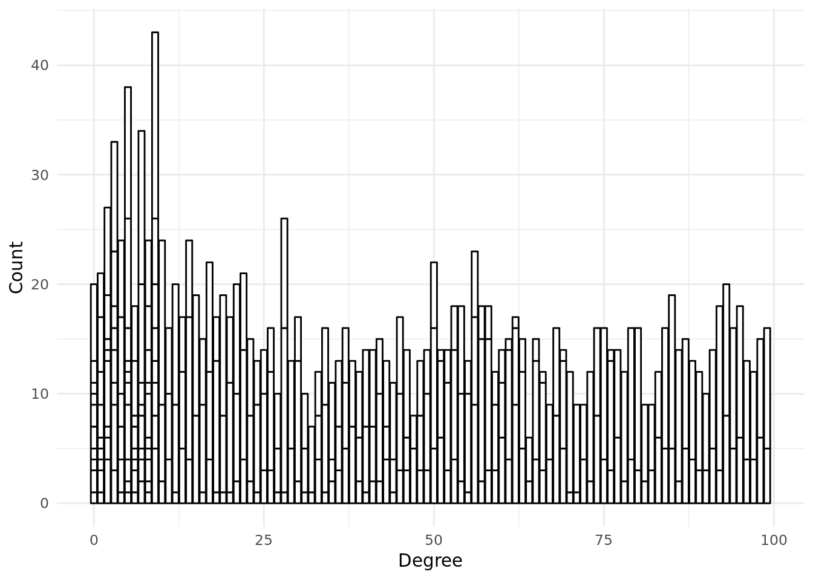
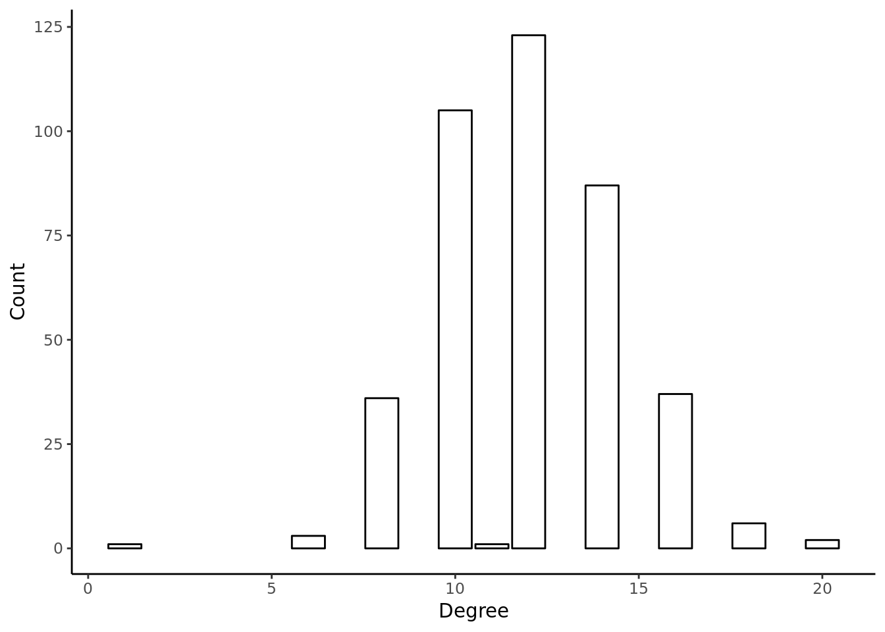
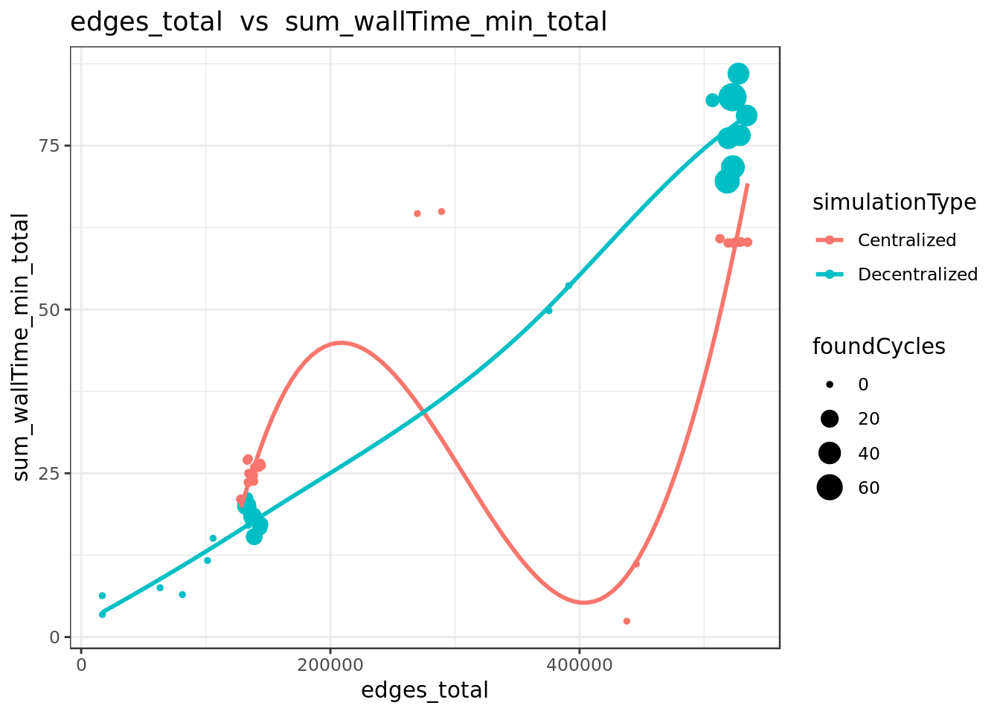
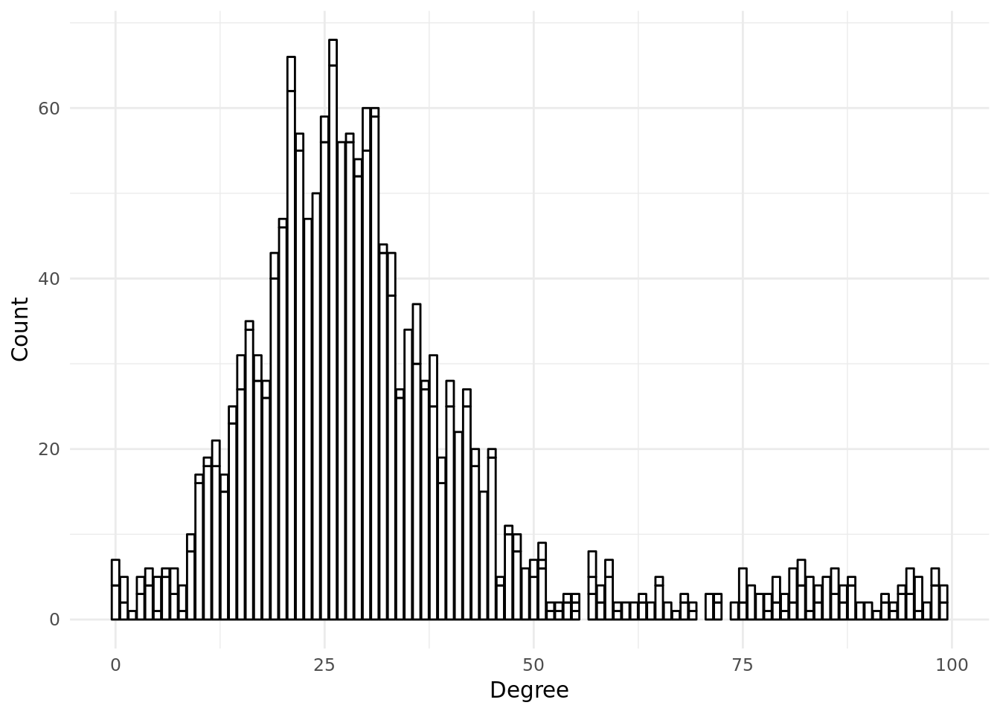
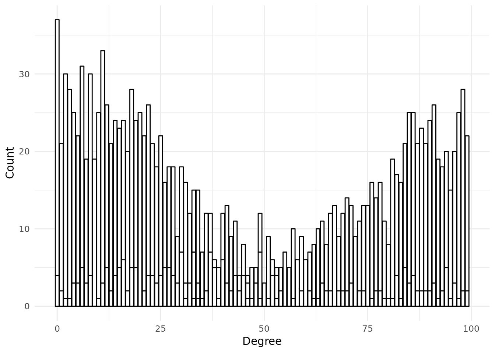
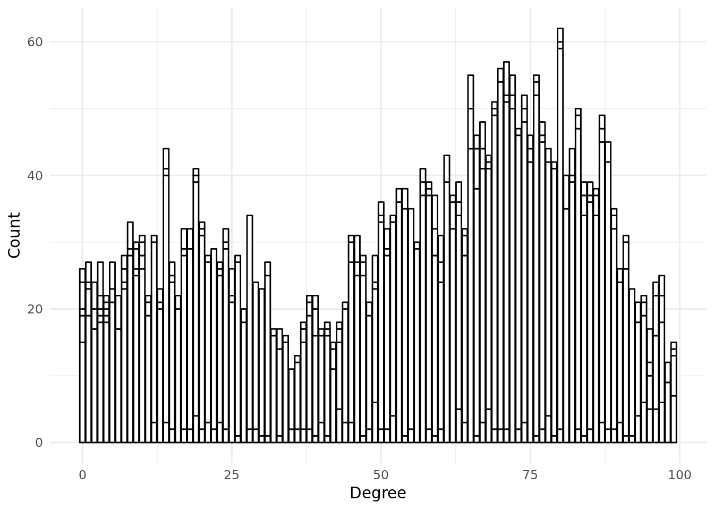
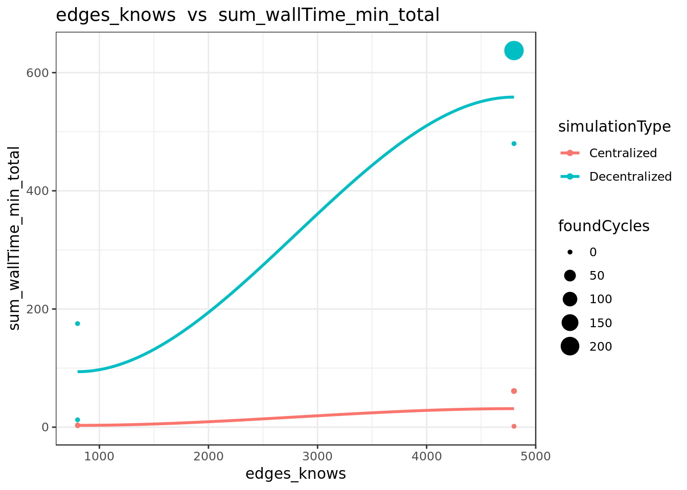
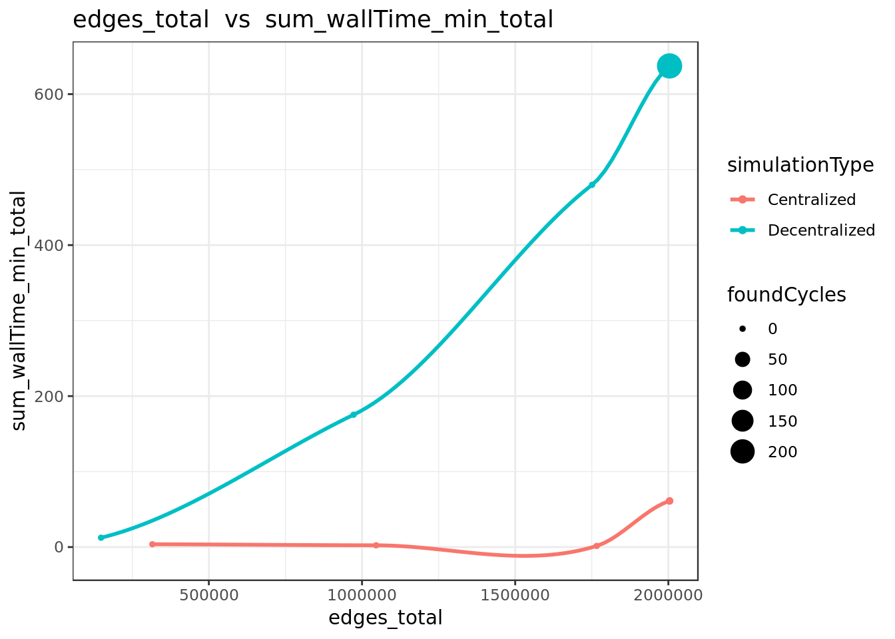
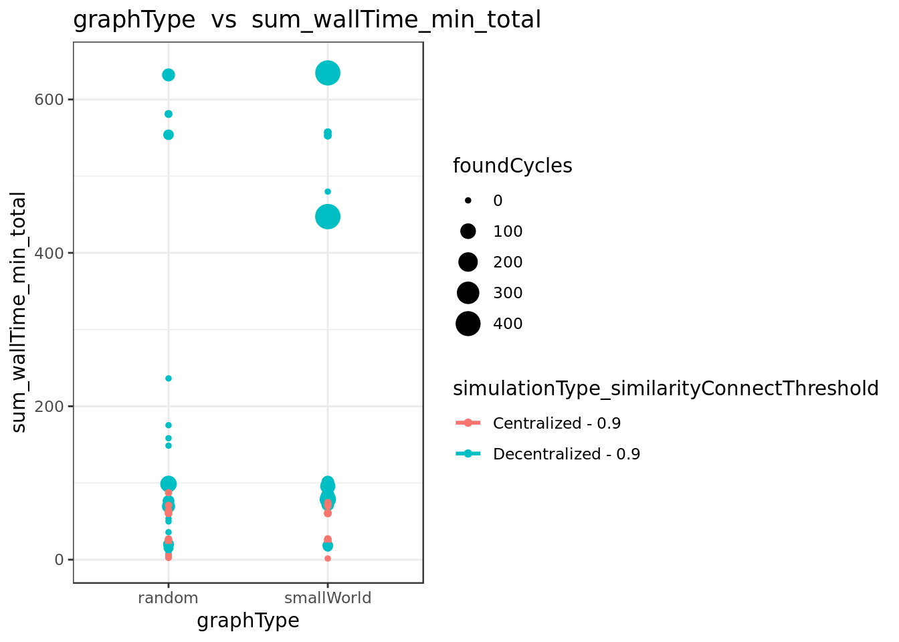

--- 
title: "Tidy experiment with well distributed properties -- 2"
author: "Kabir Veitas (kabir@singularitynet.io)"
date: "2018-10-12"
bibliography: book.bib
documentclass: book
github-repo: singnet/offernet
link-citations: yes
site: bookdown::bookdown_site
biblio-style: apalike
url: http\://seankross.com/bookdown-start/
---

# Introduction

|No. | expermentId | Comment |
|:--|:--|:--|
|1 | EXP10-02-01-04-YQvrhC | agentNumbers=[400] : chainLengths=[10, 20] : randomWorksNumberMultipliers=[1, 2] : maxDistances=[5, 10, 30] : similaritySearchThresholds=[1] : similarityConnectThresholds=[0.9] : graphTypes=[random, smallWorld]; rest of simulations with 400 agents... |
|2 | EXP10-03-10-34-Lfip5F | agentNumbers=[800] : chainLengths=[5, 10, 20] : randomWorksNumberMultipliers=[1, 2] : maxDistances=[5, 10, 30] : similaritySearchThresholds=[1] : similarityConnectThresholds=[0.9] : graphTypes=[random, smallWorld]; rerunning with 800 agents... |
|3 | EXP10-03-11-06-mTThJr | agentNumbers=[800] : chainLengths=[5] : randomWorksNumberMultipliers=[1] : maxDistances=[30] : similaritySearchThresholds=[1] : similarityConnectThresholds=[0.9] : graphTypes=[random, smallWorld]; finishing 800 agent simulations with 1 randomWork after crash... |
|4 | EXP10-04-01-28-KKABTK | agentNumbers=[800] : chainLengths=[5, 10, 20] : randomWorksNumberMultipliers=[2] : maxDistances=[5, 10, 30] : similaritySearchThresholds=[1] : similarityConnectThresholds=[0.9] : graphTypes=[random, smallWorld] : message=[800 agent simulations with 2 randomWorksNumbers...] |
|5 | EXP10-04-11-00-6NwhDL | agentNumbers=[800] : chainLengths=[5, 10, 20] : randomWorksNumberMultipliers=[2] : maxDistances=[10, 30] : similaritySearchThresholds=[1] : similarityConnectThresholds=[0.9] : graphTypes=[random, smallWorld]; repeating after crash |
|6 | EXP10-05-01-29-BHt6a5 | agentNumbers=[800] : chainLengths=[5, 10, 20] : randomWorksNumberMultipliers=[2] : maxDistances=[10, 30] : similaritySearchThresholds=[1] : similarityConnectThresholds=[0.9] : graphTypes=[random, smallWorld]; another crash -- putting what was left, more data should not harm... |
|7 | EXP10-05-10-28-Z7PYyS | gentNumbers=[800] : chainLengths=[5] : randomWorksNumberMultipliers=[2] : maxDistances=[30] : similaritySearchThresholds=[1] : similarityConnectThresholds=[0.9] : graphTypes=[random, smallWorld]; finishing 800 agent simulation with maxDistance=30 and chainLength=5 -- after graph database restart, which stopped the repeated crashing (!) |
|8 | EXP10-05-02-12-uUGIa6 | agentNumbers=[800] : chainLengths=[10, 20] : randomWorksNumberMultipliers=[2] : maxDistances=[5, 10, 30] : similaritySearchThresholds=[1] : similarityConnectThresholds=[0.9] : graphTypes=[random, smallWorld] : message=[Rerunning 800 agent simulations with 2 randomWorksNumbers and 10,20 chainLenghts....] |
|9 | EXP10-06-01-49-jZTN76 | agentNumbers=[800] : chainLengths=[10, 20] : randomWorksNumberMultipliers=[2] : maxDistances=[30] : similaritySearchThresholds=[1] : similarityConnectThresholds=[0.9] : graphTypes=[random, smallWorld] : finishing the previous simulation with 800 agents. |

<!--#### variables: -->
EXP10-02-01-04-YQvrhC   

# Experiment  1 

agentNumbers=[400] : chainLengths=[10, 20] : randomWorksNumberMultipliers=[1, 2] : maxDistances=[5, 10, 30] : similaritySearchThresholds=[1] : similarityConnectThresholds=[0.9] : graphTypes=[random, smallWorld]; rest of simulations with 400 agents... 

## Experimental set up 

<table class="table table-condensed" style="width: auto !important; ">
 <thead>
  <tr>
   <th style="text-align:left;">   </th>
   <th style="text-align:left;"> Values </th>
  </tr>
 </thead>
<tbody>
  <tr>
   <td style="text-align:left;"> experimentId </td>
   <td style="text-align:left;"> EXP10-02-01-04-YQvrhC </td>
  </tr>
  <tr>
   <td style="text-align:left;"> agentNumbers </td>
   <td style="text-align:left;"> 400 </td>
  </tr>
  <tr>
   <td style="text-align:left;"> maxDistances </td>
   <td style="text-align:left;"> 5, 10, 30 </td>
  </tr>
  <tr>
   <td style="text-align:left;"> randomWorksNumberMultipliers </td>
   <td style="text-align:left;"> 1, 2 </td>
  </tr>
  <tr>
   <td style="text-align:left;"> similarityConnectThresholds </td>
   <td style="text-align:left;"> 0.9 </td>
  </tr>
  <tr>
   <td style="text-align:left;"> graphTypes </td>
   <td style="text-align:left;"> random, smallWorld </td>
  </tr>
  <tr>
   <td style="text-align:left;"> chainLengths </td>
   <td style="text-align:left;"> 10, 20 </td>
  </tr>
</tbody>
</table>
## Descriptive analysis of each simulation

###  SIM10-02-01-39-IR9iPP--CV 

#### simulationParameters 

<table class="table table-condensed" style="width: auto !important; ">
 <thead>
  <tr>
   <th style="text-align:left;"> agentNumber </th>
   <th style="text-align:left;"> similarityConnectThreshold </th>
   <th style="text-align:left;"> graphType </th>
   <th style="text-align:left;"> chainLength </th>
   <th style="text-align:left;"> similaritySearchThreshold </th>
   <th style="text-align:left;"> maxDistance </th>
   <th style="text-align:left;"> randomWorksNumberMultiplier </th>
  </tr>
 </thead>
<tbody>
  <tr>
   <td style="text-align:left;width: 20em; "> 400 </td>
   <td style="text-align:left;width: 15em; "> 0.9 </td>
   <td style="text-align:left;width: 15em; "> smallWorld </td>
   <td style="text-align:left;width: 15em; "> 10 </td>
   <td style="text-align:left;width: 15em; "> 1 </td>
   <td style="text-align:left;width: 15em; "> 10 </td>
   <td style="text-align:left;width: 15em; "> 2 </td>
  </tr>
</tbody>
</table>
#### allEdgesByLabel

<table class="table table-condensed" style="width: auto !important; ">
 <thead>
  <tr>
   <th style="text-align:right;"> edges_offers </th>
   <th style="text-align:right;"> edges_similarity </th>
   <th style="text-align:right;"> edges_owns </th>
   <th style="text-align:right;"> edges_demands </th>
   <th style="text-align:right;"> edges_knows </th>
   <th style="text-align:right;"> edges_total </th>
  </tr>
 </thead>
<tbody>
  <tr>
   <td style="text-align:right;width: 5em; "> 810 </td>
   <td style="text-align:right;width: 5em; "> 518,510 </td>
   <td style="text-align:right;width: 5em; "> 810 </td>
   <td style="text-align:right;width: 5em; "> 810 </td>
   <td style="text-align:right;width: 5em; "> 2,401 </td>
   <td style="text-align:right;width: 5em; "> 523,341 </td>
  </tr>
</tbody>
</table>
#### allVerticesByType

<table class="table table-condensed" style="width: auto !important; ">
 <thead>
  <tr>
   <th style="text-align:right;"> vertices_agent </th>
   <th style="text-align:right;"> vertices_item </th>
   <th style="text-align:right;"> vertices_work </th>
   <th style="text-align:right;"> vertices_total </th>
  </tr>
 </thead>
<tbody>
  <tr>
   <td style="text-align:right;width: 5em; "> 401 </td>
   <td style="text-align:right;width: 5em; "> 1,620 </td>
   <td style="text-align:right;width: 5em; "> 810 </td>
   <td style="text-align:right;width: 5em; "> 2,831 </td>
  </tr>
</tbody>
</table>
#### distribution of similarityEdgesByWeight

#### Degree distribution of item->similarity->item edges

#### Degree distribution of agent->knows->agent edges

#### Runing time by method 

<table class="table table-condensed" style="width: auto !important; ">
 <thead>
  <tr>
   <th style="text-align:left;"> key </th>
   <th style="text-align:right;"> doc_count </th>
   <th style="text-align:right;"> sum_wallTime_ms.value </th>
   <th style="text-align:left;"> avg_wallTime_ms.value </th>
   <th style="text-align:left;"> includedInTotal </th>
  </tr>
 </thead>
<tbody>
  <tr>
   <td style="text-align:left;"> connectIfSimilar </td>
   <td style="text-align:right;"> 504,305 </td>
   <td style="text-align:right;"> 3,596,366 </td>
   <td style="text-align:left;"> 7.13133123804047 </td>
   <td style="text-align:left;"> No </td>
  </tr>
  <tr>
   <td style="text-align:left;"> existsSimilarity </td>
   <td style="text-align:right;"> 504,305 </td>
   <td style="text-align:right;"> 3,583,164 </td>
   <td style="text-align:left;"> 7.10515263580571 </td>
   <td style="text-align:left;"> No </td>
  </tr>
  <tr>
   <td style="text-align:left;"> similarityEdges </td>
   <td style="text-align:right;"> 504,305 </td>
   <td style="text-align:right;"> 3,503,216 </td>
   <td style="text-align:left;"> 6.94662158812623 </td>
   <td style="text-align:left;"> No </td>
  </tr>
  <tr>
   <td style="text-align:left;"> init </td>
   <td style="text-align:right;"> 403 </td>
   <td style="text-align:right;"> 19,373 </td>
   <td style="text-align:left;"> 48.0719602977668 </td>
   <td style="text-align:left;"> No </td>
  </tr>
  <tr>
   <td style="text-align:left;"> connectAllSimilar </td>
   <td style="text-align:right;"> 349 </td>
   <td style="text-align:right;"> 3,601,954 </td>
   <td style="text-align:left;"> 10320.7851002865 </td>
   <td style="text-align:left;"> Yes </td>
  </tr>
  <tr>
   <td style="text-align:left;"> connect </td>
   <td style="text-align:right;"> 292 </td>
   <td style="text-align:right;"> 560 </td>
   <td style="text-align:left;"> 1.91780821917808 </td>
   <td style="text-align:left;"> Yes </td>
  </tr>
  <tr>
   <td style="text-align:left;"> cycleSearch </td>
   <td style="text-align:right;"> 36 </td>
   <td style="text-align:right;"> 855 </td>
   <td style="text-align:left;"> 23.75 </td>
   <td style="text-align:left;"> Yes </td>
  </tr>
  <tr>
   <td style="text-align:left;"> getWorks </td>
   <td style="text-align:right;"> 35 </td>
   <td style="text-align:right;"> 68 </td>
   <td style="text-align:left;"> 1.94285714285714 </td>
   <td style="text-align:left;"> Yes </td>
  </tr>
  <tr>
   <td style="text-align:left;font-weight: bold;"> Total </td>
   <td style="text-align:right;font-weight: bold;"> 718 </td>
   <td style="text-align:right;font-weight: bold;"> 3,607,777 </td>
   <td style="text-align:left;font-weight: bold;">  </td>
   <td style="text-align:left;font-weight: bold;">  </td>
  </tr>
</tbody>
</table>
####  Found structures 

#####  Cycles 

Number of cycles found:  1 

<button class="btn btn-primary" data-toggle="collapse" data-target="#JXKKSBJQEB"> Show/Hide foundCycle query </button> 
 
  
     GET /filebeat-*/_search 
              { 
                "query": {
                  "bool": {
                    "must": [
                      { "match_phrase": {
                        "simulationId": "SIM10-02-01-39-IR9iPP--CV"
                        }
                      },
                      { "bool": {
                        "should": [
                          { "match": {
                            "keyword": "foundCycle"
                          }}
                        ]
                      }}
                    ]
                  }
                }
              }
     

#####  Paths 

Number of paths found:  0 

<button class="btn btn-primary" data-toggle="collapse" data-target="#LWTAMZEOMM"> Show/Hide foundPath query </button> 
 
  
     GET /filebeat-*/_search 
              { 
                "query": {
                  "bool": {
                    "must": [
                      { "match_phrase": {
                        "simulationId": "SIM10-02-01-39-IR9iPP--CV"
                        }
                      },
                      { "bool": {
                        "should": [
                          { "match": {
                            "keyword": "foundPath"
                          }}
                        ]
                      }}
                    ]
                  }
                }
              }
     

###  SIM10-02-01-39-IR9iPP--DV 

#### simulationParameters 

<table class="table table-condensed" style="width: auto !important; ">
 <thead>
  <tr>
   <th style="text-align:left;"> agentNumber </th>
   <th style="text-align:left;"> similarityConnectThreshold </th>
   <th style="text-align:left;"> graphType </th>
   <th style="text-align:left;"> chainLength </th>
   <th style="text-align:left;"> similaritySearchThreshold </th>
   <th style="text-align:left;"> maxDistance </th>
   <th style="text-align:left;"> randomWorksNumberMultiplier </th>
  </tr>
 </thead>
<tbody>
  <tr>
   <td style="text-align:left;width: 20em; "> 400 </td>
   <td style="text-align:left;width: 15em; "> 0.9 </td>
   <td style="text-align:left;width: 15em; "> smallWorld </td>
   <td style="text-align:left;width: 15em; "> 10 </td>
   <td style="text-align:left;width: 15em; "> 1 </td>
   <td style="text-align:left;width: 15em; "> 10 </td>
   <td style="text-align:left;width: 15em; "> 2 </td>
  </tr>
</tbody>
</table>
#### allEdgesByLabel

<table class="table table-condensed" style="width: auto !important; ">
 <thead>
  <tr>
   <th style="text-align:right;"> edges_offers </th>
   <th style="text-align:right;"> edges_similarity </th>
   <th style="text-align:right;"> edges_owns </th>
   <th style="text-align:right;"> edges_demands </th>
   <th style="text-align:right;"> edges_knows </th>
   <th style="text-align:right;"> edges_total </th>
  </tr>
 </thead>
<tbody>
  <tr>
   <td style="text-align:right;width: 5em; "> 810 </td>
   <td style="text-align:right;width: 5em; "> 517,926 </td>
   <td style="text-align:right;width: 5em; "> 810 </td>
   <td style="text-align:right;width: 5em; "> 810 </td>
   <td style="text-align:right;width: 5em; "> 2,401 </td>
   <td style="text-align:right;width: 5em; "> 522,757 </td>
  </tr>
</tbody>
</table>
#### allVerticesByType

<table class="table table-condensed" style="width: auto !important; ">
 <thead>
  <tr>
   <th style="text-align:right;"> vertices_agent </th>
   <th style="text-align:right;"> vertices_item </th>
   <th style="text-align:right;"> vertices_work </th>
   <th style="text-align:right;"> vertices_total </th>
  </tr>
 </thead>
<tbody>
  <tr>
   <td style="text-align:right;width: 5em; "> 401 </td>
   <td style="text-align:right;width: 5em; "> 1,620 </td>
   <td style="text-align:right;width: 5em; "> 810 </td>
   <td style="text-align:right;width: 5em; "> 2,831 </td>
  </tr>
</tbody>
</table>
#### distribution of similarityEdgesByWeight

#### Degree distribution of item->similarity->item edges

#### Degree distribution of agent->knows->agent edges

#### Runing time by method 

<table class="table table-condensed" style="width: auto !important; ">
 <thead>
  <tr>
   <th style="text-align:left;"> key </th>
   <th style="text-align:right;"> doc_count </th>
   <th style="text-align:right;"> sum_wallTime_ms.value </th>
   <th style="text-align:left;"> avg_wallTime_ms.value </th>
   <th style="text-align:left;"> includedInTotal </th>
  </tr>
 </thead>
<tbody>
  <tr>
   <td style="text-align:left;"> knowsAgent </td>
   <td style="text-align:right;"> 2,401 </td>
   <td style="text-align:right;"> 3,231 </td>
   <td style="text-align:left;"> 1.34568929612661 </td>
   <td style="text-align:left;"> No </td>
  </tr>
  <tr>
   <td style="text-align:left;"> addItemToWork </td>
   <td style="text-align:right;"> 1,620 </td>
   <td style="text-align:right;"> 13,510 </td>
   <td style="text-align:left;"> 8.33950617283951 </td>
   <td style="text-align:left;"> No </td>
  </tr>
  <tr>
   <td style="text-align:left;"> ownsWork </td>
   <td style="text-align:right;"> 810 </td>
   <td style="text-align:right;"> 6,906 </td>
   <td style="text-align:left;"> 8.52592592592593 </td>
   <td style="text-align:left;"> No </td>
  </tr>
  <tr>
   <td style="text-align:left;"> init </td>
   <td style="text-align:right;"> 403 </td>
   <td style="text-align:right;"> 19,648 </td>
   <td style="text-align:left;"> 48.7543424317618 </td>
   <td style="text-align:left;"> No </td>
  </tr>
  <tr>
   <td style="text-align:left;"> searchAndConnect </td>
   <td style="text-align:right;"> 401 </td>
   <td style="text-align:right;"> 4,917,565 </td>
   <td style="text-align:left;"> 12263.2543640898 </td>
   <td style="text-align:left;"> Yes </td>
  </tr>
  <tr>
   <td style="text-align:left;"> individualCycleSearch </td>
   <td style="text-align:right;"> 140 </td>
   <td style="text-align:right;"> 0 </td>
   <td style="text-align:left;"> 0 </td>
   <td style="text-align:left;"> Yes </td>
  </tr>
  <tr>
   <td style="text-align:left;"> getWorks </td>
   <td style="text-align:right;"> 106 </td>
   <td style="text-align:right;"> 10,178 </td>
   <td style="text-align:left;"> 96.0188679245283 </td>
   <td style="text-align:left;"> No </td>
  </tr>
  <tr>
   <td style="text-align:left;"> cycleSearch </td>
   <td style="text-align:right;"> 105 </td>
   <td style="text-align:right;"> 13,117 </td>
   <td style="text-align:left;"> 124.92380952381 </td>
   <td style="text-align:left;"> Yes </td>
  </tr>
  <tr>
   <td style="text-align:left;font-weight: bold;"> Total </td>
   <td style="text-align:right;font-weight: bold;"> 794 </td>
   <td style="text-align:right;font-weight: bold;"> 4,943,528 </td>
   <td style="text-align:left;font-weight: bold;">  </td>
   <td style="text-align:left;font-weight: bold;">  </td>
  </tr>
</tbody>
</table>
####  Found structures 

#####  Cycles 

Number of cycles found:  74 

<button class="btn btn-primary" data-toggle="collapse" data-target="#SVYYPTQOEG"> Show/Hide foundCycle query </button> 
 
  
     GET /filebeat-*/_search 
              { 
                "query": {
                  "bool": {
                    "must": [
                      { "match_phrase": {
                        "simulationId": "SIM10-02-01-39-IR9iPP--DV"
                        }
                      },
                      { "bool": {
                        "should": [
                          { "match": {
                            "keyword": "foundCycle"
                          }}
                        ]
                      }}
                    ]
                  }
                }
              }
     

#####  Paths 

Number of paths found:  0 

<button class="btn btn-primary" data-toggle="collapse" data-target="#ISLBESLLES"> Show/Hide foundPath query </button> 
 
  
     GET /filebeat-*/_search 
              { 
                "query": {
                  "bool": {
                    "must": [
                      { "match_phrase": {
                        "simulationId": "SIM10-02-01-39-IR9iPP--DV"
                        }
                      },
                      { "bool": {
                        "should": [
                          { "match": {
                            "keyword": "foundPath"
                          }}
                        ]
                      }}
                    ]
                  }
                }
              }
     

###  SIM10-02-03-48-LxzJkT--CV 

#### simulationParameters 

<table class="table table-condensed" style="width: auto !important; ">
 <thead>
  <tr>
   <th style="text-align:left;"> agentNumber </th>
   <th style="text-align:left;"> similarityConnectThreshold </th>
   <th style="text-align:left;"> graphType </th>
   <th style="text-align:left;"> chainLength </th>
   <th style="text-align:left;"> similaritySearchThreshold </th>
   <th style="text-align:left;"> maxDistance </th>
   <th style="text-align:left;"> randomWorksNumberMultiplier </th>
  </tr>
 </thead>
<tbody>
  <tr>
   <td style="text-align:left;width: 20em; "> 400 </td>
   <td style="text-align:left;width: 15em; "> 0.9 </td>
   <td style="text-align:left;width: 15em; "> random </td>
   <td style="text-align:left;width: 15em; "> 10 </td>
   <td style="text-align:left;width: 15em; "> 1 </td>
   <td style="text-align:left;width: 15em; "> 10 </td>
   <td style="text-align:left;width: 15em; "> 1 </td>
  </tr>
</tbody>
</table>
#### allEdgesByLabel

<table class="table table-condensed" style="width: auto !important; ">
 <thead>
  <tr>
   <th style="text-align:right;"> edges_offers </th>
   <th style="text-align:right;"> edges_similarity </th>
   <th style="text-align:right;"> edges_owns </th>
   <th style="text-align:right;"> edges_demands </th>
   <th style="text-align:right;"> edges_knows </th>
   <th style="text-align:right;"> edges_total </th>
  </tr>
 </thead>
<tbody>
  <tr>
   <td style="text-align:right;width: 5em; "> 410 </td>
   <td style="text-align:right;width: 5em; "> 132,564 </td>
   <td style="text-align:right;width: 5em; "> 410 </td>
   <td style="text-align:right;width: 5em; "> 410 </td>
   <td style="text-align:right;width: 5em; "> 400 </td>
   <td style="text-align:right;width: 5em; "> 134,194 </td>
  </tr>
</tbody>
</table>
#### allVerticesByType

<table class="table table-condensed" style="width: auto !important; ">
 <thead>
  <tr>
   <th style="text-align:right;"> vertices_agent </th>
   <th style="text-align:right;"> vertices_item </th>
   <th style="text-align:right;"> vertices_work </th>
   <th style="text-align:right;"> vertices_total </th>
  </tr>
 </thead>
<tbody>
  <tr>
   <td style="text-align:right;width: 5em; "> 401 </td>
   <td style="text-align:right;width: 5em; "> 820 </td>
   <td style="text-align:right;width: 5em; "> 410 </td>
   <td style="text-align:right;width: 5em; "> 1,631 </td>
  </tr>
</tbody>
</table>
#### distribution of similarityEdgesByWeight

#### Degree distribution of item->similarity->item edges

#### Degree distribution of agent->knows->agent edges

#### Runing time by method 

<table class="table table-condensed" style="width: auto !important; ">
 <thead>
  <tr>
   <th style="text-align:left;"> key </th>
   <th style="text-align:right;"> doc_count </th>
   <th style="text-align:right;"> sum_wallTime_ms.value </th>
   <th style="text-align:left;"> avg_wallTime_ms.value </th>
   <th style="text-align:left;"> includedInTotal </th>
  </tr>
 </thead>
<tbody>
  <tr>
   <td style="text-align:left;"> similarityEdges </td>
   <td style="text-align:right;"> 341,713 </td>
   <td style="text-align:right;"> 1,310,639 </td>
   <td style="text-align:left;"> 3.83549645462713 </td>
   <td style="text-align:left;"> No </td>
  </tr>
  <tr>
   <td style="text-align:left;"> existsSimilarity </td>
   <td style="text-align:right;"> 341,679 </td>
   <td style="text-align:right;"> 1,341,990 </td>
   <td style="text-align:left;"> 3.92763383175437 </td>
   <td style="text-align:left;"> No </td>
  </tr>
  <tr>
   <td style="text-align:left;"> connectIfSimilar </td>
   <td style="text-align:right;"> 341,672 </td>
   <td style="text-align:right;"> 1,375,615 </td>
   <td style="text-align:left;"> 4.02612739703575 </td>
   <td style="text-align:left;"> No </td>
  </tr>
  <tr>
   <td style="text-align:left;"> connect </td>
   <td style="text-align:right;"> 14,365 </td>
   <td style="text-align:right;"> 25,108 </td>
   <td style="text-align:left;"> 1.74785938043857 </td>
   <td style="text-align:left;"> Yes </td>
  </tr>
  <tr>
   <td style="text-align:left;"> connectAllSimilar </td>
   <td style="text-align:right;"> 836 </td>
   <td style="text-align:right;"> 1,390,632 </td>
   <td style="text-align:left;"> 1663.43540669856 </td>
   <td style="text-align:left;"> Yes </td>
  </tr>
  <tr>
   <td style="text-align:left;"> init </td>
   <td style="text-align:right;"> 403 </td>
   <td style="text-align:right;"> 17,917 </td>
   <td style="text-align:left;"> 44.4590570719603 </td>
   <td style="text-align:left;"> No </td>
  </tr>
  <tr>
   <td style="text-align:left;font-weight: bold;"> Total </td>
   <td style="text-align:right;font-weight: bold;"> 15,209 </td>
   <td style="text-align:right;font-weight: bold;"> 1,417,059 </td>
   <td style="text-align:left;font-weight: bold;">  </td>
   <td style="text-align:left;font-weight: bold;">  </td>
  </tr>
</tbody>
</table>
####  Found structures 

#####  Cycles 

Number of cycles found:  1 

<button class="btn btn-primary" data-toggle="collapse" data-target="#HGJVMFSIPZ"> Show/Hide foundCycle query </button> 
 
  
     GET /filebeat-*/_search 
              { 
                "query": {
                  "bool": {
                    "must": [
                      { "match_phrase": {
                        "simulationId": "SIM10-02-03-48-LxzJkT--CV"
                        }
                      },
                      { "bool": {
                        "should": [
                          { "match": {
                            "keyword": "foundCycle"
                          }}
                        ]
                      }}
                    ]
                  }
                }
              }
     

#####  Paths 

Number of paths found:  0 

<button class="btn btn-primary" data-toggle="collapse" data-target="#AXWOSCVKDP"> Show/Hide foundPath query </button> 
 
  
     GET /filebeat-*/_search 
              { 
                "query": {
                  "bool": {
                    "must": [
                      { "match_phrase": {
                        "simulationId": "SIM10-02-03-48-LxzJkT--CV"
                        }
                      },
                      { "bool": {
                        "should": [
                          { "match": {
                            "keyword": "foundPath"
                          }}
                        ]
                      }}
                    ]
                  }
                }
              }
     

###  SIM10-02-03-48-LxzJkT--DV 

#### simulationParameters 

<table class="table table-condensed" style="width: auto !important; ">
 <thead>
  <tr>
   <th style="text-align:left;"> agentNumber </th>
   <th style="text-align:left;"> similarityConnectThreshold </th>
   <th style="text-align:left;"> graphType </th>
   <th style="text-align:left;"> chainLength </th>
   <th style="text-align:left;"> similaritySearchThreshold </th>
   <th style="text-align:left;"> maxDistance </th>
   <th style="text-align:left;"> randomWorksNumberMultiplier </th>
  </tr>
 </thead>
<tbody>
  <tr>
   <td style="text-align:left;width: 20em; "> 400 </td>
   <td style="text-align:left;width: 15em; "> 0.9 </td>
   <td style="text-align:left;width: 15em; "> random </td>
   <td style="text-align:left;width: 15em; "> 10 </td>
   <td style="text-align:left;width: 15em; "> 1 </td>
   <td style="text-align:left;width: 15em; "> 10 </td>
   <td style="text-align:left;width: 15em; "> 1 </td>
  </tr>
</tbody>
</table>
#### allEdgesByLabel

<table class="table table-condensed" style="width: auto !important; ">
 <thead>
  <tr>
   <th style="text-align:right;"> edges_offers </th>
   <th style="text-align:right;"> edges_similarity </th>
   <th style="text-align:right;"> edges_owns </th>
   <th style="text-align:right;"> edges_demands </th>
   <th style="text-align:right;"> edges_knows </th>
   <th style="text-align:right;"> edges_total </th>
  </tr>
 </thead>
<tbody>
  <tr>
   <td style="text-align:right;width: 5em; "> 410 </td>
   <td style="text-align:right;width: 5em; "> 104,248 </td>
   <td style="text-align:right;width: 5em; "> 410 </td>
   <td style="text-align:right;width: 5em; "> 410 </td>
   <td style="text-align:right;width: 5em; "> 400 </td>
   <td style="text-align:right;width: 5em; "> 105,878 </td>
  </tr>
</tbody>
</table>
#### allVerticesByType

<table class="table table-condensed" style="width: auto !important; ">
 <thead>
  <tr>
   <th style="text-align:right;"> vertices_agent </th>
   <th style="text-align:right;"> vertices_item </th>
   <th style="text-align:right;"> vertices_work </th>
   <th style="text-align:right;"> vertices_total </th>
  </tr>
 </thead>
<tbody>
  <tr>
   <td style="text-align:right;width: 5em; "> 401 </td>
   <td style="text-align:right;width: 5em; "> 820 </td>
   <td style="text-align:right;width: 5em; "> 410 </td>
   <td style="text-align:right;width: 5em; "> 1,631 </td>
  </tr>
</tbody>
</table>
#### distribution of similarityEdgesByWeight

#### Degree distribution of item->similarity->item edges

#### Degree distribution of agent->knows->agent edges

#### Runing time by method 

<table class="table table-condensed" style="width: auto !important; ">
 <thead>
  <tr>
   <th style="text-align:left;">   </th>
   <th style="text-align:left;"> key </th>
   <th style="text-align:right;"> doc_count </th>
   <th style="text-align:right;"> sum_wallTime_ms.value </th>
   <th style="text-align:left;"> avg_wallTime_ms.value </th>
   <th style="text-align:left;"> includedInTotal </th>
  </tr>
 </thead>
<tbody>
  <tr>
   <td style="text-align:left;"> 2 </td>
   <td style="text-align:left;"> cycleSearch </td>
   <td style="text-align:right;"> 3,600 </td>
   <td style="text-align:right;"> 32,604 </td>
   <td style="text-align:left;"> 9.05666666666667 </td>
   <td style="text-align:left;"> Yes </td>
  </tr>
  <tr>
   <td style="text-align:left;"> 3 </td>
   <td style="text-align:left;"> getWorks </td>
   <td style="text-align:right;"> 3,600 </td>
   <td style="text-align:right;"> 10,700 </td>
   <td style="text-align:left;"> 2.97222222222222 </td>
   <td style="text-align:left;"> No </td>
  </tr>
  <tr>
   <td style="text-align:left;"> 4 </td>
   <td style="text-align:left;"> individualCycleSearch </td>
   <td style="text-align:right;"> 3,600 </td>
   <td style="text-align:right;"> 61 </td>
   <td style="text-align:left;"> 0.0169444444444444 </td>
   <td style="text-align:left;"> Yes </td>
  </tr>
  <tr>
   <td style="text-align:left;"> 6 </td>
   <td style="text-align:left;"> addItemToWork </td>
   <td style="text-align:right;"> 820 </td>
   <td style="text-align:right;"> 8,153 </td>
   <td style="text-align:left;"> 9.94268292682927 </td>
   <td style="text-align:left;"> No </td>
  </tr>
  <tr>
   <td style="text-align:left;"> 7 </td>
   <td style="text-align:left;"> ownsWork </td>
   <td style="text-align:right;"> 410 </td>
   <td style="text-align:right;"> 3,751 </td>
   <td style="text-align:left;"> 9.14878048780488 </td>
   <td style="text-align:left;"> No </td>
  </tr>
  <tr>
   <td style="text-align:left;"> 8 </td>
   <td style="text-align:left;"> init </td>
   <td style="text-align:right;"> 403 </td>
   <td style="text-align:right;"> 18,446 </td>
   <td style="text-align:left;"> 45.7717121588089 </td>
   <td style="text-align:left;"> No </td>
  </tr>
  <tr>
   <td style="text-align:left;"> 9 </td>
   <td style="text-align:left;"> searchAndConnect </td>
   <td style="text-align:right;"> 401 </td>
   <td style="text-align:right;"> 759,550 </td>
   <td style="text-align:left;"> 1894.13965087282 </td>
   <td style="text-align:left;"> Yes </td>
  </tr>
  <tr>
   <td style="text-align:left;"> 10 </td>
   <td style="text-align:left;"> knowsAgent </td>
   <td style="text-align:right;"> 400 </td>
   <td style="text-align:right;"> 754 </td>
   <td style="text-align:left;"> 1.885 </td>
   <td style="text-align:left;"> No </td>
  </tr>
  <tr>
   <td style="text-align:left;font-weight: bold;"> 1 </td>
   <td style="text-align:left;font-weight: bold;"> Total </td>
   <td style="text-align:right;font-weight: bold;"> 14,801 </td>
   <td style="text-align:right;font-weight: bold;"> 904,468 </td>
   <td style="text-align:left;font-weight: bold;">  </td>
   <td style="text-align:left;font-weight: bold;">  </td>
  </tr>
</tbody>
</table>
####  Found structures 

#####  Cycles 

Number of cycles found:  0 

<button class="btn btn-primary" data-toggle="collapse" data-target="#DSNIEXBJYB"> Show/Hide foundCycle query </button> 
 
  
     GET /filebeat-*/_search 
              { 
                "query": {
                  "bool": {
                    "must": [
                      { "match_phrase": {
                        "simulationId": "SIM10-02-03-48-LxzJkT--DV"
                        }
                      },
                      { "bool": {
                        "should": [
                          { "match": {
                            "keyword": "foundCycle"
                          }}
                        ]
                      }}
                    ]
                  }
                }
              }
     

#####  Paths 

Number of paths found:  3600 

<button class="btn btn-primary" data-toggle="collapse" data-target="#YNIHOIINVX"> Show/Hide foundPath query </button> 
 
  
     GET /filebeat-*/_search 
              { 
                "query": {
                  "bool": {
                    "must": [
                      { "match_phrase": {
                        "simulationId": "SIM10-02-03-48-LxzJkT--DV"
                        }
                      },
                      { "bool": {
                        "should": [
                          { "match": {
                            "keyword": "foundPath"
                          }}
                        ]
                      }}
                    ]
                  }
                }
              }
     

###  SIM10-02-05-11-dAcGMA--CV 

#### simulationParameters 

<table class="table table-condensed" style="width: auto !important; ">
 <thead>
  <tr>
   <th style="text-align:left;"> agentNumber </th>
   <th style="text-align:left;"> similarityConnectThreshold </th>
   <th style="text-align:left;"> graphType </th>
   <th style="text-align:left;"> chainLength </th>
   <th style="text-align:left;"> similaritySearchThreshold </th>
   <th style="text-align:left;"> maxDistance </th>
   <th style="text-align:left;"> randomWorksNumberMultiplier </th>
  </tr>
 </thead>
<tbody>
  <tr>
   <td style="text-align:left;width: 20em; "> 400 </td>
   <td style="text-align:left;width: 15em; "> 0.9 </td>
   <td style="text-align:left;width: 15em; "> smallWorld </td>
   <td style="text-align:left;width: 15em; "> 10 </td>
   <td style="text-align:left;width: 15em; "> 1 </td>
   <td style="text-align:left;width: 15em; "> 10 </td>
   <td style="text-align:left;width: 15em; "> 1 </td>
  </tr>
</tbody>
</table>
#### allEdgesByLabel

<table class="table table-condensed" style="width: auto !important; ">
 <thead>
  <tr>
   <th style="text-align:right;"> edges_offers </th>
   <th style="text-align:right;"> edges_similarity </th>
   <th style="text-align:right;"> edges_owns </th>
   <th style="text-align:right;"> edges_demands </th>
   <th style="text-align:right;"> edges_knows </th>
   <th style="text-align:right;"> edges_total </th>
  </tr>
 </thead>
<tbody>
  <tr>
   <td style="text-align:right;width: 5em; "> 410 </td>
   <td style="text-align:right;width: 5em; "> 134,510 </td>
   <td style="text-align:right;width: 5em; "> 410 </td>
   <td style="text-align:right;width: 5em; "> 410 </td>
   <td style="text-align:right;width: 5em; "> 2,401 </td>
   <td style="text-align:right;width: 5em; "> 138,141 </td>
  </tr>
</tbody>
</table>
#### allVerticesByType

<table class="table table-condensed" style="width: auto !important; ">
 <thead>
  <tr>
   <th style="text-align:right;"> vertices_agent </th>
   <th style="text-align:right;"> vertices_item </th>
   <th style="text-align:right;"> vertices_work </th>
   <th style="text-align:right;"> vertices_total </th>
  </tr>
 </thead>
<tbody>
  <tr>
   <td style="text-align:right;width: 5em; "> 401 </td>
   <td style="text-align:right;width: 5em; "> 820 </td>
   <td style="text-align:right;width: 5em; "> 410 </td>
   <td style="text-align:right;width: 5em; "> 1,631 </td>
  </tr>
</tbody>
</table>
#### distribution of similarityEdgesByWeight

#### Degree distribution of item->similarity->item edges

#### Degree distribution of agent->knows->agent edges

#### Runing time by method 

<table class="table table-condensed" style="width: auto !important; ">
 <thead>
  <tr>
   <th style="text-align:left;"> key </th>
   <th style="text-align:right;"> doc_count </th>
   <th style="text-align:right;"> sum_wallTime_ms.value </th>
   <th style="text-align:left;"> avg_wallTime_ms.value </th>
   <th style="text-align:left;"> includedInTotal </th>
  </tr>
 </thead>
<tbody>
  <tr>
   <td style="text-align:left;"> connectIfSimilar </td>
   <td style="text-align:right;"> 335,790 </td>
   <td style="text-align:right;"> 1,475,111 </td>
   <td style="text-align:left;"> 4.39295690759105 </td>
   <td style="text-align:left;"> No </td>
  </tr>
  <tr>
   <td style="text-align:left;"> existsSimilarity </td>
   <td style="text-align:right;"> 335,790 </td>
   <td style="text-align:right;"> 1,466,090 </td>
   <td style="text-align:left;"> 4.36609190267727 </td>
   <td style="text-align:left;"> No </td>
  </tr>
  <tr>
   <td style="text-align:left;"> similarityEdges </td>
   <td style="text-align:right;"> 335,790 </td>
   <td style="text-align:right;"> 1,429,435 </td>
   <td style="text-align:left;"> 4.256931415468 </td>
   <td style="text-align:left;"> No </td>
  </tr>
  <tr>
   <td style="text-align:left;"> connectAllSimilar </td>
   <td style="text-align:right;"> 820 </td>
   <td style="text-align:right;"> 1,479,074 </td>
   <td style="text-align:left;"> 1803.7487804878 </td>
   <td style="text-align:left;"> Yes </td>
  </tr>
  <tr>
   <td style="text-align:left;"> init </td>
   <td style="text-align:right;"> 403 </td>
   <td style="text-align:right;"> 18,643 </td>
   <td style="text-align:left;"> 46.2605459057072 </td>
   <td style="text-align:left;"> No </td>
  </tr>
  <tr>
   <td style="text-align:left;"> connect </td>
   <td style="text-align:right;"> 257 </td>
   <td style="text-align:right;"> 475 </td>
   <td style="text-align:left;"> 1.84824902723735 </td>
   <td style="text-align:left;"> Yes </td>
  </tr>
  <tr>
   <td style="text-align:left;font-weight: bold;"> Total </td>
   <td style="text-align:right;font-weight: bold;"> 1,085 </td>
   <td style="text-align:right;font-weight: bold;"> 1,480,996 </td>
   <td style="text-align:left;font-weight: bold;">  </td>
   <td style="text-align:left;font-weight: bold;">  </td>
  </tr>
</tbody>
</table>
####  Found structures 

#####  Cycles 

Number of cycles found:  1 

<button class="btn btn-primary" data-toggle="collapse" data-target="#ANPLYUFOAN"> Show/Hide foundCycle query </button> 
 
  
     GET /filebeat-*/_search 
              { 
                "query": {
                  "bool": {
                    "must": [
                      { "match_phrase": {
                        "simulationId": "SIM10-02-05-11-dAcGMA--CV"
                        }
                      },
                      { "bool": {
                        "should": [
                          { "match": {
                            "keyword": "foundCycle"
                          }}
                        ]
                      }}
                    ]
                  }
                }
              }
     

#####  Paths 

Number of paths found:  0 

<button class="btn btn-primary" data-toggle="collapse" data-target="#MQAZIPSHIY"> Show/Hide foundPath query </button> 
 
  
     GET /filebeat-*/_search 
              { 
                "query": {
                  "bool": {
                    "must": [
                      { "match_phrase": {
                        "simulationId": "SIM10-02-05-11-dAcGMA--CV"
                        }
                      },
                      { "bool": {
                        "should": [
                          { "match": {
                            "keyword": "foundPath"
                          }}
                        ]
                      }}
                    ]
                  }
                }
              }
     

###  SIM10-02-05-11-dAcGMA--DV 

#### simulationParameters 

<table class="table table-condensed" style="width: auto !important; ">
 <thead>
  <tr>
   <th style="text-align:left;"> agentNumber </th>
   <th style="text-align:left;"> similarityConnectThreshold </th>
   <th style="text-align:left;"> graphType </th>
   <th style="text-align:left;"> chainLength </th>
   <th style="text-align:left;"> similaritySearchThreshold </th>
   <th style="text-align:left;"> maxDistance </th>
   <th style="text-align:left;"> randomWorksNumberMultiplier </th>
  </tr>
 </thead>
<tbody>
  <tr>
   <td style="text-align:left;width: 20em; "> 400 </td>
   <td style="text-align:left;width: 15em; "> 0.9 </td>
   <td style="text-align:left;width: 15em; "> smallWorld </td>
   <td style="text-align:left;width: 15em; "> 10 </td>
   <td style="text-align:left;width: 15em; "> 1 </td>
   <td style="text-align:left;width: 15em; "> 10 </td>
   <td style="text-align:left;width: 15em; "> 1 </td>
  </tr>
</tbody>
</table>
#### allEdgesByLabel

<table class="table table-condensed" style="width: auto !important; ">
 <thead>
  <tr>
   <th style="text-align:right;"> edges_offers </th>
   <th style="text-align:right;"> edges_similarity </th>
   <th style="text-align:right;"> edges_owns </th>
   <th style="text-align:right;"> edges_demands </th>
   <th style="text-align:right;"> edges_knows </th>
   <th style="text-align:right;"> edges_total </th>
  </tr>
 </thead>
<tbody>
  <tr>
   <td style="text-align:right;width: 5em; "> 410 </td>
   <td style="text-align:right;width: 5em; "> 133,970 </td>
   <td style="text-align:right;width: 5em; "> 410 </td>
   <td style="text-align:right;width: 5em; "> 410 </td>
   <td style="text-align:right;width: 5em; "> 2,401 </td>
   <td style="text-align:right;width: 5em; "> 137,601 </td>
  </tr>
</tbody>
</table>
#### allVerticesByType

<table class="table table-condensed" style="width: auto !important; ">
 <thead>
  <tr>
   <th style="text-align:right;"> vertices_agent </th>
   <th style="text-align:right;"> vertices_item </th>
   <th style="text-align:right;"> vertices_work </th>
   <th style="text-align:right;"> vertices_total </th>
  </tr>
 </thead>
<tbody>
  <tr>
   <td style="text-align:right;width: 5em; "> 401 </td>
   <td style="text-align:right;width: 5em; "> 820 </td>
   <td style="text-align:right;width: 5em; "> 410 </td>
   <td style="text-align:right;width: 5em; "> 1,631 </td>
  </tr>
</tbody>
</table>
#### distribution of similarityEdgesByWeight

#### Degree distribution of item->similarity->item edges

#### Degree distribution of agent->knows->agent edges

#### Runing time by method 

<table class="table table-condensed" style="width: auto !important; ">
 <thead>
  <tr>
   <th style="text-align:left;"> key </th>
   <th style="text-align:right;"> doc_count </th>
   <th style="text-align:right;"> sum_wallTime_ms.value </th>
   <th style="text-align:left;"> avg_wallTime_ms.value </th>
   <th style="text-align:left;"> includedInTotal </th>
  </tr>
 </thead>
<tbody>
  <tr>
   <td style="text-align:left;"> knowsAgent </td>
   <td style="text-align:right;"> 2,401 </td>
   <td style="text-align:right;"> 3,383 </td>
   <td style="text-align:left;"> 1.40899625156185 </td>
   <td style="text-align:left;"> No </td>
  </tr>
  <tr>
   <td style="text-align:left;"> addItemToWork </td>
   <td style="text-align:right;"> 820 </td>
   <td style="text-align:right;"> 6,351 </td>
   <td style="text-align:left;"> 7.74512195121951 </td>
   <td style="text-align:left;"> No </td>
  </tr>
  <tr>
   <td style="text-align:left;"> ownsWork </td>
   <td style="text-align:right;"> 410 </td>
   <td style="text-align:right;"> 3,173 </td>
   <td style="text-align:left;"> 7.7390243902439 </td>
   <td style="text-align:left;"> No </td>
  </tr>
  <tr>
   <td style="text-align:left;"> init </td>
   <td style="text-align:right;"> 403 </td>
   <td style="text-align:right;"> 18,202 </td>
   <td style="text-align:left;"> 45.166253101737 </td>
   <td style="text-align:left;"> No </td>
  </tr>
  <tr>
   <td style="text-align:left;"> searchAndConnect </td>
   <td style="text-align:right;"> 401 </td>
   <td style="text-align:right;"> 1,094,912 </td>
   <td style="text-align:left;"> 2730.45386533666 </td>
   <td style="text-align:left;"> Yes </td>
  </tr>
  <tr>
   <td style="text-align:left;"> cycleSearch </td>
   <td style="text-align:right;"> 30 </td>
   <td style="text-align:right;"> 5,197 </td>
   <td style="text-align:left;"> 173.233333333333 </td>
   <td style="text-align:left;"> Yes </td>
  </tr>
  <tr>
   <td style="text-align:left;"> getWorks </td>
   <td style="text-align:right;"> 30 </td>
   <td style="text-align:right;"> 2,463 </td>
   <td style="text-align:left;"> 82.1 </td>
   <td style="text-align:left;"> No </td>
  </tr>
  <tr>
   <td style="text-align:left;"> individualCycleSearch </td>
   <td style="text-align:right;"> 30 </td>
   <td style="text-align:right;"> 1 </td>
   <td style="text-align:left;"> 0.0333333333333333 </td>
   <td style="text-align:left;"> Yes </td>
  </tr>
  <tr>
   <td style="text-align:left;font-weight: bold;"> Total </td>
   <td style="text-align:right;font-weight: bold;"> 507 </td>
   <td style="text-align:right;font-weight: bold;"> 1,104,080 </td>
   <td style="text-align:left;font-weight: bold;">  </td>
   <td style="text-align:left;font-weight: bold;">  </td>
  </tr>
</tbody>
</table>
####  Found structures 

#####  Cycles 

Number of cycles found:  23 

<button class="btn btn-primary" data-toggle="collapse" data-target="#CIGRPOPZBR"> Show/Hide foundCycle query </button> 
 
  
     GET /filebeat-*/_search 
              { 
                "query": {
                  "bool": {
                    "must": [
                      { "match_phrase": {
                        "simulationId": "SIM10-02-05-11-dAcGMA--DV"
                        }
                      },
                      { "bool": {
                        "should": [
                          { "match": {
                            "keyword": "foundCycle"
                          }}
                        ]
                      }}
                    ]
                  }
                }
              }
     

#####  Paths 

Number of paths found:  0 

<button class="btn btn-primary" data-toggle="collapse" data-target="#UHKHKDHLUD"> Show/Hide foundPath query </button> 
 
  
     GET /filebeat-*/_search 
              { 
                "query": {
                  "bool": {
                    "must": [
                      { "match_phrase": {
                        "simulationId": "SIM10-02-05-11-dAcGMA--DV"
                        }
                      },
                      { "bool": {
                        "should": [
                          { "match": {
                            "keyword": "foundPath"
                          }}
                        ]
                      }}
                    ]
                  }
                }
              }
     

###  SIM10-02-10-38-CQxJBr--CV 

#### simulationParameters 

<table class="table table-condensed" style="width: auto !important; ">
 <thead>
  <tr>
   <th style="text-align:left;"> agentNumber </th>
   <th style="text-align:left;"> similarityConnectThreshold </th>
   <th style="text-align:left;"> graphType </th>
   <th style="text-align:left;"> chainLength </th>
   <th style="text-align:left;"> similaritySearchThreshold </th>
   <th style="text-align:left;"> maxDistance </th>
   <th style="text-align:left;"> randomWorksNumberMultiplier </th>
  </tr>
 </thead>
<tbody>
  <tr>
   <td style="text-align:left;width: 20em; "> 400 </td>
   <td style="text-align:left;width: 15em; "> 0.9 </td>
   <td style="text-align:left;width: 15em; "> random </td>
   <td style="text-align:left;width: 15em; "> 10 </td>
   <td style="text-align:left;width: 15em; "> 1 </td>
   <td style="text-align:left;width: 15em; "> 10 </td>
   <td style="text-align:left;width: 15em; "> 2 </td>
  </tr>
</tbody>
</table>
#### allEdgesByLabel

<table class="table table-condensed" style="width: auto !important; ">
 <thead>
  <tr>
   <th style="text-align:right;"> edges_offers </th>
   <th style="text-align:right;"> edges_similarity </th>
   <th style="text-align:right;"> edges_owns </th>
   <th style="text-align:right;"> edges_demands </th>
   <th style="text-align:right;"> edges_knows </th>
   <th style="text-align:right;"> edges_total </th>
  </tr>
 </thead>
<tbody>
  <tr>
   <td style="text-align:right;width: 5em; "> 810 </td>
   <td style="text-align:right;width: 5em; "> 442,712 </td>
   <td style="text-align:right;width: 5em; "> 810 </td>
   <td style="text-align:right;width: 5em; "> 810 </td>
   <td style="text-align:right;width: 5em; "> 400 </td>
   <td style="text-align:right;width: 5em; "> 445,542 </td>
  </tr>
</tbody>
</table>
#### allVerticesByType

<table class="table table-condensed" style="width: auto !important; ">
 <thead>
  <tr>
   <th style="text-align:right;"> vertices_agent </th>
   <th style="text-align:right;"> vertices_item </th>
   <th style="text-align:right;"> vertices_work </th>
   <th style="text-align:right;"> vertices_total </th>
  </tr>
 </thead>
<tbody>
  <tr>
   <td style="text-align:right;width: 5em; "> 401 </td>
   <td style="text-align:right;width: 5em; "> 1,620 </td>
   <td style="text-align:right;width: 5em; "> 810 </td>
   <td style="text-align:right;width: 5em; "> 2,831 </td>
  </tr>
</tbody>
</table>
#### distribution of similarityEdgesByWeight

#### Degree distribution of item->similarity->item edges

#### Degree distribution of agent->knows->agent edges

#### Runing time by method 

<table class="table table-condensed" style="width: auto !important; ">
 <thead>
  <tr>
   <th style="text-align:left;">   </th>
   <th style="text-align:left;"> key </th>
   <th style="text-align:right;"> doc_count </th>
   <th style="text-align:right;"> sum_wallTime_ms.value </th>
   <th style="text-align:left;"> avg_wallTime_ms.value </th>
   <th style="text-align:left;"> includedInTotal </th>
  </tr>
 </thead>
<tbody>
  <tr>
   <td style="text-align:left;"> 1 </td>
   <td style="text-align:left;"> connectIfSimilar </td>
   <td style="text-align:right;"> 537,000 </td>
   <td style="text-align:right;"> 3,597,762 </td>
   <td style="text-align:left;"> 6.69974301675978 </td>
   <td style="text-align:left;"> No </td>
  </tr>
  <tr>
   <td style="text-align:left;"> 2 </td>
   <td style="text-align:left;"> existsSimilarity </td>
   <td style="text-align:right;"> 537,000 </td>
   <td style="text-align:right;"> 3,532,299 </td>
   <td style="text-align:left;"> 6.57783798882682 </td>
   <td style="text-align:left;"> No </td>
  </tr>
  <tr>
   <td style="text-align:left;"> 3 </td>
   <td style="text-align:left;"> similarityEdges </td>
   <td style="text-align:right;"> 537,000 </td>
   <td style="text-align:right;"> 3,452,431 </td>
   <td style="text-align:left;"> 6.42910800744879 </td>
   <td style="text-align:left;"> No </td>
  </tr>
  <tr>
   <td style="text-align:left;"> 4 </td>
   <td style="text-align:left;"> connect </td>
   <td style="text-align:right;"> 27,136 </td>
   <td style="text-align:right;"> 51,305 </td>
   <td style="text-align:left;"> 1.89066185141509 </td>
   <td style="text-align:left;"> Yes </td>
  </tr>
  <tr>
   <td style="text-align:left;"> 6 </td>
   <td style="text-align:left;"> cycleSearch </td>
   <td style="text-align:right;"> 3,600 </td>
   <td style="text-align:right;"> 171,985 </td>
   <td style="text-align:left;"> 47.7736111111111 </td>
   <td style="text-align:left;"> Yes </td>
  </tr>
  <tr>
   <td style="text-align:left;"> 7 </td>
   <td style="text-align:left;"> getWorks </td>
   <td style="text-align:right;"> 3,600 </td>
   <td style="text-align:right;"> 24,541 </td>
   <td style="text-align:left;"> 6.81694444444444 </td>
   <td style="text-align:left;"> Yes </td>
  </tr>
  <tr>
   <td style="text-align:left;"> 8 </td>
   <td style="text-align:left;"> individualCycleSearch </td>
   <td style="text-align:right;"> 3,600 </td>
   <td style="text-align:right;"> 138 </td>
   <td style="text-align:left;"> 0.0383333333333333 </td>
   <td style="text-align:left;"> Yes </td>
  </tr>
  <tr>
   <td style="text-align:left;"> 10 </td>
   <td style="text-align:left;"> init </td>
   <td style="text-align:right;"> 403 </td>
   <td style="text-align:right;"> 18,662 </td>
   <td style="text-align:left;"> 46.3076923076923 </td>
   <td style="text-align:left;"> No </td>
  </tr>
  <tr>
   <td style="text-align:left;font-weight: bold;"> 11 </td>
   <td style="text-align:left;font-weight: bold;"> Total </td>
   <td style="text-align:right;font-weight: bold;"> 45,136 </td>
   <td style="text-align:right;font-weight: bold;"> 668,869 </td>
   <td style="text-align:left;font-weight: bold;">  </td>
   <td style="text-align:left;font-weight: bold;">  </td>
  </tr>
</tbody>
</table>
####  Found structures 

#####  Cycles 

Number of cycles found:  0 

<button class="btn btn-primary" data-toggle="collapse" data-target="#JQZUSFDPAE"> Show/Hide foundCycle query </button> 
 
  
     GET /filebeat-*/_search 
              { 
                "query": {
                  "bool": {
                    "must": [
                      { "match_phrase": {
                        "simulationId": "SIM10-02-10-38-CQxJBr--CV"
                        }
                      },
                      { "bool": {
                        "should": [
                          { "match": {
                            "keyword": "foundCycle"
                          }}
                        ]
                      }}
                    ]
                  }
                }
              }
     

#####  Paths 

Number of paths found:  3600 

<button class="btn btn-primary" data-toggle="collapse" data-target="#EUAZRIOOIA"> Show/Hide foundPath query </button> 
 
  
     GET /filebeat-*/_search 
              { 
                "query": {
                  "bool": {
                    "must": [
                      { "match_phrase": {
                        "simulationId": "SIM10-02-10-38-CQxJBr--CV"
                        }
                      },
                      { "bool": {
                        "should": [
                          { "match": {
                            "keyword": "foundPath"
                          }}
                        ]
                      }}
                    ]
                  }
                }
              }
     

###  SIM10-02-10-38-CQxJBr--DV 

#### simulationParameters 

<table class="table table-condensed" style="width: auto !important; ">
 <thead>
  <tr>
   <th style="text-align:left;"> agentNumber </th>
   <th style="text-align:left;"> similarityConnectThreshold </th>
   <th style="text-align:left;"> graphType </th>
   <th style="text-align:left;"> chainLength </th>
   <th style="text-align:left;"> similaritySearchThreshold </th>
   <th style="text-align:left;"> maxDistance </th>
   <th style="text-align:left;"> randomWorksNumberMultiplier </th>
  </tr>
 </thead>
<tbody>
  <tr>
   <td style="text-align:left;width: 20em; "> 400 </td>
   <td style="text-align:left;width: 15em; "> 0.9 </td>
   <td style="text-align:left;width: 15em; "> random </td>
   <td style="text-align:left;width: 15em; "> 10 </td>
   <td style="text-align:left;width: 15em; "> 1 </td>
   <td style="text-align:left;width: 15em; "> 10 </td>
   <td style="text-align:left;width: 15em; "> 2 </td>
  </tr>
</tbody>
</table>
#### allEdgesByLabel

<table class="table table-condensed" style="width: auto !important; ">
 <thead>
  <tr>
   <th style="text-align:right;"> edges_offers </th>
   <th style="text-align:right;"> edges_similarity </th>
   <th style="text-align:right;"> edges_owns </th>
   <th style="text-align:right;"> edges_demands </th>
   <th style="text-align:right;"> edges_knows </th>
   <th style="text-align:right;"> edges_total </th>
  </tr>
 </thead>
<tbody>
  <tr>
   <td style="text-align:right;width: 5em; "> 810 </td>
   <td style="text-align:right;width: 5em; "> 388,440 </td>
   <td style="text-align:right;width: 5em; "> 810 </td>
   <td style="text-align:right;width: 5em; "> 810 </td>
   <td style="text-align:right;width: 5em; "> 400 </td>
   <td style="text-align:right;width: 5em; "> 391,270 </td>
  </tr>
</tbody>
</table>
#### allVerticesByType

<table class="table table-condensed" style="width: auto !important; ">
 <thead>
  <tr>
   <th style="text-align:right;"> vertices_agent </th>
   <th style="text-align:right;"> vertices_item </th>
   <th style="text-align:right;"> vertices_work </th>
   <th style="text-align:right;"> vertices_total </th>
  </tr>
 </thead>
<tbody>
  <tr>
   <td style="text-align:right;width: 5em; "> 401 </td>
   <td style="text-align:right;width: 5em; "> 1,620 </td>
   <td style="text-align:right;width: 5em; "> 810 </td>
   <td style="text-align:right;width: 5em; "> 2,831 </td>
  </tr>
</tbody>
</table>
#### distribution of similarityEdgesByWeight

#### Degree distribution of item->similarity->item edges

#### Degree distribution of agent->knows->agent edges

#### Runing time by method 

<table class="table table-condensed" style="width: auto !important; ">
 <thead>
  <tr>
   <th style="text-align:left;">   </th>
   <th style="text-align:left;"> key </th>
   <th style="text-align:right;"> doc_count </th>
   <th style="text-align:right;"> sum_wallTime_ms.value </th>
   <th style="text-align:left;"> avg_wallTime_ms.value </th>
   <th style="text-align:left;"> includedInTotal </th>
  </tr>
 </thead>
<tbody>
  <tr>
   <td style="text-align:left;"> 2 </td>
   <td style="text-align:left;"> cycleSearch </td>
   <td style="text-align:right;"> 3,600 </td>
   <td style="text-align:right;"> 146,727 </td>
   <td style="text-align:left;"> 40.7575 </td>
   <td style="text-align:left;"> Yes </td>
  </tr>
  <tr>
   <td style="text-align:left;"> 3 </td>
   <td style="text-align:left;"> getWorks </td>
   <td style="text-align:right;"> 3,600 </td>
   <td style="text-align:right;"> 40,167 </td>
   <td style="text-align:left;"> 11.1575 </td>
   <td style="text-align:left;"> No </td>
  </tr>
  <tr>
   <td style="text-align:left;"> 4 </td>
   <td style="text-align:left;"> individualCycleSearch </td>
   <td style="text-align:right;"> 3,600 </td>
   <td style="text-align:right;"> 143 </td>
   <td style="text-align:left;"> 0.0397222222222222 </td>
   <td style="text-align:left;"> Yes </td>
  </tr>
  <tr>
   <td style="text-align:left;"> 6 </td>
   <td style="text-align:left;"> addItemToWork </td>
   <td style="text-align:right;"> 1,620 </td>
   <td style="text-align:right;"> 10,469 </td>
   <td style="text-align:left;"> 6.46234567901235 </td>
   <td style="text-align:left;"> No </td>
  </tr>
  <tr>
   <td style="text-align:left;"> 7 </td>
   <td style="text-align:left;"> ownsWork </td>
   <td style="text-align:right;"> 810 </td>
   <td style="text-align:right;"> 5,304 </td>
   <td style="text-align:left;"> 6.54814814814815 </td>
   <td style="text-align:left;"> No </td>
  </tr>
  <tr>
   <td style="text-align:left;"> 8 </td>
   <td style="text-align:left;"> init </td>
   <td style="text-align:right;"> 403 </td>
   <td style="text-align:right;"> 19,777 </td>
   <td style="text-align:left;"> 49.0744416873449 </td>
   <td style="text-align:left;"> No </td>
  </tr>
  <tr>
   <td style="text-align:left;"> 9 </td>
   <td style="text-align:left;"> searchAndConnect </td>
   <td style="text-align:right;"> 401 </td>
   <td style="text-align:right;"> 2,736,992 </td>
   <td style="text-align:left;"> 6825.41645885287 </td>
   <td style="text-align:left;"> Yes </td>
  </tr>
  <tr>
   <td style="text-align:left;"> 10 </td>
   <td style="text-align:left;"> knowsAgent </td>
   <td style="text-align:right;"> 400 </td>
   <td style="text-align:right;"> 665 </td>
   <td style="text-align:left;"> 1.6625 </td>
   <td style="text-align:left;"> No </td>
  </tr>
  <tr>
   <td style="text-align:left;font-weight: bold;"> 1 </td>
   <td style="text-align:left;font-weight: bold;"> Total </td>
   <td style="text-align:right;font-weight: bold;"> 14,801 </td>
   <td style="text-align:right;font-weight: bold;"> 3,217,164 </td>
   <td style="text-align:left;font-weight: bold;">  </td>
   <td style="text-align:left;font-weight: bold;">  </td>
  </tr>
</tbody>
</table>
####  Found structures 

#####  Cycles 

Number of cycles found:  0 

<button class="btn btn-primary" data-toggle="collapse" data-target="#OGAESVNYGL"> Show/Hide foundCycle query </button> 
 
  
     GET /filebeat-*/_search 
              { 
                "query": {
                  "bool": {
                    "must": [
                      { "match_phrase": {
                        "simulationId": "SIM10-02-10-38-CQxJBr--DV"
                        }
                      },
                      { "bool": {
                        "should": [
                          { "match": {
                            "keyword": "foundCycle"
                          }}
                        ]
                      }}
                    ]
                  }
                }
              }
     

#####  Paths 

Number of paths found:  3600 

<button class="btn btn-primary" data-toggle="collapse" data-target="#APHJXBNSPC"> Show/Hide foundPath query </button> 
 
  
     GET /filebeat-*/_search 
              { 
                "query": {
                  "bool": {
                    "must": [
                      { "match_phrase": {
                        "simulationId": "SIM10-02-10-38-CQxJBr--DV"
                        }
                      },
                      { "bool": {
                        "should": [
                          { "match": {
                            "keyword": "foundPath"
                          }}
                        ]
                      }}
                    ]
                  }
                }
              }
     

###  SIM10-02-02-42-iM5BCt--CV 

#### simulationParameters 

<table class="table table-condensed" style="width: auto !important; ">
 <thead>
  <tr>
   <th style="text-align:left;"> agentNumber </th>
   <th style="text-align:left;"> similarityConnectThreshold </th>
   <th style="text-align:left;"> graphType </th>
   <th style="text-align:left;"> chainLength </th>
   <th style="text-align:left;"> similaritySearchThreshold </th>
   <th style="text-align:left;"> maxDistance </th>
   <th style="text-align:left;"> randomWorksNumberMultiplier </th>
  </tr>
 </thead>
<tbody>
  <tr>
   <td style="text-align:left;width: 20em; "> 400 </td>
   <td style="text-align:left;width: 15em; "> 0.9 </td>
   <td style="text-align:left;width: 15em; "> random </td>
   <td style="text-align:left;width: 15em; "> 10 </td>
   <td style="text-align:left;width: 15em; "> 1 </td>
   <td style="text-align:left;width: 15em; "> 30 </td>
   <td style="text-align:left;width: 15em; "> 2 </td>
  </tr>
</tbody>
</table>
#### allEdgesByLabel

<table class="table table-condensed" style="width: auto !important; ">
 <thead>
  <tr>
   <th style="text-align:right;"> edges_offers </th>
   <th style="text-align:right;"> edges_similarity </th>
   <th style="text-align:right;"> edges_owns </th>
   <th style="text-align:right;"> edges_demands </th>
   <th style="text-align:right;"> edges_knows </th>
   <th style="text-align:right;"> edges_total </th>
  </tr>
 </thead>
<tbody>
  <tr>
   <td style="text-align:right;width: 5em; "> 810 </td>
   <td style="text-align:right;width: 5em; "> 516,418 </td>
   <td style="text-align:right;width: 5em; "> 810 </td>
   <td style="text-align:right;width: 5em; "> 810 </td>
   <td style="text-align:right;width: 5em; "> 400 </td>
   <td style="text-align:right;width: 5em; "> 519,248 </td>
  </tr>
</tbody>
</table>
#### allVerticesByType

<table class="table table-condensed" style="width: auto !important; ">
 <thead>
  <tr>
   <th style="text-align:right;"> vertices_agent </th>
   <th style="text-align:right;"> vertices_item </th>
   <th style="text-align:right;"> vertices_work </th>
   <th style="text-align:right;"> vertices_total </th>
  </tr>
 </thead>
<tbody>
  <tr>
   <td style="text-align:right;width: 5em; "> 401 </td>
   <td style="text-align:right;width: 5em; "> 1,620 </td>
   <td style="text-align:right;width: 5em; "> 810 </td>
   <td style="text-align:right;width: 5em; "> 2,831 </td>
  </tr>
</tbody>
</table>
#### distribution of similarityEdgesByWeight

#### Degree distribution of item->similarity->item edges

#### Degree distribution of agent->knows->agent edges

#### Runing time by method 

<table class="table table-condensed" style="width: auto !important; ">
 <thead>
  <tr>
   <th style="text-align:left;"> key </th>
   <th style="text-align:right;"> doc_count </th>
   <th style="text-align:right;"> sum_wallTime_ms.value </th>
   <th style="text-align:left;"> avg_wallTime_ms.value </th>
   <th style="text-align:left;"> includedInTotal </th>
  </tr>
 </thead>
<tbody>
  <tr>
   <td style="text-align:left;"> connectIfSimilar </td>
   <td style="text-align:right;"> 500,489 </td>
   <td style="text-align:right;"> 3,597,760 </td>
   <td style="text-align:left;"> 7.18848965711534 </td>
   <td style="text-align:left;"> No </td>
  </tr>
  <tr>
   <td style="text-align:left;"> existsSimilarity </td>
   <td style="text-align:right;"> 500,489 </td>
   <td style="text-align:right;"> 3,584,436 </td>
   <td style="text-align:left;"> 7.16186769339586 </td>
   <td style="text-align:left;"> No </td>
  </tr>
  <tr>
   <td style="text-align:left;"> similarityEdges </td>
   <td style="text-align:right;"> 500,489 </td>
   <td style="text-align:right;"> 3,502,733 </td>
   <td style="text-align:left;"> 6.99862134832134 </td>
   <td style="text-align:left;"> No </td>
  </tr>
  <tr>
   <td style="text-align:left;"> init </td>
   <td style="text-align:right;"> 403 </td>
   <td style="text-align:right;"> 20,190 </td>
   <td style="text-align:left;"> 50.0992555831265 </td>
   <td style="text-align:left;"> No </td>
  </tr>
  <tr>
   <td style="text-align:left;"> connectAllSimilar </td>
   <td style="text-align:right;"> 346 </td>
   <td style="text-align:right;"> 3,603,404 </td>
   <td style="text-align:left;"> 10414.4624277457 </td>
   <td style="text-align:left;"> Yes </td>
  </tr>
  <tr>
   <td style="text-align:left;"> connect </td>
   <td style="text-align:right;"> 304 </td>
   <td style="text-align:right;"> 588 </td>
   <td style="text-align:left;"> 1.93421052631579 </td>
   <td style="text-align:left;"> Yes </td>
  </tr>
  <tr>
   <td style="text-align:left;"> cycleSearch </td>
   <td style="text-align:right;"> 18 </td>
   <td style="text-align:right;"> 396 </td>
   <td style="text-align:left;"> 22 </td>
   <td style="text-align:left;"> Yes </td>
  </tr>
  <tr>
   <td style="text-align:left;"> getWorks </td>
   <td style="text-align:right;"> 18 </td>
   <td style="text-align:right;"> 42 </td>
   <td style="text-align:left;"> 2.33333333333333 </td>
   <td style="text-align:left;"> Yes </td>
  </tr>
  <tr>
   <td style="text-align:left;font-weight: bold;"> Total </td>
   <td style="text-align:right;font-weight: bold;"> 692 </td>
   <td style="text-align:right;font-weight: bold;"> 3,609,010 </td>
   <td style="text-align:left;font-weight: bold;">  </td>
   <td style="text-align:left;font-weight: bold;">  </td>
  </tr>
</tbody>
</table>
####  Found structures 

#####  Cycles 

Number of cycles found:  1 

<button class="btn btn-primary" data-toggle="collapse" data-target="#WWIHAYNKXU"> Show/Hide foundCycle query </button> 
 
  
     GET /filebeat-*/_search 
              { 
                "query": {
                  "bool": {
                    "must": [
                      { "match_phrase": {
                        "simulationId": "SIM10-02-02-42-iM5BCt--CV"
                        }
                      },
                      { "bool": {
                        "should": [
                          { "match": {
                            "keyword": "foundCycle"
                          }}
                        ]
                      }}
                    ]
                  }
                }
              }
     

#####  Paths 

Number of paths found:  0 

<button class="btn btn-primary" data-toggle="collapse" data-target="#FGAZTRILLS"> Show/Hide foundPath query </button> 
 
  
     GET /filebeat-*/_search 
              { 
                "query": {
                  "bool": {
                    "must": [
                      { "match_phrase": {
                        "simulationId": "SIM10-02-02-42-iM5BCt--CV"
                        }
                      },
                      { "bool": {
                        "should": [
                          { "match": {
                            "keyword": "foundPath"
                          }}
                        ]
                      }}
                    ]
                  }
                }
              }
     

###  SIM10-02-02-42-iM5BCt--DV 

#### simulationParameters 

<table class="table table-condensed" style="width: auto !important; ">
 <thead>
  <tr>
   <th style="text-align:left;"> agentNumber </th>
   <th style="text-align:left;"> similarityConnectThreshold </th>
   <th style="text-align:left;"> graphType </th>
   <th style="text-align:left;"> chainLength </th>
   <th style="text-align:left;"> similaritySearchThreshold </th>
   <th style="text-align:left;"> maxDistance </th>
   <th style="text-align:left;"> randomWorksNumberMultiplier </th>
  </tr>
 </thead>
<tbody>
  <tr>
   <td style="text-align:left;width: 20em; "> 400 </td>
   <td style="text-align:left;width: 15em; "> 0.9 </td>
   <td style="text-align:left;width: 15em; "> random </td>
   <td style="text-align:left;width: 15em; "> 10 </td>
   <td style="text-align:left;width: 15em; "> 1 </td>
   <td style="text-align:left;width: 15em; "> 30 </td>
   <td style="text-align:left;width: 15em; "> 2 </td>
  </tr>
</tbody>
</table>
#### allEdgesByLabel

<table class="table table-condensed" style="width: auto !important; ">
 <thead>
  <tr>
   <th style="text-align:right;"> edges_offers </th>
   <th style="text-align:right;"> edges_similarity </th>
   <th style="text-align:right;"> edges_owns </th>
   <th style="text-align:right;"> edges_demands </th>
   <th style="text-align:right;"> edges_knows </th>
   <th style="text-align:right;"> edges_total </th>
  </tr>
 </thead>
<tbody>
  <tr>
   <td style="text-align:right;width: 5em; "> 810 </td>
   <td style="text-align:right;width: 5em; "> 515,716 </td>
   <td style="text-align:right;width: 5em; "> 810 </td>
   <td style="text-align:right;width: 5em; "> 810 </td>
   <td style="text-align:right;width: 5em; "> 400 </td>
   <td style="text-align:right;width: 5em; "> 518,546 </td>
  </tr>
</tbody>
</table>
#### allVerticesByType

<table class="table table-condensed" style="width: auto !important; ">
 <thead>
  <tr>
   <th style="text-align:right;"> vertices_agent </th>
   <th style="text-align:right;"> vertices_item </th>
   <th style="text-align:right;"> vertices_work </th>
   <th style="text-align:right;"> vertices_total </th>
  </tr>
 </thead>
<tbody>
  <tr>
   <td style="text-align:right;width: 5em; "> 401 </td>
   <td style="text-align:right;width: 5em; "> 1,620 </td>
   <td style="text-align:right;width: 5em; "> 810 </td>
   <td style="text-align:right;width: 5em; "> 2,831 </td>
  </tr>
</tbody>
</table>
#### distribution of similarityEdgesByWeight

#### Degree distribution of item->similarity->item edges

#### Degree distribution of agent->knows->agent edges

#### Runing time by method 

<table class="table table-condensed" style="width: auto !important; ">
 <thead>
  <tr>
   <th style="text-align:left;"> key </th>
   <th style="text-align:right;"> doc_count </th>
   <th style="text-align:right;"> sum_wallTime_ms.value </th>
   <th style="text-align:left;"> avg_wallTime_ms.value </th>
   <th style="text-align:left;"> includedInTotal </th>
  </tr>
 </thead>
<tbody>
  <tr>
   <td style="text-align:left;"> addItemToWork </td>
   <td style="text-align:right;"> 1,620 </td>
   <td style="text-align:right;"> 14,589 </td>
   <td style="text-align:left;"> 9.00555555555556 </td>
   <td style="text-align:left;"> No </td>
  </tr>
  <tr>
   <td style="text-align:left;"> ownsWork </td>
   <td style="text-align:right;"> 810 </td>
   <td style="text-align:right;"> 6,832 </td>
   <td style="text-align:left;"> 8.43456790123457 </td>
   <td style="text-align:left;"> No </td>
  </tr>
  <tr>
   <td style="text-align:left;"> init </td>
   <td style="text-align:right;"> 403 </td>
   <td style="text-align:right;"> 19,859 </td>
   <td style="text-align:left;"> 49.2779156327543 </td>
   <td style="text-align:left;"> No </td>
  </tr>
  <tr>
   <td style="text-align:left;"> searchAndConnect </td>
   <td style="text-align:right;"> 401 </td>
   <td style="text-align:right;"> 4,060,761 </td>
   <td style="text-align:left;"> 10126.5860349127 </td>
   <td style="text-align:left;"> Yes </td>
  </tr>
  <tr>
   <td style="text-align:left;"> knowsAgent </td>
   <td style="text-align:right;"> 400 </td>
   <td style="text-align:right;"> 666 </td>
   <td style="text-align:left;"> 1.665 </td>
   <td style="text-align:left;"> No </td>
  </tr>
  <tr>
   <td style="text-align:left;"> individualCycleSearch </td>
   <td style="text-align:right;"> 112 </td>
   <td style="text-align:right;"> 1 </td>
   <td style="text-align:left;"> 0.00892857142857143 </td>
   <td style="text-align:left;"> Yes </td>
  </tr>
  <tr>
   <td style="text-align:left;"> cycleSearch </td>
   <td style="text-align:right;"> 95 </td>
   <td style="text-align:right;"> 59,396 </td>
   <td style="text-align:left;"> 625.221052631579 </td>
   <td style="text-align:left;"> Yes </td>
  </tr>
  <tr>
   <td style="text-align:left;"> getWorks </td>
   <td style="text-align:right;"> 95 </td>
   <td style="text-align:right;"> 19,677 </td>
   <td style="text-align:left;"> 207.126315789474 </td>
   <td style="text-align:left;"> No </td>
  </tr>
  <tr>
   <td style="text-align:left;font-weight: bold;"> Total </td>
   <td style="text-align:right;font-weight: bold;"> 724 </td>
   <td style="text-align:right;font-weight: bold;"> 4,175,678 </td>
   <td style="text-align:left;font-weight: bold;">  </td>
   <td style="text-align:left;font-weight: bold;">  </td>
  </tr>
</tbody>
</table>
####  Found structures 

#####  Cycles 

Number of cycles found:  54 

<button class="btn btn-primary" data-toggle="collapse" data-target="#WZTJGUJWBC"> Show/Hide foundCycle query </button> 
 
  
     GET /filebeat-*/_search 
              { 
                "query": {
                  "bool": {
                    "must": [
                      { "match_phrase": {
                        "simulationId": "SIM10-02-02-42-iM5BCt--DV"
                        }
                      },
                      { "bool": {
                        "should": [
                          { "match": {
                            "keyword": "foundCycle"
                          }}
                        ]
                      }}
                    ]
                  }
                }
              }
     

#####  Paths 

Number of paths found:  4 

<button class="btn btn-primary" data-toggle="collapse" data-target="#ILRJSXMDLK"> Show/Hide foundPath query </button> 
 
  
     GET /filebeat-*/_search 
              { 
                "query": {
                  "bool": {
                    "must": [
                      { "match_phrase": {
                        "simulationId": "SIM10-02-02-42-iM5BCt--DV"
                        }
                      },
                      { "bool": {
                        "should": [
                          { "match": {
                            "keyword": "foundPath"
                          }}
                        ]
                      }}
                    ]
                  }
                }
              }
     

###  SIM10-02-03-45-5ucKC6--CV 

#### simulationParameters 

<table class="table table-condensed" style="width: auto !important; ">
 <thead>
  <tr>
   <th style="text-align:left;"> agentNumber </th>
   <th style="text-align:left;"> similarityConnectThreshold </th>
   <th style="text-align:left;"> graphType </th>
   <th style="text-align:left;"> chainLength </th>
   <th style="text-align:left;"> similaritySearchThreshold </th>
   <th style="text-align:left;"> maxDistance </th>
   <th style="text-align:left;"> randomWorksNumberMultiplier </th>
  </tr>
 </thead>
<tbody>
  <tr>
   <td style="text-align:left;width: 20em; "> 400 </td>
   <td style="text-align:left;width: 15em; "> 0.9 </td>
   <td style="text-align:left;width: 15em; "> smallWorld </td>
   <td style="text-align:left;width: 15em; "> 10 </td>
   <td style="text-align:left;width: 15em; "> 1 </td>
   <td style="text-align:left;width: 15em; "> 30 </td>
   <td style="text-align:left;width: 15em; "> 2 </td>
  </tr>
</tbody>
</table>
#### allEdgesByLabel

<table class="table table-condensed" style="width: auto !important; ">
 <thead>
  <tr>
   <th style="text-align:right;"> edges_offers </th>
   <th style="text-align:right;"> edges_similarity </th>
   <th style="text-align:right;"> edges_owns </th>
   <th style="text-align:right;"> edges_demands </th>
   <th style="text-align:right;"> edges_knows </th>
   <th style="text-align:right;"> edges_total </th>
  </tr>
 </thead>
<tbody>
  <tr>
   <td style="text-align:right;width: 5em; "> 810 </td>
   <td style="text-align:right;width: 5em; "> 518,874 </td>
   <td style="text-align:right;width: 5em; "> 810 </td>
   <td style="text-align:right;width: 5em; "> 810 </td>
   <td style="text-align:right;width: 5em; "> 2,401 </td>
   <td style="text-align:right;width: 5em; "> 523,705 </td>
  </tr>
</tbody>
</table>
#### allVerticesByType

<table class="table table-condensed" style="width: auto !important; ">
 <thead>
  <tr>
   <th style="text-align:right;"> vertices_agent </th>
   <th style="text-align:right;"> vertices_item </th>
   <th style="text-align:right;"> vertices_work </th>
   <th style="text-align:right;"> vertices_total </th>
  </tr>
 </thead>
<tbody>
  <tr>
   <td style="text-align:right;width: 5em; "> 401 </td>
   <td style="text-align:right;width: 5em; "> 1,620 </td>
   <td style="text-align:right;width: 5em; "> 810 </td>
   <td style="text-align:right;width: 5em; "> 2,831 </td>
  </tr>
</tbody>
</table>
#### distribution of similarityEdgesByWeight

#### Degree distribution of item->similarity->item edges

#### Degree distribution of agent->knows->agent edges

#### Runing time by method 

<table class="table table-condensed" style="width: auto !important; ">
 <thead>
  <tr>
   <th style="text-align:left;"> key </th>
   <th style="text-align:right;"> doc_count </th>
   <th style="text-align:right;"> sum_wallTime_ms.value </th>
   <th style="text-align:left;"> avg_wallTime_ms.value </th>
   <th style="text-align:left;"> includedInTotal </th>
  </tr>
 </thead>
<tbody>
  <tr>
   <td style="text-align:left;"> connectIfSimilar </td>
   <td style="text-align:right;"> 500,489 </td>
   <td style="text-align:right;"> 3,599,395 </td>
   <td style="text-align:left;"> 7.19175646217999 </td>
   <td style="text-align:left;"> No </td>
  </tr>
  <tr>
   <td style="text-align:left;"> existsSimilarity </td>
   <td style="text-align:right;"> 500,489 </td>
   <td style="text-align:right;"> 3,586,198 </td>
   <td style="text-align:left;"> 7.16538825029122 </td>
   <td style="text-align:left;"> No </td>
  </tr>
  <tr>
   <td style="text-align:left;"> similarityEdges </td>
   <td style="text-align:right;"> 500,489 </td>
   <td style="text-align:right;"> 3,505,152 </td>
   <td style="text-align:left;"> 7.00345462138029 </td>
   <td style="text-align:left;"> No </td>
  </tr>
  <tr>
   <td style="text-align:left;"> init </td>
   <td style="text-align:right;"> 403 </td>
   <td style="text-align:right;"> 20,806 </td>
   <td style="text-align:left;"> 51.6277915632754 </td>
   <td style="text-align:left;"> No </td>
  </tr>
  <tr>
   <td style="text-align:left;"> connectAllSimilar </td>
   <td style="text-align:right;"> 346 </td>
   <td style="text-align:right;"> 3,605,104 </td>
   <td style="text-align:left;"> 10419.3757225434 </td>
   <td style="text-align:left;"> Yes </td>
  </tr>
  <tr>
   <td style="text-align:left;"> connect </td>
   <td style="text-align:right;"> 285 </td>
   <td style="text-align:right;"> 605 </td>
   <td style="text-align:left;"> 2.12280701754386 </td>
   <td style="text-align:left;"> Yes </td>
  </tr>
  <tr>
   <td style="text-align:left;"> cycleSearch </td>
   <td style="text-align:right;"> 30 </td>
   <td style="text-align:right;"> 704 </td>
   <td style="text-align:left;"> 23.4666666666667 </td>
   <td style="text-align:left;"> Yes </td>
  </tr>
  <tr>
   <td style="text-align:left;"> getWorks </td>
   <td style="text-align:right;"> 29 </td>
   <td style="text-align:right;"> 56 </td>
   <td style="text-align:left;"> 1.93103448275862 </td>
   <td style="text-align:left;"> Yes </td>
  </tr>
  <tr>
   <td style="text-align:left;font-weight: bold;"> Total </td>
   <td style="text-align:right;font-weight: bold;"> 696 </td>
   <td style="text-align:right;font-weight: bold;"> 3,610,867 </td>
   <td style="text-align:left;font-weight: bold;">  </td>
   <td style="text-align:left;font-weight: bold;">  </td>
  </tr>
</tbody>
</table>
####  Found structures 

#####  Cycles 

Number of cycles found:  1 

<button class="btn btn-primary" data-toggle="collapse" data-target="#JQAUHAKHII"> Show/Hide foundCycle query </button> 
 
  
     GET /filebeat-*/_search 
              { 
                "query": {
                  "bool": {
                    "must": [
                      { "match_phrase": {
                        "simulationId": "SIM10-02-03-45-5ucKC6--CV"
                        }
                      },
                      { "bool": {
                        "should": [
                          { "match": {
                            "keyword": "foundCycle"
                          }}
                        ]
                      }}
                    ]
                  }
                }
              }
     

#####  Paths 

Number of paths found:  0 

<button class="btn btn-primary" data-toggle="collapse" data-target="#SDLBUYHPUM"> Show/Hide foundPath query </button> 
 
  
     GET /filebeat-*/_search 
              { 
                "query": {
                  "bool": {
                    "must": [
                      { "match_phrase": {
                        "simulationId": "SIM10-02-03-45-5ucKC6--CV"
                        }
                      },
                      { "bool": {
                        "should": [
                          { "match": {
                            "keyword": "foundPath"
                          }}
                        ]
                      }}
                    ]
                  }
                }
              }
     

###  SIM10-02-03-45-5ucKC6--DV 

#### simulationParameters 

<table class="table table-condensed" style="width: auto !important; ">
 <thead>
  <tr>
   <th style="text-align:left;"> agentNumber </th>
   <th style="text-align:left;"> similarityConnectThreshold </th>
   <th style="text-align:left;"> graphType </th>
   <th style="text-align:left;"> chainLength </th>
   <th style="text-align:left;"> similaritySearchThreshold </th>
   <th style="text-align:left;"> maxDistance </th>
   <th style="text-align:left;"> randomWorksNumberMultiplier </th>
  </tr>
 </thead>
<tbody>
  <tr>
   <td style="text-align:left;width: 20em; "> 400 </td>
   <td style="text-align:left;width: 15em; "> 0.9 </td>
   <td style="text-align:left;width: 15em; "> smallWorld </td>
   <td style="text-align:left;width: 15em; "> 10 </td>
   <td style="text-align:left;width: 15em; "> 1 </td>
   <td style="text-align:left;width: 15em; "> 30 </td>
   <td style="text-align:left;width: 15em; "> 2 </td>
  </tr>
</tbody>
</table>
#### allEdgesByLabel

<table class="table table-condensed" style="width: auto !important; ">
 <thead>
  <tr>
   <th style="text-align:right;"> edges_offers </th>
   <th style="text-align:right;"> edges_similarity </th>
   <th style="text-align:right;"> edges_owns </th>
   <th style="text-align:right;"> edges_demands </th>
   <th style="text-align:right;"> edges_knows </th>
   <th style="text-align:right;"> edges_total </th>
  </tr>
 </thead>
<tbody>
  <tr>
   <td style="text-align:right;width: 5em; "> 810 </td>
   <td style="text-align:right;width: 5em; "> 518,275 </td>
   <td style="text-align:right;width: 5em; "> 810 </td>
   <td style="text-align:right;width: 5em; "> 810 </td>
   <td style="text-align:right;width: 5em; "> 2,401 </td>
   <td style="text-align:right;width: 5em; "> 523,106 </td>
  </tr>
</tbody>
</table>
#### allVerticesByType

<table class="table table-condensed" style="width: auto !important; ">
 <thead>
  <tr>
   <th style="text-align:right;"> vertices_agent </th>
   <th style="text-align:right;"> vertices_item </th>
   <th style="text-align:right;"> vertices_work </th>
   <th style="text-align:right;"> vertices_total </th>
  </tr>
 </thead>
<tbody>
  <tr>
   <td style="text-align:right;width: 5em; "> 401 </td>
   <td style="text-align:right;width: 5em; "> 1,620 </td>
   <td style="text-align:right;width: 5em; "> 810 </td>
   <td style="text-align:right;width: 5em; "> 2,831 </td>
  </tr>
</tbody>
</table>
#### distribution of similarityEdgesByWeight

#### Degree distribution of item->similarity->item edges

#### Degree distribution of agent->knows->agent edges

#### Runing time by method 

<table class="table table-condensed" style="width: auto !important; ">
 <thead>
  <tr>
   <th style="text-align:left;"> key </th>
   <th style="text-align:right;"> doc_count </th>
   <th style="text-align:right;"> sum_wallTime_ms.value </th>
   <th style="text-align:left;"> avg_wallTime_ms.value </th>
   <th style="text-align:left;"> includedInTotal </th>
  </tr>
 </thead>
<tbody>
  <tr>
   <td style="text-align:left;"> knowsAgent </td>
   <td style="text-align:right;"> 2,401 </td>
   <td style="text-align:right;"> 3,449 </td>
   <td style="text-align:left;"> 1.43648479800083 </td>
   <td style="text-align:left;"> No </td>
  </tr>
  <tr>
   <td style="text-align:left;"> addItemToWork </td>
   <td style="text-align:right;"> 1,620 </td>
   <td style="text-align:right;"> 9,620 </td>
   <td style="text-align:left;"> 5.93827160493827 </td>
   <td style="text-align:left;"> No </td>
  </tr>
  <tr>
   <td style="text-align:left;"> ownsWork </td>
   <td style="text-align:right;"> 810 </td>
   <td style="text-align:right;"> 4,988 </td>
   <td style="text-align:left;"> 6.15802469135802 </td>
   <td style="text-align:left;"> No </td>
  </tr>
  <tr>
   <td style="text-align:left;"> init </td>
   <td style="text-align:right;"> 403 </td>
   <td style="text-align:right;"> 20,244 </td>
   <td style="text-align:left;"> 50.2332506203474 </td>
   <td style="text-align:left;"> No </td>
  </tr>
  <tr>
   <td style="text-align:left;"> searchAndConnect </td>
   <td style="text-align:right;"> 401 </td>
   <td style="text-align:right;"> 4,180,186 </td>
   <td style="text-align:left;"> 10424.4039900249 </td>
   <td style="text-align:left;"> Yes </td>
  </tr>
  <tr>
   <td style="text-align:left;"> individualCycleSearch </td>
   <td style="text-align:right;"> 113 </td>
   <td style="text-align:right;"> 2 </td>
   <td style="text-align:left;"> 0.0176991150442478 </td>
   <td style="text-align:left;"> Yes </td>
  </tr>
  <tr>
   <td style="text-align:left;"> getWorks </td>
   <td style="text-align:right;"> 85 </td>
   <td style="text-align:right;"> 25,581 </td>
   <td style="text-align:left;"> 300.952941176471 </td>
   <td style="text-align:left;"> No </td>
  </tr>
  <tr>
   <td style="text-align:left;"> cycleSearch </td>
   <td style="text-align:right;"> 84 </td>
   <td style="text-align:right;"> 61,907 </td>
   <td style="text-align:left;"> 736.988095238095 </td>
   <td style="text-align:left;"> Yes </td>
  </tr>
  <tr>
   <td style="text-align:left;font-weight: bold;"> Total </td>
   <td style="text-align:right;font-weight: bold;"> 700 </td>
   <td style="text-align:right;font-weight: bold;"> 4,303,155 </td>
   <td style="text-align:left;font-weight: bold;">  </td>
   <td style="text-align:left;font-weight: bold;">  </td>
  </tr>
</tbody>
</table>
####  Found structures 

#####  Cycles 

Number of cycles found:  47 

<button class="btn btn-primary" data-toggle="collapse" data-target="#WSWWMCOFFY"> Show/Hide foundCycle query </button> 
 
  
     GET /filebeat-*/_search 
              { 
                "query": {
                  "bool": {
                    "must": [
                      { "match_phrase": {
                        "simulationId": "SIM10-02-03-45-5ucKC6--DV"
                        }
                      },
                      { "bool": {
                        "should": [
                          { "match": {
                            "keyword": "foundCycle"
                          }}
                        ]
                      }}
                    ]
                  }
                }
              }
     

#####  Paths 

Number of paths found:  4 

<button class="btn btn-primary" data-toggle="collapse" data-target="#UVKTDABBGA"> Show/Hide foundPath query </button> 
 
  
     GET /filebeat-*/_search 
              { 
                "query": {
                  "bool": {
                    "must": [
                      { "match_phrase": {
                        "simulationId": "SIM10-02-03-45-5ucKC6--DV"
                        }
                      },
                      { "bool": {
                        "should": [
                          { "match": {
                            "keyword": "foundPath"
                          }}
                        ]
                      }}
                    ]
                  }
                }
              }
     

###  SIM10-02-05-37-LiwHoJ--CV 

#### simulationParameters 

<table class="table table-condensed" style="width: auto !important; ">
 <thead>
  <tr>
   <th style="text-align:left;"> agentNumber </th>
   <th style="text-align:left;"> similarityConnectThreshold </th>
   <th style="text-align:left;"> graphType </th>
   <th style="text-align:left;"> chainLength </th>
   <th style="text-align:left;"> similaritySearchThreshold </th>
   <th style="text-align:left;"> maxDistance </th>
   <th style="text-align:left;"> randomWorksNumberMultiplier </th>
  </tr>
 </thead>
<tbody>
  <tr>
   <td style="text-align:left;width: 20em; "> 400 </td>
   <td style="text-align:left;width: 15em; "> 0.9 </td>
   <td style="text-align:left;width: 15em; "> random </td>
   <td style="text-align:left;width: 15em; "> 10 </td>
   <td style="text-align:left;width: 15em; "> 1 </td>
   <td style="text-align:left;width: 15em; "> 30 </td>
   <td style="text-align:left;width: 15em; "> 1 </td>
  </tr>
</tbody>
</table>
#### allEdgesByLabel

<table class="table table-condensed" style="width: auto !important; ">
 <thead>
  <tr>
   <th style="text-align:right;"> edges_offers </th>
   <th style="text-align:right;"> edges_similarity </th>
   <th style="text-align:right;"> edges_owns </th>
   <th style="text-align:right;"> edges_demands </th>
   <th style="text-align:right;"> edges_knows </th>
   <th style="text-align:right;"> edges_total </th>
  </tr>
 </thead>
<tbody>
  <tr>
   <td style="text-align:right;width: 5em; "> 410 </td>
   <td style="text-align:right;width: 5em; "> 131,708 </td>
   <td style="text-align:right;width: 5em; "> 410 </td>
   <td style="text-align:right;width: 5em; "> 410 </td>
   <td style="text-align:right;width: 5em; "> 400 </td>
   <td style="text-align:right;width: 5em; "> 133,338 </td>
  </tr>
</tbody>
</table>
#### allVerticesByType

<table class="table table-condensed" style="width: auto !important; ">
 <thead>
  <tr>
   <th style="text-align:right;"> vertices_agent </th>
   <th style="text-align:right;"> vertices_item </th>
   <th style="text-align:right;"> vertices_work </th>
   <th style="text-align:right;"> vertices_total </th>
  </tr>
 </thead>
<tbody>
  <tr>
   <td style="text-align:right;width: 5em; "> 401 </td>
   <td style="text-align:right;width: 5em; "> 820 </td>
   <td style="text-align:right;width: 5em; "> 410 </td>
   <td style="text-align:right;width: 5em; "> 1,631 </td>
  </tr>
</tbody>
</table>
#### distribution of similarityEdgesByWeight

#### Degree distribution of item->similarity->item edges

#### Degree distribution of agent->knows->agent edges

#### Runing time by method 

<table class="table table-condensed" style="width: auto !important; ">
 <thead>
  <tr>
   <th style="text-align:left;"> key </th>
   <th style="text-align:right;"> doc_count </th>
   <th style="text-align:right;"> sum_wallTime_ms.value </th>
   <th style="text-align:left;"> avg_wallTime_ms.value </th>
   <th style="text-align:left;"> includedInTotal </th>
  </tr>
 </thead>
<tbody>
  <tr>
   <td style="text-align:left;"> existsSimilarity </td>
   <td style="text-align:right;"> 336,473 </td>
   <td style="text-align:right;"> 1,603,463 </td>
   <td style="text-align:left;"> 4.76550272978813 </td>
   <td style="text-align:left;"> No </td>
  </tr>
  <tr>
   <td style="text-align:left;"> connectIfSimilar </td>
   <td style="text-align:right;"> 336,472 </td>
   <td style="text-align:right;"> 1,613,786 </td>
   <td style="text-align:left;"> 4.7961970089636 </td>
   <td style="text-align:left;"> No </td>
  </tr>
  <tr>
   <td style="text-align:left;"> similarityEdges </td>
   <td style="text-align:right;"> 336,472 </td>
   <td style="text-align:right;"> 1,558,464 </td>
   <td style="text-align:left;"> 4.63177916736014 </td>
   <td style="text-align:left;"> No </td>
  </tr>
  <tr>
   <td style="text-align:left;"> connectAllSimilar </td>
   <td style="text-align:right;"> 821 </td>
   <td style="text-align:right;"> 1,618,528 </td>
   <td style="text-align:left;"> 1971.41047503045 </td>
   <td style="text-align:left;"> Yes </td>
  </tr>
  <tr>
   <td style="text-align:left;"> init </td>
   <td style="text-align:right;"> 403 </td>
   <td style="text-align:right;"> 21,279 </td>
   <td style="text-align:left;"> 52.8014888337469 </td>
   <td style="text-align:left;"> No </td>
  </tr>
  <tr>
   <td style="text-align:left;"> connect </td>
   <td style="text-align:right;"> 251 </td>
   <td style="text-align:right;"> 462 </td>
   <td style="text-align:left;"> 1.8406374501992 </td>
   <td style="text-align:left;"> Yes </td>
  </tr>
  <tr>
   <td style="text-align:left;font-weight: bold;"> Total </td>
   <td style="text-align:right;font-weight: bold;"> 1,080 </td>
   <td style="text-align:right;font-weight: bold;"> 1,620,406 </td>
   <td style="text-align:left;font-weight: bold;">  </td>
   <td style="text-align:left;font-weight: bold;">  </td>
  </tr>
</tbody>
</table>
####  Found structures 

#####  Cycles 

Number of cycles found:  1 

<button class="btn btn-primary" data-toggle="collapse" data-target="#TPDXEJRXLN"> Show/Hide foundCycle query </button> 
 
  
     GET /filebeat-*/_search 
              { 
                "query": {
                  "bool": {
                    "must": [
                      { "match_phrase": {
                        "simulationId": "SIM10-02-05-37-LiwHoJ--CV"
                        }
                      },
                      { "bool": {
                        "should": [
                          { "match": {
                            "keyword": "foundCycle"
                          }}
                        ]
                      }}
                    ]
                  }
                }
              }
     

#####  Paths 

Number of paths found:  0 

<button class="btn btn-primary" data-toggle="collapse" data-target="#ZNBASKWYNB"> Show/Hide foundPath query </button> 
 
  
     GET /filebeat-*/_search 
              { 
                "query": {
                  "bool": {
                    "must": [
                      { "match_phrase": {
                        "simulationId": "SIM10-02-05-37-LiwHoJ--CV"
                        }
                      },
                      { "bool": {
                        "should": [
                          { "match": {
                            "keyword": "foundPath"
                          }}
                        ]
                      }}
                    ]
                  }
                }
              }
     

###  SIM10-02-05-37-LiwHoJ--DV 

#### simulationParameters 

<table class="table table-condensed" style="width: auto !important; ">
 <thead>
  <tr>
   <th style="text-align:left;"> agentNumber </th>
   <th style="text-align:left;"> similarityConnectThreshold </th>
   <th style="text-align:left;"> graphType </th>
   <th style="text-align:left;"> chainLength </th>
   <th style="text-align:left;"> similaritySearchThreshold </th>
   <th style="text-align:left;"> maxDistance </th>
   <th style="text-align:left;"> randomWorksNumberMultiplier </th>
  </tr>
 </thead>
<tbody>
  <tr>
   <td style="text-align:left;width: 20em; "> 400 </td>
   <td style="text-align:left;width: 15em; "> 0.9 </td>
   <td style="text-align:left;width: 15em; "> random </td>
   <td style="text-align:left;width: 15em; "> 10 </td>
   <td style="text-align:left;width: 15em; "> 1 </td>
   <td style="text-align:left;width: 15em; "> 30 </td>
   <td style="text-align:left;width: 15em; "> 1 </td>
  </tr>
</tbody>
</table>
#### allEdgesByLabel

<table class="table table-condensed" style="width: auto !important; ">
 <thead>
  <tr>
   <th style="text-align:right;"> edges_offers </th>
   <th style="text-align:right;"> edges_similarity </th>
   <th style="text-align:right;"> edges_owns </th>
   <th style="text-align:right;"> edges_demands </th>
   <th style="text-align:right;"> edges_knows </th>
   <th style="text-align:right;"> edges_total </th>
  </tr>
 </thead>
<tbody>
  <tr>
   <td style="text-align:right;width: 5em; "> 410 </td>
   <td style="text-align:right;width: 5em; "> 131,206 </td>
   <td style="text-align:right;width: 5em; "> 410 </td>
   <td style="text-align:right;width: 5em; "> 410 </td>
   <td style="text-align:right;width: 5em; "> 400 </td>
   <td style="text-align:right;width: 5em; "> 132,836 </td>
  </tr>
</tbody>
</table>
#### allVerticesByType

<table class="table table-condensed" style="width: auto !important; ">
 <thead>
  <tr>
   <th style="text-align:right;"> vertices_agent </th>
   <th style="text-align:right;"> vertices_item </th>
   <th style="text-align:right;"> vertices_work </th>
   <th style="text-align:right;"> vertices_total </th>
  </tr>
 </thead>
<tbody>
  <tr>
   <td style="text-align:right;width: 5em; "> 401 </td>
   <td style="text-align:right;width: 5em; "> 820 </td>
   <td style="text-align:right;width: 5em; "> 410 </td>
   <td style="text-align:right;width: 5em; "> 1,631 </td>
  </tr>
</tbody>
</table>
#### distribution of similarityEdgesByWeight

#### Degree distribution of item->similarity->item edges

#### Degree distribution of agent->knows->agent edges

#### Runing time by method 

<table class="table table-condensed" style="width: auto !important; ">
 <thead>
  <tr>
   <th style="text-align:left;"> key </th>
   <th style="text-align:right;"> doc_count </th>
   <th style="text-align:right;"> sum_wallTime_ms.value </th>
   <th style="text-align:left;"> avg_wallTime_ms.value </th>
   <th style="text-align:left;"> includedInTotal </th>
  </tr>
 </thead>
<tbody>
  <tr>
   <td style="text-align:left;"> addItemToWork </td>
   <td style="text-align:right;"> 820 </td>
   <td style="text-align:right;"> 6,918 </td>
   <td style="text-align:left;"> 8.43658536585366 </td>
   <td style="text-align:left;"> No </td>
  </tr>
  <tr>
   <td style="text-align:left;"> ownsWork </td>
   <td style="text-align:right;"> 410 </td>
   <td style="text-align:right;"> 3,967 </td>
   <td style="text-align:left;"> 9.67560975609756 </td>
   <td style="text-align:left;"> No </td>
  </tr>
  <tr>
   <td style="text-align:left;"> init </td>
   <td style="text-align:right;"> 403 </td>
   <td style="text-align:right;"> 21,768 </td>
   <td style="text-align:left;"> 54.014888337469 </td>
   <td style="text-align:left;"> No </td>
  </tr>
  <tr>
   <td style="text-align:left;"> searchAndConnect </td>
   <td style="text-align:right;"> 401 </td>
   <td style="text-align:right;"> 1,192,051 </td>
   <td style="text-align:left;"> 2972.6957605985 </td>
   <td style="text-align:left;"> Yes </td>
  </tr>
  <tr>
   <td style="text-align:left;"> knowsAgent </td>
   <td style="text-align:right;"> 400 </td>
   <td style="text-align:right;"> 799 </td>
   <td style="text-align:left;"> 1.9975 </td>
   <td style="text-align:left;"> No </td>
  </tr>
  <tr>
   <td style="text-align:left;"> cycleSearch </td>
   <td style="text-align:right;"> 33 </td>
   <td style="text-align:right;"> 5,433 </td>
   <td style="text-align:left;"> 164.636363636364 </td>
   <td style="text-align:left;"> Yes </td>
  </tr>
  <tr>
   <td style="text-align:left;"> getWorks </td>
   <td style="text-align:right;"> 33 </td>
   <td style="text-align:right;"> 2,795 </td>
   <td style="text-align:left;"> 84.6969696969697 </td>
   <td style="text-align:left;"> No </td>
  </tr>
  <tr>
   <td style="text-align:left;"> individualCycleSearch </td>
   <td style="text-align:right;"> 33 </td>
   <td style="text-align:right;"> 0 </td>
   <td style="text-align:left;"> 0 </td>
   <td style="text-align:left;"> Yes </td>
  </tr>
  <tr>
   <td style="text-align:left;font-weight: bold;"> Total </td>
   <td style="text-align:right;font-weight: bold;"> 517 </td>
   <td style="text-align:right;font-weight: bold;"> 1,203,217 </td>
   <td style="text-align:left;font-weight: bold;">  </td>
   <td style="text-align:left;font-weight: bold;">  </td>
  </tr>
</tbody>
</table>
####  Found structures 

#####  Cycles 

Number of cycles found:  25 

<button class="btn btn-primary" data-toggle="collapse" data-target="#FJDXLKNHTP"> Show/Hide foundCycle query </button> 
 
  
     GET /filebeat-*/_search 
              { 
                "query": {
                  "bool": {
                    "must": [
                      { "match_phrase": {
                        "simulationId": "SIM10-02-05-37-LiwHoJ--DV"
                        }
                      },
                      { "bool": {
                        "should": [
                          { "match": {
                            "keyword": "foundCycle"
                          }}
                        ]
                      }}
                    ]
                  }
                }
              }
     

#####  Paths 

Number of paths found:  0 

<button class="btn btn-primary" data-toggle="collapse" data-target="#LKQMZIYPWG"> Show/Hide foundPath query </button> 
 
  
     GET /filebeat-*/_search 
              { 
                "query": {
                  "bool": {
                    "must": [
                      { "match_phrase": {
                        "simulationId": "SIM10-02-05-37-LiwHoJ--DV"
                        }
                      },
                      { "bool": {
                        "should": [
                          { "match": {
                            "keyword": "foundPath"
                          }}
                        ]
                      }}
                    ]
                  }
                }
              }
     

###  SIM10-02-06-06-PQ6qr9--CV 

#### simulationParameters 

<table class="table table-condensed" style="width: auto !important; ">
 <thead>
  <tr>
   <th style="text-align:left;"> agentNumber </th>
   <th style="text-align:left;"> similarityConnectThreshold </th>
   <th style="text-align:left;"> graphType </th>
   <th style="text-align:left;"> chainLength </th>
   <th style="text-align:left;"> similaritySearchThreshold </th>
   <th style="text-align:left;"> maxDistance </th>
   <th style="text-align:left;"> randomWorksNumberMultiplier </th>
  </tr>
 </thead>
<tbody>
  <tr>
   <td style="text-align:left;width: 20em; "> 400 </td>
   <td style="text-align:left;width: 15em; "> 0.9 </td>
   <td style="text-align:left;width: 15em; "> smallWorld </td>
   <td style="text-align:left;width: 15em; "> 10 </td>
   <td style="text-align:left;width: 15em; "> 1 </td>
   <td style="text-align:left;width: 15em; "> 30 </td>
   <td style="text-align:left;width: 15em; "> 1 </td>
  </tr>
</tbody>
</table>
#### allEdgesByLabel

<table class="table table-condensed" style="width: auto !important; ">
 <thead>
  <tr>
   <th style="text-align:right;"> edges_offers </th>
   <th style="text-align:right;"> edges_similarity </th>
   <th style="text-align:right;"> edges_owns </th>
   <th style="text-align:right;"> edges_demands </th>
   <th style="text-align:right;"> edges_knows </th>
   <th style="text-align:right;"> edges_total </th>
  </tr>
 </thead>
<tbody>
  <tr>
   <td style="text-align:right;width: 5em; "> 410 </td>
   <td style="text-align:right;width: 5em; "> 130,434 </td>
   <td style="text-align:right;width: 5em; "> 410 </td>
   <td style="text-align:right;width: 5em; "> 410 </td>
   <td style="text-align:right;width: 5em; "> 2,401 </td>
   <td style="text-align:right;width: 5em; "> 134,065 </td>
  </tr>
</tbody>
</table>
#### allVerticesByType

<table class="table table-condensed" style="width: auto !important; ">
 <thead>
  <tr>
   <th style="text-align:right;"> vertices_agent </th>
   <th style="text-align:right;"> vertices_item </th>
   <th style="text-align:right;"> vertices_work </th>
   <th style="text-align:right;"> vertices_total </th>
  </tr>
 </thead>
<tbody>
  <tr>
   <td style="text-align:right;width: 5em; "> 401 </td>
   <td style="text-align:right;width: 5em; "> 820 </td>
   <td style="text-align:right;width: 5em; "> 410 </td>
   <td style="text-align:right;width: 5em; "> 1,631 </td>
  </tr>
</tbody>
</table>
#### distribution of similarityEdgesByWeight

#### Degree distribution of item->similarity->item edges

#### Degree distribution of agent->knows->agent edges

#### Runing time by method 

<table class="table table-condensed" style="width: auto !important; ">
 <thead>
  <tr>
   <th style="text-align:left;"> key </th>
   <th style="text-align:right;"> doc_count </th>
   <th style="text-align:right;"> sum_wallTime_ms.value </th>
   <th style="text-align:left;"> avg_wallTime_ms.value </th>
   <th style="text-align:left;"> includedInTotal </th>
  </tr>
 </thead>
<tbody>
  <tr>
   <td style="text-align:left;"> connectIfSimilar </td>
   <td style="text-align:right;"> 335,790 </td>
   <td style="text-align:right;"> 1,589,990 </td>
   <td style="text-align:left;"> 4.73507251556032 </td>
   <td style="text-align:left;"> No </td>
  </tr>
  <tr>
   <td style="text-align:left;"> existsSimilarity </td>
   <td style="text-align:right;"> 335,790 </td>
   <td style="text-align:right;"> 1,579,716 </td>
   <td style="text-align:left;"> 4.70447601179309 </td>
   <td style="text-align:left;"> No </td>
  </tr>
  <tr>
   <td style="text-align:left;"> similarityEdges </td>
   <td style="text-align:right;"> 335,790 </td>
   <td style="text-align:right;"> 1,536,065 </td>
   <td style="text-align:left;"> 4.57448107448107 </td>
   <td style="text-align:left;"> No </td>
  </tr>
  <tr>
   <td style="text-align:left;"> connectAllSimilar </td>
   <td style="text-align:right;"> 820 </td>
   <td style="text-align:right;"> 1,594,298 </td>
   <td style="text-align:left;"> 1944.26585365854 </td>
   <td style="text-align:left;"> Yes </td>
  </tr>
  <tr>
   <td style="text-align:left;"> init </td>
   <td style="text-align:right;"> 403 </td>
   <td style="text-align:right;"> 23,009 </td>
   <td style="text-align:left;"> 57.0942928039702 </td>
   <td style="text-align:left;"> No </td>
  </tr>
  <tr>
   <td style="text-align:left;"> connect </td>
   <td style="text-align:right;"> 228 </td>
   <td style="text-align:right;"> 415 </td>
   <td style="text-align:left;"> 1.82017543859649 </td>
   <td style="text-align:left;"> Yes </td>
  </tr>
  <tr>
   <td style="text-align:left;"> cycleSearch </td>
   <td style="text-align:right;"> 18 </td>
   <td style="text-align:right;"> 967 </td>
   <td style="text-align:left;"> 53.7222222222222 </td>
   <td style="text-align:left;"> Yes </td>
  </tr>
  <tr>
   <td style="text-align:left;"> getWorks </td>
   <td style="text-align:right;"> 17 </td>
   <td style="text-align:right;"> 91 </td>
   <td style="text-align:left;"> 5.35294117647059 </td>
   <td style="text-align:left;"> Yes </td>
  </tr>
  <tr>
   <td style="text-align:left;"> searchAndConnect </td>
   <td style="text-align:right;"> 8 </td>
   <td style="text-align:right;"> 34,767 </td>
   <td style="text-align:left;"> 4345.875 </td>
   <td style="text-align:left;"> Yes </td>
  </tr>
  <tr>
   <td style="text-align:left;font-weight: bold;"> Total </td>
   <td style="text-align:right;font-weight: bold;"> 1,096 </td>
   <td style="text-align:right;font-weight: bold;"> 1,631,361 </td>
   <td style="text-align:left;font-weight: bold;">  </td>
   <td style="text-align:left;font-weight: bold;">  </td>
  </tr>
</tbody>
</table>
####  Found structures 

#####  Cycles 

Number of cycles found:  1 

<button class="btn btn-primary" data-toggle="collapse" data-target="#CADCDOPFPC"> Show/Hide foundCycle query </button> 
 
  
     GET /filebeat-*/_search 
              { 
                "query": {
                  "bool": {
                    "must": [
                      { "match_phrase": {
                        "simulationId": "SIM10-02-06-06-PQ6qr9--CV"
                        }
                      },
                      { "bool": {
                        "should": [
                          { "match": {
                            "keyword": "foundCycle"
                          }}
                        ]
                      }}
                    ]
                  }
                }
              }
     

#####  Paths 

Number of paths found:  0 

<button class="btn btn-primary" data-toggle="collapse" data-target="#GMGWJUPWMH"> Show/Hide foundPath query </button> 
 
  
     GET /filebeat-*/_search 
              { 
                "query": {
                  "bool": {
                    "must": [
                      { "match_phrase": {
                        "simulationId": "SIM10-02-06-06-PQ6qr9--CV"
                        }
                      },
                      { "bool": {
                        "should": [
                          { "match": {
                            "keyword": "foundPath"
                          }}
                        ]
                      }}
                    ]
                  }
                }
              }
     

###  SIM10-02-06-06-PQ6qr9--DV 

#### simulationParameters 

<table class="table table-condensed" style="width: auto !important; ">
 <thead>
  <tr>
   <th style="text-align:left;"> agentNumber </th>
   <th style="text-align:left;"> similarityConnectThreshold </th>
   <th style="text-align:left;"> graphType </th>
   <th style="text-align:left;"> chainLength </th>
   <th style="text-align:left;"> similaritySearchThreshold </th>
   <th style="text-align:left;"> maxDistance </th>
   <th style="text-align:left;"> randomWorksNumberMultiplier </th>
  </tr>
 </thead>
<tbody>
  <tr>
   <td style="text-align:left;width: 20em; "> 400 </td>
   <td style="text-align:left;width: 15em; "> 0.9 </td>
   <td style="text-align:left;width: 15em; "> smallWorld </td>
   <td style="text-align:left;width: 15em; "> 10 </td>
   <td style="text-align:left;width: 15em; "> 1 </td>
   <td style="text-align:left;width: 15em; "> 30 </td>
   <td style="text-align:left;width: 15em; "> 1 </td>
  </tr>
</tbody>
</table>
#### allEdgesByLabel

<table class="table table-condensed" style="width: auto !important; ">
 <thead>
  <tr>
   <th style="text-align:right;"> edges_offers </th>
   <th style="text-align:right;"> edges_similarity </th>
   <th style="text-align:right;"> edges_owns </th>
   <th style="text-align:right;"> edges_demands </th>
   <th style="text-align:right;"> edges_knows </th>
   <th style="text-align:right;"> edges_total </th>
  </tr>
 </thead>
<tbody>
  <tr>
   <td style="text-align:right;width: 5em; "> 410 </td>
   <td style="text-align:right;width: 5em; "> 129,977 </td>
   <td style="text-align:right;width: 5em; "> 410 </td>
   <td style="text-align:right;width: 5em; "> 410 </td>
   <td style="text-align:right;width: 5em; "> 2,401 </td>
   <td style="text-align:right;width: 5em; "> 133,608 </td>
  </tr>
</tbody>
</table>
#### allVerticesByType

<table class="table table-condensed" style="width: auto !important; ">
 <thead>
  <tr>
   <th style="text-align:right;"> vertices_agent </th>
   <th style="text-align:right;"> vertices_item </th>
   <th style="text-align:right;"> vertices_work </th>
   <th style="text-align:right;"> vertices_total </th>
  </tr>
 </thead>
<tbody>
  <tr>
   <td style="text-align:right;width: 5em; "> 401 </td>
   <td style="text-align:right;width: 5em; "> 820 </td>
   <td style="text-align:right;width: 5em; "> 410 </td>
   <td style="text-align:right;width: 5em; "> 1,631 </td>
  </tr>
</tbody>
</table>
#### distribution of similarityEdgesByWeight

#### Degree distribution of item->similarity->item edges

#### Degree distribution of agent->knows->agent edges

#### Runing time by method 

<table class="table table-condensed" style="width: auto !important; ">
 <thead>
  <tr>
   <th style="text-align:left;"> key </th>
   <th style="text-align:right;"> doc_count </th>
   <th style="text-align:right;"> sum_wallTime_ms.value </th>
   <th style="text-align:left;"> avg_wallTime_ms.value </th>
   <th style="text-align:left;"> includedInTotal </th>
  </tr>
 </thead>
<tbody>
  <tr>
   <td style="text-align:left;"> knowsAgent </td>
   <td style="text-align:right;"> 2,401 </td>
   <td style="text-align:right;"> 3,660 </td>
   <td style="text-align:left;"> 1.52436484798001 </td>
   <td style="text-align:left;"> No </td>
  </tr>
  <tr>
   <td style="text-align:left;"> addItemToWork </td>
   <td style="text-align:right;"> 820 </td>
   <td style="text-align:right;"> 6,623 </td>
   <td style="text-align:left;"> 8.07682926829268 </td>
   <td style="text-align:left;"> No </td>
  </tr>
  <tr>
   <td style="text-align:left;"> ownsWork </td>
   <td style="text-align:right;"> 410 </td>
   <td style="text-align:right;"> 3,429 </td>
   <td style="text-align:left;"> 8.36341463414634 </td>
   <td style="text-align:left;"> No </td>
  </tr>
  <tr>
   <td style="text-align:left;"> init </td>
   <td style="text-align:right;"> 403 </td>
   <td style="text-align:right;"> 22,521 </td>
   <td style="text-align:left;"> 55.8833746898263 </td>
   <td style="text-align:left;"> No </td>
  </tr>
  <tr>
   <td style="text-align:left;"> searchAndConnect </td>
   <td style="text-align:right;"> 393 </td>
   <td style="text-align:right;"> 1,260,413 </td>
   <td style="text-align:left;"> 3207.15776081425 </td>
   <td style="text-align:left;"> Yes </td>
  </tr>
  <tr>
   <td style="text-align:left;"> individualCycleSearch </td>
   <td style="text-align:right;"> 22 </td>
   <td style="text-align:right;"> 1 </td>
   <td style="text-align:left;"> 0.0454545454545455 </td>
   <td style="text-align:left;"> Yes </td>
  </tr>
  <tr>
   <td style="text-align:left;"> getWorksItems </td>
   <td style="text-align:right;"> 18 </td>
   <td style="text-align:right;"> 30 </td>
   <td style="text-align:left;"> 1.66666666666667 </td>
   <td style="text-align:left;"> Yes </td>
  </tr>
  <tr>
   <td style="text-align:left;"> getWorks </td>
   <td style="text-align:right;"> 6 </td>
   <td style="text-align:right;"> 8,422 </td>
   <td style="text-align:left;"> 1403.66666666667 </td>
   <td style="text-align:left;"> No </td>
  </tr>
  <tr>
   <td style="text-align:left;"> cycleSearch </td>
   <td style="text-align:right;"> 5 </td>
   <td style="text-align:right;"> 9,412 </td>
   <td style="text-align:left;"> 1882.4 </td>
   <td style="text-align:left;"> Yes </td>
  </tr>
  <tr>
   <td style="text-align:left;font-weight: bold;"> Total </td>
   <td style="text-align:right;font-weight: bold;"> 443 </td>
   <td style="text-align:right;font-weight: bold;"> 1,274,736 </td>
   <td style="text-align:left;font-weight: bold;">  </td>
   <td style="text-align:left;font-weight: bold;">  </td>
  </tr>
</tbody>
</table>
####  Found structures 

#####  Cycles 

Number of cycles found:  3 

<button class="btn btn-primary" data-toggle="collapse" data-target="#YRBRKMFAVC"> Show/Hide foundCycle query </button> 
 
  
     GET /filebeat-*/_search 
              { 
                "query": {
                  "bool": {
                    "must": [
                      { "match_phrase": {
                        "simulationId": "SIM10-02-06-06-PQ6qr9--DV"
                        }
                      },
                      { "bool": {
                        "should": [
                          { "match": {
                            "keyword": "foundCycle"
                          }}
                        ]
                      }}
                    ]
                  }
                }
              }
     

#####  Paths 

Number of paths found:  0 

<button class="btn btn-primary" data-toggle="collapse" data-target="#MDTZMLEGWS"> Show/Hide foundPath query </button> 
 
  
     GET /filebeat-*/_search 
              { 
                "query": {
                  "bool": {
                    "must": [
                      { "match_phrase": {
                        "simulationId": "SIM10-02-06-06-PQ6qr9--DV"
                        }
                      },
                      { "bool": {
                        "should": [
                          { "match": {
                            "keyword": "foundPath"
                          }}
                        ]
                      }}
                    ]
                  }
                }
              }
     

###  SIM10-02-01-04-4zy2i7--CV 

#### simulationParameters 

<table class="table table-condensed" style="width: auto !important; ">
 <thead>
  <tr>
   <th style="text-align:left;"> agentNumber </th>
   <th style="text-align:left;"> similarityConnectThreshold </th>
   <th style="text-align:left;"> graphType </th>
   <th style="text-align:left;"> chainLength </th>
   <th style="text-align:left;"> similaritySearchThreshold </th>
   <th style="text-align:left;"> maxDistance </th>
   <th style="text-align:left;"> randomWorksNumberMultiplier </th>
  </tr>
 </thead>
<tbody>
  <tr>
   <td style="text-align:left;width: 20em; "> 400 </td>
   <td style="text-align:left;width: 15em; "> 0.9 </td>
   <td style="text-align:left;width: 15em; "> random </td>
   <td style="text-align:left;width: 15em; "> 10 </td>
   <td style="text-align:left;width: 15em; "> 1 </td>
   <td style="text-align:left;width: 15em; "> 5 </td>
   <td style="text-align:left;width: 15em; "> 1 </td>
  </tr>
</tbody>
</table>
#### allEdgesByLabel

<table class="table table-condensed" style="width: auto !important; ">
 <thead>
  <tr>
   <th style="text-align:right;"> edges_offers </th>
   <th style="text-align:right;"> edges_similarity </th>
   <th style="text-align:right;"> edges_owns </th>
   <th style="text-align:right;"> edges_demands </th>
   <th style="text-align:right;"> edges_knows </th>
   <th style="text-align:right;"> edges_total </th>
  </tr>
 </thead>
<tbody>
  <tr>
   <td style="text-align:right;width: 5em; "> 410 </td>
   <td style="text-align:right;width: 5em; "> 126,482 </td>
   <td style="text-align:right;width: 5em; "> 410 </td>
   <td style="text-align:right;width: 5em; "> 410 </td>
   <td style="text-align:right;width: 5em; "> 400 </td>
   <td style="text-align:right;width: 5em; "> 128,112 </td>
  </tr>
</tbody>
</table>
#### allVerticesByType

<table class="table table-condensed" style="width: auto !important; ">
 <thead>
  <tr>
   <th style="text-align:right;"> vertices_agent </th>
   <th style="text-align:right;"> vertices_item </th>
   <th style="text-align:right;"> vertices_work </th>
   <th style="text-align:right;"> vertices_total </th>
  </tr>
 </thead>
<tbody>
  <tr>
   <td style="text-align:right;width: 5em; "> 401 </td>
   <td style="text-align:right;width: 5em; "> 820 </td>
   <td style="text-align:right;width: 5em; "> 410 </td>
   <td style="text-align:right;width: 5em; "> 1,631 </td>
  </tr>
</tbody>
</table>
#### distribution of similarityEdgesByWeight

#### Degree distribution of item->similarity->item edges

#### Degree distribution of agent->knows->agent edges

#### Runing time by method 

<table class="table table-condensed" style="width: auto !important; ">
 <thead>
  <tr>
   <th style="text-align:left;"> key </th>
   <th style="text-align:right;"> doc_count </th>
   <th style="text-align:right;"> sum_wallTime_ms.value </th>
   <th style="text-align:left;"> avg_wallTime_ms.value </th>
   <th style="text-align:left;"> includedInTotal </th>
  </tr>
 </thead>
<tbody>
  <tr>
   <td style="text-align:left;"> connectIfSimilar </td>
   <td style="text-align:right;"> 335,790 </td>
   <td style="text-align:right;"> 1,161,956 </td>
   <td style="text-align:left;"> 3.4603651091456 </td>
   <td style="text-align:left;"> No </td>
  </tr>
  <tr>
   <td style="text-align:left;"> existsSimilarity </td>
   <td style="text-align:right;"> 335,790 </td>
   <td style="text-align:right;"> 1,058,553 </td>
   <td style="text-align:left;"> 3.15242562315733 </td>
   <td style="text-align:left;"> No </td>
  </tr>
  <tr>
   <td style="text-align:left;"> similarityEdges </td>
   <td style="text-align:right;"> 335,790 </td>
   <td style="text-align:right;"> 1,033,383 </td>
   <td style="text-align:left;"> 3.07746806039489 </td>
   <td style="text-align:left;"> No </td>
  </tr>
  <tr>
   <td style="text-align:left;"> connect </td>
   <td style="text-align:right;"> 55,519 </td>
   <td style="text-align:right;"> 94,223 </td>
   <td style="text-align:left;"> 1.6971307120085 </td>
   <td style="text-align:left;"> Yes </td>
  </tr>
  <tr>
   <td style="text-align:left;"> connectAllSimilar </td>
   <td style="text-align:right;"> 820 </td>
   <td style="text-align:right;"> 1,166,434 </td>
   <td style="text-align:left;"> 1422.48048780488 </td>
   <td style="text-align:left;"> Yes </td>
  </tr>
  <tr>
   <td style="text-align:left;"> init </td>
   <td style="text-align:right;"> 403 </td>
   <td style="text-align:right;"> 18,261 </td>
   <td style="text-align:left;"> 45.3126550868486 </td>
   <td style="text-align:left;"> No </td>
  </tr>
  <tr>
   <td style="text-align:left;font-weight: bold;"> Total </td>
   <td style="text-align:right;font-weight: bold;"> 56,347 </td>
   <td style="text-align:right;font-weight: bold;"> 1,261,987 </td>
   <td style="text-align:left;font-weight: bold;">  </td>
   <td style="text-align:left;font-weight: bold;">  </td>
  </tr>
</tbody>
</table>
####  Found structures 

#####  Cycles 

Number of cycles found:  1 

<button class="btn btn-primary" data-toggle="collapse" data-target="#PGWGOGYHND"> Show/Hide foundCycle query </button> 
 
  
     GET /filebeat-*/_search 
              { 
                "query": {
                  "bool": {
                    "must": [
                      { "match_phrase": {
                        "simulationId": "SIM10-02-01-04-4zy2i7--CV"
                        }
                      },
                      { "bool": {
                        "should": [
                          { "match": {
                            "keyword": "foundCycle"
                          }}
                        ]
                      }}
                    ]
                  }
                }
              }
     

#####  Paths 

Number of paths found:  0 

<button class="btn btn-primary" data-toggle="collapse" data-target="#PIYAEBZZQR"> Show/Hide foundPath query </button> 
 
  
     GET /filebeat-*/_search 
              { 
                "query": {
                  "bool": {
                    "must": [
                      { "match_phrase": {
                        "simulationId": "SIM10-02-01-04-4zy2i7--CV"
                        }
                      },
                      { "bool": {
                        "should": [
                          { "match": {
                            "keyword": "foundPath"
                          }}
                        ]
                      }}
                    ]
                  }
                }
              }
     

###  SIM10-02-01-04-4zy2i7--DV 

#### simulationParameters 

<table class="table table-condensed" style="width: auto !important; ">
 <thead>
  <tr>
   <th style="text-align:left;"> agentNumber </th>
   <th style="text-align:left;"> similarityConnectThreshold </th>
   <th style="text-align:left;"> graphType </th>
   <th style="text-align:left;"> chainLength </th>
   <th style="text-align:left;"> similaritySearchThreshold </th>
   <th style="text-align:left;"> maxDistance </th>
   <th style="text-align:left;"> randomWorksNumberMultiplier </th>
  </tr>
 </thead>
<tbody>
  <tr>
   <td style="text-align:left;width: 20em; "> 400 </td>
   <td style="text-align:left;width: 15em; "> 0.9 </td>
   <td style="text-align:left;width: 15em; "> random </td>
   <td style="text-align:left;width: 15em; "> 10 </td>
   <td style="text-align:left;width: 15em; "> 1 </td>
   <td style="text-align:left;width: 15em; "> 5 </td>
   <td style="text-align:left;width: 15em; "> 1 </td>
  </tr>
</tbody>
</table>
#### allEdgesByLabel

<table class="table table-condensed" style="width: auto !important; ">
 <thead>
  <tr>
   <th style="text-align:right;"> edges_offers </th>
   <th style="text-align:right;"> edges_similarity </th>
   <th style="text-align:right;"> edges_owns </th>
   <th style="text-align:right;"> edges_demands </th>
   <th style="text-align:right;"> edges_knows </th>
   <th style="text-align:right;"> edges_total </th>
  </tr>
 </thead>
<tbody>
  <tr>
   <td style="text-align:right;width: 5em; "> 410 </td>
   <td style="text-align:right;width: 5em; "> 15,444 </td>
   <td style="text-align:right;width: 5em; "> 410 </td>
   <td style="text-align:right;width: 5em; "> 410 </td>
   <td style="text-align:right;width: 5em; "> 400 </td>
   <td style="text-align:right;width: 5em; "> 17,074 </td>
  </tr>
</tbody>
</table>
#### allVerticesByType

<table class="table table-condensed" style="width: auto !important; ">
 <thead>
  <tr>
   <th style="text-align:right;"> vertices_agent </th>
   <th style="text-align:right;"> vertices_item </th>
   <th style="text-align:right;"> vertices_work </th>
   <th style="text-align:right;"> vertices_total </th>
  </tr>
 </thead>
<tbody>
  <tr>
   <td style="text-align:right;width: 5em; "> 401 </td>
   <td style="text-align:right;width: 5em; "> 820 </td>
   <td style="text-align:right;width: 5em; "> 410 </td>
   <td style="text-align:right;width: 5em; "> 1,631 </td>
  </tr>
</tbody>
</table>
#### distribution of similarityEdgesByWeight

#### Degree distribution of item->similarity->item edges

#### Degree distribution of agent->knows->agent edges

#### Runing time by method 

<table class="table table-condensed" style="width: auto !important; ">
 <thead>
  <tr>
   <th style="text-align:left;">   </th>
   <th style="text-align:left;"> key </th>
   <th style="text-align:right;"> doc_count </th>
   <th style="text-align:right;"> sum_wallTime_ms.value </th>
   <th style="text-align:left;"> avg_wallTime_ms.value </th>
   <th style="text-align:left;"> includedInTotal </th>
  </tr>
 </thead>
<tbody>
  <tr>
   <td style="text-align:left;"> 2 </td>
   <td style="text-align:left;"> cycleSearch </td>
   <td style="text-align:right;"> 3,600 </td>
   <td style="text-align:right;"> 10,580 </td>
   <td style="text-align:left;"> 2.93888888888889 </td>
   <td style="text-align:left;"> Yes </td>
  </tr>
  <tr>
   <td style="text-align:left;"> 3 </td>
   <td style="text-align:left;"> getWorks </td>
   <td style="text-align:right;"> 3,600 </td>
   <td style="text-align:right;"> 9,870 </td>
   <td style="text-align:left;"> 2.74166666666667 </td>
   <td style="text-align:left;"> No </td>
  </tr>
  <tr>
   <td style="text-align:left;"> 4 </td>
   <td style="text-align:left;"> individualCycleSearch </td>
   <td style="text-align:right;"> 3,600 </td>
   <td style="text-align:right;"> 120 </td>
   <td style="text-align:left;"> 0.0333333333333333 </td>
   <td style="text-align:left;"> Yes </td>
  </tr>
  <tr>
   <td style="text-align:left;"> 6 </td>
   <td style="text-align:left;"> addItemToWork </td>
   <td style="text-align:right;"> 820 </td>
   <td style="text-align:right;"> 23,140 </td>
   <td style="text-align:left;"> 28.219512195122 </td>
   <td style="text-align:left;"> No </td>
  </tr>
  <tr>
   <td style="text-align:left;"> 7 </td>
   <td style="text-align:left;"> ownsWork </td>
   <td style="text-align:right;"> 410 </td>
   <td style="text-align:right;"> 11,619 </td>
   <td style="text-align:left;"> 28.3390243902439 </td>
   <td style="text-align:left;"> No </td>
  </tr>
  <tr>
   <td style="text-align:left;"> 8 </td>
   <td style="text-align:left;"> init </td>
   <td style="text-align:right;"> 403 </td>
   <td style="text-align:right;"> 22,196 </td>
   <td style="text-align:left;"> 55.0769230769231 </td>
   <td style="text-align:left;"> No </td>
  </tr>
  <tr>
   <td style="text-align:left;"> 9 </td>
   <td style="text-align:left;"> searchAndConnect </td>
   <td style="text-align:right;"> 401 </td>
   <td style="text-align:right;"> 184,736 </td>
   <td style="text-align:left;"> 460.688279301746 </td>
   <td style="text-align:left;"> Yes </td>
  </tr>
  <tr>
   <td style="text-align:left;"> 10 </td>
   <td style="text-align:left;"> knowsAgent </td>
   <td style="text-align:right;"> 400 </td>
   <td style="text-align:right;"> 2,112 </td>
   <td style="text-align:left;"> 5.28 </td>
   <td style="text-align:left;"> No </td>
  </tr>
  <tr>
   <td style="text-align:left;font-weight: bold;"> 1 </td>
   <td style="text-align:left;font-weight: bold;"> Total </td>
   <td style="text-align:right;font-weight: bold;"> 14,801 </td>
   <td style="text-align:right;font-weight: bold;"> 206,839 </td>
   <td style="text-align:left;font-weight: bold;">  </td>
   <td style="text-align:left;font-weight: bold;">  </td>
  </tr>
</tbody>
</table>
####  Found structures 

#####  Cycles 

Number of cycles found:  0 

<button class="btn btn-primary" data-toggle="collapse" data-target="#AQVWFNLYWA"> Show/Hide foundCycle query </button> 
 
  
     GET /filebeat-*/_search 
              { 
                "query": {
                  "bool": {
                    "must": [
                      { "match_phrase": {
                        "simulationId": "SIM10-02-01-04-4zy2i7--DV"
                        }
                      },
                      { "bool": {
                        "should": [
                          { "match": {
                            "keyword": "foundCycle"
                          }}
                        ]
                      }}
                    ]
                  }
                }
              }
     

#####  Paths 

Number of paths found:  3600 

<button class="btn btn-primary" data-toggle="collapse" data-target="#VOOACZQEAU"> Show/Hide foundPath query </button> 
 
  
     GET /filebeat-*/_search 
              { 
                "query": {
                  "bool": {
                    "must": [
                      { "match_phrase": {
                        "simulationId": "SIM10-02-01-04-4zy2i7--DV"
                        }
                      },
                      { "bool": {
                        "should": [
                          { "match": {
                            "keyword": "foundPath"
                          }}
                        ]
                      }}
                    ]
                  }
                }
              }
     

###  SIM10-02-02-24-sbKqxn--CV 

#### simulationParameters 

<table class="table table-condensed" style="width: auto !important; ">
 <thead>
  <tr>
   <th style="text-align:left;"> agentNumber </th>
   <th style="text-align:left;"> similarityConnectThreshold </th>
   <th style="text-align:left;"> graphType </th>
   <th style="text-align:left;"> chainLength </th>
   <th style="text-align:left;"> similaritySearchThreshold </th>
   <th style="text-align:left;"> maxDistance </th>
   <th style="text-align:left;"> randomWorksNumberMultiplier </th>
  </tr>
 </thead>
<tbody>
  <tr>
   <td style="text-align:left;width: 20em; "> 400 </td>
   <td style="text-align:left;width: 15em; "> 0.9 </td>
   <td style="text-align:left;width: 15em; "> smallWorld </td>
   <td style="text-align:left;width: 15em; "> 10 </td>
   <td style="text-align:left;width: 15em; "> 1 </td>
   <td style="text-align:left;width: 15em; "> 5 </td>
   <td style="text-align:left;width: 15em; "> 1 </td>
  </tr>
</tbody>
</table>
#### allEdgesByLabel

<table class="table table-condensed" style="width: auto !important; ">
 <thead>
  <tr>
   <th style="text-align:right;"> edges_offers </th>
   <th style="text-align:right;"> edges_similarity </th>
   <th style="text-align:right;"> edges_owns </th>
   <th style="text-align:right;"> edges_demands </th>
   <th style="text-align:right;"> edges_knows </th>
   <th style="text-align:right;"> edges_total </th>
  </tr>
 </thead>
<tbody>
  <tr>
   <td style="text-align:right;width: 5em; "> 410 </td>
   <td style="text-align:right;width: 5em; "> 134,648 </td>
   <td style="text-align:right;width: 5em; "> 410 </td>
   <td style="text-align:right;width: 5em; "> 410 </td>
   <td style="text-align:right;width: 5em; "> 2,401 </td>
   <td style="text-align:right;width: 5em; "> 138,279 </td>
  </tr>
</tbody>
</table>
#### allVerticesByType

<table class="table table-condensed" style="width: auto !important; ">
 <thead>
  <tr>
   <th style="text-align:right;"> vertices_agent </th>
   <th style="text-align:right;"> vertices_item </th>
   <th style="text-align:right;"> vertices_work </th>
   <th style="text-align:right;"> vertices_total </th>
  </tr>
 </thead>
<tbody>
  <tr>
   <td style="text-align:right;width: 5em; "> 401 </td>
   <td style="text-align:right;width: 5em; "> 820 </td>
   <td style="text-align:right;width: 5em; "> 410 </td>
   <td style="text-align:right;width: 5em; "> 1,631 </td>
  </tr>
</tbody>
</table>
#### distribution of similarityEdgesByWeight

#### Degree distribution of item->similarity->item edges

#### Degree distribution of agent->knows->agent edges

#### Runing time by method 

<table class="table table-condensed" style="width: auto !important; ">
 <thead>
  <tr>
   <th style="text-align:left;"> key </th>
   <th style="text-align:right;"> doc_count </th>
   <th style="text-align:right;"> sum_wallTime_ms.value </th>
   <th style="text-align:left;"> avg_wallTime_ms.value </th>
   <th style="text-align:left;"> includedInTotal </th>
  </tr>
 </thead>
<tbody>
  <tr>
   <td style="text-align:left;"> connectIfSimilar </td>
   <td style="text-align:right;"> 335,790 </td>
   <td style="text-align:right;"> 1,418,904 </td>
   <td style="text-align:left;"> 4.22556955239882 </td>
   <td style="text-align:left;"> No </td>
  </tr>
  <tr>
   <td style="text-align:left;"> existsSimilarity </td>
   <td style="text-align:right;"> 335,790 </td>
   <td style="text-align:right;"> 1,406,814 </td>
   <td style="text-align:left;"> 4.18956490663808 </td>
   <td style="text-align:left;"> No </td>
  </tr>
  <tr>
   <td style="text-align:left;"> similarityEdges </td>
   <td style="text-align:right;"> 335,790 </td>
   <td style="text-align:right;"> 1,372,413 </td>
   <td style="text-align:left;"> 4.08711694809256 </td>
   <td style="text-align:left;"> No </td>
  </tr>
  <tr>
   <td style="text-align:left;"> connect </td>
   <td style="text-align:right;"> 2,107 </td>
   <td style="text-align:right;"> 3,818 </td>
   <td style="text-align:left;"> 1.81205505457997 </td>
   <td style="text-align:left;"> Yes </td>
  </tr>
  <tr>
   <td style="text-align:left;"> connectAllSimilar </td>
   <td style="text-align:right;"> 820 </td>
   <td style="text-align:right;"> 1,422,694 </td>
   <td style="text-align:left;"> 1734.99268292683 </td>
   <td style="text-align:left;"> Yes </td>
  </tr>
  <tr>
   <td style="text-align:left;"> init </td>
   <td style="text-align:right;"> 403 </td>
   <td style="text-align:right;"> 17,945 </td>
   <td style="text-align:left;"> 44.5285359801489 </td>
   <td style="text-align:left;"> No </td>
  </tr>
  <tr>
   <td style="text-align:left;font-weight: bold;"> Total </td>
   <td style="text-align:right;font-weight: bold;"> 2,935 </td>
   <td style="text-align:right;font-weight: bold;"> 1,427,899 </td>
   <td style="text-align:left;font-weight: bold;">  </td>
   <td style="text-align:left;font-weight: bold;">  </td>
  </tr>
</tbody>
</table>
####  Found structures 

#####  Cycles 

Number of cycles found:  1 

<button class="btn btn-primary" data-toggle="collapse" data-target="#GSEZZPIXGN"> Show/Hide foundCycle query </button> 
 
  
     GET /filebeat-*/_search 
              { 
                "query": {
                  "bool": {
                    "must": [
                      { "match_phrase": {
                        "simulationId": "SIM10-02-02-24-sbKqxn--CV"
                        }
                      },
                      { "bool": {
                        "should": [
                          { "match": {
                            "keyword": "foundCycle"
                          }}
                        ]
                      }}
                    ]
                  }
                }
              }
     

#####  Paths 

Number of paths found:  0 

<button class="btn btn-primary" data-toggle="collapse" data-target="#GMULBJNDOX"> Show/Hide foundPath query </button> 
 
  
     GET /filebeat-*/_search 
              { 
                "query": {
                  "bool": {
                    "must": [
                      { "match_phrase": {
                        "simulationId": "SIM10-02-02-24-sbKqxn--CV"
                        }
                      },
                      { "bool": {
                        "should": [
                          { "match": {
                            "keyword": "foundPath"
                          }}
                        ]
                      }}
                    ]
                  }
                }
              }
     

###  SIM10-02-02-24-sbKqxn--DV 

#### simulationParameters 

<table class="table table-condensed" style="width: auto !important; ">
 <thead>
  <tr>
   <th style="text-align:left;"> agentNumber </th>
   <th style="text-align:left;"> similarityConnectThreshold </th>
   <th style="text-align:left;"> graphType </th>
   <th style="text-align:left;"> chainLength </th>
   <th style="text-align:left;"> similaritySearchThreshold </th>
   <th style="text-align:left;"> maxDistance </th>
   <th style="text-align:left;"> randomWorksNumberMultiplier </th>
  </tr>
 </thead>
<tbody>
  <tr>
   <td style="text-align:left;width: 20em; "> 400 </td>
   <td style="text-align:left;width: 15em; "> 0.9 </td>
   <td style="text-align:left;width: 15em; "> smallWorld </td>
   <td style="text-align:left;width: 15em; "> 10 </td>
   <td style="text-align:left;width: 15em; "> 1 </td>
   <td style="text-align:left;width: 15em; "> 5 </td>
   <td style="text-align:left;width: 15em; "> 1 </td>
  </tr>
</tbody>
</table>
#### allEdgesByLabel

<table class="table table-condensed" style="width: auto !important; ">
 <thead>
  <tr>
   <th style="text-align:right;"> edges_offers </th>
   <th style="text-align:right;"> edges_similarity </th>
   <th style="text-align:right;"> edges_owns </th>
   <th style="text-align:right;"> edges_demands </th>
   <th style="text-align:right;"> edges_knows </th>
   <th style="text-align:right;"> edges_total </th>
  </tr>
 </thead>
<tbody>
  <tr>
   <td style="text-align:right;width: 5em; "> 410 </td>
   <td style="text-align:right;width: 5em; "> 130,434 </td>
   <td style="text-align:right;width: 5em; "> 410 </td>
   <td style="text-align:right;width: 5em; "> 410 </td>
   <td style="text-align:right;width: 5em; "> 2,401 </td>
   <td style="text-align:right;width: 5em; "> 134,065 </td>
  </tr>
</tbody>
</table>
#### allVerticesByType

<table class="table table-condensed" style="width: auto !important; ">
 <thead>
  <tr>
   <th style="text-align:right;"> vertices_agent </th>
   <th style="text-align:right;"> vertices_item </th>
   <th style="text-align:right;"> vertices_work </th>
   <th style="text-align:right;"> vertices_total </th>
  </tr>
 </thead>
<tbody>
  <tr>
   <td style="text-align:right;width: 5em; "> 401 </td>
   <td style="text-align:right;width: 5em; "> 820 </td>
   <td style="text-align:right;width: 5em; "> 410 </td>
   <td style="text-align:right;width: 5em; "> 1,631 </td>
  </tr>
</tbody>
</table>
#### distribution of similarityEdgesByWeight

#### Degree distribution of item->similarity->item edges

#### Degree distribution of agent->knows->agent edges

#### Runing time by method 

<table class="table table-condensed" style="width: auto !important; ">
 <thead>
  <tr>
   <th style="text-align:left;">   </th>
   <th style="text-align:left;"> key </th>
   <th style="text-align:right;"> doc_count </th>
   <th style="text-align:right;"> sum_wallTime_ms.value </th>
   <th style="text-align:left;"> avg_wallTime_ms.value </th>
   <th style="text-align:left;"> includedInTotal </th>
  </tr>
 </thead>
<tbody>
  <tr>
   <td style="text-align:left;"> 2 </td>
   <td style="text-align:left;"> cycleSearch </td>
   <td style="text-align:right;"> 3,600 </td>
   <td style="text-align:right;"> 15,331 </td>
   <td style="text-align:left;"> 4.25861111111111 </td>
   <td style="text-align:left;"> Yes </td>
  </tr>
  <tr>
   <td style="text-align:left;"> 3 </td>
   <td style="text-align:left;"> getWorks </td>
   <td style="text-align:right;"> 3,600 </td>
   <td style="text-align:right;"> 13,073 </td>
   <td style="text-align:left;"> 3.63138888888889 </td>
   <td style="text-align:left;"> No </td>
  </tr>
  <tr>
   <td style="text-align:left;"> 4 </td>
   <td style="text-align:left;"> individualCycleSearch </td>
   <td style="text-align:right;"> 3,600 </td>
   <td style="text-align:right;"> 69 </td>
   <td style="text-align:left;"> 0.0191666666666667 </td>
   <td style="text-align:left;"> Yes </td>
  </tr>
  <tr>
   <td style="text-align:left;"> 6 </td>
   <td style="text-align:left;"> knowsAgent </td>
   <td style="text-align:right;"> 2,401 </td>
   <td style="text-align:right;"> 3,542 </td>
   <td style="text-align:left;"> 1.47521865889213 </td>
   <td style="text-align:left;"> No </td>
  </tr>
  <tr>
   <td style="text-align:left;"> 7 </td>
   <td style="text-align:left;"> addItemToWork </td>
   <td style="text-align:right;"> 820 </td>
   <td style="text-align:right;"> 11,026 </td>
   <td style="text-align:left;"> 13.4463414634146 </td>
   <td style="text-align:left;"> No </td>
  </tr>
  <tr>
   <td style="text-align:left;"> 8 </td>
   <td style="text-align:left;"> ownsWork </td>
   <td style="text-align:right;"> 410 </td>
   <td style="text-align:right;"> 5,353 </td>
   <td style="text-align:left;"> 13.0560975609756 </td>
   <td style="text-align:left;"> No </td>
  </tr>
  <tr>
   <td style="text-align:left;"> 9 </td>
   <td style="text-align:left;"> init </td>
   <td style="text-align:right;"> 403 </td>
   <td style="text-align:right;"> 18,552 </td>
   <td style="text-align:left;"> 46.0347394540943 </td>
   <td style="text-align:left;"> No </td>
  </tr>
  <tr>
   <td style="text-align:left;"> 10 </td>
   <td style="text-align:left;"> searchAndConnect </td>
   <td style="text-align:right;"> 401 </td>
   <td style="text-align:right;"> 992,581 </td>
   <td style="text-align:left;"> 2475.26433915212 </td>
   <td style="text-align:left;"> Yes </td>
  </tr>
  <tr>
   <td style="text-align:left;font-weight: bold;"> 1 </td>
   <td style="text-align:left;font-weight: bold;"> Total </td>
   <td style="text-align:right;font-weight: bold;"> 14,801 </td>
   <td style="text-align:right;font-weight: bold;"> 1,023,764 </td>
   <td style="text-align:left;font-weight: bold;">  </td>
   <td style="text-align:left;font-weight: bold;">  </td>
  </tr>
</tbody>
</table>
####  Found structures 

#####  Cycles 

Number of cycles found:  0 

<button class="btn btn-primary" data-toggle="collapse" data-target="#IRUXNLBKWV"> Show/Hide foundCycle query </button> 
 
  
     GET /filebeat-*/_search 
              { 
                "query": {
                  "bool": {
                    "must": [
                      { "match_phrase": {
                        "simulationId": "SIM10-02-02-24-sbKqxn--DV"
                        }
                      },
                      { "bool": {
                        "should": [
                          { "match": {
                            "keyword": "foundCycle"
                          }}
                        ]
                      }}
                    ]
                  }
                }
              }
     

#####  Paths 

Number of paths found:  3600 

<button class="btn btn-primary" data-toggle="collapse" data-target="#SWLOSTSPSE"> Show/Hide foundPath query </button> 
 
  
     GET /filebeat-*/_search 
              { 
                "query": {
                  "bool": {
                    "must": [
                      { "match_phrase": {
                        "simulationId": "SIM10-02-02-24-sbKqxn--DV"
                        }
                      },
                      { "bool": {
                        "should": [
                          { "match": {
                            "keyword": "foundPath"
                          }}
                        ]
                      }}
                    ]
                  }
                }
              }
     

###  SIM10-02-06-34-yYa3LV--CV 

#### simulationParameters 

<table class="table table-condensed" style="width: auto !important; ">
 <thead>
  <tr>
   <th style="text-align:left;"> agentNumber </th>
   <th style="text-align:left;"> similarityConnectThreshold </th>
   <th style="text-align:left;"> graphType </th>
   <th style="text-align:left;"> chainLength </th>
   <th style="text-align:left;"> similaritySearchThreshold </th>
   <th style="text-align:left;"> maxDistance </th>
   <th style="text-align:left;"> randomWorksNumberMultiplier </th>
  </tr>
 </thead>
<tbody>
  <tr>
   <td style="text-align:left;width: 20em; "> 400 </td>
   <td style="text-align:left;width: 15em; "> 0.9 </td>
   <td style="text-align:left;width: 15em; "> random </td>
   <td style="text-align:left;width: 15em; "> 10 </td>
   <td style="text-align:left;width: 15em; "> 1 </td>
   <td style="text-align:left;width: 15em; "> 5 </td>
   <td style="text-align:left;width: 15em; "> 2 </td>
  </tr>
</tbody>
</table>
#### allEdgesByLabel

<table class="table table-condensed" style="width: auto !important; ">
 <thead>
  <tr>
   <th style="text-align:right;"> edges_offers </th>
   <th style="text-align:right;"> edges_similarity </th>
   <th style="text-align:right;"> edges_owns </th>
   <th style="text-align:right;"> edges_demands </th>
   <th style="text-align:right;"> edges_knows </th>
   <th style="text-align:right;"> edges_total </th>
  </tr>
 </thead>
<tbody>
  <tr>
   <td style="text-align:right;width: 5em; "> 810 </td>
   <td style="text-align:right;width: 5em; "> 266,982 </td>
   <td style="text-align:right;width: 5em; "> 810 </td>
   <td style="text-align:right;width: 5em; "> 810 </td>
   <td style="text-align:right;width: 5em; "> 400 </td>
   <td style="text-align:right;width: 5em; "> 269,812 </td>
  </tr>
</tbody>
</table>
#### allVerticesByType

<table class="table table-condensed" style="width: auto !important; ">
 <thead>
  <tr>
   <th style="text-align:right;"> vertices_agent </th>
   <th style="text-align:right;"> vertices_item </th>
   <th style="text-align:right;"> vertices_work </th>
   <th style="text-align:right;"> vertices_total </th>
  </tr>
 </thead>
<tbody>
  <tr>
   <td style="text-align:right;width: 5em; "> 401 </td>
   <td style="text-align:right;width: 5em; "> 1,620 </td>
   <td style="text-align:right;width: 5em; "> 810 </td>
   <td style="text-align:right;width: 5em; "> 2,831 </td>
  </tr>
</tbody>
</table>
#### distribution of similarityEdgesByWeight

#### Degree distribution of item->similarity->item edges

#### Degree distribution of agent->knows->agent edges

#### Runing time by method 

<table class="table table-condensed" style="width: auto !important; ">
 <thead>
  <tr>
   <th style="text-align:left;">   </th>
   <th style="text-align:left;"> key </th>
   <th style="text-align:right;"> doc_count </th>
   <th style="text-align:right;"> sum_wallTime_ms.value </th>
   <th style="text-align:left;"> avg_wallTime_ms.value </th>
   <th style="text-align:left;"> includedInTotal </th>
  </tr>
 </thead>
<tbody>
  <tr>
   <td style="text-align:left;"> 1 </td>
   <td style="text-align:left;"> connectIfSimilar </td>
   <td style="text-align:right;"> 619,314 </td>
   <td style="text-align:right;"> 3,596,250 </td>
   <td style="text-align:left;"> 5.80682820023445 </td>
   <td style="text-align:left;"> No </td>
  </tr>
  <tr>
   <td style="text-align:left;"> 2 </td>
   <td style="text-align:left;"> existsSimilarity </td>
   <td style="text-align:right;"> 619,314 </td>
   <td style="text-align:right;"> 3,380,322 </td>
   <td style="text-align:left;"> 5.45817146068069 </td>
   <td style="text-align:left;"> No </td>
  </tr>
  <tr>
   <td style="text-align:left;"> 3 </td>
   <td style="text-align:left;"> similarityEdges </td>
   <td style="text-align:right;"> 619,314 </td>
   <td style="text-align:right;"> 3,289,288 </td>
   <td style="text-align:left;"> 5.31117978925069 </td>
   <td style="text-align:left;"> No </td>
  </tr>
  <tr>
   <td style="text-align:left;"> 4 </td>
   <td style="text-align:left;"> connect </td>
   <td style="text-align:right;"> 103,231 </td>
   <td style="text-align:right;"> 193,183 </td>
   <td style="text-align:left;"> 1.87136615939011 </td>
   <td style="text-align:left;"> Yes </td>
  </tr>
  <tr>
   <td style="text-align:left;"> 6 </td>
   <td style="text-align:left;"> cycleSearch </td>
   <td style="text-align:right;"> 3,600 </td>
   <td style="text-align:right;"> 15,680 </td>
   <td style="text-align:left;"> 4.35555555555556 </td>
   <td style="text-align:left;"> Yes </td>
  </tr>
  <tr>
   <td style="text-align:left;"> 7 </td>
   <td style="text-align:left;"> getWorks </td>
   <td style="text-align:right;"> 3,600 </td>
   <td style="text-align:right;"> 8,854 </td>
   <td style="text-align:left;"> 2.45944444444444 </td>
   <td style="text-align:left;"> Yes </td>
  </tr>
  <tr>
   <td style="text-align:left;"> 8 </td>
   <td style="text-align:left;"> individualCycleSearch </td>
   <td style="text-align:right;"> 3,600 </td>
   <td style="text-align:right;"> 78 </td>
   <td style="text-align:left;"> 0.0216666666666667 </td>
   <td style="text-align:left;"> Yes </td>
  </tr>
  <tr>
   <td style="text-align:left;"> 10 </td>
   <td style="text-align:left;"> connectAllSimilar </td>
   <td style="text-align:right;"> 443 </td>
   <td style="text-align:right;"> 3,606,485 </td>
   <td style="text-align:left;"> 8141.04966139955 </td>
   <td style="text-align:left;"> Yes </td>
  </tr>
  <tr>
   <td style="text-align:left;font-weight: bold;"> 11 </td>
   <td style="text-align:left;font-weight: bold;"> Total </td>
   <td style="text-align:right;font-weight: bold;"> 121,674 </td>
   <td style="text-align:right;font-weight: bold;"> 3,878,712 </td>
   <td style="text-align:left;font-weight: bold;">  </td>
   <td style="text-align:left;font-weight: bold;">  </td>
  </tr>
</tbody>
</table>
####  Found structures 

#####  Cycles 

Number of cycles found:  0 

<button class="btn btn-primary" data-toggle="collapse" data-target="#PPATFQZONE"> Show/Hide foundCycle query </button> 
 
  
     GET /filebeat-*/_search 
              { 
                "query": {
                  "bool": {
                    "must": [
                      { "match_phrase": {
                        "simulationId": "SIM10-02-06-34-yYa3LV--CV"
                        }
                      },
                      { "bool": {
                        "should": [
                          { "match": {
                            "keyword": "foundCycle"
                          }}
                        ]
                      }}
                    ]
                  }
                }
              }
     

#####  Paths 

Number of paths found:  3600 

<button class="btn btn-primary" data-toggle="collapse" data-target="#SQSGJACRMK"> Show/Hide foundPath query </button> 
 
  
     GET /filebeat-*/_search 
              { 
                "query": {
                  "bool": {
                    "must": [
                      { "match_phrase": {
                        "simulationId": "SIM10-02-06-34-yYa3LV--CV"
                        }
                      },
                      { "bool": {
                        "should": [
                          { "match": {
                            "keyword": "foundPath"
                          }}
                        ]
                      }}
                    ]
                  }
                }
              }
     

###  SIM10-02-06-34-yYa3LV--DV 

#### simulationParameters 

<table class="table table-condensed" style="width: auto !important; ">
 <thead>
  <tr>
   <th style="text-align:left;"> agentNumber </th>
   <th style="text-align:left;"> similarityConnectThreshold </th>
   <th style="text-align:left;"> graphType </th>
   <th style="text-align:left;"> chainLength </th>
   <th style="text-align:left;"> similaritySearchThreshold </th>
   <th style="text-align:left;"> maxDistance </th>
   <th style="text-align:left;"> randomWorksNumberMultiplier </th>
  </tr>
 </thead>
<tbody>
  <tr>
   <td style="text-align:left;width: 20em; "> 400 </td>
   <td style="text-align:left;width: 15em; "> 0.9 </td>
   <td style="text-align:left;width: 15em; "> random </td>
   <td style="text-align:left;width: 15em; "> 10 </td>
   <td style="text-align:left;width: 15em; "> 1 </td>
   <td style="text-align:left;width: 15em; "> 5 </td>
   <td style="text-align:left;width: 15em; "> 2 </td>
  </tr>
</tbody>
</table>
#### allEdgesByLabel

<table class="table table-condensed" style="width: auto !important; ">
 <thead>
  <tr>
   <th style="text-align:right;"> edges_offers </th>
   <th style="text-align:right;"> edges_similarity </th>
   <th style="text-align:right;"> edges_owns </th>
   <th style="text-align:right;"> edges_demands </th>
   <th style="text-align:right;"> edges_knows </th>
   <th style="text-align:right;"> edges_total </th>
  </tr>
 </thead>
<tbody>
  <tr>
   <td style="text-align:right;width: 5em; "> 810 </td>
   <td style="text-align:right;width: 5em; "> 60,520 </td>
   <td style="text-align:right;width: 5em; "> 810 </td>
   <td style="text-align:right;width: 5em; "> 810 </td>
   <td style="text-align:right;width: 5em; "> 400 </td>
   <td style="text-align:right;width: 5em; "> 63,350 </td>
  </tr>
</tbody>
</table>
#### allVerticesByType

<table class="table table-condensed" style="width: auto !important; ">
 <thead>
  <tr>
   <th style="text-align:right;"> vertices_agent </th>
   <th style="text-align:right;"> vertices_item </th>
   <th style="text-align:right;"> vertices_work </th>
   <th style="text-align:right;"> vertices_total </th>
  </tr>
 </thead>
<tbody>
  <tr>
   <td style="text-align:right;width: 5em; "> 401 </td>
   <td style="text-align:right;width: 5em; "> 1,620 </td>
   <td style="text-align:right;width: 5em; "> 810 </td>
   <td style="text-align:right;width: 5em; "> 2,831 </td>
  </tr>
</tbody>
</table>
#### distribution of similarityEdgesByWeight

#### Degree distribution of item->similarity->item edges

#### Degree distribution of agent->knows->agent edges

#### Runing time by method 

<table class="table table-condensed" style="width: auto !important; ">
 <thead>
  <tr>
   <th style="text-align:left;">   </th>
   <th style="text-align:left;"> key </th>
   <th style="text-align:right;"> doc_count </th>
   <th style="text-align:right;"> sum_wallTime_ms.value </th>
   <th style="text-align:left;"> avg_wallTime_ms.value </th>
   <th style="text-align:left;"> includedInTotal </th>
  </tr>
 </thead>
<tbody>
  <tr>
   <td style="text-align:left;"> 2 </td>
   <td style="text-align:left;"> cycleSearch </td>
   <td style="text-align:right;"> 3,600 </td>
   <td style="text-align:right;"> 13,374 </td>
   <td style="text-align:left;"> 3.715 </td>
   <td style="text-align:left;"> Yes </td>
  </tr>
  <tr>
   <td style="text-align:left;"> 3 </td>
   <td style="text-align:left;"> getWorks </td>
   <td style="text-align:right;"> 3,600 </td>
   <td style="text-align:right;"> 8,257 </td>
   <td style="text-align:left;"> 2.29361111111111 </td>
   <td style="text-align:left;"> No </td>
  </tr>
  <tr>
   <td style="text-align:left;"> 4 </td>
   <td style="text-align:left;"> individualCycleSearch </td>
   <td style="text-align:right;"> 3,600 </td>
   <td style="text-align:right;"> 70 </td>
   <td style="text-align:left;"> 0.0194444444444444 </td>
   <td style="text-align:left;"> Yes </td>
  </tr>
  <tr>
   <td style="text-align:left;"> 6 </td>
   <td style="text-align:left;"> addItemToWork </td>
   <td style="text-align:right;"> 1,620 </td>
   <td style="text-align:right;"> 16,536 </td>
   <td style="text-align:left;"> 10.2074074074074 </td>
   <td style="text-align:left;"> No </td>
  </tr>
  <tr>
   <td style="text-align:left;"> 7 </td>
   <td style="text-align:left;"> ownsWork </td>
   <td style="text-align:right;"> 810 </td>
   <td style="text-align:right;"> 8,367 </td>
   <td style="text-align:left;"> 10.3296296296296 </td>
   <td style="text-align:left;"> No </td>
  </tr>
  <tr>
   <td style="text-align:left;"> 8 </td>
   <td style="text-align:left;"> init </td>
   <td style="text-align:right;"> 403 </td>
   <td style="text-align:right;"> 22,262 </td>
   <td style="text-align:left;"> 55.2406947890819 </td>
   <td style="text-align:left;"> No </td>
  </tr>
  <tr>
   <td style="text-align:left;"> 9 </td>
   <td style="text-align:left;"> searchAndConnect </td>
   <td style="text-align:right;"> 401 </td>
   <td style="text-align:right;"> 385,608 </td>
   <td style="text-align:left;"> 961.615960099751 </td>
   <td style="text-align:left;"> Yes </td>
  </tr>
  <tr>
   <td style="text-align:left;"> 10 </td>
   <td style="text-align:left;"> knowsAgent </td>
   <td style="text-align:right;"> 400 </td>
   <td style="text-align:right;"> 733 </td>
   <td style="text-align:left;"> 1.8325 </td>
   <td style="text-align:left;"> No </td>
  </tr>
  <tr>
   <td style="text-align:left;font-weight: bold;"> 1 </td>
   <td style="text-align:left;font-weight: bold;"> Total </td>
   <td style="text-align:right;font-weight: bold;"> 14,801 </td>
   <td style="text-align:right;font-weight: bold;"> 451,742 </td>
   <td style="text-align:left;font-weight: bold;">  </td>
   <td style="text-align:left;font-weight: bold;">  </td>
  </tr>
</tbody>
</table>
####  Found structures 

#####  Cycles 

Number of cycles found:  0 

<button class="btn btn-primary" data-toggle="collapse" data-target="#IETMUDQNTF"> Show/Hide foundCycle query </button> 
 
  
     GET /filebeat-*/_search 
              { 
                "query": {
                  "bool": {
                    "must": [
                      { "match_phrase": {
                        "simulationId": "SIM10-02-06-34-yYa3LV--DV"
                        }
                      },
                      { "bool": {
                        "should": [
                          { "match": {
                            "keyword": "foundCycle"
                          }}
                        ]
                      }}
                    ]
                  }
                }
              }
     

#####  Paths 

Number of paths found:  3600 

<button class="btn btn-primary" data-toggle="collapse" data-target="#HDNPEKUDPP"> Show/Hide foundPath query </button> 
 
  
     GET /filebeat-*/_search 
              { 
                "query": {
                  "bool": {
                    "must": [
                      { "match_phrase": {
                        "simulationId": "SIM10-02-06-34-yYa3LV--DV"
                        }
                      },
                      { "bool": {
                        "should": [
                          { "match": {
                            "keyword": "foundPath"
                          }}
                        ]
                      }}
                    ]
                  }
                }
              }
     

###  SIM10-02-09-34-aZiA9M--CV 

#### simulationParameters 

<table class="table table-condensed" style="width: auto !important; ">
 <thead>
  <tr>
   <th style="text-align:left;"> agentNumber </th>
   <th style="text-align:left;"> similarityConnectThreshold </th>
   <th style="text-align:left;"> graphType </th>
   <th style="text-align:left;"> chainLength </th>
   <th style="text-align:left;"> similaritySearchThreshold </th>
   <th style="text-align:left;"> maxDistance </th>
   <th style="text-align:left;"> randomWorksNumberMultiplier </th>
  </tr>
 </thead>
<tbody>
  <tr>
   <td style="text-align:left;width: 20em; "> 400 </td>
   <td style="text-align:left;width: 15em; "> 0.9 </td>
   <td style="text-align:left;width: 15em; "> smallWorld </td>
   <td style="text-align:left;width: 15em; "> 10 </td>
   <td style="text-align:left;width: 15em; "> 1 </td>
   <td style="text-align:left;width: 15em; "> 5 </td>
   <td style="text-align:left;width: 15em; "> 2 </td>
  </tr>
</tbody>
</table>
#### allEdgesByLabel

<table class="table table-condensed" style="width: auto !important; ">
 <thead>
  <tr>
   <th style="text-align:right;"> edges_offers </th>
   <th style="text-align:right;"> edges_similarity </th>
   <th style="text-align:right;"> edges_owns </th>
   <th style="text-align:right;"> edges_demands </th>
   <th style="text-align:right;"> edges_knows </th>
   <th style="text-align:right;"> edges_total </th>
  </tr>
 </thead>
<tbody>
  <tr>
   <td style="text-align:right;width: 5em; "> 810 </td>
   <td style="text-align:right;width: 5em; "> 507,864 </td>
   <td style="text-align:right;width: 5em; "> 810 </td>
   <td style="text-align:right;width: 5em; "> 810 </td>
   <td style="text-align:right;width: 5em; "> 2,401 </td>
   <td style="text-align:right;width: 5em; "> 512,695 </td>
  </tr>
</tbody>
</table>
#### allVerticesByType

<table class="table table-condensed" style="width: auto !important; ">
 <thead>
  <tr>
   <th style="text-align:right;"> vertices_agent </th>
   <th style="text-align:right;"> vertices_item </th>
   <th style="text-align:right;"> vertices_work </th>
   <th style="text-align:right;"> vertices_total </th>
  </tr>
 </thead>
<tbody>
  <tr>
   <td style="text-align:right;width: 5em; "> 401 </td>
   <td style="text-align:right;width: 5em; "> 1,620 </td>
   <td style="text-align:right;width: 5em; "> 810 </td>
   <td style="text-align:right;width: 5em; "> 2,831 </td>
  </tr>
</tbody>
</table>
#### distribution of similarityEdgesByWeight

#### Degree distribution of item->similarity->item edges

#### Degree distribution of agent->knows->agent edges

#### Runing time by method 

<table class="table table-condensed" style="width: auto !important; ">
 <thead>
  <tr>
   <th style="text-align:left;">   </th>
   <th style="text-align:left;"> key </th>
   <th style="text-align:right;"> doc_count </th>
   <th style="text-align:right;"> sum_wallTime_ms.value </th>
   <th style="text-align:left;"> avg_wallTime_ms.value </th>
   <th style="text-align:left;"> includedInTotal </th>
  </tr>
 </thead>
<tbody>
  <tr>
   <td style="text-align:left;"> 1 </td>
   <td style="text-align:left;"> connectIfSimilar </td>
   <td style="text-align:right;"> 473,525 </td>
   <td style="text-align:right;"> 3,599,532 </td>
   <td style="text-align:left;"> 7.60156697112085 </td>
   <td style="text-align:left;"> No </td>
  </tr>
  <tr>
   <td style="text-align:left;"> 2 </td>
   <td style="text-align:left;"> existsSimilarity </td>
   <td style="text-align:right;"> 473,525 </td>
   <td style="text-align:right;"> 3,578,204 </td>
   <td style="text-align:left;"> 7.55652605459057 </td>
   <td style="text-align:left;"> No </td>
  </tr>
  <tr>
   <td style="text-align:left;"> 3 </td>
   <td style="text-align:left;"> similarityEdges </td>
   <td style="text-align:right;"> 473,525 </td>
   <td style="text-align:right;"> 3,476,837 </td>
   <td style="text-align:left;"> 7.34245710363761 </td>
   <td style="text-align:left;"> No </td>
  </tr>
  <tr>
   <td style="text-align:left;"> 4 </td>
   <td style="text-align:left;"> connect </td>
   <td style="text-align:right;"> 2,982 </td>
   <td style="text-align:right;"> 6,780 </td>
   <td style="text-align:left;"> 2.27364185110664 </td>
   <td style="text-align:left;"> Yes </td>
  </tr>
  <tr>
   <td style="text-align:left;"> 5 </td>
   <td style="text-align:left;"> init </td>
   <td style="text-align:right;"> 403 </td>
   <td style="text-align:right;"> 20,786 </td>
   <td style="text-align:left;"> 51.5781637717122 </td>
   <td style="text-align:left;"> No </td>
  </tr>
  <tr>
   <td style="text-align:left;"> 6 </td>
   <td style="text-align:left;"> connectAllSimilar </td>
   <td style="text-align:right;"> 325 </td>
   <td style="text-align:right;"> 3,605,348 </td>
   <td style="text-align:left;"> 11093.3784615385 </td>
   <td style="text-align:left;"> Yes </td>
  </tr>
  <tr>
   <td style="text-align:left;"> 7 </td>
   <td style="text-align:left;"> cycleSearch </td>
   <td style="text-align:right;"> 66 </td>
   <td style="text-align:right;"> 1,895 </td>
   <td style="text-align:left;"> 28.7121212121212 </td>
   <td style="text-align:left;"> Yes </td>
  </tr>
  <tr>
   <td style="text-align:left;"> 8 </td>
   <td style="text-align:left;"> getWorks </td>
   <td style="text-align:right;"> 65 </td>
   <td style="text-align:right;"> 185 </td>
   <td style="text-align:left;"> 2.84615384615385 </td>
   <td style="text-align:left;"> Yes </td>
  </tr>
  <tr>
   <td style="text-align:left;"> 10 </td>
   <td style="text-align:left;"> searchAndConnect </td>
   <td style="text-align:right;"> 2 </td>
   <td style="text-align:right;"> 31,326 </td>
   <td style="text-align:left;"> 15663 </td>
   <td style="text-align:left;"> Yes </td>
  </tr>
  <tr>
   <td style="text-align:left;font-weight: bold;"> 11 </td>
   <td style="text-align:left;font-weight: bold;"> Total </td>
   <td style="text-align:right;font-weight: bold;"> 3,445 </td>
   <td style="text-align:right;font-weight: bold;"> 3,648,249 </td>
   <td style="text-align:left;font-weight: bold;">  </td>
   <td style="text-align:left;font-weight: bold;">  </td>
  </tr>
</tbody>
</table>
####  Found structures 

#####  Cycles 

Number of cycles found:  1 

<button class="btn btn-primary" data-toggle="collapse" data-target="#YIMJQXLCFI"> Show/Hide foundCycle query </button> 
 
  
     GET /filebeat-*/_search 
              { 
                "query": {
                  "bool": {
                    "must": [
                      { "match_phrase": {
                        "simulationId": "SIM10-02-09-34-aZiA9M--CV"
                        }
                      },
                      { "bool": {
                        "should": [
                          { "match": {
                            "keyword": "foundCycle"
                          }}
                        ]
                      }}
                    ]
                  }
                }
              }
     

#####  Paths 

Number of paths found:  0 

<button class="btn btn-primary" data-toggle="collapse" data-target="#BAZXHXHGZN"> Show/Hide foundPath query </button> 
 
  
     GET /filebeat-*/_search 
              { 
                "query": {
                  "bool": {
                    "must": [
                      { "match_phrase": {
                        "simulationId": "SIM10-02-09-34-aZiA9M--CV"
                        }
                      },
                      { "bool": {
                        "should": [
                          { "match": {
                            "keyword": "foundPath"
                          }}
                        ]
                      }}
                    ]
                  }
                }
              }
     

###  SIM10-02-09-34-aZiA9M--DV 

#### simulationParameters 

<table class="table table-condensed" style="width: auto !important; ">
 <thead>
  <tr>
   <th style="text-align:left;"> agentNumber </th>
   <th style="text-align:left;"> similarityConnectThreshold </th>
   <th style="text-align:left;"> graphType </th>
   <th style="text-align:left;"> chainLength </th>
   <th style="text-align:left;"> similaritySearchThreshold </th>
   <th style="text-align:left;"> maxDistance </th>
   <th style="text-align:left;"> randomWorksNumberMultiplier </th>
  </tr>
 </thead>
<tbody>
  <tr>
   <td style="text-align:left;width: 20em; "> 400 </td>
   <td style="text-align:left;width: 15em; "> 0.9 </td>
   <td style="text-align:left;width: 15em; "> smallWorld </td>
   <td style="text-align:left;width: 15em; "> 10 </td>
   <td style="text-align:left;width: 15em; "> 1 </td>
   <td style="text-align:left;width: 15em; "> 5 </td>
   <td style="text-align:left;width: 15em; "> 2 </td>
  </tr>
</tbody>
</table>
#### allEdgesByLabel

<table class="table table-condensed" style="width: auto !important; ">
 <thead>
  <tr>
   <th style="text-align:right;"> edges_offers </th>
   <th style="text-align:right;"> edges_similarity </th>
   <th style="text-align:right;"> edges_owns </th>
   <th style="text-align:right;"> edges_demands </th>
   <th style="text-align:right;"> edges_knows </th>
   <th style="text-align:right;"> edges_total </th>
  </tr>
 </thead>
<tbody>
  <tr>
   <td style="text-align:right;width: 5em; "> 810 </td>
   <td style="text-align:right;width: 5em; "> 501,893 </td>
   <td style="text-align:right;width: 5em; "> 810 </td>
   <td style="text-align:right;width: 5em; "> 810 </td>
   <td style="text-align:right;width: 5em; "> 2,401 </td>
   <td style="text-align:right;width: 5em; "> 506,724 </td>
  </tr>
</tbody>
</table>
#### allVerticesByType

<table class="table table-condensed" style="width: auto !important; ">
 <thead>
  <tr>
   <th style="text-align:right;"> vertices_agent </th>
   <th style="text-align:right;"> vertices_item </th>
   <th style="text-align:right;"> vertices_work </th>
   <th style="text-align:right;"> vertices_total </th>
  </tr>
 </thead>
<tbody>
  <tr>
   <td style="text-align:right;width: 5em; "> 401 </td>
   <td style="text-align:right;width: 5em; "> 1,620 </td>
   <td style="text-align:right;width: 5em; "> 810 </td>
   <td style="text-align:right;width: 5em; "> 2,831 </td>
  </tr>
</tbody>
</table>
#### distribution of similarityEdgesByWeight

#### Degree distribution of item->similarity->item edges

#### Degree distribution of agent->knows->agent edges

#### Runing time by method 

<table class="table table-condensed" style="width: auto !important; ">
 <thead>
  <tr>
   <th style="text-align:left;"> key </th>
   <th style="text-align:right;"> doc_count </th>
   <th style="text-align:right;"> sum_wallTime_ms.value </th>
   <th style="text-align:left;"> avg_wallTime_ms.value </th>
   <th style="text-align:left;"> includedInTotal </th>
  </tr>
 </thead>
<tbody>
  <tr>
   <td style="text-align:left;"> knowsAgent </td>
   <td style="text-align:right;"> 2,401 </td>
   <td style="text-align:right;"> 3,568 </td>
   <td style="text-align:left;"> 1.48604748021658 </td>
   <td style="text-align:left;"> No </td>
  </tr>
  <tr>
   <td style="text-align:left;"> addItemToWork </td>
   <td style="text-align:right;"> 1,620 </td>
   <td style="text-align:right;"> 13,111 </td>
   <td style="text-align:left;"> 8.09320987654321 </td>
   <td style="text-align:left;"> No </td>
  </tr>
  <tr>
   <td style="text-align:left;"> ownsWork </td>
   <td style="text-align:right;"> 810 </td>
   <td style="text-align:right;"> 6,634 </td>
   <td style="text-align:left;"> 8.19012345679012 </td>
   <td style="text-align:left;"> No </td>
  </tr>
  <tr>
   <td style="text-align:left;"> init </td>
   <td style="text-align:right;"> 403 </td>
   <td style="text-align:right;"> 20,131 </td>
   <td style="text-align:left;"> 49.9528535980149 </td>
   <td style="text-align:left;"> No </td>
  </tr>
  <tr>
   <td style="text-align:left;"> searchAndConnect </td>
   <td style="text-align:right;"> 399 </td>
   <td style="text-align:right;"> 4,856,425 </td>
   <td style="text-align:left;"> 12171.4912280702 </td>
   <td style="text-align:left;"> Yes </td>
  </tr>
  <tr>
   <td style="text-align:left;"> individualCycleSearch </td>
   <td style="text-align:right;"> 112 </td>
   <td style="text-align:right;"> 0 </td>
   <td style="text-align:left;"> 0 </td>
   <td style="text-align:left;"> Yes </td>
  </tr>
  <tr>
   <td style="text-align:left;"> getWorks </td>
   <td style="text-align:right;"> 48 </td>
   <td style="text-align:right;"> 16,798 </td>
   <td style="text-align:left;"> 349.958333333333 </td>
   <td style="text-align:left;"> No </td>
  </tr>
  <tr>
   <td style="text-align:left;"> cycleSearch </td>
   <td style="text-align:right;"> 47 </td>
   <td style="text-align:right;"> 32,985 </td>
   <td style="text-align:left;"> 701.808510638298 </td>
   <td style="text-align:left;"> Yes </td>
  </tr>
  <tr>
   <td style="text-align:left;"> getWorksItems </td>
   <td style="text-align:right;"> 18 </td>
   <td style="text-align:right;"> 37 </td>
   <td style="text-align:left;"> 2.05555555555556 </td>
   <td style="text-align:left;"> Yes </td>
  </tr>
  <tr>
   <td style="text-align:left;font-weight: bold;"> Total </td>
   <td style="text-align:right;font-weight: bold;"> 584 </td>
   <td style="text-align:right;font-weight: bold;"> 4,915,943 </td>
   <td style="text-align:left;font-weight: bold;">  </td>
   <td style="text-align:left;font-weight: bold;">  </td>
  </tr>
</tbody>
</table>
####  Found structures 

#####  Cycles 

Number of cycles found:  8 

<button class="btn btn-primary" data-toggle="collapse" data-target="#NLUOFIRDOK"> Show/Hide foundCycle query </button> 
 
  
     GET /filebeat-*/_search 
              { 
                "query": {
                  "bool": {
                    "must": [
                      { "match_phrase": {
                        "simulationId": "SIM10-02-09-34-aZiA9M--DV"
                        }
                      },
                      { "bool": {
                        "should": [
                          { "match": {
                            "keyword": "foundCycle"
                          }}
                        ]
                      }}
                    ]
                  }
                }
              }
     

#####  Paths 

Number of paths found:  0 

<button class="btn btn-primary" data-toggle="collapse" data-target="#SPWCITBDOO"> Show/Hide foundPath query </button> 
 
  
     GET /filebeat-*/_search 
              { 
                "query": {
                  "bool": {
                    "must": [
                      { "match_phrase": {
                        "simulationId": "SIM10-02-09-34-aZiA9M--DV"
                        }
                      },
                      { "bool": {
                        "should": [
                          { "match": {
                            "keyword": "foundPath"
                          }}
                        ]
                      }}
                    ]
                  }
                }
              }
     

###  SIM10-02-07-39-Vomw87--CV 

#### simulationParameters 

<table class="table table-condensed" style="width: auto !important; ">
 <thead>
  <tr>
   <th style="text-align:left;"> agentNumber </th>
   <th style="text-align:left;"> similarityConnectThreshold </th>
   <th style="text-align:left;"> graphType </th>
   <th style="text-align:left;"> chainLength </th>
   <th style="text-align:left;"> similaritySearchThreshold </th>
   <th style="text-align:left;"> maxDistance </th>
   <th style="text-align:left;"> randomWorksNumberMultiplier </th>
  </tr>
 </thead>
<tbody>
  <tr>
   <td style="text-align:left;width: 20em; "> 400 </td>
   <td style="text-align:left;width: 15em; "> 0.9 </td>
   <td style="text-align:left;width: 15em; "> random </td>
   <td style="text-align:left;width: 15em; "> 20 </td>
   <td style="text-align:left;width: 15em; "> 1 </td>
   <td style="text-align:left;width: 15em; "> 10 </td>
   <td style="text-align:left;width: 15em; "> 1 </td>
  </tr>
</tbody>
</table>
#### allEdgesByLabel

<table class="table table-condensed" style="width: auto !important; ">
 <thead>
  <tr>
   <th style="text-align:right;"> edges_offers </th>
   <th style="text-align:right;"> edges_similarity </th>
   <th style="text-align:right;"> edges_owns </th>
   <th style="text-align:right;"> edges_demands </th>
   <th style="text-align:right;"> edges_knows </th>
   <th style="text-align:right;"> edges_total </th>
  </tr>
 </thead>
<tbody>
  <tr>
   <td style="text-align:right;width: 5em; "> 420 </td>
   <td style="text-align:right;width: 5em; "> 141,036 </td>
   <td style="text-align:right;width: 5em; "> 420 </td>
   <td style="text-align:right;width: 5em; "> 420 </td>
   <td style="text-align:right;width: 5em; "> 400 </td>
   <td style="text-align:right;width: 5em; "> 142,696 </td>
  </tr>
</tbody>
</table>
#### allVerticesByType

<table class="table table-condensed" style="width: auto !important; ">
 <thead>
  <tr>
   <th style="text-align:right;"> vertices_agent </th>
   <th style="text-align:right;"> vertices_item </th>
   <th style="text-align:right;"> vertices_work </th>
   <th style="text-align:right;"> vertices_total </th>
  </tr>
 </thead>
<tbody>
  <tr>
   <td style="text-align:right;width: 5em; "> 401 </td>
   <td style="text-align:right;width: 5em; "> 840 </td>
   <td style="text-align:right;width: 5em; "> 420 </td>
   <td style="text-align:right;width: 5em; "> 1,661 </td>
  </tr>
</tbody>
</table>
#### distribution of similarityEdgesByWeight

#### Degree distribution of item->similarity->item edges

#### Degree distribution of agent->knows->agent edges

#### Runing time by method 

<table class="table table-condensed" style="width: auto !important; ">
 <thead>
  <tr>
   <th style="text-align:left;"> key </th>
   <th style="text-align:right;"> doc_count </th>
   <th style="text-align:right;"> sum_wallTime_ms.value </th>
   <th style="text-align:left;"> avg_wallTime_ms.value </th>
   <th style="text-align:left;"> includedInTotal </th>
  </tr>
 </thead>
<tbody>
  <tr>
   <td style="text-align:left;"> connectIfSimilar </td>
   <td style="text-align:right;"> 352,380 </td>
   <td style="text-align:right;"> 1,511,210 </td>
   <td style="text-align:left;"> 4.28858050967705 </td>
   <td style="text-align:left;"> No </td>
  </tr>
  <tr>
   <td style="text-align:left;"> existsSimilarity </td>
   <td style="text-align:right;"> 352,380 </td>
   <td style="text-align:right;"> 1,462,828 </td>
   <td style="text-align:left;"> 4.15127986832397 </td>
   <td style="text-align:left;"> No </td>
  </tr>
  <tr>
   <td style="text-align:left;"> similarityEdges </td>
   <td style="text-align:right;"> 352,380 </td>
   <td style="text-align:right;"> 1,430,912 </td>
   <td style="text-align:left;"> 4.06070719110052 </td>
   <td style="text-align:left;"> No </td>
  </tr>
  <tr>
   <td style="text-align:left;"> connect </td>
   <td style="text-align:right;"> 20,639 </td>
   <td style="text-align:right;"> 39,848 </td>
   <td style="text-align:left;"> 1.93071369736906 </td>
   <td style="text-align:left;"> Yes </td>
  </tr>
  <tr>
   <td style="text-align:left;"> connectAllSimilar </td>
   <td style="text-align:right;"> 840 </td>
   <td style="text-align:right;"> 1,515,141 </td>
   <td style="text-align:left;"> 1803.73928571429 </td>
   <td style="text-align:left;"> Yes </td>
  </tr>
  <tr>
   <td style="text-align:left;"> init </td>
   <td style="text-align:right;"> 403 </td>
   <td style="text-align:right;"> 21,573 </td>
   <td style="text-align:left;"> 53.531017369727 </td>
   <td style="text-align:left;"> No </td>
  </tr>
  <tr>
   <td style="text-align:left;font-weight: bold;"> Total </td>
   <td style="text-align:right;font-weight: bold;"> 21,487 </td>
   <td style="text-align:right;font-weight: bold;"> 1,556,564 </td>
   <td style="text-align:left;font-weight: bold;">  </td>
   <td style="text-align:left;font-weight: bold;">  </td>
  </tr>
</tbody>
</table>
####  Found structures 

#####  Cycles 

Number of cycles found:  1 

<button class="btn btn-primary" data-toggle="collapse" data-target="#DNSOMPQADU"> Show/Hide foundCycle query </button> 
 
  
     GET /filebeat-*/_search 
              { 
                "query": {
                  "bool": {
                    "must": [
                      { "match_phrase": {
                        "simulationId": "SIM10-02-07-39-Vomw87--CV"
                        }
                      },
                      { "bool": {
                        "should": [
                          { "match": {
                            "keyword": "foundCycle"
                          }}
                        ]
                      }}
                    ]
                  }
                }
              }
     

#####  Paths 

Number of paths found:  0 

<button class="btn btn-primary" data-toggle="collapse" data-target="#DUHURDVFET"> Show/Hide foundPath query </button> 
 
  
     GET /filebeat-*/_search 
              { 
                "query": {
                  "bool": {
                    "must": [
                      { "match_phrase": {
                        "simulationId": "SIM10-02-07-39-Vomw87--CV"
                        }
                      },
                      { "bool": {
                        "should": [
                          { "match": {
                            "keyword": "foundPath"
                          }}
                        ]
                      }}
                    ]
                  }
                }
              }
     

###  SIM10-02-07-39-Vomw87--DV 

#### simulationParameters 

<table class="table table-condensed" style="width: auto !important; ">
 <thead>
  <tr>
   <th style="text-align:left;"> agentNumber </th>
   <th style="text-align:left;"> similarityConnectThreshold </th>
   <th style="text-align:left;"> graphType </th>
   <th style="text-align:left;"> chainLength </th>
   <th style="text-align:left;"> similaritySearchThreshold </th>
   <th style="text-align:left;"> maxDistance </th>
   <th style="text-align:left;"> randomWorksNumberMultiplier </th>
  </tr>
 </thead>
<tbody>
  <tr>
   <td style="text-align:left;width: 20em; "> 400 </td>
   <td style="text-align:left;width: 15em; "> 0.9 </td>
   <td style="text-align:left;width: 15em; "> random </td>
   <td style="text-align:left;width: 15em; "> 20 </td>
   <td style="text-align:left;width: 15em; "> 1 </td>
   <td style="text-align:left;width: 15em; "> 10 </td>
   <td style="text-align:left;width: 15em; "> 1 </td>
  </tr>
</tbody>
</table>
#### allEdgesByLabel

<table class="table table-condensed" style="width: auto !important; ">
 <thead>
  <tr>
   <th style="text-align:right;"> edges_offers </th>
   <th style="text-align:right;"> edges_similarity </th>
   <th style="text-align:right;"> edges_owns </th>
   <th style="text-align:right;"> edges_demands </th>
   <th style="text-align:right;"> edges_knows </th>
   <th style="text-align:right;"> edges_total </th>
  </tr>
 </thead>
<tbody>
  <tr>
   <td style="text-align:right;width: 5em; "> 420 </td>
   <td style="text-align:right;width: 5em; "> 99,758 </td>
   <td style="text-align:right;width: 5em; "> 420 </td>
   <td style="text-align:right;width: 5em; "> 420 </td>
   <td style="text-align:right;width: 5em; "> 400 </td>
   <td style="text-align:right;width: 5em; "> 101,418 </td>
  </tr>
</tbody>
</table>
#### allVerticesByType

<table class="table table-condensed" style="width: auto !important; ">
 <thead>
  <tr>
   <th style="text-align:right;"> vertices_agent </th>
   <th style="text-align:right;"> vertices_item </th>
   <th style="text-align:right;"> vertices_work </th>
   <th style="text-align:right;"> vertices_total </th>
  </tr>
 </thead>
<tbody>
  <tr>
   <td style="text-align:right;width: 5em; "> 401 </td>
   <td style="text-align:right;width: 5em; "> 840 </td>
   <td style="text-align:right;width: 5em; "> 420 </td>
   <td style="text-align:right;width: 5em; "> 1,661 </td>
  </tr>
</tbody>
</table>
#### distribution of similarityEdgesByWeight

#### Degree distribution of item->similarity->item edges

#### Degree distribution of agent->knows->agent edges

#### Runing time by method 

<table class="table table-condensed" style="width: auto !important; ">
 <thead>
  <tr>
   <th style="text-align:left;">   </th>
   <th style="text-align:left;"> key </th>
   <th style="text-align:right;"> doc_count </th>
   <th style="text-align:right;"> sum_wallTime_ms.value </th>
   <th style="text-align:left;"> avg_wallTime_ms.value </th>
   <th style="text-align:left;"> includedInTotal </th>
  </tr>
 </thead>
<tbody>
  <tr>
   <td style="text-align:left;"> 2 </td>
   <td style="text-align:left;"> cycleSearch </td>
   <td style="text-align:right;"> 3,600 </td>
   <td style="text-align:right;"> 22,736 </td>
   <td style="text-align:left;"> 6.31555555555556 </td>
   <td style="text-align:left;"> Yes </td>
  </tr>
  <tr>
   <td style="text-align:left;"> 3 </td>
   <td style="text-align:left;"> getWorks </td>
   <td style="text-align:right;"> 3,600 </td>
   <td style="text-align:right;"> 27,607 </td>
   <td style="text-align:left;"> 7.66861111111111 </td>
   <td style="text-align:left;"> No </td>
  </tr>
  <tr>
   <td style="text-align:left;"> 4 </td>
   <td style="text-align:left;"> individualCycleSearch </td>
   <td style="text-align:right;"> 3,600 </td>
   <td style="text-align:right;"> 135 </td>
   <td style="text-align:left;"> 0.0375 </td>
   <td style="text-align:left;"> Yes </td>
  </tr>
  <tr>
   <td style="text-align:left;"> 6 </td>
   <td style="text-align:left;"> addItemToWork </td>
   <td style="text-align:right;"> 840 </td>
   <td style="text-align:right;"> 5,333 </td>
   <td style="text-align:left;"> 6.34880952380952 </td>
   <td style="text-align:left;"> No </td>
  </tr>
  <tr>
   <td style="text-align:left;"> 7 </td>
   <td style="text-align:left;"> ownsWork </td>
   <td style="text-align:right;"> 420 </td>
   <td style="text-align:right;"> 2,842 </td>
   <td style="text-align:left;"> 6.76666666666667 </td>
   <td style="text-align:left;"> No </td>
  </tr>
  <tr>
   <td style="text-align:left;"> 8 </td>
   <td style="text-align:left;"> init </td>
   <td style="text-align:right;"> 403 </td>
   <td style="text-align:right;"> 21,307 </td>
   <td style="text-align:left;"> 52.8709677419355 </td>
   <td style="text-align:left;"> No </td>
  </tr>
  <tr>
   <td style="text-align:left;"> 9 </td>
   <td style="text-align:left;"> searchAndConnect </td>
   <td style="text-align:right;"> 401 </td>
   <td style="text-align:right;"> 651,742 </td>
   <td style="text-align:left;"> 1625.29177057357 </td>
   <td style="text-align:left;"> Yes </td>
  </tr>
  <tr>
   <td style="text-align:left;"> 10 </td>
   <td style="text-align:left;"> knowsAgent </td>
   <td style="text-align:right;"> 400 </td>
   <td style="text-align:right;"> 652 </td>
   <td style="text-align:left;"> 1.63 </td>
   <td style="text-align:left;"> No </td>
  </tr>
  <tr>
   <td style="text-align:left;font-weight: bold;"> 1 </td>
   <td style="text-align:left;font-weight: bold;"> Total </td>
   <td style="text-align:right;font-weight: bold;"> 14,801 </td>
   <td style="text-align:right;font-weight: bold;"> 700,852 </td>
   <td style="text-align:left;font-weight: bold;">  </td>
   <td style="text-align:left;font-weight: bold;">  </td>
  </tr>
</tbody>
</table>
####  Found structures 

#####  Cycles 

Number of cycles found:  0 

<button class="btn btn-primary" data-toggle="collapse" data-target="#XUMMZLYOBK"> Show/Hide foundCycle query </button> 
 
  
     GET /filebeat-*/_search 
              { 
                "query": {
                  "bool": {
                    "must": [
                      { "match_phrase": {
                        "simulationId": "SIM10-02-07-39-Vomw87--DV"
                        }
                      },
                      { "bool": {
                        "should": [
                          { "match": {
                            "keyword": "foundCycle"
                          }}
                        ]
                      }}
                    ]
                  }
                }
              }
     

#####  Paths 

Number of paths found:  3600 

<button class="btn btn-primary" data-toggle="collapse" data-target="#IRTOVURNNH"> Show/Hide foundPath query </button> 
 
  
     GET /filebeat-*/_search 
              { 
                "query": {
                  "bool": {
                    "must": [
                      { "match_phrase": {
                        "simulationId": "SIM10-02-07-39-Vomw87--DV"
                        }
                      },
                      { "bool": {
                        "should": [
                          { "match": {
                            "keyword": "foundPath"
                          }}
                        ]
                      }}
                    ]
                  }
                }
              }
     

###  SIM10-02-09-05-t5dDRE--CV 

#### simulationParameters 

<table class="table table-condensed" style="width: auto !important; ">
 <thead>
  <tr>
   <th style="text-align:left;"> agentNumber </th>
   <th style="text-align:left;"> similarityConnectThreshold </th>
   <th style="text-align:left;"> graphType </th>
   <th style="text-align:left;"> chainLength </th>
   <th style="text-align:left;"> similaritySearchThreshold </th>
   <th style="text-align:left;"> maxDistance </th>
   <th style="text-align:left;"> randomWorksNumberMultiplier </th>
  </tr>
 </thead>
<tbody>
  <tr>
   <td style="text-align:left;width: 20em; "> 400 </td>
   <td style="text-align:left;width: 15em; "> 0.9 </td>
   <td style="text-align:left;width: 15em; "> smallWorld </td>
   <td style="text-align:left;width: 15em; "> 20 </td>
   <td style="text-align:left;width: 15em; "> 1 </td>
   <td style="text-align:left;width: 15em; "> 10 </td>
   <td style="text-align:left;width: 15em; "> 1 </td>
  </tr>
</tbody>
</table>
#### allEdgesByLabel

<table class="table table-condensed" style="width: auto !important; ">
 <thead>
  <tr>
   <th style="text-align:right;"> edges_offers </th>
   <th style="text-align:right;"> edges_similarity </th>
   <th style="text-align:right;"> edges_owns </th>
   <th style="text-align:right;"> edges_demands </th>
   <th style="text-align:right;"> edges_knows </th>
   <th style="text-align:right;"> edges_total </th>
  </tr>
 </thead>
<tbody>
  <tr>
   <td style="text-align:right;width: 5em; "> 420 </td>
   <td style="text-align:right;width: 5em; "> 140,834 </td>
   <td style="text-align:right;width: 5em; "> 420 </td>
   <td style="text-align:right;width: 5em; "> 420 </td>
   <td style="text-align:right;width: 5em; "> 2,401 </td>
   <td style="text-align:right;width: 5em; "> 144,495 </td>
  </tr>
</tbody>
</table>
#### allVerticesByType

<table class="table table-condensed" style="width: auto !important; ">
 <thead>
  <tr>
   <th style="text-align:right;"> vertices_agent </th>
   <th style="text-align:right;"> vertices_item </th>
   <th style="text-align:right;"> vertices_work </th>
   <th style="text-align:right;"> vertices_total </th>
  </tr>
 </thead>
<tbody>
  <tr>
   <td style="text-align:right;width: 5em; "> 401 </td>
   <td style="text-align:right;width: 5em; "> 840 </td>
   <td style="text-align:right;width: 5em; "> 420 </td>
   <td style="text-align:right;width: 5em; "> 1,661 </td>
  </tr>
</tbody>
</table>
#### distribution of similarityEdgesByWeight

#### Degree distribution of item->similarity->item edges

#### Degree distribution of agent->knows->agent edges

#### Runing time by method 

<table class="table table-condensed" style="width: auto !important; ">
 <thead>
  <tr>
   <th style="text-align:left;"> key </th>
   <th style="text-align:right;"> doc_count </th>
   <th style="text-align:right;"> sum_wallTime_ms.value </th>
   <th style="text-align:left;"> avg_wallTime_ms.value </th>
   <th style="text-align:left;"> includedInTotal </th>
  </tr>
 </thead>
<tbody>
  <tr>
   <td style="text-align:left;"> connectIfSimilar </td>
   <td style="text-align:right;"> 352,380 </td>
   <td style="text-align:right;"> 1,564,184 </td>
   <td style="text-align:left;"> 4.43891253760145 </td>
   <td style="text-align:left;"> No </td>
  </tr>
  <tr>
   <td style="text-align:left;"> existsSimilarity </td>
   <td style="text-align:right;"> 352,380 </td>
   <td style="text-align:right;"> 1,555,936 </td>
   <td style="text-align:left;"> 4.41550598785402 </td>
   <td style="text-align:left;"> No </td>
  </tr>
  <tr>
   <td style="text-align:left;"> similarityEdges </td>
   <td style="text-align:right;"> 352,380 </td>
   <td style="text-align:right;"> 1,521,824 </td>
   <td style="text-align:left;"> 4.31870140189568 </td>
   <td style="text-align:left;"> No </td>
  </tr>
  <tr>
   <td style="text-align:left;"> connectAllSimilar </td>
   <td style="text-align:right;"> 840 </td>
   <td style="text-align:right;"> 1,567,766 </td>
   <td style="text-align:left;"> 1866.3880952381 </td>
   <td style="text-align:left;"> Yes </td>
  </tr>
  <tr>
   <td style="text-align:left;"> init </td>
   <td style="text-align:right;"> 403 </td>
   <td style="text-align:right;"> 21,723 </td>
   <td style="text-align:left;"> 53.9032258064516 </td>
   <td style="text-align:left;"> No </td>
  </tr>
  <tr>
   <td style="text-align:left;"> connect </td>
   <td style="text-align:right;"> 265 </td>
   <td style="text-align:right;"> 532 </td>
   <td style="text-align:left;"> 2.00754716981132 </td>
   <td style="text-align:left;"> Yes </td>
  </tr>
  <tr>
   <td style="text-align:left;font-weight: bold;"> Total </td>
   <td style="text-align:right;font-weight: bold;"> 1,113 </td>
   <td style="text-align:right;font-weight: bold;"> 1,569,963 </td>
   <td style="text-align:left;font-weight: bold;">  </td>
   <td style="text-align:left;font-weight: bold;">  </td>
  </tr>
</tbody>
</table>
####  Found structures 

#####  Cycles 

Number of cycles found:  1 

<button class="btn btn-primary" data-toggle="collapse" data-target="#UGSLEKLUZL"> Show/Hide foundCycle query </button> 
 
  
     GET /filebeat-*/_search 
              { 
                "query": {
                  "bool": {
                    "must": [
                      { "match_phrase": {
                        "simulationId": "SIM10-02-09-05-t5dDRE--CV"
                        }
                      },
                      { "bool": {
                        "should": [
                          { "match": {
                            "keyword": "foundCycle"
                          }}
                        ]
                      }}
                    ]
                  }
                }
              }
     

#####  Paths 

Number of paths found:  0 

<button class="btn btn-primary" data-toggle="collapse" data-target="#AEMZEYALMY"> Show/Hide foundPath query </button> 
 
  
     GET /filebeat-*/_search 
              { 
                "query": {
                  "bool": {
                    "must": [
                      { "match_phrase": {
                        "simulationId": "SIM10-02-09-05-t5dDRE--CV"
                        }
                      },
                      { "bool": {
                        "should": [
                          { "match": {
                            "keyword": "foundPath"
                          }}
                        ]
                      }}
                    ]
                  }
                }
              }
     

###  SIM10-02-09-05-t5dDRE--DV 

#### simulationParameters 

<table class="table table-condensed" style="width: auto !important; ">
 <thead>
  <tr>
   <th style="text-align:left;"> agentNumber </th>
   <th style="text-align:left;"> similarityConnectThreshold </th>
   <th style="text-align:left;"> graphType </th>
   <th style="text-align:left;"> chainLength </th>
   <th style="text-align:left;"> similaritySearchThreshold </th>
   <th style="text-align:left;"> maxDistance </th>
   <th style="text-align:left;"> randomWorksNumberMultiplier </th>
  </tr>
 </thead>
<tbody>
  <tr>
   <td style="text-align:left;width: 20em; "> 400 </td>
   <td style="text-align:left;width: 15em; "> 0.9 </td>
   <td style="text-align:left;width: 15em; "> smallWorld </td>
   <td style="text-align:left;width: 15em; "> 20 </td>
   <td style="text-align:left;width: 15em; "> 1 </td>
   <td style="text-align:left;width: 15em; "> 10 </td>
   <td style="text-align:left;width: 15em; "> 1 </td>
  </tr>
</tbody>
</table>
#### allEdgesByLabel

<table class="table table-condensed" style="width: auto !important; ">
 <thead>
  <tr>
   <th style="text-align:right;"> edges_offers </th>
   <th style="text-align:right;"> edges_similarity </th>
   <th style="text-align:right;"> edges_owns </th>
   <th style="text-align:right;"> edges_demands </th>
   <th style="text-align:right;"> edges_knows </th>
   <th style="text-align:right;"> edges_total </th>
  </tr>
 </thead>
<tbody>
  <tr>
   <td style="text-align:right;width: 5em; "> 420 </td>
   <td style="text-align:right;width: 5em; "> 140,304 </td>
   <td style="text-align:right;width: 5em; "> 420 </td>
   <td style="text-align:right;width: 5em; "> 420 </td>
   <td style="text-align:right;width: 5em; "> 2,401 </td>
   <td style="text-align:right;width: 5em; "> 143,965 </td>
  </tr>
</tbody>
</table>
#### allVerticesByType

<table class="table table-condensed" style="width: auto !important; ">
 <thead>
  <tr>
   <th style="text-align:right;"> vertices_agent </th>
   <th style="text-align:right;"> vertices_item </th>
   <th style="text-align:right;"> vertices_work </th>
   <th style="text-align:right;"> vertices_total </th>
  </tr>
 </thead>
<tbody>
  <tr>
   <td style="text-align:right;width: 5em; "> 401 </td>
   <td style="text-align:right;width: 5em; "> 840 </td>
   <td style="text-align:right;width: 5em; "> 420 </td>
   <td style="text-align:right;width: 5em; "> 1,661 </td>
  </tr>
</tbody>
</table>
#### distribution of similarityEdgesByWeight

#### Degree distribution of item->similarity->item edges

#### Degree distribution of agent->knows->agent edges

#### Runing time by method 

<table class="table table-condensed" style="width: auto !important; ">
 <thead>
  <tr>
   <th style="text-align:left;"> key </th>
   <th style="text-align:right;"> doc_count </th>
   <th style="text-align:right;"> sum_wallTime_ms.value </th>
   <th style="text-align:left;"> avg_wallTime_ms.value </th>
   <th style="text-align:left;"> includedInTotal </th>
  </tr>
 </thead>
<tbody>
  <tr>
   <td style="text-align:left;"> knowsAgent </td>
   <td style="text-align:right;"> 2,401 </td>
   <td style="text-align:right;"> 3,442 </td>
   <td style="text-align:left;"> 1.43356934610579 </td>
   <td style="text-align:left;"> No </td>
  </tr>
  <tr>
   <td style="text-align:left;"> addItemToWork </td>
   <td style="text-align:right;"> 840 </td>
   <td style="text-align:right;"> 5,202 </td>
   <td style="text-align:left;"> 6.19285714285714 </td>
   <td style="text-align:left;"> No </td>
  </tr>
  <tr>
   <td style="text-align:left;"> ownsWork </td>
   <td style="text-align:right;"> 420 </td>
   <td style="text-align:right;"> 2,919 </td>
   <td style="text-align:left;"> 6.95 </td>
   <td style="text-align:left;"> No </td>
  </tr>
  <tr>
   <td style="text-align:left;"> init </td>
   <td style="text-align:right;"> 403 </td>
   <td style="text-align:right;"> 22,151 </td>
   <td style="text-align:left;"> 54.9652605459057 </td>
   <td style="text-align:left;"> No </td>
  </tr>
  <tr>
   <td style="text-align:left;"> searchAndConnect </td>
   <td style="text-align:right;"> 401 </td>
   <td style="text-align:right;"> 1,009,892 </td>
   <td style="text-align:left;"> 2518.43391521197 </td>
   <td style="text-align:left;"> Yes </td>
  </tr>
  <tr>
   <td style="text-align:left;"> getWorksItems </td>
   <td style="text-align:right;"> 38 </td>
   <td style="text-align:right;"> 65 </td>
   <td style="text-align:left;"> 1.71052631578947 </td>
   <td style="text-align:left;"> Yes </td>
  </tr>
  <tr>
   <td style="text-align:left;"> cycleSearch </td>
   <td style="text-align:right;"> 31 </td>
   <td style="text-align:right;"> 11,195 </td>
   <td style="text-align:left;"> 361.129032258065 </td>
   <td style="text-align:left;"> Yes </td>
  </tr>
  <tr>
   <td style="text-align:left;"> getWorks </td>
   <td style="text-align:right;"> 31 </td>
   <td style="text-align:right;"> 5,129 </td>
   <td style="text-align:left;"> 165.451612903226 </td>
   <td style="text-align:left;"> No </td>
  </tr>
  <tr>
   <td style="text-align:left;"> individualCycleSearch </td>
   <td style="text-align:right;"> 31 </td>
   <td style="text-align:right;"> 1 </td>
   <td style="text-align:left;"> 0.032258064516129 </td>
   <td style="text-align:left;"> Yes </td>
  </tr>
  <tr>
   <td style="text-align:left;font-weight: bold;"> Total </td>
   <td style="text-align:right;font-weight: bold;"> 516 </td>
   <td style="text-align:right;font-weight: bold;"> 1,031,943 </td>
   <td style="text-align:left;font-weight: bold;">  </td>
   <td style="text-align:left;font-weight: bold;">  </td>
  </tr>
</tbody>
</table>
####  Found structures 

#####  Cycles 

Number of cycles found:  12 

<button class="btn btn-primary" data-toggle="collapse" data-target="#XKUYGDDXLY"> Show/Hide foundCycle query </button> 
 
  
     GET /filebeat-*/_search 
              { 
                "query": {
                  "bool": {
                    "must": [
                      { "match_phrase": {
                        "simulationId": "SIM10-02-09-05-t5dDRE--DV"
                        }
                      },
                      { "bool": {
                        "should": [
                          { "match": {
                            "keyword": "foundCycle"
                          }}
                        ]
                      }}
                    ]
                  }
                }
              }
     

#####  Paths 

Number of paths found:  3 

<button class="btn btn-primary" data-toggle="collapse" data-target="#DKTEDONECT"> Show/Hide foundPath query </button> 
 
  
     GET /filebeat-*/_search 
              { 
                "query": {
                  "bool": {
                    "must": [
                      { "match_phrase": {
                        "simulationId": "SIM10-02-09-05-t5dDRE--DV"
                        }
                      },
                      { "bool": {
                        "should": [
                          { "match": {
                            "keyword": "foundPath"
                          }}
                        ]
                      }}
                    ]
                  }
                }
              }
     

###  SIM10-03-02-32-kZHojH--CV 

#### simulationParameters 

<table class="table table-condensed" style="width: auto !important; ">
 <thead>
  <tr>
   <th style="text-align:left;"> agentNumber </th>
   <th style="text-align:left;"> similarityConnectThreshold </th>
   <th style="text-align:left;"> graphType </th>
   <th style="text-align:left;"> chainLength </th>
   <th style="text-align:left;"> similaritySearchThreshold </th>
   <th style="text-align:left;"> maxDistance </th>
   <th style="text-align:left;"> randomWorksNumberMultiplier </th>
  </tr>
 </thead>
<tbody>
  <tr>
   <td style="text-align:left;width: 20em; "> 400 </td>
   <td style="text-align:left;width: 15em; "> 0.9 </td>
   <td style="text-align:left;width: 15em; "> random </td>
   <td style="text-align:left;width: 15em; "> 20 </td>
   <td style="text-align:left;width: 15em; "> 1 </td>
   <td style="text-align:left;width: 15em; "> 10 </td>
   <td style="text-align:left;width: 15em; "> 2 </td>
  </tr>
</tbody>
</table>
#### allEdgesByLabel

<table class="table table-condensed" style="width: auto !important; ">
 <thead>
  <tr>
   <th style="text-align:right;"> edges_offers </th>
   <th style="text-align:right;"> edges_similarity </th>
   <th style="text-align:right;"> edges_owns </th>
   <th style="text-align:right;"> edges_demands </th>
   <th style="text-align:right;"> edges_knows </th>
   <th style="text-align:right;"> edges_total </th>
  </tr>
 </thead>
<tbody>
  <tr>
   <td style="text-align:right;width: 5em; "> 820 </td>
   <td style="text-align:right;width: 5em; "> 435,054 </td>
   <td style="text-align:right;width: 5em; "> 820 </td>
   <td style="text-align:right;width: 5em; "> 820 </td>
   <td style="text-align:right;width: 5em; "> 400 </td>
   <td style="text-align:right;width: 5em; "> 437,914 </td>
  </tr>
</tbody>
</table>
#### allVerticesByType

<table class="table table-condensed" style="width: auto !important; ">
 <thead>
  <tr>
   <th style="text-align:right;"> vertices_agent </th>
   <th style="text-align:right;"> vertices_item </th>
   <th style="text-align:right;"> vertices_work </th>
   <th style="text-align:right;"> vertices_total </th>
  </tr>
 </thead>
<tbody>
  <tr>
   <td style="text-align:right;width: 5em; "> 401 </td>
   <td style="text-align:right;width: 5em; "> 1,640 </td>
   <td style="text-align:right;width: 5em; "> 820 </td>
   <td style="text-align:right;width: 5em; "> 2,861 </td>
  </tr>
</tbody>
</table>
#### distribution of similarityEdgesByWeight

#### Degree distribution of item->similarity->item edges

#### Degree distribution of agent->knows->agent edges

#### Runing time by method 

<table class="table table-condensed" style="width: auto !important; ">
 <thead>
  <tr>
   <th style="text-align:left;">   </th>
   <th style="text-align:left;"> key </th>
   <th style="text-align:right;"> doc_count </th>
   <th style="text-align:right;"> sum_wallTime_ms.value </th>
   <th style="text-align:left;"> avg_wallTime_ms.value </th>
   <th style="text-align:left;"> includedInTotal </th>
  </tr>
 </thead>
<tbody>
  <tr>
   <td style="text-align:left;"> 1 </td>
   <td style="text-align:left;"> connectIfSimilar </td>
   <td style="text-align:right;"> 527,977 </td>
   <td style="text-align:right;"> 3,598,462 </td>
   <td style="text-align:left;"> 6.81556582957212 </td>
   <td style="text-align:left;"> No </td>
  </tr>
  <tr>
   <td style="text-align:left;"> 2 </td>
   <td style="text-align:left;"> existsSimilarity </td>
   <td style="text-align:right;"> 527,977 </td>
   <td style="text-align:right;"> 3,519,189 </td>
   <td style="text-align:left;"> 6.66542103159797 </td>
   <td style="text-align:left;"> No </td>
  </tr>
  <tr>
   <td style="text-align:left;"> 3 </td>
   <td style="text-align:left;"> similarityEdges </td>
   <td style="text-align:right;"> 527,977 </td>
   <td style="text-align:right;"> 3,441,265 </td>
   <td style="text-align:left;"> 6.51783126916513 </td>
   <td style="text-align:left;"> No </td>
  </tr>
  <tr>
   <td style="text-align:left;"> 4 </td>
   <td style="text-align:left;"> connect </td>
   <td style="text-align:right;"> 31,221 </td>
   <td style="text-align:right;"> 64,929 </td>
   <td style="text-align:left;"> 2.07965792255213 </td>
   <td style="text-align:left;"> Yes </td>
  </tr>
  <tr>
   <td style="text-align:left;"> 6 </td>
   <td style="text-align:left;"> cycleSearch </td>
   <td style="text-align:right;"> 3,600 </td>
   <td style="text-align:right;"> 25,759 </td>
   <td style="text-align:left;"> 7.15527777777778 </td>
   <td style="text-align:left;"> Yes </td>
  </tr>
  <tr>
   <td style="text-align:left;"> 7 </td>
   <td style="text-align:left;"> getWorks </td>
   <td style="text-align:right;"> 3,600 </td>
   <td style="text-align:right;"> 30,210 </td>
   <td style="text-align:left;"> 8.39166666666667 </td>
   <td style="text-align:left;"> Yes </td>
  </tr>
  <tr>
   <td style="text-align:left;"> 8 </td>
   <td style="text-align:left;"> individualCycleSearch </td>
   <td style="text-align:right;"> 3,600 </td>
   <td style="text-align:right;"> 147 </td>
   <td style="text-align:left;"> 0.0408333333333333 </td>
   <td style="text-align:left;"> Yes </td>
  </tr>
  <tr>
   <td style="text-align:left;"> 10 </td>
   <td style="text-align:left;"> init </td>
   <td style="text-align:right;"> 403 </td>
   <td style="text-align:right;"> 22,465 </td>
   <td style="text-align:left;"> 55.7444168734491 </td>
   <td style="text-align:left;"> No </td>
  </tr>
  <tr>
   <td style="text-align:left;font-weight: bold;"> 11 </td>
   <td style="text-align:left;font-weight: bold;"> Total </td>
   <td style="text-align:right;font-weight: bold;"> 49,221 </td>
   <td style="text-align:right;font-weight: bold;"> 146,045 </td>
   <td style="text-align:left;font-weight: bold;">  </td>
   <td style="text-align:left;font-weight: bold;">  </td>
  </tr>
</tbody>
</table>
####  Found structures 

#####  Cycles 

Number of cycles found:  0 

<button class="btn btn-primary" data-toggle="collapse" data-target="#HSEDIIAGZR"> Show/Hide foundCycle query </button> 
 
  
     GET /filebeat-*/_search 
              { 
                "query": {
                  "bool": {
                    "must": [
                      { "match_phrase": {
                        "simulationId": "SIM10-03-02-32-kZHojH--CV"
                        }
                      },
                      { "bool": {
                        "should": [
                          { "match": {
                            "keyword": "foundCycle"
                          }}
                        ]
                      }}
                    ]
                  }
                }
              }
     

#####  Paths 

Number of paths found:  3600 

<button class="btn btn-primary" data-toggle="collapse" data-target="#PGRRBSSKUN"> Show/Hide foundPath query </button> 
 
  
     GET /filebeat-*/_search 
              { 
                "query": {
                  "bool": {
                    "must": [
                      { "match_phrase": {
                        "simulationId": "SIM10-03-02-32-kZHojH--CV"
                        }
                      },
                      { "bool": {
                        "should": [
                          { "match": {
                            "keyword": "foundPath"
                          }}
                        ]
                      }}
                    ]
                  }
                }
              }
     

###  SIM10-03-02-32-kZHojH--DV 

#### simulationParameters 

<table class="table table-condensed" style="width: auto !important; ">
 <thead>
  <tr>
   <th style="text-align:left;"> agentNumber </th>
   <th style="text-align:left;"> similarityConnectThreshold </th>
   <th style="text-align:left;"> graphType </th>
   <th style="text-align:left;"> chainLength </th>
   <th style="text-align:left;"> similaritySearchThreshold </th>
   <th style="text-align:left;"> maxDistance </th>
   <th style="text-align:left;"> randomWorksNumberMultiplier </th>
  </tr>
 </thead>
<tbody>
  <tr>
   <td style="text-align:left;width: 20em; "> 400 </td>
   <td style="text-align:left;width: 15em; "> 0.9 </td>
   <td style="text-align:left;width: 15em; "> random </td>
   <td style="text-align:left;width: 15em; "> 20 </td>
   <td style="text-align:left;width: 15em; "> 1 </td>
   <td style="text-align:left;width: 15em; "> 10 </td>
   <td style="text-align:left;width: 15em; "> 2 </td>
  </tr>
</tbody>
</table>
#### allEdgesByLabel

<table class="table table-condensed" style="width: auto !important; ">
 <thead>
  <tr>
   <th style="text-align:right;"> edges_offers </th>
   <th style="text-align:right;"> edges_similarity </th>
   <th style="text-align:right;"> edges_owns </th>
   <th style="text-align:right;"> edges_demands </th>
   <th style="text-align:right;"> edges_knows </th>
   <th style="text-align:right;"> edges_total </th>
  </tr>
 </thead>
<tbody>
  <tr>
   <td style="text-align:right;width: 5em; "> 820 </td>
   <td style="text-align:right;width: 5em; "> 372,612 </td>
   <td style="text-align:right;width: 5em; "> 820 </td>
   <td style="text-align:right;width: 5em; "> 820 </td>
   <td style="text-align:right;width: 5em; "> 400 </td>
   <td style="text-align:right;width: 5em; "> 375,472 </td>
  </tr>
</tbody>
</table>
#### allVerticesByType

<table class="table table-condensed" style="width: auto !important; ">
 <thead>
  <tr>
   <th style="text-align:right;"> vertices_agent </th>
   <th style="text-align:right;"> vertices_item </th>
   <th style="text-align:right;"> vertices_work </th>
   <th style="text-align:right;"> vertices_total </th>
  </tr>
 </thead>
<tbody>
  <tr>
   <td style="text-align:right;width: 5em; "> 401 </td>
   <td style="text-align:right;width: 5em; "> 1,640 </td>
   <td style="text-align:right;width: 5em; "> 820 </td>
   <td style="text-align:right;width: 5em; "> 2,861 </td>
  </tr>
</tbody>
</table>
#### distribution of similarityEdgesByWeight

#### Degree distribution of item->similarity->item edges

#### Degree distribution of agent->knows->agent edges

#### Runing time by method 

<table class="table table-condensed" style="width: auto !important; ">
 <thead>
  <tr>
   <th style="text-align:left;">   </th>
   <th style="text-align:left;"> key </th>
   <th style="text-align:right;"> doc_count </th>
   <th style="text-align:right;"> sum_wallTime_ms.value </th>
   <th style="text-align:left;"> avg_wallTime_ms.value </th>
   <th style="text-align:left;"> includedInTotal </th>
  </tr>
 </thead>
<tbody>
  <tr>
   <td style="text-align:left;"> 2 </td>
   <td style="text-align:left;"> cycleSearch </td>
   <td style="text-align:right;"> 3,600 </td>
   <td style="text-align:right;"> 29,870 </td>
   <td style="text-align:left;"> 8.29722222222222 </td>
   <td style="text-align:left;"> Yes </td>
  </tr>
  <tr>
   <td style="text-align:left;"> 3 </td>
   <td style="text-align:left;"> getWorks </td>
   <td style="text-align:right;"> 3,600 </td>
   <td style="text-align:right;"> 34,280 </td>
   <td style="text-align:left;"> 9.52222222222222 </td>
   <td style="text-align:left;"> No </td>
  </tr>
  <tr>
   <td style="text-align:left;"> 4 </td>
   <td style="text-align:left;"> individualCycleSearch </td>
   <td style="text-align:right;"> 3,600 </td>
   <td style="text-align:right;"> 106 </td>
   <td style="text-align:left;"> 0.0294444444444444 </td>
   <td style="text-align:left;"> Yes </td>
  </tr>
  <tr>
   <td style="text-align:left;"> 6 </td>
   <td style="text-align:left;"> addItemToWork </td>
   <td style="text-align:right;"> 1,640 </td>
   <td style="text-align:right;"> 10,578 </td>
   <td style="text-align:left;"> 6.45 </td>
   <td style="text-align:left;"> No </td>
  </tr>
  <tr>
   <td style="text-align:left;"> 7 </td>
   <td style="text-align:left;"> ownsWork </td>
   <td style="text-align:right;"> 820 </td>
   <td style="text-align:right;"> 5,673 </td>
   <td style="text-align:left;"> 6.91829268292683 </td>
   <td style="text-align:left;"> No </td>
  </tr>
  <tr>
   <td style="text-align:left;"> 8 </td>
   <td style="text-align:left;"> init </td>
   <td style="text-align:right;"> 403 </td>
   <td style="text-align:right;"> 23,479 </td>
   <td style="text-align:left;"> 58.2605459057072 </td>
   <td style="text-align:left;"> No </td>
  </tr>
  <tr>
   <td style="text-align:left;"> 9 </td>
   <td style="text-align:left;"> searchAndConnect </td>
   <td style="text-align:right;"> 401 </td>
   <td style="text-align:right;"> 2,933,144 </td>
   <td style="text-align:left;"> 7314.57356608479 </td>
   <td style="text-align:left;"> Yes </td>
  </tr>
  <tr>
   <td style="text-align:left;"> 10 </td>
   <td style="text-align:left;"> knowsAgent </td>
   <td style="text-align:right;"> 400 </td>
   <td style="text-align:right;"> 710 </td>
   <td style="text-align:left;"> 1.775 </td>
   <td style="text-align:left;"> No </td>
  </tr>
  <tr>
   <td style="text-align:left;font-weight: bold;"> 1 </td>
   <td style="text-align:left;font-weight: bold;"> Total </td>
   <td style="text-align:right;font-weight: bold;"> 14,801 </td>
   <td style="text-align:right;font-weight: bold;"> 2,989,037 </td>
   <td style="text-align:left;font-weight: bold;">  </td>
   <td style="text-align:left;font-weight: bold;">  </td>
  </tr>
</tbody>
</table>
####  Found structures 

#####  Cycles 

Number of cycles found:  0 

<button class="btn btn-primary" data-toggle="collapse" data-target="#LGZBFZIFDV"> Show/Hide foundCycle query </button> 
 
  
     GET /filebeat-*/_search 
              { 
                "query": {
                  "bool": {
                    "must": [
                      { "match_phrase": {
                        "simulationId": "SIM10-03-02-32-kZHojH--DV"
                        }
                      },
                      { "bool": {
                        "should": [
                          { "match": {
                            "keyword": "foundCycle"
                          }}
                        ]
                      }}
                    ]
                  }
                }
              }
     

#####  Paths 

Number of paths found:  3600 

<button class="btn btn-primary" data-toggle="collapse" data-target="#ZTAHIKVWDC"> Show/Hide foundPath query </button> 
 
  
     GET /filebeat-*/_search 
              { 
                "query": {
                  "bool": {
                    "must": [
                      { "match_phrase": {
                        "simulationId": "SIM10-03-02-32-kZHojH--DV"
                        }
                      },
                      { "bool": {
                        "should": [
                          { "match": {
                            "keyword": "foundPath"
                          }}
                        ]
                      }}
                    ]
                  }
                }
              }
     

###  SIM10-03-05-33-HPdvBr--CV 

#### simulationParameters 

<table class="table table-condensed" style="width: auto !important; ">
 <thead>
  <tr>
   <th style="text-align:left;"> agentNumber </th>
   <th style="text-align:left;"> similarityConnectThreshold </th>
   <th style="text-align:left;"> graphType </th>
   <th style="text-align:left;"> chainLength </th>
   <th style="text-align:left;"> similaritySearchThreshold </th>
   <th style="text-align:left;"> maxDistance </th>
   <th style="text-align:left;"> randomWorksNumberMultiplier </th>
  </tr>
 </thead>
<tbody>
  <tr>
   <td style="text-align:left;width: 20em; "> 400 </td>
   <td style="text-align:left;width: 15em; "> 0.9 </td>
   <td style="text-align:left;width: 15em; "> smallWorld </td>
   <td style="text-align:left;width: 15em; "> 20 </td>
   <td style="text-align:left;width: 15em; "> 1 </td>
   <td style="text-align:left;width: 15em; "> 10 </td>
   <td style="text-align:left;width: 15em; "> 2 </td>
  </tr>
</tbody>
</table>
#### allEdgesByLabel

<table class="table table-condensed" style="width: auto !important; ">
 <thead>
  <tr>
   <th style="text-align:right;"> edges_offers </th>
   <th style="text-align:right;"> edges_similarity </th>
   <th style="text-align:right;"> edges_owns </th>
   <th style="text-align:right;"> edges_demands </th>
   <th style="text-align:right;"> edges_knows </th>
   <th style="text-align:right;"> edges_total </th>
  </tr>
 </thead>
<tbody>
  <tr>
   <td style="text-align:right;width: 5em; "> 820 </td>
   <td style="text-align:right;width: 5em; "> 530,082 </td>
   <td style="text-align:right;width: 5em; "> 820 </td>
   <td style="text-align:right;width: 5em; "> 820 </td>
   <td style="text-align:right;width: 5em; "> 2,401 </td>
   <td style="text-align:right;width: 5em; "> 534,943 </td>
  </tr>
</tbody>
</table>
#### allVerticesByType

<table class="table table-condensed" style="width: auto !important; ">
 <thead>
  <tr>
   <th style="text-align:right;"> vertices_agent </th>
   <th style="text-align:right;"> vertices_item </th>
   <th style="text-align:right;"> vertices_work </th>
   <th style="text-align:right;"> vertices_total </th>
  </tr>
 </thead>
<tbody>
  <tr>
   <td style="text-align:right;width: 5em; "> 401 </td>
   <td style="text-align:right;width: 5em; "> 1,640 </td>
   <td style="text-align:right;width: 5em; "> 820 </td>
   <td style="text-align:right;width: 5em; "> 2,861 </td>
  </tr>
</tbody>
</table>
#### distribution of similarityEdgesByWeight

#### Degree distribution of item->similarity->item edges

#### Degree distribution of agent->knows->agent edges

#### Runing time by method 

<table class="table table-condensed" style="width: auto !important; ">
 <thead>
  <tr>
   <th style="text-align:left;"> key </th>
   <th style="text-align:right;"> doc_count </th>
   <th style="text-align:right;"> sum_wallTime_ms.value </th>
   <th style="text-align:left;"> avg_wallTime_ms.value </th>
   <th style="text-align:left;"> includedInTotal </th>
  </tr>
 </thead>
<tbody>
  <tr>
   <td style="text-align:left;"> connectIfSimilar </td>
   <td style="text-align:right;"> 476,077 </td>
   <td style="text-align:right;"> 3,600,749 </td>
   <td style="text-align:left;"> 7.56337525232263 </td>
   <td style="text-align:left;"> No </td>
  </tr>
  <tr>
   <td style="text-align:left;"> existsSimilarity </td>
   <td style="text-align:right;"> 476,077 </td>
   <td style="text-align:right;"> 3,587,528 </td>
   <td style="text-align:left;"> 7.53560453456059 </td>
   <td style="text-align:left;"> No </td>
  </tr>
  <tr>
   <td style="text-align:left;"> similarityEdges </td>
   <td style="text-align:right;"> 476,077 </td>
   <td style="text-align:right;"> 3,507,205 </td>
   <td style="text-align:left;"> 7.3668860289407 </td>
   <td style="text-align:left;"> No </td>
  </tr>
  <tr>
   <td style="text-align:left;"> init </td>
   <td style="text-align:right;"> 403 </td>
   <td style="text-align:right;"> 24,390 </td>
   <td style="text-align:left;"> 60.5210918114144 </td>
   <td style="text-align:left;"> No </td>
  </tr>
  <tr>
   <td style="text-align:left;"> connectAllSimilar </td>
   <td style="text-align:right;"> 322 </td>
   <td style="text-align:right;"> 3,606,332 </td>
   <td style="text-align:left;"> 11199.7888198758 </td>
   <td style="text-align:left;"> Yes </td>
  </tr>
  <tr>
   <td style="text-align:left;"> connect </td>
   <td style="text-align:right;"> 285 </td>
   <td style="text-align:right;"> 675 </td>
   <td style="text-align:left;"> 2.36842105263158 </td>
   <td style="text-align:left;"> Yes </td>
  </tr>
  <tr>
   <td style="text-align:left;"> cycleSearch </td>
   <td style="text-align:right;"> 78 </td>
   <td style="text-align:right;"> 3,822 </td>
   <td style="text-align:left;"> 49 </td>
   <td style="text-align:left;"> Yes </td>
  </tr>
  <tr>
   <td style="text-align:left;"> getWorks </td>
   <td style="text-align:right;"> 77 </td>
   <td style="text-align:right;"> 154 </td>
   <td style="text-align:left;"> 2 </td>
   <td style="text-align:left;"> Yes </td>
  </tr>
  <tr>
   <td style="text-align:left;font-weight: bold;"> Total </td>
   <td style="text-align:right;font-weight: bold;"> 768 </td>
   <td style="text-align:right;font-weight: bold;"> 3,615,745 </td>
   <td style="text-align:left;font-weight: bold;">  </td>
   <td style="text-align:left;font-weight: bold;">  </td>
  </tr>
</tbody>
</table>
####  Found structures 

#####  Cycles 

Number of cycles found:  1 

<button class="btn btn-primary" data-toggle="collapse" data-target="#KDGAVUMMXE"> Show/Hide foundCycle query </button> 
 
  
     GET /filebeat-*/_search 
              { 
                "query": {
                  "bool": {
                    "must": [
                      { "match_phrase": {
                        "simulationId": "SIM10-03-05-33-HPdvBr--CV"
                        }
                      },
                      { "bool": {
                        "should": [
                          { "match": {
                            "keyword": "foundCycle"
                          }}
                        ]
                      }}
                    ]
                  }
                }
              }
     

#####  Paths 

Number of paths found:  0 

<button class="btn btn-primary" data-toggle="collapse" data-target="#ZTFIHAHKVG"> Show/Hide foundPath query </button> 
 
  
     GET /filebeat-*/_search 
              { 
                "query": {
                  "bool": {
                    "must": [
                      { "match_phrase": {
                        "simulationId": "SIM10-03-05-33-HPdvBr--CV"
                        }
                      },
                      { "bool": {
                        "should": [
                          { "match": {
                            "keyword": "foundPath"
                          }}
                        ]
                      }}
                    ]
                  }
                }
              }
     

###  SIM10-03-05-33-HPdvBr--DV 

#### simulationParameters 

<table class="table table-condensed" style="width: auto !important; ">
 <thead>
  <tr>
   <th style="text-align:left;"> agentNumber </th>
   <th style="text-align:left;"> similarityConnectThreshold </th>
   <th style="text-align:left;"> graphType </th>
   <th style="text-align:left;"> chainLength </th>
   <th style="text-align:left;"> similaritySearchThreshold </th>
   <th style="text-align:left;"> maxDistance </th>
   <th style="text-align:left;"> randomWorksNumberMultiplier </th>
  </tr>
 </thead>
<tbody>
  <tr>
   <td style="text-align:left;width: 20em; "> 400 </td>
   <td style="text-align:left;width: 15em; "> 0.9 </td>
   <td style="text-align:left;width: 15em; "> smallWorld </td>
   <td style="text-align:left;width: 15em; "> 20 </td>
   <td style="text-align:left;width: 15em; "> 1 </td>
   <td style="text-align:left;width: 15em; "> 10 </td>
   <td style="text-align:left;width: 15em; "> 2 </td>
  </tr>
</tbody>
</table>
#### allEdgesByLabel

<table class="table table-condensed" style="width: auto !important; ">
 <thead>
  <tr>
   <th style="text-align:right;"> edges_offers </th>
   <th style="text-align:right;"> edges_similarity </th>
   <th style="text-align:right;"> edges_owns </th>
   <th style="text-align:right;"> edges_demands </th>
   <th style="text-align:right;"> edges_knows </th>
   <th style="text-align:right;"> edges_total </th>
  </tr>
 </thead>
<tbody>
  <tr>
   <td style="text-align:right;width: 5em; "> 820 </td>
   <td style="text-align:right;width: 5em; "> 529,278 </td>
   <td style="text-align:right;width: 5em; "> 820 </td>
   <td style="text-align:right;width: 5em; "> 820 </td>
   <td style="text-align:right;width: 5em; "> 2,401 </td>
   <td style="text-align:right;width: 5em; "> 534,139 </td>
  </tr>
</tbody>
</table>
#### allVerticesByType

<table class="table table-condensed" style="width: auto !important; ">
 <thead>
  <tr>
   <th style="text-align:right;"> vertices_agent </th>
   <th style="text-align:right;"> vertices_item </th>
   <th style="text-align:right;"> vertices_work </th>
   <th style="text-align:right;"> vertices_total </th>
  </tr>
 </thead>
<tbody>
  <tr>
   <td style="text-align:right;width: 5em; "> 401 </td>
   <td style="text-align:right;width: 5em; "> 1,640 </td>
   <td style="text-align:right;width: 5em; "> 820 </td>
   <td style="text-align:right;width: 5em; "> 2,861 </td>
  </tr>
</tbody>
</table>
#### distribution of similarityEdgesByWeight

#### Degree distribution of item->similarity->item edges

#### Degree distribution of agent->knows->agent edges

#### Runing time by method 

<table class="table table-condensed" style="width: auto !important; ">
 <thead>
  <tr>
   <th style="text-align:left;">   </th>
   <th style="text-align:left;"> key </th>
   <th style="text-align:right;"> doc_count </th>
   <th style="text-align:right;"> sum_wallTime_ms.value </th>
   <th style="text-align:left;"> avg_wallTime_ms.value </th>
   <th style="text-align:left;"> includedInTotal </th>
  </tr>
 </thead>
<tbody>
  <tr>
   <td style="text-align:left;"> 1 </td>
   <td style="text-align:left;"> knowsAgent </td>
   <td style="text-align:right;"> 2,401 </td>
   <td style="text-align:right;"> 3,587 </td>
   <td style="text-align:left;"> 1.49396084964598 </td>
   <td style="text-align:left;"> No </td>
  </tr>
  <tr>
   <td style="text-align:left;"> 2 </td>
   <td style="text-align:left;"> addItemToWork </td>
   <td style="text-align:right;"> 1,640 </td>
   <td style="text-align:right;"> 18,722 </td>
   <td style="text-align:left;"> 11.4158536585366 </td>
   <td style="text-align:left;"> No </td>
  </tr>
  <tr>
   <td style="text-align:left;"> 3 </td>
   <td style="text-align:left;"> ownsWork </td>
   <td style="text-align:right;"> 820 </td>
   <td style="text-align:right;"> 10,258 </td>
   <td style="text-align:left;"> 12.509756097561 </td>
   <td style="text-align:left;"> No </td>
  </tr>
  <tr>
   <td style="text-align:left;"> 4 </td>
   <td style="text-align:left;"> init </td>
   <td style="text-align:right;"> 403 </td>
   <td style="text-align:right;"> 22,984 </td>
   <td style="text-align:left;"> 57.0322580645161 </td>
   <td style="text-align:left;"> No </td>
  </tr>
  <tr>
   <td style="text-align:left;"> 5 </td>
   <td style="text-align:left;"> searchAndConnect </td>
   <td style="text-align:right;"> 401 </td>
   <td style="text-align:right;"> 4,685,841 </td>
   <td style="text-align:left;"> 11685.3890274314 </td>
   <td style="text-align:left;"> Yes </td>
  </tr>
  <tr>
   <td style="text-align:left;"> 6 </td>
   <td style="text-align:left;"> individualCycleSearch </td>
   <td style="text-align:right;"> 134 </td>
   <td style="text-align:right;"> 3 </td>
   <td style="text-align:left;"> 0.0223880597014925 </td>
   <td style="text-align:left;"> Yes </td>
  </tr>
  <tr>
   <td style="text-align:left;"> 7 </td>
   <td style="text-align:left;"> getWorks </td>
   <td style="text-align:right;"> 58 </td>
   <td style="text-align:right;"> 26,586 </td>
   <td style="text-align:left;"> 458.379310344828 </td>
   <td style="text-align:left;"> No </td>
  </tr>
  <tr>
   <td style="text-align:left;"> 8 </td>
   <td style="text-align:left;"> cycleSearch </td>
   <td style="text-align:right;"> 57 </td>
   <td style="text-align:right;"> 44,592 </td>
   <td style="text-align:left;"> 782.315789473684 </td>
   <td style="text-align:left;"> Yes </td>
  </tr>
  <tr>
   <td style="text-align:left;"> 10 </td>
   <td style="text-align:left;"> getWorksItems </td>
   <td style="text-align:right;"> 38 </td>
   <td style="text-align:right;"> 85 </td>
   <td style="text-align:left;"> 2.23684210526316 </td>
   <td style="text-align:left;"> Yes </td>
  </tr>
  <tr>
   <td style="text-align:left;font-weight: bold;"> 11 </td>
   <td style="text-align:left;font-weight: bold;"> Total </td>
   <td style="text-align:right;font-weight: bold;"> 668 </td>
   <td style="text-align:right;font-weight: bold;"> 4,776,045 </td>
   <td style="text-align:left;font-weight: bold;">  </td>
   <td style="text-align:left;font-weight: bold;">  </td>
  </tr>
</tbody>
</table>
####  Found structures 

#####  Cycles 

Number of cycles found:  36 

<button class="btn btn-primary" data-toggle="collapse" data-target="#ICMPEALOSP"> Show/Hide foundCycle query </button> 
 
  
     GET /filebeat-*/_search 
              { 
                "query": {
                  "bool": {
                    "must": [
                      { "match_phrase": {
                        "simulationId": "SIM10-03-05-33-HPdvBr--DV"
                        }
                      },
                      { "bool": {
                        "should": [
                          { "match": {
                            "keyword": "foundCycle"
                          }}
                        ]
                      }}
                    ]
                  }
                }
              }
     

#####  Paths 

Number of paths found:  2 

<button class="btn btn-primary" data-toggle="collapse" data-target="#LFJEQWZIMJ"> Show/Hide foundPath query </button> 
 
  
     GET /filebeat-*/_search 
              { 
                "query": {
                  "bool": {
                    "must": [
                      { "match_phrase": {
                        "simulationId": "SIM10-03-05-33-HPdvBr--DV"
                        }
                      },
                      { "bool": {
                        "should": [
                          { "match": {
                            "keyword": "foundPath"
                          }}
                        ]
                      }}
                    ]
                  }
                }
              }
     

###  SIM10-02-09-32-vVhUFL--CV 

#### simulationParameters 

<table class="table table-condensed" style="width: auto !important; ">
 <thead>
  <tr>
   <th style="text-align:left;"> agentNumber </th>
   <th style="text-align:left;"> similarityConnectThreshold </th>
   <th style="text-align:left;"> graphType </th>
   <th style="text-align:left;"> chainLength </th>
   <th style="text-align:left;"> similaritySearchThreshold </th>
   <th style="text-align:left;"> maxDistance </th>
   <th style="text-align:left;"> randomWorksNumberMultiplier </th>
  </tr>
 </thead>
<tbody>
  <tr>
   <td style="text-align:left;width: 20em; "> 400 </td>
   <td style="text-align:left;width: 15em; "> 0.9 </td>
   <td style="text-align:left;width: 15em; "> random </td>
   <td style="text-align:left;width: 15em; "> 20 </td>
   <td style="text-align:left;width: 15em; "> 1 </td>
   <td style="text-align:left;width: 15em; "> 30 </td>
   <td style="text-align:left;width: 15em; "> 1 </td>
  </tr>
</tbody>
</table>
#### allEdgesByLabel

<table class="table table-condensed" style="width: auto !important; ">
 <thead>
  <tr>
   <th style="text-align:right;"> edges_offers </th>
   <th style="text-align:right;"> edges_similarity </th>
   <th style="text-align:right;"> edges_owns </th>
   <th style="text-align:right;"> edges_demands </th>
   <th style="text-align:right;"> edges_knows </th>
   <th style="text-align:right;"> edges_total </th>
  </tr>
 </thead>
<tbody>
  <tr>
   <td style="text-align:right;width: 5em; "> 420 </td>
   <td style="text-align:right;width: 5em; "> 137,714 </td>
   <td style="text-align:right;width: 5em; "> 420 </td>
   <td style="text-align:right;width: 5em; "> 420 </td>
   <td style="text-align:right;width: 5em; "> 400 </td>
   <td style="text-align:right;width: 5em; "> 139,374 </td>
  </tr>
</tbody>
</table>
#### allVerticesByType

<table class="table table-condensed" style="width: auto !important; ">
 <thead>
  <tr>
   <th style="text-align:right;"> vertices_agent </th>
   <th style="text-align:right;"> vertices_item </th>
   <th style="text-align:right;"> vertices_work </th>
   <th style="text-align:right;"> vertices_total </th>
  </tr>
 </thead>
<tbody>
  <tr>
   <td style="text-align:right;width: 5em; "> 401 </td>
   <td style="text-align:right;width: 5em; "> 840 </td>
   <td style="text-align:right;width: 5em; "> 420 </td>
   <td style="text-align:right;width: 5em; "> 1,661 </td>
  </tr>
</tbody>
</table>
#### distribution of similarityEdgesByWeight

#### Degree distribution of item->similarity->item edges

#### Degree distribution of agent->knows->agent edges

#### Runing time by method 

<table class="table table-condensed" style="width: auto !important; ">
 <thead>
  <tr>
   <th style="text-align:left;"> key </th>
   <th style="text-align:right;"> doc_count </th>
   <th style="text-align:right;"> sum_wallTime_ms.value </th>
   <th style="text-align:left;"> avg_wallTime_ms.value </th>
   <th style="text-align:left;"> includedInTotal </th>
  </tr>
 </thead>
<tbody>
  <tr>
   <td style="text-align:left;"> connectIfSimilar </td>
   <td style="text-align:right;"> 352,380 </td>
   <td style="text-align:right;"> 1,550,998 </td>
   <td style="text-align:left;"> 4.40149270673705 </td>
   <td style="text-align:left;"> No </td>
  </tr>
  <tr>
   <td style="text-align:left;"> existsSimilarity </td>
   <td style="text-align:right;"> 352,380 </td>
   <td style="text-align:right;"> 1,543,029 </td>
   <td style="text-align:left;"> 4.37887791588626 </td>
   <td style="text-align:left;"> No </td>
  </tr>
  <tr>
   <td style="text-align:left;"> similarityEdges </td>
   <td style="text-align:right;"> 352,380 </td>
   <td style="text-align:right;"> 1,509,308 </td>
   <td style="text-align:left;"> 4.28318292752143 </td>
   <td style="text-align:left;"> No </td>
  </tr>
  <tr>
   <td style="text-align:left;"> connectAllSimilar </td>
   <td style="text-align:right;"> 840 </td>
   <td style="text-align:right;"> 1,554,570 </td>
   <td style="text-align:left;"> 1850.67857142857 </td>
   <td style="text-align:left;"> Yes </td>
  </tr>
  <tr>
   <td style="text-align:left;"> init </td>
   <td style="text-align:right;"> 403 </td>
   <td style="text-align:right;"> 22,101 </td>
   <td style="text-align:left;"> 54.8411910669975 </td>
   <td style="text-align:left;"> No </td>
  </tr>
  <tr>
   <td style="text-align:left;"> connect </td>
   <td style="text-align:right;"> 242 </td>
   <td style="text-align:right;"> 439 </td>
   <td style="text-align:left;"> 1.81404958677686 </td>
   <td style="text-align:left;"> Yes </td>
  </tr>
  <tr>
   <td style="text-align:left;font-weight: bold;"> Total </td>
   <td style="text-align:right;font-weight: bold;"> 1,090 </td>
   <td style="text-align:right;font-weight: bold;"> 1,556,575 </td>
   <td style="text-align:left;font-weight: bold;">  </td>
   <td style="text-align:left;font-weight: bold;">  </td>
  </tr>
</tbody>
</table>
####  Found structures 

#####  Cycles 

Number of cycles found:  1 

<button class="btn btn-primary" data-toggle="collapse" data-target="#YMVVJBOWWY"> Show/Hide foundCycle query </button> 
 
  
     GET /filebeat-*/_search 
              { 
                "query": {
                  "bool": {
                    "must": [
                      { "match_phrase": {
                        "simulationId": "SIM10-02-09-32-vVhUFL--CV"
                        }
                      },
                      { "bool": {
                        "should": [
                          { "match": {
                            "keyword": "foundCycle"
                          }}
                        ]
                      }}
                    ]
                  }
                }
              }
     

#####  Paths 

Number of paths found:  0 

<button class="btn btn-primary" data-toggle="collapse" data-target="#UXHQBEBQAT"> Show/Hide foundPath query </button> 
 
  
     GET /filebeat-*/_search 
              { 
                "query": {
                  "bool": {
                    "must": [
                      { "match_phrase": {
                        "simulationId": "SIM10-02-09-32-vVhUFL--CV"
                        }
                      },
                      { "bool": {
                        "should": [
                          { "match": {
                            "keyword": "foundPath"
                          }}
                        ]
                      }}
                    ]
                  }
                }
              }
     

###  SIM10-02-09-32-vVhUFL--DV 

#### simulationParameters 

<table class="table table-condensed" style="width: auto !important; ">
 <thead>
  <tr>
   <th style="text-align:left;"> agentNumber </th>
   <th style="text-align:left;"> similarityConnectThreshold </th>
   <th style="text-align:left;"> graphType </th>
   <th style="text-align:left;"> chainLength </th>
   <th style="text-align:left;"> similaritySearchThreshold </th>
   <th style="text-align:left;"> maxDistance </th>
   <th style="text-align:left;"> randomWorksNumberMultiplier </th>
  </tr>
 </thead>
<tbody>
  <tr>
   <td style="text-align:left;width: 20em; "> 400 </td>
   <td style="text-align:left;width: 15em; "> 0.9 </td>
   <td style="text-align:left;width: 15em; "> random </td>
   <td style="text-align:left;width: 15em; "> 20 </td>
   <td style="text-align:left;width: 15em; "> 1 </td>
   <td style="text-align:left;width: 15em; "> 30 </td>
   <td style="text-align:left;width: 15em; "> 1 </td>
  </tr>
</tbody>
</table>
#### allEdgesByLabel

<table class="table table-condensed" style="width: auto !important; ">
 <thead>
  <tr>
   <th style="text-align:right;"> edges_offers </th>
   <th style="text-align:right;"> edges_similarity </th>
   <th style="text-align:right;"> edges_owns </th>
   <th style="text-align:right;"> edges_demands </th>
   <th style="text-align:right;"> edges_knows </th>
   <th style="text-align:right;"> edges_total </th>
  </tr>
 </thead>
<tbody>
  <tr>
   <td style="text-align:right;width: 5em; "> 420 </td>
   <td style="text-align:right;width: 5em; "> 137,230 </td>
   <td style="text-align:right;width: 5em; "> 420 </td>
   <td style="text-align:right;width: 5em; "> 420 </td>
   <td style="text-align:right;width: 5em; "> 400 </td>
   <td style="text-align:right;width: 5em; "> 138,890 </td>
  </tr>
</tbody>
</table>
#### allVerticesByType

<table class="table table-condensed" style="width: auto !important; ">
 <thead>
  <tr>
   <th style="text-align:right;"> vertices_agent </th>
   <th style="text-align:right;"> vertices_item </th>
   <th style="text-align:right;"> vertices_work </th>
   <th style="text-align:right;"> vertices_total </th>
  </tr>
 </thead>
<tbody>
  <tr>
   <td style="text-align:right;width: 5em; "> 401 </td>
   <td style="text-align:right;width: 5em; "> 840 </td>
   <td style="text-align:right;width: 5em; "> 420 </td>
   <td style="text-align:right;width: 5em; "> 1,661 </td>
  </tr>
</tbody>
</table>
#### distribution of similarityEdgesByWeight

#### Degree distribution of item->similarity->item edges

#### Degree distribution of agent->knows->agent edges

#### Runing time by method 

<table class="table table-condensed" style="width: auto !important; ">
 <thead>
  <tr>
   <th style="text-align:left;"> key </th>
   <th style="text-align:right;"> doc_count </th>
   <th style="text-align:right;"> sum_wallTime_ms.value </th>
   <th style="text-align:left;"> avg_wallTime_ms.value </th>
   <th style="text-align:left;"> includedInTotal </th>
  </tr>
 </thead>
<tbody>
  <tr>
   <td style="text-align:left;"> addItemToWork </td>
   <td style="text-align:right;"> 840 </td>
   <td style="text-align:right;"> 5,216 </td>
   <td style="text-align:left;"> 6.20952380952381 </td>
   <td style="text-align:left;"> No </td>
  </tr>
  <tr>
   <td style="text-align:left;"> ownsWork </td>
   <td style="text-align:right;"> 420 </td>
   <td style="text-align:right;"> 2,839 </td>
   <td style="text-align:left;"> 6.75952380952381 </td>
   <td style="text-align:left;"> No </td>
  </tr>
  <tr>
   <td style="text-align:left;"> init </td>
   <td style="text-align:right;"> 403 </td>
   <td style="text-align:right;"> 22,468 </td>
   <td style="text-align:left;"> 55.7518610421836 </td>
   <td style="text-align:left;"> No </td>
  </tr>
  <tr>
   <td style="text-align:left;"> searchAndConnect </td>
   <td style="text-align:right;"> 401 </td>
   <td style="text-align:right;"> 898,476 </td>
   <td style="text-align:left;"> 2240.5885286783 </td>
   <td style="text-align:left;"> Yes </td>
  </tr>
  <tr>
   <td style="text-align:left;"> knowsAgent </td>
   <td style="text-align:right;"> 400 </td>
   <td style="text-align:right;"> 704 </td>
   <td style="text-align:left;"> 1.76 </td>
   <td style="text-align:left;"> No </td>
  </tr>
  <tr>
   <td style="text-align:left;"> getWorksItems </td>
   <td style="text-align:right;"> 38 </td>
   <td style="text-align:right;"> 65 </td>
   <td style="text-align:left;"> 1.71052631578947 </td>
   <td style="text-align:left;"> Yes </td>
  </tr>
  <tr>
   <td style="text-align:left;"> cycleSearch </td>
   <td style="text-align:right;"> 29 </td>
   <td style="text-align:right;"> 9,374 </td>
   <td style="text-align:left;"> 323.241379310345 </td>
   <td style="text-align:left;"> Yes </td>
  </tr>
  <tr>
   <td style="text-align:left;"> getWorks </td>
   <td style="text-align:right;"> 29 </td>
   <td style="text-align:right;"> 5,096 </td>
   <td style="text-align:left;"> 175.724137931034 </td>
   <td style="text-align:left;"> No </td>
  </tr>
  <tr>
   <td style="text-align:left;"> individualCycleSearch </td>
   <td style="text-align:right;"> 29 </td>
   <td style="text-align:right;"> 0 </td>
   <td style="text-align:left;"> 0 </td>
   <td style="text-align:left;"> Yes </td>
  </tr>
  <tr>
   <td style="text-align:left;font-weight: bold;"> Total </td>
   <td style="text-align:right;font-weight: bold;"> 516 </td>
   <td style="text-align:right;font-weight: bold;"> 918,834 </td>
   <td style="text-align:left;font-weight: bold;">  </td>
   <td style="text-align:left;font-weight: bold;">  </td>
  </tr>
</tbody>
</table>
####  Found structures 

#####  Cycles 

Number of cycles found:  16 

<button class="btn btn-primary" data-toggle="collapse" data-target="#NLKUGIROJH"> Show/Hide foundCycle query </button> 
 
  
     GET /filebeat-*/_search 
              { 
                "query": {
                  "bool": {
                    "must": [
                      { "match_phrase": {
                        "simulationId": "SIM10-02-09-32-vVhUFL--DV"
                        }
                      },
                      { "bool": {
                        "should": [
                          { "match": {
                            "keyword": "foundCycle"
                          }}
                        ]
                      }}
                    ]
                  }
                }
              }
     

#####  Paths 

Number of paths found:  3 

<button class="btn btn-primary" data-toggle="collapse" data-target="#IBYYLSHJAN"> Show/Hide foundPath query </button> 
 
  
     GET /filebeat-*/_search 
              { 
                "query": {
                  "bool": {
                    "must": [
                      { "match_phrase": {
                        "simulationId": "SIM10-02-09-32-vVhUFL--DV"
                        }
                      },
                      { "bool": {
                        "should": [
                          { "match": {
                            "keyword": "foundPath"
                          }}
                        ]
                      }}
                    ]
                  }
                }
              }
     

###  SIM10-02-09-59-wZNsjL--CV 

#### simulationParameters 

<table class="table table-condensed" style="width: auto !important; ">
 <thead>
  <tr>
   <th style="text-align:left;"> agentNumber </th>
   <th style="text-align:left;"> similarityConnectThreshold </th>
   <th style="text-align:left;"> graphType </th>
   <th style="text-align:left;"> chainLength </th>
   <th style="text-align:left;"> similaritySearchThreshold </th>
   <th style="text-align:left;"> maxDistance </th>
   <th style="text-align:left;"> randomWorksNumberMultiplier </th>
  </tr>
 </thead>
<tbody>
  <tr>
   <td style="text-align:left;width: 20em; "> 400 </td>
   <td style="text-align:left;width: 15em; "> 0.9 </td>
   <td style="text-align:left;width: 15em; "> smallWorld </td>
   <td style="text-align:left;width: 15em; "> 20 </td>
   <td style="text-align:left;width: 15em; "> 1 </td>
   <td style="text-align:left;width: 15em; "> 30 </td>
   <td style="text-align:left;width: 15em; "> 1 </td>
  </tr>
</tbody>
</table>
#### allEdgesByLabel

<table class="table table-condensed" style="width: auto !important; ">
 <thead>
  <tr>
   <th style="text-align:right;"> edges_offers </th>
   <th style="text-align:right;"> edges_similarity </th>
   <th style="text-align:right;"> edges_owns </th>
   <th style="text-align:right;"> edges_demands </th>
   <th style="text-align:right;"> edges_knows </th>
   <th style="text-align:right;"> edges_total </th>
  </tr>
 </thead>
<tbody>
  <tr>
   <td style="text-align:right;width: 5em; "> 420 </td>
   <td style="text-align:right;width: 5em; "> 140,236 </td>
   <td style="text-align:right;width: 5em; "> 420 </td>
   <td style="text-align:right;width: 5em; "> 420 </td>
   <td style="text-align:right;width: 5em; "> 2,401 </td>
   <td style="text-align:right;width: 5em; "> 143,897 </td>
  </tr>
</tbody>
</table>
#### allVerticesByType

<table class="table table-condensed" style="width: auto !important; ">
 <thead>
  <tr>
   <th style="text-align:right;"> vertices_agent </th>
   <th style="text-align:right;"> vertices_item </th>
   <th style="text-align:right;"> vertices_work </th>
   <th style="text-align:right;"> vertices_total </th>
  </tr>
 </thead>
<tbody>
  <tr>
   <td style="text-align:right;width: 5em; "> 401 </td>
   <td style="text-align:right;width: 5em; "> 840 </td>
   <td style="text-align:right;width: 5em; "> 420 </td>
   <td style="text-align:right;width: 5em; "> 1,661 </td>
  </tr>
</tbody>
</table>
#### distribution of similarityEdgesByWeight

#### Degree distribution of item->similarity->item edges

#### Degree distribution of agent->knows->agent edges

#### Runing time by method 

<table class="table table-condensed" style="width: auto !important; ">
 <thead>
  <tr>
   <th style="text-align:left;"> key </th>
   <th style="text-align:right;"> doc_count </th>
   <th style="text-align:right;"> sum_wallTime_ms.value </th>
   <th style="text-align:left;"> avg_wallTime_ms.value </th>
   <th style="text-align:left;"> includedInTotal </th>
  </tr>
 </thead>
<tbody>
  <tr>
   <td style="text-align:left;"> connectIfSimilar </td>
   <td style="text-align:right;"> 352,380 </td>
   <td style="text-align:right;"> 1,584,384 </td>
   <td style="text-align:left;"> 4.4962370168568 </td>
   <td style="text-align:left;"> No </td>
  </tr>
  <tr>
   <td style="text-align:left;"> existsSimilarity </td>
   <td style="text-align:right;"> 352,380 </td>
   <td style="text-align:right;"> 1,575,839 </td>
   <td style="text-align:left;"> 4.47198762699359 </td>
   <td style="text-align:left;"> No </td>
  </tr>
  <tr>
   <td style="text-align:left;"> similarityEdges </td>
   <td style="text-align:right;"> 352,380 </td>
   <td style="text-align:right;"> 1,540,240 </td>
   <td style="text-align:left;"> 4.37096316476531 </td>
   <td style="text-align:left;"> No </td>
  </tr>
  <tr>
   <td style="text-align:left;"> connectAllSimilar </td>
   <td style="text-align:right;"> 840 </td>
   <td style="text-align:right;"> 1,588,012 </td>
   <td style="text-align:left;"> 1890.49047619048 </td>
   <td style="text-align:left;"> Yes </td>
  </tr>
  <tr>
   <td style="text-align:left;"> init </td>
   <td style="text-align:right;"> 403 </td>
   <td style="text-align:right;"> 22,109 </td>
   <td style="text-align:left;"> 54.8610421836228 </td>
   <td style="text-align:left;"> No </td>
  </tr>
  <tr>
   <td style="text-align:left;"> connect </td>
   <td style="text-align:right;"> 228 </td>
   <td style="text-align:right;"> 411 </td>
   <td style="text-align:left;"> 1.80263157894737 </td>
   <td style="text-align:left;"> Yes </td>
  </tr>
  <tr>
   <td style="text-align:left;font-weight: bold;"> Total </td>
   <td style="text-align:right;font-weight: bold;"> 1,076 </td>
   <td style="text-align:right;font-weight: bold;"> 1,590,266 </td>
   <td style="text-align:left;font-weight: bold;">  </td>
   <td style="text-align:left;font-weight: bold;">  </td>
  </tr>
</tbody>
</table>
####  Found structures 

#####  Cycles 

Number of cycles found:  1 

<button class="btn btn-primary" data-toggle="collapse" data-target="#CMLMBNIFZN"> Show/Hide foundCycle query </button> 
 
  
     GET /filebeat-*/_search 
              { 
                "query": {
                  "bool": {
                    "must": [
                      { "match_phrase": {
                        "simulationId": "SIM10-02-09-59-wZNsjL--CV"
                        }
                      },
                      { "bool": {
                        "should": [
                          { "match": {
                            "keyword": "foundCycle"
                          }}
                        ]
                      }}
                    ]
                  }
                }
              }
     

#####  Paths 

Number of paths found:  0 

<button class="btn btn-primary" data-toggle="collapse" data-target="#YVYKTIBNAY"> Show/Hide foundPath query </button> 
 
  
     GET /filebeat-*/_search 
              { 
                "query": {
                  "bool": {
                    "must": [
                      { "match_phrase": {
                        "simulationId": "SIM10-02-09-59-wZNsjL--CV"
                        }
                      },
                      { "bool": {
                        "should": [
                          { "match": {
                            "keyword": "foundPath"
                          }}
                        ]
                      }}
                    ]
                  }
                }
              }
     

###  SIM10-02-09-59-wZNsjL--DV 

#### simulationParameters 

<table class="table table-condensed" style="width: auto !important; ">
 <thead>
  <tr>
   <th style="text-align:left;"> agentNumber </th>
   <th style="text-align:left;"> similarityConnectThreshold </th>
   <th style="text-align:left;"> graphType </th>
   <th style="text-align:left;"> chainLength </th>
   <th style="text-align:left;"> similaritySearchThreshold </th>
   <th style="text-align:left;"> maxDistance </th>
   <th style="text-align:left;"> randomWorksNumberMultiplier </th>
  </tr>
 </thead>
<tbody>
  <tr>
   <td style="text-align:left;width: 20em; "> 400 </td>
   <td style="text-align:left;width: 15em; "> 0.9 </td>
   <td style="text-align:left;width: 15em; "> smallWorld </td>
   <td style="text-align:left;width: 15em; "> 20 </td>
   <td style="text-align:left;width: 15em; "> 1 </td>
   <td style="text-align:left;width: 15em; "> 30 </td>
   <td style="text-align:left;width: 15em; "> 1 </td>
  </tr>
</tbody>
</table>
#### allEdgesByLabel

<table class="table table-condensed" style="width: auto !important; ">
 <thead>
  <tr>
   <th style="text-align:right;"> edges_offers </th>
   <th style="text-align:right;"> edges_similarity </th>
   <th style="text-align:right;"> edges_owns </th>
   <th style="text-align:right;"> edges_demands </th>
   <th style="text-align:right;"> edges_knows </th>
   <th style="text-align:right;"> edges_total </th>
  </tr>
 </thead>
<tbody>
  <tr>
   <td style="text-align:right;width: 5em; "> 420 </td>
   <td style="text-align:right;width: 5em; "> 139,692 </td>
   <td style="text-align:right;width: 5em; "> 420 </td>
   <td style="text-align:right;width: 5em; "> 420 </td>
   <td style="text-align:right;width: 5em; "> 2,401 </td>
   <td style="text-align:right;width: 5em; "> 143,353 </td>
  </tr>
</tbody>
</table>
#### allVerticesByType

<table class="table table-condensed" style="width: auto !important; ">
 <thead>
  <tr>
   <th style="text-align:right;"> vertices_agent </th>
   <th style="text-align:right;"> vertices_item </th>
   <th style="text-align:right;"> vertices_work </th>
   <th style="text-align:right;"> vertices_total </th>
  </tr>
 </thead>
<tbody>
  <tr>
   <td style="text-align:right;width: 5em; "> 401 </td>
   <td style="text-align:right;width: 5em; "> 840 </td>
   <td style="text-align:right;width: 5em; "> 420 </td>
   <td style="text-align:right;width: 5em; "> 1,661 </td>
  </tr>
</tbody>
</table>
#### distribution of similarityEdgesByWeight

#### Degree distribution of item->similarity->item edges

#### Degree distribution of agent->knows->agent edges

#### Runing time by method 

<table class="table table-condensed" style="width: auto !important; ">
 <thead>
  <tr>
   <th style="text-align:left;"> key </th>
   <th style="text-align:right;"> doc_count </th>
   <th style="text-align:right;"> sum_wallTime_ms.value </th>
   <th style="text-align:left;"> avg_wallTime_ms.value </th>
   <th style="text-align:left;"> includedInTotal </th>
  </tr>
 </thead>
<tbody>
  <tr>
   <td style="text-align:left;"> knowsAgent </td>
   <td style="text-align:right;"> 2,401 </td>
   <td style="text-align:right;"> 3,323 </td>
   <td style="text-align:left;"> 1.38400666389005 </td>
   <td style="text-align:left;"> No </td>
  </tr>
  <tr>
   <td style="text-align:left;"> addItemToWork </td>
   <td style="text-align:right;"> 840 </td>
   <td style="text-align:right;"> 5,716 </td>
   <td style="text-align:left;"> 6.8047619047619 </td>
   <td style="text-align:left;"> No </td>
  </tr>
  <tr>
   <td style="text-align:left;"> ownsWork </td>
   <td style="text-align:right;"> 420 </td>
   <td style="text-align:right;"> 3,020 </td>
   <td style="text-align:left;"> 7.19047619047619 </td>
   <td style="text-align:left;"> No </td>
  </tr>
  <tr>
   <td style="text-align:left;"> init </td>
   <td style="text-align:right;"> 403 </td>
   <td style="text-align:right;"> 23,806 </td>
   <td style="text-align:left;"> 59.0719602977668 </td>
   <td style="text-align:left;"> No </td>
  </tr>
  <tr>
   <td style="text-align:left;"> searchAndConnect </td>
   <td style="text-align:right;"> 401 </td>
   <td style="text-align:right;"> 973,893 </td>
   <td style="text-align:left;"> 2428.6608478803 </td>
   <td style="text-align:left;"> Yes </td>
  </tr>
  <tr>
   <td style="text-align:left;"> getWorksItems </td>
   <td style="text-align:right;"> 38 </td>
   <td style="text-align:right;"> 80 </td>
   <td style="text-align:left;"> 2.10526315789474 </td>
   <td style="text-align:left;"> Yes </td>
  </tr>
  <tr>
   <td style="text-align:left;"> cycleSearch </td>
   <td style="text-align:right;"> 31 </td>
   <td style="text-align:right;"> 15,659 </td>
   <td style="text-align:left;"> 505.129032258065 </td>
   <td style="text-align:left;"> Yes </td>
  </tr>
  <tr>
   <td style="text-align:left;"> getWorks </td>
   <td style="text-align:right;"> 31 </td>
   <td style="text-align:right;"> 4,496 </td>
   <td style="text-align:left;"> 145.032258064516 </td>
   <td style="text-align:left;"> No </td>
  </tr>
  <tr>
   <td style="text-align:left;"> individualCycleSearch </td>
   <td style="text-align:right;"> 31 </td>
   <td style="text-align:right;"> 1 </td>
   <td style="text-align:left;"> 0.032258064516129 </td>
   <td style="text-align:left;"> Yes </td>
  </tr>
  <tr>
   <td style="text-align:left;font-weight: bold;"> Total </td>
   <td style="text-align:right;font-weight: bold;"> 517 </td>
   <td style="text-align:right;font-weight: bold;"> 1,002,478 </td>
   <td style="text-align:left;font-weight: bold;">  </td>
   <td style="text-align:left;font-weight: bold;">  </td>
  </tr>
</tbody>
</table>
####  Found structures 

#####  Cycles 

Number of cycles found:  12 

<button class="btn btn-primary" data-toggle="collapse" data-target="#FTGALWHCLT"> Show/Hide foundCycle query </button> 
 
  
     GET /filebeat-*/_search 
              { 
                "query": {
                  "bool": {
                    "must": [
                      { "match_phrase": {
                        "simulationId": "SIM10-02-09-59-wZNsjL--DV"
                        }
                      },
                      { "bool": {
                        "should": [
                          { "match": {
                            "keyword": "foundCycle"
                          }}
                        ]
                      }}
                    ]
                  }
                }
              }
     

#####  Paths 

Number of paths found:  4 

<button class="btn btn-primary" data-toggle="collapse" data-target="#XTIJCMGHRX"> Show/Hide foundPath query </button> 
 
  
     GET /filebeat-*/_search 
              { 
                "query": {
                  "bool": {
                    "must": [
                      { "match_phrase": {
                        "simulationId": "SIM10-02-09-59-wZNsjL--DV"
                        }
                      },
                      { "bool": {
                        "should": [
                          { "match": {
                            "keyword": "foundPath"
                          }}
                        ]
                      }}
                    ]
                  }
                }
              }
     

###  SIM10-03-06-36-xA9pkI--CV 

#### simulationParameters 

<table class="table table-condensed" style="width: auto !important; ">
 <thead>
  <tr>
   <th style="text-align:left;"> agentNumber </th>
   <th style="text-align:left;"> similarityConnectThreshold </th>
   <th style="text-align:left;"> graphType </th>
   <th style="text-align:left;"> chainLength </th>
   <th style="text-align:left;"> similaritySearchThreshold </th>
   <th style="text-align:left;"> maxDistance </th>
   <th style="text-align:left;"> randomWorksNumberMultiplier </th>
  </tr>
 </thead>
<tbody>
  <tr>
   <td style="text-align:left;width: 20em; "> 400 </td>
   <td style="text-align:left;width: 15em; "> 0.9 </td>
   <td style="text-align:left;width: 15em; "> random </td>
   <td style="text-align:left;width: 15em; "> 20 </td>
   <td style="text-align:left;width: 15em; "> 1 </td>
   <td style="text-align:left;width: 15em; "> 30 </td>
   <td style="text-align:left;width: 15em; "> 2 </td>
  </tr>
</tbody>
</table>
#### allEdgesByLabel

<table class="table table-condensed" style="width: auto !important; ">
 <thead>
  <tr>
   <th style="text-align:right;"> edges_offers </th>
   <th style="text-align:right;"> edges_similarity </th>
   <th style="text-align:right;"> edges_owns </th>
   <th style="text-align:right;"> edges_demands </th>
   <th style="text-align:right;"> edges_knows </th>
   <th style="text-align:right;"> edges_total </th>
  </tr>
 </thead>
<tbody>
  <tr>
   <td style="text-align:right;width: 5em; "> 820 </td>
   <td style="text-align:right;width: 5em; "> 526,902 </td>
   <td style="text-align:right;width: 5em; "> 820 </td>
   <td style="text-align:right;width: 5em; "> 820 </td>
   <td style="text-align:right;width: 5em; "> 400 </td>
   <td style="text-align:right;width: 5em; "> 529,762 </td>
  </tr>
</tbody>
</table>
#### allVerticesByType

<table class="table table-condensed" style="width: auto !important; ">
 <thead>
  <tr>
   <th style="text-align:right;"> vertices_agent </th>
   <th style="text-align:right;"> vertices_item </th>
   <th style="text-align:right;"> vertices_work </th>
   <th style="text-align:right;"> vertices_total </th>
  </tr>
 </thead>
<tbody>
  <tr>
   <td style="text-align:right;width: 5em; "> 401 </td>
   <td style="text-align:right;width: 5em; "> 1,640 </td>
   <td style="text-align:right;width: 5em; "> 820 </td>
   <td style="text-align:right;width: 5em; "> 2,861 </td>
  </tr>
</tbody>
</table>
#### distribution of similarityEdgesByWeight

#### Degree distribution of item->similarity->item edges

#### Degree distribution of agent->knows->agent edges

#### Runing time by method 

<table class="table table-condensed" style="width: auto !important; ">
 <thead>
  <tr>
   <th style="text-align:left;"> key </th>
   <th style="text-align:right;"> doc_count </th>
   <th style="text-align:right;"> sum_wallTime_ms.value </th>
   <th style="text-align:left;"> avg_wallTime_ms.value </th>
   <th style="text-align:left;"> includedInTotal </th>
  </tr>
 </thead>
<tbody>
  <tr>
   <td style="text-align:left;"> connectIfSimilar </td>
   <td style="text-align:right;"> 477,394 </td>
   <td style="text-align:right;"> 3,604,203 </td>
   <td style="text-align:left;"> 7.54974507429922 </td>
   <td style="text-align:left;"> No </td>
  </tr>
  <tr>
   <td style="text-align:left;"> existsSimilarity </td>
   <td style="text-align:right;"> 477,394 </td>
   <td style="text-align:right;"> 3,591,484 </td>
   <td style="text-align:left;"> 7.52310251071442 </td>
   <td style="text-align:left;"> No </td>
  </tr>
  <tr>
   <td style="text-align:left;"> similarityEdges </td>
   <td style="text-align:right;"> 477,394 </td>
   <td style="text-align:right;"> 3,512,499 </td>
   <td style="text-align:left;"> 7.35765216990578 </td>
   <td style="text-align:left;"> No </td>
  </tr>
  <tr>
   <td style="text-align:left;"> init </td>
   <td style="text-align:right;"> 403 </td>
   <td style="text-align:right;"> 24,334 </td>
   <td style="text-align:left;"> 60.3821339950372 </td>
   <td style="text-align:left;"> No </td>
  </tr>
  <tr>
   <td style="text-align:left;"> connectAllSimilar </td>
   <td style="text-align:right;"> 323 </td>
   <td style="text-align:right;"> 3,609,554 </td>
   <td style="text-align:left;"> 11175.0897832817 </td>
   <td style="text-align:left;"> Yes </td>
  </tr>
  <tr>
   <td style="text-align:left;"> connect </td>
   <td style="text-align:right;"> 265 </td>
   <td style="text-align:right;"> 566 </td>
   <td style="text-align:left;"> 2.13584905660377 </td>
   <td style="text-align:left;"> Yes </td>
  </tr>
  <tr>
   <td style="text-align:left;"> cycleSearch </td>
   <td style="text-align:right;"> 83 </td>
   <td style="text-align:right;"> 3,754 </td>
   <td style="text-align:left;"> 45.2289156626506 </td>
   <td style="text-align:left;"> Yes </td>
  </tr>
  <tr>
   <td style="text-align:left;"> getWorks </td>
   <td style="text-align:right;"> 82 </td>
   <td style="text-align:right;"> 166 </td>
   <td style="text-align:left;"> 2.02439024390244 </td>
   <td style="text-align:left;"> Yes </td>
  </tr>
  <tr>
   <td style="text-align:left;font-weight: bold;"> Total </td>
   <td style="text-align:right;font-weight: bold;"> 759 </td>
   <td style="text-align:right;font-weight: bold;"> 3,618,728 </td>
   <td style="text-align:left;font-weight: bold;">  </td>
   <td style="text-align:left;font-weight: bold;">  </td>
  </tr>
</tbody>
</table>
####  Found structures 

#####  Cycles 

Number of cycles found:  1 

<button class="btn btn-primary" data-toggle="collapse" data-target="#WHESCJQOIN"> Show/Hide foundCycle query </button> 
 
  
     GET /filebeat-*/_search 
              { 
                "query": {
                  "bool": {
                    "must": [
                      { "match_phrase": {
                        "simulationId": "SIM10-03-06-36-xA9pkI--CV"
                        }
                      },
                      { "bool": {
                        "should": [
                          { "match": {
                            "keyword": "foundCycle"
                          }}
                        ]
                      }}
                    ]
                  }
                }
              }
     

#####  Paths 

Number of paths found:  0 

<button class="btn btn-primary" data-toggle="collapse" data-target="#TECDVOZXPP"> Show/Hide foundPath query </button> 
 
  
     GET /filebeat-*/_search 
              { 
                "query": {
                  "bool": {
                    "must": [
                      { "match_phrase": {
                        "simulationId": "SIM10-03-06-36-xA9pkI--CV"
                        }
                      },
                      { "bool": {
                        "should": [
                          { "match": {
                            "keyword": "foundPath"
                          }}
                        ]
                      }}
                    ]
                  }
                }
              }
     

###  SIM10-03-06-36-xA9pkI--DV 

#### simulationParameters 

<table class="table table-condensed" style="width: auto !important; ">
 <thead>
  <tr>
   <th style="text-align:left;"> agentNumber </th>
   <th style="text-align:left;"> similarityConnectThreshold </th>
   <th style="text-align:left;"> graphType </th>
   <th style="text-align:left;"> chainLength </th>
   <th style="text-align:left;"> similaritySearchThreshold </th>
   <th style="text-align:left;"> maxDistance </th>
   <th style="text-align:left;"> randomWorksNumberMultiplier </th>
  </tr>
 </thead>
<tbody>
  <tr>
   <td style="text-align:left;width: 20em; "> 400 </td>
   <td style="text-align:left;width: 15em; "> 0.9 </td>
   <td style="text-align:left;width: 15em; "> random </td>
   <td style="text-align:left;width: 15em; "> 20 </td>
   <td style="text-align:left;width: 15em; "> 1 </td>
   <td style="text-align:left;width: 15em; "> 30 </td>
   <td style="text-align:left;width: 15em; "> 2 </td>
  </tr>
</tbody>
</table>
#### allEdgesByLabel

<table class="table table-condensed" style="width: auto !important; ">
 <thead>
  <tr>
   <th style="text-align:right;"> edges_offers </th>
   <th style="text-align:right;"> edges_similarity </th>
   <th style="text-align:right;"> edges_owns </th>
   <th style="text-align:right;"> edges_demands </th>
   <th style="text-align:right;"> edges_knows </th>
   <th style="text-align:right;"> edges_total </th>
  </tr>
 </thead>
<tbody>
  <tr>
   <td style="text-align:right;width: 5em; "> 820 </td>
   <td style="text-align:right;width: 5em; "> 526,059 </td>
   <td style="text-align:right;width: 5em; "> 820 </td>
   <td style="text-align:right;width: 5em; "> 820 </td>
   <td style="text-align:right;width: 5em; "> 400 </td>
   <td style="text-align:right;width: 5em; "> 528,919 </td>
  </tr>
</tbody>
</table>
#### allVerticesByType

<table class="table table-condensed" style="width: auto !important; ">
 <thead>
  <tr>
   <th style="text-align:right;"> vertices_agent </th>
   <th style="text-align:right;"> vertices_item </th>
   <th style="text-align:right;"> vertices_work </th>
   <th style="text-align:right;"> vertices_total </th>
  </tr>
 </thead>
<tbody>
  <tr>
   <td style="text-align:right;width: 5em; "> 401 </td>
   <td style="text-align:right;width: 5em; "> 1,640 </td>
   <td style="text-align:right;width: 5em; "> 820 </td>
   <td style="text-align:right;width: 5em; "> 2,861 </td>
  </tr>
</tbody>
</table>
#### distribution of similarityEdgesByWeight

#### Degree distribution of item->similarity->item edges

#### Degree distribution of agent->knows->agent edges

#### Runing time by method 

<table class="table table-condensed" style="width: auto !important; ">
 <thead>
  <tr>
   <th style="text-align:left;"> key </th>
   <th style="text-align:right;"> doc_count </th>
   <th style="text-align:right;"> sum_wallTime_ms.value </th>
   <th style="text-align:left;"> avg_wallTime_ms.value </th>
   <th style="text-align:left;"> includedInTotal </th>
  </tr>
 </thead>
<tbody>
  <tr>
   <td style="text-align:left;"> addItemToWork </td>
   <td style="text-align:right;"> 1,640 </td>
   <td style="text-align:right;"> 11,001 </td>
   <td style="text-align:left;"> 6.70792682926829 </td>
   <td style="text-align:left;"> No </td>
  </tr>
  <tr>
   <td style="text-align:left;"> ownsWork </td>
   <td style="text-align:right;"> 820 </td>
   <td style="text-align:right;"> 5,696 </td>
   <td style="text-align:left;"> 6.94634146341463 </td>
   <td style="text-align:left;"> No </td>
  </tr>
  <tr>
   <td style="text-align:left;"> init </td>
   <td style="text-align:right;"> 403 </td>
   <td style="text-align:right;"> 24,377 </td>
   <td style="text-align:left;"> 60.4888337468983 </td>
   <td style="text-align:left;"> No </td>
  </tr>
  <tr>
   <td style="text-align:left;"> searchAndConnect </td>
   <td style="text-align:right;"> 401 </td>
   <td style="text-align:right;"> 4,495,401 </td>
   <td style="text-align:left;"> 11210.4763092269 </td>
   <td style="text-align:left;"> Yes </td>
  </tr>
  <tr>
   <td style="text-align:left;"> knowsAgent </td>
   <td style="text-align:right;"> 400 </td>
   <td style="text-align:right;"> 717 </td>
   <td style="text-align:left;"> 1.7925 </td>
   <td style="text-align:left;"> No </td>
  </tr>
  <tr>
   <td style="text-align:left;"> individualCycleSearch </td>
   <td style="text-align:right;"> 140 </td>
   <td style="text-align:right;"> 1 </td>
   <td style="text-align:left;"> 0.00714285714285714 </td>
   <td style="text-align:left;"> Yes </td>
  </tr>
  <tr>
   <td style="text-align:left;"> getWorks </td>
   <td style="text-align:right;"> 59 </td>
   <td style="text-align:right;"> 20,932 </td>
   <td style="text-align:left;"> 354.779661016949 </td>
   <td style="text-align:left;"> No </td>
  </tr>
  <tr>
   <td style="text-align:left;"> cycleSearch </td>
   <td style="text-align:right;"> 58 </td>
   <td style="text-align:right;"> 45,979 </td>
   <td style="text-align:left;"> 792.741379310345 </td>
   <td style="text-align:left;"> Yes </td>
  </tr>
  <tr>
   <td style="text-align:left;"> getWorksItems </td>
   <td style="text-align:right;"> 38 </td>
   <td style="text-align:right;"> 67 </td>
   <td style="text-align:left;"> 1.76315789473684 </td>
   <td style="text-align:left;"> Yes </td>
  </tr>
  <tr>
   <td style="text-align:left;font-weight: bold;"> Total </td>
   <td style="text-align:right;font-weight: bold;"> 674 </td>
   <td style="text-align:right;font-weight: bold;"> 4,594,097 </td>
   <td style="text-align:left;font-weight: bold;">  </td>
   <td style="text-align:left;font-weight: bold;">  </td>
  </tr>
</tbody>
</table>
####  Found structures 

#####  Cycles 

Number of cycles found:  34 

<button class="btn btn-primary" data-toggle="collapse" data-target="#MAUVMXSGOE"> Show/Hide foundCycle query </button> 
 
  
     GET /filebeat-*/_search 
              { 
                "query": {
                  "bool": {
                    "must": [
                      { "match_phrase": {
                        "simulationId": "SIM10-03-06-36-xA9pkI--DV"
                        }
                      },
                      { "bool": {
                        "should": [
                          { "match": {
                            "keyword": "foundCycle"
                          }}
                        ]
                      }}
                    ]
                  }
                }
              }
     

#####  Paths 

Number of paths found:  3 

<button class="btn btn-primary" data-toggle="collapse" data-target="#OHXRHPRVUJ"> Show/Hide foundPath query </button> 
 
  
     GET /filebeat-*/_search 
              { 
                "query": {
                  "bool": {
                    "must": [
                      { "match_phrase": {
                        "simulationId": "SIM10-03-06-36-xA9pkI--DV"
                        }
                      },
                      { "bool": {
                        "should": [
                          { "match": {
                            "keyword": "foundPath"
                          }}
                        ]
                      }}
                    ]
                  }
                }
              }
     

###  SIM10-03-07-40-9LzBPw--CV 

#### simulationParameters 

<table class="table table-condensed" style="width: auto !important; ">
 <thead>
  <tr>
   <th style="text-align:left;"> agentNumber </th>
   <th style="text-align:left;"> similarityConnectThreshold </th>
   <th style="text-align:left;"> graphType </th>
   <th style="text-align:left;"> chainLength </th>
   <th style="text-align:left;"> similaritySearchThreshold </th>
   <th style="text-align:left;"> maxDistance </th>
   <th style="text-align:left;"> randomWorksNumberMultiplier </th>
  </tr>
 </thead>
<tbody>
  <tr>
   <td style="text-align:left;width: 20em; "> 400 </td>
   <td style="text-align:left;width: 15em; "> 0.9 </td>
   <td style="text-align:left;width: 15em; "> smallWorld </td>
   <td style="text-align:left;width: 15em; "> 20 </td>
   <td style="text-align:left;width: 15em; "> 1 </td>
   <td style="text-align:left;width: 15em; "> 30 </td>
   <td style="text-align:left;width: 15em; "> 2 </td>
  </tr>
</tbody>
</table>
#### allEdgesByLabel

<table class="table table-condensed" style="width: auto !important; ">
 <thead>
  <tr>
   <th style="text-align:right;"> edges_offers </th>
   <th style="text-align:right;"> edges_similarity </th>
   <th style="text-align:right;"> edges_owns </th>
   <th style="text-align:right;"> edges_demands </th>
   <th style="text-align:right;"> edges_knows </th>
   <th style="text-align:right;"> edges_total </th>
  </tr>
 </thead>
<tbody>
  <tr>
   <td style="text-align:right;width: 5em; "> 820 </td>
   <td style="text-align:right;width: 5em; "> 523,306 </td>
   <td style="text-align:right;width: 5em; "> 820 </td>
   <td style="text-align:right;width: 5em; "> 820 </td>
   <td style="text-align:right;width: 5em; "> 2,401 </td>
   <td style="text-align:right;width: 5em; "> 528,167 </td>
  </tr>
</tbody>
</table>
#### allVerticesByType

<table class="table table-condensed" style="width: auto !important; ">
 <thead>
  <tr>
   <th style="text-align:right;"> vertices_agent </th>
   <th style="text-align:right;"> vertices_item </th>
   <th style="text-align:right;"> vertices_work </th>
   <th style="text-align:right;"> vertices_total </th>
  </tr>
 </thead>
<tbody>
  <tr>
   <td style="text-align:right;width: 5em; "> 401 </td>
   <td style="text-align:right;width: 5em; "> 1,640 </td>
   <td style="text-align:right;width: 5em; "> 820 </td>
   <td style="text-align:right;width: 5em; "> 2,861 </td>
  </tr>
</tbody>
</table>
#### distribution of similarityEdgesByWeight

#### Degree distribution of item->similarity->item edges

#### Degree distribution of agent->knows->agent edges

#### Runing time by method 

<table class="table table-condensed" style="width: auto !important; ">
 <thead>
  <tr>
   <th style="text-align:left;"> key </th>
   <th style="text-align:right;"> doc_count </th>
   <th style="text-align:right;"> sum_wallTime_ms.value </th>
   <th style="text-align:left;"> avg_wallTime_ms.value </th>
   <th style="text-align:left;"> includedInTotal </th>
  </tr>
 </thead>
<tbody>
  <tr>
   <td style="text-align:left;"> connectIfSimilar </td>
   <td style="text-align:right;"> 482,652 </td>
   <td style="text-align:right;"> 3,599,893 </td>
   <td style="text-align:left;"> 7.45856849241275 </td>
   <td style="text-align:left;"> No </td>
  </tr>
  <tr>
   <td style="text-align:left;"> existsSimilarity </td>
   <td style="text-align:right;"> 482,652 </td>
   <td style="text-align:right;"> 3,586,394 </td>
   <td style="text-align:left;"> 7.43060010110804 </td>
   <td style="text-align:left;"> No </td>
  </tr>
  <tr>
   <td style="text-align:left;"> similarityEdges </td>
   <td style="text-align:right;"> 482,652 </td>
   <td style="text-align:right;"> 3,507,122 </td>
   <td style="text-align:left;"> 7.26635754125125 </td>
   <td style="text-align:left;"> No </td>
  </tr>
  <tr>
   <td style="text-align:left;"> init </td>
   <td style="text-align:right;"> 402 </td>
   <td style="text-align:right;"> 17,303 </td>
   <td style="text-align:left;"> 43.0422885572139 </td>
   <td style="text-align:left;"> No </td>
  </tr>
  <tr>
   <td style="text-align:left;"> connectAllSimilar </td>
   <td style="text-align:right;"> 327 </td>
   <td style="text-align:right;"> 3,605,441 </td>
   <td style="text-align:left;"> 11025.8134556575 </td>
   <td style="text-align:left;"> Yes </td>
  </tr>
  <tr>
   <td style="text-align:left;"> connect </td>
   <td style="text-align:right;"> 302 </td>
   <td style="text-align:right;"> 710 </td>
   <td style="text-align:left;"> 2.35099337748344 </td>
   <td style="text-align:left;"> Yes </td>
  </tr>
  <tr>
   <td style="text-align:left;"> cycleSearch </td>
   <td style="text-align:right;"> 91 </td>
   <td style="text-align:right;"> 4,400 </td>
   <td style="text-align:left;"> 48.3516483516484 </td>
   <td style="text-align:left;"> Yes </td>
  </tr>
  <tr>
   <td style="text-align:left;"> getWorks </td>
   <td style="text-align:right;"> 90 </td>
   <td style="text-align:right;"> 217 </td>
   <td style="text-align:left;"> 2.41111111111111 </td>
   <td style="text-align:left;"> Yes </td>
  </tr>
  <tr>
   <td style="text-align:left;font-weight: bold;"> Total </td>
   <td style="text-align:right;font-weight: bold;"> 816 </td>
   <td style="text-align:right;font-weight: bold;"> 3,615,774 </td>
   <td style="text-align:left;font-weight: bold;">  </td>
   <td style="text-align:left;font-weight: bold;">  </td>
  </tr>
</tbody>
</table>
####  Found structures 

#####  Cycles 

Number of cycles found:  1 

<button class="btn btn-primary" data-toggle="collapse" data-target="#MIQWJVTWQN"> Show/Hide foundCycle query </button> 
 
  
     GET /filebeat-*/_search 
              { 
                "query": {
                  "bool": {
                    "must": [
                      { "match_phrase": {
                        "simulationId": "SIM10-03-07-40-9LzBPw--CV"
                        }
                      },
                      { "bool": {
                        "should": [
                          { "match": {
                            "keyword": "foundCycle"
                          }}
                        ]
                      }}
                    ]
                  }
                }
              }
     

#####  Paths 

Number of paths found:  0 

<button class="btn btn-primary" data-toggle="collapse" data-target="#HZOXYFRUKJ"> Show/Hide foundPath query </button> 
 
  
     GET /filebeat-*/_search 
              { 
                "query": {
                  "bool": {
                    "must": [
                      { "match_phrase": {
                        "simulationId": "SIM10-03-07-40-9LzBPw--CV"
                        }
                      },
                      { "bool": {
                        "should": [
                          { "match": {
                            "keyword": "foundPath"
                          }}
                        ]
                      }}
                    ]
                  }
                }
              }
     

###  SIM10-03-07-40-9LzBPw--DV 

#### simulationParameters 

<table class="table table-condensed" style="width: auto !important; ">
 <thead>
  <tr>
   <th style="text-align:left;"> agentNumber </th>
   <th style="text-align:left;"> similarityConnectThreshold </th>
   <th style="text-align:left;"> graphType </th>
   <th style="text-align:left;"> chainLength </th>
   <th style="text-align:left;"> similaritySearchThreshold </th>
   <th style="text-align:left;"> maxDistance </th>
   <th style="text-align:left;"> randomWorksNumberMultiplier </th>
  </tr>
 </thead>
<tbody>
  <tr>
   <td style="text-align:left;width: 20em; "> 400 </td>
   <td style="text-align:left;width: 15em; "> 0.9 </td>
   <td style="text-align:left;width: 15em; "> smallWorld </td>
   <td style="text-align:left;width: 15em; "> 20 </td>
   <td style="text-align:left;width: 15em; "> 1 </td>
   <td style="text-align:left;width: 15em; "> 30 </td>
   <td style="text-align:left;width: 15em; "> 2 </td>
  </tr>
</tbody>
</table>
#### allEdgesByLabel

<table class="table table-condensed" style="width: auto !important; ">
 <thead>
  <tr>
   <th style="text-align:right;"> edges_offers </th>
   <th style="text-align:right;"> edges_similarity </th>
   <th style="text-align:right;"> edges_owns </th>
   <th style="text-align:right;"> edges_demands </th>
   <th style="text-align:right;"> edges_knows </th>
   <th style="text-align:right;"> edges_total </th>
  </tr>
 </thead>
<tbody>
  <tr>
   <td style="text-align:right;width: 5em; "> 820 </td>
   <td style="text-align:right;width: 5em; "> 522,702 </td>
   <td style="text-align:right;width: 5em; "> 820 </td>
   <td style="text-align:right;width: 5em; "> 820 </td>
   <td style="text-align:right;width: 5em; "> 2,401 </td>
   <td style="text-align:right;width: 5em; "> 527,563 </td>
  </tr>
</tbody>
</table>
#### allVerticesByType

<table class="table table-condensed" style="width: auto !important; ">
 <thead>
  <tr>
   <th style="text-align:right;"> vertices_agent </th>
   <th style="text-align:right;"> vertices_item </th>
   <th style="text-align:right;"> vertices_work </th>
   <th style="text-align:right;"> vertices_total </th>
  </tr>
 </thead>
<tbody>
  <tr>
   <td style="text-align:right;width: 5em; "> 401 </td>
   <td style="text-align:right;width: 5em; "> 1,640 </td>
   <td style="text-align:right;width: 5em; "> 820 </td>
   <td style="text-align:right;width: 5em; "> 2,861 </td>
  </tr>
</tbody>
</table>
#### distribution of similarityEdgesByWeight

#### Degree distribution of item->similarity->item edges

#### Degree distribution of agent->knows->agent edges

#### Runing time by method 

<table class="table table-condensed" style="width: auto !important; ">
 <thead>
  <tr>
   <th style="text-align:left;"> key </th>
   <th style="text-align:right;"> doc_count </th>
   <th style="text-align:right;"> sum_wallTime_ms.value </th>
   <th style="text-align:left;"> avg_wallTime_ms.value </th>
   <th style="text-align:left;"> includedInTotal </th>
  </tr>
 </thead>
<tbody>
  <tr>
   <td style="text-align:left;"> knowsAgent </td>
   <td style="text-align:right;"> 2,401 </td>
   <td style="text-align:right;"> 3,507 </td>
   <td style="text-align:left;"> 1.46064139941691 </td>
   <td style="text-align:left;"> No </td>
  </tr>
  <tr>
   <td style="text-align:left;"> addItemToWork </td>
   <td style="text-align:right;"> 1,640 </td>
   <td style="text-align:right;"> 13,629 </td>
   <td style="text-align:left;"> 8.31036585365854 </td>
   <td style="text-align:left;"> No </td>
  </tr>
  <tr>
   <td style="text-align:left;"> ownsWork </td>
   <td style="text-align:right;"> 820 </td>
   <td style="text-align:right;"> 6,613 </td>
   <td style="text-align:left;"> 8.06463414634146 </td>
   <td style="text-align:left;"> No </td>
  </tr>
  <tr>
   <td style="text-align:left;"> init </td>
   <td style="text-align:right;"> 403 </td>
   <td style="text-align:right;"> 24,601 </td>
   <td style="text-align:left;"> 61.0446650124069 </td>
   <td style="text-align:left;"> No </td>
  </tr>
  <tr>
   <td style="text-align:left;"> searchAndConnect </td>
   <td style="text-align:right;"> 401 </td>
   <td style="text-align:right;"> 5,146,778 </td>
   <td style="text-align:left;"> 12834.8578553616 </td>
   <td style="text-align:left;"> Yes </td>
  </tr>
  <tr>
   <td style="text-align:left;"> individualCycleSearch </td>
   <td style="text-align:right;"> 148 </td>
   <td style="text-align:right;"> 3 </td>
   <td style="text-align:left;"> 0.0202702702702703 </td>
   <td style="text-align:left;"> Yes </td>
  </tr>
  <tr>
   <td style="text-align:left;"> getWorks </td>
   <td style="text-align:right;"> 59 </td>
   <td style="text-align:right;"> 181 </td>
   <td style="text-align:left;"> 3.06779661016949 </td>
   <td style="text-align:left;"> No </td>
  </tr>
  <tr>
   <td style="text-align:left;"> cycleSearch </td>
   <td style="text-align:right;"> 58 </td>
   <td style="text-align:right;"> 4,754 </td>
   <td style="text-align:left;"> 81.9655172413793 </td>
   <td style="text-align:left;"> Yes </td>
  </tr>
  <tr>
   <td style="text-align:left;"> getWorksItems </td>
   <td style="text-align:right;"> 38 </td>
   <td style="text-align:right;"> 93 </td>
   <td style="text-align:left;"> 2.44736842105263 </td>
   <td style="text-align:left;"> Yes </td>
  </tr>
  <tr>
   <td style="text-align:left;font-weight: bold;"> Total </td>
   <td style="text-align:right;font-weight: bold;"> 682 </td>
   <td style="text-align:right;font-weight: bold;"> 5,159,419 </td>
   <td style="text-align:left;font-weight: bold;">  </td>
   <td style="text-align:left;font-weight: bold;">  </td>
  </tr>
</tbody>
</table>
####  Found structures 

#####  Cycles 

Number of cycles found:  37 

<button class="btn btn-primary" data-toggle="collapse" data-target="#XGPEOTADSJ"> Show/Hide foundCycle query </button> 
 
  
     GET /filebeat-*/_search 
              { 
                "query": {
                  "bool": {
                    "must": [
                      { "match_phrase": {
                        "simulationId": "SIM10-03-07-40-9LzBPw--DV"
                        }
                      },
                      { "bool": {
                        "should": [
                          { "match": {
                            "keyword": "foundCycle"
                          }}
                        ]
                      }}
                    ]
                  }
                }
              }
     

#####  Paths 

Number of paths found:  0 

<button class="btn btn-primary" data-toggle="collapse" data-target="#WEYCFPMTYL"> Show/Hide foundPath query </button> 
 
  
     GET /filebeat-*/_search 
              { 
                "query": {
                  "bool": {
                    "must": [
                      { "match_phrase": {
                        "simulationId": "SIM10-03-07-40-9LzBPw--DV"
                        }
                      },
                      { "bool": {
                        "should": [
                          { "match": {
                            "keyword": "foundPath"
                          }}
                        ]
                      }}
                    ]
                  }
                }
              }
     

###  SIM10-02-04-49-Do3J6L--CV 

#### simulationParameters 

<table class="table table-condensed" style="width: auto !important; ">
 <thead>
  <tr>
   <th style="text-align:left;"> agentNumber </th>
   <th style="text-align:left;"> similarityConnectThreshold </th>
   <th style="text-align:left;"> graphType </th>
   <th style="text-align:left;"> chainLength </th>
   <th style="text-align:left;"> similaritySearchThreshold </th>
   <th style="text-align:left;"> maxDistance </th>
   <th style="text-align:left;"> randomWorksNumberMultiplier </th>
  </tr>
 </thead>
<tbody>
  <tr>
   <td style="text-align:left;width: 20em; "> 400 </td>
   <td style="text-align:left;width: 15em; "> 0.9 </td>
   <td style="text-align:left;width: 15em; "> random </td>
   <td style="text-align:left;width: 15em; "> 20 </td>
   <td style="text-align:left;width: 15em; "> 1 </td>
   <td style="text-align:left;width: 15em; "> 5 </td>
   <td style="text-align:left;width: 15em; "> 1 </td>
  </tr>
</tbody>
</table>
#### allEdgesByLabel

<table class="table table-condensed" style="width: auto !important; ">
 <thead>
  <tr>
   <th style="text-align:right;"> edges_offers </th>
   <th style="text-align:right;"> edges_similarity </th>
   <th style="text-align:right;"> edges_owns </th>
   <th style="text-align:right;"> edges_demands </th>
   <th style="text-align:right;"> edges_knows </th>
   <th style="text-align:right;"> edges_total </th>
  </tr>
 </thead>
<tbody>
  <tr>
   <td style="text-align:right;width: 5em; "> 420 </td>
   <td style="text-align:right;width: 5em; "> 132,976 </td>
   <td style="text-align:right;width: 5em; "> 420 </td>
   <td style="text-align:right;width: 5em; "> 420 </td>
   <td style="text-align:right;width: 5em; "> 400 </td>
   <td style="text-align:right;width: 5em; "> 134,636 </td>
  </tr>
</tbody>
</table>
#### allVerticesByType

<table class="table table-condensed" style="width: auto !important; ">
 <thead>
  <tr>
   <th style="text-align:right;"> vertices_agent </th>
   <th style="text-align:right;"> vertices_item </th>
   <th style="text-align:right;"> vertices_work </th>
   <th style="text-align:right;"> vertices_total </th>
  </tr>
 </thead>
<tbody>
  <tr>
   <td style="text-align:right;width: 5em; "> 401 </td>
   <td style="text-align:right;width: 5em; "> 840 </td>
   <td style="text-align:right;width: 5em; "> 420 </td>
   <td style="text-align:right;width: 5em; "> 1,661 </td>
  </tr>
</tbody>
</table>
#### distribution of similarityEdgesByWeight

#### Degree distribution of item->similarity->item edges

#### Degree distribution of agent->knows->agent edges

#### Runing time by method 

<table class="table table-condensed" style="width: auto !important; ">
 <thead>
  <tr>
   <th style="text-align:left;"> key </th>
   <th style="text-align:right;"> doc_count </th>
   <th style="text-align:right;"> sum_wallTime_ms.value </th>
   <th style="text-align:left;"> avg_wallTime_ms.value </th>
   <th style="text-align:left;"> includedInTotal </th>
  </tr>
 </thead>
<tbody>
  <tr>
   <td style="text-align:left;"> connectIfSimilar </td>
   <td style="text-align:right;"> 352,380 </td>
   <td style="text-align:right;"> 1,379,689 </td>
   <td style="text-align:left;"> 3.91534423066008 </td>
   <td style="text-align:left;"> No </td>
  </tr>
  <tr>
   <td style="text-align:left;"> existsSimilarity </td>
   <td style="text-align:right;"> 352,380 </td>
   <td style="text-align:right;"> 1,256,731 </td>
   <td style="text-align:left;"> 3.56640842272547 </td>
   <td style="text-align:left;"> No </td>
  </tr>
  <tr>
   <td style="text-align:left;"> similarityEdges </td>
   <td style="text-align:right;"> 352,380 </td>
   <td style="text-align:right;"> 1,229,874 </td>
   <td style="text-align:left;"> 3.49019240592542 </td>
   <td style="text-align:left;"> No </td>
  </tr>
  <tr>
   <td style="text-align:left;"> connect </td>
   <td style="text-align:right;"> 58,855 </td>
   <td style="text-align:right;"> 113,266 </td>
   <td style="text-align:left;"> 1.92449239656784 </td>
   <td style="text-align:left;"> Yes </td>
  </tr>
  <tr>
   <td style="text-align:left;"> connectAllSimilar </td>
   <td style="text-align:right;"> 840 </td>
   <td style="text-align:right;"> 1,384,338 </td>
   <td style="text-align:left;"> 1648.02142857143 </td>
   <td style="text-align:left;"> Yes </td>
  </tr>
  <tr>
   <td style="text-align:left;"> init </td>
   <td style="text-align:right;"> 403 </td>
   <td style="text-align:right;"> 20,943 </td>
   <td style="text-align:left;"> 51.9677419354839 </td>
   <td style="text-align:left;"> No </td>
  </tr>
  <tr>
   <td style="text-align:left;font-weight: bold;"> Total </td>
   <td style="text-align:right;font-weight: bold;"> 59,703 </td>
   <td style="text-align:right;font-weight: bold;"> 1,499,085 </td>
   <td style="text-align:left;font-weight: bold;">  </td>
   <td style="text-align:left;font-weight: bold;">  </td>
  </tr>
</tbody>
</table>
####  Found structures 

#####  Cycles 

Number of cycles found:  1 

<button class="btn btn-primary" data-toggle="collapse" data-target="#DMUAAAIGNB"> Show/Hide foundCycle query </button> 
 
  
     GET /filebeat-*/_search 
              { 
                "query": {
                  "bool": {
                    "must": [
                      { "match_phrase": {
                        "simulationId": "SIM10-02-04-49-Do3J6L--CV"
                        }
                      },
                      { "bool": {
                        "should": [
                          { "match": {
                            "keyword": "foundCycle"
                          }}
                        ]
                      }}
                    ]
                  }
                }
              }
     

#####  Paths 

Number of paths found:  0 

<button class="btn btn-primary" data-toggle="collapse" data-target="#COKWGZUGQG"> Show/Hide foundPath query </button> 
 
  
     GET /filebeat-*/_search 
              { 
                "query": {
                  "bool": {
                    "must": [
                      { "match_phrase": {
                        "simulationId": "SIM10-02-04-49-Do3J6L--CV"
                        }
                      },
                      { "bool": {
                        "should": [
                          { "match": {
                            "keyword": "foundPath"
                          }}
                        ]
                      }}
                    ]
                  }
                }
              }
     

###  SIM10-02-04-49-Do3J6L--DV 

#### simulationParameters 

<table class="table table-condensed" style="width: auto !important; ">
 <thead>
  <tr>
   <th style="text-align:left;"> agentNumber </th>
   <th style="text-align:left;"> similarityConnectThreshold </th>
   <th style="text-align:left;"> graphType </th>
   <th style="text-align:left;"> chainLength </th>
   <th style="text-align:left;"> similaritySearchThreshold </th>
   <th style="text-align:left;"> maxDistance </th>
   <th style="text-align:left;"> randomWorksNumberMultiplier </th>
  </tr>
 </thead>
<tbody>
  <tr>
   <td style="text-align:left;width: 20em; "> 400 </td>
   <td style="text-align:left;width: 15em; "> 0.9 </td>
   <td style="text-align:left;width: 15em; "> random </td>
   <td style="text-align:left;width: 15em; "> 20 </td>
   <td style="text-align:left;width: 15em; "> 1 </td>
   <td style="text-align:left;width: 15em; "> 5 </td>
   <td style="text-align:left;width: 15em; "> 1 </td>
  </tr>
</tbody>
</table>
#### allEdgesByLabel

<table class="table table-condensed" style="width: auto !important; ">
 <thead>
  <tr>
   <th style="text-align:right;"> edges_offers </th>
   <th style="text-align:right;"> edges_similarity </th>
   <th style="text-align:right;"> edges_owns </th>
   <th style="text-align:right;"> edges_demands </th>
   <th style="text-align:right;"> edges_knows </th>
   <th style="text-align:right;"> edges_total </th>
  </tr>
 </thead>
<tbody>
  <tr>
   <td style="text-align:right;width: 5em; "> 420 </td>
   <td style="text-align:right;width: 5em; "> 15,266 </td>
   <td style="text-align:right;width: 5em; "> 420 </td>
   <td style="text-align:right;width: 5em; "> 420 </td>
   <td style="text-align:right;width: 5em; "> 400 </td>
   <td style="text-align:right;width: 5em; "> 16,926 </td>
  </tr>
</tbody>
</table>
#### allVerticesByType

<table class="table table-condensed" style="width: auto !important; ">
 <thead>
  <tr>
   <th style="text-align:right;"> vertices_agent </th>
   <th style="text-align:right;"> vertices_item </th>
   <th style="text-align:right;"> vertices_work </th>
   <th style="text-align:right;"> vertices_total </th>
  </tr>
 </thead>
<tbody>
  <tr>
   <td style="text-align:right;width: 5em; "> 401 </td>
   <td style="text-align:right;width: 5em; "> 840 </td>
   <td style="text-align:right;width: 5em; "> 420 </td>
   <td style="text-align:right;width: 5em; "> 1,661 </td>
  </tr>
</tbody>
</table>
#### distribution of similarityEdgesByWeight

#### Degree distribution of item->similarity->item edges

#### Degree distribution of agent->knows->agent edges

#### Runing time by method 

<table class="table table-condensed" style="width: auto !important; ">
 <thead>
  <tr>
   <th style="text-align:left;">   </th>
   <th style="text-align:left;"> key </th>
   <th style="text-align:right;"> doc_count </th>
   <th style="text-align:right;"> sum_wallTime_ms.value </th>
   <th style="text-align:left;"> avg_wallTime_ms.value </th>
   <th style="text-align:left;"> includedInTotal </th>
  </tr>
 </thead>
<tbody>
  <tr>
   <td style="text-align:left;"> 2 </td>
   <td style="text-align:left;"> cycleSearch </td>
   <td style="text-align:right;"> 3,600 </td>
   <td style="text-align:right;"> 55,563 </td>
   <td style="text-align:left;"> 15.4341666666667 </td>
   <td style="text-align:left;"> Yes </td>
  </tr>
  <tr>
   <td style="text-align:left;"> 3 </td>
   <td style="text-align:left;"> getWorks </td>
   <td style="text-align:right;"> 3,600 </td>
   <td style="text-align:right;"> 26,672 </td>
   <td style="text-align:left;"> 7.40888888888889 </td>
   <td style="text-align:left;"> No </td>
  </tr>
  <tr>
   <td style="text-align:left;"> 4 </td>
   <td style="text-align:left;"> individualCycleSearch </td>
   <td style="text-align:right;"> 3,600 </td>
   <td style="text-align:right;"> 141 </td>
   <td style="text-align:left;"> 0.0391666666666667 </td>
   <td style="text-align:left;"> Yes </td>
  </tr>
  <tr>
   <td style="text-align:left;"> 6 </td>
   <td style="text-align:left;"> addItemToWork </td>
   <td style="text-align:right;"> 840 </td>
   <td style="text-align:right;"> 5,500 </td>
   <td style="text-align:left;"> 6.54761904761905 </td>
   <td style="text-align:left;"> No </td>
  </tr>
  <tr>
   <td style="text-align:left;"> 7 </td>
   <td style="text-align:left;"> ownsWork </td>
   <td style="text-align:right;"> 420 </td>
   <td style="text-align:right;"> 3,157 </td>
   <td style="text-align:left;"> 7.51666666666667 </td>
   <td style="text-align:left;"> No </td>
  </tr>
  <tr>
   <td style="text-align:left;"> 8 </td>
   <td style="text-align:left;"> init </td>
   <td style="text-align:right;"> 403 </td>
   <td style="text-align:right;"> 21,184 </td>
   <td style="text-align:left;"> 52.5657568238213 </td>
   <td style="text-align:left;"> No </td>
  </tr>
  <tr>
   <td style="text-align:left;"> 9 </td>
   <td style="text-align:left;"> searchAndConnect </td>
   <td style="text-align:right;"> 401 </td>
   <td style="text-align:right;"> 84,814 </td>
   <td style="text-align:left;"> 211.506234413965 </td>
   <td style="text-align:left;"> Yes </td>
  </tr>
  <tr>
   <td style="text-align:left;"> 10 </td>
   <td style="text-align:left;"> knowsAgent </td>
   <td style="text-align:right;"> 400 </td>
   <td style="text-align:right;"> 724 </td>
   <td style="text-align:left;"> 1.81 </td>
   <td style="text-align:left;"> No </td>
  </tr>
  <tr>
   <td style="text-align:left;font-weight: bold;"> 1 </td>
   <td style="text-align:left;font-weight: bold;"> Total </td>
   <td style="text-align:right;font-weight: bold;"> 14,801 </td>
   <td style="text-align:right;font-weight: bold;"> 379,051 </td>
   <td style="text-align:left;font-weight: bold;">  </td>
   <td style="text-align:left;font-weight: bold;">  </td>
  </tr>
</tbody>
</table>
####  Found structures 

#####  Cycles 

Number of cycles found:  0 

<button class="btn btn-primary" data-toggle="collapse" data-target="#BTXHGHXGPU"> Show/Hide foundCycle query </button> 
 
  
     GET /filebeat-*/_search 
              { 
                "query": {
                  "bool": {
                    "must": [
                      { "match_phrase": {
                        "simulationId": "SIM10-02-04-49-Do3J6L--DV"
                        }
                      },
                      { "bool": {
                        "should": [
                          { "match": {
                            "keyword": "foundCycle"
                          }}
                        ]
                      }}
                    ]
                  }
                }
              }
     

#####  Paths 

Number of paths found:  3600 

<button class="btn btn-primary" data-toggle="collapse" data-target="#YQCCJGIOSF"> Show/Hide foundPath query </button> 
 
  
     GET /filebeat-*/_search 
              { 
                "query": {
                  "bool": {
                    "must": [
                      { "match_phrase": {
                        "simulationId": "SIM10-02-04-49-Do3J6L--DV"
                        }
                      },
                      { "bool": {
                        "should": [
                          { "match": {
                            "keyword": "foundPath"
                          }}
                        ]
                      }}
                    ]
                  }
                }
              }
     

###  SIM10-02-06-12-ycgqBx--CV 

#### simulationParameters 

<table class="table table-condensed" style="width: auto !important; ">
 <thead>
  <tr>
   <th style="text-align:left;"> agentNumber </th>
   <th style="text-align:left;"> similarityConnectThreshold </th>
   <th style="text-align:left;"> graphType </th>
   <th style="text-align:left;"> chainLength </th>
   <th style="text-align:left;"> similaritySearchThreshold </th>
   <th style="text-align:left;"> maxDistance </th>
   <th style="text-align:left;"> randomWorksNumberMultiplier </th>
  </tr>
 </thead>
<tbody>
  <tr>
   <td style="text-align:left;width: 20em; "> 400 </td>
   <td style="text-align:left;width: 15em; "> 0.9 </td>
   <td style="text-align:left;width: 15em; "> smallWorld </td>
   <td style="text-align:left;width: 15em; "> 20 </td>
   <td style="text-align:left;width: 15em; "> 1 </td>
   <td style="text-align:left;width: 15em; "> 5 </td>
   <td style="text-align:left;width: 15em; "> 1 </td>
  </tr>
</tbody>
</table>
#### allEdgesByLabel

<table class="table table-condensed" style="width: auto !important; ">
 <thead>
  <tr>
   <th style="text-align:right;"> edges_offers </th>
   <th style="text-align:right;"> edges_similarity </th>
   <th style="text-align:right;"> edges_owns </th>
   <th style="text-align:right;"> edges_demands </th>
   <th style="text-align:right;"> edges_knows </th>
   <th style="text-align:right;"> edges_total </th>
  </tr>
 </thead>
<tbody>
  <tr>
   <td style="text-align:right;width: 5em; "> 420 </td>
   <td style="text-align:right;width: 5em; "> 136,866 </td>
   <td style="text-align:right;width: 5em; "> 420 </td>
   <td style="text-align:right;width: 5em; "> 420 </td>
   <td style="text-align:right;width: 5em; "> 2,401 </td>
   <td style="text-align:right;width: 5em; "> 140,527 </td>
  </tr>
</tbody>
</table>
#### allVerticesByType

<table class="table table-condensed" style="width: auto !important; ">
 <thead>
  <tr>
   <th style="text-align:right;"> vertices_agent </th>
   <th style="text-align:right;"> vertices_item </th>
   <th style="text-align:right;"> vertices_work </th>
   <th style="text-align:right;"> vertices_total </th>
  </tr>
 </thead>
<tbody>
  <tr>
   <td style="text-align:right;width: 5em; "> 401 </td>
   <td style="text-align:right;width: 5em; "> 840 </td>
   <td style="text-align:right;width: 5em; "> 420 </td>
   <td style="text-align:right;width: 5em; "> 1,661 </td>
  </tr>
</tbody>
</table>
#### distribution of similarityEdgesByWeight

#### Degree distribution of item->similarity->item edges

#### Degree distribution of agent->knows->agent edges

#### Runing time by method 

<table class="table table-condensed" style="width: auto !important; ">
 <thead>
  <tr>
   <th style="text-align:left;"> key </th>
   <th style="text-align:right;"> doc_count </th>
   <th style="text-align:right;"> sum_wallTime_ms.value </th>
   <th style="text-align:left;"> avg_wallTime_ms.value </th>
   <th style="text-align:left;"> includedInTotal </th>
  </tr>
 </thead>
<tbody>
  <tr>
   <td style="text-align:left;"> connectIfSimilar </td>
   <td style="text-align:right;"> 352,380 </td>
   <td style="text-align:right;"> 1,542,641 </td>
   <td style="text-align:left;"> 4.37777683182928 </td>
   <td style="text-align:left;"> No </td>
  </tr>
  <tr>
   <td style="text-align:left;"> existsSimilarity </td>
   <td style="text-align:right;"> 352,380 </td>
   <td style="text-align:right;"> 1,529,529 </td>
   <td style="text-align:left;"> 4.34056700153244 </td>
   <td style="text-align:left;"> No </td>
  </tr>
  <tr>
   <td style="text-align:left;"> similarityEdges </td>
   <td style="text-align:right;"> 352,380 </td>
   <td style="text-align:right;"> 1,495,399 </td>
   <td style="text-align:left;"> 4.24371133435496 </td>
   <td style="text-align:left;"> No </td>
  </tr>
  <tr>
   <td style="text-align:left;"> connect </td>
   <td style="text-align:right;"> 2,653 </td>
   <td style="text-align:right;"> 4,955 </td>
   <td style="text-align:left;"> 1.86769694685262 </td>
   <td style="text-align:left;"> Yes </td>
  </tr>
  <tr>
   <td style="text-align:left;"> connectAllSimilar </td>
   <td style="text-align:right;"> 840 </td>
   <td style="text-align:right;"> 1,546,471 </td>
   <td style="text-align:left;"> 1841.0369047619 </td>
   <td style="text-align:left;"> Yes </td>
  </tr>
  <tr>
   <td style="text-align:left;"> init </td>
   <td style="text-align:right;"> 403 </td>
   <td style="text-align:right;"> 20,695 </td>
   <td style="text-align:left;"> 51.3523573200993 </td>
   <td style="text-align:left;"> No </td>
  </tr>
  <tr>
   <td style="text-align:left;font-weight: bold;"> Total </td>
   <td style="text-align:right;font-weight: bold;"> 3,501 </td>
   <td style="text-align:right;font-weight: bold;"> 1,552,976 </td>
   <td style="text-align:left;font-weight: bold;">  </td>
   <td style="text-align:left;font-weight: bold;">  </td>
  </tr>
</tbody>
</table>
####  Found structures 

#####  Cycles 

Number of cycles found:  1 

<button class="btn btn-primary" data-toggle="collapse" data-target="#JJVIXZSLXA"> Show/Hide foundCycle query </button> 
 
  
     GET /filebeat-*/_search 
              { 
                "query": {
                  "bool": {
                    "must": [
                      { "match_phrase": {
                        "simulationId": "SIM10-02-06-12-ycgqBx--CV"
                        }
                      },
                      { "bool": {
                        "should": [
                          { "match": {
                            "keyword": "foundCycle"
                          }}
                        ]
                      }}
                    ]
                  }
                }
              }
     

#####  Paths 

Number of paths found:  0 

<button class="btn btn-primary" data-toggle="collapse" data-target="#ZVWWKZGEAE"> Show/Hide foundPath query </button> 
 
  
     GET /filebeat-*/_search 
              { 
                "query": {
                  "bool": {
                    "must": [
                      { "match_phrase": {
                        "simulationId": "SIM10-02-06-12-ycgqBx--CV"
                        }
                      },
                      { "bool": {
                        "should": [
                          { "match": {
                            "keyword": "foundPath"
                          }}
                        ]
                      }}
                    ]
                  }
                }
              }
     

###  SIM10-02-06-12-ycgqBx--DV 

#### simulationParameters 

<table class="table table-condensed" style="width: auto !important; ">
 <thead>
  <tr>
   <th style="text-align:left;"> agentNumber </th>
   <th style="text-align:left;"> similarityConnectThreshold </th>
   <th style="text-align:left;"> graphType </th>
   <th style="text-align:left;"> chainLength </th>
   <th style="text-align:left;"> similaritySearchThreshold </th>
   <th style="text-align:left;"> maxDistance </th>
   <th style="text-align:left;"> randomWorksNumberMultiplier </th>
  </tr>
 </thead>
<tbody>
  <tr>
   <td style="text-align:left;width: 20em; "> 400 </td>
   <td style="text-align:left;width: 15em; "> 0.9 </td>
   <td style="text-align:left;width: 15em; "> smallWorld </td>
   <td style="text-align:left;width: 15em; "> 20 </td>
   <td style="text-align:left;width: 15em; "> 1 </td>
   <td style="text-align:left;width: 15em; "> 5 </td>
   <td style="text-align:left;width: 15em; "> 1 </td>
  </tr>
</tbody>
</table>
#### allEdgesByLabel

<table class="table table-condensed" style="width: auto !important; ">
 <thead>
  <tr>
   <th style="text-align:right;"> edges_offers </th>
   <th style="text-align:right;"> edges_similarity </th>
   <th style="text-align:right;"> edges_owns </th>
   <th style="text-align:right;"> edges_demands </th>
   <th style="text-align:right;"> edges_knows </th>
   <th style="text-align:right;"> edges_total </th>
  </tr>
 </thead>
<tbody>
  <tr>
   <td style="text-align:right;width: 5em; "> 420 </td>
   <td style="text-align:right;width: 5em; "> 131,560 </td>
   <td style="text-align:right;width: 5em; "> 420 </td>
   <td style="text-align:right;width: 5em; "> 420 </td>
   <td style="text-align:right;width: 5em; "> 2,401 </td>
   <td style="text-align:right;width: 5em; "> 135,221 </td>
  </tr>
</tbody>
</table>
#### allVerticesByType

<table class="table table-condensed" style="width: auto !important; ">
 <thead>
  <tr>
   <th style="text-align:right;"> vertices_agent </th>
   <th style="text-align:right;"> vertices_item </th>
   <th style="text-align:right;"> vertices_work </th>
   <th style="text-align:right;"> vertices_total </th>
  </tr>
 </thead>
<tbody>
  <tr>
   <td style="text-align:right;width: 5em; "> 401 </td>
   <td style="text-align:right;width: 5em; "> 840 </td>
   <td style="text-align:right;width: 5em; "> 420 </td>
   <td style="text-align:right;width: 5em; "> 1,661 </td>
  </tr>
</tbody>
</table>
#### distribution of similarityEdgesByWeight

#### Degree distribution of item->similarity->item edges

#### Degree distribution of agent->knows->agent edges

#### Runing time by method 

<table class="table table-condensed" style="width: auto !important; ">
 <thead>
  <tr>
   <th style="text-align:left;">   </th>
   <th style="text-align:left;"> key </th>
   <th style="text-align:right;"> doc_count </th>
   <th style="text-align:right;"> sum_wallTime_ms.value </th>
   <th style="text-align:left;"> avg_wallTime_ms.value </th>
   <th style="text-align:left;"> includedInTotal </th>
  </tr>
 </thead>
<tbody>
  <tr>
   <td style="text-align:left;"> 2 </td>
   <td style="text-align:left;"> cycleSearch </td>
   <td style="text-align:right;"> 3,600 </td>
   <td style="text-align:right;"> 45,634 </td>
   <td style="text-align:left;"> 12.6761111111111 </td>
   <td style="text-align:left;"> Yes </td>
  </tr>
  <tr>
   <td style="text-align:left;"> 3 </td>
   <td style="text-align:left;"> getWorks </td>
   <td style="text-align:right;"> 3,600 </td>
   <td style="text-align:right;"> 30,007 </td>
   <td style="text-align:left;"> 8.33527777777778 </td>
   <td style="text-align:left;"> No </td>
  </tr>
  <tr>
   <td style="text-align:left;"> 4 </td>
   <td style="text-align:left;"> individualCycleSearch </td>
   <td style="text-align:right;"> 3,600 </td>
   <td style="text-align:right;"> 142 </td>
   <td style="text-align:left;"> 0.0394444444444444 </td>
   <td style="text-align:left;"> Yes </td>
  </tr>
  <tr>
   <td style="text-align:left;"> 6 </td>
   <td style="text-align:left;"> knowsAgent </td>
   <td style="text-align:right;"> 2,401 </td>
   <td style="text-align:right;"> 3,540 </td>
   <td style="text-align:left;"> 1.4743856726364 </td>
   <td style="text-align:left;"> No </td>
  </tr>
  <tr>
   <td style="text-align:left;"> 7 </td>
   <td style="text-align:left;"> addItemToWork </td>
   <td style="text-align:right;"> 840 </td>
   <td style="text-align:right;"> 5,130 </td>
   <td style="text-align:left;"> 6.10714285714286 </td>
   <td style="text-align:left;"> No </td>
  </tr>
  <tr>
   <td style="text-align:left;"> 8 </td>
   <td style="text-align:left;"> ownsWork </td>
   <td style="text-align:right;"> 420 </td>
   <td style="text-align:right;"> 2,734 </td>
   <td style="text-align:left;"> 6.50952380952381 </td>
   <td style="text-align:left;"> No </td>
  </tr>
  <tr>
   <td style="text-align:left;"> 9 </td>
   <td style="text-align:left;"> init </td>
   <td style="text-align:right;"> 403 </td>
   <td style="text-align:right;"> 21,198 </td>
   <td style="text-align:left;"> 52.6004962779156 </td>
   <td style="text-align:left;"> No </td>
  </tr>
  <tr>
   <td style="text-align:left;"> 10 </td>
   <td style="text-align:left;"> searchAndConnect </td>
   <td style="text-align:right;"> 401 </td>
   <td style="text-align:right;"> 938,334 </td>
   <td style="text-align:left;"> 2339.98503740648 </td>
   <td style="text-align:left;"> Yes </td>
  </tr>
  <tr>
   <td style="text-align:left;font-weight: bold;"> 1 </td>
   <td style="text-align:left;font-weight: bold;"> Total </td>
   <td style="text-align:right;font-weight: bold;"> 14,801 </td>
   <td style="text-align:right;font-weight: bold;"> 1,105,006 </td>
   <td style="text-align:left;font-weight: bold;">  </td>
   <td style="text-align:left;font-weight: bold;">  </td>
  </tr>
</tbody>
</table>
####  Found structures 

#####  Cycles 

Number of cycles found:  0 

<button class="btn btn-primary" data-toggle="collapse" data-target="#AWNDLQZOHY"> Show/Hide foundCycle query </button> 
 
  
     GET /filebeat-*/_search 
              { 
                "query": {
                  "bool": {
                    "must": [
                      { "match_phrase": {
                        "simulationId": "SIM10-02-06-12-ycgqBx--DV"
                        }
                      },
                      { "bool": {
                        "should": [
                          { "match": {
                            "keyword": "foundCycle"
                          }}
                        ]
                      }}
                    ]
                  }
                }
              }
     

#####  Paths 

Number of paths found:  3600 

<button class="btn btn-primary" data-toggle="collapse" data-target="#KGZQMWTVDC"> Show/Hide foundPath query </button> 
 
  
     GET /filebeat-*/_search 
              { 
                "query": {
                  "bool": {
                    "must": [
                      { "match_phrase": {
                        "simulationId": "SIM10-02-06-12-ycgqBx--DV"
                        }
                      },
                      { "bool": {
                        "should": [
                          { "match": {
                            "keyword": "foundPath"
                          }}
                        ]
                      }}
                    ]
                  }
                }
              }
     

###  SIM10-02-10-27-RWDe9k--CV 

#### simulationParameters 

<table class="table table-condensed" style="width: auto !important; ">
 <thead>
  <tr>
   <th style="text-align:left;"> agentNumber </th>
   <th style="text-align:left;"> similarityConnectThreshold </th>
   <th style="text-align:left;"> graphType </th>
   <th style="text-align:left;"> chainLength </th>
   <th style="text-align:left;"> similaritySearchThreshold </th>
   <th style="text-align:left;"> maxDistance </th>
   <th style="text-align:left;"> randomWorksNumberMultiplier </th>
  </tr>
 </thead>
<tbody>
  <tr>
   <td style="text-align:left;width: 20em; "> 400 </td>
   <td style="text-align:left;width: 15em; "> 0.9 </td>
   <td style="text-align:left;width: 15em; "> random </td>
   <td style="text-align:left;width: 15em; "> 20 </td>
   <td style="text-align:left;width: 15em; "> 1 </td>
   <td style="text-align:left;width: 15em; "> 5 </td>
   <td style="text-align:left;width: 15em; "> 2 </td>
  </tr>
</tbody>
</table>
#### allEdgesByLabel

<table class="table table-condensed" style="width: auto !important; ">
 <thead>
  <tr>
   <th style="text-align:right;"> edges_offers </th>
   <th style="text-align:right;"> edges_similarity </th>
   <th style="text-align:right;"> edges_owns </th>
   <th style="text-align:right;"> edges_demands </th>
   <th style="text-align:right;"> edges_knows </th>
   <th style="text-align:right;"> edges_total </th>
  </tr>
 </thead>
<tbody>
  <tr>
   <td style="text-align:right;width: 5em; "> 820 </td>
   <td style="text-align:right;width: 5em; "> 286,424 </td>
   <td style="text-align:right;width: 5em; "> 820 </td>
   <td style="text-align:right;width: 5em; "> 820 </td>
   <td style="text-align:right;width: 5em; "> 400 </td>
   <td style="text-align:right;width: 5em; "> 289,284 </td>
  </tr>
</tbody>
</table>
#### allVerticesByType

<table class="table table-condensed" style="width: auto !important; ">
 <thead>
  <tr>
   <th style="text-align:right;"> vertices_agent </th>
   <th style="text-align:right;"> vertices_item </th>
   <th style="text-align:right;"> vertices_work </th>
   <th style="text-align:right;"> vertices_total </th>
  </tr>
 </thead>
<tbody>
  <tr>
   <td style="text-align:right;width: 5em; "> 401 </td>
   <td style="text-align:right;width: 5em; "> 1,640 </td>
   <td style="text-align:right;width: 5em; "> 820 </td>
   <td style="text-align:right;width: 5em; "> 2,861 </td>
  </tr>
</tbody>
</table>
#### distribution of similarityEdgesByWeight

#### Degree distribution of item->similarity->item edges

#### Degree distribution of agent->knows->agent edges

#### Runing time by method 

<table class="table table-condensed" style="width: auto !important; ">
 <thead>
  <tr>
   <th style="text-align:left;">   </th>
   <th style="text-align:left;"> key </th>
   <th style="text-align:right;"> doc_count </th>
   <th style="text-align:right;"> sum_wallTime_ms.value </th>
   <th style="text-align:left;"> avg_wallTime_ms.value </th>
   <th style="text-align:left;"> includedInTotal </th>
  </tr>
 </thead>
<tbody>
  <tr>
   <td style="text-align:left;"> 1 </td>
   <td style="text-align:left;"> connectIfSimilar </td>
   <td style="text-align:right;"> 647,190 </td>
   <td style="text-align:right;"> 3,593,526 </td>
   <td style="text-align:left;"> 5.55250544662309 </td>
   <td style="text-align:left;"> No </td>
  </tr>
  <tr>
   <td style="text-align:left;"> 2 </td>
   <td style="text-align:left;"> existsSimilarity </td>
   <td style="text-align:right;"> 647,190 </td>
   <td style="text-align:right;"> 3,361,250 </td>
   <td style="text-align:left;"> 5.19360620528747 </td>
   <td style="text-align:left;"> No </td>
  </tr>
  <tr>
   <td style="text-align:left;"> 3 </td>
   <td style="text-align:left;"> similarityEdges </td>
   <td style="text-align:right;"> 647,190 </td>
   <td style="text-align:right;"> 3,284,554 </td>
   <td style="text-align:left;"> 5.07510004789938 </td>
   <td style="text-align:left;"> No </td>
  </tr>
  <tr>
   <td style="text-align:left;"> 4 </td>
   <td style="text-align:left;"> connect </td>
   <td style="text-align:right;"> 104,000 </td>
   <td style="text-align:right;"> 213,276 </td>
   <td style="text-align:left;"> 2.05073076923077 </td>
   <td style="text-align:left;"> Yes </td>
  </tr>
  <tr>
   <td style="text-align:left;"> 6 </td>
   <td style="text-align:left;"> cycleSearch </td>
   <td style="text-align:right;"> 3,600 </td>
   <td style="text-align:right;"> 24,591 </td>
   <td style="text-align:left;"> 6.83083333333333 </td>
   <td style="text-align:left;"> Yes </td>
  </tr>
  <tr>
   <td style="text-align:left;"> 7 </td>
   <td style="text-align:left;"> getWorks </td>
   <td style="text-align:right;"> 3,600 </td>
   <td style="text-align:right;"> 29,063 </td>
   <td style="text-align:left;"> 8.07305555555556 </td>
   <td style="text-align:left;"> Yes </td>
  </tr>
  <tr>
   <td style="text-align:left;"> 8 </td>
   <td style="text-align:left;"> individualCycleSearch </td>
   <td style="text-align:right;"> 3,600 </td>
   <td style="text-align:right;"> 118 </td>
   <td style="text-align:left;"> 0.0327777777777778 </td>
   <td style="text-align:left;"> Yes </td>
  </tr>
  <tr>
   <td style="text-align:left;"> 10 </td>
   <td style="text-align:left;"> connectAllSimilar </td>
   <td style="text-align:right;"> 459 </td>
   <td style="text-align:right;"> 3,602,625 </td>
   <td style="text-align:left;"> 7848.85620915033 </td>
   <td style="text-align:left;"> Yes </td>
  </tr>
  <tr>
   <td style="text-align:left;font-weight: bold;"> 11 </td>
   <td style="text-align:left;font-weight: bold;"> Total </td>
   <td style="text-align:right;font-weight: bold;"> 122,459 </td>
   <td style="text-align:right;font-weight: bold;"> 3,896,351 </td>
   <td style="text-align:left;font-weight: bold;">  </td>
   <td style="text-align:left;font-weight: bold;">  </td>
  </tr>
</tbody>
</table>
####  Found structures 

#####  Cycles 

Number of cycles found:  0 

<button class="btn btn-primary" data-toggle="collapse" data-target="#NQKCJZJJAT"> Show/Hide foundCycle query </button> 
 
  
     GET /filebeat-*/_search 
              { 
                "query": {
                  "bool": {
                    "must": [
                      { "match_phrase": {
                        "simulationId": "SIM10-02-10-27-RWDe9k--CV"
                        }
                      },
                      { "bool": {
                        "should": [
                          { "match": {
                            "keyword": "foundCycle"
                          }}
                        ]
                      }}
                    ]
                  }
                }
              }
     

#####  Paths 

Number of paths found:  3600 

<button class="btn btn-primary" data-toggle="collapse" data-target="#AQYNJCJVRL"> Show/Hide foundPath query </button> 
 
  
     GET /filebeat-*/_search 
              { 
                "query": {
                  "bool": {
                    "must": [
                      { "match_phrase": {
                        "simulationId": "SIM10-02-10-27-RWDe9k--CV"
                        }
                      },
                      { "bool": {
                        "should": [
                          { "match": {
                            "keyword": "foundPath"
                          }}
                        ]
                      }}
                    ]
                  }
                }
              }
     

###  SIM10-02-10-27-RWDe9k--DV 

#### simulationParameters 

<table class="table table-condensed" style="width: auto !important; ">
 <thead>
  <tr>
   <th style="text-align:left;"> agentNumber </th>
   <th style="text-align:left;"> similarityConnectThreshold </th>
   <th style="text-align:left;"> graphType </th>
   <th style="text-align:left;"> chainLength </th>
   <th style="text-align:left;"> similaritySearchThreshold </th>
   <th style="text-align:left;"> maxDistance </th>
   <th style="text-align:left;"> randomWorksNumberMultiplier </th>
  </tr>
 </thead>
<tbody>
  <tr>
   <td style="text-align:left;width: 20em; "> 400 </td>
   <td style="text-align:left;width: 15em; "> 0.9 </td>
   <td style="text-align:left;width: 15em; "> random </td>
   <td style="text-align:left;width: 15em; "> 20 </td>
   <td style="text-align:left;width: 15em; "> 1 </td>
   <td style="text-align:left;width: 15em; "> 5 </td>
   <td style="text-align:left;width: 15em; "> 2 </td>
  </tr>
</tbody>
</table>
#### allEdgesByLabel

<table class="table table-condensed" style="width: auto !important; ">
 <thead>
  <tr>
   <th style="text-align:right;"> edges_offers </th>
   <th style="text-align:right;"> edges_similarity </th>
   <th style="text-align:right;"> edges_owns </th>
   <th style="text-align:right;"> edges_demands </th>
   <th style="text-align:right;"> edges_knows </th>
   <th style="text-align:right;"> edges_total </th>
  </tr>
 </thead>
<tbody>
  <tr>
   <td style="text-align:right;width: 5em; "> 820 </td>
   <td style="text-align:right;width: 5em; "> 78,424 </td>
   <td style="text-align:right;width: 5em; "> 820 </td>
   <td style="text-align:right;width: 5em; "> 820 </td>
   <td style="text-align:right;width: 5em; "> 400 </td>
   <td style="text-align:right;width: 5em; "> 81,284 </td>
  </tr>
</tbody>
</table>
#### allVerticesByType

<table class="table table-condensed" style="width: auto !important; ">
 <thead>
  <tr>
   <th style="text-align:right;"> vertices_agent </th>
   <th style="text-align:right;"> vertices_item </th>
   <th style="text-align:right;"> vertices_work </th>
   <th style="text-align:right;"> vertices_total </th>
  </tr>
 </thead>
<tbody>
  <tr>
   <td style="text-align:right;width: 5em; "> 401 </td>
   <td style="text-align:right;width: 5em; "> 1,640 </td>
   <td style="text-align:right;width: 5em; "> 820 </td>
   <td style="text-align:right;width: 5em; "> 2,861 </td>
  </tr>
</tbody>
</table>
#### distribution of similarityEdgesByWeight

#### Degree distribution of item->similarity->item edges

#### Degree distribution of agent->knows->agent edges

#### Runing time by method 

<table class="table table-condensed" style="width: auto !important; ">
 <thead>
  <tr>
   <th style="text-align:left;">   </th>
   <th style="text-align:left;"> key </th>
   <th style="text-align:right;"> doc_count </th>
   <th style="text-align:right;"> sum_wallTime_ms.value </th>
   <th style="text-align:left;"> avg_wallTime_ms.value </th>
   <th style="text-align:left;"> includedInTotal </th>
  </tr>
 </thead>
<tbody>
  <tr>
   <td style="text-align:left;"> 2 </td>
   <td style="text-align:left;"> cycleSearch </td>
   <td style="text-align:right;"> 3,481 </td>
   <td style="text-align:right;"> 24,783 </td>
   <td style="text-align:left;"> 7.11950588911232 </td>
   <td style="text-align:left;"> Yes </td>
  </tr>
  <tr>
   <td style="text-align:left;"> 3 </td>
   <td style="text-align:left;"> getWorks </td>
   <td style="text-align:right;"> 3,481 </td>
   <td style="text-align:right;"> 29,332 </td>
   <td style="text-align:left;"> 8.42631427750646 </td>
   <td style="text-align:left;"> No </td>
  </tr>
  <tr>
   <td style="text-align:left;"> 4 </td>
   <td style="text-align:left;"> individualCycleSearch </td>
   <td style="text-align:right;"> 3,481 </td>
   <td style="text-align:right;"> 110 </td>
   <td style="text-align:left;"> 0.0316001149095088 </td>
   <td style="text-align:left;"> Yes </td>
  </tr>
  <tr>
   <td style="text-align:left;"> 6 </td>
   <td style="text-align:left;"> addItemToWork </td>
   <td style="text-align:right;"> 1,640 </td>
   <td style="text-align:right;"> 10,405 </td>
   <td style="text-align:left;"> 6.34451219512195 </td>
   <td style="text-align:left;"> No </td>
  </tr>
  <tr>
   <td style="text-align:left;"> 7 </td>
   <td style="text-align:left;"> ownsWork </td>
   <td style="text-align:right;"> 820 </td>
   <td style="text-align:right;"> 5,172 </td>
   <td style="text-align:left;"> 6.30731707317073 </td>
   <td style="text-align:left;"> No </td>
  </tr>
  <tr>
   <td style="text-align:left;"> 8 </td>
   <td style="text-align:left;"> init </td>
   <td style="text-align:right;"> 403 </td>
   <td style="text-align:right;"> 22,998 </td>
   <td style="text-align:left;"> 57.0669975186104 </td>
   <td style="text-align:left;"> No </td>
  </tr>
  <tr>
   <td style="text-align:left;"> 9 </td>
   <td style="text-align:left;"> searchAndConnect </td>
   <td style="text-align:right;"> 401 </td>
   <td style="text-align:right;"> 335,008 </td>
   <td style="text-align:left;"> 835.431421446384 </td>
   <td style="text-align:left;"> Yes </td>
  </tr>
  <tr>
   <td style="text-align:left;"> 10 </td>
   <td style="text-align:left;"> knowsAgent </td>
   <td style="text-align:right;"> 400 </td>
   <td style="text-align:right;"> 702 </td>
   <td style="text-align:left;"> 1.755 </td>
   <td style="text-align:left;"> No </td>
  </tr>
  <tr>
   <td style="text-align:left;font-weight: bold;"> 1 </td>
   <td style="text-align:left;font-weight: bold;"> Total </td>
   <td style="text-align:right;font-weight: bold;"> 14,325 </td>
   <td style="text-align:right;font-weight: bold;"> 389,045 </td>
   <td style="text-align:left;font-weight: bold;">  </td>
   <td style="text-align:left;font-weight: bold;">  </td>
  </tr>
</tbody>
</table>
####  Found structures 

#####  Cycles 

Number of cycles found:  0 

<button class="btn btn-primary" data-toggle="collapse" data-target="#DSBLGTEENH"> Show/Hide foundCycle query </button> 
 
  
     GET /filebeat-*/_search 
              { 
                "query": {
                  "bool": {
                    "must": [
                      { "match_phrase": {
                        "simulationId": "SIM10-02-10-27-RWDe9k--DV"
                        }
                      },
                      { "bool": {
                        "should": [
                          { "match": {
                            "keyword": "foundCycle"
                          }}
                        ]
                      }}
                    ]
                  }
                }
              }
     

#####  Paths 

Number of paths found:  3481 

<button class="btn btn-primary" data-toggle="collapse" data-target="#DIYLFKSIJK"> Show/Hide foundPath query </button> 
 
  
     GET /filebeat-*/_search 
              { 
                "query": {
                  "bool": {
                    "must": [
                      { "match_phrase": {
                        "simulationId": "SIM10-02-10-27-RWDe9k--DV"
                        }
                      },
                      { "bool": {
                        "should": [
                          { "match": {
                            "keyword": "foundPath"
                          }}
                        ]
                      }}
                    ]
                  }
                }
              }
     

###  SIM10-03-01-28-XU5bdq--CV 

#### simulationParameters 

<table class="table table-condensed" style="width: auto !important; ">
 <thead>
  <tr>
   <th style="text-align:left;"> agentNumber </th>
   <th style="text-align:left;"> similarityConnectThreshold </th>
   <th style="text-align:left;"> graphType </th>
   <th style="text-align:left;"> chainLength </th>
   <th style="text-align:left;"> similaritySearchThreshold </th>
   <th style="text-align:left;"> maxDistance </th>
   <th style="text-align:left;"> randomWorksNumberMultiplier </th>
  </tr>
 </thead>
<tbody>
  <tr>
   <td style="text-align:left;width: 20em; "> 400 </td>
   <td style="text-align:left;width: 15em; "> 0.9 </td>
   <td style="text-align:left;width: 15em; "> smallWorld </td>
   <td style="text-align:left;width: 15em; "> 20 </td>
   <td style="text-align:left;width: 15em; "> 1 </td>
   <td style="text-align:left;width: 15em; "> 5 </td>
   <td style="text-align:left;width: 15em; "> 2 </td>
  </tr>
</tbody>
</table>
#### allEdgesByLabel

<table class="table table-condensed" style="width: auto !important; ">
 <thead>
  <tr>
   <th style="text-align:right;"> edges_offers </th>
   <th style="text-align:right;"> edges_similarity </th>
   <th style="text-align:right;"> edges_owns </th>
   <th style="text-align:right;"> edges_demands </th>
   <th style="text-align:right;"> edges_knows </th>
   <th style="text-align:right;"> edges_total </th>
  </tr>
 </thead>
<tbody>
  <tr>
   <td style="text-align:right;width: 5em; "> 820 </td>
   <td style="text-align:right;width: 5em; "> 520,544 </td>
   <td style="text-align:right;width: 5em; "> 820 </td>
   <td style="text-align:right;width: 5em; "> 820 </td>
   <td style="text-align:right;width: 5em; "> 2,401 </td>
   <td style="text-align:right;width: 5em; "> 525,405 </td>
  </tr>
</tbody>
</table>
#### allVerticesByType

<table class="table table-condensed" style="width: auto !important; ">
 <thead>
  <tr>
   <th style="text-align:right;"> vertices_agent </th>
   <th style="text-align:right;"> vertices_item </th>
   <th style="text-align:right;"> vertices_work </th>
   <th style="text-align:right;"> vertices_total </th>
  </tr>
 </thead>
<tbody>
  <tr>
   <td style="text-align:right;width: 5em; "> 401 </td>
   <td style="text-align:right;width: 5em; "> 1,640 </td>
   <td style="text-align:right;width: 5em; "> 820 </td>
   <td style="text-align:right;width: 5em; "> 2,861 </td>
  </tr>
</tbody>
</table>
#### distribution of similarityEdgesByWeight

#### Degree distribution of item->similarity->item edges

#### Degree distribution of agent->knows->agent edges

#### Runing time by method 

<table class="table table-condensed" style="width: auto !important; ">
 <thead>
  <tr>
   <th style="text-align:left;"> key </th>
   <th style="text-align:right;"> doc_count </th>
   <th style="text-align:right;"> sum_wallTime_ms.value </th>
   <th style="text-align:left;"> avg_wallTime_ms.value </th>
   <th style="text-align:left;"> includedInTotal </th>
  </tr>
 </thead>
<tbody>
  <tr>
   <td style="text-align:left;"> connectIfSimilar </td>
   <td style="text-align:right;"> 486,585 </td>
   <td style="text-align:right;"> 3,598,842 </td>
   <td style="text-align:left;"> 7.39612195197139 </td>
   <td style="text-align:left;"> No </td>
  </tr>
  <tr>
   <td style="text-align:left;"> existsSimilarity </td>
   <td style="text-align:right;"> 486,585 </td>
   <td style="text-align:right;"> 3,580,031 </td>
   <td style="text-align:left;"> 7.35746272490932 </td>
   <td style="text-align:left;"> No </td>
  </tr>
  <tr>
   <td style="text-align:left;"> similarityEdges </td>
   <td style="text-align:right;"> 486,585 </td>
   <td style="text-align:right;"> 3,500,031 </td>
   <td style="text-align:left;"> 7.19305157372299 </td>
   <td style="text-align:left;"> No </td>
  </tr>
  <tr>
   <td style="text-align:left;"> connect </td>
   <td style="text-align:right;"> 2,977 </td>
   <td style="text-align:right;"> 5,959 </td>
   <td style="text-align:left;"> 2.00167954316426 </td>
   <td style="text-align:left;"> Yes </td>
  </tr>
  <tr>
   <td style="text-align:left;"> init </td>
   <td style="text-align:right;"> 403 </td>
   <td style="text-align:right;"> 23,268 </td>
   <td style="text-align:left;"> 57.7369727047146 </td>
   <td style="text-align:left;"> No </td>
  </tr>
  <tr>
   <td style="text-align:left;"> connectAllSimilar </td>
   <td style="text-align:right;"> 330 </td>
   <td style="text-align:right;"> 3,604,473 </td>
   <td style="text-align:left;"> 10922.6454545455 </td>
   <td style="text-align:left;"> Yes </td>
  </tr>
  <tr>
   <td style="text-align:left;"> cycleSearch </td>
   <td style="text-align:right;"> 77 </td>
   <td style="text-align:right;"> 3,414 </td>
   <td style="text-align:left;"> 44.3376623376623 </td>
   <td style="text-align:left;"> Yes </td>
  </tr>
  <tr>
   <td style="text-align:left;"> getWorks </td>
   <td style="text-align:right;"> 76 </td>
   <td style="text-align:right;"> 149 </td>
   <td style="text-align:left;"> 1.96052631578947 </td>
   <td style="text-align:left;"> Yes </td>
  </tr>
  <tr>
   <td style="text-align:left;font-weight: bold;"> Total </td>
   <td style="text-align:right;font-weight: bold;"> 3,466 </td>
   <td style="text-align:right;font-weight: bold;"> 3,618,421 </td>
   <td style="text-align:left;font-weight: bold;">  </td>
   <td style="text-align:left;font-weight: bold;">  </td>
  </tr>
</tbody>
</table>
####  Found structures 

#####  Cycles 

Number of cycles found:  1 

<button class="btn btn-primary" data-toggle="collapse" data-target="#YZSFXKEEOD"> Show/Hide foundCycle query </button> 
 
  
     GET /filebeat-*/_search 
              { 
                "query": {
                  "bool": {
                    "must": [
                      { "match_phrase": {
                        "simulationId": "SIM10-03-01-28-XU5bdq--CV"
                        }
                      },
                      { "bool": {
                        "should": [
                          { "match": {
                            "keyword": "foundCycle"
                          }}
                        ]
                      }}
                    ]
                  }
                }
              }
     

#####  Paths 

Number of paths found:  0 

<button class="btn btn-primary" data-toggle="collapse" data-target="#GSFUVKVLBR"> Show/Hide foundPath query </button> 
 
  
     GET /filebeat-*/_search 
              { 
                "query": {
                  "bool": {
                    "must": [
                      { "match_phrase": {
                        "simulationId": "SIM10-03-01-28-XU5bdq--CV"
                        }
                      },
                      { "bool": {
                        "should": [
                          { "match": {
                            "keyword": "foundPath"
                          }}
                        ]
                      }}
                    ]
                  }
                }
              }
     

###  SIM10-03-01-28-XU5bdq--DV 

#### simulationParameters 

<table class="table table-condensed" style="width: auto !important; ">
 <thead>
  <tr>
   <th style="text-align:left;"> agentNumber </th>
   <th style="text-align:left;"> similarityConnectThreshold </th>
   <th style="text-align:left;"> graphType </th>
   <th style="text-align:left;"> chainLength </th>
   <th style="text-align:left;"> similaritySearchThreshold </th>
   <th style="text-align:left;"> maxDistance </th>
   <th style="text-align:left;"> randomWorksNumberMultiplier </th>
  </tr>
 </thead>
<tbody>
  <tr>
   <td style="text-align:left;width: 20em; "> 400 </td>
   <td style="text-align:left;width: 15em; "> 0.9 </td>
   <td style="text-align:left;width: 15em; "> smallWorld </td>
   <td style="text-align:left;width: 15em; "> 20 </td>
   <td style="text-align:left;width: 15em; "> 1 </td>
   <td style="text-align:left;width: 15em; "> 5 </td>
   <td style="text-align:left;width: 15em; "> 2 </td>
  </tr>
</tbody>
</table>
#### allEdgesByLabel

<table class="table table-condensed" style="width: auto !important; ">
 <thead>
  <tr>
   <th style="text-align:right;"> edges_offers </th>
   <th style="text-align:right;"> edges_similarity </th>
   <th style="text-align:right;"> edges_owns </th>
   <th style="text-align:right;"> edges_demands </th>
   <th style="text-align:right;"> edges_knows </th>
   <th style="text-align:right;"> edges_total </th>
  </tr>
 </thead>
<tbody>
  <tr>
   <td style="text-align:right;width: 5em; "> 820 </td>
   <td style="text-align:right;width: 5em; "> 514,590 </td>
   <td style="text-align:right;width: 5em; "> 820 </td>
   <td style="text-align:right;width: 5em; "> 820 </td>
   <td style="text-align:right;width: 5em; "> 2,401 </td>
   <td style="text-align:right;width: 5em; "> 519,451 </td>
  </tr>
</tbody>
</table>
#### allVerticesByType

<table class="table table-condensed" style="width: auto !important; ">
 <thead>
  <tr>
   <th style="text-align:right;"> vertices_agent </th>
   <th style="text-align:right;"> vertices_item </th>
   <th style="text-align:right;"> vertices_work </th>
   <th style="text-align:right;"> vertices_total </th>
  </tr>
 </thead>
<tbody>
  <tr>
   <td style="text-align:right;width: 5em; "> 401 </td>
   <td style="text-align:right;width: 5em; "> 1,640 </td>
   <td style="text-align:right;width: 5em; "> 820 </td>
   <td style="text-align:right;width: 5em; "> 2,861 </td>
  </tr>
</tbody>
</table>
#### distribution of similarityEdgesByWeight

#### Degree distribution of item->similarity->item edges

#### Degree distribution of agent->knows->agent edges

#### Runing time by method 

<table class="table table-condensed" style="width: auto !important; ">
 <thead>
  <tr>
   <th style="text-align:left;"> key </th>
   <th style="text-align:right;"> doc_count </th>
   <th style="text-align:right;"> sum_wallTime_ms.value </th>
   <th style="text-align:left;"> avg_wallTime_ms.value </th>
   <th style="text-align:left;"> includedInTotal </th>
  </tr>
 </thead>
<tbody>
  <tr>
   <td style="text-align:left;"> knowsAgent </td>
   <td style="text-align:right;"> 2,401 </td>
   <td style="text-align:right;"> 3,327 </td>
   <td style="text-align:left;"> 1.3856726364015 </td>
   <td style="text-align:left;"> No </td>
  </tr>
  <tr>
   <td style="text-align:left;"> addItemToWork </td>
   <td style="text-align:right;"> 1,640 </td>
   <td style="text-align:right;"> 12,401 </td>
   <td style="text-align:left;"> 7.56158536585366 </td>
   <td style="text-align:left;"> No </td>
  </tr>
  <tr>
   <td style="text-align:left;"> ownsWork </td>
   <td style="text-align:right;"> 820 </td>
   <td style="text-align:right;"> 5,961 </td>
   <td style="text-align:left;"> 7.26951219512195 </td>
   <td style="text-align:left;"> No </td>
  </tr>
  <tr>
   <td style="text-align:left;"> init </td>
   <td style="text-align:right;"> 403 </td>
   <td style="text-align:right;"> 23,149 </td>
   <td style="text-align:left;"> 57.4416873449131 </td>
   <td style="text-align:left;"> No </td>
  </tr>
  <tr>
   <td style="text-align:left;"> searchAndConnect </td>
   <td style="text-align:right;"> 401 </td>
   <td style="text-align:right;"> 4,501,562 </td>
   <td style="text-align:left;"> 11225.8403990025 </td>
   <td style="text-align:left;"> Yes </td>
  </tr>
  <tr>
   <td style="text-align:left;"> individualCycleSearch </td>
   <td style="text-align:right;"> 138 </td>
   <td style="text-align:right;"> 3 </td>
   <td style="text-align:left;"> 0.0217391304347826 </td>
   <td style="text-align:left;"> Yes </td>
  </tr>
  <tr>
   <td style="text-align:left;"> getWorks </td>
   <td style="text-align:right;"> 63 </td>
   <td style="text-align:right;"> 26,137 </td>
   <td style="text-align:left;"> 414.873015873016 </td>
   <td style="text-align:left;"> No </td>
  </tr>
  <tr>
   <td style="text-align:left;"> cycleSearch </td>
   <td style="text-align:right;"> 62 </td>
   <td style="text-align:right;"> 33,685 </td>
   <td style="text-align:left;"> 543.306451612903 </td>
   <td style="text-align:left;"> Yes </td>
  </tr>
  <tr>
   <td style="text-align:left;font-weight: bold;"> Total </td>
   <td style="text-align:right;font-weight: bold;"> 681 </td>
   <td style="text-align:right;font-weight: bold;"> 4,568,177 </td>
   <td style="text-align:left;font-weight: bold;">  </td>
   <td style="text-align:left;font-weight: bold;">  </td>
  </tr>
</tbody>
</table>
####  Found structures 

#####  Cycles 

Number of cycles found:  37 

<button class="btn btn-primary" data-toggle="collapse" data-target="#PCBURHEZNW"> Show/Hide foundCycle query </button> 
 
  
     GET /filebeat-*/_search 
              { 
                "query": {
                  "bool": {
                    "must": [
                      { "match_phrase": {
                        "simulationId": "SIM10-03-01-28-XU5bdq--DV"
                        }
                      },
                      { "bool": {
                        "should": [
                          { "match": {
                            "keyword": "foundCycle"
                          }}
                        ]
                      }}
                    ]
                  }
                }
              }
     

#####  Paths 

Number of paths found:  3 

<button class="btn btn-primary" data-toggle="collapse" data-target="#DYPFBDJJUX"> Show/Hide foundPath query </button> 
 
  
     GET /filebeat-*/_search 
              { 
                "query": {
                  "bool": {
                    "must": [
                      { "match_phrase": {
                        "simulationId": "SIM10-03-01-28-XU5bdq--DV"
                        }
                      },
                      { "bool": {
                        "should": [
                          { "match": {
                            "keyword": "foundPath"
                          }}
                        ]
                      }}
                    ]
                  }
                }
              }
     

## Scatterplots of experiment 

EXP10-03-10-34-Lfip5F   

# Experiment  2 

agentNumbers=[800] : chainLengths=[5, 10, 20] : randomWorksNumberMultipliers=[1, 2] : maxDistances=[5, 10, 30] : similaritySearchThresholds=[1] : similarityConnectThresholds=[0.9] : graphTypes=[random, smallWorld]; rerunning with 800 agents... 

## Experimental set up 

<table class="table table-condensed" style="width: auto !important; ">
 <thead>
  <tr>
   <th style="text-align:left;">   </th>
   <th style="text-align:left;"> Values </th>
  </tr>
 </thead>
<tbody>
  <tr>
   <td style="text-align:left;"> experimentId </td>
   <td style="text-align:left;"> EXP10-03-10-34-Lfip5F </td>
  </tr>
  <tr>
   <td style="text-align:left;"> agentNumbers </td>
   <td style="text-align:left;"> 800 </td>
  </tr>
  <tr>
   <td style="text-align:left;"> maxDistances </td>
   <td style="text-align:left;"> 5, 10, 30 </td>
  </tr>
  <tr>
   <td style="text-align:left;"> randomWorksNumberMultipliers </td>
   <td style="text-align:left;"> 1, 2 </td>
  </tr>
  <tr>
   <td style="text-align:left;"> similarityConnectThresholds </td>
   <td style="text-align:left;"> 0.9 </td>
  </tr>
  <tr>
   <td style="text-align:left;"> graphTypes </td>
   <td style="text-align:left;"> random, smallWorld </td>
  </tr>
  <tr>
   <td style="text-align:left;"> chainLengths </td>
   <td style="text-align:left;"> 5, 10, 20 </td>
  </tr>
</tbody>
</table>
## Descriptive analysis of each simulation

###  SIM10-03-01-38-9GSYd6--CV 

#### simulationParameters 

<table class="table table-condensed" style="width: auto !important; ">
 <thead>
  <tr>
   <th style="text-align:left;"> agentNumber </th>
   <th style="text-align:left;"> similarityConnectThreshold </th>
   <th style="text-align:left;"> graphType </th>
   <th style="text-align:left;"> chainLength </th>
   <th style="text-align:left;"> similaritySearchThreshold </th>
   <th style="text-align:left;"> maxDistance </th>
   <th style="text-align:left;"> randomWorksNumberMultiplier </th>
  </tr>
 </thead>
<tbody>
  <tr>
   <td style="text-align:left;width: 20em; "> 800 </td>
   <td style="text-align:left;width: 15em; "> 0.9 </td>
   <td style="text-align:left;width: 15em; "> random </td>
   <td style="text-align:left;width: 15em; "> 5 </td>
   <td style="text-align:left;width: 15em; "> 1 </td>
   <td style="text-align:left;width: 15em; "> 10 </td>
   <td style="text-align:left;width: 15em; "> 1 </td>
  </tr>
</tbody>
</table>
#### allEdgesByLabel

<table class="table table-condensed" style="width: auto !important; ">
 <thead>
  <tr>
   <th style="text-align:right;"> edges_offers </th>
   <th style="text-align:right;"> edges_similarity </th>
   <th style="text-align:right;"> edges_owns </th>
   <th style="text-align:right;"> edges_demands </th>
   <th style="text-align:right;"> edges_knows </th>
   <th style="text-align:right;"> edges_total </th>
  </tr>
 </thead>
<tbody>
  <tr>
   <td style="text-align:right;width: 5em; "> 805 </td>
   <td style="text-align:right;width: 5em; "> 359,190 </td>
   <td style="text-align:right;width: 5em; "> 805 </td>
   <td style="text-align:right;width: 5em; "> 805 </td>
   <td style="text-align:right;width: 5em; "> 800 </td>
   <td style="text-align:right;width: 5em; "> 362,405 </td>
  </tr>
</tbody>
</table>
#### allVerticesByType

<table class="table table-condensed" style="width: auto !important; ">
 <thead>
  <tr>
   <th style="text-align:right;"> vertices_agent </th>
   <th style="text-align:right;"> vertices_item </th>
   <th style="text-align:right;"> vertices_work </th>
   <th style="text-align:right;"> vertices_total </th>
  </tr>
 </thead>
<tbody>
  <tr>
   <td style="text-align:right;width: 5em; "> 801 </td>
   <td style="text-align:right;width: 5em; "> 1,610 </td>
   <td style="text-align:right;width: 5em; "> 805 </td>
   <td style="text-align:right;width: 5em; "> 3,216 </td>
  </tr>
</tbody>
</table>
#### distribution of similarityEdgesByWeight

#### Degree distribution of item->similarity->item edges

#### Degree distribution of agent->knows->agent edges

#### Runing time by method 

<table class="table table-condensed" style="width: auto !important; ">
 <thead>
  <tr>
   <th style="text-align:left;">   </th>
   <th style="text-align:left;"> key </th>
   <th style="text-align:right;"> doc_count </th>
   <th style="text-align:right;"> sum_wallTime_ms.value </th>
   <th style="text-align:left;"> avg_wallTime_ms.value </th>
   <th style="text-align:left;"> includedInTotal </th>
  </tr>
 </thead>
<tbody>
  <tr>
   <td style="text-align:left;"> 1 </td>
   <td style="text-align:left;"> connectIfSimilar </td>
   <td style="text-align:right;"> 583,024 </td>
   <td style="text-align:right;"> 3,595,467 </td>
   <td style="text-align:left;"> 6.16692794807761 </td>
   <td style="text-align:left;"> No </td>
  </tr>
  <tr>
   <td style="text-align:left;"> 2 </td>
   <td style="text-align:left;"> existsSimilarity </td>
   <td style="text-align:right;"> 583,024 </td>
   <td style="text-align:right;"> 3,462,979 </td>
   <td style="text-align:left;"> 5.93968515875847 </td>
   <td style="text-align:left;"> No </td>
  </tr>
  <tr>
   <td style="text-align:left;"> 3 </td>
   <td style="text-align:left;"> similarityEdges </td>
   <td style="text-align:right;"> 583,024 </td>
   <td style="text-align:right;"> 3,388,591 </td>
   <td style="text-align:left;"> 5.81209521391915 </td>
   <td style="text-align:left;"> No </td>
  </tr>
  <tr>
   <td style="text-align:left;"> 4 </td>
   <td style="text-align:left;"> connect </td>
   <td style="text-align:right;"> 55,294 </td>
   <td style="text-align:right;"> 117,311 </td>
   <td style="text-align:left;"> 2.1215864289073 </td>
   <td style="text-align:left;"> Yes </td>
  </tr>
  <tr>
   <td style="text-align:left;"> 6 </td>
   <td style="text-align:left;"> cycleSearch </td>
   <td style="text-align:right;"> 3,600 </td>
   <td style="text-align:right;"> 24,042 </td>
   <td style="text-align:left;"> 6.67833333333333 </td>
   <td style="text-align:left;"> Yes </td>
  </tr>
  <tr>
   <td style="text-align:left;"> 7 </td>
   <td style="text-align:left;"> getWorks </td>
   <td style="text-align:right;"> 3,600 </td>
   <td style="text-align:right;"> 30,023 </td>
   <td style="text-align:left;"> 8.33972222222222 </td>
   <td style="text-align:left;"> Yes </td>
  </tr>
  <tr>
   <td style="text-align:left;"> 8 </td>
   <td style="text-align:left;"> individualCycleSearch </td>
   <td style="text-align:right;"> 3,600 </td>
   <td style="text-align:right;"> 116 </td>
   <td style="text-align:left;"> 0.0322222222222222 </td>
   <td style="text-align:left;"> Yes </td>
  </tr>
  <tr>
   <td style="text-align:left;"> 10 </td>
   <td style="text-align:left;"> init </td>
   <td style="text-align:right;"> 803 </td>
   <td style="text-align:right;"> 30,933 </td>
   <td style="text-align:left;"> 38.5217932752179 </td>
   <td style="text-align:left;"> No </td>
  </tr>
  <tr>
   <td style="text-align:left;font-weight: bold;"> 11 </td>
   <td style="text-align:left;font-weight: bold;"> Total </td>
   <td style="text-align:right;font-weight: bold;"> 73,294 </td>
   <td style="text-align:right;font-weight: bold;"> 194,063 </td>
   <td style="text-align:left;font-weight: bold;">  </td>
   <td style="text-align:left;font-weight: bold;">  </td>
  </tr>
</tbody>
</table>
####  Found structures 

#####  Cycles 

Number of cycles found:  0 

<button class="btn btn-primary" data-toggle="collapse" data-target="#QLZUXRDYYG"> Show/Hide foundCycle query </button> 
 
  
     GET /filebeat-*/_search 
              { 
                "query": {
                  "bool": {
                    "must": [
                      { "match_phrase": {
                        "simulationId": "SIM10-03-01-38-9GSYd6--CV"
                        }
                      },
                      { "bool": {
                        "should": [
                          { "match": {
                            "keyword": "foundCycle"
                          }}
                        ]
                      }}
                    ]
                  }
                }
              }
     

#####  Paths 

Number of paths found:  3600 

<button class="btn btn-primary" data-toggle="collapse" data-target="#JMWBNWCFLE"> Show/Hide foundPath query </button> 
 
  
     GET /filebeat-*/_search 
              { 
                "query": {
                  "bool": {
                    "must": [
                      { "match_phrase": {
                        "simulationId": "SIM10-03-01-38-9GSYd6--CV"
                        }
                      },
                      { "bool": {
                        "should": [
                          { "match": {
                            "keyword": "foundPath"
                          }}
                        ]
                      }}
                    ]
                  }
                }
              }
     

###  SIM10-03-01-38-9GSYd6--DV 

#### simulationParameters 

<table class="table table-condensed" style="width: auto !important; ">
 <thead>
  <tr>
   <th style="text-align:left;"> agentNumber </th>
   <th style="text-align:left;"> similarityConnectThreshold </th>
   <th style="text-align:left;"> graphType </th>
   <th style="text-align:left;"> chainLength </th>
   <th style="text-align:left;"> similaritySearchThreshold </th>
   <th style="text-align:left;"> maxDistance </th>
   <th style="text-align:left;"> randomWorksNumberMultiplier </th>
  </tr>
 </thead>
<tbody>
  <tr>
   <td style="text-align:left;width: 20em; "> 800 </td>
   <td style="text-align:left;width: 15em; "> 0.9 </td>
   <td style="text-align:left;width: 15em; "> random </td>
   <td style="text-align:left;width: 15em; "> 5 </td>
   <td style="text-align:left;width: 15em; "> 1 </td>
   <td style="text-align:left;width: 15em; "> 10 </td>
   <td style="text-align:left;width: 15em; "> 1 </td>
  </tr>
</tbody>
</table>
#### allEdgesByLabel

<table class="table table-condensed" style="width: auto !important; ">
 <thead>
  <tr>
   <th style="text-align:right;"> edges_offers </th>
   <th style="text-align:right;"> edges_similarity </th>
   <th style="text-align:right;"> edges_owns </th>
   <th style="text-align:right;"> edges_demands </th>
   <th style="text-align:right;"> edges_knows </th>
   <th style="text-align:right;"> edges_total </th>
  </tr>
 </thead>
<tbody>
  <tr>
   <td style="text-align:right;width: 5em; "> 805 </td>
   <td style="text-align:right;width: 5em; "> 248,602 </td>
   <td style="text-align:right;width: 5em; "> 805 </td>
   <td style="text-align:right;width: 5em; "> 805 </td>
   <td style="text-align:right;width: 5em; "> 800 </td>
   <td style="text-align:right;width: 5em; "> 251,817 </td>
  </tr>
</tbody>
</table>
#### allVerticesByType

<table class="table table-condensed" style="width: auto !important; ">
 <thead>
  <tr>
   <th style="text-align:right;"> vertices_agent </th>
   <th style="text-align:right;"> vertices_item </th>
   <th style="text-align:right;"> vertices_work </th>
   <th style="text-align:right;"> vertices_total </th>
  </tr>
 </thead>
<tbody>
  <tr>
   <td style="text-align:right;width: 5em; "> 801 </td>
   <td style="text-align:right;width: 5em; "> 1,610 </td>
   <td style="text-align:right;width: 5em; "> 805 </td>
   <td style="text-align:right;width: 5em; "> 3,216 </td>
  </tr>
</tbody>
</table>
#### distribution of similarityEdgesByWeight

#### Degree distribution of item->similarity->item edges

#### Degree distribution of agent->knows->agent edges

#### Runing time by method 

<table class="table table-condensed" style="width: auto !important; ">
 <thead>
  <tr>
   <th style="text-align:left;">   </th>
   <th style="text-align:left;"> key </th>
   <th style="text-align:right;"> doc_count </th>
   <th style="text-align:right;"> sum_wallTime_ms.value </th>
   <th style="text-align:left;"> avg_wallTime_ms.value </th>
   <th style="text-align:left;"> includedInTotal </th>
  </tr>
 </thead>
<tbody>
  <tr>
   <td style="text-align:left;"> 2 </td>
   <td style="text-align:left;"> cycleSearch </td>
   <td style="text-align:right;"> 3,600 </td>
   <td style="text-align:right;"> 32,310 </td>
   <td style="text-align:left;"> 8.975 </td>
   <td style="text-align:left;"> Yes </td>
  </tr>
  <tr>
   <td style="text-align:left;"> 3 </td>
   <td style="text-align:left;"> getWorks </td>
   <td style="text-align:right;"> 3,600 </td>
   <td style="text-align:right;"> 35,753 </td>
   <td style="text-align:left;"> 9.93138888888889 </td>
   <td style="text-align:left;"> No </td>
  </tr>
  <tr>
   <td style="text-align:left;"> 4 </td>
   <td style="text-align:left;"> individualCycleSearch </td>
   <td style="text-align:right;"> 3,600 </td>
   <td style="text-align:right;"> 153 </td>
   <td style="text-align:left;"> 0.0425 </td>
   <td style="text-align:left;"> Yes </td>
  </tr>
  <tr>
   <td style="text-align:left;"> 6 </td>
   <td style="text-align:left;"> addItemToWork </td>
   <td style="text-align:right;"> 1,610 </td>
   <td style="text-align:right;"> 10,929 </td>
   <td style="text-align:left;"> 6.78819875776398 </td>
   <td style="text-align:left;"> No </td>
  </tr>
  <tr>
   <td style="text-align:left;"> 7 </td>
   <td style="text-align:left;"> ownsWork </td>
   <td style="text-align:right;"> 805 </td>
   <td style="text-align:right;"> 5,555 </td>
   <td style="text-align:left;"> 6.90062111801242 </td>
   <td style="text-align:left;"> No </td>
  </tr>
  <tr>
   <td style="text-align:left;"> 8 </td>
   <td style="text-align:left;"> init </td>
   <td style="text-align:right;"> 803 </td>
   <td style="text-align:right;"> 30,926 </td>
   <td style="text-align:left;"> 38.5130759651308 </td>
   <td style="text-align:left;"> No </td>
  </tr>
  <tr>
   <td style="text-align:left;"> 9 </td>
   <td style="text-align:left;"> searchAndConnect </td>
   <td style="text-align:right;"> 801 </td>
   <td style="text-align:right;"> 2,085,812 </td>
   <td style="text-align:left;"> 2604.00998751561 </td>
   <td style="text-align:left;"> Yes </td>
  </tr>
  <tr>
   <td style="text-align:left;"> 10 </td>
   <td style="text-align:left;"> knowsAgent </td>
   <td style="text-align:right;"> 800 </td>
   <td style="text-align:right;"> 1,285 </td>
   <td style="text-align:left;"> 1.60625 </td>
   <td style="text-align:left;"> No </td>
  </tr>
  <tr>
   <td style="text-align:left;font-weight: bold;"> 1 </td>
   <td style="text-align:left;font-weight: bold;"> Total </td>
   <td style="text-align:right;font-weight: bold;"> 15,201 </td>
   <td style="text-align:right;font-weight: bold;"> 2,150,487 </td>
   <td style="text-align:left;font-weight: bold;">  </td>
   <td style="text-align:left;font-weight: bold;">  </td>
  </tr>
</tbody>
</table>
####  Found structures 

#####  Cycles 

Number of cycles found:  0 

<button class="btn btn-primary" data-toggle="collapse" data-target="#FJYVKSIXKK"> Show/Hide foundCycle query </button> 
 
  
     GET /filebeat-*/_search 
              { 
                "query": {
                  "bool": {
                    "must": [
                      { "match_phrase": {
                        "simulationId": "SIM10-03-01-38-9GSYd6--DV"
                        }
                      },
                      { "bool": {
                        "should": [
                          { "match": {
                            "keyword": "foundCycle"
                          }}
                        ]
                      }}
                    ]
                  }
                }
              }
     

#####  Paths 

Number of paths found:  3600 

<button class="btn btn-primary" data-toggle="collapse" data-target="#BTUMLYQRJS"> Show/Hide foundPath query </button> 
 
  
     GET /filebeat-*/_search 
              { 
                "query": {
                  "bool": {
                    "must": [
                      { "match_phrase": {
                        "simulationId": "SIM10-03-01-38-9GSYd6--DV"
                        }
                      },
                      { "bool": {
                        "should": [
                          { "match": {
                            "keyword": "foundPath"
                          }}
                        ]
                      }}
                    ]
                  }
                }
              }
     

###  SIM10-03-04-40-9yuQEK--CV 

#### simulationParameters 

<table class="table table-condensed" style="width: auto !important; ">
 <thead>
  <tr>
   <th style="text-align:left;"> agentNumber </th>
   <th style="text-align:left;"> similarityConnectThreshold </th>
   <th style="text-align:left;"> graphType </th>
   <th style="text-align:left;"> chainLength </th>
   <th style="text-align:left;"> similaritySearchThreshold </th>
   <th style="text-align:left;"> maxDistance </th>
   <th style="text-align:left;"> randomWorksNumberMultiplier </th>
  </tr>
 </thead>
<tbody>
  <tr>
   <td style="text-align:left;width: 20em; "> 800 </td>
   <td style="text-align:left;width: 15em; "> 0.9 </td>
   <td style="text-align:left;width: 15em; "> smallWorld </td>
   <td style="text-align:left;width: 15em; "> 5 </td>
   <td style="text-align:left;width: 15em; "> 1 </td>
   <td style="text-align:left;width: 15em; "> 10 </td>
   <td style="text-align:left;width: 15em; "> 1 </td>
  </tr>
</tbody>
</table>
#### allEdgesByLabel

<table class="table table-condensed" style="width: auto !important; ">
 <thead>
  <tr>
   <th style="text-align:right;"> edges_offers </th>
   <th style="text-align:right;"> edges_similarity </th>
   <th style="text-align:right;"> edges_owns </th>
   <th style="text-align:right;"> edges_demands </th>
   <th style="text-align:right;"> edges_knows </th>
   <th style="text-align:right;"> edges_total </th>
  </tr>
 </thead>
<tbody>
  <tr>
   <td style="text-align:right;width: 5em; "> 805 </td>
   <td style="text-align:right;width: 5em; "> 501,830 </td>
   <td style="text-align:right;width: 5em; "> 805 </td>
   <td style="text-align:right;width: 5em; "> 805 </td>
   <td style="text-align:right;width: 5em; "> 4,801 </td>
   <td style="text-align:right;width: 5em; "> 509,046 </td>
  </tr>
</tbody>
</table>
#### allVerticesByType

<table class="table table-condensed" style="width: auto !important; ">
 <thead>
  <tr>
   <th style="text-align:right;"> vertices_agent </th>
   <th style="text-align:right;"> vertices_item </th>
   <th style="text-align:right;"> vertices_work </th>
   <th style="text-align:right;"> vertices_total </th>
  </tr>
 </thead>
<tbody>
  <tr>
   <td style="text-align:right;width: 5em; "> 801 </td>
   <td style="text-align:right;width: 5em; "> 1,610 </td>
   <td style="text-align:right;width: 5em; "> 805 </td>
   <td style="text-align:right;width: 5em; "> 3,216 </td>
  </tr>
</tbody>
</table>
#### distribution of similarityEdgesByWeight

#### Degree distribution of item->similarity->item edges

#### Degree distribution of agent->knows->agent edges

#### Runing time by method 

<table class="table table-condensed" style="width: auto !important; ">
 <thead>
  <tr>
   <th style="text-align:left;"> key </th>
   <th style="text-align:right;"> doc_count </th>
   <th style="text-align:right;"> sum_wallTime_ms.value </th>
   <th style="text-align:left;"> avg_wallTime_ms.value </th>
   <th style="text-align:left;"> includedInTotal </th>
  </tr>
 </thead>
<tbody>
  <tr>
   <td style="text-align:left;"> connectIfSimilar </td>
   <td style="text-align:right;"> 491,967 </td>
   <td style="text-align:right;"> 3,599,608 </td>
   <td style="text-align:left;"> 7.3167671815386 </td>
   <td style="text-align:left;"> No </td>
  </tr>
  <tr>
   <td style="text-align:left;"> existsSimilarity </td>
   <td style="text-align:right;"> 491,967 </td>
   <td style="text-align:right;"> 3,587,058 </td>
   <td style="text-align:left;"> 7.29125734043137 </td>
   <td style="text-align:left;"> No </td>
  </tr>
  <tr>
   <td style="text-align:left;"> similarityEdges </td>
   <td style="text-align:right;"> 491,967 </td>
   <td style="text-align:right;"> 3,507,724 </td>
   <td style="text-align:left;"> 7.12999855681377 </td>
   <td style="text-align:left;"> No </td>
  </tr>
  <tr>
   <td style="text-align:left;"> init </td>
   <td style="text-align:right;"> 803 </td>
   <td style="text-align:right;"> 31,807 </td>
   <td style="text-align:left;"> 39.6102117061021 </td>
   <td style="text-align:left;"> No </td>
  </tr>
  <tr>
   <td style="text-align:left;"> connectAllSimilar </td>
   <td style="text-align:right;"> 342 </td>
   <td style="text-align:right;"> 3,605,033 </td>
   <td style="text-align:left;"> 10541.0321637427 </td>
   <td style="text-align:left;"> Yes </td>
  </tr>
  <tr>
   <td style="text-align:left;"> connect </td>
   <td style="text-align:right;"> 162 </td>
   <td style="text-align:right;"> 426 </td>
   <td style="text-align:left;"> 2.62962962962963 </td>
   <td style="text-align:left;"> Yes </td>
  </tr>
  <tr>
   <td style="text-align:left;font-weight: bold;"> Total </td>
   <td style="text-align:right;font-weight: bold;"> 512 </td>
   <td style="text-align:right;font-weight: bold;"> 3,610,504 </td>
   <td style="text-align:left;font-weight: bold;">  </td>
   <td style="text-align:left;font-weight: bold;">  </td>
  </tr>
</tbody>
</table>
####  Found structures 

#####  Cycles 

Number of cycles found:  1 

<button class="btn btn-primary" data-toggle="collapse" data-target="#RPXSWLFXOZ"> Show/Hide foundCycle query </button> 
 
  
     GET /filebeat-*/_search 
              { 
                "query": {
                  "bool": {
                    "must": [
                      { "match_phrase": {
                        "simulationId": "SIM10-03-04-40-9yuQEK--CV"
                        }
                      },
                      { "bool": {
                        "should": [
                          { "match": {
                            "keyword": "foundCycle"
                          }}
                        ]
                      }}
                    ]
                  }
                }
              }
     

#####  Paths 

Number of paths found:  0 

<button class="btn btn-primary" data-toggle="collapse" data-target="#LMCSWUIKXF"> Show/Hide foundPath query </button> 
 
  
     GET /filebeat-*/_search 
              { 
                "query": {
                  "bool": {
                    "must": [
                      { "match_phrase": {
                        "simulationId": "SIM10-03-04-40-9yuQEK--CV"
                        }
                      },
                      { "bool": {
                        "should": [
                          { "match": {
                            "keyword": "foundPath"
                          }}
                        ]
                      }}
                    ]
                  }
                }
              }
     

###  SIM10-03-04-40-9yuQEK--DV 

#### simulationParameters 

<table class="table table-condensed" style="width: auto !important; ">
 <thead>
  <tr>
   <th style="text-align:left;"> agentNumber </th>
   <th style="text-align:left;"> similarityConnectThreshold </th>
   <th style="text-align:left;"> graphType </th>
   <th style="text-align:left;"> chainLength </th>
   <th style="text-align:left;"> similaritySearchThreshold </th>
   <th style="text-align:left;"> maxDistance </th>
   <th style="text-align:left;"> randomWorksNumberMultiplier </th>
  </tr>
 </thead>
<tbody>
  <tr>
   <td style="text-align:left;width: 20em; "> 800 </td>
   <td style="text-align:left;width: 15em; "> 0.9 </td>
   <td style="text-align:left;width: 15em; "> smallWorld </td>
   <td style="text-align:left;width: 15em; "> 5 </td>
   <td style="text-align:left;width: 15em; "> 1 </td>
   <td style="text-align:left;width: 15em; "> 10 </td>
   <td style="text-align:left;width: 15em; "> 1 </td>
  </tr>
</tbody>
</table>
#### allEdgesByLabel

<table class="table table-condensed" style="width: auto !important; ">
 <thead>
  <tr>
   <th style="text-align:right;"> edges_offers </th>
   <th style="text-align:right;"> edges_similarity </th>
   <th style="text-align:right;"> edges_owns </th>
   <th style="text-align:right;"> edges_demands </th>
   <th style="text-align:right;"> edges_knows </th>
   <th style="text-align:right;"> edges_total </th>
  </tr>
 </thead>
<tbody>
  <tr>
   <td style="text-align:right;width: 5em; "> 805 </td>
   <td style="text-align:right;width: 5em; "> 501,461 </td>
   <td style="text-align:right;width: 5em; "> 805 </td>
   <td style="text-align:right;width: 5em; "> 805 </td>
   <td style="text-align:right;width: 5em; "> 4,801 </td>
   <td style="text-align:right;width: 5em; "> 508,677 </td>
  </tr>
</tbody>
</table>
#### allVerticesByType

<table class="table table-condensed" style="width: auto !important; ">
 <thead>
  <tr>
   <th style="text-align:right;"> vertices_agent </th>
   <th style="text-align:right;"> vertices_item </th>
   <th style="text-align:right;"> vertices_work </th>
   <th style="text-align:right;"> vertices_total </th>
  </tr>
 </thead>
<tbody>
  <tr>
   <td style="text-align:right;width: 5em; "> 801 </td>
   <td style="text-align:right;width: 5em; "> 1,610 </td>
   <td style="text-align:right;width: 5em; "> 805 </td>
   <td style="text-align:right;width: 5em; "> 3,216 </td>
  </tr>
</tbody>
</table>
#### distribution of similarityEdgesByWeight

#### Degree distribution of item->similarity->item edges

#### Degree distribution of agent->knows->agent edges

#### Runing time by method 

<table class="table table-condensed" style="width: auto !important; ">
 <thead>
  <tr>
   <th style="text-align:left;"> key </th>
   <th style="text-align:right;"> doc_count </th>
   <th style="text-align:right;"> sum_wallTime_ms.value </th>
   <th style="text-align:left;"> avg_wallTime_ms.value </th>
   <th style="text-align:left;"> includedInTotal </th>
  </tr>
 </thead>
<tbody>
  <tr>
   <td style="text-align:left;"> knowsAgent </td>
   <td style="text-align:right;"> 4,801 </td>
   <td style="text-align:right;"> 6,993 </td>
   <td style="text-align:left;"> 1.45657154759425 </td>
   <td style="text-align:left;"> No </td>
  </tr>
  <tr>
   <td style="text-align:left;"> addItemToWork </td>
   <td style="text-align:right;"> 1,610 </td>
   <td style="text-align:right;"> 12,882 </td>
   <td style="text-align:left;"> 8.00124223602485 </td>
   <td style="text-align:left;"> No </td>
  </tr>
  <tr>
   <td style="text-align:left;"> ownsWork </td>
   <td style="text-align:right;"> 805 </td>
   <td style="text-align:right;"> 6,486 </td>
   <td style="text-align:left;"> 8.05714285714286 </td>
   <td style="text-align:left;"> No </td>
  </tr>
  <tr>
   <td style="text-align:left;"> init </td>
   <td style="text-align:right;"> 803 </td>
   <td style="text-align:right;"> 31,680 </td>
   <td style="text-align:left;"> 39.4520547945205 </td>
   <td style="text-align:left;"> No </td>
  </tr>
  <tr>
   <td style="text-align:left;"> searchAndConnect </td>
   <td style="text-align:right;"> 801 </td>
   <td style="text-align:right;"> 5,655,330 </td>
   <td style="text-align:left;"> 7060.33707865169 </td>
   <td style="text-align:left;"> Yes </td>
  </tr>
  <tr>
   <td style="text-align:left;"> cycleSearch </td>
   <td style="text-align:right;"> 155 </td>
   <td style="text-align:right;"> 49,849 </td>
   <td style="text-align:left;"> 321.606451612903 </td>
   <td style="text-align:left;"> Yes </td>
  </tr>
  <tr>
   <td style="text-align:left;"> getWorks </td>
   <td style="text-align:right;"> 155 </td>
   <td style="text-align:right;"> 18,996 </td>
   <td style="text-align:left;"> 122.554838709677 </td>
   <td style="text-align:left;"> No </td>
  </tr>
  <tr>
   <td style="text-align:left;"> individualCycleSearch </td>
   <td style="text-align:right;"> 155 </td>
   <td style="text-align:right;"> 1 </td>
   <td style="text-align:left;"> 0.00645161290322581 </td>
   <td style="text-align:left;"> Yes </td>
  </tr>
  <tr>
   <td style="text-align:left;font-weight: bold;"> Total </td>
   <td style="text-align:right;font-weight: bold;"> 1,303 </td>
   <td style="text-align:right;font-weight: bold;"> 5,749,848 </td>
   <td style="text-align:left;font-weight: bold;">  </td>
   <td style="text-align:left;font-weight: bold;">  </td>
  </tr>
</tbody>
</table>
####  Found structures 

#####  Cycles 

Number of cycles found:  91 

<button class="btn btn-primary" data-toggle="collapse" data-target="#UFMEEOANMT"> Show/Hide foundCycle query </button> 
 
  
     GET /filebeat-*/_search 
              { 
                "query": {
                  "bool": {
                    "must": [
                      { "match_phrase": {
                        "simulationId": "SIM10-03-04-40-9yuQEK--DV"
                        }
                      },
                      { "bool": {
                        "should": [
                          { "match": {
                            "keyword": "foundCycle"
                          }}
                        ]
                      }}
                    ]
                  }
                }
              }
     

#####  Paths 

Number of paths found:  5 

<button class="btn btn-primary" data-toggle="collapse" data-target="#ZXTNFSJYEQ"> Show/Hide foundPath query </button> 
 
  
     GET /filebeat-*/_search 
              { 
                "query": {
                  "bool": {
                    "must": [
                      { "match_phrase": {
                        "simulationId": "SIM10-03-04-40-9yuQEK--DV"
                        }
                      },
                      { "bool": {
                        "should": [
                          { "match": {
                            "keyword": "foundPath"
                          }}
                        ]
                      }}
                    ]
                  }
                }
              }
     

###  SIM10-03-05-44-fbFwDi--CV 

#### simulationParameters 

<table class="table table-condensed" style="width: auto !important; ">
 <thead>
  <tr>
   <th style="text-align:left;"> agentNumber </th>
   <th style="text-align:left;"> similarityConnectThreshold </th>
   <th style="text-align:left;"> graphType </th>
   <th style="text-align:left;"> chainLength </th>
   <th style="text-align:left;"> similaritySearchThreshold </th>
   <th style="text-align:left;"> maxDistance </th>
   <th style="text-align:left;"> randomWorksNumberMultiplier </th>
  </tr>
 </thead>
<tbody>
  <tr>
   <td style="text-align:left;width: 20em; "> 800 </td>
   <td style="text-align:left;width: 15em; "> 0.9 </td>
   <td style="text-align:left;width: 15em; "> random </td>
   <td style="text-align:left;width: 15em; "> 5 </td>
   <td style="text-align:left;width: 15em; "> 1 </td>
   <td style="text-align:left;width: 15em; "> 30 </td>
   <td style="text-align:left;width: 15em; "> 1 </td>
  </tr>
</tbody>
</table>
#### allEdgesByLabel

<table class="table table-condensed" style="width: auto !important; ">
 <thead>
  <tr>
   <th style="text-align:right;"> edges_offers </th>
   <th style="text-align:right;"> edges_similarity </th>
   <th style="text-align:right;"> edges_owns </th>
   <th style="text-align:right;"> edges_demands </th>
   <th style="text-align:right;"> edges_knows </th>
   <th style="text-align:right;"> edges_total </th>
  </tr>
 </thead>
<tbody>
  <tr>
   <td style="text-align:right;width: 5em; "> 805 </td>
   <td style="text-align:right;width: 5em; "> 504,210 </td>
   <td style="text-align:right;width: 5em; "> 805 </td>
   <td style="text-align:right;width: 5em; "> 805 </td>
   <td style="text-align:right;width: 5em; "> 800 </td>
   <td style="text-align:right;width: 5em; "> 507,425 </td>
  </tr>
</tbody>
</table>
#### allVerticesByType

<table class="table table-condensed" style="width: auto !important; ">
 <thead>
  <tr>
   <th style="text-align:right;"> vertices_agent </th>
   <th style="text-align:right;"> vertices_item </th>
   <th style="text-align:right;"> vertices_work </th>
   <th style="text-align:right;"> vertices_total </th>
  </tr>
 </thead>
<tbody>
  <tr>
   <td style="text-align:right;width: 5em; "> 801 </td>
   <td style="text-align:right;width: 5em; "> 1,610 </td>
   <td style="text-align:right;width: 5em; "> 805 </td>
   <td style="text-align:right;width: 5em; "> 3,216 </td>
  </tr>
</tbody>
</table>
#### distribution of similarityEdgesByWeight

#### Degree distribution of item->similarity->item edges

#### Degree distribution of agent->knows->agent edges

#### Runing time by method 

<table class="table table-condensed" style="width: auto !important; ">
 <thead>
  <tr>
   <th style="text-align:left;"> key </th>
   <th style="text-align:right;"> doc_count </th>
   <th style="text-align:right;"> sum_wallTime_ms.value </th>
   <th style="text-align:left;"> avg_wallTime_ms.value </th>
   <th style="text-align:left;"> includedInTotal </th>
  </tr>
 </thead>
<tbody>
  <tr>
   <td style="text-align:left;"> connectIfSimilar </td>
   <td style="text-align:right;"> 484,344 </td>
   <td style="text-align:right;"> 3,598,389 </td>
   <td style="text-align:left;"> 7.42940761111937 </td>
   <td style="text-align:left;"> No </td>
  </tr>
  <tr>
   <td style="text-align:left;"> existsSimilarity </td>
   <td style="text-align:right;"> 484,344 </td>
   <td style="text-align:right;"> 3,586,037 </td>
   <td style="text-align:left;"> 7.4039050757313 </td>
   <td style="text-align:left;"> No </td>
  </tr>
  <tr>
   <td style="text-align:left;"> similarityEdges </td>
   <td style="text-align:right;"> 484,344 </td>
   <td style="text-align:right;"> 3,504,877 </td>
   <td style="text-align:left;"> 7.23633822242043 </td>
   <td style="text-align:left;"> No </td>
  </tr>
  <tr>
   <td style="text-align:left;"> init </td>
   <td style="text-align:right;"> 803 </td>
   <td style="text-align:right;"> 33,621 </td>
   <td style="text-align:left;"> 41.8692403486924 </td>
   <td style="text-align:left;"> No </td>
  </tr>
  <tr>
   <td style="text-align:left;"> connectAllSimilar </td>
   <td style="text-align:right;"> 336 </td>
   <td style="text-align:right;"> 3,603,629 </td>
   <td style="text-align:left;"> 10725.0863095238 </td>
   <td style="text-align:left;"> Yes </td>
  </tr>
  <tr>
   <td style="text-align:left;"> connect </td>
   <td style="text-align:right;"> 165 </td>
   <td style="text-align:right;"> 368 </td>
   <td style="text-align:left;"> 2.23030303030303 </td>
   <td style="text-align:left;"> Yes </td>
  </tr>
  <tr>
   <td style="text-align:left;font-weight: bold;"> Total </td>
   <td style="text-align:right;font-weight: bold;"> 509 </td>
   <td style="text-align:right;font-weight: bold;"> 3,608,667 </td>
   <td style="text-align:left;font-weight: bold;">  </td>
   <td style="text-align:left;font-weight: bold;">  </td>
  </tr>
</tbody>
</table>
####  Found structures 

#####  Cycles 

Number of cycles found:  1 

<button class="btn btn-primary" data-toggle="collapse" data-target="#PSTNHIYLGO"> Show/Hide foundCycle query </button> 
 
  
     GET /filebeat-*/_search 
              { 
                "query": {
                  "bool": {
                    "must": [
                      { "match_phrase": {
                        "simulationId": "SIM10-03-05-44-fbFwDi--CV"
                        }
                      },
                      { "bool": {
                        "should": [
                          { "match": {
                            "keyword": "foundCycle"
                          }}
                        ]
                      }}
                    ]
                  }
                }
              }
     

#####  Paths 

Number of paths found:  0 

<button class="btn btn-primary" data-toggle="collapse" data-target="#ZCOWFCDVCZ"> Show/Hide foundPath query </button> 
 
  
     GET /filebeat-*/_search 
              { 
                "query": {
                  "bool": {
                    "must": [
                      { "match_phrase": {
                        "simulationId": "SIM10-03-05-44-fbFwDi--CV"
                        }
                      },
                      { "bool": {
                        "should": [
                          { "match": {
                            "keyword": "foundPath"
                          }}
                        ]
                      }}
                    ]
                  }
                }
              }
     

###  SIM10-03-05-44-fbFwDi--DV 

#### simulationParameters 

<table class="table table-condensed" style="width: auto !important; ">
 <thead>
  <tr>
   <th style="text-align:left;"> agentNumber </th>
   <th style="text-align:left;"> similarityConnectThreshold </th>
   <th style="text-align:left;"> graphType </th>
   <th style="text-align:left;"> chainLength </th>
   <th style="text-align:left;"> similaritySearchThreshold </th>
   <th style="text-align:left;"> maxDistance </th>
   <th style="text-align:left;"> randomWorksNumberMultiplier </th>
  </tr>
 </thead>
<tbody>
  <tr>
   <td style="text-align:left;width: 20em; "> 800 </td>
   <td style="text-align:left;width: 15em; "> 0.9 </td>
   <td style="text-align:left;width: 15em; "> random </td>
   <td style="text-align:left;width: 15em; "> 5 </td>
   <td style="text-align:left;width: 15em; "> 1 </td>
   <td style="text-align:left;width: 15em; "> 30 </td>
   <td style="text-align:left;width: 15em; "> 1 </td>
  </tr>
</tbody>
</table>
#### allEdgesByLabel

<table class="table table-condensed" style="width: auto !important; ">
 <thead>
  <tr>
   <th style="text-align:right;"> edges_offers </th>
   <th style="text-align:right;"> edges_similarity </th>
   <th style="text-align:right;"> edges_owns </th>
   <th style="text-align:right;"> edges_demands </th>
   <th style="text-align:right;"> edges_knows </th>
   <th style="text-align:right;"> edges_total </th>
  </tr>
 </thead>
<tbody>
  <tr>
   <td style="text-align:right;width: 5em; "> 805 </td>
   <td style="text-align:right;width: 5em; "> 503,835 </td>
   <td style="text-align:right;width: 5em; "> 805 </td>
   <td style="text-align:right;width: 5em; "> 805 </td>
   <td style="text-align:right;width: 5em; "> 800 </td>
   <td style="text-align:right;width: 5em; "> 507,050 </td>
  </tr>
</tbody>
</table>
#### allVerticesByType

<table class="table table-condensed" style="width: auto !important; ">
 <thead>
  <tr>
   <th style="text-align:right;"> vertices_agent </th>
   <th style="text-align:right;"> vertices_item </th>
   <th style="text-align:right;"> vertices_work </th>
   <th style="text-align:right;"> vertices_total </th>
  </tr>
 </thead>
<tbody>
  <tr>
   <td style="text-align:right;width: 5em; "> 801 </td>
   <td style="text-align:right;width: 5em; "> 1,610 </td>
   <td style="text-align:right;width: 5em; "> 805 </td>
   <td style="text-align:right;width: 5em; "> 3,216 </td>
  </tr>
</tbody>
</table>
#### distribution of similarityEdgesByWeight

#### Degree distribution of item->similarity->item edges

#### Degree distribution of agent->knows->agent edges

#### Runing time by method 

<table class="table table-condensed" style="width: auto !important; ">
 <thead>
  <tr>
   <th style="text-align:left;"> key </th>
   <th style="text-align:right;"> doc_count </th>
   <th style="text-align:right;"> sum_wallTime_ms.value </th>
   <th style="text-align:left;"> avg_wallTime_ms.value </th>
   <th style="text-align:left;"> includedInTotal </th>
  </tr>
 </thead>
<tbody>
  <tr>
   <td style="text-align:left;"> addItemToWork </td>
   <td style="text-align:right;"> 1,610 </td>
   <td style="text-align:right;"> 11,297 </td>
   <td style="text-align:left;"> 7.0167701863354 </td>
   <td style="text-align:left;"> No </td>
  </tr>
  <tr>
   <td style="text-align:left;"> ownsWork </td>
   <td style="text-align:right;"> 805 </td>
   <td style="text-align:right;"> 5,541 </td>
   <td style="text-align:left;"> 6.8832298136646 </td>
   <td style="text-align:left;"> No </td>
  </tr>
  <tr>
   <td style="text-align:left;"> init </td>
   <td style="text-align:right;"> 803 </td>
   <td style="text-align:right;"> 32,841 </td>
   <td style="text-align:left;"> 40.8978829389788 </td>
   <td style="text-align:left;"> No </td>
  </tr>
  <tr>
   <td style="text-align:left;"> searchAndConnect </td>
   <td style="text-align:right;"> 801 </td>
   <td style="text-align:right;"> 5,907,599 </td>
   <td style="text-align:left;"> 7375.27965043695 </td>
   <td style="text-align:left;"> Yes </td>
  </tr>
  <tr>
   <td style="text-align:left;"> knowsAgent </td>
   <td style="text-align:right;"> 800 </td>
   <td style="text-align:right;"> 1,379 </td>
   <td style="text-align:left;"> 1.72375 </td>
   <td style="text-align:left;"> No </td>
  </tr>
  <tr>
   <td style="text-align:left;"> cycleSearch </td>
   <td style="text-align:right;"> 165 </td>
   <td style="text-align:right;"> 6,177 </td>
   <td style="text-align:left;"> 37.4363636363636 </td>
   <td style="text-align:left;"> Yes </td>
  </tr>
  <tr>
   <td style="text-align:left;"> getWorks </td>
   <td style="text-align:right;"> 165 </td>
   <td style="text-align:right;"> 4,646 </td>
   <td style="text-align:left;"> 28.1575757575758 </td>
   <td style="text-align:left;"> No </td>
  </tr>
  <tr>
   <td style="text-align:left;"> individualCycleSearch </td>
   <td style="text-align:right;"> 165 </td>
   <td style="text-align:right;"> 4 </td>
   <td style="text-align:left;"> 0.0242424242424242 </td>
   <td style="text-align:left;"> Yes </td>
  </tr>
  <tr>
   <td style="text-align:left;font-weight: bold;"> Total </td>
   <td style="text-align:right;font-weight: bold;"> 1,375 </td>
   <td style="text-align:right;font-weight: bold;"> 5,921,516 </td>
   <td style="text-align:left;font-weight: bold;">  </td>
   <td style="text-align:left;font-weight: bold;">  </td>
  </tr>
</tbody>
</table>
####  Found structures 

#####  Cycles 

Number of cycles found:  122 

<button class="btn btn-primary" data-toggle="collapse" data-target="#YBRCGIDHMU"> Show/Hide foundCycle query </button> 
 
  
     GET /filebeat-*/_search 
              { 
                "query": {
                  "bool": {
                    "must": [
                      { "match_phrase": {
                        "simulationId": "SIM10-03-05-44-fbFwDi--DV"
                        }
                      },
                      { "bool": {
                        "should": [
                          { "match": {
                            "keyword": "foundCycle"
                          }}
                        ]
                      }}
                    ]
                  }
                }
              }
     

#####  Paths 

Number of paths found:  0 

<button class="btn btn-primary" data-toggle="collapse" data-target="#ORHAJIYIDY"> Show/Hide foundPath query </button> 
 
  
     GET /filebeat-*/_search 
              { 
                "query": {
                  "bool": {
                    "must": [
                      { "match_phrase": {
                        "simulationId": "SIM10-03-05-44-fbFwDi--DV"
                        }
                      },
                      { "bool": {
                        "should": [
                          { "match": {
                            "keyword": "foundPath"
                          }}
                        ]
                      }}
                    ]
                  }
                }
              }
     

###  SIM10-03-10-34-vDhz77--CV 

#### simulationParameters 

<table class="table table-condensed" style="width: auto !important; ">
 <thead>
  <tr>
   <th style="text-align:left;"> agentNumber </th>
   <th style="text-align:left;"> similarityConnectThreshold </th>
   <th style="text-align:left;"> graphType </th>
   <th style="text-align:left;"> chainLength </th>
   <th style="text-align:left;"> similaritySearchThreshold </th>
   <th style="text-align:left;"> maxDistance </th>
   <th style="text-align:left;"> randomWorksNumberMultiplier </th>
  </tr>
 </thead>
<tbody>
  <tr>
   <td style="text-align:left;width: 20em; "> 800 </td>
   <td style="text-align:left;width: 15em; "> 0.9 </td>
   <td style="text-align:left;width: 15em; "> random </td>
   <td style="text-align:left;width: 15em; "> 5 </td>
   <td style="text-align:left;width: 15em; "> 1 </td>
   <td style="text-align:left;width: 15em; "> 5 </td>
   <td style="text-align:left;width: 15em; "> 1 </td>
  </tr>
</tbody>
</table>
#### allEdgesByLabel

<table class="table table-condensed" style="width: auto !important; ">
 <thead>
  <tr>
   <th style="text-align:right;"> edges_offers </th>
   <th style="text-align:right;"> edges_similarity </th>
   <th style="text-align:right;"> edges_owns </th>
   <th style="text-align:right;"> edges_demands </th>
   <th style="text-align:right;"> edges_knows </th>
   <th style="text-align:right;"> edges_total </th>
  </tr>
 </thead>
<tbody>
  <tr>
   <td style="text-align:right;width: 5em; "> 805 </td>
   <td style="text-align:right;width: 5em; "> 272,236 </td>
   <td style="text-align:right;width: 5em; "> 805 </td>
   <td style="text-align:right;width: 5em; "> 805 </td>
   <td style="text-align:right;width: 5em; "> 800 </td>
   <td style="text-align:right;width: 5em; "> 275,451 </td>
  </tr>
</tbody>
</table>
#### allVerticesByType

<table class="table table-condensed" style="width: auto !important; ">
 <thead>
  <tr>
   <th style="text-align:right;"> vertices_agent </th>
   <th style="text-align:right;"> vertices_item </th>
   <th style="text-align:right;"> vertices_work </th>
   <th style="text-align:right;"> vertices_total </th>
  </tr>
 </thead>
<tbody>
  <tr>
   <td style="text-align:right;width: 5em; "> 801 </td>
   <td style="text-align:right;width: 5em; "> 1,610 </td>
   <td style="text-align:right;width: 5em; "> 805 </td>
   <td style="text-align:right;width: 5em; "> 3,216 </td>
  </tr>
</tbody>
</table>
#### distribution of similarityEdgesByWeight

#### Degree distribution of item->similarity->item edges

#### Degree distribution of agent->knows->agent edges

#### Runing time by method 

<table class="table table-condensed" style="width: auto !important; ">
 <thead>
  <tr>
   <th style="text-align:left;"> key </th>
   <th style="text-align:right;"> doc_count </th>
   <th style="text-align:right;"> sum_wallTime_ms.value </th>
   <th style="text-align:left;"> avg_wallTime_ms.value </th>
   <th style="text-align:left;"> includedInTotal </th>
  </tr>
 </thead>
<tbody>
  <tr>
   <td style="text-align:left;"> connectIfSimilar </td>
   <td style="text-align:right;"> 677,529 </td>
   <td style="text-align:right;"> 3,595,848 </td>
   <td style="text-align:left;"> 5.30729754741126 </td>
   <td style="text-align:left;"> No </td>
  </tr>
  <tr>
   <td style="text-align:left;"> existsSimilarity </td>
   <td style="text-align:right;"> 677,529 </td>
   <td style="text-align:right;"> 3,323,864 </td>
   <td style="text-align:left;"> 4.90586233209206 </td>
   <td style="text-align:left;"> No </td>
  </tr>
  <tr>
   <td style="text-align:left;"> similarityEdges </td>
   <td style="text-align:right;"> 677,529 </td>
   <td style="text-align:right;"> 3,250,695 </td>
   <td style="text-align:left;"> 4.797868430724 </td>
   <td style="text-align:left;"> No </td>
  </tr>
  <tr>
   <td style="text-align:left;"> connect </td>
   <td style="text-align:right;"> 120,201 </td>
   <td style="text-align:right;"> 253,185 </td>
   <td style="text-align:left;"> 2.10634686899443 </td>
   <td style="text-align:left;"> Yes </td>
  </tr>
  <tr>
   <td style="text-align:left;"> init </td>
   <td style="text-align:right;"> 803 </td>
   <td style="text-align:right;"> 29,575 </td>
   <td style="text-align:left;"> 36.8306351183064 </td>
   <td style="text-align:left;"> No </td>
  </tr>
  <tr>
   <td style="text-align:left;"> connectAllSimilar </td>
   <td style="text-align:right;"> 498 </td>
   <td style="text-align:right;"> 3,604,877 </td>
   <td style="text-align:left;"> 7238.70883534137 </td>
   <td style="text-align:left;"> Yes </td>
  </tr>
  <tr>
   <td style="text-align:left;font-weight: bold;"> Total </td>
   <td style="text-align:right;font-weight: bold;"> 120,707 </td>
   <td style="text-align:right;font-weight: bold;"> 3,861,018 </td>
   <td style="text-align:left;font-weight: bold;">  </td>
   <td style="text-align:left;font-weight: bold;">  </td>
  </tr>
</tbody>
</table>
####  Found structures 

#####  Cycles 

Number of cycles found:  1 

<button class="btn btn-primary" data-toggle="collapse" data-target="#ERIBUCPYEM"> Show/Hide foundCycle query </button> 
 
  
     GET /filebeat-*/_search 
              { 
                "query": {
                  "bool": {
                    "must": [
                      { "match_phrase": {
                        "simulationId": "SIM10-03-10-34-vDhz77--CV"
                        }
                      },
                      { "bool": {
                        "should": [
                          { "match": {
                            "keyword": "foundCycle"
                          }}
                        ]
                      }}
                    ]
                  }
                }
              }
     

#####  Paths 

Number of paths found:  0 

<button class="btn btn-primary" data-toggle="collapse" data-target="#DQYWVOHKJK"> Show/Hide foundPath query </button> 
 
  
     GET /filebeat-*/_search 
              { 
                "query": {
                  "bool": {
                    "must": [
                      { "match_phrase": {
                        "simulationId": "SIM10-03-10-34-vDhz77--CV"
                        }
                      },
                      { "bool": {
                        "should": [
                          { "match": {
                            "keyword": "foundPath"
                          }}
                        ]
                      }}
                    ]
                  }
                }
              }
     

###  SIM10-03-10-34-vDhz77--DV 

#### simulationParameters 

<table class="table table-condensed" style="width: auto !important; ">
 <thead>
  <tr>
   <th style="text-align:left;"> agentNumber </th>
   <th style="text-align:left;"> similarityConnectThreshold </th>
   <th style="text-align:left;"> graphType </th>
   <th style="text-align:left;"> chainLength </th>
   <th style="text-align:left;"> similaritySearchThreshold </th>
   <th style="text-align:left;"> maxDistance </th>
   <th style="text-align:left;"> randomWorksNumberMultiplier </th>
  </tr>
 </thead>
<tbody>
  <tr>
   <td style="text-align:left;width: 20em; "> 800 </td>
   <td style="text-align:left;width: 15em; "> 0.9 </td>
   <td style="text-align:left;width: 15em; "> random </td>
   <td style="text-align:left;width: 15em; "> 5 </td>
   <td style="text-align:left;width: 15em; "> 1 </td>
   <td style="text-align:left;width: 15em; "> 5 </td>
   <td style="text-align:left;width: 15em; "> 1 </td>
  </tr>
</tbody>
</table>
#### allEdgesByLabel

<table class="table table-condensed" style="width: auto !important; ">
 <thead>
  <tr>
   <th style="text-align:right;"> edges_offers </th>
   <th style="text-align:right;"> edges_similarity </th>
   <th style="text-align:right;"> edges_owns </th>
   <th style="text-align:right;"> edges_demands </th>
   <th style="text-align:right;"> edges_knows </th>
   <th style="text-align:right;"> edges_total </th>
  </tr>
 </thead>
<tbody>
  <tr>
   <td style="text-align:right;width: 5em; "> 805 </td>
   <td style="text-align:right;width: 5em; "> 31,834 </td>
   <td style="text-align:right;width: 5em; "> 805 </td>
   <td style="text-align:right;width: 5em; "> 805 </td>
   <td style="text-align:right;width: 5em; "> 800 </td>
   <td style="text-align:right;width: 5em; "> 35,049 </td>
  </tr>
</tbody>
</table>
#### allVerticesByType

<table class="table table-condensed" style="width: auto !important; ">
 <thead>
  <tr>
   <th style="text-align:right;"> vertices_agent </th>
   <th style="text-align:right;"> vertices_item </th>
   <th style="text-align:right;"> vertices_work </th>
   <th style="text-align:right;"> vertices_total </th>
  </tr>
 </thead>
<tbody>
  <tr>
   <td style="text-align:right;width: 5em; "> 801 </td>
   <td style="text-align:right;width: 5em; "> 1,610 </td>
   <td style="text-align:right;width: 5em; "> 805 </td>
   <td style="text-align:right;width: 5em; "> 3,216 </td>
  </tr>
</tbody>
</table>
#### distribution of similarityEdgesByWeight

#### Degree distribution of item->similarity->item edges

#### Degree distribution of agent->knows->agent edges

#### Runing time by method 

<table class="table table-condensed" style="width: auto !important; ">
 <thead>
  <tr>
   <th style="text-align:left;">   </th>
   <th style="text-align:left;"> key </th>
   <th style="text-align:right;"> doc_count </th>
   <th style="text-align:right;"> sum_wallTime_ms.value </th>
   <th style="text-align:left;"> avg_wallTime_ms.value </th>
   <th style="text-align:left;"> includedInTotal </th>
  </tr>
 </thead>
<tbody>
  <tr>
   <td style="text-align:left;"> 2 </td>
   <td style="text-align:left;"> cycleSearch </td>
   <td style="text-align:right;"> 3,599 </td>
   <td style="text-align:right;"> 20,188 </td>
   <td style="text-align:left;"> 5.60933592664629 </td>
   <td style="text-align:left;"> Yes </td>
  </tr>
  <tr>
   <td style="text-align:left;"> 3 </td>
   <td style="text-align:left;"> getWorks </td>
   <td style="text-align:right;"> 3,599 </td>
   <td style="text-align:right;"> 33,126 </td>
   <td style="text-align:left;"> 9.20422339538761 </td>
   <td style="text-align:left;"> No </td>
  </tr>
  <tr>
   <td style="text-align:left;"> 4 </td>
   <td style="text-align:left;"> individualCycleSearch </td>
   <td style="text-align:right;"> 3,599 </td>
   <td style="text-align:right;"> 199 </td>
   <td style="text-align:left;"> 0.0552931369824951 </td>
   <td style="text-align:left;"> Yes </td>
  </tr>
  <tr>
   <td style="text-align:left;"> 6 </td>
   <td style="text-align:left;"> addItemToWork </td>
   <td style="text-align:right;"> 1,610 </td>
   <td style="text-align:right;"> 18,884 </td>
   <td style="text-align:left;"> 11.7291925465839 </td>
   <td style="text-align:left;"> No </td>
  </tr>
  <tr>
   <td style="text-align:left;"> 7 </td>
   <td style="text-align:left;"> ownsWork </td>
   <td style="text-align:right;"> 805 </td>
   <td style="text-align:right;"> 9,054 </td>
   <td style="text-align:left;"> 11.2472049689441 </td>
   <td style="text-align:left;"> No </td>
  </tr>
  <tr>
   <td style="text-align:left;"> 8 </td>
   <td style="text-align:left;"> init </td>
   <td style="text-align:right;"> 803 </td>
   <td style="text-align:right;"> 31,881 </td>
   <td style="text-align:left;"> 39.7023661270237 </td>
   <td style="text-align:left;"> No </td>
  </tr>
  <tr>
   <td style="text-align:left;"> 9 </td>
   <td style="text-align:left;"> searchAndConnect </td>
   <td style="text-align:right;"> 801 </td>
   <td style="text-align:right;"> 219,691 </td>
   <td style="text-align:left;"> 274.270911360799 </td>
   <td style="text-align:left;"> Yes </td>
  </tr>
  <tr>
   <td style="text-align:left;"> 10 </td>
   <td style="text-align:left;"> knowsAgent </td>
   <td style="text-align:right;"> 800 </td>
   <td style="text-align:right;"> 2,044 </td>
   <td style="text-align:left;"> 2.555 </td>
   <td style="text-align:left;"> No </td>
  </tr>
  <tr>
   <td style="text-align:left;font-weight: bold;"> 1 </td>
   <td style="text-align:left;font-weight: bold;"> Total </td>
   <td style="text-align:right;font-weight: bold;"> 15,197 </td>
   <td style="text-align:right;font-weight: bold;"> 264,352 </td>
   <td style="text-align:left;font-weight: bold;">  </td>
   <td style="text-align:left;font-weight: bold;">  </td>
  </tr>
</tbody>
</table>
####  Found structures 

#####  Cycles 

Number of cycles found:  0 

<button class="btn btn-primary" data-toggle="collapse" data-target="#DFGCDNOKRZ"> Show/Hide foundCycle query </button> 
 
  
     GET /filebeat-*/_search 
              { 
                "query": {
                  "bool": {
                    "must": [
                      { "match_phrase": {
                        "simulationId": "SIM10-03-10-34-vDhz77--DV"
                        }
                      },
                      { "bool": {
                        "should": [
                          { "match": {
                            "keyword": "foundCycle"
                          }}
                        ]
                      }}
                    ]
                  }
                }
              }
     

#####  Paths 

Number of paths found:  3599 

<button class="btn btn-primary" data-toggle="collapse" data-target="#KDUAIWHMFO"> Show/Hide foundPath query </button> 
 
  
     GET /filebeat-*/_search 
              { 
                "query": {
                  "bool": {
                    "must": [
                      { "match_phrase": {
                        "simulationId": "SIM10-03-10-34-vDhz77--DV"
                        }
                      },
                      { "bool": {
                        "should": [
                          { "match": {
                            "keyword": "foundPath"
                          }}
                        ]
                      }}
                    ]
                  }
                }
              }
     

###  SIM10-03-12-35-w2z3HW--CV 

#### simulationParameters 

<table class="table table-condensed" style="width: auto !important; ">
 <thead>
  <tr>
   <th style="text-align:left;"> agentNumber </th>
   <th style="text-align:left;"> similarityConnectThreshold </th>
   <th style="text-align:left;"> graphType </th>
   <th style="text-align:left;"> chainLength </th>
   <th style="text-align:left;"> similaritySearchThreshold </th>
   <th style="text-align:left;"> maxDistance </th>
   <th style="text-align:left;"> randomWorksNumberMultiplier </th>
  </tr>
 </thead>
<tbody>
  <tr>
   <td style="text-align:left;width: 20em; "> 800 </td>
   <td style="text-align:left;width: 15em; "> 0.9 </td>
   <td style="text-align:left;width: 15em; "> smallWorld </td>
   <td style="text-align:left;width: 15em; "> 5 </td>
   <td style="text-align:left;width: 15em; "> 1 </td>
   <td style="text-align:left;width: 15em; "> 5 </td>
   <td style="text-align:left;width: 15em; "> 1 </td>
  </tr>
</tbody>
</table>
#### allEdgesByLabel

<table class="table table-condensed" style="width: auto !important; ">
 <thead>
  <tr>
   <th style="text-align:right;"> edges_offers </th>
   <th style="text-align:right;"> edges_similarity </th>
   <th style="text-align:right;"> edges_owns </th>
   <th style="text-align:right;"> edges_demands </th>
   <th style="text-align:right;"> edges_knows </th>
   <th style="text-align:right;"> edges_total </th>
  </tr>
 </thead>
<tbody>
  <tr>
   <td style="text-align:right;width: 5em; "> 805 </td>
   <td style="text-align:right;width: 5em; "> 459,942 </td>
   <td style="text-align:right;width: 5em; "> 805 </td>
   <td style="text-align:right;width: 5em; "> 805 </td>
   <td style="text-align:right;width: 5em; "> 4,801 </td>
   <td style="text-align:right;width: 5em; "> 467,158 </td>
  </tr>
</tbody>
</table>
#### allVerticesByType

<table class="table table-condensed" style="width: auto !important; ">
 <thead>
  <tr>
   <th style="text-align:right;"> vertices_agent </th>
   <th style="text-align:right;"> vertices_item </th>
   <th style="text-align:right;"> vertices_work </th>
   <th style="text-align:right;"> vertices_total </th>
  </tr>
 </thead>
<tbody>
  <tr>
   <td style="text-align:right;width: 5em; "> 801 </td>
   <td style="text-align:right;width: 5em; "> 1,610 </td>
   <td style="text-align:right;width: 5em; "> 805 </td>
   <td style="text-align:right;width: 5em; "> 3,216 </td>
  </tr>
</tbody>
</table>
#### distribution of similarityEdgesByWeight

#### Degree distribution of item->similarity->item edges

#### Degree distribution of agent->knows->agent edges

#### Runing time by method 

<table class="table table-condensed" style="width: auto !important; ">
 <thead>
  <tr>
   <th style="text-align:left;"> key </th>
   <th style="text-align:right;"> doc_count </th>
   <th style="text-align:right;"> sum_wallTime_ms.value </th>
   <th style="text-align:left;"> avg_wallTime_ms.value </th>
   <th style="text-align:left;"> includedInTotal </th>
  </tr>
 </thead>
<tbody>
  <tr>
   <td style="text-align:left;"> connectIfSimilar </td>
   <td style="text-align:right;"> 524,584 </td>
   <td style="text-align:right;"> 3,595,526 </td>
   <td style="text-align:left;"> 6.85405197261068 </td>
   <td style="text-align:left;"> No </td>
  </tr>
  <tr>
   <td style="text-align:left;"> existsSimilarity </td>
   <td style="text-align:right;"> 524,584 </td>
   <td style="text-align:right;"> 3,558,453 </td>
   <td style="text-align:left;"> 6.78338073597365 </td>
   <td style="text-align:left;"> No </td>
  </tr>
  <tr>
   <td style="text-align:left;"> similarityEdges </td>
   <td style="text-align:right;"> 524,584 </td>
   <td style="text-align:right;"> 3,481,235 </td>
   <td style="text-align:left;"> 6.63618219389078 </td>
   <td style="text-align:left;"> No </td>
  </tr>
  <tr>
   <td style="text-align:left;"> connect </td>
   <td style="text-align:right;"> 11,220 </td>
   <td style="text-align:right;"> 24,355 </td>
   <td style="text-align:left;"> 2.17067736185383 </td>
   <td style="text-align:left;"> Yes </td>
  </tr>
  <tr>
   <td style="text-align:left;"> init </td>
   <td style="text-align:right;"> 803 </td>
   <td style="text-align:right;"> 30,565 </td>
   <td style="text-align:left;"> 38.0635118306351 </td>
   <td style="text-align:left;"> No </td>
  </tr>
  <tr>
   <td style="text-align:left;"> connectAllSimilar </td>
   <td style="text-align:right;"> 368 </td>
   <td style="text-align:right;"> 3,601,233 </td>
   <td style="text-align:left;"> 9785.95923913043 </td>
   <td style="text-align:left;"> Yes </td>
  </tr>
  <tr>
   <td style="text-align:left;font-weight: bold;"> Total </td>
   <td style="text-align:right;font-weight: bold;"> 11,596 </td>
   <td style="text-align:right;font-weight: bold;"> 3,630,150 </td>
   <td style="text-align:left;font-weight: bold;">  </td>
   <td style="text-align:left;font-weight: bold;">  </td>
  </tr>
</tbody>
</table>
####  Found structures 

#####  Cycles 

Number of cycles found:  1 

<button class="btn btn-primary" data-toggle="collapse" data-target="#YTUUOGKZCH"> Show/Hide foundCycle query </button> 
 
  
     GET /filebeat-*/_search 
              { 
                "query": {
                  "bool": {
                    "must": [
                      { "match_phrase": {
                        "simulationId": "SIM10-03-12-35-w2z3HW--CV"
                        }
                      },
                      { "bool": {
                        "should": [
                          { "match": {
                            "keyword": "foundCycle"
                          }}
                        ]
                      }}
                    ]
                  }
                }
              }
     

#####  Paths 

Number of paths found:  0 

<button class="btn btn-primary" data-toggle="collapse" data-target="#TBXYWMZJRL"> Show/Hide foundPath query </button> 
 
  
     GET /filebeat-*/_search 
              { 
                "query": {
                  "bool": {
                    "must": [
                      { "match_phrase": {
                        "simulationId": "SIM10-03-12-35-w2z3HW--CV"
                        }
                      },
                      { "bool": {
                        "should": [
                          { "match": {
                            "keyword": "foundPath"
                          }}
                        ]
                      }}
                    ]
                  }
                }
              }
     

###  SIM10-03-12-35-w2z3HW--DV 

#### simulationParameters 

<table class="table table-condensed" style="width: auto !important; ">
 <thead>
  <tr>
   <th style="text-align:left;"> agentNumber </th>
   <th style="text-align:left;"> similarityConnectThreshold </th>
   <th style="text-align:left;"> graphType </th>
   <th style="text-align:left;"> chainLength </th>
   <th style="text-align:left;"> similaritySearchThreshold </th>
   <th style="text-align:left;"> maxDistance </th>
   <th style="text-align:left;"> randomWorksNumberMultiplier </th>
  </tr>
 </thead>
<tbody>
  <tr>
   <td style="text-align:left;width: 20em; "> 800 </td>
   <td style="text-align:left;width: 15em; "> 0.9 </td>
   <td style="text-align:left;width: 15em; "> smallWorld </td>
   <td style="text-align:left;width: 15em; "> 5 </td>
   <td style="text-align:left;width: 15em; "> 1 </td>
   <td style="text-align:left;width: 15em; "> 5 </td>
   <td style="text-align:left;width: 15em; "> 1 </td>
  </tr>
</tbody>
</table>
#### allEdgesByLabel

<table class="table table-condensed" style="width: auto !important; ">
 <thead>
  <tr>
   <th style="text-align:right;"> edges_offers </th>
   <th style="text-align:right;"> edges_similarity </th>
   <th style="text-align:right;"> edges_owns </th>
   <th style="text-align:right;"> edges_demands </th>
   <th style="text-align:right;"> edges_knows </th>
   <th style="text-align:right;"> edges_total </th>
  </tr>
 </thead>
<tbody>
  <tr>
   <td style="text-align:right;width: 5em; "> 805 </td>
   <td style="text-align:right;width: 5em; "> 437,451 </td>
   <td style="text-align:right;width: 5em; "> 805 </td>
   <td style="text-align:right;width: 5em; "> 805 </td>
   <td style="text-align:right;width: 5em; "> 4,801 </td>
   <td style="text-align:right;width: 5em; "> 444,667 </td>
  </tr>
</tbody>
</table>
#### allVerticesByType

<table class="table table-condensed" style="width: auto !important; ">
 <thead>
  <tr>
   <th style="text-align:right;"> vertices_agent </th>
   <th style="text-align:right;"> vertices_item </th>
   <th style="text-align:right;"> vertices_work </th>
   <th style="text-align:right;"> vertices_total </th>
  </tr>
 </thead>
<tbody>
  <tr>
   <td style="text-align:right;width: 5em; "> 801 </td>
   <td style="text-align:right;width: 5em; "> 1,610 </td>
   <td style="text-align:right;width: 5em; "> 805 </td>
   <td style="text-align:right;width: 5em; "> 3,216 </td>
  </tr>
</tbody>
</table>
#### distribution of similarityEdgesByWeight

#### Degree distribution of item->similarity->item edges

#### Degree distribution of agent->knows->agent edges

#### Runing time by method 

<table class="table table-condensed" style="width: auto !important; ">
 <thead>
  <tr>
   <th style="text-align:left;"> key </th>
   <th style="text-align:right;"> doc_count </th>
   <th style="text-align:right;"> sum_wallTime_ms.value </th>
   <th style="text-align:left;"> avg_wallTime_ms.value </th>
   <th style="text-align:left;"> includedInTotal </th>
  </tr>
 </thead>
<tbody>
  <tr>
   <td style="text-align:left;"> knowsAgent </td>
   <td style="text-align:right;"> 4,801 </td>
   <td style="text-align:right;"> 7,389 </td>
   <td style="text-align:left;"> 1.53905436367423 </td>
   <td style="text-align:left;"> No </td>
  </tr>
  <tr>
   <td style="text-align:left;"> addItemToWork </td>
   <td style="text-align:right;"> 1,610 </td>
   <td style="text-align:right;"> 11,502 </td>
   <td style="text-align:left;"> 7.14409937888199 </td>
   <td style="text-align:left;"> No </td>
  </tr>
  <tr>
   <td style="text-align:left;"> ownsWork </td>
   <td style="text-align:right;"> 805 </td>
   <td style="text-align:right;"> 5,245 </td>
   <td style="text-align:left;"> 6.51552795031056 </td>
   <td style="text-align:left;"> No </td>
  </tr>
  <tr>
   <td style="text-align:left;"> init </td>
   <td style="text-align:right;"> 803 </td>
   <td style="text-align:right;"> 29,694 </td>
   <td style="text-align:left;"> 36.9788293897883 </td>
   <td style="text-align:left;"> No </td>
  </tr>
  <tr>
   <td style="text-align:left;"> searchAndConnect </td>
   <td style="text-align:right;"> 801 </td>
   <td style="text-align:right;"> 4,701,304 </td>
   <td style="text-align:left;"> 5869.29338327091 </td>
   <td style="text-align:left;"> Yes </td>
  </tr>
  <tr>
   <td style="text-align:left;"> cycleSearch </td>
   <td style="text-align:right;"> 132 </td>
   <td style="text-align:right;"> 6,857 </td>
   <td style="text-align:left;"> 51.9469696969697 </td>
   <td style="text-align:left;"> Yes </td>
  </tr>
  <tr>
   <td style="text-align:left;"> getWorks </td>
   <td style="text-align:right;"> 132 </td>
   <td style="text-align:right;"> 4,253 </td>
   <td style="text-align:left;"> 32.219696969697 </td>
   <td style="text-align:left;"> No </td>
  </tr>
  <tr>
   <td style="text-align:left;"> individualCycleSearch </td>
   <td style="text-align:right;"> 132 </td>
   <td style="text-align:right;"> 3 </td>
   <td style="text-align:left;"> 0.0227272727272727 </td>
   <td style="text-align:left;"> Yes </td>
  </tr>
  <tr>
   <td style="text-align:left;font-weight: bold;"> Total </td>
   <td style="text-align:right;font-weight: bold;"> 1,299 </td>
   <td style="text-align:right;font-weight: bold;"> 4,719,905 </td>
   <td style="text-align:left;font-weight: bold;">  </td>
   <td style="text-align:left;font-weight: bold;">  </td>
  </tr>
</tbody>
</table>
####  Found structures 

#####  Cycles 

Number of cycles found:  117 

<button class="btn btn-primary" data-toggle="collapse" data-target="#RHOHLEQVUG"> Show/Hide foundCycle query </button> 
 
  
     GET /filebeat-*/_search 
              { 
                "query": {
                  "bool": {
                    "must": [
                      { "match_phrase": {
                        "simulationId": "SIM10-03-12-35-w2z3HW--DV"
                        }
                      },
                      { "bool": {
                        "should": [
                          { "match": {
                            "keyword": "foundCycle"
                          }}
                        ]
                      }}
                    ]
                  }
                }
              }
     

#####  Paths 

Number of paths found:  0 

<button class="btn btn-primary" data-toggle="collapse" data-target="#JFGPIHZDHB"> Show/Hide foundPath query </button> 
 
  
     GET /filebeat-*/_search 
              { 
                "query": {
                  "bool": {
                    "must": [
                      { "match_phrase": {
                        "simulationId": "SIM10-03-12-35-w2z3HW--DV"
                        }
                      },
                      { "bool": {
                        "should": [
                          { "match": {
                            "keyword": "foundPath"
                          }}
                        ]
                      }}
                    ]
                  }
                }
              }
     

## Scatterplots of experiment 

EXP10-03-11-06-mTThJr   

# Experiment  3 

agentNumbers=[800] : chainLengths=[5] : randomWorksNumberMultipliers=[1] : maxDistances=[30] : similaritySearchThresholds=[1] : similarityConnectThresholds=[0.9] : graphTypes=[random, smallWorld]; finishing 800 agent simulations with 1 randomWork after crash... 

## Experimental set up 

<table class="table table-condensed" style="width: auto !important; ">
 <thead>
  <tr>
   <th style="text-align:left;">   </th>
   <th style="text-align:left;"> Values </th>
  </tr>
 </thead>
<tbody>
  <tr>
   <td style="text-align:left;"> experimentId </td>
   <td style="text-align:left;"> EXP10-03-11-06-mTThJr </td>
  </tr>
  <tr>
   <td style="text-align:left;"> agentNumbers </td>
   <td style="text-align:left;"> 800 </td>
  </tr>
  <tr>
   <td style="text-align:left;"> maxDistances </td>
   <td style="text-align:left;"> 30 </td>
  </tr>
  <tr>
   <td style="text-align:left;"> randomWorksNumberMultipliers </td>
   <td style="text-align:left;"> 1 </td>
  </tr>
  <tr>
   <td style="text-align:left;"> similarityConnectThresholds </td>
   <td style="text-align:left;"> 0.9 </td>
  </tr>
  <tr>
   <td style="text-align:left;"> graphTypes </td>
   <td style="text-align:left;"> random, smallWorld </td>
  </tr>
  <tr>
   <td style="text-align:left;"> chainLengths </td>
   <td style="text-align:left;"> 5 </td>
  </tr>
</tbody>
</table>
## Descriptive analysis of each simulation

###  SIM10-03-11-06-BfYuFj--CV 

#### simulationParameters 

<table class="table table-condensed" style="width: auto !important; ">
 <thead>
  <tr>
   <th style="text-align:left;"> agentNumber </th>
   <th style="text-align:left;"> similarityConnectThreshold </th>
   <th style="text-align:left;"> graphType </th>
   <th style="text-align:left;"> chainLength </th>
   <th style="text-align:left;"> similaritySearchThreshold </th>
   <th style="text-align:left;"> maxDistance </th>
   <th style="text-align:left;"> randomWorksNumberMultiplier </th>
  </tr>
 </thead>
<tbody>
  <tr>
   <td style="text-align:left;width: 20em; "> 800 </td>
   <td style="text-align:left;width: 15em; "> 0.9 </td>
   <td style="text-align:left;width: 15em; "> random </td>
   <td style="text-align:left;width: 15em; "> 5 </td>
   <td style="text-align:left;width: 15em; "> 1 </td>
   <td style="text-align:left;width: 15em; "> 30 </td>
   <td style="text-align:left;width: 15em; "> 1 </td>
  </tr>
</tbody>
</table>
#### allEdgesByLabel

<table class="table table-condensed" style="width: auto !important; ">
 <thead>
  <tr>
   <th style="text-align:right;"> edges_offers </th>
   <th style="text-align:right;"> edges_similarity </th>
   <th style="text-align:right;"> edges_owns </th>
   <th style="text-align:right;"> edges_demands </th>
   <th style="text-align:right;"> edges_knows </th>
   <th style="text-align:right;"> edges_total </th>
  </tr>
 </thead>
<tbody>
  <tr>
   <td style="text-align:right;width: 5em; "> 805 </td>
   <td style="text-align:right;width: 5em; "> 501,058 </td>
   <td style="text-align:right;width: 5em; "> 805 </td>
   <td style="text-align:right;width: 5em; "> 805 </td>
   <td style="text-align:right;width: 5em; "> 800 </td>
   <td style="text-align:right;width: 5em; "> 504,273 </td>
  </tr>
</tbody>
</table>
#### allVerticesByType

<table class="table table-condensed" style="width: auto !important; ">
 <thead>
  <tr>
   <th style="text-align:right;"> vertices_agent </th>
   <th style="text-align:right;"> vertices_item </th>
   <th style="text-align:right;"> vertices_work </th>
   <th style="text-align:right;"> vertices_total </th>
  </tr>
 </thead>
<tbody>
  <tr>
   <td style="text-align:right;width: 5em; "> 801 </td>
   <td style="text-align:right;width: 5em; "> 1,610 </td>
   <td style="text-align:right;width: 5em; "> 805 </td>
   <td style="text-align:right;width: 5em; "> 3,216 </td>
  </tr>
</tbody>
</table>
#### distribution of similarityEdgesByWeight

#### Degree distribution of item->similarity->item edges

#### Degree distribution of agent->knows->agent edges

#### Runing time by method 

<table class="table table-condensed" style="width: auto !important; ">
 <thead>
  <tr>
   <th style="text-align:left;"> key </th>
   <th style="text-align:right;"> doc_count </th>
   <th style="text-align:right;"> sum_wallTime_ms.value </th>
   <th style="text-align:left;"> avg_wallTime_ms.value </th>
   <th style="text-align:left;"> includedInTotal </th>
  </tr>
 </thead>
<tbody>
  <tr>
   <td style="text-align:left;"> connectIfSimilar </td>
   <td style="text-align:right;"> 481,795 </td>
   <td style="text-align:right;"> 3,604,926 </td>
   <td style="text-align:left;"> 7.48228188337363 </td>
   <td style="text-align:left;"> No </td>
  </tr>
  <tr>
   <td style="text-align:left;"> existsSimilarity </td>
   <td style="text-align:right;"> 481,795 </td>
   <td style="text-align:right;"> 3,592,466 </td>
   <td style="text-align:left;"> 7.45642026172957 </td>
   <td style="text-align:left;"> No </td>
  </tr>
  <tr>
   <td style="text-align:left;"> similarityEdges </td>
   <td style="text-align:right;"> 481,795 </td>
   <td style="text-align:right;"> 3,511,198 </td>
   <td style="text-align:left;"> 7.28774271214936 </td>
   <td style="text-align:left;"> No </td>
  </tr>
  <tr>
   <td style="text-align:left;"> init </td>
   <td style="text-align:right;"> 803 </td>
   <td style="text-align:right;"> 113,166 </td>
   <td style="text-align:left;"> 140.92901618929 </td>
   <td style="text-align:left;"> No </td>
  </tr>
  <tr>
   <td style="text-align:left;"> connectAllSimilar </td>
   <td style="text-align:right;"> 334 </td>
   <td style="text-align:right;"> 3,610,451 </td>
   <td style="text-align:left;"> 10809.7335329341 </td>
   <td style="text-align:left;"> Yes </td>
  </tr>
  <tr>
   <td style="text-align:left;"> connect </td>
   <td style="text-align:right;"> 194 </td>
   <td style="text-align:right;"> 398 </td>
   <td style="text-align:left;"> 2.05154639175258 </td>
   <td style="text-align:left;"> Yes </td>
  </tr>
  <tr>
   <td style="text-align:left;"> searchAndConnect </td>
   <td style="text-align:right;"> 164 </td>
   <td style="text-align:right;"> 1,578,193 </td>
   <td style="text-align:left;"> 9623.12804878049 </td>
   <td style="text-align:left;"> Yes </td>
  </tr>
  <tr>
   <td style="text-align:left;"> cycleSearch </td>
   <td style="text-align:right;"> 64 </td>
   <td style="text-align:right;"> 19,915 </td>
   <td style="text-align:left;"> 311.171875 </td>
   <td style="text-align:left;"> Yes </td>
  </tr>
  <tr>
   <td style="text-align:left;"> getWorks </td>
   <td style="text-align:right;"> 64 </td>
   <td style="text-align:right;"> 27,945 </td>
   <td style="text-align:left;"> 436.640625 </td>
   <td style="text-align:left;"> Yes </td>
  </tr>
  <tr>
   <td style="text-align:left;font-weight: bold;"> Total </td>
   <td style="text-align:right;font-weight: bold;"> 825 </td>
   <td style="text-align:right;font-weight: bold;"> 5,239,905 </td>
   <td style="text-align:left;font-weight: bold;">  </td>
   <td style="text-align:left;font-weight: bold;">  </td>
  </tr>
</tbody>
</table>
####  Found structures 

#####  Cycles 

Number of cycles found:  1 

<button class="btn btn-primary" data-toggle="collapse" data-target="#MBBRMFHZDE"> Show/Hide foundCycle query </button> 
 
  
     GET /filebeat-*/_search 
              { 
                "query": {
                  "bool": {
                    "must": [
                      { "match_phrase": {
                        "simulationId": "SIM10-03-11-06-BfYuFj--CV"
                        }
                      },
                      { "bool": {
                        "should": [
                          { "match": {
                            "keyword": "foundCycle"
                          }}
                        ]
                      }}
                    ]
                  }
                }
              }
     

#####  Paths 

Number of paths found:  0 

<button class="btn btn-primary" data-toggle="collapse" data-target="#NSJWBOTWTY"> Show/Hide foundPath query </button> 
 
  
     GET /filebeat-*/_search 
              { 
                "query": {
                  "bool": {
                    "must": [
                      { "match_phrase": {
                        "simulationId": "SIM10-03-11-06-BfYuFj--CV"
                        }
                      },
                      { "bool": {
                        "should": [
                          { "match": {
                            "keyword": "foundPath"
                          }}
                        ]
                      }}
                    ]
                  }
                }
              }
     

###  SIM10-03-11-06-BfYuFj--DV 

#### simulationParameters 

<table class="table table-condensed" style="width: auto !important; ">
 <thead>
  <tr>
   <th style="text-align:left;"> agentNumber </th>
   <th style="text-align:left;"> similarityConnectThreshold </th>
   <th style="text-align:left;"> graphType </th>
   <th style="text-align:left;"> chainLength </th>
   <th style="text-align:left;"> similaritySearchThreshold </th>
   <th style="text-align:left;"> maxDistance </th>
   <th style="text-align:left;"> randomWorksNumberMultiplier </th>
  </tr>
 </thead>
<tbody>
  <tr>
   <td style="text-align:left;width: 20em; "> 800 </td>
   <td style="text-align:left;width: 15em; "> 0.9 </td>
   <td style="text-align:left;width: 15em; "> random </td>
   <td style="text-align:left;width: 15em; "> 5 </td>
   <td style="text-align:left;width: 15em; "> 1 </td>
   <td style="text-align:left;width: 15em; "> 30 </td>
   <td style="text-align:left;width: 15em; "> 1 </td>
  </tr>
</tbody>
</table>
#### allEdgesByLabel

<table class="table table-condensed" style="width: auto !important; ">
 <thead>
  <tr>
   <th style="text-align:right;"> edges_offers </th>
   <th style="text-align:right;"> edges_similarity </th>
   <th style="text-align:right;"> edges_owns </th>
   <th style="text-align:right;"> edges_demands </th>
   <th style="text-align:right;"> edges_knows </th>
   <th style="text-align:right;"> edges_total </th>
  </tr>
 </thead>
<tbody>
  <tr>
   <td style="text-align:right;width: 5em; "> 805 </td>
   <td style="text-align:right;width: 5em; "> 500,670 </td>
   <td style="text-align:right;width: 5em; "> 805 </td>
   <td style="text-align:right;width: 5em; "> 805 </td>
   <td style="text-align:right;width: 5em; "> 800 </td>
   <td style="text-align:right;width: 5em; "> 503,885 </td>
  </tr>
</tbody>
</table>
#### allVerticesByType

<table class="table table-condensed" style="width: auto !important; ">
 <thead>
  <tr>
   <th style="text-align:right;"> vertices_agent </th>
   <th style="text-align:right;"> vertices_item </th>
   <th style="text-align:right;"> vertices_work </th>
   <th style="text-align:right;"> vertices_total </th>
  </tr>
 </thead>
<tbody>
  <tr>
   <td style="text-align:right;width: 5em; "> 801 </td>
   <td style="text-align:right;width: 5em; "> 1,610 </td>
   <td style="text-align:right;width: 5em; "> 805 </td>
   <td style="text-align:right;width: 5em; "> 3,216 </td>
  </tr>
</tbody>
</table>
#### distribution of similarityEdgesByWeight

#### Degree distribution of item->similarity->item edges

#### Degree distribution of agent->knows->agent edges

#### Runing time by method 

<table class="table table-condensed" style="width: auto !important; ">
 <thead>
  <tr>
   <th style="text-align:left;"> key </th>
   <th style="text-align:right;"> doc_count </th>
   <th style="text-align:right;"> sum_wallTime_ms.value </th>
   <th style="text-align:left;"> avg_wallTime_ms.value </th>
   <th style="text-align:left;"> includedInTotal </th>
  </tr>
 </thead>
<tbody>
  <tr>
   <td style="text-align:left;"> addItemToWork </td>
   <td style="text-align:right;"> 1,610 </td>
   <td style="text-align:right;"> 21,413 </td>
   <td style="text-align:left;"> 13.3 </td>
   <td style="text-align:left;"> No </td>
  </tr>
  <tr>
   <td style="text-align:left;"> ownsWork </td>
   <td style="text-align:right;"> 805 </td>
   <td style="text-align:right;"> 10,023 </td>
   <td style="text-align:left;"> 12.4509316770186 </td>
   <td style="text-align:left;"> No </td>
  </tr>
  <tr>
   <td style="text-align:left;"> init </td>
   <td style="text-align:right;"> 803 </td>
   <td style="text-align:right;"> 77,523 </td>
   <td style="text-align:left;"> 96.5417185554172 </td>
   <td style="text-align:left;"> No </td>
  </tr>
  <tr>
   <td style="text-align:left;"> knowsAgent </td>
   <td style="text-align:right;"> 800 </td>
   <td style="text-align:right;"> 2,117 </td>
   <td style="text-align:left;"> 2.64625 </td>
   <td style="text-align:left;"> No </td>
  </tr>
  <tr>
   <td style="text-align:left;"> searchAndConnect </td>
   <td style="text-align:right;"> 637 </td>
   <td style="text-align:right;"> 4,503,402 </td>
   <td style="text-align:left;"> 7069.70486656201 </td>
   <td style="text-align:left;"> Yes </td>
  </tr>
  <tr>
   <td style="text-align:left;"> individualCycleSearch </td>
   <td style="text-align:right;"> 70 </td>
   <td style="text-align:right;"> 15 </td>
   <td style="text-align:left;"> 0.214285714285714 </td>
   <td style="text-align:left;"> Yes </td>
  </tr>
  <tr>
   <td style="text-align:left;"> getWorksItems </td>
   <td style="text-align:right;"> 8 </td>
   <td style="text-align:right;"> 36 </td>
   <td style="text-align:left;"> 4.5 </td>
   <td style="text-align:left;"> Yes </td>
  </tr>
  <tr>
   <td style="text-align:left;"> cycleSearch </td>
   <td style="text-align:right;"> 7 </td>
   <td style="text-align:right;"> 45,443 </td>
   <td style="text-align:left;"> 6491.85714285714 </td>
   <td style="text-align:left;"> Yes </td>
  </tr>
  <tr>
   <td style="text-align:left;"> getWorks </td>
   <td style="text-align:right;"> 7 </td>
   <td style="text-align:right;"> 25,675 </td>
   <td style="text-align:left;"> 3667.85714285714 </td>
   <td style="text-align:left;"> No </td>
  </tr>
  <tr>
   <td style="text-align:left;font-weight: bold;"> Total </td>
   <td style="text-align:right;font-weight: bold;"> 727 </td>
   <td style="text-align:right;font-weight: bold;"> 4,559,405 </td>
   <td style="text-align:left;font-weight: bold;">  </td>
   <td style="text-align:left;font-weight: bold;">  </td>
  </tr>
</tbody>
</table>
####  Found structures 

#####  Cycles 

Number of cycles found:  3 

<button class="btn btn-primary" data-toggle="collapse" data-target="#VHCTTHXTOB"> Show/Hide foundCycle query </button> 
 
  
     GET /filebeat-*/_search 
              { 
                "query": {
                  "bool": {
                    "must": [
                      { "match_phrase": {
                        "simulationId": "SIM10-03-11-06-BfYuFj--DV"
                        }
                      },
                      { "bool": {
                        "should": [
                          { "match": {
                            "keyword": "foundCycle"
                          }}
                        ]
                      }}
                    ]
                  }
                }
              }
     

#####  Paths 

Number of paths found:  1 

<button class="btn btn-primary" data-toggle="collapse" data-target="#EXYGMJVSDA"> Show/Hide foundPath query </button> 
 
  
     GET /filebeat-*/_search 
              { 
                "query": {
                  "bool": {
                    "must": [
                      { "match_phrase": {
                        "simulationId": "SIM10-03-11-06-BfYuFj--DV"
                        }
                      },
                      { "bool": {
                        "should": [
                          { "match": {
                            "keyword": "foundPath"
                          }}
                        ]
                      }}
                    ]
                  }
                }
              }
     

###  SIM10-04-12-11-FYAr6e--CV 

#### simulationParameters 

<table class="table table-condensed" style="width: auto !important; ">
 <thead>
  <tr>
   <th style="text-align:left;"> agentNumber </th>
   <th style="text-align:left;"> similarityConnectThreshold </th>
   <th style="text-align:left;"> graphType </th>
   <th style="text-align:left;"> chainLength </th>
   <th style="text-align:left;"> similaritySearchThreshold </th>
   <th style="text-align:left;"> maxDistance </th>
   <th style="text-align:left;"> randomWorksNumberMultiplier </th>
  </tr>
 </thead>
<tbody>
  <tr>
   <td style="text-align:left;width: 20em; "> 800 </td>
   <td style="text-align:left;width: 15em; "> 0.9 </td>
   <td style="text-align:left;width: 15em; "> smallWorld </td>
   <td style="text-align:left;width: 15em; "> 5 </td>
   <td style="text-align:left;width: 15em; "> 1 </td>
   <td style="text-align:left;width: 15em; "> 30 </td>
   <td style="text-align:left;width: 15em; "> 1 </td>
  </tr>
</tbody>
</table>
#### allEdgesByLabel

<table class="table table-condensed" style="width: auto !important; ">
 <thead>
  <tr>
   <th style="text-align:right;"> edges_offers </th>
   <th style="text-align:right;"> edges_similarity </th>
   <th style="text-align:right;"> edges_owns </th>
   <th style="text-align:right;"> edges_demands </th>
   <th style="text-align:right;"> edges_knows </th>
   <th style="text-align:right;"> edges_total </th>
  </tr>
 </thead>
<tbody>
  <tr>
   <td style="text-align:right;width: 5em; "> 805 </td>
   <td style="text-align:right;width: 5em; "> 498,352 </td>
   <td style="text-align:right;width: 5em; "> 805 </td>
   <td style="text-align:right;width: 5em; "> 805 </td>
   <td style="text-align:right;width: 5em; "> 4,801 </td>
   <td style="text-align:right;width: 5em; "> 505,568 </td>
  </tr>
</tbody>
</table>
#### allVerticesByType

<table class="table table-condensed" style="width: auto !important; ">
 <thead>
  <tr>
   <th style="text-align:right;"> vertices_agent </th>
   <th style="text-align:right;"> vertices_item </th>
   <th style="text-align:right;"> vertices_work </th>
   <th style="text-align:right;"> vertices_total </th>
  </tr>
 </thead>
<tbody>
  <tr>
   <td style="text-align:right;width: 5em; "> 801 </td>
   <td style="text-align:right;width: 5em; "> 1,610 </td>
   <td style="text-align:right;width: 5em; "> 805 </td>
   <td style="text-align:right;width: 5em; "> 3,216 </td>
  </tr>
</tbody>
</table>
#### distribution of similarityEdgesByWeight

#### Degree distribution of item->similarity->item edges

#### Degree distribution of agent->knows->agent edges

#### Runing time by method 

<table class="table table-condensed" style="width: auto !important; ">
 <thead>
  <tr>
   <th style="text-align:left;"> key </th>
   <th style="text-align:right;"> doc_count </th>
   <th style="text-align:right;"> sum_wallTime_ms.value </th>
   <th style="text-align:left;"> avg_wallTime_ms.value </th>
   <th style="text-align:left;"> includedInTotal </th>
  </tr>
 </thead>
<tbody>
  <tr>
   <td style="text-align:left;"> connectIfSimilar </td>
   <td style="text-align:right;"> 483,070 </td>
   <td style="text-align:right;"> 3,599,023 </td>
   <td style="text-align:left;"> 7.45031361914422 </td>
   <td style="text-align:left;"> No </td>
  </tr>
  <tr>
   <td style="text-align:left;"> existsSimilarity </td>
   <td style="text-align:right;"> 483,070 </td>
   <td style="text-align:right;"> 3,586,601 </td>
   <td style="text-align:left;"> 7.42459891941127 </td>
   <td style="text-align:left;"> No </td>
  </tr>
  <tr>
   <td style="text-align:left;"> similarityEdges </td>
   <td style="text-align:right;"> 483,070 </td>
   <td style="text-align:right;"> 3,503,005 </td>
   <td style="text-align:left;"> 7.25154739478751 </td>
   <td style="text-align:left;"> No </td>
  </tr>
  <tr>
   <td style="text-align:left;"> init </td>
   <td style="text-align:right;"> 802 </td>
   <td style="text-align:right;"> 23,566 </td>
   <td style="text-align:left;"> 29.3840399002494 </td>
   <td style="text-align:left;"> No </td>
  </tr>
  <tr>
   <td style="text-align:left;"> connectAllSimilar </td>
   <td style="text-align:right;"> 335 </td>
   <td style="text-align:right;"> 3,604,692 </td>
   <td style="text-align:left;"> 10760.2746268657 </td>
   <td style="text-align:left;"> Yes </td>
  </tr>
  <tr>
   <td style="text-align:left;"> connect </td>
   <td style="text-align:right;"> 175 </td>
   <td style="text-align:right;"> 432 </td>
   <td style="text-align:left;"> 2.46857142857143 </td>
   <td style="text-align:left;"> Yes </td>
  </tr>
  <tr>
   <td style="text-align:left;"> cycleSearch </td>
   <td style="text-align:right;"> 40 </td>
   <td style="text-align:right;"> 594 </td>
   <td style="text-align:left;"> 14.85 </td>
   <td style="text-align:left;"> Yes </td>
  </tr>
  <tr>
   <td style="text-align:left;"> getWorks </td>
   <td style="text-align:right;"> 40 </td>
   <td style="text-align:right;"> 93 </td>
   <td style="text-align:left;"> 2.325 </td>
   <td style="text-align:left;"> Yes </td>
  </tr>
  <tr>
   <td style="text-align:left;font-weight: bold;"> Total </td>
   <td style="text-align:right;font-weight: bold;"> 596 </td>
   <td style="text-align:right;font-weight: bold;"> 3,610,651 </td>
   <td style="text-align:left;font-weight: bold;">  </td>
   <td style="text-align:left;font-weight: bold;">  </td>
  </tr>
</tbody>
</table>
####  Found structures 

#####  Cycles 

Number of cycles found:  1 

<button class="btn btn-primary" data-toggle="collapse" data-target="#OWBIAVIYZT"> Show/Hide foundCycle query </button> 
 
  
     GET /filebeat-*/_search 
              { 
                "query": {
                  "bool": {
                    "must": [
                      { "match_phrase": {
                        "simulationId": "SIM10-04-12-11-FYAr6e--CV"
                        }
                      },
                      { "bool": {
                        "should": [
                          { "match": {
                            "keyword": "foundCycle"
                          }}
                        ]
                      }}
                    ]
                  }
                }
              }
     

#####  Paths 

Number of paths found:  0 

<button class="btn btn-primary" data-toggle="collapse" data-target="#SVXAATXYYI"> Show/Hide foundPath query </button> 
 
  
     GET /filebeat-*/_search 
              { 
                "query": {
                  "bool": {
                    "must": [
                      { "match_phrase": {
                        "simulationId": "SIM10-04-12-11-FYAr6e--CV"
                        }
                      },
                      { "bool": {
                        "should": [
                          { "match": {
                            "keyword": "foundPath"
                          }}
                        ]
                      }}
                    ]
                  }
                }
              }
     

###  SIM10-04-12-11-FYAr6e--DV 

#### simulationParameters 

<table class="table table-condensed" style="width: auto !important; ">
 <thead>
  <tr>
   <th style="text-align:left;"> agentNumber </th>
   <th style="text-align:left;"> similarityConnectThreshold </th>
   <th style="text-align:left;"> graphType </th>
   <th style="text-align:left;"> chainLength </th>
   <th style="text-align:left;"> similaritySearchThreshold </th>
   <th style="text-align:left;"> maxDistance </th>
   <th style="text-align:left;"> randomWorksNumberMultiplier </th>
  </tr>
 </thead>
<tbody>
  <tr>
   <td style="text-align:left;width: 20em; "> 800 </td>
   <td style="text-align:left;width: 15em; "> 0.9 </td>
   <td style="text-align:left;width: 15em; "> smallWorld </td>
   <td style="text-align:left;width: 15em; "> 5 </td>
   <td style="text-align:left;width: 15em; "> 1 </td>
   <td style="text-align:left;width: 15em; "> 30 </td>
   <td style="text-align:left;width: 15em; "> 1 </td>
  </tr>
</tbody>
</table>
#### allEdgesByLabel

<table class="table table-condensed" style="width: auto !important; ">
 <thead>
  <tr>
   <th style="text-align:right;"> edges_offers </th>
   <th style="text-align:right;"> edges_similarity </th>
   <th style="text-align:right;"> edges_owns </th>
   <th style="text-align:right;"> edges_demands </th>
   <th style="text-align:right;"> edges_knows </th>
   <th style="text-align:right;"> edges_total </th>
  </tr>
 </thead>
<tbody>
  <tr>
   <td style="text-align:right;width: 5em; "> 805 </td>
   <td style="text-align:right;width: 5em; "> 498,002 </td>
   <td style="text-align:right;width: 5em; "> 805 </td>
   <td style="text-align:right;width: 5em; "> 805 </td>
   <td style="text-align:right;width: 5em; "> 4,801 </td>
   <td style="text-align:right;width: 5em; "> 505,218 </td>
  </tr>
</tbody>
</table>
#### allVerticesByType

<table class="table table-condensed" style="width: auto !important; ">
 <thead>
  <tr>
   <th style="text-align:right;"> vertices_agent </th>
   <th style="text-align:right;"> vertices_item </th>
   <th style="text-align:right;"> vertices_work </th>
   <th style="text-align:right;"> vertices_total </th>
  </tr>
 </thead>
<tbody>
  <tr>
   <td style="text-align:right;width: 5em; "> 801 </td>
   <td style="text-align:right;width: 5em; "> 1,610 </td>
   <td style="text-align:right;width: 5em; "> 805 </td>
   <td style="text-align:right;width: 5em; "> 3,216 </td>
  </tr>
</tbody>
</table>
#### distribution of similarityEdgesByWeight

#### Degree distribution of item->similarity->item edges

#### Degree distribution of agent->knows->agent edges

#### Runing time by method 

<table class="table table-condensed" style="width: auto !important; ">
 <thead>
  <tr>
   <th style="text-align:left;"> key </th>
   <th style="text-align:right;"> doc_count </th>
   <th style="text-align:right;"> sum_wallTime_ms.value </th>
   <th style="text-align:left;"> avg_wallTime_ms.value </th>
   <th style="text-align:left;"> includedInTotal </th>
  </tr>
 </thead>
<tbody>
  <tr>
   <td style="text-align:left;"> knowsAgent </td>
   <td style="text-align:right;"> 4,801 </td>
   <td style="text-align:right;"> 7,207 </td>
   <td style="text-align:left;"> 1.50114559466778 </td>
   <td style="text-align:left;"> No </td>
  </tr>
  <tr>
   <td style="text-align:left;"> addItemToWork </td>
   <td style="text-align:right;"> 1,610 </td>
   <td style="text-align:right;"> 14,886 </td>
   <td style="text-align:left;"> 9.24596273291925 </td>
   <td style="text-align:left;"> No </td>
  </tr>
  <tr>
   <td style="text-align:left;"> ownsWork </td>
   <td style="text-align:right;"> 805 </td>
   <td style="text-align:right;"> 10,457 </td>
   <td style="text-align:left;"> 12.9900621118012 </td>
   <td style="text-align:left;"> No </td>
  </tr>
  <tr>
   <td style="text-align:left;"> init </td>
   <td style="text-align:right;"> 803 </td>
   <td style="text-align:right;"> 30,657 </td>
   <td style="text-align:left;"> 38.1780821917808 </td>
   <td style="text-align:left;"> No </td>
  </tr>
  <tr>
   <td style="text-align:left;"> searchAndConnect </td>
   <td style="text-align:right;"> 801 </td>
   <td style="text-align:right;"> 6,025,099 </td>
   <td style="text-align:left;"> 7521.97128589263 </td>
   <td style="text-align:left;"> Yes </td>
  </tr>
  <tr>
   <td style="text-align:left;"> individualCycleSearch </td>
   <td style="text-align:right;"> 157 </td>
   <td style="text-align:right;"> 4 </td>
   <td style="text-align:left;"> 0.0254777070063694 </td>
   <td style="text-align:left;"> Yes </td>
  </tr>
  <tr>
   <td style="text-align:left;"> cycleSearch </td>
   <td style="text-align:right;"> 118 </td>
   <td style="text-align:right;"> 21,332 </td>
   <td style="text-align:left;"> 180.779661016949 </td>
   <td style="text-align:left;"> Yes </td>
  </tr>
  <tr>
   <td style="text-align:left;"> getWorks </td>
   <td style="text-align:right;"> 118 </td>
   <td style="text-align:right;"> 10,965 </td>
   <td style="text-align:left;"> 92.9237288135593 </td>
   <td style="text-align:left;"> No </td>
  </tr>
  <tr>
   <td style="text-align:left;font-weight: bold;"> Total </td>
   <td style="text-align:right;font-weight: bold;"> 1,172 </td>
   <td style="text-align:right;font-weight: bold;"> 6,071,310 </td>
   <td style="text-align:left;font-weight: bold;">  </td>
   <td style="text-align:left;font-weight: bold;">  </td>
  </tr>
</tbody>
</table>
####  Found structures 

#####  Cycles 

Number of cycles found:  47 

<button class="btn btn-primary" data-toggle="collapse" data-target="#PFFXWUMZAR"> Show/Hide foundCycle query </button> 
 
  
     GET /filebeat-*/_search 
              { 
                "query": {
                  "bool": {
                    "must": [
                      { "match_phrase": {
                        "simulationId": "SIM10-04-12-11-FYAr6e--DV"
                        }
                      },
                      { "bool": {
                        "should": [
                          { "match": {
                            "keyword": "foundCycle"
                          }}
                        ]
                      }}
                    ]
                  }
                }
              }
     

#####  Paths 

Number of paths found:  1 

<button class="btn btn-primary" data-toggle="collapse" data-target="#ZQPEIBWAUQ"> Show/Hide foundPath query </button> 
 
  
     GET /filebeat-*/_search 
              { 
                "query": {
                  "bool": {
                    "must": [
                      { "match_phrase": {
                        "simulationId": "SIM10-04-12-11-FYAr6e--DV"
                        }
                      },
                      { "bool": {
                        "should": [
                          { "match": {
                            "keyword": "foundPath"
                          }}
                        ]
                      }}
                    ]
                  }
                }
              }
     

## Scatterplots of experiment 

EXP10-04-01-28-KKABTK   

# Experiment  4 

agentNumbers=[800] : chainLengths=[5, 10, 20] : randomWorksNumberMultipliers=[2] : maxDistances=[5, 10, 30] : similaritySearchThresholds=[1] : similarityConnectThresholds=[0.9] : graphTypes=[random, smallWorld] : message=[800 agent simulations with 2 randomWorksNumbers...] 

## Experimental set up 

<table class="table table-condensed" style="width: auto !important; ">
 <thead>
  <tr>
   <th style="text-align:left;">   </th>
   <th style="text-align:left;"> Values </th>
  </tr>
 </thead>
<tbody>
  <tr>
   <td style="text-align:left;"> experimentId </td>
   <td style="text-align:left;"> EXP10-04-01-28-KKABTK </td>
  </tr>
  <tr>
   <td style="text-align:left;"> agentNumbers </td>
   <td style="text-align:left;"> 800 </td>
  </tr>
  <tr>
   <td style="text-align:left;"> maxDistances </td>
   <td style="text-align:left;"> 5, 10, 30 </td>
  </tr>
  <tr>
   <td style="text-align:left;"> randomWorksNumberMultipliers </td>
   <td style="text-align:left;"> 2 </td>
  </tr>
  <tr>
   <td style="text-align:left;"> similarityConnectThresholds </td>
   <td style="text-align:left;"> 0.9 </td>
  </tr>
  <tr>
   <td style="text-align:left;"> graphTypes </td>
   <td style="text-align:left;"> random, smallWorld </td>
  </tr>
  <tr>
   <td style="text-align:left;"> chainLengths </td>
   <td style="text-align:left;"> 5, 10, 20 </td>
  </tr>
</tbody>
</table>
## Descriptive analysis of each simulation

###  SIM10-04-05-46-G8Fa3u--CV 

#### simulationParameters 

<table class="table table-condensed" style="width: auto !important; ">
 <thead>
  <tr>
   <th style="text-align:left;"> agentNumber </th>
   <th style="text-align:left;"> similarityConnectThreshold </th>
   <th style="text-align:left;"> graphType </th>
   <th style="text-align:left;"> chainLength </th>
   <th style="text-align:left;"> similaritySearchThreshold </th>
   <th style="text-align:left;"> maxDistance </th>
   <th style="text-align:left;"> randomWorksNumberMultiplier </th>
  </tr>
 </thead>
<tbody>
  <tr>
   <td style="text-align:left;width: 20em; "> 800 </td>
   <td style="text-align:left;width: 15em; "> 0.9 </td>
   <td style="text-align:left;width: 15em; "> random </td>
   <td style="text-align:left;width: 15em; "> 5 </td>
   <td style="text-align:left;width: 15em; "> 1 </td>
   <td style="text-align:left;width: 15em; "> 10 </td>
   <td style="text-align:left;width: 15em; "> 2 </td>
  </tr>
</tbody>
</table>
#### allEdgesByLabel

<table class="table table-condensed" style="width: auto !important; ">
 <thead>
  <tr>
   <th style="text-align:right;"> edges_offers </th>
   <th style="text-align:right;"> edges_similarity </th>
   <th style="text-align:right;"> edges_owns </th>
   <th style="text-align:right;"> edges_demands </th>
   <th style="text-align:right;"> edges_knows </th>
   <th style="text-align:right;"> edges_total </th>
  </tr>
 </thead>
<tbody>
  <tr>
   <td style="text-align:right;width: 5em; "> 1,605 </td>
   <td style="text-align:right;width: 5em; "> 988,720 </td>
   <td style="text-align:right;width: 5em; "> 1,605 </td>
   <td style="text-align:right;width: 5em; "> 1,605 </td>
   <td style="text-align:right;width: 5em; "> 800 </td>
   <td style="text-align:right;width: 5em; "> 994,335 </td>
  </tr>
</tbody>
</table>
#### allVerticesByType

<table class="table table-condensed" style="width: auto !important; ">
 <thead>
  <tr>
   <th style="text-align:right;"> vertices_agent </th>
   <th style="text-align:right;"> vertices_item </th>
   <th style="text-align:right;"> vertices_work </th>
   <th style="text-align:right;"> vertices_total </th>
  </tr>
 </thead>
<tbody>
  <tr>
   <td style="text-align:right;width: 5em; "> 801 </td>
   <td style="text-align:right;width: 5em; "> 3,210 </td>
   <td style="text-align:right;width: 5em; "> 1,605 </td>
   <td style="text-align:right;width: 5em; "> 5,616 </td>
  </tr>
</tbody>
</table>
#### distribution of similarityEdgesByWeight

#### Degree distribution of item->similarity->item edges

#### Degree distribution of agent->knows->agent edges

#### Runing time by method 

<table class="table table-condensed" style="width: auto !important; ">
 <thead>
  <tr>
   <th style="text-align:left;">   </th>
   <th style="text-align:left;"> key </th>
   <th style="text-align:right;"> doc_count </th>
   <th style="text-align:right;"> sum_wallTime_ms.value </th>
   <th style="text-align:left;"> avg_wallTime_ms.value </th>
   <th style="text-align:left;"> includedInTotal </th>
  </tr>
 </thead>
<tbody>
  <tr>
   <td style="text-align:left;"> 1 </td>
   <td style="text-align:left;"> connectIfSimilar </td>
   <td style="text-align:right;"> 359,385 </td>
   <td style="text-align:right;"> 3,616,510 </td>
   <td style="text-align:left;"> 10.0630521585486 </td>
   <td style="text-align:left;"> No </td>
  </tr>
  <tr>
   <td style="text-align:left;"> 2 </td>
   <td style="text-align:left;"> existsSimilarity </td>
   <td style="text-align:right;"> 359,385 </td>
   <td style="text-align:right;"> 3,511,497 </td>
   <td style="text-align:left;"> 9.77085020242915 </td>
   <td style="text-align:left;"> No </td>
  </tr>
  <tr>
   <td style="text-align:left;"> 3 </td>
   <td style="text-align:left;"> similarityEdges </td>
   <td style="text-align:right;"> 359,385 </td>
   <td style="text-align:right;"> 3,424,337 </td>
   <td style="text-align:left;"> 9.52832477704968 </td>
   <td style="text-align:left;"> No </td>
  </tr>
  <tr>
   <td style="text-align:left;"> 4 </td>
   <td style="text-align:left;"> connect </td>
   <td style="text-align:right;"> 37,740 </td>
   <td style="text-align:right;"> 94,727 </td>
   <td style="text-align:left;"> 2.50998940116587 </td>
   <td style="text-align:left;"> Yes </td>
  </tr>
  <tr>
   <td style="text-align:left;"> 6 </td>
   <td style="text-align:left;"> cycleSearch </td>
   <td style="text-align:right;"> 3,600 </td>
   <td style="text-align:right;"> 66,437 </td>
   <td style="text-align:left;"> 18.4547222222222 </td>
   <td style="text-align:left;"> Yes </td>
  </tr>
  <tr>
   <td style="text-align:left;"> 7 </td>
   <td style="text-align:left;"> getWorks </td>
   <td style="text-align:right;"> 3,600 </td>
   <td style="text-align:right;"> 34,388 </td>
   <td style="text-align:left;"> 9.55222222222222 </td>
   <td style="text-align:left;"> Yes </td>
  </tr>
  <tr>
   <td style="text-align:left;"> 8 </td>
   <td style="text-align:left;"> individualCycleSearch </td>
   <td style="text-align:right;"> 3,600 </td>
   <td style="text-align:right;"> 112 </td>
   <td style="text-align:left;"> 0.0311111111111111 </td>
   <td style="text-align:left;"> Yes </td>
  </tr>
  <tr>
   <td style="text-align:left;"> 10 </td>
   <td style="text-align:left;"> init </td>
   <td style="text-align:right;"> 803 </td>
   <td style="text-align:right;"> 30,841 </td>
   <td style="text-align:left;"> 38.4072229140722 </td>
   <td style="text-align:left;"> No </td>
  </tr>
  <tr>
   <td style="text-align:left;font-weight: bold;"> 11 </td>
   <td style="text-align:left;font-weight: bold;"> Total </td>
   <td style="text-align:right;font-weight: bold;"> 55,740 </td>
   <td style="text-align:right;font-weight: bold;"> 349,831 </td>
   <td style="text-align:left;font-weight: bold;">  </td>
   <td style="text-align:left;font-weight: bold;">  </td>
  </tr>
</tbody>
</table>
####  Found structures 

#####  Cycles 

Number of cycles found:  0 

<button class="btn btn-primary" data-toggle="collapse" data-target="#WDAMYKVSGH"> Show/Hide foundCycle query </button> 
 
  
     GET /filebeat-*/_search 
              { 
                "query": {
                  "bool": {
                    "must": [
                      { "match_phrase": {
                        "simulationId": "SIM10-04-05-46-G8Fa3u--CV"
                        }
                      },
                      { "bool": {
                        "should": [
                          { "match": {
                            "keyword": "foundCycle"
                          }}
                        ]
                      }}
                    ]
                  }
                }
              }
     

#####  Paths 

Number of paths found:  3600 

<button class="btn btn-primary" data-toggle="collapse" data-target="#DSBDDRZUAA"> Show/Hide foundPath query </button> 
 
  
     GET /filebeat-*/_search 
              { 
                "query": {
                  "bool": {
                    "must": [
                      { "match_phrase": {
                        "simulationId": "SIM10-04-05-46-G8Fa3u--CV"
                        }
                      },
                      { "bool": {
                        "should": [
                          { "match": {
                            "keyword": "foundPath"
                          }}
                        ]
                      }}
                    ]
                  }
                }
              }
     

###  SIM10-04-05-46-G8Fa3u--DV 

#### simulationParameters 

<table class="table table-condensed" style="width: auto !important; ">
 <thead>
  <tr>
   <th style="text-align:left;"> agentNumber </th>
   <th style="text-align:left;"> similarityConnectThreshold </th>
   <th style="text-align:left;"> graphType </th>
   <th style="text-align:left;"> chainLength </th>
   <th style="text-align:left;"> similaritySearchThreshold </th>
   <th style="text-align:left;"> maxDistance </th>
   <th style="text-align:left;"> randomWorksNumberMultiplier </th>
  </tr>
 </thead>
<tbody>
  <tr>
   <td style="text-align:left;width: 20em; "> 800 </td>
   <td style="text-align:left;width: 15em; "> 0.9 </td>
   <td style="text-align:left;width: 15em; "> random </td>
   <td style="text-align:left;width: 15em; "> 5 </td>
   <td style="text-align:left;width: 15em; "> 1 </td>
   <td style="text-align:left;width: 15em; "> 10 </td>
   <td style="text-align:left;width: 15em; "> 2 </td>
  </tr>
</tbody>
</table>
#### allEdgesByLabel

<table class="table table-condensed" style="width: auto !important; ">
 <thead>
  <tr>
   <th style="text-align:right;"> edges_offers </th>
   <th style="text-align:right;"> edges_similarity </th>
   <th style="text-align:right;"> edges_owns </th>
   <th style="text-align:right;"> edges_demands </th>
   <th style="text-align:right;"> edges_knows </th>
   <th style="text-align:right;"> edges_total </th>
  </tr>
 </thead>
<tbody>
  <tr>
   <td style="text-align:right;width: 5em; "> 1,605 </td>
   <td style="text-align:right;width: 5em; "> 913,240 </td>
   <td style="text-align:right;width: 5em; "> 1,605 </td>
   <td style="text-align:right;width: 5em; "> 1,605 </td>
   <td style="text-align:right;width: 5em; "> 800 </td>
   <td style="text-align:right;width: 5em; "> 918,855 </td>
  </tr>
</tbody>
</table>
#### allVerticesByType

<table class="table table-condensed" style="width: auto !important; ">
 <thead>
  <tr>
   <th style="text-align:right;"> vertices_agent </th>
   <th style="text-align:right;"> vertices_item </th>
   <th style="text-align:right;"> vertices_work </th>
   <th style="text-align:right;"> vertices_total </th>
  </tr>
 </thead>
<tbody>
  <tr>
   <td style="text-align:right;width: 5em; "> 801 </td>
   <td style="text-align:right;width: 5em; "> 3,210 </td>
   <td style="text-align:right;width: 5em; "> 1,605 </td>
   <td style="text-align:right;width: 5em; "> 5,616 </td>
  </tr>
</tbody>
</table>
#### distribution of similarityEdgesByWeight

#### Degree distribution of item->similarity->item edges

#### Degree distribution of agent->knows->agent edges

#### Runing time by method 

<table class="table table-condensed" style="width: auto !important; ">
 <thead>
  <tr>
   <th style="text-align:left;">   </th>
   <th style="text-align:left;"> key </th>
   <th style="text-align:right;"> doc_count </th>
   <th style="text-align:right;"> sum_wallTime_ms.value </th>
   <th style="text-align:left;"> avg_wallTime_ms.value </th>
   <th style="text-align:left;"> includedInTotal </th>
  </tr>
 </thead>
<tbody>
  <tr>
   <td style="text-align:left;"> 2 </td>
   <td style="text-align:left;"> cycleSearch </td>
   <td style="text-align:right;"> 3,600 </td>
   <td style="text-align:right;"> 197,567 </td>
   <td style="text-align:left;"> 54.8797222222222 </td>
   <td style="text-align:left;"> Yes </td>
  </tr>
  <tr>
   <td style="text-align:left;"> 3 </td>
   <td style="text-align:left;"> getWorks </td>
   <td style="text-align:right;"> 3,600 </td>
   <td style="text-align:right;"> 63,536 </td>
   <td style="text-align:left;"> 17.6488888888889 </td>
   <td style="text-align:left;"> No </td>
  </tr>
  <tr>
   <td style="text-align:left;"> 4 </td>
   <td style="text-align:left;"> individualCycleSearch </td>
   <td style="text-align:right;"> 3,600 </td>
   <td style="text-align:right;"> 105 </td>
   <td style="text-align:left;"> 0.0291666666666667 </td>
   <td style="text-align:left;"> Yes </td>
  </tr>
  <tr>
   <td style="text-align:left;"> 6 </td>
   <td style="text-align:left;"> addItemToWork </td>
   <td style="text-align:right;"> 3,210 </td>
   <td style="text-align:right;"> 23,078 </td>
   <td style="text-align:left;"> 7.18940809968847 </td>
   <td style="text-align:left;"> No </td>
  </tr>
  <tr>
   <td style="text-align:left;"> 7 </td>
   <td style="text-align:left;"> ownsWork </td>
   <td style="text-align:right;"> 1,605 </td>
   <td style="text-align:right;"> 11,750 </td>
   <td style="text-align:left;"> 7.3208722741433 </td>
   <td style="text-align:left;"> No </td>
  </tr>
  <tr>
   <td style="text-align:left;"> 8 </td>
   <td style="text-align:left;"> init </td>
   <td style="text-align:right;"> 803 </td>
   <td style="text-align:right;"> 31,545 </td>
   <td style="text-align:left;"> 39.2839352428394 </td>
   <td style="text-align:left;"> No </td>
  </tr>
  <tr>
   <td style="text-align:left;"> 9 </td>
   <td style="text-align:left;"> searchAndConnect </td>
   <td style="text-align:right;"> 801 </td>
   <td style="text-align:right;"> 9,036,731 </td>
   <td style="text-align:left;"> 11281.8114856429 </td>
   <td style="text-align:left;"> Yes </td>
  </tr>
  <tr>
   <td style="text-align:left;"> 10 </td>
   <td style="text-align:left;"> knowsAgent </td>
   <td style="text-align:right;"> 800 </td>
   <td style="text-align:right;"> 1,586 </td>
   <td style="text-align:left;"> 1.9825 </td>
   <td style="text-align:left;"> No </td>
  </tr>
  <tr>
   <td style="text-align:left;font-weight: bold;"> 1 </td>
   <td style="text-align:left;font-weight: bold;"> Total </td>
   <td style="text-align:right;font-weight: bold;"> 15,201 </td>
   <td style="text-align:right;font-weight: bold;"> 9,503,194 </td>
   <td style="text-align:left;font-weight: bold;">  </td>
   <td style="text-align:left;font-weight: bold;">  </td>
  </tr>
</tbody>
</table>
####  Found structures 

#####  Cycles 

Number of cycles found:  0 

<button class="btn btn-primary" data-toggle="collapse" data-target="#MUYDFHJNHL"> Show/Hide foundCycle query </button> 
 
  
     GET /filebeat-*/_search 
              { 
                "query": {
                  "bool": {
                    "must": [
                      { "match_phrase": {
                        "simulationId": "SIM10-04-05-46-G8Fa3u--DV"
                        }
                      },
                      { "bool": {
                        "should": [
                          { "match": {
                            "keyword": "foundCycle"
                          }}
                        ]
                      }}
                    ]
                  }
                }
              }
     

#####  Paths 

Number of paths found:  3600 

<button class="btn btn-primary" data-toggle="collapse" data-target="#VUKFWLESFS"> Show/Hide foundPath query </button> 
 
  
     GET /filebeat-*/_search 
              { 
                "query": {
                  "bool": {
                    "must": [
                      { "match_phrase": {
                        "simulationId": "SIM10-04-05-46-G8Fa3u--DV"
                        }
                      },
                      { "bool": {
                        "should": [
                          { "match": {
                            "keyword": "foundPath"
                          }}
                        ]
                      }}
                    ]
                  }
                }
              }
     

###  SIM10-04-01-28-XFDBPF--CV 

#### simulationParameters 

<table class="table table-condensed" style="width: auto !important; ">
 <thead>
  <tr>
   <th style="text-align:left;"> agentNumber </th>
   <th style="text-align:left;"> similarityConnectThreshold </th>
   <th style="text-align:left;"> graphType </th>
   <th style="text-align:left;"> chainLength </th>
   <th style="text-align:left;"> similaritySearchThreshold </th>
   <th style="text-align:left;"> maxDistance </th>
   <th style="text-align:left;"> randomWorksNumberMultiplier </th>
  </tr>
 </thead>
<tbody>
  <tr>
   <td style="text-align:left;width: 20em; "> 800 </td>
   <td style="text-align:left;width: 15em; "> 0.9 </td>
   <td style="text-align:left;width: 15em; "> random </td>
   <td style="text-align:left;width: 15em; "> 5 </td>
   <td style="text-align:left;width: 15em; "> 1 </td>
   <td style="text-align:left;width: 15em; "> 5 </td>
   <td style="text-align:left;width: 15em; "> 2 </td>
  </tr>
</tbody>
</table>
#### allEdgesByLabel

<table class="table table-condensed" style="width: auto !important; ">
 <thead>
  <tr>
   <th style="text-align:right;"> edges_offers </th>
   <th style="text-align:right;"> edges_similarity </th>
   <th style="text-align:right;"> edges_owns </th>
   <th style="text-align:right;"> edges_demands </th>
   <th style="text-align:right;"> edges_knows </th>
   <th style="text-align:right;"> edges_total </th>
  </tr>
 </thead>
<tbody>
  <tr>
   <td style="text-align:right;width: 5em; "> 1,605 </td>
   <td style="text-align:right;width: 5em; "> 286,758 </td>
   <td style="text-align:right;width: 5em; "> 1,605 </td>
   <td style="text-align:right;width: 5em; "> 1,605 </td>
   <td style="text-align:right;width: 5em; "> 800 </td>
   <td style="text-align:right;width: 5em; "> 292,373 </td>
  </tr>
</tbody>
</table>
#### allVerticesByType

<table class="table table-condensed" style="width: auto !important; ">
 <thead>
  <tr>
   <th style="text-align:right;"> vertices_agent </th>
   <th style="text-align:right;"> vertices_item </th>
   <th style="text-align:right;"> vertices_work </th>
   <th style="text-align:right;"> vertices_total </th>
  </tr>
 </thead>
<tbody>
  <tr>
   <td style="text-align:right;width: 5em; "> 801 </td>
   <td style="text-align:right;width: 5em; "> 3,210 </td>
   <td style="text-align:right;width: 5em; "> 1,605 </td>
   <td style="text-align:right;width: 5em; "> 5,616 </td>
  </tr>
</tbody>
</table>
#### distribution of similarityEdgesByWeight

#### Degree distribution of item->similarity->item edges

#### Degree distribution of agent->knows->agent edges

#### Runing time by method 

<table class="table table-condensed" style="width: auto !important; ">
 <thead>
  <tr>
   <th style="text-align:left;">   </th>
   <th style="text-align:left;"> key </th>
   <th style="text-align:right;"> doc_count </th>
   <th style="text-align:right;"> sum_wallTime_ms.value </th>
   <th style="text-align:left;"> avg_wallTime_ms.value </th>
   <th style="text-align:left;"> includedInTotal </th>
  </tr>
 </thead>
<tbody>
  <tr>
   <td style="text-align:left;"> 1 </td>
   <td style="text-align:left;"> connectIfSimilar </td>
   <td style="text-align:right;"> 445,667 </td>
   <td style="text-align:right;"> 3,603,153 </td>
   <td style="text-align:left;"> 8.08485483556108 </td>
   <td style="text-align:left;"> No </td>
  </tr>
  <tr>
   <td style="text-align:left;"> 2 </td>
   <td style="text-align:left;"> existsSimilarity </td>
   <td style="text-align:right;"> 445,667 </td>
   <td style="text-align:right;"> 3,410,406 </td>
   <td style="text-align:left;"> 7.65236376038612 </td>
   <td style="text-align:left;"> No </td>
  </tr>
  <tr>
   <td style="text-align:left;"> 3 </td>
   <td style="text-align:left;"> similarityEdges </td>
   <td style="text-align:right;"> 445,667 </td>
   <td style="text-align:right;"> 3,333,800 </td>
   <td style="text-align:left;"> 7.48047308865139 </td>
   <td style="text-align:left;"> No </td>
  </tr>
  <tr>
   <td style="text-align:left;"> 4 </td>
   <td style="text-align:left;"> connect </td>
   <td style="text-align:right;"> 76,233 </td>
   <td style="text-align:right;"> 179,772 </td>
   <td style="text-align:left;"> 2.35819133446145 </td>
   <td style="text-align:left;"> Yes </td>
  </tr>
  <tr>
   <td style="text-align:left;"> 6 </td>
   <td style="text-align:left;"> cycleSearch </td>
   <td style="text-align:right;"> 3,600 </td>
   <td style="text-align:right;"> 19,514 </td>
   <td style="text-align:left;"> 5.42055555555556 </td>
   <td style="text-align:left;"> Yes </td>
  </tr>
  <tr>
   <td style="text-align:left;"> 7 </td>
   <td style="text-align:left;"> getWorks </td>
   <td style="text-align:right;"> 3,600 </td>
   <td style="text-align:right;"> 32,852 </td>
   <td style="text-align:left;"> 9.12555555555556 </td>
   <td style="text-align:left;"> Yes </td>
  </tr>
  <tr>
   <td style="text-align:left;"> 8 </td>
   <td style="text-align:left;"> individualCycleSearch </td>
   <td style="text-align:right;"> 3,600 </td>
   <td style="text-align:right;"> 134 </td>
   <td style="text-align:left;"> 0.0372222222222222 </td>
   <td style="text-align:left;"> Yes </td>
  </tr>
  <tr>
   <td style="text-align:left;"> 10 </td>
   <td style="text-align:left;"> init </td>
   <td style="text-align:right;"> 803 </td>
   <td style="text-align:right;"> 30,190 </td>
   <td style="text-align:left;"> 37.5965130759651 </td>
   <td style="text-align:left;"> No </td>
  </tr>
  <tr>
   <td style="text-align:left;font-weight: bold;"> 11 </td>
   <td style="text-align:left;font-weight: bold;"> Total </td>
   <td style="text-align:right;font-weight: bold;"> 94,233 </td>
   <td style="text-align:right;font-weight: bold;"> 252,422 </td>
   <td style="text-align:left;font-weight: bold;">  </td>
   <td style="text-align:left;font-weight: bold;">  </td>
  </tr>
</tbody>
</table>
####  Found structures 

#####  Cycles 

Number of cycles found:  0 

<button class="btn btn-primary" data-toggle="collapse" data-target="#XLQGOLEXMD"> Show/Hide foundCycle query </button> 
 
  
     GET /filebeat-*/_search 
              { 
                "query": {
                  "bool": {
                    "must": [
                      { "match_phrase": {
                        "simulationId": "SIM10-04-01-28-XFDBPF--CV"
                        }
                      },
                      { "bool": {
                        "should": [
                          { "match": {
                            "keyword": "foundCycle"
                          }}
                        ]
                      }}
                    ]
                  }
                }
              }
     

#####  Paths 

Number of paths found:  3600 

<button class="btn btn-primary" data-toggle="collapse" data-target="#PLYNHMPZEG"> Show/Hide foundPath query </button> 
 
  
     GET /filebeat-*/_search 
              { 
                "query": {
                  "bool": {
                    "must": [
                      { "match_phrase": {
                        "simulationId": "SIM10-04-01-28-XFDBPF--CV"
                        }
                      },
                      { "bool": {
                        "should": [
                          { "match": {
                            "keyword": "foundPath"
                          }}
                        ]
                      }}
                    ]
                  }
                }
              }
     

###  SIM10-04-01-28-XFDBPF--DV 

#### simulationParameters 

<table class="table table-condensed" style="width: auto !important; ">
 <thead>
  <tr>
   <th style="text-align:left;"> agentNumber </th>
   <th style="text-align:left;"> similarityConnectThreshold </th>
   <th style="text-align:left;"> graphType </th>
   <th style="text-align:left;"> chainLength </th>
   <th style="text-align:left;"> similaritySearchThreshold </th>
   <th style="text-align:left;"> maxDistance </th>
   <th style="text-align:left;"> randomWorksNumberMultiplier </th>
  </tr>
 </thead>
<tbody>
  <tr>
   <td style="text-align:left;width: 20em; "> 800 </td>
   <td style="text-align:left;width: 15em; "> 0.9 </td>
   <td style="text-align:left;width: 15em; "> random </td>
   <td style="text-align:left;width: 15em; "> 5 </td>
   <td style="text-align:left;width: 15em; "> 1 </td>
   <td style="text-align:left;width: 15em; "> 5 </td>
   <td style="text-align:left;width: 15em; "> 2 </td>
  </tr>
</tbody>
</table>
#### allEdgesByLabel

<table class="table table-condensed" style="width: auto !important; ">
 <thead>
  <tr>
   <th style="text-align:right;"> edges_offers </th>
   <th style="text-align:right;"> edges_similarity </th>
   <th style="text-align:right;"> edges_owns </th>
   <th style="text-align:right;"> edges_demands </th>
   <th style="text-align:right;"> edges_knows </th>
   <th style="text-align:right;"> edges_total </th>
  </tr>
 </thead>
<tbody>
  <tr>
   <td style="text-align:right;width: 5em; "> 1,605 </td>
   <td style="text-align:right;width: 5em; "> 134,292 </td>
   <td style="text-align:right;width: 5em; "> 1,605 </td>
   <td style="text-align:right;width: 5em; "> 1,605 </td>
   <td style="text-align:right;width: 5em; "> 800 </td>
   <td style="text-align:right;width: 5em; "> 139,907 </td>
  </tr>
</tbody>
</table>
#### allVerticesByType

<table class="table table-condensed" style="width: auto !important; ">
 <thead>
  <tr>
   <th style="text-align:right;"> vertices_agent </th>
   <th style="text-align:right;"> vertices_item </th>
   <th style="text-align:right;"> vertices_work </th>
   <th style="text-align:right;"> vertices_total </th>
  </tr>
 </thead>
<tbody>
  <tr>
   <td style="text-align:right;width: 5em; "> 801 </td>
   <td style="text-align:right;width: 5em; "> 3,210 </td>
   <td style="text-align:right;width: 5em; "> 1,605 </td>
   <td style="text-align:right;width: 5em; "> 5,616 </td>
  </tr>
</tbody>
</table>
#### distribution of similarityEdgesByWeight

#### Degree distribution of item->similarity->item edges

#### Degree distribution of agent->knows->agent edges

#### Runing time by method 

<table class="table table-condensed" style="width: auto !important; ">
 <thead>
  <tr>
   <th style="text-align:left;">   </th>
   <th style="text-align:left;"> key </th>
   <th style="text-align:right;"> doc_count </th>
   <th style="text-align:right;"> sum_wallTime_ms.value </th>
   <th style="text-align:left;"> avg_wallTime_ms.value </th>
   <th style="text-align:left;"> includedInTotal </th>
  </tr>
 </thead>
<tbody>
  <tr>
   <td style="text-align:left;"> 2 </td>
   <td style="text-align:left;"> cycleSearch </td>
   <td style="text-align:right;"> 3,599 </td>
   <td style="text-align:right;"> 19,119 </td>
   <td style="text-align:left;"> 5.3123089747152 </td>
   <td style="text-align:left;"> Yes </td>
  </tr>
  <tr>
   <td style="text-align:left;"> 3 </td>
   <td style="text-align:left;"> getWorks </td>
   <td style="text-align:right;"> 3,599 </td>
   <td style="text-align:right;"> 33,890 </td>
   <td style="text-align:left;"> 9.41650458460684 </td>
   <td style="text-align:left;"> No </td>
  </tr>
  <tr>
   <td style="text-align:left;"> 4 </td>
   <td style="text-align:left;"> individualCycleSearch </td>
   <td style="text-align:right;"> 3,599 </td>
   <td style="text-align:right;"> 203 </td>
   <td style="text-align:left;"> 0.0564045568213393 </td>
   <td style="text-align:left;"> Yes </td>
  </tr>
  <tr>
   <td style="text-align:left;"> 6 </td>
   <td style="text-align:left;"> addItemToWork </td>
   <td style="text-align:right;"> 3,210 </td>
   <td style="text-align:right;"> 39,489 </td>
   <td style="text-align:left;"> 12.3018691588785 </td>
   <td style="text-align:left;"> No </td>
  </tr>
  <tr>
   <td style="text-align:left;"> 7 </td>
   <td style="text-align:left;"> ownsWork </td>
   <td style="text-align:right;"> 1,605 </td>
   <td style="text-align:right;"> 18,884 </td>
   <td style="text-align:left;"> 11.7657320872274 </td>
   <td style="text-align:left;"> No </td>
  </tr>
  <tr>
   <td style="text-align:left;"> 8 </td>
   <td style="text-align:left;"> init </td>
   <td style="text-align:right;"> 803 </td>
   <td style="text-align:right;"> 32,983 </td>
   <td style="text-align:left;"> 41.0747198007472 </td>
   <td style="text-align:left;"> No </td>
  </tr>
  <tr>
   <td style="text-align:left;"> 9 </td>
   <td style="text-align:left;"> searchAndConnect </td>
   <td style="text-align:right;"> 801 </td>
   <td style="text-align:right;"> 838,450 </td>
   <td style="text-align:left;"> 1046.75405742821 </td>
   <td style="text-align:left;"> Yes </td>
  </tr>
  <tr>
   <td style="text-align:left;"> 10 </td>
   <td style="text-align:left;"> knowsAgent </td>
   <td style="text-align:right;"> 800 </td>
   <td style="text-align:right;"> 2,313 </td>
   <td style="text-align:left;"> 2.89125 </td>
   <td style="text-align:left;"> No </td>
  </tr>
  <tr>
   <td style="text-align:left;font-weight: bold;"> 1 </td>
   <td style="text-align:left;font-weight: bold;"> Total </td>
   <td style="text-align:right;font-weight: bold;"> 15,197 </td>
   <td style="text-align:right;font-weight: bold;"> 879,915 </td>
   <td style="text-align:left;font-weight: bold;">  </td>
   <td style="text-align:left;font-weight: bold;">  </td>
  </tr>
</tbody>
</table>
####  Found structures 

#####  Cycles 

Number of cycles found:  0 

<button class="btn btn-primary" data-toggle="collapse" data-target="#LIGDVMZTWD"> Show/Hide foundCycle query </button> 
 
  
     GET /filebeat-*/_search 
              { 
                "query": {
                  "bool": {
                    "must": [
                      { "match_phrase": {
                        "simulationId": "SIM10-04-01-28-XFDBPF--DV"
                        }
                      },
                      { "bool": {
                        "should": [
                          { "match": {
                            "keyword": "foundCycle"
                          }}
                        ]
                      }}
                    ]
                  }
                }
              }
     

#####  Paths 

Number of paths found:  3599 

<button class="btn btn-primary" data-toggle="collapse" data-target="#GPYNIOXRFV"> Show/Hide foundPath query </button> 
 
  
     GET /filebeat-*/_search 
              { 
                "query": {
                  "bool": {
                    "must": [
                      { "match_phrase": {
                        "simulationId": "SIM10-04-01-28-XFDBPF--DV"
                        }
                      },
                      { "bool": {
                        "should": [
                          { "match": {
                            "keyword": "foundPath"
                          }}
                        ]
                      }}
                    ]
                  }
                }
              }
     

###  SIM10-04-04-30-A9DstM--CV 

#### simulationParameters 

<table class="table table-condensed" style="width: auto !important; ">
 <thead>
  <tr>
   <th style="text-align:left;"> agentNumber </th>
   <th style="text-align:left;"> similarityConnectThreshold </th>
   <th style="text-align:left;"> graphType </th>
   <th style="text-align:left;"> chainLength </th>
   <th style="text-align:left;"> similaritySearchThreshold </th>
   <th style="text-align:left;"> maxDistance </th>
   <th style="text-align:left;"> randomWorksNumberMultiplier </th>
  </tr>
 </thead>
<tbody>
  <tr>
   <td style="text-align:left;width: 20em; "> 800 </td>
   <td style="text-align:left;width: 15em; "> 0.9 </td>
   <td style="text-align:left;width: 15em; "> smallWorld </td>
   <td style="text-align:left;width: 15em; "> 5 </td>
   <td style="text-align:left;width: 15em; "> 1 </td>
   <td style="text-align:left;width: 15em; "> 5 </td>
   <td style="text-align:left;width: 15em; "> 2 </td>
  </tr>
</tbody>
</table>
#### allEdgesByLabel

<table class="table table-condensed" style="width: auto !important; ">
 <thead>
  <tr>
   <th style="text-align:right;"> edges_offers </th>
   <th style="text-align:right;"> edges_similarity </th>
   <th style="text-align:right;"> edges_owns </th>
   <th style="text-align:right;"> edges_demands </th>
   <th style="text-align:right;"> edges_knows </th>
   <th style="text-align:right;"> edges_total </th>
  </tr>
 </thead>
<tbody>
  <tr>
   <td style="text-align:right;width: 5em; "> 1,605 </td>
   <td style="text-align:right;width: 5em; "> 1,737,250 </td>
   <td style="text-align:right;width: 5em; "> 1,605 </td>
   <td style="text-align:right;width: 5em; "> 1,605 </td>
   <td style="text-align:right;width: 5em; "> 4,801 </td>
   <td style="text-align:right;width: 5em; "> 1,746,866 </td>
  </tr>
</tbody>
</table>
#### allVerticesByType

<table class="table table-condensed" style="width: auto !important; ">
 <thead>
  <tr>
   <th style="text-align:right;"> vertices_agent </th>
   <th style="text-align:right;"> vertices_item </th>
   <th style="text-align:right;"> vertices_work </th>
   <th style="text-align:right;"> vertices_total </th>
  </tr>
 </thead>
<tbody>
  <tr>
   <td style="text-align:right;width: 5em; "> 801 </td>
   <td style="text-align:right;width: 5em; "> 3,210 </td>
   <td style="text-align:right;width: 5em; "> 1,605 </td>
   <td style="text-align:right;width: 5em; "> 5,616 </td>
  </tr>
</tbody>
</table>
#### distribution of similarityEdgesByWeight

#### Degree distribution of item->similarity->item edges

#### Degree distribution of agent->knows->agent edges

#### Runing time by method 

<table class="table table-condensed" style="width: auto !important; ">
 <thead>
  <tr>
   <th style="text-align:left;"> key </th>
   <th style="text-align:right;"> doc_count </th>
   <th style="text-align:right;"> sum_wallTime_ms.value </th>
   <th style="text-align:left;"> avg_wallTime_ms.value </th>
   <th style="text-align:left;"> includedInTotal </th>
  </tr>
 </thead>
<tbody>
  <tr>
   <td style="text-align:left;"> connectIfSimilar </td>
   <td style="text-align:right;"> 297,275 </td>
   <td style="text-align:right;"> 3,635,909 </td>
   <td style="text-align:left;"> 12.2307930367505 </td>
   <td style="text-align:left;"> No </td>
  </tr>
  <tr>
   <td style="text-align:left;"> existsSimilarity </td>
   <td style="text-align:right;"> 297,275 </td>
   <td style="text-align:right;"> 3,608,535 </td>
   <td style="text-align:left;"> 12.1387099487007 </td>
   <td style="text-align:left;"> No </td>
  </tr>
  <tr>
   <td style="text-align:left;"> similarityEdges </td>
   <td style="text-align:right;"> 297,275 </td>
   <td style="text-align:right;"> 3,523,900 </td>
   <td style="text-align:left;"> 11.8540072323606 </td>
   <td style="text-align:left;"> No </td>
  </tr>
  <tr>
   <td style="text-align:left;"> connect </td>
   <td style="text-align:right;"> 7,221 </td>
   <td style="text-align:right;"> 18,920 </td>
   <td style="text-align:left;"> 2.62013571527489 </td>
   <td style="text-align:left;"> Yes </td>
  </tr>
  <tr>
   <td style="text-align:left;"> init </td>
   <td style="text-align:right;"> 803 </td>
   <td style="text-align:right;"> 30,777 </td>
   <td style="text-align:left;"> 38.3275217932752 </td>
   <td style="text-align:left;"> No </td>
  </tr>
  <tr>
   <td style="text-align:left;"> cycleSearch </td>
   <td style="text-align:right;"> 358 </td>
   <td style="text-align:right;"> 5,239 </td>
   <td style="text-align:left;"> 14.6340782122905 </td>
   <td style="text-align:left;"> Yes </td>
  </tr>
  <tr>
   <td style="text-align:left;"> getWorks </td>
   <td style="text-align:right;"> 357 </td>
   <td style="text-align:right;"> 978 </td>
   <td style="text-align:left;"> 2.73949579831933 </td>
   <td style="text-align:left;"> Yes </td>
  </tr>
  <tr>
   <td style="text-align:left;"> connectAllSimilar </td>
   <td style="text-align:right;"> 94 </td>
   <td style="text-align:right;"> 3,639,719 </td>
   <td style="text-align:left;"> 38720.414893617 </td>
   <td style="text-align:left;"> Yes </td>
  </tr>
  <tr>
   <td style="text-align:left;font-weight: bold;"> Total </td>
   <td style="text-align:right;font-weight: bold;"> 8,036 </td>
   <td style="text-align:right;font-weight: bold;"> 3,680,230 </td>
   <td style="text-align:left;font-weight: bold;">  </td>
   <td style="text-align:left;font-weight: bold;">  </td>
  </tr>
</tbody>
</table>
####  Found structures 

#####  Cycles 

Number of cycles found:  1 

<button class="btn btn-primary" data-toggle="collapse" data-target="#LUVYODKWVV"> Show/Hide foundCycle query </button> 
 
  
     GET /filebeat-*/_search 
              { 
                "query": {
                  "bool": {
                    "must": [
                      { "match_phrase": {
                        "simulationId": "SIM10-04-04-30-A9DstM--CV"
                        }
                      },
                      { "bool": {
                        "should": [
                          { "match": {
                            "keyword": "foundCycle"
                          }}
                        ]
                      }}
                    ]
                  }
                }
              }
     

#####  Paths 

Number of paths found:  0 

<button class="btn btn-primary" data-toggle="collapse" data-target="#BPSHZEELXI"> Show/Hide foundPath query </button> 
 
  
     GET /filebeat-*/_search 
              { 
                "query": {
                  "bool": {
                    "must": [
                      { "match_phrase": {
                        "simulationId": "SIM10-04-04-30-A9DstM--CV"
                        }
                      },
                      { "bool": {
                        "should": [
                          { "match": {
                            "keyword": "foundPath"
                          }}
                        ]
                      }}
                    ]
                  }
                }
              }
     

###  SIM10-04-04-30-A9DstM--DV 

#### simulationParameters 

<table class="table table-condensed" style="width: auto !important; ">
 <thead>
  <tr>
   <th style="text-align:left;"> agentNumber </th>
   <th style="text-align:left;"> similarityConnectThreshold </th>
   <th style="text-align:left;"> graphType </th>
   <th style="text-align:left;"> chainLength </th>
   <th style="text-align:left;"> similaritySearchThreshold </th>
   <th style="text-align:left;"> maxDistance </th>
   <th style="text-align:left;"> randomWorksNumberMultiplier </th>
  </tr>
 </thead>
<tbody>
  <tr>
   <td style="text-align:left;width: 20em; "> 800 </td>
   <td style="text-align:left;width: 15em; "> 0.9 </td>
   <td style="text-align:left;width: 15em; "> smallWorld </td>
   <td style="text-align:left;width: 15em; "> 5 </td>
   <td style="text-align:left;width: 15em; "> 1 </td>
   <td style="text-align:left;width: 15em; "> 5 </td>
   <td style="text-align:left;width: 15em; "> 2 </td>
  </tr>
</tbody>
</table>
#### allEdgesByLabel

<table class="table table-condensed" style="width: auto !important; ">
 <thead>
  <tr>
   <th style="text-align:right;"> edges_offers </th>
   <th style="text-align:right;"> edges_similarity </th>
   <th style="text-align:right;"> edges_owns </th>
   <th style="text-align:right;"> edges_demands </th>
   <th style="text-align:right;"> edges_knows </th>
   <th style="text-align:right;"> edges_total </th>
  </tr>
 </thead>
<tbody>
  <tr>
   <td style="text-align:right;width: 5em; "> 1,605 </td>
   <td style="text-align:right;width: 5em; "> 1,722,808 </td>
   <td style="text-align:right;width: 5em; "> 1,605 </td>
   <td style="text-align:right;width: 5em; "> 1,605 </td>
   <td style="text-align:right;width: 5em; "> 4,801 </td>
   <td style="text-align:right;width: 5em; "> 1,732,424 </td>
  </tr>
</tbody>
</table>
#### allVerticesByType

<table class="table table-condensed" style="width: auto !important; ">
 <thead>
  <tr>
   <th style="text-align:right;"> vertices_agent </th>
   <th style="text-align:right;"> vertices_item </th>
   <th style="text-align:right;"> vertices_work </th>
   <th style="text-align:right;"> vertices_total </th>
  </tr>
 </thead>
<tbody>
  <tr>
   <td style="text-align:right;width: 5em; "> 801 </td>
   <td style="text-align:right;width: 5em; "> 3,210 </td>
   <td style="text-align:right;width: 5em; "> 1,605 </td>
   <td style="text-align:right;width: 5em; "> 5,616 </td>
  </tr>
</tbody>
</table>
#### distribution of similarityEdgesByWeight

#### Degree distribution of item->similarity->item edges

#### Degree distribution of agent->knows->agent edges

#### Runing time by method 

<table class="table table-condensed" style="width: auto !important; ">
 <thead>
  <tr>
   <th style="text-align:left;"> key </th>
   <th style="text-align:right;"> doc_count </th>
   <th style="text-align:right;"> sum_wallTime_ms.value </th>
   <th style="text-align:left;"> avg_wallTime_ms.value </th>
   <th style="text-align:left;"> includedInTotal </th>
  </tr>
 </thead>
<tbody>
  <tr>
   <td style="text-align:left;"> knowsAgent </td>
   <td style="text-align:right;"> 4,801 </td>
   <td style="text-align:right;"> 7,200 </td>
   <td style="text-align:left;"> 1.49968756509061 </td>
   <td style="text-align:left;"> No </td>
  </tr>
  <tr>
   <td style="text-align:left;"> addItemToWork </td>
   <td style="text-align:right;"> 3,210 </td>
   <td style="text-align:right;"> 28,360 </td>
   <td style="text-align:left;"> 8.83489096573209 </td>
   <td style="text-align:left;"> No </td>
  </tr>
  <tr>
   <td style="text-align:left;"> ownsWork </td>
   <td style="text-align:right;"> 1,605 </td>
   <td style="text-align:right;"> 13,838 </td>
   <td style="text-align:left;"> 8.62180685358256 </td>
   <td style="text-align:left;"> No </td>
  </tr>
  <tr>
   <td style="text-align:left;"> individualCycleSearch </td>
   <td style="text-align:right;"> 837 </td>
   <td style="text-align:right;"> 17 </td>
   <td style="text-align:left;"> 0.020310633213859 </td>
   <td style="text-align:left;"> Yes </td>
  </tr>
  <tr>
   <td style="text-align:left;"> init </td>
   <td style="text-align:right;"> 803 </td>
   <td style="text-align:right;"> 30,331 </td>
   <td style="text-align:left;"> 37.772104607721 </td>
   <td style="text-align:left;"> No </td>
  </tr>
  <tr>
   <td style="text-align:left;"> searchAndConnect </td>
   <td style="text-align:right;"> 801 </td>
   <td style="text-align:right;"> 26,219,244 </td>
   <td style="text-align:left;"> 32733.138576779 </td>
   <td style="text-align:left;"> Yes </td>
  </tr>
  <tr>
   <td style="text-align:left;"> getWorks </td>
   <td style="text-align:right;"> 481 </td>
   <td style="text-align:right;"> 97,881 </td>
   <td style="text-align:left;"> 203.494802494802 </td>
   <td style="text-align:left;"> No </td>
  </tr>
  <tr>
   <td style="text-align:left;"> cycleSearch </td>
   <td style="text-align:right;"> 480 </td>
   <td style="text-align:right;"> 315,603 </td>
   <td style="text-align:left;"> 657.50625 </td>
   <td style="text-align:left;"> Yes </td>
  </tr>
  <tr>
   <td style="text-align:left;font-weight: bold;"> Total </td>
   <td style="text-align:right;font-weight: bold;"> 2,970 </td>
   <td style="text-align:right;font-weight: bold;"> 26,837,000 </td>
   <td style="text-align:left;font-weight: bold;">  </td>
   <td style="text-align:left;font-weight: bold;">  </td>
  </tr>
</tbody>
</table>
####  Found structures 

#####  Cycles 

Number of cycles found:  417 

<button class="btn btn-primary" data-toggle="collapse" data-target="#OJEJFZCTZI"> Show/Hide foundCycle query </button> 
 
  
     GET /filebeat-*/_search 
              { 
                "query": {
                  "bool": {
                    "must": [
                      { "match_phrase": {
                        "simulationId": "SIM10-04-04-30-A9DstM--DV"
                        }
                      },
                      { "bool": {
                        "should": [
                          { "match": {
                            "keyword": "foundCycle"
                          }}
                        ]
                      }}
                    ]
                  }
                }
              }
     

#####  Paths 

Number of paths found:  9 

<button class="btn btn-primary" data-toggle="collapse" data-target="#HKEIJTNQRK"> Show/Hide foundPath query </button> 
 
  
     GET /filebeat-*/_search 
              { 
                "query": {
                  "bool": {
                    "must": [
                      { "match_phrase": {
                        "simulationId": "SIM10-04-04-30-A9DstM--DV"
                        }
                      },
                      { "bool": {
                        "should": [
                          { "match": {
                            "keyword": "foundPath"
                          }}
                        ]
                      }}
                    ]
                  }
                }
              }
     

## Scatterplots of experiment 

EXP10-04-11-00-6NwhDL   

# Experiment  5 

agentNumbers=[800] : chainLengths=[5, 10, 20] : randomWorksNumberMultipliers=[2] : maxDistances=[10, 30] : similaritySearchThresholds=[1] : similarityConnectThresholds=[0.9] : graphTypes=[random, smallWorld]; repeating after crash 

## Experimental set up 

<table class="table table-condensed" style="width: auto !important; ">
 <thead>
  <tr>
   <th style="text-align:left;">   </th>
   <th style="text-align:left;"> Values </th>
  </tr>
 </thead>
<tbody>
  <tr>
   <td style="text-align:left;"> experimentId </td>
   <td style="text-align:left;"> EXP10-04-11-00-6NwhDL </td>
  </tr>
  <tr>
   <td style="text-align:left;"> agentNumbers </td>
   <td style="text-align:left;"> 800 </td>
  </tr>
  <tr>
   <td style="text-align:left;"> maxDistances </td>
   <td style="text-align:left;"> 10, 30 </td>
  </tr>
  <tr>
   <td style="text-align:left;"> randomWorksNumberMultipliers </td>
   <td style="text-align:left;"> 2 </td>
  </tr>
  <tr>
   <td style="text-align:left;"> similarityConnectThresholds </td>
   <td style="text-align:left;"> 0.9 </td>
  </tr>
  <tr>
   <td style="text-align:left;"> graphTypes </td>
   <td style="text-align:left;"> random, smallWorld </td>
  </tr>
  <tr>
   <td style="text-align:left;"> chainLengths </td>
   <td style="text-align:left;"> 5, 10, 20 </td>
  </tr>
</tbody>
</table>
## Descriptive analysis of each simulation

###  SIM10-04-02-02-gZWHKN--CV 

#### simulationParameters 

<table class="table table-condensed" style="width: auto !important; ">
 <thead>
  <tr>
   <th style="text-align:left;"> agentNumber </th>
   <th style="text-align:left;"> similarityConnectThreshold </th>
   <th style="text-align:left;"> graphType </th>
   <th style="text-align:left;"> chainLength </th>
   <th style="text-align:left;"> similaritySearchThreshold </th>
   <th style="text-align:left;"> maxDistance </th>
   <th style="text-align:left;"> randomWorksNumberMultiplier </th>
  </tr>
 </thead>
<tbody>
  <tr>
   <td style="text-align:left;width: 20em; "> 800 </td>
   <td style="text-align:left;width: 15em; "> 0.9 </td>
   <td style="text-align:left;width: 15em; "> smallWorld </td>
   <td style="text-align:left;width: 15em; "> 5 </td>
   <td style="text-align:left;width: 15em; "> 1 </td>
   <td style="text-align:left;width: 15em; "> 10 </td>
   <td style="text-align:left;width: 15em; "> 2 </td>
  </tr>
</tbody>
</table>
#### allEdgesByLabel

<table class="table table-condensed" style="width: auto !important; ">
 <thead>
  <tr>
   <th style="text-align:right;"> edges_offers </th>
   <th style="text-align:right;"> edges_similarity </th>
   <th style="text-align:right;"> edges_owns </th>
   <th style="text-align:right;"> edges_demands </th>
   <th style="text-align:right;"> edges_knows </th>
   <th style="text-align:right;"> edges_total </th>
  </tr>
 </thead>
<tbody>
  <tr>
   <td style="text-align:right;width: 5em; "> 1,605 </td>
   <td style="text-align:right;width: 5em; "> 1,986,468 </td>
   <td style="text-align:right;width: 5em; "> 1,605 </td>
   <td style="text-align:right;width: 5em; "> 1,605 </td>
   <td style="text-align:right;width: 5em; "> 4,801 </td>
   <td style="text-align:right;width: 5em; "> 1,996,084 </td>
  </tr>
</tbody>
</table>
#### allVerticesByType

<table class="table table-condensed" style="width: auto !important; ">
 <thead>
  <tr>
   <th style="text-align:right;"> vertices_agent </th>
   <th style="text-align:right;"> vertices_item </th>
   <th style="text-align:right;"> vertices_work </th>
   <th style="text-align:right;"> vertices_total </th>
  </tr>
 </thead>
<tbody>
  <tr>
   <td style="text-align:right;width: 5em; "> 801 </td>
   <td style="text-align:right;width: 5em; "> 3,210 </td>
   <td style="text-align:right;width: 5em; "> 1,605 </td>
   <td style="text-align:right;width: 5em; "> 5,616 </td>
  </tr>
</tbody>
</table>
#### distribution of similarityEdgesByWeight

#### Degree distribution of item->similarity->item edges

#### Degree distribution of agent->knows->agent edges

#### Runing time by method 

<table class="table table-condensed" style="width: auto !important; ">
 <thead>
  <tr>
   <th style="text-align:left;"> key </th>
   <th style="text-align:right;"> doc_count </th>
   <th style="text-align:right;"> sum_wallTime_ms.value </th>
   <th style="text-align:left;"> avg_wallTime_ms.value </th>
   <th style="text-align:left;"> includedInTotal </th>
  </tr>
 </thead>
<tbody>
  <tr>
   <td style="text-align:left;"> connectIfSimilar </td>
   <td style="text-align:right;"> 259,817 </td>
   <td style="text-align:right;"> 3,601,435 </td>
   <td style="text-align:left;"> 13.8614293906865 </td>
   <td style="text-align:left;"> No </td>
  </tr>
  <tr>
   <td style="text-align:left;"> existsSimilarity </td>
   <td style="text-align:right;"> 259,817 </td>
   <td style="text-align:right;"> 3,593,718 </td>
   <td style="text-align:left;"> 13.8317277160463 </td>
   <td style="text-align:left;"> No </td>
  </tr>
  <tr>
   <td style="text-align:left;"> similarityEdges </td>
   <td style="text-align:right;"> 259,817 </td>
   <td style="text-align:right;"> 3,510,772 </td>
   <td style="text-align:left;"> 13.5124799378024 </td>
   <td style="text-align:left;"> No </td>
  </tr>
  <tr>
   <td style="text-align:left;"> cycleSearch </td>
   <td style="text-align:right;"> 848 </td>
   <td style="text-align:right;"> 36,596 </td>
   <td style="text-align:left;"> 43.1556603773585 </td>
   <td style="text-align:left;"> Yes </td>
  </tr>
  <tr>
   <td style="text-align:left;"> getWorks </td>
   <td style="text-align:right;"> 847 </td>
   <td style="text-align:right;"> 5,142 </td>
   <td style="text-align:left;"> 6.07083825265643 </td>
   <td style="text-align:left;"> Yes </td>
  </tr>
  <tr>
   <td style="text-align:left;"> init </td>
   <td style="text-align:right;"> 803 </td>
   <td style="text-align:right;"> 118,990 </td>
   <td style="text-align:left;"> 148.181818181818 </td>
   <td style="text-align:left;"> No </td>
  </tr>
  <tr>
   <td style="text-align:left;"> connectAllSimilar </td>
   <td style="text-align:right;"> 82 </td>
   <td style="text-align:right;"> 3,604,761 </td>
   <td style="text-align:left;"> 43960.5 </td>
   <td style="text-align:left;"> Yes </td>
  </tr>
  <tr>
   <td style="text-align:left;"> connect </td>
   <td style="text-align:right;"> 75 </td>
   <td style="text-align:right;"> 211 </td>
   <td style="text-align:left;"> 2.81333333333333 </td>
   <td style="text-align:left;"> Yes </td>
  </tr>
  <tr>
   <td style="text-align:left;"> searchAndConnect </td>
   <td style="text-align:right;"> 10 </td>
   <td style="text-align:right;"> 653,504 </td>
   <td style="text-align:left;"> 65350.4 </td>
   <td style="text-align:left;"> Yes </td>
  </tr>
  <tr>
   <td style="text-align:left;font-weight: bold;"> Total </td>
   <td style="text-align:right;font-weight: bold;"> 1,867 </td>
   <td style="text-align:right;font-weight: bold;"> 4,308,794 </td>
   <td style="text-align:left;font-weight: bold;">  </td>
   <td style="text-align:left;font-weight: bold;">  </td>
  </tr>
</tbody>
</table>
####  Found structures 

#####  Cycles 

Number of cycles found:  1 

<button class="btn btn-primary" data-toggle="collapse" data-target="#HRIUGKZJBI"> Show/Hide foundCycle query </button> 
 
  
     GET /filebeat-*/_search 
              { 
                "query": {
                  "bool": {
                    "must": [
                      { "match_phrase": {
                        "simulationId": "SIM10-04-02-02-gZWHKN--CV"
                        }
                      },
                      { "bool": {
                        "should": [
                          { "match": {
                            "keyword": "foundCycle"
                          }}
                        ]
                      }}
                    ]
                  }
                }
              }
     

#####  Paths 

Number of paths found:  0 

<button class="btn btn-primary" data-toggle="collapse" data-target="#LVUCPKFHSX"> Show/Hide foundPath query </button> 
 
  
     GET /filebeat-*/_search 
              { 
                "query": {
                  "bool": {
                    "must": [
                      { "match_phrase": {
                        "simulationId": "SIM10-04-02-02-gZWHKN--CV"
                        }
                      },
                      { "bool": {
                        "should": [
                          { "match": {
                            "keyword": "foundPath"
                          }}
                        ]
                      }}
                    ]
                  }
                }
              }
     

###  SIM10-04-02-02-gZWHKN--DV 

#### simulationParameters 

<table class="table table-condensed" style="width: auto !important; ">
 <thead>
  <tr>
   <th style="text-align:left;"> agentNumber </th>
   <th style="text-align:left;"> similarityConnectThreshold </th>
   <th style="text-align:left;"> graphType </th>
   <th style="text-align:left;"> chainLength </th>
   <th style="text-align:left;"> similaritySearchThreshold </th>
   <th style="text-align:left;"> maxDistance </th>
   <th style="text-align:left;"> randomWorksNumberMultiplier </th>
  </tr>
 </thead>
<tbody>
  <tr>
   <td style="text-align:left;width: 20em; "> 800 </td>
   <td style="text-align:left;width: 15em; "> 0.9 </td>
   <td style="text-align:left;width: 15em; "> smallWorld </td>
   <td style="text-align:left;width: 15em; "> 5 </td>
   <td style="text-align:left;width: 15em; "> 1 </td>
   <td style="text-align:left;width: 15em; "> 10 </td>
   <td style="text-align:left;width: 15em; "> 2 </td>
  </tr>
</tbody>
</table>
#### allEdgesByLabel

<table class="table table-condensed" style="width: auto !important; ">
 <thead>
  <tr>
   <th style="text-align:right;"> edges_offers </th>
   <th style="text-align:right;"> edges_similarity </th>
   <th style="text-align:right;"> edges_owns </th>
   <th style="text-align:right;"> edges_demands </th>
   <th style="text-align:right;"> edges_knows </th>
   <th style="text-align:right;"> edges_total </th>
  </tr>
 </thead>
<tbody>
  <tr>
   <td style="text-align:right;width: 5em; "> 1,605 </td>
   <td style="text-align:right;width: 5em; "> 1,985,889 </td>
   <td style="text-align:right;width: 5em; "> 1,605 </td>
   <td style="text-align:right;width: 5em; "> 1,605 </td>
   <td style="text-align:right;width: 5em; "> 4,801 </td>
   <td style="text-align:right;width: 5em; "> 1,995,505 </td>
  </tr>
</tbody>
</table>
#### allVerticesByType

<table class="table table-condensed" style="width: auto !important; ">
 <thead>
  <tr>
   <th style="text-align:right;"> vertices_agent </th>
   <th style="text-align:right;"> vertices_item </th>
   <th style="text-align:right;"> vertices_work </th>
   <th style="text-align:right;"> vertices_total </th>
  </tr>
 </thead>
<tbody>
  <tr>
   <td style="text-align:right;width: 5em; "> 801 </td>
   <td style="text-align:right;width: 5em; "> 3,210 </td>
   <td style="text-align:right;width: 5em; "> 1,605 </td>
   <td style="text-align:right;width: 5em; "> 5,616 </td>
  </tr>
</tbody>
</table>
#### distribution of similarityEdgesByWeight

#### Degree distribution of item->similarity->item edges

#### Degree distribution of agent->knows->agent edges

#### Runing time by method 

<table class="table table-condensed" style="width: auto !important; ">
 <thead>
  <tr>
   <th style="text-align:left;"> key </th>
   <th style="text-align:right;"> doc_count </th>
   <th style="text-align:right;"> sum_wallTime_ms.value </th>
   <th style="text-align:left;"> avg_wallTime_ms.value </th>
   <th style="text-align:left;"> includedInTotal </th>
  </tr>
 </thead>
<tbody>
  <tr>
   <td style="text-align:left;"> knowsAgent </td>
   <td style="text-align:right;"> 4,801 </td>
   <td style="text-align:right;"> 7,628 </td>
   <td style="text-align:left;"> 1.58883565923766 </td>
   <td style="text-align:left;"> No </td>
  </tr>
  <tr>
   <td style="text-align:left;"> addItemToWork </td>
   <td style="text-align:right;"> 3,210 </td>
   <td style="text-align:right;"> 28,308 </td>
   <td style="text-align:left;"> 8.81869158878505 </td>
   <td style="text-align:left;"> No </td>
  </tr>
  <tr>
   <td style="text-align:left;"> ownsWork </td>
   <td style="text-align:right;"> 1,605 </td>
   <td style="text-align:right;"> 13,194 </td>
   <td style="text-align:left;"> 8.22056074766355 </td>
   <td style="text-align:left;"> No </td>
  </tr>
  <tr>
   <td style="text-align:left;"> individualCycleSearch </td>
   <td style="text-align:right;"> 852 </td>
   <td style="text-align:right;"> 18 </td>
   <td style="text-align:left;"> 0.0211267605633803 </td>
   <td style="text-align:left;"> Yes </td>
  </tr>
  <tr>
   <td style="text-align:left;"> init </td>
   <td style="text-align:right;"> 803 </td>
   <td style="text-align:right;"> 101,167 </td>
   <td style="text-align:left;"> 125.986301369863 </td>
   <td style="text-align:left;"> No </td>
  </tr>
  <tr>
   <td style="text-align:left;"> searchAndConnect </td>
   <td style="text-align:right;"> 791 </td>
   <td style="text-align:right;"> 37,490,270 </td>
   <td style="text-align:left;"> 47396.0429835651 </td>
   <td style="text-align:left;"> Yes </td>
  </tr>
  <tr>
   <td style="text-align:left;"> getWorksItems </td>
   <td style="text-align:right;"> 8 </td>
   <td style="text-align:right;"> 23 </td>
   <td style="text-align:left;"> 2.875 </td>
   <td style="text-align:left;"> Yes </td>
  </tr>
  <tr>
   <td style="text-align:left;"> getWorks </td>
   <td style="text-align:right;"> 6 </td>
   <td style="text-align:right;"> 97,998 </td>
   <td style="text-align:left;"> 16333 </td>
   <td style="text-align:left;"> No </td>
  </tr>
  <tr>
   <td style="text-align:left;"> cycleSearch </td>
   <td style="text-align:right;"> 5 </td>
   <td style="text-align:right;"> 167,460 </td>
   <td style="text-align:left;"> 33492 </td>
   <td style="text-align:left;"> Yes </td>
  </tr>
  <tr>
   <td style="text-align:left;font-weight: bold;"> Total </td>
   <td style="text-align:right;font-weight: bold;"> 1,661 </td>
   <td style="text-align:right;font-weight: bold;"> 37,708,977 </td>
   <td style="text-align:left;font-weight: bold;">  </td>
   <td style="text-align:left;font-weight: bold;">  </td>
  </tr>
</tbody>
</table>
####  Found structures 

#####  Cycles 

Number of cycles found:  3 

<button class="btn btn-primary" data-toggle="collapse" data-target="#PDPVYBRXDR"> Show/Hide foundCycle query </button> 
 
  
     GET /filebeat-*/_search 
              { 
                "query": {
                  "bool": {
                    "must": [
                      { "match_phrase": {
                        "simulationId": "SIM10-04-02-02-gZWHKN--DV"
                        }
                      },
                      { "bool": {
                        "should": [
                          { "match": {
                            "keyword": "foundCycle"
                          }}
                        ]
                      }}
                    ]
                  }
                }
              }
     

#####  Paths 

Number of paths found:  0 

<button class="btn btn-primary" data-toggle="collapse" data-target="#XRPNXFJFEW"> Show/Hide foundPath query </button> 
 
  
     GET /filebeat-*/_search 
              { 
                "query": {
                  "bool": {
                    "must": [
                      { "match_phrase": {
                        "simulationId": "SIM10-04-02-02-gZWHKN--DV"
                        }
                      },
                      { "bool": {
                        "should": [
                          { "match": {
                            "keyword": "foundPath"
                          }}
                        ]
                      }}
                    ]
                  }
                }
              }
     

###  SIM10-04-11-00-DImNmq--CV 

#### simulationParameters 

<table class="table table-condensed" style="width: auto !important; ">
 <thead>
  <tr>
   <th style="text-align:left;"> agentNumber </th>
   <th style="text-align:left;"> similarityConnectThreshold </th>
   <th style="text-align:left;"> graphType </th>
   <th style="text-align:left;"> chainLength </th>
   <th style="text-align:left;"> similaritySearchThreshold </th>
   <th style="text-align:left;"> maxDistance </th>
   <th style="text-align:left;"> randomWorksNumberMultiplier </th>
  </tr>
 </thead>
<tbody>
  <tr>
   <td style="text-align:left;width: 20em; "> 800 </td>
   <td style="text-align:left;width: 15em; "> 0.9 </td>
   <td style="text-align:left;width: 15em; "> random </td>
   <td style="text-align:left;width: 15em; "> 5 </td>
   <td style="text-align:left;width: 15em; "> 1 </td>
   <td style="text-align:left;width: 15em; "> 10 </td>
   <td style="text-align:left;width: 15em; "> 2 </td>
  </tr>
</tbody>
</table>
#### allEdgesByLabel

<table class="table table-condensed" style="width: auto !important; ">
 <thead>
  <tr>
   <th style="text-align:right;"> edges_offers </th>
   <th style="text-align:right;"> edges_similarity </th>
   <th style="text-align:right;"> edges_owns </th>
   <th style="text-align:right;"> edges_demands </th>
   <th style="text-align:right;"> edges_knows </th>
   <th style="text-align:right;"> edges_total </th>
  </tr>
 </thead>
<tbody>
  <tr>
   <td style="text-align:right;width: 5em; "> 1,605 </td>
   <td style="text-align:right;width: 5em; "> 931,166 </td>
   <td style="text-align:right;width: 5em; "> 1,605 </td>
   <td style="text-align:right;width: 5em; "> 1,605 </td>
   <td style="text-align:right;width: 5em; "> 800 </td>
   <td style="text-align:right;width: 5em; "> 936,781 </td>
  </tr>
</tbody>
</table>
#### allVerticesByType

<table class="table table-condensed" style="width: auto !important; ">
 <thead>
  <tr>
   <th style="text-align:right;"> vertices_agent </th>
   <th style="text-align:right;"> vertices_item </th>
   <th style="text-align:right;"> vertices_work </th>
   <th style="text-align:right;"> vertices_total </th>
  </tr>
 </thead>
<tbody>
  <tr>
   <td style="text-align:right;width: 5em; "> 801 </td>
   <td style="text-align:right;width: 5em; "> 3,210 </td>
   <td style="text-align:right;width: 5em; "> 1,605 </td>
   <td style="text-align:right;width: 5em; "> 5,616 </td>
  </tr>
</tbody>
</table>
#### distribution of similarityEdgesByWeight

#### Degree distribution of item->similarity->item edges

#### Degree distribution of agent->knows->agent edges

#### Runing time by method 

<table class="table table-condensed" style="width: auto !important; ">
 <thead>
  <tr>
   <th style="text-align:left;">   </th>
   <th style="text-align:left;"> key </th>
   <th style="text-align:right;"> doc_count </th>
   <th style="text-align:right;"> sum_wallTime_ms.value </th>
   <th style="text-align:left;"> avg_wallTime_ms.value </th>
   <th style="text-align:left;"> includedInTotal </th>
  </tr>
 </thead>
<tbody>
  <tr>
   <td style="text-align:left;"> 1 </td>
   <td style="text-align:left;"> connectIfSimilar </td>
   <td style="text-align:right;"> 356,289 </td>
   <td style="text-align:right;"> 3,607,815 </td>
   <td style="text-align:left;"> 10.1260914594613 </td>
   <td style="text-align:left;"> No </td>
  </tr>
  <tr>
   <td style="text-align:left;"> 2 </td>
   <td style="text-align:left;"> existsSimilarity </td>
   <td style="text-align:right;"> 356,289 </td>
   <td style="text-align:right;"> 3,486,784 </td>
   <td style="text-align:left;"> 9.78639250720623 </td>
   <td style="text-align:left;"> No </td>
  </tr>
  <tr>
   <td style="text-align:left;"> 3 </td>
   <td style="text-align:left;"> similarityEdges </td>
   <td style="text-align:right;"> 356,289 </td>
   <td style="text-align:right;"> 3,407,730 </td>
   <td style="text-align:left;"> 9.56451083249834 </td>
   <td style="text-align:left;"> No </td>
  </tr>
  <tr>
   <td style="text-align:left;"> 4 </td>
   <td style="text-align:left;"> connect </td>
   <td style="text-align:right;"> 42,091 </td>
   <td style="text-align:right;"> 110,055 </td>
   <td style="text-align:left;"> 2.61469197690718 </td>
   <td style="text-align:left;"> Yes </td>
  </tr>
  <tr>
   <td style="text-align:left;"> 6 </td>
   <td style="text-align:left;"> cycleSearch </td>
   <td style="text-align:right;"> 3,600 </td>
   <td style="text-align:right;"> 24,990 </td>
   <td style="text-align:left;"> 6.94166666666667 </td>
   <td style="text-align:left;"> Yes </td>
  </tr>
  <tr>
   <td style="text-align:left;"> 7 </td>
   <td style="text-align:left;"> getWorks </td>
   <td style="text-align:right;"> 3,600 </td>
   <td style="text-align:right;"> 32,883 </td>
   <td style="text-align:left;"> 9.13416666666667 </td>
   <td style="text-align:left;"> Yes </td>
  </tr>
  <tr>
   <td style="text-align:left;"> 8 </td>
   <td style="text-align:left;"> individualCycleSearch </td>
   <td style="text-align:right;"> 3,600 </td>
   <td style="text-align:right;"> 139 </td>
   <td style="text-align:left;"> 0.0386111111111111 </td>
   <td style="text-align:left;"> Yes </td>
  </tr>
  <tr>
   <td style="text-align:left;"> 10 </td>
   <td style="text-align:left;"> init </td>
   <td style="text-align:right;"> 803 </td>
   <td style="text-align:right;"> 30,395 </td>
   <td style="text-align:left;"> 37.8518057285181 </td>
   <td style="text-align:left;"> No </td>
  </tr>
  <tr>
   <td style="text-align:left;font-weight: bold;"> 11 </td>
   <td style="text-align:left;font-weight: bold;"> Total </td>
   <td style="text-align:right;font-weight: bold;"> 60,091 </td>
   <td style="text-align:right;font-weight: bold;"> 188,413 </td>
   <td style="text-align:left;font-weight: bold;">  </td>
   <td style="text-align:left;font-weight: bold;">  </td>
  </tr>
</tbody>
</table>
####  Found structures 

#####  Cycles 

Number of cycles found:  0 

<button class="btn btn-primary" data-toggle="collapse" data-target="#EQIPCORWIB"> Show/Hide foundCycle query </button> 
 
  
     GET /filebeat-*/_search 
              { 
                "query": {
                  "bool": {
                    "must": [
                      { "match_phrase": {
                        "simulationId": "SIM10-04-11-00-DImNmq--CV"
                        }
                      },
                      { "bool": {
                        "should": [
                          { "match": {
                            "keyword": "foundCycle"
                          }}
                        ]
                      }}
                    ]
                  }
                }
              }
     

#####  Paths 

Number of paths found:  3600 

<button class="btn btn-primary" data-toggle="collapse" data-target="#YDNSMSPKHQ"> Show/Hide foundPath query </button> 
 
  
     GET /filebeat-*/_search 
              { 
                "query": {
                  "bool": {
                    "must": [
                      { "match_phrase": {
                        "simulationId": "SIM10-04-11-00-DImNmq--CV"
                        }
                      },
                      { "bool": {
                        "should": [
                          { "match": {
                            "keyword": "foundPath"
                          }}
                        ]
                      }}
                    ]
                  }
                }
              }
     

###  SIM10-04-11-00-DImNmq--DV 

#### simulationParameters 

<table class="table table-condensed" style="width: auto !important; ">
 <thead>
  <tr>
   <th style="text-align:left;"> agentNumber </th>
   <th style="text-align:left;"> similarityConnectThreshold </th>
   <th style="text-align:left;"> graphType </th>
   <th style="text-align:left;"> chainLength </th>
   <th style="text-align:left;"> similaritySearchThreshold </th>
   <th style="text-align:left;"> maxDistance </th>
   <th style="text-align:left;"> randomWorksNumberMultiplier </th>
  </tr>
 </thead>
<tbody>
  <tr>
   <td style="text-align:left;width: 20em; "> 800 </td>
   <td style="text-align:left;width: 15em; "> 0.9 </td>
   <td style="text-align:left;width: 15em; "> random </td>
   <td style="text-align:left;width: 15em; "> 5 </td>
   <td style="text-align:left;width: 15em; "> 1 </td>
   <td style="text-align:left;width: 15em; "> 10 </td>
   <td style="text-align:left;width: 15em; "> 2 </td>
  </tr>
</tbody>
</table>
#### allEdgesByLabel

<table class="table table-condensed" style="width: auto !important; ">
 <thead>
  <tr>
   <th style="text-align:right;"> edges_offers </th>
   <th style="text-align:right;"> edges_similarity </th>
   <th style="text-align:right;"> edges_owns </th>
   <th style="text-align:right;"> edges_demands </th>
   <th style="text-align:right;"> edges_knows </th>
   <th style="text-align:right;"> edges_total </th>
  </tr>
 </thead>
<tbody>
  <tr>
   <td style="text-align:right;width: 5em; "> 1,605 </td>
   <td style="text-align:right;width: 5em; "> 846,984 </td>
   <td style="text-align:right;width: 5em; "> 1,605 </td>
   <td style="text-align:right;width: 5em; "> 1,605 </td>
   <td style="text-align:right;width: 5em; "> 800 </td>
   <td style="text-align:right;width: 5em; "> 852,599 </td>
  </tr>
</tbody>
</table>
#### allVerticesByType

<table class="table table-condensed" style="width: auto !important; ">
 <thead>
  <tr>
   <th style="text-align:right;"> vertices_agent </th>
   <th style="text-align:right;"> vertices_item </th>
   <th style="text-align:right;"> vertices_work </th>
   <th style="text-align:right;"> vertices_total </th>
  </tr>
 </thead>
<tbody>
  <tr>
   <td style="text-align:right;width: 5em; "> 801 </td>
   <td style="text-align:right;width: 5em; "> 3,210 </td>
   <td style="text-align:right;width: 5em; "> 1,605 </td>
   <td style="text-align:right;width: 5em; "> 5,616 </td>
  </tr>
</tbody>
</table>
#### distribution of similarityEdgesByWeight

#### Degree distribution of item->similarity->item edges

#### Degree distribution of agent->knows->agent edges

#### Runing time by method 

<table class="table table-condensed" style="width: auto !important; ">
 <thead>
  <tr>
   <th style="text-align:left;">   </th>
   <th style="text-align:left;"> key </th>
   <th style="text-align:right;"> doc_count </th>
   <th style="text-align:right;"> sum_wallTime_ms.value </th>
   <th style="text-align:left;"> avg_wallTime_ms.value </th>
   <th style="text-align:left;"> includedInTotal </th>
  </tr>
 </thead>
<tbody>
  <tr>
   <td style="text-align:left;"> 2 </td>
   <td style="text-align:left;"> cycleSearch </td>
   <td style="text-align:right;"> 3,600 </td>
   <td style="text-align:right;"> 97,076 </td>
   <td style="text-align:left;"> 26.9655555555556 </td>
   <td style="text-align:left;"> Yes </td>
  </tr>
  <tr>
   <td style="text-align:left;"> 3 </td>
   <td style="text-align:left;"> getWorks </td>
   <td style="text-align:right;"> 3,600 </td>
   <td style="text-align:right;"> 52,905 </td>
   <td style="text-align:left;"> 14.6958333333333 </td>
   <td style="text-align:left;"> No </td>
  </tr>
  <tr>
   <td style="text-align:left;"> 4 </td>
   <td style="text-align:left;"> individualCycleSearch </td>
   <td style="text-align:right;"> 3,600 </td>
   <td style="text-align:right;"> 190 </td>
   <td style="text-align:left;"> 0.0527777777777778 </td>
   <td style="text-align:left;"> Yes </td>
  </tr>
  <tr>
   <td style="text-align:left;"> 6 </td>
   <td style="text-align:left;"> addItemToWork </td>
   <td style="text-align:right;"> 3,210 </td>
   <td style="text-align:right;"> 52,374 </td>
   <td style="text-align:left;"> 16.3158878504673 </td>
   <td style="text-align:left;"> No </td>
  </tr>
  <tr>
   <td style="text-align:left;"> 7 </td>
   <td style="text-align:left;"> ownsWork </td>
   <td style="text-align:right;"> 1,605 </td>
   <td style="text-align:right;"> 24,183 </td>
   <td style="text-align:left;"> 15.0672897196262 </td>
   <td style="text-align:left;"> No </td>
  </tr>
  <tr>
   <td style="text-align:left;"> 8 </td>
   <td style="text-align:left;"> init </td>
   <td style="text-align:right;"> 803 </td>
   <td style="text-align:right;"> 32,777 </td>
   <td style="text-align:left;"> 40.8181818181818 </td>
   <td style="text-align:left;"> No </td>
  </tr>
  <tr>
   <td style="text-align:left;"> 9 </td>
   <td style="text-align:left;"> searchAndConnect </td>
   <td style="text-align:right;"> 801 </td>
   <td style="text-align:right;"> 8,728,894 </td>
   <td style="text-align:left;"> 10897.4956304619 </td>
   <td style="text-align:left;"> Yes </td>
  </tr>
  <tr>
   <td style="text-align:left;"> 10 </td>
   <td style="text-align:left;"> knowsAgent </td>
   <td style="text-align:right;"> 800 </td>
   <td style="text-align:right;"> 2,644 </td>
   <td style="text-align:left;"> 3.305 </td>
   <td style="text-align:left;"> No </td>
  </tr>
  <tr>
   <td style="text-align:left;font-weight: bold;"> 1 </td>
   <td style="text-align:left;font-weight: bold;"> Total </td>
   <td style="text-align:right;font-weight: bold;"> 15,201 </td>
   <td style="text-align:right;font-weight: bold;"> 8,918,960 </td>
   <td style="text-align:left;font-weight: bold;">  </td>
   <td style="text-align:left;font-weight: bold;">  </td>
  </tr>
</tbody>
</table>
####  Found structures 

#####  Cycles 

Number of cycles found:  0 

<button class="btn btn-primary" data-toggle="collapse" data-target="#QBDQFSZEWR"> Show/Hide foundCycle query </button> 
 
  
     GET /filebeat-*/_search 
              { 
                "query": {
                  "bool": {
                    "must": [
                      { "match_phrase": {
                        "simulationId": "SIM10-04-11-00-DImNmq--DV"
                        }
                      },
                      { "bool": {
                        "should": [
                          { "match": {
                            "keyword": "foundCycle"
                          }}
                        ]
                      }}
                    ]
                  }
                }
              }
     

#####  Paths 

Number of paths found:  3600 

<button class="btn btn-primary" data-toggle="collapse" data-target="#TINILUARFG"> Show/Hide foundPath query </button> 
 
  
     GET /filebeat-*/_search 
              { 
                "query": {
                  "bool": {
                    "must": [
                      { "match_phrase": {
                        "simulationId": "SIM10-04-11-00-DImNmq--DV"
                        }
                      },
                      { "bool": {
                        "should": [
                          { "match": {
                            "keyword": "foundPath"
                          }}
                        ]
                      }}
                    ]
                  }
                }
              }
     

## Scatterplots of experiment 

EXP10-05-01-29-BHt6a5   

# Experiment  6 

agentNumbers=[800] : chainLengths=[5, 10, 20] : randomWorksNumberMultipliers=[2] : maxDistances=[10, 30] : similaritySearchThresholds=[1] : similarityConnectThresholds=[0.9] : graphTypes=[random, smallWorld]; another crash -- putting what was left, more data should not harm... 

## Experimental set up 

<table class="table table-condensed" style="width: auto !important; ">
 <thead>
  <tr>
   <th style="text-align:left;">   </th>
   <th style="text-align:left;"> Values </th>
  </tr>
 </thead>
<tbody>
  <tr>
   <td style="text-align:left;"> experimentId </td>
   <td style="text-align:left;"> EXP10-05-01-29-BHt6a5 </td>
  </tr>
  <tr>
   <td style="text-align:left;"> agentNumbers </td>
   <td style="text-align:left;"> 800 </td>
  </tr>
  <tr>
   <td style="text-align:left;"> maxDistances </td>
   <td style="text-align:left;"> 10, 30 </td>
  </tr>
  <tr>
   <td style="text-align:left;"> randomWorksNumberMultipliers </td>
   <td style="text-align:left;"> 2 </td>
  </tr>
  <tr>
   <td style="text-align:left;"> similarityConnectThresholds </td>
   <td style="text-align:left;"> 0.9 </td>
  </tr>
  <tr>
   <td style="text-align:left;"> graphTypes </td>
   <td style="text-align:left;"> random, smallWorld </td>
  </tr>
  <tr>
   <td style="text-align:left;"> chainLengths </td>
   <td style="text-align:left;"> 5, 10, 20 </td>
  </tr>
</tbody>
</table>
## Descriptive analysis of each simulation

###  SIM10-05-01-29-CFVbP7--CV 

#### simulationParameters 

<table class="table table-condensed" style="width: auto !important; ">
 <thead>
  <tr>
   <th style="text-align:left;"> agentNumber </th>
   <th style="text-align:left;"> similarityConnectThreshold </th>
   <th style="text-align:left;"> graphType </th>
   <th style="text-align:left;"> chainLength </th>
   <th style="text-align:left;"> similaritySearchThreshold </th>
   <th style="text-align:left;"> maxDistance </th>
   <th style="text-align:left;"> randomWorksNumberMultiplier </th>
  </tr>
 </thead>
<tbody>
  <tr>
   <td style="text-align:left;width: 20em; "> 800 </td>
   <td style="text-align:left;width: 15em; "> 0.9 </td>
   <td style="text-align:left;width: 15em; "> random </td>
   <td style="text-align:left;width: 15em; "> 5 </td>
   <td style="text-align:left;width: 15em; "> 1 </td>
   <td style="text-align:left;width: 15em; "> 10 </td>
   <td style="text-align:left;width: 15em; "> 2 </td>
  </tr>
</tbody>
</table>
#### allEdgesByLabel

<table class="table table-condensed" style="width: auto !important; ">
 <thead>
  <tr>
   <th style="text-align:right;"> edges_offers </th>
   <th style="text-align:right;"> edges_similarity </th>
   <th style="text-align:right;"> edges_owns </th>
   <th style="text-align:right;"> edges_demands </th>
   <th style="text-align:right;"> edges_knows </th>
   <th style="text-align:right;"> edges_total </th>
  </tr>
 </thead>
<tbody>
  <tr>
   <td style="text-align:right;width: 5em; "> 1,605 </td>
   <td style="text-align:right;width: 5em; "> 1,170,104 </td>
   <td style="text-align:right;width: 5em; "> 1,605 </td>
   <td style="text-align:right;width: 5em; "> 1,605 </td>
   <td style="text-align:right;width: 5em; "> 800 </td>
   <td style="text-align:right;width: 5em; "> 1,175,719 </td>
  </tr>
</tbody>
</table>
#### allVerticesByType

<table class="table table-condensed" style="width: auto !important; ">
 <thead>
  <tr>
   <th style="text-align:right;"> vertices_agent </th>
   <th style="text-align:right;"> vertices_item </th>
   <th style="text-align:right;"> vertices_work </th>
   <th style="text-align:right;"> vertices_total </th>
  </tr>
 </thead>
<tbody>
  <tr>
   <td style="text-align:right;width: 5em; "> 801 </td>
   <td style="text-align:right;width: 5em; "> 3,210 </td>
   <td style="text-align:right;width: 5em; "> 1,605 </td>
   <td style="text-align:right;width: 5em; "> 5,616 </td>
  </tr>
</tbody>
</table>
#### distribution of similarityEdgesByWeight

#### Degree distribution of item->similarity->item edges

#### Degree distribution of agent->knows->agent edges

#### Runing time by method 

<table class="table table-condensed" style="width: auto !important; ">
 <thead>
  <tr>
   <th style="text-align:left;">   </th>
   <th style="text-align:left;"> key </th>
   <th style="text-align:right;"> doc_count </th>
   <th style="text-align:right;"> sum_wallTime_ms.value </th>
   <th style="text-align:left;"> avg_wallTime_ms.value </th>
   <th style="text-align:left;"> includedInTotal </th>
  </tr>
 </thead>
<tbody>
  <tr>
   <td style="text-align:left;"> 1 </td>
   <td style="text-align:left;"> connectIfSimilar </td>
   <td style="text-align:right;"> 315,950 </td>
   <td style="text-align:right;"> 3,602,340 </td>
   <td style="text-align:left;"> 11.4016141794588 </td>
   <td style="text-align:left;"> No </td>
  </tr>
  <tr>
   <td style="text-align:left;"> 2 </td>
   <td style="text-align:left;"> existsSimilarity </td>
   <td style="text-align:right;"> 315,950 </td>
   <td style="text-align:right;"> 3,514,112 </td>
   <td style="text-align:left;"> 11.1223674632062 </td>
   <td style="text-align:left;"> No </td>
  </tr>
  <tr>
   <td style="text-align:left;"> 3 </td>
   <td style="text-align:left;"> similarityEdges </td>
   <td style="text-align:right;"> 315,950 </td>
   <td style="text-align:right;"> 3,435,650 </td>
   <td style="text-align:left;"> 10.8740307010603 </td>
   <td style="text-align:left;"> No </td>
  </tr>
  <tr>
   <td style="text-align:left;"> 4 </td>
   <td style="text-align:left;"> connect </td>
   <td style="text-align:right;"> 26,148 </td>
   <td style="text-align:right;"> 79,081 </td>
   <td style="text-align:left;"> 3.02436132782622 </td>
   <td style="text-align:left;"> Yes </td>
  </tr>
  <tr>
   <td style="text-align:left;"> 6 </td>
   <td style="text-align:left;"> cycleSearch </td>
   <td style="text-align:right;"> 10,798 </td>
   <td style="text-align:right;"> 66,677 </td>
   <td style="text-align:left;"> 6.17493980366735 </td>
   <td style="text-align:left;"> Yes </td>
  </tr>
  <tr>
   <td style="text-align:left;"> 7 </td>
   <td style="text-align:left;"> getWorks </td>
   <td style="text-align:right;"> 10,798 </td>
   <td style="text-align:right;"> 108,525 </td>
   <td style="text-align:left;"> 10.050472309687 </td>
   <td style="text-align:left;"> Yes </td>
  </tr>
  <tr>
   <td style="text-align:left;"> 8 </td>
   <td style="text-align:left;"> individualCycleSearch </td>
   <td style="text-align:right;"> 10,798 </td>
   <td style="text-align:right;"> 393 </td>
   <td style="text-align:left;"> 0.0363956288201519 </td>
   <td style="text-align:left;"> Yes </td>
  </tr>
  <tr>
   <td style="text-align:left;"> 10 </td>
   <td style="text-align:left;"> init </td>
   <td style="text-align:right;"> 803 </td>
   <td style="text-align:right;"> 30,054 </td>
   <td style="text-align:left;"> 37.4271481942715 </td>
   <td style="text-align:left;"> No </td>
  </tr>
  <tr>
   <td style="text-align:left;font-weight: bold;"> 11 </td>
   <td style="text-align:left;font-weight: bold;"> Total </td>
   <td style="text-align:right;font-weight: bold;"> 80,138 </td>
   <td style="text-align:right;font-weight: bold;"> 316,431 </td>
   <td style="text-align:left;font-weight: bold;">  </td>
   <td style="text-align:left;font-weight: bold;">  </td>
  </tr>
</tbody>
</table>
####  Found structures 

#####  Cycles 

Number of cycles found:  0 

<button class="btn btn-primary" data-toggle="collapse" data-target="#RXIYZRFLXK"> Show/Hide foundCycle query </button> 
 
  
     GET /filebeat-*/_search 
              { 
                "query": {
                  "bool": {
                    "must": [
                      { "match_phrase": {
                        "simulationId": "SIM10-05-01-29-CFVbP7--CV"
                        }
                      },
                      { "bool": {
                        "should": [
                          { "match": {
                            "keyword": "foundCycle"
                          }}
                        ]
                      }}
                    ]
                  }
                }
              }
     

#####  Paths 

Number of paths found:  10798 

<button class="btn btn-primary" data-toggle="collapse" data-target="#VWIHDCMJWB"> Show/Hide foundPath query </button> 
 
  
     GET /filebeat-*/_search 
              { 
                "query": {
                  "bool": {
                    "must": [
                      { "match_phrase": {
                        "simulationId": "SIM10-05-01-29-CFVbP7--CV"
                        }
                      },
                      { "bool": {
                        "should": [
                          { "match": {
                            "keyword": "foundPath"
                          }}
                        ]
                      }}
                    ]
                  }
                }
              }
     

###  SIM10-05-01-29-CFVbP7--DV 

#### simulationParameters 

<table class="table table-condensed" style="width: auto !important; ">
 <thead>
  <tr>
   <th style="text-align:left;"> agentNumber </th>
   <th style="text-align:left;"> similarityConnectThreshold </th>
   <th style="text-align:left;"> graphType </th>
   <th style="text-align:left;"> chainLength </th>
   <th style="text-align:left;"> similaritySearchThreshold </th>
   <th style="text-align:left;"> maxDistance </th>
   <th style="text-align:left;"> randomWorksNumberMultiplier </th>
  </tr>
 </thead>
<tbody>
  <tr>
   <td style="text-align:left;width: 20em; "> 800 </td>
   <td style="text-align:left;width: 15em; "> 0.9 </td>
   <td style="text-align:left;width: 15em; "> random </td>
   <td style="text-align:left;width: 15em; "> 5 </td>
   <td style="text-align:left;width: 15em; "> 1 </td>
   <td style="text-align:left;width: 15em; "> 10 </td>
   <td style="text-align:left;width: 15em; "> 2 </td>
  </tr>
</tbody>
</table>
#### allEdgesByLabel

<table class="table table-condensed" style="width: auto !important; ">
 <thead>
  <tr>
   <th style="text-align:right;"> edges_offers </th>
   <th style="text-align:right;"> edges_similarity </th>
   <th style="text-align:right;"> edges_owns </th>
   <th style="text-align:right;"> edges_demands </th>
   <th style="text-align:right;"> edges_knows </th>
   <th style="text-align:right;"> edges_total </th>
  </tr>
 </thead>
<tbody>
  <tr>
   <td style="text-align:right;width: 5em; "> 1,605 </td>
   <td style="text-align:right;width: 5em; "> 1,117,808 </td>
   <td style="text-align:right;width: 5em; "> 1,605 </td>
   <td style="text-align:right;width: 5em; "> 1,605 </td>
   <td style="text-align:right;width: 5em; "> 800 </td>
   <td style="text-align:right;width: 5em; "> 1,123,423 </td>
  </tr>
</tbody>
</table>
#### allVerticesByType

<table class="table table-condensed" style="width: auto !important; ">
 <thead>
  <tr>
   <th style="text-align:right;"> vertices_agent </th>
   <th style="text-align:right;"> vertices_item </th>
   <th style="text-align:right;"> vertices_work </th>
   <th style="text-align:right;"> vertices_total </th>
  </tr>
 </thead>
<tbody>
  <tr>
   <td style="text-align:right;width: 5em; "> 801 </td>
   <td style="text-align:right;width: 5em; "> 3,210 </td>
   <td style="text-align:right;width: 5em; "> 1,605 </td>
   <td style="text-align:right;width: 5em; "> 5,616 </td>
  </tr>
</tbody>
</table>
#### distribution of similarityEdgesByWeight

#### Degree distribution of item->similarity->item edges

#### Degree distribution of agent->knows->agent edges

#### Runing time by method 

<table class="table table-condensed" style="width: auto !important; ">
 <thead>
  <tr>
   <th style="text-align:left;">   </th>
   <th style="text-align:left;"> key </th>
   <th style="text-align:right;"> doc_count </th>
   <th style="text-align:right;"> sum_wallTime_ms.value </th>
   <th style="text-align:left;"> avg_wallTime_ms.value </th>
   <th style="text-align:left;"> includedInTotal </th>
  </tr>
 </thead>
<tbody>
  <tr>
   <td style="text-align:left;"> 2 </td>
   <td style="text-align:left;"> cycleSearch </td>
   <td style="text-align:right;"> 3,600 </td>
   <td style="text-align:right;"> 129,939 </td>
   <td style="text-align:left;"> 36.0941666666667 </td>
   <td style="text-align:left;"> Yes </td>
  </tr>
  <tr>
   <td style="text-align:left;"> 3 </td>
   <td style="text-align:left;"> getWorks </td>
   <td style="text-align:right;"> 3,600 </td>
   <td style="text-align:right;"> 56,532 </td>
   <td style="text-align:left;"> 15.7033333333333 </td>
   <td style="text-align:left;"> No </td>
  </tr>
  <tr>
   <td style="text-align:left;"> 4 </td>
   <td style="text-align:left;"> individualCycleSearch </td>
   <td style="text-align:right;"> 3,600 </td>
   <td style="text-align:right;"> 172 </td>
   <td style="text-align:left;"> 0.0477777777777778 </td>
   <td style="text-align:left;"> Yes </td>
  </tr>
  <tr>
   <td style="text-align:left;"> 6 </td>
   <td style="text-align:left;"> addItemToWork </td>
   <td style="text-align:right;"> 3,210 </td>
   <td style="text-align:right;"> 43,701 </td>
   <td style="text-align:left;"> 13.6140186915888 </td>
   <td style="text-align:left;"> No </td>
  </tr>
  <tr>
   <td style="text-align:left;"> 7 </td>
   <td style="text-align:left;"> ownsWork </td>
   <td style="text-align:right;"> 1,605 </td>
   <td style="text-align:right;"> 20,838 </td>
   <td style="text-align:left;"> 12.9831775700935 </td>
   <td style="text-align:left;"> No </td>
  </tr>
  <tr>
   <td style="text-align:left;"> 8 </td>
   <td style="text-align:left;"> init </td>
   <td style="text-align:right;"> 803 </td>
   <td style="text-align:right;"> 32,850 </td>
   <td style="text-align:left;"> 40.9090909090909 </td>
   <td style="text-align:left;"> No </td>
  </tr>
  <tr>
   <td style="text-align:left;"> 9 </td>
   <td style="text-align:left;"> searchAndConnect </td>
   <td style="text-align:right;"> 801 </td>
   <td style="text-align:right;"> 13,924,023 </td>
   <td style="text-align:left;"> 17383.2996254682 </td>
   <td style="text-align:left;"> Yes </td>
  </tr>
  <tr>
   <td style="text-align:left;"> 10 </td>
   <td style="text-align:left;"> knowsAgent </td>
   <td style="text-align:right;"> 800 </td>
   <td style="text-align:right;"> 2,345 </td>
   <td style="text-align:left;"> 2.93125 </td>
   <td style="text-align:left;"> No </td>
  </tr>
  <tr>
   <td style="text-align:left;font-weight: bold;"> 1 </td>
   <td style="text-align:left;font-weight: bold;"> Total </td>
   <td style="text-align:right;font-weight: bold;"> 15,201 </td>
   <td style="text-align:right;font-weight: bold;"> 14,179,459 </td>
   <td style="text-align:left;font-weight: bold;">  </td>
   <td style="text-align:left;font-weight: bold;">  </td>
  </tr>
</tbody>
</table>
####  Found structures 

#####  Cycles 

Number of cycles found:  0 

<button class="btn btn-primary" data-toggle="collapse" data-target="#CIMHSEYTXL"> Show/Hide foundCycle query </button> 
 
  
     GET /filebeat-*/_search 
              { 
                "query": {
                  "bool": {
                    "must": [
                      { "match_phrase": {
                        "simulationId": "SIM10-05-01-29-CFVbP7--DV"
                        }
                      },
                      { "bool": {
                        "should": [
                          { "match": {
                            "keyword": "foundCycle"
                          }}
                        ]
                      }}
                    ]
                  }
                }
              }
     

#####  Paths 

Number of paths found:  3600 

<button class="btn btn-primary" data-toggle="collapse" data-target="#DVGUZNHCEJ"> Show/Hide foundPath query </button> 
 
  
     GET /filebeat-*/_search 
              { 
                "query": {
                  "bool": {
                    "must": [
                      { "match_phrase": {
                        "simulationId": "SIM10-05-01-29-CFVbP7--DV"
                        }
                      },
                      { "bool": {
                        "should": [
                          { "match": {
                            "keyword": "foundPath"
                          }}
                        ]
                      }}
                    ]
                  }
                }
              }
     

###  SIM10-05-06-31-HG9aSV--CV 

#### simulationParameters 

<table class="table table-condensed" style="width: auto !important; ">
 <thead>
  <tr>
   <th style="text-align:left;"> agentNumber </th>
   <th style="text-align:left;"> similarityConnectThreshold </th>
   <th style="text-align:left;"> graphType </th>
   <th style="text-align:left;"> chainLength </th>
   <th style="text-align:left;"> similaritySearchThreshold </th>
   <th style="text-align:left;"> maxDistance </th>
   <th style="text-align:left;"> randomWorksNumberMultiplier </th>
  </tr>
 </thead>
<tbody>
  <tr>
   <td style="text-align:left;width: 20em; "> 800 </td>
   <td style="text-align:left;width: 15em; "> 0.9 </td>
   <td style="text-align:left;width: 15em; "> smallWorld </td>
   <td style="text-align:left;width: 15em; "> 5 </td>
   <td style="text-align:left;width: 15em; "> 1 </td>
   <td style="text-align:left;width: 15em; "> 10 </td>
   <td style="text-align:left;width: 15em; "> 2 </td>
  </tr>
</tbody>
</table>
#### allEdgesByLabel

<table class="table table-condensed" style="width: auto !important; ">
 <thead>
  <tr>
   <th style="text-align:right;"> edges_offers </th>
   <th style="text-align:right;"> edges_similarity </th>
   <th style="text-align:right;"> edges_owns </th>
   <th style="text-align:right;"> edges_demands </th>
   <th style="text-align:right;"> edges_knows </th>
   <th style="text-align:right;"> edges_total </th>
  </tr>
 </thead>
<tbody>
  <tr>
   <td style="text-align:right;width: 5em; "> 1,605 </td>
   <td style="text-align:right;width: 5em; "> 1,990,592 </td>
   <td style="text-align:right;width: 5em; "> 1,605 </td>
   <td style="text-align:right;width: 5em; "> 1,605 </td>
   <td style="text-align:right;width: 5em; "> 4,801 </td>
   <td style="text-align:right;width: 5em; "> 2,000,208 </td>
  </tr>
</tbody>
</table>
#### allVerticesByType

<table class="table table-condensed" style="width: auto !important; ">
 <thead>
  <tr>
   <th style="text-align:right;"> vertices_agent </th>
   <th style="text-align:right;"> vertices_item </th>
   <th style="text-align:right;"> vertices_work </th>
   <th style="text-align:right;"> vertices_total </th>
  </tr>
 </thead>
<tbody>
  <tr>
   <td style="text-align:right;width: 5em; "> 801 </td>
   <td style="text-align:right;width: 5em; "> 3,210 </td>
   <td style="text-align:right;width: 5em; "> 1,605 </td>
   <td style="text-align:right;width: 5em; "> 5,616 </td>
  </tr>
</tbody>
</table>
#### distribution of similarityEdgesByWeight

#### Degree distribution of item->similarity->item edges

#### Degree distribution of agent->knows->agent edges

#### Runing time by method 

<table class="table table-condensed" style="width: auto !important; ">
 <thead>
  <tr>
   <th style="text-align:left;"> key </th>
   <th style="text-align:right;"> doc_count </th>
   <th style="text-align:right;"> sum_wallTime_ms.value </th>
   <th style="text-align:left;"> avg_wallTime_ms.value </th>
   <th style="text-align:left;"> includedInTotal </th>
  </tr>
 </thead>
<tbody>
  <tr>
   <td style="text-align:left;"> connectIfSimilar </td>
   <td style="text-align:right;"> 262,944 </td>
   <td style="text-align:right;"> 3,639,008 </td>
   <td style="text-align:left;"> 13.8394791286358 </td>
   <td style="text-align:left;"> No </td>
  </tr>
  <tr>
   <td style="text-align:left;"> existsSimilarity </td>
   <td style="text-align:right;"> 262,944 </td>
   <td style="text-align:right;"> 3,631,328 </td>
   <td style="text-align:left;"> 13.8102713885846 </td>
   <td style="text-align:left;"> No </td>
  </tr>
  <tr>
   <td style="text-align:left;"> similarityEdges </td>
   <td style="text-align:right;"> 262,944 </td>
   <td style="text-align:right;"> 3,546,495 </td>
   <td style="text-align:left;"> 13.4876437568456 </td>
   <td style="text-align:left;"> No </td>
  </tr>
  <tr>
   <td style="text-align:left;"> init </td>
   <td style="text-align:right;"> 803 </td>
   <td style="text-align:right;"> 268,533 </td>
   <td style="text-align:left;"> 334.412204234122 </td>
   <td style="text-align:left;"> No </td>
  </tr>
  <tr>
   <td style="text-align:left;"> cycleSearch </td>
   <td style="text-align:right;"> 720 </td>
   <td style="text-align:right;"> 28,867 </td>
   <td style="text-align:left;"> 40.0930555555556 </td>
   <td style="text-align:left;"> Yes </td>
  </tr>
  <tr>
   <td style="text-align:left;"> getWorks </td>
   <td style="text-align:right;"> 720 </td>
   <td style="text-align:right;"> 6,924 </td>
   <td style="text-align:left;"> 9.61666666666667 </td>
   <td style="text-align:left;"> Yes </td>
  </tr>
  <tr>
   <td style="text-align:left;"> connectAllSimilar </td>
   <td style="text-align:right;"> 83 </td>
   <td style="text-align:right;"> 3,642,204 </td>
   <td style="text-align:left;"> 43881.9759036145 </td>
   <td style="text-align:left;"> Yes </td>
  </tr>
  <tr>
   <td style="text-align:left;"> connect </td>
   <td style="text-align:right;"> 77 </td>
   <td style="text-align:right;"> 270 </td>
   <td style="text-align:left;"> 3.50649350649351 </td>
   <td style="text-align:left;"> Yes </td>
  </tr>
  <tr>
   <td style="text-align:left;"> searchAndConnect </td>
   <td style="text-align:right;"> 11 </td>
   <td style="text-align:right;"> 779,518 </td>
   <td style="text-align:left;"> 70865.2727272727 </td>
   <td style="text-align:left;"> Yes </td>
  </tr>
  <tr>
   <td style="text-align:left;font-weight: bold;"> Total </td>
   <td style="text-align:right;font-weight: bold;"> 1,616 </td>
   <td style="text-align:right;font-weight: bold;"> 4,466,754 </td>
   <td style="text-align:left;font-weight: bold;">  </td>
   <td style="text-align:left;font-weight: bold;">  </td>
  </tr>
</tbody>
</table>
####  Found structures 

#####  Cycles 

Number of cycles found:  1 

<button class="btn btn-primary" data-toggle="collapse" data-target="#HSULVYQLXW"> Show/Hide foundCycle query </button> 
 
  
     GET /filebeat-*/_search 
              { 
                "query": {
                  "bool": {
                    "must": [
                      { "match_phrase": {
                        "simulationId": "SIM10-05-06-31-HG9aSV--CV"
                        }
                      },
                      { "bool": {
                        "should": [
                          { "match": {
                            "keyword": "foundCycle"
                          }}
                        ]
                      }}
                    ]
                  }
                }
              }
     

#####  Paths 

Number of paths found:  0 

<button class="btn btn-primary" data-toggle="collapse" data-target="#QEPVOAISHO"> Show/Hide foundPath query </button> 
 
  
     GET /filebeat-*/_search 
              { 
                "query": {
                  "bool": {
                    "must": [
                      { "match_phrase": {
                        "simulationId": "SIM10-05-06-31-HG9aSV--CV"
                        }
                      },
                      { "bool": {
                        "should": [
                          { "match": {
                            "keyword": "foundPath"
                          }}
                        ]
                      }}
                    ]
                  }
                }
              }
     

###  SIM10-05-06-31-HG9aSV--DV 

#### simulationParameters 

<table class="table table-condensed" style="width: auto !important; ">
 <thead>
  <tr>
   <th style="text-align:left;"> agentNumber </th>
   <th style="text-align:left;"> similarityConnectThreshold </th>
   <th style="text-align:left;"> graphType </th>
   <th style="text-align:left;"> chainLength </th>
   <th style="text-align:left;"> similaritySearchThreshold </th>
   <th style="text-align:left;"> maxDistance </th>
   <th style="text-align:left;"> randomWorksNumberMultiplier </th>
  </tr>
 </thead>
<tbody>
  <tr>
   <td style="text-align:left;width: 20em; "> 800 </td>
   <td style="text-align:left;width: 15em; "> 0.9 </td>
   <td style="text-align:left;width: 15em; "> smallWorld </td>
   <td style="text-align:left;width: 15em; "> 5 </td>
   <td style="text-align:left;width: 15em; "> 1 </td>
   <td style="text-align:left;width: 15em; "> 10 </td>
   <td style="text-align:left;width: 15em; "> 2 </td>
  </tr>
</tbody>
</table>
#### allEdgesByLabel

<table class="table table-condensed" style="width: auto !important; ">
 <thead>
  <tr>
   <th style="text-align:right;"> edges_offers </th>
   <th style="text-align:right;"> edges_similarity </th>
   <th style="text-align:right;"> edges_owns </th>
   <th style="text-align:right;"> edges_demands </th>
   <th style="text-align:right;"> edges_knows </th>
   <th style="text-align:right;"> edges_total </th>
  </tr>
 </thead>
<tbody>
  <tr>
   <td style="text-align:right;width: 5em; "> 1,605 </td>
   <td style="text-align:right;width: 5em; "> 1,990,244 </td>
   <td style="text-align:right;width: 5em; "> 1,605 </td>
   <td style="text-align:right;width: 5em; "> 1,605 </td>
   <td style="text-align:right;width: 5em; "> 4,801 </td>
   <td style="text-align:right;width: 5em; "> 1,999,860 </td>
  </tr>
</tbody>
</table>
#### allVerticesByType

<table class="table table-condensed" style="width: auto !important; ">
 <thead>
  <tr>
   <th style="text-align:right;"> vertices_agent </th>
   <th style="text-align:right;"> vertices_item </th>
   <th style="text-align:right;"> vertices_work </th>
   <th style="text-align:right;"> vertices_total </th>
  </tr>
 </thead>
<tbody>
  <tr>
   <td style="text-align:right;width: 5em; "> 801 </td>
   <td style="text-align:right;width: 5em; "> 3,210 </td>
   <td style="text-align:right;width: 5em; "> 1,605 </td>
   <td style="text-align:right;width: 5em; "> 5,616 </td>
  </tr>
</tbody>
</table>
#### distribution of similarityEdgesByWeight

#### Degree distribution of item->similarity->item edges

#### Degree distribution of agent->knows->agent edges

#### Runing time by method 

<table class="table table-condensed" style="width: auto !important; ">
 <thead>
  <tr>
   <th style="text-align:left;"> key </th>
   <th style="text-align:right;"> doc_count </th>
   <th style="text-align:right;"> sum_wallTime_ms.value </th>
   <th style="text-align:left;"> avg_wallTime_ms.value </th>
   <th style="text-align:left;"> includedInTotal </th>
  </tr>
 </thead>
<tbody>
  <tr>
   <td style="text-align:left;"> knowsAgent </td>
   <td style="text-align:right;"> 4,801 </td>
   <td style="text-align:right;"> 7,812 </td>
   <td style="text-align:left;"> 1.62716100812331 </td>
   <td style="text-align:left;"> No </td>
  </tr>
  <tr>
   <td style="text-align:left;"> addItemToWork </td>
   <td style="text-align:right;"> 3,210 </td>
   <td style="text-align:right;"> 27,600 </td>
   <td style="text-align:left;"> 8.5981308411215 </td>
   <td style="text-align:left;"> No </td>
  </tr>
  <tr>
   <td style="text-align:left;"> ownsWork </td>
   <td style="text-align:right;"> 1,605 </td>
   <td style="text-align:right;"> 12,808 </td>
   <td style="text-align:left;"> 7.98006230529595 </td>
   <td style="text-align:left;"> No </td>
  </tr>
  <tr>
   <td style="text-align:left;"> init </td>
   <td style="text-align:right;"> 803 </td>
   <td style="text-align:right;"> 253,021 </td>
   <td style="text-align:left;"> 315.094645080946 </td>
   <td style="text-align:left;"> No </td>
  </tr>
  <tr>
   <td style="text-align:left;"> searchAndConnect </td>
   <td style="text-align:right;"> 790 </td>
   <td style="text-align:right;"> 38,266,317 </td>
   <td style="text-align:left;"> 48438.3759493671 </td>
   <td style="text-align:left;"> Yes </td>
  </tr>
  <tr>
   <td style="text-align:left;"> individualCycleSearch </td>
   <td style="text-align:right;"> 725 </td>
   <td style="text-align:right;"> 17 </td>
   <td style="text-align:left;"> 0.023448275862069 </td>
   <td style="text-align:left;"> Yes </td>
  </tr>
  <tr>
   <td style="text-align:left;"> getWorksItems </td>
   <td style="text-align:right;"> 8 </td>
   <td style="text-align:right;"> 22 </td>
   <td style="text-align:left;"> 2.75 </td>
   <td style="text-align:left;"> Yes </td>
  </tr>
  <tr>
   <td style="text-align:left;"> cycleSearch </td>
   <td style="text-align:right;"> 6 </td>
   <td style="text-align:right;"> 274,940 </td>
   <td style="text-align:left;"> 45823.3333333333 </td>
   <td style="text-align:left;"> Yes </td>
  </tr>
  <tr>
   <td style="text-align:left;"> getWorks </td>
   <td style="text-align:right;"> 6 </td>
   <td style="text-align:right;"> 124,233 </td>
   <td style="text-align:left;"> 20705.5 </td>
   <td style="text-align:left;"> No </td>
  </tr>
  <tr>
   <td style="text-align:left;font-weight: bold;"> Total </td>
   <td style="text-align:right;font-weight: bold;"> 1,534 </td>
   <td style="text-align:right;font-weight: bold;"> 38,600,634 </td>
   <td style="text-align:left;font-weight: bold;">  </td>
   <td style="text-align:left;font-weight: bold;">  </td>
  </tr>
</tbody>
</table>
####  Found structures 

#####  Cycles 

Number of cycles found:  3 

<button class="btn btn-primary" data-toggle="collapse" data-target="#AQBKVROXWT"> Show/Hide foundCycle query </button> 
 
  
     GET /filebeat-*/_search 
              { 
                "query": {
                  "bool": {
                    "must": [
                      { "match_phrase": {
                        "simulationId": "SIM10-05-06-31-HG9aSV--DV"
                        }
                      },
                      { "bool": {
                        "should": [
                          { "match": {
                            "keyword": "foundCycle"
                          }}
                        ]
                      }}
                    ]
                  }
                }
              }
     

#####  Paths 

Number of paths found:  0 

<button class="btn btn-primary" data-toggle="collapse" data-target="#PNDBZCZLWP"> Show/Hide foundPath query </button> 
 
  
     GET /filebeat-*/_search 
              { 
                "query": {
                  "bool": {
                    "must": [
                      { "match_phrase": {
                        "simulationId": "SIM10-05-06-31-HG9aSV--DV"
                        }
                      },
                      { "bool": {
                        "should": [
                          { "match": {
                            "keyword": "foundPath"
                          }}
                        ]
                      }}
                    ]
                  }
                }
              }
     

## Scatterplots of experiment 

EXP10-05-10-28-Z7PYyS   

# Experiment  7 

gentNumbers=[800] : chainLengths=[5] : randomWorksNumberMultipliers=[2] : maxDistances=[30] : similaritySearchThresholds=[1] : similarityConnectThresholds=[0.9] : graphTypes=[random, smallWorld]; finishing 800 agent simulation with maxDistance=30 and chainLength=5 -- after graph database restart, which stopped the repeated crashing (!) 

## Experimental set up 

<table class="table table-condensed" style="width: auto !important; ">
 <thead>
  <tr>
   <th style="text-align:left;">   </th>
   <th style="text-align:left;"> Values </th>
  </tr>
 </thead>
<tbody>
  <tr>
   <td style="text-align:left;"> experimentId </td>
   <td style="text-align:left;"> EXP10-05-10-28-Z7PYyS </td>
  </tr>
  <tr>
   <td style="text-align:left;"> agentNumbers </td>
   <td style="text-align:left;"> 800 </td>
  </tr>
  <tr>
   <td style="text-align:left;"> maxDistances </td>
   <td style="text-align:left;"> 30 </td>
  </tr>
  <tr>
   <td style="text-align:left;"> randomWorksNumberMultipliers </td>
   <td style="text-align:left;"> 2 </td>
  </tr>
  <tr>
   <td style="text-align:left;"> similarityConnectThresholds </td>
   <td style="text-align:left;"> 0.9 </td>
  </tr>
  <tr>
   <td style="text-align:left;"> graphTypes </td>
   <td style="text-align:left;"> random, smallWorld </td>
  </tr>
  <tr>
   <td style="text-align:left;"> chainLengths </td>
   <td style="text-align:left;"> 5 </td>
  </tr>
</tbody>
</table>
## Descriptive analysis of each simulation

###  SIM10-05-10-28-m5WEHR--CV 

#### simulationParameters 

<table class="table table-condensed" style="width: auto !important; ">
 <thead>
  <tr>
   <th style="text-align:left;"> agentNumber </th>
   <th style="text-align:left;"> similarityConnectThreshold </th>
   <th style="text-align:left;"> graphType </th>
   <th style="text-align:left;"> chainLength </th>
   <th style="text-align:left;"> similaritySearchThreshold </th>
   <th style="text-align:left;"> maxDistance </th>
   <th style="text-align:left;"> randomWorksNumberMultiplier </th>
  </tr>
 </thead>
<tbody>
  <tr>
   <td style="text-align:left;width: 20em; "> 800 </td>
   <td style="text-align:left;width: 15em; "> 0.9 </td>
   <td style="text-align:left;width: 15em; "> random </td>
   <td style="text-align:left;width: 15em; "> 5 </td>
   <td style="text-align:left;width: 15em; "> 1 </td>
   <td style="text-align:left;width: 15em; "> 30 </td>
   <td style="text-align:left;width: 15em; "> 2 </td>
  </tr>
</tbody>
</table>
#### allEdgesByLabel

<table class="table table-condensed" style="width: auto !important; ">
 <thead>
  <tr>
   <th style="text-align:right;"> edges_offers </th>
   <th style="text-align:right;"> edges_similarity </th>
   <th style="text-align:right;"> edges_owns </th>
   <th style="text-align:right;"> edges_demands </th>
   <th style="text-align:right;"> edges_knows </th>
   <th style="text-align:right;"> edges_total </th>
  </tr>
 </thead>
<tbody>
  <tr>
   <td style="text-align:right;width: 5em; "> 1,605 </td>
   <td style="text-align:right;width: 5em; "> 2,001,674 </td>
   <td style="text-align:right;width: 5em; "> 1,605 </td>
   <td style="text-align:right;width: 5em; "> 1,605 </td>
   <td style="text-align:right;width: 5em; "> 800 </td>
   <td style="text-align:right;width: 5em; "> 2,007,289 </td>
  </tr>
</tbody>
</table>
#### allVerticesByType

<table class="table table-condensed" style="width: auto !important; ">
 <thead>
  <tr>
   <th style="text-align:right;"> vertices_agent </th>
   <th style="text-align:right;"> vertices_item </th>
   <th style="text-align:right;"> vertices_work </th>
   <th style="text-align:right;"> vertices_total </th>
  </tr>
 </thead>
<tbody>
  <tr>
   <td style="text-align:right;width: 5em; "> 801 </td>
   <td style="text-align:right;width: 5em; "> 3,210 </td>
   <td style="text-align:right;width: 5em; "> 1,605 </td>
   <td style="text-align:right;width: 5em; "> 5,616 </td>
  </tr>
</tbody>
</table>
#### distribution of similarityEdgesByWeight

#### Degree distribution of item->similarity->item edges

#### Degree distribution of agent->knows->agent edges

#### Runing time by method 

<table class="table table-condensed" style="width: auto !important; ">
 <thead>
  <tr>
   <th style="text-align:left;"> key </th>
   <th style="text-align:right;"> doc_count </th>
   <th style="text-align:right;"> sum_wallTime_ms.value </th>
   <th style="text-align:left;"> avg_wallTime_ms.value </th>
   <th style="text-align:left;"> includedInTotal </th>
  </tr>
 </thead>
<tbody>
  <tr>
   <td style="text-align:left;"> connectIfSimilar </td>
   <td style="text-align:right;"> 297,275 </td>
   <td style="text-align:right;"> 3,611,582 </td>
   <td style="text-align:left;"> 12.1489597174334 </td>
   <td style="text-align:left;"> No </td>
  </tr>
  <tr>
   <td style="text-align:left;"> existsSimilarity </td>
   <td style="text-align:right;"> 297,275 </td>
   <td style="text-align:right;"> 3,602,810 </td>
   <td style="text-align:left;"> 12.1194516861492 </td>
   <td style="text-align:left;"> No </td>
  </tr>
  <tr>
   <td style="text-align:left;"> similarityEdges </td>
   <td style="text-align:right;"> 297,275 </td>
   <td style="text-align:right;"> 3,507,994 </td>
   <td style="text-align:left;"> 11.8005012194096 </td>
   <td style="text-align:left;"> No </td>
  </tr>
  <tr>
   <td style="text-align:left;"> init </td>
   <td style="text-align:right;"> 803 </td>
   <td style="text-align:right;"> 174,520 </td>
   <td style="text-align:left;"> 217.33499377335 </td>
   <td style="text-align:left;"> No </td>
  </tr>
  <tr>
   <td style="text-align:left;"> cycleSearch </td>
   <td style="text-align:right;"> 745 </td>
   <td style="text-align:right;"> 24,204 </td>
   <td style="text-align:left;"> 32.4885906040268 </td>
   <td style="text-align:left;"> Yes </td>
  </tr>
  <tr>
   <td style="text-align:left;"> getWorks </td>
   <td style="text-align:right;"> 745 </td>
   <td style="text-align:right;"> 3,534 </td>
   <td style="text-align:left;"> 4.74362416107383 </td>
   <td style="text-align:left;"> Yes </td>
  </tr>
  <tr>
   <td style="text-align:left;"> connectAllSimilar </td>
   <td style="text-align:right;"> 94 </td>
   <td style="text-align:right;"> 3,615,152 </td>
   <td style="text-align:left;"> 38459.0638297872 </td>
   <td style="text-align:left;"> Yes </td>
  </tr>
  <tr>
   <td style="text-align:left;"> connect </td>
   <td style="text-align:right;"> 91 </td>
   <td style="text-align:right;"> 215 </td>
   <td style="text-align:left;"> 2.36263736263736 </td>
   <td style="text-align:left;"> Yes </td>
  </tr>
  <tr>
   <td style="text-align:left;"> searchAndConnect </td>
   <td style="text-align:right;"> 10 </td>
   <td style="text-align:right;"> 602,019 </td>
   <td style="text-align:left;"> 60201.9 </td>
   <td style="text-align:left;"> Yes </td>
  </tr>
  <tr>
   <td style="text-align:left;font-weight: bold;"> Total </td>
   <td style="text-align:right;font-weight: bold;"> 1,690 </td>
   <td style="text-align:right;font-weight: bold;"> 4,253,265 </td>
   <td style="text-align:left;font-weight: bold;">  </td>
   <td style="text-align:left;font-weight: bold;">  </td>
  </tr>
</tbody>
</table>
####  Found structures 

#####  Cycles 

Number of cycles found:  1 

<button class="btn btn-primary" data-toggle="collapse" data-target="#AQHYDZWJUJ"> Show/Hide foundCycle query </button> 
 
  
     GET /filebeat-*/_search 
              { 
                "query": {
                  "bool": {
                    "must": [
                      { "match_phrase": {
                        "simulationId": "SIM10-05-10-28-m5WEHR--CV"
                        }
                      },
                      { "bool": {
                        "should": [
                          { "match": {
                            "keyword": "foundCycle"
                          }}
                        ]
                      }}
                    ]
                  }
                }
              }
     

#####  Paths 

Number of paths found:  0 

<button class="btn btn-primary" data-toggle="collapse" data-target="#YBDXLUERGF"> Show/Hide foundPath query </button> 
 
  
     GET /filebeat-*/_search 
              { 
                "query": {
                  "bool": {
                    "must": [
                      { "match_phrase": {
                        "simulationId": "SIM10-05-10-28-m5WEHR--CV"
                        }
                      },
                      { "bool": {
                        "should": [
                          { "match": {
                            "keyword": "foundPath"
                          }}
                        ]
                      }}
                    ]
                  }
                }
              }
     

###  SIM10-05-10-28-m5WEHR--DV 

#### simulationParameters 

<table class="table table-condensed" style="width: auto !important; ">
 <thead>
  <tr>
   <th style="text-align:left;"> agentNumber </th>
   <th style="text-align:left;"> similarityConnectThreshold </th>
   <th style="text-align:left;"> graphType </th>
   <th style="text-align:left;"> chainLength </th>
   <th style="text-align:left;"> similaritySearchThreshold </th>
   <th style="text-align:left;"> maxDistance </th>
   <th style="text-align:left;"> randomWorksNumberMultiplier </th>
  </tr>
 </thead>
<tbody>
  <tr>
   <td style="text-align:left;width: 20em; "> 800 </td>
   <td style="text-align:left;width: 15em; "> 0.9 </td>
   <td style="text-align:left;width: 15em; "> random </td>
   <td style="text-align:left;width: 15em; "> 5 </td>
   <td style="text-align:left;width: 15em; "> 1 </td>
   <td style="text-align:left;width: 15em; "> 30 </td>
   <td style="text-align:left;width: 15em; "> 2 </td>
  </tr>
</tbody>
</table>
#### allEdgesByLabel

<table class="table table-condensed" style="width: auto !important; ">
 <thead>
  <tr>
   <th style="text-align:right;"> edges_offers </th>
   <th style="text-align:right;"> edges_similarity </th>
   <th style="text-align:right;"> edges_owns </th>
   <th style="text-align:right;"> edges_demands </th>
   <th style="text-align:right;"> edges_knows </th>
   <th style="text-align:right;"> edges_total </th>
  </tr>
 </thead>
<tbody>
  <tr>
   <td style="text-align:right;width: 5em; "> 1,605 </td>
   <td style="text-align:right;width: 5em; "> 2,001,483 </td>
   <td style="text-align:right;width: 5em; "> 1,605 </td>
   <td style="text-align:right;width: 5em; "> 1,605 </td>
   <td style="text-align:right;width: 5em; "> 800 </td>
   <td style="text-align:right;width: 5em; "> 2,007,098 </td>
  </tr>
</tbody>
</table>
#### allVerticesByType

<table class="table table-condensed" style="width: auto !important; ">
 <thead>
  <tr>
   <th style="text-align:right;"> vertices_agent </th>
   <th style="text-align:right;"> vertices_item </th>
   <th style="text-align:right;"> vertices_work </th>
   <th style="text-align:right;"> vertices_total </th>
  </tr>
 </thead>
<tbody>
  <tr>
   <td style="text-align:right;width: 5em; "> 801 </td>
   <td style="text-align:right;width: 5em; "> 3,210 </td>
   <td style="text-align:right;width: 5em; "> 1,605 </td>
   <td style="text-align:right;width: 5em; "> 5,616 </td>
  </tr>
</tbody>
</table>
#### distribution of similarityEdgesByWeight

#### Degree distribution of item->similarity->item edges

#### Degree distribution of agent->knows->agent edges

#### Runing time by method 

<table class="table table-condensed" style="width: auto !important; ">
 <thead>
  <tr>
   <th style="text-align:left;"> key </th>
   <th style="text-align:right;"> doc_count </th>
   <th style="text-align:right;"> sum_wallTime_ms.value </th>
   <th style="text-align:left;"> avg_wallTime_ms.value </th>
   <th style="text-align:left;"> includedInTotal </th>
  </tr>
 </thead>
<tbody>
  <tr>
   <td style="text-align:left;"> addItemToWork </td>
   <td style="text-align:right;"> 3,210 </td>
   <td style="text-align:right;"> 71,151 </td>
   <td style="text-align:left;"> 22.1654205607477 </td>
   <td style="text-align:left;"> No </td>
  </tr>
  <tr>
   <td style="text-align:left;"> ownsWork </td>
   <td style="text-align:right;"> 1,605 </td>
   <td style="text-align:right;"> 34,553 </td>
   <td style="text-align:left;"> 21.5283489096573 </td>
   <td style="text-align:left;"> No </td>
  </tr>
  <tr>
   <td style="text-align:left;"> init </td>
   <td style="text-align:right;"> 803 </td>
   <td style="text-align:right;"> 165,703 </td>
   <td style="text-align:left;"> 206.354919053549 </td>
   <td style="text-align:left;"> No </td>
  </tr>
  <tr>
   <td style="text-align:left;"> knowsAgent </td>
   <td style="text-align:right;"> 800 </td>
   <td style="text-align:right;"> 2,221 </td>
   <td style="text-align:left;"> 2.77625 </td>
   <td style="text-align:left;"> No </td>
  </tr>
  <tr>
   <td style="text-align:left;"> searchAndConnect </td>
   <td style="text-align:right;"> 791 </td>
   <td style="text-align:right;"> 34,289,421 </td>
   <td style="text-align:left;"> 43349.4576485461 </td>
   <td style="text-align:left;"> Yes </td>
  </tr>
  <tr>
   <td style="text-align:left;"> individualCycleSearch </td>
   <td style="text-align:right;"> 753 </td>
   <td style="text-align:right;"> 42 </td>
   <td style="text-align:left;"> 0.0557768924302789 </td>
   <td style="text-align:left;"> Yes </td>
  </tr>
  <tr>
   <td style="text-align:left;"> cycleSearch </td>
   <td style="text-align:right;"> 9 </td>
   <td style="text-align:right;"> 316,693 </td>
   <td style="text-align:left;"> 35188.1111111111 </td>
   <td style="text-align:left;"> Yes </td>
  </tr>
  <tr>
   <td style="text-align:left;"> getWorks </td>
   <td style="text-align:right;"> 9 </td>
   <td style="text-align:right;"> 183,034 </td>
   <td style="text-align:left;"> 20337.1111111111 </td>
   <td style="text-align:left;"> No </td>
  </tr>
  <tr>
   <td style="text-align:left;"> getWorksItems </td>
   <td style="text-align:right;"> 8 </td>
   <td style="text-align:right;"> 133 </td>
   <td style="text-align:left;"> 16.625 </td>
   <td style="text-align:left;"> Yes </td>
  </tr>
  <tr>
   <td style="text-align:left;font-weight: bold;"> Total </td>
   <td style="text-align:right;font-weight: bold;"> 1,567 </td>
   <td style="text-align:right;font-weight: bold;"> 34,862,888 </td>
   <td style="text-align:left;font-weight: bold;">  </td>
   <td style="text-align:left;font-weight: bold;">  </td>
  </tr>
</tbody>
</table>
####  Found structures 

#####  Cycles 

Number of cycles found:  3 

<button class="btn btn-primary" data-toggle="collapse" data-target="#MKZUIMYUWS"> Show/Hide foundCycle query </button> 
 
  
     GET /filebeat-*/_search 
              { 
                "query": {
                  "bool": {
                    "must": [
                      { "match_phrase": {
                        "simulationId": "SIM10-05-10-28-m5WEHR--DV"
                        }
                      },
                      { "bool": {
                        "should": [
                          { "match": {
                            "keyword": "foundCycle"
                          }}
                        ]
                      }}
                    ]
                  }
                }
              }
     

#####  Paths 

Number of paths found:  3 

<button class="btn btn-primary" data-toggle="collapse" data-target="#ADELQOJFXB"> Show/Hide foundPath query </button> 
 
  
     GET /filebeat-*/_search 
              { 
                "query": {
                  "bool": {
                    "must": [
                      { "match_phrase": {
                        "simulationId": "SIM10-05-10-28-m5WEHR--DV"
                        }
                      },
                      { "bool": {
                        "should": [
                          { "match": {
                            "keyword": "foundPath"
                          }}
                        ]
                      }}
                    ]
                  }
                }
              }
     

###  SIM10-05-11-48-Hhw86S--CV 

#### simulationParameters 

<table class="table table-condensed" style="width: auto !important; ">
 <thead>
  <tr>
   <th style="text-align:left;"> agentNumber </th>
   <th style="text-align:left;"> similarityConnectThreshold </th>
   <th style="text-align:left;"> graphType </th>
   <th style="text-align:left;"> chainLength </th>
   <th style="text-align:left;"> similaritySearchThreshold </th>
   <th style="text-align:left;"> maxDistance </th>
   <th style="text-align:left;"> randomWorksNumberMultiplier </th>
  </tr>
 </thead>
<tbody>
  <tr>
   <td style="text-align:left;width: 20em; "> 800 </td>
   <td style="text-align:left;width: 15em; "> 0.9 </td>
   <td style="text-align:left;width: 15em; "> smallWorld </td>
   <td style="text-align:left;width: 15em; "> 5 </td>
   <td style="text-align:left;width: 15em; "> 1 </td>
   <td style="text-align:left;width: 15em; "> 30 </td>
   <td style="text-align:left;width: 15em; "> 2 </td>
  </tr>
</tbody>
</table>
#### allEdgesByLabel

<table class="table table-condensed" style="width: auto !important; ">
 <thead>
  <tr>
   <th style="text-align:right;"> edges_offers </th>
   <th style="text-align:right;"> edges_similarity </th>
   <th style="text-align:right;"> edges_owns </th>
   <th style="text-align:right;"> edges_demands </th>
   <th style="text-align:right;"> edges_knows </th>
   <th style="text-align:right;"> edges_total </th>
  </tr>
 </thead>
<tbody>
  <tr>
   <td style="text-align:right;width: 5em; "> 1,605 </td>
   <td style="text-align:right;width: 5em; "> 1,998,814 </td>
   <td style="text-align:right;width: 5em; "> 1,605 </td>
   <td style="text-align:right;width: 5em; "> 1,605 </td>
   <td style="text-align:right;width: 5em; "> 4,801 </td>
   <td style="text-align:right;width: 5em; "> 2,008,430 </td>
  </tr>
</tbody>
</table>
#### allVerticesByType

<table class="table table-condensed" style="width: auto !important; ">
 <thead>
  <tr>
   <th style="text-align:right;"> vertices_agent </th>
   <th style="text-align:right;"> vertices_item </th>
   <th style="text-align:right;"> vertices_work </th>
   <th style="text-align:right;"> vertices_total </th>
  </tr>
 </thead>
<tbody>
  <tr>
   <td style="text-align:right;width: 5em; "> 801 </td>
   <td style="text-align:right;width: 5em; "> 3,210 </td>
   <td style="text-align:right;width: 5em; "> 1,605 </td>
   <td style="text-align:right;width: 5em; "> 5,616 </td>
  </tr>
</tbody>
</table>
#### distribution of similarityEdgesByWeight

#### Degree distribution of item->similarity->item edges

#### Degree distribution of agent->knows->agent edges

#### Runing time by method 

<table class="table table-condensed" style="width: auto !important; ">
 <thead>
  <tr>
   <th style="text-align:left;"> key </th>
   <th style="text-align:right;"> doc_count </th>
   <th style="text-align:right;"> sum_wallTime_ms.value </th>
   <th style="text-align:left;"> avg_wallTime_ms.value </th>
   <th style="text-align:left;"> includedInTotal </th>
  </tr>
 </thead>
<tbody>
  <tr>
   <td style="text-align:left;"> connectIfSimilar </td>
   <td style="text-align:right;"> 294,159 </td>
   <td style="text-align:right;"> 3,604,152 </td>
   <td style="text-align:left;"> 12.2523941133877 </td>
   <td style="text-align:left;"> No </td>
  </tr>
  <tr>
   <td style="text-align:left;"> existsSimilarity </td>
   <td style="text-align:right;"> 294,159 </td>
   <td style="text-align:right;"> 3,595,800 </td>
   <td style="text-align:left;"> 12.2240013054165 </td>
   <td style="text-align:left;"> No </td>
  </tr>
  <tr>
   <td style="text-align:left;"> similarityEdges </td>
   <td style="text-align:right;"> 294,159 </td>
   <td style="text-align:right;"> 3,501,916 </td>
   <td style="text-align:left;"> 11.9048405794145 </td>
   <td style="text-align:left;"> No </td>
  </tr>
  <tr>
   <td style="text-align:left;"> init </td>
   <td style="text-align:right;"> 802 </td>
   <td style="text-align:right;"> 22,778 </td>
   <td style="text-align:left;"> 28.4014962593516 </td>
   <td style="text-align:left;"> No </td>
  </tr>
  <tr>
   <td style="text-align:left;"> cycleSearch </td>
   <td style="text-align:right;"> 601 </td>
   <td style="text-align:right;"> 9,969 </td>
   <td style="text-align:left;"> 16.5873544093178 </td>
   <td style="text-align:left;"> Yes </td>
  </tr>
  <tr>
   <td style="text-align:left;"> getWorks </td>
   <td style="text-align:right;"> 600 </td>
   <td style="text-align:right;"> 1,188 </td>
   <td style="text-align:left;"> 1.98 </td>
   <td style="text-align:left;"> Yes </td>
  </tr>
  <tr>
   <td style="text-align:left;"> connectAllSimilar </td>
   <td style="text-align:right;"> 93 </td>
   <td style="text-align:right;"> 3,607,656 </td>
   <td style="text-align:left;"> 38792 </td>
   <td style="text-align:left;"> Yes </td>
  </tr>
  <tr>
   <td style="text-align:left;"> connect </td>
   <td style="text-align:right;"> 83 </td>
   <td style="text-align:right;"> 163 </td>
   <td style="text-align:left;"> 1.96385542168675 </td>
   <td style="text-align:left;"> Yes </td>
  </tr>
  <tr>
   <td style="text-align:left;font-weight: bold;"> Total </td>
   <td style="text-align:right;font-weight: bold;"> 1,383 </td>
   <td style="text-align:right;font-weight: bold;"> 3,635,850 </td>
   <td style="text-align:left;font-weight: bold;">  </td>
   <td style="text-align:left;font-weight: bold;">  </td>
  </tr>
</tbody>
</table>
####  Found structures 

#####  Cycles 

Number of cycles found:  1 

<button class="btn btn-primary" data-toggle="collapse" data-target="#IQRZNLAXAS"> Show/Hide foundCycle query </button> 
 
  
     GET /filebeat-*/_search 
              { 
                "query": {
                  "bool": {
                    "must": [
                      { "match_phrase": {
                        "simulationId": "SIM10-05-11-48-Hhw86S--CV"
                        }
                      },
                      { "bool": {
                        "should": [
                          { "match": {
                            "keyword": "foundCycle"
                          }}
                        ]
                      }}
                    ]
                  }
                }
              }
     

#####  Paths 

Number of paths found:  0 

<button class="btn btn-primary" data-toggle="collapse" data-target="#ZOXLXCWREJ"> Show/Hide foundPath query </button> 
 
  
     GET /filebeat-*/_search 
              { 
                "query": {
                  "bool": {
                    "must": [
                      { "match_phrase": {
                        "simulationId": "SIM10-05-11-48-Hhw86S--CV"
                        }
                      },
                      { "bool": {
                        "should": [
                          { "match": {
                            "keyword": "foundPath"
                          }}
                        ]
                      }}
                    ]
                  }
                }
              }
     

###  SIM10-05-11-48-Hhw86S--DV 

#### simulationParameters 

<table class="table table-condensed" style="width: auto !important; ">
 <thead>
  <tr>
   <th style="text-align:left;"> agentNumber </th>
   <th style="text-align:left;"> similarityConnectThreshold </th>
   <th style="text-align:left;"> graphType </th>
   <th style="text-align:left;"> chainLength </th>
   <th style="text-align:left;"> similaritySearchThreshold </th>
   <th style="text-align:left;"> maxDistance </th>
   <th style="text-align:left;"> randomWorksNumberMultiplier </th>
  </tr>
 </thead>
<tbody>
  <tr>
   <td style="text-align:left;width: 20em; "> 800 </td>
   <td style="text-align:left;width: 15em; "> 0.9 </td>
   <td style="text-align:left;width: 15em; "> smallWorld </td>
   <td style="text-align:left;width: 15em; "> 5 </td>
   <td style="text-align:left;width: 15em; "> 1 </td>
   <td style="text-align:left;width: 15em; "> 30 </td>
   <td style="text-align:left;width: 15em; "> 2 </td>
  </tr>
</tbody>
</table>
#### allEdgesByLabel

<table class="table table-condensed" style="width: auto !important; ">
 <thead>
  <tr>
   <th style="text-align:right;"> edges_offers </th>
   <th style="text-align:right;"> edges_similarity </th>
   <th style="text-align:right;"> edges_owns </th>
   <th style="text-align:right;"> edges_demands </th>
   <th style="text-align:right;"> edges_knows </th>
   <th style="text-align:right;"> edges_total </th>
  </tr>
 </thead>
<tbody>
  <tr>
   <td style="text-align:right;width: 5em; "> 1,605 </td>
   <td style="text-align:right;width: 5em; "> 1,998,588 </td>
   <td style="text-align:right;width: 5em; "> 1,605 </td>
   <td style="text-align:right;width: 5em; "> 1,605 </td>
   <td style="text-align:right;width: 5em; "> 4,801 </td>
   <td style="text-align:right;width: 5em; "> 2,008,204 </td>
  </tr>
</tbody>
</table>
#### allVerticesByType

<table class="table table-condensed" style="width: auto !important; ">
 <thead>
  <tr>
   <th style="text-align:right;"> vertices_agent </th>
   <th style="text-align:right;"> vertices_item </th>
   <th style="text-align:right;"> vertices_work </th>
   <th style="text-align:right;"> vertices_total </th>
  </tr>
 </thead>
<tbody>
  <tr>
   <td style="text-align:right;width: 5em; "> 801 </td>
   <td style="text-align:right;width: 5em; "> 3,210 </td>
   <td style="text-align:right;width: 5em; "> 1,605 </td>
   <td style="text-align:right;width: 5em; "> 5,616 </td>
  </tr>
</tbody>
</table>
#### distribution of similarityEdgesByWeight

#### Degree distribution of item->similarity->item edges

#### Degree distribution of agent->knows->agent edges

#### Runing time by method 

<table class="table table-condensed" style="width: auto !important; ">
 <thead>
  <tr>
   <th style="text-align:left;"> key </th>
   <th style="text-align:right;"> doc_count </th>
   <th style="text-align:right;"> sum_wallTime_ms.value </th>
   <th style="text-align:left;"> avg_wallTime_ms.value </th>
   <th style="text-align:left;"> includedInTotal </th>
  </tr>
 </thead>
<tbody>
  <tr>
   <td style="text-align:left;"> knowsAgent </td>
   <td style="text-align:right;"> 4,801 </td>
   <td style="text-align:right;"> 6,450 </td>
   <td style="text-align:left;"> 1.34347011039367 </td>
   <td style="text-align:left;"> No </td>
  </tr>
  <tr>
   <td style="text-align:left;"> addItemToWork </td>
   <td style="text-align:right;"> 3,210 </td>
   <td style="text-align:right;"> 26,572 </td>
   <td style="text-align:left;"> 8.27788161993769 </td>
   <td style="text-align:left;"> No </td>
  </tr>
  <tr>
   <td style="text-align:left;"> ownsWork </td>
   <td style="text-align:right;"> 1,605 </td>
   <td style="text-align:right;"> 13,003 </td>
   <td style="text-align:left;"> 8.10155763239875 </td>
   <td style="text-align:left;"> No </td>
  </tr>
  <tr>
   <td style="text-align:left;"> individualCycleSearch </td>
   <td style="text-align:right;"> 1,065 </td>
   <td style="text-align:right;"> 32 </td>
   <td style="text-align:left;"> 0.0300469483568075 </td>
   <td style="text-align:left;"> Yes </td>
  </tr>
  <tr>
   <td style="text-align:left;"> init </td>
   <td style="text-align:right;"> 803 </td>
   <td style="text-align:right;"> 29,223 </td>
   <td style="text-align:left;"> 36.3922789539228 </td>
   <td style="text-align:left;"> No </td>
  </tr>
  <tr>
   <td style="text-align:left;"> searchAndConnect </td>
   <td style="text-align:right;"> 801 </td>
   <td style="text-align:right;"> 38,033,912 </td>
   <td style="text-align:left;"> 47483.0362047441 </td>
   <td style="text-align:left;"> Yes </td>
  </tr>
  <tr>
   <td style="text-align:left;"> getWorks </td>
   <td style="text-align:right;"> 466 </td>
   <td style="text-align:right;"> 13,493 </td>
   <td style="text-align:left;"> 28.9549356223176 </td>
   <td style="text-align:left;"> No </td>
  </tr>
  <tr>
   <td style="text-align:left;"> cycleSearch </td>
   <td style="text-align:right;"> 465 </td>
   <td style="text-align:right;"> 12,898 </td>
   <td style="text-align:left;"> 27.7376344086022 </td>
   <td style="text-align:left;"> Yes </td>
  </tr>
  <tr>
   <td style="text-align:left;font-weight: bold;"> Total </td>
   <td style="text-align:right;font-weight: bold;"> 3,149 </td>
   <td style="text-align:right;font-weight: bold;"> 38,077,966 </td>
   <td style="text-align:left;font-weight: bold;">  </td>
   <td style="text-align:left;font-weight: bold;">  </td>
  </tr>
</tbody>
</table>
####  Found structures 

#####  Cycles 

Number of cycles found:  409 

<button class="btn btn-primary" data-toggle="collapse" data-target="#QANQCKLIFH"> Show/Hide foundCycle query </button> 
 
  
     GET /filebeat-*/_search 
              { 
                "query": {
                  "bool": {
                    "must": [
                      { "match_phrase": {
                        "simulationId": "SIM10-05-11-48-Hhw86S--DV"
                        }
                      },
                      { "bool": {
                        "should": [
                          { "match": {
                            "keyword": "foundCycle"
                          }}
                        ]
                      }}
                    ]
                  }
                }
              }
     

#####  Paths 

Number of paths found:  0 

<button class="btn btn-primary" data-toggle="collapse" data-target="#LHAKAXUXEW"> Show/Hide foundPath query </button> 
 
  
     GET /filebeat-*/_search 
              { 
                "query": {
                  "bool": {
                    "must": [
                      { "match_phrase": {
                        "simulationId": "SIM10-05-11-48-Hhw86S--DV"
                        }
                      },
                      { "bool": {
                        "should": [
                          { "match": {
                            "keyword": "foundPath"
                          }}
                        ]
                      }}
                    ]
                  }
                }
              }
     

## Scatterplots of experiment 

EXP10-05-02-12-uUGIa6   

# Experiment  8 

agentNumbers=[800] : chainLengths=[10, 20] : randomWorksNumberMultipliers=[2] : maxDistances=[5, 10, 30] : similaritySearchThresholds=[1] : similarityConnectThresholds=[0.9] : graphTypes=[random, smallWorld] : message=[Rerunning 800 agent simulations with 2 randomWorksNumbers and 10,20 chainLenghts....] 

## Experimental set up 

<table class="table table-condensed" style="width: auto !important; ">
 <thead>
  <tr>
   <th style="text-align:left;">   </th>
   <th style="text-align:left;"> Values </th>
  </tr>
 </thead>
<tbody>
  <tr>
   <td style="text-align:left;"> experimentId </td>
   <td style="text-align:left;"> EXP10-05-02-12-uUGIa6 </td>
  </tr>
  <tr>
   <td style="text-align:left;"> agentNumbers </td>
   <td style="text-align:left;"> 800 </td>
  </tr>
  <tr>
   <td style="text-align:left;"> maxDistances </td>
   <td style="text-align:left;"> 5, 10, 30 </td>
  </tr>
  <tr>
   <td style="text-align:left;"> randomWorksNumberMultipliers </td>
   <td style="text-align:left;"> 2 </td>
  </tr>
  <tr>
   <td style="text-align:left;"> similarityConnectThresholds </td>
   <td style="text-align:left;"> 0.9 </td>
  </tr>
  <tr>
   <td style="text-align:left;"> graphTypes </td>
   <td style="text-align:left;"> random, smallWorld </td>
  </tr>
  <tr>
   <td style="text-align:left;"> chainLengths </td>
   <td style="text-align:left;"> 10, 20 </td>
  </tr>
</tbody>
</table>
## Descriptive analysis of each simulation

###  SIM10-05-08-16-DMPbIh--CV 

#### simulationParameters 

<table class="table table-condensed" style="width: auto !important; ">
 <thead>
  <tr>
   <th style="text-align:left;"> agentNumber </th>
   <th style="text-align:left;"> similarityConnectThreshold </th>
   <th style="text-align:left;"> graphType </th>
   <th style="text-align:left;"> chainLength </th>
   <th style="text-align:left;"> similaritySearchThreshold </th>
   <th style="text-align:left;"> maxDistance </th>
   <th style="text-align:left;"> randomWorksNumberMultiplier </th>
  </tr>
 </thead>
<tbody>
  <tr>
   <td style="text-align:left;width: 20em; "> 800 </td>
   <td style="text-align:left;width: 15em; "> 0.9 </td>
   <td style="text-align:left;width: 15em; "> random </td>
   <td style="text-align:left;width: 15em; "> 10 </td>
   <td style="text-align:left;width: 15em; "> 1 </td>
   <td style="text-align:left;width: 15em; "> 10 </td>
   <td style="text-align:left;width: 15em; "> 2 </td>
  </tr>
</tbody>
</table>
#### allEdgesByLabel

<table class="table table-condensed" style="width: auto !important; ">
 <thead>
  <tr>
   <th style="text-align:right;"> edges_offers </th>
   <th style="text-align:right;"> edges_similarity </th>
   <th style="text-align:right;"> edges_owns </th>
   <th style="text-align:right;"> edges_demands </th>
   <th style="text-align:right;"> edges_knows </th>
   <th style="text-align:right;"> edges_total </th>
  </tr>
 </thead>
<tbody>
  <tr>
   <td style="text-align:right;width: 5em; "> 1,610 </td>
   <td style="text-align:right;width: 5em; "> 1,040,362 </td>
   <td style="text-align:right;width: 5em; "> 1,610 </td>
   <td style="text-align:right;width: 5em; "> 1,610 </td>
   <td style="text-align:right;width: 5em; "> 800 </td>
   <td style="text-align:right;width: 5em; "> 1,045,992 </td>
  </tr>
</tbody>
</table>
#### allVerticesByType

<table class="table table-condensed" style="width: auto !important; ">
 <thead>
  <tr>
   <th style="text-align:right;"> vertices_agent </th>
   <th style="text-align:right;"> vertices_item </th>
   <th style="text-align:right;"> vertices_work </th>
   <th style="text-align:right;"> vertices_total </th>
  </tr>
 </thead>
<tbody>
  <tr>
   <td style="text-align:right;width: 5em; "> 801 </td>
   <td style="text-align:right;width: 5em; "> 3,220 </td>
   <td style="text-align:right;width: 5em; "> 1,610 </td>
   <td style="text-align:right;width: 5em; "> 5,631 </td>
  </tr>
</tbody>
</table>
#### distribution of similarityEdgesByWeight

#### Degree distribution of item->similarity->item edges

#### Degree distribution of agent->knows->agent edges

#### Runing time by method 

<table class="table table-condensed" style="width: auto !important; ">
 <thead>
  <tr>
   <th style="text-align:left;">   </th>
   <th style="text-align:left;"> key </th>
   <th style="text-align:right;"> doc_count </th>
   <th style="text-align:right;"> sum_wallTime_ms.value </th>
   <th style="text-align:left;"> avg_wallTime_ms.value </th>
   <th style="text-align:left;"> includedInTotal </th>
  </tr>
 </thead>
<tbody>
  <tr>
   <td style="text-align:left;"> 1 </td>
   <td style="text-align:left;"> connectIfSimilar </td>
   <td style="text-align:right;"> 388,434 </td>
   <td style="text-align:right;"> 3,599,463 </td>
   <td style="text-align:left;"> 9.26660127589243 </td>
   <td style="text-align:left;"> No </td>
  </tr>
  <tr>
   <td style="text-align:left;"> 2 </td>
   <td style="text-align:left;"> existsSimilarity </td>
   <td style="text-align:right;"> 388,434 </td>
   <td style="text-align:right;"> 3,520,105 </td>
   <td style="text-align:left;"> 9.06229887188042 </td>
   <td style="text-align:left;"> No </td>
  </tr>
  <tr>
   <td style="text-align:left;"> 3 </td>
   <td style="text-align:left;"> similarityEdges </td>
   <td style="text-align:right;"> 388,434 </td>
   <td style="text-align:right;"> 3,435,117 </td>
   <td style="text-align:left;"> 8.84350237105918 </td>
   <td style="text-align:left;"> No </td>
  </tr>
  <tr>
   <td style="text-align:left;"> 4 </td>
   <td style="text-align:left;"> connect </td>
   <td style="text-align:right;"> 36,762 </td>
   <td style="text-align:right;"> 68,839 </td>
   <td style="text-align:left;"> 1.87255862031446 </td>
   <td style="text-align:left;"> Yes </td>
  </tr>
  <tr>
   <td style="text-align:left;"> 6 </td>
   <td style="text-align:left;"> cycleSearch </td>
   <td style="text-align:right;"> 3,600 </td>
   <td style="text-align:right;"> 24,801 </td>
   <td style="text-align:left;"> 6.88916666666667 </td>
   <td style="text-align:left;"> Yes </td>
  </tr>
  <tr>
   <td style="text-align:left;"> 7 </td>
   <td style="text-align:left;"> getWorks </td>
   <td style="text-align:right;"> 3,600 </td>
   <td style="text-align:right;"> 22,683 </td>
   <td style="text-align:left;"> 6.30083333333333 </td>
   <td style="text-align:left;"> Yes </td>
  </tr>
  <tr>
   <td style="text-align:left;"> 8 </td>
   <td style="text-align:left;"> individualCycleSearch </td>
   <td style="text-align:right;"> 3,600 </td>
   <td style="text-align:right;"> 161 </td>
   <td style="text-align:left;"> 0.0447222222222222 </td>
   <td style="text-align:left;"> Yes </td>
  </tr>
  <tr>
   <td style="text-align:left;"> 10 </td>
   <td style="text-align:left;"> init </td>
   <td style="text-align:right;"> 803 </td>
   <td style="text-align:right;"> 29,730 </td>
   <td style="text-align:left;"> 37.0236612702366 </td>
   <td style="text-align:left;"> No </td>
  </tr>
  <tr>
   <td style="text-align:left;font-weight: bold;"> 11 </td>
   <td style="text-align:left;font-weight: bold;"> Total </td>
   <td style="text-align:right;font-weight: bold;"> 54,762 </td>
   <td style="text-align:right;font-weight: bold;"> 142,467 </td>
   <td style="text-align:left;font-weight: bold;">  </td>
   <td style="text-align:left;font-weight: bold;">  </td>
  </tr>
</tbody>
</table>
####  Found structures 

#####  Cycles 

Number of cycles found:  0 

<button class="btn btn-primary" data-toggle="collapse" data-target="#MINEGGNJGE"> Show/Hide foundCycle query </button> 
 
  
     GET /filebeat-*/_search 
              { 
                "query": {
                  "bool": {
                    "must": [
                      { "match_phrase": {
                        "simulationId": "SIM10-05-08-16-DMPbIh--CV"
                        }
                      },
                      { "bool": {
                        "should": [
                          { "match": {
                            "keyword": "foundCycle"
                          }}
                        ]
                      }}
                    ]
                  }
                }
              }
     

#####  Paths 

Number of paths found:  3600 

<button class="btn btn-primary" data-toggle="collapse" data-target="#UNOZCGPORL"> Show/Hide foundPath query </button> 
 
  
     GET /filebeat-*/_search 
              { 
                "query": {
                  "bool": {
                    "must": [
                      { "match_phrase": {
                        "simulationId": "SIM10-05-08-16-DMPbIh--CV"
                        }
                      },
                      { "bool": {
                        "should": [
                          { "match": {
                            "keyword": "foundPath"
                          }}
                        ]
                      }}
                    ]
                  }
                }
              }
     

###  SIM10-05-08-16-DMPbIh--DV 

#### simulationParameters 

<table class="table table-condensed" style="width: auto !important; ">
 <thead>
  <tr>
   <th style="text-align:left;"> agentNumber </th>
   <th style="text-align:left;"> similarityConnectThreshold </th>
   <th style="text-align:left;"> graphType </th>
   <th style="text-align:left;"> chainLength </th>
   <th style="text-align:left;"> similaritySearchThreshold </th>
   <th style="text-align:left;"> maxDistance </th>
   <th style="text-align:left;"> randomWorksNumberMultiplier </th>
  </tr>
 </thead>
<tbody>
  <tr>
   <td style="text-align:left;width: 20em; "> 800 </td>
   <td style="text-align:left;width: 15em; "> 0.9 </td>
   <td style="text-align:left;width: 15em; "> random </td>
   <td style="text-align:left;width: 15em; "> 10 </td>
   <td style="text-align:left;width: 15em; "> 1 </td>
   <td style="text-align:left;width: 15em; "> 10 </td>
   <td style="text-align:left;width: 15em; "> 2 </td>
  </tr>
</tbody>
</table>
#### allEdgesByLabel

<table class="table table-condensed" style="width: auto !important; ">
 <thead>
  <tr>
   <th style="text-align:right;"> edges_offers </th>
   <th style="text-align:right;"> edges_similarity </th>
   <th style="text-align:right;"> edges_owns </th>
   <th style="text-align:right;"> edges_demands </th>
   <th style="text-align:right;"> edges_knows </th>
   <th style="text-align:right;"> edges_total </th>
  </tr>
 </thead>
<tbody>
  <tr>
   <td style="text-align:right;width: 5em; "> 1,610 </td>
   <td style="text-align:right;width: 5em; "> 966,838 </td>
   <td style="text-align:right;width: 5em; "> 1,610 </td>
   <td style="text-align:right;width: 5em; "> 1,610 </td>
   <td style="text-align:right;width: 5em; "> 800 </td>
   <td style="text-align:right;width: 5em; "> 972,468 </td>
  </tr>
</tbody>
</table>
#### allVerticesByType

<table class="table table-condensed" style="width: auto !important; ">
 <thead>
  <tr>
   <th style="text-align:right;"> vertices_agent </th>
   <th style="text-align:right;"> vertices_item </th>
   <th style="text-align:right;"> vertices_work </th>
   <th style="text-align:right;"> vertices_total </th>
  </tr>
 </thead>
<tbody>
  <tr>
   <td style="text-align:right;width: 5em; "> 801 </td>
   <td style="text-align:right;width: 5em; "> 3,220 </td>
   <td style="text-align:right;width: 5em; "> 1,610 </td>
   <td style="text-align:right;width: 5em; "> 5,631 </td>
  </tr>
</tbody>
</table>
#### distribution of similarityEdgesByWeight

#### Degree distribution of item->similarity->item edges

#### Degree distribution of agent->knows->agent edges

#### Runing time by method 

<table class="table table-condensed" style="width: auto !important; ">
 <thead>
  <tr>
   <th style="text-align:left;">   </th>
   <th style="text-align:left;"> key </th>
   <th style="text-align:right;"> doc_count </th>
   <th style="text-align:right;"> sum_wallTime_ms.value </th>
   <th style="text-align:left;"> avg_wallTime_ms.value </th>
   <th style="text-align:left;"> includedInTotal </th>
  </tr>
 </thead>
<tbody>
  <tr>
   <td style="text-align:left;"> 2 </td>
   <td style="text-align:left;"> cycleSearch </td>
   <td style="text-align:right;"> 3,600 </td>
   <td style="text-align:right;"> 110,165 </td>
   <td style="text-align:left;"> 30.6013888888889 </td>
   <td style="text-align:left;"> Yes </td>
  </tr>
  <tr>
   <td style="text-align:left;"> 3 </td>
   <td style="text-align:left;"> getWorks </td>
   <td style="text-align:right;"> 3,600 </td>
   <td style="text-align:right;"> 41,121 </td>
   <td style="text-align:left;"> 11.4225 </td>
   <td style="text-align:left;"> No </td>
  </tr>
  <tr>
   <td style="text-align:left;"> 4 </td>
   <td style="text-align:left;"> individualCycleSearch </td>
   <td style="text-align:right;"> 3,600 </td>
   <td style="text-align:right;"> 145 </td>
   <td style="text-align:left;"> 0.0402777777777778 </td>
   <td style="text-align:left;"> Yes </td>
  </tr>
  <tr>
   <td style="text-align:left;"> 6 </td>
   <td style="text-align:left;"> addItemToWork </td>
   <td style="text-align:right;"> 3,220 </td>
   <td style="text-align:right;"> 26,215 </td>
   <td style="text-align:left;"> 8.14130434782609 </td>
   <td style="text-align:left;"> No </td>
  </tr>
  <tr>
   <td style="text-align:left;"> 7 </td>
   <td style="text-align:left;"> ownsWork </td>
   <td style="text-align:right;"> 1,610 </td>
   <td style="text-align:right;"> 12,558 </td>
   <td style="text-align:left;"> 7.8 </td>
   <td style="text-align:left;"> No </td>
  </tr>
  <tr>
   <td style="text-align:left;"> 8 </td>
   <td style="text-align:left;"> init </td>
   <td style="text-align:right;"> 803 </td>
   <td style="text-align:right;"> 30,279 </td>
   <td style="text-align:left;"> 37.7073474470735 </td>
   <td style="text-align:left;"> No </td>
  </tr>
  <tr>
   <td style="text-align:left;"> 9 </td>
   <td style="text-align:left;"> searchAndConnect </td>
   <td style="text-align:right;"> 801 </td>
   <td style="text-align:right;"> 10,310,685 </td>
   <td style="text-align:left;"> 12872.265917603 </td>
   <td style="text-align:left;"> Yes </td>
  </tr>
  <tr>
   <td style="text-align:left;"> 10 </td>
   <td style="text-align:left;"> knowsAgent </td>
   <td style="text-align:right;"> 800 </td>
   <td style="text-align:right;"> 1,275 </td>
   <td style="text-align:left;"> 1.59375 </td>
   <td style="text-align:left;"> No </td>
  </tr>
  <tr>
   <td style="text-align:left;font-weight: bold;"> 1 </td>
   <td style="text-align:left;font-weight: bold;"> Total </td>
   <td style="text-align:right;font-weight: bold;"> 15,201 </td>
   <td style="text-align:right;font-weight: bold;"> 10,519,313 </td>
   <td style="text-align:left;font-weight: bold;">  </td>
   <td style="text-align:left;font-weight: bold;">  </td>
  </tr>
</tbody>
</table>
####  Found structures 

#####  Cycles 

Number of cycles found:  0 

<button class="btn btn-primary" data-toggle="collapse" data-target="#PTYVPXFIRL"> Show/Hide foundCycle query </button> 
 
  
     GET /filebeat-*/_search 
              { 
                "query": {
                  "bool": {
                    "must": [
                      { "match_phrase": {
                        "simulationId": "SIM10-05-08-16-DMPbIh--DV"
                        }
                      },
                      { "bool": {
                        "should": [
                          { "match": {
                            "keyword": "foundCycle"
                          }}
                        ]
                      }}
                    ]
                  }
                }
              }
     

#####  Paths 

Number of paths found:  3600 

<button class="btn btn-primary" data-toggle="collapse" data-target="#KGKWZCQEGL"> Show/Hide foundPath query </button> 
 
  
     GET /filebeat-*/_search 
              { 
                "query": {
                  "bool": {
                    "must": [
                      { "match_phrase": {
                        "simulationId": "SIM10-05-08-16-DMPbIh--DV"
                        }
                      },
                      { "bool": {
                        "should": [
                          { "match": {
                            "keyword": "foundPath"
                          }}
                        ]
                      }}
                    ]
                  }
                }
              }
     

###  SIM10-05-11-17-bMrN8Z--CV 

#### simulationParameters 

<table class="table table-condensed" style="width: auto !important; ">
 <thead>
  <tr>
   <th style="text-align:left;"> agentNumber </th>
   <th style="text-align:left;"> similarityConnectThreshold </th>
   <th style="text-align:left;"> graphType </th>
   <th style="text-align:left;"> chainLength </th>
   <th style="text-align:left;"> similaritySearchThreshold </th>
   <th style="text-align:left;"> maxDistance </th>
   <th style="text-align:left;"> randomWorksNumberMultiplier </th>
  </tr>
 </thead>
<tbody>
  <tr>
   <td style="text-align:left;width: 20em; "> 800 </td>
   <td style="text-align:left;width: 15em; "> 0.9 </td>
   <td style="text-align:left;width: 15em; "> smallWorld </td>
   <td style="text-align:left;width: 15em; "> 10 </td>
   <td style="text-align:left;width: 15em; "> 1 </td>
   <td style="text-align:left;width: 15em; "> 10 </td>
   <td style="text-align:left;width: 15em; "> 2 </td>
  </tr>
</tbody>
</table>
#### allEdgesByLabel

<table class="table table-condensed" style="width: auto !important; ">
 <thead>
  <tr>
   <th style="text-align:right;"> edges_offers </th>
   <th style="text-align:right;"> edges_similarity </th>
   <th style="text-align:right;"> edges_owns </th>
   <th style="text-align:right;"> edges_demands </th>
   <th style="text-align:right;"> edges_knows </th>
   <th style="text-align:right;"> edges_total </th>
  </tr>
 </thead>
<tbody>
  <tr>
   <td style="text-align:right;width: 5em; "> 1,610 </td>
   <td style="text-align:right;width: 5em; "> 1,994,470 </td>
   <td style="text-align:right;width: 5em; "> 1,610 </td>
   <td style="text-align:right;width: 5em; "> 1,610 </td>
   <td style="text-align:right;width: 5em; "> 4,801 </td>
   <td style="text-align:right;width: 5em; "> 2,004,101 </td>
  </tr>
</tbody>
</table>
#### allVerticesByType

<table class="table table-condensed" style="width: auto !important; ">
 <thead>
  <tr>
   <th style="text-align:right;"> vertices_agent </th>
   <th style="text-align:right;"> vertices_item </th>
   <th style="text-align:right;"> vertices_work </th>
   <th style="text-align:right;"> vertices_total </th>
  </tr>
 </thead>
<tbody>
  <tr>
   <td style="text-align:right;width: 5em; "> 801 </td>
   <td style="text-align:right;width: 5em; "> 3,220 </td>
   <td style="text-align:right;width: 5em; "> 1,610 </td>
   <td style="text-align:right;width: 5em; "> 5,631 </td>
  </tr>
</tbody>
</table>
#### distribution of similarityEdgesByWeight

#### Degree distribution of item->similarity->item edges

#### Degree distribution of agent->knows->agent edges

#### Runing time by method 

<table class="table table-condensed" style="width: auto !important; ">
 <thead>
  <tr>
   <th style="text-align:left;"> key </th>
   <th style="text-align:right;"> doc_count </th>
   <th style="text-align:right;"> sum_wallTime_ms.value </th>
   <th style="text-align:left;"> avg_wallTime_ms.value </th>
   <th style="text-align:left;"> includedInTotal </th>
  </tr>
 </thead>
<tbody>
  <tr>
   <td style="text-align:left;"> connectIfSimilar </td>
   <td style="text-align:right;"> 301,340 </td>
   <td style="text-align:right;"> 3,623,335 </td>
   <td style="text-align:left;"> 12.0240757947833 </td>
   <td style="text-align:left;"> No </td>
  </tr>
  <tr>
   <td style="text-align:left;"> existsSimilarity </td>
   <td style="text-align:right;"> 301,340 </td>
   <td style="text-align:right;"> 3,615,466 </td>
   <td style="text-align:left;"> 11.9979624344594 </td>
   <td style="text-align:left;"> No </td>
  </tr>
  <tr>
   <td style="text-align:left;"> similarityEdges </td>
   <td style="text-align:right;"> 301,340 </td>
   <td style="text-align:right;"> 3,521,885 </td>
   <td style="text-align:left;"> 11.6874128890954 </td>
   <td style="text-align:left;"> No </td>
  </tr>
  <tr>
   <td style="text-align:left;"> cycleSearch </td>
   <td style="text-align:right;"> 825 </td>
   <td style="text-align:right;"> 23,898 </td>
   <td style="text-align:left;"> 28.9672727272727 </td>
   <td style="text-align:left;"> Yes </td>
  </tr>
  <tr>
   <td style="text-align:left;"> getWorks </td>
   <td style="text-align:right;"> 824 </td>
   <td style="text-align:right;"> 1,634 </td>
   <td style="text-align:left;"> 1.98300970873786 </td>
   <td style="text-align:left;"> Yes </td>
  </tr>
  <tr>
   <td style="text-align:left;"> init </td>
   <td style="text-align:right;"> 803 </td>
   <td style="text-align:right;"> 32,541 </td>
   <td style="text-align:left;"> 40.5242839352428 </td>
   <td style="text-align:left;"> No </td>
  </tr>
  <tr>
   <td style="text-align:left;"> connectAllSimilar </td>
   <td style="text-align:right;"> 95 </td>
   <td style="text-align:right;"> 3,626,765 </td>
   <td style="text-align:left;"> 38176.4736842105 </td>
   <td style="text-align:left;"> Yes </td>
  </tr>
  <tr>
   <td style="text-align:left;"> connect </td>
   <td style="text-align:right;"> 69 </td>
   <td style="text-align:right;"> 139 </td>
   <td style="text-align:left;"> 2.01449275362319 </td>
   <td style="text-align:left;"> Yes </td>
  </tr>
  <tr>
   <td style="text-align:left;font-weight: bold;"> Total </td>
   <td style="text-align:right;font-weight: bold;"> 1,819 </td>
   <td style="text-align:right;font-weight: bold;"> 3,669,097 </td>
   <td style="text-align:left;font-weight: bold;">  </td>
   <td style="text-align:left;font-weight: bold;">  </td>
  </tr>
</tbody>
</table>
####  Found structures 

#####  Cycles 

Number of cycles found:  1 

<button class="btn btn-primary" data-toggle="collapse" data-target="#UEKMEVFUHL"> Show/Hide foundCycle query </button> 
 
  
     GET /filebeat-*/_search 
              { 
                "query": {
                  "bool": {
                    "must": [
                      { "match_phrase": {
                        "simulationId": "SIM10-05-11-17-bMrN8Z--CV"
                        }
                      },
                      { "bool": {
                        "should": [
                          { "match": {
                            "keyword": "foundCycle"
                          }}
                        ]
                      }}
                    ]
                  }
                }
              }
     

#####  Paths 

Number of paths found:  0 

<button class="btn btn-primary" data-toggle="collapse" data-target="#HSJXBBTYBG"> Show/Hide foundPath query </button> 
 
  
     GET /filebeat-*/_search 
              { 
                "query": {
                  "bool": {
                    "must": [
                      { "match_phrase": {
                        "simulationId": "SIM10-05-11-17-bMrN8Z--CV"
                        }
                      },
                      { "bool": {
                        "should": [
                          { "match": {
                            "keyword": "foundPath"
                          }}
                        ]
                      }}
                    ]
                  }
                }
              }
     

###  SIM10-05-11-17-bMrN8Z--DV 

#### simulationParameters 

<table class="table table-condensed" style="width: auto !important; ">
 <thead>
  <tr>
   <th style="text-align:left;"> agentNumber </th>
   <th style="text-align:left;"> similarityConnectThreshold </th>
   <th style="text-align:left;"> graphType </th>
   <th style="text-align:left;"> chainLength </th>
   <th style="text-align:left;"> similaritySearchThreshold </th>
   <th style="text-align:left;"> maxDistance </th>
   <th style="text-align:left;"> randomWorksNumberMultiplier </th>
  </tr>
 </thead>
<tbody>
  <tr>
   <td style="text-align:left;width: 20em; "> 800 </td>
   <td style="text-align:left;width: 15em; "> 0.9 </td>
   <td style="text-align:left;width: 15em; "> smallWorld </td>
   <td style="text-align:left;width: 15em; "> 10 </td>
   <td style="text-align:left;width: 15em; "> 1 </td>
   <td style="text-align:left;width: 15em; "> 10 </td>
   <td style="text-align:left;width: 15em; "> 2 </td>
  </tr>
</tbody>
</table>
#### allEdgesByLabel

<table class="table table-condensed" style="width: auto !important; ">
 <thead>
  <tr>
   <th style="text-align:right;"> edges_offers </th>
   <th style="text-align:right;"> edges_similarity </th>
   <th style="text-align:right;"> edges_owns </th>
   <th style="text-align:right;"> edges_demands </th>
   <th style="text-align:right;"> edges_knows </th>
   <th style="text-align:right;"> edges_total </th>
  </tr>
 </thead>
<tbody>
  <tr>
   <td style="text-align:right;width: 5em; "> 1,610 </td>
   <td style="text-align:right;width: 5em; "> 1,994,304 </td>
   <td style="text-align:right;width: 5em; "> 1,610 </td>
   <td style="text-align:right;width: 5em; "> 1,610 </td>
   <td style="text-align:right;width: 5em; "> 4,801 </td>
   <td style="text-align:right;width: 5em; "> 2,003,935 </td>
  </tr>
</tbody>
</table>
#### allVerticesByType

<table class="table table-condensed" style="width: auto !important; ">
 <thead>
  <tr>
   <th style="text-align:right;"> vertices_agent </th>
   <th style="text-align:right;"> vertices_item </th>
   <th style="text-align:right;"> vertices_work </th>
   <th style="text-align:right;"> vertices_total </th>
  </tr>
 </thead>
<tbody>
  <tr>
   <td style="text-align:right;width: 5em; "> 801 </td>
   <td style="text-align:right;width: 5em; "> 3,220 </td>
   <td style="text-align:right;width: 5em; "> 1,610 </td>
   <td style="text-align:right;width: 5em; "> 5,631 </td>
  </tr>
</tbody>
</table>
#### distribution of similarityEdgesByWeight

#### Degree distribution of item->similarity->item edges

#### Degree distribution of agent->knows->agent edges

#### Runing time by method 

<table class="table table-condensed" style="width: auto !important; ">
 <thead>
  <tr>
   <th style="text-align:left;"> key </th>
   <th style="text-align:right;"> doc_count </th>
   <th style="text-align:right;"> sum_wallTime_ms.value </th>
   <th style="text-align:left;"> avg_wallTime_ms.value </th>
   <th style="text-align:left;"> includedInTotal </th>
  </tr>
 </thead>
<tbody>
  <tr>
   <td style="text-align:left;"> knowsAgent </td>
   <td style="text-align:right;"> 4,801 </td>
   <td style="text-align:right;"> 6,953 </td>
   <td style="text-align:left;"> 1.44823995001041 </td>
   <td style="text-align:left;"> No </td>
  </tr>
  <tr>
   <td style="text-align:left;"> addItemToWork </td>
   <td style="text-align:right;"> 3,220 </td>
   <td style="text-align:right;"> 26,619 </td>
   <td style="text-align:left;"> 8.2667701863354 </td>
   <td style="text-align:left;"> No </td>
  </tr>
  <tr>
   <td style="text-align:left;"> ownsWork </td>
   <td style="text-align:right;"> 1,610 </td>
   <td style="text-align:right;"> 13,379 </td>
   <td style="text-align:left;"> 8.30993788819876 </td>
   <td style="text-align:left;"> No </td>
  </tr>
  <tr>
   <td style="text-align:left;"> individualCycleSearch </td>
   <td style="text-align:right;"> 1,073 </td>
   <td style="text-align:right;"> 13 </td>
   <td style="text-align:left;"> 0.0121155638397018 </td>
   <td style="text-align:left;"> Yes </td>
  </tr>
  <tr>
   <td style="text-align:left;"> init </td>
   <td style="text-align:right;"> 803 </td>
   <td style="text-align:right;"> 30,309 </td>
   <td style="text-align:left;"> 37.7447073474471 </td>
   <td style="text-align:left;"> No </td>
  </tr>
  <tr>
   <td style="text-align:left;"> searchAndConnect </td>
   <td style="text-align:right;"> 801 </td>
   <td style="text-align:right;"> 38,198,317 </td>
   <td style="text-align:left;"> 47688.2858926342 </td>
   <td style="text-align:left;"> Yes </td>
  </tr>
  <tr>
   <td style="text-align:left;"> getWorks </td>
   <td style="text-align:right;"> 250 </td>
   <td style="text-align:right;"> 31,885 </td>
   <td style="text-align:left;"> 127.54 </td>
   <td style="text-align:left;"> No </td>
  </tr>
  <tr>
   <td style="text-align:left;"> cycleSearch </td>
   <td style="text-align:right;"> 249 </td>
   <td style="text-align:right;"> 12,131 </td>
   <td style="text-align:left;"> 48.718875502008 </td>
   <td style="text-align:left;"> Yes </td>
  </tr>
  <tr>
   <td style="text-align:left;font-weight: bold;"> Total </td>
   <td style="text-align:right;font-weight: bold;"> 2,567 </td>
   <td style="text-align:right;font-weight: bold;"> 38,242,230 </td>
   <td style="text-align:left;font-weight: bold;">  </td>
   <td style="text-align:left;font-weight: bold;">  </td>
  </tr>
</tbody>
</table>
####  Found structures 

#####  Cycles 

Number of cycles found:  222 

<button class="btn btn-primary" data-toggle="collapse" data-target="#UYAHOSVZIS"> Show/Hide foundCycle query </button> 
 
  
     GET /filebeat-*/_search 
              { 
                "query": {
                  "bool": {
                    "must": [
                      { "match_phrase": {
                        "simulationId": "SIM10-05-11-17-bMrN8Z--DV"
                        }
                      },
                      { "bool": {
                        "should": [
                          { "match": {
                            "keyword": "foundCycle"
                          }}
                        ]
                      }}
                    ]
                  }
                }
              }
     

#####  Paths 

Number of paths found:  0 

<button class="btn btn-primary" data-toggle="collapse" data-target="#MOUCWMPVZT"> Show/Hide foundPath query </button> 
 
  
     GET /filebeat-*/_search 
              { 
                "query": {
                  "bool": {
                    "must": [
                      { "match_phrase": {
                        "simulationId": "SIM10-05-11-17-bMrN8Z--DV"
                        }
                      },
                      { "bool": {
                        "should": [
                          { "match": {
                            "keyword": "foundPath"
                          }}
                        ]
                      }}
                    ]
                  }
                }
              }
     

###  SIM10-05-02-12-oRIoS6--CV 

#### simulationParameters 

<table class="table table-condensed" style="width: auto !important; ">
 <thead>
  <tr>
   <th style="text-align:left;"> agentNumber </th>
   <th style="text-align:left;"> similarityConnectThreshold </th>
   <th style="text-align:left;"> graphType </th>
   <th style="text-align:left;"> chainLength </th>
   <th style="text-align:left;"> similaritySearchThreshold </th>
   <th style="text-align:left;"> maxDistance </th>
   <th style="text-align:left;"> randomWorksNumberMultiplier </th>
  </tr>
 </thead>
<tbody>
  <tr>
   <td style="text-align:left;width: 20em; "> 800 </td>
   <td style="text-align:left;width: 15em; "> 0.9 </td>
   <td style="text-align:left;width: 15em; "> random </td>
   <td style="text-align:left;width: 15em; "> 10 </td>
   <td style="text-align:left;width: 15em; "> 1 </td>
   <td style="text-align:left;width: 15em; "> 5 </td>
   <td style="text-align:left;width: 15em; "> 2 </td>
  </tr>
</tbody>
</table>
#### allEdgesByLabel

<table class="table table-condensed" style="width: auto !important; ">
 <thead>
  <tr>
   <th style="text-align:right;"> edges_offers </th>
   <th style="text-align:right;"> edges_similarity </th>
   <th style="text-align:right;"> edges_owns </th>
   <th style="text-align:right;"> edges_demands </th>
   <th style="text-align:right;"> edges_knows </th>
   <th style="text-align:right;"> edges_total </th>
  </tr>
 </thead>
<tbody>
  <tr>
   <td style="text-align:right;width: 5em; "> 1,610 </td>
   <td style="text-align:right;width: 5em; "> 309,942 </td>
   <td style="text-align:right;width: 5em; "> 1,610 </td>
   <td style="text-align:right;width: 5em; "> 1,610 </td>
   <td style="text-align:right;width: 5em; "> 800 </td>
   <td style="text-align:right;width: 5em; "> 315,572 </td>
  </tr>
</tbody>
</table>
#### allVerticesByType

<table class="table table-condensed" style="width: auto !important; ">
 <thead>
  <tr>
   <th style="text-align:right;"> vertices_agent </th>
   <th style="text-align:right;"> vertices_item </th>
   <th style="text-align:right;"> vertices_work </th>
   <th style="text-align:right;"> vertices_total </th>
  </tr>
 </thead>
<tbody>
  <tr>
   <td style="text-align:right;width: 5em; "> 801 </td>
   <td style="text-align:right;width: 5em; "> 3,220 </td>
   <td style="text-align:right;width: 5em; "> 1,610 </td>
   <td style="text-align:right;width: 5em; "> 5,631 </td>
  </tr>
</tbody>
</table>
#### distribution of similarityEdgesByWeight

#### Degree distribution of item->similarity->item edges

#### Degree distribution of agent->knows->agent edges

#### Runing time by method 

<table class="table table-condensed" style="width: auto !important; ">
 <thead>
  <tr>
   <th style="text-align:left;">   </th>
   <th style="text-align:left;"> key </th>
   <th style="text-align:right;"> doc_count </th>
   <th style="text-align:right;"> sum_wallTime_ms.value </th>
   <th style="text-align:left;"> avg_wallTime_ms.value </th>
   <th style="text-align:left;"> includedInTotal </th>
  </tr>
 </thead>
<tbody>
  <tr>
   <td style="text-align:left;"> 1 </td>
   <td style="text-align:left;"> connectIfSimilar </td>
   <td style="text-align:right;"> 471,675 </td>
   <td style="text-align:right;"> 3,597,179 </td>
   <td style="text-align:left;"> 7.62639317326549 </td>
   <td style="text-align:left;"> No </td>
  </tr>
  <tr>
   <td style="text-align:left;"> 2 </td>
   <td style="text-align:left;"> existsSimilarity </td>
   <td style="text-align:right;"> 471,675 </td>
   <td style="text-align:right;"> 3,428,684 </td>
   <td style="text-align:left;"> 7.26916626914719 </td>
   <td style="text-align:left;"> No </td>
  </tr>
  <tr>
   <td style="text-align:left;"> 3 </td>
   <td style="text-align:left;"> similarityEdges </td>
   <td style="text-align:right;"> 471,675 </td>
   <td style="text-align:right;"> 3,346,022 </td>
   <td style="text-align:left;"> 7.09391424179785 </td>
   <td style="text-align:left;"> No </td>
  </tr>
  <tr>
   <td style="text-align:left;"> 4 </td>
   <td style="text-align:left;"> connect </td>
   <td style="text-align:right;"> 83,713 </td>
   <td style="text-align:right;"> 155,229 </td>
   <td style="text-align:left;"> 1.85429981006534 </td>
   <td style="text-align:left;"> Yes </td>
  </tr>
  <tr>
   <td style="text-align:left;"> 6 </td>
   <td style="text-align:left;"> cycleSearch </td>
   <td style="text-align:right;"> 3,599 </td>
   <td style="text-align:right;"> 22,234 </td>
   <td style="text-align:left;"> 6.17782717421506 </td>
   <td style="text-align:left;"> Yes </td>
  </tr>
  <tr>
   <td style="text-align:left;"> 7 </td>
   <td style="text-align:left;"> getWorks </td>
   <td style="text-align:right;"> 3,599 </td>
   <td style="text-align:right;"> 22,115 </td>
   <td style="text-align:left;"> 6.14476243400945 </td>
   <td style="text-align:left;"> Yes </td>
  </tr>
  <tr>
   <td style="text-align:left;"> 8 </td>
   <td style="text-align:left;"> individualCycleSearch </td>
   <td style="text-align:right;"> 3,599 </td>
   <td style="text-align:right;"> 196 </td>
   <td style="text-align:left;"> 0.054459572103362 </td>
   <td style="text-align:left;"> Yes </td>
  </tr>
  <tr>
   <td style="text-align:left;"> 10 </td>
   <td style="text-align:left;"> init </td>
   <td style="text-align:right;"> 803 </td>
   <td style="text-align:right;"> 28,798 </td>
   <td style="text-align:left;"> 35.8630136986301 </td>
   <td style="text-align:left;"> No </td>
  </tr>
  <tr>
   <td style="text-align:left;font-weight: bold;"> 11 </td>
   <td style="text-align:left;font-weight: bold;"> Total </td>
   <td style="text-align:right;font-weight: bold;"> 101,708 </td>
   <td style="text-align:right;font-weight: bold;"> 226,016 </td>
   <td style="text-align:left;font-weight: bold;">  </td>
   <td style="text-align:left;font-weight: bold;">  </td>
  </tr>
</tbody>
</table>
####  Found structures 

#####  Cycles 

Number of cycles found:  0 

<button class="btn btn-primary" data-toggle="collapse" data-target="#GUPBLJODMV"> Show/Hide foundCycle query </button> 
 
  
     GET /filebeat-*/_search 
              { 
                "query": {
                  "bool": {
                    "must": [
                      { "match_phrase": {
                        "simulationId": "SIM10-05-02-12-oRIoS6--CV"
                        }
                      },
                      { "bool": {
                        "should": [
                          { "match": {
                            "keyword": "foundCycle"
                          }}
                        ]
                      }}
                    ]
                  }
                }
              }
     

#####  Paths 

Number of paths found:  3599 

<button class="btn btn-primary" data-toggle="collapse" data-target="#GTCTEOUIZZ"> Show/Hide foundPath query </button> 
 
  
     GET /filebeat-*/_search 
              { 
                "query": {
                  "bool": {
                    "must": [
                      { "match_phrase": {
                        "simulationId": "SIM10-05-02-12-oRIoS6--CV"
                        }
                      },
                      { "bool": {
                        "should": [
                          { "match": {
                            "keyword": "foundPath"
                          }}
                        ]
                      }}
                    ]
                  }
                }
              }
     

###  SIM10-05-02-12-oRIoS6--DV 

#### simulationParameters 

<table class="table table-condensed" style="width: auto !important; ">
 <thead>
  <tr>
   <th style="text-align:left;"> agentNumber </th>
   <th style="text-align:left;"> similarityConnectThreshold </th>
   <th style="text-align:left;"> graphType </th>
   <th style="text-align:left;"> chainLength </th>
   <th style="text-align:left;"> similaritySearchThreshold </th>
   <th style="text-align:left;"> maxDistance </th>
   <th style="text-align:left;"> randomWorksNumberMultiplier </th>
  </tr>
 </thead>
<tbody>
  <tr>
   <td style="text-align:left;width: 20em; "> 800 </td>
   <td style="text-align:left;width: 15em; "> 0.9 </td>
   <td style="text-align:left;width: 15em; "> random </td>
   <td style="text-align:left;width: 15em; "> 10 </td>
   <td style="text-align:left;width: 15em; "> 1 </td>
   <td style="text-align:left;width: 15em; "> 5 </td>
   <td style="text-align:left;width: 15em; "> 2 </td>
  </tr>
</tbody>
</table>
#### allEdgesByLabel

<table class="table table-condensed" style="width: auto !important; ">
 <thead>
  <tr>
   <th style="text-align:right;"> edges_offers </th>
   <th style="text-align:right;"> edges_similarity </th>
   <th style="text-align:right;"> edges_owns </th>
   <th style="text-align:right;"> edges_demands </th>
   <th style="text-align:right;"> edges_knows </th>
   <th style="text-align:right;"> edges_total </th>
  </tr>
 </thead>
<tbody>
  <tr>
   <td style="text-align:right;width: 5em; "> 1,610 </td>
   <td style="text-align:right;width: 5em; "> 142,516 </td>
   <td style="text-align:right;width: 5em; "> 1,610 </td>
   <td style="text-align:right;width: 5em; "> 1,610 </td>
   <td style="text-align:right;width: 5em; "> 800 </td>
   <td style="text-align:right;width: 5em; "> 148,146 </td>
  </tr>
</tbody>
</table>
#### allVerticesByType

<table class="table table-condensed" style="width: auto !important; ">
 <thead>
  <tr>
   <th style="text-align:right;"> vertices_agent </th>
   <th style="text-align:right;"> vertices_item </th>
   <th style="text-align:right;"> vertices_work </th>
   <th style="text-align:right;"> vertices_total </th>
  </tr>
 </thead>
<tbody>
  <tr>
   <td style="text-align:right;width: 5em; "> 801 </td>
   <td style="text-align:right;width: 5em; "> 3,220 </td>
   <td style="text-align:right;width: 5em; "> 1,610 </td>
   <td style="text-align:right;width: 5em; "> 5,631 </td>
  </tr>
</tbody>
</table>
#### distribution of similarityEdgesByWeight

#### Degree distribution of item->similarity->item edges

#### Degree distribution of agent->knows->agent edges

#### Runing time by method 

<table class="table table-condensed" style="width: auto !important; ">
 <thead>
  <tr>
   <th style="text-align:left;">   </th>
   <th style="text-align:left;"> key </th>
   <th style="text-align:right;"> doc_count </th>
   <th style="text-align:right;"> sum_wallTime_ms.value </th>
   <th style="text-align:left;"> avg_wallTime_ms.value </th>
   <th style="text-align:left;"> includedInTotal </th>
  </tr>
 </thead>
<tbody>
  <tr>
   <td style="text-align:left;"> 2 </td>
   <td style="text-align:left;"> cycleSearch </td>
   <td style="text-align:right;"> 3,599 </td>
   <td style="text-align:right;"> 30,285 </td>
   <td style="text-align:left;"> 8.41483745484857 </td>
   <td style="text-align:left;"> Yes </td>
  </tr>
  <tr>
   <td style="text-align:left;"> 3 </td>
   <td style="text-align:left;"> getWorks </td>
   <td style="text-align:right;"> 3,599 </td>
   <td style="text-align:right;"> 24,443 </td>
   <td style="text-align:left;"> 6.79160878021673 </td>
   <td style="text-align:left;"> No </td>
  </tr>
  <tr>
   <td style="text-align:left;"> 4 </td>
   <td style="text-align:left;"> individualCycleSearch </td>
   <td style="text-align:right;"> 3,599 </td>
   <td style="text-align:right;"> 221 </td>
   <td style="text-align:left;"> 0.0614059460961378 </td>
   <td style="text-align:left;"> Yes </td>
  </tr>
  <tr>
   <td style="text-align:left;"> 6 </td>
   <td style="text-align:left;"> addItemToWork </td>
   <td style="text-align:right;"> 3,220 </td>
   <td style="text-align:right;"> 37,735 </td>
   <td style="text-align:left;"> 11.7189440993789 </td>
   <td style="text-align:left;"> No </td>
  </tr>
  <tr>
   <td style="text-align:left;"> 7 </td>
   <td style="text-align:left;"> ownsWork </td>
   <td style="text-align:right;"> 1,610 </td>
   <td style="text-align:right;"> 18,300 </td>
   <td style="text-align:left;"> 11.3664596273292 </td>
   <td style="text-align:left;"> No </td>
  </tr>
  <tr>
   <td style="text-align:left;"> 8 </td>
   <td style="text-align:left;"> init </td>
   <td style="text-align:right;"> 803 </td>
   <td style="text-align:right;"> 30,591 </td>
   <td style="text-align:left;"> 38.0958904109589 </td>
   <td style="text-align:left;"> No </td>
  </tr>
  <tr>
   <td style="text-align:left;"> 9 </td>
   <td style="text-align:left;"> searchAndConnect </td>
   <td style="text-align:right;"> 801 </td>
   <td style="text-align:right;"> 679,415 </td>
   <td style="text-align:left;"> 848.208489388265 </td>
   <td style="text-align:left;"> Yes </td>
  </tr>
  <tr>
   <td style="text-align:left;"> 10 </td>
   <td style="text-align:left;"> knowsAgent </td>
   <td style="text-align:right;"> 800 </td>
   <td style="text-align:right;"> 1,844 </td>
   <td style="text-align:left;"> 2.305 </td>
   <td style="text-align:left;"> No </td>
  </tr>
  <tr>
   <td style="text-align:left;font-weight: bold;"> 1 </td>
   <td style="text-align:left;font-weight: bold;"> Total </td>
   <td style="text-align:right;font-weight: bold;"> 15,197 </td>
   <td style="text-align:right;font-weight: bold;"> 745,116 </td>
   <td style="text-align:left;font-weight: bold;">  </td>
   <td style="text-align:left;font-weight: bold;">  </td>
  </tr>
</tbody>
</table>
####  Found structures 

#####  Cycles 

Number of cycles found:  0 

<button class="btn btn-primary" data-toggle="collapse" data-target="#XGGUNFXJBA"> Show/Hide foundCycle query </button> 
 
  
     GET /filebeat-*/_search 
              { 
                "query": {
                  "bool": {
                    "must": [
                      { "match_phrase": {
                        "simulationId": "SIM10-05-02-12-oRIoS6--DV"
                        }
                      },
                      { "bool": {
                        "should": [
                          { "match": {
                            "keyword": "foundCycle"
                          }}
                        ]
                      }}
                    ]
                  }
                }
              }
     

#####  Paths 

Number of paths found:  3599 

<button class="btn btn-primary" data-toggle="collapse" data-target="#IEHWWXXWSB"> Show/Hide foundPath query </button> 
 
  
     GET /filebeat-*/_search 
              { 
                "query": {
                  "bool": {
                    "must": [
                      { "match_phrase": {
                        "simulationId": "SIM10-05-02-12-oRIoS6--DV"
                        }
                      },
                      { "bool": {
                        "should": [
                          { "match": {
                            "keyword": "foundPath"
                          }}
                        ]
                      }}
                    ]
                  }
                }
              }
     

###  SIM10-05-05-13-n9ZqE8--CV 

#### simulationParameters 

<table class="table table-condensed" style="width: auto !important; ">
 <thead>
  <tr>
   <th style="text-align:left;"> agentNumber </th>
   <th style="text-align:left;"> similarityConnectThreshold </th>
   <th style="text-align:left;"> graphType </th>
   <th style="text-align:left;"> chainLength </th>
   <th style="text-align:left;"> similaritySearchThreshold </th>
   <th style="text-align:left;"> maxDistance </th>
   <th style="text-align:left;"> randomWorksNumberMultiplier </th>
  </tr>
 </thead>
<tbody>
  <tr>
   <td style="text-align:left;width: 20em; "> 800 </td>
   <td style="text-align:left;width: 15em; "> 0.9 </td>
   <td style="text-align:left;width: 15em; "> smallWorld </td>
   <td style="text-align:left;width: 15em; "> 10 </td>
   <td style="text-align:left;width: 15em; "> 1 </td>
   <td style="text-align:left;width: 15em; "> 5 </td>
   <td style="text-align:left;width: 15em; "> 2 </td>
  </tr>
</tbody>
</table>
#### allEdgesByLabel

<table class="table table-condensed" style="width: auto !important; ">
 <thead>
  <tr>
   <th style="text-align:right;"> edges_offers </th>
   <th style="text-align:right;"> edges_similarity </th>
   <th style="text-align:right;"> edges_owns </th>
   <th style="text-align:right;"> edges_demands </th>
   <th style="text-align:right;"> edges_knows </th>
   <th style="text-align:right;"> edges_total </th>
  </tr>
 </thead>
<tbody>
  <tr>
   <td style="text-align:right;width: 5em; "> 1,610 </td>
   <td style="text-align:right;width: 5em; "> 1,756,454 </td>
   <td style="text-align:right;width: 5em; "> 1,610 </td>
   <td style="text-align:right;width: 5em; "> 1,610 </td>
   <td style="text-align:right;width: 5em; "> 4,801 </td>
   <td style="text-align:right;width: 5em; "> 1,766,085 </td>
  </tr>
</tbody>
</table>
#### allVerticesByType

<table class="table table-condensed" style="width: auto !important; ">
 <thead>
  <tr>
   <th style="text-align:right;"> vertices_agent </th>
   <th style="text-align:right;"> vertices_item </th>
   <th style="text-align:right;"> vertices_work </th>
   <th style="text-align:right;"> vertices_total </th>
  </tr>
 </thead>
<tbody>
  <tr>
   <td style="text-align:right;width: 5em; "> 801 </td>
   <td style="text-align:right;width: 5em; "> 3,220 </td>
   <td style="text-align:right;width: 5em; "> 1,610 </td>
   <td style="text-align:right;width: 5em; "> 5,631 </td>
  </tr>
</tbody>
</table>
#### distribution of similarityEdgesByWeight

#### Degree distribution of item->similarity->item edges

#### Degree distribution of agent->knows->agent edges

#### Runing time by method 

<table class="table table-condensed" style="width: auto !important; ">
 <thead>
  <tr>
   <th style="text-align:left;">   </th>
   <th style="text-align:left;"> key </th>
   <th style="text-align:right;"> doc_count </th>
   <th style="text-align:right;"> sum_wallTime_ms.value </th>
   <th style="text-align:left;"> avg_wallTime_ms.value </th>
   <th style="text-align:left;"> includedInTotal </th>
  </tr>
 </thead>
<tbody>
  <tr>
   <td style="text-align:left;"> 1 </td>
   <td style="text-align:left;"> connectIfSimilar </td>
   <td style="text-align:right;"> 316,950 </td>
   <td style="text-align:right;"> 3,613,275 </td>
   <td style="text-align:left;"> 11.40014197823 </td>
   <td style="text-align:left;"> No </td>
  </tr>
  <tr>
   <td style="text-align:left;"> 2 </td>
   <td style="text-align:left;"> existsSimilarity </td>
   <td style="text-align:right;"> 316,950 </td>
   <td style="text-align:right;"> 3,590,517 </td>
   <td style="text-align:left;"> 11.3283388547089 </td>
   <td style="text-align:left;"> No </td>
  </tr>
  <tr>
   <td style="text-align:left;"> 3 </td>
   <td style="text-align:left;"> similarityEdges </td>
   <td style="text-align:right;"> 316,950 </td>
   <td style="text-align:right;"> 3,498,668 </td>
   <td style="text-align:left;"> 11.0385486669822 </td>
   <td style="text-align:left;"> No </td>
  </tr>
  <tr>
   <td style="text-align:left;"> 4 </td>
   <td style="text-align:left;"> connect </td>
   <td style="text-align:right;"> 7,537 </td>
   <td style="text-align:right;"> 14,323 </td>
   <td style="text-align:left;"> 1.90035823271859 </td>
   <td style="text-align:left;"> Yes </td>
  </tr>
  <tr>
   <td style="text-align:left;"> 6 </td>
   <td style="text-align:left;"> cycleSearch </td>
   <td style="text-align:right;"> 3,600 </td>
   <td style="text-align:right;"> 29,755 </td>
   <td style="text-align:left;"> 8.26527777777778 </td>
   <td style="text-align:left;"> Yes </td>
  </tr>
  <tr>
   <td style="text-align:left;"> 7 </td>
   <td style="text-align:left;"> getWorks </td>
   <td style="text-align:right;"> 3,600 </td>
   <td style="text-align:right;"> 21,934 </td>
   <td style="text-align:left;"> 6.09277777777778 </td>
   <td style="text-align:left;"> Yes </td>
  </tr>
  <tr>
   <td style="text-align:left;"> 8 </td>
   <td style="text-align:left;"> individualCycleSearch </td>
   <td style="text-align:right;"> 3,600 </td>
   <td style="text-align:right;"> 149 </td>
   <td style="text-align:left;"> 0.0413888888888889 </td>
   <td style="text-align:left;"> Yes </td>
  </tr>
  <tr>
   <td style="text-align:left;"> 10 </td>
   <td style="text-align:left;"> init </td>
   <td style="text-align:right;"> 803 </td>
   <td style="text-align:right;"> 29,660 </td>
   <td style="text-align:left;"> 36.9364881693649 </td>
   <td style="text-align:left;"> No </td>
  </tr>
  <tr>
   <td style="text-align:left;font-weight: bold;"> 11 </td>
   <td style="text-align:left;font-weight: bold;"> Total </td>
   <td style="text-align:right;font-weight: bold;"> 25,537 </td>
   <td style="text-align:right;font-weight: bold;"> 91,609 </td>
   <td style="text-align:left;font-weight: bold;">  </td>
   <td style="text-align:left;font-weight: bold;">  </td>
  </tr>
</tbody>
</table>
####  Found structures 

#####  Cycles 

Number of cycles found:  0 

<button class="btn btn-primary" data-toggle="collapse" data-target="#QBJZFFODWN"> Show/Hide foundCycle query </button> 
 
  
     GET /filebeat-*/_search 
              { 
                "query": {
                  "bool": {
                    "must": [
                      { "match_phrase": {
                        "simulationId": "SIM10-05-05-13-n9ZqE8--CV"
                        }
                      },
                      { "bool": {
                        "should": [
                          { "match": {
                            "keyword": "foundCycle"
                          }}
                        ]
                      }}
                    ]
                  }
                }
              }
     

#####  Paths 

Number of paths found:  3600 

<button class="btn btn-primary" data-toggle="collapse" data-target="#UMVSXZAHIA"> Show/Hide foundPath query </button> 
 
  
     GET /filebeat-*/_search 
              { 
                "query": {
                  "bool": {
                    "must": [
                      { "match_phrase": {
                        "simulationId": "SIM10-05-05-13-n9ZqE8--CV"
                        }
                      },
                      { "bool": {
                        "should": [
                          { "match": {
                            "keyword": "foundPath"
                          }}
                        ]
                      }}
                    ]
                  }
                }
              }
     

###  SIM10-05-05-13-n9ZqE8--DV 

#### simulationParameters 

<table class="table table-condensed" style="width: auto !important; ">
 <thead>
  <tr>
   <th style="text-align:left;"> agentNumber </th>
   <th style="text-align:left;"> similarityConnectThreshold </th>
   <th style="text-align:left;"> graphType </th>
   <th style="text-align:left;"> chainLength </th>
   <th style="text-align:left;"> similaritySearchThreshold </th>
   <th style="text-align:left;"> maxDistance </th>
   <th style="text-align:left;"> randomWorksNumberMultiplier </th>
  </tr>
 </thead>
<tbody>
  <tr>
   <td style="text-align:left;width: 20em; "> 800 </td>
   <td style="text-align:left;width: 15em; "> 0.9 </td>
   <td style="text-align:left;width: 15em; "> smallWorld </td>
   <td style="text-align:left;width: 15em; "> 10 </td>
   <td style="text-align:left;width: 15em; "> 1 </td>
   <td style="text-align:left;width: 15em; "> 5 </td>
   <td style="text-align:left;width: 15em; "> 2 </td>
  </tr>
</tbody>
</table>
#### allEdgesByLabel

<table class="table table-condensed" style="width: auto !important; ">
 <thead>
  <tr>
   <th style="text-align:right;"> edges_offers </th>
   <th style="text-align:right;"> edges_similarity </th>
   <th style="text-align:right;"> edges_owns </th>
   <th style="text-align:right;"> edges_demands </th>
   <th style="text-align:right;"> edges_knows </th>
   <th style="text-align:right;"> edges_total </th>
  </tr>
 </thead>
<tbody>
  <tr>
   <td style="text-align:right;width: 5em; "> 1,610 </td>
   <td style="text-align:right;width: 5em; "> 1,741,380 </td>
   <td style="text-align:right;width: 5em; "> 1,610 </td>
   <td style="text-align:right;width: 5em; "> 1,610 </td>
   <td style="text-align:right;width: 5em; "> 4,801 </td>
   <td style="text-align:right;width: 5em; "> 1,751,011 </td>
  </tr>
</tbody>
</table>
#### allVerticesByType

<table class="table table-condensed" style="width: auto !important; ">
 <thead>
  <tr>
   <th style="text-align:right;"> vertices_agent </th>
   <th style="text-align:right;"> vertices_item </th>
   <th style="text-align:right;"> vertices_work </th>
   <th style="text-align:right;"> vertices_total </th>
  </tr>
 </thead>
<tbody>
  <tr>
   <td style="text-align:right;width: 5em; "> 801 </td>
   <td style="text-align:right;width: 5em; "> 3,220 </td>
   <td style="text-align:right;width: 5em; "> 1,610 </td>
   <td style="text-align:right;width: 5em; "> 5,631 </td>
  </tr>
</tbody>
</table>
#### distribution of similarityEdgesByWeight

#### Degree distribution of item->similarity->item edges

#### Degree distribution of agent->knows->agent edges

#### Runing time by method 

<table class="table table-condensed" style="width: auto !important; ">
 <thead>
  <tr>
   <th style="text-align:left;">   </th>
   <th style="text-align:left;"> key </th>
   <th style="text-align:right;"> doc_count </th>
   <th style="text-align:right;"> sum_wallTime_ms.value </th>
   <th style="text-align:left;"> avg_wallTime_ms.value </th>
   <th style="text-align:left;"> includedInTotal </th>
  </tr>
 </thead>
<tbody>
  <tr>
   <td style="text-align:left;"> 1 </td>
   <td style="text-align:left;"> knowsAgent </td>
   <td style="text-align:right;"> 4,801 </td>
   <td style="text-align:right;"> 6,399 </td>
   <td style="text-align:left;"> 1.33284732347428 </td>
   <td style="text-align:left;"> No </td>
  </tr>
  <tr>
   <td style="text-align:left;"> 3 </td>
   <td style="text-align:left;"> cycleSearch </td>
   <td style="text-align:right;"> 3,600 </td>
   <td style="text-align:right;"> 66,073 </td>
   <td style="text-align:left;"> 18.3536111111111 </td>
   <td style="text-align:left;"> Yes </td>
  </tr>
  <tr>
   <td style="text-align:left;"> 4 </td>
   <td style="text-align:left;"> getWorks </td>
   <td style="text-align:right;"> 3,600 </td>
   <td style="text-align:right;"> 54,924 </td>
   <td style="text-align:left;"> 15.2566666666667 </td>
   <td style="text-align:left;"> No </td>
  </tr>
  <tr>
   <td style="text-align:left;"> 5 </td>
   <td style="text-align:left;"> individualCycleSearch </td>
   <td style="text-align:right;"> 3,600 </td>
   <td style="text-align:right;"> 135 </td>
   <td style="text-align:left;"> 0.0375 </td>
   <td style="text-align:left;"> Yes </td>
  </tr>
  <tr>
   <td style="text-align:left;"> 7 </td>
   <td style="text-align:left;"> addItemToWork </td>
   <td style="text-align:right;"> 3,220 </td>
   <td style="text-align:right;"> 27,771 </td>
   <td style="text-align:left;"> 8.62453416149068 </td>
   <td style="text-align:left;"> No </td>
  </tr>
  <tr>
   <td style="text-align:left;"> 8 </td>
   <td style="text-align:left;"> ownsWork </td>
   <td style="text-align:right;"> 1,610 </td>
   <td style="text-align:right;"> 13,752 </td>
   <td style="text-align:left;"> 8.5416149068323 </td>
   <td style="text-align:left;"> No </td>
  </tr>
  <tr>
   <td style="text-align:left;"> 9 </td>
   <td style="text-align:left;"> init </td>
   <td style="text-align:right;"> 803 </td>
   <td style="text-align:right;"> 28,955 </td>
   <td style="text-align:left;"> 36.0585305105853 </td>
   <td style="text-align:left;"> No </td>
  </tr>
  <tr>
   <td style="text-align:left;"> 10 </td>
   <td style="text-align:left;"> searchAndConnect </td>
   <td style="text-align:right;"> 801 </td>
   <td style="text-align:right;"> 28,665,164 </td>
   <td style="text-align:left;"> 35786.7215980025 </td>
   <td style="text-align:left;"> Yes </td>
  </tr>
  <tr>
   <td style="text-align:left;font-weight: bold;"> 11 </td>
   <td style="text-align:left;font-weight: bold;"> Total </td>
   <td style="text-align:right;font-weight: bold;"> 15,201 </td>
   <td style="text-align:right;font-weight: bold;"> 28,791,666 </td>
   <td style="text-align:left;font-weight: bold;">  </td>
   <td style="text-align:left;font-weight: bold;">  </td>
  </tr>
</tbody>
</table>
####  Found structures 

#####  Cycles 

Number of cycles found:  0 

<button class="btn btn-primary" data-toggle="collapse" data-target="#QTAZXXBJPK"> Show/Hide foundCycle query </button> 
 
  
     GET /filebeat-*/_search 
              { 
                "query": {
                  "bool": {
                    "must": [
                      { "match_phrase": {
                        "simulationId": "SIM10-05-05-13-n9ZqE8--DV"
                        }
                      },
                      { "bool": {
                        "should": [
                          { "match": {
                            "keyword": "foundCycle"
                          }}
                        ]
                      }}
                    ]
                  }
                }
              }
     

#####  Paths 

Number of paths found:  3600 

<button class="btn btn-primary" data-toggle="collapse" data-target="#MLNVWXXGCS"> Show/Hide foundPath query </button> 
 
  
     GET /filebeat-*/_search 
              { 
                "query": {
                  "bool": {
                    "must": [
                      { "match_phrase": {
                        "simulationId": "SIM10-05-05-13-n9ZqE8--DV"
                        }
                      },
                      { "bool": {
                        "should": [
                          { "match": {
                            "keyword": "foundPath"
                          }}
                        ]
                      }}
                    ]
                  }
                }
              }
     

## Scatterplots of experiment 

EXP10-06-01-49-jZTN76   

# Experiment  9 

agentNumbers=[800] : chainLengths=[10, 20] : randomWorksNumberMultipliers=[2] : maxDistances=[30] : similaritySearchThresholds=[1] : similarityConnectThresholds=[0.9] : graphTypes=[random, smallWorld] : finishing the previous simulation with 800 agents. 

## Experimental set up 

<table class="table table-condensed" style="width: auto !important; ">
 <thead>
  <tr>
   <th style="text-align:left;">   </th>
   <th style="text-align:left;"> Values </th>
  </tr>
 </thead>
<tbody>
  <tr>
   <td style="text-align:left;"> experimentId </td>
   <td style="text-align:left;"> EXP10-06-01-49-jZTN76 </td>
  </tr>
  <tr>
   <td style="text-align:left;"> agentNumbers </td>
   <td style="text-align:left;"> 800 </td>
  </tr>
  <tr>
   <td style="text-align:left;"> maxDistances </td>
   <td style="text-align:left;"> 30 </td>
  </tr>
  <tr>
   <td style="text-align:left;"> randomWorksNumberMultipliers </td>
   <td style="text-align:left;"> 2 </td>
  </tr>
  <tr>
   <td style="text-align:left;"> similarityConnectThresholds </td>
   <td style="text-align:left;"> 0.9 </td>
  </tr>
  <tr>
   <td style="text-align:left;"> graphTypes </td>
   <td style="text-align:left;"> random, smallWorld </td>
  </tr>
  <tr>
   <td style="text-align:left;"> chainLengths </td>
   <td style="text-align:left;"> 10, 20 </td>
  </tr>
</tbody>
</table>
## Descriptive analysis of each simulation

###  SIM10-06-01-49-Mpfw68--CV 

#### simulationParameters 

<table class="table table-condensed" style="width: auto !important; ">
 <thead>
  <tr>
   <th style="text-align:left;"> agentNumber </th>
   <th style="text-align:left;"> similarityConnectThreshold </th>
   <th style="text-align:left;"> graphType </th>
   <th style="text-align:left;"> chainLength </th>
   <th style="text-align:left;"> similaritySearchThreshold </th>
   <th style="text-align:left;"> maxDistance </th>
   <th style="text-align:left;"> randomWorksNumberMultiplier </th>
  </tr>
 </thead>
<tbody>
  <tr>
   <td style="text-align:left;width: 20em; "> 800 </td>
   <td style="text-align:left;width: 15em; "> 0.9 </td>
   <td style="text-align:left;width: 15em; "> random </td>
   <td style="text-align:left;width: 15em; "> 10 </td>
   <td style="text-align:left;width: 15em; "> 1 </td>
   <td style="text-align:left;width: 15em; "> 30 </td>
   <td style="text-align:left;width: 15em; "> 2 </td>
  </tr>
</tbody>
</table>
#### allEdgesByLabel

<table class="table table-condensed" style="width: auto !important; ">
 <thead>
  <tr>
   <th style="text-align:right;"> edges_offers </th>
   <th style="text-align:right;"> edges_similarity </th>
   <th style="text-align:right;"> edges_owns </th>
   <th style="text-align:right;"> edges_demands </th>
   <th style="text-align:right;"> edges_knows </th>
   <th style="text-align:right;"> edges_total </th>
  </tr>
 </thead>
<tbody>
  <tr>
   <td style="text-align:right;width: 5em; "> 1,610 </td>
   <td style="text-align:right;width: 5em; "> 2,007,770 </td>
   <td style="text-align:right;width: 5em; "> 1,610 </td>
   <td style="text-align:right;width: 5em; "> 1,610 </td>
   <td style="text-align:right;width: 5em; "> 800 </td>
   <td style="text-align:right;width: 5em; "> 2,013,400 </td>
  </tr>
</tbody>
</table>
#### allVerticesByType

<table class="table table-condensed" style="width: auto !important; ">
 <thead>
  <tr>
   <th style="text-align:right;"> vertices_agent </th>
   <th style="text-align:right;"> vertices_item </th>
   <th style="text-align:right;"> vertices_work </th>
   <th style="text-align:right;"> vertices_total </th>
  </tr>
 </thead>
<tbody>
  <tr>
   <td style="text-align:right;width: 5em; "> 801 </td>
   <td style="text-align:right;width: 5em; "> 3,220 </td>
   <td style="text-align:right;width: 5em; "> 1,610 </td>
   <td style="text-align:right;width: 5em; "> 5,631 </td>
  </tr>
</tbody>
</table>
#### distribution of similarityEdgesByWeight

#### Degree distribution of item->similarity->item edges

#### Degree distribution of agent->knows->agent edges

#### Runing time by method 

<table class="table table-condensed" style="width: auto !important; ">
 <thead>
  <tr>
   <th style="text-align:left;">   </th>
   <th style="text-align:left;"> key </th>
   <th style="text-align:right;"> doc_count </th>
   <th style="text-align:right;"> sum_wallTime_ms.value </th>
   <th style="text-align:left;"> avg_wallTime_ms.value </th>
   <th style="text-align:left;"> includedInTotal </th>
  </tr>
 </thead>
<tbody>
  <tr>
   <td style="text-align:left;"> 1 </td>
   <td style="text-align:left;"> connectIfSimilar </td>
   <td style="text-align:right;"> 291,962 </td>
   <td style="text-align:right;"> 3,620,420 </td>
   <td style="text-align:left;"> 12.4003123694179 </td>
   <td style="text-align:left;"> No </td>
  </tr>
  <tr>
   <td style="text-align:left;"> 2 </td>
   <td style="text-align:left;"> existsSimilarity </td>
   <td style="text-align:right;"> 291,962 </td>
   <td style="text-align:right;"> 3,612,017 </td>
   <td style="text-align:left;"> 12.3715312266665 </td>
   <td style="text-align:left;"> No </td>
  </tr>
  <tr>
   <td style="text-align:left;"> 3 </td>
   <td style="text-align:left;"> similarityEdges </td>
   <td style="text-align:right;"> 291,962 </td>
   <td style="text-align:right;"> 3,519,438 </td>
   <td style="text-align:left;"> 12.0544385913235 </td>
   <td style="text-align:left;"> No </td>
  </tr>
  <tr>
   <td style="text-align:left;"> 4 </td>
   <td style="text-align:left;"> cycleSearch </td>
   <td style="text-align:right;"> 854 </td>
   <td style="text-align:right;"> 32,827 </td>
   <td style="text-align:left;"> 38.4391100702576 </td>
   <td style="text-align:left;"> Yes </td>
  </tr>
  <tr>
   <td style="text-align:left;"> 5 </td>
   <td style="text-align:left;"> getWorks </td>
   <td style="text-align:right;"> 853 </td>
   <td style="text-align:right;"> 2,546 </td>
   <td style="text-align:left;"> 2.98475967174678 </td>
   <td style="text-align:left;"> Yes </td>
  </tr>
  <tr>
   <td style="text-align:left;"> 6 </td>
   <td style="text-align:left;"> init </td>
   <td style="text-align:right;"> 803 </td>
   <td style="text-align:right;"> 36,124 </td>
   <td style="text-align:left;"> 44.986301369863 </td>
   <td style="text-align:left;"> No </td>
  </tr>
  <tr>
   <td style="text-align:left;"> 7 </td>
   <td style="text-align:left;"> connectAllSimilar </td>
   <td style="text-align:right;"> 92 </td>
   <td style="text-align:right;"> 3,623,929 </td>
   <td style="text-align:left;"> 39390.5326086957 </td>
   <td style="text-align:left;"> Yes </td>
  </tr>
  <tr>
   <td style="text-align:left;"> 8 </td>
   <td style="text-align:left;"> connect </td>
   <td style="text-align:right;"> 84 </td>
   <td style="text-align:right;"> 179 </td>
   <td style="text-align:left;"> 2.13095238095238 </td>
   <td style="text-align:left;"> Yes </td>
  </tr>
  <tr>
   <td style="text-align:left;"> 10 </td>
   <td style="text-align:left;"> searchAndConnect </td>
   <td style="text-align:right;"> 3 </td>
   <td style="text-align:right;"> 105,082 </td>
   <td style="text-align:left;"> 35027.3333333333 </td>
   <td style="text-align:left;"> Yes </td>
  </tr>
  <tr>
   <td style="text-align:left;font-weight: bold;"> 11 </td>
   <td style="text-align:left;font-weight: bold;"> Total </td>
   <td style="text-align:right;font-weight: bold;"> 1,891 </td>
   <td style="text-align:right;font-weight: bold;"> 3,772,480 </td>
   <td style="text-align:left;font-weight: bold;">  </td>
   <td style="text-align:left;font-weight: bold;">  </td>
  </tr>
</tbody>
</table>
####  Found structures 

#####  Cycles 

Number of cycles found:  1 

<button class="btn btn-primary" data-toggle="collapse" data-target="#SHHCREZWOP"> Show/Hide foundCycle query </button> 
 
  
     GET /filebeat-*/_search 
              { 
                "query": {
                  "bool": {
                    "must": [
                      { "match_phrase": {
                        "simulationId": "SIM10-06-01-49-Mpfw68--CV"
                        }
                      },
                      { "bool": {
                        "should": [
                          { "match": {
                            "keyword": "foundCycle"
                          }}
                        ]
                      }}
                    ]
                  }
                }
              }
     

#####  Paths 

Number of paths found:  0 

<button class="btn btn-primary" data-toggle="collapse" data-target="#QSGXNJZYSX"> Show/Hide foundPath query </button> 
 
  
     GET /filebeat-*/_search 
              { 
                "query": {
                  "bool": {
                    "must": [
                      { "match_phrase": {
                        "simulationId": "SIM10-06-01-49-Mpfw68--CV"
                        }
                      },
                      { "bool": {
                        "should": [
                          { "match": {
                            "keyword": "foundPath"
                          }}
                        ]
                      }}
                    ]
                  }
                }
              }
     

###  SIM10-06-01-49-Mpfw68--DV 

#### simulationParameters 

<table class="table table-condensed" style="width: auto !important; ">
 <thead>
  <tr>
   <th style="text-align:left;"> agentNumber </th>
   <th style="text-align:left;"> similarityConnectThreshold </th>
   <th style="text-align:left;"> graphType </th>
   <th style="text-align:left;"> chainLength </th>
   <th style="text-align:left;"> similaritySearchThreshold </th>
   <th style="text-align:left;"> maxDistance </th>
   <th style="text-align:left;"> randomWorksNumberMultiplier </th>
  </tr>
 </thead>
<tbody>
  <tr>
   <td style="text-align:left;width: 20em; "> 800 </td>
   <td style="text-align:left;width: 15em; "> 0.9 </td>
   <td style="text-align:left;width: 15em; "> random </td>
   <td style="text-align:left;width: 15em; "> 10 </td>
   <td style="text-align:left;width: 15em; "> 1 </td>
   <td style="text-align:left;width: 15em; "> 30 </td>
   <td style="text-align:left;width: 15em; "> 2 </td>
  </tr>
</tbody>
</table>
#### allEdgesByLabel

<table class="table table-condensed" style="width: auto !important; ">
 <thead>
  <tr>
   <th style="text-align:right;"> edges_offers </th>
   <th style="text-align:right;"> edges_similarity </th>
   <th style="text-align:right;"> edges_owns </th>
   <th style="text-align:right;"> edges_demands </th>
   <th style="text-align:right;"> edges_knows </th>
   <th style="text-align:right;"> edges_total </th>
  </tr>
 </thead>
<tbody>
  <tr>
   <td style="text-align:right;width: 5em; "> 1,610 </td>
   <td style="text-align:right;width: 5em; "> 2,007,562 </td>
   <td style="text-align:right;width: 5em; "> 1,610 </td>
   <td style="text-align:right;width: 5em; "> 1,610 </td>
   <td style="text-align:right;width: 5em; "> 800 </td>
   <td style="text-align:right;width: 5em; "> 2,013,192 </td>
  </tr>
</tbody>
</table>
#### allVerticesByType

<table class="table table-condensed" style="width: auto !important; ">
 <thead>
  <tr>
   <th style="text-align:right;"> vertices_agent </th>
   <th style="text-align:right;"> vertices_item </th>
   <th style="text-align:right;"> vertices_work </th>
   <th style="text-align:right;"> vertices_total </th>
  </tr>
 </thead>
<tbody>
  <tr>
   <td style="text-align:right;width: 5em; "> 801 </td>
   <td style="text-align:right;width: 5em; "> 3,220 </td>
   <td style="text-align:right;width: 5em; "> 1,610 </td>
   <td style="text-align:right;width: 5em; "> 5,631 </td>
  </tr>
</tbody>
</table>
#### distribution of similarityEdgesByWeight

#### Degree distribution of item->similarity->item edges

#### Degree distribution of agent->knows->agent edges

#### Runing time by method 

<table class="table table-condensed" style="width: auto !important; ">
 <thead>
  <tr>
   <th style="text-align:left;"> key </th>
   <th style="text-align:right;"> doc_count </th>
   <th style="text-align:right;"> sum_wallTime_ms.value </th>
   <th style="text-align:left;"> avg_wallTime_ms.value </th>
   <th style="text-align:left;"> includedInTotal </th>
  </tr>
 </thead>
<tbody>
  <tr>
   <td style="text-align:left;"> addItemToWork </td>
   <td style="text-align:right;"> 3,220 </td>
   <td style="text-align:right;"> 66,643 </td>
   <td style="text-align:left;"> 20.6965838509317 </td>
   <td style="text-align:left;"> No </td>
  </tr>
  <tr>
   <td style="text-align:left;"> ownsWork </td>
   <td style="text-align:right;"> 1,610 </td>
   <td style="text-align:right;"> 33,284 </td>
   <td style="text-align:left;"> 20.6732919254658 </td>
   <td style="text-align:left;"> No </td>
  </tr>
  <tr>
   <td style="text-align:left;"> individualCycleSearch </td>
   <td style="text-align:right;"> 913 </td>
   <td style="text-align:right;"> 57 </td>
   <td style="text-align:left;"> 0.0624315443592552 </td>
   <td style="text-align:left;"> Yes </td>
  </tr>
  <tr>
   <td style="text-align:left;"> init </td>
   <td style="text-align:right;"> 803 </td>
   <td style="text-align:right;"> 32,710 </td>
   <td style="text-align:left;"> 40.7347447073474 </td>
   <td style="text-align:left;"> No </td>
  </tr>
  <tr>
   <td style="text-align:left;"> knowsAgent </td>
   <td style="text-align:right;"> 800 </td>
   <td style="text-align:right;"> 2,944 </td>
   <td style="text-align:left;"> 3.68 </td>
   <td style="text-align:left;"> No </td>
  </tr>
  <tr>
   <td style="text-align:left;"> searchAndConnect </td>
   <td style="text-align:right;"> 798 </td>
   <td style="text-align:right;"> 32,601,704 </td>
   <td style="text-align:left;"> 40854.2656641604 </td>
   <td style="text-align:left;"> Yes </td>
  </tr>
  <tr>
   <td style="text-align:left;"> getWorks </td>
   <td style="text-align:right;"> 61 </td>
   <td style="text-align:right;"> 200,460 </td>
   <td style="text-align:left;"> 3286.22950819672 </td>
   <td style="text-align:left;"> No </td>
  </tr>
  <tr>
   <td style="text-align:left;"> cycleSearch </td>
   <td style="text-align:right;"> 60 </td>
   <td style="text-align:right;"> 313,501 </td>
   <td style="text-align:left;"> 5225.01666666667 </td>
   <td style="text-align:left;"> Yes </td>
  </tr>
  <tr>
   <td style="text-align:left;font-weight: bold;"> Total </td>
   <td style="text-align:right;font-weight: bold;"> 1,825 </td>
   <td style="text-align:right;font-weight: bold;"> 33,238,119 </td>
   <td style="text-align:left;font-weight: bold;">  </td>
   <td style="text-align:left;font-weight: bold;">  </td>
  </tr>
</tbody>
</table>
####  Found structures 

#####  Cycles 

Number of cycles found:  21 

<button class="btn btn-primary" data-toggle="collapse" data-target="#MSYKUMVWKB"> Show/Hide foundCycle query </button> 
 
  
     GET /filebeat-*/_search 
              { 
                "query": {
                  "bool": {
                    "must": [
                      { "match_phrase": {
                        "simulationId": "SIM10-06-01-49-Mpfw68--DV"
                        }
                      },
                      { "bool": {
                        "should": [
                          { "match": {
                            "keyword": "foundCycle"
                          }}
                        ]
                      }}
                    ]
                  }
                }
              }
     

#####  Paths 

Number of paths found:  6 

<button class="btn btn-primary" data-toggle="collapse" data-target="#YUPXHQXGTR"> Show/Hide foundPath query </button> 
 
  
     GET /filebeat-*/_search 
              { 
                "query": {
                  "bool": {
                    "must": [
                      { "match_phrase": {
                        "simulationId": "SIM10-06-01-49-Mpfw68--DV"
                        }
                      },
                      { "bool": {
                        "should": [
                          { "match": {
                            "keyword": "foundPath"
                          }}
                        ]
                      }}
                    ]
                  }
                }
              }
     

###  SIM10-06-03-08-G2yKCs--CV 

#### simulationParameters 

<table class="table table-condensed" style="width: auto !important; ">
 <thead>
  <tr>
   <th style="text-align:left;"> agentNumber </th>
   <th style="text-align:left;"> similarityConnectThreshold </th>
   <th style="text-align:left;"> graphType </th>
   <th style="text-align:left;"> chainLength </th>
   <th style="text-align:left;"> similaritySearchThreshold </th>
   <th style="text-align:left;"> maxDistance </th>
   <th style="text-align:left;"> randomWorksNumberMultiplier </th>
  </tr>
 </thead>
<tbody>
  <tr>
   <td style="text-align:left;width: 20em; "> 800 </td>
   <td style="text-align:left;width: 15em; "> 0.9 </td>
   <td style="text-align:left;width: 15em; "> smallWorld </td>
   <td style="text-align:left;width: 15em; "> 10 </td>
   <td style="text-align:left;width: 15em; "> 1 </td>
   <td style="text-align:left;width: 15em; "> 30 </td>
   <td style="text-align:left;width: 15em; "> 2 </td>
  </tr>
</tbody>
</table>
#### allEdgesByLabel

<table class="table table-condensed" style="width: auto !important; ">
 <thead>
  <tr>
   <th style="text-align:right;"> edges_offers </th>
   <th style="text-align:right;"> edges_similarity </th>
   <th style="text-align:right;"> edges_owns </th>
   <th style="text-align:right;"> edges_demands </th>
   <th style="text-align:right;"> edges_knows </th>
   <th style="text-align:right;"> edges_total </th>
  </tr>
 </thead>
<tbody>
  <tr>
   <td style="text-align:right;width: 5em; "> 1,610 </td>
   <td style="text-align:right;width: 5em; "> 2,011,284 </td>
   <td style="text-align:right;width: 5em; "> 1,610 </td>
   <td style="text-align:right;width: 5em; "> 1,610 </td>
   <td style="text-align:right;width: 5em; "> 4,801 </td>
   <td style="text-align:right;width: 5em; "> 2,020,915 </td>
  </tr>
</tbody>
</table>
#### allVerticesByType

<table class="table table-condensed" style="width: auto !important; ">
 <thead>
  <tr>
   <th style="text-align:right;"> vertices_agent </th>
   <th style="text-align:right;"> vertices_item </th>
   <th style="text-align:right;"> vertices_work </th>
   <th style="text-align:right;"> vertices_total </th>
  </tr>
 </thead>
<tbody>
  <tr>
   <td style="text-align:right;width: 5em; "> 801 </td>
   <td style="text-align:right;width: 5em; "> 3,220 </td>
   <td style="text-align:right;width: 5em; "> 1,610 </td>
   <td style="text-align:right;width: 5em; "> 5,631 </td>
  </tr>
</tbody>
</table>
#### distribution of similarityEdgesByWeight

#### Degree distribution of item->similarity->item edges

#### Degree distribution of agent->knows->agent edges

#### Runing time by method 

<table class="table table-condensed" style="width: auto !important; ">
 <thead>
  <tr>
   <th style="text-align:left;"> key </th>
   <th style="text-align:right;"> doc_count </th>
   <th style="text-align:right;"> sum_wallTime_ms.value </th>
   <th style="text-align:left;"> avg_wallTime_ms.value </th>
   <th style="text-align:left;"> includedInTotal </th>
  </tr>
 </thead>
<tbody>
  <tr>
   <td style="text-align:left;"> connectIfSimilar </td>
   <td style="text-align:right;"> 285,705 </td>
   <td style="text-align:right;"> 3,608,007 </td>
   <td style="text-align:left;"> 12.628434924135 </td>
   <td style="text-align:left;"> No </td>
  </tr>
  <tr>
   <td style="text-align:left;"> existsSimilarity </td>
   <td style="text-align:right;"> 285,705 </td>
   <td style="text-align:right;"> 3,599,633 </td>
   <td style="text-align:left;"> 12.5991249715616 </td>
   <td style="text-align:left;"> No </td>
  </tr>
  <tr>
   <td style="text-align:left;"> similarityEdges </td>
   <td style="text-align:right;"> 285,705 </td>
   <td style="text-align:right;"> 3,500,421 </td>
   <td style="text-align:left;"> 12.2518716858298 </td>
   <td style="text-align:left;"> No </td>
  </tr>
  <tr>
   <td style="text-align:left;"> cycleSearch </td>
   <td style="text-align:right;"> 814 </td>
   <td style="text-align:right;"> 42,177 </td>
   <td style="text-align:left;"> 51.8144963144963 </td>
   <td style="text-align:left;"> Yes </td>
  </tr>
  <tr>
   <td style="text-align:left;"> getWorks </td>
   <td style="text-align:right;"> 814 </td>
   <td style="text-align:right;"> 3,364 </td>
   <td style="text-align:left;"> 4.13267813267813 </td>
   <td style="text-align:left;"> Yes </td>
  </tr>
  <tr>
   <td style="text-align:left;"> init </td>
   <td style="text-align:right;"> 803 </td>
   <td style="text-align:right;"> 104,154 </td>
   <td style="text-align:left;"> 129.706102117061 </td>
   <td style="text-align:left;"> No </td>
  </tr>
  <tr>
   <td style="text-align:left;"> connect </td>
   <td style="text-align:right;"> 94 </td>
   <td style="text-align:right;"> 181 </td>
   <td style="text-align:left;"> 1.92553191489362 </td>
   <td style="text-align:left;"> Yes </td>
  </tr>
  <tr>
   <td style="text-align:left;"> connectAllSimilar </td>
   <td style="text-align:right;"> 90 </td>
   <td style="text-align:right;"> 3,611,477 </td>
   <td style="text-align:left;"> 40127.5222222222 </td>
   <td style="text-align:left;"> Yes </td>
  </tr>
  <tr>
   <td style="text-align:left;"> searchAndConnect </td>
   <td style="text-align:right;"> 10 </td>
   <td style="text-align:right;"> 521,813 </td>
   <td style="text-align:left;"> 52181.3 </td>
   <td style="text-align:left;"> Yes </td>
  </tr>
  <tr>
   <td style="text-align:left;font-weight: bold;"> Total </td>
   <td style="text-align:right;font-weight: bold;"> 1,827 </td>
   <td style="text-align:right;font-weight: bold;"> 4,187,002 </td>
   <td style="text-align:left;font-weight: bold;">  </td>
   <td style="text-align:left;font-weight: bold;">  </td>
  </tr>
</tbody>
</table>
####  Found structures 

#####  Cycles 

Number of cycles found:  1 

<button class="btn btn-primary" data-toggle="collapse" data-target="#TWYTTNGPFQ"> Show/Hide foundCycle query </button> 
 
  
     GET /filebeat-*/_search 
              { 
                "query": {
                  "bool": {
                    "must": [
                      { "match_phrase": {
                        "simulationId": "SIM10-06-03-08-G2yKCs--CV"
                        }
                      },
                      { "bool": {
                        "should": [
                          { "match": {
                            "keyword": "foundCycle"
                          }}
                        ]
                      }}
                    ]
                  }
                }
              }
     

#####  Paths 

Number of paths found:  0 

<button class="btn btn-primary" data-toggle="collapse" data-target="#GGLZOFZFJA"> Show/Hide foundPath query </button> 
 
  
     GET /filebeat-*/_search 
              { 
                "query": {
                  "bool": {
                    "must": [
                      { "match_phrase": {
                        "simulationId": "SIM10-06-03-08-G2yKCs--CV"
                        }
                      },
                      { "bool": {
                        "should": [
                          { "match": {
                            "keyword": "foundPath"
                          }}
                        ]
                      }}
                    ]
                  }
                }
              }
     

###  SIM10-06-03-08-G2yKCs--DV 

#### simulationParameters 

<table class="table table-condensed" style="width: auto !important; ">
 <thead>
  <tr>
   <th style="text-align:left;"> agentNumber </th>
   <th style="text-align:left;"> similarityConnectThreshold </th>
   <th style="text-align:left;"> graphType </th>
   <th style="text-align:left;"> chainLength </th>
   <th style="text-align:left;"> similaritySearchThreshold </th>
   <th style="text-align:left;"> maxDistance </th>
   <th style="text-align:left;"> randomWorksNumberMultiplier </th>
  </tr>
 </thead>
<tbody>
  <tr>
   <td style="text-align:left;width: 20em; "> 800 </td>
   <td style="text-align:left;width: 15em; "> 0.9 </td>
   <td style="text-align:left;width: 15em; "> smallWorld </td>
   <td style="text-align:left;width: 15em; "> 10 </td>
   <td style="text-align:left;width: 15em; "> 1 </td>
   <td style="text-align:left;width: 15em; "> 30 </td>
   <td style="text-align:left;width: 15em; "> 2 </td>
  </tr>
</tbody>
</table>
#### allEdgesByLabel

<table class="table table-condensed" style="width: auto !important; ">
 <thead>
  <tr>
   <th style="text-align:right;"> edges_offers </th>
   <th style="text-align:right;"> edges_similarity </th>
   <th style="text-align:right;"> edges_owns </th>
   <th style="text-align:right;"> edges_demands </th>
   <th style="text-align:right;"> edges_knows </th>
   <th style="text-align:right;"> edges_total </th>
  </tr>
 </thead>
<tbody>
  <tr>
   <td style="text-align:right;width: 5em; "> 1,610 </td>
   <td style="text-align:right;width: 5em; "> 2,010,647 </td>
   <td style="text-align:right;width: 5em; "> 1,610 </td>
   <td style="text-align:right;width: 5em; "> 1,610 </td>
   <td style="text-align:right;width: 5em; "> 4,801 </td>
   <td style="text-align:right;width: 5em; "> 2,020,278 </td>
  </tr>
</tbody>
</table>
#### allVerticesByType

<table class="table table-condensed" style="width: auto !important; ">
 <thead>
  <tr>
   <th style="text-align:right;"> vertices_agent </th>
   <th style="text-align:right;"> vertices_item </th>
   <th style="text-align:right;"> vertices_work </th>
   <th style="text-align:right;"> vertices_total </th>
  </tr>
 </thead>
<tbody>
  <tr>
   <td style="text-align:right;width: 5em; "> 801 </td>
   <td style="text-align:right;width: 5em; "> 3,220 </td>
   <td style="text-align:right;width: 5em; "> 1,610 </td>
   <td style="text-align:right;width: 5em; "> 5,631 </td>
  </tr>
</tbody>
</table>
#### distribution of similarityEdgesByWeight

#### Degree distribution of item->similarity->item edges

#### Degree distribution of agent->knows->agent edges

#### Runing time by method 

<table class="table table-condensed" style="width: auto !important; ">
 <thead>
  <tr>
   <th style="text-align:left;"> key </th>
   <th style="text-align:right;"> doc_count </th>
   <th style="text-align:right;"> sum_wallTime_ms.value </th>
   <th style="text-align:left;"> avg_wallTime_ms.value </th>
   <th style="text-align:left;"> includedInTotal </th>
  </tr>
 </thead>
<tbody>
  <tr>
   <td style="text-align:left;"> knowsAgent </td>
   <td style="text-align:right;"> 4,801 </td>
   <td style="text-align:right;"> 6,480 </td>
   <td style="text-align:left;"> 1.34971880858155 </td>
   <td style="text-align:left;"> No </td>
  </tr>
  <tr>
   <td style="text-align:left;"> addItemToWork </td>
   <td style="text-align:right;"> 3,220 </td>
   <td style="text-align:right;"> 27,672 </td>
   <td style="text-align:left;"> 8.59378881987578 </td>
   <td style="text-align:left;"> No </td>
  </tr>
  <tr>
   <td style="text-align:left;"> ownsWork </td>
   <td style="text-align:right;"> 1,610 </td>
   <td style="text-align:right;"> 13,613 </td>
   <td style="text-align:left;"> 8.45527950310559 </td>
   <td style="text-align:left;"> No </td>
  </tr>
  <tr>
   <td style="text-align:left;"> individualCycleSearch </td>
   <td style="text-align:right;"> 826 </td>
   <td style="text-align:right;"> 22 </td>
   <td style="text-align:left;"> 0.026634382566586 </td>
   <td style="text-align:left;"> Yes </td>
  </tr>
  <tr>
   <td style="text-align:left;"> init </td>
   <td style="text-align:right;"> 803 </td>
   <td style="text-align:right;"> 88,194 </td>
   <td style="text-align:left;"> 109.830635118306 </td>
   <td style="text-align:left;"> No </td>
  </tr>
  <tr>
   <td style="text-align:left;"> searchAndConnect </td>
   <td style="text-align:right;"> 791 </td>
   <td style="text-align:right;"> 32,636,294 </td>
   <td style="text-align:left;"> 41259.5372945638 </td>
   <td style="text-align:left;"> Yes </td>
  </tr>
  <tr>
   <td style="text-align:left;"> getWorksItems </td>
   <td style="text-align:right;"> 18 </td>
   <td style="text-align:right;"> 37 </td>
   <td style="text-align:left;"> 2.05555555555556 </td>
   <td style="text-align:left;"> Yes </td>
  </tr>
  <tr>
   <td style="text-align:left;"> cycleSearch </td>
   <td style="text-align:right;"> 13 </td>
   <td style="text-align:right;"> 395,574 </td>
   <td style="text-align:left;"> 30428.7692307692 </td>
   <td style="text-align:left;"> Yes </td>
  </tr>
  <tr>
   <td style="text-align:left;"> getWorks </td>
   <td style="text-align:right;"> 13 </td>
   <td style="text-align:right;"> 120,871 </td>
   <td style="text-align:left;"> 9297.76923076923 </td>
   <td style="text-align:left;"> No </td>
  </tr>
  <tr>
   <td style="text-align:left;font-weight: bold;"> Total </td>
   <td style="text-align:right;font-weight: bold;"> 1,658 </td>
   <td style="text-align:right;font-weight: bold;"> 33,430,828 </td>
   <td style="text-align:left;font-weight: bold;">  </td>
   <td style="text-align:left;font-weight: bold;">  </td>
  </tr>
</tbody>
</table>
####  Found structures 

#####  Cycles 

Number of cycles found:  3 

<button class="btn btn-primary" data-toggle="collapse" data-target="#SFULVDSJID"> Show/Hide foundCycle query </button> 
 
  
     GET /filebeat-*/_search 
              { 
                "query": {
                  "bool": {
                    "must": [
                      { "match_phrase": {
                        "simulationId": "SIM10-06-03-08-G2yKCs--DV"
                        }
                      },
                      { "bool": {
                        "should": [
                          { "match": {
                            "keyword": "foundCycle"
                          }}
                        ]
                      }}
                    ]
                  }
                }
              }
     

#####  Paths 

Number of paths found:  7 

<button class="btn btn-primary" data-toggle="collapse" data-target="#MGLYRQIAWL"> Show/Hide foundPath query </button> 
 
  
     GET /filebeat-*/_search 
              { 
                "query": {
                  "bool": {
                    "must": [
                      { "match_phrase": {
                        "simulationId": "SIM10-06-03-08-G2yKCs--DV"
                        }
                      },
                      { "bool": {
                        "should": [
                          { "match": {
                            "keyword": "foundPath"
                          }}
                        ]
                      }}
                    ]
                  }
                }
              }
     

###  SIM10-06-04-28-j9pcJZ--CV 

#### simulationParameters 

<table class="table table-condensed" style="width: auto !important; ">
 <thead>
  <tr>
   <th style="text-align:left;"> agentNumber </th>
   <th style="text-align:left;"> similarityConnectThreshold </th>
   <th style="text-align:left;"> graphType </th>
   <th style="text-align:left;"> chainLength </th>
   <th style="text-align:left;"> similaritySearchThreshold </th>
   <th style="text-align:left;"> maxDistance </th>
   <th style="text-align:left;"> randomWorksNumberMultiplier </th>
  </tr>
 </thead>
<tbody>
  <tr>
   <td style="text-align:left;width: 20em; "> 800 </td>
   <td style="text-align:left;width: 15em; "> 0.9 </td>
   <td style="text-align:left;width: 15em; "> random </td>
   <td style="text-align:left;width: 15em; "> 20 </td>
   <td style="text-align:left;width: 15em; "> 1 </td>
   <td style="text-align:left;width: 15em; "> 30 </td>
   <td style="text-align:left;width: 15em; "> 2 </td>
  </tr>
</tbody>
</table>
#### allEdgesByLabel

<table class="table table-condensed" style="width: auto !important; ">
 <thead>
  <tr>
   <th style="text-align:right;"> edges_offers </th>
   <th style="text-align:right;"> edges_similarity </th>
   <th style="text-align:right;"> edges_owns </th>
   <th style="text-align:right;"> edges_demands </th>
   <th style="text-align:right;"> edges_knows </th>
   <th style="text-align:right;"> edges_total </th>
  </tr>
 </thead>
<tbody>
  <tr>
   <td style="text-align:right;width: 5em; "> 1,620 </td>
   <td style="text-align:right;width: 5em; "> 2,030,744 </td>
   <td style="text-align:right;width: 5em; "> 1,620 </td>
   <td style="text-align:right;width: 5em; "> 1,620 </td>
   <td style="text-align:right;width: 5em; "> 800 </td>
   <td style="text-align:right;width: 5em; "> 2,036,404 </td>
  </tr>
</tbody>
</table>
#### allVerticesByType

<table class="table table-condensed" style="width: auto !important; ">
 <thead>
  <tr>
   <th style="text-align:right;"> vertices_agent </th>
   <th style="text-align:right;"> vertices_item </th>
   <th style="text-align:right;"> vertices_work </th>
   <th style="text-align:right;"> vertices_total </th>
  </tr>
 </thead>
<tbody>
  <tr>
   <td style="text-align:right;width: 5em; "> 801 </td>
   <td style="text-align:right;width: 5em; "> 3,240 </td>
   <td style="text-align:right;width: 5em; "> 1,620 </td>
   <td style="text-align:right;width: 5em; "> 5,661 </td>
  </tr>
</tbody>
</table>
#### distribution of similarityEdgesByWeight

#### Degree distribution of item->similarity->item edges

#### Degree distribution of agent->knows->agent edges

#### Runing time by method 

<table class="table table-condensed" style="width: auto !important; ">
 <thead>
  <tr>
   <th style="text-align:left;"> key </th>
   <th style="text-align:right;"> doc_count </th>
   <th style="text-align:right;"> sum_wallTime_ms.value </th>
   <th style="text-align:left;"> avg_wallTime_ms.value </th>
   <th style="text-align:left;"> includedInTotal </th>
  </tr>
 </thead>
<tbody>
  <tr>
   <td style="text-align:left;"> connectIfSimilar </td>
   <td style="text-align:right;"> 303,240 </td>
   <td style="text-align:right;"> 3,607,382 </td>
   <td style="text-align:left;"> 11.8961284790925 </td>
   <td style="text-align:left;"> No </td>
  </tr>
  <tr>
   <td style="text-align:left;"> existsSimilarity </td>
   <td style="text-align:right;"> 303,240 </td>
   <td style="text-align:right;"> 3,598,925 </td>
   <td style="text-align:left;"> 11.8682396781427 </td>
   <td style="text-align:left;"> No </td>
  </tr>
  <tr>
   <td style="text-align:left;"> similarityEdges </td>
   <td style="text-align:right;"> 303,240 </td>
   <td style="text-align:right;"> 3,500,280 </td>
   <td style="text-align:left;"> 11.5429362880886 </td>
   <td style="text-align:left;"> No </td>
  </tr>
  <tr>
   <td style="text-align:left;"> cycleSearch </td>
   <td style="text-align:right;"> 902 </td>
   <td style="text-align:right;"> 57,881 </td>
   <td style="text-align:left;"> 64.169623059867 </td>
   <td style="text-align:left;"> Yes </td>
  </tr>
  <tr>
   <td style="text-align:left;"> getWorks </td>
   <td style="text-align:right;"> 901 </td>
   <td style="text-align:right;"> 1,898 </td>
   <td style="text-align:left;"> 2.10654827968923 </td>
   <td style="text-align:left;"> Yes </td>
  </tr>
  <tr>
   <td style="text-align:left;"> init </td>
   <td style="text-align:right;"> 803 </td>
   <td style="text-align:right;"> 34,119 </td>
   <td style="text-align:left;"> 42.4894146948941 </td>
   <td style="text-align:left;"> No </td>
  </tr>
  <tr>
   <td style="text-align:left;"> connectAllSimilar </td>
   <td style="text-align:right;"> 95 </td>
   <td style="text-align:right;"> 3,611,108 </td>
   <td style="text-align:left;"> 38011.6631578947 </td>
   <td style="text-align:left;"> Yes </td>
  </tr>
  <tr>
   <td style="text-align:left;"> connect </td>
   <td style="text-align:right;"> 73 </td>
   <td style="text-align:right;"> 142 </td>
   <td style="text-align:left;"> 1.94520547945205 </td>
   <td style="text-align:left;"> Yes </td>
  </tr>
  <tr>
   <td style="text-align:left;font-weight: bold;"> Total </td>
   <td style="text-align:right;font-weight: bold;"> 1,977 </td>
   <td style="text-align:right;font-weight: bold;"> 3,688,224 </td>
   <td style="text-align:left;font-weight: bold;">  </td>
   <td style="text-align:left;font-weight: bold;">  </td>
  </tr>
</tbody>
</table>
####  Found structures 

#####  Cycles 

Number of cycles found:  1 

<button class="btn btn-primary" data-toggle="collapse" data-target="#HDIQBHRNYN"> Show/Hide foundCycle query </button> 
 
  
     GET /filebeat-*/_search 
              { 
                "query": {
                  "bool": {
                    "must": [
                      { "match_phrase": {
                        "simulationId": "SIM10-06-04-28-j9pcJZ--CV"
                        }
                      },
                      { "bool": {
                        "should": [
                          { "match": {
                            "keyword": "foundCycle"
                          }}
                        ]
                      }}
                    ]
                  }
                }
              }
     

#####  Paths 

Number of paths found:  0 

<button class="btn btn-primary" data-toggle="collapse" data-target="#KMLERKWRZB"> Show/Hide foundPath query </button> 
 
  
     GET /filebeat-*/_search 
              { 
                "query": {
                  "bool": {
                    "must": [
                      { "match_phrase": {
                        "simulationId": "SIM10-06-04-28-j9pcJZ--CV"
                        }
                      },
                      { "bool": {
                        "should": [
                          { "match": {
                            "keyword": "foundPath"
                          }}
                        ]
                      }}
                    ]
                  }
                }
              }
     

###  SIM10-06-04-28-j9pcJZ--DV 

#### simulationParameters 

<table class="table table-condensed" style="width: auto !important; ">
 <thead>
  <tr>
   <th style="text-align:left;"> agentNumber </th>
   <th style="text-align:left;"> similarityConnectThreshold </th>
   <th style="text-align:left;"> graphType </th>
   <th style="text-align:left;"> chainLength </th>
   <th style="text-align:left;"> similaritySearchThreshold </th>
   <th style="text-align:left;"> maxDistance </th>
   <th style="text-align:left;"> randomWorksNumberMultiplier </th>
  </tr>
 </thead>
<tbody>
  <tr>
   <td style="text-align:left;width: 20em; "> 800 </td>
   <td style="text-align:left;width: 15em; "> 0.9 </td>
   <td style="text-align:left;width: 15em; "> random </td>
   <td style="text-align:left;width: 15em; "> 20 </td>
   <td style="text-align:left;width: 15em; "> 1 </td>
   <td style="text-align:left;width: 15em; "> 30 </td>
   <td style="text-align:left;width: 15em; "> 2 </td>
  </tr>
</tbody>
</table>
#### allEdgesByLabel

<table class="table table-condensed" style="width: auto !important; ">
 <thead>
  <tr>
   <th style="text-align:right;"> edges_offers </th>
   <th style="text-align:right;"> edges_similarity </th>
   <th style="text-align:right;"> edges_owns </th>
   <th style="text-align:right;"> edges_demands </th>
   <th style="text-align:right;"> edges_knows </th>
   <th style="text-align:right;"> edges_total </th>
  </tr>
 </thead>
<tbody>
  <tr>
   <td style="text-align:right;width: 5em; "> 1,620 </td>
   <td style="text-align:right;width: 5em; "> 2,030,545 </td>
   <td style="text-align:right;width: 5em; "> 1,620 </td>
   <td style="text-align:right;width: 5em; "> 1,620 </td>
   <td style="text-align:right;width: 5em; "> 800 </td>
   <td style="text-align:right;width: 5em; "> 2,036,205 </td>
  </tr>
</tbody>
</table>
#### allVerticesByType

<table class="table table-condensed" style="width: auto !important; ">
 <thead>
  <tr>
   <th style="text-align:right;"> vertices_agent </th>
   <th style="text-align:right;"> vertices_item </th>
   <th style="text-align:right;"> vertices_work </th>
   <th style="text-align:right;"> vertices_total </th>
  </tr>
 </thead>
<tbody>
  <tr>
   <td style="text-align:right;width: 5em; "> 801 </td>
   <td style="text-align:right;width: 5em; "> 3,240 </td>
   <td style="text-align:right;width: 5em; "> 1,620 </td>
   <td style="text-align:right;width: 5em; "> 5,661 </td>
  </tr>
</tbody>
</table>
#### distribution of similarityEdgesByWeight

#### Degree distribution of item->similarity->item edges

#### Degree distribution of agent->knows->agent edges

#### Runing time by method 

<table class="table table-condensed" style="width: auto !important; ">
 <thead>
  <tr>
   <th style="text-align:left;"> key </th>
   <th style="text-align:right;"> doc_count </th>
   <th style="text-align:right;"> sum_wallTime_ms.value </th>
   <th style="text-align:left;"> avg_wallTime_ms.value </th>
   <th style="text-align:left;"> includedInTotal </th>
  </tr>
 </thead>
<tbody>
  <tr>
   <td style="text-align:left;"> addItemToWork </td>
   <td style="text-align:right;"> 3,240 </td>
   <td style="text-align:right;"> 24,776 </td>
   <td style="text-align:left;"> 7.64691358024691 </td>
   <td style="text-align:left;"> No </td>
  </tr>
  <tr>
   <td style="text-align:left;"> ownsWork </td>
   <td style="text-align:right;"> 1,620 </td>
   <td style="text-align:right;"> 12,227 </td>
   <td style="text-align:left;"> 7.54753086419753 </td>
   <td style="text-align:left;"> No </td>
  </tr>
  <tr>
   <td style="text-align:left;"> individualCycleSearch </td>
   <td style="text-align:right;"> 970 </td>
   <td style="text-align:right;"> 26 </td>
   <td style="text-align:left;"> 0.0268041237113402 </td>
   <td style="text-align:left;"> Yes </td>
  </tr>
  <tr>
   <td style="text-align:left;"> init </td>
   <td style="text-align:right;"> 803 </td>
   <td style="text-align:right;"> 29,984 </td>
   <td style="text-align:left;"> 37.3399750933998 </td>
   <td style="text-align:left;"> No </td>
  </tr>
  <tr>
   <td style="text-align:left;"> searchAndConnect </td>
   <td style="text-align:right;"> 801 </td>
   <td style="text-align:right;"> 37,726,010 </td>
   <td style="text-align:left;"> 47098.6392009988 </td>
   <td style="text-align:left;"> Yes </td>
  </tr>
  <tr>
   <td style="text-align:left;"> knowsAgent </td>
   <td style="text-align:right;"> 800 </td>
   <td style="text-align:right;"> 1,288 </td>
   <td style="text-align:left;"> 1.61 </td>
   <td style="text-align:left;"> No </td>
  </tr>
  <tr>
   <td style="text-align:left;"> getWorks </td>
   <td style="text-align:right;"> 70 </td>
   <td style="text-align:right;"> 70,712 </td>
   <td style="text-align:left;"> 1010.17142857143 </td>
   <td style="text-align:left;"> No </td>
  </tr>
  <tr>
   <td style="text-align:left;"> cycleSearch </td>
   <td style="text-align:right;"> 69 </td>
   <td style="text-align:right;"> 90,646 </td>
   <td style="text-align:left;"> 1313.71014492754 </td>
   <td style="text-align:left;"> Yes </td>
  </tr>
  <tr>
   <td style="text-align:left;font-weight: bold;"> Total </td>
   <td style="text-align:right;font-weight: bold;"> 1,944 </td>
   <td style="text-align:right;font-weight: bold;"> 37,922,010 </td>
   <td style="text-align:left;font-weight: bold;">  </td>
   <td style="text-align:left;font-weight: bold;">  </td>
  </tr>
</tbody>
</table>
####  Found structures 

#####  Cycles 

Number of cycles found:  52 

<button class="btn btn-primary" data-toggle="collapse" data-target="#VXCENNZTVJ"> Show/Hide foundCycle query </button> 
 
  
     GET /filebeat-*/_search 
              { 
                "query": {
                  "bool": {
                    "must": [
                      { "match_phrase": {
                        "simulationId": "SIM10-06-04-28-j9pcJZ--DV"
                        }
                      },
                      { "bool": {
                        "should": [
                          { "match": {
                            "keyword": "foundCycle"
                          }}
                        ]
                      }}
                    ]
                  }
                }
              }
     

#####  Paths 

Number of paths found:  0 

<button class="btn btn-primary" data-toggle="collapse" data-target="#GXZRJMTXFJ"> Show/Hide foundPath query </button> 
 
  
     GET /filebeat-*/_search 
              { 
                "query": {
                  "bool": {
                    "must": [
                      { "match_phrase": {
                        "simulationId": "SIM10-06-04-28-j9pcJZ--DV"
                        }
                      },
                      { "bool": {
                        "should": [
                          { "match": {
                            "keyword": "foundPath"
                          }}
                        ]
                      }}
                    ]
                  }
                }
              }
     

###  SIM10-06-05-48-474Bb4--CV 

#### simulationParameters 

<table class="table table-condensed" style="width: auto !important; ">
 <thead>
  <tr>
   <th style="text-align:left;"> agentNumber </th>
   <th style="text-align:left;"> similarityConnectThreshold </th>
   <th style="text-align:left;"> graphType </th>
   <th style="text-align:left;"> chainLength </th>
   <th style="text-align:left;"> similaritySearchThreshold </th>
   <th style="text-align:left;"> maxDistance </th>
   <th style="text-align:left;"> randomWorksNumberMultiplier </th>
  </tr>
 </thead>
<tbody>
  <tr>
   <td style="text-align:left;width: 20em; "> 800 </td>
   <td style="text-align:left;width: 15em; "> 0.9 </td>
   <td style="text-align:left;width: 15em; "> smallWorld </td>
   <td style="text-align:left;width: 15em; "> 20 </td>
   <td style="text-align:left;width: 15em; "> 1 </td>
   <td style="text-align:left;width: 15em; "> 30 </td>
   <td style="text-align:left;width: 15em; "> 2 </td>
  </tr>
</tbody>
</table>
#### allEdgesByLabel

<table class="table table-condensed" style="width: auto !important; ">
 <thead>
  <tr>
   <th style="text-align:right;"> edges_offers </th>
   <th style="text-align:right;"> edges_similarity </th>
   <th style="text-align:right;"> edges_owns </th>
   <th style="text-align:right;"> edges_demands </th>
   <th style="text-align:right;"> edges_knows </th>
   <th style="text-align:right;"> edges_total </th>
  </tr>
 </thead>
<tbody>
  <tr>
   <td style="text-align:right;width: 5em; "> 1,620 </td>
   <td style="text-align:right;width: 5em; "> 2,028,848 </td>
   <td style="text-align:right;width: 5em; "> 1,620 </td>
   <td style="text-align:right;width: 5em; "> 1,620 </td>
   <td style="text-align:right;width: 5em; "> 4,801 </td>
   <td style="text-align:right;width: 5em; "> 2,038,509 </td>
  </tr>
</tbody>
</table>
#### allVerticesByType

<table class="table table-condensed" style="width: auto !important; ">
 <thead>
  <tr>
   <th style="text-align:right;"> vertices_agent </th>
   <th style="text-align:right;"> vertices_item </th>
   <th style="text-align:right;"> vertices_work </th>
   <th style="text-align:right;"> vertices_total </th>
  </tr>
 </thead>
<tbody>
  <tr>
   <td style="text-align:right;width: 5em; "> 801 </td>
   <td style="text-align:right;width: 5em; "> 3,240 </td>
   <td style="text-align:right;width: 5em; "> 1,620 </td>
   <td style="text-align:right;width: 5em; "> 5,661 </td>
  </tr>
</tbody>
</table>
#### distribution of similarityEdgesByWeight

#### Degree distribution of item->similarity->item edges

#### Degree distribution of agent->knows->agent edges

#### Runing time by method 

<table class="table table-condensed" style="width: auto !important; ">
 <thead>
  <tr>
   <th style="text-align:left;"> key </th>
   <th style="text-align:right;"> doc_count </th>
   <th style="text-align:right;"> sum_wallTime_ms.value </th>
   <th style="text-align:left;"> avg_wallTime_ms.value </th>
   <th style="text-align:left;"> includedInTotal </th>
  </tr>
 </thead>
<tbody>
  <tr>
   <td style="text-align:left;"> connectIfSimilar </td>
   <td style="text-align:right;"> 300,095 </td>
   <td style="text-align:right;"> 3,633,437 </td>
   <td style="text-align:left;"> 12.107622586181 </td>
   <td style="text-align:left;"> No </td>
  </tr>
  <tr>
   <td style="text-align:left;"> existsSimilarity </td>
   <td style="text-align:right;"> 300,095 </td>
   <td style="text-align:right;"> 3,625,061 </td>
   <td style="text-align:left;"> 12.0797114247155 </td>
   <td style="text-align:left;"> No </td>
  </tr>
  <tr>
   <td style="text-align:left;"> similarityEdges </td>
   <td style="text-align:right;"> 300,095 </td>
   <td style="text-align:right;"> 3,525,566 </td>
   <td style="text-align:left;"> 11.7481664139689 </td>
   <td style="text-align:left;"> No </td>
  </tr>
  <tr>
   <td style="text-align:left;"> cycleSearch </td>
   <td style="text-align:right;"> 913 </td>
   <td style="text-align:right;"> 65,971 </td>
   <td style="text-align:left;"> 72.2573932092004 </td>
   <td style="text-align:left;"> Yes </td>
  </tr>
  <tr>
   <td style="text-align:left;"> getWorks </td>
   <td style="text-align:right;"> 912 </td>
   <td style="text-align:right;"> 2,371 </td>
   <td style="text-align:left;"> 2.59978070175439 </td>
   <td style="text-align:left;"> Yes </td>
  </tr>
  <tr>
   <td style="text-align:left;"> init </td>
   <td style="text-align:right;"> 802 </td>
   <td style="text-align:right;"> 34,043 </td>
   <td style="text-align:left;"> 42.4476309226933 </td>
   <td style="text-align:left;"> No </td>
  </tr>
  <tr>
   <td style="text-align:left;"> connectAllSimilar </td>
   <td style="text-align:right;"> 94 </td>
   <td style="text-align:right;"> 3,636,923 </td>
   <td style="text-align:left;"> 38690.670212766 </td>
   <td style="text-align:left;"> Yes </td>
  </tr>
  <tr>
   <td style="text-align:left;"> connect </td>
   <td style="text-align:right;"> 89 </td>
   <td style="text-align:right;"> 177 </td>
   <td style="text-align:left;"> 1.98876404494382 </td>
   <td style="text-align:left;"> Yes </td>
  </tr>
  <tr>
   <td style="text-align:left;"> searchAndConnect </td>
   <td style="text-align:right;"> 9 </td>
   <td style="text-align:right;"> 631,655 </td>
   <td style="text-align:left;"> 70183.8888888889 </td>
   <td style="text-align:left;"> Yes </td>
  </tr>
  <tr>
   <td style="text-align:left;font-weight: bold;"> Total </td>
   <td style="text-align:right;font-weight: bold;"> 2,022 </td>
   <td style="text-align:right;font-weight: bold;"> 4,344,719 </td>
   <td style="text-align:left;font-weight: bold;">  </td>
   <td style="text-align:left;font-weight: bold;">  </td>
  </tr>
</tbody>
</table>
####  Found structures 

#####  Cycles 

Number of cycles found:  1 

<button class="btn btn-primary" data-toggle="collapse" data-target="#AEATQRVPZO"> Show/Hide foundCycle query </button> 
 
  
     GET /filebeat-*/_search 
              { 
                "query": {
                  "bool": {
                    "must": [
                      { "match_phrase": {
                        "simulationId": "SIM10-06-05-48-474Bb4--CV"
                        }
                      },
                      { "bool": {
                        "should": [
                          { "match": {
                            "keyword": "foundCycle"
                          }}
                        ]
                      }}
                    ]
                  }
                }
              }
     

#####  Paths 

Number of paths found:  0 

<button class="btn btn-primary" data-toggle="collapse" data-target="#ESNGLHOVYD"> Show/Hide foundPath query </button> 
 
  
     GET /filebeat-*/_search 
              { 
                "query": {
                  "bool": {
                    "must": [
                      { "match_phrase": {
                        "simulationId": "SIM10-06-05-48-474Bb4--CV"
                        }
                      },
                      { "bool": {
                        "should": [
                          { "match": {
                            "keyword": "foundPath"
                          }}
                        ]
                      }}
                    ]
                  }
                }
              }
     

###  SIM10-06-05-48-474Bb4--DV 

#### simulationParameters 

<table class="table table-condensed" style="width: auto !important; ">
 <thead>
  <tr>
   <th style="text-align:left;"> agentNumber </th>
   <th style="text-align:left;"> similarityConnectThreshold </th>
   <th style="text-align:left;"> graphType </th>
   <th style="text-align:left;"> chainLength </th>
   <th style="text-align:left;"> similaritySearchThreshold </th>
   <th style="text-align:left;"> maxDistance </th>
   <th style="text-align:left;"> randomWorksNumberMultiplier </th>
  </tr>
 </thead>
<tbody>
  <tr>
   <td style="text-align:left;width: 20em; "> 800 </td>
   <td style="text-align:left;width: 15em; "> 0.9 </td>
   <td style="text-align:left;width: 15em; "> smallWorld </td>
   <td style="text-align:left;width: 15em; "> 20 </td>
   <td style="text-align:left;width: 15em; "> 1 </td>
   <td style="text-align:left;width: 15em; "> 30 </td>
   <td style="text-align:left;width: 15em; "> 2 </td>
  </tr>
</tbody>
</table>
#### allEdgesByLabel

<table class="table table-condensed" style="width: auto !important; ">
 <thead>
  <tr>
   <th style="text-align:right;"> edges_offers </th>
   <th style="text-align:right;"> edges_similarity </th>
   <th style="text-align:right;"> edges_owns </th>
   <th style="text-align:right;"> edges_demands </th>
   <th style="text-align:right;"> edges_knows </th>
   <th style="text-align:right;"> edges_total </th>
  </tr>
 </thead>
<tbody>
  <tr>
   <td style="text-align:right;width: 5em; "> 1,620 </td>
   <td style="text-align:right;width: 5em; "> 2,028,533 </td>
   <td style="text-align:right;width: 5em; "> 1,620 </td>
   <td style="text-align:right;width: 5em; "> 1,620 </td>
   <td style="text-align:right;width: 5em; "> 4,801 </td>
   <td style="text-align:right;width: 5em; "> 2,038,194 </td>
  </tr>
</tbody>
</table>
#### allVerticesByType

<table class="table table-condensed" style="width: auto !important; ">
 <thead>
  <tr>
   <th style="text-align:right;"> vertices_agent </th>
   <th style="text-align:right;"> vertices_item </th>
   <th style="text-align:right;"> vertices_work </th>
   <th style="text-align:right;"> vertices_total </th>
  </tr>
 </thead>
<tbody>
  <tr>
   <td style="text-align:right;width: 5em; "> 801 </td>
   <td style="text-align:right;width: 5em; "> 3,240 </td>
   <td style="text-align:right;width: 5em; "> 1,620 </td>
   <td style="text-align:right;width: 5em; "> 5,661 </td>
  </tr>
</tbody>
</table>
#### distribution of similarityEdgesByWeight

#### Degree distribution of item->similarity->item edges

#### Degree distribution of agent->knows->agent edges

#### Runing time by method 

<table class="table table-condensed" style="width: auto !important; ">
 <thead>
  <tr>
   <th style="text-align:left;"> key </th>
   <th style="text-align:right;"> doc_count </th>
   <th style="text-align:right;"> sum_wallTime_ms.value </th>
   <th style="text-align:left;"> avg_wallTime_ms.value </th>
   <th style="text-align:left;"> includedInTotal </th>
  </tr>
 </thead>
<tbody>
  <tr>
   <td style="text-align:left;"> knowsAgent </td>
   <td style="text-align:right;"> 4,801 </td>
   <td style="text-align:right;"> 6,308 </td>
   <td style="text-align:left;"> 1.31389293897105 </td>
   <td style="text-align:left;"> No </td>
  </tr>
  <tr>
   <td style="text-align:left;"> addItemToWork </td>
   <td style="text-align:right;"> 3,240 </td>
   <td style="text-align:right;"> 26,480 </td>
   <td style="text-align:left;"> 8.17283950617284 </td>
   <td style="text-align:left;"> No </td>
  </tr>
  <tr>
   <td style="text-align:left;"> ownsWork </td>
   <td style="text-align:right;"> 1,620 </td>
   <td style="text-align:right;"> 13,115 </td>
   <td style="text-align:left;"> 8.09567901234568 </td>
   <td style="text-align:left;"> No </td>
  </tr>
  <tr>
   <td style="text-align:left;"> individualCycleSearch </td>
   <td style="text-align:right;"> 933 </td>
   <td style="text-align:right;"> 21 </td>
   <td style="text-align:left;"> 0.022508038585209 </td>
   <td style="text-align:left;"> Yes </td>
  </tr>
  <tr>
   <td style="text-align:left;"> init </td>
   <td style="text-align:right;"> 803 </td>
   <td style="text-align:right;"> 31,721 </td>
   <td style="text-align:left;"> 39.5031133250311 </td>
   <td style="text-align:left;"> No </td>
  </tr>
  <tr>
   <td style="text-align:left;"> searchAndConnect </td>
   <td style="text-align:right;"> 792 </td>
   <td style="text-align:right;"> 32,215,023 </td>
   <td style="text-align:left;"> 40675.5340909091 </td>
   <td style="text-align:left;"> Yes </td>
  </tr>
  <tr>
   <td style="text-align:left;"> getWorksItems </td>
   <td style="text-align:right;"> 38 </td>
   <td style="text-align:right;"> 69 </td>
   <td style="text-align:left;"> 1.81578947368421 </td>
   <td style="text-align:left;"> Yes </td>
  </tr>
  <tr>
   <td style="text-align:left;"> getWorks </td>
   <td style="text-align:right;"> 22 </td>
   <td style="text-align:right;"> 145,831 </td>
   <td style="text-align:left;"> 6628.68181818182 </td>
   <td style="text-align:left;"> No </td>
  </tr>
  <tr>
   <td style="text-align:left;"> cycleSearch </td>
   <td style="text-align:right;"> 21 </td>
   <td style="text-align:right;"> 476,158 </td>
   <td style="text-align:left;"> 22674.1904761905 </td>
   <td style="text-align:left;"> Yes </td>
  </tr>
  <tr>
   <td style="text-align:left;font-weight: bold;"> Total </td>
   <td style="text-align:right;font-weight: bold;"> 1,798 </td>
   <td style="text-align:right;font-weight: bold;"> 33,172,303 </td>
   <td style="text-align:left;font-weight: bold;">  </td>
   <td style="text-align:left;font-weight: bold;">  </td>
  </tr>
</tbody>
</table>
####  Found structures 

#####  Cycles 

Number of cycles found:  3 

<button class="btn btn-primary" data-toggle="collapse" data-target="#MBEFIINGKS"> Show/Hide foundCycle query </button> 
 
  
     GET /filebeat-*/_search 
              { 
                "query": {
                  "bool": {
                    "must": [
                      { "match_phrase": {
                        "simulationId": "SIM10-06-05-48-474Bb4--DV"
                        }
                      },
                      { "bool": {
                        "should": [
                          { "match": {
                            "keyword": "foundCycle"
                          }}
                        ]
                      }}
                    ]
                  }
                }
              }
     

#####  Paths 

Number of paths found:  11 

<button class="btn btn-primary" data-toggle="collapse" data-target="#GGWAFUUXLX"> Show/Hide foundPath query </button> 
 
  
     GET /filebeat-*/_search 
              { 
                "query": {
                  "bool": {
                    "must": [
                      { "match_phrase": {
                        "simulationId": "SIM10-06-05-48-474Bb4--DV"
                        }
                      },
                      { "bool": {
                        "should": [
                          { "match": {
                            "keyword": "foundPath"
                          }}
                        ]
                      }}
                    ]
                  }
                }
              }
     

## Scatterplots of experiment 

  

# Cross analysis of all additional experiments

## Summary data 

<table class="table table-condensed" style="width: auto !important; ">
 <thead>
  <tr>
   <th style="text-align:left;"> experimentId </th>
   <th style="text-align:left;"> simulationId </th>
   <th style="text-align:right;"> agentNumber </th>
   <th style="text-align:left;"> similarityConnectThreshold </th>
   <th style="text-align:left;"> graphType </th>
   <th style="text-align:right;"> chainLength </th>
   <th style="text-align:right;"> similaritySearchThreshold </th>
   <th style="text-align:left;"> maxDistance </th>
   <th style="text-align:right;"> randomWorksNumberMultiplier </th>
   <th style="text-align:right;"> edges_offers </th>
   <th style="text-align:right;"> edges_similarity </th>
   <th style="text-align:right;"> edges_owns </th>
   <th style="text-align:right;"> edges_demands </th>
   <th style="text-align:right;"> edges_knows </th>
   <th style="text-align:right;"> edges_total </th>
   <th style="text-align:right;"> vertices_agent </th>
   <th style="text-align:right;"> vertices_item </th>
   <th style="text-align:right;"> vertices_work </th>
   <th style="text-align:right;"> vertices_total </th>
   <th style="text-align:right;"> sum_wallTime_ms_total </th>
   <th style="text-align:right;"> process_total </th>
   <th style="text-align:right;"> foundCycles </th>
   <th style="text-align:right;"> foundPaths </th>
   <th style="text-align:right;"> sum_wallTime_min_total </th>
   <th style="text-align:left;"> simulationType </th>
  </tr>
 </thead>
<tbody>
  <tr>
   <td style="text-align:left;"> EXP10-02-01-04-YQvrhC </td>
   <td style="text-align:left;"> SIM10-02-01-39-IR9iPP--CV </td>
   <td style="text-align:right;"> 400 </td>
   <td style="text-align:left;"> 0.9 </td>
   <td style="text-align:left;"> smallWorld </td>
   <td style="text-align:right;"> 10 </td>
   <td style="text-align:right;"> 1 </td>
   <td style="text-align:left;"> 10 </td>
   <td style="text-align:right;"> 2 </td>
   <td style="text-align:right;"> 810 </td>
   <td style="text-align:right;"> 518,510 </td>
   <td style="text-align:right;"> 810 </td>
   <td style="text-align:right;"> 810 </td>
   <td style="text-align:right;"> 2,401 </td>
   <td style="text-align:right;"> 523,341 </td>
   <td style="text-align:right;"> 401 </td>
   <td style="text-align:right;"> 1,620 </td>
   <td style="text-align:right;"> 810 </td>
   <td style="text-align:right;"> 2,831 </td>
   <td style="text-align:right;"> 3,607,777 </td>
   <td style="text-align:right;"> 718 </td>
   <td style="text-align:right;"> 1 </td>
   <td style="text-align:right;"> 0 </td>
   <td style="text-align:right;"> 60.129617 </td>
   <td style="text-align:left;"> Centralized </td>
  </tr>
  <tr>
   <td style="text-align:left;"> EXP10-02-01-04-YQvrhC </td>
   <td style="text-align:left;"> SIM10-02-01-39-IR9iPP--DV </td>
   <td style="text-align:right;"> 400 </td>
   <td style="text-align:left;"> 0.9 </td>
   <td style="text-align:left;"> smallWorld </td>
   <td style="text-align:right;"> 10 </td>
   <td style="text-align:right;"> 1 </td>
   <td style="text-align:left;"> 10 </td>
   <td style="text-align:right;"> 2 </td>
   <td style="text-align:right;"> 810 </td>
   <td style="text-align:right;"> 517,926 </td>
   <td style="text-align:right;"> 810 </td>
   <td style="text-align:right;"> 810 </td>
   <td style="text-align:right;"> 2,401 </td>
   <td style="text-align:right;"> 522,757 </td>
   <td style="text-align:right;"> 401 </td>
   <td style="text-align:right;"> 1,620 </td>
   <td style="text-align:right;"> 810 </td>
   <td style="text-align:right;"> 2,831 </td>
   <td style="text-align:right;"> 4,943,528 </td>
   <td style="text-align:right;"> 794 </td>
   <td style="text-align:right;"> 74 </td>
   <td style="text-align:right;"> 0 </td>
   <td style="text-align:right;"> 82.392133 </td>
   <td style="text-align:left;"> Decentralized </td>
  </tr>
  <tr>
   <td style="text-align:left;"> EXP10-02-01-04-YQvrhC </td>
   <td style="text-align:left;"> SIM10-02-03-48-LxzJkT--CV </td>
   <td style="text-align:right;"> 400 </td>
   <td style="text-align:left;"> 0.9 </td>
   <td style="text-align:left;"> random </td>
   <td style="text-align:right;"> 10 </td>
   <td style="text-align:right;"> 1 </td>
   <td style="text-align:left;"> 10 </td>
   <td style="text-align:right;"> 1 </td>
   <td style="text-align:right;"> 410 </td>
   <td style="text-align:right;"> 132,564 </td>
   <td style="text-align:right;"> 410 </td>
   <td style="text-align:right;"> 410 </td>
   <td style="text-align:right;"> 400 </td>
   <td style="text-align:right;"> 134,194 </td>
   <td style="text-align:right;"> 401 </td>
   <td style="text-align:right;"> 820 </td>
   <td style="text-align:right;"> 410 </td>
   <td style="text-align:right;"> 1,631 </td>
   <td style="text-align:right;"> 1,417,059 </td>
   <td style="text-align:right;"> 15,209 </td>
   <td style="text-align:right;"> 1 </td>
   <td style="text-align:right;"> 0 </td>
   <td style="text-align:right;"> 23.617650 </td>
   <td style="text-align:left;"> Centralized </td>
  </tr>
  <tr>
   <td style="text-align:left;"> EXP10-02-01-04-YQvrhC </td>
   <td style="text-align:left;"> SIM10-02-03-48-LxzJkT--DV </td>
   <td style="text-align:right;"> 400 </td>
   <td style="text-align:left;"> 0.9 </td>
   <td style="text-align:left;"> random </td>
   <td style="text-align:right;"> 10 </td>
   <td style="text-align:right;"> 1 </td>
   <td style="text-align:left;"> 10 </td>
   <td style="text-align:right;"> 1 </td>
   <td style="text-align:right;"> 410 </td>
   <td style="text-align:right;"> 104,248 </td>
   <td style="text-align:right;"> 410 </td>
   <td style="text-align:right;"> 410 </td>
   <td style="text-align:right;"> 400 </td>
   <td style="text-align:right;"> 105,878 </td>
   <td style="text-align:right;"> 401 </td>
   <td style="text-align:right;"> 820 </td>
   <td style="text-align:right;"> 410 </td>
   <td style="text-align:right;"> 1,631 </td>
   <td style="text-align:right;"> 904,468 </td>
   <td style="text-align:right;"> 14,801 </td>
   <td style="text-align:right;"> 0 </td>
   <td style="text-align:right;"> 3,600 </td>
   <td style="text-align:right;"> 15.074467 </td>
   <td style="text-align:left;"> Decentralized </td>
  </tr>
  <tr>
   <td style="text-align:left;"> EXP10-02-01-04-YQvrhC </td>
   <td style="text-align:left;"> SIM10-02-05-11-dAcGMA--CV </td>
   <td style="text-align:right;"> 400 </td>
   <td style="text-align:left;"> 0.9 </td>
   <td style="text-align:left;"> smallWorld </td>
   <td style="text-align:right;"> 10 </td>
   <td style="text-align:right;"> 1 </td>
   <td style="text-align:left;"> 10 </td>
   <td style="text-align:right;"> 1 </td>
   <td style="text-align:right;"> 410 </td>
   <td style="text-align:right;"> 134,510 </td>
   <td style="text-align:right;"> 410 </td>
   <td style="text-align:right;"> 410 </td>
   <td style="text-align:right;"> 2,401 </td>
   <td style="text-align:right;"> 138,141 </td>
   <td style="text-align:right;"> 401 </td>
   <td style="text-align:right;"> 820 </td>
   <td style="text-align:right;"> 410 </td>
   <td style="text-align:right;"> 1,631 </td>
   <td style="text-align:right;"> 1,480,996 </td>
   <td style="text-align:right;"> 1,085 </td>
   <td style="text-align:right;"> 1 </td>
   <td style="text-align:right;"> 0 </td>
   <td style="text-align:right;"> 24.683267 </td>
   <td style="text-align:left;"> Centralized </td>
  </tr>
  <tr>
   <td style="text-align:left;"> EXP10-02-01-04-YQvrhC </td>
   <td style="text-align:left;"> SIM10-02-05-11-dAcGMA--DV </td>
   <td style="text-align:right;"> 400 </td>
   <td style="text-align:left;"> 0.9 </td>
   <td style="text-align:left;"> smallWorld </td>
   <td style="text-align:right;"> 10 </td>
   <td style="text-align:right;"> 1 </td>
   <td style="text-align:left;"> 10 </td>
   <td style="text-align:right;"> 1 </td>
   <td style="text-align:right;"> 410 </td>
   <td style="text-align:right;"> 133,970 </td>
   <td style="text-align:right;"> 410 </td>
   <td style="text-align:right;"> 410 </td>
   <td style="text-align:right;"> 2,401 </td>
   <td style="text-align:right;"> 137,601 </td>
   <td style="text-align:right;"> 401 </td>
   <td style="text-align:right;"> 820 </td>
   <td style="text-align:right;"> 410 </td>
   <td style="text-align:right;"> 1,631 </td>
   <td style="text-align:right;"> 1,104,080 </td>
   <td style="text-align:right;"> 507 </td>
   <td style="text-align:right;"> 23 </td>
   <td style="text-align:right;"> 0 </td>
   <td style="text-align:right;"> 18.401333 </td>
   <td style="text-align:left;"> Decentralized </td>
  </tr>
  <tr>
   <td style="text-align:left;"> EXP10-02-01-04-YQvrhC </td>
   <td style="text-align:left;"> SIM10-02-10-38-CQxJBr--CV </td>
   <td style="text-align:right;"> 400 </td>
   <td style="text-align:left;"> 0.9 </td>
   <td style="text-align:left;"> random </td>
   <td style="text-align:right;"> 10 </td>
   <td style="text-align:right;"> 1 </td>
   <td style="text-align:left;"> 10 </td>
   <td style="text-align:right;"> 2 </td>
   <td style="text-align:right;"> 810 </td>
   <td style="text-align:right;"> 442,712 </td>
   <td style="text-align:right;"> 810 </td>
   <td style="text-align:right;"> 810 </td>
   <td style="text-align:right;"> 400 </td>
   <td style="text-align:right;"> 445,542 </td>
   <td style="text-align:right;"> 401 </td>
   <td style="text-align:right;"> 1,620 </td>
   <td style="text-align:right;"> 810 </td>
   <td style="text-align:right;"> 2,831 </td>
   <td style="text-align:right;"> 668,869 </td>
   <td style="text-align:right;"> 45,136 </td>
   <td style="text-align:right;"> 0 </td>
   <td style="text-align:right;"> 3,600 </td>
   <td style="text-align:right;"> 11.147817 </td>
   <td style="text-align:left;"> Centralized </td>
  </tr>
  <tr>
   <td style="text-align:left;"> EXP10-02-01-04-YQvrhC </td>
   <td style="text-align:left;"> SIM10-02-10-38-CQxJBr--DV </td>
   <td style="text-align:right;"> 400 </td>
   <td style="text-align:left;"> 0.9 </td>
   <td style="text-align:left;"> random </td>
   <td style="text-align:right;"> 10 </td>
   <td style="text-align:right;"> 1 </td>
   <td style="text-align:left;"> 10 </td>
   <td style="text-align:right;"> 2 </td>
   <td style="text-align:right;"> 810 </td>
   <td style="text-align:right;"> 388,440 </td>
   <td style="text-align:right;"> 810 </td>
   <td style="text-align:right;"> 810 </td>
   <td style="text-align:right;"> 400 </td>
   <td style="text-align:right;"> 391,270 </td>
   <td style="text-align:right;"> 401 </td>
   <td style="text-align:right;"> 1,620 </td>
   <td style="text-align:right;"> 810 </td>
   <td style="text-align:right;"> 2,831 </td>
   <td style="text-align:right;"> 3,217,164 </td>
   <td style="text-align:right;"> 14,801 </td>
   <td style="text-align:right;"> 0 </td>
   <td style="text-align:right;"> 3,600 </td>
   <td style="text-align:right;"> 53.619400 </td>
   <td style="text-align:left;"> Decentralized </td>
  </tr>
  <tr>
   <td style="text-align:left;"> EXP10-02-01-04-YQvrhC </td>
   <td style="text-align:left;"> SIM10-02-02-42-iM5BCt--CV </td>
   <td style="text-align:right;"> 400 </td>
   <td style="text-align:left;"> 0.9 </td>
   <td style="text-align:left;"> random </td>
   <td style="text-align:right;"> 10 </td>
   <td style="text-align:right;"> 1 </td>
   <td style="text-align:left;"> 30 </td>
   <td style="text-align:right;"> 2 </td>
   <td style="text-align:right;"> 810 </td>
   <td style="text-align:right;"> 516,418 </td>
   <td style="text-align:right;"> 810 </td>
   <td style="text-align:right;"> 810 </td>
   <td style="text-align:right;"> 400 </td>
   <td style="text-align:right;"> 519,248 </td>
   <td style="text-align:right;"> 401 </td>
   <td style="text-align:right;"> 1,620 </td>
   <td style="text-align:right;"> 810 </td>
   <td style="text-align:right;"> 2,831 </td>
   <td style="text-align:right;"> 3,609,010 </td>
   <td style="text-align:right;"> 692 </td>
   <td style="text-align:right;"> 1 </td>
   <td style="text-align:right;"> 0 </td>
   <td style="text-align:right;"> 60.150167 </td>
   <td style="text-align:left;"> Centralized </td>
  </tr>
  <tr>
   <td style="text-align:left;"> EXP10-02-01-04-YQvrhC </td>
   <td style="text-align:left;"> SIM10-02-02-42-iM5BCt--DV </td>
   <td style="text-align:right;"> 400 </td>
   <td style="text-align:left;"> 0.9 </td>
   <td style="text-align:left;"> random </td>
   <td style="text-align:right;"> 10 </td>
   <td style="text-align:right;"> 1 </td>
   <td style="text-align:left;"> 30 </td>
   <td style="text-align:right;"> 2 </td>
   <td style="text-align:right;"> 810 </td>
   <td style="text-align:right;"> 515,716 </td>
   <td style="text-align:right;"> 810 </td>
   <td style="text-align:right;"> 810 </td>
   <td style="text-align:right;"> 400 </td>
   <td style="text-align:right;"> 518,546 </td>
   <td style="text-align:right;"> 401 </td>
   <td style="text-align:right;"> 1,620 </td>
   <td style="text-align:right;"> 810 </td>
   <td style="text-align:right;"> 2,831 </td>
   <td style="text-align:right;"> 4,175,678 </td>
   <td style="text-align:right;"> 724 </td>
   <td style="text-align:right;"> 54 </td>
   <td style="text-align:right;"> 4 </td>
   <td style="text-align:right;"> 69.594633 </td>
   <td style="text-align:left;"> Decentralized </td>
  </tr>
  <tr>
   <td style="text-align:left;"> EXP10-02-01-04-YQvrhC </td>
   <td style="text-align:left;"> SIM10-02-03-45-5ucKC6--CV </td>
   <td style="text-align:right;"> 400 </td>
   <td style="text-align:left;"> 0.9 </td>
   <td style="text-align:left;"> smallWorld </td>
   <td style="text-align:right;"> 10 </td>
   <td style="text-align:right;"> 1 </td>
   <td style="text-align:left;"> 30 </td>
   <td style="text-align:right;"> 2 </td>
   <td style="text-align:right;"> 810 </td>
   <td style="text-align:right;"> 518,874 </td>
   <td style="text-align:right;"> 810 </td>
   <td style="text-align:right;"> 810 </td>
   <td style="text-align:right;"> 2,401 </td>
   <td style="text-align:right;"> 523,705 </td>
   <td style="text-align:right;"> 401 </td>
   <td style="text-align:right;"> 1,620 </td>
   <td style="text-align:right;"> 810 </td>
   <td style="text-align:right;"> 2,831 </td>
   <td style="text-align:right;"> 3,610,867 </td>
   <td style="text-align:right;"> 696 </td>
   <td style="text-align:right;"> 1 </td>
   <td style="text-align:right;"> 0 </td>
   <td style="text-align:right;"> 60.181117 </td>
   <td style="text-align:left;"> Centralized </td>
  </tr>
  <tr>
   <td style="text-align:left;"> EXP10-02-01-04-YQvrhC </td>
   <td style="text-align:left;"> SIM10-02-03-45-5ucKC6--DV </td>
   <td style="text-align:right;"> 400 </td>
   <td style="text-align:left;"> 0.9 </td>
   <td style="text-align:left;"> smallWorld </td>
   <td style="text-align:right;"> 10 </td>
   <td style="text-align:right;"> 1 </td>
   <td style="text-align:left;"> 30 </td>
   <td style="text-align:right;"> 2 </td>
   <td style="text-align:right;"> 810 </td>
   <td style="text-align:right;"> 518,275 </td>
   <td style="text-align:right;"> 810 </td>
   <td style="text-align:right;"> 810 </td>
   <td style="text-align:right;"> 2,401 </td>
   <td style="text-align:right;"> 523,106 </td>
   <td style="text-align:right;"> 401 </td>
   <td style="text-align:right;"> 1,620 </td>
   <td style="text-align:right;"> 810 </td>
   <td style="text-align:right;"> 2,831 </td>
   <td style="text-align:right;"> 4,303,155 </td>
   <td style="text-align:right;"> 700 </td>
   <td style="text-align:right;"> 47 </td>
   <td style="text-align:right;"> 4 </td>
   <td style="text-align:right;"> 71.719250 </td>
   <td style="text-align:left;"> Decentralized </td>
  </tr>
  <tr>
   <td style="text-align:left;"> EXP10-02-01-04-YQvrhC </td>
   <td style="text-align:left;"> SIM10-02-05-37-LiwHoJ--CV </td>
   <td style="text-align:right;"> 400 </td>
   <td style="text-align:left;"> 0.9 </td>
   <td style="text-align:left;"> random </td>
   <td style="text-align:right;"> 10 </td>
   <td style="text-align:right;"> 1 </td>
   <td style="text-align:left;"> 30 </td>
   <td style="text-align:right;"> 1 </td>
   <td style="text-align:right;"> 410 </td>
   <td style="text-align:right;"> 131,708 </td>
   <td style="text-align:right;"> 410 </td>
   <td style="text-align:right;"> 410 </td>
   <td style="text-align:right;"> 400 </td>
   <td style="text-align:right;"> 133,338 </td>
   <td style="text-align:right;"> 401 </td>
   <td style="text-align:right;"> 820 </td>
   <td style="text-align:right;"> 410 </td>
   <td style="text-align:right;"> 1,631 </td>
   <td style="text-align:right;"> 1,620,406 </td>
   <td style="text-align:right;"> 1,080 </td>
   <td style="text-align:right;"> 1 </td>
   <td style="text-align:right;"> 0 </td>
   <td style="text-align:right;"> 27.006767 </td>
   <td style="text-align:left;"> Centralized </td>
  </tr>
  <tr>
   <td style="text-align:left;"> EXP10-02-01-04-YQvrhC </td>
   <td style="text-align:left;"> SIM10-02-05-37-LiwHoJ--DV </td>
   <td style="text-align:right;"> 400 </td>
   <td style="text-align:left;"> 0.9 </td>
   <td style="text-align:left;"> random </td>
   <td style="text-align:right;"> 10 </td>
   <td style="text-align:right;"> 1 </td>
   <td style="text-align:left;"> 30 </td>
   <td style="text-align:right;"> 1 </td>
   <td style="text-align:right;"> 410 </td>
   <td style="text-align:right;"> 131,206 </td>
   <td style="text-align:right;"> 410 </td>
   <td style="text-align:right;"> 410 </td>
   <td style="text-align:right;"> 400 </td>
   <td style="text-align:right;"> 132,836 </td>
   <td style="text-align:right;"> 401 </td>
   <td style="text-align:right;"> 820 </td>
   <td style="text-align:right;"> 410 </td>
   <td style="text-align:right;"> 1,631 </td>
   <td style="text-align:right;"> 1,203,217 </td>
   <td style="text-align:right;"> 517 </td>
   <td style="text-align:right;"> 25 </td>
   <td style="text-align:right;"> 0 </td>
   <td style="text-align:right;"> 20.053617 </td>
   <td style="text-align:left;"> Decentralized </td>
  </tr>
  <tr>
   <td style="text-align:left;"> EXP10-02-01-04-YQvrhC </td>
   <td style="text-align:left;"> SIM10-02-06-06-PQ6qr9--CV </td>
   <td style="text-align:right;"> 400 </td>
   <td style="text-align:left;"> 0.9 </td>
   <td style="text-align:left;"> smallWorld </td>
   <td style="text-align:right;"> 10 </td>
   <td style="text-align:right;"> 1 </td>
   <td style="text-align:left;"> 30 </td>
   <td style="text-align:right;"> 1 </td>
   <td style="text-align:right;"> 410 </td>
   <td style="text-align:right;"> 130,434 </td>
   <td style="text-align:right;"> 410 </td>
   <td style="text-align:right;"> 410 </td>
   <td style="text-align:right;"> 2,401 </td>
   <td style="text-align:right;"> 134,065 </td>
   <td style="text-align:right;"> 401 </td>
   <td style="text-align:right;"> 820 </td>
   <td style="text-align:right;"> 410 </td>
   <td style="text-align:right;"> 1,631 </td>
   <td style="text-align:right;"> 1,631,361 </td>
   <td style="text-align:right;"> 1,096 </td>
   <td style="text-align:right;"> 1 </td>
   <td style="text-align:right;"> 0 </td>
   <td style="text-align:right;"> 27.189350 </td>
   <td style="text-align:left;"> Centralized </td>
  </tr>
  <tr>
   <td style="text-align:left;"> EXP10-02-01-04-YQvrhC </td>
   <td style="text-align:left;"> SIM10-02-06-06-PQ6qr9--DV </td>
   <td style="text-align:right;"> 400 </td>
   <td style="text-align:left;"> 0.9 </td>
   <td style="text-align:left;"> smallWorld </td>
   <td style="text-align:right;"> 10 </td>
   <td style="text-align:right;"> 1 </td>
   <td style="text-align:left;"> 30 </td>
   <td style="text-align:right;"> 1 </td>
   <td style="text-align:right;"> 410 </td>
   <td style="text-align:right;"> 129,977 </td>
   <td style="text-align:right;"> 410 </td>
   <td style="text-align:right;"> 410 </td>
   <td style="text-align:right;"> 2,401 </td>
   <td style="text-align:right;"> 133,608 </td>
   <td style="text-align:right;"> 401 </td>
   <td style="text-align:right;"> 820 </td>
   <td style="text-align:right;"> 410 </td>
   <td style="text-align:right;"> 1,631 </td>
   <td style="text-align:right;"> 1,274,736 </td>
   <td style="text-align:right;"> 443 </td>
   <td style="text-align:right;"> 3 </td>
   <td style="text-align:right;"> 0 </td>
   <td style="text-align:right;"> 21.245600 </td>
   <td style="text-align:left;"> Decentralized </td>
  </tr>
  <tr>
   <td style="text-align:left;"> EXP10-02-01-04-YQvrhC </td>
   <td style="text-align:left;"> SIM10-02-01-04-4zy2i7--CV </td>
   <td style="text-align:right;"> 400 </td>
   <td style="text-align:left;"> 0.9 </td>
   <td style="text-align:left;"> random </td>
   <td style="text-align:right;"> 10 </td>
   <td style="text-align:right;"> 1 </td>
   <td style="text-align:left;"> 5 </td>
   <td style="text-align:right;"> 1 </td>
   <td style="text-align:right;"> 410 </td>
   <td style="text-align:right;"> 126,482 </td>
   <td style="text-align:right;"> 410 </td>
   <td style="text-align:right;"> 410 </td>
   <td style="text-align:right;"> 400 </td>
   <td style="text-align:right;"> 128,112 </td>
   <td style="text-align:right;"> 401 </td>
   <td style="text-align:right;"> 820 </td>
   <td style="text-align:right;"> 410 </td>
   <td style="text-align:right;"> 1,631 </td>
   <td style="text-align:right;"> 1,261,987 </td>
   <td style="text-align:right;"> 56,347 </td>
   <td style="text-align:right;"> 1 </td>
   <td style="text-align:right;"> 0 </td>
   <td style="text-align:right;"> 21.033117 </td>
   <td style="text-align:left;"> Centralized </td>
  </tr>
  <tr>
   <td style="text-align:left;"> EXP10-02-01-04-YQvrhC </td>
   <td style="text-align:left;"> SIM10-02-01-04-4zy2i7--DV </td>
   <td style="text-align:right;"> 400 </td>
   <td style="text-align:left;"> 0.9 </td>
   <td style="text-align:left;"> random </td>
   <td style="text-align:right;"> 10 </td>
   <td style="text-align:right;"> 1 </td>
   <td style="text-align:left;"> 5 </td>
   <td style="text-align:right;"> 1 </td>
   <td style="text-align:right;"> 410 </td>
   <td style="text-align:right;"> 15,444 </td>
   <td style="text-align:right;"> 410 </td>
   <td style="text-align:right;"> 410 </td>
   <td style="text-align:right;"> 400 </td>
   <td style="text-align:right;"> 17,074 </td>
   <td style="text-align:right;"> 401 </td>
   <td style="text-align:right;"> 820 </td>
   <td style="text-align:right;"> 410 </td>
   <td style="text-align:right;"> 1,631 </td>
   <td style="text-align:right;"> 206,839 </td>
   <td style="text-align:right;"> 14,801 </td>
   <td style="text-align:right;"> 0 </td>
   <td style="text-align:right;"> 3,600 </td>
   <td style="text-align:right;"> 3.447317 </td>
   <td style="text-align:left;"> Decentralized </td>
  </tr>
  <tr>
   <td style="text-align:left;"> EXP10-02-01-04-YQvrhC </td>
   <td style="text-align:left;"> SIM10-02-02-24-sbKqxn--CV </td>
   <td style="text-align:right;"> 400 </td>
   <td style="text-align:left;"> 0.9 </td>
   <td style="text-align:left;"> smallWorld </td>
   <td style="text-align:right;"> 10 </td>
   <td style="text-align:right;"> 1 </td>
   <td style="text-align:left;"> 5 </td>
   <td style="text-align:right;"> 1 </td>
   <td style="text-align:right;"> 410 </td>
   <td style="text-align:right;"> 134,648 </td>
   <td style="text-align:right;"> 410 </td>
   <td style="text-align:right;"> 410 </td>
   <td style="text-align:right;"> 2,401 </td>
   <td style="text-align:right;"> 138,279 </td>
   <td style="text-align:right;"> 401 </td>
   <td style="text-align:right;"> 820 </td>
   <td style="text-align:right;"> 410 </td>
   <td style="text-align:right;"> 1,631 </td>
   <td style="text-align:right;"> 1,427,899 </td>
   <td style="text-align:right;"> 2,935 </td>
   <td style="text-align:right;"> 1 </td>
   <td style="text-align:right;"> 0 </td>
   <td style="text-align:right;"> 23.798317 </td>
   <td style="text-align:left;"> Centralized </td>
  </tr>
  <tr>
   <td style="text-align:left;"> EXP10-02-01-04-YQvrhC </td>
   <td style="text-align:left;"> SIM10-02-02-24-sbKqxn--DV </td>
   <td style="text-align:right;"> 400 </td>
   <td style="text-align:left;"> 0.9 </td>
   <td style="text-align:left;"> smallWorld </td>
   <td style="text-align:right;"> 10 </td>
   <td style="text-align:right;"> 1 </td>
   <td style="text-align:left;"> 5 </td>
   <td style="text-align:right;"> 1 </td>
   <td style="text-align:right;"> 410 </td>
   <td style="text-align:right;"> 130,434 </td>
   <td style="text-align:right;"> 410 </td>
   <td style="text-align:right;"> 410 </td>
   <td style="text-align:right;"> 2,401 </td>
   <td style="text-align:right;"> 134,065 </td>
   <td style="text-align:right;"> 401 </td>
   <td style="text-align:right;"> 820 </td>
   <td style="text-align:right;"> 410 </td>
   <td style="text-align:right;"> 1,631 </td>
   <td style="text-align:right;"> 1,023,764 </td>
   <td style="text-align:right;"> 14,801 </td>
   <td style="text-align:right;"> 0 </td>
   <td style="text-align:right;"> 3,600 </td>
   <td style="text-align:right;"> 17.062733 </td>
   <td style="text-align:left;"> Decentralized </td>
  </tr>
  <tr>
   <td style="text-align:left;"> EXP10-02-01-04-YQvrhC </td>
   <td style="text-align:left;"> SIM10-02-06-34-yYa3LV--CV </td>
   <td style="text-align:right;"> 400 </td>
   <td style="text-align:left;"> 0.9 </td>
   <td style="text-align:left;"> random </td>
   <td style="text-align:right;"> 10 </td>
   <td style="text-align:right;"> 1 </td>
   <td style="text-align:left;"> 5 </td>
   <td style="text-align:right;"> 2 </td>
   <td style="text-align:right;"> 810 </td>
   <td style="text-align:right;"> 266,982 </td>
   <td style="text-align:right;"> 810 </td>
   <td style="text-align:right;"> 810 </td>
   <td style="text-align:right;"> 400 </td>
   <td style="text-align:right;"> 269,812 </td>
   <td style="text-align:right;"> 401 </td>
   <td style="text-align:right;"> 1,620 </td>
   <td style="text-align:right;"> 810 </td>
   <td style="text-align:right;"> 2,831 </td>
   <td style="text-align:right;"> 3,878,712 </td>
   <td style="text-align:right;"> 121,674 </td>
   <td style="text-align:right;"> 0 </td>
   <td style="text-align:right;"> 3,600 </td>
   <td style="text-align:right;"> 64.645200 </td>
   <td style="text-align:left;"> Centralized </td>
  </tr>
  <tr>
   <td style="text-align:left;"> EXP10-02-01-04-YQvrhC </td>
   <td style="text-align:left;"> SIM10-02-06-34-yYa3LV--DV </td>
   <td style="text-align:right;"> 400 </td>
   <td style="text-align:left;"> 0.9 </td>
   <td style="text-align:left;"> random </td>
   <td style="text-align:right;"> 10 </td>
   <td style="text-align:right;"> 1 </td>
   <td style="text-align:left;"> 5 </td>
   <td style="text-align:right;"> 2 </td>
   <td style="text-align:right;"> 810 </td>
   <td style="text-align:right;"> 60,520 </td>
   <td style="text-align:right;"> 810 </td>
   <td style="text-align:right;"> 810 </td>
   <td style="text-align:right;"> 400 </td>
   <td style="text-align:right;"> 63,350 </td>
   <td style="text-align:right;"> 401 </td>
   <td style="text-align:right;"> 1,620 </td>
   <td style="text-align:right;"> 810 </td>
   <td style="text-align:right;"> 2,831 </td>
   <td style="text-align:right;"> 451,742 </td>
   <td style="text-align:right;"> 14,801 </td>
   <td style="text-align:right;"> 0 </td>
   <td style="text-align:right;"> 3,600 </td>
   <td style="text-align:right;"> 7.529033 </td>
   <td style="text-align:left;"> Decentralized </td>
  </tr>
  <tr>
   <td style="text-align:left;"> EXP10-02-01-04-YQvrhC </td>
   <td style="text-align:left;"> SIM10-02-09-34-aZiA9M--CV </td>
   <td style="text-align:right;"> 400 </td>
   <td style="text-align:left;"> 0.9 </td>
   <td style="text-align:left;"> smallWorld </td>
   <td style="text-align:right;"> 10 </td>
   <td style="text-align:right;"> 1 </td>
   <td style="text-align:left;"> 5 </td>
   <td style="text-align:right;"> 2 </td>
   <td style="text-align:right;"> 810 </td>
   <td style="text-align:right;"> 507,864 </td>
   <td style="text-align:right;"> 810 </td>
   <td style="text-align:right;"> 810 </td>
   <td style="text-align:right;"> 2,401 </td>
   <td style="text-align:right;"> 512,695 </td>
   <td style="text-align:right;"> 401 </td>
   <td style="text-align:right;"> 1,620 </td>
   <td style="text-align:right;"> 810 </td>
   <td style="text-align:right;"> 2,831 </td>
   <td style="text-align:right;"> 3,648,249 </td>
   <td style="text-align:right;"> 3,445 </td>
   <td style="text-align:right;"> 1 </td>
   <td style="text-align:right;"> 0 </td>
   <td style="text-align:right;"> 60.804150 </td>
   <td style="text-align:left;"> Centralized </td>
  </tr>
  <tr>
   <td style="text-align:left;"> EXP10-02-01-04-YQvrhC </td>
   <td style="text-align:left;"> SIM10-02-09-34-aZiA9M--DV </td>
   <td style="text-align:right;"> 400 </td>
   <td style="text-align:left;"> 0.9 </td>
   <td style="text-align:left;"> smallWorld </td>
   <td style="text-align:right;"> 10 </td>
   <td style="text-align:right;"> 1 </td>
   <td style="text-align:left;"> 5 </td>
   <td style="text-align:right;"> 2 </td>
   <td style="text-align:right;"> 810 </td>
   <td style="text-align:right;"> 501,893 </td>
   <td style="text-align:right;"> 810 </td>
   <td style="text-align:right;"> 810 </td>
   <td style="text-align:right;"> 2,401 </td>
   <td style="text-align:right;"> 506,724 </td>
   <td style="text-align:right;"> 401 </td>
   <td style="text-align:right;"> 1,620 </td>
   <td style="text-align:right;"> 810 </td>
   <td style="text-align:right;"> 2,831 </td>
   <td style="text-align:right;"> 4,915,943 </td>
   <td style="text-align:right;"> 584 </td>
   <td style="text-align:right;"> 8 </td>
   <td style="text-align:right;"> 0 </td>
   <td style="text-align:right;"> 81.932383 </td>
   <td style="text-align:left;"> Decentralized </td>
  </tr>
  <tr>
   <td style="text-align:left;"> EXP10-02-01-04-YQvrhC </td>
   <td style="text-align:left;"> SIM10-02-07-39-Vomw87--CV </td>
   <td style="text-align:right;"> 400 </td>
   <td style="text-align:left;"> 0.9 </td>
   <td style="text-align:left;"> random </td>
   <td style="text-align:right;"> 20 </td>
   <td style="text-align:right;"> 1 </td>
   <td style="text-align:left;"> 10 </td>
   <td style="text-align:right;"> 1 </td>
   <td style="text-align:right;"> 420 </td>
   <td style="text-align:right;"> 141,036 </td>
   <td style="text-align:right;"> 420 </td>
   <td style="text-align:right;"> 420 </td>
   <td style="text-align:right;"> 400 </td>
   <td style="text-align:right;"> 142,696 </td>
   <td style="text-align:right;"> 401 </td>
   <td style="text-align:right;"> 840 </td>
   <td style="text-align:right;"> 420 </td>
   <td style="text-align:right;"> 1,661 </td>
   <td style="text-align:right;"> 1,556,564 </td>
   <td style="text-align:right;"> 21,487 </td>
   <td style="text-align:right;"> 1 </td>
   <td style="text-align:right;"> 0 </td>
   <td style="text-align:right;"> 25.942733 </td>
   <td style="text-align:left;"> Centralized </td>
  </tr>
  <tr>
   <td style="text-align:left;"> EXP10-02-01-04-YQvrhC </td>
   <td style="text-align:left;"> SIM10-02-07-39-Vomw87--DV </td>
   <td style="text-align:right;"> 400 </td>
   <td style="text-align:left;"> 0.9 </td>
   <td style="text-align:left;"> random </td>
   <td style="text-align:right;"> 20 </td>
   <td style="text-align:right;"> 1 </td>
   <td style="text-align:left;"> 10 </td>
   <td style="text-align:right;"> 1 </td>
   <td style="text-align:right;"> 420 </td>
   <td style="text-align:right;"> 99,758 </td>
   <td style="text-align:right;"> 420 </td>
   <td style="text-align:right;"> 420 </td>
   <td style="text-align:right;"> 400 </td>
   <td style="text-align:right;"> 101,418 </td>
   <td style="text-align:right;"> 401 </td>
   <td style="text-align:right;"> 840 </td>
   <td style="text-align:right;"> 420 </td>
   <td style="text-align:right;"> 1,661 </td>
   <td style="text-align:right;"> 700,852 </td>
   <td style="text-align:right;"> 14,801 </td>
   <td style="text-align:right;"> 0 </td>
   <td style="text-align:right;"> 3,600 </td>
   <td style="text-align:right;"> 11.680867 </td>
   <td style="text-align:left;"> Decentralized </td>
  </tr>
  <tr>
   <td style="text-align:left;"> EXP10-02-01-04-YQvrhC </td>
   <td style="text-align:left;"> SIM10-02-09-05-t5dDRE--CV </td>
   <td style="text-align:right;"> 400 </td>
   <td style="text-align:left;"> 0.9 </td>
   <td style="text-align:left;"> smallWorld </td>
   <td style="text-align:right;"> 20 </td>
   <td style="text-align:right;"> 1 </td>
   <td style="text-align:left;"> 10 </td>
   <td style="text-align:right;"> 1 </td>
   <td style="text-align:right;"> 420 </td>
   <td style="text-align:right;"> 140,834 </td>
   <td style="text-align:right;"> 420 </td>
   <td style="text-align:right;"> 420 </td>
   <td style="text-align:right;"> 2,401 </td>
   <td style="text-align:right;"> 144,495 </td>
   <td style="text-align:right;"> 401 </td>
   <td style="text-align:right;"> 840 </td>
   <td style="text-align:right;"> 420 </td>
   <td style="text-align:right;"> 1,661 </td>
   <td style="text-align:right;"> 1,569,963 </td>
   <td style="text-align:right;"> 1,113 </td>
   <td style="text-align:right;"> 1 </td>
   <td style="text-align:right;"> 0 </td>
   <td style="text-align:right;"> 26.166050 </td>
   <td style="text-align:left;"> Centralized </td>
  </tr>
  <tr>
   <td style="text-align:left;"> EXP10-02-01-04-YQvrhC </td>
   <td style="text-align:left;"> SIM10-02-09-05-t5dDRE--DV </td>
   <td style="text-align:right;"> 400 </td>
   <td style="text-align:left;"> 0.9 </td>
   <td style="text-align:left;"> smallWorld </td>
   <td style="text-align:right;"> 20 </td>
   <td style="text-align:right;"> 1 </td>
   <td style="text-align:left;"> 10 </td>
   <td style="text-align:right;"> 1 </td>
   <td style="text-align:right;"> 420 </td>
   <td style="text-align:right;"> 140,304 </td>
   <td style="text-align:right;"> 420 </td>
   <td style="text-align:right;"> 420 </td>
   <td style="text-align:right;"> 2,401 </td>
   <td style="text-align:right;"> 143,965 </td>
   <td style="text-align:right;"> 401 </td>
   <td style="text-align:right;"> 840 </td>
   <td style="text-align:right;"> 420 </td>
   <td style="text-align:right;"> 1,661 </td>
   <td style="text-align:right;"> 1,031,943 </td>
   <td style="text-align:right;"> 516 </td>
   <td style="text-align:right;"> 12 </td>
   <td style="text-align:right;"> 3 </td>
   <td style="text-align:right;"> 17.199050 </td>
   <td style="text-align:left;"> Decentralized </td>
  </tr>
  <tr>
   <td style="text-align:left;"> EXP10-02-01-04-YQvrhC </td>
   <td style="text-align:left;"> SIM10-03-02-32-kZHojH--CV </td>
   <td style="text-align:right;"> 400 </td>
   <td style="text-align:left;"> 0.9 </td>
   <td style="text-align:left;"> random </td>
   <td style="text-align:right;"> 20 </td>
   <td style="text-align:right;"> 1 </td>
   <td style="text-align:left;"> 10 </td>
   <td style="text-align:right;"> 2 </td>
   <td style="text-align:right;"> 820 </td>
   <td style="text-align:right;"> 435,054 </td>
   <td style="text-align:right;"> 820 </td>
   <td style="text-align:right;"> 820 </td>
   <td style="text-align:right;"> 400 </td>
   <td style="text-align:right;"> 437,914 </td>
   <td style="text-align:right;"> 401 </td>
   <td style="text-align:right;"> 1,640 </td>
   <td style="text-align:right;"> 820 </td>
   <td style="text-align:right;"> 2,861 </td>
   <td style="text-align:right;"> 146,045 </td>
   <td style="text-align:right;"> 49,221 </td>
   <td style="text-align:right;"> 0 </td>
   <td style="text-align:right;"> 3,600 </td>
   <td style="text-align:right;"> 2.434083 </td>
   <td style="text-align:left;"> Centralized </td>
  </tr>
  <tr>
   <td style="text-align:left;"> EXP10-02-01-04-YQvrhC </td>
   <td style="text-align:left;"> SIM10-03-02-32-kZHojH--DV </td>
   <td style="text-align:right;"> 400 </td>
   <td style="text-align:left;"> 0.9 </td>
   <td style="text-align:left;"> random </td>
   <td style="text-align:right;"> 20 </td>
   <td style="text-align:right;"> 1 </td>
   <td style="text-align:left;"> 10 </td>
   <td style="text-align:right;"> 2 </td>
   <td style="text-align:right;"> 820 </td>
   <td style="text-align:right;"> 372,612 </td>
   <td style="text-align:right;"> 820 </td>
   <td style="text-align:right;"> 820 </td>
   <td style="text-align:right;"> 400 </td>
   <td style="text-align:right;"> 375,472 </td>
   <td style="text-align:right;"> 401 </td>
   <td style="text-align:right;"> 1,640 </td>
   <td style="text-align:right;"> 820 </td>
   <td style="text-align:right;"> 2,861 </td>
   <td style="text-align:right;"> 2,989,037 </td>
   <td style="text-align:right;"> 14,801 </td>
   <td style="text-align:right;"> 0 </td>
   <td style="text-align:right;"> 3,600 </td>
   <td style="text-align:right;"> 49.817283 </td>
   <td style="text-align:left;"> Decentralized </td>
  </tr>
  <tr>
   <td style="text-align:left;"> EXP10-02-01-04-YQvrhC </td>
   <td style="text-align:left;"> SIM10-03-05-33-HPdvBr--CV </td>
   <td style="text-align:right;"> 400 </td>
   <td style="text-align:left;"> 0.9 </td>
   <td style="text-align:left;"> smallWorld </td>
   <td style="text-align:right;"> 20 </td>
   <td style="text-align:right;"> 1 </td>
   <td style="text-align:left;"> 10 </td>
   <td style="text-align:right;"> 2 </td>
   <td style="text-align:right;"> 820 </td>
   <td style="text-align:right;"> 530,082 </td>
   <td style="text-align:right;"> 820 </td>
   <td style="text-align:right;"> 820 </td>
   <td style="text-align:right;"> 2,401 </td>
   <td style="text-align:right;"> 534,943 </td>
   <td style="text-align:right;"> 401 </td>
   <td style="text-align:right;"> 1,640 </td>
   <td style="text-align:right;"> 820 </td>
   <td style="text-align:right;"> 2,861 </td>
   <td style="text-align:right;"> 3,615,745 </td>
   <td style="text-align:right;"> 768 </td>
   <td style="text-align:right;"> 1 </td>
   <td style="text-align:right;"> 0 </td>
   <td style="text-align:right;"> 60.262417 </td>
   <td style="text-align:left;"> Centralized </td>
  </tr>
  <tr>
   <td style="text-align:left;"> EXP10-02-01-04-YQvrhC </td>
   <td style="text-align:left;"> SIM10-03-05-33-HPdvBr--DV </td>
   <td style="text-align:right;"> 400 </td>
   <td style="text-align:left;"> 0.9 </td>
   <td style="text-align:left;"> smallWorld </td>
   <td style="text-align:right;"> 20 </td>
   <td style="text-align:right;"> 1 </td>
   <td style="text-align:left;"> 10 </td>
   <td style="text-align:right;"> 2 </td>
   <td style="text-align:right;"> 820 </td>
   <td style="text-align:right;"> 529,278 </td>
   <td style="text-align:right;"> 820 </td>
   <td style="text-align:right;"> 820 </td>
   <td style="text-align:right;"> 2,401 </td>
   <td style="text-align:right;"> 534,139 </td>
   <td style="text-align:right;"> 401 </td>
   <td style="text-align:right;"> 1,640 </td>
   <td style="text-align:right;"> 820 </td>
   <td style="text-align:right;"> 2,861 </td>
   <td style="text-align:right;"> 4,776,045 </td>
   <td style="text-align:right;"> 668 </td>
   <td style="text-align:right;"> 36 </td>
   <td style="text-align:right;"> 2 </td>
   <td style="text-align:right;"> 79.600750 </td>
   <td style="text-align:left;"> Decentralized </td>
  </tr>
  <tr>
   <td style="text-align:left;"> EXP10-02-01-04-YQvrhC </td>
   <td style="text-align:left;"> SIM10-02-09-32-vVhUFL--CV </td>
   <td style="text-align:right;"> 400 </td>
   <td style="text-align:left;"> 0.9 </td>
   <td style="text-align:left;"> random </td>
   <td style="text-align:right;"> 20 </td>
   <td style="text-align:right;"> 1 </td>
   <td style="text-align:left;"> 30 </td>
   <td style="text-align:right;"> 1 </td>
   <td style="text-align:right;"> 420 </td>
   <td style="text-align:right;"> 137,714 </td>
   <td style="text-align:right;"> 420 </td>
   <td style="text-align:right;"> 420 </td>
   <td style="text-align:right;"> 400 </td>
   <td style="text-align:right;"> 139,374 </td>
   <td style="text-align:right;"> 401 </td>
   <td style="text-align:right;"> 840 </td>
   <td style="text-align:right;"> 420 </td>
   <td style="text-align:right;"> 1,661 </td>
   <td style="text-align:right;"> 1,556,575 </td>
   <td style="text-align:right;"> 1,090 </td>
   <td style="text-align:right;"> 1 </td>
   <td style="text-align:right;"> 0 </td>
   <td style="text-align:right;"> 25.942917 </td>
   <td style="text-align:left;"> Centralized </td>
  </tr>
  <tr>
   <td style="text-align:left;"> EXP10-02-01-04-YQvrhC </td>
   <td style="text-align:left;"> SIM10-02-09-32-vVhUFL--DV </td>
   <td style="text-align:right;"> 400 </td>
   <td style="text-align:left;"> 0.9 </td>
   <td style="text-align:left;"> random </td>
   <td style="text-align:right;"> 20 </td>
   <td style="text-align:right;"> 1 </td>
   <td style="text-align:left;"> 30 </td>
   <td style="text-align:right;"> 1 </td>
   <td style="text-align:right;"> 420 </td>
   <td style="text-align:right;"> 137,230 </td>
   <td style="text-align:right;"> 420 </td>
   <td style="text-align:right;"> 420 </td>
   <td style="text-align:right;"> 400 </td>
   <td style="text-align:right;"> 138,890 </td>
   <td style="text-align:right;"> 401 </td>
   <td style="text-align:right;"> 840 </td>
   <td style="text-align:right;"> 420 </td>
   <td style="text-align:right;"> 1,661 </td>
   <td style="text-align:right;"> 918,834 </td>
   <td style="text-align:right;"> 516 </td>
   <td style="text-align:right;"> 16 </td>
   <td style="text-align:right;"> 3 </td>
   <td style="text-align:right;"> 15.313900 </td>
   <td style="text-align:left;"> Decentralized </td>
  </tr>
  <tr>
   <td style="text-align:left;"> EXP10-02-01-04-YQvrhC </td>
   <td style="text-align:left;"> SIM10-02-09-59-wZNsjL--CV </td>
   <td style="text-align:right;"> 400 </td>
   <td style="text-align:left;"> 0.9 </td>
   <td style="text-align:left;"> smallWorld </td>
   <td style="text-align:right;"> 20 </td>
   <td style="text-align:right;"> 1 </td>
   <td style="text-align:left;"> 30 </td>
   <td style="text-align:right;"> 1 </td>
   <td style="text-align:right;"> 420 </td>
   <td style="text-align:right;"> 140,236 </td>
   <td style="text-align:right;"> 420 </td>
   <td style="text-align:right;"> 420 </td>
   <td style="text-align:right;"> 2,401 </td>
   <td style="text-align:right;"> 143,897 </td>
   <td style="text-align:right;"> 401 </td>
   <td style="text-align:right;"> 840 </td>
   <td style="text-align:right;"> 420 </td>
   <td style="text-align:right;"> 1,661 </td>
   <td style="text-align:right;"> 1,590,266 </td>
   <td style="text-align:right;"> 1,076 </td>
   <td style="text-align:right;"> 1 </td>
   <td style="text-align:right;"> 0 </td>
   <td style="text-align:right;"> 26.504433 </td>
   <td style="text-align:left;"> Centralized </td>
  </tr>
  <tr>
   <td style="text-align:left;"> EXP10-02-01-04-YQvrhC </td>
   <td style="text-align:left;"> SIM10-02-09-59-wZNsjL--DV </td>
   <td style="text-align:right;"> 400 </td>
   <td style="text-align:left;"> 0.9 </td>
   <td style="text-align:left;"> smallWorld </td>
   <td style="text-align:right;"> 20 </td>
   <td style="text-align:right;"> 1 </td>
   <td style="text-align:left;"> 30 </td>
   <td style="text-align:right;"> 1 </td>
   <td style="text-align:right;"> 420 </td>
   <td style="text-align:right;"> 139,692 </td>
   <td style="text-align:right;"> 420 </td>
   <td style="text-align:right;"> 420 </td>
   <td style="text-align:right;"> 2,401 </td>
   <td style="text-align:right;"> 143,353 </td>
   <td style="text-align:right;"> 401 </td>
   <td style="text-align:right;"> 840 </td>
   <td style="text-align:right;"> 420 </td>
   <td style="text-align:right;"> 1,661 </td>
   <td style="text-align:right;"> 1,002,478 </td>
   <td style="text-align:right;"> 517 </td>
   <td style="text-align:right;"> 12 </td>
   <td style="text-align:right;"> 4 </td>
   <td style="text-align:right;"> 16.707967 </td>
   <td style="text-align:left;"> Decentralized </td>
  </tr>
  <tr>
   <td style="text-align:left;"> EXP10-02-01-04-YQvrhC </td>
   <td style="text-align:left;"> SIM10-03-06-36-xA9pkI--CV </td>
   <td style="text-align:right;"> 400 </td>
   <td style="text-align:left;"> 0.9 </td>
   <td style="text-align:left;"> random </td>
   <td style="text-align:right;"> 20 </td>
   <td style="text-align:right;"> 1 </td>
   <td style="text-align:left;"> 30 </td>
   <td style="text-align:right;"> 2 </td>
   <td style="text-align:right;"> 820 </td>
   <td style="text-align:right;"> 526,902 </td>
   <td style="text-align:right;"> 820 </td>
   <td style="text-align:right;"> 820 </td>
   <td style="text-align:right;"> 400 </td>
   <td style="text-align:right;"> 529,762 </td>
   <td style="text-align:right;"> 401 </td>
   <td style="text-align:right;"> 1,640 </td>
   <td style="text-align:right;"> 820 </td>
   <td style="text-align:right;"> 2,861 </td>
   <td style="text-align:right;"> 3,618,728 </td>
   <td style="text-align:right;"> 759 </td>
   <td style="text-align:right;"> 1 </td>
   <td style="text-align:right;"> 0 </td>
   <td style="text-align:right;"> 60.312133 </td>
   <td style="text-align:left;"> Centralized </td>
  </tr>
  <tr>
   <td style="text-align:left;"> EXP10-02-01-04-YQvrhC </td>
   <td style="text-align:left;"> SIM10-03-06-36-xA9pkI--DV </td>
   <td style="text-align:right;"> 400 </td>
   <td style="text-align:left;"> 0.9 </td>
   <td style="text-align:left;"> random </td>
   <td style="text-align:right;"> 20 </td>
   <td style="text-align:right;"> 1 </td>
   <td style="text-align:left;"> 30 </td>
   <td style="text-align:right;"> 2 </td>
   <td style="text-align:right;"> 820 </td>
   <td style="text-align:right;"> 526,059 </td>
   <td style="text-align:right;"> 820 </td>
   <td style="text-align:right;"> 820 </td>
   <td style="text-align:right;"> 400 </td>
   <td style="text-align:right;"> 528,919 </td>
   <td style="text-align:right;"> 401 </td>
   <td style="text-align:right;"> 1,640 </td>
   <td style="text-align:right;"> 820 </td>
   <td style="text-align:right;"> 2,861 </td>
   <td style="text-align:right;"> 4,594,097 </td>
   <td style="text-align:right;"> 674 </td>
   <td style="text-align:right;"> 34 </td>
   <td style="text-align:right;"> 3 </td>
   <td style="text-align:right;"> 76.568283 </td>
   <td style="text-align:left;"> Decentralized </td>
  </tr>
  <tr>
   <td style="text-align:left;"> EXP10-02-01-04-YQvrhC </td>
   <td style="text-align:left;"> SIM10-03-07-40-9LzBPw--CV </td>
   <td style="text-align:right;"> 400 </td>
   <td style="text-align:left;"> 0.9 </td>
   <td style="text-align:left;"> smallWorld </td>
   <td style="text-align:right;"> 20 </td>
   <td style="text-align:right;"> 1 </td>
   <td style="text-align:left;"> 30 </td>
   <td style="text-align:right;"> 2 </td>
   <td style="text-align:right;"> 820 </td>
   <td style="text-align:right;"> 523,306 </td>
   <td style="text-align:right;"> 820 </td>
   <td style="text-align:right;"> 820 </td>
   <td style="text-align:right;"> 2,401 </td>
   <td style="text-align:right;"> 528,167 </td>
   <td style="text-align:right;"> 401 </td>
   <td style="text-align:right;"> 1,640 </td>
   <td style="text-align:right;"> 820 </td>
   <td style="text-align:right;"> 2,861 </td>
   <td style="text-align:right;"> 3,615,774 </td>
   <td style="text-align:right;"> 816 </td>
   <td style="text-align:right;"> 1 </td>
   <td style="text-align:right;"> 0 </td>
   <td style="text-align:right;"> 60.262900 </td>
   <td style="text-align:left;"> Centralized </td>
  </tr>
  <tr>
   <td style="text-align:left;"> EXP10-02-01-04-YQvrhC </td>
   <td style="text-align:left;"> SIM10-03-07-40-9LzBPw--DV </td>
   <td style="text-align:right;"> 400 </td>
   <td style="text-align:left;"> 0.9 </td>
   <td style="text-align:left;"> smallWorld </td>
   <td style="text-align:right;"> 20 </td>
   <td style="text-align:right;"> 1 </td>
   <td style="text-align:left;"> 30 </td>
   <td style="text-align:right;"> 2 </td>
   <td style="text-align:right;"> 820 </td>
   <td style="text-align:right;"> 522,702 </td>
   <td style="text-align:right;"> 820 </td>
   <td style="text-align:right;"> 820 </td>
   <td style="text-align:right;"> 2,401 </td>
   <td style="text-align:right;"> 527,563 </td>
   <td style="text-align:right;"> 401 </td>
   <td style="text-align:right;"> 1,640 </td>
   <td style="text-align:right;"> 820 </td>
   <td style="text-align:right;"> 2,861 </td>
   <td style="text-align:right;"> 5,159,419 </td>
   <td style="text-align:right;"> 682 </td>
   <td style="text-align:right;"> 37 </td>
   <td style="text-align:right;"> 0 </td>
   <td style="text-align:right;"> 85.990317 </td>
   <td style="text-align:left;"> Decentralized </td>
  </tr>
  <tr>
   <td style="text-align:left;"> EXP10-02-01-04-YQvrhC </td>
   <td style="text-align:left;"> SIM10-02-04-49-Do3J6L--CV </td>
   <td style="text-align:right;"> 400 </td>
   <td style="text-align:left;"> 0.9 </td>
   <td style="text-align:left;"> random </td>
   <td style="text-align:right;"> 20 </td>
   <td style="text-align:right;"> 1 </td>
   <td style="text-align:left;"> 5 </td>
   <td style="text-align:right;"> 1 </td>
   <td style="text-align:right;"> 420 </td>
   <td style="text-align:right;"> 132,976 </td>
   <td style="text-align:right;"> 420 </td>
   <td style="text-align:right;"> 420 </td>
   <td style="text-align:right;"> 400 </td>
   <td style="text-align:right;"> 134,636 </td>
   <td style="text-align:right;"> 401 </td>
   <td style="text-align:right;"> 840 </td>
   <td style="text-align:right;"> 420 </td>
   <td style="text-align:right;"> 1,661 </td>
   <td style="text-align:right;"> 1,499,085 </td>
   <td style="text-align:right;"> 59,703 </td>
   <td style="text-align:right;"> 1 </td>
   <td style="text-align:right;"> 0 </td>
   <td style="text-align:right;"> 24.984750 </td>
   <td style="text-align:left;"> Centralized </td>
  </tr>
  <tr>
   <td style="text-align:left;"> EXP10-02-01-04-YQvrhC </td>
   <td style="text-align:left;"> SIM10-02-04-49-Do3J6L--DV </td>
   <td style="text-align:right;"> 400 </td>
   <td style="text-align:left;"> 0.9 </td>
   <td style="text-align:left;"> random </td>
   <td style="text-align:right;"> 20 </td>
   <td style="text-align:right;"> 1 </td>
   <td style="text-align:left;"> 5 </td>
   <td style="text-align:right;"> 1 </td>
   <td style="text-align:right;"> 420 </td>
   <td style="text-align:right;"> 15,266 </td>
   <td style="text-align:right;"> 420 </td>
   <td style="text-align:right;"> 420 </td>
   <td style="text-align:right;"> 400 </td>
   <td style="text-align:right;"> 16,926 </td>
   <td style="text-align:right;"> 401 </td>
   <td style="text-align:right;"> 840 </td>
   <td style="text-align:right;"> 420 </td>
   <td style="text-align:right;"> 1,661 </td>
   <td style="text-align:right;"> 379,051 </td>
   <td style="text-align:right;"> 14,801 </td>
   <td style="text-align:right;"> 0 </td>
   <td style="text-align:right;"> 3,600 </td>
   <td style="text-align:right;"> 6.317517 </td>
   <td style="text-align:left;"> Decentralized </td>
  </tr>
  <tr>
   <td style="text-align:left;"> EXP10-02-01-04-YQvrhC </td>
   <td style="text-align:left;"> SIM10-02-06-12-ycgqBx--CV </td>
   <td style="text-align:right;"> 400 </td>
   <td style="text-align:left;"> 0.9 </td>
   <td style="text-align:left;"> smallWorld </td>
   <td style="text-align:right;"> 20 </td>
   <td style="text-align:right;"> 1 </td>
   <td style="text-align:left;"> 5 </td>
   <td style="text-align:right;"> 1 </td>
   <td style="text-align:right;"> 420 </td>
   <td style="text-align:right;"> 136,866 </td>
   <td style="text-align:right;"> 420 </td>
   <td style="text-align:right;"> 420 </td>
   <td style="text-align:right;"> 2,401 </td>
   <td style="text-align:right;"> 140,527 </td>
   <td style="text-align:right;"> 401 </td>
   <td style="text-align:right;"> 840 </td>
   <td style="text-align:right;"> 420 </td>
   <td style="text-align:right;"> 1,661 </td>
   <td style="text-align:right;"> 1,552,976 </td>
   <td style="text-align:right;"> 3,501 </td>
   <td style="text-align:right;"> 1 </td>
   <td style="text-align:right;"> 0 </td>
   <td style="text-align:right;"> 25.882933 </td>
   <td style="text-align:left;"> Centralized </td>
  </tr>
  <tr>
   <td style="text-align:left;"> EXP10-02-01-04-YQvrhC </td>
   <td style="text-align:left;"> SIM10-02-06-12-ycgqBx--DV </td>
   <td style="text-align:right;"> 400 </td>
   <td style="text-align:left;"> 0.9 </td>
   <td style="text-align:left;"> smallWorld </td>
   <td style="text-align:right;"> 20 </td>
   <td style="text-align:right;"> 1 </td>
   <td style="text-align:left;"> 5 </td>
   <td style="text-align:right;"> 1 </td>
   <td style="text-align:right;"> 420 </td>
   <td style="text-align:right;"> 131,560 </td>
   <td style="text-align:right;"> 420 </td>
   <td style="text-align:right;"> 420 </td>
   <td style="text-align:right;"> 2,401 </td>
   <td style="text-align:right;"> 135,221 </td>
   <td style="text-align:right;"> 401 </td>
   <td style="text-align:right;"> 840 </td>
   <td style="text-align:right;"> 420 </td>
   <td style="text-align:right;"> 1,661 </td>
   <td style="text-align:right;"> 1,105,006 </td>
   <td style="text-align:right;"> 14,801 </td>
   <td style="text-align:right;"> 0 </td>
   <td style="text-align:right;"> 3,600 </td>
   <td style="text-align:right;"> 18.416767 </td>
   <td style="text-align:left;"> Decentralized </td>
  </tr>
  <tr>
   <td style="text-align:left;"> EXP10-02-01-04-YQvrhC </td>
   <td style="text-align:left;"> SIM10-02-10-27-RWDe9k--CV </td>
   <td style="text-align:right;"> 400 </td>
   <td style="text-align:left;"> 0.9 </td>
   <td style="text-align:left;"> random </td>
   <td style="text-align:right;"> 20 </td>
   <td style="text-align:right;"> 1 </td>
   <td style="text-align:left;"> 5 </td>
   <td style="text-align:right;"> 2 </td>
   <td style="text-align:right;"> 820 </td>
   <td style="text-align:right;"> 286,424 </td>
   <td style="text-align:right;"> 820 </td>
   <td style="text-align:right;"> 820 </td>
   <td style="text-align:right;"> 400 </td>
   <td style="text-align:right;"> 289,284 </td>
   <td style="text-align:right;"> 401 </td>
   <td style="text-align:right;"> 1,640 </td>
   <td style="text-align:right;"> 820 </td>
   <td style="text-align:right;"> 2,861 </td>
   <td style="text-align:right;"> 3,896,351 </td>
   <td style="text-align:right;"> 122,459 </td>
   <td style="text-align:right;"> 0 </td>
   <td style="text-align:right;"> 3,600 </td>
   <td style="text-align:right;"> 64.939183 </td>
   <td style="text-align:left;"> Centralized </td>
  </tr>
  <tr>
   <td style="text-align:left;"> EXP10-02-01-04-YQvrhC </td>
   <td style="text-align:left;"> SIM10-02-10-27-RWDe9k--DV </td>
   <td style="text-align:right;"> 400 </td>
   <td style="text-align:left;"> 0.9 </td>
   <td style="text-align:left;"> random </td>
   <td style="text-align:right;"> 20 </td>
   <td style="text-align:right;"> 1 </td>
   <td style="text-align:left;"> 5 </td>
   <td style="text-align:right;"> 2 </td>
   <td style="text-align:right;"> 820 </td>
   <td style="text-align:right;"> 78,424 </td>
   <td style="text-align:right;"> 820 </td>
   <td style="text-align:right;"> 820 </td>
   <td style="text-align:right;"> 400 </td>
   <td style="text-align:right;"> 81,284 </td>
   <td style="text-align:right;"> 401 </td>
   <td style="text-align:right;"> 1,640 </td>
   <td style="text-align:right;"> 820 </td>
   <td style="text-align:right;"> 2,861 </td>
   <td style="text-align:right;"> 389,045 </td>
   <td style="text-align:right;"> 14,325 </td>
   <td style="text-align:right;"> 0 </td>
   <td style="text-align:right;"> 3,481 </td>
   <td style="text-align:right;"> 6.484083 </td>
   <td style="text-align:left;"> Decentralized </td>
  </tr>
  <tr>
   <td style="text-align:left;"> EXP10-02-01-04-YQvrhC </td>
   <td style="text-align:left;"> SIM10-03-01-28-XU5bdq--CV </td>
   <td style="text-align:right;"> 400 </td>
   <td style="text-align:left;"> 0.9 </td>
   <td style="text-align:left;"> smallWorld </td>
   <td style="text-align:right;"> 20 </td>
   <td style="text-align:right;"> 1 </td>
   <td style="text-align:left;"> 5 </td>
   <td style="text-align:right;"> 2 </td>
   <td style="text-align:right;"> 820 </td>
   <td style="text-align:right;"> 520,544 </td>
   <td style="text-align:right;"> 820 </td>
   <td style="text-align:right;"> 820 </td>
   <td style="text-align:right;"> 2,401 </td>
   <td style="text-align:right;"> 525,405 </td>
   <td style="text-align:right;"> 401 </td>
   <td style="text-align:right;"> 1,640 </td>
   <td style="text-align:right;"> 820 </td>
   <td style="text-align:right;"> 2,861 </td>
   <td style="text-align:right;"> 3,618,421 </td>
   <td style="text-align:right;"> 3,466 </td>
   <td style="text-align:right;"> 1 </td>
   <td style="text-align:right;"> 0 </td>
   <td style="text-align:right;"> 60.307017 </td>
   <td style="text-align:left;"> Centralized </td>
  </tr>
  <tr>
   <td style="text-align:left;"> EXP10-02-01-04-YQvrhC </td>
   <td style="text-align:left;"> SIM10-03-01-28-XU5bdq--DV </td>
   <td style="text-align:right;"> 400 </td>
   <td style="text-align:left;"> 0.9 </td>
   <td style="text-align:left;"> smallWorld </td>
   <td style="text-align:right;"> 20 </td>
   <td style="text-align:right;"> 1 </td>
   <td style="text-align:left;"> 5 </td>
   <td style="text-align:right;"> 2 </td>
   <td style="text-align:right;"> 820 </td>
   <td style="text-align:right;"> 514,590 </td>
   <td style="text-align:right;"> 820 </td>
   <td style="text-align:right;"> 820 </td>
   <td style="text-align:right;"> 2,401 </td>
   <td style="text-align:right;"> 519,451 </td>
   <td style="text-align:right;"> 401 </td>
   <td style="text-align:right;"> 1,640 </td>
   <td style="text-align:right;"> 820 </td>
   <td style="text-align:right;"> 2,861 </td>
   <td style="text-align:right;"> 4,568,177 </td>
   <td style="text-align:right;"> 681 </td>
   <td style="text-align:right;"> 37 </td>
   <td style="text-align:right;"> 3 </td>
   <td style="text-align:right;"> 76.136283 </td>
   <td style="text-align:left;"> Decentralized </td>
  </tr>
  <tr>
   <td style="text-align:left;"> EXP10-03-10-34-Lfip5F </td>
   <td style="text-align:left;"> SIM10-03-01-38-9GSYd6--CV </td>
   <td style="text-align:right;"> 800 </td>
   <td style="text-align:left;"> 0.9 </td>
   <td style="text-align:left;"> random </td>
   <td style="text-align:right;"> 5 </td>
   <td style="text-align:right;"> 1 </td>
   <td style="text-align:left;"> 10 </td>
   <td style="text-align:right;"> 1 </td>
   <td style="text-align:right;"> 805 </td>
   <td style="text-align:right;"> 359,190 </td>
   <td style="text-align:right;"> 805 </td>
   <td style="text-align:right;"> 805 </td>
   <td style="text-align:right;"> 800 </td>
   <td style="text-align:right;"> 362,405 </td>
   <td style="text-align:right;"> 801 </td>
   <td style="text-align:right;"> 1,610 </td>
   <td style="text-align:right;"> 805 </td>
   <td style="text-align:right;"> 3,216 </td>
   <td style="text-align:right;"> 194,063 </td>
   <td style="text-align:right;"> 73,294 </td>
   <td style="text-align:right;"> 0 </td>
   <td style="text-align:right;"> 3,600 </td>
   <td style="text-align:right;"> 3.234383 </td>
   <td style="text-align:left;"> Centralized </td>
  </tr>
  <tr>
   <td style="text-align:left;"> EXP10-03-10-34-Lfip5F </td>
   <td style="text-align:left;"> SIM10-03-01-38-9GSYd6--DV </td>
   <td style="text-align:right;"> 800 </td>
   <td style="text-align:left;"> 0.9 </td>
   <td style="text-align:left;"> random </td>
   <td style="text-align:right;"> 5 </td>
   <td style="text-align:right;"> 1 </td>
   <td style="text-align:left;"> 10 </td>
   <td style="text-align:right;"> 1 </td>
   <td style="text-align:right;"> 805 </td>
   <td style="text-align:right;"> 248,602 </td>
   <td style="text-align:right;"> 805 </td>
   <td style="text-align:right;"> 805 </td>
   <td style="text-align:right;"> 800 </td>
   <td style="text-align:right;"> 251,817 </td>
   <td style="text-align:right;"> 801 </td>
   <td style="text-align:right;"> 1,610 </td>
   <td style="text-align:right;"> 805 </td>
   <td style="text-align:right;"> 3,216 </td>
   <td style="text-align:right;"> 2,150,487 </td>
   <td style="text-align:right;"> 15,201 </td>
   <td style="text-align:right;"> 0 </td>
   <td style="text-align:right;"> 3,600 </td>
   <td style="text-align:right;"> 35.841450 </td>
   <td style="text-align:left;"> Decentralized </td>
  </tr>
  <tr>
   <td style="text-align:left;"> EXP10-03-10-34-Lfip5F </td>
   <td style="text-align:left;"> SIM10-03-04-40-9yuQEK--CV </td>
   <td style="text-align:right;"> 800 </td>
   <td style="text-align:left;"> 0.9 </td>
   <td style="text-align:left;"> smallWorld </td>
   <td style="text-align:right;"> 5 </td>
   <td style="text-align:right;"> 1 </td>
   <td style="text-align:left;"> 10 </td>
   <td style="text-align:right;"> 1 </td>
   <td style="text-align:right;"> 805 </td>
   <td style="text-align:right;"> 501,830 </td>
   <td style="text-align:right;"> 805 </td>
   <td style="text-align:right;"> 805 </td>
   <td style="text-align:right;"> 4,801 </td>
   <td style="text-align:right;"> 509,046 </td>
   <td style="text-align:right;"> 801 </td>
   <td style="text-align:right;"> 1,610 </td>
   <td style="text-align:right;"> 805 </td>
   <td style="text-align:right;"> 3,216 </td>
   <td style="text-align:right;"> 3,610,504 </td>
   <td style="text-align:right;"> 512 </td>
   <td style="text-align:right;"> 1 </td>
   <td style="text-align:right;"> 0 </td>
   <td style="text-align:right;"> 60.175067 </td>
   <td style="text-align:left;"> Centralized </td>
  </tr>
  <tr>
   <td style="text-align:left;"> EXP10-03-10-34-Lfip5F </td>
   <td style="text-align:left;"> SIM10-03-04-40-9yuQEK--DV </td>
   <td style="text-align:right;"> 800 </td>
   <td style="text-align:left;"> 0.9 </td>
   <td style="text-align:left;"> smallWorld </td>
   <td style="text-align:right;"> 5 </td>
   <td style="text-align:right;"> 1 </td>
   <td style="text-align:left;"> 10 </td>
   <td style="text-align:right;"> 1 </td>
   <td style="text-align:right;"> 805 </td>
   <td style="text-align:right;"> 501,461 </td>
   <td style="text-align:right;"> 805 </td>
   <td style="text-align:right;"> 805 </td>
   <td style="text-align:right;"> 4,801 </td>
   <td style="text-align:right;"> 508,677 </td>
   <td style="text-align:right;"> 801 </td>
   <td style="text-align:right;"> 1,610 </td>
   <td style="text-align:right;"> 805 </td>
   <td style="text-align:right;"> 3,216 </td>
   <td style="text-align:right;"> 5,749,848 </td>
   <td style="text-align:right;"> 1,303 </td>
   <td style="text-align:right;"> 91 </td>
   <td style="text-align:right;"> 5 </td>
   <td style="text-align:right;"> 95.830800 </td>
   <td style="text-align:left;"> Decentralized </td>
  </tr>
  <tr>
   <td style="text-align:left;"> EXP10-03-10-34-Lfip5F </td>
   <td style="text-align:left;"> SIM10-03-05-44-fbFwDi--CV </td>
   <td style="text-align:right;"> 800 </td>
   <td style="text-align:left;"> 0.9 </td>
   <td style="text-align:left;"> random </td>
   <td style="text-align:right;"> 5 </td>
   <td style="text-align:right;"> 1 </td>
   <td style="text-align:left;"> 30 </td>
   <td style="text-align:right;"> 1 </td>
   <td style="text-align:right;"> 805 </td>
   <td style="text-align:right;"> 504,210 </td>
   <td style="text-align:right;"> 805 </td>
   <td style="text-align:right;"> 805 </td>
   <td style="text-align:right;"> 800 </td>
   <td style="text-align:right;"> 507,425 </td>
   <td style="text-align:right;"> 801 </td>
   <td style="text-align:right;"> 1,610 </td>
   <td style="text-align:right;"> 805 </td>
   <td style="text-align:right;"> 3,216 </td>
   <td style="text-align:right;"> 3,608,667 </td>
   <td style="text-align:right;"> 509 </td>
   <td style="text-align:right;"> 1 </td>
   <td style="text-align:right;"> 0 </td>
   <td style="text-align:right;"> 60.144450 </td>
   <td style="text-align:left;"> Centralized </td>
  </tr>
  <tr>
   <td style="text-align:left;"> EXP10-03-10-34-Lfip5F </td>
   <td style="text-align:left;"> SIM10-03-05-44-fbFwDi--DV </td>
   <td style="text-align:right;"> 800 </td>
   <td style="text-align:left;"> 0.9 </td>
   <td style="text-align:left;"> random </td>
   <td style="text-align:right;"> 5 </td>
   <td style="text-align:right;"> 1 </td>
   <td style="text-align:left;"> 30 </td>
   <td style="text-align:right;"> 1 </td>
   <td style="text-align:right;"> 805 </td>
   <td style="text-align:right;"> 503,835 </td>
   <td style="text-align:right;"> 805 </td>
   <td style="text-align:right;"> 805 </td>
   <td style="text-align:right;"> 800 </td>
   <td style="text-align:right;"> 507,050 </td>
   <td style="text-align:right;"> 801 </td>
   <td style="text-align:right;"> 1,610 </td>
   <td style="text-align:right;"> 805 </td>
   <td style="text-align:right;"> 3,216 </td>
   <td style="text-align:right;"> 5,921,516 </td>
   <td style="text-align:right;"> 1,375 </td>
   <td style="text-align:right;"> 122 </td>
   <td style="text-align:right;"> 0 </td>
   <td style="text-align:right;"> 98.691933 </td>
   <td style="text-align:left;"> Decentralized </td>
  </tr>
  <tr>
   <td style="text-align:left;"> EXP10-03-10-34-Lfip5F </td>
   <td style="text-align:left;"> SIM10-03-10-34-vDhz77--CV </td>
   <td style="text-align:right;"> 800 </td>
   <td style="text-align:left;"> 0.9 </td>
   <td style="text-align:left;"> random </td>
   <td style="text-align:right;"> 5 </td>
   <td style="text-align:right;"> 1 </td>
   <td style="text-align:left;"> 5 </td>
   <td style="text-align:right;"> 1 </td>
   <td style="text-align:right;"> 805 </td>
   <td style="text-align:right;"> 272,236 </td>
   <td style="text-align:right;"> 805 </td>
   <td style="text-align:right;"> 805 </td>
   <td style="text-align:right;"> 800 </td>
   <td style="text-align:right;"> 275,451 </td>
   <td style="text-align:right;"> 801 </td>
   <td style="text-align:right;"> 1,610 </td>
   <td style="text-align:right;"> 805 </td>
   <td style="text-align:right;"> 3,216 </td>
   <td style="text-align:right;"> 3,861,018 </td>
   <td style="text-align:right;"> 120,707 </td>
   <td style="text-align:right;"> 1 </td>
   <td style="text-align:right;"> 0 </td>
   <td style="text-align:right;"> 64.350300 </td>
   <td style="text-align:left;"> Centralized </td>
  </tr>
  <tr>
   <td style="text-align:left;"> EXP10-03-10-34-Lfip5F </td>
   <td style="text-align:left;"> SIM10-03-10-34-vDhz77--DV </td>
   <td style="text-align:right;"> 800 </td>
   <td style="text-align:left;"> 0.9 </td>
   <td style="text-align:left;"> random </td>
   <td style="text-align:right;"> 5 </td>
   <td style="text-align:right;"> 1 </td>
   <td style="text-align:left;"> 5 </td>
   <td style="text-align:right;"> 1 </td>
   <td style="text-align:right;"> 805 </td>
   <td style="text-align:right;"> 31,834 </td>
   <td style="text-align:right;"> 805 </td>
   <td style="text-align:right;"> 805 </td>
   <td style="text-align:right;"> 800 </td>
   <td style="text-align:right;"> 35,049 </td>
   <td style="text-align:right;"> 801 </td>
   <td style="text-align:right;"> 1,610 </td>
   <td style="text-align:right;"> 805 </td>
   <td style="text-align:right;"> 3,216 </td>
   <td style="text-align:right;"> 264,352 </td>
   <td style="text-align:right;"> 15,197 </td>
   <td style="text-align:right;"> 0 </td>
   <td style="text-align:right;"> 3,599 </td>
   <td style="text-align:right;"> 4.405867 </td>
   <td style="text-align:left;"> Decentralized </td>
  </tr>
  <tr>
   <td style="text-align:left;"> EXP10-03-10-34-Lfip5F </td>
   <td style="text-align:left;"> SIM10-03-12-35-w2z3HW--CV </td>
   <td style="text-align:right;"> 800 </td>
   <td style="text-align:left;"> 0.9 </td>
   <td style="text-align:left;"> smallWorld </td>
   <td style="text-align:right;"> 5 </td>
   <td style="text-align:right;"> 1 </td>
   <td style="text-align:left;"> 5 </td>
   <td style="text-align:right;"> 1 </td>
   <td style="text-align:right;"> 805 </td>
   <td style="text-align:right;"> 459,942 </td>
   <td style="text-align:right;"> 805 </td>
   <td style="text-align:right;"> 805 </td>
   <td style="text-align:right;"> 4,801 </td>
   <td style="text-align:right;"> 467,158 </td>
   <td style="text-align:right;"> 801 </td>
   <td style="text-align:right;"> 1,610 </td>
   <td style="text-align:right;"> 805 </td>
   <td style="text-align:right;"> 3,216 </td>
   <td style="text-align:right;"> 3,630,150 </td>
   <td style="text-align:right;"> 11,596 </td>
   <td style="text-align:right;"> 1 </td>
   <td style="text-align:right;"> 0 </td>
   <td style="text-align:right;"> 60.502500 </td>
   <td style="text-align:left;"> Centralized </td>
  </tr>
  <tr>
   <td style="text-align:left;"> EXP10-03-10-34-Lfip5F </td>
   <td style="text-align:left;"> SIM10-03-12-35-w2z3HW--DV </td>
   <td style="text-align:right;"> 800 </td>
   <td style="text-align:left;"> 0.9 </td>
   <td style="text-align:left;"> smallWorld </td>
   <td style="text-align:right;"> 5 </td>
   <td style="text-align:right;"> 1 </td>
   <td style="text-align:left;"> 5 </td>
   <td style="text-align:right;"> 1 </td>
   <td style="text-align:right;"> 805 </td>
   <td style="text-align:right;"> 437,451 </td>
   <td style="text-align:right;"> 805 </td>
   <td style="text-align:right;"> 805 </td>
   <td style="text-align:right;"> 4,801 </td>
   <td style="text-align:right;"> 444,667 </td>
   <td style="text-align:right;"> 801 </td>
   <td style="text-align:right;"> 1,610 </td>
   <td style="text-align:right;"> 805 </td>
   <td style="text-align:right;"> 3,216 </td>
   <td style="text-align:right;"> 4,719,905 </td>
   <td style="text-align:right;"> 1,299 </td>
   <td style="text-align:right;"> 117 </td>
   <td style="text-align:right;"> 0 </td>
   <td style="text-align:right;"> 78.665083 </td>
   <td style="text-align:left;"> Decentralized </td>
  </tr>
  <tr>
   <td style="text-align:left;"> EXP10-03-11-06-mTThJr </td>
   <td style="text-align:left;"> SIM10-03-11-06-BfYuFj--CV </td>
   <td style="text-align:right;"> 800 </td>
   <td style="text-align:left;"> 0.9 </td>
   <td style="text-align:left;"> random </td>
   <td style="text-align:right;"> 5 </td>
   <td style="text-align:right;"> 1 </td>
   <td style="text-align:left;"> 30 </td>
   <td style="text-align:right;"> 1 </td>
   <td style="text-align:right;"> 805 </td>
   <td style="text-align:right;"> 501,058 </td>
   <td style="text-align:right;"> 805 </td>
   <td style="text-align:right;"> 805 </td>
   <td style="text-align:right;"> 800 </td>
   <td style="text-align:right;"> 504,273 </td>
   <td style="text-align:right;"> 801 </td>
   <td style="text-align:right;"> 1,610 </td>
   <td style="text-align:right;"> 805 </td>
   <td style="text-align:right;"> 3,216 </td>
   <td style="text-align:right;"> 5,239,905 </td>
   <td style="text-align:right;"> 825 </td>
   <td style="text-align:right;"> 1 </td>
   <td style="text-align:right;"> 0 </td>
   <td style="text-align:right;"> 87.331750 </td>
   <td style="text-align:left;"> Centralized </td>
  </tr>
  <tr>
   <td style="text-align:left;"> EXP10-03-11-06-mTThJr </td>
   <td style="text-align:left;"> SIM10-03-11-06-BfYuFj--DV </td>
   <td style="text-align:right;"> 800 </td>
   <td style="text-align:left;"> 0.9 </td>
   <td style="text-align:left;"> random </td>
   <td style="text-align:right;"> 5 </td>
   <td style="text-align:right;"> 1 </td>
   <td style="text-align:left;"> 30 </td>
   <td style="text-align:right;"> 1 </td>
   <td style="text-align:right;"> 805 </td>
   <td style="text-align:right;"> 500,670 </td>
   <td style="text-align:right;"> 805 </td>
   <td style="text-align:right;"> 805 </td>
   <td style="text-align:right;"> 800 </td>
   <td style="text-align:right;"> 503,885 </td>
   <td style="text-align:right;"> 801 </td>
   <td style="text-align:right;"> 1,610 </td>
   <td style="text-align:right;"> 805 </td>
   <td style="text-align:right;"> 3,216 </td>
   <td style="text-align:right;"> 4,559,405 </td>
   <td style="text-align:right;"> 727 </td>
   <td style="text-align:right;"> 3 </td>
   <td style="text-align:right;"> 1 </td>
   <td style="text-align:right;"> 75.990083 </td>
   <td style="text-align:left;"> Decentralized </td>
  </tr>
  <tr>
   <td style="text-align:left;"> EXP10-03-11-06-mTThJr </td>
   <td style="text-align:left;"> SIM10-04-12-11-FYAr6e--CV </td>
   <td style="text-align:right;"> 800 </td>
   <td style="text-align:left;"> 0.9 </td>
   <td style="text-align:left;"> smallWorld </td>
   <td style="text-align:right;"> 5 </td>
   <td style="text-align:right;"> 1 </td>
   <td style="text-align:left;"> 30 </td>
   <td style="text-align:right;"> 1 </td>
   <td style="text-align:right;"> 805 </td>
   <td style="text-align:right;"> 498,352 </td>
   <td style="text-align:right;"> 805 </td>
   <td style="text-align:right;"> 805 </td>
   <td style="text-align:right;"> 4,801 </td>
   <td style="text-align:right;"> 505,568 </td>
   <td style="text-align:right;"> 801 </td>
   <td style="text-align:right;"> 1,610 </td>
   <td style="text-align:right;"> 805 </td>
   <td style="text-align:right;"> 3,216 </td>
   <td style="text-align:right;"> 3,610,651 </td>
   <td style="text-align:right;"> 596 </td>
   <td style="text-align:right;"> 1 </td>
   <td style="text-align:right;"> 0 </td>
   <td style="text-align:right;"> 60.177517 </td>
   <td style="text-align:left;"> Centralized </td>
  </tr>
  <tr>
   <td style="text-align:left;"> EXP10-03-11-06-mTThJr </td>
   <td style="text-align:left;"> SIM10-04-12-11-FYAr6e--DV </td>
   <td style="text-align:right;"> 800 </td>
   <td style="text-align:left;"> 0.9 </td>
   <td style="text-align:left;"> smallWorld </td>
   <td style="text-align:right;"> 5 </td>
   <td style="text-align:right;"> 1 </td>
   <td style="text-align:left;"> 30 </td>
   <td style="text-align:right;"> 1 </td>
   <td style="text-align:right;"> 805 </td>
   <td style="text-align:right;"> 498,002 </td>
   <td style="text-align:right;"> 805 </td>
   <td style="text-align:right;"> 805 </td>
   <td style="text-align:right;"> 4,801 </td>
   <td style="text-align:right;"> 505,218 </td>
   <td style="text-align:right;"> 801 </td>
   <td style="text-align:right;"> 1,610 </td>
   <td style="text-align:right;"> 805 </td>
   <td style="text-align:right;"> 3,216 </td>
   <td style="text-align:right;"> 6,071,310 </td>
   <td style="text-align:right;"> 1,172 </td>
   <td style="text-align:right;"> 47 </td>
   <td style="text-align:right;"> 1 </td>
   <td style="text-align:right;"> 101.188500 </td>
   <td style="text-align:left;"> Decentralized </td>
  </tr>
  <tr>
   <td style="text-align:left;"> EXP10-04-01-28-KKABTK </td>
   <td style="text-align:left;"> SIM10-04-05-46-G8Fa3u--CV </td>
   <td style="text-align:right;"> 800 </td>
   <td style="text-align:left;"> 0.9 </td>
   <td style="text-align:left;"> random </td>
   <td style="text-align:right;"> 5 </td>
   <td style="text-align:right;"> 1 </td>
   <td style="text-align:left;"> 10 </td>
   <td style="text-align:right;"> 2 </td>
   <td style="text-align:right;"> 1,605 </td>
   <td style="text-align:right;"> 988,720 </td>
   <td style="text-align:right;"> 1,605 </td>
   <td style="text-align:right;"> 1,605 </td>
   <td style="text-align:right;"> 800 </td>
   <td style="text-align:right;"> 994,335 </td>
   <td style="text-align:right;"> 801 </td>
   <td style="text-align:right;"> 3,210 </td>
   <td style="text-align:right;"> 1,605 </td>
   <td style="text-align:right;"> 5,616 </td>
   <td style="text-align:right;"> 349,831 </td>
   <td style="text-align:right;"> 55,740 </td>
   <td style="text-align:right;"> 0 </td>
   <td style="text-align:right;"> 3,600 </td>
   <td style="text-align:right;"> 5.830517 </td>
   <td style="text-align:left;"> Centralized </td>
  </tr>
  <tr>
   <td style="text-align:left;"> EXP10-04-01-28-KKABTK </td>
   <td style="text-align:left;"> SIM10-04-05-46-G8Fa3u--DV </td>
   <td style="text-align:right;"> 800 </td>
   <td style="text-align:left;"> 0.9 </td>
   <td style="text-align:left;"> random </td>
   <td style="text-align:right;"> 5 </td>
   <td style="text-align:right;"> 1 </td>
   <td style="text-align:left;"> 10 </td>
   <td style="text-align:right;"> 2 </td>
   <td style="text-align:right;"> 1,605 </td>
   <td style="text-align:right;"> 913,240 </td>
   <td style="text-align:right;"> 1,605 </td>
   <td style="text-align:right;"> 1,605 </td>
   <td style="text-align:right;"> 800 </td>
   <td style="text-align:right;"> 918,855 </td>
   <td style="text-align:right;"> 801 </td>
   <td style="text-align:right;"> 3,210 </td>
   <td style="text-align:right;"> 1,605 </td>
   <td style="text-align:right;"> 5,616 </td>
   <td style="text-align:right;"> 9,503,194 </td>
   <td style="text-align:right;"> 15,201 </td>
   <td style="text-align:right;"> 0 </td>
   <td style="text-align:right;"> 3,600 </td>
   <td style="text-align:right;"> 158.386567 </td>
   <td style="text-align:left;"> Decentralized </td>
  </tr>
  <tr>
   <td style="text-align:left;"> EXP10-04-01-28-KKABTK </td>
   <td style="text-align:left;"> SIM10-04-01-28-XFDBPF--CV </td>
   <td style="text-align:right;"> 800 </td>
   <td style="text-align:left;"> 0.9 </td>
   <td style="text-align:left;"> random </td>
   <td style="text-align:right;"> 5 </td>
   <td style="text-align:right;"> 1 </td>
   <td style="text-align:left;"> 5 </td>
   <td style="text-align:right;"> 2 </td>
   <td style="text-align:right;"> 1,605 </td>
   <td style="text-align:right;"> 286,758 </td>
   <td style="text-align:right;"> 1,605 </td>
   <td style="text-align:right;"> 1,605 </td>
   <td style="text-align:right;"> 800 </td>
   <td style="text-align:right;"> 292,373 </td>
   <td style="text-align:right;"> 801 </td>
   <td style="text-align:right;"> 3,210 </td>
   <td style="text-align:right;"> 1,605 </td>
   <td style="text-align:right;"> 5,616 </td>
   <td style="text-align:right;"> 252,422 </td>
   <td style="text-align:right;"> 94,233 </td>
   <td style="text-align:right;"> 0 </td>
   <td style="text-align:right;"> 3,600 </td>
   <td style="text-align:right;"> 4.207033 </td>
   <td style="text-align:left;"> Centralized </td>
  </tr>
  <tr>
   <td style="text-align:left;"> EXP10-04-01-28-KKABTK </td>
   <td style="text-align:left;"> SIM10-04-01-28-XFDBPF--DV </td>
   <td style="text-align:right;"> 800 </td>
   <td style="text-align:left;"> 0.9 </td>
   <td style="text-align:left;"> random </td>
   <td style="text-align:right;"> 5 </td>
   <td style="text-align:right;"> 1 </td>
   <td style="text-align:left;"> 5 </td>
   <td style="text-align:right;"> 2 </td>
   <td style="text-align:right;"> 1,605 </td>
   <td style="text-align:right;"> 134,292 </td>
   <td style="text-align:right;"> 1,605 </td>
   <td style="text-align:right;"> 1,605 </td>
   <td style="text-align:right;"> 800 </td>
   <td style="text-align:right;"> 139,907 </td>
   <td style="text-align:right;"> 801 </td>
   <td style="text-align:right;"> 3,210 </td>
   <td style="text-align:right;"> 1,605 </td>
   <td style="text-align:right;"> 5,616 </td>
   <td style="text-align:right;"> 879,915 </td>
   <td style="text-align:right;"> 15,197 </td>
   <td style="text-align:right;"> 0 </td>
   <td style="text-align:right;"> 3,599 </td>
   <td style="text-align:right;"> 14.665250 </td>
   <td style="text-align:left;"> Decentralized </td>
  </tr>
  <tr>
   <td style="text-align:left;"> EXP10-04-01-28-KKABTK </td>
   <td style="text-align:left;"> SIM10-04-04-30-A9DstM--CV </td>
   <td style="text-align:right;"> 800 </td>
   <td style="text-align:left;"> 0.9 </td>
   <td style="text-align:left;"> smallWorld </td>
   <td style="text-align:right;"> 5 </td>
   <td style="text-align:right;"> 1 </td>
   <td style="text-align:left;"> 5 </td>
   <td style="text-align:right;"> 2 </td>
   <td style="text-align:right;"> 1,605 </td>
   <td style="text-align:right;"> 1,737,250 </td>
   <td style="text-align:right;"> 1,605 </td>
   <td style="text-align:right;"> 1,605 </td>
   <td style="text-align:right;"> 4,801 </td>
   <td style="text-align:right;"> 1,746,866 </td>
   <td style="text-align:right;"> 801 </td>
   <td style="text-align:right;"> 3,210 </td>
   <td style="text-align:right;"> 1,605 </td>
   <td style="text-align:right;"> 5,616 </td>
   <td style="text-align:right;"> 3,680,230 </td>
   <td style="text-align:right;"> 8,036 </td>
   <td style="text-align:right;"> 1 </td>
   <td style="text-align:right;"> 0 </td>
   <td style="text-align:right;"> 61.337167 </td>
   <td style="text-align:left;"> Centralized </td>
  </tr>
  <tr>
   <td style="text-align:left;"> EXP10-04-01-28-KKABTK </td>
   <td style="text-align:left;"> SIM10-04-04-30-A9DstM--DV </td>
   <td style="text-align:right;"> 800 </td>
   <td style="text-align:left;"> 0.9 </td>
   <td style="text-align:left;"> smallWorld </td>
   <td style="text-align:right;"> 5 </td>
   <td style="text-align:right;"> 1 </td>
   <td style="text-align:left;"> 5 </td>
   <td style="text-align:right;"> 2 </td>
   <td style="text-align:right;"> 1,605 </td>
   <td style="text-align:right;"> 1,722,808 </td>
   <td style="text-align:right;"> 1,605 </td>
   <td style="text-align:right;"> 1,605 </td>
   <td style="text-align:right;"> 4,801 </td>
   <td style="text-align:right;"> 1,732,424 </td>
   <td style="text-align:right;"> 801 </td>
   <td style="text-align:right;"> 3,210 </td>
   <td style="text-align:right;"> 1,605 </td>
   <td style="text-align:right;"> 5,616 </td>
   <td style="text-align:right;"> 26,837,000 </td>
   <td style="text-align:right;"> 2,970 </td>
   <td style="text-align:right;"> 417 </td>
   <td style="text-align:right;"> 9 </td>
   <td style="text-align:right;"> 447.283333 </td>
   <td style="text-align:left;"> Decentralized </td>
  </tr>
  <tr>
   <td style="text-align:left;"> EXP10-04-11-00-6NwhDL </td>
   <td style="text-align:left;"> SIM10-04-02-02-gZWHKN--CV </td>
   <td style="text-align:right;"> 800 </td>
   <td style="text-align:left;"> 0.9 </td>
   <td style="text-align:left;"> smallWorld </td>
   <td style="text-align:right;"> 5 </td>
   <td style="text-align:right;"> 1 </td>
   <td style="text-align:left;"> 10 </td>
   <td style="text-align:right;"> 2 </td>
   <td style="text-align:right;"> 1,605 </td>
   <td style="text-align:right;"> 1,986,468 </td>
   <td style="text-align:right;"> 1,605 </td>
   <td style="text-align:right;"> 1,605 </td>
   <td style="text-align:right;"> 4,801 </td>
   <td style="text-align:right;"> 1,996,084 </td>
   <td style="text-align:right;"> 801 </td>
   <td style="text-align:right;"> 3,210 </td>
   <td style="text-align:right;"> 1,605 </td>
   <td style="text-align:right;"> 5,616 </td>
   <td style="text-align:right;"> 4,308,794 </td>
   <td style="text-align:right;"> 1,867 </td>
   <td style="text-align:right;"> 1 </td>
   <td style="text-align:right;"> 0 </td>
   <td style="text-align:right;"> 71.813233 </td>
   <td style="text-align:left;"> Centralized </td>
  </tr>
  <tr>
   <td style="text-align:left;"> EXP10-04-11-00-6NwhDL </td>
   <td style="text-align:left;"> SIM10-04-02-02-gZWHKN--DV </td>
   <td style="text-align:right;"> 800 </td>
   <td style="text-align:left;"> 0.9 </td>
   <td style="text-align:left;"> smallWorld </td>
   <td style="text-align:right;"> 5 </td>
   <td style="text-align:right;"> 1 </td>
   <td style="text-align:left;"> 10 </td>
   <td style="text-align:right;"> 2 </td>
   <td style="text-align:right;"> 1,605 </td>
   <td style="text-align:right;"> 1,985,889 </td>
   <td style="text-align:right;"> 1,605 </td>
   <td style="text-align:right;"> 1,605 </td>
   <td style="text-align:right;"> 4,801 </td>
   <td style="text-align:right;"> 1,995,505 </td>
   <td style="text-align:right;"> 801 </td>
   <td style="text-align:right;"> 3,210 </td>
   <td style="text-align:right;"> 1,605 </td>
   <td style="text-align:right;"> 5,616 </td>
   <td style="text-align:right;"> 37,708,977 </td>
   <td style="text-align:right;"> 1,661 </td>
   <td style="text-align:right;"> 3 </td>
   <td style="text-align:right;"> 0 </td>
   <td style="text-align:right;"> 628.482950 </td>
   <td style="text-align:left;"> Decentralized </td>
  </tr>
  <tr>
   <td style="text-align:left;"> EXP10-04-11-00-6NwhDL </td>
   <td style="text-align:left;"> SIM10-04-11-00-DImNmq--CV </td>
   <td style="text-align:right;"> 800 </td>
   <td style="text-align:left;"> 0.9 </td>
   <td style="text-align:left;"> random </td>
   <td style="text-align:right;"> 5 </td>
   <td style="text-align:right;"> 1 </td>
   <td style="text-align:left;"> 10 </td>
   <td style="text-align:right;"> 2 </td>
   <td style="text-align:right;"> 1,605 </td>
   <td style="text-align:right;"> 931,166 </td>
   <td style="text-align:right;"> 1,605 </td>
   <td style="text-align:right;"> 1,605 </td>
   <td style="text-align:right;"> 800 </td>
   <td style="text-align:right;"> 936,781 </td>
   <td style="text-align:right;"> 801 </td>
   <td style="text-align:right;"> 3,210 </td>
   <td style="text-align:right;"> 1,605 </td>
   <td style="text-align:right;"> 5,616 </td>
   <td style="text-align:right;"> 188,413 </td>
   <td style="text-align:right;"> 60,091 </td>
   <td style="text-align:right;"> 0 </td>
   <td style="text-align:right;"> 3,600 </td>
   <td style="text-align:right;"> 3.140217 </td>
   <td style="text-align:left;"> Centralized </td>
  </tr>
  <tr>
   <td style="text-align:left;"> EXP10-04-11-00-6NwhDL </td>
   <td style="text-align:left;"> SIM10-04-11-00-DImNmq--DV </td>
   <td style="text-align:right;"> 800 </td>
   <td style="text-align:left;"> 0.9 </td>
   <td style="text-align:left;"> random </td>
   <td style="text-align:right;"> 5 </td>
   <td style="text-align:right;"> 1 </td>
   <td style="text-align:left;"> 10 </td>
   <td style="text-align:right;"> 2 </td>
   <td style="text-align:right;"> 1,605 </td>
   <td style="text-align:right;"> 846,984 </td>
   <td style="text-align:right;"> 1,605 </td>
   <td style="text-align:right;"> 1,605 </td>
   <td style="text-align:right;"> 800 </td>
   <td style="text-align:right;"> 852,599 </td>
   <td style="text-align:right;"> 801 </td>
   <td style="text-align:right;"> 3,210 </td>
   <td style="text-align:right;"> 1,605 </td>
   <td style="text-align:right;"> 5,616 </td>
   <td style="text-align:right;"> 8,918,960 </td>
   <td style="text-align:right;"> 15,201 </td>
   <td style="text-align:right;"> 0 </td>
   <td style="text-align:right;"> 3,600 </td>
   <td style="text-align:right;"> 148.649333 </td>
   <td style="text-align:left;"> Decentralized </td>
  </tr>
  <tr>
   <td style="text-align:left;"> EXP10-05-01-29-BHt6a5 </td>
   <td style="text-align:left;"> SIM10-05-01-29-CFVbP7--CV </td>
   <td style="text-align:right;"> 800 </td>
   <td style="text-align:left;"> 0.9 </td>
   <td style="text-align:left;"> random </td>
   <td style="text-align:right;"> 5 </td>
   <td style="text-align:right;"> 1 </td>
   <td style="text-align:left;"> 10 </td>
   <td style="text-align:right;"> 2 </td>
   <td style="text-align:right;"> 1,605 </td>
   <td style="text-align:right;"> 1,170,104 </td>
   <td style="text-align:right;"> 1,605 </td>
   <td style="text-align:right;"> 1,605 </td>
   <td style="text-align:right;"> 800 </td>
   <td style="text-align:right;"> 1,175,719 </td>
   <td style="text-align:right;"> 801 </td>
   <td style="text-align:right;"> 3,210 </td>
   <td style="text-align:right;"> 1,605 </td>
   <td style="text-align:right;"> 5,616 </td>
   <td style="text-align:right;"> 316,431 </td>
   <td style="text-align:right;"> 80,138 </td>
   <td style="text-align:right;"> 0 </td>
   <td style="text-align:right;"> 10,798 </td>
   <td style="text-align:right;"> 5.273850 </td>
   <td style="text-align:left;"> Centralized </td>
  </tr>
  <tr>
   <td style="text-align:left;"> EXP10-05-01-29-BHt6a5 </td>
   <td style="text-align:left;"> SIM10-05-01-29-CFVbP7--DV </td>
   <td style="text-align:right;"> 800 </td>
   <td style="text-align:left;"> 0.9 </td>
   <td style="text-align:left;"> random </td>
   <td style="text-align:right;"> 5 </td>
   <td style="text-align:right;"> 1 </td>
   <td style="text-align:left;"> 10 </td>
   <td style="text-align:right;"> 2 </td>
   <td style="text-align:right;"> 1,605 </td>
   <td style="text-align:right;"> 1,117,808 </td>
   <td style="text-align:right;"> 1,605 </td>
   <td style="text-align:right;"> 1,605 </td>
   <td style="text-align:right;"> 800 </td>
   <td style="text-align:right;"> 1,123,423 </td>
   <td style="text-align:right;"> 801 </td>
   <td style="text-align:right;"> 3,210 </td>
   <td style="text-align:right;"> 1,605 </td>
   <td style="text-align:right;"> 5,616 </td>
   <td style="text-align:right;"> 14,179,459 </td>
   <td style="text-align:right;"> 15,201 </td>
   <td style="text-align:right;"> 0 </td>
   <td style="text-align:right;"> 3,600 </td>
   <td style="text-align:right;"> 236.324317 </td>
   <td style="text-align:left;"> Decentralized </td>
  </tr>
  <tr>
   <td style="text-align:left;"> EXP10-05-01-29-BHt6a5 </td>
   <td style="text-align:left;"> SIM10-05-06-31-HG9aSV--CV </td>
   <td style="text-align:right;"> 800 </td>
   <td style="text-align:left;"> 0.9 </td>
   <td style="text-align:left;"> smallWorld </td>
   <td style="text-align:right;"> 5 </td>
   <td style="text-align:right;"> 1 </td>
   <td style="text-align:left;"> 10 </td>
   <td style="text-align:right;"> 2 </td>
   <td style="text-align:right;"> 1,605 </td>
   <td style="text-align:right;"> 1,990,592 </td>
   <td style="text-align:right;"> 1,605 </td>
   <td style="text-align:right;"> 1,605 </td>
   <td style="text-align:right;"> 4,801 </td>
   <td style="text-align:right;"> 2,000,208 </td>
   <td style="text-align:right;"> 801 </td>
   <td style="text-align:right;"> 3,210 </td>
   <td style="text-align:right;"> 1,605 </td>
   <td style="text-align:right;"> 5,616 </td>
   <td style="text-align:right;"> 4,466,754 </td>
   <td style="text-align:right;"> 1,616 </td>
   <td style="text-align:right;"> 1 </td>
   <td style="text-align:right;"> 0 </td>
   <td style="text-align:right;"> 74.445900 </td>
   <td style="text-align:left;"> Centralized </td>
  </tr>
  <tr>
   <td style="text-align:left;"> EXP10-05-01-29-BHt6a5 </td>
   <td style="text-align:left;"> SIM10-05-06-31-HG9aSV--DV </td>
   <td style="text-align:right;"> 800 </td>
   <td style="text-align:left;"> 0.9 </td>
   <td style="text-align:left;"> smallWorld </td>
   <td style="text-align:right;"> 5 </td>
   <td style="text-align:right;"> 1 </td>
   <td style="text-align:left;"> 10 </td>
   <td style="text-align:right;"> 2 </td>
   <td style="text-align:right;"> 1,605 </td>
   <td style="text-align:right;"> 1,990,244 </td>
   <td style="text-align:right;"> 1,605 </td>
   <td style="text-align:right;"> 1,605 </td>
   <td style="text-align:right;"> 4,801 </td>
   <td style="text-align:right;"> 1,999,860 </td>
   <td style="text-align:right;"> 801 </td>
   <td style="text-align:right;"> 3,210 </td>
   <td style="text-align:right;"> 1,605 </td>
   <td style="text-align:right;"> 5,616 </td>
   <td style="text-align:right;"> 38,600,634 </td>
   <td style="text-align:right;"> 1,534 </td>
   <td style="text-align:right;"> 3 </td>
   <td style="text-align:right;"> 0 </td>
   <td style="text-align:right;"> 643.343900 </td>
   <td style="text-align:left;"> Decentralized </td>
  </tr>
  <tr>
   <td style="text-align:left;"> EXP10-05-10-28-Z7PYyS </td>
   <td style="text-align:left;"> SIM10-05-10-28-m5WEHR--CV </td>
   <td style="text-align:right;"> 800 </td>
   <td style="text-align:left;"> 0.9 </td>
   <td style="text-align:left;"> random </td>
   <td style="text-align:right;"> 5 </td>
   <td style="text-align:right;"> 1 </td>
   <td style="text-align:left;"> 30 </td>
   <td style="text-align:right;"> 2 </td>
   <td style="text-align:right;"> 1,605 </td>
   <td style="text-align:right;"> 2,001,674 </td>
   <td style="text-align:right;"> 1,605 </td>
   <td style="text-align:right;"> 1,605 </td>
   <td style="text-align:right;"> 800 </td>
   <td style="text-align:right;"> 2,007,289 </td>
   <td style="text-align:right;"> 801 </td>
   <td style="text-align:right;"> 3,210 </td>
   <td style="text-align:right;"> 1,605 </td>
   <td style="text-align:right;"> 5,616 </td>
   <td style="text-align:right;"> 4,253,265 </td>
   <td style="text-align:right;"> 1,690 </td>
   <td style="text-align:right;"> 1 </td>
   <td style="text-align:right;"> 0 </td>
   <td style="text-align:right;"> 70.887750 </td>
   <td style="text-align:left;"> Centralized </td>
  </tr>
  <tr>
   <td style="text-align:left;"> EXP10-05-10-28-Z7PYyS </td>
   <td style="text-align:left;"> SIM10-05-10-28-m5WEHR--DV </td>
   <td style="text-align:right;"> 800 </td>
   <td style="text-align:left;"> 0.9 </td>
   <td style="text-align:left;"> random </td>
   <td style="text-align:right;"> 5 </td>
   <td style="text-align:right;"> 1 </td>
   <td style="text-align:left;"> 30 </td>
   <td style="text-align:right;"> 2 </td>
   <td style="text-align:right;"> 1,605 </td>
   <td style="text-align:right;"> 2,001,483 </td>
   <td style="text-align:right;"> 1,605 </td>
   <td style="text-align:right;"> 1,605 </td>
   <td style="text-align:right;"> 800 </td>
   <td style="text-align:right;"> 2,007,098 </td>
   <td style="text-align:right;"> 801 </td>
   <td style="text-align:right;"> 3,210 </td>
   <td style="text-align:right;"> 1,605 </td>
   <td style="text-align:right;"> 5,616 </td>
   <td style="text-align:right;"> 34,862,888 </td>
   <td style="text-align:right;"> 1,567 </td>
   <td style="text-align:right;"> 3 </td>
   <td style="text-align:right;"> 3 </td>
   <td style="text-align:right;"> 581.048133 </td>
   <td style="text-align:left;"> Decentralized </td>
  </tr>
  <tr>
   <td style="text-align:left;"> EXP10-05-10-28-Z7PYyS </td>
   <td style="text-align:left;"> SIM10-05-11-48-Hhw86S--CV </td>
   <td style="text-align:right;"> 800 </td>
   <td style="text-align:left;"> 0.9 </td>
   <td style="text-align:left;"> smallWorld </td>
   <td style="text-align:right;"> 5 </td>
   <td style="text-align:right;"> 1 </td>
   <td style="text-align:left;"> 30 </td>
   <td style="text-align:right;"> 2 </td>
   <td style="text-align:right;"> 1,605 </td>
   <td style="text-align:right;"> 1,998,814 </td>
   <td style="text-align:right;"> 1,605 </td>
   <td style="text-align:right;"> 1,605 </td>
   <td style="text-align:right;"> 4,801 </td>
   <td style="text-align:right;"> 2,008,430 </td>
   <td style="text-align:right;"> 801 </td>
   <td style="text-align:right;"> 3,210 </td>
   <td style="text-align:right;"> 1,605 </td>
   <td style="text-align:right;"> 5,616 </td>
   <td style="text-align:right;"> 3,635,850 </td>
   <td style="text-align:right;"> 1,383 </td>
   <td style="text-align:right;"> 1 </td>
   <td style="text-align:right;"> 0 </td>
   <td style="text-align:right;"> 60.597500 </td>
   <td style="text-align:left;"> Centralized </td>
  </tr>
  <tr>
   <td style="text-align:left;"> EXP10-05-10-28-Z7PYyS </td>
   <td style="text-align:left;"> SIM10-05-11-48-Hhw86S--DV </td>
   <td style="text-align:right;"> 800 </td>
   <td style="text-align:left;"> 0.9 </td>
   <td style="text-align:left;"> smallWorld </td>
   <td style="text-align:right;"> 5 </td>
   <td style="text-align:right;"> 1 </td>
   <td style="text-align:left;"> 30 </td>
   <td style="text-align:right;"> 2 </td>
   <td style="text-align:right;"> 1,605 </td>
   <td style="text-align:right;"> 1,998,588 </td>
   <td style="text-align:right;"> 1,605 </td>
   <td style="text-align:right;"> 1,605 </td>
   <td style="text-align:right;"> 4,801 </td>
   <td style="text-align:right;"> 2,008,204 </td>
   <td style="text-align:right;"> 801 </td>
   <td style="text-align:right;"> 3,210 </td>
   <td style="text-align:right;"> 1,605 </td>
   <td style="text-align:right;"> 5,616 </td>
   <td style="text-align:right;"> 38,077,966 </td>
   <td style="text-align:right;"> 3,149 </td>
   <td style="text-align:right;"> 409 </td>
   <td style="text-align:right;"> 0 </td>
   <td style="text-align:right;"> 634.632767 </td>
   <td style="text-align:left;"> Decentralized </td>
  </tr>
  <tr>
   <td style="text-align:left;"> EXP10-05-02-12-uUGIa6 </td>
   <td style="text-align:left;"> SIM10-05-08-16-DMPbIh--CV </td>
   <td style="text-align:right;"> 800 </td>
   <td style="text-align:left;"> 0.9 </td>
   <td style="text-align:left;"> random </td>
   <td style="text-align:right;"> 10 </td>
   <td style="text-align:right;"> 1 </td>
   <td style="text-align:left;"> 10 </td>
   <td style="text-align:right;"> 2 </td>
   <td style="text-align:right;"> 1,610 </td>
   <td style="text-align:right;"> 1,040,362 </td>
   <td style="text-align:right;"> 1,610 </td>
   <td style="text-align:right;"> 1,610 </td>
   <td style="text-align:right;"> 800 </td>
   <td style="text-align:right;"> 1,045,992 </td>
   <td style="text-align:right;"> 801 </td>
   <td style="text-align:right;"> 3,220 </td>
   <td style="text-align:right;"> 1,610 </td>
   <td style="text-align:right;"> 5,631 </td>
   <td style="text-align:right;"> 142,467 </td>
   <td style="text-align:right;"> 54,762 </td>
   <td style="text-align:right;"> 0 </td>
   <td style="text-align:right;"> 3,600 </td>
   <td style="text-align:right;"> 2.374450 </td>
   <td style="text-align:left;"> Centralized </td>
  </tr>
  <tr>
   <td style="text-align:left;"> EXP10-05-02-12-uUGIa6 </td>
   <td style="text-align:left;"> SIM10-05-08-16-DMPbIh--DV </td>
   <td style="text-align:right;"> 800 </td>
   <td style="text-align:left;"> 0.9 </td>
   <td style="text-align:left;"> random </td>
   <td style="text-align:right;"> 10 </td>
   <td style="text-align:right;"> 1 </td>
   <td style="text-align:left;"> 10 </td>
   <td style="text-align:right;"> 2 </td>
   <td style="text-align:right;"> 1,610 </td>
   <td style="text-align:right;"> 966,838 </td>
   <td style="text-align:right;"> 1,610 </td>
   <td style="text-align:right;"> 1,610 </td>
   <td style="text-align:right;"> 800 </td>
   <td style="text-align:right;"> 972,468 </td>
   <td style="text-align:right;"> 801 </td>
   <td style="text-align:right;"> 3,220 </td>
   <td style="text-align:right;"> 1,610 </td>
   <td style="text-align:right;"> 5,631 </td>
   <td style="text-align:right;"> 10,519,313 </td>
   <td style="text-align:right;"> 15,201 </td>
   <td style="text-align:right;"> 0 </td>
   <td style="text-align:right;"> 3,600 </td>
   <td style="text-align:right;"> 175.321883 </td>
   <td style="text-align:left;"> Decentralized </td>
  </tr>
  <tr>
   <td style="text-align:left;"> EXP10-05-02-12-uUGIa6 </td>
   <td style="text-align:left;"> SIM10-05-11-17-bMrN8Z--CV </td>
   <td style="text-align:right;"> 800 </td>
   <td style="text-align:left;"> 0.9 </td>
   <td style="text-align:left;"> smallWorld </td>
   <td style="text-align:right;"> 10 </td>
   <td style="text-align:right;"> 1 </td>
   <td style="text-align:left;"> 10 </td>
   <td style="text-align:right;"> 2 </td>
   <td style="text-align:right;"> 1,610 </td>
   <td style="text-align:right;"> 1,994,470 </td>
   <td style="text-align:right;"> 1,610 </td>
   <td style="text-align:right;"> 1,610 </td>
   <td style="text-align:right;"> 4,801 </td>
   <td style="text-align:right;"> 2,004,101 </td>
   <td style="text-align:right;"> 801 </td>
   <td style="text-align:right;"> 3,220 </td>
   <td style="text-align:right;"> 1,610 </td>
   <td style="text-align:right;"> 5,631 </td>
   <td style="text-align:right;"> 3,669,097 </td>
   <td style="text-align:right;"> 1,819 </td>
   <td style="text-align:right;"> 1 </td>
   <td style="text-align:right;"> 0 </td>
   <td style="text-align:right;"> 61.151617 </td>
   <td style="text-align:left;"> Centralized </td>
  </tr>
  <tr>
   <td style="text-align:left;"> EXP10-05-02-12-uUGIa6 </td>
   <td style="text-align:left;"> SIM10-05-11-17-bMrN8Z--DV </td>
   <td style="text-align:right;"> 800 </td>
   <td style="text-align:left;"> 0.9 </td>
   <td style="text-align:left;"> smallWorld </td>
   <td style="text-align:right;"> 10 </td>
   <td style="text-align:right;"> 1 </td>
   <td style="text-align:left;"> 10 </td>
   <td style="text-align:right;"> 2 </td>
   <td style="text-align:right;"> 1,610 </td>
   <td style="text-align:right;"> 1,994,304 </td>
   <td style="text-align:right;"> 1,610 </td>
   <td style="text-align:right;"> 1,610 </td>
   <td style="text-align:right;"> 4,801 </td>
   <td style="text-align:right;"> 2,003,935 </td>
   <td style="text-align:right;"> 801 </td>
   <td style="text-align:right;"> 3,220 </td>
   <td style="text-align:right;"> 1,610 </td>
   <td style="text-align:right;"> 5,631 </td>
   <td style="text-align:right;"> 38,242,230 </td>
   <td style="text-align:right;"> 2,567 </td>
   <td style="text-align:right;"> 222 </td>
   <td style="text-align:right;"> 0 </td>
   <td style="text-align:right;"> 637.370500 </td>
   <td style="text-align:left;"> Decentralized </td>
  </tr>
  <tr>
   <td style="text-align:left;"> EXP10-05-02-12-uUGIa6 </td>
   <td style="text-align:left;"> SIM10-05-02-12-oRIoS6--CV </td>
   <td style="text-align:right;"> 800 </td>
   <td style="text-align:left;"> 0.9 </td>
   <td style="text-align:left;"> random </td>
   <td style="text-align:right;"> 10 </td>
   <td style="text-align:right;"> 1 </td>
   <td style="text-align:left;"> 5 </td>
   <td style="text-align:right;"> 2 </td>
   <td style="text-align:right;"> 1,610 </td>
   <td style="text-align:right;"> 309,942 </td>
   <td style="text-align:right;"> 1,610 </td>
   <td style="text-align:right;"> 1,610 </td>
   <td style="text-align:right;"> 800 </td>
   <td style="text-align:right;"> 315,572 </td>
   <td style="text-align:right;"> 801 </td>
   <td style="text-align:right;"> 3,220 </td>
   <td style="text-align:right;"> 1,610 </td>
   <td style="text-align:right;"> 5,631 </td>
   <td style="text-align:right;"> 226,016 </td>
   <td style="text-align:right;"> 101,708 </td>
   <td style="text-align:right;"> 0 </td>
   <td style="text-align:right;"> 3,599 </td>
   <td style="text-align:right;"> 3.766933 </td>
   <td style="text-align:left;"> Centralized </td>
  </tr>
  <tr>
   <td style="text-align:left;"> EXP10-05-02-12-uUGIa6 </td>
   <td style="text-align:left;"> SIM10-05-02-12-oRIoS6--DV </td>
   <td style="text-align:right;"> 800 </td>
   <td style="text-align:left;"> 0.9 </td>
   <td style="text-align:left;"> random </td>
   <td style="text-align:right;"> 10 </td>
   <td style="text-align:right;"> 1 </td>
   <td style="text-align:left;"> 5 </td>
   <td style="text-align:right;"> 2 </td>
   <td style="text-align:right;"> 1,610 </td>
   <td style="text-align:right;"> 142,516 </td>
   <td style="text-align:right;"> 1,610 </td>
   <td style="text-align:right;"> 1,610 </td>
   <td style="text-align:right;"> 800 </td>
   <td style="text-align:right;"> 148,146 </td>
   <td style="text-align:right;"> 801 </td>
   <td style="text-align:right;"> 3,220 </td>
   <td style="text-align:right;"> 1,610 </td>
   <td style="text-align:right;"> 5,631 </td>
   <td style="text-align:right;"> 745,116 </td>
   <td style="text-align:right;"> 15,197 </td>
   <td style="text-align:right;"> 0 </td>
   <td style="text-align:right;"> 3,599 </td>
   <td style="text-align:right;"> 12.418600 </td>
   <td style="text-align:left;"> Decentralized </td>
  </tr>
  <tr>
   <td style="text-align:left;"> EXP10-05-02-12-uUGIa6 </td>
   <td style="text-align:left;"> SIM10-05-05-13-n9ZqE8--CV </td>
   <td style="text-align:right;"> 800 </td>
   <td style="text-align:left;"> 0.9 </td>
   <td style="text-align:left;"> smallWorld </td>
   <td style="text-align:right;"> 10 </td>
   <td style="text-align:right;"> 1 </td>
   <td style="text-align:left;"> 5 </td>
   <td style="text-align:right;"> 2 </td>
   <td style="text-align:right;"> 1,610 </td>
   <td style="text-align:right;"> 1,756,454 </td>
   <td style="text-align:right;"> 1,610 </td>
   <td style="text-align:right;"> 1,610 </td>
   <td style="text-align:right;"> 4,801 </td>
   <td style="text-align:right;"> 1,766,085 </td>
   <td style="text-align:right;"> 801 </td>
   <td style="text-align:right;"> 3,220 </td>
   <td style="text-align:right;"> 1,610 </td>
   <td style="text-align:right;"> 5,631 </td>
   <td style="text-align:right;"> 91,609 </td>
   <td style="text-align:right;"> 25,537 </td>
   <td style="text-align:right;"> 0 </td>
   <td style="text-align:right;"> 3,600 </td>
   <td style="text-align:right;"> 1.526817 </td>
   <td style="text-align:left;"> Centralized </td>
  </tr>
  <tr>
   <td style="text-align:left;"> EXP10-05-02-12-uUGIa6 </td>
   <td style="text-align:left;"> SIM10-05-05-13-n9ZqE8--DV </td>
   <td style="text-align:right;"> 800 </td>
   <td style="text-align:left;"> 0.9 </td>
   <td style="text-align:left;"> smallWorld </td>
   <td style="text-align:right;"> 10 </td>
   <td style="text-align:right;"> 1 </td>
   <td style="text-align:left;"> 5 </td>
   <td style="text-align:right;"> 2 </td>
   <td style="text-align:right;"> 1,610 </td>
   <td style="text-align:right;"> 1,741,380 </td>
   <td style="text-align:right;"> 1,610 </td>
   <td style="text-align:right;"> 1,610 </td>
   <td style="text-align:right;"> 4,801 </td>
   <td style="text-align:right;"> 1,751,011 </td>
   <td style="text-align:right;"> 801 </td>
   <td style="text-align:right;"> 3,220 </td>
   <td style="text-align:right;"> 1,610 </td>
   <td style="text-align:right;"> 5,631 </td>
   <td style="text-align:right;"> 28,791,666 </td>
   <td style="text-align:right;"> 15,201 </td>
   <td style="text-align:right;"> 0 </td>
   <td style="text-align:right;"> 3,600 </td>
   <td style="text-align:right;"> 479.861100 </td>
   <td style="text-align:left;"> Decentralized </td>
  </tr>
  <tr>
   <td style="text-align:left;"> EXP10-06-01-49-jZTN76 </td>
   <td style="text-align:left;"> SIM10-06-01-49-Mpfw68--CV </td>
   <td style="text-align:right;"> 800 </td>
   <td style="text-align:left;"> 0.9 </td>
   <td style="text-align:left;"> random </td>
   <td style="text-align:right;"> 10 </td>
   <td style="text-align:right;"> 1 </td>
   <td style="text-align:left;"> 30 </td>
   <td style="text-align:right;"> 2 </td>
   <td style="text-align:right;"> 1,610 </td>
   <td style="text-align:right;"> 2,007,770 </td>
   <td style="text-align:right;"> 1,610 </td>
   <td style="text-align:right;"> 1,610 </td>
   <td style="text-align:right;"> 800 </td>
   <td style="text-align:right;"> 2,013,400 </td>
   <td style="text-align:right;"> 801 </td>
   <td style="text-align:right;"> 3,220 </td>
   <td style="text-align:right;"> 1,610 </td>
   <td style="text-align:right;"> 5,631 </td>
   <td style="text-align:right;"> 3,772,480 </td>
   <td style="text-align:right;"> 1,891 </td>
   <td style="text-align:right;"> 1 </td>
   <td style="text-align:right;"> 0 </td>
   <td style="text-align:right;"> 62.874667 </td>
   <td style="text-align:left;"> Centralized </td>
  </tr>
  <tr>
   <td style="text-align:left;"> EXP10-06-01-49-jZTN76 </td>
   <td style="text-align:left;"> SIM10-06-01-49-Mpfw68--DV </td>
   <td style="text-align:right;"> 800 </td>
   <td style="text-align:left;"> 0.9 </td>
   <td style="text-align:left;"> random </td>
   <td style="text-align:right;"> 10 </td>
   <td style="text-align:right;"> 1 </td>
   <td style="text-align:left;"> 30 </td>
   <td style="text-align:right;"> 2 </td>
   <td style="text-align:right;"> 1,610 </td>
   <td style="text-align:right;"> 2,007,562 </td>
   <td style="text-align:right;"> 1,610 </td>
   <td style="text-align:right;"> 1,610 </td>
   <td style="text-align:right;"> 800 </td>
   <td style="text-align:right;"> 2,013,192 </td>
   <td style="text-align:right;"> 801 </td>
   <td style="text-align:right;"> 3,220 </td>
   <td style="text-align:right;"> 1,610 </td>
   <td style="text-align:right;"> 5,631 </td>
   <td style="text-align:right;"> 33,238,119 </td>
   <td style="text-align:right;"> 1,825 </td>
   <td style="text-align:right;"> 21 </td>
   <td style="text-align:right;"> 6 </td>
   <td style="text-align:right;"> 553.968650 </td>
   <td style="text-align:left;"> Decentralized </td>
  </tr>
  <tr>
   <td style="text-align:left;"> EXP10-06-01-49-jZTN76 </td>
   <td style="text-align:left;"> SIM10-06-03-08-G2yKCs--CV </td>
   <td style="text-align:right;"> 800 </td>
   <td style="text-align:left;"> 0.9 </td>
   <td style="text-align:left;"> smallWorld </td>
   <td style="text-align:right;"> 10 </td>
   <td style="text-align:right;"> 1 </td>
   <td style="text-align:left;"> 30 </td>
   <td style="text-align:right;"> 2 </td>
   <td style="text-align:right;"> 1,610 </td>
   <td style="text-align:right;"> 2,011,284 </td>
   <td style="text-align:right;"> 1,610 </td>
   <td style="text-align:right;"> 1,610 </td>
   <td style="text-align:right;"> 4,801 </td>
   <td style="text-align:right;"> 2,020,915 </td>
   <td style="text-align:right;"> 801 </td>
   <td style="text-align:right;"> 3,220 </td>
   <td style="text-align:right;"> 1,610 </td>
   <td style="text-align:right;"> 5,631 </td>
   <td style="text-align:right;"> 4,187,002 </td>
   <td style="text-align:right;"> 1,827 </td>
   <td style="text-align:right;"> 1 </td>
   <td style="text-align:right;"> 0 </td>
   <td style="text-align:right;"> 69.783367 </td>
   <td style="text-align:left;"> Centralized </td>
  </tr>
  <tr>
   <td style="text-align:left;"> EXP10-06-01-49-jZTN76 </td>
   <td style="text-align:left;"> SIM10-06-03-08-G2yKCs--DV </td>
   <td style="text-align:right;"> 800 </td>
   <td style="text-align:left;"> 0.9 </td>
   <td style="text-align:left;"> smallWorld </td>
   <td style="text-align:right;"> 10 </td>
   <td style="text-align:right;"> 1 </td>
   <td style="text-align:left;"> 30 </td>
   <td style="text-align:right;"> 2 </td>
   <td style="text-align:right;"> 1,610 </td>
   <td style="text-align:right;"> 2,010,647 </td>
   <td style="text-align:right;"> 1,610 </td>
   <td style="text-align:right;"> 1,610 </td>
   <td style="text-align:right;"> 4,801 </td>
   <td style="text-align:right;"> 2,020,278 </td>
   <td style="text-align:right;"> 801 </td>
   <td style="text-align:right;"> 3,220 </td>
   <td style="text-align:right;"> 1,610 </td>
   <td style="text-align:right;"> 5,631 </td>
   <td style="text-align:right;"> 33,430,828 </td>
   <td style="text-align:right;"> 1,658 </td>
   <td style="text-align:right;"> 3 </td>
   <td style="text-align:right;"> 7 </td>
   <td style="text-align:right;"> 557.180467 </td>
   <td style="text-align:left;"> Decentralized </td>
  </tr>
  <tr>
   <td style="text-align:left;"> EXP10-06-01-49-jZTN76 </td>
   <td style="text-align:left;"> SIM10-06-04-28-j9pcJZ--CV </td>
   <td style="text-align:right;"> 800 </td>
   <td style="text-align:left;"> 0.9 </td>
   <td style="text-align:left;"> random </td>
   <td style="text-align:right;"> 20 </td>
   <td style="text-align:right;"> 1 </td>
   <td style="text-align:left;"> 30 </td>
   <td style="text-align:right;"> 2 </td>
   <td style="text-align:right;"> 1,620 </td>
   <td style="text-align:right;"> 2,030,744 </td>
   <td style="text-align:right;"> 1,620 </td>
   <td style="text-align:right;"> 1,620 </td>
   <td style="text-align:right;"> 800 </td>
   <td style="text-align:right;"> 2,036,404 </td>
   <td style="text-align:right;"> 801 </td>
   <td style="text-align:right;"> 3,240 </td>
   <td style="text-align:right;"> 1,620 </td>
   <td style="text-align:right;"> 5,661 </td>
   <td style="text-align:right;"> 3,688,224 </td>
   <td style="text-align:right;"> 1,977 </td>
   <td style="text-align:right;"> 1 </td>
   <td style="text-align:right;"> 0 </td>
   <td style="text-align:right;"> 61.470400 </td>
   <td style="text-align:left;"> Centralized </td>
  </tr>
  <tr>
   <td style="text-align:left;"> EXP10-06-01-49-jZTN76 </td>
   <td style="text-align:left;"> SIM10-06-04-28-j9pcJZ--DV </td>
   <td style="text-align:right;"> 800 </td>
   <td style="text-align:left;"> 0.9 </td>
   <td style="text-align:left;"> random </td>
   <td style="text-align:right;"> 20 </td>
   <td style="text-align:right;"> 1 </td>
   <td style="text-align:left;"> 30 </td>
   <td style="text-align:right;"> 2 </td>
   <td style="text-align:right;"> 1,620 </td>
   <td style="text-align:right;"> 2,030,545 </td>
   <td style="text-align:right;"> 1,620 </td>
   <td style="text-align:right;"> 1,620 </td>
   <td style="text-align:right;"> 800 </td>
   <td style="text-align:right;"> 2,036,205 </td>
   <td style="text-align:right;"> 801 </td>
   <td style="text-align:right;"> 3,240 </td>
   <td style="text-align:right;"> 1,620 </td>
   <td style="text-align:right;"> 5,661 </td>
   <td style="text-align:right;"> 37,922,010 </td>
   <td style="text-align:right;"> 1,944 </td>
   <td style="text-align:right;"> 52 </td>
   <td style="text-align:right;"> 0 </td>
   <td style="text-align:right;"> 632.033500 </td>
   <td style="text-align:left;"> Decentralized </td>
  </tr>
  <tr>
   <td style="text-align:left;"> EXP10-06-01-49-jZTN76 </td>
   <td style="text-align:left;"> SIM10-06-05-48-474Bb4--CV </td>
   <td style="text-align:right;"> 800 </td>
   <td style="text-align:left;"> 0.9 </td>
   <td style="text-align:left;"> smallWorld </td>
   <td style="text-align:right;"> 20 </td>
   <td style="text-align:right;"> 1 </td>
   <td style="text-align:left;"> 30 </td>
   <td style="text-align:right;"> 2 </td>
   <td style="text-align:right;"> 1,620 </td>
   <td style="text-align:right;"> 2,028,848 </td>
   <td style="text-align:right;"> 1,620 </td>
   <td style="text-align:right;"> 1,620 </td>
   <td style="text-align:right;"> 4,801 </td>
   <td style="text-align:right;"> 2,038,509 </td>
   <td style="text-align:right;"> 801 </td>
   <td style="text-align:right;"> 3,240 </td>
   <td style="text-align:right;"> 1,620 </td>
   <td style="text-align:right;"> 5,661 </td>
   <td style="text-align:right;"> 4,344,719 </td>
   <td style="text-align:right;"> 2,022 </td>
   <td style="text-align:right;"> 1 </td>
   <td style="text-align:right;"> 0 </td>
   <td style="text-align:right;"> 72.411983 </td>
   <td style="text-align:left;"> Centralized </td>
  </tr>
  <tr>
   <td style="text-align:left;"> EXP10-06-01-49-jZTN76 </td>
   <td style="text-align:left;"> SIM10-06-05-48-474Bb4--DV </td>
   <td style="text-align:right;"> 800 </td>
   <td style="text-align:left;"> 0.9 </td>
   <td style="text-align:left;"> smallWorld </td>
   <td style="text-align:right;"> 20 </td>
   <td style="text-align:right;"> 1 </td>
   <td style="text-align:left;"> 30 </td>
   <td style="text-align:right;"> 2 </td>
   <td style="text-align:right;"> 1,620 </td>
   <td style="text-align:right;"> 2,028,533 </td>
   <td style="text-align:right;"> 1,620 </td>
   <td style="text-align:right;"> 1,620 </td>
   <td style="text-align:right;"> 4,801 </td>
   <td style="text-align:right;"> 2,038,194 </td>
   <td style="text-align:right;"> 801 </td>
   <td style="text-align:right;"> 3,240 </td>
   <td style="text-align:right;"> 1,620 </td>
   <td style="text-align:right;"> 5,661 </td>
   <td style="text-align:right;"> 33,172,303 </td>
   <td style="text-align:right;"> 1,798 </td>
   <td style="text-align:right;"> 3 </td>
   <td style="text-align:right;"> 11 </td>
   <td style="text-align:right;"> 552.871717 </td>
   <td style="text-align:left;"> Decentralized </td>
  </tr>
</tbody>
</table>

## Scatterplots of all experiments 

  

## Regression analysis 

<table style="text-align:center"><tr><td colspan="4" style="border-bottom: 1px solid black"></td></tr><tr><td style="text-align:left"></td><td colspan="3"><em>Dependent variable:</em></td></tr>
<tr><td></td><td colspan="3" style="border-bottom: 1px solid black"></td></tr>
<tr><td style="text-align:left"></td><td colspan="3">sum_wallTime_min_total</td></tr>
<tr><td style="text-align:left"></td><td>Centralized</td><td>Decentralized</td><td>All</td></tr>
<tr><td style="text-align:left"></td><td>(1)</td><td>(2)</td><td>(3)</td></tr>
<tr><td colspan="4" style="border-bottom: 1px solid black"></td></tr><tr><td style="text-align:left">agentNumber</td><td>0.279***</td><td>-0.191</td><td>0.055</td></tr>
<tr><td style="text-align:left"></td><td>(0.055)</td><td>(0.116)</td><td>(0.268)</td></tr>
<tr><td style="text-align:left"></td><td></td><td></td><td></td></tr>
<tr><td style="text-align:left">vertices_total</td><td>-0.061***</td><td>0.023</td><td>-0.027</td></tr>
<tr><td style="text-align:left"></td><td>(0.010)</td><td>(0.020)</td><td>(0.047)</td></tr>
<tr><td style="text-align:left"></td><td></td><td></td><td></td></tr>
<tr><td style="text-align:left">edges_total</td><td>0.00004***</td><td>0.0003***</td><td>0.0002***</td></tr>
<tr><td style="text-align:left"></td><td>(0.00001)</td><td>(0.00001)</td><td>(0.00003)</td></tr>
<tr><td style="text-align:left"></td><td></td><td></td><td></td></tr>
<tr><td style="text-align:left">factor(simulationType)Decentralized</td><td></td><td></td><td>143.254***</td></tr>
<tr><td style="text-align:left"></td><td></td><td></td><td>(23.113)</td></tr>
<tr><td style="text-align:left"></td><td></td><td></td><td></td></tr>
<tr><td style="text-align:left">chainLength</td><td>-0.090</td><td>-0.174</td><td>-0.269</td></tr>
<tr><td style="text-align:left"></td><td>(0.543)</td><td>(1.138)</td><td>(2.629)</td></tr>
<tr><td style="text-align:left"></td><td></td><td></td><td></td></tr>
<tr><td style="text-align:left">maxDistance30</td><td>15.405**</td><td>-5.117</td><td>4.191</td></tr>
<tr><td style="text-align:left"></td><td>(5.969)</td><td>(12.590)</td><td>(28.990)</td></tr>
<tr><td style="text-align:left"></td><td></td><td></td><td></td></tr>
<tr><td style="text-align:left">maxDistance5</td><td>14.173**</td><td>22.507*</td><td>16.894</td></tr>
<tr><td style="text-align:left"></td><td>(6.091)</td><td>(12.909)</td><td>(29.654)</td></tr>
<tr><td style="text-align:left"></td><td></td><td></td><td></td></tr>
<tr><td style="text-align:left">randomWorksNumberMultiplier</td><td>85.514***</td><td>-86.518**</td><td>2.328</td></tr>
<tr><td style="text-align:left"></td><td>(15.801)</td><td>(33.218)</td><td>(76.620)</td></tr>
<tr><td style="text-align:left"></td><td></td><td></td><td></td></tr>
<tr><td style="text-align:left">Constant</td><td>-86.498***</td><td>99.646</td><td>-60.271</td></tr>
<tr><td style="text-align:left"></td><td>(29.244)</td><td>(61.395)</td><td>(142.190)</td></tr>
<tr><td style="text-align:left"></td><td></td><td></td><td></td></tr>
<tr><td colspan="4" style="border-bottom: 1px solid black"></td></tr><tr><td style="text-align:left">Observations</td><td>48</td><td>48</td><td>96</td></tr>
<tr><td style="text-align:left">R2</td><td>0.656</td><td>0.980</td><td>0.617</td></tr>
<tr><td style="text-align:left">Adjusted R2</td><td>0.596</td><td>0.977</td><td>0.582</td></tr>
<tr><td style="text-align:left">Residual Std. Error</td><td>16.496 (df = 40)</td><td>34.627 (df = 40)</td><td>113.047 (df = 87)</td></tr>
<tr><td style="text-align:left">F Statistic</td><td>10.913*** (df = 7; 40)</td><td>284.355*** (df = 7; 40)</td><td>17.539*** (df = 8; 87)</td></tr>
<tr><td colspan="4" style="border-bottom: 1px solid black"></td></tr><tr><td style="text-align:left"><em>Note:</em></td><td colspan="3" style="text-align:right">*p<0.1; **p<0.05; ***p<0.01</td></tr>
</table>
