--- 
title: "Tidy experiment with well distributed properties -- 3"
author: "Kabir Veitas (kabir@singularitynet.io)"
date: "2018-10-14"
bibliography: book.bib
documentclass: book
github-repo: singnet/offernet
link-citations: yes
site: bookdown::bookdown_site
biblio-style: apalike
url: http\://seankross.com/bookdown-start/
---

# Introduction

|No. | expermentId | Comment |
|:--|:--|:--|
|1 | EXP10-06-11-02-yABCGa | agentNumbers=[50, 100, 200] : chainLengths=[5, 10, 20] : randomWorksNumberMultipliers=[1, 2] : maxDistances=[5, 10, 30] : similaritySearchThresholds=[1] : similarityConnectThresholds=[0.99] : graphTypes=[random, smallWorld] : running smaller networks with 0.99 connectThreshold. |
|2 | EXP10-08-01-22-fA74de | agentNumbers=[400] : chainLengths=[5, 10, 20] : randomWorksNumberMultipliers=[1, 2] : maxDistances=[5, 10, 30] : similaritySearchThresholds=[1] : similarityConnectThresholds=[0.99] : graphTypes=[random, smallWorld] : message=[400 agents with similarityConnectThreshold 0.99] |
|3 | EXP10-10-01-42-zrrpbq | agentNumbers=[800] : chainLengths=[5, 10, 20] : randomWorksNumberMultipliers=[1, 2] : maxDistances=[5, 10, 30] : similaritySearchThresholds=[1] : similarityConnectThresholds=[0.99] : graphTypes=[random, smallWorld] : message=[800 agents with similarityConnectThreshold 0.99] |

<!--#### variables: -->
   

# Experiment  1 

agentNumbers=[50, 100, 200] : chainLengths=[5, 10, 20] : randomWorksNumberMultipliers=[1, 2] : maxDistances=[5, 10, 30] : similaritySearchThresholds=[1] : similarityConnectThresholds=[0.99] : graphTypes=[random, smallWorld] : running smaller networks with 0.99 connectThreshold. 

## Experimental set up 

<table class="table table-condensed" style="width: auto !important; ">
 <thead>
  <tr>
   <th style="text-align:left;">   </th>
   <th style="text-align:left;"> Values </th>
  </tr>
 </thead>
<tbody>
  <tr>
   <td style="text-align:left;"> experimentId </td>
   <td style="text-align:left;"> EXP10-06-11-02-yABCGa </td>
  </tr>
  <tr>
   <td style="text-align:left;"> agentNumbers </td>
   <td style="text-align:left;"> 50, 100, 200 </td>
  </tr>
  <tr>
   <td style="text-align:left;"> maxDistances </td>
   <td style="text-align:left;"> 5, 10, 30 </td>
  </tr>
  <tr>
   <td style="text-align:left;"> randomWorksNumberMultipliers </td>
   <td style="text-align:left;"> 1, 2 </td>
  </tr>
  <tr>
   <td style="text-align:left;"> similarityConnectThresholds </td>
   <td style="text-align:left;"> 0.99 </td>
  </tr>
  <tr>
   <td style="text-align:left;"> graphTypes </td>
   <td style="text-align:left;"> random, smallWorld </td>
  </tr>
  <tr>
   <td style="text-align:left;"> chainLengths </td>
   <td style="text-align:left;"> 5, 10, 20 </td>
  </tr>
</tbody>
</table>
## Descriptive analysis of each simulation

###  SIM10-06-07-53-MaSMCe--CV 

#### simulationParameters 

<table class="table table-condensed" style="width: auto !important; ">
 <thead>
  <tr>
   <th style="text-align:left;"> agentNumber </th>
   <th style="text-align:left;"> similarityConnectThreshold </th>
   <th style="text-align:left;"> graphType </th>
   <th style="text-align:left;"> chainLength </th>
   <th style="text-align:left;"> similaritySearchThreshold </th>
   <th style="text-align:left;"> maxDistance </th>
   <th style="text-align:left;"> randomWorksNumberMultiplier </th>
  </tr>
 </thead>
<tbody>
  <tr>
   <td style="text-align:left;width: 20em; "> 100 </td>
   <td style="text-align:left;width: 15em; "> 0.99 </td>
   <td style="text-align:left;width: 15em; "> random </td>
   <td style="text-align:left;width: 15em; "> 10 </td>
   <td style="text-align:left;width: 15em; "> 1 </td>
   <td style="text-align:left;width: 15em; "> 10 </td>
   <td style="text-align:left;width: 15em; "> 1 </td>
  </tr>
</tbody>
</table>
#### allEdgesByLabel

<table class="table table-condensed" style="width: auto !important; ">
 <thead>
  <tr>
   <th style="text-align:right;"> edges_offers </th>
   <th style="text-align:right;"> edges_similarity </th>
   <th style="text-align:right;"> edges_owns </th>
   <th style="text-align:right;"> edges_demands </th>
   <th style="text-align:right;"> edges_knows </th>
   <th style="text-align:right;"> edges_total </th>
  </tr>
 </thead>
<tbody>
  <tr>
   <td style="text-align:right;width: 5em; "> 110 </td>
   <td style="text-align:right;width: 5em; "> 1,012 </td>
   <td style="text-align:right;width: 5em; "> 110 </td>
   <td style="text-align:right;width: 5em; "> 110 </td>
   <td style="text-align:right;width: 5em; "> 100 </td>
   <td style="text-align:right;width: 5em; "> 1,442 </td>
  </tr>
</tbody>
</table>
#### allVerticesByType

<table class="table table-condensed" style="width: auto !important; ">
 <thead>
  <tr>
   <th style="text-align:right;"> vertices_agent </th>
   <th style="text-align:right;"> vertices_item </th>
   <th style="text-align:right;"> vertices_work </th>
   <th style="text-align:right;"> vertices_total </th>
  </tr>
 </thead>
<tbody>
  <tr>
   <td style="text-align:right;width: 5em; "> 101 </td>
   <td style="text-align:right;width: 5em; "> 220 </td>
   <td style="text-align:right;width: 5em; "> 110 </td>
   <td style="text-align:right;width: 5em; "> 431 </td>
  </tr>
</tbody>
</table>
#### distribution of similarityEdgesByWeight

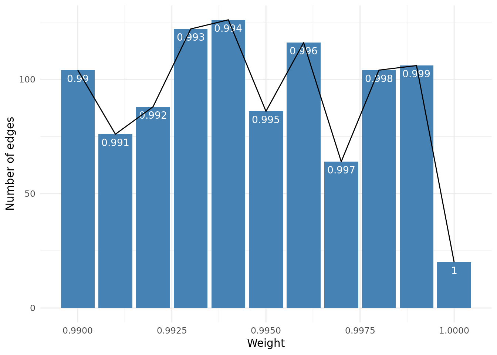

#### Degree distribution of item->similarity->item edges

#### Degree distribution of agent->knows->agent edges

#### Runing time by method 

<table class="table table-condensed" style="width: auto !important; ">
 <thead>
  <tr>
   <th style="text-align:left;"> key </th>
   <th style="text-align:right;"> doc_count </th>
   <th style="text-align:right;"> sum_wallTime_ms.value </th>
   <th style="text-align:left;"> avg_wallTime_ms.value </th>
   <th style="text-align:left;"> includedInTotal </th>
  </tr>
 </thead>
<tbody>
  <tr>
   <td style="text-align:left;"> connectIfSimilar </td>
   <td style="text-align:right;"> 24,090 </td>
   <td style="text-align:right;"> 40,278 </td>
   <td style="text-align:left;"> 1.6719800747198 </td>
   <td style="text-align:left;"> No </td>
  </tr>
  <tr>
   <td style="text-align:left;"> existsSimilarity </td>
   <td style="text-align:right;"> 24,090 </td>
   <td style="text-align:right;"> 39,800 </td>
   <td style="text-align:left;"> 1.65213781652138 </td>
   <td style="text-align:left;"> No </td>
  </tr>
  <tr>
   <td style="text-align:left;"> similarityEdges </td>
   <td style="text-align:right;"> 24,090 </td>
   <td style="text-align:right;"> 39,153 </td>
   <td style="text-align:left;"> 1.6252801992528 </td>
   <td style="text-align:left;"> No </td>
  </tr>
  <tr>
   <td style="text-align:left;"> connectAllSimilar </td>
   <td style="text-align:right;"> 220 </td>
   <td style="text-align:right;"> 40,544 </td>
   <td style="text-align:left;"> 184.290909090909 </td>
   <td style="text-align:left;"> Yes </td>
  </tr>
  <tr>
   <td style="text-align:left;"> init </td>
   <td style="text-align:right;"> 103 </td>
   <td style="text-align:right;"> 10,402 </td>
   <td style="text-align:left;"> 100.990291262136 </td>
   <td style="text-align:left;"> No </td>
  </tr>
  <tr>
   <td style="text-align:left;"> connect </td>
   <td style="text-align:right;"> 17 </td>
   <td style="text-align:right;"> 29 </td>
   <td style="text-align:left;"> 1.70588235294118 </td>
   <td style="text-align:left;"> Yes </td>
  </tr>
  <tr>
   <td style="text-align:left;font-weight: bold;"> Total </td>
   <td style="text-align:right;font-weight: bold;"> 245 </td>
   <td style="text-align:right;font-weight: bold;"> 40,933 </td>
   <td style="text-align:left;font-weight: bold;">  </td>
   <td style="text-align:left;font-weight: bold;">  </td>
  </tr>
</tbody>
</table>
####  Found structures 

#####  Cycles 

Number of cycles found:  1 

<button class="btn btn-primary" data-toggle="collapse" data-target="#CESWEMAOFK"> Show/Hide foundCycle query </button> 
 
  
     GET /filebeat-*/_search 
              { 
                "query": {
                  "bool": {
                    "must": [
                      { "match_phrase": {
                        "simulationId": "SIM10-06-07-53-MaSMCe--CV"
                        }
                      },
                      { "bool": {
                        "should": [
                          { "match": {
                            "keyword": "foundCycle"
                          }}
                        ]
                      }}
                    ]
                  }
                }
              }
     

#####  Paths 

Number of paths found:  0 

<button class="btn btn-primary" data-toggle="collapse" data-target="#SEHMSHNMHN"> Show/Hide foundPath query </button> 
 
  
     GET /filebeat-*/_search 
              { 
                "query": {
                  "bool": {
                    "must": [
                      { "match_phrase": {
                        "simulationId": "SIM10-06-07-53-MaSMCe--CV"
                        }
                      },
                      { "bool": {
                        "should": [
                          { "match": {
                            "keyword": "foundPath"
                          }}
                        ]
                      }}
                    ]
                  }
                }
              }
     

###  SIM10-06-07-53-MaSMCe--DV 

#### simulationParameters 

<table class="table table-condensed" style="width: auto !important; ">
 <thead>
  <tr>
   <th style="text-align:left;"> agentNumber </th>
   <th style="text-align:left;"> similarityConnectThreshold </th>
   <th style="text-align:left;"> graphType </th>
   <th style="text-align:left;"> chainLength </th>
   <th style="text-align:left;"> similaritySearchThreshold </th>
   <th style="text-align:left;"> maxDistance </th>
   <th style="text-align:left;"> randomWorksNumberMultiplier </th>
  </tr>
 </thead>
<tbody>
  <tr>
   <td style="text-align:left;width: 20em; "> 100 </td>
   <td style="text-align:left;width: 15em; "> 0.99 </td>
   <td style="text-align:left;width: 15em; "> random </td>
   <td style="text-align:left;width: 15em; "> 10 </td>
   <td style="text-align:left;width: 15em; "> 1 </td>
   <td style="text-align:left;width: 15em; "> 10 </td>
   <td style="text-align:left;width: 15em; "> 1 </td>
  </tr>
</tbody>
</table>
#### allEdgesByLabel

<table class="table table-condensed" style="width: auto !important; ">
 <thead>
  <tr>
   <th style="text-align:right;"> edges_offers </th>
   <th style="text-align:right;"> edges_similarity </th>
   <th style="text-align:right;"> edges_owns </th>
   <th style="text-align:right;"> edges_demands </th>
   <th style="text-align:right;"> edges_knows </th>
   <th style="text-align:right;"> edges_total </th>
  </tr>
 </thead>
<tbody>
  <tr>
   <td style="text-align:right;width: 5em; "> 110 </td>
   <td style="text-align:right;width: 5em; "> 978 </td>
   <td style="text-align:right;width: 5em; "> 110 </td>
   <td style="text-align:right;width: 5em; "> 110 </td>
   <td style="text-align:right;width: 5em; "> 100 </td>
   <td style="text-align:right;width: 5em; "> 1,408 </td>
  </tr>
</tbody>
</table>
#### allVerticesByType

<table class="table table-condensed" style="width: auto !important; ">
 <thead>
  <tr>
   <th style="text-align:right;"> vertices_agent </th>
   <th style="text-align:right;"> vertices_item </th>
   <th style="text-align:right;"> vertices_work </th>
   <th style="text-align:right;"> vertices_total </th>
  </tr>
 </thead>
<tbody>
  <tr>
   <td style="text-align:right;width: 5em; "> 101 </td>
   <td style="text-align:right;width: 5em; "> 220 </td>
   <td style="text-align:right;width: 5em; "> 110 </td>
   <td style="text-align:right;width: 5em; "> 431 </td>
  </tr>
</tbody>
</table>
#### distribution of similarityEdgesByWeight

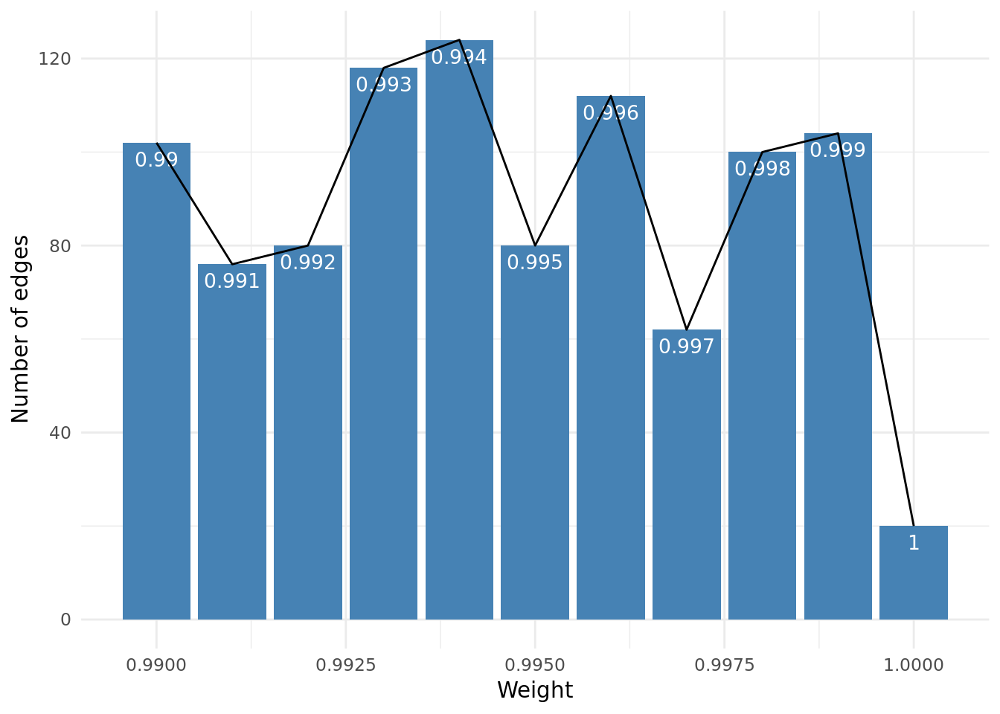

#### Degree distribution of item->similarity->item edges

#### Degree distribution of agent->knows->agent edges

#### Runing time by method 

<table class="table table-condensed" style="width: auto !important; ">
 <thead>
  <tr>
   <th style="text-align:left;">   </th>
   <th style="text-align:left;"> key </th>
   <th style="text-align:right;"> doc_count </th>
   <th style="text-align:right;"> sum_wallTime_ms.value </th>
   <th style="text-align:left;"> avg_wallTime_ms.value </th>
   <th style="text-align:left;"> includedInTotal </th>
  </tr>
 </thead>
<tbody>
  <tr>
   <td style="text-align:left;"> 1 </td>
   <td style="text-align:left;"> addItemToWork </td>
   <td style="text-align:right;"> 220 </td>
   <td style="text-align:right;"> 1,229 </td>
   <td style="text-align:left;"> 5.58636363636364 </td>
   <td style="text-align:left;"> No </td>
  </tr>
  <tr>
   <td style="text-align:left;"> 2 </td>
   <td style="text-align:left;"> ownsWork </td>
   <td style="text-align:right;"> 110 </td>
   <td style="text-align:right;"> 600 </td>
   <td style="text-align:left;"> 5.45454545454545 </td>
   <td style="text-align:left;"> No </td>
  </tr>
  <tr>
   <td style="text-align:left;"> 3 </td>
   <td style="text-align:left;"> init </td>
   <td style="text-align:right;"> 103 </td>
   <td style="text-align:right;"> 11,264 </td>
   <td style="text-align:left;"> 109.359223300971 </td>
   <td style="text-align:left;"> No </td>
  </tr>
  <tr>
   <td style="text-align:left;"> 4 </td>
   <td style="text-align:left;"> searchAndConnect </td>
   <td style="text-align:right;"> 101 </td>
   <td style="text-align:right;"> 28,795 </td>
   <td style="text-align:left;"> 285.09900990099 </td>
   <td style="text-align:left;"> Yes </td>
  </tr>
  <tr>
   <td style="text-align:left;"> 5 </td>
   <td style="text-align:left;"> knowsAgent </td>
   <td style="text-align:right;"> 100 </td>
   <td style="text-align:right;"> 283 </td>
   <td style="text-align:left;"> 2.83 </td>
   <td style="text-align:left;"> No </td>
  </tr>
  <tr>
   <td style="text-align:left;"> 6 </td>
   <td style="text-align:left;"> getWorksItems </td>
   <td style="text-align:right;"> 18 </td>
   <td style="text-align:right;"> 33 </td>
   <td style="text-align:left;"> 1.83333333333333 </td>
   <td style="text-align:left;"> Yes </td>
  </tr>
  <tr>
   <td style="text-align:left;"> 8 </td>
   <td style="text-align:left;"> addChainToNetwork </td>
   <td style="text-align:right;"> 1 </td>
   <td style="text-align:right;"> 0 </td>
   <td style="text-align:left;"> 0 </td>
   <td style="text-align:left;"> Yes </td>
  </tr>
  <tr>
   <td style="text-align:left;"> 9 </td>
   <td style="text-align:left;"> addRandomWorksToAgents </td>
   <td style="text-align:right;"> 1 </td>
   <td style="text-align:right;"> 1 </td>
   <td style="text-align:left;"> 1 </td>
   <td style="text-align:left;"> Yes </td>
  </tr>
  <tr>
   <td style="text-align:left;font-weight: bold;"> 11 </td>
   <td style="text-align:left;font-weight: bold;"> Total </td>
   <td style="text-align:right;font-weight: bold;"> 127 </td>
   <td style="text-align:right;font-weight: bold;"> 29,088 </td>
   <td style="text-align:left;font-weight: bold;">  </td>
   <td style="text-align:left;font-weight: bold;">  </td>
  </tr>
</tbody>
</table>
####  Found structures 

#####  Cycles 

Number of cycles found:  1 

<button class="btn btn-primary" data-toggle="collapse" data-target="#JSMAKVUBES"> Show/Hide foundCycle query </button> 
 
  
     GET /filebeat-*/_search 
              { 
                "query": {
                  "bool": {
                    "must": [
                      { "match_phrase": {
                        "simulationId": "SIM10-06-07-53-MaSMCe--DV"
                        }
                      },
                      { "bool": {
                        "should": [
                          { "match": {
                            "keyword": "foundCycle"
                          }}
                        ]
                      }}
                    ]
                  }
                }
              }
     

#####  Paths 

Number of paths found:  0 

<button class="btn btn-primary" data-toggle="collapse" data-target="#MLHAPKQCTK"> Show/Hide foundPath query </button> 
 
  
     GET /filebeat-*/_search 
              { 
                "query": {
                  "bool": {
                    "must": [
                      { "match_phrase": {
                        "simulationId": "SIM10-06-07-53-MaSMCe--DV"
                        }
                      },
                      { "bool": {
                        "should": [
                          { "match": {
                            "keyword": "foundPath"
                          }}
                        ]
                      }}
                    ]
                  }
                }
              }
     

###  SIM10-06-07-54-d46pCk--CV 

#### simulationParameters 

<table class="table table-condensed" style="width: auto !important; ">
 <thead>
  <tr>
   <th style="text-align:left;"> agentNumber </th>
   <th style="text-align:left;"> similarityConnectThreshold </th>
   <th style="text-align:left;"> graphType </th>
   <th style="text-align:left;"> chainLength </th>
   <th style="text-align:left;"> similaritySearchThreshold </th>
   <th style="text-align:left;"> maxDistance </th>
   <th style="text-align:left;"> randomWorksNumberMultiplier </th>
  </tr>
 </thead>
<tbody>
  <tr>
   <td style="text-align:left;width: 20em; "> 100 </td>
   <td style="text-align:left;width: 15em; "> 0.99 </td>
   <td style="text-align:left;width: 15em; "> smallWorld </td>
   <td style="text-align:left;width: 15em; "> 10 </td>
   <td style="text-align:left;width: 15em; "> 1 </td>
   <td style="text-align:left;width: 15em; "> 10 </td>
   <td style="text-align:left;width: 15em; "> 1 </td>
  </tr>
</tbody>
</table>
#### allEdgesByLabel

<table class="table table-condensed" style="width: auto !important; ">
 <thead>
  <tr>
   <th style="text-align:right;"> edges_offers </th>
   <th style="text-align:right;"> edges_similarity </th>
   <th style="text-align:right;"> edges_owns </th>
   <th style="text-align:right;"> edges_demands </th>
   <th style="text-align:right;"> edges_knows </th>
   <th style="text-align:right;"> edges_total </th>
  </tr>
 </thead>
<tbody>
  <tr>
   <td style="text-align:right;width: 5em; "> 110 </td>
   <td style="text-align:right;width: 5em; "> 1,032 </td>
   <td style="text-align:right;width: 5em; "> 110 </td>
   <td style="text-align:right;width: 5em; "> 110 </td>
   <td style="text-align:right;width: 5em; "> 601 </td>
   <td style="text-align:right;width: 5em; "> 1,963 </td>
  </tr>
</tbody>
</table>
#### allVerticesByType

<table class="table table-condensed" style="width: auto !important; ">
 <thead>
  <tr>
   <th style="text-align:right;"> vertices_agent </th>
   <th style="text-align:right;"> vertices_item </th>
   <th style="text-align:right;"> vertices_work </th>
   <th style="text-align:right;"> vertices_total </th>
  </tr>
 </thead>
<tbody>
  <tr>
   <td style="text-align:right;width: 5em; "> 101 </td>
   <td style="text-align:right;width: 5em; "> 220 </td>
   <td style="text-align:right;width: 5em; "> 110 </td>
   <td style="text-align:right;width: 5em; "> 431 </td>
  </tr>
</tbody>
</table>
#### distribution of similarityEdgesByWeight

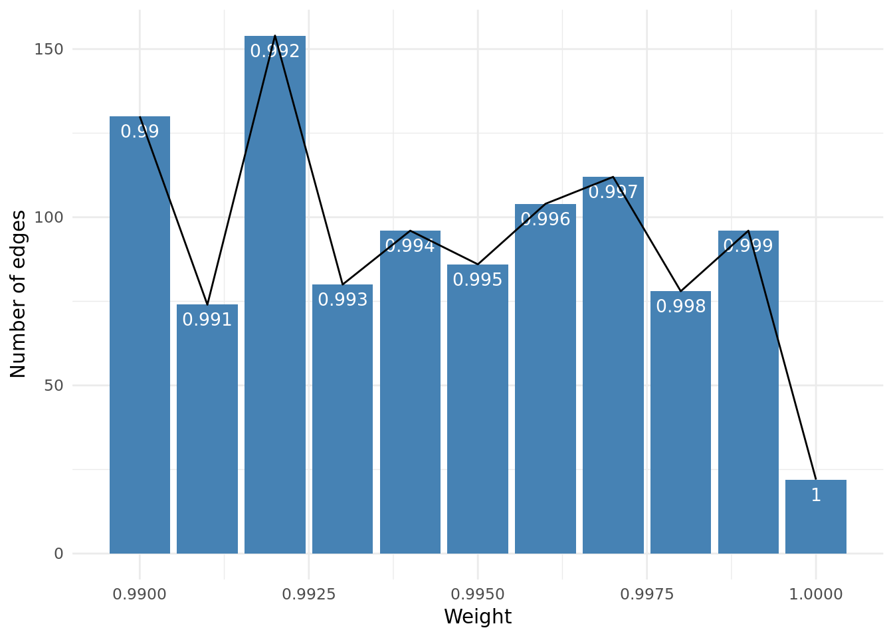

#### Degree distribution of item->similarity->item edges

#### Degree distribution of agent->knows->agent edges

#### Runing time by method 

<table class="table table-condensed" style="width: auto !important; ">
 <thead>
  <tr>
   <th style="text-align:left;"> key </th>
   <th style="text-align:right;"> doc_count </th>
   <th style="text-align:right;"> sum_wallTime_ms.value </th>
   <th style="text-align:left;"> avg_wallTime_ms.value </th>
   <th style="text-align:left;"> includedInTotal </th>
  </tr>
 </thead>
<tbody>
  <tr>
   <td style="text-align:left;"> connectIfSimilar </td>
   <td style="text-align:right;"> 24,090 </td>
   <td style="text-align:right;"> 41,072 </td>
   <td style="text-align:left;"> 1.7049398090494 </td>
   <td style="text-align:left;"> No </td>
  </tr>
  <tr>
   <td style="text-align:left;"> existsSimilarity </td>
   <td style="text-align:right;"> 24,090 </td>
   <td style="text-align:right;"> 40,565 </td>
   <td style="text-align:left;"> 1.68389373183894 </td>
   <td style="text-align:left;"> No </td>
  </tr>
  <tr>
   <td style="text-align:left;"> similarityEdges </td>
   <td style="text-align:right;"> 24,090 </td>
   <td style="text-align:right;"> 39,879 </td>
   <td style="text-align:left;"> 1.65541718555417 </td>
   <td style="text-align:left;"> No </td>
  </tr>
  <tr>
   <td style="text-align:left;"> connectAllSimilar </td>
   <td style="text-align:right;"> 220 </td>
   <td style="text-align:right;"> 41,335 </td>
   <td style="text-align:left;"> 187.886363636364 </td>
   <td style="text-align:left;"> Yes </td>
  </tr>
  <tr>
   <td style="text-align:left;"> init </td>
   <td style="text-align:right;"> 103 </td>
   <td style="text-align:right;"> 10,790 </td>
   <td style="text-align:left;"> 104.757281553398 </td>
   <td style="text-align:left;"> No </td>
  </tr>
  <tr>
   <td style="text-align:left;"> connect </td>
   <td style="text-align:right;"> 8 </td>
   <td style="text-align:right;"> 16 </td>
   <td style="text-align:left;"> 2 </td>
   <td style="text-align:left;"> Yes </td>
  </tr>
  <tr>
   <td style="text-align:left;font-weight: bold;"> Total </td>
   <td style="text-align:right;font-weight: bold;"> 236 </td>
   <td style="text-align:right;font-weight: bold;"> 41,656 </td>
   <td style="text-align:left;font-weight: bold;">  </td>
   <td style="text-align:left;font-weight: bold;">  </td>
  </tr>
</tbody>
</table>
####  Found structures 

#####  Cycles 

Number of cycles found:  1 

<button class="btn btn-primary" data-toggle="collapse" data-target="#WRMHHTWPUI"> Show/Hide foundCycle query </button> 
 
  
     GET /filebeat-*/_search 
              { 
                "query": {
                  "bool": {
                    "must": [
                      { "match_phrase": {
                        "simulationId": "SIM10-06-07-54-d46pCk--CV"
                        }
                      },
                      { "bool": {
                        "should": [
                          { "match": {
                            "keyword": "foundCycle"
                          }}
                        ]
                      }}
                    ]
                  }
                }
              }
     

#####  Paths 

Number of paths found:  0 

<button class="btn btn-primary" data-toggle="collapse" data-target="#RRIDGUESDI"> Show/Hide foundPath query </button> 
 
  
     GET /filebeat-*/_search 
              { 
                "query": {
                  "bool": {
                    "must": [
                      { "match_phrase": {
                        "simulationId": "SIM10-06-07-54-d46pCk--CV"
                        }
                      },
                      { "bool": {
                        "should": [
                          { "match": {
                            "keyword": "foundPath"
                          }}
                        ]
                      }}
                    ]
                  }
                }
              }
     

###  SIM10-06-07-54-d46pCk--DV 

#### simulationParameters 

<table class="table table-condensed" style="width: auto !important; ">
 <thead>
  <tr>
   <th style="text-align:left;"> agentNumber </th>
   <th style="text-align:left;"> similarityConnectThreshold </th>
   <th style="text-align:left;"> graphType </th>
   <th style="text-align:left;"> chainLength </th>
   <th style="text-align:left;"> similaritySearchThreshold </th>
   <th style="text-align:left;"> maxDistance </th>
   <th style="text-align:left;"> randomWorksNumberMultiplier </th>
  </tr>
 </thead>
<tbody>
  <tr>
   <td style="text-align:left;width: 20em; "> 100 </td>
   <td style="text-align:left;width: 15em; "> 0.99 </td>
   <td style="text-align:left;width: 15em; "> smallWorld </td>
   <td style="text-align:left;width: 15em; "> 10 </td>
   <td style="text-align:left;width: 15em; "> 1 </td>
   <td style="text-align:left;width: 15em; "> 10 </td>
   <td style="text-align:left;width: 15em; "> 1 </td>
  </tr>
</tbody>
</table>
#### allEdgesByLabel

<table class="table table-condensed" style="width: auto !important; ">
 <thead>
  <tr>
   <th style="text-align:right;"> edges_offers </th>
   <th style="text-align:right;"> edges_similarity </th>
   <th style="text-align:right;"> edges_owns </th>
   <th style="text-align:right;"> edges_demands </th>
   <th style="text-align:right;"> edges_knows </th>
   <th style="text-align:right;"> edges_total </th>
  </tr>
 </thead>
<tbody>
  <tr>
   <td style="text-align:right;width: 5em; "> 110 </td>
   <td style="text-align:right;width: 5em; "> 1,016 </td>
   <td style="text-align:right;width: 5em; "> 110 </td>
   <td style="text-align:right;width: 5em; "> 110 </td>
   <td style="text-align:right;width: 5em; "> 601 </td>
   <td style="text-align:right;width: 5em; "> 1,947 </td>
  </tr>
</tbody>
</table>
#### allVerticesByType

<table class="table table-condensed" style="width: auto !important; ">
 <thead>
  <tr>
   <th style="text-align:right;"> vertices_agent </th>
   <th style="text-align:right;"> vertices_item </th>
   <th style="text-align:right;"> vertices_work </th>
   <th style="text-align:right;"> vertices_total </th>
  </tr>
 </thead>
<tbody>
  <tr>
   <td style="text-align:right;width: 5em; "> 101 </td>
   <td style="text-align:right;width: 5em; "> 220 </td>
   <td style="text-align:right;width: 5em; "> 110 </td>
   <td style="text-align:right;width: 5em; "> 431 </td>
  </tr>
</tbody>
</table>
#### distribution of similarityEdgesByWeight

#### Degree distribution of item->similarity->item edges

#### Degree distribution of agent->knows->agent edges

#### Runing time by method 

<table class="table table-condensed" style="width: auto !important; ">
 <thead>
  <tr>
   <th style="text-align:left;">   </th>
   <th style="text-align:left;"> key </th>
   <th style="text-align:right;"> doc_count </th>
   <th style="text-align:right;"> sum_wallTime_ms.value </th>
   <th style="text-align:left;"> avg_wallTime_ms.value </th>
   <th style="text-align:left;"> includedInTotal </th>
  </tr>
 </thead>
<tbody>
  <tr>
   <td style="text-align:left;"> 1 </td>
   <td style="text-align:left;"> knowsAgent </td>
   <td style="text-align:right;"> 601 </td>
   <td style="text-align:right;"> 1,005 </td>
   <td style="text-align:left;"> 1.67221297836938 </td>
   <td style="text-align:left;"> No </td>
  </tr>
  <tr>
   <td style="text-align:left;"> 2 </td>
   <td style="text-align:left;"> addItemToWork </td>
   <td style="text-align:right;"> 220 </td>
   <td style="text-align:right;"> 2,128 </td>
   <td style="text-align:left;"> 9.67272727272727 </td>
   <td style="text-align:left;"> No </td>
  </tr>
  <tr>
   <td style="text-align:left;"> 3 </td>
   <td style="text-align:left;"> ownsWork </td>
   <td style="text-align:right;"> 110 </td>
   <td style="text-align:right;"> 790 </td>
   <td style="text-align:left;"> 7.18181818181818 </td>
   <td style="text-align:left;"> No </td>
  </tr>
  <tr>
   <td style="text-align:left;"> 4 </td>
   <td style="text-align:left;"> init </td>
   <td style="text-align:right;"> 103 </td>
   <td style="text-align:right;"> 10,946 </td>
   <td style="text-align:left;"> 106.271844660194 </td>
   <td style="text-align:left;"> No </td>
  </tr>
  <tr>
   <td style="text-align:left;"> 5 </td>
   <td style="text-align:left;"> searchAndConnect </td>
   <td style="text-align:right;"> 101 </td>
   <td style="text-align:right;"> 37,911 </td>
   <td style="text-align:left;"> 375.356435643564 </td>
   <td style="text-align:left;"> Yes </td>
  </tr>
  <tr>
   <td style="text-align:left;"> 6 </td>
   <td style="text-align:left;"> getWorksItems </td>
   <td style="text-align:right;"> 18 </td>
   <td style="text-align:right;"> 28 </td>
   <td style="text-align:left;"> 1.55555555555556 </td>
   <td style="text-align:left;"> Yes </td>
  </tr>
  <tr>
   <td style="text-align:left;"> 9 </td>
   <td style="text-align:left;"> cycleSearch </td>
   <td style="text-align:right;"> 2 </td>
   <td style="text-align:right;"> 237 </td>
   <td style="text-align:left;"> 118.5 </td>
   <td style="text-align:left;"> Yes </td>
  </tr>
  <tr>
   <td style="text-align:left;"> 10 </td>
   <td style="text-align:left;"> getWorks </td>
   <td style="text-align:right;"> 2 </td>
   <td style="text-align:right;"> 320 </td>
   <td style="text-align:left;"> 160 </td>
   <td style="text-align:left;"> No </td>
  </tr>
  <tr>
   <td style="text-align:left;font-weight: bold;"> 11 </td>
   <td style="text-align:left;font-weight: bold;"> Total </td>
   <td style="text-align:right;font-weight: bold;"> 128 </td>
   <td style="text-align:right;font-weight: bold;"> 38,620 </td>
   <td style="text-align:left;font-weight: bold;">  </td>
   <td style="text-align:left;font-weight: bold;">  </td>
  </tr>
</tbody>
</table>
####  Found structures 

#####  Cycles 

Number of cycles found:  2 

<button class="btn btn-primary" data-toggle="collapse" data-target="#LFWYCSYWFN"> Show/Hide foundCycle query </button> 
 
  
     GET /filebeat-*/_search 
              { 
                "query": {
                  "bool": {
                    "must": [
                      { "match_phrase": {
                        "simulationId": "SIM10-06-07-54-d46pCk--DV"
                        }
                      },
                      { "bool": {
                        "should": [
                          { "match": {
                            "keyword": "foundCycle"
                          }}
                        ]
                      }}
                    ]
                  }
                }
              }
     

#####  Paths 

Number of paths found:  0 

<button class="btn btn-primary" data-toggle="collapse" data-target="#UVQPQRBPBO"> Show/Hide foundPath query </button> 
 
  
     GET /filebeat-*/_search 
              { 
                "query": {
                  "bool": {
                    "must": [
                      { "match_phrase": {
                        "simulationId": "SIM10-06-07-54-d46pCk--DV"
                        }
                      },
                      { "bool": {
                        "should": [
                          { "match": {
                            "keyword": "foundPath"
                          }}
                        ]
                      }}
                    ]
                  }
                }
              }
     

###  SIM10-06-09-03-pPqI8b--CV 

#### simulationParameters 

<table class="table table-condensed" style="width: auto !important; ">
 <thead>
  <tr>
   <th style="text-align:left;"> agentNumber </th>
   <th style="text-align:left;"> similarityConnectThreshold </th>
   <th style="text-align:left;"> graphType </th>
   <th style="text-align:left;"> chainLength </th>
   <th style="text-align:left;"> similaritySearchThreshold </th>
   <th style="text-align:left;"> maxDistance </th>
   <th style="text-align:left;"> randomWorksNumberMultiplier </th>
  </tr>
 </thead>
<tbody>
  <tr>
   <td style="text-align:left;width: 20em; "> 100 </td>
   <td style="text-align:left;width: 15em; "> 0.99 </td>
   <td style="text-align:left;width: 15em; "> random </td>
   <td style="text-align:left;width: 15em; "> 10 </td>
   <td style="text-align:left;width: 15em; "> 1 </td>
   <td style="text-align:left;width: 15em; "> 10 </td>
   <td style="text-align:left;width: 15em; "> 2 </td>
  </tr>
</tbody>
</table>
#### allEdgesByLabel

<table class="table table-condensed" style="width: auto !important; ">
 <thead>
  <tr>
   <th style="text-align:right;"> edges_offers </th>
   <th style="text-align:right;"> edges_similarity </th>
   <th style="text-align:right;"> edges_owns </th>
   <th style="text-align:right;"> edges_demands </th>
   <th style="text-align:right;"> edges_knows </th>
   <th style="text-align:right;"> edges_total </th>
  </tr>
 </thead>
<tbody>
  <tr>
   <td style="text-align:right;width: 5em; "> 210 </td>
   <td style="text-align:right;width: 5em; "> 3,704 </td>
   <td style="text-align:right;width: 5em; "> 210 </td>
   <td style="text-align:right;width: 5em; "> 210 </td>
   <td style="text-align:right;width: 5em; "> 100 </td>
   <td style="text-align:right;width: 5em; "> 4,434 </td>
  </tr>
</tbody>
</table>
#### allVerticesByType

<table class="table table-condensed" style="width: auto !important; ">
 <thead>
  <tr>
   <th style="text-align:right;"> vertices_agent </th>
   <th style="text-align:right;"> vertices_item </th>
   <th style="text-align:right;"> vertices_work </th>
   <th style="text-align:right;"> vertices_total </th>
  </tr>
 </thead>
<tbody>
  <tr>
   <td style="text-align:right;width: 5em; "> 101 </td>
   <td style="text-align:right;width: 5em; "> 420 </td>
   <td style="text-align:right;width: 5em; "> 210 </td>
   <td style="text-align:right;width: 5em; "> 731 </td>
  </tr>
</tbody>
</table>
#### distribution of similarityEdgesByWeight

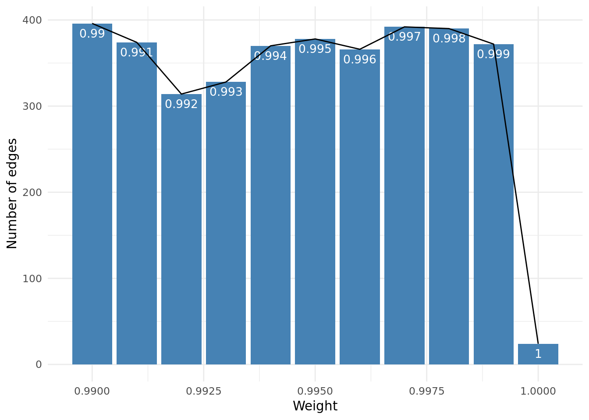

#### Degree distribution of item->similarity->item edges

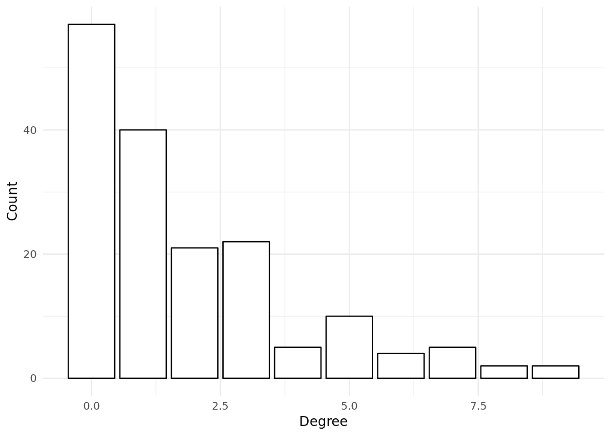

#### Degree distribution of agent->knows->agent edges

#### Runing time by method 

<table class="table table-condensed" style="width: auto !important; ">
 <thead>
  <tr>
   <th style="text-align:left;"> key </th>
   <th style="text-align:right;"> doc_count </th>
   <th style="text-align:right;"> sum_wallTime_ms.value </th>
   <th style="text-align:left;"> avg_wallTime_ms.value </th>
   <th style="text-align:left;"> includedInTotal </th>
  </tr>
 </thead>
<tbody>
  <tr>
   <td style="text-align:left;"> connectIfSimilar </td>
   <td style="text-align:right;"> 87,990 </td>
   <td style="text-align:right;"> 156,828 </td>
   <td style="text-align:left;"> 1.78233890214797 </td>
   <td style="text-align:left;"> No </td>
  </tr>
  <tr>
   <td style="text-align:left;"> existsSimilarity </td>
   <td style="text-align:right;"> 87,990 </td>
   <td style="text-align:right;"> 154,995 </td>
   <td style="text-align:left;"> 1.76150698943062 </td>
   <td style="text-align:left;"> No </td>
  </tr>
  <tr>
   <td style="text-align:left;"> similarityEdges </td>
   <td style="text-align:right;"> 87,990 </td>
   <td style="text-align:right;"> 152,369 </td>
   <td style="text-align:left;"> 1.73166268894193 </td>
   <td style="text-align:left;"> No </td>
  </tr>
  <tr>
   <td style="text-align:left;"> connectAllSimilar </td>
   <td style="text-align:right;"> 420 </td>
   <td style="text-align:right;"> 157,692 </td>
   <td style="text-align:left;"> 375.457142857143 </td>
   <td style="text-align:left;"> Yes </td>
  </tr>
  <tr>
   <td style="text-align:left;"> init </td>
   <td style="text-align:right;"> 103 </td>
   <td style="text-align:right;"> 10,881 </td>
   <td style="text-align:left;"> 105.640776699029 </td>
   <td style="text-align:left;"> No </td>
  </tr>
  <tr>
   <td style="text-align:left;"> connect </td>
   <td style="text-align:right;"> 88 </td>
   <td style="text-align:right;"> 238 </td>
   <td style="text-align:left;"> 2.70454545454545 </td>
   <td style="text-align:left;"> Yes </td>
  </tr>
  <tr>
   <td style="text-align:left;font-weight: bold;"> Total </td>
   <td style="text-align:right;font-weight: bold;"> 516 </td>
   <td style="text-align:right;font-weight: bold;"> 158,365 </td>
   <td style="text-align:left;font-weight: bold;">  </td>
   <td style="text-align:left;font-weight: bold;">  </td>
  </tr>
</tbody>
</table>
####  Found structures 

#####  Cycles 

Number of cycles found:  1 

<button class="btn btn-primary" data-toggle="collapse" data-target="#JKSXJSKAOR"> Show/Hide foundCycle query </button> 
 
  
     GET /filebeat-*/_search 
              { 
                "query": {
                  "bool": {
                    "must": [
                      { "match_phrase": {
                        "simulationId": "SIM10-06-09-03-pPqI8b--CV"
                        }
                      },
                      { "bool": {
                        "should": [
                          { "match": {
                            "keyword": "foundCycle"
                          }}
                        ]
                      }}
                    ]
                  }
                }
              }
     

#####  Paths 

Number of paths found:  0 

<button class="btn btn-primary" data-toggle="collapse" data-target="#LDIKEZNGBR"> Show/Hide foundPath query </button> 
 
  
     GET /filebeat-*/_search 
              { 
                "query": {
                  "bool": {
                    "must": [
                      { "match_phrase": {
                        "simulationId": "SIM10-06-09-03-pPqI8b--CV"
                        }
                      },
                      { "bool": {
                        "should": [
                          { "match": {
                            "keyword": "foundPath"
                          }}
                        ]
                      }}
                    ]
                  }
                }
              }
     

###  SIM10-06-09-03-pPqI8b--DV 

#### simulationParameters 

<table class="table table-condensed" style="width: auto !important; ">
 <thead>
  <tr>
   <th style="text-align:left;"> agentNumber </th>
   <th style="text-align:left;"> similarityConnectThreshold </th>
   <th style="text-align:left;"> graphType </th>
   <th style="text-align:left;"> chainLength </th>
   <th style="text-align:left;"> similaritySearchThreshold </th>
   <th style="text-align:left;"> maxDistance </th>
   <th style="text-align:left;"> randomWorksNumberMultiplier </th>
  </tr>
 </thead>
<tbody>
  <tr>
   <td style="text-align:left;width: 20em; "> 100 </td>
   <td style="text-align:left;width: 15em; "> 0.99 </td>
   <td style="text-align:left;width: 15em; "> random </td>
   <td style="text-align:left;width: 15em; "> 10 </td>
   <td style="text-align:left;width: 15em; "> 1 </td>
   <td style="text-align:left;width: 15em; "> 10 </td>
   <td style="text-align:left;width: 15em; "> 2 </td>
  </tr>
</tbody>
</table>
#### allEdgesByLabel

<table class="table table-condensed" style="width: auto !important; ">
 <thead>
  <tr>
   <th style="text-align:right;"> edges_offers </th>
   <th style="text-align:right;"> edges_similarity </th>
   <th style="text-align:right;"> edges_owns </th>
   <th style="text-align:right;"> edges_demands </th>
   <th style="text-align:right;"> edges_knows </th>
   <th style="text-align:right;"> edges_total </th>
  </tr>
 </thead>
<tbody>
  <tr>
   <td style="text-align:right;width: 5em; "> 210 </td>
   <td style="text-align:right;width: 5em; "> 3,528 </td>
   <td style="text-align:right;width: 5em; "> 210 </td>
   <td style="text-align:right;width: 5em; "> 210 </td>
   <td style="text-align:right;width: 5em; "> 100 </td>
   <td style="text-align:right;width: 5em; "> 4,258 </td>
  </tr>
</tbody>
</table>
#### allVerticesByType

<table class="table table-condensed" style="width: auto !important; ">
 <thead>
  <tr>
   <th style="text-align:right;"> vertices_agent </th>
   <th style="text-align:right;"> vertices_item </th>
   <th style="text-align:right;"> vertices_work </th>
   <th style="text-align:right;"> vertices_total </th>
  </tr>
 </thead>
<tbody>
  <tr>
   <td style="text-align:right;width: 5em; "> 101 </td>
   <td style="text-align:right;width: 5em; "> 420 </td>
   <td style="text-align:right;width: 5em; "> 210 </td>
   <td style="text-align:right;width: 5em; "> 731 </td>
  </tr>
</tbody>
</table>
#### distribution of similarityEdgesByWeight

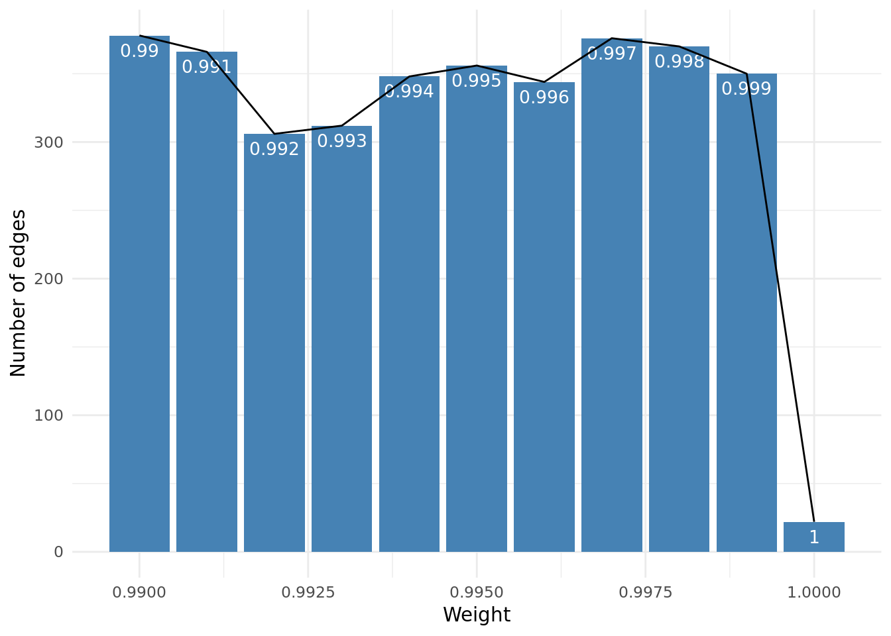

#### Degree distribution of item->similarity->item edges

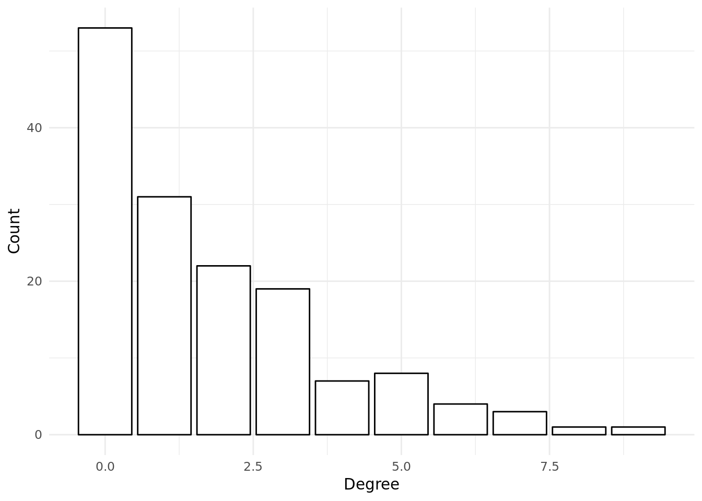

#### Degree distribution of agent->knows->agent edges

#### Runing time by method 

<table class="table table-condensed" style="width: auto !important; ">
 <thead>
  <tr>
   <th style="text-align:left;">   </th>
   <th style="text-align:left;"> key </th>
   <th style="text-align:right;"> doc_count </th>
   <th style="text-align:right;"> sum_wallTime_ms.value </th>
   <th style="text-align:left;"> avg_wallTime_ms.value </th>
   <th style="text-align:left;"> includedInTotal </th>
  </tr>
 </thead>
<tbody>
  <tr>
   <td style="text-align:left;"> 1 </td>
   <td style="text-align:left;"> addItemToWork </td>
   <td style="text-align:right;"> 420 </td>
   <td style="text-align:right;"> 3,363 </td>
   <td style="text-align:left;"> 8.00714285714286 </td>
   <td style="text-align:left;"> No </td>
  </tr>
  <tr>
   <td style="text-align:left;"> 2 </td>
   <td style="text-align:left;"> ownsWork </td>
   <td style="text-align:right;"> 210 </td>
   <td style="text-align:right;"> 1,219 </td>
   <td style="text-align:left;"> 5.8047619047619 </td>
   <td style="text-align:left;"> No </td>
  </tr>
  <tr>
   <td style="text-align:left;"> 3 </td>
   <td style="text-align:left;"> init </td>
   <td style="text-align:right;"> 103 </td>
   <td style="text-align:right;"> 11,401 </td>
   <td style="text-align:left;"> 110.68932038835 </td>
   <td style="text-align:left;"> No </td>
  </tr>
  <tr>
   <td style="text-align:left;"> 4 </td>
   <td style="text-align:left;"> searchAndConnect </td>
   <td style="text-align:right;"> 101 </td>
   <td style="text-align:right;"> 64,833 </td>
   <td style="text-align:left;"> 641.910891089109 </td>
   <td style="text-align:left;"> Yes </td>
  </tr>
  <tr>
   <td style="text-align:left;"> 5 </td>
   <td style="text-align:left;"> knowsAgent </td>
   <td style="text-align:right;"> 100 </td>
   <td style="text-align:right;"> 272 </td>
   <td style="text-align:left;"> 2.72 </td>
   <td style="text-align:left;"> No </td>
  </tr>
  <tr>
   <td style="text-align:left;"> 6 </td>
   <td style="text-align:left;"> getWorksItems </td>
   <td style="text-align:right;"> 18 </td>
   <td style="text-align:right;"> 69 </td>
   <td style="text-align:left;"> 3.83333333333333 </td>
   <td style="text-align:left;"> Yes </td>
  </tr>
  <tr>
   <td style="text-align:left;"> 9 </td>
   <td style="text-align:left;"> cycleSearch </td>
   <td style="text-align:right;"> 3 </td>
   <td style="text-align:right;"> 874 </td>
   <td style="text-align:left;"> 291.333333333333 </td>
   <td style="text-align:left;"> Yes </td>
  </tr>
  <tr>
   <td style="text-align:left;"> 10 </td>
   <td style="text-align:left;"> getWorks </td>
   <td style="text-align:right;"> 3 </td>
   <td style="text-align:right;"> 591 </td>
   <td style="text-align:left;"> 197 </td>
   <td style="text-align:left;"> No </td>
  </tr>
  <tr>
   <td style="text-align:left;font-weight: bold;"> 11 </td>
   <td style="text-align:left;font-weight: bold;"> Total </td>
   <td style="text-align:right;font-weight: bold;"> 130 </td>
   <td style="text-align:right;font-weight: bold;"> 66,973 </td>
   <td style="text-align:left;font-weight: bold;">  </td>
   <td style="text-align:left;font-weight: bold;">  </td>
  </tr>
</tbody>
</table>
####  Found structures 

#####  Cycles 

Number of cycles found:  2 

<button class="btn btn-primary" data-toggle="collapse" data-target="#XKHNCUXWVX"> Show/Hide foundCycle query </button> 
 
  
     GET /filebeat-*/_search 
              { 
                "query": {
                  "bool": {
                    "must": [
                      { "match_phrase": {
                        "simulationId": "SIM10-06-09-03-pPqI8b--DV"
                        }
                      },
                      { "bool": {
                        "should": [
                          { "match": {
                            "keyword": "foundCycle"
                          }}
                        ]
                      }}
                    ]
                  }
                }
              }
     

#####  Paths 

Number of paths found:  1 

<button class="btn btn-primary" data-toggle="collapse" data-target="#PEIPYYPWIR"> Show/Hide foundPath query </button> 
 
  
     GET /filebeat-*/_search 
              { 
                "query": {
                  "bool": {
                    "must": [
                      { "match_phrase": {
                        "simulationId": "SIM10-06-09-03-pPqI8b--DV"
                        }
                      },
                      { "bool": {
                        "should": [
                          { "match": {
                            "keyword": "foundPath"
                          }}
                        ]
                      }}
                    ]
                  }
                }
              }
     

###  SIM10-06-09-06-kZsYWq--CV 

#### simulationParameters 

<table class="table table-condensed" style="width: auto !important; ">
 <thead>
  <tr>
   <th style="text-align:left;"> agentNumber </th>
   <th style="text-align:left;"> similarityConnectThreshold </th>
   <th style="text-align:left;"> graphType </th>
   <th style="text-align:left;"> chainLength </th>
   <th style="text-align:left;"> similaritySearchThreshold </th>
   <th style="text-align:left;"> maxDistance </th>
   <th style="text-align:left;"> randomWorksNumberMultiplier </th>
  </tr>
 </thead>
<tbody>
  <tr>
   <td style="text-align:left;width: 20em; "> 100 </td>
   <td style="text-align:left;width: 15em; "> 0.99 </td>
   <td style="text-align:left;width: 15em; "> smallWorld </td>
   <td style="text-align:left;width: 15em; "> 10 </td>
   <td style="text-align:left;width: 15em; "> 1 </td>
   <td style="text-align:left;width: 15em; "> 10 </td>
   <td style="text-align:left;width: 15em; "> 2 </td>
  </tr>
</tbody>
</table>
#### allEdgesByLabel

<table class="table table-condensed" style="width: auto !important; ">
 <thead>
  <tr>
   <th style="text-align:right;"> edges_offers </th>
   <th style="text-align:right;"> edges_similarity </th>
   <th style="text-align:right;"> edges_owns </th>
   <th style="text-align:right;"> edges_demands </th>
   <th style="text-align:right;"> edges_knows </th>
   <th style="text-align:right;"> edges_total </th>
  </tr>
 </thead>
<tbody>
  <tr>
   <td style="text-align:right;width: 5em; "> 210 </td>
   <td style="text-align:right;width: 5em; "> 3,800 </td>
   <td style="text-align:right;width: 5em; "> 210 </td>
   <td style="text-align:right;width: 5em; "> 210 </td>
   <td style="text-align:right;width: 5em; "> 601 </td>
   <td style="text-align:right;width: 5em; "> 5,031 </td>
  </tr>
</tbody>
</table>
#### allVerticesByType

<table class="table table-condensed" style="width: auto !important; ">
 <thead>
  <tr>
   <th style="text-align:right;"> vertices_agent </th>
   <th style="text-align:right;"> vertices_item </th>
   <th style="text-align:right;"> vertices_work </th>
   <th style="text-align:right;"> vertices_total </th>
  </tr>
 </thead>
<tbody>
  <tr>
   <td style="text-align:right;width: 5em; "> 101 </td>
   <td style="text-align:right;width: 5em; "> 420 </td>
   <td style="text-align:right;width: 5em; "> 210 </td>
   <td style="text-align:right;width: 5em; "> 731 </td>
  </tr>
</tbody>
</table>
#### distribution of similarityEdgesByWeight

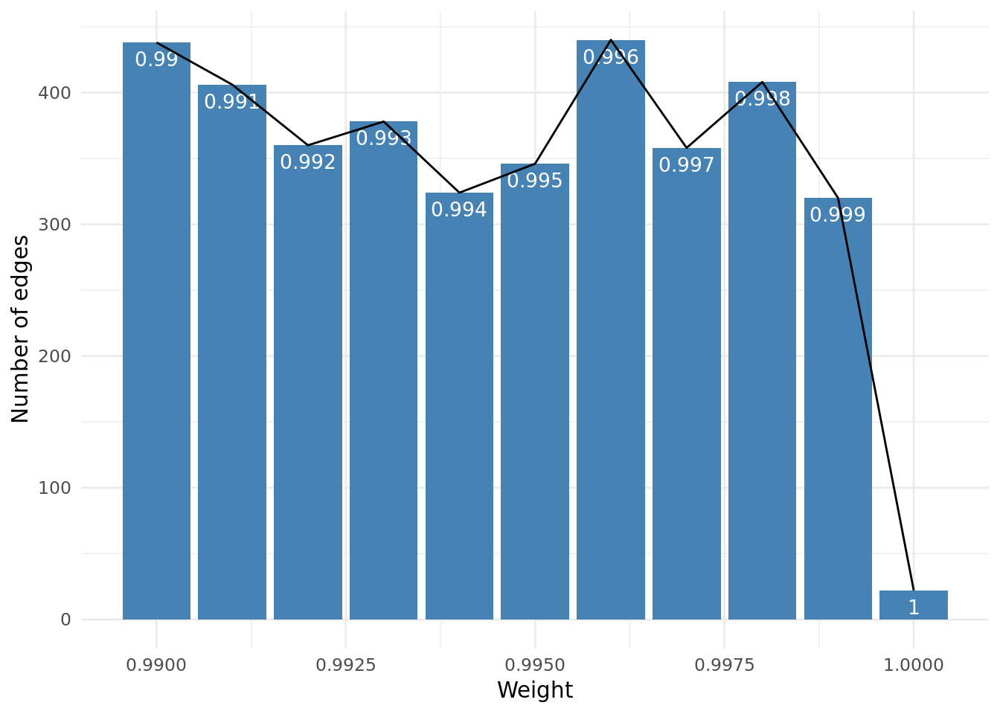

#### Degree distribution of item->similarity->item edges

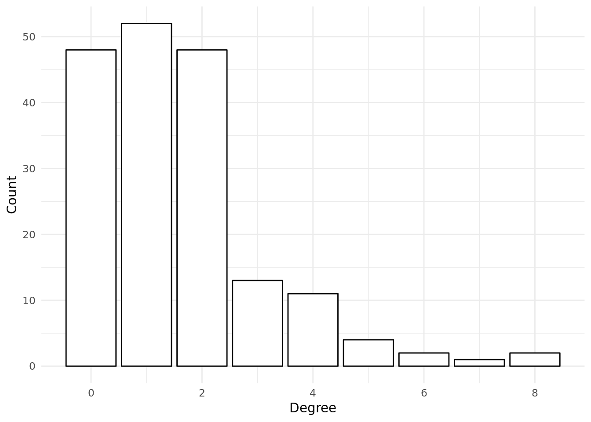

#### Degree distribution of agent->knows->agent edges

#### Runing time by method 

<table class="table table-condensed" style="width: auto !important; ">
 <thead>
  <tr>
   <th style="text-align:left;"> key </th>
   <th style="text-align:right;"> doc_count </th>
   <th style="text-align:right;"> sum_wallTime_ms.value </th>
   <th style="text-align:left;"> avg_wallTime_ms.value </th>
   <th style="text-align:left;"> includedInTotal </th>
  </tr>
 </thead>
<tbody>
  <tr>
   <td style="text-align:left;"> connectIfSimilar </td>
   <td style="text-align:right;"> 87,990 </td>
   <td style="text-align:right;"> 158,005 </td>
   <td style="text-align:left;"> 1.79571542220707 </td>
   <td style="text-align:left;"> No </td>
  </tr>
  <tr>
   <td style="text-align:left;"> existsSimilarity </td>
   <td style="text-align:right;"> 87,990 </td>
   <td style="text-align:right;"> 156,405 </td>
   <td style="text-align:left;"> 1.77753153767474 </td>
   <td style="text-align:left;"> No </td>
  </tr>
  <tr>
   <td style="text-align:left;"> similarityEdges </td>
   <td style="text-align:right;"> 87,990 </td>
   <td style="text-align:right;"> 153,969 </td>
   <td style="text-align:left;"> 1.74984657347426 </td>
   <td style="text-align:left;"> No </td>
  </tr>
  <tr>
   <td style="text-align:left;"> connectAllSimilar </td>
   <td style="text-align:right;"> 420 </td>
   <td style="text-align:right;"> 158,884 </td>
   <td style="text-align:left;"> 378.295238095238 </td>
   <td style="text-align:left;"> Yes </td>
  </tr>
  <tr>
   <td style="text-align:left;"> init </td>
   <td style="text-align:right;"> 103 </td>
   <td style="text-align:right;"> 10,847 </td>
   <td style="text-align:left;"> 105.31067961165 </td>
   <td style="text-align:left;"> No </td>
  </tr>
  <tr>
   <td style="text-align:left;"> connect </td>
   <td style="text-align:right;"> 27 </td>
   <td style="text-align:right;"> 55 </td>
   <td style="text-align:left;"> 2.03703703703704 </td>
   <td style="text-align:left;"> Yes </td>
  </tr>
  <tr>
   <td style="text-align:left;font-weight: bold;"> Total </td>
   <td style="text-align:right;font-weight: bold;"> 455 </td>
   <td style="text-align:right;font-weight: bold;"> 159,504 </td>
   <td style="text-align:left;font-weight: bold;">  </td>
   <td style="text-align:left;font-weight: bold;">  </td>
  </tr>
</tbody>
</table>
####  Found structures 

#####  Cycles 

Number of cycles found:  1 

<button class="btn btn-primary" data-toggle="collapse" data-target="#BYFKNADIAC"> Show/Hide foundCycle query </button> 
 
  
     GET /filebeat-*/_search 
              { 
                "query": {
                  "bool": {
                    "must": [
                      { "match_phrase": {
                        "simulationId": "SIM10-06-09-06-kZsYWq--CV"
                        }
                      },
                      { "bool": {
                        "should": [
                          { "match": {
                            "keyword": "foundCycle"
                          }}
                        ]
                      }}
                    ]
                  }
                }
              }
     

#####  Paths 

Number of paths found:  0 

<button class="btn btn-primary" data-toggle="collapse" data-target="#YGUSFZOZGU"> Show/Hide foundPath query </button> 
 
  
     GET /filebeat-*/_search 
              { 
                "query": {
                  "bool": {
                    "must": [
                      { "match_phrase": {
                        "simulationId": "SIM10-06-09-06-kZsYWq--CV"
                        }
                      },
                      { "bool": {
                        "should": [
                          { "match": {
                            "keyword": "foundPath"
                          }}
                        ]
                      }}
                    ]
                  }
                }
              }
     

###  SIM10-06-09-06-kZsYWq--DV 

#### simulationParameters 

<table class="table table-condensed" style="width: auto !important; ">
 <thead>
  <tr>
   <th style="text-align:left;"> agentNumber </th>
   <th style="text-align:left;"> similarityConnectThreshold </th>
   <th style="text-align:left;"> graphType </th>
   <th style="text-align:left;"> chainLength </th>
   <th style="text-align:left;"> similaritySearchThreshold </th>
   <th style="text-align:left;"> maxDistance </th>
   <th style="text-align:left;"> randomWorksNumberMultiplier </th>
  </tr>
 </thead>
<tbody>
  <tr>
   <td style="text-align:left;width: 20em; "> 100 </td>
   <td style="text-align:left;width: 15em; "> 0.99 </td>
   <td style="text-align:left;width: 15em; "> smallWorld </td>
   <td style="text-align:left;width: 15em; "> 10 </td>
   <td style="text-align:left;width: 15em; "> 1 </td>
   <td style="text-align:left;width: 15em; "> 10 </td>
   <td style="text-align:left;width: 15em; "> 2 </td>
  </tr>
</tbody>
</table>
#### allEdgesByLabel

<table class="table table-condensed" style="width: auto !important; ">
 <thead>
  <tr>
   <th style="text-align:right;"> edges_offers </th>
   <th style="text-align:right;"> edges_similarity </th>
   <th style="text-align:right;"> edges_owns </th>
   <th style="text-align:right;"> edges_demands </th>
   <th style="text-align:right;"> edges_knows </th>
   <th style="text-align:right;"> edges_total </th>
  </tr>
 </thead>
<tbody>
  <tr>
   <td style="text-align:right;width: 5em; "> 210 </td>
   <td style="text-align:right;width: 5em; "> 3,746 </td>
   <td style="text-align:right;width: 5em; "> 210 </td>
   <td style="text-align:right;width: 5em; "> 210 </td>
   <td style="text-align:right;width: 5em; "> 601 </td>
   <td style="text-align:right;width: 5em; "> 4,977 </td>
  </tr>
</tbody>
</table>
#### allVerticesByType

<table class="table table-condensed" style="width: auto !important; ">
 <thead>
  <tr>
   <th style="text-align:right;"> vertices_agent </th>
   <th style="text-align:right;"> vertices_item </th>
   <th style="text-align:right;"> vertices_work </th>
   <th style="text-align:right;"> vertices_total </th>
  </tr>
 </thead>
<tbody>
  <tr>
   <td style="text-align:right;width: 5em; "> 101 </td>
   <td style="text-align:right;width: 5em; "> 420 </td>
   <td style="text-align:right;width: 5em; "> 210 </td>
   <td style="text-align:right;width: 5em; "> 731 </td>
  </tr>
</tbody>
</table>
#### distribution of similarityEdgesByWeight

#### Degree distribution of item->similarity->item edges

#### Degree distribution of agent->knows->agent edges

#### Runing time by method 

<table class="table table-condensed" style="width: auto !important; ">
 <thead>
  <tr>
   <th style="text-align:left;">   </th>
   <th style="text-align:left;"> key </th>
   <th style="text-align:right;"> doc_count </th>
   <th style="text-align:right;"> sum_wallTime_ms.value </th>
   <th style="text-align:left;"> avg_wallTime_ms.value </th>
   <th style="text-align:left;"> includedInTotal </th>
  </tr>
 </thead>
<tbody>
  <tr>
   <td style="text-align:left;"> 1 </td>
   <td style="text-align:left;"> knowsAgent </td>
   <td style="text-align:right;"> 601 </td>
   <td style="text-align:right;"> 982 </td>
   <td style="text-align:left;"> 1.63394342762063 </td>
   <td style="text-align:left;"> No </td>
  </tr>
  <tr>
   <td style="text-align:left;"> 2 </td>
   <td style="text-align:left;"> addItemToWork </td>
   <td style="text-align:right;"> 420 </td>
   <td style="text-align:right;"> 2,543 </td>
   <td style="text-align:left;"> 6.0547619047619 </td>
   <td style="text-align:left;"> No </td>
  </tr>
  <tr>
   <td style="text-align:left;"> 3 </td>
   <td style="text-align:left;"> ownsWork </td>
   <td style="text-align:right;"> 210 </td>
   <td style="text-align:right;"> 1,257 </td>
   <td style="text-align:left;"> 5.98571428571429 </td>
   <td style="text-align:left;"> No </td>
  </tr>
  <tr>
   <td style="text-align:left;"> 4 </td>
   <td style="text-align:left;"> init </td>
   <td style="text-align:right;"> 103 </td>
   <td style="text-align:right;"> 11,439 </td>
   <td style="text-align:left;"> 111.058252427184 </td>
   <td style="text-align:left;"> No </td>
  </tr>
  <tr>
   <td style="text-align:left;"> 5 </td>
   <td style="text-align:left;"> searchAndConnect </td>
   <td style="text-align:right;"> 101 </td>
   <td style="text-align:right;"> 88,564 </td>
   <td style="text-align:left;"> 876.871287128713 </td>
   <td style="text-align:left;"> Yes </td>
  </tr>
  <tr>
   <td style="text-align:left;"> 6 </td>
   <td style="text-align:left;"> getWorksItems </td>
   <td style="text-align:right;"> 18 </td>
   <td style="text-align:right;"> 25 </td>
   <td style="text-align:left;"> 1.38888888888889 </td>
   <td style="text-align:left;"> Yes </td>
  </tr>
  <tr>
   <td style="text-align:left;"> 9 </td>
   <td style="text-align:left;"> cycleSearch </td>
   <td style="text-align:right;"> 3 </td>
   <td style="text-align:right;"> 819 </td>
   <td style="text-align:left;"> 273 </td>
   <td style="text-align:left;"> Yes </td>
  </tr>
  <tr>
   <td style="text-align:left;"> 10 </td>
   <td style="text-align:left;"> getWorks </td>
   <td style="text-align:right;"> 3 </td>
   <td style="text-align:right;"> 845 </td>
   <td style="text-align:left;"> 281.666666666667 </td>
   <td style="text-align:left;"> No </td>
  </tr>
  <tr>
   <td style="text-align:left;font-weight: bold;"> 11 </td>
   <td style="text-align:left;font-weight: bold;"> Total </td>
   <td style="text-align:right;font-weight: bold;"> 130 </td>
   <td style="text-align:right;font-weight: bold;"> 90,051 </td>
   <td style="text-align:left;font-weight: bold;">  </td>
   <td style="text-align:left;font-weight: bold;">  </td>
  </tr>
</tbody>
</table>
####  Found structures 

#####  Cycles 

Number of cycles found:  3 

<button class="btn btn-primary" data-toggle="collapse" data-target="#OLSVZYIFDS"> Show/Hide foundCycle query </button> 
 
  
     GET /filebeat-*/_search 
              { 
                "query": {
                  "bool": {
                    "must": [
                      { "match_phrase": {
                        "simulationId": "SIM10-06-09-06-kZsYWq--DV"
                        }
                      },
                      { "bool": {
                        "should": [
                          { "match": {
                            "keyword": "foundCycle"
                          }}
                        ]
                      }}
                    ]
                  }
                }
              }
     

#####  Paths 

Number of paths found:  0 

<button class="btn btn-primary" data-toggle="collapse" data-target="#MQZFAOYACC"> Show/Hide foundPath query </button> 
 
  
     GET /filebeat-*/_search 
              { 
                "query": {
                  "bool": {
                    "must": [
                      { "match_phrase": {
                        "simulationId": "SIM10-06-09-06-kZsYWq--DV"
                        }
                      },
                      { "bool": {
                        "should": [
                          { "match": {
                            "keyword": "foundPath"
                          }}
                        ]
                      }}
                    ]
                  }
                }
              }
     

###  SIM10-06-07-55-pVTCaf--CV 

#### simulationParameters 

<table class="table table-condensed" style="width: auto !important; ">
 <thead>
  <tr>
   <th style="text-align:left;"> agentNumber </th>
   <th style="text-align:left;"> similarityConnectThreshold </th>
   <th style="text-align:left;"> graphType </th>
   <th style="text-align:left;"> chainLength </th>
   <th style="text-align:left;"> similaritySearchThreshold </th>
   <th style="text-align:left;"> maxDistance </th>
   <th style="text-align:left;"> randomWorksNumberMultiplier </th>
  </tr>
 </thead>
<tbody>
  <tr>
   <td style="text-align:left;width: 20em; "> 100 </td>
   <td style="text-align:left;width: 15em; "> 0.99 </td>
   <td style="text-align:left;width: 15em; "> random </td>
   <td style="text-align:left;width: 15em; "> 10 </td>
   <td style="text-align:left;width: 15em; "> 1 </td>
   <td style="text-align:left;width: 15em; "> 30 </td>
   <td style="text-align:left;width: 15em; "> 1 </td>
  </tr>
</tbody>
</table>
#### allEdgesByLabel

<table class="table table-condensed" style="width: auto !important; ">
 <thead>
  <tr>
   <th style="text-align:right;"> edges_offers </th>
   <th style="text-align:right;"> edges_similarity </th>
   <th style="text-align:right;"> edges_owns </th>
   <th style="text-align:right;"> edges_demands </th>
   <th style="text-align:right;"> edges_knows </th>
   <th style="text-align:right;"> edges_total </th>
  </tr>
 </thead>
<tbody>
  <tr>
   <td style="text-align:right;width: 5em; "> 110 </td>
   <td style="text-align:right;width: 5em; "> 1,058 </td>
   <td style="text-align:right;width: 5em; "> 110 </td>
   <td style="text-align:right;width: 5em; "> 110 </td>
   <td style="text-align:right;width: 5em; "> 100 </td>
   <td style="text-align:right;width: 5em; "> 1,488 </td>
  </tr>
</tbody>
</table>
#### allVerticesByType

<table class="table table-condensed" style="width: auto !important; ">
 <thead>
  <tr>
   <th style="text-align:right;"> vertices_agent </th>
   <th style="text-align:right;"> vertices_item </th>
   <th style="text-align:right;"> vertices_work </th>
   <th style="text-align:right;"> vertices_total </th>
  </tr>
 </thead>
<tbody>
  <tr>
   <td style="text-align:right;width: 5em; "> 101 </td>
   <td style="text-align:right;width: 5em; "> 220 </td>
   <td style="text-align:right;width: 5em; "> 110 </td>
   <td style="text-align:right;width: 5em; "> 431 </td>
  </tr>
</tbody>
</table>
#### distribution of similarityEdgesByWeight

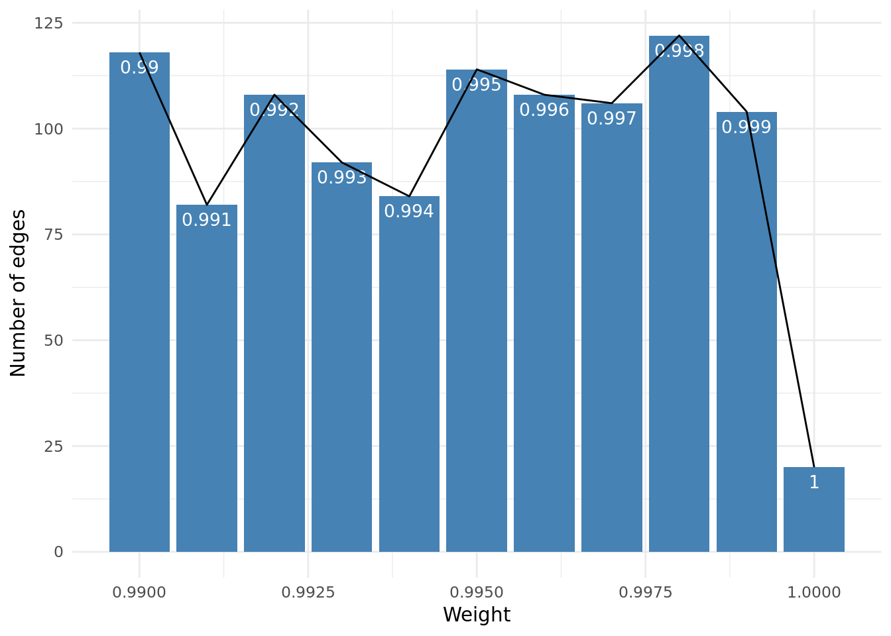

#### Degree distribution of item->similarity->item edges

#### Degree distribution of agent->knows->agent edges

#### Runing time by method 

<table class="table table-condensed" style="width: auto !important; ">
 <thead>
  <tr>
   <th style="text-align:left;"> key </th>
   <th style="text-align:right;"> doc_count </th>
   <th style="text-align:right;"> sum_wallTime_ms.value </th>
   <th style="text-align:left;"> avg_wallTime_ms.value </th>
   <th style="text-align:left;"> includedInTotal </th>
  </tr>
 </thead>
<tbody>
  <tr>
   <td style="text-align:left;"> connectIfSimilar </td>
   <td style="text-align:right;"> 24,090 </td>
   <td style="text-align:right;"> 42,054 </td>
   <td style="text-align:left;"> 1.74570361145704 </td>
   <td style="text-align:left;"> No </td>
  </tr>
  <tr>
   <td style="text-align:left;"> existsSimilarity </td>
   <td style="text-align:right;"> 24,090 </td>
   <td style="text-align:right;"> 41,597 </td>
   <td style="text-align:left;"> 1.72673308426733 </td>
   <td style="text-align:left;"> No </td>
  </tr>
  <tr>
   <td style="text-align:left;"> similarityEdges </td>
   <td style="text-align:right;"> 24,090 </td>
   <td style="text-align:right;"> 40,894 </td>
   <td style="text-align:left;"> 1.69755085097551 </td>
   <td style="text-align:left;"> No </td>
  </tr>
  <tr>
   <td style="text-align:left;"> connectAllSimilar </td>
   <td style="text-align:right;"> 220 </td>
   <td style="text-align:right;"> 42,311 </td>
   <td style="text-align:left;"> 192.322727272727 </td>
   <td style="text-align:left;"> Yes </td>
  </tr>
  <tr>
   <td style="text-align:left;"> init </td>
   <td style="text-align:right;"> 103 </td>
   <td style="text-align:right;"> 10,697 </td>
   <td style="text-align:left;"> 103.854368932039 </td>
   <td style="text-align:left;"> No </td>
  </tr>
  <tr>
   <td style="text-align:left;"> connect </td>
   <td style="text-align:right;"> 7 </td>
   <td style="text-align:right;"> 9 </td>
   <td style="text-align:left;"> 1.28571428571429 </td>
   <td style="text-align:left;"> Yes </td>
  </tr>
  <tr>
   <td style="text-align:left;font-weight: bold;"> Total </td>
   <td style="text-align:right;font-weight: bold;"> 235 </td>
   <td style="text-align:right;font-weight: bold;"> 42,652 </td>
   <td style="text-align:left;font-weight: bold;">  </td>
   <td style="text-align:left;font-weight: bold;">  </td>
  </tr>
</tbody>
</table>
####  Found structures 

#####  Cycles 

Number of cycles found:  1 

<button class="btn btn-primary" data-toggle="collapse" data-target="#AQQYIVDQIT"> Show/Hide foundCycle query </button> 
 
  
     GET /filebeat-*/_search 
              { 
                "query": {
                  "bool": {
                    "must": [
                      { "match_phrase": {
                        "simulationId": "SIM10-06-07-55-pVTCaf--CV"
                        }
                      },
                      { "bool": {
                        "should": [
                          { "match": {
                            "keyword": "foundCycle"
                          }}
                        ]
                      }}
                    ]
                  }
                }
              }
     

#####  Paths 

Number of paths found:  0 

<button class="btn btn-primary" data-toggle="collapse" data-target="#TIGWLOAXSJ"> Show/Hide foundPath query </button> 
 
  
     GET /filebeat-*/_search 
              { 
                "query": {
                  "bool": {
                    "must": [
                      { "match_phrase": {
                        "simulationId": "SIM10-06-07-55-pVTCaf--CV"
                        }
                      },
                      { "bool": {
                        "should": [
                          { "match": {
                            "keyword": "foundPath"
                          }}
                        ]
                      }}
                    ]
                  }
                }
              }
     

###  SIM10-06-07-55-pVTCaf--DV 

#### simulationParameters 

<table class="table table-condensed" style="width: auto !important; ">
 <thead>
  <tr>
   <th style="text-align:left;"> agentNumber </th>
   <th style="text-align:left;"> similarityConnectThreshold </th>
   <th style="text-align:left;"> graphType </th>
   <th style="text-align:left;"> chainLength </th>
   <th style="text-align:left;"> similaritySearchThreshold </th>
   <th style="text-align:left;"> maxDistance </th>
   <th style="text-align:left;"> randomWorksNumberMultiplier </th>
  </tr>
 </thead>
<tbody>
  <tr>
   <td style="text-align:left;width: 20em; "> 100 </td>
   <td style="text-align:left;width: 15em; "> 0.99 </td>
   <td style="text-align:left;width: 15em; "> random </td>
   <td style="text-align:left;width: 15em; "> 10 </td>
   <td style="text-align:left;width: 15em; "> 1 </td>
   <td style="text-align:left;width: 15em; "> 30 </td>
   <td style="text-align:left;width: 15em; "> 1 </td>
  </tr>
</tbody>
</table>
#### allEdgesByLabel

<table class="table table-condensed" style="width: auto !important; ">
 <thead>
  <tr>
   <th style="text-align:right;"> edges_offers </th>
   <th style="text-align:right;"> edges_similarity </th>
   <th style="text-align:right;"> edges_owns </th>
   <th style="text-align:right;"> edges_demands </th>
   <th style="text-align:right;"> edges_knows </th>
   <th style="text-align:right;"> edges_total </th>
  </tr>
 </thead>
<tbody>
  <tr>
   <td style="text-align:right;width: 5em; "> 110 </td>
   <td style="text-align:right;width: 5em; "> 1,044 </td>
   <td style="text-align:right;width: 5em; "> 110 </td>
   <td style="text-align:right;width: 5em; "> 110 </td>
   <td style="text-align:right;width: 5em; "> 100 </td>
   <td style="text-align:right;width: 5em; "> 1,474 </td>
  </tr>
</tbody>
</table>
#### allVerticesByType

<table class="table table-condensed" style="width: auto !important; ">
 <thead>
  <tr>
   <th style="text-align:right;"> vertices_agent </th>
   <th style="text-align:right;"> vertices_item </th>
   <th style="text-align:right;"> vertices_work </th>
   <th style="text-align:right;"> vertices_total </th>
  </tr>
 </thead>
<tbody>
  <tr>
   <td style="text-align:right;width: 5em; "> 101 </td>
   <td style="text-align:right;width: 5em; "> 220 </td>
   <td style="text-align:right;width: 5em; "> 110 </td>
   <td style="text-align:right;width: 5em; "> 431 </td>
  </tr>
</tbody>
</table>
#### distribution of similarityEdgesByWeight

#### Degree distribution of item->similarity->item edges

#### Degree distribution of agent->knows->agent edges

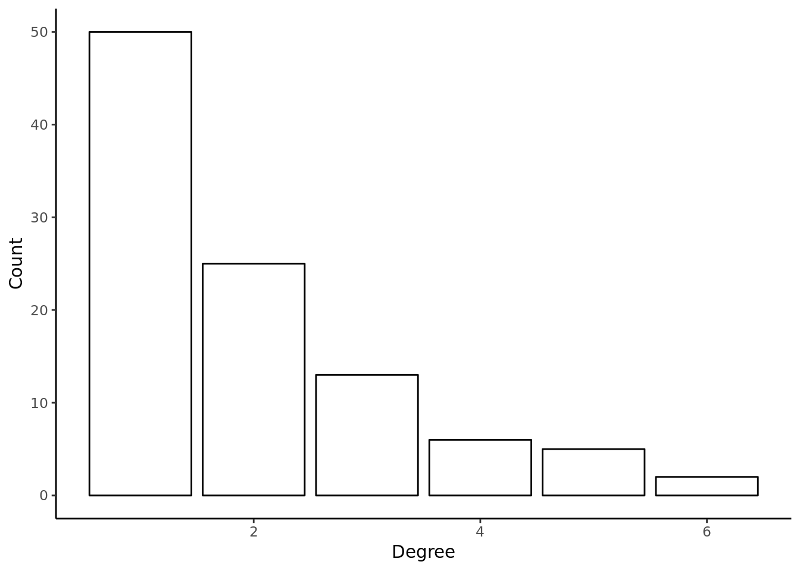

#### Runing time by method 

<table class="table table-condensed" style="width: auto !important; ">
 <thead>
  <tr>
   <th style="text-align:left;">   </th>
   <th style="text-align:left;"> key </th>
   <th style="text-align:right;"> doc_count </th>
   <th style="text-align:right;"> sum_wallTime_ms.value </th>
   <th style="text-align:left;"> avg_wallTime_ms.value </th>
   <th style="text-align:left;"> includedInTotal </th>
  </tr>
 </thead>
<tbody>
  <tr>
   <td style="text-align:left;"> 1 </td>
   <td style="text-align:left;"> addItemToWork </td>
   <td style="text-align:right;"> 220 </td>
   <td style="text-align:right;"> 1,224 </td>
   <td style="text-align:left;"> 5.56363636363636 </td>
   <td style="text-align:left;"> No </td>
  </tr>
  <tr>
   <td style="text-align:left;"> 2 </td>
   <td style="text-align:left;"> ownsWork </td>
   <td style="text-align:right;"> 110 </td>
   <td style="text-align:right;"> 676 </td>
   <td style="text-align:left;"> 6.14545454545455 </td>
   <td style="text-align:left;"> No </td>
  </tr>
  <tr>
   <td style="text-align:left;"> 3 </td>
   <td style="text-align:left;"> init </td>
   <td style="text-align:right;"> 103 </td>
   <td style="text-align:right;"> 11,382 </td>
   <td style="text-align:left;"> 110.504854368932 </td>
   <td style="text-align:left;"> No </td>
  </tr>
  <tr>
   <td style="text-align:left;"> 4 </td>
   <td style="text-align:left;"> searchAndConnect </td>
   <td style="text-align:right;"> 101 </td>
   <td style="text-align:right;"> 31,675 </td>
   <td style="text-align:left;"> 313.613861386139 </td>
   <td style="text-align:left;"> Yes </td>
  </tr>
  <tr>
   <td style="text-align:left;"> 5 </td>
   <td style="text-align:left;"> knowsAgent </td>
   <td style="text-align:right;"> 100 </td>
   <td style="text-align:right;"> 487 </td>
   <td style="text-align:left;"> 4.87 </td>
   <td style="text-align:left;"> No </td>
  </tr>
  <tr>
   <td style="text-align:left;"> 6 </td>
   <td style="text-align:left;"> getWorksItems </td>
   <td style="text-align:right;"> 18 </td>
   <td style="text-align:right;"> 53 </td>
   <td style="text-align:left;"> 2.94444444444444 </td>
   <td style="text-align:left;"> Yes </td>
  </tr>
  <tr>
   <td style="text-align:left;"> 9 </td>
   <td style="text-align:left;"> cycleSearch </td>
   <td style="text-align:right;"> 2 </td>
   <td style="text-align:right;"> 34 </td>
   <td style="text-align:left;"> 17 </td>
   <td style="text-align:left;"> Yes </td>
  </tr>
  <tr>
   <td style="text-align:left;"> 10 </td>
   <td style="text-align:left;"> getWorks </td>
   <td style="text-align:right;"> 2 </td>
   <td style="text-align:right;"> 5 </td>
   <td style="text-align:left;"> 2.5 </td>
   <td style="text-align:left;"> No </td>
  </tr>
  <tr>
   <td style="text-align:left;font-weight: bold;"> 11 </td>
   <td style="text-align:left;font-weight: bold;"> Total </td>
   <td style="text-align:right;font-weight: bold;"> 128 </td>
   <td style="text-align:right;font-weight: bold;"> 32,174 </td>
   <td style="text-align:left;font-weight: bold;">  </td>
   <td style="text-align:left;font-weight: bold;">  </td>
  </tr>
</tbody>
</table>
####  Found structures 

#####  Cycles 

Number of cycles found:  2 

<button class="btn btn-primary" data-toggle="collapse" data-target="#DIGUNBGWYQ"> Show/Hide foundCycle query </button> 
 
  
     GET /filebeat-*/_search 
              { 
                "query": {
                  "bool": {
                    "must": [
                      { "match_phrase": {
                        "simulationId": "SIM10-06-07-55-pVTCaf--DV"
                        }
                      },
                      { "bool": {
                        "should": [
                          { "match": {
                            "keyword": "foundCycle"
                          }}
                        ]
                      }}
                    ]
                  }
                }
              }
     

#####  Paths 

Number of paths found:  0 

<button class="btn btn-primary" data-toggle="collapse" data-target="#GIZYKGGUAT"> Show/Hide foundPath query </button> 
 
  
     GET /filebeat-*/_search 
              { 
                "query": {
                  "bool": {
                    "must": [
                      { "match_phrase": {
                        "simulationId": "SIM10-06-07-55-pVTCaf--DV"
                        }
                      },
                      { "bool": {
                        "should": [
                          { "match": {
                            "keyword": "foundPath"
                          }}
                        ]
                      }}
                    ]
                  }
                }
              }
     

###  SIM10-06-07-56-zPYDAF--CV 

#### simulationParameters 

<table class="table table-condensed" style="width: auto !important; ">
 <thead>
  <tr>
   <th style="text-align:left;"> agentNumber </th>
   <th style="text-align:left;"> similarityConnectThreshold </th>
   <th style="text-align:left;"> graphType </th>
   <th style="text-align:left;"> chainLength </th>
   <th style="text-align:left;"> similaritySearchThreshold </th>
   <th style="text-align:left;"> maxDistance </th>
   <th style="text-align:left;"> randomWorksNumberMultiplier </th>
  </tr>
 </thead>
<tbody>
  <tr>
   <td style="text-align:left;width: 20em; "> 100 </td>
   <td style="text-align:left;width: 15em; "> 0.99 </td>
   <td style="text-align:left;width: 15em; "> smallWorld </td>
   <td style="text-align:left;width: 15em; "> 10 </td>
   <td style="text-align:left;width: 15em; "> 1 </td>
   <td style="text-align:left;width: 15em; "> 30 </td>
   <td style="text-align:left;width: 15em; "> 1 </td>
  </tr>
</tbody>
</table>
#### allEdgesByLabel

<table class="table table-condensed" style="width: auto !important; ">
 <thead>
  <tr>
   <th style="text-align:right;"> edges_offers </th>
   <th style="text-align:right;"> edges_similarity </th>
   <th style="text-align:right;"> edges_owns </th>
   <th style="text-align:right;"> edges_demands </th>
   <th style="text-align:right;"> edges_knows </th>
   <th style="text-align:right;"> edges_total </th>
  </tr>
 </thead>
<tbody>
  <tr>
   <td style="text-align:right;width: 5em; "> 110 </td>
   <td style="text-align:right;width: 5em; "> 1,156 </td>
   <td style="text-align:right;width: 5em; "> 110 </td>
   <td style="text-align:right;width: 5em; "> 110 </td>
   <td style="text-align:right;width: 5em; "> 601 </td>
   <td style="text-align:right;width: 5em; "> 2,087 </td>
  </tr>
</tbody>
</table>
#### allVerticesByType

<table class="table table-condensed" style="width: auto !important; ">
 <thead>
  <tr>
   <th style="text-align:right;"> vertices_agent </th>
   <th style="text-align:right;"> vertices_item </th>
   <th style="text-align:right;"> vertices_work </th>
   <th style="text-align:right;"> vertices_total </th>
  </tr>
 </thead>
<tbody>
  <tr>
   <td style="text-align:right;width: 5em; "> 101 </td>
   <td style="text-align:right;width: 5em; "> 220 </td>
   <td style="text-align:right;width: 5em; "> 110 </td>
   <td style="text-align:right;width: 5em; "> 431 </td>
  </tr>
</tbody>
</table>
#### distribution of similarityEdgesByWeight

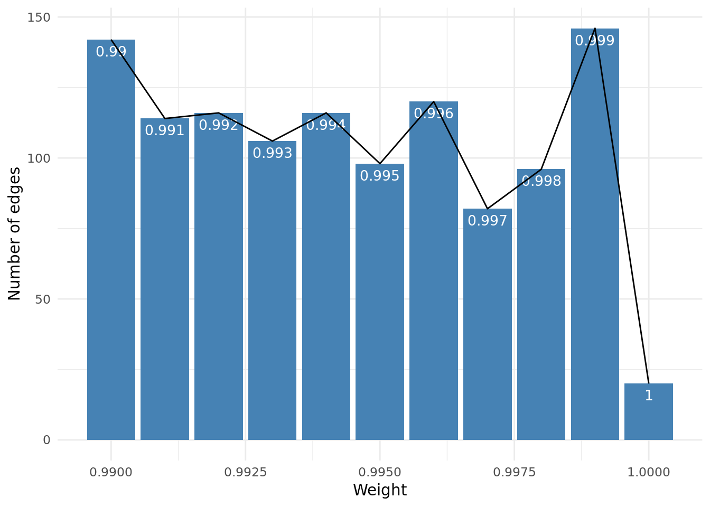

#### Degree distribution of item->similarity->item edges

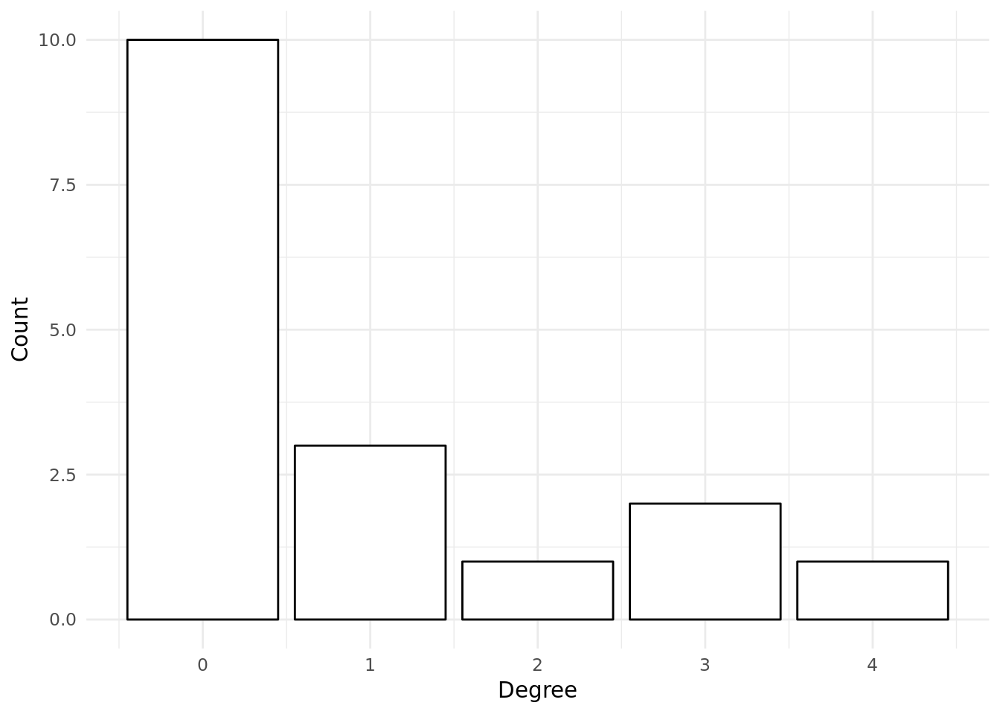

#### Degree distribution of agent->knows->agent edges

#### Runing time by method 

<table class="table table-condensed" style="width: auto !important; ">
 <thead>
  <tr>
   <th style="text-align:left;">   </th>
   <th style="text-align:left;"> key </th>
   <th style="text-align:right;"> doc_count </th>
   <th style="text-align:right;"> sum_wallTime_ms.value </th>
   <th style="text-align:left;"> avg_wallTime_ms.value </th>
   <th style="text-align:left;"> includedInTotal </th>
  </tr>
 </thead>
<tbody>
  <tr>
   <td style="text-align:left;"> 1 </td>
   <td style="text-align:left;"> connectIfSimilar </td>
   <td style="text-align:right;"> 24,090 </td>
   <td style="text-align:right;"> 40,520 </td>
   <td style="text-align:left;"> 1.68202573682026 </td>
   <td style="text-align:left;"> No </td>
  </tr>
  <tr>
   <td style="text-align:left;"> 2 </td>
   <td style="text-align:left;"> existsSimilarity </td>
   <td style="text-align:right;"> 24,090 </td>
   <td style="text-align:right;"> 40,037 </td>
   <td style="text-align:left;"> 1.66197592361976 </td>
   <td style="text-align:left;"> No </td>
  </tr>
  <tr>
   <td style="text-align:left;"> 3 </td>
   <td style="text-align:left;"> similarityEdges </td>
   <td style="text-align:right;"> 24,090 </td>
   <td style="text-align:right;"> 39,386 </td>
   <td style="text-align:left;"> 1.63495226234952 </td>
   <td style="text-align:left;"> No </td>
  </tr>
  <tr>
   <td style="text-align:left;"> 4 </td>
   <td style="text-align:left;"> connectAllSimilar </td>
   <td style="text-align:right;"> 220 </td>
   <td style="text-align:right;"> 40,734 </td>
   <td style="text-align:left;"> 185.154545454545 </td>
   <td style="text-align:left;"> Yes </td>
  </tr>
  <tr>
   <td style="text-align:left;"> 5 </td>
   <td style="text-align:left;"> init </td>
   <td style="text-align:right;"> 103 </td>
   <td style="text-align:right;"> 10,578 </td>
   <td style="text-align:left;"> 102.699029126214 </td>
   <td style="text-align:left;"> No </td>
  </tr>
  <tr>
   <td style="text-align:left;"> 7 </td>
   <td style="text-align:left;"> connect </td>
   <td style="text-align:right;"> 4 </td>
   <td style="text-align:right;"> 24 </td>
   <td style="text-align:left;"> 6 </td>
   <td style="text-align:left;"> Yes </td>
  </tr>
  <tr>
   <td style="text-align:left;font-weight: bold;"> 11 </td>
   <td style="text-align:left;font-weight: bold;"> Total </td>
   <td style="text-align:right;font-weight: bold;"> 232 </td>
   <td style="text-align:right;font-weight: bold;"> 41,112 </td>
   <td style="text-align:left;font-weight: bold;">  </td>
   <td style="text-align:left;font-weight: bold;">  </td>
  </tr>
</tbody>
</table>
####  Found structures 

#####  Cycles 

Number of cycles found:  1 

<button class="btn btn-primary" data-toggle="collapse" data-target="#WMIBRNNIUB"> Show/Hide foundCycle query </button> 
 
  
     GET /filebeat-*/_search 
              { 
                "query": {
                  "bool": {
                    "must": [
                      { "match_phrase": {
                        "simulationId": "SIM10-06-07-56-zPYDAF--CV"
                        }
                      },
                      { "bool": {
                        "should": [
                          { "match": {
                            "keyword": "foundCycle"
                          }}
                        ]
                      }}
                    ]
                  }
                }
              }
     

#####  Paths 

Number of paths found:  0 

<button class="btn btn-primary" data-toggle="collapse" data-target="#LVKIHXMJQK"> Show/Hide foundPath query </button> 
 
  
     GET /filebeat-*/_search 
              { 
                "query": {
                  "bool": {
                    "must": [
                      { "match_phrase": {
                        "simulationId": "SIM10-06-07-56-zPYDAF--CV"
                        }
                      },
                      { "bool": {
                        "should": [
                          { "match": {
                            "keyword": "foundPath"
                          }}
                        ]
                      }}
                    ]
                  }
                }
              }
     

###  SIM10-06-07-56-zPYDAF--DV 

#### simulationParameters 

<table class="table table-condensed" style="width: auto !important; ">
 <thead>
  <tr>
   <th style="text-align:left;"> agentNumber </th>
   <th style="text-align:left;"> similarityConnectThreshold </th>
   <th style="text-align:left;"> graphType </th>
   <th style="text-align:left;"> chainLength </th>
   <th style="text-align:left;"> similaritySearchThreshold </th>
   <th style="text-align:left;"> maxDistance </th>
   <th style="text-align:left;"> randomWorksNumberMultiplier </th>
  </tr>
 </thead>
<tbody>
  <tr>
   <td style="text-align:left;width: 20em; "> 100 </td>
   <td style="text-align:left;width: 15em; "> 0.99 </td>
   <td style="text-align:left;width: 15em; "> smallWorld </td>
   <td style="text-align:left;width: 15em; "> 10 </td>
   <td style="text-align:left;width: 15em; "> 1 </td>
   <td style="text-align:left;width: 15em; "> 30 </td>
   <td style="text-align:left;width: 15em; "> 1 </td>
  </tr>
</tbody>
</table>
#### allEdgesByLabel

<table class="table table-condensed" style="width: auto !important; ">
 <thead>
  <tr>
   <th style="text-align:right;"> edges_offers </th>
   <th style="text-align:right;"> edges_similarity </th>
   <th style="text-align:right;"> edges_owns </th>
   <th style="text-align:right;"> edges_demands </th>
   <th style="text-align:right;"> edges_knows </th>
   <th style="text-align:right;"> edges_total </th>
  </tr>
 </thead>
<tbody>
  <tr>
   <td style="text-align:right;width: 5em; "> 110 </td>
   <td style="text-align:right;width: 5em; "> 1,148 </td>
   <td style="text-align:right;width: 5em; "> 110 </td>
   <td style="text-align:right;width: 5em; "> 110 </td>
   <td style="text-align:right;width: 5em; "> 601 </td>
   <td style="text-align:right;width: 5em; "> 2,079 </td>
  </tr>
</tbody>
</table>
#### allVerticesByType

<table class="table table-condensed" style="width: auto !important; ">
 <thead>
  <tr>
   <th style="text-align:right;"> vertices_agent </th>
   <th style="text-align:right;"> vertices_item </th>
   <th style="text-align:right;"> vertices_work </th>
   <th style="text-align:right;"> vertices_total </th>
  </tr>
 </thead>
<tbody>
  <tr>
   <td style="text-align:right;width: 5em; "> 101 </td>
   <td style="text-align:right;width: 5em; "> 220 </td>
   <td style="text-align:right;width: 5em; "> 110 </td>
   <td style="text-align:right;width: 5em; "> 431 </td>
  </tr>
</tbody>
</table>
#### distribution of similarityEdgesByWeight

#### Degree distribution of item->similarity->item edges

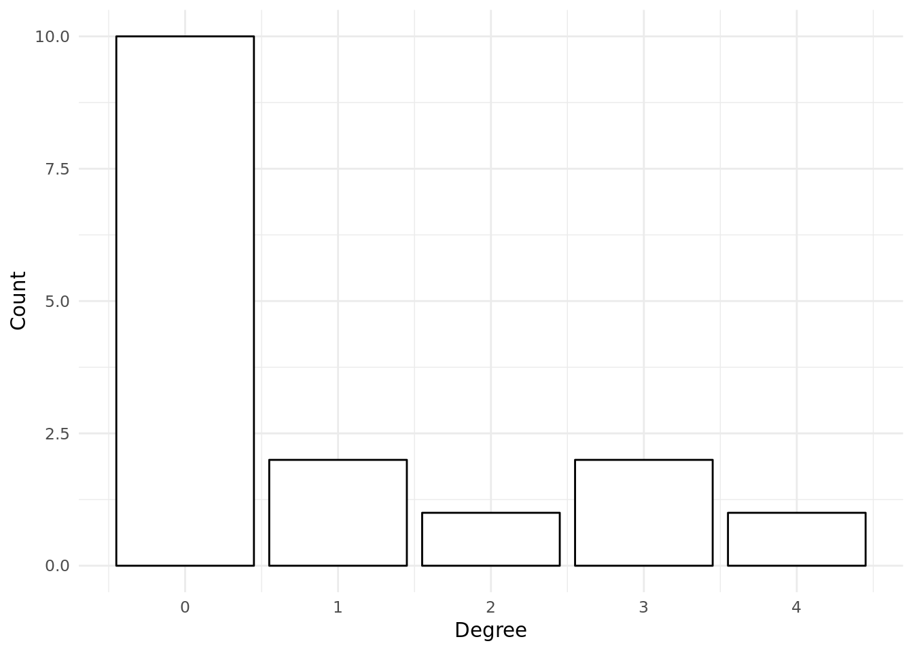

#### Degree distribution of agent->knows->agent edges

#### Runing time by method 

<table class="table table-condensed" style="width: auto !important; ">
 <thead>
  <tr>
   <th style="text-align:left;">   </th>
   <th style="text-align:left;"> key </th>
   <th style="text-align:right;"> doc_count </th>
   <th style="text-align:right;"> sum_wallTime_ms.value </th>
   <th style="text-align:left;"> avg_wallTime_ms.value </th>
   <th style="text-align:left;"> includedInTotal </th>
  </tr>
 </thead>
<tbody>
  <tr>
   <td style="text-align:left;"> 1 </td>
   <td style="text-align:left;"> knowsAgent </td>
   <td style="text-align:right;"> 601 </td>
   <td style="text-align:right;"> 1,009 </td>
   <td style="text-align:left;"> 1.67886855241265 </td>
   <td style="text-align:left;"> No </td>
  </tr>
  <tr>
   <td style="text-align:left;"> 2 </td>
   <td style="text-align:left;"> addItemToWork </td>
   <td style="text-align:right;"> 220 </td>
   <td style="text-align:right;"> 1,277 </td>
   <td style="text-align:left;"> 5.80454545454545 </td>
   <td style="text-align:left;"> No </td>
  </tr>
  <tr>
   <td style="text-align:left;"> 3 </td>
   <td style="text-align:left;"> ownsWork </td>
   <td style="text-align:right;"> 110 </td>
   <td style="text-align:right;"> 629 </td>
   <td style="text-align:left;"> 5.71818181818182 </td>
   <td style="text-align:left;"> No </td>
  </tr>
  <tr>
   <td style="text-align:left;"> 4 </td>
   <td style="text-align:left;"> init </td>
   <td style="text-align:right;"> 103 </td>
   <td style="text-align:right;"> 11,319 </td>
   <td style="text-align:left;"> 109.893203883495 </td>
   <td style="text-align:left;"> No </td>
  </tr>
  <tr>
   <td style="text-align:left;"> 5 </td>
   <td style="text-align:left;"> searchAndConnect </td>
   <td style="text-align:right;"> 101 </td>
   <td style="text-align:right;"> 41,800 </td>
   <td style="text-align:left;"> 413.861386138614 </td>
   <td style="text-align:left;"> Yes </td>
  </tr>
  <tr>
   <td style="text-align:left;"> 6 </td>
   <td style="text-align:left;"> getWorksItems </td>
   <td style="text-align:right;"> 18 </td>
   <td style="text-align:right;"> 27 </td>
   <td style="text-align:left;"> 1.5 </td>
   <td style="text-align:left;"> Yes </td>
  </tr>
  <tr>
   <td style="text-align:left;"> 9 </td>
   <td style="text-align:left;"> cycleSearch </td>
   <td style="text-align:right;"> 2 </td>
   <td style="text-align:right;"> 35 </td>
   <td style="text-align:left;"> 17.5 </td>
   <td style="text-align:left;"> Yes </td>
  </tr>
  <tr>
   <td style="text-align:left;"> 10 </td>
   <td style="text-align:left;"> getWorks </td>
   <td style="text-align:right;"> 2 </td>
   <td style="text-align:right;"> 51 </td>
   <td style="text-align:left;"> 25.5 </td>
   <td style="text-align:left;"> No </td>
  </tr>
  <tr>
   <td style="text-align:left;font-weight: bold;"> 11 </td>
   <td style="text-align:left;font-weight: bold;"> Total </td>
   <td style="text-align:right;font-weight: bold;"> 128 </td>
   <td style="text-align:right;font-weight: bold;"> 42,431 </td>
   <td style="text-align:left;font-weight: bold;">  </td>
   <td style="text-align:left;font-weight: bold;">  </td>
  </tr>
</tbody>
</table>
####  Found structures 

#####  Cycles 

Number of cycles found:  2 

<button class="btn btn-primary" data-toggle="collapse" data-target="#ABPRTHFRTR"> Show/Hide foundCycle query </button> 
 
  
     GET /filebeat-*/_search 
              { 
                "query": {
                  "bool": {
                    "must": [
                      { "match_phrase": {
                        "simulationId": "SIM10-06-07-56-zPYDAF--DV"
                        }
                      },
                      { "bool": {
                        "should": [
                          { "match": {
                            "keyword": "foundCycle"
                          }}
                        ]
                      }}
                    ]
                  }
                }
              }
     

#####  Paths 

Number of paths found:  0 

<button class="btn btn-primary" data-toggle="collapse" data-target="#KXXQZYLOOD"> Show/Hide foundPath query </button> 
 
  
     GET /filebeat-*/_search 
              { 
                "query": {
                  "bool": {
                    "must": [
                      { "match_phrase": {
                        "simulationId": "SIM10-06-07-56-zPYDAF--DV"
                        }
                      },
                      { "bool": {
                        "should": [
                          { "match": {
                            "keyword": "foundPath"
                          }}
                        ]
                      }}
                    ]
                  }
                }
              }
     

###  SIM10-06-09-09-5a8My6--CV 

#### simulationParameters 

<table class="table table-condensed" style="width: auto !important; ">
 <thead>
  <tr>
   <th style="text-align:left;"> agentNumber </th>
   <th style="text-align:left;"> similarityConnectThreshold </th>
   <th style="text-align:left;"> graphType </th>
   <th style="text-align:left;"> chainLength </th>
   <th style="text-align:left;"> similaritySearchThreshold </th>
   <th style="text-align:left;"> maxDistance </th>
   <th style="text-align:left;"> randomWorksNumberMultiplier </th>
  </tr>
 </thead>
<tbody>
  <tr>
   <td style="text-align:left;width: 20em; "> 100 </td>
   <td style="text-align:left;width: 15em; "> 0.99 </td>
   <td style="text-align:left;width: 15em; "> random </td>
   <td style="text-align:left;width: 15em; "> 10 </td>
   <td style="text-align:left;width: 15em; "> 1 </td>
   <td style="text-align:left;width: 15em; "> 30 </td>
   <td style="text-align:left;width: 15em; "> 2 </td>
  </tr>
</tbody>
</table>
#### allEdgesByLabel

<table class="table table-condensed" style="width: auto !important; ">
 <thead>
  <tr>
   <th style="text-align:right;"> edges_offers </th>
   <th style="text-align:right;"> edges_similarity </th>
   <th style="text-align:right;"> edges_owns </th>
   <th style="text-align:right;"> edges_demands </th>
   <th style="text-align:right;"> edges_knows </th>
   <th style="text-align:right;"> edges_total </th>
  </tr>
 </thead>
<tbody>
  <tr>
   <td style="text-align:right;width: 5em; "> 210 </td>
   <td style="text-align:right;width: 5em; "> 3,680 </td>
   <td style="text-align:right;width: 5em; "> 210 </td>
   <td style="text-align:right;width: 5em; "> 210 </td>
   <td style="text-align:right;width: 5em; "> 100 </td>
   <td style="text-align:right;width: 5em; "> 4,410 </td>
  </tr>
</tbody>
</table>
#### allVerticesByType

<table class="table table-condensed" style="width: auto !important; ">
 <thead>
  <tr>
   <th style="text-align:right;"> vertices_agent </th>
   <th style="text-align:right;"> vertices_item </th>
   <th style="text-align:right;"> vertices_work </th>
   <th style="text-align:right;"> vertices_total </th>
  </tr>
 </thead>
<tbody>
  <tr>
   <td style="text-align:right;width: 5em; "> 101 </td>
   <td style="text-align:right;width: 5em; "> 420 </td>
   <td style="text-align:right;width: 5em; "> 210 </td>
   <td style="text-align:right;width: 5em; "> 731 </td>
  </tr>
</tbody>
</table>
#### distribution of similarityEdgesByWeight

#### Degree distribution of item->similarity->item edges

#### Degree distribution of agent->knows->agent edges

#### Runing time by method 

<table class="table table-condensed" style="width: auto !important; ">
 <thead>
  <tr>
   <th style="text-align:left;"> key </th>
   <th style="text-align:right;"> doc_count </th>
   <th style="text-align:right;"> sum_wallTime_ms.value </th>
   <th style="text-align:left;"> avg_wallTime_ms.value </th>
   <th style="text-align:left;"> includedInTotal </th>
  </tr>
 </thead>
<tbody>
  <tr>
   <td style="text-align:left;"> connectIfSimilar </td>
   <td style="text-align:right;"> 87,990 </td>
   <td style="text-align:right;"> 164,768 </td>
   <td style="text-align:left;"> 1.87257642913967 </td>
   <td style="text-align:left;"> No </td>
  </tr>
  <tr>
   <td style="text-align:left;"> existsSimilarity </td>
   <td style="text-align:right;"> 87,990 </td>
   <td style="text-align:right;"> 163,074 </td>
   <td style="text-align:left;"> 1.85332424139107 </td>
   <td style="text-align:left;"> No </td>
  </tr>
  <tr>
   <td style="text-align:left;"> similarityEdges </td>
   <td style="text-align:right;"> 87,990 </td>
   <td style="text-align:right;"> 160,455 </td>
   <td style="text-align:left;"> 1.8235594953972 </td>
   <td style="text-align:left;"> No </td>
  </tr>
  <tr>
   <td style="text-align:left;"> connectAllSimilar </td>
   <td style="text-align:right;"> 420 </td>
   <td style="text-align:right;"> 165,670 </td>
   <td style="text-align:left;"> 394.452380952381 </td>
   <td style="text-align:left;"> Yes </td>
  </tr>
  <tr>
   <td style="text-align:left;"> init </td>
   <td style="text-align:right;"> 103 </td>
   <td style="text-align:right;"> 11,033 </td>
   <td style="text-align:left;"> 107.116504854369 </td>
   <td style="text-align:left;"> No </td>
  </tr>
  <tr>
   <td style="text-align:left;"> connect </td>
   <td style="text-align:right;"> 18 </td>
   <td style="text-align:right;"> 32 </td>
   <td style="text-align:left;"> 1.77777777777778 </td>
   <td style="text-align:left;"> Yes </td>
  </tr>
  <tr>
   <td style="text-align:left;font-weight: bold;"> Total </td>
   <td style="text-align:right;font-weight: bold;"> 446 </td>
   <td style="text-align:right;font-weight: bold;"> 166,231 </td>
   <td style="text-align:left;font-weight: bold;">  </td>
   <td style="text-align:left;font-weight: bold;">  </td>
  </tr>
</tbody>
</table>
####  Found structures 

#####  Cycles 

Number of cycles found:  1 

<button class="btn btn-primary" data-toggle="collapse" data-target="#WVNPQRMXFH"> Show/Hide foundCycle query </button> 
 
  
     GET /filebeat-*/_search 
              { 
                "query": {
                  "bool": {
                    "must": [
                      { "match_phrase": {
                        "simulationId": "SIM10-06-09-09-5a8My6--CV"
                        }
                      },
                      { "bool": {
                        "should": [
                          { "match": {
                            "keyword": "foundCycle"
                          }}
                        ]
                      }}
                    ]
                  }
                }
              }
     

#####  Paths 

Number of paths found:  0 

<button class="btn btn-primary" data-toggle="collapse" data-target="#NUFAVRXCCD"> Show/Hide foundPath query </button> 
 
  
     GET /filebeat-*/_search 
              { 
                "query": {
                  "bool": {
                    "must": [
                      { "match_phrase": {
                        "simulationId": "SIM10-06-09-09-5a8My6--CV"
                        }
                      },
                      { "bool": {
                        "should": [
                          { "match": {
                            "keyword": "foundPath"
                          }}
                        ]
                      }}
                    ]
                  }
                }
              }
     

###  SIM10-06-09-09-5a8My6--DV 

#### simulationParameters 

<table class="table table-condensed" style="width: auto !important; ">
 <thead>
  <tr>
   <th style="text-align:left;"> agentNumber </th>
   <th style="text-align:left;"> similarityConnectThreshold </th>
   <th style="text-align:left;"> graphType </th>
   <th style="text-align:left;"> chainLength </th>
   <th style="text-align:left;"> similaritySearchThreshold </th>
   <th style="text-align:left;"> maxDistance </th>
   <th style="text-align:left;"> randomWorksNumberMultiplier </th>
  </tr>
 </thead>
<tbody>
  <tr>
   <td style="text-align:left;width: 20em; "> 100 </td>
   <td style="text-align:left;width: 15em; "> 0.99 </td>
   <td style="text-align:left;width: 15em; "> random </td>
   <td style="text-align:left;width: 15em; "> 10 </td>
   <td style="text-align:left;width: 15em; "> 1 </td>
   <td style="text-align:left;width: 15em; "> 30 </td>
   <td style="text-align:left;width: 15em; "> 2 </td>
  </tr>
</tbody>
</table>
#### allEdgesByLabel

<table class="table table-condensed" style="width: auto !important; ">
 <thead>
  <tr>
   <th style="text-align:right;"> edges_offers </th>
   <th style="text-align:right;"> edges_similarity </th>
   <th style="text-align:right;"> edges_owns </th>
   <th style="text-align:right;"> edges_demands </th>
   <th style="text-align:right;"> edges_knows </th>
   <th style="text-align:right;"> edges_total </th>
  </tr>
 </thead>
<tbody>
  <tr>
   <td style="text-align:right;width: 5em; "> 210 </td>
   <td style="text-align:right;width: 5em; "> 3,644 </td>
   <td style="text-align:right;width: 5em; "> 210 </td>
   <td style="text-align:right;width: 5em; "> 210 </td>
   <td style="text-align:right;width: 5em; "> 100 </td>
   <td style="text-align:right;width: 5em; "> 4,374 </td>
  </tr>
</tbody>
</table>
#### allVerticesByType

<table class="table table-condensed" style="width: auto !important; ">
 <thead>
  <tr>
   <th style="text-align:right;"> vertices_agent </th>
   <th style="text-align:right;"> vertices_item </th>
   <th style="text-align:right;"> vertices_work </th>
   <th style="text-align:right;"> vertices_total </th>
  </tr>
 </thead>
<tbody>
  <tr>
   <td style="text-align:right;width: 5em; "> 101 </td>
   <td style="text-align:right;width: 5em; "> 420 </td>
   <td style="text-align:right;width: 5em; "> 210 </td>
   <td style="text-align:right;width: 5em; "> 731 </td>
  </tr>
</tbody>
</table>
#### distribution of similarityEdgesByWeight

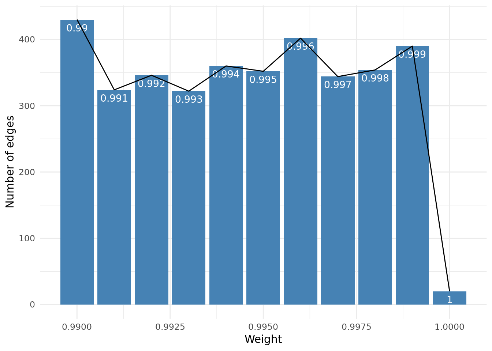

#### Degree distribution of item->similarity->item edges

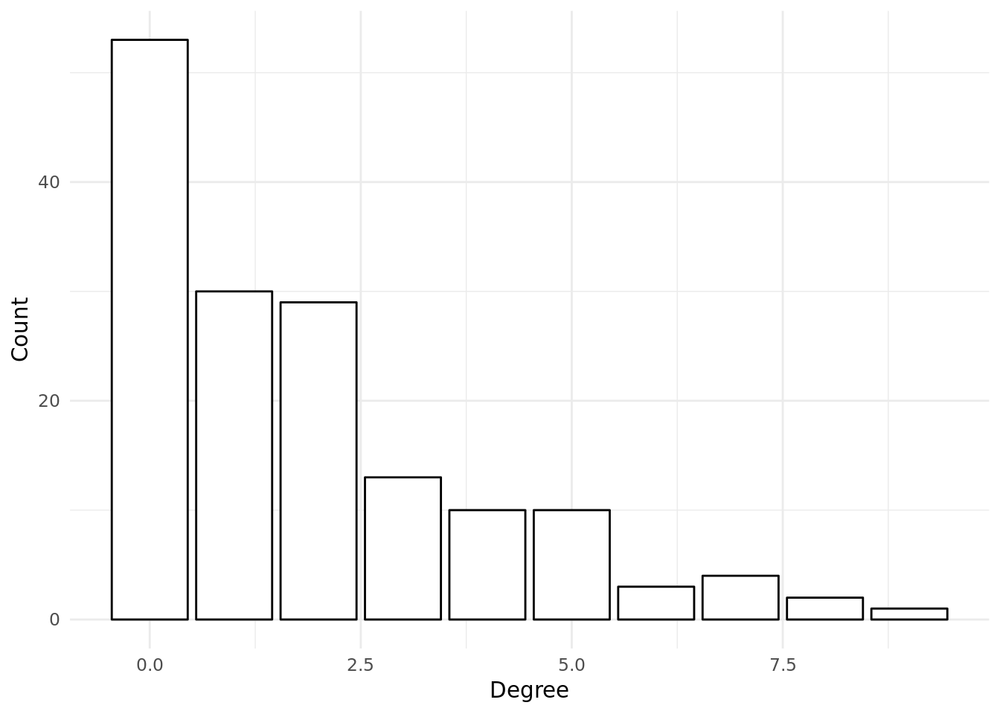

#### Degree distribution of agent->knows->agent edges

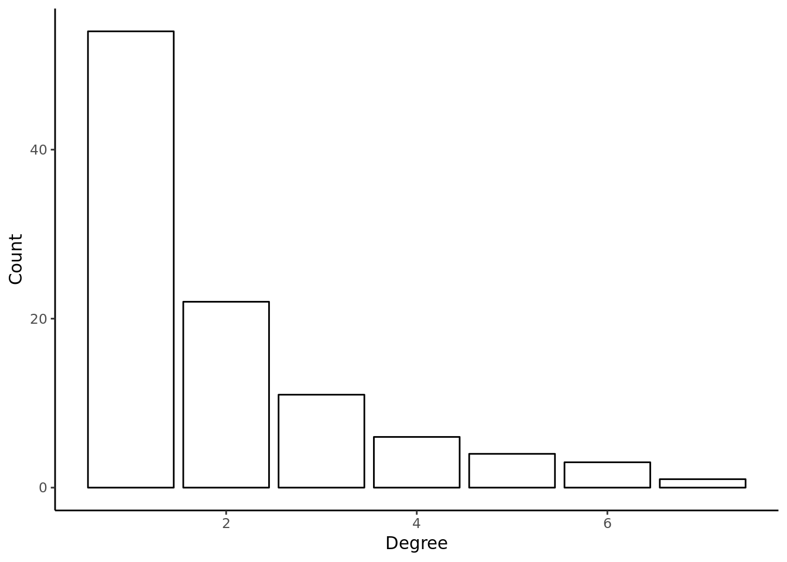

#### Runing time by method 

<table class="table table-condensed" style="width: auto !important; ">
 <thead>
  <tr>
   <th style="text-align:left;">   </th>
   <th style="text-align:left;"> key </th>
   <th style="text-align:right;"> doc_count </th>
   <th style="text-align:right;"> sum_wallTime_ms.value </th>
   <th style="text-align:left;"> avg_wallTime_ms.value </th>
   <th style="text-align:left;"> includedInTotal </th>
  </tr>
 </thead>
<tbody>
  <tr>
   <td style="text-align:left;"> 1 </td>
   <td style="text-align:left;"> addItemToWork </td>
   <td style="text-align:right;"> 420 </td>
   <td style="text-align:right;"> 2,745 </td>
   <td style="text-align:left;"> 6.53571428571429 </td>
   <td style="text-align:left;"> No </td>
  </tr>
  <tr>
   <td style="text-align:left;"> 2 </td>
   <td style="text-align:left;"> ownsWork </td>
   <td style="text-align:right;"> 210 </td>
   <td style="text-align:right;"> 1,331 </td>
   <td style="text-align:left;"> 6.33809523809524 </td>
   <td style="text-align:left;"> No </td>
  </tr>
  <tr>
   <td style="text-align:left;"> 3 </td>
   <td style="text-align:left;"> init </td>
   <td style="text-align:right;"> 103 </td>
   <td style="text-align:right;"> 11,650 </td>
   <td style="text-align:left;"> 113.106796116505 </td>
   <td style="text-align:left;"> No </td>
  </tr>
  <tr>
   <td style="text-align:left;"> 4 </td>
   <td style="text-align:left;"> searchAndConnect </td>
   <td style="text-align:right;"> 101 </td>
   <td style="text-align:right;"> 82,360 </td>
   <td style="text-align:left;"> 815.445544554455 </td>
   <td style="text-align:left;"> Yes </td>
  </tr>
  <tr>
   <td style="text-align:left;"> 5 </td>
   <td style="text-align:left;"> knowsAgent </td>
   <td style="text-align:right;"> 100 </td>
   <td style="text-align:right;"> 294 </td>
   <td style="text-align:left;"> 2.94 </td>
   <td style="text-align:left;"> No </td>
  </tr>
  <tr>
   <td style="text-align:left;"> 6 </td>
   <td style="text-align:left;"> getWorksItems </td>
   <td style="text-align:right;"> 18 </td>
   <td style="text-align:right;"> 31 </td>
   <td style="text-align:left;"> 1.72222222222222 </td>
   <td style="text-align:left;"> Yes </td>
  </tr>
  <tr>
   <td style="text-align:left;"> 9 </td>
   <td style="text-align:left;"> cycleSearch </td>
   <td style="text-align:right;"> 3 </td>
   <td style="text-align:right;"> 64 </td>
   <td style="text-align:left;"> 21.3333333333333 </td>
   <td style="text-align:left;"> Yes </td>
  </tr>
  <tr>
   <td style="text-align:left;"> 10 </td>
   <td style="text-align:left;"> getWorks </td>
   <td style="text-align:right;"> 3 </td>
   <td style="text-align:right;"> 6 </td>
   <td style="text-align:left;"> 2 </td>
   <td style="text-align:left;"> No </td>
  </tr>
  <tr>
   <td style="text-align:left;font-weight: bold;"> 11 </td>
   <td style="text-align:left;font-weight: bold;"> Total </td>
   <td style="text-align:right;font-weight: bold;"> 130 </td>
   <td style="text-align:right;font-weight: bold;"> 83,014 </td>
   <td style="text-align:left;font-weight: bold;">  </td>
   <td style="text-align:left;font-weight: bold;">  </td>
  </tr>
</tbody>
</table>
####  Found structures 

#####  Cycles 

Number of cycles found:  3 

<button class="btn btn-primary" data-toggle="collapse" data-target="#ZYMQQKOPSV"> Show/Hide foundCycle query </button> 
 
  
     GET /filebeat-*/_search 
              { 
                "query": {
                  "bool": {
                    "must": [
                      { "match_phrase": {
                        "simulationId": "SIM10-06-09-09-5a8My6--DV"
                        }
                      },
                      { "bool": {
                        "should": [
                          { "match": {
                            "keyword": "foundCycle"
                          }}
                        ]
                      }}
                    ]
                  }
                }
              }
     

#####  Paths 

Number of paths found:  0 

<button class="btn btn-primary" data-toggle="collapse" data-target="#AXRSFRBQDO"> Show/Hide foundPath query </button> 
 
  
     GET /filebeat-*/_search 
              { 
                "query": {
                  "bool": {
                    "must": [
                      { "match_phrase": {
                        "simulationId": "SIM10-06-09-09-5a8My6--DV"
                        }
                      },
                      { "bool": {
                        "should": [
                          { "match": {
                            "keyword": "foundPath"
                          }}
                        ]
                      }}
                    ]
                  }
                }
              }
     

###  SIM10-06-09-12-kYn4oJ--CV 

#### simulationParameters 

<table class="table table-condensed" style="width: auto !important; ">
 <thead>
  <tr>
   <th style="text-align:left;"> agentNumber </th>
   <th style="text-align:left;"> similarityConnectThreshold </th>
   <th style="text-align:left;"> graphType </th>
   <th style="text-align:left;"> chainLength </th>
   <th style="text-align:left;"> similaritySearchThreshold </th>
   <th style="text-align:left;"> maxDistance </th>
   <th style="text-align:left;"> randomWorksNumberMultiplier </th>
  </tr>
 </thead>
<tbody>
  <tr>
   <td style="text-align:left;width: 20em; "> 100 </td>
   <td style="text-align:left;width: 15em; "> 0.99 </td>
   <td style="text-align:left;width: 15em; "> smallWorld </td>
   <td style="text-align:left;width: 15em; "> 10 </td>
   <td style="text-align:left;width: 15em; "> 1 </td>
   <td style="text-align:left;width: 15em; "> 30 </td>
   <td style="text-align:left;width: 15em; "> 2 </td>
  </tr>
</tbody>
</table>
#### allEdgesByLabel

<table class="table table-condensed" style="width: auto !important; ">
 <thead>
  <tr>
   <th style="text-align:right;"> edges_offers </th>
   <th style="text-align:right;"> edges_similarity </th>
   <th style="text-align:right;"> edges_owns </th>
   <th style="text-align:right;"> edges_demands </th>
   <th style="text-align:right;"> edges_knows </th>
   <th style="text-align:right;"> edges_total </th>
  </tr>
 </thead>
<tbody>
  <tr>
   <td style="text-align:right;width: 5em; "> 210 </td>
   <td style="text-align:right;width: 5em; "> 3,858 </td>
   <td style="text-align:right;width: 5em; "> 210 </td>
   <td style="text-align:right;width: 5em; "> 210 </td>
   <td style="text-align:right;width: 5em; "> 601 </td>
   <td style="text-align:right;width: 5em; "> 5,089 </td>
  </tr>
</tbody>
</table>
#### allVerticesByType

<table class="table table-condensed" style="width: auto !important; ">
 <thead>
  <tr>
   <th style="text-align:right;"> vertices_agent </th>
   <th style="text-align:right;"> vertices_item </th>
   <th style="text-align:right;"> vertices_work </th>
   <th style="text-align:right;"> vertices_total </th>
  </tr>
 </thead>
<tbody>
  <tr>
   <td style="text-align:right;width: 5em; "> 101 </td>
   <td style="text-align:right;width: 5em; "> 420 </td>
   <td style="text-align:right;width: 5em; "> 210 </td>
   <td style="text-align:right;width: 5em; "> 731 </td>
  </tr>
</tbody>
</table>
#### distribution of similarityEdgesByWeight

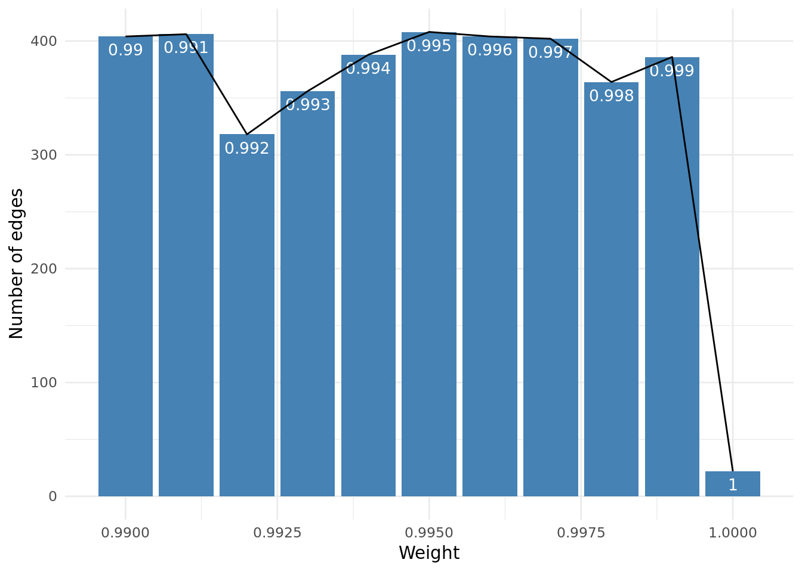

#### Degree distribution of item->similarity->item edges

#### Degree distribution of agent->knows->agent edges

#### Runing time by method 

<table class="table table-condensed" style="width: auto !important; ">
 <thead>
  <tr>
   <th style="text-align:left;"> key </th>
   <th style="text-align:right;"> doc_count </th>
   <th style="text-align:right;"> sum_wallTime_ms.value </th>
   <th style="text-align:left;"> avg_wallTime_ms.value </th>
   <th style="text-align:left;"> includedInTotal </th>
  </tr>
 </thead>
<tbody>
  <tr>
   <td style="text-align:left;"> connectIfSimilar </td>
   <td style="text-align:right;"> 87,990 </td>
   <td style="text-align:right;"> 162,760 </td>
   <td style="text-align:left;"> 1.8497556540516 </td>
   <td style="text-align:left;"> No </td>
  </tr>
  <tr>
   <td style="text-align:left;"> existsSimilarity </td>
   <td style="text-align:right;"> 87,990 </td>
   <td style="text-align:right;"> 161,153 </td>
   <td style="text-align:left;"> 1.83149221502443 </td>
   <td style="text-align:left;"> No </td>
  </tr>
  <tr>
   <td style="text-align:left;"> similarityEdges </td>
   <td style="text-align:right;"> 87,990 </td>
   <td style="text-align:right;"> 158,594 </td>
   <td style="text-align:left;"> 1.80240936470053 </td>
   <td style="text-align:left;"> No </td>
  </tr>
  <tr>
   <td style="text-align:left;"> connectAllSimilar </td>
   <td style="text-align:right;"> 420 </td>
   <td style="text-align:right;"> 163,688 </td>
   <td style="text-align:left;"> 389.733333333333 </td>
   <td style="text-align:left;"> Yes </td>
  </tr>
  <tr>
   <td style="text-align:left;"> init </td>
   <td style="text-align:right;"> 103 </td>
   <td style="text-align:right;"> 11,173 </td>
   <td style="text-align:left;"> 108.47572815534 </td>
   <td style="text-align:left;"> No </td>
  </tr>
  <tr>
   <td style="text-align:left;"> connect </td>
   <td style="text-align:right;"> 23 </td>
   <td style="text-align:right;"> 37 </td>
   <td style="text-align:left;"> 1.60869565217391 </td>
   <td style="text-align:left;"> Yes </td>
  </tr>
  <tr>
   <td style="text-align:left;font-weight: bold;"> Total </td>
   <td style="text-align:right;font-weight: bold;"> 451 </td>
   <td style="text-align:right;font-weight: bold;"> 164,287 </td>
   <td style="text-align:left;font-weight: bold;">  </td>
   <td style="text-align:left;font-weight: bold;">  </td>
  </tr>
</tbody>
</table>
####  Found structures 

#####  Cycles 

Number of cycles found:  1 

<button class="btn btn-primary" data-toggle="collapse" data-target="#CNJPDALANA"> Show/Hide foundCycle query </button> 
 
  
     GET /filebeat-*/_search 
              { 
                "query": {
                  "bool": {
                    "must": [
                      { "match_phrase": {
                        "simulationId": "SIM10-06-09-12-kYn4oJ--CV"
                        }
                      },
                      { "bool": {
                        "should": [
                          { "match": {
                            "keyword": "foundCycle"
                          }}
                        ]
                      }}
                    ]
                  }
                }
              }
     

#####  Paths 

Number of paths found:  0 

<button class="btn btn-primary" data-toggle="collapse" data-target="#XPDYLBBTTD"> Show/Hide foundPath query </button> 
 
  
     GET /filebeat-*/_search 
              { 
                "query": {
                  "bool": {
                    "must": [
                      { "match_phrase": {
                        "simulationId": "SIM10-06-09-12-kYn4oJ--CV"
                        }
                      },
                      { "bool": {
                        "should": [
                          { "match": {
                            "keyword": "foundPath"
                          }}
                        ]
                      }}
                    ]
                  }
                }
              }
     

###  SIM10-06-09-12-kYn4oJ--DV 

#### simulationParameters 

<table class="table table-condensed" style="width: auto !important; ">
 <thead>
  <tr>
   <th style="text-align:left;"> agentNumber </th>
   <th style="text-align:left;"> similarityConnectThreshold </th>
   <th style="text-align:left;"> graphType </th>
   <th style="text-align:left;"> chainLength </th>
   <th style="text-align:left;"> similaritySearchThreshold </th>
   <th style="text-align:left;"> maxDistance </th>
   <th style="text-align:left;"> randomWorksNumberMultiplier </th>
  </tr>
 </thead>
<tbody>
  <tr>
   <td style="text-align:left;width: 20em; "> 100 </td>
   <td style="text-align:left;width: 15em; "> 0.99 </td>
   <td style="text-align:left;width: 15em; "> smallWorld </td>
   <td style="text-align:left;width: 15em; "> 10 </td>
   <td style="text-align:left;width: 15em; "> 1 </td>
   <td style="text-align:left;width: 15em; "> 30 </td>
   <td style="text-align:left;width: 15em; "> 2 </td>
  </tr>
</tbody>
</table>
#### allEdgesByLabel

<table class="table table-condensed" style="width: auto !important; ">
 <thead>
  <tr>
   <th style="text-align:right;"> edges_offers </th>
   <th style="text-align:right;"> edges_similarity </th>
   <th style="text-align:right;"> edges_owns </th>
   <th style="text-align:right;"> edges_demands </th>
   <th style="text-align:right;"> edges_knows </th>
   <th style="text-align:right;"> edges_total </th>
  </tr>
 </thead>
<tbody>
  <tr>
   <td style="text-align:right;width: 5em; "> 210 </td>
   <td style="text-align:right;width: 5em; "> 3,812 </td>
   <td style="text-align:right;width: 5em; "> 210 </td>
   <td style="text-align:right;width: 5em; "> 210 </td>
   <td style="text-align:right;width: 5em; "> 601 </td>
   <td style="text-align:right;width: 5em; "> 5,043 </td>
  </tr>
</tbody>
</table>
#### allVerticesByType

<table class="table table-condensed" style="width: auto !important; ">
 <thead>
  <tr>
   <th style="text-align:right;"> vertices_agent </th>
   <th style="text-align:right;"> vertices_item </th>
   <th style="text-align:right;"> vertices_work </th>
   <th style="text-align:right;"> vertices_total </th>
  </tr>
 </thead>
<tbody>
  <tr>
   <td style="text-align:right;width: 5em; "> 101 </td>
   <td style="text-align:right;width: 5em; "> 420 </td>
   <td style="text-align:right;width: 5em; "> 210 </td>
   <td style="text-align:right;width: 5em; "> 731 </td>
  </tr>
</tbody>
</table>
#### distribution of similarityEdgesByWeight

#### Degree distribution of item->similarity->item edges

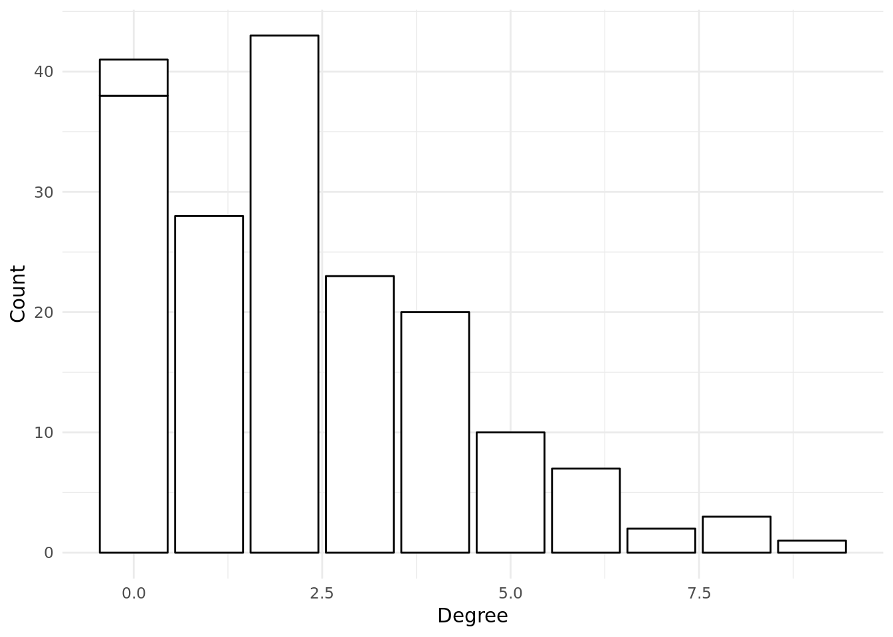

#### Degree distribution of agent->knows->agent edges

#### Runing time by method 

<table class="table table-condensed" style="width: auto !important; ">
 <thead>
  <tr>
   <th style="text-align:left;">   </th>
   <th style="text-align:left;"> key </th>
   <th style="text-align:right;"> doc_count </th>
   <th style="text-align:right;"> sum_wallTime_ms.value </th>
   <th style="text-align:left;"> avg_wallTime_ms.value </th>
   <th style="text-align:left;"> includedInTotal </th>
  </tr>
 </thead>
<tbody>
  <tr>
   <td style="text-align:left;"> 1 </td>
   <td style="text-align:left;"> knowsAgent </td>
   <td style="text-align:right;"> 601 </td>
   <td style="text-align:right;"> 1,088 </td>
   <td style="text-align:left;"> 1.81031613976705 </td>
   <td style="text-align:left;"> No </td>
  </tr>
  <tr>
   <td style="text-align:left;"> 2 </td>
   <td style="text-align:left;"> addItemToWork </td>
   <td style="text-align:right;"> 420 </td>
   <td style="text-align:right;"> 2,408 </td>
   <td style="text-align:left;"> 5.73333333333333 </td>
   <td style="text-align:left;"> No </td>
  </tr>
  <tr>
   <td style="text-align:left;"> 3 </td>
   <td style="text-align:left;"> ownsWork </td>
   <td style="text-align:right;"> 210 </td>
   <td style="text-align:right;"> 1,173 </td>
   <td style="text-align:left;"> 5.58571428571429 </td>
   <td style="text-align:left;"> No </td>
  </tr>
  <tr>
   <td style="text-align:left;"> 4 </td>
   <td style="text-align:left;"> init </td>
   <td style="text-align:right;"> 103 </td>
   <td style="text-align:right;"> 11,642 </td>
   <td style="text-align:left;"> 113.029126213592 </td>
   <td style="text-align:left;"> No </td>
  </tr>
  <tr>
   <td style="text-align:left;"> 5 </td>
   <td style="text-align:left;"> searchAndConnect </td>
   <td style="text-align:right;"> 101 </td>
   <td style="text-align:right;"> 92,046 </td>
   <td style="text-align:left;"> 911.346534653465 </td>
   <td style="text-align:left;"> Yes </td>
  </tr>
  <tr>
   <td style="text-align:left;"> 6 </td>
   <td style="text-align:left;"> getWorksItems </td>
   <td style="text-align:right;"> 18 </td>
   <td style="text-align:right;"> 31 </td>
   <td style="text-align:left;"> 1.72222222222222 </td>
   <td style="text-align:left;"> Yes </td>
  </tr>
  <tr>
   <td style="text-align:left;"> 9 </td>
   <td style="text-align:left;"> cycleSearch </td>
   <td style="text-align:right;"> 4 </td>
   <td style="text-align:right;"> 848 </td>
   <td style="text-align:left;"> 212 </td>
   <td style="text-align:left;"> Yes </td>
  </tr>
  <tr>
   <td style="text-align:left;"> 10 </td>
   <td style="text-align:left;"> getWorks </td>
   <td style="text-align:right;"> 4 </td>
   <td style="text-align:right;"> 872 </td>
   <td style="text-align:left;"> 218 </td>
   <td style="text-align:left;"> No </td>
  </tr>
  <tr>
   <td style="text-align:left;font-weight: bold;"> 11 </td>
   <td style="text-align:left;font-weight: bold;"> Total </td>
   <td style="text-align:right;font-weight: bold;"> 132 </td>
   <td style="text-align:right;font-weight: bold;"> 93,612 </td>
   <td style="text-align:left;font-weight: bold;">  </td>
   <td style="text-align:left;font-weight: bold;">  </td>
  </tr>
</tbody>
</table>
####  Found structures 

#####  Cycles 

Number of cycles found:  4 

<button class="btn btn-primary" data-toggle="collapse" data-target="#XCDVJQEVFR"> Show/Hide foundCycle query </button> 
 
  
     GET /filebeat-*/_search 
              { 
                "query": {
                  "bool": {
                    "must": [
                      { "match_phrase": {
                        "simulationId": "SIM10-06-09-12-kYn4oJ--DV"
                        }
                      },
                      { "bool": {
                        "should": [
                          { "match": {
                            "keyword": "foundCycle"
                          }}
                        ]
                      }}
                    ]
                  }
                }
              }
     

#####  Paths 

Number of paths found:  0 

<button class="btn btn-primary" data-toggle="collapse" data-target="#WEUYGQSATK"> Show/Hide foundPath query </button> 
 
  
     GET /filebeat-*/_search 
              { 
                "query": {
                  "bool": {
                    "must": [
                      { "match_phrase": {
                        "simulationId": "SIM10-06-09-12-kYn4oJ--DV"
                        }
                      },
                      { "bool": {
                        "should": [
                          { "match": {
                            "keyword": "foundPath"
                          }}
                        ]
                      }}
                    ]
                  }
                }
              }
     

###  SIM10-06-06-51-yvdeqH--CV 

#### simulationParameters 

<table class="table table-condensed" style="width: auto !important; ">
 <thead>
  <tr>
   <th style="text-align:left;"> agentNumber </th>
   <th style="text-align:left;"> similarityConnectThreshold </th>
   <th style="text-align:left;"> graphType </th>
   <th style="text-align:left;"> chainLength </th>
   <th style="text-align:left;"> similaritySearchThreshold </th>
   <th style="text-align:left;"> maxDistance </th>
   <th style="text-align:left;"> randomWorksNumberMultiplier </th>
  </tr>
 </thead>
<tbody>
  <tr>
   <td style="text-align:left;width: 20em; "> 100 </td>
   <td style="text-align:left;width: 15em; "> 0.99 </td>
   <td style="text-align:left;width: 15em; "> random </td>
   <td style="text-align:left;width: 15em; "> 10 </td>
   <td style="text-align:left;width: 15em; "> 1 </td>
   <td style="text-align:left;width: 15em; "> 5 </td>
   <td style="text-align:left;width: 15em; "> 1 </td>
  </tr>
</tbody>
</table>
#### allEdgesByLabel

<table class="table table-condensed" style="width: auto !important; ">
 <thead>
  <tr>
   <th style="text-align:right;"> edges_offers </th>
   <th style="text-align:right;"> edges_similarity </th>
   <th style="text-align:right;"> edges_owns </th>
   <th style="text-align:right;"> edges_demands </th>
   <th style="text-align:right;"> edges_knows </th>
   <th style="text-align:right;"> edges_total </th>
  </tr>
 </thead>
<tbody>
  <tr>
   <td style="text-align:right;width: 5em; "> 110 </td>
   <td style="text-align:right;width: 5em; "> 1,002 </td>
   <td style="text-align:right;width: 5em; "> 110 </td>
   <td style="text-align:right;width: 5em; "> 110 </td>
   <td style="text-align:right;width: 5em; "> 100 </td>
   <td style="text-align:right;width: 5em; "> 1,432 </td>
  </tr>
</tbody>
</table>
#### allVerticesByType

<table class="table table-condensed" style="width: auto !important; ">
 <thead>
  <tr>
   <th style="text-align:right;"> vertices_agent </th>
   <th style="text-align:right;"> vertices_item </th>
   <th style="text-align:right;"> vertices_work </th>
   <th style="text-align:right;"> vertices_total </th>
  </tr>
 </thead>
<tbody>
  <tr>
   <td style="text-align:right;width: 5em; "> 101 </td>
   <td style="text-align:right;width: 5em; "> 220 </td>
   <td style="text-align:right;width: 5em; "> 110 </td>
   <td style="text-align:right;width: 5em; "> 431 </td>
  </tr>
</tbody>
</table>
#### distribution of similarityEdgesByWeight

#### Degree distribution of item->similarity->item edges

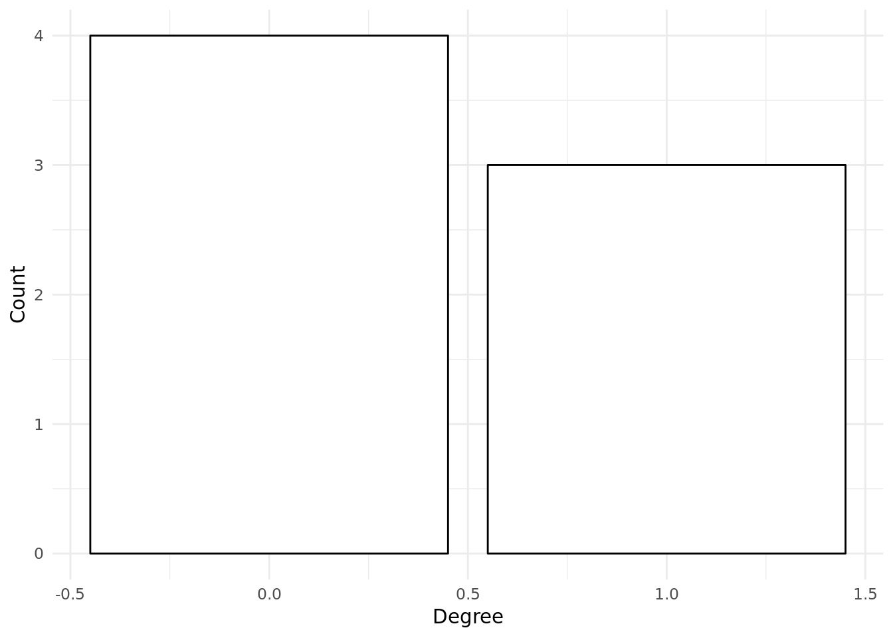

#### Degree distribution of agent->knows->agent edges

#### Runing time by method 

<table class="table table-condensed" style="width: auto !important; ">
 <thead>
  <tr>
   <th style="text-align:left;"> key </th>
   <th style="text-align:right;"> doc_count </th>
   <th style="text-align:right;"> sum_wallTime_ms.value </th>
   <th style="text-align:left;"> avg_wallTime_ms.value </th>
   <th style="text-align:left;"> includedInTotal </th>
  </tr>
 </thead>
<tbody>
  <tr>
   <td style="text-align:left;"> connectIfSimilar </td>
   <td style="text-align:right;"> 24,090 </td>
   <td style="text-align:right;"> 38,705 </td>
   <td style="text-align:left;"> 1.60668327106683 </td>
   <td style="text-align:left;"> No </td>
  </tr>
  <tr>
   <td style="text-align:left;"> existsSimilarity </td>
   <td style="text-align:right;"> 24,090 </td>
   <td style="text-align:right;"> 37,668 </td>
   <td style="text-align:left;"> 1.56363636363636 </td>
   <td style="text-align:left;"> No </td>
  </tr>
  <tr>
   <td style="text-align:left;"> similarityEdges </td>
   <td style="text-align:right;"> 24,090 </td>
   <td style="text-align:right;"> 37,030 </td>
   <td style="text-align:left;"> 1.53715234537152 </td>
   <td style="text-align:left;"> No </td>
  </tr>
  <tr>
   <td style="text-align:left;"> connect </td>
   <td style="text-align:right;"> 292 </td>
   <td style="text-align:right;"> 564 </td>
   <td style="text-align:left;"> 1.93150684931507 </td>
   <td style="text-align:left;"> Yes </td>
  </tr>
  <tr>
   <td style="text-align:left;"> connectAllSimilar </td>
   <td style="text-align:right;"> 220 </td>
   <td style="text-align:right;"> 38,937 </td>
   <td style="text-align:left;"> 176.986363636364 </td>
   <td style="text-align:left;"> Yes </td>
  </tr>
  <tr>
   <td style="text-align:left;"> init </td>
   <td style="text-align:right;"> 103 </td>
   <td style="text-align:right;"> 10,486 </td>
   <td style="text-align:left;"> 101.805825242718 </td>
   <td style="text-align:left;"> No </td>
  </tr>
  <tr>
   <td style="text-align:left;font-weight: bold;"> Total </td>
   <td style="text-align:right;font-weight: bold;"> 520 </td>
   <td style="text-align:right;font-weight: bold;"> 39,922 </td>
   <td style="text-align:left;font-weight: bold;">  </td>
   <td style="text-align:left;font-weight: bold;">  </td>
  </tr>
</tbody>
</table>
####  Found structures 

#####  Cycles 

Number of cycles found:  1 

<button class="btn btn-primary" data-toggle="collapse" data-target="#EYHPVHHCDZ"> Show/Hide foundCycle query </button> 
 
  
     GET /filebeat-*/_search 
              { 
                "query": {
                  "bool": {
                    "must": [
                      { "match_phrase": {
                        "simulationId": "SIM10-06-06-51-yvdeqH--CV"
                        }
                      },
                      { "bool": {
                        "should": [
                          { "match": {
                            "keyword": "foundCycle"
                          }}
                        ]
                      }}
                    ]
                  }
                }
              }
     

#####  Paths 

Number of paths found:  0 

<button class="btn btn-primary" data-toggle="collapse" data-target="#JQEXWJLLKB"> Show/Hide foundPath query </button> 
 
  
     GET /filebeat-*/_search 
              { 
                "query": {
                  "bool": {
                    "must": [
                      { "match_phrase": {
                        "simulationId": "SIM10-06-06-51-yvdeqH--CV"
                        }
                      },
                      { "bool": {
                        "should": [
                          { "match": {
                            "keyword": "foundPath"
                          }}
                        ]
                      }}
                    ]
                  }
                }
              }
     

###  SIM10-06-06-51-yvdeqH--DV 

#### simulationParameters 

<table class="table table-condensed" style="width: auto !important; ">
 <thead>
  <tr>
   <th style="text-align:left;"> agentNumber </th>
   <th style="text-align:left;"> similarityConnectThreshold </th>
   <th style="text-align:left;"> graphType </th>
   <th style="text-align:left;"> chainLength </th>
   <th style="text-align:left;"> similaritySearchThreshold </th>
   <th style="text-align:left;"> maxDistance </th>
   <th style="text-align:left;"> randomWorksNumberMultiplier </th>
  </tr>
 </thead>
<tbody>
  <tr>
   <td style="text-align:left;width: 20em; "> 100 </td>
   <td style="text-align:left;width: 15em; "> 0.99 </td>
   <td style="text-align:left;width: 15em; "> random </td>
   <td style="text-align:left;width: 15em; "> 10 </td>
   <td style="text-align:left;width: 15em; "> 1 </td>
   <td style="text-align:left;width: 15em; "> 5 </td>
   <td style="text-align:left;width: 15em; "> 1 </td>
  </tr>
</tbody>
</table>
#### allEdgesByLabel

<table class="table table-condensed" style="width: auto !important; ">
 <thead>
  <tr>
   <th style="text-align:right;"> edges_offers </th>
   <th style="text-align:right;"> edges_similarity </th>
   <th style="text-align:right;"> edges_owns </th>
   <th style="text-align:right;"> edges_demands </th>
   <th style="text-align:right;"> edges_knows </th>
   <th style="text-align:right;"> edges_total </th>
  </tr>
 </thead>
<tbody>
  <tr>
   <td style="text-align:right;width: 5em; "> 110 </td>
   <td style="text-align:right;width: 5em; "> 418 </td>
   <td style="text-align:right;width: 5em; "> 110 </td>
   <td style="text-align:right;width: 5em; "> 110 </td>
   <td style="text-align:right;width: 5em; "> 100 </td>
   <td style="text-align:right;width: 5em; "> 848 </td>
  </tr>
</tbody>
</table>
#### allVerticesByType

<table class="table table-condensed" style="width: auto !important; ">
 <thead>
  <tr>
   <th style="text-align:right;"> vertices_agent </th>
   <th style="text-align:right;"> vertices_item </th>
   <th style="text-align:right;"> vertices_work </th>
   <th style="text-align:right;"> vertices_total </th>
  </tr>
 </thead>
<tbody>
  <tr>
   <td style="text-align:right;width: 5em; "> 101 </td>
   <td style="text-align:right;width: 5em; "> 220 </td>
   <td style="text-align:right;width: 5em; "> 110 </td>
   <td style="text-align:right;width: 5em; "> 431 </td>
  </tr>
</tbody>
</table>
#### distribution of similarityEdgesByWeight

#### Degree distribution of item->similarity->item edges

#### Degree distribution of agent->knows->agent edges

#### Runing time by method 

<table class="table table-condensed" style="width: auto !important; ">
 <thead>
  <tr>
   <th style="text-align:left;">   </th>
   <th style="text-align:left;"> key </th>
   <th style="text-align:right;"> doc_count </th>
   <th style="text-align:right;"> sum_wallTime_ms.value </th>
   <th style="text-align:left;"> avg_wallTime_ms.value </th>
   <th style="text-align:left;"> includedInTotal </th>
  </tr>
 </thead>
<tbody>
  <tr>
   <td style="text-align:left;"> 2 </td>
   <td style="text-align:left;"> cycleSearch </td>
   <td style="text-align:right;"> 3,600 </td>
   <td style="text-align:right;"> 17,543 </td>
   <td style="text-align:left;"> 4.87305555555556 </td>
   <td style="text-align:left;"> Yes </td>
  </tr>
  <tr>
   <td style="text-align:left;"> 3 </td>
   <td style="text-align:left;"> getWorks </td>
   <td style="text-align:right;"> 3,600 </td>
   <td style="text-align:right;"> 41,408 </td>
   <td style="text-align:left;"> 11.5022222222222 </td>
   <td style="text-align:left;"> No </td>
  </tr>
  <tr>
   <td style="text-align:left;"> 4 </td>
   <td style="text-align:left;"> individualCycleSearch </td>
   <td style="text-align:right;"> 3,600 </td>
   <td style="text-align:right;"> 101 </td>
   <td style="text-align:left;"> 0.0280555555555556 </td>
   <td style="text-align:left;"> Yes </td>
  </tr>
  <tr>
   <td style="text-align:left;"> 6 </td>
   <td style="text-align:left;"> addItemToWork </td>
   <td style="text-align:right;"> 220 </td>
   <td style="text-align:right;"> 1,929 </td>
   <td style="text-align:left;"> 8.76818181818182 </td>
   <td style="text-align:left;"> No </td>
  </tr>
  <tr>
   <td style="text-align:left;"> 7 </td>
   <td style="text-align:left;"> ownsWork </td>
   <td style="text-align:right;"> 110 </td>
   <td style="text-align:right;"> 845 </td>
   <td style="text-align:left;"> 7.68181818181818 </td>
   <td style="text-align:left;"> No </td>
  </tr>
  <tr>
   <td style="text-align:left;"> 8 </td>
   <td style="text-align:left;"> init </td>
   <td style="text-align:right;"> 103 </td>
   <td style="text-align:right;"> 11,640 </td>
   <td style="text-align:left;"> 113.009708737864 </td>
   <td style="text-align:left;"> No </td>
  </tr>
  <tr>
   <td style="text-align:left;"> 9 </td>
   <td style="text-align:left;"> searchAndConnect </td>
   <td style="text-align:right;"> 101 </td>
   <td style="text-align:right;"> 12,642 </td>
   <td style="text-align:left;"> 125.168316831683 </td>
   <td style="text-align:left;"> Yes </td>
  </tr>
  <tr>
   <td style="text-align:left;"> 10 </td>
   <td style="text-align:left;"> knowsAgent </td>
   <td style="text-align:right;"> 100 </td>
   <td style="text-align:right;"> 196 </td>
   <td style="text-align:left;"> 1.96 </td>
   <td style="text-align:left;"> No </td>
  </tr>
  <tr>
   <td style="text-align:left;font-weight: bold;"> 1 </td>
   <td style="text-align:left;font-weight: bold;"> Total </td>
   <td style="text-align:right;font-weight: bold;"> 14,501 </td>
   <td style="text-align:right;font-weight: bold;"> 49,711 </td>
   <td style="text-align:left;font-weight: bold;">  </td>
   <td style="text-align:left;font-weight: bold;">  </td>
  </tr>
</tbody>
</table>
####  Found structures 

#####  Cycles 

Number of cycles found:  0 

<button class="btn btn-primary" data-toggle="collapse" data-target="#TLVFYIPRMB"> Show/Hide foundCycle query </button> 
 
  
     GET /filebeat-*/_search 
              { 
                "query": {
                  "bool": {
                    "must": [
                      { "match_phrase": {
                        "simulationId": "SIM10-06-06-51-yvdeqH--DV"
                        }
                      },
                      { "bool": {
                        "should": [
                          { "match": {
                            "keyword": "foundCycle"
                          }}
                        ]
                      }}
                    ]
                  }
                }
              }
     

#####  Paths 

Number of paths found:  3600 

<button class="btn btn-primary" data-toggle="collapse" data-target="#VRXIANOLZA"> Show/Hide foundPath query </button> 
 
  
     GET /filebeat-*/_search 
              { 
                "query": {
                  "bool": {
                    "must": [
                      { "match_phrase": {
                        "simulationId": "SIM10-06-06-51-yvdeqH--DV"
                        }
                      },
                      { "bool": {
                        "should": [
                          { "match": {
                            "keyword": "foundPath"
                          }}
                        ]
                      }}
                    ]
                  }
                }
              }
     

###  SIM10-06-07-52-YcHHhE--CV 

#### simulationParameters 

<table class="table table-condensed" style="width: auto !important; ">
 <thead>
  <tr>
   <th style="text-align:left;"> agentNumber </th>
   <th style="text-align:left;"> similarityConnectThreshold </th>
   <th style="text-align:left;"> graphType </th>
   <th style="text-align:left;"> chainLength </th>
   <th style="text-align:left;"> similaritySearchThreshold </th>
   <th style="text-align:left;"> maxDistance </th>
   <th style="text-align:left;"> randomWorksNumberMultiplier </th>
  </tr>
 </thead>
<tbody>
  <tr>
   <td style="text-align:left;width: 20em; "> 100 </td>
   <td style="text-align:left;width: 15em; "> 0.99 </td>
   <td style="text-align:left;width: 15em; "> smallWorld </td>
   <td style="text-align:left;width: 15em; "> 10 </td>
   <td style="text-align:left;width: 15em; "> 1 </td>
   <td style="text-align:left;width: 15em; "> 5 </td>
   <td style="text-align:left;width: 15em; "> 1 </td>
  </tr>
</tbody>
</table>
#### allEdgesByLabel

<table class="table table-condensed" style="width: auto !important; ">
 <thead>
  <tr>
   <th style="text-align:right;"> edges_offers </th>
   <th style="text-align:right;"> edges_similarity </th>
   <th style="text-align:right;"> edges_owns </th>
   <th style="text-align:right;"> edges_demands </th>
   <th style="text-align:right;"> edges_knows </th>
   <th style="text-align:right;"> edges_total </th>
  </tr>
 </thead>
<tbody>
  <tr>
   <td style="text-align:right;width: 5em; "> 110 </td>
   <td style="text-align:right;width: 5em; "> 1,000 </td>
   <td style="text-align:right;width: 5em; "> 110 </td>
   <td style="text-align:right;width: 5em; "> 110 </td>
   <td style="text-align:right;width: 5em; "> 601 </td>
   <td style="text-align:right;width: 5em; "> 1,931 </td>
  </tr>
</tbody>
</table>
#### allVerticesByType

<table class="table table-condensed" style="width: auto !important; ">
 <thead>
  <tr>
   <th style="text-align:right;"> vertices_agent </th>
   <th style="text-align:right;"> vertices_item </th>
   <th style="text-align:right;"> vertices_work </th>
   <th style="text-align:right;"> vertices_total </th>
  </tr>
 </thead>
<tbody>
  <tr>
   <td style="text-align:right;width: 5em; "> 101 </td>
   <td style="text-align:right;width: 5em; "> 220 </td>
   <td style="text-align:right;width: 5em; "> 110 </td>
   <td style="text-align:right;width: 5em; "> 431 </td>
  </tr>
</tbody>
</table>
#### distribution of similarityEdgesByWeight

#### Degree distribution of item->similarity->item edges

#### Degree distribution of agent->knows->agent edges

#### Runing time by method 

<table class="table table-condensed" style="width: auto !important; ">
 <thead>
  <tr>
   <th style="text-align:left;"> key </th>
   <th style="text-align:right;"> doc_count </th>
   <th style="text-align:right;"> sum_wallTime_ms.value </th>
   <th style="text-align:left;"> avg_wallTime_ms.value </th>
   <th style="text-align:left;"> includedInTotal </th>
  </tr>
 </thead>
<tbody>
  <tr>
   <td style="text-align:left;"> connectIfSimilar </td>
   <td style="text-align:right;"> 24,090 </td>
   <td style="text-align:right;"> 40,328 </td>
   <td style="text-align:left;"> 1.67405562474056 </td>
   <td style="text-align:left;"> No </td>
  </tr>
  <tr>
   <td style="text-align:left;"> existsSimilarity </td>
   <td style="text-align:right;"> 24,090 </td>
   <td style="text-align:right;"> 39,865 </td>
   <td style="text-align:left;"> 1.65483603154836 </td>
   <td style="text-align:left;"> No </td>
  </tr>
  <tr>
   <td style="text-align:left;"> similarityEdges </td>
   <td style="text-align:right;"> 24,090 </td>
   <td style="text-align:right;"> 39,219 </td>
   <td style="text-align:left;"> 1.6280199252802 </td>
   <td style="text-align:left;"> No </td>
  </tr>
  <tr>
   <td style="text-align:left;"> connectAllSimilar </td>
   <td style="text-align:right;"> 220 </td>
   <td style="text-align:right;"> 40,560 </td>
   <td style="text-align:left;"> 184.363636363636 </td>
   <td style="text-align:left;"> Yes </td>
  </tr>
  <tr>
   <td style="text-align:left;"> init </td>
   <td style="text-align:right;"> 103 </td>
   <td style="text-align:right;"> 10,508 </td>
   <td style="text-align:left;"> 102.019417475728 </td>
   <td style="text-align:left;"> No </td>
  </tr>
  <tr>
   <td style="text-align:left;"> connect </td>
   <td style="text-align:right;"> 5 </td>
   <td style="text-align:right;"> 8 </td>
   <td style="text-align:left;"> 1.6 </td>
   <td style="text-align:left;"> Yes </td>
  </tr>
  <tr>
   <td style="text-align:left;font-weight: bold;"> Total </td>
   <td style="text-align:right;font-weight: bold;"> 233 </td>
   <td style="text-align:right;font-weight: bold;"> 40,901 </td>
   <td style="text-align:left;font-weight: bold;">  </td>
   <td style="text-align:left;font-weight: bold;">  </td>
  </tr>
</tbody>
</table>
####  Found structures 

#####  Cycles 

Number of cycles found:  1 

<button class="btn btn-primary" data-toggle="collapse" data-target="#ZKEEJJBOZU"> Show/Hide foundCycle query </button> 
 
  
     GET /filebeat-*/_search 
              { 
                "query": {
                  "bool": {
                    "must": [
                      { "match_phrase": {
                        "simulationId": "SIM10-06-07-52-YcHHhE--CV"
                        }
                      },
                      { "bool": {
                        "should": [
                          { "match": {
                            "keyword": "foundCycle"
                          }}
                        ]
                      }}
                    ]
                  }
                }
              }
     

#####  Paths 

Number of paths found:  0 

<button class="btn btn-primary" data-toggle="collapse" data-target="#ZDPWPSRZHV"> Show/Hide foundPath query </button> 
 
  
     GET /filebeat-*/_search 
              { 
                "query": {
                  "bool": {
                    "must": [
                      { "match_phrase": {
                        "simulationId": "SIM10-06-07-52-YcHHhE--CV"
                        }
                      },
                      { "bool": {
                        "should": [
                          { "match": {
                            "keyword": "foundPath"
                          }}
                        ]
                      }}
                    ]
                  }
                }
              }
     

###  SIM10-06-07-52-YcHHhE--DV 

#### simulationParameters 

<table class="table table-condensed" style="width: auto !important; ">
 <thead>
  <tr>
   <th style="text-align:left;"> agentNumber </th>
   <th style="text-align:left;"> similarityConnectThreshold </th>
   <th style="text-align:left;"> graphType </th>
   <th style="text-align:left;"> chainLength </th>
   <th style="text-align:left;"> similaritySearchThreshold </th>
   <th style="text-align:left;"> maxDistance </th>
   <th style="text-align:left;"> randomWorksNumberMultiplier </th>
  </tr>
 </thead>
<tbody>
  <tr>
   <td style="text-align:left;width: 20em; "> 100 </td>
   <td style="text-align:left;width: 15em; "> 0.99 </td>
   <td style="text-align:left;width: 15em; "> smallWorld </td>
   <td style="text-align:left;width: 15em; "> 10 </td>
   <td style="text-align:left;width: 15em; "> 1 </td>
   <td style="text-align:left;width: 15em; "> 5 </td>
   <td style="text-align:left;width: 15em; "> 1 </td>
  </tr>
</tbody>
</table>
#### allEdgesByLabel

<table class="table table-condensed" style="width: auto !important; ">
 <thead>
  <tr>
   <th style="text-align:right;"> edges_offers </th>
   <th style="text-align:right;"> edges_similarity </th>
   <th style="text-align:right;"> edges_owns </th>
   <th style="text-align:right;"> edges_demands </th>
   <th style="text-align:right;"> edges_knows </th>
   <th style="text-align:right;"> edges_total </th>
  </tr>
 </thead>
<tbody>
  <tr>
   <td style="text-align:right;width: 5em; "> 110 </td>
   <td style="text-align:right;width: 5em; "> 990 </td>
   <td style="text-align:right;width: 5em; "> 110 </td>
   <td style="text-align:right;width: 5em; "> 110 </td>
   <td style="text-align:right;width: 5em; "> 601 </td>
   <td style="text-align:right;width: 5em; "> 1,921 </td>
  </tr>
</tbody>
</table>
#### allVerticesByType

<table class="table table-condensed" style="width: auto !important; ">
 <thead>
  <tr>
   <th style="text-align:right;"> vertices_agent </th>
   <th style="text-align:right;"> vertices_item </th>
   <th style="text-align:right;"> vertices_work </th>
   <th style="text-align:right;"> vertices_total </th>
  </tr>
 </thead>
<tbody>
  <tr>
   <td style="text-align:right;width: 5em; "> 101 </td>
   <td style="text-align:right;width: 5em; "> 220 </td>
   <td style="text-align:right;width: 5em; "> 110 </td>
   <td style="text-align:right;width: 5em; "> 431 </td>
  </tr>
</tbody>
</table>
#### distribution of similarityEdgesByWeight

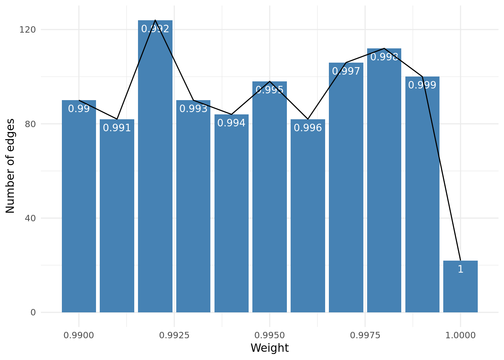

#### Degree distribution of item->similarity->item edges

#### Degree distribution of agent->knows->agent edges

#### Runing time by method 

<table class="table table-condensed" style="width: auto !important; ">
 <thead>
  <tr>
   <th style="text-align:left;">   </th>
   <th style="text-align:left;"> key </th>
   <th style="text-align:right;"> doc_count </th>
   <th style="text-align:right;"> sum_wallTime_ms.value </th>
   <th style="text-align:left;"> avg_wallTime_ms.value </th>
   <th style="text-align:left;"> includedInTotal </th>
  </tr>
 </thead>
<tbody>
  <tr>
   <td style="text-align:left;"> 1 </td>
   <td style="text-align:left;"> knowsAgent </td>
   <td style="text-align:right;"> 601 </td>
   <td style="text-align:right;"> 983 </td>
   <td style="text-align:left;"> 1.63560732113145 </td>
   <td style="text-align:left;"> No </td>
  </tr>
  <tr>
   <td style="text-align:left;"> 2 </td>
   <td style="text-align:left;"> addItemToWork </td>
   <td style="text-align:right;"> 220 </td>
   <td style="text-align:right;"> 1,657 </td>
   <td style="text-align:left;"> 7.53181818181818 </td>
   <td style="text-align:left;"> No </td>
  </tr>
  <tr>
   <td style="text-align:left;"> 3 </td>
   <td style="text-align:left;"> ownsWork </td>
   <td style="text-align:right;"> 110 </td>
   <td style="text-align:right;"> 625 </td>
   <td style="text-align:left;"> 5.68181818181818 </td>
   <td style="text-align:left;"> No </td>
  </tr>
  <tr>
   <td style="text-align:left;"> 4 </td>
   <td style="text-align:left;"> init </td>
   <td style="text-align:right;"> 103 </td>
   <td style="text-align:right;"> 11,160 </td>
   <td style="text-align:left;"> 108.349514563107 </td>
   <td style="text-align:left;"> No </td>
  </tr>
  <tr>
   <td style="text-align:left;"> 5 </td>
   <td style="text-align:left;"> searchAndConnect </td>
   <td style="text-align:right;"> 101 </td>
   <td style="text-align:right;"> 33,957 </td>
   <td style="text-align:left;"> 336.207920792079 </td>
   <td style="text-align:left;"> Yes </td>
  </tr>
  <tr>
   <td style="text-align:left;"> 6 </td>
   <td style="text-align:left;"> getWorksItems </td>
   <td style="text-align:right;"> 18 </td>
   <td style="text-align:right;"> 27 </td>
   <td style="text-align:left;"> 1.5 </td>
   <td style="text-align:left;"> Yes </td>
  </tr>
  <tr>
   <td style="text-align:left;"> 9 </td>
   <td style="text-align:left;"> cycleSearch </td>
   <td style="text-align:right;"> 2 </td>
   <td style="text-align:right;"> 112 </td>
   <td style="text-align:left;"> 56 </td>
   <td style="text-align:left;"> Yes </td>
  </tr>
  <tr>
   <td style="text-align:left;"> 10 </td>
   <td style="text-align:left;"> getWorks </td>
   <td style="text-align:right;"> 2 </td>
   <td style="text-align:right;"> 321 </td>
   <td style="text-align:left;"> 160.5 </td>
   <td style="text-align:left;"> No </td>
  </tr>
  <tr>
   <td style="text-align:left;font-weight: bold;"> 11 </td>
   <td style="text-align:left;font-weight: bold;"> Total </td>
   <td style="text-align:right;font-weight: bold;"> 128 </td>
   <td style="text-align:right;font-weight: bold;"> 34,556 </td>
   <td style="text-align:left;font-weight: bold;">  </td>
   <td style="text-align:left;font-weight: bold;">  </td>
  </tr>
</tbody>
</table>
####  Found structures 

#####  Cycles 

Number of cycles found:  2 

<button class="btn btn-primary" data-toggle="collapse" data-target="#YIGBUECBDP"> Show/Hide foundCycle query </button> 
 
  
     GET /filebeat-*/_search 
              { 
                "query": {
                  "bool": {
                    "must": [
                      { "match_phrase": {
                        "simulationId": "SIM10-06-07-52-YcHHhE--DV"
                        }
                      },
                      { "bool": {
                        "should": [
                          { "match": {
                            "keyword": "foundCycle"
                          }}
                        ]
                      }}
                    ]
                  }
                }
              }
     

#####  Paths 

Number of paths found:  0 

<button class="btn btn-primary" data-toggle="collapse" data-target="#WKACUKHMQZ"> Show/Hide foundPath query </button> 
 
  
     GET /filebeat-*/_search 
              { 
                "query": {
                  "bool": {
                    "must": [
                      { "match_phrase": {
                        "simulationId": "SIM10-06-07-52-YcHHhE--DV"
                        }
                      },
                      { "bool": {
                        "should": [
                          { "match": {
                            "keyword": "foundPath"
                          }}
                        ]
                      }}
                    ]
                  }
                }
              }
     

###  SIM10-06-07-57-Pfkouh--CV 

#### simulationParameters 

<table class="table table-condensed" style="width: auto !important; ">
 <thead>
  <tr>
   <th style="text-align:left;"> agentNumber </th>
   <th style="text-align:left;"> similarityConnectThreshold </th>
   <th style="text-align:left;"> graphType </th>
   <th style="text-align:left;"> chainLength </th>
   <th style="text-align:left;"> similaritySearchThreshold </th>
   <th style="text-align:left;"> maxDistance </th>
   <th style="text-align:left;"> randomWorksNumberMultiplier </th>
  </tr>
 </thead>
<tbody>
  <tr>
   <td style="text-align:left;width: 20em; "> 100 </td>
   <td style="text-align:left;width: 15em; "> 0.99 </td>
   <td style="text-align:left;width: 15em; "> random </td>
   <td style="text-align:left;width: 15em; "> 10 </td>
   <td style="text-align:left;width: 15em; "> 1 </td>
   <td style="text-align:left;width: 15em; "> 5 </td>
   <td style="text-align:left;width: 15em; "> 2 </td>
  </tr>
</tbody>
</table>
#### allEdgesByLabel

<table class="table table-condensed" style="width: auto !important; ">
 <thead>
  <tr>
   <th style="text-align:right;"> edges_offers </th>
   <th style="text-align:right;"> edges_similarity </th>
   <th style="text-align:right;"> edges_owns </th>
   <th style="text-align:right;"> edges_demands </th>
   <th style="text-align:right;"> edges_knows </th>
   <th style="text-align:right;"> edges_total </th>
  </tr>
 </thead>
<tbody>
  <tr>
   <td style="text-align:right;width: 5em; "> 210 </td>
   <td style="text-align:right;width: 5em; "> 3,606 </td>
   <td style="text-align:right;width: 5em; "> 210 </td>
   <td style="text-align:right;width: 5em; "> 210 </td>
   <td style="text-align:right;width: 5em; "> 100 </td>
   <td style="text-align:right;width: 5em; "> 4,336 </td>
  </tr>
</tbody>
</table>
#### allVerticesByType

<table class="table table-condensed" style="width: auto !important; ">
 <thead>
  <tr>
   <th style="text-align:right;"> vertices_agent </th>
   <th style="text-align:right;"> vertices_item </th>
   <th style="text-align:right;"> vertices_work </th>
   <th style="text-align:right;"> vertices_total </th>
  </tr>
 </thead>
<tbody>
  <tr>
   <td style="text-align:right;width: 5em; "> 101 </td>
   <td style="text-align:right;width: 5em; "> 420 </td>
   <td style="text-align:right;width: 5em; "> 210 </td>
   <td style="text-align:right;width: 5em; "> 731 </td>
  </tr>
</tbody>
</table>
#### distribution of similarityEdgesByWeight

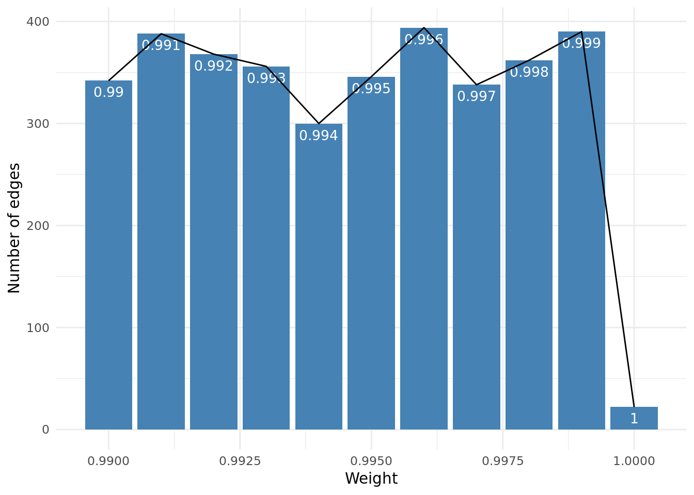

#### Degree distribution of item->similarity->item edges

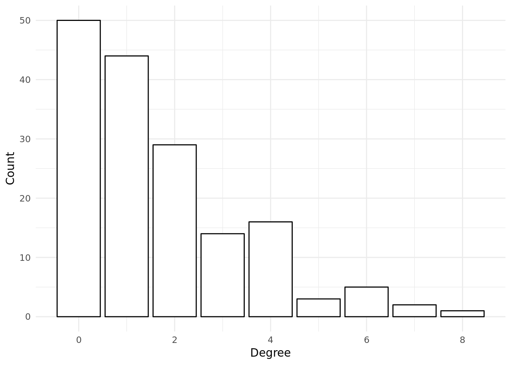

#### Degree distribution of agent->knows->agent edges

#### Runing time by method 

<table class="table table-condensed" style="width: auto !important; ">
 <thead>
  <tr>
   <th style="text-align:left;"> key </th>
   <th style="text-align:right;"> doc_count </th>
   <th style="text-align:right;"> sum_wallTime_ms.value </th>
   <th style="text-align:left;"> avg_wallTime_ms.value </th>
   <th style="text-align:left;"> includedInTotal </th>
  </tr>
 </thead>
<tbody>
  <tr>
   <td style="text-align:left;"> connectIfSimilar </td>
   <td style="text-align:right;"> 87,990 </td>
   <td style="text-align:right;"> 150,175 </td>
   <td style="text-align:left;"> 1.70672803727696 </td>
   <td style="text-align:left;"> No </td>
  </tr>
  <tr>
   <td style="text-align:left;"> existsSimilarity </td>
   <td style="text-align:right;"> 87,990 </td>
   <td style="text-align:right;"> 146,498 </td>
   <td style="text-align:left;"> 1.66493919763609 </td>
   <td style="text-align:left;"> No </td>
  </tr>
  <tr>
   <td style="text-align:left;"> similarityEdges </td>
   <td style="text-align:right;"> 87,990 </td>
   <td style="text-align:right;"> 144,107 </td>
   <td style="text-align:left;"> 1.63776565518809 </td>
   <td style="text-align:left;"> No </td>
  </tr>
  <tr>
   <td style="text-align:left;"> connect </td>
   <td style="text-align:right;"> 1,044 </td>
   <td style="text-align:right;"> 2,110 </td>
   <td style="text-align:left;"> 2.02107279693487 </td>
   <td style="text-align:left;"> Yes </td>
  </tr>
  <tr>
   <td style="text-align:left;"> connectAllSimilar </td>
   <td style="text-align:right;"> 420 </td>
   <td style="text-align:right;"> 151,017 </td>
   <td style="text-align:left;"> 359.564285714286 </td>
   <td style="text-align:left;"> Yes </td>
  </tr>
  <tr>
   <td style="text-align:left;"> init </td>
   <td style="text-align:right;"> 103 </td>
   <td style="text-align:right;"> 10,661 </td>
   <td style="text-align:left;"> 103.504854368932 </td>
   <td style="text-align:left;"> No </td>
  </tr>
  <tr>
   <td style="text-align:left;font-weight: bold;"> Total </td>
   <td style="text-align:right;font-weight: bold;"> 1,472 </td>
   <td style="text-align:right;font-weight: bold;"> 153,613 </td>
   <td style="text-align:left;font-weight: bold;">  </td>
   <td style="text-align:left;font-weight: bold;">  </td>
  </tr>
</tbody>
</table>
####  Found structures 

#####  Cycles 

Number of cycles found:  1 

<button class="btn btn-primary" data-toggle="collapse" data-target="#VPPJCBLTNZ"> Show/Hide foundCycle query </button> 
 
  
     GET /filebeat-*/_search 
              { 
                "query": {
                  "bool": {
                    "must": [
                      { "match_phrase": {
                        "simulationId": "SIM10-06-07-57-Pfkouh--CV"
                        }
                      },
                      { "bool": {
                        "should": [
                          { "match": {
                            "keyword": "foundCycle"
                          }}
                        ]
                      }}
                    ]
                  }
                }
              }
     

#####  Paths 

Number of paths found:  0 

<button class="btn btn-primary" data-toggle="collapse" data-target="#JIKYAEHREL"> Show/Hide foundPath query </button> 
 
  
     GET /filebeat-*/_search 
              { 
                "query": {
                  "bool": {
                    "must": [
                      { "match_phrase": {
                        "simulationId": "SIM10-06-07-57-Pfkouh--CV"
                        }
                      },
                      { "bool": {
                        "should": [
                          { "match": {
                            "keyword": "foundPath"
                          }}
                        ]
                      }}
                    ]
                  }
                }
              }
     

###  SIM10-06-07-57-Pfkouh--DV 

#### simulationParameters 

<table class="table table-condensed" style="width: auto !important; ">
 <thead>
  <tr>
   <th style="text-align:left;"> agentNumber </th>
   <th style="text-align:left;"> similarityConnectThreshold </th>
   <th style="text-align:left;"> graphType </th>
   <th style="text-align:left;"> chainLength </th>
   <th style="text-align:left;"> similaritySearchThreshold </th>
   <th style="text-align:left;"> maxDistance </th>
   <th style="text-align:left;"> randomWorksNumberMultiplier </th>
  </tr>
 </thead>
<tbody>
  <tr>
   <td style="text-align:left;width: 20em; "> 100 </td>
   <td style="text-align:left;width: 15em; "> 0.99 </td>
   <td style="text-align:left;width: 15em; "> random </td>
   <td style="text-align:left;width: 15em; "> 10 </td>
   <td style="text-align:left;width: 15em; "> 1 </td>
   <td style="text-align:left;width: 15em; "> 5 </td>
   <td style="text-align:left;width: 15em; "> 2 </td>
  </tr>
</tbody>
</table>
#### allEdgesByLabel

<table class="table table-condensed" style="width: auto !important; ">
 <thead>
  <tr>
   <th style="text-align:right;"> edges_offers </th>
   <th style="text-align:right;"> edges_similarity </th>
   <th style="text-align:right;"> edges_owns </th>
   <th style="text-align:right;"> edges_demands </th>
   <th style="text-align:right;"> edges_knows </th>
   <th style="text-align:right;"> edges_total </th>
  </tr>
 </thead>
<tbody>
  <tr>
   <td style="text-align:right;width: 5em; "> 210 </td>
   <td style="text-align:right;width: 5em; "> 1,518 </td>
   <td style="text-align:right;width: 5em; "> 210 </td>
   <td style="text-align:right;width: 5em; "> 210 </td>
   <td style="text-align:right;width: 5em; "> 100 </td>
   <td style="text-align:right;width: 5em; "> 2,248 </td>
  </tr>
</tbody>
</table>
#### allVerticesByType

<table class="table table-condensed" style="width: auto !important; ">
 <thead>
  <tr>
   <th style="text-align:right;"> vertices_agent </th>
   <th style="text-align:right;"> vertices_item </th>
   <th style="text-align:right;"> vertices_work </th>
   <th style="text-align:right;"> vertices_total </th>
  </tr>
 </thead>
<tbody>
  <tr>
   <td style="text-align:right;width: 5em; "> 101 </td>
   <td style="text-align:right;width: 5em; "> 420 </td>
   <td style="text-align:right;width: 5em; "> 210 </td>
   <td style="text-align:right;width: 5em; "> 731 </td>
  </tr>
</tbody>
</table>
#### distribution of similarityEdgesByWeight

#### Degree distribution of item->similarity->item edges

#### Degree distribution of agent->knows->agent edges

#### Runing time by method 

<table class="table table-condensed" style="width: auto !important; ">
 <thead>
  <tr>
   <th style="text-align:left;">   </th>
   <th style="text-align:left;"> key </th>
   <th style="text-align:right;"> doc_count </th>
   <th style="text-align:right;"> sum_wallTime_ms.value </th>
   <th style="text-align:left;"> avg_wallTime_ms.value </th>
   <th style="text-align:left;"> includedInTotal </th>
  </tr>
 </thead>
<tbody>
  <tr>
   <td style="text-align:left;"> 2 </td>
   <td style="text-align:left;"> cycleSearch </td>
   <td style="text-align:right;"> 3,600 </td>
   <td style="text-align:right;"> 16,414 </td>
   <td style="text-align:left;"> 4.55944444444444 </td>
   <td style="text-align:left;"> Yes </td>
  </tr>
  <tr>
   <td style="text-align:left;"> 3 </td>
   <td style="text-align:left;"> getWorks </td>
   <td style="text-align:right;"> 3,600 </td>
   <td style="text-align:right;"> 41,354 </td>
   <td style="text-align:left;"> 11.4872222222222 </td>
   <td style="text-align:left;"> No </td>
  </tr>
  <tr>
   <td style="text-align:left;"> 4 </td>
   <td style="text-align:left;"> individualCycleSearch </td>
   <td style="text-align:right;"> 3,600 </td>
   <td style="text-align:right;"> 94 </td>
   <td style="text-align:left;"> 0.0261111111111111 </td>
   <td style="text-align:left;"> Yes </td>
  </tr>
  <tr>
   <td style="text-align:left;"> 6 </td>
   <td style="text-align:left;"> addItemToWork </td>
   <td style="text-align:right;"> 420 </td>
   <td style="text-align:right;"> 2,763 </td>
   <td style="text-align:left;"> 6.57857142857143 </td>
   <td style="text-align:left;"> No </td>
  </tr>
  <tr>
   <td style="text-align:left;"> 7 </td>
   <td style="text-align:left;"> ownsWork </td>
   <td style="text-align:right;"> 210 </td>
   <td style="text-align:right;"> 1,327 </td>
   <td style="text-align:left;"> 6.31904761904762 </td>
   <td style="text-align:left;"> No </td>
  </tr>
  <tr>
   <td style="text-align:left;"> 8 </td>
   <td style="text-align:left;"> init </td>
   <td style="text-align:right;"> 103 </td>
   <td style="text-align:right;"> 11,253 </td>
   <td style="text-align:left;"> 109.252427184466 </td>
   <td style="text-align:left;"> No </td>
  </tr>
  <tr>
   <td style="text-align:left;"> 9 </td>
   <td style="text-align:left;"> searchAndConnect </td>
   <td style="text-align:right;"> 101 </td>
   <td style="text-align:right;"> 30,047 </td>
   <td style="text-align:left;"> 297.49504950495 </td>
   <td style="text-align:left;"> Yes </td>
  </tr>
  <tr>
   <td style="text-align:left;"> 10 </td>
   <td style="text-align:left;"> knowsAgent </td>
   <td style="text-align:right;"> 100 </td>
   <td style="text-align:right;"> 296 </td>
   <td style="text-align:left;"> 2.96 </td>
   <td style="text-align:left;"> No </td>
  </tr>
  <tr>
   <td style="text-align:left;font-weight: bold;"> 1 </td>
   <td style="text-align:left;font-weight: bold;"> Total </td>
   <td style="text-align:right;font-weight: bold;"> 14,501 </td>
   <td style="text-align:right;font-weight: bold;"> 62,313 </td>
   <td style="text-align:left;font-weight: bold;">  </td>
   <td style="text-align:left;font-weight: bold;">  </td>
  </tr>
</tbody>
</table>
####  Found structures 

#####  Cycles 

Number of cycles found:  0 

<button class="btn btn-primary" data-toggle="collapse" data-target="#RYSUJCZDNB"> Show/Hide foundCycle query </button> 
 
  
     GET /filebeat-*/_search 
              { 
                "query": {
                  "bool": {
                    "must": [
                      { "match_phrase": {
                        "simulationId": "SIM10-06-07-57-Pfkouh--DV"
                        }
                      },
                      { "bool": {
                        "should": [
                          { "match": {
                            "keyword": "foundCycle"
                          }}
                        ]
                      }}
                    ]
                  }
                }
              }
     

#####  Paths 

Number of paths found:  3600 

<button class="btn btn-primary" data-toggle="collapse" data-target="#LZJRNESYDH"> Show/Hide foundPath query </button> 
 
  
     GET /filebeat-*/_search 
              { 
                "query": {
                  "bool": {
                    "must": [
                      { "match_phrase": {
                        "simulationId": "SIM10-06-07-57-Pfkouh--DV"
                        }
                      },
                      { "bool": {
                        "should": [
                          { "match": {
                            "keyword": "foundPath"
                          }}
                        ]
                      }}
                    ]
                  }
                }
              }
     

###  SIM10-06-09-00-GFwtF2--CV 

#### simulationParameters 

<table class="table table-condensed" style="width: auto !important; ">
 <thead>
  <tr>
   <th style="text-align:left;"> agentNumber </th>
   <th style="text-align:left;"> similarityConnectThreshold </th>
   <th style="text-align:left;"> graphType </th>
   <th style="text-align:left;"> chainLength </th>
   <th style="text-align:left;"> similaritySearchThreshold </th>
   <th style="text-align:left;"> maxDistance </th>
   <th style="text-align:left;"> randomWorksNumberMultiplier </th>
  </tr>
 </thead>
<tbody>
  <tr>
   <td style="text-align:left;width: 20em; "> 100 </td>
   <td style="text-align:left;width: 15em; "> 0.99 </td>
   <td style="text-align:left;width: 15em; "> smallWorld </td>
   <td style="text-align:left;width: 15em; "> 10 </td>
   <td style="text-align:left;width: 15em; "> 1 </td>
   <td style="text-align:left;width: 15em; "> 5 </td>
   <td style="text-align:left;width: 15em; "> 2 </td>
  </tr>
</tbody>
</table>
#### allEdgesByLabel

<table class="table table-condensed" style="width: auto !important; ">
 <thead>
  <tr>
   <th style="text-align:right;"> edges_offers </th>
   <th style="text-align:right;"> edges_similarity </th>
   <th style="text-align:right;"> edges_owns </th>
   <th style="text-align:right;"> edges_demands </th>
   <th style="text-align:right;"> edges_knows </th>
   <th style="text-align:right;"> edges_total </th>
  </tr>
 </thead>
<tbody>
  <tr>
   <td style="text-align:right;width: 5em; "> 210 </td>
   <td style="text-align:right;width: 5em; "> 3,706 </td>
   <td style="text-align:right;width: 5em; "> 210 </td>
   <td style="text-align:right;width: 5em; "> 210 </td>
   <td style="text-align:right;width: 5em; "> 601 </td>
   <td style="text-align:right;width: 5em; "> 4,937 </td>
  </tr>
</tbody>
</table>
#### allVerticesByType

<table class="table table-condensed" style="width: auto !important; ">
 <thead>
  <tr>
   <th style="text-align:right;"> vertices_agent </th>
   <th style="text-align:right;"> vertices_item </th>
   <th style="text-align:right;"> vertices_work </th>
   <th style="text-align:right;"> vertices_total </th>
  </tr>
 </thead>
<tbody>
  <tr>
   <td style="text-align:right;width: 5em; "> 101 </td>
   <td style="text-align:right;width: 5em; "> 420 </td>
   <td style="text-align:right;width: 5em; "> 210 </td>
   <td style="text-align:right;width: 5em; "> 731 </td>
  </tr>
</tbody>
</table>
#### distribution of similarityEdgesByWeight

#### Degree distribution of item->similarity->item edges

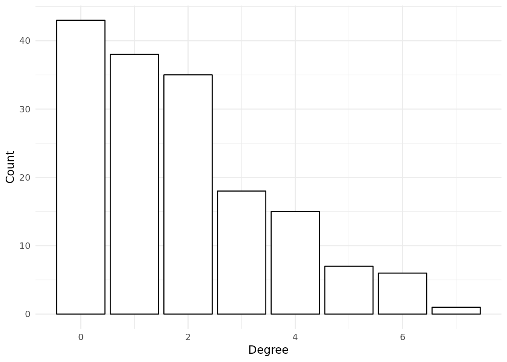

#### Degree distribution of agent->knows->agent edges

#### Runing time by method 

<table class="table table-condensed" style="width: auto !important; ">
 <thead>
  <tr>
   <th style="text-align:left;"> key </th>
   <th style="text-align:right;"> doc_count </th>
   <th style="text-align:right;"> sum_wallTime_ms.value </th>
   <th style="text-align:left;"> avg_wallTime_ms.value </th>
   <th style="text-align:left;"> includedInTotal </th>
  </tr>
 </thead>
<tbody>
  <tr>
   <td style="text-align:left;"> connectIfSimilar </td>
   <td style="text-align:right;"> 87,990 </td>
   <td style="text-align:right;"> 159,428 </td>
   <td style="text-align:left;"> 1.81188771451301 </td>
   <td style="text-align:left;"> No </td>
  </tr>
  <tr>
   <td style="text-align:left;"> existsSimilarity </td>
   <td style="text-align:right;"> 87,990 </td>
   <td style="text-align:right;"> 157,806 </td>
   <td style="text-align:left;"> 1.79345380156836 </td>
   <td style="text-align:left;"> No </td>
  </tr>
  <tr>
   <td style="text-align:left;"> similarityEdges </td>
   <td style="text-align:right;"> 87,990 </td>
   <td style="text-align:right;"> 155,268 </td>
   <td style="text-align:left;"> 1.76460961472895 </td>
   <td style="text-align:left;"> No </td>
  </tr>
  <tr>
   <td style="text-align:left;"> connectAllSimilar </td>
   <td style="text-align:right;"> 420 </td>
   <td style="text-align:right;"> 160,292 </td>
   <td style="text-align:left;"> 381.647619047619 </td>
   <td style="text-align:left;"> Yes </td>
  </tr>
  <tr>
   <td style="text-align:left;"> init </td>
   <td style="text-align:right;"> 103 </td>
   <td style="text-align:right;"> 10,818 </td>
   <td style="text-align:left;"> 105.029126213592 </td>
   <td style="text-align:left;"> No </td>
  </tr>
  <tr>
   <td style="text-align:left;"> connect </td>
   <td style="text-align:right;"> 19 </td>
   <td style="text-align:right;"> 29 </td>
   <td style="text-align:left;"> 1.52631578947368 </td>
   <td style="text-align:left;"> Yes </td>
  </tr>
  <tr>
   <td style="text-align:left;font-weight: bold;"> Total </td>
   <td style="text-align:right;font-weight: bold;"> 447 </td>
   <td style="text-align:right;font-weight: bold;"> 160,844 </td>
   <td style="text-align:left;font-weight: bold;">  </td>
   <td style="text-align:left;font-weight: bold;">  </td>
  </tr>
</tbody>
</table>
####  Found structures 

#####  Cycles 

Number of cycles found:  1 

<button class="btn btn-primary" data-toggle="collapse" data-target="#UWUSMNKGOB"> Show/Hide foundCycle query </button> 
 
  
     GET /filebeat-*/_search 
              { 
                "query": {
                  "bool": {
                    "must": [
                      { "match_phrase": {
                        "simulationId": "SIM10-06-09-00-GFwtF2--CV"
                        }
                      },
                      { "bool": {
                        "should": [
                          { "match": {
                            "keyword": "foundCycle"
                          }}
                        ]
                      }}
                    ]
                  }
                }
              }
     

#####  Paths 

Number of paths found:  0 

<button class="btn btn-primary" data-toggle="collapse" data-target="#BBCYEGGFUB"> Show/Hide foundPath query </button> 
 
  
     GET /filebeat-*/_search 
              { 
                "query": {
                  "bool": {
                    "must": [
                      { "match_phrase": {
                        "simulationId": "SIM10-06-09-00-GFwtF2--CV"
                        }
                      },
                      { "bool": {
                        "should": [
                          { "match": {
                            "keyword": "foundPath"
                          }}
                        ]
                      }}
                    ]
                  }
                }
              }
     

###  SIM10-06-09-00-GFwtF2--DV 

#### simulationParameters 

<table class="table table-condensed" style="width: auto !important; ">
 <thead>
  <tr>
   <th style="text-align:left;"> agentNumber </th>
   <th style="text-align:left;"> similarityConnectThreshold </th>
   <th style="text-align:left;"> graphType </th>
   <th style="text-align:left;"> chainLength </th>
   <th style="text-align:left;"> similaritySearchThreshold </th>
   <th style="text-align:left;"> maxDistance </th>
   <th style="text-align:left;"> randomWorksNumberMultiplier </th>
  </tr>
 </thead>
<tbody>
  <tr>
   <td style="text-align:left;width: 20em; "> 100 </td>
   <td style="text-align:left;width: 15em; "> 0.99 </td>
   <td style="text-align:left;width: 15em; "> smallWorld </td>
   <td style="text-align:left;width: 15em; "> 10 </td>
   <td style="text-align:left;width: 15em; "> 1 </td>
   <td style="text-align:left;width: 15em; "> 5 </td>
   <td style="text-align:left;width: 15em; "> 2 </td>
  </tr>
</tbody>
</table>
#### allEdgesByLabel

<table class="table table-condensed" style="width: auto !important; ">
 <thead>
  <tr>
   <th style="text-align:right;"> edges_offers </th>
   <th style="text-align:right;"> edges_similarity </th>
   <th style="text-align:right;"> edges_owns </th>
   <th style="text-align:right;"> edges_demands </th>
   <th style="text-align:right;"> edges_knows </th>
   <th style="text-align:right;"> edges_total </th>
  </tr>
 </thead>
<tbody>
  <tr>
   <td style="text-align:right;width: 5em; "> 210 </td>
   <td style="text-align:right;width: 5em; "> 3,668 </td>
   <td style="text-align:right;width: 5em; "> 210 </td>
   <td style="text-align:right;width: 5em; "> 210 </td>
   <td style="text-align:right;width: 5em; "> 601 </td>
   <td style="text-align:right;width: 5em; "> 4,899 </td>
  </tr>
</tbody>
</table>
#### allVerticesByType

<table class="table table-condensed" style="width: auto !important; ">
 <thead>
  <tr>
   <th style="text-align:right;"> vertices_agent </th>
   <th style="text-align:right;"> vertices_item </th>
   <th style="text-align:right;"> vertices_work </th>
   <th style="text-align:right;"> vertices_total </th>
  </tr>
 </thead>
<tbody>
  <tr>
   <td style="text-align:right;width: 5em; "> 101 </td>
   <td style="text-align:right;width: 5em; "> 420 </td>
   <td style="text-align:right;width: 5em; "> 210 </td>
   <td style="text-align:right;width: 5em; "> 731 </td>
  </tr>
</tbody>
</table>
#### distribution of similarityEdgesByWeight

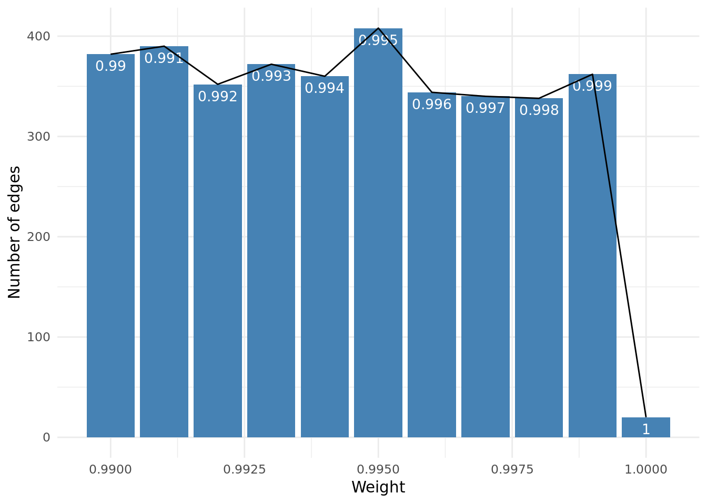

#### Degree distribution of item->similarity->item edges

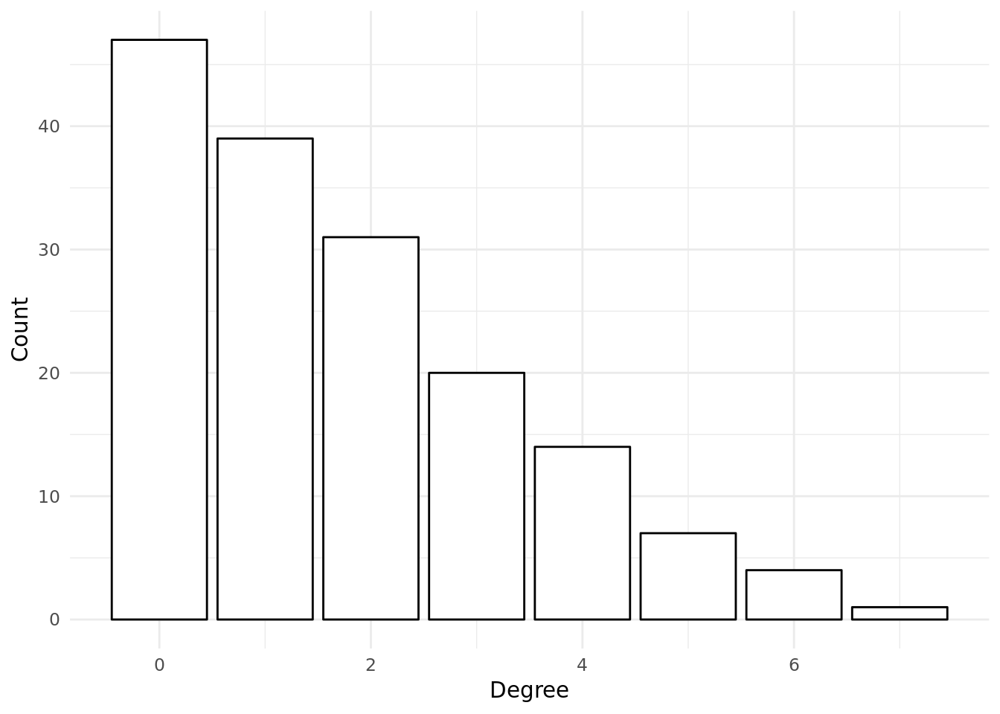

#### Degree distribution of agent->knows->agent edges

#### Runing time by method 

<table class="table table-condensed" style="width: auto !important; ">
 <thead>
  <tr>
   <th style="text-align:left;">   </th>
   <th style="text-align:left;"> key </th>
   <th style="text-align:right;"> doc_count </th>
   <th style="text-align:right;"> sum_wallTime_ms.value </th>
   <th style="text-align:left;"> avg_wallTime_ms.value </th>
   <th style="text-align:left;"> includedInTotal </th>
  </tr>
 </thead>
<tbody>
  <tr>
   <td style="text-align:left;"> 1 </td>
   <td style="text-align:left;"> knowsAgent </td>
   <td style="text-align:right;"> 601 </td>
   <td style="text-align:right;"> 947 </td>
   <td style="text-align:left;"> 1.5757071547421 </td>
   <td style="text-align:left;"> No </td>
  </tr>
  <tr>
   <td style="text-align:left;"> 2 </td>
   <td style="text-align:left;"> addItemToWork </td>
   <td style="text-align:right;"> 420 </td>
   <td style="text-align:right;"> 3,181 </td>
   <td style="text-align:left;"> 7.57380952380952 </td>
   <td style="text-align:left;"> No </td>
  </tr>
  <tr>
   <td style="text-align:left;"> 3 </td>
   <td style="text-align:left;"> ownsWork </td>
   <td style="text-align:right;"> 210 </td>
   <td style="text-align:right;"> 1,866 </td>
   <td style="text-align:left;"> 8.88571428571429 </td>
   <td style="text-align:left;"> No </td>
  </tr>
  <tr>
   <td style="text-align:left;"> 4 </td>
   <td style="text-align:left;"> init </td>
   <td style="text-align:right;"> 103 </td>
   <td style="text-align:right;"> 11,639 </td>
   <td style="text-align:left;"> 113 </td>
   <td style="text-align:left;"> No </td>
  </tr>
  <tr>
   <td style="text-align:left;"> 5 </td>
   <td style="text-align:left;"> searchAndConnect </td>
   <td style="text-align:right;"> 101 </td>
   <td style="text-align:right;"> 92,371 </td>
   <td style="text-align:left;"> 914.564356435644 </td>
   <td style="text-align:left;"> Yes </td>
  </tr>
  <tr>
   <td style="text-align:left;"> 6 </td>
   <td style="text-align:left;"> getWorksItems </td>
   <td style="text-align:right;"> 18 </td>
   <td style="text-align:right;"> 26 </td>
   <td style="text-align:left;"> 1.44444444444444 </td>
   <td style="text-align:left;"> Yes </td>
  </tr>
  <tr>
   <td style="text-align:left;"> 9 </td>
   <td style="text-align:left;"> cycleSearch </td>
   <td style="text-align:right;"> 3 </td>
   <td style="text-align:right;"> 94 </td>
   <td style="text-align:left;"> 31.3333333333333 </td>
   <td style="text-align:left;"> Yes </td>
  </tr>
  <tr>
   <td style="text-align:left;"> 10 </td>
   <td style="text-align:left;"> getWorks </td>
   <td style="text-align:right;"> 3 </td>
   <td style="text-align:right;"> 538 </td>
   <td style="text-align:left;"> 179.333333333333 </td>
   <td style="text-align:left;"> No </td>
  </tr>
  <tr>
   <td style="text-align:left;font-weight: bold;"> 11 </td>
   <td style="text-align:left;font-weight: bold;"> Total </td>
   <td style="text-align:right;font-weight: bold;"> 130 </td>
   <td style="text-align:right;font-weight: bold;"> 93,035 </td>
   <td style="text-align:left;font-weight: bold;">  </td>
   <td style="text-align:left;font-weight: bold;">  </td>
  </tr>
</tbody>
</table>
####  Found structures 

#####  Cycles 

Number of cycles found:  3 

<button class="btn btn-primary" data-toggle="collapse" data-target="#RVAXBTCJGI"> Show/Hide foundCycle query </button> 
 
  
     GET /filebeat-*/_search 
              { 
                "query": {
                  "bool": {
                    "must": [
                      { "match_phrase": {
                        "simulationId": "SIM10-06-09-00-GFwtF2--DV"
                        }
                      },
                      { "bool": {
                        "should": [
                          { "match": {
                            "keyword": "foundCycle"
                          }}
                        ]
                      }}
                    ]
                  }
                }
              }
     

#####  Paths 

Number of paths found:  0 

<button class="btn btn-primary" data-toggle="collapse" data-target="#VSOUOLZRWO"> Show/Hide foundPath query </button> 
 
  
     GET /filebeat-*/_search 
              { 
                "query": {
                  "bool": {
                    "must": [
                      { "match_phrase": {
                        "simulationId": "SIM10-06-09-00-GFwtF2--DV"
                        }
                      },
                      { "bool": {
                        "should": [
                          { "match": {
                            "keyword": "foundPath"
                          }}
                        ]
                      }}
                    ]
                  }
                }
              }
     

###  SIM10-06-10-18-VIwfiK--CV 

#### simulationParameters 

<table class="table table-condensed" style="width: auto !important; ">
 <thead>
  <tr>
   <th style="text-align:left;"> agentNumber </th>
   <th style="text-align:left;"> similarityConnectThreshold </th>
   <th style="text-align:left;"> graphType </th>
   <th style="text-align:left;"> chainLength </th>
   <th style="text-align:left;"> similaritySearchThreshold </th>
   <th style="text-align:left;"> maxDistance </th>
   <th style="text-align:left;"> randomWorksNumberMultiplier </th>
  </tr>
 </thead>
<tbody>
  <tr>
   <td style="text-align:left;width: 20em; "> 100 </td>
   <td style="text-align:left;width: 15em; "> 0.99 </td>
   <td style="text-align:left;width: 15em; "> random </td>
   <td style="text-align:left;width: 15em; "> 20 </td>
   <td style="text-align:left;width: 15em; "> 1 </td>
   <td style="text-align:left;width: 15em; "> 10 </td>
   <td style="text-align:left;width: 15em; "> 1 </td>
  </tr>
</tbody>
</table>
#### allEdgesByLabel

<table class="table table-condensed" style="width: auto !important; ">
 <thead>
  <tr>
   <th style="text-align:right;"> edges_offers </th>
   <th style="text-align:right;"> edges_similarity </th>
   <th style="text-align:right;"> edges_owns </th>
   <th style="text-align:right;"> edges_demands </th>
   <th style="text-align:right;"> edges_knows </th>
   <th style="text-align:right;"> edges_total </th>
  </tr>
 </thead>
<tbody>
  <tr>
   <td style="text-align:right;width: 5em; "> 120 </td>
   <td style="text-align:right;width: 5em; "> 1,294 </td>
   <td style="text-align:right;width: 5em; "> 120 </td>
   <td style="text-align:right;width: 5em; "> 120 </td>
   <td style="text-align:right;width: 5em; "> 100 </td>
   <td style="text-align:right;width: 5em; "> 1,754 </td>
  </tr>
</tbody>
</table>
#### allVerticesByType

<table class="table table-condensed" style="width: auto !important; ">
 <thead>
  <tr>
   <th style="text-align:right;"> vertices_agent </th>
   <th style="text-align:right;"> vertices_item </th>
   <th style="text-align:right;"> vertices_work </th>
   <th style="text-align:right;"> vertices_total </th>
  </tr>
 </thead>
<tbody>
  <tr>
   <td style="text-align:right;width: 5em; "> 101 </td>
   <td style="text-align:right;width: 5em; "> 240 </td>
   <td style="text-align:right;width: 5em; "> 120 </td>
   <td style="text-align:right;width: 5em; "> 461 </td>
  </tr>
</tbody>
</table>
#### distribution of similarityEdgesByWeight

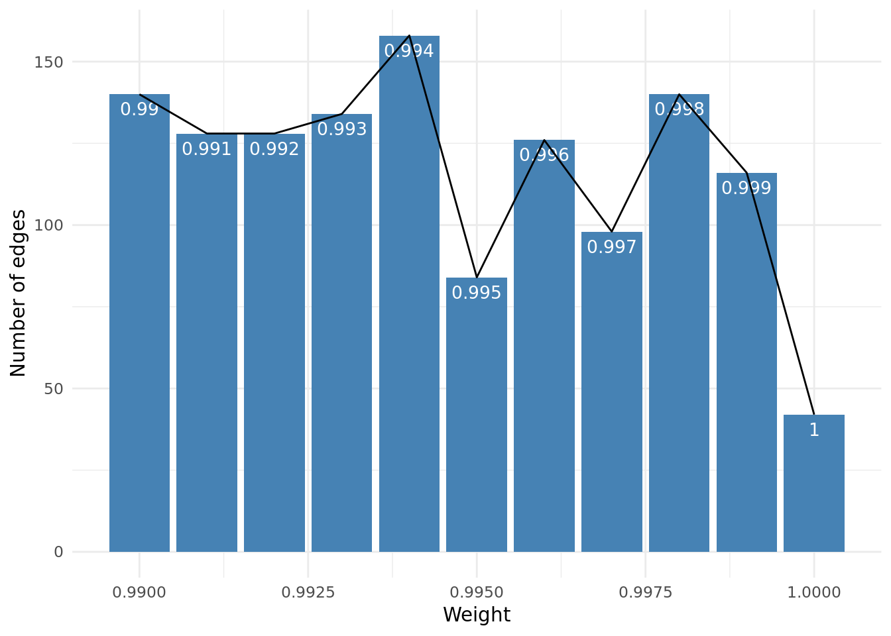

#### Degree distribution of item->similarity->item edges

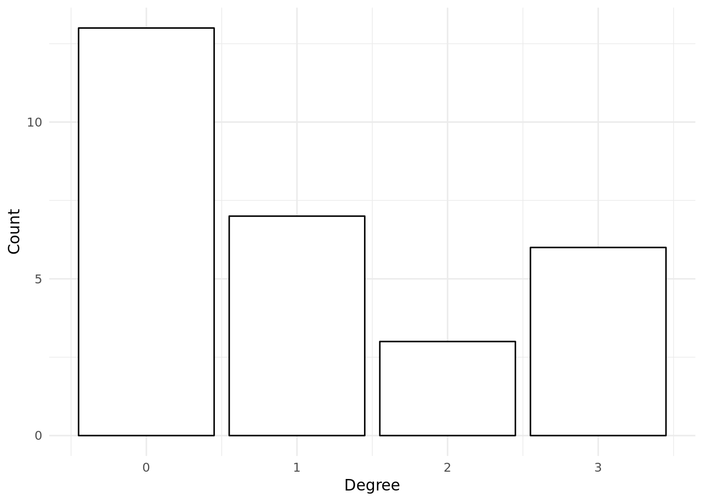

#### Degree distribution of agent->knows->agent edges

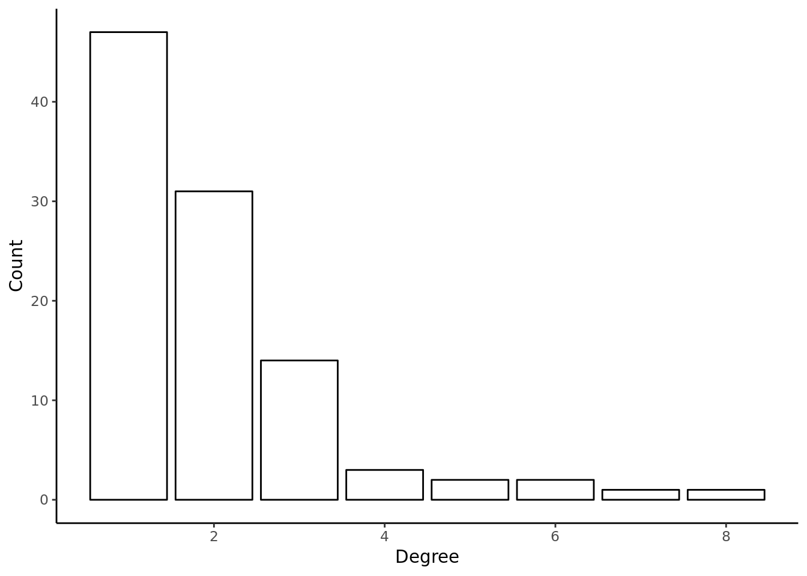

#### Runing time by method 

<table class="table table-condensed" style="width: auto !important; ">
 <thead>
  <tr>
   <th style="text-align:left;"> key </th>
   <th style="text-align:right;"> doc_count </th>
   <th style="text-align:right;"> sum_wallTime_ms.value </th>
   <th style="text-align:left;"> avg_wallTime_ms.value </th>
   <th style="text-align:left;"> includedInTotal </th>
  </tr>
 </thead>
<tbody>
  <tr>
   <td style="text-align:left;"> connectIfSimilar </td>
   <td style="text-align:right;"> 28,680 </td>
   <td style="text-align:right;"> 48,044 </td>
   <td style="text-align:left;"> 1.67517433751743 </td>
   <td style="text-align:left;"> No </td>
  </tr>
  <tr>
   <td style="text-align:left;"> existsSimilarity </td>
   <td style="text-align:right;"> 28,680 </td>
   <td style="text-align:right;"> 47,519 </td>
   <td style="text-align:left;"> 1.65686889818689 </td>
   <td style="text-align:left;"> No </td>
  </tr>
  <tr>
   <td style="text-align:left;"> similarityEdges </td>
   <td style="text-align:right;"> 28,680 </td>
   <td style="text-align:right;"> 46,829 </td>
   <td style="text-align:left;"> 1.63281032078103 </td>
   <td style="text-align:left;"> No </td>
  </tr>
  <tr>
   <td style="text-align:left;"> connectAllSimilar </td>
   <td style="text-align:right;"> 240 </td>
   <td style="text-align:right;"> 48,280 </td>
   <td style="text-align:left;"> 201.166666666667 </td>
   <td style="text-align:left;"> Yes </td>
  </tr>
  <tr>
   <td style="text-align:left;"> init </td>
   <td style="text-align:right;"> 103 </td>
   <td style="text-align:right;"> 11,057 </td>
   <td style="text-align:left;"> 107.349514563107 </td>
   <td style="text-align:left;"> No </td>
  </tr>
  <tr>
   <td style="text-align:left;"> connect </td>
   <td style="text-align:right;"> 9 </td>
   <td style="text-align:right;"> 12 </td>
   <td style="text-align:left;"> 1.33333333333333 </td>
   <td style="text-align:left;"> Yes </td>
  </tr>
  <tr>
   <td style="text-align:left;font-weight: bold;"> Total </td>
   <td style="text-align:right;font-weight: bold;"> 257 </td>
   <td style="text-align:right;font-weight: bold;"> 48,645 </td>
   <td style="text-align:left;font-weight: bold;">  </td>
   <td style="text-align:left;font-weight: bold;">  </td>
  </tr>
</tbody>
</table>
####  Found structures 

#####  Cycles 

Number of cycles found:  1 

<button class="btn btn-primary" data-toggle="collapse" data-target="#OLHAEZWMWV"> Show/Hide foundCycle query </button> 
 
  
     GET /filebeat-*/_search 
              { 
                "query": {
                  "bool": {
                    "must": [
                      { "match_phrase": {
                        "simulationId": "SIM10-06-10-18-VIwfiK--CV"
                        }
                      },
                      { "bool": {
                        "should": [
                          { "match": {
                            "keyword": "foundCycle"
                          }}
                        ]
                      }}
                    ]
                  }
                }
              }
     

#####  Paths 

Number of paths found:  0 

<button class="btn btn-primary" data-toggle="collapse" data-target="#IXEXSTLTNA"> Show/Hide foundPath query </button> 
 
  
     GET /filebeat-*/_search 
              { 
                "query": {
                  "bool": {
                    "must": [
                      { "match_phrase": {
                        "simulationId": "SIM10-06-10-18-VIwfiK--CV"
                        }
                      },
                      { "bool": {
                        "should": [
                          { "match": {
                            "keyword": "foundPath"
                          }}
                        ]
                      }}
                    ]
                  }
                }
              }
     

###  SIM10-06-10-18-VIwfiK--DV 

#### simulationParameters 

<table class="table table-condensed" style="width: auto !important; ">
 <thead>
  <tr>
   <th style="text-align:left;"> agentNumber </th>
   <th style="text-align:left;"> similarityConnectThreshold </th>
   <th style="text-align:left;"> graphType </th>
   <th style="text-align:left;"> chainLength </th>
   <th style="text-align:left;"> similaritySearchThreshold </th>
   <th style="text-align:left;"> maxDistance </th>
   <th style="text-align:left;"> randomWorksNumberMultiplier </th>
  </tr>
 </thead>
<tbody>
  <tr>
   <td style="text-align:left;width: 20em; "> 100 </td>
   <td style="text-align:left;width: 15em; "> 0.99 </td>
   <td style="text-align:left;width: 15em; "> random </td>
   <td style="text-align:left;width: 15em; "> 20 </td>
   <td style="text-align:left;width: 15em; "> 1 </td>
   <td style="text-align:left;width: 15em; "> 10 </td>
   <td style="text-align:left;width: 15em; "> 1 </td>
  </tr>
</tbody>
</table>
#### allEdgesByLabel

<table class="table table-condensed" style="width: auto !important; ">
 <thead>
  <tr>
   <th style="text-align:right;"> edges_offers </th>
   <th style="text-align:right;"> edges_similarity </th>
   <th style="text-align:right;"> edges_owns </th>
   <th style="text-align:right;"> edges_demands </th>
   <th style="text-align:right;"> edges_knows </th>
   <th style="text-align:right;"> edges_total </th>
  </tr>
 </thead>
<tbody>
  <tr>
   <td style="text-align:right;width: 5em; "> 120 </td>
   <td style="text-align:right;width: 5em; "> 1,276 </td>
   <td style="text-align:right;width: 5em; "> 120 </td>
   <td style="text-align:right;width: 5em; "> 120 </td>
   <td style="text-align:right;width: 5em; "> 100 </td>
   <td style="text-align:right;width: 5em; "> 1,736 </td>
  </tr>
</tbody>
</table>
#### allVerticesByType

<table class="table table-condensed" style="width: auto !important; ">
 <thead>
  <tr>
   <th style="text-align:right;"> vertices_agent </th>
   <th style="text-align:right;"> vertices_item </th>
   <th style="text-align:right;"> vertices_work </th>
   <th style="text-align:right;"> vertices_total </th>
  </tr>
 </thead>
<tbody>
  <tr>
   <td style="text-align:right;width: 5em; "> 101 </td>
   <td style="text-align:right;width: 5em; "> 240 </td>
   <td style="text-align:right;width: 5em; "> 120 </td>
   <td style="text-align:right;width: 5em; "> 461 </td>
  </tr>
</tbody>
</table>
#### distribution of similarityEdgesByWeight

#### Degree distribution of item->similarity->item edges

#### Degree distribution of agent->knows->agent edges

#### Runing time by method 

<table class="table table-condensed" style="width: auto !important; ">
 <thead>
  <tr>
   <th style="text-align:left;">   </th>
   <th style="text-align:left;"> key </th>
   <th style="text-align:right;"> doc_count </th>
   <th style="text-align:right;"> sum_wallTime_ms.value </th>
   <th style="text-align:left;"> avg_wallTime_ms.value </th>
   <th style="text-align:left;"> includedInTotal </th>
  </tr>
 </thead>
<tbody>
  <tr>
   <td style="text-align:left;"> 1 </td>
   <td style="text-align:left;"> addItemToWork </td>
   <td style="text-align:right;"> 240 </td>
   <td style="text-align:right;"> 1,728 </td>
   <td style="text-align:left;"> 7.2 </td>
   <td style="text-align:left;"> No </td>
  </tr>
  <tr>
   <td style="text-align:left;"> 2 </td>
   <td style="text-align:left;"> ownsWork </td>
   <td style="text-align:right;"> 120 </td>
   <td style="text-align:right;"> 1,051 </td>
   <td style="text-align:left;"> 8.75833333333333 </td>
   <td style="text-align:left;"> No </td>
  </tr>
  <tr>
   <td style="text-align:left;"> 3 </td>
   <td style="text-align:left;"> init </td>
   <td style="text-align:right;"> 103 </td>
   <td style="text-align:right;"> 11,883 </td>
   <td style="text-align:left;"> 115.368932038835 </td>
   <td style="text-align:left;"> No </td>
  </tr>
  <tr>
   <td style="text-align:left;"> 4 </td>
   <td style="text-align:left;"> searchAndConnect </td>
   <td style="text-align:right;"> 101 </td>
   <td style="text-align:right;"> 41,184 </td>
   <td style="text-align:left;"> 407.762376237624 </td>
   <td style="text-align:left;"> Yes </td>
  </tr>
  <tr>
   <td style="text-align:left;"> 5 </td>
   <td style="text-align:left;"> knowsAgent </td>
   <td style="text-align:right;"> 100 </td>
   <td style="text-align:right;"> 204 </td>
   <td style="text-align:left;"> 2.04 </td>
   <td style="text-align:left;"> No </td>
  </tr>
  <tr>
   <td style="text-align:left;"> 6 </td>
   <td style="text-align:left;"> getWorksItems </td>
   <td style="text-align:right;"> 38 </td>
   <td style="text-align:right;"> 74 </td>
   <td style="text-align:left;"> 1.94736842105263 </td>
   <td style="text-align:left;"> Yes </td>
  </tr>
  <tr>
   <td style="text-align:left;"> 9 </td>
   <td style="text-align:left;"> cycleSearch </td>
   <td style="text-align:right;"> 2 </td>
   <td style="text-align:right;"> 126 </td>
   <td style="text-align:left;"> 63 </td>
   <td style="text-align:left;"> Yes </td>
  </tr>
  <tr>
   <td style="text-align:left;"> 10 </td>
   <td style="text-align:left;"> getWorks </td>
   <td style="text-align:right;"> 2 </td>
   <td style="text-align:right;"> 246 </td>
   <td style="text-align:left;"> 123 </td>
   <td style="text-align:left;"> No </td>
  </tr>
  <tr>
   <td style="text-align:left;font-weight: bold;"> 11 </td>
   <td style="text-align:left;font-weight: bold;"> Total </td>
   <td style="text-align:right;font-weight: bold;"> 148 </td>
   <td style="text-align:right;font-weight: bold;"> 42,234 </td>
   <td style="text-align:left;font-weight: bold;">  </td>
   <td style="text-align:left;font-weight: bold;">  </td>
  </tr>
</tbody>
</table>
####  Found structures 

#####  Cycles 

Number of cycles found:  2 

<button class="btn btn-primary" data-toggle="collapse" data-target="#CTMWCMZYVG"> Show/Hide foundCycle query </button> 
 
  
     GET /filebeat-*/_search 
              { 
                "query": {
                  "bool": {
                    "must": [
                      { "match_phrase": {
                        "simulationId": "SIM10-06-10-18-VIwfiK--DV"
                        }
                      },
                      { "bool": {
                        "should": [
                          { "match": {
                            "keyword": "foundCycle"
                          }}
                        ]
                      }}
                    ]
                  }
                }
              }
     

#####  Paths 

Number of paths found:  0 

<button class="btn btn-primary" data-toggle="collapse" data-target="#EZBGULBJMX"> Show/Hide foundPath query </button> 
 
  
     GET /filebeat-*/_search 
              { 
                "query": {
                  "bool": {
                    "must": [
                      { "match_phrase": {
                        "simulationId": "SIM10-06-10-18-VIwfiK--DV"
                        }
                      },
                      { "bool": {
                        "should": [
                          { "match": {
                            "keyword": "foundPath"
                          }}
                        ]
                      }}
                    ]
                  }
                }
              }
     

###  SIM10-06-10-19-ALycgd--CV 

#### simulationParameters 

<table class="table table-condensed" style="width: auto !important; ">
 <thead>
  <tr>
   <th style="text-align:left;"> agentNumber </th>
   <th style="text-align:left;"> similarityConnectThreshold </th>
   <th style="text-align:left;"> graphType </th>
   <th style="text-align:left;"> chainLength </th>
   <th style="text-align:left;"> similaritySearchThreshold </th>
   <th style="text-align:left;"> maxDistance </th>
   <th style="text-align:left;"> randomWorksNumberMultiplier </th>
  </tr>
 </thead>
<tbody>
  <tr>
   <td style="text-align:left;width: 20em; "> 100 </td>
   <td style="text-align:left;width: 15em; "> 0.99 </td>
   <td style="text-align:left;width: 15em; "> smallWorld </td>
   <td style="text-align:left;width: 15em; "> 20 </td>
   <td style="text-align:left;width: 15em; "> 1 </td>
   <td style="text-align:left;width: 15em; "> 10 </td>
   <td style="text-align:left;width: 15em; "> 1 </td>
  </tr>
</tbody>
</table>
#### allEdgesByLabel

<table class="table table-condensed" style="width: auto !important; ">
 <thead>
  <tr>
   <th style="text-align:right;"> edges_offers </th>
   <th style="text-align:right;"> edges_similarity </th>
   <th style="text-align:right;"> edges_owns </th>
   <th style="text-align:right;"> edges_demands </th>
   <th style="text-align:right;"> edges_knows </th>
   <th style="text-align:right;"> edges_total </th>
  </tr>
 </thead>
<tbody>
  <tr>
   <td style="text-align:right;width: 5em; "> 120 </td>
   <td style="text-align:right;width: 5em; "> 1,300 </td>
   <td style="text-align:right;width: 5em; "> 120 </td>
   <td style="text-align:right;width: 5em; "> 120 </td>
   <td style="text-align:right;width: 5em; "> 601 </td>
   <td style="text-align:right;width: 5em; "> 2,261 </td>
  </tr>
</tbody>
</table>
#### allVerticesByType

<table class="table table-condensed" style="width: auto !important; ">
 <thead>
  <tr>
   <th style="text-align:right;"> vertices_agent </th>
   <th style="text-align:right;"> vertices_item </th>
   <th style="text-align:right;"> vertices_work </th>
   <th style="text-align:right;"> vertices_total </th>
  </tr>
 </thead>
<tbody>
  <tr>
   <td style="text-align:right;width: 5em; "> 101 </td>
   <td style="text-align:right;width: 5em; "> 240 </td>
   <td style="text-align:right;width: 5em; "> 120 </td>
   <td style="text-align:right;width: 5em; "> 461 </td>
  </tr>
</tbody>
</table>
#### distribution of similarityEdgesByWeight

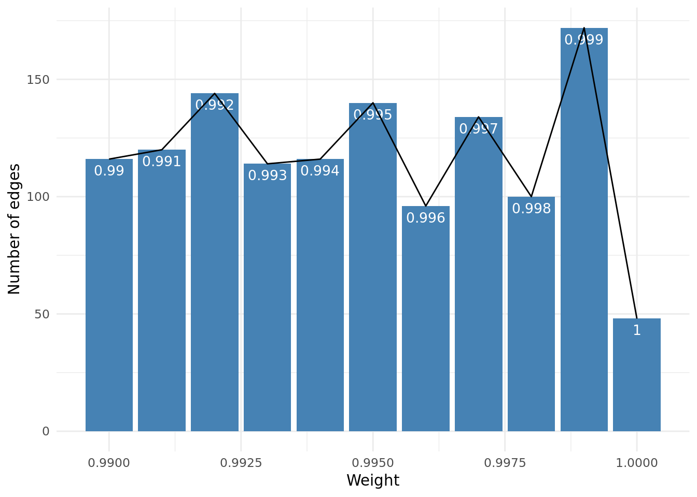

#### Degree distribution of item->similarity->item edges

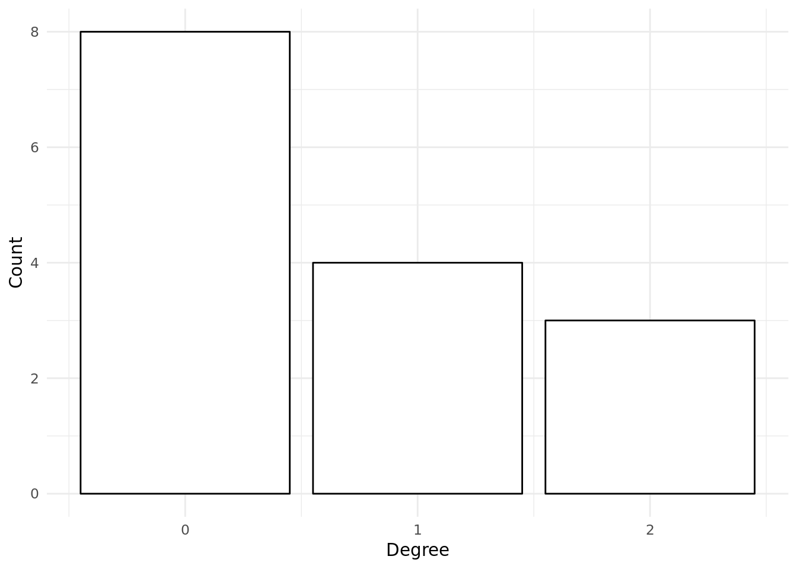

#### Degree distribution of agent->knows->agent edges

#### Runing time by method 

<table class="table table-condensed" style="width: auto !important; ">
 <thead>
  <tr>
   <th style="text-align:left;"> key </th>
   <th style="text-align:right;"> doc_count </th>
   <th style="text-align:right;"> sum_wallTime_ms.value </th>
   <th style="text-align:left;"> avg_wallTime_ms.value </th>
   <th style="text-align:left;"> includedInTotal </th>
  </tr>
 </thead>
<tbody>
  <tr>
   <td style="text-align:left;"> connectIfSimilar </td>
   <td style="text-align:right;"> 28,680 </td>
   <td style="text-align:right;"> 51,426 </td>
   <td style="text-align:left;"> 1.79309623430962 </td>
   <td style="text-align:left;"> No </td>
  </tr>
  <tr>
   <td style="text-align:left;"> existsSimilarity </td>
   <td style="text-align:right;"> 28,680 </td>
   <td style="text-align:right;"> 50,815 </td>
   <td style="text-align:left;"> 1.77179218967922 </td>
   <td style="text-align:left;"> No </td>
  </tr>
  <tr>
   <td style="text-align:left;"> similarityEdges </td>
   <td style="text-align:right;"> 28,680 </td>
   <td style="text-align:right;"> 49,944 </td>
   <td style="text-align:left;"> 1.74142259414226 </td>
   <td style="text-align:left;"> No </td>
  </tr>
  <tr>
   <td style="text-align:left;"> connectAllSimilar </td>
   <td style="text-align:right;"> 240 </td>
   <td style="text-align:right;"> 51,738 </td>
   <td style="text-align:left;"> 215.575 </td>
   <td style="text-align:left;"> Yes </td>
  </tr>
  <tr>
   <td style="text-align:left;"> init </td>
   <td style="text-align:right;"> 103 </td>
   <td style="text-align:right;"> 11,838 </td>
   <td style="text-align:left;"> 114.932038834951 </td>
   <td style="text-align:left;"> No </td>
  </tr>
  <tr>
   <td style="text-align:left;"> connect </td>
   <td style="text-align:right;"> 12 </td>
   <td style="text-align:right;"> 61 </td>
   <td style="text-align:left;"> 5.08333333333333 </td>
   <td style="text-align:left;"> Yes </td>
  </tr>
  <tr>
   <td style="text-align:left;font-weight: bold;"> Total </td>
   <td style="text-align:right;font-weight: bold;"> 260 </td>
   <td style="text-align:right;font-weight: bold;"> 52,304 </td>
   <td style="text-align:left;font-weight: bold;">  </td>
   <td style="text-align:left;font-weight: bold;">  </td>
  </tr>
</tbody>
</table>
####  Found structures 

#####  Cycles 

Number of cycles found:  1 

<button class="btn btn-primary" data-toggle="collapse" data-target="#SMQWBZDIOH"> Show/Hide foundCycle query </button> 
 
  
     GET /filebeat-*/_search 
              { 
                "query": {
                  "bool": {
                    "must": [
                      { "match_phrase": {
                        "simulationId": "SIM10-06-10-19-ALycgd--CV"
                        }
                      },
                      { "bool": {
                        "should": [
                          { "match": {
                            "keyword": "foundCycle"
                          }}
                        ]
                      }}
                    ]
                  }
                }
              }
     

#####  Paths 

Number of paths found:  0 

<button class="btn btn-primary" data-toggle="collapse" data-target="#PBBUVBEXQA"> Show/Hide foundPath query </button> 
 
  
     GET /filebeat-*/_search 
              { 
                "query": {
                  "bool": {
                    "must": [
                      { "match_phrase": {
                        "simulationId": "SIM10-06-10-19-ALycgd--CV"
                        }
                      },
                      { "bool": {
                        "should": [
                          { "match": {
                            "keyword": "foundPath"
                          }}
                        ]
                      }}
                    ]
                  }
                }
              }
     

###  SIM10-06-10-19-ALycgd--DV 

#### simulationParameters 

<table class="table table-condensed" style="width: auto !important; ">
 <thead>
  <tr>
   <th style="text-align:left;"> agentNumber </th>
   <th style="text-align:left;"> similarityConnectThreshold </th>
   <th style="text-align:left;"> graphType </th>
   <th style="text-align:left;"> chainLength </th>
   <th style="text-align:left;"> similaritySearchThreshold </th>
   <th style="text-align:left;"> maxDistance </th>
   <th style="text-align:left;"> randomWorksNumberMultiplier </th>
  </tr>
 </thead>
<tbody>
  <tr>
   <td style="text-align:left;width: 20em; "> 100 </td>
   <td style="text-align:left;width: 15em; "> 0.99 </td>
   <td style="text-align:left;width: 15em; "> smallWorld </td>
   <td style="text-align:left;width: 15em; "> 20 </td>
   <td style="text-align:left;width: 15em; "> 1 </td>
   <td style="text-align:left;width: 15em; "> 10 </td>
   <td style="text-align:left;width: 15em; "> 1 </td>
  </tr>
</tbody>
</table>
#### allEdgesByLabel

<table class="table table-condensed" style="width: auto !important; ">
 <thead>
  <tr>
   <th style="text-align:right;"> edges_offers </th>
   <th style="text-align:right;"> edges_similarity </th>
   <th style="text-align:right;"> edges_owns </th>
   <th style="text-align:right;"> edges_demands </th>
   <th style="text-align:right;"> edges_knows </th>
   <th style="text-align:right;"> edges_total </th>
  </tr>
 </thead>
<tbody>
  <tr>
   <td style="text-align:right;width: 5em; "> 120 </td>
   <td style="text-align:right;width: 5em; "> 1,276 </td>
   <td style="text-align:right;width: 5em; "> 120 </td>
   <td style="text-align:right;width: 5em; "> 120 </td>
   <td style="text-align:right;width: 5em; "> 601 </td>
   <td style="text-align:right;width: 5em; "> 2,237 </td>
  </tr>
</tbody>
</table>
#### allVerticesByType

<table class="table table-condensed" style="width: auto !important; ">
 <thead>
  <tr>
   <th style="text-align:right;"> vertices_agent </th>
   <th style="text-align:right;"> vertices_item </th>
   <th style="text-align:right;"> vertices_work </th>
   <th style="text-align:right;"> vertices_total </th>
  </tr>
 </thead>
<tbody>
  <tr>
   <td style="text-align:right;width: 5em; "> 101 </td>
   <td style="text-align:right;width: 5em; "> 240 </td>
   <td style="text-align:right;width: 5em; "> 120 </td>
   <td style="text-align:right;width: 5em; "> 461 </td>
  </tr>
</tbody>
</table>
#### distribution of similarityEdgesByWeight

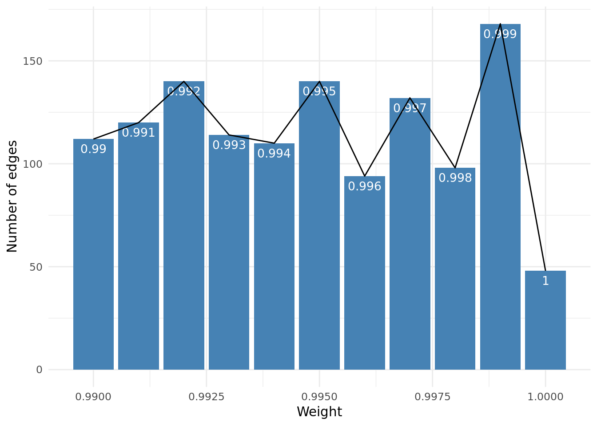

#### Degree distribution of item->similarity->item edges

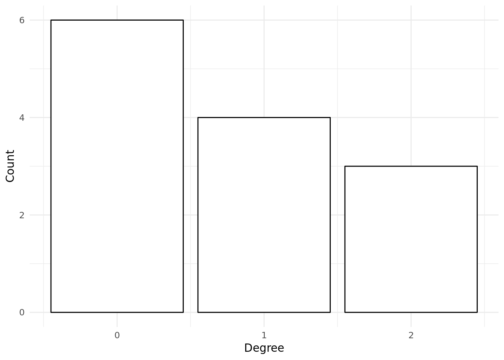

#### Degree distribution of agent->knows->agent edges

#### Runing time by method 

<table class="table table-condensed" style="width: auto !important; ">
 <thead>
  <tr>
   <th style="text-align:left;">   </th>
   <th style="text-align:left;"> key </th>
   <th style="text-align:right;"> doc_count </th>
   <th style="text-align:right;"> sum_wallTime_ms.value </th>
   <th style="text-align:left;"> avg_wallTime_ms.value </th>
   <th style="text-align:left;"> includedInTotal </th>
  </tr>
 </thead>
<tbody>
  <tr>
   <td style="text-align:left;"> 1 </td>
   <td style="text-align:left;"> knowsAgent </td>
   <td style="text-align:right;"> 601 </td>
   <td style="text-align:right;"> 1,112 </td>
   <td style="text-align:left;"> 1.85024958402662 </td>
   <td style="text-align:left;"> No </td>
  </tr>
  <tr>
   <td style="text-align:left;"> 2 </td>
   <td style="text-align:left;"> addItemToWork </td>
   <td style="text-align:right;"> 240 </td>
   <td style="text-align:right;"> 1,610 </td>
   <td style="text-align:left;"> 6.70833333333333 </td>
   <td style="text-align:left;"> No </td>
  </tr>
  <tr>
   <td style="text-align:left;"> 3 </td>
   <td style="text-align:left;"> ownsWork </td>
   <td style="text-align:right;"> 120 </td>
   <td style="text-align:right;"> 743 </td>
   <td style="text-align:left;"> 6.19166666666667 </td>
   <td style="text-align:left;"> No </td>
  </tr>
  <tr>
   <td style="text-align:left;"> 4 </td>
   <td style="text-align:left;"> init </td>
   <td style="text-align:right;"> 103 </td>
   <td style="text-align:right;"> 11,911 </td>
   <td style="text-align:left;"> 115.640776699029 </td>
   <td style="text-align:left;"> No </td>
  </tr>
  <tr>
   <td style="text-align:left;"> 5 </td>
   <td style="text-align:left;"> searchAndConnect </td>
   <td style="text-align:right;"> 101 </td>
   <td style="text-align:right;"> 43,811 </td>
   <td style="text-align:left;"> 433.772277227723 </td>
   <td style="text-align:left;"> Yes </td>
  </tr>
  <tr>
   <td style="text-align:left;"> 6 </td>
   <td style="text-align:left;"> getWorksItems </td>
   <td style="text-align:right;"> 38 </td>
   <td style="text-align:right;"> 83 </td>
   <td style="text-align:left;"> 2.18421052631579 </td>
   <td style="text-align:left;"> Yes </td>
  </tr>
  <tr>
   <td style="text-align:left;"> 9 </td>
   <td style="text-align:left;"> cycleSearch </td>
   <td style="text-align:right;"> 2 </td>
   <td style="text-align:right;"> 287 </td>
   <td style="text-align:left;"> 143.5 </td>
   <td style="text-align:left;"> Yes </td>
  </tr>
  <tr>
   <td style="text-align:left;"> 10 </td>
   <td style="text-align:left;"> getWorks </td>
   <td style="text-align:right;"> 2 </td>
   <td style="text-align:right;"> 436 </td>
   <td style="text-align:left;"> 218 </td>
   <td style="text-align:left;"> No </td>
  </tr>
  <tr>
   <td style="text-align:left;font-weight: bold;"> 11 </td>
   <td style="text-align:left;font-weight: bold;"> Total </td>
   <td style="text-align:right;font-weight: bold;"> 148 </td>
   <td style="text-align:right;font-weight: bold;"> 44,908 </td>
   <td style="text-align:left;font-weight: bold;">  </td>
   <td style="text-align:left;font-weight: bold;">  </td>
  </tr>
</tbody>
</table>
####  Found structures 

#####  Cycles 

Number of cycles found:  2 

<button class="btn btn-primary" data-toggle="collapse" data-target="#CARNUZPRCN"> Show/Hide foundCycle query </button> 
 
  
     GET /filebeat-*/_search 
              { 
                "query": {
                  "bool": {
                    "must": [
                      { "match_phrase": {
                        "simulationId": "SIM10-06-10-19-ALycgd--DV"
                        }
                      },
                      { "bool": {
                        "should": [
                          { "match": {
                            "keyword": "foundCycle"
                          }}
                        ]
                      }}
                    ]
                  }
                }
              }
     

#####  Paths 

Number of paths found:  0 

<button class="btn btn-primary" data-toggle="collapse" data-target="#ELBCQLPMOJ"> Show/Hide foundPath query </button> 
 
  
     GET /filebeat-*/_search 
              { 
                "query": {
                  "bool": {
                    "must": [
                      { "match_phrase": {
                        "simulationId": "SIM10-06-10-19-ALycgd--DV"
                        }
                      },
                      { "bool": {
                        "should": [
                          { "match": {
                            "keyword": "foundPath"
                          }}
                        ]
                      }}
                    ]
                  }
                }
              }
     

###  SIM10-06-11-29-cBYYAE--CV 

#### simulationParameters 

<table class="table table-condensed" style="width: auto !important; ">
 <thead>
  <tr>
   <th style="text-align:left;"> agentNumber </th>
   <th style="text-align:left;"> similarityConnectThreshold </th>
   <th style="text-align:left;"> graphType </th>
   <th style="text-align:left;"> chainLength </th>
   <th style="text-align:left;"> similaritySearchThreshold </th>
   <th style="text-align:left;"> maxDistance </th>
   <th style="text-align:left;"> randomWorksNumberMultiplier </th>
  </tr>
 </thead>
<tbody>
  <tr>
   <td style="text-align:left;width: 20em; "> 100 </td>
   <td style="text-align:left;width: 15em; "> 0.99 </td>
   <td style="text-align:left;width: 15em; "> random </td>
   <td style="text-align:left;width: 15em; "> 20 </td>
   <td style="text-align:left;width: 15em; "> 1 </td>
   <td style="text-align:left;width: 15em; "> 10 </td>
   <td style="text-align:left;width: 15em; "> 2 </td>
  </tr>
</tbody>
</table>
#### allEdgesByLabel

<table class="table table-condensed" style="width: auto !important; ">
 <thead>
  <tr>
   <th style="text-align:right;"> edges_offers </th>
   <th style="text-align:right;"> edges_similarity </th>
   <th style="text-align:right;"> edges_owns </th>
   <th style="text-align:right;"> edges_demands </th>
   <th style="text-align:right;"> edges_knows </th>
   <th style="text-align:right;"> edges_total </th>
  </tr>
 </thead>
<tbody>
  <tr>
   <td style="text-align:right;width: 5em; "> 220 </td>
   <td style="text-align:right;width: 5em; "> 4,148 </td>
   <td style="text-align:right;width: 5em; "> 220 </td>
   <td style="text-align:right;width: 5em; "> 220 </td>
   <td style="text-align:right;width: 5em; "> 100 </td>
   <td style="text-align:right;width: 5em; "> 4,908 </td>
  </tr>
</tbody>
</table>
#### allVerticesByType

<table class="table table-condensed" style="width: auto !important; ">
 <thead>
  <tr>
   <th style="text-align:right;"> vertices_agent </th>
   <th style="text-align:right;"> vertices_item </th>
   <th style="text-align:right;"> vertices_work </th>
   <th style="text-align:right;"> vertices_total </th>
  </tr>
 </thead>
<tbody>
  <tr>
   <td style="text-align:right;width: 5em; "> 101 </td>
   <td style="text-align:right;width: 5em; "> 440 </td>
   <td style="text-align:right;width: 5em; "> 220 </td>
   <td style="text-align:right;width: 5em; "> 761 </td>
  </tr>
</tbody>
</table>
#### distribution of similarityEdgesByWeight

#### Degree distribution of item->similarity->item edges

#### Degree distribution of agent->knows->agent edges

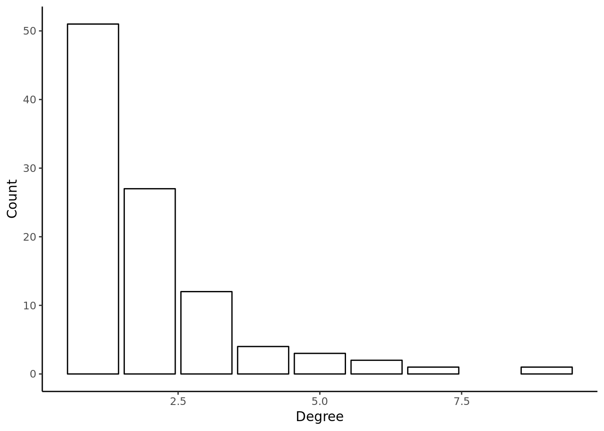

#### Runing time by method 

<table class="table table-condensed" style="width: auto !important; ">
 <thead>
  <tr>
   <th style="text-align:left;"> key </th>
   <th style="text-align:right;"> doc_count </th>
   <th style="text-align:right;"> sum_wallTime_ms.value </th>
   <th style="text-align:left;"> avg_wallTime_ms.value </th>
   <th style="text-align:left;"> includedInTotal </th>
  </tr>
 </thead>
<tbody>
  <tr>
   <td style="text-align:left;"> connectIfSimilar </td>
   <td style="text-align:right;"> 96,580 </td>
   <td style="text-align:right;"> 175,404 </td>
   <td style="text-align:left;"> 1.81615241250777 </td>
   <td style="text-align:left;"> No </td>
  </tr>
  <tr>
   <td style="text-align:left;"> existsSimilarity </td>
   <td style="text-align:right;"> 96,580 </td>
   <td style="text-align:right;"> 173,655 </td>
   <td style="text-align:left;"> 1.79804307310002 </td>
   <td style="text-align:left;"> No </td>
  </tr>
  <tr>
   <td style="text-align:left;"> similarityEdges </td>
   <td style="text-align:right;"> 96,580 </td>
   <td style="text-align:right;"> 171,041 </td>
   <td style="text-align:left;"> 1.77097742803893 </td>
   <td style="text-align:left;"> No </td>
  </tr>
  <tr>
   <td style="text-align:left;"> connectAllSimilar </td>
   <td style="text-align:right;"> 440 </td>
   <td style="text-align:right;"> 176,276 </td>
   <td style="text-align:left;"> 400.627272727273 </td>
   <td style="text-align:left;"> Yes </td>
  </tr>
  <tr>
   <td style="text-align:left;"> init </td>
   <td style="text-align:right;"> 103 </td>
   <td style="text-align:right;"> 11,176 </td>
   <td style="text-align:left;"> 108.504854368932 </td>
   <td style="text-align:left;"> No </td>
  </tr>
  <tr>
   <td style="text-align:left;"> connect </td>
   <td style="text-align:right;"> 52 </td>
   <td style="text-align:right;"> 125 </td>
   <td style="text-align:left;"> 2.40384615384615 </td>
   <td style="text-align:left;"> Yes </td>
  </tr>
  <tr>
   <td style="text-align:left;font-weight: bold;"> Total </td>
   <td style="text-align:right;font-weight: bold;"> 500 </td>
   <td style="text-align:right;font-weight: bold;"> 177,046 </td>
   <td style="text-align:left;font-weight: bold;">  </td>
   <td style="text-align:left;font-weight: bold;">  </td>
  </tr>
</tbody>
</table>
####  Found structures 

#####  Cycles 

Number of cycles found:  1 

<button class="btn btn-primary" data-toggle="collapse" data-target="#FWAKMDQPPC"> Show/Hide foundCycle query </button> 
 
  
     GET /filebeat-*/_search 
              { 
                "query": {
                  "bool": {
                    "must": [
                      { "match_phrase": {
                        "simulationId": "SIM10-06-11-29-cBYYAE--CV"
                        }
                      },
                      { "bool": {
                        "should": [
                          { "match": {
                            "keyword": "foundCycle"
                          }}
                        ]
                      }}
                    ]
                  }
                }
              }
     

#####  Paths 

Number of paths found:  0 

<button class="btn btn-primary" data-toggle="collapse" data-target="#IOVZBFZBSK"> Show/Hide foundPath query </button> 
 
  
     GET /filebeat-*/_search 
              { 
                "query": {
                  "bool": {
                    "must": [
                      { "match_phrase": {
                        "simulationId": "SIM10-06-11-29-cBYYAE--CV"
                        }
                      },
                      { "bool": {
                        "should": [
                          { "match": {
                            "keyword": "foundPath"
                          }}
                        ]
                      }}
                    ]
                  }
                }
              }
     

###  SIM10-06-11-29-cBYYAE--DV 

#### simulationParameters 

<table class="table table-condensed" style="width: auto !important; ">
 <thead>
  <tr>
   <th style="text-align:left;"> agentNumber </th>
   <th style="text-align:left;"> similarityConnectThreshold </th>
   <th style="text-align:left;"> graphType </th>
   <th style="text-align:left;"> chainLength </th>
   <th style="text-align:left;"> similaritySearchThreshold </th>
   <th style="text-align:left;"> maxDistance </th>
   <th style="text-align:left;"> randomWorksNumberMultiplier </th>
  </tr>
 </thead>
<tbody>
  <tr>
   <td style="text-align:left;width: 20em; "> 100 </td>
   <td style="text-align:left;width: 15em; "> 0.99 </td>
   <td style="text-align:left;width: 15em; "> random </td>
   <td style="text-align:left;width: 15em; "> 20 </td>
   <td style="text-align:left;width: 15em; "> 1 </td>
   <td style="text-align:left;width: 15em; "> 10 </td>
   <td style="text-align:left;width: 15em; "> 2 </td>
  </tr>
</tbody>
</table>
#### allEdgesByLabel

<table class="table table-condensed" style="width: auto !important; ">
 <thead>
  <tr>
   <th style="text-align:right;"> edges_offers </th>
   <th style="text-align:right;"> edges_similarity </th>
   <th style="text-align:right;"> edges_owns </th>
   <th style="text-align:right;"> edges_demands </th>
   <th style="text-align:right;"> edges_knows </th>
   <th style="text-align:right;"> edges_total </th>
  </tr>
 </thead>
<tbody>
  <tr>
   <td style="text-align:right;width: 5em; "> 220 </td>
   <td style="text-align:right;width: 5em; "> 4,044 </td>
   <td style="text-align:right;width: 5em; "> 220 </td>
   <td style="text-align:right;width: 5em; "> 220 </td>
   <td style="text-align:right;width: 5em; "> 100 </td>
   <td style="text-align:right;width: 5em; "> 4,804 </td>
  </tr>
</tbody>
</table>
#### allVerticesByType

<table class="table table-condensed" style="width: auto !important; ">
 <thead>
  <tr>
   <th style="text-align:right;"> vertices_agent </th>
   <th style="text-align:right;"> vertices_item </th>
   <th style="text-align:right;"> vertices_work </th>
   <th style="text-align:right;"> vertices_total </th>
  </tr>
 </thead>
<tbody>
  <tr>
   <td style="text-align:right;width: 5em; "> 101 </td>
   <td style="text-align:right;width: 5em; "> 440 </td>
   <td style="text-align:right;width: 5em; "> 220 </td>
   <td style="text-align:right;width: 5em; "> 761 </td>
  </tr>
</tbody>
</table>
#### distribution of similarityEdgesByWeight

#### Degree distribution of item->similarity->item edges

#### Degree distribution of agent->knows->agent edges

#### Runing time by method 

<table class="table table-condensed" style="width: auto !important; ">
 <thead>
  <tr>
   <th style="text-align:left;">   </th>
   <th style="text-align:left;"> key </th>
   <th style="text-align:right;"> doc_count </th>
   <th style="text-align:right;"> sum_wallTime_ms.value </th>
   <th style="text-align:left;"> avg_wallTime_ms.value </th>
   <th style="text-align:left;"> includedInTotal </th>
  </tr>
 </thead>
<tbody>
  <tr>
   <td style="text-align:left;"> 1 </td>
   <td style="text-align:left;"> addItemToWork </td>
   <td style="text-align:right;"> 440 </td>
   <td style="text-align:right;"> 4,786 </td>
   <td style="text-align:left;"> 10.8772727272727 </td>
   <td style="text-align:left;"> No </td>
  </tr>
  <tr>
   <td style="text-align:left;"> 2 </td>
   <td style="text-align:left;"> ownsWork </td>
   <td style="text-align:right;"> 220 </td>
   <td style="text-align:right;"> 1,483 </td>
   <td style="text-align:left;"> 6.74090909090909 </td>
   <td style="text-align:left;"> No </td>
  </tr>
  <tr>
   <td style="text-align:left;"> 3 </td>
   <td style="text-align:left;"> init </td>
   <td style="text-align:right;"> 103 </td>
   <td style="text-align:right;"> 12,160 </td>
   <td style="text-align:left;"> 118.058252427184 </td>
   <td style="text-align:left;"> No </td>
  </tr>
  <tr>
   <td style="text-align:left;"> 4 </td>
   <td style="text-align:left;"> searchAndConnect </td>
   <td style="text-align:right;"> 101 </td>
   <td style="text-align:right;"> 86,705 </td>
   <td style="text-align:left;"> 858.465346534653 </td>
   <td style="text-align:left;"> Yes </td>
  </tr>
  <tr>
   <td style="text-align:left;"> 5 </td>
   <td style="text-align:left;"> knowsAgent </td>
   <td style="text-align:right;"> 100 </td>
   <td style="text-align:right;"> 333 </td>
   <td style="text-align:left;"> 3.33 </td>
   <td style="text-align:left;"> No </td>
  </tr>
  <tr>
   <td style="text-align:left;"> 6 </td>
   <td style="text-align:left;"> getWorksItems </td>
   <td style="text-align:right;"> 38 </td>
   <td style="text-align:right;"> 142 </td>
   <td style="text-align:left;"> 3.73684210526316 </td>
   <td style="text-align:left;"> Yes </td>
  </tr>
  <tr>
   <td style="text-align:left;"> 9 </td>
   <td style="text-align:left;"> cycleSearch </td>
   <td style="text-align:right;"> 3 </td>
   <td style="text-align:right;"> 139 </td>
   <td style="text-align:left;"> 46.3333333333333 </td>
   <td style="text-align:left;"> Yes </td>
  </tr>
  <tr>
   <td style="text-align:left;"> 10 </td>
   <td style="text-align:left;"> getWorks </td>
   <td style="text-align:right;"> 3 </td>
   <td style="text-align:right;"> 284 </td>
   <td style="text-align:left;"> 94.6666666666667 </td>
   <td style="text-align:left;"> No </td>
  </tr>
  <tr>
   <td style="text-align:left;font-weight: bold;"> 11 </td>
   <td style="text-align:left;font-weight: bold;"> Total </td>
   <td style="text-align:right;font-weight: bold;"> 150 </td>
   <td style="text-align:right;font-weight: bold;"> 87,916 </td>
   <td style="text-align:left;font-weight: bold;">  </td>
   <td style="text-align:left;font-weight: bold;">  </td>
  </tr>
</tbody>
</table>
####  Found structures 

#####  Cycles 

Number of cycles found:  3 

<button class="btn btn-primary" data-toggle="collapse" data-target="#RAPECDQGQB"> Show/Hide foundCycle query </button> 
 
  
     GET /filebeat-*/_search 
              { 
                "query": {
                  "bool": {
                    "must": [
                      { "match_phrase": {
                        "simulationId": "SIM10-06-11-29-cBYYAE--DV"
                        }
                      },
                      { "bool": {
                        "should": [
                          { "match": {
                            "keyword": "foundCycle"
                          }}
                        ]
                      }}
                    ]
                  }
                }
              }
     

#####  Paths 

Number of paths found:  0 

<button class="btn btn-primary" data-toggle="collapse" data-target="#NMAYIAREEP"> Show/Hide foundPath query </button> 
 
  
     GET /filebeat-*/_search 
              { 
                "query": {
                  "bool": {
                    "must": [
                      { "match_phrase": {
                        "simulationId": "SIM10-06-11-29-cBYYAE--DV"
                        }
                      },
                      { "bool": {
                        "should": [
                          { "match": {
                            "keyword": "foundPath"
                          }}
                        ]
                      }}
                    ]
                  }
                }
              }
     

###  SIM10-06-11-32-uS8t3t--CV 

#### simulationParameters 

<table class="table table-condensed" style="width: auto !important; ">
 <thead>
  <tr>
   <th style="text-align:left;"> agentNumber </th>
   <th style="text-align:left;"> similarityConnectThreshold </th>
   <th style="text-align:left;"> graphType </th>
   <th style="text-align:left;"> chainLength </th>
   <th style="text-align:left;"> similaritySearchThreshold </th>
   <th style="text-align:left;"> maxDistance </th>
   <th style="text-align:left;"> randomWorksNumberMultiplier </th>
  </tr>
 </thead>
<tbody>
  <tr>
   <td style="text-align:left;width: 20em; "> 100 </td>
   <td style="text-align:left;width: 15em; "> 0.99 </td>
   <td style="text-align:left;width: 15em; "> smallWorld </td>
   <td style="text-align:left;width: 15em; "> 20 </td>
   <td style="text-align:left;width: 15em; "> 1 </td>
   <td style="text-align:left;width: 15em; "> 10 </td>
   <td style="text-align:left;width: 15em; "> 2 </td>
  </tr>
</tbody>
</table>
#### allEdgesByLabel

<table class="table table-condensed" style="width: auto !important; ">
 <thead>
  <tr>
   <th style="text-align:right;"> edges_offers </th>
   <th style="text-align:right;"> edges_similarity </th>
   <th style="text-align:right;"> edges_owns </th>
   <th style="text-align:right;"> edges_demands </th>
   <th style="text-align:right;"> edges_knows </th>
   <th style="text-align:right;"> edges_total </th>
  </tr>
 </thead>
<tbody>
  <tr>
   <td style="text-align:right;width: 5em; "> 220 </td>
   <td style="text-align:right;width: 5em; "> 4,124 </td>
   <td style="text-align:right;width: 5em; "> 220 </td>
   <td style="text-align:right;width: 5em; "> 220 </td>
   <td style="text-align:right;width: 5em; "> 601 </td>
   <td style="text-align:right;width: 5em; "> 5,385 </td>
  </tr>
</tbody>
</table>
#### allVerticesByType

<table class="table table-condensed" style="width: auto !important; ">
 <thead>
  <tr>
   <th style="text-align:right;"> vertices_agent </th>
   <th style="text-align:right;"> vertices_item </th>
   <th style="text-align:right;"> vertices_work </th>
   <th style="text-align:right;"> vertices_total </th>
  </tr>
 </thead>
<tbody>
  <tr>
   <td style="text-align:right;width: 5em; "> 101 </td>
   <td style="text-align:right;width: 5em; "> 440 </td>
   <td style="text-align:right;width: 5em; "> 220 </td>
   <td style="text-align:right;width: 5em; "> 761 </td>
  </tr>
</tbody>
</table>
#### distribution of similarityEdgesByWeight

#### Degree distribution of item->similarity->item edges

#### Degree distribution of agent->knows->agent edges

#### Runing time by method 

<table class="table table-condensed" style="width: auto !important; ">
 <thead>
  <tr>
   <th style="text-align:left;"> key </th>
   <th style="text-align:right;"> doc_count </th>
   <th style="text-align:right;"> sum_wallTime_ms.value </th>
   <th style="text-align:left;"> avg_wallTime_ms.value </th>
   <th style="text-align:left;"> includedInTotal </th>
  </tr>
 </thead>
<tbody>
  <tr>
   <td style="text-align:left;"> connectIfSimilar </td>
   <td style="text-align:right;"> 96,580 </td>
   <td style="text-align:right;"> 176,450 </td>
   <td style="text-align:left;"> 1.82698281217643 </td>
   <td style="text-align:left;"> No </td>
  </tr>
  <tr>
   <td style="text-align:left;"> existsSimilarity </td>
   <td style="text-align:right;"> 96,580 </td>
   <td style="text-align:right;"> 174,733 </td>
   <td style="text-align:left;"> 1.80920480430731 </td>
   <td style="text-align:left;"> No </td>
  </tr>
  <tr>
   <td style="text-align:left;"> similarityEdges </td>
   <td style="text-align:right;"> 96,580 </td>
   <td style="text-align:right;"> 172,097 </td>
   <td style="text-align:left;"> 1.78191136881342 </td>
   <td style="text-align:left;"> No </td>
  </tr>
  <tr>
   <td style="text-align:left;"> connectAllSimilar </td>
   <td style="text-align:right;"> 440 </td>
   <td style="text-align:right;"> 177,362 </td>
   <td style="text-align:left;"> 403.095454545455 </td>
   <td style="text-align:left;"> Yes </td>
  </tr>
  <tr>
   <td style="text-align:left;"> init </td>
   <td style="text-align:right;"> 103 </td>
   <td style="text-align:right;"> 11,369 </td>
   <td style="text-align:left;"> 110.378640776699 </td>
   <td style="text-align:left;"> No </td>
  </tr>
  <tr>
   <td style="text-align:left;"> connect </td>
   <td style="text-align:right;"> 20 </td>
   <td style="text-align:right;"> 38 </td>
   <td style="text-align:left;"> 1.9 </td>
   <td style="text-align:left;"> Yes </td>
  </tr>
  <tr>
   <td style="text-align:left;font-weight: bold;"> Total </td>
   <td style="text-align:right;font-weight: bold;"> 468 </td>
   <td style="text-align:right;font-weight: bold;"> 178,121 </td>
   <td style="text-align:left;font-weight: bold;">  </td>
   <td style="text-align:left;font-weight: bold;">  </td>
  </tr>
</tbody>
</table>
####  Found structures 

#####  Cycles 

Number of cycles found:  1 

<button class="btn btn-primary" data-toggle="collapse" data-target="#DCPARSYSMA"> Show/Hide foundCycle query </button> 
 
  
     GET /filebeat-*/_search 
              { 
                "query": {
                  "bool": {
                    "must": [
                      { "match_phrase": {
                        "simulationId": "SIM10-06-11-32-uS8t3t--CV"
                        }
                      },
                      { "bool": {
                        "should": [
                          { "match": {
                            "keyword": "foundCycle"
                          }}
                        ]
                      }}
                    ]
                  }
                }
              }
     

#####  Paths 

Number of paths found:  0 

<button class="btn btn-primary" data-toggle="collapse" data-target="#IXYEPGREEY"> Show/Hide foundPath query </button> 
 
  
     GET /filebeat-*/_search 
              { 
                "query": {
                  "bool": {
                    "must": [
                      { "match_phrase": {
                        "simulationId": "SIM10-06-11-32-uS8t3t--CV"
                        }
                      },
                      { "bool": {
                        "should": [
                          { "match": {
                            "keyword": "foundPath"
                          }}
                        ]
                      }}
                    ]
                  }
                }
              }
     

###  SIM10-06-11-32-uS8t3t--DV 

#### simulationParameters 

<table class="table table-condensed" style="width: auto !important; ">
 <thead>
  <tr>
   <th style="text-align:left;"> agentNumber </th>
   <th style="text-align:left;"> similarityConnectThreshold </th>
   <th style="text-align:left;"> graphType </th>
   <th style="text-align:left;"> chainLength </th>
   <th style="text-align:left;"> similaritySearchThreshold </th>
   <th style="text-align:left;"> maxDistance </th>
   <th style="text-align:left;"> randomWorksNumberMultiplier </th>
  </tr>
 </thead>
<tbody>
  <tr>
   <td style="text-align:left;width: 20em; "> 100 </td>
   <td style="text-align:left;width: 15em; "> 0.99 </td>
   <td style="text-align:left;width: 15em; "> smallWorld </td>
   <td style="text-align:left;width: 15em; "> 20 </td>
   <td style="text-align:left;width: 15em; "> 1 </td>
   <td style="text-align:left;width: 15em; "> 10 </td>
   <td style="text-align:left;width: 15em; "> 2 </td>
  </tr>
</tbody>
</table>
#### allEdgesByLabel

<table class="table table-condensed" style="width: auto !important; ">
 <thead>
  <tr>
   <th style="text-align:right;"> edges_offers </th>
   <th style="text-align:right;"> edges_similarity </th>
   <th style="text-align:right;"> edges_owns </th>
   <th style="text-align:right;"> edges_demands </th>
   <th style="text-align:right;"> edges_knows </th>
   <th style="text-align:right;"> edges_total </th>
  </tr>
 </thead>
<tbody>
  <tr>
   <td style="text-align:right;width: 5em; "> 220 </td>
   <td style="text-align:right;width: 5em; "> 4,084 </td>
   <td style="text-align:right;width: 5em; "> 220 </td>
   <td style="text-align:right;width: 5em; "> 220 </td>
   <td style="text-align:right;width: 5em; "> 601 </td>
   <td style="text-align:right;width: 5em; "> 5,345 </td>
  </tr>
</tbody>
</table>
#### allVerticesByType

<table class="table table-condensed" style="width: auto !important; ">
 <thead>
  <tr>
   <th style="text-align:right;"> vertices_agent </th>
   <th style="text-align:right;"> vertices_item </th>
   <th style="text-align:right;"> vertices_work </th>
   <th style="text-align:right;"> vertices_total </th>
  </tr>
 </thead>
<tbody>
  <tr>
   <td style="text-align:right;width: 5em; "> 101 </td>
   <td style="text-align:right;width: 5em; "> 440 </td>
   <td style="text-align:right;width: 5em; "> 220 </td>
   <td style="text-align:right;width: 5em; "> 761 </td>
  </tr>
</tbody>
</table>
#### distribution of similarityEdgesByWeight

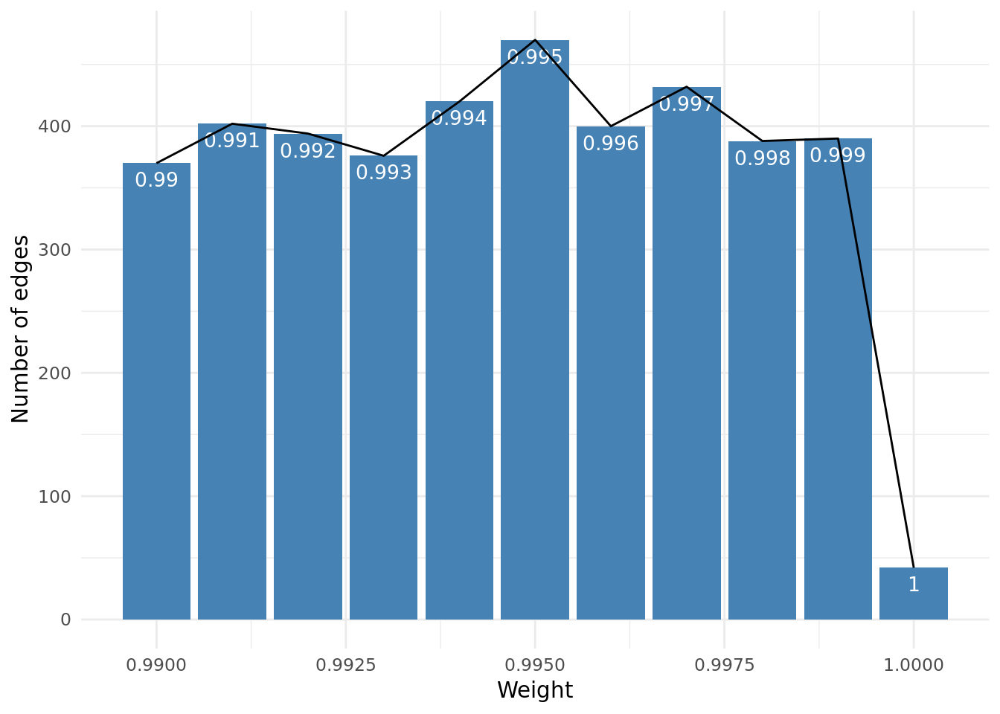

#### Degree distribution of item->similarity->item edges

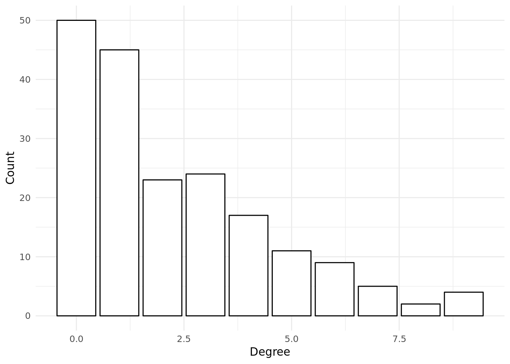

#### Degree distribution of agent->knows->agent edges

#### Runing time by method 

<table class="table table-condensed" style="width: auto !important; ">
 <thead>
  <tr>
   <th style="text-align:left;">   </th>
   <th style="text-align:left;"> key </th>
   <th style="text-align:right;"> doc_count </th>
   <th style="text-align:right;"> sum_wallTime_ms.value </th>
   <th style="text-align:left;"> avg_wallTime_ms.value </th>
   <th style="text-align:left;"> includedInTotal </th>
  </tr>
 </thead>
<tbody>
  <tr>
   <td style="text-align:left;"> 1 </td>
   <td style="text-align:left;"> knowsAgent </td>
   <td style="text-align:right;"> 601 </td>
   <td style="text-align:right;"> 1,084 </td>
   <td style="text-align:left;"> 1.80366056572379 </td>
   <td style="text-align:left;"> No </td>
  </tr>
  <tr>
   <td style="text-align:left;"> 2 </td>
   <td style="text-align:left;"> addItemToWork </td>
   <td style="text-align:right;"> 440 </td>
   <td style="text-align:right;"> 3,178 </td>
   <td style="text-align:left;"> 7.22272727272727 </td>
   <td style="text-align:left;"> No </td>
  </tr>
  <tr>
   <td style="text-align:left;"> 3 </td>
   <td style="text-align:left;"> ownsWork </td>
   <td style="text-align:right;"> 220 </td>
   <td style="text-align:right;"> 1,242 </td>
   <td style="text-align:left;"> 5.64545454545455 </td>
   <td style="text-align:left;"> No </td>
  </tr>
  <tr>
   <td style="text-align:left;"> 4 </td>
   <td style="text-align:left;"> init </td>
   <td style="text-align:right;"> 103 </td>
   <td style="text-align:right;"> 11,950 </td>
   <td style="text-align:left;"> 116.019417475728 </td>
   <td style="text-align:left;"> No </td>
  </tr>
  <tr>
   <td style="text-align:left;"> 5 </td>
   <td style="text-align:left;"> searchAndConnect </td>
   <td style="text-align:right;"> 101 </td>
   <td style="text-align:right;"> 94,914 </td>
   <td style="text-align:left;"> 939.742574257426 </td>
   <td style="text-align:left;"> Yes </td>
  </tr>
  <tr>
   <td style="text-align:left;"> 6 </td>
   <td style="text-align:left;"> getWorksItems </td>
   <td style="text-align:right;"> 38 </td>
   <td style="text-align:right;"> 91 </td>
   <td style="text-align:left;"> 2.39473684210526 </td>
   <td style="text-align:left;"> Yes </td>
  </tr>
  <tr>
   <td style="text-align:left;"> 9 </td>
   <td style="text-align:left;"> cycleSearch </td>
   <td style="text-align:right;"> 4 </td>
   <td style="text-align:right;"> 671 </td>
   <td style="text-align:left;"> 167.75 </td>
   <td style="text-align:left;"> Yes </td>
  </tr>
  <tr>
   <td style="text-align:left;"> 10 </td>
   <td style="text-align:left;"> getWorks </td>
   <td style="text-align:right;"> 4 </td>
   <td style="text-align:right;"> 720 </td>
   <td style="text-align:left;"> 180 </td>
   <td style="text-align:left;"> No </td>
  </tr>
  <tr>
   <td style="text-align:left;font-weight: bold;"> 11 </td>
   <td style="text-align:left;font-weight: bold;"> Total </td>
   <td style="text-align:right;font-weight: bold;"> 152 </td>
   <td style="text-align:right;font-weight: bold;"> 96,916 </td>
   <td style="text-align:left;font-weight: bold;">  </td>
   <td style="text-align:left;font-weight: bold;">  </td>
  </tr>
</tbody>
</table>
####  Found structures 

#####  Cycles 

Number of cycles found:  3 

<button class="btn btn-primary" data-toggle="collapse" data-target="#WWGVIFDSEC"> Show/Hide foundCycle query </button> 
 
  
     GET /filebeat-*/_search 
              { 
                "query": {
                  "bool": {
                    "must": [
                      { "match_phrase": {
                        "simulationId": "SIM10-06-11-32-uS8t3t--DV"
                        }
                      },
                      { "bool": {
                        "should": [
                          { "match": {
                            "keyword": "foundCycle"
                          }}
                        ]
                      }}
                    ]
                  }
                }
              }
     

#####  Paths 

Number of paths found:  1 

<button class="btn btn-primary" data-toggle="collapse" data-target="#WWQYIADBRG"> Show/Hide foundPath query </button> 
 
  
     GET /filebeat-*/_search 
              { 
                "query": {
                  "bool": {
                    "must": [
                      { "match_phrase": {
                        "simulationId": "SIM10-06-11-32-uS8t3t--DV"
                        }
                      },
                      { "bool": {
                        "should": [
                          { "match": {
                            "keyword": "foundPath"
                          }}
                        ]
                      }}
                    ]
                  }
                }
              }
     

###  SIM10-06-10-20-wauu7P--CV 

#### simulationParameters 

<table class="table table-condensed" style="width: auto !important; ">
 <thead>
  <tr>
   <th style="text-align:left;"> agentNumber </th>
   <th style="text-align:left;"> similarityConnectThreshold </th>
   <th style="text-align:left;"> graphType </th>
   <th style="text-align:left;"> chainLength </th>
   <th style="text-align:left;"> similaritySearchThreshold </th>
   <th style="text-align:left;"> maxDistance </th>
   <th style="text-align:left;"> randomWorksNumberMultiplier </th>
  </tr>
 </thead>
<tbody>
  <tr>
   <td style="text-align:left;width: 20em; "> 100 </td>
   <td style="text-align:left;width: 15em; "> 0.99 </td>
   <td style="text-align:left;width: 15em; "> random </td>
   <td style="text-align:left;width: 15em; "> 20 </td>
   <td style="text-align:left;width: 15em; "> 1 </td>
   <td style="text-align:left;width: 15em; "> 30 </td>
   <td style="text-align:left;width: 15em; "> 1 </td>
  </tr>
</tbody>
</table>
#### allEdgesByLabel

<table class="table table-condensed" style="width: auto !important; ">
 <thead>
  <tr>
   <th style="text-align:right;"> edges_offers </th>
   <th style="text-align:right;"> edges_similarity </th>
   <th style="text-align:right;"> edges_owns </th>
   <th style="text-align:right;"> edges_demands </th>
   <th style="text-align:right;"> edges_knows </th>
   <th style="text-align:right;"> edges_total </th>
  </tr>
 </thead>
<tbody>
  <tr>
   <td style="text-align:right;width: 5em; "> 120 </td>
   <td style="text-align:right;width: 5em; "> 1,366 </td>
   <td style="text-align:right;width: 5em; "> 120 </td>
   <td style="text-align:right;width: 5em; "> 120 </td>
   <td style="text-align:right;width: 5em; "> 100 </td>
   <td style="text-align:right;width: 5em; "> 1,826 </td>
  </tr>
</tbody>
</table>
#### allVerticesByType

<table class="table table-condensed" style="width: auto !important; ">
 <thead>
  <tr>
   <th style="text-align:right;"> vertices_agent </th>
   <th style="text-align:right;"> vertices_item </th>
   <th style="text-align:right;"> vertices_work </th>
   <th style="text-align:right;"> vertices_total </th>
  </tr>
 </thead>
<tbody>
  <tr>
   <td style="text-align:right;width: 5em; "> 101 </td>
   <td style="text-align:right;width: 5em; "> 240 </td>
   <td style="text-align:right;width: 5em; "> 120 </td>
   <td style="text-align:right;width: 5em; "> 461 </td>
  </tr>
</tbody>
</table>
#### distribution of similarityEdgesByWeight

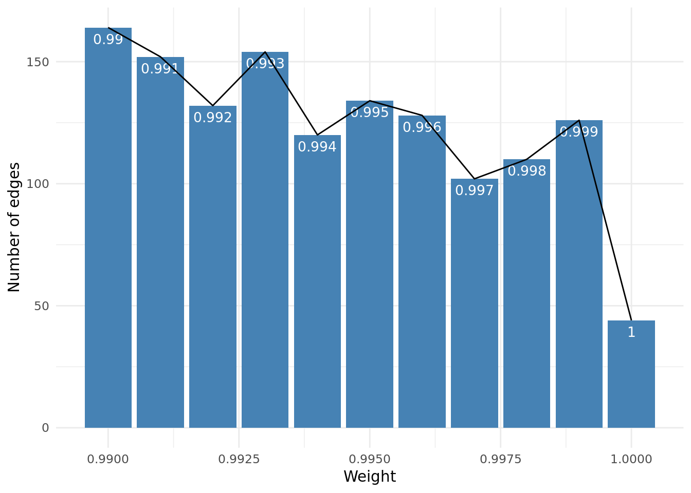

#### Degree distribution of item->similarity->item edges

#### Degree distribution of agent->knows->agent edges

#### Runing time by method 

<table class="table table-condensed" style="width: auto !important; ">
 <thead>
  <tr>
   <th style="text-align:left;"> key </th>
   <th style="text-align:right;"> doc_count </th>
   <th style="text-align:right;"> sum_wallTime_ms.value </th>
   <th style="text-align:left;"> avg_wallTime_ms.value </th>
   <th style="text-align:left;"> includedInTotal </th>
  </tr>
 </thead>
<tbody>
  <tr>
   <td style="text-align:left;"> connectIfSimilar </td>
   <td style="text-align:right;"> 28,680 </td>
   <td style="text-align:right;"> 49,972 </td>
   <td style="text-align:left;"> 1.74239888423989 </td>
   <td style="text-align:left;"> No </td>
  </tr>
  <tr>
   <td style="text-align:left;"> existsSimilarity </td>
   <td style="text-align:right;"> 28,680 </td>
   <td style="text-align:right;"> 49,431 </td>
   <td style="text-align:left;"> 1.72353556485356 </td>
   <td style="text-align:left;"> No </td>
  </tr>
  <tr>
   <td style="text-align:left;"> similarityEdges </td>
   <td style="text-align:right;"> 28,680 </td>
   <td style="text-align:right;"> 48,653 </td>
   <td style="text-align:left;"> 1.69640864714086 </td>
   <td style="text-align:left;"> No </td>
  </tr>
  <tr>
   <td style="text-align:left;"> connectAllSimilar </td>
   <td style="text-align:right;"> 240 </td>
   <td style="text-align:right;"> 50,248 </td>
   <td style="text-align:left;"> 209.366666666667 </td>
   <td style="text-align:left;"> Yes </td>
  </tr>
  <tr>
   <td style="text-align:left;"> init </td>
   <td style="text-align:right;"> 103 </td>
   <td style="text-align:right;"> 11,569 </td>
   <td style="text-align:left;"> 112.320388349515 </td>
   <td style="text-align:left;"> No </td>
  </tr>
  <tr>
   <td style="text-align:left;"> connect </td>
   <td style="text-align:right;"> 10 </td>
   <td style="text-align:right;"> 38 </td>
   <td style="text-align:left;"> 3.8 </td>
   <td style="text-align:left;"> Yes </td>
  </tr>
  <tr>
   <td style="text-align:left;font-weight: bold;"> Total </td>
   <td style="text-align:right;font-weight: bold;"> 258 </td>
   <td style="text-align:right;font-weight: bold;"> 50,718 </td>
   <td style="text-align:left;font-weight: bold;">  </td>
   <td style="text-align:left;font-weight: bold;">  </td>
  </tr>
</tbody>
</table>
####  Found structures 

#####  Cycles 

Number of cycles found:  1 

<button class="btn btn-primary" data-toggle="collapse" data-target="#CURBQMOGOB"> Show/Hide foundCycle query </button> 
 
  
     GET /filebeat-*/_search 
              { 
                "query": {
                  "bool": {
                    "must": [
                      { "match_phrase": {
                        "simulationId": "SIM10-06-10-20-wauu7P--CV"
                        }
                      },
                      { "bool": {
                        "should": [
                          { "match": {
                            "keyword": "foundCycle"
                          }}
                        ]
                      }}
                    ]
                  }
                }
              }
     

#####  Paths 

Number of paths found:  0 

<button class="btn btn-primary" data-toggle="collapse" data-target="#ULHBOMZLGP"> Show/Hide foundPath query </button> 
 
  
     GET /filebeat-*/_search 
              { 
                "query": {
                  "bool": {
                    "must": [
                      { "match_phrase": {
                        "simulationId": "SIM10-06-10-20-wauu7P--CV"
                        }
                      },
                      { "bool": {
                        "should": [
                          { "match": {
                            "keyword": "foundPath"
                          }}
                        ]
                      }}
                    ]
                  }
                }
              }
     

###  SIM10-06-10-20-wauu7P--DV 

#### simulationParameters 

<table class="table table-condensed" style="width: auto !important; ">
 <thead>
  <tr>
   <th style="text-align:left;"> agentNumber </th>
   <th style="text-align:left;"> similarityConnectThreshold </th>
   <th style="text-align:left;"> graphType </th>
   <th style="text-align:left;"> chainLength </th>
   <th style="text-align:left;"> similaritySearchThreshold </th>
   <th style="text-align:left;"> maxDistance </th>
   <th style="text-align:left;"> randomWorksNumberMultiplier </th>
  </tr>
 </thead>
<tbody>
  <tr>
   <td style="text-align:left;width: 20em; "> 100 </td>
   <td style="text-align:left;width: 15em; "> 0.99 </td>
   <td style="text-align:left;width: 15em; "> random </td>
   <td style="text-align:left;width: 15em; "> 20 </td>
   <td style="text-align:left;width: 15em; "> 1 </td>
   <td style="text-align:left;width: 15em; "> 30 </td>
   <td style="text-align:left;width: 15em; "> 1 </td>
  </tr>
</tbody>
</table>
#### allEdgesByLabel

<table class="table table-condensed" style="width: auto !important; ">
 <thead>
  <tr>
   <th style="text-align:right;"> edges_offers </th>
   <th style="text-align:right;"> edges_similarity </th>
   <th style="text-align:right;"> edges_owns </th>
   <th style="text-align:right;"> edges_demands </th>
   <th style="text-align:right;"> edges_knows </th>
   <th style="text-align:right;"> edges_total </th>
  </tr>
 </thead>
<tbody>
  <tr>
   <td style="text-align:right;width: 5em; "> 120 </td>
   <td style="text-align:right;width: 5em; "> 1,346 </td>
   <td style="text-align:right;width: 5em; "> 120 </td>
   <td style="text-align:right;width: 5em; "> 120 </td>
   <td style="text-align:right;width: 5em; "> 100 </td>
   <td style="text-align:right;width: 5em; "> 1,806 </td>
  </tr>
</tbody>
</table>
#### allVerticesByType

<table class="table table-condensed" style="width: auto !important; ">
 <thead>
  <tr>
   <th style="text-align:right;"> vertices_agent </th>
   <th style="text-align:right;"> vertices_item </th>
   <th style="text-align:right;"> vertices_work </th>
   <th style="text-align:right;"> vertices_total </th>
  </tr>
 </thead>
<tbody>
  <tr>
   <td style="text-align:right;width: 5em; "> 101 </td>
   <td style="text-align:right;width: 5em; "> 240 </td>
   <td style="text-align:right;width: 5em; "> 120 </td>
   <td style="text-align:right;width: 5em; "> 461 </td>
  </tr>
</tbody>
</table>
#### distribution of similarityEdgesByWeight

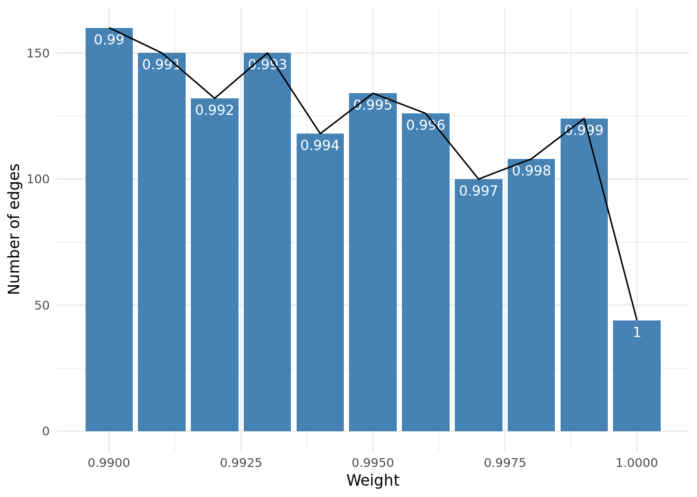

#### Degree distribution of item->similarity->item edges

#### Degree distribution of agent->knows->agent edges

#### Runing time by method 

<table class="table table-condensed" style="width: auto !important; ">
 <thead>
  <tr>
   <th style="text-align:left;">   </th>
   <th style="text-align:left;"> key </th>
   <th style="text-align:right;"> doc_count </th>
   <th style="text-align:right;"> sum_wallTime_ms.value </th>
   <th style="text-align:left;"> avg_wallTime_ms.value </th>
   <th style="text-align:left;"> includedInTotal </th>
  </tr>
 </thead>
<tbody>
  <tr>
   <td style="text-align:left;"> 1 </td>
   <td style="text-align:left;"> addItemToWork </td>
   <td style="text-align:right;"> 240 </td>
   <td style="text-align:right;"> 2,028 </td>
   <td style="text-align:left;"> 8.45 </td>
   <td style="text-align:left;"> No </td>
  </tr>
  <tr>
   <td style="text-align:left;"> 2 </td>
   <td style="text-align:left;"> ownsWork </td>
   <td style="text-align:right;"> 120 </td>
   <td style="text-align:right;"> 1,374 </td>
   <td style="text-align:left;"> 11.45 </td>
   <td style="text-align:left;"> No </td>
  </tr>
  <tr>
   <td style="text-align:left;"> 3 </td>
   <td style="text-align:left;"> init </td>
   <td style="text-align:right;"> 103 </td>
   <td style="text-align:right;"> 12,650 </td>
   <td style="text-align:left;"> 122.815533980583 </td>
   <td style="text-align:left;"> No </td>
  </tr>
  <tr>
   <td style="text-align:left;"> 4 </td>
   <td style="text-align:left;"> searchAndConnect </td>
   <td style="text-align:right;"> 101 </td>
   <td style="text-align:right;"> 30,228 </td>
   <td style="text-align:left;"> 299.287128712871 </td>
   <td style="text-align:left;"> Yes </td>
  </tr>
  <tr>
   <td style="text-align:left;"> 5 </td>
   <td style="text-align:left;"> knowsAgent </td>
   <td style="text-align:right;"> 100 </td>
   <td style="text-align:right;"> 566 </td>
   <td style="text-align:left;"> 5.66 </td>
   <td style="text-align:left;"> No </td>
  </tr>
  <tr>
   <td style="text-align:left;"> 6 </td>
   <td style="text-align:left;"> getWorksItems </td>
   <td style="text-align:right;"> 38 </td>
   <td style="text-align:right;"> 64 </td>
   <td style="text-align:left;"> 1.68421052631579 </td>
   <td style="text-align:left;"> Yes </td>
  </tr>
  <tr>
   <td style="text-align:left;"> 9 </td>
   <td style="text-align:left;"> cycleSearch </td>
   <td style="text-align:right;"> 2 </td>
   <td style="text-align:right;"> 369 </td>
   <td style="text-align:left;"> 184.5 </td>
   <td style="text-align:left;"> Yes </td>
  </tr>
  <tr>
   <td style="text-align:left;"> 10 </td>
   <td style="text-align:left;"> getWorks </td>
   <td style="text-align:right;"> 2 </td>
   <td style="text-align:right;"> 199 </td>
   <td style="text-align:left;"> 99.5 </td>
   <td style="text-align:left;"> No </td>
  </tr>
  <tr>
   <td style="text-align:left;font-weight: bold;"> 11 </td>
   <td style="text-align:left;font-weight: bold;"> Total </td>
   <td style="text-align:right;font-weight: bold;"> 148 </td>
   <td style="text-align:right;font-weight: bold;"> 31,385 </td>
   <td style="text-align:left;font-weight: bold;">  </td>
   <td style="text-align:left;font-weight: bold;">  </td>
  </tr>
</tbody>
</table>
####  Found structures 

#####  Cycles 

Number of cycles found:  1 

<button class="btn btn-primary" data-toggle="collapse" data-target="#EUPTYRXLNI"> Show/Hide foundCycle query </button> 
 
  
     GET /filebeat-*/_search 
              { 
                "query": {
                  "bool": {
                    "must": [
                      { "match_phrase": {
                        "simulationId": "SIM10-06-10-20-wauu7P--DV"
                        }
                      },
                      { "bool": {
                        "should": [
                          { "match": {
                            "keyword": "foundCycle"
                          }}
                        ]
                      }}
                    ]
                  }
                }
              }
     

#####  Paths 

Number of paths found:  1 

<button class="btn btn-primary" data-toggle="collapse" data-target="#WMWQXWBUQD"> Show/Hide foundPath query </button> 
 
  
     GET /filebeat-*/_search 
              { 
                "query": {
                  "bool": {
                    "must": [
                      { "match_phrase": {
                        "simulationId": "SIM10-06-10-20-wauu7P--DV"
                        }
                      },
                      { "bool": {
                        "should": [
                          { "match": {
                            "keyword": "foundPath"
                          }}
                        ]
                      }}
                    ]
                  }
                }
              }
     

###  SIM10-06-10-21-AFKZQ9--CV 

#### simulationParameters 

<table class="table table-condensed" style="width: auto !important; ">
 <thead>
  <tr>
   <th style="text-align:left;"> agentNumber </th>
   <th style="text-align:left;"> similarityConnectThreshold </th>
   <th style="text-align:left;"> graphType </th>
   <th style="text-align:left;"> chainLength </th>
   <th style="text-align:left;"> similaritySearchThreshold </th>
   <th style="text-align:left;"> maxDistance </th>
   <th style="text-align:left;"> randomWorksNumberMultiplier </th>
  </tr>
 </thead>
<tbody>
  <tr>
   <td style="text-align:left;width: 20em; "> 100 </td>
   <td style="text-align:left;width: 15em; "> 0.99 </td>
   <td style="text-align:left;width: 15em; "> smallWorld </td>
   <td style="text-align:left;width: 15em; "> 20 </td>
   <td style="text-align:left;width: 15em; "> 1 </td>
   <td style="text-align:left;width: 15em; "> 30 </td>
   <td style="text-align:left;width: 15em; "> 1 </td>
  </tr>
</tbody>
</table>
#### allEdgesByLabel

<table class="table table-condensed" style="width: auto !important; ">
 <thead>
  <tr>
   <th style="text-align:right;"> edges_offers </th>
   <th style="text-align:right;"> edges_similarity </th>
   <th style="text-align:right;"> edges_owns </th>
   <th style="text-align:right;"> edges_demands </th>
   <th style="text-align:right;"> edges_knows </th>
   <th style="text-align:right;"> edges_total </th>
  </tr>
 </thead>
<tbody>
  <tr>
   <td style="text-align:right;width: 5em; "> 120 </td>
   <td style="text-align:right;width: 5em; "> 1,266 </td>
   <td style="text-align:right;width: 5em; "> 120 </td>
   <td style="text-align:right;width: 5em; "> 120 </td>
   <td style="text-align:right;width: 5em; "> 601 </td>
   <td style="text-align:right;width: 5em; "> 2,227 </td>
  </tr>
</tbody>
</table>
#### allVerticesByType

<table class="table table-condensed" style="width: auto !important; ">
 <thead>
  <tr>
   <th style="text-align:right;"> vertices_agent </th>
   <th style="text-align:right;"> vertices_item </th>
   <th style="text-align:right;"> vertices_work </th>
   <th style="text-align:right;"> vertices_total </th>
  </tr>
 </thead>
<tbody>
  <tr>
   <td style="text-align:right;width: 5em; "> 101 </td>
   <td style="text-align:right;width: 5em; "> 240 </td>
   <td style="text-align:right;width: 5em; "> 120 </td>
   <td style="text-align:right;width: 5em; "> 461 </td>
  </tr>
</tbody>
</table>
#### distribution of similarityEdgesByWeight

#### Degree distribution of item->similarity->item edges

#### Degree distribution of agent->knows->agent edges

#### Runing time by method 

<table class="table table-condensed" style="width: auto !important; ">
 <thead>
  <tr>
   <th style="text-align:left;"> key </th>
   <th style="text-align:right;"> doc_count </th>
   <th style="text-align:right;"> sum_wallTime_ms.value </th>
   <th style="text-align:left;"> avg_wallTime_ms.value </th>
   <th style="text-align:left;"> includedInTotal </th>
  </tr>
 </thead>
<tbody>
  <tr>
   <td style="text-align:left;"> connectIfSimilar </td>
   <td style="text-align:right;"> 28,680 </td>
   <td style="text-align:right;"> 47,783 </td>
   <td style="text-align:left;"> 1.66607391910739 </td>
   <td style="text-align:left;"> No </td>
  </tr>
  <tr>
   <td style="text-align:left;"> existsSimilarity </td>
   <td style="text-align:right;"> 28,680 </td>
   <td style="text-align:right;"> 47,318 </td>
   <td style="text-align:left;"> 1.64986052998605 </td>
   <td style="text-align:left;"> No </td>
  </tr>
  <tr>
   <td style="text-align:left;"> similarityEdges </td>
   <td style="text-align:right;"> 28,680 </td>
   <td style="text-align:right;"> 46,612 </td>
   <td style="text-align:left;"> 1.62524407252441 </td>
   <td style="text-align:left;"> No </td>
  </tr>
  <tr>
   <td style="text-align:left;"> connectAllSimilar </td>
   <td style="text-align:right;"> 240 </td>
   <td style="text-align:right;"> 48,063 </td>
   <td style="text-align:left;"> 200.2625 </td>
   <td style="text-align:left;"> Yes </td>
  </tr>
  <tr>
   <td style="text-align:left;"> init </td>
   <td style="text-align:right;"> 103 </td>
   <td style="text-align:right;"> 11,032 </td>
   <td style="text-align:left;"> 107.106796116505 </td>
   <td style="text-align:left;"> No </td>
  </tr>
  <tr>
   <td style="text-align:left;"> connect </td>
   <td style="text-align:right;"> 11 </td>
   <td style="text-align:right;"> 16 </td>
   <td style="text-align:left;"> 1.45454545454545 </td>
   <td style="text-align:left;"> Yes </td>
  </tr>
  <tr>
   <td style="text-align:left;font-weight: bold;"> Total </td>
   <td style="text-align:right;font-weight: bold;"> 259 </td>
   <td style="text-align:right;font-weight: bold;"> 48,624 </td>
   <td style="text-align:left;font-weight: bold;">  </td>
   <td style="text-align:left;font-weight: bold;">  </td>
  </tr>
</tbody>
</table>
####  Found structures 

#####  Cycles 

Number of cycles found:  1 

<button class="btn btn-primary" data-toggle="collapse" data-target="#LECNVYKDRT"> Show/Hide foundCycle query </button> 
 
  
     GET /filebeat-*/_search 
              { 
                "query": {
                  "bool": {
                    "must": [
                      { "match_phrase": {
                        "simulationId": "SIM10-06-10-21-AFKZQ9--CV"
                        }
                      },
                      { "bool": {
                        "should": [
                          { "match": {
                            "keyword": "foundCycle"
                          }}
                        ]
                      }}
                    ]
                  }
                }
              }
     

#####  Paths 

Number of paths found:  0 

<button class="btn btn-primary" data-toggle="collapse" data-target="#HXRCZBYUEQ"> Show/Hide foundPath query </button> 
 
  
     GET /filebeat-*/_search 
              { 
                "query": {
                  "bool": {
                    "must": [
                      { "match_phrase": {
                        "simulationId": "SIM10-06-10-21-AFKZQ9--CV"
                        }
                      },
                      { "bool": {
                        "should": [
                          { "match": {
                            "keyword": "foundPath"
                          }}
                        ]
                      }}
                    ]
                  }
                }
              }
     

###  SIM10-06-10-21-AFKZQ9--DV 

#### simulationParameters 

<table class="table table-condensed" style="width: auto !important; ">
 <thead>
  <tr>
   <th style="text-align:left;"> agentNumber </th>
   <th style="text-align:left;"> similarityConnectThreshold </th>
   <th style="text-align:left;"> graphType </th>
   <th style="text-align:left;"> chainLength </th>
   <th style="text-align:left;"> similaritySearchThreshold </th>
   <th style="text-align:left;"> maxDistance </th>
   <th style="text-align:left;"> randomWorksNumberMultiplier </th>
  </tr>
 </thead>
<tbody>
  <tr>
   <td style="text-align:left;width: 20em; "> 100 </td>
   <td style="text-align:left;width: 15em; "> 0.99 </td>
   <td style="text-align:left;width: 15em; "> smallWorld </td>
   <td style="text-align:left;width: 15em; "> 20 </td>
   <td style="text-align:left;width: 15em; "> 1 </td>
   <td style="text-align:left;width: 15em; "> 30 </td>
   <td style="text-align:left;width: 15em; "> 1 </td>
  </tr>
</tbody>
</table>
#### allEdgesByLabel

<table class="table table-condensed" style="width: auto !important; ">
 <thead>
  <tr>
   <th style="text-align:right;"> edges_offers </th>
   <th style="text-align:right;"> edges_similarity </th>
   <th style="text-align:right;"> edges_owns </th>
   <th style="text-align:right;"> edges_demands </th>
   <th style="text-align:right;"> edges_knows </th>
   <th style="text-align:right;"> edges_total </th>
  </tr>
 </thead>
<tbody>
  <tr>
   <td style="text-align:right;width: 5em; "> 120 </td>
   <td style="text-align:right;width: 5em; "> 1,244 </td>
   <td style="text-align:right;width: 5em; "> 120 </td>
   <td style="text-align:right;width: 5em; "> 120 </td>
   <td style="text-align:right;width: 5em; "> 601 </td>
   <td style="text-align:right;width: 5em; "> 2,205 </td>
  </tr>
</tbody>
</table>
#### allVerticesByType

<table class="table table-condensed" style="width: auto !important; ">
 <thead>
  <tr>
   <th style="text-align:right;"> vertices_agent </th>
   <th style="text-align:right;"> vertices_item </th>
   <th style="text-align:right;"> vertices_work </th>
   <th style="text-align:right;"> vertices_total </th>
  </tr>
 </thead>
<tbody>
  <tr>
   <td style="text-align:right;width: 5em; "> 101 </td>
   <td style="text-align:right;width: 5em; "> 240 </td>
   <td style="text-align:right;width: 5em; "> 120 </td>
   <td style="text-align:right;width: 5em; "> 461 </td>
  </tr>
</tbody>
</table>
#### distribution of similarityEdgesByWeight

#### Degree distribution of item->similarity->item edges

#### Degree distribution of agent->knows->agent edges

#### Runing time by method 

<table class="table table-condensed" style="width: auto !important; ">
 <thead>
  <tr>
   <th style="text-align:left;">   </th>
   <th style="text-align:left;"> key </th>
   <th style="text-align:right;"> doc_count </th>
   <th style="text-align:right;"> sum_wallTime_ms.value </th>
   <th style="text-align:left;"> avg_wallTime_ms.value </th>
   <th style="text-align:left;"> includedInTotal </th>
  </tr>
 </thead>
<tbody>
  <tr>
   <td style="text-align:left;"> 1 </td>
   <td style="text-align:left;"> knowsAgent </td>
   <td style="text-align:right;"> 601 </td>
   <td style="text-align:right;"> 1,075 </td>
   <td style="text-align:left;"> 1.78868552412646 </td>
   <td style="text-align:left;"> No </td>
  </tr>
  <tr>
   <td style="text-align:left;"> 2 </td>
   <td style="text-align:left;"> addItemToWork </td>
   <td style="text-align:right;"> 240 </td>
   <td style="text-align:right;"> 2,587 </td>
   <td style="text-align:left;"> 10.7791666666667 </td>
   <td style="text-align:left;"> No </td>
  </tr>
  <tr>
   <td style="text-align:left;"> 3 </td>
   <td style="text-align:left;"> ownsWork </td>
   <td style="text-align:right;"> 120 </td>
   <td style="text-align:right;"> 617 </td>
   <td style="text-align:left;"> 5.14166666666667 </td>
   <td style="text-align:left;"> No </td>
  </tr>
  <tr>
   <td style="text-align:left;"> 4 </td>
   <td style="text-align:left;"> init </td>
   <td style="text-align:right;"> 103 </td>
   <td style="text-align:right;"> 12,241 </td>
   <td style="text-align:left;"> 118.844660194175 </td>
   <td style="text-align:left;"> No </td>
  </tr>
  <tr>
   <td style="text-align:left;"> 5 </td>
   <td style="text-align:left;"> searchAndConnect </td>
   <td style="text-align:right;"> 101 </td>
   <td style="text-align:right;"> 46,914 </td>
   <td style="text-align:left;"> 464.49504950495 </td>
   <td style="text-align:left;"> Yes </td>
  </tr>
  <tr>
   <td style="text-align:left;"> 6 </td>
   <td style="text-align:left;"> getWorksItems </td>
   <td style="text-align:right;"> 38 </td>
   <td style="text-align:right;"> 79 </td>
   <td style="text-align:left;"> 2.07894736842105 </td>
   <td style="text-align:left;"> Yes </td>
  </tr>
  <tr>
   <td style="text-align:left;"> 9 </td>
   <td style="text-align:left;"> cycleSearch </td>
   <td style="text-align:right;"> 2 </td>
   <td style="text-align:right;"> 126 </td>
   <td style="text-align:left;"> 63 </td>
   <td style="text-align:left;"> Yes </td>
  </tr>
  <tr>
   <td style="text-align:left;"> 10 </td>
   <td style="text-align:left;"> getWorks </td>
   <td style="text-align:right;"> 2 </td>
   <td style="text-align:right;"> 7 </td>
   <td style="text-align:left;"> 3.5 </td>
   <td style="text-align:left;"> No </td>
  </tr>
  <tr>
   <td style="text-align:left;font-weight: bold;"> 11 </td>
   <td style="text-align:left;font-weight: bold;"> Total </td>
   <td style="text-align:right;font-weight: bold;"> 148 </td>
   <td style="text-align:right;font-weight: bold;"> 47,745 </td>
   <td style="text-align:left;font-weight: bold;">  </td>
   <td style="text-align:left;font-weight: bold;">  </td>
  </tr>
</tbody>
</table>
####  Found structures 

#####  Cycles 

Number of cycles found:  2 

<button class="btn btn-primary" data-toggle="collapse" data-target="#NLOZJPNBJT"> Show/Hide foundCycle query </button> 
 
  
     GET /filebeat-*/_search 
              { 
                "query": {
                  "bool": {
                    "must": [
                      { "match_phrase": {
                        "simulationId": "SIM10-06-10-21-AFKZQ9--DV"
                        }
                      },
                      { "bool": {
                        "should": [
                          { "match": {
                            "keyword": "foundCycle"
                          }}
                        ]
                      }}
                    ]
                  }
                }
              }
     

#####  Paths 

Number of paths found:  0 

<button class="btn btn-primary" data-toggle="collapse" data-target="#BTKWPYXXJN"> Show/Hide foundPath query </button> 
 
  
     GET /filebeat-*/_search 
              { 
                "query": {
                  "bool": {
                    "must": [
                      { "match_phrase": {
                        "simulationId": "SIM10-06-10-21-AFKZQ9--DV"
                        }
                      },
                      { "bool": {
                        "should": [
                          { "match": {
                            "keyword": "foundPath"
                          }}
                        ]
                      }}
                    ]
                  }
                }
              }
     

###  SIM10-06-11-36-vroJyB--CV 

#### simulationParameters 

<table class="table table-condensed" style="width: auto !important; ">
 <thead>
  <tr>
   <th style="text-align:left;"> agentNumber </th>
   <th style="text-align:left;"> similarityConnectThreshold </th>
   <th style="text-align:left;"> graphType </th>
   <th style="text-align:left;"> chainLength </th>
   <th style="text-align:left;"> similaritySearchThreshold </th>
   <th style="text-align:left;"> maxDistance </th>
   <th style="text-align:left;"> randomWorksNumberMultiplier </th>
  </tr>
 </thead>
<tbody>
  <tr>
   <td style="text-align:left;width: 20em; "> 100 </td>
   <td style="text-align:left;width: 15em; "> 0.99 </td>
   <td style="text-align:left;width: 15em; "> random </td>
   <td style="text-align:left;width: 15em; "> 20 </td>
   <td style="text-align:left;width: 15em; "> 1 </td>
   <td style="text-align:left;width: 15em; "> 30 </td>
   <td style="text-align:left;width: 15em; "> 2 </td>
  </tr>
</tbody>
</table>
#### allEdgesByLabel

<table class="table table-condensed" style="width: auto !important; ">
 <thead>
  <tr>
   <th style="text-align:right;"> edges_offers </th>
   <th style="text-align:right;"> edges_similarity </th>
   <th style="text-align:right;"> edges_owns </th>
   <th style="text-align:right;"> edges_demands </th>
   <th style="text-align:right;"> edges_knows </th>
   <th style="text-align:right;"> edges_total </th>
  </tr>
 </thead>
<tbody>
  <tr>
   <td style="text-align:right;width: 5em; "> 220 </td>
   <td style="text-align:right;width: 5em; "> 4,114 </td>
   <td style="text-align:right;width: 5em; "> 220 </td>
   <td style="text-align:right;width: 5em; "> 220 </td>
   <td style="text-align:right;width: 5em; "> 100 </td>
   <td style="text-align:right;width: 5em; "> 4,874 </td>
  </tr>
</tbody>
</table>
#### allVerticesByType

<table class="table table-condensed" style="width: auto !important; ">
 <thead>
  <tr>
   <th style="text-align:right;"> vertices_agent </th>
   <th style="text-align:right;"> vertices_item </th>
   <th style="text-align:right;"> vertices_work </th>
   <th style="text-align:right;"> vertices_total </th>
  </tr>
 </thead>
<tbody>
  <tr>
   <td style="text-align:right;width: 5em; "> 101 </td>
   <td style="text-align:right;width: 5em; "> 440 </td>
   <td style="text-align:right;width: 5em; "> 220 </td>
   <td style="text-align:right;width: 5em; "> 761 </td>
  </tr>
</tbody>
</table>
#### distribution of similarityEdgesByWeight

#### Degree distribution of item->similarity->item edges

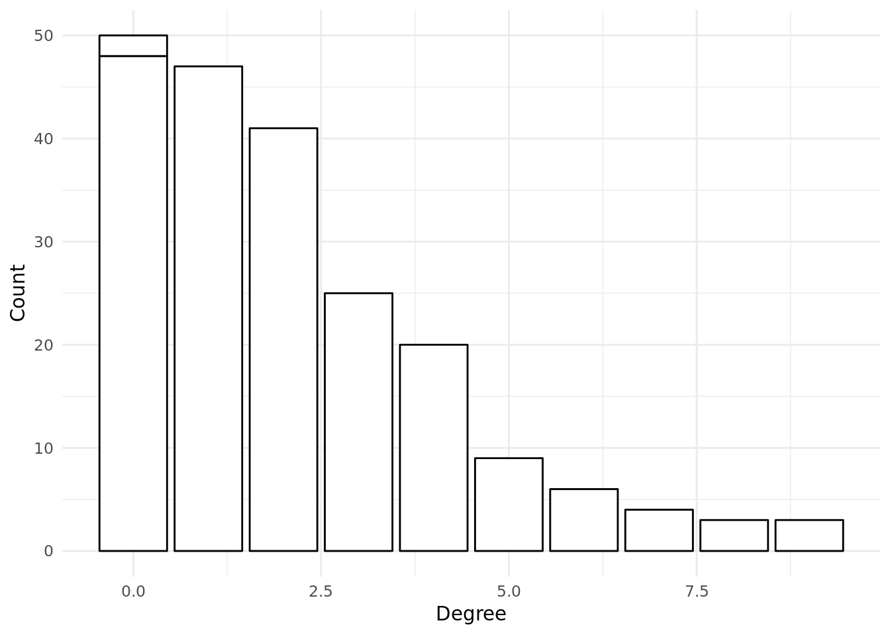

#### Degree distribution of agent->knows->agent edges

#### Runing time by method 

<table class="table table-condensed" style="width: auto !important; ">
 <thead>
  <tr>
   <th style="text-align:left;"> key </th>
   <th style="text-align:right;"> doc_count </th>
   <th style="text-align:right;"> sum_wallTime_ms.value </th>
   <th style="text-align:left;"> avg_wallTime_ms.value </th>
   <th style="text-align:left;"> includedInTotal </th>
  </tr>
 </thead>
<tbody>
  <tr>
   <td style="text-align:left;"> connectIfSimilar </td>
   <td style="text-align:right;"> 96,580 </td>
   <td style="text-align:right;"> 177,898 </td>
   <td style="text-align:left;"> 1.84197556429903 </td>
   <td style="text-align:left;"> No </td>
  </tr>
  <tr>
   <td style="text-align:left;"> existsSimilarity </td>
   <td style="text-align:right;"> 96,580 </td>
   <td style="text-align:right;"> 176,126 </td>
   <td style="text-align:left;"> 1.8236280803479 </td>
   <td style="text-align:left;"> No </td>
  </tr>
  <tr>
   <td style="text-align:left;"> similarityEdges </td>
   <td style="text-align:right;"> 96,580 </td>
   <td style="text-align:right;"> 173,373 </td>
   <td style="text-align:left;"> 1.79512321391592 </td>
   <td style="text-align:left;"> No </td>
  </tr>
  <tr>
   <td style="text-align:left;"> connectAllSimilar </td>
   <td style="text-align:right;"> 440 </td>
   <td style="text-align:right;"> 178,792 </td>
   <td style="text-align:left;"> 406.345454545455 </td>
   <td style="text-align:left;"> Yes </td>
  </tr>
  <tr>
   <td style="text-align:left;"> init </td>
   <td style="text-align:right;"> 103 </td>
   <td style="text-align:right;"> 11,240 </td>
   <td style="text-align:left;"> 109.126213592233 </td>
   <td style="text-align:left;"> No </td>
  </tr>
  <tr>
   <td style="text-align:left;"> connect </td>
   <td style="text-align:right;"> 20 </td>
   <td style="text-align:right;"> 32 </td>
   <td style="text-align:left;"> 1.6 </td>
   <td style="text-align:left;"> Yes </td>
  </tr>
  <tr>
   <td style="text-align:left;font-weight: bold;"> Total </td>
   <td style="text-align:right;font-weight: bold;"> 468 </td>
   <td style="text-align:right;font-weight: bold;"> 179,396 </td>
   <td style="text-align:left;font-weight: bold;">  </td>
   <td style="text-align:left;font-weight: bold;">  </td>
  </tr>
</tbody>
</table>
####  Found structures 

#####  Cycles 

Number of cycles found:  1 

<button class="btn btn-primary" data-toggle="collapse" data-target="#XVCHXGDTNM"> Show/Hide foundCycle query </button> 
 
  
     GET /filebeat-*/_search 
              { 
                "query": {
                  "bool": {
                    "must": [
                      { "match_phrase": {
                        "simulationId": "SIM10-06-11-36-vroJyB--CV"
                        }
                      },
                      { "bool": {
                        "should": [
                          { "match": {
                            "keyword": "foundCycle"
                          }}
                        ]
                      }}
                    ]
                  }
                }
              }
     

#####  Paths 

Number of paths found:  0 

<button class="btn btn-primary" data-toggle="collapse" data-target="#KXLCTXBHQD"> Show/Hide foundPath query </button> 
 
  
     GET /filebeat-*/_search 
              { 
                "query": {
                  "bool": {
                    "must": [
                      { "match_phrase": {
                        "simulationId": "SIM10-06-11-36-vroJyB--CV"
                        }
                      },
                      { "bool": {
                        "should": [
                          { "match": {
                            "keyword": "foundPath"
                          }}
                        ]
                      }}
                    ]
                  }
                }
              }
     

###  SIM10-06-11-36-vroJyB--DV 

#### simulationParameters 

<table class="table table-condensed" style="width: auto !important; ">
 <thead>
  <tr>
   <th style="text-align:left;"> agentNumber </th>
   <th style="text-align:left;"> similarityConnectThreshold </th>
   <th style="text-align:left;"> graphType </th>
   <th style="text-align:left;"> chainLength </th>
   <th style="text-align:left;"> similaritySearchThreshold </th>
   <th style="text-align:left;"> maxDistance </th>
   <th style="text-align:left;"> randomWorksNumberMultiplier </th>
  </tr>
 </thead>
<tbody>
  <tr>
   <td style="text-align:left;width: 20em; "> 100 </td>
   <td style="text-align:left;width: 15em; "> 0.99 </td>
   <td style="text-align:left;width: 15em; "> random </td>
   <td style="text-align:left;width: 15em; "> 20 </td>
   <td style="text-align:left;width: 15em; "> 1 </td>
   <td style="text-align:left;width: 15em; "> 30 </td>
   <td style="text-align:left;width: 15em; "> 2 </td>
  </tr>
</tbody>
</table>
#### allEdgesByLabel

<table class="table table-condensed" style="width: auto !important; ">
 <thead>
  <tr>
   <th style="text-align:right;"> edges_offers </th>
   <th style="text-align:right;"> edges_similarity </th>
   <th style="text-align:right;"> edges_owns </th>
   <th style="text-align:right;"> edges_demands </th>
   <th style="text-align:right;"> edges_knows </th>
   <th style="text-align:right;"> edges_total </th>
  </tr>
 </thead>
<tbody>
  <tr>
   <td style="text-align:right;width: 5em; "> 220 </td>
   <td style="text-align:right;width: 5em; "> 4,074 </td>
   <td style="text-align:right;width: 5em; "> 220 </td>
   <td style="text-align:right;width: 5em; "> 220 </td>
   <td style="text-align:right;width: 5em; "> 100 </td>
   <td style="text-align:right;width: 5em; "> 4,834 </td>
  </tr>
</tbody>
</table>
#### allVerticesByType

<table class="table table-condensed" style="width: auto !important; ">
 <thead>
  <tr>
   <th style="text-align:right;"> vertices_agent </th>
   <th style="text-align:right;"> vertices_item </th>
   <th style="text-align:right;"> vertices_work </th>
   <th style="text-align:right;"> vertices_total </th>
  </tr>
 </thead>
<tbody>
  <tr>
   <td style="text-align:right;width: 5em; "> 101 </td>
   <td style="text-align:right;width: 5em; "> 440 </td>
   <td style="text-align:right;width: 5em; "> 220 </td>
   <td style="text-align:right;width: 5em; "> 761 </td>
  </tr>
</tbody>
</table>
#### distribution of similarityEdgesByWeight

#### Degree distribution of item->similarity->item edges

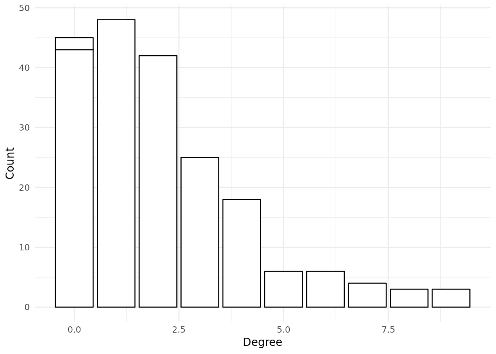

#### Degree distribution of agent->knows->agent edges

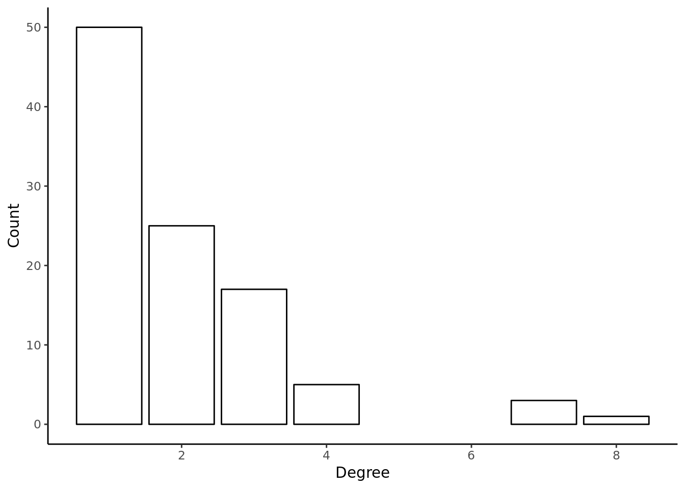

#### Runing time by method 

<table class="table table-condensed" style="width: auto !important; ">
 <thead>
  <tr>
   <th style="text-align:left;">   </th>
   <th style="text-align:left;"> key </th>
   <th style="text-align:right;"> doc_count </th>
   <th style="text-align:right;"> sum_wallTime_ms.value </th>
   <th style="text-align:left;"> avg_wallTime_ms.value </th>
   <th style="text-align:left;"> includedInTotal </th>
  </tr>
 </thead>
<tbody>
  <tr>
   <td style="text-align:left;"> 1 </td>
   <td style="text-align:left;"> addItemToWork </td>
   <td style="text-align:right;"> 440 </td>
   <td style="text-align:right;"> 3,644 </td>
   <td style="text-align:left;"> 8.28181818181818 </td>
   <td style="text-align:left;"> No </td>
  </tr>
  <tr>
   <td style="text-align:left;"> 2 </td>
   <td style="text-align:left;"> ownsWork </td>
   <td style="text-align:right;"> 220 </td>
   <td style="text-align:right;"> 1,539 </td>
   <td style="text-align:left;"> 6.99545454545455 </td>
   <td style="text-align:left;"> No </td>
  </tr>
  <tr>
   <td style="text-align:left;"> 3 </td>
   <td style="text-align:left;"> init </td>
   <td style="text-align:right;"> 103 </td>
   <td style="text-align:right;"> 12,304 </td>
   <td style="text-align:left;"> 119.456310679612 </td>
   <td style="text-align:left;"> No </td>
  </tr>
  <tr>
   <td style="text-align:left;"> 4 </td>
   <td style="text-align:left;"> searchAndConnect </td>
   <td style="text-align:right;"> 101 </td>
   <td style="text-align:right;"> 90,934 </td>
   <td style="text-align:left;"> 900.336633663366 </td>
   <td style="text-align:left;"> Yes </td>
  </tr>
  <tr>
   <td style="text-align:left;"> 5 </td>
   <td style="text-align:left;"> knowsAgent </td>
   <td style="text-align:right;"> 100 </td>
   <td style="text-align:right;"> 240 </td>
   <td style="text-align:left;"> 2.4 </td>
   <td style="text-align:left;"> No </td>
  </tr>
  <tr>
   <td style="text-align:left;"> 6 </td>
   <td style="text-align:left;"> getWorksItems </td>
   <td style="text-align:right;"> 38 </td>
   <td style="text-align:right;"> 57 </td>
   <td style="text-align:left;"> 1.5 </td>
   <td style="text-align:left;"> Yes </td>
  </tr>
  <tr>
   <td style="text-align:left;"> 9 </td>
   <td style="text-align:left;"> cycleSearch </td>
   <td style="text-align:right;"> 4 </td>
   <td style="text-align:right;"> 214 </td>
   <td style="text-align:left;"> 53.5 </td>
   <td style="text-align:left;"> Yes </td>
  </tr>
  <tr>
   <td style="text-align:left;"> 10 </td>
   <td style="text-align:left;"> getWorks </td>
   <td style="text-align:right;"> 4 </td>
   <td style="text-align:right;"> 117 </td>
   <td style="text-align:left;"> 29.25 </td>
   <td style="text-align:left;"> No </td>
  </tr>
  <tr>
   <td style="text-align:left;font-weight: bold;"> 11 </td>
   <td style="text-align:left;font-weight: bold;"> Total </td>
   <td style="text-align:right;font-weight: bold;"> 152 </td>
   <td style="text-align:right;font-weight: bold;"> 92,415 </td>
   <td style="text-align:left;font-weight: bold;">  </td>
   <td style="text-align:left;font-weight: bold;">  </td>
  </tr>
</tbody>
</table>
####  Found structures 

#####  Cycles 

Number of cycles found:  4 

<button class="btn btn-primary" data-toggle="collapse" data-target="#HKVDOUQTYU"> Show/Hide foundCycle query </button> 
 
  
     GET /filebeat-*/_search 
              { 
                "query": {
                  "bool": {
                    "must": [
                      { "match_phrase": {
                        "simulationId": "SIM10-06-11-36-vroJyB--DV"
                        }
                      },
                      { "bool": {
                        "should": [
                          { "match": {
                            "keyword": "foundCycle"
                          }}
                        ]
                      }}
                    ]
                  }
                }
              }
     

#####  Paths 

Number of paths found:  0 

<button class="btn btn-primary" data-toggle="collapse" data-target="#GUXQKOGWOK"> Show/Hide foundPath query </button> 
 
  
     GET /filebeat-*/_search 
              { 
                "query": {
                  "bool": {
                    "must": [
                      { "match_phrase": {
                        "simulationId": "SIM10-06-11-36-vroJyB--DV"
                        }
                      },
                      { "bool": {
                        "should": [
                          { "match": {
                            "keyword": "foundPath"
                          }}
                        ]
                      }}
                    ]
                  }
                }
              }
     

###  SIM10-06-11-39-IbCwUn--CV 

#### simulationParameters 

<table class="table table-condensed" style="width: auto !important; ">
 <thead>
  <tr>
   <th style="text-align:left;"> agentNumber </th>
   <th style="text-align:left;"> similarityConnectThreshold </th>
   <th style="text-align:left;"> graphType </th>
   <th style="text-align:left;"> chainLength </th>
   <th style="text-align:left;"> similaritySearchThreshold </th>
   <th style="text-align:left;"> maxDistance </th>
   <th style="text-align:left;"> randomWorksNumberMultiplier </th>
  </tr>
 </thead>
<tbody>
  <tr>
   <td style="text-align:left;width: 20em; "> 100 </td>
   <td style="text-align:left;width: 15em; "> 0.99 </td>
   <td style="text-align:left;width: 15em; "> smallWorld </td>
   <td style="text-align:left;width: 15em; "> 20 </td>
   <td style="text-align:left;width: 15em; "> 1 </td>
   <td style="text-align:left;width: 15em; "> 30 </td>
   <td style="text-align:left;width: 15em; "> 2 </td>
  </tr>
</tbody>
</table>
#### allEdgesByLabel

<table class="table table-condensed" style="width: auto !important; ">
 <thead>
  <tr>
   <th style="text-align:right;"> edges_offers </th>
   <th style="text-align:right;"> edges_similarity </th>
   <th style="text-align:right;"> edges_owns </th>
   <th style="text-align:right;"> edges_demands </th>
   <th style="text-align:right;"> edges_knows </th>
   <th style="text-align:right;"> edges_total </th>
  </tr>
 </thead>
<tbody>
  <tr>
   <td style="text-align:right;width: 5em; "> 220 </td>
   <td style="text-align:right;width: 5em; "> 4,098 </td>
   <td style="text-align:right;width: 5em; "> 220 </td>
   <td style="text-align:right;width: 5em; "> 220 </td>
   <td style="text-align:right;width: 5em; "> 601 </td>
   <td style="text-align:right;width: 5em; "> 5,359 </td>
  </tr>
</tbody>
</table>
#### allVerticesByType

<table class="table table-condensed" style="width: auto !important; ">
 <thead>
  <tr>
   <th style="text-align:right;"> vertices_agent </th>
   <th style="text-align:right;"> vertices_item </th>
   <th style="text-align:right;"> vertices_work </th>
   <th style="text-align:right;"> vertices_total </th>
  </tr>
 </thead>
<tbody>
  <tr>
   <td style="text-align:right;width: 5em; "> 101 </td>
   <td style="text-align:right;width: 5em; "> 440 </td>
   <td style="text-align:right;width: 5em; "> 220 </td>
   <td style="text-align:right;width: 5em; "> 761 </td>
  </tr>
</tbody>
</table>
#### distribution of similarityEdgesByWeight

#### Degree distribution of item->similarity->item edges

#### Degree distribution of agent->knows->agent edges

#### Runing time by method 

<table class="table table-condensed" style="width: auto !important; ">
 <thead>
  <tr>
   <th style="text-align:left;"> key </th>
   <th style="text-align:right;"> doc_count </th>
   <th style="text-align:right;"> sum_wallTime_ms.value </th>
   <th style="text-align:left;"> avg_wallTime_ms.value </th>
   <th style="text-align:left;"> includedInTotal </th>
  </tr>
 </thead>
<tbody>
  <tr>
   <td style="text-align:left;"> connectIfSimilar </td>
   <td style="text-align:right;"> 96,580 </td>
   <td style="text-align:right;"> 178,833 </td>
   <td style="text-align:left;"> 1.8516566576931 </td>
   <td style="text-align:left;"> No </td>
  </tr>
  <tr>
   <td style="text-align:left;"> existsSimilarity </td>
   <td style="text-align:right;"> 96,580 </td>
   <td style="text-align:right;"> 177,029 </td>
   <td style="text-align:left;"> 1.83297784220335 </td>
   <td style="text-align:left;"> No </td>
  </tr>
  <tr>
   <td style="text-align:left;"> similarityEdges </td>
   <td style="text-align:right;"> 96,580 </td>
   <td style="text-align:right;"> 174,325 </td>
   <td style="text-align:left;"> 1.80498032718989 </td>
   <td style="text-align:left;"> No </td>
  </tr>
  <tr>
   <td style="text-align:left;"> connectAllSimilar </td>
   <td style="text-align:right;"> 440 </td>
   <td style="text-align:right;"> 179,690 </td>
   <td style="text-align:left;"> 408.386363636364 </td>
   <td style="text-align:left;"> Yes </td>
  </tr>
  <tr>
   <td style="text-align:left;"> init </td>
   <td style="text-align:right;"> 103 </td>
   <td style="text-align:right;"> 11,664 </td>
   <td style="text-align:left;"> 113.242718446602 </td>
   <td style="text-align:left;"> No </td>
  </tr>
  <tr>
   <td style="text-align:left;"> connect </td>
   <td style="text-align:right;"> 23 </td>
   <td style="text-align:right;"> 125 </td>
   <td style="text-align:left;"> 5.43478260869565 </td>
   <td style="text-align:left;"> Yes </td>
  </tr>
  <tr>
   <td style="text-align:left;font-weight: bold;"> Total </td>
   <td style="text-align:right;font-weight: bold;"> 471 </td>
   <td style="text-align:right;font-weight: bold;"> 180,388 </td>
   <td style="text-align:left;font-weight: bold;">  </td>
   <td style="text-align:left;font-weight: bold;">  </td>
  </tr>
</tbody>
</table>
####  Found structures 

#####  Cycles 

Number of cycles found:  1 

<button class="btn btn-primary" data-toggle="collapse" data-target="#LIFOPWJUHU"> Show/Hide foundCycle query </button> 
 
  
     GET /filebeat-*/_search 
              { 
                "query": {
                  "bool": {
                    "must": [
                      { "match_phrase": {
                        "simulationId": "SIM10-06-11-39-IbCwUn--CV"
                        }
                      },
                      { "bool": {
                        "should": [
                          { "match": {
                            "keyword": "foundCycle"
                          }}
                        ]
                      }}
                    ]
                  }
                }
              }
     

#####  Paths 

Number of paths found:  0 

<button class="btn btn-primary" data-toggle="collapse" data-target="#XANSOWUPAT"> Show/Hide foundPath query </button> 
 
  
     GET /filebeat-*/_search 
              { 
                "query": {
                  "bool": {
                    "must": [
                      { "match_phrase": {
                        "simulationId": "SIM10-06-11-39-IbCwUn--CV"
                        }
                      },
                      { "bool": {
                        "should": [
                          { "match": {
                            "keyword": "foundPath"
                          }}
                        ]
                      }}
                    ]
                  }
                }
              }
     

###  SIM10-06-11-39-IbCwUn--DV 

#### simulationParameters 

<table class="table table-condensed" style="width: auto !important; ">
 <thead>
  <tr>
   <th style="text-align:left;"> agentNumber </th>
   <th style="text-align:left;"> similarityConnectThreshold </th>
   <th style="text-align:left;"> graphType </th>
   <th style="text-align:left;"> chainLength </th>
   <th style="text-align:left;"> similaritySearchThreshold </th>
   <th style="text-align:left;"> maxDistance </th>
   <th style="text-align:left;"> randomWorksNumberMultiplier </th>
  </tr>
 </thead>
<tbody>
  <tr>
   <td style="text-align:left;width: 20em; "> 100 </td>
   <td style="text-align:left;width: 15em; "> 0.99 </td>
   <td style="text-align:left;width: 15em; "> smallWorld </td>
   <td style="text-align:left;width: 15em; "> 20 </td>
   <td style="text-align:left;width: 15em; "> 1 </td>
   <td style="text-align:left;width: 15em; "> 30 </td>
   <td style="text-align:left;width: 15em; "> 2 </td>
  </tr>
</tbody>
</table>
#### allEdgesByLabel

<table class="table table-condensed" style="width: auto !important; ">
 <thead>
  <tr>
   <th style="text-align:right;"> edges_offers </th>
   <th style="text-align:right;"> edges_similarity </th>
   <th style="text-align:right;"> edges_owns </th>
   <th style="text-align:right;"> edges_demands </th>
   <th style="text-align:right;"> edges_knows </th>
   <th style="text-align:right;"> edges_total </th>
  </tr>
 </thead>
<tbody>
  <tr>
   <td style="text-align:right;width: 5em; "> 220 </td>
   <td style="text-align:right;width: 5em; "> 4,052 </td>
   <td style="text-align:right;width: 5em; "> 220 </td>
   <td style="text-align:right;width: 5em; "> 220 </td>
   <td style="text-align:right;width: 5em; "> 601 </td>
   <td style="text-align:right;width: 5em; "> 5,313 </td>
  </tr>
</tbody>
</table>
#### allVerticesByType

<table class="table table-condensed" style="width: auto !important; ">
 <thead>
  <tr>
   <th style="text-align:right;"> vertices_agent </th>
   <th style="text-align:right;"> vertices_item </th>
   <th style="text-align:right;"> vertices_work </th>
   <th style="text-align:right;"> vertices_total </th>
  </tr>
 </thead>
<tbody>
  <tr>
   <td style="text-align:right;width: 5em; "> 101 </td>
   <td style="text-align:right;width: 5em; "> 440 </td>
   <td style="text-align:right;width: 5em; "> 220 </td>
   <td style="text-align:right;width: 5em; "> 761 </td>
  </tr>
</tbody>
</table>
#### distribution of similarityEdgesByWeight

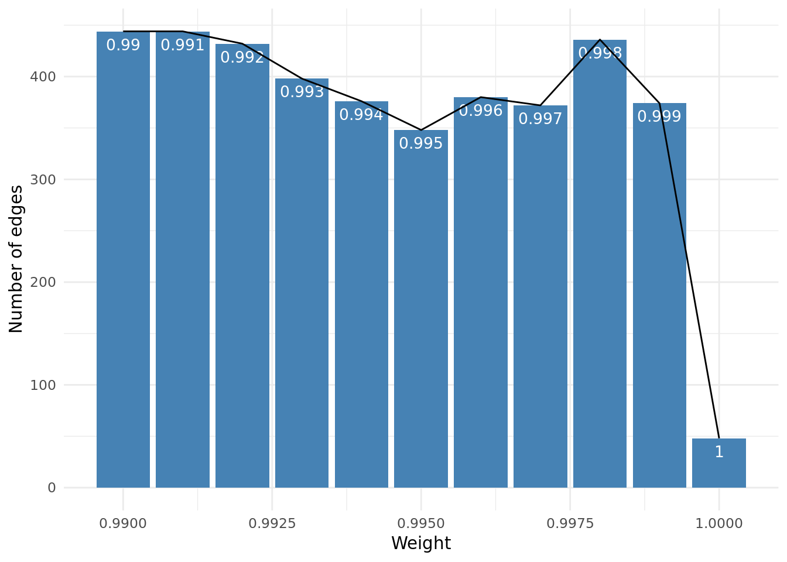

#### Degree distribution of item->similarity->item edges

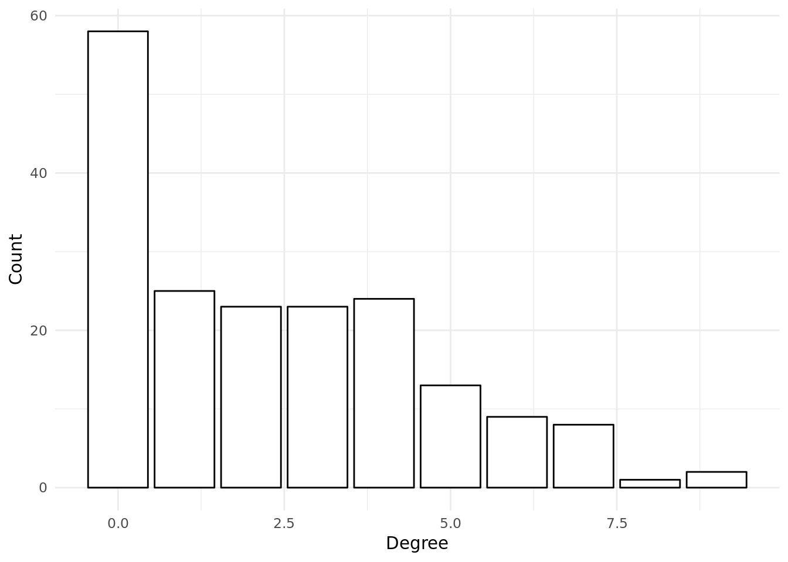

#### Degree distribution of agent->knows->agent edges

#### Runing time by method 

<table class="table table-condensed" style="width: auto !important; ">
 <thead>
  <tr>
   <th style="text-align:left;">   </th>
   <th style="text-align:left;"> key </th>
   <th style="text-align:right;"> doc_count </th>
   <th style="text-align:right;"> sum_wallTime_ms.value </th>
   <th style="text-align:left;"> avg_wallTime_ms.value </th>
   <th style="text-align:left;"> includedInTotal </th>
  </tr>
 </thead>
<tbody>
  <tr>
   <td style="text-align:left;"> 1 </td>
   <td style="text-align:left;"> knowsAgent </td>
   <td style="text-align:right;"> 601 </td>
   <td style="text-align:right;"> 1,185 </td>
   <td style="text-align:left;"> 1.97171381031614 </td>
   <td style="text-align:left;"> No </td>
  </tr>
  <tr>
   <td style="text-align:left;"> 2 </td>
   <td style="text-align:left;"> addItemToWork </td>
   <td style="text-align:right;"> 440 </td>
   <td style="text-align:right;"> 3,736 </td>
   <td style="text-align:left;"> 8.49090909090909 </td>
   <td style="text-align:left;"> No </td>
  </tr>
  <tr>
   <td style="text-align:left;"> 3 </td>
   <td style="text-align:left;"> ownsWork </td>
   <td style="text-align:right;"> 220 </td>
   <td style="text-align:right;"> 1,882 </td>
   <td style="text-align:left;"> 8.55454545454545 </td>
   <td style="text-align:left;"> No </td>
  </tr>
  <tr>
   <td style="text-align:left;"> 4 </td>
   <td style="text-align:left;"> init </td>
   <td style="text-align:right;"> 103 </td>
   <td style="text-align:right;"> 12,148 </td>
   <td style="text-align:left;"> 117.941747572816 </td>
   <td style="text-align:left;"> No </td>
  </tr>
  <tr>
   <td style="text-align:left;"> 5 </td>
   <td style="text-align:left;"> searchAndConnect </td>
   <td style="text-align:right;"> 101 </td>
   <td style="text-align:right;"> 91,199 </td>
   <td style="text-align:left;"> 902.960396039604 </td>
   <td style="text-align:left;"> Yes </td>
  </tr>
  <tr>
   <td style="text-align:left;"> 6 </td>
   <td style="text-align:left;"> getWorksItems </td>
   <td style="text-align:right;"> 38 </td>
   <td style="text-align:right;"> 118 </td>
   <td style="text-align:left;"> 3.10526315789474 </td>
   <td style="text-align:left;"> Yes </td>
  </tr>
  <tr>
   <td style="text-align:left;"> 9 </td>
   <td style="text-align:left;"> cycleSearch </td>
   <td style="text-align:right;"> 4 </td>
   <td style="text-align:right;"> 1,241 </td>
   <td style="text-align:left;"> 310.25 </td>
   <td style="text-align:left;"> Yes </td>
  </tr>
  <tr>
   <td style="text-align:left;"> 10 </td>
   <td style="text-align:left;"> getWorks </td>
   <td style="text-align:right;"> 4 </td>
   <td style="text-align:right;"> 663 </td>
   <td style="text-align:left;"> 165.75 </td>
   <td style="text-align:left;"> No </td>
  </tr>
  <tr>
   <td style="text-align:left;font-weight: bold;"> 11 </td>
   <td style="text-align:left;font-weight: bold;"> Total </td>
   <td style="text-align:right;font-weight: bold;"> 152 </td>
   <td style="text-align:right;font-weight: bold;"> 94,675 </td>
   <td style="text-align:left;font-weight: bold;">  </td>
   <td style="text-align:left;font-weight: bold;">  </td>
  </tr>
</tbody>
</table>
####  Found structures 

#####  Cycles 

Number of cycles found:  3 

<button class="btn btn-primary" data-toggle="collapse" data-target="#SWVIBNZZRM"> Show/Hide foundCycle query </button> 
 
  
     GET /filebeat-*/_search 
              { 
                "query": {
                  "bool": {
                    "must": [
                      { "match_phrase": {
                        "simulationId": "SIM10-06-11-39-IbCwUn--DV"
                        }
                      },
                      { "bool": {
                        "should": [
                          { "match": {
                            "keyword": "foundCycle"
                          }}
                        ]
                      }}
                    ]
                  }
                }
              }
     

#####  Paths 

Number of paths found:  1 

<button class="btn btn-primary" data-toggle="collapse" data-target="#URICTQXFWK"> Show/Hide foundPath query </button> 
 
  
     GET /filebeat-*/_search 
              { 
                "query": {
                  "bool": {
                    "must": [
                      { "match_phrase": {
                        "simulationId": "SIM10-06-11-39-IbCwUn--DV"
                        }
                      },
                      { "bool": {
                        "should": [
                          { "match": {
                            "keyword": "foundPath"
                          }}
                        ]
                      }}
                    ]
                  }
                }
              }
     

###  SIM10-06-09-15-5ZYYcW--CV 

#### simulationParameters 

<table class="table table-condensed" style="width: auto !important; ">
 <thead>
  <tr>
   <th style="text-align:left;"> agentNumber </th>
   <th style="text-align:left;"> similarityConnectThreshold </th>
   <th style="text-align:left;"> graphType </th>
   <th style="text-align:left;"> chainLength </th>
   <th style="text-align:left;"> similaritySearchThreshold </th>
   <th style="text-align:left;"> maxDistance </th>
   <th style="text-align:left;"> randomWorksNumberMultiplier </th>
  </tr>
 </thead>
<tbody>
  <tr>
   <td style="text-align:left;width: 20em; "> 100 </td>
   <td style="text-align:left;width: 15em; "> 0.99 </td>
   <td style="text-align:left;width: 15em; "> random </td>
   <td style="text-align:left;width: 15em; "> 20 </td>
   <td style="text-align:left;width: 15em; "> 1 </td>
   <td style="text-align:left;width: 15em; "> 5 </td>
   <td style="text-align:left;width: 15em; "> 1 </td>
  </tr>
</tbody>
</table>
#### allEdgesByLabel

<table class="table table-condensed" style="width: auto !important; ">
 <thead>
  <tr>
   <th style="text-align:right;"> edges_offers </th>
   <th style="text-align:right;"> edges_similarity </th>
   <th style="text-align:right;"> edges_owns </th>
   <th style="text-align:right;"> edges_demands </th>
   <th style="text-align:right;"> edges_knows </th>
   <th style="text-align:right;"> edges_total </th>
  </tr>
 </thead>
<tbody>
  <tr>
   <td style="text-align:right;width: 5em; "> 120 </td>
   <td style="text-align:right;width: 5em; "> 1,268 </td>
   <td style="text-align:right;width: 5em; "> 120 </td>
   <td style="text-align:right;width: 5em; "> 120 </td>
   <td style="text-align:right;width: 5em; "> 100 </td>
   <td style="text-align:right;width: 5em; "> 1,728 </td>
  </tr>
</tbody>
</table>
#### allVerticesByType

<table class="table table-condensed" style="width: auto !important; ">
 <thead>
  <tr>
   <th style="text-align:right;"> vertices_agent </th>
   <th style="text-align:right;"> vertices_item </th>
   <th style="text-align:right;"> vertices_work </th>
   <th style="text-align:right;"> vertices_total </th>
  </tr>
 </thead>
<tbody>
  <tr>
   <td style="text-align:right;width: 5em; "> 101 </td>
   <td style="text-align:right;width: 5em; "> 240 </td>
   <td style="text-align:right;width: 5em; "> 120 </td>
   <td style="text-align:right;width: 5em; "> 461 </td>
  </tr>
</tbody>
</table>
#### distribution of similarityEdgesByWeight

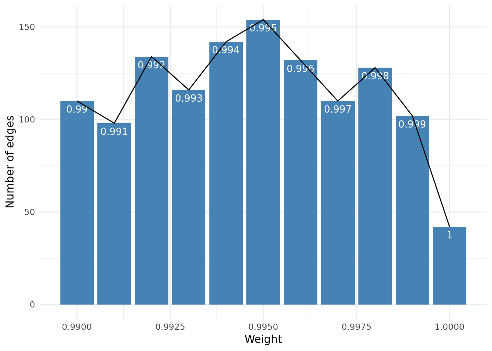

#### Degree distribution of item->similarity->item edges

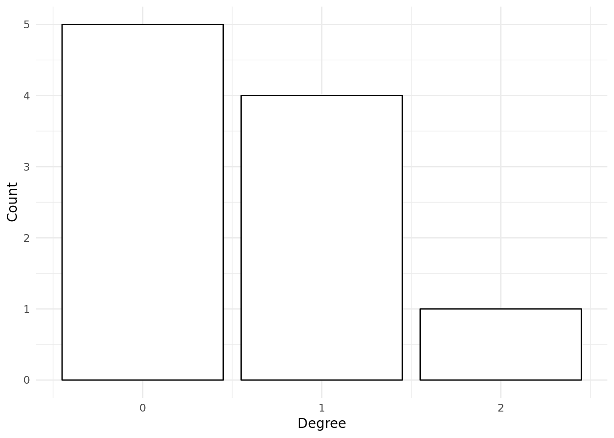

#### Degree distribution of agent->knows->agent edges

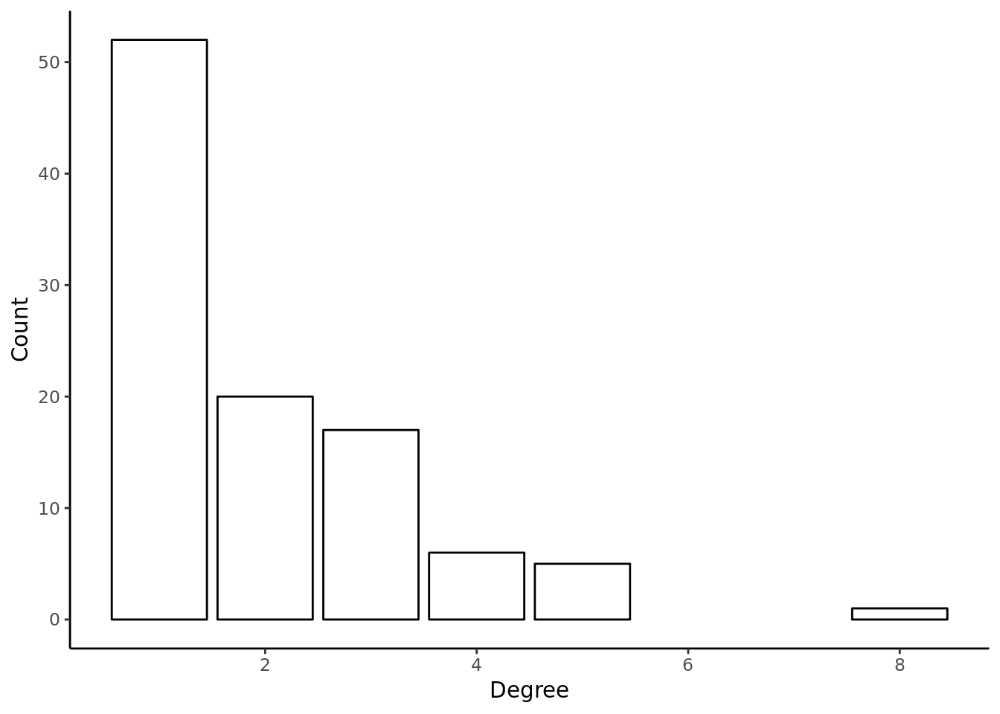

#### Runing time by method 

<table class="table table-condensed" style="width: auto !important; ">
 <thead>
  <tr>
   <th style="text-align:left;"> key </th>
   <th style="text-align:right;"> doc_count </th>
   <th style="text-align:right;"> sum_wallTime_ms.value </th>
   <th style="text-align:left;"> avg_wallTime_ms.value </th>
   <th style="text-align:left;"> includedInTotal </th>
  </tr>
 </thead>
<tbody>
  <tr>
   <td style="text-align:left;"> connectIfSimilar </td>
   <td style="text-align:right;"> 28,680 </td>
   <td style="text-align:right;"> 50,403 </td>
   <td style="text-align:left;"> 1.75742677824268 </td>
   <td style="text-align:left;"> No </td>
  </tr>
  <tr>
   <td style="text-align:left;"> existsSimilarity </td>
   <td style="text-align:right;"> 28,680 </td>
   <td style="text-align:right;"> 48,635 </td>
   <td style="text-align:left;"> 1.6957810320781 </td>
   <td style="text-align:left;"> No </td>
  </tr>
  <tr>
   <td style="text-align:left;"> similarityEdges </td>
   <td style="text-align:right;"> 28,680 </td>
   <td style="text-align:right;"> 47,902 </td>
   <td style="text-align:left;"> 1.67022315202232 </td>
   <td style="text-align:left;"> No </td>
  </tr>
  <tr>
   <td style="text-align:left;"> connect </td>
   <td style="text-align:right;"> 460 </td>
   <td style="text-align:right;"> 1,184 </td>
   <td style="text-align:left;"> 2.57391304347826 </td>
   <td style="text-align:left;"> Yes </td>
  </tr>
  <tr>
   <td style="text-align:left;"> connectAllSimilar </td>
   <td style="text-align:right;"> 240 </td>
   <td style="text-align:right;"> 50,728 </td>
   <td style="text-align:left;"> 211.366666666667 </td>
   <td style="text-align:left;"> Yes </td>
  </tr>
  <tr>
   <td style="text-align:left;"> init </td>
   <td style="text-align:right;"> 103 </td>
   <td style="text-align:right;"> 11,115 </td>
   <td style="text-align:left;"> 107.912621359223 </td>
   <td style="text-align:left;"> No </td>
  </tr>
  <tr>
   <td style="text-align:left;font-weight: bold;"> Total </td>
   <td style="text-align:right;font-weight: bold;"> 708 </td>
   <td style="text-align:right;font-weight: bold;"> 52,423 </td>
   <td style="text-align:left;font-weight: bold;">  </td>
   <td style="text-align:left;font-weight: bold;">  </td>
  </tr>
</tbody>
</table>
####  Found structures 

#####  Cycles 

Number of cycles found:  1 

<button class="btn btn-primary" data-toggle="collapse" data-target="#CQWLYZPHFO"> Show/Hide foundCycle query </button> 
 
  
     GET /filebeat-*/_search 
              { 
                "query": {
                  "bool": {
                    "must": [
                      { "match_phrase": {
                        "simulationId": "SIM10-06-09-15-5ZYYcW--CV"
                        }
                      },
                      { "bool": {
                        "should": [
                          { "match": {
                            "keyword": "foundCycle"
                          }}
                        ]
                      }}
                    ]
                  }
                }
              }
     

#####  Paths 

Number of paths found:  0 

<button class="btn btn-primary" data-toggle="collapse" data-target="#MFCKSVWJZA"> Show/Hide foundPath query </button> 
 
  
     GET /filebeat-*/_search 
              { 
                "query": {
                  "bool": {
                    "must": [
                      { "match_phrase": {
                        "simulationId": "SIM10-06-09-15-5ZYYcW--CV"
                        }
                      },
                      { "bool": {
                        "should": [
                          { "match": {
                            "keyword": "foundPath"
                          }}
                        ]
                      }}
                    ]
                  }
                }
              }
     

###  SIM10-06-09-15-5ZYYcW--DV 

#### simulationParameters 

<table class="table table-condensed" style="width: auto !important; ">
 <thead>
  <tr>
   <th style="text-align:left;"> agentNumber </th>
   <th style="text-align:left;"> similarityConnectThreshold </th>
   <th style="text-align:left;"> graphType </th>
   <th style="text-align:left;"> chainLength </th>
   <th style="text-align:left;"> similaritySearchThreshold </th>
   <th style="text-align:left;"> maxDistance </th>
   <th style="text-align:left;"> randomWorksNumberMultiplier </th>
  </tr>
 </thead>
<tbody>
  <tr>
   <td style="text-align:left;width: 20em; "> 100 </td>
   <td style="text-align:left;width: 15em; "> 0.99 </td>
   <td style="text-align:left;width: 15em; "> random </td>
   <td style="text-align:left;width: 15em; "> 20 </td>
   <td style="text-align:left;width: 15em; "> 1 </td>
   <td style="text-align:left;width: 15em; "> 5 </td>
   <td style="text-align:left;width: 15em; "> 1 </td>
  </tr>
</tbody>
</table>
#### allEdgesByLabel

<table class="table table-condensed" style="width: auto !important; ">
 <thead>
  <tr>
   <th style="text-align:right;"> edges_offers </th>
   <th style="text-align:right;"> edges_similarity </th>
   <th style="text-align:right;"> edges_owns </th>
   <th style="text-align:right;"> edges_demands </th>
   <th style="text-align:right;"> edges_knows </th>
   <th style="text-align:right;"> edges_total </th>
  </tr>
 </thead>
<tbody>
  <tr>
   <td style="text-align:right;width: 5em; "> 120 </td>
   <td style="text-align:right;width: 5em; "> 348 </td>
   <td style="text-align:right;width: 5em; "> 120 </td>
   <td style="text-align:right;width: 5em; "> 120 </td>
   <td style="text-align:right;width: 5em; "> 100 </td>
   <td style="text-align:right;width: 5em; "> 808 </td>
  </tr>
</tbody>
</table>
#### allVerticesByType

<table class="table table-condensed" style="width: auto !important; ">
 <thead>
  <tr>
   <th style="text-align:right;"> vertices_agent </th>
   <th style="text-align:right;"> vertices_item </th>
   <th style="text-align:right;"> vertices_work </th>
   <th style="text-align:right;"> vertices_total </th>
  </tr>
 </thead>
<tbody>
  <tr>
   <td style="text-align:right;width: 5em; "> 101 </td>
   <td style="text-align:right;width: 5em; "> 240 </td>
   <td style="text-align:right;width: 5em; "> 120 </td>
   <td style="text-align:right;width: 5em; "> 461 </td>
  </tr>
</tbody>
</table>
#### distribution of similarityEdgesByWeight

#### Degree distribution of item->similarity->item edges

#### Degree distribution of agent->knows->agent edges

#### Runing time by method 

<table class="table table-condensed" style="width: auto !important; ">
 <thead>
  <tr>
   <th style="text-align:left;">   </th>
   <th style="text-align:left;"> key </th>
   <th style="text-align:right;"> doc_count </th>
   <th style="text-align:right;"> sum_wallTime_ms.value </th>
   <th style="text-align:left;"> avg_wallTime_ms.value </th>
   <th style="text-align:left;"> includedInTotal </th>
  </tr>
 </thead>
<tbody>
  <tr>
   <td style="text-align:left;"> 2 </td>
   <td style="text-align:left;"> cycleSearch </td>
   <td style="text-align:right;"> 3,600 </td>
   <td style="text-align:right;"> 16,020 </td>
   <td style="text-align:left;"> 4.45 </td>
   <td style="text-align:left;"> Yes </td>
  </tr>
  <tr>
   <td style="text-align:left;"> 3 </td>
   <td style="text-align:left;"> getWorks </td>
   <td style="text-align:right;"> 3,600 </td>
   <td style="text-align:right;"> 41,037 </td>
   <td style="text-align:left;"> 11.3991666666667 </td>
   <td style="text-align:left;"> No </td>
  </tr>
  <tr>
   <td style="text-align:left;"> 4 </td>
   <td style="text-align:left;"> individualCycleSearch </td>
   <td style="text-align:right;"> 3,600 </td>
   <td style="text-align:right;"> 103 </td>
   <td style="text-align:left;"> 0.0286111111111111 </td>
   <td style="text-align:left;"> Yes </td>
  </tr>
  <tr>
   <td style="text-align:left;"> 6 </td>
   <td style="text-align:left;"> addItemToWork </td>
   <td style="text-align:right;"> 240 </td>
   <td style="text-align:right;"> 1,240 </td>
   <td style="text-align:left;"> 5.16666666666667 </td>
   <td style="text-align:left;"> No </td>
  </tr>
  <tr>
   <td style="text-align:left;"> 7 </td>
   <td style="text-align:left;"> ownsWork </td>
   <td style="text-align:right;"> 120 </td>
   <td style="text-align:right;"> 599 </td>
   <td style="text-align:left;"> 4.99166666666667 </td>
   <td style="text-align:left;"> No </td>
  </tr>
  <tr>
   <td style="text-align:left;"> 8 </td>
   <td style="text-align:left;"> init </td>
   <td style="text-align:right;"> 103 </td>
   <td style="text-align:right;"> 11,984 </td>
   <td style="text-align:left;"> 116.349514563107 </td>
   <td style="text-align:left;"> No </td>
  </tr>
  <tr>
   <td style="text-align:left;"> 9 </td>
   <td style="text-align:left;"> searchAndConnect </td>
   <td style="text-align:right;"> 101 </td>
   <td style="text-align:right;"> 15,223 </td>
   <td style="text-align:left;"> 150.722772277228 </td>
   <td style="text-align:left;"> Yes </td>
  </tr>
  <tr>
   <td style="text-align:left;"> 10 </td>
   <td style="text-align:left;"> knowsAgent </td>
   <td style="text-align:right;"> 100 </td>
   <td style="text-align:right;"> 1,013 </td>
   <td style="text-align:left;"> 10.13 </td>
   <td style="text-align:left;"> No </td>
  </tr>
  <tr>
   <td style="text-align:left;font-weight: bold;"> 1 </td>
   <td style="text-align:left;font-weight: bold;"> Total </td>
   <td style="text-align:right;font-weight: bold;"> 14,501 </td>
   <td style="text-align:right;font-weight: bold;"> 49,186 </td>
   <td style="text-align:left;font-weight: bold;">  </td>
   <td style="text-align:left;font-weight: bold;">  </td>
  </tr>
</tbody>
</table>
####  Found structures 

#####  Cycles 

Number of cycles found:  0 

<button class="btn btn-primary" data-toggle="collapse" data-target="#JHDTCCBWVJ"> Show/Hide foundCycle query </button> 
 
  
     GET /filebeat-*/_search 
              { 
                "query": {
                  "bool": {
                    "must": [
                      { "match_phrase": {
                        "simulationId": "SIM10-06-09-15-5ZYYcW--DV"
                        }
                      },
                      { "bool": {
                        "should": [
                          { "match": {
                            "keyword": "foundCycle"
                          }}
                        ]
                      }}
                    ]
                  }
                }
              }
     

#####  Paths 

Number of paths found:  3600 

<button class="btn btn-primary" data-toggle="collapse" data-target="#YVPNTGLKNY"> Show/Hide foundPath query </button> 
 
  
     GET /filebeat-*/_search 
              { 
                "query": {
                  "bool": {
                    "must": [
                      { "match_phrase": {
                        "simulationId": "SIM10-06-09-15-5ZYYcW--DV"
                        }
                      },
                      { "bool": {
                        "should": [
                          { "match": {
                            "keyword": "foundPath"
                          }}
                        ]
                      }}
                    ]
                  }
                }
              }
     

###  SIM10-06-10-16-DjvxcN--CV 

#### simulationParameters 

<table class="table table-condensed" style="width: auto !important; ">
 <thead>
  <tr>
   <th style="text-align:left;"> agentNumber </th>
   <th style="text-align:left;"> similarityConnectThreshold </th>
   <th style="text-align:left;"> graphType </th>
   <th style="text-align:left;"> chainLength </th>
   <th style="text-align:left;"> similaritySearchThreshold </th>
   <th style="text-align:left;"> maxDistance </th>
   <th style="text-align:left;"> randomWorksNumberMultiplier </th>
  </tr>
 </thead>
<tbody>
  <tr>
   <td style="text-align:left;width: 20em; "> 100 </td>
   <td style="text-align:left;width: 15em; "> 0.99 </td>
   <td style="text-align:left;width: 15em; "> smallWorld </td>
   <td style="text-align:left;width: 15em; "> 20 </td>
   <td style="text-align:left;width: 15em; "> 1 </td>
   <td style="text-align:left;width: 15em; "> 5 </td>
   <td style="text-align:left;width: 15em; "> 1 </td>
  </tr>
</tbody>
</table>
#### allEdgesByLabel

<table class="table table-condensed" style="width: auto !important; ">
 <thead>
  <tr>
   <th style="text-align:right;"> edges_offers </th>
   <th style="text-align:right;"> edges_similarity </th>
   <th style="text-align:right;"> edges_owns </th>
   <th style="text-align:right;"> edges_demands </th>
   <th style="text-align:right;"> edges_knows </th>
   <th style="text-align:right;"> edges_total </th>
  </tr>
 </thead>
<tbody>
  <tr>
   <td style="text-align:right;width: 5em; "> 120 </td>
   <td style="text-align:right;width: 5em; "> 1,234 </td>
   <td style="text-align:right;width: 5em; "> 120 </td>
   <td style="text-align:right;width: 5em; "> 120 </td>
   <td style="text-align:right;width: 5em; "> 601 </td>
   <td style="text-align:right;width: 5em; "> 2,195 </td>
  </tr>
</tbody>
</table>
#### allVerticesByType

<table class="table table-condensed" style="width: auto !important; ">
 <thead>
  <tr>
   <th style="text-align:right;"> vertices_agent </th>
   <th style="text-align:right;"> vertices_item </th>
   <th style="text-align:right;"> vertices_work </th>
   <th style="text-align:right;"> vertices_total </th>
  </tr>
 </thead>
<tbody>
  <tr>
   <td style="text-align:right;width: 5em; "> 101 </td>
   <td style="text-align:right;width: 5em; "> 240 </td>
   <td style="text-align:right;width: 5em; "> 120 </td>
   <td style="text-align:right;width: 5em; "> 461 </td>
  </tr>
</tbody>
</table>
#### distribution of similarityEdgesByWeight

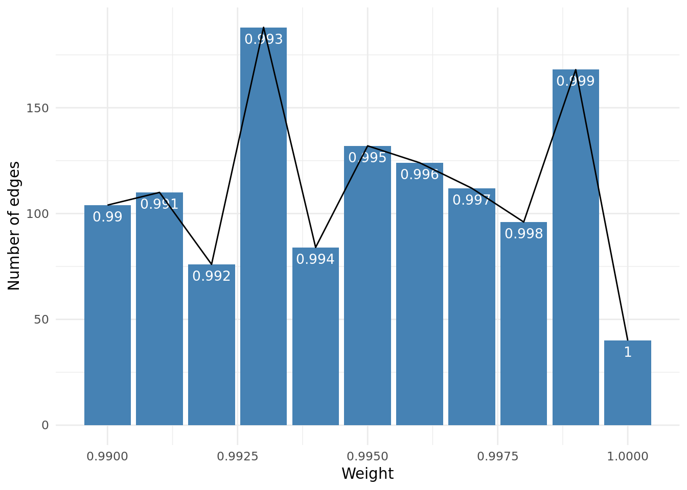

#### Degree distribution of item->similarity->item edges

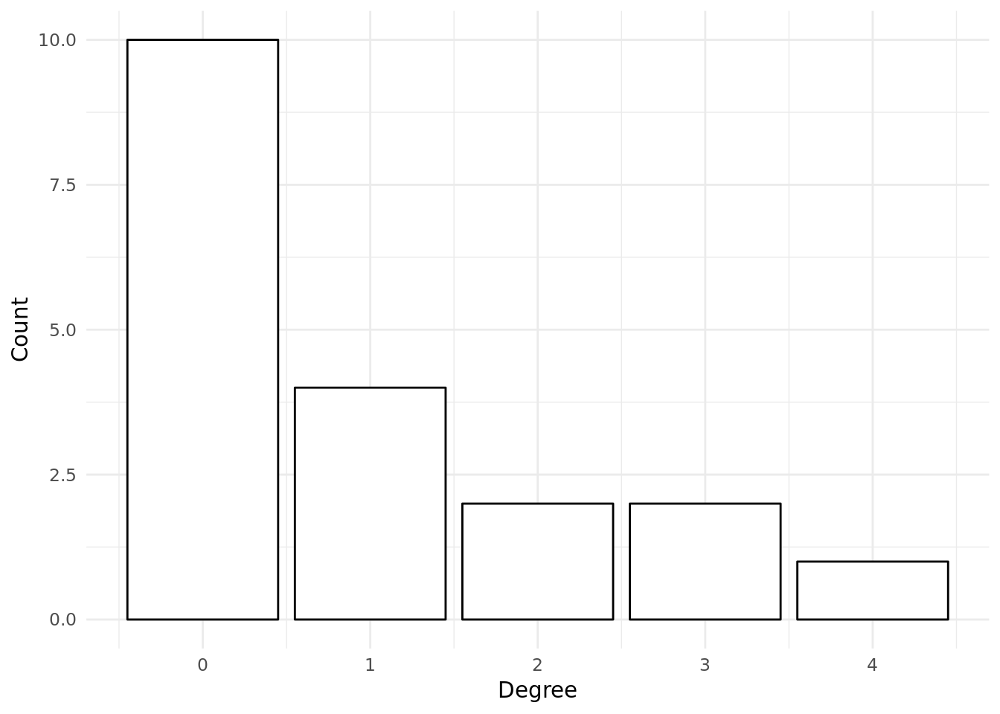

#### Degree distribution of agent->knows->agent edges

#### Runing time by method 

<table class="table table-condensed" style="width: auto !important; ">
 <thead>
  <tr>
   <th style="text-align:left;"> key </th>
   <th style="text-align:right;"> doc_count </th>
   <th style="text-align:right;"> sum_wallTime_ms.value </th>
   <th style="text-align:left;"> avg_wallTime_ms.value </th>
   <th style="text-align:left;"> includedInTotal </th>
  </tr>
 </thead>
<tbody>
  <tr>
   <td style="text-align:left;"> connectIfSimilar </td>
   <td style="text-align:right;"> 28,680 </td>
   <td style="text-align:right;"> 48,853 </td>
   <td style="text-align:left;"> 1.70338214783821 </td>
   <td style="text-align:left;"> No </td>
  </tr>
  <tr>
   <td style="text-align:left;"> existsSimilarity </td>
   <td style="text-align:right;"> 28,680 </td>
   <td style="text-align:right;"> 48,331 </td>
   <td style="text-align:left;"> 1.68518131101813 </td>
   <td style="text-align:left;"> No </td>
  </tr>
  <tr>
   <td style="text-align:left;"> similarityEdges </td>
   <td style="text-align:right;"> 28,680 </td>
   <td style="text-align:right;"> 47,448 </td>
   <td style="text-align:left;"> 1.65439330543933 </td>
   <td style="text-align:left;"> No </td>
  </tr>
  <tr>
   <td style="text-align:left;"> connectAllSimilar </td>
   <td style="text-align:right;"> 240 </td>
   <td style="text-align:right;"> 49,133 </td>
   <td style="text-align:left;"> 204.720833333333 </td>
   <td style="text-align:left;"> Yes </td>
  </tr>
  <tr>
   <td style="text-align:left;"> init </td>
   <td style="text-align:right;"> 103 </td>
   <td style="text-align:right;"> 11,002 </td>
   <td style="text-align:left;"> 106.815533980583 </td>
   <td style="text-align:left;"> No </td>
  </tr>
  <tr>
   <td style="text-align:left;"> connect </td>
   <td style="text-align:right;"> 12 </td>
   <td style="text-align:right;"> 18 </td>
   <td style="text-align:left;"> 1.5 </td>
   <td style="text-align:left;"> Yes </td>
  </tr>
  <tr>
   <td style="text-align:left;font-weight: bold;"> Total </td>
   <td style="text-align:right;font-weight: bold;"> 260 </td>
   <td style="text-align:right;font-weight: bold;"> 49,648 </td>
   <td style="text-align:left;font-weight: bold;">  </td>
   <td style="text-align:left;font-weight: bold;">  </td>
  </tr>
</tbody>
</table>
####  Found structures 

#####  Cycles 

Number of cycles found:  1 

<button class="btn btn-primary" data-toggle="collapse" data-target="#GEXGSJMJBR"> Show/Hide foundCycle query </button> 
 
  
     GET /filebeat-*/_search 
              { 
                "query": {
                  "bool": {
                    "must": [
                      { "match_phrase": {
                        "simulationId": "SIM10-06-10-16-DjvxcN--CV"
                        }
                      },
                      { "bool": {
                        "should": [
                          { "match": {
                            "keyword": "foundCycle"
                          }}
                        ]
                      }}
                    ]
                  }
                }
              }
     

#####  Paths 

Number of paths found:  0 

<button class="btn btn-primary" data-toggle="collapse" data-target="#OOTZPBZAYT"> Show/Hide foundPath query </button> 
 
  
     GET /filebeat-*/_search 
              { 
                "query": {
                  "bool": {
                    "must": [
                      { "match_phrase": {
                        "simulationId": "SIM10-06-10-16-DjvxcN--CV"
                        }
                      },
                      { "bool": {
                        "should": [
                          { "match": {
                            "keyword": "foundPath"
                          }}
                        ]
                      }}
                    ]
                  }
                }
              }
     

###  SIM10-06-10-16-DjvxcN--DV 

#### simulationParameters 

<table class="table table-condensed" style="width: auto !important; ">
 <thead>
  <tr>
   <th style="text-align:left;"> agentNumber </th>
   <th style="text-align:left;"> similarityConnectThreshold </th>
   <th style="text-align:left;"> graphType </th>
   <th style="text-align:left;"> chainLength </th>
   <th style="text-align:left;"> similaritySearchThreshold </th>
   <th style="text-align:left;"> maxDistance </th>
   <th style="text-align:left;"> randomWorksNumberMultiplier </th>
  </tr>
 </thead>
<tbody>
  <tr>
   <td style="text-align:left;width: 20em; "> 100 </td>
   <td style="text-align:left;width: 15em; "> 0.99 </td>
   <td style="text-align:left;width: 15em; "> smallWorld </td>
   <td style="text-align:left;width: 15em; "> 20 </td>
   <td style="text-align:left;width: 15em; "> 1 </td>
   <td style="text-align:left;width: 15em; "> 5 </td>
   <td style="text-align:left;width: 15em; "> 1 </td>
  </tr>
</tbody>
</table>
#### allEdgesByLabel

<table class="table table-condensed" style="width: auto !important; ">
 <thead>
  <tr>
   <th style="text-align:right;"> edges_offers </th>
   <th style="text-align:right;"> edges_similarity </th>
   <th style="text-align:right;"> edges_owns </th>
   <th style="text-align:right;"> edges_demands </th>
   <th style="text-align:right;"> edges_knows </th>
   <th style="text-align:right;"> edges_total </th>
  </tr>
 </thead>
<tbody>
  <tr>
   <td style="text-align:right;width: 5em; "> 120 </td>
   <td style="text-align:right;width: 5em; "> 1,210 </td>
   <td style="text-align:right;width: 5em; "> 120 </td>
   <td style="text-align:right;width: 5em; "> 120 </td>
   <td style="text-align:right;width: 5em; "> 601 </td>
   <td style="text-align:right;width: 5em; "> 2,171 </td>
  </tr>
</tbody>
</table>
#### allVerticesByType

<table class="table table-condensed" style="width: auto !important; ">
 <thead>
  <tr>
   <th style="text-align:right;"> vertices_agent </th>
   <th style="text-align:right;"> vertices_item </th>
   <th style="text-align:right;"> vertices_work </th>
   <th style="text-align:right;"> vertices_total </th>
  </tr>
 </thead>
<tbody>
  <tr>
   <td style="text-align:right;width: 5em; "> 101 </td>
   <td style="text-align:right;width: 5em; "> 240 </td>
   <td style="text-align:right;width: 5em; "> 120 </td>
   <td style="text-align:right;width: 5em; "> 461 </td>
  </tr>
</tbody>
</table>
#### distribution of similarityEdgesByWeight

#### Degree distribution of item->similarity->item edges

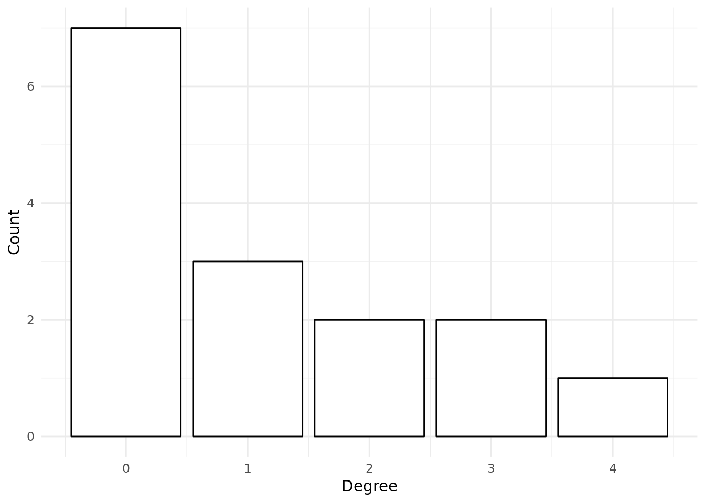

#### Degree distribution of agent->knows->agent edges

#### Runing time by method 

<table class="table table-condensed" style="width: auto !important; ">
 <thead>
  <tr>
   <th style="text-align:left;">   </th>
   <th style="text-align:left;"> key </th>
   <th style="text-align:right;"> doc_count </th>
   <th style="text-align:right;"> sum_wallTime_ms.value </th>
   <th style="text-align:left;"> avg_wallTime_ms.value </th>
   <th style="text-align:left;"> includedInTotal </th>
  </tr>
 </thead>
<tbody>
  <tr>
   <td style="text-align:left;"> 1 </td>
   <td style="text-align:left;"> knowsAgent </td>
   <td style="text-align:right;"> 601 </td>
   <td style="text-align:right;"> 1,123 </td>
   <td style="text-align:left;"> 1.86855241264559 </td>
   <td style="text-align:left;"> No </td>
  </tr>
  <tr>
   <td style="text-align:left;"> 2 </td>
   <td style="text-align:left;"> addItemToWork </td>
   <td style="text-align:right;"> 240 </td>
   <td style="text-align:right;"> 1,495 </td>
   <td style="text-align:left;"> 6.22916666666667 </td>
   <td style="text-align:left;"> No </td>
  </tr>
  <tr>
   <td style="text-align:left;"> 3 </td>
   <td style="text-align:left;"> ownsWork </td>
   <td style="text-align:right;"> 120 </td>
   <td style="text-align:right;"> 715 </td>
   <td style="text-align:left;"> 5.95833333333333 </td>
   <td style="text-align:left;"> No </td>
  </tr>
  <tr>
   <td style="text-align:left;"> 4 </td>
   <td style="text-align:left;"> init </td>
   <td style="text-align:right;"> 103 </td>
   <td style="text-align:right;"> 11,777 </td>
   <td style="text-align:left;"> 114.339805825243 </td>
   <td style="text-align:left;"> No </td>
  </tr>
  <tr>
   <td style="text-align:left;"> 5 </td>
   <td style="text-align:left;"> searchAndConnect </td>
   <td style="text-align:right;"> 101 </td>
   <td style="text-align:right;"> 52,142 </td>
   <td style="text-align:left;"> 516.257425742574 </td>
   <td style="text-align:left;"> Yes </td>
  </tr>
  <tr>
   <td style="text-align:left;"> 6 </td>
   <td style="text-align:left;"> getWorksItems </td>
   <td style="text-align:right;"> 38 </td>
   <td style="text-align:right;"> 53 </td>
   <td style="text-align:left;"> 1.39473684210526 </td>
   <td style="text-align:left;"> Yes </td>
  </tr>
  <tr>
   <td style="text-align:left;"> 9 </td>
   <td style="text-align:left;"> cycleSearch </td>
   <td style="text-align:right;"> 2 </td>
   <td style="text-align:right;"> 508 </td>
   <td style="text-align:left;"> 254 </td>
   <td style="text-align:left;"> Yes </td>
  </tr>
  <tr>
   <td style="text-align:left;"> 10 </td>
   <td style="text-align:left;"> getWorks </td>
   <td style="text-align:right;"> 2 </td>
   <td style="text-align:right;"> 465 </td>
   <td style="text-align:left;"> 232.5 </td>
   <td style="text-align:left;"> No </td>
  </tr>
  <tr>
   <td style="text-align:left;font-weight: bold;"> 11 </td>
   <td style="text-align:left;font-weight: bold;"> Total </td>
   <td style="text-align:right;font-weight: bold;"> 148 </td>
   <td style="text-align:right;font-weight: bold;"> 53,288 </td>
   <td style="text-align:left;font-weight: bold;">  </td>
   <td style="text-align:left;font-weight: bold;">  </td>
  </tr>
</tbody>
</table>
####  Found structures 

#####  Cycles 

Number of cycles found:  2 

<button class="btn btn-primary" data-toggle="collapse" data-target="#JCFLEVCQWN"> Show/Hide foundCycle query </button> 
 
  
     GET /filebeat-*/_search 
              { 
                "query": {
                  "bool": {
                    "must": [
                      { "match_phrase": {
                        "simulationId": "SIM10-06-10-16-DjvxcN--DV"
                        }
                      },
                      { "bool": {
                        "should": [
                          { "match": {
                            "keyword": "foundCycle"
                          }}
                        ]
                      }}
                    ]
                  }
                }
              }
     

#####  Paths 

Number of paths found:  0 

<button class="btn btn-primary" data-toggle="collapse" data-target="#NLHJEWCSVY"> Show/Hide foundPath query </button> 
 
  
     GET /filebeat-*/_search 
              { 
                "query": {
                  "bool": {
                    "must": [
                      { "match_phrase": {
                        "simulationId": "SIM10-06-10-16-DjvxcN--DV"
                        }
                      },
                      { "bool": {
                        "should": [
                          { "match": {
                            "keyword": "foundPath"
                          }}
                        ]
                      }}
                    ]
                  }
                }
              }
     

###  SIM10-06-10-22-mPsCzG--CV 

#### simulationParameters 

<table class="table table-condensed" style="width: auto !important; ">
 <thead>
  <tr>
   <th style="text-align:left;"> agentNumber </th>
   <th style="text-align:left;"> similarityConnectThreshold </th>
   <th style="text-align:left;"> graphType </th>
   <th style="text-align:left;"> chainLength </th>
   <th style="text-align:left;"> similaritySearchThreshold </th>
   <th style="text-align:left;"> maxDistance </th>
   <th style="text-align:left;"> randomWorksNumberMultiplier </th>
  </tr>
 </thead>
<tbody>
  <tr>
   <td style="text-align:left;width: 20em; "> 100 </td>
   <td style="text-align:left;width: 15em; "> 0.99 </td>
   <td style="text-align:left;width: 15em; "> random </td>
   <td style="text-align:left;width: 15em; "> 20 </td>
   <td style="text-align:left;width: 15em; "> 1 </td>
   <td style="text-align:left;width: 15em; "> 5 </td>
   <td style="text-align:left;width: 15em; "> 2 </td>
  </tr>
</tbody>
</table>
#### allEdgesByLabel

<table class="table table-condensed" style="width: auto !important; ">
 <thead>
  <tr>
   <th style="text-align:right;"> edges_offers </th>
   <th style="text-align:right;"> edges_similarity </th>
   <th style="text-align:right;"> edges_owns </th>
   <th style="text-align:right;"> edges_demands </th>
   <th style="text-align:right;"> edges_knows </th>
   <th style="text-align:right;"> edges_total </th>
  </tr>
 </thead>
<tbody>
  <tr>
   <td style="text-align:right;width: 5em; "> 220 </td>
   <td style="text-align:right;width: 5em; "> 3,948 </td>
   <td style="text-align:right;width: 5em; "> 220 </td>
   <td style="text-align:right;width: 5em; "> 220 </td>
   <td style="text-align:right;width: 5em; "> 100 </td>
   <td style="text-align:right;width: 5em; "> 4,708 </td>
  </tr>
</tbody>
</table>
#### allVerticesByType

<table class="table table-condensed" style="width: auto !important; ">
 <thead>
  <tr>
   <th style="text-align:right;"> vertices_agent </th>
   <th style="text-align:right;"> vertices_item </th>
   <th style="text-align:right;"> vertices_work </th>
   <th style="text-align:right;"> vertices_total </th>
  </tr>
 </thead>
<tbody>
  <tr>
   <td style="text-align:right;width: 5em; "> 101 </td>
   <td style="text-align:right;width: 5em; "> 440 </td>
   <td style="text-align:right;width: 5em; "> 220 </td>
   <td style="text-align:right;width: 5em; "> 761 </td>
  </tr>
</tbody>
</table>
#### distribution of similarityEdgesByWeight

#### Degree distribution of item->similarity->item edges

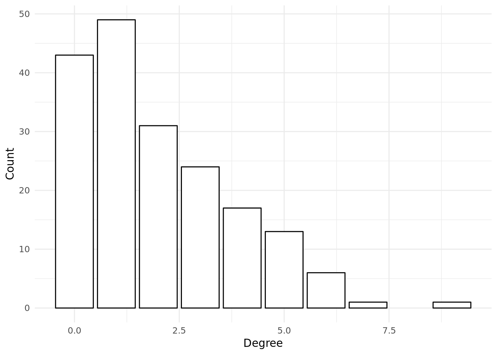

#### Degree distribution of agent->knows->agent edges

#### Runing time by method 

<table class="table table-condensed" style="width: auto !important; ">
 <thead>
  <tr>
   <th style="text-align:left;"> key </th>
   <th style="text-align:right;"> doc_count </th>
   <th style="text-align:right;"> sum_wallTime_ms.value </th>
   <th style="text-align:left;"> avg_wallTime_ms.value </th>
   <th style="text-align:left;"> includedInTotal </th>
  </tr>
 </thead>
<tbody>
  <tr>
   <td style="text-align:left;"> connectIfSimilar </td>
   <td style="text-align:right;"> 96,580 </td>
   <td style="text-align:right;"> 170,758 </td>
   <td style="text-align:left;"> 1.76804721474425 </td>
   <td style="text-align:left;"> No </td>
  </tr>
  <tr>
   <td style="text-align:left;"> existsSimilarity </td>
   <td style="text-align:right;"> 96,580 </td>
   <td style="text-align:right;"> 166,500 </td>
   <td style="text-align:left;"> 1.72395941188652 </td>
   <td style="text-align:left;"> No </td>
  </tr>
  <tr>
   <td style="text-align:left;"> similarityEdges </td>
   <td style="text-align:right;"> 96,580 </td>
   <td style="text-align:right;"> 163,793 </td>
   <td style="text-align:left;"> 1.69593083454131 </td>
   <td style="text-align:left;"> No </td>
  </tr>
  <tr>
   <td style="text-align:left;"> connect </td>
   <td style="text-align:right;"> 1,213 </td>
   <td style="text-align:right;"> 2,598 </td>
   <td style="text-align:left;"> 2.14179719703215 </td>
   <td style="text-align:left;"> Yes </td>
  </tr>
  <tr>
   <td style="text-align:left;"> connectAllSimilar </td>
   <td style="text-align:right;"> 440 </td>
   <td style="text-align:right;"> 171,712 </td>
   <td style="text-align:left;"> 390.254545454545 </td>
   <td style="text-align:left;"> Yes </td>
  </tr>
  <tr>
   <td style="text-align:left;"> init </td>
   <td style="text-align:right;"> 103 </td>
   <td style="text-align:right;"> 11,021 </td>
   <td style="text-align:left;"> 107 </td>
   <td style="text-align:left;"> No </td>
  </tr>
  <tr>
   <td style="text-align:left;font-weight: bold;"> Total </td>
   <td style="text-align:right;font-weight: bold;"> 1,661 </td>
   <td style="text-align:right;font-weight: bold;"> 175,032 </td>
   <td style="text-align:left;font-weight: bold;">  </td>
   <td style="text-align:left;font-weight: bold;">  </td>
  </tr>
</tbody>
</table>
####  Found structures 

#####  Cycles 

Number of cycles found:  1 

<button class="btn btn-primary" data-toggle="collapse" data-target="#WFQQLDBUVY"> Show/Hide foundCycle query </button> 
 
  
     GET /filebeat-*/_search 
              { 
                "query": {
                  "bool": {
                    "must": [
                      { "match_phrase": {
                        "simulationId": "SIM10-06-10-22-mPsCzG--CV"
                        }
                      },
                      { "bool": {
                        "should": [
                          { "match": {
                            "keyword": "foundCycle"
                          }}
                        ]
                      }}
                    ]
                  }
                }
              }
     

#####  Paths 

Number of paths found:  0 

<button class="btn btn-primary" data-toggle="collapse" data-target="#LRNUFHJQEI"> Show/Hide foundPath query </button> 
 
  
     GET /filebeat-*/_search 
              { 
                "query": {
                  "bool": {
                    "must": [
                      { "match_phrase": {
                        "simulationId": "SIM10-06-10-22-mPsCzG--CV"
                        }
                      },
                      { "bool": {
                        "should": [
                          { "match": {
                            "keyword": "foundPath"
                          }}
                        ]
                      }}
                    ]
                  }
                }
              }
     

###  SIM10-06-10-22-mPsCzG--DV 

#### simulationParameters 

<table class="table table-condensed" style="width: auto !important; ">
 <thead>
  <tr>
   <th style="text-align:left;"> agentNumber </th>
   <th style="text-align:left;"> similarityConnectThreshold </th>
   <th style="text-align:left;"> graphType </th>
   <th style="text-align:left;"> chainLength </th>
   <th style="text-align:left;"> similaritySearchThreshold </th>
   <th style="text-align:left;"> maxDistance </th>
   <th style="text-align:left;"> randomWorksNumberMultiplier </th>
  </tr>
 </thead>
<tbody>
  <tr>
   <td style="text-align:left;width: 20em; "> 100 </td>
   <td style="text-align:left;width: 15em; "> 0.99 </td>
   <td style="text-align:left;width: 15em; "> random </td>
   <td style="text-align:left;width: 15em; "> 20 </td>
   <td style="text-align:left;width: 15em; "> 1 </td>
   <td style="text-align:left;width: 15em; "> 5 </td>
   <td style="text-align:left;width: 15em; "> 2 </td>
  </tr>
</tbody>
</table>
#### allEdgesByLabel

<table class="table table-condensed" style="width: auto !important; ">
 <thead>
  <tr>
   <th style="text-align:right;"> edges_offers </th>
   <th style="text-align:right;"> edges_similarity </th>
   <th style="text-align:right;"> edges_owns </th>
   <th style="text-align:right;"> edges_demands </th>
   <th style="text-align:right;"> edges_knows </th>
   <th style="text-align:right;"> edges_total </th>
  </tr>
 </thead>
<tbody>
  <tr>
   <td style="text-align:right;width: 5em; "> 220 </td>
   <td style="text-align:right;width: 5em; "> 1,522 </td>
   <td style="text-align:right;width: 5em; "> 220 </td>
   <td style="text-align:right;width: 5em; "> 220 </td>
   <td style="text-align:right;width: 5em; "> 100 </td>
   <td style="text-align:right;width: 5em; "> 2,282 </td>
  </tr>
</tbody>
</table>
#### allVerticesByType

<table class="table table-condensed" style="width: auto !important; ">
 <thead>
  <tr>
   <th style="text-align:right;"> vertices_agent </th>
   <th style="text-align:right;"> vertices_item </th>
   <th style="text-align:right;"> vertices_work </th>
   <th style="text-align:right;"> vertices_total </th>
  </tr>
 </thead>
<tbody>
  <tr>
   <td style="text-align:right;width: 5em; "> 101 </td>
   <td style="text-align:right;width: 5em; "> 440 </td>
   <td style="text-align:right;width: 5em; "> 220 </td>
   <td style="text-align:right;width: 5em; "> 761 </td>
  </tr>
</tbody>
</table>
#### distribution of similarityEdgesByWeight


#### Degree distribution of item->similarity->item edges


#### Degree distribution of agent->knows->agent edges

#### Runing time by method 

<table class="table table-condensed" style="width: auto !important; ">
 <thead>
  <tr>
   <th style="text-align:left;">   </th>
   <th style="text-align:left;"> key </th>
   <th style="text-align:right;"> doc_count </th>
   <th style="text-align:right;"> sum_wallTime_ms.value </th>
   <th style="text-align:left;"> avg_wallTime_ms.value </th>
   <th style="text-align:left;"> includedInTotal </th>
  </tr>
 </thead>
<tbody>
  <tr>
   <td style="text-align:left;"> 2 </td>
   <td style="text-align:left;"> cycleSearch </td>
   <td style="text-align:right;"> 3,600 </td>
   <td style="text-align:right;"> 14,494 </td>
   <td style="text-align:left;"> 4.02611111111111 </td>
   <td style="text-align:left;"> Yes </td>
  </tr>
  <tr>
   <td style="text-align:left;"> 3 </td>
   <td style="text-align:left;"> getWorks </td>
   <td style="text-align:right;"> 3,600 </td>
   <td style="text-align:right;"> 42,216 </td>
   <td style="text-align:left;"> 11.7266666666667 </td>
   <td style="text-align:left;"> No </td>
  </tr>
  <tr>
   <td style="text-align:left;"> 4 </td>
   <td style="text-align:left;"> individualCycleSearch </td>
   <td style="text-align:right;"> 3,600 </td>
   <td style="text-align:right;"> 85 </td>
   <td style="text-align:left;"> 0.0236111111111111 </td>
   <td style="text-align:left;"> Yes </td>
  </tr>
  <tr>
   <td style="text-align:left;"> 6 </td>
   <td style="text-align:left;"> addItemToWork </td>
   <td style="text-align:right;"> 440 </td>
   <td style="text-align:right;"> 3,921 </td>
   <td style="text-align:left;"> 8.91136363636364 </td>
   <td style="text-align:left;"> No </td>
  </tr>
  <tr>
   <td style="text-align:left;"> 7 </td>
   <td style="text-align:left;"> ownsWork </td>
   <td style="text-align:right;"> 220 </td>
   <td style="text-align:right;"> 1,592 </td>
   <td style="text-align:left;"> 7.23636363636364 </td>
   <td style="text-align:left;"> No </td>
  </tr>
  <tr>
   <td style="text-align:left;"> 8 </td>
   <td style="text-align:left;"> init </td>
   <td style="text-align:right;"> 103 </td>
   <td style="text-align:right;"> 11,917 </td>
   <td style="text-align:left;"> 115.699029126214 </td>
   <td style="text-align:left;"> No </td>
  </tr>
  <tr>
   <td style="text-align:left;"> 9 </td>
   <td style="text-align:left;"> searchAndConnect </td>
   <td style="text-align:right;"> 101 </td>
   <td style="text-align:right;"> 35,912 </td>
   <td style="text-align:left;"> 355.564356435644 </td>
   <td style="text-align:left;"> Yes </td>
  </tr>
  <tr>
   <td style="text-align:left;"> 10 </td>
   <td style="text-align:left;"> knowsAgent </td>
   <td style="text-align:right;"> 100 </td>
   <td style="text-align:right;"> 327 </td>
   <td style="text-align:left;"> 3.27 </td>
   <td style="text-align:left;"> No </td>
  </tr>
  <tr>
   <td style="text-align:left;font-weight: bold;"> 1 </td>
   <td style="text-align:left;font-weight: bold;"> Total </td>
   <td style="text-align:right;font-weight: bold;"> 14,501 </td>
   <td style="text-align:right;font-weight: bold;"> 65,373 </td>
   <td style="text-align:left;font-weight: bold;">  </td>
   <td style="text-align:left;font-weight: bold;">  </td>
  </tr>
</tbody>
</table>
####  Found structures 

#####  Cycles 

Number of cycles found:  0 

<button class="btn btn-primary" data-toggle="collapse" data-target="#SZSPMYMVOZ"> Show/Hide foundCycle query </button> 
 
  
     GET /filebeat-*/_search 
              { 
                "query": {
                  "bool": {
                    "must": [
                      { "match_phrase": {
                        "simulationId": "SIM10-06-10-22-mPsCzG--DV"
                        }
                      },
                      { "bool": {
                        "should": [
                          { "match": {
                            "keyword": "foundCycle"
                          }}
                        ]
                      }}
                    ]
                  }
                }
              }
     

#####  Paths 

Number of paths found:  3600 

<button class="btn btn-primary" data-toggle="collapse" data-target="#NSMEYRWSYF"> Show/Hide foundPath query </button> 
 
  
     GET /filebeat-*/_search 
              { 
                "query": {
                  "bool": {
                    "must": [
                      { "match_phrase": {
                        "simulationId": "SIM10-06-10-22-mPsCzG--DV"
                        }
                      },
                      { "bool": {
                        "should": [
                          { "match": {
                            "keyword": "foundPath"
                          }}
                        ]
                      }}
                    ]
                  }
                }
              }
     

###  SIM10-06-11-26-QyKFQa--CV 

#### simulationParameters 

<table class="table table-condensed" style="width: auto !important; ">
 <thead>
  <tr>
   <th style="text-align:left;"> agentNumber </th>
   <th style="text-align:left;"> similarityConnectThreshold </th>
   <th style="text-align:left;"> graphType </th>
   <th style="text-align:left;"> chainLength </th>
   <th style="text-align:left;"> similaritySearchThreshold </th>
   <th style="text-align:left;"> maxDistance </th>
   <th style="text-align:left;"> randomWorksNumberMultiplier </th>
  </tr>
 </thead>
<tbody>
  <tr>
   <td style="text-align:left;width: 20em; "> 100 </td>
   <td style="text-align:left;width: 15em; "> 0.99 </td>
   <td style="text-align:left;width: 15em; "> smallWorld </td>
   <td style="text-align:left;width: 15em; "> 20 </td>
   <td style="text-align:left;width: 15em; "> 1 </td>
   <td style="text-align:left;width: 15em; "> 5 </td>
   <td style="text-align:left;width: 15em; "> 2 </td>
  </tr>
</tbody>
</table>
#### allEdgesByLabel

<table class="table table-condensed" style="width: auto !important; ">
 <thead>
  <tr>
   <th style="text-align:right;"> edges_offers </th>
   <th style="text-align:right;"> edges_similarity </th>
   <th style="text-align:right;"> edges_owns </th>
   <th style="text-align:right;"> edges_demands </th>
   <th style="text-align:right;"> edges_knows </th>
   <th style="text-align:right;"> edges_total </th>
  </tr>
 </thead>
<tbody>
  <tr>
   <td style="text-align:right;width: 5em; "> 220 </td>
   <td style="text-align:right;width: 5em; "> 4,164 </td>
   <td style="text-align:right;width: 5em; "> 220 </td>
   <td style="text-align:right;width: 5em; "> 220 </td>
   <td style="text-align:right;width: 5em; "> 601 </td>
   <td style="text-align:right;width: 5em; "> 5,425 </td>
  </tr>
</tbody>
</table>
#### allVerticesByType

<table class="table table-condensed" style="width: auto !important; ">
 <thead>
  <tr>
   <th style="text-align:right;"> vertices_agent </th>
   <th style="text-align:right;"> vertices_item </th>
   <th style="text-align:right;"> vertices_work </th>
   <th style="text-align:right;"> vertices_total </th>
  </tr>
 </thead>
<tbody>
  <tr>
   <td style="text-align:right;width: 5em; "> 101 </td>
   <td style="text-align:right;width: 5em; "> 440 </td>
   <td style="text-align:right;width: 5em; "> 220 </td>
   <td style="text-align:right;width: 5em; "> 761 </td>
  </tr>
</tbody>
</table>
#### distribution of similarityEdgesByWeight


#### Degree distribution of item->similarity->item edges

#### Degree distribution of agent->knows->agent edges

#### Runing time by method 

<table class="table table-condensed" style="width: auto !important; ">
 <thead>
  <tr>
   <th style="text-align:left;"> key </th>
   <th style="text-align:right;"> doc_count </th>
   <th style="text-align:right;"> sum_wallTime_ms.value </th>
   <th style="text-align:left;"> avg_wallTime_ms.value </th>
   <th style="text-align:left;"> includedInTotal </th>
  </tr>
 </thead>
<tbody>
  <tr>
   <td style="text-align:left;"> connectIfSimilar </td>
   <td style="text-align:right;"> 96,580 </td>
   <td style="text-align:right;"> 176,129 </td>
   <td style="text-align:left;"> 1.82365914267964 </td>
   <td style="text-align:left;"> No </td>
  </tr>
  <tr>
   <td style="text-align:left;"> existsSimilarity </td>
   <td style="text-align:right;"> 96,580 </td>
   <td style="text-align:right;"> 174,461 </td>
   <td style="text-align:left;"> 1.80638848622903 </td>
   <td style="text-align:left;"> No </td>
  </tr>
  <tr>
   <td style="text-align:left;"> similarityEdges </td>
   <td style="text-align:right;"> 96,580 </td>
   <td style="text-align:right;"> 171,753 </td>
   <td style="text-align:left;"> 1.77834955477325 </td>
   <td style="text-align:left;"> No </td>
  </tr>
  <tr>
   <td style="text-align:left;"> connectAllSimilar </td>
   <td style="text-align:right;"> 440 </td>
   <td style="text-align:right;"> 177,065 </td>
   <td style="text-align:left;"> 402.420454545455 </td>
   <td style="text-align:left;"> Yes </td>
  </tr>
  <tr>
   <td style="text-align:left;"> init </td>
   <td style="text-align:right;"> 103 </td>
   <td style="text-align:right;"> 11,206 </td>
   <td style="text-align:left;"> 108.796116504854 </td>
   <td style="text-align:left;"> No </td>
  </tr>
  <tr>
   <td style="text-align:left;"> connect </td>
   <td style="text-align:right;"> 21 </td>
   <td style="text-align:right;"> 46 </td>
   <td style="text-align:left;"> 2.19047619047619 </td>
   <td style="text-align:left;"> Yes </td>
  </tr>
  <tr>
   <td style="text-align:left;font-weight: bold;"> Total </td>
   <td style="text-align:right;font-weight: bold;"> 469 </td>
   <td style="text-align:right;font-weight: bold;"> 177,778 </td>
   <td style="text-align:left;font-weight: bold;">  </td>
   <td style="text-align:left;font-weight: bold;">  </td>
  </tr>
</tbody>
</table>
####  Found structures 

#####  Cycles 

Number of cycles found:  1 

<button class="btn btn-primary" data-toggle="collapse" data-target="#TYESKQNBDX"> Show/Hide foundCycle query </button> 
 
  
     GET /filebeat-*/_search 
              { 
                "query": {
                  "bool": {
                    "must": [
                      { "match_phrase": {
                        "simulationId": "SIM10-06-11-26-QyKFQa--CV"
                        }
                      },
                      { "bool": {
                        "should": [
                          { "match": {
                            "keyword": "foundCycle"
                          }}
                        ]
                      }}
                    ]
                  }
                }
              }
     

#####  Paths 

Number of paths found:  0 

<button class="btn btn-primary" data-toggle="collapse" data-target="#TABZICUHMW"> Show/Hide foundPath query </button> 
 
  
     GET /filebeat-*/_search 
              { 
                "query": {
                  "bool": {
                    "must": [
                      { "match_phrase": {
                        "simulationId": "SIM10-06-11-26-QyKFQa--CV"
                        }
                      },
                      { "bool": {
                        "should": [
                          { "match": {
                            "keyword": "foundPath"
                          }}
                        ]
                      }}
                    ]
                  }
                }
              }
     

###  SIM10-06-11-26-QyKFQa--DV 

#### simulationParameters 

<table class="table table-condensed" style="width: auto !important; ">
 <thead>
  <tr>
   <th style="text-align:left;"> agentNumber </th>
   <th style="text-align:left;"> similarityConnectThreshold </th>
   <th style="text-align:left;"> graphType </th>
   <th style="text-align:left;"> chainLength </th>
   <th style="text-align:left;"> similaritySearchThreshold </th>
   <th style="text-align:left;"> maxDistance </th>
   <th style="text-align:left;"> randomWorksNumberMultiplier </th>
  </tr>
 </thead>
<tbody>
  <tr>
   <td style="text-align:left;width: 20em; "> 100 </td>
   <td style="text-align:left;width: 15em; "> 0.99 </td>
   <td style="text-align:left;width: 15em; "> smallWorld </td>
   <td style="text-align:left;width: 15em; "> 20 </td>
   <td style="text-align:left;width: 15em; "> 1 </td>
   <td style="text-align:left;width: 15em; "> 5 </td>
   <td style="text-align:left;width: 15em; "> 2 </td>
  </tr>
</tbody>
</table>
#### allEdgesByLabel

<table class="table table-condensed" style="width: auto !important; ">
 <thead>
  <tr>
   <th style="text-align:right;"> edges_offers </th>
   <th style="text-align:right;"> edges_similarity </th>
   <th style="text-align:right;"> edges_owns </th>
   <th style="text-align:right;"> edges_demands </th>
   <th style="text-align:right;"> edges_knows </th>
   <th style="text-align:right;"> edges_total </th>
  </tr>
 </thead>
<tbody>
  <tr>
   <td style="text-align:right;width: 5em; "> 220 </td>
   <td style="text-align:right;width: 5em; "> 4,122 </td>
   <td style="text-align:right;width: 5em; "> 220 </td>
   <td style="text-align:right;width: 5em; "> 220 </td>
   <td style="text-align:right;width: 5em; "> 601 </td>
   <td style="text-align:right;width: 5em; "> 5,383 </td>
  </tr>
</tbody>
</table>
#### allVerticesByType

<table class="table table-condensed" style="width: auto !important; ">
 <thead>
  <tr>
   <th style="text-align:right;"> vertices_agent </th>
   <th style="text-align:right;"> vertices_item </th>
   <th style="text-align:right;"> vertices_work </th>
   <th style="text-align:right;"> vertices_total </th>
  </tr>
 </thead>
<tbody>
  <tr>
   <td style="text-align:right;width: 5em; "> 101 </td>
   <td style="text-align:right;width: 5em; "> 440 </td>
   <td style="text-align:right;width: 5em; "> 220 </td>
   <td style="text-align:right;width: 5em; "> 761 </td>
  </tr>
</tbody>
</table>
#### distribution of similarityEdgesByWeight

#### Degree distribution of item->similarity->item edges


#### Degree distribution of agent->knows->agent edges

#### Runing time by method 

<table class="table table-condensed" style="width: auto !important; ">
 <thead>
  <tr>
   <th style="text-align:left;">   </th>
   <th style="text-align:left;"> key </th>
   <th style="text-align:right;"> doc_count </th>
   <th style="text-align:right;"> sum_wallTime_ms.value </th>
   <th style="text-align:left;"> avg_wallTime_ms.value </th>
   <th style="text-align:left;"> includedInTotal </th>
  </tr>
 </thead>
<tbody>
  <tr>
   <td style="text-align:left;"> 1 </td>
   <td style="text-align:left;"> knowsAgent </td>
   <td style="text-align:right;"> 601 </td>
   <td style="text-align:right;"> 1,028 </td>
   <td style="text-align:left;"> 1.71048252911814 </td>
   <td style="text-align:left;"> No </td>
  </tr>
  <tr>
   <td style="text-align:left;"> 2 </td>
   <td style="text-align:left;"> addItemToWork </td>
   <td style="text-align:right;"> 440 </td>
   <td style="text-align:right;"> 3,430 </td>
   <td style="text-align:left;"> 7.79545454545455 </td>
   <td style="text-align:left;"> No </td>
  </tr>
  <tr>
   <td style="text-align:left;"> 3 </td>
   <td style="text-align:left;"> ownsWork </td>
   <td style="text-align:right;"> 220 </td>
   <td style="text-align:right;"> 2,048 </td>
   <td style="text-align:left;"> 9.30909090909091 </td>
   <td style="text-align:left;"> No </td>
  </tr>
  <tr>
   <td style="text-align:left;"> 4 </td>
   <td style="text-align:left;"> init </td>
   <td style="text-align:right;"> 103 </td>
   <td style="text-align:right;"> 11,894 </td>
   <td style="text-align:left;"> 115.47572815534 </td>
   <td style="text-align:left;"> No </td>
  </tr>
  <tr>
   <td style="text-align:left;"> 5 </td>
   <td style="text-align:left;"> searchAndConnect </td>
   <td style="text-align:right;"> 101 </td>
   <td style="text-align:right;"> 102,100 </td>
   <td style="text-align:left;"> 1010.89108910891 </td>
   <td style="text-align:left;"> Yes </td>
  </tr>
  <tr>
   <td style="text-align:left;"> 6 </td>
   <td style="text-align:left;"> getWorksItems </td>
   <td style="text-align:right;"> 38 </td>
   <td style="text-align:right;"> 67 </td>
   <td style="text-align:left;"> 1.76315789473684 </td>
   <td style="text-align:left;"> Yes </td>
  </tr>
  <tr>
   <td style="text-align:left;"> 9 </td>
   <td style="text-align:left;"> cycleSearch </td>
   <td style="text-align:right;"> 4 </td>
   <td style="text-align:right;"> 706 </td>
   <td style="text-align:left;"> 176.5 </td>
   <td style="text-align:left;"> Yes </td>
  </tr>
  <tr>
   <td style="text-align:left;"> 10 </td>
   <td style="text-align:left;"> getWorks </td>
   <td style="text-align:right;"> 4 </td>
   <td style="text-align:right;"> 865 </td>
   <td style="text-align:left;"> 216.25 </td>
   <td style="text-align:left;"> No </td>
  </tr>
  <tr>
   <td style="text-align:left;font-weight: bold;"> 11 </td>
   <td style="text-align:left;font-weight: bold;"> Total </td>
   <td style="text-align:right;font-weight: bold;"> 152 </td>
   <td style="text-align:right;font-weight: bold;"> 104,050 </td>
   <td style="text-align:left;font-weight: bold;">  </td>
   <td style="text-align:left;font-weight: bold;">  </td>
  </tr>
</tbody>
</table>
####  Found structures 

#####  Cycles 

Number of cycles found:  3 

<button class="btn btn-primary" data-toggle="collapse" data-target="#RVSHCBEHPB"> Show/Hide foundCycle query </button> 
 
  
     GET /filebeat-*/_search 
              { 
                "query": {
                  "bool": {
                    "must": [
                      { "match_phrase": {
                        "simulationId": "SIM10-06-11-26-QyKFQa--DV"
                        }
                      },
                      { "bool": {
                        "should": [
                          { "match": {
                            "keyword": "foundCycle"
                          }}
                        ]
                      }}
                    ]
                  }
                }
              }
     

#####  Paths 

Number of paths found:  1 

<button class="btn btn-primary" data-toggle="collapse" data-target="#WLJJVVOJVD"> Show/Hide foundPath query </button> 
 
  
     GET /filebeat-*/_search 
              { 
                "query": {
                  "bool": {
                    "must": [
                      { "match_phrase": {
                        "simulationId": "SIM10-06-11-26-QyKFQa--DV"
                        }
                      },
                      { "bool": {
                        "should": [
                          { "match": {
                            "keyword": "foundPath"
                          }}
                        ]
                      }}
                    ]
                  }
                }
              }
     

###  SIM10-06-05-30-GEyUU9--CV 

#### simulationParameters 

<table class="table table-condensed" style="width: auto !important; ">
 <thead>
  <tr>
   <th style="text-align:left;"> agentNumber </th>
   <th style="text-align:left;"> similarityConnectThreshold </th>
   <th style="text-align:left;"> graphType </th>
   <th style="text-align:left;"> chainLength </th>
   <th style="text-align:left;"> similaritySearchThreshold </th>
   <th style="text-align:left;"> maxDistance </th>
   <th style="text-align:left;"> randomWorksNumberMultiplier </th>
  </tr>
 </thead>
<tbody>
  <tr>
   <td style="text-align:left;width: 20em; "> 100 </td>
   <td style="text-align:left;width: 15em; "> 0.99 </td>
   <td style="text-align:left;width: 15em; "> random </td>
   <td style="text-align:left;width: 15em; "> 5 </td>
   <td style="text-align:left;width: 15em; "> 1 </td>
   <td style="text-align:left;width: 15em; "> 10 </td>
   <td style="text-align:left;width: 15em; "> 1 </td>
  </tr>
</tbody>
</table>
#### allEdgesByLabel

<table class="table table-condensed" style="width: auto !important; ">
 <thead>
  <tr>
   <th style="text-align:right;"> edges_offers </th>
   <th style="text-align:right;"> edges_similarity </th>
   <th style="text-align:right;"> edges_owns </th>
   <th style="text-align:right;"> edges_demands </th>
   <th style="text-align:right;"> edges_knows </th>
   <th style="text-align:right;"> edges_total </th>
  </tr>
 </thead>
<tbody>
  <tr>
   <td style="text-align:right;width: 5em; "> 105 </td>
   <td style="text-align:right;width: 5em; "> 1,016 </td>
   <td style="text-align:right;width: 5em; "> 105 </td>
   <td style="text-align:right;width: 5em; "> 105 </td>
   <td style="text-align:right;width: 5em; "> 100 </td>
   <td style="text-align:right;width: 5em; "> 1,431 </td>
  </tr>
</tbody>
</table>
#### allVerticesByType

<table class="table table-condensed" style="width: auto !important; ">
 <thead>
  <tr>
   <th style="text-align:right;"> vertices_agent </th>
   <th style="text-align:right;"> vertices_item </th>
   <th style="text-align:right;"> vertices_work </th>
   <th style="text-align:right;"> vertices_total </th>
  </tr>
 </thead>
<tbody>
  <tr>
   <td style="text-align:right;width: 5em; "> 101 </td>
   <td style="text-align:right;width: 5em; "> 210 </td>
   <td style="text-align:right;width: 5em; "> 105 </td>
   <td style="text-align:right;width: 5em; "> 416 </td>
  </tr>
</tbody>
</table>
#### distribution of similarityEdgesByWeight


#### Degree distribution of item->similarity->item edges

#### Degree distribution of agent->knows->agent edges

#### Runing time by method 

<table class="table table-condensed" style="width: auto !important; ">
 <thead>
  <tr>
   <th style="text-align:left;"> key </th>
   <th style="text-align:right;"> doc_count </th>
   <th style="text-align:right;"> sum_wallTime_ms.value </th>
   <th style="text-align:left;"> avg_wallTime_ms.value </th>
   <th style="text-align:left;"> includedInTotal </th>
  </tr>
 </thead>
<tbody>
  <tr>
   <td style="text-align:left;"> connectIfSimilar </td>
   <td style="text-align:right;"> 21,945 </td>
   <td style="text-align:right;"> 38,269 </td>
   <td style="text-align:left;"> 1.74385964912281 </td>
   <td style="text-align:left;"> No </td>
  </tr>
  <tr>
   <td style="text-align:left;"> existsSimilarity </td>
   <td style="text-align:right;"> 21,945 </td>
   <td style="text-align:right;"> 37,740 </td>
   <td style="text-align:left;"> 1.71975393028025 </td>
   <td style="text-align:left;"> No </td>
  </tr>
  <tr>
   <td style="text-align:left;"> similarityEdges </td>
   <td style="text-align:right;"> 21,945 </td>
   <td style="text-align:right;"> 37,019 </td>
   <td style="text-align:left;"> 1.68689906584643 </td>
   <td style="text-align:left;"> No </td>
  </tr>
  <tr>
   <td style="text-align:left;"> connectAllSimilar </td>
   <td style="text-align:right;"> 210 </td>
   <td style="text-align:right;"> 38,506 </td>
   <td style="text-align:left;"> 183.361904761905 </td>
   <td style="text-align:left;"> Yes </td>
  </tr>
  <tr>
   <td style="text-align:left;"> init </td>
   <td style="text-align:right;"> 103 </td>
   <td style="text-align:right;"> 10,210 </td>
   <td style="text-align:left;"> 99.126213592233 </td>
   <td style="text-align:left;"> No </td>
  </tr>
  <tr>
   <td style="text-align:left;"> connect </td>
   <td style="text-align:right;"> 47 </td>
   <td style="text-align:right;"> 92 </td>
   <td style="text-align:left;"> 1.95744680851064 </td>
   <td style="text-align:left;"> Yes </td>
  </tr>
  <tr>
   <td style="text-align:left;font-weight: bold;"> Total </td>
   <td style="text-align:right;font-weight: bold;"> 265 </td>
   <td style="text-align:right;font-weight: bold;"> 38,847 </td>
   <td style="text-align:left;font-weight: bold;">  </td>
   <td style="text-align:left;font-weight: bold;">  </td>
  </tr>
</tbody>
</table>
####  Found structures 

#####  Cycles 

Number of cycles found:  1 

<button class="btn btn-primary" data-toggle="collapse" data-target="#IPBRTSDYWC"> Show/Hide foundCycle query </button> 
 
  
     GET /filebeat-*/_search 
              { 
                "query": {
                  "bool": {
                    "must": [
                      { "match_phrase": {
                        "simulationId": "SIM10-06-05-30-GEyUU9--CV"
                        }
                      },
                      { "bool": {
                        "should": [
                          { "match": {
                            "keyword": "foundCycle"
                          }}
                        ]
                      }}
                    ]
                  }
                }
              }
     

#####  Paths 

Number of paths found:  0 

<button class="btn btn-primary" data-toggle="collapse" data-target="#ZXHACXNRML"> Show/Hide foundPath query </button> 
 
  
     GET /filebeat-*/_search 
              { 
                "query": {
                  "bool": {
                    "must": [
                      { "match_phrase": {
                        "simulationId": "SIM10-06-05-30-GEyUU9--CV"
                        }
                      },
                      { "bool": {
                        "should": [
                          { "match": {
                            "keyword": "foundPath"
                          }}
                        ]
                      }}
                    ]
                  }
                }
              }
     

###  SIM10-06-05-30-GEyUU9--DV 

#### simulationParameters 

<table class="table table-condensed" style="width: auto !important; ">
 <thead>
  <tr>
   <th style="text-align:left;"> agentNumber </th>
   <th style="text-align:left;"> similarityConnectThreshold </th>
   <th style="text-align:left;"> graphType </th>
   <th style="text-align:left;"> chainLength </th>
   <th style="text-align:left;"> similaritySearchThreshold </th>
   <th style="text-align:left;"> maxDistance </th>
   <th style="text-align:left;"> randomWorksNumberMultiplier </th>
  </tr>
 </thead>
<tbody>
  <tr>
   <td style="text-align:left;width: 20em; "> 100 </td>
   <td style="text-align:left;width: 15em; "> 0.99 </td>
   <td style="text-align:left;width: 15em; "> random </td>
   <td style="text-align:left;width: 15em; "> 5 </td>
   <td style="text-align:left;width: 15em; "> 1 </td>
   <td style="text-align:left;width: 15em; "> 10 </td>
   <td style="text-align:left;width: 15em; "> 1 </td>
  </tr>
</tbody>
</table>
#### allEdgesByLabel

<table class="table table-condensed" style="width: auto !important; ">
 <thead>
  <tr>
   <th style="text-align:right;"> edges_offers </th>
   <th style="text-align:right;"> edges_similarity </th>
   <th style="text-align:right;"> edges_owns </th>
   <th style="text-align:right;"> edges_demands </th>
   <th style="text-align:right;"> edges_knows </th>
   <th style="text-align:right;"> edges_total </th>
  </tr>
 </thead>
<tbody>
  <tr>
   <td style="text-align:right;width: 5em; "> 105 </td>
   <td style="text-align:right;width: 5em; "> 922 </td>
   <td style="text-align:right;width: 5em; "> 105 </td>
   <td style="text-align:right;width: 5em; "> 105 </td>
   <td style="text-align:right;width: 5em; "> 100 </td>
   <td style="text-align:right;width: 5em; "> 1,337 </td>
  </tr>
</tbody>
</table>
#### allVerticesByType

<table class="table table-condensed" style="width: auto !important; ">
 <thead>
  <tr>
   <th style="text-align:right;"> vertices_agent </th>
   <th style="text-align:right;"> vertices_item </th>
   <th style="text-align:right;"> vertices_work </th>
   <th style="text-align:right;"> vertices_total </th>
  </tr>
 </thead>
<tbody>
  <tr>
   <td style="text-align:right;width: 5em; "> 101 </td>
   <td style="text-align:right;width: 5em; "> 210 </td>
   <td style="text-align:right;width: 5em; "> 105 </td>
   <td style="text-align:right;width: 5em; "> 416 </td>
  </tr>
</tbody>
</table>
#### distribution of similarityEdgesByWeight


#### Degree distribution of item->similarity->item edges

#### Degree distribution of agent->knows->agent edges

#### Runing time by method 

<table class="table table-condensed" style="width: auto !important; ">
 <thead>
  <tr>
   <th style="text-align:left;">   </th>
   <th style="text-align:left;"> key </th>
   <th style="text-align:right;"> doc_count </th>
   <th style="text-align:right;"> sum_wallTime_ms.value </th>
   <th style="text-align:left;"> avg_wallTime_ms.value </th>
   <th style="text-align:left;"> includedInTotal </th>
  </tr>
 </thead>
<tbody>
  <tr>
   <td style="text-align:left;"> 1 </td>
   <td style="text-align:left;"> addItemToWork </td>
   <td style="text-align:right;"> 210 </td>
   <td style="text-align:right;"> 1,619 </td>
   <td style="text-align:left;"> 7.70952380952381 </td>
   <td style="text-align:left;"> No </td>
  </tr>
  <tr>
   <td style="text-align:left;"> 2 </td>
   <td style="text-align:left;"> ownsWork </td>
   <td style="text-align:right;"> 105 </td>
   <td style="text-align:right;"> 661 </td>
   <td style="text-align:left;"> 6.2952380952381 </td>
   <td style="text-align:left;"> No </td>
  </tr>
  <tr>
   <td style="text-align:left;"> 3 </td>
   <td style="text-align:left;"> init </td>
   <td style="text-align:right;"> 103 </td>
   <td style="text-align:right;"> 10,825 </td>
   <td style="text-align:left;"> 105.097087378641 </td>
   <td style="text-align:left;"> No </td>
  </tr>
  <tr>
   <td style="text-align:left;"> 4 </td>
   <td style="text-align:left;"> searchAndConnect </td>
   <td style="text-align:right;"> 101 </td>
   <td style="text-align:right;"> 25,370 </td>
   <td style="text-align:left;"> 251.188118811881 </td>
   <td style="text-align:left;"> Yes </td>
  </tr>
  <tr>
   <td style="text-align:left;"> 5 </td>
   <td style="text-align:left;"> knowsAgent </td>
   <td style="text-align:right;"> 100 </td>
   <td style="text-align:right;"> 260 </td>
   <td style="text-align:left;"> 2.6 </td>
   <td style="text-align:left;"> No </td>
  </tr>
  <tr>
   <td style="text-align:left;"> 6 </td>
   <td style="text-align:left;"> getWorksItems </td>
   <td style="text-align:right;"> 8 </td>
   <td style="text-align:right;"> 12 </td>
   <td style="text-align:left;"> 1.5 </td>
   <td style="text-align:left;"> Yes </td>
  </tr>
  <tr>
   <td style="text-align:left;"> 8 </td>
   <td style="text-align:left;"> addChainToNetwork </td>
   <td style="text-align:right;"> 1 </td>
   <td style="text-align:right;"> 0 </td>
   <td style="text-align:left;"> 0 </td>
   <td style="text-align:left;"> Yes </td>
  </tr>
  <tr>
   <td style="text-align:left;"> 9 </td>
   <td style="text-align:left;"> addRandomWorksToAgents </td>
   <td style="text-align:right;"> 1 </td>
   <td style="text-align:right;"> 0 </td>
   <td style="text-align:left;"> 0 </td>
   <td style="text-align:left;"> Yes </td>
  </tr>
  <tr>
   <td style="text-align:left;font-weight: bold;"> 11 </td>
   <td style="text-align:left;font-weight: bold;"> Total </td>
   <td style="text-align:right;font-weight: bold;"> 117 </td>
   <td style="text-align:right;font-weight: bold;"> 25,691 </td>
   <td style="text-align:left;font-weight: bold;">  </td>
   <td style="text-align:left;font-weight: bold;">  </td>
  </tr>
</tbody>
</table>
####  Found structures 

#####  Cycles 

Number of cycles found:  1 

<button class="btn btn-primary" data-toggle="collapse" data-target="#OJGSGBUUKK"> Show/Hide foundCycle query </button> 
 
  
     GET /filebeat-*/_search 
              { 
                "query": {
                  "bool": {
                    "must": [
                      { "match_phrase": {
                        "simulationId": "SIM10-06-05-30-GEyUU9--DV"
                        }
                      },
                      { "bool": {
                        "should": [
                          { "match": {
                            "keyword": "foundCycle"
                          }}
                        ]
                      }}
                    ]
                  }
                }
              }
     

#####  Paths 

Number of paths found:  0 

<button class="btn btn-primary" data-toggle="collapse" data-target="#FUQGKCHOAJ"> Show/Hide foundPath query </button> 
 
  
     GET /filebeat-*/_search 
              { 
                "query": {
                  "bool": {
                    "must": [
                      { "match_phrase": {
                        "simulationId": "SIM10-06-05-30-GEyUU9--DV"
                        }
                      },
                      { "bool": {
                        "should": [
                          { "match": {
                            "keyword": "foundPath"
                          }}
                        ]
                      }}
                    ]
                  }
                }
              }
     

###  SIM10-06-05-31-K4E6pi--CV 

#### simulationParameters 

<table class="table table-condensed" style="width: auto !important; ">
 <thead>
  <tr>
   <th style="text-align:left;"> agentNumber </th>
   <th style="text-align:left;"> similarityConnectThreshold </th>
   <th style="text-align:left;"> graphType </th>
   <th style="text-align:left;"> chainLength </th>
   <th style="text-align:left;"> similaritySearchThreshold </th>
   <th style="text-align:left;"> maxDistance </th>
   <th style="text-align:left;"> randomWorksNumberMultiplier </th>
  </tr>
 </thead>
<tbody>
  <tr>
   <td style="text-align:left;width: 20em; "> 100 </td>
   <td style="text-align:left;width: 15em; "> 0.99 </td>
   <td style="text-align:left;width: 15em; "> smallWorld </td>
   <td style="text-align:left;width: 15em; "> 5 </td>
   <td style="text-align:left;width: 15em; "> 1 </td>
   <td style="text-align:left;width: 15em; "> 10 </td>
   <td style="text-align:left;width: 15em; "> 1 </td>
  </tr>
</tbody>
</table>
#### allEdgesByLabel

<table class="table table-condensed" style="width: auto !important; ">
 <thead>
  <tr>
   <th style="text-align:right;"> edges_offers </th>
   <th style="text-align:right;"> edges_similarity </th>
   <th style="text-align:right;"> edges_owns </th>
   <th style="text-align:right;"> edges_demands </th>
   <th style="text-align:right;"> edges_knows </th>
   <th style="text-align:right;"> edges_total </th>
  </tr>
 </thead>
<tbody>
  <tr>
   <td style="text-align:right;width: 5em; "> 105 </td>
   <td style="text-align:right;width: 5em; "> 1,006 </td>
   <td style="text-align:right;width: 5em; "> 105 </td>
   <td style="text-align:right;width: 5em; "> 105 </td>
   <td style="text-align:right;width: 5em; "> 601 </td>
   <td style="text-align:right;width: 5em; "> 1,922 </td>
  </tr>
</tbody>
</table>
#### allVerticesByType

<table class="table table-condensed" style="width: auto !important; ">
 <thead>
  <tr>
   <th style="text-align:right;"> vertices_agent </th>
   <th style="text-align:right;"> vertices_item </th>
   <th style="text-align:right;"> vertices_work </th>
   <th style="text-align:right;"> vertices_total </th>
  </tr>
 </thead>
<tbody>
  <tr>
   <td style="text-align:right;width: 5em; "> 101 </td>
   <td style="text-align:right;width: 5em; "> 210 </td>
   <td style="text-align:right;width: 5em; "> 105 </td>
   <td style="text-align:right;width: 5em; "> 416 </td>
  </tr>
</tbody>
</table>
#### distribution of similarityEdgesByWeight


#### Degree distribution of item->similarity->item edges

#### Degree distribution of agent->knows->agent edges

#### Runing time by method 

<table class="table table-condensed" style="width: auto !important; ">
 <thead>
  <tr>
   <th style="text-align:left;"> key </th>
   <th style="text-align:right;"> doc_count </th>
   <th style="text-align:right;"> sum_wallTime_ms.value </th>
   <th style="text-align:left;"> avg_wallTime_ms.value </th>
   <th style="text-align:left;"> includedInTotal </th>
  </tr>
 </thead>
<tbody>
  <tr>
   <td style="text-align:left;"> connectIfSimilar </td>
   <td style="text-align:right;"> 21,945 </td>
   <td style="text-align:right;"> 36,755 </td>
   <td style="text-align:left;"> 1.67486899065846 </td>
   <td style="text-align:left;"> No </td>
  </tr>
  <tr>
   <td style="text-align:left;"> existsSimilarity </td>
   <td style="text-align:right;"> 21,945 </td>
   <td style="text-align:right;"> 36,317 </td>
   <td style="text-align:left;"> 1.65491000227842 </td>
   <td style="text-align:left;"> No </td>
  </tr>
  <tr>
   <td style="text-align:left;"> similarityEdges </td>
   <td style="text-align:right;"> 21,945 </td>
   <td style="text-align:right;"> 35,655 </td>
   <td style="text-align:left;"> 1.62474367737526 </td>
   <td style="text-align:left;"> No </td>
  </tr>
  <tr>
   <td style="text-align:left;"> connectAllSimilar </td>
   <td style="text-align:right;"> 210 </td>
   <td style="text-align:right;"> 36,978 </td>
   <td style="text-align:left;"> 176.085714285714 </td>
   <td style="text-align:left;"> Yes </td>
  </tr>
  <tr>
   <td style="text-align:left;"> init </td>
   <td style="text-align:right;"> 103 </td>
   <td style="text-align:right;"> 10,347 </td>
   <td style="text-align:left;"> 100.456310679612 </td>
   <td style="text-align:left;"> No </td>
  </tr>
  <tr>
   <td style="text-align:left;"> connect </td>
   <td style="text-align:right;"> 9 </td>
   <td style="text-align:right;"> 16 </td>
   <td style="text-align:left;"> 1.77777777777778 </td>
   <td style="text-align:left;"> Yes </td>
  </tr>
  <tr>
   <td style="text-align:left;font-weight: bold;"> Total </td>
   <td style="text-align:right;font-weight: bold;"> 227 </td>
   <td style="text-align:right;font-weight: bold;"> 37,270 </td>
   <td style="text-align:left;font-weight: bold;">  </td>
   <td style="text-align:left;font-weight: bold;">  </td>
  </tr>
</tbody>
</table>
####  Found structures 

#####  Cycles 

Number of cycles found:  1 

<button class="btn btn-primary" data-toggle="collapse" data-target="#AGVSMJWAOP"> Show/Hide foundCycle query </button> 
 
  
     GET /filebeat-*/_search 
              { 
                "query": {
                  "bool": {
                    "must": [
                      { "match_phrase": {
                        "simulationId": "SIM10-06-05-31-K4E6pi--CV"
                        }
                      },
                      { "bool": {
                        "should": [
                          { "match": {
                            "keyword": "foundCycle"
                          }}
                        ]
                      }}
                    ]
                  }
                }
              }
     

#####  Paths 

Number of paths found:  0 

<button class="btn btn-primary" data-toggle="collapse" data-target="#ZNUKRNKRTR"> Show/Hide foundPath query </button> 
 
  
     GET /filebeat-*/_search 
              { 
                "query": {
                  "bool": {
                    "must": [
                      { "match_phrase": {
                        "simulationId": "SIM10-06-05-31-K4E6pi--CV"
                        }
                      },
                      { "bool": {
                        "should": [
                          { "match": {
                            "keyword": "foundPath"
                          }}
                        ]
                      }}
                    ]
                  }
                }
              }
     

###  SIM10-06-05-31-K4E6pi--DV 

#### simulationParameters 

<table class="table table-condensed" style="width: auto !important; ">
 <thead>
  <tr>
   <th style="text-align:left;"> agentNumber </th>
   <th style="text-align:left;"> similarityConnectThreshold </th>
   <th style="text-align:left;"> graphType </th>
   <th style="text-align:left;"> chainLength </th>
   <th style="text-align:left;"> similaritySearchThreshold </th>
   <th style="text-align:left;"> maxDistance </th>
   <th style="text-align:left;"> randomWorksNumberMultiplier </th>
  </tr>
 </thead>
<tbody>
  <tr>
   <td style="text-align:left;width: 20em; "> 100 </td>
   <td style="text-align:left;width: 15em; "> 0.99 </td>
   <td style="text-align:left;width: 15em; "> smallWorld </td>
   <td style="text-align:left;width: 15em; "> 5 </td>
   <td style="text-align:left;width: 15em; "> 1 </td>
   <td style="text-align:left;width: 15em; "> 10 </td>
   <td style="text-align:left;width: 15em; "> 1 </td>
  </tr>
</tbody>
</table>
#### allEdgesByLabel

<table class="table table-condensed" style="width: auto !important; ">
 <thead>
  <tr>
   <th style="text-align:right;"> edges_offers </th>
   <th style="text-align:right;"> edges_similarity </th>
   <th style="text-align:right;"> edges_owns </th>
   <th style="text-align:right;"> edges_demands </th>
   <th style="text-align:right;"> edges_knows </th>
   <th style="text-align:right;"> edges_total </th>
  </tr>
 </thead>
<tbody>
  <tr>
   <td style="text-align:right;width: 5em; "> 105 </td>
   <td style="text-align:right;width: 5em; "> 988 </td>
   <td style="text-align:right;width: 5em; "> 105 </td>
   <td style="text-align:right;width: 5em; "> 105 </td>
   <td style="text-align:right;width: 5em; "> 601 </td>
   <td style="text-align:right;width: 5em; "> 1,904 </td>
  </tr>
</tbody>
</table>
#### allVerticesByType

<table class="table table-condensed" style="width: auto !important; ">
 <thead>
  <tr>
   <th style="text-align:right;"> vertices_agent </th>
   <th style="text-align:right;"> vertices_item </th>
   <th style="text-align:right;"> vertices_work </th>
   <th style="text-align:right;"> vertices_total </th>
  </tr>
 </thead>
<tbody>
  <tr>
   <td style="text-align:right;width: 5em; "> 101 </td>
   <td style="text-align:right;width: 5em; "> 210 </td>
   <td style="text-align:right;width: 5em; "> 105 </td>
   <td style="text-align:right;width: 5em; "> 416 </td>
  </tr>
</tbody>
</table>
#### distribution of similarityEdgesByWeight

#### Degree distribution of item->similarity->item edges

#### Degree distribution of agent->knows->agent edges

#### Runing time by method 

<table class="table table-condensed" style="width: auto !important; ">
 <thead>
  <tr>
   <th style="text-align:left;">   </th>
   <th style="text-align:left;"> key </th>
   <th style="text-align:right;"> doc_count </th>
   <th style="text-align:right;"> sum_wallTime_ms.value </th>
   <th style="text-align:left;"> avg_wallTime_ms.value </th>
   <th style="text-align:left;"> includedInTotal </th>
  </tr>
 </thead>
<tbody>
  <tr>
   <td style="text-align:left;"> 1 </td>
   <td style="text-align:left;"> knowsAgent </td>
   <td style="text-align:right;"> 601 </td>
   <td style="text-align:right;"> 938 </td>
   <td style="text-align:left;"> 1.56073211314476 </td>
   <td style="text-align:left;"> No </td>
  </tr>
  <tr>
   <td style="text-align:left;"> 2 </td>
   <td style="text-align:left;"> addItemToWork </td>
   <td style="text-align:right;"> 210 </td>
   <td style="text-align:right;"> 1,203 </td>
   <td style="text-align:left;"> 5.72857142857143 </td>
   <td style="text-align:left;"> No </td>
  </tr>
  <tr>
   <td style="text-align:left;"> 3 </td>
   <td style="text-align:left;"> ownsWork </td>
   <td style="text-align:right;"> 105 </td>
   <td style="text-align:right;"> 553 </td>
   <td style="text-align:left;"> 5.26666666666667 </td>
   <td style="text-align:left;"> No </td>
  </tr>
  <tr>
   <td style="text-align:left;"> 4 </td>
   <td style="text-align:left;"> init </td>
   <td style="text-align:right;"> 103 </td>
   <td style="text-align:right;"> 10,755 </td>
   <td style="text-align:left;"> 104.417475728155 </td>
   <td style="text-align:left;"> No </td>
  </tr>
  <tr>
   <td style="text-align:left;"> 5 </td>
   <td style="text-align:left;"> searchAndConnect </td>
   <td style="text-align:right;"> 101 </td>
   <td style="text-align:right;"> 33,160 </td>
   <td style="text-align:left;"> 328.316831683168 </td>
   <td style="text-align:left;"> Yes </td>
  </tr>
  <tr>
   <td style="text-align:left;"> 6 </td>
   <td style="text-align:left;"> getWorksItems </td>
   <td style="text-align:right;"> 8 </td>
   <td style="text-align:right;"> 13 </td>
   <td style="text-align:left;"> 1.625 </td>
   <td style="text-align:left;"> Yes </td>
  </tr>
  <tr>
   <td style="text-align:left;"> 9 </td>
   <td style="text-align:left;"> cycleSearch </td>
   <td style="text-align:right;"> 2 </td>
   <td style="text-align:right;"> 357 </td>
   <td style="text-align:left;"> 178.5 </td>
   <td style="text-align:left;"> Yes </td>
  </tr>
  <tr>
   <td style="text-align:left;"> 10 </td>
   <td style="text-align:left;"> getWorks </td>
   <td style="text-align:right;"> 2 </td>
   <td style="text-align:right;"> 229 </td>
   <td style="text-align:left;"> 114.5 </td>
   <td style="text-align:left;"> No </td>
  </tr>
  <tr>
   <td style="text-align:left;font-weight: bold;"> 11 </td>
   <td style="text-align:left;font-weight: bold;"> Total </td>
   <td style="text-align:right;font-weight: bold;"> 118 </td>
   <td style="text-align:right;font-weight: bold;"> 34,075 </td>
   <td style="text-align:left;font-weight: bold;">  </td>
   <td style="text-align:left;font-weight: bold;">  </td>
  </tr>
</tbody>
</table>
####  Found structures 

#####  Cycles 

Number of cycles found:  2 

<button class="btn btn-primary" data-toggle="collapse" data-target="#VNPNXKDVXG"> Show/Hide foundCycle query </button> 
 
  
     GET /filebeat-*/_search 
              { 
                "query": {
                  "bool": {
                    "must": [
                      { "match_phrase": {
                        "simulationId": "SIM10-06-05-31-K4E6pi--DV"
                        }
                      },
                      { "bool": {
                        "should": [
                          { "match": {
                            "keyword": "foundCycle"
                          }}
                        ]
                      }}
                    ]
                  }
                }
              }
     

#####  Paths 

Number of paths found:  0 

<button class="btn btn-primary" data-toggle="collapse" data-target="#XWIJPDXDKS"> Show/Hide foundPath query </button> 
 
  
     GET /filebeat-*/_search 
              { 
                "query": {
                  "bool": {
                    "must": [
                      { "match_phrase": {
                        "simulationId": "SIM10-06-05-31-K4E6pi--DV"
                        }
                      },
                      { "bool": {
                        "should": [
                          { "match": {
                            "keyword": "foundPath"
                          }}
                        ]
                      }}
                    ]
                  }
                }
              }
     

###  SIM10-06-06-39-S7kVqj--CV 

#### simulationParameters 

<table class="table table-condensed" style="width: auto !important; ">
 <thead>
  <tr>
   <th style="text-align:left;"> agentNumber </th>
   <th style="text-align:left;"> similarityConnectThreshold </th>
   <th style="text-align:left;"> graphType </th>
   <th style="text-align:left;"> chainLength </th>
   <th style="text-align:left;"> similaritySearchThreshold </th>
   <th style="text-align:left;"> maxDistance </th>
   <th style="text-align:left;"> randomWorksNumberMultiplier </th>
  </tr>
 </thead>
<tbody>
  <tr>
   <td style="text-align:left;width: 20em; "> 100 </td>
   <td style="text-align:left;width: 15em; "> 0.99 </td>
   <td style="text-align:left;width: 15em; "> random </td>
   <td style="text-align:left;width: 15em; "> 5 </td>
   <td style="text-align:left;width: 15em; "> 1 </td>
   <td style="text-align:left;width: 15em; "> 10 </td>
   <td style="text-align:left;width: 15em; "> 2 </td>
  </tr>
</tbody>
</table>
#### allEdgesByLabel

<table class="table table-condensed" style="width: auto !important; ">
 <thead>
  <tr>
   <th style="text-align:right;"> edges_offers </th>
   <th style="text-align:right;"> edges_similarity </th>
   <th style="text-align:right;"> edges_owns </th>
   <th style="text-align:right;"> edges_demands </th>
   <th style="text-align:right;"> edges_knows </th>
   <th style="text-align:right;"> edges_total </th>
  </tr>
 </thead>
<tbody>
  <tr>
   <td style="text-align:right;width: 5em; "> 205 </td>
   <td style="text-align:right;width: 5em; "> 3,442 </td>
   <td style="text-align:right;width: 5em; "> 205 </td>
   <td style="text-align:right;width: 5em; "> 205 </td>
   <td style="text-align:right;width: 5em; "> 100 </td>
   <td style="text-align:right;width: 5em; "> 4,157 </td>
  </tr>
</tbody>
</table>
#### allVerticesByType

<table class="table table-condensed" style="width: auto !important; ">
 <thead>
  <tr>
   <th style="text-align:right;"> vertices_agent </th>
   <th style="text-align:right;"> vertices_item </th>
   <th style="text-align:right;"> vertices_work </th>
   <th style="text-align:right;"> vertices_total </th>
  </tr>
 </thead>
<tbody>
  <tr>
   <td style="text-align:right;width: 5em; "> 101 </td>
   <td style="text-align:right;width: 5em; "> 410 </td>
   <td style="text-align:right;width: 5em; "> 205 </td>
   <td style="text-align:right;width: 5em; "> 716 </td>
  </tr>
</tbody>
</table>
#### distribution of similarityEdgesByWeight

#### Degree distribution of item->similarity->item edges

#### Degree distribution of agent->knows->agent edges

#### Runing time by method 

<table class="table table-condensed" style="width: auto !important; ">
 <thead>
  <tr>
   <th style="text-align:left;"> key </th>
   <th style="text-align:right;"> doc_count </th>
   <th style="text-align:right;"> sum_wallTime_ms.value </th>
   <th style="text-align:left;"> avg_wallTime_ms.value </th>
   <th style="text-align:left;"> includedInTotal </th>
  </tr>
 </thead>
<tbody>
  <tr>
   <td style="text-align:left;"> connectIfSimilar </td>
   <td style="text-align:right;"> 83,845 </td>
   <td style="text-align:right;"> 144,507 </td>
   <td style="text-align:left;"> 1.72350169956467 </td>
   <td style="text-align:left;"> No </td>
  </tr>
  <tr>
   <td style="text-align:left;"> existsSimilarity </td>
   <td style="text-align:right;"> 83,845 </td>
   <td style="text-align:right;"> 142,793 </td>
   <td style="text-align:left;"> 1.70305921641124 </td>
   <td style="text-align:left;"> No </td>
  </tr>
  <tr>
   <td style="text-align:left;"> similarityEdges </td>
   <td style="text-align:right;"> 83,845 </td>
   <td style="text-align:right;"> 140,238 </td>
   <td style="text-align:left;"> 1.67258631999523 </td>
   <td style="text-align:left;"> No </td>
  </tr>
  <tr>
   <td style="text-align:left;"> connectAllSimilar </td>
   <td style="text-align:right;"> 410 </td>
   <td style="text-align:right;"> 145,403 </td>
   <td style="text-align:left;"> 354.641463414634 </td>
   <td style="text-align:left;"> Yes </td>
  </tr>
  <tr>
   <td style="text-align:left;"> init </td>
   <td style="text-align:right;"> 103 </td>
   <td style="text-align:right;"> 10,651 </td>
   <td style="text-align:left;"> 103.407766990291 </td>
   <td style="text-align:left;"> No </td>
  </tr>
  <tr>
   <td style="text-align:left;"> connect </td>
   <td style="text-align:right;"> 72 </td>
   <td style="text-align:right;"> 138 </td>
   <td style="text-align:left;"> 1.91666666666667 </td>
   <td style="text-align:left;"> Yes </td>
  </tr>
  <tr>
   <td style="text-align:left;font-weight: bold;"> Total </td>
   <td style="text-align:right;font-weight: bold;"> 490 </td>
   <td style="text-align:right;font-weight: bold;"> 145,957 </td>
   <td style="text-align:left;font-weight: bold;">  </td>
   <td style="text-align:left;font-weight: bold;">  </td>
  </tr>
</tbody>
</table>
####  Found structures 

#####  Cycles 

Number of cycles found:  1 

<button class="btn btn-primary" data-toggle="collapse" data-target="#CDFQNLKDSJ"> Show/Hide foundCycle query </button> 
 
  
     GET /filebeat-*/_search 
              { 
                "query": {
                  "bool": {
                    "must": [
                      { "match_phrase": {
                        "simulationId": "SIM10-06-06-39-S7kVqj--CV"
                        }
                      },
                      { "bool": {
                        "should": [
                          { "match": {
                            "keyword": "foundCycle"
                          }}
                        ]
                      }}
                    ]
                  }
                }
              }
     

#####  Paths 

Number of paths found:  0 

<button class="btn btn-primary" data-toggle="collapse" data-target="#PEDFFPEQZY"> Show/Hide foundPath query </button> 
 
  
     GET /filebeat-*/_search 
              { 
                "query": {
                  "bool": {
                    "must": [
                      { "match_phrase": {
                        "simulationId": "SIM10-06-06-39-S7kVqj--CV"
                        }
                      },
                      { "bool": {
                        "should": [
                          { "match": {
                            "keyword": "foundPath"
                          }}
                        ]
                      }}
                    ]
                  }
                }
              }
     

###  SIM10-06-06-39-S7kVqj--DV 

#### simulationParameters 

<table class="table table-condensed" style="width: auto !important; ">
 <thead>
  <tr>
   <th style="text-align:left;"> agentNumber </th>
   <th style="text-align:left;"> similarityConnectThreshold </th>
   <th style="text-align:left;"> graphType </th>
   <th style="text-align:left;"> chainLength </th>
   <th style="text-align:left;"> similaritySearchThreshold </th>
   <th style="text-align:left;"> maxDistance </th>
   <th style="text-align:left;"> randomWorksNumberMultiplier </th>
  </tr>
 </thead>
<tbody>
  <tr>
   <td style="text-align:left;width: 20em; "> 100 </td>
   <td style="text-align:left;width: 15em; "> 0.99 </td>
   <td style="text-align:left;width: 15em; "> random </td>
   <td style="text-align:left;width: 15em; "> 5 </td>
   <td style="text-align:left;width: 15em; "> 1 </td>
   <td style="text-align:left;width: 15em; "> 10 </td>
   <td style="text-align:left;width: 15em; "> 2 </td>
  </tr>
</tbody>
</table>
#### allEdgesByLabel

<table class="table table-condensed" style="width: auto !important; ">
 <thead>
  <tr>
   <th style="text-align:right;"> edges_offers </th>
   <th style="text-align:right;"> edges_similarity </th>
   <th style="text-align:right;"> edges_owns </th>
   <th style="text-align:right;"> edges_demands </th>
   <th style="text-align:right;"> edges_knows </th>
   <th style="text-align:right;"> edges_total </th>
  </tr>
 </thead>
<tbody>
  <tr>
   <td style="text-align:right;width: 5em; "> 205 </td>
   <td style="text-align:right;width: 5em; "> 3,298 </td>
   <td style="text-align:right;width: 5em; "> 205 </td>
   <td style="text-align:right;width: 5em; "> 205 </td>
   <td style="text-align:right;width: 5em; "> 100 </td>
   <td style="text-align:right;width: 5em; "> 4,013 </td>
  </tr>
</tbody>
</table>
#### allVerticesByType

<table class="table table-condensed" style="width: auto !important; ">
 <thead>
  <tr>
   <th style="text-align:right;"> vertices_agent </th>
   <th style="text-align:right;"> vertices_item </th>
   <th style="text-align:right;"> vertices_work </th>
   <th style="text-align:right;"> vertices_total </th>
  </tr>
 </thead>
<tbody>
  <tr>
   <td style="text-align:right;width: 5em; "> 101 </td>
   <td style="text-align:right;width: 5em; "> 410 </td>
   <td style="text-align:right;width: 5em; "> 205 </td>
   <td style="text-align:right;width: 5em; "> 716 </td>
  </tr>
</tbody>
</table>
#### distribution of similarityEdgesByWeight


#### Degree distribution of item->similarity->item edges

#### Degree distribution of agent->knows->agent edges

#### Runing time by method 

<table class="table table-condensed" style="width: auto !important; ">
 <thead>
  <tr>
   <th style="text-align:left;">   </th>
   <th style="text-align:left;"> key </th>
   <th style="text-align:right;"> doc_count </th>
   <th style="text-align:right;"> sum_wallTime_ms.value </th>
   <th style="text-align:left;"> avg_wallTime_ms.value </th>
   <th style="text-align:left;"> includedInTotal </th>
  </tr>
 </thead>
<tbody>
  <tr>
   <td style="text-align:left;"> 1 </td>
   <td style="text-align:left;"> addItemToWork </td>
   <td style="text-align:right;"> 410 </td>
   <td style="text-align:right;"> 2,909 </td>
   <td style="text-align:left;"> 7.09512195121951 </td>
   <td style="text-align:left;"> No </td>
  </tr>
  <tr>
   <td style="text-align:left;"> 2 </td>
   <td style="text-align:left;"> ownsWork </td>
   <td style="text-align:right;"> 205 </td>
   <td style="text-align:right;"> 1,481 </td>
   <td style="text-align:left;"> 7.22439024390244 </td>
   <td style="text-align:left;"> No </td>
  </tr>
  <tr>
   <td style="text-align:left;"> 3 </td>
   <td style="text-align:left;"> init </td>
   <td style="text-align:right;"> 103 </td>
   <td style="text-align:right;"> 10,980 </td>
   <td style="text-align:left;"> 106.601941747573 </td>
   <td style="text-align:left;"> No </td>
  </tr>
  <tr>
   <td style="text-align:left;"> 4 </td>
   <td style="text-align:left;"> searchAndConnect </td>
   <td style="text-align:right;"> 101 </td>
   <td style="text-align:right;"> 61,078 </td>
   <td style="text-align:left;"> 604.732673267327 </td>
   <td style="text-align:left;"> Yes </td>
  </tr>
  <tr>
   <td style="text-align:left;"> 5 </td>
   <td style="text-align:left;"> knowsAgent </td>
   <td style="text-align:right;"> 100 </td>
   <td style="text-align:right;"> 454 </td>
   <td style="text-align:left;"> 4.54 </td>
   <td style="text-align:left;"> No </td>
  </tr>
  <tr>
   <td style="text-align:left;"> 6 </td>
   <td style="text-align:left;"> getWorksItems </td>
   <td style="text-align:right;"> 8 </td>
   <td style="text-align:right;"> 20 </td>
   <td style="text-align:left;"> 2.5 </td>
   <td style="text-align:left;"> Yes </td>
  </tr>
  <tr>
   <td style="text-align:left;"> 9 </td>
   <td style="text-align:left;"> cycleSearch </td>
   <td style="text-align:right;"> 2 </td>
   <td style="text-align:right;"> 747 </td>
   <td style="text-align:left;"> 373.5 </td>
   <td style="text-align:left;"> Yes </td>
  </tr>
  <tr>
   <td style="text-align:left;"> 10 </td>
   <td style="text-align:left;"> getWorks </td>
   <td style="text-align:right;"> 2 </td>
   <td style="text-align:right;"> 502 </td>
   <td style="text-align:left;"> 251 </td>
   <td style="text-align:left;"> No </td>
  </tr>
  <tr>
   <td style="text-align:left;font-weight: bold;"> 11 </td>
   <td style="text-align:left;font-weight: bold;"> Total </td>
   <td style="text-align:right;font-weight: bold;"> 118 </td>
   <td style="text-align:right;font-weight: bold;"> 62,839 </td>
   <td style="text-align:left;font-weight: bold;">  </td>
   <td style="text-align:left;font-weight: bold;">  </td>
  </tr>
</tbody>
</table>
####  Found structures 

#####  Cycles 

Number of cycles found:  2 

<button class="btn btn-primary" data-toggle="collapse" data-target="#ZDRFXYTTFD"> Show/Hide foundCycle query </button> 
 
  
     GET /filebeat-*/_search 
              { 
                "query": {
                  "bool": {
                    "must": [
                      { "match_phrase": {
                        "simulationId": "SIM10-06-06-39-S7kVqj--DV"
                        }
                      },
                      { "bool": {
                        "should": [
                          { "match": {
                            "keyword": "foundCycle"
                          }}
                        ]
                      }}
                    ]
                  }
                }
              }
     

#####  Paths 

Number of paths found:  0 

<button class="btn btn-primary" data-toggle="collapse" data-target="#GZGBVEDHPN"> Show/Hide foundPath query </button> 
 
  
     GET /filebeat-*/_search 
              { 
                "query": {
                  "bool": {
                    "must": [
                      { "match_phrase": {
                        "simulationId": "SIM10-06-06-39-S7kVqj--DV"
                        }
                      },
                      { "bool": {
                        "should": [
                          { "match": {
                            "keyword": "foundPath"
                          }}
                        ]
                      }}
                    ]
                  }
                }
              }
     

###  SIM10-06-06-42-ADcmCH--CV 

#### simulationParameters 

<table class="table table-condensed" style="width: auto !important; ">
 <thead>
  <tr>
   <th style="text-align:left;"> agentNumber </th>
   <th style="text-align:left;"> similarityConnectThreshold </th>
   <th style="text-align:left;"> graphType </th>
   <th style="text-align:left;"> chainLength </th>
   <th style="text-align:left;"> similaritySearchThreshold </th>
   <th style="text-align:left;"> maxDistance </th>
   <th style="text-align:left;"> randomWorksNumberMultiplier </th>
  </tr>
 </thead>
<tbody>
  <tr>
   <td style="text-align:left;width: 20em; "> 100 </td>
   <td style="text-align:left;width: 15em; "> 0.99 </td>
   <td style="text-align:left;width: 15em; "> smallWorld </td>
   <td style="text-align:left;width: 15em; "> 5 </td>
   <td style="text-align:left;width: 15em; "> 1 </td>
   <td style="text-align:left;width: 15em; "> 10 </td>
   <td style="text-align:left;width: 15em; "> 2 </td>
  </tr>
</tbody>
</table>
#### allEdgesByLabel

<table class="table table-condensed" style="width: auto !important; ">
 <thead>
  <tr>
   <th style="text-align:right;"> edges_offers </th>
   <th style="text-align:right;"> edges_similarity </th>
   <th style="text-align:right;"> edges_owns </th>
   <th style="text-align:right;"> edges_demands </th>
   <th style="text-align:right;"> edges_knows </th>
   <th style="text-align:right;"> edges_total </th>
  </tr>
 </thead>
<tbody>
  <tr>
   <td style="text-align:right;width: 5em; "> 205 </td>
   <td style="text-align:right;width: 5em; "> 3,650 </td>
   <td style="text-align:right;width: 5em; "> 205 </td>
   <td style="text-align:right;width: 5em; "> 205 </td>
   <td style="text-align:right;width: 5em; "> 601 </td>
   <td style="text-align:right;width: 5em; "> 4,866 </td>
  </tr>
</tbody>
</table>
#### allVerticesByType

<table class="table table-condensed" style="width: auto !important; ">
 <thead>
  <tr>
   <th style="text-align:right;"> vertices_agent </th>
   <th style="text-align:right;"> vertices_item </th>
   <th style="text-align:right;"> vertices_work </th>
   <th style="text-align:right;"> vertices_total </th>
  </tr>
 </thead>
<tbody>
  <tr>
   <td style="text-align:right;width: 5em; "> 101 </td>
   <td style="text-align:right;width: 5em; "> 410 </td>
   <td style="text-align:right;width: 5em; "> 205 </td>
   <td style="text-align:right;width: 5em; "> 716 </td>
  </tr>
</tbody>
</table>
#### distribution of similarityEdgesByWeight

#### Degree distribution of item->similarity->item edges

#### Degree distribution of agent->knows->agent edges

#### Runing time by method 

<table class="table table-condensed" style="width: auto !important; ">
 <thead>
  <tr>
   <th style="text-align:left;"> key </th>
   <th style="text-align:right;"> doc_count </th>
   <th style="text-align:right;"> sum_wallTime_ms.value </th>
   <th style="text-align:left;"> avg_wallTime_ms.value </th>
   <th style="text-align:left;"> includedInTotal </th>
  </tr>
 </thead>
<tbody>
  <tr>
   <td style="text-align:left;"> connectIfSimilar </td>
   <td style="text-align:right;"> 83,845 </td>
   <td style="text-align:right;"> 144,426 </td>
   <td style="text-align:left;"> 1.72253563122428 </td>
   <td style="text-align:left;"> No </td>
  </tr>
  <tr>
   <td style="text-align:left;"> existsSimilarity </td>
   <td style="text-align:right;"> 83,845 </td>
   <td style="text-align:right;"> 142,874 </td>
   <td style="text-align:left;"> 1.70402528475163 </td>
   <td style="text-align:left;"> No </td>
  </tr>
  <tr>
   <td style="text-align:left;"> similarityEdges </td>
   <td style="text-align:right;"> 83,845 </td>
   <td style="text-align:right;"> 140,356 </td>
   <td style="text-align:left;"> 1.67399367881209 </td>
   <td style="text-align:left;"> No </td>
  </tr>
  <tr>
   <td style="text-align:left;"> connectAllSimilar </td>
   <td style="text-align:right;"> 410 </td>
   <td style="text-align:right;"> 145,263 </td>
   <td style="text-align:left;"> 354.3 </td>
   <td style="text-align:left;"> Yes </td>
  </tr>
  <tr>
   <td style="text-align:left;"> init </td>
   <td style="text-align:right;"> 103 </td>
   <td style="text-align:right;"> 11,305 </td>
   <td style="text-align:left;"> 109.757281553398 </td>
   <td style="text-align:left;"> No </td>
  </tr>
  <tr>
   <td style="text-align:left;"> connect </td>
   <td style="text-align:right;"> 22 </td>
   <td style="text-align:right;"> 41 </td>
   <td style="text-align:left;"> 1.86363636363636 </td>
   <td style="text-align:left;"> Yes </td>
  </tr>
  <tr>
   <td style="text-align:left;font-weight: bold;"> Total </td>
   <td style="text-align:right;font-weight: bold;"> 440 </td>
   <td style="text-align:right;font-weight: bold;"> 145,727 </td>
   <td style="text-align:left;font-weight: bold;">  </td>
   <td style="text-align:left;font-weight: bold;">  </td>
  </tr>
</tbody>
</table>
####  Found structures 

#####  Cycles 

Number of cycles found:  1 

<button class="btn btn-primary" data-toggle="collapse" data-target="#XEOHLBUSOG"> Show/Hide foundCycle query </button> 
 
  
     GET /filebeat-*/_search 
              { 
                "query": {
                  "bool": {
                    "must": [
                      { "match_phrase": {
                        "simulationId": "SIM10-06-06-42-ADcmCH--CV"
                        }
                      },
                      { "bool": {
                        "should": [
                          { "match": {
                            "keyword": "foundCycle"
                          }}
                        ]
                      }}
                    ]
                  }
                }
              }
     

#####  Paths 

Number of paths found:  0 

<button class="btn btn-primary" data-toggle="collapse" data-target="#ZZYPJHQFFE"> Show/Hide foundPath query </button> 
 
  
     GET /filebeat-*/_search 
              { 
                "query": {
                  "bool": {
                    "must": [
                      { "match_phrase": {
                        "simulationId": "SIM10-06-06-42-ADcmCH--CV"
                        }
                      },
                      { "bool": {
                        "should": [
                          { "match": {
                            "keyword": "foundPath"
                          }}
                        ]
                      }}
                    ]
                  }
                }
              }
     

###  SIM10-06-06-42-ADcmCH--DV 

#### simulationParameters 

<table class="table table-condensed" style="width: auto !important; ">
 <thead>
  <tr>
   <th style="text-align:left;"> agentNumber </th>
   <th style="text-align:left;"> similarityConnectThreshold </th>
   <th style="text-align:left;"> graphType </th>
   <th style="text-align:left;"> chainLength </th>
   <th style="text-align:left;"> similaritySearchThreshold </th>
   <th style="text-align:left;"> maxDistance </th>
   <th style="text-align:left;"> randomWorksNumberMultiplier </th>
  </tr>
 </thead>
<tbody>
  <tr>
   <td style="text-align:left;width: 20em; "> 100 </td>
   <td style="text-align:left;width: 15em; "> 0.99 </td>
   <td style="text-align:left;width: 15em; "> smallWorld </td>
   <td style="text-align:left;width: 15em; "> 5 </td>
   <td style="text-align:left;width: 15em; "> 1 </td>
   <td style="text-align:left;width: 15em; "> 10 </td>
   <td style="text-align:left;width: 15em; "> 2 </td>
  </tr>
</tbody>
</table>
#### allEdgesByLabel

<table class="table table-condensed" style="width: auto !important; ">
 <thead>
  <tr>
   <th style="text-align:right;"> edges_offers </th>
   <th style="text-align:right;"> edges_similarity </th>
   <th style="text-align:right;"> edges_owns </th>
   <th style="text-align:right;"> edges_demands </th>
   <th style="text-align:right;"> edges_knows </th>
   <th style="text-align:right;"> edges_total </th>
  </tr>
 </thead>
<tbody>
  <tr>
   <td style="text-align:right;width: 5em; "> 205 </td>
   <td style="text-align:right;width: 5em; "> 3,606 </td>
   <td style="text-align:right;width: 5em; "> 205 </td>
   <td style="text-align:right;width: 5em; "> 205 </td>
   <td style="text-align:right;width: 5em; "> 601 </td>
   <td style="text-align:right;width: 5em; "> 4,822 </td>
  </tr>
</tbody>
</table>
#### allVerticesByType

<table class="table table-condensed" style="width: auto !important; ">
 <thead>
  <tr>
   <th style="text-align:right;"> vertices_agent </th>
   <th style="text-align:right;"> vertices_item </th>
   <th style="text-align:right;"> vertices_work </th>
   <th style="text-align:right;"> vertices_total </th>
  </tr>
 </thead>
<tbody>
  <tr>
   <td style="text-align:right;width: 5em; "> 101 </td>
   <td style="text-align:right;width: 5em; "> 410 </td>
   <td style="text-align:right;width: 5em; "> 205 </td>
   <td style="text-align:right;width: 5em; "> 716 </td>
  </tr>
</tbody>
</table>
#### distribution of similarityEdgesByWeight

#### Degree distribution of item->similarity->item edges

#### Degree distribution of agent->knows->agent edges

#### Runing time by method 

<table class="table table-condensed" style="width: auto !important; ">
 <thead>
  <tr>
   <th style="text-align:left;">   </th>
   <th style="text-align:left;"> key </th>
   <th style="text-align:right;"> doc_count </th>
   <th style="text-align:right;"> sum_wallTime_ms.value </th>
   <th style="text-align:left;"> avg_wallTime_ms.value </th>
   <th style="text-align:left;"> includedInTotal </th>
  </tr>
 </thead>
<tbody>
  <tr>
   <td style="text-align:left;"> 1 </td>
   <td style="text-align:left;"> knowsAgent </td>
   <td style="text-align:right;"> 601 </td>
   <td style="text-align:right;"> 1,057 </td>
   <td style="text-align:left;"> 1.75873544093178 </td>
   <td style="text-align:left;"> No </td>
  </tr>
  <tr>
   <td style="text-align:left;"> 2 </td>
   <td style="text-align:left;"> addItemToWork </td>
   <td style="text-align:right;"> 410 </td>
   <td style="text-align:right;"> 3,122 </td>
   <td style="text-align:left;"> 7.61463414634146 </td>
   <td style="text-align:left;"> No </td>
  </tr>
  <tr>
   <td style="text-align:left;"> 3 </td>
   <td style="text-align:left;"> ownsWork </td>
   <td style="text-align:right;"> 205 </td>
   <td style="text-align:right;"> 1,308 </td>
   <td style="text-align:left;"> 6.38048780487805 </td>
   <td style="text-align:left;"> No </td>
  </tr>
  <tr>
   <td style="text-align:left;"> 4 </td>
   <td style="text-align:left;"> init </td>
   <td style="text-align:right;"> 103 </td>
   <td style="text-align:right;"> 11,082 </td>
   <td style="text-align:left;"> 107.592233009709 </td>
   <td style="text-align:left;"> No </td>
  </tr>
  <tr>
   <td style="text-align:left;"> 5 </td>
   <td style="text-align:left;"> searchAndConnect </td>
   <td style="text-align:right;"> 101 </td>
   <td style="text-align:right;"> 84,028 </td>
   <td style="text-align:left;"> 831.960396039604 </td>
   <td style="text-align:left;"> Yes </td>
  </tr>
  <tr>
   <td style="text-align:left;"> 6 </td>
   <td style="text-align:left;"> getWorksItems </td>
   <td style="text-align:right;"> 8 </td>
   <td style="text-align:right;"> 18 </td>
   <td style="text-align:left;"> 2.25 </td>
   <td style="text-align:left;"> Yes </td>
  </tr>
  <tr>
   <td style="text-align:left;"> 9 </td>
   <td style="text-align:left;"> cycleSearch </td>
   <td style="text-align:right;"> 3 </td>
   <td style="text-align:right;"> 206 </td>
   <td style="text-align:left;"> 68.6666666666667 </td>
   <td style="text-align:left;"> Yes </td>
  </tr>
  <tr>
   <td style="text-align:left;"> 10 </td>
   <td style="text-align:left;"> getWorks </td>
   <td style="text-align:right;"> 3 </td>
   <td style="text-align:right;"> 574 </td>
   <td style="text-align:left;"> 191.333333333333 </td>
   <td style="text-align:left;"> No </td>
  </tr>
  <tr>
   <td style="text-align:left;font-weight: bold;"> 11 </td>
   <td style="text-align:left;font-weight: bold;"> Total </td>
   <td style="text-align:right;font-weight: bold;"> 120 </td>
   <td style="text-align:right;font-weight: bold;"> 84,749 </td>
   <td style="text-align:left;font-weight: bold;">  </td>
   <td style="text-align:left;font-weight: bold;">  </td>
  </tr>
</tbody>
</table>
####  Found structures 

#####  Cycles 

Number of cycles found:  3 

<button class="btn btn-primary" data-toggle="collapse" data-target="#WVZPFRUOAK"> Show/Hide foundCycle query </button> 
 
  
     GET /filebeat-*/_search 
              { 
                "query": {
                  "bool": {
                    "must": [
                      { "match_phrase": {
                        "simulationId": "SIM10-06-06-42-ADcmCH--DV"
                        }
                      },
                      { "bool": {
                        "should": [
                          { "match": {
                            "keyword": "foundCycle"
                          }}
                        ]
                      }}
                    ]
                  }
                }
              }
     

#####  Paths 

Number of paths found:  0 

<button class="btn btn-primary" data-toggle="collapse" data-target="#GDEJRULAFS"> Show/Hide foundPath query </button> 
 
  
     GET /filebeat-*/_search 
              { 
                "query": {
                  "bool": {
                    "must": [
                      { "match_phrase": {
                        "simulationId": "SIM10-06-06-42-ADcmCH--DV"
                        }
                      },
                      { "bool": {
                        "should": [
                          { "match": {
                            "keyword": "foundPath"
                          }}
                        ]
                      }}
                    ]
                  }
                }
              }
     

###  SIM10-06-05-32-cZcsGI--CV 

#### simulationParameters 

<table class="table table-condensed" style="width: auto !important; ">
 <thead>
  <tr>
   <th style="text-align:left;"> agentNumber </th>
   <th style="text-align:left;"> similarityConnectThreshold </th>
   <th style="text-align:left;"> graphType </th>
   <th style="text-align:left;"> chainLength </th>
   <th style="text-align:left;"> similaritySearchThreshold </th>
   <th style="text-align:left;"> maxDistance </th>
   <th style="text-align:left;"> randomWorksNumberMultiplier </th>
  </tr>
 </thead>
<tbody>
  <tr>
   <td style="text-align:left;width: 20em; "> 100 </td>
   <td style="text-align:left;width: 15em; "> 0.99 </td>
   <td style="text-align:left;width: 15em; "> random </td>
   <td style="text-align:left;width: 15em; "> 5 </td>
   <td style="text-align:left;width: 15em; "> 1 </td>
   <td style="text-align:left;width: 15em; "> 30 </td>
   <td style="text-align:left;width: 15em; "> 1 </td>
  </tr>
</tbody>
</table>
#### allEdgesByLabel

<table class="table table-condensed" style="width: auto !important; ">
 <thead>
  <tr>
   <th style="text-align:right;"> edges_offers </th>
   <th style="text-align:right;"> edges_similarity </th>
   <th style="text-align:right;"> edges_owns </th>
   <th style="text-align:right;"> edges_demands </th>
   <th style="text-align:right;"> edges_knows </th>
   <th style="text-align:right;"> edges_total </th>
  </tr>
 </thead>
<tbody>
  <tr>
   <td style="text-align:right;width: 5em; "> 105 </td>
   <td style="text-align:right;width: 5em; "> 1,002 </td>
   <td style="text-align:right;width: 5em; "> 105 </td>
   <td style="text-align:right;width: 5em; "> 105 </td>
   <td style="text-align:right;width: 5em; "> 100 </td>
   <td style="text-align:right;width: 5em; "> 1,417 </td>
  </tr>
</tbody>
</table>
#### allVerticesByType

<table class="table table-condensed" style="width: auto !important; ">
 <thead>
  <tr>
   <th style="text-align:right;"> vertices_agent </th>
   <th style="text-align:right;"> vertices_item </th>
   <th style="text-align:right;"> vertices_work </th>
   <th style="text-align:right;"> vertices_total </th>
  </tr>
 </thead>
<tbody>
  <tr>
   <td style="text-align:right;width: 5em; "> 101 </td>
   <td style="text-align:right;width: 5em; "> 210 </td>
   <td style="text-align:right;width: 5em; "> 105 </td>
   <td style="text-align:right;width: 5em; "> 416 </td>
  </tr>
</tbody>
</table>
#### distribution of similarityEdgesByWeight


#### Degree distribution of item->similarity->item edges

#### Degree distribution of agent->knows->agent edges

#### Runing time by method 

<table class="table table-condensed" style="width: auto !important; ">
 <thead>
  <tr>
   <th style="text-align:left;"> key </th>
   <th style="text-align:right;"> doc_count </th>
   <th style="text-align:right;"> sum_wallTime_ms.value </th>
   <th style="text-align:left;"> avg_wallTime_ms.value </th>
   <th style="text-align:left;"> includedInTotal </th>
  </tr>
 </thead>
<tbody>
  <tr>
   <td style="text-align:left;"> connectIfSimilar </td>
   <td style="text-align:right;"> 21,945 </td>
   <td style="text-align:right;"> 36,876 </td>
   <td style="text-align:left;"> 1.68038277511962 </td>
   <td style="text-align:left;"> No </td>
  </tr>
  <tr>
   <td style="text-align:left;"> existsSimilarity </td>
   <td style="text-align:right;"> 21,945 </td>
   <td style="text-align:right;"> 36,409 </td>
   <td style="text-align:left;"> 1.65910230120756 </td>
   <td style="text-align:left;"> No </td>
  </tr>
  <tr>
   <td style="text-align:left;"> similarityEdges </td>
   <td style="text-align:right;"> 21,945 </td>
   <td style="text-align:right;"> 35,698 </td>
   <td style="text-align:left;"> 1.62670312143996 </td>
   <td style="text-align:left;"> No </td>
  </tr>
  <tr>
   <td style="text-align:left;"> connectAllSimilar </td>
   <td style="text-align:right;"> 210 </td>
   <td style="text-align:right;"> 37,122 </td>
   <td style="text-align:left;"> 176.771428571429 </td>
   <td style="text-align:left;"> Yes </td>
  </tr>
  <tr>
   <td style="text-align:left;"> init </td>
   <td style="text-align:right;"> 103 </td>
   <td style="text-align:right;"> 10,437 </td>
   <td style="text-align:left;"> 101.330097087379 </td>
   <td style="text-align:left;"> No </td>
  </tr>
  <tr>
   <td style="text-align:left;"> connect </td>
   <td style="text-align:right;"> 6 </td>
   <td style="text-align:right;"> 12 </td>
   <td style="text-align:left;"> 2 </td>
   <td style="text-align:left;"> Yes </td>
  </tr>
  <tr>
   <td style="text-align:left;font-weight: bold;"> Total </td>
   <td style="text-align:right;font-weight: bold;"> 224 </td>
   <td style="text-align:right;font-weight: bold;"> 37,485 </td>
   <td style="text-align:left;font-weight: bold;">  </td>
   <td style="text-align:left;font-weight: bold;">  </td>
  </tr>
</tbody>
</table>
####  Found structures 

#####  Cycles 

Number of cycles found:  1 

<button class="btn btn-primary" data-toggle="collapse" data-target="#LXYLENIRBV"> Show/Hide foundCycle query </button> 
 
  
     GET /filebeat-*/_search 
              { 
                "query": {
                  "bool": {
                    "must": [
                      { "match_phrase": {
                        "simulationId": "SIM10-06-05-32-cZcsGI--CV"
                        }
                      },
                      { "bool": {
                        "should": [
                          { "match": {
                            "keyword": "foundCycle"
                          }}
                        ]
                      }}
                    ]
                  }
                }
              }
     

#####  Paths 

Number of paths found:  0 

<button class="btn btn-primary" data-toggle="collapse" data-target="#UNPDQXAROQ"> Show/Hide foundPath query </button> 
 
  
     GET /filebeat-*/_search 
              { 
                "query": {
                  "bool": {
                    "must": [
                      { "match_phrase": {
                        "simulationId": "SIM10-06-05-32-cZcsGI--CV"
                        }
                      },
                      { "bool": {
                        "should": [
                          { "match": {
                            "keyword": "foundPath"
                          }}
                        ]
                      }}
                    ]
                  }
                }
              }
     

###  SIM10-06-05-32-cZcsGI--DV 

#### simulationParameters 

<table class="table table-condensed" style="width: auto !important; ">
 <thead>
  <tr>
   <th style="text-align:left;"> agentNumber </th>
   <th style="text-align:left;"> similarityConnectThreshold </th>
   <th style="text-align:left;"> graphType </th>
   <th style="text-align:left;"> chainLength </th>
   <th style="text-align:left;"> similaritySearchThreshold </th>
   <th style="text-align:left;"> maxDistance </th>
   <th style="text-align:left;"> randomWorksNumberMultiplier </th>
  </tr>
 </thead>
<tbody>
  <tr>
   <td style="text-align:left;width: 20em; "> 100 </td>
   <td style="text-align:left;width: 15em; "> 0.99 </td>
   <td style="text-align:left;width: 15em; "> random </td>
   <td style="text-align:left;width: 15em; "> 5 </td>
   <td style="text-align:left;width: 15em; "> 1 </td>
   <td style="text-align:left;width: 15em; "> 30 </td>
   <td style="text-align:left;width: 15em; "> 1 </td>
  </tr>
</tbody>
</table>
#### allEdgesByLabel

<table class="table table-condensed" style="width: auto !important; ">
 <thead>
  <tr>
   <th style="text-align:right;"> edges_offers </th>
   <th style="text-align:right;"> edges_similarity </th>
   <th style="text-align:right;"> edges_owns </th>
   <th style="text-align:right;"> edges_demands </th>
   <th style="text-align:right;"> edges_knows </th>
   <th style="text-align:right;"> edges_total </th>
  </tr>
 </thead>
<tbody>
  <tr>
   <td style="text-align:right;width: 5em; "> 105 </td>
   <td style="text-align:right;width: 5em; "> 990 </td>
   <td style="text-align:right;width: 5em; "> 105 </td>
   <td style="text-align:right;width: 5em; "> 105 </td>
   <td style="text-align:right;width: 5em; "> 100 </td>
   <td style="text-align:right;width: 5em; "> 1,405 </td>
  </tr>
</tbody>
</table>
#### allVerticesByType

<table class="table table-condensed" style="width: auto !important; ">
 <thead>
  <tr>
   <th style="text-align:right;"> vertices_agent </th>
   <th style="text-align:right;"> vertices_item </th>
   <th style="text-align:right;"> vertices_work </th>
   <th style="text-align:right;"> vertices_total </th>
  </tr>
 </thead>
<tbody>
  <tr>
   <td style="text-align:right;width: 5em; "> 101 </td>
   <td style="text-align:right;width: 5em; "> 210 </td>
   <td style="text-align:right;width: 5em; "> 105 </td>
   <td style="text-align:right;width: 5em; "> 416 </td>
  </tr>
</tbody>
</table>
#### distribution of similarityEdgesByWeight

#### Degree distribution of item->similarity->item edges


#### Degree distribution of agent->knows->agent edges


#### Runing time by method 

<table class="table table-condensed" style="width: auto !important; ">
 <thead>
  <tr>
   <th style="text-align:left;">   </th>
   <th style="text-align:left;"> key </th>
   <th style="text-align:right;"> doc_count </th>
   <th style="text-align:right;"> sum_wallTime_ms.value </th>
   <th style="text-align:left;"> avg_wallTime_ms.value </th>
   <th style="text-align:left;"> includedInTotal </th>
  </tr>
 </thead>
<tbody>
  <tr>
   <td style="text-align:left;"> 1 </td>
   <td style="text-align:left;"> addItemToWork </td>
   <td style="text-align:right;"> 210 </td>
   <td style="text-align:right;"> 2,259 </td>
   <td style="text-align:left;"> 10.7571428571429 </td>
   <td style="text-align:left;"> No </td>
  </tr>
  <tr>
   <td style="text-align:left;"> 2 </td>
   <td style="text-align:left;"> ownsWork </td>
   <td style="text-align:right;"> 105 </td>
   <td style="text-align:right;"> 1,220 </td>
   <td style="text-align:left;"> 11.6190476190476 </td>
   <td style="text-align:left;"> No </td>
  </tr>
  <tr>
   <td style="text-align:left;"> 3 </td>
   <td style="text-align:left;"> init </td>
   <td style="text-align:right;"> 103 </td>
   <td style="text-align:right;"> 10,841 </td>
   <td style="text-align:left;"> 105.252427184466 </td>
   <td style="text-align:left;"> No </td>
  </tr>
  <tr>
   <td style="text-align:left;"> 4 </td>
   <td style="text-align:left;"> searchAndConnect </td>
   <td style="text-align:right;"> 101 </td>
   <td style="text-align:right;"> 24,486 </td>
   <td style="text-align:left;"> 242.435643564356 </td>
   <td style="text-align:left;"> Yes </td>
  </tr>
  <tr>
   <td style="text-align:left;"> 5 </td>
   <td style="text-align:left;"> knowsAgent </td>
   <td style="text-align:right;"> 100 </td>
   <td style="text-align:right;"> 180 </td>
   <td style="text-align:left;"> 1.8 </td>
   <td style="text-align:left;"> No </td>
  </tr>
  <tr>
   <td style="text-align:left;"> 6 </td>
   <td style="text-align:left;"> getWorksItems </td>
   <td style="text-align:right;"> 8 </td>
   <td style="text-align:right;"> 14 </td>
   <td style="text-align:left;"> 1.75 </td>
   <td style="text-align:left;"> Yes </td>
  </tr>
  <tr>
   <td style="text-align:left;"> 8 </td>
   <td style="text-align:left;"> addChainToNetwork </td>
   <td style="text-align:right;"> 1 </td>
   <td style="text-align:right;"> 0 </td>
   <td style="text-align:left;"> 0 </td>
   <td style="text-align:left;"> Yes </td>
  </tr>
  <tr>
   <td style="text-align:left;"> 9 </td>
   <td style="text-align:left;"> addRandomWorksToAgents </td>
   <td style="text-align:right;"> 1 </td>
   <td style="text-align:right;"> 0 </td>
   <td style="text-align:left;"> 0 </td>
   <td style="text-align:left;"> Yes </td>
  </tr>
  <tr>
   <td style="text-align:left;font-weight: bold;"> 11 </td>
   <td style="text-align:left;font-weight: bold;"> Total </td>
   <td style="text-align:right;font-weight: bold;"> 117 </td>
   <td style="text-align:right;font-weight: bold;"> 24,719 </td>
   <td style="text-align:left;font-weight: bold;">  </td>
   <td style="text-align:left;font-weight: bold;">  </td>
  </tr>
</tbody>
</table>
####  Found structures 

#####  Cycles 

Number of cycles found:  1 

<button class="btn btn-primary" data-toggle="collapse" data-target="#GKNKLJKVPQ"> Show/Hide foundCycle query </button> 
 
  
     GET /filebeat-*/_search 
              { 
                "query": {
                  "bool": {
                    "must": [
                      { "match_phrase": {
                        "simulationId": "SIM10-06-05-32-cZcsGI--DV"
                        }
                      },
                      { "bool": {
                        "should": [
                          { "match": {
                            "keyword": "foundCycle"
                          }}
                        ]
                      }}
                    ]
                  }
                }
              }
     

#####  Paths 

Number of paths found:  0 

<button class="btn btn-primary" data-toggle="collapse" data-target="#QOACHIGGQG"> Show/Hide foundPath query </button> 
 
  
     GET /filebeat-*/_search 
              { 
                "query": {
                  "bool": {
                    "must": [
                      { "match_phrase": {
                        "simulationId": "SIM10-06-05-32-cZcsGI--DV"
                        }
                      },
                      { "bool": {
                        "should": [
                          { "match": {
                            "keyword": "foundPath"
                          }}
                        ]
                      }}
                    ]
                  }
                }
              }
     

###  SIM10-06-05-33-HrDCWx--CV 

#### simulationParameters 

<table class="table table-condensed" style="width: auto !important; ">
 <thead>
  <tr>
   <th style="text-align:left;"> agentNumber </th>
   <th style="text-align:left;"> similarityConnectThreshold </th>
   <th style="text-align:left;"> graphType </th>
   <th style="text-align:left;"> chainLength </th>
   <th style="text-align:left;"> similaritySearchThreshold </th>
   <th style="text-align:left;"> maxDistance </th>
   <th style="text-align:left;"> randomWorksNumberMultiplier </th>
  </tr>
 </thead>
<tbody>
  <tr>
   <td style="text-align:left;width: 20em; "> 100 </td>
   <td style="text-align:left;width: 15em; "> 0.99 </td>
   <td style="text-align:left;width: 15em; "> smallWorld </td>
   <td style="text-align:left;width: 15em; "> 5 </td>
   <td style="text-align:left;width: 15em; "> 1 </td>
   <td style="text-align:left;width: 15em; "> 30 </td>
   <td style="text-align:left;width: 15em; "> 1 </td>
  </tr>
</tbody>
</table>
#### allEdgesByLabel

<table class="table table-condensed" style="width: auto !important; ">
 <thead>
  <tr>
   <th style="text-align:right;"> edges_offers </th>
   <th style="text-align:right;"> edges_similarity </th>
   <th style="text-align:right;"> edges_owns </th>
   <th style="text-align:right;"> edges_demands </th>
   <th style="text-align:right;"> edges_knows </th>
   <th style="text-align:right;"> edges_total </th>
  </tr>
 </thead>
<tbody>
  <tr>
   <td style="text-align:right;width: 5em; "> 105 </td>
   <td style="text-align:right;width: 5em; "> 924 </td>
   <td style="text-align:right;width: 5em; "> 105 </td>
   <td style="text-align:right;width: 5em; "> 105 </td>
   <td style="text-align:right;width: 5em; "> 601 </td>
   <td style="text-align:right;width: 5em; "> 1,840 </td>
  </tr>
</tbody>
</table>
#### allVerticesByType

<table class="table table-condensed" style="width: auto !important; ">
 <thead>
  <tr>
   <th style="text-align:right;"> vertices_agent </th>
   <th style="text-align:right;"> vertices_item </th>
   <th style="text-align:right;"> vertices_work </th>
   <th style="text-align:right;"> vertices_total </th>
  </tr>
 </thead>
<tbody>
  <tr>
   <td style="text-align:right;width: 5em; "> 101 </td>
   <td style="text-align:right;width: 5em; "> 210 </td>
   <td style="text-align:right;width: 5em; "> 105 </td>
   <td style="text-align:right;width: 5em; "> 416 </td>
  </tr>
</tbody>
</table>
#### distribution of similarityEdgesByWeight

#### Degree distribution of item->similarity->item edges

#### Degree distribution of agent->knows->agent edges

#### Runing time by method 

<table class="table table-condensed" style="width: auto !important; ">
 <thead>
  <tr>
   <th style="text-align:left;"> key </th>
   <th style="text-align:right;"> doc_count </th>
   <th style="text-align:right;"> sum_wallTime_ms.value </th>
   <th style="text-align:left;"> avg_wallTime_ms.value </th>
   <th style="text-align:left;"> includedInTotal </th>
  </tr>
 </thead>
<tbody>
  <tr>
   <td style="text-align:left;"> connectIfSimilar </td>
   <td style="text-align:right;"> 21,945 </td>
   <td style="text-align:right;"> 36,376 </td>
   <td style="text-align:left;"> 1.65759854180907 </td>
   <td style="text-align:left;"> No </td>
  </tr>
  <tr>
   <td style="text-align:left;"> existsSimilarity </td>
   <td style="text-align:right;"> 21,945 </td>
   <td style="text-align:right;"> 35,910 </td>
   <td style="text-align:left;"> 1.63636363636364 </td>
   <td style="text-align:left;"> No </td>
  </tr>
  <tr>
   <td style="text-align:left;"> similarityEdges </td>
   <td style="text-align:right;"> 21,945 </td>
   <td style="text-align:right;"> 35,287 </td>
   <td style="text-align:left;"> 1.60797448165869 </td>
   <td style="text-align:left;"> No </td>
  </tr>
  <tr>
   <td style="text-align:left;"> connectAllSimilar </td>
   <td style="text-align:right;"> 210 </td>
   <td style="text-align:right;"> 36,627 </td>
   <td style="text-align:left;"> 174.414285714286 </td>
   <td style="text-align:left;"> Yes </td>
  </tr>
  <tr>
   <td style="text-align:left;"> init </td>
   <td style="text-align:right;"> 103 </td>
   <td style="text-align:right;"> 10,440 </td>
   <td style="text-align:left;"> 101.359223300971 </td>
   <td style="text-align:left;"> No </td>
  </tr>
  <tr>
   <td style="text-align:left;"> connect </td>
   <td style="text-align:right;"> 8 </td>
   <td style="text-align:right;"> 15 </td>
   <td style="text-align:left;"> 1.875 </td>
   <td style="text-align:left;"> Yes </td>
  </tr>
  <tr>
   <td style="text-align:left;font-weight: bold;"> Total </td>
   <td style="text-align:right;font-weight: bold;"> 226 </td>
   <td style="text-align:right;font-weight: bold;"> 36,939 </td>
   <td style="text-align:left;font-weight: bold;">  </td>
   <td style="text-align:left;font-weight: bold;">  </td>
  </tr>
</tbody>
</table>
####  Found structures 

#####  Cycles 

Number of cycles found:  1 

<button class="btn btn-primary" data-toggle="collapse" data-target="#WLBMHHPZTD"> Show/Hide foundCycle query </button> 
 
  
     GET /filebeat-*/_search 
              { 
                "query": {
                  "bool": {
                    "must": [
                      { "match_phrase": {
                        "simulationId": "SIM10-06-05-33-HrDCWx--CV"
                        }
                      },
                      { "bool": {
                        "should": [
                          { "match": {
                            "keyword": "foundCycle"
                          }}
                        ]
                      }}
                    ]
                  }
                }
              }
     

#####  Paths 

Number of paths found:  0 

<button class="btn btn-primary" data-toggle="collapse" data-target="#PYPLPQMNBR"> Show/Hide foundPath query </button> 
 
  
     GET /filebeat-*/_search 
              { 
                "query": {
                  "bool": {
                    "must": [
                      { "match_phrase": {
                        "simulationId": "SIM10-06-05-33-HrDCWx--CV"
                        }
                      },
                      { "bool": {
                        "should": [
                          { "match": {
                            "keyword": "foundPath"
                          }}
                        ]
                      }}
                    ]
                  }
                }
              }
     

###  SIM10-06-05-33-HrDCWx--DV 

#### simulationParameters 

<table class="table table-condensed" style="width: auto !important; ">
 <thead>
  <tr>
   <th style="text-align:left;"> agentNumber </th>
   <th style="text-align:left;"> similarityConnectThreshold </th>
   <th style="text-align:left;"> graphType </th>
   <th style="text-align:left;"> chainLength </th>
   <th style="text-align:left;"> similaritySearchThreshold </th>
   <th style="text-align:left;"> maxDistance </th>
   <th style="text-align:left;"> randomWorksNumberMultiplier </th>
  </tr>
 </thead>
<tbody>
  <tr>
   <td style="text-align:left;width: 20em; "> 100 </td>
   <td style="text-align:left;width: 15em; "> 0.99 </td>
   <td style="text-align:left;width: 15em; "> smallWorld </td>
   <td style="text-align:left;width: 15em; "> 5 </td>
   <td style="text-align:left;width: 15em; "> 1 </td>
   <td style="text-align:left;width: 15em; "> 30 </td>
   <td style="text-align:left;width: 15em; "> 1 </td>
  </tr>
</tbody>
</table>
#### allEdgesByLabel

<table class="table table-condensed" style="width: auto !important; ">
 <thead>
  <tr>
   <th style="text-align:right;"> edges_offers </th>
   <th style="text-align:right;"> edges_similarity </th>
   <th style="text-align:right;"> edges_owns </th>
   <th style="text-align:right;"> edges_demands </th>
   <th style="text-align:right;"> edges_knows </th>
   <th style="text-align:right;"> edges_total </th>
  </tr>
 </thead>
<tbody>
  <tr>
   <td style="text-align:right;width: 5em; "> 105 </td>
   <td style="text-align:right;width: 5em; "> 908 </td>
   <td style="text-align:right;width: 5em; "> 105 </td>
   <td style="text-align:right;width: 5em; "> 105 </td>
   <td style="text-align:right;width: 5em; "> 601 </td>
   <td style="text-align:right;width: 5em; "> 1,824 </td>
  </tr>
</tbody>
</table>
#### allVerticesByType

<table class="table table-condensed" style="width: auto !important; ">
 <thead>
  <tr>
   <th style="text-align:right;"> vertices_agent </th>
   <th style="text-align:right;"> vertices_item </th>
   <th style="text-align:right;"> vertices_work </th>
   <th style="text-align:right;"> vertices_total </th>
  </tr>
 </thead>
<tbody>
  <tr>
   <td style="text-align:right;width: 5em; "> 101 </td>
   <td style="text-align:right;width: 5em; "> 210 </td>
   <td style="text-align:right;width: 5em; "> 105 </td>
   <td style="text-align:right;width: 5em; "> 416 </td>
  </tr>
</tbody>
</table>
#### distribution of similarityEdgesByWeight


#### Degree distribution of item->similarity->item edges

#### Degree distribution of agent->knows->agent edges

#### Runing time by method 

<table class="table table-condensed" style="width: auto !important; ">
 <thead>
  <tr>
   <th style="text-align:left;">   </th>
   <th style="text-align:left;"> key </th>
   <th style="text-align:right;"> doc_count </th>
   <th style="text-align:right;"> sum_wallTime_ms.value </th>
   <th style="text-align:left;"> avg_wallTime_ms.value </th>
   <th style="text-align:left;"> includedInTotal </th>
  </tr>
 </thead>
<tbody>
  <tr>
   <td style="text-align:left;"> 1 </td>
   <td style="text-align:left;"> knowsAgent </td>
   <td style="text-align:right;"> 601 </td>
   <td style="text-align:right;"> 894 </td>
   <td style="text-align:left;"> 1.48752079866889 </td>
   <td style="text-align:left;"> No </td>
  </tr>
  <tr>
   <td style="text-align:left;"> 2 </td>
   <td style="text-align:left;"> addItemToWork </td>
   <td style="text-align:right;"> 210 </td>
   <td style="text-align:right;"> 1,201 </td>
   <td style="text-align:left;"> 5.71904761904762 </td>
   <td style="text-align:left;"> No </td>
  </tr>
  <tr>
   <td style="text-align:left;"> 3 </td>
   <td style="text-align:left;"> ownsWork </td>
   <td style="text-align:right;"> 105 </td>
   <td style="text-align:right;"> 688 </td>
   <td style="text-align:left;"> 6.55238095238095 </td>
   <td style="text-align:left;"> No </td>
  </tr>
  <tr>
   <td style="text-align:left;"> 4 </td>
   <td style="text-align:left;"> init </td>
   <td style="text-align:right;"> 103 </td>
   <td style="text-align:right;"> 10,847 </td>
   <td style="text-align:left;"> 105.31067961165 </td>
   <td style="text-align:left;"> No </td>
  </tr>
  <tr>
   <td style="text-align:left;"> 5 </td>
   <td style="text-align:left;"> searchAndConnect </td>
   <td style="text-align:right;"> 101 </td>
   <td style="text-align:right;"> 31,928 </td>
   <td style="text-align:left;"> 316.118811881188 </td>
   <td style="text-align:left;"> Yes </td>
  </tr>
  <tr>
   <td style="text-align:left;"> 6 </td>
   <td style="text-align:left;"> getWorksItems </td>
   <td style="text-align:right;"> 8 </td>
   <td style="text-align:right;"> 14 </td>
   <td style="text-align:left;"> 1.75 </td>
   <td style="text-align:left;"> Yes </td>
  </tr>
  <tr>
   <td style="text-align:left;"> 9 </td>
   <td style="text-align:left;"> cycleSearch </td>
   <td style="text-align:right;"> 2 </td>
   <td style="text-align:right;"> 368 </td>
   <td style="text-align:left;"> 184 </td>
   <td style="text-align:left;"> Yes </td>
  </tr>
  <tr>
   <td style="text-align:left;"> 10 </td>
   <td style="text-align:left;"> getWorks </td>
   <td style="text-align:right;"> 2 </td>
   <td style="text-align:right;"> 257 </td>
   <td style="text-align:left;"> 128.5 </td>
   <td style="text-align:left;"> No </td>
  </tr>
  <tr>
   <td style="text-align:left;font-weight: bold;"> 11 </td>
   <td style="text-align:left;font-weight: bold;"> Total </td>
   <td style="text-align:right;font-weight: bold;"> 118 </td>
   <td style="text-align:right;font-weight: bold;"> 32,808 </td>
   <td style="text-align:left;font-weight: bold;">  </td>
   <td style="text-align:left;font-weight: bold;">  </td>
  </tr>
</tbody>
</table>
####  Found structures 

#####  Cycles 

Number of cycles found:  2 

<button class="btn btn-primary" data-toggle="collapse" data-target="#HNGVKNZEDQ"> Show/Hide foundCycle query </button> 
 
  
     GET /filebeat-*/_search 
              { 
                "query": {
                  "bool": {
                    "must": [
                      { "match_phrase": {
                        "simulationId": "SIM10-06-05-33-HrDCWx--DV"
                        }
                      },
                      { "bool": {
                        "should": [
                          { "match": {
                            "keyword": "foundCycle"
                          }}
                        ]
                      }}
                    ]
                  }
                }
              }
     

#####  Paths 

Number of paths found:  0 

<button class="btn btn-primary" data-toggle="collapse" data-target="#GJAGKKMDFU"> Show/Hide foundPath query </button> 
 
  
     GET /filebeat-*/_search 
              { 
                "query": {
                  "bool": {
                    "must": [
                      { "match_phrase": {
                        "simulationId": "SIM10-06-05-33-HrDCWx--DV"
                        }
                      },
                      { "bool": {
                        "should": [
                          { "match": {
                            "keyword": "foundPath"
                          }}
                        ]
                      }}
                    ]
                  }
                }
              }
     

###  SIM10-06-06-45-L4TfVk--CV 

#### simulationParameters 

<table class="table table-condensed" style="width: auto !important; ">
 <thead>
  <tr>
   <th style="text-align:left;"> agentNumber </th>
   <th style="text-align:left;"> similarityConnectThreshold </th>
   <th style="text-align:left;"> graphType </th>
   <th style="text-align:left;"> chainLength </th>
   <th style="text-align:left;"> similaritySearchThreshold </th>
   <th style="text-align:left;"> maxDistance </th>
   <th style="text-align:left;"> randomWorksNumberMultiplier </th>
  </tr>
 </thead>
<tbody>
  <tr>
   <td style="text-align:left;width: 20em; "> 100 </td>
   <td style="text-align:left;width: 15em; "> 0.99 </td>
   <td style="text-align:left;width: 15em; "> random </td>
   <td style="text-align:left;width: 15em; "> 5 </td>
   <td style="text-align:left;width: 15em; "> 1 </td>
   <td style="text-align:left;width: 15em; "> 30 </td>
   <td style="text-align:left;width: 15em; "> 2 </td>
  </tr>
</tbody>
</table>
#### allEdgesByLabel

<table class="table table-condensed" style="width: auto !important; ">
 <thead>
  <tr>
   <th style="text-align:right;"> edges_offers </th>
   <th style="text-align:right;"> edges_similarity </th>
   <th style="text-align:right;"> edges_owns </th>
   <th style="text-align:right;"> edges_demands </th>
   <th style="text-align:right;"> edges_knows </th>
   <th style="text-align:right;"> edges_total </th>
  </tr>
 </thead>
<tbody>
  <tr>
   <td style="text-align:right;width: 5em; "> 205 </td>
   <td style="text-align:right;width: 5em; "> 3,536 </td>
   <td style="text-align:right;width: 5em; "> 205 </td>
   <td style="text-align:right;width: 5em; "> 205 </td>
   <td style="text-align:right;width: 5em; "> 100 </td>
   <td style="text-align:right;width: 5em; "> 4,251 </td>
  </tr>
</tbody>
</table>
#### allVerticesByType

<table class="table table-condensed" style="width: auto !important; ">
 <thead>
  <tr>
   <th style="text-align:right;"> vertices_agent </th>
   <th style="text-align:right;"> vertices_item </th>
   <th style="text-align:right;"> vertices_work </th>
   <th style="text-align:right;"> vertices_total </th>
  </tr>
 </thead>
<tbody>
  <tr>
   <td style="text-align:right;width: 5em; "> 101 </td>
   <td style="text-align:right;width: 5em; "> 410 </td>
   <td style="text-align:right;width: 5em; "> 205 </td>
   <td style="text-align:right;width: 5em; "> 716 </td>
  </tr>
</tbody>
</table>
#### distribution of similarityEdgesByWeight


#### Degree distribution of item->similarity->item edges


#### Degree distribution of agent->knows->agent edges

#### Runing time by method 

<table class="table table-condensed" style="width: auto !important; ">
 <thead>
  <tr>
   <th style="text-align:left;"> key </th>
   <th style="text-align:right;"> doc_count </th>
   <th style="text-align:right;"> sum_wallTime_ms.value </th>
   <th style="text-align:left;"> avg_wallTime_ms.value </th>
   <th style="text-align:left;"> includedInTotal </th>
  </tr>
 </thead>
<tbody>
  <tr>
   <td style="text-align:left;"> connectIfSimilar </td>
   <td style="text-align:right;"> 83,845 </td>
   <td style="text-align:right;"> 152,622 </td>
   <td style="text-align:left;"> 1.82028743514819 </td>
   <td style="text-align:left;"> No </td>
  </tr>
  <tr>
   <td style="text-align:left;"> existsSimilarity </td>
   <td style="text-align:right;"> 83,845 </td>
   <td style="text-align:right;"> 150,986 </td>
   <td style="text-align:left;"> 1.80077524002624 </td>
   <td style="text-align:left;"> No </td>
  </tr>
  <tr>
   <td style="text-align:left;"> similarityEdges </td>
   <td style="text-align:right;"> 83,845 </td>
   <td style="text-align:right;"> 148,457 </td>
   <td style="text-align:left;"> 1.77061243962073 </td>
   <td style="text-align:left;"> No </td>
  </tr>
  <tr>
   <td style="text-align:left;"> connectAllSimilar </td>
   <td style="text-align:right;"> 410 </td>
   <td style="text-align:right;"> 153,493 </td>
   <td style="text-align:left;"> 374.373170731707 </td>
   <td style="text-align:left;"> Yes </td>
  </tr>
  <tr>
   <td style="text-align:left;"> init </td>
   <td style="text-align:right;"> 103 </td>
   <td style="text-align:right;"> 10,679 </td>
   <td style="text-align:left;"> 103.679611650485 </td>
   <td style="text-align:left;"> No </td>
  </tr>
  <tr>
   <td style="text-align:left;"> connect </td>
   <td style="text-align:right;"> 19 </td>
   <td style="text-align:right;"> 75 </td>
   <td style="text-align:left;"> 3.94736842105263 </td>
   <td style="text-align:left;"> Yes </td>
  </tr>
  <tr>
   <td style="text-align:left;font-weight: bold;"> Total </td>
   <td style="text-align:right;font-weight: bold;"> 437 </td>
   <td style="text-align:right;font-weight: bold;"> 154,074 </td>
   <td style="text-align:left;font-weight: bold;">  </td>
   <td style="text-align:left;font-weight: bold;">  </td>
  </tr>
</tbody>
</table>
####  Found structures 

#####  Cycles 

Number of cycles found:  1 

<button class="btn btn-primary" data-toggle="collapse" data-target="#OELABYSMVU"> Show/Hide foundCycle query </button> 
 
  
     GET /filebeat-*/_search 
              { 
                "query": {
                  "bool": {
                    "must": [
                      { "match_phrase": {
                        "simulationId": "SIM10-06-06-45-L4TfVk--CV"
                        }
                      },
                      { "bool": {
                        "should": [
                          { "match": {
                            "keyword": "foundCycle"
                          }}
                        ]
                      }}
                    ]
                  }
                }
              }
     

#####  Paths 

Number of paths found:  0 

<button class="btn btn-primary" data-toggle="collapse" data-target="#NLXMBPIQRP"> Show/Hide foundPath query </button> 
 
  
     GET /filebeat-*/_search 
              { 
                "query": {
                  "bool": {
                    "must": [
                      { "match_phrase": {
                        "simulationId": "SIM10-06-06-45-L4TfVk--CV"
                        }
                      },
                      { "bool": {
                        "should": [
                          { "match": {
                            "keyword": "foundPath"
                          }}
                        ]
                      }}
                    ]
                  }
                }
              }
     

###  SIM10-06-06-45-L4TfVk--DV 

#### simulationParameters 

<table class="table table-condensed" style="width: auto !important; ">
 <thead>
  <tr>
   <th style="text-align:left;"> agentNumber </th>
   <th style="text-align:left;"> similarityConnectThreshold </th>
   <th style="text-align:left;"> graphType </th>
   <th style="text-align:left;"> chainLength </th>
   <th style="text-align:left;"> similaritySearchThreshold </th>
   <th style="text-align:left;"> maxDistance </th>
   <th style="text-align:left;"> randomWorksNumberMultiplier </th>
  </tr>
 </thead>
<tbody>
  <tr>
   <td style="text-align:left;width: 20em; "> 100 </td>
   <td style="text-align:left;width: 15em; "> 0.99 </td>
   <td style="text-align:left;width: 15em; "> random </td>
   <td style="text-align:left;width: 15em; "> 5 </td>
   <td style="text-align:left;width: 15em; "> 1 </td>
   <td style="text-align:left;width: 15em; "> 30 </td>
   <td style="text-align:left;width: 15em; "> 2 </td>
  </tr>
</tbody>
</table>
#### allEdgesByLabel

<table class="table table-condensed" style="width: auto !important; ">
 <thead>
  <tr>
   <th style="text-align:right;"> edges_offers </th>
   <th style="text-align:right;"> edges_similarity </th>
   <th style="text-align:right;"> edges_owns </th>
   <th style="text-align:right;"> edges_demands </th>
   <th style="text-align:right;"> edges_knows </th>
   <th style="text-align:right;"> edges_total </th>
  </tr>
 </thead>
<tbody>
  <tr>
   <td style="text-align:right;width: 5em; "> 205 </td>
   <td style="text-align:right;width: 5em; "> 3,498 </td>
   <td style="text-align:right;width: 5em; "> 205 </td>
   <td style="text-align:right;width: 5em; "> 205 </td>
   <td style="text-align:right;width: 5em; "> 100 </td>
   <td style="text-align:right;width: 5em; "> 4,213 </td>
  </tr>
</tbody>
</table>
#### allVerticesByType

<table class="table table-condensed" style="width: auto !important; ">
 <thead>
  <tr>
   <th style="text-align:right;"> vertices_agent </th>
   <th style="text-align:right;"> vertices_item </th>
   <th style="text-align:right;"> vertices_work </th>
   <th style="text-align:right;"> vertices_total </th>
  </tr>
 </thead>
<tbody>
  <tr>
   <td style="text-align:right;width: 5em; "> 101 </td>
   <td style="text-align:right;width: 5em; "> 410 </td>
   <td style="text-align:right;width: 5em; "> 205 </td>
   <td style="text-align:right;width: 5em; "> 716 </td>
  </tr>
</tbody>
</table>
#### distribution of similarityEdgesByWeight

#### Degree distribution of item->similarity->item edges

#### Degree distribution of agent->knows->agent edges

#### Runing time by method 

<table class="table table-condensed" style="width: auto !important; ">
 <thead>
  <tr>
   <th style="text-align:left;">   </th>
   <th style="text-align:left;"> key </th>
   <th style="text-align:right;"> doc_count </th>
   <th style="text-align:right;"> sum_wallTime_ms.value </th>
   <th style="text-align:left;"> avg_wallTime_ms.value </th>
   <th style="text-align:left;"> includedInTotal </th>
  </tr>
 </thead>
<tbody>
  <tr>
   <td style="text-align:left;"> 1 </td>
   <td style="text-align:left;"> addItemToWork </td>
   <td style="text-align:right;"> 410 </td>
   <td style="text-align:right;"> 3,128 </td>
   <td style="text-align:left;"> 7.62926829268293 </td>
   <td style="text-align:left;"> No </td>
  </tr>
  <tr>
   <td style="text-align:left;"> 2 </td>
   <td style="text-align:left;"> ownsWork </td>
   <td style="text-align:right;"> 205 </td>
   <td style="text-align:right;"> 1,299 </td>
   <td style="text-align:left;"> 6.33658536585366 </td>
   <td style="text-align:left;"> No </td>
  </tr>
  <tr>
   <td style="text-align:left;"> 3 </td>
   <td style="text-align:left;"> init </td>
   <td style="text-align:right;"> 103 </td>
   <td style="text-align:right;"> 11,274 </td>
   <td style="text-align:left;"> 109.456310679612 </td>
   <td style="text-align:left;"> No </td>
  </tr>
  <tr>
   <td style="text-align:left;"> 4 </td>
   <td style="text-align:left;"> searchAndConnect </td>
   <td style="text-align:right;"> 101 </td>
   <td style="text-align:right;"> 70,653 </td>
   <td style="text-align:left;"> 699.534653465347 </td>
   <td style="text-align:left;"> Yes </td>
  </tr>
  <tr>
   <td style="text-align:left;"> 5 </td>
   <td style="text-align:left;"> knowsAgent </td>
   <td style="text-align:right;"> 100 </td>
   <td style="text-align:right;"> 198 </td>
   <td style="text-align:left;"> 1.98 </td>
   <td style="text-align:left;"> No </td>
  </tr>
  <tr>
   <td style="text-align:left;"> 6 </td>
   <td style="text-align:left;"> getWorksItems </td>
   <td style="text-align:right;"> 8 </td>
   <td style="text-align:right;"> 20 </td>
   <td style="text-align:left;"> 2.5 </td>
   <td style="text-align:left;"> Yes </td>
  </tr>
  <tr>
   <td style="text-align:left;"> 9 </td>
   <td style="text-align:left;"> cycleSearch </td>
   <td style="text-align:right;"> 3 </td>
   <td style="text-align:right;"> 465 </td>
   <td style="text-align:left;"> 155 </td>
   <td style="text-align:left;"> Yes </td>
  </tr>
  <tr>
   <td style="text-align:left;"> 10 </td>
   <td style="text-align:left;"> getWorks </td>
   <td style="text-align:right;"> 3 </td>
   <td style="text-align:right;"> 646 </td>
   <td style="text-align:left;"> 215.333333333333 </td>
   <td style="text-align:left;"> No </td>
  </tr>
  <tr>
   <td style="text-align:left;font-weight: bold;"> 11 </td>
   <td style="text-align:left;font-weight: bold;"> Total </td>
   <td style="text-align:right;font-weight: bold;"> 120 </td>
   <td style="text-align:right;font-weight: bold;"> 71,569 </td>
   <td style="text-align:left;font-weight: bold;">  </td>
   <td style="text-align:left;font-weight: bold;">  </td>
  </tr>
</tbody>
</table>
####  Found structures 

#####  Cycles 

Number of cycles found:  3 

<button class="btn btn-primary" data-toggle="collapse" data-target="#BTDQULQPRA"> Show/Hide foundCycle query </button> 
 
  
     GET /filebeat-*/_search 
              { 
                "query": {
                  "bool": {
                    "must": [
                      { "match_phrase": {
                        "simulationId": "SIM10-06-06-45-L4TfVk--DV"
                        }
                      },
                      { "bool": {
                        "should": [
                          { "match": {
                            "keyword": "foundCycle"
                          }}
                        ]
                      }}
                    ]
                  }
                }
              }
     

#####  Paths 

Number of paths found:  0 

<button class="btn btn-primary" data-toggle="collapse" data-target="#UQHIZBXHFG"> Show/Hide foundPath query </button> 
 
  
     GET /filebeat-*/_search 
              { 
                "query": {
                  "bool": {
                    "must": [
                      { "match_phrase": {
                        "simulationId": "SIM10-06-06-45-L4TfVk--DV"
                        }
                      },
                      { "bool": {
                        "should": [
                          { "match": {
                            "keyword": "foundPath"
                          }}
                        ]
                      }}
                    ]
                  }
                }
              }
     

###  SIM10-06-06-48-xuU8NP--CV 

#### simulationParameters 

<table class="table table-condensed" style="width: auto !important; ">
 <thead>
  <tr>
   <th style="text-align:left;"> agentNumber </th>
   <th style="text-align:left;"> similarityConnectThreshold </th>
   <th style="text-align:left;"> graphType </th>
   <th style="text-align:left;"> chainLength </th>
   <th style="text-align:left;"> similaritySearchThreshold </th>
   <th style="text-align:left;"> maxDistance </th>
   <th style="text-align:left;"> randomWorksNumberMultiplier </th>
  </tr>
 </thead>
<tbody>
  <tr>
   <td style="text-align:left;width: 20em; "> 100 </td>
   <td style="text-align:left;width: 15em; "> 0.99 </td>
   <td style="text-align:left;width: 15em; "> smallWorld </td>
   <td style="text-align:left;width: 15em; "> 5 </td>
   <td style="text-align:left;width: 15em; "> 1 </td>
   <td style="text-align:left;width: 15em; "> 30 </td>
   <td style="text-align:left;width: 15em; "> 2 </td>
  </tr>
</tbody>
</table>
#### allEdgesByLabel

<table class="table table-condensed" style="width: auto !important; ">
 <thead>
  <tr>
   <th style="text-align:right;"> edges_offers </th>
   <th style="text-align:right;"> edges_similarity </th>
   <th style="text-align:right;"> edges_owns </th>
   <th style="text-align:right;"> edges_demands </th>
   <th style="text-align:right;"> edges_knows </th>
   <th style="text-align:right;"> edges_total </th>
  </tr>
 </thead>
<tbody>
  <tr>
   <td style="text-align:right;width: 5em; "> 205 </td>
   <td style="text-align:right;width: 5em; "> 3,622 </td>
   <td style="text-align:right;width: 5em; "> 205 </td>
   <td style="text-align:right;width: 5em; "> 205 </td>
   <td style="text-align:right;width: 5em; "> 601 </td>
   <td style="text-align:right;width: 5em; "> 4,838 </td>
  </tr>
</tbody>
</table>
#### allVerticesByType

<table class="table table-condensed" style="width: auto !important; ">
 <thead>
  <tr>
   <th style="text-align:right;"> vertices_agent </th>
   <th style="text-align:right;"> vertices_item </th>
   <th style="text-align:right;"> vertices_work </th>
   <th style="text-align:right;"> vertices_total </th>
  </tr>
 </thead>
<tbody>
  <tr>
   <td style="text-align:right;width: 5em; "> 101 </td>
   <td style="text-align:right;width: 5em; "> 410 </td>
   <td style="text-align:right;width: 5em; "> 205 </td>
   <td style="text-align:right;width: 5em; "> 716 </td>
  </tr>
</tbody>
</table>
#### distribution of similarityEdgesByWeight


#### Degree distribution of item->similarity->item edges


#### Degree distribution of agent->knows->agent edges

#### Runing time by method 

<table class="table table-condensed" style="width: auto !important; ">
 <thead>
  <tr>
   <th style="text-align:left;"> key </th>
   <th style="text-align:right;"> doc_count </th>
   <th style="text-align:right;"> sum_wallTime_ms.value </th>
   <th style="text-align:left;"> avg_wallTime_ms.value </th>
   <th style="text-align:left;"> includedInTotal </th>
  </tr>
 </thead>
<tbody>
  <tr>
   <td style="text-align:left;"> connectIfSimilar </td>
   <td style="text-align:right;"> 83,845 </td>
   <td style="text-align:right;"> 149,521 </td>
   <td style="text-align:left;"> 1.78330252251178 </td>
   <td style="text-align:left;"> No </td>
  </tr>
  <tr>
   <td style="text-align:left;"> existsSimilarity </td>
   <td style="text-align:right;"> 83,845 </td>
   <td style="text-align:right;"> 147,893 </td>
   <td style="text-align:left;"> 1.7638857415469 </td>
   <td style="text-align:left;"> No </td>
  </tr>
  <tr>
   <td style="text-align:left;"> similarityEdges </td>
   <td style="text-align:right;"> 83,845 </td>
   <td style="text-align:right;"> 145,342 </td>
   <td style="text-align:left;"> 1.73346055220943 </td>
   <td style="text-align:left;"> No </td>
  </tr>
  <tr>
   <td style="text-align:left;"> connectAllSimilar </td>
   <td style="text-align:right;"> 410 </td>
   <td style="text-align:right;"> 150,377 </td>
   <td style="text-align:left;"> 366.773170731707 </td>
   <td style="text-align:left;"> Yes </td>
  </tr>
  <tr>
   <td style="text-align:left;"> init </td>
   <td style="text-align:right;"> 103 </td>
   <td style="text-align:right;"> 10,986 </td>
   <td style="text-align:left;"> 106.660194174757 </td>
   <td style="text-align:left;"> No </td>
  </tr>
  <tr>
   <td style="text-align:left;"> connect </td>
   <td style="text-align:right;"> 15 </td>
   <td style="text-align:right;"> 23 </td>
   <td style="text-align:left;"> 1.53333333333333 </td>
   <td style="text-align:left;"> Yes </td>
  </tr>
  <tr>
   <td style="text-align:left;font-weight: bold;"> Total </td>
   <td style="text-align:right;font-weight: bold;"> 433 </td>
   <td style="text-align:right;font-weight: bold;"> 150,796 </td>
   <td style="text-align:left;font-weight: bold;">  </td>
   <td style="text-align:left;font-weight: bold;">  </td>
  </tr>
</tbody>
</table>
####  Found structures 

#####  Cycles 

Number of cycles found:  1 

<button class="btn btn-primary" data-toggle="collapse" data-target="#AGGTMZXUDU"> Show/Hide foundCycle query </button> 
 
  
     GET /filebeat-*/_search 
              { 
                "query": {
                  "bool": {
                    "must": [
                      { "match_phrase": {
                        "simulationId": "SIM10-06-06-48-xuU8NP--CV"
                        }
                      },
                      { "bool": {
                        "should": [
                          { "match": {
                            "keyword": "foundCycle"
                          }}
                        ]
                      }}
                    ]
                  }
                }
              }
     

#####  Paths 

Number of paths found:  0 

<button class="btn btn-primary" data-toggle="collapse" data-target="#SKSISMNRDA"> Show/Hide foundPath query </button> 
 
  
     GET /filebeat-*/_search 
              { 
                "query": {
                  "bool": {
                    "must": [
                      { "match_phrase": {
                        "simulationId": "SIM10-06-06-48-xuU8NP--CV"
                        }
                      },
                      { "bool": {
                        "should": [
                          { "match": {
                            "keyword": "foundPath"
                          }}
                        ]
                      }}
                    ]
                  }
                }
              }
     

###  SIM10-06-06-48-xuU8NP--DV 

#### simulationParameters 

<table class="table table-condensed" style="width: auto !important; ">
 <thead>
  <tr>
   <th style="text-align:left;"> agentNumber </th>
   <th style="text-align:left;"> similarityConnectThreshold </th>
   <th style="text-align:left;"> graphType </th>
   <th style="text-align:left;"> chainLength </th>
   <th style="text-align:left;"> similaritySearchThreshold </th>
   <th style="text-align:left;"> maxDistance </th>
   <th style="text-align:left;"> randomWorksNumberMultiplier </th>
  </tr>
 </thead>
<tbody>
  <tr>
   <td style="text-align:left;width: 20em; "> 100 </td>
   <td style="text-align:left;width: 15em; "> 0.99 </td>
   <td style="text-align:left;width: 15em; "> smallWorld </td>
   <td style="text-align:left;width: 15em; "> 5 </td>
   <td style="text-align:left;width: 15em; "> 1 </td>
   <td style="text-align:left;width: 15em; "> 30 </td>
   <td style="text-align:left;width: 15em; "> 2 </td>
  </tr>
</tbody>
</table>
#### allEdgesByLabel

<table class="table table-condensed" style="width: auto !important; ">
 <thead>
  <tr>
   <th style="text-align:right;"> edges_offers </th>
   <th style="text-align:right;"> edges_similarity </th>
   <th style="text-align:right;"> edges_owns </th>
   <th style="text-align:right;"> edges_demands </th>
   <th style="text-align:right;"> edges_knows </th>
   <th style="text-align:right;"> edges_total </th>
  </tr>
 </thead>
<tbody>
  <tr>
   <td style="text-align:right;width: 5em; "> 205 </td>
   <td style="text-align:right;width: 5em; "> 3,592 </td>
   <td style="text-align:right;width: 5em; "> 205 </td>
   <td style="text-align:right;width: 5em; "> 205 </td>
   <td style="text-align:right;width: 5em; "> 601 </td>
   <td style="text-align:right;width: 5em; "> 4,808 </td>
  </tr>
</tbody>
</table>
#### allVerticesByType

<table class="table table-condensed" style="width: auto !important; ">
 <thead>
  <tr>
   <th style="text-align:right;"> vertices_agent </th>
   <th style="text-align:right;"> vertices_item </th>
   <th style="text-align:right;"> vertices_work </th>
   <th style="text-align:right;"> vertices_total </th>
  </tr>
 </thead>
<tbody>
  <tr>
   <td style="text-align:right;width: 5em; "> 101 </td>
   <td style="text-align:right;width: 5em; "> 410 </td>
   <td style="text-align:right;width: 5em; "> 205 </td>
   <td style="text-align:right;width: 5em; "> 716 </td>
  </tr>
</tbody>
</table>
#### distribution of similarityEdgesByWeight

#### Degree distribution of item->similarity->item edges


#### Degree distribution of agent->knows->agent edges

#### Runing time by method 

<table class="table table-condensed" style="width: auto !important; ">
 <thead>
  <tr>
   <th style="text-align:left;">   </th>
   <th style="text-align:left;"> key </th>
   <th style="text-align:right;"> doc_count </th>
   <th style="text-align:right;"> sum_wallTime_ms.value </th>
   <th style="text-align:left;"> avg_wallTime_ms.value </th>
   <th style="text-align:left;"> includedInTotal </th>
  </tr>
 </thead>
<tbody>
  <tr>
   <td style="text-align:left;"> 1 </td>
   <td style="text-align:left;"> knowsAgent </td>
   <td style="text-align:right;"> 601 </td>
   <td style="text-align:right;"> 920 </td>
   <td style="text-align:left;"> 1.53078202995008 </td>
   <td style="text-align:left;"> No </td>
  </tr>
  <tr>
   <td style="text-align:left;"> 2 </td>
   <td style="text-align:left;"> addItemToWork </td>
   <td style="text-align:right;"> 410 </td>
   <td style="text-align:right;"> 2,606 </td>
   <td style="text-align:left;"> 6.35609756097561 </td>
   <td style="text-align:left;"> No </td>
  </tr>
  <tr>
   <td style="text-align:left;"> 3 </td>
   <td style="text-align:left;"> ownsWork </td>
   <td style="text-align:right;"> 205 </td>
   <td style="text-align:right;"> 1,163 </td>
   <td style="text-align:left;"> 5.67317073170732 </td>
   <td style="text-align:left;"> No </td>
  </tr>
  <tr>
   <td style="text-align:left;"> 4 </td>
   <td style="text-align:left;"> init </td>
   <td style="text-align:right;"> 103 </td>
   <td style="text-align:right;"> 11,158 </td>
   <td style="text-align:left;"> 108.330097087379 </td>
   <td style="text-align:left;"> No </td>
  </tr>
  <tr>
   <td style="text-align:left;"> 5 </td>
   <td style="text-align:left;"> searchAndConnect </td>
   <td style="text-align:right;"> 101 </td>
   <td style="text-align:right;"> 76,737 </td>
   <td style="text-align:left;"> 759.772277227723 </td>
   <td style="text-align:left;"> Yes </td>
  </tr>
  <tr>
   <td style="text-align:left;"> 6 </td>
   <td style="text-align:left;"> getWorksItems </td>
   <td style="text-align:right;"> 8 </td>
   <td style="text-align:right;"> 12 </td>
   <td style="text-align:left;"> 1.5 </td>
   <td style="text-align:left;"> Yes </td>
  </tr>
  <tr>
   <td style="text-align:left;"> 9 </td>
   <td style="text-align:left;"> cycleSearch </td>
   <td style="text-align:right;"> 3 </td>
   <td style="text-align:right;"> 1,062 </td>
   <td style="text-align:left;"> 354 </td>
   <td style="text-align:left;"> Yes </td>
  </tr>
  <tr>
   <td style="text-align:left;"> 10 </td>
   <td style="text-align:left;"> getWorks </td>
   <td style="text-align:right;"> 3 </td>
   <td style="text-align:right;"> 664 </td>
   <td style="text-align:left;"> 221.333333333333 </td>
   <td style="text-align:left;"> No </td>
  </tr>
  <tr>
   <td style="text-align:left;font-weight: bold;"> 11 </td>
   <td style="text-align:left;font-weight: bold;"> Total </td>
   <td style="text-align:right;font-weight: bold;"> 120 </td>
   <td style="text-align:right;font-weight: bold;"> 78,937 </td>
   <td style="text-align:left;font-weight: bold;">  </td>
   <td style="text-align:left;font-weight: bold;">  </td>
  </tr>
</tbody>
</table>
####  Found structures 

#####  Cycles 

Number of cycles found:  3 

<button class="btn btn-primary" data-toggle="collapse" data-target="#JIAZNBRGKU"> Show/Hide foundCycle query </button> 
 
  
     GET /filebeat-*/_search 
              { 
                "query": {
                  "bool": {
                    "must": [
                      { "match_phrase": {
                        "simulationId": "SIM10-06-06-48-xuU8NP--DV"
                        }
                      },
                      { "bool": {
                        "should": [
                          { "match": {
                            "keyword": "foundCycle"
                          }}
                        ]
                      }}
                    ]
                  }
                }
              }
     

#####  Paths 

Number of paths found:  0 

<button class="btn btn-primary" data-toggle="collapse" data-target="#ZVFNRSMEWP"> Show/Hide foundPath query </button> 
 
  
     GET /filebeat-*/_search 
              { 
                "query": {
                  "bool": {
                    "must": [
                      { "match_phrase": {
                        "simulationId": "SIM10-06-06-48-xuU8NP--DV"
                        }
                      },
                      { "bool": {
                        "should": [
                          { "match": {
                            "keyword": "foundPath"
                          }}
                        ]
                      }}
                    ]
                  }
                }
              }
     

###  SIM10-06-04-28-hVvVYb--CV 

#### simulationParameters 

<table class="table table-condensed" style="width: auto !important; ">
 <thead>
  <tr>
   <th style="text-align:left;"> agentNumber </th>
   <th style="text-align:left;"> similarityConnectThreshold </th>
   <th style="text-align:left;"> graphType </th>
   <th style="text-align:left;"> chainLength </th>
   <th style="text-align:left;"> similaritySearchThreshold </th>
   <th style="text-align:left;"> maxDistance </th>
   <th style="text-align:left;"> randomWorksNumberMultiplier </th>
  </tr>
 </thead>
<tbody>
  <tr>
   <td style="text-align:left;width: 20em; "> 100 </td>
   <td style="text-align:left;width: 15em; "> 0.99 </td>
   <td style="text-align:left;width: 15em; "> random </td>
   <td style="text-align:left;width: 15em; "> 5 </td>
   <td style="text-align:left;width: 15em; "> 1 </td>
   <td style="text-align:left;width: 15em; "> 5 </td>
   <td style="text-align:left;width: 15em; "> 1 </td>
  </tr>
</tbody>
</table>
#### allEdgesByLabel

<table class="table table-condensed" style="width: auto !important; ">
 <thead>
  <tr>
   <th style="text-align:right;"> edges_offers </th>
   <th style="text-align:right;"> edges_similarity </th>
   <th style="text-align:right;"> edges_owns </th>
   <th style="text-align:right;"> edges_demands </th>
   <th style="text-align:right;"> edges_knows </th>
   <th style="text-align:right;"> edges_total </th>
  </tr>
 </thead>
<tbody>
  <tr>
   <td style="text-align:right;width: 5em; "> 105 </td>
   <td style="text-align:right;width: 5em; "> 968 </td>
   <td style="text-align:right;width: 5em; "> 105 </td>
   <td style="text-align:right;width: 5em; "> 105 </td>
   <td style="text-align:right;width: 5em; "> 100 </td>
   <td style="text-align:right;width: 5em; "> 1,383 </td>
  </tr>
</tbody>
</table>
#### allVerticesByType

<table class="table table-condensed" style="width: auto !important; ">
 <thead>
  <tr>
   <th style="text-align:right;"> vertices_agent </th>
   <th style="text-align:right;"> vertices_item </th>
   <th style="text-align:right;"> vertices_work </th>
   <th style="text-align:right;"> vertices_total </th>
  </tr>
 </thead>
<tbody>
  <tr>
   <td style="text-align:right;width: 5em; "> 101 </td>
   <td style="text-align:right;width: 5em; "> 210 </td>
   <td style="text-align:right;width: 5em; "> 105 </td>
   <td style="text-align:right;width: 5em; "> 416 </td>
  </tr>
</tbody>
</table>
#### distribution of similarityEdgesByWeight


#### Degree distribution of item->similarity->item edges


#### Degree distribution of agent->knows->agent edges

#### Runing time by method 

<table class="table table-condensed" style="width: auto !important; ">
 <thead>
  <tr>
   <th style="text-align:left;"> key </th>
   <th style="text-align:right;"> doc_count </th>
   <th style="text-align:right;"> sum_wallTime_ms.value </th>
   <th style="text-align:left;"> avg_wallTime_ms.value </th>
   <th style="text-align:left;"> includedInTotal </th>
  </tr>
 </thead>
<tbody>
  <tr>
   <td style="text-align:left;"> connectIfSimilar </td>
   <td style="text-align:right;"> 21,945 </td>
   <td style="text-align:right;"> 36,976 </td>
   <td style="text-align:left;"> 1.68493962178173 </td>
   <td style="text-align:left;"> No </td>
  </tr>
  <tr>
   <td style="text-align:left;"> existsSimilarity </td>
   <td style="text-align:right;"> 21,945 </td>
   <td style="text-align:right;"> 36,033 </td>
   <td style="text-align:left;"> 1.64196855775803 </td>
   <td style="text-align:left;"> No </td>
  </tr>
  <tr>
   <td style="text-align:left;"> similarityEdges </td>
   <td style="text-align:right;"> 21,945 </td>
   <td style="text-align:right;"> 35,411 </td>
   <td style="text-align:left;"> 1.61362497151971 </td>
   <td style="text-align:left;"> No </td>
  </tr>
  <tr>
   <td style="text-align:left;"> connect </td>
   <td style="text-align:right;"> 222 </td>
   <td style="text-align:right;"> 470 </td>
   <td style="text-align:left;"> 2.11711711711712 </td>
   <td style="text-align:left;"> Yes </td>
  </tr>
  <tr>
   <td style="text-align:left;"> connectAllSimilar </td>
   <td style="text-align:right;"> 210 </td>
   <td style="text-align:right;"> 37,216 </td>
   <td style="text-align:left;"> 177.219047619048 </td>
   <td style="text-align:left;"> Yes </td>
  </tr>
  <tr>
   <td style="text-align:left;"> init </td>
   <td style="text-align:right;"> 103 </td>
   <td style="text-align:right;"> 10,122 </td>
   <td style="text-align:left;"> 98.2718446601942 </td>
   <td style="text-align:left;"> No </td>
  </tr>
  <tr>
   <td style="text-align:left;font-weight: bold;"> Total </td>
   <td style="text-align:right;font-weight: bold;"> 440 </td>
   <td style="text-align:right;font-weight: bold;"> 37,938 </td>
   <td style="text-align:left;font-weight: bold;">  </td>
   <td style="text-align:left;font-weight: bold;">  </td>
  </tr>
</tbody>
</table>
####  Found structures 

#####  Cycles 

Number of cycles found:  1 

<button class="btn btn-primary" data-toggle="collapse" data-target="#AMJLEOFGWI"> Show/Hide foundCycle query </button> 
 
  
     GET /filebeat-*/_search 
              { 
                "query": {
                  "bool": {
                    "must": [
                      { "match_phrase": {
                        "simulationId": "SIM10-06-04-28-hVvVYb--CV"
                        }
                      },
                      { "bool": {
                        "should": [
                          { "match": {
                            "keyword": "foundCycle"
                          }}
                        ]
                      }}
                    ]
                  }
                }
              }
     

#####  Paths 

Number of paths found:  0 

<button class="btn btn-primary" data-toggle="collapse" data-target="#BBZTQGEDWU"> Show/Hide foundPath query </button> 
 
  
     GET /filebeat-*/_search 
              { 
                "query": {
                  "bool": {
                    "must": [
                      { "match_phrase": {
                        "simulationId": "SIM10-06-04-28-hVvVYb--CV"
                        }
                      },
                      { "bool": {
                        "should": [
                          { "match": {
                            "keyword": "foundPath"
                          }}
                        ]
                      }}
                    ]
                  }
                }
              }
     

###  SIM10-06-04-28-hVvVYb--DV 

#### simulationParameters 

<table class="table table-condensed" style="width: auto !important; ">
 <thead>
  <tr>
   <th style="text-align:left;"> agentNumber </th>
   <th style="text-align:left;"> similarityConnectThreshold </th>
   <th style="text-align:left;"> graphType </th>
   <th style="text-align:left;"> chainLength </th>
   <th style="text-align:left;"> similaritySearchThreshold </th>
   <th style="text-align:left;"> maxDistance </th>
   <th style="text-align:left;"> randomWorksNumberMultiplier </th>
  </tr>
 </thead>
<tbody>
  <tr>
   <td style="text-align:left;width: 20em; "> 100 </td>
   <td style="text-align:left;width: 15em; "> 0.99 </td>
   <td style="text-align:left;width: 15em; "> random </td>
   <td style="text-align:left;width: 15em; "> 5 </td>
   <td style="text-align:left;width: 15em; "> 1 </td>
   <td style="text-align:left;width: 15em; "> 5 </td>
   <td style="text-align:left;width: 15em; "> 1 </td>
  </tr>
</tbody>
</table>
#### allEdgesByLabel

<table class="table table-condensed" style="width: auto !important; ">
 <thead>
  <tr>
   <th style="text-align:right;"> edges_offers </th>
   <th style="text-align:right;"> edges_similarity </th>
   <th style="text-align:right;"> edges_owns </th>
   <th style="text-align:right;"> edges_demands </th>
   <th style="text-align:right;"> edges_knows </th>
   <th style="text-align:right;"> edges_total </th>
  </tr>
 </thead>
<tbody>
  <tr>
   <td style="text-align:right;width: 5em; "> 105 </td>
   <td style="text-align:right;width: 5em; "> 524 </td>
   <td style="text-align:right;width: 5em; "> 105 </td>
   <td style="text-align:right;width: 5em; "> 105 </td>
   <td style="text-align:right;width: 5em; "> 100 </td>
   <td style="text-align:right;width: 5em; "> 939 </td>
  </tr>
</tbody>
</table>
#### allVerticesByType

<table class="table table-condensed" style="width: auto !important; ">
 <thead>
  <tr>
   <th style="text-align:right;"> vertices_agent </th>
   <th style="text-align:right;"> vertices_item </th>
   <th style="text-align:right;"> vertices_work </th>
   <th style="text-align:right;"> vertices_total </th>
  </tr>
 </thead>
<tbody>
  <tr>
   <td style="text-align:right;width: 5em; "> 101 </td>
   <td style="text-align:right;width: 5em; "> 210 </td>
   <td style="text-align:right;width: 5em; "> 105 </td>
   <td style="text-align:right;width: 5em; "> 416 </td>
  </tr>
</tbody>
</table>
#### distribution of similarityEdgesByWeight


#### Degree distribution of item->similarity->item edges

#### Degree distribution of agent->knows->agent edges

#### Runing time by method 

<table class="table table-condensed" style="width: auto !important; ">
 <thead>
  <tr>
   <th style="text-align:left;">   </th>
   <th style="text-align:left;"> key </th>
   <th style="text-align:right;"> doc_count </th>
   <th style="text-align:right;"> sum_wallTime_ms.value </th>
   <th style="text-align:left;"> avg_wallTime_ms.value </th>
   <th style="text-align:left;"> includedInTotal </th>
  </tr>
 </thead>
<tbody>
  <tr>
   <td style="text-align:left;"> 2 </td>
   <td style="text-align:left;"> cycleSearch </td>
   <td style="text-align:right;"> 3,600 </td>
   <td style="text-align:right;"> 45,151 </td>
   <td style="text-align:left;"> 12.5419444444444 </td>
   <td style="text-align:left;"> Yes </td>
  </tr>
  <tr>
   <td style="text-align:left;"> 3 </td>
   <td style="text-align:left;"> getWorks </td>
   <td style="text-align:right;"> 3,600 </td>
   <td style="text-align:right;"> 37,559 </td>
   <td style="text-align:left;"> 10.4330555555556 </td>
   <td style="text-align:left;"> No </td>
  </tr>
  <tr>
   <td style="text-align:left;"> 4 </td>
   <td style="text-align:left;"> individualCycleSearch </td>
   <td style="text-align:right;"> 3,600 </td>
   <td style="text-align:right;"> 118 </td>
   <td style="text-align:left;"> 0.0327777777777778 </td>
   <td style="text-align:left;"> Yes </td>
  </tr>
  <tr>
   <td style="text-align:left;"> 6 </td>
   <td style="text-align:left;"> addItemToWork </td>
   <td style="text-align:right;"> 210 </td>
   <td style="text-align:right;"> 1,248 </td>
   <td style="text-align:left;"> 5.94285714285714 </td>
   <td style="text-align:left;"> No </td>
  </tr>
  <tr>
   <td style="text-align:left;"> 7 </td>
   <td style="text-align:left;"> ownsWork </td>
   <td style="text-align:right;"> 105 </td>
   <td style="text-align:right;"> 565 </td>
   <td style="text-align:left;"> 5.38095238095238 </td>
   <td style="text-align:left;"> No </td>
  </tr>
  <tr>
   <td style="text-align:left;"> 8 </td>
   <td style="text-align:left;"> init </td>
   <td style="text-align:right;"> 103 </td>
   <td style="text-align:right;"> 10,545 </td>
   <td style="text-align:left;"> 102.378640776699 </td>
   <td style="text-align:left;"> No </td>
  </tr>
  <tr>
   <td style="text-align:left;"> 9 </td>
   <td style="text-align:left;"> searchAndConnect </td>
   <td style="text-align:right;"> 101 </td>
   <td style="text-align:right;"> 14,167 </td>
   <td style="text-align:left;"> 140.267326732673 </td>
   <td style="text-align:left;"> Yes </td>
  </tr>
  <tr>
   <td style="text-align:left;"> 10 </td>
   <td style="text-align:left;"> knowsAgent </td>
   <td style="text-align:right;"> 100 </td>
   <td style="text-align:right;"> 540 </td>
   <td style="text-align:left;"> 5.4 </td>
   <td style="text-align:left;"> No </td>
  </tr>
  <tr>
   <td style="text-align:left;font-weight: bold;"> 1 </td>
   <td style="text-align:left;font-weight: bold;"> Total </td>
   <td style="text-align:right;font-weight: bold;"> 14,501 </td>
   <td style="text-align:right;font-weight: bold;"> 228,113 </td>
   <td style="text-align:left;font-weight: bold;">  </td>
   <td style="text-align:left;font-weight: bold;">  </td>
  </tr>
</tbody>
</table>
####  Found structures 

#####  Cycles 

Number of cycles found:  0 

<button class="btn btn-primary" data-toggle="collapse" data-target="#INJNEZCCHB"> Show/Hide foundCycle query </button> 
 
  
     GET /filebeat-*/_search 
              { 
                "query": {
                  "bool": {
                    "must": [
                      { "match_phrase": {
                        "simulationId": "SIM10-06-04-28-hVvVYb--DV"
                        }
                      },
                      { "bool": {
                        "should": [
                          { "match": {
                            "keyword": "foundCycle"
                          }}
                        ]
                      }}
                    ]
                  }
                }
              }
     

#####  Paths 

Number of paths found:  3600 

<button class="btn btn-primary" data-toggle="collapse" data-target="#UTNVLURHYR"> Show/Hide foundPath query </button> 
 
  
     GET /filebeat-*/_search 
              { 
                "query": {
                  "bool": {
                    "must": [
                      { "match_phrase": {
                        "simulationId": "SIM10-06-04-28-hVvVYb--DV"
                        }
                      },
                      { "bool": {
                        "should": [
                          { "match": {
                            "keyword": "foundPath"
                          }}
                        ]
                      }}
                    ]
                  }
                }
              }
     

###  SIM10-06-05-29-d99Ubw--CV 

#### simulationParameters 

<table class="table table-condensed" style="width: auto !important; ">
 <thead>
  <tr>
   <th style="text-align:left;"> agentNumber </th>
   <th style="text-align:left;"> similarityConnectThreshold </th>
   <th style="text-align:left;"> graphType </th>
   <th style="text-align:left;"> chainLength </th>
   <th style="text-align:left;"> similaritySearchThreshold </th>
   <th style="text-align:left;"> maxDistance </th>
   <th style="text-align:left;"> randomWorksNumberMultiplier </th>
  </tr>
 </thead>
<tbody>
  <tr>
   <td style="text-align:left;width: 20em; "> 100 </td>
   <td style="text-align:left;width: 15em; "> 0.99 </td>
   <td style="text-align:left;width: 15em; "> smallWorld </td>
   <td style="text-align:left;width: 15em; "> 5 </td>
   <td style="text-align:left;width: 15em; "> 1 </td>
   <td style="text-align:left;width: 15em; "> 5 </td>
   <td style="text-align:left;width: 15em; "> 1 </td>
  </tr>
</tbody>
</table>
#### allEdgesByLabel

<table class="table table-condensed" style="width: auto !important; ">
 <thead>
  <tr>
   <th style="text-align:right;"> edges_offers </th>
   <th style="text-align:right;"> edges_similarity </th>
   <th style="text-align:right;"> edges_owns </th>
   <th style="text-align:right;"> edges_demands </th>
   <th style="text-align:right;"> edges_knows </th>
   <th style="text-align:right;"> edges_total </th>
  </tr>
 </thead>
<tbody>
  <tr>
   <td style="text-align:right;width: 5em; "> 105 </td>
   <td style="text-align:right;width: 5em; "> 966 </td>
   <td style="text-align:right;width: 5em; "> 105 </td>
   <td style="text-align:right;width: 5em; "> 105 </td>
   <td style="text-align:right;width: 5em; "> 601 </td>
   <td style="text-align:right;width: 5em; "> 1,882 </td>
  </tr>
</tbody>
</table>
#### allVerticesByType

<table class="table table-condensed" style="width: auto !important; ">
 <thead>
  <tr>
   <th style="text-align:right;"> vertices_agent </th>
   <th style="text-align:right;"> vertices_item </th>
   <th style="text-align:right;"> vertices_work </th>
   <th style="text-align:right;"> vertices_total </th>
  </tr>
 </thead>
<tbody>
  <tr>
   <td style="text-align:right;width: 5em; "> 101 </td>
   <td style="text-align:right;width: 5em; "> 210 </td>
   <td style="text-align:right;width: 5em; "> 105 </td>
   <td style="text-align:right;width: 5em; "> 416 </td>
  </tr>
</tbody>
</table>
#### distribution of similarityEdgesByWeight

#### Degree distribution of item->similarity->item edges


#### Degree distribution of agent->knows->agent edges

#### Runing time by method 

<table class="table table-condensed" style="width: auto !important; ">
 <thead>
  <tr>
   <th style="text-align:left;"> key </th>
   <th style="text-align:right;"> doc_count </th>
   <th style="text-align:right;"> sum_wallTime_ms.value </th>
   <th style="text-align:left;"> avg_wallTime_ms.value </th>
   <th style="text-align:left;"> includedInTotal </th>
  </tr>
 </thead>
<tbody>
  <tr>
   <td style="text-align:left;"> connectIfSimilar </td>
   <td style="text-align:right;"> 21,945 </td>
   <td style="text-align:right;"> 36,161 </td>
   <td style="text-align:left;"> 1.64780132148553 </td>
   <td style="text-align:left;"> No </td>
  </tr>
  <tr>
   <td style="text-align:left;"> existsSimilarity </td>
   <td style="text-align:right;"> 21,945 </td>
   <td style="text-align:right;"> 35,760 </td>
   <td style="text-align:left;"> 1.62952836637047 </td>
   <td style="text-align:left;"> No </td>
  </tr>
  <tr>
   <td style="text-align:left;"> similarityEdges </td>
   <td style="text-align:right;"> 21,945 </td>
   <td style="text-align:right;"> 35,135 </td>
   <td style="text-align:left;"> 1.60104807473229 </td>
   <td style="text-align:left;"> No </td>
  </tr>
  <tr>
   <td style="text-align:left;"> connectAllSimilar </td>
   <td style="text-align:right;"> 210 </td>
   <td style="text-align:right;"> 36,390 </td>
   <td style="text-align:left;"> 173.285714285714 </td>
   <td style="text-align:left;"> Yes </td>
  </tr>
  <tr>
   <td style="text-align:left;"> init </td>
   <td style="text-align:right;"> 103 </td>
   <td style="text-align:right;"> 10,404 </td>
   <td style="text-align:left;"> 101.009708737864 </td>
   <td style="text-align:left;"> No </td>
  </tr>
  <tr>
   <td style="text-align:left;"> connect </td>
   <td style="text-align:right;"> 6 </td>
   <td style="text-align:right;"> 10 </td>
   <td style="text-align:left;"> 1.66666666666667 </td>
   <td style="text-align:left;"> Yes </td>
  </tr>
  <tr>
   <td style="text-align:left;font-weight: bold;"> Total </td>
   <td style="text-align:right;font-weight: bold;"> 224 </td>
   <td style="text-align:right;font-weight: bold;"> 36,627 </td>
   <td style="text-align:left;font-weight: bold;">  </td>
   <td style="text-align:left;font-weight: bold;">  </td>
  </tr>
</tbody>
</table>
####  Found structures 

#####  Cycles 

Number of cycles found:  1 

<button class="btn btn-primary" data-toggle="collapse" data-target="#SYFPSFUGPV"> Show/Hide foundCycle query </button> 
 
  
     GET /filebeat-*/_search 
              { 
                "query": {
                  "bool": {
                    "must": [
                      { "match_phrase": {
                        "simulationId": "SIM10-06-05-29-d99Ubw--CV"
                        }
                      },
                      { "bool": {
                        "should": [
                          { "match": {
                            "keyword": "foundCycle"
                          }}
                        ]
                      }}
                    ]
                  }
                }
              }
     

#####  Paths 

Number of paths found:  0 

<button class="btn btn-primary" data-toggle="collapse" data-target="#WOKQXKFFBE"> Show/Hide foundPath query </button> 
 
  
     GET /filebeat-*/_search 
              { 
                "query": {
                  "bool": {
                    "must": [
                      { "match_phrase": {
                        "simulationId": "SIM10-06-05-29-d99Ubw--CV"
                        }
                      },
                      { "bool": {
                        "should": [
                          { "match": {
                            "keyword": "foundPath"
                          }}
                        ]
                      }}
                    ]
                  }
                }
              }
     

###  SIM10-06-05-29-d99Ubw--DV 

#### simulationParameters 

<table class="table table-condensed" style="width: auto !important; ">
 <thead>
  <tr>
   <th style="text-align:left;"> agentNumber </th>
   <th style="text-align:left;"> similarityConnectThreshold </th>
   <th style="text-align:left;"> graphType </th>
   <th style="text-align:left;"> chainLength </th>
   <th style="text-align:left;"> similaritySearchThreshold </th>
   <th style="text-align:left;"> maxDistance </th>
   <th style="text-align:left;"> randomWorksNumberMultiplier </th>
  </tr>
 </thead>
<tbody>
  <tr>
   <td style="text-align:left;width: 20em; "> 100 </td>
   <td style="text-align:left;width: 15em; "> 0.99 </td>
   <td style="text-align:left;width: 15em; "> smallWorld </td>
   <td style="text-align:left;width: 15em; "> 5 </td>
   <td style="text-align:left;width: 15em; "> 1 </td>
   <td style="text-align:left;width: 15em; "> 5 </td>
   <td style="text-align:left;width: 15em; "> 1 </td>
  </tr>
</tbody>
</table>
#### allEdgesByLabel

<table class="table table-condensed" style="width: auto !important; ">
 <thead>
  <tr>
   <th style="text-align:right;"> edges_offers </th>
   <th style="text-align:right;"> edges_similarity </th>
   <th style="text-align:right;"> edges_owns </th>
   <th style="text-align:right;"> edges_demands </th>
   <th style="text-align:right;"> edges_knows </th>
   <th style="text-align:right;"> edges_total </th>
  </tr>
 </thead>
<tbody>
  <tr>
   <td style="text-align:right;width: 5em; "> 105 </td>
   <td style="text-align:right;width: 5em; "> 954 </td>
   <td style="text-align:right;width: 5em; "> 105 </td>
   <td style="text-align:right;width: 5em; "> 105 </td>
   <td style="text-align:right;width: 5em; "> 601 </td>
   <td style="text-align:right;width: 5em; "> 1,870 </td>
  </tr>
</tbody>
</table>
#### allVerticesByType

<table class="table table-condensed" style="width: auto !important; ">
 <thead>
  <tr>
   <th style="text-align:right;"> vertices_agent </th>
   <th style="text-align:right;"> vertices_item </th>
   <th style="text-align:right;"> vertices_work </th>
   <th style="text-align:right;"> vertices_total </th>
  </tr>
 </thead>
<tbody>
  <tr>
   <td style="text-align:right;width: 5em; "> 101 </td>
   <td style="text-align:right;width: 5em; "> 210 </td>
   <td style="text-align:right;width: 5em; "> 105 </td>
   <td style="text-align:right;width: 5em; "> 416 </td>
  </tr>
</tbody>
</table>
#### distribution of similarityEdgesByWeight

#### Degree distribution of item->similarity->item edges


#### Degree distribution of agent->knows->agent edges

#### Runing time by method 

<table class="table table-condensed" style="width: auto !important; ">
 <thead>
  <tr>
   <th style="text-align:left;">   </th>
   <th style="text-align:left;"> key </th>
   <th style="text-align:right;"> doc_count </th>
   <th style="text-align:right;"> sum_wallTime_ms.value </th>
   <th style="text-align:left;"> avg_wallTime_ms.value </th>
   <th style="text-align:left;"> includedInTotal </th>
  </tr>
 </thead>
<tbody>
  <tr>
   <td style="text-align:left;"> 1 </td>
   <td style="text-align:left;"> knowsAgent </td>
   <td style="text-align:right;"> 601 </td>
   <td style="text-align:right;"> 946 </td>
   <td style="text-align:left;"> 1.57404326123128 </td>
   <td style="text-align:left;"> No </td>
  </tr>
  <tr>
   <td style="text-align:left;"> 2 </td>
   <td style="text-align:left;"> addItemToWork </td>
   <td style="text-align:right;"> 210 </td>
   <td style="text-align:right;"> 1,236 </td>
   <td style="text-align:left;"> 5.88571428571429 </td>
   <td style="text-align:left;"> No </td>
  </tr>
  <tr>
   <td style="text-align:left;"> 3 </td>
   <td style="text-align:left;"> ownsWork </td>
   <td style="text-align:right;"> 105 </td>
   <td style="text-align:right;"> 540 </td>
   <td style="text-align:left;"> 5.14285714285714 </td>
   <td style="text-align:left;"> No </td>
  </tr>
  <tr>
   <td style="text-align:left;"> 4 </td>
   <td style="text-align:left;"> init </td>
   <td style="text-align:right;"> 103 </td>
   <td style="text-align:right;"> 10,605 </td>
   <td style="text-align:left;"> 102.961165048544 </td>
   <td style="text-align:left;"> No </td>
  </tr>
  <tr>
   <td style="text-align:left;"> 5 </td>
   <td style="text-align:left;"> searchAndConnect </td>
   <td style="text-align:right;"> 101 </td>
   <td style="text-align:right;"> 32,167 </td>
   <td style="text-align:left;"> 318.485148514851 </td>
   <td style="text-align:left;"> Yes </td>
  </tr>
  <tr>
   <td style="text-align:left;"> 6 </td>
   <td style="text-align:left;"> getWorksItems </td>
   <td style="text-align:right;"> 8 </td>
   <td style="text-align:right;"> 11 </td>
   <td style="text-align:left;"> 1.375 </td>
   <td style="text-align:left;"> Yes </td>
  </tr>
  <tr>
   <td style="text-align:left;"> 9 </td>
   <td style="text-align:left;"> cycleSearch </td>
   <td style="text-align:right;"> 2 </td>
   <td style="text-align:right;"> 320 </td>
   <td style="text-align:left;"> 160 </td>
   <td style="text-align:left;"> Yes </td>
  </tr>
  <tr>
   <td style="text-align:left;"> 10 </td>
   <td style="text-align:left;"> getWorks </td>
   <td style="text-align:right;"> 2 </td>
   <td style="text-align:right;"> 220 </td>
   <td style="text-align:left;"> 110 </td>
   <td style="text-align:left;"> No </td>
  </tr>
  <tr>
   <td style="text-align:left;font-weight: bold;"> 11 </td>
   <td style="text-align:left;font-weight: bold;"> Total </td>
   <td style="text-align:right;font-weight: bold;"> 118 </td>
   <td style="text-align:right;font-weight: bold;"> 32,846 </td>
   <td style="text-align:left;font-weight: bold;">  </td>
   <td style="text-align:left;font-weight: bold;">  </td>
  </tr>
</tbody>
</table>
####  Found structures 

#####  Cycles 

Number of cycles found:  2 

<button class="btn btn-primary" data-toggle="collapse" data-target="#LBUVDEHJAB"> Show/Hide foundCycle query </button> 
 
  
     GET /filebeat-*/_search 
              { 
                "query": {
                  "bool": {
                    "must": [
                      { "match_phrase": {
                        "simulationId": "SIM10-06-05-29-d99Ubw--DV"
                        }
                      },
                      { "bool": {
                        "should": [
                          { "match": {
                            "keyword": "foundCycle"
                          }}
                        ]
                      }}
                    ]
                  }
                }
              }
     

#####  Paths 

Number of paths found:  0 

<button class="btn btn-primary" data-toggle="collapse" data-target="#DWDLZBBZEV"> Show/Hide foundPath query </button> 
 
  
     GET /filebeat-*/_search 
              { 
                "query": {
                  "bool": {
                    "must": [
                      { "match_phrase": {
                        "simulationId": "SIM10-06-05-29-d99Ubw--DV"
                        }
                      },
                      { "bool": {
                        "should": [
                          { "match": {
                            "keyword": "foundPath"
                          }}
                        ]
                      }}
                    ]
                  }
                }
              }
     

###  SIM10-06-05-34-j3U3Rp--CV 

#### simulationParameters 

<table class="table table-condensed" style="width: auto !important; ">
 <thead>
  <tr>
   <th style="text-align:left;"> agentNumber </th>
   <th style="text-align:left;"> similarityConnectThreshold </th>
   <th style="text-align:left;"> graphType </th>
   <th style="text-align:left;"> chainLength </th>
   <th style="text-align:left;"> similaritySearchThreshold </th>
   <th style="text-align:left;"> maxDistance </th>
   <th style="text-align:left;"> randomWorksNumberMultiplier </th>
  </tr>
 </thead>
<tbody>
  <tr>
   <td style="text-align:left;width: 20em; "> 100 </td>
   <td style="text-align:left;width: 15em; "> 0.99 </td>
   <td style="text-align:left;width: 15em; "> random </td>
   <td style="text-align:left;width: 15em; "> 5 </td>
   <td style="text-align:left;width: 15em; "> 1 </td>
   <td style="text-align:left;width: 15em; "> 5 </td>
   <td style="text-align:left;width: 15em; "> 2 </td>
  </tr>
</tbody>
</table>
#### allEdgesByLabel

<table class="table table-condensed" style="width: auto !important; ">
 <thead>
  <tr>
   <th style="text-align:right;"> edges_offers </th>
   <th style="text-align:right;"> edges_similarity </th>
   <th style="text-align:right;"> edges_owns </th>
   <th style="text-align:right;"> edges_demands </th>
   <th style="text-align:right;"> edges_knows </th>
   <th style="text-align:right;"> edges_total </th>
  </tr>
 </thead>
<tbody>
  <tr>
   <td style="text-align:right;width: 5em; "> 205 </td>
   <td style="text-align:right;width: 5em; "> 3,420 </td>
   <td style="text-align:right;width: 5em; "> 205 </td>
   <td style="text-align:right;width: 5em; "> 205 </td>
   <td style="text-align:right;width: 5em; "> 100 </td>
   <td style="text-align:right;width: 5em; "> 4,135 </td>
  </tr>
</tbody>
</table>
#### allVerticesByType

<table class="table table-condensed" style="width: auto !important; ">
 <thead>
  <tr>
   <th style="text-align:right;"> vertices_agent </th>
   <th style="text-align:right;"> vertices_item </th>
   <th style="text-align:right;"> vertices_work </th>
   <th style="text-align:right;"> vertices_total </th>
  </tr>
 </thead>
<tbody>
  <tr>
   <td style="text-align:right;width: 5em; "> 101 </td>
   <td style="text-align:right;width: 5em; "> 410 </td>
   <td style="text-align:right;width: 5em; "> 205 </td>
   <td style="text-align:right;width: 5em; "> 716 </td>
  </tr>
</tbody>
</table>
#### distribution of similarityEdgesByWeight

#### Degree distribution of item->similarity->item edges


#### Degree distribution of agent->knows->agent edges

#### Runing time by method 

<table class="table table-condensed" style="width: auto !important; ">
 <thead>
  <tr>
   <th style="text-align:left;"> key </th>
   <th style="text-align:right;"> doc_count </th>
   <th style="text-align:right;"> sum_wallTime_ms.value </th>
   <th style="text-align:left;"> avg_wallTime_ms.value </th>
   <th style="text-align:left;"> includedInTotal </th>
  </tr>
 </thead>
<tbody>
  <tr>
   <td style="text-align:left;"> connectIfSimilar </td>
   <td style="text-align:right;"> 83,845 </td>
   <td style="text-align:right;"> 149,425 </td>
   <td style="text-align:left;"> 1.78215755262687 </td>
   <td style="text-align:left;"> No </td>
  </tr>
  <tr>
   <td style="text-align:left;"> existsSimilarity </td>
   <td style="text-align:right;"> 83,845 </td>
   <td style="text-align:right;"> 145,289 </td>
   <td style="text-align:left;"> 1.73282843341881 </td>
   <td style="text-align:left;"> No </td>
  </tr>
  <tr>
   <td style="text-align:left;"> similarityEdges </td>
   <td style="text-align:right;"> 83,845 </td>
   <td style="text-align:right;"> 142,709 </td>
   <td style="text-align:left;"> 1.70205736776194 </td>
   <td style="text-align:left;"> No </td>
  </tr>
  <tr>
   <td style="text-align:left;"> connect </td>
   <td style="text-align:right;"> 1,002 </td>
   <td style="text-align:right;"> 2,412 </td>
   <td style="text-align:left;"> 2.40718562874252 </td>
   <td style="text-align:left;"> Yes </td>
  </tr>
  <tr>
   <td style="text-align:left;"> connectAllSimilar </td>
   <td style="text-align:right;"> 410 </td>
   <td style="text-align:right;"> 150,419 </td>
   <td style="text-align:left;"> 366.875609756098 </td>
   <td style="text-align:left;"> Yes </td>
  </tr>
  <tr>
   <td style="text-align:left;"> init </td>
   <td style="text-align:right;"> 103 </td>
   <td style="text-align:right;"> 10,910 </td>
   <td style="text-align:left;"> 105.922330097087 </td>
   <td style="text-align:left;"> No </td>
  </tr>
  <tr>
   <td style="text-align:left;font-weight: bold;"> Total </td>
   <td style="text-align:right;font-weight: bold;"> 1,420 </td>
   <td style="text-align:right;font-weight: bold;"> 153,228 </td>
   <td style="text-align:left;font-weight: bold;">  </td>
   <td style="text-align:left;font-weight: bold;">  </td>
  </tr>
</tbody>
</table>
####  Found structures 

#####  Cycles 

Number of cycles found:  1 

<button class="btn btn-primary" data-toggle="collapse" data-target="#TQWGDKPUSJ"> Show/Hide foundCycle query </button> 
 
  
     GET /filebeat-*/_search 
              { 
                "query": {
                  "bool": {
                    "must": [
                      { "match_phrase": {
                        "simulationId": "SIM10-06-05-34-j3U3Rp--CV"
                        }
                      },
                      { "bool": {
                        "should": [
                          { "match": {
                            "keyword": "foundCycle"
                          }}
                        ]
                      }}
                    ]
                  }
                }
              }
     

#####  Paths 

Number of paths found:  0 

<button class="btn btn-primary" data-toggle="collapse" data-target="#ZVCXEXMDNN"> Show/Hide foundPath query </button> 
 
  
     GET /filebeat-*/_search 
              { 
                "query": {
                  "bool": {
                    "must": [
                      { "match_phrase": {
                        "simulationId": "SIM10-06-05-34-j3U3Rp--CV"
                        }
                      },
                      { "bool": {
                        "should": [
                          { "match": {
                            "keyword": "foundPath"
                          }}
                        ]
                      }}
                    ]
                  }
                }
              }
     

###  SIM10-06-05-34-j3U3Rp--DV 

#### simulationParameters 

<table class="table table-condensed" style="width: auto !important; ">
 <thead>
  <tr>
   <th style="text-align:left;"> agentNumber </th>
   <th style="text-align:left;"> similarityConnectThreshold </th>
   <th style="text-align:left;"> graphType </th>
   <th style="text-align:left;"> chainLength </th>
   <th style="text-align:left;"> similaritySearchThreshold </th>
   <th style="text-align:left;"> maxDistance </th>
   <th style="text-align:left;"> randomWorksNumberMultiplier </th>
  </tr>
 </thead>
<tbody>
  <tr>
   <td style="text-align:left;width: 20em; "> 100 </td>
   <td style="text-align:left;width: 15em; "> 0.99 </td>
   <td style="text-align:left;width: 15em; "> random </td>
   <td style="text-align:left;width: 15em; "> 5 </td>
   <td style="text-align:left;width: 15em; "> 1 </td>
   <td style="text-align:left;width: 15em; "> 5 </td>
   <td style="text-align:left;width: 15em; "> 2 </td>
  </tr>
</tbody>
</table>
#### allEdgesByLabel

<table class="table table-condensed" style="width: auto !important; ">
 <thead>
  <tr>
   <th style="text-align:right;"> edges_offers </th>
   <th style="text-align:right;"> edges_similarity </th>
   <th style="text-align:right;"> edges_owns </th>
   <th style="text-align:right;"> edges_demands </th>
   <th style="text-align:right;"> edges_knows </th>
   <th style="text-align:right;"> edges_total </th>
  </tr>
 </thead>
<tbody>
  <tr>
   <td style="text-align:right;width: 5em; "> 205 </td>
   <td style="text-align:right;width: 5em; "> 1,416 </td>
   <td style="text-align:right;width: 5em; "> 205 </td>
   <td style="text-align:right;width: 5em; "> 205 </td>
   <td style="text-align:right;width: 5em; "> 100 </td>
   <td style="text-align:right;width: 5em; "> 2,131 </td>
  </tr>
</tbody>
</table>
#### allVerticesByType

<table class="table table-condensed" style="width: auto !important; ">
 <thead>
  <tr>
   <th style="text-align:right;"> vertices_agent </th>
   <th style="text-align:right;"> vertices_item </th>
   <th style="text-align:right;"> vertices_work </th>
   <th style="text-align:right;"> vertices_total </th>
  </tr>
 </thead>
<tbody>
  <tr>
   <td style="text-align:right;width: 5em; "> 101 </td>
   <td style="text-align:right;width: 5em; "> 410 </td>
   <td style="text-align:right;width: 5em; "> 205 </td>
   <td style="text-align:right;width: 5em; "> 716 </td>
  </tr>
</tbody>
</table>
#### distribution of similarityEdgesByWeight

#### Degree distribution of item->similarity->item edges

#### Degree distribution of agent->knows->agent edges

#### Runing time by method 

<table class="table table-condensed" style="width: auto !important; ">
 <thead>
  <tr>
   <th style="text-align:left;">   </th>
   <th style="text-align:left;"> key </th>
   <th style="text-align:right;"> doc_count </th>
   <th style="text-align:right;"> sum_wallTime_ms.value </th>
   <th style="text-align:left;"> avg_wallTime_ms.value </th>
   <th style="text-align:left;"> includedInTotal </th>
  </tr>
 </thead>
<tbody>
  <tr>
   <td style="text-align:left;"> 2 </td>
   <td style="text-align:left;"> cycleSearch </td>
   <td style="text-align:right;"> 3,600 </td>
   <td style="text-align:right;"> 44,045 </td>
   <td style="text-align:left;"> 12.2347222222222 </td>
   <td style="text-align:left;"> Yes </td>
  </tr>
  <tr>
   <td style="text-align:left;"> 3 </td>
   <td style="text-align:left;"> getWorks </td>
   <td style="text-align:right;"> 3,600 </td>
   <td style="text-align:right;"> 37,929 </td>
   <td style="text-align:left;"> 10.5358333333333 </td>
   <td style="text-align:left;"> No </td>
  </tr>
  <tr>
   <td style="text-align:left;"> 4 </td>
   <td style="text-align:left;"> individualCycleSearch </td>
   <td style="text-align:right;"> 3,600 </td>
   <td style="text-align:right;"> 111 </td>
   <td style="text-align:left;"> 0.0308333333333333 </td>
   <td style="text-align:left;"> Yes </td>
  </tr>
  <tr>
   <td style="text-align:left;"> 6 </td>
   <td style="text-align:left;"> addItemToWork </td>
   <td style="text-align:right;"> 410 </td>
   <td style="text-align:right;"> 2,427 </td>
   <td style="text-align:left;"> 5.91951219512195 </td>
   <td style="text-align:left;"> No </td>
  </tr>
  <tr>
   <td style="text-align:left;"> 7 </td>
   <td style="text-align:left;"> ownsWork </td>
   <td style="text-align:right;"> 205 </td>
   <td style="text-align:right;"> 1,255 </td>
   <td style="text-align:left;"> 6.1219512195122 </td>
   <td style="text-align:left;"> No </td>
  </tr>
  <tr>
   <td style="text-align:left;"> 8 </td>
   <td style="text-align:left;"> init </td>
   <td style="text-align:right;"> 103 </td>
   <td style="text-align:right;"> 11,066 </td>
   <td style="text-align:left;"> 107.436893203883 </td>
   <td style="text-align:left;"> No </td>
  </tr>
  <tr>
   <td style="text-align:left;"> 9 </td>
   <td style="text-align:left;"> searchAndConnect </td>
   <td style="text-align:right;"> 101 </td>
   <td style="text-align:right;"> 29,019 </td>
   <td style="text-align:left;"> 287.316831683168 </td>
   <td style="text-align:left;"> Yes </td>
  </tr>
  <tr>
   <td style="text-align:left;"> 10 </td>
   <td style="text-align:left;"> knowsAgent </td>
   <td style="text-align:right;"> 100 </td>
   <td style="text-align:right;"> 298 </td>
   <td style="text-align:left;"> 2.98 </td>
   <td style="text-align:left;"> No </td>
  </tr>
  <tr>
   <td style="text-align:left;font-weight: bold;"> 1 </td>
   <td style="text-align:left;font-weight: bold;"> Total </td>
   <td style="text-align:right;font-weight: bold;"> 14,501 </td>
   <td style="text-align:right;font-weight: bold;"> 215,291 </td>
   <td style="text-align:left;font-weight: bold;">  </td>
   <td style="text-align:left;font-weight: bold;">  </td>
  </tr>
</tbody>
</table>
####  Found structures 

#####  Cycles 

Number of cycles found:  0 

<button class="btn btn-primary" data-toggle="collapse" data-target="#LCOTQHATVP"> Show/Hide foundCycle query </button> 
 
  
     GET /filebeat-*/_search 
              { 
                "query": {
                  "bool": {
                    "must": [
                      { "match_phrase": {
                        "simulationId": "SIM10-06-05-34-j3U3Rp--DV"
                        }
                      },
                      { "bool": {
                        "should": [
                          { "match": {
                            "keyword": "foundCycle"
                          }}
                        ]
                      }}
                    ]
                  }
                }
              }
     

#####  Paths 

Number of paths found:  3600 

<button class="btn btn-primary" data-toggle="collapse" data-target="#ZCIOOCYBDA"> Show/Hide foundPath query </button> 
 
  
     GET /filebeat-*/_search 
              { 
                "query": {
                  "bool": {
                    "must": [
                      { "match_phrase": {
                        "simulationId": "SIM10-06-05-34-j3U3Rp--DV"
                        }
                      },
                      { "bool": {
                        "should": [
                          { "match": {
                            "keyword": "foundPath"
                          }}
                        ]
                      }}
                    ]
                  }
                }
              }
     

###  SIM10-06-06-37-baesfU--CV 

#### simulationParameters 

<table class="table table-condensed" style="width: auto !important; ">
 <thead>
  <tr>
   <th style="text-align:left;"> agentNumber </th>
   <th style="text-align:left;"> similarityConnectThreshold </th>
   <th style="text-align:left;"> graphType </th>
   <th style="text-align:left;"> chainLength </th>
   <th style="text-align:left;"> similaritySearchThreshold </th>
   <th style="text-align:left;"> maxDistance </th>
   <th style="text-align:left;"> randomWorksNumberMultiplier </th>
  </tr>
 </thead>
<tbody>
  <tr>
   <td style="text-align:left;width: 20em; "> 100 </td>
   <td style="text-align:left;width: 15em; "> 0.99 </td>
   <td style="text-align:left;width: 15em; "> smallWorld </td>
   <td style="text-align:left;width: 15em; "> 5 </td>
   <td style="text-align:left;width: 15em; "> 1 </td>
   <td style="text-align:left;width: 15em; "> 5 </td>
   <td style="text-align:left;width: 15em; "> 2 </td>
  </tr>
</tbody>
</table>
#### allEdgesByLabel

<table class="table table-condensed" style="width: auto !important; ">
 <thead>
  <tr>
   <th style="text-align:right;"> edges_offers </th>
   <th style="text-align:right;"> edges_similarity </th>
   <th style="text-align:right;"> edges_owns </th>
   <th style="text-align:right;"> edges_demands </th>
   <th style="text-align:right;"> edges_knows </th>
   <th style="text-align:right;"> edges_total </th>
  </tr>
 </thead>
<tbody>
  <tr>
   <td style="text-align:right;width: 5em; "> 205 </td>
   <td style="text-align:right;width: 5em; "> 3,550 </td>
   <td style="text-align:right;width: 5em; "> 205 </td>
   <td style="text-align:right;width: 5em; "> 205 </td>
   <td style="text-align:right;width: 5em; "> 601 </td>
   <td style="text-align:right;width: 5em; "> 4,766 </td>
  </tr>
</tbody>
</table>
#### allVerticesByType

<table class="table table-condensed" style="width: auto !important; ">
 <thead>
  <tr>
   <th style="text-align:right;"> vertices_agent </th>
   <th style="text-align:right;"> vertices_item </th>
   <th style="text-align:right;"> vertices_work </th>
   <th style="text-align:right;"> vertices_total </th>
  </tr>
 </thead>
<tbody>
  <tr>
   <td style="text-align:right;width: 5em; "> 101 </td>
   <td style="text-align:right;width: 5em; "> 410 </td>
   <td style="text-align:right;width: 5em; "> 205 </td>
   <td style="text-align:right;width: 5em; "> 716 </td>
  </tr>
</tbody>
</table>
#### distribution of similarityEdgesByWeight


#### Degree distribution of item->similarity->item edges


#### Degree distribution of agent->knows->agent edges

#### Runing time by method 

<table class="table table-condensed" style="width: auto !important; ">
 <thead>
  <tr>
   <th style="text-align:left;"> key </th>
   <th style="text-align:right;"> doc_count </th>
   <th style="text-align:right;"> sum_wallTime_ms.value </th>
   <th style="text-align:left;"> avg_wallTime_ms.value </th>
   <th style="text-align:left;"> includedInTotal </th>
  </tr>
 </thead>
<tbody>
  <tr>
   <td style="text-align:left;"> connectIfSimilar </td>
   <td style="text-align:right;"> 83,845 </td>
   <td style="text-align:right;"> 145,802 </td>
   <td style="text-align:left;"> 1.73894686624128 </td>
   <td style="text-align:left;"> No </td>
  </tr>
  <tr>
   <td style="text-align:left;"> existsSimilarity </td>
   <td style="text-align:right;"> 83,845 </td>
   <td style="text-align:right;"> 144,232 </td>
   <td style="text-align:left;"> 1.7202218379152 </td>
   <td style="text-align:left;"> No </td>
  </tr>
  <tr>
   <td style="text-align:left;"> similarityEdges </td>
   <td style="text-align:right;"> 83,845 </td>
   <td style="text-align:right;"> 141,669 </td>
   <td style="text-align:left;"> 1.68965352734212 </td>
   <td style="text-align:left;"> No </td>
  </tr>
  <tr>
   <td style="text-align:left;"> connectAllSimilar </td>
   <td style="text-align:right;"> 410 </td>
   <td style="text-align:right;"> 146,674 </td>
   <td style="text-align:left;"> 357.741463414634 </td>
   <td style="text-align:left;"> Yes </td>
  </tr>
  <tr>
   <td style="text-align:left;"> init </td>
   <td style="text-align:right;"> 103 </td>
   <td style="text-align:right;"> 10,473 </td>
   <td style="text-align:left;"> 101.679611650485 </td>
   <td style="text-align:left;"> No </td>
  </tr>
  <tr>
   <td style="text-align:left;"> connect </td>
   <td style="text-align:right;"> 15 </td>
   <td style="text-align:right;"> 28 </td>
   <td style="text-align:left;"> 1.86666666666667 </td>
   <td style="text-align:left;"> Yes </td>
  </tr>
  <tr>
   <td style="text-align:left;font-weight: bold;"> Total </td>
   <td style="text-align:right;font-weight: bold;"> 433 </td>
   <td style="text-align:right;font-weight: bold;"> 147,054 </td>
   <td style="text-align:left;font-weight: bold;">  </td>
   <td style="text-align:left;font-weight: bold;">  </td>
  </tr>
</tbody>
</table>
####  Found structures 

#####  Cycles 

Number of cycles found:  1 

<button class="btn btn-primary" data-toggle="collapse" data-target="#ZXDATVVRPJ"> Show/Hide foundCycle query </button> 
 
  
     GET /filebeat-*/_search 
              { 
                "query": {
                  "bool": {
                    "must": [
                      { "match_phrase": {
                        "simulationId": "SIM10-06-06-37-baesfU--CV"
                        }
                      },
                      { "bool": {
                        "should": [
                          { "match": {
                            "keyword": "foundCycle"
                          }}
                        ]
                      }}
                    ]
                  }
                }
              }
     

#####  Paths 

Number of paths found:  0 

<button class="btn btn-primary" data-toggle="collapse" data-target="#AIJDCTWJHH"> Show/Hide foundPath query </button> 
 
  
     GET /filebeat-*/_search 
              { 
                "query": {
                  "bool": {
                    "must": [
                      { "match_phrase": {
                        "simulationId": "SIM10-06-06-37-baesfU--CV"
                        }
                      },
                      { "bool": {
                        "should": [
                          { "match": {
                            "keyword": "foundPath"
                          }}
                        ]
                      }}
                    ]
                  }
                }
              }
     

###  SIM10-06-06-37-baesfU--DV 

#### simulationParameters 

<table class="table table-condensed" style="width: auto !important; ">
 <thead>
  <tr>
   <th style="text-align:left;"> agentNumber </th>
   <th style="text-align:left;"> similarityConnectThreshold </th>
   <th style="text-align:left;"> graphType </th>
   <th style="text-align:left;"> chainLength </th>
   <th style="text-align:left;"> similaritySearchThreshold </th>
   <th style="text-align:left;"> maxDistance </th>
   <th style="text-align:left;"> randomWorksNumberMultiplier </th>
  </tr>
 </thead>
<tbody>
  <tr>
   <td style="text-align:left;width: 20em; "> 100 </td>
   <td style="text-align:left;width: 15em; "> 0.99 </td>
   <td style="text-align:left;width: 15em; "> smallWorld </td>
   <td style="text-align:left;width: 15em; "> 5 </td>
   <td style="text-align:left;width: 15em; "> 1 </td>
   <td style="text-align:left;width: 15em; "> 5 </td>
   <td style="text-align:left;width: 15em; "> 2 </td>
  </tr>
</tbody>
</table>
#### allEdgesByLabel

<table class="table table-condensed" style="width: auto !important; ">
 <thead>
  <tr>
   <th style="text-align:right;"> edges_offers </th>
   <th style="text-align:right;"> edges_similarity </th>
   <th style="text-align:right;"> edges_owns </th>
   <th style="text-align:right;"> edges_demands </th>
   <th style="text-align:right;"> edges_knows </th>
   <th style="text-align:right;"> edges_total </th>
  </tr>
 </thead>
<tbody>
  <tr>
   <td style="text-align:right;width: 5em; "> 205 </td>
   <td style="text-align:right;width: 5em; "> 3,520 </td>
   <td style="text-align:right;width: 5em; "> 205 </td>
   <td style="text-align:right;width: 5em; "> 205 </td>
   <td style="text-align:right;width: 5em; "> 601 </td>
   <td style="text-align:right;width: 5em; "> 4,736 </td>
  </tr>
</tbody>
</table>
#### allVerticesByType

<table class="table table-condensed" style="width: auto !important; ">
 <thead>
  <tr>
   <th style="text-align:right;"> vertices_agent </th>
   <th style="text-align:right;"> vertices_item </th>
   <th style="text-align:right;"> vertices_work </th>
   <th style="text-align:right;"> vertices_total </th>
  </tr>
 </thead>
<tbody>
  <tr>
   <td style="text-align:right;width: 5em; "> 101 </td>
   <td style="text-align:right;width: 5em; "> 410 </td>
   <td style="text-align:right;width: 5em; "> 205 </td>
   <td style="text-align:right;width: 5em; "> 716 </td>
  </tr>
</tbody>
</table>
#### distribution of similarityEdgesByWeight


#### Degree distribution of item->similarity->item edges


#### Degree distribution of agent->knows->agent edges

#### Runing time by method 

<table class="table table-condensed" style="width: auto !important; ">
 <thead>
  <tr>
   <th style="text-align:left;">   </th>
   <th style="text-align:left;"> key </th>
   <th style="text-align:right;"> doc_count </th>
   <th style="text-align:right;"> sum_wallTime_ms.value </th>
   <th style="text-align:left;"> avg_wallTime_ms.value </th>
   <th style="text-align:left;"> includedInTotal </th>
  </tr>
 </thead>
<tbody>
  <tr>
   <td style="text-align:left;"> 1 </td>
   <td style="text-align:left;"> knowsAgent </td>
   <td style="text-align:right;"> 601 </td>
   <td style="text-align:right;"> 1,039 </td>
   <td style="text-align:left;"> 1.7287853577371 </td>
   <td style="text-align:left;"> No </td>
  </tr>
  <tr>
   <td style="text-align:left;"> 2 </td>
   <td style="text-align:left;"> addItemToWork </td>
   <td style="text-align:right;"> 410 </td>
   <td style="text-align:right;"> 2,705 </td>
   <td style="text-align:left;"> 6.59756097560976 </td>
   <td style="text-align:left;"> No </td>
  </tr>
  <tr>
   <td style="text-align:left;"> 3 </td>
   <td style="text-align:left;"> ownsWork </td>
   <td style="text-align:right;"> 205 </td>
   <td style="text-align:right;"> 1,244 </td>
   <td style="text-align:left;"> 6.06829268292683 </td>
   <td style="text-align:left;"> No </td>
  </tr>
  <tr>
   <td style="text-align:left;"> 4 </td>
   <td style="text-align:left;"> init </td>
   <td style="text-align:right;"> 103 </td>
   <td style="text-align:right;"> 11,378 </td>
   <td style="text-align:left;"> 110.466019417476 </td>
   <td style="text-align:left;"> No </td>
  </tr>
  <tr>
   <td style="text-align:left;"> 5 </td>
   <td style="text-align:left;"> searchAndConnect </td>
   <td style="text-align:right;"> 101 </td>
   <td style="text-align:right;"> 85,225 </td>
   <td style="text-align:left;"> 843.811881188119 </td>
   <td style="text-align:left;"> Yes </td>
  </tr>
  <tr>
   <td style="text-align:left;"> 6 </td>
   <td style="text-align:left;"> getWorksItems </td>
   <td style="text-align:right;"> 8 </td>
   <td style="text-align:right;"> 20 </td>
   <td style="text-align:left;"> 2.5 </td>
   <td style="text-align:left;"> Yes </td>
  </tr>
  <tr>
   <td style="text-align:left;"> 9 </td>
   <td style="text-align:left;"> cycleSearch </td>
   <td style="text-align:right;"> 3 </td>
   <td style="text-align:right;"> 24 </td>
   <td style="text-align:left;"> 8 </td>
   <td style="text-align:left;"> Yes </td>
  </tr>
  <tr>
   <td style="text-align:left;"> 10 </td>
   <td style="text-align:left;"> getWorks </td>
   <td style="text-align:right;"> 3 </td>
   <td style="text-align:right;"> 24 </td>
   <td style="text-align:left;"> 8 </td>
   <td style="text-align:left;"> No </td>
  </tr>
  <tr>
   <td style="text-align:left;font-weight: bold;"> 11 </td>
   <td style="text-align:left;font-weight: bold;"> Total </td>
   <td style="text-align:right;font-weight: bold;"> 120 </td>
   <td style="text-align:right;font-weight: bold;"> 85,847 </td>
   <td style="text-align:left;font-weight: bold;">  </td>
   <td style="text-align:left;font-weight: bold;">  </td>
  </tr>
</tbody>
</table>
####  Found structures 

#####  Cycles 

Number of cycles found:  3 

<button class="btn btn-primary" data-toggle="collapse" data-target="#CLXRITCEVC"> Show/Hide foundCycle query </button> 
 
  
     GET /filebeat-*/_search 
              { 
                "query": {
                  "bool": {
                    "must": [
                      { "match_phrase": {
                        "simulationId": "SIM10-06-06-37-baesfU--DV"
                        }
                      },
                      { "bool": {
                        "should": [
                          { "match": {
                            "keyword": "foundCycle"
                          }}
                        ]
                      }}
                    ]
                  }
                }
              }
     

#####  Paths 

Number of paths found:  0 

<button class="btn btn-primary" data-toggle="collapse" data-target="#IVDZPCHCRQ"> Show/Hide foundPath query </button> 
 
  
     GET /filebeat-*/_search 
              { 
                "query": {
                  "bool": {
                    "must": [
                      { "match_phrase": {
                        "simulationId": "SIM10-06-06-37-baesfU--DV"
                        }
                      },
                      { "bool": {
                        "should": [
                          { "match": {
                            "keyword": "foundPath"
                          }}
                        ]
                      }}
                    ]
                  }
                }
              }
     

###  SIM10-07-05-21-z6nanK--CV 

#### simulationParameters 

<table class="table table-condensed" style="width: auto !important; ">
 <thead>
  <tr>
   <th style="text-align:left;"> agentNumber </th>
   <th style="text-align:left;"> similarityConnectThreshold </th>
   <th style="text-align:left;"> graphType </th>
   <th style="text-align:left;"> chainLength </th>
   <th style="text-align:left;"> similaritySearchThreshold </th>
   <th style="text-align:left;"> maxDistance </th>
   <th style="text-align:left;"> randomWorksNumberMultiplier </th>
  </tr>
 </thead>
<tbody>
  <tr>
   <td style="text-align:left;width: 20em; "> 200 </td>
   <td style="text-align:left;width: 15em; "> 0.99 </td>
   <td style="text-align:left;width: 15em; "> random </td>
   <td style="text-align:left;width: 15em; "> 10 </td>
   <td style="text-align:left;width: 15em; "> 1 </td>
   <td style="text-align:left;width: 15em; "> 10 </td>
   <td style="text-align:left;width: 15em; "> 1 </td>
  </tr>
</tbody>
</table>
#### allEdgesByLabel

<table class="table table-condensed" style="width: auto !important; ">
 <thead>
  <tr>
   <th style="text-align:right;"> edges_offers </th>
   <th style="text-align:right;"> edges_similarity </th>
   <th style="text-align:right;"> edges_owns </th>
   <th style="text-align:right;"> edges_demands </th>
   <th style="text-align:right;"> edges_knows </th>
   <th style="text-align:right;"> edges_total </th>
  </tr>
 </thead>
<tbody>
  <tr>
   <td style="text-align:right;width: 5em; "> 210 </td>
   <td style="text-align:right;width: 5em; "> 3,758 </td>
   <td style="text-align:right;width: 5em; "> 210 </td>
   <td style="text-align:right;width: 5em; "> 210 </td>
   <td style="text-align:right;width: 5em; "> 200 </td>
   <td style="text-align:right;width: 5em; "> 4,588 </td>
  </tr>
</tbody>
</table>
#### allVerticesByType

<table class="table table-condensed" style="width: auto !important; ">
 <thead>
  <tr>
   <th style="text-align:right;"> vertices_agent </th>
   <th style="text-align:right;"> vertices_item </th>
   <th style="text-align:right;"> vertices_work </th>
   <th style="text-align:right;"> vertices_total </th>
  </tr>
 </thead>
<tbody>
  <tr>
   <td style="text-align:right;width: 5em; "> 201 </td>
   <td style="text-align:right;width: 5em; "> 420 </td>
   <td style="text-align:right;width: 5em; "> 210 </td>
   <td style="text-align:right;width: 5em; "> 831 </td>
  </tr>
</tbody>
</table>
#### distribution of similarityEdgesByWeight


#### Degree distribution of item->similarity->item edges


#### Degree distribution of agent->knows->agent edges

#### Runing time by method 

<table class="table table-condensed" style="width: auto !important; ">
 <thead>
  <tr>
   <th style="text-align:left;"> key </th>
   <th style="text-align:right;"> doc_count </th>
   <th style="text-align:right;"> sum_wallTime_ms.value </th>
   <th style="text-align:left;"> avg_wallTime_ms.value </th>
   <th style="text-align:left;"> includedInTotal </th>
  </tr>
 </thead>
<tbody>
  <tr>
   <td style="text-align:left;"> connectIfSimilar </td>
   <td style="text-align:right;"> 87,990 </td>
   <td style="text-align:right;"> 174,011 </td>
   <td style="text-align:left;"> 1.9776224570974 </td>
   <td style="text-align:left;"> No </td>
  </tr>
  <tr>
   <td style="text-align:left;"> existsSimilarity </td>
   <td style="text-align:right;"> 87,990 </td>
   <td style="text-align:right;"> 171,528 </td>
   <td style="text-align:left;"> 1.94940334128878 </td>
   <td style="text-align:left;"> No </td>
  </tr>
  <tr>
   <td style="text-align:left;"> similarityEdges </td>
   <td style="text-align:right;"> 87,990 </td>
   <td style="text-align:right;"> 168,974 </td>
   <td style="text-align:left;"> 1.92037731560405 </td>
   <td style="text-align:left;"> No </td>
  </tr>
  <tr>
   <td style="text-align:left;"> connectAllSimilar </td>
   <td style="text-align:right;"> 420 </td>
   <td style="text-align:right;"> 174,928 </td>
   <td style="text-align:left;"> 416.495238095238 </td>
   <td style="text-align:left;"> Yes </td>
  </tr>
  <tr>
   <td style="text-align:left;"> connect </td>
   <td style="text-align:right;"> 358 </td>
   <td style="text-align:right;"> 927 </td>
   <td style="text-align:left;"> 2.58938547486034 </td>
   <td style="text-align:left;"> Yes </td>
  </tr>
  <tr>
   <td style="text-align:left;"> init </td>
   <td style="text-align:right;"> 203 </td>
   <td style="text-align:right;"> 17,692 </td>
   <td style="text-align:left;"> 87.1527093596059 </td>
   <td style="text-align:left;"> No </td>
  </tr>
  <tr>
   <td style="text-align:left;font-weight: bold;"> Total </td>
   <td style="text-align:right;font-weight: bold;"> 786 </td>
   <td style="text-align:right;font-weight: bold;"> 176,424 </td>
   <td style="text-align:left;font-weight: bold;">  </td>
   <td style="text-align:left;font-weight: bold;">  </td>
  </tr>
</tbody>
</table>
####  Found structures 

#####  Cycles 

Number of cycles found:  1 

<button class="btn btn-primary" data-toggle="collapse" data-target="#HWEEWFLDPW"> Show/Hide foundCycle query </button> 
 
  
     GET /filebeat-*/_search 
              { 
                "query": {
                  "bool": {
                    "must": [
                      { "match_phrase": {
                        "simulationId": "SIM10-07-05-21-z6nanK--CV"
                        }
                      },
                      { "bool": {
                        "should": [
                          { "match": {
                            "keyword": "foundCycle"
                          }}
                        ]
                      }}
                    ]
                  }
                }
              }
     

#####  Paths 

Number of paths found:  0 

<button class="btn btn-primary" data-toggle="collapse" data-target="#FPELPQVACS"> Show/Hide foundPath query </button> 
 
  
     GET /filebeat-*/_search 
              { 
                "query": {
                  "bool": {
                    "must": [
                      { "match_phrase": {
                        "simulationId": "SIM10-07-05-21-z6nanK--CV"
                        }
                      },
                      { "bool": {
                        "should": [
                          { "match": {
                            "keyword": "foundPath"
                          }}
                        ]
                      }}
                    ]
                  }
                }
              }
     

###  SIM10-07-05-21-z6nanK--DV 

#### simulationParameters 

<table class="table table-condensed" style="width: auto !important; ">
 <thead>
  <tr>
   <th style="text-align:left;"> agentNumber </th>
   <th style="text-align:left;"> similarityConnectThreshold </th>
   <th style="text-align:left;"> graphType </th>
   <th style="text-align:left;"> chainLength </th>
   <th style="text-align:left;"> similaritySearchThreshold </th>
   <th style="text-align:left;"> maxDistance </th>
   <th style="text-align:left;"> randomWorksNumberMultiplier </th>
  </tr>
 </thead>
<tbody>
  <tr>
   <td style="text-align:left;width: 20em; "> 200 </td>
   <td style="text-align:left;width: 15em; "> 0.99 </td>
   <td style="text-align:left;width: 15em; "> random </td>
   <td style="text-align:left;width: 15em; "> 10 </td>
   <td style="text-align:left;width: 15em; "> 1 </td>
   <td style="text-align:left;width: 15em; "> 10 </td>
   <td style="text-align:left;width: 15em; "> 1 </td>
  </tr>
</tbody>
</table>
#### allEdgesByLabel

<table class="table table-condensed" style="width: auto !important; ">
 <thead>
  <tr>
   <th style="text-align:right;"> edges_offers </th>
   <th style="text-align:right;"> edges_similarity </th>
   <th style="text-align:right;"> edges_owns </th>
   <th style="text-align:right;"> edges_demands </th>
   <th style="text-align:right;"> edges_knows </th>
   <th style="text-align:right;"> edges_total </th>
  </tr>
 </thead>
<tbody>
  <tr>
   <td style="text-align:right;width: 5em; "> 210 </td>
   <td style="text-align:right;width: 5em; "> 3,042 </td>
   <td style="text-align:right;width: 5em; "> 210 </td>
   <td style="text-align:right;width: 5em; "> 210 </td>
   <td style="text-align:right;width: 5em; "> 200 </td>
   <td style="text-align:right;width: 5em; "> 3,872 </td>
  </tr>
</tbody>
</table>
#### allVerticesByType

<table class="table table-condensed" style="width: auto !important; ">
 <thead>
  <tr>
   <th style="text-align:right;"> vertices_agent </th>
   <th style="text-align:right;"> vertices_item </th>
   <th style="text-align:right;"> vertices_work </th>
   <th style="text-align:right;"> vertices_total </th>
  </tr>
 </thead>
<tbody>
  <tr>
   <td style="text-align:right;width: 5em; "> 201 </td>
   <td style="text-align:right;width: 5em; "> 420 </td>
   <td style="text-align:right;width: 5em; "> 210 </td>
   <td style="text-align:right;width: 5em; "> 831 </td>
  </tr>
</tbody>
</table>
#### distribution of similarityEdgesByWeight


#### Degree distribution of item->similarity->item edges

#### Degree distribution of agent->knows->agent edges

#### Runing time by method 

<table class="table table-condensed" style="width: auto !important; ">
 <thead>
  <tr>
   <th style="text-align:left;">   </th>
   <th style="text-align:left;"> key </th>
   <th style="text-align:right;"> doc_count </th>
   <th style="text-align:right;"> sum_wallTime_ms.value </th>
   <th style="text-align:left;"> avg_wallTime_ms.value </th>
   <th style="text-align:left;"> includedInTotal </th>
  </tr>
 </thead>
<tbody>
  <tr>
   <td style="text-align:left;"> 2 </td>
   <td style="text-align:left;"> cycleSearch </td>
   <td style="text-align:right;"> 3,600 </td>
   <td style="text-align:right;"> 79,260 </td>
   <td style="text-align:left;"> 22.0166666666667 </td>
   <td style="text-align:left;"> Yes </td>
  </tr>
  <tr>
   <td style="text-align:left;"> 3 </td>
   <td style="text-align:left;"> getWorks </td>
   <td style="text-align:right;"> 3,600 </td>
   <td style="text-align:right;"> 51,439 </td>
   <td style="text-align:left;"> 14.2886111111111 </td>
   <td style="text-align:left;"> No </td>
  </tr>
  <tr>
   <td style="text-align:left;"> 4 </td>
   <td style="text-align:left;"> individualCycleSearch </td>
   <td style="text-align:right;"> 3,600 </td>
   <td style="text-align:right;"> 113 </td>
   <td style="text-align:left;"> 0.0313888888888889 </td>
   <td style="text-align:left;"> Yes </td>
  </tr>
  <tr>
   <td style="text-align:left;"> 6 </td>
   <td style="text-align:left;"> addItemToWork </td>
   <td style="text-align:right;"> 420 </td>
   <td style="text-align:right;"> 4,625 </td>
   <td style="text-align:left;"> 11.0119047619048 </td>
   <td style="text-align:left;"> No </td>
  </tr>
  <tr>
   <td style="text-align:left;"> 7 </td>
   <td style="text-align:left;"> ownsWork </td>
   <td style="text-align:right;"> 210 </td>
   <td style="text-align:right;"> 2,318 </td>
   <td style="text-align:left;"> 11.0380952380952 </td>
   <td style="text-align:left;"> No </td>
  </tr>
  <tr>
   <td style="text-align:left;"> 8 </td>
   <td style="text-align:left;"> init </td>
   <td style="text-align:right;"> 203 </td>
   <td style="text-align:right;"> 18,647 </td>
   <td style="text-align:left;"> 91.8571428571429 </td>
   <td style="text-align:left;"> No </td>
  </tr>
  <tr>
   <td style="text-align:left;"> 9 </td>
   <td style="text-align:left;"> searchAndConnect </td>
   <td style="text-align:right;"> 201 </td>
   <td style="text-align:right;"> 118,250 </td>
   <td style="text-align:left;"> 588.308457711443 </td>
   <td style="text-align:left;"> Yes </td>
  </tr>
  <tr>
   <td style="text-align:left;"> 10 </td>
   <td style="text-align:left;"> knowsAgent </td>
   <td style="text-align:right;"> 200 </td>
   <td style="text-align:right;"> 734 </td>
   <td style="text-align:left;"> 3.67 </td>
   <td style="text-align:left;"> No </td>
  </tr>
  <tr>
   <td style="text-align:left;font-weight: bold;"> 1 </td>
   <td style="text-align:left;font-weight: bold;"> Total </td>
   <td style="text-align:right;font-weight: bold;"> 14,601 </td>
   <td style="text-align:right;font-weight: bold;"> 524,539 </td>
   <td style="text-align:left;font-weight: bold;">  </td>
   <td style="text-align:left;font-weight: bold;">  </td>
  </tr>
</tbody>
</table>
####  Found structures 

#####  Cycles 

Number of cycles found:  0 

<button class="btn btn-primary" data-toggle="collapse" data-target="#RHEUQIXTAV"> Show/Hide foundCycle query </button> 
 
  
     GET /filebeat-*/_search 
              { 
                "query": {
                  "bool": {
                    "must": [
                      { "match_phrase": {
                        "simulationId": "SIM10-07-05-21-z6nanK--DV"
                        }
                      },
                      { "bool": {
                        "should": [
                          { "match": {
                            "keyword": "foundCycle"
                          }}
                        ]
                      }}
                    ]
                  }
                }
              }
     

#####  Paths 

Number of paths found:  3600 

<button class="btn btn-primary" data-toggle="collapse" data-target="#PDKACMXPWT"> Show/Hide foundPath query </button> 
 
  
     GET /filebeat-*/_search 
              { 
                "query": {
                  "bool": {
                    "must": [
                      { "match_phrase": {
                        "simulationId": "SIM10-07-05-21-z6nanK--DV"
                        }
                      },
                      { "bool": {
                        "should": [
                          { "match": {
                            "keyword": "foundPath"
                          }}
                        ]
                      }}
                    ]
                  }
                }
              }
     

###  SIM10-07-06-25-DHYS8W--CV 

#### simulationParameters 

<table class="table table-condensed" style="width: auto !important; ">
 <thead>
  <tr>
   <th style="text-align:left;"> agentNumber </th>
   <th style="text-align:left;"> similarityConnectThreshold </th>
   <th style="text-align:left;"> graphType </th>
   <th style="text-align:left;"> chainLength </th>
   <th style="text-align:left;"> similaritySearchThreshold </th>
   <th style="text-align:left;"> maxDistance </th>
   <th style="text-align:left;"> randomWorksNumberMultiplier </th>
  </tr>
 </thead>
<tbody>
  <tr>
   <td style="text-align:left;width: 20em; "> 200 </td>
   <td style="text-align:left;width: 15em; "> 0.99 </td>
   <td style="text-align:left;width: 15em; "> smallWorld </td>
   <td style="text-align:left;width: 15em; "> 10 </td>
   <td style="text-align:left;width: 15em; "> 1 </td>
   <td style="text-align:left;width: 15em; "> 10 </td>
   <td style="text-align:left;width: 15em; "> 1 </td>
  </tr>
</tbody>
</table>
#### allEdgesByLabel

<table class="table table-condensed" style="width: auto !important; ">
 <thead>
  <tr>
   <th style="text-align:right;"> edges_offers </th>
   <th style="text-align:right;"> edges_similarity </th>
   <th style="text-align:right;"> edges_owns </th>
   <th style="text-align:right;"> edges_demands </th>
   <th style="text-align:right;"> edges_knows </th>
   <th style="text-align:right;"> edges_total </th>
  </tr>
 </thead>
<tbody>
  <tr>
   <td style="text-align:right;width: 5em; "> 210 </td>
   <td style="text-align:right;width: 5em; "> 3,758 </td>
   <td style="text-align:right;width: 5em; "> 210 </td>
   <td style="text-align:right;width: 5em; "> 210 </td>
   <td style="text-align:right;width: 5em; "> 1,201 </td>
   <td style="text-align:right;width: 5em; "> 5,589 </td>
  </tr>
</tbody>
</table>
#### allVerticesByType

<table class="table table-condensed" style="width: auto !important; ">
 <thead>
  <tr>
   <th style="text-align:right;"> vertices_agent </th>
   <th style="text-align:right;"> vertices_item </th>
   <th style="text-align:right;"> vertices_work </th>
   <th style="text-align:right;"> vertices_total </th>
  </tr>
 </thead>
<tbody>
  <tr>
   <td style="text-align:right;width: 5em; "> 201 </td>
   <td style="text-align:right;width: 5em; "> 420 </td>
   <td style="text-align:right;width: 5em; "> 210 </td>
   <td style="text-align:right;width: 5em; "> 831 </td>
  </tr>
</tbody>
</table>
#### distribution of similarityEdgesByWeight


#### Degree distribution of item->similarity->item edges


#### Degree distribution of agent->knows->agent edges

#### Runing time by method 

<table class="table table-condensed" style="width: auto !important; ">
 <thead>
  <tr>
   <th style="text-align:left;"> key </th>
   <th style="text-align:right;"> doc_count </th>
   <th style="text-align:right;"> sum_wallTime_ms.value </th>
   <th style="text-align:left;"> avg_wallTime_ms.value </th>
   <th style="text-align:left;"> includedInTotal </th>
  </tr>
 </thead>
<tbody>
  <tr>
   <td style="text-align:left;"> connectIfSimilar </td>
   <td style="text-align:right;"> 87,990 </td>
   <td style="text-align:right;"> 172,950 </td>
   <td style="text-align:left;"> 1.96556426866689 </td>
   <td style="text-align:left;"> No </td>
  </tr>
  <tr>
   <td style="text-align:left;"> existsSimilarity </td>
   <td style="text-align:right;"> 87,990 </td>
   <td style="text-align:right;"> 171,374 </td>
   <td style="text-align:left;"> 1.94765314240255 </td>
   <td style="text-align:left;"> No </td>
  </tr>
  <tr>
   <td style="text-align:left;"> similarityEdges </td>
   <td style="text-align:right;"> 87,990 </td>
   <td style="text-align:right;"> 168,926 </td>
   <td style="text-align:left;"> 1.91983179906808 </td>
   <td style="text-align:left;"> No </td>
  </tr>
  <tr>
   <td style="text-align:left;"> connectAllSimilar </td>
   <td style="text-align:right;"> 420 </td>
   <td style="text-align:right;"> 173,809 </td>
   <td style="text-align:left;"> 413.830952380952 </td>
   <td style="text-align:left;"> Yes </td>
  </tr>
  <tr>
   <td style="text-align:left;"> init </td>
   <td style="text-align:right;"> 203 </td>
   <td style="text-align:right;"> 17,432 </td>
   <td style="text-align:left;"> 85.871921182266 </td>
   <td style="text-align:left;"> No </td>
  </tr>
  <tr>
   <td style="text-align:left;"> connect </td>
   <td style="text-align:right;"> 16 </td>
   <td style="text-align:right;"> 26 </td>
   <td style="text-align:left;"> 1.625 </td>
   <td style="text-align:left;"> Yes </td>
  </tr>
  <tr>
   <td style="text-align:left;font-weight: bold;"> Total </td>
   <td style="text-align:right;font-weight: bold;"> 444 </td>
   <td style="text-align:right;font-weight: bold;"> 174,446 </td>
   <td style="text-align:left;font-weight: bold;">  </td>
   <td style="text-align:left;font-weight: bold;">  </td>
  </tr>
</tbody>
</table>
####  Found structures 

#####  Cycles 

Number of cycles found:  1 

<button class="btn btn-primary" data-toggle="collapse" data-target="#OSBLZJAHLH"> Show/Hide foundCycle query </button> 
 
  
     GET /filebeat-*/_search 
              { 
                "query": {
                  "bool": {
                    "must": [
                      { "match_phrase": {
                        "simulationId": "SIM10-07-06-25-DHYS8W--CV"
                        }
                      },
                      { "bool": {
                        "should": [
                          { "match": {
                            "keyword": "foundCycle"
                          }}
                        ]
                      }}
                    ]
                  }
                }
              }
     

#####  Paths 

Number of paths found:  0 

<button class="btn btn-primary" data-toggle="collapse" data-target="#OSAZBEHYFI"> Show/Hide foundPath query </button> 
 
  
     GET /filebeat-*/_search 
              { 
                "query": {
                  "bool": {
                    "must": [
                      { "match_phrase": {
                        "simulationId": "SIM10-07-06-25-DHYS8W--CV"
                        }
                      },
                      { "bool": {
                        "should": [
                          { "match": {
                            "keyword": "foundPath"
                          }}
                        ]
                      }}
                    ]
                  }
                }
              }
     

###  SIM10-07-06-25-DHYS8W--DV 

#### simulationParameters 

<table class="table table-condensed" style="width: auto !important; ">
 <thead>
  <tr>
   <th style="text-align:left;"> agentNumber </th>
   <th style="text-align:left;"> similarityConnectThreshold </th>
   <th style="text-align:left;"> graphType </th>
   <th style="text-align:left;"> chainLength </th>
   <th style="text-align:left;"> similaritySearchThreshold </th>
   <th style="text-align:left;"> maxDistance </th>
   <th style="text-align:left;"> randomWorksNumberMultiplier </th>
  </tr>
 </thead>
<tbody>
  <tr>
   <td style="text-align:left;width: 20em; "> 200 </td>
   <td style="text-align:left;width: 15em; "> 0.99 </td>
   <td style="text-align:left;width: 15em; "> smallWorld </td>
   <td style="text-align:left;width: 15em; "> 10 </td>
   <td style="text-align:left;width: 15em; "> 1 </td>
   <td style="text-align:left;width: 15em; "> 10 </td>
   <td style="text-align:left;width: 15em; "> 1 </td>
  </tr>
</tbody>
</table>
#### allEdgesByLabel

<table class="table table-condensed" style="width: auto !important; ">
 <thead>
  <tr>
   <th style="text-align:right;"> edges_offers </th>
   <th style="text-align:right;"> edges_similarity </th>
   <th style="text-align:right;"> edges_owns </th>
   <th style="text-align:right;"> edges_demands </th>
   <th style="text-align:right;"> edges_knows </th>
   <th style="text-align:right;"> edges_total </th>
  </tr>
 </thead>
<tbody>
  <tr>
   <td style="text-align:right;width: 5em; "> 210 </td>
   <td style="text-align:right;width: 5em; "> 3,726 </td>
   <td style="text-align:right;width: 5em; "> 210 </td>
   <td style="text-align:right;width: 5em; "> 210 </td>
   <td style="text-align:right;width: 5em; "> 1,201 </td>
   <td style="text-align:right;width: 5em; "> 5,557 </td>
  </tr>
</tbody>
</table>
#### allVerticesByType

<table class="table table-condensed" style="width: auto !important; ">
 <thead>
  <tr>
   <th style="text-align:right;"> vertices_agent </th>
   <th style="text-align:right;"> vertices_item </th>
   <th style="text-align:right;"> vertices_work </th>
   <th style="text-align:right;"> vertices_total </th>
  </tr>
 </thead>
<tbody>
  <tr>
   <td style="text-align:right;width: 5em; "> 201 </td>
   <td style="text-align:right;width: 5em; "> 420 </td>
   <td style="text-align:right;width: 5em; "> 210 </td>
   <td style="text-align:right;width: 5em; "> 831 </td>
  </tr>
</tbody>
</table>
#### distribution of similarityEdgesByWeight

#### Degree distribution of item->similarity->item edges


#### Degree distribution of agent->knows->agent edges

#### Runing time by method 

<table class="table table-condensed" style="width: auto !important; ">
 <thead>
  <tr>
   <th style="text-align:left;">   </th>
   <th style="text-align:left;"> key </th>
   <th style="text-align:right;"> doc_count </th>
   <th style="text-align:right;"> sum_wallTime_ms.value </th>
   <th style="text-align:left;"> avg_wallTime_ms.value </th>
   <th style="text-align:left;"> includedInTotal </th>
  </tr>
 </thead>
<tbody>
  <tr>
   <td style="text-align:left;"> 1 </td>
   <td style="text-align:left;"> knowsAgent </td>
   <td style="text-align:right;"> 1,201 </td>
   <td style="text-align:right;"> 2,408 </td>
   <td style="text-align:left;"> 2.00499583680266 </td>
   <td style="text-align:left;"> No </td>
  </tr>
  <tr>
   <td style="text-align:left;"> 2 </td>
   <td style="text-align:left;"> addItemToWork </td>
   <td style="text-align:right;"> 420 </td>
   <td style="text-align:right;"> 4,081 </td>
   <td style="text-align:left;"> 9.71666666666667 </td>
   <td style="text-align:left;"> No </td>
  </tr>
  <tr>
   <td style="text-align:left;"> 3 </td>
   <td style="text-align:left;"> ownsWork </td>
   <td style="text-align:right;"> 210 </td>
   <td style="text-align:right;"> 2,446 </td>
   <td style="text-align:left;"> 11.647619047619 </td>
   <td style="text-align:left;"> No </td>
  </tr>
  <tr>
   <td style="text-align:left;"> 4 </td>
   <td style="text-align:left;"> init </td>
   <td style="text-align:right;"> 203 </td>
   <td style="text-align:right;"> 18,753 </td>
   <td style="text-align:left;"> 92.3793103448276 </td>
   <td style="text-align:left;"> No </td>
  </tr>
  <tr>
   <td style="text-align:left;"> 5 </td>
   <td style="text-align:left;"> searchAndConnect </td>
   <td style="text-align:right;"> 201 </td>
   <td style="text-align:right;"> 180,666 </td>
   <td style="text-align:left;"> 898.835820895522 </td>
   <td style="text-align:left;"> Yes </td>
  </tr>
  <tr>
   <td style="text-align:left;"> 6 </td>
   <td style="text-align:left;"> getWorksItems </td>
   <td style="text-align:right;"> 18 </td>
   <td style="text-align:right;"> 58 </td>
   <td style="text-align:left;"> 3.22222222222222 </td>
   <td style="text-align:left;"> Yes </td>
  </tr>
  <tr>
   <td style="text-align:left;"> 8 </td>
   <td style="text-align:left;"> cycleSearch </td>
   <td style="text-align:right;"> 6 </td>
   <td style="text-align:right;"> 753 </td>
   <td style="text-align:left;"> 125.5 </td>
   <td style="text-align:left;"> Yes </td>
  </tr>
  <tr>
   <td style="text-align:left;"> 9 </td>
   <td style="text-align:left;"> getWorks </td>
   <td style="text-align:right;"> 6 </td>
   <td style="text-align:right;"> 680 </td>
   <td style="text-align:left;"> 113.333333333333 </td>
   <td style="text-align:left;"> No </td>
  </tr>
  <tr>
   <td style="text-align:left;"> 10 </td>
   <td style="text-align:left;"> individualCycleSearch </td>
   <td style="text-align:right;"> 6 </td>
   <td style="text-align:right;"> 0 </td>
   <td style="text-align:left;"> 0 </td>
   <td style="text-align:left;"> Yes </td>
  </tr>
  <tr>
   <td style="text-align:left;font-weight: bold;"> 11 </td>
   <td style="text-align:left;font-weight: bold;"> Total </td>
   <td style="text-align:right;font-weight: bold;"> 237 </td>
   <td style="text-align:right;font-weight: bold;"> 182,221 </td>
   <td style="text-align:left;font-weight: bold;">  </td>
   <td style="text-align:left;font-weight: bold;">  </td>
  </tr>
</tbody>
</table>
####  Found structures 

#####  Cycles 

Number of cycles found:  6 

<button class="btn btn-primary" data-toggle="collapse" data-target="#DQUDOSUATN"> Show/Hide foundCycle query </button> 
 
  
     GET /filebeat-*/_search 
              { 
                "query": {
                  "bool": {
                    "must": [
                      { "match_phrase": {
                        "simulationId": "SIM10-07-06-25-DHYS8W--DV"
                        }
                      },
                      { "bool": {
                        "should": [
                          { "match": {
                            "keyword": "foundCycle"
                          }}
                        ]
                      }}
                    ]
                  }
                }
              }
     

#####  Paths 

Number of paths found:  0 

<button class="btn btn-primary" data-toggle="collapse" data-target="#JARKLULNQT"> Show/Hide foundPath query </button> 
 
  
     GET /filebeat-*/_search 
              { 
                "query": {
                  "bool": {
                    "must": [
                      { "match_phrase": {
                        "simulationId": "SIM10-07-06-25-DHYS8W--DV"
                        }
                      },
                      { "bool": {
                        "should": [
                          { "match": {
                            "keyword": "foundPath"
                          }}
                        ]
                      }}
                    ]
                  }
                }
              }
     

###  SIM10-07-08-01-6C8G2t--CV 

#### simulationParameters 

<table class="table table-condensed" style="width: auto !important; ">
 <thead>
  <tr>
   <th style="text-align:left;"> agentNumber </th>
   <th style="text-align:left;"> similarityConnectThreshold </th>
   <th style="text-align:left;"> graphType </th>
   <th style="text-align:left;"> chainLength </th>
   <th style="text-align:left;"> similaritySearchThreshold </th>
   <th style="text-align:left;"> maxDistance </th>
   <th style="text-align:left;"> randomWorksNumberMultiplier </th>
  </tr>
 </thead>
<tbody>
  <tr>
   <td style="text-align:left;width: 20em; "> 200 </td>
   <td style="text-align:left;width: 15em; "> 0.99 </td>
   <td style="text-align:left;width: 15em; "> random </td>
   <td style="text-align:left;width: 15em; "> 10 </td>
   <td style="text-align:left;width: 15em; "> 1 </td>
   <td style="text-align:left;width: 15em; "> 10 </td>
   <td style="text-align:left;width: 15em; "> 2 </td>
  </tr>
</tbody>
</table>
#### allEdgesByLabel

<table class="table table-condensed" style="width: auto !important; ">
 <thead>
  <tr>
   <th style="text-align:right;"> edges_offers </th>
   <th style="text-align:right;"> edges_similarity </th>
   <th style="text-align:right;"> edges_owns </th>
   <th style="text-align:right;"> edges_demands </th>
   <th style="text-align:right;"> edges_knows </th>
   <th style="text-align:right;"> edges_total </th>
  </tr>
 </thead>
<tbody>
  <tr>
   <td style="text-align:right;width: 5em; "> 410 </td>
   <td style="text-align:right;width: 5em; "> 13,416 </td>
   <td style="text-align:right;width: 5em; "> 410 </td>
   <td style="text-align:right;width: 5em; "> 410 </td>
   <td style="text-align:right;width: 5em; "> 200 </td>
   <td style="text-align:right;width: 5em; "> 14,846 </td>
  </tr>
</tbody>
</table>
#### allVerticesByType

<table class="table table-condensed" style="width: auto !important; ">
 <thead>
  <tr>
   <th style="text-align:right;"> vertices_agent </th>
   <th style="text-align:right;"> vertices_item </th>
   <th style="text-align:right;"> vertices_work </th>
   <th style="text-align:right;"> vertices_total </th>
  </tr>
 </thead>
<tbody>
  <tr>
   <td style="text-align:right;width: 5em; "> 201 </td>
   <td style="text-align:right;width: 5em; "> 820 </td>
   <td style="text-align:right;width: 5em; "> 410 </td>
   <td style="text-align:right;width: 5em; "> 1,431 </td>
  </tr>
</tbody>
</table>
#### distribution of similarityEdgesByWeight

#### Degree distribution of item->similarity->item edges

#### Degree distribution of agent->knows->agent edges

#### Runing time by method 

<table class="table table-condensed" style="width: auto !important; ">
 <thead>
  <tr>
   <th style="text-align:left;"> key </th>
   <th style="text-align:right;"> doc_count </th>
   <th style="text-align:right;"> sum_wallTime_ms.value </th>
   <th style="text-align:left;"> avg_wallTime_ms.value </th>
   <th style="text-align:left;"> includedInTotal </th>
  </tr>
 </thead>
<tbody>
  <tr>
   <td style="text-align:left;"> connectIfSimilar </td>
   <td style="text-align:right;"> 335,790 </td>
   <td style="text-align:right;"> 750,744 </td>
   <td style="text-align:left;"> 2.23575448941303 </td>
   <td style="text-align:left;"> No </td>
  </tr>
  <tr>
   <td style="text-align:left;"> existsSimilarity </td>
   <td style="text-align:right;"> 335,790 </td>
   <td style="text-align:right;"> 739,979 </td>
   <td style="text-align:left;"> 2.20369576223235 </td>
   <td style="text-align:left;"> No </td>
  </tr>
  <tr>
   <td style="text-align:left;"> similarityEdges </td>
   <td style="text-align:right;"> 335,790 </td>
   <td style="text-align:right;"> 729,797 </td>
   <td style="text-align:left;"> 2.1733732392269 </td>
   <td style="text-align:left;"> No </td>
  </tr>
  <tr>
   <td style="text-align:left;"> connect </td>
   <td style="text-align:right;"> 1,804 </td>
   <td style="text-align:right;"> 4,850 </td>
   <td style="text-align:left;"> 2.68847006651885 </td>
   <td style="text-align:left;"> Yes </td>
  </tr>
  <tr>
   <td style="text-align:left;"> connectAllSimilar </td>
   <td style="text-align:right;"> 820 </td>
   <td style="text-align:right;"> 753,967 </td>
   <td style="text-align:left;"> 919.471951219512 </td>
   <td style="text-align:left;"> Yes </td>
  </tr>
  <tr>
   <td style="text-align:left;"> init </td>
   <td style="text-align:right;"> 203 </td>
   <td style="text-align:right;"> 18,199 </td>
   <td style="text-align:left;"> 89.6502463054187 </td>
   <td style="text-align:left;"> No </td>
  </tr>
  <tr>
   <td style="text-align:left;font-weight: bold;"> Total </td>
   <td style="text-align:right;font-weight: bold;"> 2,632 </td>
   <td style="text-align:right;font-weight: bold;"> 759,823 </td>
   <td style="text-align:left;font-weight: bold;">  </td>
   <td style="text-align:left;font-weight: bold;">  </td>
  </tr>
</tbody>
</table>
####  Found structures 

#####  Cycles 

Number of cycles found:  1 

<button class="btn btn-primary" data-toggle="collapse" data-target="#KKONAUVKFW"> Show/Hide foundCycle query </button> 
 
  
     GET /filebeat-*/_search 
              { 
                "query": {
                  "bool": {
                    "must": [
                      { "match_phrase": {
                        "simulationId": "SIM10-07-08-01-6C8G2t--CV"
                        }
                      },
                      { "bool": {
                        "should": [
                          { "match": {
                            "keyword": "foundCycle"
                          }}
                        ]
                      }}
                    ]
                  }
                }
              }
     

#####  Paths 

Number of paths found:  0 

<button class="btn btn-primary" data-toggle="collapse" data-target="#OYGWUMDFCQ"> Show/Hide foundPath query </button> 
 
  
     GET /filebeat-*/_search 
              { 
                "query": {
                  "bool": {
                    "must": [
                      { "match_phrase": {
                        "simulationId": "SIM10-07-08-01-6C8G2t--CV"
                        }
                      },
                      { "bool": {
                        "should": [
                          { "match": {
                            "keyword": "foundPath"
                          }}
                        ]
                      }}
                    ]
                  }
                }
              }
     

###  SIM10-07-08-01-6C8G2t--DV 

#### simulationParameters 

<table class="table table-condensed" style="width: auto !important; ">
 <thead>
  <tr>
   <th style="text-align:left;"> agentNumber </th>
   <th style="text-align:left;"> similarityConnectThreshold </th>
   <th style="text-align:left;"> graphType </th>
   <th style="text-align:left;"> chainLength </th>
   <th style="text-align:left;"> similaritySearchThreshold </th>
   <th style="text-align:left;"> maxDistance </th>
   <th style="text-align:left;"> randomWorksNumberMultiplier </th>
  </tr>
 </thead>
<tbody>
  <tr>
   <td style="text-align:left;width: 20em; "> 200 </td>
   <td style="text-align:left;width: 15em; "> 0.99 </td>
   <td style="text-align:left;width: 15em; "> random </td>
   <td style="text-align:left;width: 15em; "> 10 </td>
   <td style="text-align:left;width: 15em; "> 1 </td>
   <td style="text-align:left;width: 15em; "> 10 </td>
   <td style="text-align:left;width: 15em; "> 2 </td>
  </tr>
</tbody>
</table>
#### allEdgesByLabel

<table class="table table-condensed" style="width: auto !important; ">
 <thead>
  <tr>
   <th style="text-align:right;"> edges_offers </th>
   <th style="text-align:right;"> edges_similarity </th>
   <th style="text-align:right;"> edges_owns </th>
   <th style="text-align:right;"> edges_demands </th>
   <th style="text-align:right;"> edges_knows </th>
   <th style="text-align:right;"> edges_total </th>
  </tr>
 </thead>
<tbody>
  <tr>
   <td style="text-align:right;width: 5em; "> 410 </td>
   <td style="text-align:right;width: 5em; "> 9,808 </td>
   <td style="text-align:right;width: 5em; "> 410 </td>
   <td style="text-align:right;width: 5em; "> 410 </td>
   <td style="text-align:right;width: 5em; "> 200 </td>
   <td style="text-align:right;width: 5em; "> 11,238 </td>
  </tr>
</tbody>
</table>
#### allVerticesByType

<table class="table table-condensed" style="width: auto !important; ">
 <thead>
  <tr>
   <th style="text-align:right;"> vertices_agent </th>
   <th style="text-align:right;"> vertices_item </th>
   <th style="text-align:right;"> vertices_work </th>
   <th style="text-align:right;"> vertices_total </th>
  </tr>
 </thead>
<tbody>
  <tr>
   <td style="text-align:right;width: 5em; "> 201 </td>
   <td style="text-align:right;width: 5em; "> 820 </td>
   <td style="text-align:right;width: 5em; "> 410 </td>
   <td style="text-align:right;width: 5em; "> 1,431 </td>
  </tr>
</tbody>
</table>
#### distribution of similarityEdgesByWeight


#### Degree distribution of item->similarity->item edges

#### Degree distribution of agent->knows->agent edges


#### Runing time by method 

<table class="table table-condensed" style="width: auto !important; ">
 <thead>
  <tr>
   <th style="text-align:left;">   </th>
   <th style="text-align:left;"> key </th>
   <th style="text-align:right;"> doc_count </th>
   <th style="text-align:right;"> sum_wallTime_ms.value </th>
   <th style="text-align:left;"> avg_wallTime_ms.value </th>
   <th style="text-align:left;"> includedInTotal </th>
  </tr>
 </thead>
<tbody>
  <tr>
   <td style="text-align:left;"> 1 </td>
   <td style="text-align:left;"> addItemToWork </td>
   <td style="text-align:right;"> 820 </td>
   <td style="text-align:right;"> 7,870 </td>
   <td style="text-align:left;"> 9.59756097560976 </td>
   <td style="text-align:left;"> No </td>
  </tr>
  <tr>
   <td style="text-align:left;"> 2 </td>
   <td style="text-align:left;"> ownsWork </td>
   <td style="text-align:right;"> 410 </td>
   <td style="text-align:right;"> 3,821 </td>
   <td style="text-align:left;"> 9.31951219512195 </td>
   <td style="text-align:left;"> No </td>
  </tr>
  <tr>
   <td style="text-align:left;"> 3 </td>
   <td style="text-align:left;"> init </td>
   <td style="text-align:right;"> 203 </td>
   <td style="text-align:right;"> 19,721 </td>
   <td style="text-align:left;"> 97.1477832512315 </td>
   <td style="text-align:left;"> No </td>
  </tr>
  <tr>
   <td style="text-align:left;"> 4 </td>
   <td style="text-align:left;"> searchAndConnect </td>
   <td style="text-align:right;"> 201 </td>
   <td style="text-align:right;"> 279,091 </td>
   <td style="text-align:left;"> 1388.51243781095 </td>
   <td style="text-align:left;"> Yes </td>
  </tr>
  <tr>
   <td style="text-align:left;"> 5 </td>
   <td style="text-align:left;"> knowsAgent </td>
   <td style="text-align:right;"> 200 </td>
   <td style="text-align:right;"> 532 </td>
   <td style="text-align:left;"> 2.66 </td>
   <td style="text-align:left;"> No </td>
  </tr>
  <tr>
   <td style="text-align:left;"> 6 </td>
   <td style="text-align:left;"> getWorksItems </td>
   <td style="text-align:right;"> 18 </td>
   <td style="text-align:right;"> 37 </td>
   <td style="text-align:left;"> 2.05555555555556 </td>
   <td style="text-align:left;"> Yes </td>
  </tr>
  <tr>
   <td style="text-align:left;"> 8 </td>
   <td style="text-align:left;"> cycleSearch </td>
   <td style="text-align:right;"> 9 </td>
   <td style="text-align:right;"> 444 </td>
   <td style="text-align:left;"> 49.3333333333333 </td>
   <td style="text-align:left;"> Yes </td>
  </tr>
  <tr>
   <td style="text-align:left;"> 9 </td>
   <td style="text-align:left;"> getWorks </td>
   <td style="text-align:right;"> 9 </td>
   <td style="text-align:right;"> 1,001 </td>
   <td style="text-align:left;"> 111.222222222222 </td>
   <td style="text-align:left;"> No </td>
  </tr>
  <tr>
   <td style="text-align:left;"> 10 </td>
   <td style="text-align:left;"> individualCycleSearch </td>
   <td style="text-align:right;"> 9 </td>
   <td style="text-align:right;"> 0 </td>
   <td style="text-align:left;"> 0 </td>
   <td style="text-align:left;"> Yes </td>
  </tr>
  <tr>
   <td style="text-align:left;font-weight: bold;"> 11 </td>
   <td style="text-align:left;font-weight: bold;"> Total </td>
   <td style="text-align:right;font-weight: bold;"> 246 </td>
   <td style="text-align:right;font-weight: bold;"> 280,760 </td>
   <td style="text-align:left;font-weight: bold;">  </td>
   <td style="text-align:left;font-weight: bold;">  </td>
  </tr>
</tbody>
</table>
####  Found structures 

#####  Cycles 

Number of cycles found:  9 

<button class="btn btn-primary" data-toggle="collapse" data-target="#UGXHMUDSJS"> Show/Hide foundCycle query </button> 
 
  
     GET /filebeat-*/_search 
              { 
                "query": {
                  "bool": {
                    "must": [
                      { "match_phrase": {
                        "simulationId": "SIM10-07-08-01-6C8G2t--DV"
                        }
                      },
                      { "bool": {
                        "should": [
                          { "match": {
                            "keyword": "foundCycle"
                          }}
                        ]
                      }}
                    ]
                  }
                }
              }
     

#####  Paths 

Number of paths found:  0 

<button class="btn btn-primary" data-toggle="collapse" data-target="#HNCQDYCTMI"> Show/Hide foundPath query </button> 
 
  
     GET /filebeat-*/_search 
              { 
                "query": {
                  "bool": {
                    "must": [
                      { "match_phrase": {
                        "simulationId": "SIM10-07-08-01-6C8G2t--DV"
                        }
                      },
                      { "bool": {
                        "should": [
                          { "match": {
                            "keyword": "foundPath"
                          }}
                        ]
                      }}
                    ]
                  }
                }
              }
     

###  SIM10-07-08-15-pX3HHR--CV 

#### simulationParameters 

<table class="table table-condensed" style="width: auto !important; ">
 <thead>
  <tr>
   <th style="text-align:left;"> agentNumber </th>
   <th style="text-align:left;"> similarityConnectThreshold </th>
   <th style="text-align:left;"> graphType </th>
   <th style="text-align:left;"> chainLength </th>
   <th style="text-align:left;"> similaritySearchThreshold </th>
   <th style="text-align:left;"> maxDistance </th>
   <th style="text-align:left;"> randomWorksNumberMultiplier </th>
  </tr>
 </thead>
<tbody>
  <tr>
   <td style="text-align:left;width: 20em; "> 200 </td>
   <td style="text-align:left;width: 15em; "> 0.99 </td>
   <td style="text-align:left;width: 15em; "> smallWorld </td>
   <td style="text-align:left;width: 15em; "> 10 </td>
   <td style="text-align:left;width: 15em; "> 1 </td>
   <td style="text-align:left;width: 15em; "> 10 </td>
   <td style="text-align:left;width: 15em; "> 2 </td>
  </tr>
</tbody>
</table>
#### allEdgesByLabel

<table class="table table-condensed" style="width: auto !important; ">
 <thead>
  <tr>
   <th style="text-align:right;"> edges_offers </th>
   <th style="text-align:right;"> edges_similarity </th>
   <th style="text-align:right;"> edges_owns </th>
   <th style="text-align:right;"> edges_demands </th>
   <th style="text-align:right;"> edges_knows </th>
   <th style="text-align:right;"> edges_total </th>
  </tr>
 </thead>
<tbody>
  <tr>
   <td style="text-align:right;width: 5em; "> 410 </td>
   <td style="text-align:right;width: 5em; "> 13,950 </td>
   <td style="text-align:right;width: 5em; "> 410 </td>
   <td style="text-align:right;width: 5em; "> 410 </td>
   <td style="text-align:right;width: 5em; "> 1,201 </td>
   <td style="text-align:right;width: 5em; "> 16,381 </td>
  </tr>
</tbody>
</table>
#### allVerticesByType

<table class="table table-condensed" style="width: auto !important; ">
 <thead>
  <tr>
   <th style="text-align:right;"> vertices_agent </th>
   <th style="text-align:right;"> vertices_item </th>
   <th style="text-align:right;"> vertices_work </th>
   <th style="text-align:right;"> vertices_total </th>
  </tr>
 </thead>
<tbody>
  <tr>
   <td style="text-align:right;width: 5em; "> 201 </td>
   <td style="text-align:right;width: 5em; "> 820 </td>
   <td style="text-align:right;width: 5em; "> 410 </td>
   <td style="text-align:right;width: 5em; "> 1,431 </td>
  </tr>
</tbody>
</table>
#### distribution of similarityEdgesByWeight


#### Degree distribution of item->similarity->item edges

#### Degree distribution of agent->knows->agent edges

#### Runing time by method 

<table class="table table-condensed" style="width: auto !important; ">
 <thead>
  <tr>
   <th style="text-align:left;"> key </th>
   <th style="text-align:right;"> doc_count </th>
   <th style="text-align:right;"> sum_wallTime_ms.value </th>
   <th style="text-align:left;"> avg_wallTime_ms.value </th>
   <th style="text-align:left;"> includedInTotal </th>
  </tr>
 </thead>
<tbody>
  <tr>
   <td style="text-align:left;"> connectIfSimilar </td>
   <td style="text-align:right;"> 335,790 </td>
   <td style="text-align:right;"> 762,501 </td>
   <td style="text-align:left;"> 2.27076744393818 </td>
   <td style="text-align:left;"> No </td>
  </tr>
  <tr>
   <td style="text-align:left;"> existsSimilarity </td>
   <td style="text-align:right;"> 335,790 </td>
   <td style="text-align:right;"> 756,530 </td>
   <td style="text-align:left;"> 2.25298549688794 </td>
   <td style="text-align:left;"> No </td>
  </tr>
  <tr>
   <td style="text-align:left;"> similarityEdges </td>
   <td style="text-align:right;"> 335,790 </td>
   <td style="text-align:right;"> 745,957 </td>
   <td style="text-align:left;"> 2.2214985556449 </td>
   <td style="text-align:left;"> No </td>
  </tr>
  <tr>
   <td style="text-align:left;"> connectAllSimilar </td>
   <td style="text-align:right;"> 820 </td>
   <td style="text-align:right;"> 765,750 </td>
   <td style="text-align:left;"> 933.841463414634 </td>
   <td style="text-align:left;"> Yes </td>
  </tr>
  <tr>
   <td style="text-align:left;"> init </td>
   <td style="text-align:right;"> 203 </td>
   <td style="text-align:right;"> 18,534 </td>
   <td style="text-align:left;"> 91.3004926108374 </td>
   <td style="text-align:left;"> No </td>
  </tr>
  <tr>
   <td style="text-align:left;"> connect </td>
   <td style="text-align:right;"> 57 </td>
   <td style="text-align:right;"> 184 </td>
   <td style="text-align:left;"> 3.2280701754386 </td>
   <td style="text-align:left;"> Yes </td>
  </tr>
  <tr>
   <td style="text-align:left;font-weight: bold;"> Total </td>
   <td style="text-align:right;font-weight: bold;"> 885 </td>
   <td style="text-align:right;font-weight: bold;"> 767,005 </td>
   <td style="text-align:left;font-weight: bold;">  </td>
   <td style="text-align:left;font-weight: bold;">  </td>
  </tr>
</tbody>
</table>
####  Found structures 

#####  Cycles 

Number of cycles found:  1 

<button class="btn btn-primary" data-toggle="collapse" data-target="#AJBLWWSRCS"> Show/Hide foundCycle query </button> 
 
  
     GET /filebeat-*/_search 
              { 
                "query": {
                  "bool": {
                    "must": [
                      { "match_phrase": {
                        "simulationId": "SIM10-07-08-15-pX3HHR--CV"
                        }
                      },
                      { "bool": {
                        "should": [
                          { "match": {
                            "keyword": "foundCycle"
                          }}
                        ]
                      }}
                    ]
                  }
                }
              }
     

#####  Paths 

Number of paths found:  0 

<button class="btn btn-primary" data-toggle="collapse" data-target="#PFNDPITDKM"> Show/Hide foundPath query </button> 
 
  
     GET /filebeat-*/_search 
              { 
                "query": {
                  "bool": {
                    "must": [
                      { "match_phrase": {
                        "simulationId": "SIM10-07-08-15-pX3HHR--CV"
                        }
                      },
                      { "bool": {
                        "should": [
                          { "match": {
                            "keyword": "foundPath"
                          }}
                        ]
                      }}
                    ]
                  }
                }
              }
     

###  SIM10-07-08-15-pX3HHR--DV 

#### simulationParameters 

<table class="table table-condensed" style="width: auto !important; ">
 <thead>
  <tr>
   <th style="text-align:left;"> agentNumber </th>
   <th style="text-align:left;"> similarityConnectThreshold </th>
   <th style="text-align:left;"> graphType </th>
   <th style="text-align:left;"> chainLength </th>
   <th style="text-align:left;"> similaritySearchThreshold </th>
   <th style="text-align:left;"> maxDistance </th>
   <th style="text-align:left;"> randomWorksNumberMultiplier </th>
  </tr>
 </thead>
<tbody>
  <tr>
   <td style="text-align:left;width: 20em; "> 200 </td>
   <td style="text-align:left;width: 15em; "> 0.99 </td>
   <td style="text-align:left;width: 15em; "> smallWorld </td>
   <td style="text-align:left;width: 15em; "> 10 </td>
   <td style="text-align:left;width: 15em; "> 1 </td>
   <td style="text-align:left;width: 15em; "> 10 </td>
   <td style="text-align:left;width: 15em; "> 2 </td>
  </tr>
</tbody>
</table>
#### allEdgesByLabel

<table class="table table-condensed" style="width: auto !important; ">
 <thead>
  <tr>
   <th style="text-align:right;"> edges_offers </th>
   <th style="text-align:right;"> edges_similarity </th>
   <th style="text-align:right;"> edges_owns </th>
   <th style="text-align:right;"> edges_demands </th>
   <th style="text-align:right;"> edges_knows </th>
   <th style="text-align:right;"> edges_total </th>
  </tr>
 </thead>
<tbody>
  <tr>
   <td style="text-align:right;width: 5em; "> 410 </td>
   <td style="text-align:right;width: 5em; "> 13,836 </td>
   <td style="text-align:right;width: 5em; "> 410 </td>
   <td style="text-align:right;width: 5em; "> 410 </td>
   <td style="text-align:right;width: 5em; "> 1,201 </td>
   <td style="text-align:right;width: 5em; "> 16,267 </td>
  </tr>
</tbody>
</table>
#### allVerticesByType

<table class="table table-condensed" style="width: auto !important; ">
 <thead>
  <tr>
   <th style="text-align:right;"> vertices_agent </th>
   <th style="text-align:right;"> vertices_item </th>
   <th style="text-align:right;"> vertices_work </th>
   <th style="text-align:right;"> vertices_total </th>
  </tr>
 </thead>
<tbody>
  <tr>
   <td style="text-align:right;width: 5em; "> 201 </td>
   <td style="text-align:right;width: 5em; "> 820 </td>
   <td style="text-align:right;width: 5em; "> 410 </td>
   <td style="text-align:right;width: 5em; "> 1,431 </td>
  </tr>
</tbody>
</table>
#### distribution of similarityEdgesByWeight

#### Degree distribution of item->similarity->item edges

#### Degree distribution of agent->knows->agent edges


#### Runing time by method 

<table class="table table-condensed" style="width: auto !important; ">
 <thead>
  <tr>
   <th style="text-align:left;">   </th>
   <th style="text-align:left;"> key </th>
   <th style="text-align:right;"> doc_count </th>
   <th style="text-align:right;"> sum_wallTime_ms.value </th>
   <th style="text-align:left;"> avg_wallTime_ms.value </th>
   <th style="text-align:left;"> includedInTotal </th>
  </tr>
 </thead>
<tbody>
  <tr>
   <td style="text-align:left;"> 1 </td>
   <td style="text-align:left;"> knowsAgent </td>
   <td style="text-align:right;"> 1,201 </td>
   <td style="text-align:right;"> 2,511 </td>
   <td style="text-align:left;"> 2.09075770191507 </td>
   <td style="text-align:left;"> No </td>
  </tr>
  <tr>
   <td style="text-align:left;"> 2 </td>
   <td style="text-align:left;"> addItemToWork </td>
   <td style="text-align:right;"> 820 </td>
   <td style="text-align:right;"> 9,095 </td>
   <td style="text-align:left;"> 11.0914634146341 </td>
   <td style="text-align:left;"> No </td>
  </tr>
  <tr>
   <td style="text-align:left;"> 3 </td>
   <td style="text-align:left;"> ownsWork </td>
   <td style="text-align:right;"> 410 </td>
   <td style="text-align:right;"> 3,937 </td>
   <td style="text-align:left;"> 9.60243902439024 </td>
   <td style="text-align:left;"> No </td>
  </tr>
  <tr>
   <td style="text-align:left;"> 4 </td>
   <td style="text-align:left;"> init </td>
   <td style="text-align:right;"> 203 </td>
   <td style="text-align:right;"> 19,535 </td>
   <td style="text-align:left;"> 96.2315270935961 </td>
   <td style="text-align:left;"> No </td>
  </tr>
  <tr>
   <td style="text-align:left;"> 5 </td>
   <td style="text-align:left;"> searchAndConnect </td>
   <td style="text-align:right;"> 201 </td>
   <td style="text-align:right;"> 452,820 </td>
   <td style="text-align:left;"> 2252.83582089552 </td>
   <td style="text-align:left;"> Yes </td>
  </tr>
  <tr>
   <td style="text-align:left;"> 6 </td>
   <td style="text-align:left;"> getWorksItems </td>
   <td style="text-align:right;"> 18 </td>
   <td style="text-align:right;"> 27 </td>
   <td style="text-align:left;"> 1.5 </td>
   <td style="text-align:left;"> Yes </td>
  </tr>
  <tr>
   <td style="text-align:left;"> 8 </td>
   <td style="text-align:left;"> cycleSearch </td>
   <td style="text-align:right;"> 14 </td>
   <td style="text-align:right;"> 1,191 </td>
   <td style="text-align:left;"> 85.0714285714286 </td>
   <td style="text-align:left;"> Yes </td>
  </tr>
  <tr>
   <td style="text-align:left;"> 9 </td>
   <td style="text-align:left;"> getWorks </td>
   <td style="text-align:right;"> 14 </td>
   <td style="text-align:right;"> 1,566 </td>
   <td style="text-align:left;"> 111.857142857143 </td>
   <td style="text-align:left;"> No </td>
  </tr>
  <tr>
   <td style="text-align:left;"> 10 </td>
   <td style="text-align:left;"> individualCycleSearch </td>
   <td style="text-align:right;"> 14 </td>
   <td style="text-align:right;"> 0 </td>
   <td style="text-align:left;"> 0 </td>
   <td style="text-align:left;"> Yes </td>
  </tr>
  <tr>
   <td style="text-align:left;font-weight: bold;"> 11 </td>
   <td style="text-align:left;font-weight: bold;"> Total </td>
   <td style="text-align:right;font-weight: bold;"> 261 </td>
   <td style="text-align:right;font-weight: bold;"> 455,850 </td>
   <td style="text-align:left;font-weight: bold;">  </td>
   <td style="text-align:left;font-weight: bold;">  </td>
  </tr>
</tbody>
</table>
####  Found structures 

#####  Cycles 

Number of cycles found:  14 

<button class="btn btn-primary" data-toggle="collapse" data-target="#LAMMOYMWBD"> Show/Hide foundCycle query </button> 
 
  
     GET /filebeat-*/_search 
              { 
                "query": {
                  "bool": {
                    "must": [
                      { "match_phrase": {
                        "simulationId": "SIM10-07-08-15-pX3HHR--DV"
                        }
                      },
                      { "bool": {
                        "should": [
                          { "match": {
                            "keyword": "foundCycle"
                          }}
                        ]
                      }}
                    ]
                  }
                }
              }
     

#####  Paths 

Number of paths found:  0 

<button class="btn btn-primary" data-toggle="collapse" data-target="#OPOFODPOBY"> Show/Hide foundPath query </button> 
 
  
     GET /filebeat-*/_search 
              { 
                "query": {
                  "bool": {
                    "must": [
                      { "match_phrase": {
                        "simulationId": "SIM10-07-08-15-pX3HHR--DV"
                        }
                      },
                      { "bool": {
                        "should": [
                          { "match": {
                            "keyword": "foundPath"
                          }}
                        ]
                      }}
                    ]
                  }
                }
              }
     

###  SIM10-07-06-29-HaxsHb--CV 

#### simulationParameters 

<table class="table table-condensed" style="width: auto !important; ">
 <thead>
  <tr>
   <th style="text-align:left;"> agentNumber </th>
   <th style="text-align:left;"> similarityConnectThreshold </th>
   <th style="text-align:left;"> graphType </th>
   <th style="text-align:left;"> chainLength </th>
   <th style="text-align:left;"> similaritySearchThreshold </th>
   <th style="text-align:left;"> maxDistance </th>
   <th style="text-align:left;"> randomWorksNumberMultiplier </th>
  </tr>
 </thead>
<tbody>
  <tr>
   <td style="text-align:left;width: 20em; "> 200 </td>
   <td style="text-align:left;width: 15em; "> 0.99 </td>
   <td style="text-align:left;width: 15em; "> random </td>
   <td style="text-align:left;width: 15em; "> 10 </td>
   <td style="text-align:left;width: 15em; "> 1 </td>
   <td style="text-align:left;width: 15em; "> 30 </td>
   <td style="text-align:left;width: 15em; "> 1 </td>
  </tr>
</tbody>
</table>
#### allEdgesByLabel

<table class="table table-condensed" style="width: auto !important; ">
 <thead>
  <tr>
   <th style="text-align:right;"> edges_offers </th>
   <th style="text-align:right;"> edges_similarity </th>
   <th style="text-align:right;"> edges_owns </th>
   <th style="text-align:right;"> edges_demands </th>
   <th style="text-align:right;"> edges_knows </th>
   <th style="text-align:right;"> edges_total </th>
  </tr>
 </thead>
<tbody>
  <tr>
   <td style="text-align:right;width: 5em; "> 210 </td>
   <td style="text-align:right;width: 5em; "> 3,560 </td>
   <td style="text-align:right;width: 5em; "> 210 </td>
   <td style="text-align:right;width: 5em; "> 210 </td>
   <td style="text-align:right;width: 5em; "> 200 </td>
   <td style="text-align:right;width: 5em; "> 4,390 </td>
  </tr>
</tbody>
</table>
#### allVerticesByType

<table class="table table-condensed" style="width: auto !important; ">
 <thead>
  <tr>
   <th style="text-align:right;"> vertices_agent </th>
   <th style="text-align:right;"> vertices_item </th>
   <th style="text-align:right;"> vertices_work </th>
   <th style="text-align:right;"> vertices_total </th>
  </tr>
 </thead>
<tbody>
  <tr>
   <td style="text-align:right;width: 5em; "> 201 </td>
   <td style="text-align:right;width: 5em; "> 420 </td>
   <td style="text-align:right;width: 5em; "> 210 </td>
   <td style="text-align:right;width: 5em; "> 831 </td>
  </tr>
</tbody>
</table>
#### distribution of similarityEdgesByWeight


#### Degree distribution of item->similarity->item edges

#### Degree distribution of agent->knows->agent edges


#### Runing time by method 

<table class="table table-condensed" style="width: auto !important; ">
 <thead>
  <tr>
   <th style="text-align:left;"> key </th>
   <th style="text-align:right;"> doc_count </th>
   <th style="text-align:right;"> sum_wallTime_ms.value </th>
   <th style="text-align:left;"> avg_wallTime_ms.value </th>
   <th style="text-align:left;"> includedInTotal </th>
  </tr>
 </thead>
<tbody>
  <tr>
   <td style="text-align:left;"> connectIfSimilar </td>
   <td style="text-align:right;"> 87,990 </td>
   <td style="text-align:right;"> 169,781 </td>
   <td style="text-align:left;"> 1.92954881236504 </td>
   <td style="text-align:left;"> No </td>
  </tr>
  <tr>
   <td style="text-align:left;"> existsSimilarity </td>
   <td style="text-align:right;"> 87,990 </td>
   <td style="text-align:right;"> 168,273 </td>
   <td style="text-align:left;"> 1.91241050119332 </td>
   <td style="text-align:left;"> No </td>
  </tr>
  <tr>
   <td style="text-align:left;"> similarityEdges </td>
   <td style="text-align:right;"> 87,990 </td>
   <td style="text-align:right;"> 166,013 </td>
   <td style="text-align:left;"> 1.8867257642914 </td>
   <td style="text-align:left;"> No </td>
  </tr>
  <tr>
   <td style="text-align:left;"> connectAllSimilar </td>
   <td style="text-align:right;"> 420 </td>
   <td style="text-align:right;"> 170,535 </td>
   <td style="text-align:left;"> 406.035714285714 </td>
   <td style="text-align:left;"> Yes </td>
  </tr>
  <tr>
   <td style="text-align:left;"> init </td>
   <td style="text-align:right;"> 203 </td>
   <td style="text-align:right;"> 17,546 </td>
   <td style="text-align:left;"> 86.4334975369458 </td>
   <td style="text-align:left;"> No </td>
  </tr>
  <tr>
   <td style="text-align:left;"> connect </td>
   <td style="text-align:right;"> 12 </td>
   <td style="text-align:right;"> 29 </td>
   <td style="text-align:left;"> 2.41666666666667 </td>
   <td style="text-align:left;"> Yes </td>
  </tr>
  <tr>
   <td style="text-align:left;font-weight: bold;"> Total </td>
   <td style="text-align:right;font-weight: bold;"> 440 </td>
   <td style="text-align:right;font-weight: bold;"> 171,172 </td>
   <td style="text-align:left;font-weight: bold;">  </td>
   <td style="text-align:left;font-weight: bold;">  </td>
  </tr>
</tbody>
</table>
####  Found structures 

#####  Cycles 

Number of cycles found:  1 

<button class="btn btn-primary" data-toggle="collapse" data-target="#PHHCPTVSZT"> Show/Hide foundCycle query </button> 
 
  
     GET /filebeat-*/_search 
              { 
                "query": {
                  "bool": {
                    "must": [
                      { "match_phrase": {
                        "simulationId": "SIM10-07-06-29-HaxsHb--CV"
                        }
                      },
                      { "bool": {
                        "should": [
                          { "match": {
                            "keyword": "foundCycle"
                          }}
                        ]
                      }}
                    ]
                  }
                }
              }
     

#####  Paths 

Number of paths found:  0 

<button class="btn btn-primary" data-toggle="collapse" data-target="#YODVEFHMQL"> Show/Hide foundPath query </button> 
 
  
     GET /filebeat-*/_search 
              { 
                "query": {
                  "bool": {
                    "must": [
                      { "match_phrase": {
                        "simulationId": "SIM10-07-06-29-HaxsHb--CV"
                        }
                      },
                      { "bool": {
                        "should": [
                          { "match": {
                            "keyword": "foundPath"
                          }}
                        ]
                      }}
                    ]
                  }
                }
              }
     

###  SIM10-07-06-29-HaxsHb--DV 

#### simulationParameters 

<table class="table table-condensed" style="width: auto !important; ">
 <thead>
  <tr>
   <th style="text-align:left;"> agentNumber </th>
   <th style="text-align:left;"> similarityConnectThreshold </th>
   <th style="text-align:left;"> graphType </th>
   <th style="text-align:left;"> chainLength </th>
   <th style="text-align:left;"> similaritySearchThreshold </th>
   <th style="text-align:left;"> maxDistance </th>
   <th style="text-align:left;"> randomWorksNumberMultiplier </th>
  </tr>
 </thead>
<tbody>
  <tr>
   <td style="text-align:left;width: 20em; "> 200 </td>
   <td style="text-align:left;width: 15em; "> 0.99 </td>
   <td style="text-align:left;width: 15em; "> random </td>
   <td style="text-align:left;width: 15em; "> 10 </td>
   <td style="text-align:left;width: 15em; "> 1 </td>
   <td style="text-align:left;width: 15em; "> 30 </td>
   <td style="text-align:left;width: 15em; "> 1 </td>
  </tr>
</tbody>
</table>
#### allEdgesByLabel

<table class="table table-condensed" style="width: auto !important; ">
 <thead>
  <tr>
   <th style="text-align:right;"> edges_offers </th>
   <th style="text-align:right;"> edges_similarity </th>
   <th style="text-align:right;"> edges_owns </th>
   <th style="text-align:right;"> edges_demands </th>
   <th style="text-align:right;"> edges_knows </th>
   <th style="text-align:right;"> edges_total </th>
  </tr>
 </thead>
<tbody>
  <tr>
   <td style="text-align:right;width: 5em; "> 210 </td>
   <td style="text-align:right;width: 5em; "> 3,536 </td>
   <td style="text-align:right;width: 5em; "> 210 </td>
   <td style="text-align:right;width: 5em; "> 210 </td>
   <td style="text-align:right;width: 5em; "> 200 </td>
   <td style="text-align:right;width: 5em; "> 4,366 </td>
  </tr>
</tbody>
</table>
#### allVerticesByType

<table class="table table-condensed" style="width: auto !important; ">
 <thead>
  <tr>
   <th style="text-align:right;"> vertices_agent </th>
   <th style="text-align:right;"> vertices_item </th>
   <th style="text-align:right;"> vertices_work </th>
   <th style="text-align:right;"> vertices_total </th>
  </tr>
 </thead>
<tbody>
  <tr>
   <td style="text-align:right;width: 5em; "> 201 </td>
   <td style="text-align:right;width: 5em; "> 420 </td>
   <td style="text-align:right;width: 5em; "> 210 </td>
   <td style="text-align:right;width: 5em; "> 831 </td>
  </tr>
</tbody>
</table>
#### distribution of similarityEdgesByWeight


#### Degree distribution of item->similarity->item edges


#### Degree distribution of agent->knows->agent edges

#### Runing time by method 

<table class="table table-condensed" style="width: auto !important; ">
 <thead>
  <tr>
   <th style="text-align:left;">   </th>
   <th style="text-align:left;"> key </th>
   <th style="text-align:right;"> doc_count </th>
   <th style="text-align:right;"> sum_wallTime_ms.value </th>
   <th style="text-align:left;"> avg_wallTime_ms.value </th>
   <th style="text-align:left;"> includedInTotal </th>
  </tr>
 </thead>
<tbody>
  <tr>
   <td style="text-align:left;"> 1 </td>
   <td style="text-align:left;"> addItemToWork </td>
   <td style="text-align:right;"> 420 </td>
   <td style="text-align:right;"> 6,521 </td>
   <td style="text-align:left;"> 15.5261904761905 </td>
   <td style="text-align:left;"> No </td>
  </tr>
  <tr>
   <td style="text-align:left;"> 2 </td>
   <td style="text-align:left;"> ownsWork </td>
   <td style="text-align:right;"> 210 </td>
   <td style="text-align:right;"> 2,498 </td>
   <td style="text-align:left;"> 11.8952380952381 </td>
   <td style="text-align:left;"> No </td>
  </tr>
  <tr>
   <td style="text-align:left;"> 3 </td>
   <td style="text-align:left;"> init </td>
   <td style="text-align:right;"> 203 </td>
   <td style="text-align:right;"> 18,853 </td>
   <td style="text-align:left;"> 92.871921182266 </td>
   <td style="text-align:left;"> No </td>
  </tr>
  <tr>
   <td style="text-align:left;"> 4 </td>
   <td style="text-align:left;"> searchAndConnect </td>
   <td style="text-align:right;"> 201 </td>
   <td style="text-align:right;"> 142,765 </td>
   <td style="text-align:left;"> 710.273631840796 </td>
   <td style="text-align:left;"> Yes </td>
  </tr>
  <tr>
   <td style="text-align:left;"> 5 </td>
   <td style="text-align:left;"> knowsAgent </td>
   <td style="text-align:right;"> 200 </td>
   <td style="text-align:right;"> 1,509 </td>
   <td style="text-align:left;"> 7.545 </td>
   <td style="text-align:left;"> No </td>
  </tr>
  <tr>
   <td style="text-align:left;"> 6 </td>
   <td style="text-align:left;"> getWorksItems </td>
   <td style="text-align:right;"> 18 </td>
   <td style="text-align:right;"> 31 </td>
   <td style="text-align:left;"> 1.72222222222222 </td>
   <td style="text-align:left;"> Yes </td>
  </tr>
  <tr>
   <td style="text-align:left;"> 8 </td>
   <td style="text-align:left;"> cycleSearch </td>
   <td style="text-align:right;"> 5 </td>
   <td style="text-align:right;"> 109 </td>
   <td style="text-align:left;"> 21.8 </td>
   <td style="text-align:left;"> Yes </td>
  </tr>
  <tr>
   <td style="text-align:left;"> 10 </td>
   <td style="text-align:left;"> getWorks </td>
   <td style="text-align:right;"> 5 </td>
   <td style="text-align:right;"> 71 </td>
   <td style="text-align:left;"> 14.2 </td>
   <td style="text-align:left;"> No </td>
  </tr>
  <tr>
   <td style="text-align:left;font-weight: bold;"> 11 </td>
   <td style="text-align:left;font-weight: bold;"> Total </td>
   <td style="text-align:right;font-weight: bold;"> 234 </td>
   <td style="text-align:right;font-weight: bold;"> 143,956 </td>
   <td style="text-align:left;font-weight: bold;">  </td>
   <td style="text-align:left;font-weight: bold;">  </td>
  </tr>
</tbody>
</table>
####  Found structures 

#####  Cycles 

Number of cycles found:  5 

<button class="btn btn-primary" data-toggle="collapse" data-target="#NMVVKULSGZ"> Show/Hide foundCycle query </button> 
 
  
     GET /filebeat-*/_search 
              { 
                "query": {
                  "bool": {
                    "must": [
                      { "match_phrase": {
                        "simulationId": "SIM10-07-06-29-HaxsHb--DV"
                        }
                      },
                      { "bool": {
                        "should": [
                          { "match": {
                            "keyword": "foundCycle"
                          }}
                        ]
                      }}
                    ]
                  }
                }
              }
     

#####  Paths 

Number of paths found:  0 

<button class="btn btn-primary" data-toggle="collapse" data-target="#VZKDFXJADF"> Show/Hide foundPath query </button> 
 
  
     GET /filebeat-*/_search 
              { 
                "query": {
                  "bool": {
                    "must": [
                      { "match_phrase": {
                        "simulationId": "SIM10-07-06-29-HaxsHb--DV"
                        }
                      },
                      { "bool": {
                        "should": [
                          { "match": {
                            "keyword": "foundPath"
                          }}
                        ]
                      }}
                    ]
                  }
                }
              }
     

###  SIM10-07-06-32-TfAZMo--CV 

#### simulationParameters 

<table class="table table-condensed" style="width: auto !important; ">
 <thead>
  <tr>
   <th style="text-align:left;"> agentNumber </th>
   <th style="text-align:left;"> similarityConnectThreshold </th>
   <th style="text-align:left;"> graphType </th>
   <th style="text-align:left;"> chainLength </th>
   <th style="text-align:left;"> similaritySearchThreshold </th>
   <th style="text-align:left;"> maxDistance </th>
   <th style="text-align:left;"> randomWorksNumberMultiplier </th>
  </tr>
 </thead>
<tbody>
  <tr>
   <td style="text-align:left;width: 20em; "> 200 </td>
   <td style="text-align:left;width: 15em; "> 0.99 </td>
   <td style="text-align:left;width: 15em; "> smallWorld </td>
   <td style="text-align:left;width: 15em; "> 10 </td>
   <td style="text-align:left;width: 15em; "> 1 </td>
   <td style="text-align:left;width: 15em; "> 30 </td>
   <td style="text-align:left;width: 15em; "> 1 </td>
  </tr>
</tbody>
</table>
#### allEdgesByLabel

<table class="table table-condensed" style="width: auto !important; ">
 <thead>
  <tr>
   <th style="text-align:right;"> edges_offers </th>
   <th style="text-align:right;"> edges_similarity </th>
   <th style="text-align:right;"> edges_owns </th>
   <th style="text-align:right;"> edges_demands </th>
   <th style="text-align:right;"> edges_knows </th>
   <th style="text-align:right;"> edges_total </th>
  </tr>
 </thead>
<tbody>
  <tr>
   <td style="text-align:right;width: 5em; "> 210 </td>
   <td style="text-align:right;width: 5em; "> 3,764 </td>
   <td style="text-align:right;width: 5em; "> 210 </td>
   <td style="text-align:right;width: 5em; "> 210 </td>
   <td style="text-align:right;width: 5em; "> 1,201 </td>
   <td style="text-align:right;width: 5em; "> 5,595 </td>
  </tr>
</tbody>
</table>
#### allVerticesByType

<table class="table table-condensed" style="width: auto !important; ">
 <thead>
  <tr>
   <th style="text-align:right;"> vertices_agent </th>
   <th style="text-align:right;"> vertices_item </th>
   <th style="text-align:right;"> vertices_work </th>
   <th style="text-align:right;"> vertices_total </th>
  </tr>
 </thead>
<tbody>
  <tr>
   <td style="text-align:right;width: 5em; "> 201 </td>
   <td style="text-align:right;width: 5em; "> 420 </td>
   <td style="text-align:right;width: 5em; "> 210 </td>
   <td style="text-align:right;width: 5em; "> 831 </td>
  </tr>
</tbody>
</table>
#### distribution of similarityEdgesByWeight


#### Degree distribution of item->similarity->item edges

#### Degree distribution of agent->knows->agent edges

#### Runing time by method 

<table class="table table-condensed" style="width: auto !important; ">
 <thead>
  <tr>
   <th style="text-align:left;"> key </th>
   <th style="text-align:right;"> doc_count </th>
   <th style="text-align:right;"> sum_wallTime_ms.value </th>
   <th style="text-align:left;"> avg_wallTime_ms.value </th>
   <th style="text-align:left;"> includedInTotal </th>
  </tr>
 </thead>
<tbody>
  <tr>
   <td style="text-align:left;"> connectIfSimilar </td>
   <td style="text-align:right;"> 87,990 </td>
   <td style="text-align:right;"> 177,389 </td>
   <td style="text-align:left;"> 2.01601318331629 </td>
   <td style="text-align:left;"> No </td>
  </tr>
  <tr>
   <td style="text-align:left;"> existsSimilarity </td>
   <td style="text-align:right;"> 87,990 </td>
   <td style="text-align:right;"> 175,807 </td>
   <td style="text-align:left;"> 1.99803386748494 </td>
   <td style="text-align:left;"> No </td>
  </tr>
  <tr>
   <td style="text-align:left;"> similarityEdges </td>
   <td style="text-align:right;"> 87,990 </td>
   <td style="text-align:right;"> 173,448 </td>
   <td style="text-align:left;"> 1.97122400272758 </td>
   <td style="text-align:left;"> No </td>
  </tr>
  <tr>
   <td style="text-align:left;"> connectAllSimilar </td>
   <td style="text-align:right;"> 420 </td>
   <td style="text-align:right;"> 178,290 </td>
   <td style="text-align:left;"> 424.5 </td>
   <td style="text-align:left;"> Yes </td>
  </tr>
  <tr>
   <td style="text-align:left;"> init </td>
   <td style="text-align:right;"> 203 </td>
   <td style="text-align:right;"> 17,578 </td>
   <td style="text-align:left;"> 86.5911330049261 </td>
   <td style="text-align:left;"> No </td>
  </tr>
  <tr>
   <td style="text-align:left;"> connect </td>
   <td style="text-align:right;"> 21 </td>
   <td style="text-align:right;"> 38 </td>
   <td style="text-align:left;"> 1.80952380952381 </td>
   <td style="text-align:left;"> Yes </td>
  </tr>
  <tr>
   <td style="text-align:left;font-weight: bold;"> Total </td>
   <td style="text-align:right;font-weight: bold;"> 449 </td>
   <td style="text-align:right;font-weight: bold;"> 178,959 </td>
   <td style="text-align:left;font-weight: bold;">  </td>
   <td style="text-align:left;font-weight: bold;">  </td>
  </tr>
</tbody>
</table>
####  Found structures 

#####  Cycles 

Number of cycles found:  1 

<button class="btn btn-primary" data-toggle="collapse" data-target="#ZSSIBXHTQH"> Show/Hide foundCycle query </button> 
 
  
     GET /filebeat-*/_search 
              { 
                "query": {
                  "bool": {
                    "must": [
                      { "match_phrase": {
                        "simulationId": "SIM10-07-06-32-TfAZMo--CV"
                        }
                      },
                      { "bool": {
                        "should": [
                          { "match": {
                            "keyword": "foundCycle"
                          }}
                        ]
                      }}
                    ]
                  }
                }
              }
     

#####  Paths 

Number of paths found:  0 

<button class="btn btn-primary" data-toggle="collapse" data-target="#LOEVMHWZDA"> Show/Hide foundPath query </button> 
 
  
     GET /filebeat-*/_search 
              { 
                "query": {
                  "bool": {
                    "must": [
                      { "match_phrase": {
                        "simulationId": "SIM10-07-06-32-TfAZMo--CV"
                        }
                      },
                      { "bool": {
                        "should": [
                          { "match": {
                            "keyword": "foundPath"
                          }}
                        ]
                      }}
                    ]
                  }
                }
              }
     

###  SIM10-07-06-32-TfAZMo--DV 

#### simulationParameters 

<table class="table table-condensed" style="width: auto !important; ">
 <thead>
  <tr>
   <th style="text-align:left;"> agentNumber </th>
   <th style="text-align:left;"> similarityConnectThreshold </th>
   <th style="text-align:left;"> graphType </th>
   <th style="text-align:left;"> chainLength </th>
   <th style="text-align:left;"> similaritySearchThreshold </th>
   <th style="text-align:left;"> maxDistance </th>
   <th style="text-align:left;"> randomWorksNumberMultiplier </th>
  </tr>
 </thead>
<tbody>
  <tr>
   <td style="text-align:left;width: 20em; "> 200 </td>
   <td style="text-align:left;width: 15em; "> 0.99 </td>
   <td style="text-align:left;width: 15em; "> smallWorld </td>
   <td style="text-align:left;width: 15em; "> 10 </td>
   <td style="text-align:left;width: 15em; "> 1 </td>
   <td style="text-align:left;width: 15em; "> 30 </td>
   <td style="text-align:left;width: 15em; "> 1 </td>
  </tr>
</tbody>
</table>
#### allEdgesByLabel

<table class="table table-condensed" style="width: auto !important; ">
 <thead>
  <tr>
   <th style="text-align:right;"> edges_offers </th>
   <th style="text-align:right;"> edges_similarity </th>
   <th style="text-align:right;"> edges_owns </th>
   <th style="text-align:right;"> edges_demands </th>
   <th style="text-align:right;"> edges_knows </th>
   <th style="text-align:right;"> edges_total </th>
  </tr>
 </thead>
<tbody>
  <tr>
   <td style="text-align:right;width: 5em; "> 210 </td>
   <td style="text-align:right;width: 5em; "> 3,722 </td>
   <td style="text-align:right;width: 5em; "> 210 </td>
   <td style="text-align:right;width: 5em; "> 210 </td>
   <td style="text-align:right;width: 5em; "> 1,201 </td>
   <td style="text-align:right;width: 5em; "> 5,553 </td>
  </tr>
</tbody>
</table>
#### allVerticesByType

<table class="table table-condensed" style="width: auto !important; ">
 <thead>
  <tr>
   <th style="text-align:right;"> vertices_agent </th>
   <th style="text-align:right;"> vertices_item </th>
   <th style="text-align:right;"> vertices_work </th>
   <th style="text-align:right;"> vertices_total </th>
  </tr>
 </thead>
<tbody>
  <tr>
   <td style="text-align:right;width: 5em; "> 201 </td>
   <td style="text-align:right;width: 5em; "> 420 </td>
   <td style="text-align:right;width: 5em; "> 210 </td>
   <td style="text-align:right;width: 5em; "> 831 </td>
  </tr>
</tbody>
</table>
#### distribution of similarityEdgesByWeight

#### Degree distribution of item->similarity->item edges


#### Degree distribution of agent->knows->agent edges

#### Runing time by method 

<table class="table table-condensed" style="width: auto !important; ">
 <thead>
  <tr>
   <th style="text-align:left;">   </th>
   <th style="text-align:left;"> key </th>
   <th style="text-align:right;"> doc_count </th>
   <th style="text-align:right;"> sum_wallTime_ms.value </th>
   <th style="text-align:left;"> avg_wallTime_ms.value </th>
   <th style="text-align:left;"> includedInTotal </th>
  </tr>
 </thead>
<tbody>
  <tr>
   <td style="text-align:left;"> 1 </td>
   <td style="text-align:left;"> knowsAgent </td>
   <td style="text-align:right;"> 1,201 </td>
   <td style="text-align:right;"> 2,362 </td>
   <td style="text-align:left;"> 1.96669442131557 </td>
   <td style="text-align:left;"> No </td>
  </tr>
  <tr>
   <td style="text-align:left;"> 2 </td>
   <td style="text-align:left;"> addItemToWork </td>
   <td style="text-align:right;"> 420 </td>
   <td style="text-align:right;"> 3,341 </td>
   <td style="text-align:left;"> 7.9547619047619 </td>
   <td style="text-align:left;"> No </td>
  </tr>
  <tr>
   <td style="text-align:left;"> 3 </td>
   <td style="text-align:left;"> ownsWork </td>
   <td style="text-align:right;"> 210 </td>
   <td style="text-align:right;"> 1,508 </td>
   <td style="text-align:left;"> 7.18095238095238 </td>
   <td style="text-align:left;"> No </td>
  </tr>
  <tr>
   <td style="text-align:left;"> 4 </td>
   <td style="text-align:left;"> init </td>
   <td style="text-align:right;"> 203 </td>
   <td style="text-align:right;"> 18,810 </td>
   <td style="text-align:left;"> 92.6600985221675 </td>
   <td style="text-align:left;"> No </td>
  </tr>
  <tr>
   <td style="text-align:left;"> 5 </td>
   <td style="text-align:left;"> searchAndConnect </td>
   <td style="text-align:right;"> 201 </td>
   <td style="text-align:right;"> 181,957 </td>
   <td style="text-align:left;"> 905.258706467662 </td>
   <td style="text-align:left;"> Yes </td>
  </tr>
  <tr>
   <td style="text-align:left;"> 6 </td>
   <td style="text-align:left;"> getWorksItems </td>
   <td style="text-align:right;"> 18 </td>
   <td style="text-align:right;"> 25 </td>
   <td style="text-align:left;"> 1.38888888888889 </td>
   <td style="text-align:left;"> Yes </td>
  </tr>
  <tr>
   <td style="text-align:left;"> 8 </td>
   <td style="text-align:left;"> cycleSearch </td>
   <td style="text-align:right;"> 6 </td>
   <td style="text-align:right;"> 616 </td>
   <td style="text-align:left;"> 102.666666666667 </td>
   <td style="text-align:left;"> Yes </td>
  </tr>
  <tr>
   <td style="text-align:left;"> 9 </td>
   <td style="text-align:left;"> getWorks </td>
   <td style="text-align:right;"> 6 </td>
   <td style="text-align:right;"> 718 </td>
   <td style="text-align:left;"> 119.666666666667 </td>
   <td style="text-align:left;"> No </td>
  </tr>
  <tr>
   <td style="text-align:left;"> 10 </td>
   <td style="text-align:left;"> individualCycleSearch </td>
   <td style="text-align:right;"> 6 </td>
   <td style="text-align:right;"> 0 </td>
   <td style="text-align:left;"> 0 </td>
   <td style="text-align:left;"> Yes </td>
  </tr>
  <tr>
   <td style="text-align:left;font-weight: bold;"> 11 </td>
   <td style="text-align:left;font-weight: bold;"> Total </td>
   <td style="text-align:right;font-weight: bold;"> 237 </td>
   <td style="text-align:right;font-weight: bold;"> 183,282 </td>
   <td style="text-align:left;font-weight: bold;">  </td>
   <td style="text-align:left;font-weight: bold;">  </td>
  </tr>
</tbody>
</table>
####  Found structures 

#####  Cycles 

Number of cycles found:  6 

<button class="btn btn-primary" data-toggle="collapse" data-target="#RAFQHXIFLE"> Show/Hide foundCycle query </button> 
 
  
     GET /filebeat-*/_search 
              { 
                "query": {
                  "bool": {
                    "must": [
                      { "match_phrase": {
                        "simulationId": "SIM10-07-06-32-TfAZMo--DV"
                        }
                      },
                      { "bool": {
                        "should": [
                          { "match": {
                            "keyword": "foundCycle"
                          }}
                        ]
                      }}
                    ]
                  }
                }
              }
     

#####  Paths 

Number of paths found:  0 

<button class="btn btn-primary" data-toggle="collapse" data-target="#YFYATUBECP"> Show/Hide foundPath query </button> 
 
  
     GET /filebeat-*/_search 
              { 
                "query": {
                  "bool": {
                    "must": [
                      { "match_phrase": {
                        "simulationId": "SIM10-07-06-32-TfAZMo--DV"
                        }
                      },
                      { "bool": {
                        "should": [
                          { "match": {
                            "keyword": "foundPath"
                          }}
                        ]
                      }}
                    ]
                  }
                }
              }
     

###  SIM10-07-08-28-mKkNqT--CV 

#### simulationParameters 

<table class="table table-condensed" style="width: auto !important; ">
 <thead>
  <tr>
   <th style="text-align:left;"> agentNumber </th>
   <th style="text-align:left;"> similarityConnectThreshold </th>
   <th style="text-align:left;"> graphType </th>
   <th style="text-align:left;"> chainLength </th>
   <th style="text-align:left;"> similaritySearchThreshold </th>
   <th style="text-align:left;"> maxDistance </th>
   <th style="text-align:left;"> randomWorksNumberMultiplier </th>
  </tr>
 </thead>
<tbody>
  <tr>
   <td style="text-align:left;width: 20em; "> 200 </td>
   <td style="text-align:left;width: 15em; "> 0.99 </td>
   <td style="text-align:left;width: 15em; "> random </td>
   <td style="text-align:left;width: 15em; "> 10 </td>
   <td style="text-align:left;width: 15em; "> 1 </td>
   <td style="text-align:left;width: 15em; "> 30 </td>
   <td style="text-align:left;width: 15em; "> 2 </td>
  </tr>
</tbody>
</table>
#### allEdgesByLabel

<table class="table table-condensed" style="width: auto !important; ">
 <thead>
  <tr>
   <th style="text-align:right;"> edges_offers </th>
   <th style="text-align:right;"> edges_similarity </th>
   <th style="text-align:right;"> edges_owns </th>
   <th style="text-align:right;"> edges_demands </th>
   <th style="text-align:right;"> edges_knows </th>
   <th style="text-align:right;"> edges_total </th>
  </tr>
 </thead>
<tbody>
  <tr>
   <td style="text-align:right;width: 5em; "> 410 </td>
   <td style="text-align:right;width: 5em; "> 14,002 </td>
   <td style="text-align:right;width: 5em; "> 410 </td>
   <td style="text-align:right;width: 5em; "> 410 </td>
   <td style="text-align:right;width: 5em; "> 200 </td>
   <td style="text-align:right;width: 5em; "> 15,432 </td>
  </tr>
</tbody>
</table>
#### allVerticesByType

<table class="table table-condensed" style="width: auto !important; ">
 <thead>
  <tr>
   <th style="text-align:right;"> vertices_agent </th>
   <th style="text-align:right;"> vertices_item </th>
   <th style="text-align:right;"> vertices_work </th>
   <th style="text-align:right;"> vertices_total </th>
  </tr>
 </thead>
<tbody>
  <tr>
   <td style="text-align:right;width: 5em; "> 201 </td>
   <td style="text-align:right;width: 5em; "> 820 </td>
   <td style="text-align:right;width: 5em; "> 410 </td>
   <td style="text-align:right;width: 5em; "> 1,431 </td>
  </tr>
</tbody>
</table>
#### distribution of similarityEdgesByWeight

#### Degree distribution of item->similarity->item edges

#### Degree distribution of agent->knows->agent edges


#### Runing time by method 

<table class="table table-condensed" style="width: auto !important; ">
 <thead>
  <tr>
   <th style="text-align:left;"> key </th>
   <th style="text-align:right;"> doc_count </th>
   <th style="text-align:right;"> sum_wallTime_ms.value </th>
   <th style="text-align:left;"> avg_wallTime_ms.value </th>
   <th style="text-align:left;"> includedInTotal </th>
  </tr>
 </thead>
<tbody>
  <tr>
   <td style="text-align:left;"> connectIfSimilar </td>
   <td style="text-align:right;"> 335,790 </td>
   <td style="text-align:right;"> 757,255 </td>
   <td style="text-align:left;"> 2.25514458441288 </td>
   <td style="text-align:left;"> No </td>
  </tr>
  <tr>
   <td style="text-align:left;"> existsSimilarity </td>
   <td style="text-align:right;"> 335,790 </td>
   <td style="text-align:right;"> 751,544 </td>
   <td style="text-align:left;"> 2.23813693081986 </td>
   <td style="text-align:left;"> No </td>
  </tr>
  <tr>
   <td style="text-align:left;"> similarityEdges </td>
   <td style="text-align:right;"> 335,790 </td>
   <td style="text-align:right;"> 741,381 </td>
   <td style="text-align:left;"> 2.20787099079782 </td>
   <td style="text-align:left;"> No </td>
  </tr>
  <tr>
   <td style="text-align:left;"> connectAllSimilar </td>
   <td style="text-align:right;"> 820 </td>
   <td style="text-align:right;"> 760,247 </td>
   <td style="text-align:left;"> 927.130487804878 </td>
   <td style="text-align:left;"> Yes </td>
  </tr>
  <tr>
   <td style="text-align:left;"> init </td>
   <td style="text-align:right;"> 203 </td>
   <td style="text-align:right;"> 18,155 </td>
   <td style="text-align:left;"> 89.4334975369458 </td>
   <td style="text-align:left;"> No </td>
  </tr>
  <tr>
   <td style="text-align:left;"> connect </td>
   <td style="text-align:right;"> 49 </td>
   <td style="text-align:right;"> 140 </td>
   <td style="text-align:left;"> 2.85714285714286 </td>
   <td style="text-align:left;"> Yes </td>
  </tr>
  <tr>
   <td style="text-align:left;font-weight: bold;"> Total </td>
   <td style="text-align:right;font-weight: bold;"> 877 </td>
   <td style="text-align:right;font-weight: bold;"> 761,492 </td>
   <td style="text-align:left;font-weight: bold;">  </td>
   <td style="text-align:left;font-weight: bold;">  </td>
  </tr>
</tbody>
</table>
####  Found structures 

#####  Cycles 

Number of cycles found:  1 

<button class="btn btn-primary" data-toggle="collapse" data-target="#XAVILJHJAD"> Show/Hide foundCycle query </button> 
 
  
     GET /filebeat-*/_search 
              { 
                "query": {
                  "bool": {
                    "must": [
                      { "match_phrase": {
                        "simulationId": "SIM10-07-08-28-mKkNqT--CV"
                        }
                      },
                      { "bool": {
                        "should": [
                          { "match": {
                            "keyword": "foundCycle"
                          }}
                        ]
                      }}
                    ]
                  }
                }
              }
     

#####  Paths 

Number of paths found:  0 

<button class="btn btn-primary" data-toggle="collapse" data-target="#DNPZBYQCKK"> Show/Hide foundPath query </button> 
 
  
     GET /filebeat-*/_search 
              { 
                "query": {
                  "bool": {
                    "must": [
                      { "match_phrase": {
                        "simulationId": "SIM10-07-08-28-mKkNqT--CV"
                        }
                      },
                      { "bool": {
                        "should": [
                          { "match": {
                            "keyword": "foundPath"
                          }}
                        ]
                      }}
                    ]
                  }
                }
              }
     

###  SIM10-07-08-28-mKkNqT--DV 

#### simulationParameters 

<table class="table table-condensed" style="width: auto !important; ">
 <thead>
  <tr>
   <th style="text-align:left;"> agentNumber </th>
   <th style="text-align:left;"> similarityConnectThreshold </th>
   <th style="text-align:left;"> graphType </th>
   <th style="text-align:left;"> chainLength </th>
   <th style="text-align:left;"> similaritySearchThreshold </th>
   <th style="text-align:left;"> maxDistance </th>
   <th style="text-align:left;"> randomWorksNumberMultiplier </th>
  </tr>
 </thead>
<tbody>
  <tr>
   <td style="text-align:left;width: 20em; "> 200 </td>
   <td style="text-align:left;width: 15em; "> 0.99 </td>
   <td style="text-align:left;width: 15em; "> random </td>
   <td style="text-align:left;width: 15em; "> 10 </td>
   <td style="text-align:left;width: 15em; "> 1 </td>
   <td style="text-align:left;width: 15em; "> 30 </td>
   <td style="text-align:left;width: 15em; "> 2 </td>
  </tr>
</tbody>
</table>
#### allEdgesByLabel

<table class="table table-condensed" style="width: auto !important; ">
 <thead>
  <tr>
   <th style="text-align:right;"> edges_offers </th>
   <th style="text-align:right;"> edges_similarity </th>
   <th style="text-align:right;"> edges_owns </th>
   <th style="text-align:right;"> edges_demands </th>
   <th style="text-align:right;"> edges_knows </th>
   <th style="text-align:right;"> edges_total </th>
  </tr>
 </thead>
<tbody>
  <tr>
   <td style="text-align:right;width: 5em; "> 410 </td>
   <td style="text-align:right;width: 5em; "> 13,904 </td>
   <td style="text-align:right;width: 5em; "> 410 </td>
   <td style="text-align:right;width: 5em; "> 410 </td>
   <td style="text-align:right;width: 5em; "> 200 </td>
   <td style="text-align:right;width: 5em; "> 15,334 </td>
  </tr>
</tbody>
</table>
#### allVerticesByType

<table class="table table-condensed" style="width: auto !important; ">
 <thead>
  <tr>
   <th style="text-align:right;"> vertices_agent </th>
   <th style="text-align:right;"> vertices_item </th>
   <th style="text-align:right;"> vertices_work </th>
   <th style="text-align:right;"> vertices_total </th>
  </tr>
 </thead>
<tbody>
  <tr>
   <td style="text-align:right;width: 5em; "> 201 </td>
   <td style="text-align:right;width: 5em; "> 820 </td>
   <td style="text-align:right;width: 5em; "> 410 </td>
   <td style="text-align:right;width: 5em; "> 1,431 </td>
  </tr>
</tbody>
</table>
#### distribution of similarityEdgesByWeight

#### Degree distribution of item->similarity->item edges


#### Degree distribution of agent->knows->agent edges

#### Runing time by method 

<table class="table table-condensed" style="width: auto !important; ">
 <thead>
  <tr>
   <th style="text-align:left;">   </th>
   <th style="text-align:left;"> key </th>
   <th style="text-align:right;"> doc_count </th>
   <th style="text-align:right;"> sum_wallTime_ms.value </th>
   <th style="text-align:left;"> avg_wallTime_ms.value </th>
   <th style="text-align:left;"> includedInTotal </th>
  </tr>
 </thead>
<tbody>
  <tr>
   <td style="text-align:left;"> 1 </td>
   <td style="text-align:left;"> addItemToWork </td>
   <td style="text-align:right;"> 820 </td>
   <td style="text-align:right;"> 11,121 </td>
   <td style="text-align:left;"> 13.5621951219512 </td>
   <td style="text-align:left;"> No </td>
  </tr>
  <tr>
   <td style="text-align:left;"> 2 </td>
   <td style="text-align:left;"> ownsWork </td>
   <td style="text-align:right;"> 410 </td>
   <td style="text-align:right;"> 5,787 </td>
   <td style="text-align:left;"> 14.1146341463415 </td>
   <td style="text-align:left;"> No </td>
  </tr>
  <tr>
   <td style="text-align:left;"> 3 </td>
   <td style="text-align:left;"> init </td>
   <td style="text-align:right;"> 203 </td>
   <td style="text-align:right;"> 19,848 </td>
   <td style="text-align:left;"> 97.7733990147783 </td>
   <td style="text-align:left;"> No </td>
  </tr>
  <tr>
   <td style="text-align:left;"> 4 </td>
   <td style="text-align:left;"> searchAndConnect </td>
   <td style="text-align:right;"> 201 </td>
   <td style="text-align:right;"> 330,195 </td>
   <td style="text-align:left;"> 1642.76119402985 </td>
   <td style="text-align:left;"> Yes </td>
  </tr>
  <tr>
   <td style="text-align:left;"> 5 </td>
   <td style="text-align:left;"> knowsAgent </td>
   <td style="text-align:right;"> 200 </td>
   <td style="text-align:right;"> 1,012 </td>
   <td style="text-align:left;"> 5.06 </td>
   <td style="text-align:left;"> No </td>
  </tr>
  <tr>
   <td style="text-align:left;"> 6 </td>
   <td style="text-align:left;"> getWorksItems </td>
   <td style="text-align:right;"> 18 </td>
   <td style="text-align:right;"> 33 </td>
   <td style="text-align:left;"> 1.83333333333333 </td>
   <td style="text-align:left;"> Yes </td>
  </tr>
  <tr>
   <td style="text-align:left;"> 8 </td>
   <td style="text-align:left;"> cycleSearch </td>
   <td style="text-align:right;"> 10 </td>
   <td style="text-align:right;"> 3,898 </td>
   <td style="text-align:left;"> 389.8 </td>
   <td style="text-align:left;"> Yes </td>
  </tr>
  <tr>
   <td style="text-align:left;"> 9 </td>
   <td style="text-align:left;"> getWorks </td>
   <td style="text-align:right;"> 10 </td>
   <td style="text-align:right;"> 1,408 </td>
   <td style="text-align:left;"> 140.8 </td>
   <td style="text-align:left;"> No </td>
  </tr>
  <tr>
   <td style="text-align:left;"> 10 </td>
   <td style="text-align:left;"> individualCycleSearch </td>
   <td style="text-align:right;"> 10 </td>
   <td style="text-align:right;"> 0 </td>
   <td style="text-align:left;"> 0 </td>
   <td style="text-align:left;"> Yes </td>
  </tr>
  <tr>
   <td style="text-align:left;font-weight: bold;"> 11 </td>
   <td style="text-align:left;font-weight: bold;"> Total </td>
   <td style="text-align:right;font-weight: bold;"> 249 </td>
   <td style="text-align:right;font-weight: bold;"> 338,606 </td>
   <td style="text-align:left;font-weight: bold;">  </td>
   <td style="text-align:left;font-weight: bold;">  </td>
  </tr>
</tbody>
</table>
####  Found structures 

#####  Cycles 

Number of cycles found:  9 

<button class="btn btn-primary" data-toggle="collapse" data-target="#RANSUHKFER"> Show/Hide foundCycle query </button> 
 
  
     GET /filebeat-*/_search 
              { 
                "query": {
                  "bool": {
                    "must": [
                      { "match_phrase": {
                        "simulationId": "SIM10-07-08-28-mKkNqT--DV"
                        }
                      },
                      { "bool": {
                        "should": [
                          { "match": {
                            "keyword": "foundCycle"
                          }}
                        ]
                      }}
                    ]
                  }
                }
              }
     

#####  Paths 

Number of paths found:  1 

<button class="btn btn-primary" data-toggle="collapse" data-target="#UCMUYTUOME"> Show/Hide foundPath query </button> 
 
  
     GET /filebeat-*/_search 
              { 
                "query": {
                  "bool": {
                    "must": [
                      { "match_phrase": {
                        "simulationId": "SIM10-07-08-28-mKkNqT--DV"
                        }
                      },
                      { "bool": {
                        "should": [
                          { "match": {
                            "keyword": "foundPath"
                          }}
                        ]
                      }}
                    ]
                  }
                }
              }
     

###  SIM10-07-08-42-ya4Qqo--CV 

#### simulationParameters 

<table class="table table-condensed" style="width: auto !important; ">
 <thead>
  <tr>
   <th style="text-align:left;"> agentNumber </th>
   <th style="text-align:left;"> similarityConnectThreshold </th>
   <th style="text-align:left;"> graphType </th>
   <th style="text-align:left;"> chainLength </th>
   <th style="text-align:left;"> similaritySearchThreshold </th>
   <th style="text-align:left;"> maxDistance </th>
   <th style="text-align:left;"> randomWorksNumberMultiplier </th>
  </tr>
 </thead>
<tbody>
  <tr>
   <td style="text-align:left;width: 20em; "> 200 </td>
   <td style="text-align:left;width: 15em; "> 0.99 </td>
   <td style="text-align:left;width: 15em; "> smallWorld </td>
   <td style="text-align:left;width: 15em; "> 10 </td>
   <td style="text-align:left;width: 15em; "> 1 </td>
   <td style="text-align:left;width: 15em; "> 30 </td>
   <td style="text-align:left;width: 15em; "> 2 </td>
  </tr>
</tbody>
</table>
#### allEdgesByLabel

<table class="table table-condensed" style="width: auto !important; ">
 <thead>
  <tr>
   <th style="text-align:right;"> edges_offers </th>
   <th style="text-align:right;"> edges_similarity </th>
   <th style="text-align:right;"> edges_owns </th>
   <th style="text-align:right;"> edges_demands </th>
   <th style="text-align:right;"> edges_knows </th>
   <th style="text-align:right;"> edges_total </th>
  </tr>
 </thead>
<tbody>
  <tr>
   <td style="text-align:right;width: 5em; "> 410 </td>
   <td style="text-align:right;width: 5em; "> 14,222 </td>
   <td style="text-align:right;width: 5em; "> 410 </td>
   <td style="text-align:right;width: 5em; "> 410 </td>
   <td style="text-align:right;width: 5em; "> 1,201 </td>
   <td style="text-align:right;width: 5em; "> 16,653 </td>
  </tr>
</tbody>
</table>
#### allVerticesByType

<table class="table table-condensed" style="width: auto !important; ">
 <thead>
  <tr>
   <th style="text-align:right;"> vertices_agent </th>
   <th style="text-align:right;"> vertices_item </th>
   <th style="text-align:right;"> vertices_work </th>
   <th style="text-align:right;"> vertices_total </th>
  </tr>
 </thead>
<tbody>
  <tr>
   <td style="text-align:right;width: 5em; "> 201 </td>
   <td style="text-align:right;width: 5em; "> 820 </td>
   <td style="text-align:right;width: 5em; "> 410 </td>
   <td style="text-align:right;width: 5em; "> 1,431 </td>
  </tr>
</tbody>
</table>
#### distribution of similarityEdgesByWeight

#### Degree distribution of item->similarity->item edges

#### Degree distribution of agent->knows->agent edges

#### Runing time by method 

<table class="table table-condensed" style="width: auto !important; ">
 <thead>
  <tr>
   <th style="text-align:left;"> key </th>
   <th style="text-align:right;"> doc_count </th>
   <th style="text-align:right;"> sum_wallTime_ms.value </th>
   <th style="text-align:left;"> avg_wallTime_ms.value </th>
   <th style="text-align:left;"> includedInTotal </th>
  </tr>
 </thead>
<tbody>
  <tr>
   <td style="text-align:left;"> connectIfSimilar </td>
   <td style="text-align:right;"> 335,790 </td>
   <td style="text-align:right;"> 765,357 </td>
   <td style="text-align:left;"> 2.27927275976056 </td>
   <td style="text-align:left;"> No </td>
  </tr>
  <tr>
   <td style="text-align:left;"> existsSimilarity </td>
   <td style="text-align:right;"> 335,790 </td>
   <td style="text-align:right;"> 759,682 </td>
   <td style="text-align:left;"> 2.26237231603085 </td>
   <td style="text-align:left;"> No </td>
  </tr>
  <tr>
   <td style="text-align:left;"> similarityEdges </td>
   <td style="text-align:right;"> 335,790 </td>
   <td style="text-align:right;"> 749,147 </td>
   <td style="text-align:left;"> 2.23099854075464 </td>
   <td style="text-align:left;"> No </td>
  </tr>
  <tr>
   <td style="text-align:left;"> connectAllSimilar </td>
   <td style="text-align:right;"> 820 </td>
   <td style="text-align:right;"> 768,559 </td>
   <td style="text-align:left;"> 937.267073170732 </td>
   <td style="text-align:left;"> Yes </td>
  </tr>
  <tr>
   <td style="text-align:left;"> init </td>
   <td style="text-align:right;"> 203 </td>
   <td style="text-align:right;"> 18,503 </td>
   <td style="text-align:left;"> 91.1477832512315 </td>
   <td style="text-align:left;"> No </td>
  </tr>
  <tr>
   <td style="text-align:left;"> connect </td>
   <td style="text-align:right;"> 38 </td>
   <td style="text-align:right;"> 65 </td>
   <td style="text-align:left;"> 1.71052631578947 </td>
   <td style="text-align:left;"> Yes </td>
  </tr>
  <tr>
   <td style="text-align:left;font-weight: bold;"> Total </td>
   <td style="text-align:right;font-weight: bold;"> 866 </td>
   <td style="text-align:right;font-weight: bold;"> 769,534 </td>
   <td style="text-align:left;font-weight: bold;">  </td>
   <td style="text-align:left;font-weight: bold;">  </td>
  </tr>
</tbody>
</table>
####  Found structures 

#####  Cycles 

Number of cycles found:  1 

<button class="btn btn-primary" data-toggle="collapse" data-target="#FKGGCIETBR"> Show/Hide foundCycle query </button> 
 
  
     GET /filebeat-*/_search 
              { 
                "query": {
                  "bool": {
                    "must": [
                      { "match_phrase": {
                        "simulationId": "SIM10-07-08-42-ya4Qqo--CV"
                        }
                      },
                      { "bool": {
                        "should": [
                          { "match": {
                            "keyword": "foundCycle"
                          }}
                        ]
                      }}
                    ]
                  }
                }
              }
     

#####  Paths 

Number of paths found:  0 

<button class="btn btn-primary" data-toggle="collapse" data-target="#NBJUZVISVS"> Show/Hide foundPath query </button> 
 
  
     GET /filebeat-*/_search 
              { 
                "query": {
                  "bool": {
                    "must": [
                      { "match_phrase": {
                        "simulationId": "SIM10-07-08-42-ya4Qqo--CV"
                        }
                      },
                      { "bool": {
                        "should": [
                          { "match": {
                            "keyword": "foundPath"
                          }}
                        ]
                      }}
                    ]
                  }
                }
              }
     

###  SIM10-07-08-42-ya4Qqo--DV 

#### simulationParameters 

<table class="table table-condensed" style="width: auto !important; ">
 <thead>
  <tr>
   <th style="text-align:left;"> agentNumber </th>
   <th style="text-align:left;"> similarityConnectThreshold </th>
   <th style="text-align:left;"> graphType </th>
   <th style="text-align:left;"> chainLength </th>
   <th style="text-align:left;"> similaritySearchThreshold </th>
   <th style="text-align:left;"> maxDistance </th>
   <th style="text-align:left;"> randomWorksNumberMultiplier </th>
  </tr>
 </thead>
<tbody>
  <tr>
   <td style="text-align:left;width: 20em; "> 200 </td>
   <td style="text-align:left;width: 15em; "> 0.99 </td>
   <td style="text-align:left;width: 15em; "> smallWorld </td>
   <td style="text-align:left;width: 15em; "> 10 </td>
   <td style="text-align:left;width: 15em; "> 1 </td>
   <td style="text-align:left;width: 15em; "> 30 </td>
   <td style="text-align:left;width: 15em; "> 2 </td>
  </tr>
</tbody>
</table>
#### allEdgesByLabel

<table class="table table-condensed" style="width: auto !important; ">
 <thead>
  <tr>
   <th style="text-align:right;"> edges_offers </th>
   <th style="text-align:right;"> edges_similarity </th>
   <th style="text-align:right;"> edges_owns </th>
   <th style="text-align:right;"> edges_demands </th>
   <th style="text-align:right;"> edges_knows </th>
   <th style="text-align:right;"> edges_total </th>
  </tr>
 </thead>
<tbody>
  <tr>
   <td style="text-align:right;width: 5em; "> 410 </td>
   <td style="text-align:right;width: 5em; "> 14,146 </td>
   <td style="text-align:right;width: 5em; "> 410 </td>
   <td style="text-align:right;width: 5em; "> 410 </td>
   <td style="text-align:right;width: 5em; "> 1,201 </td>
   <td style="text-align:right;width: 5em; "> 16,577 </td>
  </tr>
</tbody>
</table>
#### allVerticesByType

<table class="table table-condensed" style="width: auto !important; ">
 <thead>
  <tr>
   <th style="text-align:right;"> vertices_agent </th>
   <th style="text-align:right;"> vertices_item </th>
   <th style="text-align:right;"> vertices_work </th>
   <th style="text-align:right;"> vertices_total </th>
  </tr>
 </thead>
<tbody>
  <tr>
   <td style="text-align:right;width: 5em; "> 201 </td>
   <td style="text-align:right;width: 5em; "> 820 </td>
   <td style="text-align:right;width: 5em; "> 410 </td>
   <td style="text-align:right;width: 5em; "> 1,431 </td>
  </tr>
</tbody>
</table>
#### distribution of similarityEdgesByWeight

#### Degree distribution of item->similarity->item edges

#### Degree distribution of agent->knows->agent edges

#### Runing time by method 

<table class="table table-condensed" style="width: auto !important; ">
 <thead>
  <tr>
   <th style="text-align:left;"> key </th>
   <th style="text-align:right;"> doc_count </th>
   <th style="text-align:right;"> sum_wallTime_ms.value </th>
   <th style="text-align:left;"> avg_wallTime_ms.value </th>
   <th style="text-align:left;"> includedInTotal </th>
  </tr>
 </thead>
<tbody>
  <tr>
   <td style="text-align:left;"> knowsAgent </td>
   <td style="text-align:right;"> 1,201 </td>
   <td style="text-align:right;"> 2,713 </td>
   <td style="text-align:left;"> 2.25895087427144 </td>
   <td style="text-align:left;"> No </td>
  </tr>
  <tr>
   <td style="text-align:left;"> addItemToWork </td>
   <td style="text-align:right;"> 820 </td>
   <td style="text-align:right;"> 9,942 </td>
   <td style="text-align:left;"> 12.1243902439024 </td>
   <td style="text-align:left;"> No </td>
  </tr>
  <tr>
   <td style="text-align:left;"> ownsWork </td>
   <td style="text-align:right;"> 410 </td>
   <td style="text-align:right;"> 4,145 </td>
   <td style="text-align:left;"> 10.109756097561 </td>
   <td style="text-align:left;"> No </td>
  </tr>
  <tr>
   <td style="text-align:left;"> init </td>
   <td style="text-align:right;"> 203 </td>
   <td style="text-align:right;"> 19,954 </td>
   <td style="text-align:left;"> 98.2955665024631 </td>
   <td style="text-align:left;"> No </td>
  </tr>
  <tr>
   <td style="text-align:left;"> searchAndConnect </td>
   <td style="text-align:right;"> 201 </td>
   <td style="text-align:right;"> 459,974 </td>
   <td style="text-align:left;"> 2288.42786069652 </td>
   <td style="text-align:left;"> Yes </td>
  </tr>
  <tr>
   <td style="text-align:left;"> getWorksItems </td>
   <td style="text-align:right;"> 18 </td>
   <td style="text-align:right;"> 61 </td>
   <td style="text-align:left;"> 3.38888888888889 </td>
   <td style="text-align:left;"> Yes </td>
  </tr>
  <tr>
   <td style="text-align:left;"> cycleSearch </td>
   <td style="text-align:right;"> 14 </td>
   <td style="text-align:right;"> 381 </td>
   <td style="text-align:left;"> 27.2142857142857 </td>
   <td style="text-align:left;"> Yes </td>
  </tr>
  <tr>
   <td style="text-align:left;"> getWorks </td>
   <td style="text-align:right;"> 14 </td>
   <td style="text-align:right;"> 2,002 </td>
   <td style="text-align:left;"> 143 </td>
   <td style="text-align:left;"> No </td>
  </tr>
  <tr>
   <td style="text-align:left;"> individualCycleSearch </td>
   <td style="text-align:right;"> 14 </td>
   <td style="text-align:right;"> 0 </td>
   <td style="text-align:left;"> 0 </td>
   <td style="text-align:left;"> Yes </td>
  </tr>
  <tr>
   <td style="text-align:left;font-weight: bold;"> Total </td>
   <td style="text-align:right;font-weight: bold;"> 259 </td>
   <td style="text-align:right;font-weight: bold;"> 462,133 </td>
   <td style="text-align:left;font-weight: bold;">  </td>
   <td style="text-align:left;font-weight: bold;">  </td>
  </tr>
</tbody>
</table>
####  Found structures 

#####  Cycles 

Number of cycles found:  12 

<button class="btn btn-primary" data-toggle="collapse" data-target="#UCLBDAGDGT"> Show/Hide foundCycle query </button> 
 
  
     GET /filebeat-*/_search 
              { 
                "query": {
                  "bool": {
                    "must": [
                      { "match_phrase": {
                        "simulationId": "SIM10-07-08-42-ya4Qqo--DV"
                        }
                      },
                      { "bool": {
                        "should": [
                          { "match": {
                            "keyword": "foundCycle"
                          }}
                        ]
                      }}
                    ]
                  }
                }
              }
     

#####  Paths 

Number of paths found:  0 

<button class="btn btn-primary" data-toggle="collapse" data-target="#TVHSSVTDRJ"> Show/Hide foundPath query </button> 
 
  
     GET /filebeat-*/_search 
              { 
                "query": {
                  "bool": {
                    "must": [
                      { "match_phrase": {
                        "simulationId": "SIM10-07-08-42-ya4Qqo--DV"
                        }
                      },
                      { "bool": {
                        "should": [
                          { "match": {
                            "keyword": "foundPath"
                          }}
                        ]
                      }}
                    ]
                  }
                }
              }
     

###  SIM10-07-04-15-jVFRQY--CV 

#### simulationParameters 

<table class="table table-condensed" style="width: auto !important; ">
 <thead>
  <tr>
   <th style="text-align:left;"> agentNumber </th>
   <th style="text-align:left;"> similarityConnectThreshold </th>
   <th style="text-align:left;"> graphType </th>
   <th style="text-align:left;"> chainLength </th>
   <th style="text-align:left;"> similaritySearchThreshold </th>
   <th style="text-align:left;"> maxDistance </th>
   <th style="text-align:left;"> randomWorksNumberMultiplier </th>
  </tr>
 </thead>
<tbody>
  <tr>
   <td style="text-align:left;width: 20em; "> 200 </td>
   <td style="text-align:left;width: 15em; "> 0.99 </td>
   <td style="text-align:left;width: 15em; "> random </td>
   <td style="text-align:left;width: 15em; "> 10 </td>
   <td style="text-align:left;width: 15em; "> 1 </td>
   <td style="text-align:left;width: 15em; "> 5 </td>
   <td style="text-align:left;width: 15em; "> 1 </td>
  </tr>
</tbody>
</table>
#### allEdgesByLabel

<table class="table table-condensed" style="width: auto !important; ">
 <thead>
  <tr>
   <th style="text-align:right;"> edges_offers </th>
   <th style="text-align:right;"> edges_similarity </th>
   <th style="text-align:right;"> edges_owns </th>
   <th style="text-align:right;"> edges_demands </th>
   <th style="text-align:right;"> edges_knows </th>
   <th style="text-align:right;"> edges_total </th>
  </tr>
 </thead>
<tbody>
  <tr>
   <td style="text-align:right;width: 5em; "> 210 </td>
   <td style="text-align:right;width: 5em; "> 3,440 </td>
   <td style="text-align:right;width: 5em; "> 210 </td>
   <td style="text-align:right;width: 5em; "> 210 </td>
   <td style="text-align:right;width: 5em; "> 200 </td>
   <td style="text-align:right;width: 5em; "> 4,270 </td>
  </tr>
</tbody>
</table>
#### allVerticesByType

<table class="table table-condensed" style="width: auto !important; ">
 <thead>
  <tr>
   <th style="text-align:right;"> vertices_agent </th>
   <th style="text-align:right;"> vertices_item </th>
   <th style="text-align:right;"> vertices_work </th>
   <th style="text-align:right;"> vertices_total </th>
  </tr>
 </thead>
<tbody>
  <tr>
   <td style="text-align:right;width: 5em; "> 201 </td>
   <td style="text-align:right;width: 5em; "> 420 </td>
   <td style="text-align:right;width: 5em; "> 210 </td>
   <td style="text-align:right;width: 5em; "> 831 </td>
  </tr>
</tbody>
</table>
#### distribution of similarityEdgesByWeight


#### Degree distribution of item->similarity->item edges

#### Degree distribution of agent->knows->agent edges

#### Runing time by method 

<table class="table table-condensed" style="width: auto !important; ">
 <thead>
  <tr>
   <th style="text-align:left;"> key </th>
   <th style="text-align:right;"> doc_count </th>
   <th style="text-align:right;"> sum_wallTime_ms.value </th>
   <th style="text-align:left;"> avg_wallTime_ms.value </th>
   <th style="text-align:left;"> includedInTotal </th>
  </tr>
 </thead>
<tbody>
  <tr>
   <td style="text-align:left;"> connectIfSimilar </td>
   <td style="text-align:right;"> 87,990 </td>
   <td style="text-align:right;"> 163,651 </td>
   <td style="text-align:left;"> 1.85988180475054 </td>
   <td style="text-align:left;"> No </td>
  </tr>
  <tr>
   <td style="text-align:left;"> existsSimilarity </td>
   <td style="text-align:right;"> 87,990 </td>
   <td style="text-align:right;"> 158,906 </td>
   <td style="text-align:left;"> 1.80595522218434 </td>
   <td style="text-align:left;"> No </td>
  </tr>
  <tr>
   <td style="text-align:left;"> similarityEdges </td>
   <td style="text-align:right;"> 87,990 </td>
   <td style="text-align:right;"> 156,660 </td>
   <td style="text-align:left;"> 1.78042959427208 </td>
   <td style="text-align:left;"> No </td>
  </tr>
  <tr>
   <td style="text-align:left;"> connect </td>
   <td style="text-align:right;"> 1,379 </td>
   <td style="text-align:right;"> 3,258 </td>
   <td style="text-align:left;"> 2.36258158085569 </td>
   <td style="text-align:left;"> Yes </td>
  </tr>
  <tr>
   <td style="text-align:left;"> connectAllSimilar </td>
   <td style="text-align:right;"> 420 </td>
   <td style="text-align:right;"> 164,447 </td>
   <td style="text-align:left;"> 391.540476190476 </td>
   <td style="text-align:left;"> Yes </td>
  </tr>
  <tr>
   <td style="text-align:left;"> init </td>
   <td style="text-align:right;"> 203 </td>
   <td style="text-align:right;"> 16,738 </td>
   <td style="text-align:left;"> 82.4532019704433 </td>
   <td style="text-align:left;"> No </td>
  </tr>
  <tr>
   <td style="text-align:left;font-weight: bold;"> Total </td>
   <td style="text-align:right;font-weight: bold;"> 1,807 </td>
   <td style="text-align:right;font-weight: bold;"> 168,431 </td>
   <td style="text-align:left;font-weight: bold;">  </td>
   <td style="text-align:left;font-weight: bold;">  </td>
  </tr>
</tbody>
</table>
####  Found structures 

#####  Cycles 

Number of cycles found:  1 

<button class="btn btn-primary" data-toggle="collapse" data-target="#EDTNTSXAFD"> Show/Hide foundCycle query </button> 
 
  
     GET /filebeat-*/_search 
              { 
                "query": {
                  "bool": {
                    "must": [
                      { "match_phrase": {
                        "simulationId": "SIM10-07-04-15-jVFRQY--CV"
                        }
                      },
                      { "bool": {
                        "should": [
                          { "match": {
                            "keyword": "foundCycle"
                          }}
                        ]
                      }}
                    ]
                  }
                }
              }
     

#####  Paths 

Number of paths found:  0 

<button class="btn btn-primary" data-toggle="collapse" data-target="#AXLQJPLYBP"> Show/Hide foundPath query </button> 
 
  
     GET /filebeat-*/_search 
              { 
                "query": {
                  "bool": {
                    "must": [
                      { "match_phrase": {
                        "simulationId": "SIM10-07-04-15-jVFRQY--CV"
                        }
                      },
                      { "bool": {
                        "should": [
                          { "match": {
                            "keyword": "foundPath"
                          }}
                        ]
                      }}
                    ]
                  }
                }
              }
     

###  SIM10-07-04-15-jVFRQY--DV 

#### simulationParameters 

<table class="table table-condensed" style="width: auto !important; ">
 <thead>
  <tr>
   <th style="text-align:left;"> agentNumber </th>
   <th style="text-align:left;"> similarityConnectThreshold </th>
   <th style="text-align:left;"> graphType </th>
   <th style="text-align:left;"> chainLength </th>
   <th style="text-align:left;"> similaritySearchThreshold </th>
   <th style="text-align:left;"> maxDistance </th>
   <th style="text-align:left;"> randomWorksNumberMultiplier </th>
  </tr>
 </thead>
<tbody>
  <tr>
   <td style="text-align:left;width: 20em; "> 200 </td>
   <td style="text-align:left;width: 15em; "> 0.99 </td>
   <td style="text-align:left;width: 15em; "> random </td>
   <td style="text-align:left;width: 15em; "> 10 </td>
   <td style="text-align:left;width: 15em; "> 1 </td>
   <td style="text-align:left;width: 15em; "> 5 </td>
   <td style="text-align:left;width: 15em; "> 1 </td>
  </tr>
</tbody>
</table>
#### allEdgesByLabel

<table class="table table-condensed" style="width: auto !important; ">
 <thead>
  <tr>
   <th style="text-align:right;"> edges_offers </th>
   <th style="text-align:right;"> edges_similarity </th>
   <th style="text-align:right;"> edges_owns </th>
   <th style="text-align:right;"> edges_demands </th>
   <th style="text-align:right;"> edges_knows </th>
   <th style="text-align:right;"> edges_total </th>
  </tr>
 </thead>
<tbody>
  <tr>
   <td style="text-align:right;width: 5em; "> 210 </td>
   <td style="text-align:right;width: 5em; "> 682 </td>
   <td style="text-align:right;width: 5em; "> 210 </td>
   <td style="text-align:right;width: 5em; "> 210 </td>
   <td style="text-align:right;width: 5em; "> 200 </td>
   <td style="text-align:right;width: 5em; "> 1,512 </td>
  </tr>
</tbody>
</table>
#### allVerticesByType

<table class="table table-condensed" style="width: auto !important; ">
 <thead>
  <tr>
   <th style="text-align:right;"> vertices_agent </th>
   <th style="text-align:right;"> vertices_item </th>
   <th style="text-align:right;"> vertices_work </th>
   <th style="text-align:right;"> vertices_total </th>
  </tr>
 </thead>
<tbody>
  <tr>
   <td style="text-align:right;width: 5em; "> 201 </td>
   <td style="text-align:right;width: 5em; "> 420 </td>
   <td style="text-align:right;width: 5em; "> 210 </td>
   <td style="text-align:right;width: 5em; "> 831 </td>
  </tr>
</tbody>
</table>
#### distribution of similarityEdgesByWeight


#### Degree distribution of item->similarity->item edges

#### Degree distribution of agent->knows->agent edges

#### Runing time by method 

<table class="table table-condensed" style="width: auto !important; ">
 <thead>
  <tr>
   <th style="text-align:left;">   </th>
   <th style="text-align:left;"> key </th>
   <th style="text-align:right;"> doc_count </th>
   <th style="text-align:right;"> sum_wallTime_ms.value </th>
   <th style="text-align:left;"> avg_wallTime_ms.value </th>
   <th style="text-align:left;"> includedInTotal </th>
  </tr>
 </thead>
<tbody>
  <tr>
   <td style="text-align:left;"> 2 </td>
   <td style="text-align:left;"> cycleSearch </td>
   <td style="text-align:right;"> 3,600 </td>
   <td style="text-align:right;"> 14,123 </td>
   <td style="text-align:left;"> 3.92305555555556 </td>
   <td style="text-align:left;"> Yes </td>
  </tr>
  <tr>
   <td style="text-align:left;"> 3 </td>
   <td style="text-align:left;"> getWorks </td>
   <td style="text-align:right;"> 3,600 </td>
   <td style="text-align:right;"> 46,778 </td>
   <td style="text-align:left;"> 12.9938888888889 </td>
   <td style="text-align:left;"> No </td>
  </tr>
  <tr>
   <td style="text-align:left;"> 4 </td>
   <td style="text-align:left;"> individualCycleSearch </td>
   <td style="text-align:right;"> 3,600 </td>
   <td style="text-align:right;"> 67 </td>
   <td style="text-align:left;"> 0.0186111111111111 </td>
   <td style="text-align:left;"> Yes </td>
  </tr>
  <tr>
   <td style="text-align:left;"> 6 </td>
   <td style="text-align:left;"> addItemToWork </td>
   <td style="text-align:right;"> 420 </td>
   <td style="text-align:right;"> 4,070 </td>
   <td style="text-align:left;"> 9.69047619047619 </td>
   <td style="text-align:left;"> No </td>
  </tr>
  <tr>
   <td style="text-align:left;"> 7 </td>
   <td style="text-align:left;"> ownsWork </td>
   <td style="text-align:right;"> 210 </td>
   <td style="text-align:right;"> 2,708 </td>
   <td style="text-align:left;"> 12.8952380952381 </td>
   <td style="text-align:left;"> No </td>
  </tr>
  <tr>
   <td style="text-align:left;"> 8 </td>
   <td style="text-align:left;"> init </td>
   <td style="text-align:right;"> 203 </td>
   <td style="text-align:right;"> 18,169 </td>
   <td style="text-align:left;"> 89.5024630541872 </td>
   <td style="text-align:left;"> No </td>
  </tr>
  <tr>
   <td style="text-align:left;"> 9 </td>
   <td style="text-align:left;"> searchAndConnect </td>
   <td style="text-align:right;"> 201 </td>
   <td style="text-align:right;"> 29,838 </td>
   <td style="text-align:left;"> 148.44776119403 </td>
   <td style="text-align:left;"> Yes </td>
  </tr>
  <tr>
   <td style="text-align:left;"> 10 </td>
   <td style="text-align:left;"> knowsAgent </td>
   <td style="text-align:right;"> 200 </td>
   <td style="text-align:right;"> 658 </td>
   <td style="text-align:left;"> 3.29 </td>
   <td style="text-align:left;"> No </td>
  </tr>
  <tr>
   <td style="text-align:left;font-weight: bold;"> 1 </td>
   <td style="text-align:left;font-weight: bold;"> Total </td>
   <td style="text-align:right;font-weight: bold;"> 14,601 </td>
   <td style="text-align:right;font-weight: bold;"> 57,718 </td>
   <td style="text-align:left;font-weight: bold;">  </td>
   <td style="text-align:left;font-weight: bold;">  </td>
  </tr>
</tbody>
</table>
####  Found structures 

#####  Cycles 

Number of cycles found:  0 

<button class="btn btn-primary" data-toggle="collapse" data-target="#ZERSFXCHNP"> Show/Hide foundCycle query </button> 
 
  
     GET /filebeat-*/_search 
              { 
                "query": {
                  "bool": {
                    "must": [
                      { "match_phrase": {
                        "simulationId": "SIM10-07-04-15-jVFRQY--DV"
                        }
                      },
                      { "bool": {
                        "should": [
                          { "match": {
                            "keyword": "foundCycle"
                          }}
                        ]
                      }}
                    ]
                  }
                }
              }
     

#####  Paths 

Number of paths found:  3600 

<button class="btn btn-primary" data-toggle="collapse" data-target="#PBBBVBZOLI"> Show/Hide foundPath query </button> 
 
  
     GET /filebeat-*/_search 
              { 
                "query": {
                  "bool": {
                    "must": [
                      { "match_phrase": {
                        "simulationId": "SIM10-07-04-15-jVFRQY--DV"
                        }
                      },
                      { "bool": {
                        "should": [
                          { "match": {
                            "keyword": "foundPath"
                          }}
                        ]
                      }}
                    ]
                  }
                }
              }
     

###  SIM10-07-05-18-s4eaNv--CV 

#### simulationParameters 

<table class="table table-condensed" style="width: auto !important; ">
 <thead>
  <tr>
   <th style="text-align:left;"> agentNumber </th>
   <th style="text-align:left;"> similarityConnectThreshold </th>
   <th style="text-align:left;"> graphType </th>
   <th style="text-align:left;"> chainLength </th>
   <th style="text-align:left;"> similaritySearchThreshold </th>
   <th style="text-align:left;"> maxDistance </th>
   <th style="text-align:left;"> randomWorksNumberMultiplier </th>
  </tr>
 </thead>
<tbody>
  <tr>
   <td style="text-align:left;width: 20em; "> 200 </td>
   <td style="text-align:left;width: 15em; "> 0.99 </td>
   <td style="text-align:left;width: 15em; "> smallWorld </td>
   <td style="text-align:left;width: 15em; "> 10 </td>
   <td style="text-align:left;width: 15em; "> 1 </td>
   <td style="text-align:left;width: 15em; "> 5 </td>
   <td style="text-align:left;width: 15em; "> 1 </td>
  </tr>
</tbody>
</table>
#### allEdgesByLabel

<table class="table table-condensed" style="width: auto !important; ">
 <thead>
  <tr>
   <th style="text-align:right;"> edges_offers </th>
   <th style="text-align:right;"> edges_similarity </th>
   <th style="text-align:right;"> edges_owns </th>
   <th style="text-align:right;"> edges_demands </th>
   <th style="text-align:right;"> edges_knows </th>
   <th style="text-align:right;"> edges_total </th>
  </tr>
 </thead>
<tbody>
  <tr>
   <td style="text-align:right;width: 5em; "> 210 </td>
   <td style="text-align:right;width: 5em; "> 3,658 </td>
   <td style="text-align:right;width: 5em; "> 210 </td>
   <td style="text-align:right;width: 5em; "> 210 </td>
   <td style="text-align:right;width: 5em; "> 1,201 </td>
   <td style="text-align:right;width: 5em; "> 5,489 </td>
  </tr>
</tbody>
</table>
#### allVerticesByType

<table class="table table-condensed" style="width: auto !important; ">
 <thead>
  <tr>
   <th style="text-align:right;"> vertices_agent </th>
   <th style="text-align:right;"> vertices_item </th>
   <th style="text-align:right;"> vertices_work </th>
   <th style="text-align:right;"> vertices_total </th>
  </tr>
 </thead>
<tbody>
  <tr>
   <td style="text-align:right;width: 5em; "> 201 </td>
   <td style="text-align:right;width: 5em; "> 420 </td>
   <td style="text-align:right;width: 5em; "> 210 </td>
   <td style="text-align:right;width: 5em; "> 831 </td>
  </tr>
</tbody>
</table>
#### distribution of similarityEdgesByWeight


#### Degree distribution of item->similarity->item edges


#### Degree distribution of agent->knows->agent edges

#### Runing time by method 

<table class="table table-condensed" style="width: auto !important; ">
 <thead>
  <tr>
   <th style="text-align:left;"> key </th>
   <th style="text-align:right;"> doc_count </th>
   <th style="text-align:right;"> sum_wallTime_ms.value </th>
   <th style="text-align:left;"> avg_wallTime_ms.value </th>
   <th style="text-align:left;"> includedInTotal </th>
  </tr>
 </thead>
<tbody>
  <tr>
   <td style="text-align:left;"> connectIfSimilar </td>
   <td style="text-align:right;"> 87,990 </td>
   <td style="text-align:right;"> 169,121 </td>
   <td style="text-align:left;"> 1.92204795999545 </td>
   <td style="text-align:left;"> No </td>
  </tr>
  <tr>
   <td style="text-align:left;"> existsSimilarity </td>
   <td style="text-align:right;"> 87,990 </td>
   <td style="text-align:right;"> 167,596 </td>
   <td style="text-align:left;"> 1.90471644505057 </td>
   <td style="text-align:left;"> No </td>
  </tr>
  <tr>
   <td style="text-align:left;"> similarityEdges </td>
   <td style="text-align:right;"> 87,990 </td>
   <td style="text-align:right;"> 165,340 </td>
   <td style="text-align:left;"> 1.87907716785998 </td>
   <td style="text-align:left;"> No </td>
  </tr>
  <tr>
   <td style="text-align:left;"> connectAllSimilar </td>
   <td style="text-align:right;"> 420 </td>
   <td style="text-align:right;"> 169,873 </td>
   <td style="text-align:left;"> 404.459523809524 </td>
   <td style="text-align:left;"> Yes </td>
  </tr>
  <tr>
   <td style="text-align:left;"> init </td>
   <td style="text-align:right;"> 203 </td>
   <td style="text-align:right;"> 17,507 </td>
   <td style="text-align:left;"> 86.2413793103448 </td>
   <td style="text-align:left;"> No </td>
  </tr>
  <tr>
   <td style="text-align:left;"> connect </td>
   <td style="text-align:right;"> 15 </td>
   <td style="text-align:right;"> 21 </td>
   <td style="text-align:left;"> 1.4 </td>
   <td style="text-align:left;"> Yes </td>
  </tr>
  <tr>
   <td style="text-align:left;font-weight: bold;"> Total </td>
   <td style="text-align:right;font-weight: bold;"> 443 </td>
   <td style="text-align:right;font-weight: bold;"> 170,546 </td>
   <td style="text-align:left;font-weight: bold;">  </td>
   <td style="text-align:left;font-weight: bold;">  </td>
  </tr>
</tbody>
</table>
####  Found structures 

#####  Cycles 

Number of cycles found:  1 

<button class="btn btn-primary" data-toggle="collapse" data-target="#JKGHBVWFJG"> Show/Hide foundCycle query </button> 
 
  
     GET /filebeat-*/_search 
              { 
                "query": {
                  "bool": {
                    "must": [
                      { "match_phrase": {
                        "simulationId": "SIM10-07-05-18-s4eaNv--CV"
                        }
                      },
                      { "bool": {
                        "should": [
                          { "match": {
                            "keyword": "foundCycle"
                          }}
                        ]
                      }}
                    ]
                  }
                }
              }
     

#####  Paths 

Number of paths found:  0 

<button class="btn btn-primary" data-toggle="collapse" data-target="#IGWNDKOHXP"> Show/Hide foundPath query </button> 
 
  
     GET /filebeat-*/_search 
              { 
                "query": {
                  "bool": {
                    "must": [
                      { "match_phrase": {
                        "simulationId": "SIM10-07-05-18-s4eaNv--CV"
                        }
                      },
                      { "bool": {
                        "should": [
                          { "match": {
                            "keyword": "foundPath"
                          }}
                        ]
                      }}
                    ]
                  }
                }
              }
     

###  SIM10-07-05-18-s4eaNv--DV 

#### simulationParameters 

<table class="table table-condensed" style="width: auto !important; ">
 <thead>
  <tr>
   <th style="text-align:left;"> agentNumber </th>
   <th style="text-align:left;"> similarityConnectThreshold </th>
   <th style="text-align:left;"> graphType </th>
   <th style="text-align:left;"> chainLength </th>
   <th style="text-align:left;"> similaritySearchThreshold </th>
   <th style="text-align:left;"> maxDistance </th>
   <th style="text-align:left;"> randomWorksNumberMultiplier </th>
  </tr>
 </thead>
<tbody>
  <tr>
   <td style="text-align:left;width: 20em; "> 200 </td>
   <td style="text-align:left;width: 15em; "> 0.99 </td>
   <td style="text-align:left;width: 15em; "> smallWorld </td>
   <td style="text-align:left;width: 15em; "> 10 </td>
   <td style="text-align:left;width: 15em; "> 1 </td>
   <td style="text-align:left;width: 15em; "> 5 </td>
   <td style="text-align:left;width: 15em; "> 1 </td>
  </tr>
</tbody>
</table>
#### allEdgesByLabel

<table class="table table-condensed" style="width: auto !important; ">
 <thead>
  <tr>
   <th style="text-align:right;"> edges_offers </th>
   <th style="text-align:right;"> edges_similarity </th>
   <th style="text-align:right;"> edges_owns </th>
   <th style="text-align:right;"> edges_demands </th>
   <th style="text-align:right;"> edges_knows </th>
   <th style="text-align:right;"> edges_total </th>
  </tr>
 </thead>
<tbody>
  <tr>
   <td style="text-align:right;width: 5em; "> 210 </td>
   <td style="text-align:right;width: 5em; "> 3,628 </td>
   <td style="text-align:right;width: 5em; "> 210 </td>
   <td style="text-align:right;width: 5em; "> 210 </td>
   <td style="text-align:right;width: 5em; "> 1,201 </td>
   <td style="text-align:right;width: 5em; "> 5,459 </td>
  </tr>
</tbody>
</table>
#### allVerticesByType

<table class="table table-condensed" style="width: auto !important; ">
 <thead>
  <tr>
   <th style="text-align:right;"> vertices_agent </th>
   <th style="text-align:right;"> vertices_item </th>
   <th style="text-align:right;"> vertices_work </th>
   <th style="text-align:right;"> vertices_total </th>
  </tr>
 </thead>
<tbody>
  <tr>
   <td style="text-align:right;width: 5em; "> 201 </td>
   <td style="text-align:right;width: 5em; "> 420 </td>
   <td style="text-align:right;width: 5em; "> 210 </td>
   <td style="text-align:right;width: 5em; "> 831 </td>
  </tr>
</tbody>
</table>
#### distribution of similarityEdgesByWeight


#### Degree distribution of item->similarity->item edges


#### Degree distribution of agent->knows->agent edges

#### Runing time by method 

<table class="table table-condensed" style="width: auto !important; ">
 <thead>
  <tr>
   <th style="text-align:left;">   </th>
   <th style="text-align:left;"> key </th>
   <th style="text-align:right;"> doc_count </th>
   <th style="text-align:right;"> sum_wallTime_ms.value </th>
   <th style="text-align:left;"> avg_wallTime_ms.value </th>
   <th style="text-align:left;"> includedInTotal </th>
  </tr>
 </thead>
<tbody>
  <tr>
   <td style="text-align:left;"> 1 </td>
   <td style="text-align:left;"> knowsAgent </td>
   <td style="text-align:right;"> 1,201 </td>
   <td style="text-align:right;"> 2,210 </td>
   <td style="text-align:left;"> 1.84013322231474 </td>
   <td style="text-align:left;"> No </td>
  </tr>
  <tr>
   <td style="text-align:left;"> 2 </td>
   <td style="text-align:left;"> addItemToWork </td>
   <td style="text-align:right;"> 420 </td>
   <td style="text-align:right;"> 4,181 </td>
   <td style="text-align:left;"> 9.9547619047619 </td>
   <td style="text-align:left;"> No </td>
  </tr>
  <tr>
   <td style="text-align:left;"> 3 </td>
   <td style="text-align:left;"> ownsWork </td>
   <td style="text-align:right;"> 210 </td>
   <td style="text-align:right;"> 2,577 </td>
   <td style="text-align:left;"> 12.2714285714286 </td>
   <td style="text-align:left;"> No </td>
  </tr>
  <tr>
   <td style="text-align:left;"> 4 </td>
   <td style="text-align:left;"> init </td>
   <td style="text-align:right;"> 203 </td>
   <td style="text-align:right;"> 17,986 </td>
   <td style="text-align:left;"> 88.6009852216749 </td>
   <td style="text-align:left;"> No </td>
  </tr>
  <tr>
   <td style="text-align:left;"> 5 </td>
   <td style="text-align:left;"> searchAndConnect </td>
   <td style="text-align:right;"> 201 </td>
   <td style="text-align:right;"> 159,459 </td>
   <td style="text-align:left;"> 793.328358208955 </td>
   <td style="text-align:left;"> Yes </td>
  </tr>
  <tr>
   <td style="text-align:left;"> 6 </td>
   <td style="text-align:left;"> getWorksItems </td>
   <td style="text-align:right;"> 18 </td>
   <td style="text-align:right;"> 71 </td>
   <td style="text-align:left;"> 3.94444444444444 </td>
   <td style="text-align:left;"> Yes </td>
  </tr>
  <tr>
   <td style="text-align:left;"> 8 </td>
   <td style="text-align:left;"> cycleSearch </td>
   <td style="text-align:right;"> 5 </td>
   <td style="text-align:right;"> 1,480 </td>
   <td style="text-align:left;"> 296 </td>
   <td style="text-align:left;"> Yes </td>
  </tr>
  <tr>
   <td style="text-align:left;"> 10 </td>
   <td style="text-align:left;"> getWorks </td>
   <td style="text-align:right;"> 5 </td>
   <td style="text-align:right;"> 670 </td>
   <td style="text-align:left;"> 134 </td>
   <td style="text-align:left;"> No </td>
  </tr>
  <tr>
   <td style="text-align:left;font-weight: bold;"> 11 </td>
   <td style="text-align:left;font-weight: bold;"> Total </td>
   <td style="text-align:right;font-weight: bold;"> 234 </td>
   <td style="text-align:right;font-weight: bold;"> 163,098 </td>
   <td style="text-align:left;font-weight: bold;">  </td>
   <td style="text-align:left;font-weight: bold;">  </td>
  </tr>
</tbody>
</table>
####  Found structures 

#####  Cycles 

Number of cycles found:  4 

<button class="btn btn-primary" data-toggle="collapse" data-target="#RQJZJLVHUS"> Show/Hide foundCycle query </button> 
 
  
     GET /filebeat-*/_search 
              { 
                "query": {
                  "bool": {
                    "must": [
                      { "match_phrase": {
                        "simulationId": "SIM10-07-05-18-s4eaNv--DV"
                        }
                      },
                      { "bool": {
                        "should": [
                          { "match": {
                            "keyword": "foundCycle"
                          }}
                        ]
                      }}
                    ]
                  }
                }
              }
     

#####  Paths 

Number of paths found:  1 

<button class="btn btn-primary" data-toggle="collapse" data-target="#FNBLBMILZZ"> Show/Hide foundPath query </button> 
 
  
     GET /filebeat-*/_search 
              { 
                "query": {
                  "bool": {
                    "must": [
                      { "match_phrase": {
                        "simulationId": "SIM10-07-05-18-s4eaNv--DV"
                        }
                      },
                      { "bool": {
                        "should": [
                          { "match": {
                            "keyword": "foundPath"
                          }}
                        ]
                      }}
                    ]
                  }
                }
              }
     

###  SIM10-07-06-36-hZmzBK--CV 

#### simulationParameters 

<table class="table table-condensed" style="width: auto !important; ">
 <thead>
  <tr>
   <th style="text-align:left;"> agentNumber </th>
   <th style="text-align:left;"> similarityConnectThreshold </th>
   <th style="text-align:left;"> graphType </th>
   <th style="text-align:left;"> chainLength </th>
   <th style="text-align:left;"> similaritySearchThreshold </th>
   <th style="text-align:left;"> maxDistance </th>
   <th style="text-align:left;"> randomWorksNumberMultiplier </th>
  </tr>
 </thead>
<tbody>
  <tr>
   <td style="text-align:left;width: 20em; "> 200 </td>
   <td style="text-align:left;width: 15em; "> 0.99 </td>
   <td style="text-align:left;width: 15em; "> random </td>
   <td style="text-align:left;width: 15em; "> 10 </td>
   <td style="text-align:left;width: 15em; "> 1 </td>
   <td style="text-align:left;width: 15em; "> 5 </td>
   <td style="text-align:left;width: 15em; "> 2 </td>
  </tr>
</tbody>
</table>
#### allEdgesByLabel

<table class="table table-condensed" style="width: auto !important; ">
 <thead>
  <tr>
   <th style="text-align:right;"> edges_offers </th>
   <th style="text-align:right;"> edges_similarity </th>
   <th style="text-align:right;"> edges_owns </th>
   <th style="text-align:right;"> edges_demands </th>
   <th style="text-align:right;"> edges_knows </th>
   <th style="text-align:right;"> edges_total </th>
  </tr>
 </thead>
<tbody>
  <tr>
   <td style="text-align:right;width: 5em; "> 410 </td>
   <td style="text-align:right;width: 5em; "> 13,388 </td>
   <td style="text-align:right;width: 5em; "> 410 </td>
   <td style="text-align:right;width: 5em; "> 410 </td>
   <td style="text-align:right;width: 5em; "> 200 </td>
   <td style="text-align:right;width: 5em; "> 14,818 </td>
  </tr>
</tbody>
</table>
#### allVerticesByType

<table class="table table-condensed" style="width: auto !important; ">
 <thead>
  <tr>
   <th style="text-align:right;"> vertices_agent </th>
   <th style="text-align:right;"> vertices_item </th>
   <th style="text-align:right;"> vertices_work </th>
   <th style="text-align:right;"> vertices_total </th>
  </tr>
 </thead>
<tbody>
  <tr>
   <td style="text-align:right;width: 5em; "> 201 </td>
   <td style="text-align:right;width: 5em; "> 820 </td>
   <td style="text-align:right;width: 5em; "> 410 </td>
   <td style="text-align:right;width: 5em; "> 1,431 </td>
  </tr>
</tbody>
</table>
#### distribution of similarityEdgesByWeight

#### Degree distribution of item->similarity->item edges

#### Degree distribution of agent->knows->agent edges

#### Runing time by method 

<table class="table table-condensed" style="width: auto !important; ">
 <thead>
  <tr>
   <th style="text-align:left;"> key </th>
   <th style="text-align:right;"> doc_count </th>
   <th style="text-align:right;"> sum_wallTime_ms.value </th>
   <th style="text-align:left;"> avg_wallTime_ms.value </th>
   <th style="text-align:left;"> includedInTotal </th>
  </tr>
 </thead>
<tbody>
  <tr>
   <td style="text-align:left;"> connectIfSimilar </td>
   <td style="text-align:right;"> 335,790 </td>
   <td style="text-align:right;"> 702,791 </td>
   <td style="text-align:left;"> 2.09294797343578 </td>
   <td style="text-align:left;"> No </td>
  </tr>
  <tr>
   <td style="text-align:left;"> existsSimilarity </td>
   <td style="text-align:right;"> 335,790 </td>
   <td style="text-align:right;"> 683,445 </td>
   <td style="text-align:left;"> 2.03533458411507 </td>
   <td style="text-align:left;"> No </td>
  </tr>
  <tr>
   <td style="text-align:left;"> similarityEdges </td>
   <td style="text-align:right;"> 335,790 </td>
   <td style="text-align:right;"> 673,960 </td>
   <td style="text-align:left;"> 2.00708776318532 </td>
   <td style="text-align:left;"> No </td>
  </tr>
  <tr>
   <td style="text-align:left;"> connect </td>
   <td style="text-align:right;"> 5,385 </td>
   <td style="text-align:right;"> 13,620 </td>
   <td style="text-align:left;"> 2.52924791086351 </td>
   <td style="text-align:left;"> Yes </td>
  </tr>
  <tr>
   <td style="text-align:left;"> connectAllSimilar </td>
   <td style="text-align:right;"> 820 </td>
   <td style="text-align:right;"> 706,048 </td>
   <td style="text-align:left;"> 861.034146341463 </td>
   <td style="text-align:left;"> Yes </td>
  </tr>
  <tr>
   <td style="text-align:left;"> init </td>
   <td style="text-align:right;"> 203 </td>
   <td style="text-align:right;"> 18,265 </td>
   <td style="text-align:left;"> 89.9753694581281 </td>
   <td style="text-align:left;"> No </td>
  </tr>
  <tr>
   <td style="text-align:left;font-weight: bold;"> Total </td>
   <td style="text-align:right;font-weight: bold;"> 6,213 </td>
   <td style="text-align:right;font-weight: bold;"> 720,657 </td>
   <td style="text-align:left;font-weight: bold;">  </td>
   <td style="text-align:left;font-weight: bold;">  </td>
  </tr>
</tbody>
</table>
####  Found structures 

#####  Cycles 

Number of cycles found:  1 

<button class="btn btn-primary" data-toggle="collapse" data-target="#XFOKNNPLWO"> Show/Hide foundCycle query </button> 
 
  
     GET /filebeat-*/_search 
              { 
                "query": {
                  "bool": {
                    "must": [
                      { "match_phrase": {
                        "simulationId": "SIM10-07-06-36-hZmzBK--CV"
                        }
                      },
                      { "bool": {
                        "should": [
                          { "match": {
                            "keyword": "foundCycle"
                          }}
                        ]
                      }}
                    ]
                  }
                }
              }
     

#####  Paths 

Number of paths found:  0 

<button class="btn btn-primary" data-toggle="collapse" data-target="#JTDRXEPPKN"> Show/Hide foundPath query </button> 
 
  
     GET /filebeat-*/_search 
              { 
                "query": {
                  "bool": {
                    "must": [
                      { "match_phrase": {
                        "simulationId": "SIM10-07-06-36-hZmzBK--CV"
                        }
                      },
                      { "bool": {
                        "should": [
                          { "match": {
                            "keyword": "foundPath"
                          }}
                        ]
                      }}
                    ]
                  }
                }
              }
     

###  SIM10-07-06-36-hZmzBK--DV 

#### simulationParameters 

<table class="table table-condensed" style="width: auto !important; ">
 <thead>
  <tr>
   <th style="text-align:left;"> agentNumber </th>
   <th style="text-align:left;"> similarityConnectThreshold </th>
   <th style="text-align:left;"> graphType </th>
   <th style="text-align:left;"> chainLength </th>
   <th style="text-align:left;"> similaritySearchThreshold </th>
   <th style="text-align:left;"> maxDistance </th>
   <th style="text-align:left;"> randomWorksNumberMultiplier </th>
  </tr>
 </thead>
<tbody>
  <tr>
   <td style="text-align:left;width: 20em; "> 200 </td>
   <td style="text-align:left;width: 15em; "> 0.99 </td>
   <td style="text-align:left;width: 15em; "> random </td>
   <td style="text-align:left;width: 15em; "> 10 </td>
   <td style="text-align:left;width: 15em; "> 1 </td>
   <td style="text-align:left;width: 15em; "> 5 </td>
   <td style="text-align:left;width: 15em; "> 2 </td>
  </tr>
</tbody>
</table>
#### allEdgesByLabel

<table class="table table-condensed" style="width: auto !important; ">
 <thead>
  <tr>
   <th style="text-align:right;"> edges_offers </th>
   <th style="text-align:right;"> edges_similarity </th>
   <th style="text-align:right;"> edges_owns </th>
   <th style="text-align:right;"> edges_demands </th>
   <th style="text-align:right;"> edges_knows </th>
   <th style="text-align:right;"> edges_total </th>
  </tr>
 </thead>
<tbody>
  <tr>
   <td style="text-align:right;width: 5em; "> 410 </td>
   <td style="text-align:right;width: 5em; "> 2,618 </td>
   <td style="text-align:right;width: 5em; "> 410 </td>
   <td style="text-align:right;width: 5em; "> 410 </td>
   <td style="text-align:right;width: 5em; "> 200 </td>
   <td style="text-align:right;width: 5em; "> 4,048 </td>
  </tr>
</tbody>
</table>
#### allVerticesByType

<table class="table table-condensed" style="width: auto !important; ">
 <thead>
  <tr>
   <th style="text-align:right;"> vertices_agent </th>
   <th style="text-align:right;"> vertices_item </th>
   <th style="text-align:right;"> vertices_work </th>
   <th style="text-align:right;"> vertices_total </th>
  </tr>
 </thead>
<tbody>
  <tr>
   <td style="text-align:right;width: 5em; "> 201 </td>
   <td style="text-align:right;width: 5em; "> 820 </td>
   <td style="text-align:right;width: 5em; "> 410 </td>
   <td style="text-align:right;width: 5em; "> 1,431 </td>
  </tr>
</tbody>
</table>
#### distribution of similarityEdgesByWeight


#### Degree distribution of item->similarity->item edges

#### Degree distribution of agent->knows->agent edges

#### Runing time by method 

<table class="table table-condensed" style="width: auto !important; ">
 <thead>
  <tr>
   <th style="text-align:left;">   </th>
   <th style="text-align:left;"> key </th>
   <th style="text-align:right;"> doc_count </th>
   <th style="text-align:right;"> sum_wallTime_ms.value </th>
   <th style="text-align:left;"> avg_wallTime_ms.value </th>
   <th style="text-align:left;"> includedInTotal </th>
  </tr>
 </thead>
<tbody>
  <tr>
   <td style="text-align:left;"> 2 </td>
   <td style="text-align:left;"> cycleSearch </td>
   <td style="text-align:right;"> 3,600 </td>
   <td style="text-align:right;"> 23,620 </td>
   <td style="text-align:left;"> 6.56111111111111 </td>
   <td style="text-align:left;"> Yes </td>
  </tr>
  <tr>
   <td style="text-align:left;"> 3 </td>
   <td style="text-align:left;"> getWorks </td>
   <td style="text-align:right;"> 3,600 </td>
   <td style="text-align:right;"> 48,052 </td>
   <td style="text-align:left;"> 13.3477777777778 </td>
   <td style="text-align:left;"> No </td>
  </tr>
  <tr>
   <td style="text-align:left;"> 4 </td>
   <td style="text-align:left;"> individualCycleSearch </td>
   <td style="text-align:right;"> 3,600 </td>
   <td style="text-align:right;"> 79 </td>
   <td style="text-align:left;"> 0.0219444444444444 </td>
   <td style="text-align:left;"> Yes </td>
  </tr>
  <tr>
   <td style="text-align:left;"> 6 </td>
   <td style="text-align:left;"> addItemToWork </td>
   <td style="text-align:right;"> 820 </td>
   <td style="text-align:right;"> 11,840 </td>
   <td style="text-align:left;"> 14.4390243902439 </td>
   <td style="text-align:left;"> No </td>
  </tr>
  <tr>
   <td style="text-align:left;"> 7 </td>
   <td style="text-align:left;"> ownsWork </td>
   <td style="text-align:right;"> 410 </td>
   <td style="text-align:right;"> 5,739 </td>
   <td style="text-align:left;"> 13.9975609756098 </td>
   <td style="text-align:left;"> No </td>
  </tr>
  <tr>
   <td style="text-align:left;"> 8 </td>
   <td style="text-align:left;"> init </td>
   <td style="text-align:right;"> 203 </td>
   <td style="text-align:right;"> 18,455 </td>
   <td style="text-align:left;"> 90.9113300492611 </td>
   <td style="text-align:left;"> No </td>
  </tr>
  <tr>
   <td style="text-align:left;"> 9 </td>
   <td style="text-align:left;"> searchAndConnect </td>
   <td style="text-align:right;"> 201 </td>
   <td style="text-align:right;"> 71,341 </td>
   <td style="text-align:left;"> 354.930348258706 </td>
   <td style="text-align:left;"> Yes </td>
  </tr>
  <tr>
   <td style="text-align:left;"> 10 </td>
   <td style="text-align:left;"> knowsAgent </td>
   <td style="text-align:right;"> 200 </td>
   <td style="text-align:right;"> 899 </td>
   <td style="text-align:left;"> 4.495 </td>
   <td style="text-align:left;"> No </td>
  </tr>
  <tr>
   <td style="text-align:left;font-weight: bold;"> 1 </td>
   <td style="text-align:left;font-weight: bold;"> Total </td>
   <td style="text-align:right;font-weight: bold;"> 14,601 </td>
   <td style="text-align:right;font-weight: bold;"> 155,795 </td>
   <td style="text-align:left;font-weight: bold;">  </td>
   <td style="text-align:left;font-weight: bold;">  </td>
  </tr>
</tbody>
</table>
####  Found structures 

#####  Cycles 

Number of cycles found:  0 

<button class="btn btn-primary" data-toggle="collapse" data-target="#IQORRGAYAC"> Show/Hide foundCycle query </button> 
 
  
     GET /filebeat-*/_search 
              { 
                "query": {
                  "bool": {
                    "must": [
                      { "match_phrase": {
                        "simulationId": "SIM10-07-06-36-hZmzBK--DV"
                        }
                      },
                      { "bool": {
                        "should": [
                          { "match": {
                            "keyword": "foundCycle"
                          }}
                        ]
                      }}
                    ]
                  }
                }
              }
     

#####  Paths 

Number of paths found:  3600 

<button class="btn btn-primary" data-toggle="collapse" data-target="#ZDPOQDNOQW"> Show/Hide foundPath query </button> 
 
  
     GET /filebeat-*/_search 
              { 
                "query": {
                  "bool": {
                    "must": [
                      { "match_phrase": {
                        "simulationId": "SIM10-07-06-36-hZmzBK--DV"
                        }
                      },
                      { "bool": {
                        "should": [
                          { "match": {
                            "keyword": "foundPath"
                          }}
                        ]
                      }}
                    ]
                  }
                }
              }
     

###  SIM10-07-07-48-pmbZoF--CV 

#### simulationParameters 

<table class="table table-condensed" style="width: auto !important; ">
 <thead>
  <tr>
   <th style="text-align:left;"> agentNumber </th>
   <th style="text-align:left;"> similarityConnectThreshold </th>
   <th style="text-align:left;"> graphType </th>
   <th style="text-align:left;"> chainLength </th>
   <th style="text-align:left;"> similaritySearchThreshold </th>
   <th style="text-align:left;"> maxDistance </th>
   <th style="text-align:left;"> randomWorksNumberMultiplier </th>
  </tr>
 </thead>
<tbody>
  <tr>
   <td style="text-align:left;width: 20em; "> 200 </td>
   <td style="text-align:left;width: 15em; "> 0.99 </td>
   <td style="text-align:left;width: 15em; "> smallWorld </td>
   <td style="text-align:left;width: 15em; "> 10 </td>
   <td style="text-align:left;width: 15em; "> 1 </td>
   <td style="text-align:left;width: 15em; "> 5 </td>
   <td style="text-align:left;width: 15em; "> 2 </td>
  </tr>
</tbody>
</table>
#### allEdgesByLabel

<table class="table table-condensed" style="width: auto !important; ">
 <thead>
  <tr>
   <th style="text-align:right;"> edges_offers </th>
   <th style="text-align:right;"> edges_similarity </th>
   <th style="text-align:right;"> edges_owns </th>
   <th style="text-align:right;"> edges_demands </th>
   <th style="text-align:right;"> edges_knows </th>
   <th style="text-align:right;"> edges_total </th>
  </tr>
 </thead>
<tbody>
  <tr>
   <td style="text-align:right;width: 5em; "> 410 </td>
   <td style="text-align:right;width: 5em; "> 13,912 </td>
   <td style="text-align:right;width: 5em; "> 410 </td>
   <td style="text-align:right;width: 5em; "> 410 </td>
   <td style="text-align:right;width: 5em; "> 1,201 </td>
   <td style="text-align:right;width: 5em; "> 16,343 </td>
  </tr>
</tbody>
</table>
#### allVerticesByType

<table class="table table-condensed" style="width: auto !important; ">
 <thead>
  <tr>
   <th style="text-align:right;"> vertices_agent </th>
   <th style="text-align:right;"> vertices_item </th>
   <th style="text-align:right;"> vertices_work </th>
   <th style="text-align:right;"> vertices_total </th>
  </tr>
 </thead>
<tbody>
  <tr>
   <td style="text-align:right;width: 5em; "> 201 </td>
   <td style="text-align:right;width: 5em; "> 820 </td>
   <td style="text-align:right;width: 5em; "> 410 </td>
   <td style="text-align:right;width: 5em; "> 1,431 </td>
  </tr>
</tbody>
</table>
#### distribution of similarityEdgesByWeight

#### Degree distribution of item->similarity->item edges


#### Degree distribution of agent->knows->agent edges

#### Runing time by method 

<table class="table table-condensed" style="width: auto !important; ">
 <thead>
  <tr>
   <th style="text-align:left;"> key </th>
   <th style="text-align:right;"> doc_count </th>
   <th style="text-align:right;"> sum_wallTime_ms.value </th>
   <th style="text-align:left;"> avg_wallTime_ms.value </th>
   <th style="text-align:left;"> includedInTotal </th>
  </tr>
 </thead>
<tbody>
  <tr>
   <td style="text-align:left;"> connectIfSimilar </td>
   <td style="text-align:right;"> 335,790 </td>
   <td style="text-align:right;"> 748,076 </td>
   <td style="text-align:left;"> 2.22780904732124 </td>
   <td style="text-align:left;"> No </td>
  </tr>
  <tr>
   <td style="text-align:left;"> existsSimilarity </td>
   <td style="text-align:right;"> 335,790 </td>
   <td style="text-align:right;"> 742,091 </td>
   <td style="text-align:left;"> 2.20998540754638 </td>
   <td style="text-align:left;"> No </td>
  </tr>
  <tr>
   <td style="text-align:left;"> similarityEdges </td>
   <td style="text-align:right;"> 335,790 </td>
   <td style="text-align:right;"> 731,644 </td>
   <td style="text-align:left;"> 2.17887370082492 </td>
   <td style="text-align:left;"> No </td>
  </tr>
  <tr>
   <td style="text-align:left;"> connectAllSimilar </td>
   <td style="text-align:right;"> 820 </td>
   <td style="text-align:right;"> 751,200 </td>
   <td style="text-align:left;"> 916.09756097561 </td>
   <td style="text-align:left;"> Yes </td>
  </tr>
  <tr>
   <td style="text-align:left;"> init </td>
   <td style="text-align:right;"> 203 </td>
   <td style="text-align:right;"> 17,757 </td>
   <td style="text-align:left;"> 87.4729064039409 </td>
   <td style="text-align:left;"> No </td>
  </tr>
  <tr>
   <td style="text-align:left;"> connect </td>
   <td style="text-align:right;"> 72 </td>
   <td style="text-align:right;"> 199 </td>
   <td style="text-align:left;"> 2.76388888888889 </td>
   <td style="text-align:left;"> Yes </td>
  </tr>
  <tr>
   <td style="text-align:left;font-weight: bold;"> Total </td>
   <td style="text-align:right;font-weight: bold;"> 900 </td>
   <td style="text-align:right;font-weight: bold;"> 752,446 </td>
   <td style="text-align:left;font-weight: bold;">  </td>
   <td style="text-align:left;font-weight: bold;">  </td>
  </tr>
</tbody>
</table>
####  Found structures 

#####  Cycles 

Number of cycles found:  1 

<button class="btn btn-primary" data-toggle="collapse" data-target="#ESLSSDLQUA"> Show/Hide foundCycle query </button> 
 
  
     GET /filebeat-*/_search 
              { 
                "query": {
                  "bool": {
                    "must": [
                      { "match_phrase": {
                        "simulationId": "SIM10-07-07-48-pmbZoF--CV"
                        }
                      },
                      { "bool": {
                        "should": [
                          { "match": {
                            "keyword": "foundCycle"
                          }}
                        ]
                      }}
                    ]
                  }
                }
              }
     

#####  Paths 

Number of paths found:  0 

<button class="btn btn-primary" data-toggle="collapse" data-target="#UODHQFNJNZ"> Show/Hide foundPath query </button> 
 
  
     GET /filebeat-*/_search 
              { 
                "query": {
                  "bool": {
                    "must": [
                      { "match_phrase": {
                        "simulationId": "SIM10-07-07-48-pmbZoF--CV"
                        }
                      },
                      { "bool": {
                        "should": [
                          { "match": {
                            "keyword": "foundPath"
                          }}
                        ]
                      }}
                    ]
                  }
                }
              }
     

###  SIM10-07-07-48-pmbZoF--DV 

#### simulationParameters 

<table class="table table-condensed" style="width: auto !important; ">
 <thead>
  <tr>
   <th style="text-align:left;"> agentNumber </th>
   <th style="text-align:left;"> similarityConnectThreshold </th>
   <th style="text-align:left;"> graphType </th>
   <th style="text-align:left;"> chainLength </th>
   <th style="text-align:left;"> similaritySearchThreshold </th>
   <th style="text-align:left;"> maxDistance </th>
   <th style="text-align:left;"> randomWorksNumberMultiplier </th>
  </tr>
 </thead>
<tbody>
  <tr>
   <td style="text-align:left;width: 20em; "> 200 </td>
   <td style="text-align:left;width: 15em; "> 0.99 </td>
   <td style="text-align:left;width: 15em; "> smallWorld </td>
   <td style="text-align:left;width: 15em; "> 10 </td>
   <td style="text-align:left;width: 15em; "> 1 </td>
   <td style="text-align:left;width: 15em; "> 5 </td>
   <td style="text-align:left;width: 15em; "> 2 </td>
  </tr>
</tbody>
</table>
#### allEdgesByLabel

<table class="table table-condensed" style="width: auto !important; ">
 <thead>
  <tr>
   <th style="text-align:right;"> edges_offers </th>
   <th style="text-align:right;"> edges_similarity </th>
   <th style="text-align:right;"> edges_owns </th>
   <th style="text-align:right;"> edges_demands </th>
   <th style="text-align:right;"> edges_knows </th>
   <th style="text-align:right;"> edges_total </th>
  </tr>
 </thead>
<tbody>
  <tr>
   <td style="text-align:right;width: 5em; "> 410 </td>
   <td style="text-align:right;width: 5em; "> 13,768 </td>
   <td style="text-align:right;width: 5em; "> 410 </td>
   <td style="text-align:right;width: 5em; "> 410 </td>
   <td style="text-align:right;width: 5em; "> 1,201 </td>
   <td style="text-align:right;width: 5em; "> 16,199 </td>
  </tr>
</tbody>
</table>
#### allVerticesByType

<table class="table table-condensed" style="width: auto !important; ">
 <thead>
  <tr>
   <th style="text-align:right;"> vertices_agent </th>
   <th style="text-align:right;"> vertices_item </th>
   <th style="text-align:right;"> vertices_work </th>
   <th style="text-align:right;"> vertices_total </th>
  </tr>
 </thead>
<tbody>
  <tr>
   <td style="text-align:right;width: 5em; "> 201 </td>
   <td style="text-align:right;width: 5em; "> 820 </td>
   <td style="text-align:right;width: 5em; "> 410 </td>
   <td style="text-align:right;width: 5em; "> 1,431 </td>
  </tr>
</tbody>
</table>
#### distribution of similarityEdgesByWeight


#### Degree distribution of item->similarity->item edges

#### Degree distribution of agent->knows->agent edges

#### Runing time by method 

<table class="table table-condensed" style="width: auto !important; ">
 <thead>
  <tr>
   <th style="text-align:left;"> key </th>
   <th style="text-align:right;"> doc_count </th>
   <th style="text-align:right;"> sum_wallTime_ms.value </th>
   <th style="text-align:left;"> avg_wallTime_ms.value </th>
   <th style="text-align:left;"> includedInTotal </th>
  </tr>
 </thead>
<tbody>
  <tr>
   <td style="text-align:left;"> knowsAgent </td>
   <td style="text-align:right;"> 1,201 </td>
   <td style="text-align:right;"> 2,378 </td>
   <td style="text-align:left;"> 1.98001665278934 </td>
   <td style="text-align:left;"> No </td>
  </tr>
  <tr>
   <td style="text-align:left;"> addItemToWork </td>
   <td style="text-align:right;"> 820 </td>
   <td style="text-align:right;"> 12,096 </td>
   <td style="text-align:left;"> 14.7512195121951 </td>
   <td style="text-align:left;"> No </td>
  </tr>
  <tr>
   <td style="text-align:left;"> ownsWork </td>
   <td style="text-align:right;"> 410 </td>
   <td style="text-align:right;"> 6,246 </td>
   <td style="text-align:left;"> 15.2341463414634 </td>
   <td style="text-align:left;"> No </td>
  </tr>
  <tr>
   <td style="text-align:left;"> init </td>
   <td style="text-align:right;"> 203 </td>
   <td style="text-align:right;"> 19,712 </td>
   <td style="text-align:left;"> 97.1034482758621 </td>
   <td style="text-align:left;"> No </td>
  </tr>
  <tr>
   <td style="text-align:left;"> searchAndConnect </td>
   <td style="text-align:right;"> 201 </td>
   <td style="text-align:right;"> 430,503 </td>
   <td style="text-align:left;"> 2141.80597014925 </td>
   <td style="text-align:left;"> Yes </td>
  </tr>
  <tr>
   <td style="text-align:left;"> getWorksItems </td>
   <td style="text-align:right;"> 18 </td>
   <td style="text-align:right;"> 73 </td>
   <td style="text-align:left;"> 4.05555555555556 </td>
   <td style="text-align:left;"> Yes </td>
  </tr>
  <tr>
   <td style="text-align:left;"> cycleSearch </td>
   <td style="text-align:right;"> 13 </td>
   <td style="text-align:right;"> 3,039 </td>
   <td style="text-align:left;"> 233.769230769231 </td>
   <td style="text-align:left;"> Yes </td>
  </tr>
  <tr>
   <td style="text-align:left;"> getWorks </td>
   <td style="text-align:right;"> 13 </td>
   <td style="text-align:right;"> 1,952 </td>
   <td style="text-align:left;"> 150.153846153846 </td>
   <td style="text-align:left;"> No </td>
  </tr>
  <tr>
   <td style="text-align:left;"> individualCycleSearch </td>
   <td style="text-align:right;"> 13 </td>
   <td style="text-align:right;"> 0 </td>
   <td style="text-align:left;"> 0 </td>
   <td style="text-align:left;"> Yes </td>
  </tr>
  <tr>
   <td style="text-align:left;font-weight: bold;"> Total </td>
   <td style="text-align:right;font-weight: bold;"> 256 </td>
   <td style="text-align:right;font-weight: bold;"> 435,229 </td>
   <td style="text-align:left;font-weight: bold;">  </td>
   <td style="text-align:left;font-weight: bold;">  </td>
  </tr>
</tbody>
</table>
####  Found structures 

#####  Cycles 

Number of cycles found:  11 

<button class="btn btn-primary" data-toggle="collapse" data-target="#FBQAHIEEKW"> Show/Hide foundCycle query </button> 
 
  
     GET /filebeat-*/_search 
              { 
                "query": {
                  "bool": {
                    "must": [
                      { "match_phrase": {
                        "simulationId": "SIM10-07-07-48-pmbZoF--DV"
                        }
                      },
                      { "bool": {
                        "should": [
                          { "match": {
                            "keyword": "foundCycle"
                          }}
                        ]
                      }}
                    ]
                  }
                }
              }
     

#####  Paths 

Number of paths found:  0 

<button class="btn btn-primary" data-toggle="collapse" data-target="#BKKQDEJEEV"> Show/Hide foundPath query </button> 
 
  
     GET /filebeat-*/_search 
              { 
                "query": {
                  "bool": {
                    "must": [
                      { "match_phrase": {
                        "simulationId": "SIM10-07-07-48-pmbZoF--DV"
                        }
                      },
                      { "bool": {
                        "should": [
                          { "match": {
                            "keyword": "foundPath"
                          }}
                        ]
                      }}
                    ]
                  }
                }
              }
     

###  SIM10-07-02-04-XSwBdH--CV 

#### simulationParameters 

<table class="table table-condensed" style="width: auto !important; ">
 <thead>
  <tr>
   <th style="text-align:left;"> agentNumber </th>
   <th style="text-align:left;"> similarityConnectThreshold </th>
   <th style="text-align:left;"> graphType </th>
   <th style="text-align:left;"> chainLength </th>
   <th style="text-align:left;"> similaritySearchThreshold </th>
   <th style="text-align:left;"> maxDistance </th>
   <th style="text-align:left;"> randomWorksNumberMultiplier </th>
  </tr>
 </thead>
<tbody>
  <tr>
   <td style="text-align:left;width: 20em; "> 200 </td>
   <td style="text-align:left;width: 15em; "> 0.99 </td>
   <td style="text-align:left;width: 15em; "> smallWorld </td>
   <td style="text-align:left;width: 15em; "> 20 </td>
   <td style="text-align:left;width: 15em; "> 1 </td>
   <td style="text-align:left;width: 15em; "> 10 </td>
   <td style="text-align:left;width: 15em; "> 2 </td>
  </tr>
</tbody>
</table>
#### allEdgesByLabel

<table class="table table-condensed" style="width: auto !important; ">
 <thead>
  <tr>
   <th style="text-align:right;"> edges_offers </th>
   <th style="text-align:right;"> edges_similarity </th>
   <th style="text-align:right;"> edges_owns </th>
   <th style="text-align:right;"> edges_demands </th>
   <th style="text-align:right;"> edges_knows </th>
   <th style="text-align:right;"> edges_total </th>
  </tr>
 </thead>
<tbody>
  <tr>
   <td style="text-align:right;width: 5em; "> 420 </td>
   <td style="text-align:right;width: 5em; "> 14,266 </td>
   <td style="text-align:right;width: 5em; "> 420 </td>
   <td style="text-align:right;width: 5em; "> 420 </td>
   <td style="text-align:right;width: 5em; "> 1,201 </td>
   <td style="text-align:right;width: 5em; "> 16,727 </td>
  </tr>
</tbody>
</table>
#### allVerticesByType

<table class="table table-condensed" style="width: auto !important; ">
 <thead>
  <tr>
   <th style="text-align:right;"> vertices_agent </th>
   <th style="text-align:right;"> vertices_item </th>
   <th style="text-align:right;"> vertices_work </th>
   <th style="text-align:right;"> vertices_total </th>
  </tr>
 </thead>
<tbody>
  <tr>
   <td style="text-align:right;width: 5em; "> 201 </td>
   <td style="text-align:right;width: 5em; "> 840 </td>
   <td style="text-align:right;width: 5em; "> 420 </td>
   <td style="text-align:right;width: 5em; "> 1,461 </td>
  </tr>
</tbody>
</table>
#### distribution of similarityEdgesByWeight


#### Degree distribution of item->similarity->item edges

#### Degree distribution of agent->knows->agent edges

#### Runing time by method 

<table class="table table-condensed" style="width: auto !important; ">
 <thead>
  <tr>
   <th style="text-align:left;"> key </th>
   <th style="text-align:right;"> doc_count </th>
   <th style="text-align:right;"> sum_wallTime_ms.value </th>
   <th style="text-align:left;"> avg_wallTime_ms.value </th>
   <th style="text-align:left;"> includedInTotal </th>
  </tr>
 </thead>
<tbody>
  <tr>
   <td style="text-align:left;"> connectIfSimilar </td>
   <td style="text-align:right;"> 352,380 </td>
   <td style="text-align:right;"> 835,078 </td>
   <td style="text-align:left;"> 2.36982235087122 </td>
   <td style="text-align:left;"> No </td>
  </tr>
  <tr>
   <td style="text-align:left;"> existsSimilarity </td>
   <td style="text-align:right;"> 352,380 </td>
   <td style="text-align:right;"> 829,186 </td>
   <td style="text-align:left;"> 2.35310176513991 </td>
   <td style="text-align:left;"> No </td>
  </tr>
  <tr>
   <td style="text-align:left;"> similarityEdges </td>
   <td style="text-align:right;"> 352,380 </td>
   <td style="text-align:right;"> 818,888 </td>
   <td style="text-align:left;"> 2.32387763210171 </td>
   <td style="text-align:left;"> No </td>
  </tr>
  <tr>
   <td style="text-align:left;"> connectAllSimilar </td>
   <td style="text-align:right;"> 840 </td>
   <td style="text-align:right;"> 838,379 </td>
   <td style="text-align:left;"> 998.070238095238 </td>
   <td style="text-align:left;"> Yes </td>
  </tr>
  <tr>
   <td style="text-align:left;"> init </td>
   <td style="text-align:right;"> 203 </td>
   <td style="text-align:right;"> 20,078 </td>
   <td style="text-align:left;"> 98.9064039408867 </td>
   <td style="text-align:left;"> No </td>
  </tr>
  <tr>
   <td style="text-align:left;"> connect </td>
   <td style="text-align:right;"> 39 </td>
   <td style="text-align:right;"> 63 </td>
   <td style="text-align:left;"> 1.61538461538462 </td>
   <td style="text-align:left;"> Yes </td>
  </tr>
  <tr>
   <td style="text-align:left;font-weight: bold;"> Total </td>
   <td style="text-align:right;font-weight: bold;"> 887 </td>
   <td style="text-align:right;font-weight: bold;"> 839,755 </td>
   <td style="text-align:left;font-weight: bold;">  </td>
   <td style="text-align:left;font-weight: bold;">  </td>
  </tr>
</tbody>
</table>
####  Found structures 

#####  Cycles 

Number of cycles found:  1 

<button class="btn btn-primary" data-toggle="collapse" data-target="#YUHSHCHJFG"> Show/Hide foundCycle query </button> 
 
  
     GET /filebeat-*/_search 
              { 
                "query": {
                  "bool": {
                    "must": [
                      { "match_phrase": {
                        "simulationId": "SIM10-07-02-04-XSwBdH--CV"
                        }
                      },
                      { "bool": {
                        "should": [
                          { "match": {
                            "keyword": "foundCycle"
                          }}
                        ]
                      }}
                    ]
                  }
                }
              }
     

#####  Paths 

Number of paths found:  0 

<button class="btn btn-primary" data-toggle="collapse" data-target="#ZJHMTZLTVG"> Show/Hide foundPath query </button> 
 
  
     GET /filebeat-*/_search 
              { 
                "query": {
                  "bool": {
                    "must": [
                      { "match_phrase": {
                        "simulationId": "SIM10-07-02-04-XSwBdH--CV"
                        }
                      },
                      { "bool": {
                        "should": [
                          { "match": {
                            "keyword": "foundPath"
                          }}
                        ]
                      }}
                    ]
                  }
                }
              }
     

###  SIM10-07-02-04-XSwBdH--DV 

#### simulationParameters 

<table class="table table-condensed" style="width: auto !important; ">
 <thead>
  <tr>
   <th style="text-align:left;"> agentNumber </th>
   <th style="text-align:left;"> similarityConnectThreshold </th>
   <th style="text-align:left;"> graphType </th>
   <th style="text-align:left;"> chainLength </th>
   <th style="text-align:left;"> similaritySearchThreshold </th>
   <th style="text-align:left;"> maxDistance </th>
   <th style="text-align:left;"> randomWorksNumberMultiplier </th>
  </tr>
 </thead>
<tbody>
  <tr>
   <td style="text-align:left;width: 20em; "> 200 </td>
   <td style="text-align:left;width: 15em; "> 0.99 </td>
   <td style="text-align:left;width: 15em; "> smallWorld </td>
   <td style="text-align:left;width: 15em; "> 20 </td>
   <td style="text-align:left;width: 15em; "> 1 </td>
   <td style="text-align:left;width: 15em; "> 10 </td>
   <td style="text-align:left;width: 15em; "> 2 </td>
  </tr>
</tbody>
</table>
#### allEdgesByLabel

<table class="table table-condensed" style="width: auto !important; ">
 <thead>
  <tr>
   <th style="text-align:right;"> edges_offers </th>
   <th style="text-align:right;"> edges_similarity </th>
   <th style="text-align:right;"> edges_owns </th>
   <th style="text-align:right;"> edges_demands </th>
   <th style="text-align:right;"> edges_knows </th>
   <th style="text-align:right;"> edges_total </th>
  </tr>
 </thead>
<tbody>
  <tr>
   <td style="text-align:right;width: 5em; "> 420 </td>
   <td style="text-align:right;width: 5em; "> 14,188 </td>
   <td style="text-align:right;width: 5em; "> 420 </td>
   <td style="text-align:right;width: 5em; "> 420 </td>
   <td style="text-align:right;width: 5em; "> 1,201 </td>
   <td style="text-align:right;width: 5em; "> 16,649 </td>
  </tr>
</tbody>
</table>
#### allVerticesByType

<table class="table table-condensed" style="width: auto !important; ">
 <thead>
  <tr>
   <th style="text-align:right;"> vertices_agent </th>
   <th style="text-align:right;"> vertices_item </th>
   <th style="text-align:right;"> vertices_work </th>
   <th style="text-align:right;"> vertices_total </th>
  </tr>
 </thead>
<tbody>
  <tr>
   <td style="text-align:right;width: 5em; "> 201 </td>
   <td style="text-align:right;width: 5em; "> 840 </td>
   <td style="text-align:right;width: 5em; "> 420 </td>
   <td style="text-align:right;width: 5em; "> 1,461 </td>
  </tr>
</tbody>
</table>
#### distribution of similarityEdgesByWeight


#### Degree distribution of item->similarity->item edges

#### Degree distribution of agent->knows->agent edges

#### Runing time by method 

<table class="table table-condensed" style="width: auto !important; ">
 <thead>
  <tr>
   <th style="text-align:left;"> key </th>
   <th style="text-align:right;"> doc_count </th>
   <th style="text-align:right;"> sum_wallTime_ms.value </th>
   <th style="text-align:left;"> avg_wallTime_ms.value </th>
   <th style="text-align:left;"> includedInTotal </th>
  </tr>
 </thead>
<tbody>
  <tr>
   <td style="text-align:left;"> knowsAgent </td>
   <td style="text-align:right;"> 1,201 </td>
   <td style="text-align:right;"> 2,544 </td>
   <td style="text-align:left;"> 2.11823480432973 </td>
   <td style="text-align:left;"> No </td>
  </tr>
  <tr>
   <td style="text-align:left;"> addItemToWork </td>
   <td style="text-align:right;"> 840 </td>
   <td style="text-align:right;"> 10,042 </td>
   <td style="text-align:left;"> 11.9547619047619 </td>
   <td style="text-align:left;"> No </td>
  </tr>
  <tr>
   <td style="text-align:left;"> ownsWork </td>
   <td style="text-align:right;"> 420 </td>
   <td style="text-align:right;"> 4,393 </td>
   <td style="text-align:left;"> 10.4595238095238 </td>
   <td style="text-align:left;"> No </td>
  </tr>
  <tr>
   <td style="text-align:left;"> init </td>
   <td style="text-align:right;"> 203 </td>
   <td style="text-align:right;"> 20,267 </td>
   <td style="text-align:left;"> 99.8374384236453 </td>
   <td style="text-align:left;"> No </td>
  </tr>
  <tr>
   <td style="text-align:left;"> searchAndConnect </td>
   <td style="text-align:right;"> 201 </td>
   <td style="text-align:right;"> 507,623 </td>
   <td style="text-align:left;"> 2525.48756218905 </td>
   <td style="text-align:left;"> Yes </td>
  </tr>
  <tr>
   <td style="text-align:left;"> getWorksItems </td>
   <td style="text-align:right;"> 38 </td>
   <td style="text-align:right;"> 139 </td>
   <td style="text-align:left;"> 3.65789473684211 </td>
   <td style="text-align:left;"> Yes </td>
  </tr>
  <tr>
   <td style="text-align:left;"> cycleSearch </td>
   <td style="text-align:right;"> 16 </td>
   <td style="text-align:right;"> 5,498 </td>
   <td style="text-align:left;"> 343.625 </td>
   <td style="text-align:left;"> Yes </td>
  </tr>
  <tr>
   <td style="text-align:left;"> getWorks </td>
   <td style="text-align:right;"> 16 </td>
   <td style="text-align:right;"> 2,172 </td>
   <td style="text-align:left;"> 135.75 </td>
   <td style="text-align:left;"> No </td>
  </tr>
  <tr>
   <td style="text-align:left;"> individualCycleSearch </td>
   <td style="text-align:right;"> 16 </td>
   <td style="text-align:right;"> 1 </td>
   <td style="text-align:left;"> 0.0625 </td>
   <td style="text-align:left;"> Yes </td>
  </tr>
  <tr>
   <td style="text-align:left;font-weight: bold;"> Total </td>
   <td style="text-align:right;font-weight: bold;"> 279 </td>
   <td style="text-align:right;font-weight: bold;"> 515,714 </td>
   <td style="text-align:left;font-weight: bold;">  </td>
   <td style="text-align:left;font-weight: bold;">  </td>
  </tr>
</tbody>
</table>
####  Found structures 

#####  Cycles 

Number of cycles found:  8 

<button class="btn btn-primary" data-toggle="collapse" data-target="#VYUVHWZHUL"> Show/Hide foundCycle query </button> 
 
  
     GET /filebeat-*/_search 
              { 
                "query": {
                  "bool": {
                    "must": [
                      { "match_phrase": {
                        "simulationId": "SIM10-07-02-04-XSwBdH--DV"
                        }
                      },
                      { "bool": {
                        "should": [
                          { "match": {
                            "keyword": "foundCycle"
                          }}
                        ]
                      }}
                    ]
                  }
                }
              }
     

#####  Paths 

Number of paths found:  0 

<button class="btn btn-primary" data-toggle="collapse" data-target="#RSAKCUQBJS"> Show/Hide foundPath query </button> 
 
  
     GET /filebeat-*/_search 
              { 
                "query": {
                  "bool": {
                    "must": [
                      { "match_phrase": {
                        "simulationId": "SIM10-07-02-04-XSwBdH--DV"
                        }
                      },
                      { "bool": {
                        "should": [
                          { "match": {
                            "keyword": "foundPath"
                          }}
                        ]
                      }}
                    ]
                  }
                }
              }
     

###  SIM10-07-10-04-Fxuxsr--CV 

#### simulationParameters 

<table class="table table-condensed" style="width: auto !important; ">
 <thead>
  <tr>
   <th style="text-align:left;"> agentNumber </th>
   <th style="text-align:left;"> similarityConnectThreshold </th>
   <th style="text-align:left;"> graphType </th>
   <th style="text-align:left;"> chainLength </th>
   <th style="text-align:left;"> similaritySearchThreshold </th>
   <th style="text-align:left;"> maxDistance </th>
   <th style="text-align:left;"> randomWorksNumberMultiplier </th>
  </tr>
 </thead>
<tbody>
  <tr>
   <td style="text-align:left;width: 20em; "> 200 </td>
   <td style="text-align:left;width: 15em; "> 0.99 </td>
   <td style="text-align:left;width: 15em; "> random </td>
   <td style="text-align:left;width: 15em; "> 20 </td>
   <td style="text-align:left;width: 15em; "> 1 </td>
   <td style="text-align:left;width: 15em; "> 10 </td>
   <td style="text-align:left;width: 15em; "> 1 </td>
  </tr>
</tbody>
</table>
#### allEdgesByLabel

<table class="table table-condensed" style="width: auto !important; ">
 <thead>
  <tr>
   <th style="text-align:right;"> edges_offers </th>
   <th style="text-align:right;"> edges_similarity </th>
   <th style="text-align:right;"> edges_owns </th>
   <th style="text-align:right;"> edges_demands </th>
   <th style="text-align:right;"> edges_knows </th>
   <th style="text-align:right;"> edges_total </th>
  </tr>
 </thead>
<tbody>
  <tr>
   <td style="text-align:right;width: 5em; "> 220 </td>
   <td style="text-align:right;width: 5em; "> 4,158 </td>
   <td style="text-align:right;width: 5em; "> 220 </td>
   <td style="text-align:right;width: 5em; "> 220 </td>
   <td style="text-align:right;width: 5em; "> 200 </td>
   <td style="text-align:right;width: 5em; "> 5,018 </td>
  </tr>
</tbody>
</table>
#### allVerticesByType

<table class="table table-condensed" style="width: auto !important; ">
 <thead>
  <tr>
   <th style="text-align:right;"> vertices_agent </th>
   <th style="text-align:right;"> vertices_item </th>
   <th style="text-align:right;"> vertices_work </th>
   <th style="text-align:right;"> vertices_total </th>
  </tr>
 </thead>
<tbody>
  <tr>
   <td style="text-align:right;width: 5em; "> 201 </td>
   <td style="text-align:right;width: 5em; "> 440 </td>
   <td style="text-align:right;width: 5em; "> 220 </td>
   <td style="text-align:right;width: 5em; "> 861 </td>
  </tr>
</tbody>
</table>
#### distribution of similarityEdgesByWeight


#### Degree distribution of item->similarity->item edges


#### Degree distribution of agent->knows->agent edges

#### Runing time by method 

<table class="table table-condensed" style="width: auto !important; ">
 <thead>
  <tr>
   <th style="text-align:left;"> key </th>
   <th style="text-align:right;"> doc_count </th>
   <th style="text-align:right;"> sum_wallTime_ms.value </th>
   <th style="text-align:left;"> avg_wallTime_ms.value </th>
   <th style="text-align:left;"> includedInTotal </th>
  </tr>
 </thead>
<tbody>
  <tr>
   <td style="text-align:left;"> connectIfSimilar </td>
   <td style="text-align:right;"> 96,580 </td>
   <td style="text-align:right;"> 202,543 </td>
   <td style="text-align:left;"> 2.09715261958998 </td>
   <td style="text-align:left;"> No </td>
  </tr>
  <tr>
   <td style="text-align:left;"> existsSimilarity </td>
   <td style="text-align:right;"> 96,580 </td>
   <td style="text-align:right;"> 199,485 </td>
   <td style="text-align:left;"> 2.06548974943052 </td>
   <td style="text-align:left;"> No </td>
  </tr>
  <tr>
   <td style="text-align:left;"> similarityEdges </td>
   <td style="text-align:right;"> 96,580 </td>
   <td style="text-align:right;"> 196,991 </td>
   <td style="text-align:left;"> 2.03966659763926 </td>
   <td style="text-align:left;"> No </td>
  </tr>
  <tr>
   <td style="text-align:left;"> connectAllSimilar </td>
   <td style="text-align:right;"> 440 </td>
   <td style="text-align:right;"> 203,505 </td>
   <td style="text-align:left;"> 462.511363636364 </td>
   <td style="text-align:left;"> Yes </td>
  </tr>
  <tr>
   <td style="text-align:left;"> connect </td>
   <td style="text-align:right;"> 414 </td>
   <td style="text-align:right;"> 1,409 </td>
   <td style="text-align:left;"> 3.40338164251208 </td>
   <td style="text-align:left;"> Yes </td>
  </tr>
  <tr>
   <td style="text-align:left;"> init </td>
   <td style="text-align:right;"> 203 </td>
   <td style="text-align:right;"> 19,500 </td>
   <td style="text-align:left;"> 96.0591133004926 </td>
   <td style="text-align:left;"> No </td>
  </tr>
  <tr>
   <td style="text-align:left;font-weight: bold;"> Total </td>
   <td style="text-align:right;font-weight: bold;"> 862 </td>
   <td style="text-align:right;font-weight: bold;"> 205,722 </td>
   <td style="text-align:left;font-weight: bold;">  </td>
   <td style="text-align:left;font-weight: bold;">  </td>
  </tr>
</tbody>
</table>
####  Found structures 

#####  Cycles 

Number of cycles found:  1 

<button class="btn btn-primary" data-toggle="collapse" data-target="#AZHKDTHNFQ"> Show/Hide foundCycle query </button> 
 
  
     GET /filebeat-*/_search 
              { 
                "query": {
                  "bool": {
                    "must": [
                      { "match_phrase": {
                        "simulationId": "SIM10-07-10-04-Fxuxsr--CV"
                        }
                      },
                      { "bool": {
                        "should": [
                          { "match": {
                            "keyword": "foundCycle"
                          }}
                        ]
                      }}
                    ]
                  }
                }
              }
     

#####  Paths 

Number of paths found:  0 

<button class="btn btn-primary" data-toggle="collapse" data-target="#CFNWZJCGIX"> Show/Hide foundPath query </button> 
 
  
     GET /filebeat-*/_search 
              { 
                "query": {
                  "bool": {
                    "must": [
                      { "match_phrase": {
                        "simulationId": "SIM10-07-10-04-Fxuxsr--CV"
                        }
                      },
                      { "bool": {
                        "should": [
                          { "match": {
                            "keyword": "foundPath"
                          }}
                        ]
                      }}
                    ]
                  }
                }
              }
     

###  SIM10-07-10-04-Fxuxsr--DV 

#### simulationParameters 

<table class="table table-condensed" style="width: auto !important; ">
 <thead>
  <tr>
   <th style="text-align:left;"> agentNumber </th>
   <th style="text-align:left;"> similarityConnectThreshold </th>
   <th style="text-align:left;"> graphType </th>
   <th style="text-align:left;"> chainLength </th>
   <th style="text-align:left;"> similaritySearchThreshold </th>
   <th style="text-align:left;"> maxDistance </th>
   <th style="text-align:left;"> randomWorksNumberMultiplier </th>
  </tr>
 </thead>
<tbody>
  <tr>
   <td style="text-align:left;width: 20em; "> 200 </td>
   <td style="text-align:left;width: 15em; "> 0.99 </td>
   <td style="text-align:left;width: 15em; "> random </td>
   <td style="text-align:left;width: 15em; "> 20 </td>
   <td style="text-align:left;width: 15em; "> 1 </td>
   <td style="text-align:left;width: 15em; "> 10 </td>
   <td style="text-align:left;width: 15em; "> 1 </td>
  </tr>
</tbody>
</table>
#### allEdgesByLabel

<table class="table table-condensed" style="width: auto !important; ">
 <thead>
  <tr>
   <th style="text-align:right;"> edges_offers </th>
   <th style="text-align:right;"> edges_similarity </th>
   <th style="text-align:right;"> edges_owns </th>
   <th style="text-align:right;"> edges_demands </th>
   <th style="text-align:right;"> edges_knows </th>
   <th style="text-align:right;"> edges_total </th>
  </tr>
 </thead>
<tbody>
  <tr>
   <td style="text-align:right;width: 5em; "> 220 </td>
   <td style="text-align:right;width: 5em; "> 3,330 </td>
   <td style="text-align:right;width: 5em; "> 220 </td>
   <td style="text-align:right;width: 5em; "> 220 </td>
   <td style="text-align:right;width: 5em; "> 200 </td>
   <td style="text-align:right;width: 5em; "> 4,190 </td>
  </tr>
</tbody>
</table>
#### allVerticesByType

<table class="table table-condensed" style="width: auto !important; ">
 <thead>
  <tr>
   <th style="text-align:right;"> vertices_agent </th>
   <th style="text-align:right;"> vertices_item </th>
   <th style="text-align:right;"> vertices_work </th>
   <th style="text-align:right;"> vertices_total </th>
  </tr>
 </thead>
<tbody>
  <tr>
   <td style="text-align:right;width: 5em; "> 201 </td>
   <td style="text-align:right;width: 5em; "> 440 </td>
   <td style="text-align:right;width: 5em; "> 220 </td>
   <td style="text-align:right;width: 5em; "> 861 </td>
  </tr>
</tbody>
</table>
#### distribution of similarityEdgesByWeight

#### Degree distribution of item->similarity->item edges

#### Degree distribution of agent->knows->agent edges

#### Runing time by method 

<table class="table table-condensed" style="width: auto !important; ">
 <thead>
  <tr>
   <th style="text-align:left;">   </th>
   <th style="text-align:left;"> key </th>
   <th style="text-align:right;"> doc_count </th>
   <th style="text-align:right;"> sum_wallTime_ms.value </th>
   <th style="text-align:left;"> avg_wallTime_ms.value </th>
   <th style="text-align:left;"> includedInTotal </th>
  </tr>
 </thead>
<tbody>
  <tr>
   <td style="text-align:left;"> 2 </td>
   <td style="text-align:left;"> cycleSearch </td>
   <td style="text-align:right;"> 3,600 </td>
   <td style="text-align:right;"> 27,181 </td>
   <td style="text-align:left;"> 7.55027777777778 </td>
   <td style="text-align:left;"> Yes </td>
  </tr>
  <tr>
   <td style="text-align:left;"> 3 </td>
   <td style="text-align:left;"> getWorks </td>
   <td style="text-align:right;"> 3,600 </td>
   <td style="text-align:right;"> 57,873 </td>
   <td style="text-align:left;"> 16.0758333333333 </td>
   <td style="text-align:left;"> No </td>
  </tr>
  <tr>
   <td style="text-align:left;"> 4 </td>
   <td style="text-align:left;"> individualCycleSearch </td>
   <td style="text-align:right;"> 3,600 </td>
   <td style="text-align:right;"> 94 </td>
   <td style="text-align:left;"> 0.0261111111111111 </td>
   <td style="text-align:left;"> Yes </td>
  </tr>
  <tr>
   <td style="text-align:left;"> 6 </td>
   <td style="text-align:left;"> addItemToWork </td>
   <td style="text-align:right;"> 440 </td>
   <td style="text-align:right;"> 5,405 </td>
   <td style="text-align:left;"> 12.2840909090909 </td>
   <td style="text-align:left;"> No </td>
  </tr>
  <tr>
   <td style="text-align:left;"> 7 </td>
   <td style="text-align:left;"> ownsWork </td>
   <td style="text-align:right;"> 220 </td>
   <td style="text-align:right;"> 3,142 </td>
   <td style="text-align:left;"> 14.2818181818182 </td>
   <td style="text-align:left;"> No </td>
  </tr>
  <tr>
   <td style="text-align:left;"> 8 </td>
   <td style="text-align:left;"> init </td>
   <td style="text-align:right;"> 203 </td>
   <td style="text-align:right;"> 20,558 </td>
   <td style="text-align:left;"> 101.270935960591 </td>
   <td style="text-align:left;"> No </td>
  </tr>
  <tr>
   <td style="text-align:left;"> 9 </td>
   <td style="text-align:left;"> searchAndConnect </td>
   <td style="text-align:right;"> 201 </td>
   <td style="text-align:right;"> 124,552 </td>
   <td style="text-align:left;"> 619.661691542289 </td>
   <td style="text-align:left;"> Yes </td>
  </tr>
  <tr>
   <td style="text-align:left;"> 10 </td>
   <td style="text-align:left;"> knowsAgent </td>
   <td style="text-align:right;"> 200 </td>
   <td style="text-align:right;"> 843 </td>
   <td style="text-align:left;"> 4.215 </td>
   <td style="text-align:left;"> No </td>
  </tr>
  <tr>
   <td style="text-align:left;font-weight: bold;"> 1 </td>
   <td style="text-align:left;font-weight: bold;"> Total </td>
   <td style="text-align:right;font-weight: bold;"> 14,601 </td>
   <td style="text-align:right;font-weight: bold;"> 216,594 </td>
   <td style="text-align:left;font-weight: bold;">  </td>
   <td style="text-align:left;font-weight: bold;">  </td>
  </tr>
</tbody>
</table>
####  Found structures 

#####  Cycles 

Number of cycles found:  0 

<button class="btn btn-primary" data-toggle="collapse" data-target="#CQNMQKCGPG"> Show/Hide foundCycle query </button> 
 
  
     GET /filebeat-*/_search 
              { 
                "query": {
                  "bool": {
                    "must": [
                      { "match_phrase": {
                        "simulationId": "SIM10-07-10-04-Fxuxsr--DV"
                        }
                      },
                      { "bool": {
                        "should": [
                          { "match": {
                            "keyword": "foundCycle"
                          }}
                        ]
                      }}
                    ]
                  }
                }
              }
     

#####  Paths 

Number of paths found:  3600 

<button class="btn btn-primary" data-toggle="collapse" data-target="#BVWMYQLDON"> Show/Hide foundPath query </button> 
 
  
     GET /filebeat-*/_search 
              { 
                "query": {
                  "bool": {
                    "must": [
                      { "match_phrase": {
                        "simulationId": "SIM10-07-10-04-Fxuxsr--DV"
                        }
                      },
                      { "bool": {
                        "should": [
                          { "match": {
                            "keyword": "foundPath"
                          }}
                        ]
                      }}
                    ]
                  }
                }
              }
     

###  SIM10-07-11-08-JdhCDq--CV 

#### simulationParameters 

<table class="table table-condensed" style="width: auto !important; ">
 <thead>
  <tr>
   <th style="text-align:left;"> agentNumber </th>
   <th style="text-align:left;"> similarityConnectThreshold </th>
   <th style="text-align:left;"> graphType </th>
   <th style="text-align:left;"> chainLength </th>
   <th style="text-align:left;"> similaritySearchThreshold </th>
   <th style="text-align:left;"> maxDistance </th>
   <th style="text-align:left;"> randomWorksNumberMultiplier </th>
  </tr>
 </thead>
<tbody>
  <tr>
   <td style="text-align:left;width: 20em; "> 200 </td>
   <td style="text-align:left;width: 15em; "> 0.99 </td>
   <td style="text-align:left;width: 15em; "> smallWorld </td>
   <td style="text-align:left;width: 15em; "> 20 </td>
   <td style="text-align:left;width: 15em; "> 1 </td>
   <td style="text-align:left;width: 15em; "> 10 </td>
   <td style="text-align:left;width: 15em; "> 1 </td>
  </tr>
</tbody>
</table>
#### allEdgesByLabel

<table class="table table-condensed" style="width: auto !important; ">
 <thead>
  <tr>
   <th style="text-align:right;"> edges_offers </th>
   <th style="text-align:right;"> edges_similarity </th>
   <th style="text-align:right;"> edges_owns </th>
   <th style="text-align:right;"> edges_demands </th>
   <th style="text-align:right;"> edges_knows </th>
   <th style="text-align:right;"> edges_total </th>
  </tr>
 </thead>
<tbody>
  <tr>
   <td style="text-align:right;width: 5em; "> 220 </td>
   <td style="text-align:right;width: 5em; "> 4,232 </td>
   <td style="text-align:right;width: 5em; "> 220 </td>
   <td style="text-align:right;width: 5em; "> 220 </td>
   <td style="text-align:right;width: 5em; "> 1,201 </td>
   <td style="text-align:right;width: 5em; "> 6,093 </td>
  </tr>
</tbody>
</table>
#### allVerticesByType

<table class="table table-condensed" style="width: auto !important; ">
 <thead>
  <tr>
   <th style="text-align:right;"> vertices_agent </th>
   <th style="text-align:right;"> vertices_item </th>
   <th style="text-align:right;"> vertices_work </th>
   <th style="text-align:right;"> vertices_total </th>
  </tr>
 </thead>
<tbody>
  <tr>
   <td style="text-align:right;width: 5em; "> 201 </td>
   <td style="text-align:right;width: 5em; "> 440 </td>
   <td style="text-align:right;width: 5em; "> 220 </td>
   <td style="text-align:right;width: 5em; "> 861 </td>
  </tr>
</tbody>
</table>
#### distribution of similarityEdgesByWeight

#### Degree distribution of item->similarity->item edges


#### Degree distribution of agent->knows->agent edges

#### Runing time by method 

<table class="table table-condensed" style="width: auto !important; ">
 <thead>
  <tr>
   <th style="text-align:left;"> key </th>
   <th style="text-align:right;"> doc_count </th>
   <th style="text-align:right;"> sum_wallTime_ms.value </th>
   <th style="text-align:left;"> avg_wallTime_ms.value </th>
   <th style="text-align:left;"> includedInTotal </th>
  </tr>
 </thead>
<tbody>
  <tr>
   <td style="text-align:left;"> connectIfSimilar </td>
   <td style="text-align:right;"> 96,580 </td>
   <td style="text-align:right;"> 206,152 </td>
   <td style="text-align:left;"> 2.13452060468006 </td>
   <td style="text-align:left;"> No </td>
  </tr>
  <tr>
   <td style="text-align:left;"> existsSimilarity </td>
   <td style="text-align:right;"> 96,580 </td>
   <td style="text-align:right;"> 204,502 </td>
   <td style="text-align:left;"> 2.11743632221992 </td>
   <td style="text-align:left;"> No </td>
  </tr>
  <tr>
   <td style="text-align:left;"> similarityEdges </td>
   <td style="text-align:right;"> 96,580 </td>
   <td style="text-align:right;"> 201,820 </td>
   <td style="text-align:left;"> 2.08966659763926 </td>
   <td style="text-align:left;"> No </td>
  </tr>
  <tr>
   <td style="text-align:left;"> connectAllSimilar </td>
   <td style="text-align:right;"> 440 </td>
   <td style="text-align:right;"> 207,107 </td>
   <td style="text-align:left;"> 470.697727272727 </td>
   <td style="text-align:left;"> Yes </td>
  </tr>
  <tr>
   <td style="text-align:left;"> init </td>
   <td style="text-align:right;"> 203 </td>
   <td style="text-align:right;"> 19,986 </td>
   <td style="text-align:left;"> 98.4532019704433 </td>
   <td style="text-align:left;"> No </td>
  </tr>
  <tr>
   <td style="text-align:left;"> connect </td>
   <td style="text-align:right;"> 17 </td>
   <td style="text-align:right;"> 32 </td>
   <td style="text-align:left;"> 1.88235294117647 </td>
   <td style="text-align:left;"> Yes </td>
  </tr>
  <tr>
   <td style="text-align:left;font-weight: bold;"> Total </td>
   <td style="text-align:right;font-weight: bold;"> 465 </td>
   <td style="text-align:right;font-weight: bold;"> 207,848 </td>
   <td style="text-align:left;font-weight: bold;">  </td>
   <td style="text-align:left;font-weight: bold;">  </td>
  </tr>
</tbody>
</table>
####  Found structures 

#####  Cycles 

Number of cycles found:  1 

<button class="btn btn-primary" data-toggle="collapse" data-target="#DYRDCVIJVA"> Show/Hide foundCycle query </button> 
 
  
     GET /filebeat-*/_search 
              { 
                "query": {
                  "bool": {
                    "must": [
                      { "match_phrase": {
                        "simulationId": "SIM10-07-11-08-JdhCDq--CV"
                        }
                      },
                      { "bool": {
                        "should": [
                          { "match": {
                            "keyword": "foundCycle"
                          }}
                        ]
                      }}
                    ]
                  }
                }
              }
     

#####  Paths 

Number of paths found:  0 

<button class="btn btn-primary" data-toggle="collapse" data-target="#DSDNJBRZIS"> Show/Hide foundPath query </button> 
 
  
     GET /filebeat-*/_search 
              { 
                "query": {
                  "bool": {
                    "must": [
                      { "match_phrase": {
                        "simulationId": "SIM10-07-11-08-JdhCDq--CV"
                        }
                      },
                      { "bool": {
                        "should": [
                          { "match": {
                            "keyword": "foundPath"
                          }}
                        ]
                      }}
                    ]
                  }
                }
              }
     

###  SIM10-07-11-08-JdhCDq--DV 

#### simulationParameters 

<table class="table table-condensed" style="width: auto !important; ">
 <thead>
  <tr>
   <th style="text-align:left;"> agentNumber </th>
   <th style="text-align:left;"> similarityConnectThreshold </th>
   <th style="text-align:left;"> graphType </th>
   <th style="text-align:left;"> chainLength </th>
   <th style="text-align:left;"> similaritySearchThreshold </th>
   <th style="text-align:left;"> maxDistance </th>
   <th style="text-align:left;"> randomWorksNumberMultiplier </th>
  </tr>
 </thead>
<tbody>
  <tr>
   <td style="text-align:left;width: 20em; "> 200 </td>
   <td style="text-align:left;width: 15em; "> 0.99 </td>
   <td style="text-align:left;width: 15em; "> smallWorld </td>
   <td style="text-align:left;width: 15em; "> 20 </td>
   <td style="text-align:left;width: 15em; "> 1 </td>
   <td style="text-align:left;width: 15em; "> 10 </td>
   <td style="text-align:left;width: 15em; "> 1 </td>
  </tr>
</tbody>
</table>
#### allEdgesByLabel

<table class="table table-condensed" style="width: auto !important; ">
 <thead>
  <tr>
   <th style="text-align:right;"> edges_offers </th>
   <th style="text-align:right;"> edges_similarity </th>
   <th style="text-align:right;"> edges_owns </th>
   <th style="text-align:right;"> edges_demands </th>
   <th style="text-align:right;"> edges_knows </th>
   <th style="text-align:right;"> edges_total </th>
  </tr>
 </thead>
<tbody>
  <tr>
   <td style="text-align:right;width: 5em; "> 220 </td>
   <td style="text-align:right;width: 5em; "> 4,198 </td>
   <td style="text-align:right;width: 5em; "> 220 </td>
   <td style="text-align:right;width: 5em; "> 220 </td>
   <td style="text-align:right;width: 5em; "> 1,201 </td>
   <td style="text-align:right;width: 5em; "> 6,059 </td>
  </tr>
</tbody>
</table>
#### allVerticesByType

<table class="table table-condensed" style="width: auto !important; ">
 <thead>
  <tr>
   <th style="text-align:right;"> vertices_agent </th>
   <th style="text-align:right;"> vertices_item </th>
   <th style="text-align:right;"> vertices_work </th>
   <th style="text-align:right;"> vertices_total </th>
  </tr>
 </thead>
<tbody>
  <tr>
   <td style="text-align:right;width: 5em; "> 201 </td>
   <td style="text-align:right;width: 5em; "> 440 </td>
   <td style="text-align:right;width: 5em; "> 220 </td>
   <td style="text-align:right;width: 5em; "> 861 </td>
  </tr>
</tbody>
</table>
#### distribution of similarityEdgesByWeight


#### Degree distribution of item->similarity->item edges

#### Degree distribution of agent->knows->agent edges

#### Runing time by method 

<table class="table table-condensed" style="width: auto !important; ">
 <thead>
  <tr>
   <th style="text-align:left;">   </th>
   <th style="text-align:left;"> key </th>
   <th style="text-align:right;"> doc_count </th>
   <th style="text-align:right;"> sum_wallTime_ms.value </th>
   <th style="text-align:left;"> avg_wallTime_ms.value </th>
   <th style="text-align:left;"> includedInTotal </th>
  </tr>
 </thead>
<tbody>
  <tr>
   <td style="text-align:left;"> 1 </td>
   <td style="text-align:left;"> knowsAgent </td>
   <td style="text-align:right;"> 1,201 </td>
   <td style="text-align:right;"> 2,462 </td>
   <td style="text-align:left;"> 2.04995836802664 </td>
   <td style="text-align:left;"> No </td>
  </tr>
  <tr>
   <td style="text-align:left;"> 2 </td>
   <td style="text-align:left;"> addItemToWork </td>
   <td style="text-align:right;"> 440 </td>
   <td style="text-align:right;"> 4,662 </td>
   <td style="text-align:left;"> 10.5954545454545 </td>
   <td style="text-align:left;"> No </td>
  </tr>
  <tr>
   <td style="text-align:left;"> 3 </td>
   <td style="text-align:left;"> ownsWork </td>
   <td style="text-align:right;"> 220 </td>
   <td style="text-align:right;"> 1,816 </td>
   <td style="text-align:left;"> 8.25454545454545 </td>
   <td style="text-align:left;"> No </td>
  </tr>
  <tr>
   <td style="text-align:left;"> 4 </td>
   <td style="text-align:left;"> init </td>
   <td style="text-align:right;"> 203 </td>
   <td style="text-align:right;"> 20,658 </td>
   <td style="text-align:left;"> 101.76354679803 </td>
   <td style="text-align:left;"> No </td>
  </tr>
  <tr>
   <td style="text-align:left;"> 5 </td>
   <td style="text-align:left;"> searchAndConnect </td>
   <td style="text-align:right;"> 201 </td>
   <td style="text-align:right;"> 174,305 </td>
   <td style="text-align:left;"> 867.189054726368 </td>
   <td style="text-align:left;"> Yes </td>
  </tr>
  <tr>
   <td style="text-align:left;"> 6 </td>
   <td style="text-align:left;"> getWorksItems </td>
   <td style="text-align:right;"> 38 </td>
   <td style="text-align:right;"> 195 </td>
   <td style="text-align:left;"> 5.13157894736842 </td>
   <td style="text-align:left;"> Yes </td>
  </tr>
  <tr>
   <td style="text-align:left;"> 8 </td>
   <td style="text-align:left;"> cycleSearch </td>
   <td style="text-align:right;"> 7 </td>
   <td style="text-align:right;"> 1,896 </td>
   <td style="text-align:left;"> 270.857142857143 </td>
   <td style="text-align:left;"> Yes </td>
  </tr>
  <tr>
   <td style="text-align:left;"> 9 </td>
   <td style="text-align:left;"> getWorks </td>
   <td style="text-align:right;"> 7 </td>
   <td style="text-align:right;"> 985 </td>
   <td style="text-align:left;"> 140.714285714286 </td>
   <td style="text-align:left;"> No </td>
  </tr>
  <tr>
   <td style="text-align:left;"> 10 </td>
   <td style="text-align:left;"> individualCycleSearch </td>
   <td style="text-align:right;"> 7 </td>
   <td style="text-align:right;"> 0 </td>
   <td style="text-align:left;"> 0 </td>
   <td style="text-align:left;"> Yes </td>
  </tr>
  <tr>
   <td style="text-align:left;font-weight: bold;"> 11 </td>
   <td style="text-align:left;font-weight: bold;"> Total </td>
   <td style="text-align:right;font-weight: bold;"> 260 </td>
   <td style="text-align:right;font-weight: bold;"> 179,697 </td>
   <td style="text-align:left;font-weight: bold;">  </td>
   <td style="text-align:left;font-weight: bold;">  </td>
  </tr>
</tbody>
</table>
####  Found structures 

#####  Cycles 

Number of cycles found:  5 

<button class="btn btn-primary" data-toggle="collapse" data-target="#FLPWUEDKKY"> Show/Hide foundCycle query </button> 
 
  
     GET /filebeat-*/_search 
              { 
                "query": {
                  "bool": {
                    "must": [
                      { "match_phrase": {
                        "simulationId": "SIM10-07-11-08-JdhCDq--DV"
                        }
                      },
                      { "bool": {
                        "should": [
                          { "match": {
                            "keyword": "foundCycle"
                          }}
                        ]
                      }}
                    ]
                  }
                }
              }
     

#####  Paths 

Number of paths found:  2 

<button class="btn btn-primary" data-toggle="collapse" data-target="#CFVXSBMGOI"> Show/Hide foundPath query </button> 
 
  
     GET /filebeat-*/_search 
              { 
                "query": {
                  "bool": {
                    "must": [
                      { "match_phrase": {
                        "simulationId": "SIM10-07-11-08-JdhCDq--DV"
                        }
                      },
                      { "bool": {
                        "should": [
                          { "match": {
                            "keyword": "foundPath"
                          }}
                        ]
                      }}
                    ]
                  }
                }
              }
     

###  SIM10-07-12-49-WkZBdw--CV 

#### simulationParameters 

<table class="table table-condensed" style="width: auto !important; ">
 <thead>
  <tr>
   <th style="text-align:left;"> agentNumber </th>
   <th style="text-align:left;"> similarityConnectThreshold </th>
   <th style="text-align:left;"> graphType </th>
   <th style="text-align:left;"> chainLength </th>
   <th style="text-align:left;"> similaritySearchThreshold </th>
   <th style="text-align:left;"> maxDistance </th>
   <th style="text-align:left;"> randomWorksNumberMultiplier </th>
  </tr>
 </thead>
<tbody>
  <tr>
   <td style="text-align:left;width: 20em; "> 200 </td>
   <td style="text-align:left;width: 15em; "> 0.99 </td>
   <td style="text-align:left;width: 15em; "> random </td>
   <td style="text-align:left;width: 15em; "> 20 </td>
   <td style="text-align:left;width: 15em; "> 1 </td>
   <td style="text-align:left;width: 15em; "> 10 </td>
   <td style="text-align:left;width: 15em; "> 2 </td>
  </tr>
</tbody>
</table>
#### allEdgesByLabel

<table class="table table-condensed" style="width: auto !important; ">
 <thead>
  <tr>
   <th style="text-align:right;"> edges_offers </th>
   <th style="text-align:right;"> edges_similarity </th>
   <th style="text-align:right;"> edges_owns </th>
   <th style="text-align:right;"> edges_demands </th>
   <th style="text-align:right;"> edges_knows </th>
   <th style="text-align:right;"> edges_total </th>
  </tr>
 </thead>
<tbody>
  <tr>
   <td style="text-align:right;width: 5em; "> 420 </td>
   <td style="text-align:right;width: 5em; "> 14,294 </td>
   <td style="text-align:right;width: 5em; "> 420 </td>
   <td style="text-align:right;width: 5em; "> 420 </td>
   <td style="text-align:right;width: 5em; "> 200 </td>
   <td style="text-align:right;width: 5em; "> 15,754 </td>
  </tr>
</tbody>
</table>
#### allVerticesByType

<table class="table table-condensed" style="width: auto !important; ">
 <thead>
  <tr>
   <th style="text-align:right;"> vertices_agent </th>
   <th style="text-align:right;"> vertices_item </th>
   <th style="text-align:right;"> vertices_work </th>
   <th style="text-align:right;"> vertices_total </th>
  </tr>
 </thead>
<tbody>
  <tr>
   <td style="text-align:right;width: 5em; "> 201 </td>
   <td style="text-align:right;width: 5em; "> 840 </td>
   <td style="text-align:right;width: 5em; "> 420 </td>
   <td style="text-align:right;width: 5em; "> 1,461 </td>
  </tr>
</tbody>
</table>
#### distribution of similarityEdgesByWeight


#### Degree distribution of item->similarity->item edges


#### Degree distribution of agent->knows->agent edges

#### Runing time by method 

<table class="table table-condensed" style="width: auto !important; ">
 <thead>
  <tr>
   <th style="text-align:left;"> key </th>
   <th style="text-align:right;"> doc_count </th>
   <th style="text-align:right;"> sum_wallTime_ms.value </th>
   <th style="text-align:left;"> avg_wallTime_ms.value </th>
   <th style="text-align:left;"> includedInTotal </th>
  </tr>
 </thead>
<tbody>
  <tr>
   <td style="text-align:left;"> connectIfSimilar </td>
   <td style="text-align:right;"> 352,380 </td>
   <td style="text-align:right;"> 818,945 </td>
   <td style="text-align:left;"> 2.32403938929565 </td>
   <td style="text-align:left;"> No </td>
  </tr>
  <tr>
   <td style="text-align:left;"> existsSimilarity </td>
   <td style="text-align:right;"> 352,380 </td>
   <td style="text-align:right;"> 809,435 </td>
   <td style="text-align:left;"> 2.29705147851751 </td>
   <td style="text-align:left;"> No </td>
  </tr>
  <tr>
   <td style="text-align:left;"> similarityEdges </td>
   <td style="text-align:right;"> 352,380 </td>
   <td style="text-align:right;"> 799,247 </td>
   <td style="text-align:left;"> 2.26813950848516 </td>
   <td style="text-align:left;"> No </td>
  </tr>
  <tr>
   <td style="text-align:left;"> connect </td>
   <td style="text-align:right;"> 1,299 </td>
   <td style="text-align:right;"> 3,606 </td>
   <td style="text-align:left;"> 2.77598152424942 </td>
   <td style="text-align:left;"> Yes </td>
  </tr>
  <tr>
   <td style="text-align:left;"> connectAllSimilar </td>
   <td style="text-align:right;"> 840 </td>
   <td style="text-align:right;"> 822,226 </td>
   <td style="text-align:left;"> 978.840476190476 </td>
   <td style="text-align:left;"> Yes </td>
  </tr>
  <tr>
   <td style="text-align:left;"> init </td>
   <td style="text-align:right;"> 203 </td>
   <td style="text-align:right;"> 19,719 </td>
   <td style="text-align:left;"> 97.1379310344828 </td>
   <td style="text-align:left;"> No </td>
  </tr>
  <tr>
   <td style="text-align:left;font-weight: bold;"> Total </td>
   <td style="text-align:right;font-weight: bold;"> 2,147 </td>
   <td style="text-align:right;font-weight: bold;"> 826,900 </td>
   <td style="text-align:left;font-weight: bold;">  </td>
   <td style="text-align:left;font-weight: bold;">  </td>
  </tr>
</tbody>
</table>
####  Found structures 

#####  Cycles 

Number of cycles found:  1 

<button class="btn btn-primary" data-toggle="collapse" data-target="#WTQNZKWQIV"> Show/Hide foundCycle query </button> 
 
  
     GET /filebeat-*/_search 
              { 
                "query": {
                  "bool": {
                    "must": [
                      { "match_phrase": {
                        "simulationId": "SIM10-07-12-49-WkZBdw--CV"
                        }
                      },
                      { "bool": {
                        "should": [
                          { "match": {
                            "keyword": "foundCycle"
                          }}
                        ]
                      }}
                    ]
                  }
                }
              }
     

#####  Paths 

Number of paths found:  0 

<button class="btn btn-primary" data-toggle="collapse" data-target="#TUGPOYYRYD"> Show/Hide foundPath query </button> 
 
  
     GET /filebeat-*/_search 
              { 
                "query": {
                  "bool": {
                    "must": [
                      { "match_phrase": {
                        "simulationId": "SIM10-07-12-49-WkZBdw--CV"
                        }
                      },
                      { "bool": {
                        "should": [
                          { "match": {
                            "keyword": "foundPath"
                          }}
                        ]
                      }}
                    ]
                  }
                }
              }
     

###  SIM10-07-12-49-WkZBdw--DV 

#### simulationParameters 

<table class="table table-condensed" style="width: auto !important; ">
 <thead>
  <tr>
   <th style="text-align:left;"> agentNumber </th>
   <th style="text-align:left;"> similarityConnectThreshold </th>
   <th style="text-align:left;"> graphType </th>
   <th style="text-align:left;"> chainLength </th>
   <th style="text-align:left;"> similaritySearchThreshold </th>
   <th style="text-align:left;"> maxDistance </th>
   <th style="text-align:left;"> randomWorksNumberMultiplier </th>
  </tr>
 </thead>
<tbody>
  <tr>
   <td style="text-align:left;width: 20em; "> 200 </td>
   <td style="text-align:left;width: 15em; "> 0.99 </td>
   <td style="text-align:left;width: 15em; "> random </td>
   <td style="text-align:left;width: 15em; "> 20 </td>
   <td style="text-align:left;width: 15em; "> 1 </td>
   <td style="text-align:left;width: 15em; "> 10 </td>
   <td style="text-align:left;width: 15em; "> 2 </td>
  </tr>
</tbody>
</table>
#### allEdgesByLabel

<table class="table table-condensed" style="width: auto !important; ">
 <thead>
  <tr>
   <th style="text-align:right;"> edges_offers </th>
   <th style="text-align:right;"> edges_similarity </th>
   <th style="text-align:right;"> edges_owns </th>
   <th style="text-align:right;"> edges_demands </th>
   <th style="text-align:right;"> edges_knows </th>
   <th style="text-align:right;"> edges_total </th>
  </tr>
 </thead>
<tbody>
  <tr>
   <td style="text-align:right;width: 5em; "> 420 </td>
   <td style="text-align:right;width: 5em; "> 11,696 </td>
   <td style="text-align:right;width: 5em; "> 420 </td>
   <td style="text-align:right;width: 5em; "> 420 </td>
   <td style="text-align:right;width: 5em; "> 200 </td>
   <td style="text-align:right;width: 5em; "> 13,156 </td>
  </tr>
</tbody>
</table>
#### allVerticesByType

<table class="table table-condensed" style="width: auto !important; ">
 <thead>
  <tr>
   <th style="text-align:right;"> vertices_agent </th>
   <th style="text-align:right;"> vertices_item </th>
   <th style="text-align:right;"> vertices_work </th>
   <th style="text-align:right;"> vertices_total </th>
  </tr>
 </thead>
<tbody>
  <tr>
   <td style="text-align:right;width: 5em; "> 201 </td>
   <td style="text-align:right;width: 5em; "> 840 </td>
   <td style="text-align:right;width: 5em; "> 420 </td>
   <td style="text-align:right;width: 5em; "> 1,461 </td>
  </tr>
</tbody>
</table>
#### distribution of similarityEdgesByWeight


#### Degree distribution of item->similarity->item edges


#### Degree distribution of agent->knows->agent edges


#### Runing time by method 

<table class="table table-condensed" style="width: auto !important; ">
 <thead>
  <tr>
   <th style="text-align:left;">   </th>
   <th style="text-align:left;"> key </th>
   <th style="text-align:right;"> doc_count </th>
   <th style="text-align:right;"> sum_wallTime_ms.value </th>
   <th style="text-align:left;"> avg_wallTime_ms.value </th>
   <th style="text-align:left;"> includedInTotal </th>
  </tr>
 </thead>
<tbody>
  <tr>
   <td style="text-align:left;"> 2 </td>
   <td style="text-align:left;"> cycleSearch </td>
   <td style="text-align:right;"> 3,600 </td>
   <td style="text-align:right;"> 24,667 </td>
   <td style="text-align:left;"> 6.85194444444444 </td>
   <td style="text-align:left;"> Yes </td>
  </tr>
  <tr>
   <td style="text-align:left;"> 3 </td>
   <td style="text-align:left;"> getWorks </td>
   <td style="text-align:right;"> 3,600 </td>
   <td style="text-align:right;"> 62,670 </td>
   <td style="text-align:left;"> 17.4083333333333 </td>
   <td style="text-align:left;"> No </td>
  </tr>
  <tr>
   <td style="text-align:left;"> 4 </td>
   <td style="text-align:left;"> individualCycleSearch </td>
   <td style="text-align:right;"> 3,600 </td>
   <td style="text-align:right;"> 82 </td>
   <td style="text-align:left;"> 0.0227777777777778 </td>
   <td style="text-align:left;"> Yes </td>
  </tr>
  <tr>
   <td style="text-align:left;"> 6 </td>
   <td style="text-align:left;"> addItemToWork </td>
   <td style="text-align:right;"> 840 </td>
   <td style="text-align:right;"> 11,535 </td>
   <td style="text-align:left;"> 13.7321428571429 </td>
   <td style="text-align:left;"> No </td>
  </tr>
  <tr>
   <td style="text-align:left;"> 7 </td>
   <td style="text-align:left;"> ownsWork </td>
   <td style="text-align:right;"> 420 </td>
   <td style="text-align:right;"> 5,449 </td>
   <td style="text-align:left;"> 12.9738095238095 </td>
   <td style="text-align:left;"> No </td>
  </tr>
  <tr>
   <td style="text-align:left;"> 8 </td>
   <td style="text-align:left;"> init </td>
   <td style="text-align:right;"> 203 </td>
   <td style="text-align:right;"> 21,794 </td>
   <td style="text-align:left;"> 107.35960591133 </td>
   <td style="text-align:left;"> No </td>
  </tr>
  <tr>
   <td style="text-align:left;"> 9 </td>
   <td style="text-align:left;"> searchAndConnect </td>
   <td style="text-align:right;"> 201 </td>
   <td style="text-align:right;"> 336,692 </td>
   <td style="text-align:left;"> 1675.08457711443 </td>
   <td style="text-align:left;"> Yes </td>
  </tr>
  <tr>
   <td style="text-align:left;"> 10 </td>
   <td style="text-align:left;"> knowsAgent </td>
   <td style="text-align:right;"> 200 </td>
   <td style="text-align:right;"> 850 </td>
   <td style="text-align:left;"> 4.25 </td>
   <td style="text-align:left;"> No </td>
  </tr>
  <tr>
   <td style="text-align:left;font-weight: bold;"> 1 </td>
   <td style="text-align:left;font-weight: bold;"> Total </td>
   <td style="text-align:right;font-weight: bold;"> 14,601 </td>
   <td style="text-align:right;font-weight: bold;"> 426,884 </td>
   <td style="text-align:left;font-weight: bold;">  </td>
   <td style="text-align:left;font-weight: bold;">  </td>
  </tr>
</tbody>
</table>
####  Found structures 

#####  Cycles 

Number of cycles found:  0 

<button class="btn btn-primary" data-toggle="collapse" data-target="#OYKJHLOQNF"> Show/Hide foundCycle query </button> 
 
  
     GET /filebeat-*/_search 
              { 
                "query": {
                  "bool": {
                    "must": [
                      { "match_phrase": {
                        "simulationId": "SIM10-07-12-49-WkZBdw--DV"
                        }
                      },
                      { "bool": {
                        "should": [
                          { "match": {
                            "keyword": "foundCycle"
                          }}
                        ]
                      }}
                    ]
                  }
                }
              }
     

#####  Paths 

Number of paths found:  3600 

<button class="btn btn-primary" data-toggle="collapse" data-target="#YXPJXJDWVQ"> Show/Hide foundPath query </button> 
 
  
     GET /filebeat-*/_search 
              { 
                "query": {
                  "bool": {
                    "must": [
                      { "match_phrase": {
                        "simulationId": "SIM10-07-12-49-WkZBdw--DV"
                        }
                      },
                      { "bool": {
                        "should": [
                          { "match": {
                            "keyword": "foundPath"
                          }}
                        ]
                      }}
                    ]
                  }
                }
              }
     

###  SIM10-07-02-19-rhyenr--CV 

#### simulationParameters 

<table class="table table-condensed" style="width: auto !important; ">
 <thead>
  <tr>
   <th style="text-align:left;"> agentNumber </th>
   <th style="text-align:left;"> similarityConnectThreshold </th>
   <th style="text-align:left;"> graphType </th>
   <th style="text-align:left;"> chainLength </th>
   <th style="text-align:left;"> similaritySearchThreshold </th>
   <th style="text-align:left;"> maxDistance </th>
   <th style="text-align:left;"> randomWorksNumberMultiplier </th>
  </tr>
 </thead>
<tbody>
  <tr>
   <td style="text-align:left;width: 20em; "> 200 </td>
   <td style="text-align:left;width: 15em; "> 0.99 </td>
   <td style="text-align:left;width: 15em; "> random </td>
   <td style="text-align:left;width: 15em; "> 20 </td>
   <td style="text-align:left;width: 15em; "> 1 </td>
   <td style="text-align:left;width: 15em; "> 30 </td>
   <td style="text-align:left;width: 15em; "> 2 </td>
  </tr>
</tbody>
</table>
#### allEdgesByLabel

<table class="table table-condensed" style="width: auto !important; ">
 <thead>
  <tr>
   <th style="text-align:right;"> edges_offers </th>
   <th style="text-align:right;"> edges_similarity </th>
   <th style="text-align:right;"> edges_owns </th>
   <th style="text-align:right;"> edges_demands </th>
   <th style="text-align:right;"> edges_knows </th>
   <th style="text-align:right;"> edges_total </th>
  </tr>
 </thead>
<tbody>
  <tr>
   <td style="text-align:right;width: 5em; "> 420 </td>
   <td style="text-align:right;width: 5em; "> 14,514 </td>
   <td style="text-align:right;width: 5em; "> 420 </td>
   <td style="text-align:right;width: 5em; "> 420 </td>
   <td style="text-align:right;width: 5em; "> 200 </td>
   <td style="text-align:right;width: 5em; "> 15,974 </td>
  </tr>
</tbody>
</table>
#### allVerticesByType

<table class="table table-condensed" style="width: auto !important; ">
 <thead>
  <tr>
   <th style="text-align:right;"> vertices_agent </th>
   <th style="text-align:right;"> vertices_item </th>
   <th style="text-align:right;"> vertices_work </th>
   <th style="text-align:right;"> vertices_total </th>
  </tr>
 </thead>
<tbody>
  <tr>
   <td style="text-align:right;width: 5em; "> 201 </td>
   <td style="text-align:right;width: 5em; "> 840 </td>
   <td style="text-align:right;width: 5em; "> 420 </td>
   <td style="text-align:right;width: 5em; "> 1,461 </td>
  </tr>
</tbody>
</table>
#### distribution of similarityEdgesByWeight


#### Degree distribution of item->similarity->item edges


#### Degree distribution of agent->knows->agent edges

#### Runing time by method 

<table class="table table-condensed" style="width: auto !important; ">
 <thead>
  <tr>
   <th style="text-align:left;"> key </th>
   <th style="text-align:right;"> doc_count </th>
   <th style="text-align:right;"> sum_wallTime_ms.value </th>
   <th style="text-align:left;"> avg_wallTime_ms.value </th>
   <th style="text-align:left;"> includedInTotal </th>
  </tr>
 </thead>
<tbody>
  <tr>
   <td style="text-align:left;"> connectIfSimilar </td>
   <td style="text-align:right;"> 352,380 </td>
   <td style="text-align:right;"> 849,349 </td>
   <td style="text-align:left;"> 2.41032124411147 </td>
   <td style="text-align:left;"> No </td>
  </tr>
  <tr>
   <td style="text-align:left;"> existsSimilarity </td>
   <td style="text-align:right;"> 352,380 </td>
   <td style="text-align:right;"> 843,429 </td>
   <td style="text-align:left;"> 2.39352119870594 </td>
   <td style="text-align:left;"> No </td>
  </tr>
  <tr>
   <td style="text-align:left;"> similarityEdges </td>
   <td style="text-align:right;"> 352,380 </td>
   <td style="text-align:right;"> 833,092 </td>
   <td style="text-align:left;"> 2.36418638969295 </td>
   <td style="text-align:left;"> No </td>
  </tr>
  <tr>
   <td style="text-align:left;"> connectAllSimilar </td>
   <td style="text-align:right;"> 840 </td>
   <td style="text-align:right;"> 852,629 </td>
   <td style="text-align:left;"> 1015.03452380952 </td>
   <td style="text-align:left;"> Yes </td>
  </tr>
  <tr>
   <td style="text-align:left;"> init </td>
   <td style="text-align:right;"> 203 </td>
   <td style="text-align:right;"> 20,385 </td>
   <td style="text-align:left;"> 100.418719211823 </td>
   <td style="text-align:left;"> No </td>
  </tr>
  <tr>
   <td style="text-align:left;"> connect </td>
   <td style="text-align:right;"> 46 </td>
   <td style="text-align:right;"> 72 </td>
   <td style="text-align:left;"> 1.56521739130435 </td>
   <td style="text-align:left;"> Yes </td>
  </tr>
  <tr>
   <td style="text-align:left;font-weight: bold;"> Total </td>
   <td style="text-align:right;font-weight: bold;"> 894 </td>
   <td style="text-align:right;font-weight: bold;"> 854,062 </td>
   <td style="text-align:left;font-weight: bold;">  </td>
   <td style="text-align:left;font-weight: bold;">  </td>
  </tr>
</tbody>
</table>
####  Found structures 

#####  Cycles 

Number of cycles found:  1 

<button class="btn btn-primary" data-toggle="collapse" data-target="#IGYEFIXJAH"> Show/Hide foundCycle query </button> 
 
  
     GET /filebeat-*/_search 
              { 
                "query": {
                  "bool": {
                    "must": [
                      { "match_phrase": {
                        "simulationId": "SIM10-07-02-19-rhyenr--CV"
                        }
                      },
                      { "bool": {
                        "should": [
                          { "match": {
                            "keyword": "foundCycle"
                          }}
                        ]
                      }}
                    ]
                  }
                }
              }
     

#####  Paths 

Number of paths found:  0 

<button class="btn btn-primary" data-toggle="collapse" data-target="#RLJDPCEDWR"> Show/Hide foundPath query </button> 
 
  
     GET /filebeat-*/_search 
              { 
                "query": {
                  "bool": {
                    "must": [
                      { "match_phrase": {
                        "simulationId": "SIM10-07-02-19-rhyenr--CV"
                        }
                      },
                      { "bool": {
                        "should": [
                          { "match": {
                            "keyword": "foundPath"
                          }}
                        ]
                      }}
                    ]
                  }
                }
              }
     

###  SIM10-07-02-19-rhyenr--DV 

#### simulationParameters 

<table class="table table-condensed" style="width: auto !important; ">
 <thead>
  <tr>
   <th style="text-align:left;"> agentNumber </th>
   <th style="text-align:left;"> similarityConnectThreshold </th>
   <th style="text-align:left;"> graphType </th>
   <th style="text-align:left;"> chainLength </th>
   <th style="text-align:left;"> similaritySearchThreshold </th>
   <th style="text-align:left;"> maxDistance </th>
   <th style="text-align:left;"> randomWorksNumberMultiplier </th>
  </tr>
 </thead>
<tbody>
  <tr>
   <td style="text-align:left;width: 20em; "> 200 </td>
   <td style="text-align:left;width: 15em; "> 0.99 </td>
   <td style="text-align:left;width: 15em; "> random </td>
   <td style="text-align:left;width: 15em; "> 20 </td>
   <td style="text-align:left;width: 15em; "> 1 </td>
   <td style="text-align:left;width: 15em; "> 30 </td>
   <td style="text-align:left;width: 15em; "> 2 </td>
  </tr>
</tbody>
</table>
#### allEdgesByLabel

<table class="table table-condensed" style="width: auto !important; ">
 <thead>
  <tr>
   <th style="text-align:right;"> edges_offers </th>
   <th style="text-align:right;"> edges_similarity </th>
   <th style="text-align:right;"> edges_owns </th>
   <th style="text-align:right;"> edges_demands </th>
   <th style="text-align:right;"> edges_knows </th>
   <th style="text-align:right;"> edges_total </th>
  </tr>
 </thead>
<tbody>
  <tr>
   <td style="text-align:right;width: 5em; "> 420 </td>
   <td style="text-align:right;width: 5em; "> 14,422 </td>
   <td style="text-align:right;width: 5em; "> 420 </td>
   <td style="text-align:right;width: 5em; "> 420 </td>
   <td style="text-align:right;width: 5em; "> 200 </td>
   <td style="text-align:right;width: 5em; "> 15,882 </td>
  </tr>
</tbody>
</table>
#### allVerticesByType

<table class="table table-condensed" style="width: auto !important; ">
 <thead>
  <tr>
   <th style="text-align:right;"> vertices_agent </th>
   <th style="text-align:right;"> vertices_item </th>
   <th style="text-align:right;"> vertices_work </th>
   <th style="text-align:right;"> vertices_total </th>
  </tr>
 </thead>
<tbody>
  <tr>
   <td style="text-align:right;width: 5em; "> 201 </td>
   <td style="text-align:right;width: 5em; "> 840 </td>
   <td style="text-align:right;width: 5em; "> 420 </td>
   <td style="text-align:right;width: 5em; "> 1,461 </td>
  </tr>
</tbody>
</table>
#### distribution of similarityEdgesByWeight

#### Degree distribution of item->similarity->item edges


#### Degree distribution of agent->knows->agent edges

#### Runing time by method 

<table class="table table-condensed" style="width: auto !important; ">
 <thead>
  <tr>
   <th style="text-align:left;"> key </th>
   <th style="text-align:right;"> doc_count </th>
   <th style="text-align:right;"> sum_wallTime_ms.value </th>
   <th style="text-align:left;"> avg_wallTime_ms.value </th>
   <th style="text-align:left;"> includedInTotal </th>
  </tr>
 </thead>
<tbody>
  <tr>
   <td style="text-align:left;"> addItemToWork </td>
   <td style="text-align:right;"> 840 </td>
   <td style="text-align:right;"> 6,272 </td>
   <td style="text-align:left;"> 7.46666666666667 </td>
   <td style="text-align:left;"> No </td>
  </tr>
  <tr>
   <td style="text-align:left;"> ownsWork </td>
   <td style="text-align:right;"> 420 </td>
   <td style="text-align:right;"> 3,031 </td>
   <td style="text-align:left;"> 7.21666666666667 </td>
   <td style="text-align:left;"> No </td>
  </tr>
  <tr>
   <td style="text-align:left;"> init </td>
   <td style="text-align:right;"> 203 </td>
   <td style="text-align:right;"> 21,927 </td>
   <td style="text-align:left;"> 108.014778325123 </td>
   <td style="text-align:left;"> No </td>
  </tr>
  <tr>
   <td style="text-align:left;"> searchAndConnect </td>
   <td style="text-align:right;"> 201 </td>
   <td style="text-align:right;"> 435,412 </td>
   <td style="text-align:left;"> 2166.22885572139 </td>
   <td style="text-align:left;"> Yes </td>
  </tr>
  <tr>
   <td style="text-align:left;"> knowsAgent </td>
   <td style="text-align:right;"> 200 </td>
   <td style="text-align:right;"> 771 </td>
   <td style="text-align:left;"> 3.855 </td>
   <td style="text-align:left;"> No </td>
  </tr>
  <tr>
   <td style="text-align:left;"> getWorksItems </td>
   <td style="text-align:right;"> 38 </td>
   <td style="text-align:right;"> 68 </td>
   <td style="text-align:left;"> 1.78947368421053 </td>
   <td style="text-align:left;"> Yes </td>
  </tr>
  <tr>
   <td style="text-align:left;"> cycleSearch </td>
   <td style="text-align:right;"> 13 </td>
   <td style="text-align:right;"> 4,298 </td>
   <td style="text-align:left;"> 330.615384615385 </td>
   <td style="text-align:left;"> Yes </td>
  </tr>
  <tr>
   <td style="text-align:left;"> getWorks </td>
   <td style="text-align:right;"> 13 </td>
   <td style="text-align:right;"> 1,841 </td>
   <td style="text-align:left;"> 141.615384615385 </td>
   <td style="text-align:left;"> No </td>
  </tr>
  <tr>
   <td style="text-align:left;"> individualCycleSearch </td>
   <td style="text-align:right;"> 13 </td>
   <td style="text-align:right;"> 0 </td>
   <td style="text-align:left;"> 0 </td>
   <td style="text-align:left;"> Yes </td>
  </tr>
  <tr>
   <td style="text-align:left;font-weight: bold;"> Total </td>
   <td style="text-align:right;font-weight: bold;"> 271 </td>
   <td style="text-align:right;font-weight: bold;"> 441,455 </td>
   <td style="text-align:left;font-weight: bold;">  </td>
   <td style="text-align:left;font-weight: bold;">  </td>
  </tr>
</tbody>
</table>
####  Found structures 

#####  Cycles 

Number of cycles found:  6 

<button class="btn btn-primary" data-toggle="collapse" data-target="#QIORTJXTTY"> Show/Hide foundCycle query </button> 
 
  
     GET /filebeat-*/_search 
              { 
                "query": {
                  "bool": {
                    "must": [
                      { "match_phrase": {
                        "simulationId": "SIM10-07-02-19-rhyenr--DV"
                        }
                      },
                      { "bool": {
                        "should": [
                          { "match": {
                            "keyword": "foundCycle"
                          }}
                        ]
                      }}
                    ]
                  }
                }
              }
     

#####  Paths 

Number of paths found:  0 

<button class="btn btn-primary" data-toggle="collapse" data-target="#ZOMVVCYZYY"> Show/Hide foundPath query </button> 
 
  
     GET /filebeat-*/_search 
              { 
                "query": {
                  "bool": {
                    "must": [
                      { "match_phrase": {
                        "simulationId": "SIM10-07-02-19-rhyenr--DV"
                        }
                      },
                      { "bool": {
                        "should": [
                          { "match": {
                            "keyword": "foundPath"
                          }}
                        ]
                      }}
                    ]
                  }
                }
              }
     

###  SIM10-07-02-34-vJYnZ4--CV 

#### simulationParameters 

<table class="table table-condensed" style="width: auto !important; ">
 <thead>
  <tr>
   <th style="text-align:left;"> agentNumber </th>
   <th style="text-align:left;"> similarityConnectThreshold </th>
   <th style="text-align:left;"> graphType </th>
   <th style="text-align:left;"> chainLength </th>
   <th style="text-align:left;"> similaritySearchThreshold </th>
   <th style="text-align:left;"> maxDistance </th>
   <th style="text-align:left;"> randomWorksNumberMultiplier </th>
  </tr>
 </thead>
<tbody>
  <tr>
   <td style="text-align:left;width: 20em; "> 200 </td>
   <td style="text-align:left;width: 15em; "> 0.99 </td>
   <td style="text-align:left;width: 15em; "> smallWorld </td>
   <td style="text-align:left;width: 15em; "> 20 </td>
   <td style="text-align:left;width: 15em; "> 1 </td>
   <td style="text-align:left;width: 15em; "> 30 </td>
   <td style="text-align:left;width: 15em; "> 2 </td>
  </tr>
</tbody>
</table>
#### allEdgesByLabel

<table class="table table-condensed" style="width: auto !important; ">
 <thead>
  <tr>
   <th style="text-align:right;"> edges_offers </th>
   <th style="text-align:right;"> edges_similarity </th>
   <th style="text-align:right;"> edges_owns </th>
   <th style="text-align:right;"> edges_demands </th>
   <th style="text-align:right;"> edges_knows </th>
   <th style="text-align:right;"> edges_total </th>
  </tr>
 </thead>
<tbody>
  <tr>
   <td style="text-align:right;width: 5em; "> 420 </td>
   <td style="text-align:right;width: 5em; "> 14,304 </td>
   <td style="text-align:right;width: 5em; "> 420 </td>
   <td style="text-align:right;width: 5em; "> 420 </td>
   <td style="text-align:right;width: 5em; "> 1,201 </td>
   <td style="text-align:right;width: 5em; "> 16,765 </td>
  </tr>
</tbody>
</table>
#### allVerticesByType

<table class="table table-condensed" style="width: auto !important; ">
 <thead>
  <tr>
   <th style="text-align:right;"> vertices_agent </th>
   <th style="text-align:right;"> vertices_item </th>
   <th style="text-align:right;"> vertices_work </th>
   <th style="text-align:right;"> vertices_total </th>
  </tr>
 </thead>
<tbody>
  <tr>
   <td style="text-align:right;width: 5em; "> 201 </td>
   <td style="text-align:right;width: 5em; "> 840 </td>
   <td style="text-align:right;width: 5em; "> 420 </td>
   <td style="text-align:right;width: 5em; "> 1,461 </td>
  </tr>
</tbody>
</table>
#### distribution of similarityEdgesByWeight


#### Degree distribution of item->similarity->item edges


#### Degree distribution of agent->knows->agent edges


#### Runing time by method 

<table class="table table-condensed" style="width: auto !important; ">
 <thead>
  <tr>
   <th style="text-align:left;"> key </th>
   <th style="text-align:right;"> doc_count </th>
   <th style="text-align:right;"> sum_wallTime_ms.value </th>
   <th style="text-align:left;"> avg_wallTime_ms.value </th>
   <th style="text-align:left;"> includedInTotal </th>
  </tr>
 </thead>
<tbody>
  <tr>
   <td style="text-align:left;"> connectIfSimilar </td>
   <td style="text-align:right;"> 352,380 </td>
   <td style="text-align:right;"> 841,202 </td>
   <td style="text-align:left;"> 2.38720131676032 </td>
   <td style="text-align:left;"> No </td>
  </tr>
  <tr>
   <td style="text-align:left;"> existsSimilarity </td>
   <td style="text-align:right;"> 352,380 </td>
   <td style="text-align:right;"> 835,311 </td>
   <td style="text-align:left;"> 2.37048356887451 </td>
   <td style="text-align:left;"> No </td>
  </tr>
  <tr>
   <td style="text-align:left;"> similarityEdges </td>
   <td style="text-align:right;"> 352,380 </td>
   <td style="text-align:right;"> 824,959 </td>
   <td style="text-align:left;"> 2.3411061921789 </td>
   <td style="text-align:left;"> No </td>
  </tr>
  <tr>
   <td style="text-align:left;"> connectAllSimilar </td>
   <td style="text-align:right;"> 840 </td>
   <td style="text-align:right;"> 844,453 </td>
   <td style="text-align:left;"> 1005.30119047619 </td>
   <td style="text-align:left;"> Yes </td>
  </tr>
  <tr>
   <td style="text-align:left;"> init </td>
   <td style="text-align:right;"> 202 </td>
   <td style="text-align:right;"> 12,949 </td>
   <td style="text-align:left;"> 64.1039603960396 </td>
   <td style="text-align:left;"> No </td>
  </tr>
  <tr>
   <td style="text-align:left;"> connect </td>
   <td style="text-align:right;"> 34 </td>
   <td style="text-align:right;"> 51 </td>
   <td style="text-align:left;"> 1.5 </td>
   <td style="text-align:left;"> Yes </td>
  </tr>
  <tr>
   <td style="text-align:left;font-weight: bold;"> Total </td>
   <td style="text-align:right;font-weight: bold;"> 882 </td>
   <td style="text-align:right;font-weight: bold;"> 845,744 </td>
   <td style="text-align:left;font-weight: bold;">  </td>
   <td style="text-align:left;font-weight: bold;">  </td>
  </tr>
</tbody>
</table>
####  Found structures 

#####  Cycles 

Number of cycles found:  1 

<button class="btn btn-primary" data-toggle="collapse" data-target="#KLTPHUSCNB"> Show/Hide foundCycle query </button> 
 
  
     GET /filebeat-*/_search 
              { 
                "query": {
                  "bool": {
                    "must": [
                      { "match_phrase": {
                        "simulationId": "SIM10-07-02-34-vJYnZ4--CV"
                        }
                      },
                      { "bool": {
                        "should": [
                          { "match": {
                            "keyword": "foundCycle"
                          }}
                        ]
                      }}
                    ]
                  }
                }
              }
     

#####  Paths 

Number of paths found:  0 

<button class="btn btn-primary" data-toggle="collapse" data-target="#XLLQOHYROG"> Show/Hide foundPath query </button> 
 
  
     GET /filebeat-*/_search 
              { 
                "query": {
                  "bool": {
                    "must": [
                      { "match_phrase": {
                        "simulationId": "SIM10-07-02-34-vJYnZ4--CV"
                        }
                      },
                      { "bool": {
                        "should": [
                          { "match": {
                            "keyword": "foundPath"
                          }}
                        ]
                      }}
                    ]
                  }
                }
              }
     

###  SIM10-07-02-34-vJYnZ4--DV 

#### simulationParameters 

<table class="table table-condensed" style="width: auto !important; ">
 <thead>
  <tr>
   <th style="text-align:left;"> agentNumber </th>
   <th style="text-align:left;"> similarityConnectThreshold </th>
   <th style="text-align:left;"> graphType </th>
   <th style="text-align:left;"> chainLength </th>
   <th style="text-align:left;"> similaritySearchThreshold </th>
   <th style="text-align:left;"> maxDistance </th>
   <th style="text-align:left;"> randomWorksNumberMultiplier </th>
  </tr>
 </thead>
<tbody>
  <tr>
   <td style="text-align:left;width: 20em; "> 200 </td>
   <td style="text-align:left;width: 15em; "> 0.99 </td>
   <td style="text-align:left;width: 15em; "> smallWorld </td>
   <td style="text-align:left;width: 15em; "> 20 </td>
   <td style="text-align:left;width: 15em; "> 1 </td>
   <td style="text-align:left;width: 15em; "> 30 </td>
   <td style="text-align:left;width: 15em; "> 2 </td>
  </tr>
</tbody>
</table>
#### allEdgesByLabel

<table class="table table-condensed" style="width: auto !important; ">
 <thead>
  <tr>
   <th style="text-align:right;"> edges_offers </th>
   <th style="text-align:right;"> edges_similarity </th>
   <th style="text-align:right;"> edges_owns </th>
   <th style="text-align:right;"> edges_demands </th>
   <th style="text-align:right;"> edges_knows </th>
   <th style="text-align:right;"> edges_total </th>
  </tr>
 </thead>
<tbody>
  <tr>
   <td style="text-align:right;width: 5em; "> 420 </td>
   <td style="text-align:right;width: 5em; "> 14,236 </td>
   <td style="text-align:right;width: 5em; "> 420 </td>
   <td style="text-align:right;width: 5em; "> 420 </td>
   <td style="text-align:right;width: 5em; "> 1,201 </td>
   <td style="text-align:right;width: 5em; "> 16,697 </td>
  </tr>
</tbody>
</table>
#### allVerticesByType

<table class="table table-condensed" style="width: auto !important; ">
 <thead>
  <tr>
   <th style="text-align:right;"> vertices_agent </th>
   <th style="text-align:right;"> vertices_item </th>
   <th style="text-align:right;"> vertices_work </th>
   <th style="text-align:right;"> vertices_total </th>
  </tr>
 </thead>
<tbody>
  <tr>
   <td style="text-align:right;width: 5em; "> 201 </td>
   <td style="text-align:right;width: 5em; "> 840 </td>
   <td style="text-align:right;width: 5em; "> 420 </td>
   <td style="text-align:right;width: 5em; "> 1,461 </td>
  </tr>
</tbody>
</table>
#### distribution of similarityEdgesByWeight


#### Degree distribution of item->similarity->item edges


#### Degree distribution of agent->knows->agent edges

#### Runing time by method 

<table class="table table-condensed" style="width: auto !important; ">
 <thead>
  <tr>
   <th style="text-align:left;"> key </th>
   <th style="text-align:right;"> doc_count </th>
   <th style="text-align:right;"> sum_wallTime_ms.value </th>
   <th style="text-align:left;"> avg_wallTime_ms.value </th>
   <th style="text-align:left;"> includedInTotal </th>
  </tr>
 </thead>
<tbody>
  <tr>
   <td style="text-align:left;"> knowsAgent </td>
   <td style="text-align:right;"> 1,201 </td>
   <td style="text-align:right;"> 2,926 </td>
   <td style="text-align:left;"> 2.43630308076603 </td>
   <td style="text-align:left;"> No </td>
  </tr>
  <tr>
   <td style="text-align:left;"> addItemToWork </td>
   <td style="text-align:right;"> 840 </td>
   <td style="text-align:right;"> 5,812 </td>
   <td style="text-align:left;"> 6.91904761904762 </td>
   <td style="text-align:left;"> No </td>
  </tr>
  <tr>
   <td style="text-align:left;"> ownsWork </td>
   <td style="text-align:right;"> 420 </td>
   <td style="text-align:right;"> 2,643 </td>
   <td style="text-align:left;"> 6.29285714285714 </td>
   <td style="text-align:left;"> No </td>
  </tr>
  <tr>
   <td style="text-align:left;"> init </td>
   <td style="text-align:right;"> 203 </td>
   <td style="text-align:right;"> 21,575 </td>
   <td style="text-align:left;"> 106.28078817734 </td>
   <td style="text-align:left;"> No </td>
  </tr>
  <tr>
   <td style="text-align:left;"> searchAndConnect </td>
   <td style="text-align:right;"> 201 </td>
   <td style="text-align:right;"> 505,831 </td>
   <td style="text-align:left;"> 2516.57213930348 </td>
   <td style="text-align:left;"> Yes </td>
  </tr>
  <tr>
   <td style="text-align:left;"> getWorksItems </td>
   <td style="text-align:right;"> 38 </td>
   <td style="text-align:right;"> 309 </td>
   <td style="text-align:left;"> 8.13157894736842 </td>
   <td style="text-align:left;"> Yes </td>
  </tr>
  <tr>
   <td style="text-align:left;"> cycleSearch </td>
   <td style="text-align:right;"> 15 </td>
   <td style="text-align:right;"> 3,264 </td>
   <td style="text-align:left;"> 217.6 </td>
   <td style="text-align:left;"> Yes </td>
  </tr>
  <tr>
   <td style="text-align:left;"> getWorks </td>
   <td style="text-align:right;"> 15 </td>
   <td style="text-align:right;"> 189 </td>
   <td style="text-align:left;"> 12.6 </td>
   <td style="text-align:left;"> No </td>
  </tr>
  <tr>
   <td style="text-align:left;"> individualCycleSearch </td>
   <td style="text-align:right;"> 15 </td>
   <td style="text-align:right;"> 1 </td>
   <td style="text-align:left;"> 0.0666666666666667 </td>
   <td style="text-align:left;"> Yes </td>
  </tr>
  <tr>
   <td style="text-align:left;font-weight: bold;"> Total </td>
   <td style="text-align:right;font-weight: bold;"> 274 </td>
   <td style="text-align:right;font-weight: bold;"> 510,924 </td>
   <td style="text-align:left;font-weight: bold;">  </td>
   <td style="text-align:left;font-weight: bold;">  </td>
  </tr>
</tbody>
</table>
####  Found structures 

#####  Cycles 

Number of cycles found:  5 

<button class="btn btn-primary" data-toggle="collapse" data-target="#DSHBTPHSGY"> Show/Hide foundCycle query </button> 
 
  
     GET /filebeat-*/_search 
              { 
                "query": {
                  "bool": {
                    "must": [
                      { "match_phrase": {
                        "simulationId": "SIM10-07-02-34-vJYnZ4--DV"
                        }
                      },
                      { "bool": {
                        "should": [
                          { "match": {
                            "keyword": "foundCycle"
                          }}
                        ]
                      }}
                    ]
                  }
                }
              }
     

#####  Paths 

Number of paths found:  0 

<button class="btn btn-primary" data-toggle="collapse" data-target="#ZZNGGJUZWN"> Show/Hide foundPath query </button> 
 
  
     GET /filebeat-*/_search 
              { 
                "query": {
                  "bool": {
                    "must": [
                      { "match_phrase": {
                        "simulationId": "SIM10-07-02-34-vJYnZ4--DV"
                        }
                      },
                      { "bool": {
                        "should": [
                          { "match": {
                            "keyword": "foundPath"
                          }}
                        ]
                      }}
                    ]
                  }
                }
              }
     

###  SIM10-07-11-12-qYIyXc--CV 

#### simulationParameters 

<table class="table table-condensed" style="width: auto !important; ">
 <thead>
  <tr>
   <th style="text-align:left;"> agentNumber </th>
   <th style="text-align:left;"> similarityConnectThreshold </th>
   <th style="text-align:left;"> graphType </th>
   <th style="text-align:left;"> chainLength </th>
   <th style="text-align:left;"> similaritySearchThreshold </th>
   <th style="text-align:left;"> maxDistance </th>
   <th style="text-align:left;"> randomWorksNumberMultiplier </th>
  </tr>
 </thead>
<tbody>
  <tr>
   <td style="text-align:left;width: 20em; "> 200 </td>
   <td style="text-align:left;width: 15em; "> 0.99 </td>
   <td style="text-align:left;width: 15em; "> random </td>
   <td style="text-align:left;width: 15em; "> 20 </td>
   <td style="text-align:left;width: 15em; "> 1 </td>
   <td style="text-align:left;width: 15em; "> 30 </td>
   <td style="text-align:left;width: 15em; "> 1 </td>
  </tr>
</tbody>
</table>
#### allEdgesByLabel

<table class="table table-condensed" style="width: auto !important; ">
 <thead>
  <tr>
   <th style="text-align:right;"> edges_offers </th>
   <th style="text-align:right;"> edges_similarity </th>
   <th style="text-align:right;"> edges_owns </th>
   <th style="text-align:right;"> edges_demands </th>
   <th style="text-align:right;"> edges_knows </th>
   <th style="text-align:right;"> edges_total </th>
  </tr>
 </thead>
<tbody>
  <tr>
   <td style="text-align:right;width: 5em; "> 220 </td>
   <td style="text-align:right;width: 5em; "> 4,058 </td>
   <td style="text-align:right;width: 5em; "> 220 </td>
   <td style="text-align:right;width: 5em; "> 220 </td>
   <td style="text-align:right;width: 5em; "> 200 </td>
   <td style="text-align:right;width: 5em; "> 4,918 </td>
  </tr>
</tbody>
</table>
#### allVerticesByType

<table class="table table-condensed" style="width: auto !important; ">
 <thead>
  <tr>
   <th style="text-align:right;"> vertices_agent </th>
   <th style="text-align:right;"> vertices_item </th>
   <th style="text-align:right;"> vertices_work </th>
   <th style="text-align:right;"> vertices_total </th>
  </tr>
 </thead>
<tbody>
  <tr>
   <td style="text-align:right;width: 5em; "> 201 </td>
   <td style="text-align:right;width: 5em; "> 440 </td>
   <td style="text-align:right;width: 5em; "> 220 </td>
   <td style="text-align:right;width: 5em; "> 861 </td>
  </tr>
</tbody>
</table>
#### distribution of similarityEdgesByWeight

#### Degree distribution of item->similarity->item edges


#### Degree distribution of agent->knows->agent edges

#### Runing time by method 

<table class="table table-condensed" style="width: auto !important; ">
 <thead>
  <tr>
   <th style="text-align:left;"> key </th>
   <th style="text-align:right;"> doc_count </th>
   <th style="text-align:right;"> sum_wallTime_ms.value </th>
   <th style="text-align:left;"> avg_wallTime_ms.value </th>
   <th style="text-align:left;"> includedInTotal </th>
  </tr>
 </thead>
<tbody>
  <tr>
   <td style="text-align:left;"> connectIfSimilar </td>
   <td style="text-align:right;"> 96,580 </td>
   <td style="text-align:right;"> 208,191 </td>
   <td style="text-align:left;"> 2.15563263615655 </td>
   <td style="text-align:left;"> No </td>
  </tr>
  <tr>
   <td style="text-align:left;"> existsSimilarity </td>
   <td style="text-align:right;"> 96,580 </td>
   <td style="text-align:right;"> 206,505 </td>
   <td style="text-align:left;"> 2.13817560571547 </td>
   <td style="text-align:left;"> No </td>
  </tr>
  <tr>
   <td style="text-align:left;"> similarityEdges </td>
   <td style="text-align:right;"> 96,580 </td>
   <td style="text-align:right;"> 203,714 </td>
   <td style="text-align:left;"> 2.10927728308138 </td>
   <td style="text-align:left;"> No </td>
  </tr>
  <tr>
   <td style="text-align:left;"> connectAllSimilar </td>
   <td style="text-align:right;"> 440 </td>
   <td style="text-align:right;"> 209,139 </td>
   <td style="text-align:left;"> 475.315909090909 </td>
   <td style="text-align:left;"> Yes </td>
  </tr>
  <tr>
   <td style="text-align:left;"> init </td>
   <td style="text-align:right;"> 203 </td>
   <td style="text-align:right;"> 19,896 </td>
   <td style="text-align:left;"> 98.0098522167488 </td>
   <td style="text-align:left;"> No </td>
  </tr>
  <tr>
   <td style="text-align:left;"> connect </td>
   <td style="text-align:right;"> 16 </td>
   <td style="text-align:right;"> 26 </td>
   <td style="text-align:left;"> 1.625 </td>
   <td style="text-align:left;"> Yes </td>
  </tr>
  <tr>
   <td style="text-align:left;font-weight: bold;"> Total </td>
   <td style="text-align:right;font-weight: bold;"> 464 </td>
   <td style="text-align:right;font-weight: bold;"> 209,752 </td>
   <td style="text-align:left;font-weight: bold;">  </td>
   <td style="text-align:left;font-weight: bold;">  </td>
  </tr>
</tbody>
</table>
####  Found structures 

#####  Cycles 

Number of cycles found:  1 

<button class="btn btn-primary" data-toggle="collapse" data-target="#MUQXNLRMUP"> Show/Hide foundCycle query </button> 
 
  
     GET /filebeat-*/_search 
              { 
                "query": {
                  "bool": {
                    "must": [
                      { "match_phrase": {
                        "simulationId": "SIM10-07-11-12-qYIyXc--CV"
                        }
                      },
                      { "bool": {
                        "should": [
                          { "match": {
                            "keyword": "foundCycle"
                          }}
                        ]
                      }}
                    ]
                  }
                }
              }
     

#####  Paths 

Number of paths found:  0 

<button class="btn btn-primary" data-toggle="collapse" data-target="#UBPQBECNTY"> Show/Hide foundPath query </button> 
 
  
     GET /filebeat-*/_search 
              { 
                "query": {
                  "bool": {
                    "must": [
                      { "match_phrase": {
                        "simulationId": "SIM10-07-11-12-qYIyXc--CV"
                        }
                      },
                      { "bool": {
                        "should": [
                          { "match": {
                            "keyword": "foundPath"
                          }}
                        ]
                      }}
                    ]
                  }
                }
              }
     

###  SIM10-07-11-12-qYIyXc--DV 

#### simulationParameters 

<table class="table table-condensed" style="width: auto !important; ">
 <thead>
  <tr>
   <th style="text-align:left;"> agentNumber </th>
   <th style="text-align:left;"> similarityConnectThreshold </th>
   <th style="text-align:left;"> graphType </th>
   <th style="text-align:left;"> chainLength </th>
   <th style="text-align:left;"> similaritySearchThreshold </th>
   <th style="text-align:left;"> maxDistance </th>
   <th style="text-align:left;"> randomWorksNumberMultiplier </th>
  </tr>
 </thead>
<tbody>
  <tr>
   <td style="text-align:left;width: 20em; "> 200 </td>
   <td style="text-align:left;width: 15em; "> 0.99 </td>
   <td style="text-align:left;width: 15em; "> random </td>
   <td style="text-align:left;width: 15em; "> 20 </td>
   <td style="text-align:left;width: 15em; "> 1 </td>
   <td style="text-align:left;width: 15em; "> 30 </td>
   <td style="text-align:left;width: 15em; "> 1 </td>
  </tr>
</tbody>
</table>
#### allEdgesByLabel

<table class="table table-condensed" style="width: auto !important; ">
 <thead>
  <tr>
   <th style="text-align:right;"> edges_offers </th>
   <th style="text-align:right;"> edges_similarity </th>
   <th style="text-align:right;"> edges_owns </th>
   <th style="text-align:right;"> edges_demands </th>
   <th style="text-align:right;"> edges_knows </th>
   <th style="text-align:right;"> edges_total </th>
  </tr>
 </thead>
<tbody>
  <tr>
   <td style="text-align:right;width: 5em; "> 220 </td>
   <td style="text-align:right;width: 5em; "> 4,026 </td>
   <td style="text-align:right;width: 5em; "> 220 </td>
   <td style="text-align:right;width: 5em; "> 220 </td>
   <td style="text-align:right;width: 5em; "> 200 </td>
   <td style="text-align:right;width: 5em; "> 4,886 </td>
  </tr>
</tbody>
</table>
#### allVerticesByType

<table class="table table-condensed" style="width: auto !important; ">
 <thead>
  <tr>
   <th style="text-align:right;"> vertices_agent </th>
   <th style="text-align:right;"> vertices_item </th>
   <th style="text-align:right;"> vertices_work </th>
   <th style="text-align:right;"> vertices_total </th>
  </tr>
 </thead>
<tbody>
  <tr>
   <td style="text-align:right;width: 5em; "> 201 </td>
   <td style="text-align:right;width: 5em; "> 440 </td>
   <td style="text-align:right;width: 5em; "> 220 </td>
   <td style="text-align:right;width: 5em; "> 861 </td>
  </tr>
</tbody>
</table>
#### distribution of similarityEdgesByWeight


#### Degree distribution of item->similarity->item edges


#### Degree distribution of agent->knows->agent edges

#### Runing time by method 

<table class="table table-condensed" style="width: auto !important; ">
 <thead>
  <tr>
   <th style="text-align:left;">   </th>
   <th style="text-align:left;"> key </th>
   <th style="text-align:right;"> doc_count </th>
   <th style="text-align:right;"> sum_wallTime_ms.value </th>
   <th style="text-align:left;"> avg_wallTime_ms.value </th>
   <th style="text-align:left;"> includedInTotal </th>
  </tr>
 </thead>
<tbody>
  <tr>
   <td style="text-align:left;"> 1 </td>
   <td style="text-align:left;"> addItemToWork </td>
   <td style="text-align:right;"> 440 </td>
   <td style="text-align:right;"> 7,011 </td>
   <td style="text-align:left;"> 15.9340909090909 </td>
   <td style="text-align:left;"> No </td>
  </tr>
  <tr>
   <td style="text-align:left;"> 2 </td>
   <td style="text-align:left;"> ownsWork </td>
   <td style="text-align:right;"> 220 </td>
   <td style="text-align:right;"> 3,338 </td>
   <td style="text-align:left;"> 15.1727272727273 </td>
   <td style="text-align:left;"> No </td>
  </tr>
  <tr>
   <td style="text-align:left;"> 3 </td>
   <td style="text-align:left;"> init </td>
   <td style="text-align:right;"> 203 </td>
   <td style="text-align:right;"> 21,665 </td>
   <td style="text-align:left;"> 106.724137931034 </td>
   <td style="text-align:left;"> No </td>
  </tr>
  <tr>
   <td style="text-align:left;"> 4 </td>
   <td style="text-align:left;"> searchAndConnect </td>
   <td style="text-align:right;"> 201 </td>
   <td style="text-align:right;"> 138,934 </td>
   <td style="text-align:left;"> 691.213930348259 </td>
   <td style="text-align:left;"> Yes </td>
  </tr>
  <tr>
   <td style="text-align:left;"> 5 </td>
   <td style="text-align:left;"> knowsAgent </td>
   <td style="text-align:right;"> 200 </td>
   <td style="text-align:right;"> 577 </td>
   <td style="text-align:left;"> 2.885 </td>
   <td style="text-align:left;"> No </td>
  </tr>
  <tr>
   <td style="text-align:left;"> 6 </td>
   <td style="text-align:left;"> getWorksItems </td>
   <td style="text-align:right;"> 38 </td>
   <td style="text-align:right;"> 89 </td>
   <td style="text-align:left;"> 2.34210526315789 </td>
   <td style="text-align:left;"> Yes </td>
  </tr>
  <tr>
   <td style="text-align:left;"> 8 </td>
   <td style="text-align:left;"> cycleSearch </td>
   <td style="text-align:right;"> 5 </td>
   <td style="text-align:right;"> 2,019 </td>
   <td style="text-align:left;"> 403.8 </td>
   <td style="text-align:left;"> Yes </td>
  </tr>
  <tr>
   <td style="text-align:left;"> 10 </td>
   <td style="text-align:left;"> getWorks </td>
   <td style="text-align:right;"> 5 </td>
   <td style="text-align:right;"> 571 </td>
   <td style="text-align:left;"> 114.2 </td>
   <td style="text-align:left;"> No </td>
  </tr>
  <tr>
   <td style="text-align:left;font-weight: bold;"> 11 </td>
   <td style="text-align:left;font-weight: bold;"> Total </td>
   <td style="text-align:right;font-weight: bold;"> 254 </td>
   <td style="text-align:right;font-weight: bold;"> 143,750 </td>
   <td style="text-align:left;font-weight: bold;">  </td>
   <td style="text-align:left;font-weight: bold;">  </td>
  </tr>
</tbody>
</table>
####  Found structures 

#####  Cycles 

Number of cycles found:  3 

<button class="btn btn-primary" data-toggle="collapse" data-target="#PHOCGVCACL"> Show/Hide foundCycle query </button> 
 
  
     GET /filebeat-*/_search 
              { 
                "query": {
                  "bool": {
                    "must": [
                      { "match_phrase": {
                        "simulationId": "SIM10-07-11-12-qYIyXc--DV"
                        }
                      },
                      { "bool": {
                        "should": [
                          { "match": {
                            "keyword": "foundCycle"
                          }}
                        ]
                      }}
                    ]
                  }
                }
              }
     

#####  Paths 

Number of paths found:  2 

<button class="btn btn-primary" data-toggle="collapse" data-target="#VMYEFRPGWL"> Show/Hide foundPath query </button> 
 
  
     GET /filebeat-*/_search 
              { 
                "query": {
                  "bool": {
                    "must": [
                      { "match_phrase": {
                        "simulationId": "SIM10-07-11-12-qYIyXc--DV"
                        }
                      },
                      { "bool": {
                        "should": [
                          { "match": {
                            "keyword": "foundPath"
                          }}
                        ]
                      }}
                    ]
                  }
                }
              }
     

###  SIM10-07-11-16-ThLRxe--CV 

#### simulationParameters 

<table class="table table-condensed" style="width: auto !important; ">
 <thead>
  <tr>
   <th style="text-align:left;"> agentNumber </th>
   <th style="text-align:left;"> similarityConnectThreshold </th>
   <th style="text-align:left;"> graphType </th>
   <th style="text-align:left;"> chainLength </th>
   <th style="text-align:left;"> similaritySearchThreshold </th>
   <th style="text-align:left;"> maxDistance </th>
   <th style="text-align:left;"> randomWorksNumberMultiplier </th>
  </tr>
 </thead>
<tbody>
  <tr>
   <td style="text-align:left;width: 20em; "> 200 </td>
   <td style="text-align:left;width: 15em; "> 0.99 </td>
   <td style="text-align:left;width: 15em; "> smallWorld </td>
   <td style="text-align:left;width: 15em; "> 20 </td>
   <td style="text-align:left;width: 15em; "> 1 </td>
   <td style="text-align:left;width: 15em; "> 30 </td>
   <td style="text-align:left;width: 15em; "> 1 </td>
  </tr>
</tbody>
</table>
#### allEdgesByLabel

<table class="table table-condensed" style="width: auto !important; ">
 <thead>
  <tr>
   <th style="text-align:right;"> edges_offers </th>
   <th style="text-align:right;"> edges_similarity </th>
   <th style="text-align:right;"> edges_owns </th>
   <th style="text-align:right;"> edges_demands </th>
   <th style="text-align:right;"> edges_knows </th>
   <th style="text-align:right;"> edges_total </th>
  </tr>
 </thead>
<tbody>
  <tr>
   <td style="text-align:right;width: 5em; "> 220 </td>
   <td style="text-align:right;width: 5em; "> 4,100 </td>
   <td style="text-align:right;width: 5em; "> 220 </td>
   <td style="text-align:right;width: 5em; "> 220 </td>
   <td style="text-align:right;width: 5em; "> 1,201 </td>
   <td style="text-align:right;width: 5em; "> 5,961 </td>
  </tr>
</tbody>
</table>
#### allVerticesByType

<table class="table table-condensed" style="width: auto !important; ">
 <thead>
  <tr>
   <th style="text-align:right;"> vertices_agent </th>
   <th style="text-align:right;"> vertices_item </th>
   <th style="text-align:right;"> vertices_work </th>
   <th style="text-align:right;"> vertices_total </th>
  </tr>
 </thead>
<tbody>
  <tr>
   <td style="text-align:right;width: 5em; "> 201 </td>
   <td style="text-align:right;width: 5em; "> 440 </td>
   <td style="text-align:right;width: 5em; "> 220 </td>
   <td style="text-align:right;width: 5em; "> 861 </td>
  </tr>
</tbody>
</table>
#### distribution of similarityEdgesByWeight


#### Degree distribution of item->similarity->item edges


#### Degree distribution of agent->knows->agent edges

#### Runing time by method 

<table class="table table-condensed" style="width: auto !important; ">
 <thead>
  <tr>
   <th style="text-align:left;"> key </th>
   <th style="text-align:right;"> doc_count </th>
   <th style="text-align:right;"> sum_wallTime_ms.value </th>
   <th style="text-align:left;"> avg_wallTime_ms.value </th>
   <th style="text-align:left;"> includedInTotal </th>
  </tr>
 </thead>
<tbody>
  <tr>
   <td style="text-align:left;"> connectIfSimilar </td>
   <td style="text-align:right;"> 96,580 </td>
   <td style="text-align:right;"> 203,723 </td>
   <td style="text-align:left;"> 2.10937047007662 </td>
   <td style="text-align:left;"> No </td>
  </tr>
  <tr>
   <td style="text-align:left;"> existsSimilarity </td>
   <td style="text-align:right;"> 96,580 </td>
   <td style="text-align:right;"> 202,125 </td>
   <td style="text-align:left;"> 2.09282460136674 </td>
   <td style="text-align:left;"> No </td>
  </tr>
  <tr>
   <td style="text-align:left;"> similarityEdges </td>
   <td style="text-align:right;"> 96,580 </td>
   <td style="text-align:right;"> 199,601 </td>
   <td style="text-align:left;"> 2.06669082625802 </td>
   <td style="text-align:left;"> No </td>
  </tr>
  <tr>
   <td style="text-align:left;"> connectAllSimilar </td>
   <td style="text-align:right;"> 440 </td>
   <td style="text-align:right;"> 204,595 </td>
   <td style="text-align:left;"> 464.988636363636 </td>
   <td style="text-align:left;"> Yes </td>
  </tr>
  <tr>
   <td style="text-align:left;"> init </td>
   <td style="text-align:right;"> 203 </td>
   <td style="text-align:right;"> 19,369 </td>
   <td style="text-align:left;"> 95.4137931034483 </td>
   <td style="text-align:left;"> No </td>
  </tr>
  <tr>
   <td style="text-align:left;"> connect </td>
   <td style="text-align:right;"> 9 </td>
   <td style="text-align:right;"> 13 </td>
   <td style="text-align:left;"> 1.44444444444444 </td>
   <td style="text-align:left;"> Yes </td>
  </tr>
  <tr>
   <td style="text-align:left;font-weight: bold;"> Total </td>
   <td style="text-align:right;font-weight: bold;"> 457 </td>
   <td style="text-align:right;font-weight: bold;"> 205,426 </td>
   <td style="text-align:left;font-weight: bold;">  </td>
   <td style="text-align:left;font-weight: bold;">  </td>
  </tr>
</tbody>
</table>
####  Found structures 

#####  Cycles 

Number of cycles found:  1 

<button class="btn btn-primary" data-toggle="collapse" data-target="#RMQUGAPCGK"> Show/Hide foundCycle query </button> 
 
  
     GET /filebeat-*/_search 
              { 
                "query": {
                  "bool": {
                    "must": [
                      { "match_phrase": {
                        "simulationId": "SIM10-07-11-16-ThLRxe--CV"
                        }
                      },
                      { "bool": {
                        "should": [
                          { "match": {
                            "keyword": "foundCycle"
                          }}
                        ]
                      }}
                    ]
                  }
                }
              }
     

#####  Paths 

Number of paths found:  0 

<button class="btn btn-primary" data-toggle="collapse" data-target="#UEJDGDFEJQ"> Show/Hide foundPath query </button> 
 
  
     GET /filebeat-*/_search 
              { 
                "query": {
                  "bool": {
                    "must": [
                      { "match_phrase": {
                        "simulationId": "SIM10-07-11-16-ThLRxe--CV"
                        }
                      },
                      { "bool": {
                        "should": [
                          { "match": {
                            "keyword": "foundPath"
                          }}
                        ]
                      }}
                    ]
                  }
                }
              }
     

###  SIM10-07-11-16-ThLRxe--DV 

#### simulationParameters 

<table class="table table-condensed" style="width: auto !important; ">
 <thead>
  <tr>
   <th style="text-align:left;"> agentNumber </th>
   <th style="text-align:left;"> similarityConnectThreshold </th>
   <th style="text-align:left;"> graphType </th>
   <th style="text-align:left;"> chainLength </th>
   <th style="text-align:left;"> similaritySearchThreshold </th>
   <th style="text-align:left;"> maxDistance </th>
   <th style="text-align:left;"> randomWorksNumberMultiplier </th>
  </tr>
 </thead>
<tbody>
  <tr>
   <td style="text-align:left;width: 20em; "> 200 </td>
   <td style="text-align:left;width: 15em; "> 0.99 </td>
   <td style="text-align:left;width: 15em; "> smallWorld </td>
   <td style="text-align:left;width: 15em; "> 20 </td>
   <td style="text-align:left;width: 15em; "> 1 </td>
   <td style="text-align:left;width: 15em; "> 30 </td>
   <td style="text-align:left;width: 15em; "> 1 </td>
  </tr>
</tbody>
</table>
#### allEdgesByLabel

<table class="table table-condensed" style="width: auto !important; ">
 <thead>
  <tr>
   <th style="text-align:right;"> edges_offers </th>
   <th style="text-align:right;"> edges_similarity </th>
   <th style="text-align:right;"> edges_owns </th>
   <th style="text-align:right;"> edges_demands </th>
   <th style="text-align:right;"> edges_knows </th>
   <th style="text-align:right;"> edges_total </th>
  </tr>
 </thead>
<tbody>
  <tr>
   <td style="text-align:right;width: 5em; "> 220 </td>
   <td style="text-align:right;width: 5em; "> 4,082 </td>
   <td style="text-align:right;width: 5em; "> 220 </td>
   <td style="text-align:right;width: 5em; "> 220 </td>
   <td style="text-align:right;width: 5em; "> 1,201 </td>
   <td style="text-align:right;width: 5em; "> 5,943 </td>
  </tr>
</tbody>
</table>
#### allVerticesByType

<table class="table table-condensed" style="width: auto !important; ">
 <thead>
  <tr>
   <th style="text-align:right;"> vertices_agent </th>
   <th style="text-align:right;"> vertices_item </th>
   <th style="text-align:right;"> vertices_work </th>
   <th style="text-align:right;"> vertices_total </th>
  </tr>
 </thead>
<tbody>
  <tr>
   <td style="text-align:right;width: 5em; "> 201 </td>
   <td style="text-align:right;width: 5em; "> 440 </td>
   <td style="text-align:right;width: 5em; "> 220 </td>
   <td style="text-align:right;width: 5em; "> 861 </td>
  </tr>
</tbody>
</table>
#### distribution of similarityEdgesByWeight


#### Degree distribution of item->similarity->item edges


#### Degree distribution of agent->knows->agent edges

#### Runing time by method 

<table class="table table-condensed" style="width: auto !important; ">
 <thead>
  <tr>
   <th style="text-align:left;"> key </th>
   <th style="text-align:right;"> doc_count </th>
   <th style="text-align:right;"> sum_wallTime_ms.value </th>
   <th style="text-align:left;"> avg_wallTime_ms.value </th>
   <th style="text-align:left;"> includedInTotal </th>
  </tr>
 </thead>
<tbody>
  <tr>
   <td style="text-align:left;"> knowsAgent </td>
   <td style="text-align:right;"> 1,201 </td>
   <td style="text-align:right;"> 2,701 </td>
   <td style="text-align:left;"> 2.24895920066611 </td>
   <td style="text-align:left;"> No </td>
  </tr>
  <tr>
   <td style="text-align:left;"> addItemToWork </td>
   <td style="text-align:right;"> 440 </td>
   <td style="text-align:right;"> 3,668 </td>
   <td style="text-align:left;"> 8.33636363636364 </td>
   <td style="text-align:left;"> No </td>
  </tr>
  <tr>
   <td style="text-align:left;"> ownsWork </td>
   <td style="text-align:right;"> 220 </td>
   <td style="text-align:right;"> 1,563 </td>
   <td style="text-align:left;"> 7.10454545454545 </td>
   <td style="text-align:left;"> No </td>
  </tr>
  <tr>
   <td style="text-align:left;"> init </td>
   <td style="text-align:right;"> 203 </td>
   <td style="text-align:right;"> 20,729 </td>
   <td style="text-align:left;"> 102.113300492611 </td>
   <td style="text-align:left;"> No </td>
  </tr>
  <tr>
   <td style="text-align:left;"> searchAndConnect </td>
   <td style="text-align:right;"> 201 </td>
   <td style="text-align:right;"> 202,435 </td>
   <td style="text-align:left;"> 1007.13930348259 </td>
   <td style="text-align:left;"> Yes </td>
  </tr>
  <tr>
   <td style="text-align:left;"> getWorksItems </td>
   <td style="text-align:right;"> 38 </td>
   <td style="text-align:right;"> 78 </td>
   <td style="text-align:left;"> 2.05263157894737 </td>
   <td style="text-align:left;"> Yes </td>
  </tr>
  <tr>
   <td style="text-align:left;"> cycleSearch </td>
   <td style="text-align:right;"> 7 </td>
   <td style="text-align:right;"> 2,457 </td>
   <td style="text-align:left;"> 351 </td>
   <td style="text-align:left;"> Yes </td>
  </tr>
  <tr>
   <td style="text-align:left;"> getWorks </td>
   <td style="text-align:right;"> 7 </td>
   <td style="text-align:right;"> 142 </td>
   <td style="text-align:left;"> 20.2857142857143 </td>
   <td style="text-align:left;"> No </td>
  </tr>
  <tr>
   <td style="text-align:left;"> individualCycleSearch </td>
   <td style="text-align:right;"> 7 </td>
   <td style="text-align:right;"> 0 </td>
   <td style="text-align:left;"> 0 </td>
   <td style="text-align:left;"> Yes </td>
  </tr>
  <tr>
   <td style="text-align:left;font-weight: bold;"> Total </td>
   <td style="text-align:right;font-weight: bold;"> 259 </td>
   <td style="text-align:right;font-weight: bold;"> 206,622 </td>
   <td style="text-align:left;font-weight: bold;">  </td>
   <td style="text-align:left;font-weight: bold;">  </td>
  </tr>
</tbody>
</table>
####  Found structures 

#####  Cycles 

Number of cycles found:  6 

<button class="btn btn-primary" data-toggle="collapse" data-target="#XXTPASHYAL"> Show/Hide foundCycle query </button> 
 
  
     GET /filebeat-*/_search 
              { 
                "query": {
                  "bool": {
                    "must": [
                      { "match_phrase": {
                        "simulationId": "SIM10-07-11-16-ThLRxe--DV"
                        }
                      },
                      { "bool": {
                        "should": [
                          { "match": {
                            "keyword": "foundCycle"
                          }}
                        ]
                      }}
                    ]
                  }
                }
              }
     

#####  Paths 

Number of paths found:  0 

<button class="btn btn-primary" data-toggle="collapse" data-target="#LVHZWESNJX"> Show/Hide foundPath query </button> 
 
  
     GET /filebeat-*/_search 
              { 
                "query": {
                  "bool": {
                    "must": [
                      { "match_phrase": {
                        "simulationId": "SIM10-07-11-16-ThLRxe--DV"
                        }
                      },
                      { "bool": {
                        "should": [
                          { "match": {
                            "keyword": "foundPath"
                          }}
                        ]
                      }}
                    ]
                  }
                }
              }
     

###  SIM10-07-08-56-RrHK2f--CV 

#### simulationParameters 

<table class="table table-condensed" style="width: auto !important; ">
 <thead>
  <tr>
   <th style="text-align:left;"> agentNumber </th>
   <th style="text-align:left;"> similarityConnectThreshold </th>
   <th style="text-align:left;"> graphType </th>
   <th style="text-align:left;"> chainLength </th>
   <th style="text-align:left;"> similaritySearchThreshold </th>
   <th style="text-align:left;"> maxDistance </th>
   <th style="text-align:left;"> randomWorksNumberMultiplier </th>
  </tr>
 </thead>
<tbody>
  <tr>
   <td style="text-align:left;width: 20em; "> 200 </td>
   <td style="text-align:left;width: 15em; "> 0.99 </td>
   <td style="text-align:left;width: 15em; "> random </td>
   <td style="text-align:left;width: 15em; "> 20 </td>
   <td style="text-align:left;width: 15em; "> 1 </td>
   <td style="text-align:left;width: 15em; "> 5 </td>
   <td style="text-align:left;width: 15em; "> 1 </td>
  </tr>
</tbody>
</table>
#### allEdgesByLabel

<table class="table table-condensed" style="width: auto !important; ">
 <thead>
  <tr>
   <th style="text-align:right;"> edges_offers </th>
   <th style="text-align:right;"> edges_similarity </th>
   <th style="text-align:right;"> edges_owns </th>
   <th style="text-align:right;"> edges_demands </th>
   <th style="text-align:right;"> edges_knows </th>
   <th style="text-align:right;"> edges_total </th>
  </tr>
 </thead>
<tbody>
  <tr>
   <td style="text-align:right;width: 5em; "> 220 </td>
   <td style="text-align:right;width: 5em; "> 4,054 </td>
   <td style="text-align:right;width: 5em; "> 220 </td>
   <td style="text-align:right;width: 5em; "> 220 </td>
   <td style="text-align:right;width: 5em; "> 200 </td>
   <td style="text-align:right;width: 5em; "> 4,914 </td>
  </tr>
</tbody>
</table>
#### allVerticesByType

<table class="table table-condensed" style="width: auto !important; ">
 <thead>
  <tr>
   <th style="text-align:right;"> vertices_agent </th>
   <th style="text-align:right;"> vertices_item </th>
   <th style="text-align:right;"> vertices_work </th>
   <th style="text-align:right;"> vertices_total </th>
  </tr>
 </thead>
<tbody>
  <tr>
   <td style="text-align:right;width: 5em; "> 201 </td>
   <td style="text-align:right;width: 5em; "> 440 </td>
   <td style="text-align:right;width: 5em; "> 220 </td>
   <td style="text-align:right;width: 5em; "> 861 </td>
  </tr>
</tbody>
</table>
#### distribution of similarityEdgesByWeight


#### Degree distribution of item->similarity->item edges

#### Degree distribution of agent->knows->agent edges

#### Runing time by method 

<table class="table table-condensed" style="width: auto !important; ">
 <thead>
  <tr>
   <th style="text-align:left;"> key </th>
   <th style="text-align:right;"> doc_count </th>
   <th style="text-align:right;"> sum_wallTime_ms.value </th>
   <th style="text-align:left;"> avg_wallTime_ms.value </th>
   <th style="text-align:left;"> includedInTotal </th>
  </tr>
 </thead>
<tbody>
  <tr>
   <td style="text-align:left;"> connectIfSimilar </td>
   <td style="text-align:right;"> 96,580 </td>
   <td style="text-align:right;"> 191,505 </td>
   <td style="text-align:left;"> 1.98286394698695 </td>
   <td style="text-align:left;"> No </td>
  </tr>
  <tr>
   <td style="text-align:left;"> existsSimilarity </td>
   <td style="text-align:right;"> 96,580 </td>
   <td style="text-align:right;"> 186,071 </td>
   <td style="text-align:left;"> 1.9265997100849 </td>
   <td style="text-align:left;"> No </td>
  </tr>
  <tr>
   <td style="text-align:left;"> similarityEdges </td>
   <td style="text-align:right;"> 96,580 </td>
   <td style="text-align:right;"> 183,582 </td>
   <td style="text-align:left;"> 1.90082832884655 </td>
   <td style="text-align:left;"> No </td>
  </tr>
  <tr>
   <td style="text-align:left;"> connect </td>
   <td style="text-align:right;"> 1,608 </td>
   <td style="text-align:right;"> 3,766 </td>
   <td style="text-align:left;"> 2.34203980099502 </td>
   <td style="text-align:left;"> Yes </td>
  </tr>
  <tr>
   <td style="text-align:left;"> connectAllSimilar </td>
   <td style="text-align:right;"> 440 </td>
   <td style="text-align:right;"> 192,459 </td>
   <td style="text-align:left;"> 437.406818181818 </td>
   <td style="text-align:left;"> Yes </td>
  </tr>
  <tr>
   <td style="text-align:left;"> init </td>
   <td style="text-align:right;"> 203 </td>
   <td style="text-align:right;"> 19,423 </td>
   <td style="text-align:left;"> 95.679802955665 </td>
   <td style="text-align:left;"> No </td>
  </tr>
  <tr>
   <td style="text-align:left;font-weight: bold;"> Total </td>
   <td style="text-align:right;font-weight: bold;"> 2,056 </td>
   <td style="text-align:right;font-weight: bold;"> 197,001 </td>
   <td style="text-align:left;font-weight: bold;">  </td>
   <td style="text-align:left;font-weight: bold;">  </td>
  </tr>
</tbody>
</table>
####  Found structures 

#####  Cycles 

Number of cycles found:  1 

<button class="btn btn-primary" data-toggle="collapse" data-target="#OVXALXJAGA"> Show/Hide foundCycle query </button> 
 
  
     GET /filebeat-*/_search 
              { 
                "query": {
                  "bool": {
                    "must": [
                      { "match_phrase": {
                        "simulationId": "SIM10-07-08-56-RrHK2f--CV"
                        }
                      },
                      { "bool": {
                        "should": [
                          { "match": {
                            "keyword": "foundCycle"
                          }}
                        ]
                      }}
                    ]
                  }
                }
              }
     

#####  Paths 

Number of paths found:  0 

<button class="btn btn-primary" data-toggle="collapse" data-target="#GHDZGXTFGR"> Show/Hide foundPath query </button> 
 
  
     GET /filebeat-*/_search 
              { 
                "query": {
                  "bool": {
                    "must": [
                      { "match_phrase": {
                        "simulationId": "SIM10-07-08-56-RrHK2f--CV"
                        }
                      },
                      { "bool": {
                        "should": [
                          { "match": {
                            "keyword": "foundPath"
                          }}
                        ]
                      }}
                    ]
                  }
                }
              }
     

###  SIM10-07-08-56-RrHK2f--DV 

#### simulationParameters 

<table class="table table-condensed" style="width: auto !important; ">
 <thead>
  <tr>
   <th style="text-align:left;"> agentNumber </th>
   <th style="text-align:left;"> similarityConnectThreshold </th>
   <th style="text-align:left;"> graphType </th>
   <th style="text-align:left;"> chainLength </th>
   <th style="text-align:left;"> similaritySearchThreshold </th>
   <th style="text-align:left;"> maxDistance </th>
   <th style="text-align:left;"> randomWorksNumberMultiplier </th>
  </tr>
 </thead>
<tbody>
  <tr>
   <td style="text-align:left;width: 20em; "> 200 </td>
   <td style="text-align:left;width: 15em; "> 0.99 </td>
   <td style="text-align:left;width: 15em; "> random </td>
   <td style="text-align:left;width: 15em; "> 20 </td>
   <td style="text-align:left;width: 15em; "> 1 </td>
   <td style="text-align:left;width: 15em; "> 5 </td>
   <td style="text-align:left;width: 15em; "> 1 </td>
  </tr>
</tbody>
</table>
#### allEdgesByLabel

<table class="table table-condensed" style="width: auto !important; ">
 <thead>
  <tr>
   <th style="text-align:right;"> edges_offers </th>
   <th style="text-align:right;"> edges_similarity </th>
   <th style="text-align:right;"> edges_owns </th>
   <th style="text-align:right;"> edges_demands </th>
   <th style="text-align:right;"> edges_knows </th>
   <th style="text-align:right;"> edges_total </th>
  </tr>
 </thead>
<tbody>
  <tr>
   <td style="text-align:right;width: 5em; "> 220 </td>
   <td style="text-align:right;width: 5em; "> 838 </td>
   <td style="text-align:right;width: 5em; "> 220 </td>
   <td style="text-align:right;width: 5em; "> 220 </td>
   <td style="text-align:right;width: 5em; "> 200 </td>
   <td style="text-align:right;width: 5em; "> 1,698 </td>
  </tr>
</tbody>
</table>
#### allVerticesByType

<table class="table table-condensed" style="width: auto !important; ">
 <thead>
  <tr>
   <th style="text-align:right;"> vertices_agent </th>
   <th style="text-align:right;"> vertices_item </th>
   <th style="text-align:right;"> vertices_work </th>
   <th style="text-align:right;"> vertices_total </th>
  </tr>
 </thead>
<tbody>
  <tr>
   <td style="text-align:right;width: 5em; "> 201 </td>
   <td style="text-align:right;width: 5em; "> 440 </td>
   <td style="text-align:right;width: 5em; "> 220 </td>
   <td style="text-align:right;width: 5em; "> 861 </td>
  </tr>
</tbody>
</table>
#### distribution of similarityEdgesByWeight


#### Degree distribution of item->similarity->item edges

#### Degree distribution of agent->knows->agent edges


#### Runing time by method 

<table class="table table-condensed" style="width: auto !important; ">
 <thead>
  <tr>
   <th style="text-align:left;">   </th>
   <th style="text-align:left;"> key </th>
   <th style="text-align:right;"> doc_count </th>
   <th style="text-align:right;"> sum_wallTime_ms.value </th>
   <th style="text-align:left;"> avg_wallTime_ms.value </th>
   <th style="text-align:left;"> includedInTotal </th>
  </tr>
 </thead>
<tbody>
  <tr>
   <td style="text-align:left;"> 2 </td>
   <td style="text-align:left;"> cycleSearch </td>
   <td style="text-align:right;"> 3,600 </td>
   <td style="text-align:right;"> 12,329 </td>
   <td style="text-align:left;"> 3.42472222222222 </td>
   <td style="text-align:left;"> Yes </td>
  </tr>
  <tr>
   <td style="text-align:left;"> 3 </td>
   <td style="text-align:left;"> getWorks </td>
   <td style="text-align:right;"> 3,600 </td>
   <td style="text-align:right;"> 54,021 </td>
   <td style="text-align:left;"> 15.0058333333333 </td>
   <td style="text-align:left;"> No </td>
  </tr>
  <tr>
   <td style="text-align:left;"> 4 </td>
   <td style="text-align:left;"> individualCycleSearch </td>
   <td style="text-align:right;"> 3,600 </td>
   <td style="text-align:right;"> 82 </td>
   <td style="text-align:left;"> 0.0227777777777778 </td>
   <td style="text-align:left;"> Yes </td>
  </tr>
  <tr>
   <td style="text-align:left;"> 6 </td>
   <td style="text-align:left;"> addItemToWork </td>
   <td style="text-align:right;"> 440 </td>
   <td style="text-align:right;"> 5,575 </td>
   <td style="text-align:left;"> 12.6704545454545 </td>
   <td style="text-align:left;"> No </td>
  </tr>
  <tr>
   <td style="text-align:left;"> 7 </td>
   <td style="text-align:left;"> ownsWork </td>
   <td style="text-align:right;"> 220 </td>
   <td style="text-align:right;"> 1,809 </td>
   <td style="text-align:left;"> 8.22272727272727 </td>
   <td style="text-align:left;"> No </td>
  </tr>
  <tr>
   <td style="text-align:left;"> 8 </td>
   <td style="text-align:left;"> init </td>
   <td style="text-align:right;"> 203 </td>
   <td style="text-align:right;"> 20,536 </td>
   <td style="text-align:left;"> 101.162561576355 </td>
   <td style="text-align:left;"> No </td>
  </tr>
  <tr>
   <td style="text-align:left;"> 9 </td>
   <td style="text-align:left;"> searchAndConnect </td>
   <td style="text-align:right;"> 201 </td>
   <td style="text-align:right;"> 36,788 </td>
   <td style="text-align:left;"> 183.024875621891 </td>
   <td style="text-align:left;"> Yes </td>
  </tr>
  <tr>
   <td style="text-align:left;"> 10 </td>
   <td style="text-align:left;"> knowsAgent </td>
   <td style="text-align:right;"> 200 </td>
   <td style="text-align:right;"> 892 </td>
   <td style="text-align:left;"> 4.46 </td>
   <td style="text-align:left;"> No </td>
  </tr>
  <tr>
   <td style="text-align:left;font-weight: bold;"> 1 </td>
   <td style="text-align:left;font-weight: bold;"> Total </td>
   <td style="text-align:right;font-weight: bold;"> 14,601 </td>
   <td style="text-align:right;font-weight: bold;"> 63,152 </td>
   <td style="text-align:left;font-weight: bold;">  </td>
   <td style="text-align:left;font-weight: bold;">  </td>
  </tr>
</tbody>
</table>
####  Found structures 

#####  Cycles 

Number of cycles found:  0 

<button class="btn btn-primary" data-toggle="collapse" data-target="#BHXCYMTREA"> Show/Hide foundCycle query </button> 
 
  
     GET /filebeat-*/_search 
              { 
                "query": {
                  "bool": {
                    "must": [
                      { "match_phrase": {
                        "simulationId": "SIM10-07-08-56-RrHK2f--DV"
                        }
                      },
                      { "bool": {
                        "should": [
                          { "match": {
                            "keyword": "foundCycle"
                          }}
                        ]
                      }}
                    ]
                  }
                }
              }
     

#####  Paths 

Number of paths found:  3600 

<button class="btn btn-primary" data-toggle="collapse" data-target="#JXLFZQSIPL"> Show/Hide foundPath query </button> 
 
  
     GET /filebeat-*/_search 
              { 
                "query": {
                  "bool": {
                    "must": [
                      { "match_phrase": {
                        "simulationId": "SIM10-07-08-56-RrHK2f--DV"
                        }
                      },
                      { "bool": {
                        "should": [
                          { "match": {
                            "keyword": "foundPath"
                          }}
                        ]
                      }}
                    ]
                  }
                }
              }
     

###  SIM10-07-09-59-ATQLsq--CV 

#### simulationParameters 

<table class="table table-condensed" style="width: auto !important; ">
 <thead>
  <tr>
   <th style="text-align:left;"> agentNumber </th>
   <th style="text-align:left;"> similarityConnectThreshold </th>
   <th style="text-align:left;"> graphType </th>
   <th style="text-align:left;"> chainLength </th>
   <th style="text-align:left;"> similaritySearchThreshold </th>
   <th style="text-align:left;"> maxDistance </th>
   <th style="text-align:left;"> randomWorksNumberMultiplier </th>
  </tr>
 </thead>
<tbody>
  <tr>
   <td style="text-align:left;width: 20em; "> 200 </td>
   <td style="text-align:left;width: 15em; "> 0.99 </td>
   <td style="text-align:left;width: 15em; "> smallWorld </td>
   <td style="text-align:left;width: 15em; "> 20 </td>
   <td style="text-align:left;width: 15em; "> 1 </td>
   <td style="text-align:left;width: 15em; "> 5 </td>
   <td style="text-align:left;width: 15em; "> 1 </td>
  </tr>
</tbody>
</table>
#### allEdgesByLabel

<table class="table table-condensed" style="width: auto !important; ">
 <thead>
  <tr>
   <th style="text-align:right;"> edges_offers </th>
   <th style="text-align:right;"> edges_similarity </th>
   <th style="text-align:right;"> edges_owns </th>
   <th style="text-align:right;"> edges_demands </th>
   <th style="text-align:right;"> edges_knows </th>
   <th style="text-align:right;"> edges_total </th>
  </tr>
 </thead>
<tbody>
  <tr>
   <td style="text-align:right;width: 5em; "> 220 </td>
   <td style="text-align:right;width: 5em; "> 3,988 </td>
   <td style="text-align:right;width: 5em; "> 220 </td>
   <td style="text-align:right;width: 5em; "> 220 </td>
   <td style="text-align:right;width: 5em; "> 1,201 </td>
   <td style="text-align:right;width: 5em; "> 5,849 </td>
  </tr>
</tbody>
</table>
#### allVerticesByType

<table class="table table-condensed" style="width: auto !important; ">
 <thead>
  <tr>
   <th style="text-align:right;"> vertices_agent </th>
   <th style="text-align:right;"> vertices_item </th>
   <th style="text-align:right;"> vertices_work </th>
   <th style="text-align:right;"> vertices_total </th>
  </tr>
 </thead>
<tbody>
  <tr>
   <td style="text-align:right;width: 5em; "> 201 </td>
   <td style="text-align:right;width: 5em; "> 440 </td>
   <td style="text-align:right;width: 5em; "> 220 </td>
   <td style="text-align:right;width: 5em; "> 861 </td>
  </tr>
</tbody>
</table>
#### distribution of similarityEdgesByWeight

#### Degree distribution of item->similarity->item edges

#### Degree distribution of agent->knows->agent edges

#### Runing time by method 

<table class="table table-condensed" style="width: auto !important; ">
 <thead>
  <tr>
   <th style="text-align:left;"> key </th>
   <th style="text-align:right;"> doc_count </th>
   <th style="text-align:right;"> sum_wallTime_ms.value </th>
   <th style="text-align:left;"> avg_wallTime_ms.value </th>
   <th style="text-align:left;"> includedInTotal </th>
  </tr>
 </thead>
<tbody>
  <tr>
   <td style="text-align:left;"> connectIfSimilar </td>
   <td style="text-align:right;"> 96,580 </td>
   <td style="text-align:right;"> 200,864 </td>
   <td style="text-align:left;"> 2.07976806792297 </td>
   <td style="text-align:left;"> No </td>
  </tr>
  <tr>
   <td style="text-align:left;"> existsSimilarity </td>
   <td style="text-align:right;"> 96,580 </td>
   <td style="text-align:right;"> 199,098 </td>
   <td style="text-align:left;"> 2.06148270863533 </td>
   <td style="text-align:left;"> No </td>
  </tr>
  <tr>
   <td style="text-align:left;"> similarityEdges </td>
   <td style="text-align:right;"> 96,580 </td>
   <td style="text-align:right;"> 196,435 </td>
   <td style="text-align:left;"> 2.03390971215573 </td>
   <td style="text-align:left;"> No </td>
  </tr>
  <tr>
   <td style="text-align:left;"> connectAllSimilar </td>
   <td style="text-align:right;"> 440 </td>
   <td style="text-align:right;"> 201,813 </td>
   <td style="text-align:left;"> 458.665909090909 </td>
   <td style="text-align:left;"> Yes </td>
  </tr>
  <tr>
   <td style="text-align:left;"> init </td>
   <td style="text-align:right;"> 203 </td>
   <td style="text-align:right;"> 19,432 </td>
   <td style="text-align:left;"> 95.7241379310345 </td>
   <td style="text-align:left;"> No </td>
  </tr>
  <tr>
   <td style="text-align:left;"> connect </td>
   <td style="text-align:right;"> 20 </td>
   <td style="text-align:right;"> 124 </td>
   <td style="text-align:left;"> 6.2 </td>
   <td style="text-align:left;"> Yes </td>
  </tr>
  <tr>
   <td style="text-align:left;font-weight: bold;"> Total </td>
   <td style="text-align:right;font-weight: bold;"> 468 </td>
   <td style="text-align:right;font-weight: bold;"> 202,744 </td>
   <td style="text-align:left;font-weight: bold;">  </td>
   <td style="text-align:left;font-weight: bold;">  </td>
  </tr>
</tbody>
</table>
####  Found structures 

#####  Cycles 

Number of cycles found:  1 

<button class="btn btn-primary" data-toggle="collapse" data-target="#SMFCZVECTI"> Show/Hide foundCycle query </button> 
 
  
     GET /filebeat-*/_search 
              { 
                "query": {
                  "bool": {
                    "must": [
                      { "match_phrase": {
                        "simulationId": "SIM10-07-09-59-ATQLsq--CV"
                        }
                      },
                      { "bool": {
                        "should": [
                          { "match": {
                            "keyword": "foundCycle"
                          }}
                        ]
                      }}
                    ]
                  }
                }
              }
     

#####  Paths 

Number of paths found:  0 

<button class="btn btn-primary" data-toggle="collapse" data-target="#MQVPOXTRKM"> Show/Hide foundPath query </button> 
 
  
     GET /filebeat-*/_search 
              { 
                "query": {
                  "bool": {
                    "must": [
                      { "match_phrase": {
                        "simulationId": "SIM10-07-09-59-ATQLsq--CV"
                        }
                      },
                      { "bool": {
                        "should": [
                          { "match": {
                            "keyword": "foundPath"
                          }}
                        ]
                      }}
                    ]
                  }
                }
              }
     

###  SIM10-07-09-59-ATQLsq--DV 

#### simulationParameters 

<table class="table table-condensed" style="width: auto !important; ">
 <thead>
  <tr>
   <th style="text-align:left;"> agentNumber </th>
   <th style="text-align:left;"> similarityConnectThreshold </th>
   <th style="text-align:left;"> graphType </th>
   <th style="text-align:left;"> chainLength </th>
   <th style="text-align:left;"> similaritySearchThreshold </th>
   <th style="text-align:left;"> maxDistance </th>
   <th style="text-align:left;"> randomWorksNumberMultiplier </th>
  </tr>
 </thead>
<tbody>
  <tr>
   <td style="text-align:left;width: 20em; "> 200 </td>
   <td style="text-align:left;width: 15em; "> 0.99 </td>
   <td style="text-align:left;width: 15em; "> smallWorld </td>
   <td style="text-align:left;width: 15em; "> 20 </td>
   <td style="text-align:left;width: 15em; "> 1 </td>
   <td style="text-align:left;width: 15em; "> 5 </td>
   <td style="text-align:left;width: 15em; "> 1 </td>
  </tr>
</tbody>
</table>
#### allEdgesByLabel

<table class="table table-condensed" style="width: auto !important; ">
 <thead>
  <tr>
   <th style="text-align:right;"> edges_offers </th>
   <th style="text-align:right;"> edges_similarity </th>
   <th style="text-align:right;"> edges_owns </th>
   <th style="text-align:right;"> edges_demands </th>
   <th style="text-align:right;"> edges_knows </th>
   <th style="text-align:right;"> edges_total </th>
  </tr>
 </thead>
<tbody>
  <tr>
   <td style="text-align:right;width: 5em; "> 220 </td>
   <td style="text-align:right;width: 5em; "> 3,948 </td>
   <td style="text-align:right;width: 5em; "> 220 </td>
   <td style="text-align:right;width: 5em; "> 220 </td>
   <td style="text-align:right;width: 5em; "> 1,201 </td>
   <td style="text-align:right;width: 5em; "> 5,809 </td>
  </tr>
</tbody>
</table>
#### allVerticesByType

<table class="table table-condensed" style="width: auto !important; ">
 <thead>
  <tr>
   <th style="text-align:right;"> vertices_agent </th>
   <th style="text-align:right;"> vertices_item </th>
   <th style="text-align:right;"> vertices_work </th>
   <th style="text-align:right;"> vertices_total </th>
  </tr>
 </thead>
<tbody>
  <tr>
   <td style="text-align:right;width: 5em; "> 201 </td>
   <td style="text-align:right;width: 5em; "> 440 </td>
   <td style="text-align:right;width: 5em; "> 220 </td>
   <td style="text-align:right;width: 5em; "> 861 </td>
  </tr>
</tbody>
</table>
#### distribution of similarityEdgesByWeight

#### Degree distribution of item->similarity->item edges


#### Degree distribution of agent->knows->agent edges

#### Runing time by method 

<table class="table table-condensed" style="width: auto !important; ">
 <thead>
  <tr>
   <th style="text-align:left;">   </th>
   <th style="text-align:left;"> key </th>
   <th style="text-align:right;"> doc_count </th>
   <th style="text-align:right;"> sum_wallTime_ms.value </th>
   <th style="text-align:left;"> avg_wallTime_ms.value </th>
   <th style="text-align:left;"> includedInTotal </th>
  </tr>
 </thead>
<tbody>
  <tr>
   <td style="text-align:left;"> 1 </td>
   <td style="text-align:left;"> knowsAgent </td>
   <td style="text-align:right;"> 1,201 </td>
   <td style="text-align:right;"> 2,364 </td>
   <td style="text-align:left;"> 1.96835970024979 </td>
   <td style="text-align:left;"> No </td>
  </tr>
  <tr>
   <td style="text-align:left;"> 2 </td>
   <td style="text-align:left;"> addItemToWork </td>
   <td style="text-align:right;"> 440 </td>
   <td style="text-align:right;"> 8,730 </td>
   <td style="text-align:left;"> 19.8409090909091 </td>
   <td style="text-align:left;"> No </td>
  </tr>
  <tr>
   <td style="text-align:left;"> 3 </td>
   <td style="text-align:left;"> ownsWork </td>
   <td style="text-align:right;"> 220 </td>
   <td style="text-align:right;"> 3,408 </td>
   <td style="text-align:left;"> 15.4909090909091 </td>
   <td style="text-align:left;"> No </td>
  </tr>
  <tr>
   <td style="text-align:left;"> 4 </td>
   <td style="text-align:left;"> init </td>
   <td style="text-align:right;"> 203 </td>
   <td style="text-align:right;"> 20,871 </td>
   <td style="text-align:left;"> 102.812807881773 </td>
   <td style="text-align:left;"> No </td>
  </tr>
  <tr>
   <td style="text-align:left;"> 5 </td>
   <td style="text-align:left;"> searchAndConnect </td>
   <td style="text-align:right;"> 201 </td>
   <td style="text-align:right;"> 174,778 </td>
   <td style="text-align:left;"> 869.542288557214 </td>
   <td style="text-align:left;"> Yes </td>
  </tr>
  <tr>
   <td style="text-align:left;"> 6 </td>
   <td style="text-align:left;"> getWorksItems </td>
   <td style="text-align:right;"> 38 </td>
   <td style="text-align:right;"> 74 </td>
   <td style="text-align:left;"> 1.94736842105263 </td>
   <td style="text-align:left;"> Yes </td>
  </tr>
  <tr>
   <td style="text-align:left;"> 8 </td>
   <td style="text-align:left;"> cycleSearch </td>
   <td style="text-align:right;"> 7 </td>
   <td style="text-align:right;"> 2,479 </td>
   <td style="text-align:left;"> 354.142857142857 </td>
   <td style="text-align:left;"> Yes </td>
  </tr>
  <tr>
   <td style="text-align:left;"> 9 </td>
   <td style="text-align:left;"> getWorks </td>
   <td style="text-align:right;"> 7 </td>
   <td style="text-align:right;"> 626 </td>
   <td style="text-align:left;"> 89.4285714285714 </td>
   <td style="text-align:left;"> No </td>
  </tr>
  <tr>
   <td style="text-align:left;"> 10 </td>
   <td style="text-align:left;"> individualCycleSearch </td>
   <td style="text-align:right;"> 7 </td>
   <td style="text-align:right;"> 0 </td>
   <td style="text-align:left;"> 0 </td>
   <td style="text-align:left;"> Yes </td>
  </tr>
  <tr>
   <td style="text-align:left;font-weight: bold;"> 11 </td>
   <td style="text-align:left;font-weight: bold;"> Total </td>
   <td style="text-align:right;font-weight: bold;"> 260 </td>
   <td style="text-align:right;font-weight: bold;"> 180,200 </td>
   <td style="text-align:left;font-weight: bold;">  </td>
   <td style="text-align:left;font-weight: bold;">  </td>
  </tr>
</tbody>
</table>
####  Found structures 

#####  Cycles 

Number of cycles found:  3 

<button class="btn btn-primary" data-toggle="collapse" data-target="#ZFCTQAZHBQ"> Show/Hide foundCycle query </button> 
 
  
     GET /filebeat-*/_search 
              { 
                "query": {
                  "bool": {
                    "must": [
                      { "match_phrase": {
                        "simulationId": "SIM10-07-09-59-ATQLsq--DV"
                        }
                      },
                      { "bool": {
                        "should": [
                          { "match": {
                            "keyword": "foundCycle"
                          }}
                        ]
                      }}
                    ]
                  }
                }
              }
     

#####  Paths 

Number of paths found:  4 

<button class="btn btn-primary" data-toggle="collapse" data-target="#ECLUQIPLBL"> Show/Hide foundPath query </button> 
 
  
     GET /filebeat-*/_search 
              { 
                "query": {
                  "bool": {
                    "must": [
                      { "match_phrase": {
                        "simulationId": "SIM10-07-09-59-ATQLsq--DV"
                        }
                      },
                      { "bool": {
                        "should": [
                          { "match": {
                            "keyword": "foundPath"
                          }}
                        ]
                      }}
                    ]
                  }
                }
              }
     

###  SIM10-07-11-20-IPJEuB--CV 

#### simulationParameters 

<table class="table table-condensed" style="width: auto !important; ">
 <thead>
  <tr>
   <th style="text-align:left;"> agentNumber </th>
   <th style="text-align:left;"> similarityConnectThreshold </th>
   <th style="text-align:left;"> graphType </th>
   <th style="text-align:left;"> chainLength </th>
   <th style="text-align:left;"> similaritySearchThreshold </th>
   <th style="text-align:left;"> maxDistance </th>
   <th style="text-align:left;"> randomWorksNumberMultiplier </th>
  </tr>
 </thead>
<tbody>
  <tr>
   <td style="text-align:left;width: 20em; "> 200 </td>
   <td style="text-align:left;width: 15em; "> 0.99 </td>
   <td style="text-align:left;width: 15em; "> random </td>
   <td style="text-align:left;width: 15em; "> 20 </td>
   <td style="text-align:left;width: 15em; "> 1 </td>
   <td style="text-align:left;width: 15em; "> 5 </td>
   <td style="text-align:left;width: 15em; "> 2 </td>
  </tr>
</tbody>
</table>
#### allEdgesByLabel

<table class="table table-condensed" style="width: auto !important; ">
 <thead>
  <tr>
   <th style="text-align:right;"> edges_offers </th>
   <th style="text-align:right;"> edges_similarity </th>
   <th style="text-align:right;"> edges_owns </th>
   <th style="text-align:right;"> edges_demands </th>
   <th style="text-align:right;"> edges_knows </th>
   <th style="text-align:right;"> edges_total </th>
  </tr>
 </thead>
<tbody>
  <tr>
   <td style="text-align:right;width: 5em; "> 420 </td>
   <td style="text-align:right;width: 5em; "> 14,210 </td>
   <td style="text-align:right;width: 5em; "> 420 </td>
   <td style="text-align:right;width: 5em; "> 420 </td>
   <td style="text-align:right;width: 5em; "> 200 </td>
   <td style="text-align:right;width: 5em; "> 15,670 </td>
  </tr>
</tbody>
</table>
#### allVerticesByType

<table class="table table-condensed" style="width: auto !important; ">
 <thead>
  <tr>
   <th style="text-align:right;"> vertices_agent </th>
   <th style="text-align:right;"> vertices_item </th>
   <th style="text-align:right;"> vertices_work </th>
   <th style="text-align:right;"> vertices_total </th>
  </tr>
 </thead>
<tbody>
  <tr>
   <td style="text-align:right;width: 5em; "> 201 </td>
   <td style="text-align:right;width: 5em; "> 840 </td>
   <td style="text-align:right;width: 5em; "> 420 </td>
   <td style="text-align:right;width: 5em; "> 1,461 </td>
  </tr>
</tbody>
</table>
#### distribution of similarityEdgesByWeight


#### Degree distribution of item->similarity->item edges


#### Degree distribution of agent->knows->agent edges

#### Runing time by method 

<table class="table table-condensed" style="width: auto !important; ">
 <thead>
  <tr>
   <th style="text-align:left;"> key </th>
   <th style="text-align:right;"> doc_count </th>
   <th style="text-align:right;"> sum_wallTime_ms.value </th>
   <th style="text-align:left;"> avg_wallTime_ms.value </th>
   <th style="text-align:left;"> includedInTotal </th>
  </tr>
 </thead>
<tbody>
  <tr>
   <td style="text-align:left;"> connectIfSimilar </td>
   <td style="text-align:right;"> 352,380 </td>
   <td style="text-align:right;"> 785,657 </td>
   <td style="text-align:left;"> 2.22957318803564 </td>
   <td style="text-align:left;"> No </td>
  </tr>
  <tr>
   <td style="text-align:left;"> existsSimilarity </td>
   <td style="text-align:right;"> 352,380 </td>
   <td style="text-align:right;"> 766,533 </td>
   <td style="text-align:left;"> 2.17530223054657 </td>
   <td style="text-align:left;"> No </td>
  </tr>
  <tr>
   <td style="text-align:left;"> similarityEdges </td>
   <td style="text-align:right;"> 352,380 </td>
   <td style="text-align:right;"> 756,418 </td>
   <td style="text-align:left;"> 2.14659742323628 </td>
   <td style="text-align:left;"> No </td>
  </tr>
  <tr>
   <td style="text-align:left;"> connect </td>
   <td style="text-align:right;"> 5,305 </td>
   <td style="text-align:right;"> 13,154 </td>
   <td style="text-align:left;"> 2.47954759660697 </td>
   <td style="text-align:left;"> Yes </td>
  </tr>
  <tr>
   <td style="text-align:left;"> connectAllSimilar </td>
   <td style="text-align:right;"> 840 </td>
   <td style="text-align:right;"> 789,060 </td>
   <td style="text-align:left;"> 939.357142857143 </td>
   <td style="text-align:left;"> Yes </td>
  </tr>
  <tr>
   <td style="text-align:left;"> init </td>
   <td style="text-align:right;"> 203 </td>
   <td style="text-align:right;"> 19,559 </td>
   <td style="text-align:left;"> 96.3497536945813 </td>
   <td style="text-align:left;"> No </td>
  </tr>
  <tr>
   <td style="text-align:left;font-weight: bold;"> Total </td>
   <td style="text-align:right;font-weight: bold;"> 6,153 </td>
   <td style="text-align:right;font-weight: bold;"> 803,431 </td>
   <td style="text-align:left;font-weight: bold;">  </td>
   <td style="text-align:left;font-weight: bold;">  </td>
  </tr>
</tbody>
</table>
####  Found structures 

#####  Cycles 

Number of cycles found:  1 

<button class="btn btn-primary" data-toggle="collapse" data-target="#LXSJTJZPBO"> Show/Hide foundCycle query </button> 
 
  
     GET /filebeat-*/_search 
              { 
                "query": {
                  "bool": {
                    "must": [
                      { "match_phrase": {
                        "simulationId": "SIM10-07-11-20-IPJEuB--CV"
                        }
                      },
                      { "bool": {
                        "should": [
                          { "match": {
                            "keyword": "foundCycle"
                          }}
                        ]
                      }}
                    ]
                  }
                }
              }
     

#####  Paths 

Number of paths found:  0 

<button class="btn btn-primary" data-toggle="collapse" data-target="#OEAIEKEIQX"> Show/Hide foundPath query </button> 
 
  
     GET /filebeat-*/_search 
              { 
                "query": {
                  "bool": {
                    "must": [
                      { "match_phrase": {
                        "simulationId": "SIM10-07-11-20-IPJEuB--CV"
                        }
                      },
                      { "bool": {
                        "should": [
                          { "match": {
                            "keyword": "foundPath"
                          }}
                        ]
                      }}
                    ]
                  }
                }
              }
     

###  SIM10-07-11-20-IPJEuB--DV 

#### simulationParameters 

<table class="table table-condensed" style="width: auto !important; ">
 <thead>
  <tr>
   <th style="text-align:left;"> agentNumber </th>
   <th style="text-align:left;"> similarityConnectThreshold </th>
   <th style="text-align:left;"> graphType </th>
   <th style="text-align:left;"> chainLength </th>
   <th style="text-align:left;"> similaritySearchThreshold </th>
   <th style="text-align:left;"> maxDistance </th>
   <th style="text-align:left;"> randomWorksNumberMultiplier </th>
  </tr>
 </thead>
<tbody>
  <tr>
   <td style="text-align:left;width: 20em; "> 200 </td>
   <td style="text-align:left;width: 15em; "> 0.99 </td>
   <td style="text-align:left;width: 15em; "> random </td>
   <td style="text-align:left;width: 15em; "> 20 </td>
   <td style="text-align:left;width: 15em; "> 1 </td>
   <td style="text-align:left;width: 15em; "> 5 </td>
   <td style="text-align:left;width: 15em; "> 2 </td>
  </tr>
</tbody>
</table>
#### allEdgesByLabel

<table class="table table-condensed" style="width: auto !important; ">
 <thead>
  <tr>
   <th style="text-align:right;"> edges_offers </th>
   <th style="text-align:right;"> edges_similarity </th>
   <th style="text-align:right;"> edges_owns </th>
   <th style="text-align:right;"> edges_demands </th>
   <th style="text-align:right;"> edges_knows </th>
   <th style="text-align:right;"> edges_total </th>
  </tr>
 </thead>
<tbody>
  <tr>
   <td style="text-align:right;width: 5em; "> 420 </td>
   <td style="text-align:right;width: 5em; "> 3,600 </td>
   <td style="text-align:right;width: 5em; "> 420 </td>
   <td style="text-align:right;width: 5em; "> 420 </td>
   <td style="text-align:right;width: 5em; "> 200 </td>
   <td style="text-align:right;width: 5em; "> 5,060 </td>
  </tr>
</tbody>
</table>
#### allVerticesByType

<table class="table table-condensed" style="width: auto !important; ">
 <thead>
  <tr>
   <th style="text-align:right;"> vertices_agent </th>
   <th style="text-align:right;"> vertices_item </th>
   <th style="text-align:right;"> vertices_work </th>
   <th style="text-align:right;"> vertices_total </th>
  </tr>
 </thead>
<tbody>
  <tr>
   <td style="text-align:right;width: 5em; "> 201 </td>
   <td style="text-align:right;width: 5em; "> 840 </td>
   <td style="text-align:right;width: 5em; "> 420 </td>
   <td style="text-align:right;width: 5em; "> 1,461 </td>
  </tr>
</tbody>
</table>
#### distribution of similarityEdgesByWeight

#### Degree distribution of item->similarity->item edges

#### Degree distribution of agent->knows->agent edges

#### Runing time by method 

<table class="table table-condensed" style="width: auto !important; ">
 <thead>
  <tr>
   <th style="text-align:left;">   </th>
   <th style="text-align:left;"> key </th>
   <th style="text-align:right;"> doc_count </th>
   <th style="text-align:right;"> sum_wallTime_ms.value </th>
   <th style="text-align:left;"> avg_wallTime_ms.value </th>
   <th style="text-align:left;"> includedInTotal </th>
  </tr>
 </thead>
<tbody>
  <tr>
   <td style="text-align:left;"> 2 </td>
   <td style="text-align:left;"> cycleSearch </td>
   <td style="text-align:right;"> 3,600 </td>
   <td style="text-align:right;"> 14,104 </td>
   <td style="text-align:left;"> 3.91777777777778 </td>
   <td style="text-align:left;"> Yes </td>
  </tr>
  <tr>
   <td style="text-align:left;"> 3 </td>
   <td style="text-align:left;"> getWorks </td>
   <td style="text-align:right;"> 3,600 </td>
   <td style="text-align:right;"> 57,701 </td>
   <td style="text-align:left;"> 16.0280555555556 </td>
   <td style="text-align:left;"> No </td>
  </tr>
  <tr>
   <td style="text-align:left;"> 4 </td>
   <td style="text-align:left;"> individualCycleSearch </td>
   <td style="text-align:right;"> 3,600 </td>
   <td style="text-align:right;"> 66 </td>
   <td style="text-align:left;"> 0.0183333333333333 </td>
   <td style="text-align:left;"> Yes </td>
  </tr>
  <tr>
   <td style="text-align:left;"> 6 </td>
   <td style="text-align:left;"> addItemToWork </td>
   <td style="text-align:right;"> 840 </td>
   <td style="text-align:right;"> 10,632 </td>
   <td style="text-align:left;"> 12.6571428571429 </td>
   <td style="text-align:left;"> No </td>
  </tr>
  <tr>
   <td style="text-align:left;"> 7 </td>
   <td style="text-align:left;"> ownsWork </td>
   <td style="text-align:right;"> 420 </td>
   <td style="text-align:right;"> 5,872 </td>
   <td style="text-align:left;"> 13.9809523809524 </td>
   <td style="text-align:left;"> No </td>
  </tr>
  <tr>
   <td style="text-align:left;"> 8 </td>
   <td style="text-align:left;"> init </td>
   <td style="text-align:right;"> 203 </td>
   <td style="text-align:right;"> 21,004 </td>
   <td style="text-align:left;"> 103.467980295567 </td>
   <td style="text-align:left;"> No </td>
  </tr>
  <tr>
   <td style="text-align:left;"> 9 </td>
   <td style="text-align:left;"> searchAndConnect </td>
   <td style="text-align:right;"> 201 </td>
   <td style="text-align:right;"> 108,728 </td>
   <td style="text-align:left;"> 540.935323383085 </td>
   <td style="text-align:left;"> Yes </td>
  </tr>
  <tr>
   <td style="text-align:left;"> 10 </td>
   <td style="text-align:left;"> knowsAgent </td>
   <td style="text-align:right;"> 200 </td>
   <td style="text-align:right;"> 1,029 </td>
   <td style="text-align:left;"> 5.145 </td>
   <td style="text-align:left;"> No </td>
  </tr>
  <tr>
   <td style="text-align:left;font-weight: bold;"> 1 </td>
   <td style="text-align:left;font-weight: bold;"> Total </td>
   <td style="text-align:right;font-weight: bold;"> 14,601 </td>
   <td style="text-align:right;font-weight: bold;"> 136,667 </td>
   <td style="text-align:left;font-weight: bold;">  </td>
   <td style="text-align:left;font-weight: bold;">  </td>
  </tr>
</tbody>
</table>
####  Found structures 

#####  Cycles 

Number of cycles found:  0 

<button class="btn btn-primary" data-toggle="collapse" data-target="#HOQQWBQMXN"> Show/Hide foundCycle query </button> 
 
  
     GET /filebeat-*/_search 
              { 
                "query": {
                  "bool": {
                    "must": [
                      { "match_phrase": {
                        "simulationId": "SIM10-07-11-20-IPJEuB--DV"
                        }
                      },
                      { "bool": {
                        "should": [
                          { "match": {
                            "keyword": "foundCycle"
                          }}
                        ]
                      }}
                    ]
                  }
                }
              }
     

#####  Paths 

Number of paths found:  3600 

<button class="btn btn-primary" data-toggle="collapse" data-target="#WDNJARFBCN"> Show/Hide foundPath query </button> 
 
  
     GET /filebeat-*/_search 
              { 
                "query": {
                  "bool": {
                    "must": [
                      { "match_phrase": {
                        "simulationId": "SIM10-07-11-20-IPJEuB--DV"
                        }
                      },
                      { "bool": {
                        "should": [
                          { "match": {
                            "keyword": "foundPath"
                          }}
                        ]
                      }}
                    ]
                  }
                }
              }
     

###  SIM10-07-12-34-HPYXVi--CV 

#### simulationParameters 

<table class="table table-condensed" style="width: auto !important; ">
 <thead>
  <tr>
   <th style="text-align:left;"> agentNumber </th>
   <th style="text-align:left;"> similarityConnectThreshold </th>
   <th style="text-align:left;"> graphType </th>
   <th style="text-align:left;"> chainLength </th>
   <th style="text-align:left;"> similaritySearchThreshold </th>
   <th style="text-align:left;"> maxDistance </th>
   <th style="text-align:left;"> randomWorksNumberMultiplier </th>
  </tr>
 </thead>
<tbody>
  <tr>
   <td style="text-align:left;width: 20em; "> 200 </td>
   <td style="text-align:left;width: 15em; "> 0.99 </td>
   <td style="text-align:left;width: 15em; "> smallWorld </td>
   <td style="text-align:left;width: 15em; "> 20 </td>
   <td style="text-align:left;width: 15em; "> 1 </td>
   <td style="text-align:left;width: 15em; "> 5 </td>
   <td style="text-align:left;width: 15em; "> 2 </td>
  </tr>
</tbody>
</table>
#### allEdgesByLabel

<table class="table table-condensed" style="width: auto !important; ">
 <thead>
  <tr>
   <th style="text-align:right;"> edges_offers </th>
   <th style="text-align:right;"> edges_similarity </th>
   <th style="text-align:right;"> edges_owns </th>
   <th style="text-align:right;"> edges_demands </th>
   <th style="text-align:right;"> edges_knows </th>
   <th style="text-align:right;"> edges_total </th>
  </tr>
 </thead>
<tbody>
  <tr>
   <td style="text-align:right;width: 5em; "> 420 </td>
   <td style="text-align:right;width: 5em; "> 14,440 </td>
   <td style="text-align:right;width: 5em; "> 420 </td>
   <td style="text-align:right;width: 5em; "> 420 </td>
   <td style="text-align:right;width: 5em; "> 1,201 </td>
   <td style="text-align:right;width: 5em; "> 16,901 </td>
  </tr>
</tbody>
</table>
#### allVerticesByType

<table class="table table-condensed" style="width: auto !important; ">
 <thead>
  <tr>
   <th style="text-align:right;"> vertices_agent </th>
   <th style="text-align:right;"> vertices_item </th>
   <th style="text-align:right;"> vertices_work </th>
   <th style="text-align:right;"> vertices_total </th>
  </tr>
 </thead>
<tbody>
  <tr>
   <td style="text-align:right;width: 5em; "> 201 </td>
   <td style="text-align:right;width: 5em; "> 840 </td>
   <td style="text-align:right;width: 5em; "> 420 </td>
   <td style="text-align:right;width: 5em; "> 1,461 </td>
  </tr>
</tbody>
</table>
#### distribution of similarityEdgesByWeight


#### Degree distribution of item->similarity->item edges

#### Degree distribution of agent->knows->agent edges

#### Runing time by method 

<table class="table table-condensed" style="width: auto !important; ">
 <thead>
  <tr>
   <th style="text-align:left;"> key </th>
   <th style="text-align:right;"> doc_count </th>
   <th style="text-align:right;"> sum_wallTime_ms.value </th>
   <th style="text-align:left;"> avg_wallTime_ms.value </th>
   <th style="text-align:left;"> includedInTotal </th>
  </tr>
 </thead>
<tbody>
  <tr>
   <td style="text-align:left;"> connectIfSimilar </td>
   <td style="text-align:right;"> 352,380 </td>
   <td style="text-align:right;"> 851,543 </td>
   <td style="text-align:left;"> 2.41654747715534 </td>
   <td style="text-align:left;"> No </td>
  </tr>
  <tr>
   <td style="text-align:left;"> existsSimilarity </td>
   <td style="text-align:right;"> 352,380 </td>
   <td style="text-align:right;"> 845,696 </td>
   <td style="text-align:left;"> 2.39995459447188 </td>
   <td style="text-align:left;"> No </td>
  </tr>
  <tr>
   <td style="text-align:left;"> similarityEdges </td>
   <td style="text-align:right;"> 352,380 </td>
   <td style="text-align:right;"> 834,773 </td>
   <td style="text-align:left;"> 2.36895680799137 </td>
   <td style="text-align:left;"> No </td>
  </tr>
  <tr>
   <td style="text-align:left;"> connectAllSimilar </td>
   <td style="text-align:right;"> 840 </td>
   <td style="text-align:right;"> 854,783 </td>
   <td style="text-align:left;"> 1017.59880952381 </td>
   <td style="text-align:left;"> Yes </td>
  </tr>
  <tr>
   <td style="text-align:left;"> init </td>
   <td style="text-align:right;"> 203 </td>
   <td style="text-align:right;"> 20,913 </td>
   <td style="text-align:left;"> 103.019704433498 </td>
   <td style="text-align:left;"> No </td>
  </tr>
  <tr>
   <td style="text-align:left;"> connect </td>
   <td style="text-align:right;"> 58 </td>
   <td style="text-align:right;"> 147 </td>
   <td style="text-align:left;"> 2.53448275862069 </td>
   <td style="text-align:left;"> Yes </td>
  </tr>
  <tr>
   <td style="text-align:left;font-weight: bold;"> Total </td>
   <td style="text-align:right;font-weight: bold;"> 906 </td>
   <td style="text-align:right;font-weight: bold;"> 856,229 </td>
   <td style="text-align:left;font-weight: bold;">  </td>
   <td style="text-align:left;font-weight: bold;">  </td>
  </tr>
</tbody>
</table>
####  Found structures 

#####  Cycles 

Number of cycles found:  1 

<button class="btn btn-primary" data-toggle="collapse" data-target="#VZFLRZTTDC"> Show/Hide foundCycle query </button> 
 
  
     GET /filebeat-*/_search 
              { 
                "query": {
                  "bool": {
                    "must": [
                      { "match_phrase": {
                        "simulationId": "SIM10-07-12-34-HPYXVi--CV"
                        }
                      },
                      { "bool": {
                        "should": [
                          { "match": {
                            "keyword": "foundCycle"
                          }}
                        ]
                      }}
                    ]
                  }
                }
              }
     

#####  Paths 

Number of paths found:  0 

<button class="btn btn-primary" data-toggle="collapse" data-target="#LPPZMVWZIJ"> Show/Hide foundPath query </button> 
 
  
     GET /filebeat-*/_search 
              { 
                "query": {
                  "bool": {
                    "must": [
                      { "match_phrase": {
                        "simulationId": "SIM10-07-12-34-HPYXVi--CV"
                        }
                      },
                      { "bool": {
                        "should": [
                          { "match": {
                            "keyword": "foundPath"
                          }}
                        ]
                      }}
                    ]
                  }
                }
              }
     

###  SIM10-07-12-34-HPYXVi--DV 

#### simulationParameters 

<table class="table table-condensed" style="width: auto !important; ">
 <thead>
  <tr>
   <th style="text-align:left;"> agentNumber </th>
   <th style="text-align:left;"> similarityConnectThreshold </th>
   <th style="text-align:left;"> graphType </th>
   <th style="text-align:left;"> chainLength </th>
   <th style="text-align:left;"> similaritySearchThreshold </th>
   <th style="text-align:left;"> maxDistance </th>
   <th style="text-align:left;"> randomWorksNumberMultiplier </th>
  </tr>
 </thead>
<tbody>
  <tr>
   <td style="text-align:left;width: 20em; "> 200 </td>
   <td style="text-align:left;width: 15em; "> 0.99 </td>
   <td style="text-align:left;width: 15em; "> smallWorld </td>
   <td style="text-align:left;width: 15em; "> 20 </td>
   <td style="text-align:left;width: 15em; "> 1 </td>
   <td style="text-align:left;width: 15em; "> 5 </td>
   <td style="text-align:left;width: 15em; "> 2 </td>
  </tr>
</tbody>
</table>
#### allEdgesByLabel

<table class="table table-condensed" style="width: auto !important; ">
 <thead>
  <tr>
   <th style="text-align:right;"> edges_offers </th>
   <th style="text-align:right;"> edges_similarity </th>
   <th style="text-align:right;"> edges_owns </th>
   <th style="text-align:right;"> edges_demands </th>
   <th style="text-align:right;"> edges_knows </th>
   <th style="text-align:right;"> edges_total </th>
  </tr>
 </thead>
<tbody>
  <tr>
   <td style="text-align:right;width: 5em; "> 420 </td>
   <td style="text-align:right;width: 5em; "> 14,324 </td>
   <td style="text-align:right;width: 5em; "> 420 </td>
   <td style="text-align:right;width: 5em; "> 420 </td>
   <td style="text-align:right;width: 5em; "> 1,201 </td>
   <td style="text-align:right;width: 5em; "> 16,785 </td>
  </tr>
</tbody>
</table>
#### allVerticesByType

<table class="table table-condensed" style="width: auto !important; ">
 <thead>
  <tr>
   <th style="text-align:right;"> vertices_agent </th>
   <th style="text-align:right;"> vertices_item </th>
   <th style="text-align:right;"> vertices_work </th>
   <th style="text-align:right;"> vertices_total </th>
  </tr>
 </thead>
<tbody>
  <tr>
   <td style="text-align:right;width: 5em; "> 201 </td>
   <td style="text-align:right;width: 5em; "> 840 </td>
   <td style="text-align:right;width: 5em; "> 420 </td>
   <td style="text-align:right;width: 5em; "> 1,461 </td>
  </tr>
</tbody>
</table>
#### distribution of similarityEdgesByWeight


#### Degree distribution of item->similarity->item edges

#### Degree distribution of agent->knows->agent edges

#### Runing time by method 

<table class="table table-condensed" style="width: auto !important; ">
 <thead>
  <tr>
   <th style="text-align:left;"> key </th>
   <th style="text-align:right;"> doc_count </th>
   <th style="text-align:right;"> sum_wallTime_ms.value </th>
   <th style="text-align:left;"> avg_wallTime_ms.value </th>
   <th style="text-align:left;"> includedInTotal </th>
  </tr>
 </thead>
<tbody>
  <tr>
   <td style="text-align:left;"> knowsAgent </td>
   <td style="text-align:right;"> 1,201 </td>
   <td style="text-align:right;"> 2,796 </td>
   <td style="text-align:left;"> 2.32805995004163 </td>
   <td style="text-align:left;"> No </td>
  </tr>
  <tr>
   <td style="text-align:left;"> addItemToWork </td>
   <td style="text-align:right;"> 840 </td>
   <td style="text-align:right;"> 8,558 </td>
   <td style="text-align:left;"> 10.1880952380952 </td>
   <td style="text-align:left;"> No </td>
  </tr>
  <tr>
   <td style="text-align:left;"> ownsWork </td>
   <td style="text-align:right;"> 420 </td>
   <td style="text-align:right;"> 3,636 </td>
   <td style="text-align:left;"> 8.65714285714286 </td>
   <td style="text-align:left;"> No </td>
  </tr>
  <tr>
   <td style="text-align:left;"> init </td>
   <td style="text-align:right;"> 203 </td>
   <td style="text-align:right;"> 21,765 </td>
   <td style="text-align:left;"> 107.216748768473 </td>
   <td style="text-align:left;"> No </td>
  </tr>
  <tr>
   <td style="text-align:left;"> searchAndConnect </td>
   <td style="text-align:right;"> 201 </td>
   <td style="text-align:right;"> 441,438 </td>
   <td style="text-align:left;"> 2196.20895522388 </td>
   <td style="text-align:left;"> Yes </td>
  </tr>
  <tr>
   <td style="text-align:left;"> getWorksItems </td>
   <td style="text-align:right;"> 38 </td>
   <td style="text-align:right;"> 63 </td>
   <td style="text-align:left;"> 1.65789473684211 </td>
   <td style="text-align:left;"> Yes </td>
  </tr>
  <tr>
   <td style="text-align:left;"> cycleSearch </td>
   <td style="text-align:right;"> 15 </td>
   <td style="text-align:right;"> 4,116 </td>
   <td style="text-align:left;"> 274.4 </td>
   <td style="text-align:left;"> Yes </td>
  </tr>
  <tr>
   <td style="text-align:left;"> getWorks </td>
   <td style="text-align:right;"> 15 </td>
   <td style="text-align:right;"> 4,624 </td>
   <td style="text-align:left;"> 308.266666666667 </td>
   <td style="text-align:left;"> No </td>
  </tr>
  <tr>
   <td style="text-align:left;"> individualCycleSearch </td>
   <td style="text-align:right;"> 15 </td>
   <td style="text-align:right;"> 0 </td>
   <td style="text-align:left;"> 0 </td>
   <td style="text-align:left;"> Yes </td>
  </tr>
  <tr>
   <td style="text-align:left;font-weight: bold;"> Total </td>
   <td style="text-align:right;font-weight: bold;"> 277 </td>
   <td style="text-align:right;font-weight: bold;"> 452,099 </td>
   <td style="text-align:left;font-weight: bold;">  </td>
   <td style="text-align:left;font-weight: bold;">  </td>
  </tr>
</tbody>
</table>
####  Found structures 

#####  Cycles 

Number of cycles found:  7 

<button class="btn btn-primary" data-toggle="collapse" data-target="#RPEQNHDUQO"> Show/Hide foundCycle query </button> 
 
  
     GET /filebeat-*/_search 
              { 
                "query": {
                  "bool": {
                    "must": [
                      { "match_phrase": {
                        "simulationId": "SIM10-07-12-34-HPYXVi--DV"
                        }
                      },
                      { "bool": {
                        "should": [
                          { "match": {
                            "keyword": "foundCycle"
                          }}
                        ]
                      }}
                    ]
                  }
                }
              }
     

#####  Paths 

Number of paths found:  1 

<button class="btn btn-primary" data-toggle="collapse" data-target="#YCXNEEHEFM"> Show/Hide foundPath query </button> 
 
  
     GET /filebeat-*/_search 
              { 
                "query": {
                  "bool": {
                    "must": [
                      { "match_phrase": {
                        "simulationId": "SIM10-07-12-34-HPYXVi--DV"
                        }
                      },
                      { "bool": {
                        "should": [
                          { "match": {
                            "keyword": "foundPath"
                          }}
                        ]
                      }}
                    ]
                  }
                }
              }
     

###  SIM10-07-02-25-S6QNX4--CV 

#### simulationParameters 

<table class="table table-condensed" style="width: auto !important; ">
 <thead>
  <tr>
   <th style="text-align:left;"> agentNumber </th>
   <th style="text-align:left;"> similarityConnectThreshold </th>
   <th style="text-align:left;"> graphType </th>
   <th style="text-align:left;"> chainLength </th>
   <th style="text-align:left;"> similaritySearchThreshold </th>
   <th style="text-align:left;"> maxDistance </th>
   <th style="text-align:left;"> randomWorksNumberMultiplier </th>
  </tr>
 </thead>
<tbody>
  <tr>
   <td style="text-align:left;width: 20em; "> 200 </td>
   <td style="text-align:left;width: 15em; "> 0.99 </td>
   <td style="text-align:left;width: 15em; "> random </td>
   <td style="text-align:left;width: 15em; "> 5 </td>
   <td style="text-align:left;width: 15em; "> 1 </td>
   <td style="text-align:left;width: 15em; "> 10 </td>
   <td style="text-align:left;width: 15em; "> 2 </td>
  </tr>
</tbody>
</table>
#### allEdgesByLabel

<table class="table table-condensed" style="width: auto !important; ">
 <thead>
  <tr>
   <th style="text-align:right;"> edges_offers </th>
   <th style="text-align:right;"> edges_similarity </th>
   <th style="text-align:right;"> edges_owns </th>
   <th style="text-align:right;"> edges_demands </th>
   <th style="text-align:right;"> edges_knows </th>
   <th style="text-align:right;"> edges_total </th>
  </tr>
 </thead>
<tbody>
  <tr>
   <td style="text-align:right;width: 5em; "> 405 </td>
   <td style="text-align:right;width: 5em; "> 13,138 </td>
   <td style="text-align:right;width: 5em; "> 405 </td>
   <td style="text-align:right;width: 5em; "> 405 </td>
   <td style="text-align:right;width: 5em; "> 200 </td>
   <td style="text-align:right;width: 5em; "> 14,553 </td>
  </tr>
</tbody>
</table>
#### allVerticesByType

<table class="table table-condensed" style="width: auto !important; ">
 <thead>
  <tr>
   <th style="text-align:right;"> vertices_agent </th>
   <th style="text-align:right;"> vertices_item </th>
   <th style="text-align:right;"> vertices_work </th>
   <th style="text-align:right;"> vertices_total </th>
  </tr>
 </thead>
<tbody>
  <tr>
   <td style="text-align:right;width: 5em; "> 201 </td>
   <td style="text-align:right;width: 5em; "> 810 </td>
   <td style="text-align:right;width: 5em; "> 405 </td>
   <td style="text-align:right;width: 5em; "> 1,416 </td>
  </tr>
</tbody>
</table>
#### distribution of similarityEdgesByWeight


#### Degree distribution of item->similarity->item edges


#### Degree distribution of agent->knows->agent edges

#### Runing time by method 

<table class="table table-condensed" style="width: auto !important; ">
 <thead>
  <tr>
   <th style="text-align:left;"> key </th>
   <th style="text-align:right;"> doc_count </th>
   <th style="text-align:right;"> sum_wallTime_ms.value </th>
   <th style="text-align:left;"> avg_wallTime_ms.value </th>
   <th style="text-align:left;"> includedInTotal </th>
  </tr>
 </thead>
<tbody>
  <tr>
   <td style="text-align:left;"> connectIfSimilar </td>
   <td style="text-align:right;"> 327,645 </td>
   <td style="text-align:right;"> 677,609 </td>
   <td style="text-align:left;"> 2.06811945856033 </td>
   <td style="text-align:left;"> No </td>
  </tr>
  <tr>
   <td style="text-align:left;"> existsSimilarity </td>
   <td style="text-align:right;"> 327,645 </td>
   <td style="text-align:right;"> 667,130 </td>
   <td style="text-align:left;"> 2.03613667231302 </td>
   <td style="text-align:left;"> No </td>
  </tr>
  <tr>
   <td style="text-align:left;"> similarityEdges </td>
   <td style="text-align:right;"> 327,645 </td>
   <td style="text-align:right;"> 657,068 </td>
   <td style="text-align:left;"> 2.00542660501457 </td>
   <td style="text-align:left;"> No </td>
  </tr>
  <tr>
   <td style="text-align:left;"> connect </td>
   <td style="text-align:right;"> 1,853 </td>
   <td style="text-align:right;"> 4,739 </td>
   <td style="text-align:left;"> 2.55747436589315 </td>
   <td style="text-align:left;"> Yes </td>
  </tr>
  <tr>
   <td style="text-align:left;"> connectAllSimilar </td>
   <td style="text-align:right;"> 810 </td>
   <td style="text-align:right;"> 680,772 </td>
   <td style="text-align:left;"> 840.459259259259 </td>
   <td style="text-align:left;"> Yes </td>
  </tr>
  <tr>
   <td style="text-align:left;"> init </td>
   <td style="text-align:right;"> 203 </td>
   <td style="text-align:right;"> 21,966 </td>
   <td style="text-align:left;"> 108.206896551724 </td>
   <td style="text-align:left;"> No </td>
  </tr>
  <tr>
   <td style="text-align:left;font-weight: bold;"> Total </td>
   <td style="text-align:right;font-weight: bold;"> 2,671 </td>
   <td style="text-align:right;font-weight: bold;"> 686,263 </td>
   <td style="text-align:left;font-weight: bold;">  </td>
   <td style="text-align:left;font-weight: bold;">  </td>
  </tr>
</tbody>
</table>
####  Found structures 

#####  Cycles 

Number of cycles found:  1 

<button class="btn btn-primary" data-toggle="collapse" data-target="#OHIVHXDUWF"> Show/Hide foundCycle query </button> 
 
  
     GET /filebeat-*/_search 
              { 
                "query": {
                  "bool": {
                    "must": [
                      { "match_phrase": {
                        "simulationId": "SIM10-07-02-25-S6QNX4--CV"
                        }
                      },
                      { "bool": {
                        "should": [
                          { "match": {
                            "keyword": "foundCycle"
                          }}
                        ]
                      }}
                    ]
                  }
                }
              }
     

#####  Paths 

Number of paths found:  0 

<button class="btn btn-primary" data-toggle="collapse" data-target="#ENHNEXYCNZ"> Show/Hide foundPath query </button> 
 
  
     GET /filebeat-*/_search 
              { 
                "query": {
                  "bool": {
                    "must": [
                      { "match_phrase": {
                        "simulationId": "SIM10-07-02-25-S6QNX4--CV"
                        }
                      },
                      { "bool": {
                        "should": [
                          { "match": {
                            "keyword": "foundPath"
                          }}
                        ]
                      }}
                    ]
                  }
                }
              }
     

###  SIM10-07-02-25-S6QNX4--DV 

#### simulationParameters 

<table class="table table-condensed" style="width: auto !important; ">
 <thead>
  <tr>
   <th style="text-align:left;"> agentNumber </th>
   <th style="text-align:left;"> similarityConnectThreshold </th>
   <th style="text-align:left;"> graphType </th>
   <th style="text-align:left;"> chainLength </th>
   <th style="text-align:left;"> similaritySearchThreshold </th>
   <th style="text-align:left;"> maxDistance </th>
   <th style="text-align:left;"> randomWorksNumberMultiplier </th>
  </tr>
 </thead>
<tbody>
  <tr>
   <td style="text-align:left;width: 20em; "> 200 </td>
   <td style="text-align:left;width: 15em; "> 0.99 </td>
   <td style="text-align:left;width: 15em; "> random </td>
   <td style="text-align:left;width: 15em; "> 5 </td>
   <td style="text-align:left;width: 15em; "> 1 </td>
   <td style="text-align:left;width: 15em; "> 10 </td>
   <td style="text-align:left;width: 15em; "> 2 </td>
  </tr>
</tbody>
</table>
#### allEdgesByLabel

<table class="table table-condensed" style="width: auto !important; ">
 <thead>
  <tr>
   <th style="text-align:right;"> edges_offers </th>
   <th style="text-align:right;"> edges_similarity </th>
   <th style="text-align:right;"> edges_owns </th>
   <th style="text-align:right;"> edges_demands </th>
   <th style="text-align:right;"> edges_knows </th>
   <th style="text-align:right;"> edges_total </th>
  </tr>
 </thead>
<tbody>
  <tr>
   <td style="text-align:right;width: 5em; "> 405 </td>
   <td style="text-align:right;width: 5em; "> 9,432 </td>
   <td style="text-align:right;width: 5em; "> 405 </td>
   <td style="text-align:right;width: 5em; "> 405 </td>
   <td style="text-align:right;width: 5em; "> 200 </td>
   <td style="text-align:right;width: 5em; "> 10,847 </td>
  </tr>
</tbody>
</table>
#### allVerticesByType

<table class="table table-condensed" style="width: auto !important; ">
 <thead>
  <tr>
   <th style="text-align:right;"> vertices_agent </th>
   <th style="text-align:right;"> vertices_item </th>
   <th style="text-align:right;"> vertices_work </th>
   <th style="text-align:right;"> vertices_total </th>
  </tr>
 </thead>
<tbody>
  <tr>
   <td style="text-align:right;width: 5em; "> 201 </td>
   <td style="text-align:right;width: 5em; "> 810 </td>
   <td style="text-align:right;width: 5em; "> 405 </td>
   <td style="text-align:right;width: 5em; "> 1,416 </td>
  </tr>
</tbody>
</table>
#### distribution of similarityEdgesByWeight

#### Degree distribution of item->similarity->item edges


#### Degree distribution of agent->knows->agent edges


#### Runing time by method 

<table class="table table-condensed" style="width: auto !important; ">
 <thead>
  <tr>
   <th style="text-align:left;">   </th>
   <th style="text-align:left;"> key </th>
   <th style="text-align:right;"> doc_count </th>
   <th style="text-align:right;"> sum_wallTime_ms.value </th>
   <th style="text-align:left;"> avg_wallTime_ms.value </th>
   <th style="text-align:left;"> includedInTotal </th>
  </tr>
 </thead>
<tbody>
  <tr>
   <td style="text-align:left;"> 2 </td>
   <td style="text-align:left;"> cycleSearch </td>
   <td style="text-align:right;"> 3,600 </td>
   <td style="text-align:right;"> 26,855 </td>
   <td style="text-align:left;"> 7.45972222222222 </td>
   <td style="text-align:left;"> Yes </td>
  </tr>
  <tr>
   <td style="text-align:left;"> 3 </td>
   <td style="text-align:left;"> getWorks </td>
   <td style="text-align:right;"> 3,600 </td>
   <td style="text-align:right;"> 49,672 </td>
   <td style="text-align:left;"> 13.7977777777778 </td>
   <td style="text-align:left;"> No </td>
  </tr>
  <tr>
   <td style="text-align:left;"> 4 </td>
   <td style="text-align:left;"> individualCycleSearch </td>
   <td style="text-align:right;"> 3,600 </td>
   <td style="text-align:right;"> 81 </td>
   <td style="text-align:left;"> 0.0225 </td>
   <td style="text-align:left;"> Yes </td>
  </tr>
  <tr>
   <td style="text-align:left;"> 6 </td>
   <td style="text-align:left;"> addItemToWork </td>
   <td style="text-align:right;"> 810 </td>
   <td style="text-align:right;"> 7,746 </td>
   <td style="text-align:left;"> 9.56296296296296 </td>
   <td style="text-align:left;"> No </td>
  </tr>
  <tr>
   <td style="text-align:left;"> 7 </td>
   <td style="text-align:left;"> ownsWork </td>
   <td style="text-align:right;"> 405 </td>
   <td style="text-align:right;"> 3,762 </td>
   <td style="text-align:left;"> 9.28888888888889 </td>
   <td style="text-align:left;"> No </td>
  </tr>
  <tr>
   <td style="text-align:left;"> 8 </td>
   <td style="text-align:left;"> init </td>
   <td style="text-align:right;"> 203 </td>
   <td style="text-align:right;"> 17,541 </td>
   <td style="text-align:left;"> 86.4088669950739 </td>
   <td style="text-align:left;"> No </td>
  </tr>
  <tr>
   <td style="text-align:left;"> 9 </td>
   <td style="text-align:left;"> searchAndConnect </td>
   <td style="text-align:right;"> 201 </td>
   <td style="text-align:right;"> 220,565 </td>
   <td style="text-align:left;"> 1097.33830845771 </td>
   <td style="text-align:left;"> Yes </td>
  </tr>
  <tr>
   <td style="text-align:left;"> 10 </td>
   <td style="text-align:left;"> knowsAgent </td>
   <td style="text-align:right;"> 200 </td>
   <td style="text-align:right;"> 715 </td>
   <td style="text-align:left;"> 3.575 </td>
   <td style="text-align:left;"> No </td>
  </tr>
  <tr>
   <td style="text-align:left;font-weight: bold;"> 1 </td>
   <td style="text-align:left;font-weight: bold;"> Total </td>
   <td style="text-align:right;font-weight: bold;"> 14,601 </td>
   <td style="text-align:right;font-weight: bold;"> 312,217 </td>
   <td style="text-align:left;font-weight: bold;">  </td>
   <td style="text-align:left;font-weight: bold;">  </td>
  </tr>
</tbody>
</table>
####  Found structures 

#####  Cycles 

Number of cycles found:  0 

<button class="btn btn-primary" data-toggle="collapse" data-target="#IRYQCFSTUS"> Show/Hide foundCycle query </button> 
 
  
     GET /filebeat-*/_search 
              { 
                "query": {
                  "bool": {
                    "must": [
                      { "match_phrase": {
                        "simulationId": "SIM10-07-02-25-S6QNX4--DV"
                        }
                      },
                      { "bool": {
                        "should": [
                          { "match": {
                            "keyword": "foundCycle"
                          }}
                        ]
                      }}
                    ]
                  }
                }
              }
     

#####  Paths 

Number of paths found:  3600 

<button class="btn btn-primary" data-toggle="collapse" data-target="#MIHGASSLCW"> Show/Hide foundPath query </button> 
 
  
     GET /filebeat-*/_search 
              { 
                "query": {
                  "bool": {
                    "must": [
                      { "match_phrase": {
                        "simulationId": "SIM10-07-02-25-S6QNX4--DV"
                        }
                      },
                      { "bool": {
                        "should": [
                          { "match": {
                            "keyword": "foundPath"
                          }}
                        ]
                      }}
                    ]
                  }
                }
              }
     

###  SIM10-07-03-37-TyYSTe--CV 

#### simulationParameters 

<table class="table table-condensed" style="width: auto !important; ">
 <thead>
  <tr>
   <th style="text-align:left;"> agentNumber </th>
   <th style="text-align:left;"> similarityConnectThreshold </th>
   <th style="text-align:left;"> graphType </th>
   <th style="text-align:left;"> chainLength </th>
   <th style="text-align:left;"> similaritySearchThreshold </th>
   <th style="text-align:left;"> maxDistance </th>
   <th style="text-align:left;"> randomWorksNumberMultiplier </th>
  </tr>
 </thead>
<tbody>
  <tr>
   <td style="text-align:left;width: 20em; "> 200 </td>
   <td style="text-align:left;width: 15em; "> 0.99 </td>
   <td style="text-align:left;width: 15em; "> smallWorld </td>
   <td style="text-align:left;width: 15em; "> 5 </td>
   <td style="text-align:left;width: 15em; "> 1 </td>
   <td style="text-align:left;width: 15em; "> 10 </td>
   <td style="text-align:left;width: 15em; "> 2 </td>
  </tr>
</tbody>
</table>
#### allEdgesByLabel

<table class="table table-condensed" style="width: auto !important; ">
 <thead>
  <tr>
   <th style="text-align:right;"> edges_offers </th>
   <th style="text-align:right;"> edges_similarity </th>
   <th style="text-align:right;"> edges_owns </th>
   <th style="text-align:right;"> edges_demands </th>
   <th style="text-align:right;"> edges_knows </th>
   <th style="text-align:right;"> edges_total </th>
  </tr>
 </thead>
<tbody>
  <tr>
   <td style="text-align:right;width: 5em; "> 405 </td>
   <td style="text-align:right;width: 5em; "> 13,482 </td>
   <td style="text-align:right;width: 5em; "> 405 </td>
   <td style="text-align:right;width: 5em; "> 405 </td>
   <td style="text-align:right;width: 5em; "> 1,201 </td>
   <td style="text-align:right;width: 5em; "> 15,898 </td>
  </tr>
</tbody>
</table>
#### allVerticesByType

<table class="table table-condensed" style="width: auto !important; ">
 <thead>
  <tr>
   <th style="text-align:right;"> vertices_agent </th>
   <th style="text-align:right;"> vertices_item </th>
   <th style="text-align:right;"> vertices_work </th>
   <th style="text-align:right;"> vertices_total </th>
  </tr>
 </thead>
<tbody>
  <tr>
   <td style="text-align:right;width: 5em; "> 201 </td>
   <td style="text-align:right;width: 5em; "> 810 </td>
   <td style="text-align:right;width: 5em; "> 405 </td>
   <td style="text-align:right;width: 5em; "> 1,416 </td>
  </tr>
</tbody>
</table>
#### distribution of similarityEdgesByWeight

#### Degree distribution of item->similarity->item edges


#### Degree distribution of agent->knows->agent edges

#### Runing time by method 

<table class="table table-condensed" style="width: auto !important; ">
 <thead>
  <tr>
   <th style="text-align:left;"> key </th>
   <th style="text-align:right;"> doc_count </th>
   <th style="text-align:right;"> sum_wallTime_ms.value </th>
   <th style="text-align:left;"> avg_wallTime_ms.value </th>
   <th style="text-align:left;"> includedInTotal </th>
  </tr>
 </thead>
<tbody>
  <tr>
   <td style="text-align:left;"> connectIfSimilar </td>
   <td style="text-align:right;"> 327,645 </td>
   <td style="text-align:right;"> 703,153 </td>
   <td style="text-align:left;"> 2.14608188740863 </td>
   <td style="text-align:left;"> No </td>
  </tr>
  <tr>
   <td style="text-align:left;"> existsSimilarity </td>
   <td style="text-align:right;"> 327,645 </td>
   <td style="text-align:right;"> 697,073 </td>
   <td style="text-align:left;"> 2.12752521784248 </td>
   <td style="text-align:left;"> No </td>
  </tr>
  <tr>
   <td style="text-align:left;"> similarityEdges </td>
   <td style="text-align:right;"> 327,645 </td>
   <td style="text-align:right;"> 686,444 </td>
   <td style="text-align:left;"> 2.09508461902364 </td>
   <td style="text-align:left;"> No </td>
  </tr>
  <tr>
   <td style="text-align:left;"> connectAllSimilar </td>
   <td style="text-align:right;"> 810 </td>
   <td style="text-align:right;"> 706,508 </td>
   <td style="text-align:left;"> 872.232098765432 </td>
   <td style="text-align:left;"> Yes </td>
  </tr>
  <tr>
   <td style="text-align:left;"> init </td>
   <td style="text-align:right;"> 203 </td>
   <td style="text-align:right;"> 16,658 </td>
   <td style="text-align:left;"> 82.0591133004926 </td>
   <td style="text-align:left;"> No </td>
  </tr>
  <tr>
   <td style="text-align:left;"> connect </td>
   <td style="text-align:right;"> 41 </td>
   <td style="text-align:right;"> 68 </td>
   <td style="text-align:left;"> 1.65853658536585 </td>
   <td style="text-align:left;"> Yes </td>
  </tr>
  <tr>
   <td style="text-align:left;font-weight: bold;"> Total </td>
   <td style="text-align:right;font-weight: bold;"> 859 </td>
   <td style="text-align:right;font-weight: bold;"> 707,292 </td>
   <td style="text-align:left;font-weight: bold;">  </td>
   <td style="text-align:left;font-weight: bold;">  </td>
  </tr>
</tbody>
</table>
####  Found structures 

#####  Cycles 

Number of cycles found:  1 

<button class="btn btn-primary" data-toggle="collapse" data-target="#OHCXDDLOGV"> Show/Hide foundCycle query </button> 
 
  
     GET /filebeat-*/_search 
              { 
                "query": {
                  "bool": {
                    "must": [
                      { "match_phrase": {
                        "simulationId": "SIM10-07-03-37-TyYSTe--CV"
                        }
                      },
                      { "bool": {
                        "should": [
                          { "match": {
                            "keyword": "foundCycle"
                          }}
                        ]
                      }}
                    ]
                  }
                }
              }
     

#####  Paths 

Number of paths found:  0 

<button class="btn btn-primary" data-toggle="collapse" data-target="#IJQNERPJTI"> Show/Hide foundPath query </button> 
 
  
     GET /filebeat-*/_search 
              { 
                "query": {
                  "bool": {
                    "must": [
                      { "match_phrase": {
                        "simulationId": "SIM10-07-03-37-TyYSTe--CV"
                        }
                      },
                      { "bool": {
                        "should": [
                          { "match": {
                            "keyword": "foundPath"
                          }}
                        ]
                      }}
                    ]
                  }
                }
              }
     

###  SIM10-07-03-37-TyYSTe--DV 

#### simulationParameters 

<table class="table table-condensed" style="width: auto !important; ">
 <thead>
  <tr>
   <th style="text-align:left;"> agentNumber </th>
   <th style="text-align:left;"> similarityConnectThreshold </th>
   <th style="text-align:left;"> graphType </th>
   <th style="text-align:left;"> chainLength </th>
   <th style="text-align:left;"> similaritySearchThreshold </th>
   <th style="text-align:left;"> maxDistance </th>
   <th style="text-align:left;"> randomWorksNumberMultiplier </th>
  </tr>
 </thead>
<tbody>
  <tr>
   <td style="text-align:left;width: 20em; "> 200 </td>
   <td style="text-align:left;width: 15em; "> 0.99 </td>
   <td style="text-align:left;width: 15em; "> smallWorld </td>
   <td style="text-align:left;width: 15em; "> 5 </td>
   <td style="text-align:left;width: 15em; "> 1 </td>
   <td style="text-align:left;width: 15em; "> 10 </td>
   <td style="text-align:left;width: 15em; "> 2 </td>
  </tr>
</tbody>
</table>
#### allEdgesByLabel

<table class="table table-condensed" style="width: auto !important; ">
 <thead>
  <tr>
   <th style="text-align:right;"> edges_offers </th>
   <th style="text-align:right;"> edges_similarity </th>
   <th style="text-align:right;"> edges_owns </th>
   <th style="text-align:right;"> edges_demands </th>
   <th style="text-align:right;"> edges_knows </th>
   <th style="text-align:right;"> edges_total </th>
  </tr>
 </thead>
<tbody>
  <tr>
   <td style="text-align:right;width: 5em; "> 405 </td>
   <td style="text-align:right;width: 5em; "> 13,400 </td>
   <td style="text-align:right;width: 5em; "> 405 </td>
   <td style="text-align:right;width: 5em; "> 405 </td>
   <td style="text-align:right;width: 5em; "> 1,201 </td>
   <td style="text-align:right;width: 5em; "> 15,816 </td>
  </tr>
</tbody>
</table>
#### allVerticesByType

<table class="table table-condensed" style="width: auto !important; ">
 <thead>
  <tr>
   <th style="text-align:right;"> vertices_agent </th>
   <th style="text-align:right;"> vertices_item </th>
   <th style="text-align:right;"> vertices_work </th>
   <th style="text-align:right;"> vertices_total </th>
  </tr>
 </thead>
<tbody>
  <tr>
   <td style="text-align:right;width: 5em; "> 201 </td>
   <td style="text-align:right;width: 5em; "> 810 </td>
   <td style="text-align:right;width: 5em; "> 405 </td>
   <td style="text-align:right;width: 5em; "> 1,416 </td>
  </tr>
</tbody>
</table>
#### distribution of similarityEdgesByWeight

#### Degree distribution of item->similarity->item edges


#### Degree distribution of agent->knows->agent edges

#### Runing time by method 

<table class="table table-condensed" style="width: auto !important; ">
 <thead>
  <tr>
   <th style="text-align:left;"> key </th>
   <th style="text-align:right;"> doc_count </th>
   <th style="text-align:right;"> sum_wallTime_ms.value </th>
   <th style="text-align:left;"> avg_wallTime_ms.value </th>
   <th style="text-align:left;"> includedInTotal </th>
  </tr>
 </thead>
<tbody>
  <tr>
   <td style="text-align:left;"> knowsAgent </td>
   <td style="text-align:right;"> 1,201 </td>
   <td style="text-align:right;"> 2,307 </td>
   <td style="text-align:left;"> 1.92089925062448 </td>
   <td style="text-align:left;"> No </td>
  </tr>
  <tr>
   <td style="text-align:left;"> addItemToWork </td>
   <td style="text-align:right;"> 810 </td>
   <td style="text-align:right;"> 7,347 </td>
   <td style="text-align:left;"> 9.07037037037037 </td>
   <td style="text-align:left;"> No </td>
  </tr>
  <tr>
   <td style="text-align:left;"> ownsWork </td>
   <td style="text-align:right;"> 405 </td>
   <td style="text-align:right;"> 3,504 </td>
   <td style="text-align:left;"> 8.65185185185185 </td>
   <td style="text-align:left;"> No </td>
  </tr>
  <tr>
   <td style="text-align:left;"> init </td>
   <td style="text-align:right;"> 203 </td>
   <td style="text-align:right;"> 23,435 </td>
   <td style="text-align:left;"> 115.443349753695 </td>
   <td style="text-align:left;"> No </td>
  </tr>
  <tr>
   <td style="text-align:left;"> searchAndConnect </td>
   <td style="text-align:right;"> 201 </td>
   <td style="text-align:right;"> 380,409 </td>
   <td style="text-align:left;"> 1892.58208955224 </td>
   <td style="text-align:left;"> Yes </td>
  </tr>
  <tr>
   <td style="text-align:left;"> getWorksItems </td>
   <td style="text-align:right;"> 8 </td>
   <td style="text-align:right;"> 73 </td>
   <td style="text-align:left;"> 9.125 </td>
   <td style="text-align:left;"> Yes </td>
  </tr>
  <tr>
   <td style="text-align:left;"> cycleSearch </td>
   <td style="text-align:right;"> 6 </td>
   <td style="text-align:right;"> 4,449 </td>
   <td style="text-align:left;"> 741.5 </td>
   <td style="text-align:left;"> Yes </td>
  </tr>
  <tr>
   <td style="text-align:left;"> getWorks </td>
   <td style="text-align:right;"> 6 </td>
   <td style="text-align:right;"> 3,418 </td>
   <td style="text-align:left;"> 569.666666666667 </td>
   <td style="text-align:left;"> No </td>
  </tr>
  <tr>
   <td style="text-align:left;"> individualCycleSearch </td>
   <td style="text-align:right;"> 6 </td>
   <td style="text-align:right;"> 0 </td>
   <td style="text-align:left;"> 0 </td>
   <td style="text-align:left;"> Yes </td>
  </tr>
  <tr>
   <td style="text-align:left;font-weight: bold;"> Total </td>
   <td style="text-align:right;font-weight: bold;"> 226 </td>
   <td style="text-align:right;font-weight: bold;"> 388,498 </td>
   <td style="text-align:left;font-weight: bold;">  </td>
   <td style="text-align:left;font-weight: bold;">  </td>
  </tr>
</tbody>
</table>
####  Found structures 

#####  Cycles 

Number of cycles found:  3 

<button class="btn btn-primary" data-toggle="collapse" data-target="#XTHRHXJCOT"> Show/Hide foundCycle query </button> 
 
  
     GET /filebeat-*/_search 
              { 
                "query": {
                  "bool": {
                    "must": [
                      { "match_phrase": {
                        "simulationId": "SIM10-07-03-37-TyYSTe--DV"
                        }
                      },
                      { "bool": {
                        "should": [
                          { "match": {
                            "keyword": "foundCycle"
                          }}
                        ]
                      }}
                    ]
                  }
                }
              }
     

#####  Paths 

Number of paths found:  0 

<button class="btn btn-primary" data-toggle="collapse" data-target="#VFBGTGDPPB"> Show/Hide foundPath query </button> 
 
  
     GET /filebeat-*/_search 
              { 
                "query": {
                  "bool": {
                    "must": [
                      { "match_phrase": {
                        "simulationId": "SIM10-07-03-37-TyYSTe--DV"
                        }
                      },
                      { "bool": {
                        "should": [
                          { "match": {
                            "keyword": "foundPath"
                          }}
                        ]
                      }}
                    ]
                  }
                }
              }
     

###  SIM10-07-12-49-7LgkxQ--CV 

#### simulationParameters 

<table class="table table-condensed" style="width: auto !important; ">
 <thead>
  <tr>
   <th style="text-align:left;"> agentNumber </th>
   <th style="text-align:left;"> similarityConnectThreshold </th>
   <th style="text-align:left;"> graphType </th>
   <th style="text-align:left;"> chainLength </th>
   <th style="text-align:left;"> similaritySearchThreshold </th>
   <th style="text-align:left;"> maxDistance </th>
   <th style="text-align:left;"> randomWorksNumberMultiplier </th>
  </tr>
 </thead>
<tbody>
  <tr>
   <td style="text-align:left;width: 20em; "> 200 </td>
   <td style="text-align:left;width: 15em; "> 0.99 </td>
   <td style="text-align:left;width: 15em; "> random </td>
   <td style="text-align:left;width: 15em; "> 5 </td>
   <td style="text-align:left;width: 15em; "> 1 </td>
   <td style="text-align:left;width: 15em; "> 10 </td>
   <td style="text-align:left;width: 15em; "> 1 </td>
  </tr>
</tbody>
</table>
#### allEdgesByLabel

<table class="table table-condensed" style="width: auto !important; ">
 <thead>
  <tr>
   <th style="text-align:right;"> edges_offers </th>
   <th style="text-align:right;"> edges_similarity </th>
   <th style="text-align:right;"> edges_owns </th>
   <th style="text-align:right;"> edges_demands </th>
   <th style="text-align:right;"> edges_knows </th>
   <th style="text-align:right;"> edges_total </th>
  </tr>
 </thead>
<tbody>
  <tr>
   <td style="text-align:right;width: 5em; "> 205 </td>
   <td style="text-align:right;width: 5em; "> 3,476 </td>
   <td style="text-align:right;width: 5em; "> 205 </td>
   <td style="text-align:right;width: 5em; "> 205 </td>
   <td style="text-align:right;width: 5em; "> 200 </td>
   <td style="text-align:right;width: 5em; "> 4,291 </td>
  </tr>
</tbody>
</table>
#### allVerticesByType

<table class="table table-condensed" style="width: auto !important; ">
 <thead>
  <tr>
   <th style="text-align:right;"> vertices_agent </th>
   <th style="text-align:right;"> vertices_item </th>
   <th style="text-align:right;"> vertices_work </th>
   <th style="text-align:right;"> vertices_total </th>
  </tr>
 </thead>
<tbody>
  <tr>
   <td style="text-align:right;width: 5em; "> 201 </td>
   <td style="text-align:right;width: 5em; "> 410 </td>
   <td style="text-align:right;width: 5em; "> 205 </td>
   <td style="text-align:right;width: 5em; "> 816 </td>
  </tr>
</tbody>
</table>
#### distribution of similarityEdgesByWeight

#### Degree distribution of item->similarity->item edges

#### Degree distribution of agent->knows->agent edges

#### Runing time by method 

<table class="table table-condensed" style="width: auto !important; ">
 <thead>
  <tr>
   <th style="text-align:left;"> key </th>
   <th style="text-align:right;"> doc_count </th>
   <th style="text-align:right;"> sum_wallTime_ms.value </th>
   <th style="text-align:left;"> avg_wallTime_ms.value </th>
   <th style="text-align:left;"> includedInTotal </th>
  </tr>
 </thead>
<tbody>
  <tr>
   <td style="text-align:left;"> connectIfSimilar </td>
   <td style="text-align:right;"> 83,845 </td>
   <td style="text-align:right;"> 156,900 </td>
   <td style="text-align:left;"> 1.87131015564434 </td>
   <td style="text-align:left;"> No </td>
  </tr>
  <tr>
   <td style="text-align:left;"> existsSimilarity </td>
   <td style="text-align:right;"> 83,845 </td>
   <td style="text-align:right;"> 154,955 </td>
   <td style="text-align:left;"> 1.84811258870535 </td>
   <td style="text-align:left;"> No </td>
  </tr>
  <tr>
   <td style="text-align:left;"> similarityEdges </td>
   <td style="text-align:right;"> 83,845 </td>
   <td style="text-align:right;"> 152,661 </td>
   <td style="text-align:left;"> 1.82075257916393 </td>
   <td style="text-align:left;"> No </td>
  </tr>
  <tr>
   <td style="text-align:left;"> connectAllSimilar </td>
   <td style="text-align:right;"> 410 </td>
   <td style="text-align:right;"> 157,724 </td>
   <td style="text-align:left;"> 384.692682926829 </td>
   <td style="text-align:left;"> Yes </td>
  </tr>
  <tr>
   <td style="text-align:left;"> connect </td>
   <td style="text-align:right;"> 233 </td>
   <td style="text-align:right;"> 456 </td>
   <td style="text-align:left;"> 1.95708154506438 </td>
   <td style="text-align:left;"> Yes </td>
  </tr>
  <tr>
   <td style="text-align:left;"> init </td>
   <td style="text-align:right;"> 203 </td>
   <td style="text-align:right;"> 15,238 </td>
   <td style="text-align:left;"> 75.064039408867 </td>
   <td style="text-align:left;"> No </td>
  </tr>
  <tr>
   <td style="text-align:left;font-weight: bold;"> Total </td>
   <td style="text-align:right;font-weight: bold;"> 651 </td>
   <td style="text-align:right;font-weight: bold;"> 158,760 </td>
   <td style="text-align:left;font-weight: bold;">  </td>
   <td style="text-align:left;font-weight: bold;">  </td>
  </tr>
</tbody>
</table>
####  Found structures 

#####  Cycles 

Number of cycles found:  1 

<button class="btn btn-primary" data-toggle="collapse" data-target="#YDMOATAKFA"> Show/Hide foundCycle query </button> 
 
  
     GET /filebeat-*/_search 
              { 
                "query": {
                  "bool": {
                    "must": [
                      { "match_phrase": {
                        "simulationId": "SIM10-07-12-49-7LgkxQ--CV"
                        }
                      },
                      { "bool": {
                        "should": [
                          { "match": {
                            "keyword": "foundCycle"
                          }}
                        ]
                      }}
                    ]
                  }
                }
              }
     

#####  Paths 

Number of paths found:  0 

<button class="btn btn-primary" data-toggle="collapse" data-target="#EVRHBYEAAG"> Show/Hide foundPath query </button> 
 
  
     GET /filebeat-*/_search 
              { 
                "query": {
                  "bool": {
                    "must": [
                      { "match_phrase": {
                        "simulationId": "SIM10-07-12-49-7LgkxQ--CV"
                        }
                      },
                      { "bool": {
                        "should": [
                          { "match": {
                            "keyword": "foundPath"
                          }}
                        ]
                      }}
                    ]
                  }
                }
              }
     

###  SIM10-07-12-49-7LgkxQ--DV 

#### simulationParameters 

<table class="table table-condensed" style="width: auto !important; ">
 <thead>
  <tr>
   <th style="text-align:left;"> agentNumber </th>
   <th style="text-align:left;"> similarityConnectThreshold </th>
   <th style="text-align:left;"> graphType </th>
   <th style="text-align:left;"> chainLength </th>
   <th style="text-align:left;"> similaritySearchThreshold </th>
   <th style="text-align:left;"> maxDistance </th>
   <th style="text-align:left;"> randomWorksNumberMultiplier </th>
  </tr>
 </thead>
<tbody>
  <tr>
   <td style="text-align:left;width: 20em; "> 200 </td>
   <td style="text-align:left;width: 15em; "> 0.99 </td>
   <td style="text-align:left;width: 15em; "> random </td>
   <td style="text-align:left;width: 15em; "> 5 </td>
   <td style="text-align:left;width: 15em; "> 1 </td>
   <td style="text-align:left;width: 15em; "> 10 </td>
   <td style="text-align:left;width: 15em; "> 1 </td>
  </tr>
</tbody>
</table>
#### allEdgesByLabel

<table class="table table-condensed" style="width: auto !important; ">
 <thead>
  <tr>
   <th style="text-align:right;"> edges_offers </th>
   <th style="text-align:right;"> edges_similarity </th>
   <th style="text-align:right;"> edges_owns </th>
   <th style="text-align:right;"> edges_demands </th>
   <th style="text-align:right;"> edges_knows </th>
   <th style="text-align:right;"> edges_total </th>
  </tr>
 </thead>
<tbody>
  <tr>
   <td style="text-align:right;width: 5em; "> 205 </td>
   <td style="text-align:right;width: 5em; "> 3,010 </td>
   <td style="text-align:right;width: 5em; "> 205 </td>
   <td style="text-align:right;width: 5em; "> 205 </td>
   <td style="text-align:right;width: 5em; "> 200 </td>
   <td style="text-align:right;width: 5em; "> 3,825 </td>
  </tr>
</tbody>
</table>
#### allVerticesByType

<table class="table table-condensed" style="width: auto !important; ">
 <thead>
  <tr>
   <th style="text-align:right;"> vertices_agent </th>
   <th style="text-align:right;"> vertices_item </th>
   <th style="text-align:right;"> vertices_work </th>
   <th style="text-align:right;"> vertices_total </th>
  </tr>
 </thead>
<tbody>
  <tr>
   <td style="text-align:right;width: 5em; "> 201 </td>
   <td style="text-align:right;width: 5em; "> 410 </td>
   <td style="text-align:right;width: 5em; "> 205 </td>
   <td style="text-align:right;width: 5em; "> 816 </td>
  </tr>
</tbody>
</table>
#### distribution of similarityEdgesByWeight

#### Degree distribution of item->similarity->item edges

#### Degree distribution of agent->knows->agent edges

#### Runing time by method 

<table class="table table-condensed" style="width: auto !important; ">
 <thead>
  <tr>
   <th style="text-align:left;">   </th>
   <th style="text-align:left;"> key </th>
   <th style="text-align:right;"> doc_count </th>
   <th style="text-align:right;"> sum_wallTime_ms.value </th>
   <th style="text-align:left;"> avg_wallTime_ms.value </th>
   <th style="text-align:left;"> includedInTotal </th>
  </tr>
 </thead>
<tbody>
  <tr>
   <td style="text-align:left;"> 1 </td>
   <td style="text-align:left;"> addItemToWork </td>
   <td style="text-align:right;"> 410 </td>
   <td style="text-align:right;"> 6,819 </td>
   <td style="text-align:left;"> 16.6317073170732 </td>
   <td style="text-align:left;"> No </td>
  </tr>
  <tr>
   <td style="text-align:left;"> 2 </td>
   <td style="text-align:left;"> ownsWork </td>
   <td style="text-align:right;"> 205 </td>
   <td style="text-align:right;"> 2,878 </td>
   <td style="text-align:left;"> 14.0390243902439 </td>
   <td style="text-align:left;"> No </td>
  </tr>
  <tr>
   <td style="text-align:left;"> 3 </td>
   <td style="text-align:left;"> init </td>
   <td style="text-align:right;"> 203 </td>
   <td style="text-align:right;"> 16,560 </td>
   <td style="text-align:left;"> 81.576354679803 </td>
   <td style="text-align:left;"> No </td>
  </tr>
  <tr>
   <td style="text-align:left;"> 4 </td>
   <td style="text-align:left;"> searchAndConnect </td>
   <td style="text-align:right;"> 201 </td>
   <td style="text-align:right;"> 104,989 </td>
   <td style="text-align:left;"> 522.333333333333 </td>
   <td style="text-align:left;"> Yes </td>
  </tr>
  <tr>
   <td style="text-align:left;"> 5 </td>
   <td style="text-align:left;"> knowsAgent </td>
   <td style="text-align:right;"> 200 </td>
   <td style="text-align:right;"> 766 </td>
   <td style="text-align:left;"> 3.83 </td>
   <td style="text-align:left;"> No </td>
  </tr>
  <tr>
   <td style="text-align:left;"> 6 </td>
   <td style="text-align:left;"> getWorksItems </td>
   <td style="text-align:right;"> 8 </td>
   <td style="text-align:right;"> 14 </td>
   <td style="text-align:left;"> 1.75 </td>
   <td style="text-align:left;"> Yes </td>
  </tr>
  <tr>
   <td style="text-align:left;"> 9 </td>
   <td style="text-align:left;"> cycleSearch </td>
   <td style="text-align:right;"> 3 </td>
   <td style="text-align:right;"> 382 </td>
   <td style="text-align:left;"> 127.333333333333 </td>
   <td style="text-align:left;"> Yes </td>
  </tr>
  <tr>
   <td style="text-align:left;"> 10 </td>
   <td style="text-align:left;"> getWorks </td>
   <td style="text-align:right;"> 3 </td>
   <td style="text-align:right;"> 525 </td>
   <td style="text-align:left;"> 175 </td>
   <td style="text-align:left;"> No </td>
  </tr>
  <tr>
   <td style="text-align:left;font-weight: bold;"> 11 </td>
   <td style="text-align:left;font-weight: bold;"> Total </td>
   <td style="text-align:right;font-weight: bold;"> 220 </td>
   <td style="text-align:right;font-weight: bold;"> 106,972 </td>
   <td style="text-align:left;font-weight: bold;">  </td>
   <td style="text-align:left;font-weight: bold;">  </td>
  </tr>
</tbody>
</table>
####  Found structures 

#####  Cycles 

Number of cycles found:  3 

<button class="btn btn-primary" data-toggle="collapse" data-target="#XSMDXWTYPY"> Show/Hide foundCycle query </button> 
 
  
     GET /filebeat-*/_search 
              { 
                "query": {
                  "bool": {
                    "must": [
                      { "match_phrase": {
                        "simulationId": "SIM10-07-12-49-7LgkxQ--DV"
                        }
                      },
                      { "bool": {
                        "should": [
                          { "match": {
                            "keyword": "foundCycle"
                          }}
                        ]
                      }}
                    ]
                  }
                }
              }
     

#####  Paths 

Number of paths found:  0 

<button class="btn btn-primary" data-toggle="collapse" data-target="#SBLBQKIRMQ"> Show/Hide foundPath query </button> 
 
  
     GET /filebeat-*/_search 
              { 
                "query": {
                  "bool": {
                    "must": [
                      { "match_phrase": {
                        "simulationId": "SIM10-07-12-49-7LgkxQ--DV"
                        }
                      },
                      { "bool": {
                        "should": [
                          { "match": {
                            "keyword": "foundPath"
                          }}
                        ]
                      }}
                    ]
                  }
                }
              }
     

###  SIM10-07-12-52-zJFZeT--CV 

#### simulationParameters 

<table class="table table-condensed" style="width: auto !important; ">
 <thead>
  <tr>
   <th style="text-align:left;"> agentNumber </th>
   <th style="text-align:left;"> similarityConnectThreshold </th>
   <th style="text-align:left;"> graphType </th>
   <th style="text-align:left;"> chainLength </th>
   <th style="text-align:left;"> similaritySearchThreshold </th>
   <th style="text-align:left;"> maxDistance </th>
   <th style="text-align:left;"> randomWorksNumberMultiplier </th>
  </tr>
 </thead>
<tbody>
  <tr>
   <td style="text-align:left;width: 20em; "> 200 </td>
   <td style="text-align:left;width: 15em; "> 0.99 </td>
   <td style="text-align:left;width: 15em; "> smallWorld </td>
   <td style="text-align:left;width: 15em; "> 5 </td>
   <td style="text-align:left;width: 15em; "> 1 </td>
   <td style="text-align:left;width: 15em; "> 10 </td>
   <td style="text-align:left;width: 15em; "> 1 </td>
  </tr>
</tbody>
</table>
#### allEdgesByLabel

<table class="table table-condensed" style="width: auto !important; ">
 <thead>
  <tr>
   <th style="text-align:right;"> edges_offers </th>
   <th style="text-align:right;"> edges_similarity </th>
   <th style="text-align:right;"> edges_owns </th>
   <th style="text-align:right;"> edges_demands </th>
   <th style="text-align:right;"> edges_knows </th>
   <th style="text-align:right;"> edges_total </th>
  </tr>
 </thead>
<tbody>
  <tr>
   <td style="text-align:right;width: 5em; "> 205 </td>
   <td style="text-align:right;width: 5em; "> 3,548 </td>
   <td style="text-align:right;width: 5em; "> 205 </td>
   <td style="text-align:right;width: 5em; "> 205 </td>
   <td style="text-align:right;width: 5em; "> 1,201 </td>
   <td style="text-align:right;width: 5em; "> 5,364 </td>
  </tr>
</tbody>
</table>
#### allVerticesByType

<table class="table table-condensed" style="width: auto !important; ">
 <thead>
  <tr>
   <th style="text-align:right;"> vertices_agent </th>
   <th style="text-align:right;"> vertices_item </th>
   <th style="text-align:right;"> vertices_work </th>
   <th style="text-align:right;"> vertices_total </th>
  </tr>
 </thead>
<tbody>
  <tr>
   <td style="text-align:right;width: 5em; "> 201 </td>
   <td style="text-align:right;width: 5em; "> 410 </td>
   <td style="text-align:right;width: 5em; "> 205 </td>
   <td style="text-align:right;width: 5em; "> 816 </td>
  </tr>
</tbody>
</table>
#### distribution of similarityEdgesByWeight


#### Degree distribution of item->similarity->item edges

#### Degree distribution of agent->knows->agent edges

#### Runing time by method 

<table class="table table-condensed" style="width: auto !important; ">
 <thead>
  <tr>
   <th style="text-align:left;"> key </th>
   <th style="text-align:right;"> doc_count </th>
   <th style="text-align:right;"> sum_wallTime_ms.value </th>
   <th style="text-align:left;"> avg_wallTime_ms.value </th>
   <th style="text-align:left;"> includedInTotal </th>
  </tr>
 </thead>
<tbody>
  <tr>
   <td style="text-align:left;"> connectIfSimilar </td>
   <td style="text-align:right;"> 83,845 </td>
   <td style="text-align:right;"> 158,257 </td>
   <td style="text-align:left;"> 1.88749478203829 </td>
   <td style="text-align:left;"> No </td>
  </tr>
  <tr>
   <td style="text-align:left;"> existsSimilarity </td>
   <td style="text-align:right;"> 83,845 </td>
   <td style="text-align:right;"> 156,826 </td>
   <td style="text-align:left;"> 1.87042757469139 </td>
   <td style="text-align:left;"> No </td>
  </tr>
  <tr>
   <td style="text-align:left;"> similarityEdges </td>
   <td style="text-align:right;"> 83,845 </td>
   <td style="text-align:right;"> 154,543 </td>
   <td style="text-align:left;"> 1.84319875961596 </td>
   <td style="text-align:left;"> No </td>
  </tr>
  <tr>
   <td style="text-align:left;"> connectAllSimilar </td>
   <td style="text-align:right;"> 410 </td>
   <td style="text-align:right;"> 159,052 </td>
   <td style="text-align:left;"> 387.931707317073 </td>
   <td style="text-align:left;"> Yes </td>
  </tr>
  <tr>
   <td style="text-align:left;"> init </td>
   <td style="text-align:right;"> 203 </td>
   <td style="text-align:right;"> 15,740 </td>
   <td style="text-align:left;"> 77.5369458128079 </td>
   <td style="text-align:left;"> No </td>
  </tr>
  <tr>
   <td style="text-align:left;"> connect </td>
   <td style="text-align:right;"> 9 </td>
   <td style="text-align:right;"> 18 </td>
   <td style="text-align:left;"> 2 </td>
   <td style="text-align:left;"> Yes </td>
  </tr>
  <tr>
   <td style="text-align:left;font-weight: bold;"> Total </td>
   <td style="text-align:right;font-weight: bold;"> 427 </td>
   <td style="text-align:right;font-weight: bold;"> 159,465 </td>
   <td style="text-align:left;font-weight: bold;">  </td>
   <td style="text-align:left;font-weight: bold;">  </td>
  </tr>
</tbody>
</table>
####  Found structures 

#####  Cycles 

Number of cycles found:  1 

<button class="btn btn-primary" data-toggle="collapse" data-target="#OGMKPGBTQH"> Show/Hide foundCycle query </button> 
 
  
     GET /filebeat-*/_search 
              { 
                "query": {
                  "bool": {
                    "must": [
                      { "match_phrase": {
                        "simulationId": "SIM10-07-12-52-zJFZeT--CV"
                        }
                      },
                      { "bool": {
                        "should": [
                          { "match": {
                            "keyword": "foundCycle"
                          }}
                        ]
                      }}
                    ]
                  }
                }
              }
     

#####  Paths 

Number of paths found:  0 

<button class="btn btn-primary" data-toggle="collapse" data-target="#PHKGUPMKPQ"> Show/Hide foundPath query </button> 
 
  
     GET /filebeat-*/_search 
              { 
                "query": {
                  "bool": {
                    "must": [
                      { "match_phrase": {
                        "simulationId": "SIM10-07-12-52-zJFZeT--CV"
                        }
                      },
                      { "bool": {
                        "should": [
                          { "match": {
                            "keyword": "foundPath"
                          }}
                        ]
                      }}
                    ]
                  }
                }
              }
     

###  SIM10-07-12-52-zJFZeT--DV 

#### simulationParameters 

<table class="table table-condensed" style="width: auto !important; ">
 <thead>
  <tr>
   <th style="text-align:left;"> agentNumber </th>
   <th style="text-align:left;"> similarityConnectThreshold </th>
   <th style="text-align:left;"> graphType </th>
   <th style="text-align:left;"> chainLength </th>
   <th style="text-align:left;"> similaritySearchThreshold </th>
   <th style="text-align:left;"> maxDistance </th>
   <th style="text-align:left;"> randomWorksNumberMultiplier </th>
  </tr>
 </thead>
<tbody>
  <tr>
   <td style="text-align:left;width: 20em; "> 200 </td>
   <td style="text-align:left;width: 15em; "> 0.99 </td>
   <td style="text-align:left;width: 15em; "> smallWorld </td>
   <td style="text-align:left;width: 15em; "> 5 </td>
   <td style="text-align:left;width: 15em; "> 1 </td>
   <td style="text-align:left;width: 15em; "> 10 </td>
   <td style="text-align:left;width: 15em; "> 1 </td>
  </tr>
</tbody>
</table>
#### allEdgesByLabel

<table class="table table-condensed" style="width: auto !important; ">
 <thead>
  <tr>
   <th style="text-align:right;"> edges_offers </th>
   <th style="text-align:right;"> edges_similarity </th>
   <th style="text-align:right;"> edges_owns </th>
   <th style="text-align:right;"> edges_demands </th>
   <th style="text-align:right;"> edges_knows </th>
   <th style="text-align:right;"> edges_total </th>
  </tr>
 </thead>
<tbody>
  <tr>
   <td style="text-align:right;width: 5em; "> 205 </td>
   <td style="text-align:right;width: 5em; "> 3,530 </td>
   <td style="text-align:right;width: 5em; "> 205 </td>
   <td style="text-align:right;width: 5em; "> 205 </td>
   <td style="text-align:right;width: 5em; "> 1,201 </td>
   <td style="text-align:right;width: 5em; "> 5,346 </td>
  </tr>
</tbody>
</table>
#### allVerticesByType

<table class="table table-condensed" style="width: auto !important; ">
 <thead>
  <tr>
   <th style="text-align:right;"> vertices_agent </th>
   <th style="text-align:right;"> vertices_item </th>
   <th style="text-align:right;"> vertices_work </th>
   <th style="text-align:right;"> vertices_total </th>
  </tr>
 </thead>
<tbody>
  <tr>
   <td style="text-align:right;width: 5em; "> 201 </td>
   <td style="text-align:right;width: 5em; "> 410 </td>
   <td style="text-align:right;width: 5em; "> 205 </td>
   <td style="text-align:right;width: 5em; "> 816 </td>
  </tr>
</tbody>
</table>
#### distribution of similarityEdgesByWeight

#### Degree distribution of item->similarity->item edges

#### Degree distribution of agent->knows->agent edges

#### Runing time by method 

<table class="table table-condensed" style="width: auto !important; ">
 <thead>
  <tr>
   <th style="text-align:left;">   </th>
   <th style="text-align:left;"> key </th>
   <th style="text-align:right;"> doc_count </th>
   <th style="text-align:right;"> sum_wallTime_ms.value </th>
   <th style="text-align:left;"> avg_wallTime_ms.value </th>
   <th style="text-align:left;"> includedInTotal </th>
  </tr>
 </thead>
<tbody>
  <tr>
   <td style="text-align:left;"> 1 </td>
   <td style="text-align:left;"> knowsAgent </td>
   <td style="text-align:right;"> 1,201 </td>
   <td style="text-align:right;"> 2,178 </td>
   <td style="text-align:left;"> 1.81348875936719 </td>
   <td style="text-align:left;"> No </td>
  </tr>
  <tr>
   <td style="text-align:left;"> 2 </td>
   <td style="text-align:left;"> addItemToWork </td>
   <td style="text-align:right;"> 410 </td>
   <td style="text-align:right;"> 3,238 </td>
   <td style="text-align:left;"> 7.89756097560976 </td>
   <td style="text-align:left;"> No </td>
  </tr>
  <tr>
   <td style="text-align:left;"> 3 </td>
   <td style="text-align:left;"> ownsWork </td>
   <td style="text-align:right;"> 205 </td>
   <td style="text-align:right;"> 1,397 </td>
   <td style="text-align:left;"> 6.81463414634146 </td>
   <td style="text-align:left;"> No </td>
  </tr>
  <tr>
   <td style="text-align:left;"> 4 </td>
   <td style="text-align:left;"> init </td>
   <td style="text-align:right;"> 203 </td>
   <td style="text-align:right;"> 16,407 </td>
   <td style="text-align:left;"> 80.8226600985222 </td>
   <td style="text-align:left;"> No </td>
  </tr>
  <tr>
   <td style="text-align:left;"> 5 </td>
   <td style="text-align:left;"> searchAndConnect </td>
   <td style="text-align:right;"> 201 </td>
   <td style="text-align:right;"> 148,389 </td>
   <td style="text-align:left;"> 738.253731343284 </td>
   <td style="text-align:left;"> Yes </td>
  </tr>
  <tr>
   <td style="text-align:left;"> 6 </td>
   <td style="text-align:left;"> getWorksItems </td>
   <td style="text-align:right;"> 8 </td>
   <td style="text-align:right;"> 35 </td>
   <td style="text-align:left;"> 4.375 </td>
   <td style="text-align:left;"> Yes </td>
  </tr>
  <tr>
   <td style="text-align:left;"> 9 </td>
   <td style="text-align:left;"> cycleSearch </td>
   <td style="text-align:right;"> 4 </td>
   <td style="text-align:right;"> 1,226 </td>
   <td style="text-align:left;"> 306.5 </td>
   <td style="text-align:left;"> Yes </td>
  </tr>
  <tr>
   <td style="text-align:left;"> 10 </td>
   <td style="text-align:left;"> getWorks </td>
   <td style="text-align:right;"> 4 </td>
   <td style="text-align:right;"> 1,239 </td>
   <td style="text-align:left;"> 309.75 </td>
   <td style="text-align:left;"> No </td>
  </tr>
  <tr>
   <td style="text-align:left;font-weight: bold;"> 11 </td>
   <td style="text-align:left;font-weight: bold;"> Total </td>
   <td style="text-align:right;font-weight: bold;"> 222 </td>
   <td style="text-align:right;font-weight: bold;"> 152,248 </td>
   <td style="text-align:left;font-weight: bold;">  </td>
   <td style="text-align:left;font-weight: bold;">  </td>
  </tr>
</tbody>
</table>
####  Found structures 

#####  Cycles 

Number of cycles found:  4 

<button class="btn btn-primary" data-toggle="collapse" data-target="#SLAZIJNSSI"> Show/Hide foundCycle query </button> 
 
  
     GET /filebeat-*/_search 
              { 
                "query": {
                  "bool": {
                    "must": [
                      { "match_phrase": {
                        "simulationId": "SIM10-07-12-52-zJFZeT--DV"
                        }
                      },
                      { "bool": {
                        "should": [
                          { "match": {
                            "keyword": "foundCycle"
                          }}
                        ]
                      }}
                    ]
                  }
                }
              }
     

#####  Paths 

Number of paths found:  0 

<button class="btn btn-primary" data-toggle="collapse" data-target="#CQWZRZFVZB"> Show/Hide foundPath query </button> 
 
  
     GET /filebeat-*/_search 
              { 
                "query": {
                  "bool": {
                    "must": [
                      { "match_phrase": {
                        "simulationId": "SIM10-07-12-52-zJFZeT--DV"
                        }
                      },
                      { "bool": {
                        "should": [
                          { "match": {
                            "keyword": "foundPath"
                          }}
                        ]
                      }}
                    ]
                  }
                }
              }
     

###  SIM10-07-03-50-SpZQpj--CV 

#### simulationParameters 

<table class="table table-condensed" style="width: auto !important; ">
 <thead>
  <tr>
   <th style="text-align:left;"> agentNumber </th>
   <th style="text-align:left;"> similarityConnectThreshold </th>
   <th style="text-align:left;"> graphType </th>
   <th style="text-align:left;"> chainLength </th>
   <th style="text-align:left;"> similaritySearchThreshold </th>
   <th style="text-align:left;"> maxDistance </th>
   <th style="text-align:left;"> randomWorksNumberMultiplier </th>
  </tr>
 </thead>
<tbody>
  <tr>
   <td style="text-align:left;width: 20em; "> 200 </td>
   <td style="text-align:left;width: 15em; "> 0.99 </td>
   <td style="text-align:left;width: 15em; "> random </td>
   <td style="text-align:left;width: 15em; "> 5 </td>
   <td style="text-align:left;width: 15em; "> 1 </td>
   <td style="text-align:left;width: 15em; "> 30 </td>
   <td style="text-align:left;width: 15em; "> 2 </td>
  </tr>
</tbody>
</table>
#### allEdgesByLabel

<table class="table table-condensed" style="width: auto !important; ">
 <thead>
  <tr>
   <th style="text-align:right;"> edges_offers </th>
   <th style="text-align:right;"> edges_similarity </th>
   <th style="text-align:right;"> edges_owns </th>
   <th style="text-align:right;"> edges_demands </th>
   <th style="text-align:right;"> edges_knows </th>
   <th style="text-align:right;"> edges_total </th>
  </tr>
 </thead>
<tbody>
  <tr>
   <td style="text-align:right;width: 5em; "> 405 </td>
   <td style="text-align:right;width: 5em; "> 13,512 </td>
   <td style="text-align:right;width: 5em; "> 405 </td>
   <td style="text-align:right;width: 5em; "> 405 </td>
   <td style="text-align:right;width: 5em; "> 200 </td>
   <td style="text-align:right;width: 5em; "> 14,927 </td>
  </tr>
</tbody>
</table>
#### allVerticesByType

<table class="table table-condensed" style="width: auto !important; ">
 <thead>
  <tr>
   <th style="text-align:right;"> vertices_agent </th>
   <th style="text-align:right;"> vertices_item </th>
   <th style="text-align:right;"> vertices_work </th>
   <th style="text-align:right;"> vertices_total </th>
  </tr>
 </thead>
<tbody>
  <tr>
   <td style="text-align:right;width: 5em; "> 201 </td>
   <td style="text-align:right;width: 5em; "> 810 </td>
   <td style="text-align:right;width: 5em; "> 405 </td>
   <td style="text-align:right;width: 5em; "> 1,416 </td>
  </tr>
</tbody>
</table>
#### distribution of similarityEdgesByWeight

#### Degree distribution of item->similarity->item edges

#### Degree distribution of agent->knows->agent edges


#### Runing time by method 

<table class="table table-condensed" style="width: auto !important; ">
 <thead>
  <tr>
   <th style="text-align:left;"> key </th>
   <th style="text-align:right;"> doc_count </th>
   <th style="text-align:right;"> sum_wallTime_ms.value </th>
   <th style="text-align:left;"> avg_wallTime_ms.value </th>
   <th style="text-align:left;"> includedInTotal </th>
  </tr>
 </thead>
<tbody>
  <tr>
   <td style="text-align:left;"> connectIfSimilar </td>
   <td style="text-align:right;"> 327,645 </td>
   <td style="text-align:right;"> 690,878 </td>
   <td style="text-align:left;"> 2.10861755863816 </td>
   <td style="text-align:left;"> No </td>
  </tr>
  <tr>
   <td style="text-align:left;"> existsSimilarity </td>
   <td style="text-align:right;"> 327,645 </td>
   <td style="text-align:right;"> 685,139 </td>
   <td style="text-align:left;"> 2.0911016496513 </td>
   <td style="text-align:left;"> No </td>
  </tr>
  <tr>
   <td style="text-align:left;"> similarityEdges </td>
   <td style="text-align:right;"> 327,645 </td>
   <td style="text-align:right;"> 674,938 </td>
   <td style="text-align:left;"> 2.05996734270323 </td>
   <td style="text-align:left;"> No </td>
  </tr>
  <tr>
   <td style="text-align:left;"> connectAllSimilar </td>
   <td style="text-align:right;"> 810 </td>
   <td style="text-align:right;"> 694,000 </td>
   <td style="text-align:left;"> 856.79012345679 </td>
   <td style="text-align:left;"> Yes </td>
  </tr>
  <tr>
   <td style="text-align:left;"> init </td>
   <td style="text-align:right;"> 203 </td>
   <td style="text-align:right;"> 17,120 </td>
   <td style="text-align:left;"> 84.3349753694581 </td>
   <td style="text-align:left;"> No </td>
  </tr>
  <tr>
   <td style="text-align:left;"> connect </td>
   <td style="text-align:right;"> 42 </td>
   <td style="text-align:right;"> 138 </td>
   <td style="text-align:left;"> 3.28571428571429 </td>
   <td style="text-align:left;"> Yes </td>
  </tr>
  <tr>
   <td style="text-align:left;font-weight: bold;"> Total </td>
   <td style="text-align:right;font-weight: bold;"> 860 </td>
   <td style="text-align:right;font-weight: bold;"> 695,107 </td>
   <td style="text-align:left;font-weight: bold;">  </td>
   <td style="text-align:left;font-weight: bold;">  </td>
  </tr>
</tbody>
</table>
####  Found structures 

#####  Cycles 

Number of cycles found:  1 

<button class="btn btn-primary" data-toggle="collapse" data-target="#NYXNMPZPGW"> Show/Hide foundCycle query </button> 
 
  
     GET /filebeat-*/_search 
              { 
                "query": {
                  "bool": {
                    "must": [
                      { "match_phrase": {
                        "simulationId": "SIM10-07-03-50-SpZQpj--CV"
                        }
                      },
                      { "bool": {
                        "should": [
                          { "match": {
                            "keyword": "foundCycle"
                          }}
                        ]
                      }}
                    ]
                  }
                }
              }
     

#####  Paths 

Number of paths found:  0 

<button class="btn btn-primary" data-toggle="collapse" data-target="#QLETLFJIJL"> Show/Hide foundPath query </button> 
 
  
     GET /filebeat-*/_search 
              { 
                "query": {
                  "bool": {
                    "must": [
                      { "match_phrase": {
                        "simulationId": "SIM10-07-03-50-SpZQpj--CV"
                        }
                      },
                      { "bool": {
                        "should": [
                          { "match": {
                            "keyword": "foundPath"
                          }}
                        ]
                      }}
                    ]
                  }
                }
              }
     

###  SIM10-07-03-50-SpZQpj--DV 

#### simulationParameters 

<table class="table table-condensed" style="width: auto !important; ">
 <thead>
  <tr>
   <th style="text-align:left;"> agentNumber </th>
   <th style="text-align:left;"> similarityConnectThreshold </th>
   <th style="text-align:left;"> graphType </th>
   <th style="text-align:left;"> chainLength </th>
   <th style="text-align:left;"> similaritySearchThreshold </th>
   <th style="text-align:left;"> maxDistance </th>
   <th style="text-align:left;"> randomWorksNumberMultiplier </th>
  </tr>
 </thead>
<tbody>
  <tr>
   <td style="text-align:left;width: 20em; "> 200 </td>
   <td style="text-align:left;width: 15em; "> 0.99 </td>
   <td style="text-align:left;width: 15em; "> random </td>
   <td style="text-align:left;width: 15em; "> 5 </td>
   <td style="text-align:left;width: 15em; "> 1 </td>
   <td style="text-align:left;width: 15em; "> 30 </td>
   <td style="text-align:left;width: 15em; "> 2 </td>
  </tr>
</tbody>
</table>
#### allEdgesByLabel

<table class="table table-condensed" style="width: auto !important; ">
 <thead>
  <tr>
   <th style="text-align:right;"> edges_offers </th>
   <th style="text-align:right;"> edges_similarity </th>
   <th style="text-align:right;"> edges_owns </th>
   <th style="text-align:right;"> edges_demands </th>
   <th style="text-align:right;"> edges_knows </th>
   <th style="text-align:right;"> edges_total </th>
  </tr>
 </thead>
<tbody>
  <tr>
   <td style="text-align:right;width: 5em; "> 405 </td>
   <td style="text-align:right;width: 5em; "> 13,428 </td>
   <td style="text-align:right;width: 5em; "> 405 </td>
   <td style="text-align:right;width: 5em; "> 405 </td>
   <td style="text-align:right;width: 5em; "> 200 </td>
   <td style="text-align:right;width: 5em; "> 14,843 </td>
  </tr>
</tbody>
</table>
#### allVerticesByType

<table class="table table-condensed" style="width: auto !important; ">
 <thead>
  <tr>
   <th style="text-align:right;"> vertices_agent </th>
   <th style="text-align:right;"> vertices_item </th>
   <th style="text-align:right;"> vertices_work </th>
   <th style="text-align:right;"> vertices_total </th>
  </tr>
 </thead>
<tbody>
  <tr>
   <td style="text-align:right;width: 5em; "> 201 </td>
   <td style="text-align:right;width: 5em; "> 810 </td>
   <td style="text-align:right;width: 5em; "> 405 </td>
   <td style="text-align:right;width: 5em; "> 1,416 </td>
  </tr>
</tbody>
</table>
#### distribution of similarityEdgesByWeight


#### Degree distribution of item->similarity->item edges


#### Degree distribution of agent->knows->agent edges

#### Runing time by method 

<table class="table table-condensed" style="width: auto !important; ">
 <thead>
  <tr>
   <th style="text-align:left;"> key </th>
   <th style="text-align:right;"> doc_count </th>
   <th style="text-align:right;"> sum_wallTime_ms.value </th>
   <th style="text-align:left;"> avg_wallTime_ms.value </th>
   <th style="text-align:left;"> includedInTotal </th>
  </tr>
 </thead>
<tbody>
  <tr>
   <td style="text-align:left;"> addItemToWork </td>
   <td style="text-align:right;"> 810 </td>
   <td style="text-align:right;"> 8,303 </td>
   <td style="text-align:left;"> 10.2506172839506 </td>
   <td style="text-align:left;"> No </td>
  </tr>
  <tr>
   <td style="text-align:left;"> ownsWork </td>
   <td style="text-align:right;"> 405 </td>
   <td style="text-align:right;"> 4,102 </td>
   <td style="text-align:left;"> 10.1283950617284 </td>
   <td style="text-align:left;"> No </td>
  </tr>
  <tr>
   <td style="text-align:left;"> init </td>
   <td style="text-align:right;"> 203 </td>
   <td style="text-align:right;"> 18,578 </td>
   <td style="text-align:left;"> 91.5172413793103 </td>
   <td style="text-align:left;"> No </td>
  </tr>
  <tr>
   <td style="text-align:left;"> searchAndConnect </td>
   <td style="text-align:right;"> 201 </td>
   <td style="text-align:right;"> 332,853 </td>
   <td style="text-align:left;"> 1655.98507462687 </td>
   <td style="text-align:left;"> Yes </td>
  </tr>
  <tr>
   <td style="text-align:left;"> knowsAgent </td>
   <td style="text-align:right;"> 200 </td>
   <td style="text-align:right;"> 787 </td>
   <td style="text-align:left;"> 3.935 </td>
   <td style="text-align:left;"> No </td>
  </tr>
  <tr>
   <td style="text-align:left;"> getWorksItems </td>
   <td style="text-align:right;"> 8 </td>
   <td style="text-align:right;"> 14 </td>
   <td style="text-align:left;"> 1.75 </td>
   <td style="text-align:left;"> Yes </td>
  </tr>
  <tr>
   <td style="text-align:left;"> cycleSearch </td>
   <td style="text-align:right;"> 6 </td>
   <td style="text-align:right;"> 6,521 </td>
   <td style="text-align:left;"> 1086.83333333333 </td>
   <td style="text-align:left;"> Yes </td>
  </tr>
  <tr>
   <td style="text-align:left;"> getWorks </td>
   <td style="text-align:right;"> 6 </td>
   <td style="text-align:right;"> 1,641 </td>
   <td style="text-align:left;"> 273.5 </td>
   <td style="text-align:left;"> No </td>
  </tr>
  <tr>
   <td style="text-align:left;"> individualCycleSearch </td>
   <td style="text-align:right;"> 6 </td>
   <td style="text-align:right;"> 0 </td>
   <td style="text-align:left;"> 0 </td>
   <td style="text-align:left;"> Yes </td>
  </tr>
  <tr>
   <td style="text-align:left;font-weight: bold;"> Total </td>
   <td style="text-align:right;font-weight: bold;"> 226 </td>
   <td style="text-align:right;font-weight: bold;"> 343,830 </td>
   <td style="text-align:left;font-weight: bold;">  </td>
   <td style="text-align:left;font-weight: bold;">  </td>
  </tr>
</tbody>
</table>
####  Found structures 

#####  Cycles 

Number of cycles found:  3 

<button class="btn btn-primary" data-toggle="collapse" data-target="#GCMVBVAPLL"> Show/Hide foundCycle query </button> 
 
  
     GET /filebeat-*/_search 
              { 
                "query": {
                  "bool": {
                    "must": [
                      { "match_phrase": {
                        "simulationId": "SIM10-07-03-50-SpZQpj--DV"
                        }
                      },
                      { "bool": {
                        "should": [
                          { "match": {
                            "keyword": "foundCycle"
                          }}
                        ]
                      }}
                    ]
                  }
                }
              }
     

#####  Paths 

Number of paths found:  0 

<button class="btn btn-primary" data-toggle="collapse" data-target="#TPCLOPQZXY"> Show/Hide foundPath query </button> 
 
  
     GET /filebeat-*/_search 
              { 
                "query": {
                  "bool": {
                    "must": [
                      { "match_phrase": {
                        "simulationId": "SIM10-07-03-50-SpZQpj--DV"
                        }
                      },
                      { "bool": {
                        "should": [
                          { "match": {
                            "keyword": "foundPath"
                          }}
                        ]
                      }}
                    ]
                  }
                }
              }
     

###  SIM10-07-04-02-ukioMT--CV 

#### simulationParameters 

<table class="table table-condensed" style="width: auto !important; ">
 <thead>
  <tr>
   <th style="text-align:left;"> agentNumber </th>
   <th style="text-align:left;"> similarityConnectThreshold </th>
   <th style="text-align:left;"> graphType </th>
   <th style="text-align:left;"> chainLength </th>
   <th style="text-align:left;"> similaritySearchThreshold </th>
   <th style="text-align:left;"> maxDistance </th>
   <th style="text-align:left;"> randomWorksNumberMultiplier </th>
  </tr>
 </thead>
<tbody>
  <tr>
   <td style="text-align:left;width: 20em; "> 200 </td>
   <td style="text-align:left;width: 15em; "> 0.99 </td>
   <td style="text-align:left;width: 15em; "> smallWorld </td>
   <td style="text-align:left;width: 15em; "> 5 </td>
   <td style="text-align:left;width: 15em; "> 1 </td>
   <td style="text-align:left;width: 15em; "> 30 </td>
   <td style="text-align:left;width: 15em; "> 2 </td>
  </tr>
</tbody>
</table>
#### allEdgesByLabel

<table class="table table-condensed" style="width: auto !important; ">
 <thead>
  <tr>
   <th style="text-align:right;"> edges_offers </th>
   <th style="text-align:right;"> edges_similarity </th>
   <th style="text-align:right;"> edges_owns </th>
   <th style="text-align:right;"> edges_demands </th>
   <th style="text-align:right;"> edges_knows </th>
   <th style="text-align:right;"> edges_total </th>
  </tr>
 </thead>
<tbody>
  <tr>
   <td style="text-align:right;width: 5em; "> 405 </td>
   <td style="text-align:right;width: 5em; "> 13,466 </td>
   <td style="text-align:right;width: 5em; "> 405 </td>
   <td style="text-align:right;width: 5em; "> 405 </td>
   <td style="text-align:right;width: 5em; "> 1,201 </td>
   <td style="text-align:right;width: 5em; "> 15,882 </td>
  </tr>
</tbody>
</table>
#### allVerticesByType

<table class="table table-condensed" style="width: auto !important; ">
 <thead>
  <tr>
   <th style="text-align:right;"> vertices_agent </th>
   <th style="text-align:right;"> vertices_item </th>
   <th style="text-align:right;"> vertices_work </th>
   <th style="text-align:right;"> vertices_total </th>
  </tr>
 </thead>
<tbody>
  <tr>
   <td style="text-align:right;width: 5em; "> 201 </td>
   <td style="text-align:right;width: 5em; "> 810 </td>
   <td style="text-align:right;width: 5em; "> 405 </td>
   <td style="text-align:right;width: 5em; "> 1,416 </td>
  </tr>
</tbody>
</table>
#### distribution of similarityEdgesByWeight


#### Degree distribution of item->similarity->item edges

#### Degree distribution of agent->knows->agent edges

#### Runing time by method 

<table class="table table-condensed" style="width: auto !important; ">
 <thead>
  <tr>
   <th style="text-align:left;"> key </th>
   <th style="text-align:right;"> doc_count </th>
   <th style="text-align:right;"> sum_wallTime_ms.value </th>
   <th style="text-align:left;"> avg_wallTime_ms.value </th>
   <th style="text-align:left;"> includedInTotal </th>
  </tr>
 </thead>
<tbody>
  <tr>
   <td style="text-align:left;"> connectIfSimilar </td>
   <td style="text-align:right;"> 327,645 </td>
   <td style="text-align:right;"> 696,122 </td>
   <td style="text-align:left;"> 2.12462268613896 </td>
   <td style="text-align:left;"> No </td>
  </tr>
  <tr>
   <td style="text-align:left;"> existsSimilarity </td>
   <td style="text-align:right;"> 327,645 </td>
   <td style="text-align:right;"> 690,417 </td>
   <td style="text-align:left;"> 2.10721054800165 </td>
   <td style="text-align:left;"> No </td>
  </tr>
  <tr>
   <td style="text-align:left;"> similarityEdges </td>
   <td style="text-align:right;"> 327,645 </td>
   <td style="text-align:right;"> 680,294 </td>
   <td style="text-align:left;"> 2.07631430359078 </td>
   <td style="text-align:left;"> No </td>
  </tr>
  <tr>
   <td style="text-align:left;"> connectAllSimilar </td>
   <td style="text-align:right;"> 810 </td>
   <td style="text-align:right;"> 699,190 </td>
   <td style="text-align:left;"> 863.197530864198 </td>
   <td style="text-align:left;"> Yes </td>
  </tr>
  <tr>
   <td style="text-align:left;"> init </td>
   <td style="text-align:right;"> 203 </td>
   <td style="text-align:right;"> 17,409 </td>
   <td style="text-align:left;"> 85.7586206896552 </td>
   <td style="text-align:left;"> No </td>
  </tr>
  <tr>
   <td style="text-align:left;"> connect </td>
   <td style="text-align:right;"> 41 </td>
   <td style="text-align:right;"> 144 </td>
   <td style="text-align:left;"> 3.51219512195122 </td>
   <td style="text-align:left;"> Yes </td>
  </tr>
  <tr>
   <td style="text-align:left;font-weight: bold;"> Total </td>
   <td style="text-align:right;font-weight: bold;"> 859 </td>
   <td style="text-align:right;font-weight: bold;"> 700,332 </td>
   <td style="text-align:left;font-weight: bold;">  </td>
   <td style="text-align:left;font-weight: bold;">  </td>
  </tr>
</tbody>
</table>
####  Found structures 

#####  Cycles 

Number of cycles found:  1 

<button class="btn btn-primary" data-toggle="collapse" data-target="#GWYCFXSSBD"> Show/Hide foundCycle query </button> 
 
  
     GET /filebeat-*/_search 
              { 
                "query": {
                  "bool": {
                    "must": [
                      { "match_phrase": {
                        "simulationId": "SIM10-07-04-02-ukioMT--CV"
                        }
                      },
                      { "bool": {
                        "should": [
                          { "match": {
                            "keyword": "foundCycle"
                          }}
                        ]
                      }}
                    ]
                  }
                }
              }
     

#####  Paths 

Number of paths found:  0 

<button class="btn btn-primary" data-toggle="collapse" data-target="#ICQZGURSNW"> Show/Hide foundPath query </button> 
 
  
     GET /filebeat-*/_search 
              { 
                "query": {
                  "bool": {
                    "must": [
                      { "match_phrase": {
                        "simulationId": "SIM10-07-04-02-ukioMT--CV"
                        }
                      },
                      { "bool": {
                        "should": [
                          { "match": {
                            "keyword": "foundPath"
                          }}
                        ]
                      }}
                    ]
                  }
                }
              }
     

###  SIM10-07-04-02-ukioMT--DV 

#### simulationParameters 

<table class="table table-condensed" style="width: auto !important; ">
 <thead>
  <tr>
   <th style="text-align:left;"> agentNumber </th>
   <th style="text-align:left;"> similarityConnectThreshold </th>
   <th style="text-align:left;"> graphType </th>
   <th style="text-align:left;"> chainLength </th>
   <th style="text-align:left;"> similaritySearchThreshold </th>
   <th style="text-align:left;"> maxDistance </th>
   <th style="text-align:left;"> randomWorksNumberMultiplier </th>
  </tr>
 </thead>
<tbody>
  <tr>
   <td style="text-align:left;width: 20em; "> 200 </td>
   <td style="text-align:left;width: 15em; "> 0.99 </td>
   <td style="text-align:left;width: 15em; "> smallWorld </td>
   <td style="text-align:left;width: 15em; "> 5 </td>
   <td style="text-align:left;width: 15em; "> 1 </td>
   <td style="text-align:left;width: 15em; "> 30 </td>
   <td style="text-align:left;width: 15em; "> 2 </td>
  </tr>
</tbody>
</table>
#### allEdgesByLabel

<table class="table table-condensed" style="width: auto !important; ">
 <thead>
  <tr>
   <th style="text-align:right;"> edges_offers </th>
   <th style="text-align:right;"> edges_similarity </th>
   <th style="text-align:right;"> edges_owns </th>
   <th style="text-align:right;"> edges_demands </th>
   <th style="text-align:right;"> edges_knows </th>
   <th style="text-align:right;"> edges_total </th>
  </tr>
 </thead>
<tbody>
  <tr>
   <td style="text-align:right;width: 5em; "> 405 </td>
   <td style="text-align:right;width: 5em; "> 13,384 </td>
   <td style="text-align:right;width: 5em; "> 405 </td>
   <td style="text-align:right;width: 5em; "> 405 </td>
   <td style="text-align:right;width: 5em; "> 1,201 </td>
   <td style="text-align:right;width: 5em; "> 15,800 </td>
  </tr>
</tbody>
</table>
#### allVerticesByType

<table class="table table-condensed" style="width: auto !important; ">
 <thead>
  <tr>
   <th style="text-align:right;"> vertices_agent </th>
   <th style="text-align:right;"> vertices_item </th>
   <th style="text-align:right;"> vertices_work </th>
   <th style="text-align:right;"> vertices_total </th>
  </tr>
 </thead>
<tbody>
  <tr>
   <td style="text-align:right;width: 5em; "> 201 </td>
   <td style="text-align:right;width: 5em; "> 810 </td>
   <td style="text-align:right;width: 5em; "> 405 </td>
   <td style="text-align:right;width: 5em; "> 1,416 </td>
  </tr>
</tbody>
</table>
#### distribution of similarityEdgesByWeight


#### Degree distribution of item->similarity->item edges

#### Degree distribution of agent->knows->agent edges

#### Runing time by method 

<table class="table table-condensed" style="width: auto !important; ">
 <thead>
  <tr>
   <th style="text-align:left;"> key </th>
   <th style="text-align:right;"> doc_count </th>
   <th style="text-align:right;"> sum_wallTime_ms.value </th>
   <th style="text-align:left;"> avg_wallTime_ms.value </th>
   <th style="text-align:left;"> includedInTotal </th>
  </tr>
 </thead>
<tbody>
  <tr>
   <td style="text-align:left;"> knowsAgent </td>
   <td style="text-align:right;"> 1,201 </td>
   <td style="text-align:right;"> 2,184 </td>
   <td style="text-align:left;"> 1.81848459616986 </td>
   <td style="text-align:left;"> No </td>
  </tr>
  <tr>
   <td style="text-align:left;"> addItemToWork </td>
   <td style="text-align:right;"> 810 </td>
   <td style="text-align:right;"> 7,575 </td>
   <td style="text-align:left;"> 9.35185185185185 </td>
   <td style="text-align:left;"> No </td>
  </tr>
  <tr>
   <td style="text-align:left;"> ownsWork </td>
   <td style="text-align:right;"> 405 </td>
   <td style="text-align:right;"> 3,039 </td>
   <td style="text-align:left;"> 7.5037037037037 </td>
   <td style="text-align:left;"> No </td>
  </tr>
  <tr>
   <td style="text-align:left;"> init </td>
   <td style="text-align:right;"> 203 </td>
   <td style="text-align:right;"> 18,269 </td>
   <td style="text-align:left;"> 89.9950738916256 </td>
   <td style="text-align:left;"> No </td>
  </tr>
  <tr>
   <td style="text-align:left;"> searchAndConnect </td>
   <td style="text-align:right;"> 201 </td>
   <td style="text-align:right;"> 374,755 </td>
   <td style="text-align:left;"> 1864.45273631841 </td>
   <td style="text-align:left;"> Yes </td>
  </tr>
  <tr>
   <td style="text-align:left;"> cycleSearch </td>
   <td style="text-align:right;"> 8 </td>
   <td style="text-align:right;"> 5,112 </td>
   <td style="text-align:left;"> 639 </td>
   <td style="text-align:left;"> Yes </td>
  </tr>
  <tr>
   <td style="text-align:left;"> getWorks </td>
   <td style="text-align:right;"> 8 </td>
   <td style="text-align:right;"> 2,717 </td>
   <td style="text-align:left;"> 339.625 </td>
   <td style="text-align:left;"> No </td>
  </tr>
  <tr>
   <td style="text-align:left;"> getWorksItems </td>
   <td style="text-align:right;"> 8 </td>
   <td style="text-align:right;"> 62 </td>
   <td style="text-align:left;"> 7.75 </td>
   <td style="text-align:left;"> Yes </td>
  </tr>
  <tr>
   <td style="text-align:left;"> individualCycleSearch </td>
   <td style="text-align:right;"> 8 </td>
   <td style="text-align:right;"> 0 </td>
   <td style="text-align:left;"> 0 </td>
   <td style="text-align:left;"> Yes </td>
  </tr>
  <tr>
   <td style="text-align:left;font-weight: bold;"> Total </td>
   <td style="text-align:right;font-weight: bold;"> 231 </td>
   <td style="text-align:right;font-weight: bold;"> 383,886 </td>
   <td style="text-align:left;font-weight: bold;">  </td>
   <td style="text-align:left;font-weight: bold;">  </td>
  </tr>
</tbody>
</table>
####  Found structures 

#####  Cycles 

Number of cycles found:  6 

<button class="btn btn-primary" data-toggle="collapse" data-target="#QUIRQXGRZJ"> Show/Hide foundCycle query </button> 
 
  
     GET /filebeat-*/_search 
              { 
                "query": {
                  "bool": {
                    "must": [
                      { "match_phrase": {
                        "simulationId": "SIM10-07-04-02-ukioMT--DV"
                        }
                      },
                      { "bool": {
                        "should": [
                          { "match": {
                            "keyword": "foundCycle"
                          }}
                        ]
                      }}
                    ]
                  }
                }
              }
     

#####  Paths 

Number of paths found:  0 

<button class="btn btn-primary" data-toggle="collapse" data-target="#JEVWDUVHFQ"> Show/Hide foundPath query </button> 
 
  
     GET /filebeat-*/_search 
              { 
                "query": {
                  "bool": {
                    "must": [
                      { "match_phrase": {
                        "simulationId": "SIM10-07-04-02-ukioMT--DV"
                        }
                      },
                      { "bool": {
                        "should": [
                          { "match": {
                            "keyword": "foundPath"
                          }}
                        ]
                      }}
                    ]
                  }
                }
              }
     

###  SIM10-07-12-55-r22jE3--CV 

#### simulationParameters 

<table class="table table-condensed" style="width: auto !important; ">
 <thead>
  <tr>
   <th style="text-align:left;"> agentNumber </th>
   <th style="text-align:left;"> similarityConnectThreshold </th>
   <th style="text-align:left;"> graphType </th>
   <th style="text-align:left;"> chainLength </th>
   <th style="text-align:left;"> similaritySearchThreshold </th>
   <th style="text-align:left;"> maxDistance </th>
   <th style="text-align:left;"> randomWorksNumberMultiplier </th>
  </tr>
 </thead>
<tbody>
  <tr>
   <td style="text-align:left;width: 20em; "> 200 </td>
   <td style="text-align:left;width: 15em; "> 0.99 </td>
   <td style="text-align:left;width: 15em; "> random </td>
   <td style="text-align:left;width: 15em; "> 5 </td>
   <td style="text-align:left;width: 15em; "> 1 </td>
   <td style="text-align:left;width: 15em; "> 30 </td>
   <td style="text-align:left;width: 15em; "> 1 </td>
  </tr>
</tbody>
</table>
#### allEdgesByLabel

<table class="table table-condensed" style="width: auto !important; ">
 <thead>
  <tr>
   <th style="text-align:right;"> edges_offers </th>
   <th style="text-align:right;"> edges_similarity </th>
   <th style="text-align:right;"> edges_owns </th>
   <th style="text-align:right;"> edges_demands </th>
   <th style="text-align:right;"> edges_knows </th>
   <th style="text-align:right;"> edges_total </th>
  </tr>
 </thead>
<tbody>
  <tr>
   <td style="text-align:right;width: 5em; "> 205 </td>
   <td style="text-align:right;width: 5em; "> 3,592 </td>
   <td style="text-align:right;width: 5em; "> 205 </td>
   <td style="text-align:right;width: 5em; "> 205 </td>
   <td style="text-align:right;width: 5em; "> 200 </td>
   <td style="text-align:right;width: 5em; "> 4,407 </td>
  </tr>
</tbody>
</table>
#### allVerticesByType

<table class="table table-condensed" style="width: auto !important; ">
 <thead>
  <tr>
   <th style="text-align:right;"> vertices_agent </th>
   <th style="text-align:right;"> vertices_item </th>
   <th style="text-align:right;"> vertices_work </th>
   <th style="text-align:right;"> vertices_total </th>
  </tr>
 </thead>
<tbody>
  <tr>
   <td style="text-align:right;width: 5em; "> 201 </td>
   <td style="text-align:right;width: 5em; "> 410 </td>
   <td style="text-align:right;width: 5em; "> 205 </td>
   <td style="text-align:right;width: 5em; "> 816 </td>
  </tr>
</tbody>
</table>
#### distribution of similarityEdgesByWeight

#### Degree distribution of item->similarity->item edges


#### Degree distribution of agent->knows->agent edges


#### Runing time by method 

<table class="table table-condensed" style="width: auto !important; ">
 <thead>
  <tr>
   <th style="text-align:left;"> key </th>
   <th style="text-align:right;"> doc_count </th>
   <th style="text-align:right;"> sum_wallTime_ms.value </th>
   <th style="text-align:left;"> avg_wallTime_ms.value </th>
   <th style="text-align:left;"> includedInTotal </th>
  </tr>
 </thead>
<tbody>
  <tr>
   <td style="text-align:left;"> connectIfSimilar </td>
   <td style="text-align:right;"> 83,845 </td>
   <td style="text-align:right;"> 158,576 </td>
   <td style="text-align:left;"> 1.89129942155167 </td>
   <td style="text-align:left;"> No </td>
  </tr>
  <tr>
   <td style="text-align:left;"> existsSimilarity </td>
   <td style="text-align:right;"> 83,845 </td>
   <td style="text-align:right;"> 156,997 </td>
   <td style="text-align:left;"> 1.87246705229888 </td>
   <td style="text-align:left;"> No </td>
  </tr>
  <tr>
   <td style="text-align:left;"> similarityEdges </td>
   <td style="text-align:right;"> 83,845 </td>
   <td style="text-align:right;"> 154,619 </td>
   <td style="text-align:left;"> 1.84410519410818 </td>
   <td style="text-align:left;"> No </td>
  </tr>
  <tr>
   <td style="text-align:left;"> connectAllSimilar </td>
   <td style="text-align:right;"> 410 </td>
   <td style="text-align:right;"> 159,363 </td>
   <td style="text-align:left;"> 388.690243902439 </td>
   <td style="text-align:left;"> Yes </td>
  </tr>
  <tr>
   <td style="text-align:left;"> init </td>
   <td style="text-align:right;"> 203 </td>
   <td style="text-align:right;"> 15,946 </td>
   <td style="text-align:left;"> 78.551724137931 </td>
   <td style="text-align:left;"> No </td>
  </tr>
  <tr>
   <td style="text-align:left;"> connect </td>
   <td style="text-align:right;"> 11 </td>
   <td style="text-align:right;"> 111 </td>
   <td style="text-align:left;"> 10.0909090909091 </td>
   <td style="text-align:left;"> Yes </td>
  </tr>
  <tr>
   <td style="text-align:left;font-weight: bold;"> Total </td>
   <td style="text-align:right;font-weight: bold;"> 429 </td>
   <td style="text-align:right;font-weight: bold;"> 159,950 </td>
   <td style="text-align:left;font-weight: bold;">  </td>
   <td style="text-align:left;font-weight: bold;">  </td>
  </tr>
</tbody>
</table>
####  Found structures 

#####  Cycles 

Number of cycles found:  1 

<button class="btn btn-primary" data-toggle="collapse" data-target="#QKTKMOOFVI"> Show/Hide foundCycle query </button> 
 
  
     GET /filebeat-*/_search 
              { 
                "query": {
                  "bool": {
                    "must": [
                      { "match_phrase": {
                        "simulationId": "SIM10-07-12-55-r22jE3--CV"
                        }
                      },
                      { "bool": {
                        "should": [
                          { "match": {
                            "keyword": "foundCycle"
                          }}
                        ]
                      }}
                    ]
                  }
                }
              }
     

#####  Paths 

Number of paths found:  0 

<button class="btn btn-primary" data-toggle="collapse" data-target="#FMROLNXSBT"> Show/Hide foundPath query </button> 
 
  
     GET /filebeat-*/_search 
              { 
                "query": {
                  "bool": {
                    "must": [
                      { "match_phrase": {
                        "simulationId": "SIM10-07-12-55-r22jE3--CV"
                        }
                      },
                      { "bool": {
                        "should": [
                          { "match": {
                            "keyword": "foundPath"
                          }}
                        ]
                      }}
                    ]
                  }
                }
              }
     

###  SIM10-07-12-55-r22jE3--DV 

#### simulationParameters 

<table class="table table-condensed" style="width: auto !important; ">
 <thead>
  <tr>
   <th style="text-align:left;"> agentNumber </th>
   <th style="text-align:left;"> similarityConnectThreshold </th>
   <th style="text-align:left;"> graphType </th>
   <th style="text-align:left;"> chainLength </th>
   <th style="text-align:left;"> similaritySearchThreshold </th>
   <th style="text-align:left;"> maxDistance </th>
   <th style="text-align:left;"> randomWorksNumberMultiplier </th>
  </tr>
 </thead>
<tbody>
  <tr>
   <td style="text-align:left;width: 20em; "> 200 </td>
   <td style="text-align:left;width: 15em; "> 0.99 </td>
   <td style="text-align:left;width: 15em; "> random </td>
   <td style="text-align:left;width: 15em; "> 5 </td>
   <td style="text-align:left;width: 15em; "> 1 </td>
   <td style="text-align:left;width: 15em; "> 30 </td>
   <td style="text-align:left;width: 15em; "> 1 </td>
  </tr>
</tbody>
</table>
#### allEdgesByLabel

<table class="table table-condensed" style="width: auto !important; ">
 <thead>
  <tr>
   <th style="text-align:right;"> edges_offers </th>
   <th style="text-align:right;"> edges_similarity </th>
   <th style="text-align:right;"> edges_owns </th>
   <th style="text-align:right;"> edges_demands </th>
   <th style="text-align:right;"> edges_knows </th>
   <th style="text-align:right;"> edges_total </th>
  </tr>
 </thead>
<tbody>
  <tr>
   <td style="text-align:right;width: 5em; "> 205 </td>
   <td style="text-align:right;width: 5em; "> 3,570 </td>
   <td style="text-align:right;width: 5em; "> 205 </td>
   <td style="text-align:right;width: 5em; "> 205 </td>
   <td style="text-align:right;width: 5em; "> 200 </td>
   <td style="text-align:right;width: 5em; "> 4,385 </td>
  </tr>
</tbody>
</table>
#### allVerticesByType

<table class="table table-condensed" style="width: auto !important; ">
 <thead>
  <tr>
   <th style="text-align:right;"> vertices_agent </th>
   <th style="text-align:right;"> vertices_item </th>
   <th style="text-align:right;"> vertices_work </th>
   <th style="text-align:right;"> vertices_total </th>
  </tr>
 </thead>
<tbody>
  <tr>
   <td style="text-align:right;width: 5em; "> 201 </td>
   <td style="text-align:right;width: 5em; "> 410 </td>
   <td style="text-align:right;width: 5em; "> 205 </td>
   <td style="text-align:right;width: 5em; "> 816 </td>
  </tr>
</tbody>
</table>
#### distribution of similarityEdgesByWeight


#### Degree distribution of item->similarity->item edges

#### Degree distribution of agent->knows->agent edges

#### Runing time by method 

<table class="table table-condensed" style="width: auto !important; ">
 <thead>
  <tr>
   <th style="text-align:left;">   </th>
   <th style="text-align:left;"> key </th>
   <th style="text-align:right;"> doc_count </th>
   <th style="text-align:right;"> sum_wallTime_ms.value </th>
   <th style="text-align:left;"> avg_wallTime_ms.value </th>
   <th style="text-align:left;"> includedInTotal </th>
  </tr>
 </thead>
<tbody>
  <tr>
   <td style="text-align:left;"> 1 </td>
   <td style="text-align:left;"> addItemToWork </td>
   <td style="text-align:right;"> 410 </td>
   <td style="text-align:right;"> 3,606 </td>
   <td style="text-align:left;"> 8.79512195121951 </td>
   <td style="text-align:left;"> No </td>
  </tr>
  <tr>
   <td style="text-align:left;"> 2 </td>
   <td style="text-align:left;"> ownsWork </td>
   <td style="text-align:right;"> 205 </td>
   <td style="text-align:right;"> 1,934 </td>
   <td style="text-align:left;"> 9.43414634146341 </td>
   <td style="text-align:left;"> No </td>
  </tr>
  <tr>
   <td style="text-align:left;"> 3 </td>
   <td style="text-align:left;"> init </td>
   <td style="text-align:right;"> 203 </td>
   <td style="text-align:right;"> 16,851 </td>
   <td style="text-align:left;"> 83.0098522167488 </td>
   <td style="text-align:left;"> No </td>
  </tr>
  <tr>
   <td style="text-align:left;"> 4 </td>
   <td style="text-align:left;"> searchAndConnect </td>
   <td style="text-align:right;"> 201 </td>
   <td style="text-align:right;"> 129,448 </td>
   <td style="text-align:left;"> 644.019900497512 </td>
   <td style="text-align:left;"> Yes </td>
  </tr>
  <tr>
   <td style="text-align:left;"> 5 </td>
   <td style="text-align:left;"> knowsAgent </td>
   <td style="text-align:right;"> 200 </td>
   <td style="text-align:right;"> 645 </td>
   <td style="text-align:left;"> 3.225 </td>
   <td style="text-align:left;"> No </td>
  </tr>
  <tr>
   <td style="text-align:left;"> 6 </td>
   <td style="text-align:left;"> getWorksItems </td>
   <td style="text-align:right;"> 8 </td>
   <td style="text-align:right;"> 22 </td>
   <td style="text-align:left;"> 2.75 </td>
   <td style="text-align:left;"> Yes </td>
  </tr>
  <tr>
   <td style="text-align:left;"> 9 </td>
   <td style="text-align:left;"> cycleSearch </td>
   <td style="text-align:right;"> 4 </td>
   <td style="text-align:right;"> 239 </td>
   <td style="text-align:left;"> 59.75 </td>
   <td style="text-align:left;"> Yes </td>
  </tr>
  <tr>
   <td style="text-align:left;"> 10 </td>
   <td style="text-align:left;"> getWorks </td>
   <td style="text-align:right;"> 4 </td>
   <td style="text-align:right;"> 594 </td>
   <td style="text-align:left;"> 148.5 </td>
   <td style="text-align:left;"> No </td>
  </tr>
  <tr>
   <td style="text-align:left;font-weight: bold;"> 11 </td>
   <td style="text-align:left;font-weight: bold;"> Total </td>
   <td style="text-align:right;font-weight: bold;"> 222 </td>
   <td style="text-align:right;font-weight: bold;"> 130,336 </td>
   <td style="text-align:left;font-weight: bold;">  </td>
   <td style="text-align:left;font-weight: bold;">  </td>
  </tr>
</tbody>
</table>
####  Found structures 

#####  Cycles 

Number of cycles found:  4 

<button class="btn btn-primary" data-toggle="collapse" data-target="#URXFKMUUFU"> Show/Hide foundCycle query </button> 
 
  
     GET /filebeat-*/_search 
              { 
                "query": {
                  "bool": {
                    "must": [
                      { "match_phrase": {
                        "simulationId": "SIM10-07-12-55-r22jE3--DV"
                        }
                      },
                      { "bool": {
                        "should": [
                          { "match": {
                            "keyword": "foundCycle"
                          }}
                        ]
                      }}
                    ]
                  }
                }
              }
     

#####  Paths 

Number of paths found:  0 

<button class="btn btn-primary" data-toggle="collapse" data-target="#PGHFTKBNZA"> Show/Hide foundPath query </button> 
 
  
     GET /filebeat-*/_search 
              { 
                "query": {
                  "bool": {
                    "must": [
                      { "match_phrase": {
                        "simulationId": "SIM10-07-12-55-r22jE3--DV"
                        }
                      },
                      { "bool": {
                        "should": [
                          { "match": {
                            "keyword": "foundPath"
                          }}
                        ]
                      }}
                    ]
                  }
                }
              }
     

###  SIM10-07-12-58-pFtKiR--CV 

#### simulationParameters 

<table class="table table-condensed" style="width: auto !important; ">
 <thead>
  <tr>
   <th style="text-align:left;"> agentNumber </th>
   <th style="text-align:left;"> similarityConnectThreshold </th>
   <th style="text-align:left;"> graphType </th>
   <th style="text-align:left;"> chainLength </th>
   <th style="text-align:left;"> similaritySearchThreshold </th>
   <th style="text-align:left;"> maxDistance </th>
   <th style="text-align:left;"> randomWorksNumberMultiplier </th>
  </tr>
 </thead>
<tbody>
  <tr>
   <td style="text-align:left;width: 20em; "> 200 </td>
   <td style="text-align:left;width: 15em; "> 0.99 </td>
   <td style="text-align:left;width: 15em; "> smallWorld </td>
   <td style="text-align:left;width: 15em; "> 5 </td>
   <td style="text-align:left;width: 15em; "> 1 </td>
   <td style="text-align:left;width: 15em; "> 30 </td>
   <td style="text-align:left;width: 15em; "> 1 </td>
  </tr>
</tbody>
</table>
#### allEdgesByLabel

<table class="table table-condensed" style="width: auto !important; ">
 <thead>
  <tr>
   <th style="text-align:right;"> edges_offers </th>
   <th style="text-align:right;"> edges_similarity </th>
   <th style="text-align:right;"> edges_owns </th>
   <th style="text-align:right;"> edges_demands </th>
   <th style="text-align:right;"> edges_knows </th>
   <th style="text-align:right;"> edges_total </th>
  </tr>
 </thead>
<tbody>
  <tr>
   <td style="text-align:right;width: 5em; "> 205 </td>
   <td style="text-align:right;width: 5em; "> 3,538 </td>
   <td style="text-align:right;width: 5em; "> 205 </td>
   <td style="text-align:right;width: 5em; "> 205 </td>
   <td style="text-align:right;width: 5em; "> 1,201 </td>
   <td style="text-align:right;width: 5em; "> 5,354 </td>
  </tr>
</tbody>
</table>
#### allVerticesByType

<table class="table table-condensed" style="width: auto !important; ">
 <thead>
  <tr>
   <th style="text-align:right;"> vertices_agent </th>
   <th style="text-align:right;"> vertices_item </th>
   <th style="text-align:right;"> vertices_work </th>
   <th style="text-align:right;"> vertices_total </th>
  </tr>
 </thead>
<tbody>
  <tr>
   <td style="text-align:right;width: 5em; "> 201 </td>
   <td style="text-align:right;width: 5em; "> 410 </td>
   <td style="text-align:right;width: 5em; "> 205 </td>
   <td style="text-align:right;width: 5em; "> 816 </td>
  </tr>
</tbody>
</table>
#### distribution of similarityEdgesByWeight

#### Degree distribution of item->similarity->item edges

#### Degree distribution of agent->knows->agent edges

#### Runing time by method 

<table class="table table-condensed" style="width: auto !important; ">
 <thead>
  <tr>
   <th style="text-align:left;"> key </th>
   <th style="text-align:right;"> doc_count </th>
   <th style="text-align:right;"> sum_wallTime_ms.value </th>
   <th style="text-align:left;"> avg_wallTime_ms.value </th>
   <th style="text-align:left;"> includedInTotal </th>
  </tr>
 </thead>
<tbody>
  <tr>
   <td style="text-align:left;"> connectIfSimilar </td>
   <td style="text-align:right;"> 83,845 </td>
   <td style="text-align:right;"> 156,082 </td>
   <td style="text-align:left;"> 1.86155405808337 </td>
   <td style="text-align:left;"> No </td>
  </tr>
  <tr>
   <td style="text-align:left;"> existsSimilarity </td>
   <td style="text-align:right;"> 83,845 </td>
   <td style="text-align:right;"> 154,627 </td>
   <td style="text-align:left;"> 1.84420060826525 </td>
   <td style="text-align:left;"> No </td>
  </tr>
  <tr>
   <td style="text-align:left;"> similarityEdges </td>
   <td style="text-align:right;"> 83,845 </td>
   <td style="text-align:right;"> 152,336 </td>
   <td style="text-align:left;"> 1.81687637903274 </td>
   <td style="text-align:left;"> No </td>
  </tr>
  <tr>
   <td style="text-align:left;"> connectAllSimilar </td>
   <td style="text-align:right;"> 410 </td>
   <td style="text-align:right;"> 156,891 </td>
   <td style="text-align:left;"> 382.660975609756 </td>
   <td style="text-align:left;"> Yes </td>
  </tr>
  <tr>
   <td style="text-align:left;"> init </td>
   <td style="text-align:right;"> 203 </td>
   <td style="text-align:right;"> 15,978 </td>
   <td style="text-align:left;"> 78.7093596059113 </td>
   <td style="text-align:left;"> No </td>
  </tr>
  <tr>
   <td style="text-align:left;"> connect </td>
   <td style="text-align:right;"> 12 </td>
   <td style="text-align:right;"> 18 </td>
   <td style="text-align:left;"> 1.5 </td>
   <td style="text-align:left;"> Yes </td>
  </tr>
  <tr>
   <td style="text-align:left;font-weight: bold;"> Total </td>
   <td style="text-align:right;font-weight: bold;"> 430 </td>
   <td style="text-align:right;font-weight: bold;"> 157,418 </td>
   <td style="text-align:left;font-weight: bold;">  </td>
   <td style="text-align:left;font-weight: bold;">  </td>
  </tr>
</tbody>
</table>
####  Found structures 

#####  Cycles 

Number of cycles found:  1 

<button class="btn btn-primary" data-toggle="collapse" data-target="#FZJGQRXJVR"> Show/Hide foundCycle query </button> 
 
  
     GET /filebeat-*/_search 
              { 
                "query": {
                  "bool": {
                    "must": [
                      { "match_phrase": {
                        "simulationId": "SIM10-07-12-58-pFtKiR--CV"
                        }
                      },
                      { "bool": {
                        "should": [
                          { "match": {
                            "keyword": "foundCycle"
                          }}
                        ]
                      }}
                    ]
                  }
                }
              }
     

#####  Paths 

Number of paths found:  0 

<button class="btn btn-primary" data-toggle="collapse" data-target="#LWLFBVWROH"> Show/Hide foundPath query </button> 
 
  
     GET /filebeat-*/_search 
              { 
                "query": {
                  "bool": {
                    "must": [
                      { "match_phrase": {
                        "simulationId": "SIM10-07-12-58-pFtKiR--CV"
                        }
                      },
                      { "bool": {
                        "should": [
                          { "match": {
                            "keyword": "foundPath"
                          }}
                        ]
                      }}
                    ]
                  }
                }
              }
     

###  SIM10-07-12-58-pFtKiR--DV 

#### simulationParameters 

<table class="table table-condensed" style="width: auto !important; ">
 <thead>
  <tr>
   <th style="text-align:left;"> agentNumber </th>
   <th style="text-align:left;"> similarityConnectThreshold </th>
   <th style="text-align:left;"> graphType </th>
   <th style="text-align:left;"> chainLength </th>
   <th style="text-align:left;"> similaritySearchThreshold </th>
   <th style="text-align:left;"> maxDistance </th>
   <th style="text-align:left;"> randomWorksNumberMultiplier </th>
  </tr>
 </thead>
<tbody>
  <tr>
   <td style="text-align:left;width: 20em; "> 200 </td>
   <td style="text-align:left;width: 15em; "> 0.99 </td>
   <td style="text-align:left;width: 15em; "> smallWorld </td>
   <td style="text-align:left;width: 15em; "> 5 </td>
   <td style="text-align:left;width: 15em; "> 1 </td>
   <td style="text-align:left;width: 15em; "> 30 </td>
   <td style="text-align:left;width: 15em; "> 1 </td>
  </tr>
</tbody>
</table>
#### allEdgesByLabel

<table class="table table-condensed" style="width: auto !important; ">
 <thead>
  <tr>
   <th style="text-align:right;"> edges_offers </th>
   <th style="text-align:right;"> edges_similarity </th>
   <th style="text-align:right;"> edges_owns </th>
   <th style="text-align:right;"> edges_demands </th>
   <th style="text-align:right;"> edges_knows </th>
   <th style="text-align:right;"> edges_total </th>
  </tr>
 </thead>
<tbody>
  <tr>
   <td style="text-align:right;width: 5em; "> 205 </td>
   <td style="text-align:right;width: 5em; "> 3,514 </td>
   <td style="text-align:right;width: 5em; "> 205 </td>
   <td style="text-align:right;width: 5em; "> 205 </td>
   <td style="text-align:right;width: 5em; "> 1,201 </td>
   <td style="text-align:right;width: 5em; "> 5,330 </td>
  </tr>
</tbody>
</table>
#### allVerticesByType

<table class="table table-condensed" style="width: auto !important; ">
 <thead>
  <tr>
   <th style="text-align:right;"> vertices_agent </th>
   <th style="text-align:right;"> vertices_item </th>
   <th style="text-align:right;"> vertices_work </th>
   <th style="text-align:right;"> vertices_total </th>
  </tr>
 </thead>
<tbody>
  <tr>
   <td style="text-align:right;width: 5em; "> 201 </td>
   <td style="text-align:right;width: 5em; "> 410 </td>
   <td style="text-align:right;width: 5em; "> 205 </td>
   <td style="text-align:right;width: 5em; "> 816 </td>
  </tr>
</tbody>
</table>
#### distribution of similarityEdgesByWeight

#### Degree distribution of item->similarity->item edges


#### Degree distribution of agent->knows->agent edges

#### Runing time by method 

<table class="table table-condensed" style="width: auto !important; ">
 <thead>
  <tr>
   <th style="text-align:left;">   </th>
   <th style="text-align:left;"> key </th>
   <th style="text-align:right;"> doc_count </th>
   <th style="text-align:right;"> sum_wallTime_ms.value </th>
   <th style="text-align:left;"> avg_wallTime_ms.value </th>
   <th style="text-align:left;"> includedInTotal </th>
  </tr>
 </thead>
<tbody>
  <tr>
   <td style="text-align:left;"> 1 </td>
   <td style="text-align:left;"> knowsAgent </td>
   <td style="text-align:right;"> 1,201 </td>
   <td style="text-align:right;"> 2,300 </td>
   <td style="text-align:left;"> 1.9150707743547 </td>
   <td style="text-align:left;"> No </td>
  </tr>
  <tr>
   <td style="text-align:left;"> 2 </td>
   <td style="text-align:left;"> addItemToWork </td>
   <td style="text-align:right;"> 410 </td>
   <td style="text-align:right;"> 3,978 </td>
   <td style="text-align:left;"> 9.70243902439024 </td>
   <td style="text-align:left;"> No </td>
  </tr>
  <tr>
   <td style="text-align:left;"> 3 </td>
   <td style="text-align:left;"> ownsWork </td>
   <td style="text-align:right;"> 205 </td>
   <td style="text-align:right;"> 1,870 </td>
   <td style="text-align:left;"> 9.12195121951219 </td>
   <td style="text-align:left;"> No </td>
  </tr>
  <tr>
   <td style="text-align:left;"> 4 </td>
   <td style="text-align:left;"> init </td>
   <td style="text-align:right;"> 203 </td>
   <td style="text-align:right;"> 16,862 </td>
   <td style="text-align:left;"> 83.064039408867 </td>
   <td style="text-align:left;"> No </td>
  </tr>
  <tr>
   <td style="text-align:left;"> 5 </td>
   <td style="text-align:left;"> searchAndConnect </td>
   <td style="text-align:right;"> 201 </td>
   <td style="text-align:right;"> 167,326 </td>
   <td style="text-align:left;"> 832.467661691542 </td>
   <td style="text-align:left;"> Yes </td>
  </tr>
  <tr>
   <td style="text-align:left;"> 6 </td>
   <td style="text-align:left;"> getWorksItems </td>
   <td style="text-align:right;"> 8 </td>
   <td style="text-align:right;"> 12 </td>
   <td style="text-align:left;"> 1.5 </td>
   <td style="text-align:left;"> Yes </td>
  </tr>
  <tr>
   <td style="text-align:left;"> 8 </td>
   <td style="text-align:left;"> cycleSearch </td>
   <td style="text-align:right;"> 5 </td>
   <td style="text-align:right;"> 742 </td>
   <td style="text-align:left;"> 148.4 </td>
   <td style="text-align:left;"> Yes </td>
  </tr>
  <tr>
   <td style="text-align:left;"> 10 </td>
   <td style="text-align:left;"> getWorks </td>
   <td style="text-align:right;"> 5 </td>
   <td style="text-align:right;"> 680 </td>
   <td style="text-align:left;"> 136 </td>
   <td style="text-align:left;"> No </td>
  </tr>
  <tr>
   <td style="text-align:left;font-weight: bold;"> 11 </td>
   <td style="text-align:left;font-weight: bold;"> Total </td>
   <td style="text-align:right;font-weight: bold;"> 224 </td>
   <td style="text-align:right;font-weight: bold;"> 169,563 </td>
   <td style="text-align:left;font-weight: bold;">  </td>
   <td style="text-align:left;font-weight: bold;">  </td>
  </tr>
</tbody>
</table>
####  Found structures 

#####  Cycles 

Number of cycles found:  5 

<button class="btn btn-primary" data-toggle="collapse" data-target="#WPNPAOJWKL"> Show/Hide foundCycle query </button> 
 
  
     GET /filebeat-*/_search 
              { 
                "query": {
                  "bool": {
                    "must": [
                      { "match_phrase": {
                        "simulationId": "SIM10-07-12-58-pFtKiR--DV"
                        }
                      },
                      { "bool": {
                        "should": [
                          { "match": {
                            "keyword": "foundCycle"
                          }}
                        ]
                      }}
                    ]
                  }
                }
              }
     

#####  Paths 

Number of paths found:  0 

<button class="btn btn-primary" data-toggle="collapse" data-target="#MGYZPYCFPL"> Show/Hide foundPath query </button> 
 
  
     GET /filebeat-*/_search 
              { 
                "query": {
                  "bool": {
                    "must": [
                      { "match_phrase": {
                        "simulationId": "SIM10-07-12-58-pFtKiR--DV"
                        }
                      },
                      { "bool": {
                        "should": [
                          { "match": {
                            "keyword": "foundPath"
                          }}
                        ]
                      }}
                    ]
                  }
                }
              }
     

###  SIM10-06-11-43-Yb2w7P--CV 

#### simulationParameters 

<table class="table table-condensed" style="width: auto !important; ">
 <thead>
  <tr>
   <th style="text-align:left;"> agentNumber </th>
   <th style="text-align:left;"> similarityConnectThreshold </th>
   <th style="text-align:left;"> graphType </th>
   <th style="text-align:left;"> chainLength </th>
   <th style="text-align:left;"> similaritySearchThreshold </th>
   <th style="text-align:left;"> maxDistance </th>
   <th style="text-align:left;"> randomWorksNumberMultiplier </th>
  </tr>
 </thead>
<tbody>
  <tr>
   <td style="text-align:left;width: 20em; "> 200 </td>
   <td style="text-align:left;width: 15em; "> 0.99 </td>
   <td style="text-align:left;width: 15em; "> random </td>
   <td style="text-align:left;width: 15em; "> 5 </td>
   <td style="text-align:left;width: 15em; "> 1 </td>
   <td style="text-align:left;width: 15em; "> 5 </td>
   <td style="text-align:left;width: 15em; "> 1 </td>
  </tr>
</tbody>
</table>
#### allEdgesByLabel

<table class="table table-condensed" style="width: auto !important; ">
 <thead>
  <tr>
   <th style="text-align:right;"> edges_offers </th>
   <th style="text-align:right;"> edges_similarity </th>
   <th style="text-align:right;"> edges_owns </th>
   <th style="text-align:right;"> edges_demands </th>
   <th style="text-align:right;"> edges_knows </th>
   <th style="text-align:right;"> edges_total </th>
  </tr>
 </thead>
<tbody>
  <tr>
   <td style="text-align:right;width: 5em; "> 205 </td>
   <td style="text-align:right;width: 5em; "> 3,430 </td>
   <td style="text-align:right;width: 5em; "> 205 </td>
   <td style="text-align:right;width: 5em; "> 205 </td>
   <td style="text-align:right;width: 5em; "> 200 </td>
   <td style="text-align:right;width: 5em; "> 4,245 </td>
  </tr>
</tbody>
</table>
#### allVerticesByType

<table class="table table-condensed" style="width: auto !important; ">
 <thead>
  <tr>
   <th style="text-align:right;"> vertices_agent </th>
   <th style="text-align:right;"> vertices_item </th>
   <th style="text-align:right;"> vertices_work </th>
   <th style="text-align:right;"> vertices_total </th>
  </tr>
 </thead>
<tbody>
  <tr>
   <td style="text-align:right;width: 5em; "> 201 </td>
   <td style="text-align:right;width: 5em; "> 410 </td>
   <td style="text-align:right;width: 5em; "> 205 </td>
   <td style="text-align:right;width: 5em; "> 816 </td>
  </tr>
</tbody>
</table>
#### distribution of similarityEdgesByWeight


#### Degree distribution of item->similarity->item edges

#### Degree distribution of agent->knows->agent edges


#### Runing time by method 

<table class="table table-condensed" style="width: auto !important; ">
 <thead>
  <tr>
   <th style="text-align:left;"> key </th>
   <th style="text-align:right;"> doc_count </th>
   <th style="text-align:right;"> sum_wallTime_ms.value </th>
   <th style="text-align:left;"> avg_wallTime_ms.value </th>
   <th style="text-align:left;"> includedInTotal </th>
  </tr>
 </thead>
<tbody>
  <tr>
   <td style="text-align:left;"> connectIfSimilar </td>
   <td style="text-align:right;"> 83,845 </td>
   <td style="text-align:right;"> 150,261 </td>
   <td style="text-align:left;"> 1.79212833204127 </td>
   <td style="text-align:left;"> No </td>
  </tr>
  <tr>
   <td style="text-align:left;"> existsSimilarity </td>
   <td style="text-align:right;"> 83,845 </td>
   <td style="text-align:right;"> 146,242 </td>
   <td style="text-align:left;"> 1.74419464488043 </td>
   <td style="text-align:left;"> No </td>
  </tr>
  <tr>
   <td style="text-align:left;"> similarityEdges </td>
   <td style="text-align:right;"> 83,845 </td>
   <td style="text-align:right;"> 144,031 </td>
   <td style="text-align:left;"> 1.71782455721868 </td>
   <td style="text-align:left;"> No </td>
  </tr>
  <tr>
   <td style="text-align:left;"> connect </td>
   <td style="text-align:right;"> 1,133 </td>
   <td style="text-align:right;"> 2,559 </td>
   <td style="text-align:left;"> 2.25860547219771 </td>
   <td style="text-align:left;"> Yes </td>
  </tr>
  <tr>
   <td style="text-align:left;"> connectAllSimilar </td>
   <td style="text-align:right;"> 410 </td>
   <td style="text-align:right;"> 151,085 </td>
   <td style="text-align:left;"> 368.5 </td>
   <td style="text-align:left;"> Yes </td>
  </tr>
  <tr>
   <td style="text-align:left;"> init </td>
   <td style="text-align:right;"> 203 </td>
   <td style="text-align:right;"> 15,855 </td>
   <td style="text-align:left;"> 78.1034482758621 </td>
   <td style="text-align:left;"> No </td>
  </tr>
  <tr>
   <td style="text-align:left;font-weight: bold;"> Total </td>
   <td style="text-align:right;font-weight: bold;"> 1,551 </td>
   <td style="text-align:right;font-weight: bold;"> 154,178 </td>
   <td style="text-align:left;font-weight: bold;">  </td>
   <td style="text-align:left;font-weight: bold;">  </td>
  </tr>
</tbody>
</table>
####  Found structures 

#####  Cycles 

Number of cycles found:  1 

<button class="btn btn-primary" data-toggle="collapse" data-target="#IFFUUTJLSA"> Show/Hide foundCycle query </button> 
 
  
     GET /filebeat-*/_search 
              { 
                "query": {
                  "bool": {
                    "must": [
                      { "match_phrase": {
                        "simulationId": "SIM10-06-11-43-Yb2w7P--CV"
                        }
                      },
                      { "bool": {
                        "should": [
                          { "match": {
                            "keyword": "foundCycle"
                          }}
                        ]
                      }}
                    ]
                  }
                }
              }
     

#####  Paths 

Number of paths found:  0 

<button class="btn btn-primary" data-toggle="collapse" data-target="#OQBZWFFEEH"> Show/Hide foundPath query </button> 
 
  
     GET /filebeat-*/_search 
              { 
                "query": {
                  "bool": {
                    "must": [
                      { "match_phrase": {
                        "simulationId": "SIM10-06-11-43-Yb2w7P--CV"
                        }
                      },
                      { "bool": {
                        "should": [
                          { "match": {
                            "keyword": "foundPath"
                          }}
                        ]
                      }}
                    ]
                  }
                }
              }
     

###  SIM10-06-11-43-Yb2w7P--DV 

#### simulationParameters 

<table class="table table-condensed" style="width: auto !important; ">
 <thead>
  <tr>
   <th style="text-align:left;"> agentNumber </th>
   <th style="text-align:left;"> similarityConnectThreshold </th>
   <th style="text-align:left;"> graphType </th>
   <th style="text-align:left;"> chainLength </th>
   <th style="text-align:left;"> similaritySearchThreshold </th>
   <th style="text-align:left;"> maxDistance </th>
   <th style="text-align:left;"> randomWorksNumberMultiplier </th>
  </tr>
 </thead>
<tbody>
  <tr>
   <td style="text-align:left;width: 20em; "> 200 </td>
   <td style="text-align:left;width: 15em; "> 0.99 </td>
   <td style="text-align:left;width: 15em; "> random </td>
   <td style="text-align:left;width: 15em; "> 5 </td>
   <td style="text-align:left;width: 15em; "> 1 </td>
   <td style="text-align:left;width: 15em; "> 5 </td>
   <td style="text-align:left;width: 15em; "> 1 </td>
  </tr>
</tbody>
</table>
#### allEdgesByLabel

<table class="table table-condensed" style="width: auto !important; ">
 <thead>
  <tr>
   <th style="text-align:right;"> edges_offers </th>
   <th style="text-align:right;"> edges_similarity </th>
   <th style="text-align:right;"> edges_owns </th>
   <th style="text-align:right;"> edges_demands </th>
   <th style="text-align:right;"> edges_knows </th>
   <th style="text-align:right;"> edges_total </th>
  </tr>
 </thead>
<tbody>
  <tr>
   <td style="text-align:right;width: 5em; "> 205 </td>
   <td style="text-align:right;width: 5em; "> 1,164 </td>
   <td style="text-align:right;width: 5em; "> 205 </td>
   <td style="text-align:right;width: 5em; "> 205 </td>
   <td style="text-align:right;width: 5em; "> 200 </td>
   <td style="text-align:right;width: 5em; "> 1,979 </td>
  </tr>
</tbody>
</table>
#### allVerticesByType

<table class="table table-condensed" style="width: auto !important; ">
 <thead>
  <tr>
   <th style="text-align:right;"> vertices_agent </th>
   <th style="text-align:right;"> vertices_item </th>
   <th style="text-align:right;"> vertices_work </th>
   <th style="text-align:right;"> vertices_total </th>
  </tr>
 </thead>
<tbody>
  <tr>
   <td style="text-align:right;width: 5em; "> 201 </td>
   <td style="text-align:right;width: 5em; "> 410 </td>
   <td style="text-align:right;width: 5em; "> 205 </td>
   <td style="text-align:right;width: 5em; "> 816 </td>
  </tr>
</tbody>
</table>
#### distribution of similarityEdgesByWeight

#### Degree distribution of item->similarity->item edges


#### Degree distribution of agent->knows->agent edges

#### Runing time by method 

<table class="table table-condensed" style="width: auto !important; ">
 <thead>
  <tr>
   <th style="text-align:left;">   </th>
   <th style="text-align:left;"> key </th>
   <th style="text-align:right;"> doc_count </th>
   <th style="text-align:right;"> sum_wallTime_ms.value </th>
   <th style="text-align:left;"> avg_wallTime_ms.value </th>
   <th style="text-align:left;"> includedInTotal </th>
  </tr>
 </thead>
<tbody>
  <tr>
   <td style="text-align:left;"> 2 </td>
   <td style="text-align:left;"> cycleSearch </td>
   <td style="text-align:right;"> 3,600 </td>
   <td style="text-align:right;"> 14,213 </td>
   <td style="text-align:left;"> 3.94805555555556 </td>
   <td style="text-align:left;"> Yes </td>
  </tr>
  <tr>
   <td style="text-align:left;"> 3 </td>
   <td style="text-align:left;"> getWorks </td>
   <td style="text-align:right;"> 3,600 </td>
   <td style="text-align:right;"> 45,026 </td>
   <td style="text-align:left;"> 12.5072222222222 </td>
   <td style="text-align:left;"> No </td>
  </tr>
  <tr>
   <td style="text-align:left;"> 4 </td>
   <td style="text-align:left;"> individualCycleSearch </td>
   <td style="text-align:right;"> 3,600 </td>
   <td style="text-align:right;"> 105 </td>
   <td style="text-align:left;"> 0.0291666666666667 </td>
   <td style="text-align:left;"> Yes </td>
  </tr>
  <tr>
   <td style="text-align:left;"> 6 </td>
   <td style="text-align:left;"> addItemToWork </td>
   <td style="text-align:right;"> 410 </td>
   <td style="text-align:right;"> 3,609 </td>
   <td style="text-align:left;"> 8.80243902439024 </td>
   <td style="text-align:left;"> No </td>
  </tr>
  <tr>
   <td style="text-align:left;"> 7 </td>
   <td style="text-align:left;"> ownsWork </td>
   <td style="text-align:right;"> 205 </td>
   <td style="text-align:right;"> 1,366 </td>
   <td style="text-align:left;"> 6.66341463414634 </td>
   <td style="text-align:left;"> No </td>
  </tr>
  <tr>
   <td style="text-align:left;"> 8 </td>
   <td style="text-align:left;"> init </td>
   <td style="text-align:right;"> 203 </td>
   <td style="text-align:right;"> 16,573 </td>
   <td style="text-align:left;"> 81.64039408867 </td>
   <td style="text-align:left;"> No </td>
  </tr>
  <tr>
   <td style="text-align:left;"> 9 </td>
   <td style="text-align:left;"> searchAndConnect </td>
   <td style="text-align:right;"> 201 </td>
   <td style="text-align:right;"> 47,311 </td>
   <td style="text-align:left;"> 235.378109452736 </td>
   <td style="text-align:left;"> Yes </td>
  </tr>
  <tr>
   <td style="text-align:left;"> 10 </td>
   <td style="text-align:left;"> knowsAgent </td>
   <td style="text-align:right;"> 200 </td>
   <td style="text-align:right;"> 773 </td>
   <td style="text-align:left;"> 3.865 </td>
   <td style="text-align:left;"> No </td>
  </tr>
  <tr>
   <td style="text-align:left;font-weight: bold;"> 1 </td>
   <td style="text-align:left;font-weight: bold;"> Total </td>
   <td style="text-align:right;font-weight: bold;"> 14,601 </td>
   <td style="text-align:right;font-weight: bold;"> 76,791 </td>
   <td style="text-align:left;font-weight: bold;">  </td>
   <td style="text-align:left;font-weight: bold;">  </td>
  </tr>
</tbody>
</table>
####  Found structures 

#####  Cycles 

Number of cycles found:  0 

<button class="btn btn-primary" data-toggle="collapse" data-target="#LVPJQHBVVZ"> Show/Hide foundCycle query </button> 
 
  
     GET /filebeat-*/_search 
              { 
                "query": {
                  "bool": {
                    "must": [
                      { "match_phrase": {
                        "simulationId": "SIM10-06-11-43-Yb2w7P--DV"
                        }
                      },
                      { "bool": {
                        "should": [
                          { "match": {
                            "keyword": "foundCycle"
                          }}
                        ]
                      }}
                    ]
                  }
                }
              }
     

#####  Paths 

Number of paths found:  3600 

<button class="btn btn-primary" data-toggle="collapse" data-target="#MIAPNTSWOR"> Show/Hide foundPath query </button> 
 
  
     GET /filebeat-*/_search 
              { 
                "query": {
                  "bool": {
                    "must": [
                      { "match_phrase": {
                        "simulationId": "SIM10-06-11-43-Yb2w7P--DV"
                        }
                      },
                      { "bool": {
                        "should": [
                          { "match": {
                            "keyword": "foundPath"
                          }}
                        ]
                      }}
                    ]
                  }
                }
              }
     

###  SIM10-07-01-02-LIgLf5--CV 

#### simulationParameters 

<table class="table table-condensed" style="width: auto !important; ">
 <thead>
  <tr>
   <th style="text-align:left;"> agentNumber </th>
   <th style="text-align:left;"> similarityConnectThreshold </th>
   <th style="text-align:left;"> graphType </th>
   <th style="text-align:left;"> chainLength </th>
   <th style="text-align:left;"> similaritySearchThreshold </th>
   <th style="text-align:left;"> maxDistance </th>
   <th style="text-align:left;"> randomWorksNumberMultiplier </th>
  </tr>
 </thead>
<tbody>
  <tr>
   <td style="text-align:left;width: 20em; "> 200 </td>
   <td style="text-align:left;width: 15em; "> 0.99 </td>
   <td style="text-align:left;width: 15em; "> random </td>
   <td style="text-align:left;width: 15em; "> 5 </td>
   <td style="text-align:left;width: 15em; "> 1 </td>
   <td style="text-align:left;width: 15em; "> 5 </td>
   <td style="text-align:left;width: 15em; "> 2 </td>
  </tr>
</tbody>
</table>
#### allEdgesByLabel

<table class="table table-condensed" style="width: auto !important; ">
 <thead>
  <tr>
   <th style="text-align:right;"> edges_offers </th>
   <th style="text-align:right;"> edges_similarity </th>
   <th style="text-align:right;"> edges_owns </th>
   <th style="text-align:right;"> edges_demands </th>
   <th style="text-align:right;"> edges_knows </th>
   <th style="text-align:right;"> edges_total </th>
  </tr>
 </thead>
<tbody>
  <tr>
   <td style="text-align:right;width: 5em; "> 405 </td>
   <td style="text-align:right;width: 5em; "> 12,994 </td>
   <td style="text-align:right;width: 5em; "> 405 </td>
   <td style="text-align:right;width: 5em; "> 405 </td>
   <td style="text-align:right;width: 5em; "> 200 </td>
   <td style="text-align:right;width: 5em; "> 14,409 </td>
  </tr>
</tbody>
</table>
#### allVerticesByType

<table class="table table-condensed" style="width: auto !important; ">
 <thead>
  <tr>
   <th style="text-align:right;"> vertices_agent </th>
   <th style="text-align:right;"> vertices_item </th>
   <th style="text-align:right;"> vertices_work </th>
   <th style="text-align:right;"> vertices_total </th>
  </tr>
 </thead>
<tbody>
  <tr>
   <td style="text-align:right;width: 5em; "> 201 </td>
   <td style="text-align:right;width: 5em; "> 810 </td>
   <td style="text-align:right;width: 5em; "> 405 </td>
   <td style="text-align:right;width: 5em; "> 1,416 </td>
  </tr>
</tbody>
</table>
#### distribution of similarityEdgesByWeight


#### Degree distribution of item->similarity->item edges

#### Degree distribution of agent->knows->agent edges

#### Runing time by method 

<table class="table table-condensed" style="width: auto !important; ">
 <thead>
  <tr>
   <th style="text-align:left;"> key </th>
   <th style="text-align:right;"> doc_count </th>
   <th style="text-align:right;"> sum_wallTime_ms.value </th>
   <th style="text-align:left;"> avg_wallTime_ms.value </th>
   <th style="text-align:left;"> includedInTotal </th>
  </tr>
 </thead>
<tbody>
  <tr>
   <td style="text-align:left;"> connectIfSimilar </td>
   <td style="text-align:right;"> 327,645 </td>
   <td style="text-align:right;"> 658,007 </td>
   <td style="text-align:left;"> 2.00829251171237 </td>
   <td style="text-align:left;"> No </td>
  </tr>
  <tr>
   <td style="text-align:left;"> existsSimilarity </td>
   <td style="text-align:right;"> 327,645 </td>
   <td style="text-align:right;"> 639,429 </td>
   <td style="text-align:left;"> 1.95159089868608 </td>
   <td style="text-align:left;"> No </td>
  </tr>
  <tr>
   <td style="text-align:left;"> similarityEdges </td>
   <td style="text-align:right;"> 327,645 </td>
   <td style="text-align:right;"> 629,808 </td>
   <td style="text-align:left;"> 1.92222680034794 </td>
   <td style="text-align:left;"> No </td>
  </tr>
  <tr>
   <td style="text-align:left;"> connect </td>
   <td style="text-align:right;"> 5,258 </td>
   <td style="text-align:right;"> 12,791 </td>
   <td style="text-align:left;"> 2.43267402054013 </td>
   <td style="text-align:left;"> Yes </td>
  </tr>
  <tr>
   <td style="text-align:left;"> connectAllSimilar </td>
   <td style="text-align:right;"> 810 </td>
   <td style="text-align:right;"> 661,354 </td>
   <td style="text-align:left;"> 816.486419753086 </td>
   <td style="text-align:left;"> Yes </td>
  </tr>
  <tr>
   <td style="text-align:left;"> init </td>
   <td style="text-align:right;"> 203 </td>
   <td style="text-align:right;"> 16,168 </td>
   <td style="text-align:left;"> 79.6453201970443 </td>
   <td style="text-align:left;"> No </td>
  </tr>
  <tr>
   <td style="text-align:left;font-weight: bold;"> Total </td>
   <td style="text-align:right;font-weight: bold;"> 6,076 </td>
   <td style="text-align:right;font-weight: bold;"> 675,037 </td>
   <td style="text-align:left;font-weight: bold;">  </td>
   <td style="text-align:left;font-weight: bold;">  </td>
  </tr>
</tbody>
</table>
####  Found structures 

#####  Cycles 

Number of cycles found:  1 

<button class="btn btn-primary" data-toggle="collapse" data-target="#RVZFBZUVCC"> Show/Hide foundCycle query </button> 
 
  
     GET /filebeat-*/_search 
              { 
                "query": {
                  "bool": {
                    "must": [
                      { "match_phrase": {
                        "simulationId": "SIM10-07-01-02-LIgLf5--CV"
                        }
                      },
                      { "bool": {
                        "should": [
                          { "match": {
                            "keyword": "foundCycle"
                          }}
                        ]
                      }}
                    ]
                  }
                }
              }
     

#####  Paths 

Number of paths found:  0 

<button class="btn btn-primary" data-toggle="collapse" data-target="#RBRCTBZGNW"> Show/Hide foundPath query </button> 
 
  
     GET /filebeat-*/_search 
              { 
                "query": {
                  "bool": {
                    "must": [
                      { "match_phrase": {
                        "simulationId": "SIM10-07-01-02-LIgLf5--CV"
                        }
                      },
                      { "bool": {
                        "should": [
                          { "match": {
                            "keyword": "foundPath"
                          }}
                        ]
                      }}
                    ]
                  }
                }
              }
     

###  SIM10-07-01-02-LIgLf5--DV 

#### simulationParameters 

<table class="table table-condensed" style="width: auto !important; ">
 <thead>
  <tr>
   <th style="text-align:left;"> agentNumber </th>
   <th style="text-align:left;"> similarityConnectThreshold </th>
   <th style="text-align:left;"> graphType </th>
   <th style="text-align:left;"> chainLength </th>
   <th style="text-align:left;"> similaritySearchThreshold </th>
   <th style="text-align:left;"> maxDistance </th>
   <th style="text-align:left;"> randomWorksNumberMultiplier </th>
  </tr>
 </thead>
<tbody>
  <tr>
   <td style="text-align:left;width: 20em; "> 200 </td>
   <td style="text-align:left;width: 15em; "> 0.99 </td>
   <td style="text-align:left;width: 15em; "> random </td>
   <td style="text-align:left;width: 15em; "> 5 </td>
   <td style="text-align:left;width: 15em; "> 1 </td>
   <td style="text-align:left;width: 15em; "> 5 </td>
   <td style="text-align:left;width: 15em; "> 2 </td>
  </tr>
</tbody>
</table>
#### allEdgesByLabel

<table class="table table-condensed" style="width: auto !important; ">
 <thead>
  <tr>
   <th style="text-align:right;"> edges_offers </th>
   <th style="text-align:right;"> edges_similarity </th>
   <th style="text-align:right;"> edges_owns </th>
   <th style="text-align:right;"> edges_demands </th>
   <th style="text-align:right;"> edges_knows </th>
   <th style="text-align:right;"> edges_total </th>
  </tr>
 </thead>
<tbody>
  <tr>
   <td style="text-align:right;width: 5em; "> 405 </td>
   <td style="text-align:right;width: 5em; "> 2,478 </td>
   <td style="text-align:right;width: 5em; "> 405 </td>
   <td style="text-align:right;width: 5em; "> 405 </td>
   <td style="text-align:right;width: 5em; "> 200 </td>
   <td style="text-align:right;width: 5em; "> 3,893 </td>
  </tr>
</tbody>
</table>
#### allVerticesByType

<table class="table table-condensed" style="width: auto !important; ">
 <thead>
  <tr>
   <th style="text-align:right;"> vertices_agent </th>
   <th style="text-align:right;"> vertices_item </th>
   <th style="text-align:right;"> vertices_work </th>
   <th style="text-align:right;"> vertices_total </th>
  </tr>
 </thead>
<tbody>
  <tr>
   <td style="text-align:right;width: 5em; "> 201 </td>
   <td style="text-align:right;width: 5em; "> 810 </td>
   <td style="text-align:right;width: 5em; "> 405 </td>
   <td style="text-align:right;width: 5em; "> 1,416 </td>
  </tr>
</tbody>
</table>
#### distribution of similarityEdgesByWeight


#### Degree distribution of item->similarity->item edges

#### Degree distribution of agent->knows->agent edges

#### Runing time by method 

<table class="table table-condensed" style="width: auto !important; ">
 <thead>
  <tr>
   <th style="text-align:left;">   </th>
   <th style="text-align:left;"> key </th>
   <th style="text-align:right;"> doc_count </th>
   <th style="text-align:right;"> sum_wallTime_ms.value </th>
   <th style="text-align:left;"> avg_wallTime_ms.value </th>
   <th style="text-align:left;"> includedInTotal </th>
  </tr>
 </thead>
<tbody>
  <tr>
   <td style="text-align:left;"> 2 </td>
   <td style="text-align:left;"> cycleSearch </td>
   <td style="text-align:right;"> 3,600 </td>
   <td style="text-align:right;"> 14,092 </td>
   <td style="text-align:left;"> 3.91444444444444 </td>
   <td style="text-align:left;"> Yes </td>
  </tr>
  <tr>
   <td style="text-align:left;"> 3 </td>
   <td style="text-align:left;"> getWorks </td>
   <td style="text-align:right;"> 3,600 </td>
   <td style="text-align:right;"> 49,873 </td>
   <td style="text-align:left;"> 13.8536111111111 </td>
   <td style="text-align:left;"> No </td>
  </tr>
  <tr>
   <td style="text-align:left;"> 4 </td>
   <td style="text-align:left;"> individualCycleSearch </td>
   <td style="text-align:right;"> 3,600 </td>
   <td style="text-align:right;"> 107 </td>
   <td style="text-align:left;"> 0.0297222222222222 </td>
   <td style="text-align:left;"> Yes </td>
  </tr>
  <tr>
   <td style="text-align:left;"> 6 </td>
   <td style="text-align:left;"> addItemToWork </td>
   <td style="text-align:right;"> 810 </td>
   <td style="text-align:right;"> 8,171 </td>
   <td style="text-align:left;"> 10.0876543209877 </td>
   <td style="text-align:left;"> No </td>
  </tr>
  <tr>
   <td style="text-align:left;"> 7 </td>
   <td style="text-align:left;"> ownsWork </td>
   <td style="text-align:right;"> 405 </td>
   <td style="text-align:right;"> 3,697 </td>
   <td style="text-align:left;"> 9.12839506172839 </td>
   <td style="text-align:left;"> No </td>
  </tr>
  <tr>
   <td style="text-align:left;"> 8 </td>
   <td style="text-align:left;"> init </td>
   <td style="text-align:right;"> 203 </td>
   <td style="text-align:right;"> 17,290 </td>
   <td style="text-align:left;"> 85.1724137931034 </td>
   <td style="text-align:left;"> No </td>
  </tr>
  <tr>
   <td style="text-align:left;"> 9 </td>
   <td style="text-align:left;"> searchAndConnect </td>
   <td style="text-align:right;"> 201 </td>
   <td style="text-align:right;"> 77,055 </td>
   <td style="text-align:left;"> 383.358208955224 </td>
   <td style="text-align:left;"> Yes </td>
  </tr>
  <tr>
   <td style="text-align:left;"> 10 </td>
   <td style="text-align:left;"> knowsAgent </td>
   <td style="text-align:right;"> 200 </td>
   <td style="text-align:right;"> 419 </td>
   <td style="text-align:left;"> 2.095 </td>
   <td style="text-align:left;"> No </td>
  </tr>
  <tr>
   <td style="text-align:left;font-weight: bold;"> 1 </td>
   <td style="text-align:left;font-weight: bold;"> Total </td>
   <td style="text-align:right;font-weight: bold;"> 14,601 </td>
   <td style="text-align:right;font-weight: bold;"> 106,480 </td>
   <td style="text-align:left;font-weight: bold;">  </td>
   <td style="text-align:left;font-weight: bold;">  </td>
  </tr>
</tbody>
</table>
####  Found structures 

#####  Cycles 

Number of cycles found:  0 

<button class="btn btn-primary" data-toggle="collapse" data-target="#QUJAXSZURQ"> Show/Hide foundCycle query </button> 
 
  
     GET /filebeat-*/_search 
              { 
                "query": {
                  "bool": {
                    "must": [
                      { "match_phrase": {
                        "simulationId": "SIM10-07-01-02-LIgLf5--DV"
                        }
                      },
                      { "bool": {
                        "should": [
                          { "match": {
                            "keyword": "foundCycle"
                          }}
                        ]
                      }}
                    ]
                  }
                }
              }
     

#####  Paths 

Number of paths found:  3600 

<button class="btn btn-primary" data-toggle="collapse" data-target="#GSXAYOFQBJ"> Show/Hide foundPath query </button> 
 
  
     GET /filebeat-*/_search 
              { 
                "query": {
                  "bool": {
                    "must": [
                      { "match_phrase": {
                        "simulationId": "SIM10-07-01-02-LIgLf5--DV"
                        }
                      },
                      { "bool": {
                        "should": [
                          { "match": {
                            "keyword": "foundPath"
                          }}
                        ]
                      }}
                    ]
                  }
                }
              }
     

###  SIM10-07-02-13-FxPwxa--CV 

#### simulationParameters 

<table class="table table-condensed" style="width: auto !important; ">
 <thead>
  <tr>
   <th style="text-align:left;"> agentNumber </th>
   <th style="text-align:left;"> similarityConnectThreshold </th>
   <th style="text-align:left;"> graphType </th>
   <th style="text-align:left;"> chainLength </th>
   <th style="text-align:left;"> similaritySearchThreshold </th>
   <th style="text-align:left;"> maxDistance </th>
   <th style="text-align:left;"> randomWorksNumberMultiplier </th>
  </tr>
 </thead>
<tbody>
  <tr>
   <td style="text-align:left;width: 20em; "> 200 </td>
   <td style="text-align:left;width: 15em; "> 0.99 </td>
   <td style="text-align:left;width: 15em; "> smallWorld </td>
   <td style="text-align:left;width: 15em; "> 5 </td>
   <td style="text-align:left;width: 15em; "> 1 </td>
   <td style="text-align:left;width: 15em; "> 5 </td>
   <td style="text-align:left;width: 15em; "> 2 </td>
  </tr>
</tbody>
</table>
#### allEdgesByLabel

<table class="table table-condensed" style="width: auto !important; ">
 <thead>
  <tr>
   <th style="text-align:right;"> edges_offers </th>
   <th style="text-align:right;"> edges_similarity </th>
   <th style="text-align:right;"> edges_owns </th>
   <th style="text-align:right;"> edges_demands </th>
   <th style="text-align:right;"> edges_knows </th>
   <th style="text-align:right;"> edges_total </th>
  </tr>
 </thead>
<tbody>
  <tr>
   <td style="text-align:right;width: 5em; "> 405 </td>
   <td style="text-align:right;width: 5em; "> 13,454 </td>
   <td style="text-align:right;width: 5em; "> 405 </td>
   <td style="text-align:right;width: 5em; "> 405 </td>
   <td style="text-align:right;width: 5em; "> 1,201 </td>
   <td style="text-align:right;width: 5em; "> 15,870 </td>
  </tr>
</tbody>
</table>
#### allVerticesByType

<table class="table table-condensed" style="width: auto !important; ">
 <thead>
  <tr>
   <th style="text-align:right;"> vertices_agent </th>
   <th style="text-align:right;"> vertices_item </th>
   <th style="text-align:right;"> vertices_work </th>
   <th style="text-align:right;"> vertices_total </th>
  </tr>
 </thead>
<tbody>
  <tr>
   <td style="text-align:right;width: 5em; "> 201 </td>
   <td style="text-align:right;width: 5em; "> 810 </td>
   <td style="text-align:right;width: 5em; "> 405 </td>
   <td style="text-align:right;width: 5em; "> 1,416 </td>
  </tr>
</tbody>
</table>
#### distribution of similarityEdgesByWeight

#### Degree distribution of item->similarity->item edges

#### Degree distribution of agent->knows->agent edges

#### Runing time by method 

<table class="table table-condensed" style="width: auto !important; ">
 <thead>
  <tr>
   <th style="text-align:left;"> key </th>
   <th style="text-align:right;"> doc_count </th>
   <th style="text-align:right;"> sum_wallTime_ms.value </th>
   <th style="text-align:left;"> avg_wallTime_ms.value </th>
   <th style="text-align:left;"> includedInTotal </th>
  </tr>
 </thead>
<tbody>
  <tr>
   <td style="text-align:left;"> connectIfSimilar </td>
   <td style="text-align:right;"> 327,645 </td>
   <td style="text-align:right;"> 677,577 </td>
   <td style="text-align:left;"> 2.0680217918784 </td>
   <td style="text-align:left;"> No </td>
  </tr>
  <tr>
   <td style="text-align:left;"> existsSimilarity </td>
   <td style="text-align:right;"> 327,645 </td>
   <td style="text-align:right;"> 671,763 </td>
   <td style="text-align:left;"> 2.05027697660578 </td>
   <td style="text-align:left;"> No </td>
  </tr>
  <tr>
   <td style="text-align:left;"> similarityEdges </td>
   <td style="text-align:right;"> 327,645 </td>
   <td style="text-align:right;"> 661,413 </td>
   <td style="text-align:left;"> 2.01868790916999 </td>
   <td style="text-align:left;"> No </td>
  </tr>
  <tr>
   <td style="text-align:left;"> connectAllSimilar </td>
   <td style="text-align:right;"> 810 </td>
   <td style="text-align:right;"> 680,692 </td>
   <td style="text-align:left;"> 840.36049382716 </td>
   <td style="text-align:left;"> Yes </td>
  </tr>
  <tr>
   <td style="text-align:left;"> init </td>
   <td style="text-align:right;"> 203 </td>
   <td style="text-align:right;"> 16,287 </td>
   <td style="text-align:left;"> 80.2315270935961 </td>
   <td style="text-align:left;"> No </td>
  </tr>
  <tr>
   <td style="text-align:left;"> connect </td>
   <td style="text-align:right;"> 53 </td>
   <td style="text-align:right;"> 137 </td>
   <td style="text-align:left;"> 2.58490566037736 </td>
   <td style="text-align:left;"> Yes </td>
  </tr>
  <tr>
   <td style="text-align:left;font-weight: bold;"> Total </td>
   <td style="text-align:right;font-weight: bold;"> 871 </td>
   <td style="text-align:right;font-weight: bold;"> 681,696 </td>
   <td style="text-align:left;font-weight: bold;">  </td>
   <td style="text-align:left;font-weight: bold;">  </td>
  </tr>
</tbody>
</table>
####  Found structures 

#####  Cycles 

Number of cycles found:  1 

<button class="btn btn-primary" data-toggle="collapse" data-target="#GDGBPILWUN"> Show/Hide foundCycle query </button> 
 
  
     GET /filebeat-*/_search 
              { 
                "query": {
                  "bool": {
                    "must": [
                      { "match_phrase": {
                        "simulationId": "SIM10-07-02-13-FxPwxa--CV"
                        }
                      },
                      { "bool": {
                        "should": [
                          { "match": {
                            "keyword": "foundCycle"
                          }}
                        ]
                      }}
                    ]
                  }
                }
              }
     

#####  Paths 

Number of paths found:  0 

<button class="btn btn-primary" data-toggle="collapse" data-target="#NOXTOKPTRY"> Show/Hide foundPath query </button> 
 
  
     GET /filebeat-*/_search 
              { 
                "query": {
                  "bool": {
                    "must": [
                      { "match_phrase": {
                        "simulationId": "SIM10-07-02-13-FxPwxa--CV"
                        }
                      },
                      { "bool": {
                        "should": [
                          { "match": {
                            "keyword": "foundPath"
                          }}
                        ]
                      }}
                    ]
                  }
                }
              }
     

###  SIM10-07-02-13-FxPwxa--DV 

#### simulationParameters 

<table class="table table-condensed" style="width: auto !important; ">
 <thead>
  <tr>
   <th style="text-align:left;"> agentNumber </th>
   <th style="text-align:left;"> similarityConnectThreshold </th>
   <th style="text-align:left;"> graphType </th>
   <th style="text-align:left;"> chainLength </th>
   <th style="text-align:left;"> similaritySearchThreshold </th>
   <th style="text-align:left;"> maxDistance </th>
   <th style="text-align:left;"> randomWorksNumberMultiplier </th>
  </tr>
 </thead>
<tbody>
  <tr>
   <td style="text-align:left;width: 20em; "> 200 </td>
   <td style="text-align:left;width: 15em; "> 0.99 </td>
   <td style="text-align:left;width: 15em; "> smallWorld </td>
   <td style="text-align:left;width: 15em; "> 5 </td>
   <td style="text-align:left;width: 15em; "> 1 </td>
   <td style="text-align:left;width: 15em; "> 5 </td>
   <td style="text-align:left;width: 15em; "> 2 </td>
  </tr>
</tbody>
</table>
#### allEdgesByLabel

<table class="table table-condensed" style="width: auto !important; ">
 <thead>
  <tr>
   <th style="text-align:right;"> edges_offers </th>
   <th style="text-align:right;"> edges_similarity </th>
   <th style="text-align:right;"> edges_owns </th>
   <th style="text-align:right;"> edges_demands </th>
   <th style="text-align:right;"> edges_knows </th>
   <th style="text-align:right;"> edges_total </th>
  </tr>
 </thead>
<tbody>
  <tr>
   <td style="text-align:right;width: 5em; "> 405 </td>
   <td style="text-align:right;width: 5em; "> 13,348 </td>
   <td style="text-align:right;width: 5em; "> 405 </td>
   <td style="text-align:right;width: 5em; "> 405 </td>
   <td style="text-align:right;width: 5em; "> 1,201 </td>
   <td style="text-align:right;width: 5em; "> 15,764 </td>
  </tr>
</tbody>
</table>
#### allVerticesByType

<table class="table table-condensed" style="width: auto !important; ">
 <thead>
  <tr>
   <th style="text-align:right;"> vertices_agent </th>
   <th style="text-align:right;"> vertices_item </th>
   <th style="text-align:right;"> vertices_work </th>
   <th style="text-align:right;"> vertices_total </th>
  </tr>
 </thead>
<tbody>
  <tr>
   <td style="text-align:right;width: 5em; "> 201 </td>
   <td style="text-align:right;width: 5em; "> 810 </td>
   <td style="text-align:right;width: 5em; "> 405 </td>
   <td style="text-align:right;width: 5em; "> 1,416 </td>
  </tr>
</tbody>
</table>
#### distribution of similarityEdgesByWeight


#### Degree distribution of item->similarity->item edges

#### Degree distribution of agent->knows->agent edges

#### Runing time by method 

<table class="table table-condensed" style="width: auto !important; ">
 <thead>
  <tr>
   <th style="text-align:left;">   </th>
   <th style="text-align:left;"> key </th>
   <th style="text-align:right;"> doc_count </th>
   <th style="text-align:right;"> sum_wallTime_ms.value </th>
   <th style="text-align:left;"> avg_wallTime_ms.value </th>
   <th style="text-align:left;"> includedInTotal </th>
  </tr>
 </thead>
<tbody>
  <tr>
   <td style="text-align:left;"> 1 </td>
   <td style="text-align:left;"> knowsAgent </td>
   <td style="text-align:right;"> 1,201 </td>
   <td style="text-align:right;"> 2,250 </td>
   <td style="text-align:left;"> 1.87343880099917 </td>
   <td style="text-align:left;"> No </td>
  </tr>
  <tr>
   <td style="text-align:left;"> 2 </td>
   <td style="text-align:left;"> addItemToWork </td>
   <td style="text-align:right;"> 810 </td>
   <td style="text-align:right;"> 7,102 </td>
   <td style="text-align:left;"> 8.7679012345679 </td>
   <td style="text-align:left;"> No </td>
  </tr>
  <tr>
   <td style="text-align:left;"> 3 </td>
   <td style="text-align:left;"> ownsWork </td>
   <td style="text-align:right;"> 405 </td>
   <td style="text-align:right;"> 3,883 </td>
   <td style="text-align:left;"> 9.58765432098765 </td>
   <td style="text-align:left;"> No </td>
  </tr>
  <tr>
   <td style="text-align:left;"> 4 </td>
   <td style="text-align:left;"> init </td>
   <td style="text-align:right;"> 203 </td>
   <td style="text-align:right;"> 17,007 </td>
   <td style="text-align:left;"> 83.7783251231527 </td>
   <td style="text-align:left;"> No </td>
  </tr>
  <tr>
   <td style="text-align:left;"> 5 </td>
   <td style="text-align:left;"> searchAndConnect </td>
   <td style="text-align:right;"> 201 </td>
   <td style="text-align:right;"> 347,745 </td>
   <td style="text-align:left;"> 1730.07462686567 </td>
   <td style="text-align:left;"> Yes </td>
  </tr>
  <tr>
   <td style="text-align:left;"> 7 </td>
   <td style="text-align:left;"> cycleSearch </td>
   <td style="text-align:right;"> 10 </td>
   <td style="text-align:right;"> 4,306 </td>
   <td style="text-align:left;"> 430.6 </td>
   <td style="text-align:left;"> Yes </td>
  </tr>
  <tr>
   <td style="text-align:left;"> 8 </td>
   <td style="text-align:left;"> getWorks </td>
   <td style="text-align:right;"> 10 </td>
   <td style="text-align:right;"> 1,833 </td>
   <td style="text-align:left;"> 183.3 </td>
   <td style="text-align:left;"> No </td>
  </tr>
  <tr>
   <td style="text-align:left;"> 9 </td>
   <td style="text-align:left;"> individualCycleSearch </td>
   <td style="text-align:right;"> 10 </td>
   <td style="text-align:right;"> 0 </td>
   <td style="text-align:left;"> 0 </td>
   <td style="text-align:left;"> Yes </td>
  </tr>
  <tr>
   <td style="text-align:left;font-weight: bold;"> 11 </td>
   <td style="text-align:left;font-weight: bold;"> Total </td>
   <td style="text-align:right;font-weight: bold;"> 241 </td>
   <td style="text-align:right;font-weight: bold;"> 356,748 </td>
   <td style="text-align:left;font-weight: bold;">  </td>
   <td style="text-align:left;font-weight: bold;">  </td>
  </tr>
</tbody>
</table>
####  Found structures 

#####  Cycles 

Number of cycles found:  9 

<button class="btn btn-primary" data-toggle="collapse" data-target="#YMGWESEQTA"> Show/Hide foundCycle query </button> 
 
  
     GET /filebeat-*/_search 
              { 
                "query": {
                  "bool": {
                    "must": [
                      { "match_phrase": {
                        "simulationId": "SIM10-07-02-13-FxPwxa--DV"
                        }
                      },
                      { "bool": {
                        "should": [
                          { "match": {
                            "keyword": "foundCycle"
                          }}
                        ]
                      }}
                    ]
                  }
                }
              }
     

#####  Paths 

Number of paths found:  1 

<button class="btn btn-primary" data-toggle="collapse" data-target="#BZSDODHGIH"> Show/Hide foundPath query </button> 
 
  
     GET /filebeat-*/_search 
              { 
                "query": {
                  "bool": {
                    "must": [
                      { "match_phrase": {
                        "simulationId": "SIM10-07-02-13-FxPwxa--DV"
                        }
                      },
                      { "bool": {
                        "should": [
                          { "match": {
                            "keyword": "foundPath"
                          }}
                        ]
                      }}
                    ]
                  }
                }
              }
     

###  SIM10-07-12-46-Z43wyQ--CV 

#### simulationParameters 

<table class="table table-condensed" style="width: auto !important; ">
 <thead>
  <tr>
   <th style="text-align:left;"> agentNumber </th>
   <th style="text-align:left;"> similarityConnectThreshold </th>
   <th style="text-align:left;"> graphType </th>
   <th style="text-align:left;"> chainLength </th>
   <th style="text-align:left;"> similaritySearchThreshold </th>
   <th style="text-align:left;"> maxDistance </th>
   <th style="text-align:left;"> randomWorksNumberMultiplier </th>
  </tr>
 </thead>
<tbody>
  <tr>
   <td style="text-align:left;width: 20em; "> 200 </td>
   <td style="text-align:left;width: 15em; "> 0.99 </td>
   <td style="text-align:left;width: 15em; "> smallWorld </td>
   <td style="text-align:left;width: 15em; "> 5 </td>
   <td style="text-align:left;width: 15em; "> 1 </td>
   <td style="text-align:left;width: 15em; "> 5 </td>
   <td style="text-align:left;width: 15em; "> 1 </td>
  </tr>
</tbody>
</table>
#### allEdgesByLabel

<table class="table table-condensed" style="width: auto !important; ">
 <thead>
  <tr>
   <th style="text-align:right;"> edges_offers </th>
   <th style="text-align:right;"> edges_similarity </th>
   <th style="text-align:right;"> edges_owns </th>
   <th style="text-align:right;"> edges_demands </th>
   <th style="text-align:right;"> edges_knows </th>
   <th style="text-align:right;"> edges_total </th>
  </tr>
 </thead>
<tbody>
  <tr>
   <td style="text-align:right;width: 5em; "> 205 </td>
   <td style="text-align:right;width: 5em; "> 3,690 </td>
   <td style="text-align:right;width: 5em; "> 205 </td>
   <td style="text-align:right;width: 5em; "> 205 </td>
   <td style="text-align:right;width: 5em; "> 1,201 </td>
   <td style="text-align:right;width: 5em; "> 5,506 </td>
  </tr>
</tbody>
</table>
#### allVerticesByType

<table class="table table-condensed" style="width: auto !important; ">
 <thead>
  <tr>
   <th style="text-align:right;"> vertices_agent </th>
   <th style="text-align:right;"> vertices_item </th>
   <th style="text-align:right;"> vertices_work </th>
   <th style="text-align:right;"> vertices_total </th>
  </tr>
 </thead>
<tbody>
  <tr>
   <td style="text-align:right;width: 5em; "> 201 </td>
   <td style="text-align:right;width: 5em; "> 410 </td>
   <td style="text-align:right;width: 5em; "> 205 </td>
   <td style="text-align:right;width: 5em; "> 816 </td>
  </tr>
</tbody>
</table>
#### distribution of similarityEdgesByWeight


#### Degree distribution of item->similarity->item edges

#### Degree distribution of agent->knows->agent edges

#### Runing time by method 

<table class="table table-condensed" style="width: auto !important; ">
 <thead>
  <tr>
   <th style="text-align:left;"> key </th>
   <th style="text-align:right;"> doc_count </th>
   <th style="text-align:right;"> sum_wallTime_ms.value </th>
   <th style="text-align:left;"> avg_wallTime_ms.value </th>
   <th style="text-align:left;"> includedInTotal </th>
  </tr>
 </thead>
<tbody>
  <tr>
   <td style="text-align:left;"> connectIfSimilar </td>
   <td style="text-align:right;"> 83,845 </td>
   <td style="text-align:right;"> 153,362 </td>
   <td style="text-align:left;"> 1.82911324467768 </td>
   <td style="text-align:left;"> No </td>
  </tr>
  <tr>
   <td style="text-align:left;"> existsSimilarity </td>
   <td style="text-align:right;"> 83,845 </td>
   <td style="text-align:right;"> 151,911 </td>
   <td style="text-align:left;"> 1.8118075019381 </td>
   <td style="text-align:left;"> No </td>
  </tr>
  <tr>
   <td style="text-align:left;"> similarityEdges </td>
   <td style="text-align:right;"> 83,845 </td>
   <td style="text-align:right;"> 149,563 </td>
   <td style="text-align:left;"> 1.78380344683642 </td>
   <td style="text-align:left;"> No </td>
  </tr>
  <tr>
   <td style="text-align:left;"> connectAllSimilar </td>
   <td style="text-align:right;"> 410 </td>
   <td style="text-align:right;"> 154,174 </td>
   <td style="text-align:left;"> 376.034146341463 </td>
   <td style="text-align:left;"> Yes </td>
  </tr>
  <tr>
   <td style="text-align:left;"> init </td>
   <td style="text-align:right;"> 203 </td>
   <td style="text-align:right;"> 15,430 </td>
   <td style="text-align:left;"> 76.0098522167488 </td>
   <td style="text-align:left;"> No </td>
  </tr>
  <tr>
   <td style="text-align:left;"> connect </td>
   <td style="text-align:right;"> 10 </td>
   <td style="text-align:right;"> 14 </td>
   <td style="text-align:left;"> 1.4 </td>
   <td style="text-align:left;"> Yes </td>
  </tr>
  <tr>
   <td style="text-align:left;font-weight: bold;"> Total </td>
   <td style="text-align:right;font-weight: bold;"> 428 </td>
   <td style="text-align:right;font-weight: bold;"> 154,671 </td>
   <td style="text-align:left;font-weight: bold;">  </td>
   <td style="text-align:left;font-weight: bold;">  </td>
  </tr>
</tbody>
</table>
####  Found structures 

#####  Cycles 

Number of cycles found:  1 

<button class="btn btn-primary" data-toggle="collapse" data-target="#OTDUQADMZT"> Show/Hide foundCycle query </button> 
 
  
     GET /filebeat-*/_search 
              { 
                "query": {
                  "bool": {
                    "must": [
                      { "match_phrase": {
                        "simulationId": "SIM10-07-12-46-Z43wyQ--CV"
                        }
                      },
                      { "bool": {
                        "should": [
                          { "match": {
                            "keyword": "foundCycle"
                          }}
                        ]
                      }}
                    ]
                  }
                }
              }
     

#####  Paths 

Number of paths found:  0 

<button class="btn btn-primary" data-toggle="collapse" data-target="#ROKSPEBNJP"> Show/Hide foundPath query </button> 
 
  
     GET /filebeat-*/_search 
              { 
                "query": {
                  "bool": {
                    "must": [
                      { "match_phrase": {
                        "simulationId": "SIM10-07-12-46-Z43wyQ--CV"
                        }
                      },
                      { "bool": {
                        "should": [
                          { "match": {
                            "keyword": "foundPath"
                          }}
                        ]
                      }}
                    ]
                  }
                }
              }
     

###  SIM10-07-12-46-Z43wyQ--DV 

#### simulationParameters 

<table class="table table-condensed" style="width: auto !important; ">
 <thead>
  <tr>
   <th style="text-align:left;"> agentNumber </th>
   <th style="text-align:left;"> similarityConnectThreshold </th>
   <th style="text-align:left;"> graphType </th>
   <th style="text-align:left;"> chainLength </th>
   <th style="text-align:left;"> similaritySearchThreshold </th>
   <th style="text-align:left;"> maxDistance </th>
   <th style="text-align:left;"> randomWorksNumberMultiplier </th>
  </tr>
 </thead>
<tbody>
  <tr>
   <td style="text-align:left;width: 20em; "> 200 </td>
   <td style="text-align:left;width: 15em; "> 0.99 </td>
   <td style="text-align:left;width: 15em; "> smallWorld </td>
   <td style="text-align:left;width: 15em; "> 5 </td>
   <td style="text-align:left;width: 15em; "> 1 </td>
   <td style="text-align:left;width: 15em; "> 5 </td>
   <td style="text-align:left;width: 15em; "> 1 </td>
  </tr>
</tbody>
</table>
#### allEdgesByLabel

<table class="table table-condensed" style="width: auto !important; ">
 <thead>
  <tr>
   <th style="text-align:right;"> edges_offers </th>
   <th style="text-align:right;"> edges_similarity </th>
   <th style="text-align:right;"> edges_owns </th>
   <th style="text-align:right;"> edges_demands </th>
   <th style="text-align:right;"> edges_knows </th>
   <th style="text-align:right;"> edges_total </th>
  </tr>
 </thead>
<tbody>
  <tr>
   <td style="text-align:right;width: 5em; "> 205 </td>
   <td style="text-align:right;width: 5em; "> 3,670 </td>
   <td style="text-align:right;width: 5em; "> 205 </td>
   <td style="text-align:right;width: 5em; "> 205 </td>
   <td style="text-align:right;width: 5em; "> 1,201 </td>
   <td style="text-align:right;width: 5em; "> 5,486 </td>
  </tr>
</tbody>
</table>
#### allVerticesByType

<table class="table table-condensed" style="width: auto !important; ">
 <thead>
  <tr>
   <th style="text-align:right;"> vertices_agent </th>
   <th style="text-align:right;"> vertices_item </th>
   <th style="text-align:right;"> vertices_work </th>
   <th style="text-align:right;"> vertices_total </th>
  </tr>
 </thead>
<tbody>
  <tr>
   <td style="text-align:right;width: 5em; "> 201 </td>
   <td style="text-align:right;width: 5em; "> 410 </td>
   <td style="text-align:right;width: 5em; "> 205 </td>
   <td style="text-align:right;width: 5em; "> 816 </td>
  </tr>
</tbody>
</table>
#### distribution of similarityEdgesByWeight

#### Degree distribution of item->similarity->item edges


#### Degree distribution of agent->knows->agent edges

#### Runing time by method 

<table class="table table-condensed" style="width: auto !important; ">
 <thead>
  <tr>
   <th style="text-align:left;">   </th>
   <th style="text-align:left;"> key </th>
   <th style="text-align:right;"> doc_count </th>
   <th style="text-align:right;"> sum_wallTime_ms.value </th>
   <th style="text-align:left;"> avg_wallTime_ms.value </th>
   <th style="text-align:left;"> includedInTotal </th>
  </tr>
 </thead>
<tbody>
  <tr>
   <td style="text-align:left;"> 1 </td>
   <td style="text-align:left;"> knowsAgent </td>
   <td style="text-align:right;"> 1,201 </td>
   <td style="text-align:right;"> 2,158 </td>
   <td style="text-align:left;"> 1.79683597002498 </td>
   <td style="text-align:left;"> No </td>
  </tr>
  <tr>
   <td style="text-align:left;"> 2 </td>
   <td style="text-align:left;"> addItemToWork </td>
   <td style="text-align:right;"> 410 </td>
   <td style="text-align:right;"> 3,232 </td>
   <td style="text-align:left;"> 7.88292682926829 </td>
   <td style="text-align:left;"> No </td>
  </tr>
  <tr>
   <td style="text-align:left;"> 3 </td>
   <td style="text-align:left;"> ownsWork </td>
   <td style="text-align:right;"> 205 </td>
   <td style="text-align:right;"> 1,714 </td>
   <td style="text-align:left;"> 8.3609756097561 </td>
   <td style="text-align:left;"> No </td>
  </tr>
  <tr>
   <td style="text-align:left;"> 4 </td>
   <td style="text-align:left;"> init </td>
   <td style="text-align:right;"> 203 </td>
   <td style="text-align:right;"> 17,088 </td>
   <td style="text-align:left;"> 84.1773399014778 </td>
   <td style="text-align:left;"> No </td>
  </tr>
  <tr>
   <td style="text-align:left;"> 5 </td>
   <td style="text-align:left;"> searchAndConnect </td>
   <td style="text-align:right;"> 201 </td>
   <td style="text-align:right;"> 159,306 </td>
   <td style="text-align:left;"> 792.567164179104 </td>
   <td style="text-align:left;"> Yes </td>
  </tr>
  <tr>
   <td style="text-align:left;"> 6 </td>
   <td style="text-align:left;"> getWorksItems </td>
   <td style="text-align:right;"> 8 </td>
   <td style="text-align:right;"> 21 </td>
   <td style="text-align:left;"> 2.625 </td>
   <td style="text-align:left;"> Yes </td>
  </tr>
  <tr>
   <td style="text-align:left;"> 8 </td>
   <td style="text-align:left;"> cycleSearch </td>
   <td style="text-align:right;"> 5 </td>
   <td style="text-align:right;"> 80 </td>
   <td style="text-align:left;"> 16 </td>
   <td style="text-align:left;"> Yes </td>
  </tr>
  <tr>
   <td style="text-align:left;"> 10 </td>
   <td style="text-align:left;"> getWorks </td>
   <td style="text-align:right;"> 5 </td>
   <td style="text-align:right;"> 59 </td>
   <td style="text-align:left;"> 11.8 </td>
   <td style="text-align:left;"> No </td>
  </tr>
  <tr>
   <td style="text-align:left;font-weight: bold;"> 11 </td>
   <td style="text-align:left;font-weight: bold;"> Total </td>
   <td style="text-align:right;font-weight: bold;"> 224 </td>
   <td style="text-align:right;font-weight: bold;"> 160,028 </td>
   <td style="text-align:left;font-weight: bold;">  </td>
   <td style="text-align:left;font-weight: bold;">  </td>
  </tr>
</tbody>
</table>
####  Found structures 

#####  Cycles 

Number of cycles found:  5 

<button class="btn btn-primary" data-toggle="collapse" data-target="#DMBSZVZZWX"> Show/Hide foundCycle query </button> 
 
  
     GET /filebeat-*/_search 
              { 
                "query": {
                  "bool": {
                    "must": [
                      { "match_phrase": {
                        "simulationId": "SIM10-07-12-46-Z43wyQ--DV"
                        }
                      },
                      { "bool": {
                        "should": [
                          { "match": {
                            "keyword": "foundCycle"
                          }}
                        ]
                      }}
                    ]
                  }
                }
              }
     

#####  Paths 

Number of paths found:  0 

<button class="btn btn-primary" data-toggle="collapse" data-target="#IOIESJCIAQ"> Show/Hide foundPath query </button> 
 
  
     GET /filebeat-*/_search 
              { 
                "query": {
                  "bool": {
                    "must": [
                      { "match_phrase": {
                        "simulationId": "SIM10-07-12-46-Z43wyQ--DV"
                        }
                      },
                      { "bool": {
                        "should": [
                          { "match": {
                            "keyword": "foundPath"
                          }}
                        ]
                      }}
                    ]
                  }
                }
              }
     

###  SIM10-06-01-11-dQNzkK--CV 

#### simulationParameters 

<table class="table table-condensed" style="width: auto !important; ">
 <thead>
  <tr>
   <th style="text-align:left;"> agentNumber </th>
   <th style="text-align:left;"> similarityConnectThreshold </th>
   <th style="text-align:left;"> graphType </th>
   <th style="text-align:left;"> chainLength </th>
   <th style="text-align:left;"> similaritySearchThreshold </th>
   <th style="text-align:left;"> maxDistance </th>
   <th style="text-align:left;"> randomWorksNumberMultiplier </th>
  </tr>
 </thead>
<tbody>
  <tr>
   <td style="text-align:left;width: 20em; "> 50 </td>
   <td style="text-align:left;width: 15em; "> 0.99 </td>
   <td style="text-align:left;width: 15em; "> random </td>
   <td style="text-align:left;width: 15em; "> 10 </td>
   <td style="text-align:left;width: 15em; "> 1 </td>
   <td style="text-align:left;width: 15em; "> 10 </td>
   <td style="text-align:left;width: 15em; "> 1 </td>
  </tr>
</tbody>
</table>
#### allEdgesByLabel

<table class="table table-condensed" style="width: auto !important; ">
 <thead>
  <tr>
   <th style="text-align:right;"> edges_offers </th>
   <th style="text-align:right;"> edges_similarity </th>
   <th style="text-align:right;"> edges_owns </th>
   <th style="text-align:right;"> edges_demands </th>
   <th style="text-align:right;"> edges_knows </th>
   <th style="text-align:right;"> edges_total </th>
  </tr>
 </thead>
<tbody>
  <tr>
   <td style="text-align:right;width: 5em; "> 60 </td>
   <td style="text-align:right;width: 5em; "> 342 </td>
   <td style="text-align:right;width: 5em; "> 60 </td>
   <td style="text-align:right;width: 5em; "> 60 </td>
   <td style="text-align:right;width: 5em; "> 50 </td>
   <td style="text-align:right;width: 5em; "> 572 </td>
  </tr>
</tbody>
</table>
#### allVerticesByType

<table class="table table-condensed" style="width: auto !important; ">
 <thead>
  <tr>
   <th style="text-align:right;"> vertices_agent </th>
   <th style="text-align:right;"> vertices_item </th>
   <th style="text-align:right;"> vertices_work </th>
   <th style="text-align:right;"> vertices_total </th>
  </tr>
 </thead>
<tbody>
  <tr>
   <td style="text-align:right;width: 5em; "> 51 </td>
   <td style="text-align:right;width: 5em; "> 120 </td>
   <td style="text-align:right;width: 5em; "> 60 </td>
   <td style="text-align:right;width: 5em; "> 231 </td>
  </tr>
</tbody>
</table>
#### distribution of similarityEdgesByWeight

#### Degree distribution of item->similarity->item edges

#### Degree distribution of agent->knows->agent edges

#### Runing time by method 

<table class="table table-condensed" style="width: auto !important; ">
 <thead>
  <tr>
   <th style="text-align:left;"> key </th>
   <th style="text-align:right;"> doc_count </th>
   <th style="text-align:right;"> sum_wallTime_ms.value </th>
   <th style="text-align:left;"> avg_wallTime_ms.value </th>
   <th style="text-align:left;"> includedInTotal </th>
  </tr>
 </thead>
<tbody>
  <tr>
   <td style="text-align:left;"> connectIfSimilar </td>
   <td style="text-align:right;"> 7,140 </td>
   <td style="text-align:right;"> 11,443 </td>
   <td style="text-align:left;"> 1.60266106442577 </td>
   <td style="text-align:left;"> No </td>
  </tr>
  <tr>
   <td style="text-align:left;"> existsSimilarity </td>
   <td style="text-align:right;"> 7,140 </td>
   <td style="text-align:right;"> 11,269 </td>
   <td style="text-align:left;"> 1.57829131652661 </td>
   <td style="text-align:left;"> No </td>
  </tr>
  <tr>
   <td style="text-align:left;"> similarityEdges </td>
   <td style="text-align:right;"> 7,140 </td>
   <td style="text-align:right;"> 11,031 </td>
   <td style="text-align:left;"> 1.54495798319328 </td>
   <td style="text-align:left;"> No </td>
  </tr>
  <tr>
   <td style="text-align:left;"> connectAllSimilar </td>
   <td style="text-align:right;"> 120 </td>
   <td style="text-align:right;"> 11,540 </td>
   <td style="text-align:left;"> 96.1666666666667 </td>
   <td style="text-align:left;"> Yes </td>
  </tr>
  <tr>
   <td style="text-align:left;"> init </td>
   <td style="text-align:right;"> 53 </td>
   <td style="text-align:right;"> 8,356 </td>
   <td style="text-align:left;"> 157.660377358491 </td>
   <td style="text-align:left;"> No </td>
  </tr>
  <tr>
   <td style="text-align:left;"> connect </td>
   <td style="text-align:right;"> 6 </td>
   <td style="text-align:right;"> 16 </td>
   <td style="text-align:left;"> 2.66666666666667 </td>
   <td style="text-align:left;"> Yes </td>
  </tr>
  <tr>
   <td style="text-align:left;font-weight: bold;"> Total </td>
   <td style="text-align:right;font-weight: bold;"> 134 </td>
   <td style="text-align:right;font-weight: bold;"> 11,822 </td>
   <td style="text-align:left;font-weight: bold;">  </td>
   <td style="text-align:left;font-weight: bold;">  </td>
  </tr>
</tbody>
</table>
####  Found structures 

#####  Cycles 

Number of cycles found:  1 

<button class="btn btn-primary" data-toggle="collapse" data-target="#ZXPIUEDXEG"> Show/Hide foundCycle query </button> 
 
  
     GET /filebeat-*/_search 
              { 
                "query": {
                  "bool": {
                    "must": [
                      { "match_phrase": {
                        "simulationId": "SIM10-06-01-11-dQNzkK--CV"
                        }
                      },
                      { "bool": {
                        "should": [
                          { "match": {
                            "keyword": "foundCycle"
                          }}
                        ]
                      }}
                    ]
                  }
                }
              }
     

#####  Paths 

Number of paths found:  0 

<button class="btn btn-primary" data-toggle="collapse" data-target="#SKHLIEZXIR"> Show/Hide foundPath query </button> 
 
  
     GET /filebeat-*/_search 
              { 
                "query": {
                  "bool": {
                    "must": [
                      { "match_phrase": {
                        "simulationId": "SIM10-06-01-11-dQNzkK--CV"
                        }
                      },
                      { "bool": {
                        "should": [
                          { "match": {
                            "keyword": "foundPath"
                          }}
                        ]
                      }}
                    ]
                  }
                }
              }
     

###  SIM10-06-01-11-dQNzkK--DV 

#### simulationParameters 

<table class="table table-condensed" style="width: auto !important; ">
 <thead>
  <tr>
   <th style="text-align:left;"> agentNumber </th>
   <th style="text-align:left;"> similarityConnectThreshold </th>
   <th style="text-align:left;"> graphType </th>
   <th style="text-align:left;"> chainLength </th>
   <th style="text-align:left;"> similaritySearchThreshold </th>
   <th style="text-align:left;"> maxDistance </th>
   <th style="text-align:left;"> randomWorksNumberMultiplier </th>
  </tr>
 </thead>
<tbody>
  <tr>
   <td style="text-align:left;width: 20em; "> 50 </td>
   <td style="text-align:left;width: 15em; "> 0.99 </td>
   <td style="text-align:left;width: 15em; "> random </td>
   <td style="text-align:left;width: 15em; "> 10 </td>
   <td style="text-align:left;width: 15em; "> 1 </td>
   <td style="text-align:left;width: 15em; "> 10 </td>
   <td style="text-align:left;width: 15em; "> 1 </td>
  </tr>
</tbody>
</table>
#### allEdgesByLabel

<table class="table table-condensed" style="width: auto !important; ">
 <thead>
  <tr>
   <th style="text-align:right;"> edges_offers </th>
   <th style="text-align:right;"> edges_similarity </th>
   <th style="text-align:right;"> edges_owns </th>
   <th style="text-align:right;"> edges_demands </th>
   <th style="text-align:right;"> edges_knows </th>
   <th style="text-align:right;"> edges_total </th>
  </tr>
 </thead>
<tbody>
  <tr>
   <td style="text-align:right;width: 5em; "> 60 </td>
   <td style="text-align:right;width: 5em; "> 330 </td>
   <td style="text-align:right;width: 5em; "> 60 </td>
   <td style="text-align:right;width: 5em; "> 60 </td>
   <td style="text-align:right;width: 5em; "> 50 </td>
   <td style="text-align:right;width: 5em; "> 560 </td>
  </tr>
</tbody>
</table>
#### allVerticesByType

<table class="table table-condensed" style="width: auto !important; ">
 <thead>
  <tr>
   <th style="text-align:right;"> vertices_agent </th>
   <th style="text-align:right;"> vertices_item </th>
   <th style="text-align:right;"> vertices_work </th>
   <th style="text-align:right;"> vertices_total </th>
  </tr>
 </thead>
<tbody>
  <tr>
   <td style="text-align:right;width: 5em; "> 51 </td>
   <td style="text-align:right;width: 5em; "> 120 </td>
   <td style="text-align:right;width: 5em; "> 60 </td>
   <td style="text-align:right;width: 5em; "> 231 </td>
  </tr>
</tbody>
</table>
#### distribution of similarityEdgesByWeight


#### Degree distribution of item->similarity->item edges

#### Degree distribution of agent->knows->agent edges

#### Runing time by method 

<table class="table table-condensed" style="width: auto !important; ">
 <thead>
  <tr>
   <th style="text-align:left;">   </th>
   <th style="text-align:left;"> key </th>
   <th style="text-align:right;"> doc_count </th>
   <th style="text-align:right;"> sum_wallTime_ms.value </th>
   <th style="text-align:left;"> avg_wallTime_ms.value </th>
   <th style="text-align:left;"> includedInTotal </th>
  </tr>
 </thead>
<tbody>
  <tr>
   <td style="text-align:left;"> 1 </td>
   <td style="text-align:left;"> addItemToWork </td>
   <td style="text-align:right;"> 120 </td>
   <td style="text-align:right;"> 789 </td>
   <td style="text-align:left;"> 6.575 </td>
   <td style="text-align:left;"> No </td>
  </tr>
  <tr>
   <td style="text-align:left;"> 2 </td>
   <td style="text-align:left;"> ownsWork </td>
   <td style="text-align:right;"> 60 </td>
   <td style="text-align:right;"> 354 </td>
   <td style="text-align:left;"> 5.9 </td>
   <td style="text-align:left;"> No </td>
  </tr>
  <tr>
   <td style="text-align:left;"> 3 </td>
   <td style="text-align:left;"> init </td>
   <td style="text-align:right;"> 53 </td>
   <td style="text-align:right;"> 8,780 </td>
   <td style="text-align:left;"> 165.660377358491 </td>
   <td style="text-align:left;"> No </td>
  </tr>
  <tr>
   <td style="text-align:left;"> 4 </td>
   <td style="text-align:left;"> searchAndConnect </td>
   <td style="text-align:right;"> 51 </td>
   <td style="text-align:right;"> 6,271 </td>
   <td style="text-align:left;"> 122.960784313725 </td>
   <td style="text-align:left;"> Yes </td>
  </tr>
  <tr>
   <td style="text-align:left;"> 5 </td>
   <td style="text-align:left;"> knowsAgent </td>
   <td style="text-align:right;"> 50 </td>
   <td style="text-align:right;"> 116 </td>
   <td style="text-align:left;"> 2.32 </td>
   <td style="text-align:left;"> No </td>
  </tr>
  <tr>
   <td style="text-align:left;"> 6 </td>
   <td style="text-align:left;"> getWorksItems </td>
   <td style="text-align:right;"> 18 </td>
   <td style="text-align:right;"> 32 </td>
   <td style="text-align:left;"> 1.77777777777778 </td>
   <td style="text-align:left;"> Yes </td>
  </tr>
  <tr>
   <td style="text-align:left;"> 8 </td>
   <td style="text-align:left;"> addChainToNetwork </td>
   <td style="text-align:right;"> 1 </td>
   <td style="text-align:right;"> 0 </td>
   <td style="text-align:left;"> 0 </td>
   <td style="text-align:left;"> Yes </td>
  </tr>
  <tr>
   <td style="text-align:left;"> 9 </td>
   <td style="text-align:left;"> addRandomWorksToAgents </td>
   <td style="text-align:right;"> 1 </td>
   <td style="text-align:right;"> 4 </td>
   <td style="text-align:left;"> 4 </td>
   <td style="text-align:left;"> Yes </td>
  </tr>
  <tr>
   <td style="text-align:left;font-weight: bold;"> 11 </td>
   <td style="text-align:left;font-weight: bold;"> Total </td>
   <td style="text-align:right;font-weight: bold;"> 77 </td>
   <td style="text-align:right;font-weight: bold;"> 6,496 </td>
   <td style="text-align:left;font-weight: bold;">  </td>
   <td style="text-align:left;font-weight: bold;">  </td>
  </tr>
</tbody>
</table>
####  Found structures 

#####  Cycles 

Number of cycles found:  1 

<button class="btn btn-primary" data-toggle="collapse" data-target="#UKGXTTKHLB"> Show/Hide foundCycle query </button> 
 
  
     GET /filebeat-*/_search 
              { 
                "query": {
                  "bool": {
                    "must": [
                      { "match_phrase": {
                        "simulationId": "SIM10-06-01-11-dQNzkK--DV"
                        }
                      },
                      { "bool": {
                        "should": [
                          { "match": {
                            "keyword": "foundCycle"
                          }}
                        ]
                      }}
                    ]
                  }
                }
              }
     

#####  Paths 

Number of paths found:  0 

<button class="btn btn-primary" data-toggle="collapse" data-target="#QSKRVDIADC"> Show/Hide foundPath query </button> 
 
  
     GET /filebeat-*/_search 
              { 
                "query": {
                  "bool": {
                    "must": [
                      { "match_phrase": {
                        "simulationId": "SIM10-06-01-11-dQNzkK--DV"
                        }
                      },
                      { "bool": {
                        "should": [
                          { "match": {
                            "keyword": "foundPath"
                          }}
                        ]
                      }}
                    ]
                  }
                }
              }
     

###  SIM10-06-01-11-SCZHDv--CV 

#### simulationParameters 

<table class="table table-condensed" style="width: auto !important; ">
 <thead>
  <tr>
   <th style="text-align:left;"> agentNumber </th>
   <th style="text-align:left;"> similarityConnectThreshold </th>
   <th style="text-align:left;"> graphType </th>
   <th style="text-align:left;"> chainLength </th>
   <th style="text-align:left;"> similaritySearchThreshold </th>
   <th style="text-align:left;"> maxDistance </th>
   <th style="text-align:left;"> randomWorksNumberMultiplier </th>
  </tr>
 </thead>
<tbody>
  <tr>
   <td style="text-align:left;width: 20em; "> 50 </td>
   <td style="text-align:left;width: 15em; "> 0.99 </td>
   <td style="text-align:left;width: 15em; "> smallWorld </td>
   <td style="text-align:left;width: 15em; "> 10 </td>
   <td style="text-align:left;width: 15em; "> 1 </td>
   <td style="text-align:left;width: 15em; "> 10 </td>
   <td style="text-align:left;width: 15em; "> 1 </td>
  </tr>
</tbody>
</table>
#### allEdgesByLabel

<table class="table table-condensed" style="width: auto !important; ">
 <thead>
  <tr>
   <th style="text-align:right;"> edges_offers </th>
   <th style="text-align:right;"> edges_similarity </th>
   <th style="text-align:right;"> edges_owns </th>
   <th style="text-align:right;"> edges_demands </th>
   <th style="text-align:right;"> edges_knows </th>
   <th style="text-align:right;"> edges_total </th>
  </tr>
 </thead>
<tbody>
  <tr>
   <td style="text-align:right;width: 5em; "> 60 </td>
   <td style="text-align:right;width: 5em; "> 376 </td>
   <td style="text-align:right;width: 5em; "> 60 </td>
   <td style="text-align:right;width: 5em; "> 60 </td>
   <td style="text-align:right;width: 5em; "> 201 </td>
   <td style="text-align:right;width: 5em; "> 757 </td>
  </tr>
</tbody>
</table>
#### allVerticesByType

<table class="table table-condensed" style="width: auto !important; ">
 <thead>
  <tr>
   <th style="text-align:right;"> vertices_agent </th>
   <th style="text-align:right;"> vertices_item </th>
   <th style="text-align:right;"> vertices_work </th>
   <th style="text-align:right;"> vertices_total </th>
  </tr>
 </thead>
<tbody>
  <tr>
   <td style="text-align:right;width: 5em; "> 51 </td>
   <td style="text-align:right;width: 5em; "> 120 </td>
   <td style="text-align:right;width: 5em; "> 60 </td>
   <td style="text-align:right;width: 5em; "> 231 </td>
  </tr>
</tbody>
</table>
#### distribution of similarityEdgesByWeight


#### Degree distribution of item->similarity->item edges

#### Degree distribution of agent->knows->agent edges

#### Runing time by method 

<table class="table table-condensed" style="width: auto !important; ">
 <thead>
  <tr>
   <th style="text-align:left;"> key </th>
   <th style="text-align:right;"> doc_count </th>
   <th style="text-align:right;"> sum_wallTime_ms.value </th>
   <th style="text-align:left;"> avg_wallTime_ms.value </th>
   <th style="text-align:left;"> includedInTotal </th>
  </tr>
 </thead>
<tbody>
  <tr>
   <td style="text-align:left;"> connectIfSimilar </td>
   <td style="text-align:right;"> 7,140 </td>
   <td style="text-align:right;"> 10,742 </td>
   <td style="text-align:left;"> 1.50448179271709 </td>
   <td style="text-align:left;"> No </td>
  </tr>
  <tr>
   <td style="text-align:left;"> existsSimilarity </td>
   <td style="text-align:right;"> 7,140 </td>
   <td style="text-align:right;"> 10,562 </td>
   <td style="text-align:left;"> 1.47927170868347 </td>
   <td style="text-align:left;"> No </td>
  </tr>
  <tr>
   <td style="text-align:left;"> similarityEdges </td>
   <td style="text-align:right;"> 7,140 </td>
   <td style="text-align:right;"> 10,367 </td>
   <td style="text-align:left;"> 1.45196078431373 </td>
   <td style="text-align:left;"> No </td>
  </tr>
  <tr>
   <td style="text-align:left;"> connectAllSimilar </td>
   <td style="text-align:right;"> 120 </td>
   <td style="text-align:right;"> 10,833 </td>
   <td style="text-align:left;"> 90.275 </td>
   <td style="text-align:left;"> Yes </td>
  </tr>
  <tr>
   <td style="text-align:left;"> init </td>
   <td style="text-align:right;"> 53 </td>
   <td style="text-align:right;"> 8,897 </td>
   <td style="text-align:left;"> 167.867924528302 </td>
   <td style="text-align:left;"> No </td>
  </tr>
  <tr>
   <td style="text-align:left;"> connect </td>
   <td style="text-align:right;"> 6 </td>
   <td style="text-align:right;"> 8 </td>
   <td style="text-align:left;"> 1.33333333333333 </td>
   <td style="text-align:left;"> Yes </td>
  </tr>
  <tr>
   <td style="text-align:left;font-weight: bold;"> Total </td>
   <td style="text-align:right;font-weight: bold;"> 134 </td>
   <td style="text-align:right;font-weight: bold;"> 11,079 </td>
   <td style="text-align:left;font-weight: bold;">  </td>
   <td style="text-align:left;font-weight: bold;">  </td>
  </tr>
</tbody>
</table>
####  Found structures 

#####  Cycles 

Number of cycles found:  1 

<button class="btn btn-primary" data-toggle="collapse" data-target="#QNFDURKWSL"> Show/Hide foundCycle query </button> 
 
  
     GET /filebeat-*/_search 
              { 
                "query": {
                  "bool": {
                    "must": [
                      { "match_phrase": {
                        "simulationId": "SIM10-06-01-11-SCZHDv--CV"
                        }
                      },
                      { "bool": {
                        "should": [
                          { "match": {
                            "keyword": "foundCycle"
                          }}
                        ]
                      }}
                    ]
                  }
                }
              }
     

#####  Paths 

Number of paths found:  0 

<button class="btn btn-primary" data-toggle="collapse" data-target="#NWXRERWUUY"> Show/Hide foundPath query </button> 
 
  
     GET /filebeat-*/_search 
              { 
                "query": {
                  "bool": {
                    "must": [
                      { "match_phrase": {
                        "simulationId": "SIM10-06-01-11-SCZHDv--CV"
                        }
                      },
                      { "bool": {
                        "should": [
                          { "match": {
                            "keyword": "foundPath"
                          }}
                        ]
                      }}
                    ]
                  }
                }
              }
     

###  SIM10-06-01-11-SCZHDv--DV 

#### simulationParameters 

<table class="table table-condensed" style="width: auto !important; ">
 <thead>
  <tr>
   <th style="text-align:left;"> agentNumber </th>
   <th style="text-align:left;"> similarityConnectThreshold </th>
   <th style="text-align:left;"> graphType </th>
   <th style="text-align:left;"> chainLength </th>
   <th style="text-align:left;"> similaritySearchThreshold </th>
   <th style="text-align:left;"> maxDistance </th>
   <th style="text-align:left;"> randomWorksNumberMultiplier </th>
  </tr>
 </thead>
<tbody>
  <tr>
   <td style="text-align:left;width: 20em; "> 50 </td>
   <td style="text-align:left;width: 15em; "> 0.99 </td>
   <td style="text-align:left;width: 15em; "> smallWorld </td>
   <td style="text-align:left;width: 15em; "> 10 </td>
   <td style="text-align:left;width: 15em; "> 1 </td>
   <td style="text-align:left;width: 15em; "> 10 </td>
   <td style="text-align:left;width: 15em; "> 1 </td>
  </tr>
</tbody>
</table>
#### allEdgesByLabel

<table class="table table-condensed" style="width: auto !important; ">
 <thead>
  <tr>
   <th style="text-align:right;"> edges_offers </th>
   <th style="text-align:right;"> edges_similarity </th>
   <th style="text-align:right;"> edges_owns </th>
   <th style="text-align:right;"> edges_demands </th>
   <th style="text-align:right;"> edges_knows </th>
   <th style="text-align:right;"> edges_total </th>
  </tr>
 </thead>
<tbody>
  <tr>
   <td style="text-align:right;width: 5em; "> 60 </td>
   <td style="text-align:right;width: 5em; "> 364 </td>
   <td style="text-align:right;width: 5em; "> 60 </td>
   <td style="text-align:right;width: 5em; "> 60 </td>
   <td style="text-align:right;width: 5em; "> 201 </td>
   <td style="text-align:right;width: 5em; "> 745 </td>
  </tr>
</tbody>
</table>
#### allVerticesByType

<table class="table table-condensed" style="width: auto !important; ">
 <thead>
  <tr>
   <th style="text-align:right;"> vertices_agent </th>
   <th style="text-align:right;"> vertices_item </th>
   <th style="text-align:right;"> vertices_work </th>
   <th style="text-align:right;"> vertices_total </th>
  </tr>
 </thead>
<tbody>
  <tr>
   <td style="text-align:right;width: 5em; "> 51 </td>
   <td style="text-align:right;width: 5em; "> 120 </td>
   <td style="text-align:right;width: 5em; "> 60 </td>
   <td style="text-align:right;width: 5em; "> 231 </td>
  </tr>
</tbody>
</table>
#### distribution of similarityEdgesByWeight


#### Degree distribution of item->similarity->item edges

#### Degree distribution of agent->knows->agent edges

#### Runing time by method 

<table class="table table-condensed" style="width: auto !important; ">
 <thead>
  <tr>
   <th style="text-align:left;">   </th>
   <th style="text-align:left;"> key </th>
   <th style="text-align:right;"> doc_count </th>
   <th style="text-align:right;"> sum_wallTime_ms.value </th>
   <th style="text-align:left;"> avg_wallTime_ms.value </th>
   <th style="text-align:left;"> includedInTotal </th>
  </tr>
 </thead>
<tbody>
  <tr>
   <td style="text-align:left;"> 1 </td>
   <td style="text-align:left;"> knowsAgent </td>
   <td style="text-align:right;"> 201 </td>
   <td style="text-align:right;"> 298 </td>
   <td style="text-align:left;"> 1.48258706467662 </td>
   <td style="text-align:left;"> No </td>
  </tr>
  <tr>
   <td style="text-align:left;"> 2 </td>
   <td style="text-align:left;"> addItemToWork </td>
   <td style="text-align:right;"> 120 </td>
   <td style="text-align:right;"> 546 </td>
   <td style="text-align:left;"> 4.55 </td>
   <td style="text-align:left;"> No </td>
  </tr>
  <tr>
   <td style="text-align:left;"> 3 </td>
   <td style="text-align:left;"> ownsWork </td>
   <td style="text-align:right;"> 60 </td>
   <td style="text-align:right;"> 327 </td>
   <td style="text-align:left;"> 5.45 </td>
   <td style="text-align:left;"> No </td>
  </tr>
  <tr>
   <td style="text-align:left;"> 4 </td>
   <td style="text-align:left;"> init </td>
   <td style="text-align:right;"> 53 </td>
   <td style="text-align:right;"> 8,507 </td>
   <td style="text-align:left;"> 160.509433962264 </td>
   <td style="text-align:left;"> No </td>
  </tr>
  <tr>
   <td style="text-align:left;"> 5 </td>
   <td style="text-align:left;"> searchAndConnect </td>
   <td style="text-align:right;"> 51 </td>
   <td style="text-align:right;"> 7,247 </td>
   <td style="text-align:left;"> 142.098039215686 </td>
   <td style="text-align:left;"> Yes </td>
  </tr>
  <tr>
   <td style="text-align:left;"> 6 </td>
   <td style="text-align:left;"> getWorksItems </td>
   <td style="text-align:right;"> 18 </td>
   <td style="text-align:right;"> 27 </td>
   <td style="text-align:left;"> 1.5 </td>
   <td style="text-align:left;"> Yes </td>
  </tr>
  <tr>
   <td style="text-align:left;"> 8 </td>
   <td style="text-align:left;"> addChainToNetwork </td>
   <td style="text-align:right;"> 1 </td>
   <td style="text-align:right;"> 0 </td>
   <td style="text-align:left;"> 0 </td>
   <td style="text-align:left;"> Yes </td>
  </tr>
  <tr>
   <td style="text-align:left;"> 9 </td>
   <td style="text-align:left;"> addRandomWorksToAgents </td>
   <td style="text-align:right;"> 1 </td>
   <td style="text-align:right;"> 2 </td>
   <td style="text-align:left;"> 2 </td>
   <td style="text-align:left;"> Yes </td>
  </tr>
  <tr>
   <td style="text-align:left;font-weight: bold;"> 11 </td>
   <td style="text-align:left;font-weight: bold;"> Total </td>
   <td style="text-align:right;font-weight: bold;"> 77 </td>
   <td style="text-align:right;font-weight: bold;"> 7,368 </td>
   <td style="text-align:left;font-weight: bold;">  </td>
   <td style="text-align:left;font-weight: bold;">  </td>
  </tr>
</tbody>
</table>
####  Found structures 

#####  Cycles 

Number of cycles found:  1 

<button class="btn btn-primary" data-toggle="collapse" data-target="#FKISAXAEBR"> Show/Hide foundCycle query </button> 
 
  
     GET /filebeat-*/_search 
              { 
                "query": {
                  "bool": {
                    "must": [
                      { "match_phrase": {
                        "simulationId": "SIM10-06-01-11-SCZHDv--DV"
                        }
                      },
                      { "bool": {
                        "should": [
                          { "match": {
                            "keyword": "foundCycle"
                          }}
                        ]
                      }}
                    ]
                  }
                }
              }
     

#####  Paths 

Number of paths found:  0 

<button class="btn btn-primary" data-toggle="collapse" data-target="#GYDQBLPHNS"> Show/Hide foundPath query </button> 
 
  
     GET /filebeat-*/_search 
              { 
                "query": {
                  "bool": {
                    "must": [
                      { "match_phrase": {
                        "simulationId": "SIM10-06-01-11-SCZHDv--DV"
                        }
                      },
                      { "bool": {
                        "should": [
                          { "match": {
                            "keyword": "foundPath"
                          }}
                        ]
                      }}
                    ]
                  }
                }
              }
     

###  SIM10-06-02-14-MkHYci--CV 

#### simulationParameters 

<table class="table table-condensed" style="width: auto !important; ">
 <thead>
  <tr>
   <th style="text-align:left;"> agentNumber </th>
   <th style="text-align:left;"> similarityConnectThreshold </th>
   <th style="text-align:left;"> graphType </th>
   <th style="text-align:left;"> chainLength </th>
   <th style="text-align:left;"> similaritySearchThreshold </th>
   <th style="text-align:left;"> maxDistance </th>
   <th style="text-align:left;"> randomWorksNumberMultiplier </th>
  </tr>
 </thead>
<tbody>
  <tr>
   <td style="text-align:left;width: 20em; "> 50 </td>
   <td style="text-align:left;width: 15em; "> 0.99 </td>
   <td style="text-align:left;width: 15em; "> random </td>
   <td style="text-align:left;width: 15em; "> 10 </td>
   <td style="text-align:left;width: 15em; "> 1 </td>
   <td style="text-align:left;width: 15em; "> 10 </td>
   <td style="text-align:left;width: 15em; "> 2 </td>
  </tr>
</tbody>
</table>
#### allEdgesByLabel

<table class="table table-condensed" style="width: auto !important; ">
 <thead>
  <tr>
   <th style="text-align:right;"> edges_offers </th>
   <th style="text-align:right;"> edges_similarity </th>
   <th style="text-align:right;"> edges_owns </th>
   <th style="text-align:right;"> edges_demands </th>
   <th style="text-align:right;"> edges_knows </th>
   <th style="text-align:right;"> edges_total </th>
  </tr>
 </thead>
<tbody>
  <tr>
   <td style="text-align:right;width: 5em; "> 110 </td>
   <td style="text-align:right;width: 5em; "> 1,064 </td>
   <td style="text-align:right;width: 5em; "> 110 </td>
   <td style="text-align:right;width: 5em; "> 110 </td>
   <td style="text-align:right;width: 5em; "> 50 </td>
   <td style="text-align:right;width: 5em; "> 1,444 </td>
  </tr>
</tbody>
</table>
#### allVerticesByType

<table class="table table-condensed" style="width: auto !important; ">
 <thead>
  <tr>
   <th style="text-align:right;"> vertices_agent </th>
   <th style="text-align:right;"> vertices_item </th>
   <th style="text-align:right;"> vertices_work </th>
   <th style="text-align:right;"> vertices_total </th>
  </tr>
 </thead>
<tbody>
  <tr>
   <td style="text-align:right;width: 5em; "> 51 </td>
   <td style="text-align:right;width: 5em; "> 220 </td>
   <td style="text-align:right;width: 5em; "> 110 </td>
   <td style="text-align:right;width: 5em; "> 381 </td>
  </tr>
</tbody>
</table>
#### distribution of similarityEdgesByWeight


#### Degree distribution of item->similarity->item edges


#### Degree distribution of agent->knows->agent edges

#### Runing time by method 

<table class="table table-condensed" style="width: auto !important; ">
 <thead>
  <tr>
   <th style="text-align:left;"> key </th>
   <th style="text-align:right;"> doc_count </th>
   <th style="text-align:right;"> sum_wallTime_ms.value </th>
   <th style="text-align:left;"> avg_wallTime_ms.value </th>
   <th style="text-align:left;"> includedInTotal </th>
  </tr>
 </thead>
<tbody>
  <tr>
   <td style="text-align:left;"> connectIfSimilar </td>
   <td style="text-align:right;"> 24,090 </td>
   <td style="text-align:right;"> 39,815 </td>
   <td style="text-align:left;"> 1.6527604815276 </td>
   <td style="text-align:left;"> No </td>
  </tr>
  <tr>
   <td style="text-align:left;"> existsSimilarity </td>
   <td style="text-align:right;"> 24,090 </td>
   <td style="text-align:right;"> 39,284 </td>
   <td style="text-align:left;"> 1.63071814030718 </td>
   <td style="text-align:left;"> No </td>
  </tr>
  <tr>
   <td style="text-align:left;"> similarityEdges </td>
   <td style="text-align:right;"> 24,090 </td>
   <td style="text-align:right;"> 38,483 </td>
   <td style="text-align:left;"> 1.59746782897468 </td>
   <td style="text-align:left;"> No </td>
  </tr>
  <tr>
   <td style="text-align:left;"> connectAllSimilar </td>
   <td style="text-align:right;"> 220 </td>
   <td style="text-align:right;"> 40,112 </td>
   <td style="text-align:left;"> 182.327272727273 </td>
   <td style="text-align:left;"> Yes </td>
  </tr>
  <tr>
   <td style="text-align:left;"> init </td>
   <td style="text-align:right;"> 53 </td>
   <td style="text-align:right;"> 8,590 </td>
   <td style="text-align:left;"> 162.075471698113 </td>
   <td style="text-align:left;"> No </td>
  </tr>
  <tr>
   <td style="text-align:left;"> connect </td>
   <td style="text-align:right;"> 13 </td>
   <td style="text-align:right;"> 24 </td>
   <td style="text-align:left;"> 1.84615384615385 </td>
   <td style="text-align:left;"> Yes </td>
  </tr>
  <tr>
   <td style="text-align:left;font-weight: bold;"> Total </td>
   <td style="text-align:right;font-weight: bold;"> 241 </td>
   <td style="text-align:right;font-weight: bold;"> 40,427 </td>
   <td style="text-align:left;font-weight: bold;">  </td>
   <td style="text-align:left;font-weight: bold;">  </td>
  </tr>
</tbody>
</table>
####  Found structures 

#####  Cycles 

Number of cycles found:  1 

<button class="btn btn-primary" data-toggle="collapse" data-target="#KUTBKDVJDP"> Show/Hide foundCycle query </button> 
 
  
     GET /filebeat-*/_search 
              { 
                "query": {
                  "bool": {
                    "must": [
                      { "match_phrase": {
                        "simulationId": "SIM10-06-02-14-MkHYci--CV"
                        }
                      },
                      { "bool": {
                        "should": [
                          { "match": {
                            "keyword": "foundCycle"
                          }}
                        ]
                      }}
                    ]
                  }
                }
              }
     

#####  Paths 

Number of paths found:  0 

<button class="btn btn-primary" data-toggle="collapse" data-target="#GBXSGQQDVQ"> Show/Hide foundPath query </button> 
 
  
     GET /filebeat-*/_search 
              { 
                "query": {
                  "bool": {
                    "must": [
                      { "match_phrase": {
                        "simulationId": "SIM10-06-02-14-MkHYci--CV"
                        }
                      },
                      { "bool": {
                        "should": [
                          { "match": {
                            "keyword": "foundPath"
                          }}
                        ]
                      }}
                    ]
                  }
                }
              }
     

###  SIM10-06-02-14-MkHYci--DV 

#### simulationParameters 

<table class="table table-condensed" style="width: auto !important; ">
 <thead>
  <tr>
   <th style="text-align:left;"> agentNumber </th>
   <th style="text-align:left;"> similarityConnectThreshold </th>
   <th style="text-align:left;"> graphType </th>
   <th style="text-align:left;"> chainLength </th>
   <th style="text-align:left;"> similaritySearchThreshold </th>
   <th style="text-align:left;"> maxDistance </th>
   <th style="text-align:left;"> randomWorksNumberMultiplier </th>
  </tr>
 </thead>
<tbody>
  <tr>
   <td style="text-align:left;width: 20em; "> 50 </td>
   <td style="text-align:left;width: 15em; "> 0.99 </td>
   <td style="text-align:left;width: 15em; "> random </td>
   <td style="text-align:left;width: 15em; "> 10 </td>
   <td style="text-align:left;width: 15em; "> 1 </td>
   <td style="text-align:left;width: 15em; "> 10 </td>
   <td style="text-align:left;width: 15em; "> 2 </td>
  </tr>
</tbody>
</table>
#### allEdgesByLabel

<table class="table table-condensed" style="width: auto !important; ">
 <thead>
  <tr>
   <th style="text-align:right;"> edges_offers </th>
   <th style="text-align:right;"> edges_similarity </th>
   <th style="text-align:right;"> edges_owns </th>
   <th style="text-align:right;"> edges_demands </th>
   <th style="text-align:right;"> edges_knows </th>
   <th style="text-align:right;"> edges_total </th>
  </tr>
 </thead>
<tbody>
  <tr>
   <td style="text-align:right;width: 5em; "> 110 </td>
   <td style="text-align:right;width: 5em; "> 1,038 </td>
   <td style="text-align:right;width: 5em; "> 110 </td>
   <td style="text-align:right;width: 5em; "> 110 </td>
   <td style="text-align:right;width: 5em; "> 50 </td>
   <td style="text-align:right;width: 5em; "> 1,418 </td>
  </tr>
</tbody>
</table>
#### allVerticesByType

<table class="table table-condensed" style="width: auto !important; ">
 <thead>
  <tr>
   <th style="text-align:right;"> vertices_agent </th>
   <th style="text-align:right;"> vertices_item </th>
   <th style="text-align:right;"> vertices_work </th>
   <th style="text-align:right;"> vertices_total </th>
  </tr>
 </thead>
<tbody>
  <tr>
   <td style="text-align:right;width: 5em; "> 51 </td>
   <td style="text-align:right;width: 5em; "> 220 </td>
   <td style="text-align:right;width: 5em; "> 110 </td>
   <td style="text-align:right;width: 5em; "> 381 </td>
  </tr>
</tbody>
</table>
#### distribution of similarityEdgesByWeight


#### Degree distribution of item->similarity->item edges

#### Degree distribution of agent->knows->agent edges


#### Runing time by method 

<table class="table table-condensed" style="width: auto !important; ">
 <thead>
  <tr>
   <th style="text-align:left;">   </th>
   <th style="text-align:left;"> key </th>
   <th style="text-align:right;"> doc_count </th>
   <th style="text-align:right;"> sum_wallTime_ms.value </th>
   <th style="text-align:left;"> avg_wallTime_ms.value </th>
   <th style="text-align:left;"> includedInTotal </th>
  </tr>
 </thead>
<tbody>
  <tr>
   <td style="text-align:left;"> 1 </td>
   <td style="text-align:left;"> addItemToWork </td>
   <td style="text-align:right;"> 220 </td>
   <td style="text-align:right;"> 1,176 </td>
   <td style="text-align:left;"> 5.34545454545455 </td>
   <td style="text-align:left;"> No </td>
  </tr>
  <tr>
   <td style="text-align:left;"> 2 </td>
   <td style="text-align:left;"> ownsWork </td>
   <td style="text-align:right;"> 110 </td>
   <td style="text-align:right;"> 577 </td>
   <td style="text-align:left;"> 5.24545454545455 </td>
   <td style="text-align:left;"> No </td>
  </tr>
  <tr>
   <td style="text-align:left;"> 3 </td>
   <td style="text-align:left;"> init </td>
   <td style="text-align:right;"> 53 </td>
   <td style="text-align:right;"> 8,703 </td>
   <td style="text-align:left;"> 164.207547169811 </td>
   <td style="text-align:left;"> No </td>
  </tr>
  <tr>
   <td style="text-align:left;"> 4 </td>
   <td style="text-align:left;"> searchAndConnect </td>
   <td style="text-align:right;"> 51 </td>
   <td style="text-align:right;"> 14,377 </td>
   <td style="text-align:left;"> 281.901960784314 </td>
   <td style="text-align:left;"> Yes </td>
  </tr>
  <tr>
   <td style="text-align:left;"> 5 </td>
   <td style="text-align:left;"> knowsAgent </td>
   <td style="text-align:right;"> 50 </td>
   <td style="text-align:right;"> 135 </td>
   <td style="text-align:left;"> 2.7 </td>
   <td style="text-align:left;"> No </td>
  </tr>
  <tr>
   <td style="text-align:left;"> 6 </td>
   <td style="text-align:left;"> getWorksItems </td>
   <td style="text-align:right;"> 18 </td>
   <td style="text-align:right;"> 44 </td>
   <td style="text-align:left;"> 2.44444444444444 </td>
   <td style="text-align:left;"> Yes </td>
  </tr>
  <tr>
   <td style="text-align:left;"> 9 </td>
   <td style="text-align:left;"> cycleSearch </td>
   <td style="text-align:right;"> 2 </td>
   <td style="text-align:right;"> 199 </td>
   <td style="text-align:left;"> 99.5 </td>
   <td style="text-align:left;"> Yes </td>
  </tr>
  <tr>
   <td style="text-align:left;"> 10 </td>
   <td style="text-align:left;"> getWorks </td>
   <td style="text-align:right;"> 2 </td>
   <td style="text-align:right;"> 238 </td>
   <td style="text-align:left;"> 119 </td>
   <td style="text-align:left;"> No </td>
  </tr>
  <tr>
   <td style="text-align:left;font-weight: bold;"> 11 </td>
   <td style="text-align:left;font-weight: bold;"> Total </td>
   <td style="text-align:right;font-weight: bold;"> 78 </td>
   <td style="text-align:right;font-weight: bold;"> 14,925 </td>
   <td style="text-align:left;font-weight: bold;">  </td>
   <td style="text-align:left;font-weight: bold;">  </td>
  </tr>
</tbody>
</table>
####  Found structures 

#####  Cycles 

Number of cycles found:  1 

<button class="btn btn-primary" data-toggle="collapse" data-target="#IGTTXEMOTP"> Show/Hide foundCycle query </button> 
 
  
     GET /filebeat-*/_search 
              { 
                "query": {
                  "bool": {
                    "must": [
                      { "match_phrase": {
                        "simulationId": "SIM10-06-02-14-MkHYci--DV"
                        }
                      },
                      { "bool": {
                        "should": [
                          { "match": {
                            "keyword": "foundCycle"
                          }}
                        ]
                      }}
                    ]
                  }
                }
              }
     

#####  Paths 

Number of paths found:  1 

<button class="btn btn-primary" data-toggle="collapse" data-target="#LLQSHNGMSW"> Show/Hide foundPath query </button> 
 
  
     GET /filebeat-*/_search 
              { 
                "query": {
                  "bool": {
                    "must": [
                      { "match_phrase": {
                        "simulationId": "SIM10-06-02-14-MkHYci--DV"
                        }
                      },
                      { "bool": {
                        "should": [
                          { "match": {
                            "keyword": "foundPath"
                          }}
                        ]
                      }}
                    ]
                  }
                }
              }
     

###  SIM10-06-02-15-Sod6rb--CV 

#### simulationParameters 

<table class="table table-condensed" style="width: auto !important; ">
 <thead>
  <tr>
   <th style="text-align:left;"> agentNumber </th>
   <th style="text-align:left;"> similarityConnectThreshold </th>
   <th style="text-align:left;"> graphType </th>
   <th style="text-align:left;"> chainLength </th>
   <th style="text-align:left;"> similaritySearchThreshold </th>
   <th style="text-align:left;"> maxDistance </th>
   <th style="text-align:left;"> randomWorksNumberMultiplier </th>
  </tr>
 </thead>
<tbody>
  <tr>
   <td style="text-align:left;width: 20em; "> 50 </td>
   <td style="text-align:left;width: 15em; "> 0.99 </td>
   <td style="text-align:left;width: 15em; "> smallWorld </td>
   <td style="text-align:left;width: 15em; "> 10 </td>
   <td style="text-align:left;width: 15em; "> 1 </td>
   <td style="text-align:left;width: 15em; "> 10 </td>
   <td style="text-align:left;width: 15em; "> 2 </td>
  </tr>
</tbody>
</table>
#### allEdgesByLabel

<table class="table table-condensed" style="width: auto !important; ">
 <thead>
  <tr>
   <th style="text-align:right;"> edges_offers </th>
   <th style="text-align:right;"> edges_similarity </th>
   <th style="text-align:right;"> edges_owns </th>
   <th style="text-align:right;"> edges_demands </th>
   <th style="text-align:right;"> edges_knows </th>
   <th style="text-align:right;"> edges_total </th>
  </tr>
 </thead>
<tbody>
  <tr>
   <td style="text-align:right;width: 5em; "> 110 </td>
   <td style="text-align:right;width: 5em; "> 1,036 </td>
   <td style="text-align:right;width: 5em; "> 110 </td>
   <td style="text-align:right;width: 5em; "> 110 </td>
   <td style="text-align:right;width: 5em; "> 201 </td>
   <td style="text-align:right;width: 5em; "> 1,567 </td>
  </tr>
</tbody>
</table>
#### allVerticesByType

<table class="table table-condensed" style="width: auto !important; ">
 <thead>
  <tr>
   <th style="text-align:right;"> vertices_agent </th>
   <th style="text-align:right;"> vertices_item </th>
   <th style="text-align:right;"> vertices_work </th>
   <th style="text-align:right;"> vertices_total </th>
  </tr>
 </thead>
<tbody>
  <tr>
   <td style="text-align:right;width: 5em; "> 51 </td>
   <td style="text-align:right;width: 5em; "> 220 </td>
   <td style="text-align:right;width: 5em; "> 110 </td>
   <td style="text-align:right;width: 5em; "> 381 </td>
  </tr>
</tbody>
</table>
#### distribution of similarityEdgesByWeight

#### Degree distribution of item->similarity->item edges

#### Degree distribution of agent->knows->agent edges

#### Runing time by method 

<table class="table table-condensed" style="width: auto !important; ">
 <thead>
  <tr>
   <th style="text-align:left;"> key </th>
   <th style="text-align:right;"> doc_count </th>
   <th style="text-align:right;"> sum_wallTime_ms.value </th>
   <th style="text-align:left;"> avg_wallTime_ms.value </th>
   <th style="text-align:left;"> includedInTotal </th>
  </tr>
 </thead>
<tbody>
  <tr>
   <td style="text-align:left;"> connectIfSimilar </td>
   <td style="text-align:right;"> 24,090 </td>
   <td style="text-align:right;"> 41,060 </td>
   <td style="text-align:left;"> 1.70444167704442 </td>
   <td style="text-align:left;"> No </td>
  </tr>
  <tr>
   <td style="text-align:left;"> existsSimilarity </td>
   <td style="text-align:right;"> 24,090 </td>
   <td style="text-align:right;"> 40,507 </td>
   <td style="text-align:left;"> 1.68148609381486 </td>
   <td style="text-align:left;"> No </td>
  </tr>
  <tr>
   <td style="text-align:left;"> similarityEdges </td>
   <td style="text-align:right;"> 24,090 </td>
   <td style="text-align:right;"> 39,745 </td>
   <td style="text-align:left;"> 1.64985471149855 </td>
   <td style="text-align:left;"> No </td>
  </tr>
  <tr>
   <td style="text-align:left;"> connectAllSimilar </td>
   <td style="text-align:right;"> 220 </td>
   <td style="text-align:right;"> 41,365 </td>
   <td style="text-align:left;"> 188.022727272727 </td>
   <td style="text-align:left;"> Yes </td>
  </tr>
  <tr>
   <td style="text-align:left;"> init </td>
   <td style="text-align:right;"> 53 </td>
   <td style="text-align:right;"> 8,536 </td>
   <td style="text-align:left;"> 161.056603773585 </td>
   <td style="text-align:left;"> No </td>
  </tr>
  <tr>
   <td style="text-align:left;"> connect </td>
   <td style="text-align:right;"> 12 </td>
   <td style="text-align:right;"> 23 </td>
   <td style="text-align:left;"> 1.91666666666667 </td>
   <td style="text-align:left;"> Yes </td>
  </tr>
  <tr>
   <td style="text-align:left;font-weight: bold;"> Total </td>
   <td style="text-align:right;font-weight: bold;"> 240 </td>
   <td style="text-align:right;font-weight: bold;"> 41,758 </td>
   <td style="text-align:left;font-weight: bold;">  </td>
   <td style="text-align:left;font-weight: bold;">  </td>
  </tr>
</tbody>
</table>
####  Found structures 

#####  Cycles 

Number of cycles found:  1 

<button class="btn btn-primary" data-toggle="collapse" data-target="#RSLHYXIHDO"> Show/Hide foundCycle query </button> 
 
  
     GET /filebeat-*/_search 
              { 
                "query": {
                  "bool": {
                    "must": [
                      { "match_phrase": {
                        "simulationId": "SIM10-06-02-15-Sod6rb--CV"
                        }
                      },
                      { "bool": {
                        "should": [
                          { "match": {
                            "keyword": "foundCycle"
                          }}
                        ]
                      }}
                    ]
                  }
                }
              }
     

#####  Paths 

Number of paths found:  0 

<button class="btn btn-primary" data-toggle="collapse" data-target="#IQGMRAMNWS"> Show/Hide foundPath query </button> 
 
  
     GET /filebeat-*/_search 
              { 
                "query": {
                  "bool": {
                    "must": [
                      { "match_phrase": {
                        "simulationId": "SIM10-06-02-15-Sod6rb--CV"
                        }
                      },
                      { "bool": {
                        "should": [
                          { "match": {
                            "keyword": "foundPath"
                          }}
                        ]
                      }}
                    ]
                  }
                }
              }
     

###  SIM10-06-02-15-Sod6rb--DV 

#### simulationParameters 

<table class="table table-condensed" style="width: auto !important; ">
 <thead>
  <tr>
   <th style="text-align:left;"> agentNumber </th>
   <th style="text-align:left;"> similarityConnectThreshold </th>
   <th style="text-align:left;"> graphType </th>
   <th style="text-align:left;"> chainLength </th>
   <th style="text-align:left;"> similaritySearchThreshold </th>
   <th style="text-align:left;"> maxDistance </th>
   <th style="text-align:left;"> randomWorksNumberMultiplier </th>
  </tr>
 </thead>
<tbody>
  <tr>
   <td style="text-align:left;width: 20em; "> 50 </td>
   <td style="text-align:left;width: 15em; "> 0.99 </td>
   <td style="text-align:left;width: 15em; "> smallWorld </td>
   <td style="text-align:left;width: 15em; "> 10 </td>
   <td style="text-align:left;width: 15em; "> 1 </td>
   <td style="text-align:left;width: 15em; "> 10 </td>
   <td style="text-align:left;width: 15em; "> 2 </td>
  </tr>
</tbody>
</table>
#### allEdgesByLabel

<table class="table table-condensed" style="width: auto !important; ">
 <thead>
  <tr>
   <th style="text-align:right;"> edges_offers </th>
   <th style="text-align:right;"> edges_similarity </th>
   <th style="text-align:right;"> edges_owns </th>
   <th style="text-align:right;"> edges_demands </th>
   <th style="text-align:right;"> edges_knows </th>
   <th style="text-align:right;"> edges_total </th>
  </tr>
 </thead>
<tbody>
  <tr>
   <td style="text-align:right;width: 5em; "> 110 </td>
   <td style="text-align:right;width: 5em; "> 1,012 </td>
   <td style="text-align:right;width: 5em; "> 110 </td>
   <td style="text-align:right;width: 5em; "> 110 </td>
   <td style="text-align:right;width: 5em; "> 201 </td>
   <td style="text-align:right;width: 5em; "> 1,543 </td>
  </tr>
</tbody>
</table>
#### allVerticesByType

<table class="table table-condensed" style="width: auto !important; ">
 <thead>
  <tr>
   <th style="text-align:right;"> vertices_agent </th>
   <th style="text-align:right;"> vertices_item </th>
   <th style="text-align:right;"> vertices_work </th>
   <th style="text-align:right;"> vertices_total </th>
  </tr>
 </thead>
<tbody>
  <tr>
   <td style="text-align:right;width: 5em; "> 51 </td>
   <td style="text-align:right;width: 5em; "> 220 </td>
   <td style="text-align:right;width: 5em; "> 110 </td>
   <td style="text-align:right;width: 5em; "> 381 </td>
  </tr>
</tbody>
</table>
#### distribution of similarityEdgesByWeight


#### Degree distribution of item->similarity->item edges

#### Degree distribution of agent->knows->agent edges

#### Runing time by method 

<table class="table table-condensed" style="width: auto !important; ">
 <thead>
  <tr>
   <th style="text-align:left;">   </th>
   <th style="text-align:left;"> key </th>
   <th style="text-align:right;"> doc_count </th>
   <th style="text-align:right;"> sum_wallTime_ms.value </th>
   <th style="text-align:left;"> avg_wallTime_ms.value </th>
   <th style="text-align:left;"> includedInTotal </th>
  </tr>
 </thead>
<tbody>
  <tr>
   <td style="text-align:left;"> 1 </td>
   <td style="text-align:left;"> addItemToWork </td>
   <td style="text-align:right;"> 220 </td>
   <td style="text-align:right;"> 1,028 </td>
   <td style="text-align:left;"> 4.67272727272727 </td>
   <td style="text-align:left;"> No </td>
  </tr>
  <tr>
   <td style="text-align:left;"> 2 </td>
   <td style="text-align:left;"> knowsAgent </td>
   <td style="text-align:right;"> 201 </td>
   <td style="text-align:right;"> 274 </td>
   <td style="text-align:left;"> 1.36318407960199 </td>
   <td style="text-align:left;"> No </td>
  </tr>
  <tr>
   <td style="text-align:left;"> 3 </td>
   <td style="text-align:left;"> ownsWork </td>
   <td style="text-align:right;"> 110 </td>
   <td style="text-align:right;"> 525 </td>
   <td style="text-align:left;"> 4.77272727272727 </td>
   <td style="text-align:left;"> No </td>
  </tr>
  <tr>
   <td style="text-align:left;"> 4 </td>
   <td style="text-align:left;"> init </td>
   <td style="text-align:right;"> 53 </td>
   <td style="text-align:right;"> 8,915 </td>
   <td style="text-align:left;"> 168.207547169811 </td>
   <td style="text-align:left;"> No </td>
  </tr>
  <tr>
   <td style="text-align:left;"> 5 </td>
   <td style="text-align:left;"> searchAndConnect </td>
   <td style="text-align:right;"> 51 </td>
   <td style="text-align:right;"> 17,294 </td>
   <td style="text-align:left;"> 339.098039215686 </td>
   <td style="text-align:left;"> Yes </td>
  </tr>
  <tr>
   <td style="text-align:left;"> 6 </td>
   <td style="text-align:left;"> getWorksItems </td>
   <td style="text-align:right;"> 18 </td>
   <td style="text-align:right;"> 25 </td>
   <td style="text-align:left;"> 1.38888888888889 </td>
   <td style="text-align:left;"> Yes </td>
  </tr>
  <tr>
   <td style="text-align:left;"> 8 </td>
   <td style="text-align:left;"> addChainToNetwork </td>
   <td style="text-align:right;"> 1 </td>
   <td style="text-align:right;"> 0 </td>
   <td style="text-align:left;"> 0 </td>
   <td style="text-align:left;"> Yes </td>
  </tr>
  <tr>
   <td style="text-align:left;"> 9 </td>
   <td style="text-align:left;"> addRandomWorksToAgents </td>
   <td style="text-align:right;"> 1 </td>
   <td style="text-align:right;"> 21 </td>
   <td style="text-align:left;"> 21 </td>
   <td style="text-align:left;"> Yes </td>
  </tr>
  <tr>
   <td style="text-align:left;font-weight: bold;"> 11 </td>
   <td style="text-align:left;font-weight: bold;"> Total </td>
   <td style="text-align:right;font-weight: bold;"> 77 </td>
   <td style="text-align:right;font-weight: bold;"> 17,584 </td>
   <td style="text-align:left;font-weight: bold;">  </td>
   <td style="text-align:left;font-weight: bold;">  </td>
  </tr>
</tbody>
</table>
####  Found structures 

#####  Cycles 

Number of cycles found:  1 

<button class="btn btn-primary" data-toggle="collapse" data-target="#DCICJXGMQI"> Show/Hide foundCycle query </button> 
 
  
     GET /filebeat-*/_search 
              { 
                "query": {
                  "bool": {
                    "must": [
                      { "match_phrase": {
                        "simulationId": "SIM10-06-02-15-Sod6rb--DV"
                        }
                      },
                      { "bool": {
                        "should": [
                          { "match": {
                            "keyword": "foundCycle"
                          }}
                        ]
                      }}
                    ]
                  }
                }
              }
     

#####  Paths 

Number of paths found:  0 

<button class="btn btn-primary" data-toggle="collapse" data-target="#PMLIHGSJKM"> Show/Hide foundPath query </button> 
 
  
     GET /filebeat-*/_search 
              { 
                "query": {
                  "bool": {
                    "must": [
                      { "match_phrase": {
                        "simulationId": "SIM10-06-02-15-Sod6rb--DV"
                        }
                      },
                      { "bool": {
                        "should": [
                          { "match": {
                            "keyword": "foundPath"
                          }}
                        ]
                      }}
                    ]
                  }
                }
              }
     

###  SIM10-06-01-12-oGNrop--CV 

#### simulationParameters 

<table class="table table-condensed" style="width: auto !important; ">
 <thead>
  <tr>
   <th style="text-align:left;"> agentNumber </th>
   <th style="text-align:left;"> similarityConnectThreshold </th>
   <th style="text-align:left;"> graphType </th>
   <th style="text-align:left;"> chainLength </th>
   <th style="text-align:left;"> similaritySearchThreshold </th>
   <th style="text-align:left;"> maxDistance </th>
   <th style="text-align:left;"> randomWorksNumberMultiplier </th>
  </tr>
 </thead>
<tbody>
  <tr>
   <td style="text-align:left;width: 20em; "> 50 </td>
   <td style="text-align:left;width: 15em; "> 0.99 </td>
   <td style="text-align:left;width: 15em; "> smallWorld </td>
   <td style="text-align:left;width: 15em; "> 10 </td>
   <td style="text-align:left;width: 15em; "> 1 </td>
   <td style="text-align:left;width: 15em; "> 30 </td>
   <td style="text-align:left;width: 15em; "> 1 </td>
  </tr>
</tbody>
</table>
#### allEdgesByLabel

<table class="table table-condensed" style="width: auto !important; ">
 <thead>
  <tr>
   <th style="text-align:right;"> edges_offers </th>
   <th style="text-align:right;"> edges_similarity </th>
   <th style="text-align:right;"> edges_owns </th>
   <th style="text-align:right;"> edges_demands </th>
   <th style="text-align:right;"> edges_knows </th>
   <th style="text-align:right;"> edges_total </th>
  </tr>
 </thead>
<tbody>
  <tr>
   <td style="text-align:right;width: 5em; "> 60 </td>
   <td style="text-align:right;width: 5em; "> 398 </td>
   <td style="text-align:right;width: 5em; "> 60 </td>
   <td style="text-align:right;width: 5em; "> 60 </td>
   <td style="text-align:right;width: 5em; "> 201 </td>
   <td style="text-align:right;width: 5em; "> 779 </td>
  </tr>
</tbody>
</table>
#### allVerticesByType

<table class="table table-condensed" style="width: auto !important; ">
 <thead>
  <tr>
   <th style="text-align:right;"> vertices_agent </th>
   <th style="text-align:right;"> vertices_item </th>
   <th style="text-align:right;"> vertices_work </th>
   <th style="text-align:right;"> vertices_total </th>
  </tr>
 </thead>
<tbody>
  <tr>
   <td style="text-align:right;width: 5em; "> 51 </td>
   <td style="text-align:right;width: 5em; "> 120 </td>
   <td style="text-align:right;width: 5em; "> 60 </td>
   <td style="text-align:right;width: 5em; "> 231 </td>
  </tr>
</tbody>
</table>
#### distribution of similarityEdgesByWeight


#### Degree distribution of item->similarity->item edges

#### Degree distribution of agent->knows->agent edges

#### Runing time by method 

<table class="table table-condensed" style="width: auto !important; ">
 <thead>
  <tr>
   <th style="text-align:left;"> key </th>
   <th style="text-align:right;"> doc_count </th>
   <th style="text-align:right;"> sum_wallTime_ms.value </th>
   <th style="text-align:left;"> avg_wallTime_ms.value </th>
   <th style="text-align:left;"> includedInTotal </th>
  </tr>
 </thead>
<tbody>
  <tr>
   <td style="text-align:left;"> connectIfSimilar </td>
   <td style="text-align:right;"> 7,140 </td>
   <td style="text-align:right;"> 12,380 </td>
   <td style="text-align:left;"> 1.73389355742297 </td>
   <td style="text-align:left;"> No </td>
  </tr>
  <tr>
   <td style="text-align:left;"> existsSimilarity </td>
   <td style="text-align:right;"> 7,140 </td>
   <td style="text-align:right;"> 12,168 </td>
   <td style="text-align:left;"> 1.70420168067227 </td>
   <td style="text-align:left;"> No </td>
  </tr>
  <tr>
   <td style="text-align:left;"> similarityEdges </td>
   <td style="text-align:right;"> 7,140 </td>
   <td style="text-align:right;"> 11,921 </td>
   <td style="text-align:left;"> 1.66960784313725 </td>
   <td style="text-align:left;"> No </td>
  </tr>
  <tr>
   <td style="text-align:left;"> connectAllSimilar </td>
   <td style="text-align:right;"> 120 </td>
   <td style="text-align:right;"> 12,481 </td>
   <td style="text-align:left;"> 104.008333333333 </td>
   <td style="text-align:left;"> Yes </td>
  </tr>
  <tr>
   <td style="text-align:left;"> init </td>
   <td style="text-align:right;"> 53 </td>
   <td style="text-align:right;"> 8,694 </td>
   <td style="text-align:left;"> 164.037735849057 </td>
   <td style="text-align:left;"> No </td>
  </tr>
  <tr>
   <td style="text-align:left;"> connect </td>
   <td style="text-align:right;"> 7 </td>
   <td style="text-align:right;"> 16 </td>
   <td style="text-align:left;"> 2.28571428571429 </td>
   <td style="text-align:left;"> Yes </td>
  </tr>
  <tr>
   <td style="text-align:left;font-weight: bold;"> Total </td>
   <td style="text-align:right;font-weight: bold;"> 135 </td>
   <td style="text-align:right;font-weight: bold;"> 12,744 </td>
   <td style="text-align:left;font-weight: bold;">  </td>
   <td style="text-align:left;font-weight: bold;">  </td>
  </tr>
</tbody>
</table>
####  Found structures 

#####  Cycles 

Number of cycles found:  1 

<button class="btn btn-primary" data-toggle="collapse" data-target="#GCFXUCUSAD"> Show/Hide foundCycle query </button> 
 
  
     GET /filebeat-*/_search 
              { 
                "query": {
                  "bool": {
                    "must": [
                      { "match_phrase": {
                        "simulationId": "SIM10-06-01-12-oGNrop--CV"
                        }
                      },
                      { "bool": {
                        "should": [
                          { "match": {
                            "keyword": "foundCycle"
                          }}
                        ]
                      }}
                    ]
                  }
                }
              }
     

#####  Paths 

Number of paths found:  0 

<button class="btn btn-primary" data-toggle="collapse" data-target="#ZVNGBHILFY"> Show/Hide foundPath query </button> 
 
  
     GET /filebeat-*/_search 
              { 
                "query": {
                  "bool": {
                    "must": [
                      { "match_phrase": {
                        "simulationId": "SIM10-06-01-12-oGNrop--CV"
                        }
                      },
                      { "bool": {
                        "should": [
                          { "match": {
                            "keyword": "foundPath"
                          }}
                        ]
                      }}
                    ]
                  }
                }
              }
     

###  SIM10-06-01-12-oGNrop--DV 

#### simulationParameters 

<table class="table table-condensed" style="width: auto !important; ">
 <thead>
  <tr>
   <th style="text-align:left;"> agentNumber </th>
   <th style="text-align:left;"> similarityConnectThreshold </th>
   <th style="text-align:left;"> graphType </th>
   <th style="text-align:left;"> chainLength </th>
   <th style="text-align:left;"> similaritySearchThreshold </th>
   <th style="text-align:left;"> maxDistance </th>
   <th style="text-align:left;"> randomWorksNumberMultiplier </th>
  </tr>
 </thead>
<tbody>
  <tr>
   <td style="text-align:left;width: 20em; "> 50 </td>
   <td style="text-align:left;width: 15em; "> 0.99 </td>
   <td style="text-align:left;width: 15em; "> smallWorld </td>
   <td style="text-align:left;width: 15em; "> 10 </td>
   <td style="text-align:left;width: 15em; "> 1 </td>
   <td style="text-align:left;width: 15em; "> 30 </td>
   <td style="text-align:left;width: 15em; "> 1 </td>
  </tr>
</tbody>
</table>
#### allEdgesByLabel

<table class="table table-condensed" style="width: auto !important; ">
 <thead>
  <tr>
   <th style="text-align:right;"> edges_offers </th>
   <th style="text-align:right;"> edges_similarity </th>
   <th style="text-align:right;"> edges_owns </th>
   <th style="text-align:right;"> edges_demands </th>
   <th style="text-align:right;"> edges_knows </th>
   <th style="text-align:right;"> edges_total </th>
  </tr>
 </thead>
<tbody>
  <tr>
   <td style="text-align:right;width: 5em; "> 60 </td>
   <td style="text-align:right;width: 5em; "> 384 </td>
   <td style="text-align:right;width: 5em; "> 60 </td>
   <td style="text-align:right;width: 5em; "> 60 </td>
   <td style="text-align:right;width: 5em; "> 201 </td>
   <td style="text-align:right;width: 5em; "> 765 </td>
  </tr>
</tbody>
</table>
#### allVerticesByType

<table class="table table-condensed" style="width: auto !important; ">
 <thead>
  <tr>
   <th style="text-align:right;"> vertices_agent </th>
   <th style="text-align:right;"> vertices_item </th>
   <th style="text-align:right;"> vertices_work </th>
   <th style="text-align:right;"> vertices_total </th>
  </tr>
 </thead>
<tbody>
  <tr>
   <td style="text-align:right;width: 5em; "> 51 </td>
   <td style="text-align:right;width: 5em; "> 120 </td>
   <td style="text-align:right;width: 5em; "> 60 </td>
   <td style="text-align:right;width: 5em; "> 231 </td>
  </tr>
</tbody>
</table>
#### distribution of similarityEdgesByWeight

#### Degree distribution of item->similarity->item edges

#### Degree distribution of agent->knows->agent edges

#### Runing time by method 

<table class="table table-condensed" style="width: auto !important; ">
 <thead>
  <tr>
   <th style="text-align:left;">   </th>
   <th style="text-align:left;"> key </th>
   <th style="text-align:right;"> doc_count </th>
   <th style="text-align:right;"> sum_wallTime_ms.value </th>
   <th style="text-align:left;"> avg_wallTime_ms.value </th>
   <th style="text-align:left;"> includedInTotal </th>
  </tr>
 </thead>
<tbody>
  <tr>
   <td style="text-align:left;"> 1 </td>
   <td style="text-align:left;"> knowsAgent </td>
   <td style="text-align:right;"> 201 </td>
   <td style="text-align:right;"> 317 </td>
   <td style="text-align:left;"> 1.5771144278607 </td>
   <td style="text-align:left;"> No </td>
  </tr>
  <tr>
   <td style="text-align:left;"> 2 </td>
   <td style="text-align:left;"> addItemToWork </td>
   <td style="text-align:right;"> 120 </td>
   <td style="text-align:right;"> 565 </td>
   <td style="text-align:left;"> 4.70833333333333 </td>
   <td style="text-align:left;"> No </td>
  </tr>
  <tr>
   <td style="text-align:left;"> 3 </td>
   <td style="text-align:left;"> ownsWork </td>
   <td style="text-align:right;"> 60 </td>
   <td style="text-align:right;"> 270 </td>
   <td style="text-align:left;"> 4.5 </td>
   <td style="text-align:left;"> No </td>
  </tr>
  <tr>
   <td style="text-align:left;"> 4 </td>
   <td style="text-align:left;"> init </td>
   <td style="text-align:right;"> 53 </td>
   <td style="text-align:right;"> 8,902 </td>
   <td style="text-align:left;"> 167.962264150943 </td>
   <td style="text-align:left;"> No </td>
  </tr>
  <tr>
   <td style="text-align:left;"> 5 </td>
   <td style="text-align:left;"> searchAndConnect </td>
   <td style="text-align:right;"> 51 </td>
   <td style="text-align:right;"> 6,915 </td>
   <td style="text-align:left;"> 135.588235294118 </td>
   <td style="text-align:left;"> Yes </td>
  </tr>
  <tr>
   <td style="text-align:left;"> 6 </td>
   <td style="text-align:left;"> getWorksItems </td>
   <td style="text-align:right;"> 18 </td>
   <td style="text-align:right;"> 27 </td>
   <td style="text-align:left;"> 1.5 </td>
   <td style="text-align:left;"> Yes </td>
  </tr>
  <tr>
   <td style="text-align:left;"> 9 </td>
   <td style="text-align:left;"> cycleSearch </td>
   <td style="text-align:right;"> 2 </td>
   <td style="text-align:right;"> 77 </td>
   <td style="text-align:left;"> 38.5 </td>
   <td style="text-align:left;"> Yes </td>
  </tr>
  <tr>
   <td style="text-align:left;"> 10 </td>
   <td style="text-align:left;"> getWorks </td>
   <td style="text-align:right;"> 2 </td>
   <td style="text-align:right;"> 126 </td>
   <td style="text-align:left;"> 63 </td>
   <td style="text-align:left;"> No </td>
  </tr>
  <tr>
   <td style="text-align:left;font-weight: bold;"> 11 </td>
   <td style="text-align:left;font-weight: bold;"> Total </td>
   <td style="text-align:right;font-weight: bold;"> 78 </td>
   <td style="text-align:right;font-weight: bold;"> 7,309 </td>
   <td style="text-align:left;font-weight: bold;">  </td>
   <td style="text-align:left;font-weight: bold;">  </td>
  </tr>
</tbody>
</table>
####  Found structures 

#####  Cycles 

Number of cycles found:  1 

<button class="btn btn-primary" data-toggle="collapse" data-target="#XKYNQHDPOD"> Show/Hide foundCycle query </button> 
 
  
     GET /filebeat-*/_search 
              { 
                "query": {
                  "bool": {
                    "must": [
                      { "match_phrase": {
                        "simulationId": "SIM10-06-01-12-oGNrop--DV"
                        }
                      },
                      { "bool": {
                        "should": [
                          { "match": {
                            "keyword": "foundCycle"
                          }}
                        ]
                      }}
                    ]
                  }
                }
              }
     

#####  Paths 

Number of paths found:  1 

<button class="btn btn-primary" data-toggle="collapse" data-target="#VYENQJZHGP"> Show/Hide foundPath query </button> 
 
  
     GET /filebeat-*/_search 
              { 
                "query": {
                  "bool": {
                    "must": [
                      { "match_phrase": {
                        "simulationId": "SIM10-06-01-12-oGNrop--DV"
                        }
                      },
                      { "bool": {
                        "should": [
                          { "match": {
                            "keyword": "foundPath"
                          }}
                        ]
                      }}
                    ]
                  }
                }
              }
     

###  SIM10-06-01-12-wxJudz--CV 

#### simulationParameters 

<table class="table table-condensed" style="width: auto !important; ">
 <thead>
  <tr>
   <th style="text-align:left;"> agentNumber </th>
   <th style="text-align:left;"> similarityConnectThreshold </th>
   <th style="text-align:left;"> graphType </th>
   <th style="text-align:left;"> chainLength </th>
   <th style="text-align:left;"> similaritySearchThreshold </th>
   <th style="text-align:left;"> maxDistance </th>
   <th style="text-align:left;"> randomWorksNumberMultiplier </th>
  </tr>
 </thead>
<tbody>
  <tr>
   <td style="text-align:left;width: 20em; "> 50 </td>
   <td style="text-align:left;width: 15em; "> 0.99 </td>
   <td style="text-align:left;width: 15em; "> random </td>
   <td style="text-align:left;width: 15em; "> 10 </td>
   <td style="text-align:left;width: 15em; "> 1 </td>
   <td style="text-align:left;width: 15em; "> 30 </td>
   <td style="text-align:left;width: 15em; "> 1 </td>
  </tr>
</tbody>
</table>
#### allEdgesByLabel

<table class="table table-condensed" style="width: auto !important; ">
 <thead>
  <tr>
   <th style="text-align:right;"> edges_offers </th>
   <th style="text-align:right;"> edges_similarity </th>
   <th style="text-align:right;"> edges_owns </th>
   <th style="text-align:right;"> edges_demands </th>
   <th style="text-align:right;"> edges_knows </th>
   <th style="text-align:right;"> edges_total </th>
  </tr>
 </thead>
<tbody>
  <tr>
   <td style="text-align:right;width: 5em; "> 60 </td>
   <td style="text-align:right;width: 5em; "> 338 </td>
   <td style="text-align:right;width: 5em; "> 60 </td>
   <td style="text-align:right;width: 5em; "> 60 </td>
   <td style="text-align:right;width: 5em; "> 50 </td>
   <td style="text-align:right;width: 5em; "> 568 </td>
  </tr>
</tbody>
</table>
#### allVerticesByType

<table class="table table-condensed" style="width: auto !important; ">
 <thead>
  <tr>
   <th style="text-align:right;"> vertices_agent </th>
   <th style="text-align:right;"> vertices_item </th>
   <th style="text-align:right;"> vertices_work </th>
   <th style="text-align:right;"> vertices_total </th>
  </tr>
 </thead>
<tbody>
  <tr>
   <td style="text-align:right;width: 5em; "> 51 </td>
   <td style="text-align:right;width: 5em; "> 120 </td>
   <td style="text-align:right;width: 5em; "> 60 </td>
   <td style="text-align:right;width: 5em; "> 231 </td>
  </tr>
</tbody>
</table>
#### distribution of similarityEdgesByWeight


#### Degree distribution of item->similarity->item edges

#### Degree distribution of agent->knows->agent edges

#### Runing time by method 

<table class="table table-condensed" style="width: auto !important; ">
 <thead>
  <tr>
   <th style="text-align:left;"> key </th>
   <th style="text-align:right;"> doc_count </th>
   <th style="text-align:right;"> sum_wallTime_ms.value </th>
   <th style="text-align:left;"> avg_wallTime_ms.value </th>
   <th style="text-align:left;"> includedInTotal </th>
  </tr>
 </thead>
<tbody>
  <tr>
   <td style="text-align:left;"> connectIfSimilar </td>
   <td style="text-align:right;"> 7,140 </td>
   <td style="text-align:right;"> 11,467 </td>
   <td style="text-align:left;"> 1.60602240896359 </td>
   <td style="text-align:left;"> No </td>
  </tr>
  <tr>
   <td style="text-align:left;"> existsSimilarity </td>
   <td style="text-align:right;"> 7,140 </td>
   <td style="text-align:right;"> 11,301 </td>
   <td style="text-align:left;"> 1.5827731092437 </td>
   <td style="text-align:left;"> No </td>
  </tr>
  <tr>
   <td style="text-align:left;"> similarityEdges </td>
   <td style="text-align:right;"> 7,140 </td>
   <td style="text-align:right;"> 11,082 </td>
   <td style="text-align:left;"> 1.55210084033613 </td>
   <td style="text-align:left;"> No </td>
  </tr>
  <tr>
   <td style="text-align:left;"> connectAllSimilar </td>
   <td style="text-align:right;"> 120 </td>
   <td style="text-align:right;"> 11,544 </td>
   <td style="text-align:left;"> 96.2 </td>
   <td style="text-align:left;"> Yes </td>
  </tr>
  <tr>
   <td style="text-align:left;"> init </td>
   <td style="text-align:right;"> 53 </td>
   <td style="text-align:right;"> 8,773 </td>
   <td style="text-align:left;"> 165.528301886792 </td>
   <td style="text-align:left;"> No </td>
  </tr>
  <tr>
   <td style="text-align:left;"> connect </td>
   <td style="text-align:right;"> 6 </td>
   <td style="text-align:right;"> 16 </td>
   <td style="text-align:left;"> 2.66666666666667 </td>
   <td style="text-align:left;"> Yes </td>
  </tr>
  <tr>
   <td style="text-align:left;font-weight: bold;"> Total </td>
   <td style="text-align:right;font-weight: bold;"> 134 </td>
   <td style="text-align:right;font-weight: bold;"> 11,738 </td>
   <td style="text-align:left;font-weight: bold;">  </td>
   <td style="text-align:left;font-weight: bold;">  </td>
  </tr>
</tbody>
</table>
####  Found structures 

#####  Cycles 

Number of cycles found:  1 

<button class="btn btn-primary" data-toggle="collapse" data-target="#FBPYMDDSAS"> Show/Hide foundCycle query </button> 
 
  
     GET /filebeat-*/_search 
              { 
                "query": {
                  "bool": {
                    "must": [
                      { "match_phrase": {
                        "simulationId": "SIM10-06-01-12-wxJudz--CV"
                        }
                      },
                      { "bool": {
                        "should": [
                          { "match": {
                            "keyword": "foundCycle"
                          }}
                        ]
                      }}
                    ]
                  }
                }
              }
     

#####  Paths 

Number of paths found:  0 

<button class="btn btn-primary" data-toggle="collapse" data-target="#OUYSIJAKOA"> Show/Hide foundPath query </button> 
 
  
     GET /filebeat-*/_search 
              { 
                "query": {
                  "bool": {
                    "must": [
                      { "match_phrase": {
                        "simulationId": "SIM10-06-01-12-wxJudz--CV"
                        }
                      },
                      { "bool": {
                        "should": [
                          { "match": {
                            "keyword": "foundPath"
                          }}
                        ]
                      }}
                    ]
                  }
                }
              }
     

###  SIM10-06-01-12-wxJudz--DV 

#### simulationParameters 

<table class="table table-condensed" style="width: auto !important; ">
 <thead>
  <tr>
   <th style="text-align:left;"> agentNumber </th>
   <th style="text-align:left;"> similarityConnectThreshold </th>
   <th style="text-align:left;"> graphType </th>
   <th style="text-align:left;"> chainLength </th>
   <th style="text-align:left;"> similaritySearchThreshold </th>
   <th style="text-align:left;"> maxDistance </th>
   <th style="text-align:left;"> randomWorksNumberMultiplier </th>
  </tr>
 </thead>
<tbody>
  <tr>
   <td style="text-align:left;width: 20em; "> 50 </td>
   <td style="text-align:left;width: 15em; "> 0.99 </td>
   <td style="text-align:left;width: 15em; "> random </td>
   <td style="text-align:left;width: 15em; "> 10 </td>
   <td style="text-align:left;width: 15em; "> 1 </td>
   <td style="text-align:left;width: 15em; "> 30 </td>
   <td style="text-align:left;width: 15em; "> 1 </td>
  </tr>
</tbody>
</table>
#### allEdgesByLabel

<table class="table table-condensed" style="width: auto !important; ">
 <thead>
  <tr>
   <th style="text-align:right;"> edges_offers </th>
   <th style="text-align:right;"> edges_similarity </th>
   <th style="text-align:right;"> edges_owns </th>
   <th style="text-align:right;"> edges_demands </th>
   <th style="text-align:right;"> edges_knows </th>
   <th style="text-align:right;"> edges_total </th>
  </tr>
 </thead>
<tbody>
  <tr>
   <td style="text-align:right;width: 5em; "> 60 </td>
   <td style="text-align:right;width: 5em; "> 326 </td>
   <td style="text-align:right;width: 5em; "> 60 </td>
   <td style="text-align:right;width: 5em; "> 60 </td>
   <td style="text-align:right;width: 5em; "> 50 </td>
   <td style="text-align:right;width: 5em; "> 556 </td>
  </tr>
</tbody>
</table>
#### allVerticesByType

<table class="table table-condensed" style="width: auto !important; ">
 <thead>
  <tr>
   <th style="text-align:right;"> vertices_agent </th>
   <th style="text-align:right;"> vertices_item </th>
   <th style="text-align:right;"> vertices_work </th>
   <th style="text-align:right;"> vertices_total </th>
  </tr>
 </thead>
<tbody>
  <tr>
   <td style="text-align:right;width: 5em; "> 51 </td>
   <td style="text-align:right;width: 5em; "> 120 </td>
   <td style="text-align:right;width: 5em; "> 60 </td>
   <td style="text-align:right;width: 5em; "> 231 </td>
  </tr>
</tbody>
</table>
#### distribution of similarityEdgesByWeight

#### Degree distribution of item->similarity->item edges

#### Degree distribution of agent->knows->agent edges


#### Runing time by method 

<table class="table table-condensed" style="width: auto !important; ">
 <thead>
  <tr>
   <th style="text-align:left;">   </th>
   <th style="text-align:left;"> key </th>
   <th style="text-align:right;"> doc_count </th>
   <th style="text-align:right;"> sum_wallTime_ms.value </th>
   <th style="text-align:left;"> avg_wallTime_ms.value </th>
   <th style="text-align:left;"> includedInTotal </th>
  </tr>
 </thead>
<tbody>
  <tr>
   <td style="text-align:left;"> 1 </td>
   <td style="text-align:left;"> addItemToWork </td>
   <td style="text-align:right;"> 120 </td>
   <td style="text-align:right;"> 690 </td>
   <td style="text-align:left;"> 5.75 </td>
   <td style="text-align:left;"> No </td>
  </tr>
  <tr>
   <td style="text-align:left;"> 2 </td>
   <td style="text-align:left;"> ownsWork </td>
   <td style="text-align:right;"> 60 </td>
   <td style="text-align:right;"> 279 </td>
   <td style="text-align:left;"> 4.65 </td>
   <td style="text-align:left;"> No </td>
  </tr>
  <tr>
   <td style="text-align:left;"> 3 </td>
   <td style="text-align:left;"> init </td>
   <td style="text-align:right;"> 53 </td>
   <td style="text-align:right;"> 9,130 </td>
   <td style="text-align:left;"> 172.264150943396 </td>
   <td style="text-align:left;"> No </td>
  </tr>
  <tr>
   <td style="text-align:left;"> 4 </td>
   <td style="text-align:left;"> searchAndConnect </td>
   <td style="text-align:right;"> 51 </td>
   <td style="text-align:right;"> 7,675 </td>
   <td style="text-align:left;"> 150.490196078431 </td>
   <td style="text-align:left;"> Yes </td>
  </tr>
  <tr>
   <td style="text-align:left;"> 5 </td>
   <td style="text-align:left;"> knowsAgent </td>
   <td style="text-align:right;"> 50 </td>
   <td style="text-align:right;"> 113 </td>
   <td style="text-align:left;"> 2.26 </td>
   <td style="text-align:left;"> No </td>
  </tr>
  <tr>
   <td style="text-align:left;"> 6 </td>
   <td style="text-align:left;"> getWorksItems </td>
   <td style="text-align:right;"> 18 </td>
   <td style="text-align:right;"> 32 </td>
   <td style="text-align:left;"> 1.77777777777778 </td>
   <td style="text-align:left;"> Yes </td>
  </tr>
  <tr>
   <td style="text-align:left;"> 9 </td>
   <td style="text-align:left;"> cycleSearch </td>
   <td style="text-align:right;"> 2 </td>
   <td style="text-align:right;"> 111 </td>
   <td style="text-align:left;"> 55.5 </td>
   <td style="text-align:left;"> Yes </td>
  </tr>
  <tr>
   <td style="text-align:left;"> 10 </td>
   <td style="text-align:left;"> getWorks </td>
   <td style="text-align:right;"> 2 </td>
   <td style="text-align:right;"> 122 </td>
   <td style="text-align:left;"> 61 </td>
   <td style="text-align:left;"> No </td>
  </tr>
  <tr>
   <td style="text-align:left;font-weight: bold;"> 11 </td>
   <td style="text-align:left;font-weight: bold;"> Total </td>
   <td style="text-align:right;font-weight: bold;"> 78 </td>
   <td style="text-align:right;font-weight: bold;"> 8,155 </td>
   <td style="text-align:left;font-weight: bold;">  </td>
   <td style="text-align:left;font-weight: bold;">  </td>
  </tr>
</tbody>
</table>
####  Found structures 

#####  Cycles 

Number of cycles found:  1 

<button class="btn btn-primary" data-toggle="collapse" data-target="#KTIIRGSRNA"> Show/Hide foundCycle query </button> 
 
  
     GET /filebeat-*/_search 
              { 
                "query": {
                  "bool": {
                    "must": [
                      { "match_phrase": {
                        "simulationId": "SIM10-06-01-12-wxJudz--DV"
                        }
                      },
                      { "bool": {
                        "should": [
                          { "match": {
                            "keyword": "foundCycle"
                          }}
                        ]
                      }}
                    ]
                  }
                }
              }
     

#####  Paths 

Number of paths found:  1 

<button class="btn btn-primary" data-toggle="collapse" data-target="#SSUCXJEXXO"> Show/Hide foundPath query </button> 
 
  
     GET /filebeat-*/_search 
              { 
                "query": {
                  "bool": {
                    "must": [
                      { "match_phrase": {
                        "simulationId": "SIM10-06-01-12-wxJudz--DV"
                        }
                      },
                      { "bool": {
                        "should": [
                          { "match": {
                            "keyword": "foundPath"
                          }}
                        ]
                      }}
                    ]
                  }
                }
              }
     

###  SIM10-06-02-16-4DCHsJ--CV 

#### simulationParameters 

<table class="table table-condensed" style="width: auto !important; ">
 <thead>
  <tr>
   <th style="text-align:left;"> agentNumber </th>
   <th style="text-align:left;"> similarityConnectThreshold </th>
   <th style="text-align:left;"> graphType </th>
   <th style="text-align:left;"> chainLength </th>
   <th style="text-align:left;"> similaritySearchThreshold </th>
   <th style="text-align:left;"> maxDistance </th>
   <th style="text-align:left;"> randomWorksNumberMultiplier </th>
  </tr>
 </thead>
<tbody>
  <tr>
   <td style="text-align:left;width: 20em; "> 50 </td>
   <td style="text-align:left;width: 15em; "> 0.99 </td>
   <td style="text-align:left;width: 15em; "> random </td>
   <td style="text-align:left;width: 15em; "> 10 </td>
   <td style="text-align:left;width: 15em; "> 1 </td>
   <td style="text-align:left;width: 15em; "> 30 </td>
   <td style="text-align:left;width: 15em; "> 2 </td>
  </tr>
</tbody>
</table>
#### allEdgesByLabel

<table class="table table-condensed" style="width: auto !important; ">
 <thead>
  <tr>
   <th style="text-align:right;"> edges_offers </th>
   <th style="text-align:right;"> edges_similarity </th>
   <th style="text-align:right;"> edges_owns </th>
   <th style="text-align:right;"> edges_demands </th>
   <th style="text-align:right;"> edges_knows </th>
   <th style="text-align:right;"> edges_total </th>
  </tr>
 </thead>
<tbody>
  <tr>
   <td style="text-align:right;width: 5em; "> 110 </td>
   <td style="text-align:right;width: 5em; "> 1,066 </td>
   <td style="text-align:right;width: 5em; "> 110 </td>
   <td style="text-align:right;width: 5em; "> 110 </td>
   <td style="text-align:right;width: 5em; "> 50 </td>
   <td style="text-align:right;width: 5em; "> 1,446 </td>
  </tr>
</tbody>
</table>
#### allVerticesByType

<table class="table table-condensed" style="width: auto !important; ">
 <thead>
  <tr>
   <th style="text-align:right;"> vertices_agent </th>
   <th style="text-align:right;"> vertices_item </th>
   <th style="text-align:right;"> vertices_work </th>
   <th style="text-align:right;"> vertices_total </th>
  </tr>
 </thead>
<tbody>
  <tr>
   <td style="text-align:right;width: 5em; "> 51 </td>
   <td style="text-align:right;width: 5em; "> 220 </td>
   <td style="text-align:right;width: 5em; "> 110 </td>
   <td style="text-align:right;width: 5em; "> 381 </td>
  </tr>
</tbody>
</table>
#### distribution of similarityEdgesByWeight

#### Degree distribution of item->similarity->item edges


#### Degree distribution of agent->knows->agent edges

#### Runing time by method 

<table class="table table-condensed" style="width: auto !important; ">
 <thead>
  <tr>
   <th style="text-align:left;"> key </th>
   <th style="text-align:right;"> doc_count </th>
   <th style="text-align:right;"> sum_wallTime_ms.value </th>
   <th style="text-align:left;"> avg_wallTime_ms.value </th>
   <th style="text-align:left;"> includedInTotal </th>
  </tr>
 </thead>
<tbody>
  <tr>
   <td style="text-align:left;"> connectIfSimilar </td>
   <td style="text-align:right;"> 24,090 </td>
   <td style="text-align:right;"> 39,664 </td>
   <td style="text-align:left;"> 1.64649232046492 </td>
   <td style="text-align:left;"> No </td>
  </tr>
  <tr>
   <td style="text-align:left;"> existsSimilarity </td>
   <td style="text-align:right;"> 24,090 </td>
   <td style="text-align:right;"> 39,178 </td>
   <td style="text-align:left;"> 1.62631797426318 </td>
   <td style="text-align:left;"> No </td>
  </tr>
  <tr>
   <td style="text-align:left;"> similarityEdges </td>
   <td style="text-align:right;"> 24,090 </td>
   <td style="text-align:right;"> 38,421 </td>
   <td style="text-align:left;"> 1.59489414694894 </td>
   <td style="text-align:left;"> No </td>
  </tr>
  <tr>
   <td style="text-align:left;"> connectAllSimilar </td>
   <td style="text-align:right;"> 220 </td>
   <td style="text-align:right;"> 39,949 </td>
   <td style="text-align:left;"> 181.586363636364 </td>
   <td style="text-align:left;"> Yes </td>
  </tr>
  <tr>
   <td style="text-align:left;"> init </td>
   <td style="text-align:right;"> 53 </td>
   <td style="text-align:right;"> 8,701 </td>
   <td style="text-align:left;"> 164.169811320755 </td>
   <td style="text-align:left;"> No </td>
  </tr>
  <tr>
   <td style="text-align:left;"> connect </td>
   <td style="text-align:right;"> 6 </td>
   <td style="text-align:right;"> 9 </td>
   <td style="text-align:left;"> 1.5 </td>
   <td style="text-align:left;"> Yes </td>
  </tr>
  <tr>
   <td style="text-align:left;font-weight: bold;"> Total </td>
   <td style="text-align:right;font-weight: bold;"> 234 </td>
   <td style="text-align:right;font-weight: bold;"> 40,366 </td>
   <td style="text-align:left;font-weight: bold;">  </td>
   <td style="text-align:left;font-weight: bold;">  </td>
  </tr>
</tbody>
</table>
####  Found structures 

#####  Cycles 

Number of cycles found:  1 

<button class="btn btn-primary" data-toggle="collapse" data-target="#CWHOCGZLUH"> Show/Hide foundCycle query </button> 
 
  
     GET /filebeat-*/_search 
              { 
                "query": {
                  "bool": {
                    "must": [
                      { "match_phrase": {
                        "simulationId": "SIM10-06-02-16-4DCHsJ--CV"
                        }
                      },
                      { "bool": {
                        "should": [
                          { "match": {
                            "keyword": "foundCycle"
                          }}
                        ]
                      }}
                    ]
                  }
                }
              }
     

#####  Paths 

Number of paths found:  0 

<button class="btn btn-primary" data-toggle="collapse" data-target="#ZVPWOOVEXS"> Show/Hide foundPath query </button> 
 
  
     GET /filebeat-*/_search 
              { 
                "query": {
                  "bool": {
                    "must": [
                      { "match_phrase": {
                        "simulationId": "SIM10-06-02-16-4DCHsJ--CV"
                        }
                      },
                      { "bool": {
                        "should": [
                          { "match": {
                            "keyword": "foundPath"
                          }}
                        ]
                      }}
                    ]
                  }
                }
              }
     

###  SIM10-06-02-16-4DCHsJ--DV 

#### simulationParameters 

<table class="table table-condensed" style="width: auto !important; ">
 <thead>
  <tr>
   <th style="text-align:left;"> agentNumber </th>
   <th style="text-align:left;"> similarityConnectThreshold </th>
   <th style="text-align:left;"> graphType </th>
   <th style="text-align:left;"> chainLength </th>
   <th style="text-align:left;"> similaritySearchThreshold </th>
   <th style="text-align:left;"> maxDistance </th>
   <th style="text-align:left;"> randomWorksNumberMultiplier </th>
  </tr>
 </thead>
<tbody>
  <tr>
   <td style="text-align:left;width: 20em; "> 50 </td>
   <td style="text-align:left;width: 15em; "> 0.99 </td>
   <td style="text-align:left;width: 15em; "> random </td>
   <td style="text-align:left;width: 15em; "> 10 </td>
   <td style="text-align:left;width: 15em; "> 1 </td>
   <td style="text-align:left;width: 15em; "> 30 </td>
   <td style="text-align:left;width: 15em; "> 2 </td>
  </tr>
</tbody>
</table>
#### allEdgesByLabel

<table class="table table-condensed" style="width: auto !important; ">
 <thead>
  <tr>
   <th style="text-align:right;"> edges_offers </th>
   <th style="text-align:right;"> edges_similarity </th>
   <th style="text-align:right;"> edges_owns </th>
   <th style="text-align:right;"> edges_demands </th>
   <th style="text-align:right;"> edges_knows </th>
   <th style="text-align:right;"> edges_total </th>
  </tr>
 </thead>
<tbody>
  <tr>
   <td style="text-align:right;width: 5em; "> 110 </td>
   <td style="text-align:right;width: 5em; "> 1,054 </td>
   <td style="text-align:right;width: 5em; "> 110 </td>
   <td style="text-align:right;width: 5em; "> 110 </td>
   <td style="text-align:right;width: 5em; "> 50 </td>
   <td style="text-align:right;width: 5em; "> 1,434 </td>
  </tr>
</tbody>
</table>
#### allVerticesByType

<table class="table table-condensed" style="width: auto !important; ">
 <thead>
  <tr>
   <th style="text-align:right;"> vertices_agent </th>
   <th style="text-align:right;"> vertices_item </th>
   <th style="text-align:right;"> vertices_work </th>
   <th style="text-align:right;"> vertices_total </th>
  </tr>
 </thead>
<tbody>
  <tr>
   <td style="text-align:right;width: 5em; "> 51 </td>
   <td style="text-align:right;width: 5em; "> 220 </td>
   <td style="text-align:right;width: 5em; "> 110 </td>
   <td style="text-align:right;width: 5em; "> 381 </td>
  </tr>
</tbody>
</table>
#### distribution of similarityEdgesByWeight

#### Degree distribution of item->similarity->item edges

#### Degree distribution of agent->knows->agent edges

#### Runing time by method 

<table class="table table-condensed" style="width: auto !important; ">
 <thead>
  <tr>
   <th style="text-align:left;">   </th>
   <th style="text-align:left;"> key </th>
   <th style="text-align:right;"> doc_count </th>
   <th style="text-align:right;"> sum_wallTime_ms.value </th>
   <th style="text-align:left;"> avg_wallTime_ms.value </th>
   <th style="text-align:left;"> includedInTotal </th>
  </tr>
 </thead>
<tbody>
  <tr>
   <td style="text-align:left;"> 1 </td>
   <td style="text-align:left;"> addItemToWork </td>
   <td style="text-align:right;"> 220 </td>
   <td style="text-align:right;"> 1,184 </td>
   <td style="text-align:left;"> 5.38181818181818 </td>
   <td style="text-align:left;"> No </td>
  </tr>
  <tr>
   <td style="text-align:left;"> 2 </td>
   <td style="text-align:left;"> ownsWork </td>
   <td style="text-align:right;"> 110 </td>
   <td style="text-align:right;"> 617 </td>
   <td style="text-align:left;"> 5.60909090909091 </td>
   <td style="text-align:left;"> No </td>
  </tr>
  <tr>
   <td style="text-align:left;"> 3 </td>
   <td style="text-align:left;"> init </td>
   <td style="text-align:right;"> 53 </td>
   <td style="text-align:right;"> 8,870 </td>
   <td style="text-align:left;"> 167.358490566038 </td>
   <td style="text-align:left;"> No </td>
  </tr>
  <tr>
   <td style="text-align:left;"> 4 </td>
   <td style="text-align:left;"> searchAndConnect </td>
   <td style="text-align:right;"> 51 </td>
   <td style="text-align:right;"> 15,476 </td>
   <td style="text-align:left;"> 303.450980392157 </td>
   <td style="text-align:left;"> Yes </td>
  </tr>
  <tr>
   <td style="text-align:left;"> 5 </td>
   <td style="text-align:left;"> knowsAgent </td>
   <td style="text-align:right;"> 50 </td>
   <td style="text-align:right;"> 87 </td>
   <td style="text-align:left;"> 1.74 </td>
   <td style="text-align:left;"> No </td>
  </tr>
  <tr>
   <td style="text-align:left;"> 6 </td>
   <td style="text-align:left;"> getWorksItems </td>
   <td style="text-align:right;"> 18 </td>
   <td style="text-align:right;"> 30 </td>
   <td style="text-align:left;"> 1.66666666666667 </td>
   <td style="text-align:left;"> Yes </td>
  </tr>
  <tr>
   <td style="text-align:left;"> 8 </td>
   <td style="text-align:left;"> addChainToNetwork </td>
   <td style="text-align:right;"> 1 </td>
   <td style="text-align:right;"> 0 </td>
   <td style="text-align:left;"> 0 </td>
   <td style="text-align:left;"> Yes </td>
  </tr>
  <tr>
   <td style="text-align:left;"> 9 </td>
   <td style="text-align:left;"> addRandomWorksToAgents </td>
   <td style="text-align:right;"> 1 </td>
   <td style="text-align:right;"> 7 </td>
   <td style="text-align:left;"> 7 </td>
   <td style="text-align:left;"> Yes </td>
  </tr>
  <tr>
   <td style="text-align:left;font-weight: bold;"> 11 </td>
   <td style="text-align:left;font-weight: bold;"> Total </td>
   <td style="text-align:right;font-weight: bold;"> 77 </td>
   <td style="text-align:right;font-weight: bold;"> 15,698 </td>
   <td style="text-align:left;font-weight: bold;">  </td>
   <td style="text-align:left;font-weight: bold;">  </td>
  </tr>
</tbody>
</table>
####  Found structures 

#####  Cycles 

Number of cycles found:  1 

<button class="btn btn-primary" data-toggle="collapse" data-target="#PWKYPPWCBC"> Show/Hide foundCycle query </button> 
 
  
     GET /filebeat-*/_search 
              { 
                "query": {
                  "bool": {
                    "must": [
                      { "match_phrase": {
                        "simulationId": "SIM10-06-02-16-4DCHsJ--DV"
                        }
                      },
                      { "bool": {
                        "should": [
                          { "match": {
                            "keyword": "foundCycle"
                          }}
                        ]
                      }}
                    ]
                  }
                }
              }
     

#####  Paths 

Number of paths found:  0 

<button class="btn btn-primary" data-toggle="collapse" data-target="#CCSQQCNZZO"> Show/Hide foundPath query </button> 
 
  
     GET /filebeat-*/_search 
              { 
                "query": {
                  "bool": {
                    "must": [
                      { "match_phrase": {
                        "simulationId": "SIM10-06-02-16-4DCHsJ--DV"
                        }
                      },
                      { "bool": {
                        "should": [
                          { "match": {
                            "keyword": "foundPath"
                          }}
                        ]
                      }}
                    ]
                  }
                }
              }
     

###  SIM10-06-02-17-MaKrre--CV 

#### simulationParameters 

<table class="table table-condensed" style="width: auto !important; ">
 <thead>
  <tr>
   <th style="text-align:left;"> agentNumber </th>
   <th style="text-align:left;"> similarityConnectThreshold </th>
   <th style="text-align:left;"> graphType </th>
   <th style="text-align:left;"> chainLength </th>
   <th style="text-align:left;"> similaritySearchThreshold </th>
   <th style="text-align:left;"> maxDistance </th>
   <th style="text-align:left;"> randomWorksNumberMultiplier </th>
  </tr>
 </thead>
<tbody>
  <tr>
   <td style="text-align:left;width: 20em; "> 50 </td>
   <td style="text-align:left;width: 15em; "> 0.99 </td>
   <td style="text-align:left;width: 15em; "> smallWorld </td>
   <td style="text-align:left;width: 15em; "> 10 </td>
   <td style="text-align:left;width: 15em; "> 1 </td>
   <td style="text-align:left;width: 15em; "> 30 </td>
   <td style="text-align:left;width: 15em; "> 2 </td>
  </tr>
</tbody>
</table>
#### allEdgesByLabel

<table class="table table-condensed" style="width: auto !important; ">
 <thead>
  <tr>
   <th style="text-align:right;"> edges_offers </th>
   <th style="text-align:right;"> edges_similarity </th>
   <th style="text-align:right;"> edges_owns </th>
   <th style="text-align:right;"> edges_demands </th>
   <th style="text-align:right;"> edges_knows </th>
   <th style="text-align:right;"> edges_total </th>
  </tr>
 </thead>
<tbody>
  <tr>
   <td style="text-align:right;width: 5em; "> 110 </td>
   <td style="text-align:right;width: 5em; "> 1,108 </td>
   <td style="text-align:right;width: 5em; "> 110 </td>
   <td style="text-align:right;width: 5em; "> 110 </td>
   <td style="text-align:right;width: 5em; "> 201 </td>
   <td style="text-align:right;width: 5em; "> 1,639 </td>
  </tr>
</tbody>
</table>
#### allVerticesByType

<table class="table table-condensed" style="width: auto !important; ">
 <thead>
  <tr>
   <th style="text-align:right;"> vertices_agent </th>
   <th style="text-align:right;"> vertices_item </th>
   <th style="text-align:right;"> vertices_work </th>
   <th style="text-align:right;"> vertices_total </th>
  </tr>
 </thead>
<tbody>
  <tr>
   <td style="text-align:right;width: 5em; "> 51 </td>
   <td style="text-align:right;width: 5em; "> 220 </td>
   <td style="text-align:right;width: 5em; "> 110 </td>
   <td style="text-align:right;width: 5em; "> 381 </td>
  </tr>
</tbody>
</table>
#### distribution of similarityEdgesByWeight


#### Degree distribution of item->similarity->item edges

#### Degree distribution of agent->knows->agent edges

#### Runing time by method 

<table class="table table-condensed" style="width: auto !important; ">
 <thead>
  <tr>
   <th style="text-align:left;"> key </th>
   <th style="text-align:right;"> doc_count </th>
   <th style="text-align:right;"> sum_wallTime_ms.value </th>
   <th style="text-align:left;"> avg_wallTime_ms.value </th>
   <th style="text-align:left;"> includedInTotal </th>
  </tr>
 </thead>
<tbody>
  <tr>
   <td style="text-align:left;"> connectIfSimilar </td>
   <td style="text-align:right;"> 24,090 </td>
   <td style="text-align:right;"> 40,255 </td>
   <td style="text-align:left;"> 1.67102532171025 </td>
   <td style="text-align:left;"> No </td>
  </tr>
  <tr>
   <td style="text-align:left;"> existsSimilarity </td>
   <td style="text-align:right;"> 24,090 </td>
   <td style="text-align:right;"> 39,742 </td>
   <td style="text-align:left;"> 1.6497301784973 </td>
   <td style="text-align:left;"> No </td>
  </tr>
  <tr>
   <td style="text-align:left;"> similarityEdges </td>
   <td style="text-align:right;"> 24,090 </td>
   <td style="text-align:right;"> 38,976 </td>
   <td style="text-align:left;"> 1.61793275217933 </td>
   <td style="text-align:left;"> No </td>
  </tr>
  <tr>
   <td style="text-align:left;"> connectAllSimilar </td>
   <td style="text-align:right;"> 220 </td>
   <td style="text-align:right;"> 40,567 </td>
   <td style="text-align:left;"> 184.395454545455 </td>
   <td style="text-align:left;"> Yes </td>
  </tr>
  <tr>
   <td style="text-align:left;"> init </td>
   <td style="text-align:right;"> 53 </td>
   <td style="text-align:right;"> 8,935 </td>
   <td style="text-align:left;"> 168.584905660377 </td>
   <td style="text-align:left;"> No </td>
  </tr>
  <tr>
   <td style="text-align:left;"> connect </td>
   <td style="text-align:right;"> 10 </td>
   <td style="text-align:right;"> 18 </td>
   <td style="text-align:left;"> 1.8 </td>
   <td style="text-align:left;"> Yes </td>
  </tr>
  <tr>
   <td style="text-align:left;font-weight: bold;"> Total </td>
   <td style="text-align:right;font-weight: bold;"> 238 </td>
   <td style="text-align:right;font-weight: bold;"> 40,811 </td>
   <td style="text-align:left;font-weight: bold;">  </td>
   <td style="text-align:left;font-weight: bold;">  </td>
  </tr>
</tbody>
</table>
####  Found structures 

#####  Cycles 

Number of cycles found:  1 

<button class="btn btn-primary" data-toggle="collapse" data-target="#IMGPOVIRBP"> Show/Hide foundCycle query </button> 
 
  
     GET /filebeat-*/_search 
              { 
                "query": {
                  "bool": {
                    "must": [
                      { "match_phrase": {
                        "simulationId": "SIM10-06-02-17-MaKrre--CV"
                        }
                      },
                      { "bool": {
                        "should": [
                          { "match": {
                            "keyword": "foundCycle"
                          }}
                        ]
                      }}
                    ]
                  }
                }
              }
     

#####  Paths 

Number of paths found:  0 

<button class="btn btn-primary" data-toggle="collapse" data-target="#CSWKGUZCGX"> Show/Hide foundPath query </button> 
 
  
     GET /filebeat-*/_search 
              { 
                "query": {
                  "bool": {
                    "must": [
                      { "match_phrase": {
                        "simulationId": "SIM10-06-02-17-MaKrre--CV"
                        }
                      },
                      { "bool": {
                        "should": [
                          { "match": {
                            "keyword": "foundPath"
                          }}
                        ]
                      }}
                    ]
                  }
                }
              }
     

###  SIM10-06-02-17-MaKrre--DV 

#### simulationParameters 

<table class="table table-condensed" style="width: auto !important; ">
 <thead>
  <tr>
   <th style="text-align:left;"> agentNumber </th>
   <th style="text-align:left;"> similarityConnectThreshold </th>
   <th style="text-align:left;"> graphType </th>
   <th style="text-align:left;"> chainLength </th>
   <th style="text-align:left;"> similaritySearchThreshold </th>
   <th style="text-align:left;"> maxDistance </th>
   <th style="text-align:left;"> randomWorksNumberMultiplier </th>
  </tr>
 </thead>
<tbody>
  <tr>
   <td style="text-align:left;width: 20em; "> 50 </td>
   <td style="text-align:left;width: 15em; "> 0.99 </td>
   <td style="text-align:left;width: 15em; "> smallWorld </td>
   <td style="text-align:left;width: 15em; "> 10 </td>
   <td style="text-align:left;width: 15em; "> 1 </td>
   <td style="text-align:left;width: 15em; "> 30 </td>
   <td style="text-align:left;width: 15em; "> 2 </td>
  </tr>
</tbody>
</table>
#### allEdgesByLabel

<table class="table table-condensed" style="width: auto !important; ">
 <thead>
  <tr>
   <th style="text-align:right;"> edges_offers </th>
   <th style="text-align:right;"> edges_similarity </th>
   <th style="text-align:right;"> edges_owns </th>
   <th style="text-align:right;"> edges_demands </th>
   <th style="text-align:right;"> edges_knows </th>
   <th style="text-align:right;"> edges_total </th>
  </tr>
 </thead>
<tbody>
  <tr>
   <td style="text-align:right;width: 5em; "> 110 </td>
   <td style="text-align:right;width: 5em; "> 1,088 </td>
   <td style="text-align:right;width: 5em; "> 110 </td>
   <td style="text-align:right;width: 5em; "> 110 </td>
   <td style="text-align:right;width: 5em; "> 201 </td>
   <td style="text-align:right;width: 5em; "> 1,619 </td>
  </tr>
</tbody>
</table>
#### allVerticesByType

<table class="table table-condensed" style="width: auto !important; ">
 <thead>
  <tr>
   <th style="text-align:right;"> vertices_agent </th>
   <th style="text-align:right;"> vertices_item </th>
   <th style="text-align:right;"> vertices_work </th>
   <th style="text-align:right;"> vertices_total </th>
  </tr>
 </thead>
<tbody>
  <tr>
   <td style="text-align:right;width: 5em; "> 51 </td>
   <td style="text-align:right;width: 5em; "> 220 </td>
   <td style="text-align:right;width: 5em; "> 110 </td>
   <td style="text-align:right;width: 5em; "> 381 </td>
  </tr>
</tbody>
</table>
#### distribution of similarityEdgesByWeight


#### Degree distribution of item->similarity->item edges


#### Degree distribution of agent->knows->agent edges

#### Runing time by method 

<table class="table table-condensed" style="width: auto !important; ">
 <thead>
  <tr>
   <th style="text-align:left;">   </th>
   <th style="text-align:left;"> key </th>
   <th style="text-align:right;"> doc_count </th>
   <th style="text-align:right;"> sum_wallTime_ms.value </th>
   <th style="text-align:left;"> avg_wallTime_ms.value </th>
   <th style="text-align:left;"> includedInTotal </th>
  </tr>
 </thead>
<tbody>
  <tr>
   <td style="text-align:left;"> 1 </td>
   <td style="text-align:left;"> addItemToWork </td>
   <td style="text-align:right;"> 220 </td>
   <td style="text-align:right;"> 1,086 </td>
   <td style="text-align:left;"> 4.93636363636364 </td>
   <td style="text-align:left;"> No </td>
  </tr>
  <tr>
   <td style="text-align:left;"> 2 </td>
   <td style="text-align:left;"> knowsAgent </td>
   <td style="text-align:right;"> 201 </td>
   <td style="text-align:right;"> 302 </td>
   <td style="text-align:left;"> 1.50248756218905 </td>
   <td style="text-align:left;"> No </td>
  </tr>
  <tr>
   <td style="text-align:left;"> 3 </td>
   <td style="text-align:left;"> ownsWork </td>
   <td style="text-align:right;"> 110 </td>
   <td style="text-align:right;"> 592 </td>
   <td style="text-align:left;"> 5.38181818181818 </td>
   <td style="text-align:left;"> No </td>
  </tr>
  <tr>
   <td style="text-align:left;"> 4 </td>
   <td style="text-align:left;"> init </td>
   <td style="text-align:right;"> 53 </td>
   <td style="text-align:right;"> 8,975 </td>
   <td style="text-align:left;"> 169.339622641509 </td>
   <td style="text-align:left;"> No </td>
  </tr>
  <tr>
   <td style="text-align:left;"> 5 </td>
   <td style="text-align:left;"> searchAndConnect </td>
   <td style="text-align:right;"> 51 </td>
   <td style="text-align:right;"> 17,688 </td>
   <td style="text-align:left;"> 346.823529411765 </td>
   <td style="text-align:left;"> Yes </td>
  </tr>
  <tr>
   <td style="text-align:left;"> 6 </td>
   <td style="text-align:left;"> getWorksItems </td>
   <td style="text-align:right;"> 18 </td>
   <td style="text-align:right;"> 29 </td>
   <td style="text-align:left;"> 1.61111111111111 </td>
   <td style="text-align:left;"> Yes </td>
  </tr>
  <tr>
   <td style="text-align:left;"> 8 </td>
   <td style="text-align:left;"> addChainToNetwork </td>
   <td style="text-align:right;"> 1 </td>
   <td style="text-align:right;"> 0 </td>
   <td style="text-align:left;"> 0 </td>
   <td style="text-align:left;"> Yes </td>
  </tr>
  <tr>
   <td style="text-align:left;"> 9 </td>
   <td style="text-align:left;"> addRandomWorksToAgents </td>
   <td style="text-align:right;"> 1 </td>
   <td style="text-align:right;"> 0 </td>
   <td style="text-align:left;"> 0 </td>
   <td style="text-align:left;"> Yes </td>
  </tr>
  <tr>
   <td style="text-align:left;font-weight: bold;"> 11 </td>
   <td style="text-align:left;font-weight: bold;"> Total </td>
   <td style="text-align:right;font-weight: bold;"> 77 </td>
   <td style="text-align:right;font-weight: bold;"> 18,009 </td>
   <td style="text-align:left;font-weight: bold;">  </td>
   <td style="text-align:left;font-weight: bold;">  </td>
  </tr>
</tbody>
</table>
####  Found structures 

#####  Cycles 

Number of cycles found:  1 

<button class="btn btn-primary" data-toggle="collapse" data-target="#PNEHZEKBNP"> Show/Hide foundCycle query </button> 
 
  
     GET /filebeat-*/_search 
              { 
                "query": {
                  "bool": {
                    "must": [
                      { "match_phrase": {
                        "simulationId": "SIM10-06-02-17-MaKrre--DV"
                        }
                      },
                      { "bool": {
                        "should": [
                          { "match": {
                            "keyword": "foundCycle"
                          }}
                        ]
                      }}
                    ]
                  }
                }
              }
     

#####  Paths 

Number of paths found:  0 

<button class="btn btn-primary" data-toggle="collapse" data-target="#HEANSQIPUZ"> Show/Hide foundPath query </button> 
 
  
     GET /filebeat-*/_search 
              { 
                "query": {
                  "bool": {
                    "must": [
                      { "match_phrase": {
                        "simulationId": "SIM10-06-02-17-MaKrre--DV"
                        }
                      },
                      { "bool": {
                        "should": [
                          { "match": {
                            "keyword": "foundPath"
                          }}
                        ]
                      }}
                    ]
                  }
                }
              }
     

###  SIM10-06-01-10-tCIc8Z--CV 

#### simulationParameters 

<table class="table table-condensed" style="width: auto !important; ">
 <thead>
  <tr>
   <th style="text-align:left;"> agentNumber </th>
   <th style="text-align:left;"> similarityConnectThreshold </th>
   <th style="text-align:left;"> graphType </th>
   <th style="text-align:left;"> chainLength </th>
   <th style="text-align:left;"> similaritySearchThreshold </th>
   <th style="text-align:left;"> maxDistance </th>
   <th style="text-align:left;"> randomWorksNumberMultiplier </th>
  </tr>
 </thead>
<tbody>
  <tr>
   <td style="text-align:left;width: 20em; "> 50 </td>
   <td style="text-align:left;width: 15em; "> 0.99 </td>
   <td style="text-align:left;width: 15em; "> smallWorld </td>
   <td style="text-align:left;width: 15em; "> 10 </td>
   <td style="text-align:left;width: 15em; "> 1 </td>
   <td style="text-align:left;width: 15em; "> 5 </td>
   <td style="text-align:left;width: 15em; "> 1 </td>
  </tr>
</tbody>
</table>
#### allEdgesByLabel

<table class="table table-condensed" style="width: auto !important; ">
 <thead>
  <tr>
   <th style="text-align:right;"> edges_offers </th>
   <th style="text-align:right;"> edges_similarity </th>
   <th style="text-align:right;"> edges_owns </th>
   <th style="text-align:right;"> edges_demands </th>
   <th style="text-align:right;"> edges_knows </th>
   <th style="text-align:right;"> edges_total </th>
  </tr>
 </thead>
<tbody>
  <tr>
   <td style="text-align:right;width: 5em; "> 60 </td>
   <td style="text-align:right;width: 5em; "> 404 </td>
   <td style="text-align:right;width: 5em; "> 60 </td>
   <td style="text-align:right;width: 5em; "> 60 </td>
   <td style="text-align:right;width: 5em; "> 201 </td>
   <td style="text-align:right;width: 5em; "> 785 </td>
  </tr>
</tbody>
</table>
#### allVerticesByType

<table class="table table-condensed" style="width: auto !important; ">
 <thead>
  <tr>
   <th style="text-align:right;"> vertices_agent </th>
   <th style="text-align:right;"> vertices_item </th>
   <th style="text-align:right;"> vertices_work </th>
   <th style="text-align:right;"> vertices_total </th>
  </tr>
 </thead>
<tbody>
  <tr>
   <td style="text-align:right;width: 5em; "> 51 </td>
   <td style="text-align:right;width: 5em; "> 120 </td>
   <td style="text-align:right;width: 5em; "> 60 </td>
   <td style="text-align:right;width: 5em; "> 231 </td>
  </tr>
</tbody>
</table>
#### distribution of similarityEdgesByWeight

#### Degree distribution of item->similarity->item edges

#### Degree distribution of agent->knows->agent edges

#### Runing time by method 

<table class="table table-condensed" style="width: auto !important; ">
 <thead>
  <tr>
   <th style="text-align:left;"> key </th>
   <th style="text-align:right;"> doc_count </th>
   <th style="text-align:right;"> sum_wallTime_ms.value </th>
   <th style="text-align:left;"> avg_wallTime_ms.value </th>
   <th style="text-align:left;"> includedInTotal </th>
  </tr>
 </thead>
<tbody>
  <tr>
   <td style="text-align:left;"> connectIfSimilar </td>
   <td style="text-align:right;"> 7,140 </td>
   <td style="text-align:right;"> 12,349 </td>
   <td style="text-align:left;"> 1.72955182072829 </td>
   <td style="text-align:left;"> No </td>
  </tr>
  <tr>
   <td style="text-align:left;"> existsSimilarity </td>
   <td style="text-align:right;"> 7,140 </td>
   <td style="text-align:right;"> 12,159 </td>
   <td style="text-align:left;"> 1.70294117647059 </td>
   <td style="text-align:left;"> No </td>
  </tr>
  <tr>
   <td style="text-align:left;"> similarityEdges </td>
   <td style="text-align:right;"> 7,140 </td>
   <td style="text-align:right;"> 11,914 </td>
   <td style="text-align:left;"> 1.66862745098039 </td>
   <td style="text-align:left;"> No </td>
  </tr>
  <tr>
   <td style="text-align:left;"> connectAllSimilar </td>
   <td style="text-align:right;"> 120 </td>
   <td style="text-align:right;"> 12,446 </td>
   <td style="text-align:left;"> 103.716666666667 </td>
   <td style="text-align:left;"> Yes </td>
  </tr>
  <tr>
   <td style="text-align:left;"> init </td>
   <td style="text-align:right;"> 53 </td>
   <td style="text-align:right;"> 8,622 </td>
   <td style="text-align:left;"> 162.679245283019 </td>
   <td style="text-align:left;"> No </td>
  </tr>
  <tr>
   <td style="text-align:left;"> connect </td>
   <td style="text-align:right;"> 7 </td>
   <td style="text-align:right;"> 14 </td>
   <td style="text-align:left;"> 2 </td>
   <td style="text-align:left;"> Yes </td>
  </tr>
  <tr>
   <td style="text-align:left;font-weight: bold;"> Total </td>
   <td style="text-align:right;font-weight: bold;"> 135 </td>
   <td style="text-align:right;font-weight: bold;"> 12,938 </td>
   <td style="text-align:left;font-weight: bold;">  </td>
   <td style="text-align:left;font-weight: bold;">  </td>
  </tr>
</tbody>
</table>
####  Found structures 

#####  Cycles 

Number of cycles found:  1 

<button class="btn btn-primary" data-toggle="collapse" data-target="#NJJIBOTXPZ"> Show/Hide foundCycle query </button> 
 
  
     GET /filebeat-*/_search 
              { 
                "query": {
                  "bool": {
                    "must": [
                      { "match_phrase": {
                        "simulationId": "SIM10-06-01-10-tCIc8Z--CV"
                        }
                      },
                      { "bool": {
                        "should": [
                          { "match": {
                            "keyword": "foundCycle"
                          }}
                        ]
                      }}
                    ]
                  }
                }
              }
     

#####  Paths 

Number of paths found:  0 

<button class="btn btn-primary" data-toggle="collapse" data-target="#IZFSFOPKRB"> Show/Hide foundPath query </button> 
 
  
     GET /filebeat-*/_search 
              { 
                "query": {
                  "bool": {
                    "must": [
                      { "match_phrase": {
                        "simulationId": "SIM10-06-01-10-tCIc8Z--CV"
                        }
                      },
                      { "bool": {
                        "should": [
                          { "match": {
                            "keyword": "foundPath"
                          }}
                        ]
                      }}
                    ]
                  }
                }
              }
     

###  SIM10-06-01-10-tCIc8Z--DV 

#### simulationParameters 

<table class="table table-condensed" style="width: auto !important; ">
 <thead>
  <tr>
   <th style="text-align:left;"> agentNumber </th>
   <th style="text-align:left;"> similarityConnectThreshold </th>
   <th style="text-align:left;"> graphType </th>
   <th style="text-align:left;"> chainLength </th>
   <th style="text-align:left;"> similaritySearchThreshold </th>
   <th style="text-align:left;"> maxDistance </th>
   <th style="text-align:left;"> randomWorksNumberMultiplier </th>
  </tr>
 </thead>
<tbody>
  <tr>
   <td style="text-align:left;width: 20em; "> 50 </td>
   <td style="text-align:left;width: 15em; "> 0.99 </td>
   <td style="text-align:left;width: 15em; "> smallWorld </td>
   <td style="text-align:left;width: 15em; "> 10 </td>
   <td style="text-align:left;width: 15em; "> 1 </td>
   <td style="text-align:left;width: 15em; "> 5 </td>
   <td style="text-align:left;width: 15em; "> 1 </td>
  </tr>
</tbody>
</table>
#### allEdgesByLabel

<table class="table table-condensed" style="width: auto !important; ">
 <thead>
  <tr>
   <th style="text-align:right;"> edges_offers </th>
   <th style="text-align:right;"> edges_similarity </th>
   <th style="text-align:right;"> edges_owns </th>
   <th style="text-align:right;"> edges_demands </th>
   <th style="text-align:right;"> edges_knows </th>
   <th style="text-align:right;"> edges_total </th>
  </tr>
 </thead>
<tbody>
  <tr>
   <td style="text-align:right;width: 5em; "> 60 </td>
   <td style="text-align:right;width: 5em; "> 390 </td>
   <td style="text-align:right;width: 5em; "> 60 </td>
   <td style="text-align:right;width: 5em; "> 60 </td>
   <td style="text-align:right;width: 5em; "> 201 </td>
   <td style="text-align:right;width: 5em; "> 771 </td>
  </tr>
</tbody>
</table>
#### allVerticesByType

<table class="table table-condensed" style="width: auto !important; ">
 <thead>
  <tr>
   <th style="text-align:right;"> vertices_agent </th>
   <th style="text-align:right;"> vertices_item </th>
   <th style="text-align:right;"> vertices_work </th>
   <th style="text-align:right;"> vertices_total </th>
  </tr>
 </thead>
<tbody>
  <tr>
   <td style="text-align:right;width: 5em; "> 51 </td>
   <td style="text-align:right;width: 5em; "> 120 </td>
   <td style="text-align:right;width: 5em; "> 60 </td>
   <td style="text-align:right;width: 5em; "> 231 </td>
  </tr>
</tbody>
</table>
#### distribution of similarityEdgesByWeight


#### Degree distribution of item->similarity->item edges

#### Degree distribution of agent->knows->agent edges

#### Runing time by method 

<table class="table table-condensed" style="width: auto !important; ">
 <thead>
  <tr>
   <th style="text-align:left;">   </th>
   <th style="text-align:left;"> key </th>
   <th style="text-align:right;"> doc_count </th>
   <th style="text-align:right;"> sum_wallTime_ms.value </th>
   <th style="text-align:left;"> avg_wallTime_ms.value </th>
   <th style="text-align:left;"> includedInTotal </th>
  </tr>
 </thead>
<tbody>
  <tr>
   <td style="text-align:left;"> 1 </td>
   <td style="text-align:left;"> knowsAgent </td>
   <td style="text-align:right;"> 201 </td>
   <td style="text-align:right;"> 302 </td>
   <td style="text-align:left;"> 1.50248756218905 </td>
   <td style="text-align:left;"> No </td>
  </tr>
  <tr>
   <td style="text-align:left;"> 2 </td>
   <td style="text-align:left;"> addItemToWork </td>
   <td style="text-align:right;"> 120 </td>
   <td style="text-align:right;"> 778 </td>
   <td style="text-align:left;"> 6.48333333333333 </td>
   <td style="text-align:left;"> No </td>
  </tr>
  <tr>
   <td style="text-align:left;"> 3 </td>
   <td style="text-align:left;"> ownsWork </td>
   <td style="text-align:right;"> 60 </td>
   <td style="text-align:right;"> 330 </td>
   <td style="text-align:left;"> 5.5 </td>
   <td style="text-align:left;"> No </td>
  </tr>
  <tr>
   <td style="text-align:left;"> 4 </td>
   <td style="text-align:left;"> init </td>
   <td style="text-align:right;"> 53 </td>
   <td style="text-align:right;"> 8,561 </td>
   <td style="text-align:left;"> 161.528301886792 </td>
   <td style="text-align:left;"> No </td>
  </tr>
  <tr>
   <td style="text-align:left;"> 5 </td>
   <td style="text-align:left;"> searchAndConnect </td>
   <td style="text-align:right;"> 51 </td>
   <td style="text-align:right;"> 10,422 </td>
   <td style="text-align:left;"> 204.352941176471 </td>
   <td style="text-align:left;"> Yes </td>
  </tr>
  <tr>
   <td style="text-align:left;"> 6 </td>
   <td style="text-align:left;"> getWorksItems </td>
   <td style="text-align:right;"> 18 </td>
   <td style="text-align:right;"> 31 </td>
   <td style="text-align:left;"> 1.72222222222222 </td>
   <td style="text-align:left;"> Yes </td>
  </tr>
  <tr>
   <td style="text-align:left;"> 9 </td>
   <td style="text-align:left;"> cycleSearch </td>
   <td style="text-align:right;"> 2 </td>
   <td style="text-align:right;"> 20 </td>
   <td style="text-align:left;"> 10 </td>
   <td style="text-align:left;"> Yes </td>
  </tr>
  <tr>
   <td style="text-align:left;"> 10 </td>
   <td style="text-align:left;"> getWorks </td>
   <td style="text-align:right;"> 2 </td>
   <td style="text-align:right;"> 39 </td>
   <td style="text-align:left;"> 19.5 </td>
   <td style="text-align:left;"> No </td>
  </tr>
  <tr>
   <td style="text-align:left;font-weight: bold;"> 11 </td>
   <td style="text-align:left;font-weight: bold;"> Total </td>
   <td style="text-align:right;font-weight: bold;"> 78 </td>
   <td style="text-align:right;font-weight: bold;"> 10,739 </td>
   <td style="text-align:left;font-weight: bold;">  </td>
   <td style="text-align:left;font-weight: bold;">  </td>
  </tr>
</tbody>
</table>
####  Found structures 

#####  Cycles 

Number of cycles found:  1 

<button class="btn btn-primary" data-toggle="collapse" data-target="#KNKTMITVPL"> Show/Hide foundCycle query </button> 
 
  
     GET /filebeat-*/_search 
              { 
                "query": {
                  "bool": {
                    "must": [
                      { "match_phrase": {
                        "simulationId": "SIM10-06-01-10-tCIc8Z--DV"
                        }
                      },
                      { "bool": {
                        "should": [
                          { "match": {
                            "keyword": "foundCycle"
                          }}
                        ]
                      }}
                    ]
                  }
                }
              }
     

#####  Paths 

Number of paths found:  1 

<button class="btn btn-primary" data-toggle="collapse" data-target="#VBMPZNWDBL"> Show/Hide foundPath query </button> 
 
  
     GET /filebeat-*/_search 
              { 
                "query": {
                  "bool": {
                    "must": [
                      { "match_phrase": {
                        "simulationId": "SIM10-06-01-10-tCIc8Z--DV"
                        }
                      },
                      { "bool": {
                        "should": [
                          { "match": {
                            "keyword": "foundPath"
                          }}
                        ]
                      }}
                    ]
                  }
                }
              }
     

###  SIM10-06-01-13-9riPFj--CV 

#### simulationParameters 

<table class="table table-condensed" style="width: auto !important; ">
 <thead>
  <tr>
   <th style="text-align:left;"> agentNumber </th>
   <th style="text-align:left;"> similarityConnectThreshold </th>
   <th style="text-align:left;"> graphType </th>
   <th style="text-align:left;"> chainLength </th>
   <th style="text-align:left;"> similaritySearchThreshold </th>
   <th style="text-align:left;"> maxDistance </th>
   <th style="text-align:left;"> randomWorksNumberMultiplier </th>
  </tr>
 </thead>
<tbody>
  <tr>
   <td style="text-align:left;width: 20em; "> 50 </td>
   <td style="text-align:left;width: 15em; "> 0.99 </td>
   <td style="text-align:left;width: 15em; "> random </td>
   <td style="text-align:left;width: 15em; "> 10 </td>
   <td style="text-align:left;width: 15em; "> 1 </td>
   <td style="text-align:left;width: 15em; "> 5 </td>
   <td style="text-align:left;width: 15em; "> 2 </td>
  </tr>
</tbody>
</table>
#### allEdgesByLabel

<table class="table table-condensed" style="width: auto !important; ">
 <thead>
  <tr>
   <th style="text-align:right;"> edges_offers </th>
   <th style="text-align:right;"> edges_similarity </th>
   <th style="text-align:right;"> edges_owns </th>
   <th style="text-align:right;"> edges_demands </th>
   <th style="text-align:right;"> edges_knows </th>
   <th style="text-align:right;"> edges_total </th>
  </tr>
 </thead>
<tbody>
  <tr>
   <td style="text-align:right;width: 5em; "> 110 </td>
   <td style="text-align:right;width: 5em; "> 986 </td>
   <td style="text-align:right;width: 5em; "> 110 </td>
   <td style="text-align:right;width: 5em; "> 110 </td>
   <td style="text-align:right;width: 5em; "> 50 </td>
   <td style="text-align:right;width: 5em; "> 1,366 </td>
  </tr>
</tbody>
</table>
#### allVerticesByType

<table class="table table-condensed" style="width: auto !important; ">
 <thead>
  <tr>
   <th style="text-align:right;"> vertices_agent </th>
   <th style="text-align:right;"> vertices_item </th>
   <th style="text-align:right;"> vertices_work </th>
   <th style="text-align:right;"> vertices_total </th>
  </tr>
 </thead>
<tbody>
  <tr>
   <td style="text-align:right;width: 5em; "> 51 </td>
   <td style="text-align:right;width: 5em; "> 220 </td>
   <td style="text-align:right;width: 5em; "> 110 </td>
   <td style="text-align:right;width: 5em; "> 381 </td>
  </tr>
</tbody>
</table>
#### distribution of similarityEdgesByWeight

#### Degree distribution of item->similarity->item edges


#### Degree distribution of agent->knows->agent edges

#### Runing time by method 

<table class="table table-condensed" style="width: auto !important; ">
 <thead>
  <tr>
   <th style="text-align:left;"> key </th>
   <th style="text-align:right;"> doc_count </th>
   <th style="text-align:right;"> sum_wallTime_ms.value </th>
   <th style="text-align:left;"> avg_wallTime_ms.value </th>
   <th style="text-align:left;"> includedInTotal </th>
  </tr>
 </thead>
<tbody>
  <tr>
   <td style="text-align:left;"> connectIfSimilar </td>
   <td style="text-align:right;"> 24,090 </td>
   <td style="text-align:right;"> 41,235 </td>
   <td style="text-align:left;"> 1.71170610211706 </td>
   <td style="text-align:left;"> No </td>
  </tr>
  <tr>
   <td style="text-align:left;"> existsSimilarity </td>
   <td style="text-align:right;"> 24,090 </td>
   <td style="text-align:right;"> 40,230 </td>
   <td style="text-align:left;"> 1.66998754669988 </td>
   <td style="text-align:left;"> No </td>
  </tr>
  <tr>
   <td style="text-align:left;"> similarityEdges </td>
   <td style="text-align:right;"> 24,090 </td>
   <td style="text-align:right;"> 39,458 </td>
   <td style="text-align:left;"> 1.63794105437941 </td>
   <td style="text-align:left;"> No </td>
  </tr>
  <tr>
   <td style="text-align:left;"> connectAllSimilar </td>
   <td style="text-align:right;"> 220 </td>
   <td style="text-align:right;"> 41,570 </td>
   <td style="text-align:left;"> 188.954545454545 </td>
   <td style="text-align:left;"> Yes </td>
  </tr>
  <tr>
   <td style="text-align:left;"> connect </td>
   <td style="text-align:right;"> 180 </td>
   <td style="text-align:right;"> 502 </td>
   <td style="text-align:left;"> 2.78888888888889 </td>
   <td style="text-align:left;"> Yes </td>
  </tr>
  <tr>
   <td style="text-align:left;"> init </td>
   <td style="text-align:right;"> 53 </td>
   <td style="text-align:right;"> 8,738 </td>
   <td style="text-align:left;"> 164.867924528302 </td>
   <td style="text-align:left;"> No </td>
  </tr>
  <tr>
   <td style="text-align:left;font-weight: bold;"> Total </td>
   <td style="text-align:right;font-weight: bold;"> 408 </td>
   <td style="text-align:right;font-weight: bold;"> 42,310 </td>
   <td style="text-align:left;font-weight: bold;">  </td>
   <td style="text-align:left;font-weight: bold;">  </td>
  </tr>
</tbody>
</table>
####  Found structures 

#####  Cycles 

Number of cycles found:  1 

<button class="btn btn-primary" data-toggle="collapse" data-target="#KNFJENQAGG"> Show/Hide foundCycle query </button> 
 
  
     GET /filebeat-*/_search 
              { 
                "query": {
                  "bool": {
                    "must": [
                      { "match_phrase": {
                        "simulationId": "SIM10-06-01-13-9riPFj--CV"
                        }
                      },
                      { "bool": {
                        "should": [
                          { "match": {
                            "keyword": "foundCycle"
                          }}
                        ]
                      }}
                    ]
                  }
                }
              }
     

#####  Paths 

Number of paths found:  0 

<button class="btn btn-primary" data-toggle="collapse" data-target="#OMQLFNJZTT"> Show/Hide foundPath query </button> 
 
  
     GET /filebeat-*/_search 
              { 
                "query": {
                  "bool": {
                    "must": [
                      { "match_phrase": {
                        "simulationId": "SIM10-06-01-13-9riPFj--CV"
                        }
                      },
                      { "bool": {
                        "should": [
                          { "match": {
                            "keyword": "foundPath"
                          }}
                        ]
                      }}
                    ]
                  }
                }
              }
     

###  SIM10-06-01-13-9riPFj--DV 

#### simulationParameters 

<table class="table table-condensed" style="width: auto !important; ">
 <thead>
  <tr>
   <th style="text-align:left;"> agentNumber </th>
   <th style="text-align:left;"> similarityConnectThreshold </th>
   <th style="text-align:left;"> graphType </th>
   <th style="text-align:left;"> chainLength </th>
   <th style="text-align:left;"> similaritySearchThreshold </th>
   <th style="text-align:left;"> maxDistance </th>
   <th style="text-align:left;"> randomWorksNumberMultiplier </th>
  </tr>
 </thead>
<tbody>
  <tr>
   <td style="text-align:left;width: 20em; "> 50 </td>
   <td style="text-align:left;width: 15em; "> 0.99 </td>
   <td style="text-align:left;width: 15em; "> random </td>
   <td style="text-align:left;width: 15em; "> 10 </td>
   <td style="text-align:left;width: 15em; "> 1 </td>
   <td style="text-align:left;width: 15em; "> 5 </td>
   <td style="text-align:left;width: 15em; "> 2 </td>
  </tr>
</tbody>
</table>
#### allEdgesByLabel

<table class="table table-condensed" style="width: auto !important; ">
 <thead>
  <tr>
   <th style="text-align:right;"> edges_offers </th>
   <th style="text-align:right;"> edges_similarity </th>
   <th style="text-align:right;"> edges_owns </th>
   <th style="text-align:right;"> edges_demands </th>
   <th style="text-align:right;"> edges_knows </th>
   <th style="text-align:right;"> edges_total </th>
  </tr>
 </thead>
<tbody>
  <tr>
   <td style="text-align:right;width: 5em; "> 110 </td>
   <td style="text-align:right;width: 5em; "> 626 </td>
   <td style="text-align:right;width: 5em; "> 110 </td>
   <td style="text-align:right;width: 5em; "> 110 </td>
   <td style="text-align:right;width: 5em; "> 50 </td>
   <td style="text-align:right;width: 5em; "> 1,006 </td>
  </tr>
</tbody>
</table>
#### allVerticesByType

<table class="table table-condensed" style="width: auto !important; ">
 <thead>
  <tr>
   <th style="text-align:right;"> vertices_agent </th>
   <th style="text-align:right;"> vertices_item </th>
   <th style="text-align:right;"> vertices_work </th>
   <th style="text-align:right;"> vertices_total </th>
  </tr>
 </thead>
<tbody>
  <tr>
   <td style="text-align:right;width: 5em; "> 51 </td>
   <td style="text-align:right;width: 5em; "> 220 </td>
   <td style="text-align:right;width: 5em; "> 110 </td>
   <td style="text-align:right;width: 5em; "> 381 </td>
  </tr>
</tbody>
</table>
#### distribution of similarityEdgesByWeight


#### Degree distribution of item->similarity->item edges


#### Degree distribution of agent->knows->agent edges


#### Runing time by method 

<table class="table table-condensed" style="width: auto !important; ">
 <thead>
  <tr>
   <th style="text-align:left;">   </th>
   <th style="text-align:left;"> key </th>
   <th style="text-align:right;"> doc_count </th>
   <th style="text-align:right;"> sum_wallTime_ms.value </th>
   <th style="text-align:left;"> avg_wallTime_ms.value </th>
   <th style="text-align:left;"> includedInTotal </th>
  </tr>
 </thead>
<tbody>
  <tr>
   <td style="text-align:left;"> 2 </td>
   <td style="text-align:left;"> cycleSearch </td>
   <td style="text-align:right;"> 3,600 </td>
   <td style="text-align:right;"> 20,810 </td>
   <td style="text-align:left;"> 5.78055555555556 </td>
   <td style="text-align:left;"> Yes </td>
  </tr>
  <tr>
   <td style="text-align:left;"> 3 </td>
   <td style="text-align:left;"> getWorks </td>
   <td style="text-align:right;"> 3,600 </td>
   <td style="text-align:right;"> 30,084 </td>
   <td style="text-align:left;"> 8.35666666666667 </td>
   <td style="text-align:left;"> No </td>
  </tr>
  <tr>
   <td style="text-align:left;"> 4 </td>
   <td style="text-align:left;"> individualCycleSearch </td>
   <td style="text-align:right;"> 3,600 </td>
   <td style="text-align:right;"> 130 </td>
   <td style="text-align:left;"> 0.0361111111111111 </td>
   <td style="text-align:left;"> Yes </td>
  </tr>
  <tr>
   <td style="text-align:left;"> 6 </td>
   <td style="text-align:left;"> addItemToWork </td>
   <td style="text-align:right;"> 220 </td>
   <td style="text-align:right;"> 1,291 </td>
   <td style="text-align:left;"> 5.86818181818182 </td>
   <td style="text-align:left;"> No </td>
  </tr>
  <tr>
   <td style="text-align:left;"> 7 </td>
   <td style="text-align:left;"> ownsWork </td>
   <td style="text-align:right;"> 110 </td>
   <td style="text-align:right;"> 617 </td>
   <td style="text-align:left;"> 5.60909090909091 </td>
   <td style="text-align:left;"> No </td>
  </tr>
  <tr>
   <td style="text-align:left;"> 8 </td>
   <td style="text-align:left;"> init </td>
   <td style="text-align:right;"> 53 </td>
   <td style="text-align:right;"> 9,082 </td>
   <td style="text-align:left;"> 171.358490566038 </td>
   <td style="text-align:left;"> No </td>
  </tr>
  <tr>
   <td style="text-align:left;"> 9 </td>
   <td style="text-align:left;"> searchAndConnect </td>
   <td style="text-align:right;"> 51 </td>
   <td style="text-align:right;"> 8,738 </td>
   <td style="text-align:left;"> 171.333333333333 </td>
   <td style="text-align:left;"> Yes </td>
  </tr>
  <tr>
   <td style="text-align:left;"> 10 </td>
   <td style="text-align:left;"> knowsAgent </td>
   <td style="text-align:right;"> 50 </td>
   <td style="text-align:right;"> 82 </td>
   <td style="text-align:left;"> 1.64 </td>
   <td style="text-align:left;"> No </td>
  </tr>
  <tr>
   <td style="text-align:left;font-weight: bold;"> 1 </td>
   <td style="text-align:left;font-weight: bold;"> Total </td>
   <td style="text-align:right;font-weight: bold;"> 14,451 </td>
   <td style="text-align:right;font-weight: bold;"> 53,964 </td>
   <td style="text-align:left;font-weight: bold;">  </td>
   <td style="text-align:left;font-weight: bold;">  </td>
  </tr>
</tbody>
</table>
####  Found structures 

#####  Cycles 

Number of cycles found:  0 

<button class="btn btn-primary" data-toggle="collapse" data-target="#KPMWBZZMXR"> Show/Hide foundCycle query </button> 
 
  
     GET /filebeat-*/_search 
              { 
                "query": {
                  "bool": {
                    "must": [
                      { "match_phrase": {
                        "simulationId": "SIM10-06-01-13-9riPFj--DV"
                        }
                      },
                      { "bool": {
                        "should": [
                          { "match": {
                            "keyword": "foundCycle"
                          }}
                        ]
                      }}
                    ]
                  }
                }
              }
     

#####  Paths 

Number of paths found:  3600 

<button class="btn btn-primary" data-toggle="collapse" data-target="#WYECSXRLIA"> Show/Hide foundPath query </button> 
 
  
     GET /filebeat-*/_search 
              { 
                "query": {
                  "bool": {
                    "must": [
                      { "match_phrase": {
                        "simulationId": "SIM10-06-01-13-9riPFj--DV"
                        }
                      },
                      { "bool": {
                        "should": [
                          { "match": {
                            "keyword": "foundPath"
                          }}
                        ]
                      }}
                    ]
                  }
                }
              }
     

###  SIM10-06-02-13-hIzbpR--CV 

#### simulationParameters 

<table class="table table-condensed" style="width: auto !important; ">
 <thead>
  <tr>
   <th style="text-align:left;"> agentNumber </th>
   <th style="text-align:left;"> similarityConnectThreshold </th>
   <th style="text-align:left;"> graphType </th>
   <th style="text-align:left;"> chainLength </th>
   <th style="text-align:left;"> similaritySearchThreshold </th>
   <th style="text-align:left;"> maxDistance </th>
   <th style="text-align:left;"> randomWorksNumberMultiplier </th>
  </tr>
 </thead>
<tbody>
  <tr>
   <td style="text-align:left;width: 20em; "> 50 </td>
   <td style="text-align:left;width: 15em; "> 0.99 </td>
   <td style="text-align:left;width: 15em; "> smallWorld </td>
   <td style="text-align:left;width: 15em; "> 10 </td>
   <td style="text-align:left;width: 15em; "> 1 </td>
   <td style="text-align:left;width: 15em; "> 5 </td>
   <td style="text-align:left;width: 15em; "> 2 </td>
  </tr>
</tbody>
</table>
#### allEdgesByLabel

<table class="table table-condensed" style="width: auto !important; ">
 <thead>
  <tr>
   <th style="text-align:right;"> edges_offers </th>
   <th style="text-align:right;"> edges_similarity </th>
   <th style="text-align:right;"> edges_owns </th>
   <th style="text-align:right;"> edges_demands </th>
   <th style="text-align:right;"> edges_knows </th>
   <th style="text-align:right;"> edges_total </th>
  </tr>
 </thead>
<tbody>
  <tr>
   <td style="text-align:right;width: 5em; "> 110 </td>
   <td style="text-align:right;width: 5em; "> 1,140 </td>
   <td style="text-align:right;width: 5em; "> 110 </td>
   <td style="text-align:right;width: 5em; "> 110 </td>
   <td style="text-align:right;width: 5em; "> 201 </td>
   <td style="text-align:right;width: 5em; "> 1,671 </td>
  </tr>
</tbody>
</table>
#### allVerticesByType

<table class="table table-condensed" style="width: auto !important; ">
 <thead>
  <tr>
   <th style="text-align:right;"> vertices_agent </th>
   <th style="text-align:right;"> vertices_item </th>
   <th style="text-align:right;"> vertices_work </th>
   <th style="text-align:right;"> vertices_total </th>
  </tr>
 </thead>
<tbody>
  <tr>
   <td style="text-align:right;width: 5em; "> 51 </td>
   <td style="text-align:right;width: 5em; "> 220 </td>
   <td style="text-align:right;width: 5em; "> 110 </td>
   <td style="text-align:right;width: 5em; "> 381 </td>
  </tr>
</tbody>
</table>
#### distribution of similarityEdgesByWeight

#### Degree distribution of item->similarity->item edges

#### Degree distribution of agent->knows->agent edges

#### Runing time by method 

<table class="table table-condensed" style="width: auto !important; ">
 <thead>
  <tr>
   <th style="text-align:left;"> key </th>
   <th style="text-align:right;"> doc_count </th>
   <th style="text-align:right;"> sum_wallTime_ms.value </th>
   <th style="text-align:left;"> avg_wallTime_ms.value </th>
   <th style="text-align:left;"> includedInTotal </th>
  </tr>
 </thead>
<tbody>
  <tr>
   <td style="text-align:left;"> connectIfSimilar </td>
   <td style="text-align:right;"> 24,090 </td>
   <td style="text-align:right;"> 40,051 </td>
   <td style="text-align:left;"> 1.66255707762557 </td>
   <td style="text-align:left;"> No </td>
  </tr>
  <tr>
   <td style="text-align:left;"> existsSimilarity </td>
   <td style="text-align:right;"> 24,090 </td>
   <td style="text-align:right;"> 39,481 </td>
   <td style="text-align:left;"> 1.63889580738896 </td>
   <td style="text-align:left;"> No </td>
  </tr>
  <tr>
   <td style="text-align:left;"> similarityEdges </td>
   <td style="text-align:right;"> 24,090 </td>
   <td style="text-align:right;"> 38,698 </td>
   <td style="text-align:left;"> 1.60639269406393 </td>
   <td style="text-align:left;"> No </td>
  </tr>
  <tr>
   <td style="text-align:left;"> connectAllSimilar </td>
   <td style="text-align:right;"> 220 </td>
   <td style="text-align:right;"> 40,370 </td>
   <td style="text-align:left;"> 183.5 </td>
   <td style="text-align:left;"> Yes </td>
  </tr>
  <tr>
   <td style="text-align:left;"> init </td>
   <td style="text-align:right;"> 53 </td>
   <td style="text-align:right;"> 8,483 </td>
   <td style="text-align:left;"> 160.056603773585 </td>
   <td style="text-align:left;"> No </td>
  </tr>
  <tr>
   <td style="text-align:left;"> connect </td>
   <td style="text-align:right;"> 9 </td>
   <td style="text-align:right;"> 18 </td>
   <td style="text-align:left;"> 2 </td>
   <td style="text-align:left;"> Yes </td>
  </tr>
  <tr>
   <td style="text-align:left;font-weight: bold;"> Total </td>
   <td style="text-align:right;font-weight: bold;"> 237 </td>
   <td style="text-align:right;font-weight: bold;"> 40,609 </td>
   <td style="text-align:left;font-weight: bold;">  </td>
   <td style="text-align:left;font-weight: bold;">  </td>
  </tr>
</tbody>
</table>
####  Found structures 

#####  Cycles 

Number of cycles found:  1 

<button class="btn btn-primary" data-toggle="collapse" data-target="#QFUGYQNHDD"> Show/Hide foundCycle query </button> 
 
  
     GET /filebeat-*/_search 
              { 
                "query": {
                  "bool": {
                    "must": [
                      { "match_phrase": {
                        "simulationId": "SIM10-06-02-13-hIzbpR--CV"
                        }
                      },
                      { "bool": {
                        "should": [
                          { "match": {
                            "keyword": "foundCycle"
                          }}
                        ]
                      }}
                    ]
                  }
                }
              }
     

#####  Paths 

Number of paths found:  0 

<button class="btn btn-primary" data-toggle="collapse" data-target="#JWOEEBMDKU"> Show/Hide foundPath query </button> 
 
  
     GET /filebeat-*/_search 
              { 
                "query": {
                  "bool": {
                    "must": [
                      { "match_phrase": {
                        "simulationId": "SIM10-06-02-13-hIzbpR--CV"
                        }
                      },
                      { "bool": {
                        "should": [
                          { "match": {
                            "keyword": "foundPath"
                          }}
                        ]
                      }}
                    ]
                  }
                }
              }
     

###  SIM10-06-02-13-hIzbpR--DV 

#### simulationParameters 

<table class="table table-condensed" style="width: auto !important; ">
 <thead>
  <tr>
   <th style="text-align:left;"> agentNumber </th>
   <th style="text-align:left;"> similarityConnectThreshold </th>
   <th style="text-align:left;"> graphType </th>
   <th style="text-align:left;"> chainLength </th>
   <th style="text-align:left;"> similaritySearchThreshold </th>
   <th style="text-align:left;"> maxDistance </th>
   <th style="text-align:left;"> randomWorksNumberMultiplier </th>
  </tr>
 </thead>
<tbody>
  <tr>
   <td style="text-align:left;width: 20em; "> 50 </td>
   <td style="text-align:left;width: 15em; "> 0.99 </td>
   <td style="text-align:left;width: 15em; "> smallWorld </td>
   <td style="text-align:left;width: 15em; "> 10 </td>
   <td style="text-align:left;width: 15em; "> 1 </td>
   <td style="text-align:left;width: 15em; "> 5 </td>
   <td style="text-align:left;width: 15em; "> 2 </td>
  </tr>
</tbody>
</table>
#### allEdgesByLabel

<table class="table table-condensed" style="width: auto !important; ">
 <thead>
  <tr>
   <th style="text-align:right;"> edges_offers </th>
   <th style="text-align:right;"> edges_similarity </th>
   <th style="text-align:right;"> edges_owns </th>
   <th style="text-align:right;"> edges_demands </th>
   <th style="text-align:right;"> edges_knows </th>
   <th style="text-align:right;"> edges_total </th>
  </tr>
 </thead>
<tbody>
  <tr>
   <td style="text-align:right;width: 5em; "> 110 </td>
   <td style="text-align:right;width: 5em; "> 1,122 </td>
   <td style="text-align:right;width: 5em; "> 110 </td>
   <td style="text-align:right;width: 5em; "> 110 </td>
   <td style="text-align:right;width: 5em; "> 201 </td>
   <td style="text-align:right;width: 5em; "> 1,653 </td>
  </tr>
</tbody>
</table>
#### allVerticesByType

<table class="table table-condensed" style="width: auto !important; ">
 <thead>
  <tr>
   <th style="text-align:right;"> vertices_agent </th>
   <th style="text-align:right;"> vertices_item </th>
   <th style="text-align:right;"> vertices_work </th>
   <th style="text-align:right;"> vertices_total </th>
  </tr>
 </thead>
<tbody>
  <tr>
   <td style="text-align:right;width: 5em; "> 51 </td>
   <td style="text-align:right;width: 5em; "> 220 </td>
   <td style="text-align:right;width: 5em; "> 110 </td>
   <td style="text-align:right;width: 5em; "> 381 </td>
  </tr>
</tbody>
</table>
#### distribution of similarityEdgesByWeight


#### Degree distribution of item->similarity->item edges

#### Degree distribution of agent->knows->agent edges

#### Runing time by method 

<table class="table table-condensed" style="width: auto !important; ">
 <thead>
  <tr>
   <th style="text-align:left;">   </th>
   <th style="text-align:left;"> key </th>
   <th style="text-align:right;"> doc_count </th>
   <th style="text-align:right;"> sum_wallTime_ms.value </th>
   <th style="text-align:left;"> avg_wallTime_ms.value </th>
   <th style="text-align:left;"> includedInTotal </th>
  </tr>
 </thead>
<tbody>
  <tr>
   <td style="text-align:left;"> 1 </td>
   <td style="text-align:left;"> addItemToWork </td>
   <td style="text-align:right;"> 220 </td>
   <td style="text-align:right;"> 1,152 </td>
   <td style="text-align:left;"> 5.23636363636364 </td>
   <td style="text-align:left;"> No </td>
  </tr>
  <tr>
   <td style="text-align:left;"> 2 </td>
   <td style="text-align:left;"> knowsAgent </td>
   <td style="text-align:right;"> 201 </td>
   <td style="text-align:right;"> 284 </td>
   <td style="text-align:left;"> 1.41293532338308 </td>
   <td style="text-align:left;"> No </td>
  </tr>
  <tr>
   <td style="text-align:left;"> 3 </td>
   <td style="text-align:left;"> ownsWork </td>
   <td style="text-align:right;"> 110 </td>
   <td style="text-align:right;"> 579 </td>
   <td style="text-align:left;"> 5.26363636363636 </td>
   <td style="text-align:left;"> No </td>
  </tr>
  <tr>
   <td style="text-align:left;"> 4 </td>
   <td style="text-align:left;"> init </td>
   <td style="text-align:right;"> 53 </td>
   <td style="text-align:right;"> 8,979 </td>
   <td style="text-align:left;"> 169.415094339623 </td>
   <td style="text-align:left;"> No </td>
  </tr>
  <tr>
   <td style="text-align:left;"> 5 </td>
   <td style="text-align:left;"> searchAndConnect </td>
   <td style="text-align:right;"> 51 </td>
   <td style="text-align:right;"> 17,248 </td>
   <td style="text-align:left;"> 338.196078431373 </td>
   <td style="text-align:left;"> Yes </td>
  </tr>
  <tr>
   <td style="text-align:left;"> 6 </td>
   <td style="text-align:left;"> getWorksItems </td>
   <td style="text-align:right;"> 18 </td>
   <td style="text-align:right;"> 30 </td>
   <td style="text-align:left;"> 1.66666666666667 </td>
   <td style="text-align:left;"> Yes </td>
  </tr>
  <tr>
   <td style="text-align:left;"> 8 </td>
   <td style="text-align:left;"> addChainToNetwork </td>
   <td style="text-align:right;"> 1 </td>
   <td style="text-align:right;"> 0 </td>
   <td style="text-align:left;"> 0 </td>
   <td style="text-align:left;"> Yes </td>
  </tr>
  <tr>
   <td style="text-align:left;"> 9 </td>
   <td style="text-align:left;"> addRandomWorksToAgents </td>
   <td style="text-align:right;"> 1 </td>
   <td style="text-align:right;"> 1 </td>
   <td style="text-align:left;"> 1 </td>
   <td style="text-align:left;"> Yes </td>
  </tr>
  <tr>
   <td style="text-align:left;font-weight: bold;"> 11 </td>
   <td style="text-align:left;font-weight: bold;"> Total </td>
   <td style="text-align:right;font-weight: bold;"> 77 </td>
   <td style="text-align:right;font-weight: bold;"> 17,529 </td>
   <td style="text-align:left;font-weight: bold;">  </td>
   <td style="text-align:left;font-weight: bold;">  </td>
  </tr>
</tbody>
</table>
####  Found structures 

#####  Cycles 

Number of cycles found:  1 

<button class="btn btn-primary" data-toggle="collapse" data-target="#WQCRSKBPMQ"> Show/Hide foundCycle query </button> 
 
  
     GET /filebeat-*/_search 
              { 
                "query": {
                  "bool": {
                    "must": [
                      { "match_phrase": {
                        "simulationId": "SIM10-06-02-13-hIzbpR--DV"
                        }
                      },
                      { "bool": {
                        "should": [
                          { "match": {
                            "keyword": "foundCycle"
                          }}
                        ]
                      }}
                    ]
                  }
                }
              }
     

#####  Paths 

Number of paths found:  0 

<button class="btn btn-primary" data-toggle="collapse" data-target="#ONDZXXTIUT"> Show/Hide foundPath query </button> 
 
  
     GET /filebeat-*/_search 
              { 
                "query": {
                  "bool": {
                    "must": [
                      { "match_phrase": {
                        "simulationId": "SIM10-06-02-13-hIzbpR--DV"
                        }
                      },
                      { "bool": {
                        "should": [
                          { "match": {
                            "keyword": "foundPath"
                          }}
                        ]
                      }}
                    ]
                  }
                }
              }
     

###  SIM10-06-12-10-L6noLv--CV 

#### simulationParameters 

<table class="table table-condensed" style="width: auto !important; ">
 <thead>
  <tr>
   <th style="text-align:left;"> agentNumber </th>
   <th style="text-align:left;"> similarityConnectThreshold </th>
   <th style="text-align:left;"> graphType </th>
   <th style="text-align:left;"> chainLength </th>
   <th style="text-align:left;"> similaritySearchThreshold </th>
   <th style="text-align:left;"> maxDistance </th>
   <th style="text-align:left;"> randomWorksNumberMultiplier </th>
  </tr>
 </thead>
<tbody>
  <tr>
   <td style="text-align:left;width: 20em; "> 50 </td>
   <td style="text-align:left;width: 15em; "> 0.99 </td>
   <td style="text-align:left;width: 15em; "> random </td>
   <td style="text-align:left;width: 15em; "> 10 </td>
   <td style="text-align:left;width: 15em; "> 1 </td>
   <td style="text-align:left;width: 15em; "> 5 </td>
   <td style="text-align:left;width: 15em; "> 1 </td>
  </tr>
</tbody>
</table>
#### allEdgesByLabel

<table class="table table-condensed" style="width: auto !important; ">
 <thead>
  <tr>
   <th style="text-align:right;"> edges_offers </th>
   <th style="text-align:right;"> edges_similarity </th>
   <th style="text-align:right;"> edges_owns </th>
   <th style="text-align:right;"> edges_demands </th>
   <th style="text-align:right;"> edges_knows </th>
   <th style="text-align:right;"> edges_total </th>
  </tr>
 </thead>
<tbody>
  <tr>
   <td style="text-align:right;width: 5em; "> 60 </td>
   <td style="text-align:right;width: 5em; "> 246 </td>
   <td style="text-align:right;width: 5em; "> 60 </td>
   <td style="text-align:right;width: 5em; "> 60 </td>
   <td style="text-align:right;width: 5em; "> 50 </td>
   <td style="text-align:right;width: 5em; "> 476 </td>
  </tr>
</tbody>
</table>
#### allVerticesByType

<table class="table table-condensed" style="width: auto !important; ">
 <thead>
  <tr>
   <th style="text-align:right;"> vertices_agent </th>
   <th style="text-align:right;"> vertices_item </th>
   <th style="text-align:right;"> vertices_work </th>
   <th style="text-align:right;"> vertices_total </th>
  </tr>
 </thead>
<tbody>
  <tr>
   <td style="text-align:right;width: 5em; "> 51 </td>
   <td style="text-align:right;width: 5em; "> 120 </td>
   <td style="text-align:right;width: 5em; "> 60 </td>
   <td style="text-align:right;width: 5em; "> 231 </td>
  </tr>
</tbody>
</table>
#### distribution of similarityEdgesByWeight


#### Degree distribution of item->similarity->item edges

#### Degree distribution of agent->knows->agent edges

#### Runing time by method 

<table class="table table-condensed" style="width: auto !important; ">
 <thead>
  <tr>
   <th style="text-align:left;"> key </th>
   <th style="text-align:right;"> doc_count </th>
   <th style="text-align:right;"> sum_wallTime_ms.value </th>
   <th style="text-align:left;"> avg_wallTime_ms.value </th>
   <th style="text-align:left;"> includedInTotal </th>
  </tr>
 </thead>
<tbody>
  <tr>
   <td style="text-align:left;"> connectIfSimilar </td>
   <td style="text-align:right;"> 7,140 </td>
   <td style="text-align:right;"> 12,368 </td>
   <td style="text-align:left;"> 1.73221288515406 </td>
   <td style="text-align:left;"> No </td>
  </tr>
  <tr>
   <td style="text-align:left;"> existsSimilarity </td>
   <td style="text-align:right;"> 7,140 </td>
   <td style="text-align:right;"> 12,066 </td>
   <td style="text-align:left;"> 1.68991596638655 </td>
   <td style="text-align:left;"> No </td>
  </tr>
  <tr>
   <td style="text-align:left;"> similarityEdges </td>
   <td style="text-align:right;"> 7,140 </td>
   <td style="text-align:right;"> 11,815 </td>
   <td style="text-align:left;"> 1.6547619047619 </td>
   <td style="text-align:left;"> No </td>
  </tr>
  <tr>
   <td style="text-align:left;"> connectAllSimilar </td>
   <td style="text-align:right;"> 120 </td>
   <td style="text-align:right;"> 12,462 </td>
   <td style="text-align:left;"> 103.85 </td>
   <td style="text-align:left;"> Yes </td>
  </tr>
  <tr>
   <td style="text-align:left;"> connect </td>
   <td style="text-align:right;"> 64 </td>
   <td style="text-align:right;"> 138 </td>
   <td style="text-align:left;"> 2.15625 </td>
   <td style="text-align:left;"> Yes </td>
  </tr>
  <tr>
   <td style="text-align:left;"> init </td>
   <td style="text-align:right;"> 53 </td>
   <td style="text-align:right;"> 8,409 </td>
   <td style="text-align:left;"> 158.660377358491 </td>
   <td style="text-align:left;"> No </td>
  </tr>
  <tr>
   <td style="text-align:left;font-weight: bold;"> Total </td>
   <td style="text-align:right;font-weight: bold;"> 192 </td>
   <td style="text-align:right;font-weight: bold;"> 12,855 </td>
   <td style="text-align:left;font-weight: bold;">  </td>
   <td style="text-align:left;font-weight: bold;">  </td>
  </tr>
</tbody>
</table>
####  Found structures 

#####  Cycles 

Number of cycles found:  1 

<button class="btn btn-primary" data-toggle="collapse" data-target="#WGEFZYBJNE"> Show/Hide foundCycle query </button> 
 
  
     GET /filebeat-*/_search 
              { 
                "query": {
                  "bool": {
                    "must": [
                      { "match_phrase": {
                        "simulationId": "SIM10-06-12-10-L6noLv--CV"
                        }
                      },
                      { "bool": {
                        "should": [
                          { "match": {
                            "keyword": "foundCycle"
                          }}
                        ]
                      }}
                    ]
                  }
                }
              }
     

#####  Paths 

Number of paths found:  0 

<button class="btn btn-primary" data-toggle="collapse" data-target="#ENVAFGLBZE"> Show/Hide foundPath query </button> 
 
  
     GET /filebeat-*/_search 
              { 
                "query": {
                  "bool": {
                    "must": [
                      { "match_phrase": {
                        "simulationId": "SIM10-06-12-10-L6noLv--CV"
                        }
                      },
                      { "bool": {
                        "should": [
                          { "match": {
                            "keyword": "foundPath"
                          }}
                        ]
                      }}
                    ]
                  }
                }
              }
     

###  SIM10-06-12-10-L6noLv--DV 

#### simulationParameters 

<table class="table table-condensed" style="width: auto !important; ">
 <thead>
  <tr>
   <th style="text-align:left;"> agentNumber </th>
   <th style="text-align:left;"> similarityConnectThreshold </th>
   <th style="text-align:left;"> graphType </th>
   <th style="text-align:left;"> chainLength </th>
   <th style="text-align:left;"> similaritySearchThreshold </th>
   <th style="text-align:left;"> maxDistance </th>
   <th style="text-align:left;"> randomWorksNumberMultiplier </th>
  </tr>
 </thead>
<tbody>
  <tr>
   <td style="text-align:left;width: 20em; "> 50 </td>
   <td style="text-align:left;width: 15em; "> 0.99 </td>
   <td style="text-align:left;width: 15em; "> random </td>
   <td style="text-align:left;width: 15em; "> 10 </td>
   <td style="text-align:left;width: 15em; "> 1 </td>
   <td style="text-align:left;width: 15em; "> 5 </td>
   <td style="text-align:left;width: 15em; "> 1 </td>
  </tr>
</tbody>
</table>
#### allEdgesByLabel

<table class="table table-condensed" style="width: auto !important; ">
 <thead>
  <tr>
   <th style="text-align:right;"> edges_offers </th>
   <th style="text-align:right;"> edges_similarity </th>
   <th style="text-align:right;"> edges_owns </th>
   <th style="text-align:right;"> edges_demands </th>
   <th style="text-align:right;"> edges_knows </th>
   <th style="text-align:right;"> edges_total </th>
  </tr>
 </thead>
<tbody>
  <tr>
   <td style="text-align:right;width: 5em; "> 60 </td>
   <td style="text-align:right;width: 5em; "> 118 </td>
   <td style="text-align:right;width: 5em; "> 60 </td>
   <td style="text-align:right;width: 5em; "> 60 </td>
   <td style="text-align:right;width: 5em; "> 50 </td>
   <td style="text-align:right;width: 5em; "> 348 </td>
  </tr>
</tbody>
</table>
#### allVerticesByType

<table class="table table-condensed" style="width: auto !important; ">
 <thead>
  <tr>
   <th style="text-align:right;"> vertices_agent </th>
   <th style="text-align:right;"> vertices_item </th>
   <th style="text-align:right;"> vertices_work </th>
   <th style="text-align:right;"> vertices_total </th>
  </tr>
 </thead>
<tbody>
  <tr>
   <td style="text-align:right;width: 5em; "> 51 </td>
   <td style="text-align:right;width: 5em; "> 120 </td>
   <td style="text-align:right;width: 5em; "> 60 </td>
   <td style="text-align:right;width: 5em; "> 231 </td>
  </tr>
</tbody>
</table>
#### distribution of similarityEdgesByWeight


#### Degree distribution of item->similarity->item edges

#### Degree distribution of agent->knows->agent edges

#### Runing time by method 

<table class="table table-condensed" style="width: auto !important; ">
 <thead>
  <tr>
   <th style="text-align:left;">   </th>
   <th style="text-align:left;"> key </th>
   <th style="text-align:right;"> doc_count </th>
   <th style="text-align:right;"> sum_wallTime_ms.value </th>
   <th style="text-align:left;"> avg_wallTime_ms.value </th>
   <th style="text-align:left;"> includedInTotal </th>
  </tr>
 </thead>
<tbody>
  <tr>
   <td style="text-align:left;"> 2 </td>
   <td style="text-align:left;"> cycleSearch </td>
   <td style="text-align:right;"> 3,600 </td>
   <td style="text-align:right;"> 21,080 </td>
   <td style="text-align:left;"> 5.85555555555556 </td>
   <td style="text-align:left;"> Yes </td>
  </tr>
  <tr>
   <td style="text-align:left;"> 3 </td>
   <td style="text-align:left;"> getWorks </td>
   <td style="text-align:right;"> 3,600 </td>
   <td style="text-align:right;"> 27,206 </td>
   <td style="text-align:left;"> 7.55722222222222 </td>
   <td style="text-align:left;"> No </td>
  </tr>
  <tr>
   <td style="text-align:left;"> 4 </td>
   <td style="text-align:left;"> individualCycleSearch </td>
   <td style="text-align:right;"> 3,600 </td>
   <td style="text-align:right;"> 148 </td>
   <td style="text-align:left;"> 0.0411111111111111 </td>
   <td style="text-align:left;"> Yes </td>
  </tr>
  <tr>
   <td style="text-align:left;"> 6 </td>
   <td style="text-align:left;"> addItemToWork </td>
   <td style="text-align:right;"> 120 </td>
   <td style="text-align:right;"> 675 </td>
   <td style="text-align:left;"> 5.625 </td>
   <td style="text-align:left;"> No </td>
  </tr>
  <tr>
   <td style="text-align:left;"> 7 </td>
   <td style="text-align:left;"> ownsWork </td>
   <td style="text-align:right;"> 60 </td>
   <td style="text-align:right;"> 293 </td>
   <td style="text-align:left;"> 4.88333333333333 </td>
   <td style="text-align:left;"> No </td>
  </tr>
  <tr>
   <td style="text-align:left;"> 8 </td>
   <td style="text-align:left;"> init </td>
   <td style="text-align:right;"> 53 </td>
   <td style="text-align:right;"> 8,719 </td>
   <td style="text-align:left;"> 164.509433962264 </td>
   <td style="text-align:left;"> No </td>
  </tr>
  <tr>
   <td style="text-align:left;"> 9 </td>
   <td style="text-align:left;"> searchAndConnect </td>
   <td style="text-align:right;"> 51 </td>
   <td style="text-align:right;"> 4,825 </td>
   <td style="text-align:left;"> 94.6078431372549 </td>
   <td style="text-align:left;"> Yes </td>
  </tr>
  <tr>
   <td style="text-align:left;"> 10 </td>
   <td style="text-align:left;"> knowsAgent </td>
   <td style="text-align:right;"> 50 </td>
   <td style="text-align:right;"> 113 </td>
   <td style="text-align:left;"> 2.26 </td>
   <td style="text-align:left;"> No </td>
  </tr>
  <tr>
   <td style="text-align:left;font-weight: bold;"> 1 </td>
   <td style="text-align:left;font-weight: bold;"> Total </td>
   <td style="text-align:right;font-weight: bold;"> 14,451 </td>
   <td style="text-align:right;font-weight: bold;"> 51,184 </td>
   <td style="text-align:left;font-weight: bold;">  </td>
   <td style="text-align:left;font-weight: bold;">  </td>
  </tr>
</tbody>
</table>
####  Found structures 

#####  Cycles 

Number of cycles found:  0 

<button class="btn btn-primary" data-toggle="collapse" data-target="#KYLVCVOZDM"> Show/Hide foundCycle query </button> 
 
  
     GET /filebeat-*/_search 
              { 
                "query": {
                  "bool": {
                    "must": [
                      { "match_phrase": {
                        "simulationId": "SIM10-06-12-10-L6noLv--DV"
                        }
                      },
                      { "bool": {
                        "should": [
                          { "match": {
                            "keyword": "foundCycle"
                          }}
                        ]
                      }}
                    ]
                  }
                }
              }
     

#####  Paths 

Number of paths found:  3600 

<button class="btn btn-primary" data-toggle="collapse" data-target="#JWCUXLCLED"> Show/Hide foundPath query </button> 
 
  
     GET /filebeat-*/_search 
              { 
                "query": {
                  "bool": {
                    "must": [
                      { "match_phrase": {
                        "simulationId": "SIM10-06-12-10-L6noLv--DV"
                        }
                      },
                      { "bool": {
                        "should": [
                          { "match": {
                            "keyword": "foundPath"
                          }}
                        ]
                      }}
                    ]
                  }
                }
              }
     

###  SIM10-06-03-19-5PrWSx--CV 

#### simulationParameters 

<table class="table table-condensed" style="width: auto !important; ">
 <thead>
  <tr>
   <th style="text-align:left;"> agentNumber </th>
   <th style="text-align:left;"> similarityConnectThreshold </th>
   <th style="text-align:left;"> graphType </th>
   <th style="text-align:left;"> chainLength </th>
   <th style="text-align:left;"> similaritySearchThreshold </th>
   <th style="text-align:left;"> maxDistance </th>
   <th style="text-align:left;"> randomWorksNumberMultiplier </th>
  </tr>
 </thead>
<tbody>
  <tr>
   <td style="text-align:left;width: 20em; "> 50 </td>
   <td style="text-align:left;width: 15em; "> 0.99 </td>
   <td style="text-align:left;width: 15em; "> random </td>
   <td style="text-align:left;width: 15em; "> 20 </td>
   <td style="text-align:left;width: 15em; "> 1 </td>
   <td style="text-align:left;width: 15em; "> 10 </td>
   <td style="text-align:left;width: 15em; "> 1 </td>
  </tr>
</tbody>
</table>
#### allEdgesByLabel

<table class="table table-condensed" style="width: auto !important; ">
 <thead>
  <tr>
   <th style="text-align:right;"> edges_offers </th>
   <th style="text-align:right;"> edges_similarity </th>
   <th style="text-align:right;"> edges_owns </th>
   <th style="text-align:right;"> edges_demands </th>
   <th style="text-align:right;"> edges_knows </th>
   <th style="text-align:right;"> edges_total </th>
  </tr>
 </thead>
<tbody>
  <tr>
   <td style="text-align:right;width: 5em; "> 70 </td>
   <td style="text-align:right;width: 5em; "> 504 </td>
   <td style="text-align:right;width: 5em; "> 70 </td>
   <td style="text-align:right;width: 5em; "> 70 </td>
   <td style="text-align:right;width: 5em; "> 50 </td>
   <td style="text-align:right;width: 5em; "> 764 </td>
  </tr>
</tbody>
</table>
#### allVerticesByType

<table class="table table-condensed" style="width: auto !important; ">
 <thead>
  <tr>
   <th style="text-align:right;"> vertices_agent </th>
   <th style="text-align:right;"> vertices_item </th>
   <th style="text-align:right;"> vertices_work </th>
   <th style="text-align:right;"> vertices_total </th>
  </tr>
 </thead>
<tbody>
  <tr>
   <td style="text-align:right;width: 5em; "> 51 </td>
   <td style="text-align:right;width: 5em; "> 140 </td>
   <td style="text-align:right;width: 5em; "> 70 </td>
   <td style="text-align:right;width: 5em; "> 261 </td>
  </tr>
</tbody>
</table>
#### distribution of similarityEdgesByWeight


#### Degree distribution of item->similarity->item edges


#### Degree distribution of agent->knows->agent edges

#### Runing time by method 

<table class="table table-condensed" style="width: auto !important; ">
 <thead>
  <tr>
   <th style="text-align:left;"> key </th>
   <th style="text-align:right;"> doc_count </th>
   <th style="text-align:right;"> sum_wallTime_ms.value </th>
   <th style="text-align:left;"> avg_wallTime_ms.value </th>
   <th style="text-align:left;"> includedInTotal </th>
  </tr>
 </thead>
<tbody>
  <tr>
   <td style="text-align:left;"> connectIfSimilar </td>
   <td style="text-align:right;"> 9,730 </td>
   <td style="text-align:right;"> 15,838 </td>
   <td style="text-align:left;"> 1.62774922918808 </td>
   <td style="text-align:left;"> No </td>
  </tr>
  <tr>
   <td style="text-align:left;"> existsSimilarity </td>
   <td style="text-align:right;"> 9,730 </td>
   <td style="text-align:right;"> 15,607 </td>
   <td style="text-align:left;"> 1.60400822199383 </td>
   <td style="text-align:left;"> No </td>
  </tr>
  <tr>
   <td style="text-align:left;"> similarityEdges </td>
   <td style="text-align:right;"> 9,730 </td>
   <td style="text-align:right;"> 15,306 </td>
   <td style="text-align:left;"> 1.57307297019527 </td>
   <td style="text-align:left;"> No </td>
  </tr>
  <tr>
   <td style="text-align:left;"> connectAllSimilar </td>
   <td style="text-align:right;"> 140 </td>
   <td style="text-align:right;"> 15,956 </td>
   <td style="text-align:left;"> 113.971428571429 </td>
   <td style="text-align:left;"> Yes </td>
  </tr>
  <tr>
   <td style="text-align:left;"> init </td>
   <td style="text-align:right;"> 53 </td>
   <td style="text-align:right;"> 8,594 </td>
   <td style="text-align:left;"> 162.150943396226 </td>
   <td style="text-align:left;"> No </td>
  </tr>
  <tr>
   <td style="text-align:left;"> connect </td>
   <td style="text-align:right;"> 12 </td>
   <td style="text-align:right;"> 22 </td>
   <td style="text-align:left;"> 1.83333333333333 </td>
   <td style="text-align:left;"> Yes </td>
  </tr>
  <tr>
   <td style="text-align:left;font-weight: bold;"> Total </td>
   <td style="text-align:right;font-weight: bold;"> 160 </td>
   <td style="text-align:right;font-weight: bold;"> 16,363 </td>
   <td style="text-align:left;font-weight: bold;">  </td>
   <td style="text-align:left;font-weight: bold;">  </td>
  </tr>
</tbody>
</table>
####  Found structures 

#####  Cycles 

Number of cycles found:  1 

<button class="btn btn-primary" data-toggle="collapse" data-target="#XWBTAELIRQ"> Show/Hide foundCycle query </button> 
 
  
     GET /filebeat-*/_search 
              { 
                "query": {
                  "bool": {
                    "must": [
                      { "match_phrase": {
                        "simulationId": "SIM10-06-03-19-5PrWSx--CV"
                        }
                      },
                      { "bool": {
                        "should": [
                          { "match": {
                            "keyword": "foundCycle"
                          }}
                        ]
                      }}
                    ]
                  }
                }
              }
     

#####  Paths 

Number of paths found:  0 

<button class="btn btn-primary" data-toggle="collapse" data-target="#PIFYRPGBUL"> Show/Hide foundPath query </button> 
 
  
     GET /filebeat-*/_search 
              { 
                "query": {
                  "bool": {
                    "must": [
                      { "match_phrase": {
                        "simulationId": "SIM10-06-03-19-5PrWSx--CV"
                        }
                      },
                      { "bool": {
                        "should": [
                          { "match": {
                            "keyword": "foundPath"
                          }}
                        ]
                      }}
                    ]
                  }
                }
              }
     

###  SIM10-06-03-19-5PrWSx--DV 

#### simulationParameters 

<table class="table table-condensed" style="width: auto !important; ">
 <thead>
  <tr>
   <th style="text-align:left;"> agentNumber </th>
   <th style="text-align:left;"> similarityConnectThreshold </th>
   <th style="text-align:left;"> graphType </th>
   <th style="text-align:left;"> chainLength </th>
   <th style="text-align:left;"> similaritySearchThreshold </th>
   <th style="text-align:left;"> maxDistance </th>
   <th style="text-align:left;"> randomWorksNumberMultiplier </th>
  </tr>
 </thead>
<tbody>
  <tr>
   <td style="text-align:left;width: 20em; "> 50 </td>
   <td style="text-align:left;width: 15em; "> 0.99 </td>
   <td style="text-align:left;width: 15em; "> random </td>
   <td style="text-align:left;width: 15em; "> 20 </td>
   <td style="text-align:left;width: 15em; "> 1 </td>
   <td style="text-align:left;width: 15em; "> 10 </td>
   <td style="text-align:left;width: 15em; "> 1 </td>
  </tr>
</tbody>
</table>
#### allEdgesByLabel

<table class="table table-condensed" style="width: auto !important; ">
 <thead>
  <tr>
   <th style="text-align:right;"> edges_offers </th>
   <th style="text-align:right;"> edges_similarity </th>
   <th style="text-align:right;"> edges_owns </th>
   <th style="text-align:right;"> edges_demands </th>
   <th style="text-align:right;"> edges_knows </th>
   <th style="text-align:right;"> edges_total </th>
  </tr>
 </thead>
<tbody>
  <tr>
   <td style="text-align:right;width: 5em; "> 70 </td>
   <td style="text-align:right;width: 5em; "> 480 </td>
   <td style="text-align:right;width: 5em; "> 70 </td>
   <td style="text-align:right;width: 5em; "> 70 </td>
   <td style="text-align:right;width: 5em; "> 50 </td>
   <td style="text-align:right;width: 5em; "> 740 </td>
  </tr>
</tbody>
</table>
#### allVerticesByType

<table class="table table-condensed" style="width: auto !important; ">
 <thead>
  <tr>
   <th style="text-align:right;"> vertices_agent </th>
   <th style="text-align:right;"> vertices_item </th>
   <th style="text-align:right;"> vertices_work </th>
   <th style="text-align:right;"> vertices_total </th>
  </tr>
 </thead>
<tbody>
  <tr>
   <td style="text-align:right;width: 5em; "> 51 </td>
   <td style="text-align:right;width: 5em; "> 140 </td>
   <td style="text-align:right;width: 5em; "> 70 </td>
   <td style="text-align:right;width: 5em; "> 261 </td>
  </tr>
</tbody>
</table>
#### distribution of similarityEdgesByWeight


#### Degree distribution of item->similarity->item edges

#### Degree distribution of agent->knows->agent edges

#### Runing time by method 

<table class="table table-condensed" style="width: auto !important; ">
 <thead>
  <tr>
   <th style="text-align:left;">   </th>
   <th style="text-align:left;"> key </th>
   <th style="text-align:right;"> doc_count </th>
   <th style="text-align:right;"> sum_wallTime_ms.value </th>
   <th style="text-align:left;"> avg_wallTime_ms.value </th>
   <th style="text-align:left;"> includedInTotal </th>
  </tr>
 </thead>
<tbody>
  <tr>
   <td style="text-align:left;"> 1 </td>
   <td style="text-align:left;"> addItemToWork </td>
   <td style="text-align:right;"> 140 </td>
   <td style="text-align:right;"> 553 </td>
   <td style="text-align:left;"> 3.95 </td>
   <td style="text-align:left;"> No </td>
  </tr>
  <tr>
   <td style="text-align:left;"> 2 </td>
   <td style="text-align:left;"> ownsWork </td>
   <td style="text-align:right;"> 70 </td>
   <td style="text-align:right;"> 255 </td>
   <td style="text-align:left;"> 3.64285714285714 </td>
   <td style="text-align:left;"> No </td>
  </tr>
  <tr>
   <td style="text-align:left;"> 3 </td>
   <td style="text-align:left;"> init </td>
   <td style="text-align:right;"> 53 </td>
   <td style="text-align:right;"> 8,893 </td>
   <td style="text-align:left;"> 167.792452830189 </td>
   <td style="text-align:left;"> No </td>
  </tr>
  <tr>
   <td style="text-align:left;"> 4 </td>
   <td style="text-align:left;"> searchAndConnect </td>
   <td style="text-align:right;"> 51 </td>
   <td style="text-align:right;"> 8,777 </td>
   <td style="text-align:left;"> 172.098039215686 </td>
   <td style="text-align:left;"> Yes </td>
  </tr>
  <tr>
   <td style="text-align:left;"> 5 </td>
   <td style="text-align:left;"> knowsAgent </td>
   <td style="text-align:right;"> 50 </td>
   <td style="text-align:right;"> 180 </td>
   <td style="text-align:left;"> 3.6 </td>
   <td style="text-align:left;"> No </td>
  </tr>
  <tr>
   <td style="text-align:left;"> 6 </td>
   <td style="text-align:left;"> getWorksItems </td>
   <td style="text-align:right;"> 38 </td>
   <td style="text-align:right;"> 51 </td>
   <td style="text-align:left;"> 1.34210526315789 </td>
   <td style="text-align:left;"> Yes </td>
  </tr>
  <tr>
   <td style="text-align:left;"> 8 </td>
   <td style="text-align:left;"> addChainToNetwork </td>
   <td style="text-align:right;"> 1 </td>
   <td style="text-align:right;"> 0 </td>
   <td style="text-align:left;"> 0 </td>
   <td style="text-align:left;"> Yes </td>
  </tr>
  <tr>
   <td style="text-align:left;"> 9 </td>
   <td style="text-align:left;"> addRandomWorksToAgents </td>
   <td style="text-align:right;"> 1 </td>
   <td style="text-align:right;"> 1 </td>
   <td style="text-align:left;"> 1 </td>
   <td style="text-align:left;"> Yes </td>
  </tr>
  <tr>
   <td style="text-align:left;font-weight: bold;"> 11 </td>
   <td style="text-align:left;font-weight: bold;"> Total </td>
   <td style="text-align:right;font-weight: bold;"> 97 </td>
   <td style="text-align:right;font-weight: bold;"> 9,042 </td>
   <td style="text-align:left;font-weight: bold;">  </td>
   <td style="text-align:left;font-weight: bold;">  </td>
  </tr>
</tbody>
</table>
####  Found structures 

#####  Cycles 

Number of cycles found:  1 

<button class="btn btn-primary" data-toggle="collapse" data-target="#SGRBNRMBEW"> Show/Hide foundCycle query </button> 
 
  
     GET /filebeat-*/_search 
              { 
                "query": {
                  "bool": {
                    "must": [
                      { "match_phrase": {
                        "simulationId": "SIM10-06-03-19-5PrWSx--DV"
                        }
                      },
                      { "bool": {
                        "should": [
                          { "match": {
                            "keyword": "foundCycle"
                          }}
                        ]
                      }}
                    ]
                  }
                }
              }
     

#####  Paths 

Number of paths found:  0 

<button class="btn btn-primary" data-toggle="collapse" data-target="#MZQWGJBGHL"> Show/Hide foundPath query </button> 
 
  
     GET /filebeat-*/_search 
              { 
                "query": {
                  "bool": {
                    "must": [
                      { "match_phrase": {
                        "simulationId": "SIM10-06-03-19-5PrWSx--DV"
                        }
                      },
                      { "bool": {
                        "should": [
                          { "match": {
                            "keyword": "foundPath"
                          }}
                        ]
                      }}
                    ]
                  }
                }
              }
     

###  SIM10-06-03-20-iVvBr9--CV 

#### simulationParameters 

<table class="table table-condensed" style="width: auto !important; ">
 <thead>
  <tr>
   <th style="text-align:left;"> agentNumber </th>
   <th style="text-align:left;"> similarityConnectThreshold </th>
   <th style="text-align:left;"> graphType </th>
   <th style="text-align:left;"> chainLength </th>
   <th style="text-align:left;"> similaritySearchThreshold </th>
   <th style="text-align:left;"> maxDistance </th>
   <th style="text-align:left;"> randomWorksNumberMultiplier </th>
  </tr>
 </thead>
<tbody>
  <tr>
   <td style="text-align:left;width: 20em; "> 50 </td>
   <td style="text-align:left;width: 15em; "> 0.99 </td>
   <td style="text-align:left;width: 15em; "> smallWorld </td>
   <td style="text-align:left;width: 15em; "> 20 </td>
   <td style="text-align:left;width: 15em; "> 1 </td>
   <td style="text-align:left;width: 15em; "> 10 </td>
   <td style="text-align:left;width: 15em; "> 1 </td>
  </tr>
</tbody>
</table>
#### allEdgesByLabel

<table class="table table-condensed" style="width: auto !important; ">
 <thead>
  <tr>
   <th style="text-align:right;"> edges_offers </th>
   <th style="text-align:right;"> edges_similarity </th>
   <th style="text-align:right;"> edges_owns </th>
   <th style="text-align:right;"> edges_demands </th>
   <th style="text-align:right;"> edges_knows </th>
   <th style="text-align:right;"> edges_total </th>
  </tr>
 </thead>
<tbody>
  <tr>
   <td style="text-align:right;width: 5em; "> 70 </td>
   <td style="text-align:right;width: 5em; "> 518 </td>
   <td style="text-align:right;width: 5em; "> 70 </td>
   <td style="text-align:right;width: 5em; "> 70 </td>
   <td style="text-align:right;width: 5em; "> 201 </td>
   <td style="text-align:right;width: 5em; "> 929 </td>
  </tr>
</tbody>
</table>
#### allVerticesByType

<table class="table table-condensed" style="width: auto !important; ">
 <thead>
  <tr>
   <th style="text-align:right;"> vertices_agent </th>
   <th style="text-align:right;"> vertices_item </th>
   <th style="text-align:right;"> vertices_work </th>
   <th style="text-align:right;"> vertices_total </th>
  </tr>
 </thead>
<tbody>
  <tr>
   <td style="text-align:right;width: 5em; "> 51 </td>
   <td style="text-align:right;width: 5em; "> 140 </td>
   <td style="text-align:right;width: 5em; "> 70 </td>
   <td style="text-align:right;width: 5em; "> 261 </td>
  </tr>
</tbody>
</table>
#### distribution of similarityEdgesByWeight

#### Degree distribution of item->similarity->item edges


#### Degree distribution of agent->knows->agent edges

#### Runing time by method 

<table class="table table-condensed" style="width: auto !important; ">
 <thead>
  <tr>
   <th style="text-align:left;"> key </th>
   <th style="text-align:right;"> doc_count </th>
   <th style="text-align:right;"> sum_wallTime_ms.value </th>
   <th style="text-align:left;"> avg_wallTime_ms.value </th>
   <th style="text-align:left;"> includedInTotal </th>
  </tr>
 </thead>
<tbody>
  <tr>
   <td style="text-align:left;"> connectIfSimilar </td>
   <td style="text-align:right;"> 9,730 </td>
   <td style="text-align:right;"> 16,437 </td>
   <td style="text-align:left;"> 1.68931140801644 </td>
   <td style="text-align:left;"> No </td>
  </tr>
  <tr>
   <td style="text-align:left;"> existsSimilarity </td>
   <td style="text-align:right;"> 9,730 </td>
   <td style="text-align:right;"> 16,201 </td>
   <td style="text-align:left;"> 1.66505652620761 </td>
   <td style="text-align:left;"> No </td>
  </tr>
  <tr>
   <td style="text-align:left;"> similarityEdges </td>
   <td style="text-align:right;"> 9,730 </td>
   <td style="text-align:right;"> 15,927 </td>
   <td style="text-align:left;"> 1.63689619732785 </td>
   <td style="text-align:left;"> No </td>
  </tr>
  <tr>
   <td style="text-align:left;"> connectAllSimilar </td>
   <td style="text-align:right;"> 140 </td>
   <td style="text-align:right;"> 16,562 </td>
   <td style="text-align:left;"> 118.3 </td>
   <td style="text-align:left;"> Yes </td>
  </tr>
  <tr>
   <td style="text-align:left;"> init </td>
   <td style="text-align:right;"> 53 </td>
   <td style="text-align:right;"> 8,681 </td>
   <td style="text-align:left;"> 163.792452830189 </td>
   <td style="text-align:left;"> No </td>
  </tr>
  <tr>
   <td style="text-align:left;"> connect </td>
   <td style="text-align:right;"> 5 </td>
   <td style="text-align:right;"> 12 </td>
   <td style="text-align:left;"> 2.4 </td>
   <td style="text-align:left;"> Yes </td>
  </tr>
  <tr>
   <td style="text-align:left;font-weight: bold;"> Total </td>
   <td style="text-align:right;font-weight: bold;"> 153 </td>
   <td style="text-align:right;font-weight: bold;"> 17,082 </td>
   <td style="text-align:left;font-weight: bold;">  </td>
   <td style="text-align:left;font-weight: bold;">  </td>
  </tr>
</tbody>
</table>
####  Found structures 

#####  Cycles 

Number of cycles found:  1 

<button class="btn btn-primary" data-toggle="collapse" data-target="#DIYSHWZGDA"> Show/Hide foundCycle query </button> 
 
  
     GET /filebeat-*/_search 
              { 
                "query": {
                  "bool": {
                    "must": [
                      { "match_phrase": {
                        "simulationId": "SIM10-06-03-20-iVvBr9--CV"
                        }
                      },
                      { "bool": {
                        "should": [
                          { "match": {
                            "keyword": "foundCycle"
                          }}
                        ]
                      }}
                    ]
                  }
                }
              }
     

#####  Paths 

Number of paths found:  0 

<button class="btn btn-primary" data-toggle="collapse" data-target="#WNAOSEEQRO"> Show/Hide foundPath query </button> 
 
  
     GET /filebeat-*/_search 
              { 
                "query": {
                  "bool": {
                    "must": [
                      { "match_phrase": {
                        "simulationId": "SIM10-06-03-20-iVvBr9--CV"
                        }
                      },
                      { "bool": {
                        "should": [
                          { "match": {
                            "keyword": "foundPath"
                          }}
                        ]
                      }}
                    ]
                  }
                }
              }
     

###  SIM10-06-03-20-iVvBr9--DV 

#### simulationParameters 

<table class="table table-condensed" style="width: auto !important; ">
 <thead>
  <tr>
   <th style="text-align:left;"> agentNumber </th>
   <th style="text-align:left;"> similarityConnectThreshold </th>
   <th style="text-align:left;"> graphType </th>
   <th style="text-align:left;"> chainLength </th>
   <th style="text-align:left;"> similaritySearchThreshold </th>
   <th style="text-align:left;"> maxDistance </th>
   <th style="text-align:left;"> randomWorksNumberMultiplier </th>
  </tr>
 </thead>
<tbody>
  <tr>
   <td style="text-align:left;width: 20em; "> 50 </td>
   <td style="text-align:left;width: 15em; "> 0.99 </td>
   <td style="text-align:left;width: 15em; "> smallWorld </td>
   <td style="text-align:left;width: 15em; "> 20 </td>
   <td style="text-align:left;width: 15em; "> 1 </td>
   <td style="text-align:left;width: 15em; "> 10 </td>
   <td style="text-align:left;width: 15em; "> 1 </td>
  </tr>
</tbody>
</table>
#### allEdgesByLabel

<table class="table table-condensed" style="width: auto !important; ">
 <thead>
  <tr>
   <th style="text-align:right;"> edges_offers </th>
   <th style="text-align:right;"> edges_similarity </th>
   <th style="text-align:right;"> edges_owns </th>
   <th style="text-align:right;"> edges_demands </th>
   <th style="text-align:right;"> edges_knows </th>
   <th style="text-align:right;"> edges_total </th>
  </tr>
 </thead>
<tbody>
  <tr>
   <td style="text-align:right;width: 5em; "> 70 </td>
   <td style="text-align:right;width: 5em; "> 508 </td>
   <td style="text-align:right;width: 5em; "> 70 </td>
   <td style="text-align:right;width: 5em; "> 70 </td>
   <td style="text-align:right;width: 5em; "> 201 </td>
   <td style="text-align:right;width: 5em; "> 919 </td>
  </tr>
</tbody>
</table>
#### allVerticesByType

<table class="table table-condensed" style="width: auto !important; ">
 <thead>
  <tr>
   <th style="text-align:right;"> vertices_agent </th>
   <th style="text-align:right;"> vertices_item </th>
   <th style="text-align:right;"> vertices_work </th>
   <th style="text-align:right;"> vertices_total </th>
  </tr>
 </thead>
<tbody>
  <tr>
   <td style="text-align:right;width: 5em; "> 51 </td>
   <td style="text-align:right;width: 5em; "> 140 </td>
   <td style="text-align:right;width: 5em; "> 70 </td>
   <td style="text-align:right;width: 5em; "> 261 </td>
  </tr>
</tbody>
</table>
#### distribution of similarityEdgesByWeight

#### Degree distribution of item->similarity->item edges


#### Degree distribution of agent->knows->agent edges

#### Runing time by method 

<table class="table table-condensed" style="width: auto !important; ">
 <thead>
  <tr>
   <th style="text-align:left;">   </th>
   <th style="text-align:left;"> key </th>
   <th style="text-align:right;"> doc_count </th>
   <th style="text-align:right;"> sum_wallTime_ms.value </th>
   <th style="text-align:left;"> avg_wallTime_ms.value </th>
   <th style="text-align:left;"> includedInTotal </th>
  </tr>
 </thead>
<tbody>
  <tr>
   <td style="text-align:left;"> 1 </td>
   <td style="text-align:left;"> knowsAgent </td>
   <td style="text-align:right;"> 201 </td>
   <td style="text-align:right;"> 283 </td>
   <td style="text-align:left;"> 1.40796019900498 </td>
   <td style="text-align:left;"> No </td>
  </tr>
  <tr>
   <td style="text-align:left;"> 2 </td>
   <td style="text-align:left;"> addItemToWork </td>
   <td style="text-align:right;"> 140 </td>
   <td style="text-align:right;"> 595 </td>
   <td style="text-align:left;"> 4.25 </td>
   <td style="text-align:left;"> No </td>
  </tr>
  <tr>
   <td style="text-align:left;"> 3 </td>
   <td style="text-align:left;"> ownsWork </td>
   <td style="text-align:right;"> 70 </td>
   <td style="text-align:right;"> 312 </td>
   <td style="text-align:left;"> 4.45714285714286 </td>
   <td style="text-align:left;"> No </td>
  </tr>
  <tr>
   <td style="text-align:left;"> 4 </td>
   <td style="text-align:left;"> init </td>
   <td style="text-align:right;"> 53 </td>
   <td style="text-align:right;"> 8,843 </td>
   <td style="text-align:left;"> 166.849056603774 </td>
   <td style="text-align:left;"> No </td>
  </tr>
  <tr>
   <td style="text-align:left;"> 5 </td>
   <td style="text-align:left;"> searchAndConnect </td>
   <td style="text-align:right;"> 51 </td>
   <td style="text-align:right;"> 10,672 </td>
   <td style="text-align:left;"> 209.254901960784 </td>
   <td style="text-align:left;"> Yes </td>
  </tr>
  <tr>
   <td style="text-align:left;"> 6 </td>
   <td style="text-align:left;"> getWorksItems </td>
   <td style="text-align:right;"> 38 </td>
   <td style="text-align:right;"> 99 </td>
   <td style="text-align:left;"> 2.60526315789474 </td>
   <td style="text-align:left;"> Yes </td>
  </tr>
  <tr>
   <td style="text-align:left;"> 8 </td>
   <td style="text-align:left;"> addChainToNetwork </td>
   <td style="text-align:right;"> 1 </td>
   <td style="text-align:right;"> 0 </td>
   <td style="text-align:left;"> 0 </td>
   <td style="text-align:left;"> Yes </td>
  </tr>
  <tr>
   <td style="text-align:left;"> 9 </td>
   <td style="text-align:left;"> addRandomWorksToAgents </td>
   <td style="text-align:right;"> 1 </td>
   <td style="text-align:right;"> 0 </td>
   <td style="text-align:left;"> 0 </td>
   <td style="text-align:left;"> Yes </td>
  </tr>
  <tr>
   <td style="text-align:left;font-weight: bold;"> 11 </td>
   <td style="text-align:left;font-weight: bold;"> Total </td>
   <td style="text-align:right;font-weight: bold;"> 97 </td>
   <td style="text-align:right;font-weight: bold;"> 10,892 </td>
   <td style="text-align:left;font-weight: bold;">  </td>
   <td style="text-align:left;font-weight: bold;">  </td>
  </tr>
</tbody>
</table>
####  Found structures 

#####  Cycles 

Number of cycles found:  1 

<button class="btn btn-primary" data-toggle="collapse" data-target="#CXYQTNTJKE"> Show/Hide foundCycle query </button> 
 
  
     GET /filebeat-*/_search 
              { 
                "query": {
                  "bool": {
                    "must": [
                      { "match_phrase": {
                        "simulationId": "SIM10-06-03-20-iVvBr9--DV"
                        }
                      },
                      { "bool": {
                        "should": [
                          { "match": {
                            "keyword": "foundCycle"
                          }}
                        ]
                      }}
                    ]
                  }
                }
              }
     

#####  Paths 

Number of paths found:  0 

<button class="btn btn-primary" data-toggle="collapse" data-target="#ZDBEIEABEW"> Show/Hide foundPath query </button> 
 
  
     GET /filebeat-*/_search 
              { 
                "query": {
                  "bool": {
                    "must": [
                      { "match_phrase": {
                        "simulationId": "SIM10-06-03-20-iVvBr9--DV"
                        }
                      },
                      { "bool": {
                        "should": [
                          { "match": {
                            "keyword": "foundPath"
                          }}
                        ]
                      }}
                    ]
                  }
                }
              }
     

###  SIM10-06-04-24-3EsQP6--CV 

#### simulationParameters 

<table class="table table-condensed" style="width: auto !important; ">
 <thead>
  <tr>
   <th style="text-align:left;"> agentNumber </th>
   <th style="text-align:left;"> similarityConnectThreshold </th>
   <th style="text-align:left;"> graphType </th>
   <th style="text-align:left;"> chainLength </th>
   <th style="text-align:left;"> similaritySearchThreshold </th>
   <th style="text-align:left;"> maxDistance </th>
   <th style="text-align:left;"> randomWorksNumberMultiplier </th>
  </tr>
 </thead>
<tbody>
  <tr>
   <td style="text-align:left;width: 20em; "> 50 </td>
   <td style="text-align:left;width: 15em; "> 0.99 </td>
   <td style="text-align:left;width: 15em; "> random </td>
   <td style="text-align:left;width: 15em; "> 20 </td>
   <td style="text-align:left;width: 15em; "> 1 </td>
   <td style="text-align:left;width: 15em; "> 10 </td>
   <td style="text-align:left;width: 15em; "> 2 </td>
  </tr>
</tbody>
</table>
#### allEdgesByLabel

<table class="table table-condensed" style="width: auto !important; ">
 <thead>
  <tr>
   <th style="text-align:right;"> edges_offers </th>
   <th style="text-align:right;"> edges_similarity </th>
   <th style="text-align:right;"> edges_owns </th>
   <th style="text-align:right;"> edges_demands </th>
   <th style="text-align:right;"> edges_knows </th>
   <th style="text-align:right;"> edges_total </th>
  </tr>
 </thead>
<tbody>
  <tr>
   <td style="text-align:right;width: 5em; "> 120 </td>
   <td style="text-align:right;width: 5em; "> 1,252 </td>
   <td style="text-align:right;width: 5em; "> 120 </td>
   <td style="text-align:right;width: 5em; "> 120 </td>
   <td style="text-align:right;width: 5em; "> 50 </td>
   <td style="text-align:right;width: 5em; "> 1,662 </td>
  </tr>
</tbody>
</table>
#### allVerticesByType

<table class="table table-condensed" style="width: auto !important; ">
 <thead>
  <tr>
   <th style="text-align:right;"> vertices_agent </th>
   <th style="text-align:right;"> vertices_item </th>
   <th style="text-align:right;"> vertices_work </th>
   <th style="text-align:right;"> vertices_total </th>
  </tr>
 </thead>
<tbody>
  <tr>
   <td style="text-align:right;width: 5em; "> 51 </td>
   <td style="text-align:right;width: 5em; "> 240 </td>
   <td style="text-align:right;width: 5em; "> 120 </td>
   <td style="text-align:right;width: 5em; "> 411 </td>
  </tr>
</tbody>
</table>
#### distribution of similarityEdgesByWeight

#### Degree distribution of item->similarity->item edges


#### Degree distribution of agent->knows->agent edges

#### Runing time by method 

<table class="table table-condensed" style="width: auto !important; ">
 <thead>
  <tr>
   <th style="text-align:left;"> key </th>
   <th style="text-align:right;"> doc_count </th>
   <th style="text-align:right;"> sum_wallTime_ms.value </th>
   <th style="text-align:left;"> avg_wallTime_ms.value </th>
   <th style="text-align:left;"> includedInTotal </th>
  </tr>
 </thead>
<tbody>
  <tr>
   <td style="text-align:left;"> connectIfSimilar </td>
   <td style="text-align:right;"> 28,680 </td>
   <td style="text-align:right;"> 52,064 </td>
   <td style="text-align:left;"> 1.81534170153417 </td>
   <td style="text-align:left;"> No </td>
  </tr>
  <tr>
   <td style="text-align:left;"> existsSimilarity </td>
   <td style="text-align:right;"> 28,680 </td>
   <td style="text-align:right;"> 51,389 </td>
   <td style="text-align:left;"> 1.79180613668061 </td>
   <td style="text-align:left;"> No </td>
  </tr>
  <tr>
   <td style="text-align:left;"> similarityEdges </td>
   <td style="text-align:right;"> 28,680 </td>
   <td style="text-align:right;"> 50,425 </td>
   <td style="text-align:left;"> 1.75819386331939 </td>
   <td style="text-align:left;"> No </td>
  </tr>
  <tr>
   <td style="text-align:left;"> connectAllSimilar </td>
   <td style="text-align:right;"> 240 </td>
   <td style="text-align:right;"> 52,434 </td>
   <td style="text-align:left;"> 218.475 </td>
   <td style="text-align:left;"> Yes </td>
  </tr>
  <tr>
   <td style="text-align:left;"> init </td>
   <td style="text-align:right;"> 53 </td>
   <td style="text-align:right;"> 9,052 </td>
   <td style="text-align:left;"> 170.792452830189 </td>
   <td style="text-align:left;"> No </td>
  </tr>
  <tr>
   <td style="text-align:left;"> connect </td>
   <td style="text-align:right;"> 11 </td>
   <td style="text-align:right;"> 23 </td>
   <td style="text-align:left;"> 2.09090909090909 </td>
   <td style="text-align:left;"> Yes </td>
  </tr>
  <tr>
   <td style="text-align:left;font-weight: bold;"> Total </td>
   <td style="text-align:right;font-weight: bold;"> 259 </td>
   <td style="text-align:right;font-weight: bold;"> 52,969 </td>
   <td style="text-align:left;font-weight: bold;">  </td>
   <td style="text-align:left;font-weight: bold;">  </td>
  </tr>
</tbody>
</table>
####  Found structures 

#####  Cycles 

Number of cycles found:  1 

<button class="btn btn-primary" data-toggle="collapse" data-target="#AOWYYPZPHN"> Show/Hide foundCycle query </button> 
 
  
     GET /filebeat-*/_search 
              { 
                "query": {
                  "bool": {
                    "must": [
                      { "match_phrase": {
                        "simulationId": "SIM10-06-04-24-3EsQP6--CV"
                        }
                      },
                      { "bool": {
                        "should": [
                          { "match": {
                            "keyword": "foundCycle"
                          }}
                        ]
                      }}
                    ]
                  }
                }
              }
     

#####  Paths 

Number of paths found:  0 

<button class="btn btn-primary" data-toggle="collapse" data-target="#EBVZQKVNBY"> Show/Hide foundPath query </button> 
 
  
     GET /filebeat-*/_search 
              { 
                "query": {
                  "bool": {
                    "must": [
                      { "match_phrase": {
                        "simulationId": "SIM10-06-04-24-3EsQP6--CV"
                        }
                      },
                      { "bool": {
                        "should": [
                          { "match": {
                            "keyword": "foundPath"
                          }}
                        ]
                      }}
                    ]
                  }
                }
              }
     

###  SIM10-06-04-24-3EsQP6--DV 

#### simulationParameters 

<table class="table table-condensed" style="width: auto !important; ">
 <thead>
  <tr>
   <th style="text-align:left;"> agentNumber </th>
   <th style="text-align:left;"> similarityConnectThreshold </th>
   <th style="text-align:left;"> graphType </th>
   <th style="text-align:left;"> chainLength </th>
   <th style="text-align:left;"> similaritySearchThreshold </th>
   <th style="text-align:left;"> maxDistance </th>
   <th style="text-align:left;"> randomWorksNumberMultiplier </th>
  </tr>
 </thead>
<tbody>
  <tr>
   <td style="text-align:left;width: 20em; "> 50 </td>
   <td style="text-align:left;width: 15em; "> 0.99 </td>
   <td style="text-align:left;width: 15em; "> random </td>
   <td style="text-align:left;width: 15em; "> 20 </td>
   <td style="text-align:left;width: 15em; "> 1 </td>
   <td style="text-align:left;width: 15em; "> 10 </td>
   <td style="text-align:left;width: 15em; "> 2 </td>
  </tr>
</tbody>
</table>
#### allEdgesByLabel

<table class="table table-condensed" style="width: auto !important; ">
 <thead>
  <tr>
   <th style="text-align:right;"> edges_offers </th>
   <th style="text-align:right;"> edges_similarity </th>
   <th style="text-align:right;"> edges_owns </th>
   <th style="text-align:right;"> edges_demands </th>
   <th style="text-align:right;"> edges_knows </th>
   <th style="text-align:right;"> edges_total </th>
  </tr>
 </thead>
<tbody>
  <tr>
   <td style="text-align:right;width: 5em; "> 120 </td>
   <td style="text-align:right;width: 5em; "> 1,230 </td>
   <td style="text-align:right;width: 5em; "> 120 </td>
   <td style="text-align:right;width: 5em; "> 120 </td>
   <td style="text-align:right;width: 5em; "> 50 </td>
   <td style="text-align:right;width: 5em; "> 1,640 </td>
  </tr>
</tbody>
</table>
#### allVerticesByType

<table class="table table-condensed" style="width: auto !important; ">
 <thead>
  <tr>
   <th style="text-align:right;"> vertices_agent </th>
   <th style="text-align:right;"> vertices_item </th>
   <th style="text-align:right;"> vertices_work </th>
   <th style="text-align:right;"> vertices_total </th>
  </tr>
 </thead>
<tbody>
  <tr>
   <td style="text-align:right;width: 5em; "> 51 </td>
   <td style="text-align:right;width: 5em; "> 240 </td>
   <td style="text-align:right;width: 5em; "> 120 </td>
   <td style="text-align:right;width: 5em; "> 411 </td>
  </tr>
</tbody>
</table>
#### distribution of similarityEdgesByWeight

#### Degree distribution of item->similarity->item edges

#### Degree distribution of agent->knows->agent edges


#### Runing time by method 

<table class="table table-condensed" style="width: auto !important; ">
 <thead>
  <tr>
   <th style="text-align:left;">   </th>
   <th style="text-align:left;"> key </th>
   <th style="text-align:right;"> doc_count </th>
   <th style="text-align:right;"> sum_wallTime_ms.value </th>
   <th style="text-align:left;"> avg_wallTime_ms.value </th>
   <th style="text-align:left;"> includedInTotal </th>
  </tr>
 </thead>
<tbody>
  <tr>
   <td style="text-align:left;"> 1 </td>
   <td style="text-align:left;"> addItemToWork </td>
   <td style="text-align:right;"> 240 </td>
   <td style="text-align:right;"> 1,338 </td>
   <td style="text-align:left;"> 5.575 </td>
   <td style="text-align:left;"> No </td>
  </tr>
  <tr>
   <td style="text-align:left;"> 2 </td>
   <td style="text-align:left;"> ownsWork </td>
   <td style="text-align:right;"> 120 </td>
   <td style="text-align:right;"> 584 </td>
   <td style="text-align:left;"> 4.86666666666667 </td>
   <td style="text-align:left;"> No </td>
  </tr>
  <tr>
   <td style="text-align:left;"> 3 </td>
   <td style="text-align:left;"> init </td>
   <td style="text-align:right;"> 53 </td>
   <td style="text-align:right;"> 9,326 </td>
   <td style="text-align:left;"> 175.962264150943 </td>
   <td style="text-align:left;"> No </td>
  </tr>
  <tr>
   <td style="text-align:left;"> 4 </td>
   <td style="text-align:left;"> searchAndConnect </td>
   <td style="text-align:right;"> 51 </td>
   <td style="text-align:right;"> 16,933 </td>
   <td style="text-align:left;"> 332.019607843137 </td>
   <td style="text-align:left;"> Yes </td>
  </tr>
  <tr>
   <td style="text-align:left;"> 5 </td>
   <td style="text-align:left;"> knowsAgent </td>
   <td style="text-align:right;"> 50 </td>
   <td style="text-align:right;"> 105 </td>
   <td style="text-align:left;"> 2.1 </td>
   <td style="text-align:left;"> No </td>
  </tr>
  <tr>
   <td style="text-align:left;"> 6 </td>
   <td style="text-align:left;"> getWorksItems </td>
   <td style="text-align:right;"> 38 </td>
   <td style="text-align:right;"> 64 </td>
   <td style="text-align:left;"> 1.68421052631579 </td>
   <td style="text-align:left;"> Yes </td>
  </tr>
  <tr>
   <td style="text-align:left;"> 9 </td>
   <td style="text-align:left;"> cycleSearch </td>
   <td style="text-align:right;"> 2 </td>
   <td style="text-align:right;"> 364 </td>
   <td style="text-align:left;"> 182 </td>
   <td style="text-align:left;"> Yes </td>
  </tr>
  <tr>
   <td style="text-align:left;"> 10 </td>
   <td style="text-align:left;"> getWorks </td>
   <td style="text-align:right;"> 2 </td>
   <td style="text-align:right;"> 283 </td>
   <td style="text-align:left;"> 141.5 </td>
   <td style="text-align:left;"> No </td>
  </tr>
  <tr>
   <td style="text-align:left;font-weight: bold;"> 11 </td>
   <td style="text-align:left;font-weight: bold;"> Total </td>
   <td style="text-align:right;font-weight: bold;"> 98 </td>
   <td style="text-align:right;font-weight: bold;"> 18,058 </td>
   <td style="text-align:left;font-weight: bold;">  </td>
   <td style="text-align:left;font-weight: bold;">  </td>
  </tr>
</tbody>
</table>
####  Found structures 

#####  Cycles 

Number of cycles found:  1 

<button class="btn btn-primary" data-toggle="collapse" data-target="#PYZCPVODRV"> Show/Hide foundCycle query </button> 
 
  
     GET /filebeat-*/_search 
              { 
                "query": {
                  "bool": {
                    "must": [
                      { "match_phrase": {
                        "simulationId": "SIM10-06-04-24-3EsQP6--DV"
                        }
                      },
                      { "bool": {
                        "should": [
                          { "match": {
                            "keyword": "foundCycle"
                          }}
                        ]
                      }}
                    ]
                  }
                }
              }
     

#####  Paths 

Number of paths found:  1 

<button class="btn btn-primary" data-toggle="collapse" data-target="#XXVIRTTSKC"> Show/Hide foundPath query </button> 
 
  
     GET /filebeat-*/_search 
              { 
                "query": {
                  "bool": {
                    "must": [
                      { "match_phrase": {
                        "simulationId": "SIM10-06-04-24-3EsQP6--DV"
                        }
                      },
                      { "bool": {
                        "should": [
                          { "match": {
                            "keyword": "foundPath"
                          }}
                        ]
                      }}
                    ]
                  }
                }
              }
     

###  SIM10-06-04-25-XVxju3--CV 

#### simulationParameters 

<table class="table table-condensed" style="width: auto !important; ">
 <thead>
  <tr>
   <th style="text-align:left;"> agentNumber </th>
   <th style="text-align:left;"> similarityConnectThreshold </th>
   <th style="text-align:left;"> graphType </th>
   <th style="text-align:left;"> chainLength </th>
   <th style="text-align:left;"> similaritySearchThreshold </th>
   <th style="text-align:left;"> maxDistance </th>
   <th style="text-align:left;"> randomWorksNumberMultiplier </th>
  </tr>
 </thead>
<tbody>
  <tr>
   <td style="text-align:left;width: 20em; "> 50 </td>
   <td style="text-align:left;width: 15em; "> 0.99 </td>
   <td style="text-align:left;width: 15em; "> smallWorld </td>
   <td style="text-align:left;width: 15em; "> 20 </td>
   <td style="text-align:left;width: 15em; "> 1 </td>
   <td style="text-align:left;width: 15em; "> 10 </td>
   <td style="text-align:left;width: 15em; "> 2 </td>
  </tr>
</tbody>
</table>
#### allEdgesByLabel

<table class="table table-condensed" style="width: auto !important; ">
 <thead>
  <tr>
   <th style="text-align:right;"> edges_offers </th>
   <th style="text-align:right;"> edges_similarity </th>
   <th style="text-align:right;"> edges_owns </th>
   <th style="text-align:right;"> edges_demands </th>
   <th style="text-align:right;"> edges_knows </th>
   <th style="text-align:right;"> edges_total </th>
  </tr>
 </thead>
<tbody>
  <tr>
   <td style="text-align:right;width: 5em; "> 120 </td>
   <td style="text-align:right;width: 5em; "> 1,450 </td>
   <td style="text-align:right;width: 5em; "> 120 </td>
   <td style="text-align:right;width: 5em; "> 120 </td>
   <td style="text-align:right;width: 5em; "> 201 </td>
   <td style="text-align:right;width: 5em; "> 2,011 </td>
  </tr>
</tbody>
</table>
#### allVerticesByType

<table class="table table-condensed" style="width: auto !important; ">
 <thead>
  <tr>
   <th style="text-align:right;"> vertices_agent </th>
   <th style="text-align:right;"> vertices_item </th>
   <th style="text-align:right;"> vertices_work </th>
   <th style="text-align:right;"> vertices_total </th>
  </tr>
 </thead>
<tbody>
  <tr>
   <td style="text-align:right;width: 5em; "> 51 </td>
   <td style="text-align:right;width: 5em; "> 240 </td>
   <td style="text-align:right;width: 5em; "> 120 </td>
   <td style="text-align:right;width: 5em; "> 411 </td>
  </tr>
</tbody>
</table>
#### distribution of similarityEdgesByWeight

#### Degree distribution of item->similarity->item edges

#### Degree distribution of agent->knows->agent edges

#### Runing time by method 

<table class="table table-condensed" style="width: auto !important; ">
 <thead>
  <tr>
   <th style="text-align:left;"> key </th>
   <th style="text-align:right;"> doc_count </th>
   <th style="text-align:right;"> sum_wallTime_ms.value </th>
   <th style="text-align:left;"> avg_wallTime_ms.value </th>
   <th style="text-align:left;"> includedInTotal </th>
  </tr>
 </thead>
<tbody>
  <tr>
   <td style="text-align:left;"> connectIfSimilar </td>
   <td style="text-align:right;"> 28,680 </td>
   <td style="text-align:right;"> 50,575 </td>
   <td style="text-align:left;"> 1.7634239888424 </td>
   <td style="text-align:left;"> No </td>
  </tr>
  <tr>
   <td style="text-align:left;"> existsSimilarity </td>
   <td style="text-align:right;"> 28,680 </td>
   <td style="text-align:right;"> 49,954 </td>
   <td style="text-align:left;"> 1.74177126917713 </td>
   <td style="text-align:left;"> No </td>
  </tr>
  <tr>
   <td style="text-align:left;"> similarityEdges </td>
   <td style="text-align:right;"> 28,680 </td>
   <td style="text-align:right;"> 49,087 </td>
   <td style="text-align:left;"> 1.71154114365411 </td>
   <td style="text-align:left;"> No </td>
  </tr>
  <tr>
   <td style="text-align:left;"> connectAllSimilar </td>
   <td style="text-align:right;"> 240 </td>
   <td style="text-align:right;"> 50,901 </td>
   <td style="text-align:left;"> 212.0875 </td>
   <td style="text-align:left;"> Yes </td>
  </tr>
  <tr>
   <td style="text-align:left;"> init </td>
   <td style="text-align:right;"> 53 </td>
   <td style="text-align:right;"> 8,725 </td>
   <td style="text-align:left;"> 164.622641509434 </td>
   <td style="text-align:left;"> No </td>
  </tr>
  <tr>
   <td style="text-align:left;"> connect </td>
   <td style="text-align:right;"> 10 </td>
   <td style="text-align:right;"> 67 </td>
   <td style="text-align:left;"> 6.7 </td>
   <td style="text-align:left;"> Yes </td>
  </tr>
  <tr>
   <td style="text-align:left;font-weight: bold;"> Total </td>
   <td style="text-align:right;font-weight: bold;"> 258 </td>
   <td style="text-align:right;font-weight: bold;"> 51,371 </td>
   <td style="text-align:left;font-weight: bold;">  </td>
   <td style="text-align:left;font-weight: bold;">  </td>
  </tr>
</tbody>
</table>
####  Found structures 

#####  Cycles 

Number of cycles found:  1 

<button class="btn btn-primary" data-toggle="collapse" data-target="#CYNBYWKGKQ"> Show/Hide foundCycle query </button> 
 
  
     GET /filebeat-*/_search 
              { 
                "query": {
                  "bool": {
                    "must": [
                      { "match_phrase": {
                        "simulationId": "SIM10-06-04-25-XVxju3--CV"
                        }
                      },
                      { "bool": {
                        "should": [
                          { "match": {
                            "keyword": "foundCycle"
                          }}
                        ]
                      }}
                    ]
                  }
                }
              }
     

#####  Paths 

Number of paths found:  0 

<button class="btn btn-primary" data-toggle="collapse" data-target="#LQXWDLTNWV"> Show/Hide foundPath query </button> 
 
  
     GET /filebeat-*/_search 
              { 
                "query": {
                  "bool": {
                    "must": [
                      { "match_phrase": {
                        "simulationId": "SIM10-06-04-25-XVxju3--CV"
                        }
                      },
                      { "bool": {
                        "should": [
                          { "match": {
                            "keyword": "foundPath"
                          }}
                        ]
                      }}
                    ]
                  }
                }
              }
     

###  SIM10-06-04-25-XVxju3--DV 

#### simulationParameters 

<table class="table table-condensed" style="width: auto !important; ">
 <thead>
  <tr>
   <th style="text-align:left;"> agentNumber </th>
   <th style="text-align:left;"> similarityConnectThreshold </th>
   <th style="text-align:left;"> graphType </th>
   <th style="text-align:left;"> chainLength </th>
   <th style="text-align:left;"> similaritySearchThreshold </th>
   <th style="text-align:left;"> maxDistance </th>
   <th style="text-align:left;"> randomWorksNumberMultiplier </th>
  </tr>
 </thead>
<tbody>
  <tr>
   <td style="text-align:left;width: 20em; "> 50 </td>
   <td style="text-align:left;width: 15em; "> 0.99 </td>
   <td style="text-align:left;width: 15em; "> smallWorld </td>
   <td style="text-align:left;width: 15em; "> 20 </td>
   <td style="text-align:left;width: 15em; "> 1 </td>
   <td style="text-align:left;width: 15em; "> 10 </td>
   <td style="text-align:left;width: 15em; "> 2 </td>
  </tr>
</tbody>
</table>
#### allEdgesByLabel

<table class="table table-condensed" style="width: auto !important; ">
 <thead>
  <tr>
   <th style="text-align:right;"> edges_offers </th>
   <th style="text-align:right;"> edges_similarity </th>
   <th style="text-align:right;"> edges_owns </th>
   <th style="text-align:right;"> edges_demands </th>
   <th style="text-align:right;"> edges_knows </th>
   <th style="text-align:right;"> edges_total </th>
  </tr>
 </thead>
<tbody>
  <tr>
   <td style="text-align:right;width: 5em; "> 120 </td>
   <td style="text-align:right;width: 5em; "> 1,430 </td>
   <td style="text-align:right;width: 5em; "> 120 </td>
   <td style="text-align:right;width: 5em; "> 120 </td>
   <td style="text-align:right;width: 5em; "> 201 </td>
   <td style="text-align:right;width: 5em; "> 1,991 </td>
  </tr>
</tbody>
</table>
#### allVerticesByType

<table class="table table-condensed" style="width: auto !important; ">
 <thead>
  <tr>
   <th style="text-align:right;"> vertices_agent </th>
   <th style="text-align:right;"> vertices_item </th>
   <th style="text-align:right;"> vertices_work </th>
   <th style="text-align:right;"> vertices_total </th>
  </tr>
 </thead>
<tbody>
  <tr>
   <td style="text-align:right;width: 5em; "> 51 </td>
   <td style="text-align:right;width: 5em; "> 240 </td>
   <td style="text-align:right;width: 5em; "> 120 </td>
   <td style="text-align:right;width: 5em; "> 411 </td>
  </tr>
</tbody>
</table>
#### distribution of similarityEdgesByWeight

#### Degree distribution of item->similarity->item edges


#### Degree distribution of agent->knows->agent edges

#### Runing time by method 

<table class="table table-condensed" style="width: auto !important; ">
 <thead>
  <tr>
   <th style="text-align:left;">   </th>
   <th style="text-align:left;"> key </th>
   <th style="text-align:right;"> doc_count </th>
   <th style="text-align:right;"> sum_wallTime_ms.value </th>
   <th style="text-align:left;"> avg_wallTime_ms.value </th>
   <th style="text-align:left;"> includedInTotal </th>
  </tr>
 </thead>
<tbody>
  <tr>
   <td style="text-align:left;"> 1 </td>
   <td style="text-align:left;"> addItemToWork </td>
   <td style="text-align:right;"> 240 </td>
   <td style="text-align:right;"> 1,608 </td>
   <td style="text-align:left;"> 6.7 </td>
   <td style="text-align:left;"> No </td>
  </tr>
  <tr>
   <td style="text-align:left;"> 2 </td>
   <td style="text-align:left;"> knowsAgent </td>
   <td style="text-align:right;"> 201 </td>
   <td style="text-align:right;"> 299 </td>
   <td style="text-align:left;"> 1.48756218905473 </td>
   <td style="text-align:left;"> No </td>
  </tr>
  <tr>
   <td style="text-align:left;"> 3 </td>
   <td style="text-align:left;"> ownsWork </td>
   <td style="text-align:right;"> 120 </td>
   <td style="text-align:right;"> 698 </td>
   <td style="text-align:left;"> 5.81666666666667 </td>
   <td style="text-align:left;"> No </td>
  </tr>
  <tr>
   <td style="text-align:left;"> 4 </td>
   <td style="text-align:left;"> init </td>
   <td style="text-align:right;"> 53 </td>
   <td style="text-align:right;"> 9,546 </td>
   <td style="text-align:left;"> 180.11320754717 </td>
   <td style="text-align:left;"> No </td>
  </tr>
  <tr>
   <td style="text-align:left;"> 5 </td>
   <td style="text-align:left;"> searchAndConnect </td>
   <td style="text-align:right;"> 51 </td>
   <td style="text-align:right;"> 19,006 </td>
   <td style="text-align:left;"> 372.666666666667 </td>
   <td style="text-align:left;"> Yes </td>
  </tr>
  <tr>
   <td style="text-align:left;"> 6 </td>
   <td style="text-align:left;"> getWorksItems </td>
   <td style="text-align:right;"> 38 </td>
   <td style="text-align:right;"> 57 </td>
   <td style="text-align:left;"> 1.5 </td>
   <td style="text-align:left;"> Yes </td>
  </tr>
  <tr>
   <td style="text-align:left;"> 9 </td>
   <td style="text-align:left;"> cycleSearch </td>
   <td style="text-align:right;"> 2 </td>
   <td style="text-align:right;"> 144 </td>
   <td style="text-align:left;"> 72 </td>
   <td style="text-align:left;"> Yes </td>
  </tr>
  <tr>
   <td style="text-align:left;"> 10 </td>
   <td style="text-align:left;"> getWorks </td>
   <td style="text-align:right;"> 2 </td>
   <td style="text-align:right;"> 20 </td>
   <td style="text-align:left;"> 10 </td>
   <td style="text-align:left;"> No </td>
  </tr>
  <tr>
   <td style="text-align:left;font-weight: bold;"> 11 </td>
   <td style="text-align:left;font-weight: bold;"> Total </td>
   <td style="text-align:right;font-weight: bold;"> 98 </td>
   <td style="text-align:right;font-weight: bold;"> 19,767 </td>
   <td style="text-align:left;font-weight: bold;">  </td>
   <td style="text-align:left;font-weight: bold;">  </td>
  </tr>
</tbody>
</table>
####  Found structures 

#####  Cycles 

Number of cycles found:  1 

<button class="btn btn-primary" data-toggle="collapse" data-target="#PVBKZIFAIO"> Show/Hide foundCycle query </button> 
 
  
     GET /filebeat-*/_search 
              { 
                "query": {
                  "bool": {
                    "must": [
                      { "match_phrase": {
                        "simulationId": "SIM10-06-04-25-XVxju3--DV"
                        }
                      },
                      { "bool": {
                        "should": [
                          { "match": {
                            "keyword": "foundCycle"
                          }}
                        ]
                      }}
                    ]
                  }
                }
              }
     

#####  Paths 

Number of paths found:  1 

<button class="btn btn-primary" data-toggle="collapse" data-target="#XPOSKCXCGK"> Show/Hide foundPath query </button> 
 
  
     GET /filebeat-*/_search 
              { 
                "query": {
                  "bool": {
                    "must": [
                      { "match_phrase": {
                        "simulationId": "SIM10-06-04-25-XVxju3--DV"
                        }
                      },
                      { "bool": {
                        "should": [
                          { "match": {
                            "keyword": "foundPath"
                          }}
                        ]
                      }}
                    ]
                  }
                }
              }
     

###  SIM10-06-03-20-wzY27q--CV 

#### simulationParameters 

<table class="table table-condensed" style="width: auto !important; ">
 <thead>
  <tr>
   <th style="text-align:left;"> agentNumber </th>
   <th style="text-align:left;"> similarityConnectThreshold </th>
   <th style="text-align:left;"> graphType </th>
   <th style="text-align:left;"> chainLength </th>
   <th style="text-align:left;"> similaritySearchThreshold </th>
   <th style="text-align:left;"> maxDistance </th>
   <th style="text-align:left;"> randomWorksNumberMultiplier </th>
  </tr>
 </thead>
<tbody>
  <tr>
   <td style="text-align:left;width: 20em; "> 50 </td>
   <td style="text-align:left;width: 15em; "> 0.99 </td>
   <td style="text-align:left;width: 15em; "> random </td>
   <td style="text-align:left;width: 15em; "> 20 </td>
   <td style="text-align:left;width: 15em; "> 1 </td>
   <td style="text-align:left;width: 15em; "> 30 </td>
   <td style="text-align:left;width: 15em; "> 1 </td>
  </tr>
</tbody>
</table>
#### allEdgesByLabel

<table class="table table-condensed" style="width: auto !important; ">
 <thead>
  <tr>
   <th style="text-align:right;"> edges_offers </th>
   <th style="text-align:right;"> edges_similarity </th>
   <th style="text-align:right;"> edges_owns </th>
   <th style="text-align:right;"> edges_demands </th>
   <th style="text-align:right;"> edges_knows </th>
   <th style="text-align:right;"> edges_total </th>
  </tr>
 </thead>
<tbody>
  <tr>
   <td style="text-align:right;width: 5em; "> 70 </td>
   <td style="text-align:right;width: 5em; "> 660 </td>
   <td style="text-align:right;width: 5em; "> 70 </td>
   <td style="text-align:right;width: 5em; "> 70 </td>
   <td style="text-align:right;width: 5em; "> 50 </td>
   <td style="text-align:right;width: 5em; "> 920 </td>
  </tr>
</tbody>
</table>
#### allVerticesByType

<table class="table table-condensed" style="width: auto !important; ">
 <thead>
  <tr>
   <th style="text-align:right;"> vertices_agent </th>
   <th style="text-align:right;"> vertices_item </th>
   <th style="text-align:right;"> vertices_work </th>
   <th style="text-align:right;"> vertices_total </th>
  </tr>
 </thead>
<tbody>
  <tr>
   <td style="text-align:right;width: 5em; "> 51 </td>
   <td style="text-align:right;width: 5em; "> 140 </td>
   <td style="text-align:right;width: 5em; "> 70 </td>
   <td style="text-align:right;width: 5em; "> 261 </td>
  </tr>
</tbody>
</table>
#### distribution of similarityEdgesByWeight

#### Degree distribution of item->similarity->item edges


#### Degree distribution of agent->knows->agent edges

#### Runing time by method 

<table class="table table-condensed" style="width: auto !important; ">
 <thead>
  <tr>
   <th style="text-align:left;"> key </th>
   <th style="text-align:right;"> doc_count </th>
   <th style="text-align:right;"> sum_wallTime_ms.value </th>
   <th style="text-align:left;"> avg_wallTime_ms.value </th>
   <th style="text-align:left;"> includedInTotal </th>
  </tr>
 </thead>
<tbody>
  <tr>
   <td style="text-align:left;"> connectIfSimilar </td>
   <td style="text-align:right;"> 9,730 </td>
   <td style="text-align:right;"> 17,583 </td>
   <td style="text-align:left;"> 1.8070914696814 </td>
   <td style="text-align:left;"> No </td>
  </tr>
  <tr>
   <td style="text-align:left;"> existsSimilarity </td>
   <td style="text-align:right;"> 9,730 </td>
   <td style="text-align:right;"> 17,360 </td>
   <td style="text-align:left;"> 1.7841726618705 </td>
   <td style="text-align:left;"> No </td>
  </tr>
  <tr>
   <td style="text-align:left;"> similarityEdges </td>
   <td style="text-align:right;"> 9,730 </td>
   <td style="text-align:right;"> 17,040 </td>
   <td style="text-align:left;"> 1.75128468653649 </td>
   <td style="text-align:left;"> No </td>
  </tr>
  <tr>
   <td style="text-align:left;"> connectAllSimilar </td>
   <td style="text-align:right;"> 140 </td>
   <td style="text-align:right;"> 17,709 </td>
   <td style="text-align:left;"> 126.492857142857 </td>
   <td style="text-align:left;"> Yes </td>
  </tr>
  <tr>
   <td style="text-align:left;"> init </td>
   <td style="text-align:right;"> 53 </td>
   <td style="text-align:right;"> 8,771 </td>
   <td style="text-align:left;"> 165.490566037736 </td>
   <td style="text-align:left;"> No </td>
  </tr>
  <tr>
   <td style="text-align:left;"> connect </td>
   <td style="text-align:right;"> 7 </td>
   <td style="text-align:right;"> 9 </td>
   <td style="text-align:left;"> 1.28571428571429 </td>
   <td style="text-align:left;"> Yes </td>
  </tr>
  <tr>
   <td style="text-align:left;font-weight: bold;"> Total </td>
   <td style="text-align:right;font-weight: bold;"> 155 </td>
   <td style="text-align:right;font-weight: bold;"> 18,103 </td>
   <td style="text-align:left;font-weight: bold;">  </td>
   <td style="text-align:left;font-weight: bold;">  </td>
  </tr>
</tbody>
</table>
####  Found structures 

#####  Cycles 

Number of cycles found:  1 

<button class="btn btn-primary" data-toggle="collapse" data-target="#XYIRVCRNLD"> Show/Hide foundCycle query </button> 
 
  
     GET /filebeat-*/_search 
              { 
                "query": {
                  "bool": {
                    "must": [
                      { "match_phrase": {
                        "simulationId": "SIM10-06-03-20-wzY27q--CV"
                        }
                      },
                      { "bool": {
                        "should": [
                          { "match": {
                            "keyword": "foundCycle"
                          }}
                        ]
                      }}
                    ]
                  }
                }
              }
     

#####  Paths 

Number of paths found:  0 

<button class="btn btn-primary" data-toggle="collapse" data-target="#OFVJULMPKY"> Show/Hide foundPath query </button> 
 
  
     GET /filebeat-*/_search 
              { 
                "query": {
                  "bool": {
                    "must": [
                      { "match_phrase": {
                        "simulationId": "SIM10-06-03-20-wzY27q--CV"
                        }
                      },
                      { "bool": {
                        "should": [
                          { "match": {
                            "keyword": "foundPath"
                          }}
                        ]
                      }}
                    ]
                  }
                }
              }
     

###  SIM10-06-03-20-wzY27q--DV 

#### simulationParameters 

<table class="table table-condensed" style="width: auto !important; ">
 <thead>
  <tr>
   <th style="text-align:left;"> agentNumber </th>
   <th style="text-align:left;"> similarityConnectThreshold </th>
   <th style="text-align:left;"> graphType </th>
   <th style="text-align:left;"> chainLength </th>
   <th style="text-align:left;"> similaritySearchThreshold </th>
   <th style="text-align:left;"> maxDistance </th>
   <th style="text-align:left;"> randomWorksNumberMultiplier </th>
  </tr>
 </thead>
<tbody>
  <tr>
   <td style="text-align:left;width: 20em; "> 50 </td>
   <td style="text-align:left;width: 15em; "> 0.99 </td>
   <td style="text-align:left;width: 15em; "> random </td>
   <td style="text-align:left;width: 15em; "> 20 </td>
   <td style="text-align:left;width: 15em; "> 1 </td>
   <td style="text-align:left;width: 15em; "> 30 </td>
   <td style="text-align:left;width: 15em; "> 1 </td>
  </tr>
</tbody>
</table>
#### allEdgesByLabel

<table class="table table-condensed" style="width: auto !important; ">
 <thead>
  <tr>
   <th style="text-align:right;"> edges_offers </th>
   <th style="text-align:right;"> edges_similarity </th>
   <th style="text-align:right;"> edges_owns </th>
   <th style="text-align:right;"> edges_demands </th>
   <th style="text-align:right;"> edges_knows </th>
   <th style="text-align:right;"> edges_total </th>
  </tr>
 </thead>
<tbody>
  <tr>
   <td style="text-align:right;width: 5em; "> 70 </td>
   <td style="text-align:right;width: 5em; "> 646 </td>
   <td style="text-align:right;width: 5em; "> 70 </td>
   <td style="text-align:right;width: 5em; "> 70 </td>
   <td style="text-align:right;width: 5em; "> 50 </td>
   <td style="text-align:right;width: 5em; "> 906 </td>
  </tr>
</tbody>
</table>
#### allVerticesByType

<table class="table table-condensed" style="width: auto !important; ">
 <thead>
  <tr>
   <th style="text-align:right;"> vertices_agent </th>
   <th style="text-align:right;"> vertices_item </th>
   <th style="text-align:right;"> vertices_work </th>
   <th style="text-align:right;"> vertices_total </th>
  </tr>
 </thead>
<tbody>
  <tr>
   <td style="text-align:right;width: 5em; "> 51 </td>
   <td style="text-align:right;width: 5em; "> 140 </td>
   <td style="text-align:right;width: 5em; "> 70 </td>
   <td style="text-align:right;width: 5em; "> 261 </td>
  </tr>
</tbody>
</table>
#### distribution of similarityEdgesByWeight

#### Degree distribution of item->similarity->item edges

#### Degree distribution of agent->knows->agent edges

#### Runing time by method 

<table class="table table-condensed" style="width: auto !important; ">
 <thead>
  <tr>
   <th style="text-align:left;">   </th>
   <th style="text-align:left;"> key </th>
   <th style="text-align:right;"> doc_count </th>
   <th style="text-align:right;"> sum_wallTime_ms.value </th>
   <th style="text-align:left;"> avg_wallTime_ms.value </th>
   <th style="text-align:left;"> includedInTotal </th>
  </tr>
 </thead>
<tbody>
  <tr>
   <td style="text-align:left;"> 1 </td>
   <td style="text-align:left;"> addItemToWork </td>
   <td style="text-align:right;"> 140 </td>
   <td style="text-align:right;"> 577 </td>
   <td style="text-align:left;"> 4.12142857142857 </td>
   <td style="text-align:left;"> No </td>
  </tr>
  <tr>
   <td style="text-align:left;"> 2 </td>
   <td style="text-align:left;"> ownsWork </td>
   <td style="text-align:right;"> 70 </td>
   <td style="text-align:right;"> 270 </td>
   <td style="text-align:left;"> 3.85714285714286 </td>
   <td style="text-align:left;"> No </td>
  </tr>
  <tr>
   <td style="text-align:left;"> 3 </td>
   <td style="text-align:left;"> init </td>
   <td style="text-align:right;"> 53 </td>
   <td style="text-align:right;"> 8,978 </td>
   <td style="text-align:left;"> 169.396226415094 </td>
   <td style="text-align:left;"> No </td>
  </tr>
  <tr>
   <td style="text-align:left;"> 4 </td>
   <td style="text-align:left;"> searchAndConnect </td>
   <td style="text-align:right;"> 51 </td>
   <td style="text-align:right;"> 9,544 </td>
   <td style="text-align:left;"> 187.137254901961 </td>
   <td style="text-align:left;"> Yes </td>
  </tr>
  <tr>
   <td style="text-align:left;"> 5 </td>
   <td style="text-align:left;"> knowsAgent </td>
   <td style="text-align:right;"> 50 </td>
   <td style="text-align:right;"> 132 </td>
   <td style="text-align:left;"> 2.64 </td>
   <td style="text-align:left;"> No </td>
  </tr>
  <tr>
   <td style="text-align:left;"> 6 </td>
   <td style="text-align:left;"> getWorksItems </td>
   <td style="text-align:right;"> 38 </td>
   <td style="text-align:right;"> 69 </td>
   <td style="text-align:left;"> 1.81578947368421 </td>
   <td style="text-align:left;"> Yes </td>
  </tr>
  <tr>
   <td style="text-align:left;"> 9 </td>
   <td style="text-align:left;"> cycleSearch </td>
   <td style="text-align:right;"> 2 </td>
   <td style="text-align:right;"> 88 </td>
   <td style="text-align:left;"> 44 </td>
   <td style="text-align:left;"> Yes </td>
  </tr>
  <tr>
   <td style="text-align:left;"> 10 </td>
   <td style="text-align:left;"> getWorks </td>
   <td style="text-align:right;"> 2 </td>
   <td style="text-align:right;"> 129 </td>
   <td style="text-align:left;"> 64.5 </td>
   <td style="text-align:left;"> No </td>
  </tr>
  <tr>
   <td style="text-align:left;font-weight: bold;"> 11 </td>
   <td style="text-align:left;font-weight: bold;"> Total </td>
   <td style="text-align:right;font-weight: bold;"> 98 </td>
   <td style="text-align:right;font-weight: bold;"> 10,150 </td>
   <td style="text-align:left;font-weight: bold;">  </td>
   <td style="text-align:left;font-weight: bold;">  </td>
  </tr>
</tbody>
</table>
####  Found structures 

#####  Cycles 

Number of cycles found:  1 

<button class="btn btn-primary" data-toggle="collapse" data-target="#CDPKPTVHEY"> Show/Hide foundCycle query </button> 
 
  
     GET /filebeat-*/_search 
              { 
                "query": {
                  "bool": {
                    "must": [
                      { "match_phrase": {
                        "simulationId": "SIM10-06-03-20-wzY27q--DV"
                        }
                      },
                      { "bool": {
                        "should": [
                          { "match": {
                            "keyword": "foundCycle"
                          }}
                        ]
                      }}
                    ]
                  }
                }
              }
     

#####  Paths 

Number of paths found:  1 

<button class="btn btn-primary" data-toggle="collapse" data-target="#WMRKBCRBEU"> Show/Hide foundPath query </button> 
 
  
     GET /filebeat-*/_search 
              { 
                "query": {
                  "bool": {
                    "must": [
                      { "match_phrase": {
                        "simulationId": "SIM10-06-03-20-wzY27q--DV"
                        }
                      },
                      { "bool": {
                        "should": [
                          { "match": {
                            "keyword": "foundPath"
                          }}
                        ]
                      }}
                    ]
                  }
                }
              }
     

###  SIM10-06-03-21-TY5yxw--CV 

#### simulationParameters 

<table class="table table-condensed" style="width: auto !important; ">
 <thead>
  <tr>
   <th style="text-align:left;"> agentNumber </th>
   <th style="text-align:left;"> similarityConnectThreshold </th>
   <th style="text-align:left;"> graphType </th>
   <th style="text-align:left;"> chainLength </th>
   <th style="text-align:left;"> similaritySearchThreshold </th>
   <th style="text-align:left;"> maxDistance </th>
   <th style="text-align:left;"> randomWorksNumberMultiplier </th>
  </tr>
 </thead>
<tbody>
  <tr>
   <td style="text-align:left;width: 20em; "> 50 </td>
   <td style="text-align:left;width: 15em; "> 0.99 </td>
   <td style="text-align:left;width: 15em; "> smallWorld </td>
   <td style="text-align:left;width: 15em; "> 20 </td>
   <td style="text-align:left;width: 15em; "> 1 </td>
   <td style="text-align:left;width: 15em; "> 30 </td>
   <td style="text-align:left;width: 15em; "> 1 </td>
  </tr>
</tbody>
</table>
#### allEdgesByLabel

<table class="table table-condensed" style="width: auto !important; ">
 <thead>
  <tr>
   <th style="text-align:right;"> edges_offers </th>
   <th style="text-align:right;"> edges_similarity </th>
   <th style="text-align:right;"> edges_owns </th>
   <th style="text-align:right;"> edges_demands </th>
   <th style="text-align:right;"> edges_knows </th>
   <th style="text-align:right;"> edges_total </th>
  </tr>
 </thead>
<tbody>
  <tr>
   <td style="text-align:right;width: 5em; "> 70 </td>
   <td style="text-align:right;width: 5em; "> 498 </td>
   <td style="text-align:right;width: 5em; "> 70 </td>
   <td style="text-align:right;width: 5em; "> 70 </td>
   <td style="text-align:right;width: 5em; "> 201 </td>
   <td style="text-align:right;width: 5em; "> 909 </td>
  </tr>
</tbody>
</table>
#### allVerticesByType

<table class="table table-condensed" style="width: auto !important; ">
 <thead>
  <tr>
   <th style="text-align:right;"> vertices_agent </th>
   <th style="text-align:right;"> vertices_item </th>
   <th style="text-align:right;"> vertices_work </th>
   <th style="text-align:right;"> vertices_total </th>
  </tr>
 </thead>
<tbody>
  <tr>
   <td style="text-align:right;width: 5em; "> 51 </td>
   <td style="text-align:right;width: 5em; "> 140 </td>
   <td style="text-align:right;width: 5em; "> 70 </td>
   <td style="text-align:right;width: 5em; "> 261 </td>
  </tr>
</tbody>
</table>
#### distribution of similarityEdgesByWeight

#### Degree distribution of item->similarity->item edges

#### Degree distribution of agent->knows->agent edges

#### Runing time by method 

<table class="table table-condensed" style="width: auto !important; ">
 <thead>
  <tr>
   <th style="text-align:left;">   </th>
   <th style="text-align:left;"> key </th>
   <th style="text-align:right;"> doc_count </th>
   <th style="text-align:right;"> sum_wallTime_ms.value </th>
   <th style="text-align:left;"> avg_wallTime_ms.value </th>
   <th style="text-align:left;"> includedInTotal </th>
  </tr>
 </thead>
<tbody>
  <tr>
   <td style="text-align:left;"> 1 </td>
   <td style="text-align:left;"> connectIfSimilar </td>
   <td style="text-align:right;"> 9,730 </td>
   <td style="text-align:right;"> 15,292 </td>
   <td style="text-align:left;"> 1.57163412127441 </td>
   <td style="text-align:left;"> No </td>
  </tr>
  <tr>
   <td style="text-align:left;"> 2 </td>
   <td style="text-align:left;"> existsSimilarity </td>
   <td style="text-align:right;"> 9,730 </td>
   <td style="text-align:right;"> 15,107 </td>
   <td style="text-align:left;"> 1.55262076053443 </td>
   <td style="text-align:left;"> No </td>
  </tr>
  <tr>
   <td style="text-align:left;"> 3 </td>
   <td style="text-align:left;"> similarityEdges </td>
   <td style="text-align:right;"> 9,730 </td>
   <td style="text-align:right;"> 14,855 </td>
   <td style="text-align:left;"> 1.52672147995889 </td>
   <td style="text-align:left;"> No </td>
  </tr>
  <tr>
   <td style="text-align:left;"> 4 </td>
   <td style="text-align:left;"> connectAllSimilar </td>
   <td style="text-align:right;"> 140 </td>
   <td style="text-align:right;"> 15,411 </td>
   <td style="text-align:left;"> 110.078571428571 </td>
   <td style="text-align:left;"> Yes </td>
  </tr>
  <tr>
   <td style="text-align:left;"> 5 </td>
   <td style="text-align:left;"> init </td>
   <td style="text-align:right;"> 53 </td>
   <td style="text-align:right;"> 8,560 </td>
   <td style="text-align:left;"> 161.509433962264 </td>
   <td style="text-align:left;"> No </td>
  </tr>
  <tr>
   <td style="text-align:left;"> 7 </td>
   <td style="text-align:left;"> connect </td>
   <td style="text-align:right;"> 2 </td>
   <td style="text-align:right;"> 3 </td>
   <td style="text-align:left;"> 1.5 </td>
   <td style="text-align:left;"> Yes </td>
  </tr>
  <tr>
   <td style="text-align:left;font-weight: bold;"> 11 </td>
   <td style="text-align:left;font-weight: bold;"> Total </td>
   <td style="text-align:right;font-weight: bold;"> 150 </td>
   <td style="text-align:right;font-weight: bold;"> 15,731 </td>
   <td style="text-align:left;font-weight: bold;">  </td>
   <td style="text-align:left;font-weight: bold;">  </td>
  </tr>
</tbody>
</table>
####  Found structures 

#####  Cycles 

Number of cycles found:  1 

<button class="btn btn-primary" data-toggle="collapse" data-target="#JMIZHBLUFO"> Show/Hide foundCycle query </button> 
 
  
     GET /filebeat-*/_search 
              { 
                "query": {
                  "bool": {
                    "must": [
                      { "match_phrase": {
                        "simulationId": "SIM10-06-03-21-TY5yxw--CV"
                        }
                      },
                      { "bool": {
                        "should": [
                          { "match": {
                            "keyword": "foundCycle"
                          }}
                        ]
                      }}
                    ]
                  }
                }
              }
     

#####  Paths 

Number of paths found:  0 

<button class="btn btn-primary" data-toggle="collapse" data-target="#EEVCTQOTUF"> Show/Hide foundPath query </button> 
 
  
     GET /filebeat-*/_search 
              { 
                "query": {
                  "bool": {
                    "must": [
                      { "match_phrase": {
                        "simulationId": "SIM10-06-03-21-TY5yxw--CV"
                        }
                      },
                      { "bool": {
                        "should": [
                          { "match": {
                            "keyword": "foundPath"
                          }}
                        ]
                      }}
                    ]
                  }
                }
              }
     

###  SIM10-06-03-21-TY5yxw--DV 

#### simulationParameters 

<table class="table table-condensed" style="width: auto !important; ">
 <thead>
  <tr>
   <th style="text-align:left;"> agentNumber </th>
   <th style="text-align:left;"> similarityConnectThreshold </th>
   <th style="text-align:left;"> graphType </th>
   <th style="text-align:left;"> chainLength </th>
   <th style="text-align:left;"> similaritySearchThreshold </th>
   <th style="text-align:left;"> maxDistance </th>
   <th style="text-align:left;"> randomWorksNumberMultiplier </th>
  </tr>
 </thead>
<tbody>
  <tr>
   <td style="text-align:left;width: 20em; "> 50 </td>
   <td style="text-align:left;width: 15em; "> 0.99 </td>
   <td style="text-align:left;width: 15em; "> smallWorld </td>
   <td style="text-align:left;width: 15em; "> 20 </td>
   <td style="text-align:left;width: 15em; "> 1 </td>
   <td style="text-align:left;width: 15em; "> 30 </td>
   <td style="text-align:left;width: 15em; "> 1 </td>
  </tr>
</tbody>
</table>
#### allEdgesByLabel

<table class="table table-condensed" style="width: auto !important; ">
 <thead>
  <tr>
   <th style="text-align:right;"> edges_offers </th>
   <th style="text-align:right;"> edges_similarity </th>
   <th style="text-align:right;"> edges_owns </th>
   <th style="text-align:right;"> edges_demands </th>
   <th style="text-align:right;"> edges_knows </th>
   <th style="text-align:right;"> edges_total </th>
  </tr>
 </thead>
<tbody>
  <tr>
   <td style="text-align:right;width: 5em; "> 70 </td>
   <td style="text-align:right;width: 5em; "> 494 </td>
   <td style="text-align:right;width: 5em; "> 70 </td>
   <td style="text-align:right;width: 5em; "> 70 </td>
   <td style="text-align:right;width: 5em; "> 201 </td>
   <td style="text-align:right;width: 5em; "> 905 </td>
  </tr>
</tbody>
</table>
#### allVerticesByType

<table class="table table-condensed" style="width: auto !important; ">
 <thead>
  <tr>
   <th style="text-align:right;"> vertices_agent </th>
   <th style="text-align:right;"> vertices_item </th>
   <th style="text-align:right;"> vertices_work </th>
   <th style="text-align:right;"> vertices_total </th>
  </tr>
 </thead>
<tbody>
  <tr>
   <td style="text-align:right;width: 5em; "> 51 </td>
   <td style="text-align:right;width: 5em; "> 140 </td>
   <td style="text-align:right;width: 5em; "> 70 </td>
   <td style="text-align:right;width: 5em; "> 261 </td>
  </tr>
</tbody>
</table>
#### distribution of similarityEdgesByWeight

#### Degree distribution of item->similarity->item edges

#### Degree distribution of agent->knows->agent edges

#### Runing time by method 

<table class="table table-condensed" style="width: auto !important; ">
 <thead>
  <tr>
   <th style="text-align:left;">   </th>
   <th style="text-align:left;"> key </th>
   <th style="text-align:right;"> doc_count </th>
   <th style="text-align:right;"> sum_wallTime_ms.value </th>
   <th style="text-align:left;"> avg_wallTime_ms.value </th>
   <th style="text-align:left;"> includedInTotal </th>
  </tr>
 </thead>
<tbody>
  <tr>
   <td style="text-align:left;"> 1 </td>
   <td style="text-align:left;"> knowsAgent </td>
   <td style="text-align:right;"> 201 </td>
   <td style="text-align:right;"> 264 </td>
   <td style="text-align:left;"> 1.3134328358209 </td>
   <td style="text-align:left;"> No </td>
  </tr>
  <tr>
   <td style="text-align:left;"> 2 </td>
   <td style="text-align:left;"> addItemToWork </td>
   <td style="text-align:right;"> 140 </td>
   <td style="text-align:right;"> 677 </td>
   <td style="text-align:left;"> 4.83571428571429 </td>
   <td style="text-align:left;"> No </td>
  </tr>
  <tr>
   <td style="text-align:left;"> 3 </td>
   <td style="text-align:left;"> ownsWork </td>
   <td style="text-align:right;"> 70 </td>
   <td style="text-align:right;"> 327 </td>
   <td style="text-align:left;"> 4.67142857142857 </td>
   <td style="text-align:left;"> No </td>
  </tr>
  <tr>
   <td style="text-align:left;"> 4 </td>
   <td style="text-align:left;"> init </td>
   <td style="text-align:right;"> 53 </td>
   <td style="text-align:right;"> 9,179 </td>
   <td style="text-align:left;"> 173.188679245283 </td>
   <td style="text-align:left;"> No </td>
  </tr>
  <tr>
   <td style="text-align:left;"> 5 </td>
   <td style="text-align:left;"> searchAndConnect </td>
   <td style="text-align:right;"> 51 </td>
   <td style="text-align:right;"> 10,672 </td>
   <td style="text-align:left;"> 209.254901960784 </td>
   <td style="text-align:left;"> Yes </td>
  </tr>
  <tr>
   <td style="text-align:left;"> 6 </td>
   <td style="text-align:left;"> getWorksItems </td>
   <td style="text-align:right;"> 38 </td>
   <td style="text-align:right;"> 69 </td>
   <td style="text-align:left;"> 1.81578947368421 </td>
   <td style="text-align:left;"> Yes </td>
  </tr>
  <tr>
   <td style="text-align:left;"> 8 </td>
   <td style="text-align:left;"> addChainToNetwork </td>
   <td style="text-align:right;"> 1 </td>
   <td style="text-align:right;"> 0 </td>
   <td style="text-align:left;"> 0 </td>
   <td style="text-align:left;"> Yes </td>
  </tr>
  <tr>
   <td style="text-align:left;"> 9 </td>
   <td style="text-align:left;"> addRandomWorksToAgents </td>
   <td style="text-align:right;"> 1 </td>
   <td style="text-align:right;"> 4 </td>
   <td style="text-align:left;"> 4 </td>
   <td style="text-align:left;"> Yes </td>
  </tr>
  <tr>
   <td style="text-align:left;font-weight: bold;"> 11 </td>
   <td style="text-align:left;font-weight: bold;"> Total </td>
   <td style="text-align:right;font-weight: bold;"> 97 </td>
   <td style="text-align:right;font-weight: bold;"> 10,923 </td>
   <td style="text-align:left;font-weight: bold;">  </td>
   <td style="text-align:left;font-weight: bold;">  </td>
  </tr>
</tbody>
</table>
####  Found structures 

#####  Cycles 

Number of cycles found:  1 

<button class="btn btn-primary" data-toggle="collapse" data-target="#SSHKOHMYZE"> Show/Hide foundCycle query </button> 
 
  
     GET /filebeat-*/_search 
              { 
                "query": {
                  "bool": {
                    "must": [
                      { "match_phrase": {
                        "simulationId": "SIM10-06-03-21-TY5yxw--DV"
                        }
                      },
                      { "bool": {
                        "should": [
                          { "match": {
                            "keyword": "foundCycle"
                          }}
                        ]
                      }}
                    ]
                  }
                }
              }
     

#####  Paths 

Number of paths found:  0 

<button class="btn btn-primary" data-toggle="collapse" data-target="#RXMFLCJCUJ"> Show/Hide foundPath query </button> 
 
  
     GET /filebeat-*/_search 
              { 
                "query": {
                  "bool": {
                    "must": [
                      { "match_phrase": {
                        "simulationId": "SIM10-06-03-21-TY5yxw--DV"
                        }
                      },
                      { "bool": {
                        "should": [
                          { "match": {
                            "keyword": "foundPath"
                          }}
                        ]
                      }}
                    ]
                  }
                }
              }
     

###  SIM10-06-04-26-FRH8ba--CV 

#### simulationParameters 

<table class="table table-condensed" style="width: auto !important; ">
 <thead>
  <tr>
   <th style="text-align:left;"> agentNumber </th>
   <th style="text-align:left;"> similarityConnectThreshold </th>
   <th style="text-align:left;"> graphType </th>
   <th style="text-align:left;"> chainLength </th>
   <th style="text-align:left;"> similaritySearchThreshold </th>
   <th style="text-align:left;"> maxDistance </th>
   <th style="text-align:left;"> randomWorksNumberMultiplier </th>
  </tr>
 </thead>
<tbody>
  <tr>
   <td style="text-align:left;width: 20em; "> 50 </td>
   <td style="text-align:left;width: 15em; "> 0.99 </td>
   <td style="text-align:left;width: 15em; "> random </td>
   <td style="text-align:left;width: 15em; "> 20 </td>
   <td style="text-align:left;width: 15em; "> 1 </td>
   <td style="text-align:left;width: 15em; "> 30 </td>
   <td style="text-align:left;width: 15em; "> 2 </td>
  </tr>
</tbody>
</table>
#### allEdgesByLabel

<table class="table table-condensed" style="width: auto !important; ">
 <thead>
  <tr>
   <th style="text-align:right;"> edges_offers </th>
   <th style="text-align:right;"> edges_similarity </th>
   <th style="text-align:right;"> edges_owns </th>
   <th style="text-align:right;"> edges_demands </th>
   <th style="text-align:right;"> edges_knows </th>
   <th style="text-align:right;"> edges_total </th>
  </tr>
 </thead>
<tbody>
  <tr>
   <td style="text-align:right;width: 5em; "> 120 </td>
   <td style="text-align:right;width: 5em; "> 1,302 </td>
   <td style="text-align:right;width: 5em; "> 120 </td>
   <td style="text-align:right;width: 5em; "> 120 </td>
   <td style="text-align:right;width: 5em; "> 50 </td>
   <td style="text-align:right;width: 5em; "> 1,712 </td>
  </tr>
</tbody>
</table>
#### allVerticesByType

<table class="table table-condensed" style="width: auto !important; ">
 <thead>
  <tr>
   <th style="text-align:right;"> vertices_agent </th>
   <th style="text-align:right;"> vertices_item </th>
   <th style="text-align:right;"> vertices_work </th>
   <th style="text-align:right;"> vertices_total </th>
  </tr>
 </thead>
<tbody>
  <tr>
   <td style="text-align:right;width: 5em; "> 51 </td>
   <td style="text-align:right;width: 5em; "> 240 </td>
   <td style="text-align:right;width: 5em; "> 120 </td>
   <td style="text-align:right;width: 5em; "> 411 </td>
  </tr>
</tbody>
</table>
#### distribution of similarityEdgesByWeight


#### Degree distribution of item->similarity->item edges

#### Degree distribution of agent->knows->agent edges

#### Runing time by method 

<table class="table table-condensed" style="width: auto !important; ">
 <thead>
  <tr>
   <th style="text-align:left;"> key </th>
   <th style="text-align:right;"> doc_count </th>
   <th style="text-align:right;"> sum_wallTime_ms.value </th>
   <th style="text-align:left;"> avg_wallTime_ms.value </th>
   <th style="text-align:left;"> includedInTotal </th>
  </tr>
 </thead>
<tbody>
  <tr>
   <td style="text-align:left;"> connectIfSimilar </td>
   <td style="text-align:right;"> 28,680 </td>
   <td style="text-align:right;"> 50,819 </td>
   <td style="text-align:left;"> 1.77193165969317 </td>
   <td style="text-align:left;"> No </td>
  </tr>
  <tr>
   <td style="text-align:left;"> existsSimilarity </td>
   <td style="text-align:right;"> 28,680 </td>
   <td style="text-align:right;"> 50,170 </td>
   <td style="text-align:left;"> 1.74930264993027 </td>
   <td style="text-align:left;"> No </td>
  </tr>
  <tr>
   <td style="text-align:left;"> similarityEdges </td>
   <td style="text-align:right;"> 28,680 </td>
   <td style="text-align:right;"> 49,278 </td>
   <td style="text-align:left;"> 1.71820083682008 </td>
   <td style="text-align:left;"> No </td>
  </tr>
  <tr>
   <td style="text-align:left;"> connectAllSimilar </td>
   <td style="text-align:right;"> 240 </td>
   <td style="text-align:right;"> 51,180 </td>
   <td style="text-align:left;"> 213.25 </td>
   <td style="text-align:left;"> Yes </td>
  </tr>
  <tr>
   <td style="text-align:left;"> init </td>
   <td style="text-align:right;"> 53 </td>
   <td style="text-align:right;"> 8,591 </td>
   <td style="text-align:left;"> 162.094339622642 </td>
   <td style="text-align:left;"> No </td>
  </tr>
  <tr>
   <td style="text-align:left;"> connect </td>
   <td style="text-align:right;"> 11 </td>
   <td style="text-align:right;"> 24 </td>
   <td style="text-align:left;"> 2.18181818181818 </td>
   <td style="text-align:left;"> Yes </td>
  </tr>
  <tr>
   <td style="text-align:left;font-weight: bold;"> Total </td>
   <td style="text-align:right;font-weight: bold;"> 259 </td>
   <td style="text-align:right;font-weight: bold;"> 51,571 </td>
   <td style="text-align:left;font-weight: bold;">  </td>
   <td style="text-align:left;font-weight: bold;">  </td>
  </tr>
</tbody>
</table>
####  Found structures 

#####  Cycles 

Number of cycles found:  1 

<button class="btn btn-primary" data-toggle="collapse" data-target="#RHLPHUXLUB"> Show/Hide foundCycle query </button> 
 
  
     GET /filebeat-*/_search 
              { 
                "query": {
                  "bool": {
                    "must": [
                      { "match_phrase": {
                        "simulationId": "SIM10-06-04-26-FRH8ba--CV"
                        }
                      },
                      { "bool": {
                        "should": [
                          { "match": {
                            "keyword": "foundCycle"
                          }}
                        ]
                      }}
                    ]
                  }
                }
              }
     

#####  Paths 

Number of paths found:  0 

<button class="btn btn-primary" data-toggle="collapse" data-target="#TKSRZVDQMO"> Show/Hide foundPath query </button> 
 
  
     GET /filebeat-*/_search 
              { 
                "query": {
                  "bool": {
                    "must": [
                      { "match_phrase": {
                        "simulationId": "SIM10-06-04-26-FRH8ba--CV"
                        }
                      },
                      { "bool": {
                        "should": [
                          { "match": {
                            "keyword": "foundPath"
                          }}
                        ]
                      }}
                    ]
                  }
                }
              }
     

###  SIM10-06-04-26-FRH8ba--DV 

#### simulationParameters 

<table class="table table-condensed" style="width: auto !important; ">
 <thead>
  <tr>
   <th style="text-align:left;"> agentNumber </th>
   <th style="text-align:left;"> similarityConnectThreshold </th>
   <th style="text-align:left;"> graphType </th>
   <th style="text-align:left;"> chainLength </th>
   <th style="text-align:left;"> similaritySearchThreshold </th>
   <th style="text-align:left;"> maxDistance </th>
   <th style="text-align:left;"> randomWorksNumberMultiplier </th>
  </tr>
 </thead>
<tbody>
  <tr>
   <td style="text-align:left;width: 20em; "> 50 </td>
   <td style="text-align:left;width: 15em; "> 0.99 </td>
   <td style="text-align:left;width: 15em; "> random </td>
   <td style="text-align:left;width: 15em; "> 20 </td>
   <td style="text-align:left;width: 15em; "> 1 </td>
   <td style="text-align:left;width: 15em; "> 30 </td>
   <td style="text-align:left;width: 15em; "> 2 </td>
  </tr>
</tbody>
</table>
#### allEdgesByLabel

<table class="table table-condensed" style="width: auto !important; ">
 <thead>
  <tr>
   <th style="text-align:right;"> edges_offers </th>
   <th style="text-align:right;"> edges_similarity </th>
   <th style="text-align:right;"> edges_owns </th>
   <th style="text-align:right;"> edges_demands </th>
   <th style="text-align:right;"> edges_knows </th>
   <th style="text-align:right;"> edges_total </th>
  </tr>
 </thead>
<tbody>
  <tr>
   <td style="text-align:right;width: 5em; "> 120 </td>
   <td style="text-align:right;width: 5em; "> 1,280 </td>
   <td style="text-align:right;width: 5em; "> 120 </td>
   <td style="text-align:right;width: 5em; "> 120 </td>
   <td style="text-align:right;width: 5em; "> 50 </td>
   <td style="text-align:right;width: 5em; "> 1,690 </td>
  </tr>
</tbody>
</table>
#### allVerticesByType

<table class="table table-condensed" style="width: auto !important; ">
 <thead>
  <tr>
   <th style="text-align:right;"> vertices_agent </th>
   <th style="text-align:right;"> vertices_item </th>
   <th style="text-align:right;"> vertices_work </th>
   <th style="text-align:right;"> vertices_total </th>
  </tr>
 </thead>
<tbody>
  <tr>
   <td style="text-align:right;width: 5em; "> 51 </td>
   <td style="text-align:right;width: 5em; "> 240 </td>
   <td style="text-align:right;width: 5em; "> 120 </td>
   <td style="text-align:right;width: 5em; "> 411 </td>
  </tr>
</tbody>
</table>
#### distribution of similarityEdgesByWeight


#### Degree distribution of item->similarity->item edges


#### Degree distribution of agent->knows->agent edges

#### Runing time by method 

<table class="table table-condensed" style="width: auto !important; ">
 <thead>
  <tr>
   <th style="text-align:left;">   </th>
   <th style="text-align:left;"> key </th>
   <th style="text-align:right;"> doc_count </th>
   <th style="text-align:right;"> sum_wallTime_ms.value </th>
   <th style="text-align:left;"> avg_wallTime_ms.value </th>
   <th style="text-align:left;"> includedInTotal </th>
  </tr>
 </thead>
<tbody>
  <tr>
   <td style="text-align:left;"> 1 </td>
   <td style="text-align:left;"> addItemToWork </td>
   <td style="text-align:right;"> 240 </td>
   <td style="text-align:right;"> 1,056 </td>
   <td style="text-align:left;"> 4.4 </td>
   <td style="text-align:left;"> No </td>
  </tr>
  <tr>
   <td style="text-align:left;"> 2 </td>
   <td style="text-align:left;"> ownsWork </td>
   <td style="text-align:right;"> 120 </td>
   <td style="text-align:right;"> 550 </td>
   <td style="text-align:left;"> 4.58333333333333 </td>
   <td style="text-align:left;"> No </td>
  </tr>
  <tr>
   <td style="text-align:left;"> 3 </td>
   <td style="text-align:left;"> init </td>
   <td style="text-align:right;"> 53 </td>
   <td style="text-align:right;"> 9,141 </td>
   <td style="text-align:left;"> 172.471698113208 </td>
   <td style="text-align:left;"> No </td>
  </tr>
  <tr>
   <td style="text-align:left;"> 4 </td>
   <td style="text-align:left;"> searchAndConnect </td>
   <td style="text-align:right;"> 51 </td>
   <td style="text-align:right;"> 16,723 </td>
   <td style="text-align:left;"> 327.901960784314 </td>
   <td style="text-align:left;"> Yes </td>
  </tr>
  <tr>
   <td style="text-align:left;"> 5 </td>
   <td style="text-align:left;"> knowsAgent </td>
   <td style="text-align:right;"> 50 </td>
   <td style="text-align:right;"> 136 </td>
   <td style="text-align:left;"> 2.72 </td>
   <td style="text-align:left;"> No </td>
  </tr>
  <tr>
   <td style="text-align:left;"> 6 </td>
   <td style="text-align:left;"> getWorksItems </td>
   <td style="text-align:right;"> 38 </td>
   <td style="text-align:right;"> 69 </td>
   <td style="text-align:left;"> 1.81578947368421 </td>
   <td style="text-align:left;"> Yes </td>
  </tr>
  <tr>
   <td style="text-align:left;"> 8 </td>
   <td style="text-align:left;"> addChainToNetwork </td>
   <td style="text-align:right;"> 1 </td>
   <td style="text-align:right;"> 0 </td>
   <td style="text-align:left;"> 0 </td>
   <td style="text-align:left;"> Yes </td>
  </tr>
  <tr>
   <td style="text-align:left;"> 9 </td>
   <td style="text-align:left;"> addRandomWorksToAgents </td>
   <td style="text-align:right;"> 1 </td>
   <td style="text-align:right;"> 0 </td>
   <td style="text-align:left;"> 0 </td>
   <td style="text-align:left;"> Yes </td>
  </tr>
  <tr>
   <td style="text-align:left;font-weight: bold;"> 11 </td>
   <td style="text-align:left;font-weight: bold;"> Total </td>
   <td style="text-align:right;font-weight: bold;"> 97 </td>
   <td style="text-align:right;font-weight: bold;"> 16,952 </td>
   <td style="text-align:left;font-weight: bold;">  </td>
   <td style="text-align:left;font-weight: bold;">  </td>
  </tr>
</tbody>
</table>
####  Found structures 

#####  Cycles 

Number of cycles found:  1 

<button class="btn btn-primary" data-toggle="collapse" data-target="#MDYZWBYMXV"> Show/Hide foundCycle query </button> 
 
  
     GET /filebeat-*/_search 
              { 
                "query": {
                  "bool": {
                    "must": [
                      { "match_phrase": {
                        "simulationId": "SIM10-06-04-26-FRH8ba--DV"
                        }
                      },
                      { "bool": {
                        "should": [
                          { "match": {
                            "keyword": "foundCycle"
                          }}
                        ]
                      }}
                    ]
                  }
                }
              }
     

#####  Paths 

Number of paths found:  0 

<button class="btn btn-primary" data-toggle="collapse" data-target="#BGFFDSWHUD"> Show/Hide foundPath query </button> 
 
  
     GET /filebeat-*/_search 
              { 
                "query": {
                  "bool": {
                    "must": [
                      { "match_phrase": {
                        "simulationId": "SIM10-06-04-26-FRH8ba--DV"
                        }
                      },
                      { "bool": {
                        "should": [
                          { "match": {
                            "keyword": "foundPath"
                          }}
                        ]
                      }}
                    ]
                  }
                }
              }
     

###  SIM10-06-04-27-uqCa9k--CV 

#### simulationParameters 

<table class="table table-condensed" style="width: auto !important; ">
 <thead>
  <tr>
   <th style="text-align:left;"> agentNumber </th>
   <th style="text-align:left;"> similarityConnectThreshold </th>
   <th style="text-align:left;"> graphType </th>
   <th style="text-align:left;"> chainLength </th>
   <th style="text-align:left;"> similaritySearchThreshold </th>
   <th style="text-align:left;"> maxDistance </th>
   <th style="text-align:left;"> randomWorksNumberMultiplier </th>
  </tr>
 </thead>
<tbody>
  <tr>
   <td style="text-align:left;width: 20em; "> 50 </td>
   <td style="text-align:left;width: 15em; "> 0.99 </td>
   <td style="text-align:left;width: 15em; "> smallWorld </td>
   <td style="text-align:left;width: 15em; "> 20 </td>
   <td style="text-align:left;width: 15em; "> 1 </td>
   <td style="text-align:left;width: 15em; "> 30 </td>
   <td style="text-align:left;width: 15em; "> 2 </td>
  </tr>
</tbody>
</table>
#### allEdgesByLabel

<table class="table table-condensed" style="width: auto !important; ">
 <thead>
  <tr>
   <th style="text-align:right;"> edges_offers </th>
   <th style="text-align:right;"> edges_similarity </th>
   <th style="text-align:right;"> edges_owns </th>
   <th style="text-align:right;"> edges_demands </th>
   <th style="text-align:right;"> edges_knows </th>
   <th style="text-align:right;"> edges_total </th>
  </tr>
 </thead>
<tbody>
  <tr>
   <td style="text-align:right;width: 5em; "> 120 </td>
   <td style="text-align:right;width: 5em; "> 1,402 </td>
   <td style="text-align:right;width: 5em; "> 120 </td>
   <td style="text-align:right;width: 5em; "> 120 </td>
   <td style="text-align:right;width: 5em; "> 201 </td>
   <td style="text-align:right;width: 5em; "> 1,963 </td>
  </tr>
</tbody>
</table>
#### allVerticesByType

<table class="table table-condensed" style="width: auto !important; ">
 <thead>
  <tr>
   <th style="text-align:right;"> vertices_agent </th>
   <th style="text-align:right;"> vertices_item </th>
   <th style="text-align:right;"> vertices_work </th>
   <th style="text-align:right;"> vertices_total </th>
  </tr>
 </thead>
<tbody>
  <tr>
   <td style="text-align:right;width: 5em; "> 51 </td>
   <td style="text-align:right;width: 5em; "> 240 </td>
   <td style="text-align:right;width: 5em; "> 120 </td>
   <td style="text-align:right;width: 5em; "> 411 </td>
  </tr>
</tbody>
</table>
#### distribution of similarityEdgesByWeight


#### Degree distribution of item->similarity->item edges

#### Degree distribution of agent->knows->agent edges

#### Runing time by method 

<table class="table table-condensed" style="width: auto !important; ">
 <thead>
  <tr>
   <th style="text-align:left;"> key </th>
   <th style="text-align:right;"> doc_count </th>
   <th style="text-align:right;"> sum_wallTime_ms.value </th>
   <th style="text-align:left;"> avg_wallTime_ms.value </th>
   <th style="text-align:left;"> includedInTotal </th>
  </tr>
 </thead>
<tbody>
  <tr>
   <td style="text-align:left;"> connectIfSimilar </td>
   <td style="text-align:right;"> 28,680 </td>
   <td style="text-align:right;"> 49,360 </td>
   <td style="text-align:left;"> 1.721059972106 </td>
   <td style="text-align:left;"> No </td>
  </tr>
  <tr>
   <td style="text-align:left;"> existsSimilarity </td>
   <td style="text-align:right;"> 28,680 </td>
   <td style="text-align:right;"> 48,710 </td>
   <td style="text-align:left;"> 1.69839609483961 </td>
   <td style="text-align:left;"> No </td>
  </tr>
  <tr>
   <td style="text-align:left;"> similarityEdges </td>
   <td style="text-align:right;"> 28,680 </td>
   <td style="text-align:right;"> 47,830 </td>
   <td style="text-align:left;"> 1.66771269177127 </td>
   <td style="text-align:left;"> No </td>
  </tr>
  <tr>
   <td style="text-align:left;"> connectAllSimilar </td>
   <td style="text-align:right;"> 240 </td>
   <td style="text-align:right;"> 49,670 </td>
   <td style="text-align:left;"> 206.958333333333 </td>
   <td style="text-align:left;"> Yes </td>
  </tr>
  <tr>
   <td style="text-align:left;"> init </td>
   <td style="text-align:right;"> 53 </td>
   <td style="text-align:right;"> 8,602 </td>
   <td style="text-align:left;"> 162.301886792453 </td>
   <td style="text-align:left;"> No </td>
  </tr>
  <tr>
   <td style="text-align:left;"> connect </td>
   <td style="text-align:right;"> 11 </td>
   <td style="text-align:right;"> 18 </td>
   <td style="text-align:left;"> 1.63636363636364 </td>
   <td style="text-align:left;"> Yes </td>
  </tr>
  <tr>
   <td style="text-align:left;font-weight: bold;"> Total </td>
   <td style="text-align:right;font-weight: bold;"> 259 </td>
   <td style="text-align:right;font-weight: bold;"> 50,214 </td>
   <td style="text-align:left;font-weight: bold;">  </td>
   <td style="text-align:left;font-weight: bold;">  </td>
  </tr>
</tbody>
</table>
####  Found structures 

#####  Cycles 

Number of cycles found:  1 

<button class="btn btn-primary" data-toggle="collapse" data-target="#ADGMXXZPYF"> Show/Hide foundCycle query </button> 
 
  
     GET /filebeat-*/_search 
              { 
                "query": {
                  "bool": {
                    "must": [
                      { "match_phrase": {
                        "simulationId": "SIM10-06-04-27-uqCa9k--CV"
                        }
                      },
                      { "bool": {
                        "should": [
                          { "match": {
                            "keyword": "foundCycle"
                          }}
                        ]
                      }}
                    ]
                  }
                }
              }
     

#####  Paths 

Number of paths found:  0 

<button class="btn btn-primary" data-toggle="collapse" data-target="#PSBPFOQEBP"> Show/Hide foundPath query </button> 
 
  
     GET /filebeat-*/_search 
              { 
                "query": {
                  "bool": {
                    "must": [
                      { "match_phrase": {
                        "simulationId": "SIM10-06-04-27-uqCa9k--CV"
                        }
                      },
                      { "bool": {
                        "should": [
                          { "match": {
                            "keyword": "foundPath"
                          }}
                        ]
                      }}
                    ]
                  }
                }
              }
     

###  SIM10-06-04-27-uqCa9k--DV 

#### simulationParameters 

<table class="table table-condensed" style="width: auto !important; ">
 <thead>
  <tr>
   <th style="text-align:left;"> agentNumber </th>
   <th style="text-align:left;"> similarityConnectThreshold </th>
   <th style="text-align:left;"> graphType </th>
   <th style="text-align:left;"> chainLength </th>
   <th style="text-align:left;"> similaritySearchThreshold </th>
   <th style="text-align:left;"> maxDistance </th>
   <th style="text-align:left;"> randomWorksNumberMultiplier </th>
  </tr>
 </thead>
<tbody>
  <tr>
   <td style="text-align:left;width: 20em; "> 50 </td>
   <td style="text-align:left;width: 15em; "> 0.99 </td>
   <td style="text-align:left;width: 15em; "> smallWorld </td>
   <td style="text-align:left;width: 15em; "> 20 </td>
   <td style="text-align:left;width: 15em; "> 1 </td>
   <td style="text-align:left;width: 15em; "> 30 </td>
   <td style="text-align:left;width: 15em; "> 2 </td>
  </tr>
</tbody>
</table>
#### allEdgesByLabel

<table class="table table-condensed" style="width: auto !important; ">
 <thead>
  <tr>
   <th style="text-align:right;"> edges_offers </th>
   <th style="text-align:right;"> edges_similarity </th>
   <th style="text-align:right;"> edges_owns </th>
   <th style="text-align:right;"> edges_demands </th>
   <th style="text-align:right;"> edges_knows </th>
   <th style="text-align:right;"> edges_total </th>
  </tr>
 </thead>
<tbody>
  <tr>
   <td style="text-align:right;width: 5em; "> 120 </td>
   <td style="text-align:right;width: 5em; "> 1,380 </td>
   <td style="text-align:right;width: 5em; "> 120 </td>
   <td style="text-align:right;width: 5em; "> 120 </td>
   <td style="text-align:right;width: 5em; "> 201 </td>
   <td style="text-align:right;width: 5em; "> 1,941 </td>
  </tr>
</tbody>
</table>
#### allVerticesByType

<table class="table table-condensed" style="width: auto !important; ">
 <thead>
  <tr>
   <th style="text-align:right;"> vertices_agent </th>
   <th style="text-align:right;"> vertices_item </th>
   <th style="text-align:right;"> vertices_work </th>
   <th style="text-align:right;"> vertices_total </th>
  </tr>
 </thead>
<tbody>
  <tr>
   <td style="text-align:right;width: 5em; "> 51 </td>
   <td style="text-align:right;width: 5em; "> 240 </td>
   <td style="text-align:right;width: 5em; "> 120 </td>
   <td style="text-align:right;width: 5em; "> 411 </td>
  </tr>
</tbody>
</table>
#### distribution of similarityEdgesByWeight

#### Degree distribution of item->similarity->item edges

#### Degree distribution of agent->knows->agent edges

#### Runing time by method 

<table class="table table-condensed" style="width: auto !important; ">
 <thead>
  <tr>
   <th style="text-align:left;">   </th>
   <th style="text-align:left;"> key </th>
   <th style="text-align:right;"> doc_count </th>
   <th style="text-align:right;"> sum_wallTime_ms.value </th>
   <th style="text-align:left;"> avg_wallTime_ms.value </th>
   <th style="text-align:left;"> includedInTotal </th>
  </tr>
 </thead>
<tbody>
  <tr>
   <td style="text-align:left;"> 1 </td>
   <td style="text-align:left;"> addItemToWork </td>
   <td style="text-align:right;"> 240 </td>
   <td style="text-align:right;"> 1,566 </td>
   <td style="text-align:left;"> 6.525 </td>
   <td style="text-align:left;"> No </td>
  </tr>
  <tr>
   <td style="text-align:left;"> 2 </td>
   <td style="text-align:left;"> knowsAgent </td>
   <td style="text-align:right;"> 201 </td>
   <td style="text-align:right;"> 362 </td>
   <td style="text-align:left;"> 1.80099502487562 </td>
   <td style="text-align:left;"> No </td>
  </tr>
  <tr>
   <td style="text-align:left;"> 3 </td>
   <td style="text-align:left;"> ownsWork </td>
   <td style="text-align:right;"> 120 </td>
   <td style="text-align:right;"> 592 </td>
   <td style="text-align:left;"> 4.93333333333333 </td>
   <td style="text-align:left;"> No </td>
  </tr>
  <tr>
   <td style="text-align:left;"> 4 </td>
   <td style="text-align:left;"> init </td>
   <td style="text-align:right;"> 53 </td>
   <td style="text-align:right;"> 9,011 </td>
   <td style="text-align:left;"> 170.018867924528 </td>
   <td style="text-align:left;"> No </td>
  </tr>
  <tr>
   <td style="text-align:left;"> 5 </td>
   <td style="text-align:left;"> searchAndConnect </td>
   <td style="text-align:right;"> 51 </td>
   <td style="text-align:right;"> 19,026 </td>
   <td style="text-align:left;"> 373.058823529412 </td>
   <td style="text-align:left;"> Yes </td>
  </tr>
  <tr>
   <td style="text-align:left;"> 6 </td>
   <td style="text-align:left;"> getWorksItems </td>
   <td style="text-align:right;"> 38 </td>
   <td style="text-align:right;"> 92 </td>
   <td style="text-align:left;"> 2.42105263157895 </td>
   <td style="text-align:left;"> Yes </td>
  </tr>
  <tr>
   <td style="text-align:left;"> 8 </td>
   <td style="text-align:left;"> addChainToNetwork </td>
   <td style="text-align:right;"> 1 </td>
   <td style="text-align:right;"> 0 </td>
   <td style="text-align:left;"> 0 </td>
   <td style="text-align:left;"> Yes </td>
  </tr>
  <tr>
   <td style="text-align:left;"> 9 </td>
   <td style="text-align:left;"> addRandomWorksToAgents </td>
   <td style="text-align:right;"> 1 </td>
   <td style="text-align:right;"> 0 </td>
   <td style="text-align:left;"> 0 </td>
   <td style="text-align:left;"> Yes </td>
  </tr>
  <tr>
   <td style="text-align:left;font-weight: bold;"> 11 </td>
   <td style="text-align:left;font-weight: bold;"> Total </td>
   <td style="text-align:right;font-weight: bold;"> 97 </td>
   <td style="text-align:right;font-weight: bold;"> 19,371 </td>
   <td style="text-align:left;font-weight: bold;">  </td>
   <td style="text-align:left;font-weight: bold;">  </td>
  </tr>
</tbody>
</table>
####  Found structures 

#####  Cycles 

Number of cycles found:  1 

<button class="btn btn-primary" data-toggle="collapse" data-target="#RHDWUFVBJF"> Show/Hide foundCycle query </button> 
 
  
     GET /filebeat-*/_search 
              { 
                "query": {
                  "bool": {
                    "must": [
                      { "match_phrase": {
                        "simulationId": "SIM10-06-04-27-uqCa9k--DV"
                        }
                      },
                      { "bool": {
                        "should": [
                          { "match": {
                            "keyword": "foundCycle"
                          }}
                        ]
                      }}
                    ]
                  }
                }
              }
     

#####  Paths 

Number of paths found:  0 

<button class="btn btn-primary" data-toggle="collapse" data-target="#WUDMECVWPW"> Show/Hide foundPath query </button> 
 
  
     GET /filebeat-*/_search 
              { 
                "query": {
                  "bool": {
                    "must": [
                      { "match_phrase": {
                        "simulationId": "SIM10-06-04-27-uqCa9k--DV"
                        }
                      },
                      { "bool": {
                        "should": [
                          { "match": {
                            "keyword": "foundPath"
                          }}
                        ]
                      }}
                    ]
                  }
                }
              }
     

###  SIM10-06-02-18-czqeQE--CV 

#### simulationParameters 

<table class="table table-condensed" style="width: auto !important; ">
 <thead>
  <tr>
   <th style="text-align:left;"> agentNumber </th>
   <th style="text-align:left;"> similarityConnectThreshold </th>
   <th style="text-align:left;"> graphType </th>
   <th style="text-align:left;"> chainLength </th>
   <th style="text-align:left;"> similaritySearchThreshold </th>
   <th style="text-align:left;"> maxDistance </th>
   <th style="text-align:left;"> randomWorksNumberMultiplier </th>
  </tr>
 </thead>
<tbody>
  <tr>
   <td style="text-align:left;width: 20em; "> 50 </td>
   <td style="text-align:left;width: 15em; "> 0.99 </td>
   <td style="text-align:left;width: 15em; "> random </td>
   <td style="text-align:left;width: 15em; "> 20 </td>
   <td style="text-align:left;width: 15em; "> 1 </td>
   <td style="text-align:left;width: 15em; "> 5 </td>
   <td style="text-align:left;width: 15em; "> 1 </td>
  </tr>
</tbody>
</table>
#### allEdgesByLabel

<table class="table table-condensed" style="width: auto !important; ">
 <thead>
  <tr>
   <th style="text-align:right;"> edges_offers </th>
   <th style="text-align:right;"> edges_similarity </th>
   <th style="text-align:right;"> edges_owns </th>
   <th style="text-align:right;"> edges_demands </th>
   <th style="text-align:right;"> edges_knows </th>
   <th style="text-align:right;"> edges_total </th>
  </tr>
 </thead>
<tbody>
  <tr>
   <td style="text-align:right;width: 5em; "> 70 </td>
   <td style="text-align:right;width: 5em; "> 508 </td>
   <td style="text-align:right;width: 5em; "> 70 </td>
   <td style="text-align:right;width: 5em; "> 70 </td>
   <td style="text-align:right;width: 5em; "> 50 </td>
   <td style="text-align:right;width: 5em; "> 768 </td>
  </tr>
</tbody>
</table>
#### allVerticesByType

<table class="table table-condensed" style="width: auto !important; ">
 <thead>
  <tr>
   <th style="text-align:right;"> vertices_agent </th>
   <th style="text-align:right;"> vertices_item </th>
   <th style="text-align:right;"> vertices_work </th>
   <th style="text-align:right;"> vertices_total </th>
  </tr>
 </thead>
<tbody>
  <tr>
   <td style="text-align:right;width: 5em; "> 51 </td>
   <td style="text-align:right;width: 5em; "> 140 </td>
   <td style="text-align:right;width: 5em; "> 70 </td>
   <td style="text-align:right;width: 5em; "> 261 </td>
  </tr>
</tbody>
</table>
#### distribution of similarityEdgesByWeight

#### Degree distribution of item->similarity->item edges


#### Degree distribution of agent->knows->agent edges

#### Runing time by method 

<table class="table table-condensed" style="width: auto !important; ">
 <thead>
  <tr>
   <th style="text-align:left;"> key </th>
   <th style="text-align:right;"> doc_count </th>
   <th style="text-align:right;"> sum_wallTime_ms.value </th>
   <th style="text-align:left;"> avg_wallTime_ms.value </th>
   <th style="text-align:left;"> includedInTotal </th>
  </tr>
 </thead>
<tbody>
  <tr>
   <td style="text-align:left;"> connectIfSimilar </td>
   <td style="text-align:right;"> 9,730 </td>
   <td style="text-align:right;"> 16,576 </td>
   <td style="text-align:left;"> 1.70359712230216 </td>
   <td style="text-align:left;"> No </td>
  </tr>
  <tr>
   <td style="text-align:left;"> existsSimilarity </td>
   <td style="text-align:right;"> 9,730 </td>
   <td style="text-align:right;"> 16,142 </td>
   <td style="text-align:left;"> 1.6589928057554 </td>
   <td style="text-align:left;"> No </td>
  </tr>
  <tr>
   <td style="text-align:left;"> similarityEdges </td>
   <td style="text-align:right;"> 9,730 </td>
   <td style="text-align:right;"> 15,839 </td>
   <td style="text-align:left;"> 1.627852004111 </td>
   <td style="text-align:left;"> No </td>
  </tr>
  <tr>
   <td style="text-align:left;"> connectAllSimilar </td>
   <td style="text-align:right;"> 140 </td>
   <td style="text-align:right;"> 16,686 </td>
   <td style="text-align:left;"> 119.185714285714 </td>
   <td style="text-align:left;"> Yes </td>
  </tr>
  <tr>
   <td style="text-align:left;"> connect </td>
   <td style="text-align:right;"> 102 </td>
   <td style="text-align:right;"> 213 </td>
   <td style="text-align:left;"> 2.08823529411765 </td>
   <td style="text-align:left;"> Yes </td>
  </tr>
  <tr>
   <td style="text-align:left;"> init </td>
   <td style="text-align:right;"> 53 </td>
   <td style="text-align:right;"> 8,742 </td>
   <td style="text-align:left;"> 164.943396226415 </td>
   <td style="text-align:left;"> No </td>
  </tr>
  <tr>
   <td style="text-align:left;font-weight: bold;"> Total </td>
   <td style="text-align:right;font-weight: bold;"> 250 </td>
   <td style="text-align:right;font-weight: bold;"> 17,254 </td>
   <td style="text-align:left;font-weight: bold;">  </td>
   <td style="text-align:left;font-weight: bold;">  </td>
  </tr>
</tbody>
</table>
####  Found structures 

#####  Cycles 

Number of cycles found:  1 

<button class="btn btn-primary" data-toggle="collapse" data-target="#WLKPOGONCU"> Show/Hide foundCycle query </button> 
 
  
     GET /filebeat-*/_search 
              { 
                "query": {
                  "bool": {
                    "must": [
                      { "match_phrase": {
                        "simulationId": "SIM10-06-02-18-czqeQE--CV"
                        }
                      },
                      { "bool": {
                        "should": [
                          { "match": {
                            "keyword": "foundCycle"
                          }}
                        ]
                      }}
                    ]
                  }
                }
              }
     

#####  Paths 

Number of paths found:  0 

<button class="btn btn-primary" data-toggle="collapse" data-target="#OLHJJRATBT"> Show/Hide foundPath query </button> 
 
  
     GET /filebeat-*/_search 
              { 
                "query": {
                  "bool": {
                    "must": [
                      { "match_phrase": {
                        "simulationId": "SIM10-06-02-18-czqeQE--CV"
                        }
                      },
                      { "bool": {
                        "should": [
                          { "match": {
                            "keyword": "foundPath"
                          }}
                        ]
                      }}
                    ]
                  }
                }
              }
     

###  SIM10-06-02-18-czqeQE--DV 

#### simulationParameters 

<table class="table table-condensed" style="width: auto !important; ">
 <thead>
  <tr>
   <th style="text-align:left;"> agentNumber </th>
   <th style="text-align:left;"> similarityConnectThreshold </th>
   <th style="text-align:left;"> graphType </th>
   <th style="text-align:left;"> chainLength </th>
   <th style="text-align:left;"> similaritySearchThreshold </th>
   <th style="text-align:left;"> maxDistance </th>
   <th style="text-align:left;"> randomWorksNumberMultiplier </th>
  </tr>
 </thead>
<tbody>
  <tr>
   <td style="text-align:left;width: 20em; "> 50 </td>
   <td style="text-align:left;width: 15em; "> 0.99 </td>
   <td style="text-align:left;width: 15em; "> random </td>
   <td style="text-align:left;width: 15em; "> 20 </td>
   <td style="text-align:left;width: 15em; "> 1 </td>
   <td style="text-align:left;width: 15em; "> 5 </td>
   <td style="text-align:left;width: 15em; "> 1 </td>
  </tr>
</tbody>
</table>
#### allEdgesByLabel

<table class="table table-condensed" style="width: auto !important; ">
 <thead>
  <tr>
   <th style="text-align:right;"> edges_offers </th>
   <th style="text-align:right;"> edges_similarity </th>
   <th style="text-align:right;"> edges_owns </th>
   <th style="text-align:right;"> edges_demands </th>
   <th style="text-align:right;"> edges_knows </th>
   <th style="text-align:right;"> edges_total </th>
  </tr>
 </thead>
<tbody>
  <tr>
   <td style="text-align:right;width: 5em; "> 70 </td>
   <td style="text-align:right;width: 5em; "> 304 </td>
   <td style="text-align:right;width: 5em; "> 70 </td>
   <td style="text-align:right;width: 5em; "> 70 </td>
   <td style="text-align:right;width: 5em; "> 50 </td>
   <td style="text-align:right;width: 5em; "> 564 </td>
  </tr>
</tbody>
</table>
#### allVerticesByType

<table class="table table-condensed" style="width: auto !important; ">
 <thead>
  <tr>
   <th style="text-align:right;"> vertices_agent </th>
   <th style="text-align:right;"> vertices_item </th>
   <th style="text-align:right;"> vertices_work </th>
   <th style="text-align:right;"> vertices_total </th>
  </tr>
 </thead>
<tbody>
  <tr>
   <td style="text-align:right;width: 5em; "> 51 </td>
   <td style="text-align:right;width: 5em; "> 140 </td>
   <td style="text-align:right;width: 5em; "> 70 </td>
   <td style="text-align:right;width: 5em; "> 261 </td>
  </tr>
</tbody>
</table>
#### distribution of similarityEdgesByWeight


#### Degree distribution of item->similarity->item edges

#### Degree distribution of agent->knows->agent edges

#### Runing time by method 

<table class="table table-condensed" style="width: auto !important; ">
 <thead>
  <tr>
   <th style="text-align:left;">   </th>
   <th style="text-align:left;"> key </th>
   <th style="text-align:right;"> doc_count </th>
   <th style="text-align:right;"> sum_wallTime_ms.value </th>
   <th style="text-align:left;"> avg_wallTime_ms.value </th>
   <th style="text-align:left;"> includedInTotal </th>
  </tr>
 </thead>
<tbody>
  <tr>
   <td style="text-align:left;"> 2 </td>
   <td style="text-align:left;"> cycleSearch </td>
   <td style="text-align:right;"> 3,600 </td>
   <td style="text-align:right;"> 48,400 </td>
   <td style="text-align:left;"> 13.4444444444444 </td>
   <td style="text-align:left;"> Yes </td>
  </tr>
  <tr>
   <td style="text-align:left;"> 3 </td>
   <td style="text-align:left;"> getWorks </td>
   <td style="text-align:right;"> 3,600 </td>
   <td style="text-align:right;"> 31,791 </td>
   <td style="text-align:left;"> 8.83083333333333 </td>
   <td style="text-align:left;"> No </td>
  </tr>
  <tr>
   <td style="text-align:left;"> 4 </td>
   <td style="text-align:left;"> individualCycleSearch </td>
   <td style="text-align:right;"> 3,600 </td>
   <td style="text-align:right;"> 119 </td>
   <td style="text-align:left;"> 0.0330555555555556 </td>
   <td style="text-align:left;"> Yes </td>
  </tr>
  <tr>
   <td style="text-align:left;"> 6 </td>
   <td style="text-align:left;"> addItemToWork </td>
   <td style="text-align:right;"> 140 </td>
   <td style="text-align:right;"> 787 </td>
   <td style="text-align:left;"> 5.62142857142857 </td>
   <td style="text-align:left;"> No </td>
  </tr>
  <tr>
   <td style="text-align:left;"> 7 </td>
   <td style="text-align:left;"> ownsWork </td>
   <td style="text-align:right;"> 70 </td>
   <td style="text-align:right;"> 320 </td>
   <td style="text-align:left;"> 4.57142857142857 </td>
   <td style="text-align:left;"> No </td>
  </tr>
  <tr>
   <td style="text-align:left;"> 8 </td>
   <td style="text-align:left;"> init </td>
   <td style="text-align:right;"> 53 </td>
   <td style="text-align:right;"> 9,345 </td>
   <td style="text-align:left;"> 176.320754716981 </td>
   <td style="text-align:left;"> No </td>
  </tr>
  <tr>
   <td style="text-align:left;"> 9 </td>
   <td style="text-align:left;"> searchAndConnect </td>
   <td style="text-align:right;"> 51 </td>
   <td style="text-align:right;"> 5,205 </td>
   <td style="text-align:left;"> 102.058823529412 </td>
   <td style="text-align:left;"> Yes </td>
  </tr>
  <tr>
   <td style="text-align:left;"> 10 </td>
   <td style="text-align:left;"> knowsAgent </td>
   <td style="text-align:right;"> 50 </td>
   <td style="text-align:right;"> 97 </td>
   <td style="text-align:left;"> 1.94 </td>
   <td style="text-align:left;"> No </td>
  </tr>
  <tr>
   <td style="text-align:left;font-weight: bold;"> 1 </td>
   <td style="text-align:left;font-weight: bold;"> Total </td>
   <td style="text-align:right;font-weight: bold;"> 14,451 </td>
   <td style="text-align:right;font-weight: bold;"> 219,746 </td>
   <td style="text-align:left;font-weight: bold;">  </td>
   <td style="text-align:left;font-weight: bold;">  </td>
  </tr>
</tbody>
</table>
####  Found structures 

#####  Cycles 

Number of cycles found:  0 

<button class="btn btn-primary" data-toggle="collapse" data-target="#PSGSNONLXZ"> Show/Hide foundCycle query </button> 
 
  
     GET /filebeat-*/_search 
              { 
                "query": {
                  "bool": {
                    "must": [
                      { "match_phrase": {
                        "simulationId": "SIM10-06-02-18-czqeQE--DV"
                        }
                      },
                      { "bool": {
                        "should": [
                          { "match": {
                            "keyword": "foundCycle"
                          }}
                        ]
                      }}
                    ]
                  }
                }
              }
     

#####  Paths 

Number of paths found:  3600 

<button class="btn btn-primary" data-toggle="collapse" data-target="#IMLANYZXUS"> Show/Hide foundPath query </button> 
 
  
     GET /filebeat-*/_search 
              { 
                "query": {
                  "bool": {
                    "must": [
                      { "match_phrase": {
                        "simulationId": "SIM10-06-02-18-czqeQE--DV"
                        }
                      },
                      { "bool": {
                        "should": [
                          { "match": {
                            "keyword": "foundPath"
                          }}
                        ]
                      }}
                    ]
                  }
                }
              }
     

###  SIM10-06-03-19-WkJX6D--CV 

#### simulationParameters 

<table class="table table-condensed" style="width: auto !important; ">
 <thead>
  <tr>
   <th style="text-align:left;"> agentNumber </th>
   <th style="text-align:left;"> similarityConnectThreshold </th>
   <th style="text-align:left;"> graphType </th>
   <th style="text-align:left;"> chainLength </th>
   <th style="text-align:left;"> similaritySearchThreshold </th>
   <th style="text-align:left;"> maxDistance </th>
   <th style="text-align:left;"> randomWorksNumberMultiplier </th>
  </tr>
 </thead>
<tbody>
  <tr>
   <td style="text-align:left;width: 20em; "> 50 </td>
   <td style="text-align:left;width: 15em; "> 0.99 </td>
   <td style="text-align:left;width: 15em; "> smallWorld </td>
   <td style="text-align:left;width: 15em; "> 20 </td>
   <td style="text-align:left;width: 15em; "> 1 </td>
   <td style="text-align:left;width: 15em; "> 5 </td>
   <td style="text-align:left;width: 15em; "> 1 </td>
  </tr>
</tbody>
</table>
#### allEdgesByLabel

<table class="table table-condensed" style="width: auto !important; ">
 <thead>
  <tr>
   <th style="text-align:right;"> edges_offers </th>
   <th style="text-align:right;"> edges_similarity </th>
   <th style="text-align:right;"> edges_owns </th>
   <th style="text-align:right;"> edges_demands </th>
   <th style="text-align:right;"> edges_knows </th>
   <th style="text-align:right;"> edges_total </th>
  </tr>
 </thead>
<tbody>
  <tr>
   <td style="text-align:right;width: 5em; "> 70 </td>
   <td style="text-align:right;width: 5em; "> 446 </td>
   <td style="text-align:right;width: 5em; "> 70 </td>
   <td style="text-align:right;width: 5em; "> 70 </td>
   <td style="text-align:right;width: 5em; "> 201 </td>
   <td style="text-align:right;width: 5em; "> 857 </td>
  </tr>
</tbody>
</table>
#### allVerticesByType

<table class="table table-condensed" style="width: auto !important; ">
 <thead>
  <tr>
   <th style="text-align:right;"> vertices_agent </th>
   <th style="text-align:right;"> vertices_item </th>
   <th style="text-align:right;"> vertices_work </th>
   <th style="text-align:right;"> vertices_total </th>
  </tr>
 </thead>
<tbody>
  <tr>
   <td style="text-align:right;width: 5em; "> 51 </td>
   <td style="text-align:right;width: 5em; "> 140 </td>
   <td style="text-align:right;width: 5em; "> 70 </td>
   <td style="text-align:right;width: 5em; "> 261 </td>
  </tr>
</tbody>
</table>
#### distribution of similarityEdgesByWeight

#### Degree distribution of item->similarity->item edges

#### Degree distribution of agent->knows->agent edges

#### Runing time by method 

<table class="table table-condensed" style="width: auto !important; ">
 <thead>
  <tr>
   <th style="text-align:left;"> key </th>
   <th style="text-align:right;"> doc_count </th>
   <th style="text-align:right;"> sum_wallTime_ms.value </th>
   <th style="text-align:left;"> avg_wallTime_ms.value </th>
   <th style="text-align:left;"> includedInTotal </th>
  </tr>
 </thead>
<tbody>
  <tr>
   <td style="text-align:left;"> connectIfSimilar </td>
   <td style="text-align:right;"> 9,730 </td>
   <td style="text-align:right;"> 15,980 </td>
   <td style="text-align:left;"> 1.64234326824255 </td>
   <td style="text-align:left;"> No </td>
  </tr>
  <tr>
   <td style="text-align:left;"> existsSimilarity </td>
   <td style="text-align:right;"> 9,730 </td>
   <td style="text-align:right;"> 15,732 </td>
   <td style="text-align:left;"> 1.61685508735868 </td>
   <td style="text-align:left;"> No </td>
  </tr>
  <tr>
   <td style="text-align:left;"> similarityEdges </td>
   <td style="text-align:right;"> 9,730 </td>
   <td style="text-align:right;"> 15,420 </td>
   <td style="text-align:left;"> 1.58478931140802 </td>
   <td style="text-align:left;"> No </td>
  </tr>
  <tr>
   <td style="text-align:left;"> connectAllSimilar </td>
   <td style="text-align:right;"> 140 </td>
   <td style="text-align:right;"> 16,110 </td>
   <td style="text-align:left;"> 115.071428571429 </td>
   <td style="text-align:left;"> Yes </td>
  </tr>
  <tr>
   <td style="text-align:left;"> init </td>
   <td style="text-align:right;"> 53 </td>
   <td style="text-align:right;"> 8,762 </td>
   <td style="text-align:left;"> 165.320754716981 </td>
   <td style="text-align:left;"> No </td>
  </tr>
  <tr>
   <td style="text-align:left;"> connect </td>
   <td style="text-align:right;"> 7 </td>
   <td style="text-align:right;"> 14 </td>
   <td style="text-align:left;"> 2 </td>
   <td style="text-align:left;"> Yes </td>
  </tr>
  <tr>
   <td style="text-align:left;font-weight: bold;"> Total </td>
   <td style="text-align:right;font-weight: bold;"> 155 </td>
   <td style="text-align:right;font-weight: bold;"> 16,470 </td>
   <td style="text-align:left;font-weight: bold;">  </td>
   <td style="text-align:left;font-weight: bold;">  </td>
  </tr>
</tbody>
</table>
####  Found structures 

#####  Cycles 

Number of cycles found:  1 

<button class="btn btn-primary" data-toggle="collapse" data-target="#GISKOKOSBJ"> Show/Hide foundCycle query </button> 
 
  
     GET /filebeat-*/_search 
              { 
                "query": {
                  "bool": {
                    "must": [
                      { "match_phrase": {
                        "simulationId": "SIM10-06-03-19-WkJX6D--CV"
                        }
                      },
                      { "bool": {
                        "should": [
                          { "match": {
                            "keyword": "foundCycle"
                          }}
                        ]
                      }}
                    ]
                  }
                }
              }
     

#####  Paths 

Number of paths found:  0 

<button class="btn btn-primary" data-toggle="collapse" data-target="#NECLXTUHAK"> Show/Hide foundPath query </button> 
 
  
     GET /filebeat-*/_search 
              { 
                "query": {
                  "bool": {
                    "must": [
                      { "match_phrase": {
                        "simulationId": "SIM10-06-03-19-WkJX6D--CV"
                        }
                      },
                      { "bool": {
                        "should": [
                          { "match": {
                            "keyword": "foundPath"
                          }}
                        ]
                      }}
                    ]
                  }
                }
              }
     

###  SIM10-06-03-19-WkJX6D--DV 

#### simulationParameters 

<table class="table table-condensed" style="width: auto !important; ">
 <thead>
  <tr>
   <th style="text-align:left;"> agentNumber </th>
   <th style="text-align:left;"> similarityConnectThreshold </th>
   <th style="text-align:left;"> graphType </th>
   <th style="text-align:left;"> chainLength </th>
   <th style="text-align:left;"> similaritySearchThreshold </th>
   <th style="text-align:left;"> maxDistance </th>
   <th style="text-align:left;"> randomWorksNumberMultiplier </th>
  </tr>
 </thead>
<tbody>
  <tr>
   <td style="text-align:left;width: 20em; "> 50 </td>
   <td style="text-align:left;width: 15em; "> 0.99 </td>
   <td style="text-align:left;width: 15em; "> smallWorld </td>
   <td style="text-align:left;width: 15em; "> 20 </td>
   <td style="text-align:left;width: 15em; "> 1 </td>
   <td style="text-align:left;width: 15em; "> 5 </td>
   <td style="text-align:left;width: 15em; "> 1 </td>
  </tr>
</tbody>
</table>
#### allEdgesByLabel

<table class="table table-condensed" style="width: auto !important; ">
 <thead>
  <tr>
   <th style="text-align:right;"> edges_offers </th>
   <th style="text-align:right;"> edges_similarity </th>
   <th style="text-align:right;"> edges_owns </th>
   <th style="text-align:right;"> edges_demands </th>
   <th style="text-align:right;"> edges_knows </th>
   <th style="text-align:right;"> edges_total </th>
  </tr>
 </thead>
<tbody>
  <tr>
   <td style="text-align:right;width: 5em; "> 70 </td>
   <td style="text-align:right;width: 5em; "> 432 </td>
   <td style="text-align:right;width: 5em; "> 70 </td>
   <td style="text-align:right;width: 5em; "> 70 </td>
   <td style="text-align:right;width: 5em; "> 201 </td>
   <td style="text-align:right;width: 5em; "> 843 </td>
  </tr>
</tbody>
</table>
#### allVerticesByType

<table class="table table-condensed" style="width: auto !important; ">
 <thead>
  <tr>
   <th style="text-align:right;"> vertices_agent </th>
   <th style="text-align:right;"> vertices_item </th>
   <th style="text-align:right;"> vertices_work </th>
   <th style="text-align:right;"> vertices_total </th>
  </tr>
 </thead>
<tbody>
  <tr>
   <td style="text-align:right;width: 5em; "> 51 </td>
   <td style="text-align:right;width: 5em; "> 140 </td>
   <td style="text-align:right;width: 5em; "> 70 </td>
   <td style="text-align:right;width: 5em; "> 261 </td>
  </tr>
</tbody>
</table>
#### distribution of similarityEdgesByWeight


#### Degree distribution of item->similarity->item edges

#### Degree distribution of agent->knows->agent edges

#### Runing time by method 

<table class="table table-condensed" style="width: auto !important; ">
 <thead>
  <tr>
   <th style="text-align:left;">   </th>
   <th style="text-align:left;"> key </th>
   <th style="text-align:right;"> doc_count </th>
   <th style="text-align:right;"> sum_wallTime_ms.value </th>
   <th style="text-align:left;"> avg_wallTime_ms.value </th>
   <th style="text-align:left;"> includedInTotal </th>
  </tr>
 </thead>
<tbody>
  <tr>
   <td style="text-align:left;"> 1 </td>
   <td style="text-align:left;"> knowsAgent </td>
   <td style="text-align:right;"> 201 </td>
   <td style="text-align:right;"> 296 </td>
   <td style="text-align:left;"> 1.4726368159204 </td>
   <td style="text-align:left;"> No </td>
  </tr>
  <tr>
   <td style="text-align:left;"> 2 </td>
   <td style="text-align:left;"> addItemToWork </td>
   <td style="text-align:right;"> 140 </td>
   <td style="text-align:right;"> 558 </td>
   <td style="text-align:left;"> 3.98571428571429 </td>
   <td style="text-align:left;"> No </td>
  </tr>
  <tr>
   <td style="text-align:left;"> 3 </td>
   <td style="text-align:left;"> ownsWork </td>
   <td style="text-align:right;"> 70 </td>
   <td style="text-align:right;"> 237 </td>
   <td style="text-align:left;"> 3.38571428571429 </td>
   <td style="text-align:left;"> No </td>
  </tr>
  <tr>
   <td style="text-align:left;"> 4 </td>
   <td style="text-align:left;"> init </td>
   <td style="text-align:right;"> 53 </td>
   <td style="text-align:right;"> 8,966 </td>
   <td style="text-align:left;"> 169.169811320755 </td>
   <td style="text-align:left;"> No </td>
  </tr>
  <tr>
   <td style="text-align:left;"> 5 </td>
   <td style="text-align:left;"> searchAndConnect </td>
   <td style="text-align:right;"> 51 </td>
   <td style="text-align:right;"> 8,698 </td>
   <td style="text-align:left;"> 170.549019607843 </td>
   <td style="text-align:left;"> Yes </td>
  </tr>
  <tr>
   <td style="text-align:left;"> 6 </td>
   <td style="text-align:left;"> getWorksItems </td>
   <td style="text-align:right;"> 38 </td>
   <td style="text-align:right;"> 78 </td>
   <td style="text-align:left;"> 2.05263157894737 </td>
   <td style="text-align:left;"> Yes </td>
  </tr>
  <tr>
   <td style="text-align:left;"> 8 </td>
   <td style="text-align:left;"> addChainToNetwork </td>
   <td style="text-align:right;"> 1 </td>
   <td style="text-align:right;"> 0 </td>
   <td style="text-align:left;"> 0 </td>
   <td style="text-align:left;"> Yes </td>
  </tr>
  <tr>
   <td style="text-align:left;"> 9 </td>
   <td style="text-align:left;"> addRandomWorksToAgents </td>
   <td style="text-align:right;"> 1 </td>
   <td style="text-align:right;"> 1 </td>
   <td style="text-align:left;"> 1 </td>
   <td style="text-align:left;"> Yes </td>
  </tr>
  <tr>
   <td style="text-align:left;font-weight: bold;"> 11 </td>
   <td style="text-align:left;font-weight: bold;"> Total </td>
   <td style="text-align:right;font-weight: bold;"> 97 </td>
   <td style="text-align:right;font-weight: bold;"> 8,985 </td>
   <td style="text-align:left;font-weight: bold;">  </td>
   <td style="text-align:left;font-weight: bold;">  </td>
  </tr>
</tbody>
</table>
####  Found structures 

#####  Cycles 

Number of cycles found:  1 

<button class="btn btn-primary" data-toggle="collapse" data-target="#SKJGPJYKKQ"> Show/Hide foundCycle query </button> 
 
  
     GET /filebeat-*/_search 
              { 
                "query": {
                  "bool": {
                    "must": [
                      { "match_phrase": {
                        "simulationId": "SIM10-06-03-19-WkJX6D--DV"
                        }
                      },
                      { "bool": {
                        "should": [
                          { "match": {
                            "keyword": "foundCycle"
                          }}
                        ]
                      }}
                    ]
                  }
                }
              }
     

#####  Paths 

Number of paths found:  0 

<button class="btn btn-primary" data-toggle="collapse" data-target="#XAIYMAWMXV"> Show/Hide foundPath query </button> 
 
  
     GET /filebeat-*/_search 
              { 
                "query": {
                  "bool": {
                    "must": [
                      { "match_phrase": {
                        "simulationId": "SIM10-06-03-19-WkJX6D--DV"
                        }
                      },
                      { "bool": {
                        "should": [
                          { "match": {
                            "keyword": "foundPath"
                          }}
                        ]
                      }}
                    ]
                  }
                }
              }
     

###  SIM10-06-03-21-n4nTNV--CV 

#### simulationParameters 

<table class="table table-condensed" style="width: auto !important; ">
 <thead>
  <tr>
   <th style="text-align:left;"> agentNumber </th>
   <th style="text-align:left;"> similarityConnectThreshold </th>
   <th style="text-align:left;"> graphType </th>
   <th style="text-align:left;"> chainLength </th>
   <th style="text-align:left;"> similaritySearchThreshold </th>
   <th style="text-align:left;"> maxDistance </th>
   <th style="text-align:left;"> randomWorksNumberMultiplier </th>
  </tr>
 </thead>
<tbody>
  <tr>
   <td style="text-align:left;width: 20em; "> 50 </td>
   <td style="text-align:left;width: 15em; "> 0.99 </td>
   <td style="text-align:left;width: 15em; "> random </td>
   <td style="text-align:left;width: 15em; "> 20 </td>
   <td style="text-align:left;width: 15em; "> 1 </td>
   <td style="text-align:left;width: 15em; "> 5 </td>
   <td style="text-align:left;width: 15em; "> 2 </td>
  </tr>
</tbody>
</table>
#### allEdgesByLabel

<table class="table table-condensed" style="width: auto !important; ">
 <thead>
  <tr>
   <th style="text-align:right;"> edges_offers </th>
   <th style="text-align:right;"> edges_similarity </th>
   <th style="text-align:right;"> edges_owns </th>
   <th style="text-align:right;"> edges_demands </th>
   <th style="text-align:right;"> edges_knows </th>
   <th style="text-align:right;"> edges_total </th>
  </tr>
 </thead>
<tbody>
  <tr>
   <td style="text-align:right;width: 5em; "> 120 </td>
   <td style="text-align:right;width: 5em; "> 1,208 </td>
   <td style="text-align:right;width: 5em; "> 120 </td>
   <td style="text-align:right;width: 5em; "> 120 </td>
   <td style="text-align:right;width: 5em; "> 50 </td>
   <td style="text-align:right;width: 5em; "> 1,618 </td>
  </tr>
</tbody>
</table>
#### allVerticesByType

<table class="table table-condensed" style="width: auto !important; ">
 <thead>
  <tr>
   <th style="text-align:right;"> vertices_agent </th>
   <th style="text-align:right;"> vertices_item </th>
   <th style="text-align:right;"> vertices_work </th>
   <th style="text-align:right;"> vertices_total </th>
  </tr>
 </thead>
<tbody>
  <tr>
   <td style="text-align:right;width: 5em; "> 51 </td>
   <td style="text-align:right;width: 5em; "> 240 </td>
   <td style="text-align:right;width: 5em; "> 120 </td>
   <td style="text-align:right;width: 5em; "> 411 </td>
  </tr>
</tbody>
</table>
#### distribution of similarityEdgesByWeight


#### Degree distribution of item->similarity->item edges


#### Degree distribution of agent->knows->agent edges


#### Runing time by method 

<table class="table table-condensed" style="width: auto !important; ">
 <thead>
  <tr>
   <th style="text-align:left;"> key </th>
   <th style="text-align:right;"> doc_count </th>
   <th style="text-align:right;"> sum_wallTime_ms.value </th>
   <th style="text-align:left;"> avg_wallTime_ms.value </th>
   <th style="text-align:left;"> includedInTotal </th>
  </tr>
 </thead>
<tbody>
  <tr>
   <td style="text-align:left;"> connectIfSimilar </td>
   <td style="text-align:right;"> 28,680 </td>
   <td style="text-align:right;"> 49,714 </td>
   <td style="text-align:left;"> 1.73340306834031 </td>
   <td style="text-align:left;"> No </td>
  </tr>
  <tr>
   <td style="text-align:left;"> existsSimilarity </td>
   <td style="text-align:right;"> 28,680 </td>
   <td style="text-align:right;"> 48,648 </td>
   <td style="text-align:left;"> 1.69623430962343 </td>
   <td style="text-align:left;"> No </td>
  </tr>
  <tr>
   <td style="text-align:left;"> similarityEdges </td>
   <td style="text-align:right;"> 28,680 </td>
   <td style="text-align:right;"> 47,706 </td>
   <td style="text-align:left;"> 1.66338912133891 </td>
   <td style="text-align:left;"> No </td>
  </tr>
  <tr>
   <td style="text-align:left;"> connectAllSimilar </td>
   <td style="text-align:right;"> 240 </td>
   <td style="text-align:right;"> 50,068 </td>
   <td style="text-align:left;"> 208.616666666667 </td>
   <td style="text-align:left;"> Yes </td>
  </tr>
  <tr>
   <td style="text-align:left;"> connect </td>
   <td style="text-align:right;"> 189 </td>
   <td style="text-align:right;"> 437 </td>
   <td style="text-align:left;"> 2.31216931216931 </td>
   <td style="text-align:left;"> Yes </td>
  </tr>
  <tr>
   <td style="text-align:left;"> init </td>
   <td style="text-align:right;"> 53 </td>
   <td style="text-align:right;"> 9,131 </td>
   <td style="text-align:left;"> 172.283018867925 </td>
   <td style="text-align:left;"> No </td>
  </tr>
  <tr>
   <td style="text-align:left;font-weight: bold;"> Total </td>
   <td style="text-align:right;font-weight: bold;"> 437 </td>
   <td style="text-align:right;font-weight: bold;"> 51,077 </td>
   <td style="text-align:left;font-weight: bold;">  </td>
   <td style="text-align:left;font-weight: bold;">  </td>
  </tr>
</tbody>
</table>
####  Found structures 

#####  Cycles 

Number of cycles found:  1 

<button class="btn btn-primary" data-toggle="collapse" data-target="#OUREBZHJLJ"> Show/Hide foundCycle query </button> 
 
  
     GET /filebeat-*/_search 
              { 
                "query": {
                  "bool": {
                    "must": [
                      { "match_phrase": {
                        "simulationId": "SIM10-06-03-21-n4nTNV--CV"
                        }
                      },
                      { "bool": {
                        "should": [
                          { "match": {
                            "keyword": "foundCycle"
                          }}
                        ]
                      }}
                    ]
                  }
                }
              }
     

#####  Paths 

Number of paths found:  0 

<button class="btn btn-primary" data-toggle="collapse" data-target="#XGBMCIMDSQ"> Show/Hide foundPath query </button> 
 
  
     GET /filebeat-*/_search 
              { 
                "query": {
                  "bool": {
                    "must": [
                      { "match_phrase": {
                        "simulationId": "SIM10-06-03-21-n4nTNV--CV"
                        }
                      },
                      { "bool": {
                        "should": [
                          { "match": {
                            "keyword": "foundPath"
                          }}
                        ]
                      }}
                    ]
                  }
                }
              }
     

###  SIM10-06-03-21-n4nTNV--DV 

#### simulationParameters 

<table class="table table-condensed" style="width: auto !important; ">
 <thead>
  <tr>
   <th style="text-align:left;"> agentNumber </th>
   <th style="text-align:left;"> similarityConnectThreshold </th>
   <th style="text-align:left;"> graphType </th>
   <th style="text-align:left;"> chainLength </th>
   <th style="text-align:left;"> similaritySearchThreshold </th>
   <th style="text-align:left;"> maxDistance </th>
   <th style="text-align:left;"> randomWorksNumberMultiplier </th>
  </tr>
 </thead>
<tbody>
  <tr>
   <td style="text-align:left;width: 20em; "> 50 </td>
   <td style="text-align:left;width: 15em; "> 0.99 </td>
   <td style="text-align:left;width: 15em; "> random </td>
   <td style="text-align:left;width: 15em; "> 20 </td>
   <td style="text-align:left;width: 15em; "> 1 </td>
   <td style="text-align:left;width: 15em; "> 5 </td>
   <td style="text-align:left;width: 15em; "> 2 </td>
  </tr>
</tbody>
</table>
#### allEdgesByLabel

<table class="table table-condensed" style="width: auto !important; ">
 <thead>
  <tr>
   <th style="text-align:right;"> edges_offers </th>
   <th style="text-align:right;"> edges_similarity </th>
   <th style="text-align:right;"> edges_owns </th>
   <th style="text-align:right;"> edges_demands </th>
   <th style="text-align:right;"> edges_knows </th>
   <th style="text-align:right;"> edges_total </th>
  </tr>
 </thead>
<tbody>
  <tr>
   <td style="text-align:right;width: 5em; "> 120 </td>
   <td style="text-align:right;width: 5em; "> 830 </td>
   <td style="text-align:right;width: 5em; "> 120 </td>
   <td style="text-align:right;width: 5em; "> 120 </td>
   <td style="text-align:right;width: 5em; "> 50 </td>
   <td style="text-align:right;width: 5em; "> 1,240 </td>
  </tr>
</tbody>
</table>
#### allVerticesByType

<table class="table table-condensed" style="width: auto !important; ">
 <thead>
  <tr>
   <th style="text-align:right;"> vertices_agent </th>
   <th style="text-align:right;"> vertices_item </th>
   <th style="text-align:right;"> vertices_work </th>
   <th style="text-align:right;"> vertices_total </th>
  </tr>
 </thead>
<tbody>
  <tr>
   <td style="text-align:right;width: 5em; "> 51 </td>
   <td style="text-align:right;width: 5em; "> 240 </td>
   <td style="text-align:right;width: 5em; "> 120 </td>
   <td style="text-align:right;width: 5em; "> 411 </td>
  </tr>
</tbody>
</table>
#### distribution of similarityEdgesByWeight


#### Degree distribution of item->similarity->item edges

#### Degree distribution of agent->knows->agent edges

#### Runing time by method 

<table class="table table-condensed" style="width: auto !important; ">
 <thead>
  <tr>
   <th style="text-align:left;">   </th>
   <th style="text-align:left;"> key </th>
   <th style="text-align:right;"> doc_count </th>
   <th style="text-align:right;"> sum_wallTime_ms.value </th>
   <th style="text-align:left;"> avg_wallTime_ms.value </th>
   <th style="text-align:left;"> includedInTotal </th>
  </tr>
 </thead>
<tbody>
  <tr>
   <td style="text-align:left;"> 2 </td>
   <td style="text-align:left;"> cycleSearch </td>
   <td style="text-align:right;"> 3,600 </td>
   <td style="text-align:right;"> 85,184 </td>
   <td style="text-align:left;"> 23.6622222222222 </td>
   <td style="text-align:left;"> Yes </td>
  </tr>
  <tr>
   <td style="text-align:left;"> 3 </td>
   <td style="text-align:left;"> getWorks </td>
   <td style="text-align:right;"> 3,600 </td>
   <td style="text-align:right;"> 33,884 </td>
   <td style="text-align:left;"> 9.41222222222222 </td>
   <td style="text-align:left;"> No </td>
  </tr>
  <tr>
   <td style="text-align:left;"> 4 </td>
   <td style="text-align:left;"> individualCycleSearch </td>
   <td style="text-align:right;"> 3,600 </td>
   <td style="text-align:right;"> 127 </td>
   <td style="text-align:left;"> 0.0352777777777778 </td>
   <td style="text-align:left;"> Yes </td>
  </tr>
  <tr>
   <td style="text-align:left;"> 6 </td>
   <td style="text-align:left;"> addItemToWork </td>
   <td style="text-align:right;"> 240 </td>
   <td style="text-align:right;"> 1,192 </td>
   <td style="text-align:left;"> 4.96666666666667 </td>
   <td style="text-align:left;"> No </td>
  </tr>
  <tr>
   <td style="text-align:left;"> 7 </td>
   <td style="text-align:left;"> ownsWork </td>
   <td style="text-align:right;"> 120 </td>
   <td style="text-align:right;"> 623 </td>
   <td style="text-align:left;"> 5.19166666666667 </td>
   <td style="text-align:left;"> No </td>
  </tr>
  <tr>
   <td style="text-align:left;"> 8 </td>
   <td style="text-align:left;"> init </td>
   <td style="text-align:right;"> 53 </td>
   <td style="text-align:right;"> 8,849 </td>
   <td style="text-align:left;"> 166.962264150943 </td>
   <td style="text-align:left;"> No </td>
  </tr>
  <tr>
   <td style="text-align:left;"> 9 </td>
   <td style="text-align:left;"> searchAndConnect </td>
   <td style="text-align:right;"> 51 </td>
   <td style="text-align:right;"> 12,486 </td>
   <td style="text-align:left;"> 244.823529411765 </td>
   <td style="text-align:left;"> Yes </td>
  </tr>
  <tr>
   <td style="text-align:left;"> 10 </td>
   <td style="text-align:left;"> knowsAgent </td>
   <td style="text-align:right;"> 50 </td>
   <td style="text-align:right;"> 164 </td>
   <td style="text-align:left;"> 3.28 </td>
   <td style="text-align:left;"> No </td>
  </tr>
  <tr>
   <td style="text-align:left;font-weight: bold;"> 1 </td>
   <td style="text-align:left;font-weight: bold;"> Total </td>
   <td style="text-align:right;font-weight: bold;"> 14,451 </td>
   <td style="text-align:right;font-weight: bold;"> 386,974 </td>
   <td style="text-align:left;font-weight: bold;">  </td>
   <td style="text-align:left;font-weight: bold;">  </td>
  </tr>
</tbody>
</table>
####  Found structures 

#####  Cycles 

Number of cycles found:  0 

<button class="btn btn-primary" data-toggle="collapse" data-target="#QARKUYIKDB"> Show/Hide foundCycle query </button> 
 
  
     GET /filebeat-*/_search 
              { 
                "query": {
                  "bool": {
                    "must": [
                      { "match_phrase": {
                        "simulationId": "SIM10-06-03-21-n4nTNV--DV"
                        }
                      },
                      { "bool": {
                        "should": [
                          { "match": {
                            "keyword": "foundCycle"
                          }}
                        ]
                      }}
                    ]
                  }
                }
              }
     

#####  Paths 

Number of paths found:  3600 

<button class="btn btn-primary" data-toggle="collapse" data-target="#YYGBPRXJBJ"> Show/Hide foundPath query </button> 
 
  
     GET /filebeat-*/_search 
              { 
                "query": {
                  "bool": {
                    "must": [
                      { "match_phrase": {
                        "simulationId": "SIM10-06-03-21-n4nTNV--DV"
                        }
                      },
                      { "bool": {
                        "should": [
                          { "match": {
                            "keyword": "foundPath"
                          }}
                        ]
                      }}
                    ]
                  }
                }
              }
     

###  SIM10-06-04-22-9IS3CY--CV 

#### simulationParameters 

<table class="table table-condensed" style="width: auto !important; ">
 <thead>
  <tr>
   <th style="text-align:left;"> agentNumber </th>
   <th style="text-align:left;"> similarityConnectThreshold </th>
   <th style="text-align:left;"> graphType </th>
   <th style="text-align:left;"> chainLength </th>
   <th style="text-align:left;"> similaritySearchThreshold </th>
   <th style="text-align:left;"> maxDistance </th>
   <th style="text-align:left;"> randomWorksNumberMultiplier </th>
  </tr>
 </thead>
<tbody>
  <tr>
   <td style="text-align:left;width: 20em; "> 50 </td>
   <td style="text-align:left;width: 15em; "> 0.99 </td>
   <td style="text-align:left;width: 15em; "> smallWorld </td>
   <td style="text-align:left;width: 15em; "> 20 </td>
   <td style="text-align:left;width: 15em; "> 1 </td>
   <td style="text-align:left;width: 15em; "> 5 </td>
   <td style="text-align:left;width: 15em; "> 2 </td>
  </tr>
</tbody>
</table>
#### allEdgesByLabel

<table class="table table-condensed" style="width: auto !important; ">
 <thead>
  <tr>
   <th style="text-align:right;"> edges_offers </th>
   <th style="text-align:right;"> edges_similarity </th>
   <th style="text-align:right;"> edges_owns </th>
   <th style="text-align:right;"> edges_demands </th>
   <th style="text-align:right;"> edges_knows </th>
   <th style="text-align:right;"> edges_total </th>
  </tr>
 </thead>
<tbody>
  <tr>
   <td style="text-align:right;width: 5em; "> 120 </td>
   <td style="text-align:right;width: 5em; "> 1,412 </td>
   <td style="text-align:right;width: 5em; "> 120 </td>
   <td style="text-align:right;width: 5em; "> 120 </td>
   <td style="text-align:right;width: 5em; "> 201 </td>
   <td style="text-align:right;width: 5em; "> 1,973 </td>
  </tr>
</tbody>
</table>
#### allVerticesByType

<table class="table table-condensed" style="width: auto !important; ">
 <thead>
  <tr>
   <th style="text-align:right;"> vertices_agent </th>
   <th style="text-align:right;"> vertices_item </th>
   <th style="text-align:right;"> vertices_work </th>
   <th style="text-align:right;"> vertices_total </th>
  </tr>
 </thead>
<tbody>
  <tr>
   <td style="text-align:right;width: 5em; "> 51 </td>
   <td style="text-align:right;width: 5em; "> 240 </td>
   <td style="text-align:right;width: 5em; "> 120 </td>
   <td style="text-align:right;width: 5em; "> 411 </td>
  </tr>
</tbody>
</table>
#### distribution of similarityEdgesByWeight


#### Degree distribution of item->similarity->item edges

#### Degree distribution of agent->knows->agent edges

#### Runing time by method 

<table class="table table-condensed" style="width: auto !important; ">
 <thead>
  <tr>
   <th style="text-align:left;"> key </th>
   <th style="text-align:right;"> doc_count </th>
   <th style="text-align:right;"> sum_wallTime_ms.value </th>
   <th style="text-align:left;"> avg_wallTime_ms.value </th>
   <th style="text-align:left;"> includedInTotal </th>
  </tr>
 </thead>
<tbody>
  <tr>
   <td style="text-align:left;"> connectIfSimilar </td>
   <td style="text-align:right;"> 28,680 </td>
   <td style="text-align:right;"> 49,983 </td>
   <td style="text-align:left;"> 1.74278242677824 </td>
   <td style="text-align:left;"> No </td>
  </tr>
  <tr>
   <td style="text-align:left;"> existsSimilarity </td>
   <td style="text-align:right;"> 28,680 </td>
   <td style="text-align:right;"> 49,345 </td>
   <td style="text-align:left;"> 1.7205369595537 </td>
   <td style="text-align:left;"> No </td>
  </tr>
  <tr>
   <td style="text-align:left;"> similarityEdges </td>
   <td style="text-align:right;"> 28,680 </td>
   <td style="text-align:right;"> 48,403 </td>
   <td style="text-align:left;"> 1.68769177126918 </td>
   <td style="text-align:left;"> No </td>
  </tr>
  <tr>
   <td style="text-align:left;"> connectAllSimilar </td>
   <td style="text-align:right;"> 240 </td>
   <td style="text-align:right;"> 50,346 </td>
   <td style="text-align:left;"> 209.775 </td>
   <td style="text-align:left;"> Yes </td>
  </tr>
  <tr>
   <td style="text-align:left;"> init </td>
   <td style="text-align:right;"> 53 </td>
   <td style="text-align:right;"> 8,911 </td>
   <td style="text-align:left;"> 168.132075471698 </td>
   <td style="text-align:left;"> No </td>
  </tr>
  <tr>
   <td style="text-align:left;"> connect </td>
   <td style="text-align:right;"> 13 </td>
   <td style="text-align:right;"> 27 </td>
   <td style="text-align:left;"> 2.07692307692308 </td>
   <td style="text-align:left;"> Yes </td>
  </tr>
  <tr>
   <td style="text-align:left;font-weight: bold;"> Total </td>
   <td style="text-align:right;font-weight: bold;"> 261 </td>
   <td style="text-align:right;font-weight: bold;"> 50,797 </td>
   <td style="text-align:left;font-weight: bold;">  </td>
   <td style="text-align:left;font-weight: bold;">  </td>
  </tr>
</tbody>
</table>
####  Found structures 

#####  Cycles 

Number of cycles found:  1 

<button class="btn btn-primary" data-toggle="collapse" data-target="#DJWCDRQTLL"> Show/Hide foundCycle query </button> 
 
  
     GET /filebeat-*/_search 
              { 
                "query": {
                  "bool": {
                    "must": [
                      { "match_phrase": {
                        "simulationId": "SIM10-06-04-22-9IS3CY--CV"
                        }
                      },
                      { "bool": {
                        "should": [
                          { "match": {
                            "keyword": "foundCycle"
                          }}
                        ]
                      }}
                    ]
                  }
                }
              }
     

#####  Paths 

Number of paths found:  0 

<button class="btn btn-primary" data-toggle="collapse" data-target="#AZPJZCMEWI"> Show/Hide foundPath query </button> 
 
  
     GET /filebeat-*/_search 
              { 
                "query": {
                  "bool": {
                    "must": [
                      { "match_phrase": {
                        "simulationId": "SIM10-06-04-22-9IS3CY--CV"
                        }
                      },
                      { "bool": {
                        "should": [
                          { "match": {
                            "keyword": "foundPath"
                          }}
                        ]
                      }}
                    ]
                  }
                }
              }
     

###  SIM10-06-04-22-9IS3CY--DV 

#### simulationParameters 

<table class="table table-condensed" style="width: auto !important; ">
 <thead>
  <tr>
   <th style="text-align:left;"> agentNumber </th>
   <th style="text-align:left;"> similarityConnectThreshold </th>
   <th style="text-align:left;"> graphType </th>
   <th style="text-align:left;"> chainLength </th>
   <th style="text-align:left;"> similaritySearchThreshold </th>
   <th style="text-align:left;"> maxDistance </th>
   <th style="text-align:left;"> randomWorksNumberMultiplier </th>
  </tr>
 </thead>
<tbody>
  <tr>
   <td style="text-align:left;width: 20em; "> 50 </td>
   <td style="text-align:left;width: 15em; "> 0.99 </td>
   <td style="text-align:left;width: 15em; "> smallWorld </td>
   <td style="text-align:left;width: 15em; "> 20 </td>
   <td style="text-align:left;width: 15em; "> 1 </td>
   <td style="text-align:left;width: 15em; "> 5 </td>
   <td style="text-align:left;width: 15em; "> 2 </td>
  </tr>
</tbody>
</table>
#### allEdgesByLabel

<table class="table table-condensed" style="width: auto !important; ">
 <thead>
  <tr>
   <th style="text-align:right;"> edges_offers </th>
   <th style="text-align:right;"> edges_similarity </th>
   <th style="text-align:right;"> edges_owns </th>
   <th style="text-align:right;"> edges_demands </th>
   <th style="text-align:right;"> edges_knows </th>
   <th style="text-align:right;"> edges_total </th>
  </tr>
 </thead>
<tbody>
  <tr>
   <td style="text-align:right;width: 5em; "> 120 </td>
   <td style="text-align:right;width: 5em; "> 1,386 </td>
   <td style="text-align:right;width: 5em; "> 120 </td>
   <td style="text-align:right;width: 5em; "> 120 </td>
   <td style="text-align:right;width: 5em; "> 201 </td>
   <td style="text-align:right;width: 5em; "> 1,947 </td>
  </tr>
</tbody>
</table>
#### allVerticesByType

<table class="table table-condensed" style="width: auto !important; ">
 <thead>
  <tr>
   <th style="text-align:right;"> vertices_agent </th>
   <th style="text-align:right;"> vertices_item </th>
   <th style="text-align:right;"> vertices_work </th>
   <th style="text-align:right;"> vertices_total </th>
  </tr>
 </thead>
<tbody>
  <tr>
   <td style="text-align:right;width: 5em; "> 51 </td>
   <td style="text-align:right;width: 5em; "> 240 </td>
   <td style="text-align:right;width: 5em; "> 120 </td>
   <td style="text-align:right;width: 5em; "> 411 </td>
  </tr>
</tbody>
</table>
#### distribution of similarityEdgesByWeight

#### Degree distribution of item->similarity->item edges

#### Degree distribution of agent->knows->agent edges

#### Runing time by method 

<table class="table table-condensed" style="width: auto !important; ">
 <thead>
  <tr>
   <th style="text-align:left;">   </th>
   <th style="text-align:left;"> key </th>
   <th style="text-align:right;"> doc_count </th>
   <th style="text-align:right;"> sum_wallTime_ms.value </th>
   <th style="text-align:left;"> avg_wallTime_ms.value </th>
   <th style="text-align:left;"> includedInTotal </th>
  </tr>
 </thead>
<tbody>
  <tr>
   <td style="text-align:left;"> 1 </td>
   <td style="text-align:left;"> addItemToWork </td>
   <td style="text-align:right;"> 240 </td>
   <td style="text-align:right;"> 1,181 </td>
   <td style="text-align:left;"> 4.92083333333333 </td>
   <td style="text-align:left;"> No </td>
  </tr>
  <tr>
   <td style="text-align:left;"> 2 </td>
   <td style="text-align:left;"> knowsAgent </td>
   <td style="text-align:right;"> 201 </td>
   <td style="text-align:right;"> 317 </td>
   <td style="text-align:left;"> 1.5771144278607 </td>
   <td style="text-align:left;"> No </td>
  </tr>
  <tr>
   <td style="text-align:left;"> 3 </td>
   <td style="text-align:left;"> ownsWork </td>
   <td style="text-align:right;"> 120 </td>
   <td style="text-align:right;"> 558 </td>
   <td style="text-align:left;"> 4.65 </td>
   <td style="text-align:left;"> No </td>
  </tr>
  <tr>
   <td style="text-align:left;"> 4 </td>
   <td style="text-align:left;"> init </td>
   <td style="text-align:right;"> 53 </td>
   <td style="text-align:right;"> 9,527 </td>
   <td style="text-align:left;"> 179.754716981132 </td>
   <td style="text-align:left;"> No </td>
  </tr>
  <tr>
   <td style="text-align:left;"> 5 </td>
   <td style="text-align:left;"> searchAndConnect </td>
   <td style="text-align:right;"> 51 </td>
   <td style="text-align:right;"> 19,470 </td>
   <td style="text-align:left;"> 381.764705882353 </td>
   <td style="text-align:left;"> Yes </td>
  </tr>
  <tr>
   <td style="text-align:left;"> 6 </td>
   <td style="text-align:left;"> getWorksItems </td>
   <td style="text-align:right;"> 38 </td>
   <td style="text-align:right;"> 57 </td>
   <td style="text-align:left;"> 1.5 </td>
   <td style="text-align:left;"> Yes </td>
  </tr>
  <tr>
   <td style="text-align:left;"> 9 </td>
   <td style="text-align:left;"> cycleSearch </td>
   <td style="text-align:right;"> 2 </td>
   <td style="text-align:right;"> 330 </td>
   <td style="text-align:left;"> 165 </td>
   <td style="text-align:left;"> Yes </td>
  </tr>
  <tr>
   <td style="text-align:left;"> 10 </td>
   <td style="text-align:left;"> getWorks </td>
   <td style="text-align:right;"> 2 </td>
   <td style="text-align:right;"> 362 </td>
   <td style="text-align:left;"> 181 </td>
   <td style="text-align:left;"> No </td>
  </tr>
  <tr>
   <td style="text-align:left;font-weight: bold;"> 11 </td>
   <td style="text-align:left;font-weight: bold;"> Total </td>
   <td style="text-align:right;font-weight: bold;"> 98 </td>
   <td style="text-align:right;font-weight: bold;"> 20,341 </td>
   <td style="text-align:left;font-weight: bold;">  </td>
   <td style="text-align:left;font-weight: bold;">  </td>
  </tr>
</tbody>
</table>
####  Found structures 

#####  Cycles 

Number of cycles found:  1 

<button class="btn btn-primary" data-toggle="collapse" data-target="#KDRPNSFEQN"> Show/Hide foundCycle query </button> 
 
  
     GET /filebeat-*/_search 
              { 
                "query": {
                  "bool": {
                    "must": [
                      { "match_phrase": {
                        "simulationId": "SIM10-06-04-22-9IS3CY--DV"
                        }
                      },
                      { "bool": {
                        "should": [
                          { "match": {
                            "keyword": "foundCycle"
                          }}
                        ]
                      }}
                    ]
                  }
                }
              }
     

#####  Paths 

Number of paths found:  1 

<button class="btn btn-primary" data-toggle="collapse" data-target="#OEASQWZNQR"> Show/Hide foundPath query </button> 
 
  
     GET /filebeat-*/_search 
              { 
                "query": {
                  "bool": {
                    "must": [
                      { "match_phrase": {
                        "simulationId": "SIM10-06-04-22-9IS3CY--DV"
                        }
                      },
                      { "bool": {
                        "should": [
                          { "match": {
                            "keyword": "foundPath"
                          }}
                        ]
                      }}
                    ]
                  }
                }
              }
     

###  SIM10-06-12-03-6vAPw9--CV 

#### simulationParameters 

<table class="table table-condensed" style="width: auto !important; ">
 <thead>
  <tr>
   <th style="text-align:left;"> agentNumber </th>
   <th style="text-align:left;"> similarityConnectThreshold </th>
   <th style="text-align:left;"> graphType </th>
   <th style="text-align:left;"> chainLength </th>
   <th style="text-align:left;"> similaritySearchThreshold </th>
   <th style="text-align:left;"> maxDistance </th>
   <th style="text-align:left;"> randomWorksNumberMultiplier </th>
  </tr>
 </thead>
<tbody>
  <tr>
   <td style="text-align:left;width: 20em; "> 50 </td>
   <td style="text-align:left;width: 15em; "> 0.99 </td>
   <td style="text-align:left;width: 15em; "> random </td>
   <td style="text-align:left;width: 15em; "> 5 </td>
   <td style="text-align:left;width: 15em; "> 1 </td>
   <td style="text-align:left;width: 15em; "> 10 </td>
   <td style="text-align:left;width: 15em; "> 1 </td>
  </tr>
</tbody>
</table>
#### allEdgesByLabel

<table class="table table-condensed" style="width: auto !important; ">
 <thead>
  <tr>
   <th style="text-align:right;"> edges_offers </th>
   <th style="text-align:right;"> edges_similarity </th>
   <th style="text-align:right;"> edges_owns </th>
   <th style="text-align:right;"> edges_demands </th>
   <th style="text-align:right;"> edges_knows </th>
   <th style="text-align:right;"> edges_total </th>
  </tr>
 </thead>
<tbody>
  <tr>
   <td style="text-align:right;width: 5em; "> 55 </td>
   <td style="text-align:right;width: 5em; "> 252 </td>
   <td style="text-align:right;width: 5em; "> 55 </td>
   <td style="text-align:right;width: 5em; "> 55 </td>
   <td style="text-align:right;width: 5em; "> 50 </td>
   <td style="text-align:right;width: 5em; "> 467 </td>
  </tr>
</tbody>
</table>
#### allVerticesByType

<table class="table table-condensed" style="width: auto !important; ">
 <thead>
  <tr>
   <th style="text-align:right;"> vertices_agent </th>
   <th style="text-align:right;"> vertices_item </th>
   <th style="text-align:right;"> vertices_work </th>
   <th style="text-align:right;"> vertices_total </th>
  </tr>
 </thead>
<tbody>
  <tr>
   <td style="text-align:right;width: 5em; "> 51 </td>
   <td style="text-align:right;width: 5em; "> 110 </td>
   <td style="text-align:right;width: 5em; "> 55 </td>
   <td style="text-align:right;width: 5em; "> 216 </td>
  </tr>
</tbody>
</table>
#### distribution of similarityEdgesByWeight

#### Degree distribution of item->similarity->item edges

#### Degree distribution of agent->knows->agent edges

#### Runing time by method 

<table class="table table-condensed" style="width: auto !important; ">
 <thead>
  <tr>
   <th style="text-align:left;">   </th>
   <th style="text-align:left;"> key </th>
   <th style="text-align:right;"> doc_count </th>
   <th style="text-align:right;"> sum_wallTime_ms.value </th>
   <th style="text-align:left;"> avg_wallTime_ms.value </th>
   <th style="text-align:left;"> includedInTotal </th>
  </tr>
 </thead>
<tbody>
  <tr>
   <td style="text-align:left;"> 1 </td>
   <td style="text-align:left;"> connectIfSimilar </td>
   <td style="text-align:right;"> 5,995 </td>
   <td style="text-align:right;"> 9,369 </td>
   <td style="text-align:left;"> 1.5628023352794 </td>
   <td style="text-align:left;"> No </td>
  </tr>
  <tr>
   <td style="text-align:left;"> 2 </td>
   <td style="text-align:left;"> existsSimilarity </td>
   <td style="text-align:right;"> 5,995 </td>
   <td style="text-align:right;"> 9,213 </td>
   <td style="text-align:left;"> 1.53678065054212 </td>
   <td style="text-align:left;"> No </td>
  </tr>
  <tr>
   <td style="text-align:left;"> 3 </td>
   <td style="text-align:left;"> similarityEdges </td>
   <td style="text-align:right;"> 5,995 </td>
   <td style="text-align:right;"> 9,006 </td>
   <td style="text-align:left;"> 1.5022518765638 </td>
   <td style="text-align:left;"> No </td>
  </tr>
  <tr>
   <td style="text-align:left;"> 4 </td>
   <td style="text-align:left;"> connectAllSimilar </td>
   <td style="text-align:right;"> 110 </td>
   <td style="text-align:right;"> 9,448 </td>
   <td style="text-align:left;"> 85.8909090909091 </td>
   <td style="text-align:left;"> Yes </td>
  </tr>
  <tr>
   <td style="text-align:left;"> 5 </td>
   <td style="text-align:left;"> init </td>
   <td style="text-align:right;"> 53 </td>
   <td style="text-align:right;"> 8,343 </td>
   <td style="text-align:left;"> 157.415094339623 </td>
   <td style="text-align:left;"> No </td>
  </tr>
  <tr>
   <td style="text-align:left;"> 7 </td>
   <td style="text-align:left;"> connect </td>
   <td style="text-align:right;"> 3 </td>
   <td style="text-align:right;"> 7 </td>
   <td style="text-align:left;"> 2.33333333333333 </td>
   <td style="text-align:left;"> Yes </td>
  </tr>
  <tr>
   <td style="text-align:left;font-weight: bold;"> 11 </td>
   <td style="text-align:left;font-weight: bold;"> Total </td>
   <td style="text-align:right;font-weight: bold;"> 121 </td>
   <td style="text-align:right;font-weight: bold;"> 9,620 </td>
   <td style="text-align:left;font-weight: bold;">  </td>
   <td style="text-align:left;font-weight: bold;">  </td>
  </tr>
</tbody>
</table>
####  Found structures 

#####  Cycles 

Number of cycles found:  1 

<button class="btn btn-primary" data-toggle="collapse" data-target="#ANCOSCRFKZ"> Show/Hide foundCycle query </button> 
 
  
     GET /filebeat-*/_search 
              { 
                "query": {
                  "bool": {
                    "must": [
                      { "match_phrase": {
                        "simulationId": "SIM10-06-12-03-6vAPw9--CV"
                        }
                      },
                      { "bool": {
                        "should": [
                          { "match": {
                            "keyword": "foundCycle"
                          }}
                        ]
                      }}
                    ]
                  }
                }
              }
     

#####  Paths 

Number of paths found:  0 

<button class="btn btn-primary" data-toggle="collapse" data-target="#ISJECTLYBC"> Show/Hide foundPath query </button> 
 
  
     GET /filebeat-*/_search 
              { 
                "query": {
                  "bool": {
                    "must": [
                      { "match_phrase": {
                        "simulationId": "SIM10-06-12-03-6vAPw9--CV"
                        }
                      },
                      { "bool": {
                        "should": [
                          { "match": {
                            "keyword": "foundPath"
                          }}
                        ]
                      }}
                    ]
                  }
                }
              }
     

###  SIM10-06-12-03-6vAPw9--DV 

#### simulationParameters 

<table class="table table-condensed" style="width: auto !important; ">
 <thead>
  <tr>
   <th style="text-align:left;"> agentNumber </th>
   <th style="text-align:left;"> similarityConnectThreshold </th>
   <th style="text-align:left;"> graphType </th>
   <th style="text-align:left;"> chainLength </th>
   <th style="text-align:left;"> similaritySearchThreshold </th>
   <th style="text-align:left;"> maxDistance </th>
   <th style="text-align:left;"> randomWorksNumberMultiplier </th>
  </tr>
 </thead>
<tbody>
  <tr>
   <td style="text-align:left;width: 20em; "> 50 </td>
   <td style="text-align:left;width: 15em; "> 0.99 </td>
   <td style="text-align:left;width: 15em; "> random </td>
   <td style="text-align:left;width: 15em; "> 5 </td>
   <td style="text-align:left;width: 15em; "> 1 </td>
   <td style="text-align:left;width: 15em; "> 10 </td>
   <td style="text-align:left;width: 15em; "> 1 </td>
  </tr>
</tbody>
</table>
#### allEdgesByLabel

<table class="table table-condensed" style="width: auto !important; ">
 <thead>
  <tr>
   <th style="text-align:right;"> edges_offers </th>
   <th style="text-align:right;"> edges_similarity </th>
   <th style="text-align:right;"> edges_owns </th>
   <th style="text-align:right;"> edges_demands </th>
   <th style="text-align:right;"> edges_knows </th>
   <th style="text-align:right;"> edges_total </th>
  </tr>
 </thead>
<tbody>
  <tr>
   <td style="text-align:right;width: 5em; "> 55 </td>
   <td style="text-align:right;width: 5em; "> 246 </td>
   <td style="text-align:right;width: 5em; "> 55 </td>
   <td style="text-align:right;width: 5em; "> 55 </td>
   <td style="text-align:right;width: 5em; "> 50 </td>
   <td style="text-align:right;width: 5em; "> 461 </td>
  </tr>
</tbody>
</table>
#### allVerticesByType

<table class="table table-condensed" style="width: auto !important; ">
 <thead>
  <tr>
   <th style="text-align:right;"> vertices_agent </th>
   <th style="text-align:right;"> vertices_item </th>
   <th style="text-align:right;"> vertices_work </th>
   <th style="text-align:right;"> vertices_total </th>
  </tr>
 </thead>
<tbody>
  <tr>
   <td style="text-align:right;width: 5em; "> 51 </td>
   <td style="text-align:right;width: 5em; "> 110 </td>
   <td style="text-align:right;width: 5em; "> 55 </td>
   <td style="text-align:right;width: 5em; "> 216 </td>
  </tr>
</tbody>
</table>
#### distribution of similarityEdgesByWeight

#### Degree distribution of item->similarity->item edges

#### Degree distribution of agent->knows->agent edges


#### Runing time by method 

<table class="table table-condensed" style="width: auto !important; ">
 <thead>
  <tr>
   <th style="text-align:left;">   </th>
   <th style="text-align:left;"> key </th>
   <th style="text-align:right;"> doc_count </th>
   <th style="text-align:right;"> sum_wallTime_ms.value </th>
   <th style="text-align:left;"> avg_wallTime_ms.value </th>
   <th style="text-align:left;"> includedInTotal </th>
  </tr>
 </thead>
<tbody>
  <tr>
   <td style="text-align:left;"> 1 </td>
   <td style="text-align:left;"> addItemToWork </td>
   <td style="text-align:right;"> 110 </td>
   <td style="text-align:right;"> 1,076 </td>
   <td style="text-align:left;"> 9.78181818181818 </td>
   <td style="text-align:left;"> No </td>
  </tr>
  <tr>
   <td style="text-align:left;"> 2 </td>
   <td style="text-align:left;"> ownsWork </td>
   <td style="text-align:right;"> 55 </td>
   <td style="text-align:right;"> 475 </td>
   <td style="text-align:left;"> 8.63636363636364 </td>
   <td style="text-align:left;"> No </td>
  </tr>
  <tr>
   <td style="text-align:left;"> 3 </td>
   <td style="text-align:left;"> init </td>
   <td style="text-align:right;"> 53 </td>
   <td style="text-align:right;"> 8,770 </td>
   <td style="text-align:left;"> 165.471698113208 </td>
   <td style="text-align:left;"> No </td>
  </tr>
  <tr>
   <td style="text-align:left;"> 4 </td>
   <td style="text-align:left;"> searchAndConnect </td>
   <td style="text-align:right;"> 51 </td>
   <td style="text-align:right;"> 5,934 </td>
   <td style="text-align:left;"> 116.352941176471 </td>
   <td style="text-align:left;"> Yes </td>
  </tr>
  <tr>
   <td style="text-align:left;"> 5 </td>
   <td style="text-align:left;"> knowsAgent </td>
   <td style="text-align:right;"> 50 </td>
   <td style="text-align:right;"> 93 </td>
   <td style="text-align:left;"> 1.86 </td>
   <td style="text-align:left;"> No </td>
  </tr>
  <tr>
   <td style="text-align:left;"> 6 </td>
   <td style="text-align:left;"> getWorksItems </td>
   <td style="text-align:right;"> 8 </td>
   <td style="text-align:right;"> 20 </td>
   <td style="text-align:left;"> 2.5 </td>
   <td style="text-align:left;"> Yes </td>
  </tr>
  <tr>
   <td style="text-align:left;"> 8 </td>
   <td style="text-align:left;"> addChainToNetwork </td>
   <td style="text-align:right;"> 1 </td>
   <td style="text-align:right;"> 0 </td>
   <td style="text-align:left;"> 0 </td>
   <td style="text-align:left;"> Yes </td>
  </tr>
  <tr>
   <td style="text-align:left;"> 9 </td>
   <td style="text-align:left;"> addRandomWorksToAgents </td>
   <td style="text-align:right;"> 1 </td>
   <td style="text-align:right;"> 17 </td>
   <td style="text-align:left;"> 17 </td>
   <td style="text-align:left;"> Yes </td>
  </tr>
  <tr>
   <td style="text-align:left;font-weight: bold;"> 11 </td>
   <td style="text-align:left;font-weight: bold;"> Total </td>
   <td style="text-align:right;font-weight: bold;"> 67 </td>
   <td style="text-align:right;font-weight: bold;"> 6,088 </td>
   <td style="text-align:left;font-weight: bold;">  </td>
   <td style="text-align:left;font-weight: bold;">  </td>
  </tr>
</tbody>
</table>
####  Found structures 

#####  Cycles 

Number of cycles found:  1 

<button class="btn btn-primary" data-toggle="collapse" data-target="#IPPSWJREMD"> Show/Hide foundCycle query </button> 
 
  
     GET /filebeat-*/_search 
              { 
                "query": {
                  "bool": {
                    "must": [
                      { "match_phrase": {
                        "simulationId": "SIM10-06-12-03-6vAPw9--DV"
                        }
                      },
                      { "bool": {
                        "should": [
                          { "match": {
                            "keyword": "foundCycle"
                          }}
                        ]
                      }}
                    ]
                  }
                }
              }
     

#####  Paths 

Number of paths found:  0 

<button class="btn btn-primary" data-toggle="collapse" data-target="#CWBCCYQAXZ"> Show/Hide foundPath query </button> 
 
  
     GET /filebeat-*/_search 
              { 
                "query": {
                  "bool": {
                    "must": [
                      { "match_phrase": {
                        "simulationId": "SIM10-06-12-03-6vAPw9--DV"
                        }
                      },
                      { "bool": {
                        "should": [
                          { "match": {
                            "keyword": "foundPath"
                          }}
                        ]
                      }}
                    ]
                  }
                }
              }
     

###  SIM10-06-12-03-DPIrn7--CV 

#### simulationParameters 

<table class="table table-condensed" style="width: auto !important; ">
 <thead>
  <tr>
   <th style="text-align:left;"> agentNumber </th>
   <th style="text-align:left;"> similarityConnectThreshold </th>
   <th style="text-align:left;"> graphType </th>
   <th style="text-align:left;"> chainLength </th>
   <th style="text-align:left;"> similaritySearchThreshold </th>
   <th style="text-align:left;"> maxDistance </th>
   <th style="text-align:left;"> randomWorksNumberMultiplier </th>
  </tr>
 </thead>
<tbody>
  <tr>
   <td style="text-align:left;width: 20em; "> 50 </td>
   <td style="text-align:left;width: 15em; "> 0.99 </td>
   <td style="text-align:left;width: 15em; "> smallWorld </td>
   <td style="text-align:left;width: 15em; "> 5 </td>
   <td style="text-align:left;width: 15em; "> 1 </td>
   <td style="text-align:left;width: 15em; "> 10 </td>
   <td style="text-align:left;width: 15em; "> 1 </td>
  </tr>
</tbody>
</table>
#### allEdgesByLabel

<table class="table table-condensed" style="width: auto !important; ">
 <thead>
  <tr>
   <th style="text-align:right;"> edges_offers </th>
   <th style="text-align:right;"> edges_similarity </th>
   <th style="text-align:right;"> edges_owns </th>
   <th style="text-align:right;"> edges_demands </th>
   <th style="text-align:right;"> edges_knows </th>
   <th style="text-align:right;"> edges_total </th>
  </tr>
 </thead>
<tbody>
  <tr>
   <td style="text-align:right;width: 5em; "> 55 </td>
   <td style="text-align:right;width: 5em; "> 398 </td>
   <td style="text-align:right;width: 5em; "> 55 </td>
   <td style="text-align:right;width: 5em; "> 55 </td>
   <td style="text-align:right;width: 5em; "> 201 </td>
   <td style="text-align:right;width: 5em; "> 764 </td>
  </tr>
</tbody>
</table>
#### allVerticesByType

<table class="table table-condensed" style="width: auto !important; ">
 <thead>
  <tr>
   <th style="text-align:right;"> vertices_agent </th>
   <th style="text-align:right;"> vertices_item </th>
   <th style="text-align:right;"> vertices_work </th>
   <th style="text-align:right;"> vertices_total </th>
  </tr>
 </thead>
<tbody>
  <tr>
   <td style="text-align:right;width: 5em; "> 51 </td>
   <td style="text-align:right;width: 5em; "> 110 </td>
   <td style="text-align:right;width: 5em; "> 55 </td>
   <td style="text-align:right;width: 5em; "> 216 </td>
  </tr>
</tbody>
</table>
#### distribution of similarityEdgesByWeight


#### Degree distribution of item->similarity->item edges

#### Degree distribution of agent->knows->agent edges

#### Runing time by method 

<table class="table table-condensed" style="width: auto !important; ">
 <thead>
  <tr>
   <th style="text-align:left;"> key </th>
   <th style="text-align:right;"> doc_count </th>
   <th style="text-align:right;"> sum_wallTime_ms.value </th>
   <th style="text-align:left;"> avg_wallTime_ms.value </th>
   <th style="text-align:left;"> includedInTotal </th>
  </tr>
 </thead>
<tbody>
  <tr>
   <td style="text-align:left;"> connectIfSimilar </td>
   <td style="text-align:right;"> 5,995 </td>
   <td style="text-align:right;"> 8,437 </td>
   <td style="text-align:left;"> 1.40733944954128 </td>
   <td style="text-align:left;"> No </td>
  </tr>
  <tr>
   <td style="text-align:left;"> existsSimilarity </td>
   <td style="text-align:right;"> 5,995 </td>
   <td style="text-align:right;"> 8,295 </td>
   <td style="text-align:left;"> 1.3836530442035 </td>
   <td style="text-align:left;"> No </td>
  </tr>
  <tr>
   <td style="text-align:left;"> similarityEdges </td>
   <td style="text-align:right;"> 5,995 </td>
   <td style="text-align:right;"> 8,146 </td>
   <td style="text-align:left;"> 1.35879899916597 </td>
   <td style="text-align:left;"> No </td>
  </tr>
  <tr>
   <td style="text-align:left;"> connectAllSimilar </td>
   <td style="text-align:right;"> 110 </td>
   <td style="text-align:right;"> 8,502 </td>
   <td style="text-align:left;"> 77.2909090909091 </td>
   <td style="text-align:left;"> Yes </td>
  </tr>
  <tr>
   <td style="text-align:left;"> init </td>
   <td style="text-align:right;"> 53 </td>
   <td style="text-align:right;"> 8,686 </td>
   <td style="text-align:left;"> 163.88679245283 </td>
   <td style="text-align:left;"> No </td>
  </tr>
  <tr>
   <td style="text-align:left;"> connect </td>
   <td style="text-align:right;"> 5 </td>
   <td style="text-align:right;"> 15 </td>
   <td style="text-align:left;"> 3 </td>
   <td style="text-align:left;"> Yes </td>
  </tr>
  <tr>
   <td style="text-align:left;font-weight: bold;"> Total </td>
   <td style="text-align:right;font-weight: bold;"> 123 </td>
   <td style="text-align:right;font-weight: bold;"> 8,663 </td>
   <td style="text-align:left;font-weight: bold;">  </td>
   <td style="text-align:left;font-weight: bold;">  </td>
  </tr>
</tbody>
</table>
####  Found structures 

#####  Cycles 

Number of cycles found:  1 

<button class="btn btn-primary" data-toggle="collapse" data-target="#DZHITFAGWE"> Show/Hide foundCycle query </button> 
 
  
     GET /filebeat-*/_search 
              { 
                "query": {
                  "bool": {
                    "must": [
                      { "match_phrase": {
                        "simulationId": "SIM10-06-12-03-DPIrn7--CV"
                        }
                      },
                      { "bool": {
                        "should": [
                          { "match": {
                            "keyword": "foundCycle"
                          }}
                        ]
                      }}
                    ]
                  }
                }
              }
     

#####  Paths 

Number of paths found:  0 

<button class="btn btn-primary" data-toggle="collapse" data-target="#ULBXQOOTMB"> Show/Hide foundPath query </button> 
 
  
     GET /filebeat-*/_search 
              { 
                "query": {
                  "bool": {
                    "must": [
                      { "match_phrase": {
                        "simulationId": "SIM10-06-12-03-DPIrn7--CV"
                        }
                      },
                      { "bool": {
                        "should": [
                          { "match": {
                            "keyword": "foundPath"
                          }}
                        ]
                      }}
                    ]
                  }
                }
              }
     

###  SIM10-06-12-03-DPIrn7--DV 

#### simulationParameters 

<table class="table table-condensed" style="width: auto !important; ">
 <thead>
  <tr>
   <th style="text-align:left;"> agentNumber </th>
   <th style="text-align:left;"> similarityConnectThreshold </th>
   <th style="text-align:left;"> graphType </th>
   <th style="text-align:left;"> chainLength </th>
   <th style="text-align:left;"> similaritySearchThreshold </th>
   <th style="text-align:left;"> maxDistance </th>
   <th style="text-align:left;"> randomWorksNumberMultiplier </th>
  </tr>
 </thead>
<tbody>
  <tr>
   <td style="text-align:left;width: 20em; "> 50 </td>
   <td style="text-align:left;width: 15em; "> 0.99 </td>
   <td style="text-align:left;width: 15em; "> smallWorld </td>
   <td style="text-align:left;width: 15em; "> 5 </td>
   <td style="text-align:left;width: 15em; "> 1 </td>
   <td style="text-align:left;width: 15em; "> 10 </td>
   <td style="text-align:left;width: 15em; "> 1 </td>
  </tr>
</tbody>
</table>
#### allEdgesByLabel

<table class="table table-condensed" style="width: auto !important; ">
 <thead>
  <tr>
   <th style="text-align:right;"> edges_offers </th>
   <th style="text-align:right;"> edges_similarity </th>
   <th style="text-align:right;"> edges_owns </th>
   <th style="text-align:right;"> edges_demands </th>
   <th style="text-align:right;"> edges_knows </th>
   <th style="text-align:right;"> edges_total </th>
  </tr>
 </thead>
<tbody>
  <tr>
   <td style="text-align:right;width: 5em; "> 55 </td>
   <td style="text-align:right;width: 5em; "> 388 </td>
   <td style="text-align:right;width: 5em; "> 55 </td>
   <td style="text-align:right;width: 5em; "> 55 </td>
   <td style="text-align:right;width: 5em; "> 201 </td>
   <td style="text-align:right;width: 5em; "> 754 </td>
  </tr>
</tbody>
</table>
#### allVerticesByType

<table class="table table-condensed" style="width: auto !important; ">
 <thead>
  <tr>
   <th style="text-align:right;"> vertices_agent </th>
   <th style="text-align:right;"> vertices_item </th>
   <th style="text-align:right;"> vertices_work </th>
   <th style="text-align:right;"> vertices_total </th>
  </tr>
 </thead>
<tbody>
  <tr>
   <td style="text-align:right;width: 5em; "> 51 </td>
   <td style="text-align:right;width: 5em; "> 110 </td>
   <td style="text-align:right;width: 5em; "> 55 </td>
   <td style="text-align:right;width: 5em; "> 216 </td>
  </tr>
</tbody>
</table>
#### distribution of similarityEdgesByWeight


#### Degree distribution of item->similarity->item edges


#### Degree distribution of agent->knows->agent edges

#### Runing time by method 

<table class="table table-condensed" style="width: auto !important; ">
 <thead>
  <tr>
   <th style="text-align:left;">   </th>
   <th style="text-align:left;"> key </th>
   <th style="text-align:right;"> doc_count </th>
   <th style="text-align:right;"> sum_wallTime_ms.value </th>
   <th style="text-align:left;"> avg_wallTime_ms.value </th>
   <th style="text-align:left;"> includedInTotal </th>
  </tr>
 </thead>
<tbody>
  <tr>
   <td style="text-align:left;"> 1 </td>
   <td style="text-align:left;"> knowsAgent </td>
   <td style="text-align:right;"> 201 </td>
   <td style="text-align:right;"> 291 </td>
   <td style="text-align:left;"> 1.44776119402985 </td>
   <td style="text-align:left;"> No </td>
  </tr>
  <tr>
   <td style="text-align:left;"> 2 </td>
   <td style="text-align:left;"> addItemToWork </td>
   <td style="text-align:right;"> 110 </td>
   <td style="text-align:right;"> 645 </td>
   <td style="text-align:left;"> 5.86363636363636 </td>
   <td style="text-align:left;"> No </td>
  </tr>
  <tr>
   <td style="text-align:left;"> 3 </td>
   <td style="text-align:left;"> ownsWork </td>
   <td style="text-align:right;"> 55 </td>
   <td style="text-align:right;"> 375 </td>
   <td style="text-align:left;"> 6.81818181818182 </td>
   <td style="text-align:left;"> No </td>
  </tr>
  <tr>
   <td style="text-align:left;"> 4 </td>
   <td style="text-align:left;"> init </td>
   <td style="text-align:right;"> 53 </td>
   <td style="text-align:right;"> 8,374 </td>
   <td style="text-align:left;"> 158 </td>
   <td style="text-align:left;"> No </td>
  </tr>
  <tr>
   <td style="text-align:left;"> 5 </td>
   <td style="text-align:left;"> searchAndConnect </td>
   <td style="text-align:right;"> 51 </td>
   <td style="text-align:right;"> 7,786 </td>
   <td style="text-align:left;"> 152.666666666667 </td>
   <td style="text-align:left;"> Yes </td>
  </tr>
  <tr>
   <td style="text-align:left;"> 6 </td>
   <td style="text-align:left;"> getWorksItems </td>
   <td style="text-align:right;"> 8 </td>
   <td style="text-align:right;"> 14 </td>
   <td style="text-align:left;"> 1.75 </td>
   <td style="text-align:left;"> Yes </td>
  </tr>
  <tr>
   <td style="text-align:left;"> 8 </td>
   <td style="text-align:left;"> addChainToNetwork </td>
   <td style="text-align:right;"> 1 </td>
   <td style="text-align:right;"> 0 </td>
   <td style="text-align:left;"> 0 </td>
   <td style="text-align:left;"> Yes </td>
  </tr>
  <tr>
   <td style="text-align:left;"> 9 </td>
   <td style="text-align:left;"> addRandomWorksToAgents </td>
   <td style="text-align:right;"> 1 </td>
   <td style="text-align:right;"> 12 </td>
   <td style="text-align:left;"> 12 </td>
   <td style="text-align:left;"> Yes </td>
  </tr>
  <tr>
   <td style="text-align:left;font-weight: bold;"> 11 </td>
   <td style="text-align:left;font-weight: bold;"> Total </td>
   <td style="text-align:right;font-weight: bold;"> 67 </td>
   <td style="text-align:right;font-weight: bold;"> 8,002 </td>
   <td style="text-align:left;font-weight: bold;">  </td>
   <td style="text-align:left;font-weight: bold;">  </td>
  </tr>
</tbody>
</table>
####  Found structures 

#####  Cycles 

Number of cycles found:  1 

<button class="btn btn-primary" data-toggle="collapse" data-target="#RPXHQVHJMS"> Show/Hide foundCycle query </button> 
 
  
     GET /filebeat-*/_search 
              { 
                "query": {
                  "bool": {
                    "must": [
                      { "match_phrase": {
                        "simulationId": "SIM10-06-12-03-DPIrn7--DV"
                        }
                      },
                      { "bool": {
                        "should": [
                          { "match": {
                            "keyword": "foundCycle"
                          }}
                        ]
                      }}
                    ]
                  }
                }
              }
     

#####  Paths 

Number of paths found:  0 

<button class="btn btn-primary" data-toggle="collapse" data-target="#HTBLOEOXWH"> Show/Hide foundPath query </button> 
 
  
     GET /filebeat-*/_search 
              { 
                "query": {
                  "bool": {
                    "must": [
                      { "match_phrase": {
                        "simulationId": "SIM10-06-12-03-DPIrn7--DV"
                        }
                      },
                      { "bool": {
                        "should": [
                          { "match": {
                            "keyword": "foundPath"
                          }}
                        ]
                      }}
                    ]
                  }
                }
              }
     

###  SIM10-06-12-06-FdrVtm--CV 

#### simulationParameters 

<table class="table table-condensed" style="width: auto !important; ">
 <thead>
  <tr>
   <th style="text-align:left;"> agentNumber </th>
   <th style="text-align:left;"> similarityConnectThreshold </th>
   <th style="text-align:left;"> graphType </th>
   <th style="text-align:left;"> chainLength </th>
   <th style="text-align:left;"> similaritySearchThreshold </th>
   <th style="text-align:left;"> maxDistance </th>
   <th style="text-align:left;"> randomWorksNumberMultiplier </th>
  </tr>
 </thead>
<tbody>
  <tr>
   <td style="text-align:left;width: 20em; "> 50 </td>
   <td style="text-align:left;width: 15em; "> 0.99 </td>
   <td style="text-align:left;width: 15em; "> random </td>
   <td style="text-align:left;width: 15em; "> 5 </td>
   <td style="text-align:left;width: 15em; "> 1 </td>
   <td style="text-align:left;width: 15em; "> 10 </td>
   <td style="text-align:left;width: 15em; "> 2 </td>
  </tr>
</tbody>
</table>
#### allEdgesByLabel

<table class="table table-condensed" style="width: auto !important; ">
 <thead>
  <tr>
   <th style="text-align:right;"> edges_offers </th>
   <th style="text-align:right;"> edges_similarity </th>
   <th style="text-align:right;"> edges_owns </th>
   <th style="text-align:right;"> edges_demands </th>
   <th style="text-align:right;"> edges_knows </th>
   <th style="text-align:right;"> edges_total </th>
  </tr>
 </thead>
<tbody>
  <tr>
   <td style="text-align:right;width: 5em; "> 105 </td>
   <td style="text-align:right;width: 5em; "> 988 </td>
   <td style="text-align:right;width: 5em; "> 105 </td>
   <td style="text-align:right;width: 5em; "> 105 </td>
   <td style="text-align:right;width: 5em; "> 50 </td>
   <td style="text-align:right;width: 5em; "> 1,353 </td>
  </tr>
</tbody>
</table>
#### allVerticesByType

<table class="table table-condensed" style="width: auto !important; ">
 <thead>
  <tr>
   <th style="text-align:right;"> vertices_agent </th>
   <th style="text-align:right;"> vertices_item </th>
   <th style="text-align:right;"> vertices_work </th>
   <th style="text-align:right;"> vertices_total </th>
  </tr>
 </thead>
<tbody>
  <tr>
   <td style="text-align:right;width: 5em; "> 51 </td>
   <td style="text-align:right;width: 5em; "> 210 </td>
   <td style="text-align:right;width: 5em; "> 105 </td>
   <td style="text-align:right;width: 5em; "> 366 </td>
  </tr>
</tbody>
</table>
#### distribution of similarityEdgesByWeight


#### Degree distribution of item->similarity->item edges


#### Degree distribution of agent->knows->agent edges


#### Runing time by method 

<table class="table table-condensed" style="width: auto !important; ">
 <thead>
  <tr>
   <th style="text-align:left;"> key </th>
   <th style="text-align:right;"> doc_count </th>
   <th style="text-align:right;"> sum_wallTime_ms.value </th>
   <th style="text-align:left;"> avg_wallTime_ms.value </th>
   <th style="text-align:left;"> includedInTotal </th>
  </tr>
 </thead>
<tbody>
  <tr>
   <td style="text-align:left;"> connectIfSimilar </td>
   <td style="text-align:right;"> 21,945 </td>
   <td style="text-align:right;"> 38,198 </td>
   <td style="text-align:left;"> 1.74062428799271 </td>
   <td style="text-align:left;"> No </td>
  </tr>
  <tr>
   <td style="text-align:left;"> existsSimilarity </td>
   <td style="text-align:right;"> 21,945 </td>
   <td style="text-align:right;"> 37,619 </td>
   <td style="text-align:left;"> 1.71424014581909 </td>
   <td style="text-align:left;"> No </td>
  </tr>
  <tr>
   <td style="text-align:left;"> similarityEdges </td>
   <td style="text-align:right;"> 21,945 </td>
   <td style="text-align:right;"> 36,843 </td>
   <td style="text-align:left;"> 1.67887901572112 </td>
   <td style="text-align:left;"> No </td>
  </tr>
  <tr>
   <td style="text-align:left;"> connectAllSimilar </td>
   <td style="text-align:right;"> 210 </td>
   <td style="text-align:right;"> 38,513 </td>
   <td style="text-align:left;"> 183.395238095238 </td>
   <td style="text-align:left;"> Yes </td>
  </tr>
  <tr>
   <td style="text-align:left;"> init </td>
   <td style="text-align:right;"> 53 </td>
   <td style="text-align:right;"> 8,509 </td>
   <td style="text-align:left;"> 160.547169811321 </td>
   <td style="text-align:left;"> No </td>
  </tr>
  <tr>
   <td style="text-align:left;"> connect </td>
   <td style="text-align:right;"> 20 </td>
   <td style="text-align:right;"> 55 </td>
   <td style="text-align:left;"> 2.75 </td>
   <td style="text-align:left;"> Yes </td>
  </tr>
  <tr>
   <td style="text-align:left;font-weight: bold;"> Total </td>
   <td style="text-align:right;font-weight: bold;"> 238 </td>
   <td style="text-align:right;font-weight: bold;"> 38,791 </td>
   <td style="text-align:left;font-weight: bold;">  </td>
   <td style="text-align:left;font-weight: bold;">  </td>
  </tr>
</tbody>
</table>
####  Found structures 

#####  Cycles 

Number of cycles found:  1 

<button class="btn btn-primary" data-toggle="collapse" data-target="#QDSTGAZKAD"> Show/Hide foundCycle query </button> 
 
  
     GET /filebeat-*/_search 
              { 
                "query": {
                  "bool": {
                    "must": [
                      { "match_phrase": {
                        "simulationId": "SIM10-06-12-06-FdrVtm--CV"
                        }
                      },
                      { "bool": {
                        "should": [
                          { "match": {
                            "keyword": "foundCycle"
                          }}
                        ]
                      }}
                    ]
                  }
                }
              }
     

#####  Paths 

Number of paths found:  0 

<button class="btn btn-primary" data-toggle="collapse" data-target="#DJHOETWPCI"> Show/Hide foundPath query </button> 
 
  
     GET /filebeat-*/_search 
              { 
                "query": {
                  "bool": {
                    "must": [
                      { "match_phrase": {
                        "simulationId": "SIM10-06-12-06-FdrVtm--CV"
                        }
                      },
                      { "bool": {
                        "should": [
                          { "match": {
                            "keyword": "foundPath"
                          }}
                        ]
                      }}
                    ]
                  }
                }
              }
     

###  SIM10-06-12-06-FdrVtm--DV 

#### simulationParameters 

<table class="table table-condensed" style="width: auto !important; ">
 <thead>
  <tr>
   <th style="text-align:left;"> agentNumber </th>
   <th style="text-align:left;"> similarityConnectThreshold </th>
   <th style="text-align:left;"> graphType </th>
   <th style="text-align:left;"> chainLength </th>
   <th style="text-align:left;"> similaritySearchThreshold </th>
   <th style="text-align:left;"> maxDistance </th>
   <th style="text-align:left;"> randomWorksNumberMultiplier </th>
  </tr>
 </thead>
<tbody>
  <tr>
   <td style="text-align:left;width: 20em; "> 50 </td>
   <td style="text-align:left;width: 15em; "> 0.99 </td>
   <td style="text-align:left;width: 15em; "> random </td>
   <td style="text-align:left;width: 15em; "> 5 </td>
   <td style="text-align:left;width: 15em; "> 1 </td>
   <td style="text-align:left;width: 15em; "> 10 </td>
   <td style="text-align:left;width: 15em; "> 2 </td>
  </tr>
</tbody>
</table>
#### allEdgesByLabel

<table class="table table-condensed" style="width: auto !important; ">
 <thead>
  <tr>
   <th style="text-align:right;"> edges_offers </th>
   <th style="text-align:right;"> edges_similarity </th>
   <th style="text-align:right;"> edges_owns </th>
   <th style="text-align:right;"> edges_demands </th>
   <th style="text-align:right;"> edges_knows </th>
   <th style="text-align:right;"> edges_total </th>
  </tr>
 </thead>
<tbody>
  <tr>
   <td style="text-align:right;width: 5em; "> 105 </td>
   <td style="text-align:right;width: 5em; "> 948 </td>
   <td style="text-align:right;width: 5em; "> 105 </td>
   <td style="text-align:right;width: 5em; "> 105 </td>
   <td style="text-align:right;width: 5em; "> 50 </td>
   <td style="text-align:right;width: 5em; "> 1,313 </td>
  </tr>
</tbody>
</table>
#### allVerticesByType

<table class="table table-condensed" style="width: auto !important; ">
 <thead>
  <tr>
   <th style="text-align:right;"> vertices_agent </th>
   <th style="text-align:right;"> vertices_item </th>
   <th style="text-align:right;"> vertices_work </th>
   <th style="text-align:right;"> vertices_total </th>
  </tr>
 </thead>
<tbody>
  <tr>
   <td style="text-align:right;width: 5em; "> 51 </td>
   <td style="text-align:right;width: 5em; "> 210 </td>
   <td style="text-align:right;width: 5em; "> 105 </td>
   <td style="text-align:right;width: 5em; "> 366 </td>
  </tr>
</tbody>
</table>
#### distribution of similarityEdgesByWeight

#### Degree distribution of item->similarity->item edges

#### Degree distribution of agent->knows->agent edges

#### Runing time by method 

<table class="table table-condensed" style="width: auto !important; ">
 <thead>
  <tr>
   <th style="text-align:left;">   </th>
   <th style="text-align:left;"> key </th>
   <th style="text-align:right;"> doc_count </th>
   <th style="text-align:right;"> sum_wallTime_ms.value </th>
   <th style="text-align:left;"> avg_wallTime_ms.value </th>
   <th style="text-align:left;"> includedInTotal </th>
  </tr>
 </thead>
<tbody>
  <tr>
   <td style="text-align:left;"> 1 </td>
   <td style="text-align:left;"> addItemToWork </td>
   <td style="text-align:right;"> 210 </td>
   <td style="text-align:right;"> 1,404 </td>
   <td style="text-align:left;"> 6.68571428571429 </td>
   <td style="text-align:left;"> No </td>
  </tr>
  <tr>
   <td style="text-align:left;"> 2 </td>
   <td style="text-align:left;"> ownsWork </td>
   <td style="text-align:right;"> 105 </td>
   <td style="text-align:right;"> 696 </td>
   <td style="text-align:left;"> 6.62857142857143 </td>
   <td style="text-align:left;"> No </td>
  </tr>
  <tr>
   <td style="text-align:left;"> 3 </td>
   <td style="text-align:left;"> init </td>
   <td style="text-align:right;"> 53 </td>
   <td style="text-align:right;"> 8,757 </td>
   <td style="text-align:left;"> 165.22641509434 </td>
   <td style="text-align:left;"> No </td>
  </tr>
  <tr>
   <td style="text-align:left;"> 4 </td>
   <td style="text-align:left;"> searchAndConnect </td>
   <td style="text-align:right;"> 51 </td>
   <td style="text-align:right;"> 16,513 </td>
   <td style="text-align:left;"> 323.78431372549 </td>
   <td style="text-align:left;"> Yes </td>
  </tr>
  <tr>
   <td style="text-align:left;"> 5 </td>
   <td style="text-align:left;"> knowsAgent </td>
   <td style="text-align:right;"> 50 </td>
   <td style="text-align:right;"> 100 </td>
   <td style="text-align:left;"> 2 </td>
   <td style="text-align:left;"> No </td>
  </tr>
  <tr>
   <td style="text-align:left;"> 6 </td>
   <td style="text-align:left;"> getWorksItems </td>
   <td style="text-align:right;"> 8 </td>
   <td style="text-align:right;"> 24 </td>
   <td style="text-align:left;"> 3 </td>
   <td style="text-align:left;"> Yes </td>
  </tr>
  <tr>
   <td style="text-align:left;"> 8 </td>
   <td style="text-align:left;"> addChainToNetwork </td>
   <td style="text-align:right;"> 1 </td>
   <td style="text-align:right;"> 0 </td>
   <td style="text-align:left;"> 0 </td>
   <td style="text-align:left;"> Yes </td>
  </tr>
  <tr>
   <td style="text-align:left;"> 9 </td>
   <td style="text-align:left;"> addRandomWorksToAgents </td>
   <td style="text-align:right;"> 1 </td>
   <td style="text-align:right;"> 15 </td>
   <td style="text-align:left;"> 15 </td>
   <td style="text-align:left;"> Yes </td>
  </tr>
  <tr>
   <td style="text-align:left;font-weight: bold;"> 11 </td>
   <td style="text-align:left;font-weight: bold;"> Total </td>
   <td style="text-align:right;font-weight: bold;"> 67 </td>
   <td style="text-align:right;font-weight: bold;"> 16,771 </td>
   <td style="text-align:left;font-weight: bold;">  </td>
   <td style="text-align:left;font-weight: bold;">  </td>
  </tr>
</tbody>
</table>
####  Found structures 

#####  Cycles 

Number of cycles found:  1 

<button class="btn btn-primary" data-toggle="collapse" data-target="#WXTTHEMILZ"> Show/Hide foundCycle query </button> 
 
  
     GET /filebeat-*/_search 
              { 
                "query": {
                  "bool": {
                    "must": [
                      { "match_phrase": {
                        "simulationId": "SIM10-06-12-06-FdrVtm--DV"
                        }
                      },
                      { "bool": {
                        "should": [
                          { "match": {
                            "keyword": "foundCycle"
                          }}
                        ]
                      }}
                    ]
                  }
                }
              }
     

#####  Paths 

Number of paths found:  0 

<button class="btn btn-primary" data-toggle="collapse" data-target="#IJSRLKPDNN"> Show/Hide foundPath query </button> 
 
  
     GET /filebeat-*/_search 
              { 
                "query": {
                  "bool": {
                    "must": [
                      { "match_phrase": {
                        "simulationId": "SIM10-06-12-06-FdrVtm--DV"
                        }
                      },
                      { "bool": {
                        "should": [
                          { "match": {
                            "keyword": "foundPath"
                          }}
                        ]
                      }}
                    ]
                  }
                }
              }
     

###  SIM10-06-12-07-FZiE2t--CV 

#### simulationParameters 

<table class="table table-condensed" style="width: auto !important; ">
 <thead>
  <tr>
   <th style="text-align:left;"> agentNumber </th>
   <th style="text-align:left;"> similarityConnectThreshold </th>
   <th style="text-align:left;"> graphType </th>
   <th style="text-align:left;"> chainLength </th>
   <th style="text-align:left;"> similaritySearchThreshold </th>
   <th style="text-align:left;"> maxDistance </th>
   <th style="text-align:left;"> randomWorksNumberMultiplier </th>
  </tr>
 </thead>
<tbody>
  <tr>
   <td style="text-align:left;width: 20em; "> 50 </td>
   <td style="text-align:left;width: 15em; "> 0.99 </td>
   <td style="text-align:left;width: 15em; "> smallWorld </td>
   <td style="text-align:left;width: 15em; "> 5 </td>
   <td style="text-align:left;width: 15em; "> 1 </td>
   <td style="text-align:left;width: 15em; "> 10 </td>
   <td style="text-align:left;width: 15em; "> 2 </td>
  </tr>
</tbody>
</table>
#### allEdgesByLabel

<table class="table table-condensed" style="width: auto !important; ">
 <thead>
  <tr>
   <th style="text-align:right;"> edges_offers </th>
   <th style="text-align:right;"> edges_similarity </th>
   <th style="text-align:right;"> edges_owns </th>
   <th style="text-align:right;"> edges_demands </th>
   <th style="text-align:right;"> edges_knows </th>
   <th style="text-align:right;"> edges_total </th>
  </tr>
 </thead>
<tbody>
  <tr>
   <td style="text-align:right;width: 5em; "> 105 </td>
   <td style="text-align:right;width: 5em; "> 1,080 </td>
   <td style="text-align:right;width: 5em; "> 105 </td>
   <td style="text-align:right;width: 5em; "> 105 </td>
   <td style="text-align:right;width: 5em; "> 201 </td>
   <td style="text-align:right;width: 5em; "> 1,596 </td>
  </tr>
</tbody>
</table>
#### allVerticesByType

<table class="table table-condensed" style="width: auto !important; ">
 <thead>
  <tr>
   <th style="text-align:right;"> vertices_agent </th>
   <th style="text-align:right;"> vertices_item </th>
   <th style="text-align:right;"> vertices_work </th>
   <th style="text-align:right;"> vertices_total </th>
  </tr>
 </thead>
<tbody>
  <tr>
   <td style="text-align:right;width: 5em; "> 51 </td>
   <td style="text-align:right;width: 5em; "> 210 </td>
   <td style="text-align:right;width: 5em; "> 105 </td>
   <td style="text-align:right;width: 5em; "> 366 </td>
  </tr>
</tbody>
</table>
#### distribution of similarityEdgesByWeight

#### Degree distribution of item->similarity->item edges

#### Degree distribution of agent->knows->agent edges

#### Runing time by method 

<table class="table table-condensed" style="width: auto !important; ">
 <thead>
  <tr>
   <th style="text-align:left;"> key </th>
   <th style="text-align:right;"> doc_count </th>
   <th style="text-align:right;"> sum_wallTime_ms.value </th>
   <th style="text-align:left;"> avg_wallTime_ms.value </th>
   <th style="text-align:left;"> includedInTotal </th>
  </tr>
 </thead>
<tbody>
  <tr>
   <td style="text-align:left;"> connectIfSimilar </td>
   <td style="text-align:right;"> 21,945 </td>
   <td style="text-align:right;"> 37,016 </td>
   <td style="text-align:left;"> 1.68676236044657 </td>
   <td style="text-align:left;"> No </td>
  </tr>
  <tr>
   <td style="text-align:left;"> existsSimilarity </td>
   <td style="text-align:right;"> 21,945 </td>
   <td style="text-align:right;"> 36,467 </td>
   <td style="text-align:left;"> 1.66174527227159 </td>
   <td style="text-align:left;"> No </td>
  </tr>
  <tr>
   <td style="text-align:left;"> similarityEdges </td>
   <td style="text-align:right;"> 21,945 </td>
   <td style="text-align:right;"> 35,743 </td>
   <td style="text-align:left;"> 1.62875370243791 </td>
   <td style="text-align:left;"> No </td>
  </tr>
  <tr>
   <td style="text-align:left;"> connectAllSimilar </td>
   <td style="text-align:right;"> 210 </td>
   <td style="text-align:right;"> 37,282 </td>
   <td style="text-align:left;"> 177.533333333333 </td>
   <td style="text-align:left;"> Yes </td>
  </tr>
  <tr>
   <td style="text-align:left;"> init </td>
   <td style="text-align:right;"> 53 </td>
   <td style="text-align:right;"> 8,614 </td>
   <td style="text-align:left;"> 162.528301886792 </td>
   <td style="text-align:left;"> No </td>
  </tr>
  <tr>
   <td style="text-align:left;"> connect </td>
   <td style="text-align:right;"> 12 </td>
   <td style="text-align:right;"> 18 </td>
   <td style="text-align:left;"> 1.5 </td>
   <td style="text-align:left;"> Yes </td>
  </tr>
  <tr>
   <td style="text-align:left;font-weight: bold;"> Total </td>
   <td style="text-align:right;font-weight: bold;"> 230 </td>
   <td style="text-align:right;font-weight: bold;"> 37,679 </td>
   <td style="text-align:left;font-weight: bold;">  </td>
   <td style="text-align:left;font-weight: bold;">  </td>
  </tr>
</tbody>
</table>
####  Found structures 

#####  Cycles 

Number of cycles found:  1 

<button class="btn btn-primary" data-toggle="collapse" data-target="#FKVEIHVKGS"> Show/Hide foundCycle query </button> 
 
  
     GET /filebeat-*/_search 
              { 
                "query": {
                  "bool": {
                    "must": [
                      { "match_phrase": {
                        "simulationId": "SIM10-06-12-07-FZiE2t--CV"
                        }
                      },
                      { "bool": {
                        "should": [
                          { "match": {
                            "keyword": "foundCycle"
                          }}
                        ]
                      }}
                    ]
                  }
                }
              }
     

#####  Paths 

Number of paths found:  0 

<button class="btn btn-primary" data-toggle="collapse" data-target="#GABQPUXFIB"> Show/Hide foundPath query </button> 
 
  
     GET /filebeat-*/_search 
              { 
                "query": {
                  "bool": {
                    "must": [
                      { "match_phrase": {
                        "simulationId": "SIM10-06-12-07-FZiE2t--CV"
                        }
                      },
                      { "bool": {
                        "should": [
                          { "match": {
                            "keyword": "foundPath"
                          }}
                        ]
                      }}
                    ]
                  }
                }
              }
     

###  SIM10-06-12-07-FZiE2t--DV 

#### simulationParameters 

<table class="table table-condensed" style="width: auto !important; ">
 <thead>
  <tr>
   <th style="text-align:left;"> agentNumber </th>
   <th style="text-align:left;"> similarityConnectThreshold </th>
   <th style="text-align:left;"> graphType </th>
   <th style="text-align:left;"> chainLength </th>
   <th style="text-align:left;"> similaritySearchThreshold </th>
   <th style="text-align:left;"> maxDistance </th>
   <th style="text-align:left;"> randomWorksNumberMultiplier </th>
  </tr>
 </thead>
<tbody>
  <tr>
   <td style="text-align:left;width: 20em; "> 50 </td>
   <td style="text-align:left;width: 15em; "> 0.99 </td>
   <td style="text-align:left;width: 15em; "> smallWorld </td>
   <td style="text-align:left;width: 15em; "> 5 </td>
   <td style="text-align:left;width: 15em; "> 1 </td>
   <td style="text-align:left;width: 15em; "> 10 </td>
   <td style="text-align:left;width: 15em; "> 2 </td>
  </tr>
</tbody>
</table>
#### allEdgesByLabel

<table class="table table-condensed" style="width: auto !important; ">
 <thead>
  <tr>
   <th style="text-align:right;"> edges_offers </th>
   <th style="text-align:right;"> edges_similarity </th>
   <th style="text-align:right;"> edges_owns </th>
   <th style="text-align:right;"> edges_demands </th>
   <th style="text-align:right;"> edges_knows </th>
   <th style="text-align:right;"> edges_total </th>
  </tr>
 </thead>
<tbody>
  <tr>
   <td style="text-align:right;width: 5em; "> 105 </td>
   <td style="text-align:right;width: 5em; "> 1,056 </td>
   <td style="text-align:right;width: 5em; "> 105 </td>
   <td style="text-align:right;width: 5em; "> 105 </td>
   <td style="text-align:right;width: 5em; "> 201 </td>
   <td style="text-align:right;width: 5em; "> 1,572 </td>
  </tr>
</tbody>
</table>
#### allVerticesByType

<table class="table table-condensed" style="width: auto !important; ">
 <thead>
  <tr>
   <th style="text-align:right;"> vertices_agent </th>
   <th style="text-align:right;"> vertices_item </th>
   <th style="text-align:right;"> vertices_work </th>
   <th style="text-align:right;"> vertices_total </th>
  </tr>
 </thead>
<tbody>
  <tr>
   <td style="text-align:right;width: 5em; "> 51 </td>
   <td style="text-align:right;width: 5em; "> 210 </td>
   <td style="text-align:right;width: 5em; "> 105 </td>
   <td style="text-align:right;width: 5em; "> 366 </td>
  </tr>
</tbody>
</table>
#### distribution of similarityEdgesByWeight

#### Degree distribution of item->similarity->item edges


#### Degree distribution of agent->knows->agent edges

#### Runing time by method 

<table class="table table-condensed" style="width: auto !important; ">
 <thead>
  <tr>
   <th style="text-align:left;">   </th>
   <th style="text-align:left;"> key </th>
   <th style="text-align:right;"> doc_count </th>
   <th style="text-align:right;"> sum_wallTime_ms.value </th>
   <th style="text-align:left;"> avg_wallTime_ms.value </th>
   <th style="text-align:left;"> includedInTotal </th>
  </tr>
 </thead>
<tbody>
  <tr>
   <td style="text-align:left;"> 1 </td>
   <td style="text-align:left;"> addItemToWork </td>
   <td style="text-align:right;"> 210 </td>
   <td style="text-align:right;"> 1,474 </td>
   <td style="text-align:left;"> 7.01904761904762 </td>
   <td style="text-align:left;"> No </td>
  </tr>
  <tr>
   <td style="text-align:left;"> 2 </td>
   <td style="text-align:left;"> knowsAgent </td>
   <td style="text-align:right;"> 201 </td>
   <td style="text-align:right;"> 290 </td>
   <td style="text-align:left;"> 1.44278606965174 </td>
   <td style="text-align:left;"> No </td>
  </tr>
  <tr>
   <td style="text-align:left;"> 3 </td>
   <td style="text-align:left;"> ownsWork </td>
   <td style="text-align:right;"> 105 </td>
   <td style="text-align:right;"> 656 </td>
   <td style="text-align:left;"> 6.24761904761905 </td>
   <td style="text-align:left;"> No </td>
  </tr>
  <tr>
   <td style="text-align:left;"> 4 </td>
   <td style="text-align:left;"> init </td>
   <td style="text-align:right;"> 53 </td>
   <td style="text-align:right;"> 8,656 </td>
   <td style="text-align:left;"> 163.320754716981 </td>
   <td style="text-align:left;"> No </td>
  </tr>
  <tr>
   <td style="text-align:left;"> 5 </td>
   <td style="text-align:left;"> searchAndConnect </td>
   <td style="text-align:right;"> 51 </td>
   <td style="text-align:right;"> 15,242 </td>
   <td style="text-align:left;"> 298.862745098039 </td>
   <td style="text-align:left;"> Yes </td>
  </tr>
  <tr>
   <td style="text-align:left;"> 6 </td>
   <td style="text-align:left;"> getWorksItems </td>
   <td style="text-align:right;"> 8 </td>
   <td style="text-align:right;"> 20 </td>
   <td style="text-align:left;"> 2.5 </td>
   <td style="text-align:left;"> Yes </td>
  </tr>
  <tr>
   <td style="text-align:left;"> 8 </td>
   <td style="text-align:left;"> addChainToNetwork </td>
   <td style="text-align:right;"> 1 </td>
   <td style="text-align:right;"> 0 </td>
   <td style="text-align:left;"> 0 </td>
   <td style="text-align:left;"> Yes </td>
  </tr>
  <tr>
   <td style="text-align:left;"> 9 </td>
   <td style="text-align:left;"> addRandomWorksToAgents </td>
   <td style="text-align:right;"> 1 </td>
   <td style="text-align:right;"> 5 </td>
   <td style="text-align:left;"> 5 </td>
   <td style="text-align:left;"> Yes </td>
  </tr>
  <tr>
   <td style="text-align:left;font-weight: bold;"> 11 </td>
   <td style="text-align:left;font-weight: bold;"> Total </td>
   <td style="text-align:right;font-weight: bold;"> 67 </td>
   <td style="text-align:right;font-weight: bold;"> 15,495 </td>
   <td style="text-align:left;font-weight: bold;">  </td>
   <td style="text-align:left;font-weight: bold;">  </td>
  </tr>
</tbody>
</table>
####  Found structures 

#####  Cycles 

Number of cycles found:  1 

<button class="btn btn-primary" data-toggle="collapse" data-target="#WXYVGUSXIR"> Show/Hide foundCycle query </button> 
 
  
     GET /filebeat-*/_search 
              { 
                "query": {
                  "bool": {
                    "must": [
                      { "match_phrase": {
                        "simulationId": "SIM10-06-12-07-FZiE2t--DV"
                        }
                      },
                      { "bool": {
                        "should": [
                          { "match": {
                            "keyword": "foundCycle"
                          }}
                        ]
                      }}
                    ]
                  }
                }
              }
     

#####  Paths 

Number of paths found:  0 

<button class="btn btn-primary" data-toggle="collapse" data-target="#ERPCKDGYTA"> Show/Hide foundPath query </button> 
 
  
     GET /filebeat-*/_search 
              { 
                "query": {
                  "bool": {
                    "must": [
                      { "match_phrase": {
                        "simulationId": "SIM10-06-12-07-FZiE2t--DV"
                        }
                      },
                      { "bool": {
                        "should": [
                          { "match": {
                            "keyword": "foundPath"
                          }}
                        ]
                      }}
                    ]
                  }
                }
              }
     

###  SIM10-06-12-04-77nbqF--CV 

#### simulationParameters 

<table class="table table-condensed" style="width: auto !important; ">
 <thead>
  <tr>
   <th style="text-align:left;"> agentNumber </th>
   <th style="text-align:left;"> similarityConnectThreshold </th>
   <th style="text-align:left;"> graphType </th>
   <th style="text-align:left;"> chainLength </th>
   <th style="text-align:left;"> similaritySearchThreshold </th>
   <th style="text-align:left;"> maxDistance </th>
   <th style="text-align:left;"> randomWorksNumberMultiplier </th>
  </tr>
 </thead>
<tbody>
  <tr>
   <td style="text-align:left;width: 20em; "> 50 </td>
   <td style="text-align:left;width: 15em; "> 0.99 </td>
   <td style="text-align:left;width: 15em; "> smallWorld </td>
   <td style="text-align:left;width: 15em; "> 5 </td>
   <td style="text-align:left;width: 15em; "> 1 </td>
   <td style="text-align:left;width: 15em; "> 30 </td>
   <td style="text-align:left;width: 15em; "> 1 </td>
  </tr>
</tbody>
</table>
#### allEdgesByLabel

<table class="table table-condensed" style="width: auto !important; ">
 <thead>
  <tr>
   <th style="text-align:right;"> edges_offers </th>
   <th style="text-align:right;"> edges_similarity </th>
   <th style="text-align:right;"> edges_owns </th>
   <th style="text-align:right;"> edges_demands </th>
   <th style="text-align:right;"> edges_knows </th>
   <th style="text-align:right;"> edges_total </th>
  </tr>
 </thead>
<tbody>
  <tr>
   <td style="text-align:right;width: 5em; "> 55 </td>
   <td style="text-align:right;width: 5em; "> 260 </td>
   <td style="text-align:right;width: 5em; "> 55 </td>
   <td style="text-align:right;width: 5em; "> 55 </td>
   <td style="text-align:right;width: 5em; "> 201 </td>
   <td style="text-align:right;width: 5em; "> 626 </td>
  </tr>
</tbody>
</table>
#### allVerticesByType

<table class="table table-condensed" style="width: auto !important; ">
 <thead>
  <tr>
   <th style="text-align:right;"> vertices_agent </th>
   <th style="text-align:right;"> vertices_item </th>
   <th style="text-align:right;"> vertices_work </th>
   <th style="text-align:right;"> vertices_total </th>
  </tr>
 </thead>
<tbody>
  <tr>
   <td style="text-align:right;width: 5em; "> 51 </td>
   <td style="text-align:right;width: 5em; "> 110 </td>
   <td style="text-align:right;width: 5em; "> 55 </td>
   <td style="text-align:right;width: 5em; "> 216 </td>
  </tr>
</tbody>
</table>
#### distribution of similarityEdgesByWeight


#### Degree distribution of item->similarity->item edges

#### Degree distribution of agent->knows->agent edges

#### Runing time by method 

<table class="table table-condensed" style="width: auto !important; ">
 <thead>
  <tr>
   <th style="text-align:left;">   </th>
   <th style="text-align:left;"> key </th>
   <th style="text-align:right;"> doc_count </th>
   <th style="text-align:right;"> sum_wallTime_ms.value </th>
   <th style="text-align:left;"> avg_wallTime_ms.value </th>
   <th style="text-align:left;"> includedInTotal </th>
  </tr>
 </thead>
<tbody>
  <tr>
   <td style="text-align:left;"> 1 </td>
   <td style="text-align:left;"> connectIfSimilar </td>
   <td style="text-align:right;"> 5,995 </td>
   <td style="text-align:right;"> 8,823 </td>
   <td style="text-align:left;"> 1.47172643869892 </td>
   <td style="text-align:left;"> No </td>
  </tr>
  <tr>
   <td style="text-align:left;"> 2 </td>
   <td style="text-align:left;"> existsSimilarity </td>
   <td style="text-align:right;"> 5,995 </td>
   <td style="text-align:right;"> 8,690 </td>
   <td style="text-align:left;"> 1.44954128440367 </td>
   <td style="text-align:left;"> No </td>
  </tr>
  <tr>
   <td style="text-align:left;"> 3 </td>
   <td style="text-align:left;"> similarityEdges </td>
   <td style="text-align:right;"> 5,995 </td>
   <td style="text-align:right;"> 8,527 </td>
   <td style="text-align:left;"> 1.42235195996664 </td>
   <td style="text-align:left;"> No </td>
  </tr>
  <tr>
   <td style="text-align:left;"> 4 </td>
   <td style="text-align:left;"> connectAllSimilar </td>
   <td style="text-align:right;"> 110 </td>
   <td style="text-align:right;"> 8,908 </td>
   <td style="text-align:left;"> 80.9818181818182 </td>
   <td style="text-align:left;"> Yes </td>
  </tr>
  <tr>
   <td style="text-align:left;"> 5 </td>
   <td style="text-align:left;"> init </td>
   <td style="text-align:right;"> 53 </td>
   <td style="text-align:right;"> 8,291 </td>
   <td style="text-align:left;"> 156.433962264151 </td>
   <td style="text-align:left;"> No </td>
  </tr>
  <tr>
   <td style="text-align:left;"> 7 </td>
   <td style="text-align:left;"> connect </td>
   <td style="text-align:right;"> 3 </td>
   <td style="text-align:right;"> 5 </td>
   <td style="text-align:left;"> 1.66666666666667 </td>
   <td style="text-align:left;"> Yes </td>
  </tr>
  <tr>
   <td style="text-align:left;font-weight: bold;"> 11 </td>
   <td style="text-align:left;font-weight: bold;"> Total </td>
   <td style="text-align:right;font-weight: bold;"> 121 </td>
   <td style="text-align:right;font-weight: bold;"> 9,049 </td>
   <td style="text-align:left;font-weight: bold;">  </td>
   <td style="text-align:left;font-weight: bold;">  </td>
  </tr>
</tbody>
</table>
####  Found structures 

#####  Cycles 

Number of cycles found:  1 

<button class="btn btn-primary" data-toggle="collapse" data-target="#IGQYUZESGK"> Show/Hide foundCycle query </button> 
 
  
     GET /filebeat-*/_search 
              { 
                "query": {
                  "bool": {
                    "must": [
                      { "match_phrase": {
                        "simulationId": "SIM10-06-12-04-77nbqF--CV"
                        }
                      },
                      { "bool": {
                        "should": [
                          { "match": {
                            "keyword": "foundCycle"
                          }}
                        ]
                      }}
                    ]
                  }
                }
              }
     

#####  Paths 

Number of paths found:  0 

<button class="btn btn-primary" data-toggle="collapse" data-target="#BFORZCKUNO"> Show/Hide foundPath query </button> 
 
  
     GET /filebeat-*/_search 
              { 
                "query": {
                  "bool": {
                    "must": [
                      { "match_phrase": {
                        "simulationId": "SIM10-06-12-04-77nbqF--CV"
                        }
                      },
                      { "bool": {
                        "should": [
                          { "match": {
                            "keyword": "foundPath"
                          }}
                        ]
                      }}
                    ]
                  }
                }
              }
     

###  SIM10-06-12-04-77nbqF--DV 

#### simulationParameters 

<table class="table table-condensed" style="width: auto !important; ">
 <thead>
  <tr>
   <th style="text-align:left;"> agentNumber </th>
   <th style="text-align:left;"> similarityConnectThreshold </th>
   <th style="text-align:left;"> graphType </th>
   <th style="text-align:left;"> chainLength </th>
   <th style="text-align:left;"> similaritySearchThreshold </th>
   <th style="text-align:left;"> maxDistance </th>
   <th style="text-align:left;"> randomWorksNumberMultiplier </th>
  </tr>
 </thead>
<tbody>
  <tr>
   <td style="text-align:left;width: 20em; "> 50 </td>
   <td style="text-align:left;width: 15em; "> 0.99 </td>
   <td style="text-align:left;width: 15em; "> smallWorld </td>
   <td style="text-align:left;width: 15em; "> 5 </td>
   <td style="text-align:left;width: 15em; "> 1 </td>
   <td style="text-align:left;width: 15em; "> 30 </td>
   <td style="text-align:left;width: 15em; "> 1 </td>
  </tr>
</tbody>
</table>
#### allEdgesByLabel

<table class="table table-condensed" style="width: auto !important; ">
 <thead>
  <tr>
   <th style="text-align:right;"> edges_offers </th>
   <th style="text-align:right;"> edges_similarity </th>
   <th style="text-align:right;"> edges_owns </th>
   <th style="text-align:right;"> edges_demands </th>
   <th style="text-align:right;"> edges_knows </th>
   <th style="text-align:right;"> edges_total </th>
  </tr>
 </thead>
<tbody>
  <tr>
   <td style="text-align:right;width: 5em; "> 55 </td>
   <td style="text-align:right;width: 5em; "> 254 </td>
   <td style="text-align:right;width: 5em; "> 55 </td>
   <td style="text-align:right;width: 5em; "> 55 </td>
   <td style="text-align:right;width: 5em; "> 201 </td>
   <td style="text-align:right;width: 5em; "> 620 </td>
  </tr>
</tbody>
</table>
#### allVerticesByType

<table class="table table-condensed" style="width: auto !important; ">
 <thead>
  <tr>
   <th style="text-align:right;"> vertices_agent </th>
   <th style="text-align:right;"> vertices_item </th>
   <th style="text-align:right;"> vertices_work </th>
   <th style="text-align:right;"> vertices_total </th>
  </tr>
 </thead>
<tbody>
  <tr>
   <td style="text-align:right;width: 5em; "> 51 </td>
   <td style="text-align:right;width: 5em; "> 110 </td>
   <td style="text-align:right;width: 5em; "> 55 </td>
   <td style="text-align:right;width: 5em; "> 216 </td>
  </tr>
</tbody>
</table>
#### distribution of similarityEdgesByWeight


#### Degree distribution of item->similarity->item edges

#### Degree distribution of agent->knows->agent edges

#### Runing time by method 

<table class="table table-condensed" style="width: auto !important; ">
 <thead>
  <tr>
   <th style="text-align:left;">   </th>
   <th style="text-align:left;"> key </th>
   <th style="text-align:right;"> doc_count </th>
   <th style="text-align:right;"> sum_wallTime_ms.value </th>
   <th style="text-align:left;"> avg_wallTime_ms.value </th>
   <th style="text-align:left;"> includedInTotal </th>
  </tr>
 </thead>
<tbody>
  <tr>
   <td style="text-align:left;"> 1 </td>
   <td style="text-align:left;"> knowsAgent </td>
   <td style="text-align:right;"> 201 </td>
   <td style="text-align:right;"> 280 </td>
   <td style="text-align:left;"> 1.39303482587065 </td>
   <td style="text-align:left;"> No </td>
  </tr>
  <tr>
   <td style="text-align:left;"> 2 </td>
   <td style="text-align:left;"> addItemToWork </td>
   <td style="text-align:right;"> 110 </td>
   <td style="text-align:right;"> 585 </td>
   <td style="text-align:left;"> 5.31818181818182 </td>
   <td style="text-align:left;"> No </td>
  </tr>
  <tr>
   <td style="text-align:left;"> 3 </td>
   <td style="text-align:left;"> ownsWork </td>
   <td style="text-align:right;"> 55 </td>
   <td style="text-align:right;"> 289 </td>
   <td style="text-align:left;"> 5.25454545454545 </td>
   <td style="text-align:left;"> No </td>
  </tr>
  <tr>
   <td style="text-align:left;"> 4 </td>
   <td style="text-align:left;"> init </td>
   <td style="text-align:right;"> 53 </td>
   <td style="text-align:right;"> 8,603 </td>
   <td style="text-align:left;"> 162.320754716981 </td>
   <td style="text-align:left;"> No </td>
  </tr>
  <tr>
   <td style="text-align:left;"> 5 </td>
   <td style="text-align:left;"> searchAndConnect </td>
   <td style="text-align:right;"> 51 </td>
   <td style="text-align:right;"> 7,181 </td>
   <td style="text-align:left;"> 140.803921568627 </td>
   <td style="text-align:left;"> Yes </td>
  </tr>
  <tr>
   <td style="text-align:left;"> 6 </td>
   <td style="text-align:left;"> getWorksItems </td>
   <td style="text-align:right;"> 8 </td>
   <td style="text-align:right;"> 13 </td>
   <td style="text-align:left;"> 1.625 </td>
   <td style="text-align:left;"> Yes </td>
  </tr>
  <tr>
   <td style="text-align:left;"> 8 </td>
   <td style="text-align:left;"> addChainToNetwork </td>
   <td style="text-align:right;"> 1 </td>
   <td style="text-align:right;"> 0 </td>
   <td style="text-align:left;"> 0 </td>
   <td style="text-align:left;"> Yes </td>
  </tr>
  <tr>
   <td style="text-align:left;"> 9 </td>
   <td style="text-align:left;"> addRandomWorksToAgents </td>
   <td style="text-align:right;"> 1 </td>
   <td style="text-align:right;"> 24 </td>
   <td style="text-align:left;"> 24 </td>
   <td style="text-align:left;"> Yes </td>
  </tr>
  <tr>
   <td style="text-align:left;font-weight: bold;"> 11 </td>
   <td style="text-align:left;font-weight: bold;"> Total </td>
   <td style="text-align:right;font-weight: bold;"> 67 </td>
   <td style="text-align:right;font-weight: bold;"> 7,364 </td>
   <td style="text-align:left;font-weight: bold;">  </td>
   <td style="text-align:left;font-weight: bold;">  </td>
  </tr>
</tbody>
</table>
####  Found structures 

#####  Cycles 

Number of cycles found:  1 

<button class="btn btn-primary" data-toggle="collapse" data-target="#GPDLOTVTDB"> Show/Hide foundCycle query </button> 
 
  
     GET /filebeat-*/_search 
              { 
                "query": {
                  "bool": {
                    "must": [
                      { "match_phrase": {
                        "simulationId": "SIM10-06-12-04-77nbqF--DV"
                        }
                      },
                      { "bool": {
                        "should": [
                          { "match": {
                            "keyword": "foundCycle"
                          }}
                        ]
                      }}
                    ]
                  }
                }
              }
     

#####  Paths 

Number of paths found:  0 

<button class="btn btn-primary" data-toggle="collapse" data-target="#OMGDPGVBHL"> Show/Hide foundPath query </button> 
 
  
     GET /filebeat-*/_search 
              { 
                "query": {
                  "bool": {
                    "must": [
                      { "match_phrase": {
                        "simulationId": "SIM10-06-12-04-77nbqF--DV"
                        }
                      },
                      { "bool": {
                        "should": [
                          { "match": {
                            "keyword": "foundPath"
                          }}
                        ]
                      }}
                    ]
                  }
                }
              }
     

###  SIM10-06-12-04-uNjTXn--CV 

#### simulationParameters 

<table class="table table-condensed" style="width: auto !important; ">
 <thead>
  <tr>
   <th style="text-align:left;"> agentNumber </th>
   <th style="text-align:left;"> similarityConnectThreshold </th>
   <th style="text-align:left;"> graphType </th>
   <th style="text-align:left;"> chainLength </th>
   <th style="text-align:left;"> similaritySearchThreshold </th>
   <th style="text-align:left;"> maxDistance </th>
   <th style="text-align:left;"> randomWorksNumberMultiplier </th>
  </tr>
 </thead>
<tbody>
  <tr>
   <td style="text-align:left;width: 20em; "> 50 </td>
   <td style="text-align:left;width: 15em; "> 0.99 </td>
   <td style="text-align:left;width: 15em; "> random </td>
   <td style="text-align:left;width: 15em; "> 5 </td>
   <td style="text-align:left;width: 15em; "> 1 </td>
   <td style="text-align:left;width: 15em; "> 30 </td>
   <td style="text-align:left;width: 15em; "> 1 </td>
  </tr>
</tbody>
</table>
#### allEdgesByLabel

<table class="table table-condensed" style="width: auto !important; ">
 <thead>
  <tr>
   <th style="text-align:right;"> edges_offers </th>
   <th style="text-align:right;"> edges_similarity </th>
   <th style="text-align:right;"> edges_owns </th>
   <th style="text-align:right;"> edges_demands </th>
   <th style="text-align:right;"> edges_knows </th>
   <th style="text-align:right;"> edges_total </th>
  </tr>
 </thead>
<tbody>
  <tr>
   <td style="text-align:right;width: 5em; "> 55 </td>
   <td style="text-align:right;width: 5em; "> 354 </td>
   <td style="text-align:right;width: 5em; "> 55 </td>
   <td style="text-align:right;width: 5em; "> 55 </td>
   <td style="text-align:right;width: 5em; "> 50 </td>
   <td style="text-align:right;width: 5em; "> 569 </td>
  </tr>
</tbody>
</table>
#### allVerticesByType

<table class="table table-condensed" style="width: auto !important; ">
 <thead>
  <tr>
   <th style="text-align:right;"> vertices_agent </th>
   <th style="text-align:right;"> vertices_item </th>
   <th style="text-align:right;"> vertices_work </th>
   <th style="text-align:right;"> vertices_total </th>
  </tr>
 </thead>
<tbody>
  <tr>
   <td style="text-align:right;width: 5em; "> 51 </td>
   <td style="text-align:right;width: 5em; "> 110 </td>
   <td style="text-align:right;width: 5em; "> 55 </td>
   <td style="text-align:right;width: 5em; "> 216 </td>
  </tr>
</tbody>
</table>
#### distribution of similarityEdgesByWeight


#### Degree distribution of item->similarity->item edges

#### Degree distribution of agent->knows->agent edges


#### Runing time by method 

<table class="table table-condensed" style="width: auto !important; ">
 <thead>
  <tr>
   <th style="text-align:left;">   </th>
   <th style="text-align:left;"> key </th>
   <th style="text-align:right;"> doc_count </th>
   <th style="text-align:right;"> sum_wallTime_ms.value </th>
   <th style="text-align:left;"> avg_wallTime_ms.value </th>
   <th style="text-align:left;"> includedInTotal </th>
  </tr>
 </thead>
<tbody>
  <tr>
   <td style="text-align:left;"> 1 </td>
   <td style="text-align:left;"> connectIfSimilar </td>
   <td style="text-align:right;"> 5,995 </td>
   <td style="text-align:right;"> 9,033 </td>
   <td style="text-align:left;"> 1.50675562969141 </td>
   <td style="text-align:left;"> No </td>
  </tr>
  <tr>
   <td style="text-align:left;"> 2 </td>
   <td style="text-align:left;"> existsSimilarity </td>
   <td style="text-align:right;"> 5,995 </td>
   <td style="text-align:right;"> 8,858 </td>
   <td style="text-align:left;"> 1.47756463719766 </td>
   <td style="text-align:left;"> No </td>
  </tr>
  <tr>
   <td style="text-align:left;"> 3 </td>
   <td style="text-align:left;"> similarityEdges </td>
   <td style="text-align:right;"> 5,995 </td>
   <td style="text-align:right;"> 8,682 </td>
   <td style="text-align:left;"> 1.44820683903253 </td>
   <td style="text-align:left;"> No </td>
  </tr>
  <tr>
   <td style="text-align:left;"> 4 </td>
   <td style="text-align:left;"> connectAllSimilar </td>
   <td style="text-align:right;"> 110 </td>
   <td style="text-align:right;"> 9,105 </td>
   <td style="text-align:left;"> 82.7727272727273 </td>
   <td style="text-align:left;"> Yes </td>
  </tr>
  <tr>
   <td style="text-align:left;"> 5 </td>
   <td style="text-align:left;"> init </td>
   <td style="text-align:right;"> 53 </td>
   <td style="text-align:right;"> 8,489 </td>
   <td style="text-align:left;"> 160.169811320755 </td>
   <td style="text-align:left;"> No </td>
  </tr>
  <tr>
   <td style="text-align:left;"> 7 </td>
   <td style="text-align:left;"> connect </td>
   <td style="text-align:right;"> 4 </td>
   <td style="text-align:right;"> 6 </td>
   <td style="text-align:left;"> 1.5 </td>
   <td style="text-align:left;"> Yes </td>
  </tr>
  <tr>
   <td style="text-align:left;font-weight: bold;"> 11 </td>
   <td style="text-align:left;font-weight: bold;"> Total </td>
   <td style="text-align:right;font-weight: bold;"> 122 </td>
   <td style="text-align:right;font-weight: bold;"> 9,235 </td>
   <td style="text-align:left;font-weight: bold;">  </td>
   <td style="text-align:left;font-weight: bold;">  </td>
  </tr>
</tbody>
</table>
####  Found structures 

#####  Cycles 

Number of cycles found:  1 

<button class="btn btn-primary" data-toggle="collapse" data-target="#CUIJLECJVR"> Show/Hide foundCycle query </button> 
 
  
     GET /filebeat-*/_search 
              { 
                "query": {
                  "bool": {
                    "must": [
                      { "match_phrase": {
                        "simulationId": "SIM10-06-12-04-uNjTXn--CV"
                        }
                      },
                      { "bool": {
                        "should": [
                          { "match": {
                            "keyword": "foundCycle"
                          }}
                        ]
                      }}
                    ]
                  }
                }
              }
     

#####  Paths 

Number of paths found:  0 

<button class="btn btn-primary" data-toggle="collapse" data-target="#DNIYGZQPCN"> Show/Hide foundPath query </button> 
 
  
     GET /filebeat-*/_search 
              { 
                "query": {
                  "bool": {
                    "must": [
                      { "match_phrase": {
                        "simulationId": "SIM10-06-12-04-uNjTXn--CV"
                        }
                      },
                      { "bool": {
                        "should": [
                          { "match": {
                            "keyword": "foundPath"
                          }}
                        ]
                      }}
                    ]
                  }
                }
              }
     

###  SIM10-06-12-04-uNjTXn--DV 

#### simulationParameters 

<table class="table table-condensed" style="width: auto !important; ">
 <thead>
  <tr>
   <th style="text-align:left;"> agentNumber </th>
   <th style="text-align:left;"> similarityConnectThreshold </th>
   <th style="text-align:left;"> graphType </th>
   <th style="text-align:left;"> chainLength </th>
   <th style="text-align:left;"> similaritySearchThreshold </th>
   <th style="text-align:left;"> maxDistance </th>
   <th style="text-align:left;"> randomWorksNumberMultiplier </th>
  </tr>
 </thead>
<tbody>
  <tr>
   <td style="text-align:left;width: 20em; "> 50 </td>
   <td style="text-align:left;width: 15em; "> 0.99 </td>
   <td style="text-align:left;width: 15em; "> random </td>
   <td style="text-align:left;width: 15em; "> 5 </td>
   <td style="text-align:left;width: 15em; "> 1 </td>
   <td style="text-align:left;width: 15em; "> 30 </td>
   <td style="text-align:left;width: 15em; "> 1 </td>
  </tr>
</tbody>
</table>
#### allEdgesByLabel

<table class="table table-condensed" style="width: auto !important; ">
 <thead>
  <tr>
   <th style="text-align:right;"> edges_offers </th>
   <th style="text-align:right;"> edges_similarity </th>
   <th style="text-align:right;"> edges_owns </th>
   <th style="text-align:right;"> edges_demands </th>
   <th style="text-align:right;"> edges_knows </th>
   <th style="text-align:right;"> edges_total </th>
  </tr>
 </thead>
<tbody>
  <tr>
   <td style="text-align:right;width: 5em; "> 55 </td>
   <td style="text-align:right;width: 5em; "> 346 </td>
   <td style="text-align:right;width: 5em; "> 55 </td>
   <td style="text-align:right;width: 5em; "> 55 </td>
   <td style="text-align:right;width: 5em; "> 50 </td>
   <td style="text-align:right;width: 5em; "> 561 </td>
  </tr>
</tbody>
</table>
#### allVerticesByType

<table class="table table-condensed" style="width: auto !important; ">
 <thead>
  <tr>
   <th style="text-align:right;"> vertices_agent </th>
   <th style="text-align:right;"> vertices_item </th>
   <th style="text-align:right;"> vertices_work </th>
   <th style="text-align:right;"> vertices_total </th>
  </tr>
 </thead>
<tbody>
  <tr>
   <td style="text-align:right;width: 5em; "> 51 </td>
   <td style="text-align:right;width: 5em; "> 110 </td>
   <td style="text-align:right;width: 5em; "> 55 </td>
   <td style="text-align:right;width: 5em; "> 216 </td>
  </tr>
</tbody>
</table>
#### distribution of similarityEdgesByWeight


#### Degree distribution of item->similarity->item edges

#### Degree distribution of agent->knows->agent edges

#### Runing time by method 

<table class="table table-condensed" style="width: auto !important; ">
 <thead>
  <tr>
   <th style="text-align:left;">   </th>
   <th style="text-align:left;"> key </th>
   <th style="text-align:right;"> doc_count </th>
   <th style="text-align:right;"> sum_wallTime_ms.value </th>
   <th style="text-align:left;"> avg_wallTime_ms.value </th>
   <th style="text-align:left;"> includedInTotal </th>
  </tr>
 </thead>
<tbody>
  <tr>
   <td style="text-align:left;"> 1 </td>
   <td style="text-align:left;"> addItemToWork </td>
   <td style="text-align:right;"> 110 </td>
   <td style="text-align:right;"> 698 </td>
   <td style="text-align:left;"> 6.34545454545455 </td>
   <td style="text-align:left;"> No </td>
  </tr>
  <tr>
   <td style="text-align:left;"> 2 </td>
   <td style="text-align:left;"> ownsWork </td>
   <td style="text-align:right;"> 55 </td>
   <td style="text-align:right;"> 329 </td>
   <td style="text-align:left;"> 5.98181818181818 </td>
   <td style="text-align:left;"> No </td>
  </tr>
  <tr>
   <td style="text-align:left;"> 3 </td>
   <td style="text-align:left;"> init </td>
   <td style="text-align:right;"> 53 </td>
   <td style="text-align:right;"> 8,763 </td>
   <td style="text-align:left;"> 165.339622641509 </td>
   <td style="text-align:left;"> No </td>
  </tr>
  <tr>
   <td style="text-align:left;"> 4 </td>
   <td style="text-align:left;"> searchAndConnect </td>
   <td style="text-align:right;"> 51 </td>
   <td style="text-align:right;"> 5,726 </td>
   <td style="text-align:left;"> 112.274509803922 </td>
   <td style="text-align:left;"> Yes </td>
  </tr>
  <tr>
   <td style="text-align:left;"> 5 </td>
   <td style="text-align:left;"> knowsAgent </td>
   <td style="text-align:right;"> 50 </td>
   <td style="text-align:right;"> 91 </td>
   <td style="text-align:left;"> 1.82 </td>
   <td style="text-align:left;"> No </td>
  </tr>
  <tr>
   <td style="text-align:left;"> 6 </td>
   <td style="text-align:left;"> getWorksItems </td>
   <td style="text-align:right;"> 8 </td>
   <td style="text-align:right;"> 17 </td>
   <td style="text-align:left;"> 2.125 </td>
   <td style="text-align:left;"> Yes </td>
  </tr>
  <tr>
   <td style="text-align:left;"> 8 </td>
   <td style="text-align:left;"> addChainToNetwork </td>
   <td style="text-align:right;"> 1 </td>
   <td style="text-align:right;"> 0 </td>
   <td style="text-align:left;"> 0 </td>
   <td style="text-align:left;"> Yes </td>
  </tr>
  <tr>
   <td style="text-align:left;"> 9 </td>
   <td style="text-align:left;"> addRandomWorksToAgents </td>
   <td style="text-align:right;"> 1 </td>
   <td style="text-align:right;"> 5 </td>
   <td style="text-align:left;"> 5 </td>
   <td style="text-align:left;"> Yes </td>
  </tr>
  <tr>
   <td style="text-align:left;font-weight: bold;"> 11 </td>
   <td style="text-align:left;font-weight: bold;"> Total </td>
   <td style="text-align:right;font-weight: bold;"> 67 </td>
   <td style="text-align:right;font-weight: bold;"> 5,899 </td>
   <td style="text-align:left;font-weight: bold;">  </td>
   <td style="text-align:left;font-weight: bold;">  </td>
  </tr>
</tbody>
</table>
####  Found structures 

#####  Cycles 

Number of cycles found:  1 

<button class="btn btn-primary" data-toggle="collapse" data-target="#QXMKEHVELK"> Show/Hide foundCycle query </button> 
 
  
     GET /filebeat-*/_search 
              { 
                "query": {
                  "bool": {
                    "must": [
                      { "match_phrase": {
                        "simulationId": "SIM10-06-12-04-uNjTXn--DV"
                        }
                      },
                      { "bool": {
                        "should": [
                          { "match": {
                            "keyword": "foundCycle"
                          }}
                        ]
                      }}
                    ]
                  }
                }
              }
     

#####  Paths 

Number of paths found:  0 

<button class="btn btn-primary" data-toggle="collapse" data-target="#ULPEPKDFZA"> Show/Hide foundPath query </button> 
 
  
     GET /filebeat-*/_search 
              { 
                "query": {
                  "bool": {
                    "must": [
                      { "match_phrase": {
                        "simulationId": "SIM10-06-12-04-uNjTXn--DV"
                        }
                      },
                      { "bool": {
                        "should": [
                          { "match": {
                            "keyword": "foundPath"
                          }}
                        ]
                      }}
                    ]
                  }
                }
              }
     

###  SIM10-06-12-08-A8sXFz--CV 

#### simulationParameters 

<table class="table table-condensed" style="width: auto !important; ">
 <thead>
  <tr>
   <th style="text-align:left;"> agentNumber </th>
   <th style="text-align:left;"> similarityConnectThreshold </th>
   <th style="text-align:left;"> graphType </th>
   <th style="text-align:left;"> chainLength </th>
   <th style="text-align:left;"> similaritySearchThreshold </th>
   <th style="text-align:left;"> maxDistance </th>
   <th style="text-align:left;"> randomWorksNumberMultiplier </th>
  </tr>
 </thead>
<tbody>
  <tr>
   <td style="text-align:left;width: 20em; "> 50 </td>
   <td style="text-align:left;width: 15em; "> 0.99 </td>
   <td style="text-align:left;width: 15em; "> random </td>
   <td style="text-align:left;width: 15em; "> 5 </td>
   <td style="text-align:left;width: 15em; "> 1 </td>
   <td style="text-align:left;width: 15em; "> 30 </td>
   <td style="text-align:left;width: 15em; "> 2 </td>
  </tr>
</tbody>
</table>
#### allEdgesByLabel

<table class="table table-condensed" style="width: auto !important; ">
 <thead>
  <tr>
   <th style="text-align:right;"> edges_offers </th>
   <th style="text-align:right;"> edges_similarity </th>
   <th style="text-align:right;"> edges_owns </th>
   <th style="text-align:right;"> edges_demands </th>
   <th style="text-align:right;"> edges_knows </th>
   <th style="text-align:right;"> edges_total </th>
  </tr>
 </thead>
<tbody>
  <tr>
   <td style="text-align:right;width: 5em; "> 105 </td>
   <td style="text-align:right;width: 5em; "> 988 </td>
   <td style="text-align:right;width: 5em; "> 105 </td>
   <td style="text-align:right;width: 5em; "> 105 </td>
   <td style="text-align:right;width: 5em; "> 50 </td>
   <td style="text-align:right;width: 5em; "> 1,353 </td>
  </tr>
</tbody>
</table>
#### allVerticesByType

<table class="table table-condensed" style="width: auto !important; ">
 <thead>
  <tr>
   <th style="text-align:right;"> vertices_agent </th>
   <th style="text-align:right;"> vertices_item </th>
   <th style="text-align:right;"> vertices_work </th>
   <th style="text-align:right;"> vertices_total </th>
  </tr>
 </thead>
<tbody>
  <tr>
   <td style="text-align:right;width: 5em; "> 51 </td>
   <td style="text-align:right;width: 5em; "> 210 </td>
   <td style="text-align:right;width: 5em; "> 105 </td>
   <td style="text-align:right;width: 5em; "> 366 </td>
  </tr>
</tbody>
</table>
#### distribution of similarityEdgesByWeight

#### Degree distribution of item->similarity->item edges

#### Degree distribution of agent->knows->agent edges

#### Runing time by method 

<table class="table table-condensed" style="width: auto !important; ">
 <thead>
  <tr>
   <th style="text-align:left;"> key </th>
   <th style="text-align:right;"> doc_count </th>
   <th style="text-align:right;"> sum_wallTime_ms.value </th>
   <th style="text-align:left;"> avg_wallTime_ms.value </th>
   <th style="text-align:left;"> includedInTotal </th>
  </tr>
 </thead>
<tbody>
  <tr>
   <td style="text-align:left;"> connectIfSimilar </td>
   <td style="text-align:right;"> 21,945 </td>
   <td style="text-align:right;"> 36,533 </td>
   <td style="text-align:left;"> 1.66475279106858 </td>
   <td style="text-align:left;"> No </td>
  </tr>
  <tr>
   <td style="text-align:left;"> existsSimilarity </td>
   <td style="text-align:right;"> 21,945 </td>
   <td style="text-align:right;"> 36,014 </td>
   <td style="text-align:left;"> 1.64110275689223 </td>
   <td style="text-align:left;"> No </td>
  </tr>
  <tr>
   <td style="text-align:left;"> similarityEdges </td>
   <td style="text-align:right;"> 21,945 </td>
   <td style="text-align:right;"> 35,248 </td>
   <td style="text-align:left;"> 1.60619731146047 </td>
   <td style="text-align:left;"> No </td>
  </tr>
  <tr>
   <td style="text-align:left;"> connectAllSimilar </td>
   <td style="text-align:right;"> 210 </td>
   <td style="text-align:right;"> 36,832 </td>
   <td style="text-align:left;"> 175.390476190476 </td>
   <td style="text-align:left;"> Yes </td>
  </tr>
  <tr>
   <td style="text-align:left;"> init </td>
   <td style="text-align:right;"> 53 </td>
   <td style="text-align:right;"> 8,378 </td>
   <td style="text-align:left;"> 158.075471698113 </td>
   <td style="text-align:left;"> No </td>
  </tr>
  <tr>
   <td style="text-align:left;"> connect </td>
   <td style="text-align:right;"> 7 </td>
   <td style="text-align:right;"> 25 </td>
   <td style="text-align:left;"> 3.57142857142857 </td>
   <td style="text-align:left;"> Yes </td>
  </tr>
  <tr>
   <td style="text-align:left;font-weight: bold;"> Total </td>
   <td style="text-align:right;font-weight: bold;"> 225 </td>
   <td style="text-align:right;font-weight: bold;"> 37,109 </td>
   <td style="text-align:left;font-weight: bold;">  </td>
   <td style="text-align:left;font-weight: bold;">  </td>
  </tr>
</tbody>
</table>
####  Found structures 

#####  Cycles 

Number of cycles found:  1 

<button class="btn btn-primary" data-toggle="collapse" data-target="#TJRSSDTRMW"> Show/Hide foundCycle query </button> 
 
  
     GET /filebeat-*/_search 
              { 
                "query": {
                  "bool": {
                    "must": [
                      { "match_phrase": {
                        "simulationId": "SIM10-06-12-08-A8sXFz--CV"
                        }
                      },
                      { "bool": {
                        "should": [
                          { "match": {
                            "keyword": "foundCycle"
                          }}
                        ]
                      }}
                    ]
                  }
                }
              }
     

#####  Paths 

Number of paths found:  0 

<button class="btn btn-primary" data-toggle="collapse" data-target="#KIKEUVAWRJ"> Show/Hide foundPath query </button> 
 
  
     GET /filebeat-*/_search 
              { 
                "query": {
                  "bool": {
                    "must": [
                      { "match_phrase": {
                        "simulationId": "SIM10-06-12-08-A8sXFz--CV"
                        }
                      },
                      { "bool": {
                        "should": [
                          { "match": {
                            "keyword": "foundPath"
                          }}
                        ]
                      }}
                    ]
                  }
                }
              }
     

###  SIM10-06-12-08-A8sXFz--DV 

#### simulationParameters 

<table class="table table-condensed" style="width: auto !important; ">
 <thead>
  <tr>
   <th style="text-align:left;"> agentNumber </th>
   <th style="text-align:left;"> similarityConnectThreshold </th>
   <th style="text-align:left;"> graphType </th>
   <th style="text-align:left;"> chainLength </th>
   <th style="text-align:left;"> similaritySearchThreshold </th>
   <th style="text-align:left;"> maxDistance </th>
   <th style="text-align:left;"> randomWorksNumberMultiplier </th>
  </tr>
 </thead>
<tbody>
  <tr>
   <td style="text-align:left;width: 20em; "> 50 </td>
   <td style="text-align:left;width: 15em; "> 0.99 </td>
   <td style="text-align:left;width: 15em; "> random </td>
   <td style="text-align:left;width: 15em; "> 5 </td>
   <td style="text-align:left;width: 15em; "> 1 </td>
   <td style="text-align:left;width: 15em; "> 30 </td>
   <td style="text-align:left;width: 15em; "> 2 </td>
  </tr>
</tbody>
</table>
#### allEdgesByLabel

<table class="table table-condensed" style="width: auto !important; ">
 <thead>
  <tr>
   <th style="text-align:right;"> edges_offers </th>
   <th style="text-align:right;"> edges_similarity </th>
   <th style="text-align:right;"> edges_owns </th>
   <th style="text-align:right;"> edges_demands </th>
   <th style="text-align:right;"> edges_knows </th>
   <th style="text-align:right;"> edges_total </th>
  </tr>
 </thead>
<tbody>
  <tr>
   <td style="text-align:right;width: 5em; "> 105 </td>
   <td style="text-align:right;width: 5em; "> 974 </td>
   <td style="text-align:right;width: 5em; "> 105 </td>
   <td style="text-align:right;width: 5em; "> 105 </td>
   <td style="text-align:right;width: 5em; "> 50 </td>
   <td style="text-align:right;width: 5em; "> 1,339 </td>
  </tr>
</tbody>
</table>
#### allVerticesByType

<table class="table table-condensed" style="width: auto !important; ">
 <thead>
  <tr>
   <th style="text-align:right;"> vertices_agent </th>
   <th style="text-align:right;"> vertices_item </th>
   <th style="text-align:right;"> vertices_work </th>
   <th style="text-align:right;"> vertices_total </th>
  </tr>
 </thead>
<tbody>
  <tr>
   <td style="text-align:right;width: 5em; "> 51 </td>
   <td style="text-align:right;width: 5em; "> 210 </td>
   <td style="text-align:right;width: 5em; "> 105 </td>
   <td style="text-align:right;width: 5em; "> 366 </td>
  </tr>
</tbody>
</table>
#### distribution of similarityEdgesByWeight

#### Degree distribution of item->similarity->item edges

#### Degree distribution of agent->knows->agent edges

#### Runing time by method 

<table class="table table-condensed" style="width: auto !important; ">
 <thead>
  <tr>
   <th style="text-align:left;">   </th>
   <th style="text-align:left;"> key </th>
   <th style="text-align:right;"> doc_count </th>
   <th style="text-align:right;"> sum_wallTime_ms.value </th>
   <th style="text-align:left;"> avg_wallTime_ms.value </th>
   <th style="text-align:left;"> includedInTotal </th>
  </tr>
 </thead>
<tbody>
  <tr>
   <td style="text-align:left;"> 1 </td>
   <td style="text-align:left;"> addItemToWork </td>
   <td style="text-align:right;"> 210 </td>
   <td style="text-align:right;"> 1,647 </td>
   <td style="text-align:left;"> 7.84285714285714 </td>
   <td style="text-align:left;"> No </td>
  </tr>
  <tr>
   <td style="text-align:left;"> 2 </td>
   <td style="text-align:left;"> ownsWork </td>
   <td style="text-align:right;"> 105 </td>
   <td style="text-align:right;"> 744 </td>
   <td style="text-align:left;"> 7.08571428571429 </td>
   <td style="text-align:left;"> No </td>
  </tr>
  <tr>
   <td style="text-align:left;"> 3 </td>
   <td style="text-align:left;"> init </td>
   <td style="text-align:right;"> 53 </td>
   <td style="text-align:right;"> 8,712 </td>
   <td style="text-align:left;"> 164.377358490566 </td>
   <td style="text-align:left;"> No </td>
  </tr>
  <tr>
   <td style="text-align:left;"> 4 </td>
   <td style="text-align:left;"> searchAndConnect </td>
   <td style="text-align:right;"> 51 </td>
   <td style="text-align:right;"> 12,908 </td>
   <td style="text-align:left;"> 253.098039215686 </td>
   <td style="text-align:left;"> Yes </td>
  </tr>
  <tr>
   <td style="text-align:left;"> 5 </td>
   <td style="text-align:left;"> knowsAgent </td>
   <td style="text-align:right;"> 50 </td>
   <td style="text-align:right;"> 87 </td>
   <td style="text-align:left;"> 1.74 </td>
   <td style="text-align:left;"> No </td>
  </tr>
  <tr>
   <td style="text-align:left;"> 6 </td>
   <td style="text-align:left;"> getWorksItems </td>
   <td style="text-align:right;"> 8 </td>
   <td style="text-align:right;"> 19 </td>
   <td style="text-align:left;"> 2.375 </td>
   <td style="text-align:left;"> Yes </td>
  </tr>
  <tr>
   <td style="text-align:left;"> 8 </td>
   <td style="text-align:left;"> addChainToNetwork </td>
   <td style="text-align:right;"> 1 </td>
   <td style="text-align:right;"> 0 </td>
   <td style="text-align:left;"> 0 </td>
   <td style="text-align:left;"> Yes </td>
  </tr>
  <tr>
   <td style="text-align:left;"> 9 </td>
   <td style="text-align:left;"> addRandomWorksToAgents </td>
   <td style="text-align:right;"> 1 </td>
   <td style="text-align:right;"> 1 </td>
   <td style="text-align:left;"> 1 </td>
   <td style="text-align:left;"> Yes </td>
  </tr>
  <tr>
   <td style="text-align:left;font-weight: bold;"> 11 </td>
   <td style="text-align:left;font-weight: bold;"> Total </td>
   <td style="text-align:right;font-weight: bold;"> 67 </td>
   <td style="text-align:right;font-weight: bold;"> 13,173 </td>
   <td style="text-align:left;font-weight: bold;">  </td>
   <td style="text-align:left;font-weight: bold;">  </td>
  </tr>
</tbody>
</table>
####  Found structures 

#####  Cycles 

Number of cycles found:  1 

<button class="btn btn-primary" data-toggle="collapse" data-target="#RGDWILHAZF"> Show/Hide foundCycle query </button> 
 
  
     GET /filebeat-*/_search 
              { 
                "query": {
                  "bool": {
                    "must": [
                      { "match_phrase": {
                        "simulationId": "SIM10-06-12-08-A8sXFz--DV"
                        }
                      },
                      { "bool": {
                        "should": [
                          { "match": {
                            "keyword": "foundCycle"
                          }}
                        ]
                      }}
                    ]
                  }
                }
              }
     

#####  Paths 

Number of paths found:  0 

<button class="btn btn-primary" data-toggle="collapse" data-target="#SHKXUPGDCO"> Show/Hide foundPath query </button> 
 
  
     GET /filebeat-*/_search 
              { 
                "query": {
                  "bool": {
                    "must": [
                      { "match_phrase": {
                        "simulationId": "SIM10-06-12-08-A8sXFz--DV"
                        }
                      },
                      { "bool": {
                        "should": [
                          { "match": {
                            "keyword": "foundPath"
                          }}
                        ]
                      }}
                    ]
                  }
                }
              }
     

###  SIM10-06-12-09-MpxgZV--CV 

#### simulationParameters 

<table class="table table-condensed" style="width: auto !important; ">
 <thead>
  <tr>
   <th style="text-align:left;"> agentNumber </th>
   <th style="text-align:left;"> similarityConnectThreshold </th>
   <th style="text-align:left;"> graphType </th>
   <th style="text-align:left;"> chainLength </th>
   <th style="text-align:left;"> similaritySearchThreshold </th>
   <th style="text-align:left;"> maxDistance </th>
   <th style="text-align:left;"> randomWorksNumberMultiplier </th>
  </tr>
 </thead>
<tbody>
  <tr>
   <td style="text-align:left;width: 20em; "> 50 </td>
   <td style="text-align:left;width: 15em; "> 0.99 </td>
   <td style="text-align:left;width: 15em; "> smallWorld </td>
   <td style="text-align:left;width: 15em; "> 5 </td>
   <td style="text-align:left;width: 15em; "> 1 </td>
   <td style="text-align:left;width: 15em; "> 30 </td>
   <td style="text-align:left;width: 15em; "> 2 </td>
  </tr>
</tbody>
</table>
#### allEdgesByLabel

<table class="table table-condensed" style="width: auto !important; ">
 <thead>
  <tr>
   <th style="text-align:right;"> edges_offers </th>
   <th style="text-align:right;"> edges_similarity </th>
   <th style="text-align:right;"> edges_owns </th>
   <th style="text-align:right;"> edges_demands </th>
   <th style="text-align:right;"> edges_knows </th>
   <th style="text-align:right;"> edges_total </th>
  </tr>
 </thead>
<tbody>
  <tr>
   <td style="text-align:right;width: 5em; "> 105 </td>
   <td style="text-align:right;width: 5em; "> 1,188 </td>
   <td style="text-align:right;width: 5em; "> 105 </td>
   <td style="text-align:right;width: 5em; "> 105 </td>
   <td style="text-align:right;width: 5em; "> 201 </td>
   <td style="text-align:right;width: 5em; "> 1,704 </td>
  </tr>
</tbody>
</table>
#### allVerticesByType

<table class="table table-condensed" style="width: auto !important; ">
 <thead>
  <tr>
   <th style="text-align:right;"> vertices_agent </th>
   <th style="text-align:right;"> vertices_item </th>
   <th style="text-align:right;"> vertices_work </th>
   <th style="text-align:right;"> vertices_total </th>
  </tr>
 </thead>
<tbody>
  <tr>
   <td style="text-align:right;width: 5em; "> 51 </td>
   <td style="text-align:right;width: 5em; "> 210 </td>
   <td style="text-align:right;width: 5em; "> 105 </td>
   <td style="text-align:right;width: 5em; "> 366 </td>
  </tr>
</tbody>
</table>
#### distribution of similarityEdgesByWeight


#### Degree distribution of item->similarity->item edges


#### Degree distribution of agent->knows->agent edges

#### Runing time by method 

<table class="table table-condensed" style="width: auto !important; ">
 <thead>
  <tr>
   <th style="text-align:left;"> key </th>
   <th style="text-align:right;"> doc_count </th>
   <th style="text-align:right;"> sum_wallTime_ms.value </th>
   <th style="text-align:left;"> avg_wallTime_ms.value </th>
   <th style="text-align:left;"> includedInTotal </th>
  </tr>
 </thead>
<tbody>
  <tr>
   <td style="text-align:left;"> connectIfSimilar </td>
   <td style="text-align:right;"> 21,945 </td>
   <td style="text-align:right;"> 39,575 </td>
   <td style="text-align:left;"> 1.80337206652996 </td>
   <td style="text-align:left;"> No </td>
  </tr>
  <tr>
   <td style="text-align:left;"> existsSimilarity </td>
   <td style="text-align:right;"> 21,945 </td>
   <td style="text-align:right;"> 38,982 </td>
   <td style="text-align:left;"> 1.77634996582365 </td>
   <td style="text-align:left;"> No </td>
  </tr>
  <tr>
   <td style="text-align:left;"> similarityEdges </td>
   <td style="text-align:right;"> 21,945 </td>
   <td style="text-align:right;"> 38,173 </td>
   <td style="text-align:left;"> 1.73948507632718 </td>
   <td style="text-align:left;"> No </td>
  </tr>
  <tr>
   <td style="text-align:left;"> connectAllSimilar </td>
   <td style="text-align:right;"> 210 </td>
   <td style="text-align:right;"> 39,910 </td>
   <td style="text-align:left;"> 190.047619047619 </td>
   <td style="text-align:left;"> Yes </td>
  </tr>
  <tr>
   <td style="text-align:left;"> init </td>
   <td style="text-align:right;"> 53 </td>
   <td style="text-align:right;"> 8,452 </td>
   <td style="text-align:left;"> 159.471698113208 </td>
   <td style="text-align:left;"> No </td>
  </tr>
  <tr>
   <td style="text-align:left;"> connect </td>
   <td style="text-align:right;"> 18 </td>
   <td style="text-align:right;"> 33 </td>
   <td style="text-align:left;"> 1.83333333333333 </td>
   <td style="text-align:left;"> Yes </td>
  </tr>
  <tr>
   <td style="text-align:left;font-weight: bold;"> Total </td>
   <td style="text-align:right;font-weight: bold;"> 236 </td>
   <td style="text-align:right;font-weight: bold;"> 40,183 </td>
   <td style="text-align:left;font-weight: bold;">  </td>
   <td style="text-align:left;font-weight: bold;">  </td>
  </tr>
</tbody>
</table>
####  Found structures 

#####  Cycles 

Number of cycles found:  1 

<button class="btn btn-primary" data-toggle="collapse" data-target="#PDZYVPOZCC"> Show/Hide foundCycle query </button> 
 
  
     GET /filebeat-*/_search 
              { 
                "query": {
                  "bool": {
                    "must": [
                      { "match_phrase": {
                        "simulationId": "SIM10-06-12-09-MpxgZV--CV"
                        }
                      },
                      { "bool": {
                        "should": [
                          { "match": {
                            "keyword": "foundCycle"
                          }}
                        ]
                      }}
                    ]
                  }
                }
              }
     

#####  Paths 

Number of paths found:  0 

<button class="btn btn-primary" data-toggle="collapse" data-target="#CXCATTXFFY"> Show/Hide foundPath query </button> 
 
  
     GET /filebeat-*/_search 
              { 
                "query": {
                  "bool": {
                    "must": [
                      { "match_phrase": {
                        "simulationId": "SIM10-06-12-09-MpxgZV--CV"
                        }
                      },
                      { "bool": {
                        "should": [
                          { "match": {
                            "keyword": "foundPath"
                          }}
                        ]
                      }}
                    ]
                  }
                }
              }
     

###  SIM10-06-12-09-MpxgZV--DV 

#### simulationParameters 

<table class="table table-condensed" style="width: auto !important; ">
 <thead>
  <tr>
   <th style="text-align:left;"> agentNumber </th>
   <th style="text-align:left;"> similarityConnectThreshold </th>
   <th style="text-align:left;"> graphType </th>
   <th style="text-align:left;"> chainLength </th>
   <th style="text-align:left;"> similaritySearchThreshold </th>
   <th style="text-align:left;"> maxDistance </th>
   <th style="text-align:left;"> randomWorksNumberMultiplier </th>
  </tr>
 </thead>
<tbody>
  <tr>
   <td style="text-align:left;width: 20em; "> 50 </td>
   <td style="text-align:left;width: 15em; "> 0.99 </td>
   <td style="text-align:left;width: 15em; "> smallWorld </td>
   <td style="text-align:left;width: 15em; "> 5 </td>
   <td style="text-align:left;width: 15em; "> 1 </td>
   <td style="text-align:left;width: 15em; "> 30 </td>
   <td style="text-align:left;width: 15em; "> 2 </td>
  </tr>
</tbody>
</table>
#### allEdgesByLabel

<table class="table table-condensed" style="width: auto !important; ">
 <thead>
  <tr>
   <th style="text-align:right;"> edges_offers </th>
   <th style="text-align:right;"> edges_similarity </th>
   <th style="text-align:right;"> edges_owns </th>
   <th style="text-align:right;"> edges_demands </th>
   <th style="text-align:right;"> edges_knows </th>
   <th style="text-align:right;"> edges_total </th>
  </tr>
 </thead>
<tbody>
  <tr>
   <td style="text-align:right;width: 5em; "> 105 </td>
   <td style="text-align:right;width: 5em; "> 1,152 </td>
   <td style="text-align:right;width: 5em; "> 105 </td>
   <td style="text-align:right;width: 5em; "> 105 </td>
   <td style="text-align:right;width: 5em; "> 201 </td>
   <td style="text-align:right;width: 5em; "> 1,668 </td>
  </tr>
</tbody>
</table>
#### allVerticesByType

<table class="table table-condensed" style="width: auto !important; ">
 <thead>
  <tr>
   <th style="text-align:right;"> vertices_agent </th>
   <th style="text-align:right;"> vertices_item </th>
   <th style="text-align:right;"> vertices_work </th>
   <th style="text-align:right;"> vertices_total </th>
  </tr>
 </thead>
<tbody>
  <tr>
   <td style="text-align:right;width: 5em; "> 51 </td>
   <td style="text-align:right;width: 5em; "> 210 </td>
   <td style="text-align:right;width: 5em; "> 105 </td>
   <td style="text-align:right;width: 5em; "> 366 </td>
  </tr>
</tbody>
</table>
#### distribution of similarityEdgesByWeight


#### Degree distribution of item->similarity->item edges

#### Degree distribution of agent->knows->agent edges

#### Runing time by method 

<table class="table table-condensed" style="width: auto !important; ">
 <thead>
  <tr>
   <th style="text-align:left;">   </th>
   <th style="text-align:left;"> key </th>
   <th style="text-align:right;"> doc_count </th>
   <th style="text-align:right;"> sum_wallTime_ms.value </th>
   <th style="text-align:left;"> avg_wallTime_ms.value </th>
   <th style="text-align:left;"> includedInTotal </th>
  </tr>
 </thead>
<tbody>
  <tr>
   <td style="text-align:left;"> 1 </td>
   <td style="text-align:left;"> addItemToWork </td>
   <td style="text-align:right;"> 210 </td>
   <td style="text-align:right;"> 1,624 </td>
   <td style="text-align:left;"> 7.73333333333333 </td>
   <td style="text-align:left;"> No </td>
  </tr>
  <tr>
   <td style="text-align:left;"> 2 </td>
   <td style="text-align:left;"> knowsAgent </td>
   <td style="text-align:right;"> 201 </td>
   <td style="text-align:right;"> 300 </td>
   <td style="text-align:left;"> 1.49253731343284 </td>
   <td style="text-align:left;"> No </td>
  </tr>
  <tr>
   <td style="text-align:left;"> 3 </td>
   <td style="text-align:left;"> ownsWork </td>
   <td style="text-align:right;"> 105 </td>
   <td style="text-align:right;"> 670 </td>
   <td style="text-align:left;"> 6.38095238095238 </td>
   <td style="text-align:left;"> No </td>
  </tr>
  <tr>
   <td style="text-align:left;"> 4 </td>
   <td style="text-align:left;"> init </td>
   <td style="text-align:right;"> 53 </td>
   <td style="text-align:right;"> 8,517 </td>
   <td style="text-align:left;"> 160.698113207547 </td>
   <td style="text-align:left;"> No </td>
  </tr>
  <tr>
   <td style="text-align:left;"> 5 </td>
   <td style="text-align:left;"> searchAndConnect </td>
   <td style="text-align:right;"> 51 </td>
   <td style="text-align:right;"> 16,535 </td>
   <td style="text-align:left;"> 324.21568627451 </td>
   <td style="text-align:left;"> Yes </td>
  </tr>
  <tr>
   <td style="text-align:left;"> 6 </td>
   <td style="text-align:left;"> getWorksItems </td>
   <td style="text-align:right;"> 8 </td>
   <td style="text-align:right;"> 13 </td>
   <td style="text-align:left;"> 1.625 </td>
   <td style="text-align:left;"> Yes </td>
  </tr>
  <tr>
   <td style="text-align:left;"> 8 </td>
   <td style="text-align:left;"> addChainToNetwork </td>
   <td style="text-align:right;"> 1 </td>
   <td style="text-align:right;"> 0 </td>
   <td style="text-align:left;"> 0 </td>
   <td style="text-align:left;"> Yes </td>
  </tr>
  <tr>
   <td style="text-align:left;"> 9 </td>
   <td style="text-align:left;"> addRandomWorksToAgents </td>
   <td style="text-align:right;"> 1 </td>
   <td style="text-align:right;"> 0 </td>
   <td style="text-align:left;"> 0 </td>
   <td style="text-align:left;"> Yes </td>
  </tr>
  <tr>
   <td style="text-align:left;font-weight: bold;"> 11 </td>
   <td style="text-align:left;font-weight: bold;"> Total </td>
   <td style="text-align:right;font-weight: bold;"> 67 </td>
   <td style="text-align:right;font-weight: bold;"> 16,733 </td>
   <td style="text-align:left;font-weight: bold;">  </td>
   <td style="text-align:left;font-weight: bold;">  </td>
  </tr>
</tbody>
</table>
####  Found structures 

#####  Cycles 

Number of cycles found:  1 

<button class="btn btn-primary" data-toggle="collapse" data-target="#UGVCVUXWXW"> Show/Hide foundCycle query </button> 
 
  
     GET /filebeat-*/_search 
              { 
                "query": {
                  "bool": {
                    "must": [
                      { "match_phrase": {
                        "simulationId": "SIM10-06-12-09-MpxgZV--DV"
                        }
                      },
                      { "bool": {
                        "should": [
                          { "match": {
                            "keyword": "foundCycle"
                          }}
                        ]
                      }}
                    ]
                  }
                }
              }
     

#####  Paths 

Number of paths found:  0 

<button class="btn btn-primary" data-toggle="collapse" data-target="#ROENEWNXBT"> Show/Hide foundPath query </button> 
 
  
     GET /filebeat-*/_search 
              { 
                "query": {
                  "bool": {
                    "must": [
                      { "match_phrase": {
                        "simulationId": "SIM10-06-12-09-MpxgZV--DV"
                        }
                      },
                      { "bool": {
                        "should": [
                          { "match": {
                            "keyword": "foundPath"
                          }}
                        ]
                      }}
                    ]
                  }
                }
              }
     

###  SIM10-06-11-02-8VzNJ8--CV 

#### simulationParameters 

<table class="table table-condensed" style="width: auto !important; ">
 <thead>
  <tr>
   <th style="text-align:left;"> agentNumber </th>
   <th style="text-align:left;"> similarityConnectThreshold </th>
   <th style="text-align:left;"> graphType </th>
   <th style="text-align:left;"> chainLength </th>
   <th style="text-align:left;"> similaritySearchThreshold </th>
   <th style="text-align:left;"> maxDistance </th>
   <th style="text-align:left;"> randomWorksNumberMultiplier </th>
  </tr>
 </thead>
<tbody>
  <tr>
   <td style="text-align:left;width: 20em; "> 50 </td>
   <td style="text-align:left;width: 15em; "> 0.99 </td>
   <td style="text-align:left;width: 15em; "> random </td>
   <td style="text-align:left;width: 15em; "> 5 </td>
   <td style="text-align:left;width: 15em; "> 1 </td>
   <td style="text-align:left;width: 15em; "> 5 </td>
   <td style="text-align:left;width: 15em; "> 1 </td>
  </tr>
</tbody>
</table>
#### allEdgesByLabel

<table class="table table-condensed" style="width: auto !important; ">
 <thead>
  <tr>
   <th style="text-align:right;"> edges_offers </th>
   <th style="text-align:right;"> edges_similarity </th>
   <th style="text-align:right;"> edges_owns </th>
   <th style="text-align:right;"> edges_demands </th>
   <th style="text-align:right;"> edges_knows </th>
   <th style="text-align:right;"> edges_total </th>
  </tr>
 </thead>
<tbody>
  <tr>
   <td style="text-align:right;width: 5em; "> 55 </td>
   <td style="text-align:right;width: 5em; "> 290 </td>
   <td style="text-align:right;width: 5em; "> 55 </td>
   <td style="text-align:right;width: 5em; "> 55 </td>
   <td style="text-align:right;width: 5em; "> 50 </td>
   <td style="text-align:right;width: 5em; "> 505 </td>
  </tr>
</tbody>
</table>
#### allVerticesByType

<table class="table table-condensed" style="width: auto !important; ">
 <thead>
  <tr>
   <th style="text-align:right;"> vertices_agent </th>
   <th style="text-align:right;"> vertices_item </th>
   <th style="text-align:right;"> vertices_work </th>
   <th style="text-align:right;"> vertices_total </th>
  </tr>
 </thead>
<tbody>
  <tr>
   <td style="text-align:right;width: 5em; "> 51 </td>
   <td style="text-align:right;width: 5em; "> 110 </td>
   <td style="text-align:right;width: 5em; "> 55 </td>
   <td style="text-align:right;width: 5em; "> 216 </td>
  </tr>
</tbody>
</table>
#### distribution of similarityEdgesByWeight

#### Degree distribution of item->similarity->item edges

#### Degree distribution of agent->knows->agent edges

#### Runing time by method 

<table class="table table-condensed" style="width: auto !important; ">
 <thead>
  <tr>
   <th style="text-align:left;"> key </th>
   <th style="text-align:right;"> doc_count </th>
   <th style="text-align:right;"> sum_wallTime_ms.value </th>
   <th style="text-align:left;"> avg_wallTime_ms.value </th>
   <th style="text-align:left;"> includedInTotal </th>
  </tr>
 </thead>
<tbody>
  <tr>
   <td style="text-align:left;"> connectIfSimilar </td>
   <td style="text-align:right;"> 5,995 </td>
   <td style="text-align:right;"> 9,028 </td>
   <td style="text-align:left;"> 1.50592160133445 </td>
   <td style="text-align:left;"> No </td>
  </tr>
  <tr>
   <td style="text-align:left;"> existsSimilarity </td>
   <td style="text-align:right;"> 5,995 </td>
   <td style="text-align:right;"> 8,682 </td>
   <td style="text-align:left;"> 1.44820683903253 </td>
   <td style="text-align:left;"> No </td>
  </tr>
  <tr>
   <td style="text-align:left;"> similarityEdges </td>
   <td style="text-align:right;"> 5,995 </td>
   <td style="text-align:right;"> 8,473 </td>
   <td style="text-align:left;"> 1.41334445371143 </td>
   <td style="text-align:left;"> No </td>
  </tr>
  <tr>
   <td style="text-align:left;"> connectAllSimilar </td>
   <td style="text-align:right;"> 110 </td>
   <td style="text-align:right;"> 9,110 </td>
   <td style="text-align:left;"> 82.8181818181818 </td>
   <td style="text-align:left;"> Yes </td>
  </tr>
  <tr>
   <td style="text-align:left;"> connect </td>
   <td style="text-align:right;"> 68 </td>
   <td style="text-align:right;"> 170 </td>
   <td style="text-align:left;"> 2.5 </td>
   <td style="text-align:left;"> Yes </td>
  </tr>
  <tr>
   <td style="text-align:left;"> init </td>
   <td style="text-align:right;"> 53 </td>
   <td style="text-align:right;"> 8,826 </td>
   <td style="text-align:left;"> 166.528301886792 </td>
   <td style="text-align:left;"> No </td>
  </tr>
  <tr>
   <td style="text-align:left;font-weight: bold;"> Total </td>
   <td style="text-align:right;font-weight: bold;"> 186 </td>
   <td style="text-align:right;font-weight: bold;"> 9,521 </td>
   <td style="text-align:left;font-weight: bold;">  </td>
   <td style="text-align:left;font-weight: bold;">  </td>
  </tr>
</tbody>
</table>
####  Found structures 

#####  Cycles 

Number of cycles found:  1 

<button class="btn btn-primary" data-toggle="collapse" data-target="#CNCJTXFBKP"> Show/Hide foundCycle query </button> 
 
  
     GET /filebeat-*/_search 
              { 
                "query": {
                  "bool": {
                    "must": [
                      { "match_phrase": {
                        "simulationId": "SIM10-06-11-02-8VzNJ8--CV"
                        }
                      },
                      { "bool": {
                        "should": [
                          { "match": {
                            "keyword": "foundCycle"
                          }}
                        ]
                      }}
                    ]
                  }
                }
              }
     

#####  Paths 

Number of paths found:  0 

<button class="btn btn-primary" data-toggle="collapse" data-target="#MFPLUVPCWH"> Show/Hide foundPath query </button> 
 
  
     GET /filebeat-*/_search 
              { 
                "query": {
                  "bool": {
                    "must": [
                      { "match_phrase": {
                        "simulationId": "SIM10-06-11-02-8VzNJ8--CV"
                        }
                      },
                      { "bool": {
                        "should": [
                          { "match": {
                            "keyword": "foundPath"
                          }}
                        ]
                      }}
                    ]
                  }
                }
              }
     

###  SIM10-06-11-02-8VzNJ8--DV 

#### simulationParameters 

<table class="table table-condensed" style="width: auto !important; ">
 <thead>
  <tr>
   <th style="text-align:left;"> agentNumber </th>
   <th style="text-align:left;"> similarityConnectThreshold </th>
   <th style="text-align:left;"> graphType </th>
   <th style="text-align:left;"> chainLength </th>
   <th style="text-align:left;"> similaritySearchThreshold </th>
   <th style="text-align:left;"> maxDistance </th>
   <th style="text-align:left;"> randomWorksNumberMultiplier </th>
  </tr>
 </thead>
<tbody>
  <tr>
   <td style="text-align:left;width: 20em; "> 50 </td>
   <td style="text-align:left;width: 15em; "> 0.99 </td>
   <td style="text-align:left;width: 15em; "> random </td>
   <td style="text-align:left;width: 15em; "> 5 </td>
   <td style="text-align:left;width: 15em; "> 1 </td>
   <td style="text-align:left;width: 15em; "> 5 </td>
   <td style="text-align:left;width: 15em; "> 1 </td>
  </tr>
</tbody>
</table>
#### allEdgesByLabel

<table class="table table-condensed" style="width: auto !important; ">
 <thead>
  <tr>
   <th style="text-align:right;"> edges_offers </th>
   <th style="text-align:right;"> edges_similarity </th>
   <th style="text-align:right;"> edges_owns </th>
   <th style="text-align:right;"> edges_demands </th>
   <th style="text-align:right;"> edges_knows </th>
   <th style="text-align:right;"> edges_total </th>
  </tr>
 </thead>
<tbody>
  <tr>
   <td style="text-align:right;width: 5em; "> 55 </td>
   <td style="text-align:right;width: 5em; "> 154 </td>
   <td style="text-align:right;width: 5em; "> 55 </td>
   <td style="text-align:right;width: 5em; "> 55 </td>
   <td style="text-align:right;width: 5em; "> 50 </td>
   <td style="text-align:right;width: 5em; "> 369 </td>
  </tr>
</tbody>
</table>
#### allVerticesByType

<table class="table table-condensed" style="width: auto !important; ">
 <thead>
  <tr>
   <th style="text-align:right;"> vertices_agent </th>
   <th style="text-align:right;"> vertices_item </th>
   <th style="text-align:right;"> vertices_work </th>
   <th style="text-align:right;"> vertices_total </th>
  </tr>
 </thead>
<tbody>
  <tr>
   <td style="text-align:right;width: 5em; "> 51 </td>
   <td style="text-align:right;width: 5em; "> 110 </td>
   <td style="text-align:right;width: 5em; "> 55 </td>
   <td style="text-align:right;width: 5em; "> 216 </td>
  </tr>
</tbody>
</table>
#### distribution of similarityEdgesByWeight

#### Degree distribution of item->similarity->item edges

#### Degree distribution of agent->knows->agent edges


#### Runing time by method 

<table class="table table-condensed" style="width: auto !important; ">
 <thead>
  <tr>
   <th style="text-align:left;">   </th>
   <th style="text-align:left;"> key </th>
   <th style="text-align:right;"> doc_count </th>
   <th style="text-align:right;"> sum_wallTime_ms.value </th>
   <th style="text-align:left;"> avg_wallTime_ms.value </th>
   <th style="text-align:left;"> includedInTotal </th>
  </tr>
 </thead>
<tbody>
  <tr>
   <td style="text-align:left;"> 2 </td>
   <td style="text-align:left;"> cycleSearch </td>
   <td style="text-align:right;"> 3,599 </td>
   <td style="text-align:right;"> 37,016 </td>
   <td style="text-align:left;"> 10.2850791886635 </td>
   <td style="text-align:left;"> Yes </td>
  </tr>
  <tr>
   <td style="text-align:left;"> 3 </td>
   <td style="text-align:left;"> getWorks </td>
   <td style="text-align:right;"> 3,599 </td>
   <td style="text-align:right;"> 21,818 </td>
   <td style="text-align:left;"> 6.06223951097527 </td>
   <td style="text-align:left;"> No </td>
  </tr>
  <tr>
   <td style="text-align:left;"> 4 </td>
   <td style="text-align:left;"> individualCycleSearch </td>
   <td style="text-align:right;"> 3,599 </td>
   <td style="text-align:right;"> 295 </td>
   <td style="text-align:left;"> 0.0819672131147541 </td>
   <td style="text-align:left;"> Yes </td>
  </tr>
  <tr>
   <td style="text-align:left;"> 6 </td>
   <td style="text-align:left;"> addItemToWork </td>
   <td style="text-align:right;"> 110 </td>
   <td style="text-align:right;"> 3,053 </td>
   <td style="text-align:left;"> 27.7545454545455 </td>
   <td style="text-align:left;"> No </td>
  </tr>
  <tr>
   <td style="text-align:left;"> 7 </td>
   <td style="text-align:left;"> ownsWork </td>
   <td style="text-align:right;"> 55 </td>
   <td style="text-align:right;"> 861 </td>
   <td style="text-align:left;"> 15.6545454545455 </td>
   <td style="text-align:left;"> No </td>
  </tr>
  <tr>
   <td style="text-align:left;"> 8 </td>
   <td style="text-align:left;"> init </td>
   <td style="text-align:right;"> 53 </td>
   <td style="text-align:right;"> 9,753 </td>
   <td style="text-align:left;"> 184.018867924528 </td>
   <td style="text-align:left;"> No </td>
  </tr>
  <tr>
   <td style="text-align:left;"> 9 </td>
   <td style="text-align:left;"> searchAndConnect </td>
   <td style="text-align:right;"> 51 </td>
   <td style="text-align:right;"> 7,179 </td>
   <td style="text-align:left;"> 140.764705882353 </td>
   <td style="text-align:left;"> Yes </td>
  </tr>
  <tr>
   <td style="text-align:left;"> 10 </td>
   <td style="text-align:left;"> knowsAgent </td>
   <td style="text-align:right;"> 50 </td>
   <td style="text-align:right;"> 184 </td>
   <td style="text-align:left;"> 3.68 </td>
   <td style="text-align:left;"> No </td>
  </tr>
  <tr>
   <td style="text-align:left;font-weight: bold;"> 1 </td>
   <td style="text-align:left;font-weight: bold;"> Total </td>
   <td style="text-align:right;font-weight: bold;"> 14,447 </td>
   <td style="text-align:right;font-weight: bold;"> 153,632 </td>
   <td style="text-align:left;font-weight: bold;">  </td>
   <td style="text-align:left;font-weight: bold;">  </td>
  </tr>
</tbody>
</table>
####  Found structures 

#####  Cycles 

Number of cycles found:  0 

<button class="btn btn-primary" data-toggle="collapse" data-target="#BGWTJHRTTG"> Show/Hide foundCycle query </button> 
 
  
     GET /filebeat-*/_search 
              { 
                "query": {
                  "bool": {
                    "must": [
                      { "match_phrase": {
                        "simulationId": "SIM10-06-11-02-8VzNJ8--DV"
                        }
                      },
                      { "bool": {
                        "should": [
                          { "match": {
                            "keyword": "foundCycle"
                          }}
                        ]
                      }}
                    ]
                  }
                }
              }
     

#####  Paths 

Number of paths found:  3599 

<button class="btn btn-primary" data-toggle="collapse" data-target="#ASAVIDLVWV"> Show/Hide foundPath query </button> 
 
  
     GET /filebeat-*/_search 
              { 
                "query": {
                  "bool": {
                    "must": [
                      { "match_phrase": {
                        "simulationId": "SIM10-06-11-02-8VzNJ8--DV"
                        }
                      },
                      { "bool": {
                        "should": [
                          { "match": {
                            "keyword": "foundPath"
                          }}
                        ]
                      }}
                    ]
                  }
                }
              }
     

###  SIM10-06-12-03-xRHB6s--CV 

#### simulationParameters 

<table class="table table-condensed" style="width: auto !important; ">
 <thead>
  <tr>
   <th style="text-align:left;"> agentNumber </th>
   <th style="text-align:left;"> similarityConnectThreshold </th>
   <th style="text-align:left;"> graphType </th>
   <th style="text-align:left;"> chainLength </th>
   <th style="text-align:left;"> similaritySearchThreshold </th>
   <th style="text-align:left;"> maxDistance </th>
   <th style="text-align:left;"> randomWorksNumberMultiplier </th>
  </tr>
 </thead>
<tbody>
  <tr>
   <td style="text-align:left;width: 20em; "> 50 </td>
   <td style="text-align:left;width: 15em; "> 0.99 </td>
   <td style="text-align:left;width: 15em; "> smallWorld </td>
   <td style="text-align:left;width: 15em; "> 5 </td>
   <td style="text-align:left;width: 15em; "> 1 </td>
   <td style="text-align:left;width: 15em; "> 5 </td>
   <td style="text-align:left;width: 15em; "> 1 </td>
  </tr>
</tbody>
</table>
#### allEdgesByLabel

<table class="table table-condensed" style="width: auto !important; ">
 <thead>
  <tr>
   <th style="text-align:right;"> edges_offers </th>
   <th style="text-align:right;"> edges_similarity </th>
   <th style="text-align:right;"> edges_owns </th>
   <th style="text-align:right;"> edges_demands </th>
   <th style="text-align:right;"> edges_knows </th>
   <th style="text-align:right;"> edges_total </th>
  </tr>
 </thead>
<tbody>
  <tr>
   <td style="text-align:right;width: 5em; "> 55 </td>
   <td style="text-align:right;width: 5em; "> 234 </td>
   <td style="text-align:right;width: 5em; "> 55 </td>
   <td style="text-align:right;width: 5em; "> 55 </td>
   <td style="text-align:right;width: 5em; "> 201 </td>
   <td style="text-align:right;width: 5em; "> 600 </td>
  </tr>
</tbody>
</table>
#### allVerticesByType

<table class="table table-condensed" style="width: auto !important; ">
 <thead>
  <tr>
   <th style="text-align:right;"> vertices_agent </th>
   <th style="text-align:right;"> vertices_item </th>
   <th style="text-align:right;"> vertices_work </th>
   <th style="text-align:right;"> vertices_total </th>
  </tr>
 </thead>
<tbody>
  <tr>
   <td style="text-align:right;width: 5em; "> 51 </td>
   <td style="text-align:right;width: 5em; "> 110 </td>
   <td style="text-align:right;width: 5em; "> 55 </td>
   <td style="text-align:right;width: 5em; "> 216 </td>
  </tr>
</tbody>
</table>
#### distribution of similarityEdgesByWeight

#### Degree distribution of item->similarity->item edges

#### Degree distribution of agent->knows->agent edges

#### Runing time by method 

<table class="table table-condensed" style="width: auto !important; ">
 <thead>
  <tr>
   <th style="text-align:left;">   </th>
   <th style="text-align:left;"> key </th>
   <th style="text-align:right;"> doc_count </th>
   <th style="text-align:right;"> sum_wallTime_ms.value </th>
   <th style="text-align:left;"> avg_wallTime_ms.value </th>
   <th style="text-align:left;"> includedInTotal </th>
  </tr>
 </thead>
<tbody>
  <tr>
   <td style="text-align:left;"> 1 </td>
   <td style="text-align:left;"> connectIfSimilar </td>
   <td style="text-align:right;"> 5,995 </td>
   <td style="text-align:right;"> 9,497 </td>
   <td style="text-align:left;"> 1.58415346121768 </td>
   <td style="text-align:left;"> No </td>
  </tr>
  <tr>
   <td style="text-align:left;"> 2 </td>
   <td style="text-align:left;"> existsSimilarity </td>
   <td style="text-align:right;"> 5,995 </td>
   <td style="text-align:right;"> 9,336 </td>
   <td style="text-align:left;"> 1.55729774812344 </td>
   <td style="text-align:left;"> No </td>
  </tr>
  <tr>
   <td style="text-align:left;"> 3 </td>
   <td style="text-align:left;"> similarityEdges </td>
   <td style="text-align:right;"> 5,995 </td>
   <td style="text-align:right;"> 9,132 </td>
   <td style="text-align:left;"> 1.5232693911593 </td>
   <td style="text-align:left;"> No </td>
  </tr>
  <tr>
   <td style="text-align:left;"> 4 </td>
   <td style="text-align:left;"> connectAllSimilar </td>
   <td style="text-align:right;"> 110 </td>
   <td style="text-align:right;"> 9,589 </td>
   <td style="text-align:left;"> 87.1727272727273 </td>
   <td style="text-align:left;"> Yes </td>
  </tr>
  <tr>
   <td style="text-align:left;"> 5 </td>
   <td style="text-align:left;"> init </td>
   <td style="text-align:right;"> 53 </td>
   <td style="text-align:right;"> 8,707 </td>
   <td style="text-align:left;"> 164.283018867925 </td>
   <td style="text-align:left;"> No </td>
  </tr>
  <tr>
   <td style="text-align:left;"> 7 </td>
   <td style="text-align:left;"> connect </td>
   <td style="text-align:right;"> 4 </td>
   <td style="text-align:right;"> 8 </td>
   <td style="text-align:left;"> 2 </td>
   <td style="text-align:left;"> Yes </td>
  </tr>
  <tr>
   <td style="text-align:left;font-weight: bold;"> 11 </td>
   <td style="text-align:left;font-weight: bold;"> Total </td>
   <td style="text-align:right;font-weight: bold;"> 122 </td>
   <td style="text-align:right;font-weight: bold;"> 9,816 </td>
   <td style="text-align:left;font-weight: bold;">  </td>
   <td style="text-align:left;font-weight: bold;">  </td>
  </tr>
</tbody>
</table>
####  Found structures 

#####  Cycles 

Number of cycles found:  1 

<button class="btn btn-primary" data-toggle="collapse" data-target="#YHXPJXGGJC"> Show/Hide foundCycle query </button> 
 
  
     GET /filebeat-*/_search 
              { 
                "query": {
                  "bool": {
                    "must": [
                      { "match_phrase": {
                        "simulationId": "SIM10-06-12-03-xRHB6s--CV"
                        }
                      },
                      { "bool": {
                        "should": [
                          { "match": {
                            "keyword": "foundCycle"
                          }}
                        ]
                      }}
                    ]
                  }
                }
              }
     

#####  Paths 

Number of paths found:  0 

<button class="btn btn-primary" data-toggle="collapse" data-target="#EGQKRVBBBY"> Show/Hide foundPath query </button> 
 
  
     GET /filebeat-*/_search 
              { 
                "query": {
                  "bool": {
                    "must": [
                      { "match_phrase": {
                        "simulationId": "SIM10-06-12-03-xRHB6s--CV"
                        }
                      },
                      { "bool": {
                        "should": [
                          { "match": {
                            "keyword": "foundPath"
                          }}
                        ]
                      }}
                    ]
                  }
                }
              }
     

###  SIM10-06-12-03-xRHB6s--DV 

#### simulationParameters 

<table class="table table-condensed" style="width: auto !important; ">
 <thead>
  <tr>
   <th style="text-align:left;"> agentNumber </th>
   <th style="text-align:left;"> similarityConnectThreshold </th>
   <th style="text-align:left;"> graphType </th>
   <th style="text-align:left;"> chainLength </th>
   <th style="text-align:left;"> similaritySearchThreshold </th>
   <th style="text-align:left;"> maxDistance </th>
   <th style="text-align:left;"> randomWorksNumberMultiplier </th>
  </tr>
 </thead>
<tbody>
  <tr>
   <td style="text-align:left;width: 20em; "> 50 </td>
   <td style="text-align:left;width: 15em; "> 0.99 </td>
   <td style="text-align:left;width: 15em; "> smallWorld </td>
   <td style="text-align:left;width: 15em; "> 5 </td>
   <td style="text-align:left;width: 15em; "> 1 </td>
   <td style="text-align:left;width: 15em; "> 5 </td>
   <td style="text-align:left;width: 15em; "> 1 </td>
  </tr>
</tbody>
</table>
#### allEdgesByLabel

<table class="table table-condensed" style="width: auto !important; ">
 <thead>
  <tr>
   <th style="text-align:right;"> edges_offers </th>
   <th style="text-align:right;"> edges_similarity </th>
   <th style="text-align:right;"> edges_owns </th>
   <th style="text-align:right;"> edges_demands </th>
   <th style="text-align:right;"> edges_knows </th>
   <th style="text-align:right;"> edges_total </th>
  </tr>
 </thead>
<tbody>
  <tr>
   <td style="text-align:right;width: 5em; "> 55 </td>
   <td style="text-align:right;width: 5em; "> 226 </td>
   <td style="text-align:right;width: 5em; "> 55 </td>
   <td style="text-align:right;width: 5em; "> 55 </td>
   <td style="text-align:right;width: 5em; "> 201 </td>
   <td style="text-align:right;width: 5em; "> 592 </td>
  </tr>
</tbody>
</table>
#### allVerticesByType

<table class="table table-condensed" style="width: auto !important; ">
 <thead>
  <tr>
   <th style="text-align:right;"> vertices_agent </th>
   <th style="text-align:right;"> vertices_item </th>
   <th style="text-align:right;"> vertices_work </th>
   <th style="text-align:right;"> vertices_total </th>
  </tr>
 </thead>
<tbody>
  <tr>
   <td style="text-align:right;width: 5em; "> 51 </td>
   <td style="text-align:right;width: 5em; "> 110 </td>
   <td style="text-align:right;width: 5em; "> 55 </td>
   <td style="text-align:right;width: 5em; "> 216 </td>
  </tr>
</tbody>
</table>
#### distribution of similarityEdgesByWeight


#### Degree distribution of item->similarity->item edges

#### Degree distribution of agent->knows->agent edges

#### Runing time by method 

<table class="table table-condensed" style="width: auto !important; ">
 <thead>
  <tr>
   <th style="text-align:left;">   </th>
   <th style="text-align:left;"> key </th>
   <th style="text-align:right;"> doc_count </th>
   <th style="text-align:right;"> sum_wallTime_ms.value </th>
   <th style="text-align:left;"> avg_wallTime_ms.value </th>
   <th style="text-align:left;"> includedInTotal </th>
  </tr>
 </thead>
<tbody>
  <tr>
   <td style="text-align:left;"> 1 </td>
   <td style="text-align:left;"> knowsAgent </td>
   <td style="text-align:right;"> 201 </td>
   <td style="text-align:right;"> 356 </td>
   <td style="text-align:left;"> 1.77114427860697 </td>
   <td style="text-align:left;"> No </td>
  </tr>
  <tr>
   <td style="text-align:left;"> 2 </td>
   <td style="text-align:left;"> addItemToWork </td>
   <td style="text-align:right;"> 110 </td>
   <td style="text-align:right;"> 1,166 </td>
   <td style="text-align:left;"> 10.6 </td>
   <td style="text-align:left;"> No </td>
  </tr>
  <tr>
   <td style="text-align:left;"> 3 </td>
   <td style="text-align:left;"> ownsWork </td>
   <td style="text-align:right;"> 55 </td>
   <td style="text-align:right;"> 840 </td>
   <td style="text-align:left;"> 15.2727272727273 </td>
   <td style="text-align:left;"> No </td>
  </tr>
  <tr>
   <td style="text-align:left;"> 4 </td>
   <td style="text-align:left;"> init </td>
   <td style="text-align:right;"> 53 </td>
   <td style="text-align:right;"> 8,782 </td>
   <td style="text-align:left;"> 165.698113207547 </td>
   <td style="text-align:left;"> No </td>
  </tr>
  <tr>
   <td style="text-align:left;"> 5 </td>
   <td style="text-align:left;"> searchAndConnect </td>
   <td style="text-align:right;"> 51 </td>
   <td style="text-align:right;"> 9,618 </td>
   <td style="text-align:left;"> 188.588235294118 </td>
   <td style="text-align:left;"> Yes </td>
  </tr>
  <tr>
   <td style="text-align:left;"> 6 </td>
   <td style="text-align:left;"> getWorksItems </td>
   <td style="text-align:right;"> 8 </td>
   <td style="text-align:right;"> 23 </td>
   <td style="text-align:left;"> 2.875 </td>
   <td style="text-align:left;"> Yes </td>
  </tr>
  <tr>
   <td style="text-align:left;"> 8 </td>
   <td style="text-align:left;"> addChainToNetwork </td>
   <td style="text-align:right;"> 1 </td>
   <td style="text-align:right;"> 0 </td>
   <td style="text-align:left;"> 0 </td>
   <td style="text-align:left;"> Yes </td>
  </tr>
  <tr>
   <td style="text-align:left;"> 9 </td>
   <td style="text-align:left;"> addRandomWorksToAgents </td>
   <td style="text-align:right;"> 1 </td>
   <td style="text-align:right;"> 3 </td>
   <td style="text-align:left;"> 3 </td>
   <td style="text-align:left;"> Yes </td>
  </tr>
  <tr>
   <td style="text-align:left;font-weight: bold;"> 11 </td>
   <td style="text-align:left;font-weight: bold;"> Total </td>
   <td style="text-align:right;font-weight: bold;"> 67 </td>
   <td style="text-align:right;font-weight: bold;"> 9,792 </td>
   <td style="text-align:left;font-weight: bold;">  </td>
   <td style="text-align:left;font-weight: bold;">  </td>
  </tr>
</tbody>
</table>
####  Found structures 

#####  Cycles 

Number of cycles found:  1 

<button class="btn btn-primary" data-toggle="collapse" data-target="#JAOKRGXQTB"> Show/Hide foundCycle query </button> 
 
  
     GET /filebeat-*/_search 
              { 
                "query": {
                  "bool": {
                    "must": [
                      { "match_phrase": {
                        "simulationId": "SIM10-06-12-03-xRHB6s--DV"
                        }
                      },
                      { "bool": {
                        "should": [
                          { "match": {
                            "keyword": "foundCycle"
                          }}
                        ]
                      }}
                    ]
                  }
                }
              }
     

#####  Paths 

Number of paths found:  0 

<button class="btn btn-primary" data-toggle="collapse" data-target="#RMLQNBHLNF"> Show/Hide foundPath query </button> 
 
  
     GET /filebeat-*/_search 
              { 
                "query": {
                  "bool": {
                    "must": [
                      { "match_phrase": {
                        "simulationId": "SIM10-06-12-03-xRHB6s--DV"
                        }
                      },
                      { "bool": {
                        "should": [
                          { "match": {
                            "keyword": "foundPath"
                          }}
                        ]
                      }}
                    ]
                  }
                }
              }
     

###  SIM10-06-12-05-ixBZbN--CV 

#### simulationParameters 

<table class="table table-condensed" style="width: auto !important; ">
 <thead>
  <tr>
   <th style="text-align:left;"> agentNumber </th>
   <th style="text-align:left;"> similarityConnectThreshold </th>
   <th style="text-align:left;"> graphType </th>
   <th style="text-align:left;"> chainLength </th>
   <th style="text-align:left;"> similaritySearchThreshold </th>
   <th style="text-align:left;"> maxDistance </th>
   <th style="text-align:left;"> randomWorksNumberMultiplier </th>
  </tr>
 </thead>
<tbody>
  <tr>
   <td style="text-align:left;width: 20em; "> 50 </td>
   <td style="text-align:left;width: 15em; "> 0.99 </td>
   <td style="text-align:left;width: 15em; "> random </td>
   <td style="text-align:left;width: 15em; "> 5 </td>
   <td style="text-align:left;width: 15em; "> 1 </td>
   <td style="text-align:left;width: 15em; "> 5 </td>
   <td style="text-align:left;width: 15em; "> 2 </td>
  </tr>
</tbody>
</table>
#### allEdgesByLabel

<table class="table table-condensed" style="width: auto !important; ">
 <thead>
  <tr>
   <th style="text-align:right;"> edges_offers </th>
   <th style="text-align:right;"> edges_similarity </th>
   <th style="text-align:right;"> edges_owns </th>
   <th style="text-align:right;"> edges_demands </th>
   <th style="text-align:right;"> edges_knows </th>
   <th style="text-align:right;"> edges_total </th>
  </tr>
 </thead>
<tbody>
  <tr>
   <td style="text-align:right;width: 5em; "> 105 </td>
   <td style="text-align:right;width: 5em; "> 1,046 </td>
   <td style="text-align:right;width: 5em; "> 105 </td>
   <td style="text-align:right;width: 5em; "> 105 </td>
   <td style="text-align:right;width: 5em; "> 50 </td>
   <td style="text-align:right;width: 5em; "> 1,411 </td>
  </tr>
</tbody>
</table>
#### allVerticesByType

<table class="table table-condensed" style="width: auto !important; ">
 <thead>
  <tr>
   <th style="text-align:right;"> vertices_agent </th>
   <th style="text-align:right;"> vertices_item </th>
   <th style="text-align:right;"> vertices_work </th>
   <th style="text-align:right;"> vertices_total </th>
  </tr>
 </thead>
<tbody>
  <tr>
   <td style="text-align:right;width: 5em; "> 51 </td>
   <td style="text-align:right;width: 5em; "> 210 </td>
   <td style="text-align:right;width: 5em; "> 105 </td>
   <td style="text-align:right;width: 5em; "> 366 </td>
  </tr>
</tbody>
</table>
#### distribution of similarityEdgesByWeight

#### Degree distribution of item->similarity->item edges


#### Degree distribution of agent->knows->agent edges


#### Runing time by method 

<table class="table table-condensed" style="width: auto !important; ">
 <thead>
  <tr>
   <th style="text-align:left;"> key </th>
   <th style="text-align:right;"> doc_count </th>
   <th style="text-align:right;"> sum_wallTime_ms.value </th>
   <th style="text-align:left;"> avg_wallTime_ms.value </th>
   <th style="text-align:left;"> includedInTotal </th>
  </tr>
 </thead>
<tbody>
  <tr>
   <td style="text-align:left;"> connectIfSimilar </td>
   <td style="text-align:right;"> 21,945 </td>
   <td style="text-align:right;"> 37,032 </td>
   <td style="text-align:left;"> 1.68749145591251 </td>
   <td style="text-align:left;"> No </td>
  </tr>
  <tr>
   <td style="text-align:left;"> existsSimilarity </td>
   <td style="text-align:right;"> 21,945 </td>
   <td style="text-align:right;"> 36,032 </td>
   <td style="text-align:left;"> 1.64192298929141 </td>
   <td style="text-align:left;"> No </td>
  </tr>
  <tr>
   <td style="text-align:left;"> similarityEdges </td>
   <td style="text-align:right;"> 21,945 </td>
   <td style="text-align:right;"> 35,301 </td>
   <td style="text-align:left;"> 1.60861244019139 </td>
   <td style="text-align:left;"> No </td>
  </tr>
  <tr>
   <td style="text-align:left;"> connect </td>
   <td style="text-align:right;"> 215 </td>
   <td style="text-align:right;"> 528 </td>
   <td style="text-align:left;"> 2.45581395348837 </td>
   <td style="text-align:left;"> Yes </td>
  </tr>
  <tr>
   <td style="text-align:left;"> connectAllSimilar </td>
   <td style="text-align:right;"> 210 </td>
   <td style="text-align:right;"> 37,320 </td>
   <td style="text-align:left;"> 177.714285714286 </td>
   <td style="text-align:left;"> Yes </td>
  </tr>
  <tr>
   <td style="text-align:left;"> init </td>
   <td style="text-align:right;"> 53 </td>
   <td style="text-align:right;"> 8,612 </td>
   <td style="text-align:left;"> 162.490566037736 </td>
   <td style="text-align:left;"> No </td>
  </tr>
  <tr>
   <td style="text-align:left;font-weight: bold;"> Total </td>
   <td style="text-align:right;font-weight: bold;"> 433 </td>
   <td style="text-align:right;font-weight: bold;"> 38,035 </td>
   <td style="text-align:left;font-weight: bold;">  </td>
   <td style="text-align:left;font-weight: bold;">  </td>
  </tr>
</tbody>
</table>
####  Found structures 

#####  Cycles 

Number of cycles found:  1 

<button class="btn btn-primary" data-toggle="collapse" data-target="#LIILDDOWHR"> Show/Hide foundCycle query </button> 
 
  
     GET /filebeat-*/_search 
              { 
                "query": {
                  "bool": {
                    "must": [
                      { "match_phrase": {
                        "simulationId": "SIM10-06-12-05-ixBZbN--CV"
                        }
                      },
                      { "bool": {
                        "should": [
                          { "match": {
                            "keyword": "foundCycle"
                          }}
                        ]
                      }}
                    ]
                  }
                }
              }
     

#####  Paths 

Number of paths found:  0 

<button class="btn btn-primary" data-toggle="collapse" data-target="#USXKSWIYNC"> Show/Hide foundPath query </button> 
 
  
     GET /filebeat-*/_search 
              { 
                "query": {
                  "bool": {
                    "must": [
                      { "match_phrase": {
                        "simulationId": "SIM10-06-12-05-ixBZbN--CV"
                        }
                      },
                      { "bool": {
                        "should": [
                          { "match": {
                            "keyword": "foundPath"
                          }}
                        ]
                      }}
                    ]
                  }
                }
              }
     

###  SIM10-06-12-05-ixBZbN--DV 

#### simulationParameters 

<table class="table table-condensed" style="width: auto !important; ">
 <thead>
  <tr>
   <th style="text-align:left;"> agentNumber </th>
   <th style="text-align:left;"> similarityConnectThreshold </th>
   <th style="text-align:left;"> graphType </th>
   <th style="text-align:left;"> chainLength </th>
   <th style="text-align:left;"> similaritySearchThreshold </th>
   <th style="text-align:left;"> maxDistance </th>
   <th style="text-align:left;"> randomWorksNumberMultiplier </th>
  </tr>
 </thead>
<tbody>
  <tr>
   <td style="text-align:left;width: 20em; "> 50 </td>
   <td style="text-align:left;width: 15em; "> 0.99 </td>
   <td style="text-align:left;width: 15em; "> random </td>
   <td style="text-align:left;width: 15em; "> 5 </td>
   <td style="text-align:left;width: 15em; "> 1 </td>
   <td style="text-align:left;width: 15em; "> 5 </td>
   <td style="text-align:left;width: 15em; "> 2 </td>
  </tr>
</tbody>
</table>
#### allEdgesByLabel

<table class="table table-condensed" style="width: auto !important; ">
 <thead>
  <tr>
   <th style="text-align:right;"> edges_offers </th>
   <th style="text-align:right;"> edges_similarity </th>
   <th style="text-align:right;"> edges_owns </th>
   <th style="text-align:right;"> edges_demands </th>
   <th style="text-align:right;"> edges_knows </th>
   <th style="text-align:right;"> edges_total </th>
  </tr>
 </thead>
<tbody>
  <tr>
   <td style="text-align:right;width: 5em; "> 105 </td>
   <td style="text-align:right;width: 5em; "> 616 </td>
   <td style="text-align:right;width: 5em; "> 105 </td>
   <td style="text-align:right;width: 5em; "> 105 </td>
   <td style="text-align:right;width: 5em; "> 50 </td>
   <td style="text-align:right;width: 5em; "> 981 </td>
  </tr>
</tbody>
</table>
#### allVerticesByType

<table class="table table-condensed" style="width: auto !important; ">
 <thead>
  <tr>
   <th style="text-align:right;"> vertices_agent </th>
   <th style="text-align:right;"> vertices_item </th>
   <th style="text-align:right;"> vertices_work </th>
   <th style="text-align:right;"> vertices_total </th>
  </tr>
 </thead>
<tbody>
  <tr>
   <td style="text-align:right;width: 5em; "> 51 </td>
   <td style="text-align:right;width: 5em; "> 210 </td>
   <td style="text-align:right;width: 5em; "> 105 </td>
   <td style="text-align:right;width: 5em; "> 366 </td>
  </tr>
</tbody>
</table>
#### distribution of similarityEdgesByWeight

#### Degree distribution of item->similarity->item edges


#### Degree distribution of agent->knows->agent edges

#### Runing time by method 

<table class="table table-condensed" style="width: auto !important; ">
 <thead>
  <tr>
   <th style="text-align:left;">   </th>
   <th style="text-align:left;"> key </th>
   <th style="text-align:right;"> doc_count </th>
   <th style="text-align:right;"> sum_wallTime_ms.value </th>
   <th style="text-align:left;"> avg_wallTime_ms.value </th>
   <th style="text-align:left;"> includedInTotal </th>
  </tr>
 </thead>
<tbody>
  <tr>
   <td style="text-align:left;"> 1 </td>
   <td style="text-align:left;"> addItemToWork </td>
   <td style="text-align:right;"> 210 </td>
   <td style="text-align:right;"> 1,845 </td>
   <td style="text-align:left;"> 8.78571428571429 </td>
   <td style="text-align:left;"> No </td>
  </tr>
  <tr>
   <td style="text-align:left;"> 2 </td>
   <td style="text-align:left;"> ownsWork </td>
   <td style="text-align:right;"> 105 </td>
   <td style="text-align:right;"> 921 </td>
   <td style="text-align:left;"> 8.77142857142857 </td>
   <td style="text-align:left;"> No </td>
  </tr>
  <tr>
   <td style="text-align:left;"> 3 </td>
   <td style="text-align:left;"> init </td>
   <td style="text-align:right;"> 53 </td>
   <td style="text-align:right;"> 8,451 </td>
   <td style="text-align:left;"> 159.452830188679 </td>
   <td style="text-align:left;"> No </td>
  </tr>
  <tr>
   <td style="text-align:left;"> 4 </td>
   <td style="text-align:left;"> searchAndConnect </td>
   <td style="text-align:right;"> 51 </td>
   <td style="text-align:right;"> 9,724 </td>
   <td style="text-align:left;"> 190.666666666667 </td>
   <td style="text-align:left;"> Yes </td>
  </tr>
  <tr>
   <td style="text-align:left;"> 5 </td>
   <td style="text-align:left;"> knowsAgent </td>
   <td style="text-align:right;"> 50 </td>
   <td style="text-align:right;"> 90 </td>
   <td style="text-align:left;"> 1.8 </td>
   <td style="text-align:left;"> No </td>
  </tr>
  <tr>
   <td style="text-align:left;"> 6 </td>
   <td style="text-align:left;"> getWorksItems </td>
   <td style="text-align:right;"> 8 </td>
   <td style="text-align:right;"> 19 </td>
   <td style="text-align:left;"> 2.375 </td>
   <td style="text-align:left;"> Yes </td>
  </tr>
  <tr>
   <td style="text-align:left;"> 9 </td>
   <td style="text-align:left;"> cycleSearch </td>
   <td style="text-align:right;"> 2 </td>
   <td style="text-align:right;"> 17 </td>
   <td style="text-align:left;"> 8.5 </td>
   <td style="text-align:left;"> Yes </td>
  </tr>
  <tr>
   <td style="text-align:left;"> 10 </td>
   <td style="text-align:left;"> getWorks </td>
   <td style="text-align:right;"> 2 </td>
   <td style="text-align:right;"> 111 </td>
   <td style="text-align:left;"> 55.5 </td>
   <td style="text-align:left;"> No </td>
  </tr>
  <tr>
   <td style="text-align:left;font-weight: bold;"> 11 </td>
   <td style="text-align:left;font-weight: bold;"> Total </td>
   <td style="text-align:right;font-weight: bold;"> 68 </td>
   <td style="text-align:right;font-weight: bold;"> 9,998 </td>
   <td style="text-align:left;font-weight: bold;">  </td>
   <td style="text-align:left;font-weight: bold;">  </td>
  </tr>
</tbody>
</table>
####  Found structures 

#####  Cycles 

Number of cycles found:  1 

<button class="btn btn-primary" data-toggle="collapse" data-target="#OBZAYVHLYT"> Show/Hide foundCycle query </button> 
 
  
     GET /filebeat-*/_search 
              { 
                "query": {
                  "bool": {
                    "must": [
                      { "match_phrase": {
                        "simulationId": "SIM10-06-12-05-ixBZbN--DV"
                        }
                      },
                      { "bool": {
                        "should": [
                          { "match": {
                            "keyword": "foundCycle"
                          }}
                        ]
                      }}
                    ]
                  }
                }
              }
     

#####  Paths 

Number of paths found:  1 

<button class="btn btn-primary" data-toggle="collapse" data-target="#GHDVOLMOCA"> Show/Hide foundPath query </button> 
 
  
     GET /filebeat-*/_search 
              { 
                "query": {
                  "bool": {
                    "must": [
                      { "match_phrase": {
                        "simulationId": "SIM10-06-12-05-ixBZbN--DV"
                        }
                      },
                      { "bool": {
                        "should": [
                          { "match": {
                            "keyword": "foundPath"
                          }}
                        ]
                      }}
                    ]
                  }
                }
              }
     

###  SIM10-06-12-05-rrebF8--CV 

#### simulationParameters 

<table class="table table-condensed" style="width: auto !important; ">
 <thead>
  <tr>
   <th style="text-align:left;"> agentNumber </th>
   <th style="text-align:left;"> similarityConnectThreshold </th>
   <th style="text-align:left;"> graphType </th>
   <th style="text-align:left;"> chainLength </th>
   <th style="text-align:left;"> similaritySearchThreshold </th>
   <th style="text-align:left;"> maxDistance </th>
   <th style="text-align:left;"> randomWorksNumberMultiplier </th>
  </tr>
 </thead>
<tbody>
  <tr>
   <td style="text-align:left;width: 20em; "> 50 </td>
   <td style="text-align:left;width: 15em; "> 0.99 </td>
   <td style="text-align:left;width: 15em; "> smallWorld </td>
   <td style="text-align:left;width: 15em; "> 5 </td>
   <td style="text-align:left;width: 15em; "> 1 </td>
   <td style="text-align:left;width: 15em; "> 5 </td>
   <td style="text-align:left;width: 15em; "> 2 </td>
  </tr>
</tbody>
</table>
#### allEdgesByLabel

<table class="table table-condensed" style="width: auto !important; ">
 <thead>
  <tr>
   <th style="text-align:right;"> edges_offers </th>
   <th style="text-align:right;"> edges_similarity </th>
   <th style="text-align:right;"> edges_owns </th>
   <th style="text-align:right;"> edges_demands </th>
   <th style="text-align:right;"> edges_knows </th>
   <th style="text-align:right;"> edges_total </th>
  </tr>
 </thead>
<tbody>
  <tr>
   <td style="text-align:right;width: 5em; "> 105 </td>
   <td style="text-align:right;width: 5em; "> 976 </td>
   <td style="text-align:right;width: 5em; "> 105 </td>
   <td style="text-align:right;width: 5em; "> 105 </td>
   <td style="text-align:right;width: 5em; "> 201 </td>
   <td style="text-align:right;width: 5em; "> 1,492 </td>
  </tr>
</tbody>
</table>
#### allVerticesByType

<table class="table table-condensed" style="width: auto !important; ">
 <thead>
  <tr>
   <th style="text-align:right;"> vertices_agent </th>
   <th style="text-align:right;"> vertices_item </th>
   <th style="text-align:right;"> vertices_work </th>
   <th style="text-align:right;"> vertices_total </th>
  </tr>
 </thead>
<tbody>
  <tr>
   <td style="text-align:right;width: 5em; "> 51 </td>
   <td style="text-align:right;width: 5em; "> 210 </td>
   <td style="text-align:right;width: 5em; "> 105 </td>
   <td style="text-align:right;width: 5em; "> 366 </td>
  </tr>
</tbody>
</table>
#### distribution of similarityEdgesByWeight


#### Degree distribution of item->similarity->item edges


#### Degree distribution of agent->knows->agent edges

#### Runing time by method 

<table class="table table-condensed" style="width: auto !important; ">
 <thead>
  <tr>
   <th style="text-align:left;"> key </th>
   <th style="text-align:right;"> doc_count </th>
   <th style="text-align:right;"> sum_wallTime_ms.value </th>
   <th style="text-align:left;"> avg_wallTime_ms.value </th>
   <th style="text-align:left;"> includedInTotal </th>
  </tr>
 </thead>
<tbody>
  <tr>
   <td style="text-align:left;"> connectIfSimilar </td>
   <td style="text-align:right;"> 21,945 </td>
   <td style="text-align:right;"> 38,066 </td>
   <td style="text-align:left;"> 1.73460925039872 </td>
   <td style="text-align:left;"> No </td>
  </tr>
  <tr>
   <td style="text-align:left;"> existsSimilarity </td>
   <td style="text-align:right;"> 21,945 </td>
   <td style="text-align:right;"> 37,519 </td>
   <td style="text-align:left;"> 1.70968329915698 </td>
   <td style="text-align:left;"> No </td>
  </tr>
  <tr>
   <td style="text-align:left;"> similarityEdges </td>
   <td style="text-align:right;"> 21,945 </td>
   <td style="text-align:right;"> 36,718 </td>
   <td style="text-align:left;"> 1.67318295739348 </td>
   <td style="text-align:left;"> No </td>
  </tr>
  <tr>
   <td style="text-align:left;"> connectAllSimilar </td>
   <td style="text-align:right;"> 210 </td>
   <td style="text-align:right;"> 38,388 </td>
   <td style="text-align:left;"> 182.8 </td>
   <td style="text-align:left;"> Yes </td>
  </tr>
  <tr>
   <td style="text-align:left;"> init </td>
   <td style="text-align:right;"> 53 </td>
   <td style="text-align:right;"> 8,581 </td>
   <td style="text-align:left;"> 161.905660377358 </td>
   <td style="text-align:left;"> No </td>
  </tr>
  <tr>
   <td style="text-align:left;"> connect </td>
   <td style="text-align:right;"> 8 </td>
   <td style="text-align:right;"> 16 </td>
   <td style="text-align:left;"> 2 </td>
   <td style="text-align:left;"> Yes </td>
  </tr>
  <tr>
   <td style="text-align:left;font-weight: bold;"> Total </td>
   <td style="text-align:right;font-weight: bold;"> 226 </td>
   <td style="text-align:right;font-weight: bold;"> 38,599 </td>
   <td style="text-align:left;font-weight: bold;">  </td>
   <td style="text-align:left;font-weight: bold;">  </td>
  </tr>
</tbody>
</table>
####  Found structures 

#####  Cycles 

Number of cycles found:  1 

<button class="btn btn-primary" data-toggle="collapse" data-target="#HTKYOUMUEB"> Show/Hide foundCycle query </button> 
 
  
     GET /filebeat-*/_search 
              { 
                "query": {
                  "bool": {
                    "must": [
                      { "match_phrase": {
                        "simulationId": "SIM10-06-12-05-rrebF8--CV"
                        }
                      },
                      { "bool": {
                        "should": [
                          { "match": {
                            "keyword": "foundCycle"
                          }}
                        ]
                      }}
                    ]
                  }
                }
              }
     

#####  Paths 

Number of paths found:  0 

<button class="btn btn-primary" data-toggle="collapse" data-target="#LJXJCGEZSX"> Show/Hide foundPath query </button> 
 
  
     GET /filebeat-*/_search 
              { 
                "query": {
                  "bool": {
                    "must": [
                      { "match_phrase": {
                        "simulationId": "SIM10-06-12-05-rrebF8--CV"
                        }
                      },
                      { "bool": {
                        "should": [
                          { "match": {
                            "keyword": "foundPath"
                          }}
                        ]
                      }}
                    ]
                  }
                }
              }
     

###  SIM10-06-12-05-rrebF8--DV 

#### simulationParameters 

<table class="table table-condensed" style="width: auto !important; ">
 <thead>
  <tr>
   <th style="text-align:left;"> agentNumber </th>
   <th style="text-align:left;"> similarityConnectThreshold </th>
   <th style="text-align:left;"> graphType </th>
   <th style="text-align:left;"> chainLength </th>
   <th style="text-align:left;"> similaritySearchThreshold </th>
   <th style="text-align:left;"> maxDistance </th>
   <th style="text-align:left;"> randomWorksNumberMultiplier </th>
  </tr>
 </thead>
<tbody>
  <tr>
   <td style="text-align:left;width: 20em; "> 50 </td>
   <td style="text-align:left;width: 15em; "> 0.99 </td>
   <td style="text-align:left;width: 15em; "> smallWorld </td>
   <td style="text-align:left;width: 15em; "> 5 </td>
   <td style="text-align:left;width: 15em; "> 1 </td>
   <td style="text-align:left;width: 15em; "> 5 </td>
   <td style="text-align:left;width: 15em; "> 2 </td>
  </tr>
</tbody>
</table>
#### allEdgesByLabel

<table class="table table-condensed" style="width: auto !important; ">
 <thead>
  <tr>
   <th style="text-align:right;"> edges_offers </th>
   <th style="text-align:right;"> edges_similarity </th>
   <th style="text-align:right;"> edges_owns </th>
   <th style="text-align:right;"> edges_demands </th>
   <th style="text-align:right;"> edges_knows </th>
   <th style="text-align:right;"> edges_total </th>
  </tr>
 </thead>
<tbody>
  <tr>
   <td style="text-align:right;width: 5em; "> 105 </td>
   <td style="text-align:right;width: 5em; "> 960 </td>
   <td style="text-align:right;width: 5em; "> 105 </td>
   <td style="text-align:right;width: 5em; "> 105 </td>
   <td style="text-align:right;width: 5em; "> 201 </td>
   <td style="text-align:right;width: 5em; "> 1,476 </td>
  </tr>
</tbody>
</table>
#### allVerticesByType

<table class="table table-condensed" style="width: auto !important; ">
 <thead>
  <tr>
   <th style="text-align:right;"> vertices_agent </th>
   <th style="text-align:right;"> vertices_item </th>
   <th style="text-align:right;"> vertices_work </th>
   <th style="text-align:right;"> vertices_total </th>
  </tr>
 </thead>
<tbody>
  <tr>
   <td style="text-align:right;width: 5em; "> 51 </td>
   <td style="text-align:right;width: 5em; "> 210 </td>
   <td style="text-align:right;width: 5em; "> 105 </td>
   <td style="text-align:right;width: 5em; "> 366 </td>
  </tr>
</tbody>
</table>
#### distribution of similarityEdgesByWeight


#### Degree distribution of item->similarity->item edges

#### Degree distribution of agent->knows->agent edges

#### Runing time by method 

<table class="table table-condensed" style="width: auto !important; ">
 <thead>
  <tr>
   <th style="text-align:left;">   </th>
   <th style="text-align:left;"> key </th>
   <th style="text-align:right;"> doc_count </th>
   <th style="text-align:right;"> sum_wallTime_ms.value </th>
   <th style="text-align:left;"> avg_wallTime_ms.value </th>
   <th style="text-align:left;"> includedInTotal </th>
  </tr>
 </thead>
<tbody>
  <tr>
   <td style="text-align:left;"> 1 </td>
   <td style="text-align:left;"> addItemToWork </td>
   <td style="text-align:right;"> 210 </td>
   <td style="text-align:right;"> 2,178 </td>
   <td style="text-align:left;"> 10.3714285714286 </td>
   <td style="text-align:left;"> No </td>
  </tr>
  <tr>
   <td style="text-align:left;"> 2 </td>
   <td style="text-align:left;"> knowsAgent </td>
   <td style="text-align:right;"> 201 </td>
   <td style="text-align:right;"> 315 </td>
   <td style="text-align:left;"> 1.56716417910448 </td>
   <td style="text-align:left;"> No </td>
  </tr>
  <tr>
   <td style="text-align:left;"> 3 </td>
   <td style="text-align:left;"> ownsWork </td>
   <td style="text-align:right;"> 105 </td>
   <td style="text-align:right;"> 1,119 </td>
   <td style="text-align:left;"> 10.6571428571429 </td>
   <td style="text-align:left;"> No </td>
  </tr>
  <tr>
   <td style="text-align:left;"> 4 </td>
   <td style="text-align:left;"> init </td>
   <td style="text-align:right;"> 53 </td>
   <td style="text-align:right;"> 8,712 </td>
   <td style="text-align:left;"> 164.377358490566 </td>
   <td style="text-align:left;"> No </td>
  </tr>
  <tr>
   <td style="text-align:left;"> 5 </td>
   <td style="text-align:left;"> searchAndConnect </td>
   <td style="text-align:right;"> 51 </td>
   <td style="text-align:right;"> 15,269 </td>
   <td style="text-align:left;"> 299.392156862745 </td>
   <td style="text-align:left;"> Yes </td>
  </tr>
  <tr>
   <td style="text-align:left;"> 6 </td>
   <td style="text-align:left;"> getWorksItems </td>
   <td style="text-align:right;"> 8 </td>
   <td style="text-align:right;"> 23 </td>
   <td style="text-align:left;"> 2.875 </td>
   <td style="text-align:left;"> Yes </td>
  </tr>
  <tr>
   <td style="text-align:left;"> 9 </td>
   <td style="text-align:left;"> cycleSearch </td>
   <td style="text-align:right;"> 2 </td>
   <td style="text-align:right;"> 190 </td>
   <td style="text-align:left;"> 95 </td>
   <td style="text-align:left;"> Yes </td>
  </tr>
  <tr>
   <td style="text-align:left;"> 10 </td>
   <td style="text-align:left;"> getWorks </td>
   <td style="text-align:right;"> 2 </td>
   <td style="text-align:right;"> 251 </td>
   <td style="text-align:left;"> 125.5 </td>
   <td style="text-align:left;"> No </td>
  </tr>
  <tr>
   <td style="text-align:left;font-weight: bold;"> 11 </td>
   <td style="text-align:left;font-weight: bold;"> Total </td>
   <td style="text-align:right;font-weight: bold;"> 68 </td>
   <td style="text-align:right;font-weight: bold;"> 15,763 </td>
   <td style="text-align:left;font-weight: bold;">  </td>
   <td style="text-align:left;font-weight: bold;">  </td>
  </tr>
</tbody>
</table>
####  Found structures 

#####  Cycles 

Number of cycles found:  1 

<button class="btn btn-primary" data-toggle="collapse" data-target="#BGJGIEZEWS"> Show/Hide foundCycle query </button> 
 
  
     GET /filebeat-*/_search 
              { 
                "query": {
                  "bool": {
                    "must": [
                      { "match_phrase": {
                        "simulationId": "SIM10-06-12-05-rrebF8--DV"
                        }
                      },
                      { "bool": {
                        "should": [
                          { "match": {
                            "keyword": "foundCycle"
                          }}
                        ]
                      }}
                    ]
                  }
                }
              }
     

#####  Paths 

Number of paths found:  1 

<button class="btn btn-primary" data-toggle="collapse" data-target="#CFXECRBOUP"> Show/Hide foundPath query </button> 
 
  
     GET /filebeat-*/_search 
              { 
                "query": {
                  "bool": {
                    "must": [
                      { "match_phrase": {
                        "simulationId": "SIM10-06-12-05-rrebF8--DV"
                        }
                      },
                      { "bool": {
                        "should": [
                          { "match": {
                            "keyword": "foundPath"
                          }}
                        ]
                      }}
                    ]
                  }
                }
              }
     

## Scatterplots of experiment 

   

# Experiment  2 

agentNumbers=[400] : chainLengths=[5, 10, 20] : randomWorksNumberMultipliers=[1, 2] : maxDistances=[5, 10, 30] : similaritySearchThresholds=[1] : similarityConnectThresholds=[0.99] : graphTypes=[random, smallWorld] : message=[400 agents with similarityConnectThreshold 0.99] 

## Experimental set up 

<table class="table table-condensed" style="width: auto !important; ">
 <thead>
  <tr>
   <th style="text-align:left;">   </th>
   <th style="text-align:left;"> Values </th>
  </tr>
 </thead>
<tbody>
  <tr>
   <td style="text-align:left;"> experimentId </td>
   <td style="text-align:left;"> EXP10-08-01-22-fA74de </td>
  </tr>
  <tr>
   <td style="text-align:left;"> agentNumbers </td>
   <td style="text-align:left;"> 400 </td>
  </tr>
  <tr>
   <td style="text-align:left;"> maxDistances </td>
   <td style="text-align:left;"> 5, 10, 30 </td>
  </tr>
  <tr>
   <td style="text-align:left;"> randomWorksNumberMultipliers </td>
   <td style="text-align:left;"> 1, 2 </td>
  </tr>
  <tr>
   <td style="text-align:left;"> similarityConnectThresholds </td>
   <td style="text-align:left;"> 0.99 </td>
  </tr>
  <tr>
   <td style="text-align:left;"> graphTypes </td>
   <td style="text-align:left;"> random, smallWorld </td>
  </tr>
  <tr>
   <td style="text-align:left;"> chainLengths </td>
   <td style="text-align:left;"> 5, 10, 20 </td>
  </tr>
</tbody>
</table>
## Descriptive analysis of each simulation

###  SIM10-08-06-22-SHAf9g--CV 

#### simulationParameters 

<table class="table table-condensed" style="width: auto !important; ">
 <thead>
  <tr>
   <th style="text-align:left;"> agentNumber </th>
   <th style="text-align:left;"> similarityConnectThreshold </th>
   <th style="text-align:left;"> graphType </th>
   <th style="text-align:left;"> chainLength </th>
   <th style="text-align:left;"> similaritySearchThreshold </th>
   <th style="text-align:left;"> maxDistance </th>
   <th style="text-align:left;"> randomWorksNumberMultiplier </th>
  </tr>
 </thead>
<tbody>
  <tr>
   <td style="text-align:left;width: 20em; "> 400 </td>
   <td style="text-align:left;width: 15em; "> 0.99 </td>
   <td style="text-align:left;width: 15em; "> random </td>
   <td style="text-align:left;width: 15em; "> 10 </td>
   <td style="text-align:left;width: 15em; "> 1 </td>
   <td style="text-align:left;width: 15em; "> 10 </td>
   <td style="text-align:left;width: 15em; "> 1 </td>
  </tr>
</tbody>
</table>
#### allEdgesByLabel

<table class="table table-condensed" style="width: auto !important; ">
 <thead>
  <tr>
   <th style="text-align:right;"> edges_offers </th>
   <th style="text-align:right;"> edges_similarity </th>
   <th style="text-align:right;"> edges_owns </th>
   <th style="text-align:right;"> edges_demands </th>
   <th style="text-align:right;"> edges_knows </th>
   <th style="text-align:right;"> edges_total </th>
  </tr>
 </thead>
<tbody>
  <tr>
   <td style="text-align:right;width: 5em; "> 410 </td>
   <td style="text-align:right;width: 5em; "> 13,128 </td>
   <td style="text-align:right;width: 5em; "> 410 </td>
   <td style="text-align:right;width: 5em; "> 410 </td>
   <td style="text-align:right;width: 5em; "> 400 </td>
   <td style="text-align:right;width: 5em; "> 14,758 </td>
  </tr>
</tbody>
</table>
#### allVerticesByType

<table class="table table-condensed" style="width: auto !important; ">
 <thead>
  <tr>
   <th style="text-align:right;"> vertices_agent </th>
   <th style="text-align:right;"> vertices_item </th>
   <th style="text-align:right;"> vertices_work </th>
   <th style="text-align:right;"> vertices_total </th>
  </tr>
 </thead>
<tbody>
  <tr>
   <td style="text-align:right;width: 5em; "> 401 </td>
   <td style="text-align:right;width: 5em; "> 820 </td>
   <td style="text-align:right;width: 5em; "> 410 </td>
   <td style="text-align:right;width: 5em; "> 1,631 </td>
  </tr>
</tbody>
</table>
#### distribution of similarityEdgesByWeight


#### Degree distribution of item->similarity->item edges

#### Degree distribution of agent->knows->agent edges

#### Runing time by method 

<table class="table table-condensed" style="width: auto !important; ">
 <thead>
  <tr>
   <th style="text-align:left;"> key </th>
   <th style="text-align:right;"> doc_count </th>
   <th style="text-align:right;"> sum_wallTime_ms.value </th>
   <th style="text-align:left;"> avg_wallTime_ms.value </th>
   <th style="text-align:left;"> includedInTotal </th>
  </tr>
 </thead>
<tbody>
  <tr>
   <td style="text-align:left;"> connectIfSimilar </td>
   <td style="text-align:right;"> 335,790 </td>
   <td style="text-align:right;"> 852,278 </td>
   <td style="text-align:left;"> 2.53812799666458 </td>
   <td style="text-align:left;"> No </td>
  </tr>
  <tr>
   <td style="text-align:left;"> existsSimilarity </td>
   <td style="text-align:right;"> 335,790 </td>
   <td style="text-align:right;"> 839,616 </td>
   <td style="text-align:left;"> 2.50041990529795 </td>
   <td style="text-align:left;"> No </td>
  </tr>
  <tr>
   <td style="text-align:left;"> similarityEdges </td>
   <td style="text-align:right;"> 335,790 </td>
   <td style="text-align:right;"> 830,421 </td>
   <td style="text-align:left;"> 2.47303671937818 </td>
   <td style="text-align:left;"> No </td>
  </tr>
  <tr>
   <td style="text-align:left;"> connect </td>
   <td style="text-align:right;"> 2,211 </td>
   <td style="text-align:right;"> 7,201 </td>
   <td style="text-align:left;"> 3.2568973315242 </td>
   <td style="text-align:left;"> Yes </td>
  </tr>
  <tr>
   <td style="text-align:left;"> connectAllSimilar </td>
   <td style="text-align:right;"> 820 </td>
   <td style="text-align:right;"> 855,477 </td>
   <td style="text-align:left;"> 1043.26463414634 </td>
   <td style="text-align:left;"> Yes </td>
  </tr>
  <tr>
   <td style="text-align:left;"> init </td>
   <td style="text-align:right;"> 403 </td>
   <td style="text-align:right;"> 26,040 </td>
   <td style="text-align:left;"> 64.6153846153846 </td>
   <td style="text-align:left;"> No </td>
  </tr>
  <tr>
   <td style="text-align:left;font-weight: bold;"> Total </td>
   <td style="text-align:right;font-weight: bold;"> 3,039 </td>
   <td style="text-align:right;font-weight: bold;"> 864,192 </td>
   <td style="text-align:left;font-weight: bold;">  </td>
   <td style="text-align:left;font-weight: bold;">  </td>
  </tr>
</tbody>
</table>
####  Found structures 

#####  Cycles 

Number of cycles found:  1 

<button class="btn btn-primary" data-toggle="collapse" data-target="#BDGZNFPUVH"> Show/Hide foundCycle query </button> 
 
  
     GET /filebeat-*/_search 
              { 
                "query": {
                  "bool": {
                    "must": [
                      { "match_phrase": {
                        "simulationId": "SIM10-08-06-22-SHAf9g--CV"
                        }
                      },
                      { "bool": {
                        "should": [
                          { "match": {
                            "keyword": "foundCycle"
                          }}
                        ]
                      }}
                    ]
                  }
                }
              }
     

#####  Paths 

Number of paths found:  0 

<button class="btn btn-primary" data-toggle="collapse" data-target="#FOUUHWWETF"> Show/Hide foundPath query </button> 
 
  
     GET /filebeat-*/_search 
              { 
                "query": {
                  "bool": {
                    "must": [
                      { "match_phrase": {
                        "simulationId": "SIM10-08-06-22-SHAf9g--CV"
                        }
                      },
                      { "bool": {
                        "should": [
                          { "match": {
                            "keyword": "foundPath"
                          }}
                        ]
                      }}
                    ]
                  }
                }
              }
     

###  SIM10-08-06-22-SHAf9g--DV 

#### simulationParameters 

<table class="table table-condensed" style="width: auto !important; ">
 <thead>
  <tr>
   <th style="text-align:left;"> agentNumber </th>
   <th style="text-align:left;"> similarityConnectThreshold </th>
   <th style="text-align:left;"> graphType </th>
   <th style="text-align:left;"> chainLength </th>
   <th style="text-align:left;"> similaritySearchThreshold </th>
   <th style="text-align:left;"> maxDistance </th>
   <th style="text-align:left;"> randomWorksNumberMultiplier </th>
  </tr>
 </thead>
<tbody>
  <tr>
   <td style="text-align:left;width: 20em; "> 400 </td>
   <td style="text-align:left;width: 15em; "> 0.99 </td>
   <td style="text-align:left;width: 15em; "> random </td>
   <td style="text-align:left;width: 15em; "> 10 </td>
   <td style="text-align:left;width: 15em; "> 1 </td>
   <td style="text-align:left;width: 15em; "> 10 </td>
   <td style="text-align:left;width: 15em; "> 1 </td>
  </tr>
</tbody>
</table>
#### allEdgesByLabel

<table class="table table-condensed" style="width: auto !important; ">
 <thead>
  <tr>
   <th style="text-align:right;"> edges_offers </th>
   <th style="text-align:right;"> edges_similarity </th>
   <th style="text-align:right;"> edges_owns </th>
   <th style="text-align:right;"> edges_demands </th>
   <th style="text-align:right;"> edges_knows </th>
   <th style="text-align:right;"> edges_total </th>
  </tr>
 </thead>
<tbody>
  <tr>
   <td style="text-align:right;width: 5em; "> 410 </td>
   <td style="text-align:right;width: 5em; "> 8,706 </td>
   <td style="text-align:right;width: 5em; "> 410 </td>
   <td style="text-align:right;width: 5em; "> 410 </td>
   <td style="text-align:right;width: 5em; "> 400 </td>
   <td style="text-align:right;width: 5em; "> 10,336 </td>
  </tr>
</tbody>
</table>
#### allVerticesByType

<table class="table table-condensed" style="width: auto !important; ">
 <thead>
  <tr>
   <th style="text-align:right;"> vertices_agent </th>
   <th style="text-align:right;"> vertices_item </th>
   <th style="text-align:right;"> vertices_work </th>
   <th style="text-align:right;"> vertices_total </th>
  </tr>
 </thead>
<tbody>
  <tr>
   <td style="text-align:right;width: 5em; "> 401 </td>
   <td style="text-align:right;width: 5em; "> 820 </td>
   <td style="text-align:right;width: 5em; "> 410 </td>
   <td style="text-align:right;width: 5em; "> 1,631 </td>
  </tr>
</tbody>
</table>
#### distribution of similarityEdgesByWeight

#### Degree distribution of item->similarity->item edges


#### Degree distribution of agent->knows->agent edges


#### Runing time by method 

<table class="table table-condensed" style="width: auto !important; ">
 <thead>
  <tr>
   <th style="text-align:left;"> key </th>
   <th style="text-align:right;"> doc_count </th>
   <th style="text-align:right;"> sum_wallTime_ms.value </th>
   <th style="text-align:left;"> avg_wallTime_ms.value </th>
   <th style="text-align:left;"> includedInTotal </th>
  </tr>
 </thead>
<tbody>
  <tr>
   <td style="text-align:left;"> addItemToWork </td>
   <td style="text-align:right;"> 820 </td>
   <td style="text-align:right;"> 13,324 </td>
   <td style="text-align:left;"> 16.2487804878049 </td>
   <td style="text-align:left;"> No </td>
  </tr>
  <tr>
   <td style="text-align:left;"> ownsWork </td>
   <td style="text-align:right;"> 410 </td>
   <td style="text-align:right;"> 6,269 </td>
   <td style="text-align:left;"> 15.290243902439 </td>
   <td style="text-align:left;"> No </td>
  </tr>
  <tr>
   <td style="text-align:left;"> init </td>
   <td style="text-align:right;"> 403 </td>
   <td style="text-align:right;"> 27,138 </td>
   <td style="text-align:left;"> 67.3399503722084 </td>
   <td style="text-align:left;"> No </td>
  </tr>
  <tr>
   <td style="text-align:left;"> searchAndConnect </td>
   <td style="text-align:right;"> 401 </td>
   <td style="text-align:right;"> 445,483 </td>
   <td style="text-align:left;"> 1110.93017456359 </td>
   <td style="text-align:left;"> Yes </td>
  </tr>
  <tr>
   <td style="text-align:left;"> knowsAgent </td>
   <td style="text-align:right;"> 400 </td>
   <td style="text-align:right;"> 2,110 </td>
   <td style="text-align:left;"> 5.275 </td>
   <td style="text-align:left;"> No </td>
  </tr>
  <tr>
   <td style="text-align:left;"> getWorksItems </td>
   <td style="text-align:right;"> 18 </td>
   <td style="text-align:right;"> 29 </td>
   <td style="text-align:left;"> 1.61111111111111 </td>
   <td style="text-align:left;"> Yes </td>
  </tr>
  <tr>
   <td style="text-align:left;"> cycleSearch </td>
   <td style="text-align:right;"> 11 </td>
   <td style="text-align:right;"> 3,730 </td>
   <td style="text-align:left;"> 339.090909090909 </td>
   <td style="text-align:left;"> Yes </td>
  </tr>
  <tr>
   <td style="text-align:left;"> getWorks </td>
   <td style="text-align:right;"> 11 </td>
   <td style="text-align:right;"> 1,665 </td>
   <td style="text-align:left;"> 151.363636363636 </td>
   <td style="text-align:left;"> No </td>
  </tr>
  <tr>
   <td style="text-align:left;"> individualCycleSearch </td>
   <td style="text-align:right;"> 11 </td>
   <td style="text-align:right;"> 0 </td>
   <td style="text-align:left;"> 0 </td>
   <td style="text-align:left;"> Yes </td>
  </tr>
  <tr>
   <td style="text-align:left;font-weight: bold;"> Total </td>
   <td style="text-align:right;font-weight: bold;"> 448 </td>
   <td style="text-align:right;font-weight: bold;"> 451,721 </td>
   <td style="text-align:left;font-weight: bold;">  </td>
   <td style="text-align:left;font-weight: bold;">  </td>
  </tr>
</tbody>
</table>
####  Found structures 

#####  Cycles 

Number of cycles found:  7 

<button class="btn btn-primary" data-toggle="collapse" data-target="#QHJMUMDPUH"> Show/Hide foundCycle query </button> 
 
  
     GET /filebeat-*/_search 
              { 
                "query": {
                  "bool": {
                    "must": [
                      { "match_phrase": {
                        "simulationId": "SIM10-08-06-22-SHAf9g--DV"
                        }
                      },
                      { "bool": {
                        "should": [
                          { "match": {
                            "keyword": "foundCycle"
                          }}
                        ]
                      }}
                    ]
                  }
                }
              }
     

#####  Paths 

Number of paths found:  0 

<button class="btn btn-primary" data-toggle="collapse" data-target="#CNOCDUURSK"> Show/Hide foundPath query </button> 
 
  
     GET /filebeat-*/_search 
              { 
                "query": {
                  "bool": {
                    "must": [
                      { "match_phrase": {
                        "simulationId": "SIM10-08-06-22-SHAf9g--DV"
                        }
                      },
                      { "bool": {
                        "should": [
                          { "match": {
                            "keyword": "foundPath"
                          }}
                        ]
                      }}
                    ]
                  }
                }
              }
     

###  SIM10-08-06-37-FQum8g--CV 

#### simulationParameters 

<table class="table table-condensed" style="width: auto !important; ">
 <thead>
  <tr>
   <th style="text-align:left;"> agentNumber </th>
   <th style="text-align:left;"> similarityConnectThreshold </th>
   <th style="text-align:left;"> graphType </th>
   <th style="text-align:left;"> chainLength </th>
   <th style="text-align:left;"> similaritySearchThreshold </th>
   <th style="text-align:left;"> maxDistance </th>
   <th style="text-align:left;"> randomWorksNumberMultiplier </th>
  </tr>
 </thead>
<tbody>
  <tr>
   <td style="text-align:left;width: 20em; "> 400 </td>
   <td style="text-align:left;width: 15em; "> 0.99 </td>
   <td style="text-align:left;width: 15em; "> smallWorld </td>
   <td style="text-align:left;width: 15em; "> 10 </td>
   <td style="text-align:left;width: 15em; "> 1 </td>
   <td style="text-align:left;width: 15em; "> 10 </td>
   <td style="text-align:left;width: 15em; "> 1 </td>
  </tr>
</tbody>
</table>
#### allEdgesByLabel

<table class="table table-condensed" style="width: auto !important; ">
 <thead>
  <tr>
   <th style="text-align:right;"> edges_offers </th>
   <th style="text-align:right;"> edges_similarity </th>
   <th style="text-align:right;"> edges_owns </th>
   <th style="text-align:right;"> edges_demands </th>
   <th style="text-align:right;"> edges_knows </th>
   <th style="text-align:right;"> edges_total </th>
  </tr>
 </thead>
<tbody>
  <tr>
   <td style="text-align:right;width: 5em; "> 410 </td>
   <td style="text-align:right;width: 5em; "> 13,458 </td>
   <td style="text-align:right;width: 5em; "> 410 </td>
   <td style="text-align:right;width: 5em; "> 410 </td>
   <td style="text-align:right;width: 5em; "> 2,401 </td>
   <td style="text-align:right;width: 5em; "> 17,089 </td>
  </tr>
</tbody>
</table>
#### allVerticesByType

<table class="table table-condensed" style="width: auto !important; ">
 <thead>
  <tr>
   <th style="text-align:right;"> vertices_agent </th>
   <th style="text-align:right;"> vertices_item </th>
   <th style="text-align:right;"> vertices_work </th>
   <th style="text-align:right;"> vertices_total </th>
  </tr>
 </thead>
<tbody>
  <tr>
   <td style="text-align:right;width: 5em; "> 401 </td>
   <td style="text-align:right;width: 5em; "> 820 </td>
   <td style="text-align:right;width: 5em; "> 410 </td>
   <td style="text-align:right;width: 5em; "> 1,631 </td>
  </tr>
</tbody>
</table>
#### distribution of similarityEdgesByWeight


#### Degree distribution of item->similarity->item edges


#### Degree distribution of agent->knows->agent edges

#### Runing time by method 

<table class="table table-condensed" style="width: auto !important; ">
 <thead>
  <tr>
   <th style="text-align:left;"> key </th>
   <th style="text-align:right;"> doc_count </th>
   <th style="text-align:right;"> sum_wallTime_ms.value </th>
   <th style="text-align:left;"> avg_wallTime_ms.value </th>
   <th style="text-align:left;"> includedInTotal </th>
  </tr>
 </thead>
<tbody>
  <tr>
   <td style="text-align:left;"> connectIfSimilar </td>
   <td style="text-align:right;"> 335,790 </td>
   <td style="text-align:right;"> 881,457 </td>
   <td style="text-align:left;"> 2.62502456892701 </td>
   <td style="text-align:left;"> No </td>
  </tr>
  <tr>
   <td style="text-align:left;"> existsSimilarity </td>
   <td style="text-align:right;"> 335,790 </td>
   <td style="text-align:right;"> 875,828 </td>
   <td style="text-align:left;"> 2.60826111557819 </td>
   <td style="text-align:left;"> No </td>
  </tr>
  <tr>
   <td style="text-align:left;"> similarityEdges </td>
   <td style="text-align:right;"> 335,790 </td>
   <td style="text-align:right;"> 866,314 </td>
   <td style="text-align:left;"> 2.57992793114744 </td>
   <td style="text-align:left;"> No </td>
  </tr>
  <tr>
   <td style="text-align:left;"> connectAllSimilar </td>
   <td style="text-align:right;"> 820 </td>
   <td style="text-align:right;"> 884,657 </td>
   <td style="text-align:left;"> 1078.85 </td>
   <td style="text-align:left;"> Yes </td>
  </tr>
  <tr>
   <td style="text-align:left;"> init </td>
   <td style="text-align:right;"> 403 </td>
   <td style="text-align:right;"> 26,429 </td>
   <td style="text-align:left;"> 65.5806451612903 </td>
   <td style="text-align:left;"> No </td>
  </tr>
  <tr>
   <td style="text-align:left;"> connect </td>
   <td style="text-align:right;"> 11 </td>
   <td style="text-align:right;"> 22 </td>
   <td style="text-align:left;"> 2 </td>
   <td style="text-align:left;"> Yes </td>
  </tr>
  <tr>
   <td style="text-align:left;font-weight: bold;"> Total </td>
   <td style="text-align:right;font-weight: bold;"> 839 </td>
   <td style="text-align:right;font-weight: bold;"> 886,259 </td>
   <td style="text-align:left;font-weight: bold;">  </td>
   <td style="text-align:left;font-weight: bold;">  </td>
  </tr>
</tbody>
</table>
####  Found structures 

#####  Cycles 

Number of cycles found:  1 

<button class="btn btn-primary" data-toggle="collapse" data-target="#AAYPRGYWMO"> Show/Hide foundCycle query </button> 
 
  
     GET /filebeat-*/_search 
              { 
                "query": {
                  "bool": {
                    "must": [
                      { "match_phrase": {
                        "simulationId": "SIM10-08-06-37-FQum8g--CV"
                        }
                      },
                      { "bool": {
                        "should": [
                          { "match": {
                            "keyword": "foundCycle"
                          }}
                        ]
                      }}
                    ]
                  }
                }
              }
     

#####  Paths 

Number of paths found:  0 

<button class="btn btn-primary" data-toggle="collapse" data-target="#PMLBAZNCXR"> Show/Hide foundPath query </button> 
 
  
     GET /filebeat-*/_search 
              { 
                "query": {
                  "bool": {
                    "must": [
                      { "match_phrase": {
                        "simulationId": "SIM10-08-06-37-FQum8g--CV"
                        }
                      },
                      { "bool": {
                        "should": [
                          { "match": {
                            "keyword": "foundPath"
                          }}
                        ]
                      }}
                    ]
                  }
                }
              }
     

###  SIM10-08-06-37-FQum8g--DV 

#### simulationParameters 

<table class="table table-condensed" style="width: auto !important; ">
 <thead>
  <tr>
   <th style="text-align:left;"> agentNumber </th>
   <th style="text-align:left;"> similarityConnectThreshold </th>
   <th style="text-align:left;"> graphType </th>
   <th style="text-align:left;"> chainLength </th>
   <th style="text-align:left;"> similaritySearchThreshold </th>
   <th style="text-align:left;"> maxDistance </th>
   <th style="text-align:left;"> randomWorksNumberMultiplier </th>
  </tr>
 </thead>
<tbody>
  <tr>
   <td style="text-align:left;width: 20em; "> 400 </td>
   <td style="text-align:left;width: 15em; "> 0.99 </td>
   <td style="text-align:left;width: 15em; "> smallWorld </td>
   <td style="text-align:left;width: 15em; "> 10 </td>
   <td style="text-align:left;width: 15em; "> 1 </td>
   <td style="text-align:left;width: 15em; "> 10 </td>
   <td style="text-align:left;width: 15em; "> 1 </td>
  </tr>
</tbody>
</table>
#### allEdgesByLabel

<table class="table table-condensed" style="width: auto !important; ">
 <thead>
  <tr>
   <th style="text-align:right;"> edges_offers </th>
   <th style="text-align:right;"> edges_similarity </th>
   <th style="text-align:right;"> edges_owns </th>
   <th style="text-align:right;"> edges_demands </th>
   <th style="text-align:right;"> edges_knows </th>
   <th style="text-align:right;"> edges_total </th>
  </tr>
 </thead>
<tbody>
  <tr>
   <td style="text-align:right;width: 5em; "> 410 </td>
   <td style="text-align:right;width: 5em; "> 13,436 </td>
   <td style="text-align:right;width: 5em; "> 410 </td>
   <td style="text-align:right;width: 5em; "> 410 </td>
   <td style="text-align:right;width: 5em; "> 2,401 </td>
   <td style="text-align:right;width: 5em; "> 17,067 </td>
  </tr>
</tbody>
</table>
#### allVerticesByType

<table class="table table-condensed" style="width: auto !important; ">
 <thead>
  <tr>
   <th style="text-align:right;"> vertices_agent </th>
   <th style="text-align:right;"> vertices_item </th>
   <th style="text-align:right;"> vertices_work </th>
   <th style="text-align:right;"> vertices_total </th>
  </tr>
 </thead>
<tbody>
  <tr>
   <td style="text-align:right;width: 5em; "> 401 </td>
   <td style="text-align:right;width: 5em; "> 820 </td>
   <td style="text-align:right;width: 5em; "> 410 </td>
   <td style="text-align:right;width: 5em; "> 1,631 </td>
  </tr>
</tbody>
</table>
#### distribution of similarityEdgesByWeight

#### Degree distribution of item->similarity->item edges

#### Degree distribution of agent->knows->agent edges

#### Runing time by method 

<table class="table table-condensed" style="width: auto !important; ">
 <thead>
  <tr>
   <th style="text-align:left;"> key </th>
   <th style="text-align:right;"> doc_count </th>
   <th style="text-align:right;"> sum_wallTime_ms.value </th>
   <th style="text-align:left;"> avg_wallTime_ms.value </th>
   <th style="text-align:left;"> includedInTotal </th>
  </tr>
 </thead>
<tbody>
  <tr>
   <td style="text-align:left;"> knowsAgent </td>
   <td style="text-align:right;"> 2,401 </td>
   <td style="text-align:right;"> 5,579 </td>
   <td style="text-align:left;"> 2.32361516034985 </td>
   <td style="text-align:left;"> No </td>
  </tr>
  <tr>
   <td style="text-align:left;"> addItemToWork </td>
   <td style="text-align:right;"> 820 </td>
   <td style="text-align:right;"> 8,032 </td>
   <td style="text-align:left;"> 9.79512195121951 </td>
   <td style="text-align:left;"> No </td>
  </tr>
  <tr>
   <td style="text-align:left;"> ownsWork </td>
   <td style="text-align:right;"> 410 </td>
   <td style="text-align:right;"> 3,862 </td>
   <td style="text-align:left;"> 9.41951219512195 </td>
   <td style="text-align:left;"> No </td>
  </tr>
  <tr>
   <td style="text-align:left;"> init </td>
   <td style="text-align:right;"> 403 </td>
   <td style="text-align:right;"> 26,826 </td>
   <td style="text-align:left;"> 66.5657568238213 </td>
   <td style="text-align:left;"> No </td>
  </tr>
  <tr>
   <td style="text-align:left;"> searchAndConnect </td>
   <td style="text-align:right;"> 401 </td>
   <td style="text-align:right;"> 823,361 </td>
   <td style="text-align:left;"> 2053.26932668329 </td>
   <td style="text-align:left;"> Yes </td>
  </tr>
  <tr>
   <td style="text-align:left;"> cycleSearch </td>
   <td style="text-align:right;"> 18 </td>
   <td style="text-align:right;"> 7,087 </td>
   <td style="text-align:left;"> 393.722222222222 </td>
   <td style="text-align:left;"> Yes </td>
  </tr>
  <tr>
   <td style="text-align:left;"> getWorks </td>
   <td style="text-align:right;"> 18 </td>
   <td style="text-align:right;"> 4,659 </td>
   <td style="text-align:left;"> 258.833333333333 </td>
   <td style="text-align:left;"> No </td>
  </tr>
  <tr>
   <td style="text-align:left;"> getWorksItems </td>
   <td style="text-align:right;"> 18 </td>
   <td style="text-align:right;"> 26 </td>
   <td style="text-align:left;"> 1.44444444444444 </td>
   <td style="text-align:left;"> Yes </td>
  </tr>
  <tr>
   <td style="text-align:left;"> individualCycleSearch </td>
   <td style="text-align:right;"> 18 </td>
   <td style="text-align:right;"> 0 </td>
   <td style="text-align:left;"> 0 </td>
   <td style="text-align:left;"> Yes </td>
  </tr>
  <tr>
   <td style="text-align:left;font-weight: bold;"> Total </td>
   <td style="text-align:right;font-weight: bold;"> 460 </td>
   <td style="text-align:right;font-weight: bold;"> 833,142 </td>
   <td style="text-align:left;font-weight: bold;">  </td>
   <td style="text-align:left;font-weight: bold;">  </td>
  </tr>
</tbody>
</table>
####  Found structures 

#####  Cycles 

Number of cycles found:  3 

<button class="btn btn-primary" data-toggle="collapse" data-target="#WIDDPRSHVY"> Show/Hide foundCycle query </button> 
 
  
     GET /filebeat-*/_search 
              { 
                "query": {
                  "bool": {
                    "must": [
                      { "match_phrase": {
                        "simulationId": "SIM10-08-06-37-FQum8g--DV"
                        }
                      },
                      { "bool": {
                        "should": [
                          { "match": {
                            "keyword": "foundCycle"
                          }}
                        ]
                      }}
                    ]
                  }
                }
              }
     

#####  Paths 

Number of paths found:  1 

<button class="btn btn-primary" data-toggle="collapse" data-target="#FNRFJJWADY"> Show/Hide foundPath query </button> 
 
  
     GET /filebeat-*/_search 
              { 
                "query": {
                  "bool": {
                    "must": [
                      { "match_phrase": {
                        "simulationId": "SIM10-08-06-37-FQum8g--DV"
                        }
                      },
                      { "bool": {
                        "should": [
                          { "match": {
                            "keyword": "foundPath"
                          }}
                        ]
                      }}
                    ]
                  }
                }
              }
     

###  SIM10-08-11-28-nFxVVK--CV 

#### simulationParameters 

<table class="table table-condensed" style="width: auto !important; ">
 <thead>
  <tr>
   <th style="text-align:left;"> agentNumber </th>
   <th style="text-align:left;"> similarityConnectThreshold </th>
   <th style="text-align:left;"> graphType </th>
   <th style="text-align:left;"> chainLength </th>
   <th style="text-align:left;"> similaritySearchThreshold </th>
   <th style="text-align:left;"> maxDistance </th>
   <th style="text-align:left;"> randomWorksNumberMultiplier </th>
  </tr>
 </thead>
<tbody>
  <tr>
   <td style="text-align:left;width: 20em; "> 400 </td>
   <td style="text-align:left;width: 15em; "> 0.99 </td>
   <td style="text-align:left;width: 15em; "> random </td>
   <td style="text-align:left;width: 15em; "> 10 </td>
   <td style="text-align:left;width: 15em; "> 1 </td>
   <td style="text-align:left;width: 15em; "> 10 </td>
   <td style="text-align:left;width: 15em; "> 2 </td>
  </tr>
</tbody>
</table>
#### allEdgesByLabel

<table class="table table-condensed" style="width: auto !important; ">
 <thead>
  <tr>
   <th style="text-align:right;"> edges_offers </th>
   <th style="text-align:right;"> edges_similarity </th>
   <th style="text-align:right;"> edges_owns </th>
   <th style="text-align:right;"> edges_demands </th>
   <th style="text-align:right;"> edges_knows </th>
   <th style="text-align:right;"> edges_total </th>
  </tr>
 </thead>
<tbody>
  <tr>
   <td style="text-align:right;width: 5em; "> 810 </td>
   <td style="text-align:right;width: 5em; "> 50,616 </td>
   <td style="text-align:right;width: 5em; "> 810 </td>
   <td style="text-align:right;width: 5em; "> 810 </td>
   <td style="text-align:right;width: 5em; "> 400 </td>
   <td style="text-align:right;width: 5em; "> 53,446 </td>
  </tr>
</tbody>
</table>
#### allVerticesByType

<table class="table table-condensed" style="width: auto !important; ">
 <thead>
  <tr>
   <th style="text-align:right;"> vertices_agent </th>
   <th style="text-align:right;"> vertices_item </th>
   <th style="text-align:right;"> vertices_work </th>
   <th style="text-align:right;"> vertices_total </th>
  </tr>
 </thead>
<tbody>
  <tr>
   <td style="text-align:right;width: 5em; "> 401 </td>
   <td style="text-align:right;width: 5em; "> 1,620 </td>
   <td style="text-align:right;width: 5em; "> 810 </td>
   <td style="text-align:right;width: 5em; "> 2,831 </td>
  </tr>
</tbody>
</table>
#### distribution of similarityEdgesByWeight

#### Degree distribution of item->similarity->item edges

#### Degree distribution of agent->knows->agent edges


#### Runing time by method 

<table class="table table-condensed" style="width: auto !important; ">
 <thead>
  <tr>
   <th style="text-align:left;"> key </th>
   <th style="text-align:right;"> doc_count </th>
   <th style="text-align:right;"> sum_wallTime_ms.value </th>
   <th style="text-align:left;"> avg_wallTime_ms.value </th>
   <th style="text-align:left;"> includedInTotal </th>
  </tr>
 </thead>
<tbody>
  <tr>
   <td style="text-align:left;"> connectIfSimilar </td>
   <td style="text-align:right;"> 1,146,939 </td>
   <td style="text-align:right;"> 3,590,073 </td>
   <td style="text-align:left;"> 3.13013420940434 </td>
   <td style="text-align:left;"> No </td>
  </tr>
  <tr>
   <td style="text-align:left;"> existsSimilarity </td>
   <td style="text-align:right;"> 1,146,939 </td>
   <td style="text-align:right;"> 3,540,498 </td>
   <td style="text-align:left;"> 3.0869104634161 </td>
   <td style="text-align:left;"> No </td>
  </tr>
  <tr>
   <td style="text-align:left;"> similarityEdges </td>
   <td style="text-align:right;"> 1,146,939 </td>
   <td style="text-align:right;"> 3,502,432 </td>
   <td style="text-align:left;"> 3.05372125283036 </td>
   <td style="text-align:left;"> No </td>
  </tr>
  <tr>
   <td style="text-align:left;"> connect </td>
   <td style="text-align:right;"> 8,309 </td>
   <td style="text-align:right;"> 29,926 </td>
   <td style="text-align:left;"> 3.60163677939584 </td>
   <td style="text-align:left;"> Yes </td>
  </tr>
  <tr>
   <td style="text-align:left;"> connectAllSimilar </td>
   <td style="text-align:right;"> 1,046 </td>
   <td style="text-align:right;"> 3,600,899 </td>
   <td style="text-align:left;"> 3442.54206500956 </td>
   <td style="text-align:left;"> Yes </td>
  </tr>
  <tr>
   <td style="text-align:left;"> init </td>
   <td style="text-align:right;"> 403 </td>
   <td style="text-align:right;"> 29,807 </td>
   <td style="text-align:left;"> 73.9627791563275 </td>
   <td style="text-align:left;"> No </td>
  </tr>
  <tr>
   <td style="text-align:left;font-weight: bold;"> Total </td>
   <td style="text-align:right;font-weight: bold;"> 9,363 </td>
   <td style="text-align:right;font-weight: bold;"> 3,633,305 </td>
   <td style="text-align:left;font-weight: bold;">  </td>
   <td style="text-align:left;font-weight: bold;">  </td>
  </tr>
</tbody>
</table>
####  Found structures 

#####  Cycles 

Number of cycles found:  1 

<button class="btn btn-primary" data-toggle="collapse" data-target="#NUOTFAOSDO"> Show/Hide foundCycle query </button> 
 
  
     GET /filebeat-*/_search 
              { 
                "query": {
                  "bool": {
                    "must": [
                      { "match_phrase": {
                        "simulationId": "SIM10-08-11-28-nFxVVK--CV"
                        }
                      },
                      { "bool": {
                        "should": [
                          { "match": {
                            "keyword": "foundCycle"
                          }}
                        ]
                      }}
                    ]
                  }
                }
              }
     

#####  Paths 

Number of paths found:  0 

<button class="btn btn-primary" data-toggle="collapse" data-target="#SIPGSDTNNV"> Show/Hide foundPath query </button> 
 
  
     GET /filebeat-*/_search 
              { 
                "query": {
                  "bool": {
                    "must": [
                      { "match_phrase": {
                        "simulationId": "SIM10-08-11-28-nFxVVK--CV"
                        }
                      },
                      { "bool": {
                        "should": [
                          { "match": {
                            "keyword": "foundPath"
                          }}
                        ]
                      }}
                    ]
                  }
                }
              }
     

###  SIM10-08-11-28-nFxVVK--DV 

#### simulationParameters 

<table class="table table-condensed" style="width: auto !important; ">
 <thead>
  <tr>
   <th style="text-align:left;"> agentNumber </th>
   <th style="text-align:left;"> similarityConnectThreshold </th>
   <th style="text-align:left;"> graphType </th>
   <th style="text-align:left;"> chainLength </th>
   <th style="text-align:left;"> similaritySearchThreshold </th>
   <th style="text-align:left;"> maxDistance </th>
   <th style="text-align:left;"> randomWorksNumberMultiplier </th>
  </tr>
 </thead>
<tbody>
  <tr>
   <td style="text-align:left;width: 20em; "> 400 </td>
   <td style="text-align:left;width: 15em; "> 0.99 </td>
   <td style="text-align:left;width: 15em; "> random </td>
   <td style="text-align:left;width: 15em; "> 10 </td>
   <td style="text-align:left;width: 15em; "> 1 </td>
   <td style="text-align:left;width: 15em; "> 10 </td>
   <td style="text-align:left;width: 15em; "> 2 </td>
  </tr>
</tbody>
</table>
#### allEdgesByLabel

<table class="table table-condensed" style="width: auto !important; ">
 <thead>
  <tr>
   <th style="text-align:right;"> edges_offers </th>
   <th style="text-align:right;"> edges_similarity </th>
   <th style="text-align:right;"> edges_owns </th>
   <th style="text-align:right;"> edges_demands </th>
   <th style="text-align:right;"> edges_knows </th>
   <th style="text-align:right;"> edges_total </th>
  </tr>
 </thead>
<tbody>
  <tr>
   <td style="text-align:right;width: 5em; "> 810 </td>
   <td style="text-align:right;width: 5em; "> 33,998 </td>
   <td style="text-align:right;width: 5em; "> 810 </td>
   <td style="text-align:right;width: 5em; "> 810 </td>
   <td style="text-align:right;width: 5em; "> 400 </td>
   <td style="text-align:right;width: 5em; "> 36,828 </td>
  </tr>
</tbody>
</table>
#### allVerticesByType

<table class="table table-condensed" style="width: auto !important; ">
 <thead>
  <tr>
   <th style="text-align:right;"> vertices_agent </th>
   <th style="text-align:right;"> vertices_item </th>
   <th style="text-align:right;"> vertices_work </th>
   <th style="text-align:right;"> vertices_total </th>
  </tr>
 </thead>
<tbody>
  <tr>
   <td style="text-align:right;width: 5em; "> 401 </td>
   <td style="text-align:right;width: 5em; "> 1,620 </td>
   <td style="text-align:right;width: 5em; "> 810 </td>
   <td style="text-align:right;width: 5em; "> 2,831 </td>
  </tr>
</tbody>
</table>
#### distribution of similarityEdgesByWeight


#### Degree distribution of item->similarity->item edges


#### Degree distribution of agent->knows->agent edges

#### Runing time by method 

<table class="table table-condensed" style="width: auto !important; ">
 <thead>
  <tr>
   <th style="text-align:left;">   </th>
   <th style="text-align:left;"> key </th>
   <th style="text-align:right;"> doc_count </th>
   <th style="text-align:right;"> sum_wallTime_ms.value </th>
   <th style="text-align:left;"> avg_wallTime_ms.value </th>
   <th style="text-align:left;"> includedInTotal </th>
  </tr>
 </thead>
<tbody>
  <tr>
   <td style="text-align:left;"> 2 </td>
   <td style="text-align:left;"> cycleSearch </td>
   <td style="text-align:right;"> 3,600 </td>
   <td style="text-align:right;"> 19,024 </td>
   <td style="text-align:left;"> 5.28444444444444 </td>
   <td style="text-align:left;"> Yes </td>
  </tr>
  <tr>
   <td style="text-align:left;"> 3 </td>
   <td style="text-align:left;"> getWorks </td>
   <td style="text-align:right;"> 3,600 </td>
   <td style="text-align:right;"> 88,907 </td>
   <td style="text-align:left;"> 24.6963888888889 </td>
   <td style="text-align:left;"> No </td>
  </tr>
  <tr>
   <td style="text-align:left;"> 4 </td>
   <td style="text-align:left;"> individualCycleSearch </td>
   <td style="text-align:right;"> 3,600 </td>
   <td style="text-align:right;"> 71 </td>
   <td style="text-align:left;"> 0.0197222222222222 </td>
   <td style="text-align:left;"> Yes </td>
  </tr>
  <tr>
   <td style="text-align:left;"> 6 </td>
   <td style="text-align:left;"> addItemToWork </td>
   <td style="text-align:right;"> 1,620 </td>
   <td style="text-align:right;"> 23,036 </td>
   <td style="text-align:left;"> 14.2197530864198 </td>
   <td style="text-align:left;"> No </td>
  </tr>
  <tr>
   <td style="text-align:left;"> 7 </td>
   <td style="text-align:left;"> ownsWork </td>
   <td style="text-align:right;"> 810 </td>
   <td style="text-align:right;"> 10,469 </td>
   <td style="text-align:left;"> 12.9246913580247 </td>
   <td style="text-align:left;"> No </td>
  </tr>
  <tr>
   <td style="text-align:left;"> 8 </td>
   <td style="text-align:left;"> init </td>
   <td style="text-align:right;"> 403 </td>
   <td style="text-align:right;"> 30,750 </td>
   <td style="text-align:left;"> 76.302729528536 </td>
   <td style="text-align:left;"> No </td>
  </tr>
  <tr>
   <td style="text-align:left;"> 9 </td>
   <td style="text-align:left;"> searchAndConnect </td>
   <td style="text-align:right;"> 401 </td>
   <td style="text-align:right;"> 1,214,600 </td>
   <td style="text-align:left;"> 3028.927680798 </td>
   <td style="text-align:left;"> Yes </td>
  </tr>
  <tr>
   <td style="text-align:left;"> 10 </td>
   <td style="text-align:left;"> knowsAgent </td>
   <td style="text-align:right;"> 400 </td>
   <td style="text-align:right;"> 2,484 </td>
   <td style="text-align:left;"> 6.21 </td>
   <td style="text-align:left;"> No </td>
  </tr>
  <tr>
   <td style="text-align:left;font-weight: bold;"> 1 </td>
   <td style="text-align:left;font-weight: bold;"> Total </td>
   <td style="text-align:right;font-weight: bold;"> 14,801 </td>
   <td style="text-align:right;font-weight: bold;"> 1,252,219 </td>
   <td style="text-align:left;font-weight: bold;">  </td>
   <td style="text-align:left;font-weight: bold;">  </td>
  </tr>
</tbody>
</table>
####  Found structures 

#####  Cycles 

Number of cycles found:  0 

<button class="btn btn-primary" data-toggle="collapse" data-target="#NGINAMOEFJ"> Show/Hide foundCycle query </button> 
 
  
     GET /filebeat-*/_search 
              { 
                "query": {
                  "bool": {
                    "must": [
                      { "match_phrase": {
                        "simulationId": "SIM10-08-11-28-nFxVVK--DV"
                        }
                      },
                      { "bool": {
                        "should": [
                          { "match": {
                            "keyword": "foundCycle"
                          }}
                        ]
                      }}
                    ]
                  }
                }
              }
     

#####  Paths 

Number of paths found:  3600 

<button class="btn btn-primary" data-toggle="collapse" data-target="#BGLCHNGCMY"> Show/Hide foundPath query </button> 
 
  
     GET /filebeat-*/_search 
              { 
                "query": {
                  "bool": {
                    "must": [
                      { "match_phrase": {
                        "simulationId": "SIM10-08-11-28-nFxVVK--DV"
                        }
                      },
                      { "bool": {
                        "should": [
                          { "match": {
                            "keyword": "foundPath"
                          }}
                        ]
                      }}
                    ]
                  }
                }
              }
     

###  SIM10-09-01-29-abtWkC--CV 

#### simulationParameters 

<table class="table table-condensed" style="width: auto !important; ">
 <thead>
  <tr>
   <th style="text-align:left;"> agentNumber </th>
   <th style="text-align:left;"> similarityConnectThreshold </th>
   <th style="text-align:left;"> graphType </th>
   <th style="text-align:left;"> chainLength </th>
   <th style="text-align:left;"> similaritySearchThreshold </th>
   <th style="text-align:left;"> maxDistance </th>
   <th style="text-align:left;"> randomWorksNumberMultiplier </th>
  </tr>
 </thead>
<tbody>
  <tr>
   <td style="text-align:left;width: 20em; "> 400 </td>
   <td style="text-align:left;width: 15em; "> 0.99 </td>
   <td style="text-align:left;width: 15em; "> smallWorld </td>
   <td style="text-align:left;width: 15em; "> 10 </td>
   <td style="text-align:left;width: 15em; "> 1 </td>
   <td style="text-align:left;width: 15em; "> 10 </td>
   <td style="text-align:left;width: 15em; "> 2 </td>
  </tr>
</tbody>
</table>
#### allEdgesByLabel

<table class="table table-condensed" style="width: auto !important; ">
 <thead>
  <tr>
   <th style="text-align:right;"> edges_offers </th>
   <th style="text-align:right;"> edges_similarity </th>
   <th style="text-align:right;"> edges_owns </th>
   <th style="text-align:right;"> edges_demands </th>
   <th style="text-align:right;"> edges_knows </th>
   <th style="text-align:right;"> edges_total </th>
  </tr>
 </thead>
<tbody>
  <tr>
   <td style="text-align:right;width: 5em; "> 810 </td>
   <td style="text-align:right;width: 5em; "> 53,180 </td>
   <td style="text-align:right;width: 5em; "> 810 </td>
   <td style="text-align:right;width: 5em; "> 810 </td>
   <td style="text-align:right;width: 5em; "> 2,401 </td>
   <td style="text-align:right;width: 5em; "> 58,011 </td>
  </tr>
</tbody>
</table>
#### allVerticesByType

<table class="table table-condensed" style="width: auto !important; ">
 <thead>
  <tr>
   <th style="text-align:right;"> vertices_agent </th>
   <th style="text-align:right;"> vertices_item </th>
   <th style="text-align:right;"> vertices_work </th>
   <th style="text-align:right;"> vertices_total </th>
  </tr>
 </thead>
<tbody>
  <tr>
   <td style="text-align:right;width: 5em; "> 401 </td>
   <td style="text-align:right;width: 5em; "> 1,620 </td>
   <td style="text-align:right;width: 5em; "> 810 </td>
   <td style="text-align:right;width: 5em; "> 2,831 </td>
  </tr>
</tbody>
</table>
#### distribution of similarityEdgesByWeight


#### Degree distribution of item->similarity->item edges

#### Degree distribution of agent->knows->agent edges

#### Runing time by method 

<table class="table table-condensed" style="width: auto !important; ">
 <thead>
  <tr>
   <th style="text-align:left;"> key </th>
   <th style="text-align:right;"> doc_count </th>
   <th style="text-align:right;"> sum_wallTime_ms.value </th>
   <th style="text-align:left;"> avg_wallTime_ms.value </th>
   <th style="text-align:left;"> includedInTotal </th>
  </tr>
 </thead>
<tbody>
  <tr>
   <td style="text-align:left;"> connectIfSimilar </td>
   <td style="text-align:right;"> 1,081,887 </td>
   <td style="text-align:right;"> 3,590,169 </td>
   <td style="text-align:left;"> 3.31843251651975 </td>
   <td style="text-align:left;"> No </td>
  </tr>
  <tr>
   <td style="text-align:left;"> existsSimilarity </td>
   <td style="text-align:right;"> 1,081,887 </td>
   <td style="text-align:right;"> 3,571,965 </td>
   <td style="text-align:left;"> 3.30160635999878 </td>
   <td style="text-align:left;"> No </td>
  </tr>
  <tr>
   <td style="text-align:left;"> similarityEdges </td>
   <td style="text-align:right;"> 1,081,887 </td>
   <td style="text-align:right;"> 3,534,631 </td>
   <td style="text-align:left;"> 3.2670981350178 </td>
   <td style="text-align:left;"> No </td>
  </tr>
  <tr>
   <td style="text-align:left;"> connectAllSimilar </td>
   <td style="text-align:right;"> 942 </td>
   <td style="text-align:right;"> 3,600,387 </td>
   <td style="text-align:left;"> 3822.06687898089 </td>
   <td style="text-align:left;"> Yes </td>
  </tr>
  <tr>
   <td style="text-align:left;"> init </td>
   <td style="text-align:right;"> 403 </td>
   <td style="text-align:right;"> 31,243 </td>
   <td style="text-align:left;"> 77.5260545905707 </td>
   <td style="text-align:left;"> No </td>
  </tr>
  <tr>
   <td style="text-align:left;"> connect </td>
   <td style="text-align:right;"> 61 </td>
   <td style="text-align:right;"> 227 </td>
   <td style="text-align:left;"> 3.72131147540984 </td>
   <td style="text-align:left;"> Yes </td>
  </tr>
  <tr>
   <td style="text-align:left;"> cycleSearch </td>
   <td style="text-align:right;"> 9 </td>
   <td style="text-align:right;"> 265 </td>
   <td style="text-align:left;"> 29.4444444444444 </td>
   <td style="text-align:left;"> Yes </td>
  </tr>
  <tr>
   <td style="text-align:left;"> getWorks </td>
   <td style="text-align:right;"> 8 </td>
   <td style="text-align:right;"> 15 </td>
   <td style="text-align:left;"> 1.875 </td>
   <td style="text-align:left;"> Yes </td>
  </tr>
  <tr>
   <td style="text-align:left;font-weight: bold;"> Total </td>
   <td style="text-align:right;font-weight: bold;"> 1,026 </td>
   <td style="text-align:right;font-weight: bold;"> 3,603,247 </td>
   <td style="text-align:left;font-weight: bold;">  </td>
   <td style="text-align:left;font-weight: bold;">  </td>
  </tr>
</tbody>
</table>
####  Found structures 

#####  Cycles 

Number of cycles found:  1 

<button class="btn btn-primary" data-toggle="collapse" data-target="#OECOXHBGBT"> Show/Hide foundCycle query </button> 
 
  
     GET /filebeat-*/_search 
              { 
                "query": {
                  "bool": {
                    "must": [
                      { "match_phrase": {
                        "simulationId": "SIM10-09-01-29-abtWkC--CV"
                        }
                      },
                      { "bool": {
                        "should": [
                          { "match": {
                            "keyword": "foundCycle"
                          }}
                        ]
                      }}
                    ]
                  }
                }
              }
     

#####  Paths 

Number of paths found:  0 

<button class="btn btn-primary" data-toggle="collapse" data-target="#PVIXNZWRZK"> Show/Hide foundPath query </button> 
 
  
     GET /filebeat-*/_search 
              { 
                "query": {
                  "bool": {
                    "must": [
                      { "match_phrase": {
                        "simulationId": "SIM10-09-01-29-abtWkC--CV"
                        }
                      },
                      { "bool": {
                        "should": [
                          { "match": {
                            "keyword": "foundPath"
                          }}
                        ]
                      }}
                    ]
                  }
                }
              }
     

###  SIM10-09-01-29-abtWkC--DV 

#### simulationParameters 

<table class="table table-condensed" style="width: auto !important; ">
 <thead>
  <tr>
   <th style="text-align:left;"> agentNumber </th>
   <th style="text-align:left;"> similarityConnectThreshold </th>
   <th style="text-align:left;"> graphType </th>
   <th style="text-align:left;"> chainLength </th>
   <th style="text-align:left;"> similaritySearchThreshold </th>
   <th style="text-align:left;"> maxDistance </th>
   <th style="text-align:left;"> randomWorksNumberMultiplier </th>
  </tr>
 </thead>
<tbody>
  <tr>
   <td style="text-align:left;width: 20em; "> 400 </td>
   <td style="text-align:left;width: 15em; "> 0.99 </td>
   <td style="text-align:left;width: 15em; "> smallWorld </td>
   <td style="text-align:left;width: 15em; "> 10 </td>
   <td style="text-align:left;width: 15em; "> 1 </td>
   <td style="text-align:left;width: 15em; "> 10 </td>
   <td style="text-align:left;width: 15em; "> 2 </td>
  </tr>
</tbody>
</table>
#### allEdgesByLabel

<table class="table table-condensed" style="width: auto !important; ">
 <thead>
  <tr>
   <th style="text-align:right;"> edges_offers </th>
   <th style="text-align:right;"> edges_similarity </th>
   <th style="text-align:right;"> edges_owns </th>
   <th style="text-align:right;"> edges_demands </th>
   <th style="text-align:right;"> edges_knows </th>
   <th style="text-align:right;"> edges_total </th>
  </tr>
 </thead>
<tbody>
  <tr>
   <td style="text-align:right;width: 5em; "> 810 </td>
   <td style="text-align:right;width: 5em; "> 53,058 </td>
   <td style="text-align:right;width: 5em; "> 810 </td>
   <td style="text-align:right;width: 5em; "> 810 </td>
   <td style="text-align:right;width: 5em; "> 2,401 </td>
   <td style="text-align:right;width: 5em; "> 57,889 </td>
  </tr>
</tbody>
</table>
#### allVerticesByType

<table class="table table-condensed" style="width: auto !important; ">
 <thead>
  <tr>
   <th style="text-align:right;"> vertices_agent </th>
   <th style="text-align:right;"> vertices_item </th>
   <th style="text-align:right;"> vertices_work </th>
   <th style="text-align:right;"> vertices_total </th>
  </tr>
 </thead>
<tbody>
  <tr>
   <td style="text-align:right;width: 5em; "> 401 </td>
   <td style="text-align:right;width: 5em; "> 1,620 </td>
   <td style="text-align:right;width: 5em; "> 810 </td>
   <td style="text-align:right;width: 5em; "> 2,831 </td>
  </tr>
</tbody>
</table>
#### distribution of similarityEdgesByWeight

#### Degree distribution of item->similarity->item edges


#### Degree distribution of agent->knows->agent edges

#### Runing time by method 

<table class="table table-condensed" style="width: auto !important; ">
 <thead>
  <tr>
   <th style="text-align:left;"> key </th>
   <th style="text-align:right;"> doc_count </th>
   <th style="text-align:right;"> sum_wallTime_ms.value </th>
   <th style="text-align:left;"> avg_wallTime_ms.value </th>
   <th style="text-align:left;"> includedInTotal </th>
  </tr>
 </thead>
<tbody>
  <tr>
   <td style="text-align:left;"> knowsAgent </td>
   <td style="text-align:right;"> 2,401 </td>
   <td style="text-align:right;"> 5,966 </td>
   <td style="text-align:left;"> 2.48479800083299 </td>
   <td style="text-align:left;"> No </td>
  </tr>
  <tr>
   <td style="text-align:left;"> addItemToWork </td>
   <td style="text-align:right;"> 1,620 </td>
   <td style="text-align:right;"> 24,603 </td>
   <td style="text-align:left;"> 15.187037037037 </td>
   <td style="text-align:left;"> No </td>
  </tr>
  <tr>
   <td style="text-align:left;"> ownsWork </td>
   <td style="text-align:right;"> 810 </td>
   <td style="text-align:right;"> 10,046 </td>
   <td style="text-align:left;"> 12.4024691358025 </td>
   <td style="text-align:left;"> No </td>
  </tr>
  <tr>
   <td style="text-align:left;"> init </td>
   <td style="text-align:right;"> 403 </td>
   <td style="text-align:right;"> 30,946 </td>
   <td style="text-align:left;"> 76.7890818858561 </td>
   <td style="text-align:left;"> No </td>
  </tr>
  <tr>
   <td style="text-align:left;"> searchAndConnect </td>
   <td style="text-align:right;"> 401 </td>
   <td style="text-align:right;"> 2,161,964 </td>
   <td style="text-align:left;"> 5391.43142144638 </td>
   <td style="text-align:left;"> Yes </td>
  </tr>
  <tr>
   <td style="text-align:left;"> individualCycleSearch </td>
   <td style="text-align:right;"> 53 </td>
   <td style="text-align:right;"> 1 </td>
   <td style="text-align:left;"> 0.0188679245283019 </td>
   <td style="text-align:left;"> Yes </td>
  </tr>
  <tr>
   <td style="text-align:left;"> getWorks </td>
   <td style="text-align:right;"> 46 </td>
   <td style="text-align:right;"> 6,746 </td>
   <td style="text-align:left;"> 146.652173913043 </td>
   <td style="text-align:left;"> No </td>
  </tr>
  <tr>
   <td style="text-align:left;"> cycleSearch </td>
   <td style="text-align:right;"> 45 </td>
   <td style="text-align:right;"> 12,261 </td>
   <td style="text-align:left;"> 272.466666666667 </td>
   <td style="text-align:left;"> Yes </td>
  </tr>
  <tr>
   <td style="text-align:left;"> getWorksItems </td>
   <td style="text-align:right;"> 18 </td>
   <td style="text-align:right;"> 94 </td>
   <td style="text-align:left;"> 5.22222222222222 </td>
   <td style="text-align:left;"> Yes </td>
  </tr>
  <tr>
   <td style="text-align:left;font-weight: bold;"> Total </td>
   <td style="text-align:right;font-weight: bold;"> 524 </td>
   <td style="text-align:right;font-weight: bold;"> 2,182,256 </td>
   <td style="text-align:left;font-weight: bold;">  </td>
   <td style="text-align:left;font-weight: bold;">  </td>
  </tr>
</tbody>
</table>
####  Found structures 

#####  Cycles 

Number of cycles found:  7 

<button class="btn btn-primary" data-toggle="collapse" data-target="#UMNLKAQZSH"> Show/Hide foundCycle query </button> 
 
  
     GET /filebeat-*/_search 
              { 
                "query": {
                  "bool": {
                    "must": [
                      { "match_phrase": {
                        "simulationId": "SIM10-09-01-29-abtWkC--DV"
                        }
                      },
                      { "bool": {
                        "should": [
                          { "match": {
                            "keyword": "foundCycle"
                          }}
                        ]
                      }}
                    ]
                  }
                }
              }
     

#####  Paths 

Number of paths found:  0 

<button class="btn btn-primary" data-toggle="collapse" data-target="#AWSARBKGWI"> Show/Hide foundPath query </button> 
 
  
     GET /filebeat-*/_search 
              { 
                "query": {
                  "bool": {
                    "must": [
                      { "match_phrase": {
                        "simulationId": "SIM10-09-01-29-abtWkC--DV"
                        }
                      },
                      { "bool": {
                        "should": [
                          { "match": {
                            "keyword": "foundPath"
                          }}
                        ]
                      }}
                    ]
                  }
                }
              }
     

###  SIM10-08-06-54-KWLxh6--CV 

#### simulationParameters 

<table class="table table-condensed" style="width: auto !important; ">
 <thead>
  <tr>
   <th style="text-align:left;"> agentNumber </th>
   <th style="text-align:left;"> similarityConnectThreshold </th>
   <th style="text-align:left;"> graphType </th>
   <th style="text-align:left;"> chainLength </th>
   <th style="text-align:left;"> similaritySearchThreshold </th>
   <th style="text-align:left;"> maxDistance </th>
   <th style="text-align:left;"> randomWorksNumberMultiplier </th>
  </tr>
 </thead>
<tbody>
  <tr>
   <td style="text-align:left;width: 20em; "> 400 </td>
   <td style="text-align:left;width: 15em; "> 0.99 </td>
   <td style="text-align:left;width: 15em; "> random </td>
   <td style="text-align:left;width: 15em; "> 10 </td>
   <td style="text-align:left;width: 15em; "> 1 </td>
   <td style="text-align:left;width: 15em; "> 30 </td>
   <td style="text-align:left;width: 15em; "> 1 </td>
  </tr>
</tbody>
</table>
#### allEdgesByLabel

<table class="table table-condensed" style="width: auto !important; ">
 <thead>
  <tr>
   <th style="text-align:right;"> edges_offers </th>
   <th style="text-align:right;"> edges_similarity </th>
   <th style="text-align:right;"> edges_owns </th>
   <th style="text-align:right;"> edges_demands </th>
   <th style="text-align:right;"> edges_knows </th>
   <th style="text-align:right;"> edges_total </th>
  </tr>
 </thead>
<tbody>
  <tr>
   <td style="text-align:right;width: 5em; "> 410 </td>
   <td style="text-align:right;width: 5em; "> 13,720 </td>
   <td style="text-align:right;width: 5em; "> 410 </td>
   <td style="text-align:right;width: 5em; "> 410 </td>
   <td style="text-align:right;width: 5em; "> 400 </td>
   <td style="text-align:right;width: 5em; "> 15,350 </td>
  </tr>
</tbody>
</table>
#### allVerticesByType

<table class="table table-condensed" style="width: auto !important; ">
 <thead>
  <tr>
   <th style="text-align:right;"> vertices_agent </th>
   <th style="text-align:right;"> vertices_item </th>
   <th style="text-align:right;"> vertices_work </th>
   <th style="text-align:right;"> vertices_total </th>
  </tr>
 </thead>
<tbody>
  <tr>
   <td style="text-align:right;width: 5em; "> 401 </td>
   <td style="text-align:right;width: 5em; "> 820 </td>
   <td style="text-align:right;width: 5em; "> 410 </td>
   <td style="text-align:right;width: 5em; "> 1,631 </td>
  </tr>
</tbody>
</table>
#### distribution of similarityEdgesByWeight

#### Degree distribution of item->similarity->item edges


#### Degree distribution of agent->knows->agent edges

#### Runing time by method 

<table class="table table-condensed" style="width: auto !important; ">
 <thead>
  <tr>
   <th style="text-align:left;"> key </th>
   <th style="text-align:right;"> doc_count </th>
   <th style="text-align:right;"> sum_wallTime_ms.value </th>
   <th style="text-align:left;"> avg_wallTime_ms.value </th>
   <th style="text-align:left;"> includedInTotal </th>
  </tr>
 </thead>
<tbody>
  <tr>
   <td style="text-align:left;"> connectIfSimilar </td>
   <td style="text-align:right;"> 335,790 </td>
   <td style="text-align:right;"> 892,125 </td>
   <td style="text-align:left;"> 2.65679442508711 </td>
   <td style="text-align:left;"> No </td>
  </tr>
  <tr>
   <td style="text-align:left;"> existsSimilarity </td>
   <td style="text-align:right;"> 335,790 </td>
   <td style="text-align:right;"> 886,761 </td>
   <td style="text-align:left;"> 2.6408201554543 </td>
   <td style="text-align:left;"> No </td>
  </tr>
  <tr>
   <td style="text-align:left;"> similarityEdges </td>
   <td style="text-align:right;"> 335,790 </td>
   <td style="text-align:right;"> 877,391 </td>
   <td style="text-align:left;"> 2.61291581047679 </td>
   <td style="text-align:left;"> No </td>
  </tr>
  <tr>
   <td style="text-align:left;"> connectAllSimilar </td>
   <td style="text-align:right;"> 820 </td>
   <td style="text-align:right;"> 895,331 </td>
   <td style="text-align:left;"> 1091.86707317073 </td>
   <td style="text-align:left;"> Yes </td>
  </tr>
  <tr>
   <td style="text-align:left;"> init </td>
   <td style="text-align:right;"> 403 </td>
   <td style="text-align:right;"> 29,011 </td>
   <td style="text-align:left;"> 71.9875930521092 </td>
   <td style="text-align:left;"> No </td>
  </tr>
  <tr>
   <td style="text-align:left;"> connect </td>
   <td style="text-align:right;"> 17 </td>
   <td style="text-align:right;"> 45 </td>
   <td style="text-align:left;"> 2.64705882352941 </td>
   <td style="text-align:left;"> Yes </td>
  </tr>
  <tr>
   <td style="text-align:left;font-weight: bold;"> Total </td>
   <td style="text-align:right;font-weight: bold;"> 845 </td>
   <td style="text-align:right;font-weight: bold;"> 896,753 </td>
   <td style="text-align:left;font-weight: bold;">  </td>
   <td style="text-align:left;font-weight: bold;">  </td>
  </tr>
</tbody>
</table>
####  Found structures 

#####  Cycles 

Number of cycles found:  1 

<button class="btn btn-primary" data-toggle="collapse" data-target="#QRHYPZJXQP"> Show/Hide foundCycle query </button> 
 
  
     GET /filebeat-*/_search 
              { 
                "query": {
                  "bool": {
                    "must": [
                      { "match_phrase": {
                        "simulationId": "SIM10-08-06-54-KWLxh6--CV"
                        }
                      },
                      { "bool": {
                        "should": [
                          { "match": {
                            "keyword": "foundCycle"
                          }}
                        ]
                      }}
                    ]
                  }
                }
              }
     

#####  Paths 

Number of paths found:  0 

<button class="btn btn-primary" data-toggle="collapse" data-target="#TLQMUGYEWT"> Show/Hide foundPath query </button> 
 
  
     GET /filebeat-*/_search 
              { 
                "query": {
                  "bool": {
                    "must": [
                      { "match_phrase": {
                        "simulationId": "SIM10-08-06-54-KWLxh6--CV"
                        }
                      },
                      { "bool": {
                        "should": [
                          { "match": {
                            "keyword": "foundPath"
                          }}
                        ]
                      }}
                    ]
                  }
                }
              }
     

###  SIM10-08-06-54-KWLxh6--DV 

#### simulationParameters 

<table class="table table-condensed" style="width: auto !important; ">
 <thead>
  <tr>
   <th style="text-align:left;"> agentNumber </th>
   <th style="text-align:left;"> similarityConnectThreshold </th>
   <th style="text-align:left;"> graphType </th>
   <th style="text-align:left;"> chainLength </th>
   <th style="text-align:left;"> similaritySearchThreshold </th>
   <th style="text-align:left;"> maxDistance </th>
   <th style="text-align:left;"> randomWorksNumberMultiplier </th>
  </tr>
 </thead>
<tbody>
  <tr>
   <td style="text-align:left;width: 20em; "> 400 </td>
   <td style="text-align:left;width: 15em; "> 0.99 </td>
   <td style="text-align:left;width: 15em; "> random </td>
   <td style="text-align:left;width: 15em; "> 10 </td>
   <td style="text-align:left;width: 15em; "> 1 </td>
   <td style="text-align:left;width: 15em; "> 30 </td>
   <td style="text-align:left;width: 15em; "> 1 </td>
  </tr>
</tbody>
</table>
#### allEdgesByLabel

<table class="table table-condensed" style="width: auto !important; ">
 <thead>
  <tr>
   <th style="text-align:right;"> edges_offers </th>
   <th style="text-align:right;"> edges_similarity </th>
   <th style="text-align:right;"> edges_owns </th>
   <th style="text-align:right;"> edges_demands </th>
   <th style="text-align:right;"> edges_knows </th>
   <th style="text-align:right;"> edges_total </th>
  </tr>
 </thead>
<tbody>
  <tr>
   <td style="text-align:right;width: 5em; "> 410 </td>
   <td style="text-align:right;width: 5em; "> 13,686 </td>
   <td style="text-align:right;width: 5em; "> 410 </td>
   <td style="text-align:right;width: 5em; "> 410 </td>
   <td style="text-align:right;width: 5em; "> 400 </td>
   <td style="text-align:right;width: 5em; "> 15,316 </td>
  </tr>
</tbody>
</table>
#### allVerticesByType

<table class="table table-condensed" style="width: auto !important; ">
 <thead>
  <tr>
   <th style="text-align:right;"> vertices_agent </th>
   <th style="text-align:right;"> vertices_item </th>
   <th style="text-align:right;"> vertices_work </th>
   <th style="text-align:right;"> vertices_total </th>
  </tr>
 </thead>
<tbody>
  <tr>
   <td style="text-align:right;width: 5em; "> 401 </td>
   <td style="text-align:right;width: 5em; "> 820 </td>
   <td style="text-align:right;width: 5em; "> 410 </td>
   <td style="text-align:right;width: 5em; "> 1,631 </td>
  </tr>
</tbody>
</table>
#### distribution of similarityEdgesByWeight


#### Degree distribution of item->similarity->item edges


#### Degree distribution of agent->knows->agent edges

#### Runing time by method 

<table class="table table-condensed" style="width: auto !important; ">
 <thead>
  <tr>
   <th style="text-align:left;"> key </th>
   <th style="text-align:right;"> doc_count </th>
   <th style="text-align:right;"> sum_wallTime_ms.value </th>
   <th style="text-align:left;"> avg_wallTime_ms.value </th>
   <th style="text-align:left;"> includedInTotal </th>
  </tr>
 </thead>
<tbody>
  <tr>
   <td style="text-align:left;"> addItemToWork </td>
   <td style="text-align:right;"> 820 </td>
   <td style="text-align:right;"> 8,132 </td>
   <td style="text-align:left;"> 9.91707317073171 </td>
   <td style="text-align:left;"> No </td>
  </tr>
  <tr>
   <td style="text-align:left;"> ownsWork </td>
   <td style="text-align:right;"> 410 </td>
   <td style="text-align:right;"> 4,880 </td>
   <td style="text-align:left;"> 11.9024390243902 </td>
   <td style="text-align:left;"> No </td>
  </tr>
  <tr>
   <td style="text-align:left;"> init </td>
   <td style="text-align:right;"> 403 </td>
   <td style="text-align:right;"> 27,635 </td>
   <td style="text-align:left;"> 68.5732009925558 </td>
   <td style="text-align:left;"> No </td>
  </tr>
  <tr>
   <td style="text-align:left;"> searchAndConnect </td>
   <td style="text-align:right;"> 401 </td>
   <td style="text-align:right;"> 633,570 </td>
   <td style="text-align:left;"> 1579.97506234414 </td>
   <td style="text-align:left;"> Yes </td>
  </tr>
  <tr>
   <td style="text-align:left;"> knowsAgent </td>
   <td style="text-align:right;"> 400 </td>
   <td style="text-align:right;"> 2,699 </td>
   <td style="text-align:left;"> 6.7475 </td>
   <td style="text-align:left;"> No </td>
  </tr>
  <tr>
   <td style="text-align:left;"> getWorksItems </td>
   <td style="text-align:right;"> 18 </td>
   <td style="text-align:right;"> 83 </td>
   <td style="text-align:left;"> 4.61111111111111 </td>
   <td style="text-align:left;"> Yes </td>
  </tr>
  <tr>
   <td style="text-align:left;"> cycleSearch </td>
   <td style="text-align:right;"> 14 </td>
   <td style="text-align:right;"> 7,709 </td>
   <td style="text-align:left;"> 550.642857142857 </td>
   <td style="text-align:left;"> Yes </td>
  </tr>
  <tr>
   <td style="text-align:left;"> getWorks </td>
   <td style="text-align:right;"> 14 </td>
   <td style="text-align:right;"> 2,558 </td>
   <td style="text-align:left;"> 182.714285714286 </td>
   <td style="text-align:left;"> No </td>
  </tr>
  <tr>
   <td style="text-align:left;"> individualCycleSearch </td>
   <td style="text-align:right;"> 14 </td>
   <td style="text-align:right;"> 1 </td>
   <td style="text-align:left;"> 0.0714285714285714 </td>
   <td style="text-align:left;"> Yes </td>
  </tr>
  <tr>
   <td style="text-align:left;font-weight: bold;"> Total </td>
   <td style="text-align:right;font-weight: bold;"> 452 </td>
   <td style="text-align:right;font-weight: bold;"> 649,305 </td>
   <td style="text-align:left;font-weight: bold;">  </td>
   <td style="text-align:left;font-weight: bold;">  </td>
  </tr>
</tbody>
</table>
####  Found structures 

#####  Cycles 

Number of cycles found:  3 

<button class="btn btn-primary" data-toggle="collapse" data-target="#CHBVRAWJJD"> Show/Hide foundCycle query </button> 
 
  
     GET /filebeat-*/_search 
              { 
                "query": {
                  "bool": {
                    "must": [
                      { "match_phrase": {
                        "simulationId": "SIM10-08-06-54-KWLxh6--DV"
                        }
                      },
                      { "bool": {
                        "should": [
                          { "match": {
                            "keyword": "foundCycle"
                          }}
                        ]
                      }}
                    ]
                  }
                }
              }
     

#####  Paths 

Number of paths found:  2 

<button class="btn btn-primary" data-toggle="collapse" data-target="#OHHJAUFYAY"> Show/Hide foundPath query </button> 
 
  
     GET /filebeat-*/_search 
              { 
                "query": {
                  "bool": {
                    "must": [
                      { "match_phrase": {
                        "simulationId": "SIM10-08-06-54-KWLxh6--DV"
                        }
                      },
                      { "bool": {
                        "should": [
                          { "match": {
                            "keyword": "foundPath"
                          }}
                        ]
                      }}
                    ]
                  }
                }
              }
     

###  SIM10-08-07-10-ehb8M6--CV 

#### simulationParameters 

<table class="table table-condensed" style="width: auto !important; ">
 <thead>
  <tr>
   <th style="text-align:left;"> agentNumber </th>
   <th style="text-align:left;"> similarityConnectThreshold </th>
   <th style="text-align:left;"> graphType </th>
   <th style="text-align:left;"> chainLength </th>
   <th style="text-align:left;"> similaritySearchThreshold </th>
   <th style="text-align:left;"> maxDistance </th>
   <th style="text-align:left;"> randomWorksNumberMultiplier </th>
  </tr>
 </thead>
<tbody>
  <tr>
   <td style="text-align:left;width: 20em; "> 400 </td>
   <td style="text-align:left;width: 15em; "> 0.99 </td>
   <td style="text-align:left;width: 15em; "> smallWorld </td>
   <td style="text-align:left;width: 15em; "> 10 </td>
   <td style="text-align:left;width: 15em; "> 1 </td>
   <td style="text-align:left;width: 15em; "> 30 </td>
   <td style="text-align:left;width: 15em; "> 1 </td>
  </tr>
</tbody>
</table>
#### allEdgesByLabel

<table class="table table-condensed" style="width: auto !important; ">
 <thead>
  <tr>
   <th style="text-align:right;"> edges_offers </th>
   <th style="text-align:right;"> edges_similarity </th>
   <th style="text-align:right;"> edges_owns </th>
   <th style="text-align:right;"> edges_demands </th>
   <th style="text-align:right;"> edges_knows </th>
   <th style="text-align:right;"> edges_total </th>
  </tr>
 </thead>
<tbody>
  <tr>
   <td style="text-align:right;width: 5em; "> 410 </td>
   <td style="text-align:right;width: 5em; "> 13,568 </td>
   <td style="text-align:right;width: 5em; "> 410 </td>
   <td style="text-align:right;width: 5em; "> 410 </td>
   <td style="text-align:right;width: 5em; "> 2,401 </td>
   <td style="text-align:right;width: 5em; "> 17,199 </td>
  </tr>
</tbody>
</table>
#### allVerticesByType

<table class="table table-condensed" style="width: auto !important; ">
 <thead>
  <tr>
   <th style="text-align:right;"> vertices_agent </th>
   <th style="text-align:right;"> vertices_item </th>
   <th style="text-align:right;"> vertices_work </th>
   <th style="text-align:right;"> vertices_total </th>
  </tr>
 </thead>
<tbody>
  <tr>
   <td style="text-align:right;width: 5em; "> 401 </td>
   <td style="text-align:right;width: 5em; "> 820 </td>
   <td style="text-align:right;width: 5em; "> 410 </td>
   <td style="text-align:right;width: 5em; "> 1,631 </td>
  </tr>
</tbody>
</table>
#### distribution of similarityEdgesByWeight

#### Degree distribution of item->similarity->item edges

#### Degree distribution of agent->knows->agent edges

#### Runing time by method 

<table class="table table-condensed" style="width: auto !important; ">
 <thead>
  <tr>
   <th style="text-align:left;"> key </th>
   <th style="text-align:right;"> doc_count </th>
   <th style="text-align:right;"> sum_wallTime_ms.value </th>
   <th style="text-align:left;"> avg_wallTime_ms.value </th>
   <th style="text-align:left;"> includedInTotal </th>
  </tr>
 </thead>
<tbody>
  <tr>
   <td style="text-align:left;"> connectIfSimilar </td>
   <td style="text-align:right;"> 335,790 </td>
   <td style="text-align:right;"> 888,789 </td>
   <td style="text-align:left;"> 2.64685964442062 </td>
   <td style="text-align:left;"> No </td>
  </tr>
  <tr>
   <td style="text-align:left;"> existsSimilarity </td>
   <td style="text-align:right;"> 335,790 </td>
   <td style="text-align:right;"> 883,264 </td>
   <td style="text-align:left;"> 2.63040590845469 </td>
   <td style="text-align:left;"> No </td>
  </tr>
  <tr>
   <td style="text-align:left;"> similarityEdges </td>
   <td style="text-align:right;"> 335,790 </td>
   <td style="text-align:right;"> 873,880 </td>
   <td style="text-align:left;"> 2.60245987075255 </td>
   <td style="text-align:left;"> No </td>
  </tr>
  <tr>
   <td style="text-align:left;"> connectAllSimilar </td>
   <td style="text-align:right;"> 820 </td>
   <td style="text-align:right;"> 891,916 </td>
   <td style="text-align:left;"> 1087.70243902439 </td>
   <td style="text-align:left;"> Yes </td>
  </tr>
  <tr>
   <td style="text-align:left;"> init </td>
   <td style="text-align:right;"> 403 </td>
   <td style="text-align:right;"> 27,490 </td>
   <td style="text-align:left;"> 68.2133995037221 </td>
   <td style="text-align:left;"> No </td>
  </tr>
  <tr>
   <td style="text-align:left;"> connect </td>
   <td style="text-align:right;"> 23 </td>
   <td style="text-align:right;"> 102 </td>
   <td style="text-align:left;"> 4.43478260869565 </td>
   <td style="text-align:left;"> Yes </td>
  </tr>
  <tr>
   <td style="text-align:left;font-weight: bold;"> Total </td>
   <td style="text-align:right;font-weight: bold;"> 851 </td>
   <td style="text-align:right;font-weight: bold;"> 893,302 </td>
   <td style="text-align:left;font-weight: bold;">  </td>
   <td style="text-align:left;font-weight: bold;">  </td>
  </tr>
</tbody>
</table>
####  Found structures 

#####  Cycles 

Number of cycles found:  1 

<button class="btn btn-primary" data-toggle="collapse" data-target="#OOBAYGONXL"> Show/Hide foundCycle query </button> 
 
  
     GET /filebeat-*/_search 
              { 
                "query": {
                  "bool": {
                    "must": [
                      { "match_phrase": {
                        "simulationId": "SIM10-08-07-10-ehb8M6--CV"
                        }
                      },
                      { "bool": {
                        "should": [
                          { "match": {
                            "keyword": "foundCycle"
                          }}
                        ]
                      }}
                    ]
                  }
                }
              }
     

#####  Paths 

Number of paths found:  0 

<button class="btn btn-primary" data-toggle="collapse" data-target="#USCLVLCVGK"> Show/Hide foundPath query </button> 
 
  
     GET /filebeat-*/_search 
              { 
                "query": {
                  "bool": {
                    "must": [
                      { "match_phrase": {
                        "simulationId": "SIM10-08-07-10-ehb8M6--CV"
                        }
                      },
                      { "bool": {
                        "should": [
                          { "match": {
                            "keyword": "foundPath"
                          }}
                        ]
                      }}
                    ]
                  }
                }
              }
     

###  SIM10-08-07-10-ehb8M6--DV 

#### simulationParameters 

<table class="table table-condensed" style="width: auto !important; ">
 <thead>
  <tr>
   <th style="text-align:left;"> agentNumber </th>
   <th style="text-align:left;"> similarityConnectThreshold </th>
   <th style="text-align:left;"> graphType </th>
   <th style="text-align:left;"> chainLength </th>
   <th style="text-align:left;"> similaritySearchThreshold </th>
   <th style="text-align:left;"> maxDistance </th>
   <th style="text-align:left;"> randomWorksNumberMultiplier </th>
  </tr>
 </thead>
<tbody>
  <tr>
   <td style="text-align:left;width: 20em; "> 400 </td>
   <td style="text-align:left;width: 15em; "> 0.99 </td>
   <td style="text-align:left;width: 15em; "> smallWorld </td>
   <td style="text-align:left;width: 15em; "> 10 </td>
   <td style="text-align:left;width: 15em; "> 1 </td>
   <td style="text-align:left;width: 15em; "> 30 </td>
   <td style="text-align:left;width: 15em; "> 1 </td>
  </tr>
</tbody>
</table>
#### allEdgesByLabel

<table class="table table-condensed" style="width: auto !important; ">
 <thead>
  <tr>
   <th style="text-align:right;"> edges_offers </th>
   <th style="text-align:right;"> edges_similarity </th>
   <th style="text-align:right;"> edges_owns </th>
   <th style="text-align:right;"> edges_demands </th>
   <th style="text-align:right;"> edges_knows </th>
   <th style="text-align:right;"> edges_total </th>
  </tr>
 </thead>
<tbody>
  <tr>
   <td style="text-align:right;width: 5em; "> 410 </td>
   <td style="text-align:right;width: 5em; "> 13,522 </td>
   <td style="text-align:right;width: 5em; "> 410 </td>
   <td style="text-align:right;width: 5em; "> 410 </td>
   <td style="text-align:right;width: 5em; "> 2,401 </td>
   <td style="text-align:right;width: 5em; "> 17,153 </td>
  </tr>
</tbody>
</table>
#### allVerticesByType

<table class="table table-condensed" style="width: auto !important; ">
 <thead>
  <tr>
   <th style="text-align:right;"> vertices_agent </th>
   <th style="text-align:right;"> vertices_item </th>
   <th style="text-align:right;"> vertices_work </th>
   <th style="text-align:right;"> vertices_total </th>
  </tr>
 </thead>
<tbody>
  <tr>
   <td style="text-align:right;width: 5em; "> 401 </td>
   <td style="text-align:right;width: 5em; "> 820 </td>
   <td style="text-align:right;width: 5em; "> 410 </td>
   <td style="text-align:right;width: 5em; "> 1,631 </td>
  </tr>
</tbody>
</table>
#### distribution of similarityEdgesByWeight

#### Degree distribution of item->similarity->item edges

#### Degree distribution of agent->knows->agent edges

#### Runing time by method 

<table class="table table-condensed" style="width: auto !important; ">
 <thead>
  <tr>
   <th style="text-align:left;"> key </th>
   <th style="text-align:right;"> doc_count </th>
   <th style="text-align:right;"> sum_wallTime_ms.value </th>
   <th style="text-align:left;"> avg_wallTime_ms.value </th>
   <th style="text-align:left;"> includedInTotal </th>
  </tr>
 </thead>
<tbody>
  <tr>
   <td style="text-align:left;"> knowsAgent </td>
   <td style="text-align:right;"> 2,401 </td>
   <td style="text-align:right;"> 5,830 </td>
   <td style="text-align:left;"> 2.42815493544356 </td>
   <td style="text-align:left;"> No </td>
  </tr>
  <tr>
   <td style="text-align:left;"> addItemToWork </td>
   <td style="text-align:right;"> 820 </td>
   <td style="text-align:right;"> 8,221 </td>
   <td style="text-align:left;"> 10.0256097560976 </td>
   <td style="text-align:left;"> No </td>
  </tr>
  <tr>
   <td style="text-align:left;"> ownsWork </td>
   <td style="text-align:right;"> 410 </td>
   <td style="text-align:right;"> 3,672 </td>
   <td style="text-align:left;"> 8.95609756097561 </td>
   <td style="text-align:left;"> No </td>
  </tr>
  <tr>
   <td style="text-align:left;"> init </td>
   <td style="text-align:right;"> 403 </td>
   <td style="text-align:right;"> 28,999 </td>
   <td style="text-align:left;"> 71.9578163771712 </td>
   <td style="text-align:left;"> No </td>
  </tr>
  <tr>
   <td style="text-align:left;"> searchAndConnect </td>
   <td style="text-align:right;"> 401 </td>
   <td style="text-align:right;"> 892,202 </td>
   <td style="text-align:left;"> 2224.94264339152 </td>
   <td style="text-align:left;"> Yes </td>
  </tr>
  <tr>
   <td style="text-align:left;"> cycleSearch </td>
   <td style="text-align:right;"> 25 </td>
   <td style="text-align:right;"> 6,652 </td>
   <td style="text-align:left;"> 266.08 </td>
   <td style="text-align:left;"> Yes </td>
  </tr>
  <tr>
   <td style="text-align:left;"> getWorks </td>
   <td style="text-align:right;"> 25 </td>
   <td style="text-align:right;"> 1,832 </td>
   <td style="text-align:left;"> 73.28 </td>
   <td style="text-align:left;"> No </td>
  </tr>
  <tr>
   <td style="text-align:left;"> individualCycleSearch </td>
   <td style="text-align:right;"> 25 </td>
   <td style="text-align:right;"> 1 </td>
   <td style="text-align:left;"> 0.04 </td>
   <td style="text-align:left;"> Yes </td>
  </tr>
  <tr>
   <td style="text-align:left;"> getWorksItems </td>
   <td style="text-align:right;"> 18 </td>
   <td style="text-align:right;"> 48 </td>
   <td style="text-align:left;"> 2.66666666666667 </td>
   <td style="text-align:left;"> Yes </td>
  </tr>
  <tr>
   <td style="text-align:left;font-weight: bold;"> Total </td>
   <td style="text-align:right;font-weight: bold;"> 479 </td>
   <td style="text-align:right;font-weight: bold;"> 902,286 </td>
   <td style="text-align:left;font-weight: bold;">  </td>
   <td style="text-align:left;font-weight: bold;">  </td>
  </tr>
</tbody>
</table>
####  Found structures 

#####  Cycles 

Number of cycles found:  10 

<button class="btn btn-primary" data-toggle="collapse" data-target="#EVVEUVIZGU"> Show/Hide foundCycle query </button> 
 
  
     GET /filebeat-*/_search 
              { 
                "query": {
                  "bool": {
                    "must": [
                      { "match_phrase": {
                        "simulationId": "SIM10-08-07-10-ehb8M6--DV"
                        }
                      },
                      { "bool": {
                        "should": [
                          { "match": {
                            "keyword": "foundCycle"
                          }}
                        ]
                      }}
                    ]
                  }
                }
              }
     

#####  Paths 

Number of paths found:  0 

<button class="btn btn-primary" data-toggle="collapse" data-target="#XVJYPIULNH"> Show/Hide foundPath query </button> 
 
  
     GET /filebeat-*/_search 
              { 
                "query": {
                  "bool": {
                    "must": [
                      { "match_phrase": {
                        "simulationId": "SIM10-08-07-10-ehb8M6--DV"
                        }
                      },
                      { "bool": {
                        "should": [
                          { "match": {
                            "keyword": "foundPath"
                          }}
                        ]
                      }}
                    ]
                  }
                }
              }
     

###  SIM10-09-02-32-nFAkdA--CV 

#### simulationParameters 

<table class="table table-condensed" style="width: auto !important; ">
 <thead>
  <tr>
   <th style="text-align:left;"> agentNumber </th>
   <th style="text-align:left;"> similarityConnectThreshold </th>
   <th style="text-align:left;"> graphType </th>
   <th style="text-align:left;"> chainLength </th>
   <th style="text-align:left;"> similaritySearchThreshold </th>
   <th style="text-align:left;"> maxDistance </th>
   <th style="text-align:left;"> randomWorksNumberMultiplier </th>
  </tr>
 </thead>
<tbody>
  <tr>
   <td style="text-align:left;width: 20em; "> 400 </td>
   <td style="text-align:left;width: 15em; "> 0.99 </td>
   <td style="text-align:left;width: 15em; "> random </td>
   <td style="text-align:left;width: 15em; "> 10 </td>
   <td style="text-align:left;width: 15em; "> 1 </td>
   <td style="text-align:left;width: 15em; "> 30 </td>
   <td style="text-align:left;width: 15em; "> 2 </td>
  </tr>
</tbody>
</table>
#### allEdgesByLabel

<table class="table table-condensed" style="width: auto !important; ">
 <thead>
  <tr>
   <th style="text-align:right;"> edges_offers </th>
   <th style="text-align:right;"> edges_similarity </th>
   <th style="text-align:right;"> edges_owns </th>
   <th style="text-align:right;"> edges_demands </th>
   <th style="text-align:right;"> edges_knows </th>
   <th style="text-align:right;"> edges_total </th>
  </tr>
 </thead>
<tbody>
  <tr>
   <td style="text-align:right;width: 5em; "> 810 </td>
   <td style="text-align:right;width: 5em; "> 53,070 </td>
   <td style="text-align:right;width: 5em; "> 810 </td>
   <td style="text-align:right;width: 5em; "> 810 </td>
   <td style="text-align:right;width: 5em; "> 400 </td>
   <td style="text-align:right;width: 5em; "> 55,900 </td>
  </tr>
</tbody>
</table>
#### allVerticesByType

<table class="table table-condensed" style="width: auto !important; ">
 <thead>
  <tr>
   <th style="text-align:right;"> vertices_agent </th>
   <th style="text-align:right;"> vertices_item </th>
   <th style="text-align:right;"> vertices_work </th>
   <th style="text-align:right;"> vertices_total </th>
  </tr>
 </thead>
<tbody>
  <tr>
   <td style="text-align:right;width: 5em; "> 401 </td>
   <td style="text-align:right;width: 5em; "> 1,620 </td>
   <td style="text-align:right;width: 5em; "> 810 </td>
   <td style="text-align:right;width: 5em; "> 2,831 </td>
  </tr>
</tbody>
</table>
#### distribution of similarityEdgesByWeight

#### Degree distribution of item->similarity->item edges

#### Degree distribution of agent->knows->agent edges

#### Runing time by method 

<table class="table table-condensed" style="width: auto !important; ">
 <thead>
  <tr>
   <th style="text-align:left;"> key </th>
   <th style="text-align:right;"> doc_count </th>
   <th style="text-align:right;"> sum_wallTime_ms.value </th>
   <th style="text-align:left;"> avg_wallTime_ms.value </th>
   <th style="text-align:left;"> includedInTotal </th>
  </tr>
 </thead>
<tbody>
  <tr>
   <td style="text-align:left;"> connectIfSimilar </td>
   <td style="text-align:right;"> 1,089,279 </td>
   <td style="text-align:right;"> 3,590,935 </td>
   <td style="text-align:left;"> 3.296616385701 </td>
   <td style="text-align:left;"> No </td>
  </tr>
  <tr>
   <td style="text-align:left;"> existsSimilarity </td>
   <td style="text-align:right;"> 1,089,279 </td>
   <td style="text-align:right;"> 3,572,354 </td>
   <td style="text-align:left;"> 3.27955831334305 </td>
   <td style="text-align:left;"> No </td>
  </tr>
  <tr>
   <td style="text-align:left;"> similarityEdges </td>
   <td style="text-align:right;"> 1,089,279 </td>
   <td style="text-align:right;"> 3,533,805 </td>
   <td style="text-align:left;"> 3.24416884930307 </td>
   <td style="text-align:left;"> No </td>
  </tr>
  <tr>
   <td style="text-align:left;"> connectAllSimilar </td>
   <td style="text-align:right;"> 953 </td>
   <td style="text-align:right;"> 3,601,324 </td>
   <td style="text-align:left;"> 3778.93389296957 </td>
   <td style="text-align:left;"> Yes </td>
  </tr>
  <tr>
   <td style="text-align:left;"> init </td>
   <td style="text-align:right;"> 403 </td>
   <td style="text-align:right;"> 30,738 </td>
   <td style="text-align:left;"> 76.272952853598 </td>
   <td style="text-align:left;"> No </td>
  </tr>
  <tr>
   <td style="text-align:left;"> connect </td>
   <td style="text-align:right;"> 63 </td>
   <td style="text-align:right;"> 235 </td>
   <td style="text-align:left;"> 3.73015873015873 </td>
   <td style="text-align:left;"> Yes </td>
  </tr>
  <tr>
   <td style="text-align:left;font-weight: bold;"> Total </td>
   <td style="text-align:right;font-weight: bold;"> 1,024 </td>
   <td style="text-align:right;font-weight: bold;"> 3,604,060 </td>
   <td style="text-align:left;font-weight: bold;">  </td>
   <td style="text-align:left;font-weight: bold;">  </td>
  </tr>
</tbody>
</table>
####  Found structures 

#####  Cycles 

Number of cycles found:  1 

<button class="btn btn-primary" data-toggle="collapse" data-target="#KMHDYKVMZO"> Show/Hide foundCycle query </button> 
 
  
     GET /filebeat-*/_search 
              { 
                "query": {
                  "bool": {
                    "must": [
                      { "match_phrase": {
                        "simulationId": "SIM10-09-02-32-nFAkdA--CV"
                        }
                      },
                      { "bool": {
                        "should": [
                          { "match": {
                            "keyword": "foundCycle"
                          }}
                        ]
                      }}
                    ]
                  }
                }
              }
     

#####  Paths 

Number of paths found:  0 

<button class="btn btn-primary" data-toggle="collapse" data-target="#KEZDXRIWEW"> Show/Hide foundPath query </button> 
 
  
     GET /filebeat-*/_search 
              { 
                "query": {
                  "bool": {
                    "must": [
                      { "match_phrase": {
                        "simulationId": "SIM10-09-02-32-nFAkdA--CV"
                        }
                      },
                      { "bool": {
                        "should": [
                          { "match": {
                            "keyword": "foundPath"
                          }}
                        ]
                      }}
                    ]
                  }
                }
              }
     

###  SIM10-09-02-32-nFAkdA--DV 

#### simulationParameters 

<table class="table table-condensed" style="width: auto !important; ">
 <thead>
  <tr>
   <th style="text-align:left;"> agentNumber </th>
   <th style="text-align:left;"> similarityConnectThreshold </th>
   <th style="text-align:left;"> graphType </th>
   <th style="text-align:left;"> chainLength </th>
   <th style="text-align:left;"> similaritySearchThreshold </th>
   <th style="text-align:left;"> maxDistance </th>
   <th style="text-align:left;"> randomWorksNumberMultiplier </th>
  </tr>
 </thead>
<tbody>
  <tr>
   <td style="text-align:left;width: 20em; "> 400 </td>
   <td style="text-align:left;width: 15em; "> 0.99 </td>
   <td style="text-align:left;width: 15em; "> random </td>
   <td style="text-align:left;width: 15em; "> 10 </td>
   <td style="text-align:left;width: 15em; "> 1 </td>
   <td style="text-align:left;width: 15em; "> 30 </td>
   <td style="text-align:left;width: 15em; "> 2 </td>
  </tr>
</tbody>
</table>
#### allEdgesByLabel

<table class="table table-condensed" style="width: auto !important; ">
 <thead>
  <tr>
   <th style="text-align:right;"> edges_offers </th>
   <th style="text-align:right;"> edges_similarity </th>
   <th style="text-align:right;"> edges_owns </th>
   <th style="text-align:right;"> edges_demands </th>
   <th style="text-align:right;"> edges_knows </th>
   <th style="text-align:right;"> edges_total </th>
  </tr>
 </thead>
<tbody>
  <tr>
   <td style="text-align:right;width: 5em; "> 810 </td>
   <td style="text-align:right;width: 5em; "> 52,944 </td>
   <td style="text-align:right;width: 5em; "> 810 </td>
   <td style="text-align:right;width: 5em; "> 810 </td>
   <td style="text-align:right;width: 5em; "> 400 </td>
   <td style="text-align:right;width: 5em; "> 55,774 </td>
  </tr>
</tbody>
</table>
#### allVerticesByType

<table class="table table-condensed" style="width: auto !important; ">
 <thead>
  <tr>
   <th style="text-align:right;"> vertices_agent </th>
   <th style="text-align:right;"> vertices_item </th>
   <th style="text-align:right;"> vertices_work </th>
   <th style="text-align:right;"> vertices_total </th>
  </tr>
 </thead>
<tbody>
  <tr>
   <td style="text-align:right;width: 5em; "> 401 </td>
   <td style="text-align:right;width: 5em; "> 1,620 </td>
   <td style="text-align:right;width: 5em; "> 810 </td>
   <td style="text-align:right;width: 5em; "> 2,831 </td>
  </tr>
</tbody>
</table>
#### distribution of similarityEdgesByWeight


#### Degree distribution of item->similarity->item edges

#### Degree distribution of agent->knows->agent edges

#### Runing time by method 

<table class="table table-condensed" style="width: auto !important; ">
 <thead>
  <tr>
   <th style="text-align:left;"> key </th>
   <th style="text-align:right;"> doc_count </th>
   <th style="text-align:right;"> sum_wallTime_ms.value </th>
   <th style="text-align:left;"> avg_wallTime_ms.value </th>
   <th style="text-align:left;"> includedInTotal </th>
  </tr>
 </thead>
<tbody>
  <tr>
   <td style="text-align:left;"> addItemToWork </td>
   <td style="text-align:right;"> 1,620 </td>
   <td style="text-align:right;"> 20,481 </td>
   <td style="text-align:left;"> 12.6425925925926 </td>
   <td style="text-align:left;"> No </td>
  </tr>
  <tr>
   <td style="text-align:left;"> ownsWork </td>
   <td style="text-align:right;"> 810 </td>
   <td style="text-align:right;"> 9,869 </td>
   <td style="text-align:left;"> 12.183950617284 </td>
   <td style="text-align:left;"> No </td>
  </tr>
  <tr>
   <td style="text-align:left;"> init </td>
   <td style="text-align:right;"> 403 </td>
   <td style="text-align:right;"> 30,979 </td>
   <td style="text-align:left;"> 76.8709677419355 </td>
   <td style="text-align:left;"> No </td>
  </tr>
  <tr>
   <td style="text-align:left;"> searchAndConnect </td>
   <td style="text-align:right;"> 401 </td>
   <td style="text-align:right;"> 1,761,952 </td>
   <td style="text-align:left;"> 4393.89526184539 </td>
   <td style="text-align:left;"> Yes </td>
  </tr>
  <tr>
   <td style="text-align:left;"> knowsAgent </td>
   <td style="text-align:right;"> 400 </td>
   <td style="text-align:right;"> 2,159 </td>
   <td style="text-align:left;"> 5.3975 </td>
   <td style="text-align:left;"> No </td>
  </tr>
  <tr>
   <td style="text-align:left;"> cycleSearch </td>
   <td style="text-align:right;"> 43 </td>
   <td style="text-align:right;"> 23,709 </td>
   <td style="text-align:left;"> 551.372093023256 </td>
   <td style="text-align:left;"> Yes </td>
  </tr>
  <tr>
   <td style="text-align:left;"> getWorks </td>
   <td style="text-align:right;"> 43 </td>
   <td style="text-align:right;"> 5,098 </td>
   <td style="text-align:left;"> 118.558139534884 </td>
   <td style="text-align:left;"> No </td>
  </tr>
  <tr>
   <td style="text-align:left;"> individualCycleSearch </td>
   <td style="text-align:right;"> 43 </td>
   <td style="text-align:right;"> 0 </td>
   <td style="text-align:left;"> 0 </td>
   <td style="text-align:left;"> Yes </td>
  </tr>
  <tr>
   <td style="text-align:left;"> getWorksItems </td>
   <td style="text-align:right;"> 18 </td>
   <td style="text-align:right;"> 147 </td>
   <td style="text-align:left;"> 8.16666666666667 </td>
   <td style="text-align:left;"> Yes </td>
  </tr>
  <tr>
   <td style="text-align:left;font-weight: bold;"> Total </td>
   <td style="text-align:right;font-weight: bold;"> 511 </td>
   <td style="text-align:right;font-weight: bold;"> 1,806,813 </td>
   <td style="text-align:left;font-weight: bold;">  </td>
   <td style="text-align:left;font-weight: bold;">  </td>
  </tr>
</tbody>
</table>
####  Found structures 

#####  Cycles 

Number of cycles found:  3 

<button class="btn btn-primary" data-toggle="collapse" data-target="#CABXQBTBFY"> Show/Hide foundCycle query </button> 
 
  
     GET /filebeat-*/_search 
              { 
                "query": {
                  "bool": {
                    "must": [
                      { "match_phrase": {
                        "simulationId": "SIM10-09-02-32-nFAkdA--DV"
                        }
                      },
                      { "bool": {
                        "should": [
                          { "match": {
                            "keyword": "foundCycle"
                          }}
                        ]
                      }}
                    ]
                  }
                }
              }
     

#####  Paths 

Number of paths found:  3 

<button class="btn btn-primary" data-toggle="collapse" data-target="#BLLPIWVERX"> Show/Hide foundPath query </button> 
 
  
     GET /filebeat-*/_search 
              { 
                "query": {
                  "bool": {
                    "must": [
                      { "match_phrase": {
                        "simulationId": "SIM10-09-02-32-nFAkdA--DV"
                        }
                      },
                      { "bool": {
                        "should": [
                          { "match": {
                            "keyword": "foundPath"
                          }}
                        ]
                      }}
                    ]
                  }
                }
              }
     

###  SIM10-09-03-34-RW8Lkk--CV 

#### simulationParameters 

<table class="table table-condensed" style="width: auto !important; ">
 <thead>
  <tr>
   <th style="text-align:left;"> agentNumber </th>
   <th style="text-align:left;"> similarityConnectThreshold </th>
   <th style="text-align:left;"> graphType </th>
   <th style="text-align:left;"> chainLength </th>
   <th style="text-align:left;"> similaritySearchThreshold </th>
   <th style="text-align:left;"> maxDistance </th>
   <th style="text-align:left;"> randomWorksNumberMultiplier </th>
  </tr>
 </thead>
<tbody>
  <tr>
   <td style="text-align:left;width: 20em; "> 400 </td>
   <td style="text-align:left;width: 15em; "> 0.99 </td>
   <td style="text-align:left;width: 15em; "> smallWorld </td>
   <td style="text-align:left;width: 15em; "> 10 </td>
   <td style="text-align:left;width: 15em; "> 1 </td>
   <td style="text-align:left;width: 15em; "> 30 </td>
   <td style="text-align:left;width: 15em; "> 2 </td>
  </tr>
</tbody>
</table>
#### allEdgesByLabel

<table class="table table-condensed" style="width: auto !important; ">
 <thead>
  <tr>
   <th style="text-align:right;"> edges_offers </th>
   <th style="text-align:right;"> edges_similarity </th>
   <th style="text-align:right;"> edges_owns </th>
   <th style="text-align:right;"> edges_demands </th>
   <th style="text-align:right;"> edges_knows </th>
   <th style="text-align:right;"> edges_total </th>
  </tr>
 </thead>
<tbody>
  <tr>
   <td style="text-align:right;width: 5em; "> 810 </td>
   <td style="text-align:right;width: 5em; "> 53,364 </td>
   <td style="text-align:right;width: 5em; "> 810 </td>
   <td style="text-align:right;width: 5em; "> 810 </td>
   <td style="text-align:right;width: 5em; "> 2,401 </td>
   <td style="text-align:right;width: 5em; "> 58,195 </td>
  </tr>
</tbody>
</table>
#### allVerticesByType

<table class="table table-condensed" style="width: auto !important; ">
 <thead>
  <tr>
   <th style="text-align:right;"> vertices_agent </th>
   <th style="text-align:right;"> vertices_item </th>
   <th style="text-align:right;"> vertices_work </th>
   <th style="text-align:right;"> vertices_total </th>
  </tr>
 </thead>
<tbody>
  <tr>
   <td style="text-align:right;width: 5em; "> 401 </td>
   <td style="text-align:right;width: 5em; "> 1,620 </td>
   <td style="text-align:right;width: 5em; "> 810 </td>
   <td style="text-align:right;width: 5em; "> 2,831 </td>
  </tr>
</tbody>
</table>
#### distribution of similarityEdgesByWeight


#### Degree distribution of item->similarity->item edges


#### Degree distribution of agent->knows->agent edges

#### Runing time by method 

<table class="table table-condensed" style="width: auto !important; ">
 <thead>
  <tr>
   <th style="text-align:left;"> key </th>
   <th style="text-align:right;"> doc_count </th>
   <th style="text-align:right;"> sum_wallTime_ms.value </th>
   <th style="text-align:left;"> avg_wallTime_ms.value </th>
   <th style="text-align:left;"> includedInTotal </th>
  </tr>
 </thead>
<tbody>
  <tr>
   <td style="text-align:left;"> connectIfSimilar </td>
   <td style="text-align:right;"> 1,073,685 </td>
   <td style="text-align:right;"> 3,591,057 </td>
   <td style="text-align:left;"> 3.34460945249305 </td>
   <td style="text-align:left;"> No </td>
  </tr>
  <tr>
   <td style="text-align:left;"> existsSimilarity </td>
   <td style="text-align:right;"> 1,073,685 </td>
   <td style="text-align:right;"> 3,572,393 </td>
   <td style="text-align:left;"> 3.32722632801986 </td>
   <td style="text-align:left;"> No </td>
  </tr>
  <tr>
   <td style="text-align:left;"> similarityEdges </td>
   <td style="text-align:right;"> 1,073,685 </td>
   <td style="text-align:right;"> 3,534,270 </td>
   <td style="text-align:left;"> 3.29171963844144 </td>
   <td style="text-align:left;"> No </td>
  </tr>
  <tr>
   <td style="text-align:left;"> connectAllSimilar </td>
   <td style="text-align:right;"> 930 </td>
   <td style="text-align:right;"> 3,601,380 </td>
   <td style="text-align:left;"> 3872.45161290323 </td>
   <td style="text-align:left;"> Yes </td>
  </tr>
  <tr>
   <td style="text-align:left;"> init </td>
   <td style="text-align:right;"> 403 </td>
   <td style="text-align:right;"> 33,518 </td>
   <td style="text-align:left;"> 83.1712158808933 </td>
   <td style="text-align:left;"> No </td>
  </tr>
  <tr>
   <td style="text-align:left;"> connect </td>
   <td style="text-align:right;"> 58 </td>
   <td style="text-align:right;"> 111 </td>
   <td style="text-align:left;"> 1.91379310344828 </td>
   <td style="text-align:left;"> Yes </td>
  </tr>
  <tr>
   <td style="text-align:left;"> cycleSearch </td>
   <td style="text-align:right;"> 33 </td>
   <td style="text-align:right;"> 1,487 </td>
   <td style="text-align:left;"> 45.0606060606061 </td>
   <td style="text-align:left;"> Yes </td>
  </tr>
  <tr>
   <td style="text-align:left;"> getWorks </td>
   <td style="text-align:right;"> 32 </td>
   <td style="text-align:right;"> 80 </td>
   <td style="text-align:left;"> 2.5 </td>
   <td style="text-align:left;"> Yes </td>
  </tr>
  <tr>
   <td style="text-align:left;"> searchAndConnect </td>
   <td style="text-align:right;"> 7 </td>
   <td style="text-align:right;"> 37,155 </td>
   <td style="text-align:left;"> 5307.85714285714 </td>
   <td style="text-align:left;"> Yes </td>
  </tr>
  <tr>
   <td style="text-align:left;font-weight: bold;"> Total </td>
   <td style="text-align:right;font-weight: bold;"> 1,065 </td>
   <td style="text-align:right;font-weight: bold;"> 3,641,694 </td>
   <td style="text-align:left;font-weight: bold;">  </td>
   <td style="text-align:left;font-weight: bold;">  </td>
  </tr>
</tbody>
</table>
####  Found structures 

#####  Cycles 

Number of cycles found:  1 

<button class="btn btn-primary" data-toggle="collapse" data-target="#ZHLZYFPHLS"> Show/Hide foundCycle query </button> 
 
  
     GET /filebeat-*/_search 
              { 
                "query": {
                  "bool": {
                    "must": [
                      { "match_phrase": {
                        "simulationId": "SIM10-09-03-34-RW8Lkk--CV"
                        }
                      },
                      { "bool": {
                        "should": [
                          { "match": {
                            "keyword": "foundCycle"
                          }}
                        ]
                      }}
                    ]
                  }
                }
              }
     

#####  Paths 

Number of paths found:  0 

<button class="btn btn-primary" data-toggle="collapse" data-target="#TDUDUJQFPR"> Show/Hide foundPath query </button> 
 
  
     GET /filebeat-*/_search 
              { 
                "query": {
                  "bool": {
                    "must": [
                      { "match_phrase": {
                        "simulationId": "SIM10-09-03-34-RW8Lkk--CV"
                        }
                      },
                      { "bool": {
                        "should": [
                          { "match": {
                            "keyword": "foundPath"
                          }}
                        ]
                      }}
                    ]
                  }
                }
              }
     

###  SIM10-09-03-34-RW8Lkk--DV 

#### simulationParameters 

<table class="table table-condensed" style="width: auto !important; ">
 <thead>
  <tr>
   <th style="text-align:left;"> agentNumber </th>
   <th style="text-align:left;"> similarityConnectThreshold </th>
   <th style="text-align:left;"> graphType </th>
   <th style="text-align:left;"> chainLength </th>
   <th style="text-align:left;"> similaritySearchThreshold </th>
   <th style="text-align:left;"> maxDistance </th>
   <th style="text-align:left;"> randomWorksNumberMultiplier </th>
  </tr>
 </thead>
<tbody>
  <tr>
   <td style="text-align:left;width: 20em; "> 400 </td>
   <td style="text-align:left;width: 15em; "> 0.99 </td>
   <td style="text-align:left;width: 15em; "> smallWorld </td>
   <td style="text-align:left;width: 15em; "> 10 </td>
   <td style="text-align:left;width: 15em; "> 1 </td>
   <td style="text-align:left;width: 15em; "> 30 </td>
   <td style="text-align:left;width: 15em; "> 2 </td>
  </tr>
</tbody>
</table>
#### allEdgesByLabel

<table class="table table-condensed" style="width: auto !important; ">
 <thead>
  <tr>
   <th style="text-align:right;"> edges_offers </th>
   <th style="text-align:right;"> edges_similarity </th>
   <th style="text-align:right;"> edges_owns </th>
   <th style="text-align:right;"> edges_demands </th>
   <th style="text-align:right;"> edges_knows </th>
   <th style="text-align:right;"> edges_total </th>
  </tr>
 </thead>
<tbody>
  <tr>
   <td style="text-align:right;width: 5em; "> 810 </td>
   <td style="text-align:right;width: 5em; "> 53,248 </td>
   <td style="text-align:right;width: 5em; "> 810 </td>
   <td style="text-align:right;width: 5em; "> 810 </td>
   <td style="text-align:right;width: 5em; "> 2,401 </td>
   <td style="text-align:right;width: 5em; "> 58,079 </td>
  </tr>
</tbody>
</table>
#### allVerticesByType

<table class="table table-condensed" style="width: auto !important; ">
 <thead>
  <tr>
   <th style="text-align:right;"> vertices_agent </th>
   <th style="text-align:right;"> vertices_item </th>
   <th style="text-align:right;"> vertices_work </th>
   <th style="text-align:right;"> vertices_total </th>
  </tr>
 </thead>
<tbody>
  <tr>
   <td style="text-align:right;width: 5em; "> 401 </td>
   <td style="text-align:right;width: 5em; "> 1,620 </td>
   <td style="text-align:right;width: 5em; "> 810 </td>
   <td style="text-align:right;width: 5em; "> 2,831 </td>
  </tr>
</tbody>
</table>
#### distribution of similarityEdgesByWeight


#### Degree distribution of item->similarity->item edges


#### Degree distribution of agent->knows->agent edges


#### Runing time by method 

<table class="table table-condensed" style="width: auto !important; ">
 <thead>
  <tr>
   <th style="text-align:left;"> key </th>
   <th style="text-align:right;"> doc_count </th>
   <th style="text-align:right;"> sum_wallTime_ms.value </th>
   <th style="text-align:left;"> avg_wallTime_ms.value </th>
   <th style="text-align:left;"> includedInTotal </th>
  </tr>
 </thead>
<tbody>
  <tr>
   <td style="text-align:left;"> knowsAgent </td>
   <td style="text-align:right;"> 2,401 </td>
   <td style="text-align:right;"> 5,705 </td>
   <td style="text-align:left;"> 2.37609329446064 </td>
   <td style="text-align:left;"> No </td>
  </tr>
  <tr>
   <td style="text-align:left;"> addItemToWork </td>
   <td style="text-align:right;"> 1,620 </td>
   <td style="text-align:right;"> 26,327 </td>
   <td style="text-align:left;"> 16.2512345679012 </td>
   <td style="text-align:left;"> No </td>
  </tr>
  <tr>
   <td style="text-align:left;"> ownsWork </td>
   <td style="text-align:right;"> 810 </td>
   <td style="text-align:right;"> 11,889 </td>
   <td style="text-align:left;"> 14.6777777777778 </td>
   <td style="text-align:left;"> No </td>
  </tr>
  <tr>
   <td style="text-align:left;"> init </td>
   <td style="text-align:right;"> 403 </td>
   <td style="text-align:right;"> 33,893 </td>
   <td style="text-align:left;"> 84.1017369727047 </td>
   <td style="text-align:left;"> No </td>
  </tr>
  <tr>
   <td style="text-align:left;"> searchAndConnect </td>
   <td style="text-align:right;"> 394 </td>
   <td style="text-align:right;"> 1,937,862 </td>
   <td style="text-align:left;"> 4918.43147208122 </td>
   <td style="text-align:left;"> Yes </td>
  </tr>
  <tr>
   <td style="text-align:left;"> individualCycleSearch </td>
   <td style="text-align:right;"> 41 </td>
   <td style="text-align:right;"> 1 </td>
   <td style="text-align:left;"> 0.024390243902439 </td>
   <td style="text-align:left;"> Yes </td>
  </tr>
  <tr>
   <td style="text-align:left;"> getWorksItems </td>
   <td style="text-align:right;"> 18 </td>
   <td style="text-align:right;"> 80 </td>
   <td style="text-align:left;"> 4.44444444444444 </td>
   <td style="text-align:left;"> Yes </td>
  </tr>
  <tr>
   <td style="text-align:left;"> getWorks </td>
   <td style="text-align:right;"> 10 </td>
   <td style="text-align:right;"> 12,051 </td>
   <td style="text-align:left;"> 1205.1 </td>
   <td style="text-align:left;"> No </td>
  </tr>
  <tr>
   <td style="text-align:left;"> cycleSearch </td>
   <td style="text-align:right;"> 9 </td>
   <td style="text-align:right;"> 20,407 </td>
   <td style="text-align:left;"> 2267.44444444444 </td>
   <td style="text-align:left;"> Yes </td>
  </tr>
  <tr>
   <td style="text-align:left;font-weight: bold;"> Total </td>
   <td style="text-align:right;font-weight: bold;"> 467 </td>
   <td style="text-align:right;font-weight: bold;"> 1,980,997 </td>
   <td style="text-align:left;font-weight: bold;">  </td>
   <td style="text-align:left;font-weight: bold;">  </td>
  </tr>
</tbody>
</table>
####  Found structures 

#####  Cycles 

Number of cycles found:  3 

<button class="btn btn-primary" data-toggle="collapse" data-target="#IZVCWSUCQC"> Show/Hide foundCycle query </button> 
 
  
     GET /filebeat-*/_search 
              { 
                "query": {
                  "bool": {
                    "must": [
                      { "match_phrase": {
                        "simulationId": "SIM10-09-03-34-RW8Lkk--DV"
                        }
                      },
                      { "bool": {
                        "should": [
                          { "match": {
                            "keyword": "foundCycle"
                          }}
                        ]
                      }}
                    ]
                  }
                }
              }
     

#####  Paths 

Number of paths found:  2 

<button class="btn btn-primary" data-toggle="collapse" data-target="#YPTLVNEYGB"> Show/Hide foundPath query </button> 
 
  
     GET /filebeat-*/_search 
              { 
                "query": {
                  "bool": {
                    "must": [
                      { "match_phrase": {
                        "simulationId": "SIM10-09-03-34-RW8Lkk--DV"
                        }
                      },
                      { "bool": {
                        "should": [
                          { "match": {
                            "keyword": "foundPath"
                          }}
                        ]
                      }}
                    ]
                  }
                }
              }
     

###  SIM10-08-03-52-Wvodmd--CV 

#### simulationParameters 

<table class="table table-condensed" style="width: auto !important; ">
 <thead>
  <tr>
   <th style="text-align:left;"> agentNumber </th>
   <th style="text-align:left;"> similarityConnectThreshold </th>
   <th style="text-align:left;"> graphType </th>
   <th style="text-align:left;"> chainLength </th>
   <th style="text-align:left;"> similaritySearchThreshold </th>
   <th style="text-align:left;"> maxDistance </th>
   <th style="text-align:left;"> randomWorksNumberMultiplier </th>
  </tr>
 </thead>
<tbody>
  <tr>
   <td style="text-align:left;width: 20em; "> 400 </td>
   <td style="text-align:left;width: 15em; "> 0.99 </td>
   <td style="text-align:left;width: 15em; "> random </td>
   <td style="text-align:left;width: 15em; "> 10 </td>
   <td style="text-align:left;width: 15em; "> 1 </td>
   <td style="text-align:left;width: 15em; "> 5 </td>
   <td style="text-align:left;width: 15em; "> 1 </td>
  </tr>
</tbody>
</table>
#### allEdgesByLabel

<table class="table table-condensed" style="width: auto !important; ">
 <thead>
  <tr>
   <th style="text-align:right;"> edges_offers </th>
   <th style="text-align:right;"> edges_similarity </th>
   <th style="text-align:right;"> edges_owns </th>
   <th style="text-align:right;"> edges_demands </th>
   <th style="text-align:right;"> edges_knows </th>
   <th style="text-align:right;"> edges_total </th>
  </tr>
 </thead>
<tbody>
  <tr>
   <td style="text-align:right;width: 5em; "> 410 </td>
   <td style="text-align:right;width: 5em; "> 13,418 </td>
   <td style="text-align:right;width: 5em; "> 410 </td>
   <td style="text-align:right;width: 5em; "> 410 </td>
   <td style="text-align:right;width: 5em; "> 400 </td>
   <td style="text-align:right;width: 5em; "> 15,048 </td>
  </tr>
</tbody>
</table>
#### allVerticesByType

<table class="table table-condensed" style="width: auto !important; ">
 <thead>
  <tr>
   <th style="text-align:right;"> vertices_agent </th>
   <th style="text-align:right;"> vertices_item </th>
   <th style="text-align:right;"> vertices_work </th>
   <th style="text-align:right;"> vertices_total </th>
  </tr>
 </thead>
<tbody>
  <tr>
   <td style="text-align:right;width: 5em; "> 401 </td>
   <td style="text-align:right;width: 5em; "> 820 </td>
   <td style="text-align:right;width: 5em; "> 410 </td>
   <td style="text-align:right;width: 5em; "> 1,631 </td>
  </tr>
</tbody>
</table>
#### distribution of similarityEdgesByWeight


#### Degree distribution of item->similarity->item edges


#### Degree distribution of agent->knows->agent edges

#### Runing time by method 

<table class="table table-condensed" style="width: auto !important; ">
 <thead>
  <tr>
   <th style="text-align:left;"> key </th>
   <th style="text-align:right;"> doc_count </th>
   <th style="text-align:right;"> sum_wallTime_ms.value </th>
   <th style="text-align:left;"> avg_wallTime_ms.value </th>
   <th style="text-align:left;"> includedInTotal </th>
  </tr>
 </thead>
<tbody>
  <tr>
   <td style="text-align:left;"> connectIfSimilar </td>
   <td style="text-align:right;"> 335,790 </td>
   <td style="text-align:right;"> 831,586 </td>
   <td style="text-align:left;"> 2.47650614967688 </td>
   <td style="text-align:left;"> No </td>
  </tr>
  <tr>
   <td style="text-align:left;"> existsSimilarity </td>
   <td style="text-align:right;"> 335,790 </td>
   <td style="text-align:right;"> 808,384 </td>
   <td style="text-align:left;"> 2.40740939277525 </td>
   <td style="text-align:left;"> No </td>
  </tr>
  <tr>
   <td style="text-align:left;"> similarityEdges </td>
   <td style="text-align:right;"> 335,790 </td>
   <td style="text-align:right;"> 799,900 </td>
   <td style="text-align:left;"> 2.3821436016558 </td>
   <td style="text-align:left;"> No </td>
  </tr>
  <tr>
   <td style="text-align:left;"> connect </td>
   <td style="text-align:right;"> 5,975 </td>
   <td style="text-align:right;"> 17,881 </td>
   <td style="text-align:left;"> 2.9926359832636 </td>
   <td style="text-align:left;"> Yes </td>
  </tr>
  <tr>
   <td style="text-align:left;"> connectAllSimilar </td>
   <td style="text-align:right;"> 820 </td>
   <td style="text-align:right;"> 834,777 </td>
   <td style="text-align:left;"> 1018.02073170732 </td>
   <td style="text-align:left;"> Yes </td>
  </tr>
  <tr>
   <td style="text-align:left;"> init </td>
   <td style="text-align:right;"> 403 </td>
   <td style="text-align:right;"> 26,117 </td>
   <td style="text-align:left;"> 64.8064516129032 </td>
   <td style="text-align:left;"> No </td>
  </tr>
  <tr>
   <td style="text-align:left;font-weight: bold;"> Total </td>
   <td style="text-align:right;font-weight: bold;"> 6,803 </td>
   <td style="text-align:right;font-weight: bold;"> 854,050 </td>
   <td style="text-align:left;font-weight: bold;">  </td>
   <td style="text-align:left;font-weight: bold;">  </td>
  </tr>
</tbody>
</table>
####  Found structures 

#####  Cycles 

Number of cycles found:  1 

<button class="btn btn-primary" data-toggle="collapse" data-target="#PUQUKJUQNF"> Show/Hide foundCycle query </button> 
 
  
     GET /filebeat-*/_search 
              { 
                "query": {
                  "bool": {
                    "must": [
                      { "match_phrase": {
                        "simulationId": "SIM10-08-03-52-Wvodmd--CV"
                        }
                      },
                      { "bool": {
                        "should": [
                          { "match": {
                            "keyword": "foundCycle"
                          }}
                        ]
                      }}
                    ]
                  }
                }
              }
     

#####  Paths 

Number of paths found:  0 

<button class="btn btn-primary" data-toggle="collapse" data-target="#XRQAGLCUCY"> Show/Hide foundPath query </button> 
 
  
     GET /filebeat-*/_search 
              { 
                "query": {
                  "bool": {
                    "must": [
                      { "match_phrase": {
                        "simulationId": "SIM10-08-03-52-Wvodmd--CV"
                        }
                      },
                      { "bool": {
                        "should": [
                          { "match": {
                            "keyword": "foundPath"
                          }}
                        ]
                      }}
                    ]
                  }
                }
              }
     

###  SIM10-08-03-52-Wvodmd--DV 

#### simulationParameters 

<table class="table table-condensed" style="width: auto !important; ">
 <thead>
  <tr>
   <th style="text-align:left;"> agentNumber </th>
   <th style="text-align:left;"> similarityConnectThreshold </th>
   <th style="text-align:left;"> graphType </th>
   <th style="text-align:left;"> chainLength </th>
   <th style="text-align:left;"> similaritySearchThreshold </th>
   <th style="text-align:left;"> maxDistance </th>
   <th style="text-align:left;"> randomWorksNumberMultiplier </th>
  </tr>
 </thead>
<tbody>
  <tr>
   <td style="text-align:left;width: 20em; "> 400 </td>
   <td style="text-align:left;width: 15em; "> 0.99 </td>
   <td style="text-align:left;width: 15em; "> random </td>
   <td style="text-align:left;width: 15em; "> 10 </td>
   <td style="text-align:left;width: 15em; "> 1 </td>
   <td style="text-align:left;width: 15em; "> 5 </td>
   <td style="text-align:left;width: 15em; "> 1 </td>
  </tr>
</tbody>
</table>
#### allEdgesByLabel

<table class="table table-condensed" style="width: auto !important; ">
 <thead>
  <tr>
   <th style="text-align:right;"> edges_offers </th>
   <th style="text-align:right;"> edges_similarity </th>
   <th style="text-align:right;"> edges_owns </th>
   <th style="text-align:right;"> edges_demands </th>
   <th style="text-align:right;"> edges_knows </th>
   <th style="text-align:right;"> edges_total </th>
  </tr>
 </thead>
<tbody>
  <tr>
   <td style="text-align:right;width: 5em; "> 410 </td>
   <td style="text-align:right;width: 5em; "> 1,468 </td>
   <td style="text-align:right;width: 5em; "> 410 </td>
   <td style="text-align:right;width: 5em; "> 410 </td>
   <td style="text-align:right;width: 5em; "> 400 </td>
   <td style="text-align:right;width: 5em; "> 3,098 </td>
  </tr>
</tbody>
</table>
#### allVerticesByType

<table class="table table-condensed" style="width: auto !important; ">
 <thead>
  <tr>
   <th style="text-align:right;"> vertices_agent </th>
   <th style="text-align:right;"> vertices_item </th>
   <th style="text-align:right;"> vertices_work </th>
   <th style="text-align:right;"> vertices_total </th>
  </tr>
 </thead>
<tbody>
  <tr>
   <td style="text-align:right;width: 5em; "> 401 </td>
   <td style="text-align:right;width: 5em; "> 820 </td>
   <td style="text-align:right;width: 5em; "> 410 </td>
   <td style="text-align:right;width: 5em; "> 1,631 </td>
  </tr>
</tbody>
</table>
#### distribution of similarityEdgesByWeight


#### Degree distribution of item->similarity->item edges

#### Degree distribution of agent->knows->agent edges


#### Runing time by method 

<table class="table table-condensed" style="width: auto !important; ">
 <thead>
  <tr>
   <th style="text-align:left;">   </th>
   <th style="text-align:left;"> key </th>
   <th style="text-align:right;"> doc_count </th>
   <th style="text-align:right;"> sum_wallTime_ms.value </th>
   <th style="text-align:left;"> avg_wallTime_ms.value </th>
   <th style="text-align:left;"> includedInTotal </th>
  </tr>
 </thead>
<tbody>
  <tr>
   <td style="text-align:left;"> 2 </td>
   <td style="text-align:left;"> cycleSearch </td>
   <td style="text-align:right;"> 3,600 </td>
   <td style="text-align:right;"> 14,202 </td>
   <td style="text-align:left;"> 3.945 </td>
   <td style="text-align:left;"> Yes </td>
  </tr>
  <tr>
   <td style="text-align:left;"> 3 </td>
   <td style="text-align:left;"> getWorks </td>
   <td style="text-align:right;"> 3,600 </td>
   <td style="text-align:right;"> 70,089 </td>
   <td style="text-align:left;"> 19.4691666666667 </td>
   <td style="text-align:left;"> No </td>
  </tr>
  <tr>
   <td style="text-align:left;"> 4 </td>
   <td style="text-align:left;"> individualCycleSearch </td>
   <td style="text-align:right;"> 3,600 </td>
   <td style="text-align:right;"> 80 </td>
   <td style="text-align:left;"> 0.0222222222222222 </td>
   <td style="text-align:left;"> Yes </td>
  </tr>
  <tr>
   <td style="text-align:left;"> 6 </td>
   <td style="text-align:left;"> addItemToWork </td>
   <td style="text-align:right;"> 820 </td>
   <td style="text-align:right;"> 11,730 </td>
   <td style="text-align:left;"> 14.3048780487805 </td>
   <td style="text-align:left;"> No </td>
  </tr>
  <tr>
   <td style="text-align:left;"> 7 </td>
   <td style="text-align:left;"> ownsWork </td>
   <td style="text-align:right;"> 410 </td>
   <td style="text-align:right;"> 4,677 </td>
   <td style="text-align:left;"> 11.4073170731707 </td>
   <td style="text-align:left;"> No </td>
  </tr>
  <tr>
   <td style="text-align:left;"> 8 </td>
   <td style="text-align:left;"> init </td>
   <td style="text-align:right;"> 403 </td>
   <td style="text-align:right;"> 25,048 </td>
   <td style="text-align:left;"> 62.1538461538462 </td>
   <td style="text-align:left;"> No </td>
  </tr>
  <tr>
   <td style="text-align:left;"> 9 </td>
   <td style="text-align:left;"> searchAndConnect </td>
   <td style="text-align:right;"> 401 </td>
   <td style="text-align:right;"> 92,259 </td>
   <td style="text-align:left;"> 230.072319201995 </td>
   <td style="text-align:left;"> Yes </td>
  </tr>
  <tr>
   <td style="text-align:left;"> 10 </td>
   <td style="text-align:left;"> knowsAgent </td>
   <td style="text-align:right;"> 400 </td>
   <td style="text-align:right;"> 2,291 </td>
   <td style="text-align:left;"> 5.7275 </td>
   <td style="text-align:left;"> No </td>
  </tr>
  <tr>
   <td style="text-align:left;font-weight: bold;"> 1 </td>
   <td style="text-align:left;font-weight: bold;"> Total </td>
   <td style="text-align:right;font-weight: bold;"> 14,801 </td>
   <td style="text-align:right;font-weight: bold;"> 119,844 </td>
   <td style="text-align:left;font-weight: bold;">  </td>
   <td style="text-align:left;font-weight: bold;">  </td>
  </tr>
</tbody>
</table>
####  Found structures 

#####  Cycles 

Number of cycles found:  0 

<button class="btn btn-primary" data-toggle="collapse" data-target="#EBNSQFFUVU"> Show/Hide foundCycle query </button> 
 
  
     GET /filebeat-*/_search 
              { 
                "query": {
                  "bool": {
                    "must": [
                      { "match_phrase": {
                        "simulationId": "SIM10-08-03-52-Wvodmd--DV"
                        }
                      },
                      { "bool": {
                        "should": [
                          { "match": {
                            "keyword": "foundCycle"
                          }}
                        ]
                      }}
                    ]
                  }
                }
              }
     

#####  Paths 

Number of paths found:  3600 

<button class="btn btn-primary" data-toggle="collapse" data-target="#EPCRTSVMSU"> Show/Hide foundPath query </button> 
 
  
     GET /filebeat-*/_search 
              { 
                "query": {
                  "bool": {
                    "must": [
                      { "match_phrase": {
                        "simulationId": "SIM10-08-03-52-Wvodmd--DV"
                        }
                      },
                      { "bool": {
                        "should": [
                          { "match": {
                            "keyword": "foundPath"
                          }}
                        ]
                      }}
                    ]
                  }
                }
              }
     

###  SIM10-08-05-07-JFh83P--CV 

#### simulationParameters 

<table class="table table-condensed" style="width: auto !important; ">
 <thead>
  <tr>
   <th style="text-align:left;"> agentNumber </th>
   <th style="text-align:left;"> similarityConnectThreshold </th>
   <th style="text-align:left;"> graphType </th>
   <th style="text-align:left;"> chainLength </th>
   <th style="text-align:left;"> similaritySearchThreshold </th>
   <th style="text-align:left;"> maxDistance </th>
   <th style="text-align:left;"> randomWorksNumberMultiplier </th>
  </tr>
 </thead>
<tbody>
  <tr>
   <td style="text-align:left;width: 20em; "> 400 </td>
   <td style="text-align:left;width: 15em; "> 0.99 </td>
   <td style="text-align:left;width: 15em; "> smallWorld </td>
   <td style="text-align:left;width: 15em; "> 10 </td>
   <td style="text-align:left;width: 15em; "> 1 </td>
   <td style="text-align:left;width: 15em; "> 5 </td>
   <td style="text-align:left;width: 15em; "> 1 </td>
  </tr>
</tbody>
</table>
#### allEdgesByLabel

<table class="table table-condensed" style="width: auto !important; ">
 <thead>
  <tr>
   <th style="text-align:right;"> edges_offers </th>
   <th style="text-align:right;"> edges_similarity </th>
   <th style="text-align:right;"> edges_owns </th>
   <th style="text-align:right;"> edges_demands </th>
   <th style="text-align:right;"> edges_knows </th>
   <th style="text-align:right;"> edges_total </th>
  </tr>
 </thead>
<tbody>
  <tr>
   <td style="text-align:right;width: 5em; "> 410 </td>
   <td style="text-align:right;width: 5em; "> 13,714 </td>
   <td style="text-align:right;width: 5em; "> 410 </td>
   <td style="text-align:right;width: 5em; "> 410 </td>
   <td style="text-align:right;width: 5em; "> 2,401 </td>
   <td style="text-align:right;width: 5em; "> 17,345 </td>
  </tr>
</tbody>
</table>
#### allVerticesByType

<table class="table table-condensed" style="width: auto !important; ">
 <thead>
  <tr>
   <th style="text-align:right;"> vertices_agent </th>
   <th style="text-align:right;"> vertices_item </th>
   <th style="text-align:right;"> vertices_work </th>
   <th style="text-align:right;"> vertices_total </th>
  </tr>
 </thead>
<tbody>
  <tr>
   <td style="text-align:right;width: 5em; "> 401 </td>
   <td style="text-align:right;width: 5em; "> 820 </td>
   <td style="text-align:right;width: 5em; "> 410 </td>
   <td style="text-align:right;width: 5em; "> 1,631 </td>
  </tr>
</tbody>
</table>
#### distribution of similarityEdgesByWeight

#### Degree distribution of item->similarity->item edges

#### Degree distribution of agent->knows->agent edges

#### Runing time by method 

<table class="table table-condensed" style="width: auto !important; ">
 <thead>
  <tr>
   <th style="text-align:left;"> key </th>
   <th style="text-align:right;"> doc_count </th>
   <th style="text-align:right;"> sum_wallTime_ms.value </th>
   <th style="text-align:left;"> avg_wallTime_ms.value </th>
   <th style="text-align:left;"> includedInTotal </th>
  </tr>
 </thead>
<tbody>
  <tr>
   <td style="text-align:left;"> connectIfSimilar </td>
   <td style="text-align:right;"> 335,790 </td>
   <td style="text-align:right;"> 861,882 </td>
   <td style="text-align:left;"> 2.5667292057536 </td>
   <td style="text-align:left;"> No </td>
  </tr>
  <tr>
   <td style="text-align:left;"> existsSimilarity </td>
   <td style="text-align:right;"> 335,790 </td>
   <td style="text-align:right;"> 855,623 </td>
   <td style="text-align:left;"> 2.5480895797969 </td>
   <td style="text-align:left;"> No </td>
  </tr>
  <tr>
   <td style="text-align:left;"> similarityEdges </td>
   <td style="text-align:right;"> 335,790 </td>
   <td style="text-align:right;"> 846,227 </td>
   <td style="text-align:left;"> 2.52010780547366 </td>
   <td style="text-align:left;"> No </td>
  </tr>
  <tr>
   <td style="text-align:left;"> connectAllSimilar </td>
   <td style="text-align:right;"> 820 </td>
   <td style="text-align:right;"> 864,984 </td>
   <td style="text-align:left;"> 1054.85853658537 </td>
   <td style="text-align:left;"> Yes </td>
  </tr>
  <tr>
   <td style="text-align:left;"> init </td>
   <td style="text-align:right;"> 403 </td>
   <td style="text-align:right;"> 25,562 </td>
   <td style="text-align:left;"> 63.4292803970223 </td>
   <td style="text-align:left;"> No </td>
  </tr>
  <tr>
   <td style="text-align:left;"> connect </td>
   <td style="text-align:right;"> 225 </td>
   <td style="text-align:right;"> 737 </td>
   <td style="text-align:left;"> 3.27555555555556 </td>
   <td style="text-align:left;"> Yes </td>
  </tr>
  <tr>
   <td style="text-align:left;font-weight: bold;"> Total </td>
   <td style="text-align:right;font-weight: bold;"> 1,053 </td>
   <td style="text-align:right;font-weight: bold;"> 867,015 </td>
   <td style="text-align:left;font-weight: bold;">  </td>
   <td style="text-align:left;font-weight: bold;">  </td>
  </tr>
</tbody>
</table>
####  Found structures 

#####  Cycles 

Number of cycles found:  1 

<button class="btn btn-primary" data-toggle="collapse" data-target="#LSFWYPWCHL"> Show/Hide foundCycle query </button> 
 
  
     GET /filebeat-*/_search 
              { 
                "query": {
                  "bool": {
                    "must": [
                      { "match_phrase": {
                        "simulationId": "SIM10-08-05-07-JFh83P--CV"
                        }
                      },
                      { "bool": {
                        "should": [
                          { "match": {
                            "keyword": "foundCycle"
                          }}
                        ]
                      }}
                    ]
                  }
                }
              }
     

#####  Paths 

Number of paths found:  0 

<button class="btn btn-primary" data-toggle="collapse" data-target="#WGPYMLBMMU"> Show/Hide foundPath query </button> 
 
  
     GET /filebeat-*/_search 
              { 
                "query": {
                  "bool": {
                    "must": [
                      { "match_phrase": {
                        "simulationId": "SIM10-08-05-07-JFh83P--CV"
                        }
                      },
                      { "bool": {
                        "should": [
                          { "match": {
                            "keyword": "foundPath"
                          }}
                        ]
                      }}
                    ]
                  }
                }
              }
     

###  SIM10-08-05-07-JFh83P--DV 

#### simulationParameters 

<table class="table table-condensed" style="width: auto !important; ">
 <thead>
  <tr>
   <th style="text-align:left;"> agentNumber </th>
   <th style="text-align:left;"> similarityConnectThreshold </th>
   <th style="text-align:left;"> graphType </th>
   <th style="text-align:left;"> chainLength </th>
   <th style="text-align:left;"> similaritySearchThreshold </th>
   <th style="text-align:left;"> maxDistance </th>
   <th style="text-align:left;"> randomWorksNumberMultiplier </th>
  </tr>
 </thead>
<tbody>
  <tr>
   <td style="text-align:left;width: 20em; "> 400 </td>
   <td style="text-align:left;width: 15em; "> 0.99 </td>
   <td style="text-align:left;width: 15em; "> smallWorld </td>
   <td style="text-align:left;width: 15em; "> 10 </td>
   <td style="text-align:left;width: 15em; "> 1 </td>
   <td style="text-align:left;width: 15em; "> 5 </td>
   <td style="text-align:left;width: 15em; "> 1 </td>
  </tr>
</tbody>
</table>
#### allEdgesByLabel

<table class="table table-condensed" style="width: auto !important; ">
 <thead>
  <tr>
   <th style="text-align:right;"> edges_offers </th>
   <th style="text-align:right;"> edges_similarity </th>
   <th style="text-align:right;"> edges_owns </th>
   <th style="text-align:right;"> edges_demands </th>
   <th style="text-align:right;"> edges_knows </th>
   <th style="text-align:right;"> edges_total </th>
  </tr>
 </thead>
<tbody>
  <tr>
   <td style="text-align:right;width: 5em; "> 410 </td>
   <td style="text-align:right;width: 5em; "> 13,264 </td>
   <td style="text-align:right;width: 5em; "> 410 </td>
   <td style="text-align:right;width: 5em; "> 410 </td>
   <td style="text-align:right;width: 5em; "> 2,401 </td>
   <td style="text-align:right;width: 5em; "> 16,895 </td>
  </tr>
</tbody>
</table>
#### allVerticesByType

<table class="table table-condensed" style="width: auto !important; ">
 <thead>
  <tr>
   <th style="text-align:right;"> vertices_agent </th>
   <th style="text-align:right;"> vertices_item </th>
   <th style="text-align:right;"> vertices_work </th>
   <th style="text-align:right;"> vertices_total </th>
  </tr>
 </thead>
<tbody>
  <tr>
   <td style="text-align:right;width: 5em; "> 401 </td>
   <td style="text-align:right;width: 5em; "> 820 </td>
   <td style="text-align:right;width: 5em; "> 410 </td>
   <td style="text-align:right;width: 5em; "> 1,631 </td>
  </tr>
</tbody>
</table>
#### distribution of similarityEdgesByWeight


#### Degree distribution of item->similarity->item edges

#### Degree distribution of agent->knows->agent edges

#### Runing time by method 

<table class="table table-condensed" style="width: auto !important; ">
 <thead>
  <tr>
   <th style="text-align:left;">   </th>
   <th style="text-align:left;"> key </th>
   <th style="text-align:right;"> doc_count </th>
   <th style="text-align:right;"> sum_wallTime_ms.value </th>
   <th style="text-align:left;"> avg_wallTime_ms.value </th>
   <th style="text-align:left;"> includedInTotal </th>
  </tr>
 </thead>
<tbody>
  <tr>
   <td style="text-align:left;"> 2 </td>
   <td style="text-align:left;"> cycleSearch </td>
   <td style="text-align:right;"> 3,600 </td>
   <td style="text-align:right;"> 49,781 </td>
   <td style="text-align:left;"> 13.8280555555556 </td>
   <td style="text-align:left;"> Yes </td>
  </tr>
  <tr>
   <td style="text-align:left;"> 3 </td>
   <td style="text-align:left;"> getWorks </td>
   <td style="text-align:right;"> 3,600 </td>
   <td style="text-align:right;"> 76,747 </td>
   <td style="text-align:left;"> 21.3186111111111 </td>
   <td style="text-align:left;"> No </td>
  </tr>
  <tr>
   <td style="text-align:left;"> 4 </td>
   <td style="text-align:left;"> individualCycleSearch </td>
   <td style="text-align:right;"> 3,600 </td>
   <td style="text-align:right;"> 77 </td>
   <td style="text-align:left;"> 0.0213888888888889 </td>
   <td style="text-align:left;"> Yes </td>
  </tr>
  <tr>
   <td style="text-align:left;"> 6 </td>
   <td style="text-align:left;"> knowsAgent </td>
   <td style="text-align:right;"> 2,401 </td>
   <td style="text-align:right;"> 6,316 </td>
   <td style="text-align:left;"> 2.63057059558517 </td>
   <td style="text-align:left;"> No </td>
  </tr>
  <tr>
   <td style="text-align:left;"> 7 </td>
   <td style="text-align:left;"> addItemToWork </td>
   <td style="text-align:right;"> 820 </td>
   <td style="text-align:right;"> 12,373 </td>
   <td style="text-align:left;"> 15.0890243902439 </td>
   <td style="text-align:left;"> No </td>
  </tr>
  <tr>
   <td style="text-align:left;"> 8 </td>
   <td style="text-align:left;"> ownsWork </td>
   <td style="text-align:right;"> 410 </td>
   <td style="text-align:right;"> 4,996 </td>
   <td style="text-align:left;"> 12.1853658536585 </td>
   <td style="text-align:left;"> No </td>
  </tr>
  <tr>
   <td style="text-align:left;"> 9 </td>
   <td style="text-align:left;"> init </td>
   <td style="text-align:right;"> 403 </td>
   <td style="text-align:right;"> 25,868 </td>
   <td style="text-align:left;"> 64.1885856079405 </td>
   <td style="text-align:left;"> No </td>
  </tr>
  <tr>
   <td style="text-align:left;"> 10 </td>
   <td style="text-align:left;"> searchAndConnect </td>
   <td style="text-align:right;"> 401 </td>
   <td style="text-align:right;"> 654,116 </td>
   <td style="text-align:left;"> 1631.21197007481 </td>
   <td style="text-align:left;"> Yes </td>
  </tr>
  <tr>
   <td style="text-align:left;font-weight: bold;"> 1 </td>
   <td style="text-align:left;font-weight: bold;"> Total </td>
   <td style="text-align:right;font-weight: bold;"> 14,801 </td>
   <td style="text-align:right;font-weight: bold;"> 827,191 </td>
   <td style="text-align:left;font-weight: bold;">  </td>
   <td style="text-align:left;font-weight: bold;">  </td>
  </tr>
</tbody>
</table>
####  Found structures 

#####  Cycles 

Number of cycles found:  0 

<button class="btn btn-primary" data-toggle="collapse" data-target="#JCQWUNQXJX"> Show/Hide foundCycle query </button> 
 
  
     GET /filebeat-*/_search 
              { 
                "query": {
                  "bool": {
                    "must": [
                      { "match_phrase": {
                        "simulationId": "SIM10-08-05-07-JFh83P--DV"
                        }
                      },
                      { "bool": {
                        "should": [
                          { "match": {
                            "keyword": "foundCycle"
                          }}
                        ]
                      }}
                    ]
                  }
                }
              }
     

#####  Paths 

Number of paths found:  3600 

<button class="btn btn-primary" data-toggle="collapse" data-target="#RJLACVKLGP"> Show/Hide foundPath query </button> 
 
  
     GET /filebeat-*/_search 
              { 
                "query": {
                  "bool": {
                    "must": [
                      { "match_phrase": {
                        "simulationId": "SIM10-08-05-07-JFh83P--DV"
                        }
                      },
                      { "bool": {
                        "should": [
                          { "match": {
                            "keyword": "foundPath"
                          }}
                        ]
                      }}
                    ]
                  }
                }
              }
     

###  SIM10-08-07-26-82Wvta--CV 

#### simulationParameters 

<table class="table table-condensed" style="width: auto !important; ">
 <thead>
  <tr>
   <th style="text-align:left;"> agentNumber </th>
   <th style="text-align:left;"> similarityConnectThreshold </th>
   <th style="text-align:left;"> graphType </th>
   <th style="text-align:left;"> chainLength </th>
   <th style="text-align:left;"> similaritySearchThreshold </th>
   <th style="text-align:left;"> maxDistance </th>
   <th style="text-align:left;"> randomWorksNumberMultiplier </th>
  </tr>
 </thead>
<tbody>
  <tr>
   <td style="text-align:left;width: 20em; "> 400 </td>
   <td style="text-align:left;width: 15em; "> 0.99 </td>
   <td style="text-align:left;width: 15em; "> random </td>
   <td style="text-align:left;width: 15em; "> 10 </td>
   <td style="text-align:left;width: 15em; "> 1 </td>
   <td style="text-align:left;width: 15em; "> 5 </td>
   <td style="text-align:left;width: 15em; "> 2 </td>
  </tr>
</tbody>
</table>
#### allEdgesByLabel

<table class="table table-condensed" style="width: auto !important; ">
 <thead>
  <tr>
   <th style="text-align:right;"> edges_offers </th>
   <th style="text-align:right;"> edges_similarity </th>
   <th style="text-align:right;"> edges_owns </th>
   <th style="text-align:right;"> edges_demands </th>
   <th style="text-align:right;"> edges_knows </th>
   <th style="text-align:right;"> edges_total </th>
  </tr>
 </thead>
<tbody>
  <tr>
   <td style="text-align:right;width: 5em; "> 810 </td>
   <td style="text-align:right;width: 5em; "> 49,624 </td>
   <td style="text-align:right;width: 5em; "> 810 </td>
   <td style="text-align:right;width: 5em; "> 810 </td>
   <td style="text-align:right;width: 5em; "> 400 </td>
   <td style="text-align:right;width: 5em; "> 52,454 </td>
  </tr>
</tbody>
</table>
#### allVerticesByType

<table class="table table-condensed" style="width: auto !important; ">
 <thead>
  <tr>
   <th style="text-align:right;"> vertices_agent </th>
   <th style="text-align:right;"> vertices_item </th>
   <th style="text-align:right;"> vertices_work </th>
   <th style="text-align:right;"> vertices_total </th>
  </tr>
 </thead>
<tbody>
  <tr>
   <td style="text-align:right;width: 5em; "> 401 </td>
   <td style="text-align:right;width: 5em; "> 1,620 </td>
   <td style="text-align:right;width: 5em; "> 810 </td>
   <td style="text-align:right;width: 5em; "> 2,831 </td>
  </tr>
</tbody>
</table>
#### distribution of similarityEdgesByWeight

#### Degree distribution of item->similarity->item edges

#### Degree distribution of agent->knows->agent edges

#### Runing time by method 

<table class="table table-condensed" style="width: auto !important; ">
 <thead>
  <tr>
   <th style="text-align:left;"> key </th>
   <th style="text-align:right;"> doc_count </th>
   <th style="text-align:right;"> sum_wallTime_ms.value </th>
   <th style="text-align:left;"> avg_wallTime_ms.value </th>
   <th style="text-align:left;"> includedInTotal </th>
  </tr>
 </thead>
<tbody>
  <tr>
   <td style="text-align:left;"> connectIfSimilar </td>
   <td style="text-align:right;"> 1,225,899 </td>
   <td style="text-align:right;"> 3,589,658 </td>
   <td style="text-align:left;"> 2.9281841326243 </td>
   <td style="text-align:left;"> No </td>
  </tr>
  <tr>
   <td style="text-align:left;"> existsSimilarity </td>
   <td style="text-align:right;"> 1,225,899 </td>
   <td style="text-align:right;"> 3,494,850 </td>
   <td style="text-align:left;"> 2.85084660318672 </td>
   <td style="text-align:left;"> No </td>
  </tr>
  <tr>
   <td style="text-align:left;"> similarityEdges </td>
   <td style="text-align:right;"> 1,225,899 </td>
   <td style="text-align:right;"> 3,457,019 </td>
   <td style="text-align:left;"> 2.8199868015228 </td>
   <td style="text-align:left;"> No </td>
  </tr>
  <tr>
   <td style="text-align:left;"> connect </td>
   <td style="text-align:right;"> 21,822 </td>
   <td style="text-align:right;"> 74,031 </td>
   <td style="text-align:left;"> 3.39249381358262 </td>
   <td style="text-align:left;"> Yes </td>
  </tr>
  <tr>
   <td style="text-align:left;"> connectAllSimilar </td>
   <td style="text-align:right;"> 1,206 </td>
   <td style="text-align:right;"> 3,601,308 </td>
   <td style="text-align:left;"> 2986.1592039801 </td>
   <td style="text-align:left;"> Yes </td>
  </tr>
  <tr>
   <td style="text-align:left;"> init </td>
   <td style="text-align:right;"> 403 </td>
   <td style="text-align:right;"> 28,765 </td>
   <td style="text-align:left;"> 71.3771712158809 </td>
   <td style="text-align:left;"> No </td>
  </tr>
  <tr>
   <td style="text-align:left;font-weight: bold;"> Total </td>
   <td style="text-align:right;font-weight: bold;"> 23,036 </td>
   <td style="text-align:right;font-weight: bold;"> 3,677,770 </td>
   <td style="text-align:left;font-weight: bold;">  </td>
   <td style="text-align:left;font-weight: bold;">  </td>
  </tr>
</tbody>
</table>
####  Found structures 

#####  Cycles 

Number of cycles found:  1 

<button class="btn btn-primary" data-toggle="collapse" data-target="#MOAGUZXIPH"> Show/Hide foundCycle query </button> 
 
  
     GET /filebeat-*/_search 
              { 
                "query": {
                  "bool": {
                    "must": [
                      { "match_phrase": {
                        "simulationId": "SIM10-08-07-26-82Wvta--CV"
                        }
                      },
                      { "bool": {
                        "should": [
                          { "match": {
                            "keyword": "foundCycle"
                          }}
                        ]
                      }}
                    ]
                  }
                }
              }
     

#####  Paths 

Number of paths found:  0 

<button class="btn btn-primary" data-toggle="collapse" data-target="#QAXZWCOBRJ"> Show/Hide foundPath query </button> 
 
  
     GET /filebeat-*/_search 
              { 
                "query": {
                  "bool": {
                    "must": [
                      { "match_phrase": {
                        "simulationId": "SIM10-08-07-26-82Wvta--CV"
                        }
                      },
                      { "bool": {
                        "should": [
                          { "match": {
                            "keyword": "foundPath"
                          }}
                        ]
                      }}
                    ]
                  }
                }
              }
     

###  SIM10-08-07-26-82Wvta--DV 

#### simulationParameters 

<table class="table table-condensed" style="width: auto !important; ">
 <thead>
  <tr>
   <th style="text-align:left;"> agentNumber </th>
   <th style="text-align:left;"> similarityConnectThreshold </th>
   <th style="text-align:left;"> graphType </th>
   <th style="text-align:left;"> chainLength </th>
   <th style="text-align:left;"> similaritySearchThreshold </th>
   <th style="text-align:left;"> maxDistance </th>
   <th style="text-align:left;"> randomWorksNumberMultiplier </th>
  </tr>
 </thead>
<tbody>
  <tr>
   <td style="text-align:left;width: 20em; "> 400 </td>
   <td style="text-align:left;width: 15em; "> 0.99 </td>
   <td style="text-align:left;width: 15em; "> random </td>
   <td style="text-align:left;width: 15em; "> 10 </td>
   <td style="text-align:left;width: 15em; "> 1 </td>
   <td style="text-align:left;width: 15em; "> 5 </td>
   <td style="text-align:left;width: 15em; "> 2 </td>
  </tr>
</tbody>
</table>
#### allEdgesByLabel

<table class="table table-condensed" style="width: auto !important; ">
 <thead>
  <tr>
   <th style="text-align:right;"> edges_offers </th>
   <th style="text-align:right;"> edges_similarity </th>
   <th style="text-align:right;"> edges_owns </th>
   <th style="text-align:right;"> edges_demands </th>
   <th style="text-align:right;"> edges_knows </th>
   <th style="text-align:right;"> edges_total </th>
  </tr>
 </thead>
<tbody>
  <tr>
   <td style="text-align:right;width: 5em; "> 810 </td>
   <td style="text-align:right;width: 5em; "> 5,980 </td>
   <td style="text-align:right;width: 5em; "> 810 </td>
   <td style="text-align:right;width: 5em; "> 810 </td>
   <td style="text-align:right;width: 5em; "> 400 </td>
   <td style="text-align:right;width: 5em; "> 8,810 </td>
  </tr>
</tbody>
</table>
#### allVerticesByType

<table class="table table-condensed" style="width: auto !important; ">
 <thead>
  <tr>
   <th style="text-align:right;"> vertices_agent </th>
   <th style="text-align:right;"> vertices_item </th>
   <th style="text-align:right;"> vertices_work </th>
   <th style="text-align:right;"> vertices_total </th>
  </tr>
 </thead>
<tbody>
  <tr>
   <td style="text-align:right;width: 5em; "> 401 </td>
   <td style="text-align:right;width: 5em; "> 1,620 </td>
   <td style="text-align:right;width: 5em; "> 810 </td>
   <td style="text-align:right;width: 5em; "> 2,831 </td>
  </tr>
</tbody>
</table>
#### distribution of similarityEdgesByWeight


#### Degree distribution of item->similarity->item edges


#### Degree distribution of agent->knows->agent edges


#### Runing time by method 

<table class="table table-condensed" style="width: auto !important; ">
 <thead>
  <tr>
   <th style="text-align:left;">   </th>
   <th style="text-align:left;"> key </th>
   <th style="text-align:right;"> doc_count </th>
   <th style="text-align:right;"> sum_wallTime_ms.value </th>
   <th style="text-align:left;"> avg_wallTime_ms.value </th>
   <th style="text-align:left;"> includedInTotal </th>
  </tr>
 </thead>
<tbody>
  <tr>
   <td style="text-align:left;"> 2 </td>
   <td style="text-align:left;"> cycleSearch </td>
   <td style="text-align:right;"> 3,600 </td>
   <td style="text-align:right;"> 18,564 </td>
   <td style="text-align:left;"> 5.15666666666667 </td>
   <td style="text-align:left;"> Yes </td>
  </tr>
  <tr>
   <td style="text-align:left;"> 3 </td>
   <td style="text-align:left;"> getWorks </td>
   <td style="text-align:right;"> 3,600 </td>
   <td style="text-align:right;"> 81,835 </td>
   <td style="text-align:left;"> 22.7319444444444 </td>
   <td style="text-align:left;"> No </td>
  </tr>
  <tr>
   <td style="text-align:left;"> 4 </td>
   <td style="text-align:left;"> individualCycleSearch </td>
   <td style="text-align:right;"> 3,600 </td>
   <td style="text-align:right;"> 85 </td>
   <td style="text-align:left;"> 0.0236111111111111 </td>
   <td style="text-align:left;"> Yes </td>
  </tr>
  <tr>
   <td style="text-align:left;"> 6 </td>
   <td style="text-align:left;"> addItemToWork </td>
   <td style="text-align:right;"> 1,620 </td>
   <td style="text-align:right;"> 20,627 </td>
   <td style="text-align:left;"> 12.7327160493827 </td>
   <td style="text-align:left;"> No </td>
  </tr>
  <tr>
   <td style="text-align:left;"> 7 </td>
   <td style="text-align:left;"> ownsWork </td>
   <td style="text-align:right;"> 810 </td>
   <td style="text-align:right;"> 9,815 </td>
   <td style="text-align:left;"> 12.1172839506173 </td>
   <td style="text-align:left;"> No </td>
  </tr>
  <tr>
   <td style="text-align:left;"> 8 </td>
   <td style="text-align:left;"> init </td>
   <td style="text-align:right;"> 403 </td>
   <td style="text-align:right;"> 28,179 </td>
   <td style="text-align:left;"> 69.9230769230769 </td>
   <td style="text-align:left;"> No </td>
  </tr>
  <tr>
   <td style="text-align:left;"> 9 </td>
   <td style="text-align:left;"> searchAndConnect </td>
   <td style="text-align:right;"> 401 </td>
   <td style="text-align:right;"> 212,702 </td>
   <td style="text-align:left;"> 530.428927680798 </td>
   <td style="text-align:left;"> Yes </td>
  </tr>
  <tr>
   <td style="text-align:left;"> 10 </td>
   <td style="text-align:left;"> knowsAgent </td>
   <td style="text-align:right;"> 400 </td>
   <td style="text-align:right;"> 2,980 </td>
   <td style="text-align:left;"> 7.45 </td>
   <td style="text-align:left;"> No </td>
  </tr>
  <tr>
   <td style="text-align:left;font-weight: bold;"> 1 </td>
   <td style="text-align:left;font-weight: bold;"> Total </td>
   <td style="text-align:right;font-weight: bold;"> 14,801 </td>
   <td style="text-align:right;font-weight: bold;"> 247,316 </td>
   <td style="text-align:left;font-weight: bold;">  </td>
   <td style="text-align:left;font-weight: bold;">  </td>
  </tr>
</tbody>
</table>
####  Found structures 

#####  Cycles 

Number of cycles found:  0 

<button class="btn btn-primary" data-toggle="collapse" data-target="#PXTGXDQTCN"> Show/Hide foundCycle query </button> 
 
  
     GET /filebeat-*/_search 
              { 
                "query": {
                  "bool": {
                    "must": [
                      { "match_phrase": {
                        "simulationId": "SIM10-08-07-26-82Wvta--DV"
                        }
                      },
                      { "bool": {
                        "should": [
                          { "match": {
                            "keyword": "foundCycle"
                          }}
                        ]
                      }}
                    ]
                  }
                }
              }
     

#####  Paths 

Number of paths found:  3600 

<button class="btn btn-primary" data-toggle="collapse" data-target="#STSMWTYIGS"> Show/Hide foundPath query </button> 
 
  
     GET /filebeat-*/_search 
              { 
                "query": {
                  "bool": {
                    "must": [
                      { "match_phrase": {
                        "simulationId": "SIM10-08-07-26-82Wvta--DV"
                        }
                      },
                      { "bool": {
                        "should": [
                          { "match": {
                            "keyword": "foundPath"
                          }}
                        ]
                      }}
                    ]
                  }
                }
              }
     

###  SIM10-08-09-27-D9q8rc--CV 

#### simulationParameters 

<table class="table table-condensed" style="width: auto !important; ">
 <thead>
  <tr>
   <th style="text-align:left;"> agentNumber </th>
   <th style="text-align:left;"> similarityConnectThreshold </th>
   <th style="text-align:left;"> graphType </th>
   <th style="text-align:left;"> chainLength </th>
   <th style="text-align:left;"> similaritySearchThreshold </th>
   <th style="text-align:left;"> maxDistance </th>
   <th style="text-align:left;"> randomWorksNumberMultiplier </th>
  </tr>
 </thead>
<tbody>
  <tr>
   <td style="text-align:left;width: 20em; "> 400 </td>
   <td style="text-align:left;width: 15em; "> 0.99 </td>
   <td style="text-align:left;width: 15em; "> smallWorld </td>
   <td style="text-align:left;width: 15em; "> 10 </td>
   <td style="text-align:left;width: 15em; "> 1 </td>
   <td style="text-align:left;width: 15em; "> 5 </td>
   <td style="text-align:left;width: 15em; "> 2 </td>
  </tr>
</tbody>
</table>
#### allEdgesByLabel

<table class="table table-condensed" style="width: auto !important; ">
 <thead>
  <tr>
   <th style="text-align:right;"> edges_offers </th>
   <th style="text-align:right;"> edges_similarity </th>
   <th style="text-align:right;"> edges_owns </th>
   <th style="text-align:right;"> edges_demands </th>
   <th style="text-align:right;"> edges_knows </th>
   <th style="text-align:right;"> edges_total </th>
  </tr>
 </thead>
<tbody>
  <tr>
   <td style="text-align:right;width: 5em; "> 810 </td>
   <td style="text-align:right;width: 5em; "> 52,628 </td>
   <td style="text-align:right;width: 5em; "> 810 </td>
   <td style="text-align:right;width: 5em; "> 810 </td>
   <td style="text-align:right;width: 5em; "> 2,401 </td>
   <td style="text-align:right;width: 5em; "> 57,459 </td>
  </tr>
</tbody>
</table>
#### allVerticesByType

<table class="table table-condensed" style="width: auto !important; ">
 <thead>
  <tr>
   <th style="text-align:right;"> vertices_agent </th>
   <th style="text-align:right;"> vertices_item </th>
   <th style="text-align:right;"> vertices_work </th>
   <th style="text-align:right;"> vertices_total </th>
  </tr>
 </thead>
<tbody>
  <tr>
   <td style="text-align:right;width: 5em; "> 401 </td>
   <td style="text-align:right;width: 5em; "> 1,620 </td>
   <td style="text-align:right;width: 5em; "> 810 </td>
   <td style="text-align:right;width: 5em; "> 2,831 </td>
  </tr>
</tbody>
</table>
#### distribution of similarityEdgesByWeight


#### Degree distribution of item->similarity->item edges

#### Degree distribution of agent->knows->agent edges

#### Runing time by method 

<table class="table table-condensed" style="width: auto !important; ">
 <thead>
  <tr>
   <th style="text-align:left;"> key </th>
   <th style="text-align:right;"> doc_count </th>
   <th style="text-align:right;"> sum_wallTime_ms.value </th>
   <th style="text-align:left;"> avg_wallTime_ms.value </th>
   <th style="text-align:left;"> includedInTotal </th>
  </tr>
 </thead>
<tbody>
  <tr>
   <td style="text-align:left;"> connectIfSimilar </td>
   <td style="text-align:right;"> 1,118,880 </td>
   <td style="text-align:right;"> 3,590,023 </td>
   <td style="text-align:left;"> 3.20858626483626 </td>
   <td style="text-align:left;"> No </td>
  </tr>
  <tr>
   <td style="text-align:left;"> existsSimilarity </td>
   <td style="text-align:right;"> 1,118,880 </td>
   <td style="text-align:right;"> 3,568,512 </td>
   <td style="text-align:left;"> 3.18936078936079 </td>
   <td style="text-align:left;"> No </td>
  </tr>
  <tr>
   <td style="text-align:left;"> similarityEdges </td>
   <td style="text-align:right;"> 1,118,880 </td>
   <td style="text-align:right;"> 3,529,164 </td>
   <td style="text-align:left;"> 3.15419347919348 </td>
   <td style="text-align:left;"> No </td>
  </tr>
  <tr>
   <td style="text-align:left;"> connectAllSimilar </td>
   <td style="text-align:right;"> 999 </td>
   <td style="text-align:right;"> 3,600,648 </td>
   <td style="text-align:left;"> 3604.25225225225 </td>
   <td style="text-align:left;"> Yes </td>
  </tr>
  <tr>
   <td style="text-align:left;"> connect </td>
   <td style="text-align:right;"> 781 </td>
   <td style="text-align:right;"> 2,615 </td>
   <td style="text-align:left;"> 3.348271446863 </td>
   <td style="text-align:left;"> Yes </td>
  </tr>
  <tr>
   <td style="text-align:left;"> init </td>
   <td style="text-align:right;"> 403 </td>
   <td style="text-align:right;"> 29,143 </td>
   <td style="text-align:left;"> 72.3151364764268 </td>
   <td style="text-align:left;"> No </td>
  </tr>
  <tr>
   <td style="text-align:left;font-weight: bold;"> Total </td>
   <td style="text-align:right;font-weight: bold;"> 1,788 </td>
   <td style="text-align:right;font-weight: bold;"> 3,605,611 </td>
   <td style="text-align:left;font-weight: bold;">  </td>
   <td style="text-align:left;font-weight: bold;">  </td>
  </tr>
</tbody>
</table>
####  Found structures 

#####  Cycles 

Number of cycles found:  1 

<button class="btn btn-primary" data-toggle="collapse" data-target="#PNBFLWJPSF"> Show/Hide foundCycle query </button> 
 
  
     GET /filebeat-*/_search 
              { 
                "query": {
                  "bool": {
                    "must": [
                      { "match_phrase": {
                        "simulationId": "SIM10-08-09-27-D9q8rc--CV"
                        }
                      },
                      { "bool": {
                        "should": [
                          { "match": {
                            "keyword": "foundCycle"
                          }}
                        ]
                      }}
                    ]
                  }
                }
              }
     

#####  Paths 

Number of paths found:  0 

<button class="btn btn-primary" data-toggle="collapse" data-target="#BZSHVFOGEL"> Show/Hide foundPath query </button> 
 
  
     GET /filebeat-*/_search 
              { 
                "query": {
                  "bool": {
                    "must": [
                      { "match_phrase": {
                        "simulationId": "SIM10-08-09-27-D9q8rc--CV"
                        }
                      },
                      { "bool": {
                        "should": [
                          { "match": {
                            "keyword": "foundPath"
                          }}
                        ]
                      }}
                    ]
                  }
                }
              }
     

###  SIM10-08-09-27-D9q8rc--DV 

#### simulationParameters 

<table class="table table-condensed" style="width: auto !important; ">
 <thead>
  <tr>
   <th style="text-align:left;"> agentNumber </th>
   <th style="text-align:left;"> similarityConnectThreshold </th>
   <th style="text-align:left;"> graphType </th>
   <th style="text-align:left;"> chainLength </th>
   <th style="text-align:left;"> similaritySearchThreshold </th>
   <th style="text-align:left;"> maxDistance </th>
   <th style="text-align:left;"> randomWorksNumberMultiplier </th>
  </tr>
 </thead>
<tbody>
  <tr>
   <td style="text-align:left;width: 20em; "> 400 </td>
   <td style="text-align:left;width: 15em; "> 0.99 </td>
   <td style="text-align:left;width: 15em; "> smallWorld </td>
   <td style="text-align:left;width: 15em; "> 10 </td>
   <td style="text-align:left;width: 15em; "> 1 </td>
   <td style="text-align:left;width: 15em; "> 5 </td>
   <td style="text-align:left;width: 15em; "> 2 </td>
  </tr>
</tbody>
</table>
#### allEdgesByLabel

<table class="table table-condensed" style="width: auto !important; ">
 <thead>
  <tr>
   <th style="text-align:right;"> edges_offers </th>
   <th style="text-align:right;"> edges_similarity </th>
   <th style="text-align:right;"> edges_owns </th>
   <th style="text-align:right;"> edges_demands </th>
   <th style="text-align:right;"> edges_knows </th>
   <th style="text-align:right;"> edges_total </th>
  </tr>
 </thead>
<tbody>
  <tr>
   <td style="text-align:right;width: 5em; "> 810 </td>
   <td style="text-align:right;width: 5em; "> 51,066 </td>
   <td style="text-align:right;width: 5em; "> 810 </td>
   <td style="text-align:right;width: 5em; "> 810 </td>
   <td style="text-align:right;width: 5em; "> 2,401 </td>
   <td style="text-align:right;width: 5em; "> 55,897 </td>
  </tr>
</tbody>
</table>
#### allVerticesByType

<table class="table table-condensed" style="width: auto !important; ">
 <thead>
  <tr>
   <th style="text-align:right;"> vertices_agent </th>
   <th style="text-align:right;"> vertices_item </th>
   <th style="text-align:right;"> vertices_work </th>
   <th style="text-align:right;"> vertices_total </th>
  </tr>
 </thead>
<tbody>
  <tr>
   <td style="text-align:right;width: 5em; "> 401 </td>
   <td style="text-align:right;width: 5em; "> 1,620 </td>
   <td style="text-align:right;width: 5em; "> 810 </td>
   <td style="text-align:right;width: 5em; "> 2,831 </td>
  </tr>
</tbody>
</table>
#### distribution of similarityEdgesByWeight


#### Degree distribution of item->similarity->item edges


#### Degree distribution of agent->knows->agent edges

#### Runing time by method 

<table class="table table-condensed" style="width: auto !important; ">
 <thead>
  <tr>
   <th style="text-align:left;">   </th>
   <th style="text-align:left;"> key </th>
   <th style="text-align:right;"> doc_count </th>
   <th style="text-align:right;"> sum_wallTime_ms.value </th>
   <th style="text-align:left;"> avg_wallTime_ms.value </th>
   <th style="text-align:left;"> includedInTotal </th>
  </tr>
 </thead>
<tbody>
  <tr>
   <td style="text-align:left;"> 2 </td>
   <td style="text-align:left;"> cycleSearch </td>
   <td style="text-align:right;"> 3,600 </td>
   <td style="text-align:right;"> 35,402 </td>
   <td style="text-align:left;"> 9.83388888888889 </td>
   <td style="text-align:left;"> Yes </td>
  </tr>
  <tr>
   <td style="text-align:left;"> 3 </td>
   <td style="text-align:left;"> getWorks </td>
   <td style="text-align:right;"> 3,600 </td>
   <td style="text-align:right;"> 87,580 </td>
   <td style="text-align:left;"> 24.3277777777778 </td>
   <td style="text-align:left;"> No </td>
  </tr>
  <tr>
   <td style="text-align:left;"> 4 </td>
   <td style="text-align:left;"> individualCycleSearch </td>
   <td style="text-align:right;"> 3,600 </td>
   <td style="text-align:right;"> 64 </td>
   <td style="text-align:left;"> 0.0177777777777778 </td>
   <td style="text-align:left;"> Yes </td>
  </tr>
  <tr>
   <td style="text-align:left;"> 6 </td>
   <td style="text-align:left;"> knowsAgent </td>
   <td style="text-align:right;"> 2,401 </td>
   <td style="text-align:right;"> 7,046 </td>
   <td style="text-align:left;"> 2.93461057892545 </td>
   <td style="text-align:left;"> No </td>
  </tr>
  <tr>
   <td style="text-align:left;"> 7 </td>
   <td style="text-align:left;"> addItemToWork </td>
   <td style="text-align:right;"> 1,620 </td>
   <td style="text-align:right;"> 16,118 </td>
   <td style="text-align:left;"> 9.94938271604938 </td>
   <td style="text-align:left;"> No </td>
  </tr>
  <tr>
   <td style="text-align:left;"> 8 </td>
   <td style="text-align:left;"> ownsWork </td>
   <td style="text-align:right;"> 810 </td>
   <td style="text-align:right;"> 8,201 </td>
   <td style="text-align:left;"> 10.1246913580247 </td>
   <td style="text-align:left;"> No </td>
  </tr>
  <tr>
   <td style="text-align:left;"> 9 </td>
   <td style="text-align:left;"> init </td>
   <td style="text-align:right;"> 403 </td>
   <td style="text-align:right;"> 29,216 </td>
   <td style="text-align:left;"> 72.4962779156328 </td>
   <td style="text-align:left;"> No </td>
  </tr>
  <tr>
   <td style="text-align:left;"> 10 </td>
   <td style="text-align:left;"> searchAndConnect </td>
   <td style="text-align:right;"> 401 </td>
   <td style="text-align:right;"> 1,830,573 </td>
   <td style="text-align:left;"> 4565.01995012469 </td>
   <td style="text-align:left;"> Yes </td>
  </tr>
  <tr>
   <td style="text-align:left;font-weight: bold;"> 1 </td>
   <td style="text-align:left;font-weight: bold;"> Total </td>
   <td style="text-align:right;font-weight: bold;"> 14,801 </td>
   <td style="text-align:right;font-weight: bold;"> 1,898,931 </td>
   <td style="text-align:left;font-weight: bold;">  </td>
   <td style="text-align:left;font-weight: bold;">  </td>
  </tr>
</tbody>
</table>
####  Found structures 

#####  Cycles 

Number of cycles found:  0 

<button class="btn btn-primary" data-toggle="collapse" data-target="#ISESOAOMMH"> Show/Hide foundCycle query </button> 
 
  
     GET /filebeat-*/_search 
              { 
                "query": {
                  "bool": {
                    "must": [
                      { "match_phrase": {
                        "simulationId": "SIM10-08-09-27-D9q8rc--DV"
                        }
                      },
                      { "bool": {
                        "should": [
                          { "match": {
                            "keyword": "foundCycle"
                          }}
                        ]
                      }}
                    ]
                  }
                }
              }
     

#####  Paths 

Number of paths found:  3600 

<button class="btn btn-primary" data-toggle="collapse" data-target="#OVRYEZYCWP"> Show/Hide foundPath query </button> 
 
  
     GET /filebeat-*/_search 
              { 
                "query": {
                  "bool": {
                    "must": [
                      { "match_phrase": {
                        "simulationId": "SIM10-08-09-27-D9q8rc--DV"
                        }
                      },
                      { "bool": {
                        "should": [
                          { "match": {
                            "keyword": "foundPath"
                          }}
                        ]
                      }}
                    ]
                  }
                }
              }
     

###  SIM10-09-02-29-irc2h3--CV 

#### simulationParameters 

<table class="table table-condensed" style="width: auto !important; ">
 <thead>
  <tr>
   <th style="text-align:left;"> agentNumber </th>
   <th style="text-align:left;"> similarityConnectThreshold </th>
   <th style="text-align:left;"> graphType </th>
   <th style="text-align:left;"> chainLength </th>
   <th style="text-align:left;"> similaritySearchThreshold </th>
   <th style="text-align:left;"> maxDistance </th>
   <th style="text-align:left;"> randomWorksNumberMultiplier </th>
  </tr>
 </thead>
<tbody>
  <tr>
   <td style="text-align:left;width: 20em; "> 400 </td>
   <td style="text-align:left;width: 15em; "> 0.99 </td>
   <td style="text-align:left;width: 15em; "> random </td>
   <td style="text-align:left;width: 15em; "> 20 </td>
   <td style="text-align:left;width: 15em; "> 1 </td>
   <td style="text-align:left;width: 15em; "> 10 </td>
   <td style="text-align:left;width: 15em; "> 2 </td>
  </tr>
</tbody>
</table>
#### allEdgesByLabel

<table class="table table-condensed" style="width: auto !important; ">
 <thead>
  <tr>
   <th style="text-align:right;"> edges_offers </th>
   <th style="text-align:right;"> edges_similarity </th>
   <th style="text-align:right;"> edges_owns </th>
   <th style="text-align:right;"> edges_demands </th>
   <th style="text-align:right;"> edges_knows </th>
   <th style="text-align:right;"> edges_total </th>
  </tr>
 </thead>
<tbody>
  <tr>
   <td style="text-align:right;width: 5em; "> 820 </td>
   <td style="text-align:right;width: 5em; "> 50,000 </td>
   <td style="text-align:right;width: 5em; "> 820 </td>
   <td style="text-align:right;width: 5em; "> 820 </td>
   <td style="text-align:right;width: 5em; "> 400 </td>
   <td style="text-align:right;width: 5em; "> 52,860 </td>
  </tr>
</tbody>
</table>
#### allVerticesByType

<table class="table table-condensed" style="width: auto !important; ">
 <thead>
  <tr>
   <th style="text-align:right;"> vertices_agent </th>
   <th style="text-align:right;"> vertices_item </th>
   <th style="text-align:right;"> vertices_work </th>
   <th style="text-align:right;"> vertices_total </th>
  </tr>
 </thead>
<tbody>
  <tr>
   <td style="text-align:right;width: 5em; "> 401 </td>
   <td style="text-align:right;width: 5em; "> 1,640 </td>
   <td style="text-align:right;width: 5em; "> 820 </td>
   <td style="text-align:right;width: 5em; "> 2,861 </td>
  </tr>
</tbody>
</table>
#### distribution of similarityEdgesByWeight

#### Degree distribution of item->similarity->item edges

#### Degree distribution of agent->knows->agent edges

#### Runing time by method 

<table class="table table-condensed" style="width: auto !important; ">
 <thead>
  <tr>
   <th style="text-align:left;">   </th>
   <th style="text-align:left;"> key </th>
   <th style="text-align:right;"> doc_count </th>
   <th style="text-align:right;"> sum_wallTime_ms.value </th>
   <th style="text-align:left;"> avg_wallTime_ms.value </th>
   <th style="text-align:left;"> includedInTotal </th>
  </tr>
 </thead>
<tbody>
  <tr>
   <td style="text-align:left;"> 1 </td>
   <td style="text-align:left;"> connectIfSimilar </td>
   <td style="text-align:right;"> 1,032,325 </td>
   <td style="text-align:right;"> 3,590,188 </td>
   <td style="text-align:left;"> 3.47776911340905 </td>
   <td style="text-align:left;"> No </td>
  </tr>
  <tr>
   <td style="text-align:left;"> 2 </td>
   <td style="text-align:left;"> existsSimilarity </td>
   <td style="text-align:right;"> 1,032,325 </td>
   <td style="text-align:right;"> 3,549,935 </td>
   <td style="text-align:left;"> 3.43877654808321 </td>
   <td style="text-align:left;"> No </td>
  </tr>
  <tr>
   <td style="text-align:left;"> 3 </td>
   <td style="text-align:left;"> similarityEdges </td>
   <td style="text-align:right;"> 1,032,325 </td>
   <td style="text-align:right;"> 3,514,501 </td>
   <td style="text-align:left;"> 3.40445208631003 </td>
   <td style="text-align:left;"> No </td>
  </tr>
  <tr>
   <td style="text-align:left;"> 4 </td>
   <td style="text-align:left;"> connect </td>
   <td style="text-align:right;"> 5,843 </td>
   <td style="text-align:right;"> 22,594 </td>
   <td style="text-align:left;"> 3.86684922129043 </td>
   <td style="text-align:left;"> Yes </td>
  </tr>
  <tr>
   <td style="text-align:left;"> 6 </td>
   <td style="text-align:left;"> cycleSearch </td>
   <td style="text-align:right;"> 3,600 </td>
   <td style="text-align:right;"> 50,802 </td>
   <td style="text-align:left;"> 14.1116666666667 </td>
   <td style="text-align:left;"> Yes </td>
  </tr>
  <tr>
   <td style="text-align:left;"> 7 </td>
   <td style="text-align:left;"> getWorks </td>
   <td style="text-align:right;"> 3,600 </td>
   <td style="text-align:right;"> 103,192 </td>
   <td style="text-align:left;"> 28.6644444444444 </td>
   <td style="text-align:left;"> Yes </td>
  </tr>
  <tr>
   <td style="text-align:left;"> 8 </td>
   <td style="text-align:left;"> individualCycleSearch </td>
   <td style="text-align:right;"> 3,600 </td>
   <td style="text-align:right;"> 61 </td>
   <td style="text-align:left;"> 0.0169444444444444 </td>
   <td style="text-align:left;"> Yes </td>
  </tr>
  <tr>
   <td style="text-align:left;"> 10 </td>
   <td style="text-align:left;"> connectAllSimilar </td>
   <td style="text-align:right;"> 850 </td>
   <td style="text-align:right;"> 3,600,287 </td>
   <td style="text-align:left;"> 4235.63176470588 </td>
   <td style="text-align:left;"> Yes </td>
  </tr>
  <tr>
   <td style="text-align:left;font-weight: bold;"> 11 </td>
   <td style="text-align:left;font-weight: bold;"> Total </td>
   <td style="text-align:right;font-weight: bold;"> 24,693 </td>
   <td style="text-align:right;font-weight: bold;"> 3,909,935 </td>
   <td style="text-align:left;font-weight: bold;">  </td>
   <td style="text-align:left;font-weight: bold;">  </td>
  </tr>
</tbody>
</table>
####  Found structures 

#####  Cycles 

Number of cycles found:  0 

<button class="btn btn-primary" data-toggle="collapse" data-target="#HHLCUMOPAM"> Show/Hide foundCycle query </button> 
 
  
     GET /filebeat-*/_search 
              { 
                "query": {
                  "bool": {
                    "must": [
                      { "match_phrase": {
                        "simulationId": "SIM10-09-02-29-irc2h3--CV"
                        }
                      },
                      { "bool": {
                        "should": [
                          { "match": {
                            "keyword": "foundCycle"
                          }}
                        ]
                      }}
                    ]
                  }
                }
              }
     

#####  Paths 

Number of paths found:  3600 

<button class="btn btn-primary" data-toggle="collapse" data-target="#ZTDBPUDGID"> Show/Hide foundPath query </button> 
 
  
     GET /filebeat-*/_search 
              { 
                "query": {
                  "bool": {
                    "must": [
                      { "match_phrase": {
                        "simulationId": "SIM10-09-02-29-irc2h3--CV"
                        }
                      },
                      { "bool": {
                        "should": [
                          { "match": {
                            "keyword": "foundPath"
                          }}
                        ]
                      }}
                    ]
                  }
                }
              }
     

###  SIM10-09-02-29-irc2h3--DV 

#### simulationParameters 

<table class="table table-condensed" style="width: auto !important; ">
 <thead>
  <tr>
   <th style="text-align:left;"> agentNumber </th>
   <th style="text-align:left;"> similarityConnectThreshold </th>
   <th style="text-align:left;"> graphType </th>
   <th style="text-align:left;"> chainLength </th>
   <th style="text-align:left;"> similaritySearchThreshold </th>
   <th style="text-align:left;"> maxDistance </th>
   <th style="text-align:left;"> randomWorksNumberMultiplier </th>
  </tr>
 </thead>
<tbody>
  <tr>
   <td style="text-align:left;width: 20em; "> 400 </td>
   <td style="text-align:left;width: 15em; "> 0.99 </td>
   <td style="text-align:left;width: 15em; "> random </td>
   <td style="text-align:left;width: 15em; "> 20 </td>
   <td style="text-align:left;width: 15em; "> 1 </td>
   <td style="text-align:left;width: 15em; "> 10 </td>
   <td style="text-align:left;width: 15em; "> 2 </td>
  </tr>
</tbody>
</table>
#### allEdgesByLabel

<table class="table table-condensed" style="width: auto !important; ">
 <thead>
  <tr>
   <th style="text-align:right;"> edges_offers </th>
   <th style="text-align:right;"> edges_similarity </th>
   <th style="text-align:right;"> edges_owns </th>
   <th style="text-align:right;"> edges_demands </th>
   <th style="text-align:right;"> edges_knows </th>
   <th style="text-align:right;"> edges_total </th>
  </tr>
 </thead>
<tbody>
  <tr>
   <td style="text-align:right;width: 5em; "> 820 </td>
   <td style="text-align:right;width: 5em; "> 38,314 </td>
   <td style="text-align:right;width: 5em; "> 820 </td>
   <td style="text-align:right;width: 5em; "> 820 </td>
   <td style="text-align:right;width: 5em; "> 400 </td>
   <td style="text-align:right;width: 5em; "> 41,174 </td>
  </tr>
</tbody>
</table>
#### allVerticesByType

<table class="table table-condensed" style="width: auto !important; ">
 <thead>
  <tr>
   <th style="text-align:right;"> vertices_agent </th>
   <th style="text-align:right;"> vertices_item </th>
   <th style="text-align:right;"> vertices_work </th>
   <th style="text-align:right;"> vertices_total </th>
  </tr>
 </thead>
<tbody>
  <tr>
   <td style="text-align:right;width: 5em; "> 401 </td>
   <td style="text-align:right;width: 5em; "> 1,640 </td>
   <td style="text-align:right;width: 5em; "> 820 </td>
   <td style="text-align:right;width: 5em; "> 2,861 </td>
  </tr>
</tbody>
</table>
#### distribution of similarityEdgesByWeight


#### Degree distribution of item->similarity->item edges

#### Degree distribution of agent->knows->agent edges

#### Runing time by method 

<table class="table table-condensed" style="width: auto !important; ">
 <thead>
  <tr>
   <th style="text-align:left;">   </th>
   <th style="text-align:left;"> key </th>
   <th style="text-align:right;"> doc_count </th>
   <th style="text-align:right;"> sum_wallTime_ms.value </th>
   <th style="text-align:left;"> avg_wallTime_ms.value </th>
   <th style="text-align:left;"> includedInTotal </th>
  </tr>
 </thead>
<tbody>
  <tr>
   <td style="text-align:left;"> 2 </td>
   <td style="text-align:left;"> cycleSearch </td>
   <td style="text-align:right;"> 3,600 </td>
   <td style="text-align:right;"> 67,725 </td>
   <td style="text-align:left;"> 18.8125 </td>
   <td style="text-align:left;"> Yes </td>
  </tr>
  <tr>
   <td style="text-align:left;"> 3 </td>
   <td style="text-align:left;"> getWorks </td>
   <td style="text-align:right;"> 3,600 </td>
   <td style="text-align:right;"> 113,108 </td>
   <td style="text-align:left;"> 31.4188888888889 </td>
   <td style="text-align:left;"> No </td>
  </tr>
  <tr>
   <td style="text-align:left;"> 4 </td>
   <td style="text-align:left;"> individualCycleSearch </td>
   <td style="text-align:right;"> 3,600 </td>
   <td style="text-align:right;"> 67 </td>
   <td style="text-align:left;"> 0.0186111111111111 </td>
   <td style="text-align:left;"> Yes </td>
  </tr>
  <tr>
   <td style="text-align:left;"> 6 </td>
   <td style="text-align:left;"> addItemToWork </td>
   <td style="text-align:right;"> 1,640 </td>
   <td style="text-align:right;"> 21,978 </td>
   <td style="text-align:left;"> 13.4012195121951 </td>
   <td style="text-align:left;"> No </td>
  </tr>
  <tr>
   <td style="text-align:left;"> 7 </td>
   <td style="text-align:left;"> ownsWork </td>
   <td style="text-align:right;"> 820 </td>
   <td style="text-align:right;"> 8,935 </td>
   <td style="text-align:left;"> 10.8963414634146 </td>
   <td style="text-align:left;"> No </td>
  </tr>
  <tr>
   <td style="text-align:left;"> 8 </td>
   <td style="text-align:left;"> init </td>
   <td style="text-align:right;"> 403 </td>
   <td style="text-align:right;"> 35,874 </td>
   <td style="text-align:left;"> 89.0173697270471 </td>
   <td style="text-align:left;"> No </td>
  </tr>
  <tr>
   <td style="text-align:left;"> 9 </td>
   <td style="text-align:left;"> searchAndConnect </td>
   <td style="text-align:right;"> 401 </td>
   <td style="text-align:right;"> 1,418,956 </td>
   <td style="text-align:left;"> 3538.54364089776 </td>
   <td style="text-align:left;"> Yes </td>
  </tr>
  <tr>
   <td style="text-align:left;"> 10 </td>
   <td style="text-align:left;"> knowsAgent </td>
   <td style="text-align:right;"> 400 </td>
   <td style="text-align:right;"> 3,539 </td>
   <td style="text-align:left;"> 8.8475 </td>
   <td style="text-align:left;"> No </td>
  </tr>
  <tr>
   <td style="text-align:left;font-weight: bold;"> 1 </td>
   <td style="text-align:left;font-weight: bold;"> Total </td>
   <td style="text-align:right;font-weight: bold;"> 14,801 </td>
   <td style="text-align:right;font-weight: bold;"> 1,626,714 </td>
   <td style="text-align:left;font-weight: bold;">  </td>
   <td style="text-align:left;font-weight: bold;">  </td>
  </tr>
</tbody>
</table>
####  Found structures 

#####  Cycles 

Number of cycles found:  0 

<button class="btn btn-primary" data-toggle="collapse" data-target="#TSILIIRLYJ"> Show/Hide foundCycle query </button> 
 
  
     GET /filebeat-*/_search 
              { 
                "query": {
                  "bool": {
                    "must": [
                      { "match_phrase": {
                        "simulationId": "SIM10-09-02-29-irc2h3--DV"
                        }
                      },
                      { "bool": {
                        "should": [
                          { "match": {
                            "keyword": "foundCycle"
                          }}
                        ]
                      }}
                    ]
                  }
                }
              }
     

#####  Paths 

Number of paths found:  3600 

<button class="btn btn-primary" data-toggle="collapse" data-target="#CKUXSRHQJF"> Show/Hide foundPath query </button> 
 
  
     GET /filebeat-*/_search 
              { 
                "query": {
                  "bool": {
                    "must": [
                      { "match_phrase": {
                        "simulationId": "SIM10-09-02-29-irc2h3--DV"
                        }
                      },
                      { "bool": {
                        "should": [
                          { "match": {
                            "keyword": "foundPath"
                          }}
                        ]
                      }}
                    ]
                  }
                }
              }
     

###  SIM10-09-05-30-v3DEpt--CV 

#### simulationParameters 

<table class="table table-condensed" style="width: auto !important; ">
 <thead>
  <tr>
   <th style="text-align:left;"> agentNumber </th>
   <th style="text-align:left;"> similarityConnectThreshold </th>
   <th style="text-align:left;"> graphType </th>
   <th style="text-align:left;"> chainLength </th>
   <th style="text-align:left;"> similaritySearchThreshold </th>
   <th style="text-align:left;"> maxDistance </th>
   <th style="text-align:left;"> randomWorksNumberMultiplier </th>
  </tr>
 </thead>
<tbody>
  <tr>
   <td style="text-align:left;width: 20em; "> 400 </td>
   <td style="text-align:left;width: 15em; "> 0.99 </td>
   <td style="text-align:left;width: 15em; "> smallWorld </td>
   <td style="text-align:left;width: 15em; "> 20 </td>
   <td style="text-align:left;width: 15em; "> 1 </td>
   <td style="text-align:left;width: 15em; "> 10 </td>
   <td style="text-align:left;width: 15em; "> 2 </td>
  </tr>
</tbody>
</table>
#### allEdgesByLabel

<table class="table table-condensed" style="width: auto !important; ">
 <thead>
  <tr>
   <th style="text-align:right;"> edges_offers </th>
   <th style="text-align:right;"> edges_similarity </th>
   <th style="text-align:right;"> edges_owns </th>
   <th style="text-align:right;"> edges_demands </th>
   <th style="text-align:right;"> edges_knows </th>
   <th style="text-align:right;"> edges_total </th>
  </tr>
 </thead>
<tbody>
  <tr>
   <td style="text-align:right;width: 5em; "> 820 </td>
   <td style="text-align:right;width: 5em; "> 54,336 </td>
   <td style="text-align:right;width: 5em; "> 820 </td>
   <td style="text-align:right;width: 5em; "> 820 </td>
   <td style="text-align:right;width: 5em; "> 2,401 </td>
   <td style="text-align:right;width: 5em; "> 59,197 </td>
  </tr>
</tbody>
</table>
#### allVerticesByType

<table class="table table-condensed" style="width: auto !important; ">
 <thead>
  <tr>
   <th style="text-align:right;"> vertices_agent </th>
   <th style="text-align:right;"> vertices_item </th>
   <th style="text-align:right;"> vertices_work </th>
   <th style="text-align:right;"> vertices_total </th>
  </tr>
 </thead>
<tbody>
  <tr>
   <td style="text-align:right;width: 5em; "> 401 </td>
   <td style="text-align:right;width: 5em; "> 1,640 </td>
   <td style="text-align:right;width: 5em; "> 820 </td>
   <td style="text-align:right;width: 5em; "> 2,861 </td>
  </tr>
</tbody>
</table>
#### distribution of similarityEdgesByWeight


#### Degree distribution of item->similarity->item edges

#### Degree distribution of agent->knows->agent edges

#### Runing time by method 

<table class="table table-condensed" style="width: auto !important; ">
 <thead>
  <tr>
   <th style="text-align:left;"> key </th>
   <th style="text-align:right;"> doc_count </th>
   <th style="text-align:right;"> sum_wallTime_ms.value </th>
   <th style="text-align:left;"> avg_wallTime_ms.value </th>
   <th style="text-align:left;"> includedInTotal </th>
  </tr>
 </thead>
<tbody>
  <tr>
   <td style="text-align:left;"> connectIfSimilar </td>
   <td style="text-align:right;"> 985,699 </td>
   <td style="text-align:right;"> 3,590,778 </td>
   <td style="text-align:left;"> 3.64287475182586 </td>
   <td style="text-align:left;"> No </td>
  </tr>
  <tr>
   <td style="text-align:left;"> existsSimilarity </td>
   <td style="text-align:right;"> 985,699 </td>
   <td style="text-align:right;"> 3,573,731 </td>
   <td style="text-align:left;"> 3.62558042566747 </td>
   <td style="text-align:left;"> No </td>
  </tr>
  <tr>
   <td style="text-align:left;"> similarityEdges </td>
   <td style="text-align:right;"> 985,699 </td>
   <td style="text-align:right;"> 3,538,205 </td>
   <td style="text-align:left;"> 3.58953899719894 </td>
   <td style="text-align:left;"> No </td>
  </tr>
  <tr>
   <td style="text-align:left;"> connectAllSimilar </td>
   <td style="text-align:right;"> 793 </td>
   <td style="text-align:right;"> 3,600,663 </td>
   <td style="text-align:left;"> 4540.55863808323 </td>
   <td style="text-align:left;"> Yes </td>
  </tr>
  <tr>
   <td style="text-align:left;"> init </td>
   <td style="text-align:right;"> 403 </td>
   <td style="text-align:right;"> 34,947 </td>
   <td style="text-align:left;"> 86.7171215880893 </td>
   <td style="text-align:left;"> No </td>
  </tr>
  <tr>
   <td style="text-align:left;"> connect </td>
   <td style="text-align:right;"> 57 </td>
   <td style="text-align:right;"> 165 </td>
   <td style="text-align:left;"> 2.89473684210526 </td>
   <td style="text-align:left;"> Yes </td>
  </tr>
  <tr>
   <td style="text-align:left;"> cycleSearch </td>
   <td style="text-align:right;"> 35 </td>
   <td style="text-align:right;"> 2,175 </td>
   <td style="text-align:left;"> 62.1428571428571 </td>
   <td style="text-align:left;"> Yes </td>
  </tr>
  <tr>
   <td style="text-align:left;"> getWorks </td>
   <td style="text-align:right;"> 34 </td>
   <td style="text-align:right;"> 140 </td>
   <td style="text-align:left;"> 4.11764705882353 </td>
   <td style="text-align:left;"> Yes </td>
  </tr>
  <tr>
   <td style="text-align:left;font-weight: bold;"> Total </td>
   <td style="text-align:right;font-weight: bold;"> 925 </td>
   <td style="text-align:right;font-weight: bold;"> 3,605,853 </td>
   <td style="text-align:left;font-weight: bold;">  </td>
   <td style="text-align:left;font-weight: bold;">  </td>
  </tr>
</tbody>
</table>
####  Found structures 

#####  Cycles 

Number of cycles found:  1 

<button class="btn btn-primary" data-toggle="collapse" data-target="#KGESRSEBHB"> Show/Hide foundCycle query </button> 
 
  
     GET /filebeat-*/_search 
              { 
                "query": {
                  "bool": {
                    "must": [
                      { "match_phrase": {
                        "simulationId": "SIM10-09-05-30-v3DEpt--CV"
                        }
                      },
                      { "bool": {
                        "should": [
                          { "match": {
                            "keyword": "foundCycle"
                          }}
                        ]
                      }}
                    ]
                  }
                }
              }
     

#####  Paths 

Number of paths found:  0 

<button class="btn btn-primary" data-toggle="collapse" data-target="#FIEFBGVORK"> Show/Hide foundPath query </button> 
 
  
     GET /filebeat-*/_search 
              { 
                "query": {
                  "bool": {
                    "must": [
                      { "match_phrase": {
                        "simulationId": "SIM10-09-05-30-v3DEpt--CV"
                        }
                      },
                      { "bool": {
                        "should": [
                          { "match": {
                            "keyword": "foundPath"
                          }}
                        ]
                      }}
                    ]
                  }
                }
              }
     

###  SIM10-09-05-30-v3DEpt--DV 

#### simulationParameters 

<table class="table table-condensed" style="width: auto !important; ">
 <thead>
  <tr>
   <th style="text-align:left;"> agentNumber </th>
   <th style="text-align:left;"> similarityConnectThreshold </th>
   <th style="text-align:left;"> graphType </th>
   <th style="text-align:left;"> chainLength </th>
   <th style="text-align:left;"> similaritySearchThreshold </th>
   <th style="text-align:left;"> maxDistance </th>
   <th style="text-align:left;"> randomWorksNumberMultiplier </th>
  </tr>
 </thead>
<tbody>
  <tr>
   <td style="text-align:left;width: 20em; "> 400 </td>
   <td style="text-align:left;width: 15em; "> 0.99 </td>
   <td style="text-align:left;width: 15em; "> smallWorld </td>
   <td style="text-align:left;width: 15em; "> 20 </td>
   <td style="text-align:left;width: 15em; "> 1 </td>
   <td style="text-align:left;width: 15em; "> 10 </td>
   <td style="text-align:left;width: 15em; "> 2 </td>
  </tr>
</tbody>
</table>
#### allEdgesByLabel

<table class="table table-condensed" style="width: auto !important; ">
 <thead>
  <tr>
   <th style="text-align:right;"> edges_offers </th>
   <th style="text-align:right;"> edges_similarity </th>
   <th style="text-align:right;"> edges_owns </th>
   <th style="text-align:right;"> edges_demands </th>
   <th style="text-align:right;"> edges_knows </th>
   <th style="text-align:right;"> edges_total </th>
  </tr>
 </thead>
<tbody>
  <tr>
   <td style="text-align:right;width: 5em; "> 820 </td>
   <td style="text-align:right;width: 5em; "> 54,220 </td>
   <td style="text-align:right;width: 5em; "> 820 </td>
   <td style="text-align:right;width: 5em; "> 820 </td>
   <td style="text-align:right;width: 5em; "> 2,401 </td>
   <td style="text-align:right;width: 5em; "> 59,081 </td>
  </tr>
</tbody>
</table>
#### allVerticesByType

<table class="table table-condensed" style="width: auto !important; ">
 <thead>
  <tr>
   <th style="text-align:right;"> vertices_agent </th>
   <th style="text-align:right;"> vertices_item </th>
   <th style="text-align:right;"> vertices_work </th>
   <th style="text-align:right;"> vertices_total </th>
  </tr>
 </thead>
<tbody>
  <tr>
   <td style="text-align:right;width: 5em; "> 401 </td>
   <td style="text-align:right;width: 5em; "> 1,640 </td>
   <td style="text-align:right;width: 5em; "> 820 </td>
   <td style="text-align:right;width: 5em; "> 2,861 </td>
  </tr>
</tbody>
</table>
#### distribution of similarityEdgesByWeight

#### Degree distribution of item->similarity->item edges

#### Degree distribution of agent->knows->agent edges

#### Runing time by method 

<table class="table table-condensed" style="width: auto !important; ">
 <thead>
  <tr>
   <th style="text-align:left;"> key </th>
   <th style="text-align:right;"> doc_count </th>
   <th style="text-align:right;"> sum_wallTime_ms.value </th>
   <th style="text-align:left;"> avg_wallTime_ms.value </th>
   <th style="text-align:left;"> includedInTotal </th>
  </tr>
 </thead>
<tbody>
  <tr>
   <td style="text-align:left;"> knowsAgent </td>
   <td style="text-align:right;"> 2,401 </td>
   <td style="text-align:right;"> 7,613 </td>
   <td style="text-align:left;"> 3.17076218242399 </td>
   <td style="text-align:left;"> No </td>
  </tr>
  <tr>
   <td style="text-align:left;"> addItemToWork </td>
   <td style="text-align:right;"> 1,640 </td>
   <td style="text-align:right;"> 23,164 </td>
   <td style="text-align:left;"> 14.1243902439024 </td>
   <td style="text-align:left;"> No </td>
  </tr>
  <tr>
   <td style="text-align:left;"> ownsWork </td>
   <td style="text-align:right;"> 820 </td>
   <td style="text-align:right;"> 12,022 </td>
   <td style="text-align:left;"> 14.6609756097561 </td>
   <td style="text-align:left;"> No </td>
  </tr>
  <tr>
   <td style="text-align:left;"> init </td>
   <td style="text-align:right;"> 403 </td>
   <td style="text-align:right;"> 36,613 </td>
   <td style="text-align:left;"> 90.8511166253102 </td>
   <td style="text-align:left;"> No </td>
  </tr>
  <tr>
   <td style="text-align:left;"> searchAndConnect </td>
   <td style="text-align:right;"> 401 </td>
   <td style="text-align:right;"> 2,332,603 </td>
   <td style="text-align:left;"> 5816.9650872818 </td>
   <td style="text-align:left;"> Yes </td>
  </tr>
  <tr>
   <td style="text-align:left;"> individualCycleSearch </td>
   <td style="text-align:right;"> 61 </td>
   <td style="text-align:right;"> 2 </td>
   <td style="text-align:left;"> 0.0327868852459016 </td>
   <td style="text-align:left;"> Yes </td>
  </tr>
  <tr>
   <td style="text-align:left;"> getWorksItems </td>
   <td style="text-align:right;"> 38 </td>
   <td style="text-align:right;"> 209 </td>
   <td style="text-align:left;"> 5.5 </td>
   <td style="text-align:left;"> Yes </td>
  </tr>
  <tr>
   <td style="text-align:left;"> getWorks </td>
   <td style="text-align:right;"> 28 </td>
   <td style="text-align:right;"> 5,251 </td>
   <td style="text-align:left;"> 187.535714285714 </td>
   <td style="text-align:left;"> No </td>
  </tr>
  <tr>
   <td style="text-align:left;"> cycleSearch </td>
   <td style="text-align:right;"> 27 </td>
   <td style="text-align:right;"> 18,327 </td>
   <td style="text-align:left;"> 678.777777777778 </td>
   <td style="text-align:left;"> Yes </td>
  </tr>
  <tr>
   <td style="text-align:left;font-weight: bold;"> Total </td>
   <td style="text-align:right;font-weight: bold;"> 536 </td>
   <td style="text-align:right;font-weight: bold;"> 2,367,940 </td>
   <td style="text-align:left;font-weight: bold;">  </td>
   <td style="text-align:left;font-weight: bold;">  </td>
  </tr>
</tbody>
</table>
####  Found structures 

#####  Cycles 

Number of cycles found:  8 

<button class="btn btn-primary" data-toggle="collapse" data-target="#YZZZTZLXFQ"> Show/Hide foundCycle query </button> 
 
  
     GET /filebeat-*/_search 
              { 
                "query": {
                  "bool": {
                    "must": [
                      { "match_phrase": {
                        "simulationId": "SIM10-09-05-30-v3DEpt--DV"
                        }
                      },
                      { "bool": {
                        "should": [
                          { "match": {
                            "keyword": "foundCycle"
                          }}
                        ]
                      }}
                    ]
                  }
                }
              }
     

#####  Paths 

Number of paths found:  1 

<button class="btn btn-primary" data-toggle="collapse" data-target="#LLXMWGDYLV"> Show/Hide foundPath query </button> 
 
  
     GET /filebeat-*/_search 
              { 
                "query": {
                  "bool": {
                    "must": [
                      { "match_phrase": {
                        "simulationId": "SIM10-09-05-30-v3DEpt--DV"
                        }
                      },
                      { "bool": {
                        "should": [
                          { "match": {
                            "keyword": "foundPath"
                          }}
                        ]
                      }}
                    ]
                  }
                }
              }
     

###  SIM10-09-07-11-T5Bhd7--CV 

#### simulationParameters 

<table class="table table-condensed" style="width: auto !important; ">
 <thead>
  <tr>
   <th style="text-align:left;"> agentNumber </th>
   <th style="text-align:left;"> similarityConnectThreshold </th>
   <th style="text-align:left;"> graphType </th>
   <th style="text-align:left;"> chainLength </th>
   <th style="text-align:left;"> similaritySearchThreshold </th>
   <th style="text-align:left;"> maxDistance </th>
   <th style="text-align:left;"> randomWorksNumberMultiplier </th>
  </tr>
 </thead>
<tbody>
  <tr>
   <td style="text-align:left;width: 20em; "> 400 </td>
   <td style="text-align:left;width: 15em; "> 0.99 </td>
   <td style="text-align:left;width: 15em; "> random </td>
   <td style="text-align:left;width: 15em; "> 20 </td>
   <td style="text-align:left;width: 15em; "> 1 </td>
   <td style="text-align:left;width: 15em; "> 10 </td>
   <td style="text-align:left;width: 15em; "> 1 </td>
  </tr>
</tbody>
</table>
#### allEdgesByLabel

<table class="table table-condensed" style="width: auto !important; ">
 <thead>
  <tr>
   <th style="text-align:right;"> edges_offers </th>
   <th style="text-align:right;"> edges_similarity </th>
   <th style="text-align:right;"> edges_owns </th>
   <th style="text-align:right;"> edges_demands </th>
   <th style="text-align:right;"> edges_knows </th>
   <th style="text-align:right;"> edges_total </th>
  </tr>
 </thead>
<tbody>
  <tr>
   <td style="text-align:right;width: 5em; "> 420 </td>
   <td style="text-align:right;width: 5em; "> 14,614 </td>
   <td style="text-align:right;width: 5em; "> 420 </td>
   <td style="text-align:right;width: 5em; "> 420 </td>
   <td style="text-align:right;width: 5em; "> 400 </td>
   <td style="text-align:right;width: 5em; "> 16,274 </td>
  </tr>
</tbody>
</table>
#### allVerticesByType

<table class="table table-condensed" style="width: auto !important; ">
 <thead>
  <tr>
   <th style="text-align:right;"> vertices_agent </th>
   <th style="text-align:right;"> vertices_item </th>
   <th style="text-align:right;"> vertices_work </th>
   <th style="text-align:right;"> vertices_total </th>
  </tr>
 </thead>
<tbody>
  <tr>
   <td style="text-align:right;width: 5em; "> 401 </td>
   <td style="text-align:right;width: 5em; "> 840 </td>
   <td style="text-align:right;width: 5em; "> 420 </td>
   <td style="text-align:right;width: 5em; "> 1,661 </td>
  </tr>
</tbody>
</table>
#### distribution of similarityEdgesByWeight

#### Degree distribution of item->similarity->item edges

#### Degree distribution of agent->knows->agent edges

#### Runing time by method 

<table class="table table-condensed" style="width: auto !important; ">
 <thead>
  <tr>
   <th style="text-align:left;"> key </th>
   <th style="text-align:right;"> doc_count </th>
   <th style="text-align:right;"> sum_wallTime_ms.value </th>
   <th style="text-align:left;"> avg_wallTime_ms.value </th>
   <th style="text-align:left;"> includedInTotal </th>
  </tr>
 </thead>
<tbody>
  <tr>
   <td style="text-align:left;"> connectIfSimilar </td>
   <td style="text-align:right;"> 352,380 </td>
   <td style="text-align:right;"> 1,019,602 </td>
   <td style="text-align:left;"> 2.89347295533231 </td>
   <td style="text-align:left;"> No </td>
  </tr>
  <tr>
   <td style="text-align:left;"> existsSimilarity </td>
   <td style="text-align:right;"> 352,380 </td>
   <td style="text-align:right;"> 1,006,180 </td>
   <td style="text-align:left;"> 2.85538339292809 </td>
   <td style="text-align:left;"> No </td>
  </tr>
  <tr>
   <td style="text-align:left;"> similarityEdges </td>
   <td style="text-align:right;"> 352,380 </td>
   <td style="text-align:right;"> 996,517 </td>
   <td style="text-align:left;"> 2.82796129178727 </td>
   <td style="text-align:left;"> No </td>
  </tr>
  <tr>
   <td style="text-align:left;"> connect </td>
   <td style="text-align:right;"> 2,183 </td>
   <td style="text-align:right;"> 7,591 </td>
   <td style="text-align:left;"> 3.47732478240953 </td>
   <td style="text-align:left;"> Yes </td>
  </tr>
  <tr>
   <td style="text-align:left;"> connectAllSimilar </td>
   <td style="text-align:right;"> 840 </td>
   <td style="text-align:right;"> 1,023,001 </td>
   <td style="text-align:left;"> 1217.85833333333 </td>
   <td style="text-align:left;"> Yes </td>
  </tr>
  <tr>
   <td style="text-align:left;"> init </td>
   <td style="text-align:right;"> 403 </td>
   <td style="text-align:right;"> 34,603 </td>
   <td style="text-align:left;"> 85.863523573201 </td>
   <td style="text-align:left;"> No </td>
  </tr>
  <tr>
   <td style="text-align:left;font-weight: bold;"> Total </td>
   <td style="text-align:right;font-weight: bold;"> 3,031 </td>
   <td style="text-align:right;font-weight: bold;"> 1,032,077 </td>
   <td style="text-align:left;font-weight: bold;">  </td>
   <td style="text-align:left;font-weight: bold;">  </td>
  </tr>
</tbody>
</table>
####  Found structures 

#####  Cycles 

Number of cycles found:  1 

<button class="btn btn-primary" data-toggle="collapse" data-target="#DTBAJHTHHT"> Show/Hide foundCycle query </button> 
 
  
     GET /filebeat-*/_search 
              { 
                "query": {
                  "bool": {
                    "must": [
                      { "match_phrase": {
                        "simulationId": "SIM10-09-07-11-T5Bhd7--CV"
                        }
                      },
                      { "bool": {
                        "should": [
                          { "match": {
                            "keyword": "foundCycle"
                          }}
                        ]
                      }}
                    ]
                  }
                }
              }
     

#####  Paths 

Number of paths found:  0 

<button class="btn btn-primary" data-toggle="collapse" data-target="#YLYKEATCXQ"> Show/Hide foundPath query </button> 
 
  
     GET /filebeat-*/_search 
              { 
                "query": {
                  "bool": {
                    "must": [
                      { "match_phrase": {
                        "simulationId": "SIM10-09-07-11-T5Bhd7--CV"
                        }
                      },
                      { "bool": {
                        "should": [
                          { "match": {
                            "keyword": "foundPath"
                          }}
                        ]
                      }}
                    ]
                  }
                }
              }
     

###  SIM10-09-07-11-T5Bhd7--DV 

#### simulationParameters 

<table class="table table-condensed" style="width: auto !important; ">
 <thead>
  <tr>
   <th style="text-align:left;"> agentNumber </th>
   <th style="text-align:left;"> similarityConnectThreshold </th>
   <th style="text-align:left;"> graphType </th>
   <th style="text-align:left;"> chainLength </th>
   <th style="text-align:left;"> similaritySearchThreshold </th>
   <th style="text-align:left;"> maxDistance </th>
   <th style="text-align:left;"> randomWorksNumberMultiplier </th>
  </tr>
 </thead>
<tbody>
  <tr>
   <td style="text-align:left;width: 20em; "> 400 </td>
   <td style="text-align:left;width: 15em; "> 0.99 </td>
   <td style="text-align:left;width: 15em; "> random </td>
   <td style="text-align:left;width: 15em; "> 20 </td>
   <td style="text-align:left;width: 15em; "> 1 </td>
   <td style="text-align:left;width: 15em; "> 10 </td>
   <td style="text-align:left;width: 15em; "> 1 </td>
  </tr>
</tbody>
</table>
#### allEdgesByLabel

<table class="table table-condensed" style="width: auto !important; ">
 <thead>
  <tr>
   <th style="text-align:right;"> edges_offers </th>
   <th style="text-align:right;"> edges_similarity </th>
   <th style="text-align:right;"> edges_owns </th>
   <th style="text-align:right;"> edges_demands </th>
   <th style="text-align:right;"> edges_knows </th>
   <th style="text-align:right;"> edges_total </th>
  </tr>
 </thead>
<tbody>
  <tr>
   <td style="text-align:right;width: 5em; "> 420 </td>
   <td style="text-align:right;width: 5em; "> 10,248 </td>
   <td style="text-align:right;width: 5em; "> 420 </td>
   <td style="text-align:right;width: 5em; "> 420 </td>
   <td style="text-align:right;width: 5em; "> 400 </td>
   <td style="text-align:right;width: 5em; "> 11,908 </td>
  </tr>
</tbody>
</table>
#### allVerticesByType

<table class="table table-condensed" style="width: auto !important; ">
 <thead>
  <tr>
   <th style="text-align:right;"> vertices_agent </th>
   <th style="text-align:right;"> vertices_item </th>
   <th style="text-align:right;"> vertices_work </th>
   <th style="text-align:right;"> vertices_total </th>
  </tr>
 </thead>
<tbody>
  <tr>
   <td style="text-align:right;width: 5em; "> 401 </td>
   <td style="text-align:right;width: 5em; "> 840 </td>
   <td style="text-align:right;width: 5em; "> 420 </td>
   <td style="text-align:right;width: 5em; "> 1,661 </td>
  </tr>
</tbody>
</table>
#### distribution of similarityEdgesByWeight


#### Degree distribution of item->similarity->item edges


#### Degree distribution of agent->knows->agent edges

#### Runing time by method 

<table class="table table-condensed" style="width: auto !important; ">
 <thead>
  <tr>
   <th style="text-align:left;">   </th>
   <th style="text-align:left;"> key </th>
   <th style="text-align:right;"> doc_count </th>
   <th style="text-align:right;"> sum_wallTime_ms.value </th>
   <th style="text-align:left;"> avg_wallTime_ms.value </th>
   <th style="text-align:left;"> includedInTotal </th>
  </tr>
 </thead>
<tbody>
  <tr>
   <td style="text-align:left;"> 2 </td>
   <td style="text-align:left;"> cycleSearch </td>
   <td style="text-align:right;"> 3,600 </td>
   <td style="text-align:right;"> 204,933 </td>
   <td style="text-align:left;"> 56.9258333333333 </td>
   <td style="text-align:left;"> Yes </td>
  </tr>
  <tr>
   <td style="text-align:left;"> 3 </td>
   <td style="text-align:left;"> getWorks </td>
   <td style="text-align:right;"> 3,600 </td>
   <td style="text-align:right;"> 89,382 </td>
   <td style="text-align:left;"> 24.8283333333333 </td>
   <td style="text-align:left;"> No </td>
  </tr>
  <tr>
   <td style="text-align:left;"> 4 </td>
   <td style="text-align:left;"> individualCycleSearch </td>
   <td style="text-align:right;"> 3,600 </td>
   <td style="text-align:right;"> 80 </td>
   <td style="text-align:left;"> 0.0222222222222222 </td>
   <td style="text-align:left;"> Yes </td>
  </tr>
  <tr>
   <td style="text-align:left;"> 6 </td>
   <td style="text-align:left;"> addItemToWork </td>
   <td style="text-align:right;"> 840 </td>
   <td style="text-align:right;"> 11,046 </td>
   <td style="text-align:left;"> 13.15 </td>
   <td style="text-align:left;"> No </td>
  </tr>
  <tr>
   <td style="text-align:left;"> 7 </td>
   <td style="text-align:left;"> ownsWork </td>
   <td style="text-align:right;"> 420 </td>
   <td style="text-align:right;"> 4,884 </td>
   <td style="text-align:left;"> 11.6285714285714 </td>
   <td style="text-align:left;"> No </td>
  </tr>
  <tr>
   <td style="text-align:left;"> 8 </td>
   <td style="text-align:left;"> init </td>
   <td style="text-align:right;"> 403 </td>
   <td style="text-align:right;"> 34,038 </td>
   <td style="text-align:left;"> 84.4615384615385 </td>
   <td style="text-align:left;"> No </td>
  </tr>
  <tr>
   <td style="text-align:left;"> 9 </td>
   <td style="text-align:left;"> searchAndConnect </td>
   <td style="text-align:right;"> 401 </td>
   <td style="text-align:right;"> 533,172 </td>
   <td style="text-align:left;"> 1329.60598503741 </td>
   <td style="text-align:left;"> Yes </td>
  </tr>
  <tr>
   <td style="text-align:left;"> 10 </td>
   <td style="text-align:left;"> knowsAgent </td>
   <td style="text-align:right;"> 400 </td>
   <td style="text-align:right;"> 2,881 </td>
   <td style="text-align:left;"> 7.2025 </td>
   <td style="text-align:left;"> No </td>
  </tr>
  <tr>
   <td style="text-align:left;font-weight: bold;"> 1 </td>
   <td style="text-align:left;font-weight: bold;"> Total </td>
   <td style="text-align:right;font-weight: bold;"> 14,801 </td>
   <td style="text-align:right;font-weight: bold;"> 1,617,563 </td>
   <td style="text-align:left;font-weight: bold;">  </td>
   <td style="text-align:left;font-weight: bold;">  </td>
  </tr>
</tbody>
</table>
####  Found structures 

#####  Cycles 

Number of cycles found:  0 

<button class="btn btn-primary" data-toggle="collapse" data-target="#ACUOSAETXI"> Show/Hide foundCycle query </button> 
 
  
     GET /filebeat-*/_search 
              { 
                "query": {
                  "bool": {
                    "must": [
                      { "match_phrase": {
                        "simulationId": "SIM10-09-07-11-T5Bhd7--DV"
                        }
                      },
                      { "bool": {
                        "should": [
                          { "match": {
                            "keyword": "foundCycle"
                          }}
                        ]
                      }}
                    ]
                  }
                }
              }
     

#####  Paths 

Number of paths found:  3600 

<button class="btn btn-primary" data-toggle="collapse" data-target="#BMPLAFMSKW"> Show/Hide foundPath query </button> 
 
  
     GET /filebeat-*/_search 
              { 
                "query": {
                  "bool": {
                    "must": [
                      { "match_phrase": {
                        "simulationId": "SIM10-09-07-11-T5Bhd7--DV"
                        }
                      },
                      { "bool": {
                        "should": [
                          { "match": {
                            "keyword": "foundPath"
                          }}
                        ]
                      }}
                    ]
                  }
                }
              }
     

###  SIM10-09-08-29-k3dcAM--CV 

#### simulationParameters 

<table class="table table-condensed" style="width: auto !important; ">
 <thead>
  <tr>
   <th style="text-align:left;"> agentNumber </th>
   <th style="text-align:left;"> similarityConnectThreshold </th>
   <th style="text-align:left;"> graphType </th>
   <th style="text-align:left;"> chainLength </th>
   <th style="text-align:left;"> similaritySearchThreshold </th>
   <th style="text-align:left;"> maxDistance </th>
   <th style="text-align:left;"> randomWorksNumberMultiplier </th>
  </tr>
 </thead>
<tbody>
  <tr>
   <td style="text-align:left;width: 20em; "> 400 </td>
   <td style="text-align:left;width: 15em; "> 0.99 </td>
   <td style="text-align:left;width: 15em; "> smallWorld </td>
   <td style="text-align:left;width: 15em; "> 20 </td>
   <td style="text-align:left;width: 15em; "> 1 </td>
   <td style="text-align:left;width: 15em; "> 10 </td>
   <td style="text-align:left;width: 15em; "> 1 </td>
  </tr>
</tbody>
</table>
#### allEdgesByLabel

<table class="table table-condensed" style="width: auto !important; ">
 <thead>
  <tr>
   <th style="text-align:right;"> edges_offers </th>
   <th style="text-align:right;"> edges_similarity </th>
   <th style="text-align:right;"> edges_owns </th>
   <th style="text-align:right;"> edges_demands </th>
   <th style="text-align:right;"> edges_knows </th>
   <th style="text-align:right;"> edges_total </th>
  </tr>
 </thead>
<tbody>
  <tr>
   <td style="text-align:right;width: 5em; "> 420 </td>
   <td style="text-align:right;width: 5em; "> 14,286 </td>
   <td style="text-align:right;width: 5em; "> 420 </td>
   <td style="text-align:right;width: 5em; "> 420 </td>
   <td style="text-align:right;width: 5em; "> 2,401 </td>
   <td style="text-align:right;width: 5em; "> 17,947 </td>
  </tr>
</tbody>
</table>
#### allVerticesByType

<table class="table table-condensed" style="width: auto !important; ">
 <thead>
  <tr>
   <th style="text-align:right;"> vertices_agent </th>
   <th style="text-align:right;"> vertices_item </th>
   <th style="text-align:right;"> vertices_work </th>
   <th style="text-align:right;"> vertices_total </th>
  </tr>
 </thead>
<tbody>
  <tr>
   <td style="text-align:right;width: 5em; "> 401 </td>
   <td style="text-align:right;width: 5em; "> 840 </td>
   <td style="text-align:right;width: 5em; "> 420 </td>
   <td style="text-align:right;width: 5em; "> 1,661 </td>
  </tr>
</tbody>
</table>
#### distribution of similarityEdgesByWeight


#### Degree distribution of item->similarity->item edges

#### Degree distribution of agent->knows->agent edges

#### Runing time by method 

<table class="table table-condensed" style="width: auto !important; ">
 <thead>
  <tr>
   <th style="text-align:left;"> key </th>
   <th style="text-align:right;"> doc_count </th>
   <th style="text-align:right;"> sum_wallTime_ms.value </th>
   <th style="text-align:left;"> avg_wallTime_ms.value </th>
   <th style="text-align:left;"> includedInTotal </th>
  </tr>
 </thead>
<tbody>
  <tr>
   <td style="text-align:left;"> connectIfSimilar </td>
   <td style="text-align:right;"> 352,380 </td>
   <td style="text-align:right;"> 1,025,729 </td>
   <td style="text-align:left;"> 2.91086043475793 </td>
   <td style="text-align:left;"> No </td>
  </tr>
  <tr>
   <td style="text-align:left;"> existsSimilarity </td>
   <td style="text-align:right;"> 352,380 </td>
   <td style="text-align:right;"> 1,019,642 </td>
   <td style="text-align:left;"> 2.89358646915262 </td>
   <td style="text-align:left;"> No </td>
  </tr>
  <tr>
   <td style="text-align:left;"> similarityEdges </td>
   <td style="text-align:right;"> 352,380 </td>
   <td style="text-align:right;"> 1,009,489 </td>
   <td style="text-align:left;"> 2.86477382371304 </td>
   <td style="text-align:left;"> No </td>
  </tr>
  <tr>
   <td style="text-align:left;"> connectAllSimilar </td>
   <td style="text-align:right;"> 840 </td>
   <td style="text-align:right;"> 1,029,030 </td>
   <td style="text-align:left;"> 1225.03571428571 </td>
   <td style="text-align:left;"> Yes </td>
  </tr>
  <tr>
   <td style="text-align:left;"> init </td>
   <td style="text-align:right;"> 403 </td>
   <td style="text-align:right;"> 33,516 </td>
   <td style="text-align:left;"> 83.166253101737 </td>
   <td style="text-align:left;"> No </td>
  </tr>
  <tr>
   <td style="text-align:left;"> connect </td>
   <td style="text-align:right;"> 22 </td>
   <td style="text-align:right;"> 36 </td>
   <td style="text-align:left;"> 1.63636363636364 </td>
   <td style="text-align:left;"> Yes </td>
  </tr>
  <tr>
   <td style="text-align:left;font-weight: bold;"> Total </td>
   <td style="text-align:right;font-weight: bold;"> 870 </td>
   <td style="text-align:right;font-weight: bold;"> 1,030,617 </td>
   <td style="text-align:left;font-weight: bold;">  </td>
   <td style="text-align:left;font-weight: bold;">  </td>
  </tr>
</tbody>
</table>
####  Found structures 

#####  Cycles 

Number of cycles found:  1 

<button class="btn btn-primary" data-toggle="collapse" data-target="#AVKUFCXGXS"> Show/Hide foundCycle query </button> 
 
  
     GET /filebeat-*/_search 
              { 
                "query": {
                  "bool": {
                    "must": [
                      { "match_phrase": {
                        "simulationId": "SIM10-09-08-29-k3dcAM--CV"
                        }
                      },
                      { "bool": {
                        "should": [
                          { "match": {
                            "keyword": "foundCycle"
                          }}
                        ]
                      }}
                    ]
                  }
                }
              }
     

#####  Paths 

Number of paths found:  0 

<button class="btn btn-primary" data-toggle="collapse" data-target="#WZEXJSZEPZ"> Show/Hide foundPath query </button> 
 
  
     GET /filebeat-*/_search 
              { 
                "query": {
                  "bool": {
                    "must": [
                      { "match_phrase": {
                        "simulationId": "SIM10-09-08-29-k3dcAM--CV"
                        }
                      },
                      { "bool": {
                        "should": [
                          { "match": {
                            "keyword": "foundPath"
                          }}
                        ]
                      }}
                    ]
                  }
                }
              }
     

###  SIM10-09-08-29-k3dcAM--DV 

#### simulationParameters 

<table class="table table-condensed" style="width: auto !important; ">
 <thead>
  <tr>
   <th style="text-align:left;"> agentNumber </th>
   <th style="text-align:left;"> similarityConnectThreshold </th>
   <th style="text-align:left;"> graphType </th>
   <th style="text-align:left;"> chainLength </th>
   <th style="text-align:left;"> similaritySearchThreshold </th>
   <th style="text-align:left;"> maxDistance </th>
   <th style="text-align:left;"> randomWorksNumberMultiplier </th>
  </tr>
 </thead>
<tbody>
  <tr>
   <td style="text-align:left;width: 20em; "> 400 </td>
   <td style="text-align:left;width: 15em; "> 0.99 </td>
   <td style="text-align:left;width: 15em; "> smallWorld </td>
   <td style="text-align:left;width: 15em; "> 20 </td>
   <td style="text-align:left;width: 15em; "> 1 </td>
   <td style="text-align:left;width: 15em; "> 10 </td>
   <td style="text-align:left;width: 15em; "> 1 </td>
  </tr>
</tbody>
</table>
#### allEdgesByLabel

<table class="table table-condensed" style="width: auto !important; ">
 <thead>
  <tr>
   <th style="text-align:right;"> edges_offers </th>
   <th style="text-align:right;"> edges_similarity </th>
   <th style="text-align:right;"> edges_owns </th>
   <th style="text-align:right;"> edges_demands </th>
   <th style="text-align:right;"> edges_knows </th>
   <th style="text-align:right;"> edges_total </th>
  </tr>
 </thead>
<tbody>
  <tr>
   <td style="text-align:right;width: 5em; "> 420 </td>
   <td style="text-align:right;width: 5em; "> 14,242 </td>
   <td style="text-align:right;width: 5em; "> 420 </td>
   <td style="text-align:right;width: 5em; "> 420 </td>
   <td style="text-align:right;width: 5em; "> 2,401 </td>
   <td style="text-align:right;width: 5em; "> 17,903 </td>
  </tr>
</tbody>
</table>
#### allVerticesByType

<table class="table table-condensed" style="width: auto !important; ">
 <thead>
  <tr>
   <th style="text-align:right;"> vertices_agent </th>
   <th style="text-align:right;"> vertices_item </th>
   <th style="text-align:right;"> vertices_work </th>
   <th style="text-align:right;"> vertices_total </th>
  </tr>
 </thead>
<tbody>
  <tr>
   <td style="text-align:right;width: 5em; "> 401 </td>
   <td style="text-align:right;width: 5em; "> 840 </td>
   <td style="text-align:right;width: 5em; "> 420 </td>
   <td style="text-align:right;width: 5em; "> 1,661 </td>
  </tr>
</tbody>
</table>
#### distribution of similarityEdgesByWeight


#### Degree distribution of item->similarity->item edges

#### Degree distribution of agent->knows->agent edges

#### Runing time by method 

<table class="table table-condensed" style="width: auto !important; ">
 <thead>
  <tr>
   <th style="text-align:left;"> key </th>
   <th style="text-align:right;"> doc_count </th>
   <th style="text-align:right;"> sum_wallTime_ms.value </th>
   <th style="text-align:left;"> avg_wallTime_ms.value </th>
   <th style="text-align:left;"> includedInTotal </th>
  </tr>
 </thead>
<tbody>
  <tr>
   <td style="text-align:left;"> knowsAgent </td>
   <td style="text-align:right;"> 2,401 </td>
   <td style="text-align:right;"> 6,268 </td>
   <td style="text-align:left;"> 2.61057892544773 </td>
   <td style="text-align:left;"> No </td>
  </tr>
  <tr>
   <td style="text-align:left;"> addItemToWork </td>
   <td style="text-align:right;"> 840 </td>
   <td style="text-align:right;"> 13,346 </td>
   <td style="text-align:left;"> 15.8880952380952 </td>
   <td style="text-align:left;"> No </td>
  </tr>
  <tr>
   <td style="text-align:left;"> ownsWork </td>
   <td style="text-align:right;"> 420 </td>
   <td style="text-align:right;"> 5,499 </td>
   <td style="text-align:left;"> 13.0928571428571 </td>
   <td style="text-align:left;"> No </td>
  </tr>
  <tr>
   <td style="text-align:left;"> init </td>
   <td style="text-align:right;"> 403 </td>
   <td style="text-align:right;"> 35,611 </td>
   <td style="text-align:left;"> 88.3647642679901 </td>
   <td style="text-align:left;"> No </td>
  </tr>
  <tr>
   <td style="text-align:left;"> searchAndConnect </td>
   <td style="text-align:right;"> 401 </td>
   <td style="text-align:right;"> 984,166 </td>
   <td style="text-align:left;"> 2454.27930174564 </td>
   <td style="text-align:left;"> Yes </td>
  </tr>
  <tr>
   <td style="text-align:left;"> getWorksItems </td>
   <td style="text-align:right;"> 38 </td>
   <td style="text-align:right;"> 86 </td>
   <td style="text-align:left;"> 2.26315789473684 </td>
   <td style="text-align:left;"> Yes </td>
  </tr>
  <tr>
   <td style="text-align:left;"> cycleSearch </td>
   <td style="text-align:right;"> 29 </td>
   <td style="text-align:right;"> 4,479 </td>
   <td style="text-align:left;"> 154.448275862069 </td>
   <td style="text-align:left;"> Yes </td>
  </tr>
  <tr>
   <td style="text-align:left;"> getWorks </td>
   <td style="text-align:right;"> 29 </td>
   <td style="text-align:right;"> 2,206 </td>
   <td style="text-align:left;"> 76.0689655172414 </td>
   <td style="text-align:left;"> No </td>
  </tr>
  <tr>
   <td style="text-align:left;"> individualCycleSearch </td>
   <td style="text-align:right;"> 29 </td>
   <td style="text-align:right;"> 0 </td>
   <td style="text-align:left;"> 0 </td>
   <td style="text-align:left;"> Yes </td>
  </tr>
  <tr>
   <td style="text-align:left;font-weight: bold;"> Total </td>
   <td style="text-align:right;font-weight: bold;"> 505 </td>
   <td style="text-align:right;font-weight: bold;"> 992,595 </td>
   <td style="text-align:left;font-weight: bold;">  </td>
   <td style="text-align:left;font-weight: bold;">  </td>
  </tr>
</tbody>
</table>
####  Found structures 

#####  Cycles 

Number of cycles found:  8 

<button class="btn btn-primary" data-toggle="collapse" data-target="#KZRMOMTTOD"> Show/Hide foundCycle query </button> 
 
  
     GET /filebeat-*/_search 
              { 
                "query": {
                  "bool": {
                    "must": [
                      { "match_phrase": {
                        "simulationId": "SIM10-09-08-29-k3dcAM--DV"
                        }
                      },
                      { "bool": {
                        "should": [
                          { "match": {
                            "keyword": "foundCycle"
                          }}
                        ]
                      }}
                    ]
                  }
                }
              }
     

#####  Paths 

Number of paths found:  0 

<button class="btn btn-primary" data-toggle="collapse" data-target="#JOBLXHCGZN"> Show/Hide foundPath query </button> 
 
  
     GET /filebeat-*/_search 
              { 
                "query": {
                  "bool": {
                    "must": [
                      { "match_phrase": {
                        "simulationId": "SIM10-09-08-29-k3dcAM--DV"
                        }
                      },
                      { "bool": {
                        "should": [
                          { "match": {
                            "keyword": "foundPath"
                          }}
                        ]
                      }}
                    ]
                  }
                }
              }
     

###  SIM10-09-06-33-dc4oE2--CV 

#### simulationParameters 

<table class="table table-condensed" style="width: auto !important; ">
 <thead>
  <tr>
   <th style="text-align:left;"> agentNumber </th>
   <th style="text-align:left;"> similarityConnectThreshold </th>
   <th style="text-align:left;"> graphType </th>
   <th style="text-align:left;"> chainLength </th>
   <th style="text-align:left;"> similaritySearchThreshold </th>
   <th style="text-align:left;"> maxDistance </th>
   <th style="text-align:left;"> randomWorksNumberMultiplier </th>
  </tr>
 </thead>
<tbody>
  <tr>
   <td style="text-align:left;width: 20em; "> 400 </td>
   <td style="text-align:left;width: 15em; "> 0.99 </td>
   <td style="text-align:left;width: 15em; "> random </td>
   <td style="text-align:left;width: 15em; "> 20 </td>
   <td style="text-align:left;width: 15em; "> 1 </td>
   <td style="text-align:left;width: 15em; "> 30 </td>
   <td style="text-align:left;width: 15em; "> 2 </td>
  </tr>
</tbody>
</table>
#### allEdgesByLabel

<table class="table table-condensed" style="width: auto !important; ">
 <thead>
  <tr>
   <th style="text-align:right;"> edges_offers </th>
   <th style="text-align:right;"> edges_similarity </th>
   <th style="text-align:right;"> edges_owns </th>
   <th style="text-align:right;"> edges_demands </th>
   <th style="text-align:right;"> edges_knows </th>
   <th style="text-align:right;"> edges_total </th>
  </tr>
 </thead>
<tbody>
  <tr>
   <td style="text-align:right;width: 5em; "> 820 </td>
   <td style="text-align:right;width: 5em; "> 54,596 </td>
   <td style="text-align:right;width: 5em; "> 820 </td>
   <td style="text-align:right;width: 5em; "> 820 </td>
   <td style="text-align:right;width: 5em; "> 400 </td>
   <td style="text-align:right;width: 5em; "> 57,456 </td>
  </tr>
</tbody>
</table>
#### allVerticesByType

<table class="table table-condensed" style="width: auto !important; ">
 <thead>
  <tr>
   <th style="text-align:right;"> vertices_agent </th>
   <th style="text-align:right;"> vertices_item </th>
   <th style="text-align:right;"> vertices_work </th>
   <th style="text-align:right;"> vertices_total </th>
  </tr>
 </thead>
<tbody>
  <tr>
   <td style="text-align:right;width: 5em; "> 401 </td>
   <td style="text-align:right;width: 5em; "> 1,640 </td>
   <td style="text-align:right;width: 5em; "> 820 </td>
   <td style="text-align:right;width: 5em; "> 2,861 </td>
  </tr>
</tbody>
</table>
#### distribution of similarityEdgesByWeight


#### Degree distribution of item->similarity->item edges

#### Degree distribution of agent->knows->agent edges

#### Runing time by method 

<table class="table table-condensed" style="width: auto !important; ">
 <thead>
  <tr>
   <th style="text-align:left;"> key </th>
   <th style="text-align:right;"> doc_count </th>
   <th style="text-align:right;"> sum_wallTime_ms.value </th>
   <th style="text-align:left;"> avg_wallTime_ms.value </th>
   <th style="text-align:left;"> includedInTotal </th>
  </tr>
 </thead>
<tbody>
  <tr>
   <td style="text-align:left;"> connectIfSimilar </td>
   <td style="text-align:right;"> 965,965 </td>
   <td style="text-align:right;"> 3,594,503 </td>
   <td style="text-align:left;"> 3.72115242270683 </td>
   <td style="text-align:left;"> No </td>
  </tr>
  <tr>
   <td style="text-align:left;"> existsSimilarity </td>
   <td style="text-align:right;"> 965,965 </td>
   <td style="text-align:right;"> 3,577,976 </td>
   <td style="text-align:left;"> 3.70404310715192 </td>
   <td style="text-align:left;"> No </td>
  </tr>
  <tr>
   <td style="text-align:left;"> similarityEdges </td>
   <td style="text-align:right;"> 965,965 </td>
   <td style="text-align:right;"> 3,543,825 </td>
   <td style="text-align:left;"> 3.66868882412924 </td>
   <td style="text-align:left;"> No </td>
  </tr>
  <tr>
   <td style="text-align:left;"> connectAllSimilar </td>
   <td style="text-align:right;"> 770 </td>
   <td style="text-align:right;"> 3,603,872 </td>
   <td style="text-align:left;"> 4680.35324675325 </td>
   <td style="text-align:left;"> Yes </td>
  </tr>
  <tr>
   <td style="text-align:left;"> init </td>
   <td style="text-align:right;"> 403 </td>
   <td style="text-align:right;"> 38,632 </td>
   <td style="text-align:left;"> 95.8610421836228 </td>
   <td style="text-align:left;"> No </td>
  </tr>
  <tr>
   <td style="text-align:left;"> connect </td>
   <td style="text-align:right;"> 61 </td>
   <td style="text-align:right;"> 196 </td>
   <td style="text-align:left;"> 3.21311475409836 </td>
   <td style="text-align:left;"> Yes </td>
  </tr>
  <tr>
   <td style="text-align:left;"> cycleSearch </td>
   <td style="text-align:right;"> 34 </td>
   <td style="text-align:right;"> 2,197 </td>
   <td style="text-align:left;"> 64.6176470588235 </td>
   <td style="text-align:left;"> Yes </td>
  </tr>
  <tr>
   <td style="text-align:left;"> getWorks </td>
   <td style="text-align:right;"> 33 </td>
   <td style="text-align:right;"> 198 </td>
   <td style="text-align:left;"> 6 </td>
   <td style="text-align:left;"> Yes </td>
  </tr>
  <tr>
   <td style="text-align:left;font-weight: bold;"> Total </td>
   <td style="text-align:right;font-weight: bold;"> 904 </td>
   <td style="text-align:right;font-weight: bold;"> 3,608,928 </td>
   <td style="text-align:left;font-weight: bold;">  </td>
   <td style="text-align:left;font-weight: bold;">  </td>
  </tr>
</tbody>
</table>
####  Found structures 

#####  Cycles 

Number of cycles found:  1 

<button class="btn btn-primary" data-toggle="collapse" data-target="#WLLNUFYOWC"> Show/Hide foundCycle query </button> 
 
  
     GET /filebeat-*/_search 
              { 
                "query": {
                  "bool": {
                    "must": [
                      { "match_phrase": {
                        "simulationId": "SIM10-09-06-33-dc4oE2--CV"
                        }
                      },
                      { "bool": {
                        "should": [
                          { "match": {
                            "keyword": "foundCycle"
                          }}
                        ]
                      }}
                    ]
                  }
                }
              }
     

#####  Paths 

Number of paths found:  0 

<button class="btn btn-primary" data-toggle="collapse" data-target="#DPAEHPVNPS"> Show/Hide foundPath query </button> 
 
  
     GET /filebeat-*/_search 
              { 
                "query": {
                  "bool": {
                    "must": [
                      { "match_phrase": {
                        "simulationId": "SIM10-09-06-33-dc4oE2--CV"
                        }
                      },
                      { "bool": {
                        "should": [
                          { "match": {
                            "keyword": "foundPath"
                          }}
                        ]
                      }}
                    ]
                  }
                }
              }
     

###  SIM10-09-06-33-dc4oE2--DV 

#### simulationParameters 

<table class="table table-condensed" style="width: auto !important; ">
 <thead>
  <tr>
   <th style="text-align:left;"> agentNumber </th>
   <th style="text-align:left;"> similarityConnectThreshold </th>
   <th style="text-align:left;"> graphType </th>
   <th style="text-align:left;"> chainLength </th>
   <th style="text-align:left;"> similaritySearchThreshold </th>
   <th style="text-align:left;"> maxDistance </th>
   <th style="text-align:left;"> randomWorksNumberMultiplier </th>
  </tr>
 </thead>
<tbody>
  <tr>
   <td style="text-align:left;width: 20em; "> 400 </td>
   <td style="text-align:left;width: 15em; "> 0.99 </td>
   <td style="text-align:left;width: 15em; "> random </td>
   <td style="text-align:left;width: 15em; "> 20 </td>
   <td style="text-align:left;width: 15em; "> 1 </td>
   <td style="text-align:left;width: 15em; "> 30 </td>
   <td style="text-align:left;width: 15em; "> 2 </td>
  </tr>
</tbody>
</table>
#### allEdgesByLabel

<table class="table table-condensed" style="width: auto !important; ">
 <thead>
  <tr>
   <th style="text-align:right;"> edges_offers </th>
   <th style="text-align:right;"> edges_similarity </th>
   <th style="text-align:right;"> edges_owns </th>
   <th style="text-align:right;"> edges_demands </th>
   <th style="text-align:right;"> edges_knows </th>
   <th style="text-align:right;"> edges_total </th>
  </tr>
 </thead>
<tbody>
  <tr>
   <td style="text-align:right;width: 5em; "> 820 </td>
   <td style="text-align:right;width: 5em; "> 54,474 </td>
   <td style="text-align:right;width: 5em; "> 820 </td>
   <td style="text-align:right;width: 5em; "> 820 </td>
   <td style="text-align:right;width: 5em; "> 400 </td>
   <td style="text-align:right;width: 5em; "> 57,334 </td>
  </tr>
</tbody>
</table>
#### allVerticesByType

<table class="table table-condensed" style="width: auto !important; ">
 <thead>
  <tr>
   <th style="text-align:right;"> vertices_agent </th>
   <th style="text-align:right;"> vertices_item </th>
   <th style="text-align:right;"> vertices_work </th>
   <th style="text-align:right;"> vertices_total </th>
  </tr>
 </thead>
<tbody>
  <tr>
   <td style="text-align:right;width: 5em; "> 401 </td>
   <td style="text-align:right;width: 5em; "> 1,640 </td>
   <td style="text-align:right;width: 5em; "> 820 </td>
   <td style="text-align:right;width: 5em; "> 2,861 </td>
  </tr>
</tbody>
</table>
#### distribution of similarityEdgesByWeight


#### Degree distribution of item->similarity->item edges


#### Degree distribution of agent->knows->agent edges

#### Runing time by method 

<table class="table table-condensed" style="width: auto !important; ">
 <thead>
  <tr>
   <th style="text-align:left;"> key </th>
   <th style="text-align:right;"> doc_count </th>
   <th style="text-align:right;"> sum_wallTime_ms.value </th>
   <th style="text-align:left;"> avg_wallTime_ms.value </th>
   <th style="text-align:left;"> includedInTotal </th>
  </tr>
 </thead>
<tbody>
  <tr>
   <td style="text-align:left;"> addItemToWork </td>
   <td style="text-align:right;"> 1,640 </td>
   <td style="text-align:right;"> 26,905 </td>
   <td style="text-align:left;"> 16.405487804878 </td>
   <td style="text-align:left;"> No </td>
  </tr>
  <tr>
   <td style="text-align:left;"> ownsWork </td>
   <td style="text-align:right;"> 820 </td>
   <td style="text-align:right;"> 14,093 </td>
   <td style="text-align:left;"> 17.1865853658537 </td>
   <td style="text-align:left;"> No </td>
  </tr>
  <tr>
   <td style="text-align:left;"> init </td>
   <td style="text-align:right;"> 403 </td>
   <td style="text-align:right;"> 37,218 </td>
   <td style="text-align:left;"> 92.3523573200993 </td>
   <td style="text-align:left;"> No </td>
  </tr>
  <tr>
   <td style="text-align:left;"> searchAndConnect </td>
   <td style="text-align:right;"> 401 </td>
   <td style="text-align:right;"> 2,192,307 </td>
   <td style="text-align:left;"> 5467.09975062344 </td>
   <td style="text-align:left;"> Yes </td>
  </tr>
  <tr>
   <td style="text-align:left;"> knowsAgent </td>
   <td style="text-align:right;"> 400 </td>
   <td style="text-align:right;"> 3,301 </td>
   <td style="text-align:left;"> 8.2525 </td>
   <td style="text-align:left;"> No </td>
  </tr>
  <tr>
   <td style="text-align:left;"> individualCycleSearch </td>
   <td style="text-align:right;"> 63 </td>
   <td style="text-align:right;"> 0 </td>
   <td style="text-align:left;"> 0 </td>
   <td style="text-align:left;"> Yes </td>
  </tr>
  <tr>
   <td style="text-align:left;"> getWorksItems </td>
   <td style="text-align:right;"> 38 </td>
   <td style="text-align:right;"> 124 </td>
   <td style="text-align:left;"> 3.26315789473684 </td>
   <td style="text-align:left;"> Yes </td>
  </tr>
  <tr>
   <td style="text-align:left;"> getWorks </td>
   <td style="text-align:right;"> 31 </td>
   <td style="text-align:right;"> 5,985 </td>
   <td style="text-align:left;"> 193.064516129032 </td>
   <td style="text-align:left;"> No </td>
  </tr>
  <tr>
   <td style="text-align:left;"> cycleSearch </td>
   <td style="text-align:right;"> 30 </td>
   <td style="text-align:right;"> 5,912 </td>
   <td style="text-align:left;"> 197.066666666667 </td>
   <td style="text-align:left;"> Yes </td>
  </tr>
  <tr>
   <td style="text-align:left;font-weight: bold;"> Total </td>
   <td style="text-align:right;font-weight: bold;"> 543 </td>
   <td style="text-align:right;font-weight: bold;"> 2,203,081 </td>
   <td style="text-align:left;font-weight: bold;">  </td>
   <td style="text-align:left;font-weight: bold;">  </td>
  </tr>
</tbody>
</table>
####  Found structures 

#####  Cycles 

Number of cycles found:  11 

<button class="btn btn-primary" data-toggle="collapse" data-target="#BAJDSWUVAH"> Show/Hide foundCycle query </button> 
 
  
     GET /filebeat-*/_search 
              { 
                "query": {
                  "bool": {
                    "must": [
                      { "match_phrase": {
                        "simulationId": "SIM10-09-06-33-dc4oE2--DV"
                        }
                      },
                      { "bool": {
                        "should": [
                          { "match": {
                            "keyword": "foundCycle"
                          }}
                        ]
                      }}
                    ]
                  }
                }
              }
     

#####  Paths 

Number of paths found:  0 

<button class="btn btn-primary" data-toggle="collapse" data-target="#VNTEGDFKXB"> Show/Hide foundPath query </button> 
 
  
     GET /filebeat-*/_search 
              { 
                "query": {
                  "bool": {
                    "must": [
                      { "match_phrase": {
                        "simulationId": "SIM10-09-06-33-dc4oE2--DV"
                        }
                      },
                      { "bool": {
                        "should": [
                          { "match": {
                            "keyword": "foundPath"
                          }}
                        ]
                      }}
                    ]
                  }
                }
              }
     

###  SIM10-09-07-35-V9kJs2--CV 

#### simulationParameters 

<table class="table table-condensed" style="width: auto !important; ">
 <thead>
  <tr>
   <th style="text-align:left;"> agentNumber </th>
   <th style="text-align:left;"> similarityConnectThreshold </th>
   <th style="text-align:left;"> graphType </th>
   <th style="text-align:left;"> chainLength </th>
   <th style="text-align:left;"> similaritySearchThreshold </th>
   <th style="text-align:left;"> maxDistance </th>
   <th style="text-align:left;"> randomWorksNumberMultiplier </th>
  </tr>
 </thead>
<tbody>
  <tr>
   <td style="text-align:left;width: 20em; "> 400 </td>
   <td style="text-align:left;width: 15em; "> 0.99 </td>
   <td style="text-align:left;width: 15em; "> smallWorld </td>
   <td style="text-align:left;width: 15em; "> 20 </td>
   <td style="text-align:left;width: 15em; "> 1 </td>
   <td style="text-align:left;width: 15em; "> 30 </td>
   <td style="text-align:left;width: 15em; "> 2 </td>
  </tr>
</tbody>
</table>
#### allEdgesByLabel

<table class="table table-condensed" style="width: auto !important; ">
 <thead>
  <tr>
   <th style="text-align:right;"> edges_offers </th>
   <th style="text-align:right;"> edges_similarity </th>
   <th style="text-align:right;"> edges_owns </th>
   <th style="text-align:right;"> edges_demands </th>
   <th style="text-align:right;"> edges_knows </th>
   <th style="text-align:right;"> edges_total </th>
  </tr>
 </thead>
<tbody>
  <tr>
   <td style="text-align:right;width: 5em; "> 820 </td>
   <td style="text-align:right;width: 5em; "> 54,158 </td>
   <td style="text-align:right;width: 5em; "> 820 </td>
   <td style="text-align:right;width: 5em; "> 820 </td>
   <td style="text-align:right;width: 5em; "> 2,401 </td>
   <td style="text-align:right;width: 5em; "> 59,019 </td>
  </tr>
</tbody>
</table>
#### allVerticesByType

<table class="table table-condensed" style="width: auto !important; ">
 <thead>
  <tr>
   <th style="text-align:right;"> vertices_agent </th>
   <th style="text-align:right;"> vertices_item </th>
   <th style="text-align:right;"> vertices_work </th>
   <th style="text-align:right;"> vertices_total </th>
  </tr>
 </thead>
<tbody>
  <tr>
   <td style="text-align:right;width: 5em; "> 401 </td>
   <td style="text-align:right;width: 5em; "> 1,640 </td>
   <td style="text-align:right;width: 5em; "> 820 </td>
   <td style="text-align:right;width: 5em; "> 2,861 </td>
  </tr>
</tbody>
</table>
#### distribution of similarityEdgesByWeight

#### Degree distribution of item->similarity->item edges

#### Degree distribution of agent->knows->agent edges

#### Runing time by method 

<table class="table table-condensed" style="width: auto !important; ">
 <thead>
  <tr>
   <th style="text-align:left;"> key </th>
   <th style="text-align:right;"> doc_count </th>
   <th style="text-align:right;"> sum_wallTime_ms.value </th>
   <th style="text-align:left;"> avg_wallTime_ms.value </th>
   <th style="text-align:left;"> includedInTotal </th>
  </tr>
 </thead>
<tbody>
  <tr>
   <td style="text-align:left;"> connectIfSimilar </td>
   <td style="text-align:right;"> 973,750 </td>
   <td style="text-align:right;"> 3,591,872 </td>
   <td style="text-align:left;"> 3.68870038510911 </td>
   <td style="text-align:left;"> No </td>
  </tr>
  <tr>
   <td style="text-align:left;"> existsSimilarity </td>
   <td style="text-align:right;"> 973,750 </td>
   <td style="text-align:right;"> 3,574,897 </td>
   <td style="text-align:left;"> 3.67126777920411 </td>
   <td style="text-align:left;"> No </td>
  </tr>
  <tr>
   <td style="text-align:left;"> similarityEdges </td>
   <td style="text-align:right;"> 973,750 </td>
   <td style="text-align:right;"> 3,539,689 </td>
   <td style="text-align:left;"> 3.63511065468549 </td>
   <td style="text-align:left;"> No </td>
  </tr>
  <tr>
   <td style="text-align:left;"> connectAllSimilar </td>
   <td style="text-align:right;"> 779 </td>
   <td style="text-align:right;"> 3,601,568 </td>
   <td style="text-align:left;"> 4623.32220795892 </td>
   <td style="text-align:left;"> Yes </td>
  </tr>
  <tr>
   <td style="text-align:left;"> init </td>
   <td style="text-align:right;"> 402 </td>
   <td style="text-align:right;"> 29,145 </td>
   <td style="text-align:left;"> 72.5 </td>
   <td style="text-align:left;"> No </td>
  </tr>
  <tr>
   <td style="text-align:left;"> connect </td>
   <td style="text-align:right;"> 56 </td>
   <td style="text-align:right;"> 202 </td>
   <td style="text-align:left;"> 3.60714285714286 </td>
   <td style="text-align:left;"> Yes </td>
  </tr>
  <tr>
   <td style="text-align:left;"> cycleSearch </td>
   <td style="text-align:right;"> 41 </td>
   <td style="text-align:right;"> 2,582 </td>
   <td style="text-align:left;"> 62.9756097560976 </td>
   <td style="text-align:left;"> Yes </td>
  </tr>
  <tr>
   <td style="text-align:left;"> getWorks </td>
   <td style="text-align:right;"> 40 </td>
   <td style="text-align:right;"> 384 </td>
   <td style="text-align:left;"> 9.6 </td>
   <td style="text-align:left;"> Yes </td>
  </tr>
  <tr>
   <td style="text-align:left;font-weight: bold;"> Total </td>
   <td style="text-align:right;font-weight: bold;"> 922 </td>
   <td style="text-align:right;font-weight: bold;"> 3,607,043 </td>
   <td style="text-align:left;font-weight: bold;">  </td>
   <td style="text-align:left;font-weight: bold;">  </td>
  </tr>
</tbody>
</table>
####  Found structures 

#####  Cycles 

Number of cycles found:  1 

<button class="btn btn-primary" data-toggle="collapse" data-target="#RDNYJJQDQE"> Show/Hide foundCycle query </button> 
 
  
     GET /filebeat-*/_search 
              { 
                "query": {
                  "bool": {
                    "must": [
                      { "match_phrase": {
                        "simulationId": "SIM10-09-07-35-V9kJs2--CV"
                        }
                      },
                      { "bool": {
                        "should": [
                          { "match": {
                            "keyword": "foundCycle"
                          }}
                        ]
                      }}
                    ]
                  }
                }
              }
     

#####  Paths 

Number of paths found:  0 

<button class="btn btn-primary" data-toggle="collapse" data-target="#EVEOOTLGQS"> Show/Hide foundPath query </button> 
 
  
     GET /filebeat-*/_search 
              { 
                "query": {
                  "bool": {
                    "must": [
                      { "match_phrase": {
                        "simulationId": "SIM10-09-07-35-V9kJs2--CV"
                        }
                      },
                      { "bool": {
                        "should": [
                          { "match": {
                            "keyword": "foundPath"
                          }}
                        ]
                      }}
                    ]
                  }
                }
              }
     

###  SIM10-09-07-35-V9kJs2--DV 

#### simulationParameters 

<table class="table table-condensed" style="width: auto !important; ">
 <thead>
  <tr>
   <th style="text-align:left;"> agentNumber </th>
   <th style="text-align:left;"> similarityConnectThreshold </th>
   <th style="text-align:left;"> graphType </th>
   <th style="text-align:left;"> chainLength </th>
   <th style="text-align:left;"> similaritySearchThreshold </th>
   <th style="text-align:left;"> maxDistance </th>
   <th style="text-align:left;"> randomWorksNumberMultiplier </th>
  </tr>
 </thead>
<tbody>
  <tr>
   <td style="text-align:left;width: 20em; "> 400 </td>
   <td style="text-align:left;width: 15em; "> 0.99 </td>
   <td style="text-align:left;width: 15em; "> smallWorld </td>
   <td style="text-align:left;width: 15em; "> 20 </td>
   <td style="text-align:left;width: 15em; "> 1 </td>
   <td style="text-align:left;width: 15em; "> 30 </td>
   <td style="text-align:left;width: 15em; "> 2 </td>
  </tr>
</tbody>
</table>
#### allEdgesByLabel

<table class="table table-condensed" style="width: auto !important; ">
 <thead>
  <tr>
   <th style="text-align:right;"> edges_offers </th>
   <th style="text-align:right;"> edges_similarity </th>
   <th style="text-align:right;"> edges_owns </th>
   <th style="text-align:right;"> edges_demands </th>
   <th style="text-align:right;"> edges_knows </th>
   <th style="text-align:right;"> edges_total </th>
  </tr>
 </thead>
<tbody>
  <tr>
   <td style="text-align:right;width: 5em; "> 820 </td>
   <td style="text-align:right;width: 5em; "> 54,046 </td>
   <td style="text-align:right;width: 5em; "> 820 </td>
   <td style="text-align:right;width: 5em; "> 820 </td>
   <td style="text-align:right;width: 5em; "> 2,401 </td>
   <td style="text-align:right;width: 5em; "> 58,907 </td>
  </tr>
</tbody>
</table>
#### allVerticesByType

<table class="table table-condensed" style="width: auto !important; ">
 <thead>
  <tr>
   <th style="text-align:right;"> vertices_agent </th>
   <th style="text-align:right;"> vertices_item </th>
   <th style="text-align:right;"> vertices_work </th>
   <th style="text-align:right;"> vertices_total </th>
  </tr>
 </thead>
<tbody>
  <tr>
   <td style="text-align:right;width: 5em; "> 401 </td>
   <td style="text-align:right;width: 5em; "> 1,640 </td>
   <td style="text-align:right;width: 5em; "> 820 </td>
   <td style="text-align:right;width: 5em; "> 2,861 </td>
  </tr>
</tbody>
</table>
#### distribution of similarityEdgesByWeight


#### Degree distribution of item->similarity->item edges


#### Degree distribution of agent->knows->agent edges

#### Runing time by method 

<table class="table table-condensed" style="width: auto !important; ">
 <thead>
  <tr>
   <th style="text-align:left;"> key </th>
   <th style="text-align:right;"> doc_count </th>
   <th style="text-align:right;"> sum_wallTime_ms.value </th>
   <th style="text-align:left;"> avg_wallTime_ms.value </th>
   <th style="text-align:left;"> includedInTotal </th>
  </tr>
 </thead>
<tbody>
  <tr>
   <td style="text-align:left;"> knowsAgent </td>
   <td style="text-align:right;"> 2,401 </td>
   <td style="text-align:right;"> 7,086 </td>
   <td style="text-align:left;"> 2.95127030403998 </td>
   <td style="text-align:left;"> No </td>
  </tr>
  <tr>
   <td style="text-align:left;"> addItemToWork </td>
   <td style="text-align:right;"> 1,640 </td>
   <td style="text-align:right;"> 25,922 </td>
   <td style="text-align:left;"> 15.8060975609756 </td>
   <td style="text-align:left;"> No </td>
  </tr>
  <tr>
   <td style="text-align:left;"> ownsWork </td>
   <td style="text-align:right;"> 820 </td>
   <td style="text-align:right;"> 11,352 </td>
   <td style="text-align:left;"> 13.8439024390244 </td>
   <td style="text-align:left;"> No </td>
  </tr>
  <tr>
   <td style="text-align:left;"> init </td>
   <td style="text-align:right;"> 403 </td>
   <td style="text-align:right;"> 37,960 </td>
   <td style="text-align:left;"> 94.1935483870968 </td>
   <td style="text-align:left;"> No </td>
  </tr>
  <tr>
   <td style="text-align:left;"> searchAndConnect </td>
   <td style="text-align:right;"> 401 </td>
   <td style="text-align:right;"> 2,529,859 </td>
   <td style="text-align:left;"> 6308.8753117207 </td>
   <td style="text-align:left;"> Yes </td>
  </tr>
  <tr>
   <td style="text-align:left;"> individualCycleSearch </td>
   <td style="text-align:right;"> 73 </td>
   <td style="text-align:right;"> 3 </td>
   <td style="text-align:left;"> 0.0410958904109589 </td>
   <td style="text-align:left;"> Yes </td>
  </tr>
  <tr>
   <td style="text-align:left;"> getWorksItems </td>
   <td style="text-align:right;"> 38 </td>
   <td style="text-align:right;"> 282 </td>
   <td style="text-align:left;"> 7.42105263157895 </td>
   <td style="text-align:left;"> Yes </td>
  </tr>
  <tr>
   <td style="text-align:left;"> getWorks </td>
   <td style="text-align:right;"> 34 </td>
   <td style="text-align:right;"> 4,345 </td>
   <td style="text-align:left;"> 127.794117647059 </td>
   <td style="text-align:left;"> No </td>
  </tr>
  <tr>
   <td style="text-align:left;"> cycleSearch </td>
   <td style="text-align:right;"> 33 </td>
   <td style="text-align:right;"> 6,110 </td>
   <td style="text-align:left;"> 185.151515151515 </td>
   <td style="text-align:left;"> Yes </td>
  </tr>
  <tr>
   <td style="text-align:left;font-weight: bold;"> Total </td>
   <td style="text-align:right;font-weight: bold;"> 557 </td>
   <td style="text-align:right;font-weight: bold;"> 2,540,858 </td>
   <td style="text-align:left;font-weight: bold;">  </td>
   <td style="text-align:left;font-weight: bold;">  </td>
  </tr>
</tbody>
</table>
####  Found structures 

#####  Cycles 

Number of cycles found:  12 

<button class="btn btn-primary" data-toggle="collapse" data-target="#YPFSYWVGZH"> Show/Hide foundCycle query </button> 
 
  
     GET /filebeat-*/_search 
              { 
                "query": {
                  "bool": {
                    "must": [
                      { "match_phrase": {
                        "simulationId": "SIM10-09-07-35-V9kJs2--DV"
                        }
                      },
                      { "bool": {
                        "should": [
                          { "match": {
                            "keyword": "foundCycle"
                          }}
                        ]
                      }}
                    ]
                  }
                }
              }
     

#####  Paths 

Number of paths found:  0 

<button class="btn btn-primary" data-toggle="collapse" data-target="#SRGRXDRQNQ"> Show/Hide foundPath query </button> 
 
  
     GET /filebeat-*/_search 
              { 
                "query": {
                  "bool": {
                    "must": [
                      { "match_phrase": {
                        "simulationId": "SIM10-09-07-35-V9kJs2--DV"
                        }
                      },
                      { "bool": {
                        "should": [
                          { "match": {
                            "keyword": "foundPath"
                          }}
                        ]
                      }}
                    ]
                  }
                }
              }
     

###  SIM10-09-08-48-VaLxaq--CV 

#### simulationParameters 

<table class="table table-condensed" style="width: auto !important; ">
 <thead>
  <tr>
   <th style="text-align:left;"> agentNumber </th>
   <th style="text-align:left;"> similarityConnectThreshold </th>
   <th style="text-align:left;"> graphType </th>
   <th style="text-align:left;"> chainLength </th>
   <th style="text-align:left;"> similaritySearchThreshold </th>
   <th style="text-align:left;"> maxDistance </th>
   <th style="text-align:left;"> randomWorksNumberMultiplier </th>
  </tr>
 </thead>
<tbody>
  <tr>
   <td style="text-align:left;width: 20em; "> 400 </td>
   <td style="text-align:left;width: 15em; "> 0.99 </td>
   <td style="text-align:left;width: 15em; "> random </td>
   <td style="text-align:left;width: 15em; "> 20 </td>
   <td style="text-align:left;width: 15em; "> 1 </td>
   <td style="text-align:left;width: 15em; "> 30 </td>
   <td style="text-align:left;width: 15em; "> 1 </td>
  </tr>
</tbody>
</table>
#### allEdgesByLabel

<table class="table table-condensed" style="width: auto !important; ">
 <thead>
  <tr>
   <th style="text-align:right;"> edges_offers </th>
   <th style="text-align:right;"> edges_similarity </th>
   <th style="text-align:right;"> edges_owns </th>
   <th style="text-align:right;"> edges_demands </th>
   <th style="text-align:right;"> edges_knows </th>
   <th style="text-align:right;"> edges_total </th>
  </tr>
 </thead>
<tbody>
  <tr>
   <td style="text-align:right;width: 5em; "> 420 </td>
   <td style="text-align:right;width: 5em; "> 14,236 </td>
   <td style="text-align:right;width: 5em; "> 420 </td>
   <td style="text-align:right;width: 5em; "> 420 </td>
   <td style="text-align:right;width: 5em; "> 400 </td>
   <td style="text-align:right;width: 5em; "> 15,896 </td>
  </tr>
</tbody>
</table>
#### allVerticesByType

<table class="table table-condensed" style="width: auto !important; ">
 <thead>
  <tr>
   <th style="text-align:right;"> vertices_agent </th>
   <th style="text-align:right;"> vertices_item </th>
   <th style="text-align:right;"> vertices_work </th>
   <th style="text-align:right;"> vertices_total </th>
  </tr>
 </thead>
<tbody>
  <tr>
   <td style="text-align:right;width: 5em; "> 401 </td>
   <td style="text-align:right;width: 5em; "> 840 </td>
   <td style="text-align:right;width: 5em; "> 420 </td>
   <td style="text-align:right;width: 5em; "> 1,661 </td>
  </tr>
</tbody>
</table>
#### distribution of similarityEdgesByWeight

#### Degree distribution of item->similarity->item edges

#### Degree distribution of agent->knows->agent edges


#### Runing time by method 

<table class="table table-condensed" style="width: auto !important; ">
 <thead>
  <tr>
   <th style="text-align:left;"> key </th>
   <th style="text-align:right;"> doc_count </th>
   <th style="text-align:right;"> sum_wallTime_ms.value </th>
   <th style="text-align:left;"> avg_wallTime_ms.value </th>
   <th style="text-align:left;"> includedInTotal </th>
  </tr>
 </thead>
<tbody>
  <tr>
   <td style="text-align:left;"> connectIfSimilar </td>
   <td style="text-align:right;"> 352,380 </td>
   <td style="text-align:right;"> 1,030,198 </td>
   <td style="text-align:left;"> 2.9235427663318 </td>
   <td style="text-align:left;"> No </td>
  </tr>
  <tr>
   <td style="text-align:left;"> existsSimilarity </td>
   <td style="text-align:right;"> 352,380 </td>
   <td style="text-align:right;"> 1,024,286 </td>
   <td style="text-align:left;"> 2.90676542369033 </td>
   <td style="text-align:left;"> No </td>
  </tr>
  <tr>
   <td style="text-align:left;"> similarityEdges </td>
   <td style="text-align:right;"> 352,380 </td>
   <td style="text-align:right;"> 1,014,127 </td>
   <td style="text-align:left;"> 2.87793575117771 </td>
   <td style="text-align:left;"> No </td>
  </tr>
  <tr>
   <td style="text-align:left;"> connectAllSimilar </td>
   <td style="text-align:right;"> 840 </td>
   <td style="text-align:right;"> 1,033,626 </td>
   <td style="text-align:left;"> 1230.50714285714 </td>
   <td style="text-align:left;"> Yes </td>
  </tr>
  <tr>
   <td style="text-align:left;"> init </td>
   <td style="text-align:right;"> 403 </td>
   <td style="text-align:right;"> 34,285 </td>
   <td style="text-align:left;"> 85.0744416873449 </td>
   <td style="text-align:left;"> No </td>
  </tr>
  <tr>
   <td style="text-align:left;"> connect </td>
   <td style="text-align:right;"> 34 </td>
   <td style="text-align:right;"> 69 </td>
   <td style="text-align:left;"> 2.02941176470588 </td>
   <td style="text-align:left;"> Yes </td>
  </tr>
  <tr>
   <td style="text-align:left;font-weight: bold;"> Total </td>
   <td style="text-align:right;font-weight: bold;"> 882 </td>
   <td style="text-align:right;font-weight: bold;"> 1,035,231 </td>
   <td style="text-align:left;font-weight: bold;">  </td>
   <td style="text-align:left;font-weight: bold;">  </td>
  </tr>
</tbody>
</table>
####  Found structures 

#####  Cycles 

Number of cycles found:  1 

<button class="btn btn-primary" data-toggle="collapse" data-target="#UUHYWRFKHF"> Show/Hide foundCycle query </button> 
 
  
     GET /filebeat-*/_search 
              { 
                "query": {
                  "bool": {
                    "must": [
                      { "match_phrase": {
                        "simulationId": "SIM10-09-08-48-VaLxaq--CV"
                        }
                      },
                      { "bool": {
                        "should": [
                          { "match": {
                            "keyword": "foundCycle"
                          }}
                        ]
                      }}
                    ]
                  }
                }
              }
     

#####  Paths 

Number of paths found:  0 

<button class="btn btn-primary" data-toggle="collapse" data-target="#MJXBTXYJLM"> Show/Hide foundPath query </button> 
 
  
     GET /filebeat-*/_search 
              { 
                "query": {
                  "bool": {
                    "must": [
                      { "match_phrase": {
                        "simulationId": "SIM10-09-08-48-VaLxaq--CV"
                        }
                      },
                      { "bool": {
                        "should": [
                          { "match": {
                            "keyword": "foundPath"
                          }}
                        ]
                      }}
                    ]
                  }
                }
              }
     

###  SIM10-09-08-48-VaLxaq--DV 

#### simulationParameters 

<table class="table table-condensed" style="width: auto !important; ">
 <thead>
  <tr>
   <th style="text-align:left;"> agentNumber </th>
   <th style="text-align:left;"> similarityConnectThreshold </th>
   <th style="text-align:left;"> graphType </th>
   <th style="text-align:left;"> chainLength </th>
   <th style="text-align:left;"> similaritySearchThreshold </th>
   <th style="text-align:left;"> maxDistance </th>
   <th style="text-align:left;"> randomWorksNumberMultiplier </th>
  </tr>
 </thead>
<tbody>
  <tr>
   <td style="text-align:left;width: 20em; "> 400 </td>
   <td style="text-align:left;width: 15em; "> 0.99 </td>
   <td style="text-align:left;width: 15em; "> random </td>
   <td style="text-align:left;width: 15em; "> 20 </td>
   <td style="text-align:left;width: 15em; "> 1 </td>
   <td style="text-align:left;width: 15em; "> 30 </td>
   <td style="text-align:left;width: 15em; "> 1 </td>
  </tr>
</tbody>
</table>
#### allEdgesByLabel

<table class="table table-condensed" style="width: auto !important; ">
 <thead>
  <tr>
   <th style="text-align:right;"> edges_offers </th>
   <th style="text-align:right;"> edges_similarity </th>
   <th style="text-align:right;"> edges_owns </th>
   <th style="text-align:right;"> edges_demands </th>
   <th style="text-align:right;"> edges_knows </th>
   <th style="text-align:right;"> edges_total </th>
  </tr>
 </thead>
<tbody>
  <tr>
   <td style="text-align:right;width: 5em; "> 420 </td>
   <td style="text-align:right;width: 5em; "> 14,168 </td>
   <td style="text-align:right;width: 5em; "> 420 </td>
   <td style="text-align:right;width: 5em; "> 420 </td>
   <td style="text-align:right;width: 5em; "> 400 </td>
   <td style="text-align:right;width: 5em; "> 15,828 </td>
  </tr>
</tbody>
</table>
#### allVerticesByType

<table class="table table-condensed" style="width: auto !important; ">
 <thead>
  <tr>
   <th style="text-align:right;"> vertices_agent </th>
   <th style="text-align:right;"> vertices_item </th>
   <th style="text-align:right;"> vertices_work </th>
   <th style="text-align:right;"> vertices_total </th>
  </tr>
 </thead>
<tbody>
  <tr>
   <td style="text-align:right;width: 5em; "> 401 </td>
   <td style="text-align:right;width: 5em; "> 840 </td>
   <td style="text-align:right;width: 5em; "> 420 </td>
   <td style="text-align:right;width: 5em; "> 1,661 </td>
  </tr>
</tbody>
</table>
#### distribution of similarityEdgesByWeight


#### Degree distribution of item->similarity->item edges


#### Degree distribution of agent->knows->agent edges

#### Runing time by method 

<table class="table table-condensed" style="width: auto !important; ">
 <thead>
  <tr>
   <th style="text-align:left;"> key </th>
   <th style="text-align:right;"> doc_count </th>
   <th style="text-align:right;"> sum_wallTime_ms.value </th>
   <th style="text-align:left;"> avg_wallTime_ms.value </th>
   <th style="text-align:left;"> includedInTotal </th>
  </tr>
 </thead>
<tbody>
  <tr>
   <td style="text-align:left;"> addItemToWork </td>
   <td style="text-align:right;"> 840 </td>
   <td style="text-align:right;"> 12,090 </td>
   <td style="text-align:left;"> 14.3928571428571 </td>
   <td style="text-align:left;"> No </td>
  </tr>
  <tr>
   <td style="text-align:left;"> ownsWork </td>
   <td style="text-align:right;"> 420 </td>
   <td style="text-align:right;"> 5,762 </td>
   <td style="text-align:left;"> 13.7190476190476 </td>
   <td style="text-align:left;"> No </td>
  </tr>
  <tr>
   <td style="text-align:left;"> init </td>
   <td style="text-align:right;"> 403 </td>
   <td style="text-align:right;"> 33,400 </td>
   <td style="text-align:left;"> 82.87841191067 </td>
   <td style="text-align:left;"> No </td>
  </tr>
  <tr>
   <td style="text-align:left;"> searchAndConnect </td>
   <td style="text-align:right;"> 401 </td>
   <td style="text-align:right;"> 796,588 </td>
   <td style="text-align:left;"> 1986.50374064838 </td>
   <td style="text-align:left;"> Yes </td>
  </tr>
  <tr>
   <td style="text-align:left;"> knowsAgent </td>
   <td style="text-align:right;"> 400 </td>
   <td style="text-align:right;"> 3,450 </td>
   <td style="text-align:left;"> 8.625 </td>
   <td style="text-align:left;"> No </td>
  </tr>
  <tr>
   <td style="text-align:left;"> getWorksItems </td>
   <td style="text-align:right;"> 38 </td>
   <td style="text-align:right;"> 126 </td>
   <td style="text-align:left;"> 3.31578947368421 </td>
   <td style="text-align:left;"> Yes </td>
  </tr>
  <tr>
   <td style="text-align:left;"> cycleSearch </td>
   <td style="text-align:right;"> 23 </td>
   <td style="text-align:right;"> 2,601 </td>
   <td style="text-align:left;"> 113.086956521739 </td>
   <td style="text-align:left;"> Yes </td>
  </tr>
  <tr>
   <td style="text-align:left;"> getWorks </td>
   <td style="text-align:right;"> 23 </td>
   <td style="text-align:right;"> 1,527 </td>
   <td style="text-align:left;"> 66.3913043478261 </td>
   <td style="text-align:left;"> No </td>
  </tr>
  <tr>
   <td style="text-align:left;"> individualCycleSearch </td>
   <td style="text-align:right;"> 23 </td>
   <td style="text-align:right;"> 1 </td>
   <td style="text-align:left;"> 0.0434782608695652 </td>
   <td style="text-align:left;"> Yes </td>
  </tr>
  <tr>
   <td style="text-align:left;font-weight: bold;"> Total </td>
   <td style="text-align:right;font-weight: bold;"> 491 </td>
   <td style="text-align:right;font-weight: bold;"> 801,128 </td>
   <td style="text-align:left;font-weight: bold;">  </td>
   <td style="text-align:left;font-weight: bold;">  </td>
  </tr>
</tbody>
</table>
####  Found structures 

#####  Cycles 

Number of cycles found:  6 

<button class="btn btn-primary" data-toggle="collapse" data-target="#QCTGLCVMNR"> Show/Hide foundCycle query </button> 
 
  
     GET /filebeat-*/_search 
              { 
                "query": {
                  "bool": {
                    "must": [
                      { "match_phrase": {
                        "simulationId": "SIM10-09-08-48-VaLxaq--DV"
                        }
                      },
                      { "bool": {
                        "should": [
                          { "match": {
                            "keyword": "foundCycle"
                          }}
                        ]
                      }}
                    ]
                  }
                }
              }
     

#####  Paths 

Number of paths found:  0 

<button class="btn btn-primary" data-toggle="collapse" data-target="#DWISFWSAZW"> Show/Hide foundPath query </button> 
 
  
     GET /filebeat-*/_search 
              { 
                "query": {
                  "bool": {
                    "must": [
                      { "match_phrase": {
                        "simulationId": "SIM10-09-08-48-VaLxaq--DV"
                        }
                      },
                      { "bool": {
                        "should": [
                          { "match": {
                            "keyword": "foundPath"
                          }}
                        ]
                      }}
                    ]
                  }
                }
              }
     

###  SIM10-09-09-07-6rGrtv--CV 

#### simulationParameters 

<table class="table table-condensed" style="width: auto !important; ">
 <thead>
  <tr>
   <th style="text-align:left;"> agentNumber </th>
   <th style="text-align:left;"> similarityConnectThreshold </th>
   <th style="text-align:left;"> graphType </th>
   <th style="text-align:left;"> chainLength </th>
   <th style="text-align:left;"> similaritySearchThreshold </th>
   <th style="text-align:left;"> maxDistance </th>
   <th style="text-align:left;"> randomWorksNumberMultiplier </th>
  </tr>
 </thead>
<tbody>
  <tr>
   <td style="text-align:left;width: 20em; "> 400 </td>
   <td style="text-align:left;width: 15em; "> 0.99 </td>
   <td style="text-align:left;width: 15em; "> smallWorld </td>
   <td style="text-align:left;width: 15em; "> 20 </td>
   <td style="text-align:left;width: 15em; "> 1 </td>
   <td style="text-align:left;width: 15em; "> 30 </td>
   <td style="text-align:left;width: 15em; "> 1 </td>
  </tr>
</tbody>
</table>
#### allEdgesByLabel

<table class="table table-condensed" style="width: auto !important; ">
 <thead>
  <tr>
   <th style="text-align:right;"> edges_offers </th>
   <th style="text-align:right;"> edges_similarity </th>
   <th style="text-align:right;"> edges_owns </th>
   <th style="text-align:right;"> edges_demands </th>
   <th style="text-align:right;"> edges_knows </th>
   <th style="text-align:right;"> edges_total </th>
  </tr>
 </thead>
<tbody>
  <tr>
   <td style="text-align:right;width: 5em; "> 420 </td>
   <td style="text-align:right;width: 5em; "> 14,318 </td>
   <td style="text-align:right;width: 5em; "> 420 </td>
   <td style="text-align:right;width: 5em; "> 420 </td>
   <td style="text-align:right;width: 5em; "> 2,401 </td>
   <td style="text-align:right;width: 5em; "> 17,979 </td>
  </tr>
</tbody>
</table>
#### allVerticesByType

<table class="table table-condensed" style="width: auto !important; ">
 <thead>
  <tr>
   <th style="text-align:right;"> vertices_agent </th>
   <th style="text-align:right;"> vertices_item </th>
   <th style="text-align:right;"> vertices_work </th>
   <th style="text-align:right;"> vertices_total </th>
  </tr>
 </thead>
<tbody>
  <tr>
   <td style="text-align:right;width: 5em; "> 401 </td>
   <td style="text-align:right;width: 5em; "> 840 </td>
   <td style="text-align:right;width: 5em; "> 420 </td>
   <td style="text-align:right;width: 5em; "> 1,661 </td>
  </tr>
</tbody>
</table>
#### distribution of similarityEdgesByWeight

#### Degree distribution of item->similarity->item edges

#### Degree distribution of agent->knows->agent edges

#### Runing time by method 

<table class="table table-condensed" style="width: auto !important; ">
 <thead>
  <tr>
   <th style="text-align:left;">   </th>
   <th style="text-align:left;"> key </th>
   <th style="text-align:right;"> doc_count </th>
   <th style="text-align:right;"> sum_wallTime_ms.value </th>
   <th style="text-align:left;"> avg_wallTime_ms.value </th>
   <th style="text-align:left;"> includedInTotal </th>
  </tr>
 </thead>
<tbody>
  <tr>
   <td style="text-align:left;"> 1 </td>
   <td style="text-align:left;"> connectIfSimilar </td>
   <td style="text-align:right;"> 352,380 </td>
   <td style="text-align:right;"> 1,055,919 </td>
   <td style="text-align:left;"> 2.99653499063511 </td>
   <td style="text-align:left;"> No </td>
  </tr>
  <tr>
   <td style="text-align:left;"> 2 </td>
   <td style="text-align:left;"> existsSimilarity </td>
   <td style="text-align:right;"> 352,380 </td>
   <td style="text-align:right;"> 1,050,024 </td>
   <td style="text-align:left;"> 2.97980589136727 </td>
   <td style="text-align:left;"> No </td>
  </tr>
  <tr>
   <td style="text-align:left;"> 3 </td>
   <td style="text-align:left;"> similarityEdges </td>
   <td style="text-align:right;"> 352,380 </td>
   <td style="text-align:right;"> 1,039,967 </td>
   <td style="text-align:left;"> 2.95126567909643 </td>
   <td style="text-align:left;"> No </td>
  </tr>
  <tr>
   <td style="text-align:left;"> 4 </td>
   <td style="text-align:left;"> connectAllSimilar </td>
   <td style="text-align:right;"> 840 </td>
   <td style="text-align:right;"> 1,059,242 </td>
   <td style="text-align:left;"> 1261.00238095238 </td>
   <td style="text-align:left;"> Yes </td>
  </tr>
  <tr>
   <td style="text-align:left;"> 5 </td>
   <td style="text-align:left;"> init </td>
   <td style="text-align:right;"> 403 </td>
   <td style="text-align:right;"> 35,056 </td>
   <td style="text-align:left;"> 86.9875930521092 </td>
   <td style="text-align:left;"> No </td>
  </tr>
  <tr>
   <td style="text-align:left;"> 6 </td>
   <td style="text-align:left;"> connect </td>
   <td style="text-align:right;"> 27 </td>
   <td style="text-align:right;"> 116 </td>
   <td style="text-align:left;"> 4.2962962962963 </td>
   <td style="text-align:left;"> Yes </td>
  </tr>
  <tr>
   <td style="text-align:left;"> 8 </td>
   <td style="text-align:left;"> cycleSearch </td>
   <td style="text-align:right;"> 3 </td>
   <td style="text-align:right;"> 202 </td>
   <td style="text-align:left;"> 67.3333333333333 </td>
   <td style="text-align:left;"> Yes </td>
  </tr>
  <tr>
   <td style="text-align:left;"> 9 </td>
   <td style="text-align:left;"> getWorks </td>
   <td style="text-align:right;"> 2 </td>
   <td style="text-align:right;"> 82 </td>
   <td style="text-align:left;"> 41 </td>
   <td style="text-align:left;"> Yes </td>
  </tr>
  <tr>
   <td style="text-align:left;font-weight: bold;"> 11 </td>
   <td style="text-align:left;font-weight: bold;"> Total </td>
   <td style="text-align:right;font-weight: bold;"> 878 </td>
   <td style="text-align:right;font-weight: bold;"> 1,060,962 </td>
   <td style="text-align:left;font-weight: bold;">  </td>
   <td style="text-align:left;font-weight: bold;">  </td>
  </tr>
</tbody>
</table>
####  Found structures 

#####  Cycles 

Number of cycles found:  1 

<button class="btn btn-primary" data-toggle="collapse" data-target="#HLGDWGZDNV"> Show/Hide foundCycle query </button> 
 
  
     GET /filebeat-*/_search 
              { 
                "query": {
                  "bool": {
                    "must": [
                      { "match_phrase": {
                        "simulationId": "SIM10-09-09-07-6rGrtv--CV"
                        }
                      },
                      { "bool": {
                        "should": [
                          { "match": {
                            "keyword": "foundCycle"
                          }}
                        ]
                      }}
                    ]
                  }
                }
              }
     

#####  Paths 

Number of paths found:  0 

<button class="btn btn-primary" data-toggle="collapse" data-target="#RZWAXMNKAC"> Show/Hide foundPath query </button> 
 
  
     GET /filebeat-*/_search 
              { 
                "query": {
                  "bool": {
                    "must": [
                      { "match_phrase": {
                        "simulationId": "SIM10-09-09-07-6rGrtv--CV"
                        }
                      },
                      { "bool": {
                        "should": [
                          { "match": {
                            "keyword": "foundPath"
                          }}
                        ]
                      }}
                    ]
                  }
                }
              }
     

###  SIM10-09-09-07-6rGrtv--DV 

#### simulationParameters 

<table class="table table-condensed" style="width: auto !important; ">
 <thead>
  <tr>
   <th style="text-align:left;"> agentNumber </th>
   <th style="text-align:left;"> similarityConnectThreshold </th>
   <th style="text-align:left;"> graphType </th>
   <th style="text-align:left;"> chainLength </th>
   <th style="text-align:left;"> similaritySearchThreshold </th>
   <th style="text-align:left;"> maxDistance </th>
   <th style="text-align:left;"> randomWorksNumberMultiplier </th>
  </tr>
 </thead>
<tbody>
  <tr>
   <td style="text-align:left;width: 20em; "> 400 </td>
   <td style="text-align:left;width: 15em; "> 0.99 </td>
   <td style="text-align:left;width: 15em; "> smallWorld </td>
   <td style="text-align:left;width: 15em; "> 20 </td>
   <td style="text-align:left;width: 15em; "> 1 </td>
   <td style="text-align:left;width: 15em; "> 30 </td>
   <td style="text-align:left;width: 15em; "> 1 </td>
  </tr>
</tbody>
</table>
#### allEdgesByLabel

<table class="table table-condensed" style="width: auto !important; ">
 <thead>
  <tr>
   <th style="text-align:right;"> edges_offers </th>
   <th style="text-align:right;"> edges_similarity </th>
   <th style="text-align:right;"> edges_owns </th>
   <th style="text-align:right;"> edges_demands </th>
   <th style="text-align:right;"> edges_knows </th>
   <th style="text-align:right;"> edges_total </th>
  </tr>
 </thead>
<tbody>
  <tr>
   <td style="text-align:right;width: 5em; "> 420 </td>
   <td style="text-align:right;width: 5em; "> 14,264 </td>
   <td style="text-align:right;width: 5em; "> 420 </td>
   <td style="text-align:right;width: 5em; "> 420 </td>
   <td style="text-align:right;width: 5em; "> 2,401 </td>
   <td style="text-align:right;width: 5em; "> 17,925 </td>
  </tr>
</tbody>
</table>
#### allVerticesByType

<table class="table table-condensed" style="width: auto !important; ">
 <thead>
  <tr>
   <th style="text-align:right;"> vertices_agent </th>
   <th style="text-align:right;"> vertices_item </th>
   <th style="text-align:right;"> vertices_work </th>
   <th style="text-align:right;"> vertices_total </th>
  </tr>
 </thead>
<tbody>
  <tr>
   <td style="text-align:right;width: 5em; "> 401 </td>
   <td style="text-align:right;width: 5em; "> 840 </td>
   <td style="text-align:right;width: 5em; "> 420 </td>
   <td style="text-align:right;width: 5em; "> 1,661 </td>
  </tr>
</tbody>
</table>
#### distribution of similarityEdgesByWeight

#### Degree distribution of item->similarity->item edges


#### Degree distribution of agent->knows->agent edges

#### Runing time by method 

<table class="table table-condensed" style="width: auto !important; ">
 <thead>
  <tr>
   <th style="text-align:left;"> key </th>
   <th style="text-align:right;"> doc_count </th>
   <th style="text-align:right;"> sum_wallTime_ms.value </th>
   <th style="text-align:left;"> avg_wallTime_ms.value </th>
   <th style="text-align:left;"> includedInTotal </th>
  </tr>
 </thead>
<tbody>
  <tr>
   <td style="text-align:left;"> knowsAgent </td>
   <td style="text-align:right;"> 2,401 </td>
   <td style="text-align:right;"> 6,438 </td>
   <td style="text-align:left;"> 2.68138275718451 </td>
   <td style="text-align:left;"> No </td>
  </tr>
  <tr>
   <td style="text-align:left;"> addItemToWork </td>
   <td style="text-align:right;"> 840 </td>
   <td style="text-align:right;"> 9,229 </td>
   <td style="text-align:left;"> 10.9869047619048 </td>
   <td style="text-align:left;"> No </td>
  </tr>
  <tr>
   <td style="text-align:left;"> ownsWork </td>
   <td style="text-align:right;"> 420 </td>
   <td style="text-align:right;"> 4,744 </td>
   <td style="text-align:left;"> 11.2952380952381 </td>
   <td style="text-align:left;"> No </td>
  </tr>
  <tr>
   <td style="text-align:left;"> init </td>
   <td style="text-align:right;"> 403 </td>
   <td style="text-align:right;"> 33,943 </td>
   <td style="text-align:left;"> 84.2258064516129 </td>
   <td style="text-align:left;"> No </td>
  </tr>
  <tr>
   <td style="text-align:left;"> searchAndConnect </td>
   <td style="text-align:right;"> 401 </td>
   <td style="text-align:right;"> 1,029,036 </td>
   <td style="text-align:left;"> 2566.17456359102 </td>
   <td style="text-align:left;"> Yes </td>
  </tr>
  <tr>
   <td style="text-align:left;"> getWorksItems </td>
   <td style="text-align:right;"> 38 </td>
   <td style="text-align:right;"> 51 </td>
   <td style="text-align:left;"> 1.34210526315789 </td>
   <td style="text-align:left;"> Yes </td>
  </tr>
  <tr>
   <td style="text-align:left;"> individualCycleSearch </td>
   <td style="text-align:right;"> 30 </td>
   <td style="text-align:right;"> 2 </td>
   <td style="text-align:left;"> 0.0666666666666667 </td>
   <td style="text-align:left;"> Yes </td>
  </tr>
  <tr>
   <td style="text-align:left;"> getWorks </td>
   <td style="text-align:right;"> 29 </td>
   <td style="text-align:right;"> 1,214 </td>
   <td style="text-align:left;"> 41.8620689655172 </td>
   <td style="text-align:left;"> No </td>
  </tr>
  <tr>
   <td style="text-align:left;"> cycleSearch </td>
   <td style="text-align:right;"> 28 </td>
   <td style="text-align:right;"> 3,948 </td>
   <td style="text-align:left;"> 141 </td>
   <td style="text-align:left;"> Yes </td>
  </tr>
  <tr>
   <td style="text-align:left;font-weight: bold;"> Total </td>
   <td style="text-align:right;font-weight: bold;"> 505 </td>
   <td style="text-align:right;font-weight: bold;"> 1,036,059 </td>
   <td style="text-align:left;font-weight: bold;">  </td>
   <td style="text-align:left;font-weight: bold;">  </td>
  </tr>
</tbody>
</table>
####  Found structures 

#####  Cycles 

Number of cycles found:  8 

<button class="btn btn-primary" data-toggle="collapse" data-target="#EKRGSMMJYD"> Show/Hide foundCycle query </button> 
 
  
     GET /filebeat-*/_search 
              { 
                "query": {
                  "bool": {
                    "must": [
                      { "match_phrase": {
                        "simulationId": "SIM10-09-09-07-6rGrtv--DV"
                        }
                      },
                      { "bool": {
                        "should": [
                          { "match": {
                            "keyword": "foundCycle"
                          }}
                        ]
                      }}
                    ]
                  }
                }
              }
     

#####  Paths 

Number of paths found:  0 

<button class="btn btn-primary" data-toggle="collapse" data-target="#RJMLFGQNDS"> Show/Hide foundPath query </button> 
 
  
     GET /filebeat-*/_search 
              { 
                "query": {
                  "bool": {
                    "must": [
                      { "match_phrase": {
                        "simulationId": "SIM10-09-09-07-6rGrtv--DV"
                        }
                      },
                      { "bool": {
                        "should": [
                          { "match": {
                            "keyword": "foundPath"
                          }}
                        ]
                      }}
                    ]
                  }
                }
              }
     

###  SIM10-09-04-36-nBRWBD--CV 

#### simulationParameters 

<table class="table table-condensed" style="width: auto !important; ">
 <thead>
  <tr>
   <th style="text-align:left;"> agentNumber </th>
   <th style="text-align:left;"> similarityConnectThreshold </th>
   <th style="text-align:left;"> graphType </th>
   <th style="text-align:left;"> chainLength </th>
   <th style="text-align:left;"> similaritySearchThreshold </th>
   <th style="text-align:left;"> maxDistance </th>
   <th style="text-align:left;"> randomWorksNumberMultiplier </th>
  </tr>
 </thead>
<tbody>
  <tr>
   <td style="text-align:left;width: 20em; "> 400 </td>
   <td style="text-align:left;width: 15em; "> 0.99 </td>
   <td style="text-align:left;width: 15em; "> random </td>
   <td style="text-align:left;width: 15em; "> 20 </td>
   <td style="text-align:left;width: 15em; "> 1 </td>
   <td style="text-align:left;width: 15em; "> 5 </td>
   <td style="text-align:left;width: 15em; "> 1 </td>
  </tr>
</tbody>
</table>
#### allEdgesByLabel

<table class="table table-condensed" style="width: auto !important; ">
 <thead>
  <tr>
   <th style="text-align:right;"> edges_offers </th>
   <th style="text-align:right;"> edges_similarity </th>
   <th style="text-align:right;"> edges_owns </th>
   <th style="text-align:right;"> edges_demands </th>
   <th style="text-align:right;"> edges_knows </th>
   <th style="text-align:right;"> edges_total </th>
  </tr>
 </thead>
<tbody>
  <tr>
   <td style="text-align:right;width: 5em; "> 420 </td>
   <td style="text-align:right;width: 5em; "> 14,152 </td>
   <td style="text-align:right;width: 5em; "> 420 </td>
   <td style="text-align:right;width: 5em; "> 420 </td>
   <td style="text-align:right;width: 5em; "> 400 </td>
   <td style="text-align:right;width: 5em; "> 15,812 </td>
  </tr>
</tbody>
</table>
#### allVerticesByType

<table class="table table-condensed" style="width: auto !important; ">
 <thead>
  <tr>
   <th style="text-align:right;"> vertices_agent </th>
   <th style="text-align:right;"> vertices_item </th>
   <th style="text-align:right;"> vertices_work </th>
   <th style="text-align:right;"> vertices_total </th>
  </tr>
 </thead>
<tbody>
  <tr>
   <td style="text-align:right;width: 5em; "> 401 </td>
   <td style="text-align:right;width: 5em; "> 840 </td>
   <td style="text-align:right;width: 5em; "> 420 </td>
   <td style="text-align:right;width: 5em; "> 1,661 </td>
  </tr>
</tbody>
</table>
#### distribution of similarityEdgesByWeight

#### Degree distribution of item->similarity->item edges


#### Degree distribution of agent->knows->agent edges

#### Runing time by method 

<table class="table table-condensed" style="width: auto !important; ">
 <thead>
  <tr>
   <th style="text-align:left;"> key </th>
   <th style="text-align:right;"> doc_count </th>
   <th style="text-align:right;"> sum_wallTime_ms.value </th>
   <th style="text-align:left;"> avg_wallTime_ms.value </th>
   <th style="text-align:left;"> includedInTotal </th>
  </tr>
 </thead>
<tbody>
  <tr>
   <td style="text-align:left;"> connectIfSimilar </td>
   <td style="text-align:right;"> 352,380 </td>
   <td style="text-align:right;"> 969,762 </td>
   <td style="text-align:left;"> 2.75203473522901 </td>
   <td style="text-align:left;"> No </td>
  </tr>
  <tr>
   <td style="text-align:left;"> existsSimilarity </td>
   <td style="text-align:right;"> 352,380 </td>
   <td style="text-align:right;"> 943,584 </td>
   <td style="text-align:left;"> 2.67774561552869 </td>
   <td style="text-align:left;"> No </td>
  </tr>
  <tr>
   <td style="text-align:left;"> similarityEdges </td>
   <td style="text-align:right;"> 352,380 </td>
   <td style="text-align:right;"> 934,419 </td>
   <td style="text-align:left;"> 2.65173676145071 </td>
   <td style="text-align:left;"> No </td>
  </tr>
  <tr>
   <td style="text-align:left;"> connect </td>
   <td style="text-align:right;"> 6,350 </td>
   <td style="text-align:right;"> 20,362 </td>
   <td style="text-align:left;"> 3.20661417322835 </td>
   <td style="text-align:left;"> Yes </td>
  </tr>
  <tr>
   <td style="text-align:left;"> connectAllSimilar </td>
   <td style="text-align:right;"> 840 </td>
   <td style="text-align:right;"> 973,176 </td>
   <td style="text-align:left;"> 1158.54285714286 </td>
   <td style="text-align:left;"> Yes </td>
  </tr>
  <tr>
   <td style="text-align:left;"> init </td>
   <td style="text-align:right;"> 403 </td>
   <td style="text-align:right;"> 31,799 </td>
   <td style="text-align:left;"> 78.9057071960298 </td>
   <td style="text-align:left;"> No </td>
  </tr>
  <tr>
   <td style="text-align:left;font-weight: bold;"> Total </td>
   <td style="text-align:right;font-weight: bold;"> 7,198 </td>
   <td style="text-align:right;font-weight: bold;"> 995,511 </td>
   <td style="text-align:left;font-weight: bold;">  </td>
   <td style="text-align:left;font-weight: bold;">  </td>
  </tr>
</tbody>
</table>
####  Found structures 

#####  Cycles 

Number of cycles found:  1 

<button class="btn btn-primary" data-toggle="collapse" data-target="#KOEDYHXUCL"> Show/Hide foundCycle query </button> 
 
  
     GET /filebeat-*/_search 
              { 
                "query": {
                  "bool": {
                    "must": [
                      { "match_phrase": {
                        "simulationId": "SIM10-09-04-36-nBRWBD--CV"
                        }
                      },
                      { "bool": {
                        "should": [
                          { "match": {
                            "keyword": "foundCycle"
                          }}
                        ]
                      }}
                    ]
                  }
                }
              }
     

#####  Paths 

Number of paths found:  0 

<button class="btn btn-primary" data-toggle="collapse" data-target="#AKMDKBMMTU"> Show/Hide foundPath query </button> 
 
  
     GET /filebeat-*/_search 
              { 
                "query": {
                  "bool": {
                    "must": [
                      { "match_phrase": {
                        "simulationId": "SIM10-09-04-36-nBRWBD--CV"
                        }
                      },
                      { "bool": {
                        "should": [
                          { "match": {
                            "keyword": "foundPath"
                          }}
                        ]
                      }}
                    ]
                  }
                }
              }
     

###  SIM10-09-04-36-nBRWBD--DV 

#### simulationParameters 

<table class="table table-condensed" style="width: auto !important; ">
 <thead>
  <tr>
   <th style="text-align:left;"> agentNumber </th>
   <th style="text-align:left;"> similarityConnectThreshold </th>
   <th style="text-align:left;"> graphType </th>
   <th style="text-align:left;"> chainLength </th>
   <th style="text-align:left;"> similaritySearchThreshold </th>
   <th style="text-align:left;"> maxDistance </th>
   <th style="text-align:left;"> randomWorksNumberMultiplier </th>
  </tr>
 </thead>
<tbody>
  <tr>
   <td style="text-align:left;width: 20em; "> 400 </td>
   <td style="text-align:left;width: 15em; "> 0.99 </td>
   <td style="text-align:left;width: 15em; "> random </td>
   <td style="text-align:left;width: 15em; "> 20 </td>
   <td style="text-align:left;width: 15em; "> 1 </td>
   <td style="text-align:left;width: 15em; "> 5 </td>
   <td style="text-align:left;width: 15em; "> 1 </td>
  </tr>
</tbody>
</table>
#### allEdgesByLabel

<table class="table table-condensed" style="width: auto !important; ">
 <thead>
  <tr>
   <th style="text-align:right;"> edges_offers </th>
   <th style="text-align:right;"> edges_similarity </th>
   <th style="text-align:right;"> edges_owns </th>
   <th style="text-align:right;"> edges_demands </th>
   <th style="text-align:right;"> edges_knows </th>
   <th style="text-align:right;"> edges_total </th>
  </tr>
 </thead>
<tbody>
  <tr>
   <td style="text-align:right;width: 5em; "> 420 </td>
   <td style="text-align:right;width: 5em; "> 1,452 </td>
   <td style="text-align:right;width: 5em; "> 420 </td>
   <td style="text-align:right;width: 5em; "> 420 </td>
   <td style="text-align:right;width: 5em; "> 400 </td>
   <td style="text-align:right;width: 5em; "> 3,112 </td>
  </tr>
</tbody>
</table>
#### allVerticesByType

<table class="table table-condensed" style="width: auto !important; ">
 <thead>
  <tr>
   <th style="text-align:right;"> vertices_agent </th>
   <th style="text-align:right;"> vertices_item </th>
   <th style="text-align:right;"> vertices_work </th>
   <th style="text-align:right;"> vertices_total </th>
  </tr>
 </thead>
<tbody>
  <tr>
   <td style="text-align:right;width: 5em; "> 401 </td>
   <td style="text-align:right;width: 5em; "> 840 </td>
   <td style="text-align:right;width: 5em; "> 420 </td>
   <td style="text-align:right;width: 5em; "> 1,661 </td>
  </tr>
</tbody>
</table>
#### distribution of similarityEdgesByWeight


#### Degree distribution of item->similarity->item edges


#### Degree distribution of agent->knows->agent edges

#### Runing time by method 

<table class="table table-condensed" style="width: auto !important; ">
 <thead>
  <tr>
   <th style="text-align:left;">   </th>
   <th style="text-align:left;"> key </th>
   <th style="text-align:right;"> doc_count </th>
   <th style="text-align:right;"> sum_wallTime_ms.value </th>
   <th style="text-align:left;"> avg_wallTime_ms.value </th>
   <th style="text-align:left;"> includedInTotal </th>
  </tr>
 </thead>
<tbody>
  <tr>
   <td style="text-align:left;"> 2 </td>
   <td style="text-align:left;"> cycleSearch </td>
   <td style="text-align:right;"> 3,600 </td>
   <td style="text-align:right;"> 20,878 </td>
   <td style="text-align:left;"> 5.79944444444444 </td>
   <td style="text-align:left;"> Yes </td>
  </tr>
  <tr>
   <td style="text-align:left;"> 3 </td>
   <td style="text-align:left;"> getWorks </td>
   <td style="text-align:right;"> 3,600 </td>
   <td style="text-align:right;"> 88,105 </td>
   <td style="text-align:left;"> 24.4736111111111 </td>
   <td style="text-align:left;"> No </td>
  </tr>
  <tr>
   <td style="text-align:left;"> 4 </td>
   <td style="text-align:left;"> individualCycleSearch </td>
   <td style="text-align:right;"> 3,600 </td>
   <td style="text-align:right;"> 73 </td>
   <td style="text-align:left;"> 0.0202777777777778 </td>
   <td style="text-align:left;"> Yes </td>
  </tr>
  <tr>
   <td style="text-align:left;"> 6 </td>
   <td style="text-align:left;"> addItemToWork </td>
   <td style="text-align:right;"> 840 </td>
   <td style="text-align:right;"> 10,630 </td>
   <td style="text-align:left;"> 12.6547619047619 </td>
   <td style="text-align:left;"> No </td>
  </tr>
  <tr>
   <td style="text-align:left;"> 7 </td>
   <td style="text-align:left;"> ownsWork </td>
   <td style="text-align:right;"> 420 </td>
   <td style="text-align:right;"> 5,677 </td>
   <td style="text-align:left;"> 13.5166666666667 </td>
   <td style="text-align:left;"> No </td>
  </tr>
  <tr>
   <td style="text-align:left;"> 8 </td>
   <td style="text-align:left;"> init </td>
   <td style="text-align:right;"> 403 </td>
   <td style="text-align:right;"> 31,922 </td>
   <td style="text-align:left;"> 79.2109181141439 </td>
   <td style="text-align:left;"> No </td>
  </tr>
  <tr>
   <td style="text-align:left;"> 9 </td>
   <td style="text-align:left;"> searchAndConnect </td>
   <td style="text-align:right;"> 401 </td>
   <td style="text-align:right;"> 106,056 </td>
   <td style="text-align:left;"> 264.478802992519 </td>
   <td style="text-align:left;"> Yes </td>
  </tr>
  <tr>
   <td style="text-align:left;"> 10 </td>
   <td style="text-align:left;"> knowsAgent </td>
   <td style="text-align:right;"> 400 </td>
   <td style="text-align:right;"> 2,817 </td>
   <td style="text-align:left;"> 7.0425 </td>
   <td style="text-align:left;"> No </td>
  </tr>
  <tr>
   <td style="text-align:left;font-weight: bold;"> 1 </td>
   <td style="text-align:left;font-weight: bold;"> Total </td>
   <td style="text-align:right;font-weight: bold;"> 14,801 </td>
   <td style="text-align:right;font-weight: bold;"> 143,444 </td>
   <td style="text-align:left;font-weight: bold;">  </td>
   <td style="text-align:left;font-weight: bold;">  </td>
  </tr>
</tbody>
</table>
####  Found structures 

#####  Cycles 

Number of cycles found:  0 

<button class="btn btn-primary" data-toggle="collapse" data-target="#PDHUXUUTBJ"> Show/Hide foundCycle query </button> 
 
  
     GET /filebeat-*/_search 
              { 
                "query": {
                  "bool": {
                    "must": [
                      { "match_phrase": {
                        "simulationId": "SIM10-09-04-36-nBRWBD--DV"
                        }
                      },
                      { "bool": {
                        "should": [
                          { "match": {
                            "keyword": "foundCycle"
                          }}
                        ]
                      }}
                    ]
                  }
                }
              }
     

#####  Paths 

Number of paths found:  3600 

<button class="btn btn-primary" data-toggle="collapse" data-target="#FAZIZYMAFQ"> Show/Hide foundPath query </button> 
 
  
     GET /filebeat-*/_search 
              { 
                "query": {
                  "bool": {
                    "must": [
                      { "match_phrase": {
                        "simulationId": "SIM10-09-04-36-nBRWBD--DV"
                        }
                      },
                      { "bool": {
                        "should": [
                          { "match": {
                            "keyword": "foundPath"
                          }}
                        ]
                      }}
                    ]
                  }
                }
              }
     

###  SIM10-09-05-53-pLLNuX--CV 

#### simulationParameters 

<table class="table table-condensed" style="width: auto !important; ">
 <thead>
  <tr>
   <th style="text-align:left;"> agentNumber </th>
   <th style="text-align:left;"> similarityConnectThreshold </th>
   <th style="text-align:left;"> graphType </th>
   <th style="text-align:left;"> chainLength </th>
   <th style="text-align:left;"> similaritySearchThreshold </th>
   <th style="text-align:left;"> maxDistance </th>
   <th style="text-align:left;"> randomWorksNumberMultiplier </th>
  </tr>
 </thead>
<tbody>
  <tr>
   <td style="text-align:left;width: 20em; "> 400 </td>
   <td style="text-align:left;width: 15em; "> 0.99 </td>
   <td style="text-align:left;width: 15em; "> smallWorld </td>
   <td style="text-align:left;width: 15em; "> 20 </td>
   <td style="text-align:left;width: 15em; "> 1 </td>
   <td style="text-align:left;width: 15em; "> 5 </td>
   <td style="text-align:left;width: 15em; "> 1 </td>
  </tr>
</tbody>
</table>
#### allEdgesByLabel

<table class="table table-condensed" style="width: auto !important; ">
 <thead>
  <tr>
   <th style="text-align:right;"> edges_offers </th>
   <th style="text-align:right;"> edges_similarity </th>
   <th style="text-align:right;"> edges_owns </th>
   <th style="text-align:right;"> edges_demands </th>
   <th style="text-align:right;"> edges_knows </th>
   <th style="text-align:right;"> edges_total </th>
  </tr>
 </thead>
<tbody>
  <tr>
   <td style="text-align:right;width: 5em; "> 420 </td>
   <td style="text-align:right;width: 5em; "> 14,518 </td>
   <td style="text-align:right;width: 5em; "> 420 </td>
   <td style="text-align:right;width: 5em; "> 420 </td>
   <td style="text-align:right;width: 5em; "> 2,401 </td>
   <td style="text-align:right;width: 5em; "> 18,179 </td>
  </tr>
</tbody>
</table>
#### allVerticesByType

<table class="table table-condensed" style="width: auto !important; ">
 <thead>
  <tr>
   <th style="text-align:right;"> vertices_agent </th>
   <th style="text-align:right;"> vertices_item </th>
   <th style="text-align:right;"> vertices_work </th>
   <th style="text-align:right;"> vertices_total </th>
  </tr>
 </thead>
<tbody>
  <tr>
   <td style="text-align:right;width: 5em; "> 401 </td>
   <td style="text-align:right;width: 5em; "> 840 </td>
   <td style="text-align:right;width: 5em; "> 420 </td>
   <td style="text-align:right;width: 5em; "> 1,661 </td>
  </tr>
</tbody>
</table>
#### distribution of similarityEdgesByWeight

#### Degree distribution of item->similarity->item edges

#### Degree distribution of agent->knows->agent edges

#### Runing time by method 

<table class="table table-condensed" style="width: auto !important; ">
 <thead>
  <tr>
   <th style="text-align:left;"> key </th>
   <th style="text-align:right;"> doc_count </th>
   <th style="text-align:right;"> sum_wallTime_ms.value </th>
   <th style="text-align:left;"> avg_wallTime_ms.value </th>
   <th style="text-align:left;"> includedInTotal </th>
  </tr>
 </thead>
<tbody>
  <tr>
   <td style="text-align:left;"> connectIfSimilar </td>
   <td style="text-align:right;"> 352,380 </td>
   <td style="text-align:right;"> 1,004,447 </td>
   <td style="text-align:left;"> 2.85046540666326 </td>
   <td style="text-align:left;"> No </td>
  </tr>
  <tr>
   <td style="text-align:left;"> existsSimilarity </td>
   <td style="text-align:right;"> 352,380 </td>
   <td style="text-align:right;"> 997,343 </td>
   <td style="text-align:left;"> 2.83030535217663 </td>
   <td style="text-align:left;"> No </td>
  </tr>
  <tr>
   <td style="text-align:left;"> similarityEdges </td>
   <td style="text-align:right;"> 352,380 </td>
   <td style="text-align:right;"> 987,201 </td>
   <td style="text-align:left;"> 2.80152392303763 </td>
   <td style="text-align:left;"> No </td>
  </tr>
  <tr>
   <td style="text-align:left;"> connectAllSimilar </td>
   <td style="text-align:right;"> 840 </td>
   <td style="text-align:right;"> 1,007,841 </td>
   <td style="text-align:left;"> 1199.81071428571 </td>
   <td style="text-align:left;"> Yes </td>
  </tr>
  <tr>
   <td style="text-align:left;"> init </td>
   <td style="text-align:right;"> 403 </td>
   <td style="text-align:right;"> 31,390 </td>
   <td style="text-align:left;"> 77.8908188585608 </td>
   <td style="text-align:left;"> No </td>
  </tr>
  <tr>
   <td style="text-align:left;"> connect </td>
   <td style="text-align:right;"> 253 </td>
   <td style="text-align:right;"> 1,289 </td>
   <td style="text-align:left;"> 5.09486166007905 </td>
   <td style="text-align:left;"> Yes </td>
  </tr>
  <tr>
   <td style="text-align:left;font-weight: bold;"> Total </td>
   <td style="text-align:right;font-weight: bold;"> 1,101 </td>
   <td style="text-align:right;font-weight: bold;"> 1,010,850 </td>
   <td style="text-align:left;font-weight: bold;">  </td>
   <td style="text-align:left;font-weight: bold;">  </td>
  </tr>
</tbody>
</table>
####  Found structures 

#####  Cycles 

Number of cycles found:  1 

<button class="btn btn-primary" data-toggle="collapse" data-target="#FOHRWCHPPI"> Show/Hide foundCycle query </button> 
 
  
     GET /filebeat-*/_search 
              { 
                "query": {
                  "bool": {
                    "must": [
                      { "match_phrase": {
                        "simulationId": "SIM10-09-05-53-pLLNuX--CV"
                        }
                      },
                      { "bool": {
                        "should": [
                          { "match": {
                            "keyword": "foundCycle"
                          }}
                        ]
                      }}
                    ]
                  }
                }
              }
     

#####  Paths 

Number of paths found:  0 

<button class="btn btn-primary" data-toggle="collapse" data-target="#HPTWOZZONN"> Show/Hide foundPath query </button> 
 
  
     GET /filebeat-*/_search 
              { 
                "query": {
                  "bool": {
                    "must": [
                      { "match_phrase": {
                        "simulationId": "SIM10-09-05-53-pLLNuX--CV"
                        }
                      },
                      { "bool": {
                        "should": [
                          { "match": {
                            "keyword": "foundPath"
                          }}
                        ]
                      }}
                    ]
                  }
                }
              }
     

###  SIM10-09-05-53-pLLNuX--DV 

#### simulationParameters 

<table class="table table-condensed" style="width: auto !important; ">
 <thead>
  <tr>
   <th style="text-align:left;"> agentNumber </th>
   <th style="text-align:left;"> similarityConnectThreshold </th>
   <th style="text-align:left;"> graphType </th>
   <th style="text-align:left;"> chainLength </th>
   <th style="text-align:left;"> similaritySearchThreshold </th>
   <th style="text-align:left;"> maxDistance </th>
   <th style="text-align:left;"> randomWorksNumberMultiplier </th>
  </tr>
 </thead>
<tbody>
  <tr>
   <td style="text-align:left;width: 20em; "> 400 </td>
   <td style="text-align:left;width: 15em; "> 0.99 </td>
   <td style="text-align:left;width: 15em; "> smallWorld </td>
   <td style="text-align:left;width: 15em; "> 20 </td>
   <td style="text-align:left;width: 15em; "> 1 </td>
   <td style="text-align:left;width: 15em; "> 5 </td>
   <td style="text-align:left;width: 15em; "> 1 </td>
  </tr>
</tbody>
</table>
#### allEdgesByLabel

<table class="table table-condensed" style="width: auto !important; ">
 <thead>
  <tr>
   <th style="text-align:right;"> edges_offers </th>
   <th style="text-align:right;"> edges_similarity </th>
   <th style="text-align:right;"> edges_owns </th>
   <th style="text-align:right;"> edges_demands </th>
   <th style="text-align:right;"> edges_knows </th>
   <th style="text-align:right;"> edges_total </th>
  </tr>
 </thead>
<tbody>
  <tr>
   <td style="text-align:right;width: 5em; "> 420 </td>
   <td style="text-align:right;width: 5em; "> 14,012 </td>
   <td style="text-align:right;width: 5em; "> 420 </td>
   <td style="text-align:right;width: 5em; "> 420 </td>
   <td style="text-align:right;width: 5em; "> 2,401 </td>
   <td style="text-align:right;width: 5em; "> 17,673 </td>
  </tr>
</tbody>
</table>
#### allVerticesByType

<table class="table table-condensed" style="width: auto !important; ">
 <thead>
  <tr>
   <th style="text-align:right;"> vertices_agent </th>
   <th style="text-align:right;"> vertices_item </th>
   <th style="text-align:right;"> vertices_work </th>
   <th style="text-align:right;"> vertices_total </th>
  </tr>
 </thead>
<tbody>
  <tr>
   <td style="text-align:right;width: 5em; "> 401 </td>
   <td style="text-align:right;width: 5em; "> 840 </td>
   <td style="text-align:right;width: 5em; "> 420 </td>
   <td style="text-align:right;width: 5em; "> 1,661 </td>
  </tr>
</tbody>
</table>
#### distribution of similarityEdgesByWeight

#### Degree distribution of item->similarity->item edges

#### Degree distribution of agent->knows->agent edges

#### Runing time by method 

<table class="table table-condensed" style="width: auto !important; ">
 <thead>
  <tr>
   <th style="text-align:left;">   </th>
   <th style="text-align:left;"> key </th>
   <th style="text-align:right;"> doc_count </th>
   <th style="text-align:right;"> sum_wallTime_ms.value </th>
   <th style="text-align:left;"> avg_wallTime_ms.value </th>
   <th style="text-align:left;"> includedInTotal </th>
  </tr>
 </thead>
<tbody>
  <tr>
   <td style="text-align:left;"> 2 </td>
   <td style="text-align:left;"> cycleSearch </td>
   <td style="text-align:right;"> 3,600 </td>
   <td style="text-align:right;"> 20,930 </td>
   <td style="text-align:left;"> 5.81388888888889 </td>
   <td style="text-align:left;"> Yes </td>
  </tr>
  <tr>
   <td style="text-align:left;"> 3 </td>
   <td style="text-align:left;"> getWorks </td>
   <td style="text-align:right;"> 3,600 </td>
   <td style="text-align:right;"> 92,820 </td>
   <td style="text-align:left;"> 25.7833333333333 </td>
   <td style="text-align:left;"> No </td>
  </tr>
  <tr>
   <td style="text-align:left;"> 4 </td>
   <td style="text-align:left;"> individualCycleSearch </td>
   <td style="text-align:right;"> 3,600 </td>
   <td style="text-align:right;"> 82 </td>
   <td style="text-align:left;"> 0.0227777777777778 </td>
   <td style="text-align:left;"> Yes </td>
  </tr>
  <tr>
   <td style="text-align:left;"> 6 </td>
   <td style="text-align:left;"> knowsAgent </td>
   <td style="text-align:right;"> 2,401 </td>
   <td style="text-align:right;"> 6,075 </td>
   <td style="text-align:left;"> 2.5301957517701 </td>
   <td style="text-align:left;"> No </td>
  </tr>
  <tr>
   <td style="text-align:left;"> 7 </td>
   <td style="text-align:left;"> addItemToWork </td>
   <td style="text-align:right;"> 840 </td>
   <td style="text-align:right;"> 10,473 </td>
   <td style="text-align:left;"> 12.4678571428571 </td>
   <td style="text-align:left;"> No </td>
  </tr>
  <tr>
   <td style="text-align:left;"> 8 </td>
   <td style="text-align:left;"> ownsWork </td>
   <td style="text-align:right;"> 420 </td>
   <td style="text-align:right;"> 5,929 </td>
   <td style="text-align:left;"> 14.1166666666667 </td>
   <td style="text-align:left;"> No </td>
  </tr>
  <tr>
   <td style="text-align:left;"> 9 </td>
   <td style="text-align:left;"> init </td>
   <td style="text-align:right;"> 403 </td>
   <td style="text-align:right;"> 31,772 </td>
   <td style="text-align:left;"> 78.8387096774194 </td>
   <td style="text-align:left;"> No </td>
  </tr>
  <tr>
   <td style="text-align:left;"> 10 </td>
   <td style="text-align:left;"> searchAndConnect </td>
   <td style="text-align:right;"> 401 </td>
   <td style="text-align:right;"> 857,943 </td>
   <td style="text-align:left;"> 2139.50872817955 </td>
   <td style="text-align:left;"> Yes </td>
  </tr>
  <tr>
   <td style="text-align:left;font-weight: bold;"> 1 </td>
   <td style="text-align:left;font-weight: bold;"> Total </td>
   <td style="text-align:right;font-weight: bold;"> 14,801 </td>
   <td style="text-align:right;font-weight: bold;"> 894,959 </td>
   <td style="text-align:left;font-weight: bold;">  </td>
   <td style="text-align:left;font-weight: bold;">  </td>
  </tr>
</tbody>
</table>
####  Found structures 

#####  Cycles 

Number of cycles found:  0 

<button class="btn btn-primary" data-toggle="collapse" data-target="#UOPPCFDHZY"> Show/Hide foundCycle query </button> 
 
  
     GET /filebeat-*/_search 
              { 
                "query": {
                  "bool": {
                    "must": [
                      { "match_phrase": {
                        "simulationId": "SIM10-09-05-53-pLLNuX--DV"
                        }
                      },
                      { "bool": {
                        "should": [
                          { "match": {
                            "keyword": "foundCycle"
                          }}
                        ]
                      }}
                    ]
                  }
                }
              }
     

#####  Paths 

Number of paths found:  3600 

<button class="btn btn-primary" data-toggle="collapse" data-target="#OIRHJANUHB"> Show/Hide foundPath query </button> 
 
  
     GET /filebeat-*/_search 
              { 
                "query": {
                  "bool": {
                    "must": [
                      { "match_phrase": {
                        "simulationId": "SIM10-09-05-53-pLLNuX--DV"
                        }
                      },
                      { "bool": {
                        "should": [
                          { "match": {
                            "keyword": "foundPath"
                          }}
                        ]
                      }}
                    ]
                  }
                }
              }
     

###  SIM10-09-09-26-okQ2Su--CV 

#### simulationParameters 

<table class="table table-condensed" style="width: auto !important; ">
 <thead>
  <tr>
   <th style="text-align:left;"> agentNumber </th>
   <th style="text-align:left;"> similarityConnectThreshold </th>
   <th style="text-align:left;"> graphType </th>
   <th style="text-align:left;"> chainLength </th>
   <th style="text-align:left;"> similaritySearchThreshold </th>
   <th style="text-align:left;"> maxDistance </th>
   <th style="text-align:left;"> randomWorksNumberMultiplier </th>
  </tr>
 </thead>
<tbody>
  <tr>
   <td style="text-align:left;width: 20em; "> 400 </td>
   <td style="text-align:left;width: 15em; "> 0.99 </td>
   <td style="text-align:left;width: 15em; "> random </td>
   <td style="text-align:left;width: 15em; "> 20 </td>
   <td style="text-align:left;width: 15em; "> 1 </td>
   <td style="text-align:left;width: 15em; "> 5 </td>
   <td style="text-align:left;width: 15em; "> 2 </td>
  </tr>
</tbody>
</table>
#### allEdgesByLabel

<table class="table table-condensed" style="width: auto !important; ">
 <thead>
  <tr>
   <th style="text-align:right;"> edges_offers </th>
   <th style="text-align:right;"> edges_similarity </th>
   <th style="text-align:right;"> edges_owns </th>
   <th style="text-align:right;"> edges_demands </th>
   <th style="text-align:right;"> edges_knows </th>
   <th style="text-align:right;"> edges_total </th>
  </tr>
 </thead>
<tbody>
  <tr>
   <td style="text-align:right;width: 5em; "> 820 </td>
   <td style="text-align:right;width: 5em; "> 44,756 </td>
   <td style="text-align:right;width: 5em; "> 820 </td>
   <td style="text-align:right;width: 5em; "> 820 </td>
   <td style="text-align:right;width: 5em; "> 400 </td>
   <td style="text-align:right;width: 5em; "> 47,616 </td>
  </tr>
</tbody>
</table>
#### allVerticesByType

<table class="table table-condensed" style="width: auto !important; ">
 <thead>
  <tr>
   <th style="text-align:right;"> vertices_agent </th>
   <th style="text-align:right;"> vertices_item </th>
   <th style="text-align:right;"> vertices_work </th>
   <th style="text-align:right;"> vertices_total </th>
  </tr>
 </thead>
<tbody>
  <tr>
   <td style="text-align:right;width: 5em; "> 401 </td>
   <td style="text-align:right;width: 5em; "> 1,640 </td>
   <td style="text-align:right;width: 5em; "> 820 </td>
   <td style="text-align:right;width: 5em; "> 2,861 </td>
  </tr>
</tbody>
</table>
#### distribution of similarityEdgesByWeight


#### Degree distribution of item->similarity->item edges

#### Degree distribution of agent->knows->agent edges

#### Runing time by method 

<table class="table table-condensed" style="width: auto !important; ">
 <thead>
  <tr>
   <th style="text-align:left;">   </th>
   <th style="text-align:left;"> key </th>
   <th style="text-align:right;"> doc_count </th>
   <th style="text-align:right;"> sum_wallTime_ms.value </th>
   <th style="text-align:left;"> avg_wallTime_ms.value </th>
   <th style="text-align:left;"> includedInTotal </th>
  </tr>
 </thead>
<tbody>
  <tr>
   <td style="text-align:left;"> 1 </td>
   <td style="text-align:left;"> connectIfSimilar </td>
   <td style="text-align:right;"> 1,097,929 </td>
   <td style="text-align:right;"> 3,590,026 </td>
   <td style="text-align:left;"> 3.26981617208399 </td>
   <td style="text-align:left;"> No </td>
  </tr>
  <tr>
   <td style="text-align:left;"> 2 </td>
   <td style="text-align:left;"> existsSimilarity </td>
   <td style="text-align:right;"> 1,097,929 </td>
   <td style="text-align:right;"> 3,503,763 </td>
   <td style="text-align:left;"> 3.19124733930883 </td>
   <td style="text-align:left;"> No </td>
  </tr>
  <tr>
   <td style="text-align:left;"> 3 </td>
   <td style="text-align:left;"> similarityEdges </td>
   <td style="text-align:right;"> 1,097,929 </td>
   <td style="text-align:right;"> 3,470,386 </td>
   <td style="text-align:left;"> 3.16084737719834 </td>
   <td style="text-align:left;"> No </td>
  </tr>
  <tr>
   <td style="text-align:left;"> 4 </td>
   <td style="text-align:left;"> connect </td>
   <td style="text-align:right;"> 19,026 </td>
   <td style="text-align:right;"> 67,547 </td>
   <td style="text-align:left;"> 3.55024703037948 </td>
   <td style="text-align:left;"> Yes </td>
  </tr>
  <tr>
   <td style="text-align:left;"> 6 </td>
   <td style="text-align:left;"> cycleSearch </td>
   <td style="text-align:right;"> 3,600 </td>
   <td style="text-align:right;"> 32,266 </td>
   <td style="text-align:left;"> 8.96277777777778 </td>
   <td style="text-align:left;"> Yes </td>
  </tr>
  <tr>
   <td style="text-align:left;"> 7 </td>
   <td style="text-align:left;"> getWorks </td>
   <td style="text-align:right;"> 3,600 </td>
   <td style="text-align:right;"> 110,008 </td>
   <td style="text-align:left;"> 30.5577777777778 </td>
   <td style="text-align:left;"> Yes </td>
  </tr>
  <tr>
   <td style="text-align:left;"> 8 </td>
   <td style="text-align:left;"> individualCycleSearch </td>
   <td style="text-align:right;"> 3,600 </td>
   <td style="text-align:right;"> 74 </td>
   <td style="text-align:left;"> 0.0205555555555556 </td>
   <td style="text-align:left;"> Yes </td>
  </tr>
  <tr>
   <td style="text-align:left;"> 10 </td>
   <td style="text-align:left;"> connectAllSimilar </td>
   <td style="text-align:right;"> 938 </td>
   <td style="text-align:right;"> 3,600,855 </td>
   <td style="text-align:left;"> 3838.86460554371 </td>
   <td style="text-align:left;"> Yes </td>
  </tr>
  <tr>
   <td style="text-align:left;font-weight: bold;"> 11 </td>
   <td style="text-align:left;font-weight: bold;"> Total </td>
   <td style="text-align:right;font-weight: bold;"> 37,964 </td>
   <td style="text-align:right;font-weight: bold;"> 3,887,291 </td>
   <td style="text-align:left;font-weight: bold;">  </td>
   <td style="text-align:left;font-weight: bold;">  </td>
  </tr>
</tbody>
</table>
####  Found structures 

#####  Cycles 

Number of cycles found:  0 

<button class="btn btn-primary" data-toggle="collapse" data-target="#XVOBRFKBRN"> Show/Hide foundCycle query </button> 
 
  
     GET /filebeat-*/_search 
              { 
                "query": {
                  "bool": {
                    "must": [
                      { "match_phrase": {
                        "simulationId": "SIM10-09-09-26-okQ2Su--CV"
                        }
                      },
                      { "bool": {
                        "should": [
                          { "match": {
                            "keyword": "foundCycle"
                          }}
                        ]
                      }}
                    ]
                  }
                }
              }
     

#####  Paths 

Number of paths found:  3600 

<button class="btn btn-primary" data-toggle="collapse" data-target="#TYEDMFHKGE"> Show/Hide foundPath query </button> 
 
  
     GET /filebeat-*/_search 
              { 
                "query": {
                  "bool": {
                    "must": [
                      { "match_phrase": {
                        "simulationId": "SIM10-09-09-26-okQ2Su--CV"
                        }
                      },
                      { "bool": {
                        "should": [
                          { "match": {
                            "keyword": "foundPath"
                          }}
                        ]
                      }}
                    ]
                  }
                }
              }
     

###  SIM10-09-09-26-okQ2Su--DV 

#### simulationParameters 

<table class="table table-condensed" style="width: auto !important; ">
 <thead>
  <tr>
   <th style="text-align:left;"> agentNumber </th>
   <th style="text-align:left;"> similarityConnectThreshold </th>
   <th style="text-align:left;"> graphType </th>
   <th style="text-align:left;"> chainLength </th>
   <th style="text-align:left;"> similaritySearchThreshold </th>
   <th style="text-align:left;"> maxDistance </th>
   <th style="text-align:left;"> randomWorksNumberMultiplier </th>
  </tr>
 </thead>
<tbody>
  <tr>
   <td style="text-align:left;width: 20em; "> 400 </td>
   <td style="text-align:left;width: 15em; "> 0.99 </td>
   <td style="text-align:left;width: 15em; "> random </td>
   <td style="text-align:left;width: 15em; "> 20 </td>
   <td style="text-align:left;width: 15em; "> 1 </td>
   <td style="text-align:left;width: 15em; "> 5 </td>
   <td style="text-align:left;width: 15em; "> 2 </td>
  </tr>
</tbody>
</table>
#### allEdgesByLabel

<table class="table table-condensed" style="width: auto !important; ">
 <thead>
  <tr>
   <th style="text-align:right;"> edges_offers </th>
   <th style="text-align:right;"> edges_similarity </th>
   <th style="text-align:right;"> edges_owns </th>
   <th style="text-align:right;"> edges_demands </th>
   <th style="text-align:right;"> edges_knows </th>
   <th style="text-align:right;"> edges_total </th>
  </tr>
 </thead>
<tbody>
  <tr>
   <td style="text-align:right;width: 5em; "> 820 </td>
   <td style="text-align:right;width: 5em; "> 6,704 </td>
   <td style="text-align:right;width: 5em; "> 820 </td>
   <td style="text-align:right;width: 5em; "> 820 </td>
   <td style="text-align:right;width: 5em; "> 400 </td>
   <td style="text-align:right;width: 5em; "> 9,564 </td>
  </tr>
</tbody>
</table>
#### allVerticesByType

<table class="table table-condensed" style="width: auto !important; ">
 <thead>
  <tr>
   <th style="text-align:right;"> vertices_agent </th>
   <th style="text-align:right;"> vertices_item </th>
   <th style="text-align:right;"> vertices_work </th>
   <th style="text-align:right;"> vertices_total </th>
  </tr>
 </thead>
<tbody>
  <tr>
   <td style="text-align:right;width: 5em; "> 401 </td>
   <td style="text-align:right;width: 5em; "> 1,640 </td>
   <td style="text-align:right;width: 5em; "> 820 </td>
   <td style="text-align:right;width: 5em; "> 2,861 </td>
  </tr>
</tbody>
</table>
#### distribution of similarityEdgesByWeight


#### Degree distribution of item->similarity->item edges

#### Degree distribution of agent->knows->agent edges

#### Runing time by method 

<table class="table table-condensed" style="width: auto !important; ">
 <thead>
  <tr>
   <th style="text-align:left;">   </th>
   <th style="text-align:left;"> key </th>
   <th style="text-align:right;"> doc_count </th>
   <th style="text-align:right;"> sum_wallTime_ms.value </th>
   <th style="text-align:left;"> avg_wallTime_ms.value </th>
   <th style="text-align:left;"> includedInTotal </th>
  </tr>
 </thead>
<tbody>
  <tr>
   <td style="text-align:left;"> 2 </td>
   <td style="text-align:left;"> cycleSearch </td>
   <td style="text-align:right;"> 3,600 </td>
   <td style="text-align:right;"> 45,573 </td>
   <td style="text-align:left;"> 12.6591666666667 </td>
   <td style="text-align:left;"> Yes </td>
  </tr>
  <tr>
   <td style="text-align:left;"> 3 </td>
   <td style="text-align:left;"> getWorks </td>
   <td style="text-align:right;"> 3,600 </td>
   <td style="text-align:right;"> 103,588 </td>
   <td style="text-align:left;"> 28.7744444444444 </td>
   <td style="text-align:left;"> No </td>
  </tr>
  <tr>
   <td style="text-align:left;"> 4 </td>
   <td style="text-align:left;"> individualCycleSearch </td>
   <td style="text-align:right;"> 3,600 </td>
   <td style="text-align:right;"> 79 </td>
   <td style="text-align:left;"> 0.0219444444444444 </td>
   <td style="text-align:left;"> Yes </td>
  </tr>
  <tr>
   <td style="text-align:left;"> 6 </td>
   <td style="text-align:left;"> addItemToWork </td>
   <td style="text-align:right;"> 1,640 </td>
   <td style="text-align:right;"> 29,577 </td>
   <td style="text-align:left;"> 18.034756097561 </td>
   <td style="text-align:left;"> No </td>
  </tr>
  <tr>
   <td style="text-align:left;"> 7 </td>
   <td style="text-align:left;"> ownsWork </td>
   <td style="text-align:right;"> 820 </td>
   <td style="text-align:right;"> 11,145 </td>
   <td style="text-align:left;"> 13.5914634146341 </td>
   <td style="text-align:left;"> No </td>
  </tr>
  <tr>
   <td style="text-align:left;"> 8 </td>
   <td style="text-align:left;"> init </td>
   <td style="text-align:right;"> 403 </td>
   <td style="text-align:right;"> 35,177 </td>
   <td style="text-align:left;"> 87.287841191067 </td>
   <td style="text-align:left;"> No </td>
  </tr>
  <tr>
   <td style="text-align:left;"> 9 </td>
   <td style="text-align:left;"> searchAndConnect </td>
   <td style="text-align:right;"> 401 </td>
   <td style="text-align:right;"> 277,315 </td>
   <td style="text-align:left;"> 691.558603491272 </td>
   <td style="text-align:left;"> Yes </td>
  </tr>
  <tr>
   <td style="text-align:left;"> 10 </td>
   <td style="text-align:left;"> knowsAgent </td>
   <td style="text-align:right;"> 400 </td>
   <td style="text-align:right;"> 2,795 </td>
   <td style="text-align:left;"> 6.9875 </td>
   <td style="text-align:left;"> No </td>
  </tr>
  <tr>
   <td style="text-align:left;font-weight: bold;"> 1 </td>
   <td style="text-align:left;font-weight: bold;"> Total </td>
   <td style="text-align:right;font-weight: bold;"> 14,801 </td>
   <td style="text-align:right;font-weight: bold;"> 393,559 </td>
   <td style="text-align:left;font-weight: bold;">  </td>
   <td style="text-align:left;font-weight: bold;">  </td>
  </tr>
</tbody>
</table>
####  Found structures 

#####  Cycles 

Number of cycles found:  0 

<button class="btn btn-primary" data-toggle="collapse" data-target="#EHTPSQELBC"> Show/Hide foundCycle query </button> 
 
  
     GET /filebeat-*/_search 
              { 
                "query": {
                  "bool": {
                    "must": [
                      { "match_phrase": {
                        "simulationId": "SIM10-09-09-26-okQ2Su--DV"
                        }
                      },
                      { "bool": {
                        "should": [
                          { "match": {
                            "keyword": "foundCycle"
                          }}
                        ]
                      }}
                    ]
                  }
                }
              }
     

#####  Paths 

Number of paths found:  3600 

<button class="btn btn-primary" data-toggle="collapse" data-target="#XCAFZGAANO"> Show/Hide foundPath query </button> 
 
  
     GET /filebeat-*/_search 
              { 
                "query": {
                  "bool": {
                    "must": [
                      { "match_phrase": {
                        "simulationId": "SIM10-09-09-26-okQ2Su--DV"
                        }
                      },
                      { "bool": {
                        "should": [
                          { "match": {
                            "keyword": "foundPath"
                          }}
                        ]
                      }}
                    ]
                  }
                }
              }
     

###  SIM10-09-12-28-keRmbd--CV 

#### simulationParameters 

<table class="table table-condensed" style="width: auto !important; ">
 <thead>
  <tr>
   <th style="text-align:left;"> agentNumber </th>
   <th style="text-align:left;"> similarityConnectThreshold </th>
   <th style="text-align:left;"> graphType </th>
   <th style="text-align:left;"> chainLength </th>
   <th style="text-align:left;"> similaritySearchThreshold </th>
   <th style="text-align:left;"> maxDistance </th>
   <th style="text-align:left;"> randomWorksNumberMultiplier </th>
  </tr>
 </thead>
<tbody>
  <tr>
   <td style="text-align:left;width: 20em; "> 400 </td>
   <td style="text-align:left;width: 15em; "> 0.99 </td>
   <td style="text-align:left;width: 15em; "> smallWorld </td>
   <td style="text-align:left;width: 15em; "> 20 </td>
   <td style="text-align:left;width: 15em; "> 1 </td>
   <td style="text-align:left;width: 15em; "> 5 </td>
   <td style="text-align:left;width: 15em; "> 2 </td>
  </tr>
</tbody>
</table>
#### allEdgesByLabel

<table class="table table-condensed" style="width: auto !important; ">
 <thead>
  <tr>
   <th style="text-align:right;"> edges_offers </th>
   <th style="text-align:right;"> edges_similarity </th>
   <th style="text-align:right;"> edges_owns </th>
   <th style="text-align:right;"> edges_demands </th>
   <th style="text-align:right;"> edges_knows </th>
   <th style="text-align:right;"> edges_total </th>
  </tr>
 </thead>
<tbody>
  <tr>
   <td style="text-align:right;width: 5em; "> 820 </td>
   <td style="text-align:right;width: 5em; "> 54,184 </td>
   <td style="text-align:right;width: 5em; "> 820 </td>
   <td style="text-align:right;width: 5em; "> 820 </td>
   <td style="text-align:right;width: 5em; "> 2,401 </td>
   <td style="text-align:right;width: 5em; "> 59,045 </td>
  </tr>
</tbody>
</table>
#### allVerticesByType

<table class="table table-condensed" style="width: auto !important; ">
 <thead>
  <tr>
   <th style="text-align:right;"> vertices_agent </th>
   <th style="text-align:right;"> vertices_item </th>
   <th style="text-align:right;"> vertices_work </th>
   <th style="text-align:right;"> vertices_total </th>
  </tr>
 </thead>
<tbody>
  <tr>
   <td style="text-align:right;width: 5em; "> 401 </td>
   <td style="text-align:right;width: 5em; "> 1,640 </td>
   <td style="text-align:right;width: 5em; "> 820 </td>
   <td style="text-align:right;width: 5em; "> 2,861 </td>
  </tr>
</tbody>
</table>
#### distribution of similarityEdgesByWeight

#### Degree distribution of item->similarity->item edges

#### Degree distribution of agent->knows->agent edges

#### Runing time by method 

<table class="table table-condensed" style="width: auto !important; ">
 <thead>
  <tr>
   <th style="text-align:left;"> key </th>
   <th style="text-align:right;"> doc_count </th>
   <th style="text-align:right;"> sum_wallTime_ms.value </th>
   <th style="text-align:left;"> avg_wallTime_ms.value </th>
   <th style="text-align:left;"> includedInTotal </th>
  </tr>
 </thead>
<tbody>
  <tr>
   <td style="text-align:left;"> connectIfSimilar </td>
   <td style="text-align:right;"> 1,007,370 </td>
   <td style="text-align:right;"> 3,592,940 </td>
   <td style="text-align:left;"> 3.56665376177571 </td>
   <td style="text-align:left;"> No </td>
  </tr>
  <tr>
   <td style="text-align:left;"> existsSimilarity </td>
   <td style="text-align:right;"> 1,007,370 </td>
   <td style="text-align:right;"> 3,573,796 </td>
   <td style="text-align:left;"> 3.54764982082055 </td>
   <td style="text-align:left;"> No </td>
  </tr>
  <tr>
   <td style="text-align:left;"> similarityEdges </td>
   <td style="text-align:right;"> 1,007,370 </td>
   <td style="text-align:right;"> 3,538,455 </td>
   <td style="text-align:left;"> 3.51256737842104 </td>
   <td style="text-align:left;"> No </td>
  </tr>
  <tr>
   <td style="text-align:left;"> connectAllSimilar </td>
   <td style="text-align:right;"> 819 </td>
   <td style="text-align:right;"> 3,602,633 </td>
   <td style="text-align:left;"> 4398.81929181929 </td>
   <td style="text-align:left;"> Yes </td>
  </tr>
  <tr>
   <td style="text-align:left;"> connect </td>
   <td style="text-align:right;"> 572 </td>
   <td style="text-align:right;"> 2,118 </td>
   <td style="text-align:left;"> 3.7027972027972 </td>
   <td style="text-align:left;"> Yes </td>
  </tr>
  <tr>
   <td style="text-align:left;"> init </td>
   <td style="text-align:right;"> 403 </td>
   <td style="text-align:right;"> 35,251 </td>
   <td style="text-align:left;"> 87.4714640198511 </td>
   <td style="text-align:left;"> No </td>
  </tr>
  <tr>
   <td style="text-align:left;font-weight: bold;"> Total </td>
   <td style="text-align:right;font-weight: bold;"> 1,399 </td>
   <td style="text-align:right;font-weight: bold;"> 3,607,767 </td>
   <td style="text-align:left;font-weight: bold;">  </td>
   <td style="text-align:left;font-weight: bold;">  </td>
  </tr>
</tbody>
</table>
####  Found structures 

#####  Cycles 

Number of cycles found:  1 

<button class="btn btn-primary" data-toggle="collapse" data-target="#NAMZHCTUXV"> Show/Hide foundCycle query </button> 
 
  
     GET /filebeat-*/_search 
              { 
                "query": {
                  "bool": {
                    "must": [
                      { "match_phrase": {
                        "simulationId": "SIM10-09-12-28-keRmbd--CV"
                        }
                      },
                      { "bool": {
                        "should": [
                          { "match": {
                            "keyword": "foundCycle"
                          }}
                        ]
                      }}
                    ]
                  }
                }
              }
     

#####  Paths 

Number of paths found:  0 

<button class="btn btn-primary" data-toggle="collapse" data-target="#YYKUXCLAKO"> Show/Hide foundPath query </button> 
 
  
     GET /filebeat-*/_search 
              { 
                "query": {
                  "bool": {
                    "must": [
                      { "match_phrase": {
                        "simulationId": "SIM10-09-12-28-keRmbd--CV"
                        }
                      },
                      { "bool": {
                        "should": [
                          { "match": {
                            "keyword": "foundPath"
                          }}
                        ]
                      }}
                    ]
                  }
                }
              }
     

###  SIM10-09-12-28-keRmbd--DV 

#### simulationParameters 

<table class="table table-condensed" style="width: auto !important; ">
 <thead>
  <tr>
   <th style="text-align:left;"> agentNumber </th>
   <th style="text-align:left;"> similarityConnectThreshold </th>
   <th style="text-align:left;"> graphType </th>
   <th style="text-align:left;"> chainLength </th>
   <th style="text-align:left;"> similaritySearchThreshold </th>
   <th style="text-align:left;"> maxDistance </th>
   <th style="text-align:left;"> randomWorksNumberMultiplier </th>
  </tr>
 </thead>
<tbody>
  <tr>
   <td style="text-align:left;width: 20em; "> 400 </td>
   <td style="text-align:left;width: 15em; "> 0.99 </td>
   <td style="text-align:left;width: 15em; "> smallWorld </td>
   <td style="text-align:left;width: 15em; "> 20 </td>
   <td style="text-align:left;width: 15em; "> 1 </td>
   <td style="text-align:left;width: 15em; "> 5 </td>
   <td style="text-align:left;width: 15em; "> 2 </td>
  </tr>
</tbody>
</table>
#### allEdgesByLabel

<table class="table table-condensed" style="width: auto !important; ">
 <thead>
  <tr>
   <th style="text-align:right;"> edges_offers </th>
   <th style="text-align:right;"> edges_similarity </th>
   <th style="text-align:right;"> edges_owns </th>
   <th style="text-align:right;"> edges_demands </th>
   <th style="text-align:right;"> edges_knows </th>
   <th style="text-align:right;"> edges_total </th>
  </tr>
 </thead>
<tbody>
  <tr>
   <td style="text-align:right;width: 5em; "> 820 </td>
   <td style="text-align:right;width: 5em; "> 53,040 </td>
   <td style="text-align:right;width: 5em; "> 820 </td>
   <td style="text-align:right;width: 5em; "> 820 </td>
   <td style="text-align:right;width: 5em; "> 2,401 </td>
   <td style="text-align:right;width: 5em; "> 57,901 </td>
  </tr>
</tbody>
</table>
#### allVerticesByType

<table class="table table-condensed" style="width: auto !important; ">
 <thead>
  <tr>
   <th style="text-align:right;"> vertices_agent </th>
   <th style="text-align:right;"> vertices_item </th>
   <th style="text-align:right;"> vertices_work </th>
   <th style="text-align:right;"> vertices_total </th>
  </tr>
 </thead>
<tbody>
  <tr>
   <td style="text-align:right;width: 5em; "> 401 </td>
   <td style="text-align:right;width: 5em; "> 1,640 </td>
   <td style="text-align:right;width: 5em; "> 820 </td>
   <td style="text-align:right;width: 5em; "> 2,861 </td>
  </tr>
</tbody>
</table>
#### distribution of similarityEdgesByWeight


#### Degree distribution of item->similarity->item edges


#### Degree distribution of agent->knows->agent edges

#### Runing time by method 

<table class="table table-condensed" style="width: auto !important; ">
 <thead>
  <tr>
   <th style="text-align:left;">   </th>
   <th style="text-align:left;"> key </th>
   <th style="text-align:right;"> doc_count </th>
   <th style="text-align:right;"> sum_wallTime_ms.value </th>
   <th style="text-align:left;"> avg_wallTime_ms.value </th>
   <th style="text-align:left;"> includedInTotal </th>
  </tr>
 </thead>
<tbody>
  <tr>
   <td style="text-align:left;"> 2 </td>
   <td style="text-align:left;"> cycleSearch </td>
   <td style="text-align:right;"> 3,600 </td>
   <td style="text-align:right;"> 172,346 </td>
   <td style="text-align:left;"> 47.8738888888889 </td>
   <td style="text-align:left;"> Yes </td>
  </tr>
  <tr>
   <td style="text-align:left;"> 3 </td>
   <td style="text-align:left;"> getWorks </td>
   <td style="text-align:right;"> 3,600 </td>
   <td style="text-align:right;"> 104,945 </td>
   <td style="text-align:left;"> 29.1513888888889 </td>
   <td style="text-align:left;"> No </td>
  </tr>
  <tr>
   <td style="text-align:left;"> 4 </td>
   <td style="text-align:left;"> individualCycleSearch </td>
   <td style="text-align:right;"> 3,600 </td>
   <td style="text-align:right;"> 71 </td>
   <td style="text-align:left;"> 0.0197222222222222 </td>
   <td style="text-align:left;"> Yes </td>
  </tr>
  <tr>
   <td style="text-align:left;"> 6 </td>
   <td style="text-align:left;"> knowsAgent </td>
   <td style="text-align:right;"> 2,401 </td>
   <td style="text-align:right;"> 7,858 </td>
   <td style="text-align:left;"> 3.27280299875052 </td>
   <td style="text-align:left;"> No </td>
  </tr>
  <tr>
   <td style="text-align:left;"> 7 </td>
   <td style="text-align:left;"> addItemToWork </td>
   <td style="text-align:right;"> 1,640 </td>
   <td style="text-align:right;"> 22,409 </td>
   <td style="text-align:left;"> 13.6640243902439 </td>
   <td style="text-align:left;"> No </td>
  </tr>
  <tr>
   <td style="text-align:left;"> 8 </td>
   <td style="text-align:left;"> ownsWork </td>
   <td style="text-align:right;"> 820 </td>
   <td style="text-align:right;"> 11,857 </td>
   <td style="text-align:left;"> 14.459756097561 </td>
   <td style="text-align:left;"> No </td>
  </tr>
  <tr>
   <td style="text-align:left;"> 9 </td>
   <td style="text-align:left;"> init </td>
   <td style="text-align:right;"> 403 </td>
   <td style="text-align:right;"> 36,210 </td>
   <td style="text-align:left;"> 89.8511166253102 </td>
   <td style="text-align:left;"> No </td>
  </tr>
  <tr>
   <td style="text-align:left;"> 10 </td>
   <td style="text-align:left;"> searchAndConnect </td>
   <td style="text-align:right;"> 401 </td>
   <td style="text-align:right;"> 2,202,455 </td>
   <td style="text-align:left;"> 5492.40648379052 </td>
   <td style="text-align:left;"> Yes </td>
  </tr>
  <tr>
   <td style="text-align:left;font-weight: bold;"> 1 </td>
   <td style="text-align:left;font-weight: bold;"> Total </td>
   <td style="text-align:right;font-weight: bold;"> 14,801 </td>
   <td style="text-align:right;font-weight: bold;"> 3,067,109 </td>
   <td style="text-align:left;font-weight: bold;">  </td>
   <td style="text-align:left;font-weight: bold;">  </td>
  </tr>
</tbody>
</table>
####  Found structures 

#####  Cycles 

Number of cycles found:  0 

<button class="btn btn-primary" data-toggle="collapse" data-target="#XONTDOUCVD"> Show/Hide foundCycle query </button> 
 
  
     GET /filebeat-*/_search 
              { 
                "query": {
                  "bool": {
                    "must": [
                      { "match_phrase": {
                        "simulationId": "SIM10-09-12-28-keRmbd--DV"
                        }
                      },
                      { "bool": {
                        "should": [
                          { "match": {
                            "keyword": "foundCycle"
                          }}
                        ]
                      }}
                    ]
                  }
                }
              }
     

#####  Paths 

Number of paths found:  3600 

<button class="btn btn-primary" data-toggle="collapse" data-target="#CRUDXUVWDD"> Show/Hide foundPath query </button> 
 
  
     GET /filebeat-*/_search 
              { 
                "query": {
                  "bool": {
                    "must": [
                      { "match_phrase": {
                        "simulationId": "SIM10-09-12-28-keRmbd--DV"
                        }
                      },
                      { "bool": {
                        "should": [
                          { "match": {
                            "keyword": "foundPath"
                          }}
                        ]
                      }}
                    ]
                  }
                }
              }
     

###  SIM10-08-03-49-zD9YhD--CV 

#### simulationParameters 

<table class="table table-condensed" style="width: auto !important; ">
 <thead>
  <tr>
   <th style="text-align:left;"> agentNumber </th>
   <th style="text-align:left;"> similarityConnectThreshold </th>
   <th style="text-align:left;"> graphType </th>
   <th style="text-align:left;"> chainLength </th>
   <th style="text-align:left;"> similaritySearchThreshold </th>
   <th style="text-align:left;"> maxDistance </th>
   <th style="text-align:left;"> randomWorksNumberMultiplier </th>
  </tr>
 </thead>
<tbody>
  <tr>
   <td style="text-align:left;width: 20em; "> 400 </td>
   <td style="text-align:left;width: 15em; "> 0.99 </td>
   <td style="text-align:left;width: 15em; "> random </td>
   <td style="text-align:left;width: 15em; "> 5 </td>
   <td style="text-align:left;width: 15em; "> 1 </td>
   <td style="text-align:left;width: 15em; "> 10 </td>
   <td style="text-align:left;width: 15em; "> 1 </td>
  </tr>
</tbody>
</table>
#### allEdgesByLabel

<table class="table table-condensed" style="width: auto !important; ">
 <thead>
  <tr>
   <th style="text-align:right;"> edges_offers </th>
   <th style="text-align:right;"> edges_similarity </th>
   <th style="text-align:right;"> edges_owns </th>
   <th style="text-align:right;"> edges_demands </th>
   <th style="text-align:right;"> edges_knows </th>
   <th style="text-align:right;"> edges_total </th>
  </tr>
 </thead>
<tbody>
  <tr>
   <td style="text-align:right;width: 5em; "> 405 </td>
   <td style="text-align:right;width: 5em; "> 13,526 </td>
   <td style="text-align:right;width: 5em; "> 405 </td>
   <td style="text-align:right;width: 5em; "> 405 </td>
   <td style="text-align:right;width: 5em; "> 400 </td>
   <td style="text-align:right;width: 5em; "> 15,141 </td>
  </tr>
</tbody>
</table>
#### allVerticesByType

<table class="table table-condensed" style="width: auto !important; ">
 <thead>
  <tr>
   <th style="text-align:right;"> vertices_agent </th>
   <th style="text-align:right;"> vertices_item </th>
   <th style="text-align:right;"> vertices_work </th>
   <th style="text-align:right;"> vertices_total </th>
  </tr>
 </thead>
<tbody>
  <tr>
   <td style="text-align:right;width: 5em; "> 401 </td>
   <td style="text-align:right;width: 5em; "> 810 </td>
   <td style="text-align:right;width: 5em; "> 405 </td>
   <td style="text-align:right;width: 5em; "> 1,616 </td>
  </tr>
</tbody>
</table>
#### distribution of similarityEdgesByWeight


#### Degree distribution of item->similarity->item edges

#### Degree distribution of agent->knows->agent edges

#### Runing time by method 

<table class="table table-condensed" style="width: auto !important; ">
 <thead>
  <tr>
   <th style="text-align:left;"> key </th>
   <th style="text-align:right;"> doc_count </th>
   <th style="text-align:right;"> sum_wallTime_ms.value </th>
   <th style="text-align:left;"> avg_wallTime_ms.value </th>
   <th style="text-align:left;"> includedInTotal </th>
  </tr>
 </thead>
<tbody>
  <tr>
   <td style="text-align:left;"> connectIfSimilar </td>
   <td style="text-align:right;"> 327,645 </td>
   <td style="text-align:right;"> 769,623 </td>
   <td style="text-align:left;"> 2.34895389827405 </td>
   <td style="text-align:left;"> No </td>
  </tr>
  <tr>
   <td style="text-align:left;"> existsSimilarity </td>
   <td style="text-align:right;"> 327,645 </td>
   <td style="text-align:right;"> 759,410 </td>
   <td style="text-align:left;"> 2.31778296632026 </td>
   <td style="text-align:left;"> No </td>
  </tr>
  <tr>
   <td style="text-align:left;"> similarityEdges </td>
   <td style="text-align:right;"> 327,645 </td>
   <td style="text-align:right;"> 750,614 </td>
   <td style="text-align:left;"> 2.29093683712555 </td>
   <td style="text-align:left;"> No </td>
  </tr>
  <tr>
   <td style="text-align:left;"> connect </td>
   <td style="text-align:right;"> 1,739 </td>
   <td style="text-align:right;"> 4,956 </td>
   <td style="text-align:left;"> 2.84991374353076 </td>
   <td style="text-align:left;"> Yes </td>
  </tr>
  <tr>
   <td style="text-align:left;"> connectAllSimilar </td>
   <td style="text-align:right;"> 810 </td>
   <td style="text-align:right;"> 772,653 </td>
   <td style="text-align:left;"> 953.892592592593 </td>
   <td style="text-align:left;"> Yes </td>
  </tr>
  <tr>
   <td style="text-align:left;"> init </td>
   <td style="text-align:right;"> 403 </td>
   <td style="text-align:right;"> 21,459 </td>
   <td style="text-align:left;"> 53.2481389578164 </td>
   <td style="text-align:left;"> No </td>
  </tr>
  <tr>
   <td style="text-align:left;font-weight: bold;"> Total </td>
   <td style="text-align:right;font-weight: bold;"> 2,557 </td>
   <td style="text-align:right;font-weight: bold;"> 778,897 </td>
   <td style="text-align:left;font-weight: bold;">  </td>
   <td style="text-align:left;font-weight: bold;">  </td>
  </tr>
</tbody>
</table>
####  Found structures 

#####  Cycles 

Number of cycles found:  1 

<button class="btn btn-primary" data-toggle="collapse" data-target="#FQAMCWZUJK"> Show/Hide foundCycle query </button> 
 
  
     GET /filebeat-*/_search 
              { 
                "query": {
                  "bool": {
                    "must": [
                      { "match_phrase": {
                        "simulationId": "SIM10-08-03-49-zD9YhD--CV"
                        }
                      },
                      { "bool": {
                        "should": [
                          { "match": {
                            "keyword": "foundCycle"
                          }}
                        ]
                      }}
                    ]
                  }
                }
              }
     

#####  Paths 

Number of paths found:  0 

<button class="btn btn-primary" data-toggle="collapse" data-target="#ZJMJNVIVIM"> Show/Hide foundPath query </button> 
 
  
     GET /filebeat-*/_search 
              { 
                "query": {
                  "bool": {
                    "must": [
                      { "match_phrase": {
                        "simulationId": "SIM10-08-03-49-zD9YhD--CV"
                        }
                      },
                      { "bool": {
                        "should": [
                          { "match": {
                            "keyword": "foundPath"
                          }}
                        ]
                      }}
                    ]
                  }
                }
              }
     

###  SIM10-08-03-49-zD9YhD--DV 

#### simulationParameters 

<table class="table table-condensed" style="width: auto !important; ">
 <thead>
  <tr>
   <th style="text-align:left;"> agentNumber </th>
   <th style="text-align:left;"> similarityConnectThreshold </th>
   <th style="text-align:left;"> graphType </th>
   <th style="text-align:left;"> chainLength </th>
   <th style="text-align:left;"> similaritySearchThreshold </th>
   <th style="text-align:left;"> maxDistance </th>
   <th style="text-align:left;"> randomWorksNumberMultiplier </th>
  </tr>
 </thead>
<tbody>
  <tr>
   <td style="text-align:left;width: 20em; "> 400 </td>
   <td style="text-align:left;width: 15em; "> 0.99 </td>
   <td style="text-align:left;width: 15em; "> random </td>
   <td style="text-align:left;width: 15em; "> 5 </td>
   <td style="text-align:left;width: 15em; "> 1 </td>
   <td style="text-align:left;width: 15em; "> 10 </td>
   <td style="text-align:left;width: 15em; "> 1 </td>
  </tr>
</tbody>
</table>
#### allEdgesByLabel

<table class="table table-condensed" style="width: auto !important; ">
 <thead>
  <tr>
   <th style="text-align:right;"> edges_offers </th>
   <th style="text-align:right;"> edges_similarity </th>
   <th style="text-align:right;"> edges_owns </th>
   <th style="text-align:right;"> edges_demands </th>
   <th style="text-align:right;"> edges_knows </th>
   <th style="text-align:right;"> edges_total </th>
  </tr>
 </thead>
<tbody>
  <tr>
   <td style="text-align:right;width: 5em; "> 405 </td>
   <td style="text-align:right;width: 5em; "> 10,048 </td>
   <td style="text-align:right;width: 5em; "> 405 </td>
   <td style="text-align:right;width: 5em; "> 405 </td>
   <td style="text-align:right;width: 5em; "> 400 </td>
   <td style="text-align:right;width: 5em; "> 11,663 </td>
  </tr>
</tbody>
</table>
#### allVerticesByType

<table class="table table-condensed" style="width: auto !important; ">
 <thead>
  <tr>
   <th style="text-align:right;"> vertices_agent </th>
   <th style="text-align:right;"> vertices_item </th>
   <th style="text-align:right;"> vertices_work </th>
   <th style="text-align:right;"> vertices_total </th>
  </tr>
 </thead>
<tbody>
  <tr>
   <td style="text-align:right;width: 5em; "> 401 </td>
   <td style="text-align:right;width: 5em; "> 810 </td>
   <td style="text-align:right;width: 5em; "> 405 </td>
   <td style="text-align:right;width: 5em; "> 1,616 </td>
  </tr>
</tbody>
</table>
#### distribution of similarityEdgesByWeight

#### Degree distribution of item->similarity->item edges

#### Degree distribution of agent->knows->agent edges

#### Runing time by method 

<table class="table table-condensed" style="width: auto !important; ">
 <thead>
  <tr>
   <th style="text-align:left;">   </th>
   <th style="text-align:left;"> key </th>
   <th style="text-align:right;"> doc_count </th>
   <th style="text-align:right;"> sum_wallTime_ms.value </th>
   <th style="text-align:left;"> avg_wallTime_ms.value </th>
   <th style="text-align:left;"> includedInTotal </th>
  </tr>
 </thead>
<tbody>
  <tr>
   <td style="text-align:left;"> 2 </td>
   <td style="text-align:left;"> cycleSearch </td>
   <td style="text-align:right;"> 3,600 </td>
   <td style="text-align:right;"> 16,227 </td>
   <td style="text-align:left;"> 4.5075 </td>
   <td style="text-align:left;"> Yes </td>
  </tr>
  <tr>
   <td style="text-align:left;"> 3 </td>
   <td style="text-align:left;"> getWorks </td>
   <td style="text-align:right;"> 3,600 </td>
   <td style="text-align:right;"> 66,050 </td>
   <td style="text-align:left;"> 18.3472222222222 </td>
   <td style="text-align:left;"> No </td>
  </tr>
  <tr>
   <td style="text-align:left;"> 4 </td>
   <td style="text-align:left;"> individualCycleSearch </td>
   <td style="text-align:right;"> 3,600 </td>
   <td style="text-align:right;"> 84 </td>
   <td style="text-align:left;"> 0.0233333333333333 </td>
   <td style="text-align:left;"> Yes </td>
  </tr>
  <tr>
   <td style="text-align:left;"> 6 </td>
   <td style="text-align:left;"> addItemToWork </td>
   <td style="text-align:right;"> 810 </td>
   <td style="text-align:right;"> 9,057 </td>
   <td style="text-align:left;"> 11.1814814814815 </td>
   <td style="text-align:left;"> No </td>
  </tr>
  <tr>
   <td style="text-align:left;"> 7 </td>
   <td style="text-align:left;"> ownsWork </td>
   <td style="text-align:right;"> 405 </td>
   <td style="text-align:right;"> 3,256 </td>
   <td style="text-align:left;"> 8.03950617283951 </td>
   <td style="text-align:left;"> No </td>
  </tr>
  <tr>
   <td style="text-align:left;"> 8 </td>
   <td style="text-align:left;"> init </td>
   <td style="text-align:right;"> 403 </td>
   <td style="text-align:right;"> 21,949 </td>
   <td style="text-align:left;"> 54.4640198511166 </td>
   <td style="text-align:left;"> No </td>
  </tr>
  <tr>
   <td style="text-align:left;"> 9 </td>
   <td style="text-align:left;"> searchAndConnect </td>
   <td style="text-align:right;"> 401 </td>
   <td style="text-align:right;"> 441,483 </td>
   <td style="text-align:left;"> 1100.95511221945 </td>
   <td style="text-align:left;"> Yes </td>
  </tr>
  <tr>
   <td style="text-align:left;"> 10 </td>
   <td style="text-align:left;"> knowsAgent </td>
   <td style="text-align:right;"> 400 </td>
   <td style="text-align:right;"> 2,308 </td>
   <td style="text-align:left;"> 5.77 </td>
   <td style="text-align:left;"> No </td>
  </tr>
  <tr>
   <td style="text-align:left;font-weight: bold;"> 1 </td>
   <td style="text-align:left;font-weight: bold;"> Total </td>
   <td style="text-align:right;font-weight: bold;"> 14,801 </td>
   <td style="text-align:right;font-weight: bold;"> 472,736 </td>
   <td style="text-align:left;font-weight: bold;">  </td>
   <td style="text-align:left;font-weight: bold;">  </td>
  </tr>
</tbody>
</table>
####  Found structures 

#####  Cycles 

Number of cycles found:  0 

<button class="btn btn-primary" data-toggle="collapse" data-target="#BKIRZWBUQQ"> Show/Hide foundCycle query </button> 
 
  
     GET /filebeat-*/_search 
              { 
                "query": {
                  "bool": {
                    "must": [
                      { "match_phrase": {
                        "simulationId": "SIM10-08-03-49-zD9YhD--DV"
                        }
                      },
                      { "bool": {
                        "should": [
                          { "match": {
                            "keyword": "foundCycle"
                          }}
                        ]
                      }}
                    ]
                  }
                }
              }
     

#####  Paths 

Number of paths found:  3600 

<button class="btn btn-primary" data-toggle="collapse" data-target="#NBJZKNHJFA"> Show/Hide foundPath query </button> 
 
  
     GET /filebeat-*/_search 
              { 
                "query": {
                  "bool": {
                    "must": [
                      { "match_phrase": {
                        "simulationId": "SIM10-08-03-49-zD9YhD--DV"
                        }
                      },
                      { "bool": {
                        "should": [
                          { "match": {
                            "keyword": "foundPath"
                          }}
                        ]
                      }}
                    ]
                  }
                }
              }
     

###  SIM10-08-05-02-FPqRKX--CV 

#### simulationParameters 

<table class="table table-condensed" style="width: auto !important; ">
 <thead>
  <tr>
   <th style="text-align:left;"> agentNumber </th>
   <th style="text-align:left;"> similarityConnectThreshold </th>
   <th style="text-align:left;"> graphType </th>
   <th style="text-align:left;"> chainLength </th>
   <th style="text-align:left;"> similaritySearchThreshold </th>
   <th style="text-align:left;"> maxDistance </th>
   <th style="text-align:left;"> randomWorksNumberMultiplier </th>
  </tr>
 </thead>
<tbody>
  <tr>
   <td style="text-align:left;width: 20em; "> 400 </td>
   <td style="text-align:left;width: 15em; "> 0.99 </td>
   <td style="text-align:left;width: 15em; "> smallWorld </td>
   <td style="text-align:left;width: 15em; "> 5 </td>
   <td style="text-align:left;width: 15em; "> 1 </td>
   <td style="text-align:left;width: 15em; "> 10 </td>
   <td style="text-align:left;width: 15em; "> 1 </td>
  </tr>
</tbody>
</table>
#### allEdgesByLabel

<table class="table table-condensed" style="width: auto !important; ">
 <thead>
  <tr>
   <th style="text-align:right;"> edges_offers </th>
   <th style="text-align:right;"> edges_similarity </th>
   <th style="text-align:right;"> edges_owns </th>
   <th style="text-align:right;"> edges_demands </th>
   <th style="text-align:right;"> edges_knows </th>
   <th style="text-align:right;"> edges_total </th>
  </tr>
 </thead>
<tbody>
  <tr>
   <td style="text-align:right;width: 5em; "> 405 </td>
   <td style="text-align:right;width: 5em; "> 13,508 </td>
   <td style="text-align:right;width: 5em; "> 405 </td>
   <td style="text-align:right;width: 5em; "> 405 </td>
   <td style="text-align:right;width: 5em; "> 2,401 </td>
   <td style="text-align:right;width: 5em; "> 17,124 </td>
  </tr>
</tbody>
</table>
#### allVerticesByType

<table class="table table-condensed" style="width: auto !important; ">
 <thead>
  <tr>
   <th style="text-align:right;"> vertices_agent </th>
   <th style="text-align:right;"> vertices_item </th>
   <th style="text-align:right;"> vertices_work </th>
   <th style="text-align:right;"> vertices_total </th>
  </tr>
 </thead>
<tbody>
  <tr>
   <td style="text-align:right;width: 5em; "> 401 </td>
   <td style="text-align:right;width: 5em; "> 810 </td>
   <td style="text-align:right;width: 5em; "> 405 </td>
   <td style="text-align:right;width: 5em; "> 1,616 </td>
  </tr>
</tbody>
</table>
#### distribution of similarityEdgesByWeight


#### Degree distribution of item->similarity->item edges

#### Degree distribution of agent->knows->agent edges

#### Runing time by method 

<table class="table table-condensed" style="width: auto !important; ">
 <thead>
  <tr>
   <th style="text-align:left;"> key </th>
   <th style="text-align:right;"> doc_count </th>
   <th style="text-align:right;"> sum_wallTime_ms.value </th>
   <th style="text-align:left;"> avg_wallTime_ms.value </th>
   <th style="text-align:left;"> includedInTotal </th>
  </tr>
 </thead>
<tbody>
  <tr>
   <td style="text-align:left;"> connectIfSimilar </td>
   <td style="text-align:right;"> 327,645 </td>
   <td style="text-align:right;"> 785,777 </td>
   <td style="text-align:left;"> 2.39825726014436 </td>
   <td style="text-align:left;"> No </td>
  </tr>
  <tr>
   <td style="text-align:left;"> existsSimilarity </td>
   <td style="text-align:right;"> 327,645 </td>
   <td style="text-align:right;"> 780,478 </td>
   <td style="text-align:left;"> 2.382084268034 </td>
   <td style="text-align:left;"> No </td>
  </tr>
  <tr>
   <td style="text-align:left;"> similarityEdges </td>
   <td style="text-align:right;"> 327,645 </td>
   <td style="text-align:right;"> 771,034 </td>
   <td style="text-align:left;"> 2.35326038853027 </td>
   <td style="text-align:left;"> No </td>
  </tr>
  <tr>
   <td style="text-align:left;"> connectAllSimilar </td>
   <td style="text-align:right;"> 810 </td>
   <td style="text-align:right;"> 788,907 </td>
   <td style="text-align:left;"> 973.959259259259 </td>
   <td style="text-align:left;"> Yes </td>
  </tr>
  <tr>
   <td style="text-align:left;"> init </td>
   <td style="text-align:right;"> 403 </td>
   <td style="text-align:right;"> 22,684 </td>
   <td style="text-align:left;"> 56.287841191067 </td>
   <td style="text-align:left;"> No </td>
  </tr>
  <tr>
   <td style="text-align:left;"> connect </td>
   <td style="text-align:right;"> 24 </td>
   <td style="text-align:right;"> 36 </td>
   <td style="text-align:left;"> 1.5 </td>
   <td style="text-align:left;"> Yes </td>
  </tr>
  <tr>
   <td style="text-align:left;font-weight: bold;"> Total </td>
   <td style="text-align:right;font-weight: bold;"> 842 </td>
   <td style="text-align:right;font-weight: bold;"> 790,124 </td>
   <td style="text-align:left;font-weight: bold;">  </td>
   <td style="text-align:left;font-weight: bold;">  </td>
  </tr>
</tbody>
</table>
####  Found structures 

#####  Cycles 

Number of cycles found:  1 

<button class="btn btn-primary" data-toggle="collapse" data-target="#XQPCYGIWBZ"> Show/Hide foundCycle query </button> 
 
  
     GET /filebeat-*/_search 
              { 
                "query": {
                  "bool": {
                    "must": [
                      { "match_phrase": {
                        "simulationId": "SIM10-08-05-02-FPqRKX--CV"
                        }
                      },
                      { "bool": {
                        "should": [
                          { "match": {
                            "keyword": "foundCycle"
                          }}
                        ]
                      }}
                    ]
                  }
                }
              }
     

#####  Paths 

Number of paths found:  0 

<button class="btn btn-primary" data-toggle="collapse" data-target="#TLWDFTDLPQ"> Show/Hide foundPath query </button> 
 
  
     GET /filebeat-*/_search 
              { 
                "query": {
                  "bool": {
                    "must": [
                      { "match_phrase": {
                        "simulationId": "SIM10-08-05-02-FPqRKX--CV"
                        }
                      },
                      { "bool": {
                        "should": [
                          { "match": {
                            "keyword": "foundPath"
                          }}
                        ]
                      }}
                    ]
                  }
                }
              }
     

###  SIM10-08-05-02-FPqRKX--DV 

#### simulationParameters 

<table class="table table-condensed" style="width: auto !important; ">
 <thead>
  <tr>
   <th style="text-align:left;"> agentNumber </th>
   <th style="text-align:left;"> similarityConnectThreshold </th>
   <th style="text-align:left;"> graphType </th>
   <th style="text-align:left;"> chainLength </th>
   <th style="text-align:left;"> similaritySearchThreshold </th>
   <th style="text-align:left;"> maxDistance </th>
   <th style="text-align:left;"> randomWorksNumberMultiplier </th>
  </tr>
 </thead>
<tbody>
  <tr>
   <td style="text-align:left;width: 20em; "> 400 </td>
   <td style="text-align:left;width: 15em; "> 0.99 </td>
   <td style="text-align:left;width: 15em; "> smallWorld </td>
   <td style="text-align:left;width: 15em; "> 5 </td>
   <td style="text-align:left;width: 15em; "> 1 </td>
   <td style="text-align:left;width: 15em; "> 10 </td>
   <td style="text-align:left;width: 15em; "> 1 </td>
  </tr>
</tbody>
</table>
#### allEdgesByLabel

<table class="table table-condensed" style="width: auto !important; ">
 <thead>
  <tr>
   <th style="text-align:right;"> edges_offers </th>
   <th style="text-align:right;"> edges_similarity </th>
   <th style="text-align:right;"> edges_owns </th>
   <th style="text-align:right;"> edges_demands </th>
   <th style="text-align:right;"> edges_knows </th>
   <th style="text-align:right;"> edges_total </th>
  </tr>
 </thead>
<tbody>
  <tr>
   <td style="text-align:right;width: 5em; "> 405 </td>
   <td style="text-align:right;width: 5em; "> 13,460 </td>
   <td style="text-align:right;width: 5em; "> 405 </td>
   <td style="text-align:right;width: 5em; "> 405 </td>
   <td style="text-align:right;width: 5em; "> 2,401 </td>
   <td style="text-align:right;width: 5em; "> 17,076 </td>
  </tr>
</tbody>
</table>
#### allVerticesByType

<table class="table table-condensed" style="width: auto !important; ">
 <thead>
  <tr>
   <th style="text-align:right;"> vertices_agent </th>
   <th style="text-align:right;"> vertices_item </th>
   <th style="text-align:right;"> vertices_work </th>
   <th style="text-align:right;"> vertices_total </th>
  </tr>
 </thead>
<tbody>
  <tr>
   <td style="text-align:right;width: 5em; "> 401 </td>
   <td style="text-align:right;width: 5em; "> 810 </td>
   <td style="text-align:right;width: 5em; "> 405 </td>
   <td style="text-align:right;width: 5em; "> 1,616 </td>
  </tr>
</tbody>
</table>
#### distribution of similarityEdgesByWeight

#### Degree distribution of item->similarity->item edges


#### Degree distribution of agent->knows->agent edges

#### Runing time by method 

<table class="table table-condensed" style="width: auto !important; ">
 <thead>
  <tr>
   <th style="text-align:left;"> key </th>
   <th style="text-align:right;"> doc_count </th>
   <th style="text-align:right;"> sum_wallTime_ms.value </th>
   <th style="text-align:left;"> avg_wallTime_ms.value </th>
   <th style="text-align:left;"> includedInTotal </th>
  </tr>
 </thead>
<tbody>
  <tr>
   <td style="text-align:left;"> knowsAgent </td>
   <td style="text-align:right;"> 2,401 </td>
   <td style="text-align:right;"> 5,253 </td>
   <td style="text-align:left;"> 2.18783840066639 </td>
   <td style="text-align:left;"> No </td>
  </tr>
  <tr>
   <td style="text-align:left;"> addItemToWork </td>
   <td style="text-align:right;"> 810 </td>
   <td style="text-align:right;"> 10,171 </td>
   <td style="text-align:left;"> 12.5567901234568 </td>
   <td style="text-align:left;"> No </td>
  </tr>
  <tr>
   <td style="text-align:left;"> ownsWork </td>
   <td style="text-align:right;"> 405 </td>
   <td style="text-align:right;"> 5,313 </td>
   <td style="text-align:left;"> 13.1185185185185 </td>
   <td style="text-align:left;"> No </td>
  </tr>
  <tr>
   <td style="text-align:left;"> init </td>
   <td style="text-align:right;"> 403 </td>
   <td style="text-align:right;"> 22,764 </td>
   <td style="text-align:left;"> 56.4863523573201 </td>
   <td style="text-align:left;"> No </td>
  </tr>
  <tr>
   <td style="text-align:left;"> searchAndConnect </td>
   <td style="text-align:right;"> 401 </td>
   <td style="text-align:right;"> 813,898 </td>
   <td style="text-align:left;"> 2029.67082294264 </td>
   <td style="text-align:left;"> Yes </td>
  </tr>
  <tr>
   <td style="text-align:left;"> cycleSearch </td>
   <td style="text-align:right;"> 23 </td>
   <td style="text-align:right;"> 2,460 </td>
   <td style="text-align:left;"> 106.95652173913 </td>
   <td style="text-align:left;"> Yes </td>
  </tr>
  <tr>
   <td style="text-align:left;"> getWorks </td>
   <td style="text-align:right;"> 23 </td>
   <td style="text-align:right;"> 2,301 </td>
   <td style="text-align:left;"> 100.04347826087 </td>
   <td style="text-align:left;"> No </td>
  </tr>
  <tr>
   <td style="text-align:left;"> individualCycleSearch </td>
   <td style="text-align:right;"> 23 </td>
   <td style="text-align:right;"> 0 </td>
   <td style="text-align:left;"> 0 </td>
   <td style="text-align:left;"> Yes </td>
  </tr>
  <tr>
   <td style="text-align:left;font-weight: bold;"> Total </td>
   <td style="text-align:right;font-weight: bold;"> 485 </td>
   <td style="text-align:right;font-weight: bold;"> 818,953 </td>
   <td style="text-align:left;font-weight: bold;">  </td>
   <td style="text-align:left;font-weight: bold;">  </td>
  </tr>
</tbody>
</table>
####  Found structures 

#####  Cycles 

Number of cycles found:  19 

<button class="btn btn-primary" data-toggle="collapse" data-target="#FPIIMMUIZX"> Show/Hide foundCycle query </button> 
 
  
     GET /filebeat-*/_search 
              { 
                "query": {
                  "bool": {
                    "must": [
                      { "match_phrase": {
                        "simulationId": "SIM10-08-05-02-FPqRKX--DV"
                        }
                      },
                      { "bool": {
                        "should": [
                          { "match": {
                            "keyword": "foundCycle"
                          }}
                        ]
                      }}
                    ]
                  }
                }
              }
     

#####  Paths 

Number of paths found:  0 

<button class="btn btn-primary" data-toggle="collapse" data-target="#USDLKNPLCV"> Show/Hide foundPath query </button> 
 
  
     GET /filebeat-*/_search 
              { 
                "query": {
                  "bool": {
                    "must": [
                      { "match_phrase": {
                        "simulationId": "SIM10-08-05-02-FPqRKX--DV"
                        }
                      },
                      { "bool": {
                        "should": [
                          { "match": {
                            "keyword": "foundPath"
                          }}
                        ]
                      }}
                    ]
                  }
                }
              }
     

###  SIM10-08-09-45-UYbTgo--CV 

#### simulationParameters 

<table class="table table-condensed" style="width: auto !important; ">
 <thead>
  <tr>
   <th style="text-align:left;"> agentNumber </th>
   <th style="text-align:left;"> similarityConnectThreshold </th>
   <th style="text-align:left;"> graphType </th>
   <th style="text-align:left;"> chainLength </th>
   <th style="text-align:left;"> similaritySearchThreshold </th>
   <th style="text-align:left;"> maxDistance </th>
   <th style="text-align:left;"> randomWorksNumberMultiplier </th>
  </tr>
 </thead>
<tbody>
  <tr>
   <td style="text-align:left;width: 20em; "> 400 </td>
   <td style="text-align:left;width: 15em; "> 0.99 </td>
   <td style="text-align:left;width: 15em; "> random </td>
   <td style="text-align:left;width: 15em; "> 5 </td>
   <td style="text-align:left;width: 15em; "> 1 </td>
   <td style="text-align:left;width: 15em; "> 10 </td>
   <td style="text-align:left;width: 15em; "> 2 </td>
  </tr>
</tbody>
</table>
#### allEdgesByLabel

<table class="table table-condensed" style="width: auto !important; ">
 <thead>
  <tr>
   <th style="text-align:right;"> edges_offers </th>
   <th style="text-align:right;"> edges_similarity </th>
   <th style="text-align:right;"> edges_owns </th>
   <th style="text-align:right;"> edges_demands </th>
   <th style="text-align:right;"> edges_knows </th>
   <th style="text-align:right;"> edges_total </th>
  </tr>
 </thead>
<tbody>
  <tr>
   <td style="text-align:right;width: 5em; "> 805 </td>
   <td style="text-align:right;width: 5em; "> 51,774 </td>
   <td style="text-align:right;width: 5em; "> 805 </td>
   <td style="text-align:right;width: 5em; "> 805 </td>
   <td style="text-align:right;width: 5em; "> 400 </td>
   <td style="text-align:right;width: 5em; "> 54,589 </td>
  </tr>
</tbody>
</table>
#### allVerticesByType

<table class="table table-condensed" style="width: auto !important; ">
 <thead>
  <tr>
   <th style="text-align:right;"> vertices_agent </th>
   <th style="text-align:right;"> vertices_item </th>
   <th style="text-align:right;"> vertices_work </th>
   <th style="text-align:right;"> vertices_total </th>
  </tr>
 </thead>
<tbody>
  <tr>
   <td style="text-align:right;width: 5em; "> 401 </td>
   <td style="text-align:right;width: 5em; "> 1,610 </td>
   <td style="text-align:right;width: 5em; "> 805 </td>
   <td style="text-align:right;width: 5em; "> 2,816 </td>
  </tr>
</tbody>
</table>
#### distribution of similarityEdgesByWeight

#### Degree distribution of item->similarity->item edges


#### Degree distribution of agent->knows->agent edges

#### Runing time by method 

<table class="table table-condensed" style="width: auto !important; ">
 <thead>
  <tr>
   <th style="text-align:left;">   </th>
   <th style="text-align:left;"> key </th>
   <th style="text-align:right;"> doc_count </th>
   <th style="text-align:right;"> sum_wallTime_ms.value </th>
   <th style="text-align:left;"> avg_wallTime_ms.value </th>
   <th style="text-align:left;"> includedInTotal </th>
  </tr>
 </thead>
<tbody>
  <tr>
   <td style="text-align:left;"> 1 </td>
   <td style="text-align:left;"> connectIfSimilar </td>
   <td style="text-align:right;"> 1,244,524 </td>
   <td style="text-align:right;"> 3,588,272 </td>
   <td style="text-align:left;"> 2.88324853518293 </td>
   <td style="text-align:left;"> No </td>
  </tr>
  <tr>
   <td style="text-align:left;"> 2 </td>
   <td style="text-align:left;"> existsSimilarity </td>
   <td style="text-align:right;"> 1,244,524 </td>
   <td style="text-align:right;"> 3,544,170 </td>
   <td style="text-align:left;"> 2.84781169346674 </td>
   <td style="text-align:left;"> No </td>
  </tr>
  <tr>
   <td style="text-align:left;"> 3 </td>
   <td style="text-align:left;"> similarityEdges </td>
   <td style="text-align:right;"> 1,244,524 </td>
   <td style="text-align:right;"> 3,502,613 </td>
   <td style="text-align:left;"> 2.81441981030498 </td>
   <td style="text-align:left;"> No </td>
  </tr>
  <tr>
   <td style="text-align:left;"> 4 </td>
   <td style="text-align:left;"> connect </td>
   <td style="text-align:right;"> 7,566 </td>
   <td style="text-align:right;"> 23,328 </td>
   <td style="text-align:left;"> 3.0832672482157 </td>
   <td style="text-align:left;"> Yes </td>
  </tr>
  <tr>
   <td style="text-align:left;"> 6 </td>
   <td style="text-align:left;"> cycleSearch </td>
   <td style="text-align:right;"> 3,600 </td>
   <td style="text-align:right;"> 15,256 </td>
   <td style="text-align:left;"> 4.23777777777778 </td>
   <td style="text-align:left;"> Yes </td>
  </tr>
  <tr>
   <td style="text-align:left;"> 7 </td>
   <td style="text-align:left;"> getWorks </td>
   <td style="text-align:right;"> 3,600 </td>
   <td style="text-align:right;"> 72,369 </td>
   <td style="text-align:left;"> 20.1025 </td>
   <td style="text-align:left;"> Yes </td>
  </tr>
  <tr>
   <td style="text-align:left;"> 8 </td>
   <td style="text-align:left;"> individualCycleSearch </td>
   <td style="text-align:right;"> 3,600 </td>
   <td style="text-align:right;"> 70 </td>
   <td style="text-align:left;"> 0.0194444444444444 </td>
   <td style="text-align:left;"> Yes </td>
  </tr>
  <tr>
   <td style="text-align:left;"> 10 </td>
   <td style="text-align:left;"> connectAllSimilar </td>
   <td style="text-align:right;"> 1,291 </td>
   <td style="text-align:right;"> 3,599,978 </td>
   <td style="text-align:left;"> 2788.51897753679 </td>
   <td style="text-align:left;"> Yes </td>
  </tr>
  <tr>
   <td style="text-align:left;font-weight: bold;"> 11 </td>
   <td style="text-align:left;font-weight: bold;"> Total </td>
   <td style="text-align:right;font-weight: bold;"> 26,857 </td>
   <td style="text-align:right;font-weight: bold;"> 3,724,689 </td>
   <td style="text-align:left;font-weight: bold;">  </td>
   <td style="text-align:left;font-weight: bold;">  </td>
  </tr>
</tbody>
</table>
####  Found structures 

#####  Cycles 

Number of cycles found:  0 

<button class="btn btn-primary" data-toggle="collapse" data-target="#CKKUWKVNNR"> Show/Hide foundCycle query </button> 
 
  
     GET /filebeat-*/_search 
              { 
                "query": {
                  "bool": {
                    "must": [
                      { "match_phrase": {
                        "simulationId": "SIM10-08-09-45-UYbTgo--CV"
                        }
                      },
                      { "bool": {
                        "should": [
                          { "match": {
                            "keyword": "foundCycle"
                          }}
                        ]
                      }}
                    ]
                  }
                }
              }
     

#####  Paths 

Number of paths found:  3600 

<button class="btn btn-primary" data-toggle="collapse" data-target="#OKTSFTSPDI"> Show/Hide foundPath query </button> 
 
  
     GET /filebeat-*/_search 
              { 
                "query": {
                  "bool": {
                    "must": [
                      { "match_phrase": {
                        "simulationId": "SIM10-08-09-45-UYbTgo--CV"
                        }
                      },
                      { "bool": {
                        "should": [
                          { "match": {
                            "keyword": "foundPath"
                          }}
                        ]
                      }}
                    ]
                  }
                }
              }
     

###  SIM10-08-09-45-UYbTgo--DV 

#### simulationParameters 

<table class="table table-condensed" style="width: auto !important; ">
 <thead>
  <tr>
   <th style="text-align:left;"> agentNumber </th>
   <th style="text-align:left;"> similarityConnectThreshold </th>
   <th style="text-align:left;"> graphType </th>
   <th style="text-align:left;"> chainLength </th>
   <th style="text-align:left;"> similaritySearchThreshold </th>
   <th style="text-align:left;"> maxDistance </th>
   <th style="text-align:left;"> randomWorksNumberMultiplier </th>
  </tr>
 </thead>
<tbody>
  <tr>
   <td style="text-align:left;width: 20em; "> 400 </td>
   <td style="text-align:left;width: 15em; "> 0.99 </td>
   <td style="text-align:left;width: 15em; "> random </td>
   <td style="text-align:left;width: 15em; "> 5 </td>
   <td style="text-align:left;width: 15em; "> 1 </td>
   <td style="text-align:left;width: 15em; "> 10 </td>
   <td style="text-align:left;width: 15em; "> 2 </td>
  </tr>
</tbody>
</table>
#### allEdgesByLabel

<table class="table table-condensed" style="width: auto !important; ">
 <thead>
  <tr>
   <th style="text-align:right;"> edges_offers </th>
   <th style="text-align:right;"> edges_similarity </th>
   <th style="text-align:right;"> edges_owns </th>
   <th style="text-align:right;"> edges_demands </th>
   <th style="text-align:right;"> edges_knows </th>
   <th style="text-align:right;"> edges_total </th>
  </tr>
 </thead>
<tbody>
  <tr>
   <td style="text-align:right;width: 5em; "> 805 </td>
   <td style="text-align:right;width: 5em; "> 36,642 </td>
   <td style="text-align:right;width: 5em; "> 805 </td>
   <td style="text-align:right;width: 5em; "> 805 </td>
   <td style="text-align:right;width: 5em; "> 400 </td>
   <td style="text-align:right;width: 5em; "> 39,457 </td>
  </tr>
</tbody>
</table>
#### allVerticesByType

<table class="table table-condensed" style="width: auto !important; ">
 <thead>
  <tr>
   <th style="text-align:right;"> vertices_agent </th>
   <th style="text-align:right;"> vertices_item </th>
   <th style="text-align:right;"> vertices_work </th>
   <th style="text-align:right;"> vertices_total </th>
  </tr>
 </thead>
<tbody>
  <tr>
   <td style="text-align:right;width: 5em; "> 401 </td>
   <td style="text-align:right;width: 5em; "> 1,610 </td>
   <td style="text-align:right;width: 5em; "> 805 </td>
   <td style="text-align:right;width: 5em; "> 2,816 </td>
  </tr>
</tbody>
</table>
#### distribution of similarityEdgesByWeight


#### Degree distribution of item->similarity->item edges


#### Degree distribution of agent->knows->agent edges

#### Runing time by method 

<table class="table table-condensed" style="width: auto !important; ">
 <thead>
  <tr>
   <th style="text-align:left;">   </th>
   <th style="text-align:left;"> key </th>
   <th style="text-align:right;"> doc_count </th>
   <th style="text-align:right;"> sum_wallTime_ms.value </th>
   <th style="text-align:left;"> avg_wallTime_ms.value </th>
   <th style="text-align:left;"> includedInTotal </th>
  </tr>
 </thead>
<tbody>
  <tr>
   <td style="text-align:left;"> 2 </td>
   <td style="text-align:left;"> cycleSearch </td>
   <td style="text-align:right;"> 3,600 </td>
   <td style="text-align:right;"> 13,597 </td>
   <td style="text-align:left;"> 3.77694444444444 </td>
   <td style="text-align:left;"> Yes </td>
  </tr>
  <tr>
   <td style="text-align:left;"> 3 </td>
   <td style="text-align:left;"> getWorks </td>
   <td style="text-align:right;"> 3,600 </td>
   <td style="text-align:right;"> 68,702 </td>
   <td style="text-align:left;"> 19.0838888888889 </td>
   <td style="text-align:left;"> No </td>
  </tr>
  <tr>
   <td style="text-align:left;"> 4 </td>
   <td style="text-align:left;"> individualCycleSearch </td>
   <td style="text-align:right;"> 3,600 </td>
   <td style="text-align:right;"> 68 </td>
   <td style="text-align:left;"> 0.0188888888888889 </td>
   <td style="text-align:left;"> Yes </td>
  </tr>
  <tr>
   <td style="text-align:left;"> 6 </td>
   <td style="text-align:left;"> addItemToWork </td>
   <td style="text-align:right;"> 1,610 </td>
   <td style="text-align:right;"> 17,361 </td>
   <td style="text-align:left;"> 10.7832298136646 </td>
   <td style="text-align:left;"> No </td>
  </tr>
  <tr>
   <td style="text-align:left;"> 7 </td>
   <td style="text-align:left;"> ownsWork </td>
   <td style="text-align:right;"> 805 </td>
   <td style="text-align:right;"> 8,458 </td>
   <td style="text-align:left;"> 10.5068322981366 </td>
   <td style="text-align:left;"> No </td>
  </tr>
  <tr>
   <td style="text-align:left;"> 8 </td>
   <td style="text-align:left;"> init </td>
   <td style="text-align:right;"> 403 </td>
   <td style="text-align:right;"> 24,398 </td>
   <td style="text-align:left;"> 60.5409429280397 </td>
   <td style="text-align:left;"> No </td>
  </tr>
  <tr>
   <td style="text-align:left;"> 9 </td>
   <td style="text-align:left;"> searchAndConnect </td>
   <td style="text-align:right;"> 401 </td>
   <td style="text-align:right;"> 1,207,045 </td>
   <td style="text-align:left;"> 3010.08728179551 </td>
   <td style="text-align:left;"> Yes </td>
  </tr>
  <tr>
   <td style="text-align:left;"> 10 </td>
   <td style="text-align:left;"> knowsAgent </td>
   <td style="text-align:right;"> 400 </td>
   <td style="text-align:right;"> 2,192 </td>
   <td style="text-align:left;"> 5.48 </td>
   <td style="text-align:left;"> No </td>
  </tr>
  <tr>
   <td style="text-align:left;font-weight: bold;"> 1 </td>
   <td style="text-align:left;font-weight: bold;"> Total </td>
   <td style="text-align:right;font-weight: bold;"> 14,801 </td>
   <td style="text-align:right;font-weight: bold;"> 1,234,320 </td>
   <td style="text-align:left;font-weight: bold;">  </td>
   <td style="text-align:left;font-weight: bold;">  </td>
  </tr>
</tbody>
</table>
####  Found structures 

#####  Cycles 

Number of cycles found:  0 

<button class="btn btn-primary" data-toggle="collapse" data-target="#AARWWPEMAG"> Show/Hide foundCycle query </button> 
 
  
     GET /filebeat-*/_search 
              { 
                "query": {
                  "bool": {
                    "must": [
                      { "match_phrase": {
                        "simulationId": "SIM10-08-09-45-UYbTgo--DV"
                        }
                      },
                      { "bool": {
                        "should": [
                          { "match": {
                            "keyword": "foundCycle"
                          }}
                        ]
                      }}
                    ]
                  }
                }
              }
     

#####  Paths 

Number of paths found:  3600 

<button class="btn btn-primary" data-toggle="collapse" data-target="#XPZYCVFUID"> Show/Hide foundPath query </button> 
 
  
     GET /filebeat-*/_search 
              { 
                "query": {
                  "bool": {
                    "must": [
                      { "match_phrase": {
                        "simulationId": "SIM10-08-09-45-UYbTgo--DV"
                        }
                      },
                      { "bool": {
                        "should": [
                          { "match": {
                            "keyword": "foundPath"
                          }}
                        ]
                      }}
                    ]
                  }
                }
              }
     

###  SIM10-08-12-46-2xhx5J--CV 

#### simulationParameters 

<table class="table table-condensed" style="width: auto !important; ">
 <thead>
  <tr>
   <th style="text-align:left;"> agentNumber </th>
   <th style="text-align:left;"> similarityConnectThreshold </th>
   <th style="text-align:left;"> graphType </th>
   <th style="text-align:left;"> chainLength </th>
   <th style="text-align:left;"> similaritySearchThreshold </th>
   <th style="text-align:left;"> maxDistance </th>
   <th style="text-align:left;"> randomWorksNumberMultiplier </th>
  </tr>
 </thead>
<tbody>
  <tr>
   <td style="text-align:left;width: 20em; "> 400 </td>
   <td style="text-align:left;width: 15em; "> 0.99 </td>
   <td style="text-align:left;width: 15em; "> smallWorld </td>
   <td style="text-align:left;width: 15em; "> 5 </td>
   <td style="text-align:left;width: 15em; "> 1 </td>
   <td style="text-align:left;width: 15em; "> 10 </td>
   <td style="text-align:left;width: 15em; "> 2 </td>
  </tr>
</tbody>
</table>
#### allEdgesByLabel

<table class="table table-condensed" style="width: auto !important; ">
 <thead>
  <tr>
   <th style="text-align:right;"> edges_offers </th>
   <th style="text-align:right;"> edges_similarity </th>
   <th style="text-align:right;"> edges_owns </th>
   <th style="text-align:right;"> edges_demands </th>
   <th style="text-align:right;"> edges_knows </th>
   <th style="text-align:right;"> edges_total </th>
  </tr>
 </thead>
<tbody>
  <tr>
   <td style="text-align:right;width: 5em; "> 805 </td>
   <td style="text-align:right;width: 5em; "> 52,562 </td>
   <td style="text-align:right;width: 5em; "> 805 </td>
   <td style="text-align:right;width: 5em; "> 805 </td>
   <td style="text-align:right;width: 5em; "> 2,401 </td>
   <td style="text-align:right;width: 5em; "> 57,378 </td>
  </tr>
</tbody>
</table>
#### allVerticesByType

<table class="table table-condensed" style="width: auto !important; ">
 <thead>
  <tr>
   <th style="text-align:right;"> vertices_agent </th>
   <th style="text-align:right;"> vertices_item </th>
   <th style="text-align:right;"> vertices_work </th>
   <th style="text-align:right;"> vertices_total </th>
  </tr>
 </thead>
<tbody>
  <tr>
   <td style="text-align:right;width: 5em; "> 401 </td>
   <td style="text-align:right;width: 5em; "> 1,610 </td>
   <td style="text-align:right;width: 5em; "> 805 </td>
   <td style="text-align:right;width: 5em; "> 2,816 </td>
  </tr>
</tbody>
</table>
#### distribution of similarityEdgesByWeight


#### Degree distribution of item->similarity->item edges

#### Degree distribution of agent->knows->agent edges

#### Runing time by method 

<table class="table table-condensed" style="width: auto !important; ">
 <thead>
  <tr>
   <th style="text-align:left;"> key </th>
   <th style="text-align:right;"> doc_count </th>
   <th style="text-align:right;"> sum_wallTime_ms.value </th>
   <th style="text-align:left;"> avg_wallTime_ms.value </th>
   <th style="text-align:left;"> includedInTotal </th>
  </tr>
 </thead>
<tbody>
  <tr>
   <td style="text-align:left;"> connectIfSimilar </td>
   <td style="text-align:right;"> 1,191,960 </td>
   <td style="text-align:right;"> 3,589,164 </td>
   <td style="text-align:left;"> 3.0111446692842 </td>
   <td style="text-align:left;"> No </td>
  </tr>
  <tr>
   <td style="text-align:left;"> existsSimilarity </td>
   <td style="text-align:right;"> 1,191,960 </td>
   <td style="text-align:right;"> 3,568,632 </td>
   <td style="text-align:left;"> 2.99391925903554 </td>
   <td style="text-align:left;"> No </td>
  </tr>
  <tr>
   <td style="text-align:left;"> similarityEdges </td>
   <td style="text-align:right;"> 1,191,960 </td>
   <td style="text-align:right;"> 3,525,503 </td>
   <td style="text-align:left;"> 2.95773599785228 </td>
   <td style="text-align:left;"> No </td>
  </tr>
  <tr>
   <td style="text-align:left;"> connectAllSimilar </td>
   <td style="text-align:right;"> 1,155 </td>
   <td style="text-align:right;"> 3,600,469 </td>
   <td style="text-align:left;"> 3117.28917748918 </td>
   <td style="text-align:left;"> Yes </td>
  </tr>
  <tr>
   <td style="text-align:left;"> init </td>
   <td style="text-align:right;"> 403 </td>
   <td style="text-align:right;"> 32,433 </td>
   <td style="text-align:left;"> 80.4789081885856 </td>
   <td style="text-align:left;"> No </td>
  </tr>
  <tr>
   <td style="text-align:left;"> connect </td>
   <td style="text-align:right;"> 58 </td>
   <td style="text-align:right;"> 141 </td>
   <td style="text-align:left;"> 2.43103448275862 </td>
   <td style="text-align:left;"> Yes </td>
  </tr>
  <tr>
   <td style="text-align:left;font-weight: bold;"> Total </td>
   <td style="text-align:right;font-weight: bold;"> 1,221 </td>
   <td style="text-align:right;font-weight: bold;"> 3,602,791 </td>
   <td style="text-align:left;font-weight: bold;">  </td>
   <td style="text-align:left;font-weight: bold;">  </td>
  </tr>
</tbody>
</table>
####  Found structures 

#####  Cycles 

Number of cycles found:  1 

<button class="btn btn-primary" data-toggle="collapse" data-target="#MDWEAJQMTM"> Show/Hide foundCycle query </button> 
 
  
     GET /filebeat-*/_search 
              { 
                "query": {
                  "bool": {
                    "must": [
                      { "match_phrase": {
                        "simulationId": "SIM10-08-12-46-2xhx5J--CV"
                        }
                      },
                      { "bool": {
                        "should": [
                          { "match": {
                            "keyword": "foundCycle"
                          }}
                        ]
                      }}
                    ]
                  }
                }
              }
     

#####  Paths 

Number of paths found:  0 

<button class="btn btn-primary" data-toggle="collapse" data-target="#GWXJTPXCMW"> Show/Hide foundPath query </button> 
 
  
     GET /filebeat-*/_search 
              { 
                "query": {
                  "bool": {
                    "must": [
                      { "match_phrase": {
                        "simulationId": "SIM10-08-12-46-2xhx5J--CV"
                        }
                      },
                      { "bool": {
                        "should": [
                          { "match": {
                            "keyword": "foundPath"
                          }}
                        ]
                      }}
                    ]
                  }
                }
              }
     

###  SIM10-08-12-46-2xhx5J--DV 

#### simulationParameters 

<table class="table table-condensed" style="width: auto !important; ">
 <thead>
  <tr>
   <th style="text-align:left;"> agentNumber </th>
   <th style="text-align:left;"> similarityConnectThreshold </th>
   <th style="text-align:left;"> graphType </th>
   <th style="text-align:left;"> chainLength </th>
   <th style="text-align:left;"> similaritySearchThreshold </th>
   <th style="text-align:left;"> maxDistance </th>
   <th style="text-align:left;"> randomWorksNumberMultiplier </th>
  </tr>
 </thead>
<tbody>
  <tr>
   <td style="text-align:left;width: 20em; "> 400 </td>
   <td style="text-align:left;width: 15em; "> 0.99 </td>
   <td style="text-align:left;width: 15em; "> smallWorld </td>
   <td style="text-align:left;width: 15em; "> 5 </td>
   <td style="text-align:left;width: 15em; "> 1 </td>
   <td style="text-align:left;width: 15em; "> 10 </td>
   <td style="text-align:left;width: 15em; "> 2 </td>
  </tr>
</tbody>
</table>
#### allEdgesByLabel

<table class="table table-condensed" style="width: auto !important; ">
 <thead>
  <tr>
   <th style="text-align:right;"> edges_offers </th>
   <th style="text-align:right;"> edges_similarity </th>
   <th style="text-align:right;"> edges_owns </th>
   <th style="text-align:right;"> edges_demands </th>
   <th style="text-align:right;"> edges_knows </th>
   <th style="text-align:right;"> edges_total </th>
  </tr>
 </thead>
<tbody>
  <tr>
   <td style="text-align:right;width: 5em; "> 805 </td>
   <td style="text-align:right;width: 5em; "> 52,446 </td>
   <td style="text-align:right;width: 5em; "> 805 </td>
   <td style="text-align:right;width: 5em; "> 805 </td>
   <td style="text-align:right;width: 5em; "> 2,401 </td>
   <td style="text-align:right;width: 5em; "> 57,262 </td>
  </tr>
</tbody>
</table>
#### allVerticesByType

<table class="table table-condensed" style="width: auto !important; ">
 <thead>
  <tr>
   <th style="text-align:right;"> vertices_agent </th>
   <th style="text-align:right;"> vertices_item </th>
   <th style="text-align:right;"> vertices_work </th>
   <th style="text-align:right;"> vertices_total </th>
  </tr>
 </thead>
<tbody>
  <tr>
   <td style="text-align:right;width: 5em; "> 401 </td>
   <td style="text-align:right;width: 5em; "> 1,610 </td>
   <td style="text-align:right;width: 5em; "> 805 </td>
   <td style="text-align:right;width: 5em; "> 2,816 </td>
  </tr>
</tbody>
</table>
#### distribution of similarityEdgesByWeight

#### Degree distribution of item->similarity->item edges


#### Degree distribution of agent->knows->agent edges

#### Runing time by method 

<table class="table table-condensed" style="width: auto !important; ">
 <thead>
  <tr>
   <th style="text-align:left;"> key </th>
   <th style="text-align:right;"> doc_count </th>
   <th style="text-align:right;"> sum_wallTime_ms.value </th>
   <th style="text-align:left;"> avg_wallTime_ms.value </th>
   <th style="text-align:left;"> includedInTotal </th>
  </tr>
 </thead>
<tbody>
  <tr>
   <td style="text-align:left;"> knowsAgent </td>
   <td style="text-align:right;"> 2,401 </td>
   <td style="text-align:right;"> 5,236 </td>
   <td style="text-align:left;"> 2.18075801749271 </td>
   <td style="text-align:left;"> No </td>
  </tr>
  <tr>
   <td style="text-align:left;"> addItemToWork </td>
   <td style="text-align:right;"> 1,610 </td>
   <td style="text-align:right;"> 19,939 </td>
   <td style="text-align:left;"> 12.3844720496894 </td>
   <td style="text-align:left;"> No </td>
  </tr>
  <tr>
   <td style="text-align:left;"> ownsWork </td>
   <td style="text-align:right;"> 805 </td>
   <td style="text-align:right;"> 10,156 </td>
   <td style="text-align:left;"> 12.616149068323 </td>
   <td style="text-align:left;"> No </td>
  </tr>
  <tr>
   <td style="text-align:left;"> init </td>
   <td style="text-align:right;"> 403 </td>
   <td style="text-align:right;"> 23,247 </td>
   <td style="text-align:left;"> 57.6848635235732 </td>
   <td style="text-align:left;"> No </td>
  </tr>
  <tr>
   <td style="text-align:left;"> searchAndConnect </td>
   <td style="text-align:right;"> 401 </td>
   <td style="text-align:right;"> 2,043,283 </td>
   <td style="text-align:left;"> 5095.46882793017 </td>
   <td style="text-align:left;"> Yes </td>
  </tr>
  <tr>
   <td style="text-align:left;"> cycleSearch </td>
   <td style="text-align:right;"> 59 </td>
   <td style="text-align:right;"> 3,923 </td>
   <td style="text-align:left;"> 66.4915254237288 </td>
   <td style="text-align:left;"> Yes </td>
  </tr>
  <tr>
   <td style="text-align:left;"> getWorks </td>
   <td style="text-align:right;"> 59 </td>
   <td style="text-align:right;"> 4,841 </td>
   <td style="text-align:left;"> 82.0508474576271 </td>
   <td style="text-align:left;"> No </td>
  </tr>
  <tr>
   <td style="text-align:left;"> individualCycleSearch </td>
   <td style="text-align:right;"> 59 </td>
   <td style="text-align:right;"> 0 </td>
   <td style="text-align:left;"> 0 </td>
   <td style="text-align:left;"> Yes </td>
  </tr>
  <tr>
   <td style="text-align:left;font-weight: bold;"> Total </td>
   <td style="text-align:right;font-weight: bold;"> 611 </td>
   <td style="text-align:right;font-weight: bold;"> 2,051,284 </td>
   <td style="text-align:left;font-weight: bold;">  </td>
   <td style="text-align:left;font-weight: bold;">  </td>
  </tr>
</tbody>
</table>
####  Found structures 

#####  Cycles 

Number of cycles found:  46 

<button class="btn btn-primary" data-toggle="collapse" data-target="#KHEXSRIVUY"> Show/Hide foundCycle query </button> 
 
  
     GET /filebeat-*/_search 
              { 
                "query": {
                  "bool": {
                    "must": [
                      { "match_phrase": {
                        "simulationId": "SIM10-08-12-46-2xhx5J--DV"
                        }
                      },
                      { "bool": {
                        "should": [
                          { "match": {
                            "keyword": "foundCycle"
                          }}
                        ]
                      }}
                    ]
                  }
                }
              }
     

#####  Paths 

Number of paths found:  0 

<button class="btn btn-primary" data-toggle="collapse" data-target="#UAJVZYDZNI"> Show/Hide foundPath query </button> 
 
  
     GET /filebeat-*/_search 
              { 
                "query": {
                  "bool": {
                    "must": [
                      { "match_phrase": {
                        "simulationId": "SIM10-08-12-46-2xhx5J--DV"
                        }
                      },
                      { "bool": {
                        "should": [
                          { "match": {
                            "keyword": "foundPath"
                          }}
                        ]
                      }}
                    ]
                  }
                }
              }
     

###  SIM10-08-01-48-M8WhQw--CV 

#### simulationParameters 

<table class="table table-condensed" style="width: auto !important; ">
 <thead>
  <tr>
   <th style="text-align:left;"> agentNumber </th>
   <th style="text-align:left;"> similarityConnectThreshold </th>
   <th style="text-align:left;"> graphType </th>
   <th style="text-align:left;"> chainLength </th>
   <th style="text-align:left;"> similaritySearchThreshold </th>
   <th style="text-align:left;"> maxDistance </th>
   <th style="text-align:left;"> randomWorksNumberMultiplier </th>
  </tr>
 </thead>
<tbody>
  <tr>
   <td style="text-align:left;width: 20em; "> 400 </td>
   <td style="text-align:left;width: 15em; "> 0.99 </td>
   <td style="text-align:left;width: 15em; "> random </td>
   <td style="text-align:left;width: 15em; "> 5 </td>
   <td style="text-align:left;width: 15em; "> 1 </td>
   <td style="text-align:left;width: 15em; "> 30 </td>
   <td style="text-align:left;width: 15em; "> 2 </td>
  </tr>
</tbody>
</table>
#### allEdgesByLabel

<table class="table table-condensed" style="width: auto !important; ">
 <thead>
  <tr>
   <th style="text-align:right;"> edges_offers </th>
   <th style="text-align:right;"> edges_similarity </th>
   <th style="text-align:right;"> edges_owns </th>
   <th style="text-align:right;"> edges_demands </th>
   <th style="text-align:right;"> edges_knows </th>
   <th style="text-align:right;"> edges_total </th>
  </tr>
 </thead>
<tbody>
  <tr>
   <td style="text-align:right;width: 5em; "> 805 </td>
   <td style="text-align:right;width: 5em; "> 52,144 </td>
   <td style="text-align:right;width: 5em; "> 805 </td>
   <td style="text-align:right;width: 5em; "> 805 </td>
   <td style="text-align:right;width: 5em; "> 400 </td>
   <td style="text-align:right;width: 5em; "> 54,959 </td>
  </tr>
</tbody>
</table>
#### allVerticesByType

<table class="table table-condensed" style="width: auto !important; ">
 <thead>
  <tr>
   <th style="text-align:right;"> vertices_agent </th>
   <th style="text-align:right;"> vertices_item </th>
   <th style="text-align:right;"> vertices_work </th>
   <th style="text-align:right;"> vertices_total </th>
  </tr>
 </thead>
<tbody>
  <tr>
   <td style="text-align:right;width: 5em; "> 401 </td>
   <td style="text-align:right;width: 5em; "> 1,610 </td>
   <td style="text-align:right;width: 5em; "> 805 </td>
   <td style="text-align:right;width: 5em; "> 2,816 </td>
  </tr>
</tbody>
</table>
#### distribution of similarityEdgesByWeight


#### Degree distribution of item->similarity->item edges


#### Degree distribution of agent->knows->agent edges

#### Runing time by method 

<table class="table table-condensed" style="width: auto !important; ">
 <thead>
  <tr>
   <th style="text-align:left;"> key </th>
   <th style="text-align:right;"> doc_count </th>
   <th style="text-align:right;"> sum_wallTime_ms.value </th>
   <th style="text-align:left;"> avg_wallTime_ms.value </th>
   <th style="text-align:left;"> includedInTotal </th>
  </tr>
 </thead>
<tbody>
  <tr>
   <td style="text-align:left;"> connectIfSimilar </td>
   <td style="text-align:right;"> 1,193,770 </td>
   <td style="text-align:right;"> 3,589,122 </td>
   <td style="text-align:left;"> 3.00654397413237 </td>
   <td style="text-align:left;"> No </td>
  </tr>
  <tr>
   <td style="text-align:left;"> existsSimilarity </td>
   <td style="text-align:right;"> 1,193,770 </td>
   <td style="text-align:right;"> 3,568,767 </td>
   <td style="text-align:left;"> 2.98949295090344 </td>
   <td style="text-align:left;"> No </td>
  </tr>
  <tr>
   <td style="text-align:left;"> similarityEdges </td>
   <td style="text-align:right;"> 1,193,770 </td>
   <td style="text-align:right;"> 3,518,289 </td>
   <td style="text-align:left;"> 2.94720842373322 </td>
   <td style="text-align:left;"> No </td>
  </tr>
  <tr>
   <td style="text-align:left;"> connectAllSimilar </td>
   <td style="text-align:right;"> 1,159 </td>
   <td style="text-align:right;"> 3,600,186 </td>
   <td style="text-align:left;"> 3106.28645383952 </td>
   <td style="text-align:left;"> Yes </td>
  </tr>
  <tr>
   <td style="text-align:left;"> init </td>
   <td style="text-align:right;"> 403 </td>
   <td style="text-align:right;"> 33,424 </td>
   <td style="text-align:left;"> 82.9379652605459 </td>
   <td style="text-align:left;"> No </td>
  </tr>
  <tr>
   <td style="text-align:left;"> connect </td>
   <td style="text-align:right;"> 84 </td>
   <td style="text-align:right;"> 226 </td>
   <td style="text-align:left;"> 2.69047619047619 </td>
   <td style="text-align:left;"> Yes </td>
  </tr>
  <tr>
   <td style="text-align:left;font-weight: bold;"> Total </td>
   <td style="text-align:right;font-weight: bold;"> 1,251 </td>
   <td style="text-align:right;font-weight: bold;"> 3,602,380 </td>
   <td style="text-align:left;font-weight: bold;">  </td>
   <td style="text-align:left;font-weight: bold;">  </td>
  </tr>
</tbody>
</table>
####  Found structures 

#####  Cycles 

Number of cycles found:  1 

<button class="btn btn-primary" data-toggle="collapse" data-target="#DYZFWDUXEK"> Show/Hide foundCycle query </button> 
 
  
     GET /filebeat-*/_search 
              { 
                "query": {
                  "bool": {
                    "must": [
                      { "match_phrase": {
                        "simulationId": "SIM10-08-01-48-M8WhQw--CV"
                        }
                      },
                      { "bool": {
                        "should": [
                          { "match": {
                            "keyword": "foundCycle"
                          }}
                        ]
                      }}
                    ]
                  }
                }
              }
     

#####  Paths 

Number of paths found:  0 

<button class="btn btn-primary" data-toggle="collapse" data-target="#VRMWDHXTON"> Show/Hide foundPath query </button> 
 
  
     GET /filebeat-*/_search 
              { 
                "query": {
                  "bool": {
                    "must": [
                      { "match_phrase": {
                        "simulationId": "SIM10-08-01-48-M8WhQw--CV"
                        }
                      },
                      { "bool": {
                        "should": [
                          { "match": {
                            "keyword": "foundPath"
                          }}
                        ]
                      }}
                    ]
                  }
                }
              }
     

###  SIM10-08-01-48-M8WhQw--DV 

#### simulationParameters 

<table class="table table-condensed" style="width: auto !important; ">
 <thead>
  <tr>
   <th style="text-align:left;"> agentNumber </th>
   <th style="text-align:left;"> similarityConnectThreshold </th>
   <th style="text-align:left;"> graphType </th>
   <th style="text-align:left;"> chainLength </th>
   <th style="text-align:left;"> similaritySearchThreshold </th>
   <th style="text-align:left;"> maxDistance </th>
   <th style="text-align:left;"> randomWorksNumberMultiplier </th>
  </tr>
 </thead>
<tbody>
  <tr>
   <td style="text-align:left;width: 20em; "> 400 </td>
   <td style="text-align:left;width: 15em; "> 0.99 </td>
   <td style="text-align:left;width: 15em; "> random </td>
   <td style="text-align:left;width: 15em; "> 5 </td>
   <td style="text-align:left;width: 15em; "> 1 </td>
   <td style="text-align:left;width: 15em; "> 30 </td>
   <td style="text-align:left;width: 15em; "> 2 </td>
  </tr>
</tbody>
</table>
#### allEdgesByLabel

<table class="table table-condensed" style="width: auto !important; ">
 <thead>
  <tr>
   <th style="text-align:right;"> edges_offers </th>
   <th style="text-align:right;"> edges_similarity </th>
   <th style="text-align:right;"> edges_owns </th>
   <th style="text-align:right;"> edges_demands </th>
   <th style="text-align:right;"> edges_knows </th>
   <th style="text-align:right;"> edges_total </th>
  </tr>
 </thead>
<tbody>
  <tr>
   <td style="text-align:right;width: 5em; "> 805 </td>
   <td style="text-align:right;width: 5em; "> 51,976 </td>
   <td style="text-align:right;width: 5em; "> 805 </td>
   <td style="text-align:right;width: 5em; "> 805 </td>
   <td style="text-align:right;width: 5em; "> 400 </td>
   <td style="text-align:right;width: 5em; "> 54,791 </td>
  </tr>
</tbody>
</table>
#### allVerticesByType

<table class="table table-condensed" style="width: auto !important; ">
 <thead>
  <tr>
   <th style="text-align:right;"> vertices_agent </th>
   <th style="text-align:right;"> vertices_item </th>
   <th style="text-align:right;"> vertices_work </th>
   <th style="text-align:right;"> vertices_total </th>
  </tr>
 </thead>
<tbody>
  <tr>
   <td style="text-align:right;width: 5em; "> 401 </td>
   <td style="text-align:right;width: 5em; "> 1,610 </td>
   <td style="text-align:right;width: 5em; "> 805 </td>
   <td style="text-align:right;width: 5em; "> 2,816 </td>
  </tr>
</tbody>
</table>
#### distribution of similarityEdgesByWeight


#### Degree distribution of item->similarity->item edges

#### Degree distribution of agent->knows->agent edges

#### Runing time by method 

<table class="table table-condensed" style="width: auto !important; ">
 <thead>
  <tr>
   <th style="text-align:left;">   </th>
   <th style="text-align:left;"> key </th>
   <th style="text-align:right;"> doc_count </th>
   <th style="text-align:right;"> sum_wallTime_ms.value </th>
   <th style="text-align:left;"> avg_wallTime_ms.value </th>
   <th style="text-align:left;"> includedInTotal </th>
  </tr>
 </thead>
<tbody>
  <tr>
   <td style="text-align:left;"> 1 </td>
   <td style="text-align:left;"> addItemToWork </td>
   <td style="text-align:right;"> 1,610 </td>
   <td style="text-align:right;"> 17,618 </td>
   <td style="text-align:left;"> 10.9428571428571 </td>
   <td style="text-align:left;"> No </td>
  </tr>
  <tr>
   <td style="text-align:left;"> 2 </td>
   <td style="text-align:left;"> ownsWork </td>
   <td style="text-align:right;"> 805 </td>
   <td style="text-align:right;"> 9,073 </td>
   <td style="text-align:left;"> 11.2708074534161 </td>
   <td style="text-align:left;"> No </td>
  </tr>
  <tr>
   <td style="text-align:left;"> 3 </td>
   <td style="text-align:left;"> init </td>
   <td style="text-align:right;"> 403 </td>
   <td style="text-align:right;"> 34,206 </td>
   <td style="text-align:left;"> 84.87841191067 </td>
   <td style="text-align:left;"> No </td>
  </tr>
  <tr>
   <td style="text-align:left;"> 4 </td>
   <td style="text-align:left;"> searchAndConnect </td>
   <td style="text-align:right;"> 401 </td>
   <td style="text-align:right;"> 1,581,475 </td>
   <td style="text-align:left;"> 3943.82793017456 </td>
   <td style="text-align:left;"> Yes </td>
  </tr>
  <tr>
   <td style="text-align:left;"> 5 </td>
   <td style="text-align:left;"> knowsAgent </td>
   <td style="text-align:right;"> 400 </td>
   <td style="text-align:right;"> 1,617 </td>
   <td style="text-align:left;"> 4.0425 </td>
   <td style="text-align:left;"> No </td>
  </tr>
  <tr>
   <td style="text-align:left;"> 7 </td>
   <td style="text-align:left;"> cycleSearch </td>
   <td style="text-align:right;"> 51 </td>
   <td style="text-align:right;"> 13,226 </td>
   <td style="text-align:left;"> 259.333333333333 </td>
   <td style="text-align:left;"> Yes </td>
  </tr>
  <tr>
   <td style="text-align:left;"> 8 </td>
   <td style="text-align:left;"> getWorks </td>
   <td style="text-align:right;"> 51 </td>
   <td style="text-align:right;"> 7,866 </td>
   <td style="text-align:left;"> 154.235294117647 </td>
   <td style="text-align:left;"> No </td>
  </tr>
  <tr>
   <td style="text-align:left;"> 9 </td>
   <td style="text-align:left;"> individualCycleSearch </td>
   <td style="text-align:right;"> 51 </td>
   <td style="text-align:right;"> 0 </td>
   <td style="text-align:left;"> 0 </td>
   <td style="text-align:left;"> Yes </td>
  </tr>
  <tr>
   <td style="text-align:left;font-weight: bold;"> 11 </td>
   <td style="text-align:left;font-weight: bold;"> Total </td>
   <td style="text-align:right;font-weight: bold;"> 605 </td>
   <td style="text-align:right;font-weight: bold;"> 1,611,047 </td>
   <td style="text-align:left;font-weight: bold;">  </td>
   <td style="text-align:left;font-weight: bold;">  </td>
  </tr>
</tbody>
</table>
####  Found structures 

#####  Cycles 

Number of cycles found:  47 

<button class="btn btn-primary" data-toggle="collapse" data-target="#JRXJVJFOFW"> Show/Hide foundCycle query </button> 
 
  
     GET /filebeat-*/_search 
              { 
                "query": {
                  "bool": {
                    "must": [
                      { "match_phrase": {
                        "simulationId": "SIM10-08-01-48-M8WhQw--DV"
                        }
                      },
                      { "bool": {
                        "should": [
                          { "match": {
                            "keyword": "foundCycle"
                          }}
                        ]
                      }}
                    ]
                  }
                }
              }
     

#####  Paths 

Number of paths found:  4 

<button class="btn btn-primary" data-toggle="collapse" data-target="#AFLICDREQP"> Show/Hide foundPath query </button> 
 
  
     GET /filebeat-*/_search 
              { 
                "query": {
                  "bool": {
                    "must": [
                      { "match_phrase": {
                        "simulationId": "SIM10-08-01-48-M8WhQw--DV"
                        }
                      },
                      { "bool": {
                        "should": [
                          { "match": {
                            "keyword": "foundPath"
                          }}
                        ]
                      }}
                    ]
                  }
                }
              }
     

###  SIM10-08-02-50-AXPLSy--CV 

#### simulationParameters 

<table class="table table-condensed" style="width: auto !important; ">
 <thead>
  <tr>
   <th style="text-align:left;"> agentNumber </th>
   <th style="text-align:left;"> similarityConnectThreshold </th>
   <th style="text-align:left;"> graphType </th>
   <th style="text-align:left;"> chainLength </th>
   <th style="text-align:left;"> similaritySearchThreshold </th>
   <th style="text-align:left;"> maxDistance </th>
   <th style="text-align:left;"> randomWorksNumberMultiplier </th>
  </tr>
 </thead>
<tbody>
  <tr>
   <td style="text-align:left;width: 20em; "> 400 </td>
   <td style="text-align:left;width: 15em; "> 0.99 </td>
   <td style="text-align:left;width: 15em; "> smallWorld </td>
   <td style="text-align:left;width: 15em; "> 5 </td>
   <td style="text-align:left;width: 15em; "> 1 </td>
   <td style="text-align:left;width: 15em; "> 30 </td>
   <td style="text-align:left;width: 15em; "> 2 </td>
  </tr>
</tbody>
</table>
#### allEdgesByLabel

<table class="table table-condensed" style="width: auto !important; ">
 <thead>
  <tr>
   <th style="text-align:right;"> edges_offers </th>
   <th style="text-align:right;"> edges_similarity </th>
   <th style="text-align:right;"> edges_owns </th>
   <th style="text-align:right;"> edges_demands </th>
   <th style="text-align:right;"> edges_knows </th>
   <th style="text-align:right;"> edges_total </th>
  </tr>
 </thead>
<tbody>
  <tr>
   <td style="text-align:right;width: 5em; "> 805 </td>
   <td style="text-align:right;width: 5em; "> 52,918 </td>
   <td style="text-align:right;width: 5em; "> 805 </td>
   <td style="text-align:right;width: 5em; "> 805 </td>
   <td style="text-align:right;width: 5em; "> 2,401 </td>
   <td style="text-align:right;width: 5em; "> 57,734 </td>
  </tr>
</tbody>
</table>
#### allVerticesByType

<table class="table table-condensed" style="width: auto !important; ">
 <thead>
  <tr>
   <th style="text-align:right;"> vertices_agent </th>
   <th style="text-align:right;"> vertices_item </th>
   <th style="text-align:right;"> vertices_work </th>
   <th style="text-align:right;"> vertices_total </th>
  </tr>
 </thead>
<tbody>
  <tr>
   <td style="text-align:right;width: 5em; "> 401 </td>
   <td style="text-align:right;width: 5em; "> 1,610 </td>
   <td style="text-align:right;width: 5em; "> 805 </td>
   <td style="text-align:right;width: 5em; "> 2,816 </td>
  </tr>
</tbody>
</table>
#### distribution of similarityEdgesByWeight


#### Degree distribution of item->similarity->item edges


#### Degree distribution of agent->knows->agent edges

#### Runing time by method 

<table class="table table-condensed" style="width: auto !important; ">
 <thead>
  <tr>
   <th style="text-align:left;"> key </th>
   <th style="text-align:right;"> doc_count </th>
   <th style="text-align:right;"> sum_wallTime_ms.value </th>
   <th style="text-align:left;"> avg_wallTime_ms.value </th>
   <th style="text-align:left;"> includedInTotal </th>
  </tr>
 </thead>
<tbody>
  <tr>
   <td style="text-align:left;"> connectIfSimilar </td>
   <td style="text-align:right;"> 1,182,670 </td>
   <td style="text-align:right;"> 3,589,869 </td>
   <td style="text-align:left;"> 3.03539364319717 </td>
   <td style="text-align:left;"> No </td>
  </tr>
  <tr>
   <td style="text-align:left;"> existsSimilarity </td>
   <td style="text-align:right;"> 1,182,670 </td>
   <td style="text-align:right;"> 3,570,041 </td>
   <td style="text-align:left;"> 3.01862818875933 </td>
   <td style="text-align:left;"> No </td>
  </tr>
  <tr>
   <td style="text-align:left;"> similarityEdges </td>
   <td style="text-align:right;"> 1,182,670 </td>
   <td style="text-align:right;"> 3,529,068 </td>
   <td style="text-align:left;"> 2.9839836979039 </td>
   <td style="text-align:left;"> No </td>
  </tr>
  <tr>
   <td style="text-align:left;"> connectAllSimilar </td>
   <td style="text-align:right;"> 1,135 </td>
   <td style="text-align:right;"> 3,600,972 </td>
   <td style="text-align:left;"> 3172.66255506608 </td>
   <td style="text-align:left;"> Yes </td>
  </tr>
  <tr>
   <td style="text-align:left;"> init </td>
   <td style="text-align:right;"> 403 </td>
   <td style="text-align:right;"> 25,029 </td>
   <td style="text-align:left;"> 62.106699751861 </td>
   <td style="text-align:left;"> No </td>
  </tr>
  <tr>
   <td style="text-align:left;"> connect </td>
   <td style="text-align:right;"> 79 </td>
   <td style="text-align:right;"> 280 </td>
   <td style="text-align:left;"> 3.54430379746835 </td>
   <td style="text-align:left;"> Yes </td>
  </tr>
  <tr>
   <td style="text-align:left;font-weight: bold;"> Total </td>
   <td style="text-align:right;font-weight: bold;"> 1,222 </td>
   <td style="text-align:right;font-weight: bold;"> 3,603,494 </td>
   <td style="text-align:left;font-weight: bold;">  </td>
   <td style="text-align:left;font-weight: bold;">  </td>
  </tr>
</tbody>
</table>
####  Found structures 

#####  Cycles 

Number of cycles found:  1 

<button class="btn btn-primary" data-toggle="collapse" data-target="#TIRTRJFHSX"> Show/Hide foundCycle query </button> 
 
  
     GET /filebeat-*/_search 
              { 
                "query": {
                  "bool": {
                    "must": [
                      { "match_phrase": {
                        "simulationId": "SIM10-08-02-50-AXPLSy--CV"
                        }
                      },
                      { "bool": {
                        "should": [
                          { "match": {
                            "keyword": "foundCycle"
                          }}
                        ]
                      }}
                    ]
                  }
                }
              }
     

#####  Paths 

Number of paths found:  0 

<button class="btn btn-primary" data-toggle="collapse" data-target="#JIQKZVYUBE"> Show/Hide foundPath query </button> 
 
  
     GET /filebeat-*/_search 
              { 
                "query": {
                  "bool": {
                    "must": [
                      { "match_phrase": {
                        "simulationId": "SIM10-08-02-50-AXPLSy--CV"
                        }
                      },
                      { "bool": {
                        "should": [
                          { "match": {
                            "keyword": "foundPath"
                          }}
                        ]
                      }}
                    ]
                  }
                }
              }
     

###  SIM10-08-02-50-AXPLSy--DV 

#### simulationParameters 

<table class="table table-condensed" style="width: auto !important; ">
 <thead>
  <tr>
   <th style="text-align:left;"> agentNumber </th>
   <th style="text-align:left;"> similarityConnectThreshold </th>
   <th style="text-align:left;"> graphType </th>
   <th style="text-align:left;"> chainLength </th>
   <th style="text-align:left;"> similaritySearchThreshold </th>
   <th style="text-align:left;"> maxDistance </th>
   <th style="text-align:left;"> randomWorksNumberMultiplier </th>
  </tr>
 </thead>
<tbody>
  <tr>
   <td style="text-align:left;width: 20em; "> 400 </td>
   <td style="text-align:left;width: 15em; "> 0.99 </td>
   <td style="text-align:left;width: 15em; "> smallWorld </td>
   <td style="text-align:left;width: 15em; "> 5 </td>
   <td style="text-align:left;width: 15em; "> 1 </td>
   <td style="text-align:left;width: 15em; "> 30 </td>
   <td style="text-align:left;width: 15em; "> 2 </td>
  </tr>
</tbody>
</table>
#### allEdgesByLabel

<table class="table table-condensed" style="width: auto !important; ">
 <thead>
  <tr>
   <th style="text-align:right;"> edges_offers </th>
   <th style="text-align:right;"> edges_similarity </th>
   <th style="text-align:right;"> edges_owns </th>
   <th style="text-align:right;"> edges_demands </th>
   <th style="text-align:right;"> edges_knows </th>
   <th style="text-align:right;"> edges_total </th>
  </tr>
 </thead>
<tbody>
  <tr>
   <td style="text-align:right;width: 5em; "> 805 </td>
   <td style="text-align:right;width: 5em; "> 52,760 </td>
   <td style="text-align:right;width: 5em; "> 805 </td>
   <td style="text-align:right;width: 5em; "> 805 </td>
   <td style="text-align:right;width: 5em; "> 2,401 </td>
   <td style="text-align:right;width: 5em; "> 57,576 </td>
  </tr>
</tbody>
</table>
#### allVerticesByType

<table class="table table-condensed" style="width: auto !important; ">
 <thead>
  <tr>
   <th style="text-align:right;"> vertices_agent </th>
   <th style="text-align:right;"> vertices_item </th>
   <th style="text-align:right;"> vertices_work </th>
   <th style="text-align:right;"> vertices_total </th>
  </tr>
 </thead>
<tbody>
  <tr>
   <td style="text-align:right;width: 5em; "> 401 </td>
   <td style="text-align:right;width: 5em; "> 1,610 </td>
   <td style="text-align:right;width: 5em; "> 805 </td>
   <td style="text-align:right;width: 5em; "> 2,816 </td>
  </tr>
</tbody>
</table>
#### distribution of similarityEdgesByWeight

#### Degree distribution of item->similarity->item edges

#### Degree distribution of agent->knows->agent edges

#### Runing time by method 

<table class="table table-condensed" style="width: auto !important; ">
 <thead>
  <tr>
   <th style="text-align:left;"> key </th>
   <th style="text-align:right;"> doc_count </th>
   <th style="text-align:right;"> sum_wallTime_ms.value </th>
   <th style="text-align:left;"> avg_wallTime_ms.value </th>
   <th style="text-align:left;"> includedInTotal </th>
  </tr>
 </thead>
<tbody>
  <tr>
   <td style="text-align:left;"> knowsAgent </td>
   <td style="text-align:right;"> 2,401 </td>
   <td style="text-align:right;"> 6,095 </td>
   <td style="text-align:left;"> 2.53852561432736 </td>
   <td style="text-align:left;"> No </td>
  </tr>
  <tr>
   <td style="text-align:left;"> addItemToWork </td>
   <td style="text-align:right;"> 1,610 </td>
   <td style="text-align:right;"> 17,315 </td>
   <td style="text-align:left;"> 10.7546583850932 </td>
   <td style="text-align:left;"> No </td>
  </tr>
  <tr>
   <td style="text-align:left;"> ownsWork </td>
   <td style="text-align:right;"> 805 </td>
   <td style="text-align:right;"> 8,066 </td>
   <td style="text-align:left;"> 10.0198757763975 </td>
   <td style="text-align:left;"> No </td>
  </tr>
  <tr>
   <td style="text-align:left;"> init </td>
   <td style="text-align:right;"> 403 </td>
   <td style="text-align:right;"> 34,040 </td>
   <td style="text-align:left;"> 84.4665012406948 </td>
   <td style="text-align:left;"> No </td>
  </tr>
  <tr>
   <td style="text-align:left;"> searchAndConnect </td>
   <td style="text-align:right;"> 401 </td>
   <td style="text-align:right;"> 2,042,579 </td>
   <td style="text-align:left;"> 5093.71321695761 </td>
   <td style="text-align:left;"> Yes </td>
  </tr>
  <tr>
   <td style="text-align:left;"> cycleSearch </td>
   <td style="text-align:right;"> 59 </td>
   <td style="text-align:right;"> 1,896 </td>
   <td style="text-align:left;"> 32.135593220339 </td>
   <td style="text-align:left;"> Yes </td>
  </tr>
  <tr>
   <td style="text-align:left;"> getWorks </td>
   <td style="text-align:right;"> 59 </td>
   <td style="text-align:right;"> 221 </td>
   <td style="text-align:left;"> 3.74576271186441 </td>
   <td style="text-align:left;"> No </td>
  </tr>
  <tr>
   <td style="text-align:left;"> individualCycleSearch </td>
   <td style="text-align:right;"> 59 </td>
   <td style="text-align:right;"> 1 </td>
   <td style="text-align:left;"> 0.0169491525423729 </td>
   <td style="text-align:left;"> Yes </td>
  </tr>
  <tr>
   <td style="text-align:left;font-weight: bold;"> Total </td>
   <td style="text-align:right;font-weight: bold;"> 595 </td>
   <td style="text-align:right;font-weight: bold;"> 2,047,236 </td>
   <td style="text-align:left;font-weight: bold;">  </td>
   <td style="text-align:left;font-weight: bold;">  </td>
  </tr>
</tbody>
</table>
####  Found structures 

#####  Cycles 

Number of cycles found:  38 

<button class="btn btn-primary" data-toggle="collapse" data-target="#YFFMUOEGJJ"> Show/Hide foundCycle query </button> 
 
  
     GET /filebeat-*/_search 
              { 
                "query": {
                  "bool": {
                    "must": [
                      { "match_phrase": {
                        "simulationId": "SIM10-08-02-50-AXPLSy--DV"
                        }
                      },
                      { "bool": {
                        "should": [
                          { "match": {
                            "keyword": "foundCycle"
                          }}
                        ]
                      }}
                    ]
                  }
                }
              }
     

#####  Paths 

Number of paths found:  0 

<button class="btn btn-primary" data-toggle="collapse" data-target="#UWALVKYJTI"> Show/Hide foundPath query </button> 
 
  
     GET /filebeat-*/_search 
              { 
                "query": {
                  "bool": {
                    "must": [
                      { "match_phrase": {
                        "simulationId": "SIM10-08-02-50-AXPLSy--DV"
                        }
                      },
                      { "bool": {
                        "should": [
                          { "match": {
                            "keyword": "foundPath"
                          }}
                        ]
                      }}
                    ]
                  }
                }
              }
     

###  SIM10-08-05-17-c2KyVg--CV 

#### simulationParameters 

<table class="table table-condensed" style="width: auto !important; ">
 <thead>
  <tr>
   <th style="text-align:left;"> agentNumber </th>
   <th style="text-align:left;"> similarityConnectThreshold </th>
   <th style="text-align:left;"> graphType </th>
   <th style="text-align:left;"> chainLength </th>
   <th style="text-align:left;"> similaritySearchThreshold </th>
   <th style="text-align:left;"> maxDistance </th>
   <th style="text-align:left;"> randomWorksNumberMultiplier </th>
  </tr>
 </thead>
<tbody>
  <tr>
   <td style="text-align:left;width: 20em; "> 400 </td>
   <td style="text-align:left;width: 15em; "> 0.99 </td>
   <td style="text-align:left;width: 15em; "> random </td>
   <td style="text-align:left;width: 15em; "> 5 </td>
   <td style="text-align:left;width: 15em; "> 1 </td>
   <td style="text-align:left;width: 15em; "> 30 </td>
   <td style="text-align:left;width: 15em; "> 1 </td>
  </tr>
</tbody>
</table>
#### allEdgesByLabel

<table class="table table-condensed" style="width: auto !important; ">
 <thead>
  <tr>
   <th style="text-align:right;"> edges_offers </th>
   <th style="text-align:right;"> edges_similarity </th>
   <th style="text-align:right;"> edges_owns </th>
   <th style="text-align:right;"> edges_demands </th>
   <th style="text-align:right;"> edges_knows </th>
   <th style="text-align:right;"> edges_total </th>
  </tr>
 </thead>
<tbody>
  <tr>
   <td style="text-align:right;width: 5em; "> 405 </td>
   <td style="text-align:right;width: 5em; "> 13,586 </td>
   <td style="text-align:right;width: 5em; "> 405 </td>
   <td style="text-align:right;width: 5em; "> 405 </td>
   <td style="text-align:right;width: 5em; "> 400 </td>
   <td style="text-align:right;width: 5em; "> 15,201 </td>
  </tr>
</tbody>
</table>
#### allVerticesByType

<table class="table table-condensed" style="width: auto !important; ">
 <thead>
  <tr>
   <th style="text-align:right;"> vertices_agent </th>
   <th style="text-align:right;"> vertices_item </th>
   <th style="text-align:right;"> vertices_work </th>
   <th style="text-align:right;"> vertices_total </th>
  </tr>
 </thead>
<tbody>
  <tr>
   <td style="text-align:right;width: 5em; "> 401 </td>
   <td style="text-align:right;width: 5em; "> 810 </td>
   <td style="text-align:right;width: 5em; "> 405 </td>
   <td style="text-align:right;width: 5em; "> 1,616 </td>
  </tr>
</tbody>
</table>
#### distribution of similarityEdgesByWeight

#### Degree distribution of item->similarity->item edges

#### Degree distribution of agent->knows->agent edges

#### Runing time by method 

<table class="table table-condensed" style="width: auto !important; ">
 <thead>
  <tr>
   <th style="text-align:left;">   </th>
   <th style="text-align:left;"> key </th>
   <th style="text-align:right;"> doc_count </th>
   <th style="text-align:right;"> sum_wallTime_ms.value </th>
   <th style="text-align:left;"> avg_wallTime_ms.value </th>
   <th style="text-align:left;"> includedInTotal </th>
  </tr>
 </thead>
<tbody>
  <tr>
   <td style="text-align:left;"> 1 </td>
   <td style="text-align:left;"> connectIfSimilar </td>
   <td style="text-align:right;"> 327,645 </td>
   <td style="text-align:right;"> 796,194 </td>
   <td style="text-align:left;"> 2.43005081719544 </td>
   <td style="text-align:left;"> No </td>
  </tr>
  <tr>
   <td style="text-align:left;"> 2 </td>
   <td style="text-align:left;"> existsSimilarity </td>
   <td style="text-align:right;"> 327,645 </td>
   <td style="text-align:right;"> 790,706 </td>
   <td style="text-align:left;"> 2.41330098124494 </td>
   <td style="text-align:left;"> No </td>
  </tr>
  <tr>
   <td style="text-align:left;"> 3 </td>
   <td style="text-align:left;"> similarityEdges </td>
   <td style="text-align:right;"> 327,645 </td>
   <td style="text-align:right;"> 781,564 </td>
   <td style="text-align:left;"> 2.3853988310519 </td>
   <td style="text-align:left;"> No </td>
  </tr>
  <tr>
   <td style="text-align:left;"> 4 </td>
   <td style="text-align:left;"> connectAllSimilar </td>
   <td style="text-align:right;"> 810 </td>
   <td style="text-align:right;"> 799,271 </td>
   <td style="text-align:left;"> 986.754320987654 </td>
   <td style="text-align:left;"> Yes </td>
  </tr>
  <tr>
   <td style="text-align:left;"> 5 </td>
   <td style="text-align:left;"> init </td>
   <td style="text-align:right;"> 403 </td>
   <td style="text-align:right;"> 26,691 </td>
   <td style="text-align:left;"> 66.2307692307692 </td>
   <td style="text-align:left;"> No </td>
  </tr>
  <tr>
   <td style="text-align:left;"> 6 </td>
   <td style="text-align:left;"> connect </td>
   <td style="text-align:right;"> 22 </td>
   <td style="text-align:right;"> 41 </td>
   <td style="text-align:left;"> 1.86363636363636 </td>
   <td style="text-align:left;"> Yes </td>
  </tr>
  <tr>
   <td style="text-align:left;"> 7 </td>
   <td style="text-align:left;"> searchAndConnect </td>
   <td style="text-align:right;"> 9 </td>
   <td style="text-align:right;"> 16,377 </td>
   <td style="text-align:left;"> 1819.66666666667 </td>
   <td style="text-align:left;"> Yes </td>
  </tr>
  <tr>
   <td style="text-align:left;"> 9 </td>
   <td style="text-align:left;"> cycleSearch </td>
   <td style="text-align:right;"> 2 </td>
   <td style="text-align:right;"> 33 </td>
   <td style="text-align:left;"> 16.5 </td>
   <td style="text-align:left;"> Yes </td>
  </tr>
  <tr>
   <td style="text-align:left;font-weight: bold;"> 11 </td>
   <td style="text-align:left;font-weight: bold;"> Total </td>
   <td style="text-align:right;font-weight: bold;"> 849 </td>
   <td style="text-align:right;font-weight: bold;"> 816,809 </td>
   <td style="text-align:left;font-weight: bold;">  </td>
   <td style="text-align:left;font-weight: bold;">  </td>
  </tr>
</tbody>
</table>
####  Found structures 

#####  Cycles 

Number of cycles found:  1 

<button class="btn btn-primary" data-toggle="collapse" data-target="#TREAPCWFNZ"> Show/Hide foundCycle query </button> 
 
  
     GET /filebeat-*/_search 
              { 
                "query": {
                  "bool": {
                    "must": [
                      { "match_phrase": {
                        "simulationId": "SIM10-08-05-17-c2KyVg--CV"
                        }
                      },
                      { "bool": {
                        "should": [
                          { "match": {
                            "keyword": "foundCycle"
                          }}
                        ]
                      }}
                    ]
                  }
                }
              }
     

#####  Paths 

Number of paths found:  0 

<button class="btn btn-primary" data-toggle="collapse" data-target="#HXIJIOMIAB"> Show/Hide foundPath query </button> 
 
  
     GET /filebeat-*/_search 
              { 
                "query": {
                  "bool": {
                    "must": [
                      { "match_phrase": {
                        "simulationId": "SIM10-08-05-17-c2KyVg--CV"
                        }
                      },
                      { "bool": {
                        "should": [
                          { "match": {
                            "keyword": "foundPath"
                          }}
                        ]
                      }}
                    ]
                  }
                }
              }
     

###  SIM10-08-05-17-c2KyVg--DV 

#### simulationParameters 

<table class="table table-condensed" style="width: auto !important; ">
 <thead>
  <tr>
   <th style="text-align:left;"> agentNumber </th>
   <th style="text-align:left;"> similarityConnectThreshold </th>
   <th style="text-align:left;"> graphType </th>
   <th style="text-align:left;"> chainLength </th>
   <th style="text-align:left;"> similaritySearchThreshold </th>
   <th style="text-align:left;"> maxDistance </th>
   <th style="text-align:left;"> randomWorksNumberMultiplier </th>
  </tr>
 </thead>
<tbody>
  <tr>
   <td style="text-align:left;width: 20em; "> 400 </td>
   <td style="text-align:left;width: 15em; "> 0.99 </td>
   <td style="text-align:left;width: 15em; "> random </td>
   <td style="text-align:left;width: 15em; "> 5 </td>
   <td style="text-align:left;width: 15em; "> 1 </td>
   <td style="text-align:left;width: 15em; "> 30 </td>
   <td style="text-align:left;width: 15em; "> 1 </td>
  </tr>
</tbody>
</table>
#### allEdgesByLabel

<table class="table table-condensed" style="width: auto !important; ">
 <thead>
  <tr>
   <th style="text-align:right;"> edges_offers </th>
   <th style="text-align:right;"> edges_similarity </th>
   <th style="text-align:right;"> edges_owns </th>
   <th style="text-align:right;"> edges_demands </th>
   <th style="text-align:right;"> edges_knows </th>
   <th style="text-align:right;"> edges_total </th>
  </tr>
 </thead>
<tbody>
  <tr>
   <td style="text-align:right;width: 5em; "> 405 </td>
   <td style="text-align:right;width: 5em; "> 13,542 </td>
   <td style="text-align:right;width: 5em; "> 405 </td>
   <td style="text-align:right;width: 5em; "> 405 </td>
   <td style="text-align:right;width: 5em; "> 400 </td>
   <td style="text-align:right;width: 5em; "> 15,157 </td>
  </tr>
</tbody>
</table>
#### allVerticesByType

<table class="table table-condensed" style="width: auto !important; ">
 <thead>
  <tr>
   <th style="text-align:right;"> vertices_agent </th>
   <th style="text-align:right;"> vertices_item </th>
   <th style="text-align:right;"> vertices_work </th>
   <th style="text-align:right;"> vertices_total </th>
  </tr>
 </thead>
<tbody>
  <tr>
   <td style="text-align:right;width: 5em; "> 401 </td>
   <td style="text-align:right;width: 5em; "> 810 </td>
   <td style="text-align:right;width: 5em; "> 405 </td>
   <td style="text-align:right;width: 5em; "> 1,616 </td>
  </tr>
</tbody>
</table>
#### distribution of similarityEdgesByWeight


#### Degree distribution of item->similarity->item edges

#### Degree distribution of agent->knows->agent edges

#### Runing time by method 

<table class="table table-condensed" style="width: auto !important; ">
 <thead>
  <tr>
   <th style="text-align:left;"> key </th>
   <th style="text-align:right;"> doc_count </th>
   <th style="text-align:right;"> sum_wallTime_ms.value </th>
   <th style="text-align:left;"> avg_wallTime_ms.value </th>
   <th style="text-align:left;"> includedInTotal </th>
  </tr>
 </thead>
<tbody>
  <tr>
   <td style="text-align:left;"> addItemToWork </td>
   <td style="text-align:right;"> 810 </td>
   <td style="text-align:right;"> 7,901 </td>
   <td style="text-align:left;"> 9.75432098765432 </td>
   <td style="text-align:left;"> No </td>
  </tr>
  <tr>
   <td style="text-align:left;"> ownsWork </td>
   <td style="text-align:right;"> 405 </td>
   <td style="text-align:right;"> 4,591 </td>
   <td style="text-align:left;"> 11.3358024691358 </td>
   <td style="text-align:left;"> No </td>
  </tr>
  <tr>
   <td style="text-align:left;"> init </td>
   <td style="text-align:right;"> 403 </td>
   <td style="text-align:right;"> 26,736 </td>
   <td style="text-align:left;"> 66.3424317617866 </td>
   <td style="text-align:left;"> No </td>
  </tr>
  <tr>
   <td style="text-align:left;"> knowsAgent </td>
   <td style="text-align:right;"> 400 </td>
   <td style="text-align:right;"> 2,103 </td>
   <td style="text-align:left;"> 5.2575 </td>
   <td style="text-align:left;"> No </td>
  </tr>
  <tr>
   <td style="text-align:left;"> searchAndConnect </td>
   <td style="text-align:right;"> 392 </td>
   <td style="text-align:right;"> 602,483 </td>
   <td style="text-align:left;"> 1536.94642857143 </td>
   <td style="text-align:left;"> Yes </td>
  </tr>
  <tr>
   <td style="text-align:left;"> getWorksItems </td>
   <td style="text-align:right;"> 8 </td>
   <td style="text-align:right;"> 38 </td>
   <td style="text-align:left;"> 4.75 </td>
   <td style="text-align:left;"> Yes </td>
  </tr>
  <tr>
   <td style="text-align:left;"> getWorks </td>
   <td style="text-align:right;"> 7 </td>
   <td style="text-align:right;"> 5,778 </td>
   <td style="text-align:left;"> 825.428571428571 </td>
   <td style="text-align:left;"> No </td>
  </tr>
  <tr>
   <td style="text-align:left;"> individualCycleSearch </td>
   <td style="text-align:right;"> 7 </td>
   <td style="text-align:right;"> 0 </td>
   <td style="text-align:left;"> 0 </td>
   <td style="text-align:left;"> Yes </td>
  </tr>
  <tr>
   <td style="text-align:left;"> cycleSearch </td>
   <td style="text-align:right;"> 6 </td>
   <td style="text-align:right;"> 6,640 </td>
   <td style="text-align:left;"> 1106.66666666667 </td>
   <td style="text-align:left;"> Yes </td>
  </tr>
  <tr>
   <td style="text-align:left;font-weight: bold;"> Total </td>
   <td style="text-align:right;font-weight: bold;"> 418 </td>
   <td style="text-align:right;font-weight: bold;"> 611,255 </td>
   <td style="text-align:left;font-weight: bold;">  </td>
   <td style="text-align:left;font-weight: bold;">  </td>
  </tr>
</tbody>
</table>
####  Found structures 

#####  Cycles 

Number of cycles found:  3 

<button class="btn btn-primary" data-toggle="collapse" data-target="#XEDZVAAVOX"> Show/Hide foundCycle query </button> 
 
  
     GET /filebeat-*/_search 
              { 
                "query": {
                  "bool": {
                    "must": [
                      { "match_phrase": {
                        "simulationId": "SIM10-08-05-17-c2KyVg--DV"
                        }
                      },
                      { "bool": {
                        "should": [
                          { "match": {
                            "keyword": "foundCycle"
                          }}
                        ]
                      }}
                    ]
                  }
                }
              }
     

#####  Paths 

Number of paths found:  0 

<button class="btn btn-primary" data-toggle="collapse" data-target="#JGDKWOFTQH"> Show/Hide foundPath query </button> 
 
  
     GET /filebeat-*/_search 
              { 
                "query": {
                  "bool": {
                    "must": [
                      { "match_phrase": {
                        "simulationId": "SIM10-08-05-17-c2KyVg--DV"
                        }
                      },
                      { "bool": {
                        "should": [
                          { "match": {
                            "keyword": "foundPath"
                          }}
                        ]
                      }}
                    ]
                  }
                }
              }
     

###  SIM10-08-05-31-3ejGrz--CV 

#### simulationParameters 

<table class="table table-condensed" style="width: auto !important; ">
 <thead>
  <tr>
   <th style="text-align:left;"> agentNumber </th>
   <th style="text-align:left;"> similarityConnectThreshold </th>
   <th style="text-align:left;"> graphType </th>
   <th style="text-align:left;"> chainLength </th>
   <th style="text-align:left;"> similaritySearchThreshold </th>
   <th style="text-align:left;"> maxDistance </th>
   <th style="text-align:left;"> randomWorksNumberMultiplier </th>
  </tr>
 </thead>
<tbody>
  <tr>
   <td style="text-align:left;width: 20em; "> 400 </td>
   <td style="text-align:left;width: 15em; "> 0.99 </td>
   <td style="text-align:left;width: 15em; "> smallWorld </td>
   <td style="text-align:left;width: 15em; "> 5 </td>
   <td style="text-align:left;width: 15em; "> 1 </td>
   <td style="text-align:left;width: 15em; "> 30 </td>
   <td style="text-align:left;width: 15em; "> 1 </td>
  </tr>
</tbody>
</table>
#### allEdgesByLabel

<table class="table table-condensed" style="width: auto !important; ">
 <thead>
  <tr>
   <th style="text-align:right;"> edges_offers </th>
   <th style="text-align:right;"> edges_similarity </th>
   <th style="text-align:right;"> edges_owns </th>
   <th style="text-align:right;"> edges_demands </th>
   <th style="text-align:right;"> edges_knows </th>
   <th style="text-align:right;"> edges_total </th>
  </tr>
 </thead>
<tbody>
  <tr>
   <td style="text-align:right;width: 5em; "> 405 </td>
   <td style="text-align:right;width: 5em; "> 13,366 </td>
   <td style="text-align:right;width: 5em; "> 405 </td>
   <td style="text-align:right;width: 5em; "> 405 </td>
   <td style="text-align:right;width: 5em; "> 2,401 </td>
   <td style="text-align:right;width: 5em; "> 16,982 </td>
  </tr>
</tbody>
</table>
#### allVerticesByType

<table class="table table-condensed" style="width: auto !important; ">
 <thead>
  <tr>
   <th style="text-align:right;"> vertices_agent </th>
   <th style="text-align:right;"> vertices_item </th>
   <th style="text-align:right;"> vertices_work </th>
   <th style="text-align:right;"> vertices_total </th>
  </tr>
 </thead>
<tbody>
  <tr>
   <td style="text-align:right;width: 5em; "> 401 </td>
   <td style="text-align:right;width: 5em; "> 810 </td>
   <td style="text-align:right;width: 5em; "> 405 </td>
   <td style="text-align:right;width: 5em; "> 1,616 </td>
  </tr>
</tbody>
</table>
#### distribution of similarityEdgesByWeight


#### Degree distribution of item->similarity->item edges

#### Degree distribution of agent->knows->agent edges

#### Runing time by method 

<table class="table table-condensed" style="width: auto !important; ">
 <thead>
  <tr>
   <th style="text-align:left;"> key </th>
   <th style="text-align:right;"> doc_count </th>
   <th style="text-align:right;"> sum_wallTime_ms.value </th>
   <th style="text-align:left;"> avg_wallTime_ms.value </th>
   <th style="text-align:left;"> includedInTotal </th>
  </tr>
 </thead>
<tbody>
  <tr>
   <td style="text-align:left;"> connectIfSimilar </td>
   <td style="text-align:right;"> 327,645 </td>
   <td style="text-align:right;"> 801,258 </td>
   <td style="text-align:left;"> 2.4455065696104 </td>
   <td style="text-align:left;"> No </td>
  </tr>
  <tr>
   <td style="text-align:left;"> existsSimilarity </td>
   <td style="text-align:right;"> 327,645 </td>
   <td style="text-align:right;"> 795,847 </td>
   <td style="text-align:left;"> 2.42899174411329 </td>
   <td style="text-align:left;"> No </td>
  </tr>
  <tr>
   <td style="text-align:left;"> similarityEdges </td>
   <td style="text-align:right;"> 327,645 </td>
   <td style="text-align:right;"> 786,655 </td>
   <td style="text-align:left;"> 2.40093698972974 </td>
   <td style="text-align:left;"> No </td>
  </tr>
  <tr>
   <td style="text-align:left;"> connectAllSimilar </td>
   <td style="text-align:right;"> 810 </td>
   <td style="text-align:right;"> 804,295 </td>
   <td style="text-align:left;"> 992.956790123457 </td>
   <td style="text-align:left;"> Yes </td>
  </tr>
  <tr>
   <td style="text-align:left;"> init </td>
   <td style="text-align:right;"> 403 </td>
   <td style="text-align:right;"> 22,936 </td>
   <td style="text-align:left;"> 56.9131513647643 </td>
   <td style="text-align:left;"> No </td>
  </tr>
  <tr>
   <td style="text-align:left;"> connect </td>
   <td style="text-align:right;"> 21 </td>
   <td style="text-align:right;"> 85 </td>
   <td style="text-align:left;"> 4.04761904761905 </td>
   <td style="text-align:left;"> Yes </td>
  </tr>
  <tr>
   <td style="text-align:left;font-weight: bold;"> Total </td>
   <td style="text-align:right;font-weight: bold;"> 839 </td>
   <td style="text-align:right;font-weight: bold;"> 805,603 </td>
   <td style="text-align:left;font-weight: bold;">  </td>
   <td style="text-align:left;font-weight: bold;">  </td>
  </tr>
</tbody>
</table>
####  Found structures 

#####  Cycles 

Number of cycles found:  1 

<button class="btn btn-primary" data-toggle="collapse" data-target="#OUAZBOSZSD"> Show/Hide foundCycle query </button> 
 
  
     GET /filebeat-*/_search 
              { 
                "query": {
                  "bool": {
                    "must": [
                      { "match_phrase": {
                        "simulationId": "SIM10-08-05-31-3ejGrz--CV"
                        }
                      },
                      { "bool": {
                        "should": [
                          { "match": {
                            "keyword": "foundCycle"
                          }}
                        ]
                      }}
                    ]
                  }
                }
              }
     

#####  Paths 

Number of paths found:  0 

<button class="btn btn-primary" data-toggle="collapse" data-target="#AKVASNHOIO"> Show/Hide foundPath query </button> 
 
  
     GET /filebeat-*/_search 
              { 
                "query": {
                  "bool": {
                    "must": [
                      { "match_phrase": {
                        "simulationId": "SIM10-08-05-31-3ejGrz--CV"
                        }
                      },
                      { "bool": {
                        "should": [
                          { "match": {
                            "keyword": "foundPath"
                          }}
                        ]
                      }}
                    ]
                  }
                }
              }
     

###  SIM10-08-05-31-3ejGrz--DV 

#### simulationParameters 

<table class="table table-condensed" style="width: auto !important; ">
 <thead>
  <tr>
   <th style="text-align:left;"> agentNumber </th>
   <th style="text-align:left;"> similarityConnectThreshold </th>
   <th style="text-align:left;"> graphType </th>
   <th style="text-align:left;"> chainLength </th>
   <th style="text-align:left;"> similaritySearchThreshold </th>
   <th style="text-align:left;"> maxDistance </th>
   <th style="text-align:left;"> randomWorksNumberMultiplier </th>
  </tr>
 </thead>
<tbody>
  <tr>
   <td style="text-align:left;width: 20em; "> 400 </td>
   <td style="text-align:left;width: 15em; "> 0.99 </td>
   <td style="text-align:left;width: 15em; "> smallWorld </td>
   <td style="text-align:left;width: 15em; "> 5 </td>
   <td style="text-align:left;width: 15em; "> 1 </td>
   <td style="text-align:left;width: 15em; "> 30 </td>
   <td style="text-align:left;width: 15em; "> 1 </td>
  </tr>
</tbody>
</table>
#### allEdgesByLabel

<table class="table table-condensed" style="width: auto !important; ">
 <thead>
  <tr>
   <th style="text-align:right;"> edges_offers </th>
   <th style="text-align:right;"> edges_similarity </th>
   <th style="text-align:right;"> edges_owns </th>
   <th style="text-align:right;"> edges_demands </th>
   <th style="text-align:right;"> edges_knows </th>
   <th style="text-align:right;"> edges_total </th>
  </tr>
 </thead>
<tbody>
  <tr>
   <td style="text-align:right;width: 5em; "> 405 </td>
   <td style="text-align:right;width: 5em; "> 13,324 </td>
   <td style="text-align:right;width: 5em; "> 405 </td>
   <td style="text-align:right;width: 5em; "> 405 </td>
   <td style="text-align:right;width: 5em; "> 2,401 </td>
   <td style="text-align:right;width: 5em; "> 16,940 </td>
  </tr>
</tbody>
</table>
#### allVerticesByType

<table class="table table-condensed" style="width: auto !important; ">
 <thead>
  <tr>
   <th style="text-align:right;"> vertices_agent </th>
   <th style="text-align:right;"> vertices_item </th>
   <th style="text-align:right;"> vertices_work </th>
   <th style="text-align:right;"> vertices_total </th>
  </tr>
 </thead>
<tbody>
  <tr>
   <td style="text-align:right;width: 5em; "> 401 </td>
   <td style="text-align:right;width: 5em; "> 810 </td>
   <td style="text-align:right;width: 5em; "> 405 </td>
   <td style="text-align:right;width: 5em; "> 1,616 </td>
  </tr>
</tbody>
</table>
#### distribution of similarityEdgesByWeight

#### Degree distribution of item->similarity->item edges

#### Degree distribution of agent->knows->agent edges

#### Runing time by method 

<table class="table table-condensed" style="width: auto !important; ">
 <thead>
  <tr>
   <th style="text-align:left;"> key </th>
   <th style="text-align:right;"> doc_count </th>
   <th style="text-align:right;"> sum_wallTime_ms.value </th>
   <th style="text-align:left;"> avg_wallTime_ms.value </th>
   <th style="text-align:left;"> includedInTotal </th>
  </tr>
 </thead>
<tbody>
  <tr>
   <td style="text-align:left;"> knowsAgent </td>
   <td style="text-align:right;"> 2,401 </td>
   <td style="text-align:right;"> 5,291 </td>
   <td style="text-align:left;"> 2.2036651395252 </td>
   <td style="text-align:left;"> No </td>
  </tr>
  <tr>
   <td style="text-align:left;"> addItemToWork </td>
   <td style="text-align:right;"> 810 </td>
   <td style="text-align:right;"> 12,599 </td>
   <td style="text-align:left;"> 15.5543209876543 </td>
   <td style="text-align:left;"> No </td>
  </tr>
  <tr>
   <td style="text-align:left;"> ownsWork </td>
   <td style="text-align:right;"> 405 </td>
   <td style="text-align:right;"> 5,318 </td>
   <td style="text-align:left;"> 13.1308641975309 </td>
   <td style="text-align:left;"> No </td>
  </tr>
  <tr>
   <td style="text-align:left;"> init </td>
   <td style="text-align:right;"> 403 </td>
   <td style="text-align:right;"> 22,877 </td>
   <td style="text-align:left;"> 56.7667493796526 </td>
   <td style="text-align:left;"> No </td>
  </tr>
  <tr>
   <td style="text-align:left;"> searchAndConnect </td>
   <td style="text-align:right;"> 401 </td>
   <td style="text-align:right;"> 802,609 </td>
   <td style="text-align:left;"> 2001.5187032419 </td>
   <td style="text-align:left;"> Yes </td>
  </tr>
  <tr>
   <td style="text-align:left;"> cycleSearch </td>
   <td style="text-align:right;"> 23 </td>
   <td style="text-align:right;"> 2,380 </td>
   <td style="text-align:left;"> 103.478260869565 </td>
   <td style="text-align:left;"> Yes </td>
  </tr>
  <tr>
   <td style="text-align:left;"> getWorks </td>
   <td style="text-align:right;"> 23 </td>
   <td style="text-align:right;"> 1,531 </td>
   <td style="text-align:left;"> 66.5652173913043 </td>
   <td style="text-align:left;"> No </td>
  </tr>
  <tr>
   <td style="text-align:left;"> individualCycleSearch </td>
   <td style="text-align:right;"> 23 </td>
   <td style="text-align:right;"> 0 </td>
   <td style="text-align:left;"> 0 </td>
   <td style="text-align:left;"> Yes </td>
  </tr>
  <tr>
   <td style="text-align:left;font-weight: bold;"> Total </td>
   <td style="text-align:right;font-weight: bold;"> 485 </td>
   <td style="text-align:right;font-weight: bold;"> 808,290 </td>
   <td style="text-align:left;font-weight: bold;">  </td>
   <td style="text-align:left;font-weight: bold;">  </td>
  </tr>
</tbody>
</table>
####  Found structures 

#####  Cycles 

Number of cycles found:  19 

<button class="btn btn-primary" data-toggle="collapse" data-target="#BTKYCPHLUQ"> Show/Hide foundCycle query </button> 
 
  
     GET /filebeat-*/_search 
              { 
                "query": {
                  "bool": {
                    "must": [
                      { "match_phrase": {
                        "simulationId": "SIM10-08-05-31-3ejGrz--DV"
                        }
                      },
                      { "bool": {
                        "should": [
                          { "match": {
                            "keyword": "foundCycle"
                          }}
                        ]
                      }}
                    ]
                  }
                }
              }
     

#####  Paths 

Number of paths found:  0 

<button class="btn btn-primary" data-toggle="collapse" data-target="#FNLGIVVLJE"> Show/Hide foundPath query </button> 
 
  
     GET /filebeat-*/_search 
              { 
                "query": {
                  "bool": {
                    "must": [
                      { "match_phrase": {
                        "simulationId": "SIM10-08-05-31-3ejGrz--DV"
                        }
                      },
                      { "bool": {
                        "should": [
                          { "match": {
                            "keyword": "foundPath"
                          }}
                        ]
                      }}
                    ]
                  }
                }
              }
     

###  SIM10-08-01-22-mQpAxd--CV 

#### simulationParameters 

<table class="table table-condensed" style="width: auto !important; ">
 <thead>
  <tr>
   <th style="text-align:left;"> agentNumber </th>
   <th style="text-align:left;"> similarityConnectThreshold </th>
   <th style="text-align:left;"> graphType </th>
   <th style="text-align:left;"> chainLength </th>
   <th style="text-align:left;"> similaritySearchThreshold </th>
   <th style="text-align:left;"> maxDistance </th>
   <th style="text-align:left;"> randomWorksNumberMultiplier </th>
  </tr>
 </thead>
<tbody>
  <tr>
   <td style="text-align:left;width: 20em; "> 400 </td>
   <td style="text-align:left;width: 15em; "> 0.99 </td>
   <td style="text-align:left;width: 15em; "> random </td>
   <td style="text-align:left;width: 15em; "> 5 </td>
   <td style="text-align:left;width: 15em; "> 1 </td>
   <td style="text-align:left;width: 15em; "> 5 </td>
   <td style="text-align:left;width: 15em; "> 1 </td>
  </tr>
</tbody>
</table>
#### allEdgesByLabel

<table class="table table-condensed" style="width: auto !important; ">
 <thead>
  <tr>
   <th style="text-align:right;"> edges_offers </th>
   <th style="text-align:right;"> edges_similarity </th>
   <th style="text-align:right;"> edges_owns </th>
   <th style="text-align:right;"> edges_demands </th>
   <th style="text-align:right;"> edges_knows </th>
   <th style="text-align:right;"> edges_total </th>
  </tr>
 </thead>
<tbody>
  <tr>
   <td style="text-align:right;width: 5em; "> 405 </td>
   <td style="text-align:right;width: 5em; "> 12,804 </td>
   <td style="text-align:right;width: 5em; "> 405 </td>
   <td style="text-align:right;width: 5em; "> 405 </td>
   <td style="text-align:right;width: 5em; "> 400 </td>
   <td style="text-align:right;width: 5em; "> 14,419 </td>
  </tr>
</tbody>
</table>
#### allVerticesByType

<table class="table table-condensed" style="width: auto !important; ">
 <thead>
  <tr>
   <th style="text-align:right;"> vertices_agent </th>
   <th style="text-align:right;"> vertices_item </th>
   <th style="text-align:right;"> vertices_work </th>
   <th style="text-align:right;"> vertices_total </th>
  </tr>
 </thead>
<tbody>
  <tr>
   <td style="text-align:right;width: 5em; "> 401 </td>
   <td style="text-align:right;width: 5em; "> 810 </td>
   <td style="text-align:right;width: 5em; "> 405 </td>
   <td style="text-align:right;width: 5em; "> 1,616 </td>
  </tr>
</tbody>
</table>
#### distribution of similarityEdgesByWeight


#### Degree distribution of item->similarity->item edges


#### Degree distribution of agent->knows->agent edges


#### Runing time by method 

<table class="table table-condensed" style="width: auto !important; ">
 <thead>
  <tr>
   <th style="text-align:left;"> key </th>
   <th style="text-align:right;"> doc_count </th>
   <th style="text-align:right;"> sum_wallTime_ms.value </th>
   <th style="text-align:left;"> avg_wallTime_ms.value </th>
   <th style="text-align:left;"> includedInTotal </th>
  </tr>
 </thead>
<tbody>
  <tr>
   <td style="text-align:left;"> connectIfSimilar </td>
   <td style="text-align:right;"> 327,645 </td>
   <td style="text-align:right;"> 730,391 </td>
   <td style="text-align:left;"> 2.22921454623144 </td>
   <td style="text-align:left;"> No </td>
  </tr>
  <tr>
   <td style="text-align:left;"> existsSimilarity </td>
   <td style="text-align:right;"> 327,645 </td>
   <td style="text-align:right;"> 709,037 </td>
   <td style="text-align:left;"> 2.16404034854797 </td>
   <td style="text-align:left;"> No </td>
  </tr>
  <tr>
   <td style="text-align:left;"> similarityEdges </td>
   <td style="text-align:right;"> 327,645 </td>
   <td style="text-align:right;"> 700,865 </td>
   <td style="text-align:left;"> 2.13909871965084 </td>
   <td style="text-align:left;"> No </td>
  </tr>
  <tr>
   <td style="text-align:left;"> connect </td>
   <td style="text-align:right;"> 5,705 </td>
   <td style="text-align:right;"> 16,082 </td>
   <td style="text-align:left;"> 2.81893076248904 </td>
   <td style="text-align:left;"> Yes </td>
  </tr>
  <tr>
   <td style="text-align:left;"> connectAllSimilar </td>
   <td style="text-align:right;"> 810 </td>
   <td style="text-align:right;"> 733,507 </td>
   <td style="text-align:left;"> 905.564197530864 </td>
   <td style="text-align:left;"> Yes </td>
  </tr>
  <tr>
   <td style="text-align:left;"> init </td>
   <td style="text-align:right;"> 403 </td>
   <td style="text-align:right;"> 22,245 </td>
   <td style="text-align:left;"> 55.1985111662531 </td>
   <td style="text-align:left;"> No </td>
  </tr>
  <tr>
   <td style="text-align:left;font-weight: bold;"> Total </td>
   <td style="text-align:right;font-weight: bold;"> 6,523 </td>
   <td style="text-align:right;font-weight: bold;"> 750,694 </td>
   <td style="text-align:left;font-weight: bold;">  </td>
   <td style="text-align:left;font-weight: bold;">  </td>
  </tr>
</tbody>
</table>
####  Found structures 

#####  Cycles 

Number of cycles found:  1 

<button class="btn btn-primary" data-toggle="collapse" data-target="#KODJZCOBMU"> Show/Hide foundCycle query </button> 
 
  
     GET /filebeat-*/_search 
              { 
                "query": {
                  "bool": {
                    "must": [
                      { "match_phrase": {
                        "simulationId": "SIM10-08-01-22-mQpAxd--CV"
                        }
                      },
                      { "bool": {
                        "should": [
                          { "match": {
                            "keyword": "foundCycle"
                          }}
                        ]
                      }}
                    ]
                  }
                }
              }
     

#####  Paths 

Number of paths found:  0 

<button class="btn btn-primary" data-toggle="collapse" data-target="#ARFKXKHYAS"> Show/Hide foundPath query </button> 
 
  
     GET /filebeat-*/_search 
              { 
                "query": {
                  "bool": {
                    "must": [
                      { "match_phrase": {
                        "simulationId": "SIM10-08-01-22-mQpAxd--CV"
                        }
                      },
                      { "bool": {
                        "should": [
                          { "match": {
                            "keyword": "foundPath"
                          }}
                        ]
                      }}
                    ]
                  }
                }
              }
     

###  SIM10-08-01-22-mQpAxd--DV 

#### simulationParameters 

<table class="table table-condensed" style="width: auto !important; ">
 <thead>
  <tr>
   <th style="text-align:left;"> agentNumber </th>
   <th style="text-align:left;"> similarityConnectThreshold </th>
   <th style="text-align:left;"> graphType </th>
   <th style="text-align:left;"> chainLength </th>
   <th style="text-align:left;"> similaritySearchThreshold </th>
   <th style="text-align:left;"> maxDistance </th>
   <th style="text-align:left;"> randomWorksNumberMultiplier </th>
  </tr>
 </thead>
<tbody>
  <tr>
   <td style="text-align:left;width: 20em; "> 400 </td>
   <td style="text-align:left;width: 15em; "> 0.99 </td>
   <td style="text-align:left;width: 15em; "> random </td>
   <td style="text-align:left;width: 15em; "> 5 </td>
   <td style="text-align:left;width: 15em; "> 1 </td>
   <td style="text-align:left;width: 15em; "> 5 </td>
   <td style="text-align:left;width: 15em; "> 1 </td>
  </tr>
</tbody>
</table>
#### allEdgesByLabel

<table class="table table-condensed" style="width: auto !important; ">
 <thead>
  <tr>
   <th style="text-align:right;"> edges_offers </th>
   <th style="text-align:right;"> edges_similarity </th>
   <th style="text-align:right;"> edges_owns </th>
   <th style="text-align:right;"> edges_demands </th>
   <th style="text-align:right;"> edges_knows </th>
   <th style="text-align:right;"> edges_total </th>
  </tr>
 </thead>
<tbody>
  <tr>
   <td style="text-align:right;width: 5em; "> 405 </td>
   <td style="text-align:right;width: 5em; "> 1,394 </td>
   <td style="text-align:right;width: 5em; "> 405 </td>
   <td style="text-align:right;width: 5em; "> 405 </td>
   <td style="text-align:right;width: 5em; "> 400 </td>
   <td style="text-align:right;width: 5em; "> 3,009 </td>
  </tr>
</tbody>
</table>
#### allVerticesByType

<table class="table table-condensed" style="width: auto !important; ">
 <thead>
  <tr>
   <th style="text-align:right;"> vertices_agent </th>
   <th style="text-align:right;"> vertices_item </th>
   <th style="text-align:right;"> vertices_work </th>
   <th style="text-align:right;"> vertices_total </th>
  </tr>
 </thead>
<tbody>
  <tr>
   <td style="text-align:right;width: 5em; "> 401 </td>
   <td style="text-align:right;width: 5em; "> 810 </td>
   <td style="text-align:right;width: 5em; "> 405 </td>
   <td style="text-align:right;width: 5em; "> 1,616 </td>
  </tr>
</tbody>
</table>
#### distribution of similarityEdgesByWeight


#### Degree distribution of item->similarity->item edges


#### Degree distribution of agent->knows->agent edges

#### Runing time by method 

<table class="table table-condensed" style="width: auto !important; ">
 <thead>
  <tr>
   <th style="text-align:left;">   </th>
   <th style="text-align:left;"> key </th>
   <th style="text-align:right;"> doc_count </th>
   <th style="text-align:right;"> sum_wallTime_ms.value </th>
   <th style="text-align:left;"> avg_wallTime_ms.value </th>
   <th style="text-align:left;"> includedInTotal </th>
  </tr>
 </thead>
<tbody>
  <tr>
   <td style="text-align:left;"> 2 </td>
   <td style="text-align:left;"> cycleSearch </td>
   <td style="text-align:right;"> 3,600 </td>
   <td style="text-align:right;"> 13,856 </td>
   <td style="text-align:left;"> 3.84888888888889 </td>
   <td style="text-align:left;"> Yes </td>
  </tr>
  <tr>
   <td style="text-align:left;"> 3 </td>
   <td style="text-align:left;"> getWorks </td>
   <td style="text-align:right;"> 3,600 </td>
   <td style="text-align:right;"> 63,157 </td>
   <td style="text-align:left;"> 17.5436111111111 </td>
   <td style="text-align:left;"> No </td>
  </tr>
  <tr>
   <td style="text-align:left;"> 4 </td>
   <td style="text-align:left;"> individualCycleSearch </td>
   <td style="text-align:right;"> 3,600 </td>
   <td style="text-align:right;"> 136 </td>
   <td style="text-align:left;"> 0.0377777777777778 </td>
   <td style="text-align:left;"> Yes </td>
  </tr>
  <tr>
   <td style="text-align:left;"> 6 </td>
   <td style="text-align:left;"> addItemToWork </td>
   <td style="text-align:right;"> 810 </td>
   <td style="text-align:right;"> 18,414 </td>
   <td style="text-align:left;"> 22.7333333333333 </td>
   <td style="text-align:left;"> No </td>
  </tr>
  <tr>
   <td style="text-align:left;"> 7 </td>
   <td style="text-align:left;"> ownsWork </td>
   <td style="text-align:right;"> 405 </td>
   <td style="text-align:right;"> 9,433 </td>
   <td style="text-align:left;"> 23.2913580246914 </td>
   <td style="text-align:left;"> No </td>
  </tr>
  <tr>
   <td style="text-align:left;"> 8 </td>
   <td style="text-align:left;"> init </td>
   <td style="text-align:right;"> 403 </td>
   <td style="text-align:right;"> 23,799 </td>
   <td style="text-align:left;"> 59.0545905707196 </td>
   <td style="text-align:left;"> No </td>
  </tr>
  <tr>
   <td style="text-align:left;"> 9 </td>
   <td style="text-align:left;"> searchAndConnect </td>
   <td style="text-align:right;"> 401 </td>
   <td style="text-align:right;"> 91,695 </td>
   <td style="text-align:left;"> 228.665835411471 </td>
   <td style="text-align:left;"> Yes </td>
  </tr>
  <tr>
   <td style="text-align:left;"> 10 </td>
   <td style="text-align:left;"> knowsAgent </td>
   <td style="text-align:right;"> 400 </td>
   <td style="text-align:right;"> 2,820 </td>
   <td style="text-align:left;"> 7.05 </td>
   <td style="text-align:left;"> No </td>
  </tr>
  <tr>
   <td style="text-align:left;font-weight: bold;"> 1 </td>
   <td style="text-align:left;font-weight: bold;"> Total </td>
   <td style="text-align:right;font-weight: bold;"> 14,801 </td>
   <td style="text-align:right;font-weight: bold;"> 118,929 </td>
   <td style="text-align:left;font-weight: bold;">  </td>
   <td style="text-align:left;font-weight: bold;">  </td>
  </tr>
</tbody>
</table>
####  Found structures 

#####  Cycles 

Number of cycles found:  0 

<button class="btn btn-primary" data-toggle="collapse" data-target="#SOCAOOEFZB"> Show/Hide foundCycle query </button> 
 
  
     GET /filebeat-*/_search 
              { 
                "query": {
                  "bool": {
                    "must": [
                      { "match_phrase": {
                        "simulationId": "SIM10-08-01-22-mQpAxd--DV"
                        }
                      },
                      { "bool": {
                        "should": [
                          { "match": {
                            "keyword": "foundCycle"
                          }}
                        ]
                      }}
                    ]
                  }
                }
              }
     

#####  Paths 

Number of paths found:  3600 

<button class="btn btn-primary" data-toggle="collapse" data-target="#SCEEEYDYEO"> Show/Hide foundPath query </button> 
 
  
     GET /filebeat-*/_search 
              { 
                "query": {
                  "bool": {
                    "must": [
                      { "match_phrase": {
                        "simulationId": "SIM10-08-01-22-mQpAxd--DV"
                        }
                      },
                      { "bool": {
                        "should": [
                          { "match": {
                            "keyword": "foundPath"
                          }}
                        ]
                      }}
                    ]
                  }
                }
              }
     

###  SIM10-08-02-35-fbrmvy--CV 

#### simulationParameters 

<table class="table table-condensed" style="width: auto !important; ">
 <thead>
  <tr>
   <th style="text-align:left;"> agentNumber </th>
   <th style="text-align:left;"> similarityConnectThreshold </th>
   <th style="text-align:left;"> graphType </th>
   <th style="text-align:left;"> chainLength </th>
   <th style="text-align:left;"> similaritySearchThreshold </th>
   <th style="text-align:left;"> maxDistance </th>
   <th style="text-align:left;"> randomWorksNumberMultiplier </th>
  </tr>
 </thead>
<tbody>
  <tr>
   <td style="text-align:left;width: 20em; "> 400 </td>
   <td style="text-align:left;width: 15em; "> 0.99 </td>
   <td style="text-align:left;width: 15em; "> smallWorld </td>
   <td style="text-align:left;width: 15em; "> 5 </td>
   <td style="text-align:left;width: 15em; "> 1 </td>
   <td style="text-align:left;width: 15em; "> 5 </td>
   <td style="text-align:left;width: 15em; "> 1 </td>
  </tr>
</tbody>
</table>
#### allEdgesByLabel

<table class="table table-condensed" style="width: auto !important; ">
 <thead>
  <tr>
   <th style="text-align:right;"> edges_offers </th>
   <th style="text-align:right;"> edges_similarity </th>
   <th style="text-align:right;"> edges_owns </th>
   <th style="text-align:right;"> edges_demands </th>
   <th style="text-align:right;"> edges_knows </th>
   <th style="text-align:right;"> edges_total </th>
  </tr>
 </thead>
<tbody>
  <tr>
   <td style="text-align:right;width: 5em; "> 405 </td>
   <td style="text-align:right;width: 5em; "> 13,192 </td>
   <td style="text-align:right;width: 5em; "> 405 </td>
   <td style="text-align:right;width: 5em; "> 405 </td>
   <td style="text-align:right;width: 5em; "> 2,401 </td>
   <td style="text-align:right;width: 5em; "> 16,808 </td>
  </tr>
</tbody>
</table>
#### allVerticesByType

<table class="table table-condensed" style="width: auto !important; ">
 <thead>
  <tr>
   <th style="text-align:right;"> vertices_agent </th>
   <th style="text-align:right;"> vertices_item </th>
   <th style="text-align:right;"> vertices_work </th>
   <th style="text-align:right;"> vertices_total </th>
  </tr>
 </thead>
<tbody>
  <tr>
   <td style="text-align:right;width: 5em; "> 401 </td>
   <td style="text-align:right;width: 5em; "> 810 </td>
   <td style="text-align:right;width: 5em; "> 405 </td>
   <td style="text-align:right;width: 5em; "> 1,616 </td>
  </tr>
</tbody>
</table>
#### distribution of similarityEdgesByWeight

#### Degree distribution of item->similarity->item edges

#### Degree distribution of agent->knows->agent edges

#### Runing time by method 

<table class="table table-condensed" style="width: auto !important; ">
 <thead>
  <tr>
   <th style="text-align:left;"> key </th>
   <th style="text-align:right;"> doc_count </th>
   <th style="text-align:right;"> sum_wallTime_ms.value </th>
   <th style="text-align:left;"> avg_wallTime_ms.value </th>
   <th style="text-align:left;"> includedInTotal </th>
  </tr>
 </thead>
<tbody>
  <tr>
   <td style="text-align:left;"> connectIfSimilar </td>
   <td style="text-align:right;"> 327,645 </td>
   <td style="text-align:right;"> 781,783 </td>
   <td style="text-align:left;"> 2.38606723740634 </td>
   <td style="text-align:left;"> No </td>
  </tr>
  <tr>
   <td style="text-align:left;"> existsSimilarity </td>
   <td style="text-align:right;"> 327,645 </td>
   <td style="text-align:right;"> 775,945 </td>
   <td style="text-align:left;"> 2.36824917212227 </td>
   <td style="text-align:left;"> No </td>
  </tr>
  <tr>
   <td style="text-align:left;"> similarityEdges </td>
   <td style="text-align:right;"> 327,645 </td>
   <td style="text-align:right;"> 766,917 </td>
   <td style="text-align:left;"> 2.34069495948359 </td>
   <td style="text-align:left;"> No </td>
  </tr>
  <tr>
   <td style="text-align:left;"> connectAllSimilar </td>
   <td style="text-align:right;"> 810 </td>
   <td style="text-align:right;"> 784,773 </td>
   <td style="text-align:left;"> 968.855555555556 </td>
   <td style="text-align:left;"> Yes </td>
  </tr>
  <tr>
   <td style="text-align:left;"> init </td>
   <td style="text-align:right;"> 403 </td>
   <td style="text-align:right;"> 22,635 </td>
   <td style="text-align:left;"> 56.166253101737 </td>
   <td style="text-align:left;"> No </td>
  </tr>
  <tr>
   <td style="text-align:left;"> connect </td>
   <td style="text-align:right;"> 242 </td>
   <td style="text-align:right;"> 495 </td>
   <td style="text-align:left;"> 2.04545454545455 </td>
   <td style="text-align:left;"> Yes </td>
  </tr>
  <tr>
   <td style="text-align:left;font-weight: bold;"> Total </td>
   <td style="text-align:right;font-weight: bold;"> 1,060 </td>
   <td style="text-align:right;font-weight: bold;"> 786,430 </td>
   <td style="text-align:left;font-weight: bold;">  </td>
   <td style="text-align:left;font-weight: bold;">  </td>
  </tr>
</tbody>
</table>
####  Found structures 

#####  Cycles 

Number of cycles found:  1 

<button class="btn btn-primary" data-toggle="collapse" data-target="#QMRQBBHACL"> Show/Hide foundCycle query </button> 
 
  
     GET /filebeat-*/_search 
              { 
                "query": {
                  "bool": {
                    "must": [
                      { "match_phrase": {
                        "simulationId": "SIM10-08-02-35-fbrmvy--CV"
                        }
                      },
                      { "bool": {
                        "should": [
                          { "match": {
                            "keyword": "foundCycle"
                          }}
                        ]
                      }}
                    ]
                  }
                }
              }
     

#####  Paths 

Number of paths found:  0 

<button class="btn btn-primary" data-toggle="collapse" data-target="#TTKMTHSFYI"> Show/Hide foundPath query </button> 
 
  
     GET /filebeat-*/_search 
              { 
                "query": {
                  "bool": {
                    "must": [
                      { "match_phrase": {
                        "simulationId": "SIM10-08-02-35-fbrmvy--CV"
                        }
                      },
                      { "bool": {
                        "should": [
                          { "match": {
                            "keyword": "foundPath"
                          }}
                        ]
                      }}
                    ]
                  }
                }
              }
     

###  SIM10-08-02-35-fbrmvy--DV 

#### simulationParameters 

<table class="table table-condensed" style="width: auto !important; ">
 <thead>
  <tr>
   <th style="text-align:left;"> agentNumber </th>
   <th style="text-align:left;"> similarityConnectThreshold </th>
   <th style="text-align:left;"> graphType </th>
   <th style="text-align:left;"> chainLength </th>
   <th style="text-align:left;"> similaritySearchThreshold </th>
   <th style="text-align:left;"> maxDistance </th>
   <th style="text-align:left;"> randomWorksNumberMultiplier </th>
  </tr>
 </thead>
<tbody>
  <tr>
   <td style="text-align:left;width: 20em; "> 400 </td>
   <td style="text-align:left;width: 15em; "> 0.99 </td>
   <td style="text-align:left;width: 15em; "> smallWorld </td>
   <td style="text-align:left;width: 15em; "> 5 </td>
   <td style="text-align:left;width: 15em; "> 1 </td>
   <td style="text-align:left;width: 15em; "> 5 </td>
   <td style="text-align:left;width: 15em; "> 1 </td>
  </tr>
</tbody>
</table>
#### allEdgesByLabel

<table class="table table-condensed" style="width: auto !important; ">
 <thead>
  <tr>
   <th style="text-align:right;"> edges_offers </th>
   <th style="text-align:right;"> edges_similarity </th>
   <th style="text-align:right;"> edges_owns </th>
   <th style="text-align:right;"> edges_demands </th>
   <th style="text-align:right;"> edges_knows </th>
   <th style="text-align:right;"> edges_total </th>
  </tr>
 </thead>
<tbody>
  <tr>
   <td style="text-align:right;width: 5em; "> 405 </td>
   <td style="text-align:right;width: 5em; "> 12,708 </td>
   <td style="text-align:right;width: 5em; "> 405 </td>
   <td style="text-align:right;width: 5em; "> 405 </td>
   <td style="text-align:right;width: 5em; "> 2,401 </td>
   <td style="text-align:right;width: 5em; "> 16,324 </td>
  </tr>
</tbody>
</table>
#### allVerticesByType

<table class="table table-condensed" style="width: auto !important; ">
 <thead>
  <tr>
   <th style="text-align:right;"> vertices_agent </th>
   <th style="text-align:right;"> vertices_item </th>
   <th style="text-align:right;"> vertices_work </th>
   <th style="text-align:right;"> vertices_total </th>
  </tr>
 </thead>
<tbody>
  <tr>
   <td style="text-align:right;width: 5em; "> 401 </td>
   <td style="text-align:right;width: 5em; "> 810 </td>
   <td style="text-align:right;width: 5em; "> 405 </td>
   <td style="text-align:right;width: 5em; "> 1,616 </td>
  </tr>
</tbody>
</table>
#### distribution of similarityEdgesByWeight

#### Degree distribution of item->similarity->item edges


#### Degree distribution of agent->knows->agent edges

#### Runing time by method 

<table class="table table-condensed" style="width: auto !important; ">
 <thead>
  <tr>
   <th style="text-align:left;">   </th>
   <th style="text-align:left;"> key </th>
   <th style="text-align:right;"> doc_count </th>
   <th style="text-align:right;"> sum_wallTime_ms.value </th>
   <th style="text-align:left;"> avg_wallTime_ms.value </th>
   <th style="text-align:left;"> includedInTotal </th>
  </tr>
 </thead>
<tbody>
  <tr>
   <td style="text-align:left;"> 2 </td>
   <td style="text-align:left;"> cycleSearch </td>
   <td style="text-align:right;"> 3,600 </td>
   <td style="text-align:right;"> 15,559 </td>
   <td style="text-align:left;"> 4.32194444444444 </td>
   <td style="text-align:left;"> Yes </td>
  </tr>
  <tr>
   <td style="text-align:left;"> 3 </td>
   <td style="text-align:left;"> getWorks </td>
   <td style="text-align:right;"> 3,600 </td>
   <td style="text-align:right;"> 64,121 </td>
   <td style="text-align:left;"> 17.8113888888889 </td>
   <td style="text-align:left;"> No </td>
  </tr>
  <tr>
   <td style="text-align:left;"> 4 </td>
   <td style="text-align:left;"> individualCycleSearch </td>
   <td style="text-align:right;"> 3,600 </td>
   <td style="text-align:right;"> 98 </td>
   <td style="text-align:left;"> 0.0272222222222222 </td>
   <td style="text-align:left;"> Yes </td>
  </tr>
  <tr>
   <td style="text-align:left;"> 6 </td>
   <td style="text-align:left;"> knowsAgent </td>
   <td style="text-align:right;"> 2,401 </td>
   <td style="text-align:right;"> 5,722 </td>
   <td style="text-align:left;"> 2.38317367763432 </td>
   <td style="text-align:left;"> No </td>
  </tr>
  <tr>
   <td style="text-align:left;"> 7 </td>
   <td style="text-align:left;"> addItemToWork </td>
   <td style="text-align:right;"> 810 </td>
   <td style="text-align:right;"> 10,208 </td>
   <td style="text-align:left;"> 12.6024691358025 </td>
   <td style="text-align:left;"> No </td>
  </tr>
  <tr>
   <td style="text-align:left;"> 8 </td>
   <td style="text-align:left;"> ownsWork </td>
   <td style="text-align:right;"> 405 </td>
   <td style="text-align:right;"> 4,286 </td>
   <td style="text-align:left;"> 10.5827160493827 </td>
   <td style="text-align:left;"> No </td>
  </tr>
  <tr>
   <td style="text-align:left;"> 9 </td>
   <td style="text-align:left;"> init </td>
   <td style="text-align:right;"> 403 </td>
   <td style="text-align:right;"> 21,828 </td>
   <td style="text-align:left;"> 54.1637717121588 </td>
   <td style="text-align:left;"> No </td>
  </tr>
  <tr>
   <td style="text-align:left;"> 10 </td>
   <td style="text-align:left;"> searchAndConnect </td>
   <td style="text-align:right;"> 401 </td>
   <td style="text-align:right;"> 687,688 </td>
   <td style="text-align:left;"> 1714.93266832918 </td>
   <td style="text-align:left;"> Yes </td>
  </tr>
  <tr>
   <td style="text-align:left;font-weight: bold;"> 1 </td>
   <td style="text-align:left;font-weight: bold;"> Total </td>
   <td style="text-align:right;font-weight: bold;"> 14,801 </td>
   <td style="text-align:right;font-weight: bold;"> 717,779 </td>
   <td style="text-align:left;font-weight: bold;">  </td>
   <td style="text-align:left;font-weight: bold;">  </td>
  </tr>
</tbody>
</table>
####  Found structures 

#####  Cycles 

Number of cycles found:  0 

<button class="btn btn-primary" data-toggle="collapse" data-target="#LXCVJMRIVR"> Show/Hide foundCycle query </button> 
 
  
     GET /filebeat-*/_search 
              { 
                "query": {
                  "bool": {
                    "must": [
                      { "match_phrase": {
                        "simulationId": "SIM10-08-02-35-fbrmvy--DV"
                        }
                      },
                      { "bool": {
                        "should": [
                          { "match": {
                            "keyword": "foundCycle"
                          }}
                        ]
                      }}
                    ]
                  }
                }
              }
     

#####  Paths 

Number of paths found:  3600 

<button class="btn btn-primary" data-toggle="collapse" data-target="#ASEZXQNYIU"> Show/Hide foundPath query </button> 
 
  
     GET /filebeat-*/_search 
              { 
                "query": {
                  "bool": {
                    "must": [
                      { "match_phrase": {
                        "simulationId": "SIM10-08-02-35-fbrmvy--DV"
                        }
                      },
                      { "bool": {
                        "should": [
                          { "match": {
                            "keyword": "foundPath"
                          }}
                        ]
                      }}
                    ]
                  }
                }
              }
     

###  SIM10-08-05-45-ECS4aQ--CV 

#### simulationParameters 

<table class="table table-condensed" style="width: auto !important; ">
 <thead>
  <tr>
   <th style="text-align:left;"> agentNumber </th>
   <th style="text-align:left;"> similarityConnectThreshold </th>
   <th style="text-align:left;"> graphType </th>
   <th style="text-align:left;"> chainLength </th>
   <th style="text-align:left;"> similaritySearchThreshold </th>
   <th style="text-align:left;"> maxDistance </th>
   <th style="text-align:left;"> randomWorksNumberMultiplier </th>
  </tr>
 </thead>
<tbody>
  <tr>
   <td style="text-align:left;width: 20em; "> 400 </td>
   <td style="text-align:left;width: 15em; "> 0.99 </td>
   <td style="text-align:left;width: 15em; "> random </td>
   <td style="text-align:left;width: 15em; "> 5 </td>
   <td style="text-align:left;width: 15em; "> 1 </td>
   <td style="text-align:left;width: 15em; "> 5 </td>
   <td style="text-align:left;width: 15em; "> 2 </td>
  </tr>
</tbody>
</table>
#### allEdgesByLabel

<table class="table table-condensed" style="width: auto !important; ">
 <thead>
  <tr>
   <th style="text-align:right;"> edges_offers </th>
   <th style="text-align:right;"> edges_similarity </th>
   <th style="text-align:right;"> edges_owns </th>
   <th style="text-align:right;"> edges_demands </th>
   <th style="text-align:right;"> edges_knows </th>
   <th style="text-align:right;"> edges_total </th>
  </tr>
 </thead>
<tbody>
  <tr>
   <td style="text-align:right;width: 5em; "> 805 </td>
   <td style="text-align:right;width: 5em; "> 51,450 </td>
   <td style="text-align:right;width: 5em; "> 805 </td>
   <td style="text-align:right;width: 5em; "> 805 </td>
   <td style="text-align:right;width: 5em; "> 400 </td>
   <td style="text-align:right;width: 5em; "> 54,265 </td>
  </tr>
</tbody>
</table>
#### allVerticesByType

<table class="table table-condensed" style="width: auto !important; ">
 <thead>
  <tr>
   <th style="text-align:right;"> vertices_agent </th>
   <th style="text-align:right;"> vertices_item </th>
   <th style="text-align:right;"> vertices_work </th>
   <th style="text-align:right;"> vertices_total </th>
  </tr>
 </thead>
<tbody>
  <tr>
   <td style="text-align:right;width: 5em; "> 401 </td>
   <td style="text-align:right;width: 5em; "> 1,610 </td>
   <td style="text-align:right;width: 5em; "> 805 </td>
   <td style="text-align:right;width: 5em; "> 2,816 </td>
  </tr>
</tbody>
</table>
#### distribution of similarityEdgesByWeight

#### Degree distribution of item->similarity->item edges

#### Degree distribution of agent->knows->agent edges

#### Runing time by method 

<table class="table table-condensed" style="width: auto !important; ">
 <thead>
  <tr>
   <th style="text-align:left;"> key </th>
   <th style="text-align:right;"> doc_count </th>
   <th style="text-align:right;"> sum_wallTime_ms.value </th>
   <th style="text-align:left;"> avg_wallTime_ms.value </th>
   <th style="text-align:left;"> includedInTotal </th>
  </tr>
 </thead>
<tbody>
  <tr>
   <td style="text-align:left;"> connectIfSimilar </td>
   <td style="text-align:right;"> 1,295,245 </td>
   <td style="text-align:right;"> 3,472,928 </td>
   <td style="text-align:left;"> 2.68129041223861 </td>
   <td style="text-align:left;"> No </td>
  </tr>
  <tr>
   <td style="text-align:left;"> existsSimilarity </td>
   <td style="text-align:right;"> 1,295,245 </td>
   <td style="text-align:right;"> 3,381,381 </td>
   <td style="text-align:left;"> 2.61061111990396 </td>
   <td style="text-align:left;"> No </td>
  </tr>
  <tr>
   <td style="text-align:left;"> similarityEdges </td>
   <td style="text-align:right;"> 1,295,245 </td>
   <td style="text-align:right;"> 3,341,673 </td>
   <td style="text-align:left;"> 2.57995437156677 </td>
   <td style="text-align:left;"> No </td>
  </tr>
  <tr>
   <td style="text-align:left;"> connect </td>
   <td style="text-align:right;"> 23,110 </td>
   <td style="text-align:right;"> 69,787 </td>
   <td style="text-align:left;"> 3.01977498918217 </td>
   <td style="text-align:left;"> Yes </td>
  </tr>
  <tr>
   <td style="text-align:left;"> connectAllSimilar </td>
   <td style="text-align:right;"> 1,610 </td>
   <td style="text-align:right;"> 3,485,308 </td>
   <td style="text-align:left;"> 2164.78757763975 </td>
   <td style="text-align:left;"> Yes </td>
  </tr>
  <tr>
   <td style="text-align:left;"> init </td>
   <td style="text-align:right;"> 403 </td>
   <td style="text-align:right;"> 23,019 </td>
   <td style="text-align:left;"> 57.1191066997519 </td>
   <td style="text-align:left;"> No </td>
  </tr>
  <tr>
   <td style="text-align:left;font-weight: bold;"> Total </td>
   <td style="text-align:right;font-weight: bold;"> 24,728 </td>
   <td style="text-align:right;font-weight: bold;"> 3,557,214 </td>
   <td style="text-align:left;font-weight: bold;">  </td>
   <td style="text-align:left;font-weight: bold;">  </td>
  </tr>
</tbody>
</table>
####  Found structures 

#####  Cycles 

Number of cycles found:  1 

<button class="btn btn-primary" data-toggle="collapse" data-target="#EGSIUOKDGI"> Show/Hide foundCycle query </button> 
 
  
     GET /filebeat-*/_search 
              { 
                "query": {
                  "bool": {
                    "must": [
                      { "match_phrase": {
                        "simulationId": "SIM10-08-05-45-ECS4aQ--CV"
                        }
                      },
                      { "bool": {
                        "should": [
                          { "match": {
                            "keyword": "foundCycle"
                          }}
                        ]
                      }}
                    ]
                  }
                }
              }
     

#####  Paths 

Number of paths found:  0 

<button class="btn btn-primary" data-toggle="collapse" data-target="#JVVYGZTOPE"> Show/Hide foundPath query </button> 
 
  
     GET /filebeat-*/_search 
              { 
                "query": {
                  "bool": {
                    "must": [
                      { "match_phrase": {
                        "simulationId": "SIM10-08-05-45-ECS4aQ--CV"
                        }
                      },
                      { "bool": {
                        "should": [
                          { "match": {
                            "keyword": "foundPath"
                          }}
                        ]
                      }}
                    ]
                  }
                }
              }
     

###  SIM10-08-05-45-ECS4aQ--DV 

#### simulationParameters 

<table class="table table-condensed" style="width: auto !important; ">
 <thead>
  <tr>
   <th style="text-align:left;"> agentNumber </th>
   <th style="text-align:left;"> similarityConnectThreshold </th>
   <th style="text-align:left;"> graphType </th>
   <th style="text-align:left;"> chainLength </th>
   <th style="text-align:left;"> similaritySearchThreshold </th>
   <th style="text-align:left;"> maxDistance </th>
   <th style="text-align:left;"> randomWorksNumberMultiplier </th>
  </tr>
 </thead>
<tbody>
  <tr>
   <td style="text-align:left;width: 20em; "> 400 </td>
   <td style="text-align:left;width: 15em; "> 0.99 </td>
   <td style="text-align:left;width: 15em; "> random </td>
   <td style="text-align:left;width: 15em; "> 5 </td>
   <td style="text-align:left;width: 15em; "> 1 </td>
   <td style="text-align:left;width: 15em; "> 5 </td>
   <td style="text-align:left;width: 15em; "> 2 </td>
  </tr>
</tbody>
</table>
#### allEdgesByLabel

<table class="table table-condensed" style="width: auto !important; ">
 <thead>
  <tr>
   <th style="text-align:right;"> edges_offers </th>
   <th style="text-align:right;"> edges_similarity </th>
   <th style="text-align:right;"> edges_owns </th>
   <th style="text-align:right;"> edges_demands </th>
   <th style="text-align:right;"> edges_knows </th>
   <th style="text-align:right;"> edges_total </th>
  </tr>
 </thead>
<tbody>
  <tr>
   <td style="text-align:right;width: 5em; "> 805 </td>
   <td style="text-align:right;width: 5em; "> 5,230 </td>
   <td style="text-align:right;width: 5em; "> 805 </td>
   <td style="text-align:right;width: 5em; "> 805 </td>
   <td style="text-align:right;width: 5em; "> 400 </td>
   <td style="text-align:right;width: 5em; "> 8,045 </td>
  </tr>
</tbody>
</table>
#### allVerticesByType

<table class="table table-condensed" style="width: auto !important; ">
 <thead>
  <tr>
   <th style="text-align:right;"> vertices_agent </th>
   <th style="text-align:right;"> vertices_item </th>
   <th style="text-align:right;"> vertices_work </th>
   <th style="text-align:right;"> vertices_total </th>
  </tr>
 </thead>
<tbody>
  <tr>
   <td style="text-align:right;width: 5em; "> 401 </td>
   <td style="text-align:right;width: 5em; "> 1,610 </td>
   <td style="text-align:right;width: 5em; "> 805 </td>
   <td style="text-align:right;width: 5em; "> 2,816 </td>
  </tr>
</tbody>
</table>
#### distribution of similarityEdgesByWeight

#### Degree distribution of item->similarity->item edges


#### Degree distribution of agent->knows->agent edges

#### Runing time by method 

<table class="table table-condensed" style="width: auto !important; ">
 <thead>
  <tr>
   <th style="text-align:left;">   </th>
   <th style="text-align:left;"> key </th>
   <th style="text-align:right;"> doc_count </th>
   <th style="text-align:right;"> sum_wallTime_ms.value </th>
   <th style="text-align:left;"> avg_wallTime_ms.value </th>
   <th style="text-align:left;"> includedInTotal </th>
  </tr>
 </thead>
<tbody>
  <tr>
   <td style="text-align:left;"> 2 </td>
   <td style="text-align:left;"> cycleSearch </td>
   <td style="text-align:right;"> 3,600 </td>
   <td style="text-align:right;"> 16,103 </td>
   <td style="text-align:left;"> 4.47305555555556 </td>
   <td style="text-align:left;"> Yes </td>
  </tr>
  <tr>
   <td style="text-align:left;"> 3 </td>
   <td style="text-align:left;"> getWorks </td>
   <td style="text-align:right;"> 3,600 </td>
   <td style="text-align:right;"> 63,681 </td>
   <td style="text-align:left;"> 17.6891666666667 </td>
   <td style="text-align:left;"> No </td>
  </tr>
  <tr>
   <td style="text-align:left;"> 4 </td>
   <td style="text-align:left;"> individualCycleSearch </td>
   <td style="text-align:right;"> 3,600 </td>
   <td style="text-align:right;"> 82 </td>
   <td style="text-align:left;"> 0.0227777777777778 </td>
   <td style="text-align:left;"> Yes </td>
  </tr>
  <tr>
   <td style="text-align:left;"> 6 </td>
   <td style="text-align:left;"> addItemToWork </td>
   <td style="text-align:right;"> 1,610 </td>
   <td style="text-align:right;"> 18,912 </td>
   <td style="text-align:left;"> 11.7465838509317 </td>
   <td style="text-align:left;"> No </td>
  </tr>
  <tr>
   <td style="text-align:left;"> 7 </td>
   <td style="text-align:left;"> ownsWork </td>
   <td style="text-align:right;"> 805 </td>
   <td style="text-align:right;"> 9,547 </td>
   <td style="text-align:left;"> 11.8596273291925 </td>
   <td style="text-align:left;"> No </td>
  </tr>
  <tr>
   <td style="text-align:left;"> 8 </td>
   <td style="text-align:left;"> init </td>
   <td style="text-align:right;"> 403 </td>
   <td style="text-align:right;"> 24,090 </td>
   <td style="text-align:left;"> 59.7766749379653 </td>
   <td style="text-align:left;"> No </td>
  </tr>
  <tr>
   <td style="text-align:left;"> 9 </td>
   <td style="text-align:left;"> searchAndConnect </td>
   <td style="text-align:right;"> 401 </td>
   <td style="text-align:right;"> 178,657 </td>
   <td style="text-align:left;"> 445.528678304239 </td>
   <td style="text-align:left;"> Yes </td>
  </tr>
  <tr>
   <td style="text-align:left;"> 10 </td>
   <td style="text-align:left;"> knowsAgent </td>
   <td style="text-align:right;"> 400 </td>
   <td style="text-align:right;"> 1,827 </td>
   <td style="text-align:left;"> 4.5675 </td>
   <td style="text-align:left;"> No </td>
  </tr>
  <tr>
   <td style="text-align:left;font-weight: bold;"> 1 </td>
   <td style="text-align:left;font-weight: bold;"> Total </td>
   <td style="text-align:right;font-weight: bold;"> 14,801 </td>
   <td style="text-align:right;font-weight: bold;"> 210,670 </td>
   <td style="text-align:left;font-weight: bold;">  </td>
   <td style="text-align:left;font-weight: bold;">  </td>
  </tr>
</tbody>
</table>
####  Found structures 

#####  Cycles 

Number of cycles found:  0 

<button class="btn btn-primary" data-toggle="collapse" data-target="#MDFEKAXZAI"> Show/Hide foundCycle query </button> 
 
  
     GET /filebeat-*/_search 
              { 
                "query": {
                  "bool": {
                    "must": [
                      { "match_phrase": {
                        "simulationId": "SIM10-08-05-45-ECS4aQ--DV"
                        }
                      },
                      { "bool": {
                        "should": [
                          { "match": {
                            "keyword": "foundCycle"
                          }}
                        ]
                      }}
                    ]
                  }
                }
              }
     

#####  Paths 

Number of paths found:  3600 

<button class="btn btn-primary" data-toggle="collapse" data-target="#LCVAOAALPG"> Show/Hide foundPath query </button> 
 
  
     GET /filebeat-*/_search 
              { 
                "query": {
                  "bool": {
                    "must": [
                      { "match_phrase": {
                        "simulationId": "SIM10-08-05-45-ECS4aQ--DV"
                        }
                      },
                      { "bool": {
                        "should": [
                          { "match": {
                            "keyword": "foundPath"
                          }}
                        ]
                      }}
                    ]
                  }
                }
              }
     

###  SIM10-08-07-44-CuUQs3--CV 

#### simulationParameters 

<table class="table table-condensed" style="width: auto !important; ">
 <thead>
  <tr>
   <th style="text-align:left;"> agentNumber </th>
   <th style="text-align:left;"> similarityConnectThreshold </th>
   <th style="text-align:left;"> graphType </th>
   <th style="text-align:left;"> chainLength </th>
   <th style="text-align:left;"> similaritySearchThreshold </th>
   <th style="text-align:left;"> maxDistance </th>
   <th style="text-align:left;"> randomWorksNumberMultiplier </th>
  </tr>
 </thead>
<tbody>
  <tr>
   <td style="text-align:left;width: 20em; "> 400 </td>
   <td style="text-align:left;width: 15em; "> 0.99 </td>
   <td style="text-align:left;width: 15em; "> smallWorld </td>
   <td style="text-align:left;width: 15em; "> 5 </td>
   <td style="text-align:left;width: 15em; "> 1 </td>
   <td style="text-align:left;width: 15em; "> 5 </td>
   <td style="text-align:left;width: 15em; "> 2 </td>
  </tr>
</tbody>
</table>
#### allEdgesByLabel

<table class="table table-condensed" style="width: auto !important; ">
 <thead>
  <tr>
   <th style="text-align:right;"> edges_offers </th>
   <th style="text-align:right;"> edges_similarity </th>
   <th style="text-align:right;"> edges_owns </th>
   <th style="text-align:right;"> edges_demands </th>
   <th style="text-align:right;"> edges_knows </th>
   <th style="text-align:right;"> edges_total </th>
  </tr>
 </thead>
<tbody>
  <tr>
   <td style="text-align:right;width: 5em; "> 805 </td>
   <td style="text-align:right;width: 5em; "> 52,542 </td>
   <td style="text-align:right;width: 5em; "> 805 </td>
   <td style="text-align:right;width: 5em; "> 805 </td>
   <td style="text-align:right;width: 5em; "> 2,401 </td>
   <td style="text-align:right;width: 5em; "> 57,358 </td>
  </tr>
</tbody>
</table>
#### allVerticesByType

<table class="table table-condensed" style="width: auto !important; ">
 <thead>
  <tr>
   <th style="text-align:right;"> vertices_agent </th>
   <th style="text-align:right;"> vertices_item </th>
   <th style="text-align:right;"> vertices_work </th>
   <th style="text-align:right;"> vertices_total </th>
  </tr>
 </thead>
<tbody>
  <tr>
   <td style="text-align:right;width: 5em; "> 401 </td>
   <td style="text-align:right;width: 5em; "> 1,610 </td>
   <td style="text-align:right;width: 5em; "> 805 </td>
   <td style="text-align:right;width: 5em; "> 2,816 </td>
  </tr>
</tbody>
</table>
#### distribution of similarityEdgesByWeight


#### Degree distribution of item->similarity->item edges

#### Degree distribution of agent->knows->agent edges

#### Runing time by method 

<table class="table table-condensed" style="width: auto !important; ">
 <thead>
  <tr>
   <th style="text-align:left;"> key </th>
   <th style="text-align:right;"> doc_count </th>
   <th style="text-align:right;"> sum_wallTime_ms.value </th>
   <th style="text-align:left;"> avg_wallTime_ms.value </th>
   <th style="text-align:left;"> includedInTotal </th>
  </tr>
 </thead>
<tbody>
  <tr>
   <td style="text-align:left;"> connectIfSimilar </td>
   <td style="text-align:right;"> 1,217,824 </td>
   <td style="text-align:right;"> 3,588,829 </td>
   <td style="text-align:left;"> 2.94691925926899 </td>
   <td style="text-align:left;"> No </td>
  </tr>
  <tr>
   <td style="text-align:left;"> existsSimilarity </td>
   <td style="text-align:right;"> 1,217,824 </td>
   <td style="text-align:right;"> 3,565,699 </td>
   <td style="text-align:left;"> 2.9279263670284 </td>
   <td style="text-align:left;"> No </td>
  </tr>
  <tr>
   <td style="text-align:left;"> similarityEdges </td>
   <td style="text-align:right;"> 1,217,824 </td>
   <td style="text-align:right;"> 3,523,126 </td>
   <td style="text-align:left;"> 2.89296811361905 </td>
   <td style="text-align:left;"> No </td>
  </tr>
  <tr>
   <td style="text-align:left;"> connectAllSimilar </td>
   <td style="text-align:right;"> 1,216 </td>
   <td style="text-align:right;"> 3,600,532 </td>
   <td style="text-align:left;"> 2960.96381578947 </td>
   <td style="text-align:left;"> Yes </td>
  </tr>
  <tr>
   <td style="text-align:left;"> connect </td>
   <td style="text-align:right;"> 782 </td>
   <td style="text-align:right;"> 2,615 </td>
   <td style="text-align:left;"> 3.34398976982097 </td>
   <td style="text-align:left;"> Yes </td>
  </tr>
  <tr>
   <td style="text-align:left;"> init </td>
   <td style="text-align:right;"> 403 </td>
   <td style="text-align:right;"> 23,514 </td>
   <td style="text-align:left;"> 58.3473945409429 </td>
   <td style="text-align:left;"> No </td>
  </tr>
  <tr>
   <td style="text-align:left;font-weight: bold;"> Total </td>
   <td style="text-align:right;font-weight: bold;"> 2,006 </td>
   <td style="text-align:right;font-weight: bold;"> 3,605,295 </td>
   <td style="text-align:left;font-weight: bold;">  </td>
   <td style="text-align:left;font-weight: bold;">  </td>
  </tr>
</tbody>
</table>
####  Found structures 

#####  Cycles 

Number of cycles found:  1 

<button class="btn btn-primary" data-toggle="collapse" data-target="#GCRFZLNBDG"> Show/Hide foundCycle query </button> 
 
  
     GET /filebeat-*/_search 
              { 
                "query": {
                  "bool": {
                    "must": [
                      { "match_phrase": {
                        "simulationId": "SIM10-08-07-44-CuUQs3--CV"
                        }
                      },
                      { "bool": {
                        "should": [
                          { "match": {
                            "keyword": "foundCycle"
                          }}
                        ]
                      }}
                    ]
                  }
                }
              }
     

#####  Paths 

Number of paths found:  0 

<button class="btn btn-primary" data-toggle="collapse" data-target="#LBXTGVFNQU"> Show/Hide foundPath query </button> 
 
  
     GET /filebeat-*/_search 
              { 
                "query": {
                  "bool": {
                    "must": [
                      { "match_phrase": {
                        "simulationId": "SIM10-08-07-44-CuUQs3--CV"
                        }
                      },
                      { "bool": {
                        "should": [
                          { "match": {
                            "keyword": "foundPath"
                          }}
                        ]
                      }}
                    ]
                  }
                }
              }
     

###  SIM10-08-07-44-CuUQs3--DV 

#### simulationParameters 

<table class="table table-condensed" style="width: auto !important; ">
 <thead>
  <tr>
   <th style="text-align:left;"> agentNumber </th>
   <th style="text-align:left;"> similarityConnectThreshold </th>
   <th style="text-align:left;"> graphType </th>
   <th style="text-align:left;"> chainLength </th>
   <th style="text-align:left;"> similaritySearchThreshold </th>
   <th style="text-align:left;"> maxDistance </th>
   <th style="text-align:left;"> randomWorksNumberMultiplier </th>
  </tr>
 </thead>
<tbody>
  <tr>
   <td style="text-align:left;width: 20em; "> 400 </td>
   <td style="text-align:left;width: 15em; "> 0.99 </td>
   <td style="text-align:left;width: 15em; "> smallWorld </td>
   <td style="text-align:left;width: 15em; "> 5 </td>
   <td style="text-align:left;width: 15em; "> 1 </td>
   <td style="text-align:left;width: 15em; "> 5 </td>
   <td style="text-align:left;width: 15em; "> 2 </td>
  </tr>
</tbody>
</table>
#### allEdgesByLabel

<table class="table table-condensed" style="width: auto !important; ">
 <thead>
  <tr>
   <th style="text-align:right;"> edges_offers </th>
   <th style="text-align:right;"> edges_similarity </th>
   <th style="text-align:right;"> edges_owns </th>
   <th style="text-align:right;"> edges_demands </th>
   <th style="text-align:right;"> edges_knows </th>
   <th style="text-align:right;"> edges_total </th>
  </tr>
 </thead>
<tbody>
  <tr>
   <td style="text-align:right;width: 5em; "> 805 </td>
   <td style="text-align:right;width: 5em; "> 50,978 </td>
   <td style="text-align:right;width: 5em; "> 805 </td>
   <td style="text-align:right;width: 5em; "> 805 </td>
   <td style="text-align:right;width: 5em; "> 2,401 </td>
   <td style="text-align:right;width: 5em; "> 55,794 </td>
  </tr>
</tbody>
</table>
#### allVerticesByType

<table class="table table-condensed" style="width: auto !important; ">
 <thead>
  <tr>
   <th style="text-align:right;"> vertices_agent </th>
   <th style="text-align:right;"> vertices_item </th>
   <th style="text-align:right;"> vertices_work </th>
   <th style="text-align:right;"> vertices_total </th>
  </tr>
 </thead>
<tbody>
  <tr>
   <td style="text-align:right;width: 5em; "> 401 </td>
   <td style="text-align:right;width: 5em; "> 1,610 </td>
   <td style="text-align:right;width: 5em; "> 805 </td>
   <td style="text-align:right;width: 5em; "> 2,816 </td>
  </tr>
</tbody>
</table>
#### distribution of similarityEdgesByWeight


#### Degree distribution of item->similarity->item edges


#### Degree distribution of agent->knows->agent edges

#### Runing time by method 

<table class="table table-condensed" style="width: auto !important; ">
 <thead>
  <tr>
   <th style="text-align:left;">   </th>
   <th style="text-align:left;"> key </th>
   <th style="text-align:right;"> doc_count </th>
   <th style="text-align:right;"> sum_wallTime_ms.value </th>
   <th style="text-align:left;"> avg_wallTime_ms.value </th>
   <th style="text-align:left;"> includedInTotal </th>
  </tr>
 </thead>
<tbody>
  <tr>
   <td style="text-align:left;"> 2 </td>
   <td style="text-align:left;"> cycleSearch </td>
   <td style="text-align:right;"> 3,600 </td>
   <td style="text-align:right;"> 33,862 </td>
   <td style="text-align:left;"> 9.40611111111111 </td>
   <td style="text-align:left;"> Yes </td>
  </tr>
  <tr>
   <td style="text-align:left;"> 3 </td>
   <td style="text-align:left;"> getWorks </td>
   <td style="text-align:right;"> 3,600 </td>
   <td style="text-align:right;"> 72,234 </td>
   <td style="text-align:left;"> 20.065 </td>
   <td style="text-align:left;"> No </td>
  </tr>
  <tr>
   <td style="text-align:left;"> 4 </td>
   <td style="text-align:left;"> individualCycleSearch </td>
   <td style="text-align:right;"> 3,600 </td>
   <td style="text-align:right;"> 99 </td>
   <td style="text-align:left;"> 0.0275 </td>
   <td style="text-align:left;"> Yes </td>
  </tr>
  <tr>
   <td style="text-align:left;"> 6 </td>
   <td style="text-align:left;"> knowsAgent </td>
   <td style="text-align:right;"> 2,401 </td>
   <td style="text-align:right;"> 5,489 </td>
   <td style="text-align:left;"> 2.28613077884215 </td>
   <td style="text-align:left;"> No </td>
  </tr>
  <tr>
   <td style="text-align:left;"> 7 </td>
   <td style="text-align:left;"> addItemToWork </td>
   <td style="text-align:right;"> 1,610 </td>
   <td style="text-align:right;"> 21,107 </td>
   <td style="text-align:left;"> 13.1099378881988 </td>
   <td style="text-align:left;"> No </td>
  </tr>
  <tr>
   <td style="text-align:left;"> 8 </td>
   <td style="text-align:left;"> ownsWork </td>
   <td style="text-align:right;"> 805 </td>
   <td style="text-align:right;"> 8,668 </td>
   <td style="text-align:left;"> 10.767701863354 </td>
   <td style="text-align:left;"> No </td>
  </tr>
  <tr>
   <td style="text-align:left;"> 9 </td>
   <td style="text-align:left;"> init </td>
   <td style="text-align:right;"> 403 </td>
   <td style="text-align:right;"> 23,849 </td>
   <td style="text-align:left;"> 59.1786600496278 </td>
   <td style="text-align:left;"> No </td>
  </tr>
  <tr>
   <td style="text-align:left;"> 10 </td>
   <td style="text-align:left;"> searchAndConnect </td>
   <td style="text-align:right;"> 401 </td>
   <td style="text-align:right;"> 1,540,528 </td>
   <td style="text-align:left;"> 3841.71571072319 </td>
   <td style="text-align:left;"> Yes </td>
  </tr>
  <tr>
   <td style="text-align:left;font-weight: bold;"> 1 </td>
   <td style="text-align:left;font-weight: bold;"> Total </td>
   <td style="text-align:right;font-weight: bold;"> 14,801 </td>
   <td style="text-align:right;font-weight: bold;"> 1,608,286 </td>
   <td style="text-align:left;font-weight: bold;">  </td>
   <td style="text-align:left;font-weight: bold;">  </td>
  </tr>
</tbody>
</table>
####  Found structures 

#####  Cycles 

Number of cycles found:  0 

<button class="btn btn-primary" data-toggle="collapse" data-target="#LWRCSGYAFT"> Show/Hide foundCycle query </button> 
 
  
     GET /filebeat-*/_search 
              { 
                "query": {
                  "bool": {
                    "must": [
                      { "match_phrase": {
                        "simulationId": "SIM10-08-07-44-CuUQs3--DV"
                        }
                      },
                      { "bool": {
                        "should": [
                          { "match": {
                            "keyword": "foundCycle"
                          }}
                        ]
                      }}
                    ]
                  }
                }
              }
     

#####  Paths 

Number of paths found:  3600 

<button class="btn btn-primary" data-toggle="collapse" data-target="#MPICXNIXPX"> Show/Hide foundPath query </button> 
 
  
     GET /filebeat-*/_search 
              { 
                "query": {
                  "bool": {
                    "must": [
                      { "match_phrase": {
                        "simulationId": "SIM10-08-07-44-CuUQs3--DV"
                        }
                      },
                      { "bool": {
                        "should": [
                          { "match": {
                            "keyword": "foundPath"
                          }}
                        ]
                      }}
                    ]
                  }
                }
              }
     

## Scatterplots of experiment 

   

# Experiment  3 

agentNumbers=[800] : chainLengths=[5, 10, 20] : randomWorksNumberMultipliers=[1, 2] : maxDistances=[5, 10, 30] : similaritySearchThresholds=[1] : similarityConnectThresholds=[0.99] : graphTypes=[random, smallWorld] : message=[800 agents with similarityConnectThreshold 0.99] 

## Experimental set up 

<table class="table table-condensed" style="width: auto !important; ">
 <thead>
  <tr>
   <th style="text-align:left;">   </th>
   <th style="text-align:left;"> Values </th>
  </tr>
 </thead>
<tbody>
  <tr>
   <td style="text-align:left;"> experimentId </td>
   <td style="text-align:left;"> EXP10-10-01-42-zrrpbq </td>
  </tr>
  <tr>
   <td style="text-align:left;"> agentNumbers </td>
   <td style="text-align:left;"> 800 </td>
  </tr>
  <tr>
   <td style="text-align:left;"> maxDistances </td>
   <td style="text-align:left;"> 5, 10, 30 </td>
  </tr>
  <tr>
   <td style="text-align:left;"> randomWorksNumberMultipliers </td>
   <td style="text-align:left;"> 1, 2 </td>
  </tr>
  <tr>
   <td style="text-align:left;"> similarityConnectThresholds </td>
   <td style="text-align:left;"> 0.99 </td>
  </tr>
  <tr>
   <td style="text-align:left;"> graphTypes </td>
   <td style="text-align:left;"> random, smallWorld </td>
  </tr>
  <tr>
   <td style="text-align:left;"> chainLengths </td>
   <td style="text-align:left;"> 5, 10, 20 </td>
  </tr>
</tbody>
</table>
## Descriptive analysis of each simulation

###  SIM10-10-10-29-EogeIt--CV 

#### simulationParameters 

<table class="table table-condensed" style="width: auto !important; ">
 <thead>
  <tr>
   <th style="text-align:left;"> agentNumber </th>
   <th style="text-align:left;"> similarityConnectThreshold </th>
   <th style="text-align:left;"> graphType </th>
   <th style="text-align:left;"> chainLength </th>
   <th style="text-align:left;"> similaritySearchThreshold </th>
   <th style="text-align:left;"> maxDistance </th>
   <th style="text-align:left;"> randomWorksNumberMultiplier </th>
  </tr>
 </thead>
<tbody>
  <tr>
   <td style="text-align:left;width: 20em; "> 800 </td>
   <td style="text-align:left;width: 15em; "> 0.99 </td>
   <td style="text-align:left;width: 15em; "> random </td>
   <td style="text-align:left;width: 15em; "> 10 </td>
   <td style="text-align:left;width: 15em; "> 1 </td>
   <td style="text-align:left;width: 15em; "> 10 </td>
   <td style="text-align:left;width: 15em; "> 1 </td>
  </tr>
</tbody>
</table>
#### allEdgesByLabel

<table class="table table-condensed" style="width: auto !important; ">
 <thead>
  <tr>
   <th style="text-align:right;"> edges_offers </th>
   <th style="text-align:right;"> edges_similarity </th>
   <th style="text-align:right;"> edges_owns </th>
   <th style="text-align:right;"> edges_demands </th>
   <th style="text-align:right;"> edges_knows </th>
   <th style="text-align:right;"> edges_total </th>
  </tr>
 </thead>
<tbody>
  <tr>
   <td style="text-align:right;width: 5em; "> 810 </td>
   <td style="text-align:right;width: 5em; "> 52,896 </td>
   <td style="text-align:right;width: 5em; "> 810 </td>
   <td style="text-align:right;width: 5em; "> 810 </td>
   <td style="text-align:right;width: 5em; "> 800 </td>
   <td style="text-align:right;width: 5em; "> 56,126 </td>
  </tr>
</tbody>
</table>
#### allVerticesByType

<table class="table table-condensed" style="width: auto !important; ">
 <thead>
  <tr>
   <th style="text-align:right;"> vertices_agent </th>
   <th style="text-align:right;"> vertices_item </th>
   <th style="text-align:right;"> vertices_work </th>
   <th style="text-align:right;"> vertices_total </th>
  </tr>
 </thead>
<tbody>
  <tr>
   <td style="text-align:right;width: 5em; "> 801 </td>
   <td style="text-align:right;width: 5em; "> 1,620 </td>
   <td style="text-align:right;width: 5em; "> 810 </td>
   <td style="text-align:right;width: 5em; "> 3,231 </td>
  </tr>
</tbody>
</table>
#### distribution of similarityEdgesByWeight


#### Degree distribution of item->similarity->item edges


#### Degree distribution of agent->knows->agent edges


#### Runing time by method 

<table class="table table-condensed" style="width: auto !important; ">
 <thead>
  <tr>
   <th style="text-align:left;"> key </th>
   <th style="text-align:right;"> doc_count </th>
   <th style="text-align:right;"> sum_wallTime_ms.value </th>
   <th style="text-align:left;"> avg_wallTime_ms.value </th>
   <th style="text-align:left;"> includedInTotal </th>
  </tr>
 </thead>
<tbody>
  <tr>
   <td style="text-align:left;"> connectIfSimilar </td>
   <td style="text-align:right;"> 1,311,390 </td>
   <td style="text-align:right;"> 2,866,067 </td>
   <td style="text-align:left;"> 2.18551841938706 </td>
   <td style="text-align:left;"> No </td>
  </tr>
  <tr>
   <td style="text-align:left;"> existsSimilarity </td>
   <td style="text-align:right;"> 1,311,390 </td>
   <td style="text-align:right;"> 2,813,359 </td>
   <td style="text-align:left;"> 2.14532595185261 </td>
   <td style="text-align:left;"> No </td>
  </tr>
  <tr>
   <td style="text-align:left;"> similarityEdges </td>
   <td style="text-align:right;"> 1,311,390 </td>
   <td style="text-align:right;"> 2,752,645 </td>
   <td style="text-align:left;"> 2.09902851173183 </td>
   <td style="text-align:left;"> No </td>
  </tr>
  <tr>
   <td style="text-align:left;"> connect </td>
   <td style="text-align:right;"> 11,468 </td>
   <td style="text-align:right;"> 24,505 </td>
   <td style="text-align:left;"> 2.13681548657133 </td>
   <td style="text-align:left;"> Yes </td>
  </tr>
  <tr>
   <td style="text-align:left;"> connectAllSimilar </td>
   <td style="text-align:right;"> 1,620 </td>
   <td style="text-align:right;"> 2,882,618 </td>
   <td style="text-align:left;"> 1779.39382716049 </td>
   <td style="text-align:left;"> Yes </td>
  </tr>
  <tr>
   <td style="text-align:left;"> init </td>
   <td style="text-align:right;"> 803 </td>
   <td style="text-align:right;"> 43,748 </td>
   <td style="text-align:left;"> 54.480697384807 </td>
   <td style="text-align:left;"> No </td>
  </tr>
  <tr>
   <td style="text-align:left;font-weight: bold;"> Total </td>
   <td style="text-align:right;font-weight: bold;"> 13,096 </td>
   <td style="text-align:right;font-weight: bold;"> 2,908,813 </td>
   <td style="text-align:left;font-weight: bold;">  </td>
   <td style="text-align:left;font-weight: bold;">  </td>
  </tr>
</tbody>
</table>
####  Found structures 

#####  Cycles 

Number of cycles found:  1 

<button class="btn btn-primary" data-toggle="collapse" data-target="#AMDEQBXVZV"> Show/Hide foundCycle query </button> 
 
  
     GET /filebeat-*/_search 
              { 
                "query": {
                  "bool": {
                    "must": [
                      { "match_phrase": {
                        "simulationId": "SIM10-10-10-29-EogeIt--CV"
                        }
                      },
                      { "bool": {
                        "should": [
                          { "match": {
                            "keyword": "foundCycle"
                          }}
                        ]
                      }}
                    ]
                  }
                }
              }
     

#####  Paths 

Number of paths found:  0 

<button class="btn btn-primary" data-toggle="collapse" data-target="#ZSRIKUFUMF"> Show/Hide foundPath query </button> 
 
  
     GET /filebeat-*/_search 
              { 
                "query": {
                  "bool": {
                    "must": [
                      { "match_phrase": {
                        "simulationId": "SIM10-10-10-29-EogeIt--CV"
                        }
                      },
                      { "bool": {
                        "should": [
                          { "match": {
                            "keyword": "foundPath"
                          }}
                        ]
                      }}
                    ]
                  }
                }
              }
     

###  SIM10-10-10-29-EogeIt--DV 

#### simulationParameters 

<table class="table table-condensed" style="width: auto !important; ">
 <thead>
  <tr>
   <th style="text-align:left;"> agentNumber </th>
   <th style="text-align:left;"> similarityConnectThreshold </th>
   <th style="text-align:left;"> graphType </th>
   <th style="text-align:left;"> chainLength </th>
   <th style="text-align:left;"> similaritySearchThreshold </th>
   <th style="text-align:left;"> maxDistance </th>
   <th style="text-align:left;"> randomWorksNumberMultiplier </th>
  </tr>
 </thead>
<tbody>
  <tr>
   <td style="text-align:left;width: 20em; "> 800 </td>
   <td style="text-align:left;width: 15em; "> 0.99 </td>
   <td style="text-align:left;width: 15em; "> random </td>
   <td style="text-align:left;width: 15em; "> 10 </td>
   <td style="text-align:left;width: 15em; "> 1 </td>
   <td style="text-align:left;width: 15em; "> 10 </td>
   <td style="text-align:left;width: 15em; "> 1 </td>
  </tr>
</tbody>
</table>
#### allEdgesByLabel

<table class="table table-condensed" style="width: auto !important; ">
 <thead>
  <tr>
   <th style="text-align:right;"> edges_offers </th>
   <th style="text-align:right;"> edges_similarity </th>
   <th style="text-align:right;"> edges_owns </th>
   <th style="text-align:right;"> edges_demands </th>
   <th style="text-align:right;"> edges_knows </th>
   <th style="text-align:right;"> edges_total </th>
  </tr>
 </thead>
<tbody>
  <tr>
   <td style="text-align:right;width: 5em; "> 810 </td>
   <td style="text-align:right;width: 5em; "> 29,960 </td>
   <td style="text-align:right;width: 5em; "> 810 </td>
   <td style="text-align:right;width: 5em; "> 810 </td>
   <td style="text-align:right;width: 5em; "> 800 </td>
   <td style="text-align:right;width: 5em; "> 33,190 </td>
  </tr>
</tbody>
</table>
#### allVerticesByType

<table class="table table-condensed" style="width: auto !important; ">
 <thead>
  <tr>
   <th style="text-align:right;"> vertices_agent </th>
   <th style="text-align:right;"> vertices_item </th>
   <th style="text-align:right;"> vertices_work </th>
   <th style="text-align:right;"> vertices_total </th>
  </tr>
 </thead>
<tbody>
  <tr>
   <td style="text-align:right;width: 5em; "> 801 </td>
   <td style="text-align:right;width: 5em; "> 1,620 </td>
   <td style="text-align:right;width: 5em; "> 810 </td>
   <td style="text-align:right;width: 5em; "> 3,231 </td>
  </tr>
</tbody>
</table>
#### distribution of similarityEdgesByWeight


#### Degree distribution of item->similarity->item edges


#### Degree distribution of agent->knows->agent edges

#### Runing time by method 

<table class="table table-condensed" style="width: auto !important; ">
 <thead>
  <tr>
   <th style="text-align:left;">   </th>
   <th style="text-align:left;"> key </th>
   <th style="text-align:right;"> doc_count </th>
   <th style="text-align:right;"> sum_wallTime_ms.value </th>
   <th style="text-align:left;"> avg_wallTime_ms.value </th>
   <th style="text-align:left;"> includedInTotal </th>
  </tr>
 </thead>
<tbody>
  <tr>
   <td style="text-align:left;"> 2 </td>
   <td style="text-align:left;"> cycleSearch </td>
   <td style="text-align:right;"> 3,600 </td>
   <td style="text-align:right;"> 96,507 </td>
   <td style="text-align:left;"> 26.8075 </td>
   <td style="text-align:left;"> Yes </td>
  </tr>
  <tr>
   <td style="text-align:left;"> 3 </td>
   <td style="text-align:left;"> getWorks </td>
   <td style="text-align:right;"> 3,600 </td>
   <td style="text-align:right;"> 28,054 </td>
   <td style="text-align:left;"> 7.79277777777778 </td>
   <td style="text-align:left;"> No </td>
  </tr>
  <tr>
   <td style="text-align:left;"> 4 </td>
   <td style="text-align:left;"> individualCycleSearch </td>
   <td style="text-align:right;"> 3,600 </td>
   <td style="text-align:right;"> 127 </td>
   <td style="text-align:left;"> 0.0352777777777778 </td>
   <td style="text-align:left;"> Yes </td>
  </tr>
  <tr>
   <td style="text-align:left;"> 6 </td>
   <td style="text-align:left;"> addItemToWork </td>
   <td style="text-align:right;"> 1,620 </td>
   <td style="text-align:right;"> 10,818 </td>
   <td style="text-align:left;"> 6.67777777777778 </td>
   <td style="text-align:left;"> No </td>
  </tr>
  <tr>
   <td style="text-align:left;"> 7 </td>
   <td style="text-align:left;"> ownsWork </td>
   <td style="text-align:right;"> 810 </td>
   <td style="text-align:right;"> 5,243 </td>
   <td style="text-align:left;"> 6.47283950617284 </td>
   <td style="text-align:left;"> No </td>
  </tr>
  <tr>
   <td style="text-align:left;"> 8 </td>
   <td style="text-align:left;"> init </td>
   <td style="text-align:right;"> 803 </td>
   <td style="text-align:right;"> 43,822 </td>
   <td style="text-align:left;"> 54.5728518057285 </td>
   <td style="text-align:left;"> No </td>
  </tr>
  <tr>
   <td style="text-align:left;"> 9 </td>
   <td style="text-align:left;"> searchAndConnect </td>
   <td style="text-align:right;"> 801 </td>
   <td style="text-align:right;"> 918,461 </td>
   <td style="text-align:left;"> 1146.6429463171 </td>
   <td style="text-align:left;"> Yes </td>
  </tr>
  <tr>
   <td style="text-align:left;"> 10 </td>
   <td style="text-align:left;"> knowsAgent </td>
   <td style="text-align:right;"> 800 </td>
   <td style="text-align:right;"> 1,400 </td>
   <td style="text-align:left;"> 1.75 </td>
   <td style="text-align:left;"> No </td>
  </tr>
  <tr>
   <td style="text-align:left;font-weight: bold;"> 1 </td>
   <td style="text-align:left;font-weight: bold;"> Total </td>
   <td style="text-align:right;font-weight: bold;"> 15,201 </td>
   <td style="text-align:right;font-weight: bold;"> 1,342,501 </td>
   <td style="text-align:left;font-weight: bold;">  </td>
   <td style="text-align:left;font-weight: bold;">  </td>
  </tr>
</tbody>
</table>
####  Found structures 

#####  Cycles 

Number of cycles found:  0 

<button class="btn btn-primary" data-toggle="collapse" data-target="#DUUHWBJFGE"> Show/Hide foundCycle query </button> 
 
  
     GET /filebeat-*/_search 
              { 
                "query": {
                  "bool": {
                    "must": [
                      { "match_phrase": {
                        "simulationId": "SIM10-10-10-29-EogeIt--DV"
                        }
                      },
                      { "bool": {
                        "should": [
                          { "match": {
                            "keyword": "foundCycle"
                          }}
                        ]
                      }}
                    ]
                  }
                }
              }
     

#####  Paths 

Number of paths found:  3600 

<button class="btn btn-primary" data-toggle="collapse" data-target="#UJCJDVLBMU"> Show/Hide foundPath query </button> 
 
  
     GET /filebeat-*/_search 
              { 
                "query": {
                  "bool": {
                    "must": [
                      { "match_phrase": {
                        "simulationId": "SIM10-10-10-29-EogeIt--DV"
                        }
                      },
                      { "bool": {
                        "should": [
                          { "match": {
                            "keyword": "foundPath"
                          }}
                        ]
                      }}
                    ]
                  }
                }
              }
     

###  SIM10-11-08-57-zcVU4j--CV 

#### simulationParameters 

<table class="table table-condensed" style="width: auto !important; ">
 <thead>
  <tr>
   <th style="text-align:left;"> agentNumber </th>
   <th style="text-align:left;"> similarityConnectThreshold </th>
   <th style="text-align:left;"> graphType </th>
   <th style="text-align:left;"> chainLength </th>
   <th style="text-align:left;"> similaritySearchThreshold </th>
   <th style="text-align:left;"> maxDistance </th>
   <th style="text-align:left;"> randomWorksNumberMultiplier </th>
  </tr>
 </thead>
<tbody>
  <tr>
   <td style="text-align:left;width: 20em; "> 800 </td>
   <td style="text-align:left;width: 15em; "> 0.99 </td>
   <td style="text-align:left;width: 15em; "> random </td>
   <td style="text-align:left;width: 15em; "> 10 </td>
   <td style="text-align:left;width: 15em; "> 1 </td>
   <td style="text-align:left;width: 15em; "> 10 </td>
   <td style="text-align:left;width: 15em; "> 2 </td>
  </tr>
</tbody>
</table>
#### allEdgesByLabel

<table class="table table-condensed" style="width: auto !important; ">
 <thead>
  <tr>
   <th style="text-align:right;"> edges_offers </th>
   <th style="text-align:right;"> edges_similarity </th>
   <th style="text-align:right;"> edges_owns </th>
   <th style="text-align:right;"> edges_demands </th>
   <th style="text-align:right;"> edges_knows </th>
   <th style="text-align:right;"> edges_total </th>
  </tr>
 </thead>
<tbody>
  <tr>
   <td style="text-align:right;width: 5em; "> 1,610 </td>
   <td style="text-align:right;width: 5em; "> 153,870 </td>
   <td style="text-align:right;width: 5em; "> 1,610 </td>
   <td style="text-align:right;width: 5em; "> 1,610 </td>
   <td style="text-align:right;width: 5em; "> 800 </td>
   <td style="text-align:right;width: 5em; "> 159,500 </td>
  </tr>
</tbody>
</table>
#### allVerticesByType

<table class="table table-condensed" style="width: auto !important; ">
 <thead>
  <tr>
   <th style="text-align:right;"> vertices_agent </th>
   <th style="text-align:right;"> vertices_item </th>
   <th style="text-align:right;"> vertices_work </th>
   <th style="text-align:right;"> vertices_total </th>
  </tr>
 </thead>
<tbody>
  <tr>
   <td style="text-align:right;width: 5em; "> 801 </td>
   <td style="text-align:right;width: 5em; "> 3,220 </td>
   <td style="text-align:right;width: 5em; "> 1,610 </td>
   <td style="text-align:right;width: 5em; "> 5,631 </td>
  </tr>
</tbody>
</table>
#### distribution of similarityEdgesByWeight


#### Degree distribution of item->similarity->item edges


#### Degree distribution of agent->knows->agent edges


#### Runing time by method 

<table class="table table-condensed" style="width: auto !important; ">
 <thead>
  <tr>
   <th style="text-align:left;"> key </th>
   <th style="text-align:right;"> doc_count </th>
   <th style="text-align:right;"> sum_wallTime_ms.value </th>
   <th style="text-align:left;"> avg_wallTime_ms.value </th>
   <th style="text-align:left;"> includedInTotal </th>
  </tr>
 </thead>
<tbody>
  <tr>
   <td style="text-align:left;"> connectIfSimilar </td>
   <td style="text-align:right;"> 1,391,709 </td>
   <td style="text-align:right;"> 3,587,651 </td>
   <td style="text-align:left;"> 2.57787439759317 </td>
   <td style="text-align:left;"> No </td>
  </tr>
  <tr>
   <td style="text-align:left;"> existsSimilarity </td>
   <td style="text-align:right;"> 1,391,709 </td>
   <td style="text-align:right;"> 3,540,564 </td>
   <td style="text-align:left;"> 2.54404045673341 </td>
   <td style="text-align:left;"> No </td>
  </tr>
  <tr>
   <td style="text-align:left;"> similarityEdges </td>
   <td style="text-align:right;"> 1,391,709 </td>
   <td style="text-align:right;"> 3,461,911 </td>
   <td style="text-align:left;"> 2.4875250501362 </td>
   <td style="text-align:left;"> No </td>
  </tr>
  <tr>
   <td style="text-align:left;"> connect </td>
   <td style="text-align:right;"> 9,433 </td>
   <td style="text-align:right;"> 18,946 </td>
   <td style="text-align:left;"> 2.00848086504823 </td>
   <td style="text-align:left;"> Yes </td>
  </tr>
  <tr>
   <td style="text-align:left;"> init </td>
   <td style="text-align:right;"> 803 </td>
   <td style="text-align:right;"> 61,576 </td>
   <td style="text-align:left;"> 76.6824408468244 </td>
   <td style="text-align:left;"> No </td>
  </tr>
  <tr>
   <td style="text-align:left;"> connectAllSimilar </td>
   <td style="text-align:right;"> 466 </td>
   <td style="text-align:right;"> 3,603,322 </td>
   <td style="text-align:left;"> 7732.45064377682 </td>
   <td style="text-align:left;"> Yes </td>
  </tr>
  <tr>
   <td style="text-align:left;font-weight: bold;"> Total </td>
   <td style="text-align:right;font-weight: bold;"> 9,907 </td>
   <td style="text-align:right;font-weight: bold;"> 3,625,103 </td>
   <td style="text-align:left;font-weight: bold;">  </td>
   <td style="text-align:left;font-weight: bold;">  </td>
  </tr>
</tbody>
</table>
####  Found structures 

#####  Cycles 

Number of cycles found:  1 

<button class="btn btn-primary" data-toggle="collapse" data-target="#EULDSQUNFF"> Show/Hide foundCycle query </button> 
 
  
     GET /filebeat-*/_search 
              { 
                "query": {
                  "bool": {
                    "must": [
                      { "match_phrase": {
                        "simulationId": "SIM10-11-08-57-zcVU4j--CV"
                        }
                      },
                      { "bool": {
                        "should": [
                          { "match": {
                            "keyword": "foundCycle"
                          }}
                        ]
                      }}
                    ]
                  }
                }
              }
     

#####  Paths 

Number of paths found:  0 

<button class="btn btn-primary" data-toggle="collapse" data-target="#PVTTYTQYDY"> Show/Hide foundPath query </button> 
 
  
     GET /filebeat-*/_search 
              { 
                "query": {
                  "bool": {
                    "must": [
                      { "match_phrase": {
                        "simulationId": "SIM10-11-08-57-zcVU4j--CV"
                        }
                      },
                      { "bool": {
                        "should": [
                          { "match": {
                            "keyword": "foundPath"
                          }}
                        ]
                      }}
                    ]
                  }
                }
              }
     

###  SIM10-11-08-57-zcVU4j--DV 

#### simulationParameters 

<table class="table table-condensed" style="width: auto !important; ">
 <thead>
  <tr>
   <th style="text-align:left;"> agentNumber </th>
   <th style="text-align:left;"> similarityConnectThreshold </th>
   <th style="text-align:left;"> graphType </th>
   <th style="text-align:left;"> chainLength </th>
   <th style="text-align:left;"> similaritySearchThreshold </th>
   <th style="text-align:left;"> maxDistance </th>
   <th style="text-align:left;"> randomWorksNumberMultiplier </th>
  </tr>
 </thead>
<tbody>
  <tr>
   <td style="text-align:left;width: 20em; "> 800 </td>
   <td style="text-align:left;width: 15em; "> 0.99 </td>
   <td style="text-align:left;width: 15em; "> random </td>
   <td style="text-align:left;width: 15em; "> 10 </td>
   <td style="text-align:left;width: 15em; "> 1 </td>
   <td style="text-align:left;width: 15em; "> 10 </td>
   <td style="text-align:left;width: 15em; "> 2 </td>
  </tr>
</tbody>
</table>
#### allEdgesByLabel

<table class="table table-condensed" style="width: auto !important; ">
 <thead>
  <tr>
   <th style="text-align:right;"> edges_offers </th>
   <th style="text-align:right;"> edges_similarity </th>
   <th style="text-align:right;"> edges_owns </th>
   <th style="text-align:right;"> edges_demands </th>
   <th style="text-align:right;"> edges_knows </th>
   <th style="text-align:right;"> edges_total </th>
  </tr>
 </thead>
<tbody>
  <tr>
   <td style="text-align:right;width: 5em; "> 1,610 </td>
   <td style="text-align:right;width: 5em; "> 135,004 </td>
   <td style="text-align:right;width: 5em; "> 1,610 </td>
   <td style="text-align:right;width: 5em; "> 1,610 </td>
   <td style="text-align:right;width: 5em; "> 800 </td>
   <td style="text-align:right;width: 5em; "> 140,634 </td>
  </tr>
</tbody>
</table>
#### allVerticesByType

<table class="table table-condensed" style="width: auto !important; ">
 <thead>
  <tr>
   <th style="text-align:right;"> vertices_agent </th>
   <th style="text-align:right;"> vertices_item </th>
   <th style="text-align:right;"> vertices_work </th>
   <th style="text-align:right;"> vertices_total </th>
  </tr>
 </thead>
<tbody>
  <tr>
   <td style="text-align:right;width: 5em; "> 801 </td>
   <td style="text-align:right;width: 5em; "> 3,220 </td>
   <td style="text-align:right;width: 5em; "> 1,610 </td>
   <td style="text-align:right;width: 5em; "> 5,631 </td>
  </tr>
</tbody>
</table>
#### distribution of similarityEdgesByWeight


#### Degree distribution of item->similarity->item edges


#### Degree distribution of agent->knows->agent edges


#### Runing time by method 

<table class="table table-condensed" style="width: auto !important; ">
 <thead>
  <tr>
   <th style="text-align:left;"> key </th>
   <th style="text-align:right;"> doc_count </th>
   <th style="text-align:right;"> sum_wallTime_ms.value </th>
   <th style="text-align:left;"> avg_wallTime_ms.value </th>
   <th style="text-align:left;"> includedInTotal </th>
  </tr>
 </thead>
<tbody>
  <tr>
   <td style="text-align:left;"> addItemToWork </td>
   <td style="text-align:right;"> 3,220 </td>
   <td style="text-align:right;"> 22,910 </td>
   <td style="text-align:left;"> 7.11490683229814 </td>
   <td style="text-align:left;"> No </td>
  </tr>
  <tr>
   <td style="text-align:left;"> ownsWork </td>
   <td style="text-align:right;"> 1,610 </td>
   <td style="text-align:right;"> 11,846 </td>
   <td style="text-align:left;"> 7.35776397515528 </td>
   <td style="text-align:left;"> No </td>
  </tr>
  <tr>
   <td style="text-align:left;"> init </td>
   <td style="text-align:right;"> 803 </td>
   <td style="text-align:right;"> 53,213 </td>
   <td style="text-align:left;"> 66.2677459526775 </td>
   <td style="text-align:left;"> No </td>
  </tr>
  <tr>
   <td style="text-align:left;"> searchAndConnect </td>
   <td style="text-align:right;"> 801 </td>
   <td style="text-align:right;"> 2,954,812 </td>
   <td style="text-align:left;"> 3688.9038701623 </td>
   <td style="text-align:left;"> Yes </td>
  </tr>
  <tr>
   <td style="text-align:left;"> knowsAgent </td>
   <td style="text-align:right;"> 800 </td>
   <td style="text-align:right;"> 1,486 </td>
   <td style="text-align:left;"> 1.8575 </td>
   <td style="text-align:left;"> No </td>
  </tr>
  <tr>
   <td style="text-align:left;"> cycleSearch </td>
   <td style="text-align:right;"> 75 </td>
   <td style="text-align:right;"> 15,263 </td>
   <td style="text-align:left;"> 203.506666666667 </td>
   <td style="text-align:left;"> Yes </td>
  </tr>
  <tr>
   <td style="text-align:left;"> getWorks </td>
   <td style="text-align:right;"> 75 </td>
   <td style="text-align:right;"> 4,771 </td>
   <td style="text-align:left;"> 63.6133333333333 </td>
   <td style="text-align:left;"> No </td>
  </tr>
  <tr>
   <td style="text-align:left;"> individualCycleSearch </td>
   <td style="text-align:right;"> 75 </td>
   <td style="text-align:right;"> 2 </td>
   <td style="text-align:left;"> 0.0266666666666667 </td>
   <td style="text-align:left;"> Yes </td>
  </tr>
  <tr>
   <td style="text-align:left;"> getWorksItems </td>
   <td style="text-align:right;"> 18 </td>
   <td style="text-align:right;"> 86 </td>
   <td style="text-align:left;"> 4.77777777777778 </td>
   <td style="text-align:left;"> Yes </td>
  </tr>
  <tr>
   <td style="text-align:left;font-weight: bold;"> Total </td>
   <td style="text-align:right;font-weight: bold;"> 981 </td>
   <td style="text-align:right;font-weight: bold;"> 2,976,970 </td>
   <td style="text-align:left;font-weight: bold;">  </td>
   <td style="text-align:left;font-weight: bold;">  </td>
  </tr>
</tbody>
</table>
####  Found structures 

#####  Cycles 

Number of cycles found:  12 

<button class="btn btn-primary" data-toggle="collapse" data-target="#QQIGPJUKVN"> Show/Hide foundCycle query </button> 
 
  
     GET /filebeat-*/_search 
              { 
                "query": {
                  "bool": {
                    "must": [
                      { "match_phrase": {
                        "simulationId": "SIM10-11-08-57-zcVU4j--DV"
                        }
                      },
                      { "bool": {
                        "should": [
                          { "match": {
                            "keyword": "foundCycle"
                          }}
                        ]
                      }}
                    ]
                  }
                }
              }
     

#####  Paths 

Number of paths found:  0 

<button class="btn btn-primary" data-toggle="collapse" data-target="#KOIVSXDOOV"> Show/Hide foundPath query </button> 
 
  
     GET /filebeat-*/_search 
              { 
                "query": {
                  "bool": {
                    "must": [
                      { "match_phrase": {
                        "simulationId": "SIM10-11-08-57-zcVU4j--DV"
                        }
                      },
                      { "bool": {
                        "should": [
                          { "match": {
                            "keyword": "foundPath"
                          }}
                        ]
                      }}
                    ]
                  }
                }
              }
     

###  SIM10-11-10-00-xjHEEx--CV 

#### simulationParameters 

<table class="table table-condensed" style="width: auto !important; ">
 <thead>
  <tr>
   <th style="text-align:left;"> agentNumber </th>
   <th style="text-align:left;"> similarityConnectThreshold </th>
   <th style="text-align:left;"> graphType </th>
   <th style="text-align:left;"> chainLength </th>
   <th style="text-align:left;"> similaritySearchThreshold </th>
   <th style="text-align:left;"> maxDistance </th>
   <th style="text-align:left;"> randomWorksNumberMultiplier </th>
  </tr>
 </thead>
<tbody>
  <tr>
   <td style="text-align:left;width: 20em; "> 800 </td>
   <td style="text-align:left;width: 15em; "> 0.99 </td>
   <td style="text-align:left;width: 15em; "> smallWorld </td>
   <td style="text-align:left;width: 15em; "> 10 </td>
   <td style="text-align:left;width: 15em; "> 1 </td>
   <td style="text-align:left;width: 15em; "> 10 </td>
   <td style="text-align:left;width: 15em; "> 2 </td>
  </tr>
</tbody>
</table>
#### allEdgesByLabel

<table class="table table-condensed" style="width: auto !important; ">
 <thead>
  <tr>
   <th style="text-align:right;"> edges_offers </th>
   <th style="text-align:right;"> edges_similarity </th>
   <th style="text-align:right;"> edges_owns </th>
   <th style="text-align:right;"> edges_demands </th>
   <th style="text-align:right;"> edges_knows </th>
   <th style="text-align:right;"> edges_total </th>
  </tr>
 </thead>
<tbody>
  <tr>
   <td style="text-align:right;width: 5em; "> 1,610 </td>
   <td style="text-align:right;width: 5em; "> 207,706 </td>
   <td style="text-align:right;width: 5em; "> 1,610 </td>
   <td style="text-align:right;width: 5em; "> 1,610 </td>
   <td style="text-align:right;width: 5em; "> 4,801 </td>
   <td style="text-align:right;width: 5em; "> 217,337 </td>
  </tr>
</tbody>
</table>
#### allVerticesByType

<table class="table table-condensed" style="width: auto !important; ">
 <thead>
  <tr>
   <th style="text-align:right;"> vertices_agent </th>
   <th style="text-align:right;"> vertices_item </th>
   <th style="text-align:right;"> vertices_work </th>
   <th style="text-align:right;"> vertices_total </th>
  </tr>
 </thead>
<tbody>
  <tr>
   <td style="text-align:right;width: 5em; "> 801 </td>
   <td style="text-align:right;width: 5em; "> 3,220 </td>
   <td style="text-align:right;width: 5em; "> 1,610 </td>
   <td style="text-align:right;width: 5em; "> 5,631 </td>
  </tr>
</tbody>
</table>
#### distribution of similarityEdgesByWeight


#### Degree distribution of item->similarity->item edges


#### Degree distribution of agent->knows->agent edges


#### Runing time by method 

<table class="table table-condensed" style="width: auto !important; ">
 <thead>
  <tr>
   <th style="text-align:left;"> key </th>
   <th style="text-align:right;"> doc_count </th>
   <th style="text-align:right;"> sum_wallTime_ms.value </th>
   <th style="text-align:left;"> avg_wallTime_ms.value </th>
   <th style="text-align:left;"> includedInTotal </th>
  </tr>
 </thead>
<tbody>
  <tr>
   <td style="text-align:left;"> connectIfSimilar </td>
   <td style="text-align:right;"> 1,291,935 </td>
   <td style="text-align:right;"> 3,586,580 </td>
   <td style="text-align:left;"> 2.7761303780763 </td>
   <td style="text-align:left;"> No </td>
  </tr>
  <tr>
   <td style="text-align:left;"> existsSimilarity </td>
   <td style="text-align:right;"> 1,291,935 </td>
   <td style="text-align:right;"> 3,561,346 </td>
   <td style="text-align:left;"> 2.75659843567981 </td>
   <td style="text-align:left;"> No </td>
  </tr>
  <tr>
   <td style="text-align:left;"> similarityEdges </td>
   <td style="text-align:right;"> 1,291,935 </td>
   <td style="text-align:right;"> 3,485,069 </td>
   <td style="text-align:left;"> 2.6975575396595 </td>
   <td style="text-align:left;"> No </td>
  </tr>
  <tr>
   <td style="text-align:left;"> init </td>
   <td style="text-align:right;"> 803 </td>
   <td style="text-align:right;"> 57,994 </td>
   <td style="text-align:left;"> 72.2216687422167 </td>
   <td style="text-align:left;"> No </td>
  </tr>
  <tr>
   <td style="text-align:left;"> connectAllSimilar </td>
   <td style="text-align:right;"> 430 </td>
   <td style="text-align:right;"> 3,601,102 </td>
   <td style="text-align:left;"> 8374.65581395349 </td>
   <td style="text-align:left;"> Yes </td>
  </tr>
  <tr>
   <td style="text-align:left;"> cycleSearch </td>
   <td style="text-align:right;"> 127 </td>
   <td style="text-align:right;"> 2,458 </td>
   <td style="text-align:left;"> 19.3543307086614 </td>
   <td style="text-align:left;"> Yes </td>
  </tr>
  <tr>
   <td style="text-align:left;"> getWorks </td>
   <td style="text-align:right;"> 126 </td>
   <td style="text-align:right;"> 302 </td>
   <td style="text-align:left;"> 2.3968253968254 </td>
   <td style="text-align:left;"> Yes </td>
  </tr>
  <tr>
   <td style="text-align:left;"> connect </td>
   <td style="text-align:right;"> 31 </td>
   <td style="text-align:right;"> 52 </td>
   <td style="text-align:left;"> 1.67741935483871 </td>
   <td style="text-align:left;"> Yes </td>
  </tr>
  <tr>
   <td style="text-align:left;"> searchAndConnect </td>
   <td style="text-align:right;"> 9 </td>
   <td style="text-align:right;"> 63,948 </td>
   <td style="text-align:left;"> 7105.33333333333 </td>
   <td style="text-align:left;"> Yes </td>
  </tr>
  <tr>
   <td style="text-align:left;font-weight: bold;"> Total </td>
   <td style="text-align:right;font-weight: bold;"> 728 </td>
   <td style="text-align:right;font-weight: bold;"> 3,670,168 </td>
   <td style="text-align:left;font-weight: bold;">  </td>
   <td style="text-align:left;font-weight: bold;">  </td>
  </tr>
</tbody>
</table>
####  Found structures 

#####  Cycles 

Number of cycles found:  1 

<button class="btn btn-primary" data-toggle="collapse" data-target="#YXJEBXJCXA"> Show/Hide foundCycle query </button> 
 
  
     GET /filebeat-*/_search 
              { 
                "query": {
                  "bool": {
                    "must": [
                      { "match_phrase": {
                        "simulationId": "SIM10-11-10-00-xjHEEx--CV"
                        }
                      },
                      { "bool": {
                        "should": [
                          { "match": {
                            "keyword": "foundCycle"
                          }}
                        ]
                      }}
                    ]
                  }
                }
              }
     

#####  Paths 

Number of paths found:  0 

<button class="btn btn-primary" data-toggle="collapse" data-target="#PYFRLCZSGN"> Show/Hide foundPath query </button> 
 
  
     GET /filebeat-*/_search 
              { 
                "query": {
                  "bool": {
                    "must": [
                      { "match_phrase": {
                        "simulationId": "SIM10-11-10-00-xjHEEx--CV"
                        }
                      },
                      { "bool": {
                        "should": [
                          { "match": {
                            "keyword": "foundPath"
                          }}
                        ]
                      }}
                    ]
                  }
                }
              }
     

###  SIM10-11-10-00-xjHEEx--DV 

#### simulationParameters 

<table class="table table-condensed" style="width: auto !important; ">
 <thead>
  <tr>
   <th style="text-align:left;"> agentNumber </th>
   <th style="text-align:left;"> similarityConnectThreshold </th>
   <th style="text-align:left;"> graphType </th>
   <th style="text-align:left;"> chainLength </th>
   <th style="text-align:left;"> similaritySearchThreshold </th>
   <th style="text-align:left;"> maxDistance </th>
   <th style="text-align:left;"> randomWorksNumberMultiplier </th>
  </tr>
 </thead>
<tbody>
  <tr>
   <td style="text-align:left;width: 20em; "> 800 </td>
   <td style="text-align:left;width: 15em; "> 0.99 </td>
   <td style="text-align:left;width: 15em; "> smallWorld </td>
   <td style="text-align:left;width: 15em; "> 10 </td>
   <td style="text-align:left;width: 15em; "> 1 </td>
   <td style="text-align:left;width: 15em; "> 10 </td>
   <td style="text-align:left;width: 15em; "> 2 </td>
  </tr>
</tbody>
</table>
#### allEdgesByLabel

<table class="table table-condensed" style="width: auto !important; ">
 <thead>
  <tr>
   <th style="text-align:right;"> edges_offers </th>
   <th style="text-align:right;"> edges_similarity </th>
   <th style="text-align:right;"> edges_owns </th>
   <th style="text-align:right;"> edges_demands </th>
   <th style="text-align:right;"> edges_knows </th>
   <th style="text-align:right;"> edges_total </th>
  </tr>
 </thead>
<tbody>
  <tr>
   <td style="text-align:right;width: 5em; "> 1,610 </td>
   <td style="text-align:right;width: 5em; "> 207,644 </td>
   <td style="text-align:right;width: 5em; "> 1,610 </td>
   <td style="text-align:right;width: 5em; "> 1,610 </td>
   <td style="text-align:right;width: 5em; "> 4,801 </td>
   <td style="text-align:right;width: 5em; "> 217,275 </td>
  </tr>
</tbody>
</table>
#### allVerticesByType

<table class="table table-condensed" style="width: auto !important; ">
 <thead>
  <tr>
   <th style="text-align:right;"> vertices_agent </th>
   <th style="text-align:right;"> vertices_item </th>
   <th style="text-align:right;"> vertices_work </th>
   <th style="text-align:right;"> vertices_total </th>
  </tr>
 </thead>
<tbody>
  <tr>
   <td style="text-align:right;width: 5em; "> 801 </td>
   <td style="text-align:right;width: 5em; "> 3,220 </td>
   <td style="text-align:right;width: 5em; "> 1,610 </td>
   <td style="text-align:right;width: 5em; "> 5,631 </td>
  </tr>
</tbody>
</table>
#### distribution of similarityEdgesByWeight


#### Degree distribution of item->similarity->item edges


#### Degree distribution of agent->knows->agent edges

#### Runing time by method 

<table class="table table-condensed" style="width: auto !important; ">
 <thead>
  <tr>
   <th style="text-align:left;"> key </th>
   <th style="text-align:right;"> doc_count </th>
   <th style="text-align:right;"> sum_wallTime_ms.value </th>
   <th style="text-align:left;"> avg_wallTime_ms.value </th>
   <th style="text-align:left;"> includedInTotal </th>
  </tr>
 </thead>
<tbody>
  <tr>
   <td style="text-align:left;"> knowsAgent </td>
   <td style="text-align:right;"> 4,801 </td>
   <td style="text-align:right;"> 6,776 </td>
   <td style="text-align:left;"> 1.41137263070194 </td>
   <td style="text-align:left;"> No </td>
  </tr>
  <tr>
   <td style="text-align:left;"> addItemToWork </td>
   <td style="text-align:right;"> 3,220 </td>
   <td style="text-align:right;"> 24,800 </td>
   <td style="text-align:left;"> 7.70186335403727 </td>
   <td style="text-align:left;"> No </td>
  </tr>
  <tr>
   <td style="text-align:left;"> ownsWork </td>
   <td style="text-align:right;"> 1,610 </td>
   <td style="text-align:right;"> 12,294 </td>
   <td style="text-align:left;"> 7.6360248447205 </td>
   <td style="text-align:left;"> No </td>
  </tr>
  <tr>
   <td style="text-align:left;"> init </td>
   <td style="text-align:right;"> 803 </td>
   <td style="text-align:right;"> 65,260 </td>
   <td style="text-align:left;"> 81.2702366127024 </td>
   <td style="text-align:left;"> No </td>
  </tr>
  <tr>
   <td style="text-align:left;"> searchAndConnect </td>
   <td style="text-align:right;"> 792 </td>
   <td style="text-align:right;"> 5,409,728 </td>
   <td style="text-align:left;"> 6830.46464646465 </td>
   <td style="text-align:left;"> Yes </td>
  </tr>
  <tr>
   <td style="text-align:left;"> individualCycleSearch </td>
   <td style="text-align:right;"> 133 </td>
   <td style="text-align:right;"> 3 </td>
   <td style="text-align:left;"> 0.0225563909774436 </td>
   <td style="text-align:left;"> Yes </td>
  </tr>
  <tr>
   <td style="text-align:left;"> getWorksItems </td>
   <td style="text-align:right;"> 18 </td>
   <td style="text-align:right;"> 44 </td>
   <td style="text-align:left;"> 2.44444444444444 </td>
   <td style="text-align:left;"> Yes </td>
  </tr>
  <tr>
   <td style="text-align:left;"> getWorks </td>
   <td style="text-align:right;"> 8 </td>
   <td style="text-align:right;"> 4,817 </td>
   <td style="text-align:left;"> 602.125 </td>
   <td style="text-align:left;"> No </td>
  </tr>
  <tr>
   <td style="text-align:left;"> cycleSearch </td>
   <td style="text-align:right;"> 7 </td>
   <td style="text-align:right;"> 20,685 </td>
   <td style="text-align:left;"> 2955 </td>
   <td style="text-align:left;"> Yes </td>
  </tr>
  <tr>
   <td style="text-align:left;font-weight: bold;"> Total </td>
   <td style="text-align:right;font-weight: bold;"> 955 </td>
   <td style="text-align:right;font-weight: bold;"> 5,438,804 </td>
   <td style="text-align:left;font-weight: bold;">  </td>
   <td style="text-align:left;font-weight: bold;">  </td>
  </tr>
</tbody>
</table>
####  Found structures 

#####  Cycles 

Number of cycles found:  3 

<button class="btn btn-primary" data-toggle="collapse" data-target="#ZJZGDSSTZE"> Show/Hide foundCycle query </button> 
 
  
     GET /filebeat-*/_search 
              { 
                "query": {
                  "bool": {
                    "must": [
                      { "match_phrase": {
                        "simulationId": "SIM10-11-10-00-xjHEEx--DV"
                        }
                      },
                      { "bool": {
                        "should": [
                          { "match": {
                            "keyword": "foundCycle"
                          }}
                        ]
                      }}
                    ]
                  }
                }
              }
     

#####  Paths 

Number of paths found:  0 

<button class="btn btn-primary" data-toggle="collapse" data-target="#RYNJRXVDGN"> Show/Hide foundPath query </button> 
 
  
     GET /filebeat-*/_search 
              { 
                "query": {
                  "bool": {
                    "must": [
                      { "match_phrase": {
                        "simulationId": "SIM10-11-10-00-xjHEEx--DV"
                        }
                      },
                      { "bool": {
                        "should": [
                          { "match": {
                            "keyword": "foundPath"
                          }}
                        ]
                      }}
                    ]
                  }
                }
              }
     

###  SIM10-11-12-18-7ZHwYa--CV 

#### simulationParameters 

<table class="table table-condensed" style="width: auto !important; ">
 <thead>
  <tr>
   <th style="text-align:left;"> agentNumber </th>
   <th style="text-align:left;"> similarityConnectThreshold </th>
   <th style="text-align:left;"> graphType </th>
   <th style="text-align:left;"> chainLength </th>
   <th style="text-align:left;"> similaritySearchThreshold </th>
   <th style="text-align:left;"> maxDistance </th>
   <th style="text-align:left;"> randomWorksNumberMultiplier </th>
  </tr>
 </thead>
<tbody>
  <tr>
   <td style="text-align:left;width: 20em; "> 800 </td>
   <td style="text-align:left;width: 15em; "> 0.99 </td>
   <td style="text-align:left;width: 15em; "> smallWorld </td>
   <td style="text-align:left;width: 15em; "> 10 </td>
   <td style="text-align:left;width: 15em; "> 1 </td>
   <td style="text-align:left;width: 15em; "> 10 </td>
   <td style="text-align:left;width: 15em; "> 1 </td>
  </tr>
</tbody>
</table>
#### allEdgesByLabel

<table class="table table-condensed" style="width: auto !important; ">
 <thead>
  <tr>
   <th style="text-align:right;"> edges_offers </th>
   <th style="text-align:right;"> edges_similarity </th>
   <th style="text-align:right;"> edges_owns </th>
   <th style="text-align:right;"> edges_demands </th>
   <th style="text-align:right;"> edges_knows </th>
   <th style="text-align:right;"> edges_total </th>
  </tr>
 </thead>
<tbody>
  <tr>
   <td style="text-align:right;width: 5em; "> 810 </td>
   <td style="text-align:right;width: 5em; "> 52,698 </td>
   <td style="text-align:right;width: 5em; "> 810 </td>
   <td style="text-align:right;width: 5em; "> 810 </td>
   <td style="text-align:right;width: 5em; "> 4,801 </td>
   <td style="text-align:right;width: 5em; "> 59,929 </td>
  </tr>
</tbody>
</table>
#### allVerticesByType

<table class="table table-condensed" style="width: auto !important; ">
 <thead>
  <tr>
   <th style="text-align:right;"> vertices_agent </th>
   <th style="text-align:right;"> vertices_item </th>
   <th style="text-align:right;"> vertices_work </th>
   <th style="text-align:right;"> vertices_total </th>
  </tr>
 </thead>
<tbody>
  <tr>
   <td style="text-align:right;width: 5em; "> 801 </td>
   <td style="text-align:right;width: 5em; "> 1,620 </td>
   <td style="text-align:right;width: 5em; "> 810 </td>
   <td style="text-align:right;width: 5em; "> 3,231 </td>
  </tr>
</tbody>
</table>
#### distribution of similarityEdgesByWeight


#### Degree distribution of item->similarity->item edges


#### Degree distribution of agent->knows->agent edges

#### Runing time by method 

<table class="table table-condensed" style="width: auto !important; ">
 <thead>
  <tr>
   <th style="text-align:left;"> key </th>
   <th style="text-align:right;"> doc_count </th>
   <th style="text-align:right;"> sum_wallTime_ms.value </th>
   <th style="text-align:left;"> avg_wallTime_ms.value </th>
   <th style="text-align:left;"> includedInTotal </th>
  </tr>
 </thead>
<tbody>
  <tr>
   <td style="text-align:left;"> connectIfSimilar </td>
   <td style="text-align:right;"> 1,311,390 </td>
   <td style="text-align:right;"> 2,955,503 </td>
   <td style="text-align:left;"> 2.25371781087243 </td>
   <td style="text-align:left;"> No </td>
  </tr>
  <tr>
   <td style="text-align:left;"> existsSimilarity </td>
   <td style="text-align:right;"> 1,311,390 </td>
   <td style="text-align:right;"> 2,927,854 </td>
   <td style="text-align:left;"> 2.23263407529415 </td>
   <td style="text-align:left;"> No </td>
  </tr>
  <tr>
   <td style="text-align:left;"> similarityEdges </td>
   <td style="text-align:right;"> 1,311,390 </td>
   <td style="text-align:right;"> 2,867,064 </td>
   <td style="text-align:left;"> 2.18627868139913 </td>
   <td style="text-align:left;"> No </td>
  </tr>
  <tr>
   <td style="text-align:left;"> connectAllSimilar </td>
   <td style="text-align:right;"> 1,620 </td>
   <td style="text-align:right;"> 2,971,496 </td>
   <td style="text-align:left;"> 1834.25679012346 </td>
   <td style="text-align:left;"> Yes </td>
  </tr>
  <tr>
   <td style="text-align:left;"> init </td>
   <td style="text-align:right;"> 803 </td>
   <td style="text-align:right;"> 45,710 </td>
   <td style="text-align:left;"> 56.9240348692404 </td>
   <td style="text-align:left;"> No </td>
  </tr>
  <tr>
   <td style="text-align:left;"> connect </td>
   <td style="text-align:right;"> 58 </td>
   <td style="text-align:right;"> 134 </td>
   <td style="text-align:left;"> 2.31034482758621 </td>
   <td style="text-align:left;"> Yes </td>
  </tr>
  <tr>
   <td style="text-align:left;font-weight: bold;"> Total </td>
   <td style="text-align:right;font-weight: bold;"> 1,686 </td>
   <td style="text-align:right;font-weight: bold;"> 2,973,096 </td>
   <td style="text-align:left;font-weight: bold;">  </td>
   <td style="text-align:left;font-weight: bold;">  </td>
  </tr>
</tbody>
</table>
####  Found structures 

#####  Cycles 

Number of cycles found:  1 

<button class="btn btn-primary" data-toggle="collapse" data-target="#XYUDHBEDND"> Show/Hide foundCycle query </button> 
 
  
     GET /filebeat-*/_search 
              { 
                "query": {
                  "bool": {
                    "must": [
                      { "match_phrase": {
                        "simulationId": "SIM10-11-12-18-7ZHwYa--CV"
                        }
                      },
                      { "bool": {
                        "should": [
                          { "match": {
                            "keyword": "foundCycle"
                          }}
                        ]
                      }}
                    ]
                  }
                }
              }
     

#####  Paths 

Number of paths found:  0 

<button class="btn btn-primary" data-toggle="collapse" data-target="#EXZGYMNUQP"> Show/Hide foundPath query </button> 
 
  
     GET /filebeat-*/_search 
              { 
                "query": {
                  "bool": {
                    "must": [
                      { "match_phrase": {
                        "simulationId": "SIM10-11-12-18-7ZHwYa--CV"
                        }
                      },
                      { "bool": {
                        "should": [
                          { "match": {
                            "keyword": "foundPath"
                          }}
                        ]
                      }}
                    ]
                  }
                }
              }
     

###  SIM10-11-12-18-7ZHwYa--DV 

#### simulationParameters 

<table class="table table-condensed" style="width: auto !important; ">
 <thead>
  <tr>
   <th style="text-align:left;"> agentNumber </th>
   <th style="text-align:left;"> similarityConnectThreshold </th>
   <th style="text-align:left;"> graphType </th>
   <th style="text-align:left;"> chainLength </th>
   <th style="text-align:left;"> similaritySearchThreshold </th>
   <th style="text-align:left;"> maxDistance </th>
   <th style="text-align:left;"> randomWorksNumberMultiplier </th>
  </tr>
 </thead>
<tbody>
  <tr>
   <td style="text-align:left;width: 20em; "> 800 </td>
   <td style="text-align:left;width: 15em; "> 0.99 </td>
   <td style="text-align:left;width: 15em; "> smallWorld </td>
   <td style="text-align:left;width: 15em; "> 10 </td>
   <td style="text-align:left;width: 15em; "> 1 </td>
   <td style="text-align:left;width: 15em; "> 10 </td>
   <td style="text-align:left;width: 15em; "> 1 </td>
  </tr>
</tbody>
</table>
#### allEdgesByLabel

<table class="table table-condensed" style="width: auto !important; ">
 <thead>
  <tr>
   <th style="text-align:right;"> edges_offers </th>
   <th style="text-align:right;"> edges_similarity </th>
   <th style="text-align:right;"> edges_owns </th>
   <th style="text-align:right;"> edges_demands </th>
   <th style="text-align:right;"> edges_knows </th>
   <th style="text-align:right;"> edges_total </th>
  </tr>
 </thead>
<tbody>
  <tr>
   <td style="text-align:right;width: 5em; "> 810 </td>
   <td style="text-align:right;width: 5em; "> 52,582 </td>
   <td style="text-align:right;width: 5em; "> 810 </td>
   <td style="text-align:right;width: 5em; "> 810 </td>
   <td style="text-align:right;width: 5em; "> 4,801 </td>
   <td style="text-align:right;width: 5em; "> 59,813 </td>
  </tr>
</tbody>
</table>
#### allVerticesByType

<table class="table table-condensed" style="width: auto !important; ">
 <thead>
  <tr>
   <th style="text-align:right;"> vertices_agent </th>
   <th style="text-align:right;"> vertices_item </th>
   <th style="text-align:right;"> vertices_work </th>
   <th style="text-align:right;"> vertices_total </th>
  </tr>
 </thead>
<tbody>
  <tr>
   <td style="text-align:right;width: 5em; "> 801 </td>
   <td style="text-align:right;width: 5em; "> 1,620 </td>
   <td style="text-align:right;width: 5em; "> 810 </td>
   <td style="text-align:right;width: 5em; "> 3,231 </td>
  </tr>
</tbody>
</table>
#### distribution of similarityEdgesByWeight


#### Degree distribution of item->similarity->item edges


#### Degree distribution of agent->knows->agent edges

#### Runing time by method 

<table class="table table-condensed" style="width: auto !important; ">
 <thead>
  <tr>
   <th style="text-align:left;"> key </th>
   <th style="text-align:right;"> doc_count </th>
   <th style="text-align:right;"> sum_wallTime_ms.value </th>
   <th style="text-align:left;"> avg_wallTime_ms.value </th>
   <th style="text-align:left;"> includedInTotal </th>
  </tr>
 </thead>
<tbody>
  <tr>
   <td style="text-align:left;"> knowsAgent </td>
   <td style="text-align:right;"> 4,801 </td>
   <td style="text-align:right;"> 6,593 </td>
   <td style="text-align:left;"> 1.37325557175588 </td>
   <td style="text-align:left;"> No </td>
  </tr>
  <tr>
   <td style="text-align:left;"> addItemToWork </td>
   <td style="text-align:right;"> 1,620 </td>
   <td style="text-align:right;"> 10,749 </td>
   <td style="text-align:left;"> 6.63518518518519 </td>
   <td style="text-align:left;"> No </td>
  </tr>
  <tr>
   <td style="text-align:left;"> ownsWork </td>
   <td style="text-align:right;"> 810 </td>
   <td style="text-align:right;"> 5,490 </td>
   <td style="text-align:left;"> 6.77777777777778 </td>
   <td style="text-align:left;"> No </td>
  </tr>
  <tr>
   <td style="text-align:left;"> init </td>
   <td style="text-align:right;"> 803 </td>
   <td style="text-align:right;"> 44,735 </td>
   <td style="text-align:left;"> 55.7098381070984 </td>
   <td style="text-align:left;"> No </td>
  </tr>
  <tr>
   <td style="text-align:left;"> searchAndConnect </td>
   <td style="text-align:right;"> 801 </td>
   <td style="text-align:right;"> 2,136,220 </td>
   <td style="text-align:left;"> 2666.94132334582 </td>
   <td style="text-align:left;"> Yes </td>
  </tr>
  <tr>
   <td style="text-align:left;"> cycleSearch </td>
   <td style="text-align:right;"> 61 </td>
   <td style="text-align:right;"> 4,275 </td>
   <td style="text-align:left;"> 70.0819672131148 </td>
   <td style="text-align:left;"> Yes </td>
  </tr>
  <tr>
   <td style="text-align:left;"> getWorks </td>
   <td style="text-align:right;"> 61 </td>
   <td style="text-align:right;"> 198 </td>
   <td style="text-align:left;"> 3.24590163934426 </td>
   <td style="text-align:left;"> No </td>
  </tr>
  <tr>
   <td style="text-align:left;"> individualCycleSearch </td>
   <td style="text-align:right;"> 61 </td>
   <td style="text-align:right;"> 2 </td>
   <td style="text-align:left;"> 0.0327868852459016 </td>
   <td style="text-align:left;"> Yes </td>
  </tr>
  <tr>
   <td style="text-align:left;font-weight: bold;"> Total </td>
   <td style="text-align:right;font-weight: bold;"> 979 </td>
   <td style="text-align:right;font-weight: bold;"> 2,143,031 </td>
   <td style="text-align:left;font-weight: bold;">  </td>
   <td style="text-align:left;font-weight: bold;">  </td>
  </tr>
</tbody>
</table>
####  Found structures 

#####  Cycles 

Number of cycles found:  28 

<button class="btn btn-primary" data-toggle="collapse" data-target="#OLXRFWLATU"> Show/Hide foundCycle query </button> 
 
  
     GET /filebeat-*/_search 
              { 
                "query": {
                  "bool": {
                    "must": [
                      { "match_phrase": {
                        "simulationId": "SIM10-11-12-18-7ZHwYa--DV"
                        }
                      },
                      { "bool": {
                        "should": [
                          { "match": {
                            "keyword": "foundCycle"
                          }}
                        ]
                      }}
                    ]
                  }
                }
              }
     

#####  Paths 

Number of paths found:  0 

<button class="btn btn-primary" data-toggle="collapse" data-target="#KSRJBTGTPH"> Show/Hide foundPath query </button> 
 
  
     GET /filebeat-*/_search 
              { 
                "query": {
                  "bool": {
                    "must": [
                      { "match_phrase": {
                        "simulationId": "SIM10-11-12-18-7ZHwYa--DV"
                        }
                      },
                      { "bool": {
                        "should": [
                          { "match": {
                            "keyword": "foundPath"
                          }}
                        ]
                      }}
                    ]
                  }
                }
              }
     

###  SIM10-11-01-10-ViedH4--CV 

#### simulationParameters 

<table class="table table-condensed" style="width: auto !important; ">
 <thead>
  <tr>
   <th style="text-align:left;"> agentNumber </th>
   <th style="text-align:left;"> similarityConnectThreshold </th>
   <th style="text-align:left;"> graphType </th>
   <th style="text-align:left;"> chainLength </th>
   <th style="text-align:left;"> similaritySearchThreshold </th>
   <th style="text-align:left;"> maxDistance </th>
   <th style="text-align:left;"> randomWorksNumberMultiplier </th>
  </tr>
 </thead>
<tbody>
  <tr>
   <td style="text-align:left;width: 20em; "> 800 </td>
   <td style="text-align:left;width: 15em; "> 0.99 </td>
   <td style="text-align:left;width: 15em; "> random </td>
   <td style="text-align:left;width: 15em; "> 10 </td>
   <td style="text-align:left;width: 15em; "> 1 </td>
   <td style="text-align:left;width: 15em; "> 30 </td>
   <td style="text-align:left;width: 15em; "> 1 </td>
  </tr>
</tbody>
</table>
#### allEdgesByLabel

<table class="table table-condensed" style="width: auto !important; ">
 <thead>
  <tr>
   <th style="text-align:right;"> edges_offers </th>
   <th style="text-align:right;"> edges_similarity </th>
   <th style="text-align:right;"> edges_owns </th>
   <th style="text-align:right;"> edges_demands </th>
   <th style="text-align:right;"> edges_knows </th>
   <th style="text-align:right;"> edges_total </th>
  </tr>
 </thead>
<tbody>
  <tr>
   <td style="text-align:right;width: 5em; "> 810 </td>
   <td style="text-align:right;width: 5em; "> 52,886 </td>
   <td style="text-align:right;width: 5em; "> 810 </td>
   <td style="text-align:right;width: 5em; "> 810 </td>
   <td style="text-align:right;width: 5em; "> 800 </td>
   <td style="text-align:right;width: 5em; "> 56,116 </td>
  </tr>
</tbody>
</table>
#### allVerticesByType

<table class="table table-condensed" style="width: auto !important; ">
 <thead>
  <tr>
   <th style="text-align:right;"> vertices_agent </th>
   <th style="text-align:right;"> vertices_item </th>
   <th style="text-align:right;"> vertices_work </th>
   <th style="text-align:right;"> vertices_total </th>
  </tr>
 </thead>
<tbody>
  <tr>
   <td style="text-align:right;width: 5em; "> 801 </td>
   <td style="text-align:right;width: 5em; "> 1,620 </td>
   <td style="text-align:right;width: 5em; "> 810 </td>
   <td style="text-align:right;width: 5em; "> 3,231 </td>
  </tr>
</tbody>
</table>
#### distribution of similarityEdgesByWeight


#### Degree distribution of item->similarity->item edges


#### Degree distribution of agent->knows->agent edges

#### Runing time by method 

<table class="table table-condensed" style="width: auto !important; ">
 <thead>
  <tr>
   <th style="text-align:left;"> key </th>
   <th style="text-align:right;"> doc_count </th>
   <th style="text-align:right;"> sum_wallTime_ms.value </th>
   <th style="text-align:left;"> avg_wallTime_ms.value </th>
   <th style="text-align:left;"> includedInTotal </th>
  </tr>
 </thead>
<tbody>
  <tr>
   <td style="text-align:left;"> connectIfSimilar </td>
   <td style="text-align:right;"> 1,311,390 </td>
   <td style="text-align:right;"> 2,928,142 </td>
   <td style="text-align:left;"> 2.23285368959653 </td>
   <td style="text-align:left;"> No </td>
  </tr>
  <tr>
   <td style="text-align:left;"> existsSimilarity </td>
   <td style="text-align:right;"> 1,311,390 </td>
   <td style="text-align:right;"> 2,900,469 </td>
   <td style="text-align:left;"> 2.21175165282639 </td>
   <td style="text-align:left;"> No </td>
  </tr>
  <tr>
   <td style="text-align:left;"> similarityEdges </td>
   <td style="text-align:right;"> 1,311,390 </td>
   <td style="text-align:right;"> 2,837,329 </td>
   <td style="text-align:left;"> 2.1636042672279 </td>
   <td style="text-align:left;"> No </td>
  </tr>
  <tr>
   <td style="text-align:left;"> connectAllSimilar </td>
   <td style="text-align:right;"> 1,620 </td>
   <td style="text-align:right;"> 2,943,896 </td>
   <td style="text-align:left;"> 1817.21975308642 </td>
   <td style="text-align:left;"> Yes </td>
  </tr>
  <tr>
   <td style="text-align:left;"> init </td>
   <td style="text-align:right;"> 803 </td>
   <td style="text-align:right;"> 52,092 </td>
   <td style="text-align:left;"> 64.8717310087173 </td>
   <td style="text-align:left;"> No </td>
  </tr>
  <tr>
   <td style="text-align:left;"> connect </td>
   <td style="text-align:right;"> 53 </td>
   <td style="text-align:right;"> 126 </td>
   <td style="text-align:left;"> 2.37735849056604 </td>
   <td style="text-align:left;"> Yes </td>
  </tr>
  <tr>
   <td style="text-align:left;"> cycleSearch </td>
   <td style="text-align:right;"> 28 </td>
   <td style="text-align:right;"> 663 </td>
   <td style="text-align:left;"> 23.6785714285714 </td>
   <td style="text-align:left;"> Yes </td>
  </tr>
  <tr>
   <td style="text-align:left;"> getWorks </td>
   <td style="text-align:right;"> 27 </td>
   <td style="text-align:right;"> 88 </td>
   <td style="text-align:left;"> 3.25925925925926 </td>
   <td style="text-align:left;"> Yes </td>
  </tr>
  <tr>
   <td style="text-align:left;"> searchAndConnect </td>
   <td style="text-align:right;"> 10 </td>
   <td style="text-align:right;"> 24,476 </td>
   <td style="text-align:left;"> 2447.6 </td>
   <td style="text-align:left;"> Yes </td>
  </tr>
  <tr>
   <td style="text-align:left;font-weight: bold;"> Total </td>
   <td style="text-align:right;font-weight: bold;"> 1,743 </td>
   <td style="text-align:right;font-weight: bold;"> 2,970,360 </td>
   <td style="text-align:left;font-weight: bold;">  </td>
   <td style="text-align:left;font-weight: bold;">  </td>
  </tr>
</tbody>
</table>
####  Found structures 

#####  Cycles 

Number of cycles found:  1 

<button class="btn btn-primary" data-toggle="collapse" data-target="#TFAUHUIJRG"> Show/Hide foundCycle query </button> 
 
  
     GET /filebeat-*/_search 
              { 
                "query": {
                  "bool": {
                    "must": [
                      { "match_phrase": {
                        "simulationId": "SIM10-11-01-10-ViedH4--CV"
                        }
                      },
                      { "bool": {
                        "should": [
                          { "match": {
                            "keyword": "foundCycle"
                          }}
                        ]
                      }}
                    ]
                  }
                }
              }
     

#####  Paths 

Number of paths found:  0 

<button class="btn btn-primary" data-toggle="collapse" data-target="#PKRPIFOGZP"> Show/Hide foundPath query </button> 
 
  
     GET /filebeat-*/_search 
              { 
                "query": {
                  "bool": {
                    "must": [
                      { "match_phrase": {
                        "simulationId": "SIM10-11-01-10-ViedH4--CV"
                        }
                      },
                      { "bool": {
                        "should": [
                          { "match": {
                            "keyword": "foundPath"
                          }}
                        ]
                      }}
                    ]
                  }
                }
              }
     

###  SIM10-11-01-10-ViedH4--DV 

#### simulationParameters 

<table class="table table-condensed" style="width: auto !important; ">
 <thead>
  <tr>
   <th style="text-align:left;"> agentNumber </th>
   <th style="text-align:left;"> similarityConnectThreshold </th>
   <th style="text-align:left;"> graphType </th>
   <th style="text-align:left;"> chainLength </th>
   <th style="text-align:left;"> similaritySearchThreshold </th>
   <th style="text-align:left;"> maxDistance </th>
   <th style="text-align:left;"> randomWorksNumberMultiplier </th>
  </tr>
 </thead>
<tbody>
  <tr>
   <td style="text-align:left;width: 20em; "> 800 </td>
   <td style="text-align:left;width: 15em; "> 0.99 </td>
   <td style="text-align:left;width: 15em; "> random </td>
   <td style="text-align:left;width: 15em; "> 10 </td>
   <td style="text-align:left;width: 15em; "> 1 </td>
   <td style="text-align:left;width: 15em; "> 30 </td>
   <td style="text-align:left;width: 15em; "> 1 </td>
  </tr>
</tbody>
</table>
#### allEdgesByLabel

<table class="table table-condensed" style="width: auto !important; ">
 <thead>
  <tr>
   <th style="text-align:right;"> edges_offers </th>
   <th style="text-align:right;"> edges_similarity </th>
   <th style="text-align:right;"> edges_owns </th>
   <th style="text-align:right;"> edges_demands </th>
   <th style="text-align:right;"> edges_knows </th>
   <th style="text-align:right;"> edges_total </th>
  </tr>
 </thead>
<tbody>
  <tr>
   <td style="text-align:right;width: 5em; "> 810 </td>
   <td style="text-align:right;width: 5em; "> 52,780 </td>
   <td style="text-align:right;width: 5em; "> 810 </td>
   <td style="text-align:right;width: 5em; "> 810 </td>
   <td style="text-align:right;width: 5em; "> 800 </td>
   <td style="text-align:right;width: 5em; "> 56,010 </td>
  </tr>
</tbody>
</table>
#### allVerticesByType

<table class="table table-condensed" style="width: auto !important; ">
 <thead>
  <tr>
   <th style="text-align:right;"> vertices_agent </th>
   <th style="text-align:right;"> vertices_item </th>
   <th style="text-align:right;"> vertices_work </th>
   <th style="text-align:right;"> vertices_total </th>
  </tr>
 </thead>
<tbody>
  <tr>
   <td style="text-align:right;width: 5em; "> 801 </td>
   <td style="text-align:right;width: 5em; "> 1,620 </td>
   <td style="text-align:right;width: 5em; "> 810 </td>
   <td style="text-align:right;width: 5em; "> 3,231 </td>
  </tr>
</tbody>
</table>
#### distribution of similarityEdgesByWeight


#### Degree distribution of item->similarity->item edges


#### Degree distribution of agent->knows->agent edges


#### Runing time by method 

<table class="table table-condensed" style="width: auto !important; ">
 <thead>
  <tr>
   <th style="text-align:left;"> key </th>
   <th style="text-align:right;"> doc_count </th>
   <th style="text-align:right;"> sum_wallTime_ms.value </th>
   <th style="text-align:left;"> avg_wallTime_ms.value </th>
   <th style="text-align:left;"> includedInTotal </th>
  </tr>
 </thead>
<tbody>
  <tr>
   <td style="text-align:left;"> addItemToWork </td>
   <td style="text-align:right;"> 1,620 </td>
   <td style="text-align:right;"> 10,188 </td>
   <td style="text-align:left;"> 6.28888888888889 </td>
   <td style="text-align:left;"> No </td>
  </tr>
  <tr>
   <td style="text-align:left;"> ownsWork </td>
   <td style="text-align:right;"> 810 </td>
   <td style="text-align:right;"> 4,903 </td>
   <td style="text-align:left;"> 6.05308641975309 </td>
   <td style="text-align:left;"> No </td>
  </tr>
  <tr>
   <td style="text-align:left;"> init </td>
   <td style="text-align:right;"> 803 </td>
   <td style="text-align:right;"> 51,921 </td>
   <td style="text-align:left;"> 64.6587795765878 </td>
   <td style="text-align:left;"> No </td>
  </tr>
  <tr>
   <td style="text-align:left;"> knowsAgent </td>
   <td style="text-align:right;"> 800 </td>
   <td style="text-align:right;"> 1,407 </td>
   <td style="text-align:left;"> 1.75875 </td>
   <td style="text-align:left;"> No </td>
  </tr>
  <tr>
   <td style="text-align:left;"> searchAndConnect </td>
   <td style="text-align:right;"> 791 </td>
   <td style="text-align:right;"> 1,611,204 </td>
   <td style="text-align:left;"> 2036.9203539823 </td>
   <td style="text-align:left;"> Yes </td>
  </tr>
  <tr>
   <td style="text-align:left;"> individualCycleSearch </td>
   <td style="text-align:right;"> 33 </td>
   <td style="text-align:right;"> 0 </td>
   <td style="text-align:left;"> 0 </td>
   <td style="text-align:left;"> Yes </td>
  </tr>
  <tr>
   <td style="text-align:left;"> getWorksItems </td>
   <td style="text-align:right;"> 18 </td>
   <td style="text-align:right;"> 41 </td>
   <td style="text-align:left;"> 2.27777777777778 </td>
   <td style="text-align:left;"> Yes </td>
  </tr>
  <tr>
   <td style="text-align:left;"> getWorks </td>
   <td style="text-align:right;"> 7 </td>
   <td style="text-align:right;"> 5,960 </td>
   <td style="text-align:left;"> 851.428571428571 </td>
   <td style="text-align:left;"> No </td>
  </tr>
  <tr>
   <td style="text-align:left;"> cycleSearch </td>
   <td style="text-align:right;"> 6 </td>
   <td style="text-align:right;"> 9,730 </td>
   <td style="text-align:left;"> 1621.66666666667 </td>
   <td style="text-align:left;"> Yes </td>
  </tr>
  <tr>
   <td style="text-align:left;font-weight: bold;"> Total </td>
   <td style="text-align:right;font-weight: bold;"> 853 </td>
   <td style="text-align:right;font-weight: bold;"> 1,623,578 </td>
   <td style="text-align:left;font-weight: bold;">  </td>
   <td style="text-align:left;font-weight: bold;">  </td>
  </tr>
</tbody>
</table>
####  Found structures 

#####  Cycles 

Number of cycles found:  3 

<button class="btn btn-primary" data-toggle="collapse" data-target="#TMPRDATUFD"> Show/Hide foundCycle query </button> 
 
  
     GET /filebeat-*/_search 
              { 
                "query": {
                  "bool": {
                    "must": [
                      { "match_phrase": {
                        "simulationId": "SIM10-11-01-10-ViedH4--DV"
                        }
                      },
                      { "bool": {
                        "should": [
                          { "match": {
                            "keyword": "foundCycle"
                          }}
                        ]
                      }}
                    ]
                  }
                }
              }
     

#####  Paths 

Number of paths found:  0 

<button class="btn btn-primary" data-toggle="collapse" data-target="#VQDGXWNMYY"> Show/Hide foundPath query </button> 
 
  
     GET /filebeat-*/_search 
              { 
                "query": {
                  "bool": {
                    "must": [
                      { "match_phrase": {
                        "simulationId": "SIM10-11-01-10-ViedH4--DV"
                        }
                      },
                      { "bool": {
                        "should": [
                          { "match": {
                            "keyword": "foundPath"
                          }}
                        ]
                      }}
                    ]
                  }
                }
              }
     

###  SIM10-11-02-02-vALiTB--CV 

#### simulationParameters 

<table class="table table-condensed" style="width: auto !important; ">
 <thead>
  <tr>
   <th style="text-align:left;"> agentNumber </th>
   <th style="text-align:left;"> similarityConnectThreshold </th>
   <th style="text-align:left;"> graphType </th>
   <th style="text-align:left;"> chainLength </th>
   <th style="text-align:left;"> similaritySearchThreshold </th>
   <th style="text-align:left;"> maxDistance </th>
   <th style="text-align:left;"> randomWorksNumberMultiplier </th>
  </tr>
 </thead>
<tbody>
  <tr>
   <td style="text-align:left;width: 20em; "> 800 </td>
   <td style="text-align:left;width: 15em; "> 0.99 </td>
   <td style="text-align:left;width: 15em; "> smallWorld </td>
   <td style="text-align:left;width: 15em; "> 10 </td>
   <td style="text-align:left;width: 15em; "> 1 </td>
   <td style="text-align:left;width: 15em; "> 30 </td>
   <td style="text-align:left;width: 15em; "> 1 </td>
  </tr>
</tbody>
</table>
#### allEdgesByLabel

<table class="table table-condensed" style="width: auto !important; ">
 <thead>
  <tr>
   <th style="text-align:right;"> edges_offers </th>
   <th style="text-align:right;"> edges_similarity </th>
   <th style="text-align:right;"> edges_owns </th>
   <th style="text-align:right;"> edges_demands </th>
   <th style="text-align:right;"> edges_knows </th>
   <th style="text-align:right;"> edges_total </th>
  </tr>
 </thead>
<tbody>
  <tr>
   <td style="text-align:right;width: 5em; "> 810 </td>
   <td style="text-align:right;width: 5em; "> 52,698 </td>
   <td style="text-align:right;width: 5em; "> 810 </td>
   <td style="text-align:right;width: 5em; "> 810 </td>
   <td style="text-align:right;width: 5em; "> 4,801 </td>
   <td style="text-align:right;width: 5em; "> 59,929 </td>
  </tr>
</tbody>
</table>
#### allVerticesByType

<table class="table table-condensed" style="width: auto !important; ">
 <thead>
  <tr>
   <th style="text-align:right;"> vertices_agent </th>
   <th style="text-align:right;"> vertices_item </th>
   <th style="text-align:right;"> vertices_work </th>
   <th style="text-align:right;"> vertices_total </th>
  </tr>
 </thead>
<tbody>
  <tr>
   <td style="text-align:right;width: 5em; "> 801 </td>
   <td style="text-align:right;width: 5em; "> 1,620 </td>
   <td style="text-align:right;width: 5em; "> 810 </td>
   <td style="text-align:right;width: 5em; "> 3,231 </td>
  </tr>
</tbody>
</table>
#### distribution of similarityEdgesByWeight


#### Degree distribution of item->similarity->item edges


#### Degree distribution of agent->knows->agent edges

#### Runing time by method 

<table class="table table-condensed" style="width: auto !important; ">
 <thead>
  <tr>
   <th style="text-align:left;"> key </th>
   <th style="text-align:right;"> doc_count </th>
   <th style="text-align:right;"> sum_wallTime_ms.value </th>
   <th style="text-align:left;"> avg_wallTime_ms.value </th>
   <th style="text-align:left;"> includedInTotal </th>
  </tr>
 </thead>
<tbody>
  <tr>
   <td style="text-align:left;"> connectIfSimilar </td>
   <td style="text-align:right;"> 1,311,390 </td>
   <td style="text-align:right;"> 2,918,109 </td>
   <td style="text-align:left;"> 2.22520302884725 </td>
   <td style="text-align:left;"> No </td>
  </tr>
  <tr>
   <td style="text-align:left;"> existsSimilarity </td>
   <td style="text-align:right;"> 1,311,390 </td>
   <td style="text-align:right;"> 2,891,003 </td>
   <td style="text-align:left;"> 2.20453335773492 </td>
   <td style="text-align:left;"> No </td>
  </tr>
  <tr>
   <td style="text-align:left;"> similarityEdges </td>
   <td style="text-align:right;"> 1,311,390 </td>
   <td style="text-align:right;"> 2,829,245 </td>
   <td style="text-align:left;"> 2.157439815768 </td>
   <td style="text-align:left;"> No </td>
  </tr>
  <tr>
   <td style="text-align:left;"> connectAllSimilar </td>
   <td style="text-align:right;"> 1,620 </td>
   <td style="text-align:right;"> 2,933,694 </td>
   <td style="text-align:left;"> 1810.92222222222 </td>
   <td style="text-align:left;"> Yes </td>
  </tr>
  <tr>
   <td style="text-align:left;"> init </td>
   <td style="text-align:right;"> 803 </td>
   <td style="text-align:right;"> 48,247 </td>
   <td style="text-align:left;"> 60.0834371108344 </td>
   <td style="text-align:left;"> No </td>
  </tr>
  <tr>
   <td style="text-align:left;"> connect </td>
   <td style="text-align:right;"> 38 </td>
   <td style="text-align:right;"> 82 </td>
   <td style="text-align:left;"> 2.15789473684211 </td>
   <td style="text-align:left;"> Yes </td>
  </tr>
  <tr>
   <td style="text-align:left;font-weight: bold;"> Total </td>
   <td style="text-align:right;font-weight: bold;"> 1,666 </td>
   <td style="text-align:right;font-weight: bold;"> 2,935,364 </td>
   <td style="text-align:left;font-weight: bold;">  </td>
   <td style="text-align:left;font-weight: bold;">  </td>
  </tr>
</tbody>
</table>
####  Found structures 

#####  Cycles 

Number of cycles found:  1 

<button class="btn btn-primary" data-toggle="collapse" data-target="#WFCPMBZBWI"> Show/Hide foundCycle query </button> 
 
  
     GET /filebeat-*/_search 
              { 
                "query": {
                  "bool": {
                    "must": [
                      { "match_phrase": {
                        "simulationId": "SIM10-11-02-02-vALiTB--CV"
                        }
                      },
                      { "bool": {
                        "should": [
                          { "match": {
                            "keyword": "foundCycle"
                          }}
                        ]
                      }}
                    ]
                  }
                }
              }
     

#####  Paths 

Number of paths found:  0 

<button class="btn btn-primary" data-toggle="collapse" data-target="#HEIXOKWNHS"> Show/Hide foundPath query </button> 
 
  
     GET /filebeat-*/_search 
              { 
                "query": {
                  "bool": {
                    "must": [
                      { "match_phrase": {
                        "simulationId": "SIM10-11-02-02-vALiTB--CV"
                        }
                      },
                      { "bool": {
                        "should": [
                          { "match": {
                            "keyword": "foundPath"
                          }}
                        ]
                      }}
                    ]
                  }
                }
              }
     

###  SIM10-11-02-02-vALiTB--DV 

#### simulationParameters 

<table class="table table-condensed" style="width: auto !important; ">
 <thead>
  <tr>
   <th style="text-align:left;"> agentNumber </th>
   <th style="text-align:left;"> similarityConnectThreshold </th>
   <th style="text-align:left;"> graphType </th>
   <th style="text-align:left;"> chainLength </th>
   <th style="text-align:left;"> similaritySearchThreshold </th>
   <th style="text-align:left;"> maxDistance </th>
   <th style="text-align:left;"> randomWorksNumberMultiplier </th>
  </tr>
 </thead>
<tbody>
  <tr>
   <td style="text-align:left;width: 20em; "> 800 </td>
   <td style="text-align:left;width: 15em; "> 0.99 </td>
   <td style="text-align:left;width: 15em; "> smallWorld </td>
   <td style="text-align:left;width: 15em; "> 10 </td>
   <td style="text-align:left;width: 15em; "> 1 </td>
   <td style="text-align:left;width: 15em; "> 30 </td>
   <td style="text-align:left;width: 15em; "> 1 </td>
  </tr>
</tbody>
</table>
#### allEdgesByLabel

<table class="table table-condensed" style="width: auto !important; ">
 <thead>
  <tr>
   <th style="text-align:right;"> edges_offers </th>
   <th style="text-align:right;"> edges_similarity </th>
   <th style="text-align:right;"> edges_owns </th>
   <th style="text-align:right;"> edges_demands </th>
   <th style="text-align:right;"> edges_knows </th>
   <th style="text-align:right;"> edges_total </th>
  </tr>
 </thead>
<tbody>
  <tr>
   <td style="text-align:right;width: 5em; "> 810 </td>
   <td style="text-align:right;width: 5em; "> 52,622 </td>
   <td style="text-align:right;width: 5em; "> 810 </td>
   <td style="text-align:right;width: 5em; "> 810 </td>
   <td style="text-align:right;width: 5em; "> 4,801 </td>
   <td style="text-align:right;width: 5em; "> 59,853 </td>
  </tr>
</tbody>
</table>
#### allVerticesByType

<table class="table table-condensed" style="width: auto !important; ">
 <thead>
  <tr>
   <th style="text-align:right;"> vertices_agent </th>
   <th style="text-align:right;"> vertices_item </th>
   <th style="text-align:right;"> vertices_work </th>
   <th style="text-align:right;"> vertices_total </th>
  </tr>
 </thead>
<tbody>
  <tr>
   <td style="text-align:right;width: 5em; "> 801 </td>
   <td style="text-align:right;width: 5em; "> 1,620 </td>
   <td style="text-align:right;width: 5em; "> 810 </td>
   <td style="text-align:right;width: 5em; "> 3,231 </td>
  </tr>
</tbody>
</table>
#### distribution of similarityEdgesByWeight


#### Degree distribution of item->similarity->item edges


#### Degree distribution of agent->knows->agent edges

#### Runing time by method 

<table class="table table-condensed" style="width: auto !important; ">
 <thead>
  <tr>
   <th style="text-align:left;"> key </th>
   <th style="text-align:right;"> doc_count </th>
   <th style="text-align:right;"> sum_wallTime_ms.value </th>
   <th style="text-align:left;"> avg_wallTime_ms.value </th>
   <th style="text-align:left;"> includedInTotal </th>
  </tr>
 </thead>
<tbody>
  <tr>
   <td style="text-align:left;"> knowsAgent </td>
   <td style="text-align:right;"> 4,801 </td>
   <td style="text-align:right;"> 6,696 </td>
   <td style="text-align:left;"> 1.39470943553426 </td>
   <td style="text-align:left;"> No </td>
  </tr>
  <tr>
   <td style="text-align:left;"> addItemToWork </td>
   <td style="text-align:right;"> 1,620 </td>
   <td style="text-align:right;"> 13,175 </td>
   <td style="text-align:left;"> 8.13271604938272 </td>
   <td style="text-align:left;"> No </td>
  </tr>
  <tr>
   <td style="text-align:left;"> ownsWork </td>
   <td style="text-align:right;"> 810 </td>
   <td style="text-align:right;"> 6,432 </td>
   <td style="text-align:left;"> 7.94074074074074 </td>
   <td style="text-align:left;"> No </td>
  </tr>
  <tr>
   <td style="text-align:left;"> init </td>
   <td style="text-align:right;"> 803 </td>
   <td style="text-align:right;"> 48,050 </td>
   <td style="text-align:left;"> 59.8381070983811 </td>
   <td style="text-align:left;"> No </td>
  </tr>
  <tr>
   <td style="text-align:left;"> searchAndConnect </td>
   <td style="text-align:right;"> 801 </td>
   <td style="text-align:right;"> 2,041,141 </td>
   <td style="text-align:left;"> 2548.24094881398 </td>
   <td style="text-align:left;"> Yes </td>
  </tr>
  <tr>
   <td style="text-align:left;"> cycleSearch </td>
   <td style="text-align:right;"> 54 </td>
   <td style="text-align:right;"> 7,696 </td>
   <td style="text-align:left;"> 142.518518518519 </td>
   <td style="text-align:left;"> Yes </td>
  </tr>
  <tr>
   <td style="text-align:left;"> getWorks </td>
   <td style="text-align:right;"> 54 </td>
   <td style="text-align:right;"> 1,811 </td>
   <td style="text-align:left;"> 33.537037037037 </td>
   <td style="text-align:left;"> No </td>
  </tr>
  <tr>
   <td style="text-align:left;"> individualCycleSearch </td>
   <td style="text-align:right;"> 54 </td>
   <td style="text-align:right;"> 0 </td>
   <td style="text-align:left;"> 0 </td>
   <td style="text-align:left;"> Yes </td>
  </tr>
  <tr>
   <td style="text-align:left;font-weight: bold;"> Total </td>
   <td style="text-align:right;font-weight: bold;"> 947 </td>
   <td style="text-align:right;font-weight: bold;"> 2,055,924 </td>
   <td style="text-align:left;font-weight: bold;">  </td>
   <td style="text-align:left;font-weight: bold;">  </td>
  </tr>
</tbody>
</table>
####  Found structures 

#####  Cycles 

Number of cycles found:  19 

<button class="btn btn-primary" data-toggle="collapse" data-target="#FJUKVZUIQD"> Show/Hide foundCycle query </button> 
 
  
     GET /filebeat-*/_search 
              { 
                "query": {
                  "bool": {
                    "must": [
                      { "match_phrase": {
                        "simulationId": "SIM10-11-02-02-vALiTB--DV"
                        }
                      },
                      { "bool": {
                        "should": [
                          { "match": {
                            "keyword": "foundCycle"
                          }}
                        ]
                      }}
                    ]
                  }
                }
              }
     

#####  Paths 

Number of paths found:  0 

<button class="btn btn-primary" data-toggle="collapse" data-target="#PZXCJMIESB"> Show/Hide foundPath query </button> 
 
  
     GET /filebeat-*/_search 
              { 
                "query": {
                  "bool": {
                    "must": [
                      { "match_phrase": {
                        "simulationId": "SIM10-11-02-02-vALiTB--DV"
                        }
                      },
                      { "bool": {
                        "should": [
                          { "match": {
                            "keyword": "foundPath"
                          }}
                        ]
                      }}
                    ]
                  }
                }
              }
     

###  SIM10-11-11-05-VBtzc6--CV 

#### simulationParameters 

<table class="table table-condensed" style="width: auto !important; ">
 <thead>
  <tr>
   <th style="text-align:left;"> agentNumber </th>
   <th style="text-align:left;"> similarityConnectThreshold </th>
   <th style="text-align:left;"> graphType </th>
   <th style="text-align:left;"> chainLength </th>
   <th style="text-align:left;"> similaritySearchThreshold </th>
   <th style="text-align:left;"> maxDistance </th>
   <th style="text-align:left;"> randomWorksNumberMultiplier </th>
  </tr>
 </thead>
<tbody>
  <tr>
   <td style="text-align:left;width: 20em; "> 800 </td>
   <td style="text-align:left;width: 15em; "> 0.99 </td>
   <td style="text-align:left;width: 15em; "> random </td>
   <td style="text-align:left;width: 15em; "> 10 </td>
   <td style="text-align:left;width: 15em; "> 1 </td>
   <td style="text-align:left;width: 15em; "> 30 </td>
   <td style="text-align:left;width: 15em; "> 2 </td>
  </tr>
</tbody>
</table>
#### allEdgesByLabel

<table class="table table-condensed" style="width: auto !important; ">
 <thead>
  <tr>
   <th style="text-align:right;"> edges_offers </th>
   <th style="text-align:right;"> edges_similarity </th>
   <th style="text-align:right;"> edges_owns </th>
   <th style="text-align:right;"> edges_demands </th>
   <th style="text-align:right;"> edges_knows </th>
   <th style="text-align:right;"> edges_total </th>
  </tr>
 </thead>
<tbody>
  <tr>
   <td style="text-align:right;width: 5em; "> 1,610 </td>
   <td style="text-align:right;width: 5em; "> 207,520 </td>
   <td style="text-align:right;width: 5em; "> 1,610 </td>
   <td style="text-align:right;width: 5em; "> 1,610 </td>
   <td style="text-align:right;width: 5em; "> 800 </td>
   <td style="text-align:right;width: 5em; "> 213,150 </td>
  </tr>
</tbody>
</table>
#### allVerticesByType

<table class="table table-condensed" style="width: auto !important; ">
 <thead>
  <tr>
   <th style="text-align:right;"> vertices_agent </th>
   <th style="text-align:right;"> vertices_item </th>
   <th style="text-align:right;"> vertices_work </th>
   <th style="text-align:right;"> vertices_total </th>
  </tr>
 </thead>
<tbody>
  <tr>
   <td style="text-align:right;width: 5em; "> 801 </td>
   <td style="text-align:right;width: 5em; "> 3,220 </td>
   <td style="text-align:right;width: 5em; "> 1,610 </td>
   <td style="text-align:right;width: 5em; "> 5,631 </td>
  </tr>
</tbody>
</table>
#### distribution of similarityEdgesByWeight


#### Degree distribution of item->similarity->item edges


#### Degree distribution of agent->knows->agent edges

#### Runing time by method 

<table class="table table-condensed" style="width: auto !important; ">
 <thead>
  <tr>
   <th style="text-align:left;"> key </th>
   <th style="text-align:right;"> doc_count </th>
   <th style="text-align:right;"> sum_wallTime_ms.value </th>
   <th style="text-align:left;"> avg_wallTime_ms.value </th>
   <th style="text-align:left;"> includedInTotal </th>
  </tr>
 </thead>
<tbody>
  <tr>
   <td style="text-align:left;"> connectIfSimilar </td>
   <td style="text-align:right;"> 1,289,145 </td>
   <td style="text-align:right;"> 3,592,295 </td>
   <td style="text-align:left;"> 2.78657172001598 </td>
   <td style="text-align:left;"> No </td>
  </tr>
  <tr>
   <td style="text-align:left;"> existsSimilarity </td>
   <td style="text-align:right;"> 1,289,145 </td>
   <td style="text-align:right;"> 3,566,660 </td>
   <td style="text-align:left;"> 2.76668644721889 </td>
   <td style="text-align:left;"> No </td>
  </tr>
  <tr>
   <td style="text-align:left;"> similarityEdges </td>
   <td style="text-align:right;"> 1,289,145 </td>
   <td style="text-align:right;"> 3,490,099 </td>
   <td style="text-align:left;"> 2.70729747235571 </td>
   <td style="text-align:left;"> No </td>
  </tr>
  <tr>
   <td style="text-align:left;"> init </td>
   <td style="text-align:right;"> 803 </td>
   <td style="text-align:right;"> 54,691 </td>
   <td style="text-align:left;"> 68.1083437110834 </td>
   <td style="text-align:left;"> No </td>
  </tr>
  <tr>
   <td style="text-align:left;"> connectAllSimilar </td>
   <td style="text-align:right;"> 429 </td>
   <td style="text-align:right;"> 3,606,726 </td>
   <td style="text-align:left;"> 8407.28671328671 </td>
   <td style="text-align:left;"> Yes </td>
  </tr>
  <tr>
   <td style="text-align:left;"> connect </td>
   <td style="text-align:right;"> 46 </td>
   <td style="text-align:right;"> 82 </td>
   <td style="text-align:left;"> 1.78260869565217 </td>
   <td style="text-align:left;"> Yes </td>
  </tr>
  <tr>
   <td style="text-align:left;"> cycleSearch </td>
   <td style="text-align:right;"> 17 </td>
   <td style="text-align:right;"> 317 </td>
   <td style="text-align:left;"> 18.6470588235294 </td>
   <td style="text-align:left;"> Yes </td>
  </tr>
  <tr>
   <td style="text-align:left;"> getWorks </td>
   <td style="text-align:right;"> 16 </td>
   <td style="text-align:right;"> 35 </td>
   <td style="text-align:left;"> 2.1875 </td>
   <td style="text-align:left;"> Yes </td>
  </tr>
  <tr>
   <td style="text-align:left;font-weight: bold;"> Total </td>
   <td style="text-align:right;font-weight: bold;"> 514 </td>
   <td style="text-align:right;font-weight: bold;"> 3,610,377 </td>
   <td style="text-align:left;font-weight: bold;">  </td>
   <td style="text-align:left;font-weight: bold;">  </td>
  </tr>
</tbody>
</table>
####  Found structures 

#####  Cycles 

Number of cycles found:  1 

<button class="btn btn-primary" data-toggle="collapse" data-target="#FQFKJPNLVN"> Show/Hide foundCycle query </button> 
 
  
     GET /filebeat-*/_search 
              { 
                "query": {
                  "bool": {
                    "must": [
                      { "match_phrase": {
                        "simulationId": "SIM10-11-11-05-VBtzc6--CV"
                        }
                      },
                      { "bool": {
                        "should": [
                          { "match": {
                            "keyword": "foundCycle"
                          }}
                        ]
                      }}
                    ]
                  }
                }
              }
     

#####  Paths 

Number of paths found:  0 

<button class="btn btn-primary" data-toggle="collapse" data-target="#NGGXGNJTHY"> Show/Hide foundPath query </button> 
 
  
     GET /filebeat-*/_search 
              { 
                "query": {
                  "bool": {
                    "must": [
                      { "match_phrase": {
                        "simulationId": "SIM10-11-11-05-VBtzc6--CV"
                        }
                      },
                      { "bool": {
                        "should": [
                          { "match": {
                            "keyword": "foundPath"
                          }}
                        ]
                      }}
                    ]
                  }
                }
              }
     

###  SIM10-11-11-05-VBtzc6--DV 

#### simulationParameters 

<table class="table table-condensed" style="width: auto !important; ">
 <thead>
  <tr>
   <th style="text-align:left;"> agentNumber </th>
   <th style="text-align:left;"> similarityConnectThreshold </th>
   <th style="text-align:left;"> graphType </th>
   <th style="text-align:left;"> chainLength </th>
   <th style="text-align:left;"> similaritySearchThreshold </th>
   <th style="text-align:left;"> maxDistance </th>
   <th style="text-align:left;"> randomWorksNumberMultiplier </th>
  </tr>
 </thead>
<tbody>
  <tr>
   <td style="text-align:left;width: 20em; "> 800 </td>
   <td style="text-align:left;width: 15em; "> 0.99 </td>
   <td style="text-align:left;width: 15em; "> random </td>
   <td style="text-align:left;width: 15em; "> 10 </td>
   <td style="text-align:left;width: 15em; "> 1 </td>
   <td style="text-align:left;width: 15em; "> 30 </td>
   <td style="text-align:left;width: 15em; "> 2 </td>
  </tr>
</tbody>
</table>
#### allEdgesByLabel

<table class="table table-condensed" style="width: auto !important; ">
 <thead>
  <tr>
   <th style="text-align:right;"> edges_offers </th>
   <th style="text-align:right;"> edges_similarity </th>
   <th style="text-align:right;"> edges_owns </th>
   <th style="text-align:right;"> edges_demands </th>
   <th style="text-align:right;"> edges_knows </th>
   <th style="text-align:right;"> edges_total </th>
  </tr>
 </thead>
<tbody>
  <tr>
   <td style="text-align:right;width: 5em; "> 1,610 </td>
   <td style="text-align:right;width: 5em; "> 207,428 </td>
   <td style="text-align:right;width: 5em; "> 1,610 </td>
   <td style="text-align:right;width: 5em; "> 1,610 </td>
   <td style="text-align:right;width: 5em; "> 800 </td>
   <td style="text-align:right;width: 5em; "> 213,058 </td>
  </tr>
</tbody>
</table>
#### allVerticesByType

<table class="table table-condensed" style="width: auto !important; ">
 <thead>
  <tr>
   <th style="text-align:right;"> vertices_agent </th>
   <th style="text-align:right;"> vertices_item </th>
   <th style="text-align:right;"> vertices_work </th>
   <th style="text-align:right;"> vertices_total </th>
  </tr>
 </thead>
<tbody>
  <tr>
   <td style="text-align:right;width: 5em; "> 801 </td>
   <td style="text-align:right;width: 5em; "> 3,220 </td>
   <td style="text-align:right;width: 5em; "> 1,610 </td>
   <td style="text-align:right;width: 5em; "> 5,631 </td>
  </tr>
</tbody>
</table>
#### distribution of similarityEdgesByWeight


#### Degree distribution of item->similarity->item edges


#### Degree distribution of agent->knows->agent edges


#### Runing time by method 

<table class="table table-condensed" style="width: auto !important; ">
 <thead>
  <tr>
   <th style="text-align:left;"> key </th>
   <th style="text-align:right;"> doc_count </th>
   <th style="text-align:right;"> sum_wallTime_ms.value </th>
   <th style="text-align:left;"> avg_wallTime_ms.value </th>
   <th style="text-align:left;"> includedInTotal </th>
  </tr>
 </thead>
<tbody>
  <tr>
   <td style="text-align:left;"> addItemToWork </td>
   <td style="text-align:right;"> 3,220 </td>
   <td style="text-align:right;"> 21,769 </td>
   <td style="text-align:left;"> 6.76055900621118 </td>
   <td style="text-align:left;"> No </td>
  </tr>
  <tr>
   <td style="text-align:left;"> ownsWork </td>
   <td style="text-align:right;"> 1,610 </td>
   <td style="text-align:right;"> 10,712 </td>
   <td style="text-align:left;"> 6.65341614906832 </td>
   <td style="text-align:left;"> No </td>
  </tr>
  <tr>
   <td style="text-align:left;"> init </td>
   <td style="text-align:right;"> 803 </td>
   <td style="text-align:right;"> 55,807 </td>
   <td style="text-align:left;"> 69.4981320049813 </td>
   <td style="text-align:left;"> No </td>
  </tr>
  <tr>
   <td style="text-align:left;"> searchAndConnect </td>
   <td style="text-align:right;"> 801 </td>
   <td style="text-align:right;"> 4,698,366 </td>
   <td style="text-align:left;"> 5865.62546816479 </td>
   <td style="text-align:left;"> Yes </td>
  </tr>
  <tr>
   <td style="text-align:left;"> knowsAgent </td>
   <td style="text-align:right;"> 800 </td>
   <td style="text-align:right;"> 1,446 </td>
   <td style="text-align:left;"> 1.8075 </td>
   <td style="text-align:left;"> No </td>
  </tr>
  <tr>
   <td style="text-align:left;"> individualCycleSearch </td>
   <td style="text-align:right;"> 130 </td>
   <td style="text-align:right;"> 2 </td>
   <td style="text-align:left;"> 0.0153846153846154 </td>
   <td style="text-align:left;"> Yes </td>
  </tr>
  <tr>
   <td style="text-align:left;"> getWorks </td>
   <td style="text-align:right;"> 115 </td>
   <td style="text-align:right;"> 11,291 </td>
   <td style="text-align:left;"> 98.1826086956522 </td>
   <td style="text-align:left;"> No </td>
  </tr>
  <tr>
   <td style="text-align:left;"> cycleSearch </td>
   <td style="text-align:right;"> 114 </td>
   <td style="text-align:right;"> 13,134 </td>
   <td style="text-align:left;"> 115.210526315789 </td>
   <td style="text-align:left;"> Yes </td>
  </tr>
  <tr>
   <td style="text-align:left;font-weight: bold;"> Total </td>
   <td style="text-align:right;font-weight: bold;"> 1,143 </td>
   <td style="text-align:right;font-weight: bold;"> 4,723,030 </td>
   <td style="text-align:left;font-weight: bold;">  </td>
   <td style="text-align:left;font-weight: bold;">  </td>
  </tr>
</tbody>
</table>
####  Found structures 

#####  Cycles 

Number of cycles found:  48 

<button class="btn btn-primary" data-toggle="collapse" data-target="#DMQFUZZUQU"> Show/Hide foundCycle query </button> 
 
  
     GET /filebeat-*/_search 
              { 
                "query": {
                  "bool": {
                    "must": [
                      { "match_phrase": {
                        "simulationId": "SIM10-11-11-05-VBtzc6--DV"
                        }
                      },
                      { "bool": {
                        "should": [
                          { "match": {
                            "keyword": "foundCycle"
                          }}
                        ]
                      }}
                    ]
                  }
                }
              }
     

#####  Paths 

Number of paths found:  1 

<button class="btn btn-primary" data-toggle="collapse" data-target="#CSDZWPUDFY"> Show/Hide foundPath query </button> 
 
  
     GET /filebeat-*/_search 
              { 
                "query": {
                  "bool": {
                    "must": [
                      { "match_phrase": {
                        "simulationId": "SIM10-11-11-05-VBtzc6--DV"
                        }
                      },
                      { "bool": {
                        "should": [
                          { "match": {
                            "keyword": "foundPath"
                          }}
                        ]
                      }}
                    ]
                  }
                }
              }
     

###  SIM10-11-12-10-I4WJIL--CV 

#### simulationParameters 

<table class="table table-condensed" style="width: auto !important; ">
 <thead>
  <tr>
   <th style="text-align:left;"> agentNumber </th>
   <th style="text-align:left;"> similarityConnectThreshold </th>
   <th style="text-align:left;"> graphType </th>
   <th style="text-align:left;"> chainLength </th>
   <th style="text-align:left;"> similaritySearchThreshold </th>
   <th style="text-align:left;"> maxDistance </th>
   <th style="text-align:left;"> randomWorksNumberMultiplier </th>
  </tr>
 </thead>
<tbody>
  <tr>
   <td style="text-align:left;width: 20em; "> 800 </td>
   <td style="text-align:left;width: 15em; "> 0.99 </td>
   <td style="text-align:left;width: 15em; "> smallWorld </td>
   <td style="text-align:left;width: 15em; "> 10 </td>
   <td style="text-align:left;width: 15em; "> 1 </td>
   <td style="text-align:left;width: 15em; "> 30 </td>
   <td style="text-align:left;width: 15em; "> 2 </td>
  </tr>
</tbody>
</table>
#### allEdgesByLabel

<table class="table table-condensed" style="width: auto !important; ">
 <thead>
  <tr>
   <th style="text-align:right;"> edges_offers </th>
   <th style="text-align:right;"> edges_similarity </th>
   <th style="text-align:right;"> edges_owns </th>
   <th style="text-align:right;"> edges_demands </th>
   <th style="text-align:right;"> edges_knows </th>
   <th style="text-align:right;"> edges_total </th>
  </tr>
 </thead>
<tbody>
  <tr>
   <td style="text-align:right;width: 5em; "> 1,610 </td>
   <td style="text-align:right;width: 5em; "> 209,564 </td>
   <td style="text-align:right;width: 5em; "> 1,610 </td>
   <td style="text-align:right;width: 5em; "> 1,610 </td>
   <td style="text-align:right;width: 5em; "> 4,801 </td>
   <td style="text-align:right;width: 5em; "> 219,195 </td>
  </tr>
</tbody>
</table>
#### allVerticesByType

<table class="table table-condensed" style="width: auto !important; ">
 <thead>
  <tr>
   <th style="text-align:right;"> vertices_agent </th>
   <th style="text-align:right;"> vertices_item </th>
   <th style="text-align:right;"> vertices_work </th>
   <th style="text-align:right;"> vertices_total </th>
  </tr>
 </thead>
<tbody>
  <tr>
   <td style="text-align:right;width: 5em; "> 801 </td>
   <td style="text-align:right;width: 5em; "> 3,220 </td>
   <td style="text-align:right;width: 5em; "> 1,610 </td>
   <td style="text-align:right;width: 5em; "> 5,631 </td>
  </tr>
</tbody>
</table>
#### distribution of similarityEdgesByWeight


#### Degree distribution of item->similarity->item edges


#### Degree distribution of agent->knows->agent edges

#### Runing time by method 

<table class="table table-condensed" style="width: auto !important; ">
 <thead>
  <tr>
   <th style="text-align:left;"> key </th>
   <th style="text-align:right;"> doc_count </th>
   <th style="text-align:right;"> sum_wallTime_ms.value </th>
   <th style="text-align:left;"> avg_wallTime_ms.value </th>
   <th style="text-align:left;"> includedInTotal </th>
  </tr>
 </thead>
<tbody>
  <tr>
   <td style="text-align:left;"> connectIfSimilar </td>
   <td style="text-align:right;"> 1,263,990 </td>
   <td style="text-align:right;"> 3,592,337 </td>
   <td style="text-align:left;"> 2.84206125048458 </td>
   <td style="text-align:left;"> No </td>
  </tr>
  <tr>
   <td style="text-align:left;"> existsSimilarity </td>
   <td style="text-align:right;"> 1,263,990 </td>
   <td style="text-align:right;"> 3,567,296 </td>
   <td style="text-align:left;"> 2.82225017602987 </td>
   <td style="text-align:left;"> No </td>
  </tr>
  <tr>
   <td style="text-align:left;"> similarityEdges </td>
   <td style="text-align:right;"> 1,263,990 </td>
   <td style="text-align:right;"> 3,491,068 </td>
   <td style="text-align:left;"> 2.76194273688874 </td>
   <td style="text-align:left;"> No </td>
  </tr>
  <tr>
   <td style="text-align:left;"> init </td>
   <td style="text-align:right;"> 803 </td>
   <td style="text-align:right;"> 95,811 </td>
   <td style="text-align:left;"> 119.316313823163 </td>
   <td style="text-align:left;"> No </td>
  </tr>
  <tr>
   <td style="text-align:left;"> connectAllSimilar </td>
   <td style="text-align:right;"> 420 </td>
   <td style="text-align:right;"> 3,606,477 </td>
   <td style="text-align:left;"> 8586.85 </td>
   <td style="text-align:left;"> Yes </td>
  </tr>
  <tr>
   <td style="text-align:left;"> searchAndConnect </td>
   <td style="text-align:right;"> 90 </td>
   <td style="text-align:right;"> 602,945 </td>
   <td style="text-align:left;"> 6699.38888888889 </td>
   <td style="text-align:left;"> Yes </td>
  </tr>
  <tr>
   <td style="text-align:left;"> cycleSearch </td>
   <td style="text-align:right;"> 83 </td>
   <td style="text-align:right;"> 10,727 </td>
   <td style="text-align:left;"> 129.240963855422 </td>
   <td style="text-align:left;"> Yes </td>
  </tr>
  <tr>
   <td style="text-align:left;"> getWorks </td>
   <td style="text-align:right;"> 82 </td>
   <td style="text-align:right;"> 6,461 </td>
   <td style="text-align:left;"> 78.7926829268293 </td>
   <td style="text-align:left;"> Yes </td>
  </tr>
  <tr>
   <td style="text-align:left;"> connect </td>
   <td style="text-align:right;"> 41 </td>
   <td style="text-align:right;"> 76 </td>
   <td style="text-align:left;"> 1.85365853658537 </td>
   <td style="text-align:left;"> Yes </td>
  </tr>
  <tr>
   <td style="text-align:left;font-weight: bold;"> Total </td>
   <td style="text-align:right;font-weight: bold;"> 721 </td>
   <td style="text-align:right;font-weight: bold;"> 4,229,017 </td>
   <td style="text-align:left;font-weight: bold;">  </td>
   <td style="text-align:left;font-weight: bold;">  </td>
  </tr>
</tbody>
</table>
####  Found structures 

#####  Cycles 

Number of cycles found:  1 

<button class="btn btn-primary" data-toggle="collapse" data-target="#FHCLNJQIYB"> Show/Hide foundCycle query </button> 
 
  
     GET /filebeat-*/_search 
              { 
                "query": {
                  "bool": {
                    "must": [
                      { "match_phrase": {
                        "simulationId": "SIM10-11-12-10-I4WJIL--CV"
                        }
                      },
                      { "bool": {
                        "should": [
                          { "match": {
                            "keyword": "foundCycle"
                          }}
                        ]
                      }}
                    ]
                  }
                }
              }
     

#####  Paths 

Number of paths found:  0 

<button class="btn btn-primary" data-toggle="collapse" data-target="#MINNIQYPVG"> Show/Hide foundPath query </button> 
 
  
     GET /filebeat-*/_search 
              { 
                "query": {
                  "bool": {
                    "must": [
                      { "match_phrase": {
                        "simulationId": "SIM10-11-12-10-I4WJIL--CV"
                        }
                      },
                      { "bool": {
                        "should": [
                          { "match": {
                            "keyword": "foundPath"
                          }}
                        ]
                      }}
                    ]
                  }
                }
              }
     

###  SIM10-11-12-10-I4WJIL--DV 

#### simulationParameters 

<table class="table table-condensed" style="width: auto !important; ">
 <thead>
  <tr>
   <th style="text-align:left;"> agentNumber </th>
   <th style="text-align:left;"> similarityConnectThreshold </th>
   <th style="text-align:left;"> graphType </th>
   <th style="text-align:left;"> chainLength </th>
   <th style="text-align:left;"> similaritySearchThreshold </th>
   <th style="text-align:left;"> maxDistance </th>
   <th style="text-align:left;"> randomWorksNumberMultiplier </th>
  </tr>
 </thead>
<tbody>
  <tr>
   <td style="text-align:left;width: 20em; "> 800 </td>
   <td style="text-align:left;width: 15em; "> 0.99 </td>
   <td style="text-align:left;width: 15em; "> smallWorld </td>
   <td style="text-align:left;width: 15em; "> 10 </td>
   <td style="text-align:left;width: 15em; "> 1 </td>
   <td style="text-align:left;width: 15em; "> 30 </td>
   <td style="text-align:left;width: 15em; "> 2 </td>
  </tr>
</tbody>
</table>
#### allEdgesByLabel

<table class="table table-condensed" style="width: auto !important; ">
 <thead>
  <tr>
   <th style="text-align:right;"> edges_offers </th>
   <th style="text-align:right;"> edges_similarity </th>
   <th style="text-align:right;"> edges_owns </th>
   <th style="text-align:right;"> edges_demands </th>
   <th style="text-align:right;"> edges_knows </th>
   <th style="text-align:right;"> edges_total </th>
  </tr>
 </thead>
<tbody>
  <tr>
   <td style="text-align:right;width: 5em; "> 1,610 </td>
   <td style="text-align:right;width: 5em; "> 209,482 </td>
   <td style="text-align:right;width: 5em; "> 1,610 </td>
   <td style="text-align:right;width: 5em; "> 1,610 </td>
   <td style="text-align:right;width: 5em; "> 4,801 </td>
   <td style="text-align:right;width: 5em; "> 219,113 </td>
  </tr>
</tbody>
</table>
#### allVerticesByType

<table class="table table-condensed" style="width: auto !important; ">
 <thead>
  <tr>
   <th style="text-align:right;"> vertices_agent </th>
   <th style="text-align:right;"> vertices_item </th>
   <th style="text-align:right;"> vertices_work </th>
   <th style="text-align:right;"> vertices_total </th>
  </tr>
 </thead>
<tbody>
  <tr>
   <td style="text-align:right;width: 5em; "> 801 </td>
   <td style="text-align:right;width: 5em; "> 3,220 </td>
   <td style="text-align:right;width: 5em; "> 1,610 </td>
   <td style="text-align:right;width: 5em; "> 5,631 </td>
  </tr>
</tbody>
</table>
#### distribution of similarityEdgesByWeight


#### Degree distribution of item->similarity->item edges


#### Degree distribution of agent->knows->agent edges

#### Runing time by method 

<table class="table table-condensed" style="width: auto !important; ">
 <thead>
  <tr>
   <th style="text-align:left;"> key </th>
   <th style="text-align:right;"> doc_count </th>
   <th style="text-align:right;"> sum_wallTime_ms.value </th>
   <th style="text-align:left;"> avg_wallTime_ms.value </th>
   <th style="text-align:left;"> includedInTotal </th>
  </tr>
 </thead>
<tbody>
  <tr>
   <td style="text-align:left;"> knowsAgent </td>
   <td style="text-align:right;"> 4,801 </td>
   <td style="text-align:right;"> 6,863 </td>
   <td style="text-align:left;"> 1.42949385544678 </td>
   <td style="text-align:left;"> No </td>
  </tr>
  <tr>
   <td style="text-align:left;"> addItemToWork </td>
   <td style="text-align:right;"> 3,220 </td>
   <td style="text-align:right;"> 22,904 </td>
   <td style="text-align:left;"> 7.11304347826087 </td>
   <td style="text-align:left;"> No </td>
  </tr>
  <tr>
   <td style="text-align:left;"> ownsWork </td>
   <td style="text-align:right;"> 1,610 </td>
   <td style="text-align:right;"> 11,140 </td>
   <td style="text-align:left;"> 6.91925465838509 </td>
   <td style="text-align:left;"> No </td>
  </tr>
  <tr>
   <td style="text-align:left;"> init </td>
   <td style="text-align:right;"> 803 </td>
   <td style="text-align:right;"> 84,471 </td>
   <td style="text-align:left;"> 105.194271481943 </td>
   <td style="text-align:left;"> No </td>
  </tr>
  <tr>
   <td style="text-align:left;"> searchAndConnect </td>
   <td style="text-align:right;"> 711 </td>
   <td style="text-align:right;"> 4,837,964 </td>
   <td style="text-align:left;"> 6804.45007032349 </td>
   <td style="text-align:left;"> Yes </td>
  </tr>
  <tr>
   <td style="text-align:left;"> individualCycleSearch </td>
   <td style="text-align:right;"> 88 </td>
   <td style="text-align:right;"> 3 </td>
   <td style="text-align:left;"> 0.0340909090909091 </td>
   <td style="text-align:left;"> Yes </td>
  </tr>
  <tr>
   <td style="text-align:left;"> getWorksItems </td>
   <td style="text-align:right;"> 18 </td>
   <td style="text-align:right;"> 51 </td>
   <td style="text-align:left;"> 2.83333333333333 </td>
   <td style="text-align:left;"> Yes </td>
  </tr>
  <tr>
   <td style="text-align:left;"> getWorks </td>
   <td style="text-align:right;"> 7 </td>
   <td style="text-align:right;"> 27,062 </td>
   <td style="text-align:left;"> 3866 </td>
   <td style="text-align:left;"> No </td>
  </tr>
  <tr>
   <td style="text-align:left;"> cycleSearch </td>
   <td style="text-align:right;"> 6 </td>
   <td style="text-align:right;"> 28,032 </td>
   <td style="text-align:left;"> 4672 </td>
   <td style="text-align:left;"> Yes </td>
  </tr>
  <tr>
   <td style="text-align:left;font-weight: bold;"> Total </td>
   <td style="text-align:right;font-weight: bold;"> 828 </td>
   <td style="text-align:right;font-weight: bold;"> 4,873,507 </td>
   <td style="text-align:left;font-weight: bold;">  </td>
   <td style="text-align:left;font-weight: bold;">  </td>
  </tr>
</tbody>
</table>
####  Found structures 

#####  Cycles 

Number of cycles found:  3 

<button class="btn btn-primary" data-toggle="collapse" data-target="#PMKJYRSZNH"> Show/Hide foundCycle query </button> 
 
  
     GET /filebeat-*/_search 
              { 
                "query": {
                  "bool": {
                    "must": [
                      { "match_phrase": {
                        "simulationId": "SIM10-11-12-10-I4WJIL--DV"
                        }
                      },
                      { "bool": {
                        "should": [
                          { "match": {
                            "keyword": "foundCycle"
                          }}
                        ]
                      }}
                    ]
                  }
                }
              }
     

#####  Paths 

Number of paths found:  0 

<button class="btn btn-primary" data-toggle="collapse" data-target="#JPQBPVOBEO"> Show/Hide foundPath query </button> 
 
  
     GET /filebeat-*/_search 
              { 
                "query": {
                  "bool": {
                    "must": [
                      { "match_phrase": {
                        "simulationId": "SIM10-11-12-10-I4WJIL--DV"
                        }
                      },
                      { "bool": {
                        "should": [
                          { "match": {
                            "keyword": "foundPath"
                          }}
                        ]
                      }}
                    ]
                  }
                }
              }
     

###  SIM10-10-06-51-6NW2cR--CV 

#### simulationParameters 

<table class="table table-condensed" style="width: auto !important; ">
 <thead>
  <tr>
   <th style="text-align:left;"> agentNumber </th>
   <th style="text-align:left;"> similarityConnectThreshold </th>
   <th style="text-align:left;"> graphType </th>
   <th style="text-align:left;"> chainLength </th>
   <th style="text-align:left;"> similaritySearchThreshold </th>
   <th style="text-align:left;"> maxDistance </th>
   <th style="text-align:left;"> randomWorksNumberMultiplier </th>
  </tr>
 </thead>
<tbody>
  <tr>
   <td style="text-align:left;width: 20em; "> 800 </td>
   <td style="text-align:left;width: 15em; "> 0.99 </td>
   <td style="text-align:left;width: 15em; "> random </td>
   <td style="text-align:left;width: 15em; "> 10 </td>
   <td style="text-align:left;width: 15em; "> 1 </td>
   <td style="text-align:left;width: 15em; "> 5 </td>
   <td style="text-align:left;width: 15em; "> 1 </td>
  </tr>
</tbody>
</table>
#### allEdgesByLabel

<table class="table table-condensed" style="width: auto !important; ">
 <thead>
  <tr>
   <th style="text-align:right;"> edges_offers </th>
   <th style="text-align:right;"> edges_similarity </th>
   <th style="text-align:right;"> edges_owns </th>
   <th style="text-align:right;"> edges_demands </th>
   <th style="text-align:right;"> edges_knows </th>
   <th style="text-align:right;"> edges_total </th>
  </tr>
 </thead>
<tbody>
  <tr>
   <td style="text-align:right;width: 5em; "> 810 </td>
   <td style="text-align:right;width: 5em; "> 52,568 </td>
   <td style="text-align:right;width: 5em; "> 810 </td>
   <td style="text-align:right;width: 5em; "> 810 </td>
   <td style="text-align:right;width: 5em; "> 800 </td>
   <td style="text-align:right;width: 5em; "> 55,798 </td>
  </tr>
</tbody>
</table>
#### allVerticesByType

<table class="table table-condensed" style="width: auto !important; ">
 <thead>
  <tr>
   <th style="text-align:right;"> vertices_agent </th>
   <th style="text-align:right;"> vertices_item </th>
   <th style="text-align:right;"> vertices_work </th>
   <th style="text-align:right;"> vertices_total </th>
  </tr>
 </thead>
<tbody>
  <tr>
   <td style="text-align:right;width: 5em; "> 801 </td>
   <td style="text-align:right;width: 5em; "> 1,620 </td>
   <td style="text-align:right;width: 5em; "> 810 </td>
   <td style="text-align:right;width: 5em; "> 3,231 </td>
  </tr>
</tbody>
</table>
#### distribution of similarityEdgesByWeight


#### Degree distribution of item->similarity->item edges


#### Degree distribution of agent->knows->agent edges

#### Runing time by method 

<table class="table table-condensed" style="width: auto !important; ">
 <thead>
  <tr>
   <th style="text-align:left;"> key </th>
   <th style="text-align:right;"> doc_count </th>
   <th style="text-align:right;"> sum_wallTime_ms.value </th>
   <th style="text-align:left;"> avg_wallTime_ms.value </th>
   <th style="text-align:left;"> includedInTotal </th>
  </tr>
 </thead>
<tbody>
  <tr>
   <td style="text-align:left;"> connectIfSimilar </td>
   <td style="text-align:right;"> 1,311,390 </td>
   <td style="text-align:right;"> 2,740,731 </td>
   <td style="text-align:left;"> 2.08994349507012 </td>
   <td style="text-align:left;"> No </td>
  </tr>
  <tr>
   <td style="text-align:left;"> existsSimilarity </td>
   <td style="text-align:right;"> 1,311,390 </td>
   <td style="text-align:right;"> 2,659,660 </td>
   <td style="text-align:left;"> 2.0281228314994 </td>
   <td style="text-align:left;"> No </td>
  </tr>
  <tr>
   <td style="text-align:left;"> similarityEdges </td>
   <td style="text-align:right;"> 1,311,390 </td>
   <td style="text-align:right;"> 2,601,847 </td>
   <td style="text-align:left;"> 1.98403754794531 </td>
   <td style="text-align:left;"> No </td>
  </tr>
  <tr>
   <td style="text-align:left;"> connect </td>
   <td style="text-align:right;"> 24,584 </td>
   <td style="text-align:right;"> 52,061 </td>
   <td style="text-align:left;"> 2.11767816465994 </td>
   <td style="text-align:left;"> Yes </td>
  </tr>
  <tr>
   <td style="text-align:left;"> connectAllSimilar </td>
   <td style="text-align:right;"> 1,620 </td>
   <td style="text-align:right;"> 2,757,732 </td>
   <td style="text-align:left;"> 1702.3037037037 </td>
   <td style="text-align:left;"> Yes </td>
  </tr>
  <tr>
   <td style="text-align:left;"> init </td>
   <td style="text-align:right;"> 803 </td>
   <td style="text-align:right;"> 41,488 </td>
   <td style="text-align:left;"> 51.6662515566625 </td>
   <td style="text-align:left;"> No </td>
  </tr>
  <tr>
   <td style="text-align:left;font-weight: bold;"> Total </td>
   <td style="text-align:right;font-weight: bold;"> 26,212 </td>
   <td style="text-align:right;font-weight: bold;"> 2,811,505 </td>
   <td style="text-align:left;font-weight: bold;">  </td>
   <td style="text-align:left;font-weight: bold;">  </td>
  </tr>
</tbody>
</table>
####  Found structures 

#####  Cycles 

Number of cycles found:  1 

<button class="btn btn-primary" data-toggle="collapse" data-target="#VRYKBTQCUL"> Show/Hide foundCycle query </button> 
 
  
     GET /filebeat-*/_search 
              { 
                "query": {
                  "bool": {
                    "must": [
                      { "match_phrase": {
                        "simulationId": "SIM10-10-06-51-6NW2cR--CV"
                        }
                      },
                      { "bool": {
                        "should": [
                          { "match": {
                            "keyword": "foundCycle"
                          }}
                        ]
                      }}
                    ]
                  }
                }
              }
     

#####  Paths 

Number of paths found:  0 

<button class="btn btn-primary" data-toggle="collapse" data-target="#CKBBIOOEIK"> Show/Hide foundPath query </button> 
 
  
     GET /filebeat-*/_search 
              { 
                "query": {
                  "bool": {
                    "must": [
                      { "match_phrase": {
                        "simulationId": "SIM10-10-06-51-6NW2cR--CV"
                        }
                      },
                      { "bool": {
                        "should": [
                          { "match": {
                            "keyword": "foundPath"
                          }}
                        ]
                      }}
                    ]
                  }
                }
              }
     

###  SIM10-10-06-51-6NW2cR--DV 

#### simulationParameters 

<table class="table table-condensed" style="width: auto !important; ">
 <thead>
  <tr>
   <th style="text-align:left;"> agentNumber </th>
   <th style="text-align:left;"> similarityConnectThreshold </th>
   <th style="text-align:left;"> graphType </th>
   <th style="text-align:left;"> chainLength </th>
   <th style="text-align:left;"> similaritySearchThreshold </th>
   <th style="text-align:left;"> maxDistance </th>
   <th style="text-align:left;"> randomWorksNumberMultiplier </th>
  </tr>
 </thead>
<tbody>
  <tr>
   <td style="text-align:left;width: 20em; "> 800 </td>
   <td style="text-align:left;width: 15em; "> 0.99 </td>
   <td style="text-align:left;width: 15em; "> random </td>
   <td style="text-align:left;width: 15em; "> 10 </td>
   <td style="text-align:left;width: 15em; "> 1 </td>
   <td style="text-align:left;width: 15em; "> 5 </td>
   <td style="text-align:left;width: 15em; "> 1 </td>
  </tr>
</tbody>
</table>
#### allEdgesByLabel

<table class="table table-condensed" style="width: auto !important; ">
 <thead>
  <tr>
   <th style="text-align:right;"> edges_offers </th>
   <th style="text-align:right;"> edges_similarity </th>
   <th style="text-align:right;"> edges_owns </th>
   <th style="text-align:right;"> edges_demands </th>
   <th style="text-align:right;"> edges_knows </th>
   <th style="text-align:right;"> edges_total </th>
  </tr>
 </thead>
<tbody>
  <tr>
   <td style="text-align:right;width: 5em; "> 810 </td>
   <td style="text-align:right;width: 5em; "> 3,400 </td>
   <td style="text-align:right;width: 5em; "> 810 </td>
   <td style="text-align:right;width: 5em; "> 810 </td>
   <td style="text-align:right;width: 5em; "> 800 </td>
   <td style="text-align:right;width: 5em; "> 6,630 </td>
  </tr>
</tbody>
</table>
#### allVerticesByType

<table class="table table-condensed" style="width: auto !important; ">
 <thead>
  <tr>
   <th style="text-align:right;"> vertices_agent </th>
   <th style="text-align:right;"> vertices_item </th>
   <th style="text-align:right;"> vertices_work </th>
   <th style="text-align:right;"> vertices_total </th>
  </tr>
 </thead>
<tbody>
  <tr>
   <td style="text-align:right;width: 5em; "> 801 </td>
   <td style="text-align:right;width: 5em; "> 1,620 </td>
   <td style="text-align:right;width: 5em; "> 810 </td>
   <td style="text-align:right;width: 5em; "> 3,231 </td>
  </tr>
</tbody>
</table>
#### distribution of similarityEdgesByWeight


#### Degree distribution of item->similarity->item edges


#### Degree distribution of agent->knows->agent edges


#### Runing time by method 

<table class="table table-condensed" style="width: auto !important; ">
 <thead>
  <tr>
   <th style="text-align:left;">   </th>
   <th style="text-align:left;"> key </th>
   <th style="text-align:right;"> doc_count </th>
   <th style="text-align:right;"> sum_wallTime_ms.value </th>
   <th style="text-align:left;"> avg_wallTime_ms.value </th>
   <th style="text-align:left;"> includedInTotal </th>
  </tr>
 </thead>
<tbody>
  <tr>
   <td style="text-align:left;"> 2 </td>
   <td style="text-align:left;"> cycleSearch </td>
   <td style="text-align:right;"> 3,600 </td>
   <td style="text-align:right;"> 22,510 </td>
   <td style="text-align:left;"> 6.25277777777778 </td>
   <td style="text-align:left;"> Yes </td>
  </tr>
  <tr>
   <td style="text-align:left;"> 3 </td>
   <td style="text-align:left;"> getWorks </td>
   <td style="text-align:right;"> 3,600 </td>
   <td style="text-align:right;"> 28,188 </td>
   <td style="text-align:left;"> 7.83 </td>
   <td style="text-align:left;"> No </td>
  </tr>
  <tr>
   <td style="text-align:left;"> 4 </td>
   <td style="text-align:left;"> individualCycleSearch </td>
   <td style="text-align:right;"> 3,600 </td>
   <td style="text-align:right;"> 105 </td>
   <td style="text-align:left;"> 0.0291666666666667 </td>
   <td style="text-align:left;"> Yes </td>
  </tr>
  <tr>
   <td style="text-align:left;"> 6 </td>
   <td style="text-align:left;"> addItemToWork </td>
   <td style="text-align:right;"> 1,620 </td>
   <td style="text-align:right;"> 10,518 </td>
   <td style="text-align:left;"> 6.49259259259259 </td>
   <td style="text-align:left;"> No </td>
  </tr>
  <tr>
   <td style="text-align:left;"> 7 </td>
   <td style="text-align:left;"> ownsWork </td>
   <td style="text-align:right;"> 810 </td>
   <td style="text-align:right;"> 5,158 </td>
   <td style="text-align:left;"> 6.3679012345679 </td>
   <td style="text-align:left;"> No </td>
  </tr>
  <tr>
   <td style="text-align:left;"> 8 </td>
   <td style="text-align:left;"> init </td>
   <td style="text-align:right;"> 803 </td>
   <td style="text-align:right;"> 40,621 </td>
   <td style="text-align:left;"> 50.5865504358655 </td>
   <td style="text-align:left;"> No </td>
  </tr>
  <tr>
   <td style="text-align:left;"> 9 </td>
   <td style="text-align:left;"> searchAndConnect </td>
   <td style="text-align:right;"> 801 </td>
   <td style="text-align:right;"> 119,297 </td>
   <td style="text-align:left;"> 148.935081148564 </td>
   <td style="text-align:left;"> Yes </td>
  </tr>
  <tr>
   <td style="text-align:left;"> 10 </td>
   <td style="text-align:left;"> knowsAgent </td>
   <td style="text-align:right;"> 800 </td>
   <td style="text-align:right;"> 1,271 </td>
   <td style="text-align:left;"> 1.58875 </td>
   <td style="text-align:left;"> No </td>
  </tr>
  <tr>
   <td style="text-align:left;font-weight: bold;"> 1 </td>
   <td style="text-align:left;font-weight: bold;"> Total </td>
   <td style="text-align:right;font-weight: bold;"> 15,201 </td>
   <td style="text-align:right;font-weight: bold;"> 167,970 </td>
   <td style="text-align:left;font-weight: bold;">  </td>
   <td style="text-align:left;font-weight: bold;">  </td>
  </tr>
</tbody>
</table>
####  Found structures 

#####  Cycles 

Number of cycles found:  0 

<button class="btn btn-primary" data-toggle="collapse" data-target="#LGPIMWRXMV"> Show/Hide foundCycle query </button> 
 
  
     GET /filebeat-*/_search 
              { 
                "query": {
                  "bool": {
                    "must": [
                      { "match_phrase": {
                        "simulationId": "SIM10-10-06-51-6NW2cR--DV"
                        }
                      },
                      { "bool": {
                        "should": [
                          { "match": {
                            "keyword": "foundCycle"
                          }}
                        ]
                      }}
                    ]
                  }
                }
              }
     

#####  Paths 

Number of paths found:  3600 

<button class="btn btn-primary" data-toggle="collapse" data-target="#KAKANWWFDP"> Show/Hide foundPath query </button> 
 
  
     GET /filebeat-*/_search 
              { 
                "query": {
                  "bool": {
                    "must": [
                      { "match_phrase": {
                        "simulationId": "SIM10-10-06-51-6NW2cR--DV"
                        }
                      },
                      { "bool": {
                        "should": [
                          { "match": {
                            "keyword": "foundPath"
                          }}
                        ]
                      }}
                    ]
                  }
                }
              }
     

###  SIM10-10-08-38-5GyGqx--CV 

#### simulationParameters 

<table class="table table-condensed" style="width: auto !important; ">
 <thead>
  <tr>
   <th style="text-align:left;"> agentNumber </th>
   <th style="text-align:left;"> similarityConnectThreshold </th>
   <th style="text-align:left;"> graphType </th>
   <th style="text-align:left;"> chainLength </th>
   <th style="text-align:left;"> similaritySearchThreshold </th>
   <th style="text-align:left;"> maxDistance </th>
   <th style="text-align:left;"> randomWorksNumberMultiplier </th>
  </tr>
 </thead>
<tbody>
  <tr>
   <td style="text-align:left;width: 20em; "> 800 </td>
   <td style="text-align:left;width: 15em; "> 0.99 </td>
   <td style="text-align:left;width: 15em; "> smallWorld </td>
   <td style="text-align:left;width: 15em; "> 10 </td>
   <td style="text-align:left;width: 15em; "> 1 </td>
   <td style="text-align:left;width: 15em; "> 5 </td>
   <td style="text-align:left;width: 15em; "> 1 </td>
  </tr>
</tbody>
</table>
#### allEdgesByLabel

<table class="table table-condensed" style="width: auto !important; ">
 <thead>
  <tr>
   <th style="text-align:right;"> edges_offers </th>
   <th style="text-align:right;"> edges_similarity </th>
   <th style="text-align:right;"> edges_owns </th>
   <th style="text-align:right;"> edges_demands </th>
   <th style="text-align:right;"> edges_knows </th>
   <th style="text-align:right;"> edges_total </th>
  </tr>
 </thead>
<tbody>
  <tr>
   <td style="text-align:right;width: 5em; "> 810 </td>
   <td style="text-align:right;width: 5em; "> 52,642 </td>
   <td style="text-align:right;width: 5em; "> 810 </td>
   <td style="text-align:right;width: 5em; "> 810 </td>
   <td style="text-align:right;width: 5em; "> 4,801 </td>
   <td style="text-align:right;width: 5em; "> 59,873 </td>
  </tr>
</tbody>
</table>
#### allVerticesByType

<table class="table table-condensed" style="width: auto !important; ">
 <thead>
  <tr>
   <th style="text-align:right;"> vertices_agent </th>
   <th style="text-align:right;"> vertices_item </th>
   <th style="text-align:right;"> vertices_work </th>
   <th style="text-align:right;"> vertices_total </th>
  </tr>
 </thead>
<tbody>
  <tr>
   <td style="text-align:right;width: 5em; "> 801 </td>
   <td style="text-align:right;width: 5em; "> 1,620 </td>
   <td style="text-align:right;width: 5em; "> 810 </td>
   <td style="text-align:right;width: 5em; "> 3,231 </td>
  </tr>
</tbody>
</table>
#### distribution of similarityEdgesByWeight


#### Degree distribution of item->similarity->item edges


#### Degree distribution of agent->knows->agent edges

#### Runing time by method 

<table class="table table-condensed" style="width: auto !important; ">
 <thead>
  <tr>
   <th style="text-align:left;"> key </th>
   <th style="text-align:right;"> doc_count </th>
   <th style="text-align:right;"> sum_wallTime_ms.value </th>
   <th style="text-align:left;"> avg_wallTime_ms.value </th>
   <th style="text-align:left;"> includedInTotal </th>
  </tr>
 </thead>
<tbody>
  <tr>
   <td style="text-align:left;"> connectIfSimilar </td>
   <td style="text-align:right;"> 1,311,390 </td>
   <td style="text-align:right;"> 2,913,013 </td>
   <td style="text-align:left;"> 2.22131707577456 </td>
   <td style="text-align:left;"> No </td>
  </tr>
  <tr>
   <td style="text-align:left;"> existsSimilarity </td>
   <td style="text-align:right;"> 1,311,390 </td>
   <td style="text-align:right;"> 2,878,573 </td>
   <td style="text-align:left;"> 2.19505486544811 </td>
   <td style="text-align:left;"> No </td>
  </tr>
  <tr>
   <td style="text-align:left;"> similarityEdges </td>
   <td style="text-align:right;"> 1,311,390 </td>
   <td style="text-align:right;"> 2,815,330 </td>
   <td style="text-align:left;"> 2.14682893723454 </td>
   <td style="text-align:left;"> No </td>
  </tr>
  <tr>
   <td style="text-align:left;"> connect </td>
   <td style="text-align:right;"> 3,169 </td>
   <td style="text-align:right;"> 6,559 </td>
   <td style="text-align:left;"> 2.06973808772483 </td>
   <td style="text-align:left;"> Yes </td>
  </tr>
  <tr>
   <td style="text-align:left;"> connectAllSimilar </td>
   <td style="text-align:right;"> 1,620 </td>
   <td style="text-align:right;"> 2,929,142 </td>
   <td style="text-align:left;"> 1808.11234567901 </td>
   <td style="text-align:left;"> Yes </td>
  </tr>
  <tr>
   <td style="text-align:left;"> init </td>
   <td style="text-align:right;"> 803 </td>
   <td style="text-align:right;"> 42,588 </td>
   <td style="text-align:left;"> 53.0361145703611 </td>
   <td style="text-align:left;"> No </td>
  </tr>
  <tr>
   <td style="text-align:left;font-weight: bold;"> Total </td>
   <td style="text-align:right;font-weight: bold;"> 4,797 </td>
   <td style="text-align:right;font-weight: bold;"> 2,937,315 </td>
   <td style="text-align:left;font-weight: bold;">  </td>
   <td style="text-align:left;font-weight: bold;">  </td>
  </tr>
</tbody>
</table>
####  Found structures 

#####  Cycles 

Number of cycles found:  1 

<button class="btn btn-primary" data-toggle="collapse" data-target="#OROCKDAXNV"> Show/Hide foundCycle query </button> 
 
  
     GET /filebeat-*/_search 
              { 
                "query": {
                  "bool": {
                    "must": [
                      { "match_phrase": {
                        "simulationId": "SIM10-10-08-38-5GyGqx--CV"
                        }
                      },
                      { "bool": {
                        "should": [
                          { "match": {
                            "keyword": "foundCycle"
                          }}
                        ]
                      }}
                    ]
                  }
                }
              }
     

#####  Paths 

Number of paths found:  0 

<button class="btn btn-primary" data-toggle="collapse" data-target="#IUOQAQJZUM"> Show/Hide foundPath query </button> 
 
  
     GET /filebeat-*/_search 
              { 
                "query": {
                  "bool": {
                    "must": [
                      { "match_phrase": {
                        "simulationId": "SIM10-10-08-38-5GyGqx--CV"
                        }
                      },
                      { "bool": {
                        "should": [
                          { "match": {
                            "keyword": "foundPath"
                          }}
                        ]
                      }}
                    ]
                  }
                }
              }
     

###  SIM10-10-08-38-5GyGqx--DV 

#### simulationParameters 

<table class="table table-condensed" style="width: auto !important; ">
 <thead>
  <tr>
   <th style="text-align:left;"> agentNumber </th>
   <th style="text-align:left;"> similarityConnectThreshold </th>
   <th style="text-align:left;"> graphType </th>
   <th style="text-align:left;"> chainLength </th>
   <th style="text-align:left;"> similaritySearchThreshold </th>
   <th style="text-align:left;"> maxDistance </th>
   <th style="text-align:left;"> randomWorksNumberMultiplier </th>
  </tr>
 </thead>
<tbody>
  <tr>
   <td style="text-align:left;width: 20em; "> 800 </td>
   <td style="text-align:left;width: 15em; "> 0.99 </td>
   <td style="text-align:left;width: 15em; "> smallWorld </td>
   <td style="text-align:left;width: 15em; "> 10 </td>
   <td style="text-align:left;width: 15em; "> 1 </td>
   <td style="text-align:left;width: 15em; "> 5 </td>
   <td style="text-align:left;width: 15em; "> 1 </td>
  </tr>
</tbody>
</table>
#### allEdgesByLabel

<table class="table table-condensed" style="width: auto !important; ">
 <thead>
  <tr>
   <th style="text-align:right;"> edges_offers </th>
   <th style="text-align:right;"> edges_similarity </th>
   <th style="text-align:right;"> edges_owns </th>
   <th style="text-align:right;"> edges_demands </th>
   <th style="text-align:right;"> edges_knows </th>
   <th style="text-align:right;"> edges_total </th>
  </tr>
 </thead>
<tbody>
  <tr>
   <td style="text-align:right;width: 5em; "> 810 </td>
   <td style="text-align:right;width: 5em; "> 46,304 </td>
   <td style="text-align:right;width: 5em; "> 810 </td>
   <td style="text-align:right;width: 5em; "> 810 </td>
   <td style="text-align:right;width: 5em; "> 4,801 </td>
   <td style="text-align:right;width: 5em; "> 53,535 </td>
  </tr>
</tbody>
</table>
#### allVerticesByType

<table class="table table-condensed" style="width: auto !important; ">
 <thead>
  <tr>
   <th style="text-align:right;"> vertices_agent </th>
   <th style="text-align:right;"> vertices_item </th>
   <th style="text-align:right;"> vertices_work </th>
   <th style="text-align:right;"> vertices_total </th>
  </tr>
 </thead>
<tbody>
  <tr>
   <td style="text-align:right;width: 5em; "> 801 </td>
   <td style="text-align:right;width: 5em; "> 1,620 </td>
   <td style="text-align:right;width: 5em; "> 810 </td>
   <td style="text-align:right;width: 5em; "> 3,231 </td>
  </tr>
</tbody>
</table>
#### distribution of similarityEdgesByWeight


#### Degree distribution of item->similarity->item edges


#### Degree distribution of agent->knows->agent edges

#### Runing time by method 

<table class="table table-condensed" style="width: auto !important; ">
 <thead>
  <tr>
   <th style="text-align:left;">   </th>
   <th style="text-align:left;"> key </th>
   <th style="text-align:right;"> doc_count </th>
   <th style="text-align:right;"> sum_wallTime_ms.value </th>
   <th style="text-align:left;"> avg_wallTime_ms.value </th>
   <th style="text-align:left;"> includedInTotal </th>
  </tr>
 </thead>
<tbody>
  <tr>
   <td style="text-align:left;"> 1 </td>
   <td style="text-align:left;"> knowsAgent </td>
   <td style="text-align:right;"> 4,801 </td>
   <td style="text-align:right;"> 6,479 </td>
   <td style="text-align:left;"> 1.34951051864195 </td>
   <td style="text-align:left;"> No </td>
  </tr>
  <tr>
   <td style="text-align:left;"> 3 </td>
   <td style="text-align:left;"> cycleSearch </td>
   <td style="text-align:right;"> 3,600 </td>
   <td style="text-align:right;"> 37,916 </td>
   <td style="text-align:left;"> 10.5322222222222 </td>
   <td style="text-align:left;"> Yes </td>
  </tr>
  <tr>
   <td style="text-align:left;"> 4 </td>
   <td style="text-align:left;"> getWorks </td>
   <td style="text-align:right;"> 3,600 </td>
   <td style="text-align:right;"> 32,181 </td>
   <td style="text-align:left;"> 8.93916666666667 </td>
   <td style="text-align:left;"> No </td>
  </tr>
  <tr>
   <td style="text-align:left;"> 5 </td>
   <td style="text-align:left;"> individualCycleSearch </td>
   <td style="text-align:right;"> 3,600 </td>
   <td style="text-align:right;"> 127 </td>
   <td style="text-align:left;"> 0.0352777777777778 </td>
   <td style="text-align:left;"> Yes </td>
  </tr>
  <tr>
   <td style="text-align:left;"> 7 </td>
   <td style="text-align:left;"> addItemToWork </td>
   <td style="text-align:right;"> 1,620 </td>
   <td style="text-align:right;"> 15,153 </td>
   <td style="text-align:left;"> 9.3537037037037 </td>
   <td style="text-align:left;"> No </td>
  </tr>
  <tr>
   <td style="text-align:left;"> 8 </td>
   <td style="text-align:left;"> ownsWork </td>
   <td style="text-align:right;"> 810 </td>
   <td style="text-align:right;"> 7,421 </td>
   <td style="text-align:left;"> 9.16172839506173 </td>
   <td style="text-align:left;"> No </td>
  </tr>
  <tr>
   <td style="text-align:left;"> 9 </td>
   <td style="text-align:left;"> init </td>
   <td style="text-align:right;"> 803 </td>
   <td style="text-align:right;"> 43,012 </td>
   <td style="text-align:left;"> 53.5641344956413 </td>
   <td style="text-align:left;"> No </td>
  </tr>
  <tr>
   <td style="text-align:left;"> 10 </td>
   <td style="text-align:left;"> searchAndConnect </td>
   <td style="text-align:right;"> 801 </td>
   <td style="text-align:right;"> 1,315,504 </td>
   <td style="text-align:left;"> 1642.32709113608 </td>
   <td style="text-align:left;"> Yes </td>
  </tr>
  <tr>
   <td style="text-align:left;font-weight: bold;"> 11 </td>
   <td style="text-align:left;font-weight: bold;"> Total </td>
   <td style="text-align:right;font-weight: bold;"> 15,201 </td>
   <td style="text-align:right;font-weight: bold;"> 1,393,532 </td>
   <td style="text-align:left;font-weight: bold;">  </td>
   <td style="text-align:left;font-weight: bold;">  </td>
  </tr>
</tbody>
</table>
####  Found structures 

#####  Cycles 

Number of cycles found:  0 

<button class="btn btn-primary" data-toggle="collapse" data-target="#FHAKIRWTJM"> Show/Hide foundCycle query </button> 
 
  
     GET /filebeat-*/_search 
              { 
                "query": {
                  "bool": {
                    "must": [
                      { "match_phrase": {
                        "simulationId": "SIM10-10-08-38-5GyGqx--DV"
                        }
                      },
                      { "bool": {
                        "should": [
                          { "match": {
                            "keyword": "foundCycle"
                          }}
                        ]
                      }}
                    ]
                  }
                }
              }
     

#####  Paths 

Number of paths found:  3600 

<button class="btn btn-primary" data-toggle="collapse" data-target="#DMWFKOWUDI"> Show/Hide foundPath query </button> 
 
  
     GET /filebeat-*/_search 
              { 
                "query": {
                  "bool": {
                    "must": [
                      { "match_phrase": {
                        "simulationId": "SIM10-10-08-38-5GyGqx--DV"
                        }
                      },
                      { "bool": {
                        "should": [
                          { "match": {
                            "keyword": "foundPath"
                          }}
                        ]
                      }}
                    ]
                  }
                }
              }
     

###  SIM10-11-02-53-35DmcN--CV 

#### simulationParameters 

<table class="table table-condensed" style="width: auto !important; ">
 <thead>
  <tr>
   <th style="text-align:left;"> agentNumber </th>
   <th style="text-align:left;"> similarityConnectThreshold </th>
   <th style="text-align:left;"> graphType </th>
   <th style="text-align:left;"> chainLength </th>
   <th style="text-align:left;"> similaritySearchThreshold </th>
   <th style="text-align:left;"> maxDistance </th>
   <th style="text-align:left;"> randomWorksNumberMultiplier </th>
  </tr>
 </thead>
<tbody>
  <tr>
   <td style="text-align:left;width: 20em; "> 800 </td>
   <td style="text-align:left;width: 15em; "> 0.99 </td>
   <td style="text-align:left;width: 15em; "> random </td>
   <td style="text-align:left;width: 15em; "> 10 </td>
   <td style="text-align:left;width: 15em; "> 1 </td>
   <td style="text-align:left;width: 15em; "> 5 </td>
   <td style="text-align:left;width: 15em; "> 2 </td>
  </tr>
</tbody>
</table>
#### allEdgesByLabel

<table class="table table-condensed" style="width: auto !important; ">
 <thead>
  <tr>
   <th style="text-align:right;"> edges_offers </th>
   <th style="text-align:right;"> edges_similarity </th>
   <th style="text-align:right;"> edges_owns </th>
   <th style="text-align:right;"> edges_demands </th>
   <th style="text-align:right;"> edges_knows </th>
   <th style="text-align:right;"> edges_total </th>
  </tr>
 </thead>
<tbody>
  <tr>
   <td style="text-align:right;width: 5em; "> 1,610 </td>
   <td style="text-align:right;width: 5em; "> 69,024 </td>
   <td style="text-align:right;width: 5em; "> 1,610 </td>
   <td style="text-align:right;width: 5em; "> 1,610 </td>
   <td style="text-align:right;width: 5em; "> 800 </td>
   <td style="text-align:right;width: 5em; "> 74,654 </td>
  </tr>
</tbody>
</table>
#### allVerticesByType

<table class="table table-condensed" style="width: auto !important; ">
 <thead>
  <tr>
   <th style="text-align:right;"> vertices_agent </th>
   <th style="text-align:right;"> vertices_item </th>
   <th style="text-align:right;"> vertices_work </th>
   <th style="text-align:right;"> vertices_total </th>
  </tr>
 </thead>
<tbody>
  <tr>
   <td style="text-align:right;width: 5em; "> 801 </td>
   <td style="text-align:right;width: 5em; "> 3,220 </td>
   <td style="text-align:right;width: 5em; "> 1,610 </td>
   <td style="text-align:right;width: 5em; "> 5,631 </td>
  </tr>
</tbody>
</table>
#### distribution of similarityEdgesByWeight


#### Degree distribution of item->similarity->item edges


#### Degree distribution of agent->knows->agent edges

#### Runing time by method 

<table class="table table-condensed" style="width: auto !important; ">
 <thead>
  <tr>
   <th style="text-align:left;">   </th>
   <th style="text-align:left;"> key </th>
   <th style="text-align:right;"> doc_count </th>
   <th style="text-align:right;"> sum_wallTime_ms.value </th>
   <th style="text-align:left;"> avg_wallTime_ms.value </th>
   <th style="text-align:left;"> includedInTotal </th>
  </tr>
 </thead>
<tbody>
  <tr>
   <td style="text-align:left;"> 1 </td>
   <td style="text-align:left;"> connectIfSimilar </td>
   <td style="text-align:right;"> 1,536,240 </td>
   <td style="text-align:right;"> 3,582,801 </td>
   <td style="text-align:left;"> 2.33218832994845 </td>
   <td style="text-align:left;"> No </td>
  </tr>
  <tr>
   <td style="text-align:left;"> 2 </td>
   <td style="text-align:left;"> existsSimilarity </td>
   <td style="text-align:right;"> 1,536,240 </td>
   <td style="text-align:right;"> 3,490,844 </td>
   <td style="text-align:left;"> 2.27232984429516 </td>
   <td style="text-align:left;"> No </td>
  </tr>
  <tr>
   <td style="text-align:left;"> 3 </td>
   <td style="text-align:left;"> similarityEdges </td>
   <td style="text-align:right;"> 1,536,240 </td>
   <td style="text-align:right;"> 3,416,637 </td>
   <td style="text-align:left;"> 2.22402554288392 </td>
   <td style="text-align:left;"> No </td>
  </tr>
  <tr>
   <td style="text-align:left;"> 4 </td>
   <td style="text-align:left;"> connect </td>
   <td style="text-align:right;"> 28,626 </td>
   <td style="text-align:right;"> 59,734 </td>
   <td style="text-align:left;"> 2.0867043946063 </td>
   <td style="text-align:left;"> Yes </td>
  </tr>
  <tr>
   <td style="text-align:left;"> 6 </td>
   <td style="text-align:left;"> cycleSearch </td>
   <td style="text-align:right;"> 3,600 </td>
   <td style="text-align:right;"> 20,792 </td>
   <td style="text-align:left;"> 5.77555555555556 </td>
   <td style="text-align:left;"> Yes </td>
  </tr>
  <tr>
   <td style="text-align:left;"> 7 </td>
   <td style="text-align:left;"> getWorks </td>
   <td style="text-align:right;"> 3,600 </td>
   <td style="text-align:right;"> 29,400 </td>
   <td style="text-align:left;"> 8.16666666666667 </td>
   <td style="text-align:left;"> Yes </td>
  </tr>
  <tr>
   <td style="text-align:left;"> 8 </td>
   <td style="text-align:left;"> individualCycleSearch </td>
   <td style="text-align:right;"> 3,600 </td>
   <td style="text-align:right;"> 112 </td>
   <td style="text-align:left;"> 0.0311111111111111 </td>
   <td style="text-align:left;"> Yes </td>
  </tr>
  <tr>
   <td style="text-align:left;"> 10 </td>
   <td style="text-align:left;"> init </td>
   <td style="text-align:right;"> 803 </td>
   <td style="text-align:right;"> 50,264 </td>
   <td style="text-align:left;"> 62.5952677459527 </td>
   <td style="text-align:left;"> No </td>
  </tr>
  <tr>
   <td style="text-align:left;font-weight: bold;"> 11 </td>
   <td style="text-align:left;font-weight: bold;"> Total </td>
   <td style="text-align:right;font-weight: bold;"> 46,626 </td>
   <td style="text-align:right;font-weight: bold;"> 132,922 </td>
   <td style="text-align:left;font-weight: bold;">  </td>
   <td style="text-align:left;font-weight: bold;">  </td>
  </tr>
</tbody>
</table>
####  Found structures 

#####  Cycles 

Number of cycles found:  0 

<button class="btn btn-primary" data-toggle="collapse" data-target="#ZRYBOBBGUX"> Show/Hide foundCycle query </button> 
 
  
     GET /filebeat-*/_search 
              { 
                "query": {
                  "bool": {
                    "must": [
                      { "match_phrase": {
                        "simulationId": "SIM10-11-02-53-35DmcN--CV"
                        }
                      },
                      { "bool": {
                        "should": [
                          { "match": {
                            "keyword": "foundCycle"
                          }}
                        ]
                      }}
                    ]
                  }
                }
              }
     

#####  Paths 

Number of paths found:  3600 

<button class="btn btn-primary" data-toggle="collapse" data-target="#BUZQURBBEX"> Show/Hide foundPath query </button> 
 
  
     GET /filebeat-*/_search 
              { 
                "query": {
                  "bool": {
                    "must": [
                      { "match_phrase": {
                        "simulationId": "SIM10-11-02-53-35DmcN--CV"
                        }
                      },
                      { "bool": {
                        "should": [
                          { "match": {
                            "keyword": "foundPath"
                          }}
                        ]
                      }}
                    ]
                  }
                }
              }
     

###  SIM10-11-02-53-35DmcN--DV 

#### simulationParameters 

<table class="table table-condensed" style="width: auto !important; ">
 <thead>
  <tr>
   <th style="text-align:left;"> agentNumber </th>
   <th style="text-align:left;"> similarityConnectThreshold </th>
   <th style="text-align:left;"> graphType </th>
   <th style="text-align:left;"> chainLength </th>
   <th style="text-align:left;"> similaritySearchThreshold </th>
   <th style="text-align:left;"> maxDistance </th>
   <th style="text-align:left;"> randomWorksNumberMultiplier </th>
  </tr>
 </thead>
<tbody>
  <tr>
   <td style="text-align:left;width: 20em; "> 800 </td>
   <td style="text-align:left;width: 15em; "> 0.99 </td>
   <td style="text-align:left;width: 15em; "> random </td>
   <td style="text-align:left;width: 15em; "> 10 </td>
   <td style="text-align:left;width: 15em; "> 1 </td>
   <td style="text-align:left;width: 15em; "> 5 </td>
   <td style="text-align:left;width: 15em; "> 2 </td>
  </tr>
</tbody>
</table>
#### allEdgesByLabel

<table class="table table-condensed" style="width: auto !important; ">
 <thead>
  <tr>
   <th style="text-align:right;"> edges_offers </th>
   <th style="text-align:right;"> edges_similarity </th>
   <th style="text-align:right;"> edges_owns </th>
   <th style="text-align:right;"> edges_demands </th>
   <th style="text-align:right;"> edges_knows </th>
   <th style="text-align:right;"> edges_total </th>
  </tr>
 </thead>
<tbody>
  <tr>
   <td style="text-align:right;width: 5em; "> 1,610 </td>
   <td style="text-align:right;width: 5em; "> 11,772 </td>
   <td style="text-align:right;width: 5em; "> 1,610 </td>
   <td style="text-align:right;width: 5em; "> 1,610 </td>
   <td style="text-align:right;width: 5em; "> 800 </td>
   <td style="text-align:right;width: 5em; "> 17,402 </td>
  </tr>
</tbody>
</table>
#### allVerticesByType

<table class="table table-condensed" style="width: auto !important; ">
 <thead>
  <tr>
   <th style="text-align:right;"> vertices_agent </th>
   <th style="text-align:right;"> vertices_item </th>
   <th style="text-align:right;"> vertices_work </th>
   <th style="text-align:right;"> vertices_total </th>
  </tr>
 </thead>
<tbody>
  <tr>
   <td style="text-align:right;width: 5em; "> 801 </td>
   <td style="text-align:right;width: 5em; "> 3,220 </td>
   <td style="text-align:right;width: 5em; "> 1,610 </td>
   <td style="text-align:right;width: 5em; "> 5,631 </td>
  </tr>
</tbody>
</table>
#### distribution of similarityEdgesByWeight


#### Degree distribution of item->similarity->item edges


#### Degree distribution of agent->knows->agent edges


#### Runing time by method 

<table class="table table-condensed" style="width: auto !important; ">
 <thead>
  <tr>
   <th style="text-align:left;">   </th>
   <th style="text-align:left;"> key </th>
   <th style="text-align:right;"> doc_count </th>
   <th style="text-align:right;"> sum_wallTime_ms.value </th>
   <th style="text-align:left;"> avg_wallTime_ms.value </th>
   <th style="text-align:left;"> includedInTotal </th>
  </tr>
 </thead>
<tbody>
  <tr>
   <td style="text-align:left;"> 2 </td>
   <td style="text-align:left;"> cycleSearch </td>
   <td style="text-align:right;"> 3,600 </td>
   <td style="text-align:right;"> 21,221 </td>
   <td style="text-align:left;"> 5.89472222222222 </td>
   <td style="text-align:left;"> Yes </td>
  </tr>
  <tr>
   <td style="text-align:left;"> 3 </td>
   <td style="text-align:left;"> getWorks </td>
   <td style="text-align:right;"> 3,600 </td>
   <td style="text-align:right;"> 30,584 </td>
   <td style="text-align:left;"> 8.49555555555555 </td>
   <td style="text-align:left;"> No </td>
  </tr>
  <tr>
   <td style="text-align:left;"> 4 </td>
   <td style="text-align:left;"> individualCycleSearch </td>
   <td style="text-align:right;"> 3,600 </td>
   <td style="text-align:right;"> 132 </td>
   <td style="text-align:left;"> 0.0366666666666667 </td>
   <td style="text-align:left;"> Yes </td>
  </tr>
  <tr>
   <td style="text-align:left;"> 6 </td>
   <td style="text-align:left;"> addItemToWork </td>
   <td style="text-align:right;"> 3,220 </td>
   <td style="text-align:right;"> 23,819 </td>
   <td style="text-align:left;"> 7.3972049689441 </td>
   <td style="text-align:left;"> No </td>
  </tr>
  <tr>
   <td style="text-align:left;"> 7 </td>
   <td style="text-align:left;"> ownsWork </td>
   <td style="text-align:right;"> 1,610 </td>
   <td style="text-align:right;"> 12,079 </td>
   <td style="text-align:left;"> 7.50248447204969 </td>
   <td style="text-align:left;"> No </td>
  </tr>
  <tr>
   <td style="text-align:left;"> 8 </td>
   <td style="text-align:left;"> init </td>
   <td style="text-align:right;"> 803 </td>
   <td style="text-align:right;"> 49,591 </td>
   <td style="text-align:left;"> 61.7571606475716 </td>
   <td style="text-align:left;"> No </td>
  </tr>
  <tr>
   <td style="text-align:left;"> 9 </td>
   <td style="text-align:left;"> searchAndConnect </td>
   <td style="text-align:right;"> 801 </td>
   <td style="text-align:right;"> 280,489 </td>
   <td style="text-align:left;"> 350.173533083645 </td>
   <td style="text-align:left;"> Yes </td>
  </tr>
  <tr>
   <td style="text-align:left;"> 10 </td>
   <td style="text-align:left;"> knowsAgent </td>
   <td style="text-align:right;"> 800 </td>
   <td style="text-align:right;"> 1,300 </td>
   <td style="text-align:left;"> 1.625 </td>
   <td style="text-align:left;"> No </td>
  </tr>
  <tr>
   <td style="text-align:left;font-weight: bold;"> 1 </td>
   <td style="text-align:left;font-weight: bold;"> Total </td>
   <td style="text-align:right;font-weight: bold;"> 15,201 </td>
   <td style="text-align:right;font-weight: bold;"> 326,626 </td>
   <td style="text-align:left;font-weight: bold;">  </td>
   <td style="text-align:left;font-weight: bold;">  </td>
  </tr>
</tbody>
</table>
####  Found structures 

#####  Cycles 

Number of cycles found:  0 

<button class="btn btn-primary" data-toggle="collapse" data-target="#XJKCHPYLAA"> Show/Hide foundCycle query </button> 
 
  
     GET /filebeat-*/_search 
              { 
                "query": {
                  "bool": {
                    "must": [
                      { "match_phrase": {
                        "simulationId": "SIM10-11-02-53-35DmcN--DV"
                        }
                      },
                      { "bool": {
                        "should": [
                          { "match": {
                            "keyword": "foundCycle"
                          }}
                        ]
                      }}
                    ]
                  }
                }
              }
     

#####  Paths 

Number of paths found:  3600 

<button class="btn btn-primary" data-toggle="collapse" data-target="#ROYWJSXVRB"> Show/Hide foundPath query </button> 
 
  
     GET /filebeat-*/_search 
              { 
                "query": {
                  "bool": {
                    "must": [
                      { "match_phrase": {
                        "simulationId": "SIM10-11-02-53-35DmcN--DV"
                        }
                      },
                      { "bool": {
                        "should": [
                          { "match": {
                            "keyword": "foundPath"
                          }}
                        ]
                      }}
                    ]
                  }
                }
              }
     

###  SIM10-11-05-55-sdr9EV--CV 

#### simulationParameters 

<table class="table table-condensed" style="width: auto !important; ">
 <thead>
  <tr>
   <th style="text-align:left;"> agentNumber </th>
   <th style="text-align:left;"> similarityConnectThreshold </th>
   <th style="text-align:left;"> graphType </th>
   <th style="text-align:left;"> chainLength </th>
   <th style="text-align:left;"> similaritySearchThreshold </th>
   <th style="text-align:left;"> maxDistance </th>
   <th style="text-align:left;"> randomWorksNumberMultiplier </th>
  </tr>
 </thead>
<tbody>
  <tr>
   <td style="text-align:left;width: 20em; "> 800 </td>
   <td style="text-align:left;width: 15em; "> 0.99 </td>
   <td style="text-align:left;width: 15em; "> smallWorld </td>
   <td style="text-align:left;width: 15em; "> 10 </td>
   <td style="text-align:left;width: 15em; "> 1 </td>
   <td style="text-align:left;width: 15em; "> 5 </td>
   <td style="text-align:left;width: 15em; "> 2 </td>
  </tr>
</tbody>
</table>
#### allEdgesByLabel

<table class="table table-condensed" style="width: auto !important; ">
 <thead>
  <tr>
   <th style="text-align:right;"> edges_offers </th>
   <th style="text-align:right;"> edges_similarity </th>
   <th style="text-align:right;"> edges_owns </th>
   <th style="text-align:right;"> edges_demands </th>
   <th style="text-align:right;"> edges_knows </th>
   <th style="text-align:right;"> edges_total </th>
  </tr>
 </thead>
<tbody>
  <tr>
   <td style="text-align:right;width: 5em; "> 1,610 </td>
   <td style="text-align:right;width: 5em; "> 187,754 </td>
   <td style="text-align:right;width: 5em; "> 1,610 </td>
   <td style="text-align:right;width: 5em; "> 1,610 </td>
   <td style="text-align:right;width: 5em; "> 4,801 </td>
   <td style="text-align:right;width: 5em; "> 197,385 </td>
  </tr>
</tbody>
</table>
#### allVerticesByType

<table class="table table-condensed" style="width: auto !important; ">
 <thead>
  <tr>
   <th style="text-align:right;"> vertices_agent </th>
   <th style="text-align:right;"> vertices_item </th>
   <th style="text-align:right;"> vertices_work </th>
   <th style="text-align:right;"> vertices_total </th>
  </tr>
 </thead>
<tbody>
  <tr>
   <td style="text-align:right;width: 5em; "> 801 </td>
   <td style="text-align:right;width: 5em; "> 3,220 </td>
   <td style="text-align:right;width: 5em; "> 1,610 </td>
   <td style="text-align:right;width: 5em; "> 5,631 </td>
  </tr>
</tbody>
</table>
#### distribution of similarityEdgesByWeight


#### Degree distribution of item->similarity->item edges


#### Degree distribution of agent->knows->agent edges

#### Runing time by method 

<table class="table table-condensed" style="width: auto !important; ">
 <thead>
  <tr>
   <th style="text-align:left;">   </th>
   <th style="text-align:left;"> key </th>
   <th style="text-align:right;"> doc_count </th>
   <th style="text-align:right;"> sum_wallTime_ms.value </th>
   <th style="text-align:left;"> avg_wallTime_ms.value </th>
   <th style="text-align:left;"> includedInTotal </th>
  </tr>
 </thead>
<tbody>
  <tr>
   <td style="text-align:left;"> 1 </td>
   <td style="text-align:left;"> connectIfSimilar </td>
   <td style="text-align:right;"> 1,300,299 </td>
   <td style="text-align:right;"> 3,591,605 </td>
   <td style="text-align:left;"> 2.76213778523247 </td>
   <td style="text-align:left;"> No </td>
  </tr>
  <tr>
   <td style="text-align:left;"> 2 </td>
   <td style="text-align:left;"> existsSimilarity </td>
   <td style="text-align:right;"> 1,300,299 </td>
   <td style="text-align:right;"> 3,558,271 </td>
   <td style="text-align:left;"> 2.73650214296866 </td>
   <td style="text-align:left;"> No </td>
  </tr>
  <tr>
   <td style="text-align:left;"> 3 </td>
   <td style="text-align:left;"> similarityEdges </td>
   <td style="text-align:right;"> 1,300,299 </td>
   <td style="text-align:right;"> 3,482,521 </td>
   <td style="text-align:left;"> 2.67824631104077 </td>
   <td style="text-align:left;"> No </td>
  </tr>
  <tr>
   <td style="text-align:left;"> 5 </td>
   <td style="text-align:left;"> cycleSearch </td>
   <td style="text-align:right;"> 3,600 </td>
   <td style="text-align:right;"> 20,937 </td>
   <td style="text-align:left;"> 5.81583333333333 </td>
   <td style="text-align:left;"> Yes </td>
  </tr>
  <tr>
   <td style="text-align:left;"> 6 </td>
   <td style="text-align:left;"> getWorks </td>
   <td style="text-align:right;"> 3,600 </td>
   <td style="text-align:right;"> 29,686 </td>
   <td style="text-align:left;"> 8.24611111111111 </td>
   <td style="text-align:left;"> Yes </td>
  </tr>
  <tr>
   <td style="text-align:left;"> 7 </td>
   <td style="text-align:left;"> individualCycleSearch </td>
   <td style="text-align:right;"> 3,600 </td>
   <td style="text-align:right;"> 121 </td>
   <td style="text-align:left;"> 0.0336111111111111 </td>
   <td style="text-align:left;"> Yes </td>
  </tr>
  <tr>
   <td style="text-align:left;"> 9 </td>
   <td style="text-align:left;"> connect </td>
   <td style="text-align:right;"> 3,408 </td>
   <td style="text-align:right;"> 6,900 </td>
   <td style="text-align:left;"> 2.02464788732394 </td>
   <td style="text-align:left;"> Yes </td>
  </tr>
  <tr>
   <td style="text-align:left;"> 10 </td>
   <td style="text-align:left;"> init </td>
   <td style="text-align:right;"> 803 </td>
   <td style="text-align:right;"> 51,042 </td>
   <td style="text-align:left;"> 63.5641344956413 </td>
   <td style="text-align:left;"> No </td>
  </tr>
  <tr>
   <td style="text-align:left;font-weight: bold;"> 11 </td>
   <td style="text-align:left;font-weight: bold;"> Total </td>
   <td style="text-align:right;font-weight: bold;"> 21,408 </td>
   <td style="text-align:right;font-weight: bold;"> 80,049 </td>
   <td style="text-align:left;font-weight: bold;">  </td>
   <td style="text-align:left;font-weight: bold;">  </td>
  </tr>
</tbody>
</table>
####  Found structures 

#####  Cycles 

Number of cycles found:  0 

<button class="btn btn-primary" data-toggle="collapse" data-target="#HRGSETLARS"> Show/Hide foundCycle query </button> 
 
  
     GET /filebeat-*/_search 
              { 
                "query": {
                  "bool": {
                    "must": [
                      { "match_phrase": {
                        "simulationId": "SIM10-11-05-55-sdr9EV--CV"
                        }
                      },
                      { "bool": {
                        "should": [
                          { "match": {
                            "keyword": "foundCycle"
                          }}
                        ]
                      }}
                    ]
                  }
                }
              }
     

#####  Paths 

Number of paths found:  3600 

<button class="btn btn-primary" data-toggle="collapse" data-target="#RBGZRUUWOH"> Show/Hide foundPath query </button> 
 
  
     GET /filebeat-*/_search 
              { 
                "query": {
                  "bool": {
                    "must": [
                      { "match_phrase": {
                        "simulationId": "SIM10-11-05-55-sdr9EV--CV"
                        }
                      },
                      { "bool": {
                        "should": [
                          { "match": {
                            "keyword": "foundPath"
                          }}
                        ]
                      }}
                    ]
                  }
                }
              }
     

###  SIM10-11-05-55-sdr9EV--DV 

#### simulationParameters 

<table class="table table-condensed" style="width: auto !important; ">
 <thead>
  <tr>
   <th style="text-align:left;"> agentNumber </th>
   <th style="text-align:left;"> similarityConnectThreshold </th>
   <th style="text-align:left;"> graphType </th>
   <th style="text-align:left;"> chainLength </th>
   <th style="text-align:left;"> similaritySearchThreshold </th>
   <th style="text-align:left;"> maxDistance </th>
   <th style="text-align:left;"> randomWorksNumberMultiplier </th>
  </tr>
 </thead>
<tbody>
  <tr>
   <td style="text-align:left;width: 20em; "> 800 </td>
   <td style="text-align:left;width: 15em; "> 0.99 </td>
   <td style="text-align:left;width: 15em; "> smallWorld </td>
   <td style="text-align:left;width: 15em; "> 10 </td>
   <td style="text-align:left;width: 15em; "> 1 </td>
   <td style="text-align:left;width: 15em; "> 5 </td>
   <td style="text-align:left;width: 15em; "> 2 </td>
  </tr>
</tbody>
</table>
#### allEdgesByLabel

<table class="table table-condensed" style="width: auto !important; ">
 <thead>
  <tr>
   <th style="text-align:right;"> edges_offers </th>
   <th style="text-align:right;"> edges_similarity </th>
   <th style="text-align:right;"> edges_owns </th>
   <th style="text-align:right;"> edges_demands </th>
   <th style="text-align:right;"> edges_knows </th>
   <th style="text-align:right;"> edges_total </th>
  </tr>
 </thead>
<tbody>
  <tr>
   <td style="text-align:right;width: 5em; "> 1,610 </td>
   <td style="text-align:right;width: 5em; "> 180,938 </td>
   <td style="text-align:right;width: 5em; "> 1,610 </td>
   <td style="text-align:right;width: 5em; "> 1,610 </td>
   <td style="text-align:right;width: 5em; "> 4,801 </td>
   <td style="text-align:right;width: 5em; "> 190,569 </td>
  </tr>
</tbody>
</table>
#### allVerticesByType

<table class="table table-condensed" style="width: auto !important; ">
 <thead>
  <tr>
   <th style="text-align:right;"> vertices_agent </th>
   <th style="text-align:right;"> vertices_item </th>
   <th style="text-align:right;"> vertices_work </th>
   <th style="text-align:right;"> vertices_total </th>
  </tr>
 </thead>
<tbody>
  <tr>
   <td style="text-align:right;width: 5em; "> 801 </td>
   <td style="text-align:right;width: 5em; "> 3,220 </td>
   <td style="text-align:right;width: 5em; "> 1,610 </td>
   <td style="text-align:right;width: 5em; "> 5,631 </td>
  </tr>
</tbody>
</table>
#### distribution of similarityEdgesByWeight


#### Degree distribution of item->similarity->item edges


#### Degree distribution of agent->knows->agent edges

#### Runing time by method 

<table class="table table-condensed" style="width: auto !important; ">
 <thead>
  <tr>
   <th style="text-align:left;">   </th>
   <th style="text-align:left;"> key </th>
   <th style="text-align:right;"> doc_count </th>
   <th style="text-align:right;"> sum_wallTime_ms.value </th>
   <th style="text-align:left;"> avg_wallTime_ms.value </th>
   <th style="text-align:left;"> includedInTotal </th>
  </tr>
 </thead>
<tbody>
  <tr>
   <td style="text-align:left;"> 1 </td>
   <td style="text-align:left;"> knowsAgent </td>
   <td style="text-align:right;"> 4,801 </td>
   <td style="text-align:right;"> 6,675 </td>
   <td style="text-align:left;"> 1.39033534680275 </td>
   <td style="text-align:left;"> No </td>
  </tr>
  <tr>
   <td style="text-align:left;"> 3 </td>
   <td style="text-align:left;"> cycleSearch </td>
   <td style="text-align:right;"> 3,600 </td>
   <td style="text-align:right;"> 71,541 </td>
   <td style="text-align:left;"> 19.8725 </td>
   <td style="text-align:left;"> Yes </td>
  </tr>
  <tr>
   <td style="text-align:left;"> 4 </td>
   <td style="text-align:left;"> getWorks </td>
   <td style="text-align:right;"> 3,600 </td>
   <td style="text-align:right;"> 44,877 </td>
   <td style="text-align:left;"> 12.4658333333333 </td>
   <td style="text-align:left;"> No </td>
  </tr>
  <tr>
   <td style="text-align:left;"> 5 </td>
   <td style="text-align:left;"> individualCycleSearch </td>
   <td style="text-align:right;"> 3,600 </td>
   <td style="text-align:right;"> 127 </td>
   <td style="text-align:left;"> 0.0352777777777778 </td>
   <td style="text-align:left;"> Yes </td>
  </tr>
  <tr>
   <td style="text-align:left;"> 7 </td>
   <td style="text-align:left;"> addItemToWork </td>
   <td style="text-align:right;"> 3,220 </td>
   <td style="text-align:right;"> 26,024 </td>
   <td style="text-align:left;"> 8.08198757763975 </td>
   <td style="text-align:left;"> No </td>
  </tr>
  <tr>
   <td style="text-align:left;"> 8 </td>
   <td style="text-align:left;"> ownsWork </td>
   <td style="text-align:right;"> 1,610 </td>
   <td style="text-align:right;"> 12,667 </td>
   <td style="text-align:left;"> 7.86770186335404 </td>
   <td style="text-align:left;"> No </td>
  </tr>
  <tr>
   <td style="text-align:left;"> 9 </td>
   <td style="text-align:left;"> init </td>
   <td style="text-align:right;"> 803 </td>
   <td style="text-align:right;"> 51,350 </td>
   <td style="text-align:left;"> 63.947696139477 </td>
   <td style="text-align:left;"> No </td>
  </tr>
  <tr>
   <td style="text-align:left;"> 10 </td>
   <td style="text-align:left;"> searchAndConnect </td>
   <td style="text-align:right;"> 801 </td>
   <td style="text-align:right;"> 3,675,222 </td>
   <td style="text-align:left;"> 4588.29213483146 </td>
   <td style="text-align:left;"> Yes </td>
  </tr>
  <tr>
   <td style="text-align:left;font-weight: bold;"> 11 </td>
   <td style="text-align:left;font-weight: bold;"> Total </td>
   <td style="text-align:right;font-weight: bold;"> 15,201 </td>
   <td style="text-align:right;font-weight: bold;"> 3,815,486 </td>
   <td style="text-align:left;font-weight: bold;">  </td>
   <td style="text-align:left;font-weight: bold;">  </td>
  </tr>
</tbody>
</table>
####  Found structures 

#####  Cycles 

Number of cycles found:  0 

<button class="btn btn-primary" data-toggle="collapse" data-target="#MSUSYLNADR"> Show/Hide foundCycle query </button> 
 
  
     GET /filebeat-*/_search 
              { 
                "query": {
                  "bool": {
                    "must": [
                      { "match_phrase": {
                        "simulationId": "SIM10-11-05-55-sdr9EV--DV"
                        }
                      },
                      { "bool": {
                        "should": [
                          { "match": {
                            "keyword": "foundCycle"
                          }}
                        ]
                      }}
                    ]
                  }
                }
              }
     

#####  Paths 

Number of paths found:  3600 

<button class="btn btn-primary" data-toggle="collapse" data-target="#FJTUKCWOMB"> Show/Hide foundPath query </button> 
 
  
     GET /filebeat-*/_search 
              { 
                "query": {
                  "bool": {
                    "must": [
                      { "match_phrase": {
                        "simulationId": "SIM10-11-05-55-sdr9EV--DV"
                        }
                      },
                      { "bool": {
                        "should": [
                          { "match": {
                            "keyword": "foundPath"
                          }}
                        ]
                      }}
                    ]
                  }
                }
              }
     

###  SIM10-11-04-54-qGUwsf--CV 

#### simulationParameters 

<table class="table table-condensed" style="width: auto !important; ">
 <thead>
  <tr>
   <th style="text-align:left;"> agentNumber </th>
   <th style="text-align:left;"> similarityConnectThreshold </th>
   <th style="text-align:left;"> graphType </th>
   <th style="text-align:left;"> chainLength </th>
   <th style="text-align:left;"> similaritySearchThreshold </th>
   <th style="text-align:left;"> maxDistance </th>
   <th style="text-align:left;"> randomWorksNumberMultiplier </th>
  </tr>
 </thead>
<tbody>
  <tr>
   <td style="text-align:left;width: 20em; "> 800 </td>
   <td style="text-align:left;width: 15em; "> 0.99 </td>
   <td style="text-align:left;width: 15em; "> random </td>
   <td style="text-align:left;width: 15em; "> 20 </td>
   <td style="text-align:left;width: 15em; "> 1 </td>
   <td style="text-align:left;width: 15em; "> 10 </td>
   <td style="text-align:left;width: 15em; "> 1 </td>
  </tr>
</tbody>
</table>
#### allEdgesByLabel

<table class="table table-condensed" style="width: auto !important; ">
 <thead>
  <tr>
   <th style="text-align:right;"> edges_offers </th>
   <th style="text-align:right;"> edges_similarity </th>
   <th style="text-align:right;"> edges_owns </th>
   <th style="text-align:right;"> edges_demands </th>
   <th style="text-align:right;"> edges_knows </th>
   <th style="text-align:right;"> edges_total </th>
  </tr>
 </thead>
<tbody>
  <tr>
   <td style="text-align:right;width: 5em; "> 820 </td>
   <td style="text-align:right;width: 5em; "> 53,834 </td>
   <td style="text-align:right;width: 5em; "> 820 </td>
   <td style="text-align:right;width: 5em; "> 820 </td>
   <td style="text-align:right;width: 5em; "> 800 </td>
   <td style="text-align:right;width: 5em; "> 57,094 </td>
  </tr>
</tbody>
</table>
#### allVerticesByType

<table class="table table-condensed" style="width: auto !important; ">
 <thead>
  <tr>
   <th style="text-align:right;"> vertices_agent </th>
   <th style="text-align:right;"> vertices_item </th>
   <th style="text-align:right;"> vertices_work </th>
   <th style="text-align:right;"> vertices_total </th>
  </tr>
 </thead>
<tbody>
  <tr>
   <td style="text-align:right;width: 5em; "> 801 </td>
   <td style="text-align:right;width: 5em; "> 1,640 </td>
   <td style="text-align:right;width: 5em; "> 820 </td>
   <td style="text-align:right;width: 5em; "> 3,261 </td>
  </tr>
</tbody>
</table>
#### distribution of similarityEdgesByWeight


#### Degree distribution of item->similarity->item edges


#### Degree distribution of agent->knows->agent edges


#### Runing time by method 

<table class="table table-condensed" style="width: auto !important; ">
 <thead>
  <tr>
   <th style="text-align:left;"> key </th>
   <th style="text-align:right;"> doc_count </th>
   <th style="text-align:right;"> sum_wallTime_ms.value </th>
   <th style="text-align:left;"> avg_wallTime_ms.value </th>
   <th style="text-align:left;"> includedInTotal </th>
  </tr>
 </thead>
<tbody>
  <tr>
   <td style="text-align:left;"> connectIfSimilar </td>
   <td style="text-align:right;"> 1,343,980 </td>
   <td style="text-align:right;"> 2,873,559 </td>
   <td style="text-align:left;"> 2.13809654905579 </td>
   <td style="text-align:left;"> No </td>
  </tr>
  <tr>
   <td style="text-align:left;"> existsSimilarity </td>
   <td style="text-align:right;"> 1,343,980 </td>
   <td style="text-align:right;"> 2,811,878 </td>
   <td style="text-align:left;"> 2.09220226491466 </td>
   <td style="text-align:left;"> No </td>
  </tr>
  <tr>
   <td style="text-align:left;"> similarityEdges </td>
   <td style="text-align:right;"> 1,343,980 </td>
   <td style="text-align:right;"> 2,753,980 </td>
   <td style="text-align:left;"> 2.0491227548029 </td>
   <td style="text-align:left;"> No </td>
  </tr>
  <tr>
   <td style="text-align:left;"> connect </td>
   <td style="text-align:right;"> 16,357 </td>
   <td style="text-align:right;"> 35,041 </td>
   <td style="text-align:left;"> 2.14226325120743 </td>
   <td style="text-align:left;"> Yes </td>
  </tr>
  <tr>
   <td style="text-align:left;"> connectAllSimilar </td>
   <td style="text-align:right;"> 1,640 </td>
   <td style="text-align:right;"> 2,888,988 </td>
   <td style="text-align:left;"> 1761.57804878049 </td>
   <td style="text-align:left;"> Yes </td>
  </tr>
  <tr>
   <td style="text-align:left;"> init </td>
   <td style="text-align:right;"> 803 </td>
   <td style="text-align:right;"> 61,966 </td>
   <td style="text-align:left;"> 77.1681195516812 </td>
   <td style="text-align:left;"> No </td>
  </tr>
  <tr>
   <td style="text-align:left;font-weight: bold;"> Total </td>
   <td style="text-align:right;font-weight: bold;"> 18,005 </td>
   <td style="text-align:right;font-weight: bold;"> 2,925,943 </td>
   <td style="text-align:left;font-weight: bold;">  </td>
   <td style="text-align:left;font-weight: bold;">  </td>
  </tr>
</tbody>
</table>
####  Found structures 

#####  Cycles 

Number of cycles found:  1 

<button class="btn btn-primary" data-toggle="collapse" data-target="#AJURUMFTWC"> Show/Hide foundCycle query </button> 
 
  
     GET /filebeat-*/_search 
              { 
                "query": {
                  "bool": {
                    "must": [
                      { "match_phrase": {
                        "simulationId": "SIM10-11-04-54-qGUwsf--CV"
                        }
                      },
                      { "bool": {
                        "should": [
                          { "match": {
                            "keyword": "foundCycle"
                          }}
                        ]
                      }}
                    ]
                  }
                }
              }
     

#####  Paths 

Number of paths found:  0 

<button class="btn btn-primary" data-toggle="collapse" data-target="#VGAMNKZTUX"> Show/Hide foundPath query </button> 
 
  
     GET /filebeat-*/_search 
              { 
                "query": {
                  "bool": {
                    "must": [
                      { "match_phrase": {
                        "simulationId": "SIM10-11-04-54-qGUwsf--CV"
                        }
                      },
                      { "bool": {
                        "should": [
                          { "match": {
                            "keyword": "foundPath"
                          }}
                        ]
                      }}
                    ]
                  }
                }
              }
     

###  SIM10-11-04-54-qGUwsf--DV 

#### simulationParameters 

<table class="table table-condensed" style="width: auto !important; ">
 <thead>
  <tr>
   <th style="text-align:left;"> agentNumber </th>
   <th style="text-align:left;"> similarityConnectThreshold </th>
   <th style="text-align:left;"> graphType </th>
   <th style="text-align:left;"> chainLength </th>
   <th style="text-align:left;"> similaritySearchThreshold </th>
   <th style="text-align:left;"> maxDistance </th>
   <th style="text-align:left;"> randomWorksNumberMultiplier </th>
  </tr>
 </thead>
<tbody>
  <tr>
   <td style="text-align:left;width: 20em; "> 800 </td>
   <td style="text-align:left;width: 15em; "> 0.99 </td>
   <td style="text-align:left;width: 15em; "> random </td>
   <td style="text-align:left;width: 15em; "> 20 </td>
   <td style="text-align:left;width: 15em; "> 1 </td>
   <td style="text-align:left;width: 15em; "> 10 </td>
   <td style="text-align:left;width: 15em; "> 1 </td>
  </tr>
</tbody>
</table>
#### allEdgesByLabel

<table class="table table-condensed" style="width: auto !important; ">
 <thead>
  <tr>
   <th style="text-align:right;"> edges_offers </th>
   <th style="text-align:right;"> edges_similarity </th>
   <th style="text-align:right;"> edges_owns </th>
   <th style="text-align:right;"> edges_demands </th>
   <th style="text-align:right;"> edges_knows </th>
   <th style="text-align:right;"> edges_total </th>
  </tr>
 </thead>
<tbody>
  <tr>
   <td style="text-align:right;width: 5em; "> 820 </td>
   <td style="text-align:right;width: 5em; "> 21,120 </td>
   <td style="text-align:right;width: 5em; "> 820 </td>
   <td style="text-align:right;width: 5em; "> 820 </td>
   <td style="text-align:right;width: 5em; "> 800 </td>
   <td style="text-align:right;width: 5em; "> 24,380 </td>
  </tr>
</tbody>
</table>
#### allVerticesByType

<table class="table table-condensed" style="width: auto !important; ">
 <thead>
  <tr>
   <th style="text-align:right;"> vertices_agent </th>
   <th style="text-align:right;"> vertices_item </th>
   <th style="text-align:right;"> vertices_work </th>
   <th style="text-align:right;"> vertices_total </th>
  </tr>
 </thead>
<tbody>
  <tr>
   <td style="text-align:right;width: 5em; "> 801 </td>
   <td style="text-align:right;width: 5em; "> 1,640 </td>
   <td style="text-align:right;width: 5em; "> 820 </td>
   <td style="text-align:right;width: 5em; "> 3,261 </td>
  </tr>
</tbody>
</table>
#### distribution of similarityEdgesByWeight


#### Degree distribution of item->similarity->item edges


#### Degree distribution of agent->knows->agent edges

#### Runing time by method 

<table class="table table-condensed" style="width: auto !important; ">
 <thead>
  <tr>
   <th style="text-align:left;">   </th>
   <th style="text-align:left;"> key </th>
   <th style="text-align:right;"> doc_count </th>
   <th style="text-align:right;"> sum_wallTime_ms.value </th>
   <th style="text-align:left;"> avg_wallTime_ms.value </th>
   <th style="text-align:left;"> includedInTotal </th>
  </tr>
 </thead>
<tbody>
  <tr>
   <td style="text-align:left;"> 2 </td>
   <td style="text-align:left;"> cycleSearch </td>
   <td style="text-align:right;"> 3,600 </td>
   <td style="text-align:right;"> 50,033 </td>
   <td style="text-align:left;"> 13.8980555555556 </td>
   <td style="text-align:left;"> Yes </td>
  </tr>
  <tr>
   <td style="text-align:left;"> 3 </td>
   <td style="text-align:left;"> getWorks </td>
   <td style="text-align:right;"> 3,600 </td>
   <td style="text-align:right;"> 32,614 </td>
   <td style="text-align:left;"> 9.05944444444444 </td>
   <td style="text-align:left;"> No </td>
  </tr>
  <tr>
   <td style="text-align:left;"> 4 </td>
   <td style="text-align:left;"> individualCycleSearch </td>
   <td style="text-align:right;"> 3,600 </td>
   <td style="text-align:right;"> 106 </td>
   <td style="text-align:left;"> 0.0294444444444444 </td>
   <td style="text-align:left;"> Yes </td>
  </tr>
  <tr>
   <td style="text-align:left;"> 6 </td>
   <td style="text-align:left;"> addItemToWork </td>
   <td style="text-align:right;"> 1,640 </td>
   <td style="text-align:right;"> 11,220 </td>
   <td style="text-align:left;"> 6.84146341463415 </td>
   <td style="text-align:left;"> No </td>
  </tr>
  <tr>
   <td style="text-align:left;"> 7 </td>
   <td style="text-align:left;"> ownsWork </td>
   <td style="text-align:right;"> 820 </td>
   <td style="text-align:right;"> 5,314 </td>
   <td style="text-align:left;"> 6.48048780487805 </td>
   <td style="text-align:left;"> No </td>
  </tr>
  <tr>
   <td style="text-align:left;"> 8 </td>
   <td style="text-align:left;"> init </td>
   <td style="text-align:right;"> 803 </td>
   <td style="text-align:right;"> 62,100 </td>
   <td style="text-align:left;"> 77.3349937733499 </td>
   <td style="text-align:left;"> No </td>
  </tr>
  <tr>
   <td style="text-align:left;"> 9 </td>
   <td style="text-align:left;"> searchAndConnect </td>
   <td style="text-align:right;"> 801 </td>
   <td style="text-align:right;"> 623,390 </td>
   <td style="text-align:left;"> 778.264669163546 </td>
   <td style="text-align:left;"> Yes </td>
  </tr>
  <tr>
   <td style="text-align:left;"> 10 </td>
   <td style="text-align:left;"> knowsAgent </td>
   <td style="text-align:right;"> 800 </td>
   <td style="text-align:right;"> 1,499 </td>
   <td style="text-align:left;"> 1.87375 </td>
   <td style="text-align:left;"> No </td>
  </tr>
  <tr>
   <td style="text-align:left;font-weight: bold;"> 1 </td>
   <td style="text-align:left;font-weight: bold;"> Total </td>
   <td style="text-align:right;font-weight: bold;"> 15,201 </td>
   <td style="text-align:right;font-weight: bold;"> 825,627 </td>
   <td style="text-align:left;font-weight: bold;">  </td>
   <td style="text-align:left;font-weight: bold;">  </td>
  </tr>
</tbody>
</table>
####  Found structures 

#####  Cycles 

Number of cycles found:  0 

<button class="btn btn-primary" data-toggle="collapse" data-target="#TNHIAXPBHR"> Show/Hide foundCycle query </button> 
 
  
     GET /filebeat-*/_search 
              { 
                "query": {
                  "bool": {
                    "must": [
                      { "match_phrase": {
                        "simulationId": "SIM10-11-04-54-qGUwsf--DV"
                        }
                      },
                      { "bool": {
                        "should": [
                          { "match": {
                            "keyword": "foundCycle"
                          }}
                        ]
                      }}
                    ]
                  }
                }
              }
     

#####  Paths 

Number of paths found:  3600 

<button class="btn btn-primary" data-toggle="collapse" data-target="#CEONWLBMEK"> Show/Hide foundPath query </button> 
 
  
     GET /filebeat-*/_search 
              { 
                "query": {
                  "bool": {
                    "must": [
                      { "match_phrase": {
                        "simulationId": "SIM10-11-04-54-qGUwsf--DV"
                        }
                      },
                      { "bool": {
                        "should": [
                          { "match": {
                            "keyword": "foundPath"
                          }}
                        ]
                      }}
                    ]
                  }
                }
              }
     

###  SIM10-11-06-45-2UHDM7--CV 

#### simulationParameters 

<table class="table table-condensed" style="width: auto !important; ">
 <thead>
  <tr>
   <th style="text-align:left;"> agentNumber </th>
   <th style="text-align:left;"> similarityConnectThreshold </th>
   <th style="text-align:left;"> graphType </th>
   <th style="text-align:left;"> chainLength </th>
   <th style="text-align:left;"> similaritySearchThreshold </th>
   <th style="text-align:left;"> maxDistance </th>
   <th style="text-align:left;"> randomWorksNumberMultiplier </th>
  </tr>
 </thead>
<tbody>
  <tr>
   <td style="text-align:left;width: 20em; "> 800 </td>
   <td style="text-align:left;width: 15em; "> 0.99 </td>
   <td style="text-align:left;width: 15em; "> smallWorld </td>
   <td style="text-align:left;width: 15em; "> 20 </td>
   <td style="text-align:left;width: 15em; "> 1 </td>
   <td style="text-align:left;width: 15em; "> 10 </td>
   <td style="text-align:left;width: 15em; "> 1 </td>
  </tr>
</tbody>
</table>
#### allEdgesByLabel

<table class="table table-condensed" style="width: auto !important; ">
 <thead>
  <tr>
   <th style="text-align:right;"> edges_offers </th>
   <th style="text-align:right;"> edges_similarity </th>
   <th style="text-align:right;"> edges_owns </th>
   <th style="text-align:right;"> edges_demands </th>
   <th style="text-align:right;"> edges_knows </th>
   <th style="text-align:right;"> edges_total </th>
  </tr>
 </thead>
<tbody>
  <tr>
   <td style="text-align:right;width: 5em; "> 820 </td>
   <td style="text-align:right;width: 5em; "> 54,376 </td>
   <td style="text-align:right;width: 5em; "> 820 </td>
   <td style="text-align:right;width: 5em; "> 820 </td>
   <td style="text-align:right;width: 5em; "> 4,801 </td>
   <td style="text-align:right;width: 5em; "> 61,637 </td>
  </tr>
</tbody>
</table>
#### allVerticesByType

<table class="table table-condensed" style="width: auto !important; ">
 <thead>
  <tr>
   <th style="text-align:right;"> vertices_agent </th>
   <th style="text-align:right;"> vertices_item </th>
   <th style="text-align:right;"> vertices_work </th>
   <th style="text-align:right;"> vertices_total </th>
  </tr>
 </thead>
<tbody>
  <tr>
   <td style="text-align:right;width: 5em; "> 801 </td>
   <td style="text-align:right;width: 5em; "> 1,640 </td>
   <td style="text-align:right;width: 5em; "> 820 </td>
   <td style="text-align:right;width: 5em; "> 3,261 </td>
  </tr>
</tbody>
</table>
#### distribution of similarityEdgesByWeight


#### Degree distribution of item->similarity->item edges


#### Degree distribution of agent->knows->agent edges

#### Runing time by method 

<table class="table table-condensed" style="width: auto !important; ">
 <thead>
  <tr>
   <th style="text-align:left;"> key </th>
   <th style="text-align:right;"> doc_count </th>
   <th style="text-align:right;"> sum_wallTime_ms.value </th>
   <th style="text-align:left;"> avg_wallTime_ms.value </th>
   <th style="text-align:left;"> includedInTotal </th>
  </tr>
 </thead>
<tbody>
  <tr>
   <td style="text-align:left;"> connectIfSimilar </td>
   <td style="text-align:right;"> 1,343,980 </td>
   <td style="text-align:right;"> 2,894,457 </td>
   <td style="text-align:left;"> 2.15364588758761 </td>
   <td style="text-align:left;"> No </td>
  </tr>
  <tr>
   <td style="text-align:left;"> existsSimilarity </td>
   <td style="text-align:right;"> 1,343,980 </td>
   <td style="text-align:right;"> 2,868,750 </td>
   <td style="text-align:left;"> 2.13451837080909 </td>
   <td style="text-align:left;"> No </td>
  </tr>
  <tr>
   <td style="text-align:left;"> similarityEdges </td>
   <td style="text-align:right;"> 1,343,980 </td>
   <td style="text-align:right;"> 2,803,266 </td>
   <td style="text-align:left;"> 2.08579443146475 </td>
   <td style="text-align:left;"> No </td>
  </tr>
  <tr>
   <td style="text-align:left;"> connectAllSimilar </td>
   <td style="text-align:right;"> 1,640 </td>
   <td style="text-align:right;"> 2,908,845 </td>
   <td style="text-align:left;"> 1773.68597560976 </td>
   <td style="text-align:left;"> Yes </td>
  </tr>
  <tr>
   <td style="text-align:left;"> init </td>
   <td style="text-align:right;"> 803 </td>
   <td style="text-align:right;"> 64,338 </td>
   <td style="text-align:left;"> 80.1220423412204 </td>
   <td style="text-align:left;"> No </td>
  </tr>
  <tr>
   <td style="text-align:left;"> connect </td>
   <td style="text-align:right;"> 45 </td>
   <td style="text-align:right;"> 71 </td>
   <td style="text-align:left;"> 1.57777777777778 </td>
   <td style="text-align:left;"> Yes </td>
  </tr>
  <tr>
   <td style="text-align:left;"> cycleSearch </td>
   <td style="text-align:right;"> 13 </td>
   <td style="text-align:right;"> 429 </td>
   <td style="text-align:left;"> 33 </td>
   <td style="text-align:left;"> Yes </td>
  </tr>
  <tr>
   <td style="text-align:left;"> getWorks </td>
   <td style="text-align:right;"> 12 </td>
   <td style="text-align:right;"> 29 </td>
   <td style="text-align:left;"> 2.41666666666667 </td>
   <td style="text-align:left;"> Yes </td>
  </tr>
  <tr>
   <td style="text-align:left;font-weight: bold;"> Total </td>
   <td style="text-align:right;font-weight: bold;"> 1,716 </td>
   <td style="text-align:right;font-weight: bold;"> 2,910,914 </td>
   <td style="text-align:left;font-weight: bold;">  </td>
   <td style="text-align:left;font-weight: bold;">  </td>
  </tr>
</tbody>
</table>
####  Found structures 

#####  Cycles 

Number of cycles found:  1 

<button class="btn btn-primary" data-toggle="collapse" data-target="#CGUCSUDFYO"> Show/Hide foundCycle query </button> 
 
  
     GET /filebeat-*/_search 
              { 
                "query": {
                  "bool": {
                    "must": [
                      { "match_phrase": {
                        "simulationId": "SIM10-11-06-45-2UHDM7--CV"
                        }
                      },
                      { "bool": {
                        "should": [
                          { "match": {
                            "keyword": "foundCycle"
                          }}
                        ]
                      }}
                    ]
                  }
                }
              }
     

#####  Paths 

Number of paths found:  0 

<button class="btn btn-primary" data-toggle="collapse" data-target="#CZHXPJSIPD"> Show/Hide foundPath query </button> 
 
  
     GET /filebeat-*/_search 
              { 
                "query": {
                  "bool": {
                    "must": [
                      { "match_phrase": {
                        "simulationId": "SIM10-11-06-45-2UHDM7--CV"
                        }
                      },
                      { "bool": {
                        "should": [
                          { "match": {
                            "keyword": "foundPath"
                          }}
                        ]
                      }}
                    ]
                  }
                }
              }
     

###  SIM10-11-06-45-2UHDM7--DV 

#### simulationParameters 

<table class="table table-condensed" style="width: auto !important; ">
 <thead>
  <tr>
   <th style="text-align:left;"> agentNumber </th>
   <th style="text-align:left;"> similarityConnectThreshold </th>
   <th style="text-align:left;"> graphType </th>
   <th style="text-align:left;"> chainLength </th>
   <th style="text-align:left;"> similaritySearchThreshold </th>
   <th style="text-align:left;"> maxDistance </th>
   <th style="text-align:left;"> randomWorksNumberMultiplier </th>
  </tr>
 </thead>
<tbody>
  <tr>
   <td style="text-align:left;width: 20em; "> 800 </td>
   <td style="text-align:left;width: 15em; "> 0.99 </td>
   <td style="text-align:left;width: 15em; "> smallWorld </td>
   <td style="text-align:left;width: 15em; "> 20 </td>
   <td style="text-align:left;width: 15em; "> 1 </td>
   <td style="text-align:left;width: 15em; "> 10 </td>
   <td style="text-align:left;width: 15em; "> 1 </td>
  </tr>
</tbody>
</table>
#### allEdgesByLabel

<table class="table table-condensed" style="width: auto !important; ">
 <thead>
  <tr>
   <th style="text-align:right;"> edges_offers </th>
   <th style="text-align:right;"> edges_similarity </th>
   <th style="text-align:right;"> edges_owns </th>
   <th style="text-align:right;"> edges_demands </th>
   <th style="text-align:right;"> edges_knows </th>
   <th style="text-align:right;"> edges_total </th>
  </tr>
 </thead>
<tbody>
  <tr>
   <td style="text-align:right;width: 5em; "> 820 </td>
   <td style="text-align:right;width: 5em; "> 54,286 </td>
   <td style="text-align:right;width: 5em; "> 820 </td>
   <td style="text-align:right;width: 5em; "> 820 </td>
   <td style="text-align:right;width: 5em; "> 4,801 </td>
   <td style="text-align:right;width: 5em; "> 61,547 </td>
  </tr>
</tbody>
</table>
#### allVerticesByType

<table class="table table-condensed" style="width: auto !important; ">
 <thead>
  <tr>
   <th style="text-align:right;"> vertices_agent </th>
   <th style="text-align:right;"> vertices_item </th>
   <th style="text-align:right;"> vertices_work </th>
   <th style="text-align:right;"> vertices_total </th>
  </tr>
 </thead>
<tbody>
  <tr>
   <td style="text-align:right;width: 5em; "> 801 </td>
   <td style="text-align:right;width: 5em; "> 1,640 </td>
   <td style="text-align:right;width: 5em; "> 820 </td>
   <td style="text-align:right;width: 5em; "> 3,261 </td>
  </tr>
</tbody>
</table>
#### distribution of similarityEdgesByWeight


#### Degree distribution of item->similarity->item edges


#### Degree distribution of agent->knows->agent edges

#### Runing time by method 

<table class="table table-condensed" style="width: auto !important; ">
 <thead>
  <tr>
   <th style="text-align:left;"> key </th>
   <th style="text-align:right;"> doc_count </th>
   <th style="text-align:right;"> sum_wallTime_ms.value </th>
   <th style="text-align:left;"> avg_wallTime_ms.value </th>
   <th style="text-align:left;"> includedInTotal </th>
  </tr>
 </thead>
<tbody>
  <tr>
   <td style="text-align:left;"> knowsAgent </td>
   <td style="text-align:right;"> 4,801 </td>
   <td style="text-align:right;"> 6,876 </td>
   <td style="text-align:left;"> 1.43220162466153 </td>
   <td style="text-align:left;"> No </td>
  </tr>
  <tr>
   <td style="text-align:left;"> addItemToWork </td>
   <td style="text-align:right;"> 1,640 </td>
   <td style="text-align:right;"> 11,196 </td>
   <td style="text-align:left;"> 6.82682926829268 </td>
   <td style="text-align:left;"> No </td>
  </tr>
  <tr>
   <td style="text-align:left;"> ownsWork </td>
   <td style="text-align:right;"> 820 </td>
   <td style="text-align:right;"> 5,265 </td>
   <td style="text-align:left;"> 6.42073170731707 </td>
   <td style="text-align:left;"> No </td>
  </tr>
  <tr>
   <td style="text-align:left;"> init </td>
   <td style="text-align:right;"> 803 </td>
   <td style="text-align:right;"> 64,543 </td>
   <td style="text-align:left;"> 80.3773349937733 </td>
   <td style="text-align:left;"> No </td>
  </tr>
  <tr>
   <td style="text-align:left;"> searchAndConnect </td>
   <td style="text-align:right;"> 801 </td>
   <td style="text-align:right;"> 2,186,986 </td>
   <td style="text-align:left;"> 2730.31960049938 </td>
   <td style="text-align:left;"> Yes </td>
  </tr>
  <tr>
   <td style="text-align:left;"> individualCycleSearch </td>
   <td style="text-align:right;"> 66 </td>
   <td style="text-align:right;"> 3 </td>
   <td style="text-align:left;"> 0.0454545454545455 </td>
   <td style="text-align:left;"> Yes </td>
  </tr>
  <tr>
   <td style="text-align:left;"> getWorks </td>
   <td style="text-align:right;"> 55 </td>
   <td style="text-align:right;"> 4,241 </td>
   <td style="text-align:left;"> 77.1090909090909 </td>
   <td style="text-align:left;"> No </td>
  </tr>
  <tr>
   <td style="text-align:left;"> cycleSearch </td>
   <td style="text-align:right;"> 54 </td>
   <td style="text-align:right;"> 13,836 </td>
   <td style="text-align:left;"> 256.222222222222 </td>
   <td style="text-align:left;"> Yes </td>
  </tr>
  <tr>
   <td style="text-align:left;"> getWorksItems </td>
   <td style="text-align:right;"> 38 </td>
   <td style="text-align:right;"> 82 </td>
   <td style="text-align:left;"> 2.15789473684211 </td>
   <td style="text-align:left;"> Yes </td>
  </tr>
  <tr>
   <td style="text-align:left;font-weight: bold;"> Total </td>
   <td style="text-align:right;font-weight: bold;"> 983 </td>
   <td style="text-align:right;font-weight: bold;"> 2,212,022 </td>
   <td style="text-align:left;font-weight: bold;">  </td>
   <td style="text-align:left;font-weight: bold;">  </td>
  </tr>
</tbody>
</table>
####  Found structures 

#####  Cycles 

Number of cycles found:  20 

<button class="btn btn-primary" data-toggle="collapse" data-target="#KUUSPBTGPH"> Show/Hide foundCycle query </button> 
 
  
     GET /filebeat-*/_search 
              { 
                "query": {
                  "bool": {
                    "must": [
                      { "match_phrase": {
                        "simulationId": "SIM10-11-06-45-2UHDM7--DV"
                        }
                      },
                      { "bool": {
                        "should": [
                          { "match": {
                            "keyword": "foundCycle"
                          }}
                        ]
                      }}
                    ]
                  }
                }
              }
     

#####  Paths 

Number of paths found:  4 

<button class="btn btn-primary" data-toggle="collapse" data-target="#VQFRZBOKEC"> Show/Hide foundPath query </button> 
 
  
     GET /filebeat-*/_search 
              { 
                "query": {
                  "bool": {
                    "must": [
                      { "match_phrase": {
                        "simulationId": "SIM10-11-06-45-2UHDM7--DV"
                        }
                      },
                      { "bool": {
                        "should": [
                          { "match": {
                            "keyword": "foundPath"
                          }}
                        ]
                      }}
                    ]
                  }
                }
              }
     

###  SIM10-12-03-28-i8X8ID--CV 

#### simulationParameters 

<table class="table table-condensed" style="width: auto !important; ">
 <thead>
  <tr>
   <th style="text-align:left;"> agentNumber </th>
   <th style="text-align:left;"> similarityConnectThreshold </th>
   <th style="text-align:left;"> graphType </th>
   <th style="text-align:left;"> chainLength </th>
   <th style="text-align:left;"> similaritySearchThreshold </th>
   <th style="text-align:left;"> maxDistance </th>
   <th style="text-align:left;"> randomWorksNumberMultiplier </th>
  </tr>
 </thead>
<tbody>
  <tr>
   <td style="text-align:left;width: 20em; "> 800 </td>
   <td style="text-align:left;width: 15em; "> 0.99 </td>
   <td style="text-align:left;width: 15em; "> random </td>
   <td style="text-align:left;width: 15em; "> 20 </td>
   <td style="text-align:left;width: 15em; "> 1 </td>
   <td style="text-align:left;width: 15em; "> 10 </td>
   <td style="text-align:left;width: 15em; "> 2 </td>
  </tr>
</tbody>
</table>
#### allEdgesByLabel

<table class="table table-condensed" style="width: auto !important; ">
 <thead>
  <tr>
   <th style="text-align:right;"> edges_offers </th>
   <th style="text-align:right;"> edges_similarity </th>
   <th style="text-align:right;"> edges_owns </th>
   <th style="text-align:right;"> edges_demands </th>
   <th style="text-align:right;"> edges_knows </th>
   <th style="text-align:right;"> edges_total </th>
  </tr>
 </thead>
<tbody>
  <tr>
   <td style="text-align:right;width: 5em; "> 1,620 </td>
   <td style="text-align:right;width: 5em; "> 128,328 </td>
   <td style="text-align:right;width: 5em; "> 1,620 </td>
   <td style="text-align:right;width: 5em; "> 1,620 </td>
   <td style="text-align:right;width: 5em; "> 800 </td>
   <td style="text-align:right;width: 5em; "> 133,988 </td>
  </tr>
</tbody>
</table>
#### allVerticesByType

<table class="table table-condensed" style="width: auto !important; ">
 <thead>
  <tr>
   <th style="text-align:right;"> vertices_agent </th>
   <th style="text-align:right;"> vertices_item </th>
   <th style="text-align:right;"> vertices_work </th>
   <th style="text-align:right;"> vertices_total </th>
  </tr>
 </thead>
<tbody>
  <tr>
   <td style="text-align:right;width: 5em; "> 801 </td>
   <td style="text-align:right;width: 5em; "> 3,240 </td>
   <td style="text-align:right;width: 5em; "> 1,620 </td>
   <td style="text-align:right;width: 5em; "> 5,661 </td>
  </tr>
</tbody>
</table>
#### distribution of similarityEdgesByWeight


#### Degree distribution of item->similarity->item edges


#### Degree distribution of agent->knows->agent edges

#### Runing time by method 

<table class="table table-condensed" style="width: auto !important; ">
 <thead>
  <tr>
   <th style="text-align:left;">   </th>
   <th style="text-align:left;"> key </th>
   <th style="text-align:right;"> doc_count </th>
   <th style="text-align:right;"> sum_wallTime_ms.value </th>
   <th style="text-align:left;"> avg_wallTime_ms.value </th>
   <th style="text-align:left;"> includedInTotal </th>
  </tr>
 </thead>
<tbody>
  <tr>
   <td style="text-align:left;"> 1 </td>
   <td style="text-align:left;"> connectIfSimilar </td>
   <td style="text-align:right;"> 1,409,345 </td>
   <td style="text-align:right;"> 3,586,035 </td>
   <td style="text-align:left;"> 2.54446923925653 </td>
   <td style="text-align:left;"> No </td>
  </tr>
  <tr>
   <td style="text-align:left;"> 2 </td>
   <td style="text-align:left;"> existsSimilarity </td>
   <td style="text-align:right;"> 1,409,345 </td>
   <td style="text-align:right;"> 3,527,746 </td>
   <td style="text-align:left;"> 2.5031103101086 </td>
   <td style="text-align:left;"> No </td>
  </tr>
  <tr>
   <td style="text-align:left;"> 3 </td>
   <td style="text-align:left;"> similarityEdges </td>
   <td style="text-align:right;"> 1,409,345 </td>
   <td style="text-align:right;"> 3,457,022 </td>
   <td style="text-align:left;"> 2.45292813328177 </td>
   <td style="text-align:left;"> No </td>
  </tr>
  <tr>
   <td style="text-align:left;"> 4 </td>
   <td style="text-align:left;"> connect </td>
   <td style="text-align:right;"> 14,816 </td>
   <td style="text-align:right;"> 31,100 </td>
   <td style="text-align:left;"> 2.09908207343413 </td>
   <td style="text-align:left;"> Yes </td>
  </tr>
  <tr>
   <td style="text-align:left;"> 6 </td>
   <td style="text-align:left;"> cycleSearch </td>
   <td style="text-align:right;"> 3,600 </td>
   <td style="text-align:right;"> 60,457 </td>
   <td style="text-align:left;"> 16.7936111111111 </td>
   <td style="text-align:left;"> Yes </td>
  </tr>
  <tr>
   <td style="text-align:left;"> 7 </td>
   <td style="text-align:left;"> getWorks </td>
   <td style="text-align:right;"> 3,600 </td>
   <td style="text-align:right;"> 34,794 </td>
   <td style="text-align:left;"> 9.665 </td>
   <td style="text-align:left;"> Yes </td>
  </tr>
  <tr>
   <td style="text-align:left;"> 8 </td>
   <td style="text-align:left;"> individualCycleSearch </td>
   <td style="text-align:right;"> 3,600 </td>
   <td style="text-align:right;"> 105 </td>
   <td style="text-align:left;"> 0.0291666666666667 </td>
   <td style="text-align:left;"> Yes </td>
  </tr>
  <tr>
   <td style="text-align:left;"> 10 </td>
   <td style="text-align:left;"> init </td>
   <td style="text-align:right;"> 803 </td>
   <td style="text-align:right;"> 69,674 </td>
   <td style="text-align:left;"> 86.7671232876712 </td>
   <td style="text-align:left;"> No </td>
  </tr>
  <tr>
   <td style="text-align:left;font-weight: bold;"> 11 </td>
   <td style="text-align:left;font-weight: bold;"> Total </td>
   <td style="text-align:right;font-weight: bold;"> 32,816 </td>
   <td style="text-align:right;font-weight: bold;"> 312,897 </td>
   <td style="text-align:left;font-weight: bold;">  </td>
   <td style="text-align:left;font-weight: bold;">  </td>
  </tr>
</tbody>
</table>
####  Found structures 

#####  Cycles 

Number of cycles found:  0 

<button class="btn btn-primary" data-toggle="collapse" data-target="#EHDBNQUCLP"> Show/Hide foundCycle query </button> 
 
  
     GET /filebeat-*/_search 
              { 
                "query": {
                  "bool": {
                    "must": [
                      { "match_phrase": {
                        "simulationId": "SIM10-12-03-28-i8X8ID--CV"
                        }
                      },
                      { "bool": {
                        "should": [
                          { "match": {
                            "keyword": "foundCycle"
                          }}
                        ]
                      }}
                    ]
                  }
                }
              }
     

#####  Paths 

Number of paths found:  3600 

<button class="btn btn-primary" data-toggle="collapse" data-target="#LSZEXDTLZX"> Show/Hide foundPath query </button> 
 
  
     GET /filebeat-*/_search 
              { 
                "query": {
                  "bool": {
                    "must": [
                      { "match_phrase": {
                        "simulationId": "SIM10-12-03-28-i8X8ID--CV"
                        }
                      },
                      { "bool": {
                        "should": [
                          { "match": {
                            "keyword": "foundPath"
                          }}
                        ]
                      }}
                    ]
                  }
                }
              }
     

###  SIM10-12-03-28-i8X8ID--DV 

#### simulationParameters 

<table class="table table-condensed" style="width: auto !important; ">
 <thead>
  <tr>
   <th style="text-align:left;"> agentNumber </th>
   <th style="text-align:left;"> similarityConnectThreshold </th>
   <th style="text-align:left;"> graphType </th>
   <th style="text-align:left;"> chainLength </th>
   <th style="text-align:left;"> similaritySearchThreshold </th>
   <th style="text-align:left;"> maxDistance </th>
   <th style="text-align:left;"> randomWorksNumberMultiplier </th>
  </tr>
 </thead>
<tbody>
  <tr>
   <td style="text-align:left;width: 20em; "> 800 </td>
   <td style="text-align:left;width: 15em; "> 0.99 </td>
   <td style="text-align:left;width: 15em; "> random </td>
   <td style="text-align:left;width: 15em; "> 20 </td>
   <td style="text-align:left;width: 15em; "> 1 </td>
   <td style="text-align:left;width: 15em; "> 10 </td>
   <td style="text-align:left;width: 15em; "> 2 </td>
  </tr>
</tbody>
</table>
#### allEdgesByLabel

<table class="table table-condensed" style="width: auto !important; ">
 <thead>
  <tr>
   <th style="text-align:right;"> edges_offers </th>
   <th style="text-align:right;"> edges_similarity </th>
   <th style="text-align:right;"> edges_owns </th>
   <th style="text-align:right;"> edges_demands </th>
   <th style="text-align:right;"> edges_knows </th>
   <th style="text-align:right;"> edges_total </th>
  </tr>
 </thead>
<tbody>
  <tr>
   <td style="text-align:right;width: 5em; "> 1,620 </td>
   <td style="text-align:right;width: 5em; "> 98,696 </td>
   <td style="text-align:right;width: 5em; "> 1,620 </td>
   <td style="text-align:right;width: 5em; "> 1,620 </td>
   <td style="text-align:right;width: 5em; "> 800 </td>
   <td style="text-align:right;width: 5em; "> 104,356 </td>
  </tr>
</tbody>
</table>
#### allVerticesByType

<table class="table table-condensed" style="width: auto !important; ">
 <thead>
  <tr>
   <th style="text-align:right;"> vertices_agent </th>
   <th style="text-align:right;"> vertices_item </th>
   <th style="text-align:right;"> vertices_work </th>
   <th style="text-align:right;"> vertices_total </th>
  </tr>
 </thead>
<tbody>
  <tr>
   <td style="text-align:right;width: 5em; "> 801 </td>
   <td style="text-align:right;width: 5em; "> 3,240 </td>
   <td style="text-align:right;width: 5em; "> 1,620 </td>
   <td style="text-align:right;width: 5em; "> 5,661 </td>
  </tr>
</tbody>
</table>
#### distribution of similarityEdgesByWeight


#### Degree distribution of item->similarity->item edges


#### Degree distribution of agent->knows->agent edges


#### Runing time by method 

<table class="table table-condensed" style="width: auto !important; ">
 <thead>
  <tr>
   <th style="text-align:left;">   </th>
   <th style="text-align:left;"> key </th>
   <th style="text-align:right;"> doc_count </th>
   <th style="text-align:right;"> sum_wallTime_ms.value </th>
   <th style="text-align:left;"> avg_wallTime_ms.value </th>
   <th style="text-align:left;"> includedInTotal </th>
  </tr>
 </thead>
<tbody>
  <tr>
   <td style="text-align:left;"> 2 </td>
   <td style="text-align:left;"> cycleSearch </td>
   <td style="text-align:right;"> 3,600 </td>
   <td style="text-align:right;"> 58,246 </td>
   <td style="text-align:left;"> 16.1794444444444 </td>
   <td style="text-align:left;"> Yes </td>
  </tr>
  <tr>
   <td style="text-align:left;"> 3 </td>
   <td style="text-align:left;"> getWorks </td>
   <td style="text-align:right;"> 3,600 </td>
   <td style="text-align:right;"> 36,401 </td>
   <td style="text-align:left;"> 10.1113888888889 </td>
   <td style="text-align:left;"> No </td>
  </tr>
  <tr>
   <td style="text-align:left;"> 4 </td>
   <td style="text-align:left;"> individualCycleSearch </td>
   <td style="text-align:right;"> 3,600 </td>
   <td style="text-align:right;"> 97 </td>
   <td style="text-align:left;"> 0.0269444444444444 </td>
   <td style="text-align:left;"> Yes </td>
  </tr>
  <tr>
   <td style="text-align:left;"> 6 </td>
   <td style="text-align:left;"> addItemToWork </td>
   <td style="text-align:right;"> 3,240 </td>
   <td style="text-align:right;"> 26,040 </td>
   <td style="text-align:left;"> 8.03703703703704 </td>
   <td style="text-align:left;"> No </td>
  </tr>
  <tr>
   <td style="text-align:left;"> 7 </td>
   <td style="text-align:left;"> ownsWork </td>
   <td style="text-align:right;"> 1,620 </td>
   <td style="text-align:right;"> 12,833 </td>
   <td style="text-align:left;"> 7.9216049382716 </td>
   <td style="text-align:left;"> No </td>
  </tr>
  <tr>
   <td style="text-align:left;"> 8 </td>
   <td style="text-align:left;"> init </td>
   <td style="text-align:right;"> 803 </td>
   <td style="text-align:right;"> 70,303 </td>
   <td style="text-align:left;"> 87.5504358655044 </td>
   <td style="text-align:left;"> No </td>
  </tr>
  <tr>
   <td style="text-align:left;"> 9 </td>
   <td style="text-align:left;"> searchAndConnect </td>
   <td style="text-align:right;"> 801 </td>
   <td style="text-align:right;"> 2,267,717 </td>
   <td style="text-align:left;"> 2831.10736579276 </td>
   <td style="text-align:left;"> Yes </td>
  </tr>
  <tr>
   <td style="text-align:left;"> 10 </td>
   <td style="text-align:left;"> knowsAgent </td>
   <td style="text-align:right;"> 800 </td>
   <td style="text-align:right;"> 1,672 </td>
   <td style="text-align:left;"> 2.09 </td>
   <td style="text-align:left;"> No </td>
  </tr>
  <tr>
   <td style="text-align:left;font-weight: bold;"> 1 </td>
   <td style="text-align:left;font-weight: bold;"> Total </td>
   <td style="text-align:right;font-weight: bold;"> 15,201 </td>
   <td style="text-align:right;font-weight: bold;"> 2,508,294 </td>
   <td style="text-align:left;font-weight: bold;">  </td>
   <td style="text-align:left;font-weight: bold;">  </td>
  </tr>
</tbody>
</table>
####  Found structures 

#####  Cycles 

Number of cycles found:  0 

<button class="btn btn-primary" data-toggle="collapse" data-target="#KFRDDHEISE"> Show/Hide foundCycle query </button> 
 
  
     GET /filebeat-*/_search 
              { 
                "query": {
                  "bool": {
                    "must": [
                      { "match_phrase": {
                        "simulationId": "SIM10-12-03-28-i8X8ID--DV"
                        }
                      },
                      { "bool": {
                        "should": [
                          { "match": {
                            "keyword": "foundCycle"
                          }}
                        ]
                      }}
                    ]
                  }
                }
              }
     

#####  Paths 

Number of paths found:  3600 

<button class="btn btn-primary" data-toggle="collapse" data-target="#EFTQDGJMBX"> Show/Hide foundPath query </button> 
 
  
     GET /filebeat-*/_search 
              { 
                "query": {
                  "bool": {
                    "must": [
                      { "match_phrase": {
                        "simulationId": "SIM10-12-03-28-i8X8ID--DV"
                        }
                      },
                      { "bool": {
                        "should": [
                          { "match": {
                            "keyword": "foundPath"
                          }}
                        ]
                      }}
                    ]
                  }
                }
              }
     

###  SIM10-12-06-30-IYS9fe--CV 

#### simulationParameters 

<table class="table table-condensed" style="width: auto !important; ">
 <thead>
  <tr>
   <th style="text-align:left;"> agentNumber </th>
   <th style="text-align:left;"> similarityConnectThreshold </th>
   <th style="text-align:left;"> graphType </th>
   <th style="text-align:left;"> chainLength </th>
   <th style="text-align:left;"> similaritySearchThreshold </th>
   <th style="text-align:left;"> maxDistance </th>
   <th style="text-align:left;"> randomWorksNumberMultiplier </th>
  </tr>
 </thead>
<tbody>
  <tr>
   <td style="text-align:left;width: 20em; "> 800 </td>
   <td style="text-align:left;width: 15em; "> 0.99 </td>
   <td style="text-align:left;width: 15em; "> smallWorld </td>
   <td style="text-align:left;width: 15em; "> 20 </td>
   <td style="text-align:left;width: 15em; "> 1 </td>
   <td style="text-align:left;width: 15em; "> 10 </td>
   <td style="text-align:left;width: 15em; "> 2 </td>
  </tr>
</tbody>
</table>
#### allEdgesByLabel

<table class="table table-condensed" style="width: auto !important; ">
 <thead>
  <tr>
   <th style="text-align:right;"> edges_offers </th>
   <th style="text-align:right;"> edges_similarity </th>
   <th style="text-align:right;"> edges_owns </th>
   <th style="text-align:right;"> edges_demands </th>
   <th style="text-align:right;"> edges_knows </th>
   <th style="text-align:right;"> edges_total </th>
  </tr>
 </thead>
<tbody>
  <tr>
   <td style="text-align:right;width: 5em; "> 1,620 </td>
   <td style="text-align:right;width: 5em; "> 209,600 </td>
   <td style="text-align:right;width: 5em; "> 1,620 </td>
   <td style="text-align:right;width: 5em; "> 1,620 </td>
   <td style="text-align:right;width: 5em; "> 4,801 </td>
   <td style="text-align:right;width: 5em; "> 219,261 </td>
  </tr>
</tbody>
</table>
#### allVerticesByType

<table class="table table-condensed" style="width: auto !important; ">
 <thead>
  <tr>
   <th style="text-align:right;"> vertices_agent </th>
   <th style="text-align:right;"> vertices_item </th>
   <th style="text-align:right;"> vertices_work </th>
   <th style="text-align:right;"> vertices_total </th>
  </tr>
 </thead>
<tbody>
  <tr>
   <td style="text-align:right;width: 5em; "> 801 </td>
   <td style="text-align:right;width: 5em; "> 3,240 </td>
   <td style="text-align:right;width: 5em; "> 1,620 </td>
   <td style="text-align:right;width: 5em; "> 5,661 </td>
  </tr>
</tbody>
</table>
#### distribution of similarityEdgesByWeight


#### Degree distribution of item->similarity->item edges


#### Degree distribution of agent->knows->agent edges

#### Runing time by method 

<table class="table table-condensed" style="width: auto !important; ">
 <thead>
  <tr>
   <th style="text-align:left;"> key </th>
   <th style="text-align:right;"> doc_count </th>
   <th style="text-align:right;"> sum_wallTime_ms.value </th>
   <th style="text-align:left;"> avg_wallTime_ms.value </th>
   <th style="text-align:left;"> includedInTotal </th>
  </tr>
 </thead>
<tbody>
  <tr>
   <td style="text-align:left;"> connectIfSimilar </td>
   <td style="text-align:right;"> 1,272,390 </td>
   <td style="text-align:right;"> 3,593,945 </td>
   <td style="text-align:left;"> 2.8245624376174 </td>
   <td style="text-align:left;"> No </td>
  </tr>
  <tr>
   <td style="text-align:left;"> existsSimilarity </td>
   <td style="text-align:right;"> 1,272,390 </td>
   <td style="text-align:right;"> 3,569,918 </td>
   <td style="text-align:left;"> 2.80567907638381 </td>
   <td style="text-align:left;"> No </td>
  </tr>
  <tr>
   <td style="text-align:left;"> similarityEdges </td>
   <td style="text-align:right;"> 1,272,390 </td>
   <td style="text-align:right;"> 3,498,772 </td>
   <td style="text-align:left;"> 2.74976383027216 </td>
   <td style="text-align:left;"> No </td>
  </tr>
  <tr>
   <td style="text-align:left;"> init </td>
   <td style="text-align:right;"> 803 </td>
   <td style="text-align:right;"> 72,497 </td>
   <td style="text-align:left;"> 90.2826899128269 </td>
   <td style="text-align:left;"> No </td>
  </tr>
  <tr>
   <td style="text-align:left;"> connectAllSimilar </td>
   <td style="text-align:right;"> 420 </td>
   <td style="text-align:right;"> 3,607,948 </td>
   <td style="text-align:left;"> 8590.35238095238 </td>
   <td style="text-align:left;"> Yes </td>
  </tr>
  <tr>
   <td style="text-align:left;"> cycleSearch </td>
   <td style="text-align:right;"> 111 </td>
   <td style="text-align:right;"> 3,781 </td>
   <td style="text-align:left;"> 34.0630630630631 </td>
   <td style="text-align:left;"> Yes </td>
  </tr>
  <tr>
   <td style="text-align:left;"> getWorks </td>
   <td style="text-align:right;"> 110 </td>
   <td style="text-align:right;"> 282 </td>
   <td style="text-align:left;"> 2.56363636363636 </td>
   <td style="text-align:left;"> Yes </td>
  </tr>
  <tr>
   <td style="text-align:left;"> connect </td>
   <td style="text-align:right;"> 37 </td>
   <td style="text-align:right;"> 76 </td>
   <td style="text-align:left;"> 2.05405405405405 </td>
   <td style="text-align:left;"> Yes </td>
  </tr>
  <tr>
   <td style="text-align:left;font-weight: bold;"> Total </td>
   <td style="text-align:right;font-weight: bold;"> 684 </td>
   <td style="text-align:right;font-weight: bold;"> 3,615,536 </td>
   <td style="text-align:left;font-weight: bold;">  </td>
   <td style="text-align:left;font-weight: bold;">  </td>
  </tr>
</tbody>
</table>
####  Found structures 

#####  Cycles 

Number of cycles found:  1 

<button class="btn btn-primary" data-toggle="collapse" data-target="#AVFEOPRTRX"> Show/Hide foundCycle query </button> 
 
  
     GET /filebeat-*/_search 
              { 
                "query": {
                  "bool": {
                    "must": [
                      { "match_phrase": {
                        "simulationId": "SIM10-12-06-30-IYS9fe--CV"
                        }
                      },
                      { "bool": {
                        "should": [
                          { "match": {
                            "keyword": "foundCycle"
                          }}
                        ]
                      }}
                    ]
                  }
                }
              }
     

#####  Paths 

Number of paths found:  0 

<button class="btn btn-primary" data-toggle="collapse" data-target="#AQOABUDHGM"> Show/Hide foundPath query </button> 
 
  
     GET /filebeat-*/_search 
              { 
                "query": {
                  "bool": {
                    "must": [
                      { "match_phrase": {
                        "simulationId": "SIM10-12-06-30-IYS9fe--CV"
                        }
                      },
                      { "bool": {
                        "should": [
                          { "match": {
                            "keyword": "foundPath"
                          }}
                        ]
                      }}
                    ]
                  }
                }
              }
     

###  SIM10-12-06-30-IYS9fe--DV 

#### simulationParameters 

<table class="table table-condensed" style="width: auto !important; ">
 <thead>
  <tr>
   <th style="text-align:left;"> agentNumber </th>
   <th style="text-align:left;"> similarityConnectThreshold </th>
   <th style="text-align:left;"> graphType </th>
   <th style="text-align:left;"> chainLength </th>
   <th style="text-align:left;"> similaritySearchThreshold </th>
   <th style="text-align:left;"> maxDistance </th>
   <th style="text-align:left;"> randomWorksNumberMultiplier </th>
  </tr>
 </thead>
<tbody>
  <tr>
   <td style="text-align:left;width: 20em; "> 800 </td>
   <td style="text-align:left;width: 15em; "> 0.99 </td>
   <td style="text-align:left;width: 15em; "> smallWorld </td>
   <td style="text-align:left;width: 15em; "> 20 </td>
   <td style="text-align:left;width: 15em; "> 1 </td>
   <td style="text-align:left;width: 15em; "> 10 </td>
   <td style="text-align:left;width: 15em; "> 2 </td>
  </tr>
</tbody>
</table>
#### allEdgesByLabel

<table class="table table-condensed" style="width: auto !important; ">
 <thead>
  <tr>
   <th style="text-align:right;"> edges_offers </th>
   <th style="text-align:right;"> edges_similarity </th>
   <th style="text-align:right;"> edges_owns </th>
   <th style="text-align:right;"> edges_demands </th>
   <th style="text-align:right;"> edges_knows </th>
   <th style="text-align:right;"> edges_total </th>
  </tr>
 </thead>
<tbody>
  <tr>
   <td style="text-align:right;width: 5em; "> 1,620 </td>
   <td style="text-align:right;width: 5em; "> 209,526 </td>
   <td style="text-align:right;width: 5em; "> 1,620 </td>
   <td style="text-align:right;width: 5em; "> 1,620 </td>
   <td style="text-align:right;width: 5em; "> 4,801 </td>
   <td style="text-align:right;width: 5em; "> 219,187 </td>
  </tr>
</tbody>
</table>
#### allVerticesByType

<table class="table table-condensed" style="width: auto !important; ">
 <thead>
  <tr>
   <th style="text-align:right;"> vertices_agent </th>
   <th style="text-align:right;"> vertices_item </th>
   <th style="text-align:right;"> vertices_work </th>
   <th style="text-align:right;"> vertices_total </th>
  </tr>
 </thead>
<tbody>
  <tr>
   <td style="text-align:right;width: 5em; "> 801 </td>
   <td style="text-align:right;width: 5em; "> 3,240 </td>
   <td style="text-align:right;width: 5em; "> 1,620 </td>
   <td style="text-align:right;width: 5em; "> 5,661 </td>
  </tr>
</tbody>
</table>
#### distribution of similarityEdgesByWeight


#### Degree distribution of item->similarity->item edges


#### Degree distribution of agent->knows->agent edges

#### Runing time by method 

<table class="table table-condensed" style="width: auto !important; ">
 <thead>
  <tr>
   <th style="text-align:left;"> key </th>
   <th style="text-align:right;"> doc_count </th>
   <th style="text-align:right;"> sum_wallTime_ms.value </th>
   <th style="text-align:left;"> avg_wallTime_ms.value </th>
   <th style="text-align:left;"> includedInTotal </th>
  </tr>
 </thead>
<tbody>
  <tr>
   <td style="text-align:left;"> knowsAgent </td>
   <td style="text-align:right;"> 4,801 </td>
   <td style="text-align:right;"> 6,998 </td>
   <td style="text-align:left;"> 1.45761299729223 </td>
   <td style="text-align:left;"> No </td>
  </tr>
  <tr>
   <td style="text-align:left;"> addItemToWork </td>
   <td style="text-align:right;"> 3,240 </td>
   <td style="text-align:right;"> 26,776 </td>
   <td style="text-align:left;"> 8.2641975308642 </td>
   <td style="text-align:left;"> No </td>
  </tr>
  <tr>
   <td style="text-align:left;"> ownsWork </td>
   <td style="text-align:right;"> 1,620 </td>
   <td style="text-align:right;"> 13,697 </td>
   <td style="text-align:left;"> 8.45493827160494 </td>
   <td style="text-align:left;"> No </td>
  </tr>
  <tr>
   <td style="text-align:left;"> init </td>
   <td style="text-align:right;"> 803 </td>
   <td style="text-align:right;"> 71,240 </td>
   <td style="text-align:left;"> 88.7173100871731 </td>
   <td style="text-align:left;"> No </td>
  </tr>
  <tr>
   <td style="text-align:left;"> searchAndConnect </td>
   <td style="text-align:right;"> 801 </td>
   <td style="text-align:right;"> 5,881,911 </td>
   <td style="text-align:left;"> 7343.20973782772 </td>
   <td style="text-align:left;"> Yes </td>
  </tr>
  <tr>
   <td style="text-align:left;"> individualCycleSearch </td>
   <td style="text-align:right;"> 166 </td>
   <td style="text-align:right;"> 3 </td>
   <td style="text-align:left;"> 0.0180722891566265 </td>
   <td style="text-align:left;"> Yes </td>
  </tr>
  <tr>
   <td style="text-align:left;"> getWorks </td>
   <td style="text-align:right;"> 57 </td>
   <td style="text-align:right;"> 178 </td>
   <td style="text-align:left;"> 3.12280701754386 </td>
   <td style="text-align:left;"> No </td>
  </tr>
  <tr>
   <td style="text-align:left;"> cycleSearch </td>
   <td style="text-align:right;"> 56 </td>
   <td style="text-align:right;"> 5,985 </td>
   <td style="text-align:left;"> 106.875 </td>
   <td style="text-align:left;"> Yes </td>
  </tr>
  <tr>
   <td style="text-align:left;"> getWorksItems </td>
   <td style="text-align:right;"> 38 </td>
   <td style="text-align:right;"> 85 </td>
   <td style="text-align:left;"> 2.23684210526316 </td>
   <td style="text-align:left;"> Yes </td>
  </tr>
  <tr>
   <td style="text-align:left;font-weight: bold;"> Total </td>
   <td style="text-align:right;font-weight: bold;"> 1,089 </td>
   <td style="text-align:right;font-weight: bold;"> 5,892,905 </td>
   <td style="text-align:left;font-weight: bold;">  </td>
   <td style="text-align:left;font-weight: bold;">  </td>
  </tr>
</tbody>
</table>
####  Found structures 

#####  Cycles 

Number of cycles found:  28 

<button class="btn btn-primary" data-toggle="collapse" data-target="#WERRADMXXQ"> Show/Hide foundCycle query </button> 
 
  
     GET /filebeat-*/_search 
              { 
                "query": {
                  "bool": {
                    "must": [
                      { "match_phrase": {
                        "simulationId": "SIM10-12-06-30-IYS9fe--DV"
                        }
                      },
                      { "bool": {
                        "should": [
                          { "match": {
                            "keyword": "foundCycle"
                          }}
                        ]
                      }}
                    ]
                  }
                }
              }
     

#####  Paths 

Number of paths found:  0 

<button class="btn btn-primary" data-toggle="collapse" data-target="#RGBLULQBZM"> Show/Hide foundPath query </button> 
 
  
     GET /filebeat-*/_search 
              { 
                "query": {
                  "bool": {
                    "must": [
                      { "match_phrase": {
                        "simulationId": "SIM10-12-06-30-IYS9fe--DV"
                        }
                      },
                      { "bool": {
                        "should": [
                          { "match": {
                            "keyword": "foundPath"
                          }}
                        ]
                      }}
                    ]
                  }
                }
              }
     

###  SIM10-11-07-36-TSU9Sk--CV 

#### simulationParameters 

<table class="table table-condensed" style="width: auto !important; ">
 <thead>
  <tr>
   <th style="text-align:left;"> agentNumber </th>
   <th style="text-align:left;"> similarityConnectThreshold </th>
   <th style="text-align:left;"> graphType </th>
   <th style="text-align:left;"> chainLength </th>
   <th style="text-align:left;"> similaritySearchThreshold </th>
   <th style="text-align:left;"> maxDistance </th>
   <th style="text-align:left;"> randomWorksNumberMultiplier </th>
  </tr>
 </thead>
<tbody>
  <tr>
   <td style="text-align:left;width: 20em; "> 800 </td>
   <td style="text-align:left;width: 15em; "> 0.99 </td>
   <td style="text-align:left;width: 15em; "> random </td>
   <td style="text-align:left;width: 15em; "> 20 </td>
   <td style="text-align:left;width: 15em; "> 1 </td>
   <td style="text-align:left;width: 15em; "> 30 </td>
   <td style="text-align:left;width: 15em; "> 1 </td>
  </tr>
</tbody>
</table>
#### allEdgesByLabel

<table class="table table-condensed" style="width: auto !important; ">
 <thead>
  <tr>
   <th style="text-align:right;"> edges_offers </th>
   <th style="text-align:right;"> edges_similarity </th>
   <th style="text-align:right;"> edges_owns </th>
   <th style="text-align:right;"> edges_demands </th>
   <th style="text-align:right;"> edges_knows </th>
   <th style="text-align:right;"> edges_total </th>
  </tr>
 </thead>
<tbody>
  <tr>
   <td style="text-align:right;width: 5em; "> 820 </td>
   <td style="text-align:right;width: 5em; "> 53,802 </td>
   <td style="text-align:right;width: 5em; "> 820 </td>
   <td style="text-align:right;width: 5em; "> 820 </td>
   <td style="text-align:right;width: 5em; "> 800 </td>
   <td style="text-align:right;width: 5em; "> 57,062 </td>
  </tr>
</tbody>
</table>
#### allVerticesByType

<table class="table table-condensed" style="width: auto !important; ">
 <thead>
  <tr>
   <th style="text-align:right;"> vertices_agent </th>
   <th style="text-align:right;"> vertices_item </th>
   <th style="text-align:right;"> vertices_work </th>
   <th style="text-align:right;"> vertices_total </th>
  </tr>
 </thead>
<tbody>
  <tr>
   <td style="text-align:right;width: 5em; "> 801 </td>
   <td style="text-align:right;width: 5em; "> 1,640 </td>
   <td style="text-align:right;width: 5em; "> 820 </td>
   <td style="text-align:right;width: 5em; "> 3,261 </td>
  </tr>
</tbody>
</table>
#### distribution of similarityEdgesByWeight


#### Degree distribution of item->similarity->item edges


#### Degree distribution of agent->knows->agent edges


#### Runing time by method 

<table class="table table-condensed" style="width: auto !important; ">
 <thead>
  <tr>
   <th style="text-align:left;">   </th>
   <th style="text-align:left;"> key </th>
   <th style="text-align:right;"> doc_count </th>
   <th style="text-align:right;"> sum_wallTime_ms.value </th>
   <th style="text-align:left;"> avg_wallTime_ms.value </th>
   <th style="text-align:left;"> includedInTotal </th>
  </tr>
 </thead>
<tbody>
  <tr>
   <td style="text-align:left;"> 1 </td>
   <td style="text-align:left;"> connectIfSimilar </td>
   <td style="text-align:right;"> 1,343,980 </td>
   <td style="text-align:right;"> 2,955,265 </td>
   <td style="text-align:left;"> 2.1988906084912 </td>
   <td style="text-align:left;"> No </td>
  </tr>
  <tr>
   <td style="text-align:left;"> 2 </td>
   <td style="text-align:left;"> existsSimilarity </td>
   <td style="text-align:right;"> 1,343,980 </td>
   <td style="text-align:right;"> 2,928,969 </td>
   <td style="text-align:left;"> 2.17932484114347 </td>
   <td style="text-align:left;"> No </td>
  </tr>
  <tr>
   <td style="text-align:left;"> 3 </td>
   <td style="text-align:left;"> similarityEdges </td>
   <td style="text-align:right;"> 1,343,980 </td>
   <td style="text-align:right;"> 2,867,869 </td>
   <td style="text-align:left;"> 2.13386285510201 </td>
   <td style="text-align:left;"> No </td>
  </tr>
  <tr>
   <td style="text-align:left;"> 4 </td>
   <td style="text-align:left;"> connectAllSimilar </td>
   <td style="text-align:right;"> 1,640 </td>
   <td style="text-align:right;"> 2,970,137 </td>
   <td style="text-align:left;"> 1811.05914634146 </td>
   <td style="text-align:left;"> Yes </td>
  </tr>
  <tr>
   <td style="text-align:left;"> 5 </td>
   <td style="text-align:left;"> init </td>
   <td style="text-align:right;"> 803 </td>
   <td style="text-align:right;"> 66,218 </td>
   <td style="text-align:left;"> 82.4632627646326 </td>
   <td style="text-align:left;"> No </td>
  </tr>
  <tr>
   <td style="text-align:left;"> 6 </td>
   <td style="text-align:left;"> connect </td>
   <td style="text-align:right;"> 36 </td>
   <td style="text-align:right;"> 78 </td>
   <td style="text-align:left;"> 2.16666666666667 </td>
   <td style="text-align:left;"> Yes </td>
  </tr>
  <tr>
   <td style="text-align:left;"> 8 </td>
   <td style="text-align:left;"> cycleSearch </td>
   <td style="text-align:right;"> 2 </td>
   <td style="text-align:right;"> 63 </td>
   <td style="text-align:left;"> 31.5 </td>
   <td style="text-align:left;"> Yes </td>
  </tr>
  <tr>
   <td style="text-align:left;font-weight: bold;"> 11 </td>
   <td style="text-align:left;font-weight: bold;"> Total </td>
   <td style="text-align:right;font-weight: bold;"> 1,685 </td>
   <td style="text-align:right;font-weight: bold;"> 2,971,873 </td>
   <td style="text-align:left;font-weight: bold;">  </td>
   <td style="text-align:left;font-weight: bold;">  </td>
  </tr>
</tbody>
</table>
####  Found structures 

#####  Cycles 

Number of cycles found:  1 

<button class="btn btn-primary" data-toggle="collapse" data-target="#PCBXUMCYZC"> Show/Hide foundCycle query </button> 
 
  
     GET /filebeat-*/_search 
              { 
                "query": {
                  "bool": {
                    "must": [
                      { "match_phrase": {
                        "simulationId": "SIM10-11-07-36-TSU9Sk--CV"
                        }
                      },
                      { "bool": {
                        "should": [
                          { "match": {
                            "keyword": "foundCycle"
                          }}
                        ]
                      }}
                    ]
                  }
                }
              }
     

#####  Paths 

Number of paths found:  0 

<button class="btn btn-primary" data-toggle="collapse" data-target="#DMWEPOPCAA"> Show/Hide foundPath query </button> 
 
  
     GET /filebeat-*/_search 
              { 
                "query": {
                  "bool": {
                    "must": [
                      { "match_phrase": {
                        "simulationId": "SIM10-11-07-36-TSU9Sk--CV"
                        }
                      },
                      { "bool": {
                        "should": [
                          { "match": {
                            "keyword": "foundPath"
                          }}
                        ]
                      }}
                    ]
                  }
                }
              }
     

###  SIM10-11-07-36-TSU9Sk--DV 

#### simulationParameters 

<table class="table table-condensed" style="width: auto !important; ">
 <thead>
  <tr>
   <th style="text-align:left;"> agentNumber </th>
   <th style="text-align:left;"> similarityConnectThreshold </th>
   <th style="text-align:left;"> graphType </th>
   <th style="text-align:left;"> chainLength </th>
   <th style="text-align:left;"> similaritySearchThreshold </th>
   <th style="text-align:left;"> maxDistance </th>
   <th style="text-align:left;"> randomWorksNumberMultiplier </th>
  </tr>
 </thead>
<tbody>
  <tr>
   <td style="text-align:left;width: 20em; "> 800 </td>
   <td style="text-align:left;width: 15em; "> 0.99 </td>
   <td style="text-align:left;width: 15em; "> random </td>
   <td style="text-align:left;width: 15em; "> 20 </td>
   <td style="text-align:left;width: 15em; "> 1 </td>
   <td style="text-align:left;width: 15em; "> 30 </td>
   <td style="text-align:left;width: 15em; "> 1 </td>
  </tr>
</tbody>
</table>
#### allEdgesByLabel

<table class="table table-condensed" style="width: auto !important; ">
 <thead>
  <tr>
   <th style="text-align:right;"> edges_offers </th>
   <th style="text-align:right;"> edges_similarity </th>
   <th style="text-align:right;"> edges_owns </th>
   <th style="text-align:right;"> edges_demands </th>
   <th style="text-align:right;"> edges_knows </th>
   <th style="text-align:right;"> edges_total </th>
  </tr>
 </thead>
<tbody>
  <tr>
   <td style="text-align:right;width: 5em; "> 820 </td>
   <td style="text-align:right;width: 5em; "> 53,730 </td>
   <td style="text-align:right;width: 5em; "> 820 </td>
   <td style="text-align:right;width: 5em; "> 820 </td>
   <td style="text-align:right;width: 5em; "> 800 </td>
   <td style="text-align:right;width: 5em; "> 56,990 </td>
  </tr>
</tbody>
</table>
#### allVerticesByType

<table class="table table-condensed" style="width: auto !important; ">
 <thead>
  <tr>
   <th style="text-align:right;"> vertices_agent </th>
   <th style="text-align:right;"> vertices_item </th>
   <th style="text-align:right;"> vertices_work </th>
   <th style="text-align:right;"> vertices_total </th>
  </tr>
 </thead>
<tbody>
  <tr>
   <td style="text-align:right;width: 5em; "> 801 </td>
   <td style="text-align:right;width: 5em; "> 1,640 </td>
   <td style="text-align:right;width: 5em; "> 820 </td>
   <td style="text-align:right;width: 5em; "> 3,261 </td>
  </tr>
</tbody>
</table>
#### distribution of similarityEdgesByWeight


#### Degree distribution of item->similarity->item edges


#### Degree distribution of agent->knows->agent edges

#### Runing time by method 

<table class="table table-condensed" style="width: auto !important; ">
 <thead>
  <tr>
   <th style="text-align:left;"> key </th>
   <th style="text-align:right;"> doc_count </th>
   <th style="text-align:right;"> sum_wallTime_ms.value </th>
   <th style="text-align:left;"> avg_wallTime_ms.value </th>
   <th style="text-align:left;"> includedInTotal </th>
  </tr>
 </thead>
<tbody>
  <tr>
   <td style="text-align:left;"> addItemToWork </td>
   <td style="text-align:right;"> 1,640 </td>
   <td style="text-align:right;"> 12,784 </td>
   <td style="text-align:left;"> 7.79512195121951 </td>
   <td style="text-align:left;"> No </td>
  </tr>
  <tr>
   <td style="text-align:left;"> ownsWork </td>
   <td style="text-align:right;"> 820 </td>
   <td style="text-align:right;"> 5,875 </td>
   <td style="text-align:left;"> 7.16463414634146 </td>
   <td style="text-align:left;"> No </td>
  </tr>
  <tr>
   <td style="text-align:left;"> init </td>
   <td style="text-align:right;"> 803 </td>
   <td style="text-align:right;"> 67,787 </td>
   <td style="text-align:left;"> 84.4171855541719 </td>
   <td style="text-align:left;"> No </td>
  </tr>
  <tr>
   <td style="text-align:left;"> searchAndConnect </td>
   <td style="text-align:right;"> 801 </td>
   <td style="text-align:right;"> 1,714,892 </td>
   <td style="text-align:left;"> 2140.93882646692 </td>
   <td style="text-align:left;"> Yes </td>
  </tr>
  <tr>
   <td style="text-align:left;"> knowsAgent </td>
   <td style="text-align:right;"> 800 </td>
   <td style="text-align:right;"> 1,540 </td>
   <td style="text-align:left;"> 1.925 </td>
   <td style="text-align:left;"> No </td>
  </tr>
  <tr>
   <td style="text-align:left;"> getWorks </td>
   <td style="text-align:right;"> 47 </td>
   <td style="text-align:right;"> 2,727 </td>
   <td style="text-align:left;"> 58.0212765957447 </td>
   <td style="text-align:left;"> No </td>
  </tr>
  <tr>
   <td style="text-align:left;"> individualCycleSearch </td>
   <td style="text-align:right;"> 47 </td>
   <td style="text-align:right;"> 3 </td>
   <td style="text-align:left;"> 0.0638297872340425 </td>
   <td style="text-align:left;"> Yes </td>
  </tr>
  <tr>
   <td style="text-align:left;"> cycleSearch </td>
   <td style="text-align:right;"> 46 </td>
   <td style="text-align:right;"> 12,112 </td>
   <td style="text-align:left;"> 263.304347826087 </td>
   <td style="text-align:left;"> Yes </td>
  </tr>
  <tr>
   <td style="text-align:left;"> getWorksItems </td>
   <td style="text-align:right;"> 38 </td>
   <td style="text-align:right;"> 72 </td>
   <td style="text-align:left;"> 1.89473684210526 </td>
   <td style="text-align:left;"> Yes </td>
  </tr>
  <tr>
   <td style="text-align:left;font-weight: bold;"> Total </td>
   <td style="text-align:right;font-weight: bold;"> 945 </td>
   <td style="text-align:right;font-weight: bold;"> 1,737,430 </td>
   <td style="text-align:left;font-weight: bold;">  </td>
   <td style="text-align:left;font-weight: bold;">  </td>
  </tr>
</tbody>
</table>
####  Found structures 

#####  Cycles 

Number of cycles found:  10 

<button class="btn btn-primary" data-toggle="collapse" data-target="#SHVBOXJSXK"> Show/Hide foundCycle query </button> 
 
  
     GET /filebeat-*/_search 
              { 
                "query": {
                  "bool": {
                    "must": [
                      { "match_phrase": {
                        "simulationId": "SIM10-11-07-36-TSU9Sk--DV"
                        }
                      },
                      { "bool": {
                        "should": [
                          { "match": {
                            "keyword": "foundCycle"
                          }}
                        ]
                      }}
                    ]
                  }
                }
              }
     

#####  Paths 

Number of paths found:  3 

<button class="btn btn-primary" data-toggle="collapse" data-target="#DZQPNRIVDG"> Show/Hide foundPath query </button> 
 
  
     GET /filebeat-*/_search 
              { 
                "query": {
                  "bool": {
                    "must": [
                      { "match_phrase": {
                        "simulationId": "SIM10-11-07-36-TSU9Sk--DV"
                        }
                      },
                      { "bool": {
                        "should": [
                          { "match": {
                            "keyword": "foundPath"
                          }}
                        ]
                      }}
                    ]
                  }
                }
              }
     

###  SIM10-11-08-29-XLkAGB--CV 

#### simulationParameters 

<table class="table table-condensed" style="width: auto !important; ">
 <thead>
  <tr>
   <th style="text-align:left;"> agentNumber </th>
   <th style="text-align:left;"> similarityConnectThreshold </th>
   <th style="text-align:left;"> graphType </th>
   <th style="text-align:left;"> chainLength </th>
   <th style="text-align:left;"> similaritySearchThreshold </th>
   <th style="text-align:left;"> maxDistance </th>
   <th style="text-align:left;"> randomWorksNumberMultiplier </th>
  </tr>
 </thead>
<tbody>
  <tr>
   <td style="text-align:left;width: 20em; "> 800 </td>
   <td style="text-align:left;width: 15em; "> 0.99 </td>
   <td style="text-align:left;width: 15em; "> smallWorld </td>
   <td style="text-align:left;width: 15em; "> 20 </td>
   <td style="text-align:left;width: 15em; "> 1 </td>
   <td style="text-align:left;width: 15em; "> 30 </td>
   <td style="text-align:left;width: 15em; "> 1 </td>
  </tr>
</tbody>
</table>
#### allEdgesByLabel

<table class="table table-condensed" style="width: auto !important; ">
 <thead>
  <tr>
   <th style="text-align:right;"> edges_offers </th>
   <th style="text-align:right;"> edges_similarity </th>
   <th style="text-align:right;"> edges_owns </th>
   <th style="text-align:right;"> edges_demands </th>
   <th style="text-align:right;"> edges_knows </th>
   <th style="text-align:right;"> edges_total </th>
  </tr>
 </thead>
<tbody>
  <tr>
   <td style="text-align:right;width: 5em; "> 820 </td>
   <td style="text-align:right;width: 5em; "> 53,830 </td>
   <td style="text-align:right;width: 5em; "> 820 </td>
   <td style="text-align:right;width: 5em; "> 820 </td>
   <td style="text-align:right;width: 5em; "> 4,801 </td>
   <td style="text-align:right;width: 5em; "> 61,091 </td>
  </tr>
</tbody>
</table>
#### allVerticesByType

<table class="table table-condensed" style="width: auto !important; ">
 <thead>
  <tr>
   <th style="text-align:right;"> vertices_agent </th>
   <th style="text-align:right;"> vertices_item </th>
   <th style="text-align:right;"> vertices_work </th>
   <th style="text-align:right;"> vertices_total </th>
  </tr>
 </thead>
<tbody>
  <tr>
   <td style="text-align:right;width: 5em; "> 801 </td>
   <td style="text-align:right;width: 5em; "> 1,640 </td>
   <td style="text-align:right;width: 5em; "> 820 </td>
   <td style="text-align:right;width: 5em; "> 3,261 </td>
  </tr>
</tbody>
</table>
#### distribution of similarityEdgesByWeight


#### Degree distribution of item->similarity->item edges


#### Degree distribution of agent->knows->agent edges


#### Runing time by method 

<table class="table table-condensed" style="width: auto !important; ">
 <thead>
  <tr>
   <th style="text-align:left;"> key </th>
   <th style="text-align:right;"> doc_count </th>
   <th style="text-align:right;"> sum_wallTime_ms.value </th>
   <th style="text-align:left;"> avg_wallTime_ms.value </th>
   <th style="text-align:left;"> includedInTotal </th>
  </tr>
 </thead>
<tbody>
  <tr>
   <td style="text-align:left;"> connectIfSimilar </td>
   <td style="text-align:right;"> 1,343,980 </td>
   <td style="text-align:right;"> 2,984,703 </td>
   <td style="text-align:left;"> 2.22079420824715 </td>
   <td style="text-align:left;"> No </td>
  </tr>
  <tr>
   <td style="text-align:left;"> existsSimilarity </td>
   <td style="text-align:right;"> 1,343,980 </td>
   <td style="text-align:right;"> 2,958,694 </td>
   <td style="text-align:left;"> 2.20144198574384 </td>
   <td style="text-align:left;"> No </td>
  </tr>
  <tr>
   <td style="text-align:left;"> similarityEdges </td>
   <td style="text-align:right;"> 1,343,980 </td>
   <td style="text-align:right;"> 2,897,909 </td>
   <td style="text-align:left;"> 2.15621437819015 </td>
   <td style="text-align:left;"> No </td>
  </tr>
  <tr>
   <td style="text-align:left;"> connectAllSimilar </td>
   <td style="text-align:right;"> 1,640 </td>
   <td style="text-align:right;"> 2,999,507 </td>
   <td style="text-align:left;"> 1828.96768292683 </td>
   <td style="text-align:left;"> Yes </td>
  </tr>
  <tr>
   <td style="text-align:left;"> init </td>
   <td style="text-align:right;"> 803 </td>
   <td style="text-align:right;"> 66,086 </td>
   <td style="text-align:left;"> 82.2988792029888 </td>
   <td style="text-align:left;"> No </td>
  </tr>
  <tr>
   <td style="text-align:left;"> connect </td>
   <td style="text-align:right;"> 39 </td>
   <td style="text-align:right;"> 71 </td>
   <td style="text-align:left;"> 1.82051282051282 </td>
   <td style="text-align:left;"> Yes </td>
  </tr>
  <tr>
   <td style="text-align:left;"> cycleSearch </td>
   <td style="text-align:right;"> 20 </td>
   <td style="text-align:right;"> 636 </td>
   <td style="text-align:left;"> 31.8 </td>
   <td style="text-align:left;"> Yes </td>
  </tr>
  <tr>
   <td style="text-align:left;"> getWorks </td>
   <td style="text-align:right;"> 19 </td>
   <td style="text-align:right;"> 50 </td>
   <td style="text-align:left;"> 2.63157894736842 </td>
   <td style="text-align:left;"> Yes </td>
  </tr>
  <tr>
   <td style="text-align:left;font-weight: bold;"> Total </td>
   <td style="text-align:right;font-weight: bold;"> 1,724 </td>
   <td style="text-align:right;font-weight: bold;"> 3,001,798 </td>
   <td style="text-align:left;font-weight: bold;">  </td>
   <td style="text-align:left;font-weight: bold;">  </td>
  </tr>
</tbody>
</table>
####  Found structures 

#####  Cycles 

Number of cycles found:  1 

<button class="btn btn-primary" data-toggle="collapse" data-target="#ZLOSFCUHXX"> Show/Hide foundCycle query </button> 
 
  
     GET /filebeat-*/_search 
              { 
                "query": {
                  "bool": {
                    "must": [
                      { "match_phrase": {
                        "simulationId": "SIM10-11-08-29-XLkAGB--CV"
                        }
                      },
                      { "bool": {
                        "should": [
                          { "match": {
                            "keyword": "foundCycle"
                          }}
                        ]
                      }}
                    ]
                  }
                }
              }
     

#####  Paths 

Number of paths found:  0 

<button class="btn btn-primary" data-toggle="collapse" data-target="#KIICDOFMOC"> Show/Hide foundPath query </button> 
 
  
     GET /filebeat-*/_search 
              { 
                "query": {
                  "bool": {
                    "must": [
                      { "match_phrase": {
                        "simulationId": "SIM10-11-08-29-XLkAGB--CV"
                        }
                      },
                      { "bool": {
                        "should": [
                          { "match": {
                            "keyword": "foundPath"
                          }}
                        ]
                      }}
                    ]
                  }
                }
              }
     

###  SIM10-11-08-29-XLkAGB--DV 

#### simulationParameters 

<table class="table table-condensed" style="width: auto !important; ">
 <thead>
  <tr>
   <th style="text-align:left;"> agentNumber </th>
   <th style="text-align:left;"> similarityConnectThreshold </th>
   <th style="text-align:left;"> graphType </th>
   <th style="text-align:left;"> chainLength </th>
   <th style="text-align:left;"> similaritySearchThreshold </th>
   <th style="text-align:left;"> maxDistance </th>
   <th style="text-align:left;"> randomWorksNumberMultiplier </th>
  </tr>
 </thead>
<tbody>
  <tr>
   <td style="text-align:left;width: 20em; "> 800 </td>
   <td style="text-align:left;width: 15em; "> 0.99 </td>
   <td style="text-align:left;width: 15em; "> smallWorld </td>
   <td style="text-align:left;width: 15em; "> 20 </td>
   <td style="text-align:left;width: 15em; "> 1 </td>
   <td style="text-align:left;width: 15em; "> 30 </td>
   <td style="text-align:left;width: 15em; "> 1 </td>
  </tr>
</tbody>
</table>
#### allEdgesByLabel

<table class="table table-condensed" style="width: auto !important; ">
 <thead>
  <tr>
   <th style="text-align:right;"> edges_offers </th>
   <th style="text-align:right;"> edges_similarity </th>
   <th style="text-align:right;"> edges_owns </th>
   <th style="text-align:right;"> edges_demands </th>
   <th style="text-align:right;"> edges_knows </th>
   <th style="text-align:right;"> edges_total </th>
  </tr>
 </thead>
<tbody>
  <tr>
   <td style="text-align:right;width: 5em; "> 820 </td>
   <td style="text-align:right;width: 5em; "> 53,752 </td>
   <td style="text-align:right;width: 5em; "> 820 </td>
   <td style="text-align:right;width: 5em; "> 820 </td>
   <td style="text-align:right;width: 5em; "> 4,801 </td>
   <td style="text-align:right;width: 5em; "> 61,013 </td>
  </tr>
</tbody>
</table>
#### allVerticesByType

<table class="table table-condensed" style="width: auto !important; ">
 <thead>
  <tr>
   <th style="text-align:right;"> vertices_agent </th>
   <th style="text-align:right;"> vertices_item </th>
   <th style="text-align:right;"> vertices_work </th>
   <th style="text-align:right;"> vertices_total </th>
  </tr>
 </thead>
<tbody>
  <tr>
   <td style="text-align:right;width: 5em; "> 801 </td>
   <td style="text-align:right;width: 5em; "> 1,640 </td>
   <td style="text-align:right;width: 5em; "> 820 </td>
   <td style="text-align:right;width: 5em; "> 3,261 </td>
  </tr>
</tbody>
</table>
#### distribution of similarityEdgesByWeight


#### Degree distribution of item->similarity->item edges


#### Degree distribution of agent->knows->agent edges

#### Runing time by method 

<table class="table table-condensed" style="width: auto !important; ">
 <thead>
  <tr>
   <th style="text-align:left;"> key </th>
   <th style="text-align:right;"> doc_count </th>
   <th style="text-align:right;"> sum_wallTime_ms.value </th>
   <th style="text-align:left;"> avg_wallTime_ms.value </th>
   <th style="text-align:left;"> includedInTotal </th>
  </tr>
 </thead>
<tbody>
  <tr>
   <td style="text-align:left;"> knowsAgent </td>
   <td style="text-align:right;"> 4,801 </td>
   <td style="text-align:right;"> 7,195 </td>
   <td style="text-align:left;"> 1.49864611539263 </td>
   <td style="text-align:left;"> No </td>
  </tr>
  <tr>
   <td style="text-align:left;"> addItemToWork </td>
   <td style="text-align:right;"> 1,640 </td>
   <td style="text-align:right;"> 13,071 </td>
   <td style="text-align:left;"> 7.97012195121951 </td>
   <td style="text-align:left;"> No </td>
  </tr>
  <tr>
   <td style="text-align:left;"> ownsWork </td>
   <td style="text-align:right;"> 820 </td>
   <td style="text-align:right;"> 5,662 </td>
   <td style="text-align:left;"> 6.90487804878049 </td>
   <td style="text-align:left;"> No </td>
  </tr>
  <tr>
   <td style="text-align:left;"> init </td>
   <td style="text-align:right;"> 803 </td>
   <td style="text-align:right;"> 67,441 </td>
   <td style="text-align:left;"> 83.986301369863 </td>
   <td style="text-align:left;"> No </td>
  </tr>
  <tr>
   <td style="text-align:left;"> searchAndConnect </td>
   <td style="text-align:right;"> 801 </td>
   <td style="text-align:right;"> 2,217,365 </td>
   <td style="text-align:left;"> 2768.24594257179 </td>
   <td style="text-align:left;"> Yes </td>
  </tr>
  <tr>
   <td style="text-align:left;"> individualCycleSearch </td>
   <td style="text-align:right;"> 64 </td>
   <td style="text-align:right;"> 2 </td>
   <td style="text-align:left;"> 0.03125 </td>
   <td style="text-align:left;"> Yes </td>
  </tr>
  <tr>
   <td style="text-align:left;"> getWorks </td>
   <td style="text-align:right;"> 46 </td>
   <td style="text-align:right;"> 159 </td>
   <td style="text-align:left;"> 3.45652173913043 </td>
   <td style="text-align:left;"> No </td>
  </tr>
  <tr>
   <td style="text-align:left;"> cycleSearch </td>
   <td style="text-align:right;"> 45 </td>
   <td style="text-align:right;"> 5,306 </td>
   <td style="text-align:left;"> 117.911111111111 </td>
   <td style="text-align:left;"> Yes </td>
  </tr>
  <tr>
   <td style="text-align:left;"> getWorksItems </td>
   <td style="text-align:right;"> 38 </td>
   <td style="text-align:right;"> 70 </td>
   <td style="text-align:left;"> 1.84210526315789 </td>
   <td style="text-align:left;"> Yes </td>
  </tr>
  <tr>
   <td style="text-align:left;font-weight: bold;"> Total </td>
   <td style="text-align:right;font-weight: bold;"> 965 </td>
   <td style="text-align:right;font-weight: bold;"> 2,225,555 </td>
   <td style="text-align:left;font-weight: bold;">  </td>
   <td style="text-align:left;font-weight: bold;">  </td>
  </tr>
</tbody>
</table>
####  Found structures 

#####  Cycles 

Number of cycles found:  17 

<button class="btn btn-primary" data-toggle="collapse" data-target="#NSSLCPSKGN"> Show/Hide foundCycle query </button> 
 
  
     GET /filebeat-*/_search 
              { 
                "query": {
                  "bool": {
                    "must": [
                      { "match_phrase": {
                        "simulationId": "SIM10-11-08-29-XLkAGB--DV"
                        }
                      },
                      { "bool": {
                        "should": [
                          { "match": {
                            "keyword": "foundCycle"
                          }}
                        ]
                      }}
                    ]
                  }
                }
              }
     

#####  Paths 

Number of paths found:  0 

<button class="btn btn-primary" data-toggle="collapse" data-target="#JHNLZZWFIX"> Show/Hide foundPath query </button> 
 
  
     GET /filebeat-*/_search 
              { 
                "query": {
                  "bool": {
                    "must": [
                      { "match_phrase": {
                        "simulationId": "SIM10-11-08-29-XLkAGB--DV"
                        }
                      },
                      { "bool": {
                        "should": [
                          { "match": {
                            "keyword": "foundPath"
                          }}
                        ]
                      }}
                    ]
                  }
                }
              }
     

###  SIM10-12-07-36-VxICY5--CV 

#### simulationParameters 

<table class="table table-condensed" style="width: auto !important; ">
 <thead>
  <tr>
   <th style="text-align:left;"> agentNumber </th>
   <th style="text-align:left;"> similarityConnectThreshold </th>
   <th style="text-align:left;"> graphType </th>
   <th style="text-align:left;"> chainLength </th>
   <th style="text-align:left;"> similaritySearchThreshold </th>
   <th style="text-align:left;"> maxDistance </th>
   <th style="text-align:left;"> randomWorksNumberMultiplier </th>
  </tr>
 </thead>
<tbody>
  <tr>
   <td style="text-align:left;width: 20em; "> 800 </td>
   <td style="text-align:left;width: 15em; "> 0.99 </td>
   <td style="text-align:left;width: 15em; "> random </td>
   <td style="text-align:left;width: 15em; "> 20 </td>
   <td style="text-align:left;width: 15em; "> 1 </td>
   <td style="text-align:left;width: 15em; "> 30 </td>
   <td style="text-align:left;width: 15em; "> 2 </td>
  </tr>
</tbody>
</table>
#### allEdgesByLabel

<table class="table table-condensed" style="width: auto !important; ">
 <thead>
  <tr>
   <th style="text-align:right;"> edges_offers </th>
   <th style="text-align:right;"> edges_similarity </th>
   <th style="text-align:right;"> edges_owns </th>
   <th style="text-align:right;"> edges_demands </th>
   <th style="text-align:right;"> edges_knows </th>
   <th style="text-align:right;"> edges_total </th>
  </tr>
 </thead>
<tbody>
  <tr>
   <td style="text-align:right;width: 5em; "> 1,620 </td>
   <td style="text-align:right;width: 5em; "> 210,714 </td>
   <td style="text-align:right;width: 5em; "> 1,620 </td>
   <td style="text-align:right;width: 5em; "> 1,620 </td>
   <td style="text-align:right;width: 5em; "> 800 </td>
   <td style="text-align:right;width: 5em; "> 216,374 </td>
  </tr>
</tbody>
</table>
#### allVerticesByType

<table class="table table-condensed" style="width: auto !important; ">
 <thead>
  <tr>
   <th style="text-align:right;"> vertices_agent </th>
   <th style="text-align:right;"> vertices_item </th>
   <th style="text-align:right;"> vertices_work </th>
   <th style="text-align:right;"> vertices_total </th>
  </tr>
 </thead>
<tbody>
  <tr>
   <td style="text-align:right;width: 5em; "> 801 </td>
   <td style="text-align:right;width: 5em; "> 3,240 </td>
   <td style="text-align:right;width: 5em; "> 1,620 </td>
   <td style="text-align:right;width: 5em; "> 5,661 </td>
  </tr>
</tbody>
</table>
#### distribution of similarityEdgesByWeight


#### Degree distribution of item->similarity->item edges


#### Degree distribution of agent->knows->agent edges

#### Runing time by method 

<table class="table table-condensed" style="width: auto !important; ">
 <thead>
  <tr>
   <th style="text-align:left;"> key </th>
   <th style="text-align:right;"> doc_count </th>
   <th style="text-align:right;"> sum_wallTime_ms.value </th>
   <th style="text-align:left;"> avg_wallTime_ms.value </th>
   <th style="text-align:left;"> includedInTotal </th>
  </tr>
 </thead>
<tbody>
  <tr>
   <td style="text-align:left;"> connectIfSimilar </td>
   <td style="text-align:right;"> 1,258,280 </td>
   <td style="text-align:right;"> 3,589,376 </td>
   <td style="text-align:left;"> 2.85260514352926 </td>
   <td style="text-align:left;"> No </td>
  </tr>
  <tr>
   <td style="text-align:left;"> existsSimilarity </td>
   <td style="text-align:right;"> 1,258,280 </td>
   <td style="text-align:right;"> 3,565,153 </td>
   <td style="text-align:left;"> 2.83335426137267 </td>
   <td style="text-align:left;"> No </td>
  </tr>
  <tr>
   <td style="text-align:left;"> similarityEdges </td>
   <td style="text-align:right;"> 1,258,280 </td>
   <td style="text-align:right;"> 3,492,889 </td>
   <td style="text-align:left;"> 2.7759234828496 </td>
   <td style="text-align:left;"> No </td>
  </tr>
  <tr>
   <td style="text-align:left;"> init </td>
   <td style="text-align:right;"> 803 </td>
   <td style="text-align:right;"> 77,316 </td>
   <td style="text-align:left;"> 96.2839352428393 </td>
   <td style="text-align:left;"> No </td>
  </tr>
  <tr>
   <td style="text-align:left;"> connectAllSimilar </td>
   <td style="text-align:right;"> 415 </td>
   <td style="text-align:right;"> 3,603,367 </td>
   <td style="text-align:left;"> 8682.81204819277 </td>
   <td style="text-align:left;"> Yes </td>
  </tr>
  <tr>
   <td style="text-align:left;"> cycleSearch </td>
   <td style="text-align:right;"> 113 </td>
   <td style="text-align:right;"> 4,298 </td>
   <td style="text-align:left;"> 38.0353982300885 </td>
   <td style="text-align:left;"> Yes </td>
  </tr>
  <tr>
   <td style="text-align:left;"> getWorks </td>
   <td style="text-align:right;"> 112 </td>
   <td style="text-align:right;"> 408 </td>
   <td style="text-align:left;"> 3.64285714285714 </td>
   <td style="text-align:left;"> Yes </td>
  </tr>
  <tr>
   <td style="text-align:left;"> connect </td>
   <td style="text-align:right;"> 39 </td>
   <td style="text-align:right;"> 64 </td>
   <td style="text-align:left;"> 1.64102564102564 </td>
   <td style="text-align:left;"> Yes </td>
  </tr>
  <tr>
   <td style="text-align:left;"> searchAndConnect </td>
   <td style="text-align:right;"> 10 </td>
   <td style="text-align:right;"> 55,562 </td>
   <td style="text-align:left;"> 5556.2 </td>
   <td style="text-align:left;"> Yes </td>
  </tr>
  <tr>
   <td style="text-align:left;font-weight: bold;"> Total </td>
   <td style="text-align:right;font-weight: bold;"> 694 </td>
   <td style="text-align:right;font-weight: bold;"> 3,666,135 </td>
   <td style="text-align:left;font-weight: bold;">  </td>
   <td style="text-align:left;font-weight: bold;">  </td>
  </tr>
</tbody>
</table>
####  Found structures 

#####  Cycles 

Number of cycles found:  1 

<button class="btn btn-primary" data-toggle="collapse" data-target="#NKODXFRIAQ"> Show/Hide foundCycle query </button> 
 
  
     GET /filebeat-*/_search 
              { 
                "query": {
                  "bool": {
                    "must": [
                      { "match_phrase": {
                        "simulationId": "SIM10-12-07-36-VxICY5--CV"
                        }
                      },
                      { "bool": {
                        "should": [
                          { "match": {
                            "keyword": "foundCycle"
                          }}
                        ]
                      }}
                    ]
                  }
                }
              }
     

#####  Paths 

Number of paths found:  0 

<button class="btn btn-primary" data-toggle="collapse" data-target="#GTYFTTBCAG"> Show/Hide foundPath query </button> 
 
  
     GET /filebeat-*/_search 
              { 
                "query": {
                  "bool": {
                    "must": [
                      { "match_phrase": {
                        "simulationId": "SIM10-12-07-36-VxICY5--CV"
                        }
                      },
                      { "bool": {
                        "should": [
                          { "match": {
                            "keyword": "foundPath"
                          }}
                        ]
                      }}
                    ]
                  }
                }
              }
     

###  SIM10-12-07-36-VxICY5--DV 

#### simulationParameters 

<table class="table table-condensed" style="width: auto !important; ">
 <thead>
  <tr>
   <th style="text-align:left;"> agentNumber </th>
   <th style="text-align:left;"> similarityConnectThreshold </th>
   <th style="text-align:left;"> graphType </th>
   <th style="text-align:left;"> chainLength </th>
   <th style="text-align:left;"> similaritySearchThreshold </th>
   <th style="text-align:left;"> maxDistance </th>
   <th style="text-align:left;"> randomWorksNumberMultiplier </th>
  </tr>
 </thead>
<tbody>
  <tr>
   <td style="text-align:left;width: 20em; "> 800 </td>
   <td style="text-align:left;width: 15em; "> 0.99 </td>
   <td style="text-align:left;width: 15em; "> random </td>
   <td style="text-align:left;width: 15em; "> 20 </td>
   <td style="text-align:left;width: 15em; "> 1 </td>
   <td style="text-align:left;width: 15em; "> 30 </td>
   <td style="text-align:left;width: 15em; "> 2 </td>
  </tr>
</tbody>
</table>
#### allEdgesByLabel

<table class="table table-condensed" style="width: auto !important; ">
 <thead>
  <tr>
   <th style="text-align:right;"> edges_offers </th>
   <th style="text-align:right;"> edges_similarity </th>
   <th style="text-align:right;"> edges_owns </th>
   <th style="text-align:right;"> edges_demands </th>
   <th style="text-align:right;"> edges_knows </th>
   <th style="text-align:right;"> edges_total </th>
  </tr>
 </thead>
<tbody>
  <tr>
   <td style="text-align:right;width: 5em; "> 1,620 </td>
   <td style="text-align:right;width: 5em; "> 210,636 </td>
   <td style="text-align:right;width: 5em; "> 1,620 </td>
   <td style="text-align:right;width: 5em; "> 1,620 </td>
   <td style="text-align:right;width: 5em; "> 800 </td>
   <td style="text-align:right;width: 5em; "> 216,296 </td>
  </tr>
</tbody>
</table>
#### allVerticesByType

<table class="table table-condensed" style="width: auto !important; ">
 <thead>
  <tr>
   <th style="text-align:right;"> vertices_agent </th>
   <th style="text-align:right;"> vertices_item </th>
   <th style="text-align:right;"> vertices_work </th>
   <th style="text-align:right;"> vertices_total </th>
  </tr>
 </thead>
<tbody>
  <tr>
   <td style="text-align:right;width: 5em; "> 801 </td>
   <td style="text-align:right;width: 5em; "> 3,240 </td>
   <td style="text-align:right;width: 5em; "> 1,620 </td>
   <td style="text-align:right;width: 5em; "> 5,661 </td>
  </tr>
</tbody>
</table>
#### distribution of similarityEdgesByWeight


#### Degree distribution of item->similarity->item edges


#### Degree distribution of agent->knows->agent edges


#### Runing time by method 

<table class="table table-condensed" style="width: auto !important; ">
 <thead>
  <tr>
   <th style="text-align:left;"> key </th>
   <th style="text-align:right;"> doc_count </th>
   <th style="text-align:right;"> sum_wallTime_ms.value </th>
   <th style="text-align:left;"> avg_wallTime_ms.value </th>
   <th style="text-align:left;"> includedInTotal </th>
  </tr>
 </thead>
<tbody>
  <tr>
   <td style="text-align:left;"> addItemToWork </td>
   <td style="text-align:right;"> 3,240 </td>
   <td style="text-align:right;"> 26,110 </td>
   <td style="text-align:left;"> 8.05864197530864 </td>
   <td style="text-align:left;"> No </td>
  </tr>
  <tr>
   <td style="text-align:left;"> ownsWork </td>
   <td style="text-align:right;"> 1,620 </td>
   <td style="text-align:right;"> 12,781 </td>
   <td style="text-align:left;"> 7.88950617283951 </td>
   <td style="text-align:left;"> No </td>
  </tr>
  <tr>
   <td style="text-align:left;"> init </td>
   <td style="text-align:right;"> 803 </td>
   <td style="text-align:right;"> 76,272 </td>
   <td style="text-align:left;"> 94.9838107098381 </td>
   <td style="text-align:left;"> No </td>
  </tr>
  <tr>
   <td style="text-align:left;"> knowsAgent </td>
   <td style="text-align:right;"> 800 </td>
   <td style="text-align:right;"> 1,453 </td>
   <td style="text-align:left;"> 1.81625 </td>
   <td style="text-align:left;"> No </td>
  </tr>
  <tr>
   <td style="text-align:left;"> searchAndConnect </td>
   <td style="text-align:right;"> 791 </td>
   <td style="text-align:right;"> 4,857,690 </td>
   <td style="text-align:left;"> 6141.201011378 </td>
   <td style="text-align:left;"> Yes </td>
  </tr>
  <tr>
   <td style="text-align:left;"> individualCycleSearch </td>
   <td style="text-align:right;"> 118 </td>
   <td style="text-align:right;"> 3 </td>
   <td style="text-align:left;"> 0.0254237288135593 </td>
   <td style="text-align:left;"> Yes </td>
  </tr>
  <tr>
   <td style="text-align:left;"> getWorksItems </td>
   <td style="text-align:right;"> 38 </td>
   <td style="text-align:right;"> 74 </td>
   <td style="text-align:left;"> 1.94736842105263 </td>
   <td style="text-align:left;"> Yes </td>
  </tr>
  <tr>
   <td style="text-align:left;"> getWorks </td>
   <td style="text-align:right;"> 7 </td>
   <td style="text-align:right;"> 8,838 </td>
   <td style="text-align:left;"> 1262.57142857143 </td>
   <td style="text-align:left;"> No </td>
  </tr>
  <tr>
   <td style="text-align:left;"> cycleSearch </td>
   <td style="text-align:right;"> 6 </td>
   <td style="text-align:right;"> 25,093 </td>
   <td style="text-align:left;"> 4182.16666666667 </td>
   <td style="text-align:left;"> Yes </td>
  </tr>
  <tr>
   <td style="text-align:left;font-weight: bold;"> Total </td>
   <td style="text-align:right;font-weight: bold;"> 958 </td>
   <td style="text-align:right;font-weight: bold;"> 4,888,593 </td>
   <td style="text-align:left;font-weight: bold;">  </td>
   <td style="text-align:left;font-weight: bold;">  </td>
  </tr>
</tbody>
</table>
####  Found structures 

#####  Cycles 

Number of cycles found:  3 

<button class="btn btn-primary" data-toggle="collapse" data-target="#BQPRDNBVNL"> Show/Hide foundCycle query </button> 
 
  
     GET /filebeat-*/_search 
              { 
                "query": {
                  "bool": {
                    "must": [
                      { "match_phrase": {
                        "simulationId": "SIM10-12-07-36-VxICY5--DV"
                        }
                      },
                      { "bool": {
                        "should": [
                          { "match": {
                            "keyword": "foundCycle"
                          }}
                        ]
                      }}
                    ]
                  }
                }
              }
     

#####  Paths 

Number of paths found:  1 

<button class="btn btn-primary" data-toggle="collapse" data-target="#ZBEFGCVPKX"> Show/Hide foundPath query </button> 
 
  
     GET /filebeat-*/_search 
              { 
                "query": {
                  "bool": {
                    "must": [
                      { "match_phrase": {
                        "simulationId": "SIM10-12-07-36-VxICY5--DV"
                        }
                      },
                      { "bool": {
                        "should": [
                          { "match": {
                            "keyword": "foundPath"
                          }}
                        ]
                      }}
                    ]
                  }
                }
              }
     

###  SIM10-12-08-41-DidGLw--CV 

#### simulationParameters 

<table class="table table-condensed" style="width: auto !important; ">
 <thead>
  <tr>
   <th style="text-align:left;"> agentNumber </th>
   <th style="text-align:left;"> similarityConnectThreshold </th>
   <th style="text-align:left;"> graphType </th>
   <th style="text-align:left;"> chainLength </th>
   <th style="text-align:left;"> similaritySearchThreshold </th>
   <th style="text-align:left;"> maxDistance </th>
   <th style="text-align:left;"> randomWorksNumberMultiplier </th>
  </tr>
 </thead>
<tbody>
  <tr>
   <td style="text-align:left;width: 20em; "> 800 </td>
   <td style="text-align:left;width: 15em; "> 0.99 </td>
   <td style="text-align:left;width: 15em; "> smallWorld </td>
   <td style="text-align:left;width: 15em; "> 20 </td>
   <td style="text-align:left;width: 15em; "> 1 </td>
   <td style="text-align:left;width: 15em; "> 30 </td>
   <td style="text-align:left;width: 15em; "> 2 </td>
  </tr>
</tbody>
</table>
#### allEdgesByLabel

<table class="table table-condensed" style="width: auto !important; ">
 <thead>
  <tr>
   <th style="text-align:right;"> edges_offers </th>
   <th style="text-align:right;"> edges_similarity </th>
   <th style="text-align:right;"> edges_owns </th>
   <th style="text-align:right;"> edges_demands </th>
   <th style="text-align:right;"> edges_knows </th>
   <th style="text-align:right;"> edges_total </th>
  </tr>
 </thead>
<tbody>
  <tr>
   <td style="text-align:right;width: 5em; "> 1,620 </td>
   <td style="text-align:right;width: 5em; "> 210,896 </td>
   <td style="text-align:right;width: 5em; "> 1,620 </td>
   <td style="text-align:right;width: 5em; "> 1,620 </td>
   <td style="text-align:right;width: 5em; "> 4,801 </td>
   <td style="text-align:right;width: 5em; "> 220,557 </td>
  </tr>
</tbody>
</table>
#### allVerticesByType

<table class="table table-condensed" style="width: auto !important; ">
 <thead>
  <tr>
   <th style="text-align:right;"> vertices_agent </th>
   <th style="text-align:right;"> vertices_item </th>
   <th style="text-align:right;"> vertices_work </th>
   <th style="text-align:right;"> vertices_total </th>
  </tr>
 </thead>
<tbody>
  <tr>
   <td style="text-align:right;width: 5em; "> 801 </td>
   <td style="text-align:right;width: 5em; "> 3,240 </td>
   <td style="text-align:right;width: 5em; "> 1,620 </td>
   <td style="text-align:right;width: 5em; "> 5,661 </td>
  </tr>
</tbody>
</table>
#### distribution of similarityEdgesByWeight


#### Degree distribution of item->similarity->item edges


#### Degree distribution of agent->knows->agent edges


#### Runing time by method 

<table class="table table-condensed" style="width: auto !important; ">
 <thead>
  <tr>
   <th style="text-align:left;">   </th>
   <th style="text-align:left;"> key </th>
   <th style="text-align:right;"> doc_count </th>
   <th style="text-align:right;"> sum_wallTime_ms.value </th>
   <th style="text-align:left;"> avg_wallTime_ms.value </th>
   <th style="text-align:left;"> includedInTotal </th>
  </tr>
 </thead>
<tbody>
  <tr>
   <td style="text-align:left;"> 1 </td>
   <td style="text-align:left;"> connectIfSimilar </td>
   <td style="text-align:right;"> 1,263,927 </td>
   <td style="text-align:right;"> 3,591,620 </td>
   <td style="text-align:left;"> 2.84163563243763 </td>
   <td style="text-align:left;"> No </td>
  </tr>
  <tr>
   <td style="text-align:left;"> 2 </td>
   <td style="text-align:left;"> existsSimilarity </td>
   <td style="text-align:right;"> 1,263,927 </td>
   <td style="text-align:right;"> 3,567,615 </td>
   <td style="text-align:left;"> 2.8226432380984 </td>
   <td style="text-align:left;"> No </td>
  </tr>
  <tr>
   <td style="text-align:left;"> 3 </td>
   <td style="text-align:left;"> similarityEdges </td>
   <td style="text-align:right;"> 1,263,927 </td>
   <td style="text-align:right;"> 3,495,185 </td>
   <td style="text-align:left;"> 2.76533771333313 </td>
   <td style="text-align:left;"> No </td>
  </tr>
  <tr>
   <td style="text-align:left;"> 4 </td>
   <td style="text-align:left;"> init </td>
   <td style="text-align:right;"> 802 </td>
   <td style="text-align:right;"> 68,370 </td>
   <td style="text-align:left;"> 85.2493765586035 </td>
   <td style="text-align:left;"> No </td>
  </tr>
  <tr>
   <td style="text-align:left;"> 5 </td>
   <td style="text-align:left;"> connectAllSimilar </td>
   <td style="text-align:right;"> 417 </td>
   <td style="text-align:right;"> 3,605,565 </td>
   <td style="text-align:left;"> 8646.43884892086 </td>
   <td style="text-align:left;"> Yes </td>
  </tr>
  <tr>
   <td style="text-align:left;"> 6 </td>
   <td style="text-align:left;"> cycleSearch </td>
   <td style="text-align:right;"> 108 </td>
   <td style="text-align:right;"> 3,786 </td>
   <td style="text-align:left;"> 35.0555555555556 </td>
   <td style="text-align:left;"> Yes </td>
  </tr>
  <tr>
   <td style="text-align:left;"> 7 </td>
   <td style="text-align:left;"> getWorks </td>
   <td style="text-align:right;"> 107 </td>
   <td style="text-align:right;"> 278 </td>
   <td style="text-align:left;"> 2.5981308411215 </td>
   <td style="text-align:left;"> Yes </td>
  </tr>
  <tr>
   <td style="text-align:left;"> 8 </td>
   <td style="text-align:left;"> connect </td>
   <td style="text-align:right;"> 51 </td>
   <td style="text-align:right;"> 91 </td>
   <td style="text-align:left;"> 1.7843137254902 </td>
   <td style="text-align:left;"> Yes </td>
  </tr>
  <tr>
   <td style="text-align:left;"> 10 </td>
   <td style="text-align:left;"> searchAndConnect </td>
   <td style="text-align:right;"> 2 </td>
   <td style="text-align:right;"> 8,159 </td>
   <td style="text-align:left;"> 4079.5 </td>
   <td style="text-align:left;"> Yes </td>
  </tr>
  <tr>
   <td style="text-align:left;font-weight: bold;"> 11 </td>
   <td style="text-align:left;font-weight: bold;"> Total </td>
   <td style="text-align:right;font-weight: bold;"> 690 </td>
   <td style="text-align:right;font-weight: bold;"> 3,620,336 </td>
   <td style="text-align:left;font-weight: bold;">  </td>
   <td style="text-align:left;font-weight: bold;">  </td>
  </tr>
</tbody>
</table>
####  Found structures 

#####  Cycles 

Number of cycles found:  1 

<button class="btn btn-primary" data-toggle="collapse" data-target="#SUTBWVIPUT"> Show/Hide foundCycle query </button> 
 
  
     GET /filebeat-*/_search 
              { 
                "query": {
                  "bool": {
                    "must": [
                      { "match_phrase": {
                        "simulationId": "SIM10-12-08-41-DidGLw--CV"
                        }
                      },
                      { "bool": {
                        "should": [
                          { "match": {
                            "keyword": "foundCycle"
                          }}
                        ]
                      }}
                    ]
                  }
                }
              }
     

#####  Paths 

Number of paths found:  0 

<button class="btn btn-primary" data-toggle="collapse" data-target="#JMOZNAGZUC"> Show/Hide foundPath query </button> 
 
  
     GET /filebeat-*/_search 
              { 
                "query": {
                  "bool": {
                    "must": [
                      { "match_phrase": {
                        "simulationId": "SIM10-12-08-41-DidGLw--CV"
                        }
                      },
                      { "bool": {
                        "should": [
                          { "match": {
                            "keyword": "foundPath"
                          }}
                        ]
                      }}
                    ]
                  }
                }
              }
     

###  SIM10-12-08-41-DidGLw--DV 

#### simulationParameters 

<table class="table table-condensed" style="width: auto !important; ">
 <thead>
  <tr>
   <th style="text-align:left;"> agentNumber </th>
   <th style="text-align:left;"> similarityConnectThreshold </th>
   <th style="text-align:left;"> graphType </th>
   <th style="text-align:left;"> chainLength </th>
   <th style="text-align:left;"> similaritySearchThreshold </th>
   <th style="text-align:left;"> maxDistance </th>
   <th style="text-align:left;"> randomWorksNumberMultiplier </th>
  </tr>
 </thead>
<tbody>
  <tr>
   <td style="text-align:left;width: 20em; "> 800 </td>
   <td style="text-align:left;width: 15em; "> 0.99 </td>
   <td style="text-align:left;width: 15em; "> smallWorld </td>
   <td style="text-align:left;width: 15em; "> 20 </td>
   <td style="text-align:left;width: 15em; "> 1 </td>
   <td style="text-align:left;width: 15em; "> 30 </td>
   <td style="text-align:left;width: 15em; "> 2 </td>
  </tr>
</tbody>
</table>
#### allEdgesByLabel

<table class="table table-condensed" style="width: auto !important; ">
 <thead>
  <tr>
   <th style="text-align:right;"> edges_offers </th>
   <th style="text-align:right;"> edges_similarity </th>
   <th style="text-align:right;"> edges_owns </th>
   <th style="text-align:right;"> edges_demands </th>
   <th style="text-align:right;"> edges_knows </th>
   <th style="text-align:right;"> edges_total </th>
  </tr>
 </thead>
<tbody>
  <tr>
   <td style="text-align:right;width: 5em; "> 1,620 </td>
   <td style="text-align:right;width: 5em; "> 210,794 </td>
   <td style="text-align:right;width: 5em; "> 1,620 </td>
   <td style="text-align:right;width: 5em; "> 1,620 </td>
   <td style="text-align:right;width: 5em; "> 4,801 </td>
   <td style="text-align:right;width: 5em; "> 220,455 </td>
  </tr>
</tbody>
</table>
#### allVerticesByType

<table class="table table-condensed" style="width: auto !important; ">
 <thead>
  <tr>
   <th style="text-align:right;"> vertices_agent </th>
   <th style="text-align:right;"> vertices_item </th>
   <th style="text-align:right;"> vertices_work </th>
   <th style="text-align:right;"> vertices_total </th>
  </tr>
 </thead>
<tbody>
  <tr>
   <td style="text-align:right;width: 5em; "> 801 </td>
   <td style="text-align:right;width: 5em; "> 3,240 </td>
   <td style="text-align:right;width: 5em; "> 1,620 </td>
   <td style="text-align:right;width: 5em; "> 5,661 </td>
  </tr>
</tbody>
</table>
#### distribution of similarityEdgesByWeight


#### Degree distribution of item->similarity->item edges


#### Degree distribution of agent->knows->agent edges

#### Runing time by method 

<table class="table table-condensed" style="width: auto !important; ">
 <thead>
  <tr>
   <th style="text-align:left;"> key </th>
   <th style="text-align:right;"> doc_count </th>
   <th style="text-align:right;"> sum_wallTime_ms.value </th>
   <th style="text-align:left;"> avg_wallTime_ms.value </th>
   <th style="text-align:left;"> includedInTotal </th>
  </tr>
 </thead>
<tbody>
  <tr>
   <td style="text-align:left;"> knowsAgent </td>
   <td style="text-align:right;"> 4,801 </td>
   <td style="text-align:right;"> 7,216 </td>
   <td style="text-align:left;"> 1.50302020412414 </td>
   <td style="text-align:left;"> No </td>
  </tr>
  <tr>
   <td style="text-align:left;"> addItemToWork </td>
   <td style="text-align:right;"> 3,240 </td>
   <td style="text-align:right;"> 26,114 </td>
   <td style="text-align:left;"> 8.05987654320988 </td>
   <td style="text-align:left;"> No </td>
  </tr>
  <tr>
   <td style="text-align:left;"> ownsWork </td>
   <td style="text-align:right;"> 1,620 </td>
   <td style="text-align:right;"> 12,656 </td>
   <td style="text-align:left;"> 7.81234567901235 </td>
   <td style="text-align:left;"> No </td>
  </tr>
  <tr>
   <td style="text-align:left;"> init </td>
   <td style="text-align:right;"> 803 </td>
   <td style="text-align:right;"> 74,914 </td>
   <td style="text-align:left;"> 93.2926525529265 </td>
   <td style="text-align:left;"> No </td>
  </tr>
  <tr>
   <td style="text-align:left;"> searchAndConnect </td>
   <td style="text-align:right;"> 799 </td>
   <td style="text-align:right;"> 5,594,820 </td>
   <td style="text-align:left;"> 7002.27784730914 </td>
   <td style="text-align:left;"> Yes </td>
  </tr>
  <tr>
   <td style="text-align:left;"> individualCycleSearch </td>
   <td style="text-align:right;"> 141 </td>
   <td style="text-align:right;"> 6 </td>
   <td style="text-align:left;"> 0.0425531914893617 </td>
   <td style="text-align:left;"> Yes </td>
  </tr>
  <tr>
   <td style="text-align:left;"> getWorksItems </td>
   <td style="text-align:right;"> 38 </td>
   <td style="text-align:right;"> 108 </td>
   <td style="text-align:left;"> 2.84210526315789 </td>
   <td style="text-align:left;"> Yes </td>
  </tr>
  <tr>
   <td style="text-align:left;"> getWorks </td>
   <td style="text-align:right;"> 35 </td>
   <td style="text-align:right;"> 18,259 </td>
   <td style="text-align:left;"> 521.685714285714 </td>
   <td style="text-align:left;"> No </td>
  </tr>
  <tr>
   <td style="text-align:left;"> cycleSearch </td>
   <td style="text-align:right;"> 34 </td>
   <td style="text-align:right;"> 32,563 </td>
   <td style="text-align:left;"> 957.735294117647 </td>
   <td style="text-align:left;"> Yes </td>
  </tr>
  <tr>
   <td style="text-align:left;font-weight: bold;"> Total </td>
   <td style="text-align:right;font-weight: bold;"> 1,018 </td>
   <td style="text-align:right;font-weight: bold;"> 5,658,795 </td>
   <td style="text-align:left;font-weight: bold;">  </td>
   <td style="text-align:left;font-weight: bold;">  </td>
  </tr>
</tbody>
</table>
####  Found structures 

#####  Cycles 

Number of cycles found:  3 

<button class="btn btn-primary" data-toggle="collapse" data-target="#ZXJFMJAFTT"> Show/Hide foundCycle query </button> 
 
  
     GET /filebeat-*/_search 
              { 
                "query": {
                  "bool": {
                    "must": [
                      { "match_phrase": {
                        "simulationId": "SIM10-12-08-41-DidGLw--DV"
                        }
                      },
                      { "bool": {
                        "should": [
                          { "match": {
                            "keyword": "foundCycle"
                          }}
                        ]
                      }}
                    ]
                  }
                }
              }
     

#####  Paths 

Number of paths found:  3 

<button class="btn btn-primary" data-toggle="collapse" data-target="#RQKOTBNSJC"> Show/Hide foundPath query </button> 
 
  
     GET /filebeat-*/_search 
              { 
                "query": {
                  "bool": {
                    "must": [
                      { "match_phrase": {
                        "simulationId": "SIM10-12-08-41-DidGLw--DV"
                        }
                      },
                      { "bool": {
                        "should": [
                          { "match": {
                            "keyword": "foundPath"
                          }}
                        ]
                      }}
                    ]
                  }
                }
              }
     

###  SIM10-11-01-14-QPUU9Q--CV 

#### simulationParameters 

<table class="table table-condensed" style="width: auto !important; ">
 <thead>
  <tr>
   <th style="text-align:left;"> agentNumber </th>
   <th style="text-align:left;"> similarityConnectThreshold </th>
   <th style="text-align:left;"> graphType </th>
   <th style="text-align:left;"> chainLength </th>
   <th style="text-align:left;"> similaritySearchThreshold </th>
   <th style="text-align:left;"> maxDistance </th>
   <th style="text-align:left;"> randomWorksNumberMultiplier </th>
  </tr>
 </thead>
<tbody>
  <tr>
   <td style="text-align:left;width: 20em; "> 800 </td>
   <td style="text-align:left;width: 15em; "> 0.99 </td>
   <td style="text-align:left;width: 15em; "> random </td>
   <td style="text-align:left;width: 15em; "> 20 </td>
   <td style="text-align:left;width: 15em; "> 1 </td>
   <td style="text-align:left;width: 15em; "> 5 </td>
   <td style="text-align:left;width: 15em; "> 1 </td>
  </tr>
</tbody>
</table>
#### allEdgesByLabel

<table class="table table-condensed" style="width: auto !important; ">
 <thead>
  <tr>
   <th style="text-align:right;"> edges_offers </th>
   <th style="text-align:right;"> edges_similarity </th>
   <th style="text-align:right;"> edges_owns </th>
   <th style="text-align:right;"> edges_demands </th>
   <th style="text-align:right;"> edges_knows </th>
   <th style="text-align:right;"> edges_total </th>
  </tr>
 </thead>
<tbody>
  <tr>
   <td style="text-align:right;width: 5em; "> 820 </td>
   <td style="text-align:right;width: 5em; "> 54,006 </td>
   <td style="text-align:right;width: 5em; "> 820 </td>
   <td style="text-align:right;width: 5em; "> 820 </td>
   <td style="text-align:right;width: 5em; "> 800 </td>
   <td style="text-align:right;width: 5em; "> 57,266 </td>
  </tr>
</tbody>
</table>
#### allVerticesByType

<table class="table table-condensed" style="width: auto !important; ">
 <thead>
  <tr>
   <th style="text-align:right;"> vertices_agent </th>
   <th style="text-align:right;"> vertices_item </th>
   <th style="text-align:right;"> vertices_work </th>
   <th style="text-align:right;"> vertices_total </th>
  </tr>
 </thead>
<tbody>
  <tr>
   <td style="text-align:right;width: 5em; "> 801 </td>
   <td style="text-align:right;width: 5em; "> 1,640 </td>
   <td style="text-align:right;width: 5em; "> 820 </td>
   <td style="text-align:right;width: 5em; "> 3,261 </td>
  </tr>
</tbody>
</table>
#### distribution of similarityEdgesByWeight


#### Degree distribution of item->similarity->item edges


#### Degree distribution of agent->knows->agent edges


#### Runing time by method 

<table class="table table-condensed" style="width: auto !important; ">
 <thead>
  <tr>
   <th style="text-align:left;"> key </th>
   <th style="text-align:right;"> doc_count </th>
   <th style="text-align:right;"> sum_wallTime_ms.value </th>
   <th style="text-align:left;"> avg_wallTime_ms.value </th>
   <th style="text-align:left;"> includedInTotal </th>
  </tr>
 </thead>
<tbody>
  <tr>
   <td style="text-align:left;"> connectIfSimilar </td>
   <td style="text-align:right;"> 1,343,980 </td>
   <td style="text-align:right;"> 2,782,710 </td>
   <td style="text-align:left;"> 2.07049956100537 </td>
   <td style="text-align:left;"> No </td>
  </tr>
  <tr>
   <td style="text-align:left;"> existsSimilarity </td>
   <td style="text-align:right;"> 1,343,980 </td>
   <td style="text-align:right;"> 2,700,887 </td>
   <td style="text-align:left;"> 2.00961844670308 </td>
   <td style="text-align:left;"> No </td>
  </tr>
  <tr>
   <td style="text-align:left;"> similarityEdges </td>
   <td style="text-align:right;"> 1,343,980 </td>
   <td style="text-align:right;"> 2,645,067 </td>
   <td style="text-align:left;"> 1.96808509055194 </td>
   <td style="text-align:left;"> No </td>
  </tr>
  <tr>
   <td style="text-align:left;"> connect </td>
   <td style="text-align:right;"> 25,443 </td>
   <td style="text-align:right;"> 54,216 </td>
   <td style="text-align:left;"> 2.13088079235939 </td>
   <td style="text-align:left;"> Yes </td>
  </tr>
  <tr>
   <td style="text-align:left;"> connectAllSimilar </td>
   <td style="text-align:right;"> 1,640 </td>
   <td style="text-align:right;"> 2,798,772 </td>
   <td style="text-align:left;"> 1706.56829268293 </td>
   <td style="text-align:left;"> Yes </td>
  </tr>
  <tr>
   <td style="text-align:left;"> init </td>
   <td style="text-align:right;"> 803 </td>
   <td style="text-align:right;"> 58,461 </td>
   <td style="text-align:left;"> 72.8032378580324 </td>
   <td style="text-align:left;"> No </td>
  </tr>
  <tr>
   <td style="text-align:left;font-weight: bold;"> Total </td>
   <td style="text-align:right;font-weight: bold;"> 27,091 </td>
   <td style="text-align:right;font-weight: bold;"> 2,854,680 </td>
   <td style="text-align:left;font-weight: bold;">  </td>
   <td style="text-align:left;font-weight: bold;">  </td>
  </tr>
</tbody>
</table>
####  Found structures 

#####  Cycles 

Number of cycles found:  1 

<button class="btn btn-primary" data-toggle="collapse" data-target="#LYOZEBWREG"> Show/Hide foundCycle query </button> 
 
  
     GET /filebeat-*/_search 
              { 
                "query": {
                  "bool": {
                    "must": [
                      { "match_phrase": {
                        "simulationId": "SIM10-11-01-14-QPUU9Q--CV"
                        }
                      },
                      { "bool": {
                        "should": [
                          { "match": {
                            "keyword": "foundCycle"
                          }}
                        ]
                      }}
                    ]
                  }
                }
              }
     

#####  Paths 

Number of paths found:  0 

<button class="btn btn-primary" data-toggle="collapse" data-target="#DLODJDNQRM"> Show/Hide foundPath query </button> 
 
  
     GET /filebeat-*/_search 
              { 
                "query": {
                  "bool": {
                    "must": [
                      { "match_phrase": {
                        "simulationId": "SIM10-11-01-14-QPUU9Q--CV"
                        }
                      },
                      { "bool": {
                        "should": [
                          { "match": {
                            "keyword": "foundPath"
                          }}
                        ]
                      }}
                    ]
                  }
                }
              }
     

###  SIM10-11-01-14-QPUU9Q--DV 

#### simulationParameters 

<table class="table table-condensed" style="width: auto !important; ">
 <thead>
  <tr>
   <th style="text-align:left;"> agentNumber </th>
   <th style="text-align:left;"> similarityConnectThreshold </th>
   <th style="text-align:left;"> graphType </th>
   <th style="text-align:left;"> chainLength </th>
   <th style="text-align:left;"> similaritySearchThreshold </th>
   <th style="text-align:left;"> maxDistance </th>
   <th style="text-align:left;"> randomWorksNumberMultiplier </th>
  </tr>
 </thead>
<tbody>
  <tr>
   <td style="text-align:left;width: 20em; "> 800 </td>
   <td style="text-align:left;width: 15em; "> 0.99 </td>
   <td style="text-align:left;width: 15em; "> random </td>
   <td style="text-align:left;width: 15em; "> 20 </td>
   <td style="text-align:left;width: 15em; "> 1 </td>
   <td style="text-align:left;width: 15em; "> 5 </td>
   <td style="text-align:left;width: 15em; "> 1 </td>
  </tr>
</tbody>
</table>
#### allEdgesByLabel

<table class="table table-condensed" style="width: auto !important; ">
 <thead>
  <tr>
   <th style="text-align:right;"> edges_offers </th>
   <th style="text-align:right;"> edges_similarity </th>
   <th style="text-align:right;"> edges_owns </th>
   <th style="text-align:right;"> edges_demands </th>
   <th style="text-align:right;"> edges_knows </th>
   <th style="text-align:right;"> edges_total </th>
  </tr>
 </thead>
<tbody>
  <tr>
   <td style="text-align:right;width: 5em; "> 820 </td>
   <td style="text-align:right;width: 5em; "> 3,120 </td>
   <td style="text-align:right;width: 5em; "> 820 </td>
   <td style="text-align:right;width: 5em; "> 820 </td>
   <td style="text-align:right;width: 5em; "> 800 </td>
   <td style="text-align:right;width: 5em; "> 6,380 </td>
  </tr>
</tbody>
</table>
#### allVerticesByType

<table class="table table-condensed" style="width: auto !important; ">
 <thead>
  <tr>
   <th style="text-align:right;"> vertices_agent </th>
   <th style="text-align:right;"> vertices_item </th>
   <th style="text-align:right;"> vertices_work </th>
   <th style="text-align:right;"> vertices_total </th>
  </tr>
 </thead>
<tbody>
  <tr>
   <td style="text-align:right;width: 5em; "> 801 </td>
   <td style="text-align:right;width: 5em; "> 1,640 </td>
   <td style="text-align:right;width: 5em; "> 820 </td>
   <td style="text-align:right;width: 5em; "> 3,261 </td>
  </tr>
</tbody>
</table>
#### distribution of similarityEdgesByWeight


#### Degree distribution of item->similarity->item edges


#### Degree distribution of agent->knows->agent edges


#### Runing time by method 

<table class="table table-condensed" style="width: auto !important; ">
 <thead>
  <tr>
   <th style="text-align:left;">   </th>
   <th style="text-align:left;"> key </th>
   <th style="text-align:right;"> doc_count </th>
   <th style="text-align:right;"> sum_wallTime_ms.value </th>
   <th style="text-align:left;"> avg_wallTime_ms.value </th>
   <th style="text-align:left;"> includedInTotal </th>
  </tr>
 </thead>
<tbody>
  <tr>
   <td style="text-align:left;"> 2 </td>
   <td style="text-align:left;"> cycleSearch </td>
   <td style="text-align:right;"> 3,600 </td>
   <td style="text-align:right;"> 19,862 </td>
   <td style="text-align:left;"> 5.51722222222222 </td>
   <td style="text-align:left;"> Yes </td>
  </tr>
  <tr>
   <td style="text-align:left;"> 3 </td>
   <td style="text-align:left;"> getWorks </td>
   <td style="text-align:right;"> 3,600 </td>
   <td style="text-align:right;"> 34,525 </td>
   <td style="text-align:left;"> 9.59027777777778 </td>
   <td style="text-align:left;"> No </td>
  </tr>
  <tr>
   <td style="text-align:left;"> 4 </td>
   <td style="text-align:left;"> individualCycleSearch </td>
   <td style="text-align:right;"> 3,600 </td>
   <td style="text-align:right;"> 112 </td>
   <td style="text-align:left;"> 0.0311111111111111 </td>
   <td style="text-align:left;"> Yes </td>
  </tr>
  <tr>
   <td style="text-align:left;"> 6 </td>
   <td style="text-align:left;"> addItemToWork </td>
   <td style="text-align:right;"> 1,640 </td>
   <td style="text-align:right;"> 11,978 </td>
   <td style="text-align:left;"> 7.30365853658537 </td>
   <td style="text-align:left;"> No </td>
  </tr>
  <tr>
   <td style="text-align:left;"> 7 </td>
   <td style="text-align:left;"> ownsWork </td>
   <td style="text-align:right;"> 820 </td>
   <td style="text-align:right;"> 5,862 </td>
   <td style="text-align:left;"> 7.14878048780488 </td>
   <td style="text-align:left;"> No </td>
  </tr>
  <tr>
   <td style="text-align:left;"> 8 </td>
   <td style="text-align:left;"> init </td>
   <td style="text-align:right;"> 803 </td>
   <td style="text-align:right;"> 58,458 </td>
   <td style="text-align:left;"> 72.799501867995 </td>
   <td style="text-align:left;"> No </td>
  </tr>
  <tr>
   <td style="text-align:left;"> 9 </td>
   <td style="text-align:left;"> searchAndConnect </td>
   <td style="text-align:right;"> 801 </td>
   <td style="text-align:right;"> 119,328 </td>
   <td style="text-align:left;"> 148.973782771536 </td>
   <td style="text-align:left;"> Yes </td>
  </tr>
  <tr>
   <td style="text-align:left;"> 10 </td>
   <td style="text-align:left;"> knowsAgent </td>
   <td style="text-align:right;"> 800 </td>
   <td style="text-align:right;"> 1,528 </td>
   <td style="text-align:left;"> 1.91 </td>
   <td style="text-align:left;"> No </td>
  </tr>
  <tr>
   <td style="text-align:left;font-weight: bold;"> 1 </td>
   <td style="text-align:left;font-weight: bold;"> Total </td>
   <td style="text-align:right;font-weight: bold;"> 15,201 </td>
   <td style="text-align:right;font-weight: bold;"> 162,908 </td>
   <td style="text-align:left;font-weight: bold;">  </td>
   <td style="text-align:left;font-weight: bold;">  </td>
  </tr>
</tbody>
</table>
####  Found structures 

#####  Cycles 

Number of cycles found:  0 

<button class="btn btn-primary" data-toggle="collapse" data-target="#XKSCHWCGDW"> Show/Hide foundCycle query </button> 
 
  
     GET /filebeat-*/_search 
              { 
                "query": {
                  "bool": {
                    "must": [
                      { "match_phrase": {
                        "simulationId": "SIM10-11-01-14-QPUU9Q--DV"
                        }
                      },
                      { "bool": {
                        "should": [
                          { "match": {
                            "keyword": "foundCycle"
                          }}
                        ]
                      }}
                    ]
                  }
                }
              }
     

#####  Paths 

Number of paths found:  3600 

<button class="btn btn-primary" data-toggle="collapse" data-target="#KGHFRENSZF"> Show/Hide foundPath query </button> 
 
  
     GET /filebeat-*/_search 
              { 
                "query": {
                  "bool": {
                    "must": [
                      { "match_phrase": {
                        "simulationId": "SIM10-11-01-14-QPUU9Q--DV"
                        }
                      },
                      { "bool": {
                        "should": [
                          { "match": {
                            "keyword": "foundPath"
                          }}
                        ]
                      }}
                    ]
                  }
                }
              }
     

###  SIM10-11-03-03-Wy2DLx--CV 

#### simulationParameters 

<table class="table table-condensed" style="width: auto !important; ">
 <thead>
  <tr>
   <th style="text-align:left;"> agentNumber </th>
   <th style="text-align:left;"> similarityConnectThreshold </th>
   <th style="text-align:left;"> graphType </th>
   <th style="text-align:left;"> chainLength </th>
   <th style="text-align:left;"> similaritySearchThreshold </th>
   <th style="text-align:left;"> maxDistance </th>
   <th style="text-align:left;"> randomWorksNumberMultiplier </th>
  </tr>
 </thead>
<tbody>
  <tr>
   <td style="text-align:left;width: 20em; "> 800 </td>
   <td style="text-align:left;width: 15em; "> 0.99 </td>
   <td style="text-align:left;width: 15em; "> smallWorld </td>
   <td style="text-align:left;width: 15em; "> 20 </td>
   <td style="text-align:left;width: 15em; "> 1 </td>
   <td style="text-align:left;width: 15em; "> 5 </td>
   <td style="text-align:left;width: 15em; "> 1 </td>
  </tr>
</tbody>
</table>
#### allEdgesByLabel

<table class="table table-condensed" style="width: auto !important; ">
 <thead>
  <tr>
   <th style="text-align:right;"> edges_offers </th>
   <th style="text-align:right;"> edges_similarity </th>
   <th style="text-align:right;"> edges_owns </th>
   <th style="text-align:right;"> edges_demands </th>
   <th style="text-align:right;"> edges_knows </th>
   <th style="text-align:right;"> edges_total </th>
  </tr>
 </thead>
<tbody>
  <tr>
   <td style="text-align:right;width: 5em; "> 820 </td>
   <td style="text-align:right;width: 5em; "> 53,700 </td>
   <td style="text-align:right;width: 5em; "> 820 </td>
   <td style="text-align:right;width: 5em; "> 820 </td>
   <td style="text-align:right;width: 5em; "> 4,801 </td>
   <td style="text-align:right;width: 5em; "> 60,961 </td>
  </tr>
</tbody>
</table>
#### allVerticesByType

<table class="table table-condensed" style="width: auto !important; ">
 <thead>
  <tr>
   <th style="text-align:right;"> vertices_agent </th>
   <th style="text-align:right;"> vertices_item </th>
   <th style="text-align:right;"> vertices_work </th>
   <th style="text-align:right;"> vertices_total </th>
  </tr>
 </thead>
<tbody>
  <tr>
   <td style="text-align:right;width: 5em; "> 801 </td>
   <td style="text-align:right;width: 5em; "> 1,640 </td>
   <td style="text-align:right;width: 5em; "> 820 </td>
   <td style="text-align:right;width: 5em; "> 3,261 </td>
  </tr>
</tbody>
</table>
#### distribution of similarityEdgesByWeight


#### Degree distribution of item->similarity->item edges


#### Degree distribution of agent->knows->agent edges

#### Runing time by method 

<table class="table table-condensed" style="width: auto !important; ">
 <thead>
  <tr>
   <th style="text-align:left;"> key </th>
   <th style="text-align:right;"> doc_count </th>
   <th style="text-align:right;"> sum_wallTime_ms.value </th>
   <th style="text-align:left;"> avg_wallTime_ms.value </th>
   <th style="text-align:left;"> includedInTotal </th>
  </tr>
 </thead>
<tbody>
  <tr>
   <td style="text-align:left;"> connectIfSimilar </td>
   <td style="text-align:right;"> 1,343,980 </td>
   <td style="text-align:right;"> 2,942,892 </td>
   <td style="text-align:left;"> 2.18968437030313 </td>
   <td style="text-align:left;"> No </td>
  </tr>
  <tr>
   <td style="text-align:left;"> existsSimilarity </td>
   <td style="text-align:right;"> 1,343,980 </td>
   <td style="text-align:right;"> 2,909,285 </td>
   <td style="text-align:left;"> 2.16467878986294 </td>
   <td style="text-align:left;"> No </td>
  </tr>
  <tr>
   <td style="text-align:left;"> similarityEdges </td>
   <td style="text-align:right;"> 1,343,980 </td>
   <td style="text-align:right;"> 2,849,320 </td>
   <td style="text-align:left;"> 2.12006131043617 </td>
   <td style="text-align:left;"> No </td>
  </tr>
  <tr>
   <td style="text-align:left;"> connect </td>
   <td style="text-align:right;"> 3,305 </td>
   <td style="text-align:right;"> 7,135 </td>
   <td style="text-align:left;"> 2.1588502269289 </td>
   <td style="text-align:left;"> Yes </td>
  </tr>
  <tr>
   <td style="text-align:left;"> connectAllSimilar </td>
   <td style="text-align:right;"> 1,640 </td>
   <td style="text-align:right;"> 2,957,857 </td>
   <td style="text-align:left;"> 1803.57134146341 </td>
   <td style="text-align:left;"> Yes </td>
  </tr>
  <tr>
   <td style="text-align:left;"> init </td>
   <td style="text-align:right;"> 803 </td>
   <td style="text-align:right;"> 60,313 </td>
   <td style="text-align:left;"> 75.1095890410959 </td>
   <td style="text-align:left;"> No </td>
  </tr>
  <tr>
   <td style="text-align:left;font-weight: bold;"> Total </td>
   <td style="text-align:right;font-weight: bold;"> 4,953 </td>
   <td style="text-align:right;font-weight: bold;"> 2,966,811 </td>
   <td style="text-align:left;font-weight: bold;">  </td>
   <td style="text-align:left;font-weight: bold;">  </td>
  </tr>
</tbody>
</table>
####  Found structures 

#####  Cycles 

Number of cycles found:  1 

<button class="btn btn-primary" data-toggle="collapse" data-target="#MYTRAZBOVZ"> Show/Hide foundCycle query </button> 
 
  
     GET /filebeat-*/_search 
              { 
                "query": {
                  "bool": {
                    "must": [
                      { "match_phrase": {
                        "simulationId": "SIM10-11-03-03-Wy2DLx--CV"
                        }
                      },
                      { "bool": {
                        "should": [
                          { "match": {
                            "keyword": "foundCycle"
                          }}
                        ]
                      }}
                    ]
                  }
                }
              }
     

#####  Paths 

Number of paths found:  0 

<button class="btn btn-primary" data-toggle="collapse" data-target="#YDHOSVMTMU"> Show/Hide foundPath query </button> 
 
  
     GET /filebeat-*/_search 
              { 
                "query": {
                  "bool": {
                    "must": [
                      { "match_phrase": {
                        "simulationId": "SIM10-11-03-03-Wy2DLx--CV"
                        }
                      },
                      { "bool": {
                        "should": [
                          { "match": {
                            "keyword": "foundPath"
                          }}
                        ]
                      }}
                    ]
                  }
                }
              }
     

###  SIM10-11-03-03-Wy2DLx--DV 

#### simulationParameters 

<table class="table table-condensed" style="width: auto !important; ">
 <thead>
  <tr>
   <th style="text-align:left;"> agentNumber </th>
   <th style="text-align:left;"> similarityConnectThreshold </th>
   <th style="text-align:left;"> graphType </th>
   <th style="text-align:left;"> chainLength </th>
   <th style="text-align:left;"> similaritySearchThreshold </th>
   <th style="text-align:left;"> maxDistance </th>
   <th style="text-align:left;"> randomWorksNumberMultiplier </th>
  </tr>
 </thead>
<tbody>
  <tr>
   <td style="text-align:left;width: 20em; "> 800 </td>
   <td style="text-align:left;width: 15em; "> 0.99 </td>
   <td style="text-align:left;width: 15em; "> smallWorld </td>
   <td style="text-align:left;width: 15em; "> 20 </td>
   <td style="text-align:left;width: 15em; "> 1 </td>
   <td style="text-align:left;width: 15em; "> 5 </td>
   <td style="text-align:left;width: 15em; "> 1 </td>
  </tr>
</tbody>
</table>
#### allEdgesByLabel

<table class="table table-condensed" style="width: auto !important; ">
 <thead>
  <tr>
   <th style="text-align:right;"> edges_offers </th>
   <th style="text-align:right;"> edges_similarity </th>
   <th style="text-align:right;"> edges_owns </th>
   <th style="text-align:right;"> edges_demands </th>
   <th style="text-align:right;"> edges_knows </th>
   <th style="text-align:right;"> edges_total </th>
  </tr>
 </thead>
<tbody>
  <tr>
   <td style="text-align:right;width: 5em; "> 820 </td>
   <td style="text-align:right;width: 5em; "> 47,090 </td>
   <td style="text-align:right;width: 5em; "> 820 </td>
   <td style="text-align:right;width: 5em; "> 820 </td>
   <td style="text-align:right;width: 5em; "> 4,801 </td>
   <td style="text-align:right;width: 5em; "> 54,351 </td>
  </tr>
</tbody>
</table>
#### allVerticesByType

<table class="table table-condensed" style="width: auto !important; ">
 <thead>
  <tr>
   <th style="text-align:right;"> vertices_agent </th>
   <th style="text-align:right;"> vertices_item </th>
   <th style="text-align:right;"> vertices_work </th>
   <th style="text-align:right;"> vertices_total </th>
  </tr>
 </thead>
<tbody>
  <tr>
   <td style="text-align:right;width: 5em; "> 801 </td>
   <td style="text-align:right;width: 5em; "> 1,640 </td>
   <td style="text-align:right;width: 5em; "> 820 </td>
   <td style="text-align:right;width: 5em; "> 3,261 </td>
  </tr>
</tbody>
</table>
#### distribution of similarityEdgesByWeight


#### Degree distribution of item->similarity->item edges


#### Degree distribution of agent->knows->agent edges

#### Runing time by method 

<table class="table table-condensed" style="width: auto !important; ">
 <thead>
  <tr>
   <th style="text-align:left;">   </th>
   <th style="text-align:left;"> key </th>
   <th style="text-align:right;"> doc_count </th>
   <th style="text-align:right;"> sum_wallTime_ms.value </th>
   <th style="text-align:left;"> avg_wallTime_ms.value </th>
   <th style="text-align:left;"> includedInTotal </th>
  </tr>
 </thead>
<tbody>
  <tr>
   <td style="text-align:left;"> 1 </td>
   <td style="text-align:left;"> knowsAgent </td>
   <td style="text-align:right;"> 4,801 </td>
   <td style="text-align:right;"> 7,040 </td>
   <td style="text-align:left;"> 1.46636117475526 </td>
   <td style="text-align:left;"> No </td>
  </tr>
  <tr>
   <td style="text-align:left;"> 3 </td>
   <td style="text-align:left;"> cycleSearch </td>
   <td style="text-align:right;"> 3,600 </td>
   <td style="text-align:right;"> 50,872 </td>
   <td style="text-align:left;"> 14.1311111111111 </td>
   <td style="text-align:left;"> Yes </td>
  </tr>
  <tr>
   <td style="text-align:left;"> 4 </td>
   <td style="text-align:left;"> getWorks </td>
   <td style="text-align:right;"> 3,600 </td>
   <td style="text-align:right;"> 33,208 </td>
   <td style="text-align:left;"> 9.22444444444444 </td>
   <td style="text-align:left;"> No </td>
  </tr>
  <tr>
   <td style="text-align:left;"> 5 </td>
   <td style="text-align:left;"> individualCycleSearch </td>
   <td style="text-align:right;"> 3,600 </td>
   <td style="text-align:right;"> 116 </td>
   <td style="text-align:left;"> 0.0322222222222222 </td>
   <td style="text-align:left;"> Yes </td>
  </tr>
  <tr>
   <td style="text-align:left;"> 7 </td>
   <td style="text-align:left;"> addItemToWork </td>
   <td style="text-align:right;"> 1,640 </td>
   <td style="text-align:right;"> 11,349 </td>
   <td style="text-align:left;"> 6.92012195121951 </td>
   <td style="text-align:left;"> No </td>
  </tr>
  <tr>
   <td style="text-align:left;"> 8 </td>
   <td style="text-align:left;"> ownsWork </td>
   <td style="text-align:right;"> 820 </td>
   <td style="text-align:right;"> 5,540 </td>
   <td style="text-align:left;"> 6.75609756097561 </td>
   <td style="text-align:left;"> No </td>
  </tr>
  <tr>
   <td style="text-align:left;"> 9 </td>
   <td style="text-align:left;"> init </td>
   <td style="text-align:right;"> 803 </td>
   <td style="text-align:right;"> 60,019 </td>
   <td style="text-align:left;"> 74.7434620174346 </td>
   <td style="text-align:left;"> No </td>
  </tr>
  <tr>
   <td style="text-align:left;"> 10 </td>
   <td style="text-align:left;"> searchAndConnect </td>
   <td style="text-align:right;"> 801 </td>
   <td style="text-align:right;"> 1,592,072 </td>
   <td style="text-align:left;"> 1987.60549313358 </td>
   <td style="text-align:left;"> Yes </td>
  </tr>
  <tr>
   <td style="text-align:left;font-weight: bold;"> 11 </td>
   <td style="text-align:left;font-weight: bold;"> Total </td>
   <td style="text-align:right;font-weight: bold;"> 15,201 </td>
   <td style="text-align:right;font-weight: bold;"> 1,790,866 </td>
   <td style="text-align:left;font-weight: bold;">  </td>
   <td style="text-align:left;font-weight: bold;">  </td>
  </tr>
</tbody>
</table>
####  Found structures 

#####  Cycles 

Number of cycles found:  0 

<button class="btn btn-primary" data-toggle="collapse" data-target="#ISMPDKVMVY"> Show/Hide foundCycle query </button> 
 
  
     GET /filebeat-*/_search 
              { 
                "query": {
                  "bool": {
                    "must": [
                      { "match_phrase": {
                        "simulationId": "SIM10-11-03-03-Wy2DLx--DV"
                        }
                      },
                      { "bool": {
                        "should": [
                          { "match": {
                            "keyword": "foundCycle"
                          }}
                        ]
                      }}
                    ]
                  }
                }
              }
     

#####  Paths 

Number of paths found:  3600 

<button class="btn btn-primary" data-toggle="collapse" data-target="#LVMMWTGGTD"> Show/Hide foundPath query </button> 
 
  
     GET /filebeat-*/_search 
              { 
                "query": {
                  "bool": {
                    "must": [
                      { "match_phrase": {
                        "simulationId": "SIM10-11-03-03-Wy2DLx--DV"
                        }
                      },
                      { "bool": {
                        "should": [
                          { "match": {
                            "keyword": "foundPath"
                          }}
                        ]
                      }}
                    ]
                  }
                }
              }
     

###  SIM10-11-09-23-Gncraf--CV 

#### simulationParameters 

<table class="table table-condensed" style="width: auto !important; ">
 <thead>
  <tr>
   <th style="text-align:left;"> agentNumber </th>
   <th style="text-align:left;"> similarityConnectThreshold </th>
   <th style="text-align:left;"> graphType </th>
   <th style="text-align:left;"> chainLength </th>
   <th style="text-align:left;"> similaritySearchThreshold </th>
   <th style="text-align:left;"> maxDistance </th>
   <th style="text-align:left;"> randomWorksNumberMultiplier </th>
  </tr>
 </thead>
<tbody>
  <tr>
   <td style="text-align:left;width: 20em; "> 800 </td>
   <td style="text-align:left;width: 15em; "> 0.99 </td>
   <td style="text-align:left;width: 15em; "> random </td>
   <td style="text-align:left;width: 15em; "> 20 </td>
   <td style="text-align:left;width: 15em; "> 1 </td>
   <td style="text-align:left;width: 15em; "> 5 </td>
   <td style="text-align:left;width: 15em; "> 2 </td>
  </tr>
</tbody>
</table>
#### allEdgesByLabel

<table class="table table-condensed" style="width: auto !important; ">
 <thead>
  <tr>
   <th style="text-align:right;"> edges_offers </th>
   <th style="text-align:right;"> edges_similarity </th>
   <th style="text-align:right;"> edges_owns </th>
   <th style="text-align:right;"> edges_demands </th>
   <th style="text-align:right;"> edges_knows </th>
   <th style="text-align:right;"> edges_total </th>
  </tr>
 </thead>
<tbody>
  <tr>
   <td style="text-align:right;width: 5em; "> 1,620 </td>
   <td style="text-align:right;width: 5em; "> 70,416 </td>
   <td style="text-align:right;width: 5em; "> 1,620 </td>
   <td style="text-align:right;width: 5em; "> 1,620 </td>
   <td style="text-align:right;width: 5em; "> 800 </td>
   <td style="text-align:right;width: 5em; "> 76,076 </td>
  </tr>
</tbody>
</table>
#### allVerticesByType

<table class="table table-condensed" style="width: auto !important; ">
 <thead>
  <tr>
   <th style="text-align:right;"> vertices_agent </th>
   <th style="text-align:right;"> vertices_item </th>
   <th style="text-align:right;"> vertices_work </th>
   <th style="text-align:right;"> vertices_total </th>
  </tr>
 </thead>
<tbody>
  <tr>
   <td style="text-align:right;width: 5em; "> 801 </td>
   <td style="text-align:right;width: 5em; "> 3,240 </td>
   <td style="text-align:right;width: 5em; "> 1,620 </td>
   <td style="text-align:right;width: 5em; "> 5,661 </td>
  </tr>
</tbody>
</table>
#### distribution of similarityEdgesByWeight


#### Degree distribution of item->similarity->item edges


#### Degree distribution of agent->knows->agent edges


#### Runing time by method 

<table class="table table-condensed" style="width: auto !important; ">
 <thead>
  <tr>
   <th style="text-align:left;">   </th>
   <th style="text-align:left;"> key </th>
   <th style="text-align:right;"> doc_count </th>
   <th style="text-align:right;"> sum_wallTime_ms.value </th>
   <th style="text-align:left;"> avg_wallTime_ms.value </th>
   <th style="text-align:left;"> includedInTotal </th>
  </tr>
 </thead>
<tbody>
  <tr>
   <td style="text-align:left;"> 1 </td>
   <td style="text-align:left;"> connectIfSimilar </td>
   <td style="text-align:right;"> 1,541,177 </td>
   <td style="text-align:right;"> 3,582,817 </td>
   <td style="text-align:left;"> 2.32472778921565 </td>
   <td style="text-align:left;"> No </td>
  </tr>
  <tr>
   <td style="text-align:left;"> 2 </td>
   <td style="text-align:left;"> existsSimilarity </td>
   <td style="text-align:right;"> 1,541,177 </td>
   <td style="text-align:right;"> 3,490,440 </td>
   <td style="text-align:left;"> 2.2647885349963 </td>
   <td style="text-align:left;"> No </td>
  </tr>
  <tr>
   <td style="text-align:left;"> 3 </td>
   <td style="text-align:left;"> similarityEdges </td>
   <td style="text-align:right;"> 1,541,177 </td>
   <td style="text-align:right;"> 3,418,584 </td>
   <td style="text-align:left;"> 2.21816442887481 </td>
   <td style="text-align:left;"> No </td>
  </tr>
  <tr>
   <td style="text-align:left;"> 4 </td>
   <td style="text-align:left;"> connect </td>
   <td style="text-align:right;"> 28,843 </td>
   <td style="text-align:right;"> 61,799 </td>
   <td style="text-align:left;"> 2.1425995908886 </td>
   <td style="text-align:left;"> Yes </td>
  </tr>
  <tr>
   <td style="text-align:left;"> 6 </td>
   <td style="text-align:left;"> cycleSearch </td>
   <td style="text-align:right;"> 3,600 </td>
   <td style="text-align:right;"> 18,182 </td>
   <td style="text-align:left;"> 5.05055555555556 </td>
   <td style="text-align:left;"> Yes </td>
  </tr>
  <tr>
   <td style="text-align:left;"> 7 </td>
   <td style="text-align:left;"> getWorks </td>
   <td style="text-align:right;"> 3,600 </td>
   <td style="text-align:right;"> 32,838 </td>
   <td style="text-align:left;"> 9.12166666666667 </td>
   <td style="text-align:left;"> Yes </td>
  </tr>
  <tr>
   <td style="text-align:left;"> 8 </td>
   <td style="text-align:left;"> individualCycleSearch </td>
   <td style="text-align:right;"> 3,600 </td>
   <td style="text-align:right;"> 125 </td>
   <td style="text-align:left;"> 0.0347222222222222 </td>
   <td style="text-align:left;"> Yes </td>
  </tr>
  <tr>
   <td style="text-align:left;"> 10 </td>
   <td style="text-align:left;"> init </td>
   <td style="text-align:right;"> 803 </td>
   <td style="text-align:right;"> 68,264 </td>
   <td style="text-align:left;"> 85.0112079701121 </td>
   <td style="text-align:left;"> No </td>
  </tr>
  <tr>
   <td style="text-align:left;font-weight: bold;"> 11 </td>
   <td style="text-align:left;font-weight: bold;"> Total </td>
   <td style="text-align:right;font-weight: bold;"> 46,843 </td>
   <td style="text-align:right;font-weight: bold;"> 133,650 </td>
   <td style="text-align:left;font-weight: bold;">  </td>
   <td style="text-align:left;font-weight: bold;">  </td>
  </tr>
</tbody>
</table>
####  Found structures 

#####  Cycles 

Number of cycles found:  0 

<button class="btn btn-primary" data-toggle="collapse" data-target="#CYAIZNOZFD"> Show/Hide foundCycle query </button> 
 
  
     GET /filebeat-*/_search 
              { 
                "query": {
                  "bool": {
                    "must": [
                      { "match_phrase": {
                        "simulationId": "SIM10-11-09-23-Gncraf--CV"
                        }
                      },
                      { "bool": {
                        "should": [
                          { "match": {
                            "keyword": "foundCycle"
                          }}
                        ]
                      }}
                    ]
                  }
                }
              }
     

#####  Paths 

Number of paths found:  3600 

<button class="btn btn-primary" data-toggle="collapse" data-target="#KTHPKAUWXF"> Show/Hide foundPath query </button> 
 
  
     GET /filebeat-*/_search 
              { 
                "query": {
                  "bool": {
                    "must": [
                      { "match_phrase": {
                        "simulationId": "SIM10-11-09-23-Gncraf--CV"
                        }
                      },
                      { "bool": {
                        "should": [
                          { "match": {
                            "keyword": "foundPath"
                          }}
                        ]
                      }}
                    ]
                  }
                }
              }
     

###  SIM10-11-09-23-Gncraf--DV 

#### simulationParameters 

<table class="table table-condensed" style="width: auto !important; ">
 <thead>
  <tr>
   <th style="text-align:left;"> agentNumber </th>
   <th style="text-align:left;"> similarityConnectThreshold </th>
   <th style="text-align:left;"> graphType </th>
   <th style="text-align:left;"> chainLength </th>
   <th style="text-align:left;"> similaritySearchThreshold </th>
   <th style="text-align:left;"> maxDistance </th>
   <th style="text-align:left;"> randomWorksNumberMultiplier </th>
  </tr>
 </thead>
<tbody>
  <tr>
   <td style="text-align:left;width: 20em; "> 800 </td>
   <td style="text-align:left;width: 15em; "> 0.99 </td>
   <td style="text-align:left;width: 15em; "> random </td>
   <td style="text-align:left;width: 15em; "> 20 </td>
   <td style="text-align:left;width: 15em; "> 1 </td>
   <td style="text-align:left;width: 15em; "> 5 </td>
   <td style="text-align:left;width: 15em; "> 2 </td>
  </tr>
</tbody>
</table>
#### allEdgesByLabel

<table class="table table-condensed" style="width: auto !important; ">
 <thead>
  <tr>
   <th style="text-align:right;"> edges_offers </th>
   <th style="text-align:right;"> edges_similarity </th>
   <th style="text-align:right;"> edges_owns </th>
   <th style="text-align:right;"> edges_demands </th>
   <th style="text-align:right;"> edges_knows </th>
   <th style="text-align:right;"> edges_total </th>
  </tr>
 </thead>
<tbody>
  <tr>
   <td style="text-align:right;width: 5em; "> 1,620 </td>
   <td style="text-align:right;width: 5em; "> 12,730 </td>
   <td style="text-align:right;width: 5em; "> 1,620 </td>
   <td style="text-align:right;width: 5em; "> 1,620 </td>
   <td style="text-align:right;width: 5em; "> 800 </td>
   <td style="text-align:right;width: 5em; "> 18,390 </td>
  </tr>
</tbody>
</table>
#### allVerticesByType

<table class="table table-condensed" style="width: auto !important; ">
 <thead>
  <tr>
   <th style="text-align:right;"> vertices_agent </th>
   <th style="text-align:right;"> vertices_item </th>
   <th style="text-align:right;"> vertices_work </th>
   <th style="text-align:right;"> vertices_total </th>
  </tr>
 </thead>
<tbody>
  <tr>
   <td style="text-align:right;width: 5em; "> 801 </td>
   <td style="text-align:right;width: 5em; "> 3,240 </td>
   <td style="text-align:right;width: 5em; "> 1,620 </td>
   <td style="text-align:right;width: 5em; "> 5,661 </td>
  </tr>
</tbody>
</table>
#### distribution of similarityEdgesByWeight


#### Degree distribution of item->similarity->item edges


#### Degree distribution of agent->knows->agent edges


#### Runing time by method 

<table class="table table-condensed" style="width: auto !important; ">
 <thead>
  <tr>
   <th style="text-align:left;">   </th>
   <th style="text-align:left;"> key </th>
   <th style="text-align:right;"> doc_count </th>
   <th style="text-align:right;"> sum_wallTime_ms.value </th>
   <th style="text-align:left;"> avg_wallTime_ms.value </th>
   <th style="text-align:left;"> includedInTotal </th>
  </tr>
 </thead>
<tbody>
  <tr>
   <td style="text-align:left;"> 2 </td>
   <td style="text-align:left;"> cycleSearch </td>
   <td style="text-align:right;"> 3,600 </td>
   <td style="text-align:right;"> 18,827 </td>
   <td style="text-align:left;"> 5.22972222222222 </td>
   <td style="text-align:left;"> Yes </td>
  </tr>
  <tr>
   <td style="text-align:left;"> 3 </td>
   <td style="text-align:left;"> getWorks </td>
   <td style="text-align:right;"> 3,600 </td>
   <td style="text-align:right;"> 33,396 </td>
   <td style="text-align:left;"> 9.27666666666667 </td>
   <td style="text-align:left;"> No </td>
  </tr>
  <tr>
   <td style="text-align:left;"> 4 </td>
   <td style="text-align:left;"> individualCycleSearch </td>
   <td style="text-align:right;"> 3,600 </td>
   <td style="text-align:right;"> 126 </td>
   <td style="text-align:left;"> 0.035 </td>
   <td style="text-align:left;"> Yes </td>
  </tr>
  <tr>
   <td style="text-align:left;"> 6 </td>
   <td style="text-align:left;"> addItemToWork </td>
   <td style="text-align:right;"> 3,240 </td>
   <td style="text-align:right;"> 28,498 </td>
   <td style="text-align:left;"> 8.79567901234568 </td>
   <td style="text-align:left;"> No </td>
  </tr>
  <tr>
   <td style="text-align:left;"> 7 </td>
   <td style="text-align:left;"> ownsWork </td>
   <td style="text-align:right;"> 1,620 </td>
   <td style="text-align:right;"> 13,615 </td>
   <td style="text-align:left;"> 8.40432098765432 </td>
   <td style="text-align:left;"> No </td>
  </tr>
  <tr>
   <td style="text-align:left;"> 8 </td>
   <td style="text-align:left;"> init </td>
   <td style="text-align:right;"> 803 </td>
   <td style="text-align:right;"> 68,889 </td>
   <td style="text-align:left;"> 85.7895392278954 </td>
   <td style="text-align:left;"> No </td>
  </tr>
  <tr>
   <td style="text-align:left;"> 9 </td>
   <td style="text-align:left;"> searchAndConnect </td>
   <td style="text-align:right;"> 801 </td>
   <td style="text-align:right;"> 299,953 </td>
   <td style="text-align:left;"> 374.47315855181 </td>
   <td style="text-align:left;"> Yes </td>
  </tr>
  <tr>
   <td style="text-align:left;"> 10 </td>
   <td style="text-align:left;"> knowsAgent </td>
   <td style="text-align:right;"> 800 </td>
   <td style="text-align:right;"> 1,565 </td>
   <td style="text-align:left;"> 1.95625 </td>
   <td style="text-align:left;"> No </td>
  </tr>
  <tr>
   <td style="text-align:left;font-weight: bold;"> 1 </td>
   <td style="text-align:left;font-weight: bold;"> Total </td>
   <td style="text-align:right;font-weight: bold;"> 15,201 </td>
   <td style="text-align:right;font-weight: bold;"> 339,904 </td>
   <td style="text-align:left;font-weight: bold;">  </td>
   <td style="text-align:left;font-weight: bold;">  </td>
  </tr>
</tbody>
</table>
####  Found structures 

#####  Cycles 

Number of cycles found:  0 

<button class="btn btn-primary" data-toggle="collapse" data-target="#DEKLSKMMID"> Show/Hide foundCycle query </button> 
 
  
     GET /filebeat-*/_search 
              { 
                "query": {
                  "bool": {
                    "must": [
                      { "match_phrase": {
                        "simulationId": "SIM10-11-09-23-Gncraf--DV"
                        }
                      },
                      { "bool": {
                        "should": [
                          { "match": {
                            "keyword": "foundCycle"
                          }}
                        ]
                      }}
                    ]
                  }
                }
              }
     

#####  Paths 

Number of paths found:  3600 

<button class="btn btn-primary" data-toggle="collapse" data-target="#QDZCYAAYKI"> Show/Hide foundPath query </button> 
 
  
     GET /filebeat-*/_search 
              { 
                "query": {
                  "bool": {
                    "must": [
                      { "match_phrase": {
                        "simulationId": "SIM10-11-09-23-Gncraf--DV"
                        }
                      },
                      { "bool": {
                        "should": [
                          { "match": {
                            "keyword": "foundPath"
                          }}
                        ]
                      }}
                    ]
                  }
                }
              }
     

###  SIM10-12-12-25-tAQpcH--CV 

#### simulationParameters 

<table class="table table-condensed" style="width: auto !important; ">
 <thead>
  <tr>
   <th style="text-align:left;"> agentNumber </th>
   <th style="text-align:left;"> similarityConnectThreshold </th>
   <th style="text-align:left;"> graphType </th>
   <th style="text-align:left;"> chainLength </th>
   <th style="text-align:left;"> similaritySearchThreshold </th>
   <th style="text-align:left;"> maxDistance </th>
   <th style="text-align:left;"> randomWorksNumberMultiplier </th>
  </tr>
 </thead>
<tbody>
  <tr>
   <td style="text-align:left;width: 20em; "> 800 </td>
   <td style="text-align:left;width: 15em; "> 0.99 </td>
   <td style="text-align:left;width: 15em; "> smallWorld </td>
   <td style="text-align:left;width: 15em; "> 20 </td>
   <td style="text-align:left;width: 15em; "> 1 </td>
   <td style="text-align:left;width: 15em; "> 5 </td>
   <td style="text-align:left;width: 15em; "> 2 </td>
  </tr>
</tbody>
</table>
#### allEdgesByLabel

<table class="table table-condensed" style="width: auto !important; ">
 <thead>
  <tr>
   <th style="text-align:right;"> edges_offers </th>
   <th style="text-align:right;"> edges_similarity </th>
   <th style="text-align:right;"> edges_owns </th>
   <th style="text-align:right;"> edges_demands </th>
   <th style="text-align:right;"> edges_knows </th>
   <th style="text-align:right;"> edges_total </th>
  </tr>
 </thead>
<tbody>
  <tr>
   <td style="text-align:right;width: 5em; "> 1,620 </td>
   <td style="text-align:right;width: 5em; "> 189,038 </td>
   <td style="text-align:right;width: 5em; "> 1,620 </td>
   <td style="text-align:right;width: 5em; "> 1,620 </td>
   <td style="text-align:right;width: 5em; "> 4,801 </td>
   <td style="text-align:right;width: 5em; "> 198,699 </td>
  </tr>
</tbody>
</table>
#### allVerticesByType

<table class="table table-condensed" style="width: auto !important; ">
 <thead>
  <tr>
   <th style="text-align:right;"> vertices_agent </th>
   <th style="text-align:right;"> vertices_item </th>
   <th style="text-align:right;"> vertices_work </th>
   <th style="text-align:right;"> vertices_total </th>
  </tr>
 </thead>
<tbody>
  <tr>
   <td style="text-align:right;width: 5em; "> 801 </td>
   <td style="text-align:right;width: 5em; "> 3,240 </td>
   <td style="text-align:right;width: 5em; "> 1,620 </td>
   <td style="text-align:right;width: 5em; "> 5,661 </td>
  </tr>
</tbody>
</table>
#### distribution of similarityEdgesByWeight


#### Degree distribution of item->similarity->item edges


#### Degree distribution of agent->knows->agent edges

#### Runing time by method 

<table class="table table-condensed" style="width: auto !important; ">
 <thead>
  <tr>
   <th style="text-align:left;">   </th>
   <th style="text-align:left;"> key </th>
   <th style="text-align:right;"> doc_count </th>
   <th style="text-align:right;"> sum_wallTime_ms.value </th>
   <th style="text-align:left;"> avg_wallTime_ms.value </th>
   <th style="text-align:left;"> includedInTotal </th>
  </tr>
 </thead>
<tbody>
  <tr>
   <td style="text-align:left;"> 1 </td>
   <td style="text-align:left;"> connectIfSimilar </td>
   <td style="text-align:right;"> 1,275,209 </td>
   <td style="text-align:right;"> 3,587,525 </td>
   <td style="text-align:left;"> 2.81328394012276 </td>
   <td style="text-align:left;"> No </td>
  </tr>
  <tr>
   <td style="text-align:left;"> 2 </td>
   <td style="text-align:left;"> existsSimilarity </td>
   <td style="text-align:right;"> 1,275,209 </td>
   <td style="text-align:right;"> 3,554,971 </td>
   <td style="text-align:left;"> 2.78775557575268 </td>
   <td style="text-align:left;"> No </td>
  </tr>
  <tr>
   <td style="text-align:left;"> 3 </td>
   <td style="text-align:left;"> similarityEdges </td>
   <td style="text-align:right;"> 1,275,209 </td>
   <td style="text-align:right;"> 3,483,962 </td>
   <td style="text-align:left;"> 2.73207137026166 </td>
   <td style="text-align:left;"> No </td>
  </tr>
  <tr>
   <td style="text-align:left;"> 5 </td>
   <td style="text-align:left;"> cycleSearch </td>
   <td style="text-align:right;"> 3,600 </td>
   <td style="text-align:right;"> 49,275 </td>
   <td style="text-align:left;"> 13.6875 </td>
   <td style="text-align:left;"> Yes </td>
  </tr>
  <tr>
   <td style="text-align:left;"> 6 </td>
   <td style="text-align:left;"> getWorks </td>
   <td style="text-align:right;"> 3,600 </td>
   <td style="text-align:right;"> 34,428 </td>
   <td style="text-align:left;"> 9.56333333333333 </td>
   <td style="text-align:left;"> Yes </td>
  </tr>
  <tr>
   <td style="text-align:left;"> 7 </td>
   <td style="text-align:left;"> individualCycleSearch </td>
   <td style="text-align:right;"> 3,600 </td>
   <td style="text-align:right;"> 107 </td>
   <td style="text-align:left;"> 0.0297222222222222 </td>
   <td style="text-align:left;"> Yes </td>
  </tr>
  <tr>
   <td style="text-align:left;"> 9 </td>
   <td style="text-align:left;"> connect </td>
   <td style="text-align:right;"> 3,526 </td>
   <td style="text-align:right;"> 7,287 </td>
   <td style="text-align:left;"> 2.06664775950085 </td>
   <td style="text-align:left;"> Yes </td>
  </tr>
  <tr>
   <td style="text-align:left;"> 10 </td>
   <td style="text-align:left;"> init </td>
   <td style="text-align:right;"> 803 </td>
   <td style="text-align:right;"> 68,943 </td>
   <td style="text-align:left;"> 85.8567870485679 </td>
   <td style="text-align:left;"> No </td>
  </tr>
  <tr>
   <td style="text-align:left;font-weight: bold;"> 11 </td>
   <td style="text-align:left;font-weight: bold;"> Total </td>
   <td style="text-align:right;font-weight: bold;"> 21,526 </td>
   <td style="text-align:right;font-weight: bold;"> 230,054 </td>
   <td style="text-align:left;font-weight: bold;">  </td>
   <td style="text-align:left;font-weight: bold;">  </td>
  </tr>
</tbody>
</table>
####  Found structures 

#####  Cycles 

Number of cycles found:  0 

<button class="btn btn-primary" data-toggle="collapse" data-target="#QLCNDVOMQQ"> Show/Hide foundCycle query </button> 
 
  
     GET /filebeat-*/_search 
              { 
                "query": {
                  "bool": {
                    "must": [
                      { "match_phrase": {
                        "simulationId": "SIM10-12-12-25-tAQpcH--CV"
                        }
                      },
                      { "bool": {
                        "should": [
                          { "match": {
                            "keyword": "foundCycle"
                          }}
                        ]
                      }}
                    ]
                  }
                }
              }
     

#####  Paths 

Number of paths found:  3600 

<button class="btn btn-primary" data-toggle="collapse" data-target="#UDLJOSJUHP"> Show/Hide foundPath query </button> 
 
  
     GET /filebeat-*/_search 
              { 
                "query": {
                  "bool": {
                    "must": [
                      { "match_phrase": {
                        "simulationId": "SIM10-12-12-25-tAQpcH--CV"
                        }
                      },
                      { "bool": {
                        "should": [
                          { "match": {
                            "keyword": "foundPath"
                          }}
                        ]
                      }}
                    ]
                  }
                }
              }
     

###  SIM10-12-12-25-tAQpcH--DV 

#### simulationParameters 

<table class="table table-condensed" style="width: auto !important; ">
 <thead>
  <tr>
   <th style="text-align:left;"> agentNumber </th>
   <th style="text-align:left;"> similarityConnectThreshold </th>
   <th style="text-align:left;"> graphType </th>
   <th style="text-align:left;"> chainLength </th>
   <th style="text-align:left;"> similaritySearchThreshold </th>
   <th style="text-align:left;"> maxDistance </th>
   <th style="text-align:left;"> randomWorksNumberMultiplier </th>
  </tr>
 </thead>
<tbody>
  <tr>
   <td style="text-align:left;width: 20em; "> 800 </td>
   <td style="text-align:left;width: 15em; "> 0.99 </td>
   <td style="text-align:left;width: 15em; "> smallWorld </td>
   <td style="text-align:left;width: 15em; "> 20 </td>
   <td style="text-align:left;width: 15em; "> 1 </td>
   <td style="text-align:left;width: 15em; "> 5 </td>
   <td style="text-align:left;width: 15em; "> 2 </td>
  </tr>
</tbody>
</table>
#### allEdgesByLabel

<table class="table table-condensed" style="width: auto !important; ">
 <thead>
  <tr>
   <th style="text-align:right;"> edges_offers </th>
   <th style="text-align:right;"> edges_similarity </th>
   <th style="text-align:right;"> edges_owns </th>
   <th style="text-align:right;"> edges_demands </th>
   <th style="text-align:right;"> edges_knows </th>
   <th style="text-align:right;"> edges_total </th>
  </tr>
 </thead>
<tbody>
  <tr>
   <td style="text-align:right;width: 5em; "> 1,620 </td>
   <td style="text-align:right;width: 5em; "> 181,986 </td>
   <td style="text-align:right;width: 5em; "> 1,620 </td>
   <td style="text-align:right;width: 5em; "> 1,620 </td>
   <td style="text-align:right;width: 5em; "> 4,801 </td>
   <td style="text-align:right;width: 5em; "> 191,647 </td>
  </tr>
</tbody>
</table>
#### allVerticesByType

<table class="table table-condensed" style="width: auto !important; ">
 <thead>
  <tr>
   <th style="text-align:right;"> vertices_agent </th>
   <th style="text-align:right;"> vertices_item </th>
   <th style="text-align:right;"> vertices_work </th>
   <th style="text-align:right;"> vertices_total </th>
  </tr>
 </thead>
<tbody>
  <tr>
   <td style="text-align:right;width: 5em; "> 801 </td>
   <td style="text-align:right;width: 5em; "> 3,240 </td>
   <td style="text-align:right;width: 5em; "> 1,620 </td>
   <td style="text-align:right;width: 5em; "> 5,661 </td>
  </tr>
</tbody>
</table>
#### distribution of similarityEdgesByWeight


#### Degree distribution of item->similarity->item edges


#### Degree distribution of agent->knows->agent edges

#### Runing time by method 

<table class="table table-condensed" style="width: auto !important; ">
 <thead>
  <tr>
   <th style="text-align:left;">   </th>
   <th style="text-align:left;"> key </th>
   <th style="text-align:right;"> doc_count </th>
   <th style="text-align:right;"> sum_wallTime_ms.value </th>
   <th style="text-align:left;"> avg_wallTime_ms.value </th>
   <th style="text-align:left;"> includedInTotal </th>
  </tr>
 </thead>
<tbody>
  <tr>
   <td style="text-align:left;"> 1 </td>
   <td style="text-align:left;"> knowsAgent </td>
   <td style="text-align:right;"> 4,801 </td>
   <td style="text-align:right;"> 7,067 </td>
   <td style="text-align:left;"> 1.47198500312435 </td>
   <td style="text-align:left;"> No </td>
  </tr>
  <tr>
   <td style="text-align:left;"> 3 </td>
   <td style="text-align:left;"> cycleSearch </td>
   <td style="text-align:right;"> 3,600 </td>
   <td style="text-align:right;"> 101,956 </td>
   <td style="text-align:left;"> 28.3211111111111 </td>
   <td style="text-align:left;"> Yes </td>
  </tr>
  <tr>
   <td style="text-align:left;"> 4 </td>
   <td style="text-align:left;"> getWorks </td>
   <td style="text-align:right;"> 3,600 </td>
   <td style="text-align:right;"> 48,620 </td>
   <td style="text-align:left;"> 13.5055555555556 </td>
   <td style="text-align:left;"> No </td>
  </tr>
  <tr>
   <td style="text-align:left;"> 5 </td>
   <td style="text-align:left;"> individualCycleSearch </td>
   <td style="text-align:right;"> 3,600 </td>
   <td style="text-align:right;"> 156 </td>
   <td style="text-align:left;"> 0.0433333333333333 </td>
   <td style="text-align:left;"> Yes </td>
  </tr>
  <tr>
   <td style="text-align:left;"> 7 </td>
   <td style="text-align:left;"> addItemToWork </td>
   <td style="text-align:right;"> 3,240 </td>
   <td style="text-align:right;"> 29,275 </td>
   <td style="text-align:left;"> 9.03549382716049 </td>
   <td style="text-align:left;"> No </td>
  </tr>
  <tr>
   <td style="text-align:left;"> 8 </td>
   <td style="text-align:left;"> ownsWork </td>
   <td style="text-align:right;"> 1,620 </td>
   <td style="text-align:right;"> 14,584 </td>
   <td style="text-align:left;"> 9.00246913580247 </td>
   <td style="text-align:left;"> No </td>
  </tr>
  <tr>
   <td style="text-align:left;"> 9 </td>
   <td style="text-align:left;"> init </td>
   <td style="text-align:right;"> 803 </td>
   <td style="text-align:right;"> 68,973 </td>
   <td style="text-align:left;"> 85.8941469489415 </td>
   <td style="text-align:left;"> No </td>
  </tr>
  <tr>
   <td style="text-align:left;"> 10 </td>
   <td style="text-align:left;"> searchAndConnect </td>
   <td style="text-align:right;"> 801 </td>
   <td style="text-align:right;"> 3,832,063 </td>
   <td style="text-align:left;"> 4784.0986267166 </td>
   <td style="text-align:left;"> Yes </td>
  </tr>
  <tr>
   <td style="text-align:left;font-weight: bold;"> 11 </td>
   <td style="text-align:left;font-weight: bold;"> Total </td>
   <td style="text-align:right;font-weight: bold;"> 15,201 </td>
   <td style="text-align:right;font-weight: bold;"> 4,126,270 </td>
   <td style="text-align:left;font-weight: bold;">  </td>
   <td style="text-align:left;font-weight: bold;">  </td>
  </tr>
</tbody>
</table>
####  Found structures 

#####  Cycles 

Number of cycles found:  0 

<button class="btn btn-primary" data-toggle="collapse" data-target="#YZJPEUGPOW"> Show/Hide foundCycle query </button> 
 
  
     GET /filebeat-*/_search 
              { 
                "query": {
                  "bool": {
                    "must": [
                      { "match_phrase": {
                        "simulationId": "SIM10-12-12-25-tAQpcH--DV"
                        }
                      },
                      { "bool": {
                        "should": [
                          { "match": {
                            "keyword": "foundCycle"
                          }}
                        ]
                      }}
                    ]
                  }
                }
              }
     

#####  Paths 

Number of paths found:  3600 

<button class="btn btn-primary" data-toggle="collapse" data-target="#AREQJTJHAS"> Show/Hide foundPath query </button> 
 
  
     GET /filebeat-*/_search 
              { 
                "query": {
                  "bool": {
                    "must": [
                      { "match_phrase": {
                        "simulationId": "SIM10-12-12-25-tAQpcH--DV"
                        }
                      },
                      { "bool": {
                        "should": [
                          { "match": {
                            "keyword": "foundPath"
                          }}
                        ]
                      }}
                    ]
                  }
                }
              }
     

###  SIM10-10-03-39-t9pUBu--CV 

#### simulationParameters 

<table class="table table-condensed" style="width: auto !important; ">
 <thead>
  <tr>
   <th style="text-align:left;"> agentNumber </th>
   <th style="text-align:left;"> similarityConnectThreshold </th>
   <th style="text-align:left;"> graphType </th>
   <th style="text-align:left;"> chainLength </th>
   <th style="text-align:left;"> similaritySearchThreshold </th>
   <th style="text-align:left;"> maxDistance </th>
   <th style="text-align:left;"> randomWorksNumberMultiplier </th>
  </tr>
 </thead>
<tbody>
  <tr>
   <td style="text-align:left;width: 20em; "> 800 </td>
   <td style="text-align:left;width: 15em; "> 0.99 </td>
   <td style="text-align:left;width: 15em; "> smallWorld </td>
   <td style="text-align:left;width: 15em; "> 5 </td>
   <td style="text-align:left;width: 15em; "> 1 </td>
   <td style="text-align:left;width: 15em; "> 10 </td>
   <td style="text-align:left;width: 15em; "> 2 </td>
  </tr>
</tbody>
</table>
#### allEdgesByLabel

<table class="table table-condensed" style="width: auto !important; ">
 <thead>
  <tr>
   <th style="text-align:right;"> edges_offers </th>
   <th style="text-align:right;"> edges_similarity </th>
   <th style="text-align:right;"> edges_owns </th>
   <th style="text-align:right;"> edges_demands </th>
   <th style="text-align:right;"> edges_knows </th>
   <th style="text-align:right;"> edges_total </th>
  </tr>
 </thead>
<tbody>
  <tr>
   <td style="text-align:right;width: 5em; "> 1,605 </td>
   <td style="text-align:right;width: 5em; "> 207,158 </td>
   <td style="text-align:right;width: 5em; "> 1,605 </td>
   <td style="text-align:right;width: 5em; "> 1,605 </td>
   <td style="text-align:right;width: 5em; "> 4,801 </td>
   <td style="text-align:right;width: 5em; "> 216,774 </td>
  </tr>
</tbody>
</table>
#### allVerticesByType

<table class="table table-condensed" style="width: auto !important; ">
 <thead>
  <tr>
   <th style="text-align:right;"> vertices_agent </th>
   <th style="text-align:right;"> vertices_item </th>
   <th style="text-align:right;"> vertices_work </th>
   <th style="text-align:right;"> vertices_total </th>
  </tr>
 </thead>
<tbody>
  <tr>
   <td style="text-align:right;width: 5em; "> 801 </td>
   <td style="text-align:right;width: 5em; "> 3,210 </td>
   <td style="text-align:right;width: 5em; "> 1,605 </td>
   <td style="text-align:right;width: 5em; "> 5,616 </td>
  </tr>
</tbody>
</table>
#### distribution of similarityEdgesByWeight


#### Degree distribution of item->similarity->item edges


#### Degree distribution of agent->knows->agent edges

#### Runing time by method 

<table class="table table-condensed" style="width: auto !important; ">
 <thead>
  <tr>
   <th style="text-align:left;"> key </th>
   <th style="text-align:right;"> doc_count </th>
   <th style="text-align:right;"> sum_wallTime_ms.value </th>
   <th style="text-align:left;"> avg_wallTime_ms.value </th>
   <th style="text-align:left;"> includedInTotal </th>
  </tr>
 </thead>
<tbody>
  <tr>
   <td style="text-align:left;"> connectIfSimilar </td>
   <td style="text-align:right;"> 1,329,215 </td>
   <td style="text-align:right;"> 3,585,086 </td>
   <td style="text-align:left;"> 2.69714530756875 </td>
   <td style="text-align:left;"> No </td>
  </tr>
  <tr>
   <td style="text-align:left;"> existsSimilarity </td>
   <td style="text-align:right;"> 1,329,215 </td>
   <td style="text-align:right;"> 3,558,637 </td>
   <td style="text-align:left;"> 2.67724709697077 </td>
   <td style="text-align:left;"> No </td>
  </tr>
  <tr>
   <td style="text-align:left;"> similarityEdges </td>
   <td style="text-align:right;"> 1,329,215 </td>
   <td style="text-align:right;"> 3,479,613 </td>
   <td style="text-align:left;"> 2.61779546574482 </td>
   <td style="text-align:left;"> No </td>
  </tr>
  <tr>
   <td style="text-align:left;"> init </td>
   <td style="text-align:right;"> 803 </td>
   <td style="text-align:right;"> 95,712 </td>
   <td style="text-align:left;"> 119.19302615193 </td>
   <td style="text-align:left;"> No </td>
  </tr>
  <tr>
   <td style="text-align:left;"> connectAllSimilar </td>
   <td style="text-align:right;"> 445 </td>
   <td style="text-align:right;"> 3,600,285 </td>
   <td style="text-align:left;"> 8090.52808988764 </td>
   <td style="text-align:left;"> Yes </td>
  </tr>
  <tr>
   <td style="text-align:left;"> searchAndConnect </td>
   <td style="text-align:right;"> 189 </td>
   <td style="text-align:right;"> 1,306,331 </td>
   <td style="text-align:left;"> 6911.80423280423 </td>
   <td style="text-align:left;"> Yes </td>
  </tr>
  <tr>
   <td style="text-align:left;"> cycleSearch </td>
   <td style="text-align:right;"> 62 </td>
   <td style="text-align:right;"> 19,679 </td>
   <td style="text-align:left;"> 317.403225806452 </td>
   <td style="text-align:left;"> Yes </td>
  </tr>
  <tr>
   <td style="text-align:left;"> getWorks </td>
   <td style="text-align:right;"> 62 </td>
   <td style="text-align:right;"> 19,273 </td>
   <td style="text-align:left;"> 310.854838709677 </td>
   <td style="text-align:left;"> Yes </td>
  </tr>
  <tr>
   <td style="text-align:left;"> connect </td>
   <td style="text-align:right;"> 38 </td>
   <td style="text-align:right;"> 79 </td>
   <td style="text-align:left;"> 2.07894736842105 </td>
   <td style="text-align:left;"> Yes </td>
  </tr>
  <tr>
   <td style="text-align:left;font-weight: bold;"> Total </td>
   <td style="text-align:right;font-weight: bold;"> 801 </td>
   <td style="text-align:right;font-weight: bold;"> 4,947,828 </td>
   <td style="text-align:left;font-weight: bold;">  </td>
   <td style="text-align:left;font-weight: bold;">  </td>
  </tr>
</tbody>
</table>
####  Found structures 

#####  Cycles 

Number of cycles found:  1 

<button class="btn btn-primary" data-toggle="collapse" data-target="#YUTIFZEYLR"> Show/Hide foundCycle query </button> 
 
  
     GET /filebeat-*/_search 
              { 
                "query": {
                  "bool": {
                    "must": [
                      { "match_phrase": {
                        "simulationId": "SIM10-10-03-39-t9pUBu--CV"
                        }
                      },
                      { "bool": {
                        "should": [
                          { "match": {
                            "keyword": "foundCycle"
                          }}
                        ]
                      }}
                    ]
                  }
                }
              }
     

#####  Paths 

Number of paths found:  0 

<button class="btn btn-primary" data-toggle="collapse" data-target="#KXIFVUVVWQ"> Show/Hide foundPath query </button> 
 
  
     GET /filebeat-*/_search 
              { 
                "query": {
                  "bool": {
                    "must": [
                      { "match_phrase": {
                        "simulationId": "SIM10-10-03-39-t9pUBu--CV"
                        }
                      },
                      { "bool": {
                        "should": [
                          { "match": {
                            "keyword": "foundPath"
                          }}
                        ]
                      }}
                    ]
                  }
                }
              }
     

###  SIM10-10-03-39-t9pUBu--DV 

#### simulationParameters 

<table class="table table-condensed" style="width: auto !important; ">
 <thead>
  <tr>
   <th style="text-align:left;"> agentNumber </th>
   <th style="text-align:left;"> similarityConnectThreshold </th>
   <th style="text-align:left;"> graphType </th>
   <th style="text-align:left;"> chainLength </th>
   <th style="text-align:left;"> similaritySearchThreshold </th>
   <th style="text-align:left;"> maxDistance </th>
   <th style="text-align:left;"> randomWorksNumberMultiplier </th>
  </tr>
 </thead>
<tbody>
  <tr>
   <td style="text-align:left;width: 20em; "> 800 </td>
   <td style="text-align:left;width: 15em; "> 0.99 </td>
   <td style="text-align:left;width: 15em; "> smallWorld </td>
   <td style="text-align:left;width: 15em; "> 5 </td>
   <td style="text-align:left;width: 15em; "> 1 </td>
   <td style="text-align:left;width: 15em; "> 10 </td>
   <td style="text-align:left;width: 15em; "> 2 </td>
  </tr>
</tbody>
</table>
#### allEdgesByLabel

<table class="table table-condensed" style="width: auto !important; ">
 <thead>
  <tr>
   <th style="text-align:right;"> edges_offers </th>
   <th style="text-align:right;"> edges_similarity </th>
   <th style="text-align:right;"> edges_owns </th>
   <th style="text-align:right;"> edges_demands </th>
   <th style="text-align:right;"> edges_knows </th>
   <th style="text-align:right;"> edges_total </th>
  </tr>
 </thead>
<tbody>
  <tr>
   <td style="text-align:right;width: 5em; "> 1,605 </td>
   <td style="text-align:right;width: 5em; "> 207,082 </td>
   <td style="text-align:right;width: 5em; "> 1,605 </td>
   <td style="text-align:right;width: 5em; "> 1,605 </td>
   <td style="text-align:right;width: 5em; "> 4,801 </td>
   <td style="text-align:right;width: 5em; "> 216,698 </td>
  </tr>
</tbody>
</table>
#### allVerticesByType

<table class="table table-condensed" style="width: auto !important; ">
 <thead>
  <tr>
   <th style="text-align:right;"> vertices_agent </th>
   <th style="text-align:right;"> vertices_item </th>
   <th style="text-align:right;"> vertices_work </th>
   <th style="text-align:right;"> vertices_total </th>
  </tr>
 </thead>
<tbody>
  <tr>
   <td style="text-align:right;width: 5em; "> 801 </td>
   <td style="text-align:right;width: 5em; "> 3,210 </td>
   <td style="text-align:right;width: 5em; "> 1,605 </td>
   <td style="text-align:right;width: 5em; "> 5,616 </td>
  </tr>
</tbody>
</table>
#### distribution of similarityEdgesByWeight


#### Degree distribution of item->similarity->item edges


#### Degree distribution of agent->knows->agent edges

#### Runing time by method 

<table class="table table-condensed" style="width: auto !important; ">
 <thead>
  <tr>
   <th style="text-align:left;"> key </th>
   <th style="text-align:right;"> doc_count </th>
   <th style="text-align:right;"> sum_wallTime_ms.value </th>
   <th style="text-align:left;"> avg_wallTime_ms.value </th>
   <th style="text-align:left;"> includedInTotal </th>
  </tr>
 </thead>
<tbody>
  <tr>
   <td style="text-align:left;"> knowsAgent </td>
   <td style="text-align:right;"> 4,801 </td>
   <td style="text-align:right;"> 6,839 </td>
   <td style="text-align:left;"> 1.42449489689648 </td>
   <td style="text-align:left;"> No </td>
  </tr>
  <tr>
   <td style="text-align:left;"> addItemToWork </td>
   <td style="text-align:right;"> 3,210 </td>
   <td style="text-align:right;"> 24,840 </td>
   <td style="text-align:left;"> 7.73831775700935 </td>
   <td style="text-align:left;"> No </td>
  </tr>
  <tr>
   <td style="text-align:left;"> ownsWork </td>
   <td style="text-align:right;"> 1,605 </td>
   <td style="text-align:right;"> 12,289 </td>
   <td style="text-align:left;"> 7.65669781931464 </td>
   <td style="text-align:left;"> No </td>
  </tr>
  <tr>
   <td style="text-align:left;"> init </td>
   <td style="text-align:right;"> 803 </td>
   <td style="text-align:right;"> 64,649 </td>
   <td style="text-align:left;"> 80.5093399750934 </td>
   <td style="text-align:left;"> No </td>
  </tr>
  <tr>
   <td style="text-align:left;"> searchAndConnect </td>
   <td style="text-align:right;"> 612 </td>
   <td style="text-align:right;"> 3,915,078 </td>
   <td style="text-align:left;"> 6397.1862745098 </td>
   <td style="text-align:left;"> Yes </td>
  </tr>
  <tr>
   <td style="text-align:left;"> individualCycleSearch </td>
   <td style="text-align:right;"> 68 </td>
   <td style="text-align:right;"> 0 </td>
   <td style="text-align:left;"> 0 </td>
   <td style="text-align:left;"> Yes </td>
  </tr>
  <tr>
   <td style="text-align:left;"> getWorksItems </td>
   <td style="text-align:right;"> 8 </td>
   <td style="text-align:right;"> 48 </td>
   <td style="text-align:left;"> 6 </td>
   <td style="text-align:left;"> Yes </td>
  </tr>
  <tr>
   <td style="text-align:left;"> cycleSearch </td>
   <td style="text-align:right;"> 7 </td>
   <td style="text-align:right;"> 31,751 </td>
   <td style="text-align:left;"> 4535.85714285714 </td>
   <td style="text-align:left;"> Yes </td>
  </tr>
  <tr>
   <td style="text-align:left;"> getWorks </td>
   <td style="text-align:right;"> 7 </td>
   <td style="text-align:right;"> 22,574 </td>
   <td style="text-align:left;"> 3224.85714285714 </td>
   <td style="text-align:left;"> No </td>
  </tr>
  <tr>
   <td style="text-align:left;font-weight: bold;"> Total </td>
   <td style="text-align:right;font-weight: bold;"> 700 </td>
   <td style="text-align:right;font-weight: bold;"> 3,953,075 </td>
   <td style="text-align:left;font-weight: bold;">  </td>
   <td style="text-align:left;font-weight: bold;">  </td>
  </tr>
</tbody>
</table>
####  Found structures 

#####  Cycles 

Number of cycles found:  3 

<button class="btn btn-primary" data-toggle="collapse" data-target="#IJHFRHTRRL"> Show/Hide foundCycle query </button> 
 
  
     GET /filebeat-*/_search 
              { 
                "query": {
                  "bool": {
                    "must": [
                      { "match_phrase": {
                        "simulationId": "SIM10-10-03-39-t9pUBu--DV"
                        }
                      },
                      { "bool": {
                        "should": [
                          { "match": {
                            "keyword": "foundCycle"
                          }}
                        ]
                      }}
                    ]
                  }
                }
              }
     

#####  Paths 

Number of paths found:  1 

<button class="btn btn-primary" data-toggle="collapse" data-target="#CTLNXAYETA"> Show/Hide foundPath query </button> 
 
  
     GET /filebeat-*/_search 
              { 
                "query": {
                  "bool": {
                    "must": [
                      { "match_phrase": {
                        "simulationId": "SIM10-10-03-39-t9pUBu--DV"
                        }
                      },
                      { "bool": {
                        "should": [
                          { "match": {
                            "keyword": "foundPath"
                          }}
                        ]
                      }}
                    ]
                  }
                }
              }
     

###  SIM10-10-05-16-XZB4ZK--CV 

#### simulationParameters 

<table class="table table-condensed" style="width: auto !important; ">
 <thead>
  <tr>
   <th style="text-align:left;"> agentNumber </th>
   <th style="text-align:left;"> similarityConnectThreshold </th>
   <th style="text-align:left;"> graphType </th>
   <th style="text-align:left;"> chainLength </th>
   <th style="text-align:left;"> similaritySearchThreshold </th>
   <th style="text-align:left;"> maxDistance </th>
   <th style="text-align:left;"> randomWorksNumberMultiplier </th>
  </tr>
 </thead>
<tbody>
  <tr>
   <td style="text-align:left;width: 20em; "> 800 </td>
   <td style="text-align:left;width: 15em; "> 0.99 </td>
   <td style="text-align:left;width: 15em; "> random </td>
   <td style="text-align:left;width: 15em; "> 5 </td>
   <td style="text-align:left;width: 15em; "> 1 </td>
   <td style="text-align:left;width: 15em; "> 10 </td>
   <td style="text-align:left;width: 15em; "> 1 </td>
  </tr>
</tbody>
</table>
#### allEdgesByLabel

<table class="table table-condensed" style="width: auto !important; ">
 <thead>
  <tr>
   <th style="text-align:right;"> edges_offers </th>
   <th style="text-align:right;"> edges_similarity </th>
   <th style="text-align:right;"> edges_owns </th>
   <th style="text-align:right;"> edges_demands </th>
   <th style="text-align:right;"> edges_knows </th>
   <th style="text-align:right;"> edges_total </th>
  </tr>
 </thead>
<tbody>
  <tr>
   <td style="text-align:right;width: 5em; "> 805 </td>
   <td style="text-align:right;width: 5em; "> 52,316 </td>
   <td style="text-align:right;width: 5em; "> 805 </td>
   <td style="text-align:right;width: 5em; "> 805 </td>
   <td style="text-align:right;width: 5em; "> 800 </td>
   <td style="text-align:right;width: 5em; "> 55,531 </td>
  </tr>
</tbody>
</table>
#### allVerticesByType

<table class="table table-condensed" style="width: auto !important; ">
 <thead>
  <tr>
   <th style="text-align:right;"> vertices_agent </th>
   <th style="text-align:right;"> vertices_item </th>
   <th style="text-align:right;"> vertices_work </th>
   <th style="text-align:right;"> vertices_total </th>
  </tr>
 </thead>
<tbody>
  <tr>
   <td style="text-align:right;width: 5em; "> 801 </td>
   <td style="text-align:right;width: 5em; "> 1,610 </td>
   <td style="text-align:right;width: 5em; "> 805 </td>
   <td style="text-align:right;width: 5em; "> 3,216 </td>
  </tr>
</tbody>
</table>
#### distribution of similarityEdgesByWeight


#### Degree distribution of item->similarity->item edges


#### Degree distribution of agent->knows->agent edges

#### Runing time by method 

<table class="table table-condensed" style="width: auto !important; ">
 <thead>
  <tr>
   <th style="text-align:left;"> key </th>
   <th style="text-align:right;"> doc_count </th>
   <th style="text-align:right;"> sum_wallTime_ms.value </th>
   <th style="text-align:left;"> avg_wallTime_ms.value </th>
   <th style="text-align:left;"> includedInTotal </th>
  </tr>
 </thead>
<tbody>
  <tr>
   <td style="text-align:left;"> connectIfSimilar </td>
   <td style="text-align:right;"> 1,295,245 </td>
   <td style="text-align:right;"> 2,781,342 </td>
   <td style="text-align:left;"> 2.1473481850924 </td>
   <td style="text-align:left;"> No </td>
  </tr>
  <tr>
   <td style="text-align:left;"> existsSimilarity </td>
   <td style="text-align:right;"> 1,295,245 </td>
   <td style="text-align:right;"> 2,723,328 </td>
   <td style="text-align:left;"> 2.10255820327428 </td>
   <td style="text-align:left;"> No </td>
  </tr>
  <tr>
   <td style="text-align:left;"> similarityEdges </td>
   <td style="text-align:right;"> 1,295,245 </td>
   <td style="text-align:right;"> 2,661,666 </td>
   <td style="text-align:left;"> 2.05495176588213 </td>
   <td style="text-align:left;"> No </td>
  </tr>
  <tr>
   <td style="text-align:left;"> connect </td>
   <td style="text-align:right;"> 13,530 </td>
   <td style="text-align:right;"> 28,354 </td>
   <td style="text-align:left;"> 2.09563932002956 </td>
   <td style="text-align:left;"> Yes </td>
  </tr>
  <tr>
   <td style="text-align:left;"> connectAllSimilar </td>
   <td style="text-align:right;"> 1,610 </td>
   <td style="text-align:right;"> 2,798,657 </td>
   <td style="text-align:left;"> 1738.29627329193 </td>
   <td style="text-align:left;"> Yes </td>
  </tr>
  <tr>
   <td style="text-align:left;"> init </td>
   <td style="text-align:right;"> 803 </td>
   <td style="text-align:right;"> 30,462 </td>
   <td style="text-align:left;"> 37.9352428393524 </td>
   <td style="text-align:left;"> No </td>
  </tr>
  <tr>
   <td style="text-align:left;font-weight: bold;"> Total </td>
   <td style="text-align:right;font-weight: bold;"> 15,148 </td>
   <td style="text-align:right;font-weight: bold;"> 2,828,638 </td>
   <td style="text-align:left;font-weight: bold;">  </td>
   <td style="text-align:left;font-weight: bold;">  </td>
  </tr>
</tbody>
</table>
####  Found structures 

#####  Cycles 

Number of cycles found:  1 

<button class="btn btn-primary" data-toggle="collapse" data-target="#PHSBRDYSVH"> Show/Hide foundCycle query </button> 
 
  
     GET /filebeat-*/_search 
              { 
                "query": {
                  "bool": {
                    "must": [
                      { "match_phrase": {
                        "simulationId": "SIM10-10-05-16-XZB4ZK--CV"
                        }
                      },
                      { "bool": {
                        "should": [
                          { "match": {
                            "keyword": "foundCycle"
                          }}
                        ]
                      }}
                    ]
                  }
                }
              }
     

#####  Paths 

Number of paths found:  0 

<button class="btn btn-primary" data-toggle="collapse" data-target="#PRCUPJXMQC"> Show/Hide foundPath query </button> 
 
  
     GET /filebeat-*/_search 
              { 
                "query": {
                  "bool": {
                    "must": [
                      { "match_phrase": {
                        "simulationId": "SIM10-10-05-16-XZB4ZK--CV"
                        }
                      },
                      { "bool": {
                        "should": [
                          { "match": {
                            "keyword": "foundPath"
                          }}
                        ]
                      }}
                    ]
                  }
                }
              }
     

###  SIM10-10-05-16-XZB4ZK--DV 

#### simulationParameters 

<table class="table table-condensed" style="width: auto !important; ">
 <thead>
  <tr>
   <th style="text-align:left;"> agentNumber </th>
   <th style="text-align:left;"> similarityConnectThreshold </th>
   <th style="text-align:left;"> graphType </th>
   <th style="text-align:left;"> chainLength </th>
   <th style="text-align:left;"> similaritySearchThreshold </th>
   <th style="text-align:left;"> maxDistance </th>
   <th style="text-align:left;"> randomWorksNumberMultiplier </th>
  </tr>
 </thead>
<tbody>
  <tr>
   <td style="text-align:left;width: 20em; "> 800 </td>
   <td style="text-align:left;width: 15em; "> 0.99 </td>
   <td style="text-align:left;width: 15em; "> random </td>
   <td style="text-align:left;width: 15em; "> 5 </td>
   <td style="text-align:left;width: 15em; "> 1 </td>
   <td style="text-align:left;width: 15em; "> 10 </td>
   <td style="text-align:left;width: 15em; "> 1 </td>
  </tr>
</tbody>
</table>
#### allEdgesByLabel

<table class="table table-condensed" style="width: auto !important; ">
 <thead>
  <tr>
   <th style="text-align:right;"> edges_offers </th>
   <th style="text-align:right;"> edges_similarity </th>
   <th style="text-align:right;"> edges_owns </th>
   <th style="text-align:right;"> edges_demands </th>
   <th style="text-align:right;"> edges_knows </th>
   <th style="text-align:right;"> edges_total </th>
  </tr>
 </thead>
<tbody>
  <tr>
   <td style="text-align:right;width: 5em; "> 805 </td>
   <td style="text-align:right;width: 5em; "> 25,256 </td>
   <td style="text-align:right;width: 5em; "> 805 </td>
   <td style="text-align:right;width: 5em; "> 805 </td>
   <td style="text-align:right;width: 5em; "> 800 </td>
   <td style="text-align:right;width: 5em; "> 28,471 </td>
  </tr>
</tbody>
</table>
#### allVerticesByType

<table class="table table-condensed" style="width: auto !important; ">
 <thead>
  <tr>
   <th style="text-align:right;"> vertices_agent </th>
   <th style="text-align:right;"> vertices_item </th>
   <th style="text-align:right;"> vertices_work </th>
   <th style="text-align:right;"> vertices_total </th>
  </tr>
 </thead>
<tbody>
  <tr>
   <td style="text-align:right;width: 5em; "> 801 </td>
   <td style="text-align:right;width: 5em; "> 1,610 </td>
   <td style="text-align:right;width: 5em; "> 805 </td>
   <td style="text-align:right;width: 5em; "> 3,216 </td>
  </tr>
</tbody>
</table>
#### distribution of similarityEdgesByWeight


#### Degree distribution of item->similarity->item edges


#### Degree distribution of agent->knows->agent edges


#### Runing time by method 

<table class="table table-condensed" style="width: auto !important; ">
 <thead>
  <tr>
   <th style="text-align:left;">   </th>
   <th style="text-align:left;"> key </th>
   <th style="text-align:right;"> doc_count </th>
   <th style="text-align:right;"> sum_wallTime_ms.value </th>
   <th style="text-align:left;"> avg_wallTime_ms.value </th>
   <th style="text-align:left;"> includedInTotal </th>
  </tr>
 </thead>
<tbody>
  <tr>
   <td style="text-align:left;"> 2 </td>
   <td style="text-align:left;"> cycleSearch </td>
   <td style="text-align:right;"> 3,600 </td>
   <td style="text-align:right;"> 25,986 </td>
   <td style="text-align:left;"> 7.21833333333333 </td>
   <td style="text-align:left;"> Yes </td>
  </tr>
  <tr>
   <td style="text-align:left;"> 3 </td>
   <td style="text-align:left;"> getWorks </td>
   <td style="text-align:right;"> 3,600 </td>
   <td style="text-align:right;"> 23,169 </td>
   <td style="text-align:left;"> 6.43583333333333 </td>
   <td style="text-align:left;"> No </td>
  </tr>
  <tr>
   <td style="text-align:left;"> 4 </td>
   <td style="text-align:left;"> individualCycleSearch </td>
   <td style="text-align:right;"> 3,600 </td>
   <td style="text-align:right;"> 140 </td>
   <td style="text-align:left;"> 0.0388888888888889 </td>
   <td style="text-align:left;"> Yes </td>
  </tr>
  <tr>
   <td style="text-align:left;"> 6 </td>
   <td style="text-align:left;"> addItemToWork </td>
   <td style="text-align:right;"> 1,610 </td>
   <td style="text-align:right;"> 10,385 </td>
   <td style="text-align:left;"> 6.45031055900621 </td>
   <td style="text-align:left;"> No </td>
  </tr>
  <tr>
   <td style="text-align:left;"> 7 </td>
   <td style="text-align:left;"> ownsWork </td>
   <td style="text-align:right;"> 805 </td>
   <td style="text-align:right;"> 5,316 </td>
   <td style="text-align:left;"> 6.60372670807453 </td>
   <td style="text-align:left;"> No </td>
  </tr>
  <tr>
   <td style="text-align:left;"> 8 </td>
   <td style="text-align:left;"> init </td>
   <td style="text-align:right;"> 803 </td>
   <td style="text-align:right;"> 30,110 </td>
   <td style="text-align:left;"> 37.4968866749689 </td>
   <td style="text-align:left;"> No </td>
  </tr>
  <tr>
   <td style="text-align:left;"> 9 </td>
   <td style="text-align:left;"> searchAndConnect </td>
   <td style="text-align:right;"> 801 </td>
   <td style="text-align:right;"> 693,051 </td>
   <td style="text-align:left;"> 865.232209737828 </td>
   <td style="text-align:left;"> Yes </td>
  </tr>
  <tr>
   <td style="text-align:left;"> 10 </td>
   <td style="text-align:left;"> knowsAgent </td>
   <td style="text-align:right;"> 800 </td>
   <td style="text-align:right;"> 1,280 </td>
   <td style="text-align:left;"> 1.6 </td>
   <td style="text-align:left;"> No </td>
  </tr>
  <tr>
   <td style="text-align:left;font-weight: bold;"> 1 </td>
   <td style="text-align:left;font-weight: bold;"> Total </td>
   <td style="text-align:right;font-weight: bold;"> 15,201 </td>
   <td style="text-align:right;font-weight: bold;"> 748,531 </td>
   <td style="text-align:left;font-weight: bold;">  </td>
   <td style="text-align:left;font-weight: bold;">  </td>
  </tr>
</tbody>
</table>
####  Found structures 

#####  Cycles 

Number of cycles found:  0 

<button class="btn btn-primary" data-toggle="collapse" data-target="#JPBWHLWOJQ"> Show/Hide foundCycle query </button> 
 
  
     GET /filebeat-*/_search 
              { 
                "query": {
                  "bool": {
                    "must": [
                      { "match_phrase": {
                        "simulationId": "SIM10-10-05-16-XZB4ZK--DV"
                        }
                      },
                      { "bool": {
                        "should": [
                          { "match": {
                            "keyword": "foundCycle"
                          }}
                        ]
                      }}
                    ]
                  }
                }
              }
     

#####  Paths 

Number of paths found:  3600 

<button class="btn btn-primary" data-toggle="collapse" data-target="#AGFZJLCBYH"> Show/Hide foundPath query </button> 
 
  
     GET /filebeat-*/_search 
              { 
                "query": {
                  "bool": {
                    "must": [
                      { "match_phrase": {
                        "simulationId": "SIM10-10-05-16-XZB4ZK--DV"
                        }
                      },
                      { "bool": {
                        "should": [
                          { "match": {
                            "keyword": "foundPath"
                          }}
                        ]
                      }}
                    ]
                  }
                }
              }
     

###  SIM10-10-07-03-FhGFLi--CV 

#### simulationParameters 

<table class="table table-condensed" style="width: auto !important; ">
 <thead>
  <tr>
   <th style="text-align:left;"> agentNumber </th>
   <th style="text-align:left;"> similarityConnectThreshold </th>
   <th style="text-align:left;"> graphType </th>
   <th style="text-align:left;"> chainLength </th>
   <th style="text-align:left;"> similaritySearchThreshold </th>
   <th style="text-align:left;"> maxDistance </th>
   <th style="text-align:left;"> randomWorksNumberMultiplier </th>
  </tr>
 </thead>
<tbody>
  <tr>
   <td style="text-align:left;width: 20em; "> 800 </td>
   <td style="text-align:left;width: 15em; "> 0.99 </td>
   <td style="text-align:left;width: 15em; "> smallWorld </td>
   <td style="text-align:left;width: 15em; "> 5 </td>
   <td style="text-align:left;width: 15em; "> 1 </td>
   <td style="text-align:left;width: 15em; "> 10 </td>
   <td style="text-align:left;width: 15em; "> 1 </td>
  </tr>
</tbody>
</table>
#### allEdgesByLabel

<table class="table table-condensed" style="width: auto !important; ">
 <thead>
  <tr>
   <th style="text-align:right;"> edges_offers </th>
   <th style="text-align:right;"> edges_similarity </th>
   <th style="text-align:right;"> edges_owns </th>
   <th style="text-align:right;"> edges_demands </th>
   <th style="text-align:right;"> edges_knows </th>
   <th style="text-align:right;"> edges_total </th>
  </tr>
 </thead>
<tbody>
  <tr>
   <td style="text-align:right;width: 5em; "> 805 </td>
   <td style="text-align:right;width: 5em; "> 52,480 </td>
   <td style="text-align:right;width: 5em; "> 805 </td>
   <td style="text-align:right;width: 5em; "> 805 </td>
   <td style="text-align:right;width: 5em; "> 4,801 </td>
   <td style="text-align:right;width: 5em; "> 59,696 </td>
  </tr>
</tbody>
</table>
#### allVerticesByType

<table class="table table-condensed" style="width: auto !important; ">
 <thead>
  <tr>
   <th style="text-align:right;"> vertices_agent </th>
   <th style="text-align:right;"> vertices_item </th>
   <th style="text-align:right;"> vertices_work </th>
   <th style="text-align:right;"> vertices_total </th>
  </tr>
 </thead>
<tbody>
  <tr>
   <td style="text-align:right;width: 5em; "> 801 </td>
   <td style="text-align:right;width: 5em; "> 1,610 </td>
   <td style="text-align:right;width: 5em; "> 805 </td>
   <td style="text-align:right;width: 5em; "> 3,216 </td>
  </tr>
</tbody>
</table>
#### distribution of similarityEdgesByWeight


#### Degree distribution of item->similarity->item edges


#### Degree distribution of agent->knows->agent edges


#### Runing time by method 

<table class="table table-condensed" style="width: auto !important; ">
 <thead>
  <tr>
   <th style="text-align:left;"> key </th>
   <th style="text-align:right;"> doc_count </th>
   <th style="text-align:right;"> sum_wallTime_ms.value </th>
   <th style="text-align:left;"> avg_wallTime_ms.value </th>
   <th style="text-align:left;"> includedInTotal </th>
  </tr>
 </thead>
<tbody>
  <tr>
   <td style="text-align:left;"> connectIfSimilar </td>
   <td style="text-align:right;"> 1,295,245 </td>
   <td style="text-align:right;"> 2,856,940 </td>
   <td style="text-align:left;"> 2.2057139768924 </td>
   <td style="text-align:left;"> No </td>
  </tr>
  <tr>
   <td style="text-align:left;"> existsSimilarity </td>
   <td style="text-align:right;"> 1,295,245 </td>
   <td style="text-align:right;"> 2,828,721 </td>
   <td style="text-align:left;"> 2.18392736509309 </td>
   <td style="text-align:left;"> No </td>
  </tr>
  <tr>
   <td style="text-align:left;"> similarityEdges </td>
   <td style="text-align:right;"> 1,295,245 </td>
   <td style="text-align:right;"> 2,765,427 </td>
   <td style="text-align:left;"> 2.13506093441781 </td>
   <td style="text-align:left;"> No </td>
  </tr>
  <tr>
   <td style="text-align:left;"> connectAllSimilar </td>
   <td style="text-align:right;"> 1,610 </td>
   <td style="text-align:right;"> 2,873,281 </td>
   <td style="text-align:left;"> 1784.64658385093 </td>
   <td style="text-align:left;"> Yes </td>
  </tr>
  <tr>
   <td style="text-align:left;"> init </td>
   <td style="text-align:right;"> 803 </td>
   <td style="text-align:right;"> 39,580 </td>
   <td style="text-align:left;"> 49.2901618929016 </td>
   <td style="text-align:left;"> No </td>
  </tr>
  <tr>
   <td style="text-align:left;"> connect </td>
   <td style="text-align:right;"> 52 </td>
   <td style="text-align:right;"> 104 </td>
   <td style="text-align:left;"> 2 </td>
   <td style="text-align:left;"> Yes </td>
  </tr>
  <tr>
   <td style="text-align:left;"> cycleSearch </td>
   <td style="text-align:right;"> 33 </td>
   <td style="text-align:right;"> 1,194 </td>
   <td style="text-align:left;"> 36.1818181818182 </td>
   <td style="text-align:left;"> Yes </td>
  </tr>
  <tr>
   <td style="text-align:left;"> getWorks </td>
   <td style="text-align:right;"> 32 </td>
   <td style="text-align:right;"> 191 </td>
   <td style="text-align:left;"> 5.96875 </td>
   <td style="text-align:left;"> Yes </td>
  </tr>
  <tr>
   <td style="text-align:left;"> searchAndConnect </td>
   <td style="text-align:right;"> 10 </td>
   <td style="text-align:right;"> 28,404 </td>
   <td style="text-align:left;"> 2840.4 </td>
   <td style="text-align:left;"> Yes </td>
  </tr>
  <tr>
   <td style="text-align:left;font-weight: bold;"> Total </td>
   <td style="text-align:right;font-weight: bold;"> 1,742 </td>
   <td style="text-align:right;font-weight: bold;"> 2,904,280 </td>
   <td style="text-align:left;font-weight: bold;">  </td>
   <td style="text-align:left;font-weight: bold;">  </td>
  </tr>
</tbody>
</table>
####  Found structures 

#####  Cycles 

Number of cycles found:  1 

<button class="btn btn-primary" data-toggle="collapse" data-target="#LTNMROHZGH"> Show/Hide foundCycle query </button> 
 
  
     GET /filebeat-*/_search 
              { 
                "query": {
                  "bool": {
                    "must": [
                      { "match_phrase": {
                        "simulationId": "SIM10-10-07-03-FhGFLi--CV"
                        }
                      },
                      { "bool": {
                        "should": [
                          { "match": {
                            "keyword": "foundCycle"
                          }}
                        ]
                      }}
                    ]
                  }
                }
              }
     

#####  Paths 

Number of paths found:  0 

<button class="btn btn-primary" data-toggle="collapse" data-target="#RXNJQOIGXC"> Show/Hide foundPath query </button> 
 
  
     GET /filebeat-*/_search 
              { 
                "query": {
                  "bool": {
                    "must": [
                      { "match_phrase": {
                        "simulationId": "SIM10-10-07-03-FhGFLi--CV"
                        }
                      },
                      { "bool": {
                        "should": [
                          { "match": {
                            "keyword": "foundPath"
                          }}
                        ]
                      }}
                    ]
                  }
                }
              }
     

###  SIM10-10-07-03-FhGFLi--DV 

#### simulationParameters 

<table class="table table-condensed" style="width: auto !important; ">
 <thead>
  <tr>
   <th style="text-align:left;"> agentNumber </th>
   <th style="text-align:left;"> similarityConnectThreshold </th>
   <th style="text-align:left;"> graphType </th>
   <th style="text-align:left;"> chainLength </th>
   <th style="text-align:left;"> similaritySearchThreshold </th>
   <th style="text-align:left;"> maxDistance </th>
   <th style="text-align:left;"> randomWorksNumberMultiplier </th>
  </tr>
 </thead>
<tbody>
  <tr>
   <td style="text-align:left;width: 20em; "> 800 </td>
   <td style="text-align:left;width: 15em; "> 0.99 </td>
   <td style="text-align:left;width: 15em; "> smallWorld </td>
   <td style="text-align:left;width: 15em; "> 5 </td>
   <td style="text-align:left;width: 15em; "> 1 </td>
   <td style="text-align:left;width: 15em; "> 10 </td>
   <td style="text-align:left;width: 15em; "> 1 </td>
  </tr>
</tbody>
</table>
#### allEdgesByLabel

<table class="table table-condensed" style="width: auto !important; ">
 <thead>
  <tr>
   <th style="text-align:right;"> edges_offers </th>
   <th style="text-align:right;"> edges_similarity </th>
   <th style="text-align:right;"> edges_owns </th>
   <th style="text-align:right;"> edges_demands </th>
   <th style="text-align:right;"> edges_knows </th>
   <th style="text-align:right;"> edges_total </th>
  </tr>
 </thead>
<tbody>
  <tr>
   <td style="text-align:right;width: 5em; "> 805 </td>
   <td style="text-align:right;width: 5em; "> 52,376 </td>
   <td style="text-align:right;width: 5em; "> 805 </td>
   <td style="text-align:right;width: 5em; "> 805 </td>
   <td style="text-align:right;width: 5em; "> 4,801 </td>
   <td style="text-align:right;width: 5em; "> 59,592 </td>
  </tr>
</tbody>
</table>
#### allVerticesByType

<table class="table table-condensed" style="width: auto !important; ">
 <thead>
  <tr>
   <th style="text-align:right;"> vertices_agent </th>
   <th style="text-align:right;"> vertices_item </th>
   <th style="text-align:right;"> vertices_work </th>
   <th style="text-align:right;"> vertices_total </th>
  </tr>
 </thead>
<tbody>
  <tr>
   <td style="text-align:right;width: 5em; "> 801 </td>
   <td style="text-align:right;width: 5em; "> 1,610 </td>
   <td style="text-align:right;width: 5em; "> 805 </td>
   <td style="text-align:right;width: 5em; "> 3,216 </td>
  </tr>
</tbody>
</table>
#### distribution of similarityEdgesByWeight


#### Degree distribution of item->similarity->item edges


#### Degree distribution of agent->knows->agent edges

#### Runing time by method 

<table class="table table-condensed" style="width: auto !important; ">
 <thead>
  <tr>
   <th style="text-align:left;"> key </th>
   <th style="text-align:right;"> doc_count </th>
   <th style="text-align:right;"> sum_wallTime_ms.value </th>
   <th style="text-align:left;"> avg_wallTime_ms.value </th>
   <th style="text-align:left;"> includedInTotal </th>
  </tr>
 </thead>
<tbody>
  <tr>
   <td style="text-align:left;"> knowsAgent </td>
   <td style="text-align:right;"> 4,801 </td>
   <td style="text-align:right;"> 6,668 </td>
   <td style="text-align:left;"> 1.38887731722558 </td>
   <td style="text-align:left;"> No </td>
  </tr>
  <tr>
   <td style="text-align:left;"> addItemToWork </td>
   <td style="text-align:right;"> 1,610 </td>
   <td style="text-align:right;"> 11,565 </td>
   <td style="text-align:left;"> 7.1832298136646 </td>
   <td style="text-align:left;"> No </td>
  </tr>
  <tr>
   <td style="text-align:left;"> ownsWork </td>
   <td style="text-align:right;"> 805 </td>
   <td style="text-align:right;"> 5,973 </td>
   <td style="text-align:left;"> 7.41987577639752 </td>
   <td style="text-align:left;"> No </td>
  </tr>
  <tr>
   <td style="text-align:left;"> init </td>
   <td style="text-align:right;"> 803 </td>
   <td style="text-align:right;"> 40,049 </td>
   <td style="text-align:left;"> 49.8742216687422 </td>
   <td style="text-align:left;"> No </td>
  </tr>
  <tr>
   <td style="text-align:left;"> searchAndConnect </td>
   <td style="text-align:right;"> 791 </td>
   <td style="text-align:right;"> 1,914,841 </td>
   <td style="text-align:left;"> 2420.78508217446 </td>
   <td style="text-align:left;"> Yes </td>
  </tr>
  <tr>
   <td style="text-align:left;"> individualCycleSearch </td>
   <td style="text-align:right;"> 38 </td>
   <td style="text-align:right;"> 1 </td>
   <td style="text-align:left;"> 0.0263157894736842 </td>
   <td style="text-align:left;"> Yes </td>
  </tr>
  <tr>
   <td style="text-align:left;"> getWorksItems </td>
   <td style="text-align:right;"> 8 </td>
   <td style="text-align:right;"> 20 </td>
   <td style="text-align:left;"> 2.5 </td>
   <td style="text-align:left;"> Yes </td>
  </tr>
  <tr>
   <td style="text-align:left;"> getWorks </td>
   <td style="text-align:right;"> 7 </td>
   <td style="text-align:right;"> 6,141 </td>
   <td style="text-align:left;"> 877.285714285714 </td>
   <td style="text-align:left;"> No </td>
  </tr>
  <tr>
   <td style="text-align:left;"> cycleSearch </td>
   <td style="text-align:right;"> 6 </td>
   <td style="text-align:right;"> 11,783 </td>
   <td style="text-align:left;"> 1963.83333333333 </td>
   <td style="text-align:left;"> Yes </td>
  </tr>
  <tr>
   <td style="text-align:left;font-weight: bold;"> Total </td>
   <td style="text-align:right;font-weight: bold;"> 848 </td>
   <td style="text-align:right;font-weight: bold;"> 1,929,791 </td>
   <td style="text-align:left;font-weight: bold;">  </td>
   <td style="text-align:left;font-weight: bold;">  </td>
  </tr>
</tbody>
</table>
####  Found structures 

#####  Cycles 

Number of cycles found:  3 

<button class="btn btn-primary" data-toggle="collapse" data-target="#CEJRHKNPDB"> Show/Hide foundCycle query </button> 
 
  
     GET /filebeat-*/_search 
              { 
                "query": {
                  "bool": {
                    "must": [
                      { "match_phrase": {
                        "simulationId": "SIM10-10-07-03-FhGFLi--DV"
                        }
                      },
                      { "bool": {
                        "should": [
                          { "match": {
                            "keyword": "foundCycle"
                          }}
                        ]
                      }}
                    ]
                  }
                }
              }
     

#####  Paths 

Number of paths found:  0 

<button class="btn btn-primary" data-toggle="collapse" data-target="#HOWHOYVBZY"> Show/Hide foundPath query </button> 
 
  
     GET /filebeat-*/_search 
              { 
                "query": {
                  "bool": {
                    "must": [
                      { "match_phrase": {
                        "simulationId": "SIM10-10-07-03-FhGFLi--DV"
                        }
                      },
                      { "bool": {
                        "should": [
                          { "match": {
                            "keyword": "foundPath"
                          }}
                        ]
                      }}
                    ]
                  }
                }
              }
     

###  SIM10-10-12-38-DtD6aF--CV 

#### simulationParameters 

<table class="table table-condensed" style="width: auto !important; ">
 <thead>
  <tr>
   <th style="text-align:left;"> agentNumber </th>
   <th style="text-align:left;"> similarityConnectThreshold </th>
   <th style="text-align:left;"> graphType </th>
   <th style="text-align:left;"> chainLength </th>
   <th style="text-align:left;"> similaritySearchThreshold </th>
   <th style="text-align:left;"> maxDistance </th>
   <th style="text-align:left;"> randomWorksNumberMultiplier </th>
  </tr>
 </thead>
<tbody>
  <tr>
   <td style="text-align:left;width: 20em; "> 800 </td>
   <td style="text-align:left;width: 15em; "> 0.99 </td>
   <td style="text-align:left;width: 15em; "> random </td>
   <td style="text-align:left;width: 15em; "> 5 </td>
   <td style="text-align:left;width: 15em; "> 1 </td>
   <td style="text-align:left;width: 15em; "> 10 </td>
   <td style="text-align:left;width: 15em; "> 2 </td>
  </tr>
</tbody>
</table>
#### allEdgesByLabel

<table class="table table-condensed" style="width: auto !important; ">
 <thead>
  <tr>
   <th style="text-align:right;"> edges_offers </th>
   <th style="text-align:right;"> edges_similarity </th>
   <th style="text-align:right;"> edges_owns </th>
   <th style="text-align:right;"> edges_demands </th>
   <th style="text-align:right;"> edges_knows </th>
   <th style="text-align:right;"> edges_total </th>
  </tr>
 </thead>
<tbody>
  <tr>
   <td style="text-align:right;width: 5em; "> 1,605 </td>
   <td style="text-align:right;width: 5em; "> 141,038 </td>
   <td style="text-align:right;width: 5em; "> 1,605 </td>
   <td style="text-align:right;width: 5em; "> 1,605 </td>
   <td style="text-align:right;width: 5em; "> 800 </td>
   <td style="text-align:right;width: 5em; "> 146,653 </td>
  </tr>
</tbody>
</table>
#### allVerticesByType

<table class="table table-condensed" style="width: auto !important; ">
 <thead>
  <tr>
   <th style="text-align:right;"> vertices_agent </th>
   <th style="text-align:right;"> vertices_item </th>
   <th style="text-align:right;"> vertices_work </th>
   <th style="text-align:right;"> vertices_total </th>
  </tr>
 </thead>
<tbody>
  <tr>
   <td style="text-align:right;width: 5em; "> 801 </td>
   <td style="text-align:right;width: 5em; "> 3,210 </td>
   <td style="text-align:right;width: 5em; "> 1,605 </td>
   <td style="text-align:right;width: 5em; "> 5,616 </td>
  </tr>
</tbody>
</table>
#### distribution of similarityEdgesByWeight


#### Degree distribution of item->similarity->item edges


#### Degree distribution of agent->knows->agent edges


#### Runing time by method 

<table class="table table-condensed" style="width: auto !important; ">
 <thead>
  <tr>
   <th style="text-align:left;">   </th>
   <th style="text-align:left;"> key </th>
   <th style="text-align:right;"> doc_count </th>
   <th style="text-align:right;"> sum_wallTime_ms.value </th>
   <th style="text-align:left;"> avg_wallTime_ms.value </th>
   <th style="text-align:left;"> includedInTotal </th>
  </tr>
 </thead>
<tbody>
  <tr>
   <td style="text-align:left;"> 1 </td>
   <td style="text-align:left;"> connectIfSimilar </td>
   <td style="text-align:right;"> 1,425,360 </td>
   <td style="text-align:right;"> 3,585,668 </td>
   <td style="text-align:left;"> 2.51562271987428 </td>
   <td style="text-align:left;"> No </td>
  </tr>
  <tr>
   <td style="text-align:left;"> 2 </td>
   <td style="text-align:left;"> existsSimilarity </td>
   <td style="text-align:right;"> 1,425,360 </td>
   <td style="text-align:right;"> 3,532,431 </td>
   <td style="text-align:left;"> 2.4782728573834 </td>
   <td style="text-align:left;"> No </td>
  </tr>
  <tr>
   <td style="text-align:left;"> 3 </td>
   <td style="text-align:left;"> similarityEdges </td>
   <td style="text-align:right;"> 1,425,360 </td>
   <td style="text-align:right;"> 3,454,085 </td>
   <td style="text-align:left;"> 2.42330709434809 </td>
   <td style="text-align:left;"> No </td>
  </tr>
  <tr>
   <td style="text-align:left;"> 4 </td>
   <td style="text-align:left;"> connect </td>
   <td style="text-align:right;"> 12,223 </td>
   <td style="text-align:right;"> 24,198 </td>
   <td style="text-align:left;"> 1.9797103820666 </td>
   <td style="text-align:left;"> Yes </td>
  </tr>
  <tr>
   <td style="text-align:left;"> 6 </td>
   <td style="text-align:left;"> cycleSearch </td>
   <td style="text-align:right;"> 3,600 </td>
   <td style="text-align:right;"> 43,670 </td>
   <td style="text-align:left;"> 12.1305555555556 </td>
   <td style="text-align:left;"> Yes </td>
  </tr>
  <tr>
   <td style="text-align:left;"> 7 </td>
   <td style="text-align:left;"> getWorks </td>
   <td style="text-align:right;"> 3,600 </td>
   <td style="text-align:right;"> 25,454 </td>
   <td style="text-align:left;"> 7.07055555555556 </td>
   <td style="text-align:left;"> Yes </td>
  </tr>
  <tr>
   <td style="text-align:left;"> 8 </td>
   <td style="text-align:left;"> individualCycleSearch </td>
   <td style="text-align:right;"> 3,600 </td>
   <td style="text-align:right;"> 132 </td>
   <td style="text-align:left;"> 0.0366666666666667 </td>
   <td style="text-align:left;"> Yes </td>
  </tr>
  <tr>
   <td style="text-align:left;"> 10 </td>
   <td style="text-align:left;"> init </td>
   <td style="text-align:right;"> 803 </td>
   <td style="text-align:right;"> 36,245 </td>
   <td style="text-align:left;"> 45.1369863013699 </td>
   <td style="text-align:left;"> No </td>
  </tr>
  <tr>
   <td style="text-align:left;font-weight: bold;"> 11 </td>
   <td style="text-align:left;font-weight: bold;"> Total </td>
   <td style="text-align:right;font-weight: bold;"> 30,223 </td>
   <td style="text-align:right;font-weight: bold;"> 209,732 </td>
   <td style="text-align:left;font-weight: bold;">  </td>
   <td style="text-align:left;font-weight: bold;">  </td>
  </tr>
</tbody>
</table>
####  Found structures 

#####  Cycles 

Number of cycles found:  0 

<button class="btn btn-primary" data-toggle="collapse" data-target="#OOEPYAHLJX"> Show/Hide foundCycle query </button> 
 
  
     GET /filebeat-*/_search 
              { 
                "query": {
                  "bool": {
                    "must": [
                      { "match_phrase": {
                        "simulationId": "SIM10-10-12-38-DtD6aF--CV"
                        }
                      },
                      { "bool": {
                        "should": [
                          { "match": {
                            "keyword": "foundCycle"
                          }}
                        ]
                      }}
                    ]
                  }
                }
              }
     

#####  Paths 

Number of paths found:  3600 

<button class="btn btn-primary" data-toggle="collapse" data-target="#NEECKXEKNY"> Show/Hide foundPath query </button> 
 
  
     GET /filebeat-*/_search 
              { 
                "query": {
                  "bool": {
                    "must": [
                      { "match_phrase": {
                        "simulationId": "SIM10-10-12-38-DtD6aF--CV"
                        }
                      },
                      { "bool": {
                        "should": [
                          { "match": {
                            "keyword": "foundPath"
                          }}
                        ]
                      }}
                    ]
                  }
                }
              }
     

###  SIM10-10-12-38-DtD6aF--DV 

#### simulationParameters 

<table class="table table-condensed" style="width: auto !important; ">
 <thead>
  <tr>
   <th style="text-align:left;"> agentNumber </th>
   <th style="text-align:left;"> similarityConnectThreshold </th>
   <th style="text-align:left;"> graphType </th>
   <th style="text-align:left;"> chainLength </th>
   <th style="text-align:left;"> similaritySearchThreshold </th>
   <th style="text-align:left;"> maxDistance </th>
   <th style="text-align:left;"> randomWorksNumberMultiplier </th>
  </tr>
 </thead>
<tbody>
  <tr>
   <td style="text-align:left;width: 20em; "> 800 </td>
   <td style="text-align:left;width: 15em; "> 0.99 </td>
   <td style="text-align:left;width: 15em; "> random </td>
   <td style="text-align:left;width: 15em; "> 5 </td>
   <td style="text-align:left;width: 15em; "> 1 </td>
   <td style="text-align:left;width: 15em; "> 10 </td>
   <td style="text-align:left;width: 15em; "> 2 </td>
  </tr>
</tbody>
</table>
#### allEdgesByLabel

<table class="table table-condensed" style="width: auto !important; ">
 <thead>
  <tr>
   <th style="text-align:right;"> edges_offers </th>
   <th style="text-align:right;"> edges_similarity </th>
   <th style="text-align:right;"> edges_owns </th>
   <th style="text-align:right;"> edges_demands </th>
   <th style="text-align:right;"> edges_knows </th>
   <th style="text-align:right;"> edges_total </th>
  </tr>
 </thead>
<tbody>
  <tr>
   <td style="text-align:right;width: 5em; "> 1,605 </td>
   <td style="text-align:right;width: 5em; "> 116,592 </td>
   <td style="text-align:right;width: 5em; "> 1,605 </td>
   <td style="text-align:right;width: 5em; "> 1,605 </td>
   <td style="text-align:right;width: 5em; "> 800 </td>
   <td style="text-align:right;width: 5em; "> 122,207 </td>
  </tr>
</tbody>
</table>
#### allVerticesByType

<table class="table table-condensed" style="width: auto !important; ">
 <thead>
  <tr>
   <th style="text-align:right;"> vertices_agent </th>
   <th style="text-align:right;"> vertices_item </th>
   <th style="text-align:right;"> vertices_work </th>
   <th style="text-align:right;"> vertices_total </th>
  </tr>
 </thead>
<tbody>
  <tr>
   <td style="text-align:right;width: 5em; "> 801 </td>
   <td style="text-align:right;width: 5em; "> 3,210 </td>
   <td style="text-align:right;width: 5em; "> 1,605 </td>
   <td style="text-align:right;width: 5em; "> 5,616 </td>
  </tr>
</tbody>
</table>
#### distribution of similarityEdgesByWeight


#### Degree distribution of item->similarity->item edges


#### Degree distribution of agent->knows->agent edges

#### Runing time by method 

<table class="table table-condensed" style="width: auto !important; ">
 <thead>
  <tr>
   <th style="text-align:left;">   </th>
   <th style="text-align:left;"> key </th>
   <th style="text-align:right;"> doc_count </th>
   <th style="text-align:right;"> sum_wallTime_ms.value </th>
   <th style="text-align:left;"> avg_wallTime_ms.value </th>
   <th style="text-align:left;"> includedInTotal </th>
  </tr>
 </thead>
<tbody>
  <tr>
   <td style="text-align:left;"> 2 </td>
   <td style="text-align:left;"> cycleSearch </td>
   <td style="text-align:right;"> 3,600 </td>
   <td style="text-align:right;"> 63,112 </td>
   <td style="text-align:left;"> 17.5311111111111 </td>
   <td style="text-align:left;"> Yes </td>
  </tr>
  <tr>
   <td style="text-align:left;"> 3 </td>
   <td style="text-align:left;"> getWorks </td>
   <td style="text-align:right;"> 3,600 </td>
   <td style="text-align:right;"> 30,786 </td>
   <td style="text-align:left;"> 8.55166666666667 </td>
   <td style="text-align:left;"> No </td>
  </tr>
  <tr>
   <td style="text-align:left;"> 4 </td>
   <td style="text-align:left;"> individualCycleSearch </td>
   <td style="text-align:right;"> 3,600 </td>
   <td style="text-align:right;"> 137 </td>
   <td style="text-align:left;"> 0.0380555555555556 </td>
   <td style="text-align:left;"> Yes </td>
  </tr>
  <tr>
   <td style="text-align:left;"> 6 </td>
   <td style="text-align:left;"> addItemToWork </td>
   <td style="text-align:right;"> 3,210 </td>
   <td style="text-align:right;"> 21,059 </td>
   <td style="text-align:left;"> 6.56043613707165 </td>
   <td style="text-align:left;"> No </td>
  </tr>
  <tr>
   <td style="text-align:left;"> 7 </td>
   <td style="text-align:left;"> ownsWork </td>
   <td style="text-align:right;"> 1,605 </td>
   <td style="text-align:right;"> 10,318 </td>
   <td style="text-align:left;"> 6.42866043613707 </td>
   <td style="text-align:left;"> No </td>
  </tr>
  <tr>
   <td style="text-align:left;"> 8 </td>
   <td style="text-align:left;"> init </td>
   <td style="text-align:right;"> 803 </td>
   <td style="text-align:right;"> 45,533 </td>
   <td style="text-align:left;"> 56.7036114570361 </td>
   <td style="text-align:left;"> No </td>
  </tr>
  <tr>
   <td style="text-align:left;"> 9 </td>
   <td style="text-align:left;"> searchAndConnect </td>
   <td style="text-align:right;"> 801 </td>
   <td style="text-align:right;"> 2,207,824 </td>
   <td style="text-align:left;"> 2756.33458177278 </td>
   <td style="text-align:left;"> Yes </td>
  </tr>
  <tr>
   <td style="text-align:left;"> 10 </td>
   <td style="text-align:left;"> knowsAgent </td>
   <td style="text-align:right;"> 800 </td>
   <td style="text-align:right;"> 1,333 </td>
   <td style="text-align:left;"> 1.66625 </td>
   <td style="text-align:left;"> No </td>
  </tr>
  <tr>
   <td style="text-align:left;font-weight: bold;"> 1 </td>
   <td style="text-align:left;font-weight: bold;"> Total </td>
   <td style="text-align:right;font-weight: bold;"> 15,201 </td>
   <td style="text-align:right;font-weight: bold;"> 2,406,442 </td>
   <td style="text-align:left;font-weight: bold;">  </td>
   <td style="text-align:left;font-weight: bold;">  </td>
  </tr>
</tbody>
</table>
####  Found structures 

#####  Cycles 

Number of cycles found:  0 

<button class="btn btn-primary" data-toggle="collapse" data-target="#UCZTFCEDYT"> Show/Hide foundCycle query </button> 
 
  
     GET /filebeat-*/_search 
              { 
                "query": {
                  "bool": {
                    "must": [
                      { "match_phrase": {
                        "simulationId": "SIM10-10-12-38-DtD6aF--DV"
                        }
                      },
                      { "bool": {
                        "should": [
                          { "match": {
                            "keyword": "foundCycle"
                          }}
                        ]
                      }}
                    ]
                  }
                }
              }
     

#####  Paths 

Number of paths found:  3600 

<button class="btn btn-primary" data-toggle="collapse" data-target="#WYWYRTUWKI"> Show/Hide foundPath query </button> 
 
  
     GET /filebeat-*/_search 
              { 
                "query": {
                  "bool": {
                    "must": [
                      { "match_phrase": {
                        "simulationId": "SIM10-10-12-38-DtD6aF--DV"
                        }
                      },
                      { "bool": {
                        "should": [
                          { "match": {
                            "keyword": "foundPath"
                          }}
                        ]
                      }}
                    ]
                  }
                }
              }
     

###  SIM10-10-04-43-kc5JMM--CV 

#### simulationParameters 

<table class="table table-condensed" style="width: auto !important; ">
 <thead>
  <tr>
   <th style="text-align:left;"> agentNumber </th>
   <th style="text-align:left;"> similarityConnectThreshold </th>
   <th style="text-align:left;"> graphType </th>
   <th style="text-align:left;"> chainLength </th>
   <th style="text-align:left;"> similaritySearchThreshold </th>
   <th style="text-align:left;"> maxDistance </th>
   <th style="text-align:left;"> randomWorksNumberMultiplier </th>
  </tr>
 </thead>
<tbody>
  <tr>
   <td style="text-align:left;width: 20em; "> 800 </td>
   <td style="text-align:left;width: 15em; "> 0.99 </td>
   <td style="text-align:left;width: 15em; "> random </td>
   <td style="text-align:left;width: 15em; "> 5 </td>
   <td style="text-align:left;width: 15em; "> 1 </td>
   <td style="text-align:left;width: 15em; "> 30 </td>
   <td style="text-align:left;width: 15em; "> 2 </td>
  </tr>
</tbody>
</table>
#### allEdgesByLabel

<table class="table table-condensed" style="width: auto !important; ">
 <thead>
  <tr>
   <th style="text-align:right;"> edges_offers </th>
   <th style="text-align:right;"> edges_similarity </th>
   <th style="text-align:right;"> edges_owns </th>
   <th style="text-align:right;"> edges_demands </th>
   <th style="text-align:right;"> edges_knows </th>
   <th style="text-align:right;"> edges_total </th>
  </tr>
 </thead>
<tbody>
  <tr>
   <td style="text-align:right;width: 5em; "> 1,605 </td>
   <td style="text-align:right;width: 5em; "> 206,516 </td>
   <td style="text-align:right;width: 5em; "> 1,605 </td>
   <td style="text-align:right;width: 5em; "> 1,605 </td>
   <td style="text-align:right;width: 5em; "> 800 </td>
   <td style="text-align:right;width: 5em; "> 212,131 </td>
  </tr>
</tbody>
</table>
#### allVerticesByType

<table class="table table-condensed" style="width: auto !important; ">
 <thead>
  <tr>
   <th style="text-align:right;"> vertices_agent </th>
   <th style="text-align:right;"> vertices_item </th>
   <th style="text-align:right;"> vertices_work </th>
   <th style="text-align:right;"> vertices_total </th>
  </tr>
 </thead>
<tbody>
  <tr>
   <td style="text-align:right;width: 5em; "> 801 </td>
   <td style="text-align:right;width: 5em; "> 3,210 </td>
   <td style="text-align:right;width: 5em; "> 1,605 </td>
   <td style="text-align:right;width: 5em; "> 5,616 </td>
  </tr>
</tbody>
</table>
#### distribution of similarityEdgesByWeight


#### Degree distribution of item->similarity->item edges


#### Degree distribution of agent->knows->agent edges


#### Runing time by method 

<table class="table table-condensed" style="width: auto !important; ">
 <thead>
  <tr>
   <th style="text-align:left;"> key </th>
   <th style="text-align:right;"> doc_count </th>
   <th style="text-align:right;"> sum_wallTime_ms.value </th>
   <th style="text-align:left;"> avg_wallTime_ms.value </th>
   <th style="text-align:left;"> includedInTotal </th>
  </tr>
 </thead>
<tbody>
  <tr>
   <td style="text-align:left;"> connectIfSimilar </td>
   <td style="text-align:right;"> 1,334,742 </td>
   <td style="text-align:right;"> 3,592,122 </td>
   <td style="text-align:left;"> 2.69124819628063 </td>
   <td style="text-align:left;"> No </td>
  </tr>
  <tr>
   <td style="text-align:left;"> existsSimilarity </td>
   <td style="text-align:right;"> 1,334,742 </td>
   <td style="text-align:right;"> 3,565,677 </td>
   <td style="text-align:left;"> 2.67143537852259 </td>
   <td style="text-align:left;"> No </td>
  </tr>
  <tr>
   <td style="text-align:left;"> similarityEdges </td>
   <td style="text-align:right;"> 1,334,742 </td>
   <td style="text-align:right;"> 3,486,469 </td>
   <td style="text-align:left;"> 2.61209207472305 </td>
   <td style="text-align:left;"> No </td>
  </tr>
  <tr>
   <td style="text-align:left;"> init </td>
   <td style="text-align:right;"> 803 </td>
   <td style="text-align:right;"> 109,739 </td>
   <td style="text-align:left;"> 136.661270236613 </td>
   <td style="text-align:left;"> No </td>
  </tr>
  <tr>
   <td style="text-align:left;"> connectAllSimilar </td>
   <td style="text-align:right;"> 447 </td>
   <td style="text-align:right;"> 3,607,065 </td>
   <td style="text-align:left;"> 8069.4966442953 </td>
   <td style="text-align:left;"> Yes </td>
  </tr>
  <tr>
   <td style="text-align:left;"> searchAndConnect </td>
   <td style="text-align:right;"> 323 </td>
   <td style="text-align:right;"> 1,888,560 </td>
   <td style="text-align:left;"> 5846.93498452012 </td>
   <td style="text-align:left;"> Yes </td>
  </tr>
  <tr>
   <td style="text-align:left;"> connect </td>
   <td style="text-align:right;"> 40 </td>
   <td style="text-align:right;"> 70 </td>
   <td style="text-align:left;"> 1.75 </td>
   <td style="text-align:left;"> Yes </td>
  </tr>
  <tr>
   <td style="text-align:left;"> cycleSearch </td>
   <td style="text-align:right;"> 27 </td>
   <td style="text-align:right;"> 30,604 </td>
   <td style="text-align:left;"> 1133.48148148148 </td>
   <td style="text-align:left;"> Yes </td>
  </tr>
  <tr>
   <td style="text-align:left;"> getWorks </td>
   <td style="text-align:right;"> 26 </td>
   <td style="text-align:right;"> 23,473 </td>
   <td style="text-align:left;"> 902.807692307692 </td>
   <td style="text-align:left;"> Yes </td>
  </tr>
  <tr>
   <td style="text-align:left;font-weight: bold;"> Total </td>
   <td style="text-align:right;font-weight: bold;"> 868 </td>
   <td style="text-align:right;font-weight: bold;"> 5,551,906 </td>
   <td style="text-align:left;font-weight: bold;">  </td>
   <td style="text-align:left;font-weight: bold;">  </td>
  </tr>
</tbody>
</table>
####  Found structures 

#####  Cycles 

Number of cycles found:  1 

<button class="btn btn-primary" data-toggle="collapse" data-target="#NUGQUWRZEM"> Show/Hide foundCycle query </button> 
 
  
     GET /filebeat-*/_search 
              { 
                "query": {
                  "bool": {
                    "must": [
                      { "match_phrase": {
                        "simulationId": "SIM10-10-04-43-kc5JMM--CV"
                        }
                      },
                      { "bool": {
                        "should": [
                          { "match": {
                            "keyword": "foundCycle"
                          }}
                        ]
                      }}
                    ]
                  }
                }
              }
     

#####  Paths 

Number of paths found:  0 

<button class="btn btn-primary" data-toggle="collapse" data-target="#TUUCRYCONV"> Show/Hide foundPath query </button> 
 
  
     GET /filebeat-*/_search 
              { 
                "query": {
                  "bool": {
                    "must": [
                      { "match_phrase": {
                        "simulationId": "SIM10-10-04-43-kc5JMM--CV"
                        }
                      },
                      { "bool": {
                        "should": [
                          { "match": {
                            "keyword": "foundPath"
                          }}
                        ]
                      }}
                    ]
                  }
                }
              }
     

###  SIM10-10-04-43-kc5JMM--DV 

#### simulationParameters 

<table class="table table-condensed" style="width: auto !important; ">
 <thead>
  <tr>
   <th style="text-align:left;"> agentNumber </th>
   <th style="text-align:left;"> similarityConnectThreshold </th>
   <th style="text-align:left;"> graphType </th>
   <th style="text-align:left;"> chainLength </th>
   <th style="text-align:left;"> similaritySearchThreshold </th>
   <th style="text-align:left;"> maxDistance </th>
   <th style="text-align:left;"> randomWorksNumberMultiplier </th>
  </tr>
 </thead>
<tbody>
  <tr>
   <td style="text-align:left;width: 20em; "> 800 </td>
   <td style="text-align:left;width: 15em; "> 0.99 </td>
   <td style="text-align:left;width: 15em; "> random </td>
   <td style="text-align:left;width: 15em; "> 5 </td>
   <td style="text-align:left;width: 15em; "> 1 </td>
   <td style="text-align:left;width: 15em; "> 30 </td>
   <td style="text-align:left;width: 15em; "> 2 </td>
  </tr>
</tbody>
</table>
#### allEdgesByLabel

<table class="table table-condensed" style="width: auto !important; ">
 <thead>
  <tr>
   <th style="text-align:right;"> edges_offers </th>
   <th style="text-align:right;"> edges_similarity </th>
   <th style="text-align:right;"> edges_owns </th>
   <th style="text-align:right;"> edges_demands </th>
   <th style="text-align:right;"> edges_knows </th>
   <th style="text-align:right;"> edges_total </th>
  </tr>
 </thead>
<tbody>
  <tr>
   <td style="text-align:right;width: 5em; "> 1,605 </td>
   <td style="text-align:right;width: 5em; "> 206,436 </td>
   <td style="text-align:right;width: 5em; "> 1,605 </td>
   <td style="text-align:right;width: 5em; "> 1,605 </td>
   <td style="text-align:right;width: 5em; "> 800 </td>
   <td style="text-align:right;width: 5em; "> 212,051 </td>
  </tr>
</tbody>
</table>
#### allVerticesByType

<table class="table table-condensed" style="width: auto !important; ">
 <thead>
  <tr>
   <th style="text-align:right;"> vertices_agent </th>
   <th style="text-align:right;"> vertices_item </th>
   <th style="text-align:right;"> vertices_work </th>
   <th style="text-align:right;"> vertices_total </th>
  </tr>
 </thead>
<tbody>
  <tr>
   <td style="text-align:right;width: 5em; "> 801 </td>
   <td style="text-align:right;width: 5em; "> 3,210 </td>
   <td style="text-align:right;width: 5em; "> 1,605 </td>
   <td style="text-align:right;width: 5em; "> 5,616 </td>
  </tr>
</tbody>
</table>
#### distribution of similarityEdgesByWeight


#### Degree distribution of item->similarity->item edges


#### Degree distribution of agent->knows->agent edges

#### Runing time by method 

<table class="table table-condensed" style="width: auto !important; ">
 <thead>
  <tr>
   <th style="text-align:left;"> key </th>
   <th style="text-align:right;"> doc_count </th>
   <th style="text-align:right;"> sum_wallTime_ms.value </th>
   <th style="text-align:left;"> avg_wallTime_ms.value </th>
   <th style="text-align:left;"> includedInTotal </th>
  </tr>
 </thead>
<tbody>
  <tr>
   <td style="text-align:left;"> addItemToWork </td>
   <td style="text-align:right;"> 3,210 </td>
   <td style="text-align:right;"> 22,459 </td>
   <td style="text-align:left;"> 6.99657320872274 </td>
   <td style="text-align:left;"> No </td>
  </tr>
  <tr>
   <td style="text-align:left;"> ownsWork </td>
   <td style="text-align:right;"> 1,605 </td>
   <td style="text-align:right;"> 10,786 </td>
   <td style="text-align:left;"> 6.7202492211838 </td>
   <td style="text-align:left;"> No </td>
  </tr>
  <tr>
   <td style="text-align:left;"> init </td>
   <td style="text-align:right;"> 803 </td>
   <td style="text-align:right;"> 62,214 </td>
   <td style="text-align:left;"> 77.4769613947696 </td>
   <td style="text-align:left;"> No </td>
  </tr>
  <tr>
   <td style="text-align:left;"> knowsAgent </td>
   <td style="text-align:right;"> 800 </td>
   <td style="text-align:right;"> 1,262 </td>
   <td style="text-align:left;"> 1.5775 </td>
   <td style="text-align:left;"> No </td>
  </tr>
  <tr>
   <td style="text-align:left;"> searchAndConnect </td>
   <td style="text-align:right;"> 478 </td>
   <td style="text-align:right;"> 2,550,433 </td>
   <td style="text-align:left;"> 5335.63389121339 </td>
   <td style="text-align:left;"> Yes </td>
  </tr>
  <tr>
   <td style="text-align:left;"> individualCycleSearch </td>
   <td style="text-align:right;"> 32 </td>
   <td style="text-align:right;"> 0 </td>
   <td style="text-align:left;"> 0 </td>
   <td style="text-align:left;"> Yes </td>
  </tr>
  <tr>
   <td style="text-align:left;"> getWorksItems </td>
   <td style="text-align:right;"> 8 </td>
   <td style="text-align:right;"> 50 </td>
   <td style="text-align:left;"> 6.25 </td>
   <td style="text-align:left;"> Yes </td>
  </tr>
  <tr>
   <td style="text-align:left;"> getWorks </td>
   <td style="text-align:right;"> 7 </td>
   <td style="text-align:right;"> 19,096 </td>
   <td style="text-align:left;"> 2728 </td>
   <td style="text-align:left;"> No </td>
  </tr>
  <tr>
   <td style="text-align:left;"> cycleSearch </td>
   <td style="text-align:right;"> 6 </td>
   <td style="text-align:right;"> 25,200 </td>
   <td style="text-align:left;"> 4200 </td>
   <td style="text-align:left;"> Yes </td>
  </tr>
  <tr>
   <td style="text-align:left;font-weight: bold;"> Total </td>
   <td style="text-align:right;font-weight: bold;"> 529 </td>
   <td style="text-align:right;font-weight: bold;"> 2,581,901 </td>
   <td style="text-align:left;font-weight: bold;">  </td>
   <td style="text-align:left;font-weight: bold;">  </td>
  </tr>
</tbody>
</table>
####  Found structures 

#####  Cycles 

Number of cycles found:  3 

<button class="btn btn-primary" data-toggle="collapse" data-target="#AAHVAKYKHF"> Show/Hide foundCycle query </button> 
 
  
     GET /filebeat-*/_search 
              { 
                "query": {
                  "bool": {
                    "must": [
                      { "match_phrase": {
                        "simulationId": "SIM10-10-04-43-kc5JMM--DV"
                        }
                      },
                      { "bool": {
                        "should": [
                          { "match": {
                            "keyword": "foundCycle"
                          }}
                        ]
                      }}
                    ]
                  }
                }
              }
     

#####  Paths 

Number of paths found:  0 

<button class="btn btn-primary" data-toggle="collapse" data-target="#VOTNWANEYB"> Show/Hide foundPath query </button> 
 
  
     GET /filebeat-*/_search 
              { 
                "query": {
                  "bool": {
                    "must": [
                      { "match_phrase": {
                        "simulationId": "SIM10-10-04-43-kc5JMM--DV"
                        }
                      },
                      { "bool": {
                        "should": [
                          { "match": {
                            "keyword": "foundPath"
                          }}
                        ]
                      }}
                    ]
                  }
                }
              }
     

###  SIM10-10-05-47-XPvEp7--CV 

#### simulationParameters 

<table class="table table-condensed" style="width: auto !important; ">
 <thead>
  <tr>
   <th style="text-align:left;"> agentNumber </th>
   <th style="text-align:left;"> similarityConnectThreshold </th>
   <th style="text-align:left;"> graphType </th>
   <th style="text-align:left;"> chainLength </th>
   <th style="text-align:left;"> similaritySearchThreshold </th>
   <th style="text-align:left;"> maxDistance </th>
   <th style="text-align:left;"> randomWorksNumberMultiplier </th>
  </tr>
 </thead>
<tbody>
  <tr>
   <td style="text-align:left;width: 20em; "> 800 </td>
   <td style="text-align:left;width: 15em; "> 0.99 </td>
   <td style="text-align:left;width: 15em; "> smallWorld </td>
   <td style="text-align:left;width: 15em; "> 5 </td>
   <td style="text-align:left;width: 15em; "> 1 </td>
   <td style="text-align:left;width: 15em; "> 30 </td>
   <td style="text-align:left;width: 15em; "> 2 </td>
  </tr>
</tbody>
</table>
#### allEdgesByLabel

<table class="table table-condensed" style="width: auto !important; ">
 <thead>
  <tr>
   <th style="text-align:right;"> edges_offers </th>
   <th style="text-align:right;"> edges_similarity </th>
   <th style="text-align:right;"> edges_owns </th>
   <th style="text-align:right;"> edges_demands </th>
   <th style="text-align:right;"> edges_knows </th>
   <th style="text-align:right;"> edges_total </th>
  </tr>
 </thead>
<tbody>
  <tr>
   <td style="text-align:right;width: 5em; "> 1,605 </td>
   <td style="text-align:right;width: 5em; "> 206,816 </td>
   <td style="text-align:right;width: 5em; "> 1,605 </td>
   <td style="text-align:right;width: 5em; "> 1,605 </td>
   <td style="text-align:right;width: 5em; "> 4,801 </td>
   <td style="text-align:right;width: 5em; "> 216,432 </td>
  </tr>
</tbody>
</table>
#### allVerticesByType

<table class="table table-condensed" style="width: auto !important; ">
 <thead>
  <tr>
   <th style="text-align:right;"> vertices_agent </th>
   <th style="text-align:right;"> vertices_item </th>
   <th style="text-align:right;"> vertices_work </th>
   <th style="text-align:right;"> vertices_total </th>
  </tr>
 </thead>
<tbody>
  <tr>
   <td style="text-align:right;width: 5em; "> 801 </td>
   <td style="text-align:right;width: 5em; "> 3,210 </td>
   <td style="text-align:right;width: 5em; "> 1,605 </td>
   <td style="text-align:right;width: 5em; "> 5,616 </td>
  </tr>
</tbody>
</table>
#### distribution of similarityEdgesByWeight


#### Degree distribution of item->similarity->item edges


#### Degree distribution of agent->knows->agent edges

#### Runing time by method 

<table class="table table-condensed" style="width: auto !important; ">
 <thead>
  <tr>
   <th style="text-align:left;"> key </th>
   <th style="text-align:right;"> doc_count </th>
   <th style="text-align:right;"> sum_wallTime_ms.value </th>
   <th style="text-align:left;"> avg_wallTime_ms.value </th>
   <th style="text-align:left;"> includedInTotal </th>
  </tr>
 </thead>
<tbody>
  <tr>
   <td style="text-align:left;"> connectIfSimilar </td>
   <td style="text-align:right;"> 1,318,149 </td>
   <td style="text-align:right;"> 3,586,201 </td>
   <td style="text-align:left;"> 2.72063401026743 </td>
   <td style="text-align:left;"> No </td>
  </tr>
  <tr>
   <td style="text-align:left;"> existsSimilarity </td>
   <td style="text-align:right;"> 1,318,149 </td>
   <td style="text-align:right;"> 3,559,911 </td>
   <td style="text-align:left;"> 2.70068937578377 </td>
   <td style="text-align:left;"> No </td>
  </tr>
  <tr>
   <td style="text-align:left;"> similarityEdges </td>
   <td style="text-align:right;"> 1,318,149 </td>
   <td style="text-align:right;"> 3,480,446 </td>
   <td style="text-align:left;"> 2.64040408178438 </td>
   <td style="text-align:left;"> No </td>
  </tr>
  <tr>
   <td style="text-align:left;"> init </td>
   <td style="text-align:right;"> 803 </td>
   <td style="text-align:right;"> 39,718 </td>
   <td style="text-align:left;"> 49.4620174346202 </td>
   <td style="text-align:left;"> No </td>
  </tr>
  <tr>
   <td style="text-align:left;"> connectAllSimilar </td>
   <td style="text-align:right;"> 441 </td>
   <td style="text-align:right;"> 3,601,281 </td>
   <td style="text-align:left;"> 8166.17006802721 </td>
   <td style="text-align:left;"> Yes </td>
  </tr>
  <tr>
   <td style="text-align:left;"> connect </td>
   <td style="text-align:right;"> 35 </td>
   <td style="text-align:right;"> 57 </td>
   <td style="text-align:left;"> 1.62857142857143 </td>
   <td style="text-align:left;"> Yes </td>
  </tr>
  <tr>
   <td style="text-align:left;font-weight: bold;"> Total </td>
   <td style="text-align:right;font-weight: bold;"> 484 </td>
   <td style="text-align:right;font-weight: bold;"> 3,604,593 </td>
   <td style="text-align:left;font-weight: bold;">  </td>
   <td style="text-align:left;font-weight: bold;">  </td>
  </tr>
</tbody>
</table>
####  Found structures 

#####  Cycles 

Number of cycles found:  1 

<button class="btn btn-primary" data-toggle="collapse" data-target="#LXQJJVJZDS"> Show/Hide foundCycle query </button> 
 
  
     GET /filebeat-*/_search 
              { 
                "query": {
                  "bool": {
                    "must": [
                      { "match_phrase": {
                        "simulationId": "SIM10-10-05-47-XPvEp7--CV"
                        }
                      },
                      { "bool": {
                        "should": [
                          { "match": {
                            "keyword": "foundCycle"
                          }}
                        ]
                      }}
                    ]
                  }
                }
              }
     

#####  Paths 

Number of paths found:  0 

<button class="btn btn-primary" data-toggle="collapse" data-target="#GDJSXSMZAX"> Show/Hide foundPath query </button> 
 
  
     GET /filebeat-*/_search 
              { 
                "query": {
                  "bool": {
                    "must": [
                      { "match_phrase": {
                        "simulationId": "SIM10-10-05-47-XPvEp7--CV"
                        }
                      },
                      { "bool": {
                        "should": [
                          { "match": {
                            "keyword": "foundPath"
                          }}
                        ]
                      }}
                    ]
                  }
                }
              }
     

###  SIM10-10-05-47-XPvEp7--DV 

#### simulationParameters 

<table class="table table-condensed" style="width: auto !important; ">
 <thead>
  <tr>
   <th style="text-align:left;"> agentNumber </th>
   <th style="text-align:left;"> similarityConnectThreshold </th>
   <th style="text-align:left;"> graphType </th>
   <th style="text-align:left;"> chainLength </th>
   <th style="text-align:left;"> similaritySearchThreshold </th>
   <th style="text-align:left;"> maxDistance </th>
   <th style="text-align:left;"> randomWorksNumberMultiplier </th>
  </tr>
 </thead>
<tbody>
  <tr>
   <td style="text-align:left;width: 20em; "> 800 </td>
   <td style="text-align:left;width: 15em; "> 0.99 </td>
   <td style="text-align:left;width: 15em; "> smallWorld </td>
   <td style="text-align:left;width: 15em; "> 5 </td>
   <td style="text-align:left;width: 15em; "> 1 </td>
   <td style="text-align:left;width: 15em; "> 30 </td>
   <td style="text-align:left;width: 15em; "> 2 </td>
  </tr>
</tbody>
</table>
#### allEdgesByLabel

<table class="table table-condensed" style="width: auto !important; ">
 <thead>
  <tr>
   <th style="text-align:right;"> edges_offers </th>
   <th style="text-align:right;"> edges_similarity </th>
   <th style="text-align:right;"> edges_owns </th>
   <th style="text-align:right;"> edges_demands </th>
   <th style="text-align:right;"> edges_knows </th>
   <th style="text-align:right;"> edges_total </th>
  </tr>
 </thead>
<tbody>
  <tr>
   <td style="text-align:right;width: 5em; "> 1,605 </td>
   <td style="text-align:right;width: 5em; "> 206,746 </td>
   <td style="text-align:right;width: 5em; "> 1,605 </td>
   <td style="text-align:right;width: 5em; "> 1,605 </td>
   <td style="text-align:right;width: 5em; "> 4,801 </td>
   <td style="text-align:right;width: 5em; "> 216,362 </td>
  </tr>
</tbody>
</table>
#### allVerticesByType

<table class="table table-condensed" style="width: auto !important; ">
 <thead>
  <tr>
   <th style="text-align:right;"> vertices_agent </th>
   <th style="text-align:right;"> vertices_item </th>
   <th style="text-align:right;"> vertices_work </th>
   <th style="text-align:right;"> vertices_total </th>
  </tr>
 </thead>
<tbody>
  <tr>
   <td style="text-align:right;width: 5em; "> 801 </td>
   <td style="text-align:right;width: 5em; "> 3,210 </td>
   <td style="text-align:right;width: 5em; "> 1,605 </td>
   <td style="text-align:right;width: 5em; "> 5,616 </td>
  </tr>
</tbody>
</table>
#### distribution of similarityEdgesByWeight


#### Degree distribution of item->similarity->item edges

#### Degree distribution of agent->knows->agent edges


#### Runing time by method 

<table class="table table-condensed" style="width: auto !important; ">
 <thead>
  <tr>
   <th style="text-align:left;"> key </th>
   <th style="text-align:right;"> doc_count </th>
   <th style="text-align:right;"> sum_wallTime_ms.value </th>
   <th style="text-align:left;"> avg_wallTime_ms.value </th>
   <th style="text-align:left;"> includedInTotal </th>
  </tr>
 </thead>
<tbody>
  <tr>
   <td style="text-align:left;"> knowsAgent </td>
   <td style="text-align:right;"> 4,801 </td>
   <td style="text-align:right;"> 7,036 </td>
   <td style="text-align:left;"> 1.46552801499688 </td>
   <td style="text-align:left;"> No </td>
  </tr>
  <tr>
   <td style="text-align:left;"> addItemToWork </td>
   <td style="text-align:right;"> 3,210 </td>
   <td style="text-align:right;"> 25,023 </td>
   <td style="text-align:left;"> 7.79532710280374 </td>
   <td style="text-align:left;"> No </td>
  </tr>
  <tr>
   <td style="text-align:left;"> ownsWork </td>
   <td style="text-align:right;"> 1,605 </td>
   <td style="text-align:right;"> 12,320 </td>
   <td style="text-align:left;"> 7.67601246105919 </td>
   <td style="text-align:left;"> No </td>
  </tr>
  <tr>
   <td style="text-align:left;"> init </td>
   <td style="text-align:right;"> 803 </td>
   <td style="text-align:right;"> 39,546 </td>
   <td style="text-align:left;"> 49.2478206724782 </td>
   <td style="text-align:left;"> No </td>
  </tr>
  <tr>
   <td style="text-align:left;"> searchAndConnect </td>
   <td style="text-align:right;"> 801 </td>
   <td style="text-align:right;"> 5,362,766 </td>
   <td style="text-align:left;"> 6695.088639201 </td>
   <td style="text-align:left;"> Yes </td>
  </tr>
  <tr>
   <td style="text-align:left;"> cycleSearch </td>
   <td style="text-align:right;"> 147 </td>
   <td style="text-align:right;"> 9,014 </td>
   <td style="text-align:left;"> 61.3197278911565 </td>
   <td style="text-align:left;"> Yes </td>
  </tr>
  <tr>
   <td style="text-align:left;"> getWorks </td>
   <td style="text-align:right;"> 147 </td>
   <td style="text-align:right;"> 9,731 </td>
   <td style="text-align:left;"> 66.1972789115646 </td>
   <td style="text-align:left;"> No </td>
  </tr>
  <tr>
   <td style="text-align:left;"> individualCycleSearch </td>
   <td style="text-align:right;"> 147 </td>
   <td style="text-align:right;"> 2 </td>
   <td style="text-align:left;"> 0.0136054421768707 </td>
   <td style="text-align:left;"> Yes </td>
  </tr>
  <tr>
   <td style="text-align:left;font-weight: bold;"> Total </td>
   <td style="text-align:right;font-weight: bold;"> 1,287 </td>
   <td style="text-align:right;font-weight: bold;"> 5,381,046 </td>
   <td style="text-align:left;font-weight: bold;">  </td>
   <td style="text-align:left;font-weight: bold;">  </td>
  </tr>
</tbody>
</table>
####  Found structures 

#####  Cycles 

Number of cycles found:  96 

<button class="btn btn-primary" data-toggle="collapse" data-target="#MUSRWNEJQE"> Show/Hide foundCycle query </button> 
 
  
     GET /filebeat-*/_search 
              { 
                "query": {
                  "bool": {
                    "must": [
                      { "match_phrase": {
                        "simulationId": "SIM10-10-05-47-XPvEp7--DV"
                        }
                      },
                      { "bool": {
                        "should": [
                          { "match": {
                            "keyword": "foundCycle"
                          }}
                        ]
                      }}
                    ]
                  }
                }
              }
     

#####  Paths 

Number of paths found:  0 

<button class="btn btn-primary" data-toggle="collapse" data-target="#LVCNTLWEUK"> Show/Hide foundPath query </button> 
 
  
     GET /filebeat-*/_search 
              { 
                "query": {
                  "bool": {
                    "must": [
                      { "match_phrase": {
                        "simulationId": "SIM10-10-05-47-XPvEp7--DV"
                        }
                      },
                      { "bool": {
                        "should": [
                          { "match": {
                            "keyword": "foundPath"
                          }}
                        ]
                      }}
                    ]
                  }
                }
              }
     

###  SIM10-10-07-53-jewyYC--CV 

#### simulationParameters 

<table class="table table-condensed" style="width: auto !important; ">
 <thead>
  <tr>
   <th style="text-align:left;"> agentNumber </th>
   <th style="text-align:left;"> similarityConnectThreshold </th>
   <th style="text-align:left;"> graphType </th>
   <th style="text-align:left;"> chainLength </th>
   <th style="text-align:left;"> similaritySearchThreshold </th>
   <th style="text-align:left;"> maxDistance </th>
   <th style="text-align:left;"> randomWorksNumberMultiplier </th>
  </tr>
 </thead>
<tbody>
  <tr>
   <td style="text-align:left;width: 20em; "> 800 </td>
   <td style="text-align:left;width: 15em; "> 0.99 </td>
   <td style="text-align:left;width: 15em; "> random </td>
   <td style="text-align:left;width: 15em; "> 5 </td>
   <td style="text-align:left;width: 15em; "> 1 </td>
   <td style="text-align:left;width: 15em; "> 30 </td>
   <td style="text-align:left;width: 15em; "> 1 </td>
  </tr>
</tbody>
</table>
#### allEdgesByLabel

<table class="table table-condensed" style="width: auto !important; ">
 <thead>
  <tr>
   <th style="text-align:right;"> edges_offers </th>
   <th style="text-align:right;"> edges_similarity </th>
   <th style="text-align:right;"> edges_owns </th>
   <th style="text-align:right;"> edges_demands </th>
   <th style="text-align:right;"> edges_knows </th>
   <th style="text-align:right;"> edges_total </th>
  </tr>
 </thead>
<tbody>
  <tr>
   <td style="text-align:right;width: 5em; "> 805 </td>
   <td style="text-align:right;width: 5em; "> 51,720 </td>
   <td style="text-align:right;width: 5em; "> 805 </td>
   <td style="text-align:right;width: 5em; "> 805 </td>
   <td style="text-align:right;width: 5em; "> 800 </td>
   <td style="text-align:right;width: 5em; "> 54,935 </td>
  </tr>
</tbody>
</table>
#### allVerticesByType

<table class="table table-condensed" style="width: auto !important; ">
 <thead>
  <tr>
   <th style="text-align:right;"> vertices_agent </th>
   <th style="text-align:right;"> vertices_item </th>
   <th style="text-align:right;"> vertices_work </th>
   <th style="text-align:right;"> vertices_total </th>
  </tr>
 </thead>
<tbody>
  <tr>
   <td style="text-align:right;width: 5em; "> 801 </td>
   <td style="text-align:right;width: 5em; "> 1,610 </td>
   <td style="text-align:right;width: 5em; "> 805 </td>
   <td style="text-align:right;width: 5em; "> 3,216 </td>
  </tr>
</tbody>
</table>
#### distribution of similarityEdgesByWeight


#### Degree distribution of item->similarity->item edges


#### Degree distribution of agent->knows->agent edges


#### Runing time by method 

<table class="table table-condensed" style="width: auto !important; ">
 <thead>
  <tr>
   <th style="text-align:left;"> key </th>
   <th style="text-align:right;"> doc_count </th>
   <th style="text-align:right;"> sum_wallTime_ms.value </th>
   <th style="text-align:left;"> avg_wallTime_ms.value </th>
   <th style="text-align:left;"> includedInTotal </th>
  </tr>
 </thead>
<tbody>
  <tr>
   <td style="text-align:left;"> connectIfSimilar </td>
   <td style="text-align:right;"> 1,295,245 </td>
   <td style="text-align:right;"> 2,852,378 </td>
   <td style="text-align:left;"> 2.20219186331543 </td>
   <td style="text-align:left;"> No </td>
  </tr>
  <tr>
   <td style="text-align:left;"> existsSimilarity </td>
   <td style="text-align:right;"> 1,295,245 </td>
   <td style="text-align:right;"> 2,824,057 </td>
   <td style="text-align:left;"> 2.18032650193593 </td>
   <td style="text-align:left;"> No </td>
  </tr>
  <tr>
   <td style="text-align:left;"> similarityEdges </td>
   <td style="text-align:right;"> 1,295,245 </td>
   <td style="text-align:right;"> 2,761,133 </td>
   <td style="text-align:left;"> 2.13174573150253 </td>
   <td style="text-align:left;"> No </td>
  </tr>
  <tr>
   <td style="text-align:left;"> connectAllSimilar </td>
   <td style="text-align:right;"> 1,610 </td>
   <td style="text-align:right;"> 2,869,065 </td>
   <td style="text-align:left;"> 1782.02795031056 </td>
   <td style="text-align:left;"> Yes </td>
  </tr>
  <tr>
   <td style="text-align:left;"> init </td>
   <td style="text-align:right;"> 803 </td>
   <td style="text-align:right;"> 31,520 </td>
   <td style="text-align:left;"> 39.252801992528 </td>
   <td style="text-align:left;"> No </td>
  </tr>
  <tr>
   <td style="text-align:left;"> connect </td>
   <td style="text-align:right;"> 34 </td>
   <td style="text-align:right;"> 81 </td>
   <td style="text-align:left;"> 2.38235294117647 </td>
   <td style="text-align:left;"> Yes </td>
  </tr>
  <tr>
   <td style="text-align:left;font-weight: bold;"> Total </td>
   <td style="text-align:right;font-weight: bold;"> 1,652 </td>
   <td style="text-align:right;font-weight: bold;"> 2,870,607 </td>
   <td style="text-align:left;font-weight: bold;">  </td>
   <td style="text-align:left;font-weight: bold;">  </td>
  </tr>
</tbody>
</table>
####  Found structures 

#####  Cycles 

Number of cycles found:  1 

<button class="btn btn-primary" data-toggle="collapse" data-target="#GQTWVBPCCA"> Show/Hide foundCycle query </button> 
 
  
     GET /filebeat-*/_search 
              { 
                "query": {
                  "bool": {
                    "must": [
                      { "match_phrase": {
                        "simulationId": "SIM10-10-07-53-jewyYC--CV"
                        }
                      },
                      { "bool": {
                        "should": [
                          { "match": {
                            "keyword": "foundCycle"
                          }}
                        ]
                      }}
                    ]
                  }
                }
              }
     

#####  Paths 

Number of paths found:  0 

<button class="btn btn-primary" data-toggle="collapse" data-target="#LFMNOTWLED"> Show/Hide foundPath query </button> 
 
  
     GET /filebeat-*/_search 
              { 
                "query": {
                  "bool": {
                    "must": [
                      { "match_phrase": {
                        "simulationId": "SIM10-10-07-53-jewyYC--CV"
                        }
                      },
                      { "bool": {
                        "should": [
                          { "match": {
                            "keyword": "foundPath"
                          }}
                        ]
                      }}
                    ]
                  }
                }
              }
     

###  SIM10-10-07-53-jewyYC--DV 

#### simulationParameters 

<table class="table table-condensed" style="width: auto !important; ">
 <thead>
  <tr>
   <th style="text-align:left;"> agentNumber </th>
   <th style="text-align:left;"> similarityConnectThreshold </th>
   <th style="text-align:left;"> graphType </th>
   <th style="text-align:left;"> chainLength </th>
   <th style="text-align:left;"> similaritySearchThreshold </th>
   <th style="text-align:left;"> maxDistance </th>
   <th style="text-align:left;"> randomWorksNumberMultiplier </th>
  </tr>
 </thead>
<tbody>
  <tr>
   <td style="text-align:left;width: 20em; "> 800 </td>
   <td style="text-align:left;width: 15em; "> 0.99 </td>
   <td style="text-align:left;width: 15em; "> random </td>
   <td style="text-align:left;width: 15em; "> 5 </td>
   <td style="text-align:left;width: 15em; "> 1 </td>
   <td style="text-align:left;width: 15em; "> 30 </td>
   <td style="text-align:left;width: 15em; "> 1 </td>
  </tr>
</tbody>
</table>
#### allEdgesByLabel

<table class="table table-condensed" style="width: auto !important; ">
 <thead>
  <tr>
   <th style="text-align:right;"> edges_offers </th>
   <th style="text-align:right;"> edges_similarity </th>
   <th style="text-align:right;"> edges_owns </th>
   <th style="text-align:right;"> edges_demands </th>
   <th style="text-align:right;"> edges_knows </th>
   <th style="text-align:right;"> edges_total </th>
  </tr>
 </thead>
<tbody>
  <tr>
   <td style="text-align:right;width: 5em; "> 805 </td>
   <td style="text-align:right;width: 5em; "> 51,652 </td>
   <td style="text-align:right;width: 5em; "> 805 </td>
   <td style="text-align:right;width: 5em; "> 805 </td>
   <td style="text-align:right;width: 5em; "> 800 </td>
   <td style="text-align:right;width: 5em; "> 54,867 </td>
  </tr>
</tbody>
</table>
#### allVerticesByType

<table class="table table-condensed" style="width: auto !important; ">
 <thead>
  <tr>
   <th style="text-align:right;"> vertices_agent </th>
   <th style="text-align:right;"> vertices_item </th>
   <th style="text-align:right;"> vertices_work </th>
   <th style="text-align:right;"> vertices_total </th>
  </tr>
 </thead>
<tbody>
  <tr>
   <td style="text-align:right;width: 5em; "> 801 </td>
   <td style="text-align:right;width: 5em; "> 1,610 </td>
   <td style="text-align:right;width: 5em; "> 805 </td>
   <td style="text-align:right;width: 5em; "> 3,216 </td>
  </tr>
</tbody>
</table>
#### distribution of similarityEdgesByWeight


#### Degree distribution of item->similarity->item edges


#### Degree distribution of agent->knows->agent edges


#### Runing time by method 

<table class="table table-condensed" style="width: auto !important; ">
 <thead>
  <tr>
   <th style="text-align:left;"> key </th>
   <th style="text-align:right;"> doc_count </th>
   <th style="text-align:right;"> sum_wallTime_ms.value </th>
   <th style="text-align:left;"> avg_wallTime_ms.value </th>
   <th style="text-align:left;"> includedInTotal </th>
  </tr>
 </thead>
<tbody>
  <tr>
   <td style="text-align:left;"> addItemToWork </td>
   <td style="text-align:right;"> 1,610 </td>
   <td style="text-align:right;"> 9,799 </td>
   <td style="text-align:left;"> 6.08633540372671 </td>
   <td style="text-align:left;"> No </td>
  </tr>
  <tr>
   <td style="text-align:left;"> ownsWork </td>
   <td style="text-align:right;"> 805 </td>
   <td style="text-align:right;"> 4,973 </td>
   <td style="text-align:left;"> 6.1776397515528 </td>
   <td style="text-align:left;"> No </td>
  </tr>
  <tr>
   <td style="text-align:left;"> init </td>
   <td style="text-align:right;"> 803 </td>
   <td style="text-align:right;"> 31,530 </td>
   <td style="text-align:left;"> 39.2652552926526 </td>
   <td style="text-align:left;"> No </td>
  </tr>
  <tr>
   <td style="text-align:left;"> searchAndConnect </td>
   <td style="text-align:right;"> 801 </td>
   <td style="text-align:right;"> 1,477,617 </td>
   <td style="text-align:left;"> 1844.71535580524 </td>
   <td style="text-align:left;"> Yes </td>
  </tr>
  <tr>
   <td style="text-align:left;"> knowsAgent </td>
   <td style="text-align:right;"> 800 </td>
   <td style="text-align:right;"> 1,265 </td>
   <td style="text-align:left;"> 1.58125 </td>
   <td style="text-align:left;"> No </td>
  </tr>
  <tr>
   <td style="text-align:left;"> cycleSearch </td>
   <td style="text-align:right;"> 41 </td>
   <td style="text-align:right;"> 6,279 </td>
   <td style="text-align:left;"> 153.146341463415 </td>
   <td style="text-align:left;"> Yes </td>
  </tr>
  <tr>
   <td style="text-align:left;"> getWorks </td>
   <td style="text-align:right;"> 41 </td>
   <td style="text-align:right;"> 3,836 </td>
   <td style="text-align:left;"> 93.5609756097561 </td>
   <td style="text-align:left;"> No </td>
  </tr>
  <tr>
   <td style="text-align:left;"> individualCycleSearch </td>
   <td style="text-align:right;"> 41 </td>
   <td style="text-align:right;"> 1 </td>
   <td style="text-align:left;"> 0.024390243902439 </td>
   <td style="text-align:left;"> Yes </td>
  </tr>
  <tr>
   <td style="text-align:left;font-weight: bold;"> Total </td>
   <td style="text-align:right;font-weight: bold;"> 931 </td>
   <td style="text-align:right;font-weight: bold;"> 1,490,458 </td>
   <td style="text-align:left;font-weight: bold;">  </td>
   <td style="text-align:left;font-weight: bold;">  </td>
  </tr>
</tbody>
</table>
####  Found structures 

#####  Cycles 

Number of cycles found:  22 

<button class="btn btn-primary" data-toggle="collapse" data-target="#NZNDAJCOQQ"> Show/Hide foundCycle query </button> 
 
  
     GET /filebeat-*/_search 
              { 
                "query": {
                  "bool": {
                    "must": [
                      { "match_phrase": {
                        "simulationId": "SIM10-10-07-53-jewyYC--DV"
                        }
                      },
                      { "bool": {
                        "should": [
                          { "match": {
                            "keyword": "foundCycle"
                          }}
                        ]
                      }}
                    ]
                  }
                }
              }
     

#####  Paths 

Number of paths found:  2 

<button class="btn btn-primary" data-toggle="collapse" data-target="#HGHCNPQNMV"> Show/Hide foundPath query </button> 
 
  
     GET /filebeat-*/_search 
              { 
                "query": {
                  "bool": {
                    "must": [
                      { "match_phrase": {
                        "simulationId": "SIM10-10-07-53-jewyYC--DV"
                        }
                      },
                      { "bool": {
                        "should": [
                          { "match": {
                            "keyword": "foundPath"
                          }}
                        ]
                      }}
                    ]
                  }
                }
              }
     

###  SIM10-10-08-43-NakYSh--CV 

#### simulationParameters 

<table class="table table-condensed" style="width: auto !important; ">
 <thead>
  <tr>
   <th style="text-align:left;"> agentNumber </th>
   <th style="text-align:left;"> similarityConnectThreshold </th>
   <th style="text-align:left;"> graphType </th>
   <th style="text-align:left;"> chainLength </th>
   <th style="text-align:left;"> similaritySearchThreshold </th>
   <th style="text-align:left;"> maxDistance </th>
   <th style="text-align:left;"> randomWorksNumberMultiplier </th>
  </tr>
 </thead>
<tbody>
  <tr>
   <td style="text-align:left;width: 20em; "> 800 </td>
   <td style="text-align:left;width: 15em; "> 0.99 </td>
   <td style="text-align:left;width: 15em; "> smallWorld </td>
   <td style="text-align:left;width: 15em; "> 5 </td>
   <td style="text-align:left;width: 15em; "> 1 </td>
   <td style="text-align:left;width: 15em; "> 30 </td>
   <td style="text-align:left;width: 15em; "> 1 </td>
  </tr>
</tbody>
</table>
#### allEdgesByLabel

<table class="table table-condensed" style="width: auto !important; ">
 <thead>
  <tr>
   <th style="text-align:right;"> edges_offers </th>
   <th style="text-align:right;"> edges_similarity </th>
   <th style="text-align:right;"> edges_owns </th>
   <th style="text-align:right;"> edges_demands </th>
   <th style="text-align:right;"> edges_knows </th>
   <th style="text-align:right;"> edges_total </th>
  </tr>
 </thead>
<tbody>
  <tr>
   <td style="text-align:right;width: 5em; "> 805 </td>
   <td style="text-align:right;width: 5em; "> 52,104 </td>
   <td style="text-align:right;width: 5em; "> 805 </td>
   <td style="text-align:right;width: 5em; "> 805 </td>
   <td style="text-align:right;width: 5em; "> 4,801 </td>
   <td style="text-align:right;width: 5em; "> 59,320 </td>
  </tr>
</tbody>
</table>
#### allVerticesByType

<table class="table table-condensed" style="width: auto !important; ">
 <thead>
  <tr>
   <th style="text-align:right;"> vertices_agent </th>
   <th style="text-align:right;"> vertices_item </th>
   <th style="text-align:right;"> vertices_work </th>
   <th style="text-align:right;"> vertices_total </th>
  </tr>
 </thead>
<tbody>
  <tr>
   <td style="text-align:right;width: 5em; "> 801 </td>
   <td style="text-align:right;width: 5em; "> 1,610 </td>
   <td style="text-align:right;width: 5em; "> 805 </td>
   <td style="text-align:right;width: 5em; "> 3,216 </td>
  </tr>
</tbody>
</table>
#### distribution of similarityEdgesByWeight


#### Degree distribution of item->similarity->item edges


#### Degree distribution of agent->knows->agent edges

#### Runing time by method 

<table class="table table-condensed" style="width: auto !important; ">
 <thead>
  <tr>
   <th style="text-align:left;"> key </th>
   <th style="text-align:right;"> doc_count </th>
   <th style="text-align:right;"> sum_wallTime_ms.value </th>
   <th style="text-align:left;"> avg_wallTime_ms.value </th>
   <th style="text-align:left;"> includedInTotal </th>
  </tr>
 </thead>
<tbody>
  <tr>
   <td style="text-align:left;"> connectIfSimilar </td>
   <td style="text-align:right;"> 1,295,245 </td>
   <td style="text-align:right;"> 2,873,761 </td>
   <td style="text-align:left;"> 2.21870070913225 </td>
   <td style="text-align:left;"> No </td>
  </tr>
  <tr>
   <td style="text-align:left;"> existsSimilarity </td>
   <td style="text-align:right;"> 1,295,245 </td>
   <td style="text-align:right;"> 2,845,401 </td>
   <td style="text-align:left;"> 2.19680523761914 </td>
   <td style="text-align:left;"> No </td>
  </tr>
  <tr>
   <td style="text-align:left;"> similarityEdges </td>
   <td style="text-align:right;"> 1,295,245 </td>
   <td style="text-align:right;"> 2,782,416 </td>
   <td style="text-align:left;"> 2.14817737184857 </td>
   <td style="text-align:left;"> No </td>
  </tr>
  <tr>
   <td style="text-align:left;"> connectAllSimilar </td>
   <td style="text-align:right;"> 1,610 </td>
   <td style="text-align:right;"> 2,889,851 </td>
   <td style="text-align:left;"> 1794.93850931677 </td>
   <td style="text-align:left;"> Yes </td>
  </tr>
  <tr>
   <td style="text-align:left;"> init </td>
   <td style="text-align:right;"> 803 </td>
   <td style="text-align:right;"> 45,384 </td>
   <td style="text-align:left;"> 56.5180572851806 </td>
   <td style="text-align:left;"> No </td>
  </tr>
  <tr>
   <td style="text-align:left;"> searchAndConnect </td>
   <td style="text-align:right;"> 62 </td>
   <td style="text-align:right;"> 160,352 </td>
   <td style="text-align:left;"> 2586.32258064516 </td>
   <td style="text-align:left;"> Yes </td>
  </tr>
  <tr>
   <td style="text-align:left;"> connect </td>
   <td style="text-align:right;"> 50 </td>
   <td style="text-align:right;"> 92 </td>
   <td style="text-align:left;"> 1.84 </td>
   <td style="text-align:left;"> Yes </td>
  </tr>
  <tr>
   <td style="text-align:left;"> cycleSearch </td>
   <td style="text-align:right;"> 23 </td>
   <td style="text-align:right;"> 3,545 </td>
   <td style="text-align:left;"> 154.130434782609 </td>
   <td style="text-align:left;"> Yes </td>
  </tr>
  <tr>
   <td style="text-align:left;"> getWorks </td>
   <td style="text-align:right;"> 22 </td>
   <td style="text-align:right;"> 2,021 </td>
   <td style="text-align:left;"> 91.8636363636364 </td>
   <td style="text-align:left;"> Yes </td>
  </tr>
  <tr>
   <td style="text-align:left;font-weight: bold;"> Total </td>
   <td style="text-align:right;font-weight: bold;"> 1,772 </td>
   <td style="text-align:right;font-weight: bold;"> 3,056,926 </td>
   <td style="text-align:left;font-weight: bold;">  </td>
   <td style="text-align:left;font-weight: bold;">  </td>
  </tr>
</tbody>
</table>
####  Found structures 

#####  Cycles 

Number of cycles found:  1 

<button class="btn btn-primary" data-toggle="collapse" data-target="#VLJSOXDWIN"> Show/Hide foundCycle query </button> 
 
  
     GET /filebeat-*/_search 
              { 
                "query": {
                  "bool": {
                    "must": [
                      { "match_phrase": {
                        "simulationId": "SIM10-10-08-43-NakYSh--CV"
                        }
                      },
                      { "bool": {
                        "should": [
                          { "match": {
                            "keyword": "foundCycle"
                          }}
                        ]
                      }}
                    ]
                  }
                }
              }
     

#####  Paths 

Number of paths found:  0 

<button class="btn btn-primary" data-toggle="collapse" data-target="#CDDAWNXPJQ"> Show/Hide foundPath query </button> 
 
  
     GET /filebeat-*/_search 
              { 
                "query": {
                  "bool": {
                    "must": [
                      { "match_phrase": {
                        "simulationId": "SIM10-10-08-43-NakYSh--CV"
                        }
                      },
                      { "bool": {
                        "should": [
                          { "match": {
                            "keyword": "foundPath"
                          }}
                        ]
                      }}
                    ]
                  }
                }
              }
     

###  SIM10-10-08-43-NakYSh--DV 

#### simulationParameters 

<table class="table table-condensed" style="width: auto !important; ">
 <thead>
  <tr>
   <th style="text-align:left;"> agentNumber </th>
   <th style="text-align:left;"> similarityConnectThreshold </th>
   <th style="text-align:left;"> graphType </th>
   <th style="text-align:left;"> chainLength </th>
   <th style="text-align:left;"> similaritySearchThreshold </th>
   <th style="text-align:left;"> maxDistance </th>
   <th style="text-align:left;"> randomWorksNumberMultiplier </th>
  </tr>
 </thead>
<tbody>
  <tr>
   <td style="text-align:left;width: 20em; "> 800 </td>
   <td style="text-align:left;width: 15em; "> 0.99 </td>
   <td style="text-align:left;width: 15em; "> smallWorld </td>
   <td style="text-align:left;width: 15em; "> 5 </td>
   <td style="text-align:left;width: 15em; "> 1 </td>
   <td style="text-align:left;width: 15em; "> 30 </td>
   <td style="text-align:left;width: 15em; "> 1 </td>
  </tr>
</tbody>
</table>
#### allEdgesByLabel

<table class="table table-condensed" style="width: auto !important; ">
 <thead>
  <tr>
   <th style="text-align:right;"> edges_offers </th>
   <th style="text-align:right;"> edges_similarity </th>
   <th style="text-align:right;"> edges_owns </th>
   <th style="text-align:right;"> edges_demands </th>
   <th style="text-align:right;"> edges_knows </th>
   <th style="text-align:right;"> edges_total </th>
  </tr>
 </thead>
<tbody>
  <tr>
   <td style="text-align:right;width: 5em; "> 805 </td>
   <td style="text-align:right;width: 5em; "> 52,004 </td>
   <td style="text-align:right;width: 5em; "> 805 </td>
   <td style="text-align:right;width: 5em; "> 805 </td>
   <td style="text-align:right;width: 5em; "> 4,801 </td>
   <td style="text-align:right;width: 5em; "> 59,220 </td>
  </tr>
</tbody>
</table>
#### allVerticesByType

<table class="table table-condensed" style="width: auto !important; ">
 <thead>
  <tr>
   <th style="text-align:right;"> vertices_agent </th>
   <th style="text-align:right;"> vertices_item </th>
   <th style="text-align:right;"> vertices_work </th>
   <th style="text-align:right;"> vertices_total </th>
  </tr>
 </thead>
<tbody>
  <tr>
   <td style="text-align:right;width: 5em; "> 801 </td>
   <td style="text-align:right;width: 5em; "> 1,610 </td>
   <td style="text-align:right;width: 5em; "> 805 </td>
   <td style="text-align:right;width: 5em; "> 3,216 </td>
  </tr>
</tbody>
</table>
#### distribution of similarityEdgesByWeight


#### Degree distribution of item->similarity->item edges


#### Degree distribution of agent->knows->agent edges

#### Runing time by method 

<table class="table table-condensed" style="width: auto !important; ">
 <thead>
  <tr>
   <th style="text-align:left;">   </th>
   <th style="text-align:left;"> key </th>
   <th style="text-align:right;"> doc_count </th>
   <th style="text-align:right;"> sum_wallTime_ms.value </th>
   <th style="text-align:left;"> avg_wallTime_ms.value </th>
   <th style="text-align:left;"> includedInTotal </th>
  </tr>
 </thead>
<tbody>
  <tr>
   <td style="text-align:left;"> 1 </td>
   <td style="text-align:left;"> knowsAgent </td>
   <td style="text-align:right;"> 4,801 </td>
   <td style="text-align:right;"> 6,587 </td>
   <td style="text-align:left;"> 1.37200583211831 </td>
   <td style="text-align:left;"> No </td>
  </tr>
  <tr>
   <td style="text-align:left;"> 2 </td>
   <td style="text-align:left;"> addItemToWork </td>
   <td style="text-align:right;"> 1,610 </td>
   <td style="text-align:right;"> 9,882 </td>
   <td style="text-align:left;"> 6.13788819875776 </td>
   <td style="text-align:left;"> No </td>
  </tr>
  <tr>
   <td style="text-align:left;"> 3 </td>
   <td style="text-align:left;"> ownsWork </td>
   <td style="text-align:right;"> 805 </td>
   <td style="text-align:right;"> 4,883 </td>
   <td style="text-align:left;"> 6.06583850931677 </td>
   <td style="text-align:left;"> No </td>
  </tr>
  <tr>
   <td style="text-align:left;"> 4 </td>
   <td style="text-align:left;"> init </td>
   <td style="text-align:right;"> 803 </td>
   <td style="text-align:right;"> 42,663 </td>
   <td style="text-align:left;"> 53.1295143212951 </td>
   <td style="text-align:left;"> No </td>
  </tr>
  <tr>
   <td style="text-align:left;"> 5 </td>
   <td style="text-align:left;"> searchAndConnect </td>
   <td style="text-align:right;"> 739 </td>
   <td style="text-align:right;"> 1,634,469 </td>
   <td style="text-align:left;"> 2211.73071718539 </td>
   <td style="text-align:left;"> Yes </td>
  </tr>
  <tr>
   <td style="text-align:left;"> 6 </td>
   <td style="text-align:left;"> individualCycleSearch </td>
   <td style="text-align:right;"> 33 </td>
   <td style="text-align:right;"> 0 </td>
   <td style="text-align:left;"> 0 </td>
   <td style="text-align:left;"> Yes </td>
  </tr>
  <tr>
   <td style="text-align:left;"> 7 </td>
   <td style="text-align:left;"> getWorks </td>
   <td style="text-align:right;"> 12 </td>
   <td style="text-align:right;"> 8,974 </td>
   <td style="text-align:left;"> 747.833333333333 </td>
   <td style="text-align:left;"> No </td>
  </tr>
  <tr>
   <td style="text-align:left;"> 8 </td>
   <td style="text-align:left;"> cycleSearch </td>
   <td style="text-align:right;"> 11 </td>
   <td style="text-align:right;"> 17,896 </td>
   <td style="text-align:left;"> 1626.90909090909 </td>
   <td style="text-align:left;"> Yes </td>
  </tr>
  <tr>
   <td style="text-align:left;"> 10 </td>
   <td style="text-align:left;"> getWorksItems </td>
   <td style="text-align:right;"> 8 </td>
   <td style="text-align:right;"> 14 </td>
   <td style="text-align:left;"> 1.75 </td>
   <td style="text-align:left;"> Yes </td>
  </tr>
  <tr>
   <td style="text-align:left;font-weight: bold;"> 11 </td>
   <td style="text-align:left;font-weight: bold;"> Total </td>
   <td style="text-align:right;font-weight: bold;"> 799 </td>
   <td style="text-align:right;font-weight: bold;"> 1,666,697 </td>
   <td style="text-align:left;font-weight: bold;">  </td>
   <td style="text-align:left;font-weight: bold;">  </td>
  </tr>
</tbody>
</table>
####  Found structures 

#####  Cycles 

Number of cycles found:  3 

<button class="btn btn-primary" data-toggle="collapse" data-target="#FRWSBBXCXQ"> Show/Hide foundCycle query </button> 
 
  
     GET /filebeat-*/_search 
              { 
                "query": {
                  "bool": {
                    "must": [
                      { "match_phrase": {
                        "simulationId": "SIM10-10-08-43-NakYSh--DV"
                        }
                      },
                      { "bool": {
                        "should": [
                          { "match": {
                            "keyword": "foundCycle"
                          }}
                        ]
                      }}
                    ]
                  }
                }
              }
     

#####  Paths 

Number of paths found:  5 

<button class="btn btn-primary" data-toggle="collapse" data-target="#TITJNOCGQL"> Show/Hide foundPath query </button> 
 
  
     GET /filebeat-*/_search 
              { 
                "query": {
                  "bool": {
                    "must": [
                      { "match_phrase": {
                        "simulationId": "SIM10-10-08-43-NakYSh--DV"
                        }
                      },
                      { "bool": {
                        "should": [
                          { "match": {
                            "keyword": "foundPath"
                          }}
                        ]
                      }}
                    ]
                  }
                }
              }
     

###  SIM10-10-01-42-c3u5dj--CV 

#### simulationParameters 

<table class="table table-condensed" style="width: auto !important; ">
 <thead>
  <tr>
   <th style="text-align:left;"> agentNumber </th>
   <th style="text-align:left;"> similarityConnectThreshold </th>
   <th style="text-align:left;"> graphType </th>
   <th style="text-align:left;"> chainLength </th>
   <th style="text-align:left;"> similaritySearchThreshold </th>
   <th style="text-align:left;"> maxDistance </th>
   <th style="text-align:left;"> randomWorksNumberMultiplier </th>
  </tr>
 </thead>
<tbody>
  <tr>
   <td style="text-align:left;width: 20em; "> 800 </td>
   <td style="text-align:left;width: 15em; "> 0.99 </td>
   <td style="text-align:left;width: 15em; "> random </td>
   <td style="text-align:left;width: 15em; "> 5 </td>
   <td style="text-align:left;width: 15em; "> 1 </td>
   <td style="text-align:left;width: 15em; "> 5 </td>
   <td style="text-align:left;width: 15em; "> 1 </td>
  </tr>
</tbody>
</table>
#### allEdgesByLabel

<table class="table table-condensed" style="width: auto !important; ">
 <thead>
  <tr>
   <th style="text-align:right;"> edges_offers </th>
   <th style="text-align:right;"> edges_similarity </th>
   <th style="text-align:right;"> edges_owns </th>
   <th style="text-align:right;"> edges_demands </th>
   <th style="text-align:right;"> edges_knows </th>
   <th style="text-align:right;"> edges_total </th>
  </tr>
 </thead>
<tbody>
  <tr>
   <td style="text-align:right;width: 5em; "> 805 </td>
   <td style="text-align:right;width: 5em; "> 51,904 </td>
   <td style="text-align:right;width: 5em; "> 805 </td>
   <td style="text-align:right;width: 5em; "> 805 </td>
   <td style="text-align:right;width: 5em; "> 800 </td>
   <td style="text-align:right;width: 5em; "> 55,119 </td>
  </tr>
</tbody>
</table>
#### allVerticesByType

<table class="table table-condensed" style="width: auto !important; ">
 <thead>
  <tr>
   <th style="text-align:right;"> vertices_agent </th>
   <th style="text-align:right;"> vertices_item </th>
   <th style="text-align:right;"> vertices_work </th>
   <th style="text-align:right;"> vertices_total </th>
  </tr>
 </thead>
<tbody>
  <tr>
   <td style="text-align:right;width: 5em; "> 801 </td>
   <td style="text-align:right;width: 5em; "> 1,610 </td>
   <td style="text-align:right;width: 5em; "> 805 </td>
   <td style="text-align:right;width: 5em; "> 3,216 </td>
  </tr>
</tbody>
</table>
#### distribution of similarityEdgesByWeight


#### Degree distribution of item->similarity->item edges


#### Degree distribution of agent->knows->agent edges

#### Runing time by method 

<table class="table table-condensed" style="width: auto !important; ">
 <thead>
  <tr>
   <th style="text-align:left;"> key </th>
   <th style="text-align:right;"> doc_count </th>
   <th style="text-align:right;"> sum_wallTime_ms.value </th>
   <th style="text-align:left;"> avg_wallTime_ms.value </th>
   <th style="text-align:left;"> includedInTotal </th>
  </tr>
 </thead>
<tbody>
  <tr>
   <td style="text-align:left;"> connectIfSimilar </td>
   <td style="text-align:right;"> 1,295,245 </td>
   <td style="text-align:right;"> 2,631,529 </td>
   <td style="text-align:left;"> 2.03168435315326 </td>
   <td style="text-align:left;"> No </td>
  </tr>
  <tr>
   <td style="text-align:left;"> existsSimilarity </td>
   <td style="text-align:right;"> 1,295,245 </td>
   <td style="text-align:right;"> 2,552,321 </td>
   <td style="text-align:left;"> 1.97053144385811 </td>
   <td style="text-align:left;"> No </td>
  </tr>
  <tr>
   <td style="text-align:left;"> similarityEdges </td>
   <td style="text-align:right;"> 1,295,245 </td>
   <td style="text-align:right;"> 2,497,685 </td>
   <td style="text-align:left;"> 1.92834946284294 </td>
   <td style="text-align:left;"> No </td>
  </tr>
  <tr>
   <td style="text-align:left;"> connect </td>
   <td style="text-align:right;"> 24,324 </td>
   <td style="text-align:right;"> 49,938 </td>
   <td style="text-align:left;"> 2.05303404045387 </td>
   <td style="text-align:left;"> Yes </td>
  </tr>
  <tr>
   <td style="text-align:left;"> connectAllSimilar </td>
   <td style="text-align:right;"> 1,610 </td>
   <td style="text-align:right;"> 2,648,268 </td>
   <td style="text-align:left;"> 1644.88695652174 </td>
   <td style="text-align:left;"> Yes </td>
  </tr>
  <tr>
   <td style="text-align:left;"> init </td>
   <td style="text-align:right;"> 803 </td>
   <td style="text-align:right;"> 28,834 </td>
   <td style="text-align:left;"> 35.9078455790785 </td>
   <td style="text-align:left;"> No </td>
  </tr>
  <tr>
   <td style="text-align:left;font-weight: bold;"> Total </td>
   <td style="text-align:right;font-weight: bold;"> 25,942 </td>
   <td style="text-align:right;font-weight: bold;"> 2,699,654 </td>
   <td style="text-align:left;font-weight: bold;">  </td>
   <td style="text-align:left;font-weight: bold;">  </td>
  </tr>
</tbody>
</table>
####  Found structures 

#####  Cycles 

Number of cycles found:  1 

<button class="btn btn-primary" data-toggle="collapse" data-target="#TRTWRJLTAB"> Show/Hide foundCycle query </button> 
 
  
     GET /filebeat-*/_search 
              { 
                "query": {
                  "bool": {
                    "must": [
                      { "match_phrase": {
                        "simulationId": "SIM10-10-01-42-c3u5dj--CV"
                        }
                      },
                      { "bool": {
                        "should": [
                          { "match": {
                            "keyword": "foundCycle"
                          }}
                        ]
                      }}
                    ]
                  }
                }
              }
     

#####  Paths 

Number of paths found:  0 

<button class="btn btn-primary" data-toggle="collapse" data-target="#BIQZCNCHUT"> Show/Hide foundPath query </button> 
 
  
     GET /filebeat-*/_search 
              { 
                "query": {
                  "bool": {
                    "must": [
                      { "match_phrase": {
                        "simulationId": "SIM10-10-01-42-c3u5dj--CV"
                        }
                      },
                      { "bool": {
                        "should": [
                          { "match": {
                            "keyword": "foundPath"
                          }}
                        ]
                      }}
                    ]
                  }
                }
              }
     

###  SIM10-10-01-42-c3u5dj--DV 

#### simulationParameters 

<table class="table table-condensed" style="width: auto !important; ">
 <thead>
  <tr>
   <th style="text-align:left;"> agentNumber </th>
   <th style="text-align:left;"> similarityConnectThreshold </th>
   <th style="text-align:left;"> graphType </th>
   <th style="text-align:left;"> chainLength </th>
   <th style="text-align:left;"> similaritySearchThreshold </th>
   <th style="text-align:left;"> maxDistance </th>
   <th style="text-align:left;"> randomWorksNumberMultiplier </th>
  </tr>
 </thead>
<tbody>
  <tr>
   <td style="text-align:left;width: 20em; "> 800 </td>
   <td style="text-align:left;width: 15em; "> 0.99 </td>
   <td style="text-align:left;width: 15em; "> random </td>
   <td style="text-align:left;width: 15em; "> 5 </td>
   <td style="text-align:left;width: 15em; "> 1 </td>
   <td style="text-align:left;width: 15em; "> 5 </td>
   <td style="text-align:left;width: 15em; "> 1 </td>
  </tr>
</tbody>
</table>
#### allEdgesByLabel

<table class="table table-condensed" style="width: auto !important; ">
 <thead>
  <tr>
   <th style="text-align:right;"> edges_offers </th>
   <th style="text-align:right;"> edges_similarity </th>
   <th style="text-align:right;"> edges_owns </th>
   <th style="text-align:right;"> edges_demands </th>
   <th style="text-align:right;"> edges_knows </th>
   <th style="text-align:right;"> edges_total </th>
  </tr>
 </thead>
<tbody>
  <tr>
   <td style="text-align:right;width: 5em; "> 805 </td>
   <td style="text-align:right;width: 5em; "> 3,256 </td>
   <td style="text-align:right;width: 5em; "> 805 </td>
   <td style="text-align:right;width: 5em; "> 805 </td>
   <td style="text-align:right;width: 5em; "> 800 </td>
   <td style="text-align:right;width: 5em; "> 6,471 </td>
  </tr>
</tbody>
</table>
#### allVerticesByType

<table class="table table-condensed" style="width: auto !important; ">
 <thead>
  <tr>
   <th style="text-align:right;"> vertices_agent </th>
   <th style="text-align:right;"> vertices_item </th>
   <th style="text-align:right;"> vertices_work </th>
   <th style="text-align:right;"> vertices_total </th>
  </tr>
 </thead>
<tbody>
  <tr>
   <td style="text-align:right;width: 5em; "> 801 </td>
   <td style="text-align:right;width: 5em; "> 1,610 </td>
   <td style="text-align:right;width: 5em; "> 805 </td>
   <td style="text-align:right;width: 5em; "> 3,216 </td>
  </tr>
</tbody>
</table>
#### distribution of similarityEdgesByWeight


#### Degree distribution of item->similarity->item edges


#### Degree distribution of agent->knows->agent edges


#### Runing time by method 

<table class="table table-condensed" style="width: auto !important; ">
 <thead>
  <tr>
   <th style="text-align:left;">   </th>
   <th style="text-align:left;"> key </th>
   <th style="text-align:right;"> doc_count </th>
   <th style="text-align:right;"> sum_wallTime_ms.value </th>
   <th style="text-align:left;"> avg_wallTime_ms.value </th>
   <th style="text-align:left;"> includedInTotal </th>
  </tr>
 </thead>
<tbody>
  <tr>
   <td style="text-align:left;"> 2 </td>
   <td style="text-align:left;"> cycleSearch </td>
   <td style="text-align:right;"> 3,599 </td>
   <td style="text-align:right;"> 23,714 </td>
   <td style="text-align:left;"> 6.58905251458739 </td>
   <td style="text-align:left;"> Yes </td>
  </tr>
  <tr>
   <td style="text-align:left;"> 3 </td>
   <td style="text-align:left;"> getWorks </td>
   <td style="text-align:right;"> 3,599 </td>
   <td style="text-align:right;"> 22,779 </td>
   <td style="text-align:left;"> 6.32925812725757 </td>
   <td style="text-align:left;"> No </td>
  </tr>
  <tr>
   <td style="text-align:left;"> 4 </td>
   <td style="text-align:left;"> individualCycleSearch </td>
   <td style="text-align:right;"> 3,599 </td>
   <td style="text-align:right;"> 242 </td>
   <td style="text-align:left;"> 0.0672409002500695 </td>
   <td style="text-align:left;"> Yes </td>
  </tr>
  <tr>
   <td style="text-align:left;"> 6 </td>
   <td style="text-align:left;"> addItemToWork </td>
   <td style="text-align:right;"> 1,610 </td>
   <td style="text-align:right;"> 35,001 </td>
   <td style="text-align:left;"> 21.739751552795 </td>
   <td style="text-align:left;"> No </td>
  </tr>
  <tr>
   <td style="text-align:left;"> 7 </td>
   <td style="text-align:left;"> ownsWork </td>
   <td style="text-align:right;"> 805 </td>
   <td style="text-align:right;"> 17,121 </td>
   <td style="text-align:left;"> 21.2683229813665 </td>
   <td style="text-align:left;"> No </td>
  </tr>
  <tr>
   <td style="text-align:left;"> 8 </td>
   <td style="text-align:left;"> init </td>
   <td style="text-align:right;"> 803 </td>
   <td style="text-align:right;"> 33,531 </td>
   <td style="text-align:left;"> 41.7571606475716 </td>
   <td style="text-align:left;"> No </td>
  </tr>
  <tr>
   <td style="text-align:left;"> 9 </td>
   <td style="text-align:left;"> searchAndConnect </td>
   <td style="text-align:right;"> 801 </td>
   <td style="text-align:right;"> 217,033 </td>
   <td style="text-align:left;"> 270.952559300874 </td>
   <td style="text-align:left;"> Yes </td>
  </tr>
  <tr>
   <td style="text-align:left;"> 10 </td>
   <td style="text-align:left;"> knowsAgent </td>
   <td style="text-align:right;"> 800 </td>
   <td style="text-align:right;"> 2,998 </td>
   <td style="text-align:left;"> 3.7475 </td>
   <td style="text-align:left;"> No </td>
  </tr>
  <tr>
   <td style="text-align:left;font-weight: bold;"> 1 </td>
   <td style="text-align:left;font-weight: bold;"> Total </td>
   <td style="text-align:right;font-weight: bold;"> 15,197 </td>
   <td style="text-align:right;font-weight: bold;"> 269,268 </td>
   <td style="text-align:left;font-weight: bold;">  </td>
   <td style="text-align:left;font-weight: bold;">  </td>
  </tr>
</tbody>
</table>
####  Found structures 

#####  Cycles 

Number of cycles found:  0 

<button class="btn btn-primary" data-toggle="collapse" data-target="#KSXUENMVAX"> Show/Hide foundCycle query </button> 
 
  
     GET /filebeat-*/_search 
              { 
                "query": {
                  "bool": {
                    "must": [
                      { "match_phrase": {
                        "simulationId": "SIM10-10-01-42-c3u5dj--DV"
                        }
                      },
                      { "bool": {
                        "should": [
                          { "match": {
                            "keyword": "foundCycle"
                          }}
                        ]
                      }}
                    ]
                  }
                }
              }
     

#####  Paths 

Number of paths found:  3599 

<button class="btn btn-primary" data-toggle="collapse" data-target="#JWEXQAJGMA"> Show/Hide foundPath query </button> 
 
  
     GET /filebeat-*/_search 
              { 
                "query": {
                  "bool": {
                    "must": [
                      { "match_phrase": {
                        "simulationId": "SIM10-10-01-42-c3u5dj--DV"
                        }
                      },
                      { "bool": {
                        "should": [
                          { "match": {
                            "keyword": "foundPath"
                          }}
                        ]
                      }}
                    ]
                  }
                }
              }
     

###  SIM10-10-03-27-fZnqnh--CV 

#### simulationParameters 

<table class="table table-condensed" style="width: auto !important; ">
 <thead>
  <tr>
   <th style="text-align:left;"> agentNumber </th>
   <th style="text-align:left;"> similarityConnectThreshold </th>
   <th style="text-align:left;"> graphType </th>
   <th style="text-align:left;"> chainLength </th>
   <th style="text-align:left;"> similaritySearchThreshold </th>
   <th style="text-align:left;"> maxDistance </th>
   <th style="text-align:left;"> randomWorksNumberMultiplier </th>
  </tr>
 </thead>
<tbody>
  <tr>
   <td style="text-align:left;width: 20em; "> 800 </td>
   <td style="text-align:left;width: 15em; "> 0.99 </td>
   <td style="text-align:left;width: 15em; "> smallWorld </td>
   <td style="text-align:left;width: 15em; "> 5 </td>
   <td style="text-align:left;width: 15em; "> 1 </td>
   <td style="text-align:left;width: 15em; "> 5 </td>
   <td style="text-align:left;width: 15em; "> 1 </td>
  </tr>
</tbody>
</table>
#### allEdgesByLabel

<table class="table table-condensed" style="width: auto !important; ">
 <thead>
  <tr>
   <th style="text-align:right;"> edges_offers </th>
   <th style="text-align:right;"> edges_similarity </th>
   <th style="text-align:right;"> edges_owns </th>
   <th style="text-align:right;"> edges_demands </th>
   <th style="text-align:right;"> edges_knows </th>
   <th style="text-align:right;"> edges_total </th>
  </tr>
 </thead>
<tbody>
  <tr>
   <td style="text-align:right;width: 5em; "> 805 </td>
   <td style="text-align:right;width: 5em; "> 52,530 </td>
   <td style="text-align:right;width: 5em; "> 805 </td>
   <td style="text-align:right;width: 5em; "> 805 </td>
   <td style="text-align:right;width: 5em; "> 4,801 </td>
   <td style="text-align:right;width: 5em; "> 59,746 </td>
  </tr>
</tbody>
</table>
#### allVerticesByType

<table class="table table-condensed" style="width: auto !important; ">
 <thead>
  <tr>
   <th style="text-align:right;"> vertices_agent </th>
   <th style="text-align:right;"> vertices_item </th>
   <th style="text-align:right;"> vertices_work </th>
   <th style="text-align:right;"> vertices_total </th>
  </tr>
 </thead>
<tbody>
  <tr>
   <td style="text-align:right;width: 5em; "> 801 </td>
   <td style="text-align:right;width: 5em; "> 1,610 </td>
   <td style="text-align:right;width: 5em; "> 805 </td>
   <td style="text-align:right;width: 5em; "> 3,216 </td>
  </tr>
</tbody>
</table>
#### distribution of similarityEdgesByWeight


#### Degree distribution of item->similarity->item edges


#### Degree distribution of agent->knows->agent edges

#### Runing time by method 

<table class="table table-condensed" style="width: auto !important; ">
 <thead>
  <tr>
   <th style="text-align:left;"> key </th>
   <th style="text-align:right;"> doc_count </th>
   <th style="text-align:right;"> sum_wallTime_ms.value </th>
   <th style="text-align:left;"> avg_wallTime_ms.value </th>
   <th style="text-align:left;"> includedInTotal </th>
  </tr>
 </thead>
<tbody>
  <tr>
   <td style="text-align:left;"> connectIfSimilar </td>
   <td style="text-align:right;"> 1,295,245 </td>
   <td style="text-align:right;"> 2,854,391 </td>
   <td style="text-align:left;"> 2.20374600944223 </td>
   <td style="text-align:left;"> No </td>
  </tr>
  <tr>
   <td style="text-align:left;"> existsSimilarity </td>
   <td style="text-align:right;"> 1,295,245 </td>
   <td style="text-align:right;"> 2,818,641 </td>
   <td style="text-align:left;"> 2.1761450536385 </td>
   <td style="text-align:left;"> No </td>
  </tr>
  <tr>
   <td style="text-align:left;"> similarityEdges </td>
   <td style="text-align:right;"> 1,295,245 </td>
   <td style="text-align:right;"> 2,756,153 </td>
   <td style="text-align:left;"> 2.12790089905771 </td>
   <td style="text-align:left;"> No </td>
  </tr>
  <tr>
   <td style="text-align:left;"> connect </td>
   <td style="text-align:right;"> 3,449 </td>
   <td style="text-align:right;"> 7,030 </td>
   <td style="text-align:left;"> 2.03827196288779 </td>
   <td style="text-align:left;"> Yes </td>
  </tr>
  <tr>
   <td style="text-align:left;"> connectAllSimilar </td>
   <td style="text-align:right;"> 1,610 </td>
   <td style="text-align:right;"> 2,870,766 </td>
   <td style="text-align:left;"> 1783.08447204969 </td>
   <td style="text-align:left;"> Yes </td>
  </tr>
  <tr>
   <td style="text-align:left;"> init </td>
   <td style="text-align:right;"> 803 </td>
   <td style="text-align:right;"> 29,065 </td>
   <td style="text-align:left;"> 36.1955168119552 </td>
   <td style="text-align:left;"> No </td>
  </tr>
  <tr>
   <td style="text-align:left;font-weight: bold;"> Total </td>
   <td style="text-align:right;font-weight: bold;"> 5,067 </td>
   <td style="text-align:right;font-weight: bold;"> 2,879,401 </td>
   <td style="text-align:left;font-weight: bold;">  </td>
   <td style="text-align:left;font-weight: bold;">  </td>
  </tr>
</tbody>
</table>
####  Found structures 

#####  Cycles 

Number of cycles found:  1 

<button class="btn btn-primary" data-toggle="collapse" data-target="#UYZFXXNEJT"> Show/Hide foundCycle query </button> 
 
  
     GET /filebeat-*/_search 
              { 
                "query": {
                  "bool": {
                    "must": [
                      { "match_phrase": {
                        "simulationId": "SIM10-10-03-27-fZnqnh--CV"
                        }
                      },
                      { "bool": {
                        "should": [
                          { "match": {
                            "keyword": "foundCycle"
                          }}
                        ]
                      }}
                    ]
                  }
                }
              }
     

#####  Paths 

Number of paths found:  0 

<button class="btn btn-primary" data-toggle="collapse" data-target="#EUJFRVFJOW"> Show/Hide foundPath query </button> 
 
  
     GET /filebeat-*/_search 
              { 
                "query": {
                  "bool": {
                    "must": [
                      { "match_phrase": {
                        "simulationId": "SIM10-10-03-27-fZnqnh--CV"
                        }
                      },
                      { "bool": {
                        "should": [
                          { "match": {
                            "keyword": "foundPath"
                          }}
                        ]
                      }}
                    ]
                  }
                }
              }
     

###  SIM10-10-03-27-fZnqnh--DV 

#### simulationParameters 

<table class="table table-condensed" style="width: auto !important; ">
 <thead>
  <tr>
   <th style="text-align:left;"> agentNumber </th>
   <th style="text-align:left;"> similarityConnectThreshold </th>
   <th style="text-align:left;"> graphType </th>
   <th style="text-align:left;"> chainLength </th>
   <th style="text-align:left;"> similaritySearchThreshold </th>
   <th style="text-align:left;"> maxDistance </th>
   <th style="text-align:left;"> randomWorksNumberMultiplier </th>
  </tr>
 </thead>
<tbody>
  <tr>
   <td style="text-align:left;width: 20em; "> 800 </td>
   <td style="text-align:left;width: 15em; "> 0.99 </td>
   <td style="text-align:left;width: 15em; "> smallWorld </td>
   <td style="text-align:left;width: 15em; "> 5 </td>
   <td style="text-align:left;width: 15em; "> 1 </td>
   <td style="text-align:left;width: 15em; "> 5 </td>
   <td style="text-align:left;width: 15em; "> 1 </td>
  </tr>
</tbody>
</table>
#### allEdgesByLabel

<table class="table table-condensed" style="width: auto !important; ">
 <thead>
  <tr>
   <th style="text-align:right;"> edges_offers </th>
   <th style="text-align:right;"> edges_similarity </th>
   <th style="text-align:right;"> edges_owns </th>
   <th style="text-align:right;"> edges_demands </th>
   <th style="text-align:right;"> edges_knows </th>
   <th style="text-align:right;"> edges_total </th>
  </tr>
 </thead>
<tbody>
  <tr>
   <td style="text-align:right;width: 5em; "> 805 </td>
   <td style="text-align:right;width: 5em; "> 45,632 </td>
   <td style="text-align:right;width: 5em; "> 805 </td>
   <td style="text-align:right;width: 5em; "> 805 </td>
   <td style="text-align:right;width: 5em; "> 4,801 </td>
   <td style="text-align:right;width: 5em; "> 52,848 </td>
  </tr>
</tbody>
</table>
#### allVerticesByType

<table class="table table-condensed" style="width: auto !important; ">
 <thead>
  <tr>
   <th style="text-align:right;"> vertices_agent </th>
   <th style="text-align:right;"> vertices_item </th>
   <th style="text-align:right;"> vertices_work </th>
   <th style="text-align:right;"> vertices_total </th>
  </tr>
 </thead>
<tbody>
  <tr>
   <td style="text-align:right;width: 5em; "> 801 </td>
   <td style="text-align:right;width: 5em; "> 1,610 </td>
   <td style="text-align:right;width: 5em; "> 805 </td>
   <td style="text-align:right;width: 5em; "> 3,216 </td>
  </tr>
</tbody>
</table>
#### distribution of similarityEdgesByWeight


#### Degree distribution of item->similarity->item edges


#### Degree distribution of agent->knows->agent edges

#### Runing time by method 

<table class="table table-condensed" style="width: auto !important; ">
 <thead>
  <tr>
   <th style="text-align:left;">   </th>
   <th style="text-align:left;"> key </th>
   <th style="text-align:right;"> doc_count </th>
   <th style="text-align:right;"> sum_wallTime_ms.value </th>
   <th style="text-align:left;"> avg_wallTime_ms.value </th>
   <th style="text-align:left;"> includedInTotal </th>
  </tr>
 </thead>
<tbody>
  <tr>
   <td style="text-align:left;"> 1 </td>
   <td style="text-align:left;"> knowsAgent </td>
   <td style="text-align:right;"> 4,801 </td>
   <td style="text-align:right;"> 6,284 </td>
   <td style="text-align:left;"> 1.30889398042075 </td>
   <td style="text-align:left;"> No </td>
  </tr>
  <tr>
   <td style="text-align:left;"> 3 </td>
   <td style="text-align:left;"> cycleSearch </td>
   <td style="text-align:right;"> 3,599 </td>
   <td style="text-align:right;"> 22,711 </td>
   <td style="text-align:left;"> 6.31036398999722 </td>
   <td style="text-align:left;"> Yes </td>
  </tr>
  <tr>
   <td style="text-align:left;"> 4 </td>
   <td style="text-align:left;"> getWorks </td>
   <td style="text-align:right;"> 3,599 </td>
   <td style="text-align:right;"> 22,988 </td>
   <td style="text-align:left;"> 6.38732981383718 </td>
   <td style="text-align:left;"> No </td>
  </tr>
  <tr>
   <td style="text-align:left;"> 5 </td>
   <td style="text-align:left;"> individualCycleSearch </td>
   <td style="text-align:right;"> 3,599 </td>
   <td style="text-align:right;"> 153 </td>
   <td style="text-align:left;"> 0.0425118088357877 </td>
   <td style="text-align:left;"> Yes </td>
  </tr>
  <tr>
   <td style="text-align:left;"> 7 </td>
   <td style="text-align:left;"> addItemToWork </td>
   <td style="text-align:right;"> 1,610 </td>
   <td style="text-align:right;"> 17,199 </td>
   <td style="text-align:left;"> 10.6826086956522 </td>
   <td style="text-align:left;"> No </td>
  </tr>
  <tr>
   <td style="text-align:left;"> 8 </td>
   <td style="text-align:left;"> ownsWork </td>
   <td style="text-align:right;"> 805 </td>
   <td style="text-align:right;"> 8,409 </td>
   <td style="text-align:left;"> 10.4459627329193 </td>
   <td style="text-align:left;"> No </td>
  </tr>
  <tr>
   <td style="text-align:left;"> 9 </td>
   <td style="text-align:left;"> init </td>
   <td style="text-align:right;"> 803 </td>
   <td style="text-align:right;"> 29,094 </td>
   <td style="text-align:left;"> 36.2316313823163 </td>
   <td style="text-align:left;"> No </td>
  </tr>
  <tr>
   <td style="text-align:left;"> 10 </td>
   <td style="text-align:left;"> searchAndConnect </td>
   <td style="text-align:right;"> 801 </td>
   <td style="text-align:right;"> 1,497,796 </td>
   <td style="text-align:left;"> 1869.90761548065 </td>
   <td style="text-align:left;"> Yes </td>
  </tr>
  <tr>
   <td style="text-align:left;font-weight: bold;"> 11 </td>
   <td style="text-align:left;font-weight: bold;"> Total </td>
   <td style="text-align:right;font-weight: bold;"> 15,197 </td>
   <td style="text-align:right;font-weight: bold;"> 1,546,683 </td>
   <td style="text-align:left;font-weight: bold;">  </td>
   <td style="text-align:left;font-weight: bold;">  </td>
  </tr>
</tbody>
</table>
####  Found structures 

#####  Cycles 

Number of cycles found:  0 

<button class="btn btn-primary" data-toggle="collapse" data-target="#QEWNDOMRYP"> Show/Hide foundCycle query </button> 
 
  
     GET /filebeat-*/_search 
              { 
                "query": {
                  "bool": {
                    "must": [
                      { "match_phrase": {
                        "simulationId": "SIM10-10-03-27-fZnqnh--DV"
                        }
                      },
                      { "bool": {
                        "should": [
                          { "match": {
                            "keyword": "foundCycle"
                          }}
                        ]
                      }}
                    ]
                  }
                }
              }
     

#####  Paths 

Number of paths found:  3599 

<button class="btn btn-primary" data-toggle="collapse" data-target="#ZGSOAKFXZQ"> Show/Hide foundPath query </button> 
 
  
     GET /filebeat-*/_search 
              { 
                "query": {
                  "bool": {
                    "must": [
                      { "match_phrase": {
                        "simulationId": "SIM10-10-03-27-fZnqnh--DV"
                        }
                      },
                      { "bool": {
                        "should": [
                          { "match": {
                            "keyword": "foundPath"
                          }}
                        ]
                      }}
                    ]
                  }
                }
              }
     

###  SIM10-10-09-33-LiyJxk--CV 

#### simulationParameters 

<table class="table table-condensed" style="width: auto !important; ">
 <thead>
  <tr>
   <th style="text-align:left;"> agentNumber </th>
   <th style="text-align:left;"> similarityConnectThreshold </th>
   <th style="text-align:left;"> graphType </th>
   <th style="text-align:left;"> chainLength </th>
   <th style="text-align:left;"> similaritySearchThreshold </th>
   <th style="text-align:left;"> maxDistance </th>
   <th style="text-align:left;"> randomWorksNumberMultiplier </th>
  </tr>
 </thead>
<tbody>
  <tr>
   <td style="text-align:left;width: 20em; "> 800 </td>
   <td style="text-align:left;width: 15em; "> 0.99 </td>
   <td style="text-align:left;width: 15em; "> random </td>
   <td style="text-align:left;width: 15em; "> 5 </td>
   <td style="text-align:left;width: 15em; "> 1 </td>
   <td style="text-align:left;width: 15em; "> 5 </td>
   <td style="text-align:left;width: 15em; "> 2 </td>
  </tr>
</tbody>
</table>
#### allEdgesByLabel

<table class="table table-condensed" style="width: auto !important; ">
 <thead>
  <tr>
   <th style="text-align:right;"> edges_offers </th>
   <th style="text-align:right;"> edges_similarity </th>
   <th style="text-align:right;"> edges_owns </th>
   <th style="text-align:right;"> edges_demands </th>
   <th style="text-align:right;"> edges_knows </th>
   <th style="text-align:right;"> edges_total </th>
  </tr>
 </thead>
<tbody>
  <tr>
   <td style="text-align:right;width: 5em; "> 1,605 </td>
   <td style="text-align:right;width: 5em; "> 71,832 </td>
   <td style="text-align:right;width: 5em; "> 1,605 </td>
   <td style="text-align:right;width: 5em; "> 1,605 </td>
   <td style="text-align:right;width: 5em; "> 800 </td>
   <td style="text-align:right;width: 5em; "> 77,447 </td>
  </tr>
</tbody>
</table>
#### allVerticesByType

<table class="table table-condensed" style="width: auto !important; ">
 <thead>
  <tr>
   <th style="text-align:right;"> vertices_agent </th>
   <th style="text-align:right;"> vertices_item </th>
   <th style="text-align:right;"> vertices_work </th>
   <th style="text-align:right;"> vertices_total </th>
  </tr>
 </thead>
<tbody>
  <tr>
   <td style="text-align:right;width: 5em; "> 801 </td>
   <td style="text-align:right;width: 5em; "> 3,210 </td>
   <td style="text-align:right;width: 5em; "> 1,605 </td>
   <td style="text-align:right;width: 5em; "> 5,616 </td>
  </tr>
</tbody>
</table>
#### distribution of similarityEdgesByWeight


#### Degree distribution of item->similarity->item edges


#### Degree distribution of agent->knows->agent edges


#### Runing time by method 

<table class="table table-condensed" style="width: auto !important; ">
 <thead>
  <tr>
   <th style="text-align:left;"> key </th>
   <th style="text-align:right;"> doc_count </th>
   <th style="text-align:right;"> sum_wallTime_ms.value </th>
   <th style="text-align:left;"> avg_wallTime_ms.value </th>
   <th style="text-align:left;"> includedInTotal </th>
  </tr>
 </thead>
<tbody>
  <tr>
   <td style="text-align:left;"> connectIfSimilar </td>
   <td style="text-align:right;"> 1,557,905 </td>
   <td style="text-align:right;"> 3,585,458 </td>
   <td style="text-align:left;"> 2.30146125726537 </td>
   <td style="text-align:left;"> No </td>
  </tr>
  <tr>
   <td style="text-align:left;"> existsSimilarity </td>
   <td style="text-align:right;"> 1,557,905 </td>
   <td style="text-align:right;"> 3,492,851 </td>
   <td style="text-align:left;"> 2.24201796643569 </td>
   <td style="text-align:left;"> No </td>
  </tr>
  <tr>
   <td style="text-align:left;"> similarityEdges </td>
   <td style="text-align:right;"> 1,557,905 </td>
   <td style="text-align:right;"> 3,414,974 </td>
   <td style="text-align:left;"> 2.19202968088555 </td>
   <td style="text-align:left;"> No </td>
  </tr>
  <tr>
   <td style="text-align:left;"> connect </td>
   <td style="text-align:right;"> 28,859 </td>
   <td style="text-align:right;"> 58,650 </td>
   <td style="text-align:left;"> 2.03229495131501 </td>
   <td style="text-align:left;"> Yes </td>
  </tr>
  <tr>
   <td style="text-align:left;"> init </td>
   <td style="text-align:right;"> 803 </td>
   <td style="text-align:right;"> 34,413 </td>
   <td style="text-align:left;"> 42.8555417185554 </td>
   <td style="text-align:left;"> No </td>
  </tr>
  <tr>
   <td style="text-align:left;"> connectAllSimilar </td>
   <td style="text-align:right;"> 529 </td>
   <td style="text-align:right;"> 3,605,484 </td>
   <td style="text-align:left;"> 6815.65973534972 </td>
   <td style="text-align:left;"> Yes </td>
  </tr>
  <tr>
   <td style="text-align:left;font-weight: bold;"> Total </td>
   <td style="text-align:right;font-weight: bold;"> 29,396 </td>
   <td style="text-align:right;font-weight: bold;"> 3,666,434 </td>
   <td style="text-align:left;font-weight: bold;">  </td>
   <td style="text-align:left;font-weight: bold;">  </td>
  </tr>
</tbody>
</table>
####  Found structures 

#####  Cycles 

Number of cycles found:  1 

<button class="btn btn-primary" data-toggle="collapse" data-target="#YYVZLGWLWT"> Show/Hide foundCycle query </button> 
 
  
     GET /filebeat-*/_search 
              { 
                "query": {
                  "bool": {
                    "must": [
                      { "match_phrase": {
                        "simulationId": "SIM10-10-09-33-LiyJxk--CV"
                        }
                      },
                      { "bool": {
                        "should": [
                          { "match": {
                            "keyword": "foundCycle"
                          }}
                        ]
                      }}
                    ]
                  }
                }
              }
     

#####  Paths 

Number of paths found:  0 

<button class="btn btn-primary" data-toggle="collapse" data-target="#QPROGWYHET"> Show/Hide foundPath query </button> 
 
  
     GET /filebeat-*/_search 
              { 
                "query": {
                  "bool": {
                    "must": [
                      { "match_phrase": {
                        "simulationId": "SIM10-10-09-33-LiyJxk--CV"
                        }
                      },
                      { "bool": {
                        "should": [
                          { "match": {
                            "keyword": "foundPath"
                          }}
                        ]
                      }}
                    ]
                  }
                }
              }
     

###  SIM10-10-09-33-LiyJxk--DV 

#### simulationParameters 

<table class="table table-condensed" style="width: auto !important; ">
 <thead>
  <tr>
   <th style="text-align:left;"> agentNumber </th>
   <th style="text-align:left;"> similarityConnectThreshold </th>
   <th style="text-align:left;"> graphType </th>
   <th style="text-align:left;"> chainLength </th>
   <th style="text-align:left;"> similaritySearchThreshold </th>
   <th style="text-align:left;"> maxDistance </th>
   <th style="text-align:left;"> randomWorksNumberMultiplier </th>
  </tr>
 </thead>
<tbody>
  <tr>
   <td style="text-align:left;width: 20em; "> 800 </td>
   <td style="text-align:left;width: 15em; "> 0.99 </td>
   <td style="text-align:left;width: 15em; "> random </td>
   <td style="text-align:left;width: 15em; "> 5 </td>
   <td style="text-align:left;width: 15em; "> 1 </td>
   <td style="text-align:left;width: 15em; "> 5 </td>
   <td style="text-align:left;width: 15em; "> 2 </td>
  </tr>
</tbody>
</table>
#### allEdgesByLabel

<table class="table table-condensed" style="width: auto !important; ">
 <thead>
  <tr>
   <th style="text-align:right;"> edges_offers </th>
   <th style="text-align:right;"> edges_similarity </th>
   <th style="text-align:right;"> edges_owns </th>
   <th style="text-align:right;"> edges_demands </th>
   <th style="text-align:right;"> edges_knows </th>
   <th style="text-align:right;"> edges_total </th>
  </tr>
 </thead>
<tbody>
  <tr>
   <td style="text-align:right;width: 5em; "> 1,605 </td>
   <td style="text-align:right;width: 5em; "> 14,114 </td>
   <td style="text-align:right;width: 5em; "> 1,605 </td>
   <td style="text-align:right;width: 5em; "> 1,605 </td>
   <td style="text-align:right;width: 5em; "> 800 </td>
   <td style="text-align:right;width: 5em; "> 19,729 </td>
  </tr>
</tbody>
</table>
#### allVerticesByType

<table class="table table-condensed" style="width: auto !important; ">
 <thead>
  <tr>
   <th style="text-align:right;"> vertices_agent </th>
   <th style="text-align:right;"> vertices_item </th>
   <th style="text-align:right;"> vertices_work </th>
   <th style="text-align:right;"> vertices_total </th>
  </tr>
 </thead>
<tbody>
  <tr>
   <td style="text-align:right;width: 5em; "> 801 </td>
   <td style="text-align:right;width: 5em; "> 3,210 </td>
   <td style="text-align:right;width: 5em; "> 1,605 </td>
   <td style="text-align:right;width: 5em; "> 5,616 </td>
  </tr>
</tbody>
</table>
#### distribution of similarityEdgesByWeight


#### Degree distribution of item->similarity->item edges


#### Degree distribution of agent->knows->agent edges

#### Runing time by method 

<table class="table table-condensed" style="width: auto !important; ">
 <thead>
  <tr>
   <th style="text-align:left;">   </th>
   <th style="text-align:left;"> key </th>
   <th style="text-align:right;"> doc_count </th>
   <th style="text-align:right;"> sum_wallTime_ms.value </th>
   <th style="text-align:left;"> avg_wallTime_ms.value </th>
   <th style="text-align:left;"> includedInTotal </th>
  </tr>
 </thead>
<tbody>
  <tr>
   <td style="text-align:left;"> 2 </td>
   <td style="text-align:left;"> cycleSearch </td>
   <td style="text-align:right;"> 3,600 </td>
   <td style="text-align:right;"> 23,886 </td>
   <td style="text-align:left;"> 6.635 </td>
   <td style="text-align:left;"> Yes </td>
  </tr>
  <tr>
   <td style="text-align:left;"> 3 </td>
   <td style="text-align:left;"> getWorks </td>
   <td style="text-align:right;"> 3,600 </td>
   <td style="text-align:right;"> 24,012 </td>
   <td style="text-align:left;"> 6.67 </td>
   <td style="text-align:left;"> No </td>
  </tr>
  <tr>
   <td style="text-align:left;"> 4 </td>
   <td style="text-align:left;"> individualCycleSearch </td>
   <td style="text-align:right;"> 3,600 </td>
   <td style="text-align:right;"> 128 </td>
   <td style="text-align:left;"> 0.0355555555555556 </td>
   <td style="text-align:left;"> Yes </td>
  </tr>
  <tr>
   <td style="text-align:left;"> 6 </td>
   <td style="text-align:left;"> addItemToWork </td>
   <td style="text-align:right;"> 3,210 </td>
   <td style="text-align:right;"> 22,978 </td>
   <td style="text-align:left;"> 7.1582554517134 </td>
   <td style="text-align:left;"> No </td>
  </tr>
  <tr>
   <td style="text-align:left;"> 7 </td>
   <td style="text-align:left;"> ownsWork </td>
   <td style="text-align:right;"> 1,605 </td>
   <td style="text-align:right;"> 11,507 </td>
   <td style="text-align:left;"> 7.16947040498442 </td>
   <td style="text-align:left;"> No </td>
  </tr>
  <tr>
   <td style="text-align:left;"> 8 </td>
   <td style="text-align:left;"> init </td>
   <td style="text-align:right;"> 803 </td>
   <td style="text-align:right;"> 34,291 </td>
   <td style="text-align:left;"> 42.7036114570361 </td>
   <td style="text-align:left;"> No </td>
  </tr>
  <tr>
   <td style="text-align:left;"> 9 </td>
   <td style="text-align:left;"> searchAndConnect </td>
   <td style="text-align:right;"> 801 </td>
   <td style="text-align:right;"> 286,799 </td>
   <td style="text-align:left;"> 358.051186017478 </td>
   <td style="text-align:left;"> Yes </td>
  </tr>
  <tr>
   <td style="text-align:left;"> 10 </td>
   <td style="text-align:left;"> knowsAgent </td>
   <td style="text-align:right;"> 800 </td>
   <td style="text-align:right;"> 1,299 </td>
   <td style="text-align:left;"> 1.62375 </td>
   <td style="text-align:left;"> No </td>
  </tr>
  <tr>
   <td style="text-align:left;font-weight: bold;"> 1 </td>
   <td style="text-align:left;font-weight: bold;"> Total </td>
   <td style="text-align:right;font-weight: bold;"> 15,201 </td>
   <td style="text-align:right;font-weight: bold;"> 338,294 </td>
   <td style="text-align:left;font-weight: bold;">  </td>
   <td style="text-align:left;font-weight: bold;">  </td>
  </tr>
</tbody>
</table>
####  Found structures 

#####  Cycles 

Number of cycles found:  0 

<button class="btn btn-primary" data-toggle="collapse" data-target="#BITGVXBFCD"> Show/Hide foundCycle query </button> 
 
  
     GET /filebeat-*/_search 
              { 
                "query": {
                  "bool": {
                    "must": [
                      { "match_phrase": {
                        "simulationId": "SIM10-10-09-33-LiyJxk--DV"
                        }
                      },
                      { "bool": {
                        "should": [
                          { "match": {
                            "keyword": "foundCycle"
                          }}
                        ]
                      }}
                    ]
                  }
                }
              }
     

#####  Paths 

Number of paths found:  3600 

<button class="btn btn-primary" data-toggle="collapse" data-target="#SOIEHWWRJA"> Show/Hide foundPath query </button> 
 
  
     GET /filebeat-*/_search 
              { 
                "query": {
                  "bool": {
                    "must": [
                      { "match_phrase": {
                        "simulationId": "SIM10-10-09-33-LiyJxk--DV"
                        }
                      },
                      { "bool": {
                        "should": [
                          { "match": {
                            "keyword": "foundPath"
                          }}
                        ]
                      }}
                    ]
                  }
                }
              }
     

###  SIM10-10-11-34-AJaD9z--CV 

#### simulationParameters 

<table class="table table-condensed" style="width: auto !important; ">
 <thead>
  <tr>
   <th style="text-align:left;"> agentNumber </th>
   <th style="text-align:left;"> similarityConnectThreshold </th>
   <th style="text-align:left;"> graphType </th>
   <th style="text-align:left;"> chainLength </th>
   <th style="text-align:left;"> similaritySearchThreshold </th>
   <th style="text-align:left;"> maxDistance </th>
   <th style="text-align:left;"> randomWorksNumberMultiplier </th>
  </tr>
 </thead>
<tbody>
  <tr>
   <td style="text-align:left;width: 20em; "> 800 </td>
   <td style="text-align:left;width: 15em; "> 0.99 </td>
   <td style="text-align:left;width: 15em; "> smallWorld </td>
   <td style="text-align:left;width: 15em; "> 5 </td>
   <td style="text-align:left;width: 15em; "> 1 </td>
   <td style="text-align:left;width: 15em; "> 5 </td>
   <td style="text-align:left;width: 15em; "> 2 </td>
  </tr>
</tbody>
</table>
#### allEdgesByLabel

<table class="table table-condensed" style="width: auto !important; ">
 <thead>
  <tr>
   <th style="text-align:right;"> edges_offers </th>
   <th style="text-align:right;"> edges_similarity </th>
   <th style="text-align:right;"> edges_owns </th>
   <th style="text-align:right;"> edges_demands </th>
   <th style="text-align:right;"> edges_knows </th>
   <th style="text-align:right;"> edges_total </th>
  </tr>
 </thead>
<tbody>
  <tr>
   <td style="text-align:right;width: 5em; "> 1,605 </td>
   <td style="text-align:right;width: 5em; "> 187,366 </td>
   <td style="text-align:right;width: 5em; "> 1,605 </td>
   <td style="text-align:right;width: 5em; "> 1,605 </td>
   <td style="text-align:right;width: 5em; "> 4,801 </td>
   <td style="text-align:right;width: 5em; "> 196,982 </td>
  </tr>
</tbody>
</table>
#### allVerticesByType

<table class="table table-condensed" style="width: auto !important; ">
 <thead>
  <tr>
   <th style="text-align:right;"> vertices_agent </th>
   <th style="text-align:right;"> vertices_item </th>
   <th style="text-align:right;"> vertices_work </th>
   <th style="text-align:right;"> vertices_total </th>
  </tr>
 </thead>
<tbody>
  <tr>
   <td style="text-align:right;width: 5em; "> 801 </td>
   <td style="text-align:right;width: 5em; "> 3,210 </td>
   <td style="text-align:right;width: 5em; "> 1,605 </td>
   <td style="text-align:right;width: 5em; "> 5,616 </td>
  </tr>
</tbody>
</table>
#### distribution of similarityEdgesByWeight


#### Degree distribution of item->similarity->item edges


#### Degree distribution of agent->knows->agent edges

#### Runing time by method 

<table class="table table-condensed" style="width: auto !important; ">
 <thead>
  <tr>
   <th style="text-align:left;"> key </th>
   <th style="text-align:right;"> doc_count </th>
   <th style="text-align:right;"> sum_wallTime_ms.value </th>
   <th style="text-align:left;"> avg_wallTime_ms.value </th>
   <th style="text-align:left;"> includedInTotal </th>
  </tr>
 </thead>
<tbody>
  <tr>
   <td style="text-align:left;"> connectIfSimilar </td>
   <td style="text-align:right;"> 1,370,570 </td>
   <td style="text-align:right;"> 3,589,131 </td>
   <td style="text-align:left;"> 2.61871411164698 </td>
   <td style="text-align:left;"> No </td>
  </tr>
  <tr>
   <td style="text-align:left;"> existsSimilarity </td>
   <td style="text-align:right;"> 1,370,570 </td>
   <td style="text-align:right;"> 3,555,788 </td>
   <td style="text-align:left;"> 2.59438627724232 </td>
   <td style="text-align:left;"> No </td>
  </tr>
  <tr>
   <td style="text-align:left;"> similarityEdges </td>
   <td style="text-align:right;"> 1,370,570 </td>
   <td style="text-align:right;"> 3,466,726 </td>
   <td style="text-align:left;"> 2.52940455430952 </td>
   <td style="text-align:left;"> No </td>
  </tr>
  <tr>
   <td style="text-align:left;"> connect </td>
   <td style="text-align:right;"> 3,297 </td>
   <td style="text-align:right;"> 6,171 </td>
   <td style="text-align:left;"> 1.87170154686078 </td>
   <td style="text-align:left;"> Yes </td>
  </tr>
  <tr>
   <td style="text-align:left;"> init </td>
   <td style="text-align:right;"> 803 </td>
   <td style="text-align:right;"> 44,350 </td>
   <td style="text-align:left;"> 55.2303860523039 </td>
   <td style="text-align:left;"> No </td>
  </tr>
  <tr>
   <td style="text-align:left;"> connectAllSimilar </td>
   <td style="text-align:right;"> 460 </td>
   <td style="text-align:right;"> 3,604,756 </td>
   <td style="text-align:left;"> 7836.42608695652 </td>
   <td style="text-align:left;"> Yes </td>
  </tr>
  <tr>
   <td style="text-align:left;font-weight: bold;"> Total </td>
   <td style="text-align:right;font-weight: bold;"> 3,765 </td>
   <td style="text-align:right;font-weight: bold;"> 3,614,231 </td>
   <td style="text-align:left;font-weight: bold;">  </td>
   <td style="text-align:left;font-weight: bold;">  </td>
  </tr>
</tbody>
</table>
####  Found structures 

#####  Cycles 

Number of cycles found:  1 

<button class="btn btn-primary" data-toggle="collapse" data-target="#QQEIUTTPNC"> Show/Hide foundCycle query </button> 
 
  
     GET /filebeat-*/_search 
              { 
                "query": {
                  "bool": {
                    "must": [
                      { "match_phrase": {
                        "simulationId": "SIM10-10-11-34-AJaD9z--CV"
                        }
                      },
                      { "bool": {
                        "should": [
                          { "match": {
                            "keyword": "foundCycle"
                          }}
                        ]
                      }}
                    ]
                  }
                }
              }
     

#####  Paths 

Number of paths found:  0 

<button class="btn btn-primary" data-toggle="collapse" data-target="#SVCVFGGHGJ"> Show/Hide foundPath query </button> 
 
  
     GET /filebeat-*/_search 
              { 
                "query": {
                  "bool": {
                    "must": [
                      { "match_phrase": {
                        "simulationId": "SIM10-10-11-34-AJaD9z--CV"
                        }
                      },
                      { "bool": {
                        "should": [
                          { "match": {
                            "keyword": "foundPath"
                          }}
                        ]
                      }}
                    ]
                  }
                }
              }
     

###  SIM10-10-11-34-AJaD9z--DV 

#### simulationParameters 

<table class="table table-condensed" style="width: auto !important; ">
 <thead>
  <tr>
   <th style="text-align:left;"> agentNumber </th>
   <th style="text-align:left;"> similarityConnectThreshold </th>
   <th style="text-align:left;"> graphType </th>
   <th style="text-align:left;"> chainLength </th>
   <th style="text-align:left;"> similaritySearchThreshold </th>
   <th style="text-align:left;"> maxDistance </th>
   <th style="text-align:left;"> randomWorksNumberMultiplier </th>
  </tr>
 </thead>
<tbody>
  <tr>
   <td style="text-align:left;width: 20em; "> 800 </td>
   <td style="text-align:left;width: 15em; "> 0.99 </td>
   <td style="text-align:left;width: 15em; "> smallWorld </td>
   <td style="text-align:left;width: 15em; "> 5 </td>
   <td style="text-align:left;width: 15em; "> 1 </td>
   <td style="text-align:left;width: 15em; "> 5 </td>
   <td style="text-align:left;width: 15em; "> 2 </td>
  </tr>
</tbody>
</table>
#### allEdgesByLabel

<table class="table table-condensed" style="width: auto !important; ">
 <thead>
  <tr>
   <th style="text-align:right;"> edges_offers </th>
   <th style="text-align:right;"> edges_similarity </th>
   <th style="text-align:right;"> edges_owns </th>
   <th style="text-align:right;"> edges_demands </th>
   <th style="text-align:right;"> edges_knows </th>
   <th style="text-align:right;"> edges_total </th>
  </tr>
 </thead>
<tbody>
  <tr>
   <td style="text-align:right;width: 5em; "> 1,605 </td>
   <td style="text-align:right;width: 5em; "> 180,772 </td>
   <td style="text-align:right;width: 5em; "> 1,605 </td>
   <td style="text-align:right;width: 5em; "> 1,605 </td>
   <td style="text-align:right;width: 5em; "> 4,801 </td>
   <td style="text-align:right;width: 5em; "> 190,388 </td>
  </tr>
</tbody>
</table>
#### allVerticesByType

<table class="table table-condensed" style="width: auto !important; ">
 <thead>
  <tr>
   <th style="text-align:right;"> vertices_agent </th>
   <th style="text-align:right;"> vertices_item </th>
   <th style="text-align:right;"> vertices_work </th>
   <th style="text-align:right;"> vertices_total </th>
  </tr>
 </thead>
<tbody>
  <tr>
   <td style="text-align:right;width: 5em; "> 801 </td>
   <td style="text-align:right;width: 5em; "> 3,210 </td>
   <td style="text-align:right;width: 5em; "> 1,605 </td>
   <td style="text-align:right;width: 5em; "> 5,616 </td>
  </tr>
</tbody>
</table>
#### distribution of similarityEdgesByWeight


#### Degree distribution of item->similarity->item edges


#### Degree distribution of agent->knows->agent edges

#### Runing time by method 

<table class="table table-condensed" style="width: auto !important; ">
 <thead>
  <tr>
   <th style="text-align:left;"> key </th>
   <th style="text-align:right;"> doc_count </th>
   <th style="text-align:right;"> sum_wallTime_ms.value </th>
   <th style="text-align:left;"> avg_wallTime_ms.value </th>
   <th style="text-align:left;"> includedInTotal </th>
  </tr>
 </thead>
<tbody>
  <tr>
   <td style="text-align:left;"> knowsAgent </td>
   <td style="text-align:right;"> 4,801 </td>
   <td style="text-align:right;"> 6,275 </td>
   <td style="text-align:left;"> 1.30701937096438 </td>
   <td style="text-align:left;"> No </td>
  </tr>
  <tr>
   <td style="text-align:left;"> addItemToWork </td>
   <td style="text-align:right;"> 3,210 </td>
   <td style="text-align:right;"> 24,559 </td>
   <td style="text-align:left;"> 7.65077881619938 </td>
   <td style="text-align:left;"> No </td>
  </tr>
  <tr>
   <td style="text-align:left;"> ownsWork </td>
   <td style="text-align:right;"> 1,605 </td>
   <td style="text-align:right;"> 11,795 </td>
   <td style="text-align:left;"> 7.34890965732087 </td>
   <td style="text-align:left;"> No </td>
  </tr>
  <tr>
   <td style="text-align:left;"> init </td>
   <td style="text-align:right;"> 803 </td>
   <td style="text-align:right;"> 35,513 </td>
   <td style="text-align:left;"> 44.225404732254 </td>
   <td style="text-align:left;"> No </td>
  </tr>
  <tr>
   <td style="text-align:left;"> searchAndConnect </td>
   <td style="text-align:right;"> 801 </td>
   <td style="text-align:right;"> 4,016,942 </td>
   <td style="text-align:left;"> 5014.9088639201 </td>
   <td style="text-align:left;"> Yes </td>
  </tr>
  <tr>
   <td style="text-align:left;"> cycleSearch </td>
   <td style="text-align:right;"> 106 </td>
   <td style="text-align:right;"> 9,116 </td>
   <td style="text-align:left;"> 86 </td>
   <td style="text-align:left;"> Yes </td>
  </tr>
  <tr>
   <td style="text-align:left;"> getWorks </td>
   <td style="text-align:right;"> 106 </td>
   <td style="text-align:right;"> 6,180 </td>
   <td style="text-align:left;"> 58.3018867924528 </td>
   <td style="text-align:left;"> No </td>
  </tr>
  <tr>
   <td style="text-align:left;"> individualCycleSearch </td>
   <td style="text-align:right;"> 106 </td>
   <td style="text-align:right;"> 4 </td>
   <td style="text-align:left;"> 0.0377358490566038 </td>
   <td style="text-align:left;"> Yes </td>
  </tr>
  <tr>
   <td style="text-align:left;font-weight: bold;"> Total </td>
   <td style="text-align:right;font-weight: bold;"> 1,109 </td>
   <td style="text-align:right;font-weight: bold;"> 4,035,091 </td>
   <td style="text-align:left;font-weight: bold;">  </td>
   <td style="text-align:left;font-weight: bold;">  </td>
  </tr>
</tbody>
</table>
####  Found structures 

#####  Cycles 

Number of cycles found:  48 

<button class="btn btn-primary" data-toggle="collapse" data-target="#VFPGPTXRQJ"> Show/Hide foundCycle query </button> 
 
  
     GET /filebeat-*/_search 
              { 
                "query": {
                  "bool": {
                    "must": [
                      { "match_phrase": {
                        "simulationId": "SIM10-10-11-34-AJaD9z--DV"
                        }
                      },
                      { "bool": {
                        "should": [
                          { "match": {
                            "keyword": "foundCycle"
                          }}
                        ]
                      }}
                    ]
                  }
                }
              }
     

#####  Paths 

Number of paths found:  0 

<button class="btn btn-primary" data-toggle="collapse" data-target="#UFLJAIHSNZ"> Show/Hide foundPath query </button> 
 
  
     GET /filebeat-*/_search 
              { 
                "query": {
                  "bool": {
                    "must": [
                      { "match_phrase": {
                        "simulationId": "SIM10-10-11-34-AJaD9z--DV"
                        }
                      },
                      { "bool": {
                        "should": [
                          { "match": {
                            "keyword": "foundPath"
                          }}
                        ]
                      }}
                    ]
                  }
                }
              }
     

## Scatterplots of experiment 

  

# Cross analysis of all additional experiments

## Summary data 

<table class="table table-condensed" style="width: auto !important; ">
 <thead>
  <tr>
   <th style="text-align:left;"> experimentId </th>
   <th style="text-align:left;"> simulationId </th>
   <th style="text-align:right;"> agentNumber </th>
   <th style="text-align:left;"> similarityConnectThreshold </th>
   <th style="text-align:left;"> graphType </th>
   <th style="text-align:right;"> chainLength </th>
   <th style="text-align:right;"> similaritySearchThreshold </th>
   <th style="text-align:left;"> maxDistance </th>
   <th style="text-align:right;"> randomWorksNumberMultiplier </th>
   <th style="text-align:right;"> edges_offers </th>
   <th style="text-align:right;"> edges_similarity </th>
   <th style="text-align:right;"> edges_owns </th>
   <th style="text-align:right;"> edges_demands </th>
   <th style="text-align:right;"> edges_knows </th>
   <th style="text-align:right;"> edges_total </th>
   <th style="text-align:right;"> vertices_agent </th>
   <th style="text-align:right;"> vertices_item </th>
   <th style="text-align:right;"> vertices_work </th>
   <th style="text-align:right;"> vertices_total </th>
   <th style="text-align:right;"> sum_wallTime_ms_total </th>
   <th style="text-align:right;"> process_total </th>
   <th style="text-align:right;"> foundCycles </th>
   <th style="text-align:right;"> foundPaths </th>
   <th style="text-align:right;"> sum_wallTime_min_total </th>
   <th style="text-align:left;"> simulationType </th>
  </tr>
 </thead>
<tbody>
  <tr>
   <td style="text-align:left;"> EXP10-06-11-02-yABCGa </td>
   <td style="text-align:left;"> SIM10-06-07-53-MaSMCe--CV </td>
   <td style="text-align:right;"> 100 </td>
   <td style="text-align:left;"> 0.99 </td>
   <td style="text-align:left;"> random </td>
   <td style="text-align:right;"> 10 </td>
   <td style="text-align:right;"> 1 </td>
   <td style="text-align:left;"> 10 </td>
   <td style="text-align:right;"> 1 </td>
   <td style="text-align:right;"> 110 </td>
   <td style="text-align:right;"> 1,012 </td>
   <td style="text-align:right;"> 110 </td>
   <td style="text-align:right;"> 110 </td>
   <td style="text-align:right;"> 100 </td>
   <td style="text-align:right;"> 1,442 </td>
   <td style="text-align:right;"> 101 </td>
   <td style="text-align:right;"> 220 </td>
   <td style="text-align:right;"> 110 </td>
   <td style="text-align:right;"> 431 </td>
   <td style="text-align:right;"> 40,933 </td>
   <td style="text-align:right;"> 245 </td>
   <td style="text-align:right;"> 1 </td>
   <td style="text-align:right;"> 0 </td>
   <td style="text-align:right;"> 0.6822167 </td>
   <td style="text-align:left;"> Centralized </td>
  </tr>
  <tr>
   <td style="text-align:left;"> EXP10-06-11-02-yABCGa </td>
   <td style="text-align:left;"> SIM10-06-07-53-MaSMCe--DV </td>
   <td style="text-align:right;"> 100 </td>
   <td style="text-align:left;"> 0.99 </td>
   <td style="text-align:left;"> random </td>
   <td style="text-align:right;"> 10 </td>
   <td style="text-align:right;"> 1 </td>
   <td style="text-align:left;"> 10 </td>
   <td style="text-align:right;"> 1 </td>
   <td style="text-align:right;"> 110 </td>
   <td style="text-align:right;"> 978 </td>
   <td style="text-align:right;"> 110 </td>
   <td style="text-align:right;"> 110 </td>
   <td style="text-align:right;"> 100 </td>
   <td style="text-align:right;"> 1,408 </td>
   <td style="text-align:right;"> 101 </td>
   <td style="text-align:right;"> 220 </td>
   <td style="text-align:right;"> 110 </td>
   <td style="text-align:right;"> 431 </td>
   <td style="text-align:right;"> 29,088 </td>
   <td style="text-align:right;"> 127 </td>
   <td style="text-align:right;"> 1 </td>
   <td style="text-align:right;"> 0 </td>
   <td style="text-align:right;"> 0.4848000 </td>
   <td style="text-align:left;"> Decentralized </td>
  </tr>
  <tr>
   <td style="text-align:left;"> EXP10-06-11-02-yABCGa </td>
   <td style="text-align:left;"> SIM10-06-07-54-d46pCk--CV </td>
   <td style="text-align:right;"> 100 </td>
   <td style="text-align:left;"> 0.99 </td>
   <td style="text-align:left;"> smallWorld </td>
   <td style="text-align:right;"> 10 </td>
   <td style="text-align:right;"> 1 </td>
   <td style="text-align:left;"> 10 </td>
   <td style="text-align:right;"> 1 </td>
   <td style="text-align:right;"> 110 </td>
   <td style="text-align:right;"> 1,032 </td>
   <td style="text-align:right;"> 110 </td>
   <td style="text-align:right;"> 110 </td>
   <td style="text-align:right;"> 601 </td>
   <td style="text-align:right;"> 1,963 </td>
   <td style="text-align:right;"> 101 </td>
   <td style="text-align:right;"> 220 </td>
   <td style="text-align:right;"> 110 </td>
   <td style="text-align:right;"> 431 </td>
   <td style="text-align:right;"> 41,656 </td>
   <td style="text-align:right;"> 236 </td>
   <td style="text-align:right;"> 1 </td>
   <td style="text-align:right;"> 0 </td>
   <td style="text-align:right;"> 0.6942667 </td>
   <td style="text-align:left;"> Centralized </td>
  </tr>
  <tr>
   <td style="text-align:left;"> EXP10-06-11-02-yABCGa </td>
   <td style="text-align:left;"> SIM10-06-07-54-d46pCk--DV </td>
   <td style="text-align:right;"> 100 </td>
   <td style="text-align:left;"> 0.99 </td>
   <td style="text-align:left;"> smallWorld </td>
   <td style="text-align:right;"> 10 </td>
   <td style="text-align:right;"> 1 </td>
   <td style="text-align:left;"> 10 </td>
   <td style="text-align:right;"> 1 </td>
   <td style="text-align:right;"> 110 </td>
   <td style="text-align:right;"> 1,016 </td>
   <td style="text-align:right;"> 110 </td>
   <td style="text-align:right;"> 110 </td>
   <td style="text-align:right;"> 601 </td>
   <td style="text-align:right;"> 1,947 </td>
   <td style="text-align:right;"> 101 </td>
   <td style="text-align:right;"> 220 </td>
   <td style="text-align:right;"> 110 </td>
   <td style="text-align:right;"> 431 </td>
   <td style="text-align:right;"> 38,620 </td>
   <td style="text-align:right;"> 128 </td>
   <td style="text-align:right;"> 2 </td>
   <td style="text-align:right;"> 0 </td>
   <td style="text-align:right;"> 0.6436667 </td>
   <td style="text-align:left;"> Decentralized </td>
  </tr>
  <tr>
   <td style="text-align:left;"> EXP10-06-11-02-yABCGa </td>
   <td style="text-align:left;"> SIM10-06-09-03-pPqI8b--CV </td>
   <td style="text-align:right;"> 100 </td>
   <td style="text-align:left;"> 0.99 </td>
   <td style="text-align:left;"> random </td>
   <td style="text-align:right;"> 10 </td>
   <td style="text-align:right;"> 1 </td>
   <td style="text-align:left;"> 10 </td>
   <td style="text-align:right;"> 2 </td>
   <td style="text-align:right;"> 210 </td>
   <td style="text-align:right;"> 3,704 </td>
   <td style="text-align:right;"> 210 </td>
   <td style="text-align:right;"> 210 </td>
   <td style="text-align:right;"> 100 </td>
   <td style="text-align:right;"> 4,434 </td>
   <td style="text-align:right;"> 101 </td>
   <td style="text-align:right;"> 420 </td>
   <td style="text-align:right;"> 210 </td>
   <td style="text-align:right;"> 731 </td>
   <td style="text-align:right;"> 158,365 </td>
   <td style="text-align:right;"> 516 </td>
   <td style="text-align:right;"> 1 </td>
   <td style="text-align:right;"> 0 </td>
   <td style="text-align:right;"> 2.6394167 </td>
   <td style="text-align:left;"> Centralized </td>
  </tr>
  <tr>
   <td style="text-align:left;"> EXP10-06-11-02-yABCGa </td>
   <td style="text-align:left;"> SIM10-06-09-03-pPqI8b--DV </td>
   <td style="text-align:right;"> 100 </td>
   <td style="text-align:left;"> 0.99 </td>
   <td style="text-align:left;"> random </td>
   <td style="text-align:right;"> 10 </td>
   <td style="text-align:right;"> 1 </td>
   <td style="text-align:left;"> 10 </td>
   <td style="text-align:right;"> 2 </td>
   <td style="text-align:right;"> 210 </td>
   <td style="text-align:right;"> 3,528 </td>
   <td style="text-align:right;"> 210 </td>
   <td style="text-align:right;"> 210 </td>
   <td style="text-align:right;"> 100 </td>
   <td style="text-align:right;"> 4,258 </td>
   <td style="text-align:right;"> 101 </td>
   <td style="text-align:right;"> 420 </td>
   <td style="text-align:right;"> 210 </td>
   <td style="text-align:right;"> 731 </td>
   <td style="text-align:right;"> 66,973 </td>
   <td style="text-align:right;"> 130 </td>
   <td style="text-align:right;"> 2 </td>
   <td style="text-align:right;"> 1 </td>
   <td style="text-align:right;"> 1.1162167 </td>
   <td style="text-align:left;"> Decentralized </td>
  </tr>
  <tr>
   <td style="text-align:left;"> EXP10-06-11-02-yABCGa </td>
   <td style="text-align:left;"> SIM10-06-09-06-kZsYWq--CV </td>
   <td style="text-align:right;"> 100 </td>
   <td style="text-align:left;"> 0.99 </td>
   <td style="text-align:left;"> smallWorld </td>
   <td style="text-align:right;"> 10 </td>
   <td style="text-align:right;"> 1 </td>
   <td style="text-align:left;"> 10 </td>
   <td style="text-align:right;"> 2 </td>
   <td style="text-align:right;"> 210 </td>
   <td style="text-align:right;"> 3,800 </td>
   <td style="text-align:right;"> 210 </td>
   <td style="text-align:right;"> 210 </td>
   <td style="text-align:right;"> 601 </td>
   <td style="text-align:right;"> 5,031 </td>
   <td style="text-align:right;"> 101 </td>
   <td style="text-align:right;"> 420 </td>
   <td style="text-align:right;"> 210 </td>
   <td style="text-align:right;"> 731 </td>
   <td style="text-align:right;"> 159,504 </td>
   <td style="text-align:right;"> 455 </td>
   <td style="text-align:right;"> 1 </td>
   <td style="text-align:right;"> 0 </td>
   <td style="text-align:right;"> 2.6584000 </td>
   <td style="text-align:left;"> Centralized </td>
  </tr>
  <tr>
   <td style="text-align:left;"> EXP10-06-11-02-yABCGa </td>
   <td style="text-align:left;"> SIM10-06-09-06-kZsYWq--DV </td>
   <td style="text-align:right;"> 100 </td>
   <td style="text-align:left;"> 0.99 </td>
   <td style="text-align:left;"> smallWorld </td>
   <td style="text-align:right;"> 10 </td>
   <td style="text-align:right;"> 1 </td>
   <td style="text-align:left;"> 10 </td>
   <td style="text-align:right;"> 2 </td>
   <td style="text-align:right;"> 210 </td>
   <td style="text-align:right;"> 3,746 </td>
   <td style="text-align:right;"> 210 </td>
   <td style="text-align:right;"> 210 </td>
   <td style="text-align:right;"> 601 </td>
   <td style="text-align:right;"> 4,977 </td>
   <td style="text-align:right;"> 101 </td>
   <td style="text-align:right;"> 420 </td>
   <td style="text-align:right;"> 210 </td>
   <td style="text-align:right;"> 731 </td>
   <td style="text-align:right;"> 90,051 </td>
   <td style="text-align:right;"> 130 </td>
   <td style="text-align:right;"> 3 </td>
   <td style="text-align:right;"> 0 </td>
   <td style="text-align:right;"> 1.5008500 </td>
   <td style="text-align:left;"> Decentralized </td>
  </tr>
  <tr>
   <td style="text-align:left;"> EXP10-06-11-02-yABCGa </td>
   <td style="text-align:left;"> SIM10-06-07-55-pVTCaf--CV </td>
   <td style="text-align:right;"> 100 </td>
   <td style="text-align:left;"> 0.99 </td>
   <td style="text-align:left;"> random </td>
   <td style="text-align:right;"> 10 </td>
   <td style="text-align:right;"> 1 </td>
   <td style="text-align:left;"> 30 </td>
   <td style="text-align:right;"> 1 </td>
   <td style="text-align:right;"> 110 </td>
   <td style="text-align:right;"> 1,058 </td>
   <td style="text-align:right;"> 110 </td>
   <td style="text-align:right;"> 110 </td>
   <td style="text-align:right;"> 100 </td>
   <td style="text-align:right;"> 1,488 </td>
   <td style="text-align:right;"> 101 </td>
   <td style="text-align:right;"> 220 </td>
   <td style="text-align:right;"> 110 </td>
   <td style="text-align:right;"> 431 </td>
   <td style="text-align:right;"> 42,652 </td>
   <td style="text-align:right;"> 235 </td>
   <td style="text-align:right;"> 1 </td>
   <td style="text-align:right;"> 0 </td>
   <td style="text-align:right;"> 0.7108667 </td>
   <td style="text-align:left;"> Centralized </td>
  </tr>
  <tr>
   <td style="text-align:left;"> EXP10-06-11-02-yABCGa </td>
   <td style="text-align:left;"> SIM10-06-07-55-pVTCaf--DV </td>
   <td style="text-align:right;"> 100 </td>
   <td style="text-align:left;"> 0.99 </td>
   <td style="text-align:left;"> random </td>
   <td style="text-align:right;"> 10 </td>
   <td style="text-align:right;"> 1 </td>
   <td style="text-align:left;"> 30 </td>
   <td style="text-align:right;"> 1 </td>
   <td style="text-align:right;"> 110 </td>
   <td style="text-align:right;"> 1,044 </td>
   <td style="text-align:right;"> 110 </td>
   <td style="text-align:right;"> 110 </td>
   <td style="text-align:right;"> 100 </td>
   <td style="text-align:right;"> 1,474 </td>
   <td style="text-align:right;"> 101 </td>
   <td style="text-align:right;"> 220 </td>
   <td style="text-align:right;"> 110 </td>
   <td style="text-align:right;"> 431 </td>
   <td style="text-align:right;"> 32,174 </td>
   <td style="text-align:right;"> 128 </td>
   <td style="text-align:right;"> 2 </td>
   <td style="text-align:right;"> 0 </td>
   <td style="text-align:right;"> 0.5362333 </td>
   <td style="text-align:left;"> Decentralized </td>
  </tr>
  <tr>
   <td style="text-align:left;"> EXP10-06-11-02-yABCGa </td>
   <td style="text-align:left;"> SIM10-06-07-56-zPYDAF--CV </td>
   <td style="text-align:right;"> 100 </td>
   <td style="text-align:left;"> 0.99 </td>
   <td style="text-align:left;"> smallWorld </td>
   <td style="text-align:right;"> 10 </td>
   <td style="text-align:right;"> 1 </td>
   <td style="text-align:left;"> 30 </td>
   <td style="text-align:right;"> 1 </td>
   <td style="text-align:right;"> 110 </td>
   <td style="text-align:right;"> 1,156 </td>
   <td style="text-align:right;"> 110 </td>
   <td style="text-align:right;"> 110 </td>
   <td style="text-align:right;"> 601 </td>
   <td style="text-align:right;"> 2,087 </td>
   <td style="text-align:right;"> 101 </td>
   <td style="text-align:right;"> 220 </td>
   <td style="text-align:right;"> 110 </td>
   <td style="text-align:right;"> 431 </td>
   <td style="text-align:right;"> 41,112 </td>
   <td style="text-align:right;"> 232 </td>
   <td style="text-align:right;"> 1 </td>
   <td style="text-align:right;"> 0 </td>
   <td style="text-align:right;"> 0.6852000 </td>
   <td style="text-align:left;"> Centralized </td>
  </tr>
  <tr>
   <td style="text-align:left;"> EXP10-06-11-02-yABCGa </td>
   <td style="text-align:left;"> SIM10-06-07-56-zPYDAF--DV </td>
   <td style="text-align:right;"> 100 </td>
   <td style="text-align:left;"> 0.99 </td>
   <td style="text-align:left;"> smallWorld </td>
   <td style="text-align:right;"> 10 </td>
   <td style="text-align:right;"> 1 </td>
   <td style="text-align:left;"> 30 </td>
   <td style="text-align:right;"> 1 </td>
   <td style="text-align:right;"> 110 </td>
   <td style="text-align:right;"> 1,148 </td>
   <td style="text-align:right;"> 110 </td>
   <td style="text-align:right;"> 110 </td>
   <td style="text-align:right;"> 601 </td>
   <td style="text-align:right;"> 2,079 </td>
   <td style="text-align:right;"> 101 </td>
   <td style="text-align:right;"> 220 </td>
   <td style="text-align:right;"> 110 </td>
   <td style="text-align:right;"> 431 </td>
   <td style="text-align:right;"> 42,431 </td>
   <td style="text-align:right;"> 128 </td>
   <td style="text-align:right;"> 2 </td>
   <td style="text-align:right;"> 0 </td>
   <td style="text-align:right;"> 0.7071833 </td>
   <td style="text-align:left;"> Decentralized </td>
  </tr>
  <tr>
   <td style="text-align:left;"> EXP10-06-11-02-yABCGa </td>
   <td style="text-align:left;"> SIM10-06-09-09-5a8My6--CV </td>
   <td style="text-align:right;"> 100 </td>
   <td style="text-align:left;"> 0.99 </td>
   <td style="text-align:left;"> random </td>
   <td style="text-align:right;"> 10 </td>
   <td style="text-align:right;"> 1 </td>
   <td style="text-align:left;"> 30 </td>
   <td style="text-align:right;"> 2 </td>
   <td style="text-align:right;"> 210 </td>
   <td style="text-align:right;"> 3,680 </td>
   <td style="text-align:right;"> 210 </td>
   <td style="text-align:right;"> 210 </td>
   <td style="text-align:right;"> 100 </td>
   <td style="text-align:right;"> 4,410 </td>
   <td style="text-align:right;"> 101 </td>
   <td style="text-align:right;"> 420 </td>
   <td style="text-align:right;"> 210 </td>
   <td style="text-align:right;"> 731 </td>
   <td style="text-align:right;"> 166,231 </td>
   <td style="text-align:right;"> 446 </td>
   <td style="text-align:right;"> 1 </td>
   <td style="text-align:right;"> 0 </td>
   <td style="text-align:right;"> 2.7705167 </td>
   <td style="text-align:left;"> Centralized </td>
  </tr>
  <tr>
   <td style="text-align:left;"> EXP10-06-11-02-yABCGa </td>
   <td style="text-align:left;"> SIM10-06-09-09-5a8My6--DV </td>
   <td style="text-align:right;"> 100 </td>
   <td style="text-align:left;"> 0.99 </td>
   <td style="text-align:left;"> random </td>
   <td style="text-align:right;"> 10 </td>
   <td style="text-align:right;"> 1 </td>
   <td style="text-align:left;"> 30 </td>
   <td style="text-align:right;"> 2 </td>
   <td style="text-align:right;"> 210 </td>
   <td style="text-align:right;"> 3,644 </td>
   <td style="text-align:right;"> 210 </td>
   <td style="text-align:right;"> 210 </td>
   <td style="text-align:right;"> 100 </td>
   <td style="text-align:right;"> 4,374 </td>
   <td style="text-align:right;"> 101 </td>
   <td style="text-align:right;"> 420 </td>
   <td style="text-align:right;"> 210 </td>
   <td style="text-align:right;"> 731 </td>
   <td style="text-align:right;"> 83,014 </td>
   <td style="text-align:right;"> 130 </td>
   <td style="text-align:right;"> 3 </td>
   <td style="text-align:right;"> 0 </td>
   <td style="text-align:right;"> 1.3835667 </td>
   <td style="text-align:left;"> Decentralized </td>
  </tr>
  <tr>
   <td style="text-align:left;"> EXP10-06-11-02-yABCGa </td>
   <td style="text-align:left;"> SIM10-06-09-12-kYn4oJ--CV </td>
   <td style="text-align:right;"> 100 </td>
   <td style="text-align:left;"> 0.99 </td>
   <td style="text-align:left;"> smallWorld </td>
   <td style="text-align:right;"> 10 </td>
   <td style="text-align:right;"> 1 </td>
   <td style="text-align:left;"> 30 </td>
   <td style="text-align:right;"> 2 </td>
   <td style="text-align:right;"> 210 </td>
   <td style="text-align:right;"> 3,858 </td>
   <td style="text-align:right;"> 210 </td>
   <td style="text-align:right;"> 210 </td>
   <td style="text-align:right;"> 601 </td>
   <td style="text-align:right;"> 5,089 </td>
   <td style="text-align:right;"> 101 </td>
   <td style="text-align:right;"> 420 </td>
   <td style="text-align:right;"> 210 </td>
   <td style="text-align:right;"> 731 </td>
   <td style="text-align:right;"> 164,287 </td>
   <td style="text-align:right;"> 451 </td>
   <td style="text-align:right;"> 1 </td>
   <td style="text-align:right;"> 0 </td>
   <td style="text-align:right;"> 2.7381167 </td>
   <td style="text-align:left;"> Centralized </td>
  </tr>
  <tr>
   <td style="text-align:left;"> EXP10-06-11-02-yABCGa </td>
   <td style="text-align:left;"> SIM10-06-09-12-kYn4oJ--DV </td>
   <td style="text-align:right;"> 100 </td>
   <td style="text-align:left;"> 0.99 </td>
   <td style="text-align:left;"> smallWorld </td>
   <td style="text-align:right;"> 10 </td>
   <td style="text-align:right;"> 1 </td>
   <td style="text-align:left;"> 30 </td>
   <td style="text-align:right;"> 2 </td>
   <td style="text-align:right;"> 210 </td>
   <td style="text-align:right;"> 3,812 </td>
   <td style="text-align:right;"> 210 </td>
   <td style="text-align:right;"> 210 </td>
   <td style="text-align:right;"> 601 </td>
   <td style="text-align:right;"> 5,043 </td>
   <td style="text-align:right;"> 101 </td>
   <td style="text-align:right;"> 420 </td>
   <td style="text-align:right;"> 210 </td>
   <td style="text-align:right;"> 731 </td>
   <td style="text-align:right;"> 93,612 </td>
   <td style="text-align:right;"> 132 </td>
   <td style="text-align:right;"> 4 </td>
   <td style="text-align:right;"> 0 </td>
   <td style="text-align:right;"> 1.5602000 </td>
   <td style="text-align:left;"> Decentralized </td>
  </tr>
  <tr>
   <td style="text-align:left;"> EXP10-06-11-02-yABCGa </td>
   <td style="text-align:left;"> SIM10-06-06-51-yvdeqH--CV </td>
   <td style="text-align:right;"> 100 </td>
   <td style="text-align:left;"> 0.99 </td>
   <td style="text-align:left;"> random </td>
   <td style="text-align:right;"> 10 </td>
   <td style="text-align:right;"> 1 </td>
   <td style="text-align:left;"> 5 </td>
   <td style="text-align:right;"> 1 </td>
   <td style="text-align:right;"> 110 </td>
   <td style="text-align:right;"> 1,002 </td>
   <td style="text-align:right;"> 110 </td>
   <td style="text-align:right;"> 110 </td>
   <td style="text-align:right;"> 100 </td>
   <td style="text-align:right;"> 1,432 </td>
   <td style="text-align:right;"> 101 </td>
   <td style="text-align:right;"> 220 </td>
   <td style="text-align:right;"> 110 </td>
   <td style="text-align:right;"> 431 </td>
   <td style="text-align:right;"> 39,922 </td>
   <td style="text-align:right;"> 520 </td>
   <td style="text-align:right;"> 1 </td>
   <td style="text-align:right;"> 0 </td>
   <td style="text-align:right;"> 0.6653667 </td>
   <td style="text-align:left;"> Centralized </td>
  </tr>
  <tr>
   <td style="text-align:left;"> EXP10-06-11-02-yABCGa </td>
   <td style="text-align:left;"> SIM10-06-06-51-yvdeqH--DV </td>
   <td style="text-align:right;"> 100 </td>
   <td style="text-align:left;"> 0.99 </td>
   <td style="text-align:left;"> random </td>
   <td style="text-align:right;"> 10 </td>
   <td style="text-align:right;"> 1 </td>
   <td style="text-align:left;"> 5 </td>
   <td style="text-align:right;"> 1 </td>
   <td style="text-align:right;"> 110 </td>
   <td style="text-align:right;"> 418 </td>
   <td style="text-align:right;"> 110 </td>
   <td style="text-align:right;"> 110 </td>
   <td style="text-align:right;"> 100 </td>
   <td style="text-align:right;"> 848 </td>
   <td style="text-align:right;"> 101 </td>
   <td style="text-align:right;"> 220 </td>
   <td style="text-align:right;"> 110 </td>
   <td style="text-align:right;"> 431 </td>
   <td style="text-align:right;"> 49,711 </td>
   <td style="text-align:right;"> 14,501 </td>
   <td style="text-align:right;"> 0 </td>
   <td style="text-align:right;"> 3,600 </td>
   <td style="text-align:right;"> 0.8285167 </td>
   <td style="text-align:left;"> Decentralized </td>
  </tr>
  <tr>
   <td style="text-align:left;"> EXP10-06-11-02-yABCGa </td>
   <td style="text-align:left;"> SIM10-06-07-52-YcHHhE--CV </td>
   <td style="text-align:right;"> 100 </td>
   <td style="text-align:left;"> 0.99 </td>
   <td style="text-align:left;"> smallWorld </td>
   <td style="text-align:right;"> 10 </td>
   <td style="text-align:right;"> 1 </td>
   <td style="text-align:left;"> 5 </td>
   <td style="text-align:right;"> 1 </td>
   <td style="text-align:right;"> 110 </td>
   <td style="text-align:right;"> 1,000 </td>
   <td style="text-align:right;"> 110 </td>
   <td style="text-align:right;"> 110 </td>
   <td style="text-align:right;"> 601 </td>
   <td style="text-align:right;"> 1,931 </td>
   <td style="text-align:right;"> 101 </td>
   <td style="text-align:right;"> 220 </td>
   <td style="text-align:right;"> 110 </td>
   <td style="text-align:right;"> 431 </td>
   <td style="text-align:right;"> 40,901 </td>
   <td style="text-align:right;"> 233 </td>
   <td style="text-align:right;"> 1 </td>
   <td style="text-align:right;"> 0 </td>
   <td style="text-align:right;"> 0.6816833 </td>
   <td style="text-align:left;"> Centralized </td>
  </tr>
  <tr>
   <td style="text-align:left;"> EXP10-06-11-02-yABCGa </td>
   <td style="text-align:left;"> SIM10-06-07-52-YcHHhE--DV </td>
   <td style="text-align:right;"> 100 </td>
   <td style="text-align:left;"> 0.99 </td>
   <td style="text-align:left;"> smallWorld </td>
   <td style="text-align:right;"> 10 </td>
   <td style="text-align:right;"> 1 </td>
   <td style="text-align:left;"> 5 </td>
   <td style="text-align:right;"> 1 </td>
   <td style="text-align:right;"> 110 </td>
   <td style="text-align:right;"> 990 </td>
   <td style="text-align:right;"> 110 </td>
   <td style="text-align:right;"> 110 </td>
   <td style="text-align:right;"> 601 </td>
   <td style="text-align:right;"> 1,921 </td>
   <td style="text-align:right;"> 101 </td>
   <td style="text-align:right;"> 220 </td>
   <td style="text-align:right;"> 110 </td>
   <td style="text-align:right;"> 431 </td>
   <td style="text-align:right;"> 34,556 </td>
   <td style="text-align:right;"> 128 </td>
   <td style="text-align:right;"> 2 </td>
   <td style="text-align:right;"> 0 </td>
   <td style="text-align:right;"> 0.5759333 </td>
   <td style="text-align:left;"> Decentralized </td>
  </tr>
  <tr>
   <td style="text-align:left;"> EXP10-06-11-02-yABCGa </td>
   <td style="text-align:left;"> SIM10-06-07-57-Pfkouh--CV </td>
   <td style="text-align:right;"> 100 </td>
   <td style="text-align:left;"> 0.99 </td>
   <td style="text-align:left;"> random </td>
   <td style="text-align:right;"> 10 </td>
   <td style="text-align:right;"> 1 </td>
   <td style="text-align:left;"> 5 </td>
   <td style="text-align:right;"> 2 </td>
   <td style="text-align:right;"> 210 </td>
   <td style="text-align:right;"> 3,606 </td>
   <td style="text-align:right;"> 210 </td>
   <td style="text-align:right;"> 210 </td>
   <td style="text-align:right;"> 100 </td>
   <td style="text-align:right;"> 4,336 </td>
   <td style="text-align:right;"> 101 </td>
   <td style="text-align:right;"> 420 </td>
   <td style="text-align:right;"> 210 </td>
   <td style="text-align:right;"> 731 </td>
   <td style="text-align:right;"> 153,613 </td>
   <td style="text-align:right;"> 1,472 </td>
   <td style="text-align:right;"> 1 </td>
   <td style="text-align:right;"> 0 </td>
   <td style="text-align:right;"> 2.5602167 </td>
   <td style="text-align:left;"> Centralized </td>
  </tr>
  <tr>
   <td style="text-align:left;"> EXP10-06-11-02-yABCGa </td>
   <td style="text-align:left;"> SIM10-06-07-57-Pfkouh--DV </td>
   <td style="text-align:right;"> 100 </td>
   <td style="text-align:left;"> 0.99 </td>
   <td style="text-align:left;"> random </td>
   <td style="text-align:right;"> 10 </td>
   <td style="text-align:right;"> 1 </td>
   <td style="text-align:left;"> 5 </td>
   <td style="text-align:right;"> 2 </td>
   <td style="text-align:right;"> 210 </td>
   <td style="text-align:right;"> 1,518 </td>
   <td style="text-align:right;"> 210 </td>
   <td style="text-align:right;"> 210 </td>
   <td style="text-align:right;"> 100 </td>
   <td style="text-align:right;"> 2,248 </td>
   <td style="text-align:right;"> 101 </td>
   <td style="text-align:right;"> 420 </td>
   <td style="text-align:right;"> 210 </td>
   <td style="text-align:right;"> 731 </td>
   <td style="text-align:right;"> 62,313 </td>
   <td style="text-align:right;"> 14,501 </td>
   <td style="text-align:right;"> 0 </td>
   <td style="text-align:right;"> 3,600 </td>
   <td style="text-align:right;"> 1.0385500 </td>
   <td style="text-align:left;"> Decentralized </td>
  </tr>
  <tr>
   <td style="text-align:left;"> EXP10-06-11-02-yABCGa </td>
   <td style="text-align:left;"> SIM10-06-09-00-GFwtF2--CV </td>
   <td style="text-align:right;"> 100 </td>
   <td style="text-align:left;"> 0.99 </td>
   <td style="text-align:left;"> smallWorld </td>
   <td style="text-align:right;"> 10 </td>
   <td style="text-align:right;"> 1 </td>
   <td style="text-align:left;"> 5 </td>
   <td style="text-align:right;"> 2 </td>
   <td style="text-align:right;"> 210 </td>
   <td style="text-align:right;"> 3,706 </td>
   <td style="text-align:right;"> 210 </td>
   <td style="text-align:right;"> 210 </td>
   <td style="text-align:right;"> 601 </td>
   <td style="text-align:right;"> 4,937 </td>
   <td style="text-align:right;"> 101 </td>
   <td style="text-align:right;"> 420 </td>
   <td style="text-align:right;"> 210 </td>
   <td style="text-align:right;"> 731 </td>
   <td style="text-align:right;"> 160,844 </td>
   <td style="text-align:right;"> 447 </td>
   <td style="text-align:right;"> 1 </td>
   <td style="text-align:right;"> 0 </td>
   <td style="text-align:right;"> 2.6807333 </td>
   <td style="text-align:left;"> Centralized </td>
  </tr>
  <tr>
   <td style="text-align:left;"> EXP10-06-11-02-yABCGa </td>
   <td style="text-align:left;"> SIM10-06-09-00-GFwtF2--DV </td>
   <td style="text-align:right;"> 100 </td>
   <td style="text-align:left;"> 0.99 </td>
   <td style="text-align:left;"> smallWorld </td>
   <td style="text-align:right;"> 10 </td>
   <td style="text-align:right;"> 1 </td>
   <td style="text-align:left;"> 5 </td>
   <td style="text-align:right;"> 2 </td>
   <td style="text-align:right;"> 210 </td>
   <td style="text-align:right;"> 3,668 </td>
   <td style="text-align:right;"> 210 </td>
   <td style="text-align:right;"> 210 </td>
   <td style="text-align:right;"> 601 </td>
   <td style="text-align:right;"> 4,899 </td>
   <td style="text-align:right;"> 101 </td>
   <td style="text-align:right;"> 420 </td>
   <td style="text-align:right;"> 210 </td>
   <td style="text-align:right;"> 731 </td>
   <td style="text-align:right;"> 93,035 </td>
   <td style="text-align:right;"> 130 </td>
   <td style="text-align:right;"> 3 </td>
   <td style="text-align:right;"> 0 </td>
   <td style="text-align:right;"> 1.5505833 </td>
   <td style="text-align:left;"> Decentralized </td>
  </tr>
  <tr>
   <td style="text-align:left;"> EXP10-06-11-02-yABCGa </td>
   <td style="text-align:left;"> SIM10-06-10-18-VIwfiK--CV </td>
   <td style="text-align:right;"> 100 </td>
   <td style="text-align:left;"> 0.99 </td>
   <td style="text-align:left;"> random </td>
   <td style="text-align:right;"> 20 </td>
   <td style="text-align:right;"> 1 </td>
   <td style="text-align:left;"> 10 </td>
   <td style="text-align:right;"> 1 </td>
   <td style="text-align:right;"> 120 </td>
   <td style="text-align:right;"> 1,294 </td>
   <td style="text-align:right;"> 120 </td>
   <td style="text-align:right;"> 120 </td>
   <td style="text-align:right;"> 100 </td>
   <td style="text-align:right;"> 1,754 </td>
   <td style="text-align:right;"> 101 </td>
   <td style="text-align:right;"> 240 </td>
   <td style="text-align:right;"> 120 </td>
   <td style="text-align:right;"> 461 </td>
   <td style="text-align:right;"> 48,645 </td>
   <td style="text-align:right;"> 257 </td>
   <td style="text-align:right;"> 1 </td>
   <td style="text-align:right;"> 0 </td>
   <td style="text-align:right;"> 0.8107500 </td>
   <td style="text-align:left;"> Centralized </td>
  </tr>
  <tr>
   <td style="text-align:left;"> EXP10-06-11-02-yABCGa </td>
   <td style="text-align:left;"> SIM10-06-10-18-VIwfiK--DV </td>
   <td style="text-align:right;"> 100 </td>
   <td style="text-align:left;"> 0.99 </td>
   <td style="text-align:left;"> random </td>
   <td style="text-align:right;"> 20 </td>
   <td style="text-align:right;"> 1 </td>
   <td style="text-align:left;"> 10 </td>
   <td style="text-align:right;"> 1 </td>
   <td style="text-align:right;"> 120 </td>
   <td style="text-align:right;"> 1,276 </td>
   <td style="text-align:right;"> 120 </td>
   <td style="text-align:right;"> 120 </td>
   <td style="text-align:right;"> 100 </td>
   <td style="text-align:right;"> 1,736 </td>
   <td style="text-align:right;"> 101 </td>
   <td style="text-align:right;"> 240 </td>
   <td style="text-align:right;"> 120 </td>
   <td style="text-align:right;"> 461 </td>
   <td style="text-align:right;"> 42,234 </td>
   <td style="text-align:right;"> 148 </td>
   <td style="text-align:right;"> 2 </td>
   <td style="text-align:right;"> 0 </td>
   <td style="text-align:right;"> 0.7039000 </td>
   <td style="text-align:left;"> Decentralized </td>
  </tr>
  <tr>
   <td style="text-align:left;"> EXP10-06-11-02-yABCGa </td>
   <td style="text-align:left;"> SIM10-06-10-19-ALycgd--CV </td>
   <td style="text-align:right;"> 100 </td>
   <td style="text-align:left;"> 0.99 </td>
   <td style="text-align:left;"> smallWorld </td>
   <td style="text-align:right;"> 20 </td>
   <td style="text-align:right;"> 1 </td>
   <td style="text-align:left;"> 10 </td>
   <td style="text-align:right;"> 1 </td>
   <td style="text-align:right;"> 120 </td>
   <td style="text-align:right;"> 1,300 </td>
   <td style="text-align:right;"> 120 </td>
   <td style="text-align:right;"> 120 </td>
   <td style="text-align:right;"> 601 </td>
   <td style="text-align:right;"> 2,261 </td>
   <td style="text-align:right;"> 101 </td>
   <td style="text-align:right;"> 240 </td>
   <td style="text-align:right;"> 120 </td>
   <td style="text-align:right;"> 461 </td>
   <td style="text-align:right;"> 52,304 </td>
   <td style="text-align:right;"> 260 </td>
   <td style="text-align:right;"> 1 </td>
   <td style="text-align:right;"> 0 </td>
   <td style="text-align:right;"> 0.8717333 </td>
   <td style="text-align:left;"> Centralized </td>
  </tr>
  <tr>
   <td style="text-align:left;"> EXP10-06-11-02-yABCGa </td>
   <td style="text-align:left;"> SIM10-06-10-19-ALycgd--DV </td>
   <td style="text-align:right;"> 100 </td>
   <td style="text-align:left;"> 0.99 </td>
   <td style="text-align:left;"> smallWorld </td>
   <td style="text-align:right;"> 20 </td>
   <td style="text-align:right;"> 1 </td>
   <td style="text-align:left;"> 10 </td>
   <td style="text-align:right;"> 1 </td>
   <td style="text-align:right;"> 120 </td>
   <td style="text-align:right;"> 1,276 </td>
   <td style="text-align:right;"> 120 </td>
   <td style="text-align:right;"> 120 </td>
   <td style="text-align:right;"> 601 </td>
   <td style="text-align:right;"> 2,237 </td>
   <td style="text-align:right;"> 101 </td>
   <td style="text-align:right;"> 240 </td>
   <td style="text-align:right;"> 120 </td>
   <td style="text-align:right;"> 461 </td>
   <td style="text-align:right;"> 44,908 </td>
   <td style="text-align:right;"> 148 </td>
   <td style="text-align:right;"> 2 </td>
   <td style="text-align:right;"> 0 </td>
   <td style="text-align:right;"> 0.7484667 </td>
   <td style="text-align:left;"> Decentralized </td>
  </tr>
  <tr>
   <td style="text-align:left;"> EXP10-06-11-02-yABCGa </td>
   <td style="text-align:left;"> SIM10-06-11-29-cBYYAE--CV </td>
   <td style="text-align:right;"> 100 </td>
   <td style="text-align:left;"> 0.99 </td>
   <td style="text-align:left;"> random </td>
   <td style="text-align:right;"> 20 </td>
   <td style="text-align:right;"> 1 </td>
   <td style="text-align:left;"> 10 </td>
   <td style="text-align:right;"> 2 </td>
   <td style="text-align:right;"> 220 </td>
   <td style="text-align:right;"> 4,148 </td>
   <td style="text-align:right;"> 220 </td>
   <td style="text-align:right;"> 220 </td>
   <td style="text-align:right;"> 100 </td>
   <td style="text-align:right;"> 4,908 </td>
   <td style="text-align:right;"> 101 </td>
   <td style="text-align:right;"> 440 </td>
   <td style="text-align:right;"> 220 </td>
   <td style="text-align:right;"> 761 </td>
   <td style="text-align:right;"> 177,046 </td>
   <td style="text-align:right;"> 500 </td>
   <td style="text-align:right;"> 1 </td>
   <td style="text-align:right;"> 0 </td>
   <td style="text-align:right;"> 2.9507667 </td>
   <td style="text-align:left;"> Centralized </td>
  </tr>
  <tr>
   <td style="text-align:left;"> EXP10-06-11-02-yABCGa </td>
   <td style="text-align:left;"> SIM10-06-11-29-cBYYAE--DV </td>
   <td style="text-align:right;"> 100 </td>
   <td style="text-align:left;"> 0.99 </td>
   <td style="text-align:left;"> random </td>
   <td style="text-align:right;"> 20 </td>
   <td style="text-align:right;"> 1 </td>
   <td style="text-align:left;"> 10 </td>
   <td style="text-align:right;"> 2 </td>
   <td style="text-align:right;"> 220 </td>
   <td style="text-align:right;"> 4,044 </td>
   <td style="text-align:right;"> 220 </td>
   <td style="text-align:right;"> 220 </td>
   <td style="text-align:right;"> 100 </td>
   <td style="text-align:right;"> 4,804 </td>
   <td style="text-align:right;"> 101 </td>
   <td style="text-align:right;"> 440 </td>
   <td style="text-align:right;"> 220 </td>
   <td style="text-align:right;"> 761 </td>
   <td style="text-align:right;"> 87,916 </td>
   <td style="text-align:right;"> 150 </td>
   <td style="text-align:right;"> 3 </td>
   <td style="text-align:right;"> 0 </td>
   <td style="text-align:right;"> 1.4652667 </td>
   <td style="text-align:left;"> Decentralized </td>
  </tr>
  <tr>
   <td style="text-align:left;"> EXP10-06-11-02-yABCGa </td>
   <td style="text-align:left;"> SIM10-06-11-32-uS8t3t--CV </td>
   <td style="text-align:right;"> 100 </td>
   <td style="text-align:left;"> 0.99 </td>
   <td style="text-align:left;"> smallWorld </td>
   <td style="text-align:right;"> 20 </td>
   <td style="text-align:right;"> 1 </td>
   <td style="text-align:left;"> 10 </td>
   <td style="text-align:right;"> 2 </td>
   <td style="text-align:right;"> 220 </td>
   <td style="text-align:right;"> 4,124 </td>
   <td style="text-align:right;"> 220 </td>
   <td style="text-align:right;"> 220 </td>
   <td style="text-align:right;"> 601 </td>
   <td style="text-align:right;"> 5,385 </td>
   <td style="text-align:right;"> 101 </td>
   <td style="text-align:right;"> 440 </td>
   <td style="text-align:right;"> 220 </td>
   <td style="text-align:right;"> 761 </td>
   <td style="text-align:right;"> 178,121 </td>
   <td style="text-align:right;"> 468 </td>
   <td style="text-align:right;"> 1 </td>
   <td style="text-align:right;"> 0 </td>
   <td style="text-align:right;"> 2.9686833 </td>
   <td style="text-align:left;"> Centralized </td>
  </tr>
  <tr>
   <td style="text-align:left;"> EXP10-06-11-02-yABCGa </td>
   <td style="text-align:left;"> SIM10-06-11-32-uS8t3t--DV </td>
   <td style="text-align:right;"> 100 </td>
   <td style="text-align:left;"> 0.99 </td>
   <td style="text-align:left;"> smallWorld </td>
   <td style="text-align:right;"> 20 </td>
   <td style="text-align:right;"> 1 </td>
   <td style="text-align:left;"> 10 </td>
   <td style="text-align:right;"> 2 </td>
   <td style="text-align:right;"> 220 </td>
   <td style="text-align:right;"> 4,084 </td>
   <td style="text-align:right;"> 220 </td>
   <td style="text-align:right;"> 220 </td>
   <td style="text-align:right;"> 601 </td>
   <td style="text-align:right;"> 5,345 </td>
   <td style="text-align:right;"> 101 </td>
   <td style="text-align:right;"> 440 </td>
   <td style="text-align:right;"> 220 </td>
   <td style="text-align:right;"> 761 </td>
   <td style="text-align:right;"> 96,916 </td>
   <td style="text-align:right;"> 152 </td>
   <td style="text-align:right;"> 3 </td>
   <td style="text-align:right;"> 1 </td>
   <td style="text-align:right;"> 1.6152667 </td>
   <td style="text-align:left;"> Decentralized </td>
  </tr>
  <tr>
   <td style="text-align:left;"> EXP10-06-11-02-yABCGa </td>
   <td style="text-align:left;"> SIM10-06-10-20-wauu7P--CV </td>
   <td style="text-align:right;"> 100 </td>
   <td style="text-align:left;"> 0.99 </td>
   <td style="text-align:left;"> random </td>
   <td style="text-align:right;"> 20 </td>
   <td style="text-align:right;"> 1 </td>
   <td style="text-align:left;"> 30 </td>
   <td style="text-align:right;"> 1 </td>
   <td style="text-align:right;"> 120 </td>
   <td style="text-align:right;"> 1,366 </td>
   <td style="text-align:right;"> 120 </td>
   <td style="text-align:right;"> 120 </td>
   <td style="text-align:right;"> 100 </td>
   <td style="text-align:right;"> 1,826 </td>
   <td style="text-align:right;"> 101 </td>
   <td style="text-align:right;"> 240 </td>
   <td style="text-align:right;"> 120 </td>
   <td style="text-align:right;"> 461 </td>
   <td style="text-align:right;"> 50,718 </td>
   <td style="text-align:right;"> 258 </td>
   <td style="text-align:right;"> 1 </td>
   <td style="text-align:right;"> 0 </td>
   <td style="text-align:right;"> 0.8453000 </td>
   <td style="text-align:left;"> Centralized </td>
  </tr>
  <tr>
   <td style="text-align:left;"> EXP10-06-11-02-yABCGa </td>
   <td style="text-align:left;"> SIM10-06-10-20-wauu7P--DV </td>
   <td style="text-align:right;"> 100 </td>
   <td style="text-align:left;"> 0.99 </td>
   <td style="text-align:left;"> random </td>
   <td style="text-align:right;"> 20 </td>
   <td style="text-align:right;"> 1 </td>
   <td style="text-align:left;"> 30 </td>
   <td style="text-align:right;"> 1 </td>
   <td style="text-align:right;"> 120 </td>
   <td style="text-align:right;"> 1,346 </td>
   <td style="text-align:right;"> 120 </td>
   <td style="text-align:right;"> 120 </td>
   <td style="text-align:right;"> 100 </td>
   <td style="text-align:right;"> 1,806 </td>
   <td style="text-align:right;"> 101 </td>
   <td style="text-align:right;"> 240 </td>
   <td style="text-align:right;"> 120 </td>
   <td style="text-align:right;"> 461 </td>
   <td style="text-align:right;"> 31,385 </td>
   <td style="text-align:right;"> 148 </td>
   <td style="text-align:right;"> 1 </td>
   <td style="text-align:right;"> 1 </td>
   <td style="text-align:right;"> 0.5230833 </td>
   <td style="text-align:left;"> Decentralized </td>
  </tr>
  <tr>
   <td style="text-align:left;"> EXP10-06-11-02-yABCGa </td>
   <td style="text-align:left;"> SIM10-06-10-21-AFKZQ9--CV </td>
   <td style="text-align:right;"> 100 </td>
   <td style="text-align:left;"> 0.99 </td>
   <td style="text-align:left;"> smallWorld </td>
   <td style="text-align:right;"> 20 </td>
   <td style="text-align:right;"> 1 </td>
   <td style="text-align:left;"> 30 </td>
   <td style="text-align:right;"> 1 </td>
   <td style="text-align:right;"> 120 </td>
   <td style="text-align:right;"> 1,266 </td>
   <td style="text-align:right;"> 120 </td>
   <td style="text-align:right;"> 120 </td>
   <td style="text-align:right;"> 601 </td>
   <td style="text-align:right;"> 2,227 </td>
   <td style="text-align:right;"> 101 </td>
   <td style="text-align:right;"> 240 </td>
   <td style="text-align:right;"> 120 </td>
   <td style="text-align:right;"> 461 </td>
   <td style="text-align:right;"> 48,624 </td>
   <td style="text-align:right;"> 259 </td>
   <td style="text-align:right;"> 1 </td>
   <td style="text-align:right;"> 0 </td>
   <td style="text-align:right;"> 0.8104000 </td>
   <td style="text-align:left;"> Centralized </td>
  </tr>
  <tr>
   <td style="text-align:left;"> EXP10-06-11-02-yABCGa </td>
   <td style="text-align:left;"> SIM10-06-10-21-AFKZQ9--DV </td>
   <td style="text-align:right;"> 100 </td>
   <td style="text-align:left;"> 0.99 </td>
   <td style="text-align:left;"> smallWorld </td>
   <td style="text-align:right;"> 20 </td>
   <td style="text-align:right;"> 1 </td>
   <td style="text-align:left;"> 30 </td>
   <td style="text-align:right;"> 1 </td>
   <td style="text-align:right;"> 120 </td>
   <td style="text-align:right;"> 1,244 </td>
   <td style="text-align:right;"> 120 </td>
   <td style="text-align:right;"> 120 </td>
   <td style="text-align:right;"> 601 </td>
   <td style="text-align:right;"> 2,205 </td>
   <td style="text-align:right;"> 101 </td>
   <td style="text-align:right;"> 240 </td>
   <td style="text-align:right;"> 120 </td>
   <td style="text-align:right;"> 461 </td>
   <td style="text-align:right;"> 47,745 </td>
   <td style="text-align:right;"> 148 </td>
   <td style="text-align:right;"> 2 </td>
   <td style="text-align:right;"> 0 </td>
   <td style="text-align:right;"> 0.7957500 </td>
   <td style="text-align:left;"> Decentralized </td>
  </tr>
  <tr>
   <td style="text-align:left;"> EXP10-06-11-02-yABCGa </td>
   <td style="text-align:left;"> SIM10-06-11-36-vroJyB--CV </td>
   <td style="text-align:right;"> 100 </td>
   <td style="text-align:left;"> 0.99 </td>
   <td style="text-align:left;"> random </td>
   <td style="text-align:right;"> 20 </td>
   <td style="text-align:right;"> 1 </td>
   <td style="text-align:left;"> 30 </td>
   <td style="text-align:right;"> 2 </td>
   <td style="text-align:right;"> 220 </td>
   <td style="text-align:right;"> 4,114 </td>
   <td style="text-align:right;"> 220 </td>
   <td style="text-align:right;"> 220 </td>
   <td style="text-align:right;"> 100 </td>
   <td style="text-align:right;"> 4,874 </td>
   <td style="text-align:right;"> 101 </td>
   <td style="text-align:right;"> 440 </td>
   <td style="text-align:right;"> 220 </td>
   <td style="text-align:right;"> 761 </td>
   <td style="text-align:right;"> 179,396 </td>
   <td style="text-align:right;"> 468 </td>
   <td style="text-align:right;"> 1 </td>
   <td style="text-align:right;"> 0 </td>
   <td style="text-align:right;"> 2.9899333 </td>
   <td style="text-align:left;"> Centralized </td>
  </tr>
  <tr>
   <td style="text-align:left;"> EXP10-06-11-02-yABCGa </td>
   <td style="text-align:left;"> SIM10-06-11-36-vroJyB--DV </td>
   <td style="text-align:right;"> 100 </td>
   <td style="text-align:left;"> 0.99 </td>
   <td style="text-align:left;"> random </td>
   <td style="text-align:right;"> 20 </td>
   <td style="text-align:right;"> 1 </td>
   <td style="text-align:left;"> 30 </td>
   <td style="text-align:right;"> 2 </td>
   <td style="text-align:right;"> 220 </td>
   <td style="text-align:right;"> 4,074 </td>
   <td style="text-align:right;"> 220 </td>
   <td style="text-align:right;"> 220 </td>
   <td style="text-align:right;"> 100 </td>
   <td style="text-align:right;"> 4,834 </td>
   <td style="text-align:right;"> 101 </td>
   <td style="text-align:right;"> 440 </td>
   <td style="text-align:right;"> 220 </td>
   <td style="text-align:right;"> 761 </td>
   <td style="text-align:right;"> 92,415 </td>
   <td style="text-align:right;"> 152 </td>
   <td style="text-align:right;"> 4 </td>
   <td style="text-align:right;"> 0 </td>
   <td style="text-align:right;"> 1.5402500 </td>
   <td style="text-align:left;"> Decentralized </td>
  </tr>
  <tr>
   <td style="text-align:left;"> EXP10-06-11-02-yABCGa </td>
   <td style="text-align:left;"> SIM10-06-11-39-IbCwUn--CV </td>
   <td style="text-align:right;"> 100 </td>
   <td style="text-align:left;"> 0.99 </td>
   <td style="text-align:left;"> smallWorld </td>
   <td style="text-align:right;"> 20 </td>
   <td style="text-align:right;"> 1 </td>
   <td style="text-align:left;"> 30 </td>
   <td style="text-align:right;"> 2 </td>
   <td style="text-align:right;"> 220 </td>
   <td style="text-align:right;"> 4,098 </td>
   <td style="text-align:right;"> 220 </td>
   <td style="text-align:right;"> 220 </td>
   <td style="text-align:right;"> 601 </td>
   <td style="text-align:right;"> 5,359 </td>
   <td style="text-align:right;"> 101 </td>
   <td style="text-align:right;"> 440 </td>
   <td style="text-align:right;"> 220 </td>
   <td style="text-align:right;"> 761 </td>
   <td style="text-align:right;"> 180,388 </td>
   <td style="text-align:right;"> 471 </td>
   <td style="text-align:right;"> 1 </td>
   <td style="text-align:right;"> 0 </td>
   <td style="text-align:right;"> 3.0064667 </td>
   <td style="text-align:left;"> Centralized </td>
  </tr>
  <tr>
   <td style="text-align:left;"> EXP10-06-11-02-yABCGa </td>
   <td style="text-align:left;"> SIM10-06-11-39-IbCwUn--DV </td>
   <td style="text-align:right;"> 100 </td>
   <td style="text-align:left;"> 0.99 </td>
   <td style="text-align:left;"> smallWorld </td>
   <td style="text-align:right;"> 20 </td>
   <td style="text-align:right;"> 1 </td>
   <td style="text-align:left;"> 30 </td>
   <td style="text-align:right;"> 2 </td>
   <td style="text-align:right;"> 220 </td>
   <td style="text-align:right;"> 4,052 </td>
   <td style="text-align:right;"> 220 </td>
   <td style="text-align:right;"> 220 </td>
   <td style="text-align:right;"> 601 </td>
   <td style="text-align:right;"> 5,313 </td>
   <td style="text-align:right;"> 101 </td>
   <td style="text-align:right;"> 440 </td>
   <td style="text-align:right;"> 220 </td>
   <td style="text-align:right;"> 761 </td>
   <td style="text-align:right;"> 94,675 </td>
   <td style="text-align:right;"> 152 </td>
   <td style="text-align:right;"> 3 </td>
   <td style="text-align:right;"> 1 </td>
   <td style="text-align:right;"> 1.5779167 </td>
   <td style="text-align:left;"> Decentralized </td>
  </tr>
  <tr>
   <td style="text-align:left;"> EXP10-06-11-02-yABCGa </td>
   <td style="text-align:left;"> SIM10-06-09-15-5ZYYcW--CV </td>
   <td style="text-align:right;"> 100 </td>
   <td style="text-align:left;"> 0.99 </td>
   <td style="text-align:left;"> random </td>
   <td style="text-align:right;"> 20 </td>
   <td style="text-align:right;"> 1 </td>
   <td style="text-align:left;"> 5 </td>
   <td style="text-align:right;"> 1 </td>
   <td style="text-align:right;"> 120 </td>
   <td style="text-align:right;"> 1,268 </td>
   <td style="text-align:right;"> 120 </td>
   <td style="text-align:right;"> 120 </td>
   <td style="text-align:right;"> 100 </td>
   <td style="text-align:right;"> 1,728 </td>
   <td style="text-align:right;"> 101 </td>
   <td style="text-align:right;"> 240 </td>
   <td style="text-align:right;"> 120 </td>
   <td style="text-align:right;"> 461 </td>
   <td style="text-align:right;"> 52,423 </td>
   <td style="text-align:right;"> 708 </td>
   <td style="text-align:right;"> 1 </td>
   <td style="text-align:right;"> 0 </td>
   <td style="text-align:right;"> 0.8737167 </td>
   <td style="text-align:left;"> Centralized </td>
  </tr>
  <tr>
   <td style="text-align:left;"> EXP10-06-11-02-yABCGa </td>
   <td style="text-align:left;"> SIM10-06-09-15-5ZYYcW--DV </td>
   <td style="text-align:right;"> 100 </td>
   <td style="text-align:left;"> 0.99 </td>
   <td style="text-align:left;"> random </td>
   <td style="text-align:right;"> 20 </td>
   <td style="text-align:right;"> 1 </td>
   <td style="text-align:left;"> 5 </td>
   <td style="text-align:right;"> 1 </td>
   <td style="text-align:right;"> 120 </td>
   <td style="text-align:right;"> 348 </td>
   <td style="text-align:right;"> 120 </td>
   <td style="text-align:right;"> 120 </td>
   <td style="text-align:right;"> 100 </td>
   <td style="text-align:right;"> 808 </td>
   <td style="text-align:right;"> 101 </td>
   <td style="text-align:right;"> 240 </td>
   <td style="text-align:right;"> 120 </td>
   <td style="text-align:right;"> 461 </td>
   <td style="text-align:right;"> 49,186 </td>
   <td style="text-align:right;"> 14,501 </td>
   <td style="text-align:right;"> 0 </td>
   <td style="text-align:right;"> 3,600 </td>
   <td style="text-align:right;"> 0.8197667 </td>
   <td style="text-align:left;"> Decentralized </td>
  </tr>
  <tr>
   <td style="text-align:left;"> EXP10-06-11-02-yABCGa </td>
   <td style="text-align:left;"> SIM10-06-10-16-DjvxcN--CV </td>
   <td style="text-align:right;"> 100 </td>
   <td style="text-align:left;"> 0.99 </td>
   <td style="text-align:left;"> smallWorld </td>
   <td style="text-align:right;"> 20 </td>
   <td style="text-align:right;"> 1 </td>
   <td style="text-align:left;"> 5 </td>
   <td style="text-align:right;"> 1 </td>
   <td style="text-align:right;"> 120 </td>
   <td style="text-align:right;"> 1,234 </td>
   <td style="text-align:right;"> 120 </td>
   <td style="text-align:right;"> 120 </td>
   <td style="text-align:right;"> 601 </td>
   <td style="text-align:right;"> 2,195 </td>
   <td style="text-align:right;"> 101 </td>
   <td style="text-align:right;"> 240 </td>
   <td style="text-align:right;"> 120 </td>
   <td style="text-align:right;"> 461 </td>
   <td style="text-align:right;"> 49,648 </td>
   <td style="text-align:right;"> 260 </td>
   <td style="text-align:right;"> 1 </td>
   <td style="text-align:right;"> 0 </td>
   <td style="text-align:right;"> 0.8274667 </td>
   <td style="text-align:left;"> Centralized </td>
  </tr>
  <tr>
   <td style="text-align:left;"> EXP10-06-11-02-yABCGa </td>
   <td style="text-align:left;"> SIM10-06-10-16-DjvxcN--DV </td>
   <td style="text-align:right;"> 100 </td>
   <td style="text-align:left;"> 0.99 </td>
   <td style="text-align:left;"> smallWorld </td>
   <td style="text-align:right;"> 20 </td>
   <td style="text-align:right;"> 1 </td>
   <td style="text-align:left;"> 5 </td>
   <td style="text-align:right;"> 1 </td>
   <td style="text-align:right;"> 120 </td>
   <td style="text-align:right;"> 1,210 </td>
   <td style="text-align:right;"> 120 </td>
   <td style="text-align:right;"> 120 </td>
   <td style="text-align:right;"> 601 </td>
   <td style="text-align:right;"> 2,171 </td>
   <td style="text-align:right;"> 101 </td>
   <td style="text-align:right;"> 240 </td>
   <td style="text-align:right;"> 120 </td>
   <td style="text-align:right;"> 461 </td>
   <td style="text-align:right;"> 53,288 </td>
   <td style="text-align:right;"> 148 </td>
   <td style="text-align:right;"> 2 </td>
   <td style="text-align:right;"> 0 </td>
   <td style="text-align:right;"> 0.8881333 </td>
   <td style="text-align:left;"> Decentralized </td>
  </tr>
  <tr>
   <td style="text-align:left;"> EXP10-06-11-02-yABCGa </td>
   <td style="text-align:left;"> SIM10-06-10-22-mPsCzG--CV </td>
   <td style="text-align:right;"> 100 </td>
   <td style="text-align:left;"> 0.99 </td>
   <td style="text-align:left;"> random </td>
   <td style="text-align:right;"> 20 </td>
   <td style="text-align:right;"> 1 </td>
   <td style="text-align:left;"> 5 </td>
   <td style="text-align:right;"> 2 </td>
   <td style="text-align:right;"> 220 </td>
   <td style="text-align:right;"> 3,948 </td>
   <td style="text-align:right;"> 220 </td>
   <td style="text-align:right;"> 220 </td>
   <td style="text-align:right;"> 100 </td>
   <td style="text-align:right;"> 4,708 </td>
   <td style="text-align:right;"> 101 </td>
   <td style="text-align:right;"> 440 </td>
   <td style="text-align:right;"> 220 </td>
   <td style="text-align:right;"> 761 </td>
   <td style="text-align:right;"> 175,032 </td>
   <td style="text-align:right;"> 1,661 </td>
   <td style="text-align:right;"> 1 </td>
   <td style="text-align:right;"> 0 </td>
   <td style="text-align:right;"> 2.9172000 </td>
   <td style="text-align:left;"> Centralized </td>
  </tr>
  <tr>
   <td style="text-align:left;"> EXP10-06-11-02-yABCGa </td>
   <td style="text-align:left;"> SIM10-06-10-22-mPsCzG--DV </td>
   <td style="text-align:right;"> 100 </td>
   <td style="text-align:left;"> 0.99 </td>
   <td style="text-align:left;"> random </td>
   <td style="text-align:right;"> 20 </td>
   <td style="text-align:right;"> 1 </td>
   <td style="text-align:left;"> 5 </td>
   <td style="text-align:right;"> 2 </td>
   <td style="text-align:right;"> 220 </td>
   <td style="text-align:right;"> 1,522 </td>
   <td style="text-align:right;"> 220 </td>
   <td style="text-align:right;"> 220 </td>
   <td style="text-align:right;"> 100 </td>
   <td style="text-align:right;"> 2,282 </td>
   <td style="text-align:right;"> 101 </td>
   <td style="text-align:right;"> 440 </td>
   <td style="text-align:right;"> 220 </td>
   <td style="text-align:right;"> 761 </td>
   <td style="text-align:right;"> 65,373 </td>
   <td style="text-align:right;"> 14,501 </td>
   <td style="text-align:right;"> 0 </td>
   <td style="text-align:right;"> 3,600 </td>
   <td style="text-align:right;"> 1.0895500 </td>
   <td style="text-align:left;"> Decentralized </td>
  </tr>
  <tr>
   <td style="text-align:left;"> EXP10-06-11-02-yABCGa </td>
   <td style="text-align:left;"> SIM10-06-11-26-QyKFQa--CV </td>
   <td style="text-align:right;"> 100 </td>
   <td style="text-align:left;"> 0.99 </td>
   <td style="text-align:left;"> smallWorld </td>
   <td style="text-align:right;"> 20 </td>
   <td style="text-align:right;"> 1 </td>
   <td style="text-align:left;"> 5 </td>
   <td style="text-align:right;"> 2 </td>
   <td style="text-align:right;"> 220 </td>
   <td style="text-align:right;"> 4,164 </td>
   <td style="text-align:right;"> 220 </td>
   <td style="text-align:right;"> 220 </td>
   <td style="text-align:right;"> 601 </td>
   <td style="text-align:right;"> 5,425 </td>
   <td style="text-align:right;"> 101 </td>
   <td style="text-align:right;"> 440 </td>
   <td style="text-align:right;"> 220 </td>
   <td style="text-align:right;"> 761 </td>
   <td style="text-align:right;"> 177,778 </td>
   <td style="text-align:right;"> 469 </td>
   <td style="text-align:right;"> 1 </td>
   <td style="text-align:right;"> 0 </td>
   <td style="text-align:right;"> 2.9629667 </td>
   <td style="text-align:left;"> Centralized </td>
  </tr>
  <tr>
   <td style="text-align:left;"> EXP10-06-11-02-yABCGa </td>
   <td style="text-align:left;"> SIM10-06-11-26-QyKFQa--DV </td>
   <td style="text-align:right;"> 100 </td>
   <td style="text-align:left;"> 0.99 </td>
   <td style="text-align:left;"> smallWorld </td>
   <td style="text-align:right;"> 20 </td>
   <td style="text-align:right;"> 1 </td>
   <td style="text-align:left;"> 5 </td>
   <td style="text-align:right;"> 2 </td>
   <td style="text-align:right;"> 220 </td>
   <td style="text-align:right;"> 4,122 </td>
   <td style="text-align:right;"> 220 </td>
   <td style="text-align:right;"> 220 </td>
   <td style="text-align:right;"> 601 </td>
   <td style="text-align:right;"> 5,383 </td>
   <td style="text-align:right;"> 101 </td>
   <td style="text-align:right;"> 440 </td>
   <td style="text-align:right;"> 220 </td>
   <td style="text-align:right;"> 761 </td>
   <td style="text-align:right;"> 104,050 </td>
   <td style="text-align:right;"> 152 </td>
   <td style="text-align:right;"> 3 </td>
   <td style="text-align:right;"> 1 </td>
   <td style="text-align:right;"> 1.7341667 </td>
   <td style="text-align:left;"> Decentralized </td>
  </tr>
  <tr>
   <td style="text-align:left;"> EXP10-06-11-02-yABCGa </td>
   <td style="text-align:left;"> SIM10-06-05-30-GEyUU9--CV </td>
   <td style="text-align:right;"> 100 </td>
   <td style="text-align:left;"> 0.99 </td>
   <td style="text-align:left;"> random </td>
   <td style="text-align:right;"> 5 </td>
   <td style="text-align:right;"> 1 </td>
   <td style="text-align:left;"> 10 </td>
   <td style="text-align:right;"> 1 </td>
   <td style="text-align:right;"> 105 </td>
   <td style="text-align:right;"> 1,016 </td>
   <td style="text-align:right;"> 105 </td>
   <td style="text-align:right;"> 105 </td>
   <td style="text-align:right;"> 100 </td>
   <td style="text-align:right;"> 1,431 </td>
   <td style="text-align:right;"> 101 </td>
   <td style="text-align:right;"> 210 </td>
   <td style="text-align:right;"> 105 </td>
   <td style="text-align:right;"> 416 </td>
   <td style="text-align:right;"> 38,847 </td>
   <td style="text-align:right;"> 265 </td>
   <td style="text-align:right;"> 1 </td>
   <td style="text-align:right;"> 0 </td>
   <td style="text-align:right;"> 0.6474500 </td>
   <td style="text-align:left;"> Centralized </td>
  </tr>
  <tr>
   <td style="text-align:left;"> EXP10-06-11-02-yABCGa </td>
   <td style="text-align:left;"> SIM10-06-05-30-GEyUU9--DV </td>
   <td style="text-align:right;"> 100 </td>
   <td style="text-align:left;"> 0.99 </td>
   <td style="text-align:left;"> random </td>
   <td style="text-align:right;"> 5 </td>
   <td style="text-align:right;"> 1 </td>
   <td style="text-align:left;"> 10 </td>
   <td style="text-align:right;"> 1 </td>
   <td style="text-align:right;"> 105 </td>
   <td style="text-align:right;"> 922 </td>
   <td style="text-align:right;"> 105 </td>
   <td style="text-align:right;"> 105 </td>
   <td style="text-align:right;"> 100 </td>
   <td style="text-align:right;"> 1,337 </td>
   <td style="text-align:right;"> 101 </td>
   <td style="text-align:right;"> 210 </td>
   <td style="text-align:right;"> 105 </td>
   <td style="text-align:right;"> 416 </td>
   <td style="text-align:right;"> 25,691 </td>
   <td style="text-align:right;"> 117 </td>
   <td style="text-align:right;"> 1 </td>
   <td style="text-align:right;"> 0 </td>
   <td style="text-align:right;"> 0.4281833 </td>
   <td style="text-align:left;"> Decentralized </td>
  </tr>
  <tr>
   <td style="text-align:left;"> EXP10-06-11-02-yABCGa </td>
   <td style="text-align:left;"> SIM10-06-05-31-K4E6pi--CV </td>
   <td style="text-align:right;"> 100 </td>
   <td style="text-align:left;"> 0.99 </td>
   <td style="text-align:left;"> smallWorld </td>
   <td style="text-align:right;"> 5 </td>
   <td style="text-align:right;"> 1 </td>
   <td style="text-align:left;"> 10 </td>
   <td style="text-align:right;"> 1 </td>
   <td style="text-align:right;"> 105 </td>
   <td style="text-align:right;"> 1,006 </td>
   <td style="text-align:right;"> 105 </td>
   <td style="text-align:right;"> 105 </td>
   <td style="text-align:right;"> 601 </td>
   <td style="text-align:right;"> 1,922 </td>
   <td style="text-align:right;"> 101 </td>
   <td style="text-align:right;"> 210 </td>
   <td style="text-align:right;"> 105 </td>
   <td style="text-align:right;"> 416 </td>
   <td style="text-align:right;"> 37,270 </td>
   <td style="text-align:right;"> 227 </td>
   <td style="text-align:right;"> 1 </td>
   <td style="text-align:right;"> 0 </td>
   <td style="text-align:right;"> 0.6211667 </td>
   <td style="text-align:left;"> Centralized </td>
  </tr>
  <tr>
   <td style="text-align:left;"> EXP10-06-11-02-yABCGa </td>
   <td style="text-align:left;"> SIM10-06-05-31-K4E6pi--DV </td>
   <td style="text-align:right;"> 100 </td>
   <td style="text-align:left;"> 0.99 </td>
   <td style="text-align:left;"> smallWorld </td>
   <td style="text-align:right;"> 5 </td>
   <td style="text-align:right;"> 1 </td>
   <td style="text-align:left;"> 10 </td>
   <td style="text-align:right;"> 1 </td>
   <td style="text-align:right;"> 105 </td>
   <td style="text-align:right;"> 988 </td>
   <td style="text-align:right;"> 105 </td>
   <td style="text-align:right;"> 105 </td>
   <td style="text-align:right;"> 601 </td>
   <td style="text-align:right;"> 1,904 </td>
   <td style="text-align:right;"> 101 </td>
   <td style="text-align:right;"> 210 </td>
   <td style="text-align:right;"> 105 </td>
   <td style="text-align:right;"> 416 </td>
   <td style="text-align:right;"> 34,075 </td>
   <td style="text-align:right;"> 118 </td>
   <td style="text-align:right;"> 2 </td>
   <td style="text-align:right;"> 0 </td>
   <td style="text-align:right;"> 0.5679167 </td>
   <td style="text-align:left;"> Decentralized </td>
  </tr>
  <tr>
   <td style="text-align:left;"> EXP10-06-11-02-yABCGa </td>
   <td style="text-align:left;"> SIM10-06-06-39-S7kVqj--CV </td>
   <td style="text-align:right;"> 100 </td>
   <td style="text-align:left;"> 0.99 </td>
   <td style="text-align:left;"> random </td>
   <td style="text-align:right;"> 5 </td>
   <td style="text-align:right;"> 1 </td>
   <td style="text-align:left;"> 10 </td>
   <td style="text-align:right;"> 2 </td>
   <td style="text-align:right;"> 205 </td>
   <td style="text-align:right;"> 3,442 </td>
   <td style="text-align:right;"> 205 </td>
   <td style="text-align:right;"> 205 </td>
   <td style="text-align:right;"> 100 </td>
   <td style="text-align:right;"> 4,157 </td>
   <td style="text-align:right;"> 101 </td>
   <td style="text-align:right;"> 410 </td>
   <td style="text-align:right;"> 205 </td>
   <td style="text-align:right;"> 716 </td>
   <td style="text-align:right;"> 145,957 </td>
   <td style="text-align:right;"> 490 </td>
   <td style="text-align:right;"> 1 </td>
   <td style="text-align:right;"> 0 </td>
   <td style="text-align:right;"> 2.4326167 </td>
   <td style="text-align:left;"> Centralized </td>
  </tr>
  <tr>
   <td style="text-align:left;"> EXP10-06-11-02-yABCGa </td>
   <td style="text-align:left;"> SIM10-06-06-39-S7kVqj--DV </td>
   <td style="text-align:right;"> 100 </td>
   <td style="text-align:left;"> 0.99 </td>
   <td style="text-align:left;"> random </td>
   <td style="text-align:right;"> 5 </td>
   <td style="text-align:right;"> 1 </td>
   <td style="text-align:left;"> 10 </td>
   <td style="text-align:right;"> 2 </td>
   <td style="text-align:right;"> 205 </td>
   <td style="text-align:right;"> 3,298 </td>
   <td style="text-align:right;"> 205 </td>
   <td style="text-align:right;"> 205 </td>
   <td style="text-align:right;"> 100 </td>
   <td style="text-align:right;"> 4,013 </td>
   <td style="text-align:right;"> 101 </td>
   <td style="text-align:right;"> 410 </td>
   <td style="text-align:right;"> 205 </td>
   <td style="text-align:right;"> 716 </td>
   <td style="text-align:right;"> 62,839 </td>
   <td style="text-align:right;"> 118 </td>
   <td style="text-align:right;"> 2 </td>
   <td style="text-align:right;"> 0 </td>
   <td style="text-align:right;"> 1.0473167 </td>
   <td style="text-align:left;"> Decentralized </td>
  </tr>
  <tr>
   <td style="text-align:left;"> EXP10-06-11-02-yABCGa </td>
   <td style="text-align:left;"> SIM10-06-06-42-ADcmCH--CV </td>
   <td style="text-align:right;"> 100 </td>
   <td style="text-align:left;"> 0.99 </td>
   <td style="text-align:left;"> smallWorld </td>
   <td style="text-align:right;"> 5 </td>
   <td style="text-align:right;"> 1 </td>
   <td style="text-align:left;"> 10 </td>
   <td style="text-align:right;"> 2 </td>
   <td style="text-align:right;"> 205 </td>
   <td style="text-align:right;"> 3,650 </td>
   <td style="text-align:right;"> 205 </td>
   <td style="text-align:right;"> 205 </td>
   <td style="text-align:right;"> 601 </td>
   <td style="text-align:right;"> 4,866 </td>
   <td style="text-align:right;"> 101 </td>
   <td style="text-align:right;"> 410 </td>
   <td style="text-align:right;"> 205 </td>
   <td style="text-align:right;"> 716 </td>
   <td style="text-align:right;"> 145,727 </td>
   <td style="text-align:right;"> 440 </td>
   <td style="text-align:right;"> 1 </td>
   <td style="text-align:right;"> 0 </td>
   <td style="text-align:right;"> 2.4287833 </td>
   <td style="text-align:left;"> Centralized </td>
  </tr>
  <tr>
   <td style="text-align:left;"> EXP10-06-11-02-yABCGa </td>
   <td style="text-align:left;"> SIM10-06-06-42-ADcmCH--DV </td>
   <td style="text-align:right;"> 100 </td>
   <td style="text-align:left;"> 0.99 </td>
   <td style="text-align:left;"> smallWorld </td>
   <td style="text-align:right;"> 5 </td>
   <td style="text-align:right;"> 1 </td>
   <td style="text-align:left;"> 10 </td>
   <td style="text-align:right;"> 2 </td>
   <td style="text-align:right;"> 205 </td>
   <td style="text-align:right;"> 3,606 </td>
   <td style="text-align:right;"> 205 </td>
   <td style="text-align:right;"> 205 </td>
   <td style="text-align:right;"> 601 </td>
   <td style="text-align:right;"> 4,822 </td>
   <td style="text-align:right;"> 101 </td>
   <td style="text-align:right;"> 410 </td>
   <td style="text-align:right;"> 205 </td>
   <td style="text-align:right;"> 716 </td>
   <td style="text-align:right;"> 84,749 </td>
   <td style="text-align:right;"> 120 </td>
   <td style="text-align:right;"> 3 </td>
   <td style="text-align:right;"> 0 </td>
   <td style="text-align:right;"> 1.4124833 </td>
   <td style="text-align:left;"> Decentralized </td>
  </tr>
  <tr>
   <td style="text-align:left;"> EXP10-06-11-02-yABCGa </td>
   <td style="text-align:left;"> SIM10-06-05-32-cZcsGI--CV </td>
   <td style="text-align:right;"> 100 </td>
   <td style="text-align:left;"> 0.99 </td>
   <td style="text-align:left;"> random </td>
   <td style="text-align:right;"> 5 </td>
   <td style="text-align:right;"> 1 </td>
   <td style="text-align:left;"> 30 </td>
   <td style="text-align:right;"> 1 </td>
   <td style="text-align:right;"> 105 </td>
   <td style="text-align:right;"> 1,002 </td>
   <td style="text-align:right;"> 105 </td>
   <td style="text-align:right;"> 105 </td>
   <td style="text-align:right;"> 100 </td>
   <td style="text-align:right;"> 1,417 </td>
   <td style="text-align:right;"> 101 </td>
   <td style="text-align:right;"> 210 </td>
   <td style="text-align:right;"> 105 </td>
   <td style="text-align:right;"> 416 </td>
   <td style="text-align:right;"> 37,485 </td>
   <td style="text-align:right;"> 224 </td>
   <td style="text-align:right;"> 1 </td>
   <td style="text-align:right;"> 0 </td>
   <td style="text-align:right;"> 0.6247500 </td>
   <td style="text-align:left;"> Centralized </td>
  </tr>
  <tr>
   <td style="text-align:left;"> EXP10-06-11-02-yABCGa </td>
   <td style="text-align:left;"> SIM10-06-05-32-cZcsGI--DV </td>
   <td style="text-align:right;"> 100 </td>
   <td style="text-align:left;"> 0.99 </td>
   <td style="text-align:left;"> random </td>
   <td style="text-align:right;"> 5 </td>
   <td style="text-align:right;"> 1 </td>
   <td style="text-align:left;"> 30 </td>
   <td style="text-align:right;"> 1 </td>
   <td style="text-align:right;"> 105 </td>
   <td style="text-align:right;"> 990 </td>
   <td style="text-align:right;"> 105 </td>
   <td style="text-align:right;"> 105 </td>
   <td style="text-align:right;"> 100 </td>
   <td style="text-align:right;"> 1,405 </td>
   <td style="text-align:right;"> 101 </td>
   <td style="text-align:right;"> 210 </td>
   <td style="text-align:right;"> 105 </td>
   <td style="text-align:right;"> 416 </td>
   <td style="text-align:right;"> 24,719 </td>
   <td style="text-align:right;"> 117 </td>
   <td style="text-align:right;"> 1 </td>
   <td style="text-align:right;"> 0 </td>
   <td style="text-align:right;"> 0.4119833 </td>
   <td style="text-align:left;"> Decentralized </td>
  </tr>
  <tr>
   <td style="text-align:left;"> EXP10-06-11-02-yABCGa </td>
   <td style="text-align:left;"> SIM10-06-05-33-HrDCWx--CV </td>
   <td style="text-align:right;"> 100 </td>
   <td style="text-align:left;"> 0.99 </td>
   <td style="text-align:left;"> smallWorld </td>
   <td style="text-align:right;"> 5 </td>
   <td style="text-align:right;"> 1 </td>
   <td style="text-align:left;"> 30 </td>
   <td style="text-align:right;"> 1 </td>
   <td style="text-align:right;"> 105 </td>
   <td style="text-align:right;"> 924 </td>
   <td style="text-align:right;"> 105 </td>
   <td style="text-align:right;"> 105 </td>
   <td style="text-align:right;"> 601 </td>
   <td style="text-align:right;"> 1,840 </td>
   <td style="text-align:right;"> 101 </td>
   <td style="text-align:right;"> 210 </td>
   <td style="text-align:right;"> 105 </td>
   <td style="text-align:right;"> 416 </td>
   <td style="text-align:right;"> 36,939 </td>
   <td style="text-align:right;"> 226 </td>
   <td style="text-align:right;"> 1 </td>
   <td style="text-align:right;"> 0 </td>
   <td style="text-align:right;"> 0.6156500 </td>
   <td style="text-align:left;"> Centralized </td>
  </tr>
  <tr>
   <td style="text-align:left;"> EXP10-06-11-02-yABCGa </td>
   <td style="text-align:left;"> SIM10-06-05-33-HrDCWx--DV </td>
   <td style="text-align:right;"> 100 </td>
   <td style="text-align:left;"> 0.99 </td>
   <td style="text-align:left;"> smallWorld </td>
   <td style="text-align:right;"> 5 </td>
   <td style="text-align:right;"> 1 </td>
   <td style="text-align:left;"> 30 </td>
   <td style="text-align:right;"> 1 </td>
   <td style="text-align:right;"> 105 </td>
   <td style="text-align:right;"> 908 </td>
   <td style="text-align:right;"> 105 </td>
   <td style="text-align:right;"> 105 </td>
   <td style="text-align:right;"> 601 </td>
   <td style="text-align:right;"> 1,824 </td>
   <td style="text-align:right;"> 101 </td>
   <td style="text-align:right;"> 210 </td>
   <td style="text-align:right;"> 105 </td>
   <td style="text-align:right;"> 416 </td>
   <td style="text-align:right;"> 32,808 </td>
   <td style="text-align:right;"> 118 </td>
   <td style="text-align:right;"> 2 </td>
   <td style="text-align:right;"> 0 </td>
   <td style="text-align:right;"> 0.5468000 </td>
   <td style="text-align:left;"> Decentralized </td>
  </tr>
  <tr>
   <td style="text-align:left;"> EXP10-06-11-02-yABCGa </td>
   <td style="text-align:left;"> SIM10-06-06-45-L4TfVk--CV </td>
   <td style="text-align:right;"> 100 </td>
   <td style="text-align:left;"> 0.99 </td>
   <td style="text-align:left;"> random </td>
   <td style="text-align:right;"> 5 </td>
   <td style="text-align:right;"> 1 </td>
   <td style="text-align:left;"> 30 </td>
   <td style="text-align:right;"> 2 </td>
   <td style="text-align:right;"> 205 </td>
   <td style="text-align:right;"> 3,536 </td>
   <td style="text-align:right;"> 205 </td>
   <td style="text-align:right;"> 205 </td>
   <td style="text-align:right;"> 100 </td>
   <td style="text-align:right;"> 4,251 </td>
   <td style="text-align:right;"> 101 </td>
   <td style="text-align:right;"> 410 </td>
   <td style="text-align:right;"> 205 </td>
   <td style="text-align:right;"> 716 </td>
   <td style="text-align:right;"> 154,074 </td>
   <td style="text-align:right;"> 437 </td>
   <td style="text-align:right;"> 1 </td>
   <td style="text-align:right;"> 0 </td>
   <td style="text-align:right;"> 2.5679000 </td>
   <td style="text-align:left;"> Centralized </td>
  </tr>
  <tr>
   <td style="text-align:left;"> EXP10-06-11-02-yABCGa </td>
   <td style="text-align:left;"> SIM10-06-06-45-L4TfVk--DV </td>
   <td style="text-align:right;"> 100 </td>
   <td style="text-align:left;"> 0.99 </td>
   <td style="text-align:left;"> random </td>
   <td style="text-align:right;"> 5 </td>
   <td style="text-align:right;"> 1 </td>
   <td style="text-align:left;"> 30 </td>
   <td style="text-align:right;"> 2 </td>
   <td style="text-align:right;"> 205 </td>
   <td style="text-align:right;"> 3,498 </td>
   <td style="text-align:right;"> 205 </td>
   <td style="text-align:right;"> 205 </td>
   <td style="text-align:right;"> 100 </td>
   <td style="text-align:right;"> 4,213 </td>
   <td style="text-align:right;"> 101 </td>
   <td style="text-align:right;"> 410 </td>
   <td style="text-align:right;"> 205 </td>
   <td style="text-align:right;"> 716 </td>
   <td style="text-align:right;"> 71,569 </td>
   <td style="text-align:right;"> 120 </td>
   <td style="text-align:right;"> 3 </td>
   <td style="text-align:right;"> 0 </td>
   <td style="text-align:right;"> 1.1928167 </td>
   <td style="text-align:left;"> Decentralized </td>
  </tr>
  <tr>
   <td style="text-align:left;"> EXP10-06-11-02-yABCGa </td>
   <td style="text-align:left;"> SIM10-06-06-48-xuU8NP--CV </td>
   <td style="text-align:right;"> 100 </td>
   <td style="text-align:left;"> 0.99 </td>
   <td style="text-align:left;"> smallWorld </td>
   <td style="text-align:right;"> 5 </td>
   <td style="text-align:right;"> 1 </td>
   <td style="text-align:left;"> 30 </td>
   <td style="text-align:right;"> 2 </td>
   <td style="text-align:right;"> 205 </td>
   <td style="text-align:right;"> 3,622 </td>
   <td style="text-align:right;"> 205 </td>
   <td style="text-align:right;"> 205 </td>
   <td style="text-align:right;"> 601 </td>
   <td style="text-align:right;"> 4,838 </td>
   <td style="text-align:right;"> 101 </td>
   <td style="text-align:right;"> 410 </td>
   <td style="text-align:right;"> 205 </td>
   <td style="text-align:right;"> 716 </td>
   <td style="text-align:right;"> 150,796 </td>
   <td style="text-align:right;"> 433 </td>
   <td style="text-align:right;"> 1 </td>
   <td style="text-align:right;"> 0 </td>
   <td style="text-align:right;"> 2.5132667 </td>
   <td style="text-align:left;"> Centralized </td>
  </tr>
  <tr>
   <td style="text-align:left;"> EXP10-06-11-02-yABCGa </td>
   <td style="text-align:left;"> SIM10-06-06-48-xuU8NP--DV </td>
   <td style="text-align:right;"> 100 </td>
   <td style="text-align:left;"> 0.99 </td>
   <td style="text-align:left;"> smallWorld </td>
   <td style="text-align:right;"> 5 </td>
   <td style="text-align:right;"> 1 </td>
   <td style="text-align:left;"> 30 </td>
   <td style="text-align:right;"> 2 </td>
   <td style="text-align:right;"> 205 </td>
   <td style="text-align:right;"> 3,592 </td>
   <td style="text-align:right;"> 205 </td>
   <td style="text-align:right;"> 205 </td>
   <td style="text-align:right;"> 601 </td>
   <td style="text-align:right;"> 4,808 </td>
   <td style="text-align:right;"> 101 </td>
   <td style="text-align:right;"> 410 </td>
   <td style="text-align:right;"> 205 </td>
   <td style="text-align:right;"> 716 </td>
   <td style="text-align:right;"> 78,937 </td>
   <td style="text-align:right;"> 120 </td>
   <td style="text-align:right;"> 3 </td>
   <td style="text-align:right;"> 0 </td>
   <td style="text-align:right;"> 1.3156167 </td>
   <td style="text-align:left;"> Decentralized </td>
  </tr>
  <tr>
   <td style="text-align:left;"> EXP10-06-11-02-yABCGa </td>
   <td style="text-align:left;"> SIM10-06-04-28-hVvVYb--CV </td>
   <td style="text-align:right;"> 100 </td>
   <td style="text-align:left;"> 0.99 </td>
   <td style="text-align:left;"> random </td>
   <td style="text-align:right;"> 5 </td>
   <td style="text-align:right;"> 1 </td>
   <td style="text-align:left;"> 5 </td>
   <td style="text-align:right;"> 1 </td>
   <td style="text-align:right;"> 105 </td>
   <td style="text-align:right;"> 968 </td>
   <td style="text-align:right;"> 105 </td>
   <td style="text-align:right;"> 105 </td>
   <td style="text-align:right;"> 100 </td>
   <td style="text-align:right;"> 1,383 </td>
   <td style="text-align:right;"> 101 </td>
   <td style="text-align:right;"> 210 </td>
   <td style="text-align:right;"> 105 </td>
   <td style="text-align:right;"> 416 </td>
   <td style="text-align:right;"> 37,938 </td>
   <td style="text-align:right;"> 440 </td>
   <td style="text-align:right;"> 1 </td>
   <td style="text-align:right;"> 0 </td>
   <td style="text-align:right;"> 0.6323000 </td>
   <td style="text-align:left;"> Centralized </td>
  </tr>
  <tr>
   <td style="text-align:left;"> EXP10-06-11-02-yABCGa </td>
   <td style="text-align:left;"> SIM10-06-04-28-hVvVYb--DV </td>
   <td style="text-align:right;"> 100 </td>
   <td style="text-align:left;"> 0.99 </td>
   <td style="text-align:left;"> random </td>
   <td style="text-align:right;"> 5 </td>
   <td style="text-align:right;"> 1 </td>
   <td style="text-align:left;"> 5 </td>
   <td style="text-align:right;"> 1 </td>
   <td style="text-align:right;"> 105 </td>
   <td style="text-align:right;"> 524 </td>
   <td style="text-align:right;"> 105 </td>
   <td style="text-align:right;"> 105 </td>
   <td style="text-align:right;"> 100 </td>
   <td style="text-align:right;"> 939 </td>
   <td style="text-align:right;"> 101 </td>
   <td style="text-align:right;"> 210 </td>
   <td style="text-align:right;"> 105 </td>
   <td style="text-align:right;"> 416 </td>
   <td style="text-align:right;"> 228,113 </td>
   <td style="text-align:right;"> 14,501 </td>
   <td style="text-align:right;"> 0 </td>
   <td style="text-align:right;"> 3,600 </td>
   <td style="text-align:right;"> 3.8018833 </td>
   <td style="text-align:left;"> Decentralized </td>
  </tr>
  <tr>
   <td style="text-align:left;"> EXP10-06-11-02-yABCGa </td>
   <td style="text-align:left;"> SIM10-06-05-29-d99Ubw--CV </td>
   <td style="text-align:right;"> 100 </td>
   <td style="text-align:left;"> 0.99 </td>
   <td style="text-align:left;"> smallWorld </td>
   <td style="text-align:right;"> 5 </td>
   <td style="text-align:right;"> 1 </td>
   <td style="text-align:left;"> 5 </td>
   <td style="text-align:right;"> 1 </td>
   <td style="text-align:right;"> 105 </td>
   <td style="text-align:right;"> 966 </td>
   <td style="text-align:right;"> 105 </td>
   <td style="text-align:right;"> 105 </td>
   <td style="text-align:right;"> 601 </td>
   <td style="text-align:right;"> 1,882 </td>
   <td style="text-align:right;"> 101 </td>
   <td style="text-align:right;"> 210 </td>
   <td style="text-align:right;"> 105 </td>
   <td style="text-align:right;"> 416 </td>
   <td style="text-align:right;"> 36,627 </td>
   <td style="text-align:right;"> 224 </td>
   <td style="text-align:right;"> 1 </td>
   <td style="text-align:right;"> 0 </td>
   <td style="text-align:right;"> 0.6104500 </td>
   <td style="text-align:left;"> Centralized </td>
  </tr>
  <tr>
   <td style="text-align:left;"> EXP10-06-11-02-yABCGa </td>
   <td style="text-align:left;"> SIM10-06-05-29-d99Ubw--DV </td>
   <td style="text-align:right;"> 100 </td>
   <td style="text-align:left;"> 0.99 </td>
   <td style="text-align:left;"> smallWorld </td>
   <td style="text-align:right;"> 5 </td>
   <td style="text-align:right;"> 1 </td>
   <td style="text-align:left;"> 5 </td>
   <td style="text-align:right;"> 1 </td>
   <td style="text-align:right;"> 105 </td>
   <td style="text-align:right;"> 954 </td>
   <td style="text-align:right;"> 105 </td>
   <td style="text-align:right;"> 105 </td>
   <td style="text-align:right;"> 601 </td>
   <td style="text-align:right;"> 1,870 </td>
   <td style="text-align:right;"> 101 </td>
   <td style="text-align:right;"> 210 </td>
   <td style="text-align:right;"> 105 </td>
   <td style="text-align:right;"> 416 </td>
   <td style="text-align:right;"> 32,846 </td>
   <td style="text-align:right;"> 118 </td>
   <td style="text-align:right;"> 2 </td>
   <td style="text-align:right;"> 0 </td>
   <td style="text-align:right;"> 0.5474333 </td>
   <td style="text-align:left;"> Decentralized </td>
  </tr>
  <tr>
   <td style="text-align:left;"> EXP10-06-11-02-yABCGa </td>
   <td style="text-align:left;"> SIM10-06-05-34-j3U3Rp--CV </td>
   <td style="text-align:right;"> 100 </td>
   <td style="text-align:left;"> 0.99 </td>
   <td style="text-align:left;"> random </td>
   <td style="text-align:right;"> 5 </td>
   <td style="text-align:right;"> 1 </td>
   <td style="text-align:left;"> 5 </td>
   <td style="text-align:right;"> 2 </td>
   <td style="text-align:right;"> 205 </td>
   <td style="text-align:right;"> 3,420 </td>
   <td style="text-align:right;"> 205 </td>
   <td style="text-align:right;"> 205 </td>
   <td style="text-align:right;"> 100 </td>
   <td style="text-align:right;"> 4,135 </td>
   <td style="text-align:right;"> 101 </td>
   <td style="text-align:right;"> 410 </td>
   <td style="text-align:right;"> 205 </td>
   <td style="text-align:right;"> 716 </td>
   <td style="text-align:right;"> 153,228 </td>
   <td style="text-align:right;"> 1,420 </td>
   <td style="text-align:right;"> 1 </td>
   <td style="text-align:right;"> 0 </td>
   <td style="text-align:right;"> 2.5538000 </td>
   <td style="text-align:left;"> Centralized </td>
  </tr>
  <tr>
   <td style="text-align:left;"> EXP10-06-11-02-yABCGa </td>
   <td style="text-align:left;"> SIM10-06-05-34-j3U3Rp--DV </td>
   <td style="text-align:right;"> 100 </td>
   <td style="text-align:left;"> 0.99 </td>
   <td style="text-align:left;"> random </td>
   <td style="text-align:right;"> 5 </td>
   <td style="text-align:right;"> 1 </td>
   <td style="text-align:left;"> 5 </td>
   <td style="text-align:right;"> 2 </td>
   <td style="text-align:right;"> 205 </td>
   <td style="text-align:right;"> 1,416 </td>
   <td style="text-align:right;"> 205 </td>
   <td style="text-align:right;"> 205 </td>
   <td style="text-align:right;"> 100 </td>
   <td style="text-align:right;"> 2,131 </td>
   <td style="text-align:right;"> 101 </td>
   <td style="text-align:right;"> 410 </td>
   <td style="text-align:right;"> 205 </td>
   <td style="text-align:right;"> 716 </td>
   <td style="text-align:right;"> 215,291 </td>
   <td style="text-align:right;"> 14,501 </td>
   <td style="text-align:right;"> 0 </td>
   <td style="text-align:right;"> 3,600 </td>
   <td style="text-align:right;"> 3.5881833 </td>
   <td style="text-align:left;"> Decentralized </td>
  </tr>
  <tr>
   <td style="text-align:left;"> EXP10-06-11-02-yABCGa </td>
   <td style="text-align:left;"> SIM10-06-06-37-baesfU--CV </td>
   <td style="text-align:right;"> 100 </td>
   <td style="text-align:left;"> 0.99 </td>
   <td style="text-align:left;"> smallWorld </td>
   <td style="text-align:right;"> 5 </td>
   <td style="text-align:right;"> 1 </td>
   <td style="text-align:left;"> 5 </td>
   <td style="text-align:right;"> 2 </td>
   <td style="text-align:right;"> 205 </td>
   <td style="text-align:right;"> 3,550 </td>
   <td style="text-align:right;"> 205 </td>
   <td style="text-align:right;"> 205 </td>
   <td style="text-align:right;"> 601 </td>
   <td style="text-align:right;"> 4,766 </td>
   <td style="text-align:right;"> 101 </td>
   <td style="text-align:right;"> 410 </td>
   <td style="text-align:right;"> 205 </td>
   <td style="text-align:right;"> 716 </td>
   <td style="text-align:right;"> 147,054 </td>
   <td style="text-align:right;"> 433 </td>
   <td style="text-align:right;"> 1 </td>
   <td style="text-align:right;"> 0 </td>
   <td style="text-align:right;"> 2.4509000 </td>
   <td style="text-align:left;"> Centralized </td>
  </tr>
  <tr>
   <td style="text-align:left;"> EXP10-06-11-02-yABCGa </td>
   <td style="text-align:left;"> SIM10-06-06-37-baesfU--DV </td>
   <td style="text-align:right;"> 100 </td>
   <td style="text-align:left;"> 0.99 </td>
   <td style="text-align:left;"> smallWorld </td>
   <td style="text-align:right;"> 5 </td>
   <td style="text-align:right;"> 1 </td>
   <td style="text-align:left;"> 5 </td>
   <td style="text-align:right;"> 2 </td>
   <td style="text-align:right;"> 205 </td>
   <td style="text-align:right;"> 3,520 </td>
   <td style="text-align:right;"> 205 </td>
   <td style="text-align:right;"> 205 </td>
   <td style="text-align:right;"> 601 </td>
   <td style="text-align:right;"> 4,736 </td>
   <td style="text-align:right;"> 101 </td>
   <td style="text-align:right;"> 410 </td>
   <td style="text-align:right;"> 205 </td>
   <td style="text-align:right;"> 716 </td>
   <td style="text-align:right;"> 85,847 </td>
   <td style="text-align:right;"> 120 </td>
   <td style="text-align:right;"> 3 </td>
   <td style="text-align:right;"> 0 </td>
   <td style="text-align:right;"> 1.4307833 </td>
   <td style="text-align:left;"> Decentralized </td>
  </tr>
  <tr>
   <td style="text-align:left;"> EXP10-06-11-02-yABCGa </td>
   <td style="text-align:left;"> SIM10-07-05-21-z6nanK--CV </td>
   <td style="text-align:right;"> 200 </td>
   <td style="text-align:left;"> 0.99 </td>
   <td style="text-align:left;"> random </td>
   <td style="text-align:right;"> 10 </td>
   <td style="text-align:right;"> 1 </td>
   <td style="text-align:left;"> 10 </td>
   <td style="text-align:right;"> 1 </td>
   <td style="text-align:right;"> 210 </td>
   <td style="text-align:right;"> 3,758 </td>
   <td style="text-align:right;"> 210 </td>
   <td style="text-align:right;"> 210 </td>
   <td style="text-align:right;"> 200 </td>
   <td style="text-align:right;"> 4,588 </td>
   <td style="text-align:right;"> 201 </td>
   <td style="text-align:right;"> 420 </td>
   <td style="text-align:right;"> 210 </td>
   <td style="text-align:right;"> 831 </td>
   <td style="text-align:right;"> 176,424 </td>
   <td style="text-align:right;"> 786 </td>
   <td style="text-align:right;"> 1 </td>
   <td style="text-align:right;"> 0 </td>
   <td style="text-align:right;"> 2.9404000 </td>
   <td style="text-align:left;"> Centralized </td>
  </tr>
  <tr>
   <td style="text-align:left;"> EXP10-06-11-02-yABCGa </td>
   <td style="text-align:left;"> SIM10-07-05-21-z6nanK--DV </td>
   <td style="text-align:right;"> 200 </td>
   <td style="text-align:left;"> 0.99 </td>
   <td style="text-align:left;"> random </td>
   <td style="text-align:right;"> 10 </td>
   <td style="text-align:right;"> 1 </td>
   <td style="text-align:left;"> 10 </td>
   <td style="text-align:right;"> 1 </td>
   <td style="text-align:right;"> 210 </td>
   <td style="text-align:right;"> 3,042 </td>
   <td style="text-align:right;"> 210 </td>
   <td style="text-align:right;"> 210 </td>
   <td style="text-align:right;"> 200 </td>
   <td style="text-align:right;"> 3,872 </td>
   <td style="text-align:right;"> 201 </td>
   <td style="text-align:right;"> 420 </td>
   <td style="text-align:right;"> 210 </td>
   <td style="text-align:right;"> 831 </td>
   <td style="text-align:right;"> 524,539 </td>
   <td style="text-align:right;"> 14,601 </td>
   <td style="text-align:right;"> 0 </td>
   <td style="text-align:right;"> 3,600 </td>
   <td style="text-align:right;"> 8.7423167 </td>
   <td style="text-align:left;"> Decentralized </td>
  </tr>
  <tr>
   <td style="text-align:left;"> EXP10-06-11-02-yABCGa </td>
   <td style="text-align:left;"> SIM10-07-06-25-DHYS8W--CV </td>
   <td style="text-align:right;"> 200 </td>
   <td style="text-align:left;"> 0.99 </td>
   <td style="text-align:left;"> smallWorld </td>
   <td style="text-align:right;"> 10 </td>
   <td style="text-align:right;"> 1 </td>
   <td style="text-align:left;"> 10 </td>
   <td style="text-align:right;"> 1 </td>
   <td style="text-align:right;"> 210 </td>
   <td style="text-align:right;"> 3,758 </td>
   <td style="text-align:right;"> 210 </td>
   <td style="text-align:right;"> 210 </td>
   <td style="text-align:right;"> 1,201 </td>
   <td style="text-align:right;"> 5,589 </td>
   <td style="text-align:right;"> 201 </td>
   <td style="text-align:right;"> 420 </td>
   <td style="text-align:right;"> 210 </td>
   <td style="text-align:right;"> 831 </td>
   <td style="text-align:right;"> 174,446 </td>
   <td style="text-align:right;"> 444 </td>
   <td style="text-align:right;"> 1 </td>
   <td style="text-align:right;"> 0 </td>
   <td style="text-align:right;"> 2.9074333 </td>
   <td style="text-align:left;"> Centralized </td>
  </tr>
  <tr>
   <td style="text-align:left;"> EXP10-06-11-02-yABCGa </td>
   <td style="text-align:left;"> SIM10-07-06-25-DHYS8W--DV </td>
   <td style="text-align:right;"> 200 </td>
   <td style="text-align:left;"> 0.99 </td>
   <td style="text-align:left;"> smallWorld </td>
   <td style="text-align:right;"> 10 </td>
   <td style="text-align:right;"> 1 </td>
   <td style="text-align:left;"> 10 </td>
   <td style="text-align:right;"> 1 </td>
   <td style="text-align:right;"> 210 </td>
   <td style="text-align:right;"> 3,726 </td>
   <td style="text-align:right;"> 210 </td>
   <td style="text-align:right;"> 210 </td>
   <td style="text-align:right;"> 1,201 </td>
   <td style="text-align:right;"> 5,557 </td>
   <td style="text-align:right;"> 201 </td>
   <td style="text-align:right;"> 420 </td>
   <td style="text-align:right;"> 210 </td>
   <td style="text-align:right;"> 831 </td>
   <td style="text-align:right;"> 182,221 </td>
   <td style="text-align:right;"> 237 </td>
   <td style="text-align:right;"> 6 </td>
   <td style="text-align:right;"> 0 </td>
   <td style="text-align:right;"> 3.0370167 </td>
   <td style="text-align:left;"> Decentralized </td>
  </tr>
  <tr>
   <td style="text-align:left;"> EXP10-06-11-02-yABCGa </td>
   <td style="text-align:left;"> SIM10-07-08-01-6C8G2t--CV </td>
   <td style="text-align:right;"> 200 </td>
   <td style="text-align:left;"> 0.99 </td>
   <td style="text-align:left;"> random </td>
   <td style="text-align:right;"> 10 </td>
   <td style="text-align:right;"> 1 </td>
   <td style="text-align:left;"> 10 </td>
   <td style="text-align:right;"> 2 </td>
   <td style="text-align:right;"> 410 </td>
   <td style="text-align:right;"> 13,416 </td>
   <td style="text-align:right;"> 410 </td>
   <td style="text-align:right;"> 410 </td>
   <td style="text-align:right;"> 200 </td>
   <td style="text-align:right;"> 14,846 </td>
   <td style="text-align:right;"> 201 </td>
   <td style="text-align:right;"> 820 </td>
   <td style="text-align:right;"> 410 </td>
   <td style="text-align:right;"> 1,431 </td>
   <td style="text-align:right;"> 759,823 </td>
   <td style="text-align:right;"> 2,632 </td>
   <td style="text-align:right;"> 1 </td>
   <td style="text-align:right;"> 0 </td>
   <td style="text-align:right;"> 12.6637167 </td>
   <td style="text-align:left;"> Centralized </td>
  </tr>
  <tr>
   <td style="text-align:left;"> EXP10-06-11-02-yABCGa </td>
   <td style="text-align:left;"> SIM10-07-08-01-6C8G2t--DV </td>
   <td style="text-align:right;"> 200 </td>
   <td style="text-align:left;"> 0.99 </td>
   <td style="text-align:left;"> random </td>
   <td style="text-align:right;"> 10 </td>
   <td style="text-align:right;"> 1 </td>
   <td style="text-align:left;"> 10 </td>
   <td style="text-align:right;"> 2 </td>
   <td style="text-align:right;"> 410 </td>
   <td style="text-align:right;"> 9,808 </td>
   <td style="text-align:right;"> 410 </td>
   <td style="text-align:right;"> 410 </td>
   <td style="text-align:right;"> 200 </td>
   <td style="text-align:right;"> 11,238 </td>
   <td style="text-align:right;"> 201 </td>
   <td style="text-align:right;"> 820 </td>
   <td style="text-align:right;"> 410 </td>
   <td style="text-align:right;"> 1,431 </td>
   <td style="text-align:right;"> 280,760 </td>
   <td style="text-align:right;"> 246 </td>
   <td style="text-align:right;"> 9 </td>
   <td style="text-align:right;"> 0 </td>
   <td style="text-align:right;"> 4.6793333 </td>
   <td style="text-align:left;"> Decentralized </td>
  </tr>
  <tr>
   <td style="text-align:left;"> EXP10-06-11-02-yABCGa </td>
   <td style="text-align:left;"> SIM10-07-08-15-pX3HHR--CV </td>
   <td style="text-align:right;"> 200 </td>
   <td style="text-align:left;"> 0.99 </td>
   <td style="text-align:left;"> smallWorld </td>
   <td style="text-align:right;"> 10 </td>
   <td style="text-align:right;"> 1 </td>
   <td style="text-align:left;"> 10 </td>
   <td style="text-align:right;"> 2 </td>
   <td style="text-align:right;"> 410 </td>
   <td style="text-align:right;"> 13,950 </td>
   <td style="text-align:right;"> 410 </td>
   <td style="text-align:right;"> 410 </td>
   <td style="text-align:right;"> 1,201 </td>
   <td style="text-align:right;"> 16,381 </td>
   <td style="text-align:right;"> 201 </td>
   <td style="text-align:right;"> 820 </td>
   <td style="text-align:right;"> 410 </td>
   <td style="text-align:right;"> 1,431 </td>
   <td style="text-align:right;"> 767,005 </td>
   <td style="text-align:right;"> 885 </td>
   <td style="text-align:right;"> 1 </td>
   <td style="text-align:right;"> 0 </td>
   <td style="text-align:right;"> 12.7834167 </td>
   <td style="text-align:left;"> Centralized </td>
  </tr>
  <tr>
   <td style="text-align:left;"> EXP10-06-11-02-yABCGa </td>
   <td style="text-align:left;"> SIM10-07-08-15-pX3HHR--DV </td>
   <td style="text-align:right;"> 200 </td>
   <td style="text-align:left;"> 0.99 </td>
   <td style="text-align:left;"> smallWorld </td>
   <td style="text-align:right;"> 10 </td>
   <td style="text-align:right;"> 1 </td>
   <td style="text-align:left;"> 10 </td>
   <td style="text-align:right;"> 2 </td>
   <td style="text-align:right;"> 410 </td>
   <td style="text-align:right;"> 13,836 </td>
   <td style="text-align:right;"> 410 </td>
   <td style="text-align:right;"> 410 </td>
   <td style="text-align:right;"> 1,201 </td>
   <td style="text-align:right;"> 16,267 </td>
   <td style="text-align:right;"> 201 </td>
   <td style="text-align:right;"> 820 </td>
   <td style="text-align:right;"> 410 </td>
   <td style="text-align:right;"> 1,431 </td>
   <td style="text-align:right;"> 455,850 </td>
   <td style="text-align:right;"> 261 </td>
   <td style="text-align:right;"> 14 </td>
   <td style="text-align:right;"> 0 </td>
   <td style="text-align:right;"> 7.5975000 </td>
   <td style="text-align:left;"> Decentralized </td>
  </tr>
  <tr>
   <td style="text-align:left;"> EXP10-06-11-02-yABCGa </td>
   <td style="text-align:left;"> SIM10-07-06-29-HaxsHb--CV </td>
   <td style="text-align:right;"> 200 </td>
   <td style="text-align:left;"> 0.99 </td>
   <td style="text-align:left;"> random </td>
   <td style="text-align:right;"> 10 </td>
   <td style="text-align:right;"> 1 </td>
   <td style="text-align:left;"> 30 </td>
   <td style="text-align:right;"> 1 </td>
   <td style="text-align:right;"> 210 </td>
   <td style="text-align:right;"> 3,560 </td>
   <td style="text-align:right;"> 210 </td>
   <td style="text-align:right;"> 210 </td>
   <td style="text-align:right;"> 200 </td>
   <td style="text-align:right;"> 4,390 </td>
   <td style="text-align:right;"> 201 </td>
   <td style="text-align:right;"> 420 </td>
   <td style="text-align:right;"> 210 </td>
   <td style="text-align:right;"> 831 </td>
   <td style="text-align:right;"> 171,172 </td>
   <td style="text-align:right;"> 440 </td>
   <td style="text-align:right;"> 1 </td>
   <td style="text-align:right;"> 0 </td>
   <td style="text-align:right;"> 2.8528667 </td>
   <td style="text-align:left;"> Centralized </td>
  </tr>
  <tr>
   <td style="text-align:left;"> EXP10-06-11-02-yABCGa </td>
   <td style="text-align:left;"> SIM10-07-06-29-HaxsHb--DV </td>
   <td style="text-align:right;"> 200 </td>
   <td style="text-align:left;"> 0.99 </td>
   <td style="text-align:left;"> random </td>
   <td style="text-align:right;"> 10 </td>
   <td style="text-align:right;"> 1 </td>
   <td style="text-align:left;"> 30 </td>
   <td style="text-align:right;"> 1 </td>
   <td style="text-align:right;"> 210 </td>
   <td style="text-align:right;"> 3,536 </td>
   <td style="text-align:right;"> 210 </td>
   <td style="text-align:right;"> 210 </td>
   <td style="text-align:right;"> 200 </td>
   <td style="text-align:right;"> 4,366 </td>
   <td style="text-align:right;"> 201 </td>
   <td style="text-align:right;"> 420 </td>
   <td style="text-align:right;"> 210 </td>
   <td style="text-align:right;"> 831 </td>
   <td style="text-align:right;"> 143,956 </td>
   <td style="text-align:right;"> 234 </td>
   <td style="text-align:right;"> 5 </td>
   <td style="text-align:right;"> 0 </td>
   <td style="text-align:right;"> 2.3992667 </td>
   <td style="text-align:left;"> Decentralized </td>
  </tr>
  <tr>
   <td style="text-align:left;"> EXP10-06-11-02-yABCGa </td>
   <td style="text-align:left;"> SIM10-07-06-32-TfAZMo--CV </td>
   <td style="text-align:right;"> 200 </td>
   <td style="text-align:left;"> 0.99 </td>
   <td style="text-align:left;"> smallWorld </td>
   <td style="text-align:right;"> 10 </td>
   <td style="text-align:right;"> 1 </td>
   <td style="text-align:left;"> 30 </td>
   <td style="text-align:right;"> 1 </td>
   <td style="text-align:right;"> 210 </td>
   <td style="text-align:right;"> 3,764 </td>
   <td style="text-align:right;"> 210 </td>
   <td style="text-align:right;"> 210 </td>
   <td style="text-align:right;"> 1,201 </td>
   <td style="text-align:right;"> 5,595 </td>
   <td style="text-align:right;"> 201 </td>
   <td style="text-align:right;"> 420 </td>
   <td style="text-align:right;"> 210 </td>
   <td style="text-align:right;"> 831 </td>
   <td style="text-align:right;"> 178,959 </td>
   <td style="text-align:right;"> 449 </td>
   <td style="text-align:right;"> 1 </td>
   <td style="text-align:right;"> 0 </td>
   <td style="text-align:right;"> 2.9826500 </td>
   <td style="text-align:left;"> Centralized </td>
  </tr>
  <tr>
   <td style="text-align:left;"> EXP10-06-11-02-yABCGa </td>
   <td style="text-align:left;"> SIM10-07-06-32-TfAZMo--DV </td>
   <td style="text-align:right;"> 200 </td>
   <td style="text-align:left;"> 0.99 </td>
   <td style="text-align:left;"> smallWorld </td>
   <td style="text-align:right;"> 10 </td>
   <td style="text-align:right;"> 1 </td>
   <td style="text-align:left;"> 30 </td>
   <td style="text-align:right;"> 1 </td>
   <td style="text-align:right;"> 210 </td>
   <td style="text-align:right;"> 3,722 </td>
   <td style="text-align:right;"> 210 </td>
   <td style="text-align:right;"> 210 </td>
   <td style="text-align:right;"> 1,201 </td>
   <td style="text-align:right;"> 5,553 </td>
   <td style="text-align:right;"> 201 </td>
   <td style="text-align:right;"> 420 </td>
   <td style="text-align:right;"> 210 </td>
   <td style="text-align:right;"> 831 </td>
   <td style="text-align:right;"> 183,282 </td>
   <td style="text-align:right;"> 237 </td>
   <td style="text-align:right;"> 6 </td>
   <td style="text-align:right;"> 0 </td>
   <td style="text-align:right;"> 3.0547000 </td>
   <td style="text-align:left;"> Decentralized </td>
  </tr>
  <tr>
   <td style="text-align:left;"> EXP10-06-11-02-yABCGa </td>
   <td style="text-align:left;"> SIM10-07-08-28-mKkNqT--CV </td>
   <td style="text-align:right;"> 200 </td>
   <td style="text-align:left;"> 0.99 </td>
   <td style="text-align:left;"> random </td>
   <td style="text-align:right;"> 10 </td>
   <td style="text-align:right;"> 1 </td>
   <td style="text-align:left;"> 30 </td>
   <td style="text-align:right;"> 2 </td>
   <td style="text-align:right;"> 410 </td>
   <td style="text-align:right;"> 14,002 </td>
   <td style="text-align:right;"> 410 </td>
   <td style="text-align:right;"> 410 </td>
   <td style="text-align:right;"> 200 </td>
   <td style="text-align:right;"> 15,432 </td>
   <td style="text-align:right;"> 201 </td>
   <td style="text-align:right;"> 820 </td>
   <td style="text-align:right;"> 410 </td>
   <td style="text-align:right;"> 1,431 </td>
   <td style="text-align:right;"> 761,492 </td>
   <td style="text-align:right;"> 877 </td>
   <td style="text-align:right;"> 1 </td>
   <td style="text-align:right;"> 0 </td>
   <td style="text-align:right;"> 12.6915333 </td>
   <td style="text-align:left;"> Centralized </td>
  </tr>
  <tr>
   <td style="text-align:left;"> EXP10-06-11-02-yABCGa </td>
   <td style="text-align:left;"> SIM10-07-08-28-mKkNqT--DV </td>
   <td style="text-align:right;"> 200 </td>
   <td style="text-align:left;"> 0.99 </td>
   <td style="text-align:left;"> random </td>
   <td style="text-align:right;"> 10 </td>
   <td style="text-align:right;"> 1 </td>
   <td style="text-align:left;"> 30 </td>
   <td style="text-align:right;"> 2 </td>
   <td style="text-align:right;"> 410 </td>
   <td style="text-align:right;"> 13,904 </td>
   <td style="text-align:right;"> 410 </td>
   <td style="text-align:right;"> 410 </td>
   <td style="text-align:right;"> 200 </td>
   <td style="text-align:right;"> 15,334 </td>
   <td style="text-align:right;"> 201 </td>
   <td style="text-align:right;"> 820 </td>
   <td style="text-align:right;"> 410 </td>
   <td style="text-align:right;"> 1,431 </td>
   <td style="text-align:right;"> 338,606 </td>
   <td style="text-align:right;"> 249 </td>
   <td style="text-align:right;"> 9 </td>
   <td style="text-align:right;"> 1 </td>
   <td style="text-align:right;"> 5.6434333 </td>
   <td style="text-align:left;"> Decentralized </td>
  </tr>
  <tr>
   <td style="text-align:left;"> EXP10-06-11-02-yABCGa </td>
   <td style="text-align:left;"> SIM10-07-08-42-ya4Qqo--CV </td>
   <td style="text-align:right;"> 200 </td>
   <td style="text-align:left;"> 0.99 </td>
   <td style="text-align:left;"> smallWorld </td>
   <td style="text-align:right;"> 10 </td>
   <td style="text-align:right;"> 1 </td>
   <td style="text-align:left;"> 30 </td>
   <td style="text-align:right;"> 2 </td>
   <td style="text-align:right;"> 410 </td>
   <td style="text-align:right;"> 14,222 </td>
   <td style="text-align:right;"> 410 </td>
   <td style="text-align:right;"> 410 </td>
   <td style="text-align:right;"> 1,201 </td>
   <td style="text-align:right;"> 16,653 </td>
   <td style="text-align:right;"> 201 </td>
   <td style="text-align:right;"> 820 </td>
   <td style="text-align:right;"> 410 </td>
   <td style="text-align:right;"> 1,431 </td>
   <td style="text-align:right;"> 769,534 </td>
   <td style="text-align:right;"> 866 </td>
   <td style="text-align:right;"> 1 </td>
   <td style="text-align:right;"> 0 </td>
   <td style="text-align:right;"> 12.8255667 </td>
   <td style="text-align:left;"> Centralized </td>
  </tr>
  <tr>
   <td style="text-align:left;"> EXP10-06-11-02-yABCGa </td>
   <td style="text-align:left;"> SIM10-07-08-42-ya4Qqo--DV </td>
   <td style="text-align:right;"> 200 </td>
   <td style="text-align:left;"> 0.99 </td>
   <td style="text-align:left;"> smallWorld </td>
   <td style="text-align:right;"> 10 </td>
   <td style="text-align:right;"> 1 </td>
   <td style="text-align:left;"> 30 </td>
   <td style="text-align:right;"> 2 </td>
   <td style="text-align:right;"> 410 </td>
   <td style="text-align:right;"> 14,146 </td>
   <td style="text-align:right;"> 410 </td>
   <td style="text-align:right;"> 410 </td>
   <td style="text-align:right;"> 1,201 </td>
   <td style="text-align:right;"> 16,577 </td>
   <td style="text-align:right;"> 201 </td>
   <td style="text-align:right;"> 820 </td>
   <td style="text-align:right;"> 410 </td>
   <td style="text-align:right;"> 1,431 </td>
   <td style="text-align:right;"> 462,133 </td>
   <td style="text-align:right;"> 259 </td>
   <td style="text-align:right;"> 12 </td>
   <td style="text-align:right;"> 0 </td>
   <td style="text-align:right;"> 7.7022167 </td>
   <td style="text-align:left;"> Decentralized </td>
  </tr>
  <tr>
   <td style="text-align:left;"> EXP10-06-11-02-yABCGa </td>
   <td style="text-align:left;"> SIM10-07-04-15-jVFRQY--CV </td>
   <td style="text-align:right;"> 200 </td>
   <td style="text-align:left;"> 0.99 </td>
   <td style="text-align:left;"> random </td>
   <td style="text-align:right;"> 10 </td>
   <td style="text-align:right;"> 1 </td>
   <td style="text-align:left;"> 5 </td>
   <td style="text-align:right;"> 1 </td>
   <td style="text-align:right;"> 210 </td>
   <td style="text-align:right;"> 3,440 </td>
   <td style="text-align:right;"> 210 </td>
   <td style="text-align:right;"> 210 </td>
   <td style="text-align:right;"> 200 </td>
   <td style="text-align:right;"> 4,270 </td>
   <td style="text-align:right;"> 201 </td>
   <td style="text-align:right;"> 420 </td>
   <td style="text-align:right;"> 210 </td>
   <td style="text-align:right;"> 831 </td>
   <td style="text-align:right;"> 168,431 </td>
   <td style="text-align:right;"> 1,807 </td>
   <td style="text-align:right;"> 1 </td>
   <td style="text-align:right;"> 0 </td>
   <td style="text-align:right;"> 2.8071833 </td>
   <td style="text-align:left;"> Centralized </td>
  </tr>
  <tr>
   <td style="text-align:left;"> EXP10-06-11-02-yABCGa </td>
   <td style="text-align:left;"> SIM10-07-04-15-jVFRQY--DV </td>
   <td style="text-align:right;"> 200 </td>
   <td style="text-align:left;"> 0.99 </td>
   <td style="text-align:left;"> random </td>
   <td style="text-align:right;"> 10 </td>
   <td style="text-align:right;"> 1 </td>
   <td style="text-align:left;"> 5 </td>
   <td style="text-align:right;"> 1 </td>
   <td style="text-align:right;"> 210 </td>
   <td style="text-align:right;"> 682 </td>
   <td style="text-align:right;"> 210 </td>
   <td style="text-align:right;"> 210 </td>
   <td style="text-align:right;"> 200 </td>
   <td style="text-align:right;"> 1,512 </td>
   <td style="text-align:right;"> 201 </td>
   <td style="text-align:right;"> 420 </td>
   <td style="text-align:right;"> 210 </td>
   <td style="text-align:right;"> 831 </td>
   <td style="text-align:right;"> 57,718 </td>
   <td style="text-align:right;"> 14,601 </td>
   <td style="text-align:right;"> 0 </td>
   <td style="text-align:right;"> 3,600 </td>
   <td style="text-align:right;"> 0.9619667 </td>
   <td style="text-align:left;"> Decentralized </td>
  </tr>
  <tr>
   <td style="text-align:left;"> EXP10-06-11-02-yABCGa </td>
   <td style="text-align:left;"> SIM10-07-05-18-s4eaNv--CV </td>
   <td style="text-align:right;"> 200 </td>
   <td style="text-align:left;"> 0.99 </td>
   <td style="text-align:left;"> smallWorld </td>
   <td style="text-align:right;"> 10 </td>
   <td style="text-align:right;"> 1 </td>
   <td style="text-align:left;"> 5 </td>
   <td style="text-align:right;"> 1 </td>
   <td style="text-align:right;"> 210 </td>
   <td style="text-align:right;"> 3,658 </td>
   <td style="text-align:right;"> 210 </td>
   <td style="text-align:right;"> 210 </td>
   <td style="text-align:right;"> 1,201 </td>
   <td style="text-align:right;"> 5,489 </td>
   <td style="text-align:right;"> 201 </td>
   <td style="text-align:right;"> 420 </td>
   <td style="text-align:right;"> 210 </td>
   <td style="text-align:right;"> 831 </td>
   <td style="text-align:right;"> 170,546 </td>
   <td style="text-align:right;"> 443 </td>
   <td style="text-align:right;"> 1 </td>
   <td style="text-align:right;"> 0 </td>
   <td style="text-align:right;"> 2.8424333 </td>
   <td style="text-align:left;"> Centralized </td>
  </tr>
  <tr>
   <td style="text-align:left;"> EXP10-06-11-02-yABCGa </td>
   <td style="text-align:left;"> SIM10-07-05-18-s4eaNv--DV </td>
   <td style="text-align:right;"> 200 </td>
   <td style="text-align:left;"> 0.99 </td>
   <td style="text-align:left;"> smallWorld </td>
   <td style="text-align:right;"> 10 </td>
   <td style="text-align:right;"> 1 </td>
   <td style="text-align:left;"> 5 </td>
   <td style="text-align:right;"> 1 </td>
   <td style="text-align:right;"> 210 </td>
   <td style="text-align:right;"> 3,628 </td>
   <td style="text-align:right;"> 210 </td>
   <td style="text-align:right;"> 210 </td>
   <td style="text-align:right;"> 1,201 </td>
   <td style="text-align:right;"> 5,459 </td>
   <td style="text-align:right;"> 201 </td>
   <td style="text-align:right;"> 420 </td>
   <td style="text-align:right;"> 210 </td>
   <td style="text-align:right;"> 831 </td>
   <td style="text-align:right;"> 163,098 </td>
   <td style="text-align:right;"> 234 </td>
   <td style="text-align:right;"> 4 </td>
   <td style="text-align:right;"> 1 </td>
   <td style="text-align:right;"> 2.7183000 </td>
   <td style="text-align:left;"> Decentralized </td>
  </tr>
  <tr>
   <td style="text-align:left;"> EXP10-06-11-02-yABCGa </td>
   <td style="text-align:left;"> SIM10-07-06-36-hZmzBK--CV </td>
   <td style="text-align:right;"> 200 </td>
   <td style="text-align:left;"> 0.99 </td>
   <td style="text-align:left;"> random </td>
   <td style="text-align:right;"> 10 </td>
   <td style="text-align:right;"> 1 </td>
   <td style="text-align:left;"> 5 </td>
   <td style="text-align:right;"> 2 </td>
   <td style="text-align:right;"> 410 </td>
   <td style="text-align:right;"> 13,388 </td>
   <td style="text-align:right;"> 410 </td>
   <td style="text-align:right;"> 410 </td>
   <td style="text-align:right;"> 200 </td>
   <td style="text-align:right;"> 14,818 </td>
   <td style="text-align:right;"> 201 </td>
   <td style="text-align:right;"> 820 </td>
   <td style="text-align:right;"> 410 </td>
   <td style="text-align:right;"> 1,431 </td>
   <td style="text-align:right;"> 720,657 </td>
   <td style="text-align:right;"> 6,213 </td>
   <td style="text-align:right;"> 1 </td>
   <td style="text-align:right;"> 0 </td>
   <td style="text-align:right;"> 12.0109500 </td>
   <td style="text-align:left;"> Centralized </td>
  </tr>
  <tr>
   <td style="text-align:left;"> EXP10-06-11-02-yABCGa </td>
   <td style="text-align:left;"> SIM10-07-06-36-hZmzBK--DV </td>
   <td style="text-align:right;"> 200 </td>
   <td style="text-align:left;"> 0.99 </td>
   <td style="text-align:left;"> random </td>
   <td style="text-align:right;"> 10 </td>
   <td style="text-align:right;"> 1 </td>
   <td style="text-align:left;"> 5 </td>
   <td style="text-align:right;"> 2 </td>
   <td style="text-align:right;"> 410 </td>
   <td style="text-align:right;"> 2,618 </td>
   <td style="text-align:right;"> 410 </td>
   <td style="text-align:right;"> 410 </td>
   <td style="text-align:right;"> 200 </td>
   <td style="text-align:right;"> 4,048 </td>
   <td style="text-align:right;"> 201 </td>
   <td style="text-align:right;"> 820 </td>
   <td style="text-align:right;"> 410 </td>
   <td style="text-align:right;"> 1,431 </td>
   <td style="text-align:right;"> 155,795 </td>
   <td style="text-align:right;"> 14,601 </td>
   <td style="text-align:right;"> 0 </td>
   <td style="text-align:right;"> 3,600 </td>
   <td style="text-align:right;"> 2.5965833 </td>
   <td style="text-align:left;"> Decentralized </td>
  </tr>
  <tr>
   <td style="text-align:left;"> EXP10-06-11-02-yABCGa </td>
   <td style="text-align:left;"> SIM10-07-07-48-pmbZoF--CV </td>
   <td style="text-align:right;"> 200 </td>
   <td style="text-align:left;"> 0.99 </td>
   <td style="text-align:left;"> smallWorld </td>
   <td style="text-align:right;"> 10 </td>
   <td style="text-align:right;"> 1 </td>
   <td style="text-align:left;"> 5 </td>
   <td style="text-align:right;"> 2 </td>
   <td style="text-align:right;"> 410 </td>
   <td style="text-align:right;"> 13,912 </td>
   <td style="text-align:right;"> 410 </td>
   <td style="text-align:right;"> 410 </td>
   <td style="text-align:right;"> 1,201 </td>
   <td style="text-align:right;"> 16,343 </td>
   <td style="text-align:right;"> 201 </td>
   <td style="text-align:right;"> 820 </td>
   <td style="text-align:right;"> 410 </td>
   <td style="text-align:right;"> 1,431 </td>
   <td style="text-align:right;"> 752,446 </td>
   <td style="text-align:right;"> 900 </td>
   <td style="text-align:right;"> 1 </td>
   <td style="text-align:right;"> 0 </td>
   <td style="text-align:right;"> 12.5407667 </td>
   <td style="text-align:left;"> Centralized </td>
  </tr>
  <tr>
   <td style="text-align:left;"> EXP10-06-11-02-yABCGa </td>
   <td style="text-align:left;"> SIM10-07-07-48-pmbZoF--DV </td>
   <td style="text-align:right;"> 200 </td>
   <td style="text-align:left;"> 0.99 </td>
   <td style="text-align:left;"> smallWorld </td>
   <td style="text-align:right;"> 10 </td>
   <td style="text-align:right;"> 1 </td>
   <td style="text-align:left;"> 5 </td>
   <td style="text-align:right;"> 2 </td>
   <td style="text-align:right;"> 410 </td>
   <td style="text-align:right;"> 13,768 </td>
   <td style="text-align:right;"> 410 </td>
   <td style="text-align:right;"> 410 </td>
   <td style="text-align:right;"> 1,201 </td>
   <td style="text-align:right;"> 16,199 </td>
   <td style="text-align:right;"> 201 </td>
   <td style="text-align:right;"> 820 </td>
   <td style="text-align:right;"> 410 </td>
   <td style="text-align:right;"> 1,431 </td>
   <td style="text-align:right;"> 435,229 </td>
   <td style="text-align:right;"> 256 </td>
   <td style="text-align:right;"> 11 </td>
   <td style="text-align:right;"> 0 </td>
   <td style="text-align:right;"> 7.2538167 </td>
   <td style="text-align:left;"> Decentralized </td>
  </tr>
  <tr>
   <td style="text-align:left;"> EXP10-06-11-02-yABCGa </td>
   <td style="text-align:left;"> SIM10-07-02-04-XSwBdH--CV </td>
   <td style="text-align:right;"> 200 </td>
   <td style="text-align:left;"> 0.99 </td>
   <td style="text-align:left;"> smallWorld </td>
   <td style="text-align:right;"> 20 </td>
   <td style="text-align:right;"> 1 </td>
   <td style="text-align:left;"> 10 </td>
   <td style="text-align:right;"> 2 </td>
   <td style="text-align:right;"> 420 </td>
   <td style="text-align:right;"> 14,266 </td>
   <td style="text-align:right;"> 420 </td>
   <td style="text-align:right;"> 420 </td>
   <td style="text-align:right;"> 1,201 </td>
   <td style="text-align:right;"> 16,727 </td>
   <td style="text-align:right;"> 201 </td>
   <td style="text-align:right;"> 840 </td>
   <td style="text-align:right;"> 420 </td>
   <td style="text-align:right;"> 1,461 </td>
   <td style="text-align:right;"> 839,755 </td>
   <td style="text-align:right;"> 887 </td>
   <td style="text-align:right;"> 1 </td>
   <td style="text-align:right;"> 0 </td>
   <td style="text-align:right;"> 13.9959167 </td>
   <td style="text-align:left;"> Centralized </td>
  </tr>
  <tr>
   <td style="text-align:left;"> EXP10-06-11-02-yABCGa </td>
   <td style="text-align:left;"> SIM10-07-02-04-XSwBdH--DV </td>
   <td style="text-align:right;"> 200 </td>
   <td style="text-align:left;"> 0.99 </td>
   <td style="text-align:left;"> smallWorld </td>
   <td style="text-align:right;"> 20 </td>
   <td style="text-align:right;"> 1 </td>
   <td style="text-align:left;"> 10 </td>
   <td style="text-align:right;"> 2 </td>
   <td style="text-align:right;"> 420 </td>
   <td style="text-align:right;"> 14,188 </td>
   <td style="text-align:right;"> 420 </td>
   <td style="text-align:right;"> 420 </td>
   <td style="text-align:right;"> 1,201 </td>
   <td style="text-align:right;"> 16,649 </td>
   <td style="text-align:right;"> 201 </td>
   <td style="text-align:right;"> 840 </td>
   <td style="text-align:right;"> 420 </td>
   <td style="text-align:right;"> 1,461 </td>
   <td style="text-align:right;"> 515,714 </td>
   <td style="text-align:right;"> 279 </td>
   <td style="text-align:right;"> 8 </td>
   <td style="text-align:right;"> 0 </td>
   <td style="text-align:right;"> 8.5952333 </td>
   <td style="text-align:left;"> Decentralized </td>
  </tr>
  <tr>
   <td style="text-align:left;"> EXP10-06-11-02-yABCGa </td>
   <td style="text-align:left;"> SIM10-07-10-04-Fxuxsr--CV </td>
   <td style="text-align:right;"> 200 </td>
   <td style="text-align:left;"> 0.99 </td>
   <td style="text-align:left;"> random </td>
   <td style="text-align:right;"> 20 </td>
   <td style="text-align:right;"> 1 </td>
   <td style="text-align:left;"> 10 </td>
   <td style="text-align:right;"> 1 </td>
   <td style="text-align:right;"> 220 </td>
   <td style="text-align:right;"> 4,158 </td>
   <td style="text-align:right;"> 220 </td>
   <td style="text-align:right;"> 220 </td>
   <td style="text-align:right;"> 200 </td>
   <td style="text-align:right;"> 5,018 </td>
   <td style="text-align:right;"> 201 </td>
   <td style="text-align:right;"> 440 </td>
   <td style="text-align:right;"> 220 </td>
   <td style="text-align:right;"> 861 </td>
   <td style="text-align:right;"> 205,722 </td>
   <td style="text-align:right;"> 862 </td>
   <td style="text-align:right;"> 1 </td>
   <td style="text-align:right;"> 0 </td>
   <td style="text-align:right;"> 3.4287000 </td>
   <td style="text-align:left;"> Centralized </td>
  </tr>
  <tr>
   <td style="text-align:left;"> EXP10-06-11-02-yABCGa </td>
   <td style="text-align:left;"> SIM10-07-10-04-Fxuxsr--DV </td>
   <td style="text-align:right;"> 200 </td>
   <td style="text-align:left;"> 0.99 </td>
   <td style="text-align:left;"> random </td>
   <td style="text-align:right;"> 20 </td>
   <td style="text-align:right;"> 1 </td>
   <td style="text-align:left;"> 10 </td>
   <td style="text-align:right;"> 1 </td>
   <td style="text-align:right;"> 220 </td>
   <td style="text-align:right;"> 3,330 </td>
   <td style="text-align:right;"> 220 </td>
   <td style="text-align:right;"> 220 </td>
   <td style="text-align:right;"> 200 </td>
   <td style="text-align:right;"> 4,190 </td>
   <td style="text-align:right;"> 201 </td>
   <td style="text-align:right;"> 440 </td>
   <td style="text-align:right;"> 220 </td>
   <td style="text-align:right;"> 861 </td>
   <td style="text-align:right;"> 216,594 </td>
   <td style="text-align:right;"> 14,601 </td>
   <td style="text-align:right;"> 0 </td>
   <td style="text-align:right;"> 3,600 </td>
   <td style="text-align:right;"> 3.6099000 </td>
   <td style="text-align:left;"> Decentralized </td>
  </tr>
  <tr>
   <td style="text-align:left;"> EXP10-06-11-02-yABCGa </td>
   <td style="text-align:left;"> SIM10-07-11-08-JdhCDq--CV </td>
   <td style="text-align:right;"> 200 </td>
   <td style="text-align:left;"> 0.99 </td>
   <td style="text-align:left;"> smallWorld </td>
   <td style="text-align:right;"> 20 </td>
   <td style="text-align:right;"> 1 </td>
   <td style="text-align:left;"> 10 </td>
   <td style="text-align:right;"> 1 </td>
   <td style="text-align:right;"> 220 </td>
   <td style="text-align:right;"> 4,232 </td>
   <td style="text-align:right;"> 220 </td>
   <td style="text-align:right;"> 220 </td>
   <td style="text-align:right;"> 1,201 </td>
   <td style="text-align:right;"> 6,093 </td>
   <td style="text-align:right;"> 201 </td>
   <td style="text-align:right;"> 440 </td>
   <td style="text-align:right;"> 220 </td>
   <td style="text-align:right;"> 861 </td>
   <td style="text-align:right;"> 207,848 </td>
   <td style="text-align:right;"> 465 </td>
   <td style="text-align:right;"> 1 </td>
   <td style="text-align:right;"> 0 </td>
   <td style="text-align:right;"> 3.4641333 </td>
   <td style="text-align:left;"> Centralized </td>
  </tr>
  <tr>
   <td style="text-align:left;"> EXP10-06-11-02-yABCGa </td>
   <td style="text-align:left;"> SIM10-07-11-08-JdhCDq--DV </td>
   <td style="text-align:right;"> 200 </td>
   <td style="text-align:left;"> 0.99 </td>
   <td style="text-align:left;"> smallWorld </td>
   <td style="text-align:right;"> 20 </td>
   <td style="text-align:right;"> 1 </td>
   <td style="text-align:left;"> 10 </td>
   <td style="text-align:right;"> 1 </td>
   <td style="text-align:right;"> 220 </td>
   <td style="text-align:right;"> 4,198 </td>
   <td style="text-align:right;"> 220 </td>
   <td style="text-align:right;"> 220 </td>
   <td style="text-align:right;"> 1,201 </td>
   <td style="text-align:right;"> 6,059 </td>
   <td style="text-align:right;"> 201 </td>
   <td style="text-align:right;"> 440 </td>
   <td style="text-align:right;"> 220 </td>
   <td style="text-align:right;"> 861 </td>
   <td style="text-align:right;"> 179,697 </td>
   <td style="text-align:right;"> 260 </td>
   <td style="text-align:right;"> 5 </td>
   <td style="text-align:right;"> 2 </td>
   <td style="text-align:right;"> 2.9949500 </td>
   <td style="text-align:left;"> Decentralized </td>
  </tr>
  <tr>
   <td style="text-align:left;"> EXP10-06-11-02-yABCGa </td>
   <td style="text-align:left;"> SIM10-07-12-49-WkZBdw--CV </td>
   <td style="text-align:right;"> 200 </td>
   <td style="text-align:left;"> 0.99 </td>
   <td style="text-align:left;"> random </td>
   <td style="text-align:right;"> 20 </td>
   <td style="text-align:right;"> 1 </td>
   <td style="text-align:left;"> 10 </td>
   <td style="text-align:right;"> 2 </td>
   <td style="text-align:right;"> 420 </td>
   <td style="text-align:right;"> 14,294 </td>
   <td style="text-align:right;"> 420 </td>
   <td style="text-align:right;"> 420 </td>
   <td style="text-align:right;"> 200 </td>
   <td style="text-align:right;"> 15,754 </td>
   <td style="text-align:right;"> 201 </td>
   <td style="text-align:right;"> 840 </td>
   <td style="text-align:right;"> 420 </td>
   <td style="text-align:right;"> 1,461 </td>
   <td style="text-align:right;"> 826,900 </td>
   <td style="text-align:right;"> 2,147 </td>
   <td style="text-align:right;"> 1 </td>
   <td style="text-align:right;"> 0 </td>
   <td style="text-align:right;"> 13.7816667 </td>
   <td style="text-align:left;"> Centralized </td>
  </tr>
  <tr>
   <td style="text-align:left;"> EXP10-06-11-02-yABCGa </td>
   <td style="text-align:left;"> SIM10-07-12-49-WkZBdw--DV </td>
   <td style="text-align:right;"> 200 </td>
   <td style="text-align:left;"> 0.99 </td>
   <td style="text-align:left;"> random </td>
   <td style="text-align:right;"> 20 </td>
   <td style="text-align:right;"> 1 </td>
   <td style="text-align:left;"> 10 </td>
   <td style="text-align:right;"> 2 </td>
   <td style="text-align:right;"> 420 </td>
   <td style="text-align:right;"> 11,696 </td>
   <td style="text-align:right;"> 420 </td>
   <td style="text-align:right;"> 420 </td>
   <td style="text-align:right;"> 200 </td>
   <td style="text-align:right;"> 13,156 </td>
   <td style="text-align:right;"> 201 </td>
   <td style="text-align:right;"> 840 </td>
   <td style="text-align:right;"> 420 </td>
   <td style="text-align:right;"> 1,461 </td>
   <td style="text-align:right;"> 426,884 </td>
   <td style="text-align:right;"> 14,601 </td>
   <td style="text-align:right;"> 0 </td>
   <td style="text-align:right;"> 3,600 </td>
   <td style="text-align:right;"> 7.1147333 </td>
   <td style="text-align:left;"> Decentralized </td>
  </tr>
  <tr>
   <td style="text-align:left;"> EXP10-06-11-02-yABCGa </td>
   <td style="text-align:left;"> SIM10-07-02-19-rhyenr--CV </td>
   <td style="text-align:right;"> 200 </td>
   <td style="text-align:left;"> 0.99 </td>
   <td style="text-align:left;"> random </td>
   <td style="text-align:right;"> 20 </td>
   <td style="text-align:right;"> 1 </td>
   <td style="text-align:left;"> 30 </td>
   <td style="text-align:right;"> 2 </td>
   <td style="text-align:right;"> 420 </td>
   <td style="text-align:right;"> 14,514 </td>
   <td style="text-align:right;"> 420 </td>
   <td style="text-align:right;"> 420 </td>
   <td style="text-align:right;"> 200 </td>
   <td style="text-align:right;"> 15,974 </td>
   <td style="text-align:right;"> 201 </td>
   <td style="text-align:right;"> 840 </td>
   <td style="text-align:right;"> 420 </td>
   <td style="text-align:right;"> 1,461 </td>
   <td style="text-align:right;"> 854,062 </td>
   <td style="text-align:right;"> 894 </td>
   <td style="text-align:right;"> 1 </td>
   <td style="text-align:right;"> 0 </td>
   <td style="text-align:right;"> 14.2343667 </td>
   <td style="text-align:left;"> Centralized </td>
  </tr>
  <tr>
   <td style="text-align:left;"> EXP10-06-11-02-yABCGa </td>
   <td style="text-align:left;"> SIM10-07-02-19-rhyenr--DV </td>
   <td style="text-align:right;"> 200 </td>
   <td style="text-align:left;"> 0.99 </td>
   <td style="text-align:left;"> random </td>
   <td style="text-align:right;"> 20 </td>
   <td style="text-align:right;"> 1 </td>
   <td style="text-align:left;"> 30 </td>
   <td style="text-align:right;"> 2 </td>
   <td style="text-align:right;"> 420 </td>
   <td style="text-align:right;"> 14,422 </td>
   <td style="text-align:right;"> 420 </td>
   <td style="text-align:right;"> 420 </td>
   <td style="text-align:right;"> 200 </td>
   <td style="text-align:right;"> 15,882 </td>
   <td style="text-align:right;"> 201 </td>
   <td style="text-align:right;"> 840 </td>
   <td style="text-align:right;"> 420 </td>
   <td style="text-align:right;"> 1,461 </td>
   <td style="text-align:right;"> 441,455 </td>
   <td style="text-align:right;"> 271 </td>
   <td style="text-align:right;"> 6 </td>
   <td style="text-align:right;"> 0 </td>
   <td style="text-align:right;"> 7.3575833 </td>
   <td style="text-align:left;"> Decentralized </td>
  </tr>
  <tr>
   <td style="text-align:left;"> EXP10-06-11-02-yABCGa </td>
   <td style="text-align:left;"> SIM10-07-02-34-vJYnZ4--CV </td>
   <td style="text-align:right;"> 200 </td>
   <td style="text-align:left;"> 0.99 </td>
   <td style="text-align:left;"> smallWorld </td>
   <td style="text-align:right;"> 20 </td>
   <td style="text-align:right;"> 1 </td>
   <td style="text-align:left;"> 30 </td>
   <td style="text-align:right;"> 2 </td>
   <td style="text-align:right;"> 420 </td>
   <td style="text-align:right;"> 14,304 </td>
   <td style="text-align:right;"> 420 </td>
   <td style="text-align:right;"> 420 </td>
   <td style="text-align:right;"> 1,201 </td>
   <td style="text-align:right;"> 16,765 </td>
   <td style="text-align:right;"> 201 </td>
   <td style="text-align:right;"> 840 </td>
   <td style="text-align:right;"> 420 </td>
   <td style="text-align:right;"> 1,461 </td>
   <td style="text-align:right;"> 845,744 </td>
   <td style="text-align:right;"> 882 </td>
   <td style="text-align:right;"> 1 </td>
   <td style="text-align:right;"> 0 </td>
   <td style="text-align:right;"> 14.0957333 </td>
   <td style="text-align:left;"> Centralized </td>
  </tr>
  <tr>
   <td style="text-align:left;"> EXP10-06-11-02-yABCGa </td>
   <td style="text-align:left;"> SIM10-07-02-34-vJYnZ4--DV </td>
   <td style="text-align:right;"> 200 </td>
   <td style="text-align:left;"> 0.99 </td>
   <td style="text-align:left;"> smallWorld </td>
   <td style="text-align:right;"> 20 </td>
   <td style="text-align:right;"> 1 </td>
   <td style="text-align:left;"> 30 </td>
   <td style="text-align:right;"> 2 </td>
   <td style="text-align:right;"> 420 </td>
   <td style="text-align:right;"> 14,236 </td>
   <td style="text-align:right;"> 420 </td>
   <td style="text-align:right;"> 420 </td>
   <td style="text-align:right;"> 1,201 </td>
   <td style="text-align:right;"> 16,697 </td>
   <td style="text-align:right;"> 201 </td>
   <td style="text-align:right;"> 840 </td>
   <td style="text-align:right;"> 420 </td>
   <td style="text-align:right;"> 1,461 </td>
   <td style="text-align:right;"> 510,924 </td>
   <td style="text-align:right;"> 274 </td>
   <td style="text-align:right;"> 5 </td>
   <td style="text-align:right;"> 0 </td>
   <td style="text-align:right;"> 8.5154000 </td>
   <td style="text-align:left;"> Decentralized </td>
  </tr>
  <tr>
   <td style="text-align:left;"> EXP10-06-11-02-yABCGa </td>
   <td style="text-align:left;"> SIM10-07-11-12-qYIyXc--CV </td>
   <td style="text-align:right;"> 200 </td>
   <td style="text-align:left;"> 0.99 </td>
   <td style="text-align:left;"> random </td>
   <td style="text-align:right;"> 20 </td>
   <td style="text-align:right;"> 1 </td>
   <td style="text-align:left;"> 30 </td>
   <td style="text-align:right;"> 1 </td>
   <td style="text-align:right;"> 220 </td>
   <td style="text-align:right;"> 4,058 </td>
   <td style="text-align:right;"> 220 </td>
   <td style="text-align:right;"> 220 </td>
   <td style="text-align:right;"> 200 </td>
   <td style="text-align:right;"> 4,918 </td>
   <td style="text-align:right;"> 201 </td>
   <td style="text-align:right;"> 440 </td>
   <td style="text-align:right;"> 220 </td>
   <td style="text-align:right;"> 861 </td>
   <td style="text-align:right;"> 209,752 </td>
   <td style="text-align:right;"> 464 </td>
   <td style="text-align:right;"> 1 </td>
   <td style="text-align:right;"> 0 </td>
   <td style="text-align:right;"> 3.4958667 </td>
   <td style="text-align:left;"> Centralized </td>
  </tr>
  <tr>
   <td style="text-align:left;"> EXP10-06-11-02-yABCGa </td>
   <td style="text-align:left;"> SIM10-07-11-12-qYIyXc--DV </td>
   <td style="text-align:right;"> 200 </td>
   <td style="text-align:left;"> 0.99 </td>
   <td style="text-align:left;"> random </td>
   <td style="text-align:right;"> 20 </td>
   <td style="text-align:right;"> 1 </td>
   <td style="text-align:left;"> 30 </td>
   <td style="text-align:right;"> 1 </td>
   <td style="text-align:right;"> 220 </td>
   <td style="text-align:right;"> 4,026 </td>
   <td style="text-align:right;"> 220 </td>
   <td style="text-align:right;"> 220 </td>
   <td style="text-align:right;"> 200 </td>
   <td style="text-align:right;"> 4,886 </td>
   <td style="text-align:right;"> 201 </td>
   <td style="text-align:right;"> 440 </td>
   <td style="text-align:right;"> 220 </td>
   <td style="text-align:right;"> 861 </td>
   <td style="text-align:right;"> 143,750 </td>
   <td style="text-align:right;"> 254 </td>
   <td style="text-align:right;"> 3 </td>
   <td style="text-align:right;"> 2 </td>
   <td style="text-align:right;"> 2.3958333 </td>
   <td style="text-align:left;"> Decentralized </td>
  </tr>
  <tr>
   <td style="text-align:left;"> EXP10-06-11-02-yABCGa </td>
   <td style="text-align:left;"> SIM10-07-11-16-ThLRxe--CV </td>
   <td style="text-align:right;"> 200 </td>
   <td style="text-align:left;"> 0.99 </td>
   <td style="text-align:left;"> smallWorld </td>
   <td style="text-align:right;"> 20 </td>
   <td style="text-align:right;"> 1 </td>
   <td style="text-align:left;"> 30 </td>
   <td style="text-align:right;"> 1 </td>
   <td style="text-align:right;"> 220 </td>
   <td style="text-align:right;"> 4,100 </td>
   <td style="text-align:right;"> 220 </td>
   <td style="text-align:right;"> 220 </td>
   <td style="text-align:right;"> 1,201 </td>
   <td style="text-align:right;"> 5,961 </td>
   <td style="text-align:right;"> 201 </td>
   <td style="text-align:right;"> 440 </td>
   <td style="text-align:right;"> 220 </td>
   <td style="text-align:right;"> 861 </td>
   <td style="text-align:right;"> 205,426 </td>
   <td style="text-align:right;"> 457 </td>
   <td style="text-align:right;"> 1 </td>
   <td style="text-align:right;"> 0 </td>
   <td style="text-align:right;"> 3.4237667 </td>
   <td style="text-align:left;"> Centralized </td>
  </tr>
  <tr>
   <td style="text-align:left;"> EXP10-06-11-02-yABCGa </td>
   <td style="text-align:left;"> SIM10-07-11-16-ThLRxe--DV </td>
   <td style="text-align:right;"> 200 </td>
   <td style="text-align:left;"> 0.99 </td>
   <td style="text-align:left;"> smallWorld </td>
   <td style="text-align:right;"> 20 </td>
   <td style="text-align:right;"> 1 </td>
   <td style="text-align:left;"> 30 </td>
   <td style="text-align:right;"> 1 </td>
   <td style="text-align:right;"> 220 </td>
   <td style="text-align:right;"> 4,082 </td>
   <td style="text-align:right;"> 220 </td>
   <td style="text-align:right;"> 220 </td>
   <td style="text-align:right;"> 1,201 </td>
   <td style="text-align:right;"> 5,943 </td>
   <td style="text-align:right;"> 201 </td>
   <td style="text-align:right;"> 440 </td>
   <td style="text-align:right;"> 220 </td>
   <td style="text-align:right;"> 861 </td>
   <td style="text-align:right;"> 206,622 </td>
   <td style="text-align:right;"> 259 </td>
   <td style="text-align:right;"> 6 </td>
   <td style="text-align:right;"> 0 </td>
   <td style="text-align:right;"> 3.4437000 </td>
   <td style="text-align:left;"> Decentralized </td>
  </tr>
  <tr>
   <td style="text-align:left;"> EXP10-06-11-02-yABCGa </td>
   <td style="text-align:left;"> SIM10-07-08-56-RrHK2f--CV </td>
   <td style="text-align:right;"> 200 </td>
   <td style="text-align:left;"> 0.99 </td>
   <td style="text-align:left;"> random </td>
   <td style="text-align:right;"> 20 </td>
   <td style="text-align:right;"> 1 </td>
   <td style="text-align:left;"> 5 </td>
   <td style="text-align:right;"> 1 </td>
   <td style="text-align:right;"> 220 </td>
   <td style="text-align:right;"> 4,054 </td>
   <td style="text-align:right;"> 220 </td>
   <td style="text-align:right;"> 220 </td>
   <td style="text-align:right;"> 200 </td>
   <td style="text-align:right;"> 4,914 </td>
   <td style="text-align:right;"> 201 </td>
   <td style="text-align:right;"> 440 </td>
   <td style="text-align:right;"> 220 </td>
   <td style="text-align:right;"> 861 </td>
   <td style="text-align:right;"> 197,001 </td>
   <td style="text-align:right;"> 2,056 </td>
   <td style="text-align:right;"> 1 </td>
   <td style="text-align:right;"> 0 </td>
   <td style="text-align:right;"> 3.2833500 </td>
   <td style="text-align:left;"> Centralized </td>
  </tr>
  <tr>
   <td style="text-align:left;"> EXP10-06-11-02-yABCGa </td>
   <td style="text-align:left;"> SIM10-07-08-56-RrHK2f--DV </td>
   <td style="text-align:right;"> 200 </td>
   <td style="text-align:left;"> 0.99 </td>
   <td style="text-align:left;"> random </td>
   <td style="text-align:right;"> 20 </td>
   <td style="text-align:right;"> 1 </td>
   <td style="text-align:left;"> 5 </td>
   <td style="text-align:right;"> 1 </td>
   <td style="text-align:right;"> 220 </td>
   <td style="text-align:right;"> 838 </td>
   <td style="text-align:right;"> 220 </td>
   <td style="text-align:right;"> 220 </td>
   <td style="text-align:right;"> 200 </td>
   <td style="text-align:right;"> 1,698 </td>
   <td style="text-align:right;"> 201 </td>
   <td style="text-align:right;"> 440 </td>
   <td style="text-align:right;"> 220 </td>
   <td style="text-align:right;"> 861 </td>
   <td style="text-align:right;"> 63,152 </td>
   <td style="text-align:right;"> 14,601 </td>
   <td style="text-align:right;"> 0 </td>
   <td style="text-align:right;"> 3,600 </td>
   <td style="text-align:right;"> 1.0525333 </td>
   <td style="text-align:left;"> Decentralized </td>
  </tr>
  <tr>
   <td style="text-align:left;"> EXP10-06-11-02-yABCGa </td>
   <td style="text-align:left;"> SIM10-07-09-59-ATQLsq--CV </td>
   <td style="text-align:right;"> 200 </td>
   <td style="text-align:left;"> 0.99 </td>
   <td style="text-align:left;"> smallWorld </td>
   <td style="text-align:right;"> 20 </td>
   <td style="text-align:right;"> 1 </td>
   <td style="text-align:left;"> 5 </td>
   <td style="text-align:right;"> 1 </td>
   <td style="text-align:right;"> 220 </td>
   <td style="text-align:right;"> 3,988 </td>
   <td style="text-align:right;"> 220 </td>
   <td style="text-align:right;"> 220 </td>
   <td style="text-align:right;"> 1,201 </td>
   <td style="text-align:right;"> 5,849 </td>
   <td style="text-align:right;"> 201 </td>
   <td style="text-align:right;"> 440 </td>
   <td style="text-align:right;"> 220 </td>
   <td style="text-align:right;"> 861 </td>
   <td style="text-align:right;"> 202,744 </td>
   <td style="text-align:right;"> 468 </td>
   <td style="text-align:right;"> 1 </td>
   <td style="text-align:right;"> 0 </td>
   <td style="text-align:right;"> 3.3790667 </td>
   <td style="text-align:left;"> Centralized </td>
  </tr>
  <tr>
   <td style="text-align:left;"> EXP10-06-11-02-yABCGa </td>
   <td style="text-align:left;"> SIM10-07-09-59-ATQLsq--DV </td>
   <td style="text-align:right;"> 200 </td>
   <td style="text-align:left;"> 0.99 </td>
   <td style="text-align:left;"> smallWorld </td>
   <td style="text-align:right;"> 20 </td>
   <td style="text-align:right;"> 1 </td>
   <td style="text-align:left;"> 5 </td>
   <td style="text-align:right;"> 1 </td>
   <td style="text-align:right;"> 220 </td>
   <td style="text-align:right;"> 3,948 </td>
   <td style="text-align:right;"> 220 </td>
   <td style="text-align:right;"> 220 </td>
   <td style="text-align:right;"> 1,201 </td>
   <td style="text-align:right;"> 5,809 </td>
   <td style="text-align:right;"> 201 </td>
   <td style="text-align:right;"> 440 </td>
   <td style="text-align:right;"> 220 </td>
   <td style="text-align:right;"> 861 </td>
   <td style="text-align:right;"> 180,200 </td>
   <td style="text-align:right;"> 260 </td>
   <td style="text-align:right;"> 3 </td>
   <td style="text-align:right;"> 4 </td>
   <td style="text-align:right;"> 3.0033333 </td>
   <td style="text-align:left;"> Decentralized </td>
  </tr>
  <tr>
   <td style="text-align:left;"> EXP10-06-11-02-yABCGa </td>
   <td style="text-align:left;"> SIM10-07-11-20-IPJEuB--CV </td>
   <td style="text-align:right;"> 200 </td>
   <td style="text-align:left;"> 0.99 </td>
   <td style="text-align:left;"> random </td>
   <td style="text-align:right;"> 20 </td>
   <td style="text-align:right;"> 1 </td>
   <td style="text-align:left;"> 5 </td>
   <td style="text-align:right;"> 2 </td>
   <td style="text-align:right;"> 420 </td>
   <td style="text-align:right;"> 14,210 </td>
   <td style="text-align:right;"> 420 </td>
   <td style="text-align:right;"> 420 </td>
   <td style="text-align:right;"> 200 </td>
   <td style="text-align:right;"> 15,670 </td>
   <td style="text-align:right;"> 201 </td>
   <td style="text-align:right;"> 840 </td>
   <td style="text-align:right;"> 420 </td>
   <td style="text-align:right;"> 1,461 </td>
   <td style="text-align:right;"> 803,431 </td>
   <td style="text-align:right;"> 6,153 </td>
   <td style="text-align:right;"> 1 </td>
   <td style="text-align:right;"> 0 </td>
   <td style="text-align:right;"> 13.3905167 </td>
   <td style="text-align:left;"> Centralized </td>
  </tr>
  <tr>
   <td style="text-align:left;"> EXP10-06-11-02-yABCGa </td>
   <td style="text-align:left;"> SIM10-07-11-20-IPJEuB--DV </td>
   <td style="text-align:right;"> 200 </td>
   <td style="text-align:left;"> 0.99 </td>
   <td style="text-align:left;"> random </td>
   <td style="text-align:right;"> 20 </td>
   <td style="text-align:right;"> 1 </td>
   <td style="text-align:left;"> 5 </td>
   <td style="text-align:right;"> 2 </td>
   <td style="text-align:right;"> 420 </td>
   <td style="text-align:right;"> 3,600 </td>
   <td style="text-align:right;"> 420 </td>
   <td style="text-align:right;"> 420 </td>
   <td style="text-align:right;"> 200 </td>
   <td style="text-align:right;"> 5,060 </td>
   <td style="text-align:right;"> 201 </td>
   <td style="text-align:right;"> 840 </td>
   <td style="text-align:right;"> 420 </td>
   <td style="text-align:right;"> 1,461 </td>
   <td style="text-align:right;"> 136,667 </td>
   <td style="text-align:right;"> 14,601 </td>
   <td style="text-align:right;"> 0 </td>
   <td style="text-align:right;"> 3,600 </td>
   <td style="text-align:right;"> 2.2777833 </td>
   <td style="text-align:left;"> Decentralized </td>
  </tr>
  <tr>
   <td style="text-align:left;"> EXP10-06-11-02-yABCGa </td>
   <td style="text-align:left;"> SIM10-07-12-34-HPYXVi--CV </td>
   <td style="text-align:right;"> 200 </td>
   <td style="text-align:left;"> 0.99 </td>
   <td style="text-align:left;"> smallWorld </td>
   <td style="text-align:right;"> 20 </td>
   <td style="text-align:right;"> 1 </td>
   <td style="text-align:left;"> 5 </td>
   <td style="text-align:right;"> 2 </td>
   <td style="text-align:right;"> 420 </td>
   <td style="text-align:right;"> 14,440 </td>
   <td style="text-align:right;"> 420 </td>
   <td style="text-align:right;"> 420 </td>
   <td style="text-align:right;"> 1,201 </td>
   <td style="text-align:right;"> 16,901 </td>
   <td style="text-align:right;"> 201 </td>
   <td style="text-align:right;"> 840 </td>
   <td style="text-align:right;"> 420 </td>
   <td style="text-align:right;"> 1,461 </td>
   <td style="text-align:right;"> 856,229 </td>
   <td style="text-align:right;"> 906 </td>
   <td style="text-align:right;"> 1 </td>
   <td style="text-align:right;"> 0 </td>
   <td style="text-align:right;"> 14.2704833 </td>
   <td style="text-align:left;"> Centralized </td>
  </tr>
  <tr>
   <td style="text-align:left;"> EXP10-06-11-02-yABCGa </td>
   <td style="text-align:left;"> SIM10-07-12-34-HPYXVi--DV </td>
   <td style="text-align:right;"> 200 </td>
   <td style="text-align:left;"> 0.99 </td>
   <td style="text-align:left;"> smallWorld </td>
   <td style="text-align:right;"> 20 </td>
   <td style="text-align:right;"> 1 </td>
   <td style="text-align:left;"> 5 </td>
   <td style="text-align:right;"> 2 </td>
   <td style="text-align:right;"> 420 </td>
   <td style="text-align:right;"> 14,324 </td>
   <td style="text-align:right;"> 420 </td>
   <td style="text-align:right;"> 420 </td>
   <td style="text-align:right;"> 1,201 </td>
   <td style="text-align:right;"> 16,785 </td>
   <td style="text-align:right;"> 201 </td>
   <td style="text-align:right;"> 840 </td>
   <td style="text-align:right;"> 420 </td>
   <td style="text-align:right;"> 1,461 </td>
   <td style="text-align:right;"> 452,099 </td>
   <td style="text-align:right;"> 277 </td>
   <td style="text-align:right;"> 7 </td>
   <td style="text-align:right;"> 1 </td>
   <td style="text-align:right;"> 7.5349833 </td>
   <td style="text-align:left;"> Decentralized </td>
  </tr>
  <tr>
   <td style="text-align:left;"> EXP10-06-11-02-yABCGa </td>
   <td style="text-align:left;"> SIM10-07-02-25-S6QNX4--CV </td>
   <td style="text-align:right;"> 200 </td>
   <td style="text-align:left;"> 0.99 </td>
   <td style="text-align:left;"> random </td>
   <td style="text-align:right;"> 5 </td>
   <td style="text-align:right;"> 1 </td>
   <td style="text-align:left;"> 10 </td>
   <td style="text-align:right;"> 2 </td>
   <td style="text-align:right;"> 405 </td>
   <td style="text-align:right;"> 13,138 </td>
   <td style="text-align:right;"> 405 </td>
   <td style="text-align:right;"> 405 </td>
   <td style="text-align:right;"> 200 </td>
   <td style="text-align:right;"> 14,553 </td>
   <td style="text-align:right;"> 201 </td>
   <td style="text-align:right;"> 810 </td>
   <td style="text-align:right;"> 405 </td>
   <td style="text-align:right;"> 1,416 </td>
   <td style="text-align:right;"> 686,263 </td>
   <td style="text-align:right;"> 2,671 </td>
   <td style="text-align:right;"> 1 </td>
   <td style="text-align:right;"> 0 </td>
   <td style="text-align:right;"> 11.4377167 </td>
   <td style="text-align:left;"> Centralized </td>
  </tr>
  <tr>
   <td style="text-align:left;"> EXP10-06-11-02-yABCGa </td>
   <td style="text-align:left;"> SIM10-07-02-25-S6QNX4--DV </td>
   <td style="text-align:right;"> 200 </td>
   <td style="text-align:left;"> 0.99 </td>
   <td style="text-align:left;"> random </td>
   <td style="text-align:right;"> 5 </td>
   <td style="text-align:right;"> 1 </td>
   <td style="text-align:left;"> 10 </td>
   <td style="text-align:right;"> 2 </td>
   <td style="text-align:right;"> 405 </td>
   <td style="text-align:right;"> 9,432 </td>
   <td style="text-align:right;"> 405 </td>
   <td style="text-align:right;"> 405 </td>
   <td style="text-align:right;"> 200 </td>
   <td style="text-align:right;"> 10,847 </td>
   <td style="text-align:right;"> 201 </td>
   <td style="text-align:right;"> 810 </td>
   <td style="text-align:right;"> 405 </td>
   <td style="text-align:right;"> 1,416 </td>
   <td style="text-align:right;"> 312,217 </td>
   <td style="text-align:right;"> 14,601 </td>
   <td style="text-align:right;"> 0 </td>
   <td style="text-align:right;"> 3,600 </td>
   <td style="text-align:right;"> 5.2036167 </td>
   <td style="text-align:left;"> Decentralized </td>
  </tr>
  <tr>
   <td style="text-align:left;"> EXP10-06-11-02-yABCGa </td>
   <td style="text-align:left;"> SIM10-07-03-37-TyYSTe--CV </td>
   <td style="text-align:right;"> 200 </td>
   <td style="text-align:left;"> 0.99 </td>
   <td style="text-align:left;"> smallWorld </td>
   <td style="text-align:right;"> 5 </td>
   <td style="text-align:right;"> 1 </td>
   <td style="text-align:left;"> 10 </td>
   <td style="text-align:right;"> 2 </td>
   <td style="text-align:right;"> 405 </td>
   <td style="text-align:right;"> 13,482 </td>
   <td style="text-align:right;"> 405 </td>
   <td style="text-align:right;"> 405 </td>
   <td style="text-align:right;"> 1,201 </td>
   <td style="text-align:right;"> 15,898 </td>
   <td style="text-align:right;"> 201 </td>
   <td style="text-align:right;"> 810 </td>
   <td style="text-align:right;"> 405 </td>
   <td style="text-align:right;"> 1,416 </td>
   <td style="text-align:right;"> 707,292 </td>
   <td style="text-align:right;"> 859 </td>
   <td style="text-align:right;"> 1 </td>
   <td style="text-align:right;"> 0 </td>
   <td style="text-align:right;"> 11.7882000 </td>
   <td style="text-align:left;"> Centralized </td>
  </tr>
  <tr>
   <td style="text-align:left;"> EXP10-06-11-02-yABCGa </td>
   <td style="text-align:left;"> SIM10-07-03-37-TyYSTe--DV </td>
   <td style="text-align:right;"> 200 </td>
   <td style="text-align:left;"> 0.99 </td>
   <td style="text-align:left;"> smallWorld </td>
   <td style="text-align:right;"> 5 </td>
   <td style="text-align:right;"> 1 </td>
   <td style="text-align:left;"> 10 </td>
   <td style="text-align:right;"> 2 </td>
   <td style="text-align:right;"> 405 </td>
   <td style="text-align:right;"> 13,400 </td>
   <td style="text-align:right;"> 405 </td>
   <td style="text-align:right;"> 405 </td>
   <td style="text-align:right;"> 1,201 </td>
   <td style="text-align:right;"> 15,816 </td>
   <td style="text-align:right;"> 201 </td>
   <td style="text-align:right;"> 810 </td>
   <td style="text-align:right;"> 405 </td>
   <td style="text-align:right;"> 1,416 </td>
   <td style="text-align:right;"> 388,498 </td>
   <td style="text-align:right;"> 226 </td>
   <td style="text-align:right;"> 3 </td>
   <td style="text-align:right;"> 0 </td>
   <td style="text-align:right;"> 6.4749667 </td>
   <td style="text-align:left;"> Decentralized </td>
  </tr>
  <tr>
   <td style="text-align:left;"> EXP10-06-11-02-yABCGa </td>
   <td style="text-align:left;"> SIM10-07-12-49-7LgkxQ--CV </td>
   <td style="text-align:right;"> 200 </td>
   <td style="text-align:left;"> 0.99 </td>
   <td style="text-align:left;"> random </td>
   <td style="text-align:right;"> 5 </td>
   <td style="text-align:right;"> 1 </td>
   <td style="text-align:left;"> 10 </td>
   <td style="text-align:right;"> 1 </td>
   <td style="text-align:right;"> 205 </td>
   <td style="text-align:right;"> 3,476 </td>
   <td style="text-align:right;"> 205 </td>
   <td style="text-align:right;"> 205 </td>
   <td style="text-align:right;"> 200 </td>
   <td style="text-align:right;"> 4,291 </td>
   <td style="text-align:right;"> 201 </td>
   <td style="text-align:right;"> 410 </td>
   <td style="text-align:right;"> 205 </td>
   <td style="text-align:right;"> 816 </td>
   <td style="text-align:right;"> 158,760 </td>
   <td style="text-align:right;"> 651 </td>
   <td style="text-align:right;"> 1 </td>
   <td style="text-align:right;"> 0 </td>
   <td style="text-align:right;"> 2.6460000 </td>
   <td style="text-align:left;"> Centralized </td>
  </tr>
  <tr>
   <td style="text-align:left;"> EXP10-06-11-02-yABCGa </td>
   <td style="text-align:left;"> SIM10-07-12-49-7LgkxQ--DV </td>
   <td style="text-align:right;"> 200 </td>
   <td style="text-align:left;"> 0.99 </td>
   <td style="text-align:left;"> random </td>
   <td style="text-align:right;"> 5 </td>
   <td style="text-align:right;"> 1 </td>
   <td style="text-align:left;"> 10 </td>
   <td style="text-align:right;"> 1 </td>
   <td style="text-align:right;"> 205 </td>
   <td style="text-align:right;"> 3,010 </td>
   <td style="text-align:right;"> 205 </td>
   <td style="text-align:right;"> 205 </td>
   <td style="text-align:right;"> 200 </td>
   <td style="text-align:right;"> 3,825 </td>
   <td style="text-align:right;"> 201 </td>
   <td style="text-align:right;"> 410 </td>
   <td style="text-align:right;"> 205 </td>
   <td style="text-align:right;"> 816 </td>
   <td style="text-align:right;"> 106,972 </td>
   <td style="text-align:right;"> 220 </td>
   <td style="text-align:right;"> 3 </td>
   <td style="text-align:right;"> 0 </td>
   <td style="text-align:right;"> 1.7828667 </td>
   <td style="text-align:left;"> Decentralized </td>
  </tr>
  <tr>
   <td style="text-align:left;"> EXP10-06-11-02-yABCGa </td>
   <td style="text-align:left;"> SIM10-07-12-52-zJFZeT--CV </td>
   <td style="text-align:right;"> 200 </td>
   <td style="text-align:left;"> 0.99 </td>
   <td style="text-align:left;"> smallWorld </td>
   <td style="text-align:right;"> 5 </td>
   <td style="text-align:right;"> 1 </td>
   <td style="text-align:left;"> 10 </td>
   <td style="text-align:right;"> 1 </td>
   <td style="text-align:right;"> 205 </td>
   <td style="text-align:right;"> 3,548 </td>
   <td style="text-align:right;"> 205 </td>
   <td style="text-align:right;"> 205 </td>
   <td style="text-align:right;"> 1,201 </td>
   <td style="text-align:right;"> 5,364 </td>
   <td style="text-align:right;"> 201 </td>
   <td style="text-align:right;"> 410 </td>
   <td style="text-align:right;"> 205 </td>
   <td style="text-align:right;"> 816 </td>
   <td style="text-align:right;"> 159,465 </td>
   <td style="text-align:right;"> 427 </td>
   <td style="text-align:right;"> 1 </td>
   <td style="text-align:right;"> 0 </td>
   <td style="text-align:right;"> 2.6577500 </td>
   <td style="text-align:left;"> Centralized </td>
  </tr>
  <tr>
   <td style="text-align:left;"> EXP10-06-11-02-yABCGa </td>
   <td style="text-align:left;"> SIM10-07-12-52-zJFZeT--DV </td>
   <td style="text-align:right;"> 200 </td>
   <td style="text-align:left;"> 0.99 </td>
   <td style="text-align:left;"> smallWorld </td>
   <td style="text-align:right;"> 5 </td>
   <td style="text-align:right;"> 1 </td>
   <td style="text-align:left;"> 10 </td>
   <td style="text-align:right;"> 1 </td>
   <td style="text-align:right;"> 205 </td>
   <td style="text-align:right;"> 3,530 </td>
   <td style="text-align:right;"> 205 </td>
   <td style="text-align:right;"> 205 </td>
   <td style="text-align:right;"> 1,201 </td>
   <td style="text-align:right;"> 5,346 </td>
   <td style="text-align:right;"> 201 </td>
   <td style="text-align:right;"> 410 </td>
   <td style="text-align:right;"> 205 </td>
   <td style="text-align:right;"> 816 </td>
   <td style="text-align:right;"> 152,248 </td>
   <td style="text-align:right;"> 222 </td>
   <td style="text-align:right;"> 4 </td>
   <td style="text-align:right;"> 0 </td>
   <td style="text-align:right;"> 2.5374667 </td>
   <td style="text-align:left;"> Decentralized </td>
  </tr>
  <tr>
   <td style="text-align:left;"> EXP10-06-11-02-yABCGa </td>
   <td style="text-align:left;"> SIM10-07-03-50-SpZQpj--CV </td>
   <td style="text-align:right;"> 200 </td>
   <td style="text-align:left;"> 0.99 </td>
   <td style="text-align:left;"> random </td>
   <td style="text-align:right;"> 5 </td>
   <td style="text-align:right;"> 1 </td>
   <td style="text-align:left;"> 30 </td>
   <td style="text-align:right;"> 2 </td>
   <td style="text-align:right;"> 405 </td>
   <td style="text-align:right;"> 13,512 </td>
   <td style="text-align:right;"> 405 </td>
   <td style="text-align:right;"> 405 </td>
   <td style="text-align:right;"> 200 </td>
   <td style="text-align:right;"> 14,927 </td>
   <td style="text-align:right;"> 201 </td>
   <td style="text-align:right;"> 810 </td>
   <td style="text-align:right;"> 405 </td>
   <td style="text-align:right;"> 1,416 </td>
   <td style="text-align:right;"> 695,107 </td>
   <td style="text-align:right;"> 860 </td>
   <td style="text-align:right;"> 1 </td>
   <td style="text-align:right;"> 0 </td>
   <td style="text-align:right;"> 11.5851167 </td>
   <td style="text-align:left;"> Centralized </td>
  </tr>
  <tr>
   <td style="text-align:left;"> EXP10-06-11-02-yABCGa </td>
   <td style="text-align:left;"> SIM10-07-03-50-SpZQpj--DV </td>
   <td style="text-align:right;"> 200 </td>
   <td style="text-align:left;"> 0.99 </td>
   <td style="text-align:left;"> random </td>
   <td style="text-align:right;"> 5 </td>
   <td style="text-align:right;"> 1 </td>
   <td style="text-align:left;"> 30 </td>
   <td style="text-align:right;"> 2 </td>
   <td style="text-align:right;"> 405 </td>
   <td style="text-align:right;"> 13,428 </td>
   <td style="text-align:right;"> 405 </td>
   <td style="text-align:right;"> 405 </td>
   <td style="text-align:right;"> 200 </td>
   <td style="text-align:right;"> 14,843 </td>
   <td style="text-align:right;"> 201 </td>
   <td style="text-align:right;"> 810 </td>
   <td style="text-align:right;"> 405 </td>
   <td style="text-align:right;"> 1,416 </td>
   <td style="text-align:right;"> 343,830 </td>
   <td style="text-align:right;"> 226 </td>
   <td style="text-align:right;"> 3 </td>
   <td style="text-align:right;"> 0 </td>
   <td style="text-align:right;"> 5.7305000 </td>
   <td style="text-align:left;"> Decentralized </td>
  </tr>
  <tr>
   <td style="text-align:left;"> EXP10-06-11-02-yABCGa </td>
   <td style="text-align:left;"> SIM10-07-04-02-ukioMT--CV </td>
   <td style="text-align:right;"> 200 </td>
   <td style="text-align:left;"> 0.99 </td>
   <td style="text-align:left;"> smallWorld </td>
   <td style="text-align:right;"> 5 </td>
   <td style="text-align:right;"> 1 </td>
   <td style="text-align:left;"> 30 </td>
   <td style="text-align:right;"> 2 </td>
   <td style="text-align:right;"> 405 </td>
   <td style="text-align:right;"> 13,466 </td>
   <td style="text-align:right;"> 405 </td>
   <td style="text-align:right;"> 405 </td>
   <td style="text-align:right;"> 1,201 </td>
   <td style="text-align:right;"> 15,882 </td>
   <td style="text-align:right;"> 201 </td>
   <td style="text-align:right;"> 810 </td>
   <td style="text-align:right;"> 405 </td>
   <td style="text-align:right;"> 1,416 </td>
   <td style="text-align:right;"> 700,332 </td>
   <td style="text-align:right;"> 859 </td>
   <td style="text-align:right;"> 1 </td>
   <td style="text-align:right;"> 0 </td>
   <td style="text-align:right;"> 11.6722000 </td>
   <td style="text-align:left;"> Centralized </td>
  </tr>
  <tr>
   <td style="text-align:left;"> EXP10-06-11-02-yABCGa </td>
   <td style="text-align:left;"> SIM10-07-04-02-ukioMT--DV </td>
   <td style="text-align:right;"> 200 </td>
   <td style="text-align:left;"> 0.99 </td>
   <td style="text-align:left;"> smallWorld </td>
   <td style="text-align:right;"> 5 </td>
   <td style="text-align:right;"> 1 </td>
   <td style="text-align:left;"> 30 </td>
   <td style="text-align:right;"> 2 </td>
   <td style="text-align:right;"> 405 </td>
   <td style="text-align:right;"> 13,384 </td>
   <td style="text-align:right;"> 405 </td>
   <td style="text-align:right;"> 405 </td>
   <td style="text-align:right;"> 1,201 </td>
   <td style="text-align:right;"> 15,800 </td>
   <td style="text-align:right;"> 201 </td>
   <td style="text-align:right;"> 810 </td>
   <td style="text-align:right;"> 405 </td>
   <td style="text-align:right;"> 1,416 </td>
   <td style="text-align:right;"> 383,886 </td>
   <td style="text-align:right;"> 231 </td>
   <td style="text-align:right;"> 6 </td>
   <td style="text-align:right;"> 0 </td>
   <td style="text-align:right;"> 6.3981000 </td>
   <td style="text-align:left;"> Decentralized </td>
  </tr>
  <tr>
   <td style="text-align:left;"> EXP10-06-11-02-yABCGa </td>
   <td style="text-align:left;"> SIM10-07-12-55-r22jE3--CV </td>
   <td style="text-align:right;"> 200 </td>
   <td style="text-align:left;"> 0.99 </td>
   <td style="text-align:left;"> random </td>
   <td style="text-align:right;"> 5 </td>
   <td style="text-align:right;"> 1 </td>
   <td style="text-align:left;"> 30 </td>
   <td style="text-align:right;"> 1 </td>
   <td style="text-align:right;"> 205 </td>
   <td style="text-align:right;"> 3,592 </td>
   <td style="text-align:right;"> 205 </td>
   <td style="text-align:right;"> 205 </td>
   <td style="text-align:right;"> 200 </td>
   <td style="text-align:right;"> 4,407 </td>
   <td style="text-align:right;"> 201 </td>
   <td style="text-align:right;"> 410 </td>
   <td style="text-align:right;"> 205 </td>
   <td style="text-align:right;"> 816 </td>
   <td style="text-align:right;"> 159,950 </td>
   <td style="text-align:right;"> 429 </td>
   <td style="text-align:right;"> 1 </td>
   <td style="text-align:right;"> 0 </td>
   <td style="text-align:right;"> 2.6658333 </td>
   <td style="text-align:left;"> Centralized </td>
  </tr>
  <tr>
   <td style="text-align:left;"> EXP10-06-11-02-yABCGa </td>
   <td style="text-align:left;"> SIM10-07-12-55-r22jE3--DV </td>
   <td style="text-align:right;"> 200 </td>
   <td style="text-align:left;"> 0.99 </td>
   <td style="text-align:left;"> random </td>
   <td style="text-align:right;"> 5 </td>
   <td style="text-align:right;"> 1 </td>
   <td style="text-align:left;"> 30 </td>
   <td style="text-align:right;"> 1 </td>
   <td style="text-align:right;"> 205 </td>
   <td style="text-align:right;"> 3,570 </td>
   <td style="text-align:right;"> 205 </td>
   <td style="text-align:right;"> 205 </td>
   <td style="text-align:right;"> 200 </td>
   <td style="text-align:right;"> 4,385 </td>
   <td style="text-align:right;"> 201 </td>
   <td style="text-align:right;"> 410 </td>
   <td style="text-align:right;"> 205 </td>
   <td style="text-align:right;"> 816 </td>
   <td style="text-align:right;"> 130,336 </td>
   <td style="text-align:right;"> 222 </td>
   <td style="text-align:right;"> 4 </td>
   <td style="text-align:right;"> 0 </td>
   <td style="text-align:right;"> 2.1722667 </td>
   <td style="text-align:left;"> Decentralized </td>
  </tr>
  <tr>
   <td style="text-align:left;"> EXP10-06-11-02-yABCGa </td>
   <td style="text-align:left;"> SIM10-07-12-58-pFtKiR--CV </td>
   <td style="text-align:right;"> 200 </td>
   <td style="text-align:left;"> 0.99 </td>
   <td style="text-align:left;"> smallWorld </td>
   <td style="text-align:right;"> 5 </td>
   <td style="text-align:right;"> 1 </td>
   <td style="text-align:left;"> 30 </td>
   <td style="text-align:right;"> 1 </td>
   <td style="text-align:right;"> 205 </td>
   <td style="text-align:right;"> 3,538 </td>
   <td style="text-align:right;"> 205 </td>
   <td style="text-align:right;"> 205 </td>
   <td style="text-align:right;"> 1,201 </td>
   <td style="text-align:right;"> 5,354 </td>
   <td style="text-align:right;"> 201 </td>
   <td style="text-align:right;"> 410 </td>
   <td style="text-align:right;"> 205 </td>
   <td style="text-align:right;"> 816 </td>
   <td style="text-align:right;"> 157,418 </td>
   <td style="text-align:right;"> 430 </td>
   <td style="text-align:right;"> 1 </td>
   <td style="text-align:right;"> 0 </td>
   <td style="text-align:right;"> 2.6236333 </td>
   <td style="text-align:left;"> Centralized </td>
  </tr>
  <tr>
   <td style="text-align:left;"> EXP10-06-11-02-yABCGa </td>
   <td style="text-align:left;"> SIM10-07-12-58-pFtKiR--DV </td>
   <td style="text-align:right;"> 200 </td>
   <td style="text-align:left;"> 0.99 </td>
   <td style="text-align:left;"> smallWorld </td>
   <td style="text-align:right;"> 5 </td>
   <td style="text-align:right;"> 1 </td>
   <td style="text-align:left;"> 30 </td>
   <td style="text-align:right;"> 1 </td>
   <td style="text-align:right;"> 205 </td>
   <td style="text-align:right;"> 3,514 </td>
   <td style="text-align:right;"> 205 </td>
   <td style="text-align:right;"> 205 </td>
   <td style="text-align:right;"> 1,201 </td>
   <td style="text-align:right;"> 5,330 </td>
   <td style="text-align:right;"> 201 </td>
   <td style="text-align:right;"> 410 </td>
   <td style="text-align:right;"> 205 </td>
   <td style="text-align:right;"> 816 </td>
   <td style="text-align:right;"> 169,563 </td>
   <td style="text-align:right;"> 224 </td>
   <td style="text-align:right;"> 5 </td>
   <td style="text-align:right;"> 0 </td>
   <td style="text-align:right;"> 2.8260500 </td>
   <td style="text-align:left;"> Decentralized </td>
  </tr>
  <tr>
   <td style="text-align:left;"> EXP10-06-11-02-yABCGa </td>
   <td style="text-align:left;"> SIM10-06-11-43-Yb2w7P--CV </td>
   <td style="text-align:right;"> 200 </td>
   <td style="text-align:left;"> 0.99 </td>
   <td style="text-align:left;"> random </td>
   <td style="text-align:right;"> 5 </td>
   <td style="text-align:right;"> 1 </td>
   <td style="text-align:left;"> 5 </td>
   <td style="text-align:right;"> 1 </td>
   <td style="text-align:right;"> 205 </td>
   <td style="text-align:right;"> 3,430 </td>
   <td style="text-align:right;"> 205 </td>
   <td style="text-align:right;"> 205 </td>
   <td style="text-align:right;"> 200 </td>
   <td style="text-align:right;"> 4,245 </td>
   <td style="text-align:right;"> 201 </td>
   <td style="text-align:right;"> 410 </td>
   <td style="text-align:right;"> 205 </td>
   <td style="text-align:right;"> 816 </td>
   <td style="text-align:right;"> 154,178 </td>
   <td style="text-align:right;"> 1,551 </td>
   <td style="text-align:right;"> 1 </td>
   <td style="text-align:right;"> 0 </td>
   <td style="text-align:right;"> 2.5696333 </td>
   <td style="text-align:left;"> Centralized </td>
  </tr>
  <tr>
   <td style="text-align:left;"> EXP10-06-11-02-yABCGa </td>
   <td style="text-align:left;"> SIM10-06-11-43-Yb2w7P--DV </td>
   <td style="text-align:right;"> 200 </td>
   <td style="text-align:left;"> 0.99 </td>
   <td style="text-align:left;"> random </td>
   <td style="text-align:right;"> 5 </td>
   <td style="text-align:right;"> 1 </td>
   <td style="text-align:left;"> 5 </td>
   <td style="text-align:right;"> 1 </td>
   <td style="text-align:right;"> 205 </td>
   <td style="text-align:right;"> 1,164 </td>
   <td style="text-align:right;"> 205 </td>
   <td style="text-align:right;"> 205 </td>
   <td style="text-align:right;"> 200 </td>
   <td style="text-align:right;"> 1,979 </td>
   <td style="text-align:right;"> 201 </td>
   <td style="text-align:right;"> 410 </td>
   <td style="text-align:right;"> 205 </td>
   <td style="text-align:right;"> 816 </td>
   <td style="text-align:right;"> 76,791 </td>
   <td style="text-align:right;"> 14,601 </td>
   <td style="text-align:right;"> 0 </td>
   <td style="text-align:right;"> 3,600 </td>
   <td style="text-align:right;"> 1.2798500 </td>
   <td style="text-align:left;"> Decentralized </td>
  </tr>
  <tr>
   <td style="text-align:left;"> EXP10-06-11-02-yABCGa </td>
   <td style="text-align:left;"> SIM10-07-01-02-LIgLf5--CV </td>
   <td style="text-align:right;"> 200 </td>
   <td style="text-align:left;"> 0.99 </td>
   <td style="text-align:left;"> random </td>
   <td style="text-align:right;"> 5 </td>
   <td style="text-align:right;"> 1 </td>
   <td style="text-align:left;"> 5 </td>
   <td style="text-align:right;"> 2 </td>
   <td style="text-align:right;"> 405 </td>
   <td style="text-align:right;"> 12,994 </td>
   <td style="text-align:right;"> 405 </td>
   <td style="text-align:right;"> 405 </td>
   <td style="text-align:right;"> 200 </td>
   <td style="text-align:right;"> 14,409 </td>
   <td style="text-align:right;"> 201 </td>
   <td style="text-align:right;"> 810 </td>
   <td style="text-align:right;"> 405 </td>
   <td style="text-align:right;"> 1,416 </td>
   <td style="text-align:right;"> 675,037 </td>
   <td style="text-align:right;"> 6,076 </td>
   <td style="text-align:right;"> 1 </td>
   <td style="text-align:right;"> 0 </td>
   <td style="text-align:right;"> 11.2506167 </td>
   <td style="text-align:left;"> Centralized </td>
  </tr>
  <tr>
   <td style="text-align:left;"> EXP10-06-11-02-yABCGa </td>
   <td style="text-align:left;"> SIM10-07-01-02-LIgLf5--DV </td>
   <td style="text-align:right;"> 200 </td>
   <td style="text-align:left;"> 0.99 </td>
   <td style="text-align:left;"> random </td>
   <td style="text-align:right;"> 5 </td>
   <td style="text-align:right;"> 1 </td>
   <td style="text-align:left;"> 5 </td>
   <td style="text-align:right;"> 2 </td>
   <td style="text-align:right;"> 405 </td>
   <td style="text-align:right;"> 2,478 </td>
   <td style="text-align:right;"> 405 </td>
   <td style="text-align:right;"> 405 </td>
   <td style="text-align:right;"> 200 </td>
   <td style="text-align:right;"> 3,893 </td>
   <td style="text-align:right;"> 201 </td>
   <td style="text-align:right;"> 810 </td>
   <td style="text-align:right;"> 405 </td>
   <td style="text-align:right;"> 1,416 </td>
   <td style="text-align:right;"> 106,480 </td>
   <td style="text-align:right;"> 14,601 </td>
   <td style="text-align:right;"> 0 </td>
   <td style="text-align:right;"> 3,600 </td>
   <td style="text-align:right;"> 1.7746667 </td>
   <td style="text-align:left;"> Decentralized </td>
  </tr>
  <tr>
   <td style="text-align:left;"> EXP10-06-11-02-yABCGa </td>
   <td style="text-align:left;"> SIM10-07-02-13-FxPwxa--CV </td>
   <td style="text-align:right;"> 200 </td>
   <td style="text-align:left;"> 0.99 </td>
   <td style="text-align:left;"> smallWorld </td>
   <td style="text-align:right;"> 5 </td>
   <td style="text-align:right;"> 1 </td>
   <td style="text-align:left;"> 5 </td>
   <td style="text-align:right;"> 2 </td>
   <td style="text-align:right;"> 405 </td>
   <td style="text-align:right;"> 13,454 </td>
   <td style="text-align:right;"> 405 </td>
   <td style="text-align:right;"> 405 </td>
   <td style="text-align:right;"> 1,201 </td>
   <td style="text-align:right;"> 15,870 </td>
   <td style="text-align:right;"> 201 </td>
   <td style="text-align:right;"> 810 </td>
   <td style="text-align:right;"> 405 </td>
   <td style="text-align:right;"> 1,416 </td>
   <td style="text-align:right;"> 681,696 </td>
   <td style="text-align:right;"> 871 </td>
   <td style="text-align:right;"> 1 </td>
   <td style="text-align:right;"> 0 </td>
   <td style="text-align:right;"> 11.3616000 </td>
   <td style="text-align:left;"> Centralized </td>
  </tr>
  <tr>
   <td style="text-align:left;"> EXP10-06-11-02-yABCGa </td>
   <td style="text-align:left;"> SIM10-07-02-13-FxPwxa--DV </td>
   <td style="text-align:right;"> 200 </td>
   <td style="text-align:left;"> 0.99 </td>
   <td style="text-align:left;"> smallWorld </td>
   <td style="text-align:right;"> 5 </td>
   <td style="text-align:right;"> 1 </td>
   <td style="text-align:left;"> 5 </td>
   <td style="text-align:right;"> 2 </td>
   <td style="text-align:right;"> 405 </td>
   <td style="text-align:right;"> 13,348 </td>
   <td style="text-align:right;"> 405 </td>
   <td style="text-align:right;"> 405 </td>
   <td style="text-align:right;"> 1,201 </td>
   <td style="text-align:right;"> 15,764 </td>
   <td style="text-align:right;"> 201 </td>
   <td style="text-align:right;"> 810 </td>
   <td style="text-align:right;"> 405 </td>
   <td style="text-align:right;"> 1,416 </td>
   <td style="text-align:right;"> 356,748 </td>
   <td style="text-align:right;"> 241 </td>
   <td style="text-align:right;"> 9 </td>
   <td style="text-align:right;"> 1 </td>
   <td style="text-align:right;"> 5.9458000 </td>
   <td style="text-align:left;"> Decentralized </td>
  </tr>
  <tr>
   <td style="text-align:left;"> EXP10-06-11-02-yABCGa </td>
   <td style="text-align:left;"> SIM10-07-12-46-Z43wyQ--CV </td>
   <td style="text-align:right;"> 200 </td>
   <td style="text-align:left;"> 0.99 </td>
   <td style="text-align:left;"> smallWorld </td>
   <td style="text-align:right;"> 5 </td>
   <td style="text-align:right;"> 1 </td>
   <td style="text-align:left;"> 5 </td>
   <td style="text-align:right;"> 1 </td>
   <td style="text-align:right;"> 205 </td>
   <td style="text-align:right;"> 3,690 </td>
   <td style="text-align:right;"> 205 </td>
   <td style="text-align:right;"> 205 </td>
   <td style="text-align:right;"> 1,201 </td>
   <td style="text-align:right;"> 5,506 </td>
   <td style="text-align:right;"> 201 </td>
   <td style="text-align:right;"> 410 </td>
   <td style="text-align:right;"> 205 </td>
   <td style="text-align:right;"> 816 </td>
   <td style="text-align:right;"> 154,671 </td>
   <td style="text-align:right;"> 428 </td>
   <td style="text-align:right;"> 1 </td>
   <td style="text-align:right;"> 0 </td>
   <td style="text-align:right;"> 2.5778500 </td>
   <td style="text-align:left;"> Centralized </td>
  </tr>
  <tr>
   <td style="text-align:left;"> EXP10-06-11-02-yABCGa </td>
   <td style="text-align:left;"> SIM10-07-12-46-Z43wyQ--DV </td>
   <td style="text-align:right;"> 200 </td>
   <td style="text-align:left;"> 0.99 </td>
   <td style="text-align:left;"> smallWorld </td>
   <td style="text-align:right;"> 5 </td>
   <td style="text-align:right;"> 1 </td>
   <td style="text-align:left;"> 5 </td>
   <td style="text-align:right;"> 1 </td>
   <td style="text-align:right;"> 205 </td>
   <td style="text-align:right;"> 3,670 </td>
   <td style="text-align:right;"> 205 </td>
   <td style="text-align:right;"> 205 </td>
   <td style="text-align:right;"> 1,201 </td>
   <td style="text-align:right;"> 5,486 </td>
   <td style="text-align:right;"> 201 </td>
   <td style="text-align:right;"> 410 </td>
   <td style="text-align:right;"> 205 </td>
   <td style="text-align:right;"> 816 </td>
   <td style="text-align:right;"> 160,028 </td>
   <td style="text-align:right;"> 224 </td>
   <td style="text-align:right;"> 5 </td>
   <td style="text-align:right;"> 0 </td>
   <td style="text-align:right;"> 2.6671333 </td>
   <td style="text-align:left;"> Decentralized </td>
  </tr>
  <tr>
   <td style="text-align:left;"> EXP10-06-11-02-yABCGa </td>
   <td style="text-align:left;"> SIM10-06-01-11-dQNzkK--CV </td>
   <td style="text-align:right;"> 50 </td>
   <td style="text-align:left;"> 0.99 </td>
   <td style="text-align:left;"> random </td>
   <td style="text-align:right;"> 10 </td>
   <td style="text-align:right;"> 1 </td>
   <td style="text-align:left;"> 10 </td>
   <td style="text-align:right;"> 1 </td>
   <td style="text-align:right;"> 60 </td>
   <td style="text-align:right;"> 342 </td>
   <td style="text-align:right;"> 60 </td>
   <td style="text-align:right;"> 60 </td>
   <td style="text-align:right;"> 50 </td>
   <td style="text-align:right;"> 572 </td>
   <td style="text-align:right;"> 51 </td>
   <td style="text-align:right;"> 120 </td>
   <td style="text-align:right;"> 60 </td>
   <td style="text-align:right;"> 231 </td>
   <td style="text-align:right;"> 11,822 </td>
   <td style="text-align:right;"> 134 </td>
   <td style="text-align:right;"> 1 </td>
   <td style="text-align:right;"> 0 </td>
   <td style="text-align:right;"> 0.1970333 </td>
   <td style="text-align:left;"> Centralized </td>
  </tr>
  <tr>
   <td style="text-align:left;"> EXP10-06-11-02-yABCGa </td>
   <td style="text-align:left;"> SIM10-06-01-11-dQNzkK--DV </td>
   <td style="text-align:right;"> 50 </td>
   <td style="text-align:left;"> 0.99 </td>
   <td style="text-align:left;"> random </td>
   <td style="text-align:right;"> 10 </td>
   <td style="text-align:right;"> 1 </td>
   <td style="text-align:left;"> 10 </td>
   <td style="text-align:right;"> 1 </td>
   <td style="text-align:right;"> 60 </td>
   <td style="text-align:right;"> 330 </td>
   <td style="text-align:right;"> 60 </td>
   <td style="text-align:right;"> 60 </td>
   <td style="text-align:right;"> 50 </td>
   <td style="text-align:right;"> 560 </td>
   <td style="text-align:right;"> 51 </td>
   <td style="text-align:right;"> 120 </td>
   <td style="text-align:right;"> 60 </td>
   <td style="text-align:right;"> 231 </td>
   <td style="text-align:right;"> 6,496 </td>
   <td style="text-align:right;"> 77 </td>
   <td style="text-align:right;"> 1 </td>
   <td style="text-align:right;"> 0 </td>
   <td style="text-align:right;"> 0.1082667 </td>
   <td style="text-align:left;"> Decentralized </td>
  </tr>
  <tr>
   <td style="text-align:left;"> EXP10-06-11-02-yABCGa </td>
   <td style="text-align:left;"> SIM10-06-01-11-SCZHDv--CV </td>
   <td style="text-align:right;"> 50 </td>
   <td style="text-align:left;"> 0.99 </td>
   <td style="text-align:left;"> smallWorld </td>
   <td style="text-align:right;"> 10 </td>
   <td style="text-align:right;"> 1 </td>
   <td style="text-align:left;"> 10 </td>
   <td style="text-align:right;"> 1 </td>
   <td style="text-align:right;"> 60 </td>
   <td style="text-align:right;"> 376 </td>
   <td style="text-align:right;"> 60 </td>
   <td style="text-align:right;"> 60 </td>
   <td style="text-align:right;"> 201 </td>
   <td style="text-align:right;"> 757 </td>
   <td style="text-align:right;"> 51 </td>
   <td style="text-align:right;"> 120 </td>
   <td style="text-align:right;"> 60 </td>
   <td style="text-align:right;"> 231 </td>
   <td style="text-align:right;"> 11,079 </td>
   <td style="text-align:right;"> 134 </td>
   <td style="text-align:right;"> 1 </td>
   <td style="text-align:right;"> 0 </td>
   <td style="text-align:right;"> 0.1846500 </td>
   <td style="text-align:left;"> Centralized </td>
  </tr>
  <tr>
   <td style="text-align:left;"> EXP10-06-11-02-yABCGa </td>
   <td style="text-align:left;"> SIM10-06-01-11-SCZHDv--DV </td>
   <td style="text-align:right;"> 50 </td>
   <td style="text-align:left;"> 0.99 </td>
   <td style="text-align:left;"> smallWorld </td>
   <td style="text-align:right;"> 10 </td>
   <td style="text-align:right;"> 1 </td>
   <td style="text-align:left;"> 10 </td>
   <td style="text-align:right;"> 1 </td>
   <td style="text-align:right;"> 60 </td>
   <td style="text-align:right;"> 364 </td>
   <td style="text-align:right;"> 60 </td>
   <td style="text-align:right;"> 60 </td>
   <td style="text-align:right;"> 201 </td>
   <td style="text-align:right;"> 745 </td>
   <td style="text-align:right;"> 51 </td>
   <td style="text-align:right;"> 120 </td>
   <td style="text-align:right;"> 60 </td>
   <td style="text-align:right;"> 231 </td>
   <td style="text-align:right;"> 7,368 </td>
   <td style="text-align:right;"> 77 </td>
   <td style="text-align:right;"> 1 </td>
   <td style="text-align:right;"> 0 </td>
   <td style="text-align:right;"> 0.1228000 </td>
   <td style="text-align:left;"> Decentralized </td>
  </tr>
  <tr>
   <td style="text-align:left;"> EXP10-06-11-02-yABCGa </td>
   <td style="text-align:left;"> SIM10-06-02-14-MkHYci--CV </td>
   <td style="text-align:right;"> 50 </td>
   <td style="text-align:left;"> 0.99 </td>
   <td style="text-align:left;"> random </td>
   <td style="text-align:right;"> 10 </td>
   <td style="text-align:right;"> 1 </td>
   <td style="text-align:left;"> 10 </td>
   <td style="text-align:right;"> 2 </td>
   <td style="text-align:right;"> 110 </td>
   <td style="text-align:right;"> 1,064 </td>
   <td style="text-align:right;"> 110 </td>
   <td style="text-align:right;"> 110 </td>
   <td style="text-align:right;"> 50 </td>
   <td style="text-align:right;"> 1,444 </td>
   <td style="text-align:right;"> 51 </td>
   <td style="text-align:right;"> 220 </td>
   <td style="text-align:right;"> 110 </td>
   <td style="text-align:right;"> 381 </td>
   <td style="text-align:right;"> 40,427 </td>
   <td style="text-align:right;"> 241 </td>
   <td style="text-align:right;"> 1 </td>
   <td style="text-align:right;"> 0 </td>
   <td style="text-align:right;"> 0.6737833 </td>
   <td style="text-align:left;"> Centralized </td>
  </tr>
  <tr>
   <td style="text-align:left;"> EXP10-06-11-02-yABCGa </td>
   <td style="text-align:left;"> SIM10-06-02-14-MkHYci--DV </td>
   <td style="text-align:right;"> 50 </td>
   <td style="text-align:left;"> 0.99 </td>
   <td style="text-align:left;"> random </td>
   <td style="text-align:right;"> 10 </td>
   <td style="text-align:right;"> 1 </td>
   <td style="text-align:left;"> 10 </td>
   <td style="text-align:right;"> 2 </td>
   <td style="text-align:right;"> 110 </td>
   <td style="text-align:right;"> 1,038 </td>
   <td style="text-align:right;"> 110 </td>
   <td style="text-align:right;"> 110 </td>
   <td style="text-align:right;"> 50 </td>
   <td style="text-align:right;"> 1,418 </td>
   <td style="text-align:right;"> 51 </td>
   <td style="text-align:right;"> 220 </td>
   <td style="text-align:right;"> 110 </td>
   <td style="text-align:right;"> 381 </td>
   <td style="text-align:right;"> 14,925 </td>
   <td style="text-align:right;"> 78 </td>
   <td style="text-align:right;"> 1 </td>
   <td style="text-align:right;"> 1 </td>
   <td style="text-align:right;"> 0.2487500 </td>
   <td style="text-align:left;"> Decentralized </td>
  </tr>
  <tr>
   <td style="text-align:left;"> EXP10-06-11-02-yABCGa </td>
   <td style="text-align:left;"> SIM10-06-02-15-Sod6rb--CV </td>
   <td style="text-align:right;"> 50 </td>
   <td style="text-align:left;"> 0.99 </td>
   <td style="text-align:left;"> smallWorld </td>
   <td style="text-align:right;"> 10 </td>
   <td style="text-align:right;"> 1 </td>
   <td style="text-align:left;"> 10 </td>
   <td style="text-align:right;"> 2 </td>
   <td style="text-align:right;"> 110 </td>
   <td style="text-align:right;"> 1,036 </td>
   <td style="text-align:right;"> 110 </td>
   <td style="text-align:right;"> 110 </td>
   <td style="text-align:right;"> 201 </td>
   <td style="text-align:right;"> 1,567 </td>
   <td style="text-align:right;"> 51 </td>
   <td style="text-align:right;"> 220 </td>
   <td style="text-align:right;"> 110 </td>
   <td style="text-align:right;"> 381 </td>
   <td style="text-align:right;"> 41,758 </td>
   <td style="text-align:right;"> 240 </td>
   <td style="text-align:right;"> 1 </td>
   <td style="text-align:right;"> 0 </td>
   <td style="text-align:right;"> 0.6959667 </td>
   <td style="text-align:left;"> Centralized </td>
  </tr>
  <tr>
   <td style="text-align:left;"> EXP10-06-11-02-yABCGa </td>
   <td style="text-align:left;"> SIM10-06-02-15-Sod6rb--DV </td>
   <td style="text-align:right;"> 50 </td>
   <td style="text-align:left;"> 0.99 </td>
   <td style="text-align:left;"> smallWorld </td>
   <td style="text-align:right;"> 10 </td>
   <td style="text-align:right;"> 1 </td>
   <td style="text-align:left;"> 10 </td>
   <td style="text-align:right;"> 2 </td>
   <td style="text-align:right;"> 110 </td>
   <td style="text-align:right;"> 1,012 </td>
   <td style="text-align:right;"> 110 </td>
   <td style="text-align:right;"> 110 </td>
   <td style="text-align:right;"> 201 </td>
   <td style="text-align:right;"> 1,543 </td>
   <td style="text-align:right;"> 51 </td>
   <td style="text-align:right;"> 220 </td>
   <td style="text-align:right;"> 110 </td>
   <td style="text-align:right;"> 381 </td>
   <td style="text-align:right;"> 17,584 </td>
   <td style="text-align:right;"> 77 </td>
   <td style="text-align:right;"> 1 </td>
   <td style="text-align:right;"> 0 </td>
   <td style="text-align:right;"> 0.2930667 </td>
   <td style="text-align:left;"> Decentralized </td>
  </tr>
  <tr>
   <td style="text-align:left;"> EXP10-06-11-02-yABCGa </td>
   <td style="text-align:left;"> SIM10-06-01-12-oGNrop--CV </td>
   <td style="text-align:right;"> 50 </td>
   <td style="text-align:left;"> 0.99 </td>
   <td style="text-align:left;"> smallWorld </td>
   <td style="text-align:right;"> 10 </td>
   <td style="text-align:right;"> 1 </td>
   <td style="text-align:left;"> 30 </td>
   <td style="text-align:right;"> 1 </td>
   <td style="text-align:right;"> 60 </td>
   <td style="text-align:right;"> 398 </td>
   <td style="text-align:right;"> 60 </td>
   <td style="text-align:right;"> 60 </td>
   <td style="text-align:right;"> 201 </td>
   <td style="text-align:right;"> 779 </td>
   <td style="text-align:right;"> 51 </td>
   <td style="text-align:right;"> 120 </td>
   <td style="text-align:right;"> 60 </td>
   <td style="text-align:right;"> 231 </td>
   <td style="text-align:right;"> 12,744 </td>
   <td style="text-align:right;"> 135 </td>
   <td style="text-align:right;"> 1 </td>
   <td style="text-align:right;"> 0 </td>
   <td style="text-align:right;"> 0.2124000 </td>
   <td style="text-align:left;"> Centralized </td>
  </tr>
  <tr>
   <td style="text-align:left;"> EXP10-06-11-02-yABCGa </td>
   <td style="text-align:left;"> SIM10-06-01-12-oGNrop--DV </td>
   <td style="text-align:right;"> 50 </td>
   <td style="text-align:left;"> 0.99 </td>
   <td style="text-align:left;"> smallWorld </td>
   <td style="text-align:right;"> 10 </td>
   <td style="text-align:right;"> 1 </td>
   <td style="text-align:left;"> 30 </td>
   <td style="text-align:right;"> 1 </td>
   <td style="text-align:right;"> 60 </td>
   <td style="text-align:right;"> 384 </td>
   <td style="text-align:right;"> 60 </td>
   <td style="text-align:right;"> 60 </td>
   <td style="text-align:right;"> 201 </td>
   <td style="text-align:right;"> 765 </td>
   <td style="text-align:right;"> 51 </td>
   <td style="text-align:right;"> 120 </td>
   <td style="text-align:right;"> 60 </td>
   <td style="text-align:right;"> 231 </td>
   <td style="text-align:right;"> 7,309 </td>
   <td style="text-align:right;"> 78 </td>
   <td style="text-align:right;"> 1 </td>
   <td style="text-align:right;"> 1 </td>
   <td style="text-align:right;"> 0.1218167 </td>
   <td style="text-align:left;"> Decentralized </td>
  </tr>
  <tr>
   <td style="text-align:left;"> EXP10-06-11-02-yABCGa </td>
   <td style="text-align:left;"> SIM10-06-01-12-wxJudz--CV </td>
   <td style="text-align:right;"> 50 </td>
   <td style="text-align:left;"> 0.99 </td>
   <td style="text-align:left;"> random </td>
   <td style="text-align:right;"> 10 </td>
   <td style="text-align:right;"> 1 </td>
   <td style="text-align:left;"> 30 </td>
   <td style="text-align:right;"> 1 </td>
   <td style="text-align:right;"> 60 </td>
   <td style="text-align:right;"> 338 </td>
   <td style="text-align:right;"> 60 </td>
   <td style="text-align:right;"> 60 </td>
   <td style="text-align:right;"> 50 </td>
   <td style="text-align:right;"> 568 </td>
   <td style="text-align:right;"> 51 </td>
   <td style="text-align:right;"> 120 </td>
   <td style="text-align:right;"> 60 </td>
   <td style="text-align:right;"> 231 </td>
   <td style="text-align:right;"> 11,738 </td>
   <td style="text-align:right;"> 134 </td>
   <td style="text-align:right;"> 1 </td>
   <td style="text-align:right;"> 0 </td>
   <td style="text-align:right;"> 0.1956333 </td>
   <td style="text-align:left;"> Centralized </td>
  </tr>
  <tr>
   <td style="text-align:left;"> EXP10-06-11-02-yABCGa </td>
   <td style="text-align:left;"> SIM10-06-01-12-wxJudz--DV </td>
   <td style="text-align:right;"> 50 </td>
   <td style="text-align:left;"> 0.99 </td>
   <td style="text-align:left;"> random </td>
   <td style="text-align:right;"> 10 </td>
   <td style="text-align:right;"> 1 </td>
   <td style="text-align:left;"> 30 </td>
   <td style="text-align:right;"> 1 </td>
   <td style="text-align:right;"> 60 </td>
   <td style="text-align:right;"> 326 </td>
   <td style="text-align:right;"> 60 </td>
   <td style="text-align:right;"> 60 </td>
   <td style="text-align:right;"> 50 </td>
   <td style="text-align:right;"> 556 </td>
   <td style="text-align:right;"> 51 </td>
   <td style="text-align:right;"> 120 </td>
   <td style="text-align:right;"> 60 </td>
   <td style="text-align:right;"> 231 </td>
   <td style="text-align:right;"> 8,155 </td>
   <td style="text-align:right;"> 78 </td>
   <td style="text-align:right;"> 1 </td>
   <td style="text-align:right;"> 1 </td>
   <td style="text-align:right;"> 0.1359167 </td>
   <td style="text-align:left;"> Decentralized </td>
  </tr>
  <tr>
   <td style="text-align:left;"> EXP10-06-11-02-yABCGa </td>
   <td style="text-align:left;"> SIM10-06-02-16-4DCHsJ--CV </td>
   <td style="text-align:right;"> 50 </td>
   <td style="text-align:left;"> 0.99 </td>
   <td style="text-align:left;"> random </td>
   <td style="text-align:right;"> 10 </td>
   <td style="text-align:right;"> 1 </td>
   <td style="text-align:left;"> 30 </td>
   <td style="text-align:right;"> 2 </td>
   <td style="text-align:right;"> 110 </td>
   <td style="text-align:right;"> 1,066 </td>
   <td style="text-align:right;"> 110 </td>
   <td style="text-align:right;"> 110 </td>
   <td style="text-align:right;"> 50 </td>
   <td style="text-align:right;"> 1,446 </td>
   <td style="text-align:right;"> 51 </td>
   <td style="text-align:right;"> 220 </td>
   <td style="text-align:right;"> 110 </td>
   <td style="text-align:right;"> 381 </td>
   <td style="text-align:right;"> 40,366 </td>
   <td style="text-align:right;"> 234 </td>
   <td style="text-align:right;"> 1 </td>
   <td style="text-align:right;"> 0 </td>
   <td style="text-align:right;"> 0.6727667 </td>
   <td style="text-align:left;"> Centralized </td>
  </tr>
  <tr>
   <td style="text-align:left;"> EXP10-06-11-02-yABCGa </td>
   <td style="text-align:left;"> SIM10-06-02-16-4DCHsJ--DV </td>
   <td style="text-align:right;"> 50 </td>
   <td style="text-align:left;"> 0.99 </td>
   <td style="text-align:left;"> random </td>
   <td style="text-align:right;"> 10 </td>
   <td style="text-align:right;"> 1 </td>
   <td style="text-align:left;"> 30 </td>
   <td style="text-align:right;"> 2 </td>
   <td style="text-align:right;"> 110 </td>
   <td style="text-align:right;"> 1,054 </td>
   <td style="text-align:right;"> 110 </td>
   <td style="text-align:right;"> 110 </td>
   <td style="text-align:right;"> 50 </td>
   <td style="text-align:right;"> 1,434 </td>
   <td style="text-align:right;"> 51 </td>
   <td style="text-align:right;"> 220 </td>
   <td style="text-align:right;"> 110 </td>
   <td style="text-align:right;"> 381 </td>
   <td style="text-align:right;"> 15,698 </td>
   <td style="text-align:right;"> 77 </td>
   <td style="text-align:right;"> 1 </td>
   <td style="text-align:right;"> 0 </td>
   <td style="text-align:right;"> 0.2616333 </td>
   <td style="text-align:left;"> Decentralized </td>
  </tr>
  <tr>
   <td style="text-align:left;"> EXP10-06-11-02-yABCGa </td>
   <td style="text-align:left;"> SIM10-06-02-17-MaKrre--CV </td>
   <td style="text-align:right;"> 50 </td>
   <td style="text-align:left;"> 0.99 </td>
   <td style="text-align:left;"> smallWorld </td>
   <td style="text-align:right;"> 10 </td>
   <td style="text-align:right;"> 1 </td>
   <td style="text-align:left;"> 30 </td>
   <td style="text-align:right;"> 2 </td>
   <td style="text-align:right;"> 110 </td>
   <td style="text-align:right;"> 1,108 </td>
   <td style="text-align:right;"> 110 </td>
   <td style="text-align:right;"> 110 </td>
   <td style="text-align:right;"> 201 </td>
   <td style="text-align:right;"> 1,639 </td>
   <td style="text-align:right;"> 51 </td>
   <td style="text-align:right;"> 220 </td>
   <td style="text-align:right;"> 110 </td>
   <td style="text-align:right;"> 381 </td>
   <td style="text-align:right;"> 40,811 </td>
   <td style="text-align:right;"> 238 </td>
   <td style="text-align:right;"> 1 </td>
   <td style="text-align:right;"> 0 </td>
   <td style="text-align:right;"> 0.6801833 </td>
   <td style="text-align:left;"> Centralized </td>
  </tr>
  <tr>
   <td style="text-align:left;"> EXP10-06-11-02-yABCGa </td>
   <td style="text-align:left;"> SIM10-06-02-17-MaKrre--DV </td>
   <td style="text-align:right;"> 50 </td>
   <td style="text-align:left;"> 0.99 </td>
   <td style="text-align:left;"> smallWorld </td>
   <td style="text-align:right;"> 10 </td>
   <td style="text-align:right;"> 1 </td>
   <td style="text-align:left;"> 30 </td>
   <td style="text-align:right;"> 2 </td>
   <td style="text-align:right;"> 110 </td>
   <td style="text-align:right;"> 1,088 </td>
   <td style="text-align:right;"> 110 </td>
   <td style="text-align:right;"> 110 </td>
   <td style="text-align:right;"> 201 </td>
   <td style="text-align:right;"> 1,619 </td>
   <td style="text-align:right;"> 51 </td>
   <td style="text-align:right;"> 220 </td>
   <td style="text-align:right;"> 110 </td>
   <td style="text-align:right;"> 381 </td>
   <td style="text-align:right;"> 18,009 </td>
   <td style="text-align:right;"> 77 </td>
   <td style="text-align:right;"> 1 </td>
   <td style="text-align:right;"> 0 </td>
   <td style="text-align:right;"> 0.3001500 </td>
   <td style="text-align:left;"> Decentralized </td>
  </tr>
  <tr>
   <td style="text-align:left;"> EXP10-06-11-02-yABCGa </td>
   <td style="text-align:left;"> SIM10-06-01-10-tCIc8Z--CV </td>
   <td style="text-align:right;"> 50 </td>
   <td style="text-align:left;"> 0.99 </td>
   <td style="text-align:left;"> smallWorld </td>
   <td style="text-align:right;"> 10 </td>
   <td style="text-align:right;"> 1 </td>
   <td style="text-align:left;"> 5 </td>
   <td style="text-align:right;"> 1 </td>
   <td style="text-align:right;"> 60 </td>
   <td style="text-align:right;"> 404 </td>
   <td style="text-align:right;"> 60 </td>
   <td style="text-align:right;"> 60 </td>
   <td style="text-align:right;"> 201 </td>
   <td style="text-align:right;"> 785 </td>
   <td style="text-align:right;"> 51 </td>
   <td style="text-align:right;"> 120 </td>
   <td style="text-align:right;"> 60 </td>
   <td style="text-align:right;"> 231 </td>
   <td style="text-align:right;"> 12,938 </td>
   <td style="text-align:right;"> 135 </td>
   <td style="text-align:right;"> 1 </td>
   <td style="text-align:right;"> 0 </td>
   <td style="text-align:right;"> 0.2156333 </td>
   <td style="text-align:left;"> Centralized </td>
  </tr>
  <tr>
   <td style="text-align:left;"> EXP10-06-11-02-yABCGa </td>
   <td style="text-align:left;"> SIM10-06-01-10-tCIc8Z--DV </td>
   <td style="text-align:right;"> 50 </td>
   <td style="text-align:left;"> 0.99 </td>
   <td style="text-align:left;"> smallWorld </td>
   <td style="text-align:right;"> 10 </td>
   <td style="text-align:right;"> 1 </td>
   <td style="text-align:left;"> 5 </td>
   <td style="text-align:right;"> 1 </td>
   <td style="text-align:right;"> 60 </td>
   <td style="text-align:right;"> 390 </td>
   <td style="text-align:right;"> 60 </td>
   <td style="text-align:right;"> 60 </td>
   <td style="text-align:right;"> 201 </td>
   <td style="text-align:right;"> 771 </td>
   <td style="text-align:right;"> 51 </td>
   <td style="text-align:right;"> 120 </td>
   <td style="text-align:right;"> 60 </td>
   <td style="text-align:right;"> 231 </td>
   <td style="text-align:right;"> 10,739 </td>
   <td style="text-align:right;"> 78 </td>
   <td style="text-align:right;"> 1 </td>
   <td style="text-align:right;"> 1 </td>
   <td style="text-align:right;"> 0.1789833 </td>
   <td style="text-align:left;"> Decentralized </td>
  </tr>
  <tr>
   <td style="text-align:left;"> EXP10-06-11-02-yABCGa </td>
   <td style="text-align:left;"> SIM10-06-01-13-9riPFj--CV </td>
   <td style="text-align:right;"> 50 </td>
   <td style="text-align:left;"> 0.99 </td>
   <td style="text-align:left;"> random </td>
   <td style="text-align:right;"> 10 </td>
   <td style="text-align:right;"> 1 </td>
   <td style="text-align:left;"> 5 </td>
   <td style="text-align:right;"> 2 </td>
   <td style="text-align:right;"> 110 </td>
   <td style="text-align:right;"> 986 </td>
   <td style="text-align:right;"> 110 </td>
   <td style="text-align:right;"> 110 </td>
   <td style="text-align:right;"> 50 </td>
   <td style="text-align:right;"> 1,366 </td>
   <td style="text-align:right;"> 51 </td>
   <td style="text-align:right;"> 220 </td>
   <td style="text-align:right;"> 110 </td>
   <td style="text-align:right;"> 381 </td>
   <td style="text-align:right;"> 42,310 </td>
   <td style="text-align:right;"> 408 </td>
   <td style="text-align:right;"> 1 </td>
   <td style="text-align:right;"> 0 </td>
   <td style="text-align:right;"> 0.7051667 </td>
   <td style="text-align:left;"> Centralized </td>
  </tr>
  <tr>
   <td style="text-align:left;"> EXP10-06-11-02-yABCGa </td>
   <td style="text-align:left;"> SIM10-06-01-13-9riPFj--DV </td>
   <td style="text-align:right;"> 50 </td>
   <td style="text-align:left;"> 0.99 </td>
   <td style="text-align:left;"> random </td>
   <td style="text-align:right;"> 10 </td>
   <td style="text-align:right;"> 1 </td>
   <td style="text-align:left;"> 5 </td>
   <td style="text-align:right;"> 2 </td>
   <td style="text-align:right;"> 110 </td>
   <td style="text-align:right;"> 626 </td>
   <td style="text-align:right;"> 110 </td>
   <td style="text-align:right;"> 110 </td>
   <td style="text-align:right;"> 50 </td>
   <td style="text-align:right;"> 1,006 </td>
   <td style="text-align:right;"> 51 </td>
   <td style="text-align:right;"> 220 </td>
   <td style="text-align:right;"> 110 </td>
   <td style="text-align:right;"> 381 </td>
   <td style="text-align:right;"> 53,964 </td>
   <td style="text-align:right;"> 14,451 </td>
   <td style="text-align:right;"> 0 </td>
   <td style="text-align:right;"> 3,600 </td>
   <td style="text-align:right;"> 0.8994000 </td>
   <td style="text-align:left;"> Decentralized </td>
  </tr>
  <tr>
   <td style="text-align:left;"> EXP10-06-11-02-yABCGa </td>
   <td style="text-align:left;"> SIM10-06-02-13-hIzbpR--CV </td>
   <td style="text-align:right;"> 50 </td>
   <td style="text-align:left;"> 0.99 </td>
   <td style="text-align:left;"> smallWorld </td>
   <td style="text-align:right;"> 10 </td>
   <td style="text-align:right;"> 1 </td>
   <td style="text-align:left;"> 5 </td>
   <td style="text-align:right;"> 2 </td>
   <td style="text-align:right;"> 110 </td>
   <td style="text-align:right;"> 1,140 </td>
   <td style="text-align:right;"> 110 </td>
   <td style="text-align:right;"> 110 </td>
   <td style="text-align:right;"> 201 </td>
   <td style="text-align:right;"> 1,671 </td>
   <td style="text-align:right;"> 51 </td>
   <td style="text-align:right;"> 220 </td>
   <td style="text-align:right;"> 110 </td>
   <td style="text-align:right;"> 381 </td>
   <td style="text-align:right;"> 40,609 </td>
   <td style="text-align:right;"> 237 </td>
   <td style="text-align:right;"> 1 </td>
   <td style="text-align:right;"> 0 </td>
   <td style="text-align:right;"> 0.6768167 </td>
   <td style="text-align:left;"> Centralized </td>
  </tr>
  <tr>
   <td style="text-align:left;"> EXP10-06-11-02-yABCGa </td>
   <td style="text-align:left;"> SIM10-06-02-13-hIzbpR--DV </td>
   <td style="text-align:right;"> 50 </td>
   <td style="text-align:left;"> 0.99 </td>
   <td style="text-align:left;"> smallWorld </td>
   <td style="text-align:right;"> 10 </td>
   <td style="text-align:right;"> 1 </td>
   <td style="text-align:left;"> 5 </td>
   <td style="text-align:right;"> 2 </td>
   <td style="text-align:right;"> 110 </td>
   <td style="text-align:right;"> 1,122 </td>
   <td style="text-align:right;"> 110 </td>
   <td style="text-align:right;"> 110 </td>
   <td style="text-align:right;"> 201 </td>
   <td style="text-align:right;"> 1,653 </td>
   <td style="text-align:right;"> 51 </td>
   <td style="text-align:right;"> 220 </td>
   <td style="text-align:right;"> 110 </td>
   <td style="text-align:right;"> 381 </td>
   <td style="text-align:right;"> 17,529 </td>
   <td style="text-align:right;"> 77 </td>
   <td style="text-align:right;"> 1 </td>
   <td style="text-align:right;"> 0 </td>
   <td style="text-align:right;"> 0.2921500 </td>
   <td style="text-align:left;"> Decentralized </td>
  </tr>
  <tr>
   <td style="text-align:left;"> EXP10-06-11-02-yABCGa </td>
   <td style="text-align:left;"> SIM10-06-12-10-L6noLv--CV </td>
   <td style="text-align:right;"> 50 </td>
   <td style="text-align:left;"> 0.99 </td>
   <td style="text-align:left;"> random </td>
   <td style="text-align:right;"> 10 </td>
   <td style="text-align:right;"> 1 </td>
   <td style="text-align:left;"> 5 </td>
   <td style="text-align:right;"> 1 </td>
   <td style="text-align:right;"> 60 </td>
   <td style="text-align:right;"> 246 </td>
   <td style="text-align:right;"> 60 </td>
   <td style="text-align:right;"> 60 </td>
   <td style="text-align:right;"> 50 </td>
   <td style="text-align:right;"> 476 </td>
   <td style="text-align:right;"> 51 </td>
   <td style="text-align:right;"> 120 </td>
   <td style="text-align:right;"> 60 </td>
   <td style="text-align:right;"> 231 </td>
   <td style="text-align:right;"> 12,855 </td>
   <td style="text-align:right;"> 192 </td>
   <td style="text-align:right;"> 1 </td>
   <td style="text-align:right;"> 0 </td>
   <td style="text-align:right;"> 0.2142500 </td>
   <td style="text-align:left;"> Centralized </td>
  </tr>
  <tr>
   <td style="text-align:left;"> EXP10-06-11-02-yABCGa </td>
   <td style="text-align:left;"> SIM10-06-12-10-L6noLv--DV </td>
   <td style="text-align:right;"> 50 </td>
   <td style="text-align:left;"> 0.99 </td>
   <td style="text-align:left;"> random </td>
   <td style="text-align:right;"> 10 </td>
   <td style="text-align:right;"> 1 </td>
   <td style="text-align:left;"> 5 </td>
   <td style="text-align:right;"> 1 </td>
   <td style="text-align:right;"> 60 </td>
   <td style="text-align:right;"> 118 </td>
   <td style="text-align:right;"> 60 </td>
   <td style="text-align:right;"> 60 </td>
   <td style="text-align:right;"> 50 </td>
   <td style="text-align:right;"> 348 </td>
   <td style="text-align:right;"> 51 </td>
   <td style="text-align:right;"> 120 </td>
   <td style="text-align:right;"> 60 </td>
   <td style="text-align:right;"> 231 </td>
   <td style="text-align:right;"> 51,184 </td>
   <td style="text-align:right;"> 14,451 </td>
   <td style="text-align:right;"> 0 </td>
   <td style="text-align:right;"> 3,600 </td>
   <td style="text-align:right;"> 0.8530667 </td>
   <td style="text-align:left;"> Decentralized </td>
  </tr>
  <tr>
   <td style="text-align:left;"> EXP10-06-11-02-yABCGa </td>
   <td style="text-align:left;"> SIM10-06-03-19-5PrWSx--CV </td>
   <td style="text-align:right;"> 50 </td>
   <td style="text-align:left;"> 0.99 </td>
   <td style="text-align:left;"> random </td>
   <td style="text-align:right;"> 20 </td>
   <td style="text-align:right;"> 1 </td>
   <td style="text-align:left;"> 10 </td>
   <td style="text-align:right;"> 1 </td>
   <td style="text-align:right;"> 70 </td>
   <td style="text-align:right;"> 504 </td>
   <td style="text-align:right;"> 70 </td>
   <td style="text-align:right;"> 70 </td>
   <td style="text-align:right;"> 50 </td>
   <td style="text-align:right;"> 764 </td>
   <td style="text-align:right;"> 51 </td>
   <td style="text-align:right;"> 140 </td>
   <td style="text-align:right;"> 70 </td>
   <td style="text-align:right;"> 261 </td>
   <td style="text-align:right;"> 16,363 </td>
   <td style="text-align:right;"> 160 </td>
   <td style="text-align:right;"> 1 </td>
   <td style="text-align:right;"> 0 </td>
   <td style="text-align:right;"> 0.2727167 </td>
   <td style="text-align:left;"> Centralized </td>
  </tr>
  <tr>
   <td style="text-align:left;"> EXP10-06-11-02-yABCGa </td>
   <td style="text-align:left;"> SIM10-06-03-19-5PrWSx--DV </td>
   <td style="text-align:right;"> 50 </td>
   <td style="text-align:left;"> 0.99 </td>
   <td style="text-align:left;"> random </td>
   <td style="text-align:right;"> 20 </td>
   <td style="text-align:right;"> 1 </td>
   <td style="text-align:left;"> 10 </td>
   <td style="text-align:right;"> 1 </td>
   <td style="text-align:right;"> 70 </td>
   <td style="text-align:right;"> 480 </td>
   <td style="text-align:right;"> 70 </td>
   <td style="text-align:right;"> 70 </td>
   <td style="text-align:right;"> 50 </td>
   <td style="text-align:right;"> 740 </td>
   <td style="text-align:right;"> 51 </td>
   <td style="text-align:right;"> 140 </td>
   <td style="text-align:right;"> 70 </td>
   <td style="text-align:right;"> 261 </td>
   <td style="text-align:right;"> 9,042 </td>
   <td style="text-align:right;"> 97 </td>
   <td style="text-align:right;"> 1 </td>
   <td style="text-align:right;"> 0 </td>
   <td style="text-align:right;"> 0.1507000 </td>
   <td style="text-align:left;"> Decentralized </td>
  </tr>
  <tr>
   <td style="text-align:left;"> EXP10-06-11-02-yABCGa </td>
   <td style="text-align:left;"> SIM10-06-03-20-iVvBr9--CV </td>
   <td style="text-align:right;"> 50 </td>
   <td style="text-align:left;"> 0.99 </td>
   <td style="text-align:left;"> smallWorld </td>
   <td style="text-align:right;"> 20 </td>
   <td style="text-align:right;"> 1 </td>
   <td style="text-align:left;"> 10 </td>
   <td style="text-align:right;"> 1 </td>
   <td style="text-align:right;"> 70 </td>
   <td style="text-align:right;"> 518 </td>
   <td style="text-align:right;"> 70 </td>
   <td style="text-align:right;"> 70 </td>
   <td style="text-align:right;"> 201 </td>
   <td style="text-align:right;"> 929 </td>
   <td style="text-align:right;"> 51 </td>
   <td style="text-align:right;"> 140 </td>
   <td style="text-align:right;"> 70 </td>
   <td style="text-align:right;"> 261 </td>
   <td style="text-align:right;"> 17,082 </td>
   <td style="text-align:right;"> 153 </td>
   <td style="text-align:right;"> 1 </td>
   <td style="text-align:right;"> 0 </td>
   <td style="text-align:right;"> 0.2847000 </td>
   <td style="text-align:left;"> Centralized </td>
  </tr>
  <tr>
   <td style="text-align:left;"> EXP10-06-11-02-yABCGa </td>
   <td style="text-align:left;"> SIM10-06-03-20-iVvBr9--DV </td>
   <td style="text-align:right;"> 50 </td>
   <td style="text-align:left;"> 0.99 </td>
   <td style="text-align:left;"> smallWorld </td>
   <td style="text-align:right;"> 20 </td>
   <td style="text-align:right;"> 1 </td>
   <td style="text-align:left;"> 10 </td>
   <td style="text-align:right;"> 1 </td>
   <td style="text-align:right;"> 70 </td>
   <td style="text-align:right;"> 508 </td>
   <td style="text-align:right;"> 70 </td>
   <td style="text-align:right;"> 70 </td>
   <td style="text-align:right;"> 201 </td>
   <td style="text-align:right;"> 919 </td>
   <td style="text-align:right;"> 51 </td>
   <td style="text-align:right;"> 140 </td>
   <td style="text-align:right;"> 70 </td>
   <td style="text-align:right;"> 261 </td>
   <td style="text-align:right;"> 10,892 </td>
   <td style="text-align:right;"> 97 </td>
   <td style="text-align:right;"> 1 </td>
   <td style="text-align:right;"> 0 </td>
   <td style="text-align:right;"> 0.1815333 </td>
   <td style="text-align:left;"> Decentralized </td>
  </tr>
  <tr>
   <td style="text-align:left;"> EXP10-06-11-02-yABCGa </td>
   <td style="text-align:left;"> SIM10-06-04-24-3EsQP6--CV </td>
   <td style="text-align:right;"> 50 </td>
   <td style="text-align:left;"> 0.99 </td>
   <td style="text-align:left;"> random </td>
   <td style="text-align:right;"> 20 </td>
   <td style="text-align:right;"> 1 </td>
   <td style="text-align:left;"> 10 </td>
   <td style="text-align:right;"> 2 </td>
   <td style="text-align:right;"> 120 </td>
   <td style="text-align:right;"> 1,252 </td>
   <td style="text-align:right;"> 120 </td>
   <td style="text-align:right;"> 120 </td>
   <td style="text-align:right;"> 50 </td>
   <td style="text-align:right;"> 1,662 </td>
   <td style="text-align:right;"> 51 </td>
   <td style="text-align:right;"> 240 </td>
   <td style="text-align:right;"> 120 </td>
   <td style="text-align:right;"> 411 </td>
   <td style="text-align:right;"> 52,969 </td>
   <td style="text-align:right;"> 259 </td>
   <td style="text-align:right;"> 1 </td>
   <td style="text-align:right;"> 0 </td>
   <td style="text-align:right;"> 0.8828167 </td>
   <td style="text-align:left;"> Centralized </td>
  </tr>
  <tr>
   <td style="text-align:left;"> EXP10-06-11-02-yABCGa </td>
   <td style="text-align:left;"> SIM10-06-04-24-3EsQP6--DV </td>
   <td style="text-align:right;"> 50 </td>
   <td style="text-align:left;"> 0.99 </td>
   <td style="text-align:left;"> random </td>
   <td style="text-align:right;"> 20 </td>
   <td style="text-align:right;"> 1 </td>
   <td style="text-align:left;"> 10 </td>
   <td style="text-align:right;"> 2 </td>
   <td style="text-align:right;"> 120 </td>
   <td style="text-align:right;"> 1,230 </td>
   <td style="text-align:right;"> 120 </td>
   <td style="text-align:right;"> 120 </td>
   <td style="text-align:right;"> 50 </td>
   <td style="text-align:right;"> 1,640 </td>
   <td style="text-align:right;"> 51 </td>
   <td style="text-align:right;"> 240 </td>
   <td style="text-align:right;"> 120 </td>
   <td style="text-align:right;"> 411 </td>
   <td style="text-align:right;"> 18,058 </td>
   <td style="text-align:right;"> 98 </td>
   <td style="text-align:right;"> 1 </td>
   <td style="text-align:right;"> 1 </td>
   <td style="text-align:right;"> 0.3009667 </td>
   <td style="text-align:left;"> Decentralized </td>
  </tr>
  <tr>
   <td style="text-align:left;"> EXP10-06-11-02-yABCGa </td>
   <td style="text-align:left;"> SIM10-06-04-25-XVxju3--CV </td>
   <td style="text-align:right;"> 50 </td>
   <td style="text-align:left;"> 0.99 </td>
   <td style="text-align:left;"> smallWorld </td>
   <td style="text-align:right;"> 20 </td>
   <td style="text-align:right;"> 1 </td>
   <td style="text-align:left;"> 10 </td>
   <td style="text-align:right;"> 2 </td>
   <td style="text-align:right;"> 120 </td>
   <td style="text-align:right;"> 1,450 </td>
   <td style="text-align:right;"> 120 </td>
   <td style="text-align:right;"> 120 </td>
   <td style="text-align:right;"> 201 </td>
   <td style="text-align:right;"> 2,011 </td>
   <td style="text-align:right;"> 51 </td>
   <td style="text-align:right;"> 240 </td>
   <td style="text-align:right;"> 120 </td>
   <td style="text-align:right;"> 411 </td>
   <td style="text-align:right;"> 51,371 </td>
   <td style="text-align:right;"> 258 </td>
   <td style="text-align:right;"> 1 </td>
   <td style="text-align:right;"> 0 </td>
   <td style="text-align:right;"> 0.8561833 </td>
   <td style="text-align:left;"> Centralized </td>
  </tr>
  <tr>
   <td style="text-align:left;"> EXP10-06-11-02-yABCGa </td>
   <td style="text-align:left;"> SIM10-06-04-25-XVxju3--DV </td>
   <td style="text-align:right;"> 50 </td>
   <td style="text-align:left;"> 0.99 </td>
   <td style="text-align:left;"> smallWorld </td>
   <td style="text-align:right;"> 20 </td>
   <td style="text-align:right;"> 1 </td>
   <td style="text-align:left;"> 10 </td>
   <td style="text-align:right;"> 2 </td>
   <td style="text-align:right;"> 120 </td>
   <td style="text-align:right;"> 1,430 </td>
   <td style="text-align:right;"> 120 </td>
   <td style="text-align:right;"> 120 </td>
   <td style="text-align:right;"> 201 </td>
   <td style="text-align:right;"> 1,991 </td>
   <td style="text-align:right;"> 51 </td>
   <td style="text-align:right;"> 240 </td>
   <td style="text-align:right;"> 120 </td>
   <td style="text-align:right;"> 411 </td>
   <td style="text-align:right;"> 19,767 </td>
   <td style="text-align:right;"> 98 </td>
   <td style="text-align:right;"> 1 </td>
   <td style="text-align:right;"> 1 </td>
   <td style="text-align:right;"> 0.3294500 </td>
   <td style="text-align:left;"> Decentralized </td>
  </tr>
  <tr>
   <td style="text-align:left;"> EXP10-06-11-02-yABCGa </td>
   <td style="text-align:left;"> SIM10-06-03-20-wzY27q--CV </td>
   <td style="text-align:right;"> 50 </td>
   <td style="text-align:left;"> 0.99 </td>
   <td style="text-align:left;"> random </td>
   <td style="text-align:right;"> 20 </td>
   <td style="text-align:right;"> 1 </td>
   <td style="text-align:left;"> 30 </td>
   <td style="text-align:right;"> 1 </td>
   <td style="text-align:right;"> 70 </td>
   <td style="text-align:right;"> 660 </td>
   <td style="text-align:right;"> 70 </td>
   <td style="text-align:right;"> 70 </td>
   <td style="text-align:right;"> 50 </td>
   <td style="text-align:right;"> 920 </td>
   <td style="text-align:right;"> 51 </td>
   <td style="text-align:right;"> 140 </td>
   <td style="text-align:right;"> 70 </td>
   <td style="text-align:right;"> 261 </td>
   <td style="text-align:right;"> 18,103 </td>
   <td style="text-align:right;"> 155 </td>
   <td style="text-align:right;"> 1 </td>
   <td style="text-align:right;"> 0 </td>
   <td style="text-align:right;"> 0.3017167 </td>
   <td style="text-align:left;"> Centralized </td>
  </tr>
  <tr>
   <td style="text-align:left;"> EXP10-06-11-02-yABCGa </td>
   <td style="text-align:left;"> SIM10-06-03-20-wzY27q--DV </td>
   <td style="text-align:right;"> 50 </td>
   <td style="text-align:left;"> 0.99 </td>
   <td style="text-align:left;"> random </td>
   <td style="text-align:right;"> 20 </td>
   <td style="text-align:right;"> 1 </td>
   <td style="text-align:left;"> 30 </td>
   <td style="text-align:right;"> 1 </td>
   <td style="text-align:right;"> 70 </td>
   <td style="text-align:right;"> 646 </td>
   <td style="text-align:right;"> 70 </td>
   <td style="text-align:right;"> 70 </td>
   <td style="text-align:right;"> 50 </td>
   <td style="text-align:right;"> 906 </td>
   <td style="text-align:right;"> 51 </td>
   <td style="text-align:right;"> 140 </td>
   <td style="text-align:right;"> 70 </td>
   <td style="text-align:right;"> 261 </td>
   <td style="text-align:right;"> 10,150 </td>
   <td style="text-align:right;"> 98 </td>
   <td style="text-align:right;"> 1 </td>
   <td style="text-align:right;"> 1 </td>
   <td style="text-align:right;"> 0.1691667 </td>
   <td style="text-align:left;"> Decentralized </td>
  </tr>
  <tr>
   <td style="text-align:left;"> EXP10-06-11-02-yABCGa </td>
   <td style="text-align:left;"> SIM10-06-03-21-TY5yxw--CV </td>
   <td style="text-align:right;"> 50 </td>
   <td style="text-align:left;"> 0.99 </td>
   <td style="text-align:left;"> smallWorld </td>
   <td style="text-align:right;"> 20 </td>
   <td style="text-align:right;"> 1 </td>
   <td style="text-align:left;"> 30 </td>
   <td style="text-align:right;"> 1 </td>
   <td style="text-align:right;"> 70 </td>
   <td style="text-align:right;"> 498 </td>
   <td style="text-align:right;"> 70 </td>
   <td style="text-align:right;"> 70 </td>
   <td style="text-align:right;"> 201 </td>
   <td style="text-align:right;"> 909 </td>
   <td style="text-align:right;"> 51 </td>
   <td style="text-align:right;"> 140 </td>
   <td style="text-align:right;"> 70 </td>
   <td style="text-align:right;"> 261 </td>
   <td style="text-align:right;"> 15,731 </td>
   <td style="text-align:right;"> 150 </td>
   <td style="text-align:right;"> 1 </td>
   <td style="text-align:right;"> 0 </td>
   <td style="text-align:right;"> 0.2621833 </td>
   <td style="text-align:left;"> Centralized </td>
  </tr>
  <tr>
   <td style="text-align:left;"> EXP10-06-11-02-yABCGa </td>
   <td style="text-align:left;"> SIM10-06-03-21-TY5yxw--DV </td>
   <td style="text-align:right;"> 50 </td>
   <td style="text-align:left;"> 0.99 </td>
   <td style="text-align:left;"> smallWorld </td>
   <td style="text-align:right;"> 20 </td>
   <td style="text-align:right;"> 1 </td>
   <td style="text-align:left;"> 30 </td>
   <td style="text-align:right;"> 1 </td>
   <td style="text-align:right;"> 70 </td>
   <td style="text-align:right;"> 494 </td>
   <td style="text-align:right;"> 70 </td>
   <td style="text-align:right;"> 70 </td>
   <td style="text-align:right;"> 201 </td>
   <td style="text-align:right;"> 905 </td>
   <td style="text-align:right;"> 51 </td>
   <td style="text-align:right;"> 140 </td>
   <td style="text-align:right;"> 70 </td>
   <td style="text-align:right;"> 261 </td>
   <td style="text-align:right;"> 10,923 </td>
   <td style="text-align:right;"> 97 </td>
   <td style="text-align:right;"> 1 </td>
   <td style="text-align:right;"> 0 </td>
   <td style="text-align:right;"> 0.1820500 </td>
   <td style="text-align:left;"> Decentralized </td>
  </tr>
  <tr>
   <td style="text-align:left;"> EXP10-06-11-02-yABCGa </td>
   <td style="text-align:left;"> SIM10-06-04-26-FRH8ba--CV </td>
   <td style="text-align:right;"> 50 </td>
   <td style="text-align:left;"> 0.99 </td>
   <td style="text-align:left;"> random </td>
   <td style="text-align:right;"> 20 </td>
   <td style="text-align:right;"> 1 </td>
   <td style="text-align:left;"> 30 </td>
   <td style="text-align:right;"> 2 </td>
   <td style="text-align:right;"> 120 </td>
   <td style="text-align:right;"> 1,302 </td>
   <td style="text-align:right;"> 120 </td>
   <td style="text-align:right;"> 120 </td>
   <td style="text-align:right;"> 50 </td>
   <td style="text-align:right;"> 1,712 </td>
   <td style="text-align:right;"> 51 </td>
   <td style="text-align:right;"> 240 </td>
   <td style="text-align:right;"> 120 </td>
   <td style="text-align:right;"> 411 </td>
   <td style="text-align:right;"> 51,571 </td>
   <td style="text-align:right;"> 259 </td>
   <td style="text-align:right;"> 1 </td>
   <td style="text-align:right;"> 0 </td>
   <td style="text-align:right;"> 0.8595167 </td>
   <td style="text-align:left;"> Centralized </td>
  </tr>
  <tr>
   <td style="text-align:left;"> EXP10-06-11-02-yABCGa </td>
   <td style="text-align:left;"> SIM10-06-04-26-FRH8ba--DV </td>
   <td style="text-align:right;"> 50 </td>
   <td style="text-align:left;"> 0.99 </td>
   <td style="text-align:left;"> random </td>
   <td style="text-align:right;"> 20 </td>
   <td style="text-align:right;"> 1 </td>
   <td style="text-align:left;"> 30 </td>
   <td style="text-align:right;"> 2 </td>
   <td style="text-align:right;"> 120 </td>
   <td style="text-align:right;"> 1,280 </td>
   <td style="text-align:right;"> 120 </td>
   <td style="text-align:right;"> 120 </td>
   <td style="text-align:right;"> 50 </td>
   <td style="text-align:right;"> 1,690 </td>
   <td style="text-align:right;"> 51 </td>
   <td style="text-align:right;"> 240 </td>
   <td style="text-align:right;"> 120 </td>
   <td style="text-align:right;"> 411 </td>
   <td style="text-align:right;"> 16,952 </td>
   <td style="text-align:right;"> 97 </td>
   <td style="text-align:right;"> 1 </td>
   <td style="text-align:right;"> 0 </td>
   <td style="text-align:right;"> 0.2825333 </td>
   <td style="text-align:left;"> Decentralized </td>
  </tr>
  <tr>
   <td style="text-align:left;"> EXP10-06-11-02-yABCGa </td>
   <td style="text-align:left;"> SIM10-06-04-27-uqCa9k--CV </td>
   <td style="text-align:right;"> 50 </td>
   <td style="text-align:left;"> 0.99 </td>
   <td style="text-align:left;"> smallWorld </td>
   <td style="text-align:right;"> 20 </td>
   <td style="text-align:right;"> 1 </td>
   <td style="text-align:left;"> 30 </td>
   <td style="text-align:right;"> 2 </td>
   <td style="text-align:right;"> 120 </td>
   <td style="text-align:right;"> 1,402 </td>
   <td style="text-align:right;"> 120 </td>
   <td style="text-align:right;"> 120 </td>
   <td style="text-align:right;"> 201 </td>
   <td style="text-align:right;"> 1,963 </td>
   <td style="text-align:right;"> 51 </td>
   <td style="text-align:right;"> 240 </td>
   <td style="text-align:right;"> 120 </td>
   <td style="text-align:right;"> 411 </td>
   <td style="text-align:right;"> 50,214 </td>
   <td style="text-align:right;"> 259 </td>
   <td style="text-align:right;"> 1 </td>
   <td style="text-align:right;"> 0 </td>
   <td style="text-align:right;"> 0.8369000 </td>
   <td style="text-align:left;"> Centralized </td>
  </tr>
  <tr>
   <td style="text-align:left;"> EXP10-06-11-02-yABCGa </td>
   <td style="text-align:left;"> SIM10-06-04-27-uqCa9k--DV </td>
   <td style="text-align:right;"> 50 </td>
   <td style="text-align:left;"> 0.99 </td>
   <td style="text-align:left;"> smallWorld </td>
   <td style="text-align:right;"> 20 </td>
   <td style="text-align:right;"> 1 </td>
   <td style="text-align:left;"> 30 </td>
   <td style="text-align:right;"> 2 </td>
   <td style="text-align:right;"> 120 </td>
   <td style="text-align:right;"> 1,380 </td>
   <td style="text-align:right;"> 120 </td>
   <td style="text-align:right;"> 120 </td>
   <td style="text-align:right;"> 201 </td>
   <td style="text-align:right;"> 1,941 </td>
   <td style="text-align:right;"> 51 </td>
   <td style="text-align:right;"> 240 </td>
   <td style="text-align:right;"> 120 </td>
   <td style="text-align:right;"> 411 </td>
   <td style="text-align:right;"> 19,371 </td>
   <td style="text-align:right;"> 97 </td>
   <td style="text-align:right;"> 1 </td>
   <td style="text-align:right;"> 0 </td>
   <td style="text-align:right;"> 0.3228500 </td>
   <td style="text-align:left;"> Decentralized </td>
  </tr>
  <tr>
   <td style="text-align:left;"> EXP10-06-11-02-yABCGa </td>
   <td style="text-align:left;"> SIM10-06-02-18-czqeQE--CV </td>
   <td style="text-align:right;"> 50 </td>
   <td style="text-align:left;"> 0.99 </td>
   <td style="text-align:left;"> random </td>
   <td style="text-align:right;"> 20 </td>
   <td style="text-align:right;"> 1 </td>
   <td style="text-align:left;"> 5 </td>
   <td style="text-align:right;"> 1 </td>
   <td style="text-align:right;"> 70 </td>
   <td style="text-align:right;"> 508 </td>
   <td style="text-align:right;"> 70 </td>
   <td style="text-align:right;"> 70 </td>
   <td style="text-align:right;"> 50 </td>
   <td style="text-align:right;"> 768 </td>
   <td style="text-align:right;"> 51 </td>
   <td style="text-align:right;"> 140 </td>
   <td style="text-align:right;"> 70 </td>
   <td style="text-align:right;"> 261 </td>
   <td style="text-align:right;"> 17,254 </td>
   <td style="text-align:right;"> 250 </td>
   <td style="text-align:right;"> 1 </td>
   <td style="text-align:right;"> 0 </td>
   <td style="text-align:right;"> 0.2875667 </td>
   <td style="text-align:left;"> Centralized </td>
  </tr>
  <tr>
   <td style="text-align:left;"> EXP10-06-11-02-yABCGa </td>
   <td style="text-align:left;"> SIM10-06-02-18-czqeQE--DV </td>
   <td style="text-align:right;"> 50 </td>
   <td style="text-align:left;"> 0.99 </td>
   <td style="text-align:left;"> random </td>
   <td style="text-align:right;"> 20 </td>
   <td style="text-align:right;"> 1 </td>
   <td style="text-align:left;"> 5 </td>
   <td style="text-align:right;"> 1 </td>
   <td style="text-align:right;"> 70 </td>
   <td style="text-align:right;"> 304 </td>
   <td style="text-align:right;"> 70 </td>
   <td style="text-align:right;"> 70 </td>
   <td style="text-align:right;"> 50 </td>
   <td style="text-align:right;"> 564 </td>
   <td style="text-align:right;"> 51 </td>
   <td style="text-align:right;"> 140 </td>
   <td style="text-align:right;"> 70 </td>
   <td style="text-align:right;"> 261 </td>
   <td style="text-align:right;"> 219,746 </td>
   <td style="text-align:right;"> 14,451 </td>
   <td style="text-align:right;"> 0 </td>
   <td style="text-align:right;"> 3,600 </td>
   <td style="text-align:right;"> 3.6624333 </td>
   <td style="text-align:left;"> Decentralized </td>
  </tr>
  <tr>
   <td style="text-align:left;"> EXP10-06-11-02-yABCGa </td>
   <td style="text-align:left;"> SIM10-06-03-19-WkJX6D--CV </td>
   <td style="text-align:right;"> 50 </td>
   <td style="text-align:left;"> 0.99 </td>
   <td style="text-align:left;"> smallWorld </td>
   <td style="text-align:right;"> 20 </td>
   <td style="text-align:right;"> 1 </td>
   <td style="text-align:left;"> 5 </td>
   <td style="text-align:right;"> 1 </td>
   <td style="text-align:right;"> 70 </td>
   <td style="text-align:right;"> 446 </td>
   <td style="text-align:right;"> 70 </td>
   <td style="text-align:right;"> 70 </td>
   <td style="text-align:right;"> 201 </td>
   <td style="text-align:right;"> 857 </td>
   <td style="text-align:right;"> 51 </td>
   <td style="text-align:right;"> 140 </td>
   <td style="text-align:right;"> 70 </td>
   <td style="text-align:right;"> 261 </td>
   <td style="text-align:right;"> 16,470 </td>
   <td style="text-align:right;"> 155 </td>
   <td style="text-align:right;"> 1 </td>
   <td style="text-align:right;"> 0 </td>
   <td style="text-align:right;"> 0.2745000 </td>
   <td style="text-align:left;"> Centralized </td>
  </tr>
  <tr>
   <td style="text-align:left;"> EXP10-06-11-02-yABCGa </td>
   <td style="text-align:left;"> SIM10-06-03-19-WkJX6D--DV </td>
   <td style="text-align:right;"> 50 </td>
   <td style="text-align:left;"> 0.99 </td>
   <td style="text-align:left;"> smallWorld </td>
   <td style="text-align:right;"> 20 </td>
   <td style="text-align:right;"> 1 </td>
   <td style="text-align:left;"> 5 </td>
   <td style="text-align:right;"> 1 </td>
   <td style="text-align:right;"> 70 </td>
   <td style="text-align:right;"> 432 </td>
   <td style="text-align:right;"> 70 </td>
   <td style="text-align:right;"> 70 </td>
   <td style="text-align:right;"> 201 </td>
   <td style="text-align:right;"> 843 </td>
   <td style="text-align:right;"> 51 </td>
   <td style="text-align:right;"> 140 </td>
   <td style="text-align:right;"> 70 </td>
   <td style="text-align:right;"> 261 </td>
   <td style="text-align:right;"> 8,985 </td>
   <td style="text-align:right;"> 97 </td>
   <td style="text-align:right;"> 1 </td>
   <td style="text-align:right;"> 0 </td>
   <td style="text-align:right;"> 0.1497500 </td>
   <td style="text-align:left;"> Decentralized </td>
  </tr>
  <tr>
   <td style="text-align:left;"> EXP10-06-11-02-yABCGa </td>
   <td style="text-align:left;"> SIM10-06-03-21-n4nTNV--CV </td>
   <td style="text-align:right;"> 50 </td>
   <td style="text-align:left;"> 0.99 </td>
   <td style="text-align:left;"> random </td>
   <td style="text-align:right;"> 20 </td>
   <td style="text-align:right;"> 1 </td>
   <td style="text-align:left;"> 5 </td>
   <td style="text-align:right;"> 2 </td>
   <td style="text-align:right;"> 120 </td>
   <td style="text-align:right;"> 1,208 </td>
   <td style="text-align:right;"> 120 </td>
   <td style="text-align:right;"> 120 </td>
   <td style="text-align:right;"> 50 </td>
   <td style="text-align:right;"> 1,618 </td>
   <td style="text-align:right;"> 51 </td>
   <td style="text-align:right;"> 240 </td>
   <td style="text-align:right;"> 120 </td>
   <td style="text-align:right;"> 411 </td>
   <td style="text-align:right;"> 51,077 </td>
   <td style="text-align:right;"> 437 </td>
   <td style="text-align:right;"> 1 </td>
   <td style="text-align:right;"> 0 </td>
   <td style="text-align:right;"> 0.8512833 </td>
   <td style="text-align:left;"> Centralized </td>
  </tr>
  <tr>
   <td style="text-align:left;"> EXP10-06-11-02-yABCGa </td>
   <td style="text-align:left;"> SIM10-06-03-21-n4nTNV--DV </td>
   <td style="text-align:right;"> 50 </td>
   <td style="text-align:left;"> 0.99 </td>
   <td style="text-align:left;"> random </td>
   <td style="text-align:right;"> 20 </td>
   <td style="text-align:right;"> 1 </td>
   <td style="text-align:left;"> 5 </td>
   <td style="text-align:right;"> 2 </td>
   <td style="text-align:right;"> 120 </td>
   <td style="text-align:right;"> 830 </td>
   <td style="text-align:right;"> 120 </td>
   <td style="text-align:right;"> 120 </td>
   <td style="text-align:right;"> 50 </td>
   <td style="text-align:right;"> 1,240 </td>
   <td style="text-align:right;"> 51 </td>
   <td style="text-align:right;"> 240 </td>
   <td style="text-align:right;"> 120 </td>
   <td style="text-align:right;"> 411 </td>
   <td style="text-align:right;"> 386,974 </td>
   <td style="text-align:right;"> 14,451 </td>
   <td style="text-align:right;"> 0 </td>
   <td style="text-align:right;"> 3,600 </td>
   <td style="text-align:right;"> 6.4495667 </td>
   <td style="text-align:left;"> Decentralized </td>
  </tr>
  <tr>
   <td style="text-align:left;"> EXP10-06-11-02-yABCGa </td>
   <td style="text-align:left;"> SIM10-06-04-22-9IS3CY--CV </td>
   <td style="text-align:right;"> 50 </td>
   <td style="text-align:left;"> 0.99 </td>
   <td style="text-align:left;"> smallWorld </td>
   <td style="text-align:right;"> 20 </td>
   <td style="text-align:right;"> 1 </td>
   <td style="text-align:left;"> 5 </td>
   <td style="text-align:right;"> 2 </td>
   <td style="text-align:right;"> 120 </td>
   <td style="text-align:right;"> 1,412 </td>
   <td style="text-align:right;"> 120 </td>
   <td style="text-align:right;"> 120 </td>
   <td style="text-align:right;"> 201 </td>
   <td style="text-align:right;"> 1,973 </td>
   <td style="text-align:right;"> 51 </td>
   <td style="text-align:right;"> 240 </td>
   <td style="text-align:right;"> 120 </td>
   <td style="text-align:right;"> 411 </td>
   <td style="text-align:right;"> 50,797 </td>
   <td style="text-align:right;"> 261 </td>
   <td style="text-align:right;"> 1 </td>
   <td style="text-align:right;"> 0 </td>
   <td style="text-align:right;"> 0.8466167 </td>
   <td style="text-align:left;"> Centralized </td>
  </tr>
  <tr>
   <td style="text-align:left;"> EXP10-06-11-02-yABCGa </td>
   <td style="text-align:left;"> SIM10-06-04-22-9IS3CY--DV </td>
   <td style="text-align:right;"> 50 </td>
   <td style="text-align:left;"> 0.99 </td>
   <td style="text-align:left;"> smallWorld </td>
   <td style="text-align:right;"> 20 </td>
   <td style="text-align:right;"> 1 </td>
   <td style="text-align:left;"> 5 </td>
   <td style="text-align:right;"> 2 </td>
   <td style="text-align:right;"> 120 </td>
   <td style="text-align:right;"> 1,386 </td>
   <td style="text-align:right;"> 120 </td>
   <td style="text-align:right;"> 120 </td>
   <td style="text-align:right;"> 201 </td>
   <td style="text-align:right;"> 1,947 </td>
   <td style="text-align:right;"> 51 </td>
   <td style="text-align:right;"> 240 </td>
   <td style="text-align:right;"> 120 </td>
   <td style="text-align:right;"> 411 </td>
   <td style="text-align:right;"> 20,341 </td>
   <td style="text-align:right;"> 98 </td>
   <td style="text-align:right;"> 1 </td>
   <td style="text-align:right;"> 1 </td>
   <td style="text-align:right;"> 0.3390167 </td>
   <td style="text-align:left;"> Decentralized </td>
  </tr>
  <tr>
   <td style="text-align:left;"> EXP10-06-11-02-yABCGa </td>
   <td style="text-align:left;"> SIM10-06-12-03-6vAPw9--CV </td>
   <td style="text-align:right;"> 50 </td>
   <td style="text-align:left;"> 0.99 </td>
   <td style="text-align:left;"> random </td>
   <td style="text-align:right;"> 5 </td>
   <td style="text-align:right;"> 1 </td>
   <td style="text-align:left;"> 10 </td>
   <td style="text-align:right;"> 1 </td>
   <td style="text-align:right;"> 55 </td>
   <td style="text-align:right;"> 252 </td>
   <td style="text-align:right;"> 55 </td>
   <td style="text-align:right;"> 55 </td>
   <td style="text-align:right;"> 50 </td>
   <td style="text-align:right;"> 467 </td>
   <td style="text-align:right;"> 51 </td>
   <td style="text-align:right;"> 110 </td>
   <td style="text-align:right;"> 55 </td>
   <td style="text-align:right;"> 216 </td>
   <td style="text-align:right;"> 9,620 </td>
   <td style="text-align:right;"> 121 </td>
   <td style="text-align:right;"> 1 </td>
   <td style="text-align:right;"> 0 </td>
   <td style="text-align:right;"> 0.1603333 </td>
   <td style="text-align:left;"> Centralized </td>
  </tr>
  <tr>
   <td style="text-align:left;"> EXP10-06-11-02-yABCGa </td>
   <td style="text-align:left;"> SIM10-06-12-03-6vAPw9--DV </td>
   <td style="text-align:right;"> 50 </td>
   <td style="text-align:left;"> 0.99 </td>
   <td style="text-align:left;"> random </td>
   <td style="text-align:right;"> 5 </td>
   <td style="text-align:right;"> 1 </td>
   <td style="text-align:left;"> 10 </td>
   <td style="text-align:right;"> 1 </td>
   <td style="text-align:right;"> 55 </td>
   <td style="text-align:right;"> 246 </td>
   <td style="text-align:right;"> 55 </td>
   <td style="text-align:right;"> 55 </td>
   <td style="text-align:right;"> 50 </td>
   <td style="text-align:right;"> 461 </td>
   <td style="text-align:right;"> 51 </td>
   <td style="text-align:right;"> 110 </td>
   <td style="text-align:right;"> 55 </td>
   <td style="text-align:right;"> 216 </td>
   <td style="text-align:right;"> 6,088 </td>
   <td style="text-align:right;"> 67 </td>
   <td style="text-align:right;"> 1 </td>
   <td style="text-align:right;"> 0 </td>
   <td style="text-align:right;"> 0.1014667 </td>
   <td style="text-align:left;"> Decentralized </td>
  </tr>
  <tr>
   <td style="text-align:left;"> EXP10-06-11-02-yABCGa </td>
   <td style="text-align:left;"> SIM10-06-12-03-DPIrn7--CV </td>
   <td style="text-align:right;"> 50 </td>
   <td style="text-align:left;"> 0.99 </td>
   <td style="text-align:left;"> smallWorld </td>
   <td style="text-align:right;"> 5 </td>
   <td style="text-align:right;"> 1 </td>
   <td style="text-align:left;"> 10 </td>
   <td style="text-align:right;"> 1 </td>
   <td style="text-align:right;"> 55 </td>
   <td style="text-align:right;"> 398 </td>
   <td style="text-align:right;"> 55 </td>
   <td style="text-align:right;"> 55 </td>
   <td style="text-align:right;"> 201 </td>
   <td style="text-align:right;"> 764 </td>
   <td style="text-align:right;"> 51 </td>
   <td style="text-align:right;"> 110 </td>
   <td style="text-align:right;"> 55 </td>
   <td style="text-align:right;"> 216 </td>
   <td style="text-align:right;"> 8,663 </td>
   <td style="text-align:right;"> 123 </td>
   <td style="text-align:right;"> 1 </td>
   <td style="text-align:right;"> 0 </td>
   <td style="text-align:right;"> 0.1443833 </td>
   <td style="text-align:left;"> Centralized </td>
  </tr>
  <tr>
   <td style="text-align:left;"> EXP10-06-11-02-yABCGa </td>
   <td style="text-align:left;"> SIM10-06-12-03-DPIrn7--DV </td>
   <td style="text-align:right;"> 50 </td>
   <td style="text-align:left;"> 0.99 </td>
   <td style="text-align:left;"> smallWorld </td>
   <td style="text-align:right;"> 5 </td>
   <td style="text-align:right;"> 1 </td>
   <td style="text-align:left;"> 10 </td>
   <td style="text-align:right;"> 1 </td>
   <td style="text-align:right;"> 55 </td>
   <td style="text-align:right;"> 388 </td>
   <td style="text-align:right;"> 55 </td>
   <td style="text-align:right;"> 55 </td>
   <td style="text-align:right;"> 201 </td>
   <td style="text-align:right;"> 754 </td>
   <td style="text-align:right;"> 51 </td>
   <td style="text-align:right;"> 110 </td>
   <td style="text-align:right;"> 55 </td>
   <td style="text-align:right;"> 216 </td>
   <td style="text-align:right;"> 8,002 </td>
   <td style="text-align:right;"> 67 </td>
   <td style="text-align:right;"> 1 </td>
   <td style="text-align:right;"> 0 </td>
   <td style="text-align:right;"> 0.1333667 </td>
   <td style="text-align:left;"> Decentralized </td>
  </tr>
  <tr>
   <td style="text-align:left;"> EXP10-06-11-02-yABCGa </td>
   <td style="text-align:left;"> SIM10-06-12-06-FdrVtm--CV </td>
   <td style="text-align:right;"> 50 </td>
   <td style="text-align:left;"> 0.99 </td>
   <td style="text-align:left;"> random </td>
   <td style="text-align:right;"> 5 </td>
   <td style="text-align:right;"> 1 </td>
   <td style="text-align:left;"> 10 </td>
   <td style="text-align:right;"> 2 </td>
   <td style="text-align:right;"> 105 </td>
   <td style="text-align:right;"> 988 </td>
   <td style="text-align:right;"> 105 </td>
   <td style="text-align:right;"> 105 </td>
   <td style="text-align:right;"> 50 </td>
   <td style="text-align:right;"> 1,353 </td>
   <td style="text-align:right;"> 51 </td>
   <td style="text-align:right;"> 210 </td>
   <td style="text-align:right;"> 105 </td>
   <td style="text-align:right;"> 366 </td>
   <td style="text-align:right;"> 38,791 </td>
   <td style="text-align:right;"> 238 </td>
   <td style="text-align:right;"> 1 </td>
   <td style="text-align:right;"> 0 </td>
   <td style="text-align:right;"> 0.6465167 </td>
   <td style="text-align:left;"> Centralized </td>
  </tr>
  <tr>
   <td style="text-align:left;"> EXP10-06-11-02-yABCGa </td>
   <td style="text-align:left;"> SIM10-06-12-06-FdrVtm--DV </td>
   <td style="text-align:right;"> 50 </td>
   <td style="text-align:left;"> 0.99 </td>
   <td style="text-align:left;"> random </td>
   <td style="text-align:right;"> 5 </td>
   <td style="text-align:right;"> 1 </td>
   <td style="text-align:left;"> 10 </td>
   <td style="text-align:right;"> 2 </td>
   <td style="text-align:right;"> 105 </td>
   <td style="text-align:right;"> 948 </td>
   <td style="text-align:right;"> 105 </td>
   <td style="text-align:right;"> 105 </td>
   <td style="text-align:right;"> 50 </td>
   <td style="text-align:right;"> 1,313 </td>
   <td style="text-align:right;"> 51 </td>
   <td style="text-align:right;"> 210 </td>
   <td style="text-align:right;"> 105 </td>
   <td style="text-align:right;"> 366 </td>
   <td style="text-align:right;"> 16,771 </td>
   <td style="text-align:right;"> 67 </td>
   <td style="text-align:right;"> 1 </td>
   <td style="text-align:right;"> 0 </td>
   <td style="text-align:right;"> 0.2795167 </td>
   <td style="text-align:left;"> Decentralized </td>
  </tr>
  <tr>
   <td style="text-align:left;"> EXP10-06-11-02-yABCGa </td>
   <td style="text-align:left;"> SIM10-06-12-07-FZiE2t--CV </td>
   <td style="text-align:right;"> 50 </td>
   <td style="text-align:left;"> 0.99 </td>
   <td style="text-align:left;"> smallWorld </td>
   <td style="text-align:right;"> 5 </td>
   <td style="text-align:right;"> 1 </td>
   <td style="text-align:left;"> 10 </td>
   <td style="text-align:right;"> 2 </td>
   <td style="text-align:right;"> 105 </td>
   <td style="text-align:right;"> 1,080 </td>
   <td style="text-align:right;"> 105 </td>
   <td style="text-align:right;"> 105 </td>
   <td style="text-align:right;"> 201 </td>
   <td style="text-align:right;"> 1,596 </td>
   <td style="text-align:right;"> 51 </td>
   <td style="text-align:right;"> 210 </td>
   <td style="text-align:right;"> 105 </td>
   <td style="text-align:right;"> 366 </td>
   <td style="text-align:right;"> 37,679 </td>
   <td style="text-align:right;"> 230 </td>
   <td style="text-align:right;"> 1 </td>
   <td style="text-align:right;"> 0 </td>
   <td style="text-align:right;"> 0.6279833 </td>
   <td style="text-align:left;"> Centralized </td>
  </tr>
  <tr>
   <td style="text-align:left;"> EXP10-06-11-02-yABCGa </td>
   <td style="text-align:left;"> SIM10-06-12-07-FZiE2t--DV </td>
   <td style="text-align:right;"> 50 </td>
   <td style="text-align:left;"> 0.99 </td>
   <td style="text-align:left;"> smallWorld </td>
   <td style="text-align:right;"> 5 </td>
   <td style="text-align:right;"> 1 </td>
   <td style="text-align:left;"> 10 </td>
   <td style="text-align:right;"> 2 </td>
   <td style="text-align:right;"> 105 </td>
   <td style="text-align:right;"> 1,056 </td>
   <td style="text-align:right;"> 105 </td>
   <td style="text-align:right;"> 105 </td>
   <td style="text-align:right;"> 201 </td>
   <td style="text-align:right;"> 1,572 </td>
   <td style="text-align:right;"> 51 </td>
   <td style="text-align:right;"> 210 </td>
   <td style="text-align:right;"> 105 </td>
   <td style="text-align:right;"> 366 </td>
   <td style="text-align:right;"> 15,495 </td>
   <td style="text-align:right;"> 67 </td>
   <td style="text-align:right;"> 1 </td>
   <td style="text-align:right;"> 0 </td>
   <td style="text-align:right;"> 0.2582500 </td>
   <td style="text-align:left;"> Decentralized </td>
  </tr>
  <tr>
   <td style="text-align:left;"> EXP10-06-11-02-yABCGa </td>
   <td style="text-align:left;"> SIM10-06-12-04-77nbqF--CV </td>
   <td style="text-align:right;"> 50 </td>
   <td style="text-align:left;"> 0.99 </td>
   <td style="text-align:left;"> smallWorld </td>
   <td style="text-align:right;"> 5 </td>
   <td style="text-align:right;"> 1 </td>
   <td style="text-align:left;"> 30 </td>
   <td style="text-align:right;"> 1 </td>
   <td style="text-align:right;"> 55 </td>
   <td style="text-align:right;"> 260 </td>
   <td style="text-align:right;"> 55 </td>
   <td style="text-align:right;"> 55 </td>
   <td style="text-align:right;"> 201 </td>
   <td style="text-align:right;"> 626 </td>
   <td style="text-align:right;"> 51 </td>
   <td style="text-align:right;"> 110 </td>
   <td style="text-align:right;"> 55 </td>
   <td style="text-align:right;"> 216 </td>
   <td style="text-align:right;"> 9,049 </td>
   <td style="text-align:right;"> 121 </td>
   <td style="text-align:right;"> 1 </td>
   <td style="text-align:right;"> 0 </td>
   <td style="text-align:right;"> 0.1508167 </td>
   <td style="text-align:left;"> Centralized </td>
  </tr>
  <tr>
   <td style="text-align:left;"> EXP10-06-11-02-yABCGa </td>
   <td style="text-align:left;"> SIM10-06-12-04-77nbqF--DV </td>
   <td style="text-align:right;"> 50 </td>
   <td style="text-align:left;"> 0.99 </td>
   <td style="text-align:left;"> smallWorld </td>
   <td style="text-align:right;"> 5 </td>
   <td style="text-align:right;"> 1 </td>
   <td style="text-align:left;"> 30 </td>
   <td style="text-align:right;"> 1 </td>
   <td style="text-align:right;"> 55 </td>
   <td style="text-align:right;"> 254 </td>
   <td style="text-align:right;"> 55 </td>
   <td style="text-align:right;"> 55 </td>
   <td style="text-align:right;"> 201 </td>
   <td style="text-align:right;"> 620 </td>
   <td style="text-align:right;"> 51 </td>
   <td style="text-align:right;"> 110 </td>
   <td style="text-align:right;"> 55 </td>
   <td style="text-align:right;"> 216 </td>
   <td style="text-align:right;"> 7,364 </td>
   <td style="text-align:right;"> 67 </td>
   <td style="text-align:right;"> 1 </td>
   <td style="text-align:right;"> 0 </td>
   <td style="text-align:right;"> 0.1227333 </td>
   <td style="text-align:left;"> Decentralized </td>
  </tr>
  <tr>
   <td style="text-align:left;"> EXP10-06-11-02-yABCGa </td>
   <td style="text-align:left;"> SIM10-06-12-04-uNjTXn--CV </td>
   <td style="text-align:right;"> 50 </td>
   <td style="text-align:left;"> 0.99 </td>
   <td style="text-align:left;"> random </td>
   <td style="text-align:right;"> 5 </td>
   <td style="text-align:right;"> 1 </td>
   <td style="text-align:left;"> 30 </td>
   <td style="text-align:right;"> 1 </td>
   <td style="text-align:right;"> 55 </td>
   <td style="text-align:right;"> 354 </td>
   <td style="text-align:right;"> 55 </td>
   <td style="text-align:right;"> 55 </td>
   <td style="text-align:right;"> 50 </td>
   <td style="text-align:right;"> 569 </td>
   <td style="text-align:right;"> 51 </td>
   <td style="text-align:right;"> 110 </td>
   <td style="text-align:right;"> 55 </td>
   <td style="text-align:right;"> 216 </td>
   <td style="text-align:right;"> 9,235 </td>
   <td style="text-align:right;"> 122 </td>
   <td style="text-align:right;"> 1 </td>
   <td style="text-align:right;"> 0 </td>
   <td style="text-align:right;"> 0.1539167 </td>
   <td style="text-align:left;"> Centralized </td>
  </tr>
  <tr>
   <td style="text-align:left;"> EXP10-06-11-02-yABCGa </td>
   <td style="text-align:left;"> SIM10-06-12-04-uNjTXn--DV </td>
   <td style="text-align:right;"> 50 </td>
   <td style="text-align:left;"> 0.99 </td>
   <td style="text-align:left;"> random </td>
   <td style="text-align:right;"> 5 </td>
   <td style="text-align:right;"> 1 </td>
   <td style="text-align:left;"> 30 </td>
   <td style="text-align:right;"> 1 </td>
   <td style="text-align:right;"> 55 </td>
   <td style="text-align:right;"> 346 </td>
   <td style="text-align:right;"> 55 </td>
   <td style="text-align:right;"> 55 </td>
   <td style="text-align:right;"> 50 </td>
   <td style="text-align:right;"> 561 </td>
   <td style="text-align:right;"> 51 </td>
   <td style="text-align:right;"> 110 </td>
   <td style="text-align:right;"> 55 </td>
   <td style="text-align:right;"> 216 </td>
   <td style="text-align:right;"> 5,899 </td>
   <td style="text-align:right;"> 67 </td>
   <td style="text-align:right;"> 1 </td>
   <td style="text-align:right;"> 0 </td>
   <td style="text-align:right;"> 0.0983167 </td>
   <td style="text-align:left;"> Decentralized </td>
  </tr>
  <tr>
   <td style="text-align:left;"> EXP10-06-11-02-yABCGa </td>
   <td style="text-align:left;"> SIM10-06-12-08-A8sXFz--CV </td>
   <td style="text-align:right;"> 50 </td>
   <td style="text-align:left;"> 0.99 </td>
   <td style="text-align:left;"> random </td>
   <td style="text-align:right;"> 5 </td>
   <td style="text-align:right;"> 1 </td>
   <td style="text-align:left;"> 30 </td>
   <td style="text-align:right;"> 2 </td>
   <td style="text-align:right;"> 105 </td>
   <td style="text-align:right;"> 988 </td>
   <td style="text-align:right;"> 105 </td>
   <td style="text-align:right;"> 105 </td>
   <td style="text-align:right;"> 50 </td>
   <td style="text-align:right;"> 1,353 </td>
   <td style="text-align:right;"> 51 </td>
   <td style="text-align:right;"> 210 </td>
   <td style="text-align:right;"> 105 </td>
   <td style="text-align:right;"> 366 </td>
   <td style="text-align:right;"> 37,109 </td>
   <td style="text-align:right;"> 225 </td>
   <td style="text-align:right;"> 1 </td>
   <td style="text-align:right;"> 0 </td>
   <td style="text-align:right;"> 0.6184833 </td>
   <td style="text-align:left;"> Centralized </td>
  </tr>
  <tr>
   <td style="text-align:left;"> EXP10-06-11-02-yABCGa </td>
   <td style="text-align:left;"> SIM10-06-12-08-A8sXFz--DV </td>
   <td style="text-align:right;"> 50 </td>
   <td style="text-align:left;"> 0.99 </td>
   <td style="text-align:left;"> random </td>
   <td style="text-align:right;"> 5 </td>
   <td style="text-align:right;"> 1 </td>
   <td style="text-align:left;"> 30 </td>
   <td style="text-align:right;"> 2 </td>
   <td style="text-align:right;"> 105 </td>
   <td style="text-align:right;"> 974 </td>
   <td style="text-align:right;"> 105 </td>
   <td style="text-align:right;"> 105 </td>
   <td style="text-align:right;"> 50 </td>
   <td style="text-align:right;"> 1,339 </td>
   <td style="text-align:right;"> 51 </td>
   <td style="text-align:right;"> 210 </td>
   <td style="text-align:right;"> 105 </td>
   <td style="text-align:right;"> 366 </td>
   <td style="text-align:right;"> 13,173 </td>
   <td style="text-align:right;"> 67 </td>
   <td style="text-align:right;"> 1 </td>
   <td style="text-align:right;"> 0 </td>
   <td style="text-align:right;"> 0.2195500 </td>
   <td style="text-align:left;"> Decentralized </td>
  </tr>
  <tr>
   <td style="text-align:left;"> EXP10-06-11-02-yABCGa </td>
   <td style="text-align:left;"> SIM10-06-12-09-MpxgZV--CV </td>
   <td style="text-align:right;"> 50 </td>
   <td style="text-align:left;"> 0.99 </td>
   <td style="text-align:left;"> smallWorld </td>
   <td style="text-align:right;"> 5 </td>
   <td style="text-align:right;"> 1 </td>
   <td style="text-align:left;"> 30 </td>
   <td style="text-align:right;"> 2 </td>
   <td style="text-align:right;"> 105 </td>
   <td style="text-align:right;"> 1,188 </td>
   <td style="text-align:right;"> 105 </td>
   <td style="text-align:right;"> 105 </td>
   <td style="text-align:right;"> 201 </td>
   <td style="text-align:right;"> 1,704 </td>
   <td style="text-align:right;"> 51 </td>
   <td style="text-align:right;"> 210 </td>
   <td style="text-align:right;"> 105 </td>
   <td style="text-align:right;"> 366 </td>
   <td style="text-align:right;"> 40,183 </td>
   <td style="text-align:right;"> 236 </td>
   <td style="text-align:right;"> 1 </td>
   <td style="text-align:right;"> 0 </td>
   <td style="text-align:right;"> 0.6697167 </td>
   <td style="text-align:left;"> Centralized </td>
  </tr>
  <tr>
   <td style="text-align:left;"> EXP10-06-11-02-yABCGa </td>
   <td style="text-align:left;"> SIM10-06-12-09-MpxgZV--DV </td>
   <td style="text-align:right;"> 50 </td>
   <td style="text-align:left;"> 0.99 </td>
   <td style="text-align:left;"> smallWorld </td>
   <td style="text-align:right;"> 5 </td>
   <td style="text-align:right;"> 1 </td>
   <td style="text-align:left;"> 30 </td>
   <td style="text-align:right;"> 2 </td>
   <td style="text-align:right;"> 105 </td>
   <td style="text-align:right;"> 1,152 </td>
   <td style="text-align:right;"> 105 </td>
   <td style="text-align:right;"> 105 </td>
   <td style="text-align:right;"> 201 </td>
   <td style="text-align:right;"> 1,668 </td>
   <td style="text-align:right;"> 51 </td>
   <td style="text-align:right;"> 210 </td>
   <td style="text-align:right;"> 105 </td>
   <td style="text-align:right;"> 366 </td>
   <td style="text-align:right;"> 16,733 </td>
   <td style="text-align:right;"> 67 </td>
   <td style="text-align:right;"> 1 </td>
   <td style="text-align:right;"> 0 </td>
   <td style="text-align:right;"> 0.2788833 </td>
   <td style="text-align:left;"> Decentralized </td>
  </tr>
  <tr>
   <td style="text-align:left;"> EXP10-06-11-02-yABCGa </td>
   <td style="text-align:left;"> SIM10-06-11-02-8VzNJ8--CV </td>
   <td style="text-align:right;"> 50 </td>
   <td style="text-align:left;"> 0.99 </td>
   <td style="text-align:left;"> random </td>
   <td style="text-align:right;"> 5 </td>
   <td style="text-align:right;"> 1 </td>
   <td style="text-align:left;"> 5 </td>
   <td style="text-align:right;"> 1 </td>
   <td style="text-align:right;"> 55 </td>
   <td style="text-align:right;"> 290 </td>
   <td style="text-align:right;"> 55 </td>
   <td style="text-align:right;"> 55 </td>
   <td style="text-align:right;"> 50 </td>
   <td style="text-align:right;"> 505 </td>
   <td style="text-align:right;"> 51 </td>
   <td style="text-align:right;"> 110 </td>
   <td style="text-align:right;"> 55 </td>
   <td style="text-align:right;"> 216 </td>
   <td style="text-align:right;"> 9,521 </td>
   <td style="text-align:right;"> 186 </td>
   <td style="text-align:right;"> 1 </td>
   <td style="text-align:right;"> 0 </td>
   <td style="text-align:right;"> 0.1586833 </td>
   <td style="text-align:left;"> Centralized </td>
  </tr>
  <tr>
   <td style="text-align:left;"> EXP10-06-11-02-yABCGa </td>
   <td style="text-align:left;"> SIM10-06-11-02-8VzNJ8--DV </td>
   <td style="text-align:right;"> 50 </td>
   <td style="text-align:left;"> 0.99 </td>
   <td style="text-align:left;"> random </td>
   <td style="text-align:right;"> 5 </td>
   <td style="text-align:right;"> 1 </td>
   <td style="text-align:left;"> 5 </td>
   <td style="text-align:right;"> 1 </td>
   <td style="text-align:right;"> 55 </td>
   <td style="text-align:right;"> 154 </td>
   <td style="text-align:right;"> 55 </td>
   <td style="text-align:right;"> 55 </td>
   <td style="text-align:right;"> 50 </td>
   <td style="text-align:right;"> 369 </td>
   <td style="text-align:right;"> 51 </td>
   <td style="text-align:right;"> 110 </td>
   <td style="text-align:right;"> 55 </td>
   <td style="text-align:right;"> 216 </td>
   <td style="text-align:right;"> 153,632 </td>
   <td style="text-align:right;"> 14,447 </td>
   <td style="text-align:right;"> 0 </td>
   <td style="text-align:right;"> 3,599 </td>
   <td style="text-align:right;"> 2.5605333 </td>
   <td style="text-align:left;"> Decentralized </td>
  </tr>
  <tr>
   <td style="text-align:left;"> EXP10-06-11-02-yABCGa </td>
   <td style="text-align:left;"> SIM10-06-12-03-xRHB6s--CV </td>
   <td style="text-align:right;"> 50 </td>
   <td style="text-align:left;"> 0.99 </td>
   <td style="text-align:left;"> smallWorld </td>
   <td style="text-align:right;"> 5 </td>
   <td style="text-align:right;"> 1 </td>
   <td style="text-align:left;"> 5 </td>
   <td style="text-align:right;"> 1 </td>
   <td style="text-align:right;"> 55 </td>
   <td style="text-align:right;"> 234 </td>
   <td style="text-align:right;"> 55 </td>
   <td style="text-align:right;"> 55 </td>
   <td style="text-align:right;"> 201 </td>
   <td style="text-align:right;"> 600 </td>
   <td style="text-align:right;"> 51 </td>
   <td style="text-align:right;"> 110 </td>
   <td style="text-align:right;"> 55 </td>
   <td style="text-align:right;"> 216 </td>
   <td style="text-align:right;"> 9,816 </td>
   <td style="text-align:right;"> 122 </td>
   <td style="text-align:right;"> 1 </td>
   <td style="text-align:right;"> 0 </td>
   <td style="text-align:right;"> 0.1636000 </td>
   <td style="text-align:left;"> Centralized </td>
  </tr>
  <tr>
   <td style="text-align:left;"> EXP10-06-11-02-yABCGa </td>
   <td style="text-align:left;"> SIM10-06-12-03-xRHB6s--DV </td>
   <td style="text-align:right;"> 50 </td>
   <td style="text-align:left;"> 0.99 </td>
   <td style="text-align:left;"> smallWorld </td>
   <td style="text-align:right;"> 5 </td>
   <td style="text-align:right;"> 1 </td>
   <td style="text-align:left;"> 5 </td>
   <td style="text-align:right;"> 1 </td>
   <td style="text-align:right;"> 55 </td>
   <td style="text-align:right;"> 226 </td>
   <td style="text-align:right;"> 55 </td>
   <td style="text-align:right;"> 55 </td>
   <td style="text-align:right;"> 201 </td>
   <td style="text-align:right;"> 592 </td>
   <td style="text-align:right;"> 51 </td>
   <td style="text-align:right;"> 110 </td>
   <td style="text-align:right;"> 55 </td>
   <td style="text-align:right;"> 216 </td>
   <td style="text-align:right;"> 9,792 </td>
   <td style="text-align:right;"> 67 </td>
   <td style="text-align:right;"> 1 </td>
   <td style="text-align:right;"> 0 </td>
   <td style="text-align:right;"> 0.1632000 </td>
   <td style="text-align:left;"> Decentralized </td>
  </tr>
  <tr>
   <td style="text-align:left;"> EXP10-06-11-02-yABCGa </td>
   <td style="text-align:left;"> SIM10-06-12-05-ixBZbN--CV </td>
   <td style="text-align:right;"> 50 </td>
   <td style="text-align:left;"> 0.99 </td>
   <td style="text-align:left;"> random </td>
   <td style="text-align:right;"> 5 </td>
   <td style="text-align:right;"> 1 </td>
   <td style="text-align:left;"> 5 </td>
   <td style="text-align:right;"> 2 </td>
   <td style="text-align:right;"> 105 </td>
   <td style="text-align:right;"> 1,046 </td>
   <td style="text-align:right;"> 105 </td>
   <td style="text-align:right;"> 105 </td>
   <td style="text-align:right;"> 50 </td>
   <td style="text-align:right;"> 1,411 </td>
   <td style="text-align:right;"> 51 </td>
   <td style="text-align:right;"> 210 </td>
   <td style="text-align:right;"> 105 </td>
   <td style="text-align:right;"> 366 </td>
   <td style="text-align:right;"> 38,035 </td>
   <td style="text-align:right;"> 433 </td>
   <td style="text-align:right;"> 1 </td>
   <td style="text-align:right;"> 0 </td>
   <td style="text-align:right;"> 0.6339167 </td>
   <td style="text-align:left;"> Centralized </td>
  </tr>
  <tr>
   <td style="text-align:left;"> EXP10-06-11-02-yABCGa </td>
   <td style="text-align:left;"> SIM10-06-12-05-ixBZbN--DV </td>
   <td style="text-align:right;"> 50 </td>
   <td style="text-align:left;"> 0.99 </td>
   <td style="text-align:left;"> random </td>
   <td style="text-align:right;"> 5 </td>
   <td style="text-align:right;"> 1 </td>
   <td style="text-align:left;"> 5 </td>
   <td style="text-align:right;"> 2 </td>
   <td style="text-align:right;"> 105 </td>
   <td style="text-align:right;"> 616 </td>
   <td style="text-align:right;"> 105 </td>
   <td style="text-align:right;"> 105 </td>
   <td style="text-align:right;"> 50 </td>
   <td style="text-align:right;"> 981 </td>
   <td style="text-align:right;"> 51 </td>
   <td style="text-align:right;"> 210 </td>
   <td style="text-align:right;"> 105 </td>
   <td style="text-align:right;"> 366 </td>
   <td style="text-align:right;"> 9,998 </td>
   <td style="text-align:right;"> 68 </td>
   <td style="text-align:right;"> 1 </td>
   <td style="text-align:right;"> 1 </td>
   <td style="text-align:right;"> 0.1666333 </td>
   <td style="text-align:left;"> Decentralized </td>
  </tr>
  <tr>
   <td style="text-align:left;"> EXP10-06-11-02-yABCGa </td>
   <td style="text-align:left;"> SIM10-06-12-05-rrebF8--CV </td>
   <td style="text-align:right;"> 50 </td>
   <td style="text-align:left;"> 0.99 </td>
   <td style="text-align:left;"> smallWorld </td>
   <td style="text-align:right;"> 5 </td>
   <td style="text-align:right;"> 1 </td>
   <td style="text-align:left;"> 5 </td>
   <td style="text-align:right;"> 2 </td>
   <td style="text-align:right;"> 105 </td>
   <td style="text-align:right;"> 976 </td>
   <td style="text-align:right;"> 105 </td>
   <td style="text-align:right;"> 105 </td>
   <td style="text-align:right;"> 201 </td>
   <td style="text-align:right;"> 1,492 </td>
   <td style="text-align:right;"> 51 </td>
   <td style="text-align:right;"> 210 </td>
   <td style="text-align:right;"> 105 </td>
   <td style="text-align:right;"> 366 </td>
   <td style="text-align:right;"> 38,599 </td>
   <td style="text-align:right;"> 226 </td>
   <td style="text-align:right;"> 1 </td>
   <td style="text-align:right;"> 0 </td>
   <td style="text-align:right;"> 0.6433167 </td>
   <td style="text-align:left;"> Centralized </td>
  </tr>
  <tr>
   <td style="text-align:left;"> EXP10-06-11-02-yABCGa </td>
   <td style="text-align:left;"> SIM10-06-12-05-rrebF8--DV </td>
   <td style="text-align:right;"> 50 </td>
   <td style="text-align:left;"> 0.99 </td>
   <td style="text-align:left;"> smallWorld </td>
   <td style="text-align:right;"> 5 </td>
   <td style="text-align:right;"> 1 </td>
   <td style="text-align:left;"> 5 </td>
   <td style="text-align:right;"> 2 </td>
   <td style="text-align:right;"> 105 </td>
   <td style="text-align:right;"> 960 </td>
   <td style="text-align:right;"> 105 </td>
   <td style="text-align:right;"> 105 </td>
   <td style="text-align:right;"> 201 </td>
   <td style="text-align:right;"> 1,476 </td>
   <td style="text-align:right;"> 51 </td>
   <td style="text-align:right;"> 210 </td>
   <td style="text-align:right;"> 105 </td>
   <td style="text-align:right;"> 366 </td>
   <td style="text-align:right;"> 15,763 </td>
   <td style="text-align:right;"> 68 </td>
   <td style="text-align:right;"> 1 </td>
   <td style="text-align:right;"> 1 </td>
   <td style="text-align:right;"> 0.2627167 </td>
   <td style="text-align:left;"> Decentralized </td>
  </tr>
  <tr>
   <td style="text-align:left;"> EXP10-08-01-22-fA74de </td>
   <td style="text-align:left;"> SIM10-08-06-22-SHAf9g--CV </td>
   <td style="text-align:right;"> 400 </td>
   <td style="text-align:left;"> 0.99 </td>
   <td style="text-align:left;"> random </td>
   <td style="text-align:right;"> 10 </td>
   <td style="text-align:right;"> 1 </td>
   <td style="text-align:left;"> 10 </td>
   <td style="text-align:right;"> 1 </td>
   <td style="text-align:right;"> 410 </td>
   <td style="text-align:right;"> 13,128 </td>
   <td style="text-align:right;"> 410 </td>
   <td style="text-align:right;"> 410 </td>
   <td style="text-align:right;"> 400 </td>
   <td style="text-align:right;"> 14,758 </td>
   <td style="text-align:right;"> 401 </td>
   <td style="text-align:right;"> 820 </td>
   <td style="text-align:right;"> 410 </td>
   <td style="text-align:right;"> 1,631 </td>
   <td style="text-align:right;"> 864,192 </td>
   <td style="text-align:right;"> 3,039 </td>
   <td style="text-align:right;"> 1 </td>
   <td style="text-align:right;"> 0 </td>
   <td style="text-align:right;"> 14.4032000 </td>
   <td style="text-align:left;"> Centralized </td>
  </tr>
  <tr>
   <td style="text-align:left;"> EXP10-08-01-22-fA74de </td>
   <td style="text-align:left;"> SIM10-08-06-22-SHAf9g--DV </td>
   <td style="text-align:right;"> 400 </td>
   <td style="text-align:left;"> 0.99 </td>
   <td style="text-align:left;"> random </td>
   <td style="text-align:right;"> 10 </td>
   <td style="text-align:right;"> 1 </td>
   <td style="text-align:left;"> 10 </td>
   <td style="text-align:right;"> 1 </td>
   <td style="text-align:right;"> 410 </td>
   <td style="text-align:right;"> 8,706 </td>
   <td style="text-align:right;"> 410 </td>
   <td style="text-align:right;"> 410 </td>
   <td style="text-align:right;"> 400 </td>
   <td style="text-align:right;"> 10,336 </td>
   <td style="text-align:right;"> 401 </td>
   <td style="text-align:right;"> 820 </td>
   <td style="text-align:right;"> 410 </td>
   <td style="text-align:right;"> 1,631 </td>
   <td style="text-align:right;"> 451,721 </td>
   <td style="text-align:right;"> 448 </td>
   <td style="text-align:right;"> 7 </td>
   <td style="text-align:right;"> 0 </td>
   <td style="text-align:right;"> 7.5286833 </td>
   <td style="text-align:left;"> Decentralized </td>
  </tr>
  <tr>
   <td style="text-align:left;"> EXP10-08-01-22-fA74de </td>
   <td style="text-align:left;"> SIM10-08-06-37-FQum8g--CV </td>
   <td style="text-align:right;"> 400 </td>
   <td style="text-align:left;"> 0.99 </td>
   <td style="text-align:left;"> smallWorld </td>
   <td style="text-align:right;"> 10 </td>
   <td style="text-align:right;"> 1 </td>
   <td style="text-align:left;"> 10 </td>
   <td style="text-align:right;"> 1 </td>
   <td style="text-align:right;"> 410 </td>
   <td style="text-align:right;"> 13,458 </td>
   <td style="text-align:right;"> 410 </td>
   <td style="text-align:right;"> 410 </td>
   <td style="text-align:right;"> 2,401 </td>
   <td style="text-align:right;"> 17,089 </td>
   <td style="text-align:right;"> 401 </td>
   <td style="text-align:right;"> 820 </td>
   <td style="text-align:right;"> 410 </td>
   <td style="text-align:right;"> 1,631 </td>
   <td style="text-align:right;"> 886,259 </td>
   <td style="text-align:right;"> 839 </td>
   <td style="text-align:right;"> 1 </td>
   <td style="text-align:right;"> 0 </td>
   <td style="text-align:right;"> 14.7709833 </td>
   <td style="text-align:left;"> Centralized </td>
  </tr>
  <tr>
   <td style="text-align:left;"> EXP10-08-01-22-fA74de </td>
   <td style="text-align:left;"> SIM10-08-06-37-FQum8g--DV </td>
   <td style="text-align:right;"> 400 </td>
   <td style="text-align:left;"> 0.99 </td>
   <td style="text-align:left;"> smallWorld </td>
   <td style="text-align:right;"> 10 </td>
   <td style="text-align:right;"> 1 </td>
   <td style="text-align:left;"> 10 </td>
   <td style="text-align:right;"> 1 </td>
   <td style="text-align:right;"> 410 </td>
   <td style="text-align:right;"> 13,436 </td>
   <td style="text-align:right;"> 410 </td>
   <td style="text-align:right;"> 410 </td>
   <td style="text-align:right;"> 2,401 </td>
   <td style="text-align:right;"> 17,067 </td>
   <td style="text-align:right;"> 401 </td>
   <td style="text-align:right;"> 820 </td>
   <td style="text-align:right;"> 410 </td>
   <td style="text-align:right;"> 1,631 </td>
   <td style="text-align:right;"> 833,142 </td>
   <td style="text-align:right;"> 460 </td>
   <td style="text-align:right;"> 3 </td>
   <td style="text-align:right;"> 1 </td>
   <td style="text-align:right;"> 13.8857000 </td>
   <td style="text-align:left;"> Decentralized </td>
  </tr>
  <tr>
   <td style="text-align:left;"> EXP10-08-01-22-fA74de </td>
   <td style="text-align:left;"> SIM10-08-11-28-nFxVVK--CV </td>
   <td style="text-align:right;"> 400 </td>
   <td style="text-align:left;"> 0.99 </td>
   <td style="text-align:left;"> random </td>
   <td style="text-align:right;"> 10 </td>
   <td style="text-align:right;"> 1 </td>
   <td style="text-align:left;"> 10 </td>
   <td style="text-align:right;"> 2 </td>
   <td style="text-align:right;"> 810 </td>
   <td style="text-align:right;"> 50,616 </td>
   <td style="text-align:right;"> 810 </td>
   <td style="text-align:right;"> 810 </td>
   <td style="text-align:right;"> 400 </td>
   <td style="text-align:right;"> 53,446 </td>
   <td style="text-align:right;"> 401 </td>
   <td style="text-align:right;"> 1,620 </td>
   <td style="text-align:right;"> 810 </td>
   <td style="text-align:right;"> 2,831 </td>
   <td style="text-align:right;"> 3,633,305 </td>
   <td style="text-align:right;"> 9,363 </td>
   <td style="text-align:right;"> 1 </td>
   <td style="text-align:right;"> 0 </td>
   <td style="text-align:right;"> 60.5550833 </td>
   <td style="text-align:left;"> Centralized </td>
  </tr>
  <tr>
   <td style="text-align:left;"> EXP10-08-01-22-fA74de </td>
   <td style="text-align:left;"> SIM10-08-11-28-nFxVVK--DV </td>
   <td style="text-align:right;"> 400 </td>
   <td style="text-align:left;"> 0.99 </td>
   <td style="text-align:left;"> random </td>
   <td style="text-align:right;"> 10 </td>
   <td style="text-align:right;"> 1 </td>
   <td style="text-align:left;"> 10 </td>
   <td style="text-align:right;"> 2 </td>
   <td style="text-align:right;"> 810 </td>
   <td style="text-align:right;"> 33,998 </td>
   <td style="text-align:right;"> 810 </td>
   <td style="text-align:right;"> 810 </td>
   <td style="text-align:right;"> 400 </td>
   <td style="text-align:right;"> 36,828 </td>
   <td style="text-align:right;"> 401 </td>
   <td style="text-align:right;"> 1,620 </td>
   <td style="text-align:right;"> 810 </td>
   <td style="text-align:right;"> 2,831 </td>
   <td style="text-align:right;"> 1,252,219 </td>
   <td style="text-align:right;"> 14,801 </td>
   <td style="text-align:right;"> 0 </td>
   <td style="text-align:right;"> 3,600 </td>
   <td style="text-align:right;"> 20.8703167 </td>
   <td style="text-align:left;"> Decentralized </td>
  </tr>
  <tr>
   <td style="text-align:left;"> EXP10-08-01-22-fA74de </td>
   <td style="text-align:left;"> SIM10-09-01-29-abtWkC--CV </td>
   <td style="text-align:right;"> 400 </td>
   <td style="text-align:left;"> 0.99 </td>
   <td style="text-align:left;"> smallWorld </td>
   <td style="text-align:right;"> 10 </td>
   <td style="text-align:right;"> 1 </td>
   <td style="text-align:left;"> 10 </td>
   <td style="text-align:right;"> 2 </td>
   <td style="text-align:right;"> 810 </td>
   <td style="text-align:right;"> 53,180 </td>
   <td style="text-align:right;"> 810 </td>
   <td style="text-align:right;"> 810 </td>
   <td style="text-align:right;"> 2,401 </td>
   <td style="text-align:right;"> 58,011 </td>
   <td style="text-align:right;"> 401 </td>
   <td style="text-align:right;"> 1,620 </td>
   <td style="text-align:right;"> 810 </td>
   <td style="text-align:right;"> 2,831 </td>
   <td style="text-align:right;"> 3,603,247 </td>
   <td style="text-align:right;"> 1,026 </td>
   <td style="text-align:right;"> 1 </td>
   <td style="text-align:right;"> 0 </td>
   <td style="text-align:right;"> 60.0541167 </td>
   <td style="text-align:left;"> Centralized </td>
  </tr>
  <tr>
   <td style="text-align:left;"> EXP10-08-01-22-fA74de </td>
   <td style="text-align:left;"> SIM10-09-01-29-abtWkC--DV </td>
   <td style="text-align:right;"> 400 </td>
   <td style="text-align:left;"> 0.99 </td>
   <td style="text-align:left;"> smallWorld </td>
   <td style="text-align:right;"> 10 </td>
   <td style="text-align:right;"> 1 </td>
   <td style="text-align:left;"> 10 </td>
   <td style="text-align:right;"> 2 </td>
   <td style="text-align:right;"> 810 </td>
   <td style="text-align:right;"> 53,058 </td>
   <td style="text-align:right;"> 810 </td>
   <td style="text-align:right;"> 810 </td>
   <td style="text-align:right;"> 2,401 </td>
   <td style="text-align:right;"> 57,889 </td>
   <td style="text-align:right;"> 401 </td>
   <td style="text-align:right;"> 1,620 </td>
   <td style="text-align:right;"> 810 </td>
   <td style="text-align:right;"> 2,831 </td>
   <td style="text-align:right;"> 2,182,256 </td>
   <td style="text-align:right;"> 524 </td>
   <td style="text-align:right;"> 7 </td>
   <td style="text-align:right;"> 0 </td>
   <td style="text-align:right;"> 36.3709333 </td>
   <td style="text-align:left;"> Decentralized </td>
  </tr>
  <tr>
   <td style="text-align:left;"> EXP10-08-01-22-fA74de </td>
   <td style="text-align:left;"> SIM10-08-06-54-KWLxh6--CV </td>
   <td style="text-align:right;"> 400 </td>
   <td style="text-align:left;"> 0.99 </td>
   <td style="text-align:left;"> random </td>
   <td style="text-align:right;"> 10 </td>
   <td style="text-align:right;"> 1 </td>
   <td style="text-align:left;"> 30 </td>
   <td style="text-align:right;"> 1 </td>
   <td style="text-align:right;"> 410 </td>
   <td style="text-align:right;"> 13,720 </td>
   <td style="text-align:right;"> 410 </td>
   <td style="text-align:right;"> 410 </td>
   <td style="text-align:right;"> 400 </td>
   <td style="text-align:right;"> 15,350 </td>
   <td style="text-align:right;"> 401 </td>
   <td style="text-align:right;"> 820 </td>
   <td style="text-align:right;"> 410 </td>
   <td style="text-align:right;"> 1,631 </td>
   <td style="text-align:right;"> 896,753 </td>
   <td style="text-align:right;"> 845 </td>
   <td style="text-align:right;"> 1 </td>
   <td style="text-align:right;"> 0 </td>
   <td style="text-align:right;"> 14.9458833 </td>
   <td style="text-align:left;"> Centralized </td>
  </tr>
  <tr>
   <td style="text-align:left;"> EXP10-08-01-22-fA74de </td>
   <td style="text-align:left;"> SIM10-08-06-54-KWLxh6--DV </td>
   <td style="text-align:right;"> 400 </td>
   <td style="text-align:left;"> 0.99 </td>
   <td style="text-align:left;"> random </td>
   <td style="text-align:right;"> 10 </td>
   <td style="text-align:right;"> 1 </td>
   <td style="text-align:left;"> 30 </td>
   <td style="text-align:right;"> 1 </td>
   <td style="text-align:right;"> 410 </td>
   <td style="text-align:right;"> 13,686 </td>
   <td style="text-align:right;"> 410 </td>
   <td style="text-align:right;"> 410 </td>
   <td style="text-align:right;"> 400 </td>
   <td style="text-align:right;"> 15,316 </td>
   <td style="text-align:right;"> 401 </td>
   <td style="text-align:right;"> 820 </td>
   <td style="text-align:right;"> 410 </td>
   <td style="text-align:right;"> 1,631 </td>
   <td style="text-align:right;"> 649,305 </td>
   <td style="text-align:right;"> 452 </td>
   <td style="text-align:right;"> 3 </td>
   <td style="text-align:right;"> 2 </td>
   <td style="text-align:right;"> 10.8217500 </td>
   <td style="text-align:left;"> Decentralized </td>
  </tr>
  <tr>
   <td style="text-align:left;"> EXP10-08-01-22-fA74de </td>
   <td style="text-align:left;"> SIM10-08-07-10-ehb8M6--CV </td>
   <td style="text-align:right;"> 400 </td>
   <td style="text-align:left;"> 0.99 </td>
   <td style="text-align:left;"> smallWorld </td>
   <td style="text-align:right;"> 10 </td>
   <td style="text-align:right;"> 1 </td>
   <td style="text-align:left;"> 30 </td>
   <td style="text-align:right;"> 1 </td>
   <td style="text-align:right;"> 410 </td>
   <td style="text-align:right;"> 13,568 </td>
   <td style="text-align:right;"> 410 </td>
   <td style="text-align:right;"> 410 </td>
   <td style="text-align:right;"> 2,401 </td>
   <td style="text-align:right;"> 17,199 </td>
   <td style="text-align:right;"> 401 </td>
   <td style="text-align:right;"> 820 </td>
   <td style="text-align:right;"> 410 </td>
   <td style="text-align:right;"> 1,631 </td>
   <td style="text-align:right;"> 893,302 </td>
   <td style="text-align:right;"> 851 </td>
   <td style="text-align:right;"> 1 </td>
   <td style="text-align:right;"> 0 </td>
   <td style="text-align:right;"> 14.8883667 </td>
   <td style="text-align:left;"> Centralized </td>
  </tr>
  <tr>
   <td style="text-align:left;"> EXP10-08-01-22-fA74de </td>
   <td style="text-align:left;"> SIM10-08-07-10-ehb8M6--DV </td>
   <td style="text-align:right;"> 400 </td>
   <td style="text-align:left;"> 0.99 </td>
   <td style="text-align:left;"> smallWorld </td>
   <td style="text-align:right;"> 10 </td>
   <td style="text-align:right;"> 1 </td>
   <td style="text-align:left;"> 30 </td>
   <td style="text-align:right;"> 1 </td>
   <td style="text-align:right;"> 410 </td>
   <td style="text-align:right;"> 13,522 </td>
   <td style="text-align:right;"> 410 </td>
   <td style="text-align:right;"> 410 </td>
   <td style="text-align:right;"> 2,401 </td>
   <td style="text-align:right;"> 17,153 </td>
   <td style="text-align:right;"> 401 </td>
   <td style="text-align:right;"> 820 </td>
   <td style="text-align:right;"> 410 </td>
   <td style="text-align:right;"> 1,631 </td>
   <td style="text-align:right;"> 902,286 </td>
   <td style="text-align:right;"> 479 </td>
   <td style="text-align:right;"> 10 </td>
   <td style="text-align:right;"> 0 </td>
   <td style="text-align:right;"> 15.0381000 </td>
   <td style="text-align:left;"> Decentralized </td>
  </tr>
  <tr>
   <td style="text-align:left;"> EXP10-08-01-22-fA74de </td>
   <td style="text-align:left;"> SIM10-09-02-32-nFAkdA--CV </td>
   <td style="text-align:right;"> 400 </td>
   <td style="text-align:left;"> 0.99 </td>
   <td style="text-align:left;"> random </td>
   <td style="text-align:right;"> 10 </td>
   <td style="text-align:right;"> 1 </td>
   <td style="text-align:left;"> 30 </td>
   <td style="text-align:right;"> 2 </td>
   <td style="text-align:right;"> 810 </td>
   <td style="text-align:right;"> 53,070 </td>
   <td style="text-align:right;"> 810 </td>
   <td style="text-align:right;"> 810 </td>
   <td style="text-align:right;"> 400 </td>
   <td style="text-align:right;"> 55,900 </td>
   <td style="text-align:right;"> 401 </td>
   <td style="text-align:right;"> 1,620 </td>
   <td style="text-align:right;"> 810 </td>
   <td style="text-align:right;"> 2,831 </td>
   <td style="text-align:right;"> 3,604,060 </td>
   <td style="text-align:right;"> 1,024 </td>
   <td style="text-align:right;"> 1 </td>
   <td style="text-align:right;"> 0 </td>
   <td style="text-align:right;"> 60.0676667 </td>
   <td style="text-align:left;"> Centralized </td>
  </tr>
  <tr>
   <td style="text-align:left;"> EXP10-08-01-22-fA74de </td>
   <td style="text-align:left;"> SIM10-09-02-32-nFAkdA--DV </td>
   <td style="text-align:right;"> 400 </td>
   <td style="text-align:left;"> 0.99 </td>
   <td style="text-align:left;"> random </td>
   <td style="text-align:right;"> 10 </td>
   <td style="text-align:right;"> 1 </td>
   <td style="text-align:left;"> 30 </td>
   <td style="text-align:right;"> 2 </td>
   <td style="text-align:right;"> 810 </td>
   <td style="text-align:right;"> 52,944 </td>
   <td style="text-align:right;"> 810 </td>
   <td style="text-align:right;"> 810 </td>
   <td style="text-align:right;"> 400 </td>
   <td style="text-align:right;"> 55,774 </td>
   <td style="text-align:right;"> 401 </td>
   <td style="text-align:right;"> 1,620 </td>
   <td style="text-align:right;"> 810 </td>
   <td style="text-align:right;"> 2,831 </td>
   <td style="text-align:right;"> 1,806,813 </td>
   <td style="text-align:right;"> 511 </td>
   <td style="text-align:right;"> 3 </td>
   <td style="text-align:right;"> 3 </td>
   <td style="text-align:right;"> 30.1135500 </td>
   <td style="text-align:left;"> Decentralized </td>
  </tr>
  <tr>
   <td style="text-align:left;"> EXP10-08-01-22-fA74de </td>
   <td style="text-align:left;"> SIM10-09-03-34-RW8Lkk--CV </td>
   <td style="text-align:right;"> 400 </td>
   <td style="text-align:left;"> 0.99 </td>
   <td style="text-align:left;"> smallWorld </td>
   <td style="text-align:right;"> 10 </td>
   <td style="text-align:right;"> 1 </td>
   <td style="text-align:left;"> 30 </td>
   <td style="text-align:right;"> 2 </td>
   <td style="text-align:right;"> 810 </td>
   <td style="text-align:right;"> 53,364 </td>
   <td style="text-align:right;"> 810 </td>
   <td style="text-align:right;"> 810 </td>
   <td style="text-align:right;"> 2,401 </td>
   <td style="text-align:right;"> 58,195 </td>
   <td style="text-align:right;"> 401 </td>
   <td style="text-align:right;"> 1,620 </td>
   <td style="text-align:right;"> 810 </td>
   <td style="text-align:right;"> 2,831 </td>
   <td style="text-align:right;"> 3,641,694 </td>
   <td style="text-align:right;"> 1,065 </td>
   <td style="text-align:right;"> 1 </td>
   <td style="text-align:right;"> 0 </td>
   <td style="text-align:right;"> 60.6949000 </td>
   <td style="text-align:left;"> Centralized </td>
  </tr>
  <tr>
   <td style="text-align:left;"> EXP10-08-01-22-fA74de </td>
   <td style="text-align:left;"> SIM10-09-03-34-RW8Lkk--DV </td>
   <td style="text-align:right;"> 400 </td>
   <td style="text-align:left;"> 0.99 </td>
   <td style="text-align:left;"> smallWorld </td>
   <td style="text-align:right;"> 10 </td>
   <td style="text-align:right;"> 1 </td>
   <td style="text-align:left;"> 30 </td>
   <td style="text-align:right;"> 2 </td>
   <td style="text-align:right;"> 810 </td>
   <td style="text-align:right;"> 53,248 </td>
   <td style="text-align:right;"> 810 </td>
   <td style="text-align:right;"> 810 </td>
   <td style="text-align:right;"> 2,401 </td>
   <td style="text-align:right;"> 58,079 </td>
   <td style="text-align:right;"> 401 </td>
   <td style="text-align:right;"> 1,620 </td>
   <td style="text-align:right;"> 810 </td>
   <td style="text-align:right;"> 2,831 </td>
   <td style="text-align:right;"> 1,980,997 </td>
   <td style="text-align:right;"> 467 </td>
   <td style="text-align:right;"> 3 </td>
   <td style="text-align:right;"> 2 </td>
   <td style="text-align:right;"> 33.0166167 </td>
   <td style="text-align:left;"> Decentralized </td>
  </tr>
  <tr>
   <td style="text-align:left;"> EXP10-08-01-22-fA74de </td>
   <td style="text-align:left;"> SIM10-08-03-52-Wvodmd--CV </td>
   <td style="text-align:right;"> 400 </td>
   <td style="text-align:left;"> 0.99 </td>
   <td style="text-align:left;"> random </td>
   <td style="text-align:right;"> 10 </td>
   <td style="text-align:right;"> 1 </td>
   <td style="text-align:left;"> 5 </td>
   <td style="text-align:right;"> 1 </td>
   <td style="text-align:right;"> 410 </td>
   <td style="text-align:right;"> 13,418 </td>
   <td style="text-align:right;"> 410 </td>
   <td style="text-align:right;"> 410 </td>
   <td style="text-align:right;"> 400 </td>
   <td style="text-align:right;"> 15,048 </td>
   <td style="text-align:right;"> 401 </td>
   <td style="text-align:right;"> 820 </td>
   <td style="text-align:right;"> 410 </td>
   <td style="text-align:right;"> 1,631 </td>
   <td style="text-align:right;"> 854,050 </td>
   <td style="text-align:right;"> 6,803 </td>
   <td style="text-align:right;"> 1 </td>
   <td style="text-align:right;"> 0 </td>
   <td style="text-align:right;"> 14.2341667 </td>
   <td style="text-align:left;"> Centralized </td>
  </tr>
  <tr>
   <td style="text-align:left;"> EXP10-08-01-22-fA74de </td>
   <td style="text-align:left;"> SIM10-08-03-52-Wvodmd--DV </td>
   <td style="text-align:right;"> 400 </td>
   <td style="text-align:left;"> 0.99 </td>
   <td style="text-align:left;"> random </td>
   <td style="text-align:right;"> 10 </td>
   <td style="text-align:right;"> 1 </td>
   <td style="text-align:left;"> 5 </td>
   <td style="text-align:right;"> 1 </td>
   <td style="text-align:right;"> 410 </td>
   <td style="text-align:right;"> 1,468 </td>
   <td style="text-align:right;"> 410 </td>
   <td style="text-align:right;"> 410 </td>
   <td style="text-align:right;"> 400 </td>
   <td style="text-align:right;"> 3,098 </td>
   <td style="text-align:right;"> 401 </td>
   <td style="text-align:right;"> 820 </td>
   <td style="text-align:right;"> 410 </td>
   <td style="text-align:right;"> 1,631 </td>
   <td style="text-align:right;"> 119,844 </td>
   <td style="text-align:right;"> 14,801 </td>
   <td style="text-align:right;"> 0 </td>
   <td style="text-align:right;"> 3,600 </td>
   <td style="text-align:right;"> 1.9974000 </td>
   <td style="text-align:left;"> Decentralized </td>
  </tr>
  <tr>
   <td style="text-align:left;"> EXP10-08-01-22-fA74de </td>
   <td style="text-align:left;"> SIM10-08-05-07-JFh83P--CV </td>
   <td style="text-align:right;"> 400 </td>
   <td style="text-align:left;"> 0.99 </td>
   <td style="text-align:left;"> smallWorld </td>
   <td style="text-align:right;"> 10 </td>
   <td style="text-align:right;"> 1 </td>
   <td style="text-align:left;"> 5 </td>
   <td style="text-align:right;"> 1 </td>
   <td style="text-align:right;"> 410 </td>
   <td style="text-align:right;"> 13,714 </td>
   <td style="text-align:right;"> 410 </td>
   <td style="text-align:right;"> 410 </td>
   <td style="text-align:right;"> 2,401 </td>
   <td style="text-align:right;"> 17,345 </td>
   <td style="text-align:right;"> 401 </td>
   <td style="text-align:right;"> 820 </td>
   <td style="text-align:right;"> 410 </td>
   <td style="text-align:right;"> 1,631 </td>
   <td style="text-align:right;"> 867,015 </td>
   <td style="text-align:right;"> 1,053 </td>
   <td style="text-align:right;"> 1 </td>
   <td style="text-align:right;"> 0 </td>
   <td style="text-align:right;"> 14.4502500 </td>
   <td style="text-align:left;"> Centralized </td>
  </tr>
  <tr>
   <td style="text-align:left;"> EXP10-08-01-22-fA74de </td>
   <td style="text-align:left;"> SIM10-08-05-07-JFh83P--DV </td>
   <td style="text-align:right;"> 400 </td>
   <td style="text-align:left;"> 0.99 </td>
   <td style="text-align:left;"> smallWorld </td>
   <td style="text-align:right;"> 10 </td>
   <td style="text-align:right;"> 1 </td>
   <td style="text-align:left;"> 5 </td>
   <td style="text-align:right;"> 1 </td>
   <td style="text-align:right;"> 410 </td>
   <td style="text-align:right;"> 13,264 </td>
   <td style="text-align:right;"> 410 </td>
   <td style="text-align:right;"> 410 </td>
   <td style="text-align:right;"> 2,401 </td>
   <td style="text-align:right;"> 16,895 </td>
   <td style="text-align:right;"> 401 </td>
   <td style="text-align:right;"> 820 </td>
   <td style="text-align:right;"> 410 </td>
   <td style="text-align:right;"> 1,631 </td>
   <td style="text-align:right;"> 827,191 </td>
   <td style="text-align:right;"> 14,801 </td>
   <td style="text-align:right;"> 0 </td>
   <td style="text-align:right;"> 3,600 </td>
   <td style="text-align:right;"> 13.7865167 </td>
   <td style="text-align:left;"> Decentralized </td>
  </tr>
  <tr>
   <td style="text-align:left;"> EXP10-08-01-22-fA74de </td>
   <td style="text-align:left;"> SIM10-08-07-26-82Wvta--CV </td>
   <td style="text-align:right;"> 400 </td>
   <td style="text-align:left;"> 0.99 </td>
   <td style="text-align:left;"> random </td>
   <td style="text-align:right;"> 10 </td>
   <td style="text-align:right;"> 1 </td>
   <td style="text-align:left;"> 5 </td>
   <td style="text-align:right;"> 2 </td>
   <td style="text-align:right;"> 810 </td>
   <td style="text-align:right;"> 49,624 </td>
   <td style="text-align:right;"> 810 </td>
   <td style="text-align:right;"> 810 </td>
   <td style="text-align:right;"> 400 </td>
   <td style="text-align:right;"> 52,454 </td>
   <td style="text-align:right;"> 401 </td>
   <td style="text-align:right;"> 1,620 </td>
   <td style="text-align:right;"> 810 </td>
   <td style="text-align:right;"> 2,831 </td>
   <td style="text-align:right;"> 3,677,770 </td>
   <td style="text-align:right;"> 23,036 </td>
   <td style="text-align:right;"> 1 </td>
   <td style="text-align:right;"> 0 </td>
   <td style="text-align:right;"> 61.2961667 </td>
   <td style="text-align:left;"> Centralized </td>
  </tr>
  <tr>
   <td style="text-align:left;"> EXP10-08-01-22-fA74de </td>
   <td style="text-align:left;"> SIM10-08-07-26-82Wvta--DV </td>
   <td style="text-align:right;"> 400 </td>
   <td style="text-align:left;"> 0.99 </td>
   <td style="text-align:left;"> random </td>
   <td style="text-align:right;"> 10 </td>
   <td style="text-align:right;"> 1 </td>
   <td style="text-align:left;"> 5 </td>
   <td style="text-align:right;"> 2 </td>
   <td style="text-align:right;"> 810 </td>
   <td style="text-align:right;"> 5,980 </td>
   <td style="text-align:right;"> 810 </td>
   <td style="text-align:right;"> 810 </td>
   <td style="text-align:right;"> 400 </td>
   <td style="text-align:right;"> 8,810 </td>
   <td style="text-align:right;"> 401 </td>
   <td style="text-align:right;"> 1,620 </td>
   <td style="text-align:right;"> 810 </td>
   <td style="text-align:right;"> 2,831 </td>
   <td style="text-align:right;"> 247,316 </td>
   <td style="text-align:right;"> 14,801 </td>
   <td style="text-align:right;"> 0 </td>
   <td style="text-align:right;"> 3,600 </td>
   <td style="text-align:right;"> 4.1219333 </td>
   <td style="text-align:left;"> Decentralized </td>
  </tr>
  <tr>
   <td style="text-align:left;"> EXP10-08-01-22-fA74de </td>
   <td style="text-align:left;"> SIM10-08-09-27-D9q8rc--CV </td>
   <td style="text-align:right;"> 400 </td>
   <td style="text-align:left;"> 0.99 </td>
   <td style="text-align:left;"> smallWorld </td>
   <td style="text-align:right;"> 10 </td>
   <td style="text-align:right;"> 1 </td>
   <td style="text-align:left;"> 5 </td>
   <td style="text-align:right;"> 2 </td>
   <td style="text-align:right;"> 810 </td>
   <td style="text-align:right;"> 52,628 </td>
   <td style="text-align:right;"> 810 </td>
   <td style="text-align:right;"> 810 </td>
   <td style="text-align:right;"> 2,401 </td>
   <td style="text-align:right;"> 57,459 </td>
   <td style="text-align:right;"> 401 </td>
   <td style="text-align:right;"> 1,620 </td>
   <td style="text-align:right;"> 810 </td>
   <td style="text-align:right;"> 2,831 </td>
   <td style="text-align:right;"> 3,605,611 </td>
   <td style="text-align:right;"> 1,788 </td>
   <td style="text-align:right;"> 1 </td>
   <td style="text-align:right;"> 0 </td>
   <td style="text-align:right;"> 60.0935167 </td>
   <td style="text-align:left;"> Centralized </td>
  </tr>
  <tr>
   <td style="text-align:left;"> EXP10-08-01-22-fA74de </td>
   <td style="text-align:left;"> SIM10-08-09-27-D9q8rc--DV </td>
   <td style="text-align:right;"> 400 </td>
   <td style="text-align:left;"> 0.99 </td>
   <td style="text-align:left;"> smallWorld </td>
   <td style="text-align:right;"> 10 </td>
   <td style="text-align:right;"> 1 </td>
   <td style="text-align:left;"> 5 </td>
   <td style="text-align:right;"> 2 </td>
   <td style="text-align:right;"> 810 </td>
   <td style="text-align:right;"> 51,066 </td>
   <td style="text-align:right;"> 810 </td>
   <td style="text-align:right;"> 810 </td>
   <td style="text-align:right;"> 2,401 </td>
   <td style="text-align:right;"> 55,897 </td>
   <td style="text-align:right;"> 401 </td>
   <td style="text-align:right;"> 1,620 </td>
   <td style="text-align:right;"> 810 </td>
   <td style="text-align:right;"> 2,831 </td>
   <td style="text-align:right;"> 1,898,931 </td>
   <td style="text-align:right;"> 14,801 </td>
   <td style="text-align:right;"> 0 </td>
   <td style="text-align:right;"> 3,600 </td>
   <td style="text-align:right;"> 31.6488500 </td>
   <td style="text-align:left;"> Decentralized </td>
  </tr>
  <tr>
   <td style="text-align:left;"> EXP10-08-01-22-fA74de </td>
   <td style="text-align:left;"> SIM10-09-02-29-irc2h3--CV </td>
   <td style="text-align:right;"> 400 </td>
   <td style="text-align:left;"> 0.99 </td>
   <td style="text-align:left;"> random </td>
   <td style="text-align:right;"> 20 </td>
   <td style="text-align:right;"> 1 </td>
   <td style="text-align:left;"> 10 </td>
   <td style="text-align:right;"> 2 </td>
   <td style="text-align:right;"> 820 </td>
   <td style="text-align:right;"> 50,000 </td>
   <td style="text-align:right;"> 820 </td>
   <td style="text-align:right;"> 820 </td>
   <td style="text-align:right;"> 400 </td>
   <td style="text-align:right;"> 52,860 </td>
   <td style="text-align:right;"> 401 </td>
   <td style="text-align:right;"> 1,640 </td>
   <td style="text-align:right;"> 820 </td>
   <td style="text-align:right;"> 2,861 </td>
   <td style="text-align:right;"> 3,909,935 </td>
   <td style="text-align:right;"> 24,693 </td>
   <td style="text-align:right;"> 0 </td>
   <td style="text-align:right;"> 3,600 </td>
   <td style="text-align:right;"> 65.1655833 </td>
   <td style="text-align:left;"> Centralized </td>
  </tr>
  <tr>
   <td style="text-align:left;"> EXP10-08-01-22-fA74de </td>
   <td style="text-align:left;"> SIM10-09-02-29-irc2h3--DV </td>
   <td style="text-align:right;"> 400 </td>
   <td style="text-align:left;"> 0.99 </td>
   <td style="text-align:left;"> random </td>
   <td style="text-align:right;"> 20 </td>
   <td style="text-align:right;"> 1 </td>
   <td style="text-align:left;"> 10 </td>
   <td style="text-align:right;"> 2 </td>
   <td style="text-align:right;"> 820 </td>
   <td style="text-align:right;"> 38,314 </td>
   <td style="text-align:right;"> 820 </td>
   <td style="text-align:right;"> 820 </td>
   <td style="text-align:right;"> 400 </td>
   <td style="text-align:right;"> 41,174 </td>
   <td style="text-align:right;"> 401 </td>
   <td style="text-align:right;"> 1,640 </td>
   <td style="text-align:right;"> 820 </td>
   <td style="text-align:right;"> 2,861 </td>
   <td style="text-align:right;"> 1,626,714 </td>
   <td style="text-align:right;"> 14,801 </td>
   <td style="text-align:right;"> 0 </td>
   <td style="text-align:right;"> 3,600 </td>
   <td style="text-align:right;"> 27.1119000 </td>
   <td style="text-align:left;"> Decentralized </td>
  </tr>
  <tr>
   <td style="text-align:left;"> EXP10-08-01-22-fA74de </td>
   <td style="text-align:left;"> SIM10-09-05-30-v3DEpt--CV </td>
   <td style="text-align:right;"> 400 </td>
   <td style="text-align:left;"> 0.99 </td>
   <td style="text-align:left;"> smallWorld </td>
   <td style="text-align:right;"> 20 </td>
   <td style="text-align:right;"> 1 </td>
   <td style="text-align:left;"> 10 </td>
   <td style="text-align:right;"> 2 </td>
   <td style="text-align:right;"> 820 </td>
   <td style="text-align:right;"> 54,336 </td>
   <td style="text-align:right;"> 820 </td>
   <td style="text-align:right;"> 820 </td>
   <td style="text-align:right;"> 2,401 </td>
   <td style="text-align:right;"> 59,197 </td>
   <td style="text-align:right;"> 401 </td>
   <td style="text-align:right;"> 1,640 </td>
   <td style="text-align:right;"> 820 </td>
   <td style="text-align:right;"> 2,861 </td>
   <td style="text-align:right;"> 3,605,853 </td>
   <td style="text-align:right;"> 925 </td>
   <td style="text-align:right;"> 1 </td>
   <td style="text-align:right;"> 0 </td>
   <td style="text-align:right;"> 60.0975500 </td>
   <td style="text-align:left;"> Centralized </td>
  </tr>
  <tr>
   <td style="text-align:left;"> EXP10-08-01-22-fA74de </td>
   <td style="text-align:left;"> SIM10-09-05-30-v3DEpt--DV </td>
   <td style="text-align:right;"> 400 </td>
   <td style="text-align:left;"> 0.99 </td>
   <td style="text-align:left;"> smallWorld </td>
   <td style="text-align:right;"> 20 </td>
   <td style="text-align:right;"> 1 </td>
   <td style="text-align:left;"> 10 </td>
   <td style="text-align:right;"> 2 </td>
   <td style="text-align:right;"> 820 </td>
   <td style="text-align:right;"> 54,220 </td>
   <td style="text-align:right;"> 820 </td>
   <td style="text-align:right;"> 820 </td>
   <td style="text-align:right;"> 2,401 </td>
   <td style="text-align:right;"> 59,081 </td>
   <td style="text-align:right;"> 401 </td>
   <td style="text-align:right;"> 1,640 </td>
   <td style="text-align:right;"> 820 </td>
   <td style="text-align:right;"> 2,861 </td>
   <td style="text-align:right;"> 2,367,940 </td>
   <td style="text-align:right;"> 536 </td>
   <td style="text-align:right;"> 8 </td>
   <td style="text-align:right;"> 1 </td>
   <td style="text-align:right;"> 39.4656667 </td>
   <td style="text-align:left;"> Decentralized </td>
  </tr>
  <tr>
   <td style="text-align:left;"> EXP10-08-01-22-fA74de </td>
   <td style="text-align:left;"> SIM10-09-07-11-T5Bhd7--CV </td>
   <td style="text-align:right;"> 400 </td>
   <td style="text-align:left;"> 0.99 </td>
   <td style="text-align:left;"> random </td>
   <td style="text-align:right;"> 20 </td>
   <td style="text-align:right;"> 1 </td>
   <td style="text-align:left;"> 10 </td>
   <td style="text-align:right;"> 1 </td>
   <td style="text-align:right;"> 420 </td>
   <td style="text-align:right;"> 14,614 </td>
   <td style="text-align:right;"> 420 </td>
   <td style="text-align:right;"> 420 </td>
   <td style="text-align:right;"> 400 </td>
   <td style="text-align:right;"> 16,274 </td>
   <td style="text-align:right;"> 401 </td>
   <td style="text-align:right;"> 840 </td>
   <td style="text-align:right;"> 420 </td>
   <td style="text-align:right;"> 1,661 </td>
   <td style="text-align:right;"> 1,032,077 </td>
   <td style="text-align:right;"> 3,031 </td>
   <td style="text-align:right;"> 1 </td>
   <td style="text-align:right;"> 0 </td>
   <td style="text-align:right;"> 17.2012833 </td>
   <td style="text-align:left;"> Centralized </td>
  </tr>
  <tr>
   <td style="text-align:left;"> EXP10-08-01-22-fA74de </td>
   <td style="text-align:left;"> SIM10-09-07-11-T5Bhd7--DV </td>
   <td style="text-align:right;"> 400 </td>
   <td style="text-align:left;"> 0.99 </td>
   <td style="text-align:left;"> random </td>
   <td style="text-align:right;"> 20 </td>
   <td style="text-align:right;"> 1 </td>
   <td style="text-align:left;"> 10 </td>
   <td style="text-align:right;"> 1 </td>
   <td style="text-align:right;"> 420 </td>
   <td style="text-align:right;"> 10,248 </td>
   <td style="text-align:right;"> 420 </td>
   <td style="text-align:right;"> 420 </td>
   <td style="text-align:right;"> 400 </td>
   <td style="text-align:right;"> 11,908 </td>
   <td style="text-align:right;"> 401 </td>
   <td style="text-align:right;"> 840 </td>
   <td style="text-align:right;"> 420 </td>
   <td style="text-align:right;"> 1,661 </td>
   <td style="text-align:right;"> 1,617,563 </td>
   <td style="text-align:right;"> 14,801 </td>
   <td style="text-align:right;"> 0 </td>
   <td style="text-align:right;"> 3,600 </td>
   <td style="text-align:right;"> 26.9593833 </td>
   <td style="text-align:left;"> Decentralized </td>
  </tr>
  <tr>
   <td style="text-align:left;"> EXP10-08-01-22-fA74de </td>
   <td style="text-align:left;"> SIM10-09-08-29-k3dcAM--CV </td>
   <td style="text-align:right;"> 400 </td>
   <td style="text-align:left;"> 0.99 </td>
   <td style="text-align:left;"> smallWorld </td>
   <td style="text-align:right;"> 20 </td>
   <td style="text-align:right;"> 1 </td>
   <td style="text-align:left;"> 10 </td>
   <td style="text-align:right;"> 1 </td>
   <td style="text-align:right;"> 420 </td>
   <td style="text-align:right;"> 14,286 </td>
   <td style="text-align:right;"> 420 </td>
   <td style="text-align:right;"> 420 </td>
   <td style="text-align:right;"> 2,401 </td>
   <td style="text-align:right;"> 17,947 </td>
   <td style="text-align:right;"> 401 </td>
   <td style="text-align:right;"> 840 </td>
   <td style="text-align:right;"> 420 </td>
   <td style="text-align:right;"> 1,661 </td>
   <td style="text-align:right;"> 1,030,617 </td>
   <td style="text-align:right;"> 870 </td>
   <td style="text-align:right;"> 1 </td>
   <td style="text-align:right;"> 0 </td>
   <td style="text-align:right;"> 17.1769500 </td>
   <td style="text-align:left;"> Centralized </td>
  </tr>
  <tr>
   <td style="text-align:left;"> EXP10-08-01-22-fA74de </td>
   <td style="text-align:left;"> SIM10-09-08-29-k3dcAM--DV </td>
   <td style="text-align:right;"> 400 </td>
   <td style="text-align:left;"> 0.99 </td>
   <td style="text-align:left;"> smallWorld </td>
   <td style="text-align:right;"> 20 </td>
   <td style="text-align:right;"> 1 </td>
   <td style="text-align:left;"> 10 </td>
   <td style="text-align:right;"> 1 </td>
   <td style="text-align:right;"> 420 </td>
   <td style="text-align:right;"> 14,242 </td>
   <td style="text-align:right;"> 420 </td>
   <td style="text-align:right;"> 420 </td>
   <td style="text-align:right;"> 2,401 </td>
   <td style="text-align:right;"> 17,903 </td>
   <td style="text-align:right;"> 401 </td>
   <td style="text-align:right;"> 840 </td>
   <td style="text-align:right;"> 420 </td>
   <td style="text-align:right;"> 1,661 </td>
   <td style="text-align:right;"> 992,595 </td>
   <td style="text-align:right;"> 505 </td>
   <td style="text-align:right;"> 8 </td>
   <td style="text-align:right;"> 0 </td>
   <td style="text-align:right;"> 16.5432500 </td>
   <td style="text-align:left;"> Decentralized </td>
  </tr>
  <tr>
   <td style="text-align:left;"> EXP10-08-01-22-fA74de </td>
   <td style="text-align:left;"> SIM10-09-06-33-dc4oE2--CV </td>
   <td style="text-align:right;"> 400 </td>
   <td style="text-align:left;"> 0.99 </td>
   <td style="text-align:left;"> random </td>
   <td style="text-align:right;"> 20 </td>
   <td style="text-align:right;"> 1 </td>
   <td style="text-align:left;"> 30 </td>
   <td style="text-align:right;"> 2 </td>
   <td style="text-align:right;"> 820 </td>
   <td style="text-align:right;"> 54,596 </td>
   <td style="text-align:right;"> 820 </td>
   <td style="text-align:right;"> 820 </td>
   <td style="text-align:right;"> 400 </td>
   <td style="text-align:right;"> 57,456 </td>
   <td style="text-align:right;"> 401 </td>
   <td style="text-align:right;"> 1,640 </td>
   <td style="text-align:right;"> 820 </td>
   <td style="text-align:right;"> 2,861 </td>
   <td style="text-align:right;"> 3,608,928 </td>
   <td style="text-align:right;"> 904 </td>
   <td style="text-align:right;"> 1 </td>
   <td style="text-align:right;"> 0 </td>
   <td style="text-align:right;"> 60.1488000 </td>
   <td style="text-align:left;"> Centralized </td>
  </tr>
  <tr>
   <td style="text-align:left;"> EXP10-08-01-22-fA74de </td>
   <td style="text-align:left;"> SIM10-09-06-33-dc4oE2--DV </td>
   <td style="text-align:right;"> 400 </td>
   <td style="text-align:left;"> 0.99 </td>
   <td style="text-align:left;"> random </td>
   <td style="text-align:right;"> 20 </td>
   <td style="text-align:right;"> 1 </td>
   <td style="text-align:left;"> 30 </td>
   <td style="text-align:right;"> 2 </td>
   <td style="text-align:right;"> 820 </td>
   <td style="text-align:right;"> 54,474 </td>
   <td style="text-align:right;"> 820 </td>
   <td style="text-align:right;"> 820 </td>
   <td style="text-align:right;"> 400 </td>
   <td style="text-align:right;"> 57,334 </td>
   <td style="text-align:right;"> 401 </td>
   <td style="text-align:right;"> 1,640 </td>
   <td style="text-align:right;"> 820 </td>
   <td style="text-align:right;"> 2,861 </td>
   <td style="text-align:right;"> 2,203,081 </td>
   <td style="text-align:right;"> 543 </td>
   <td style="text-align:right;"> 11 </td>
   <td style="text-align:right;"> 0 </td>
   <td style="text-align:right;"> 36.7180167 </td>
   <td style="text-align:left;"> Decentralized </td>
  </tr>
  <tr>
   <td style="text-align:left;"> EXP10-08-01-22-fA74de </td>
   <td style="text-align:left;"> SIM10-09-07-35-V9kJs2--CV </td>
   <td style="text-align:right;"> 400 </td>
   <td style="text-align:left;"> 0.99 </td>
   <td style="text-align:left;"> smallWorld </td>
   <td style="text-align:right;"> 20 </td>
   <td style="text-align:right;"> 1 </td>
   <td style="text-align:left;"> 30 </td>
   <td style="text-align:right;"> 2 </td>
   <td style="text-align:right;"> 820 </td>
   <td style="text-align:right;"> 54,158 </td>
   <td style="text-align:right;"> 820 </td>
   <td style="text-align:right;"> 820 </td>
   <td style="text-align:right;"> 2,401 </td>
   <td style="text-align:right;"> 59,019 </td>
   <td style="text-align:right;"> 401 </td>
   <td style="text-align:right;"> 1,640 </td>
   <td style="text-align:right;"> 820 </td>
   <td style="text-align:right;"> 2,861 </td>
   <td style="text-align:right;"> 3,607,043 </td>
   <td style="text-align:right;"> 922 </td>
   <td style="text-align:right;"> 1 </td>
   <td style="text-align:right;"> 0 </td>
   <td style="text-align:right;"> 60.1173833 </td>
   <td style="text-align:left;"> Centralized </td>
  </tr>
  <tr>
   <td style="text-align:left;"> EXP10-08-01-22-fA74de </td>
   <td style="text-align:left;"> SIM10-09-07-35-V9kJs2--DV </td>
   <td style="text-align:right;"> 400 </td>
   <td style="text-align:left;"> 0.99 </td>
   <td style="text-align:left;"> smallWorld </td>
   <td style="text-align:right;"> 20 </td>
   <td style="text-align:right;"> 1 </td>
   <td style="text-align:left;"> 30 </td>
   <td style="text-align:right;"> 2 </td>
   <td style="text-align:right;"> 820 </td>
   <td style="text-align:right;"> 54,046 </td>
   <td style="text-align:right;"> 820 </td>
   <td style="text-align:right;"> 820 </td>
   <td style="text-align:right;"> 2,401 </td>
   <td style="text-align:right;"> 58,907 </td>
   <td style="text-align:right;"> 401 </td>
   <td style="text-align:right;"> 1,640 </td>
   <td style="text-align:right;"> 820 </td>
   <td style="text-align:right;"> 2,861 </td>
   <td style="text-align:right;"> 2,540,858 </td>
   <td style="text-align:right;"> 557 </td>
   <td style="text-align:right;"> 12 </td>
   <td style="text-align:right;"> 0 </td>
   <td style="text-align:right;"> 42.3476333 </td>
   <td style="text-align:left;"> Decentralized </td>
  </tr>
  <tr>
   <td style="text-align:left;"> EXP10-08-01-22-fA74de </td>
   <td style="text-align:left;"> SIM10-09-08-48-VaLxaq--CV </td>
   <td style="text-align:right;"> 400 </td>
   <td style="text-align:left;"> 0.99 </td>
   <td style="text-align:left;"> random </td>
   <td style="text-align:right;"> 20 </td>
   <td style="text-align:right;"> 1 </td>
   <td style="text-align:left;"> 30 </td>
   <td style="text-align:right;"> 1 </td>
   <td style="text-align:right;"> 420 </td>
   <td style="text-align:right;"> 14,236 </td>
   <td style="text-align:right;"> 420 </td>
   <td style="text-align:right;"> 420 </td>
   <td style="text-align:right;"> 400 </td>
   <td style="text-align:right;"> 15,896 </td>
   <td style="text-align:right;"> 401 </td>
   <td style="text-align:right;"> 840 </td>
   <td style="text-align:right;"> 420 </td>
   <td style="text-align:right;"> 1,661 </td>
   <td style="text-align:right;"> 1,035,231 </td>
   <td style="text-align:right;"> 882 </td>
   <td style="text-align:right;"> 1 </td>
   <td style="text-align:right;"> 0 </td>
   <td style="text-align:right;"> 17.2538500 </td>
   <td style="text-align:left;"> Centralized </td>
  </tr>
  <tr>
   <td style="text-align:left;"> EXP10-08-01-22-fA74de </td>
   <td style="text-align:left;"> SIM10-09-08-48-VaLxaq--DV </td>
   <td style="text-align:right;"> 400 </td>
   <td style="text-align:left;"> 0.99 </td>
   <td style="text-align:left;"> random </td>
   <td style="text-align:right;"> 20 </td>
   <td style="text-align:right;"> 1 </td>
   <td style="text-align:left;"> 30 </td>
   <td style="text-align:right;"> 1 </td>
   <td style="text-align:right;"> 420 </td>
   <td style="text-align:right;"> 14,168 </td>
   <td style="text-align:right;"> 420 </td>
   <td style="text-align:right;"> 420 </td>
   <td style="text-align:right;"> 400 </td>
   <td style="text-align:right;"> 15,828 </td>
   <td style="text-align:right;"> 401 </td>
   <td style="text-align:right;"> 840 </td>
   <td style="text-align:right;"> 420 </td>
   <td style="text-align:right;"> 1,661 </td>
   <td style="text-align:right;"> 801,128 </td>
   <td style="text-align:right;"> 491 </td>
   <td style="text-align:right;"> 6 </td>
   <td style="text-align:right;"> 0 </td>
   <td style="text-align:right;"> 13.3521333 </td>
   <td style="text-align:left;"> Decentralized </td>
  </tr>
  <tr>
   <td style="text-align:left;"> EXP10-08-01-22-fA74de </td>
   <td style="text-align:left;"> SIM10-09-09-07-6rGrtv--CV </td>
   <td style="text-align:right;"> 400 </td>
   <td style="text-align:left;"> 0.99 </td>
   <td style="text-align:left;"> smallWorld </td>
   <td style="text-align:right;"> 20 </td>
   <td style="text-align:right;"> 1 </td>
   <td style="text-align:left;"> 30 </td>
   <td style="text-align:right;"> 1 </td>
   <td style="text-align:right;"> 420 </td>
   <td style="text-align:right;"> 14,318 </td>
   <td style="text-align:right;"> 420 </td>
   <td style="text-align:right;"> 420 </td>
   <td style="text-align:right;"> 2,401 </td>
   <td style="text-align:right;"> 17,979 </td>
   <td style="text-align:right;"> 401 </td>
   <td style="text-align:right;"> 840 </td>
   <td style="text-align:right;"> 420 </td>
   <td style="text-align:right;"> 1,661 </td>
   <td style="text-align:right;"> 1,060,962 </td>
   <td style="text-align:right;"> 878 </td>
   <td style="text-align:right;"> 1 </td>
   <td style="text-align:right;"> 0 </td>
   <td style="text-align:right;"> 17.6827000 </td>
   <td style="text-align:left;"> Centralized </td>
  </tr>
  <tr>
   <td style="text-align:left;"> EXP10-08-01-22-fA74de </td>
   <td style="text-align:left;"> SIM10-09-09-07-6rGrtv--DV </td>
   <td style="text-align:right;"> 400 </td>
   <td style="text-align:left;"> 0.99 </td>
   <td style="text-align:left;"> smallWorld </td>
   <td style="text-align:right;"> 20 </td>
   <td style="text-align:right;"> 1 </td>
   <td style="text-align:left;"> 30 </td>
   <td style="text-align:right;"> 1 </td>
   <td style="text-align:right;"> 420 </td>
   <td style="text-align:right;"> 14,264 </td>
   <td style="text-align:right;"> 420 </td>
   <td style="text-align:right;"> 420 </td>
   <td style="text-align:right;"> 2,401 </td>
   <td style="text-align:right;"> 17,925 </td>
   <td style="text-align:right;"> 401 </td>
   <td style="text-align:right;"> 840 </td>
   <td style="text-align:right;"> 420 </td>
   <td style="text-align:right;"> 1,661 </td>
   <td style="text-align:right;"> 1,036,059 </td>
   <td style="text-align:right;"> 505 </td>
   <td style="text-align:right;"> 8 </td>
   <td style="text-align:right;"> 0 </td>
   <td style="text-align:right;"> 17.2676500 </td>
   <td style="text-align:left;"> Decentralized </td>
  </tr>
  <tr>
   <td style="text-align:left;"> EXP10-08-01-22-fA74de </td>
   <td style="text-align:left;"> SIM10-09-04-36-nBRWBD--CV </td>
   <td style="text-align:right;"> 400 </td>
   <td style="text-align:left;"> 0.99 </td>
   <td style="text-align:left;"> random </td>
   <td style="text-align:right;"> 20 </td>
   <td style="text-align:right;"> 1 </td>
   <td style="text-align:left;"> 5 </td>
   <td style="text-align:right;"> 1 </td>
   <td style="text-align:right;"> 420 </td>
   <td style="text-align:right;"> 14,152 </td>
   <td style="text-align:right;"> 420 </td>
   <td style="text-align:right;"> 420 </td>
   <td style="text-align:right;"> 400 </td>
   <td style="text-align:right;"> 15,812 </td>
   <td style="text-align:right;"> 401 </td>
   <td style="text-align:right;"> 840 </td>
   <td style="text-align:right;"> 420 </td>
   <td style="text-align:right;"> 1,661 </td>
   <td style="text-align:right;"> 995,511 </td>
   <td style="text-align:right;"> 7,198 </td>
   <td style="text-align:right;"> 1 </td>
   <td style="text-align:right;"> 0 </td>
   <td style="text-align:right;"> 16.5918500 </td>
   <td style="text-align:left;"> Centralized </td>
  </tr>
  <tr>
   <td style="text-align:left;"> EXP10-08-01-22-fA74de </td>
   <td style="text-align:left;"> SIM10-09-04-36-nBRWBD--DV </td>
   <td style="text-align:right;"> 400 </td>
   <td style="text-align:left;"> 0.99 </td>
   <td style="text-align:left;"> random </td>
   <td style="text-align:right;"> 20 </td>
   <td style="text-align:right;"> 1 </td>
   <td style="text-align:left;"> 5 </td>
   <td style="text-align:right;"> 1 </td>
   <td style="text-align:right;"> 420 </td>
   <td style="text-align:right;"> 1,452 </td>
   <td style="text-align:right;"> 420 </td>
   <td style="text-align:right;"> 420 </td>
   <td style="text-align:right;"> 400 </td>
   <td style="text-align:right;"> 3,112 </td>
   <td style="text-align:right;"> 401 </td>
   <td style="text-align:right;"> 840 </td>
   <td style="text-align:right;"> 420 </td>
   <td style="text-align:right;"> 1,661 </td>
   <td style="text-align:right;"> 143,444 </td>
   <td style="text-align:right;"> 14,801 </td>
   <td style="text-align:right;"> 0 </td>
   <td style="text-align:right;"> 3,600 </td>
   <td style="text-align:right;"> 2.3907333 </td>
   <td style="text-align:left;"> Decentralized </td>
  </tr>
  <tr>
   <td style="text-align:left;"> EXP10-08-01-22-fA74de </td>
   <td style="text-align:left;"> SIM10-09-05-53-pLLNuX--CV </td>
   <td style="text-align:right;"> 400 </td>
   <td style="text-align:left;"> 0.99 </td>
   <td style="text-align:left;"> smallWorld </td>
   <td style="text-align:right;"> 20 </td>
   <td style="text-align:right;"> 1 </td>
   <td style="text-align:left;"> 5 </td>
   <td style="text-align:right;"> 1 </td>
   <td style="text-align:right;"> 420 </td>
   <td style="text-align:right;"> 14,518 </td>
   <td style="text-align:right;"> 420 </td>
   <td style="text-align:right;"> 420 </td>
   <td style="text-align:right;"> 2,401 </td>
   <td style="text-align:right;"> 18,179 </td>
   <td style="text-align:right;"> 401 </td>
   <td style="text-align:right;"> 840 </td>
   <td style="text-align:right;"> 420 </td>
   <td style="text-align:right;"> 1,661 </td>
   <td style="text-align:right;"> 1,010,850 </td>
   <td style="text-align:right;"> 1,101 </td>
   <td style="text-align:right;"> 1 </td>
   <td style="text-align:right;"> 0 </td>
   <td style="text-align:right;"> 16.8475000 </td>
   <td style="text-align:left;"> Centralized </td>
  </tr>
  <tr>
   <td style="text-align:left;"> EXP10-08-01-22-fA74de </td>
   <td style="text-align:left;"> SIM10-09-05-53-pLLNuX--DV </td>
   <td style="text-align:right;"> 400 </td>
   <td style="text-align:left;"> 0.99 </td>
   <td style="text-align:left;"> smallWorld </td>
   <td style="text-align:right;"> 20 </td>
   <td style="text-align:right;"> 1 </td>
   <td style="text-align:left;"> 5 </td>
   <td style="text-align:right;"> 1 </td>
   <td style="text-align:right;"> 420 </td>
   <td style="text-align:right;"> 14,012 </td>
   <td style="text-align:right;"> 420 </td>
   <td style="text-align:right;"> 420 </td>
   <td style="text-align:right;"> 2,401 </td>
   <td style="text-align:right;"> 17,673 </td>
   <td style="text-align:right;"> 401 </td>
   <td style="text-align:right;"> 840 </td>
   <td style="text-align:right;"> 420 </td>
   <td style="text-align:right;"> 1,661 </td>
   <td style="text-align:right;"> 894,959 </td>
   <td style="text-align:right;"> 14,801 </td>
   <td style="text-align:right;"> 0 </td>
   <td style="text-align:right;"> 3,600 </td>
   <td style="text-align:right;"> 14.9159833 </td>
   <td style="text-align:left;"> Decentralized </td>
  </tr>
  <tr>
   <td style="text-align:left;"> EXP10-08-01-22-fA74de </td>
   <td style="text-align:left;"> SIM10-09-09-26-okQ2Su--CV </td>
   <td style="text-align:right;"> 400 </td>
   <td style="text-align:left;"> 0.99 </td>
   <td style="text-align:left;"> random </td>
   <td style="text-align:right;"> 20 </td>
   <td style="text-align:right;"> 1 </td>
   <td style="text-align:left;"> 5 </td>
   <td style="text-align:right;"> 2 </td>
   <td style="text-align:right;"> 820 </td>
   <td style="text-align:right;"> 44,756 </td>
   <td style="text-align:right;"> 820 </td>
   <td style="text-align:right;"> 820 </td>
   <td style="text-align:right;"> 400 </td>
   <td style="text-align:right;"> 47,616 </td>
   <td style="text-align:right;"> 401 </td>
   <td style="text-align:right;"> 1,640 </td>
   <td style="text-align:right;"> 820 </td>
   <td style="text-align:right;"> 2,861 </td>
   <td style="text-align:right;"> 3,887,291 </td>
   <td style="text-align:right;"> 37,964 </td>
   <td style="text-align:right;"> 0 </td>
   <td style="text-align:right;"> 3,600 </td>
   <td style="text-align:right;"> 64.7881833 </td>
   <td style="text-align:left;"> Centralized </td>
  </tr>
  <tr>
   <td style="text-align:left;"> EXP10-08-01-22-fA74de </td>
   <td style="text-align:left;"> SIM10-09-09-26-okQ2Su--DV </td>
   <td style="text-align:right;"> 400 </td>
   <td style="text-align:left;"> 0.99 </td>
   <td style="text-align:left;"> random </td>
   <td style="text-align:right;"> 20 </td>
   <td style="text-align:right;"> 1 </td>
   <td style="text-align:left;"> 5 </td>
   <td style="text-align:right;"> 2 </td>
   <td style="text-align:right;"> 820 </td>
   <td style="text-align:right;"> 6,704 </td>
   <td style="text-align:right;"> 820 </td>
   <td style="text-align:right;"> 820 </td>
   <td style="text-align:right;"> 400 </td>
   <td style="text-align:right;"> 9,564 </td>
   <td style="text-align:right;"> 401 </td>
   <td style="text-align:right;"> 1,640 </td>
   <td style="text-align:right;"> 820 </td>
   <td style="text-align:right;"> 2,861 </td>
   <td style="text-align:right;"> 393,559 </td>
   <td style="text-align:right;"> 14,801 </td>
   <td style="text-align:right;"> 0 </td>
   <td style="text-align:right;"> 3,600 </td>
   <td style="text-align:right;"> 6.5593167 </td>
   <td style="text-align:left;"> Decentralized </td>
  </tr>
  <tr>
   <td style="text-align:left;"> EXP10-08-01-22-fA74de </td>
   <td style="text-align:left;"> SIM10-09-12-28-keRmbd--CV </td>
   <td style="text-align:right;"> 400 </td>
   <td style="text-align:left;"> 0.99 </td>
   <td style="text-align:left;"> smallWorld </td>
   <td style="text-align:right;"> 20 </td>
   <td style="text-align:right;"> 1 </td>
   <td style="text-align:left;"> 5 </td>
   <td style="text-align:right;"> 2 </td>
   <td style="text-align:right;"> 820 </td>
   <td style="text-align:right;"> 54,184 </td>
   <td style="text-align:right;"> 820 </td>
   <td style="text-align:right;"> 820 </td>
   <td style="text-align:right;"> 2,401 </td>
   <td style="text-align:right;"> 59,045 </td>
   <td style="text-align:right;"> 401 </td>
   <td style="text-align:right;"> 1,640 </td>
   <td style="text-align:right;"> 820 </td>
   <td style="text-align:right;"> 2,861 </td>
   <td style="text-align:right;"> 3,607,767 </td>
   <td style="text-align:right;"> 1,399 </td>
   <td style="text-align:right;"> 1 </td>
   <td style="text-align:right;"> 0 </td>
   <td style="text-align:right;"> 60.1294500 </td>
   <td style="text-align:left;"> Centralized </td>
  </tr>
  <tr>
   <td style="text-align:left;"> EXP10-08-01-22-fA74de </td>
   <td style="text-align:left;"> SIM10-09-12-28-keRmbd--DV </td>
   <td style="text-align:right;"> 400 </td>
   <td style="text-align:left;"> 0.99 </td>
   <td style="text-align:left;"> smallWorld </td>
   <td style="text-align:right;"> 20 </td>
   <td style="text-align:right;"> 1 </td>
   <td style="text-align:left;"> 5 </td>
   <td style="text-align:right;"> 2 </td>
   <td style="text-align:right;"> 820 </td>
   <td style="text-align:right;"> 53,040 </td>
   <td style="text-align:right;"> 820 </td>
   <td style="text-align:right;"> 820 </td>
   <td style="text-align:right;"> 2,401 </td>
   <td style="text-align:right;"> 57,901 </td>
   <td style="text-align:right;"> 401 </td>
   <td style="text-align:right;"> 1,640 </td>
   <td style="text-align:right;"> 820 </td>
   <td style="text-align:right;"> 2,861 </td>
   <td style="text-align:right;"> 3,067,109 </td>
   <td style="text-align:right;"> 14,801 </td>
   <td style="text-align:right;"> 0 </td>
   <td style="text-align:right;"> 3,600 </td>
   <td style="text-align:right;"> 51.1184833 </td>
   <td style="text-align:left;"> Decentralized </td>
  </tr>
  <tr>
   <td style="text-align:left;"> EXP10-08-01-22-fA74de </td>
   <td style="text-align:left;"> SIM10-08-03-49-zD9YhD--CV </td>
   <td style="text-align:right;"> 400 </td>
   <td style="text-align:left;"> 0.99 </td>
   <td style="text-align:left;"> random </td>
   <td style="text-align:right;"> 5 </td>
   <td style="text-align:right;"> 1 </td>
   <td style="text-align:left;"> 10 </td>
   <td style="text-align:right;"> 1 </td>
   <td style="text-align:right;"> 405 </td>
   <td style="text-align:right;"> 13,526 </td>
   <td style="text-align:right;"> 405 </td>
   <td style="text-align:right;"> 405 </td>
   <td style="text-align:right;"> 400 </td>
   <td style="text-align:right;"> 15,141 </td>
   <td style="text-align:right;"> 401 </td>
   <td style="text-align:right;"> 810 </td>
   <td style="text-align:right;"> 405 </td>
   <td style="text-align:right;"> 1,616 </td>
   <td style="text-align:right;"> 778,897 </td>
   <td style="text-align:right;"> 2,557 </td>
   <td style="text-align:right;"> 1 </td>
   <td style="text-align:right;"> 0 </td>
   <td style="text-align:right;"> 12.9816167 </td>
   <td style="text-align:left;"> Centralized </td>
  </tr>
  <tr>
   <td style="text-align:left;"> EXP10-08-01-22-fA74de </td>
   <td style="text-align:left;"> SIM10-08-03-49-zD9YhD--DV </td>
   <td style="text-align:right;"> 400 </td>
   <td style="text-align:left;"> 0.99 </td>
   <td style="text-align:left;"> random </td>
   <td style="text-align:right;"> 5 </td>
   <td style="text-align:right;"> 1 </td>
   <td style="text-align:left;"> 10 </td>
   <td style="text-align:right;"> 1 </td>
   <td style="text-align:right;"> 405 </td>
   <td style="text-align:right;"> 10,048 </td>
   <td style="text-align:right;"> 405 </td>
   <td style="text-align:right;"> 405 </td>
   <td style="text-align:right;"> 400 </td>
   <td style="text-align:right;"> 11,663 </td>
   <td style="text-align:right;"> 401 </td>
   <td style="text-align:right;"> 810 </td>
   <td style="text-align:right;"> 405 </td>
   <td style="text-align:right;"> 1,616 </td>
   <td style="text-align:right;"> 472,736 </td>
   <td style="text-align:right;"> 14,801 </td>
   <td style="text-align:right;"> 0 </td>
   <td style="text-align:right;"> 3,600 </td>
   <td style="text-align:right;"> 7.8789333 </td>
   <td style="text-align:left;"> Decentralized </td>
  </tr>
  <tr>
   <td style="text-align:left;"> EXP10-08-01-22-fA74de </td>
   <td style="text-align:left;"> SIM10-08-05-02-FPqRKX--CV </td>
   <td style="text-align:right;"> 400 </td>
   <td style="text-align:left;"> 0.99 </td>
   <td style="text-align:left;"> smallWorld </td>
   <td style="text-align:right;"> 5 </td>
   <td style="text-align:right;"> 1 </td>
   <td style="text-align:left;"> 10 </td>
   <td style="text-align:right;"> 1 </td>
   <td style="text-align:right;"> 405 </td>
   <td style="text-align:right;"> 13,508 </td>
   <td style="text-align:right;"> 405 </td>
   <td style="text-align:right;"> 405 </td>
   <td style="text-align:right;"> 2,401 </td>
   <td style="text-align:right;"> 17,124 </td>
   <td style="text-align:right;"> 401 </td>
   <td style="text-align:right;"> 810 </td>
   <td style="text-align:right;"> 405 </td>
   <td style="text-align:right;"> 1,616 </td>
   <td style="text-align:right;"> 790,124 </td>
   <td style="text-align:right;"> 842 </td>
   <td style="text-align:right;"> 1 </td>
   <td style="text-align:right;"> 0 </td>
   <td style="text-align:right;"> 13.1687333 </td>
   <td style="text-align:left;"> Centralized </td>
  </tr>
  <tr>
   <td style="text-align:left;"> EXP10-08-01-22-fA74de </td>
   <td style="text-align:left;"> SIM10-08-05-02-FPqRKX--DV </td>
   <td style="text-align:right;"> 400 </td>
   <td style="text-align:left;"> 0.99 </td>
   <td style="text-align:left;"> smallWorld </td>
   <td style="text-align:right;"> 5 </td>
   <td style="text-align:right;"> 1 </td>
   <td style="text-align:left;"> 10 </td>
   <td style="text-align:right;"> 1 </td>
   <td style="text-align:right;"> 405 </td>
   <td style="text-align:right;"> 13,460 </td>
   <td style="text-align:right;"> 405 </td>
   <td style="text-align:right;"> 405 </td>
   <td style="text-align:right;"> 2,401 </td>
   <td style="text-align:right;"> 17,076 </td>
   <td style="text-align:right;"> 401 </td>
   <td style="text-align:right;"> 810 </td>
   <td style="text-align:right;"> 405 </td>
   <td style="text-align:right;"> 1,616 </td>
   <td style="text-align:right;"> 818,953 </td>
   <td style="text-align:right;"> 485 </td>
   <td style="text-align:right;"> 19 </td>
   <td style="text-align:right;"> 0 </td>
   <td style="text-align:right;"> 13.6492167 </td>
   <td style="text-align:left;"> Decentralized </td>
  </tr>
  <tr>
   <td style="text-align:left;"> EXP10-08-01-22-fA74de </td>
   <td style="text-align:left;"> SIM10-08-09-45-UYbTgo--CV </td>
   <td style="text-align:right;"> 400 </td>
   <td style="text-align:left;"> 0.99 </td>
   <td style="text-align:left;"> random </td>
   <td style="text-align:right;"> 5 </td>
   <td style="text-align:right;"> 1 </td>
   <td style="text-align:left;"> 10 </td>
   <td style="text-align:right;"> 2 </td>
   <td style="text-align:right;"> 805 </td>
   <td style="text-align:right;"> 51,774 </td>
   <td style="text-align:right;"> 805 </td>
   <td style="text-align:right;"> 805 </td>
   <td style="text-align:right;"> 400 </td>
   <td style="text-align:right;"> 54,589 </td>
   <td style="text-align:right;"> 401 </td>
   <td style="text-align:right;"> 1,610 </td>
   <td style="text-align:right;"> 805 </td>
   <td style="text-align:right;"> 2,816 </td>
   <td style="text-align:right;"> 3,724,689 </td>
   <td style="text-align:right;"> 26,857 </td>
   <td style="text-align:right;"> 0 </td>
   <td style="text-align:right;"> 3,600 </td>
   <td style="text-align:right;"> 62.0781500 </td>
   <td style="text-align:left;"> Centralized </td>
  </tr>
  <tr>
   <td style="text-align:left;"> EXP10-08-01-22-fA74de </td>
   <td style="text-align:left;"> SIM10-08-09-45-UYbTgo--DV </td>
   <td style="text-align:right;"> 400 </td>
   <td style="text-align:left;"> 0.99 </td>
   <td style="text-align:left;"> random </td>
   <td style="text-align:right;"> 5 </td>
   <td style="text-align:right;"> 1 </td>
   <td style="text-align:left;"> 10 </td>
   <td style="text-align:right;"> 2 </td>
   <td style="text-align:right;"> 805 </td>
   <td style="text-align:right;"> 36,642 </td>
   <td style="text-align:right;"> 805 </td>
   <td style="text-align:right;"> 805 </td>
   <td style="text-align:right;"> 400 </td>
   <td style="text-align:right;"> 39,457 </td>
   <td style="text-align:right;"> 401 </td>
   <td style="text-align:right;"> 1,610 </td>
   <td style="text-align:right;"> 805 </td>
   <td style="text-align:right;"> 2,816 </td>
   <td style="text-align:right;"> 1,234,320 </td>
   <td style="text-align:right;"> 14,801 </td>
   <td style="text-align:right;"> 0 </td>
   <td style="text-align:right;"> 3,600 </td>
   <td style="text-align:right;"> 20.5720000 </td>
   <td style="text-align:left;"> Decentralized </td>
  </tr>
  <tr>
   <td style="text-align:left;"> EXP10-08-01-22-fA74de </td>
   <td style="text-align:left;"> SIM10-08-12-46-2xhx5J--CV </td>
   <td style="text-align:right;"> 400 </td>
   <td style="text-align:left;"> 0.99 </td>
   <td style="text-align:left;"> smallWorld </td>
   <td style="text-align:right;"> 5 </td>
   <td style="text-align:right;"> 1 </td>
   <td style="text-align:left;"> 10 </td>
   <td style="text-align:right;"> 2 </td>
   <td style="text-align:right;"> 805 </td>
   <td style="text-align:right;"> 52,562 </td>
   <td style="text-align:right;"> 805 </td>
   <td style="text-align:right;"> 805 </td>
   <td style="text-align:right;"> 2,401 </td>
   <td style="text-align:right;"> 57,378 </td>
   <td style="text-align:right;"> 401 </td>
   <td style="text-align:right;"> 1,610 </td>
   <td style="text-align:right;"> 805 </td>
   <td style="text-align:right;"> 2,816 </td>
   <td style="text-align:right;"> 3,602,791 </td>
   <td style="text-align:right;"> 1,221 </td>
   <td style="text-align:right;"> 1 </td>
   <td style="text-align:right;"> 0 </td>
   <td style="text-align:right;"> 60.0465167 </td>
   <td style="text-align:left;"> Centralized </td>
  </tr>
  <tr>
   <td style="text-align:left;"> EXP10-08-01-22-fA74de </td>
   <td style="text-align:left;"> SIM10-08-12-46-2xhx5J--DV </td>
   <td style="text-align:right;"> 400 </td>
   <td style="text-align:left;"> 0.99 </td>
   <td style="text-align:left;"> smallWorld </td>
   <td style="text-align:right;"> 5 </td>
   <td style="text-align:right;"> 1 </td>
   <td style="text-align:left;"> 10 </td>
   <td style="text-align:right;"> 2 </td>
   <td style="text-align:right;"> 805 </td>
   <td style="text-align:right;"> 52,446 </td>
   <td style="text-align:right;"> 805 </td>
   <td style="text-align:right;"> 805 </td>
   <td style="text-align:right;"> 2,401 </td>
   <td style="text-align:right;"> 57,262 </td>
   <td style="text-align:right;"> 401 </td>
   <td style="text-align:right;"> 1,610 </td>
   <td style="text-align:right;"> 805 </td>
   <td style="text-align:right;"> 2,816 </td>
   <td style="text-align:right;"> 2,051,284 </td>
   <td style="text-align:right;"> 611 </td>
   <td style="text-align:right;"> 46 </td>
   <td style="text-align:right;"> 0 </td>
   <td style="text-align:right;"> 34.1880667 </td>
   <td style="text-align:left;"> Decentralized </td>
  </tr>
  <tr>
   <td style="text-align:left;"> EXP10-08-01-22-fA74de </td>
   <td style="text-align:left;"> SIM10-08-01-48-M8WhQw--CV </td>
   <td style="text-align:right;"> 400 </td>
   <td style="text-align:left;"> 0.99 </td>
   <td style="text-align:left;"> random </td>
   <td style="text-align:right;"> 5 </td>
   <td style="text-align:right;"> 1 </td>
   <td style="text-align:left;"> 30 </td>
   <td style="text-align:right;"> 2 </td>
   <td style="text-align:right;"> 805 </td>
   <td style="text-align:right;"> 52,144 </td>
   <td style="text-align:right;"> 805 </td>
   <td style="text-align:right;"> 805 </td>
   <td style="text-align:right;"> 400 </td>
   <td style="text-align:right;"> 54,959 </td>
   <td style="text-align:right;"> 401 </td>
   <td style="text-align:right;"> 1,610 </td>
   <td style="text-align:right;"> 805 </td>
   <td style="text-align:right;"> 2,816 </td>
   <td style="text-align:right;"> 3,602,380 </td>
   <td style="text-align:right;"> 1,251 </td>
   <td style="text-align:right;"> 1 </td>
   <td style="text-align:right;"> 0 </td>
   <td style="text-align:right;"> 60.0396667 </td>
   <td style="text-align:left;"> Centralized </td>
  </tr>
  <tr>
   <td style="text-align:left;"> EXP10-08-01-22-fA74de </td>
   <td style="text-align:left;"> SIM10-08-01-48-M8WhQw--DV </td>
   <td style="text-align:right;"> 400 </td>
   <td style="text-align:left;"> 0.99 </td>
   <td style="text-align:left;"> random </td>
   <td style="text-align:right;"> 5 </td>
   <td style="text-align:right;"> 1 </td>
   <td style="text-align:left;"> 30 </td>
   <td style="text-align:right;"> 2 </td>
   <td style="text-align:right;"> 805 </td>
   <td style="text-align:right;"> 51,976 </td>
   <td style="text-align:right;"> 805 </td>
   <td style="text-align:right;"> 805 </td>
   <td style="text-align:right;"> 400 </td>
   <td style="text-align:right;"> 54,791 </td>
   <td style="text-align:right;"> 401 </td>
   <td style="text-align:right;"> 1,610 </td>
   <td style="text-align:right;"> 805 </td>
   <td style="text-align:right;"> 2,816 </td>
   <td style="text-align:right;"> 1,611,047 </td>
   <td style="text-align:right;"> 605 </td>
   <td style="text-align:right;"> 47 </td>
   <td style="text-align:right;"> 4 </td>
   <td style="text-align:right;"> 26.8507833 </td>
   <td style="text-align:left;"> Decentralized </td>
  </tr>
  <tr>
   <td style="text-align:left;"> EXP10-08-01-22-fA74de </td>
   <td style="text-align:left;"> SIM10-08-02-50-AXPLSy--CV </td>
   <td style="text-align:right;"> 400 </td>
   <td style="text-align:left;"> 0.99 </td>
   <td style="text-align:left;"> smallWorld </td>
   <td style="text-align:right;"> 5 </td>
   <td style="text-align:right;"> 1 </td>
   <td style="text-align:left;"> 30 </td>
   <td style="text-align:right;"> 2 </td>
   <td style="text-align:right;"> 805 </td>
   <td style="text-align:right;"> 52,918 </td>
   <td style="text-align:right;"> 805 </td>
   <td style="text-align:right;"> 805 </td>
   <td style="text-align:right;"> 2,401 </td>
   <td style="text-align:right;"> 57,734 </td>
   <td style="text-align:right;"> 401 </td>
   <td style="text-align:right;"> 1,610 </td>
   <td style="text-align:right;"> 805 </td>
   <td style="text-align:right;"> 2,816 </td>
   <td style="text-align:right;"> 3,603,494 </td>
   <td style="text-align:right;"> 1,222 </td>
   <td style="text-align:right;"> 1 </td>
   <td style="text-align:right;"> 0 </td>
   <td style="text-align:right;"> 60.0582333 </td>
   <td style="text-align:left;"> Centralized </td>
  </tr>
  <tr>
   <td style="text-align:left;"> EXP10-08-01-22-fA74de </td>
   <td style="text-align:left;"> SIM10-08-02-50-AXPLSy--DV </td>
   <td style="text-align:right;"> 400 </td>
   <td style="text-align:left;"> 0.99 </td>
   <td style="text-align:left;"> smallWorld </td>
   <td style="text-align:right;"> 5 </td>
   <td style="text-align:right;"> 1 </td>
   <td style="text-align:left;"> 30 </td>
   <td style="text-align:right;"> 2 </td>
   <td style="text-align:right;"> 805 </td>
   <td style="text-align:right;"> 52,760 </td>
   <td style="text-align:right;"> 805 </td>
   <td style="text-align:right;"> 805 </td>
   <td style="text-align:right;"> 2,401 </td>
   <td style="text-align:right;"> 57,576 </td>
   <td style="text-align:right;"> 401 </td>
   <td style="text-align:right;"> 1,610 </td>
   <td style="text-align:right;"> 805 </td>
   <td style="text-align:right;"> 2,816 </td>
   <td style="text-align:right;"> 2,047,236 </td>
   <td style="text-align:right;"> 595 </td>
   <td style="text-align:right;"> 38 </td>
   <td style="text-align:right;"> 0 </td>
   <td style="text-align:right;"> 34.1206000 </td>
   <td style="text-align:left;"> Decentralized </td>
  </tr>
  <tr>
   <td style="text-align:left;"> EXP10-08-01-22-fA74de </td>
   <td style="text-align:left;"> SIM10-08-05-17-c2KyVg--CV </td>
   <td style="text-align:right;"> 400 </td>
   <td style="text-align:left;"> 0.99 </td>
   <td style="text-align:left;"> random </td>
   <td style="text-align:right;"> 5 </td>
   <td style="text-align:right;"> 1 </td>
   <td style="text-align:left;"> 30 </td>
   <td style="text-align:right;"> 1 </td>
   <td style="text-align:right;"> 405 </td>
   <td style="text-align:right;"> 13,586 </td>
   <td style="text-align:right;"> 405 </td>
   <td style="text-align:right;"> 405 </td>
   <td style="text-align:right;"> 400 </td>
   <td style="text-align:right;"> 15,201 </td>
   <td style="text-align:right;"> 401 </td>
   <td style="text-align:right;"> 810 </td>
   <td style="text-align:right;"> 405 </td>
   <td style="text-align:right;"> 1,616 </td>
   <td style="text-align:right;"> 816,809 </td>
   <td style="text-align:right;"> 849 </td>
   <td style="text-align:right;"> 1 </td>
   <td style="text-align:right;"> 0 </td>
   <td style="text-align:right;"> 13.6134833 </td>
   <td style="text-align:left;"> Centralized </td>
  </tr>
  <tr>
   <td style="text-align:left;"> EXP10-08-01-22-fA74de </td>
   <td style="text-align:left;"> SIM10-08-05-17-c2KyVg--DV </td>
   <td style="text-align:right;"> 400 </td>
   <td style="text-align:left;"> 0.99 </td>
   <td style="text-align:left;"> random </td>
   <td style="text-align:right;"> 5 </td>
   <td style="text-align:right;"> 1 </td>
   <td style="text-align:left;"> 30 </td>
   <td style="text-align:right;"> 1 </td>
   <td style="text-align:right;"> 405 </td>
   <td style="text-align:right;"> 13,542 </td>
   <td style="text-align:right;"> 405 </td>
   <td style="text-align:right;"> 405 </td>
   <td style="text-align:right;"> 400 </td>
   <td style="text-align:right;"> 15,157 </td>
   <td style="text-align:right;"> 401 </td>
   <td style="text-align:right;"> 810 </td>
   <td style="text-align:right;"> 405 </td>
   <td style="text-align:right;"> 1,616 </td>
   <td style="text-align:right;"> 611,255 </td>
   <td style="text-align:right;"> 418 </td>
   <td style="text-align:right;"> 3 </td>
   <td style="text-align:right;"> 0 </td>
   <td style="text-align:right;"> 10.1875833 </td>
   <td style="text-align:left;"> Decentralized </td>
  </tr>
  <tr>
   <td style="text-align:left;"> EXP10-08-01-22-fA74de </td>
   <td style="text-align:left;"> SIM10-08-05-31-3ejGrz--CV </td>
   <td style="text-align:right;"> 400 </td>
   <td style="text-align:left;"> 0.99 </td>
   <td style="text-align:left;"> smallWorld </td>
   <td style="text-align:right;"> 5 </td>
   <td style="text-align:right;"> 1 </td>
   <td style="text-align:left;"> 30 </td>
   <td style="text-align:right;"> 1 </td>
   <td style="text-align:right;"> 405 </td>
   <td style="text-align:right;"> 13,366 </td>
   <td style="text-align:right;"> 405 </td>
   <td style="text-align:right;"> 405 </td>
   <td style="text-align:right;"> 2,401 </td>
   <td style="text-align:right;"> 16,982 </td>
   <td style="text-align:right;"> 401 </td>
   <td style="text-align:right;"> 810 </td>
   <td style="text-align:right;"> 405 </td>
   <td style="text-align:right;"> 1,616 </td>
   <td style="text-align:right;"> 805,603 </td>
   <td style="text-align:right;"> 839 </td>
   <td style="text-align:right;"> 1 </td>
   <td style="text-align:right;"> 0 </td>
   <td style="text-align:right;"> 13.4267167 </td>
   <td style="text-align:left;"> Centralized </td>
  </tr>
  <tr>
   <td style="text-align:left;"> EXP10-08-01-22-fA74de </td>
   <td style="text-align:left;"> SIM10-08-05-31-3ejGrz--DV </td>
   <td style="text-align:right;"> 400 </td>
   <td style="text-align:left;"> 0.99 </td>
   <td style="text-align:left;"> smallWorld </td>
   <td style="text-align:right;"> 5 </td>
   <td style="text-align:right;"> 1 </td>
   <td style="text-align:left;"> 30 </td>
   <td style="text-align:right;"> 1 </td>
   <td style="text-align:right;"> 405 </td>
   <td style="text-align:right;"> 13,324 </td>
   <td style="text-align:right;"> 405 </td>
   <td style="text-align:right;"> 405 </td>
   <td style="text-align:right;"> 2,401 </td>
   <td style="text-align:right;"> 16,940 </td>
   <td style="text-align:right;"> 401 </td>
   <td style="text-align:right;"> 810 </td>
   <td style="text-align:right;"> 405 </td>
   <td style="text-align:right;"> 1,616 </td>
   <td style="text-align:right;"> 808,290 </td>
   <td style="text-align:right;"> 485 </td>
   <td style="text-align:right;"> 19 </td>
   <td style="text-align:right;"> 0 </td>
   <td style="text-align:right;"> 13.4715000 </td>
   <td style="text-align:left;"> Decentralized </td>
  </tr>
  <tr>
   <td style="text-align:left;"> EXP10-08-01-22-fA74de </td>
   <td style="text-align:left;"> SIM10-08-01-22-mQpAxd--CV </td>
   <td style="text-align:right;"> 400 </td>
   <td style="text-align:left;"> 0.99 </td>
   <td style="text-align:left;"> random </td>
   <td style="text-align:right;"> 5 </td>
   <td style="text-align:right;"> 1 </td>
   <td style="text-align:left;"> 5 </td>
   <td style="text-align:right;"> 1 </td>
   <td style="text-align:right;"> 405 </td>
   <td style="text-align:right;"> 12,804 </td>
   <td style="text-align:right;"> 405 </td>
   <td style="text-align:right;"> 405 </td>
   <td style="text-align:right;"> 400 </td>
   <td style="text-align:right;"> 14,419 </td>
   <td style="text-align:right;"> 401 </td>
   <td style="text-align:right;"> 810 </td>
   <td style="text-align:right;"> 405 </td>
   <td style="text-align:right;"> 1,616 </td>
   <td style="text-align:right;"> 750,694 </td>
   <td style="text-align:right;"> 6,523 </td>
   <td style="text-align:right;"> 1 </td>
   <td style="text-align:right;"> 0 </td>
   <td style="text-align:right;"> 12.5115667 </td>
   <td style="text-align:left;"> Centralized </td>
  </tr>
  <tr>
   <td style="text-align:left;"> EXP10-08-01-22-fA74de </td>
   <td style="text-align:left;"> SIM10-08-01-22-mQpAxd--DV </td>
   <td style="text-align:right;"> 400 </td>
   <td style="text-align:left;"> 0.99 </td>
   <td style="text-align:left;"> random </td>
   <td style="text-align:right;"> 5 </td>
   <td style="text-align:right;"> 1 </td>
   <td style="text-align:left;"> 5 </td>
   <td style="text-align:right;"> 1 </td>
   <td style="text-align:right;"> 405 </td>
   <td style="text-align:right;"> 1,394 </td>
   <td style="text-align:right;"> 405 </td>
   <td style="text-align:right;"> 405 </td>
   <td style="text-align:right;"> 400 </td>
   <td style="text-align:right;"> 3,009 </td>
   <td style="text-align:right;"> 401 </td>
   <td style="text-align:right;"> 810 </td>
   <td style="text-align:right;"> 405 </td>
   <td style="text-align:right;"> 1,616 </td>
   <td style="text-align:right;"> 118,929 </td>
   <td style="text-align:right;"> 14,801 </td>
   <td style="text-align:right;"> 0 </td>
   <td style="text-align:right;"> 3,600 </td>
   <td style="text-align:right;"> 1.9821500 </td>
   <td style="text-align:left;"> Decentralized </td>
  </tr>
  <tr>
   <td style="text-align:left;"> EXP10-08-01-22-fA74de </td>
   <td style="text-align:left;"> SIM10-08-02-35-fbrmvy--CV </td>
   <td style="text-align:right;"> 400 </td>
   <td style="text-align:left;"> 0.99 </td>
   <td style="text-align:left;"> smallWorld </td>
   <td style="text-align:right;"> 5 </td>
   <td style="text-align:right;"> 1 </td>
   <td style="text-align:left;"> 5 </td>
   <td style="text-align:right;"> 1 </td>
   <td style="text-align:right;"> 405 </td>
   <td style="text-align:right;"> 13,192 </td>
   <td style="text-align:right;"> 405 </td>
   <td style="text-align:right;"> 405 </td>
   <td style="text-align:right;"> 2,401 </td>
   <td style="text-align:right;"> 16,808 </td>
   <td style="text-align:right;"> 401 </td>
   <td style="text-align:right;"> 810 </td>
   <td style="text-align:right;"> 405 </td>
   <td style="text-align:right;"> 1,616 </td>
   <td style="text-align:right;"> 786,430 </td>
   <td style="text-align:right;"> 1,060 </td>
   <td style="text-align:right;"> 1 </td>
   <td style="text-align:right;"> 0 </td>
   <td style="text-align:right;"> 13.1071667 </td>
   <td style="text-align:left;"> Centralized </td>
  </tr>
  <tr>
   <td style="text-align:left;"> EXP10-08-01-22-fA74de </td>
   <td style="text-align:left;"> SIM10-08-02-35-fbrmvy--DV </td>
   <td style="text-align:right;"> 400 </td>
   <td style="text-align:left;"> 0.99 </td>
   <td style="text-align:left;"> smallWorld </td>
   <td style="text-align:right;"> 5 </td>
   <td style="text-align:right;"> 1 </td>
   <td style="text-align:left;"> 5 </td>
   <td style="text-align:right;"> 1 </td>
   <td style="text-align:right;"> 405 </td>
   <td style="text-align:right;"> 12,708 </td>
   <td style="text-align:right;"> 405 </td>
   <td style="text-align:right;"> 405 </td>
   <td style="text-align:right;"> 2,401 </td>
   <td style="text-align:right;"> 16,324 </td>
   <td style="text-align:right;"> 401 </td>
   <td style="text-align:right;"> 810 </td>
   <td style="text-align:right;"> 405 </td>
   <td style="text-align:right;"> 1,616 </td>
   <td style="text-align:right;"> 717,779 </td>
   <td style="text-align:right;"> 14,801 </td>
   <td style="text-align:right;"> 0 </td>
   <td style="text-align:right;"> 3,600 </td>
   <td style="text-align:right;"> 11.9629833 </td>
   <td style="text-align:left;"> Decentralized </td>
  </tr>
  <tr>
   <td style="text-align:left;"> EXP10-08-01-22-fA74de </td>
   <td style="text-align:left;"> SIM10-08-05-45-ECS4aQ--CV </td>
   <td style="text-align:right;"> 400 </td>
   <td style="text-align:left;"> 0.99 </td>
   <td style="text-align:left;"> random </td>
   <td style="text-align:right;"> 5 </td>
   <td style="text-align:right;"> 1 </td>
   <td style="text-align:left;"> 5 </td>
   <td style="text-align:right;"> 2 </td>
   <td style="text-align:right;"> 805 </td>
   <td style="text-align:right;"> 51,450 </td>
   <td style="text-align:right;"> 805 </td>
   <td style="text-align:right;"> 805 </td>
   <td style="text-align:right;"> 400 </td>
   <td style="text-align:right;"> 54,265 </td>
   <td style="text-align:right;"> 401 </td>
   <td style="text-align:right;"> 1,610 </td>
   <td style="text-align:right;"> 805 </td>
   <td style="text-align:right;"> 2,816 </td>
   <td style="text-align:right;"> 3,557,214 </td>
   <td style="text-align:right;"> 24,728 </td>
   <td style="text-align:right;"> 1 </td>
   <td style="text-align:right;"> 0 </td>
   <td style="text-align:right;"> 59.2869000 </td>
   <td style="text-align:left;"> Centralized </td>
  </tr>
  <tr>
   <td style="text-align:left;"> EXP10-08-01-22-fA74de </td>
   <td style="text-align:left;"> SIM10-08-05-45-ECS4aQ--DV </td>
   <td style="text-align:right;"> 400 </td>
   <td style="text-align:left;"> 0.99 </td>
   <td style="text-align:left;"> random </td>
   <td style="text-align:right;"> 5 </td>
   <td style="text-align:right;"> 1 </td>
   <td style="text-align:left;"> 5 </td>
   <td style="text-align:right;"> 2 </td>
   <td style="text-align:right;"> 805 </td>
   <td style="text-align:right;"> 5,230 </td>
   <td style="text-align:right;"> 805 </td>
   <td style="text-align:right;"> 805 </td>
   <td style="text-align:right;"> 400 </td>
   <td style="text-align:right;"> 8,045 </td>
   <td style="text-align:right;"> 401 </td>
   <td style="text-align:right;"> 1,610 </td>
   <td style="text-align:right;"> 805 </td>
   <td style="text-align:right;"> 2,816 </td>
   <td style="text-align:right;"> 210,670 </td>
   <td style="text-align:right;"> 14,801 </td>
   <td style="text-align:right;"> 0 </td>
   <td style="text-align:right;"> 3,600 </td>
   <td style="text-align:right;"> 3.5111667 </td>
   <td style="text-align:left;"> Decentralized </td>
  </tr>
  <tr>
   <td style="text-align:left;"> EXP10-08-01-22-fA74de </td>
   <td style="text-align:left;"> SIM10-08-07-44-CuUQs3--CV </td>
   <td style="text-align:right;"> 400 </td>
   <td style="text-align:left;"> 0.99 </td>
   <td style="text-align:left;"> smallWorld </td>
   <td style="text-align:right;"> 5 </td>
   <td style="text-align:right;"> 1 </td>
   <td style="text-align:left;"> 5 </td>
   <td style="text-align:right;"> 2 </td>
   <td style="text-align:right;"> 805 </td>
   <td style="text-align:right;"> 52,542 </td>
   <td style="text-align:right;"> 805 </td>
   <td style="text-align:right;"> 805 </td>
   <td style="text-align:right;"> 2,401 </td>
   <td style="text-align:right;"> 57,358 </td>
   <td style="text-align:right;"> 401 </td>
   <td style="text-align:right;"> 1,610 </td>
   <td style="text-align:right;"> 805 </td>
   <td style="text-align:right;"> 2,816 </td>
   <td style="text-align:right;"> 3,605,295 </td>
   <td style="text-align:right;"> 2,006 </td>
   <td style="text-align:right;"> 1 </td>
   <td style="text-align:right;"> 0 </td>
   <td style="text-align:right;"> 60.0882500 </td>
   <td style="text-align:left;"> Centralized </td>
  </tr>
  <tr>
   <td style="text-align:left;"> EXP10-08-01-22-fA74de </td>
   <td style="text-align:left;"> SIM10-08-07-44-CuUQs3--DV </td>
   <td style="text-align:right;"> 400 </td>
   <td style="text-align:left;"> 0.99 </td>
   <td style="text-align:left;"> smallWorld </td>
   <td style="text-align:right;"> 5 </td>
   <td style="text-align:right;"> 1 </td>
   <td style="text-align:left;"> 5 </td>
   <td style="text-align:right;"> 2 </td>
   <td style="text-align:right;"> 805 </td>
   <td style="text-align:right;"> 50,978 </td>
   <td style="text-align:right;"> 805 </td>
   <td style="text-align:right;"> 805 </td>
   <td style="text-align:right;"> 2,401 </td>
   <td style="text-align:right;"> 55,794 </td>
   <td style="text-align:right;"> 401 </td>
   <td style="text-align:right;"> 1,610 </td>
   <td style="text-align:right;"> 805 </td>
   <td style="text-align:right;"> 2,816 </td>
   <td style="text-align:right;"> 1,608,286 </td>
   <td style="text-align:right;"> 14,801 </td>
   <td style="text-align:right;"> 0 </td>
   <td style="text-align:right;"> 3,600 </td>
   <td style="text-align:right;"> 26.8047667 </td>
   <td style="text-align:left;"> Decentralized </td>
  </tr>
  <tr>
   <td style="text-align:left;"> EXP10-10-01-42-zrrpbq </td>
   <td style="text-align:left;"> SIM10-10-10-29-EogeIt--CV </td>
   <td style="text-align:right;"> 800 </td>
   <td style="text-align:left;"> 0.99 </td>
   <td style="text-align:left;"> random </td>
   <td style="text-align:right;"> 10 </td>
   <td style="text-align:right;"> 1 </td>
   <td style="text-align:left;"> 10 </td>
   <td style="text-align:right;"> 1 </td>
   <td style="text-align:right;"> 810 </td>
   <td style="text-align:right;"> 52,896 </td>
   <td style="text-align:right;"> 810 </td>
   <td style="text-align:right;"> 810 </td>
   <td style="text-align:right;"> 800 </td>
   <td style="text-align:right;"> 56,126 </td>
   <td style="text-align:right;"> 801 </td>
   <td style="text-align:right;"> 1,620 </td>
   <td style="text-align:right;"> 810 </td>
   <td style="text-align:right;"> 3,231 </td>
   <td style="text-align:right;"> 2,908,813 </td>
   <td style="text-align:right;"> 13,096 </td>
   <td style="text-align:right;"> 1 </td>
   <td style="text-align:right;"> 0 </td>
   <td style="text-align:right;"> 48.4802167 </td>
   <td style="text-align:left;"> Centralized </td>
  </tr>
  <tr>
   <td style="text-align:left;"> EXP10-10-01-42-zrrpbq </td>
   <td style="text-align:left;"> SIM10-10-10-29-EogeIt--DV </td>
   <td style="text-align:right;"> 800 </td>
   <td style="text-align:left;"> 0.99 </td>
   <td style="text-align:left;"> random </td>
   <td style="text-align:right;"> 10 </td>
   <td style="text-align:right;"> 1 </td>
   <td style="text-align:left;"> 10 </td>
   <td style="text-align:right;"> 1 </td>
   <td style="text-align:right;"> 810 </td>
   <td style="text-align:right;"> 29,960 </td>
   <td style="text-align:right;"> 810 </td>
   <td style="text-align:right;"> 810 </td>
   <td style="text-align:right;"> 800 </td>
   <td style="text-align:right;"> 33,190 </td>
   <td style="text-align:right;"> 801 </td>
   <td style="text-align:right;"> 1,620 </td>
   <td style="text-align:right;"> 810 </td>
   <td style="text-align:right;"> 3,231 </td>
   <td style="text-align:right;"> 1,342,501 </td>
   <td style="text-align:right;"> 15,201 </td>
   <td style="text-align:right;"> 0 </td>
   <td style="text-align:right;"> 3,600 </td>
   <td style="text-align:right;"> 22.3750167 </td>
   <td style="text-align:left;"> Decentralized </td>
  </tr>
  <tr>
   <td style="text-align:left;"> EXP10-10-01-42-zrrpbq </td>
   <td style="text-align:left;"> SIM10-11-08-57-zcVU4j--CV </td>
   <td style="text-align:right;"> 800 </td>
   <td style="text-align:left;"> 0.99 </td>
   <td style="text-align:left;"> random </td>
   <td style="text-align:right;"> 10 </td>
   <td style="text-align:right;"> 1 </td>
   <td style="text-align:left;"> 10 </td>
   <td style="text-align:right;"> 2 </td>
   <td style="text-align:right;"> 1,610 </td>
   <td style="text-align:right;"> 153,870 </td>
   <td style="text-align:right;"> 1,610 </td>
   <td style="text-align:right;"> 1,610 </td>
   <td style="text-align:right;"> 800 </td>
   <td style="text-align:right;"> 159,500 </td>
   <td style="text-align:right;"> 801 </td>
   <td style="text-align:right;"> 3,220 </td>
   <td style="text-align:right;"> 1,610 </td>
   <td style="text-align:right;"> 5,631 </td>
   <td style="text-align:right;"> 3,625,103 </td>
   <td style="text-align:right;"> 9,907 </td>
   <td style="text-align:right;"> 1 </td>
   <td style="text-align:right;"> 0 </td>
   <td style="text-align:right;"> 60.4183833 </td>
   <td style="text-align:left;"> Centralized </td>
  </tr>
  <tr>
   <td style="text-align:left;"> EXP10-10-01-42-zrrpbq </td>
   <td style="text-align:left;"> SIM10-11-08-57-zcVU4j--DV </td>
   <td style="text-align:right;"> 800 </td>
   <td style="text-align:left;"> 0.99 </td>
   <td style="text-align:left;"> random </td>
   <td style="text-align:right;"> 10 </td>
   <td style="text-align:right;"> 1 </td>
   <td style="text-align:left;"> 10 </td>
   <td style="text-align:right;"> 2 </td>
   <td style="text-align:right;"> 1,610 </td>
   <td style="text-align:right;"> 135,004 </td>
   <td style="text-align:right;"> 1,610 </td>
   <td style="text-align:right;"> 1,610 </td>
   <td style="text-align:right;"> 800 </td>
   <td style="text-align:right;"> 140,634 </td>
   <td style="text-align:right;"> 801 </td>
   <td style="text-align:right;"> 3,220 </td>
   <td style="text-align:right;"> 1,610 </td>
   <td style="text-align:right;"> 5,631 </td>
   <td style="text-align:right;"> 2,976,970 </td>
   <td style="text-align:right;"> 981 </td>
   <td style="text-align:right;"> 12 </td>
   <td style="text-align:right;"> 0 </td>
   <td style="text-align:right;"> 49.6161667 </td>
   <td style="text-align:left;"> Decentralized </td>
  </tr>
  <tr>
   <td style="text-align:left;"> EXP10-10-01-42-zrrpbq </td>
   <td style="text-align:left;"> SIM10-11-10-00-xjHEEx--CV </td>
   <td style="text-align:right;"> 800 </td>
   <td style="text-align:left;"> 0.99 </td>
   <td style="text-align:left;"> smallWorld </td>
   <td style="text-align:right;"> 10 </td>
   <td style="text-align:right;"> 1 </td>
   <td style="text-align:left;"> 10 </td>
   <td style="text-align:right;"> 2 </td>
   <td style="text-align:right;"> 1,610 </td>
   <td style="text-align:right;"> 207,706 </td>
   <td style="text-align:right;"> 1,610 </td>
   <td style="text-align:right;"> 1,610 </td>
   <td style="text-align:right;"> 4,801 </td>
   <td style="text-align:right;"> 217,337 </td>
   <td style="text-align:right;"> 801 </td>
   <td style="text-align:right;"> 3,220 </td>
   <td style="text-align:right;"> 1,610 </td>
   <td style="text-align:right;"> 5,631 </td>
   <td style="text-align:right;"> 3,670,168 </td>
   <td style="text-align:right;"> 728 </td>
   <td style="text-align:right;"> 1 </td>
   <td style="text-align:right;"> 0 </td>
   <td style="text-align:right;"> 61.1694667 </td>
   <td style="text-align:left;"> Centralized </td>
  </tr>
  <tr>
   <td style="text-align:left;"> EXP10-10-01-42-zrrpbq </td>
   <td style="text-align:left;"> SIM10-11-10-00-xjHEEx--DV </td>
   <td style="text-align:right;"> 800 </td>
   <td style="text-align:left;"> 0.99 </td>
   <td style="text-align:left;"> smallWorld </td>
   <td style="text-align:right;"> 10 </td>
   <td style="text-align:right;"> 1 </td>
   <td style="text-align:left;"> 10 </td>
   <td style="text-align:right;"> 2 </td>
   <td style="text-align:right;"> 1,610 </td>
   <td style="text-align:right;"> 207,644 </td>
   <td style="text-align:right;"> 1,610 </td>
   <td style="text-align:right;"> 1,610 </td>
   <td style="text-align:right;"> 4,801 </td>
   <td style="text-align:right;"> 217,275 </td>
   <td style="text-align:right;"> 801 </td>
   <td style="text-align:right;"> 3,220 </td>
   <td style="text-align:right;"> 1,610 </td>
   <td style="text-align:right;"> 5,631 </td>
   <td style="text-align:right;"> 5,438,804 </td>
   <td style="text-align:right;"> 955 </td>
   <td style="text-align:right;"> 3 </td>
   <td style="text-align:right;"> 0 </td>
   <td style="text-align:right;"> 90.6467333 </td>
   <td style="text-align:left;"> Decentralized </td>
  </tr>
  <tr>
   <td style="text-align:left;"> EXP10-10-01-42-zrrpbq </td>
   <td style="text-align:left;"> SIM10-11-12-18-7ZHwYa--CV </td>
   <td style="text-align:right;"> 800 </td>
   <td style="text-align:left;"> 0.99 </td>
   <td style="text-align:left;"> smallWorld </td>
   <td style="text-align:right;"> 10 </td>
   <td style="text-align:right;"> 1 </td>
   <td style="text-align:left;"> 10 </td>
   <td style="text-align:right;"> 1 </td>
   <td style="text-align:right;"> 810 </td>
   <td style="text-align:right;"> 52,698 </td>
   <td style="text-align:right;"> 810 </td>
   <td style="text-align:right;"> 810 </td>
   <td style="text-align:right;"> 4,801 </td>
   <td style="text-align:right;"> 59,929 </td>
   <td style="text-align:right;"> 801 </td>
   <td style="text-align:right;"> 1,620 </td>
   <td style="text-align:right;"> 810 </td>
   <td style="text-align:right;"> 3,231 </td>
   <td style="text-align:right;"> 2,973,096 </td>
   <td style="text-align:right;"> 1,686 </td>
   <td style="text-align:right;"> 1 </td>
   <td style="text-align:right;"> 0 </td>
   <td style="text-align:right;"> 49.5516000 </td>
   <td style="text-align:left;"> Centralized </td>
  </tr>
  <tr>
   <td style="text-align:left;"> EXP10-10-01-42-zrrpbq </td>
   <td style="text-align:left;"> SIM10-11-12-18-7ZHwYa--DV </td>
   <td style="text-align:right;"> 800 </td>
   <td style="text-align:left;"> 0.99 </td>
   <td style="text-align:left;"> smallWorld </td>
   <td style="text-align:right;"> 10 </td>
   <td style="text-align:right;"> 1 </td>
   <td style="text-align:left;"> 10 </td>
   <td style="text-align:right;"> 1 </td>
   <td style="text-align:right;"> 810 </td>
   <td style="text-align:right;"> 52,582 </td>
   <td style="text-align:right;"> 810 </td>
   <td style="text-align:right;"> 810 </td>
   <td style="text-align:right;"> 4,801 </td>
   <td style="text-align:right;"> 59,813 </td>
   <td style="text-align:right;"> 801 </td>
   <td style="text-align:right;"> 1,620 </td>
   <td style="text-align:right;"> 810 </td>
   <td style="text-align:right;"> 3,231 </td>
   <td style="text-align:right;"> 2,143,031 </td>
   <td style="text-align:right;"> 979 </td>
   <td style="text-align:right;"> 28 </td>
   <td style="text-align:right;"> 0 </td>
   <td style="text-align:right;"> 35.7171833 </td>
   <td style="text-align:left;"> Decentralized </td>
  </tr>
  <tr>
   <td style="text-align:left;"> EXP10-10-01-42-zrrpbq </td>
   <td style="text-align:left;"> SIM10-11-01-10-ViedH4--CV </td>
   <td style="text-align:right;"> 800 </td>
   <td style="text-align:left;"> 0.99 </td>
   <td style="text-align:left;"> random </td>
   <td style="text-align:right;"> 10 </td>
   <td style="text-align:right;"> 1 </td>
   <td style="text-align:left;"> 30 </td>
   <td style="text-align:right;"> 1 </td>
   <td style="text-align:right;"> 810 </td>
   <td style="text-align:right;"> 52,886 </td>
   <td style="text-align:right;"> 810 </td>
   <td style="text-align:right;"> 810 </td>
   <td style="text-align:right;"> 800 </td>
   <td style="text-align:right;"> 56,116 </td>
   <td style="text-align:right;"> 801 </td>
   <td style="text-align:right;"> 1,620 </td>
   <td style="text-align:right;"> 810 </td>
   <td style="text-align:right;"> 3,231 </td>
   <td style="text-align:right;"> 2,970,360 </td>
   <td style="text-align:right;"> 1,743 </td>
   <td style="text-align:right;"> 1 </td>
   <td style="text-align:right;"> 0 </td>
   <td style="text-align:right;"> 49.5060000 </td>
   <td style="text-align:left;"> Centralized </td>
  </tr>
  <tr>
   <td style="text-align:left;"> EXP10-10-01-42-zrrpbq </td>
   <td style="text-align:left;"> SIM10-11-01-10-ViedH4--DV </td>
   <td style="text-align:right;"> 800 </td>
   <td style="text-align:left;"> 0.99 </td>
   <td style="text-align:left;"> random </td>
   <td style="text-align:right;"> 10 </td>
   <td style="text-align:right;"> 1 </td>
   <td style="text-align:left;"> 30 </td>
   <td style="text-align:right;"> 1 </td>
   <td style="text-align:right;"> 810 </td>
   <td style="text-align:right;"> 52,780 </td>
   <td style="text-align:right;"> 810 </td>
   <td style="text-align:right;"> 810 </td>
   <td style="text-align:right;"> 800 </td>
   <td style="text-align:right;"> 56,010 </td>
   <td style="text-align:right;"> 801 </td>
   <td style="text-align:right;"> 1,620 </td>
   <td style="text-align:right;"> 810 </td>
   <td style="text-align:right;"> 3,231 </td>
   <td style="text-align:right;"> 1,623,578 </td>
   <td style="text-align:right;"> 853 </td>
   <td style="text-align:right;"> 3 </td>
   <td style="text-align:right;"> 0 </td>
   <td style="text-align:right;"> 27.0596333 </td>
   <td style="text-align:left;"> Decentralized </td>
  </tr>
  <tr>
   <td style="text-align:left;"> EXP10-10-01-42-zrrpbq </td>
   <td style="text-align:left;"> SIM10-11-02-02-vALiTB--CV </td>
   <td style="text-align:right;"> 800 </td>
   <td style="text-align:left;"> 0.99 </td>
   <td style="text-align:left;"> smallWorld </td>
   <td style="text-align:right;"> 10 </td>
   <td style="text-align:right;"> 1 </td>
   <td style="text-align:left;"> 30 </td>
   <td style="text-align:right;"> 1 </td>
   <td style="text-align:right;"> 810 </td>
   <td style="text-align:right;"> 52,698 </td>
   <td style="text-align:right;"> 810 </td>
   <td style="text-align:right;"> 810 </td>
   <td style="text-align:right;"> 4,801 </td>
   <td style="text-align:right;"> 59,929 </td>
   <td style="text-align:right;"> 801 </td>
   <td style="text-align:right;"> 1,620 </td>
   <td style="text-align:right;"> 810 </td>
   <td style="text-align:right;"> 3,231 </td>
   <td style="text-align:right;"> 2,935,364 </td>
   <td style="text-align:right;"> 1,666 </td>
   <td style="text-align:right;"> 1 </td>
   <td style="text-align:right;"> 0 </td>
   <td style="text-align:right;"> 48.9227333 </td>
   <td style="text-align:left;"> Centralized </td>
  </tr>
  <tr>
   <td style="text-align:left;"> EXP10-10-01-42-zrrpbq </td>
   <td style="text-align:left;"> SIM10-11-02-02-vALiTB--DV </td>
   <td style="text-align:right;"> 800 </td>
   <td style="text-align:left;"> 0.99 </td>
   <td style="text-align:left;"> smallWorld </td>
   <td style="text-align:right;"> 10 </td>
   <td style="text-align:right;"> 1 </td>
   <td style="text-align:left;"> 30 </td>
   <td style="text-align:right;"> 1 </td>
   <td style="text-align:right;"> 810 </td>
   <td style="text-align:right;"> 52,622 </td>
   <td style="text-align:right;"> 810 </td>
   <td style="text-align:right;"> 810 </td>
   <td style="text-align:right;"> 4,801 </td>
   <td style="text-align:right;"> 59,853 </td>
   <td style="text-align:right;"> 801 </td>
   <td style="text-align:right;"> 1,620 </td>
   <td style="text-align:right;"> 810 </td>
   <td style="text-align:right;"> 3,231 </td>
   <td style="text-align:right;"> 2,055,924 </td>
   <td style="text-align:right;"> 947 </td>
   <td style="text-align:right;"> 19 </td>
   <td style="text-align:right;"> 0 </td>
   <td style="text-align:right;"> 34.2654000 </td>
   <td style="text-align:left;"> Decentralized </td>
  </tr>
  <tr>
   <td style="text-align:left;"> EXP10-10-01-42-zrrpbq </td>
   <td style="text-align:left;"> SIM10-11-11-05-VBtzc6--CV </td>
   <td style="text-align:right;"> 800 </td>
   <td style="text-align:left;"> 0.99 </td>
   <td style="text-align:left;"> random </td>
   <td style="text-align:right;"> 10 </td>
   <td style="text-align:right;"> 1 </td>
   <td style="text-align:left;"> 30 </td>
   <td style="text-align:right;"> 2 </td>
   <td style="text-align:right;"> 1,610 </td>
   <td style="text-align:right;"> 207,520 </td>
   <td style="text-align:right;"> 1,610 </td>
   <td style="text-align:right;"> 1,610 </td>
   <td style="text-align:right;"> 800 </td>
   <td style="text-align:right;"> 213,150 </td>
   <td style="text-align:right;"> 801 </td>
   <td style="text-align:right;"> 3,220 </td>
   <td style="text-align:right;"> 1,610 </td>
   <td style="text-align:right;"> 5,631 </td>
   <td style="text-align:right;"> 3,610,377 </td>
   <td style="text-align:right;"> 514 </td>
   <td style="text-align:right;"> 1 </td>
   <td style="text-align:right;"> 0 </td>
   <td style="text-align:right;"> 60.1729500 </td>
   <td style="text-align:left;"> Centralized </td>
  </tr>
  <tr>
   <td style="text-align:left;"> EXP10-10-01-42-zrrpbq </td>
   <td style="text-align:left;"> SIM10-11-11-05-VBtzc6--DV </td>
   <td style="text-align:right;"> 800 </td>
   <td style="text-align:left;"> 0.99 </td>
   <td style="text-align:left;"> random </td>
   <td style="text-align:right;"> 10 </td>
   <td style="text-align:right;"> 1 </td>
   <td style="text-align:left;"> 30 </td>
   <td style="text-align:right;"> 2 </td>
   <td style="text-align:right;"> 1,610 </td>
   <td style="text-align:right;"> 207,428 </td>
   <td style="text-align:right;"> 1,610 </td>
   <td style="text-align:right;"> 1,610 </td>
   <td style="text-align:right;"> 800 </td>
   <td style="text-align:right;"> 213,058 </td>
   <td style="text-align:right;"> 801 </td>
   <td style="text-align:right;"> 3,220 </td>
   <td style="text-align:right;"> 1,610 </td>
   <td style="text-align:right;"> 5,631 </td>
   <td style="text-align:right;"> 4,723,030 </td>
   <td style="text-align:right;"> 1,143 </td>
   <td style="text-align:right;"> 48 </td>
   <td style="text-align:right;"> 1 </td>
   <td style="text-align:right;"> 78.7171667 </td>
   <td style="text-align:left;"> Decentralized </td>
  </tr>
  <tr>
   <td style="text-align:left;"> EXP10-10-01-42-zrrpbq </td>
   <td style="text-align:left;"> SIM10-11-12-10-I4WJIL--CV </td>
   <td style="text-align:right;"> 800 </td>
   <td style="text-align:left;"> 0.99 </td>
   <td style="text-align:left;"> smallWorld </td>
   <td style="text-align:right;"> 10 </td>
   <td style="text-align:right;"> 1 </td>
   <td style="text-align:left;"> 30 </td>
   <td style="text-align:right;"> 2 </td>
   <td style="text-align:right;"> 1,610 </td>
   <td style="text-align:right;"> 209,564 </td>
   <td style="text-align:right;"> 1,610 </td>
   <td style="text-align:right;"> 1,610 </td>
   <td style="text-align:right;"> 4,801 </td>
   <td style="text-align:right;"> 219,195 </td>
   <td style="text-align:right;"> 801 </td>
   <td style="text-align:right;"> 3,220 </td>
   <td style="text-align:right;"> 1,610 </td>
   <td style="text-align:right;"> 5,631 </td>
   <td style="text-align:right;"> 4,229,017 </td>
   <td style="text-align:right;"> 721 </td>
   <td style="text-align:right;"> 1 </td>
   <td style="text-align:right;"> 0 </td>
   <td style="text-align:right;"> 70.4836167 </td>
   <td style="text-align:left;"> Centralized </td>
  </tr>
  <tr>
   <td style="text-align:left;"> EXP10-10-01-42-zrrpbq </td>
   <td style="text-align:left;"> SIM10-11-12-10-I4WJIL--DV </td>
   <td style="text-align:right;"> 800 </td>
   <td style="text-align:left;"> 0.99 </td>
   <td style="text-align:left;"> smallWorld </td>
   <td style="text-align:right;"> 10 </td>
   <td style="text-align:right;"> 1 </td>
   <td style="text-align:left;"> 30 </td>
   <td style="text-align:right;"> 2 </td>
   <td style="text-align:right;"> 1,610 </td>
   <td style="text-align:right;"> 209,482 </td>
   <td style="text-align:right;"> 1,610 </td>
   <td style="text-align:right;"> 1,610 </td>
   <td style="text-align:right;"> 4,801 </td>
   <td style="text-align:right;"> 219,113 </td>
   <td style="text-align:right;"> 801 </td>
   <td style="text-align:right;"> 3,220 </td>
   <td style="text-align:right;"> 1,610 </td>
   <td style="text-align:right;"> 5,631 </td>
   <td style="text-align:right;"> 4,873,507 </td>
   <td style="text-align:right;"> 828 </td>
   <td style="text-align:right;"> 3 </td>
   <td style="text-align:right;"> 0 </td>
   <td style="text-align:right;"> 81.2251167 </td>
   <td style="text-align:left;"> Decentralized </td>
  </tr>
  <tr>
   <td style="text-align:left;"> EXP10-10-01-42-zrrpbq </td>
   <td style="text-align:left;"> SIM10-10-06-51-6NW2cR--CV </td>
   <td style="text-align:right;"> 800 </td>
   <td style="text-align:left;"> 0.99 </td>
   <td style="text-align:left;"> random </td>
   <td style="text-align:right;"> 10 </td>
   <td style="text-align:right;"> 1 </td>
   <td style="text-align:left;"> 5 </td>
   <td style="text-align:right;"> 1 </td>
   <td style="text-align:right;"> 810 </td>
   <td style="text-align:right;"> 52,568 </td>
   <td style="text-align:right;"> 810 </td>
   <td style="text-align:right;"> 810 </td>
   <td style="text-align:right;"> 800 </td>
   <td style="text-align:right;"> 55,798 </td>
   <td style="text-align:right;"> 801 </td>
   <td style="text-align:right;"> 1,620 </td>
   <td style="text-align:right;"> 810 </td>
   <td style="text-align:right;"> 3,231 </td>
   <td style="text-align:right;"> 2,811,505 </td>
   <td style="text-align:right;"> 26,212 </td>
   <td style="text-align:right;"> 1 </td>
   <td style="text-align:right;"> 0 </td>
   <td style="text-align:right;"> 46.8584167 </td>
   <td style="text-align:left;"> Centralized </td>
  </tr>
  <tr>
   <td style="text-align:left;"> EXP10-10-01-42-zrrpbq </td>
   <td style="text-align:left;"> SIM10-10-06-51-6NW2cR--DV </td>
   <td style="text-align:right;"> 800 </td>
   <td style="text-align:left;"> 0.99 </td>
   <td style="text-align:left;"> random </td>
   <td style="text-align:right;"> 10 </td>
   <td style="text-align:right;"> 1 </td>
   <td style="text-align:left;"> 5 </td>
   <td style="text-align:right;"> 1 </td>
   <td style="text-align:right;"> 810 </td>
   <td style="text-align:right;"> 3,400 </td>
   <td style="text-align:right;"> 810 </td>
   <td style="text-align:right;"> 810 </td>
   <td style="text-align:right;"> 800 </td>
   <td style="text-align:right;"> 6,630 </td>
   <td style="text-align:right;"> 801 </td>
   <td style="text-align:right;"> 1,620 </td>
   <td style="text-align:right;"> 810 </td>
   <td style="text-align:right;"> 3,231 </td>
   <td style="text-align:right;"> 167,970 </td>
   <td style="text-align:right;"> 15,201 </td>
   <td style="text-align:right;"> 0 </td>
   <td style="text-align:right;"> 3,600 </td>
   <td style="text-align:right;"> 2.7995000 </td>
   <td style="text-align:left;"> Decentralized </td>
  </tr>
  <tr>
   <td style="text-align:left;"> EXP10-10-01-42-zrrpbq </td>
   <td style="text-align:left;"> SIM10-10-08-38-5GyGqx--CV </td>
   <td style="text-align:right;"> 800 </td>
   <td style="text-align:left;"> 0.99 </td>
   <td style="text-align:left;"> smallWorld </td>
   <td style="text-align:right;"> 10 </td>
   <td style="text-align:right;"> 1 </td>
   <td style="text-align:left;"> 5 </td>
   <td style="text-align:right;"> 1 </td>
   <td style="text-align:right;"> 810 </td>
   <td style="text-align:right;"> 52,642 </td>
   <td style="text-align:right;"> 810 </td>
   <td style="text-align:right;"> 810 </td>
   <td style="text-align:right;"> 4,801 </td>
   <td style="text-align:right;"> 59,873 </td>
   <td style="text-align:right;"> 801 </td>
   <td style="text-align:right;"> 1,620 </td>
   <td style="text-align:right;"> 810 </td>
   <td style="text-align:right;"> 3,231 </td>
   <td style="text-align:right;"> 2,937,315 </td>
   <td style="text-align:right;"> 4,797 </td>
   <td style="text-align:right;"> 1 </td>
   <td style="text-align:right;"> 0 </td>
   <td style="text-align:right;"> 48.9552500 </td>
   <td style="text-align:left;"> Centralized </td>
  </tr>
  <tr>
   <td style="text-align:left;"> EXP10-10-01-42-zrrpbq </td>
   <td style="text-align:left;"> SIM10-10-08-38-5GyGqx--DV </td>
   <td style="text-align:right;"> 800 </td>
   <td style="text-align:left;"> 0.99 </td>
   <td style="text-align:left;"> smallWorld </td>
   <td style="text-align:right;"> 10 </td>
   <td style="text-align:right;"> 1 </td>
   <td style="text-align:left;"> 5 </td>
   <td style="text-align:right;"> 1 </td>
   <td style="text-align:right;"> 810 </td>
   <td style="text-align:right;"> 46,304 </td>
   <td style="text-align:right;"> 810 </td>
   <td style="text-align:right;"> 810 </td>
   <td style="text-align:right;"> 4,801 </td>
   <td style="text-align:right;"> 53,535 </td>
   <td style="text-align:right;"> 801 </td>
   <td style="text-align:right;"> 1,620 </td>
   <td style="text-align:right;"> 810 </td>
   <td style="text-align:right;"> 3,231 </td>
   <td style="text-align:right;"> 1,393,532 </td>
   <td style="text-align:right;"> 15,201 </td>
   <td style="text-align:right;"> 0 </td>
   <td style="text-align:right;"> 3,600 </td>
   <td style="text-align:right;"> 23.2255333 </td>
   <td style="text-align:left;"> Decentralized </td>
  </tr>
  <tr>
   <td style="text-align:left;"> EXP10-10-01-42-zrrpbq </td>
   <td style="text-align:left;"> SIM10-11-02-53-35DmcN--CV </td>
   <td style="text-align:right;"> 800 </td>
   <td style="text-align:left;"> 0.99 </td>
   <td style="text-align:left;"> random </td>
   <td style="text-align:right;"> 10 </td>
   <td style="text-align:right;"> 1 </td>
   <td style="text-align:left;"> 5 </td>
   <td style="text-align:right;"> 2 </td>
   <td style="text-align:right;"> 1,610 </td>
   <td style="text-align:right;"> 69,024 </td>
   <td style="text-align:right;"> 1,610 </td>
   <td style="text-align:right;"> 1,610 </td>
   <td style="text-align:right;"> 800 </td>
   <td style="text-align:right;"> 74,654 </td>
   <td style="text-align:right;"> 801 </td>
   <td style="text-align:right;"> 3,220 </td>
   <td style="text-align:right;"> 1,610 </td>
   <td style="text-align:right;"> 5,631 </td>
   <td style="text-align:right;"> 132,922 </td>
   <td style="text-align:right;"> 46,626 </td>
   <td style="text-align:right;"> 0 </td>
   <td style="text-align:right;"> 3,600 </td>
   <td style="text-align:right;"> 2.2153667 </td>
   <td style="text-align:left;"> Centralized </td>
  </tr>
  <tr>
   <td style="text-align:left;"> EXP10-10-01-42-zrrpbq </td>
   <td style="text-align:left;"> SIM10-11-02-53-35DmcN--DV </td>
   <td style="text-align:right;"> 800 </td>
   <td style="text-align:left;"> 0.99 </td>
   <td style="text-align:left;"> random </td>
   <td style="text-align:right;"> 10 </td>
   <td style="text-align:right;"> 1 </td>
   <td style="text-align:left;"> 5 </td>
   <td style="text-align:right;"> 2 </td>
   <td style="text-align:right;"> 1,610 </td>
   <td style="text-align:right;"> 11,772 </td>
   <td style="text-align:right;"> 1,610 </td>
   <td style="text-align:right;"> 1,610 </td>
   <td style="text-align:right;"> 800 </td>
   <td style="text-align:right;"> 17,402 </td>
   <td style="text-align:right;"> 801 </td>
   <td style="text-align:right;"> 3,220 </td>
   <td style="text-align:right;"> 1,610 </td>
   <td style="text-align:right;"> 5,631 </td>
   <td style="text-align:right;"> 326,626 </td>
   <td style="text-align:right;"> 15,201 </td>
   <td style="text-align:right;"> 0 </td>
   <td style="text-align:right;"> 3,600 </td>
   <td style="text-align:right;"> 5.4437667 </td>
   <td style="text-align:left;"> Decentralized </td>
  </tr>
  <tr>
   <td style="text-align:left;"> EXP10-10-01-42-zrrpbq </td>
   <td style="text-align:left;"> SIM10-11-05-55-sdr9EV--CV </td>
   <td style="text-align:right;"> 800 </td>
   <td style="text-align:left;"> 0.99 </td>
   <td style="text-align:left;"> smallWorld </td>
   <td style="text-align:right;"> 10 </td>
   <td style="text-align:right;"> 1 </td>
   <td style="text-align:left;"> 5 </td>
   <td style="text-align:right;"> 2 </td>
   <td style="text-align:right;"> 1,610 </td>
   <td style="text-align:right;"> 187,754 </td>
   <td style="text-align:right;"> 1,610 </td>
   <td style="text-align:right;"> 1,610 </td>
   <td style="text-align:right;"> 4,801 </td>
   <td style="text-align:right;"> 197,385 </td>
   <td style="text-align:right;"> 801 </td>
   <td style="text-align:right;"> 3,220 </td>
   <td style="text-align:right;"> 1,610 </td>
   <td style="text-align:right;"> 5,631 </td>
   <td style="text-align:right;"> 80,049 </td>
   <td style="text-align:right;"> 21,408 </td>
   <td style="text-align:right;"> 0 </td>
   <td style="text-align:right;"> 3,600 </td>
   <td style="text-align:right;"> 1.3341500 </td>
   <td style="text-align:left;"> Centralized </td>
  </tr>
  <tr>
   <td style="text-align:left;"> EXP10-10-01-42-zrrpbq </td>
   <td style="text-align:left;"> SIM10-11-05-55-sdr9EV--DV </td>
   <td style="text-align:right;"> 800 </td>
   <td style="text-align:left;"> 0.99 </td>
   <td style="text-align:left;"> smallWorld </td>
   <td style="text-align:right;"> 10 </td>
   <td style="text-align:right;"> 1 </td>
   <td style="text-align:left;"> 5 </td>
   <td style="text-align:right;"> 2 </td>
   <td style="text-align:right;"> 1,610 </td>
   <td style="text-align:right;"> 180,938 </td>
   <td style="text-align:right;"> 1,610 </td>
   <td style="text-align:right;"> 1,610 </td>
   <td style="text-align:right;"> 4,801 </td>
   <td style="text-align:right;"> 190,569 </td>
   <td style="text-align:right;"> 801 </td>
   <td style="text-align:right;"> 3,220 </td>
   <td style="text-align:right;"> 1,610 </td>
   <td style="text-align:right;"> 5,631 </td>
   <td style="text-align:right;"> 3,815,486 </td>
   <td style="text-align:right;"> 15,201 </td>
   <td style="text-align:right;"> 0 </td>
   <td style="text-align:right;"> 3,600 </td>
   <td style="text-align:right;"> 63.5914333 </td>
   <td style="text-align:left;"> Decentralized </td>
  </tr>
  <tr>
   <td style="text-align:left;"> EXP10-10-01-42-zrrpbq </td>
   <td style="text-align:left;"> SIM10-11-04-54-qGUwsf--CV </td>
   <td style="text-align:right;"> 800 </td>
   <td style="text-align:left;"> 0.99 </td>
   <td style="text-align:left;"> random </td>
   <td style="text-align:right;"> 20 </td>
   <td style="text-align:right;"> 1 </td>
   <td style="text-align:left;"> 10 </td>
   <td style="text-align:right;"> 1 </td>
   <td style="text-align:right;"> 820 </td>
   <td style="text-align:right;"> 53,834 </td>
   <td style="text-align:right;"> 820 </td>
   <td style="text-align:right;"> 820 </td>
   <td style="text-align:right;"> 800 </td>
   <td style="text-align:right;"> 57,094 </td>
   <td style="text-align:right;"> 801 </td>
   <td style="text-align:right;"> 1,640 </td>
   <td style="text-align:right;"> 820 </td>
   <td style="text-align:right;"> 3,261 </td>
   <td style="text-align:right;"> 2,925,943 </td>
   <td style="text-align:right;"> 18,005 </td>
   <td style="text-align:right;"> 1 </td>
   <td style="text-align:right;"> 0 </td>
   <td style="text-align:right;"> 48.7657167 </td>
   <td style="text-align:left;"> Centralized </td>
  </tr>
  <tr>
   <td style="text-align:left;"> EXP10-10-01-42-zrrpbq </td>
   <td style="text-align:left;"> SIM10-11-04-54-qGUwsf--DV </td>
   <td style="text-align:right;"> 800 </td>
   <td style="text-align:left;"> 0.99 </td>
   <td style="text-align:left;"> random </td>
   <td style="text-align:right;"> 20 </td>
   <td style="text-align:right;"> 1 </td>
   <td style="text-align:left;"> 10 </td>
   <td style="text-align:right;"> 1 </td>
   <td style="text-align:right;"> 820 </td>
   <td style="text-align:right;"> 21,120 </td>
   <td style="text-align:right;"> 820 </td>
   <td style="text-align:right;"> 820 </td>
   <td style="text-align:right;"> 800 </td>
   <td style="text-align:right;"> 24,380 </td>
   <td style="text-align:right;"> 801 </td>
   <td style="text-align:right;"> 1,640 </td>
   <td style="text-align:right;"> 820 </td>
   <td style="text-align:right;"> 3,261 </td>
   <td style="text-align:right;"> 825,627 </td>
   <td style="text-align:right;"> 15,201 </td>
   <td style="text-align:right;"> 0 </td>
   <td style="text-align:right;"> 3,600 </td>
   <td style="text-align:right;"> 13.7604500 </td>
   <td style="text-align:left;"> Decentralized </td>
  </tr>
  <tr>
   <td style="text-align:left;"> EXP10-10-01-42-zrrpbq </td>
   <td style="text-align:left;"> SIM10-11-06-45-2UHDM7--CV </td>
   <td style="text-align:right;"> 800 </td>
   <td style="text-align:left;"> 0.99 </td>
   <td style="text-align:left;"> smallWorld </td>
   <td style="text-align:right;"> 20 </td>
   <td style="text-align:right;"> 1 </td>
   <td style="text-align:left;"> 10 </td>
   <td style="text-align:right;"> 1 </td>
   <td style="text-align:right;"> 820 </td>
   <td style="text-align:right;"> 54,376 </td>
   <td style="text-align:right;"> 820 </td>
   <td style="text-align:right;"> 820 </td>
   <td style="text-align:right;"> 4,801 </td>
   <td style="text-align:right;"> 61,637 </td>
   <td style="text-align:right;"> 801 </td>
   <td style="text-align:right;"> 1,640 </td>
   <td style="text-align:right;"> 820 </td>
   <td style="text-align:right;"> 3,261 </td>
   <td style="text-align:right;"> 2,910,914 </td>
   <td style="text-align:right;"> 1,716 </td>
   <td style="text-align:right;"> 1 </td>
   <td style="text-align:right;"> 0 </td>
   <td style="text-align:right;"> 48.5152333 </td>
   <td style="text-align:left;"> Centralized </td>
  </tr>
  <tr>
   <td style="text-align:left;"> EXP10-10-01-42-zrrpbq </td>
   <td style="text-align:left;"> SIM10-11-06-45-2UHDM7--DV </td>
   <td style="text-align:right;"> 800 </td>
   <td style="text-align:left;"> 0.99 </td>
   <td style="text-align:left;"> smallWorld </td>
   <td style="text-align:right;"> 20 </td>
   <td style="text-align:right;"> 1 </td>
   <td style="text-align:left;"> 10 </td>
   <td style="text-align:right;"> 1 </td>
   <td style="text-align:right;"> 820 </td>
   <td style="text-align:right;"> 54,286 </td>
   <td style="text-align:right;"> 820 </td>
   <td style="text-align:right;"> 820 </td>
   <td style="text-align:right;"> 4,801 </td>
   <td style="text-align:right;"> 61,547 </td>
   <td style="text-align:right;"> 801 </td>
   <td style="text-align:right;"> 1,640 </td>
   <td style="text-align:right;"> 820 </td>
   <td style="text-align:right;"> 3,261 </td>
   <td style="text-align:right;"> 2,212,022 </td>
   <td style="text-align:right;"> 983 </td>
   <td style="text-align:right;"> 20 </td>
   <td style="text-align:right;"> 4 </td>
   <td style="text-align:right;"> 36.8670333 </td>
   <td style="text-align:left;"> Decentralized </td>
  </tr>
  <tr>
   <td style="text-align:left;"> EXP10-10-01-42-zrrpbq </td>
   <td style="text-align:left;"> SIM10-12-03-28-i8X8ID--CV </td>
   <td style="text-align:right;"> 800 </td>
   <td style="text-align:left;"> 0.99 </td>
   <td style="text-align:left;"> random </td>
   <td style="text-align:right;"> 20 </td>
   <td style="text-align:right;"> 1 </td>
   <td style="text-align:left;"> 10 </td>
   <td style="text-align:right;"> 2 </td>
   <td style="text-align:right;"> 1,620 </td>
   <td style="text-align:right;"> 128,328 </td>
   <td style="text-align:right;"> 1,620 </td>
   <td style="text-align:right;"> 1,620 </td>
   <td style="text-align:right;"> 800 </td>
   <td style="text-align:right;"> 133,988 </td>
   <td style="text-align:right;"> 801 </td>
   <td style="text-align:right;"> 3,240 </td>
   <td style="text-align:right;"> 1,620 </td>
   <td style="text-align:right;"> 5,661 </td>
   <td style="text-align:right;"> 312,897 </td>
   <td style="text-align:right;"> 32,816 </td>
   <td style="text-align:right;"> 0 </td>
   <td style="text-align:right;"> 3,600 </td>
   <td style="text-align:right;"> 5.2149500 </td>
   <td style="text-align:left;"> Centralized </td>
  </tr>
  <tr>
   <td style="text-align:left;"> EXP10-10-01-42-zrrpbq </td>
   <td style="text-align:left;"> SIM10-12-03-28-i8X8ID--DV </td>
   <td style="text-align:right;"> 800 </td>
   <td style="text-align:left;"> 0.99 </td>
   <td style="text-align:left;"> random </td>
   <td style="text-align:right;"> 20 </td>
   <td style="text-align:right;"> 1 </td>
   <td style="text-align:left;"> 10 </td>
   <td style="text-align:right;"> 2 </td>
   <td style="text-align:right;"> 1,620 </td>
   <td style="text-align:right;"> 98,696 </td>
   <td style="text-align:right;"> 1,620 </td>
   <td style="text-align:right;"> 1,620 </td>
   <td style="text-align:right;"> 800 </td>
   <td style="text-align:right;"> 104,356 </td>
   <td style="text-align:right;"> 801 </td>
   <td style="text-align:right;"> 3,240 </td>
   <td style="text-align:right;"> 1,620 </td>
   <td style="text-align:right;"> 5,661 </td>
   <td style="text-align:right;"> 2,508,294 </td>
   <td style="text-align:right;"> 15,201 </td>
   <td style="text-align:right;"> 0 </td>
   <td style="text-align:right;"> 3,600 </td>
   <td style="text-align:right;"> 41.8049000 </td>
   <td style="text-align:left;"> Decentralized </td>
  </tr>
  <tr>
   <td style="text-align:left;"> EXP10-10-01-42-zrrpbq </td>
   <td style="text-align:left;"> SIM10-12-06-30-IYS9fe--CV </td>
   <td style="text-align:right;"> 800 </td>
   <td style="text-align:left;"> 0.99 </td>
   <td style="text-align:left;"> smallWorld </td>
   <td style="text-align:right;"> 20 </td>
   <td style="text-align:right;"> 1 </td>
   <td style="text-align:left;"> 10 </td>
   <td style="text-align:right;"> 2 </td>
   <td style="text-align:right;"> 1,620 </td>
   <td style="text-align:right;"> 209,600 </td>
   <td style="text-align:right;"> 1,620 </td>
   <td style="text-align:right;"> 1,620 </td>
   <td style="text-align:right;"> 4,801 </td>
   <td style="text-align:right;"> 219,261 </td>
   <td style="text-align:right;"> 801 </td>
   <td style="text-align:right;"> 3,240 </td>
   <td style="text-align:right;"> 1,620 </td>
   <td style="text-align:right;"> 5,661 </td>
   <td style="text-align:right;"> 3,615,536 </td>
   <td style="text-align:right;"> 684 </td>
   <td style="text-align:right;"> 1 </td>
   <td style="text-align:right;"> 0 </td>
   <td style="text-align:right;"> 60.2589333 </td>
   <td style="text-align:left;"> Centralized </td>
  </tr>
  <tr>
   <td style="text-align:left;"> EXP10-10-01-42-zrrpbq </td>
   <td style="text-align:left;"> SIM10-12-06-30-IYS9fe--DV </td>
   <td style="text-align:right;"> 800 </td>
   <td style="text-align:left;"> 0.99 </td>
   <td style="text-align:left;"> smallWorld </td>
   <td style="text-align:right;"> 20 </td>
   <td style="text-align:right;"> 1 </td>
   <td style="text-align:left;"> 10 </td>
   <td style="text-align:right;"> 2 </td>
   <td style="text-align:right;"> 1,620 </td>
   <td style="text-align:right;"> 209,526 </td>
   <td style="text-align:right;"> 1,620 </td>
   <td style="text-align:right;"> 1,620 </td>
   <td style="text-align:right;"> 4,801 </td>
   <td style="text-align:right;"> 219,187 </td>
   <td style="text-align:right;"> 801 </td>
   <td style="text-align:right;"> 3,240 </td>
   <td style="text-align:right;"> 1,620 </td>
   <td style="text-align:right;"> 5,661 </td>
   <td style="text-align:right;"> 5,892,905 </td>
   <td style="text-align:right;"> 1,089 </td>
   <td style="text-align:right;"> 28 </td>
   <td style="text-align:right;"> 0 </td>
   <td style="text-align:right;"> 98.2150833 </td>
   <td style="text-align:left;"> Decentralized </td>
  </tr>
  <tr>
   <td style="text-align:left;"> EXP10-10-01-42-zrrpbq </td>
   <td style="text-align:left;"> SIM10-11-07-36-TSU9Sk--CV </td>
   <td style="text-align:right;"> 800 </td>
   <td style="text-align:left;"> 0.99 </td>
   <td style="text-align:left;"> random </td>
   <td style="text-align:right;"> 20 </td>
   <td style="text-align:right;"> 1 </td>
   <td style="text-align:left;"> 30 </td>
   <td style="text-align:right;"> 1 </td>
   <td style="text-align:right;"> 820 </td>
   <td style="text-align:right;"> 53,802 </td>
   <td style="text-align:right;"> 820 </td>
   <td style="text-align:right;"> 820 </td>
   <td style="text-align:right;"> 800 </td>
   <td style="text-align:right;"> 57,062 </td>
   <td style="text-align:right;"> 801 </td>
   <td style="text-align:right;"> 1,640 </td>
   <td style="text-align:right;"> 820 </td>
   <td style="text-align:right;"> 3,261 </td>
   <td style="text-align:right;"> 2,971,873 </td>
   <td style="text-align:right;"> 1,685 </td>
   <td style="text-align:right;"> 1 </td>
   <td style="text-align:right;"> 0 </td>
   <td style="text-align:right;"> 49.5312167 </td>
   <td style="text-align:left;"> Centralized </td>
  </tr>
  <tr>
   <td style="text-align:left;"> EXP10-10-01-42-zrrpbq </td>
   <td style="text-align:left;"> SIM10-11-07-36-TSU9Sk--DV </td>
   <td style="text-align:right;"> 800 </td>
   <td style="text-align:left;"> 0.99 </td>
   <td style="text-align:left;"> random </td>
   <td style="text-align:right;"> 20 </td>
   <td style="text-align:right;"> 1 </td>
   <td style="text-align:left;"> 30 </td>
   <td style="text-align:right;"> 1 </td>
   <td style="text-align:right;"> 820 </td>
   <td style="text-align:right;"> 53,730 </td>
   <td style="text-align:right;"> 820 </td>
   <td style="text-align:right;"> 820 </td>
   <td style="text-align:right;"> 800 </td>
   <td style="text-align:right;"> 56,990 </td>
   <td style="text-align:right;"> 801 </td>
   <td style="text-align:right;"> 1,640 </td>
   <td style="text-align:right;"> 820 </td>
   <td style="text-align:right;"> 3,261 </td>
   <td style="text-align:right;"> 1,737,430 </td>
   <td style="text-align:right;"> 945 </td>
   <td style="text-align:right;"> 10 </td>
   <td style="text-align:right;"> 3 </td>
   <td style="text-align:right;"> 28.9571667 </td>
   <td style="text-align:left;"> Decentralized </td>
  </tr>
  <tr>
   <td style="text-align:left;"> EXP10-10-01-42-zrrpbq </td>
   <td style="text-align:left;"> SIM10-11-08-29-XLkAGB--CV </td>
   <td style="text-align:right;"> 800 </td>
   <td style="text-align:left;"> 0.99 </td>
   <td style="text-align:left;"> smallWorld </td>
   <td style="text-align:right;"> 20 </td>
   <td style="text-align:right;"> 1 </td>
   <td style="text-align:left;"> 30 </td>
   <td style="text-align:right;"> 1 </td>
   <td style="text-align:right;"> 820 </td>
   <td style="text-align:right;"> 53,830 </td>
   <td style="text-align:right;"> 820 </td>
   <td style="text-align:right;"> 820 </td>
   <td style="text-align:right;"> 4,801 </td>
   <td style="text-align:right;"> 61,091 </td>
   <td style="text-align:right;"> 801 </td>
   <td style="text-align:right;"> 1,640 </td>
   <td style="text-align:right;"> 820 </td>
   <td style="text-align:right;"> 3,261 </td>
   <td style="text-align:right;"> 3,001,798 </td>
   <td style="text-align:right;"> 1,724 </td>
   <td style="text-align:right;"> 1 </td>
   <td style="text-align:right;"> 0 </td>
   <td style="text-align:right;"> 50.0299667 </td>
   <td style="text-align:left;"> Centralized </td>
  </tr>
  <tr>
   <td style="text-align:left;"> EXP10-10-01-42-zrrpbq </td>
   <td style="text-align:left;"> SIM10-11-08-29-XLkAGB--DV </td>
   <td style="text-align:right;"> 800 </td>
   <td style="text-align:left;"> 0.99 </td>
   <td style="text-align:left;"> smallWorld </td>
   <td style="text-align:right;"> 20 </td>
   <td style="text-align:right;"> 1 </td>
   <td style="text-align:left;"> 30 </td>
   <td style="text-align:right;"> 1 </td>
   <td style="text-align:right;"> 820 </td>
   <td style="text-align:right;"> 53,752 </td>
   <td style="text-align:right;"> 820 </td>
   <td style="text-align:right;"> 820 </td>
   <td style="text-align:right;"> 4,801 </td>
   <td style="text-align:right;"> 61,013 </td>
   <td style="text-align:right;"> 801 </td>
   <td style="text-align:right;"> 1,640 </td>
   <td style="text-align:right;"> 820 </td>
   <td style="text-align:right;"> 3,261 </td>
   <td style="text-align:right;"> 2,225,555 </td>
   <td style="text-align:right;"> 965 </td>
   <td style="text-align:right;"> 17 </td>
   <td style="text-align:right;"> 0 </td>
   <td style="text-align:right;"> 37.0925833 </td>
   <td style="text-align:left;"> Decentralized </td>
  </tr>
  <tr>
   <td style="text-align:left;"> EXP10-10-01-42-zrrpbq </td>
   <td style="text-align:left;"> SIM10-12-07-36-VxICY5--CV </td>
   <td style="text-align:right;"> 800 </td>
   <td style="text-align:left;"> 0.99 </td>
   <td style="text-align:left;"> random </td>
   <td style="text-align:right;"> 20 </td>
   <td style="text-align:right;"> 1 </td>
   <td style="text-align:left;"> 30 </td>
   <td style="text-align:right;"> 2 </td>
   <td style="text-align:right;"> 1,620 </td>
   <td style="text-align:right;"> 210,714 </td>
   <td style="text-align:right;"> 1,620 </td>
   <td style="text-align:right;"> 1,620 </td>
   <td style="text-align:right;"> 800 </td>
   <td style="text-align:right;"> 216,374 </td>
   <td style="text-align:right;"> 801 </td>
   <td style="text-align:right;"> 3,240 </td>
   <td style="text-align:right;"> 1,620 </td>
   <td style="text-align:right;"> 5,661 </td>
   <td style="text-align:right;"> 3,666,135 </td>
   <td style="text-align:right;"> 694 </td>
   <td style="text-align:right;"> 1 </td>
   <td style="text-align:right;"> 0 </td>
   <td style="text-align:right;"> 61.1022500 </td>
   <td style="text-align:left;"> Centralized </td>
  </tr>
  <tr>
   <td style="text-align:left;"> EXP10-10-01-42-zrrpbq </td>
   <td style="text-align:left;"> SIM10-12-07-36-VxICY5--DV </td>
   <td style="text-align:right;"> 800 </td>
   <td style="text-align:left;"> 0.99 </td>
   <td style="text-align:left;"> random </td>
   <td style="text-align:right;"> 20 </td>
   <td style="text-align:right;"> 1 </td>
   <td style="text-align:left;"> 30 </td>
   <td style="text-align:right;"> 2 </td>
   <td style="text-align:right;"> 1,620 </td>
   <td style="text-align:right;"> 210,636 </td>
   <td style="text-align:right;"> 1,620 </td>
   <td style="text-align:right;"> 1,620 </td>
   <td style="text-align:right;"> 800 </td>
   <td style="text-align:right;"> 216,296 </td>
   <td style="text-align:right;"> 801 </td>
   <td style="text-align:right;"> 3,240 </td>
   <td style="text-align:right;"> 1,620 </td>
   <td style="text-align:right;"> 5,661 </td>
   <td style="text-align:right;"> 4,888,593 </td>
   <td style="text-align:right;"> 958 </td>
   <td style="text-align:right;"> 3 </td>
   <td style="text-align:right;"> 1 </td>
   <td style="text-align:right;"> 81.4765500 </td>
   <td style="text-align:left;"> Decentralized </td>
  </tr>
  <tr>
   <td style="text-align:left;"> EXP10-10-01-42-zrrpbq </td>
   <td style="text-align:left;"> SIM10-12-08-41-DidGLw--CV </td>
   <td style="text-align:right;"> 800 </td>
   <td style="text-align:left;"> 0.99 </td>
   <td style="text-align:left;"> smallWorld </td>
   <td style="text-align:right;"> 20 </td>
   <td style="text-align:right;"> 1 </td>
   <td style="text-align:left;"> 30 </td>
   <td style="text-align:right;"> 2 </td>
   <td style="text-align:right;"> 1,620 </td>
   <td style="text-align:right;"> 210,896 </td>
   <td style="text-align:right;"> 1,620 </td>
   <td style="text-align:right;"> 1,620 </td>
   <td style="text-align:right;"> 4,801 </td>
   <td style="text-align:right;"> 220,557 </td>
   <td style="text-align:right;"> 801 </td>
   <td style="text-align:right;"> 3,240 </td>
   <td style="text-align:right;"> 1,620 </td>
   <td style="text-align:right;"> 5,661 </td>
   <td style="text-align:right;"> 3,620,336 </td>
   <td style="text-align:right;"> 690 </td>
   <td style="text-align:right;"> 1 </td>
   <td style="text-align:right;"> 0 </td>
   <td style="text-align:right;"> 60.3389333 </td>
   <td style="text-align:left;"> Centralized </td>
  </tr>
  <tr>
   <td style="text-align:left;"> EXP10-10-01-42-zrrpbq </td>
   <td style="text-align:left;"> SIM10-12-08-41-DidGLw--DV </td>
   <td style="text-align:right;"> 800 </td>
   <td style="text-align:left;"> 0.99 </td>
   <td style="text-align:left;"> smallWorld </td>
   <td style="text-align:right;"> 20 </td>
   <td style="text-align:right;"> 1 </td>
   <td style="text-align:left;"> 30 </td>
   <td style="text-align:right;"> 2 </td>
   <td style="text-align:right;"> 1,620 </td>
   <td style="text-align:right;"> 210,794 </td>
   <td style="text-align:right;"> 1,620 </td>
   <td style="text-align:right;"> 1,620 </td>
   <td style="text-align:right;"> 4,801 </td>
   <td style="text-align:right;"> 220,455 </td>
   <td style="text-align:right;"> 801 </td>
   <td style="text-align:right;"> 3,240 </td>
   <td style="text-align:right;"> 1,620 </td>
   <td style="text-align:right;"> 5,661 </td>
   <td style="text-align:right;"> 5,658,795 </td>
   <td style="text-align:right;"> 1,018 </td>
   <td style="text-align:right;"> 3 </td>
   <td style="text-align:right;"> 3 </td>
   <td style="text-align:right;"> 94.3132500 </td>
   <td style="text-align:left;"> Decentralized </td>
  </tr>
  <tr>
   <td style="text-align:left;"> EXP10-10-01-42-zrrpbq </td>
   <td style="text-align:left;"> SIM10-11-01-14-QPUU9Q--CV </td>
   <td style="text-align:right;"> 800 </td>
   <td style="text-align:left;"> 0.99 </td>
   <td style="text-align:left;"> random </td>
   <td style="text-align:right;"> 20 </td>
   <td style="text-align:right;"> 1 </td>
   <td style="text-align:left;"> 5 </td>
   <td style="text-align:right;"> 1 </td>
   <td style="text-align:right;"> 820 </td>
   <td style="text-align:right;"> 54,006 </td>
   <td style="text-align:right;"> 820 </td>
   <td style="text-align:right;"> 820 </td>
   <td style="text-align:right;"> 800 </td>
   <td style="text-align:right;"> 57,266 </td>
   <td style="text-align:right;"> 801 </td>
   <td style="text-align:right;"> 1,640 </td>
   <td style="text-align:right;"> 820 </td>
   <td style="text-align:right;"> 3,261 </td>
   <td style="text-align:right;"> 2,854,680 </td>
   <td style="text-align:right;"> 27,091 </td>
   <td style="text-align:right;"> 1 </td>
   <td style="text-align:right;"> 0 </td>
   <td style="text-align:right;"> 47.5780000 </td>
   <td style="text-align:left;"> Centralized </td>
  </tr>
  <tr>
   <td style="text-align:left;"> EXP10-10-01-42-zrrpbq </td>
   <td style="text-align:left;"> SIM10-11-01-14-QPUU9Q--DV </td>
   <td style="text-align:right;"> 800 </td>
   <td style="text-align:left;"> 0.99 </td>
   <td style="text-align:left;"> random </td>
   <td style="text-align:right;"> 20 </td>
   <td style="text-align:right;"> 1 </td>
   <td style="text-align:left;"> 5 </td>
   <td style="text-align:right;"> 1 </td>
   <td style="text-align:right;"> 820 </td>
   <td style="text-align:right;"> 3,120 </td>
   <td style="text-align:right;"> 820 </td>
   <td style="text-align:right;"> 820 </td>
   <td style="text-align:right;"> 800 </td>
   <td style="text-align:right;"> 6,380 </td>
   <td style="text-align:right;"> 801 </td>
   <td style="text-align:right;"> 1,640 </td>
   <td style="text-align:right;"> 820 </td>
   <td style="text-align:right;"> 3,261 </td>
   <td style="text-align:right;"> 162,908 </td>
   <td style="text-align:right;"> 15,201 </td>
   <td style="text-align:right;"> 0 </td>
   <td style="text-align:right;"> 3,600 </td>
   <td style="text-align:right;"> 2.7151333 </td>
   <td style="text-align:left;"> Decentralized </td>
  </tr>
  <tr>
   <td style="text-align:left;"> EXP10-10-01-42-zrrpbq </td>
   <td style="text-align:left;"> SIM10-11-03-03-Wy2DLx--CV </td>
   <td style="text-align:right;"> 800 </td>
   <td style="text-align:left;"> 0.99 </td>
   <td style="text-align:left;"> smallWorld </td>
   <td style="text-align:right;"> 20 </td>
   <td style="text-align:right;"> 1 </td>
   <td style="text-align:left;"> 5 </td>
   <td style="text-align:right;"> 1 </td>
   <td style="text-align:right;"> 820 </td>
   <td style="text-align:right;"> 53,700 </td>
   <td style="text-align:right;"> 820 </td>
   <td style="text-align:right;"> 820 </td>
   <td style="text-align:right;"> 4,801 </td>
   <td style="text-align:right;"> 60,961 </td>
   <td style="text-align:right;"> 801 </td>
   <td style="text-align:right;"> 1,640 </td>
   <td style="text-align:right;"> 820 </td>
   <td style="text-align:right;"> 3,261 </td>
   <td style="text-align:right;"> 2,966,811 </td>
   <td style="text-align:right;"> 4,953 </td>
   <td style="text-align:right;"> 1 </td>
   <td style="text-align:right;"> 0 </td>
   <td style="text-align:right;"> 49.4468500 </td>
   <td style="text-align:left;"> Centralized </td>
  </tr>
  <tr>
   <td style="text-align:left;"> EXP10-10-01-42-zrrpbq </td>
   <td style="text-align:left;"> SIM10-11-03-03-Wy2DLx--DV </td>
   <td style="text-align:right;"> 800 </td>
   <td style="text-align:left;"> 0.99 </td>
   <td style="text-align:left;"> smallWorld </td>
   <td style="text-align:right;"> 20 </td>
   <td style="text-align:right;"> 1 </td>
   <td style="text-align:left;"> 5 </td>
   <td style="text-align:right;"> 1 </td>
   <td style="text-align:right;"> 820 </td>
   <td style="text-align:right;"> 47,090 </td>
   <td style="text-align:right;"> 820 </td>
   <td style="text-align:right;"> 820 </td>
   <td style="text-align:right;"> 4,801 </td>
   <td style="text-align:right;"> 54,351 </td>
   <td style="text-align:right;"> 801 </td>
   <td style="text-align:right;"> 1,640 </td>
   <td style="text-align:right;"> 820 </td>
   <td style="text-align:right;"> 3,261 </td>
   <td style="text-align:right;"> 1,790,866 </td>
   <td style="text-align:right;"> 15,201 </td>
   <td style="text-align:right;"> 0 </td>
   <td style="text-align:right;"> 3,600 </td>
   <td style="text-align:right;"> 29.8477667 </td>
   <td style="text-align:left;"> Decentralized </td>
  </tr>
  <tr>
   <td style="text-align:left;"> EXP10-10-01-42-zrrpbq </td>
   <td style="text-align:left;"> SIM10-11-09-23-Gncraf--CV </td>
   <td style="text-align:right;"> 800 </td>
   <td style="text-align:left;"> 0.99 </td>
   <td style="text-align:left;"> random </td>
   <td style="text-align:right;"> 20 </td>
   <td style="text-align:right;"> 1 </td>
   <td style="text-align:left;"> 5 </td>
   <td style="text-align:right;"> 2 </td>
   <td style="text-align:right;"> 1,620 </td>
   <td style="text-align:right;"> 70,416 </td>
   <td style="text-align:right;"> 1,620 </td>
   <td style="text-align:right;"> 1,620 </td>
   <td style="text-align:right;"> 800 </td>
   <td style="text-align:right;"> 76,076 </td>
   <td style="text-align:right;"> 801 </td>
   <td style="text-align:right;"> 3,240 </td>
   <td style="text-align:right;"> 1,620 </td>
   <td style="text-align:right;"> 5,661 </td>
   <td style="text-align:right;"> 133,650 </td>
   <td style="text-align:right;"> 46,843 </td>
   <td style="text-align:right;"> 0 </td>
   <td style="text-align:right;"> 3,600 </td>
   <td style="text-align:right;"> 2.2275000 </td>
   <td style="text-align:left;"> Centralized </td>
  </tr>
  <tr>
   <td style="text-align:left;"> EXP10-10-01-42-zrrpbq </td>
   <td style="text-align:left;"> SIM10-11-09-23-Gncraf--DV </td>
   <td style="text-align:right;"> 800 </td>
   <td style="text-align:left;"> 0.99 </td>
   <td style="text-align:left;"> random </td>
   <td style="text-align:right;"> 20 </td>
   <td style="text-align:right;"> 1 </td>
   <td style="text-align:left;"> 5 </td>
   <td style="text-align:right;"> 2 </td>
   <td style="text-align:right;"> 1,620 </td>
   <td style="text-align:right;"> 12,730 </td>
   <td style="text-align:right;"> 1,620 </td>
   <td style="text-align:right;"> 1,620 </td>
   <td style="text-align:right;"> 800 </td>
   <td style="text-align:right;"> 18,390 </td>
   <td style="text-align:right;"> 801 </td>
   <td style="text-align:right;"> 3,240 </td>
   <td style="text-align:right;"> 1,620 </td>
   <td style="text-align:right;"> 5,661 </td>
   <td style="text-align:right;"> 339,904 </td>
   <td style="text-align:right;"> 15,201 </td>
   <td style="text-align:right;"> 0 </td>
   <td style="text-align:right;"> 3,600 </td>
   <td style="text-align:right;"> 5.6650667 </td>
   <td style="text-align:left;"> Decentralized </td>
  </tr>
  <tr>
   <td style="text-align:left;"> EXP10-10-01-42-zrrpbq </td>
   <td style="text-align:left;"> SIM10-12-12-25-tAQpcH--CV </td>
   <td style="text-align:right;"> 800 </td>
   <td style="text-align:left;"> 0.99 </td>
   <td style="text-align:left;"> smallWorld </td>
   <td style="text-align:right;"> 20 </td>
   <td style="text-align:right;"> 1 </td>
   <td style="text-align:left;"> 5 </td>
   <td style="text-align:right;"> 2 </td>
   <td style="text-align:right;"> 1,620 </td>
   <td style="text-align:right;"> 189,038 </td>
   <td style="text-align:right;"> 1,620 </td>
   <td style="text-align:right;"> 1,620 </td>
   <td style="text-align:right;"> 4,801 </td>
   <td style="text-align:right;"> 198,699 </td>
   <td style="text-align:right;"> 801 </td>
   <td style="text-align:right;"> 3,240 </td>
   <td style="text-align:right;"> 1,620 </td>
   <td style="text-align:right;"> 5,661 </td>
   <td style="text-align:right;"> 230,054 </td>
   <td style="text-align:right;"> 21,526 </td>
   <td style="text-align:right;"> 0 </td>
   <td style="text-align:right;"> 3,600 </td>
   <td style="text-align:right;"> 3.8342333 </td>
   <td style="text-align:left;"> Centralized </td>
  </tr>
  <tr>
   <td style="text-align:left;"> EXP10-10-01-42-zrrpbq </td>
   <td style="text-align:left;"> SIM10-12-12-25-tAQpcH--DV </td>
   <td style="text-align:right;"> 800 </td>
   <td style="text-align:left;"> 0.99 </td>
   <td style="text-align:left;"> smallWorld </td>
   <td style="text-align:right;"> 20 </td>
   <td style="text-align:right;"> 1 </td>
   <td style="text-align:left;"> 5 </td>
   <td style="text-align:right;"> 2 </td>
   <td style="text-align:right;"> 1,620 </td>
   <td style="text-align:right;"> 181,986 </td>
   <td style="text-align:right;"> 1,620 </td>
   <td style="text-align:right;"> 1,620 </td>
   <td style="text-align:right;"> 4,801 </td>
   <td style="text-align:right;"> 191,647 </td>
   <td style="text-align:right;"> 801 </td>
   <td style="text-align:right;"> 3,240 </td>
   <td style="text-align:right;"> 1,620 </td>
   <td style="text-align:right;"> 5,661 </td>
   <td style="text-align:right;"> 4,126,270 </td>
   <td style="text-align:right;"> 15,201 </td>
   <td style="text-align:right;"> 0 </td>
   <td style="text-align:right;"> 3,600 </td>
   <td style="text-align:right;"> 68.7711667 </td>
   <td style="text-align:left;"> Decentralized </td>
  </tr>
  <tr>
   <td style="text-align:left;"> EXP10-10-01-42-zrrpbq </td>
   <td style="text-align:left;"> SIM10-10-03-39-t9pUBu--CV </td>
   <td style="text-align:right;"> 800 </td>
   <td style="text-align:left;"> 0.99 </td>
   <td style="text-align:left;"> smallWorld </td>
   <td style="text-align:right;"> 5 </td>
   <td style="text-align:right;"> 1 </td>
   <td style="text-align:left;"> 10 </td>
   <td style="text-align:right;"> 2 </td>
   <td style="text-align:right;"> 1,605 </td>
   <td style="text-align:right;"> 207,158 </td>
   <td style="text-align:right;"> 1,605 </td>
   <td style="text-align:right;"> 1,605 </td>
   <td style="text-align:right;"> 4,801 </td>
   <td style="text-align:right;"> 216,774 </td>
   <td style="text-align:right;"> 801 </td>
   <td style="text-align:right;"> 3,210 </td>
   <td style="text-align:right;"> 1,605 </td>
   <td style="text-align:right;"> 5,616 </td>
   <td style="text-align:right;"> 4,947,828 </td>
   <td style="text-align:right;"> 801 </td>
   <td style="text-align:right;"> 1 </td>
   <td style="text-align:right;"> 0 </td>
   <td style="text-align:right;"> 82.4638000 </td>
   <td style="text-align:left;"> Centralized </td>
  </tr>
  <tr>
   <td style="text-align:left;"> EXP10-10-01-42-zrrpbq </td>
   <td style="text-align:left;"> SIM10-10-03-39-t9pUBu--DV </td>
   <td style="text-align:right;"> 800 </td>
   <td style="text-align:left;"> 0.99 </td>
   <td style="text-align:left;"> smallWorld </td>
   <td style="text-align:right;"> 5 </td>
   <td style="text-align:right;"> 1 </td>
   <td style="text-align:left;"> 10 </td>
   <td style="text-align:right;"> 2 </td>
   <td style="text-align:right;"> 1,605 </td>
   <td style="text-align:right;"> 207,082 </td>
   <td style="text-align:right;"> 1,605 </td>
   <td style="text-align:right;"> 1,605 </td>
   <td style="text-align:right;"> 4,801 </td>
   <td style="text-align:right;"> 216,698 </td>
   <td style="text-align:right;"> 801 </td>
   <td style="text-align:right;"> 3,210 </td>
   <td style="text-align:right;"> 1,605 </td>
   <td style="text-align:right;"> 5,616 </td>
   <td style="text-align:right;"> 3,953,075 </td>
   <td style="text-align:right;"> 700 </td>
   <td style="text-align:right;"> 3 </td>
   <td style="text-align:right;"> 1 </td>
   <td style="text-align:right;"> 65.8845833 </td>
   <td style="text-align:left;"> Decentralized </td>
  </tr>
  <tr>
   <td style="text-align:left;"> EXP10-10-01-42-zrrpbq </td>
   <td style="text-align:left;"> SIM10-10-05-16-XZB4ZK--CV </td>
   <td style="text-align:right;"> 800 </td>
   <td style="text-align:left;"> 0.99 </td>
   <td style="text-align:left;"> random </td>
   <td style="text-align:right;"> 5 </td>
   <td style="text-align:right;"> 1 </td>
   <td style="text-align:left;"> 10 </td>
   <td style="text-align:right;"> 1 </td>
   <td style="text-align:right;"> 805 </td>
   <td style="text-align:right;"> 52,316 </td>
   <td style="text-align:right;"> 805 </td>
   <td style="text-align:right;"> 805 </td>
   <td style="text-align:right;"> 800 </td>
   <td style="text-align:right;"> 55,531 </td>
   <td style="text-align:right;"> 801 </td>
   <td style="text-align:right;"> 1,610 </td>
   <td style="text-align:right;"> 805 </td>
   <td style="text-align:right;"> 3,216 </td>
   <td style="text-align:right;"> 2,828,638 </td>
   <td style="text-align:right;"> 15,148 </td>
   <td style="text-align:right;"> 1 </td>
   <td style="text-align:right;"> 0 </td>
   <td style="text-align:right;"> 47.1439667 </td>
   <td style="text-align:left;"> Centralized </td>
  </tr>
  <tr>
   <td style="text-align:left;"> EXP10-10-01-42-zrrpbq </td>
   <td style="text-align:left;"> SIM10-10-05-16-XZB4ZK--DV </td>
   <td style="text-align:right;"> 800 </td>
   <td style="text-align:left;"> 0.99 </td>
   <td style="text-align:left;"> random </td>
   <td style="text-align:right;"> 5 </td>
   <td style="text-align:right;"> 1 </td>
   <td style="text-align:left;"> 10 </td>
   <td style="text-align:right;"> 1 </td>
   <td style="text-align:right;"> 805 </td>
   <td style="text-align:right;"> 25,256 </td>
   <td style="text-align:right;"> 805 </td>
   <td style="text-align:right;"> 805 </td>
   <td style="text-align:right;"> 800 </td>
   <td style="text-align:right;"> 28,471 </td>
   <td style="text-align:right;"> 801 </td>
   <td style="text-align:right;"> 1,610 </td>
   <td style="text-align:right;"> 805 </td>
   <td style="text-align:right;"> 3,216 </td>
   <td style="text-align:right;"> 748,531 </td>
   <td style="text-align:right;"> 15,201 </td>
   <td style="text-align:right;"> 0 </td>
   <td style="text-align:right;"> 3,600 </td>
   <td style="text-align:right;"> 12.4755167 </td>
   <td style="text-align:left;"> Decentralized </td>
  </tr>
  <tr>
   <td style="text-align:left;"> EXP10-10-01-42-zrrpbq </td>
   <td style="text-align:left;"> SIM10-10-07-03-FhGFLi--CV </td>
   <td style="text-align:right;"> 800 </td>
   <td style="text-align:left;"> 0.99 </td>
   <td style="text-align:left;"> smallWorld </td>
   <td style="text-align:right;"> 5 </td>
   <td style="text-align:right;"> 1 </td>
   <td style="text-align:left;"> 10 </td>
   <td style="text-align:right;"> 1 </td>
   <td style="text-align:right;"> 805 </td>
   <td style="text-align:right;"> 52,480 </td>
   <td style="text-align:right;"> 805 </td>
   <td style="text-align:right;"> 805 </td>
   <td style="text-align:right;"> 4,801 </td>
   <td style="text-align:right;"> 59,696 </td>
   <td style="text-align:right;"> 801 </td>
   <td style="text-align:right;"> 1,610 </td>
   <td style="text-align:right;"> 805 </td>
   <td style="text-align:right;"> 3,216 </td>
   <td style="text-align:right;"> 2,904,280 </td>
   <td style="text-align:right;"> 1,742 </td>
   <td style="text-align:right;"> 1 </td>
   <td style="text-align:right;"> 0 </td>
   <td style="text-align:right;"> 48.4046667 </td>
   <td style="text-align:left;"> Centralized </td>
  </tr>
  <tr>
   <td style="text-align:left;"> EXP10-10-01-42-zrrpbq </td>
   <td style="text-align:left;"> SIM10-10-07-03-FhGFLi--DV </td>
   <td style="text-align:right;"> 800 </td>
   <td style="text-align:left;"> 0.99 </td>
   <td style="text-align:left;"> smallWorld </td>
   <td style="text-align:right;"> 5 </td>
   <td style="text-align:right;"> 1 </td>
   <td style="text-align:left;"> 10 </td>
   <td style="text-align:right;"> 1 </td>
   <td style="text-align:right;"> 805 </td>
   <td style="text-align:right;"> 52,376 </td>
   <td style="text-align:right;"> 805 </td>
   <td style="text-align:right;"> 805 </td>
   <td style="text-align:right;"> 4,801 </td>
   <td style="text-align:right;"> 59,592 </td>
   <td style="text-align:right;"> 801 </td>
   <td style="text-align:right;"> 1,610 </td>
   <td style="text-align:right;"> 805 </td>
   <td style="text-align:right;"> 3,216 </td>
   <td style="text-align:right;"> 1,929,791 </td>
   <td style="text-align:right;"> 848 </td>
   <td style="text-align:right;"> 3 </td>
   <td style="text-align:right;"> 0 </td>
   <td style="text-align:right;"> 32.1631833 </td>
   <td style="text-align:left;"> Decentralized </td>
  </tr>
  <tr>
   <td style="text-align:left;"> EXP10-10-01-42-zrrpbq </td>
   <td style="text-align:left;"> SIM10-10-12-38-DtD6aF--CV </td>
   <td style="text-align:right;"> 800 </td>
   <td style="text-align:left;"> 0.99 </td>
   <td style="text-align:left;"> random </td>
   <td style="text-align:right;"> 5 </td>
   <td style="text-align:right;"> 1 </td>
   <td style="text-align:left;"> 10 </td>
   <td style="text-align:right;"> 2 </td>
   <td style="text-align:right;"> 1,605 </td>
   <td style="text-align:right;"> 141,038 </td>
   <td style="text-align:right;"> 1,605 </td>
   <td style="text-align:right;"> 1,605 </td>
   <td style="text-align:right;"> 800 </td>
   <td style="text-align:right;"> 146,653 </td>
   <td style="text-align:right;"> 801 </td>
   <td style="text-align:right;"> 3,210 </td>
   <td style="text-align:right;"> 1,605 </td>
   <td style="text-align:right;"> 5,616 </td>
   <td style="text-align:right;"> 209,732 </td>
   <td style="text-align:right;"> 30,223 </td>
   <td style="text-align:right;"> 0 </td>
   <td style="text-align:right;"> 3,600 </td>
   <td style="text-align:right;"> 3.4955333 </td>
   <td style="text-align:left;"> Centralized </td>
  </tr>
  <tr>
   <td style="text-align:left;"> EXP10-10-01-42-zrrpbq </td>
   <td style="text-align:left;"> SIM10-10-12-38-DtD6aF--DV </td>
   <td style="text-align:right;"> 800 </td>
   <td style="text-align:left;"> 0.99 </td>
   <td style="text-align:left;"> random </td>
   <td style="text-align:right;"> 5 </td>
   <td style="text-align:right;"> 1 </td>
   <td style="text-align:left;"> 10 </td>
   <td style="text-align:right;"> 2 </td>
   <td style="text-align:right;"> 1,605 </td>
   <td style="text-align:right;"> 116,592 </td>
   <td style="text-align:right;"> 1,605 </td>
   <td style="text-align:right;"> 1,605 </td>
   <td style="text-align:right;"> 800 </td>
   <td style="text-align:right;"> 122,207 </td>
   <td style="text-align:right;"> 801 </td>
   <td style="text-align:right;"> 3,210 </td>
   <td style="text-align:right;"> 1,605 </td>
   <td style="text-align:right;"> 5,616 </td>
   <td style="text-align:right;"> 2,406,442 </td>
   <td style="text-align:right;"> 15,201 </td>
   <td style="text-align:right;"> 0 </td>
   <td style="text-align:right;"> 3,600 </td>
   <td style="text-align:right;"> 40.1073667 </td>
   <td style="text-align:left;"> Decentralized </td>
  </tr>
  <tr>
   <td style="text-align:left;"> EXP10-10-01-42-zrrpbq </td>
   <td style="text-align:left;"> SIM10-10-04-43-kc5JMM--CV </td>
   <td style="text-align:right;"> 800 </td>
   <td style="text-align:left;"> 0.99 </td>
   <td style="text-align:left;"> random </td>
   <td style="text-align:right;"> 5 </td>
   <td style="text-align:right;"> 1 </td>
   <td style="text-align:left;"> 30 </td>
   <td style="text-align:right;"> 2 </td>
   <td style="text-align:right;"> 1,605 </td>
   <td style="text-align:right;"> 206,516 </td>
   <td style="text-align:right;"> 1,605 </td>
   <td style="text-align:right;"> 1,605 </td>
   <td style="text-align:right;"> 800 </td>
   <td style="text-align:right;"> 212,131 </td>
   <td style="text-align:right;"> 801 </td>
   <td style="text-align:right;"> 3,210 </td>
   <td style="text-align:right;"> 1,605 </td>
   <td style="text-align:right;"> 5,616 </td>
   <td style="text-align:right;"> 5,551,906 </td>
   <td style="text-align:right;"> 868 </td>
   <td style="text-align:right;"> 1 </td>
   <td style="text-align:right;"> 0 </td>
   <td style="text-align:right;"> 92.5317667 </td>
   <td style="text-align:left;"> Centralized </td>
  </tr>
  <tr>
   <td style="text-align:left;"> EXP10-10-01-42-zrrpbq </td>
   <td style="text-align:left;"> SIM10-10-04-43-kc5JMM--DV </td>
   <td style="text-align:right;"> 800 </td>
   <td style="text-align:left;"> 0.99 </td>
   <td style="text-align:left;"> random </td>
   <td style="text-align:right;"> 5 </td>
   <td style="text-align:right;"> 1 </td>
   <td style="text-align:left;"> 30 </td>
   <td style="text-align:right;"> 2 </td>
   <td style="text-align:right;"> 1,605 </td>
   <td style="text-align:right;"> 206,436 </td>
   <td style="text-align:right;"> 1,605 </td>
   <td style="text-align:right;"> 1,605 </td>
   <td style="text-align:right;"> 800 </td>
   <td style="text-align:right;"> 212,051 </td>
   <td style="text-align:right;"> 801 </td>
   <td style="text-align:right;"> 3,210 </td>
   <td style="text-align:right;"> 1,605 </td>
   <td style="text-align:right;"> 5,616 </td>
   <td style="text-align:right;"> 2,581,901 </td>
   <td style="text-align:right;"> 529 </td>
   <td style="text-align:right;"> 3 </td>
   <td style="text-align:right;"> 0 </td>
   <td style="text-align:right;"> 43.0316833 </td>
   <td style="text-align:left;"> Decentralized </td>
  </tr>
  <tr>
   <td style="text-align:left;"> EXP10-10-01-42-zrrpbq </td>
   <td style="text-align:left;"> SIM10-10-05-47-XPvEp7--CV </td>
   <td style="text-align:right;"> 800 </td>
   <td style="text-align:left;"> 0.99 </td>
   <td style="text-align:left;"> smallWorld </td>
   <td style="text-align:right;"> 5 </td>
   <td style="text-align:right;"> 1 </td>
   <td style="text-align:left;"> 30 </td>
   <td style="text-align:right;"> 2 </td>
   <td style="text-align:right;"> 1,605 </td>
   <td style="text-align:right;"> 206,816 </td>
   <td style="text-align:right;"> 1,605 </td>
   <td style="text-align:right;"> 1,605 </td>
   <td style="text-align:right;"> 4,801 </td>
   <td style="text-align:right;"> 216,432 </td>
   <td style="text-align:right;"> 801 </td>
   <td style="text-align:right;"> 3,210 </td>
   <td style="text-align:right;"> 1,605 </td>
   <td style="text-align:right;"> 5,616 </td>
   <td style="text-align:right;"> 3,604,593 </td>
   <td style="text-align:right;"> 484 </td>
   <td style="text-align:right;"> 1 </td>
   <td style="text-align:right;"> 0 </td>
   <td style="text-align:right;"> 60.0765500 </td>
   <td style="text-align:left;"> Centralized </td>
  </tr>
  <tr>
   <td style="text-align:left;"> EXP10-10-01-42-zrrpbq </td>
   <td style="text-align:left;"> SIM10-10-05-47-XPvEp7--DV </td>
   <td style="text-align:right;"> 800 </td>
   <td style="text-align:left;"> 0.99 </td>
   <td style="text-align:left;"> smallWorld </td>
   <td style="text-align:right;"> 5 </td>
   <td style="text-align:right;"> 1 </td>
   <td style="text-align:left;"> 30 </td>
   <td style="text-align:right;"> 2 </td>
   <td style="text-align:right;"> 1,605 </td>
   <td style="text-align:right;"> 206,746 </td>
   <td style="text-align:right;"> 1,605 </td>
   <td style="text-align:right;"> 1,605 </td>
   <td style="text-align:right;"> 4,801 </td>
   <td style="text-align:right;"> 216,362 </td>
   <td style="text-align:right;"> 801 </td>
   <td style="text-align:right;"> 3,210 </td>
   <td style="text-align:right;"> 1,605 </td>
   <td style="text-align:right;"> 5,616 </td>
   <td style="text-align:right;"> 5,381,046 </td>
   <td style="text-align:right;"> 1,287 </td>
   <td style="text-align:right;"> 96 </td>
   <td style="text-align:right;"> 0 </td>
   <td style="text-align:right;"> 89.6841000 </td>
   <td style="text-align:left;"> Decentralized </td>
  </tr>
  <tr>
   <td style="text-align:left;"> EXP10-10-01-42-zrrpbq </td>
   <td style="text-align:left;"> SIM10-10-07-53-jewyYC--CV </td>
   <td style="text-align:right;"> 800 </td>
   <td style="text-align:left;"> 0.99 </td>
   <td style="text-align:left;"> random </td>
   <td style="text-align:right;"> 5 </td>
   <td style="text-align:right;"> 1 </td>
   <td style="text-align:left;"> 30 </td>
   <td style="text-align:right;"> 1 </td>
   <td style="text-align:right;"> 805 </td>
   <td style="text-align:right;"> 51,720 </td>
   <td style="text-align:right;"> 805 </td>
   <td style="text-align:right;"> 805 </td>
   <td style="text-align:right;"> 800 </td>
   <td style="text-align:right;"> 54,935 </td>
   <td style="text-align:right;"> 801 </td>
   <td style="text-align:right;"> 1,610 </td>
   <td style="text-align:right;"> 805 </td>
   <td style="text-align:right;"> 3,216 </td>
   <td style="text-align:right;"> 2,870,607 </td>
   <td style="text-align:right;"> 1,652 </td>
   <td style="text-align:right;"> 1 </td>
   <td style="text-align:right;"> 0 </td>
   <td style="text-align:right;"> 47.8434500 </td>
   <td style="text-align:left;"> Centralized </td>
  </tr>
  <tr>
   <td style="text-align:left;"> EXP10-10-01-42-zrrpbq </td>
   <td style="text-align:left;"> SIM10-10-07-53-jewyYC--DV </td>
   <td style="text-align:right;"> 800 </td>
   <td style="text-align:left;"> 0.99 </td>
   <td style="text-align:left;"> random </td>
   <td style="text-align:right;"> 5 </td>
   <td style="text-align:right;"> 1 </td>
   <td style="text-align:left;"> 30 </td>
   <td style="text-align:right;"> 1 </td>
   <td style="text-align:right;"> 805 </td>
   <td style="text-align:right;"> 51,652 </td>
   <td style="text-align:right;"> 805 </td>
   <td style="text-align:right;"> 805 </td>
   <td style="text-align:right;"> 800 </td>
   <td style="text-align:right;"> 54,867 </td>
   <td style="text-align:right;"> 801 </td>
   <td style="text-align:right;"> 1,610 </td>
   <td style="text-align:right;"> 805 </td>
   <td style="text-align:right;"> 3,216 </td>
   <td style="text-align:right;"> 1,490,458 </td>
   <td style="text-align:right;"> 931 </td>
   <td style="text-align:right;"> 22 </td>
   <td style="text-align:right;"> 2 </td>
   <td style="text-align:right;"> 24.8409667 </td>
   <td style="text-align:left;"> Decentralized </td>
  </tr>
  <tr>
   <td style="text-align:left;"> EXP10-10-01-42-zrrpbq </td>
   <td style="text-align:left;"> SIM10-10-08-43-NakYSh--CV </td>
   <td style="text-align:right;"> 800 </td>
   <td style="text-align:left;"> 0.99 </td>
   <td style="text-align:left;"> smallWorld </td>
   <td style="text-align:right;"> 5 </td>
   <td style="text-align:right;"> 1 </td>
   <td style="text-align:left;"> 30 </td>
   <td style="text-align:right;"> 1 </td>
   <td style="text-align:right;"> 805 </td>
   <td style="text-align:right;"> 52,104 </td>
   <td style="text-align:right;"> 805 </td>
   <td style="text-align:right;"> 805 </td>
   <td style="text-align:right;"> 4,801 </td>
   <td style="text-align:right;"> 59,320 </td>
   <td style="text-align:right;"> 801 </td>
   <td style="text-align:right;"> 1,610 </td>
   <td style="text-align:right;"> 805 </td>
   <td style="text-align:right;"> 3,216 </td>
   <td style="text-align:right;"> 3,056,926 </td>
   <td style="text-align:right;"> 1,772 </td>
   <td style="text-align:right;"> 1 </td>
   <td style="text-align:right;"> 0 </td>
   <td style="text-align:right;"> 50.9487667 </td>
   <td style="text-align:left;"> Centralized </td>
  </tr>
  <tr>
   <td style="text-align:left;"> EXP10-10-01-42-zrrpbq </td>
   <td style="text-align:left;"> SIM10-10-08-43-NakYSh--DV </td>
   <td style="text-align:right;"> 800 </td>
   <td style="text-align:left;"> 0.99 </td>
   <td style="text-align:left;"> smallWorld </td>
   <td style="text-align:right;"> 5 </td>
   <td style="text-align:right;"> 1 </td>
   <td style="text-align:left;"> 30 </td>
   <td style="text-align:right;"> 1 </td>
   <td style="text-align:right;"> 805 </td>
   <td style="text-align:right;"> 52,004 </td>
   <td style="text-align:right;"> 805 </td>
   <td style="text-align:right;"> 805 </td>
   <td style="text-align:right;"> 4,801 </td>
   <td style="text-align:right;"> 59,220 </td>
   <td style="text-align:right;"> 801 </td>
   <td style="text-align:right;"> 1,610 </td>
   <td style="text-align:right;"> 805 </td>
   <td style="text-align:right;"> 3,216 </td>
   <td style="text-align:right;"> 1,666,697 </td>
   <td style="text-align:right;"> 799 </td>
   <td style="text-align:right;"> 3 </td>
   <td style="text-align:right;"> 5 </td>
   <td style="text-align:right;"> 27.7782833 </td>
   <td style="text-align:left;"> Decentralized </td>
  </tr>
  <tr>
   <td style="text-align:left;"> EXP10-10-01-42-zrrpbq </td>
   <td style="text-align:left;"> SIM10-10-01-42-c3u5dj--CV </td>
   <td style="text-align:right;"> 800 </td>
   <td style="text-align:left;"> 0.99 </td>
   <td style="text-align:left;"> random </td>
   <td style="text-align:right;"> 5 </td>
   <td style="text-align:right;"> 1 </td>
   <td style="text-align:left;"> 5 </td>
   <td style="text-align:right;"> 1 </td>
   <td style="text-align:right;"> 805 </td>
   <td style="text-align:right;"> 51,904 </td>
   <td style="text-align:right;"> 805 </td>
   <td style="text-align:right;"> 805 </td>
   <td style="text-align:right;"> 800 </td>
   <td style="text-align:right;"> 55,119 </td>
   <td style="text-align:right;"> 801 </td>
   <td style="text-align:right;"> 1,610 </td>
   <td style="text-align:right;"> 805 </td>
   <td style="text-align:right;"> 3,216 </td>
   <td style="text-align:right;"> 2,699,654 </td>
   <td style="text-align:right;"> 25,942 </td>
   <td style="text-align:right;"> 1 </td>
   <td style="text-align:right;"> 0 </td>
   <td style="text-align:right;"> 44.9942333 </td>
   <td style="text-align:left;"> Centralized </td>
  </tr>
  <tr>
   <td style="text-align:left;"> EXP10-10-01-42-zrrpbq </td>
   <td style="text-align:left;"> SIM10-10-01-42-c3u5dj--DV </td>
   <td style="text-align:right;"> 800 </td>
   <td style="text-align:left;"> 0.99 </td>
   <td style="text-align:left;"> random </td>
   <td style="text-align:right;"> 5 </td>
   <td style="text-align:right;"> 1 </td>
   <td style="text-align:left;"> 5 </td>
   <td style="text-align:right;"> 1 </td>
   <td style="text-align:right;"> 805 </td>
   <td style="text-align:right;"> 3,256 </td>
   <td style="text-align:right;"> 805 </td>
   <td style="text-align:right;"> 805 </td>
   <td style="text-align:right;"> 800 </td>
   <td style="text-align:right;"> 6,471 </td>
   <td style="text-align:right;"> 801 </td>
   <td style="text-align:right;"> 1,610 </td>
   <td style="text-align:right;"> 805 </td>
   <td style="text-align:right;"> 3,216 </td>
   <td style="text-align:right;"> 269,268 </td>
   <td style="text-align:right;"> 15,197 </td>
   <td style="text-align:right;"> 0 </td>
   <td style="text-align:right;"> 3,599 </td>
   <td style="text-align:right;"> 4.4878000 </td>
   <td style="text-align:left;"> Decentralized </td>
  </tr>
  <tr>
   <td style="text-align:left;"> EXP10-10-01-42-zrrpbq </td>
   <td style="text-align:left;"> SIM10-10-03-27-fZnqnh--CV </td>
   <td style="text-align:right;"> 800 </td>
   <td style="text-align:left;"> 0.99 </td>
   <td style="text-align:left;"> smallWorld </td>
   <td style="text-align:right;"> 5 </td>
   <td style="text-align:right;"> 1 </td>
   <td style="text-align:left;"> 5 </td>
   <td style="text-align:right;"> 1 </td>
   <td style="text-align:right;"> 805 </td>
   <td style="text-align:right;"> 52,530 </td>
   <td style="text-align:right;"> 805 </td>
   <td style="text-align:right;"> 805 </td>
   <td style="text-align:right;"> 4,801 </td>
   <td style="text-align:right;"> 59,746 </td>
   <td style="text-align:right;"> 801 </td>
   <td style="text-align:right;"> 1,610 </td>
   <td style="text-align:right;"> 805 </td>
   <td style="text-align:right;"> 3,216 </td>
   <td style="text-align:right;"> 2,879,401 </td>
   <td style="text-align:right;"> 5,067 </td>
   <td style="text-align:right;"> 1 </td>
   <td style="text-align:right;"> 0 </td>
   <td style="text-align:right;"> 47.9900167 </td>
   <td style="text-align:left;"> Centralized </td>
  </tr>
  <tr>
   <td style="text-align:left;"> EXP10-10-01-42-zrrpbq </td>
   <td style="text-align:left;"> SIM10-10-03-27-fZnqnh--DV </td>
   <td style="text-align:right;"> 800 </td>
   <td style="text-align:left;"> 0.99 </td>
   <td style="text-align:left;"> smallWorld </td>
   <td style="text-align:right;"> 5 </td>
   <td style="text-align:right;"> 1 </td>
   <td style="text-align:left;"> 5 </td>
   <td style="text-align:right;"> 1 </td>
   <td style="text-align:right;"> 805 </td>
   <td style="text-align:right;"> 45,632 </td>
   <td style="text-align:right;"> 805 </td>
   <td style="text-align:right;"> 805 </td>
   <td style="text-align:right;"> 4,801 </td>
   <td style="text-align:right;"> 52,848 </td>
   <td style="text-align:right;"> 801 </td>
   <td style="text-align:right;"> 1,610 </td>
   <td style="text-align:right;"> 805 </td>
   <td style="text-align:right;"> 3,216 </td>
   <td style="text-align:right;"> 1,546,683 </td>
   <td style="text-align:right;"> 15,197 </td>
   <td style="text-align:right;"> 0 </td>
   <td style="text-align:right;"> 3,599 </td>
   <td style="text-align:right;"> 25.7780500 </td>
   <td style="text-align:left;"> Decentralized </td>
  </tr>
  <tr>
   <td style="text-align:left;"> EXP10-10-01-42-zrrpbq </td>
   <td style="text-align:left;"> SIM10-10-09-33-LiyJxk--CV </td>
   <td style="text-align:right;"> 800 </td>
   <td style="text-align:left;"> 0.99 </td>
   <td style="text-align:left;"> random </td>
   <td style="text-align:right;"> 5 </td>
   <td style="text-align:right;"> 1 </td>
   <td style="text-align:left;"> 5 </td>
   <td style="text-align:right;"> 2 </td>
   <td style="text-align:right;"> 1,605 </td>
   <td style="text-align:right;"> 71,832 </td>
   <td style="text-align:right;"> 1,605 </td>
   <td style="text-align:right;"> 1,605 </td>
   <td style="text-align:right;"> 800 </td>
   <td style="text-align:right;"> 77,447 </td>
   <td style="text-align:right;"> 801 </td>
   <td style="text-align:right;"> 3,210 </td>
   <td style="text-align:right;"> 1,605 </td>
   <td style="text-align:right;"> 5,616 </td>
   <td style="text-align:right;"> 3,666,434 </td>
   <td style="text-align:right;"> 29,396 </td>
   <td style="text-align:right;"> 1 </td>
   <td style="text-align:right;"> 0 </td>
   <td style="text-align:right;"> 61.1072333 </td>
   <td style="text-align:left;"> Centralized </td>
  </tr>
  <tr>
   <td style="text-align:left;"> EXP10-10-01-42-zrrpbq </td>
   <td style="text-align:left;"> SIM10-10-09-33-LiyJxk--DV </td>
   <td style="text-align:right;"> 800 </td>
   <td style="text-align:left;"> 0.99 </td>
   <td style="text-align:left;"> random </td>
   <td style="text-align:right;"> 5 </td>
   <td style="text-align:right;"> 1 </td>
   <td style="text-align:left;"> 5 </td>
   <td style="text-align:right;"> 2 </td>
   <td style="text-align:right;"> 1,605 </td>
   <td style="text-align:right;"> 14,114 </td>
   <td style="text-align:right;"> 1,605 </td>
   <td style="text-align:right;"> 1,605 </td>
   <td style="text-align:right;"> 800 </td>
   <td style="text-align:right;"> 19,729 </td>
   <td style="text-align:right;"> 801 </td>
   <td style="text-align:right;"> 3,210 </td>
   <td style="text-align:right;"> 1,605 </td>
   <td style="text-align:right;"> 5,616 </td>
   <td style="text-align:right;"> 338,294 </td>
   <td style="text-align:right;"> 15,201 </td>
   <td style="text-align:right;"> 0 </td>
   <td style="text-align:right;"> 3,600 </td>
   <td style="text-align:right;"> 5.6382333 </td>
   <td style="text-align:left;"> Decentralized </td>
  </tr>
  <tr>
   <td style="text-align:left;"> EXP10-10-01-42-zrrpbq </td>
   <td style="text-align:left;"> SIM10-10-11-34-AJaD9z--CV </td>
   <td style="text-align:right;"> 800 </td>
   <td style="text-align:left;"> 0.99 </td>
   <td style="text-align:left;"> smallWorld </td>
   <td style="text-align:right;"> 5 </td>
   <td style="text-align:right;"> 1 </td>
   <td style="text-align:left;"> 5 </td>
   <td style="text-align:right;"> 2 </td>
   <td style="text-align:right;"> 1,605 </td>
   <td style="text-align:right;"> 187,366 </td>
   <td style="text-align:right;"> 1,605 </td>
   <td style="text-align:right;"> 1,605 </td>
   <td style="text-align:right;"> 4,801 </td>
   <td style="text-align:right;"> 196,982 </td>
   <td style="text-align:right;"> 801 </td>
   <td style="text-align:right;"> 3,210 </td>
   <td style="text-align:right;"> 1,605 </td>
   <td style="text-align:right;"> 5,616 </td>
   <td style="text-align:right;"> 3,614,231 </td>
   <td style="text-align:right;"> 3,765 </td>
   <td style="text-align:right;"> 1 </td>
   <td style="text-align:right;"> 0 </td>
   <td style="text-align:right;"> 60.2371833 </td>
   <td style="text-align:left;"> Centralized </td>
  </tr>
  <tr>
   <td style="text-align:left;"> EXP10-10-01-42-zrrpbq </td>
   <td style="text-align:left;"> SIM10-10-11-34-AJaD9z--DV </td>
   <td style="text-align:right;"> 800 </td>
   <td style="text-align:left;"> 0.99 </td>
   <td style="text-align:left;"> smallWorld </td>
   <td style="text-align:right;"> 5 </td>
   <td style="text-align:right;"> 1 </td>
   <td style="text-align:left;"> 5 </td>
   <td style="text-align:right;"> 2 </td>
   <td style="text-align:right;"> 1,605 </td>
   <td style="text-align:right;"> 180,772 </td>
   <td style="text-align:right;"> 1,605 </td>
   <td style="text-align:right;"> 1,605 </td>
   <td style="text-align:right;"> 4,801 </td>
   <td style="text-align:right;"> 190,388 </td>
   <td style="text-align:right;"> 801 </td>
   <td style="text-align:right;"> 3,210 </td>
   <td style="text-align:right;"> 1,605 </td>
   <td style="text-align:right;"> 5,616 </td>
   <td style="text-align:right;"> 4,035,091 </td>
   <td style="text-align:right;"> 1,109 </td>
   <td style="text-align:right;"> 48 </td>
   <td style="text-align:right;"> 0 </td>
   <td style="text-align:right;"> 67.2515167 </td>
   <td style="text-align:left;"> Decentralized </td>
  </tr>
</tbody>
</table>

## Scatterplots of all experiments 

  

## Regression analysis 

<table style="text-align:center"><tr><td colspan="4" style="border-bottom: 1px solid black"></td></tr><tr><td style="text-align:left"></td><td colspan="3"><em>Dependent variable:</em></td></tr>
<tr><td></td><td colspan="3" style="border-bottom: 1px solid black"></td></tr>
<tr><td style="text-align:left"></td><td colspan="3">sum_wallTime_min_total</td></tr>
<tr><td style="text-align:left"></td><td>Centralized</td><td>Decentralized</td><td>All</td></tr>
<tr><td style="text-align:left"></td><td>(1)</td><td>(2)</td><td>(3)</td></tr>
<tr><td colspan="4" style="border-bottom: 1px solid black"></td></tr><tr><td style="text-align:left">agentNumber</td><td>0.072***</td><td>0.021***</td><td>0.052***</td></tr>
<tr><td style="text-align:left"></td><td>(0.018)</td><td>(0.006)</td><td>(0.010)</td></tr>
<tr><td style="text-align:left"></td><td></td><td></td><td></td></tr>
<tr><td style="text-align:left">vertices_total</td><td>-0.003</td><td>-0.002*</td><td>-0.005**</td></tr>
<tr><td style="text-align:left"></td><td>(0.004)</td><td>(0.001)</td><td>(0.002)</td></tr>
<tr><td style="text-align:left"></td><td></td><td></td><td></td></tr>
<tr><td style="text-align:left">edges_total</td><td>0.0001</td><td>0.0004***</td><td>0.0003***</td></tr>
<tr><td style="text-align:left"></td><td>(0.0001)</td><td>(0.00002)</td><td>(0.00003)</td></tr>
<tr><td style="text-align:left"></td><td></td><td></td><td></td></tr>
<tr><td style="text-align:left">factor(simulationType)Decentralized</td><td></td><td></td><td>-4.240***</td></tr>
<tr><td style="text-align:left"></td><td></td><td></td><td>(1.292)</td></tr>
<tr><td style="text-align:left"></td><td></td><td></td><td></td></tr>
<tr><td style="text-align:left">chainLength</td><td>-0.097</td><td>0.223***</td><td>0.069</td></tr>
<tr><td style="text-align:left"></td><td>(0.179)</td><td>(0.068)</td><td>(0.103)</td></tr>
<tr><td style="text-align:left"></td><td></td><td></td><td></td></tr>
<tr><td style="text-align:left">maxDistance30</td><td>2.015</td><td>-0.545</td><td>0.747</td></tr>
<tr><td style="text-align:left"></td><td>(2.744)</td><td>(1.044)</td><td>(1.582)</td></tr>
<tr><td style="text-align:left"></td><td></td><td></td><td></td></tr>
<tr><td style="text-align:left">maxDistance5</td><td>-2.268</td><td>-1.725</td><td>-2.062</td></tr>
<tr><td style="text-align:left"></td><td>(2.751)</td><td>(1.053)</td><td>(1.589)</td></tr>
<tr><td style="text-align:left"></td><td></td><td></td><td></td></tr>
<tr><td style="text-align:left">randomWorksNumberMultiplier</td><td>11.232***</td><td>1.804</td><td>7.204***</td></tr>
<tr><td style="text-align:left"></td><td>(3.511)</td><td>(1.313)</td><td>(2.000)</td></tr>
<tr><td style="text-align:left"></td><td></td><td></td><td></td></tr>
<tr><td style="text-align:left">Constant</td><td>-16.468***</td><td>-3.731</td><td>-8.135**</td></tr>
<tr><td style="text-align:left"></td><td>(5.971)</td><td>(2.266)</td><td>(3.502)</td></tr>
<tr><td style="text-align:left"></td><td></td><td></td><td></td></tr>
<tr><td colspan="4" style="border-bottom: 1px solid black"></td></tr><tr><td style="text-align:left">Observations</td><td>180</td><td>180</td><td>360</td></tr>
<tr><td style="text-align:left">R2</td><td>0.633</td><td>0.931</td><td>0.723</td></tr>
<tr><td style="text-align:left">Adjusted R2</td><td>0.618</td><td>0.928</td><td>0.716</td></tr>
<tr><td style="text-align:left">Residual Std. Error</td><td>14.984 (df = 172)</td><td>5.681 (df = 172)</td><td>12.192 (df = 351)</td></tr>
<tr><td style="text-align:left">F Statistic</td><td>42.412*** (df = 7; 172)</td><td>330.245*** (df = 7; 172)</td><td>114.279*** (df = 8; 351)</td></tr>
<tr><td colspan="4" style="border-bottom: 1px solid black"></td></tr><tr><td style="text-align:left"><em>Note:</em></td><td colspan="3" style="text-align:right">*p<0.1; **p<0.05; ***p<0.01</td></tr>
</table>
