--- 
title: "Tidy experiment with well distributed properties -- 3"
author: "Kabir Veitas (kabir@singularitynet.io)"
date: "2018-10-14"
bibliography: book.bib
documentclass: book
github-repo: singnet/offernet
link-citations: yes
site: bookdown::bookdown_site
biblio-style: apalike
url: http\://seankross.com/bookdown-start/
---

# Introduction

|No. | expermentId | Comment |
|:--|:--|:--|
|1 | EXP10-13-12-56-ZEvsxw |  agentNumbers=[50, 100, 200] : chainLengths=[5, 10, 20] : randomWorksNumberMultipliers=[1, 2] : maxDistances=[5, 10, 30] : similaritySearchThresholds=[1] : similarityConnectThresholds=[0.96] : graphTypes=[random, smallWorld] : message=[50, 100 and 200 agents with similarityConnectThreshold 0.96] |

<!--#### variables: -->
   

# Experiment  1 

 agentNumbers=[50, 100, 200] : chainLengths=[5, 10, 20] : randomWorksNumberMultipliers=[1, 2] : maxDistances=[5, 10, 30] : similaritySearchThresholds=[1] : similarityConnectThresholds=[0.96] : graphTypes=[random, smallWorld] : message=[50, 100 and 200 agents with similarityConnectThreshold 0.96] 

## Experimental set up 

<table class="table table-condensed" style="width: auto !important; ">
 <thead>
  <tr>
   <th style="text-align:left;">   </th>
   <th style="text-align:left;"> Values </th>
  </tr>
 </thead>
<tbody>
  <tr>
   <td style="text-align:left;"> experimentId </td>
   <td style="text-align:left;"> EXP10-13-12-56-ZEvsxw </td>
  </tr>
  <tr>
   <td style="text-align:left;"> agentNumbers </td>
   <td style="text-align:left;"> 50, 100, 200 </td>
  </tr>
  <tr>
   <td style="text-align:left;"> maxDistances </td>
   <td style="text-align:left;"> 5, 10, 30 </td>
  </tr>
  <tr>
   <td style="text-align:left;"> randomWorksNumberMultipliers </td>
   <td style="text-align:left;"> 1, 2 </td>
  </tr>
  <tr>
   <td style="text-align:left;"> similarityConnectThresholds </td>
   <td style="text-align:left;"> 0.96 </td>
  </tr>
  <tr>
   <td style="text-align:left;"> graphTypes </td>
   <td style="text-align:left;"> random, smallWorld </td>
  </tr>
  <tr>
   <td style="text-align:left;"> chainLengths </td>
   <td style="text-align:left;"> 5, 10, 20 </td>
  </tr>
</tbody>
</table>
## Descriptive analysis of each simulation

###  SIM10-13-01-13-MMNy8z--CV 

#### simulationParameters 

<table class="table table-condensed" style="width: auto !important; ">
 <thead>
  <tr>
   <th style="text-align:left;"> agentNumber </th>
   <th style="text-align:left;"> similarityConnectThreshold </th>
   <th style="text-align:left;"> graphType </th>
   <th style="text-align:left;"> chainLength </th>
   <th style="text-align:left;"> similaritySearchThreshold </th>
   <th style="text-align:left;"> maxDistance </th>
   <th style="text-align:left;"> randomWorksNumberMultiplier </th>
  </tr>
 </thead>
<tbody>
  <tr>
   <td style="text-align:left;width: 20em; "> 100 </td>
   <td style="text-align:left;width: 15em; "> 0.96 </td>
   <td style="text-align:left;width: 15em; "> random </td>
   <td style="text-align:left;width: 15em; "> 10 </td>
   <td style="text-align:left;width: 15em; "> 1 </td>
   <td style="text-align:left;width: 15em; "> 10 </td>
   <td style="text-align:left;width: 15em; "> 2 </td>
  </tr>
</tbody>
</table>
#### allEdgesByLabel

<table class="table table-condensed" style="width: auto !important; ">
 <thead>
  <tr>
   <th style="text-align:right;"> edges_offers </th>
   <th style="text-align:right;"> edges_similarity </th>
   <th style="text-align:right;"> edges_owns </th>
   <th style="text-align:right;"> edges_demands </th>
   <th style="text-align:right;"> edges_knows </th>
   <th style="text-align:right;"> edges_total </th>
  </tr>
 </thead>
<tbody>
  <tr>
   <td style="text-align:right;width: 5em; "> 210 </td>
   <td style="text-align:right;width: 5em; "> 15,444 </td>
   <td style="text-align:right;width: 5em; "> 210 </td>
   <td style="text-align:right;width: 5em; "> 210 </td>
   <td style="text-align:right;width: 5em; "> 100 </td>
   <td style="text-align:right;width: 5em; "> 16,174 </td>
  </tr>
</tbody>
</table>
#### allVerticesByType

<table class="table table-condensed" style="width: auto !important; ">
 <thead>
  <tr>
   <th style="text-align:right;"> vertices_agent </th>
   <th style="text-align:right;"> vertices_item </th>
   <th style="text-align:right;"> vertices_work </th>
   <th style="text-align:right;"> vertices_total </th>
  </tr>
 </thead>
<tbody>
  <tr>
   <td style="text-align:right;width: 5em; "> 101 </td>
   <td style="text-align:right;width: 5em; "> 420 </td>
   <td style="text-align:right;width: 5em; "> 210 </td>
   <td style="text-align:right;width: 5em; "> 731 </td>
  </tr>
</tbody>
</table>
#### distribution of similarityEdgesByWeight

#### Degree distribution of item->similarity->item edges

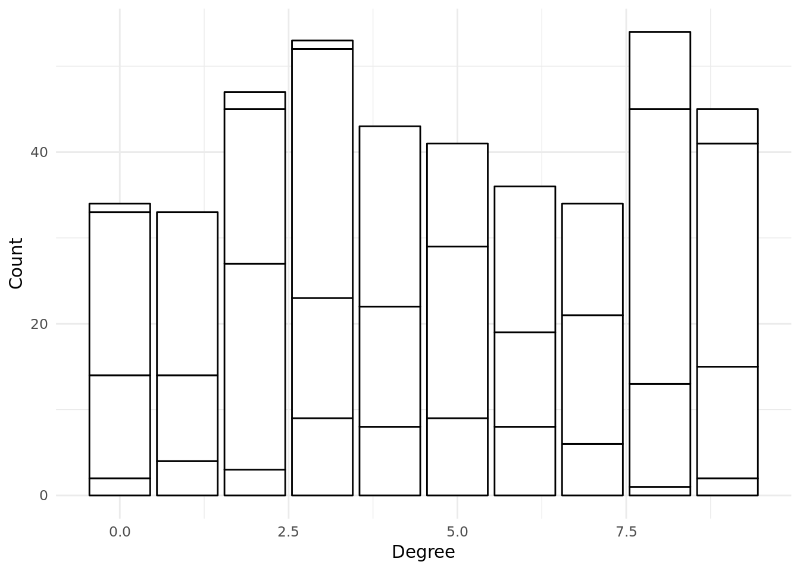

#### Degree distribution of agent->knows->agent edges

#### Runing time by method 

<table class="table table-condensed" style="width: auto !important; ">
 <thead>
  <tr>
   <th style="text-align:left;"> key </th>
   <th style="text-align:right;"> doc_count </th>
   <th style="text-align:right;"> sum_wallTime_ms.value </th>
   <th style="text-align:left;"> avg_wallTime_ms.value </th>
   <th style="text-align:left;"> includedInTotal </th>
  </tr>
 </thead>
<tbody>
  <tr>
   <td style="text-align:left;"> connectIfSimilar </td>
   <td style="text-align:right;"> 87,990 </td>
   <td style="text-align:right;"> 239,064 </td>
   <td style="text-align:left;"> 2.71694510739857 </td>
   <td style="text-align:left;"> No </td>
  </tr>
  <tr>
   <td style="text-align:left;"> existsSimilarity </td>
   <td style="text-align:right;"> 87,990 </td>
   <td style="text-align:right;"> 237,224 </td>
   <td style="text-align:left;"> 2.69603364018638 </td>
   <td style="text-align:left;"> No </td>
  </tr>
  <tr>
   <td style="text-align:left;"> similarityEdges </td>
   <td style="text-align:right;"> 87,990 </td>
   <td style="text-align:right;"> 233,793 </td>
   <td style="text-align:left;"> 2.65704057279236 </td>
   <td style="text-align:left;"> No </td>
  </tr>
  <tr>
   <td style="text-align:left;"> connectAllSimilar </td>
   <td style="text-align:right;"> 420 </td>
   <td style="text-align:right;"> 239,873 </td>
   <td style="text-align:left;"> 571.12619047619 </td>
   <td style="text-align:left;"> Yes </td>
  </tr>
  <tr>
   <td style="text-align:left;"> connect </td>
   <td style="text-align:right;"> 131 </td>
   <td style="text-align:right;"> 392 </td>
   <td style="text-align:left;"> 2.99236641221374 </td>
   <td style="text-align:left;"> Yes </td>
  </tr>
  <tr>
   <td style="text-align:left;"> init </td>
   <td style="text-align:right;"> 103 </td>
   <td style="text-align:right;"> 12,486 </td>
   <td style="text-align:left;"> 121.223300970874 </td>
   <td style="text-align:left;"> No </td>
  </tr>
  <tr>
   <td style="text-align:left;font-weight: bold;"> Total </td>
   <td style="text-align:right;font-weight: bold;"> 559 </td>
   <td style="text-align:right;font-weight: bold;"> 240,914 </td>
   <td style="text-align:left;font-weight: bold;">  </td>
   <td style="text-align:left;font-weight: bold;">  </td>
  </tr>
</tbody>
</table>
####  Found structures 

#####  Cycles 

Number of cycles found:  1 

<button class="btn btn-primary" data-toggle="collapse" data-target="#ORTUBMHOVG"> Show/Hide foundCycle query </button> 
 
  
     GET /filebeat-*/_search 
              { 
                "query": {
                  "bool": {
                    "must": [
                      { "match_phrase": {
                        "simulationId": "SIM10-13-01-13-MMNy8z--CV"
                        }
                      },
                      { "bool": {
                        "should": [
                          { "match": {
                            "keyword": "foundCycle"
                          }}
                        ]
                      }}
                    ]
                  }
                }
              }
     

#####  Paths 

Number of paths found:  0 

<button class="btn btn-primary" data-toggle="collapse" data-target="#FUCCZBJJOY"> Show/Hide foundPath query </button> 
 
  
     GET /filebeat-*/_search 
              { 
                "query": {
                  "bool": {
                    "must": [
                      { "match_phrase": {
                        "simulationId": "SIM10-13-01-13-MMNy8z--CV"
                        }
                      },
                      { "bool": {
                        "should": [
                          { "match": {
                            "keyword": "foundPath"
                          }}
                        ]
                      }}
                    ]
                  }
                }
              }
     

###  SIM10-13-01-13-MMNy8z--DV 

#### simulationParameters 

<table class="table table-condensed" style="width: auto !important; ">
 <thead>
  <tr>
   <th style="text-align:left;"> agentNumber </th>
   <th style="text-align:left;"> similarityConnectThreshold </th>
   <th style="text-align:left;"> graphType </th>
   <th style="text-align:left;"> chainLength </th>
   <th style="text-align:left;"> similaritySearchThreshold </th>
   <th style="text-align:left;"> maxDistance </th>
   <th style="text-align:left;"> randomWorksNumberMultiplier </th>
  </tr>
 </thead>
<tbody>
  <tr>
   <td style="text-align:left;width: 20em; "> 100 </td>
   <td style="text-align:left;width: 15em; "> 0.96 </td>
   <td style="text-align:left;width: 15em; "> random </td>
   <td style="text-align:left;width: 15em; "> 10 </td>
   <td style="text-align:left;width: 15em; "> 1 </td>
   <td style="text-align:left;width: 15em; "> 10 </td>
   <td style="text-align:left;width: 15em; "> 2 </td>
  </tr>
</tbody>
</table>
#### allEdgesByLabel

<table class="table table-condensed" style="width: auto !important; ">
 <thead>
  <tr>
   <th style="text-align:right;"> edges_offers </th>
   <th style="text-align:right;"> edges_similarity </th>
   <th style="text-align:right;"> edges_owns </th>
   <th style="text-align:right;"> edges_demands </th>
   <th style="text-align:right;"> edges_knows </th>
   <th style="text-align:right;"> edges_total </th>
  </tr>
 </thead>
<tbody>
  <tr>
   <td style="text-align:right;width: 5em; "> 210 </td>
   <td style="text-align:right;width: 5em; "> 15,182 </td>
   <td style="text-align:right;width: 5em; "> 210 </td>
   <td style="text-align:right;width: 5em; "> 210 </td>
   <td style="text-align:right;width: 5em; "> 100 </td>
   <td style="text-align:right;width: 5em; "> 15,912 </td>
  </tr>
</tbody>
</table>
#### allVerticesByType

<table class="table table-condensed" style="width: auto !important; ">
 <thead>
  <tr>
   <th style="text-align:right;"> vertices_agent </th>
   <th style="text-align:right;"> vertices_item </th>
   <th style="text-align:right;"> vertices_work </th>
   <th style="text-align:right;"> vertices_total </th>
  </tr>
 </thead>
<tbody>
  <tr>
   <td style="text-align:right;width: 5em; "> 101 </td>
   <td style="text-align:right;width: 5em; "> 420 </td>
   <td style="text-align:right;width: 5em; "> 210 </td>
   <td style="text-align:right;width: 5em; "> 731 </td>
  </tr>
</tbody>
</table>
#### distribution of similarityEdgesByWeight

#### Degree distribution of item->similarity->item edges

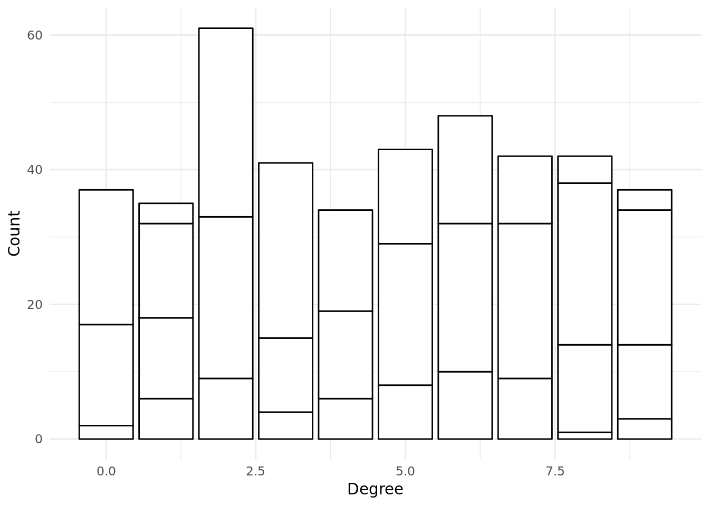

#### Degree distribution of agent->knows->agent edges

#### Runing time by method 

<table class="table table-condensed" style="width: auto !important; ">
 <thead>
  <tr>
   <th style="text-align:left;">   </th>
   <th style="text-align:left;"> key </th>
   <th style="text-align:right;"> doc_count </th>
   <th style="text-align:right;"> sum_wallTime_ms.value </th>
   <th style="text-align:left;"> avg_wallTime_ms.value </th>
   <th style="text-align:left;"> includedInTotal </th>
  </tr>
 </thead>
<tbody>
  <tr>
   <td style="text-align:left;"> 1 </td>
   <td style="text-align:left;"> addItemToWork </td>
   <td style="text-align:right;"> 420 </td>
   <td style="text-align:right;"> 5,566 </td>
   <td style="text-align:left;"> 13.252380952381 </td>
   <td style="text-align:left;"> No </td>
  </tr>
  <tr>
   <td style="text-align:left;"> 2 </td>
   <td style="text-align:left;"> ownsWork </td>
   <td style="text-align:right;"> 210 </td>
   <td style="text-align:right;"> 3,868 </td>
   <td style="text-align:left;"> 18.4190476190476 </td>
   <td style="text-align:left;"> No </td>
  </tr>
  <tr>
   <td style="text-align:left;"> 3 </td>
   <td style="text-align:left;"> init </td>
   <td style="text-align:right;"> 103 </td>
   <td style="text-align:right;"> 13,134 </td>
   <td style="text-align:left;"> 127.514563106796 </td>
   <td style="text-align:left;"> No </td>
  </tr>
  <tr>
   <td style="text-align:left;"> 4 </td>
   <td style="text-align:left;"> searchAndConnect </td>
   <td style="text-align:right;"> 101 </td>
   <td style="text-align:right;"> 114,596 </td>
   <td style="text-align:left;"> 1134.61386138614 </td>
   <td style="text-align:left;"> Yes </td>
  </tr>
  <tr>
   <td style="text-align:left;"> 5 </td>
   <td style="text-align:left;"> knowsAgent </td>
   <td style="text-align:right;"> 100 </td>
   <td style="text-align:right;"> 594 </td>
   <td style="text-align:left;"> 5.94 </td>
   <td style="text-align:left;"> No </td>
  </tr>
  <tr>
   <td style="text-align:left;"> 6 </td>
   <td style="text-align:left;"> getWorksItems </td>
   <td style="text-align:right;"> 18 </td>
   <td style="text-align:right;"> 25 </td>
   <td style="text-align:left;"> 1.38888888888889 </td>
   <td style="text-align:left;"> Yes </td>
  </tr>
  <tr>
   <td style="text-align:left;"> 9 </td>
   <td style="text-align:left;"> cycleSearch </td>
   <td style="text-align:right;"> 4 </td>
   <td style="text-align:right;"> 666 </td>
   <td style="text-align:left;"> 166.5 </td>
   <td style="text-align:left;"> Yes </td>
  </tr>
  <tr>
   <td style="text-align:left;"> 10 </td>
   <td style="text-align:left;"> getWorks </td>
   <td style="text-align:right;"> 4 </td>
   <td style="text-align:right;"> 1,088 </td>
   <td style="text-align:left;"> 272 </td>
   <td style="text-align:left;"> No </td>
  </tr>
  <tr>
   <td style="text-align:left;font-weight: bold;"> 11 </td>
   <td style="text-align:left;font-weight: bold;"> Total </td>
   <td style="text-align:right;font-weight: bold;"> 132 </td>
   <td style="text-align:right;font-weight: bold;"> 116,175 </td>
   <td style="text-align:left;font-weight: bold;">  </td>
   <td style="text-align:left;font-weight: bold;">  </td>
  </tr>
</tbody>
</table>
####  Found structures 

#####  Cycles 

Number of cycles found:  4 

<button class="btn btn-primary" data-toggle="collapse" data-target="#LAGVXNFJJQ"> Show/Hide foundCycle query </button> 
 
  
     GET /filebeat-*/_search 
              { 
                "query": {
                  "bool": {
                    "must": [
                      { "match_phrase": {
                        "simulationId": "SIM10-13-01-13-MMNy8z--DV"
                        }
                      },
                      { "bool": {
                        "should": [
                          { "match": {
                            "keyword": "foundCycle"
                          }}
                        ]
                      }}
                    ]
                  }
                }
              }
     

#####  Paths 

Number of paths found:  0 

<button class="btn btn-primary" data-toggle="collapse" data-target="#GHNOZJGWGL"> Show/Hide foundPath query </button> 
 
  
     GET /filebeat-*/_search 
              { 
                "query": {
                  "bool": {
                    "must": [
                      { "match_phrase": {
                        "simulationId": "SIM10-13-01-13-MMNy8z--DV"
                        }
                      },
                      { "bool": {
                        "should": [
                          { "match": {
                            "keyword": "foundPath"
                          }}
                        ]
                      }}
                    ]
                  }
                }
              }
     

###  SIM10-13-01-18-ATARi9--CV 

#### simulationParameters 

<table class="table table-condensed" style="width: auto !important; ">
 <thead>
  <tr>
   <th style="text-align:left;"> agentNumber </th>
   <th style="text-align:left;"> similarityConnectThreshold </th>
   <th style="text-align:left;"> graphType </th>
   <th style="text-align:left;"> chainLength </th>
   <th style="text-align:left;"> similaritySearchThreshold </th>
   <th style="text-align:left;"> maxDistance </th>
   <th style="text-align:left;"> randomWorksNumberMultiplier </th>
  </tr>
 </thead>
<tbody>
  <tr>
   <td style="text-align:left;width: 20em; "> 100 </td>
   <td style="text-align:left;width: 15em; "> 0.96 </td>
   <td style="text-align:left;width: 15em; "> smallWorld </td>
   <td style="text-align:left;width: 15em; "> 10 </td>
   <td style="text-align:left;width: 15em; "> 1 </td>
   <td style="text-align:left;width: 15em; "> 10 </td>
   <td style="text-align:left;width: 15em; "> 2 </td>
  </tr>
</tbody>
</table>
#### allEdgesByLabel

<table class="table table-condensed" style="width: auto !important; ">
 <thead>
  <tr>
   <th style="text-align:right;"> edges_offers </th>
   <th style="text-align:right;"> edges_similarity </th>
   <th style="text-align:right;"> edges_owns </th>
   <th style="text-align:right;"> edges_demands </th>
   <th style="text-align:right;"> edges_knows </th>
   <th style="text-align:right;"> edges_total </th>
  </tr>
 </thead>
<tbody>
  <tr>
   <td style="text-align:right;width: 5em; "> 210 </td>
   <td style="text-align:right;width: 5em; "> 15,166 </td>
   <td style="text-align:right;width: 5em; "> 210 </td>
   <td style="text-align:right;width: 5em; "> 210 </td>
   <td style="text-align:right;width: 5em; "> 601 </td>
   <td style="text-align:right;width: 5em; "> 16,397 </td>
  </tr>
</tbody>
</table>
#### allVerticesByType

<table class="table table-condensed" style="width: auto !important; ">
 <thead>
  <tr>
   <th style="text-align:right;"> vertices_agent </th>
   <th style="text-align:right;"> vertices_item </th>
   <th style="text-align:right;"> vertices_work </th>
   <th style="text-align:right;"> vertices_total </th>
  </tr>
 </thead>
<tbody>
  <tr>
   <td style="text-align:right;width: 5em; "> 101 </td>
   <td style="text-align:right;width: 5em; "> 420 </td>
   <td style="text-align:right;width: 5em; "> 210 </td>
   <td style="text-align:right;width: 5em; "> 731 </td>
  </tr>
</tbody>
</table>
#### distribution of similarityEdgesByWeight

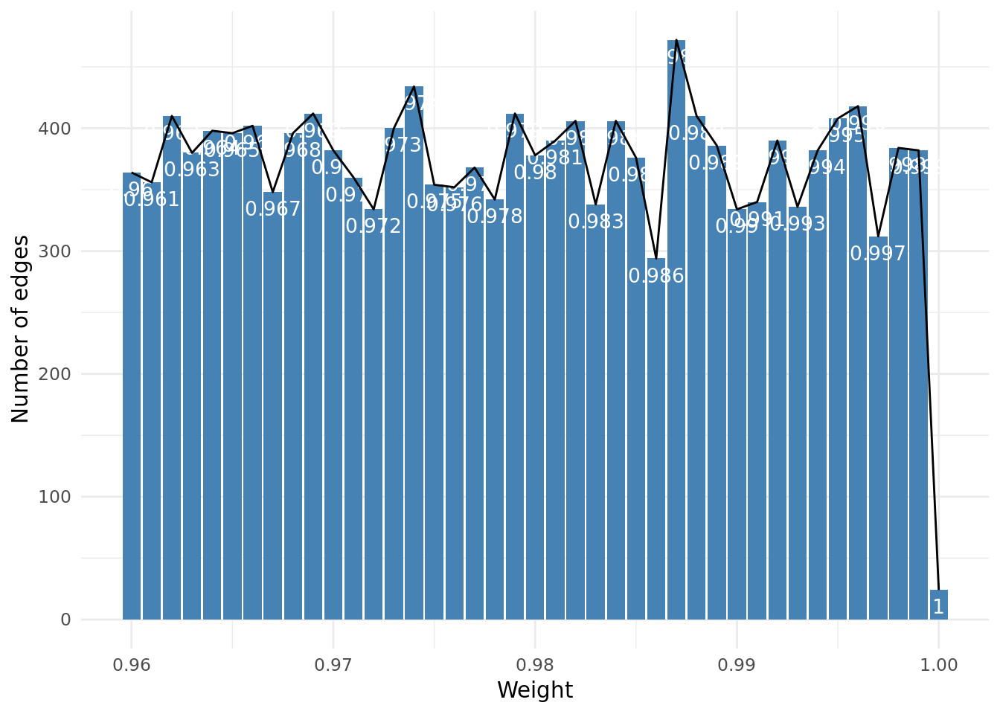

#### Degree distribution of item->similarity->item edges

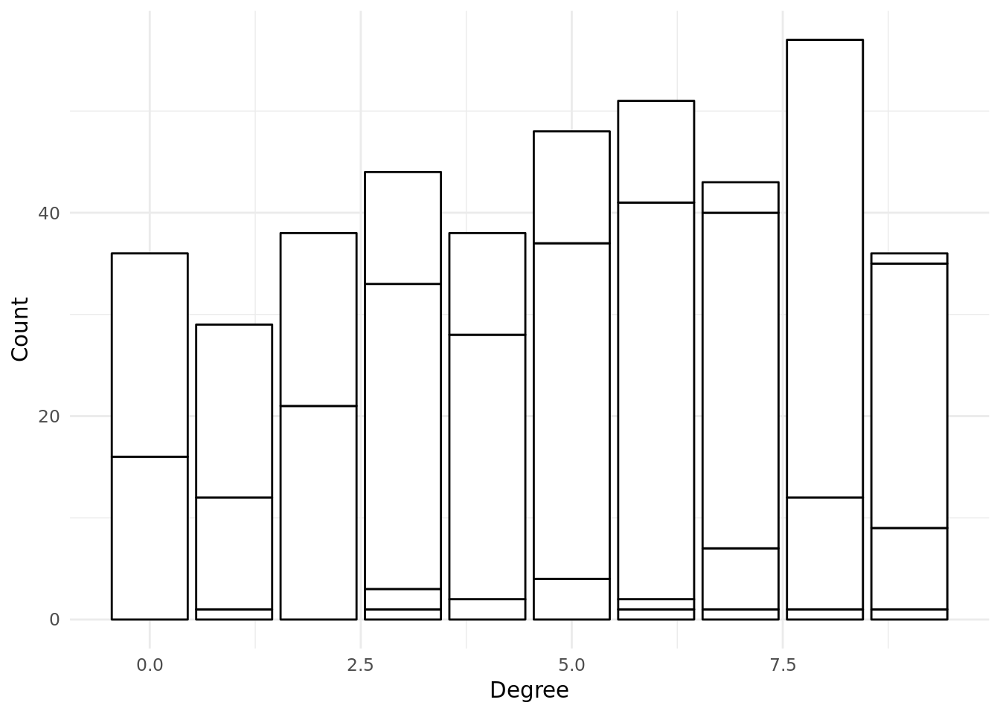

#### Degree distribution of agent->knows->agent edges

#### Runing time by method 

<table class="table table-condensed" style="width: auto !important; ">
 <thead>
  <tr>
   <th style="text-align:left;"> key </th>
   <th style="text-align:right;"> doc_count </th>
   <th style="text-align:right;"> sum_wallTime_ms.value </th>
   <th style="text-align:left;"> avg_wallTime_ms.value </th>
   <th style="text-align:left;"> includedInTotal </th>
  </tr>
 </thead>
<tbody>
  <tr>
   <td style="text-align:left;"> connectIfSimilar </td>
   <td style="text-align:right;"> 87,990 </td>
   <td style="text-align:right;"> 238,658 </td>
   <td style="text-align:left;"> 2.71233094669849 </td>
   <td style="text-align:left;"> No </td>
  </tr>
  <tr>
   <td style="text-align:left;"> existsSimilarity </td>
   <td style="text-align:right;"> 87,990 </td>
   <td style="text-align:right;"> 237,022 </td>
   <td style="text-align:left;"> 2.69373792476418 </td>
   <td style="text-align:left;"> No </td>
  </tr>
  <tr>
   <td style="text-align:left;"> similarityEdges </td>
   <td style="text-align:right;"> 87,990 </td>
   <td style="text-align:right;"> 233,631 </td>
   <td style="text-align:left;"> 2.65519945448346 </td>
   <td style="text-align:left;"> No </td>
  </tr>
  <tr>
   <td style="text-align:left;"> connectAllSimilar </td>
   <td style="text-align:right;"> 420 </td>
   <td style="text-align:right;"> 239,477 </td>
   <td style="text-align:left;"> 570.183333333333 </td>
   <td style="text-align:left;"> Yes </td>
  </tr>
  <tr>
   <td style="text-align:left;"> init </td>
   <td style="text-align:right;"> 103 </td>
   <td style="text-align:right;"> 11,614 </td>
   <td style="text-align:left;"> 112.757281553398 </td>
   <td style="text-align:left;"> No </td>
  </tr>
  <tr>
   <td style="text-align:left;"> connect </td>
   <td style="text-align:right;"> 85 </td>
   <td style="text-align:right;"> 158 </td>
   <td style="text-align:left;"> 1.85882352941176 </td>
   <td style="text-align:left;"> Yes </td>
  </tr>
  <tr>
   <td style="text-align:left;font-weight: bold;"> Total </td>
   <td style="text-align:right;font-weight: bold;"> 513 </td>
   <td style="text-align:right;font-weight: bold;"> 240,216 </td>
   <td style="text-align:left;font-weight: bold;">  </td>
   <td style="text-align:left;font-weight: bold;">  </td>
  </tr>
</tbody>
</table>
####  Found structures 

#####  Cycles 

Number of cycles found:  1 

<button class="btn btn-primary" data-toggle="collapse" data-target="#XIGBIXMUBN"> Show/Hide foundCycle query </button> 
 
  
     GET /filebeat-*/_search 
              { 
                "query": {
                  "bool": {
                    "must": [
                      { "match_phrase": {
                        "simulationId": "SIM10-13-01-18-ATARi9--CV"
                        }
                      },
                      { "bool": {
                        "should": [
                          { "match": {
                            "keyword": "foundCycle"
                          }}
                        ]
                      }}
                    ]
                  }
                }
              }
     

#####  Paths 

Number of paths found:  0 

<button class="btn btn-primary" data-toggle="collapse" data-target="#CIJHXASCMF"> Show/Hide foundPath query </button> 
 
  
     GET /filebeat-*/_search 
              { 
                "query": {
                  "bool": {
                    "must": [
                      { "match_phrase": {
                        "simulationId": "SIM10-13-01-18-ATARi9--CV"
                        }
                      },
                      { "bool": {
                        "should": [
                          { "match": {
                            "keyword": "foundPath"
                          }}
                        ]
                      }}
                    ]
                  }
                }
              }
     

###  SIM10-13-01-18-ATARi9--DV 

#### simulationParameters 

<table class="table table-condensed" style="width: auto !important; ">
 <thead>
  <tr>
   <th style="text-align:left;"> agentNumber </th>
   <th style="text-align:left;"> similarityConnectThreshold </th>
   <th style="text-align:left;"> graphType </th>
   <th style="text-align:left;"> chainLength </th>
   <th style="text-align:left;"> similaritySearchThreshold </th>
   <th style="text-align:left;"> maxDistance </th>
   <th style="text-align:left;"> randomWorksNumberMultiplier </th>
  </tr>
 </thead>
<tbody>
  <tr>
   <td style="text-align:left;width: 20em; "> 100 </td>
   <td style="text-align:left;width: 15em; "> 0.96 </td>
   <td style="text-align:left;width: 15em; "> smallWorld </td>
   <td style="text-align:left;width: 15em; "> 10 </td>
   <td style="text-align:left;width: 15em; "> 1 </td>
   <td style="text-align:left;width: 15em; "> 10 </td>
   <td style="text-align:left;width: 15em; "> 2 </td>
  </tr>
</tbody>
</table>
#### allEdgesByLabel

<table class="table table-condensed" style="width: auto !important; ">
 <thead>
  <tr>
   <th style="text-align:right;"> edges_offers </th>
   <th style="text-align:right;"> edges_similarity </th>
   <th style="text-align:right;"> edges_owns </th>
   <th style="text-align:right;"> edges_demands </th>
   <th style="text-align:right;"> edges_knows </th>
   <th style="text-align:right;"> edges_total </th>
  </tr>
 </thead>
<tbody>
  <tr>
   <td style="text-align:right;width: 5em; "> 210 </td>
   <td style="text-align:right;width: 5em; "> 14,996 </td>
   <td style="text-align:right;width: 5em; "> 210 </td>
   <td style="text-align:right;width: 5em; "> 210 </td>
   <td style="text-align:right;width: 5em; "> 601 </td>
   <td style="text-align:right;width: 5em; "> 16,227 </td>
  </tr>
</tbody>
</table>
#### allVerticesByType

<table class="table table-condensed" style="width: auto !important; ">
 <thead>
  <tr>
   <th style="text-align:right;"> vertices_agent </th>
   <th style="text-align:right;"> vertices_item </th>
   <th style="text-align:right;"> vertices_work </th>
   <th style="text-align:right;"> vertices_total </th>
  </tr>
 </thead>
<tbody>
  <tr>
   <td style="text-align:right;width: 5em; "> 101 </td>
   <td style="text-align:right;width: 5em; "> 420 </td>
   <td style="text-align:right;width: 5em; "> 210 </td>
   <td style="text-align:right;width: 5em; "> 731 </td>
  </tr>
</tbody>
</table>
#### distribution of similarityEdgesByWeight

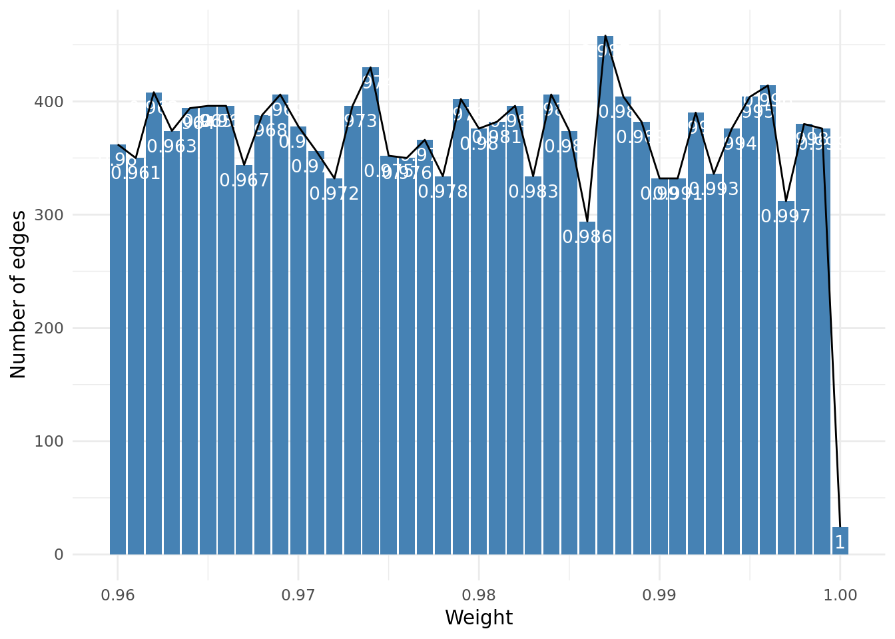

#### Degree distribution of item->similarity->item edges

#### Degree distribution of agent->knows->agent edges

#### Runing time by method 

<table class="table table-condensed" style="width: auto !important; ">
 <thead>
  <tr>
   <th style="text-align:left;">   </th>
   <th style="text-align:left;"> key </th>
   <th style="text-align:right;"> doc_count </th>
   <th style="text-align:right;"> sum_wallTime_ms.value </th>
   <th style="text-align:left;"> avg_wallTime_ms.value </th>
   <th style="text-align:left;"> includedInTotal </th>
  </tr>
 </thead>
<tbody>
  <tr>
   <td style="text-align:left;"> 1 </td>
   <td style="text-align:left;"> knowsAgent </td>
   <td style="text-align:right;"> 601 </td>
   <td style="text-align:right;"> 1,240 </td>
   <td style="text-align:left;"> 2.06322795341098 </td>
   <td style="text-align:left;"> No </td>
  </tr>
  <tr>
   <td style="text-align:left;"> 2 </td>
   <td style="text-align:left;"> addItemToWork </td>
   <td style="text-align:right;"> 420 </td>
   <td style="text-align:right;"> 3,078 </td>
   <td style="text-align:left;"> 7.32857142857143 </td>
   <td style="text-align:left;"> No </td>
  </tr>
  <tr>
   <td style="text-align:left;"> 3 </td>
   <td style="text-align:left;"> ownsWork </td>
   <td style="text-align:right;"> 210 </td>
   <td style="text-align:right;"> 2,733 </td>
   <td style="text-align:left;"> 13.0142857142857 </td>
   <td style="text-align:left;"> No </td>
  </tr>
  <tr>
   <td style="text-align:left;"> 4 </td>
   <td style="text-align:left;"> init </td>
   <td style="text-align:right;"> 103 </td>
   <td style="text-align:right;"> 13,187 </td>
   <td style="text-align:left;"> 128.029126213592 </td>
   <td style="text-align:left;"> No </td>
  </tr>
  <tr>
   <td style="text-align:left;"> 5 </td>
   <td style="text-align:left;"> searchAndConnect </td>
   <td style="text-align:right;"> 101 </td>
   <td style="text-align:right;"> 136,942 </td>
   <td style="text-align:left;"> 1355.86138613861 </td>
   <td style="text-align:left;"> Yes </td>
  </tr>
  <tr>
   <td style="text-align:left;"> 6 </td>
   <td style="text-align:left;"> getWorksItems </td>
   <td style="text-align:right;"> 18 </td>
   <td style="text-align:right;"> 94 </td>
   <td style="text-align:left;"> 5.22222222222222 </td>
   <td style="text-align:left;"> Yes </td>
  </tr>
  <tr>
   <td style="text-align:left;"> 8 </td>
   <td style="text-align:left;"> cycleSearch </td>
   <td style="text-align:right;"> 5 </td>
   <td style="text-align:right;"> 1,316 </td>
   <td style="text-align:left;"> 263.2 </td>
   <td style="text-align:left;"> Yes </td>
  </tr>
  <tr>
   <td style="text-align:left;"> 10 </td>
   <td style="text-align:left;"> getWorks </td>
   <td style="text-align:right;"> 5 </td>
   <td style="text-align:right;"> 1,218 </td>
   <td style="text-align:left;"> 243.6 </td>
   <td style="text-align:left;"> No </td>
  </tr>
  <tr>
   <td style="text-align:left;font-weight: bold;"> 11 </td>
   <td style="text-align:left;font-weight: bold;"> Total </td>
   <td style="text-align:right;font-weight: bold;"> 134 </td>
   <td style="text-align:right;font-weight: bold;"> 139,957 </td>
   <td style="text-align:left;font-weight: bold;">  </td>
   <td style="text-align:left;font-weight: bold;">  </td>
  </tr>
</tbody>
</table>
####  Found structures 

#####  Cycles 

Number of cycles found:  5 

<button class="btn btn-primary" data-toggle="collapse" data-target="#WLOBFNLWJJ"> Show/Hide foundCycle query </button> 
 
  
     GET /filebeat-*/_search 
              { 
                "query": {
                  "bool": {
                    "must": [
                      { "match_phrase": {
                        "simulationId": "SIM10-13-01-18-ATARi9--DV"
                        }
                      },
                      { "bool": {
                        "should": [
                          { "match": {
                            "keyword": "foundCycle"
                          }}
                        ]
                      }}
                    ]
                  }
                }
              }
     

#####  Paths 

Number of paths found:  0 

<button class="btn btn-primary" data-toggle="collapse" data-target="#ACDPRDFMTB"> Show/Hide foundPath query </button> 
 
  
     GET /filebeat-*/_search 
              { 
                "query": {
                  "bool": {
                    "must": [
                      { "match_phrase": {
                        "simulationId": "SIM10-13-01-18-ATARi9--DV"
                        }
                      },
                      { "bool": {
                        "should": [
                          { "match": {
                            "keyword": "foundPath"
                          }}
                        ]
                      }}
                    ]
                  }
                }
              }
     

###  SIM10-13-11-59-8BI6sm--CV 

#### simulationParameters 

<table class="table table-condensed" style="width: auto !important; ">
 <thead>
  <tr>
   <th style="text-align:left;"> agentNumber </th>
   <th style="text-align:left;"> similarityConnectThreshold </th>
   <th style="text-align:left;"> graphType </th>
   <th style="text-align:left;"> chainLength </th>
   <th style="text-align:left;"> similaritySearchThreshold </th>
   <th style="text-align:left;"> maxDistance </th>
   <th style="text-align:left;"> randomWorksNumberMultiplier </th>
  </tr>
 </thead>
<tbody>
  <tr>
   <td style="text-align:left;width: 20em; "> 100 </td>
   <td style="text-align:left;width: 15em; "> 0.96 </td>
   <td style="text-align:left;width: 15em; "> random </td>
   <td style="text-align:left;width: 15em; "> 10 </td>
   <td style="text-align:left;width: 15em; "> 1 </td>
   <td style="text-align:left;width: 15em; "> 10 </td>
   <td style="text-align:left;width: 15em; "> 1 </td>
  </tr>
</tbody>
</table>
#### allEdgesByLabel

<table class="table table-condensed" style="width: auto !important; ">
 <thead>
  <tr>
   <th style="text-align:right;"> edges_offers </th>
   <th style="text-align:right;"> edges_similarity </th>
   <th style="text-align:right;"> edges_owns </th>
   <th style="text-align:right;"> edges_demands </th>
   <th style="text-align:right;"> edges_knows </th>
   <th style="text-align:right;"> edges_total </th>
  </tr>
 </thead>
<tbody>
  <tr>
   <td style="text-align:right;width: 5em; "> 110 </td>
   <td style="text-align:right;width: 5em; "> 4,100 </td>
   <td style="text-align:right;width: 5em; "> 110 </td>
   <td style="text-align:right;width: 5em; "> 110 </td>
   <td style="text-align:right;width: 5em; "> 100 </td>
   <td style="text-align:right;width: 5em; "> 4,530 </td>
  </tr>
</tbody>
</table>
#### allVerticesByType

<table class="table table-condensed" style="width: auto !important; ">
 <thead>
  <tr>
   <th style="text-align:right;"> vertices_agent </th>
   <th style="text-align:right;"> vertices_item </th>
   <th style="text-align:right;"> vertices_work </th>
   <th style="text-align:right;"> vertices_total </th>
  </tr>
 </thead>
<tbody>
  <tr>
   <td style="text-align:right;width: 5em; "> 101 </td>
   <td style="text-align:right;width: 5em; "> 220 </td>
   <td style="text-align:right;width: 5em; "> 110 </td>
   <td style="text-align:right;width: 5em; "> 431 </td>
  </tr>
</tbody>
</table>
#### distribution of similarityEdgesByWeight

#### Degree distribution of item->similarity->item edges

#### Degree distribution of agent->knows->agent edges

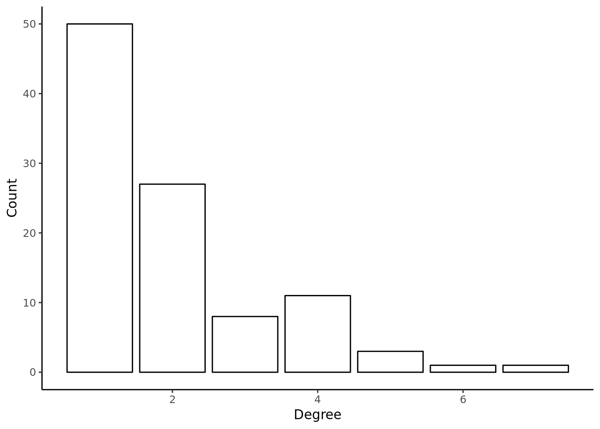

#### Runing time by method 

<table class="table table-condensed" style="width: auto !important; ">
 <thead>
  <tr>
   <th style="text-align:left;"> key </th>
   <th style="text-align:right;"> doc_count </th>
   <th style="text-align:right;"> sum_wallTime_ms.value </th>
   <th style="text-align:left;"> avg_wallTime_ms.value </th>
   <th style="text-align:left;"> includedInTotal </th>
  </tr>
 </thead>
<tbody>
  <tr>
   <td style="text-align:left;"> connectIfSimilar </td>
   <td style="text-align:right;"> 24,090 </td>
   <td style="text-align:right;"> 54,780 </td>
   <td style="text-align:left;"> 2.27397260273973 </td>
   <td style="text-align:left;"> No </td>
  </tr>
  <tr>
   <td style="text-align:left;"> existsSimilarity </td>
   <td style="text-align:right;"> 24,090 </td>
   <td style="text-align:right;"> 53,692 </td>
   <td style="text-align:left;"> 2.22880863428809 </td>
   <td style="text-align:left;"> No </td>
  </tr>
  <tr>
   <td style="text-align:left;"> similarityEdges </td>
   <td style="text-align:right;"> 24,090 </td>
   <td style="text-align:right;"> 52,922 </td>
   <td style="text-align:left;"> 2.19684516396845 </td>
   <td style="text-align:left;"> No </td>
  </tr>
  <tr>
   <td style="text-align:left;"> connect </td>
   <td style="text-align:right;"> 261 </td>
   <td style="text-align:right;"> 659 </td>
   <td style="text-align:left;"> 2.52490421455939 </td>
   <td style="text-align:left;"> Yes </td>
  </tr>
  <tr>
   <td style="text-align:left;"> connectAllSimilar </td>
   <td style="text-align:right;"> 220 </td>
   <td style="text-align:right;"> 55,028 </td>
   <td style="text-align:left;"> 250.127272727273 </td>
   <td style="text-align:left;"> Yes </td>
  </tr>
  <tr>
   <td style="text-align:left;"> init </td>
   <td style="text-align:right;"> 103 </td>
   <td style="text-align:right;"> 11,774 </td>
   <td style="text-align:left;"> 114.31067961165 </td>
   <td style="text-align:left;"> No </td>
  </tr>
  <tr>
   <td style="text-align:left;font-weight: bold;"> Total </td>
   <td style="text-align:right;font-weight: bold;"> 489 </td>
   <td style="text-align:right;font-weight: bold;"> 56,078 </td>
   <td style="text-align:left;font-weight: bold;">  </td>
   <td style="text-align:left;font-weight: bold;">  </td>
  </tr>
</tbody>
</table>
####  Found structures 

#####  Cycles 

Number of cycles found:  1 

<button class="btn btn-primary" data-toggle="collapse" data-target="#GQMTLJTMME"> Show/Hide foundCycle query </button> 
 
  
     GET /filebeat-*/_search 
              { 
                "query": {
                  "bool": {
                    "must": [
                      { "match_phrase": {
                        "simulationId": "SIM10-13-11-59-8BI6sm--CV"
                        }
                      },
                      { "bool": {
                        "should": [
                          { "match": {
                            "keyword": "foundCycle"
                          }}
                        ]
                      }}
                    ]
                  }
                }
              }
     

#####  Paths 

Number of paths found:  0 

<button class="btn btn-primary" data-toggle="collapse" data-target="#TEJZXEYHIL"> Show/Hide foundPath query </button> 
 
  
     GET /filebeat-*/_search 
              { 
                "query": {
                  "bool": {
                    "must": [
                      { "match_phrase": {
                        "simulationId": "SIM10-13-11-59-8BI6sm--CV"
                        }
                      },
                      { "bool": {
                        "should": [
                          { "match": {
                            "keyword": "foundPath"
                          }}
                        ]
                      }}
                    ]
                  }
                }
              }
     

###  SIM10-13-11-59-8BI6sm--DV 

#### simulationParameters 

<table class="table table-condensed" style="width: auto !important; ">
 <thead>
  <tr>
   <th style="text-align:left;"> agentNumber </th>
   <th style="text-align:left;"> similarityConnectThreshold </th>
   <th style="text-align:left;"> graphType </th>
   <th style="text-align:left;"> chainLength </th>
   <th style="text-align:left;"> similaritySearchThreshold </th>
   <th style="text-align:left;"> maxDistance </th>
   <th style="text-align:left;"> randomWorksNumberMultiplier </th>
  </tr>
 </thead>
<tbody>
  <tr>
   <td style="text-align:left;width: 20em; "> 100 </td>
   <td style="text-align:left;width: 15em; "> 0.96 </td>
   <td style="text-align:left;width: 15em; "> random </td>
   <td style="text-align:left;width: 15em; "> 10 </td>
   <td style="text-align:left;width: 15em; "> 1 </td>
   <td style="text-align:left;width: 15em; "> 10 </td>
   <td style="text-align:left;width: 15em; "> 1 </td>
  </tr>
</tbody>
</table>
#### allEdgesByLabel

<table class="table table-condensed" style="width: auto !important; ">
 <thead>
  <tr>
   <th style="text-align:right;"> edges_offers </th>
   <th style="text-align:right;"> edges_similarity </th>
   <th style="text-align:right;"> edges_owns </th>
   <th style="text-align:right;"> edges_demands </th>
   <th style="text-align:right;"> edges_knows </th>
   <th style="text-align:right;"> edges_total </th>
  </tr>
 </thead>
<tbody>
  <tr>
   <td style="text-align:right;width: 5em; "> 110 </td>
   <td style="text-align:right;width: 5em; "> 3,578 </td>
   <td style="text-align:right;width: 5em; "> 110 </td>
   <td style="text-align:right;width: 5em; "> 110 </td>
   <td style="text-align:right;width: 5em; "> 100 </td>
   <td style="text-align:right;width: 5em; "> 4,008 </td>
  </tr>
</tbody>
</table>
#### allVerticesByType

<table class="table table-condensed" style="width: auto !important; ">
 <thead>
  <tr>
   <th style="text-align:right;"> vertices_agent </th>
   <th style="text-align:right;"> vertices_item </th>
   <th style="text-align:right;"> vertices_work </th>
   <th style="text-align:right;"> vertices_total </th>
  </tr>
 </thead>
<tbody>
  <tr>
   <td style="text-align:right;width: 5em; "> 101 </td>
   <td style="text-align:right;width: 5em; "> 220 </td>
   <td style="text-align:right;width: 5em; "> 110 </td>
   <td style="text-align:right;width: 5em; "> 431 </td>
  </tr>
</tbody>
</table>
#### distribution of similarityEdgesByWeight

#### Degree distribution of item->similarity->item edges

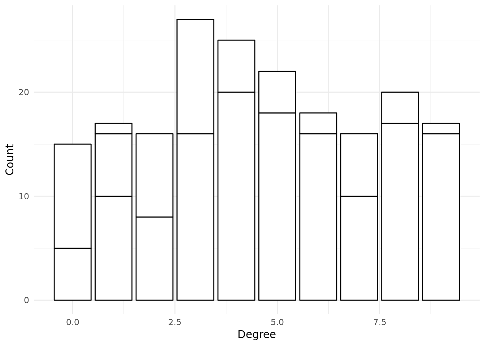

#### Degree distribution of agent->knows->agent edges

#### Runing time by method 

<table class="table table-condensed" style="width: auto !important; ">
 <thead>
  <tr>
   <th style="text-align:left;">   </th>
   <th style="text-align:left;"> key </th>
   <th style="text-align:right;"> doc_count </th>
   <th style="text-align:right;"> sum_wallTime_ms.value </th>
   <th style="text-align:left;"> avg_wallTime_ms.value </th>
   <th style="text-align:left;"> includedInTotal </th>
  </tr>
 </thead>
<tbody>
  <tr>
   <td style="text-align:left;"> 1 </td>
   <td style="text-align:left;"> addItemToWork </td>
   <td style="text-align:right;"> 220 </td>
   <td style="text-align:right;"> 2,844 </td>
   <td style="text-align:left;"> 12.9272727272727 </td>
   <td style="text-align:left;"> No </td>
  </tr>
  <tr>
   <td style="text-align:left;"> 2 </td>
   <td style="text-align:left;"> ownsWork </td>
   <td style="text-align:right;"> 110 </td>
   <td style="text-align:right;"> 2,445 </td>
   <td style="text-align:left;"> 22.2272727272727 </td>
   <td style="text-align:left;"> No </td>
  </tr>
  <tr>
   <td style="text-align:left;"> 3 </td>
   <td style="text-align:left;"> init </td>
   <td style="text-align:right;"> 103 </td>
   <td style="text-align:right;"> 12,152 </td>
   <td style="text-align:left;"> 117.980582524272 </td>
   <td style="text-align:left;"> No </td>
  </tr>
  <tr>
   <td style="text-align:left;"> 4 </td>
   <td style="text-align:left;"> searchAndConnect </td>
   <td style="text-align:right;"> 101 </td>
   <td style="text-align:right;"> 32,751 </td>
   <td style="text-align:left;"> 324.267326732673 </td>
   <td style="text-align:left;"> Yes </td>
  </tr>
  <tr>
   <td style="text-align:left;"> 5 </td>
   <td style="text-align:left;"> knowsAgent </td>
   <td style="text-align:right;"> 100 </td>
   <td style="text-align:right;"> 299 </td>
   <td style="text-align:left;"> 2.99 </td>
   <td style="text-align:left;"> No </td>
  </tr>
  <tr>
   <td style="text-align:left;"> 6 </td>
   <td style="text-align:left;"> getWorksItems </td>
   <td style="text-align:right;"> 18 </td>
   <td style="text-align:right;"> 102 </td>
   <td style="text-align:left;"> 5.66666666666667 </td>
   <td style="text-align:left;"> Yes </td>
  </tr>
  <tr>
   <td style="text-align:left;"> 9 </td>
   <td style="text-align:left;"> cycleSearch </td>
   <td style="text-align:right;"> 2 </td>
   <td style="text-align:right;"> 319 </td>
   <td style="text-align:left;"> 159.5 </td>
   <td style="text-align:left;"> Yes </td>
  </tr>
  <tr>
   <td style="text-align:left;"> 10 </td>
   <td style="text-align:left;"> getWorks </td>
   <td style="text-align:right;"> 2 </td>
   <td style="text-align:right;"> 185 </td>
   <td style="text-align:left;"> 92.5 </td>
   <td style="text-align:left;"> No </td>
  </tr>
  <tr>
   <td style="text-align:left;font-weight: bold;"> 11 </td>
   <td style="text-align:left;font-weight: bold;"> Total </td>
   <td style="text-align:right;font-weight: bold;"> 128 </td>
   <td style="text-align:right;font-weight: bold;"> 34,011 </td>
   <td style="text-align:left;font-weight: bold;">  </td>
   <td style="text-align:left;font-weight: bold;">  </td>
  </tr>
</tbody>
</table>
####  Found structures 

#####  Cycles 

Number of cycles found:  1 

<button class="btn btn-primary" data-toggle="collapse" data-target="#HKHLNYXSBC"> Show/Hide foundCycle query </button> 
 
  
     GET /filebeat-*/_search 
              { 
                "query": {
                  "bool": {
                    "must": [
                      { "match_phrase": {
                        "simulationId": "SIM10-13-11-59-8BI6sm--DV"
                        }
                      },
                      { "bool": {
                        "should": [
                          { "match": {
                            "keyword": "foundCycle"
                          }}
                        ]
                      }}
                    ]
                  }
                }
              }
     

#####  Paths 

Number of paths found:  1 

<button class="btn btn-primary" data-toggle="collapse" data-target="#IXMHOBNZIC"> Show/Hide foundPath query </button> 
 
  
     GET /filebeat-*/_search 
              { 
                "query": {
                  "bool": {
                    "must": [
                      { "match_phrase": {
                        "simulationId": "SIM10-13-11-59-8BI6sm--DV"
                        }
                      },
                      { "bool": {
                        "should": [
                          { "match": {
                            "keyword": "foundPath"
                          }}
                        ]
                      }}
                    ]
                  }
                }
              }
     

###  SIM10-13-12-01-GqYGvr--CV 

#### simulationParameters 

<table class="table table-condensed" style="width: auto !important; ">
 <thead>
  <tr>
   <th style="text-align:left;"> agentNumber </th>
   <th style="text-align:left;"> similarityConnectThreshold </th>
   <th style="text-align:left;"> graphType </th>
   <th style="text-align:left;"> chainLength </th>
   <th style="text-align:left;"> similaritySearchThreshold </th>
   <th style="text-align:left;"> maxDistance </th>
   <th style="text-align:left;"> randomWorksNumberMultiplier </th>
  </tr>
 </thead>
<tbody>
  <tr>
   <td style="text-align:left;width: 20em; "> 100 </td>
   <td style="text-align:left;width: 15em; "> 0.96 </td>
   <td style="text-align:left;width: 15em; "> smallWorld </td>
   <td style="text-align:left;width: 15em; "> 10 </td>
   <td style="text-align:left;width: 15em; "> 1 </td>
   <td style="text-align:left;width: 15em; "> 10 </td>
   <td style="text-align:left;width: 15em; "> 1 </td>
  </tr>
</tbody>
</table>
#### allEdgesByLabel

<table class="table table-condensed" style="width: auto !important; ">
 <thead>
  <tr>
   <th style="text-align:right;"> edges_offers </th>
   <th style="text-align:right;"> edges_similarity </th>
   <th style="text-align:right;"> edges_owns </th>
   <th style="text-align:right;"> edges_demands </th>
   <th style="text-align:right;"> edges_knows </th>
   <th style="text-align:right;"> edges_total </th>
  </tr>
 </thead>
<tbody>
  <tr>
   <td style="text-align:right;width: 5em; "> 110 </td>
   <td style="text-align:right;width: 5em; "> 4,244 </td>
   <td style="text-align:right;width: 5em; "> 110 </td>
   <td style="text-align:right;width: 5em; "> 110 </td>
   <td style="text-align:right;width: 5em; "> 601 </td>
   <td style="text-align:right;width: 5em; "> 5,175 </td>
  </tr>
</tbody>
</table>
#### allVerticesByType

<table class="table table-condensed" style="width: auto !important; ">
 <thead>
  <tr>
   <th style="text-align:right;"> vertices_agent </th>
   <th style="text-align:right;"> vertices_item </th>
   <th style="text-align:right;"> vertices_work </th>
   <th style="text-align:right;"> vertices_total </th>
  </tr>
 </thead>
<tbody>
  <tr>
   <td style="text-align:right;width: 5em; "> 101 </td>
   <td style="text-align:right;width: 5em; "> 220 </td>
   <td style="text-align:right;width: 5em; "> 110 </td>
   <td style="text-align:right;width: 5em; "> 431 </td>
  </tr>
</tbody>
</table>
#### distribution of similarityEdgesByWeight

#### Degree distribution of item->similarity->item edges

#### Degree distribution of agent->knows->agent edges

#### Runing time by method 

<table class="table table-condensed" style="width: auto !important; ">
 <thead>
  <tr>
   <th style="text-align:left;"> key </th>
   <th style="text-align:right;"> doc_count </th>
   <th style="text-align:right;"> sum_wallTime_ms.value </th>
   <th style="text-align:left;"> avg_wallTime_ms.value </th>
   <th style="text-align:left;"> includedInTotal </th>
  </tr>
 </thead>
<tbody>
  <tr>
   <td style="text-align:left;"> connectIfSimilar </td>
   <td style="text-align:right;"> 24,090 </td>
   <td style="text-align:right;"> 53,958 </td>
   <td style="text-align:left;"> 2.23985056039851 </td>
   <td style="text-align:left;"> No </td>
  </tr>
  <tr>
   <td style="text-align:left;"> existsSimilarity </td>
   <td style="text-align:right;"> 24,090 </td>
   <td style="text-align:right;"> 53,404 </td>
   <td style="text-align:left;"> 2.21685346616853 </td>
   <td style="text-align:left;"> No </td>
  </tr>
  <tr>
   <td style="text-align:left;"> similarityEdges </td>
   <td style="text-align:right;"> 24,090 </td>
   <td style="text-align:right;"> 52,613 </td>
   <td style="text-align:left;"> 2.18401826484018 </td>
   <td style="text-align:left;"> No </td>
  </tr>
  <tr>
   <td style="text-align:left;"> connectAllSimilar </td>
   <td style="text-align:right;"> 220 </td>
   <td style="text-align:right;"> 54,163 </td>
   <td style="text-align:left;"> 246.195454545455 </td>
   <td style="text-align:left;"> Yes </td>
  </tr>
  <tr>
   <td style="text-align:left;"> init </td>
   <td style="text-align:right;"> 103 </td>
   <td style="text-align:right;"> 12,280 </td>
   <td style="text-align:left;"> 119.223300970874 </td>
   <td style="text-align:left;"> No </td>
  </tr>
  <tr>
   <td style="text-align:left;"> connect </td>
   <td style="text-align:right;"> 36 </td>
   <td style="text-align:right;"> 109 </td>
   <td style="text-align:left;"> 3.02777777777778 </td>
   <td style="text-align:left;"> Yes </td>
  </tr>
  <tr>
   <td style="text-align:left;font-weight: bold;"> Total </td>
   <td style="text-align:right;font-weight: bold;"> 264 </td>
   <td style="text-align:right;font-weight: bold;"> 54,635 </td>
   <td style="text-align:left;font-weight: bold;">  </td>
   <td style="text-align:left;font-weight: bold;">  </td>
  </tr>
</tbody>
</table>
####  Found structures 

#####  Cycles 

Number of cycles found:  1 

<button class="btn btn-primary" data-toggle="collapse" data-target="#PTQVXFIMVM"> Show/Hide foundCycle query </button> 
 
  
     GET /filebeat-*/_search 
              { 
                "query": {
                  "bool": {
                    "must": [
                      { "match_phrase": {
                        "simulationId": "SIM10-13-12-01-GqYGvr--CV"
                        }
                      },
                      { "bool": {
                        "should": [
                          { "match": {
                            "keyword": "foundCycle"
                          }}
                        ]
                      }}
                    ]
                  }
                }
              }
     

#####  Paths 

Number of paths found:  0 

<button class="btn btn-primary" data-toggle="collapse" data-target="#OCRIWWVKKK"> Show/Hide foundPath query </button> 
 
  
     GET /filebeat-*/_search 
              { 
                "query": {
                  "bool": {
                    "must": [
                      { "match_phrase": {
                        "simulationId": "SIM10-13-12-01-GqYGvr--CV"
                        }
                      },
                      { "bool": {
                        "should": [
                          { "match": {
                            "keyword": "foundPath"
                          }}
                        ]
                      }}
                    ]
                  }
                }
              }
     

###  SIM10-13-12-01-GqYGvr--DV 

#### simulationParameters 

<table class="table table-condensed" style="width: auto !important; ">
 <thead>
  <tr>
   <th style="text-align:left;"> agentNumber </th>
   <th style="text-align:left;"> similarityConnectThreshold </th>
   <th style="text-align:left;"> graphType </th>
   <th style="text-align:left;"> chainLength </th>
   <th style="text-align:left;"> similaritySearchThreshold </th>
   <th style="text-align:left;"> maxDistance </th>
   <th style="text-align:left;"> randomWorksNumberMultiplier </th>
  </tr>
 </thead>
<tbody>
  <tr>
   <td style="text-align:left;width: 20em; "> 100 </td>
   <td style="text-align:left;width: 15em; "> 0.96 </td>
   <td style="text-align:left;width: 15em; "> smallWorld </td>
   <td style="text-align:left;width: 15em; "> 10 </td>
   <td style="text-align:left;width: 15em; "> 1 </td>
   <td style="text-align:left;width: 15em; "> 10 </td>
   <td style="text-align:left;width: 15em; "> 1 </td>
  </tr>
</tbody>
</table>
#### allEdgesByLabel

<table class="table table-condensed" style="width: auto !important; ">
 <thead>
  <tr>
   <th style="text-align:right;"> edges_offers </th>
   <th style="text-align:right;"> edges_similarity </th>
   <th style="text-align:right;"> edges_owns </th>
   <th style="text-align:right;"> edges_demands </th>
   <th style="text-align:right;"> edges_knows </th>
   <th style="text-align:right;"> edges_total </th>
  </tr>
 </thead>
<tbody>
  <tr>
   <td style="text-align:right;width: 5em; "> 110 </td>
   <td style="text-align:right;width: 5em; "> 4,172 </td>
   <td style="text-align:right;width: 5em; "> 110 </td>
   <td style="text-align:right;width: 5em; "> 110 </td>
   <td style="text-align:right;width: 5em; "> 601 </td>
   <td style="text-align:right;width: 5em; "> 5,103 </td>
  </tr>
</tbody>
</table>
#### allVerticesByType

<table class="table table-condensed" style="width: auto !important; ">
 <thead>
  <tr>
   <th style="text-align:right;"> vertices_agent </th>
   <th style="text-align:right;"> vertices_item </th>
   <th style="text-align:right;"> vertices_work </th>
   <th style="text-align:right;"> vertices_total </th>
  </tr>
 </thead>
<tbody>
  <tr>
   <td style="text-align:right;width: 5em; "> 101 </td>
   <td style="text-align:right;width: 5em; "> 220 </td>
   <td style="text-align:right;width: 5em; "> 110 </td>
   <td style="text-align:right;width: 5em; "> 431 </td>
  </tr>
</tbody>
</table>
#### distribution of similarityEdgesByWeight

#### Degree distribution of item->similarity->item edges

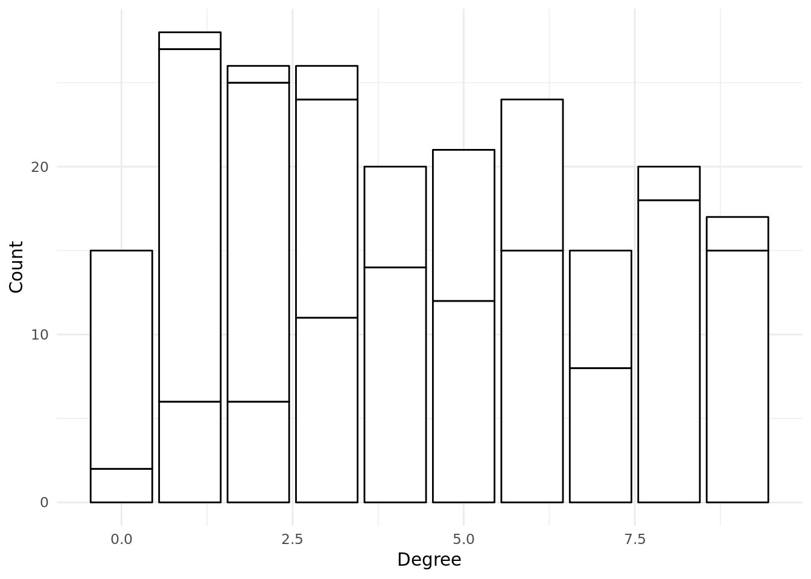

#### Degree distribution of agent->knows->agent edges

#### Runing time by method 

<table class="table table-condensed" style="width: auto !important; ">
 <thead>
  <tr>
   <th style="text-align:left;">   </th>
   <th style="text-align:left;"> key </th>
   <th style="text-align:right;"> doc_count </th>
   <th style="text-align:right;"> sum_wallTime_ms.value </th>
   <th style="text-align:left;"> avg_wallTime_ms.value </th>
   <th style="text-align:left;"> includedInTotal </th>
  </tr>
 </thead>
<tbody>
  <tr>
   <td style="text-align:left;"> 1 </td>
   <td style="text-align:left;"> knowsAgent </td>
   <td style="text-align:right;"> 601 </td>
   <td style="text-align:right;"> 1,202 </td>
   <td style="text-align:left;"> 2 </td>
   <td style="text-align:left;"> No </td>
  </tr>
  <tr>
   <td style="text-align:left;"> 2 </td>
   <td style="text-align:left;"> addItemToWork </td>
   <td style="text-align:right;"> 220 </td>
   <td style="text-align:right;"> 2,564 </td>
   <td style="text-align:left;"> 11.6545454545455 </td>
   <td style="text-align:left;"> No </td>
  </tr>
  <tr>
   <td style="text-align:left;"> 3 </td>
   <td style="text-align:left;"> ownsWork </td>
   <td style="text-align:right;"> 110 </td>
   <td style="text-align:right;"> 2,487 </td>
   <td style="text-align:left;"> 22.6090909090909 </td>
   <td style="text-align:left;"> No </td>
  </tr>
  <tr>
   <td style="text-align:left;"> 4 </td>
   <td style="text-align:left;"> init </td>
   <td style="text-align:right;"> 103 </td>
   <td style="text-align:right;"> 12,118 </td>
   <td style="text-align:left;"> 117.650485436893 </td>
   <td style="text-align:left;"> No </td>
  </tr>
  <tr>
   <td style="text-align:left;"> 5 </td>
   <td style="text-align:left;"> searchAndConnect </td>
   <td style="text-align:right;"> 101 </td>
   <td style="text-align:right;"> 49,022 </td>
   <td style="text-align:left;"> 485.366336633663 </td>
   <td style="text-align:left;"> Yes </td>
  </tr>
  <tr>
   <td style="text-align:left;"> 6 </td>
   <td style="text-align:left;"> getWorksItems </td>
   <td style="text-align:right;"> 18 </td>
   <td style="text-align:right;"> 143 </td>
   <td style="text-align:left;"> 7.94444444444444 </td>
   <td style="text-align:left;"> Yes </td>
  </tr>
  <tr>
   <td style="text-align:left;"> 9 </td>
   <td style="text-align:left;"> cycleSearch </td>
   <td style="text-align:right;"> 2 </td>
   <td style="text-align:right;"> 521 </td>
   <td style="text-align:left;"> 260.5 </td>
   <td style="text-align:left;"> Yes </td>
  </tr>
  <tr>
   <td style="text-align:left;"> 10 </td>
   <td style="text-align:left;"> getWorks </td>
   <td style="text-align:right;"> 2 </td>
   <td style="text-align:right;"> 381 </td>
   <td style="text-align:left;"> 190.5 </td>
   <td style="text-align:left;"> No </td>
  </tr>
  <tr>
   <td style="text-align:left;font-weight: bold;"> 11 </td>
   <td style="text-align:left;font-weight: bold;"> Total </td>
   <td style="text-align:right;font-weight: bold;"> 128 </td>
   <td style="text-align:right;font-weight: bold;"> 50,426 </td>
   <td style="text-align:left;font-weight: bold;">  </td>
   <td style="text-align:left;font-weight: bold;">  </td>
  </tr>
</tbody>
</table>
####  Found structures 

#####  Cycles 

Number of cycles found:  2 

<button class="btn btn-primary" data-toggle="collapse" data-target="#GXPTYBXMDB"> Show/Hide foundCycle query </button> 
 
  
     GET /filebeat-*/_search 
              { 
                "query": {
                  "bool": {
                    "must": [
                      { "match_phrase": {
                        "simulationId": "SIM10-13-12-01-GqYGvr--DV"
                        }
                      },
                      { "bool": {
                        "should": [
                          { "match": {
                            "keyword": "foundCycle"
                          }}
                        ]
                      }}
                    ]
                  }
                }
              }
     

#####  Paths 

Number of paths found:  0 

<button class="btn btn-primary" data-toggle="collapse" data-target="#EDOUFUOJMC"> Show/Hide foundPath query </button> 
 
  
     GET /filebeat-*/_search 
              { 
                "query": {
                  "bool": {
                    "must": [
                      { "match_phrase": {
                        "simulationId": "SIM10-13-12-01-GqYGvr--DV"
                        }
                      },
                      { "bool": {
                        "should": [
                          { "match": {
                            "keyword": "foundPath"
                          }}
                        ]
                      }}
                    ]
                  }
                }
              }
     

###  SIM10-13-01-22-iDF56F--CV 

#### simulationParameters 

<table class="table table-condensed" style="width: auto !important; ">
 <thead>
  <tr>
   <th style="text-align:left;"> agentNumber </th>
   <th style="text-align:left;"> similarityConnectThreshold </th>
   <th style="text-align:left;"> graphType </th>
   <th style="text-align:left;"> chainLength </th>
   <th style="text-align:left;"> similaritySearchThreshold </th>
   <th style="text-align:left;"> maxDistance </th>
   <th style="text-align:left;"> randomWorksNumberMultiplier </th>
  </tr>
 </thead>
<tbody>
  <tr>
   <td style="text-align:left;width: 20em; "> 100 </td>
   <td style="text-align:left;width: 15em; "> 0.96 </td>
   <td style="text-align:left;width: 15em; "> random </td>
   <td style="text-align:left;width: 15em; "> 10 </td>
   <td style="text-align:left;width: 15em; "> 1 </td>
   <td style="text-align:left;width: 15em; "> 30 </td>
   <td style="text-align:left;width: 15em; "> 2 </td>
  </tr>
</tbody>
</table>
#### allEdgesByLabel

<table class="table table-condensed" style="width: auto !important; ">
 <thead>
  <tr>
   <th style="text-align:right;"> edges_offers </th>
   <th style="text-align:right;"> edges_similarity </th>
   <th style="text-align:right;"> edges_owns </th>
   <th style="text-align:right;"> edges_demands </th>
   <th style="text-align:right;"> edges_knows </th>
   <th style="text-align:right;"> edges_total </th>
  </tr>
 </thead>
<tbody>
  <tr>
   <td style="text-align:right;width: 5em; "> 210 </td>
   <td style="text-align:right;width: 5em; "> 15,122 </td>
   <td style="text-align:right;width: 5em; "> 210 </td>
   <td style="text-align:right;width: 5em; "> 210 </td>
   <td style="text-align:right;width: 5em; "> 100 </td>
   <td style="text-align:right;width: 5em; "> 15,852 </td>
  </tr>
</tbody>
</table>
#### allVerticesByType

<table class="table table-condensed" style="width: auto !important; ">
 <thead>
  <tr>
   <th style="text-align:right;"> vertices_agent </th>
   <th style="text-align:right;"> vertices_item </th>
   <th style="text-align:right;"> vertices_work </th>
   <th style="text-align:right;"> vertices_total </th>
  </tr>
 </thead>
<tbody>
  <tr>
   <td style="text-align:right;width: 5em; "> 101 </td>
   <td style="text-align:right;width: 5em; "> 420 </td>
   <td style="text-align:right;width: 5em; "> 210 </td>
   <td style="text-align:right;width: 5em; "> 731 </td>
  </tr>
</tbody>
</table>
#### distribution of similarityEdgesByWeight

#### Degree distribution of item->similarity->item edges

#### Degree distribution of agent->knows->agent edges

#### Runing time by method 

<table class="table table-condensed" style="width: auto !important; ">
 <thead>
  <tr>
   <th style="text-align:left;"> key </th>
   <th style="text-align:right;"> doc_count </th>
   <th style="text-align:right;"> sum_wallTime_ms.value </th>
   <th style="text-align:left;"> avg_wallTime_ms.value </th>
   <th style="text-align:left;"> includedInTotal </th>
  </tr>
 </thead>
<tbody>
  <tr>
   <td style="text-align:left;"> connectIfSimilar </td>
   <td style="text-align:right;"> 87,990 </td>
   <td style="text-align:right;"> 245,755 </td>
   <td style="text-align:left;"> 2.79298783952722 </td>
   <td style="text-align:left;"> No </td>
  </tr>
  <tr>
   <td style="text-align:left;"> existsSimilarity </td>
   <td style="text-align:right;"> 87,990 </td>
   <td style="text-align:right;"> 244,161 </td>
   <td style="text-align:left;"> 2.77487214456188 </td>
   <td style="text-align:left;"> No </td>
  </tr>
  <tr>
   <td style="text-align:left;"> similarityEdges </td>
   <td style="text-align:right;"> 87,990 </td>
   <td style="text-align:right;"> 240,837 </td>
   <td style="text-align:left;"> 2.73709512444596 </td>
   <td style="text-align:left;"> No </td>
  </tr>
  <tr>
   <td style="text-align:left;"> connectAllSimilar </td>
   <td style="text-align:right;"> 420 </td>
   <td style="text-align:right;"> 246,516 </td>
   <td style="text-align:left;"> 586.942857142857 </td>
   <td style="text-align:left;"> Yes </td>
  </tr>
  <tr>
   <td style="text-align:left;"> init </td>
   <td style="text-align:right;"> 103 </td>
   <td style="text-align:right;"> 11,993 </td>
   <td style="text-align:left;"> 116.436893203883 </td>
   <td style="text-align:left;"> No </td>
  </tr>
  <tr>
   <td style="text-align:left;"> connect </td>
   <td style="text-align:right;"> 62 </td>
   <td style="text-align:right;"> 154 </td>
   <td style="text-align:left;"> 2.48387096774194 </td>
   <td style="text-align:left;"> Yes </td>
  </tr>
  <tr>
   <td style="text-align:left;font-weight: bold;"> Total </td>
   <td style="text-align:right;font-weight: bold;"> 490 </td>
   <td style="text-align:right;font-weight: bold;"> 247,256 </td>
   <td style="text-align:left;font-weight: bold;">  </td>
   <td style="text-align:left;font-weight: bold;">  </td>
  </tr>
</tbody>
</table>
####  Found structures 

#####  Cycles 

Number of cycles found:  1 

<button class="btn btn-primary" data-toggle="collapse" data-target="#TAGPDIWMDX"> Show/Hide foundCycle query </button> 
 
  
     GET /filebeat-*/_search 
              { 
                "query": {
                  "bool": {
                    "must": [
                      { "match_phrase": {
                        "simulationId": "SIM10-13-01-22-iDF56F--CV"
                        }
                      },
                      { "bool": {
                        "should": [
                          { "match": {
                            "keyword": "foundCycle"
                          }}
                        ]
                      }}
                    ]
                  }
                }
              }
     

#####  Paths 

Number of paths found:  0 

<button class="btn btn-primary" data-toggle="collapse" data-target="#PLKLAZQMTX"> Show/Hide foundPath query </button> 
 
  
     GET /filebeat-*/_search 
              { 
                "query": {
                  "bool": {
                    "must": [
                      { "match_phrase": {
                        "simulationId": "SIM10-13-01-22-iDF56F--CV"
                        }
                      },
                      { "bool": {
                        "should": [
                          { "match": {
                            "keyword": "foundPath"
                          }}
                        ]
                      }}
                    ]
                  }
                }
              }
     

###  SIM10-13-01-22-iDF56F--DV 

#### simulationParameters 

<table class="table table-condensed" style="width: auto !important; ">
 <thead>
  <tr>
   <th style="text-align:left;"> agentNumber </th>
   <th style="text-align:left;"> similarityConnectThreshold </th>
   <th style="text-align:left;"> graphType </th>
   <th style="text-align:left;"> chainLength </th>
   <th style="text-align:left;"> similaritySearchThreshold </th>
   <th style="text-align:left;"> maxDistance </th>
   <th style="text-align:left;"> randomWorksNumberMultiplier </th>
  </tr>
 </thead>
<tbody>
  <tr>
   <td style="text-align:left;width: 20em; "> 100 </td>
   <td style="text-align:left;width: 15em; "> 0.96 </td>
   <td style="text-align:left;width: 15em; "> random </td>
   <td style="text-align:left;width: 15em; "> 10 </td>
   <td style="text-align:left;width: 15em; "> 1 </td>
   <td style="text-align:left;width: 15em; "> 30 </td>
   <td style="text-align:left;width: 15em; "> 2 </td>
  </tr>
</tbody>
</table>
#### allEdgesByLabel

<table class="table table-condensed" style="width: auto !important; ">
 <thead>
  <tr>
   <th style="text-align:right;"> edges_offers </th>
   <th style="text-align:right;"> edges_similarity </th>
   <th style="text-align:right;"> edges_owns </th>
   <th style="text-align:right;"> edges_demands </th>
   <th style="text-align:right;"> edges_knows </th>
   <th style="text-align:right;"> edges_total </th>
  </tr>
 </thead>
<tbody>
  <tr>
   <td style="text-align:right;width: 5em; "> 210 </td>
   <td style="text-align:right;width: 5em; "> 14,998 </td>
   <td style="text-align:right;width: 5em; "> 210 </td>
   <td style="text-align:right;width: 5em; "> 210 </td>
   <td style="text-align:right;width: 5em; "> 100 </td>
   <td style="text-align:right;width: 5em; "> 15,728 </td>
  </tr>
</tbody>
</table>
#### allVerticesByType

<table class="table table-condensed" style="width: auto !important; ">
 <thead>
  <tr>
   <th style="text-align:right;"> vertices_agent </th>
   <th style="text-align:right;"> vertices_item </th>
   <th style="text-align:right;"> vertices_work </th>
   <th style="text-align:right;"> vertices_total </th>
  </tr>
 </thead>
<tbody>
  <tr>
   <td style="text-align:right;width: 5em; "> 101 </td>
   <td style="text-align:right;width: 5em; "> 420 </td>
   <td style="text-align:right;width: 5em; "> 210 </td>
   <td style="text-align:right;width: 5em; "> 731 </td>
  </tr>
</tbody>
</table>
#### distribution of similarityEdgesByWeight

#### Degree distribution of item->similarity->item edges

#### Degree distribution of agent->knows->agent edges

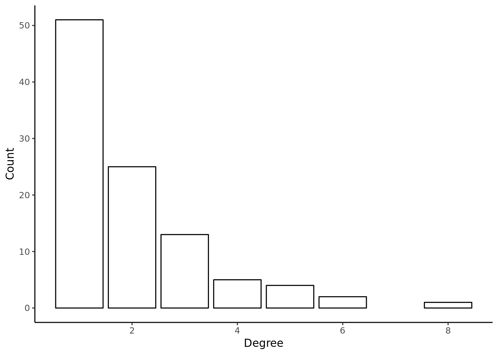

#### Runing time by method 

<table class="table table-condensed" style="width: auto !important; ">
 <thead>
  <tr>
   <th style="text-align:left;">   </th>
   <th style="text-align:left;"> key </th>
   <th style="text-align:right;"> doc_count </th>
   <th style="text-align:right;"> sum_wallTime_ms.value </th>
   <th style="text-align:left;"> avg_wallTime_ms.value </th>
   <th style="text-align:left;"> includedInTotal </th>
  </tr>
 </thead>
<tbody>
  <tr>
   <td style="text-align:left;"> 1 </td>
   <td style="text-align:left;"> addItemToWork </td>
   <td style="text-align:right;"> 420 </td>
   <td style="text-align:right;"> 3,325 </td>
   <td style="text-align:left;"> 7.91666666666667 </td>
   <td style="text-align:left;"> No </td>
  </tr>
  <tr>
   <td style="text-align:left;"> 2 </td>
   <td style="text-align:left;"> ownsWork </td>
   <td style="text-align:right;"> 210 </td>
   <td style="text-align:right;"> 2,875 </td>
   <td style="text-align:left;"> 13.6904761904762 </td>
   <td style="text-align:left;"> No </td>
  </tr>
  <tr>
   <td style="text-align:left;"> 3 </td>
   <td style="text-align:left;"> init </td>
   <td style="text-align:right;"> 103 </td>
   <td style="text-align:right;"> 12,775 </td>
   <td style="text-align:left;"> 124.029126213592 </td>
   <td style="text-align:left;"> No </td>
  </tr>
  <tr>
   <td style="text-align:left;"> 4 </td>
   <td style="text-align:left;"> searchAndConnect </td>
   <td style="text-align:right;"> 101 </td>
   <td style="text-align:right;"> 119,397 </td>
   <td style="text-align:left;"> 1182.14851485149 </td>
   <td style="text-align:left;"> Yes </td>
  </tr>
  <tr>
   <td style="text-align:left;"> 5 </td>
   <td style="text-align:left;"> knowsAgent </td>
   <td style="text-align:right;"> 100 </td>
   <td style="text-align:right;"> 410 </td>
   <td style="text-align:left;"> 4.1 </td>
   <td style="text-align:left;"> No </td>
  </tr>
  <tr>
   <td style="text-align:left;"> 6 </td>
   <td style="text-align:left;"> getWorksItems </td>
   <td style="text-align:right;"> 18 </td>
   <td style="text-align:right;"> 66 </td>
   <td style="text-align:left;"> 3.66666666666667 </td>
   <td style="text-align:left;"> Yes </td>
  </tr>
  <tr>
   <td style="text-align:left;"> 9 </td>
   <td style="text-align:left;"> cycleSearch </td>
   <td style="text-align:right;"> 4 </td>
   <td style="text-align:right;"> 875 </td>
   <td style="text-align:left;"> 218.75 </td>
   <td style="text-align:left;"> Yes </td>
  </tr>
  <tr>
   <td style="text-align:left;"> 10 </td>
   <td style="text-align:left;"> getWorks </td>
   <td style="text-align:right;"> 4 </td>
   <td style="text-align:right;"> 1,099 </td>
   <td style="text-align:left;"> 274.75 </td>
   <td style="text-align:left;"> No </td>
  </tr>
  <tr>
   <td style="text-align:left;font-weight: bold;"> 11 </td>
   <td style="text-align:left;font-weight: bold;"> Total </td>
   <td style="text-align:right;font-weight: bold;"> 132 </td>
   <td style="text-align:right;font-weight: bold;"> 121,927 </td>
   <td style="text-align:left;font-weight: bold;">  </td>
   <td style="text-align:left;font-weight: bold;">  </td>
  </tr>
</tbody>
</table>
####  Found structures 

#####  Cycles 

Number of cycles found:  4 

<button class="btn btn-primary" data-toggle="collapse" data-target="#VWTBDQJTEZ"> Show/Hide foundCycle query </button> 
 
  
     GET /filebeat-*/_search 
              { 
                "query": {
                  "bool": {
                    "must": [
                      { "match_phrase": {
                        "simulationId": "SIM10-13-01-22-iDF56F--DV"
                        }
                      },
                      { "bool": {
                        "should": [
                          { "match": {
                            "keyword": "foundCycle"
                          }}
                        ]
                      }}
                    ]
                  }
                }
              }
     

#####  Paths 

Number of paths found:  0 

<button class="btn btn-primary" data-toggle="collapse" data-target="#TEEFGPCWNA"> Show/Hide foundPath query </button> 
 
  
     GET /filebeat-*/_search 
              { 
                "query": {
                  "bool": {
                    "must": [
                      { "match_phrase": {
                        "simulationId": "SIM10-13-01-22-iDF56F--DV"
                        }
                      },
                      { "bool": {
                        "should": [
                          { "match": {
                            "keyword": "foundPath"
                          }}
                        ]
                      }}
                    ]
                  }
                }
              }
     

###  SIM10-13-01-27-oRsogM--CV 

#### simulationParameters 

<table class="table table-condensed" style="width: auto !important; ">
 <thead>
  <tr>
   <th style="text-align:left;"> agentNumber </th>
   <th style="text-align:left;"> similarityConnectThreshold </th>
   <th style="text-align:left;"> graphType </th>
   <th style="text-align:left;"> chainLength </th>
   <th style="text-align:left;"> similaritySearchThreshold </th>
   <th style="text-align:left;"> maxDistance </th>
   <th style="text-align:left;"> randomWorksNumberMultiplier </th>
  </tr>
 </thead>
<tbody>
  <tr>
   <td style="text-align:left;width: 20em; "> 100 </td>
   <td style="text-align:left;width: 15em; "> 0.96 </td>
   <td style="text-align:left;width: 15em; "> smallWorld </td>
   <td style="text-align:left;width: 15em; "> 10 </td>
   <td style="text-align:left;width: 15em; "> 1 </td>
   <td style="text-align:left;width: 15em; "> 30 </td>
   <td style="text-align:left;width: 15em; "> 2 </td>
  </tr>
</tbody>
</table>
#### allEdgesByLabel

<table class="table table-condensed" style="width: auto !important; ">
 <thead>
  <tr>
   <th style="text-align:right;"> edges_offers </th>
   <th style="text-align:right;"> edges_similarity </th>
   <th style="text-align:right;"> edges_owns </th>
   <th style="text-align:right;"> edges_demands </th>
   <th style="text-align:right;"> edges_knows </th>
   <th style="text-align:right;"> edges_total </th>
  </tr>
 </thead>
<tbody>
  <tr>
   <td style="text-align:right;width: 5em; "> 210 </td>
   <td style="text-align:right;width: 5em; "> 15,230 </td>
   <td style="text-align:right;width: 5em; "> 210 </td>
   <td style="text-align:right;width: 5em; "> 210 </td>
   <td style="text-align:right;width: 5em; "> 601 </td>
   <td style="text-align:right;width: 5em; "> 16,461 </td>
  </tr>
</tbody>
</table>
#### allVerticesByType

<table class="table table-condensed" style="width: auto !important; ">
 <thead>
  <tr>
   <th style="text-align:right;"> vertices_agent </th>
   <th style="text-align:right;"> vertices_item </th>
   <th style="text-align:right;"> vertices_work </th>
   <th style="text-align:right;"> vertices_total </th>
  </tr>
 </thead>
<tbody>
  <tr>
   <td style="text-align:right;width: 5em; "> 101 </td>
   <td style="text-align:right;width: 5em; "> 420 </td>
   <td style="text-align:right;width: 5em; "> 210 </td>
   <td style="text-align:right;width: 5em; "> 731 </td>
  </tr>
</tbody>
</table>
#### distribution of similarityEdgesByWeight

#### Degree distribution of item->similarity->item edges

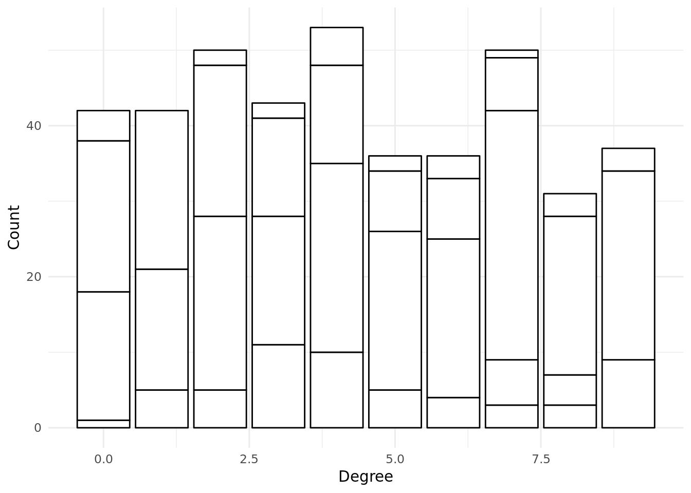

#### Degree distribution of agent->knows->agent edges

#### Runing time by method 

<table class="table table-condensed" style="width: auto !important; ">
 <thead>
  <tr>
   <th style="text-align:left;"> key </th>
   <th style="text-align:right;"> doc_count </th>
   <th style="text-align:right;"> sum_wallTime_ms.value </th>
   <th style="text-align:left;"> avg_wallTime_ms.value </th>
   <th style="text-align:left;"> includedInTotal </th>
  </tr>
 </thead>
<tbody>
  <tr>
   <td style="text-align:left;"> connectIfSimilar </td>
   <td style="text-align:right;"> 87,990 </td>
   <td style="text-align:right;"> 244,518 </td>
   <td style="text-align:left;"> 2.77892942379816 </td>
   <td style="text-align:left;"> No </td>
  </tr>
  <tr>
   <td style="text-align:left;"> existsSimilarity </td>
   <td style="text-align:right;"> 87,990 </td>
   <td style="text-align:right;"> 242,812 </td>
   <td style="text-align:left;"> 2.75954085691556 </td>
   <td style="text-align:left;"> No </td>
  </tr>
  <tr>
   <td style="text-align:left;"> similarityEdges </td>
   <td style="text-align:right;"> 87,990 </td>
   <td style="text-align:right;"> 239,443 </td>
   <td style="text-align:left;"> 2.72125241504716 </td>
   <td style="text-align:left;"> No </td>
  </tr>
  <tr>
   <td style="text-align:left;"> connectAllSimilar </td>
   <td style="text-align:right;"> 420 </td>
   <td style="text-align:right;"> 245,379 </td>
   <td style="text-align:left;"> 584.235714285714 </td>
   <td style="text-align:left;"> Yes </td>
  </tr>
  <tr>
   <td style="text-align:left;"> init </td>
   <td style="text-align:right;"> 103 </td>
   <td style="text-align:right;"> 12,022 </td>
   <td style="text-align:left;"> 116.718446601942 </td>
   <td style="text-align:left;"> No </td>
  </tr>
  <tr>
   <td style="text-align:left;"> connect </td>
   <td style="text-align:right;"> 80 </td>
   <td style="text-align:right;"> 184 </td>
   <td style="text-align:left;"> 2.3 </td>
   <td style="text-align:left;"> Yes </td>
  </tr>
  <tr>
   <td style="text-align:left;font-weight: bold;"> Total </td>
   <td style="text-align:right;font-weight: bold;"> 508 </td>
   <td style="text-align:right;font-weight: bold;"> 246,176 </td>
   <td style="text-align:left;font-weight: bold;">  </td>
   <td style="text-align:left;font-weight: bold;">  </td>
  </tr>
</tbody>
</table>
####  Found structures 

#####  Cycles 

Number of cycles found:  1 

<button class="btn btn-primary" data-toggle="collapse" data-target="#WAFVPCFOWT"> Show/Hide foundCycle query </button> 
 
  
     GET /filebeat-*/_search 
              { 
                "query": {
                  "bool": {
                    "must": [
                      { "match_phrase": {
                        "simulationId": "SIM10-13-01-27-oRsogM--CV"
                        }
                      },
                      { "bool": {
                        "should": [
                          { "match": {
                            "keyword": "foundCycle"
                          }}
                        ]
                      }}
                    ]
                  }
                }
              }
     

#####  Paths 

Number of paths found:  0 

<button class="btn btn-primary" data-toggle="collapse" data-target="#UMCVTSXUSO"> Show/Hide foundPath query </button> 
 
  
     GET /filebeat-*/_search 
              { 
                "query": {
                  "bool": {
                    "must": [
                      { "match_phrase": {
                        "simulationId": "SIM10-13-01-27-oRsogM--CV"
                        }
                      },
                      { "bool": {
                        "should": [
                          { "match": {
                            "keyword": "foundPath"
                          }}
                        ]
                      }}
                    ]
                  }
                }
              }
     

###  SIM10-13-01-27-oRsogM--DV 

#### simulationParameters 

<table class="table table-condensed" style="width: auto !important; ">
 <thead>
  <tr>
   <th style="text-align:left;"> agentNumber </th>
   <th style="text-align:left;"> similarityConnectThreshold </th>
   <th style="text-align:left;"> graphType </th>
   <th style="text-align:left;"> chainLength </th>
   <th style="text-align:left;"> similaritySearchThreshold </th>
   <th style="text-align:left;"> maxDistance </th>
   <th style="text-align:left;"> randomWorksNumberMultiplier </th>
  </tr>
 </thead>
<tbody>
  <tr>
   <td style="text-align:left;width: 20em; "> 100 </td>
   <td style="text-align:left;width: 15em; "> 0.96 </td>
   <td style="text-align:left;width: 15em; "> smallWorld </td>
   <td style="text-align:left;width: 15em; "> 10 </td>
   <td style="text-align:left;width: 15em; "> 1 </td>
   <td style="text-align:left;width: 15em; "> 30 </td>
   <td style="text-align:left;width: 15em; "> 2 </td>
  </tr>
</tbody>
</table>
#### allEdgesByLabel

<table class="table table-condensed" style="width: auto !important; ">
 <thead>
  <tr>
   <th style="text-align:right;"> edges_offers </th>
   <th style="text-align:right;"> edges_similarity </th>
   <th style="text-align:right;"> edges_owns </th>
   <th style="text-align:right;"> edges_demands </th>
   <th style="text-align:right;"> edges_knows </th>
   <th style="text-align:right;"> edges_total </th>
  </tr>
 </thead>
<tbody>
  <tr>
   <td style="text-align:right;width: 5em; "> 210 </td>
   <td style="text-align:right;width: 5em; "> 15,070 </td>
   <td style="text-align:right;width: 5em; "> 210 </td>
   <td style="text-align:right;width: 5em; "> 210 </td>
   <td style="text-align:right;width: 5em; "> 601 </td>
   <td style="text-align:right;width: 5em; "> 16,301 </td>
  </tr>
</tbody>
</table>
#### allVerticesByType

<table class="table table-condensed" style="width: auto !important; ">
 <thead>
  <tr>
   <th style="text-align:right;"> vertices_agent </th>
   <th style="text-align:right;"> vertices_item </th>
   <th style="text-align:right;"> vertices_work </th>
   <th style="text-align:right;"> vertices_total </th>
  </tr>
 </thead>
<tbody>
  <tr>
   <td style="text-align:right;width: 5em; "> 101 </td>
   <td style="text-align:right;width: 5em; "> 420 </td>
   <td style="text-align:right;width: 5em; "> 210 </td>
   <td style="text-align:right;width: 5em; "> 731 </td>
  </tr>
</tbody>
</table>
#### distribution of similarityEdgesByWeight

#### Degree distribution of item->similarity->item edges

#### Degree distribution of agent->knows->agent edges

#### Runing time by method 

<table class="table table-condensed" style="width: auto !important; ">
 <thead>
  <tr>
   <th style="text-align:left;">   </th>
   <th style="text-align:left;"> key </th>
   <th style="text-align:right;"> doc_count </th>
   <th style="text-align:right;"> sum_wallTime_ms.value </th>
   <th style="text-align:left;"> avg_wallTime_ms.value </th>
   <th style="text-align:left;"> includedInTotal </th>
  </tr>
 </thead>
<tbody>
  <tr>
   <td style="text-align:left;"> 1 </td>
   <td style="text-align:left;"> knowsAgent </td>
   <td style="text-align:right;"> 601 </td>
   <td style="text-align:right;"> 1,232 </td>
   <td style="text-align:left;"> 2.04991680532446 </td>
   <td style="text-align:left;"> No </td>
  </tr>
  <tr>
   <td style="text-align:left;"> 2 </td>
   <td style="text-align:left;"> addItemToWork </td>
   <td style="text-align:right;"> 420 </td>
   <td style="text-align:right;"> 7,781 </td>
   <td style="text-align:left;"> 18.5261904761905 </td>
   <td style="text-align:left;"> No </td>
  </tr>
  <tr>
   <td style="text-align:left;"> 3 </td>
   <td style="text-align:left;"> ownsWork </td>
   <td style="text-align:right;"> 210 </td>
   <td style="text-align:right;"> 3,705 </td>
   <td style="text-align:left;"> 17.6428571428571 </td>
   <td style="text-align:left;"> No </td>
  </tr>
  <tr>
   <td style="text-align:left;"> 4 </td>
   <td style="text-align:left;"> init </td>
   <td style="text-align:right;"> 103 </td>
   <td style="text-align:right;"> 12,737 </td>
   <td style="text-align:left;"> 123.660194174757 </td>
   <td style="text-align:left;"> No </td>
  </tr>
  <tr>
   <td style="text-align:left;"> 5 </td>
   <td style="text-align:left;"> searchAndConnect </td>
   <td style="text-align:right;"> 101 </td>
   <td style="text-align:right;"> 139,671 </td>
   <td style="text-align:left;"> 1382.88118811881 </td>
   <td style="text-align:left;"> Yes </td>
  </tr>
  <tr>
   <td style="text-align:left;"> 6 </td>
   <td style="text-align:left;"> getWorksItems </td>
   <td style="text-align:right;"> 18 </td>
   <td style="text-align:right;"> 62 </td>
   <td style="text-align:left;"> 3.44444444444444 </td>
   <td style="text-align:left;"> Yes </td>
  </tr>
  <tr>
   <td style="text-align:left;"> 8 </td>
   <td style="text-align:left;"> cycleSearch </td>
   <td style="text-align:right;"> 5 </td>
   <td style="text-align:right;"> 1,168 </td>
   <td style="text-align:left;"> 233.6 </td>
   <td style="text-align:left;"> Yes </td>
  </tr>
  <tr>
   <td style="text-align:left;"> 10 </td>
   <td style="text-align:left;"> getWorks </td>
   <td style="text-align:right;"> 5 </td>
   <td style="text-align:right;"> 1,090 </td>
   <td style="text-align:left;"> 218 </td>
   <td style="text-align:left;"> No </td>
  </tr>
  <tr>
   <td style="text-align:left;font-weight: bold;"> 11 </td>
   <td style="text-align:left;font-weight: bold;"> Total </td>
   <td style="text-align:right;font-weight: bold;"> 134 </td>
   <td style="text-align:right;font-weight: bold;"> 143,112 </td>
   <td style="text-align:left;font-weight: bold;">  </td>
   <td style="text-align:left;font-weight: bold;">  </td>
  </tr>
</tbody>
</table>
####  Found structures 

#####  Cycles 

Number of cycles found:  4 

<button class="btn btn-primary" data-toggle="collapse" data-target="#TCJSEKZSGA"> Show/Hide foundCycle query </button> 
 
  
     GET /filebeat-*/_search 
              { 
                "query": {
                  "bool": {
                    "must": [
                      { "match_phrase": {
                        "simulationId": "SIM10-13-01-27-oRsogM--DV"
                        }
                      },
                      { "bool": {
                        "should": [
                          { "match": {
                            "keyword": "foundCycle"
                          }}
                        ]
                      }}
                    ]
                  }
                }
              }
     

#####  Paths 

Number of paths found:  1 

<button class="btn btn-primary" data-toggle="collapse" data-target="#ORNZFVCPAH"> Show/Hide foundPath query </button> 
 
  
     GET /filebeat-*/_search 
              { 
                "query": {
                  "bool": {
                    "must": [
                      { "match_phrase": {
                        "simulationId": "SIM10-13-01-27-oRsogM--DV"
                        }
                      },
                      { "bool": {
                        "should": [
                          { "match": {
                            "keyword": "foundPath"
                          }}
                        ]
                      }}
                    ]
                  }
                }
              }
     

###  SIM10-13-12-02-EpmeFW--CV 

#### simulationParameters 

<table class="table table-condensed" style="width: auto !important; ">
 <thead>
  <tr>
   <th style="text-align:left;"> agentNumber </th>
   <th style="text-align:left;"> similarityConnectThreshold </th>
   <th style="text-align:left;"> graphType </th>
   <th style="text-align:left;"> chainLength </th>
   <th style="text-align:left;"> similaritySearchThreshold </th>
   <th style="text-align:left;"> maxDistance </th>
   <th style="text-align:left;"> randomWorksNumberMultiplier </th>
  </tr>
 </thead>
<tbody>
  <tr>
   <td style="text-align:left;width: 20em; "> 100 </td>
   <td style="text-align:left;width: 15em; "> 0.96 </td>
   <td style="text-align:left;width: 15em; "> random </td>
   <td style="text-align:left;width: 15em; "> 10 </td>
   <td style="text-align:left;width: 15em; "> 1 </td>
   <td style="text-align:left;width: 15em; "> 30 </td>
   <td style="text-align:left;width: 15em; "> 1 </td>
  </tr>
</tbody>
</table>
#### allEdgesByLabel

<table class="table table-condensed" style="width: auto !important; ">
 <thead>
  <tr>
   <th style="text-align:right;"> edges_offers </th>
   <th style="text-align:right;"> edges_similarity </th>
   <th style="text-align:right;"> edges_owns </th>
   <th style="text-align:right;"> edges_demands </th>
   <th style="text-align:right;"> edges_knows </th>
   <th style="text-align:right;"> edges_total </th>
  </tr>
 </thead>
<tbody>
  <tr>
   <td style="text-align:right;width: 5em; "> 110 </td>
   <td style="text-align:right;width: 5em; "> 4,346 </td>
   <td style="text-align:right;width: 5em; "> 110 </td>
   <td style="text-align:right;width: 5em; "> 110 </td>
   <td style="text-align:right;width: 5em; "> 100 </td>
   <td style="text-align:right;width: 5em; "> 4,776 </td>
  </tr>
</tbody>
</table>
#### allVerticesByType

<table class="table table-condensed" style="width: auto !important; ">
 <thead>
  <tr>
   <th style="text-align:right;"> vertices_agent </th>
   <th style="text-align:right;"> vertices_item </th>
   <th style="text-align:right;"> vertices_work </th>
   <th style="text-align:right;"> vertices_total </th>
  </tr>
 </thead>
<tbody>
  <tr>
   <td style="text-align:right;width: 5em; "> 101 </td>
   <td style="text-align:right;width: 5em; "> 220 </td>
   <td style="text-align:right;width: 5em; "> 110 </td>
   <td style="text-align:right;width: 5em; "> 431 </td>
  </tr>
</tbody>
</table>
#### distribution of similarityEdgesByWeight

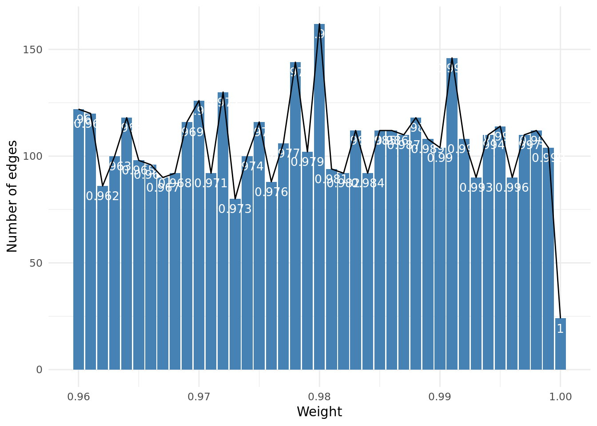

#### Degree distribution of item->similarity->item edges

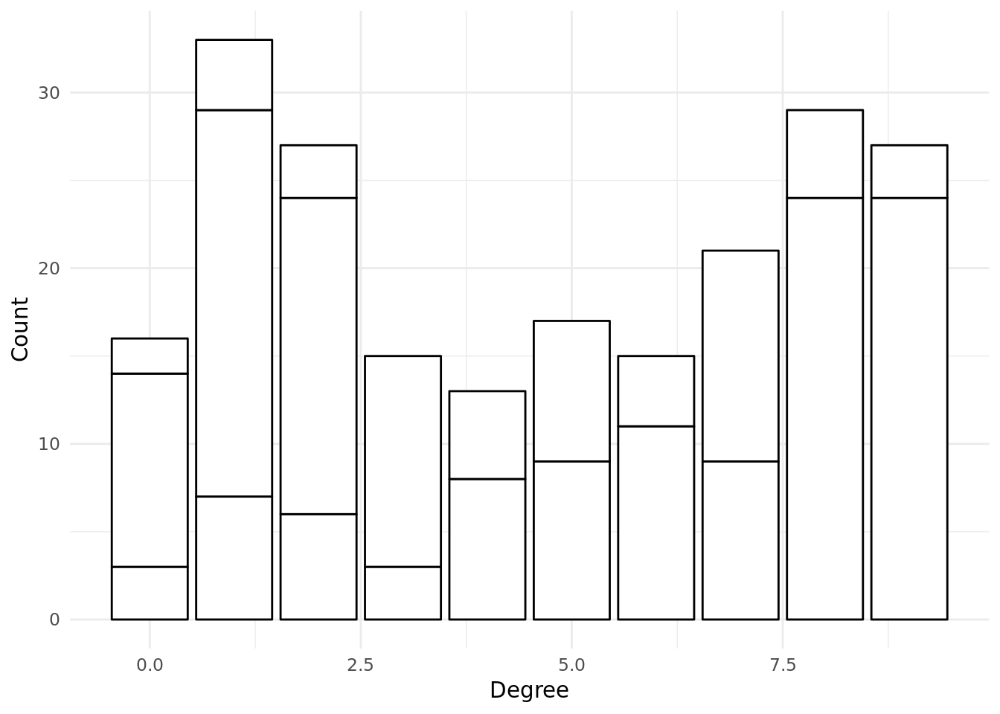

#### Degree distribution of agent->knows->agent edges

#### Runing time by method 

<table class="table table-condensed" style="width: auto !important; ">
 <thead>
  <tr>
   <th style="text-align:left;"> key </th>
   <th style="text-align:right;"> doc_count </th>
   <th style="text-align:right;"> sum_wallTime_ms.value </th>
   <th style="text-align:left;"> avg_wallTime_ms.value </th>
   <th style="text-align:left;"> includedInTotal </th>
  </tr>
 </thead>
<tbody>
  <tr>
   <td style="text-align:left;"> connectIfSimilar </td>
   <td style="text-align:right;"> 24,090 </td>
   <td style="text-align:right;"> 56,484 </td>
   <td style="text-align:left;"> 2.34470734744707 </td>
   <td style="text-align:left;"> No </td>
  </tr>
  <tr>
   <td style="text-align:left;"> existsSimilarity </td>
   <td style="text-align:right;"> 24,090 </td>
   <td style="text-align:right;"> 56,004 </td>
   <td style="text-align:left;"> 2.32478206724782 </td>
   <td style="text-align:left;"> No </td>
  </tr>
  <tr>
   <td style="text-align:left;"> similarityEdges </td>
   <td style="text-align:right;"> 24,090 </td>
   <td style="text-align:right;"> 55,216 </td>
   <td style="text-align:left;"> 2.29207139892071 </td>
   <td style="text-align:left;"> No </td>
  </tr>
  <tr>
   <td style="text-align:left;"> connectAllSimilar </td>
   <td style="text-align:right;"> 220 </td>
   <td style="text-align:right;"> 56,703 </td>
   <td style="text-align:left;"> 257.740909090909 </td>
   <td style="text-align:left;"> Yes </td>
  </tr>
  <tr>
   <td style="text-align:left;"> init </td>
   <td style="text-align:right;"> 103 </td>
   <td style="text-align:right;"> 11,617 </td>
   <td style="text-align:left;"> 112.78640776699 </td>
   <td style="text-align:left;"> No </td>
  </tr>
  <tr>
   <td style="text-align:left;"> connect </td>
   <td style="text-align:right;"> 19 </td>
   <td style="text-align:right;"> 46 </td>
   <td style="text-align:left;"> 2.42105263157895 </td>
   <td style="text-align:left;"> Yes </td>
  </tr>
  <tr>
   <td style="text-align:left;font-weight: bold;"> Total </td>
   <td style="text-align:right;font-weight: bold;"> 247 </td>
   <td style="text-align:right;font-weight: bold;"> 57,189 </td>
   <td style="text-align:left;font-weight: bold;">  </td>
   <td style="text-align:left;font-weight: bold;">  </td>
  </tr>
</tbody>
</table>
####  Found structures 

#####  Cycles 

Number of cycles found:  1 

<button class="btn btn-primary" data-toggle="collapse" data-target="#ZLZFSSTERW"> Show/Hide foundCycle query </button> 
 
  
     GET /filebeat-*/_search 
              { 
                "query": {
                  "bool": {
                    "must": [
                      { "match_phrase": {
                        "simulationId": "SIM10-13-12-02-EpmeFW--CV"
                        }
                      },
                      { "bool": {
                        "should": [
                          { "match": {
                            "keyword": "foundCycle"
                          }}
                        ]
                      }}
                    ]
                  }
                }
              }
     

#####  Paths 

Number of paths found:  0 

<button class="btn btn-primary" data-toggle="collapse" data-target="#IPKPIXMFKM"> Show/Hide foundPath query </button> 
 
  
     GET /filebeat-*/_search 
              { 
                "query": {
                  "bool": {
                    "must": [
                      { "match_phrase": {
                        "simulationId": "SIM10-13-12-02-EpmeFW--CV"
                        }
                      },
                      { "bool": {
                        "should": [
                          { "match": {
                            "keyword": "foundPath"
                          }}
                        ]
                      }}
                    ]
                  }
                }
              }
     

###  SIM10-13-12-02-EpmeFW--DV 

#### simulationParameters 

<table class="table table-condensed" style="width: auto !important; ">
 <thead>
  <tr>
   <th style="text-align:left;"> agentNumber </th>
   <th style="text-align:left;"> similarityConnectThreshold </th>
   <th style="text-align:left;"> graphType </th>
   <th style="text-align:left;"> chainLength </th>
   <th style="text-align:left;"> similaritySearchThreshold </th>
   <th style="text-align:left;"> maxDistance </th>
   <th style="text-align:left;"> randomWorksNumberMultiplier </th>
  </tr>
 </thead>
<tbody>
  <tr>
   <td style="text-align:left;width: 20em; "> 100 </td>
   <td style="text-align:left;width: 15em; "> 0.96 </td>
   <td style="text-align:left;width: 15em; "> random </td>
   <td style="text-align:left;width: 15em; "> 10 </td>
   <td style="text-align:left;width: 15em; "> 1 </td>
   <td style="text-align:left;width: 15em; "> 30 </td>
   <td style="text-align:left;width: 15em; "> 1 </td>
  </tr>
</tbody>
</table>
#### allEdgesByLabel

<table class="table table-condensed" style="width: auto !important; ">
 <thead>
  <tr>
   <th style="text-align:right;"> edges_offers </th>
   <th style="text-align:right;"> edges_similarity </th>
   <th style="text-align:right;"> edges_owns </th>
   <th style="text-align:right;"> edges_demands </th>
   <th style="text-align:right;"> edges_knows </th>
   <th style="text-align:right;"> edges_total </th>
  </tr>
 </thead>
<tbody>
  <tr>
   <td style="text-align:right;width: 5em; "> 110 </td>
   <td style="text-align:right;width: 5em; "> 4,308 </td>
   <td style="text-align:right;width: 5em; "> 110 </td>
   <td style="text-align:right;width: 5em; "> 110 </td>
   <td style="text-align:right;width: 5em; "> 100 </td>
   <td style="text-align:right;width: 5em; "> 4,738 </td>
  </tr>
</tbody>
</table>
#### allVerticesByType

<table class="table table-condensed" style="width: auto !important; ">
 <thead>
  <tr>
   <th style="text-align:right;"> vertices_agent </th>
   <th style="text-align:right;"> vertices_item </th>
   <th style="text-align:right;"> vertices_work </th>
   <th style="text-align:right;"> vertices_total </th>
  </tr>
 </thead>
<tbody>
  <tr>
   <td style="text-align:right;width: 5em; "> 101 </td>
   <td style="text-align:right;width: 5em; "> 220 </td>
   <td style="text-align:right;width: 5em; "> 110 </td>
   <td style="text-align:right;width: 5em; "> 431 </td>
  </tr>
</tbody>
</table>
#### distribution of similarityEdgesByWeight

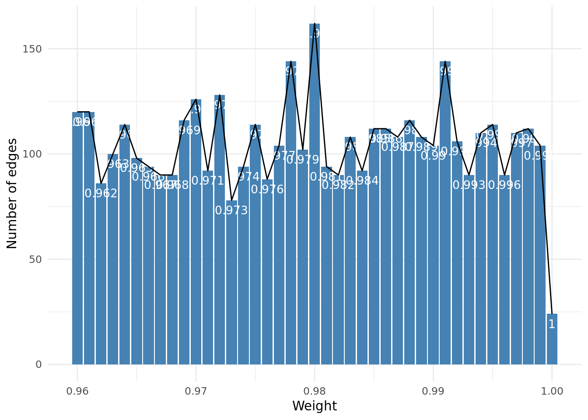

#### Degree distribution of item->similarity->item edges

#### Degree distribution of agent->knows->agent edges

#### Runing time by method 

<table class="table table-condensed" style="width: auto !important; ">
 <thead>
  <tr>
   <th style="text-align:left;">   </th>
   <th style="text-align:left;"> key </th>
   <th style="text-align:right;"> doc_count </th>
   <th style="text-align:right;"> sum_wallTime_ms.value </th>
   <th style="text-align:left;"> avg_wallTime_ms.value </th>
   <th style="text-align:left;"> includedInTotal </th>
  </tr>
 </thead>
<tbody>
  <tr>
   <td style="text-align:left;"> 1 </td>
   <td style="text-align:left;"> addItemToWork </td>
   <td style="text-align:right;"> 220 </td>
   <td style="text-align:right;"> 3,013 </td>
   <td style="text-align:left;"> 13.6954545454545 </td>
   <td style="text-align:left;"> No </td>
  </tr>
  <tr>
   <td style="text-align:left;"> 2 </td>
   <td style="text-align:left;"> ownsWork </td>
   <td style="text-align:right;"> 110 </td>
   <td style="text-align:right;"> 2,803 </td>
   <td style="text-align:left;"> 25.4818181818182 </td>
   <td style="text-align:left;"> No </td>
  </tr>
  <tr>
   <td style="text-align:left;"> 3 </td>
   <td style="text-align:left;"> init </td>
   <td style="text-align:right;"> 103 </td>
   <td style="text-align:right;"> 12,652 </td>
   <td style="text-align:left;"> 122.834951456311 </td>
   <td style="text-align:left;"> No </td>
  </tr>
  <tr>
   <td style="text-align:left;"> 4 </td>
   <td style="text-align:left;"> searchAndConnect </td>
   <td style="text-align:right;"> 101 </td>
   <td style="text-align:right;"> 43,489 </td>
   <td style="text-align:left;"> 430.584158415842 </td>
   <td style="text-align:left;"> Yes </td>
  </tr>
  <tr>
   <td style="text-align:left;"> 5 </td>
   <td style="text-align:left;"> knowsAgent </td>
   <td style="text-align:right;"> 100 </td>
   <td style="text-align:right;"> 497 </td>
   <td style="text-align:left;"> 4.97 </td>
   <td style="text-align:left;"> No </td>
  </tr>
  <tr>
   <td style="text-align:left;"> 6 </td>
   <td style="text-align:left;"> getWorksItems </td>
   <td style="text-align:right;"> 18 </td>
   <td style="text-align:right;"> 27 </td>
   <td style="text-align:left;"> 1.5 </td>
   <td style="text-align:left;"> Yes </td>
  </tr>
  <tr>
   <td style="text-align:left;"> 9 </td>
   <td style="text-align:left;"> cycleSearch </td>
   <td style="text-align:right;"> 2 </td>
   <td style="text-align:right;"> 343 </td>
   <td style="text-align:left;"> 171.5 </td>
   <td style="text-align:left;"> Yes </td>
  </tr>
  <tr>
   <td style="text-align:left;"> 10 </td>
   <td style="text-align:left;"> getWorks </td>
   <td style="text-align:right;"> 2 </td>
   <td style="text-align:right;"> 309 </td>
   <td style="text-align:left;"> 154.5 </td>
   <td style="text-align:left;"> No </td>
  </tr>
  <tr>
   <td style="text-align:left;font-weight: bold;"> 11 </td>
   <td style="text-align:left;font-weight: bold;"> Total </td>
   <td style="text-align:right;font-weight: bold;"> 128 </td>
   <td style="text-align:right;font-weight: bold;"> 44,297 </td>
   <td style="text-align:left;font-weight: bold;">  </td>
   <td style="text-align:left;font-weight: bold;">  </td>
  </tr>
</tbody>
</table>
####  Found structures 

#####  Cycles 

Number of cycles found:  1 

<button class="btn btn-primary" data-toggle="collapse" data-target="#TKXGFKRZXR"> Show/Hide foundCycle query </button> 
 
  
     GET /filebeat-*/_search 
              { 
                "query": {
                  "bool": {
                    "must": [
                      { "match_phrase": {
                        "simulationId": "SIM10-13-12-02-EpmeFW--DV"
                        }
                      },
                      { "bool": {
                        "should": [
                          { "match": {
                            "keyword": "foundCycle"
                          }}
                        ]
                      }}
                    ]
                  }
                }
              }
     

#####  Paths 

Number of paths found:  1 

<button class="btn btn-primary" data-toggle="collapse" data-target="#NKYDJJOXBK"> Show/Hide foundPath query </button> 
 
  
     GET /filebeat-*/_search 
              { 
                "query": {
                  "bool": {
                    "must": [
                      { "match_phrase": {
                        "simulationId": "SIM10-13-12-02-EpmeFW--DV"
                        }
                      },
                      { "bool": {
                        "should": [
                          { "match": {
                            "keyword": "foundPath"
                          }}
                        ]
                      }}
                    ]
                  }
                }
              }
     

###  SIM10-13-12-03-fd5I7g--CV 

#### simulationParameters 

<table class="table table-condensed" style="width: auto !important; ">
 <thead>
  <tr>
   <th style="text-align:left;"> agentNumber </th>
   <th style="text-align:left;"> similarityConnectThreshold </th>
   <th style="text-align:left;"> graphType </th>
   <th style="text-align:left;"> chainLength </th>
   <th style="text-align:left;"> similaritySearchThreshold </th>
   <th style="text-align:left;"> maxDistance </th>
   <th style="text-align:left;"> randomWorksNumberMultiplier </th>
  </tr>
 </thead>
<tbody>
  <tr>
   <td style="text-align:left;width: 20em; "> 100 </td>
   <td style="text-align:left;width: 15em; "> 0.96 </td>
   <td style="text-align:left;width: 15em; "> smallWorld </td>
   <td style="text-align:left;width: 15em; "> 10 </td>
   <td style="text-align:left;width: 15em; "> 1 </td>
   <td style="text-align:left;width: 15em; "> 30 </td>
   <td style="text-align:left;width: 15em; "> 1 </td>
  </tr>
</tbody>
</table>
#### allEdgesByLabel

<table class="table table-condensed" style="width: auto !important; ">
 <thead>
  <tr>
   <th style="text-align:right;"> edges_offers </th>
   <th style="text-align:right;"> edges_similarity </th>
   <th style="text-align:right;"> edges_owns </th>
   <th style="text-align:right;"> edges_demands </th>
   <th style="text-align:right;"> edges_knows </th>
   <th style="text-align:right;"> edges_total </th>
  </tr>
 </thead>
<tbody>
  <tr>
   <td style="text-align:right;width: 5em; "> 110 </td>
   <td style="text-align:right;width: 5em; "> 4,336 </td>
   <td style="text-align:right;width: 5em; "> 110 </td>
   <td style="text-align:right;width: 5em; "> 110 </td>
   <td style="text-align:right;width: 5em; "> 601 </td>
   <td style="text-align:right;width: 5em; "> 5,267 </td>
  </tr>
</tbody>
</table>
#### allVerticesByType

<table class="table table-condensed" style="width: auto !important; ">
 <thead>
  <tr>
   <th style="text-align:right;"> vertices_agent </th>
   <th style="text-align:right;"> vertices_item </th>
   <th style="text-align:right;"> vertices_work </th>
   <th style="text-align:right;"> vertices_total </th>
  </tr>
 </thead>
<tbody>
  <tr>
   <td style="text-align:right;width: 5em; "> 101 </td>
   <td style="text-align:right;width: 5em; "> 220 </td>
   <td style="text-align:right;width: 5em; "> 110 </td>
   <td style="text-align:right;width: 5em; "> 431 </td>
  </tr>
</tbody>
</table>
#### distribution of similarityEdgesByWeight

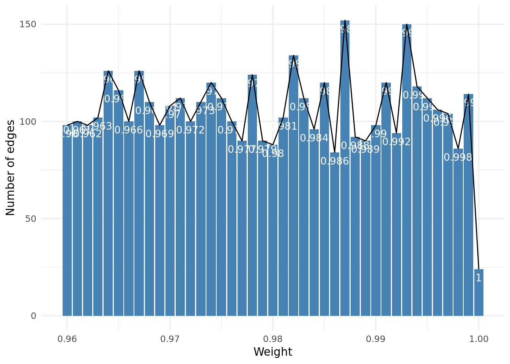

#### Degree distribution of item->similarity->item edges

#### Degree distribution of agent->knows->agent edges

#### Runing time by method 

<table class="table table-condensed" style="width: auto !important; ">
 <thead>
  <tr>
   <th style="text-align:left;"> key </th>
   <th style="text-align:right;"> doc_count </th>
   <th style="text-align:right;"> sum_wallTime_ms.value </th>
   <th style="text-align:left;"> avg_wallTime_ms.value </th>
   <th style="text-align:left;"> includedInTotal </th>
  </tr>
 </thead>
<tbody>
  <tr>
   <td style="text-align:left;"> connectIfSimilar </td>
   <td style="text-align:right;"> 24,090 </td>
   <td style="text-align:right;"> 55,125 </td>
   <td style="text-align:left;"> 2.28829389788294 </td>
   <td style="text-align:left;"> No </td>
  </tr>
  <tr>
   <td style="text-align:left;"> existsSimilarity </td>
   <td style="text-align:right;"> 24,090 </td>
   <td style="text-align:right;"> 54,629 </td>
   <td style="text-align:left;"> 2.26770444167704 </td>
   <td style="text-align:left;"> No </td>
  </tr>
  <tr>
   <td style="text-align:left;"> similarityEdges </td>
   <td style="text-align:right;"> 24,090 </td>
   <td style="text-align:right;"> 53,851 </td>
   <td style="text-align:left;"> 2.23540888335409 </td>
   <td style="text-align:left;"> No </td>
  </tr>
  <tr>
   <td style="text-align:left;"> connectAllSimilar </td>
   <td style="text-align:right;"> 220 </td>
   <td style="text-align:right;"> 55,339 </td>
   <td style="text-align:left;"> 251.540909090909 </td>
   <td style="text-align:left;"> Yes </td>
  </tr>
  <tr>
   <td style="text-align:left;"> init </td>
   <td style="text-align:right;"> 103 </td>
   <td style="text-align:right;"> 11,647 </td>
   <td style="text-align:left;"> 113.077669902913 </td>
   <td style="text-align:left;"> No </td>
  </tr>
  <tr>
   <td style="text-align:left;"> connect </td>
   <td style="text-align:right;"> 22 </td>
   <td style="text-align:right;"> 33 </td>
   <td style="text-align:left;"> 1.5 </td>
   <td style="text-align:left;"> Yes </td>
  </tr>
  <tr>
   <td style="text-align:left;font-weight: bold;"> Total </td>
   <td style="text-align:right;font-weight: bold;"> 250 </td>
   <td style="text-align:right;font-weight: bold;"> 55,706 </td>
   <td style="text-align:left;font-weight: bold;">  </td>
   <td style="text-align:left;font-weight: bold;">  </td>
  </tr>
</tbody>
</table>
####  Found structures 

#####  Cycles 

Number of cycles found:  1 

<button class="btn btn-primary" data-toggle="collapse" data-target="#LFLIGHCIOO"> Show/Hide foundCycle query </button> 
 
  
     GET /filebeat-*/_search 
              { 
                "query": {
                  "bool": {
                    "must": [
                      { "match_phrase": {
                        "simulationId": "SIM10-13-12-03-fd5I7g--CV"
                        }
                      },
                      { "bool": {
                        "should": [
                          { "match": {
                            "keyword": "foundCycle"
                          }}
                        ]
                      }}
                    ]
                  }
                }
              }
     

#####  Paths 

Number of paths found:  0 

<button class="btn btn-primary" data-toggle="collapse" data-target="#VXJDGBJIGW"> Show/Hide foundPath query </button> 
 
  
     GET /filebeat-*/_search 
              { 
                "query": {
                  "bool": {
                    "must": [
                      { "match_phrase": {
                        "simulationId": "SIM10-13-12-03-fd5I7g--CV"
                        }
                      },
                      { "bool": {
                        "should": [
                          { "match": {
                            "keyword": "foundPath"
                          }}
                        ]
                      }}
                    ]
                  }
                }
              }
     

###  SIM10-13-12-03-fd5I7g--DV 

#### simulationParameters 

<table class="table table-condensed" style="width: auto !important; ">
 <thead>
  <tr>
   <th style="text-align:left;"> agentNumber </th>
   <th style="text-align:left;"> similarityConnectThreshold </th>
   <th style="text-align:left;"> graphType </th>
   <th style="text-align:left;"> chainLength </th>
   <th style="text-align:left;"> similaritySearchThreshold </th>
   <th style="text-align:left;"> maxDistance </th>
   <th style="text-align:left;"> randomWorksNumberMultiplier </th>
  </tr>
 </thead>
<tbody>
  <tr>
   <td style="text-align:left;width: 20em; "> 100 </td>
   <td style="text-align:left;width: 15em; "> 0.96 </td>
   <td style="text-align:left;width: 15em; "> smallWorld </td>
   <td style="text-align:left;width: 15em; "> 10 </td>
   <td style="text-align:left;width: 15em; "> 1 </td>
   <td style="text-align:left;width: 15em; "> 30 </td>
   <td style="text-align:left;width: 15em; "> 1 </td>
  </tr>
</tbody>
</table>
#### allEdgesByLabel

<table class="table table-condensed" style="width: auto !important; ">
 <thead>
  <tr>
   <th style="text-align:right;"> edges_offers </th>
   <th style="text-align:right;"> edges_similarity </th>
   <th style="text-align:right;"> edges_owns </th>
   <th style="text-align:right;"> edges_demands </th>
   <th style="text-align:right;"> edges_knows </th>
   <th style="text-align:right;"> edges_total </th>
  </tr>
 </thead>
<tbody>
  <tr>
   <td style="text-align:right;width: 5em; "> 110 </td>
   <td style="text-align:right;width: 5em; "> 4,292 </td>
   <td style="text-align:right;width: 5em; "> 110 </td>
   <td style="text-align:right;width: 5em; "> 110 </td>
   <td style="text-align:right;width: 5em; "> 601 </td>
   <td style="text-align:right;width: 5em; "> 5,223 </td>
  </tr>
</tbody>
</table>
#### allVerticesByType

<table class="table table-condensed" style="width: auto !important; ">
 <thead>
  <tr>
   <th style="text-align:right;"> vertices_agent </th>
   <th style="text-align:right;"> vertices_item </th>
   <th style="text-align:right;"> vertices_work </th>
   <th style="text-align:right;"> vertices_total </th>
  </tr>
 </thead>
<tbody>
  <tr>
   <td style="text-align:right;width: 5em; "> 101 </td>
   <td style="text-align:right;width: 5em; "> 220 </td>
   <td style="text-align:right;width: 5em; "> 110 </td>
   <td style="text-align:right;width: 5em; "> 431 </td>
  </tr>
</tbody>
</table>
#### distribution of similarityEdgesByWeight

#### Degree distribution of item->similarity->item edges

#### Degree distribution of agent->knows->agent edges

#### Runing time by method 

<table class="table table-condensed" style="width: auto !important; ">
 <thead>
  <tr>
   <th style="text-align:left;">   </th>
   <th style="text-align:left;"> key </th>
   <th style="text-align:right;"> doc_count </th>
   <th style="text-align:right;"> sum_wallTime_ms.value </th>
   <th style="text-align:left;"> avg_wallTime_ms.value </th>
   <th style="text-align:left;"> includedInTotal </th>
  </tr>
 </thead>
<tbody>
  <tr>
   <td style="text-align:left;"> 1 </td>
   <td style="text-align:left;"> knowsAgent </td>
   <td style="text-align:right;"> 601 </td>
   <td style="text-align:right;"> 1,150 </td>
   <td style="text-align:left;"> 1.9134775374376 </td>
   <td style="text-align:left;"> No </td>
  </tr>
  <tr>
   <td style="text-align:left;"> 2 </td>
   <td style="text-align:left;"> addItemToWork </td>
   <td style="text-align:right;"> 220 </td>
   <td style="text-align:right;"> 3,135 </td>
   <td style="text-align:left;"> 14.25 </td>
   <td style="text-align:left;"> No </td>
  </tr>
  <tr>
   <td style="text-align:left;"> 3 </td>
   <td style="text-align:left;"> ownsWork </td>
   <td style="text-align:right;"> 110 </td>
   <td style="text-align:right;"> 2,236 </td>
   <td style="text-align:left;"> 20.3272727272727 </td>
   <td style="text-align:left;"> No </td>
  </tr>
  <tr>
   <td style="text-align:left;"> 4 </td>
   <td style="text-align:left;"> init </td>
   <td style="text-align:right;"> 103 </td>
   <td style="text-align:right;"> 12,121 </td>
   <td style="text-align:left;"> 117.679611650485 </td>
   <td style="text-align:left;"> No </td>
  </tr>
  <tr>
   <td style="text-align:left;"> 5 </td>
   <td style="text-align:left;"> searchAndConnect </td>
   <td style="text-align:right;"> 101 </td>
   <td style="text-align:right;"> 53,215 </td>
   <td style="text-align:left;"> 526.881188118812 </td>
   <td style="text-align:left;"> Yes </td>
  </tr>
  <tr>
   <td style="text-align:left;"> 6 </td>
   <td style="text-align:left;"> getWorksItems </td>
   <td style="text-align:right;"> 18 </td>
   <td style="text-align:right;"> 31 </td>
   <td style="text-align:left;"> 1.72222222222222 </td>
   <td style="text-align:left;"> Yes </td>
  </tr>
  <tr>
   <td style="text-align:left;"> 9 </td>
   <td style="text-align:left;"> cycleSearch </td>
   <td style="text-align:right;"> 2 </td>
   <td style="text-align:right;"> 37 </td>
   <td style="text-align:left;"> 18.5 </td>
   <td style="text-align:left;"> Yes </td>
  </tr>
  <tr>
   <td style="text-align:left;"> 10 </td>
   <td style="text-align:left;"> getWorks </td>
   <td style="text-align:right;"> 2 </td>
   <td style="text-align:right;"> 4 </td>
   <td style="text-align:left;"> 2 </td>
   <td style="text-align:left;"> No </td>
  </tr>
  <tr>
   <td style="text-align:left;font-weight: bold;"> 11 </td>
   <td style="text-align:left;font-weight: bold;"> Total </td>
   <td style="text-align:right;font-weight: bold;"> 128 </td>
   <td style="text-align:right;font-weight: bold;"> 53,846 </td>
   <td style="text-align:left;font-weight: bold;">  </td>
   <td style="text-align:left;font-weight: bold;">  </td>
  </tr>
</tbody>
</table>
####  Found structures 

#####  Cycles 

Number of cycles found:  2 

<button class="btn btn-primary" data-toggle="collapse" data-target="#EGURJODWEZ"> Show/Hide foundCycle query </button> 
 
  
     GET /filebeat-*/_search 
              { 
                "query": {
                  "bool": {
                    "must": [
                      { "match_phrase": {
                        "simulationId": "SIM10-13-12-03-fd5I7g--DV"
                        }
                      },
                      { "bool": {
                        "should": [
                          { "match": {
                            "keyword": "foundCycle"
                          }}
                        ]
                      }}
                    ]
                  }
                }
              }
     

#####  Paths 

Number of paths found:  0 

<button class="btn btn-primary" data-toggle="collapse" data-target="#JFOENMVJUC"> Show/Hide foundPath query </button> 
 
  
     GET /filebeat-*/_search 
              { 
                "query": {
                  "bool": {
                    "must": [
                      { "match_phrase": {
                        "simulationId": "SIM10-13-12-03-fd5I7g--DV"
                        }
                      },
                      { "bool": {
                        "should": [
                          { "match": {
                            "keyword": "foundPath"
                          }}
                        ]
                      }}
                    ]
                  }
                }
              }
     

###  SIM10-13-01-09-KXfm7X--CV 

#### simulationParameters 

<table class="table table-condensed" style="width: auto !important; ">
 <thead>
  <tr>
   <th style="text-align:left;"> agentNumber </th>
   <th style="text-align:left;"> similarityConnectThreshold </th>
   <th style="text-align:left;"> graphType </th>
   <th style="text-align:left;"> chainLength </th>
   <th style="text-align:left;"> similaritySearchThreshold </th>
   <th style="text-align:left;"> maxDistance </th>
   <th style="text-align:left;"> randomWorksNumberMultiplier </th>
  </tr>
 </thead>
<tbody>
  <tr>
   <td style="text-align:left;width: 20em; "> 100 </td>
   <td style="text-align:left;width: 15em; "> 0.96 </td>
   <td style="text-align:left;width: 15em; "> smallWorld </td>
   <td style="text-align:left;width: 15em; "> 10 </td>
   <td style="text-align:left;width: 15em; "> 1 </td>
   <td style="text-align:left;width: 15em; "> 5 </td>
   <td style="text-align:left;width: 15em; "> 2 </td>
  </tr>
</tbody>
</table>
#### allEdgesByLabel

<table class="table table-condensed" style="width: auto !important; ">
 <thead>
  <tr>
   <th style="text-align:right;"> edges_offers </th>
   <th style="text-align:right;"> edges_similarity </th>
   <th style="text-align:right;"> edges_owns </th>
   <th style="text-align:right;"> edges_demands </th>
   <th style="text-align:right;"> edges_knows </th>
   <th style="text-align:right;"> edges_total </th>
  </tr>
 </thead>
<tbody>
  <tr>
   <td style="text-align:right;width: 5em; "> 210 </td>
   <td style="text-align:right;width: 5em; "> 15,326 </td>
   <td style="text-align:right;width: 5em; "> 210 </td>
   <td style="text-align:right;width: 5em; "> 210 </td>
   <td style="text-align:right;width: 5em; "> 601 </td>
   <td style="text-align:right;width: 5em; "> 16,557 </td>
  </tr>
</tbody>
</table>
#### allVerticesByType

<table class="table table-condensed" style="width: auto !important; ">
 <thead>
  <tr>
   <th style="text-align:right;"> vertices_agent </th>
   <th style="text-align:right;"> vertices_item </th>
   <th style="text-align:right;"> vertices_work </th>
   <th style="text-align:right;"> vertices_total </th>
  </tr>
 </thead>
<tbody>
  <tr>
   <td style="text-align:right;width: 5em; "> 101 </td>
   <td style="text-align:right;width: 5em; "> 420 </td>
   <td style="text-align:right;width: 5em; "> 210 </td>
   <td style="text-align:right;width: 5em; "> 731 </td>
  </tr>
</tbody>
</table>
#### distribution of similarityEdgesByWeight

#### Degree distribution of item->similarity->item edges

#### Degree distribution of agent->knows->agent edges

#### Runing time by method 

<table class="table table-condensed" style="width: auto !important; ">
 <thead>
  <tr>
   <th style="text-align:left;"> key </th>
   <th style="text-align:right;"> doc_count </th>
   <th style="text-align:right;"> sum_wallTime_ms.value </th>
   <th style="text-align:left;"> avg_wallTime_ms.value </th>
   <th style="text-align:left;"> includedInTotal </th>
  </tr>
 </thead>
<tbody>
  <tr>
   <td style="text-align:left;"> connectIfSimilar </td>
   <td style="text-align:right;"> 87,990 </td>
   <td style="text-align:right;"> 241,171 </td>
   <td style="text-align:left;"> 2.74089101034208 </td>
   <td style="text-align:left;"> No </td>
  </tr>
  <tr>
   <td style="text-align:left;"> existsSimilarity </td>
   <td style="text-align:right;"> 87,990 </td>
   <td style="text-align:right;"> 239,327 </td>
   <td style="text-align:left;"> 2.71993408341857 </td>
   <td style="text-align:left;"> No </td>
  </tr>
  <tr>
   <td style="text-align:left;"> similarityEdges </td>
   <td style="text-align:right;"> 87,990 </td>
   <td style="text-align:right;"> 235,749 </td>
   <td style="text-align:left;"> 2.67927037163314 </td>
   <td style="text-align:left;"> No </td>
  </tr>
  <tr>
   <td style="text-align:left;"> connectAllSimilar </td>
   <td style="text-align:right;"> 420 </td>
   <td style="text-align:right;"> 241,983 </td>
   <td style="text-align:left;"> 576.15 </td>
   <td style="text-align:left;"> Yes </td>
  </tr>
  <tr>
   <td style="text-align:left;"> init </td>
   <td style="text-align:right;"> 103 </td>
   <td style="text-align:right;"> 12,321 </td>
   <td style="text-align:left;"> 119.621359223301 </td>
   <td style="text-align:left;"> No </td>
  </tr>
  <tr>
   <td style="text-align:left;"> connect </td>
   <td style="text-align:right;"> 73 </td>
   <td style="text-align:right;"> 270 </td>
   <td style="text-align:left;"> 3.6986301369863 </td>
   <td style="text-align:left;"> Yes </td>
  </tr>
  <tr>
   <td style="text-align:left;font-weight: bold;"> Total </td>
   <td style="text-align:right;font-weight: bold;"> 501 </td>
   <td style="text-align:right;font-weight: bold;"> 242,815 </td>
   <td style="text-align:left;font-weight: bold;">  </td>
   <td style="text-align:left;font-weight: bold;">  </td>
  </tr>
</tbody>
</table>
####  Found structures 

#####  Cycles 

Number of cycles found:  1 

<button class="btn btn-primary" data-toggle="collapse" data-target="#DBTWYNZZOD"> Show/Hide foundCycle query </button> 
 
  
     GET /filebeat-*/_search 
              { 
                "query": {
                  "bool": {
                    "must": [
                      { "match_phrase": {
                        "simulationId": "SIM10-13-01-09-KXfm7X--CV"
                        }
                      },
                      { "bool": {
                        "should": [
                          { "match": {
                            "keyword": "foundCycle"
                          }}
                        ]
                      }}
                    ]
                  }
                }
              }
     

#####  Paths 

Number of paths found:  0 

<button class="btn btn-primary" data-toggle="collapse" data-target="#QZIPBPKLXS"> Show/Hide foundPath query </button> 
 
  
     GET /filebeat-*/_search 
              { 
                "query": {
                  "bool": {
                    "must": [
                      { "match_phrase": {
                        "simulationId": "SIM10-13-01-09-KXfm7X--CV"
                        }
                      },
                      { "bool": {
                        "should": [
                          { "match": {
                            "keyword": "foundPath"
                          }}
                        ]
                      }}
                    ]
                  }
                }
              }
     

###  SIM10-13-01-09-KXfm7X--DV 

#### simulationParameters 

<table class="table table-condensed" style="width: auto !important; ">
 <thead>
  <tr>
   <th style="text-align:left;"> agentNumber </th>
   <th style="text-align:left;"> similarityConnectThreshold </th>
   <th style="text-align:left;"> graphType </th>
   <th style="text-align:left;"> chainLength </th>
   <th style="text-align:left;"> similaritySearchThreshold </th>
   <th style="text-align:left;"> maxDistance </th>
   <th style="text-align:left;"> randomWorksNumberMultiplier </th>
  </tr>
 </thead>
<tbody>
  <tr>
   <td style="text-align:left;width: 20em; "> 100 </td>
   <td style="text-align:left;width: 15em; "> 0.96 </td>
   <td style="text-align:left;width: 15em; "> smallWorld </td>
   <td style="text-align:left;width: 15em; "> 10 </td>
   <td style="text-align:left;width: 15em; "> 1 </td>
   <td style="text-align:left;width: 15em; "> 5 </td>
   <td style="text-align:left;width: 15em; "> 2 </td>
  </tr>
</tbody>
</table>
#### allEdgesByLabel

<table class="table table-condensed" style="width: auto !important; ">
 <thead>
  <tr>
   <th style="text-align:right;"> edges_offers </th>
   <th style="text-align:right;"> edges_similarity </th>
   <th style="text-align:right;"> edges_owns </th>
   <th style="text-align:right;"> edges_demands </th>
   <th style="text-align:right;"> edges_knows </th>
   <th style="text-align:right;"> edges_total </th>
  </tr>
 </thead>
<tbody>
  <tr>
   <td style="text-align:right;width: 5em; "> 210 </td>
   <td style="text-align:right;width: 5em; "> 15,180 </td>
   <td style="text-align:right;width: 5em; "> 210 </td>
   <td style="text-align:right;width: 5em; "> 210 </td>
   <td style="text-align:right;width: 5em; "> 601 </td>
   <td style="text-align:right;width: 5em; "> 16,411 </td>
  </tr>
</tbody>
</table>
#### allVerticesByType

<table class="table table-condensed" style="width: auto !important; ">
 <thead>
  <tr>
   <th style="text-align:right;"> vertices_agent </th>
   <th style="text-align:right;"> vertices_item </th>
   <th style="text-align:right;"> vertices_work </th>
   <th style="text-align:right;"> vertices_total </th>
  </tr>
 </thead>
<tbody>
  <tr>
   <td style="text-align:right;width: 5em; "> 101 </td>
   <td style="text-align:right;width: 5em; "> 420 </td>
   <td style="text-align:right;width: 5em; "> 210 </td>
   <td style="text-align:right;width: 5em; "> 731 </td>
  </tr>
</tbody>
</table>
#### distribution of similarityEdgesByWeight

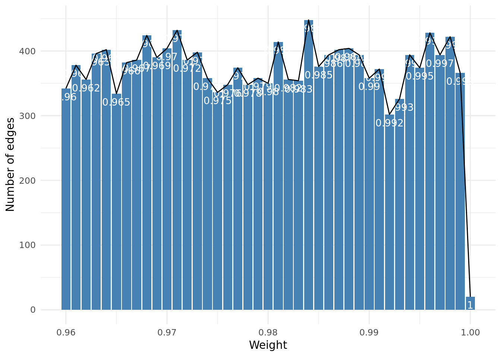

#### Degree distribution of item->similarity->item edges

#### Degree distribution of agent->knows->agent edges

#### Runing time by method 

<table class="table table-condensed" style="width: auto !important; ">
 <thead>
  <tr>
   <th style="text-align:left;">   </th>
   <th style="text-align:left;"> key </th>
   <th style="text-align:right;"> doc_count </th>
   <th style="text-align:right;"> sum_wallTime_ms.value </th>
   <th style="text-align:left;"> avg_wallTime_ms.value </th>
   <th style="text-align:left;"> includedInTotal </th>
  </tr>
 </thead>
<tbody>
  <tr>
   <td style="text-align:left;"> 1 </td>
   <td style="text-align:left;"> knowsAgent </td>
   <td style="text-align:right;"> 601 </td>
   <td style="text-align:right;"> 1,269 </td>
   <td style="text-align:left;"> 2.11148086522463 </td>
   <td style="text-align:left;"> No </td>
  </tr>
  <tr>
   <td style="text-align:left;"> 2 </td>
   <td style="text-align:left;"> addItemToWork </td>
   <td style="text-align:right;"> 420 </td>
   <td style="text-align:right;"> 3,023 </td>
   <td style="text-align:left;"> 7.19761904761905 </td>
   <td style="text-align:left;"> No </td>
  </tr>
  <tr>
   <td style="text-align:left;"> 3 </td>
   <td style="text-align:left;"> ownsWork </td>
   <td style="text-align:right;"> 210 </td>
   <td style="text-align:right;"> 2,803 </td>
   <td style="text-align:left;"> 13.347619047619 </td>
   <td style="text-align:left;"> No </td>
  </tr>
  <tr>
   <td style="text-align:left;"> 4 </td>
   <td style="text-align:left;"> init </td>
   <td style="text-align:right;"> 103 </td>
   <td style="text-align:right;"> 12,340 </td>
   <td style="text-align:left;"> 119.805825242718 </td>
   <td style="text-align:left;"> No </td>
  </tr>
  <tr>
   <td style="text-align:left;"> 5 </td>
   <td style="text-align:left;"> searchAndConnect </td>
   <td style="text-align:right;"> 101 </td>
   <td style="text-align:right;"> 140,210 </td>
   <td style="text-align:left;"> 1388.21782178218 </td>
   <td style="text-align:left;"> Yes </td>
  </tr>
  <tr>
   <td style="text-align:left;"> 6 </td>
   <td style="text-align:left;"> getWorksItems </td>
   <td style="text-align:right;"> 18 </td>
   <td style="text-align:right;"> 78 </td>
   <td style="text-align:left;"> 4.33333333333333 </td>
   <td style="text-align:left;"> Yes </td>
  </tr>
  <tr>
   <td style="text-align:left;"> 8 </td>
   <td style="text-align:left;"> cycleSearch </td>
   <td style="text-align:right;"> 5 </td>
   <td style="text-align:right;"> 1,272 </td>
   <td style="text-align:left;"> 254.4 </td>
   <td style="text-align:left;"> Yes </td>
  </tr>
  <tr>
   <td style="text-align:left;"> 10 </td>
   <td style="text-align:left;"> getWorks </td>
   <td style="text-align:right;"> 5 </td>
   <td style="text-align:right;"> 1,034 </td>
   <td style="text-align:left;"> 206.8 </td>
   <td style="text-align:left;"> No </td>
  </tr>
  <tr>
   <td style="text-align:left;font-weight: bold;"> 11 </td>
   <td style="text-align:left;font-weight: bold;"> Total </td>
   <td style="text-align:right;font-weight: bold;"> 134 </td>
   <td style="text-align:right;font-weight: bold;"> 143,159 </td>
   <td style="text-align:left;font-weight: bold;">  </td>
   <td style="text-align:left;font-weight: bold;">  </td>
  </tr>
</tbody>
</table>
####  Found structures 

#####  Cycles 

Number of cycles found:  5 

<button class="btn btn-primary" data-toggle="collapse" data-target="#IPELOIYJOX"> Show/Hide foundCycle query </button> 
 
  
     GET /filebeat-*/_search 
              { 
                "query": {
                  "bool": {
                    "must": [
                      { "match_phrase": {
                        "simulationId": "SIM10-13-01-09-KXfm7X--DV"
                        }
                      },
                      { "bool": {
                        "should": [
                          { "match": {
                            "keyword": "foundCycle"
                          }}
                        ]
                      }}
                    ]
                  }
                }
              }
     

#####  Paths 

Number of paths found:  0 

<button class="btn btn-primary" data-toggle="collapse" data-target="#MEPCCRCFFJ"> Show/Hide foundPath query </button> 
 
  
     GET /filebeat-*/_search 
              { 
                "query": {
                  "bool": {
                    "must": [
                      { "match_phrase": {
                        "simulationId": "SIM10-13-01-09-KXfm7X--DV"
                        }
                      },
                      { "bool": {
                        "should": [
                          { "match": {
                            "keyword": "foundPath"
                          }}
                        ]
                      }}
                    ]
                  }
                }
              }
     

###  SIM10-13-10-57-Uqhqah--CV 

#### simulationParameters 

<table class="table table-condensed" style="width: auto !important; ">
 <thead>
  <tr>
   <th style="text-align:left;"> agentNumber </th>
   <th style="text-align:left;"> similarityConnectThreshold </th>
   <th style="text-align:left;"> graphType </th>
   <th style="text-align:left;"> chainLength </th>
   <th style="text-align:left;"> similaritySearchThreshold </th>
   <th style="text-align:left;"> maxDistance </th>
   <th style="text-align:left;"> randomWorksNumberMultiplier </th>
  </tr>
 </thead>
<tbody>
  <tr>
   <td style="text-align:left;width: 20em; "> 100 </td>
   <td style="text-align:left;width: 15em; "> 0.96 </td>
   <td style="text-align:left;width: 15em; "> random </td>
   <td style="text-align:left;width: 15em; "> 10 </td>
   <td style="text-align:left;width: 15em; "> 1 </td>
   <td style="text-align:left;width: 15em; "> 5 </td>
   <td style="text-align:left;width: 15em; "> 1 </td>
  </tr>
</tbody>
</table>
#### allEdgesByLabel

<table class="table table-condensed" style="width: auto !important; ">
 <thead>
  <tr>
   <th style="text-align:right;"> edges_offers </th>
   <th style="text-align:right;"> edges_similarity </th>
   <th style="text-align:right;"> edges_owns </th>
   <th style="text-align:right;"> edges_demands </th>
   <th style="text-align:right;"> edges_knows </th>
   <th style="text-align:right;"> edges_total </th>
  </tr>
 </thead>
<tbody>
  <tr>
   <td style="text-align:right;width: 5em; "> 110 </td>
   <td style="text-align:right;width: 5em; "> 4,020 </td>
   <td style="text-align:right;width: 5em; "> 110 </td>
   <td style="text-align:right;width: 5em; "> 110 </td>
   <td style="text-align:right;width: 5em; "> 100 </td>
   <td style="text-align:right;width: 5em; "> 4,450 </td>
  </tr>
</tbody>
</table>
#### allVerticesByType

<table class="table table-condensed" style="width: auto !important; ">
 <thead>
  <tr>
   <th style="text-align:right;"> vertices_agent </th>
   <th style="text-align:right;"> vertices_item </th>
   <th style="text-align:right;"> vertices_work </th>
   <th style="text-align:right;"> vertices_total </th>
  </tr>
 </thead>
<tbody>
  <tr>
   <td style="text-align:right;width: 5em; "> 101 </td>
   <td style="text-align:right;width: 5em; "> 220 </td>
   <td style="text-align:right;width: 5em; "> 110 </td>
   <td style="text-align:right;width: 5em; "> 431 </td>
  </tr>
</tbody>
</table>
#### distribution of similarityEdgesByWeight

#### Degree distribution of item->similarity->item edges

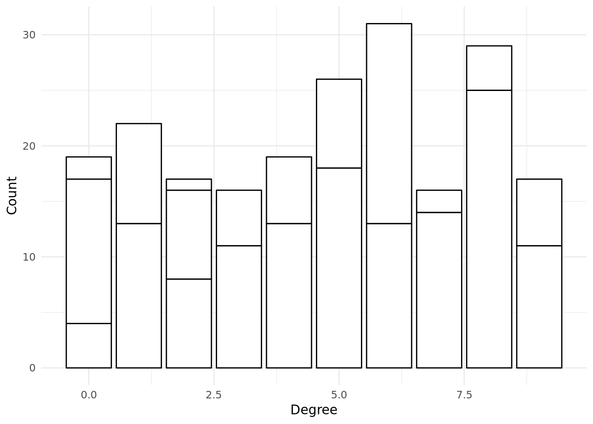

#### Degree distribution of agent->knows->agent edges

#### Runing time by method 

<table class="table table-condensed" style="width: auto !important; ">
 <thead>
  <tr>
   <th style="text-align:left;"> key </th>
   <th style="text-align:right;"> doc_count </th>
   <th style="text-align:right;"> sum_wallTime_ms.value </th>
   <th style="text-align:left;"> avg_wallTime_ms.value </th>
   <th style="text-align:left;"> includedInTotal </th>
  </tr>
 </thead>
<tbody>
  <tr>
   <td style="text-align:left;"> connectIfSimilar </td>
   <td style="text-align:right;"> 24,090 </td>
   <td style="text-align:right;"> 54,366 </td>
   <td style="text-align:left;"> 2.25678704856787 </td>
   <td style="text-align:left;"> No </td>
  </tr>
  <tr>
   <td style="text-align:left;"> existsSimilarity </td>
   <td style="text-align:right;"> 24,090 </td>
   <td style="text-align:right;"> 50,516 </td>
   <td style="text-align:left;"> 2.0969696969697 </td>
   <td style="text-align:left;"> No </td>
  </tr>
  <tr>
   <td style="text-align:left;"> similarityEdges </td>
   <td style="text-align:right;"> 24,090 </td>
   <td style="text-align:right;"> 49,792 </td>
   <td style="text-align:left;"> 2.06691573266916 </td>
   <td style="text-align:left;"> No </td>
  </tr>
  <tr>
   <td style="text-align:left;"> connect </td>
   <td style="text-align:right;"> 1,237 </td>
   <td style="text-align:right;"> 3,344 </td>
   <td style="text-align:left;"> 2.70331447049313 </td>
   <td style="text-align:left;"> Yes </td>
  </tr>
  <tr>
   <td style="text-align:left;"> connectAllSimilar </td>
   <td style="text-align:right;"> 220 </td>
   <td style="text-align:right;"> 54,605 </td>
   <td style="text-align:left;"> 248.204545454545 </td>
   <td style="text-align:left;"> Yes </td>
  </tr>
  <tr>
   <td style="text-align:left;"> init </td>
   <td style="text-align:right;"> 103 </td>
   <td style="text-align:right;"> 11,563 </td>
   <td style="text-align:left;"> 112.26213592233 </td>
   <td style="text-align:left;"> No </td>
  </tr>
  <tr>
   <td style="text-align:left;font-weight: bold;"> Total </td>
   <td style="text-align:right;font-weight: bold;"> 1,465 </td>
   <td style="text-align:right;font-weight: bold;"> 58,386 </td>
   <td style="text-align:left;font-weight: bold;">  </td>
   <td style="text-align:left;font-weight: bold;">  </td>
  </tr>
</tbody>
</table>
####  Found structures 

#####  Cycles 

Number of cycles found:  1 

<button class="btn btn-primary" data-toggle="collapse" data-target="#CIQJTXGVPH"> Show/Hide foundCycle query </button> 
 
  
     GET /filebeat-*/_search 
              { 
                "query": {
                  "bool": {
                    "must": [
                      { "match_phrase": {
                        "simulationId": "SIM10-13-10-57-Uqhqah--CV"
                        }
                      },
                      { "bool": {
                        "should": [
                          { "match": {
                            "keyword": "foundCycle"
                          }}
                        ]
                      }}
                    ]
                  }
                }
              }
     

#####  Paths 

Number of paths found:  0 

<button class="btn btn-primary" data-toggle="collapse" data-target="#HZEWBHRKPP"> Show/Hide foundPath query </button> 
 
  
     GET /filebeat-*/_search 
              { 
                "query": {
                  "bool": {
                    "must": [
                      { "match_phrase": {
                        "simulationId": "SIM10-13-10-57-Uqhqah--CV"
                        }
                      },
                      { "bool": {
                        "should": [
                          { "match": {
                            "keyword": "foundPath"
                          }}
                        ]
                      }}
                    ]
                  }
                }
              }
     

###  SIM10-13-10-57-Uqhqah--DV 

#### simulationParameters 

<table class="table table-condensed" style="width: auto !important; ">
 <thead>
  <tr>
   <th style="text-align:left;"> agentNumber </th>
   <th style="text-align:left;"> similarityConnectThreshold </th>
   <th style="text-align:left;"> graphType </th>
   <th style="text-align:left;"> chainLength </th>
   <th style="text-align:left;"> similaritySearchThreshold </th>
   <th style="text-align:left;"> maxDistance </th>
   <th style="text-align:left;"> randomWorksNumberMultiplier </th>
  </tr>
 </thead>
<tbody>
  <tr>
   <td style="text-align:left;width: 20em; "> 100 </td>
   <td style="text-align:left;width: 15em; "> 0.96 </td>
   <td style="text-align:left;width: 15em; "> random </td>
   <td style="text-align:left;width: 15em; "> 10 </td>
   <td style="text-align:left;width: 15em; "> 1 </td>
   <td style="text-align:left;width: 15em; "> 5 </td>
   <td style="text-align:left;width: 15em; "> 1 </td>
  </tr>
</tbody>
</table>
#### allEdgesByLabel

<table class="table table-condensed" style="width: auto !important; ">
 <thead>
  <tr>
   <th style="text-align:right;"> edges_offers </th>
   <th style="text-align:right;"> edges_similarity </th>
   <th style="text-align:right;"> edges_owns </th>
   <th style="text-align:right;"> edges_demands </th>
   <th style="text-align:right;"> edges_knows </th>
   <th style="text-align:right;"> edges_total </th>
  </tr>
 </thead>
<tbody>
  <tr>
   <td style="text-align:right;width: 5em; "> 110 </td>
   <td style="text-align:right;width: 5em; "> 1,546 </td>
   <td style="text-align:right;width: 5em; "> 110 </td>
   <td style="text-align:right;width: 5em; "> 110 </td>
   <td style="text-align:right;width: 5em; "> 100 </td>
   <td style="text-align:right;width: 5em; "> 1,976 </td>
  </tr>
</tbody>
</table>
#### allVerticesByType

<table class="table table-condensed" style="width: auto !important; ">
 <thead>
  <tr>
   <th style="text-align:right;"> vertices_agent </th>
   <th style="text-align:right;"> vertices_item </th>
   <th style="text-align:right;"> vertices_work </th>
   <th style="text-align:right;"> vertices_total </th>
  </tr>
 </thead>
<tbody>
  <tr>
   <td style="text-align:right;width: 5em; "> 101 </td>
   <td style="text-align:right;width: 5em; "> 220 </td>
   <td style="text-align:right;width: 5em; "> 110 </td>
   <td style="text-align:right;width: 5em; "> 431 </td>
  </tr>
</tbody>
</table>
#### distribution of similarityEdgesByWeight

#### Degree distribution of item->similarity->item edges

#### Degree distribution of agent->knows->agent edges

#### Runing time by method 

<table class="table table-condensed" style="width: auto !important; ">
 <thead>
  <tr>
   <th style="text-align:left;">   </th>
   <th style="text-align:left;"> key </th>
   <th style="text-align:right;"> doc_count </th>
   <th style="text-align:right;"> sum_wallTime_ms.value </th>
   <th style="text-align:left;"> avg_wallTime_ms.value </th>
   <th style="text-align:left;"> includedInTotal </th>
  </tr>
 </thead>
<tbody>
  <tr>
   <td style="text-align:left;"> 2 </td>
   <td style="text-align:left;"> cycleSearch </td>
   <td style="text-align:right;"> 3,600 </td>
   <td style="text-align:right;"> 35,995 </td>
   <td style="text-align:left;"> 9.99861111111111 </td>
   <td style="text-align:left;"> Yes </td>
  </tr>
  <tr>
   <td style="text-align:left;"> 3 </td>
   <td style="text-align:left;"> getWorks </td>
   <td style="text-align:right;"> 3,600 </td>
   <td style="text-align:right;"> 49,946 </td>
   <td style="text-align:left;"> 13.8738888888889 </td>
   <td style="text-align:left;"> No </td>
  </tr>
  <tr>
   <td style="text-align:left;"> 4 </td>
   <td style="text-align:left;"> individualCycleSearch </td>
   <td style="text-align:right;"> 3,600 </td>
   <td style="text-align:right;"> 98 </td>
   <td style="text-align:left;"> 0.0272222222222222 </td>
   <td style="text-align:left;"> Yes </td>
  </tr>
  <tr>
   <td style="text-align:left;"> 6 </td>
   <td style="text-align:left;"> addItemToWork </td>
   <td style="text-align:right;"> 220 </td>
   <td style="text-align:right;"> 2,564 </td>
   <td style="text-align:left;"> 11.6545454545455 </td>
   <td style="text-align:left;"> No </td>
  </tr>
  <tr>
   <td style="text-align:left;"> 7 </td>
   <td style="text-align:left;"> ownsWork </td>
   <td style="text-align:right;"> 110 </td>
   <td style="text-align:right;"> 2,394 </td>
   <td style="text-align:left;"> 21.7636363636364 </td>
   <td style="text-align:left;"> No </td>
  </tr>
  <tr>
   <td style="text-align:left;"> 8 </td>
   <td style="text-align:left;"> init </td>
   <td style="text-align:right;"> 103 </td>
   <td style="text-align:right;"> 12,454 </td>
   <td style="text-align:left;"> 120.912621359223 </td>
   <td style="text-align:left;"> No </td>
  </tr>
  <tr>
   <td style="text-align:left;"> 9 </td>
   <td style="text-align:left;"> searchAndConnect </td>
   <td style="text-align:right;"> 101 </td>
   <td style="text-align:right;"> 14,001 </td>
   <td style="text-align:left;"> 138.623762376238 </td>
   <td style="text-align:left;"> Yes </td>
  </tr>
  <tr>
   <td style="text-align:left;"> 10 </td>
   <td style="text-align:left;"> knowsAgent </td>
   <td style="text-align:right;"> 100 </td>
   <td style="text-align:right;"> 294 </td>
   <td style="text-align:left;"> 2.94 </td>
   <td style="text-align:left;"> No </td>
  </tr>
  <tr>
   <td style="text-align:left;font-weight: bold;"> 1 </td>
   <td style="text-align:left;font-weight: bold;"> Total </td>
   <td style="text-align:right;font-weight: bold;"> 14,501 </td>
   <td style="text-align:right;font-weight: bold;"> 161,927 </td>
   <td style="text-align:left;font-weight: bold;">  </td>
   <td style="text-align:left;font-weight: bold;">  </td>
  </tr>
</tbody>
</table>
####  Found structures 

#####  Cycles 

Number of cycles found:  0 

<button class="btn btn-primary" data-toggle="collapse" data-target="#DQIXUBKQRS"> Show/Hide foundCycle query </button> 
 
  
     GET /filebeat-*/_search 
              { 
                "query": {
                  "bool": {
                    "must": [
                      { "match_phrase": {
                        "simulationId": "SIM10-13-10-57-Uqhqah--DV"
                        }
                      },
                      { "bool": {
                        "should": [
                          { "match": {
                            "keyword": "foundCycle"
                          }}
                        ]
                      }}
                    ]
                  }
                }
              }
     

#####  Paths 

Number of paths found:  3600 

<button class="btn btn-primary" data-toggle="collapse" data-target="#FEMFBKNFEY"> Show/Hide foundPath query </button> 
 
  
     GET /filebeat-*/_search 
              { 
                "query": {
                  "bool": {
                    "must": [
                      { "match_phrase": {
                        "simulationId": "SIM10-13-10-57-Uqhqah--DV"
                        }
                      },
                      { "bool": {
                        "should": [
                          { "match": {
                            "keyword": "foundPath"
                          }}
                        ]
                      }}
                    ]
                  }
                }
              }
     

###  SIM10-13-11-58-fCLnXJ--CV 

#### simulationParameters 

<table class="table table-condensed" style="width: auto !important; ">
 <thead>
  <tr>
   <th style="text-align:left;"> agentNumber </th>
   <th style="text-align:left;"> similarityConnectThreshold </th>
   <th style="text-align:left;"> graphType </th>
   <th style="text-align:left;"> chainLength </th>
   <th style="text-align:left;"> similaritySearchThreshold </th>
   <th style="text-align:left;"> maxDistance </th>
   <th style="text-align:left;"> randomWorksNumberMultiplier </th>
  </tr>
 </thead>
<tbody>
  <tr>
   <td style="text-align:left;width: 20em; "> 100 </td>
   <td style="text-align:left;width: 15em; "> 0.96 </td>
   <td style="text-align:left;width: 15em; "> smallWorld </td>
   <td style="text-align:left;width: 15em; "> 10 </td>
   <td style="text-align:left;width: 15em; "> 1 </td>
   <td style="text-align:left;width: 15em; "> 5 </td>
   <td style="text-align:left;width: 15em; "> 1 </td>
  </tr>
</tbody>
</table>
#### allEdgesByLabel

<table class="table table-condensed" style="width: auto !important; ">
 <thead>
  <tr>
   <th style="text-align:right;"> edges_offers </th>
   <th style="text-align:right;"> edges_similarity </th>
   <th style="text-align:right;"> edges_owns </th>
   <th style="text-align:right;"> edges_demands </th>
   <th style="text-align:right;"> edges_knows </th>
   <th style="text-align:right;"> edges_total </th>
  </tr>
 </thead>
<tbody>
  <tr>
   <td style="text-align:right;width: 5em; "> 110 </td>
   <td style="text-align:right;width: 5em; "> 4,478 </td>
   <td style="text-align:right;width: 5em; "> 110 </td>
   <td style="text-align:right;width: 5em; "> 110 </td>
   <td style="text-align:right;width: 5em; "> 601 </td>
   <td style="text-align:right;width: 5em; "> 5,409 </td>
  </tr>
</tbody>
</table>
#### allVerticesByType

<table class="table table-condensed" style="width: auto !important; ">
 <thead>
  <tr>
   <th style="text-align:right;"> vertices_agent </th>
   <th style="text-align:right;"> vertices_item </th>
   <th style="text-align:right;"> vertices_work </th>
   <th style="text-align:right;"> vertices_total </th>
  </tr>
 </thead>
<tbody>
  <tr>
   <td style="text-align:right;width: 5em; "> 101 </td>
   <td style="text-align:right;width: 5em; "> 220 </td>
   <td style="text-align:right;width: 5em; "> 110 </td>
   <td style="text-align:right;width: 5em; "> 431 </td>
  </tr>
</tbody>
</table>
#### distribution of similarityEdgesByWeight

#### Degree distribution of item->similarity->item edges

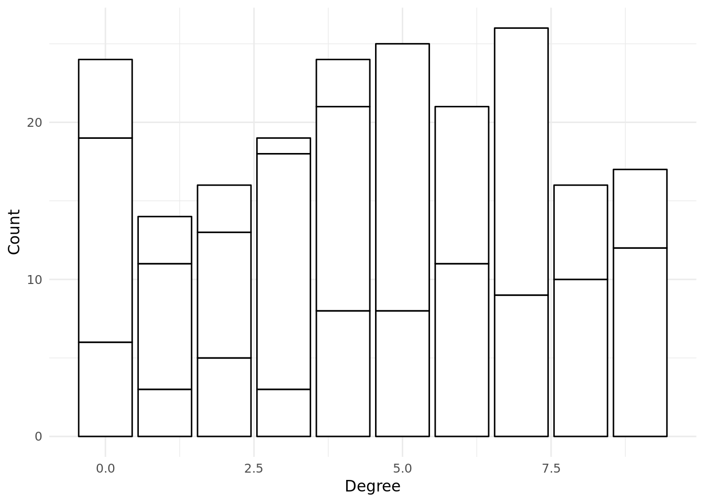

#### Degree distribution of agent->knows->agent edges

#### Runing time by method 

<table class="table table-condensed" style="width: auto !important; ">
 <thead>
  <tr>
   <th style="text-align:left;"> key </th>
   <th style="text-align:right;"> doc_count </th>
   <th style="text-align:right;"> sum_wallTime_ms.value </th>
   <th style="text-align:left;"> avg_wallTime_ms.value </th>
   <th style="text-align:left;"> includedInTotal </th>
  </tr>
 </thead>
<tbody>
  <tr>
   <td style="text-align:left;"> connectIfSimilar </td>
   <td style="text-align:right;"> 24,090 </td>
   <td style="text-align:right;"> 54,268 </td>
   <td style="text-align:left;"> 2.25271897052719 </td>
   <td style="text-align:left;"> No </td>
  </tr>
  <tr>
   <td style="text-align:left;"> existsSimilarity </td>
   <td style="text-align:right;"> 24,090 </td>
   <td style="text-align:right;"> 53,750 </td>
   <td style="text-align:left;"> 2.23121627231216 </td>
   <td style="text-align:left;"> No </td>
  </tr>
  <tr>
   <td style="text-align:left;"> similarityEdges </td>
   <td style="text-align:right;"> 24,090 </td>
   <td style="text-align:right;"> 52,940 </td>
   <td style="text-align:left;"> 2.19759236197592 </td>
   <td style="text-align:left;"> No </td>
  </tr>
  <tr>
   <td style="text-align:left;"> connectAllSimilar </td>
   <td style="text-align:right;"> 220 </td>
   <td style="text-align:right;"> 54,492 </td>
   <td style="text-align:left;"> 247.690909090909 </td>
   <td style="text-align:left;"> Yes </td>
  </tr>
  <tr>
   <td style="text-align:left;"> init </td>
   <td style="text-align:right;"> 103 </td>
   <td style="text-align:right;"> 11,251 </td>
   <td style="text-align:left;"> 109.233009708738 </td>
   <td style="text-align:left;"> No </td>
  </tr>
  <tr>
   <td style="text-align:left;"> connect </td>
   <td style="text-align:right;"> 26 </td>
   <td style="text-align:right;"> 134 </td>
   <td style="text-align:left;"> 5.15384615384615 </td>
   <td style="text-align:left;"> Yes </td>
  </tr>
  <tr>
   <td style="text-align:left;font-weight: bold;"> Total </td>
   <td style="text-align:right;font-weight: bold;"> 254 </td>
   <td style="text-align:right;font-weight: bold;"> 54,938 </td>
   <td style="text-align:left;font-weight: bold;">  </td>
   <td style="text-align:left;font-weight: bold;">  </td>
  </tr>
</tbody>
</table>
####  Found structures 

#####  Cycles 

Number of cycles found:  1 

<button class="btn btn-primary" data-toggle="collapse" data-target="#CFBWJVSFJG"> Show/Hide foundCycle query </button> 
 
  
     GET /filebeat-*/_search 
              { 
                "query": {
                  "bool": {
                    "must": [
                      { "match_phrase": {
                        "simulationId": "SIM10-13-11-58-fCLnXJ--CV"
                        }
                      },
                      { "bool": {
                        "should": [
                          { "match": {
                            "keyword": "foundCycle"
                          }}
                        ]
                      }}
                    ]
                  }
                }
              }
     

#####  Paths 

Number of paths found:  0 

<button class="btn btn-primary" data-toggle="collapse" data-target="#EKRTCDLQKN"> Show/Hide foundPath query </button> 
 
  
     GET /filebeat-*/_search 
              { 
                "query": {
                  "bool": {
                    "must": [
                      { "match_phrase": {
                        "simulationId": "SIM10-13-11-58-fCLnXJ--CV"
                        }
                      },
                      { "bool": {
                        "should": [
                          { "match": {
                            "keyword": "foundPath"
                          }}
                        ]
                      }}
                    ]
                  }
                }
              }
     

###  SIM10-13-11-58-fCLnXJ--DV 

#### simulationParameters 

<table class="table table-condensed" style="width: auto !important; ">
 <thead>
  <tr>
   <th style="text-align:left;"> agentNumber </th>
   <th style="text-align:left;"> similarityConnectThreshold </th>
   <th style="text-align:left;"> graphType </th>
   <th style="text-align:left;"> chainLength </th>
   <th style="text-align:left;"> similaritySearchThreshold </th>
   <th style="text-align:left;"> maxDistance </th>
   <th style="text-align:left;"> randomWorksNumberMultiplier </th>
  </tr>
 </thead>
<tbody>
  <tr>
   <td style="text-align:left;width: 20em; "> 100 </td>
   <td style="text-align:left;width: 15em; "> 0.96 </td>
   <td style="text-align:left;width: 15em; "> smallWorld </td>
   <td style="text-align:left;width: 15em; "> 10 </td>
   <td style="text-align:left;width: 15em; "> 1 </td>
   <td style="text-align:left;width: 15em; "> 5 </td>
   <td style="text-align:left;width: 15em; "> 1 </td>
  </tr>
</tbody>
</table>
#### allEdgesByLabel

<table class="table table-condensed" style="width: auto !important; ">
 <thead>
  <tr>
   <th style="text-align:right;"> edges_offers </th>
   <th style="text-align:right;"> edges_similarity </th>
   <th style="text-align:right;"> edges_owns </th>
   <th style="text-align:right;"> edges_demands </th>
   <th style="text-align:right;"> edges_knows </th>
   <th style="text-align:right;"> edges_total </th>
  </tr>
 </thead>
<tbody>
  <tr>
   <td style="text-align:right;width: 5em; "> 110 </td>
   <td style="text-align:right;width: 5em; "> 4,426 </td>
   <td style="text-align:right;width: 5em; "> 110 </td>
   <td style="text-align:right;width: 5em; "> 110 </td>
   <td style="text-align:right;width: 5em; "> 601 </td>
   <td style="text-align:right;width: 5em; "> 5,357 </td>
  </tr>
</tbody>
</table>
#### allVerticesByType

<table class="table table-condensed" style="width: auto !important; ">
 <thead>
  <tr>
   <th style="text-align:right;"> vertices_agent </th>
   <th style="text-align:right;"> vertices_item </th>
   <th style="text-align:right;"> vertices_work </th>
   <th style="text-align:right;"> vertices_total </th>
  </tr>
 </thead>
<tbody>
  <tr>
   <td style="text-align:right;width: 5em; "> 101 </td>
   <td style="text-align:right;width: 5em; "> 220 </td>
   <td style="text-align:right;width: 5em; "> 110 </td>
   <td style="text-align:right;width: 5em; "> 431 </td>
  </tr>
</tbody>
</table>
#### distribution of similarityEdgesByWeight

#### Degree distribution of item->similarity->item edges

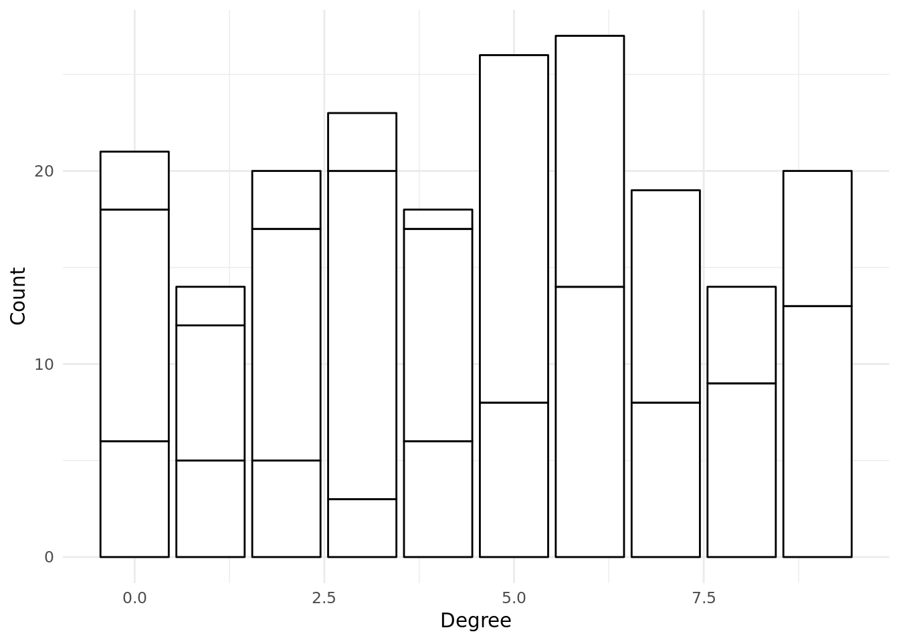

#### Degree distribution of agent->knows->agent edges

#### Runing time by method 

<table class="table table-condensed" style="width: auto !important; ">
 <thead>
  <tr>
   <th style="text-align:left;">   </th>
   <th style="text-align:left;"> key </th>
   <th style="text-align:right;"> doc_count </th>
   <th style="text-align:right;"> sum_wallTime_ms.value </th>
   <th style="text-align:left;"> avg_wallTime_ms.value </th>
   <th style="text-align:left;"> includedInTotal </th>
  </tr>
 </thead>
<tbody>
  <tr>
   <td style="text-align:left;"> 1 </td>
   <td style="text-align:left;"> knowsAgent </td>
   <td style="text-align:right;"> 601 </td>
   <td style="text-align:right;"> 1,457 </td>
   <td style="text-align:left;"> 2.4242928452579 </td>
   <td style="text-align:left;"> No </td>
  </tr>
  <tr>
   <td style="text-align:left;"> 2 </td>
   <td style="text-align:left;"> addItemToWork </td>
   <td style="text-align:right;"> 220 </td>
   <td style="text-align:right;"> 2,094 </td>
   <td style="text-align:left;"> 9.51818181818182 </td>
   <td style="text-align:left;"> No </td>
  </tr>
  <tr>
   <td style="text-align:left;"> 3 </td>
   <td style="text-align:left;"> ownsWork </td>
   <td style="text-align:right;"> 110 </td>
   <td style="text-align:right;"> 1,639 </td>
   <td style="text-align:left;"> 14.9 </td>
   <td style="text-align:left;"> No </td>
  </tr>
  <tr>
   <td style="text-align:left;"> 4 </td>
   <td style="text-align:left;"> init </td>
   <td style="text-align:right;"> 103 </td>
   <td style="text-align:right;"> 12,403 </td>
   <td style="text-align:left;"> 120.417475728155 </td>
   <td style="text-align:left;"> No </td>
  </tr>
  <tr>
   <td style="text-align:left;"> 5 </td>
   <td style="text-align:left;"> searchAndConnect </td>
   <td style="text-align:right;"> 101 </td>
   <td style="text-align:right;"> 55,723 </td>
   <td style="text-align:left;"> 551.712871287129 </td>
   <td style="text-align:left;"> Yes </td>
  </tr>
  <tr>
   <td style="text-align:left;"> 6 </td>
   <td style="text-align:left;"> getWorksItems </td>
   <td style="text-align:right;"> 18 </td>
   <td style="text-align:right;"> 22 </td>
   <td style="text-align:left;"> 1.22222222222222 </td>
   <td style="text-align:left;"> Yes </td>
  </tr>
  <tr>
   <td style="text-align:left;"> 9 </td>
   <td style="text-align:left;"> cycleSearch </td>
   <td style="text-align:right;"> 3 </td>
   <td style="text-align:right;"> 40 </td>
   <td style="text-align:left;"> 13.3333333333333 </td>
   <td style="text-align:left;"> Yes </td>
  </tr>
  <tr>
   <td style="text-align:left;"> 10 </td>
   <td style="text-align:left;"> getWorks </td>
   <td style="text-align:right;"> 3 </td>
   <td style="text-align:right;"> 51 </td>
   <td style="text-align:left;"> 17 </td>
   <td style="text-align:left;"> No </td>
  </tr>
  <tr>
   <td style="text-align:left;font-weight: bold;"> 11 </td>
   <td style="text-align:left;font-weight: bold;"> Total </td>
   <td style="text-align:right;font-weight: bold;"> 130 </td>
   <td style="text-align:right;font-weight: bold;"> 56,268 </td>
   <td style="text-align:left;font-weight: bold;">  </td>
   <td style="text-align:left;font-weight: bold;">  </td>
  </tr>
</tbody>
</table>
####  Found structures 

#####  Cycles 

Number of cycles found:  2 

<button class="btn btn-primary" data-toggle="collapse" data-target="#XWILBYNGJJ"> Show/Hide foundCycle query </button> 
 
  
     GET /filebeat-*/_search 
              { 
                "query": {
                  "bool": {
                    "must": [
                      { "match_phrase": {
                        "simulationId": "SIM10-13-11-58-fCLnXJ--DV"
                        }
                      },
                      { "bool": {
                        "should": [
                          { "match": {
                            "keyword": "foundCycle"
                          }}
                        ]
                      }}
                    ]
                  }
                }
              }
     

#####  Paths 

Number of paths found:  1 

<button class="btn btn-primary" data-toggle="collapse" data-target="#UQYSFZAOAC"> Show/Hide foundPath query </button> 
 
  
     GET /filebeat-*/_search 
              { 
                "query": {
                  "bool": {
                    "must": [
                      { "match_phrase": {
                        "simulationId": "SIM10-13-11-58-fCLnXJ--DV"
                        }
                      },
                      { "bool": {
                        "should": [
                          { "match": {
                            "keyword": "foundPath"
                          }}
                        ]
                      }}
                    ]
                  }
                }
              }
     

###  SIM10-13-12-05-4zLNmU--CV 

#### simulationParameters 

<table class="table table-condensed" style="width: auto !important; ">
 <thead>
  <tr>
   <th style="text-align:left;"> agentNumber </th>
   <th style="text-align:left;"> similarityConnectThreshold </th>
   <th style="text-align:left;"> graphType </th>
   <th style="text-align:left;"> chainLength </th>
   <th style="text-align:left;"> similaritySearchThreshold </th>
   <th style="text-align:left;"> maxDistance </th>
   <th style="text-align:left;"> randomWorksNumberMultiplier </th>
  </tr>
 </thead>
<tbody>
  <tr>
   <td style="text-align:left;width: 20em; "> 100 </td>
   <td style="text-align:left;width: 15em; "> 0.96 </td>
   <td style="text-align:left;width: 15em; "> random </td>
   <td style="text-align:left;width: 15em; "> 10 </td>
   <td style="text-align:left;width: 15em; "> 1 </td>
   <td style="text-align:left;width: 15em; "> 5 </td>
   <td style="text-align:left;width: 15em; "> 2 </td>
  </tr>
</tbody>
</table>
#### allEdgesByLabel

<table class="table table-condensed" style="width: auto !important; ">
 <thead>
  <tr>
   <th style="text-align:right;"> edges_offers </th>
   <th style="text-align:right;"> edges_similarity </th>
   <th style="text-align:right;"> edges_owns </th>
   <th style="text-align:right;"> edges_demands </th>
   <th style="text-align:right;"> edges_knows </th>
   <th style="text-align:right;"> edges_total </th>
  </tr>
 </thead>
<tbody>
  <tr>
   <td style="text-align:right;width: 5em; "> 210 </td>
   <td style="text-align:right;width: 5em; "> 14,206 </td>
   <td style="text-align:right;width: 5em; "> 210 </td>
   <td style="text-align:right;width: 5em; "> 210 </td>
   <td style="text-align:right;width: 5em; "> 100 </td>
   <td style="text-align:right;width: 5em; "> 14,936 </td>
  </tr>
</tbody>
</table>
#### allVerticesByType

<table class="table table-condensed" style="width: auto !important; ">
 <thead>
  <tr>
   <th style="text-align:right;"> vertices_agent </th>
   <th style="text-align:right;"> vertices_item </th>
   <th style="text-align:right;"> vertices_work </th>
   <th style="text-align:right;"> vertices_total </th>
  </tr>
 </thead>
<tbody>
  <tr>
   <td style="text-align:right;width: 5em; "> 101 </td>
   <td style="text-align:right;width: 5em; "> 420 </td>
   <td style="text-align:right;width: 5em; "> 210 </td>
   <td style="text-align:right;width: 5em; "> 731 </td>
  </tr>
</tbody>
</table>
#### distribution of similarityEdgesByWeight

#### Degree distribution of item->similarity->item edges

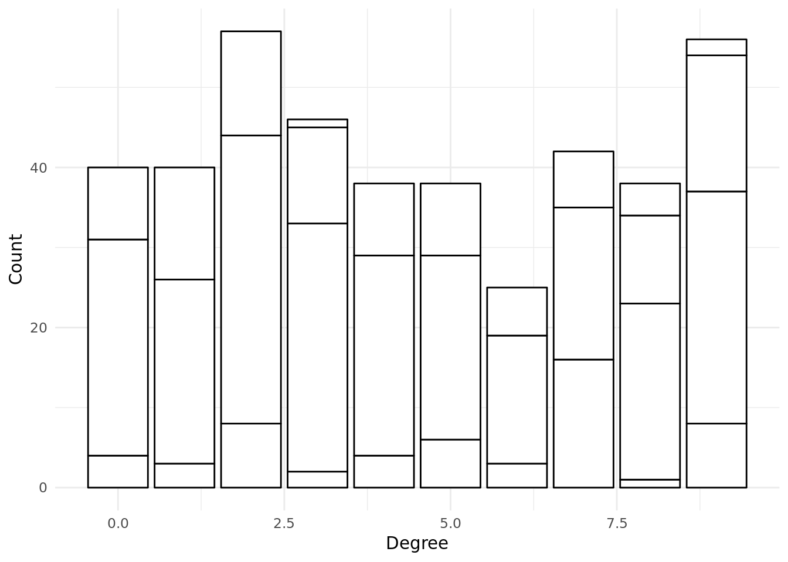

#### Degree distribution of agent->knows->agent edges

#### Runing time by method 

<table class="table table-condensed" style="width: auto !important; ">
 <thead>
  <tr>
   <th style="text-align:left;"> key </th>
   <th style="text-align:right;"> doc_count </th>
   <th style="text-align:right;"> sum_wallTime_ms.value </th>
   <th style="text-align:left;"> avg_wallTime_ms.value </th>
   <th style="text-align:left;"> includedInTotal </th>
  </tr>
 </thead>
<tbody>
  <tr>
   <td style="text-align:left;"> connectIfSimilar </td>
   <td style="text-align:right;"> 87,990 </td>
   <td style="text-align:right;"> 226,960 </td>
   <td style="text-align:left;"> 2.57938402091147 </td>
   <td style="text-align:left;"> No </td>
  </tr>
  <tr>
   <td style="text-align:left;"> existsSimilarity </td>
   <td style="text-align:right;"> 87,990 </td>
   <td style="text-align:right;"> 213,200 </td>
   <td style="text-align:left;"> 2.4230026139334 </td>
   <td style="text-align:left;"> No </td>
  </tr>
  <tr>
   <td style="text-align:left;"> similarityEdges </td>
   <td style="text-align:right;"> 87,990 </td>
   <td style="text-align:right;"> 210,092 </td>
   <td style="text-align:left;"> 2.38768041822934 </td>
   <td style="text-align:left;"> No </td>
  </tr>
  <tr>
   <td style="text-align:left;"> connect </td>
   <td style="text-align:right;"> 4,589 </td>
   <td style="text-align:right;"> 12,065 </td>
   <td style="text-align:left;"> 2.62911309653519 </td>
   <td style="text-align:left;"> Yes </td>
  </tr>
  <tr>
   <td style="text-align:left;"> connectAllSimilar </td>
   <td style="text-align:right;"> 420 </td>
   <td style="text-align:right;"> 227,900 </td>
   <td style="text-align:left;"> 542.619047619048 </td>
   <td style="text-align:left;"> Yes </td>
  </tr>
  <tr>
   <td style="text-align:left;"> init </td>
   <td style="text-align:right;"> 103 </td>
   <td style="text-align:right;"> 11,576 </td>
   <td style="text-align:left;"> 112.388349514563 </td>
   <td style="text-align:left;"> No </td>
  </tr>
  <tr>
   <td style="text-align:left;font-weight: bold;"> Total </td>
   <td style="text-align:right;font-weight: bold;"> 5,017 </td>
   <td style="text-align:right;font-weight: bold;"> 240,457 </td>
   <td style="text-align:left;font-weight: bold;">  </td>
   <td style="text-align:left;font-weight: bold;">  </td>
  </tr>
</tbody>
</table>
####  Found structures 

#####  Cycles 

Number of cycles found:  1 

<button class="btn btn-primary" data-toggle="collapse" data-target="#IRSPMKNNLI"> Show/Hide foundCycle query </button> 
 
  
     GET /filebeat-*/_search 
              { 
                "query": {
                  "bool": {
                    "must": [
                      { "match_phrase": {
                        "simulationId": "SIM10-13-12-05-4zLNmU--CV"
                        }
                      },
                      { "bool": {
                        "should": [
                          { "match": {
                            "keyword": "foundCycle"
                          }}
                        ]
                      }}
                    ]
                  }
                }
              }
     

#####  Paths 

Number of paths found:  0 

<button class="btn btn-primary" data-toggle="collapse" data-target="#BMHJYLBGBI"> Show/Hide foundPath query </button> 
 
  
     GET /filebeat-*/_search 
              { 
                "query": {
                  "bool": {
                    "must": [
                      { "match_phrase": {
                        "simulationId": "SIM10-13-12-05-4zLNmU--CV"
                        }
                      },
                      { "bool": {
                        "should": [
                          { "match": {
                            "keyword": "foundPath"
                          }}
                        ]
                      }}
                    ]
                  }
                }
              }
     

###  SIM10-13-12-05-4zLNmU--DV 

#### simulationParameters 

<table class="table table-condensed" style="width: auto !important; ">
 <thead>
  <tr>
   <th style="text-align:left;"> agentNumber </th>
   <th style="text-align:left;"> similarityConnectThreshold </th>
   <th style="text-align:left;"> graphType </th>
   <th style="text-align:left;"> chainLength </th>
   <th style="text-align:left;"> similaritySearchThreshold </th>
   <th style="text-align:left;"> maxDistance </th>
   <th style="text-align:left;"> randomWorksNumberMultiplier </th>
  </tr>
 </thead>
<tbody>
  <tr>
   <td style="text-align:left;width: 20em; "> 100 </td>
   <td style="text-align:left;width: 15em; "> 0.96 </td>
   <td style="text-align:left;width: 15em; "> random </td>
   <td style="text-align:left;width: 15em; "> 10 </td>
   <td style="text-align:left;width: 15em; "> 1 </td>
   <td style="text-align:left;width: 15em; "> 5 </td>
   <td style="text-align:left;width: 15em; "> 2 </td>
  </tr>
</tbody>
</table>
#### allEdgesByLabel

<table class="table table-condensed" style="width: auto !important; ">
 <thead>
  <tr>
   <th style="text-align:right;"> edges_offers </th>
   <th style="text-align:right;"> edges_similarity </th>
   <th style="text-align:right;"> edges_owns </th>
   <th style="text-align:right;"> edges_demands </th>
   <th style="text-align:right;"> edges_knows </th>
   <th style="text-align:right;"> edges_total </th>
  </tr>
 </thead>
<tbody>
  <tr>
   <td style="text-align:right;width: 5em; "> 210 </td>
   <td style="text-align:right;width: 5em; "> 5,028 </td>
   <td style="text-align:right;width: 5em; "> 210 </td>
   <td style="text-align:right;width: 5em; "> 210 </td>
   <td style="text-align:right;width: 5em; "> 100 </td>
   <td style="text-align:right;width: 5em; "> 5,758 </td>
  </tr>
</tbody>
</table>
#### allVerticesByType

<table class="table table-condensed" style="width: auto !important; ">
 <thead>
  <tr>
   <th style="text-align:right;"> vertices_agent </th>
   <th style="text-align:right;"> vertices_item </th>
   <th style="text-align:right;"> vertices_work </th>
   <th style="text-align:right;"> vertices_total </th>
  </tr>
 </thead>
<tbody>
  <tr>
   <td style="text-align:right;width: 5em; "> 101 </td>
   <td style="text-align:right;width: 5em; "> 420 </td>
   <td style="text-align:right;width: 5em; "> 210 </td>
   <td style="text-align:right;width: 5em; "> 731 </td>
  </tr>
</tbody>
</table>
#### distribution of similarityEdgesByWeight

#### Degree distribution of item->similarity->item edges

#### Degree distribution of agent->knows->agent edges

#### Runing time by method 

<table class="table table-condensed" style="width: auto !important; ">
 <thead>
  <tr>
   <th style="text-align:left;">   </th>
   <th style="text-align:left;"> key </th>
   <th style="text-align:right;"> doc_count </th>
   <th style="text-align:right;"> sum_wallTime_ms.value </th>
   <th style="text-align:left;"> avg_wallTime_ms.value </th>
   <th style="text-align:left;"> includedInTotal </th>
  </tr>
 </thead>
<tbody>
  <tr>
   <td style="text-align:left;"> 2 </td>
   <td style="text-align:left;"> cycleSearch </td>
   <td style="text-align:right;"> 3,600 </td>
   <td style="text-align:right;"> 14,492 </td>
   <td style="text-align:left;"> 4.02555555555556 </td>
   <td style="text-align:left;"> Yes </td>
  </tr>
  <tr>
   <td style="text-align:left;"> 3 </td>
   <td style="text-align:left;"> getWorks </td>
   <td style="text-align:right;"> 3,600 </td>
   <td style="text-align:right;"> 48,240 </td>
   <td style="text-align:left;"> 13.4 </td>
   <td style="text-align:left;"> No </td>
  </tr>
  <tr>
   <td style="text-align:left;"> 4 </td>
   <td style="text-align:left;"> individualCycleSearch </td>
   <td style="text-align:right;"> 3,600 </td>
   <td style="text-align:right;"> 99 </td>
   <td style="text-align:left;"> 0.0275 </td>
   <td style="text-align:left;"> Yes </td>
  </tr>
  <tr>
   <td style="text-align:left;"> 6 </td>
   <td style="text-align:left;"> addItemToWork </td>
   <td style="text-align:right;"> 420 </td>
   <td style="text-align:right;"> 5,585 </td>
   <td style="text-align:left;"> 13.297619047619 </td>
   <td style="text-align:left;"> No </td>
  </tr>
  <tr>
   <td style="text-align:left;"> 7 </td>
   <td style="text-align:left;"> ownsWork </td>
   <td style="text-align:right;"> 210 </td>
   <td style="text-align:right;"> 4,215 </td>
   <td style="text-align:left;"> 20.0714285714286 </td>
   <td style="text-align:left;"> No </td>
  </tr>
  <tr>
   <td style="text-align:left;"> 8 </td>
   <td style="text-align:left;"> init </td>
   <td style="text-align:right;"> 103 </td>
   <td style="text-align:right;"> 12,470 </td>
   <td style="text-align:left;"> 121.067961165049 </td>
   <td style="text-align:left;"> No </td>
  </tr>
  <tr>
   <td style="text-align:left;"> 9 </td>
   <td style="text-align:left;"> searchAndConnect </td>
   <td style="text-align:right;"> 101 </td>
   <td style="text-align:right;"> 38,362 </td>
   <td style="text-align:left;"> 379.821782178218 </td>
   <td style="text-align:left;"> Yes </td>
  </tr>
  <tr>
   <td style="text-align:left;"> 10 </td>
   <td style="text-align:left;"> knowsAgent </td>
   <td style="text-align:right;"> 100 </td>
   <td style="text-align:right;"> 420 </td>
   <td style="text-align:left;"> 4.2 </td>
   <td style="text-align:left;"> No </td>
  </tr>
  <tr>
   <td style="text-align:left;font-weight: bold;"> 1 </td>
   <td style="text-align:left;font-weight: bold;"> Total </td>
   <td style="text-align:right;font-weight: bold;"> 14,501 </td>
   <td style="text-align:right;font-weight: bold;"> 67,252 </td>
   <td style="text-align:left;font-weight: bold;">  </td>
   <td style="text-align:left;font-weight: bold;">  </td>
  </tr>
</tbody>
</table>
####  Found structures 

#####  Cycles 

Number of cycles found:  0 

<button class="btn btn-primary" data-toggle="collapse" data-target="#UTYPAVRMAD"> Show/Hide foundCycle query </button> 
 
  
     GET /filebeat-*/_search 
              { 
                "query": {
                  "bool": {
                    "must": [
                      { "match_phrase": {
                        "simulationId": "SIM10-13-12-05-4zLNmU--DV"
                        }
                      },
                      { "bool": {
                        "should": [
                          { "match": {
                            "keyword": "foundCycle"
                          }}
                        ]
                      }}
                    ]
                  }
                }
              }
     

#####  Paths 

Number of paths found:  3600 

<button class="btn btn-primary" data-toggle="collapse" data-target="#PDRZFDXYXB"> Show/Hide foundPath query </button> 
 
  
     GET /filebeat-*/_search 
              { 
                "query": {
                  "bool": {
                    "must": [
                      { "match_phrase": {
                        "simulationId": "SIM10-13-12-05-4zLNmU--DV"
                        }
                      },
                      { "bool": {
                        "should": [
                          { "match": {
                            "keyword": "foundPath"
                          }}
                        ]
                      }}
                    ]
                  }
                }
              }
     

###  SIM10-13-02-34-MTC3HQ--CV 

#### simulationParameters 

<table class="table table-condensed" style="width: auto !important; ">
 <thead>
  <tr>
   <th style="text-align:left;"> agentNumber </th>
   <th style="text-align:left;"> similarityConnectThreshold </th>
   <th style="text-align:left;"> graphType </th>
   <th style="text-align:left;"> chainLength </th>
   <th style="text-align:left;"> similaritySearchThreshold </th>
   <th style="text-align:left;"> maxDistance </th>
   <th style="text-align:left;"> randomWorksNumberMultiplier </th>
  </tr>
 </thead>
<tbody>
  <tr>
   <td style="text-align:left;width: 20em; "> 100 </td>
   <td style="text-align:left;width: 15em; "> 0.96 </td>
   <td style="text-align:left;width: 15em; "> random </td>
   <td style="text-align:left;width: 15em; "> 20 </td>
   <td style="text-align:left;width: 15em; "> 1 </td>
   <td style="text-align:left;width: 15em; "> 10 </td>
   <td style="text-align:left;width: 15em; "> 1 </td>
  </tr>
</tbody>
</table>
#### allEdgesByLabel

<table class="table table-condensed" style="width: auto !important; ">
 <thead>
  <tr>
   <th style="text-align:right;"> edges_offers </th>
   <th style="text-align:right;"> edges_similarity </th>
   <th style="text-align:right;"> edges_owns </th>
   <th style="text-align:right;"> edges_demands </th>
   <th style="text-align:right;"> edges_knows </th>
   <th style="text-align:right;"> edges_total </th>
  </tr>
 </thead>
<tbody>
  <tr>
   <td style="text-align:right;width: 5em; "> 120 </td>
   <td style="text-align:right;width: 5em; "> 5,062 </td>
   <td style="text-align:right;width: 5em; "> 120 </td>
   <td style="text-align:right;width: 5em; "> 120 </td>
   <td style="text-align:right;width: 5em; "> 100 </td>
   <td style="text-align:right;width: 5em; "> 5,522 </td>
  </tr>
</tbody>
</table>
#### allVerticesByType

<table class="table table-condensed" style="width: auto !important; ">
 <thead>
  <tr>
   <th style="text-align:right;"> vertices_agent </th>
   <th style="text-align:right;"> vertices_item </th>
   <th style="text-align:right;"> vertices_work </th>
   <th style="text-align:right;"> vertices_total </th>
  </tr>
 </thead>
<tbody>
  <tr>
   <td style="text-align:right;width: 5em; "> 101 </td>
   <td style="text-align:right;width: 5em; "> 240 </td>
   <td style="text-align:right;width: 5em; "> 120 </td>
   <td style="text-align:right;width: 5em; "> 461 </td>
  </tr>
</tbody>
</table>
#### distribution of similarityEdgesByWeight

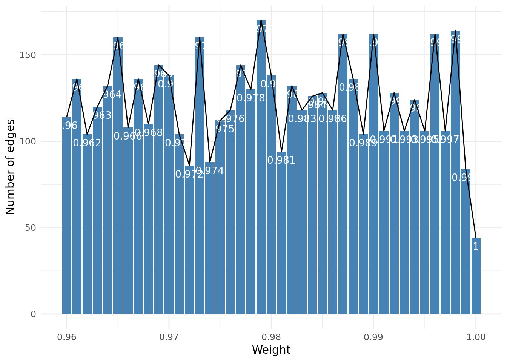

#### Degree distribution of item->similarity->item edges

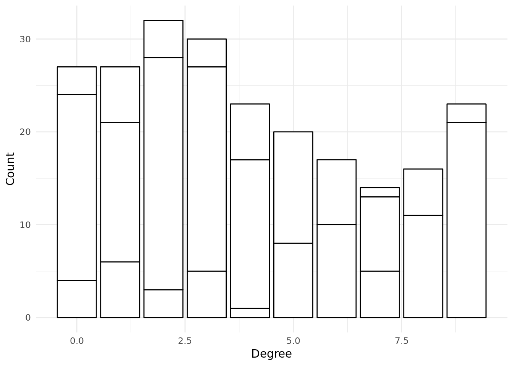

#### Degree distribution of agent->knows->agent edges

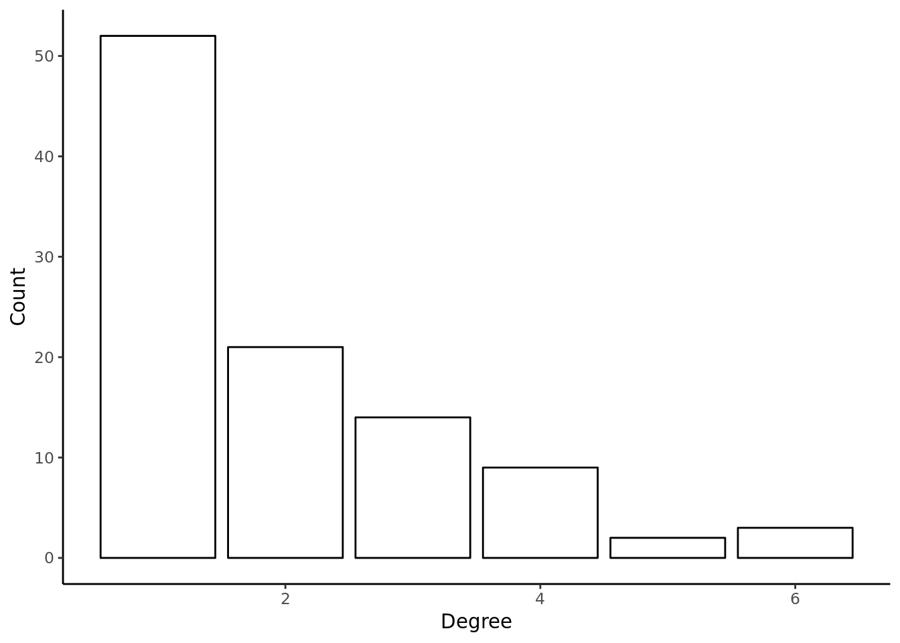

#### Runing time by method 

<table class="table table-condensed" style="width: auto !important; ">
 <thead>
  <tr>
   <th style="text-align:left;"> key </th>
   <th style="text-align:right;"> doc_count </th>
   <th style="text-align:right;"> sum_wallTime_ms.value </th>
   <th style="text-align:left;"> avg_wallTime_ms.value </th>
   <th style="text-align:left;"> includedInTotal </th>
  </tr>
 </thead>
<tbody>
  <tr>
   <td style="text-align:left;"> connectIfSimilar </td>
   <td style="text-align:right;"> 28,680 </td>
   <td style="text-align:right;"> 68,293 </td>
   <td style="text-align:left;"> 2.38120641562064 </td>
   <td style="text-align:left;"> No </td>
  </tr>
  <tr>
   <td style="text-align:left;"> existsSimilarity </td>
   <td style="text-align:right;"> 28,680 </td>
   <td style="text-align:right;"> 66,099 </td>
   <td style="text-align:left;"> 2.30470711297071 </td>
   <td style="text-align:left;"> No </td>
  </tr>
  <tr>
   <td style="text-align:left;"> similarityEdges </td>
   <td style="text-align:right;"> 28,680 </td>
   <td style="text-align:right;"> 65,167 </td>
   <td style="text-align:left;"> 2.27221059972106 </td>
   <td style="text-align:left;"> No </td>
  </tr>
  <tr>
   <td style="text-align:left;"> connect </td>
   <td style="text-align:right;"> 690 </td>
   <td style="text-align:right;"> 1,696 </td>
   <td style="text-align:left;"> 2.45797101449275 </td>
   <td style="text-align:left;"> Yes </td>
  </tr>
  <tr>
   <td style="text-align:left;"> connectAllSimilar </td>
   <td style="text-align:right;"> 240 </td>
   <td style="text-align:right;"> 68,588 </td>
   <td style="text-align:left;"> 285.783333333333 </td>
   <td style="text-align:left;"> Yes </td>
  </tr>
  <tr>
   <td style="text-align:left;"> init </td>
   <td style="text-align:right;"> 103 </td>
   <td style="text-align:right;"> 12,083 </td>
   <td style="text-align:left;"> 117.31067961165 </td>
   <td style="text-align:left;"> No </td>
  </tr>
  <tr>
   <td style="text-align:left;font-weight: bold;"> Total </td>
   <td style="text-align:right;font-weight: bold;"> 938 </td>
   <td style="text-align:right;font-weight: bold;"> 70,823 </td>
   <td style="text-align:left;font-weight: bold;">  </td>
   <td style="text-align:left;font-weight: bold;">  </td>
  </tr>
</tbody>
</table>
####  Found structures 

#####  Cycles 

Number of cycles found:  1 

<button class="btn btn-primary" data-toggle="collapse" data-target="#JJBWNYVTXH"> Show/Hide foundCycle query </button> 
 
  
     GET /filebeat-*/_search 
              { 
                "query": {
                  "bool": {
                    "must": [
                      { "match_phrase": {
                        "simulationId": "SIM10-13-02-34-MTC3HQ--CV"
                        }
                      },
                      { "bool": {
                        "should": [
                          { "match": {
                            "keyword": "foundCycle"
                          }}
                        ]
                      }}
                    ]
                  }
                }
              }
     

#####  Paths 

Number of paths found:  0 

<button class="btn btn-primary" data-toggle="collapse" data-target="#NQAQQONAPY"> Show/Hide foundPath query </button> 
 
  
     GET /filebeat-*/_search 
              { 
                "query": {
                  "bool": {
                    "must": [
                      { "match_phrase": {
                        "simulationId": "SIM10-13-02-34-MTC3HQ--CV"
                        }
                      },
                      { "bool": {
                        "should": [
                          { "match": {
                            "keyword": "foundPath"
                          }}
                        ]
                      }}
                    ]
                  }
                }
              }
     

###  SIM10-13-02-34-MTC3HQ--DV 

#### simulationParameters 

<table class="table table-condensed" style="width: auto !important; ">
 <thead>
  <tr>
   <th style="text-align:left;"> agentNumber </th>
   <th style="text-align:left;"> similarityConnectThreshold </th>
   <th style="text-align:left;"> graphType </th>
   <th style="text-align:left;"> chainLength </th>
   <th style="text-align:left;"> similaritySearchThreshold </th>
   <th style="text-align:left;"> maxDistance </th>
   <th style="text-align:left;"> randomWorksNumberMultiplier </th>
  </tr>
 </thead>
<tbody>
  <tr>
   <td style="text-align:left;width: 20em; "> 100 </td>
   <td style="text-align:left;width: 15em; "> 0.96 </td>
   <td style="text-align:left;width: 15em; "> random </td>
   <td style="text-align:left;width: 15em; "> 20 </td>
   <td style="text-align:left;width: 15em; "> 1 </td>
   <td style="text-align:left;width: 15em; "> 10 </td>
   <td style="text-align:left;width: 15em; "> 1 </td>
  </tr>
</tbody>
</table>
#### allEdgesByLabel

<table class="table table-condensed" style="width: auto !important; ">
 <thead>
  <tr>
   <th style="text-align:right;"> edges_offers </th>
   <th style="text-align:right;"> edges_similarity </th>
   <th style="text-align:right;"> edges_owns </th>
   <th style="text-align:right;"> edges_demands </th>
   <th style="text-align:right;"> edges_knows </th>
   <th style="text-align:right;"> edges_total </th>
  </tr>
 </thead>
<tbody>
  <tr>
   <td style="text-align:right;width: 5em; "> 120 </td>
   <td style="text-align:right;width: 5em; "> 3,682 </td>
   <td style="text-align:right;width: 5em; "> 120 </td>
   <td style="text-align:right;width: 5em; "> 120 </td>
   <td style="text-align:right;width: 5em; "> 100 </td>
   <td style="text-align:right;width: 5em; "> 4,142 </td>
  </tr>
</tbody>
</table>
#### allVerticesByType

<table class="table table-condensed" style="width: auto !important; ">
 <thead>
  <tr>
   <th style="text-align:right;"> vertices_agent </th>
   <th style="text-align:right;"> vertices_item </th>
   <th style="text-align:right;"> vertices_work </th>
   <th style="text-align:right;"> vertices_total </th>
  </tr>
 </thead>
<tbody>
  <tr>
   <td style="text-align:right;width: 5em; "> 101 </td>
   <td style="text-align:right;width: 5em; "> 240 </td>
   <td style="text-align:right;width: 5em; "> 120 </td>
   <td style="text-align:right;width: 5em; "> 461 </td>
  </tr>
</tbody>
</table>
#### distribution of similarityEdgesByWeight

#### Degree distribution of item->similarity->item edges

#### Degree distribution of agent->knows->agent edges

#### Runing time by method 

<table class="table table-condensed" style="width: auto !important; ">
 <thead>
  <tr>
   <th style="text-align:left;">   </th>
   <th style="text-align:left;"> key </th>
   <th style="text-align:right;"> doc_count </th>
   <th style="text-align:right;"> sum_wallTime_ms.value </th>
   <th style="text-align:left;"> avg_wallTime_ms.value </th>
   <th style="text-align:left;"> includedInTotal </th>
  </tr>
 </thead>
<tbody>
  <tr>
   <td style="text-align:left;"> 2 </td>
   <td style="text-align:left;"> cycleSearch </td>
   <td style="text-align:right;"> 3,600 </td>
   <td style="text-align:right;"> 23,331 </td>
   <td style="text-align:left;"> 6.48083333333333 </td>
   <td style="text-align:left;"> Yes </td>
  </tr>
  <tr>
   <td style="text-align:left;"> 3 </td>
   <td style="text-align:left;"> getWorks </td>
   <td style="text-align:right;"> 3,600 </td>
   <td style="text-align:right;"> 57,425 </td>
   <td style="text-align:left;"> 15.9513888888889 </td>
   <td style="text-align:left;"> No </td>
  </tr>
  <tr>
   <td style="text-align:left;"> 4 </td>
   <td style="text-align:left;"> individualCycleSearch </td>
   <td style="text-align:right;"> 3,600 </td>
   <td style="text-align:right;"> 77 </td>
   <td style="text-align:left;"> 0.0213888888888889 </td>
   <td style="text-align:left;"> Yes </td>
  </tr>
  <tr>
   <td style="text-align:left;"> 6 </td>
   <td style="text-align:left;"> addItemToWork </td>
   <td style="text-align:right;"> 240 </td>
   <td style="text-align:right;"> 4,837 </td>
   <td style="text-align:left;"> 20.1541666666667 </td>
   <td style="text-align:left;"> No </td>
  </tr>
  <tr>
   <td style="text-align:left;"> 7 </td>
   <td style="text-align:left;"> ownsWork </td>
   <td style="text-align:right;"> 120 </td>
   <td style="text-align:right;"> 3,537 </td>
   <td style="text-align:left;"> 29.475 </td>
   <td style="text-align:left;"> No </td>
  </tr>
  <tr>
   <td style="text-align:left;"> 8 </td>
   <td style="text-align:left;"> init </td>
   <td style="text-align:right;"> 103 </td>
   <td style="text-align:right;"> 13,533 </td>
   <td style="text-align:left;"> 131.388349514563 </td>
   <td style="text-align:left;"> No </td>
  </tr>
  <tr>
   <td style="text-align:left;"> 9 </td>
   <td style="text-align:left;"> searchAndConnect </td>
   <td style="text-align:right;"> 101 </td>
   <td style="text-align:right;"> 36,163 </td>
   <td style="text-align:left;"> 358.049504950495 </td>
   <td style="text-align:left;"> Yes </td>
  </tr>
  <tr>
   <td style="text-align:left;"> 10 </td>
   <td style="text-align:left;"> knowsAgent </td>
   <td style="text-align:right;"> 100 </td>
   <td style="text-align:right;"> 589 </td>
   <td style="text-align:left;"> 5.89 </td>
   <td style="text-align:left;"> No </td>
  </tr>
  <tr>
   <td style="text-align:left;font-weight: bold;"> 1 </td>
   <td style="text-align:left;font-weight: bold;"> Total </td>
   <td style="text-align:right;font-weight: bold;"> 14,501 </td>
   <td style="text-align:right;font-weight: bold;"> 120,728 </td>
   <td style="text-align:left;font-weight: bold;">  </td>
   <td style="text-align:left;font-weight: bold;">  </td>
  </tr>
</tbody>
</table>
####  Found structures 

#####  Cycles 

Number of cycles found:  0 

<button class="btn btn-primary" data-toggle="collapse" data-target="#KYFTRYTUCS"> Show/Hide foundCycle query </button> 
 
  
     GET /filebeat-*/_search 
              { 
                "query": {
                  "bool": {
                    "must": [
                      { "match_phrase": {
                        "simulationId": "SIM10-13-02-34-MTC3HQ--DV"
                        }
                      },
                      { "bool": {
                        "should": [
                          { "match": {
                            "keyword": "foundCycle"
                          }}
                        ]
                      }}
                    ]
                  }
                }
              }
     

#####  Paths 

Number of paths found:  3600 

<button class="btn btn-primary" data-toggle="collapse" data-target="#OJQYCWMQHB"> Show/Hide foundPath query </button> 
 
  
     GET /filebeat-*/_search 
              { 
                "query": {
                  "bool": {
                    "must": [
                      { "match_phrase": {
                        "simulationId": "SIM10-13-02-34-MTC3HQ--DV"
                        }
                      },
                      { "bool": {
                        "should": [
                          { "match": {
                            "keyword": "foundPath"
                          }}
                        ]
                      }}
                    ]
                  }
                }
              }
     

###  SIM10-13-03-36-TDnCpk--CV 

#### simulationParameters 

<table class="table table-condensed" style="width: auto !important; ">
 <thead>
  <tr>
   <th style="text-align:left;"> agentNumber </th>
   <th style="text-align:left;"> similarityConnectThreshold </th>
   <th style="text-align:left;"> graphType </th>
   <th style="text-align:left;"> chainLength </th>
   <th style="text-align:left;"> similaritySearchThreshold </th>
   <th style="text-align:left;"> maxDistance </th>
   <th style="text-align:left;"> randomWorksNumberMultiplier </th>
  </tr>
 </thead>
<tbody>
  <tr>
   <td style="text-align:left;width: 20em; "> 100 </td>
   <td style="text-align:left;width: 15em; "> 0.96 </td>
   <td style="text-align:left;width: 15em; "> smallWorld </td>
   <td style="text-align:left;width: 15em; "> 20 </td>
   <td style="text-align:left;width: 15em; "> 1 </td>
   <td style="text-align:left;width: 15em; "> 10 </td>
   <td style="text-align:left;width: 15em; "> 1 </td>
  </tr>
</tbody>
</table>
#### allEdgesByLabel

<table class="table table-condensed" style="width: auto !important; ">
 <thead>
  <tr>
   <th style="text-align:right;"> edges_offers </th>
   <th style="text-align:right;"> edges_similarity </th>
   <th style="text-align:right;"> edges_owns </th>
   <th style="text-align:right;"> edges_demands </th>
   <th style="text-align:right;"> edges_knows </th>
   <th style="text-align:right;"> edges_total </th>
  </tr>
 </thead>
<tbody>
  <tr>
   <td style="text-align:right;width: 5em; "> 120 </td>
   <td style="text-align:right;width: 5em; "> 5,018 </td>
   <td style="text-align:right;width: 5em; "> 120 </td>
   <td style="text-align:right;width: 5em; "> 120 </td>
   <td style="text-align:right;width: 5em; "> 601 </td>
   <td style="text-align:right;width: 5em; "> 5,979 </td>
  </tr>
</tbody>
</table>
#### allVerticesByType

<table class="table table-condensed" style="width: auto !important; ">
 <thead>
  <tr>
   <th style="text-align:right;"> vertices_agent </th>
   <th style="text-align:right;"> vertices_item </th>
   <th style="text-align:right;"> vertices_work </th>
   <th style="text-align:right;"> vertices_total </th>
  </tr>
 </thead>
<tbody>
  <tr>
   <td style="text-align:right;width: 5em; "> 101 </td>
   <td style="text-align:right;width: 5em; "> 240 </td>
   <td style="text-align:right;width: 5em; "> 120 </td>
   <td style="text-align:right;width: 5em; "> 461 </td>
  </tr>
</tbody>
</table>
#### distribution of similarityEdgesByWeight

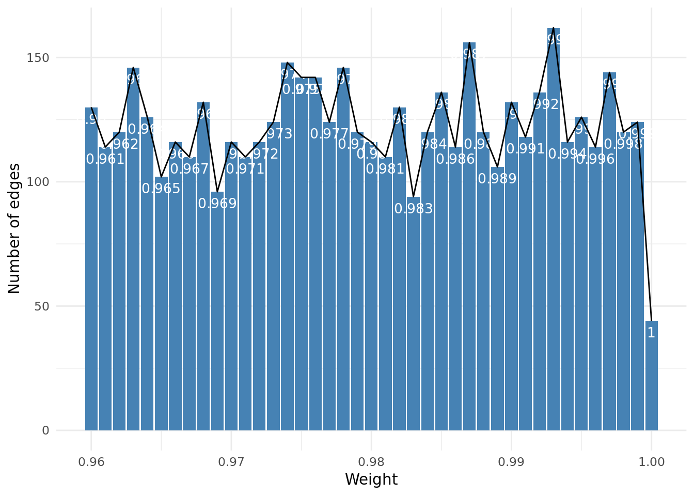

#### Degree distribution of item->similarity->item edges

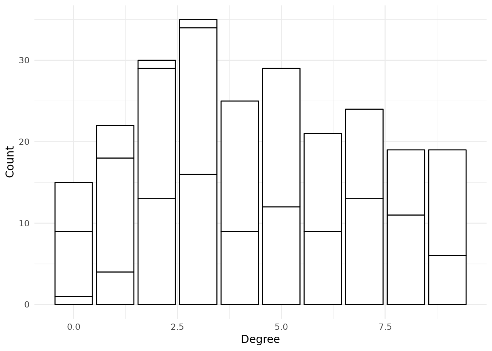

#### Degree distribution of agent->knows->agent edges

#### Runing time by method 

<table class="table table-condensed" style="width: auto !important; ">
 <thead>
  <tr>
   <th style="text-align:left;"> key </th>
   <th style="text-align:right;"> doc_count </th>
   <th style="text-align:right;"> sum_wallTime_ms.value </th>
   <th style="text-align:left;"> avg_wallTime_ms.value </th>
   <th style="text-align:left;"> includedInTotal </th>
  </tr>
 </thead>
<tbody>
  <tr>
   <td style="text-align:left;"> connectIfSimilar </td>
   <td style="text-align:right;"> 28,680 </td>
   <td style="text-align:right;"> 69,329 </td>
   <td style="text-align:left;"> 2.41732914923291 </td>
   <td style="text-align:left;"> No </td>
  </tr>
  <tr>
   <td style="text-align:left;"> existsSimilarity </td>
   <td style="text-align:right;"> 28,680 </td>
   <td style="text-align:right;"> 68,721 </td>
   <td style="text-align:left;"> 2.39612970711297 </td>
   <td style="text-align:left;"> No </td>
  </tr>
  <tr>
   <td style="text-align:left;"> similarityEdges </td>
   <td style="text-align:right;"> 28,680 </td>
   <td style="text-align:right;"> 67,784 </td>
   <td style="text-align:left;"> 2.36345885634589 </td>
   <td style="text-align:left;"> No </td>
  </tr>
  <tr>
   <td style="text-align:left;"> connectAllSimilar </td>
   <td style="text-align:right;"> 240 </td>
   <td style="text-align:right;"> 69,590 </td>
   <td style="text-align:left;"> 289.958333333333 </td>
   <td style="text-align:left;"> Yes </td>
  </tr>
  <tr>
   <td style="text-align:left;"> init </td>
   <td style="text-align:right;"> 103 </td>
   <td style="text-align:right;"> 12,006 </td>
   <td style="text-align:left;"> 116.563106796117 </td>
   <td style="text-align:left;"> No </td>
  </tr>
  <tr>
   <td style="text-align:left;"> connect </td>
   <td style="text-align:right;"> 32 </td>
   <td style="text-align:right;"> 91 </td>
   <td style="text-align:left;"> 2.84375 </td>
   <td style="text-align:left;"> Yes </td>
  </tr>
  <tr>
   <td style="text-align:left;font-weight: bold;"> Total </td>
   <td style="text-align:right;font-weight: bold;"> 280 </td>
   <td style="text-align:right;font-weight: bold;"> 70,342 </td>
   <td style="text-align:left;font-weight: bold;">  </td>
   <td style="text-align:left;font-weight: bold;">  </td>
  </tr>
</tbody>
</table>
####  Found structures 

#####  Cycles 

Number of cycles found:  1 

<button class="btn btn-primary" data-toggle="collapse" data-target="#XZZRQFYOUU"> Show/Hide foundCycle query </button> 
 
  
     GET /filebeat-*/_search 
              { 
                "query": {
                  "bool": {
                    "must": [
                      { "match_phrase": {
                        "simulationId": "SIM10-13-03-36-TDnCpk--CV"
                        }
                      },
                      { "bool": {
                        "should": [
                          { "match": {
                            "keyword": "foundCycle"
                          }}
                        ]
                      }}
                    ]
                  }
                }
              }
     

#####  Paths 

Number of paths found:  0 

<button class="btn btn-primary" data-toggle="collapse" data-target="#CEAWWZJNHF"> Show/Hide foundPath query </button> 
 
  
     GET /filebeat-*/_search 
              { 
                "query": {
                  "bool": {
                    "must": [
                      { "match_phrase": {
                        "simulationId": "SIM10-13-03-36-TDnCpk--CV"
                        }
                      },
                      { "bool": {
                        "should": [
                          { "match": {
                            "keyword": "foundPath"
                          }}
                        ]
                      }}
                    ]
                  }
                }
              }
     

###  SIM10-13-03-36-TDnCpk--DV 

#### simulationParameters 

<table class="table table-condensed" style="width: auto !important; ">
 <thead>
  <tr>
   <th style="text-align:left;"> agentNumber </th>
   <th style="text-align:left;"> similarityConnectThreshold </th>
   <th style="text-align:left;"> graphType </th>
   <th style="text-align:left;"> chainLength </th>
   <th style="text-align:left;"> similaritySearchThreshold </th>
   <th style="text-align:left;"> maxDistance </th>
   <th style="text-align:left;"> randomWorksNumberMultiplier </th>
  </tr>
 </thead>
<tbody>
  <tr>
   <td style="text-align:left;width: 20em; "> 100 </td>
   <td style="text-align:left;width: 15em; "> 0.96 </td>
   <td style="text-align:left;width: 15em; "> smallWorld </td>
   <td style="text-align:left;width: 15em; "> 20 </td>
   <td style="text-align:left;width: 15em; "> 1 </td>
   <td style="text-align:left;width: 15em; "> 10 </td>
   <td style="text-align:left;width: 15em; "> 1 </td>
  </tr>
</tbody>
</table>
#### allEdgesByLabel

<table class="table table-condensed" style="width: auto !important; ">
 <thead>
  <tr>
   <th style="text-align:right;"> edges_offers </th>
   <th style="text-align:right;"> edges_similarity </th>
   <th style="text-align:right;"> edges_owns </th>
   <th style="text-align:right;"> edges_demands </th>
   <th style="text-align:right;"> edges_knows </th>
   <th style="text-align:right;"> edges_total </th>
  </tr>
 </thead>
<tbody>
  <tr>
   <td style="text-align:right;width: 5em; "> 120 </td>
   <td style="text-align:right;width: 5em; "> 4,954 </td>
   <td style="text-align:right;width: 5em; "> 120 </td>
   <td style="text-align:right;width: 5em; "> 120 </td>
   <td style="text-align:right;width: 5em; "> 601 </td>
   <td style="text-align:right;width: 5em; "> 5,915 </td>
  </tr>
</tbody>
</table>
#### allVerticesByType

<table class="table table-condensed" style="width: auto !important; ">
 <thead>
  <tr>
   <th style="text-align:right;"> vertices_agent </th>
   <th style="text-align:right;"> vertices_item </th>
   <th style="text-align:right;"> vertices_work </th>
   <th style="text-align:right;"> vertices_total </th>
  </tr>
 </thead>
<tbody>
  <tr>
   <td style="text-align:right;width: 5em; "> 101 </td>
   <td style="text-align:right;width: 5em; "> 240 </td>
   <td style="text-align:right;width: 5em; "> 120 </td>
   <td style="text-align:right;width: 5em; "> 461 </td>
  </tr>
</tbody>
</table>
#### distribution of similarityEdgesByWeight

#### Degree distribution of item->similarity->item edges

#### Degree distribution of agent->knows->agent edges

#### Runing time by method 

<table class="table table-condensed" style="width: auto !important; ">
 <thead>
  <tr>
   <th style="text-align:left;">   </th>
   <th style="text-align:left;"> key </th>
   <th style="text-align:right;"> doc_count </th>
   <th style="text-align:right;"> sum_wallTime_ms.value </th>
   <th style="text-align:left;"> avg_wallTime_ms.value </th>
   <th style="text-align:left;"> includedInTotal </th>
  </tr>
 </thead>
<tbody>
  <tr>
   <td style="text-align:left;"> 1 </td>
   <td style="text-align:left;"> knowsAgent </td>
   <td style="text-align:right;"> 601 </td>
   <td style="text-align:right;"> 1,617 </td>
   <td style="text-align:left;"> 2.69051580698835 </td>
   <td style="text-align:left;"> No </td>
  </tr>
  <tr>
   <td style="text-align:left;"> 2 </td>
   <td style="text-align:left;"> addItemToWork </td>
   <td style="text-align:right;"> 240 </td>
   <td style="text-align:right;"> 1,648 </td>
   <td style="text-align:left;"> 6.86666666666667 </td>
   <td style="text-align:left;"> No </td>
  </tr>
  <tr>
   <td style="text-align:left;"> 3 </td>
   <td style="text-align:left;"> ownsWork </td>
   <td style="text-align:right;"> 120 </td>
   <td style="text-align:right;"> 2,688 </td>
   <td style="text-align:left;"> 22.4 </td>
   <td style="text-align:left;"> No </td>
  </tr>
  <tr>
   <td style="text-align:left;"> 4 </td>
   <td style="text-align:left;"> init </td>
   <td style="text-align:right;"> 103 </td>
   <td style="text-align:right;"> 12,937 </td>
   <td style="text-align:left;"> 125.601941747573 </td>
   <td style="text-align:left;"> No </td>
  </tr>
  <tr>
   <td style="text-align:left;"> 5 </td>
   <td style="text-align:left;"> searchAndConnect </td>
   <td style="text-align:right;"> 101 </td>
   <td style="text-align:right;"> 58,496 </td>
   <td style="text-align:left;"> 579.168316831683 </td>
   <td style="text-align:left;"> Yes </td>
  </tr>
  <tr>
   <td style="text-align:left;"> 6 </td>
   <td style="text-align:left;"> getWorksItems </td>
   <td style="text-align:right;"> 38 </td>
   <td style="text-align:right;"> 59 </td>
   <td style="text-align:left;"> 1.55263157894737 </td>
   <td style="text-align:left;"> Yes </td>
  </tr>
  <tr>
   <td style="text-align:left;"> 9 </td>
   <td style="text-align:left;"> cycleSearch </td>
   <td style="text-align:right;"> 3 </td>
   <td style="text-align:right;"> 649 </td>
   <td style="text-align:left;"> 216.333333333333 </td>
   <td style="text-align:left;"> Yes </td>
  </tr>
  <tr>
   <td style="text-align:left;"> 10 </td>
   <td style="text-align:left;"> getWorks </td>
   <td style="text-align:right;"> 3 </td>
   <td style="text-align:right;"> 583 </td>
   <td style="text-align:left;"> 194.333333333333 </td>
   <td style="text-align:left;"> No </td>
  </tr>
  <tr>
   <td style="text-align:left;font-weight: bold;"> 11 </td>
   <td style="text-align:left;font-weight: bold;"> Total </td>
   <td style="text-align:right;font-weight: bold;"> 150 </td>
   <td style="text-align:right;font-weight: bold;"> 60,546 </td>
   <td style="text-align:left;font-weight: bold;">  </td>
   <td style="text-align:left;font-weight: bold;">  </td>
  </tr>
</tbody>
</table>
####  Found structures 

#####  Cycles 

Number of cycles found:  3 

<button class="btn btn-primary" data-toggle="collapse" data-target="#AXNLYQTGBC"> Show/Hide foundCycle query </button> 
 
  
     GET /filebeat-*/_search 
              { 
                "query": {
                  "bool": {
                    "must": [
                      { "match_phrase": {
                        "simulationId": "SIM10-13-03-36-TDnCpk--DV"
                        }
                      },
                      { "bool": {
                        "should": [
                          { "match": {
                            "keyword": "foundCycle"
                          }}
                        ]
                      }}
                    ]
                  }
                }
              }
     

#####  Paths 

Number of paths found:  0 

<button class="btn btn-primary" data-toggle="collapse" data-target="#MTQRHVKMBU"> Show/Hide foundPath query </button> 
 
  
     GET /filebeat-*/_search 
              { 
                "query": {
                  "bool": {
                    "must": [
                      { "match_phrase": {
                        "simulationId": "SIM10-13-03-36-TDnCpk--DV"
                        }
                      },
                      { "bool": {
                        "should": [
                          { "match": {
                            "keyword": "foundPath"
                          }}
                        ]
                      }}
                    ]
                  }
                }
              }
     

###  SIM10-13-04-51-F4UWaU--CV 

#### simulationParameters 

<table class="table table-condensed" style="width: auto !important; ">
 <thead>
  <tr>
   <th style="text-align:left;"> agentNumber </th>
   <th style="text-align:left;"> similarityConnectThreshold </th>
   <th style="text-align:left;"> graphType </th>
   <th style="text-align:left;"> chainLength </th>
   <th style="text-align:left;"> similaritySearchThreshold </th>
   <th style="text-align:left;"> maxDistance </th>
   <th style="text-align:left;"> randomWorksNumberMultiplier </th>
  </tr>
 </thead>
<tbody>
  <tr>
   <td style="text-align:left;width: 20em; "> 100 </td>
   <td style="text-align:left;width: 15em; "> 0.96 </td>
   <td style="text-align:left;width: 15em; "> random </td>
   <td style="text-align:left;width: 15em; "> 20 </td>
   <td style="text-align:left;width: 15em; "> 1 </td>
   <td style="text-align:left;width: 15em; "> 10 </td>
   <td style="text-align:left;width: 15em; "> 2 </td>
  </tr>
</tbody>
</table>
#### allEdgesByLabel

<table class="table table-condensed" style="width: auto !important; ">
 <thead>
  <tr>
   <th style="text-align:right;"> edges_offers </th>
   <th style="text-align:right;"> edges_similarity </th>
   <th style="text-align:right;"> edges_owns </th>
   <th style="text-align:right;"> edges_demands </th>
   <th style="text-align:right;"> edges_knows </th>
   <th style="text-align:right;"> edges_total </th>
  </tr>
 </thead>
<tbody>
  <tr>
   <td style="text-align:right;width: 5em; "> 220 </td>
   <td style="text-align:right;width: 5em; "> 16,412 </td>
   <td style="text-align:right;width: 5em; "> 220 </td>
   <td style="text-align:right;width: 5em; "> 220 </td>
   <td style="text-align:right;width: 5em; "> 100 </td>
   <td style="text-align:right;width: 5em; "> 17,172 </td>
  </tr>
</tbody>
</table>
#### allVerticesByType

<table class="table table-condensed" style="width: auto !important; ">
 <thead>
  <tr>
   <th style="text-align:right;"> vertices_agent </th>
   <th style="text-align:right;"> vertices_item </th>
   <th style="text-align:right;"> vertices_work </th>
   <th style="text-align:right;"> vertices_total </th>
  </tr>
 </thead>
<tbody>
  <tr>
   <td style="text-align:right;width: 5em; "> 101 </td>
   <td style="text-align:right;width: 5em; "> 440 </td>
   <td style="text-align:right;width: 5em; "> 220 </td>
   <td style="text-align:right;width: 5em; "> 761 </td>
  </tr>
</tbody>
</table>
#### distribution of similarityEdgesByWeight

#### Degree distribution of item->similarity->item edges

#### Degree distribution of agent->knows->agent edges

#### Runing time by method 

<table class="table table-condensed" style="width: auto !important; ">
 <thead>
  <tr>
   <th style="text-align:left;"> key </th>
   <th style="text-align:right;"> doc_count </th>
   <th style="text-align:right;"> sum_wallTime_ms.value </th>
   <th style="text-align:left;"> avg_wallTime_ms.value </th>
   <th style="text-align:left;"> includedInTotal </th>
  </tr>
 </thead>
<tbody>
  <tr>
   <td style="text-align:left;"> connectIfSimilar </td>
   <td style="text-align:right;"> 96,580 </td>
   <td style="text-align:right;"> 284,674 </td>
   <td style="text-align:left;"> 2.94754607579209 </td>
   <td style="text-align:left;"> No </td>
  </tr>
  <tr>
   <td style="text-align:left;"> existsSimilarity </td>
   <td style="text-align:right;"> 96,580 </td>
   <td style="text-align:right;"> 281,230 </td>
   <td style="text-align:left;"> 2.91188651894802 </td>
   <td style="text-align:left;"> No </td>
  </tr>
  <tr>
   <td style="text-align:left;"> similarityEdges </td>
   <td style="text-align:right;"> 96,580 </td>
   <td style="text-align:right;"> 277,171 </td>
   <td style="text-align:left;"> 2.86985918409609 </td>
   <td style="text-align:left;"> No </td>
  </tr>
  <tr>
   <td style="text-align:left;"> connect </td>
   <td style="text-align:right;"> 466 </td>
   <td style="text-align:right;"> 1,697 </td>
   <td style="text-align:left;"> 3.64163090128755 </td>
   <td style="text-align:left;"> Yes </td>
  </tr>
  <tr>
   <td style="text-align:left;"> connectAllSimilar </td>
   <td style="text-align:right;"> 440 </td>
   <td style="text-align:right;"> 285,603 </td>
   <td style="text-align:left;"> 649.097727272727 </td>
   <td style="text-align:left;"> Yes </td>
  </tr>
  <tr>
   <td style="text-align:left;"> init </td>
   <td style="text-align:right;"> 103 </td>
   <td style="text-align:right;"> 12,560 </td>
   <td style="text-align:left;"> 121.941747572816 </td>
   <td style="text-align:left;"> No </td>
  </tr>
  <tr>
   <td style="text-align:left;font-weight: bold;"> Total </td>
   <td style="text-align:right;font-weight: bold;"> 914 </td>
   <td style="text-align:right;font-weight: bold;"> 288,124 </td>
   <td style="text-align:left;font-weight: bold;">  </td>
   <td style="text-align:left;font-weight: bold;">  </td>
  </tr>
</tbody>
</table>
####  Found structures 

#####  Cycles 

Number of cycles found:  1 

<button class="btn btn-primary" data-toggle="collapse" data-target="#CBEUIQKDHQ"> Show/Hide foundCycle query </button> 
 
  
     GET /filebeat-*/_search 
              { 
                "query": {
                  "bool": {
                    "must": [
                      { "match_phrase": {
                        "simulationId": "SIM10-13-04-51-F4UWaU--CV"
                        }
                      },
                      { "bool": {
                        "should": [
                          { "match": {
                            "keyword": "foundCycle"
                          }}
                        ]
                      }}
                    ]
                  }
                }
              }
     

#####  Paths 

Number of paths found:  0 

<button class="btn btn-primary" data-toggle="collapse" data-target="#MVMYELNOTX"> Show/Hide foundPath query </button> 
 
  
     GET /filebeat-*/_search 
              { 
                "query": {
                  "bool": {
                    "must": [
                      { "match_phrase": {
                        "simulationId": "SIM10-13-04-51-F4UWaU--CV"
                        }
                      },
                      { "bool": {
                        "should": [
                          { "match": {
                            "keyword": "foundPath"
                          }}
                        ]
                      }}
                    ]
                  }
                }
              }
     

###  SIM10-13-04-51-F4UWaU--DV 

#### simulationParameters 

<table class="table table-condensed" style="width: auto !important; ">
 <thead>
  <tr>
   <th style="text-align:left;"> agentNumber </th>
   <th style="text-align:left;"> similarityConnectThreshold </th>
   <th style="text-align:left;"> graphType </th>
   <th style="text-align:left;"> chainLength </th>
   <th style="text-align:left;"> similaritySearchThreshold </th>
   <th style="text-align:left;"> maxDistance </th>
   <th style="text-align:left;"> randomWorksNumberMultiplier </th>
  </tr>
 </thead>
<tbody>
  <tr>
   <td style="text-align:left;width: 20em; "> 100 </td>
   <td style="text-align:left;width: 15em; "> 0.96 </td>
   <td style="text-align:left;width: 15em; "> random </td>
   <td style="text-align:left;width: 15em; "> 20 </td>
   <td style="text-align:left;width: 15em; "> 1 </td>
   <td style="text-align:left;width: 15em; "> 10 </td>
   <td style="text-align:left;width: 15em; "> 2 </td>
  </tr>
</tbody>
</table>
#### allEdgesByLabel

<table class="table table-condensed" style="width: auto !important; ">
 <thead>
  <tr>
   <th style="text-align:right;"> edges_offers </th>
   <th style="text-align:right;"> edges_similarity </th>
   <th style="text-align:right;"> edges_owns </th>
   <th style="text-align:right;"> edges_demands </th>
   <th style="text-align:right;"> edges_knows </th>
   <th style="text-align:right;"> edges_total </th>
  </tr>
 </thead>
<tbody>
  <tr>
   <td style="text-align:right;width: 5em; "> 220 </td>
   <td style="text-align:right;width: 5em; "> 15,480 </td>
   <td style="text-align:right;width: 5em; "> 220 </td>
   <td style="text-align:right;width: 5em; "> 220 </td>
   <td style="text-align:right;width: 5em; "> 100 </td>
   <td style="text-align:right;width: 5em; "> 16,240 </td>
  </tr>
</tbody>
</table>
#### allVerticesByType

<table class="table table-condensed" style="width: auto !important; ">
 <thead>
  <tr>
   <th style="text-align:right;"> vertices_agent </th>
   <th style="text-align:right;"> vertices_item </th>
   <th style="text-align:right;"> vertices_work </th>
   <th style="text-align:right;"> vertices_total </th>
  </tr>
 </thead>
<tbody>
  <tr>
   <td style="text-align:right;width: 5em; "> 101 </td>
   <td style="text-align:right;width: 5em; "> 440 </td>
   <td style="text-align:right;width: 5em; "> 220 </td>
   <td style="text-align:right;width: 5em; "> 761 </td>
  </tr>
</tbody>
</table>
#### distribution of similarityEdgesByWeight

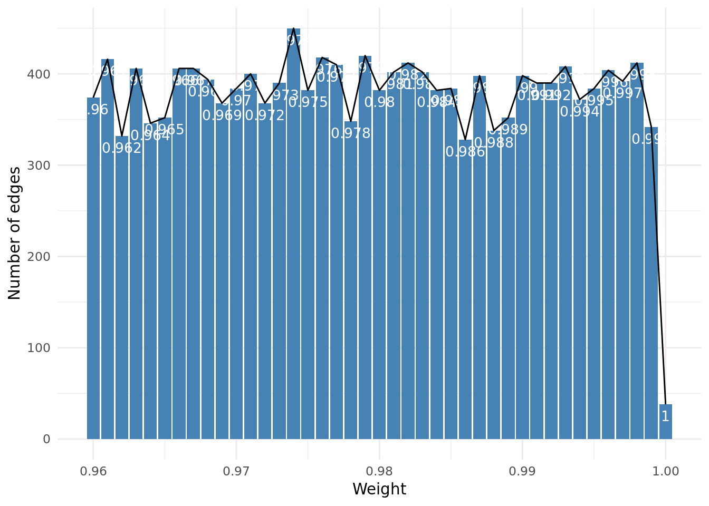

#### Degree distribution of item->similarity->item edges

#### Degree distribution of agent->knows->agent edges

#### Runing time by method 

<table class="table table-condensed" style="width: auto !important; ">
 <thead>
  <tr>
   <th style="text-align:left;">   </th>
   <th style="text-align:left;"> key </th>
   <th style="text-align:right;"> doc_count </th>
   <th style="text-align:right;"> sum_wallTime_ms.value </th>
   <th style="text-align:left;"> avg_wallTime_ms.value </th>
   <th style="text-align:left;"> includedInTotal </th>
  </tr>
 </thead>
<tbody>
  <tr>
   <td style="text-align:left;"> 2 </td>
   <td style="text-align:left;"> cycleSearch </td>
   <td style="text-align:right;"> 3,600 </td>
   <td style="text-align:right;"> 102,684 </td>
   <td style="text-align:left;"> 28.5233333333333 </td>
   <td style="text-align:left;"> Yes </td>
  </tr>
  <tr>
   <td style="text-align:left;"> 3 </td>
   <td style="text-align:left;"> getWorks </td>
   <td style="text-align:right;"> 3,600 </td>
   <td style="text-align:right;"> 59,475 </td>
   <td style="text-align:left;"> 16.5208333333333 </td>
   <td style="text-align:left;"> No </td>
  </tr>
  <tr>
   <td style="text-align:left;"> 4 </td>
   <td style="text-align:left;"> individualCycleSearch </td>
   <td style="text-align:right;"> 3,600 </td>
   <td style="text-align:right;"> 72 </td>
   <td style="text-align:left;"> 0.02 </td>
   <td style="text-align:left;"> Yes </td>
  </tr>
  <tr>
   <td style="text-align:left;"> 6 </td>
   <td style="text-align:left;"> addItemToWork </td>
   <td style="text-align:right;"> 440 </td>
   <td style="text-align:right;"> 5,235 </td>
   <td style="text-align:left;"> 11.8977272727273 </td>
   <td style="text-align:left;"> No </td>
  </tr>
  <tr>
   <td style="text-align:left;"> 7 </td>
   <td style="text-align:left;"> ownsWork </td>
   <td style="text-align:right;"> 220 </td>
   <td style="text-align:right;"> 4,521 </td>
   <td style="text-align:left;"> 20.55 </td>
   <td style="text-align:left;"> No </td>
  </tr>
  <tr>
   <td style="text-align:left;"> 8 </td>
   <td style="text-align:left;"> init </td>
   <td style="text-align:right;"> 103 </td>
   <td style="text-align:right;"> 13,784 </td>
   <td style="text-align:left;"> 133.825242718447 </td>
   <td style="text-align:left;"> No </td>
  </tr>
  <tr>
   <td style="text-align:left;"> 9 </td>
   <td style="text-align:left;"> searchAndConnect </td>
   <td style="text-align:right;"> 101 </td>
   <td style="text-align:right;"> 128,658 </td>
   <td style="text-align:left;"> 1273.84158415842 </td>
   <td style="text-align:left;"> Yes </td>
  </tr>
  <tr>
   <td style="text-align:left;"> 10 </td>
   <td style="text-align:left;"> knowsAgent </td>
   <td style="text-align:right;"> 100 </td>
   <td style="text-align:right;"> 1,326 </td>
   <td style="text-align:left;"> 13.26 </td>
   <td style="text-align:left;"> No </td>
  </tr>
  <tr>
   <td style="text-align:left;font-weight: bold;"> 1 </td>
   <td style="text-align:left;font-weight: bold;"> Total </td>
   <td style="text-align:right;font-weight: bold;"> 14,501 </td>
   <td style="text-align:right;font-weight: bold;"> 697,674 </td>
   <td style="text-align:left;font-weight: bold;">  </td>
   <td style="text-align:left;font-weight: bold;">  </td>
  </tr>
</tbody>
</table>
####  Found structures 

#####  Cycles 

Number of cycles found:  0 

<button class="btn btn-primary" data-toggle="collapse" data-target="#YTYISVAAGG"> Show/Hide foundCycle query </button> 
 
  
     GET /filebeat-*/_search 
              { 
                "query": {
                  "bool": {
                    "must": [
                      { "match_phrase": {
                        "simulationId": "SIM10-13-04-51-F4UWaU--DV"
                        }
                      },
                      { "bool": {
                        "should": [
                          { "match": {
                            "keyword": "foundCycle"
                          }}
                        ]
                      }}
                    ]
                  }
                }
              }
     

#####  Paths 

Number of paths found:  3600 

<button class="btn btn-primary" data-toggle="collapse" data-target="#PIEBVWTCBS"> Show/Hide foundPath query </button> 
 
  
     GET /filebeat-*/_search 
              { 
                "query": {
                  "bool": {
                    "must": [
                      { "match_phrase": {
                        "simulationId": "SIM10-13-04-51-F4UWaU--DV"
                        }
                      },
                      { "bool": {
                        "should": [
                          { "match": {
                            "keyword": "foundPath"
                          }}
                        ]
                      }}
                    ]
                  }
                }
              }
     

###  SIM10-13-05-56-ptLUe9--CV 

#### simulationParameters 

<table class="table table-condensed" style="width: auto !important; ">
 <thead>
  <tr>
   <th style="text-align:left;"> agentNumber </th>
   <th style="text-align:left;"> similarityConnectThreshold </th>
   <th style="text-align:left;"> graphType </th>
   <th style="text-align:left;"> chainLength </th>
   <th style="text-align:left;"> similaritySearchThreshold </th>
   <th style="text-align:left;"> maxDistance </th>
   <th style="text-align:left;"> randomWorksNumberMultiplier </th>
  </tr>
 </thead>
<tbody>
  <tr>
   <td style="text-align:left;width: 20em; "> 100 </td>
   <td style="text-align:left;width: 15em; "> 0.96 </td>
   <td style="text-align:left;width: 15em; "> smallWorld </td>
   <td style="text-align:left;width: 15em; "> 20 </td>
   <td style="text-align:left;width: 15em; "> 1 </td>
   <td style="text-align:left;width: 15em; "> 10 </td>
   <td style="text-align:left;width: 15em; "> 2 </td>
  </tr>
</tbody>
</table>
#### allEdgesByLabel

<table class="table table-condensed" style="width: auto !important; ">
 <thead>
  <tr>
   <th style="text-align:right;"> edges_offers </th>
   <th style="text-align:right;"> edges_similarity </th>
   <th style="text-align:right;"> edges_owns </th>
   <th style="text-align:right;"> edges_demands </th>
   <th style="text-align:right;"> edges_knows </th>
   <th style="text-align:right;"> edges_total </th>
  </tr>
 </thead>
<tbody>
  <tr>
   <td style="text-align:right;width: 5em; "> 220 </td>
   <td style="text-align:right;width: 5em; "> 16,280 </td>
   <td style="text-align:right;width: 5em; "> 220 </td>
   <td style="text-align:right;width: 5em; "> 220 </td>
   <td style="text-align:right;width: 5em; "> 601 </td>
   <td style="text-align:right;width: 5em; "> 17,541 </td>
  </tr>
</tbody>
</table>
#### allVerticesByType

<table class="table table-condensed" style="width: auto !important; ">
 <thead>
  <tr>
   <th style="text-align:right;"> vertices_agent </th>
   <th style="text-align:right;"> vertices_item </th>
   <th style="text-align:right;"> vertices_work </th>
   <th style="text-align:right;"> vertices_total </th>
  </tr>
 </thead>
<tbody>
  <tr>
   <td style="text-align:right;width: 5em; "> 101 </td>
   <td style="text-align:right;width: 5em; "> 440 </td>
   <td style="text-align:right;width: 5em; "> 220 </td>
   <td style="text-align:right;width: 5em; "> 761 </td>
  </tr>
</tbody>
</table>
#### distribution of similarityEdgesByWeight

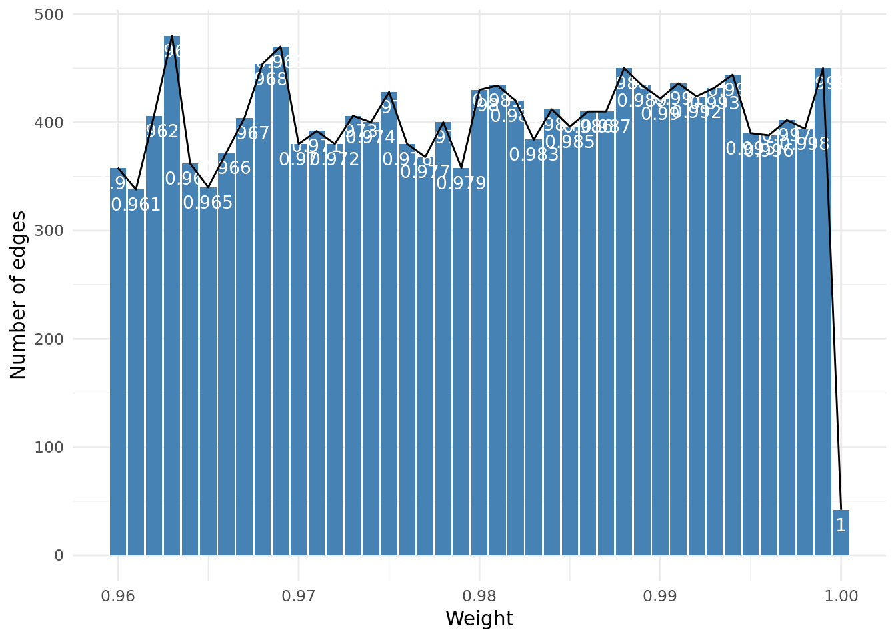

#### Degree distribution of item->similarity->item edges

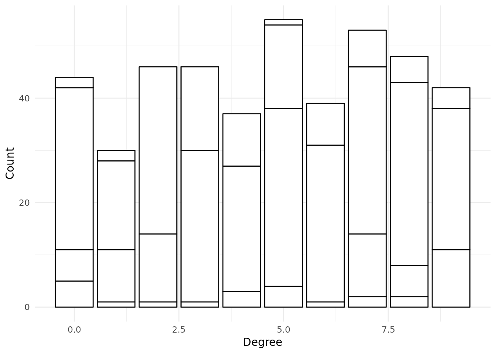

#### Degree distribution of agent->knows->agent edges

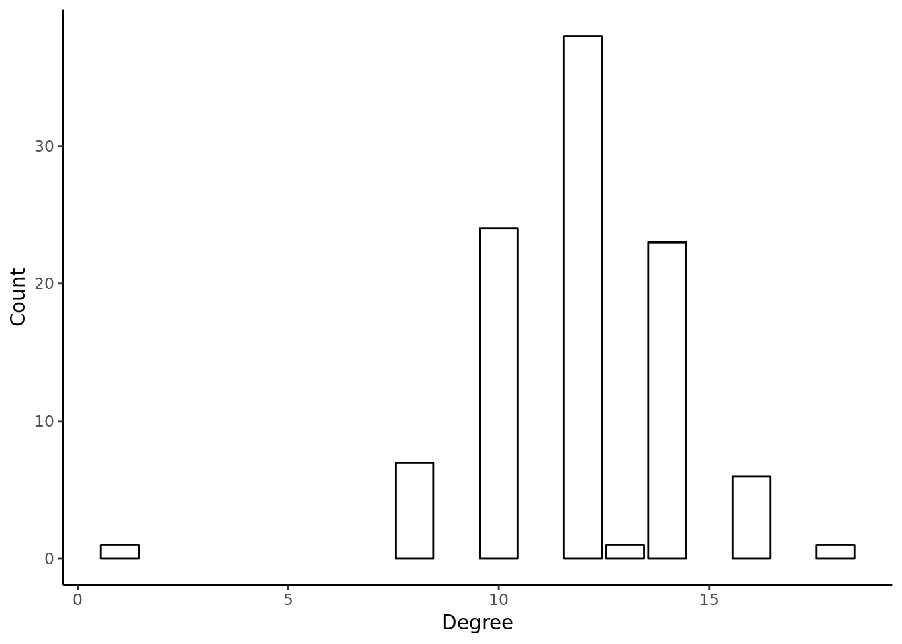

#### Runing time by method 

<table class="table table-condensed" style="width: auto !important; ">
 <thead>
  <tr>
   <th style="text-align:left;"> key </th>
   <th style="text-align:right;"> doc_count </th>
   <th style="text-align:right;"> sum_wallTime_ms.value </th>
   <th style="text-align:left;"> avg_wallTime_ms.value </th>
   <th style="text-align:left;"> includedInTotal </th>
  </tr>
 </thead>
<tbody>
  <tr>
   <td style="text-align:left;"> connectIfSimilar </td>
   <td style="text-align:right;"> 96,580 </td>
   <td style="text-align:right;"> 280,947 </td>
   <td style="text-align:left;"> 2.90895630565334 </td>
   <td style="text-align:left;"> No </td>
  </tr>
  <tr>
   <td style="text-align:left;"> existsSimilarity </td>
   <td style="text-align:right;"> 96,580 </td>
   <td style="text-align:right;"> 279,065 </td>
   <td style="text-align:left;"> 2.88946986953821 </td>
   <td style="text-align:left;"> No </td>
  </tr>
  <tr>
   <td style="text-align:left;"> similarityEdges </td>
   <td style="text-align:right;"> 96,580 </td>
   <td style="text-align:right;"> 275,126 </td>
   <td style="text-align:left;"> 2.8486850279561 </td>
   <td style="text-align:left;"> No </td>
  </tr>
  <tr>
   <td style="text-align:left;"> connectAllSimilar </td>
   <td style="text-align:right;"> 440 </td>
   <td style="text-align:right;"> 281,809 </td>
   <td style="text-align:left;"> 640.475 </td>
   <td style="text-align:left;"> Yes </td>
  </tr>
  <tr>
   <td style="text-align:left;"> init </td>
   <td style="text-align:right;"> 103 </td>
   <td style="text-align:right;"> 12,525 </td>
   <td style="text-align:left;"> 121.601941747573 </td>
   <td style="text-align:left;"> No </td>
  </tr>
  <tr>
   <td style="text-align:left;"> connect </td>
   <td style="text-align:right;"> 80 </td>
   <td style="text-align:right;"> 130 </td>
   <td style="text-align:left;"> 1.625 </td>
   <td style="text-align:left;"> Yes </td>
  </tr>
  <tr>
   <td style="text-align:left;font-weight: bold;"> Total </td>
   <td style="text-align:right;font-weight: bold;"> 528 </td>
   <td style="text-align:right;font-weight: bold;"> 282,766 </td>
   <td style="text-align:left;font-weight: bold;">  </td>
   <td style="text-align:left;font-weight: bold;">  </td>
  </tr>
</tbody>
</table>
####  Found structures 

#####  Cycles 

Number of cycles found:  1 

<button class="btn btn-primary" data-toggle="collapse" data-target="#POKIEOLGIG"> Show/Hide foundCycle query </button> 
 
  
     GET /filebeat-*/_search 
              { 
                "query": {
                  "bool": {
                    "must": [
                      { "match_phrase": {
                        "simulationId": "SIM10-13-05-56-ptLUe9--CV"
                        }
                      },
                      { "bool": {
                        "should": [
                          { "match": {
                            "keyword": "foundCycle"
                          }}
                        ]
                      }}
                    ]
                  }
                }
              }
     

#####  Paths 

Number of paths found:  0 

<button class="btn btn-primary" data-toggle="collapse" data-target="#MTWNKTRUHV"> Show/Hide foundPath query </button> 
 
  
     GET /filebeat-*/_search 
              { 
                "query": {
                  "bool": {
                    "must": [
                      { "match_phrase": {
                        "simulationId": "SIM10-13-05-56-ptLUe9--CV"
                        }
                      },
                      { "bool": {
                        "should": [
                          { "match": {
                            "keyword": "foundPath"
                          }}
                        ]
                      }}
                    ]
                  }
                }
              }
     

###  SIM10-13-05-56-ptLUe9--DV 

#### simulationParameters 

<table class="table table-condensed" style="width: auto !important; ">
 <thead>
  <tr>
   <th style="text-align:left;"> agentNumber </th>
   <th style="text-align:left;"> similarityConnectThreshold </th>
   <th style="text-align:left;"> graphType </th>
   <th style="text-align:left;"> chainLength </th>
   <th style="text-align:left;"> similaritySearchThreshold </th>
   <th style="text-align:left;"> maxDistance </th>
   <th style="text-align:left;"> randomWorksNumberMultiplier </th>
  </tr>
 </thead>
<tbody>
  <tr>
   <td style="text-align:left;width: 20em; "> 100 </td>
   <td style="text-align:left;width: 15em; "> 0.96 </td>
   <td style="text-align:left;width: 15em; "> smallWorld </td>
   <td style="text-align:left;width: 15em; "> 20 </td>
   <td style="text-align:left;width: 15em; "> 1 </td>
   <td style="text-align:left;width: 15em; "> 10 </td>
   <td style="text-align:left;width: 15em; "> 2 </td>
  </tr>
</tbody>
</table>
#### allEdgesByLabel

<table class="table table-condensed" style="width: auto !important; ">
 <thead>
  <tr>
   <th style="text-align:right;"> edges_offers </th>
   <th style="text-align:right;"> edges_similarity </th>
   <th style="text-align:right;"> edges_owns </th>
   <th style="text-align:right;"> edges_demands </th>
   <th style="text-align:right;"> edges_knows </th>
   <th style="text-align:right;"> edges_total </th>
  </tr>
 </thead>
<tbody>
  <tr>
   <td style="text-align:right;width: 5em; "> 220 </td>
   <td style="text-align:right;width: 5em; "> 16,120 </td>
   <td style="text-align:right;width: 5em; "> 220 </td>
   <td style="text-align:right;width: 5em; "> 220 </td>
   <td style="text-align:right;width: 5em; "> 601 </td>
   <td style="text-align:right;width: 5em; "> 17,381 </td>
  </tr>
</tbody>
</table>
#### allVerticesByType

<table class="table table-condensed" style="width: auto !important; ">
 <thead>
  <tr>
   <th style="text-align:right;"> vertices_agent </th>
   <th style="text-align:right;"> vertices_item </th>
   <th style="text-align:right;"> vertices_work </th>
   <th style="text-align:right;"> vertices_total </th>
  </tr>
 </thead>
<tbody>
  <tr>
   <td style="text-align:right;width: 5em; "> 101 </td>
   <td style="text-align:right;width: 5em; "> 440 </td>
   <td style="text-align:right;width: 5em; "> 220 </td>
   <td style="text-align:right;width: 5em; "> 761 </td>
  </tr>
</tbody>
</table>
#### distribution of similarityEdgesByWeight

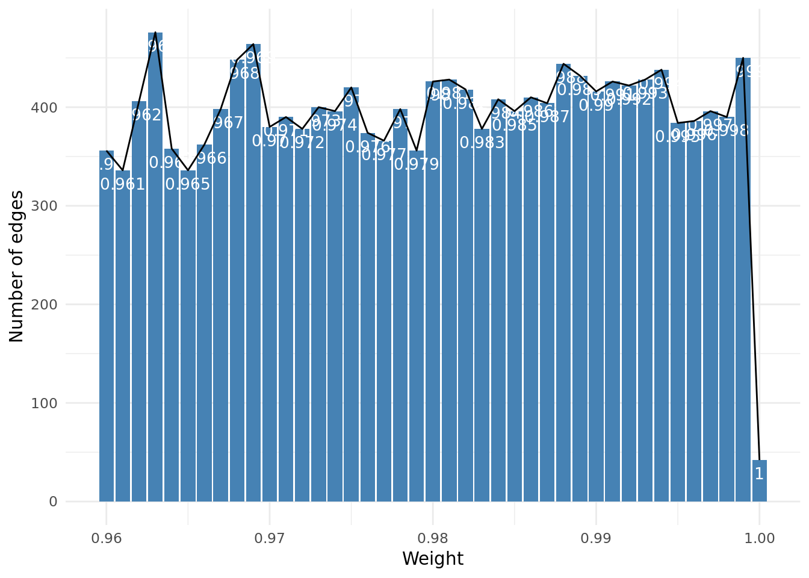

#### Degree distribution of item->similarity->item edges

#### Degree distribution of agent->knows->agent edges

#### Runing time by method 

<table class="table table-condensed" style="width: auto !important; ">
 <thead>
  <tr>
   <th style="text-align:left;">   </th>
   <th style="text-align:left;"> key </th>
   <th style="text-align:right;"> doc_count </th>
   <th style="text-align:right;"> sum_wallTime_ms.value </th>
   <th style="text-align:left;"> avg_wallTime_ms.value </th>
   <th style="text-align:left;"> includedInTotal </th>
  </tr>
 </thead>
<tbody>
  <tr>
   <td style="text-align:left;"> 1 </td>
   <td style="text-align:left;"> knowsAgent </td>
   <td style="text-align:right;"> 601 </td>
   <td style="text-align:right;"> 1,505 </td>
   <td style="text-align:left;"> 2.50415973377704 </td>
   <td style="text-align:left;"> No </td>
  </tr>
  <tr>
   <td style="text-align:left;"> 2 </td>
   <td style="text-align:left;"> addItemToWork </td>
   <td style="text-align:right;"> 440 </td>
   <td style="text-align:right;"> 3,305 </td>
   <td style="text-align:left;"> 7.51136363636364 </td>
   <td style="text-align:left;"> No </td>
  </tr>
  <tr>
   <td style="text-align:left;"> 3 </td>
   <td style="text-align:left;"> ownsWork </td>
   <td style="text-align:right;"> 220 </td>
   <td style="text-align:right;"> 2,569 </td>
   <td style="text-align:left;"> 11.6772727272727 </td>
   <td style="text-align:left;"> No </td>
  </tr>
  <tr>
   <td style="text-align:left;"> 4 </td>
   <td style="text-align:left;"> init </td>
   <td style="text-align:right;"> 103 </td>
   <td style="text-align:right;"> 13,773 </td>
   <td style="text-align:left;"> 133.718446601942 </td>
   <td style="text-align:left;"> No </td>
  </tr>
  <tr>
   <td style="text-align:left;"> 5 </td>
   <td style="text-align:left;"> searchAndConnect </td>
   <td style="text-align:right;"> 101 </td>
   <td style="text-align:right;"> 162,396 </td>
   <td style="text-align:left;"> 1607.88118811881 </td>
   <td style="text-align:left;"> Yes </td>
  </tr>
  <tr>
   <td style="text-align:left;"> 6 </td>
   <td style="text-align:left;"> getWorksItems </td>
   <td style="text-align:right;"> 38 </td>
   <td style="text-align:right;"> 53 </td>
   <td style="text-align:left;"> 1.39473684210526 </td>
   <td style="text-align:left;"> Yes </td>
  </tr>
  <tr>
   <td style="text-align:left;"> 8 </td>
   <td style="text-align:left;"> cycleSearch </td>
   <td style="text-align:right;"> 6 </td>
   <td style="text-align:right;"> 378 </td>
   <td style="text-align:left;"> 63 </td>
   <td style="text-align:left;"> Yes </td>
  </tr>
  <tr>
   <td style="text-align:left;"> 9 </td>
   <td style="text-align:left;"> getWorks </td>
   <td style="text-align:right;"> 6 </td>
   <td style="text-align:right;"> 512 </td>
   <td style="text-align:left;"> 85.3333333333333 </td>
   <td style="text-align:left;"> No </td>
  </tr>
  <tr>
   <td style="text-align:left;"> 10 </td>
   <td style="text-align:left;"> individualCycleSearch </td>
   <td style="text-align:right;"> 6 </td>
   <td style="text-align:right;"> 1 </td>
   <td style="text-align:left;"> 0.166666666666667 </td>
   <td style="text-align:left;"> Yes </td>
  </tr>
  <tr>
   <td style="text-align:left;font-weight: bold;"> 11 </td>
   <td style="text-align:left;font-weight: bold;"> Total </td>
   <td style="text-align:right;font-weight: bold;"> 157 </td>
   <td style="text-align:right;font-weight: bold;"> 164,428 </td>
   <td style="text-align:left;font-weight: bold;">  </td>
   <td style="text-align:left;font-weight: bold;">  </td>
  </tr>
</tbody>
</table>
####  Found structures 

#####  Cycles 

Number of cycles found:  6 

<button class="btn btn-primary" data-toggle="collapse" data-target="#PQXNPAHAIW"> Show/Hide foundCycle query </button> 
 
  
     GET /filebeat-*/_search 
              { 
                "query": {
                  "bool": {
                    "must": [
                      { "match_phrase": {
                        "simulationId": "SIM10-13-05-56-ptLUe9--DV"
                        }
                      },
                      { "bool": {
                        "should": [
                          { "match": {
                            "keyword": "foundCycle"
                          }}
                        ]
                      }}
                    ]
                  }
                }
              }
     

#####  Paths 

Number of paths found:  0 

<button class="btn btn-primary" data-toggle="collapse" data-target="#XDYHNLFOQW"> Show/Hide foundPath query </button> 
 
  
     GET /filebeat-*/_search 
              { 
                "query": {
                  "bool": {
                    "must": [
                      { "match_phrase": {
                        "simulationId": "SIM10-13-05-56-ptLUe9--DV"
                        }
                      },
                      { "bool": {
                        "should": [
                          { "match": {
                            "keyword": "foundPath"
                          }}
                        ]
                      }}
                    ]
                  }
                }
              }
     

###  SIM10-13-03-37-Nnbvpf--CV 

#### simulationParameters 

<table class="table table-condensed" style="width: auto !important; ">
 <thead>
  <tr>
   <th style="text-align:left;"> agentNumber </th>
   <th style="text-align:left;"> similarityConnectThreshold </th>
   <th style="text-align:left;"> graphType </th>
   <th style="text-align:left;"> chainLength </th>
   <th style="text-align:left;"> similaritySearchThreshold </th>
   <th style="text-align:left;"> maxDistance </th>
   <th style="text-align:left;"> randomWorksNumberMultiplier </th>
  </tr>
 </thead>
<tbody>
  <tr>
   <td style="text-align:left;width: 20em; "> 100 </td>
   <td style="text-align:left;width: 15em; "> 0.96 </td>
   <td style="text-align:left;width: 15em; "> random </td>
   <td style="text-align:left;width: 15em; "> 20 </td>
   <td style="text-align:left;width: 15em; "> 1 </td>
   <td style="text-align:left;width: 15em; "> 30 </td>
   <td style="text-align:left;width: 15em; "> 1 </td>
  </tr>
</tbody>
</table>
#### allEdgesByLabel

<table class="table table-condensed" style="width: auto !important; ">
 <thead>
  <tr>
   <th style="text-align:right;"> edges_offers </th>
   <th style="text-align:right;"> edges_similarity </th>
   <th style="text-align:right;"> edges_owns </th>
   <th style="text-align:right;"> edges_demands </th>
   <th style="text-align:right;"> edges_knows </th>
   <th style="text-align:right;"> edges_total </th>
  </tr>
 </thead>
<tbody>
  <tr>
   <td style="text-align:right;width: 5em; "> 120 </td>
   <td style="text-align:right;width: 5em; "> 5,218 </td>
   <td style="text-align:right;width: 5em; "> 120 </td>
   <td style="text-align:right;width: 5em; "> 120 </td>
   <td style="text-align:right;width: 5em; "> 100 </td>
   <td style="text-align:right;width: 5em; "> 5,678 </td>
  </tr>
</tbody>
</table>
#### allVerticesByType

<table class="table table-condensed" style="width: auto !important; ">
 <thead>
  <tr>
   <th style="text-align:right;"> vertices_agent </th>
   <th style="text-align:right;"> vertices_item </th>
   <th style="text-align:right;"> vertices_work </th>
   <th style="text-align:right;"> vertices_total </th>
  </tr>
 </thead>
<tbody>
  <tr>
   <td style="text-align:right;width: 5em; "> 101 </td>
   <td style="text-align:right;width: 5em; "> 240 </td>
   <td style="text-align:right;width: 5em; "> 120 </td>
   <td style="text-align:right;width: 5em; "> 461 </td>
  </tr>
</tbody>
</table>
#### distribution of similarityEdgesByWeight

#### Degree distribution of item->similarity->item edges

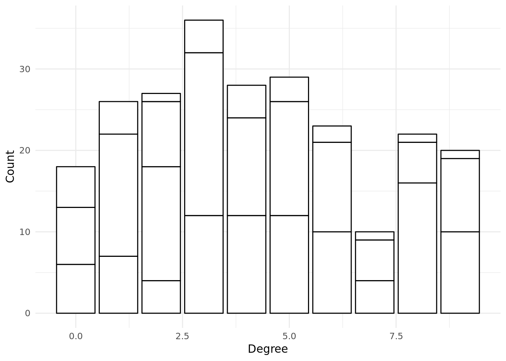

#### Degree distribution of agent->knows->agent edges

#### Runing time by method 

<table class="table table-condensed" style="width: auto !important; ">
 <thead>
  <tr>
   <th style="text-align:left;"> key </th>
   <th style="text-align:right;"> doc_count </th>
   <th style="text-align:right;"> sum_wallTime_ms.value </th>
   <th style="text-align:left;"> avg_wallTime_ms.value </th>
   <th style="text-align:left;"> includedInTotal </th>
  </tr>
 </thead>
<tbody>
  <tr>
   <td style="text-align:left;"> connectIfSimilar </td>
   <td style="text-align:right;"> 28,680 </td>
   <td style="text-align:right;"> 69,126 </td>
   <td style="text-align:left;"> 2.4102510460251 </td>
   <td style="text-align:left;"> No </td>
  </tr>
  <tr>
   <td style="text-align:left;"> existsSimilarity </td>
   <td style="text-align:right;"> 28,680 </td>
   <td style="text-align:right;"> 68,451 </td>
   <td style="text-align:left;"> 2.38671548117155 </td>
   <td style="text-align:left;"> No </td>
  </tr>
  <tr>
   <td style="text-align:left;"> similarityEdges </td>
   <td style="text-align:right;"> 28,680 </td>
   <td style="text-align:right;"> 67,408 </td>
   <td style="text-align:left;"> 2.35034867503487 </td>
   <td style="text-align:left;"> No </td>
  </tr>
  <tr>
   <td style="text-align:left;"> connectAllSimilar </td>
   <td style="text-align:right;"> 240 </td>
   <td style="text-align:right;"> 69,401 </td>
   <td style="text-align:left;"> 289.170833333333 </td>
   <td style="text-align:left;"> Yes </td>
  </tr>
  <tr>
   <td style="text-align:left;"> init </td>
   <td style="text-align:right;"> 103 </td>
   <td style="text-align:right;"> 12,018 </td>
   <td style="text-align:left;"> 116.679611650485 </td>
   <td style="text-align:left;"> No </td>
  </tr>
  <tr>
   <td style="text-align:left;"> connect </td>
   <td style="text-align:right;"> 36 </td>
   <td style="text-align:right;"> 156 </td>
   <td style="text-align:left;"> 4.33333333333333 </td>
   <td style="text-align:left;"> Yes </td>
  </tr>
  <tr>
   <td style="text-align:left;font-weight: bold;"> Total </td>
   <td style="text-align:right;font-weight: bold;"> 284 </td>
   <td style="text-align:right;font-weight: bold;"> 70,084 </td>
   <td style="text-align:left;font-weight: bold;">  </td>
   <td style="text-align:left;font-weight: bold;">  </td>
  </tr>
</tbody>
</table>
####  Found structures 

#####  Cycles 

Number of cycles found:  1 

<button class="btn btn-primary" data-toggle="collapse" data-target="#OKFFTPDEGA"> Show/Hide foundCycle query </button> 
 
  
     GET /filebeat-*/_search 
              { 
                "query": {
                  "bool": {
                    "must": [
                      { "match_phrase": {
                        "simulationId": "SIM10-13-03-37-Nnbvpf--CV"
                        }
                      },
                      { "bool": {
                        "should": [
                          { "match": {
                            "keyword": "foundCycle"
                          }}
                        ]
                      }}
                    ]
                  }
                }
              }
     

#####  Paths 

Number of paths found:  0 

<button class="btn btn-primary" data-toggle="collapse" data-target="#ERMHNGBUGA"> Show/Hide foundPath query </button> 
 
  
     GET /filebeat-*/_search 
              { 
                "query": {
                  "bool": {
                    "must": [
                      { "match_phrase": {
                        "simulationId": "SIM10-13-03-37-Nnbvpf--CV"
                        }
                      },
                      { "bool": {
                        "should": [
                          { "match": {
                            "keyword": "foundPath"
                          }}
                        ]
                      }}
                    ]
                  }
                }
              }
     

###  SIM10-13-03-37-Nnbvpf--DV 

#### simulationParameters 

<table class="table table-condensed" style="width: auto !important; ">
 <thead>
  <tr>
   <th style="text-align:left;"> agentNumber </th>
   <th style="text-align:left;"> similarityConnectThreshold </th>
   <th style="text-align:left;"> graphType </th>
   <th style="text-align:left;"> chainLength </th>
   <th style="text-align:left;"> similaritySearchThreshold </th>
   <th style="text-align:left;"> maxDistance </th>
   <th style="text-align:left;"> randomWorksNumberMultiplier </th>
  </tr>
 </thead>
<tbody>
  <tr>
   <td style="text-align:left;width: 20em; "> 100 </td>
   <td style="text-align:left;width: 15em; "> 0.96 </td>
   <td style="text-align:left;width: 15em; "> random </td>
   <td style="text-align:left;width: 15em; "> 20 </td>
   <td style="text-align:left;width: 15em; "> 1 </td>
   <td style="text-align:left;width: 15em; "> 30 </td>
   <td style="text-align:left;width: 15em; "> 1 </td>
  </tr>
</tbody>
</table>
#### allEdgesByLabel

<table class="table table-condensed" style="width: auto !important; ">
 <thead>
  <tr>
   <th style="text-align:right;"> edges_offers </th>
   <th style="text-align:right;"> edges_similarity </th>
   <th style="text-align:right;"> edges_owns </th>
   <th style="text-align:right;"> edges_demands </th>
   <th style="text-align:right;"> edges_knows </th>
   <th style="text-align:right;"> edges_total </th>
  </tr>
 </thead>
<tbody>
  <tr>
   <td style="text-align:right;width: 5em; "> 120 </td>
   <td style="text-align:right;width: 5em; "> 5,146 </td>
   <td style="text-align:right;width: 5em; "> 120 </td>
   <td style="text-align:right;width: 5em; "> 120 </td>
   <td style="text-align:right;width: 5em; "> 100 </td>
   <td style="text-align:right;width: 5em; "> 5,606 </td>
  </tr>
</tbody>
</table>
#### allVerticesByType

<table class="table table-condensed" style="width: auto !important; ">
 <thead>
  <tr>
   <th style="text-align:right;"> vertices_agent </th>
   <th style="text-align:right;"> vertices_item </th>
   <th style="text-align:right;"> vertices_work </th>
   <th style="text-align:right;"> vertices_total </th>
  </tr>
 </thead>
<tbody>
  <tr>
   <td style="text-align:right;width: 5em; "> 101 </td>
   <td style="text-align:right;width: 5em; "> 240 </td>
   <td style="text-align:right;width: 5em; "> 120 </td>
   <td style="text-align:right;width: 5em; "> 461 </td>
  </tr>
</tbody>
</table>
#### distribution of similarityEdgesByWeight

#### Degree distribution of item->similarity->item edges

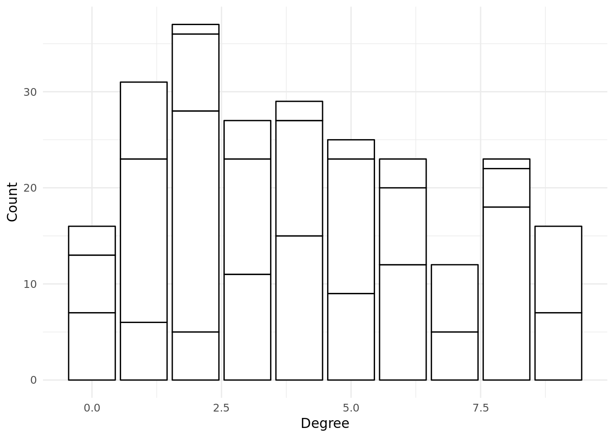

#### Degree distribution of agent->knows->agent edges

#### Runing time by method 

<table class="table table-condensed" style="width: auto !important; ">
 <thead>
  <tr>
   <th style="text-align:left;">   </th>
   <th style="text-align:left;"> key </th>
   <th style="text-align:right;"> doc_count </th>
   <th style="text-align:right;"> sum_wallTime_ms.value </th>
   <th style="text-align:left;"> avg_wallTime_ms.value </th>
   <th style="text-align:left;"> includedInTotal </th>
  </tr>
 </thead>
<tbody>
  <tr>
   <td style="text-align:left;"> 1 </td>
   <td style="text-align:left;"> addItemToWork </td>
   <td style="text-align:right;"> 240 </td>
   <td style="text-align:right;"> 3,366 </td>
   <td style="text-align:left;"> 14.025 </td>
   <td style="text-align:left;"> No </td>
  </tr>
  <tr>
   <td style="text-align:left;"> 2 </td>
   <td style="text-align:left;"> ownsWork </td>
   <td style="text-align:right;"> 120 </td>
   <td style="text-align:right;"> 3,393 </td>
   <td style="text-align:left;"> 28.275 </td>
   <td style="text-align:left;"> No </td>
  </tr>
  <tr>
   <td style="text-align:left;"> 3 </td>
   <td style="text-align:left;"> init </td>
   <td style="text-align:right;"> 103 </td>
   <td style="text-align:right;"> 12,210 </td>
   <td style="text-align:left;"> 118.543689320388 </td>
   <td style="text-align:left;"> No </td>
  </tr>
  <tr>
   <td style="text-align:left;"> 4 </td>
   <td style="text-align:left;"> searchAndConnect </td>
   <td style="text-align:right;"> 101 </td>
   <td style="text-align:right;"> 49,931 </td>
   <td style="text-align:left;"> 494.366336633663 </td>
   <td style="text-align:left;"> Yes </td>
  </tr>
  <tr>
   <td style="text-align:left;"> 5 </td>
   <td style="text-align:left;"> knowsAgent </td>
   <td style="text-align:right;"> 100 </td>
   <td style="text-align:right;"> 518 </td>
   <td style="text-align:left;"> 5.18 </td>
   <td style="text-align:left;"> No </td>
  </tr>
  <tr>
   <td style="text-align:left;"> 6 </td>
   <td style="text-align:left;"> getWorksItems </td>
   <td style="text-align:right;"> 38 </td>
   <td style="text-align:right;"> 114 </td>
   <td style="text-align:left;"> 3 </td>
   <td style="text-align:left;"> Yes </td>
  </tr>
  <tr>
   <td style="text-align:left;"> 9 </td>
   <td style="text-align:left;"> cycleSearch </td>
   <td style="text-align:right;"> 2 </td>
   <td style="text-align:right;"> 207 </td>
   <td style="text-align:left;"> 103.5 </td>
   <td style="text-align:left;"> Yes </td>
  </tr>
  <tr>
   <td style="text-align:left;"> 10 </td>
   <td style="text-align:left;"> getWorks </td>
   <td style="text-align:right;"> 2 </td>
   <td style="text-align:right;"> 415 </td>
   <td style="text-align:left;"> 207.5 </td>
   <td style="text-align:left;"> No </td>
  </tr>
  <tr>
   <td style="text-align:left;font-weight: bold;"> 11 </td>
   <td style="text-align:left;font-weight: bold;"> Total </td>
   <td style="text-align:right;font-weight: bold;"> 148 </td>
   <td style="text-align:right;font-weight: bold;"> 51,053 </td>
   <td style="text-align:left;font-weight: bold;">  </td>
   <td style="text-align:left;font-weight: bold;">  </td>
  </tr>
</tbody>
</table>
####  Found structures 

#####  Cycles 

Number of cycles found:  2 

<button class="btn btn-primary" data-toggle="collapse" data-target="#SUDIFSQFYF"> Show/Hide foundCycle query </button> 
 
  
     GET /filebeat-*/_search 
              { 
                "query": {
                  "bool": {
                    "must": [
                      { "match_phrase": {
                        "simulationId": "SIM10-13-03-37-Nnbvpf--DV"
                        }
                      },
                      { "bool": {
                        "should": [
                          { "match": {
                            "keyword": "foundCycle"
                          }}
                        ]
                      }}
                    ]
                  }
                }
              }
     

#####  Paths 

Number of paths found:  0 

<button class="btn btn-primary" data-toggle="collapse" data-target="#TZFVCJRWFG"> Show/Hide foundPath query </button> 
 
  
     GET /filebeat-*/_search 
              { 
                "query": {
                  "bool": {
                    "must": [
                      { "match_phrase": {
                        "simulationId": "SIM10-13-03-37-Nnbvpf--DV"
                        }
                      },
                      { "bool": {
                        "should": [
                          { "match": {
                            "keyword": "foundPath"
                          }}
                        ]
                      }}
                    ]
                  }
                }
              }
     

###  SIM10-13-03-39-NQdbEk--CV 

#### simulationParameters 

<table class="table table-condensed" style="width: auto !important; ">
 <thead>
  <tr>
   <th style="text-align:left;"> agentNumber </th>
   <th style="text-align:left;"> similarityConnectThreshold </th>
   <th style="text-align:left;"> graphType </th>
   <th style="text-align:left;"> chainLength </th>
   <th style="text-align:left;"> similaritySearchThreshold </th>
   <th style="text-align:left;"> maxDistance </th>
   <th style="text-align:left;"> randomWorksNumberMultiplier </th>
  </tr>
 </thead>
<tbody>
  <tr>
   <td style="text-align:left;width: 20em; "> 100 </td>
   <td style="text-align:left;width: 15em; "> 0.96 </td>
   <td style="text-align:left;width: 15em; "> smallWorld </td>
   <td style="text-align:left;width: 15em; "> 20 </td>
   <td style="text-align:left;width: 15em; "> 1 </td>
   <td style="text-align:left;width: 15em; "> 30 </td>
   <td style="text-align:left;width: 15em; "> 1 </td>
  </tr>
</tbody>
</table>
#### allEdgesByLabel

<table class="table table-condensed" style="width: auto !important; ">
 <thead>
  <tr>
   <th style="text-align:right;"> edges_offers </th>
   <th style="text-align:right;"> edges_similarity </th>
   <th style="text-align:right;"> edges_owns </th>
   <th style="text-align:right;"> edges_demands </th>
   <th style="text-align:right;"> edges_knows </th>
   <th style="text-align:right;"> edges_total </th>
  </tr>
 </thead>
<tbody>
  <tr>
   <td style="text-align:right;width: 5em; "> 120 </td>
   <td style="text-align:right;width: 5em; "> 5,046 </td>
   <td style="text-align:right;width: 5em; "> 120 </td>
   <td style="text-align:right;width: 5em; "> 120 </td>
   <td style="text-align:right;width: 5em; "> 601 </td>
   <td style="text-align:right;width: 5em; "> 6,007 </td>
  </tr>
</tbody>
</table>
#### allVerticesByType

<table class="table table-condensed" style="width: auto !important; ">
 <thead>
  <tr>
   <th style="text-align:right;"> vertices_agent </th>
   <th style="text-align:right;"> vertices_item </th>
   <th style="text-align:right;"> vertices_work </th>
   <th style="text-align:right;"> vertices_total </th>
  </tr>
 </thead>
<tbody>
  <tr>
   <td style="text-align:right;width: 5em; "> 101 </td>
   <td style="text-align:right;width: 5em; "> 240 </td>
   <td style="text-align:right;width: 5em; "> 120 </td>
   <td style="text-align:right;width: 5em; "> 461 </td>
  </tr>
</tbody>
</table>
#### distribution of similarityEdgesByWeight

#### Degree distribution of item->similarity->item edges

#### Degree distribution of agent->knows->agent edges

#### Runing time by method 

<table class="table table-condensed" style="width: auto !important; ">
 <thead>
  <tr>
   <th style="text-align:left;"> key </th>
   <th style="text-align:right;"> doc_count </th>
   <th style="text-align:right;"> sum_wallTime_ms.value </th>
   <th style="text-align:left;"> avg_wallTime_ms.value </th>
   <th style="text-align:left;"> includedInTotal </th>
  </tr>
 </thead>
<tbody>
  <tr>
   <td style="text-align:left;"> connectIfSimilar </td>
   <td style="text-align:right;"> 28,680 </td>
   <td style="text-align:right;"> 70,092 </td>
   <td style="text-align:left;"> 2.44393305439331 </td>
   <td style="text-align:left;"> No </td>
  </tr>
  <tr>
   <td style="text-align:left;"> existsSimilarity </td>
   <td style="text-align:right;"> 28,680 </td>
   <td style="text-align:right;"> 69,513 </td>
   <td style="text-align:left;"> 2.42374476987448 </td>
   <td style="text-align:left;"> No </td>
  </tr>
  <tr>
   <td style="text-align:left;"> similarityEdges </td>
   <td style="text-align:right;"> 28,680 </td>
   <td style="text-align:right;"> 68,569 </td>
   <td style="text-align:left;"> 2.39082984658298 </td>
   <td style="text-align:left;"> No </td>
  </tr>
  <tr>
   <td style="text-align:left;"> connectAllSimilar </td>
   <td style="text-align:right;"> 240 </td>
   <td style="text-align:right;"> 70,352 </td>
   <td style="text-align:left;"> 293.133333333333 </td>
   <td style="text-align:left;"> Yes </td>
  </tr>
  <tr>
   <td style="text-align:left;"> init </td>
   <td style="text-align:right;"> 103 </td>
   <td style="text-align:right;"> 12,937 </td>
   <td style="text-align:left;"> 125.601941747573 </td>
   <td style="text-align:left;"> No </td>
  </tr>
  <tr>
   <td style="text-align:left;"> connect </td>
   <td style="text-align:right;"> 28 </td>
   <td style="text-align:right;"> 109 </td>
   <td style="text-align:left;"> 3.89285714285714 </td>
   <td style="text-align:left;"> Yes </td>
  </tr>
  <tr>
   <td style="text-align:left;font-weight: bold;"> Total </td>
   <td style="text-align:right;font-weight: bold;"> 276 </td>
   <td style="text-align:right;font-weight: bold;"> 70,911 </td>
   <td style="text-align:left;font-weight: bold;">  </td>
   <td style="text-align:left;font-weight: bold;">  </td>
  </tr>
</tbody>
</table>
####  Found structures 

#####  Cycles 

Number of cycles found:  1 

<button class="btn btn-primary" data-toggle="collapse" data-target="#ILIQLIEIZP"> Show/Hide foundCycle query </button> 
 
  
     GET /filebeat-*/_search 
              { 
                "query": {
                  "bool": {
                    "must": [
                      { "match_phrase": {
                        "simulationId": "SIM10-13-03-39-NQdbEk--CV"
                        }
                      },
                      { "bool": {
                        "should": [
                          { "match": {
                            "keyword": "foundCycle"
                          }}
                        ]
                      }}
                    ]
                  }
                }
              }
     

#####  Paths 

Number of paths found:  0 

<button class="btn btn-primary" data-toggle="collapse" data-target="#DZLJPGBPHD"> Show/Hide foundPath query </button> 
 
  
     GET /filebeat-*/_search 
              { 
                "query": {
                  "bool": {
                    "must": [
                      { "match_phrase": {
                        "simulationId": "SIM10-13-03-39-NQdbEk--CV"
                        }
                      },
                      { "bool": {
                        "should": [
                          { "match": {
                            "keyword": "foundPath"
                          }}
                        ]
                      }}
                    ]
                  }
                }
              }
     

###  SIM10-13-03-39-NQdbEk--DV 

#### simulationParameters 

<table class="table table-condensed" style="width: auto !important; ">
 <thead>
  <tr>
   <th style="text-align:left;"> agentNumber </th>
   <th style="text-align:left;"> similarityConnectThreshold </th>
   <th style="text-align:left;"> graphType </th>
   <th style="text-align:left;"> chainLength </th>
   <th style="text-align:left;"> similaritySearchThreshold </th>
   <th style="text-align:left;"> maxDistance </th>
   <th style="text-align:left;"> randomWorksNumberMultiplier </th>
  </tr>
 </thead>
<tbody>
  <tr>
   <td style="text-align:left;width: 20em; "> 100 </td>
   <td style="text-align:left;width: 15em; "> 0.96 </td>
   <td style="text-align:left;width: 15em; "> smallWorld </td>
   <td style="text-align:left;width: 15em; "> 20 </td>
   <td style="text-align:left;width: 15em; "> 1 </td>
   <td style="text-align:left;width: 15em; "> 30 </td>
   <td style="text-align:left;width: 15em; "> 1 </td>
  </tr>
</tbody>
</table>
#### allEdgesByLabel

<table class="table table-condensed" style="width: auto !important; ">
 <thead>
  <tr>
   <th style="text-align:right;"> edges_offers </th>
   <th style="text-align:right;"> edges_similarity </th>
   <th style="text-align:right;"> edges_owns </th>
   <th style="text-align:right;"> edges_demands </th>
   <th style="text-align:right;"> edges_knows </th>
   <th style="text-align:right;"> edges_total </th>
  </tr>
 </thead>
<tbody>
  <tr>
   <td style="text-align:right;width: 5em; "> 120 </td>
   <td style="text-align:right;width: 5em; "> 4,990 </td>
   <td style="text-align:right;width: 5em; "> 120 </td>
   <td style="text-align:right;width: 5em; "> 120 </td>
   <td style="text-align:right;width: 5em; "> 601 </td>
   <td style="text-align:right;width: 5em; "> 5,951 </td>
  </tr>
</tbody>
</table>
#### allVerticesByType

<table class="table table-condensed" style="width: auto !important; ">
 <thead>
  <tr>
   <th style="text-align:right;"> vertices_agent </th>
   <th style="text-align:right;"> vertices_item </th>
   <th style="text-align:right;"> vertices_work </th>
   <th style="text-align:right;"> vertices_total </th>
  </tr>
 </thead>
<tbody>
  <tr>
   <td style="text-align:right;width: 5em; "> 101 </td>
   <td style="text-align:right;width: 5em; "> 240 </td>
   <td style="text-align:right;width: 5em; "> 120 </td>
   <td style="text-align:right;width: 5em; "> 461 </td>
  </tr>
</tbody>
</table>
#### distribution of similarityEdgesByWeight

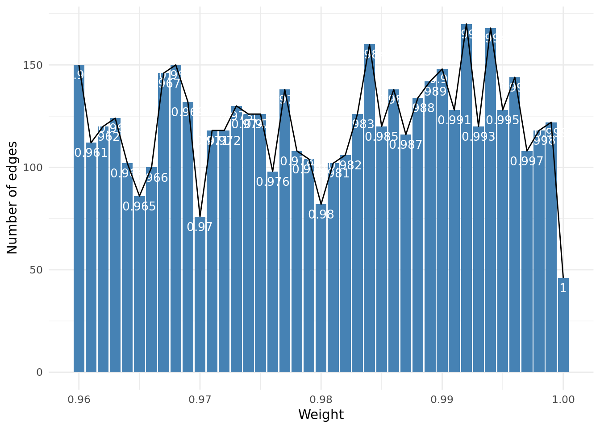

#### Degree distribution of item->similarity->item edges

#### Degree distribution of agent->knows->agent edges

#### Runing time by method 

<table class="table table-condensed" style="width: auto !important; ">
 <thead>
  <tr>
   <th style="text-align:left;">   </th>
   <th style="text-align:left;"> key </th>
   <th style="text-align:right;"> doc_count </th>
   <th style="text-align:right;"> sum_wallTime_ms.value </th>
   <th style="text-align:left;"> avg_wallTime_ms.value </th>
   <th style="text-align:left;"> includedInTotal </th>
  </tr>
 </thead>
<tbody>
  <tr>
   <td style="text-align:left;"> 1 </td>
   <td style="text-align:left;"> knowsAgent </td>
   <td style="text-align:right;"> 601 </td>
   <td style="text-align:right;"> 1,315 </td>
   <td style="text-align:left;"> 2.18801996672213 </td>
   <td style="text-align:left;"> No </td>
  </tr>
  <tr>
   <td style="text-align:left;"> 2 </td>
   <td style="text-align:left;"> addItemToWork </td>
   <td style="text-align:right;"> 240 </td>
   <td style="text-align:right;"> 2,943 </td>
   <td style="text-align:left;"> 12.2625 </td>
   <td style="text-align:left;"> No </td>
  </tr>
  <tr>
   <td style="text-align:left;"> 3 </td>
   <td style="text-align:left;"> ownsWork </td>
   <td style="text-align:right;"> 120 </td>
   <td style="text-align:right;"> 2,677 </td>
   <td style="text-align:left;"> 22.3083333333333 </td>
   <td style="text-align:left;"> No </td>
  </tr>
  <tr>
   <td style="text-align:left;"> 4 </td>
   <td style="text-align:left;"> init </td>
   <td style="text-align:right;"> 103 </td>
   <td style="text-align:right;"> 12,674 </td>
   <td style="text-align:left;"> 123.04854368932 </td>
   <td style="text-align:left;"> No </td>
  </tr>
  <tr>
   <td style="text-align:left;"> 5 </td>
   <td style="text-align:left;"> searchAndConnect </td>
   <td style="text-align:right;"> 101 </td>
   <td style="text-align:right;"> 53,474 </td>
   <td style="text-align:left;"> 529.445544554455 </td>
   <td style="text-align:left;"> Yes </td>
  </tr>
  <tr>
   <td style="text-align:left;"> 6 </td>
   <td style="text-align:left;"> getWorksItems </td>
   <td style="text-align:right;"> 38 </td>
   <td style="text-align:right;"> 64 </td>
   <td style="text-align:left;"> 1.68421052631579 </td>
   <td style="text-align:left;"> Yes </td>
  </tr>
  <tr>
   <td style="text-align:left;"> 9 </td>
   <td style="text-align:left;"> cycleSearch </td>
   <td style="text-align:right;"> 3 </td>
   <td style="text-align:right;"> 684 </td>
   <td style="text-align:left;"> 228 </td>
   <td style="text-align:left;"> Yes </td>
  </tr>
  <tr>
   <td style="text-align:left;"> 10 </td>
   <td style="text-align:left;"> getWorks </td>
   <td style="text-align:right;"> 3 </td>
   <td style="text-align:right;"> 394 </td>
   <td style="text-align:left;"> 131.333333333333 </td>
   <td style="text-align:left;"> No </td>
  </tr>
  <tr>
   <td style="text-align:left;font-weight: bold;"> 11 </td>
   <td style="text-align:left;font-weight: bold;"> Total </td>
   <td style="text-align:right;font-weight: bold;"> 150 </td>
   <td style="text-align:right;font-weight: bold;"> 55,691 </td>
   <td style="text-align:left;font-weight: bold;">  </td>
   <td style="text-align:left;font-weight: bold;">  </td>
  </tr>
</tbody>
</table>
####  Found structures 

#####  Cycles 

Number of cycles found:  2 

<button class="btn btn-primary" data-toggle="collapse" data-target="#IJEKXOUZFE"> Show/Hide foundCycle query </button> 
 
  
     GET /filebeat-*/_search 
              { 
                "query": {
                  "bool": {
                    "must": [
                      { "match_phrase": {
                        "simulationId": "SIM10-13-03-39-NQdbEk--DV"
                        }
                      },
                      { "bool": {
                        "should": [
                          { "match": {
                            "keyword": "foundCycle"
                          }}
                        ]
                      }}
                    ]
                  }
                }
              }
     

#####  Paths 

Number of paths found:  1 

<button class="btn btn-primary" data-toggle="collapse" data-target="#MTSYIGJLCN"> Show/Hide foundPath query </button> 
 
  
     GET /filebeat-*/_search 
              { 
                "query": {
                  "bool": {
                    "must": [
                      { "match_phrase": {
                        "simulationId": "SIM10-13-03-39-NQdbEk--DV"
                        }
                      },
                      { "bool": {
                        "should": [
                          { "match": {
                            "keyword": "foundPath"
                          }}
                        ]
                      }}
                    ]
                  }
                }
              }
     

###  SIM10-13-06-01-vyXKso--CV 

#### simulationParameters 

<table class="table table-condensed" style="width: auto !important; ">
 <thead>
  <tr>
   <th style="text-align:left;"> agentNumber </th>
   <th style="text-align:left;"> similarityConnectThreshold </th>
   <th style="text-align:left;"> graphType </th>
   <th style="text-align:left;"> chainLength </th>
   <th style="text-align:left;"> similaritySearchThreshold </th>
   <th style="text-align:left;"> maxDistance </th>
   <th style="text-align:left;"> randomWorksNumberMultiplier </th>
  </tr>
 </thead>
<tbody>
  <tr>
   <td style="text-align:left;width: 20em; "> 100 </td>
   <td style="text-align:left;width: 15em; "> 0.96 </td>
   <td style="text-align:left;width: 15em; "> random </td>
   <td style="text-align:left;width: 15em; "> 20 </td>
   <td style="text-align:left;width: 15em; "> 1 </td>
   <td style="text-align:left;width: 15em; "> 30 </td>
   <td style="text-align:left;width: 15em; "> 2 </td>
  </tr>
</tbody>
</table>
#### allEdgesByLabel

<table class="table table-condensed" style="width: auto !important; ">
 <thead>
  <tr>
   <th style="text-align:right;"> edges_offers </th>
   <th style="text-align:right;"> edges_similarity </th>
   <th style="text-align:right;"> edges_owns </th>
   <th style="text-align:right;"> edges_demands </th>
   <th style="text-align:right;"> edges_knows </th>
   <th style="text-align:right;"> edges_total </th>
  </tr>
 </thead>
<tbody>
  <tr>
   <td style="text-align:right;width: 5em; "> 220 </td>
   <td style="text-align:right;width: 5em; "> 16,686 </td>
   <td style="text-align:right;width: 5em; "> 220 </td>
   <td style="text-align:right;width: 5em; "> 220 </td>
   <td style="text-align:right;width: 5em; "> 100 </td>
   <td style="text-align:right;width: 5em; "> 17,446 </td>
  </tr>
</tbody>
</table>
#### allVerticesByType

<table class="table table-condensed" style="width: auto !important; ">
 <thead>
  <tr>
   <th style="text-align:right;"> vertices_agent </th>
   <th style="text-align:right;"> vertices_item </th>
   <th style="text-align:right;"> vertices_work </th>
   <th style="text-align:right;"> vertices_total </th>
  </tr>
 </thead>
<tbody>
  <tr>
   <td style="text-align:right;width: 5em; "> 101 </td>
   <td style="text-align:right;width: 5em; "> 440 </td>
   <td style="text-align:right;width: 5em; "> 220 </td>
   <td style="text-align:right;width: 5em; "> 761 </td>
  </tr>
</tbody>
</table>
#### distribution of similarityEdgesByWeight

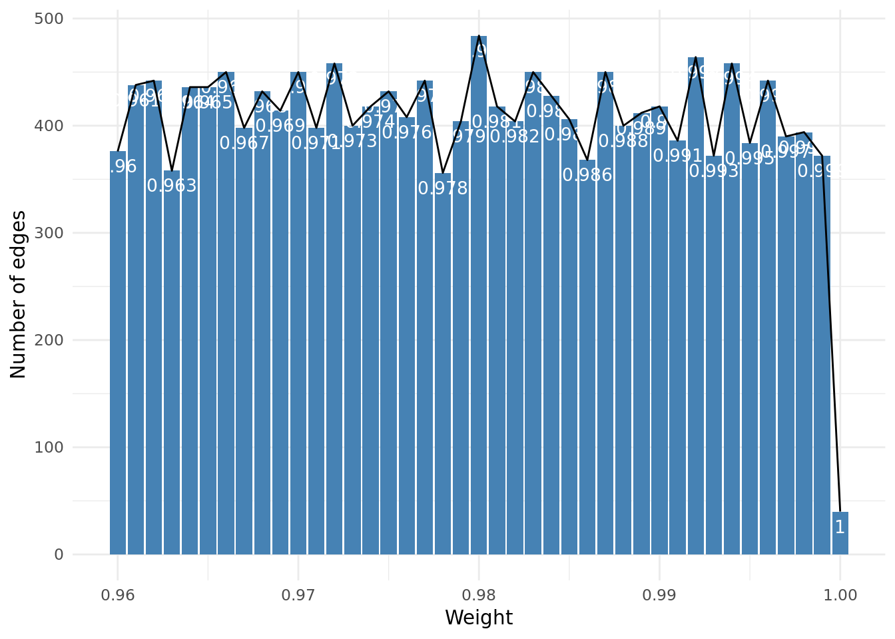

#### Degree distribution of item->similarity->item edges

#### Degree distribution of agent->knows->agent edges

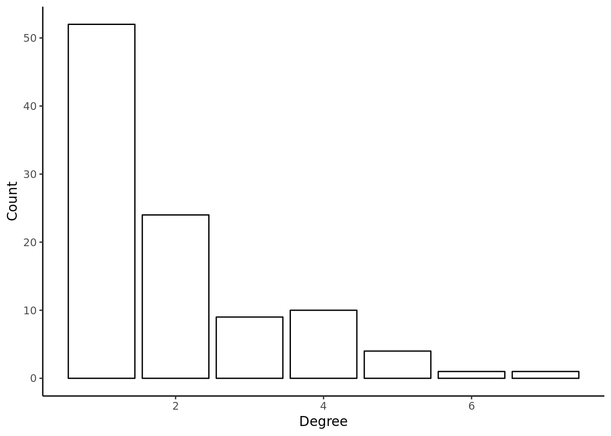

#### Runing time by method 

<table class="table table-condensed" style="width: auto !important; ">
 <thead>
  <tr>
   <th style="text-align:left;"> key </th>
   <th style="text-align:right;"> doc_count </th>
   <th style="text-align:right;"> sum_wallTime_ms.value </th>
   <th style="text-align:left;"> avg_wallTime_ms.value </th>
   <th style="text-align:left;"> includedInTotal </th>
  </tr>
 </thead>
<tbody>
  <tr>
   <td style="text-align:left;"> connectIfSimilar </td>
   <td style="text-align:right;"> 96,580 </td>
   <td style="text-align:right;"> 290,547 </td>
   <td style="text-align:left;"> 3.00835576723959 </td>
   <td style="text-align:left;"> No </td>
  </tr>
  <tr>
   <td style="text-align:left;"> existsSimilarity </td>
   <td style="text-align:right;"> 96,580 </td>
   <td style="text-align:right;"> 288,584 </td>
   <td style="text-align:left;"> 2.98803064816732 </td>
   <td style="text-align:left;"> No </td>
  </tr>
  <tr>
   <td style="text-align:left;"> similarityEdges </td>
   <td style="text-align:right;"> 96,580 </td>
   <td style="text-align:right;"> 284,486 </td>
   <td style="text-align:left;"> 2.94559950300269 </td>
   <td style="text-align:left;"> No </td>
  </tr>
  <tr>
   <td style="text-align:left;"> connectAllSimilar </td>
   <td style="text-align:right;"> 440 </td>
   <td style="text-align:right;"> 291,461 </td>
   <td style="text-align:left;"> 662.411363636364 </td>
   <td style="text-align:left;"> Yes </td>
  </tr>
  <tr>
   <td style="text-align:left;"> connect </td>
   <td style="text-align:right;"> 104 </td>
   <td style="text-align:right;"> 217 </td>
   <td style="text-align:left;"> 2.08653846153846 </td>
   <td style="text-align:left;"> Yes </td>
  </tr>
  <tr>
   <td style="text-align:left;"> init </td>
   <td style="text-align:right;"> 103 </td>
   <td style="text-align:right;"> 12,315 </td>
   <td style="text-align:left;"> 119.563106796117 </td>
   <td style="text-align:left;"> No </td>
  </tr>
  <tr>
   <td style="text-align:left;font-weight: bold;"> Total </td>
   <td style="text-align:right;font-weight: bold;"> 552 </td>
   <td style="text-align:right;font-weight: bold;"> 292,613 </td>
   <td style="text-align:left;font-weight: bold;">  </td>
   <td style="text-align:left;font-weight: bold;">  </td>
  </tr>
</tbody>
</table>
####  Found structures 

#####  Cycles 

Number of cycles found:  1 

<button class="btn btn-primary" data-toggle="collapse" data-target="#EYHNFDITHE"> Show/Hide foundCycle query </button> 
 
  
     GET /filebeat-*/_search 
              { 
                "query": {
                  "bool": {
                    "must": [
                      { "match_phrase": {
                        "simulationId": "SIM10-13-06-01-vyXKso--CV"
                        }
                      },
                      { "bool": {
                        "should": [
                          { "match": {
                            "keyword": "foundCycle"
                          }}
                        ]
                      }}
                    ]
                  }
                }
              }
     

#####  Paths 

Number of paths found:  0 

<button class="btn btn-primary" data-toggle="collapse" data-target="#NMHIBUQACS"> Show/Hide foundPath query </button> 
 
  
     GET /filebeat-*/_search 
              { 
                "query": {
                  "bool": {
                    "must": [
                      { "match_phrase": {
                        "simulationId": "SIM10-13-06-01-vyXKso--CV"
                        }
                      },
                      { "bool": {
                        "should": [
                          { "match": {
                            "keyword": "foundPath"
                          }}
                        ]
                      }}
                    ]
                  }
                }
              }
     

###  SIM10-13-06-01-vyXKso--DV 

#### simulationParameters 

<table class="table table-condensed" style="width: auto !important; ">
 <thead>
  <tr>
   <th style="text-align:left;"> agentNumber </th>
   <th style="text-align:left;"> similarityConnectThreshold </th>
   <th style="text-align:left;"> graphType </th>
   <th style="text-align:left;"> chainLength </th>
   <th style="text-align:left;"> similaritySearchThreshold </th>
   <th style="text-align:left;"> maxDistance </th>
   <th style="text-align:left;"> randomWorksNumberMultiplier </th>
  </tr>
 </thead>
<tbody>
  <tr>
   <td style="text-align:left;width: 20em; "> 100 </td>
   <td style="text-align:left;width: 15em; "> 0.96 </td>
   <td style="text-align:left;width: 15em; "> random </td>
   <td style="text-align:left;width: 15em; "> 20 </td>
   <td style="text-align:left;width: 15em; "> 1 </td>
   <td style="text-align:left;width: 15em; "> 30 </td>
   <td style="text-align:left;width: 15em; "> 2 </td>
  </tr>
</tbody>
</table>
#### allEdgesByLabel

<table class="table table-condensed" style="width: auto !important; ">
 <thead>
  <tr>
   <th style="text-align:right;"> edges_offers </th>
   <th style="text-align:right;"> edges_similarity </th>
   <th style="text-align:right;"> edges_owns </th>
   <th style="text-align:right;"> edges_demands </th>
   <th style="text-align:right;"> edges_knows </th>
   <th style="text-align:right;"> edges_total </th>
  </tr>
 </thead>
<tbody>
  <tr>
   <td style="text-align:right;width: 5em; "> 220 </td>
   <td style="text-align:right;width: 5em; "> 16,478 </td>
   <td style="text-align:right;width: 5em; "> 220 </td>
   <td style="text-align:right;width: 5em; "> 220 </td>
   <td style="text-align:right;width: 5em; "> 100 </td>
   <td style="text-align:right;width: 5em; "> 17,238 </td>
  </tr>
</tbody>
</table>
#### allVerticesByType

<table class="table table-condensed" style="width: auto !important; ">
 <thead>
  <tr>
   <th style="text-align:right;"> vertices_agent </th>
   <th style="text-align:right;"> vertices_item </th>
   <th style="text-align:right;"> vertices_work </th>
   <th style="text-align:right;"> vertices_total </th>
  </tr>
 </thead>
<tbody>
  <tr>
   <td style="text-align:right;width: 5em; "> 101 </td>
   <td style="text-align:right;width: 5em; "> 440 </td>
   <td style="text-align:right;width: 5em; "> 220 </td>
   <td style="text-align:right;width: 5em; "> 761 </td>
  </tr>
</tbody>
</table>
#### distribution of similarityEdgesByWeight

#### Degree distribution of item->similarity->item edges

#### Degree distribution of agent->knows->agent edges

#### Runing time by method 

<table class="table table-condensed" style="width: auto !important; ">
 <thead>
  <tr>
   <th style="text-align:left;">   </th>
   <th style="text-align:left;"> key </th>
   <th style="text-align:right;"> doc_count </th>
   <th style="text-align:right;"> sum_wallTime_ms.value </th>
   <th style="text-align:left;"> avg_wallTime_ms.value </th>
   <th style="text-align:left;"> includedInTotal </th>
  </tr>
 </thead>
<tbody>
  <tr>
   <td style="text-align:left;"> 1 </td>
   <td style="text-align:left;"> addItemToWork </td>
   <td style="text-align:right;"> 440 </td>
   <td style="text-align:right;"> 4,926 </td>
   <td style="text-align:left;"> 11.1954545454545 </td>
   <td style="text-align:left;"> No </td>
  </tr>
  <tr>
   <td style="text-align:left;"> 2 </td>
   <td style="text-align:left;"> ownsWork </td>
   <td style="text-align:right;"> 220 </td>
   <td style="text-align:right;"> 2,990 </td>
   <td style="text-align:left;"> 13.5909090909091 </td>
   <td style="text-align:left;"> No </td>
  </tr>
  <tr>
   <td style="text-align:left;"> 3 </td>
   <td style="text-align:left;"> init </td>
   <td style="text-align:right;"> 103 </td>
   <td style="text-align:right;"> 13,800 </td>
   <td style="text-align:left;"> 133.980582524272 </td>
   <td style="text-align:left;"> No </td>
  </tr>
  <tr>
   <td style="text-align:left;"> 4 </td>
   <td style="text-align:left;"> searchAndConnect </td>
   <td style="text-align:right;"> 101 </td>
   <td style="text-align:right;"> 130,790 </td>
   <td style="text-align:left;"> 1294.9504950495 </td>
   <td style="text-align:left;"> Yes </td>
  </tr>
  <tr>
   <td style="text-align:left;"> 5 </td>
   <td style="text-align:left;"> knowsAgent </td>
   <td style="text-align:right;"> 100 </td>
   <td style="text-align:right;"> 591 </td>
   <td style="text-align:left;"> 5.91 </td>
   <td style="text-align:left;"> No </td>
  </tr>
  <tr>
   <td style="text-align:left;"> 6 </td>
   <td style="text-align:left;"> getWorksItems </td>
   <td style="text-align:right;"> 38 </td>
   <td style="text-align:right;"> 63 </td>
   <td style="text-align:left;"> 1.65789473684211 </td>
   <td style="text-align:left;"> Yes </td>
  </tr>
  <tr>
   <td style="text-align:left;"> 8 </td>
   <td style="text-align:left;"> cycleSearch </td>
   <td style="text-align:right;"> 5 </td>
   <td style="text-align:right;"> 1,207 </td>
   <td style="text-align:left;"> 241.4 </td>
   <td style="text-align:left;"> Yes </td>
  </tr>
  <tr>
   <td style="text-align:left;"> 10 </td>
   <td style="text-align:left;"> getWorks </td>
   <td style="text-align:right;"> 5 </td>
   <td style="text-align:right;"> 1,136 </td>
   <td style="text-align:left;"> 227.2 </td>
   <td style="text-align:left;"> No </td>
  </tr>
  <tr>
   <td style="text-align:left;font-weight: bold;"> 11 </td>
   <td style="text-align:left;font-weight: bold;"> Total </td>
   <td style="text-align:right;font-weight: bold;"> 154 </td>
   <td style="text-align:right;font-weight: bold;"> 133,803 </td>
   <td style="text-align:left;font-weight: bold;">  </td>
   <td style="text-align:left;font-weight: bold;">  </td>
  </tr>
</tbody>
</table>
####  Found structures 

#####  Cycles 

Number of cycles found:  5 

<button class="btn btn-primary" data-toggle="collapse" data-target="#PGDCDOMZHH"> Show/Hide foundCycle query </button> 
 
  
     GET /filebeat-*/_search 
              { 
                "query": {
                  "bool": {
                    "must": [
                      { "match_phrase": {
                        "simulationId": "SIM10-13-06-01-vyXKso--DV"
                        }
                      },
                      { "bool": {
                        "should": [
                          { "match": {
                            "keyword": "foundCycle"
                          }}
                        ]
                      }}
                    ]
                  }
                }
              }
     

#####  Paths 

Number of paths found:  0 

<button class="btn btn-primary" data-toggle="collapse" data-target="#ZMSXHPDEEY"> Show/Hide foundPath query </button> 
 
  
     GET /filebeat-*/_search 
              { 
                "query": {
                  "bool": {
                    "must": [
                      { "match_phrase": {
                        "simulationId": "SIM10-13-06-01-vyXKso--DV"
                        }
                      },
                      { "bool": {
                        "should": [
                          { "match": {
                            "keyword": "foundPath"
                          }}
                        ]
                      }}
                    ]
                  }
                }
              }
     

###  SIM10-13-06-07-3iFoCT--CV 

#### simulationParameters 

<table class="table table-condensed" style="width: auto !important; ">
 <thead>
  <tr>
   <th style="text-align:left;"> agentNumber </th>
   <th style="text-align:left;"> similarityConnectThreshold </th>
   <th style="text-align:left;"> graphType </th>
   <th style="text-align:left;"> chainLength </th>
   <th style="text-align:left;"> similaritySearchThreshold </th>
   <th style="text-align:left;"> maxDistance </th>
   <th style="text-align:left;"> randomWorksNumberMultiplier </th>
  </tr>
 </thead>
<tbody>
  <tr>
   <td style="text-align:left;width: 20em; "> 100 </td>
   <td style="text-align:left;width: 15em; "> 0.96 </td>
   <td style="text-align:left;width: 15em; "> smallWorld </td>
   <td style="text-align:left;width: 15em; "> 20 </td>
   <td style="text-align:left;width: 15em; "> 1 </td>
   <td style="text-align:left;width: 15em; "> 30 </td>
   <td style="text-align:left;width: 15em; "> 2 </td>
  </tr>
</tbody>
</table>
#### allEdgesByLabel

<table class="table table-condensed" style="width: auto !important; ">
 <thead>
  <tr>
   <th style="text-align:right;"> edges_offers </th>
   <th style="text-align:right;"> edges_similarity </th>
   <th style="text-align:right;"> edges_owns </th>
   <th style="text-align:right;"> edges_demands </th>
   <th style="text-align:right;"> edges_knows </th>
   <th style="text-align:right;"> edges_total </th>
  </tr>
 </thead>
<tbody>
  <tr>
   <td style="text-align:right;width: 5em; "> 220 </td>
   <td style="text-align:right;width: 5em; "> 16,678 </td>
   <td style="text-align:right;width: 5em; "> 220 </td>
   <td style="text-align:right;width: 5em; "> 220 </td>
   <td style="text-align:right;width: 5em; "> 601 </td>
   <td style="text-align:right;width: 5em; "> 17,939 </td>
  </tr>
</tbody>
</table>
#### allVerticesByType

<table class="table table-condensed" style="width: auto !important; ">
 <thead>
  <tr>
   <th style="text-align:right;"> vertices_agent </th>
   <th style="text-align:right;"> vertices_item </th>
   <th style="text-align:right;"> vertices_work </th>
   <th style="text-align:right;"> vertices_total </th>
  </tr>
 </thead>
<tbody>
  <tr>
   <td style="text-align:right;width: 5em; "> 101 </td>
   <td style="text-align:right;width: 5em; "> 440 </td>
   <td style="text-align:right;width: 5em; "> 220 </td>
   <td style="text-align:right;width: 5em; "> 761 </td>
  </tr>
</tbody>
</table>
#### distribution of similarityEdgesByWeight

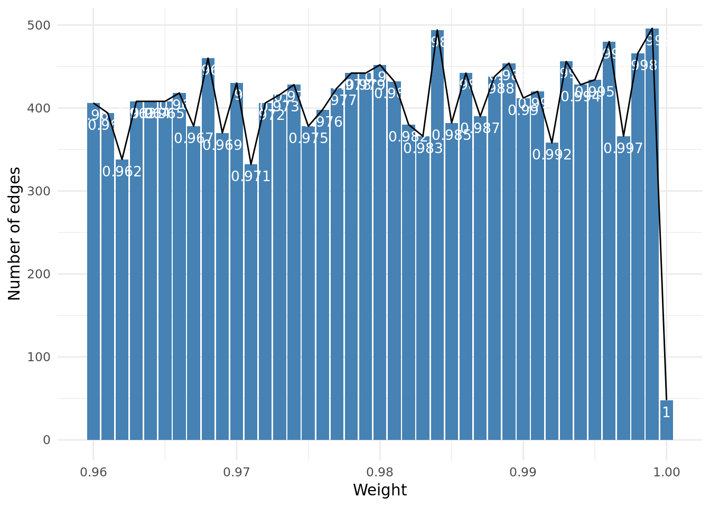

#### Degree distribution of item->similarity->item edges

#### Degree distribution of agent->knows->agent edges

#### Runing time by method 

<table class="table table-condensed" style="width: auto !important; ">
 <thead>
  <tr>
   <th style="text-align:left;"> key </th>
   <th style="text-align:right;"> doc_count </th>
   <th style="text-align:right;"> sum_wallTime_ms.value </th>
   <th style="text-align:left;"> avg_wallTime_ms.value </th>
   <th style="text-align:left;"> includedInTotal </th>
  </tr>
 </thead>
<tbody>
  <tr>
   <td style="text-align:left;"> connectIfSimilar </td>
   <td style="text-align:right;"> 96,580 </td>
   <td style="text-align:right;"> 291,333 </td>
   <td style="text-align:left;"> 3.01649409815697 </td>
   <td style="text-align:left;"> No </td>
  </tr>
  <tr>
   <td style="text-align:left;"> existsSimilarity </td>
   <td style="text-align:right;"> 96,580 </td>
   <td style="text-align:right;"> 289,328 </td>
   <td style="text-align:left;"> 2.99573410644026 </td>
   <td style="text-align:left;"> No </td>
  </tr>
  <tr>
   <td style="text-align:left;"> similarityEdges </td>
   <td style="text-align:right;"> 96,580 </td>
   <td style="text-align:right;"> 285,337 </td>
   <td style="text-align:left;"> 2.95441085110789 </td>
   <td style="text-align:left;"> No </td>
  </tr>
  <tr>
   <td style="text-align:left;"> connectAllSimilar </td>
   <td style="text-align:right;"> 440 </td>
   <td style="text-align:right;"> 292,238 </td>
   <td style="text-align:left;"> 664.177272727273 </td>
   <td style="text-align:left;"> Yes </td>
  </tr>
  <tr>
   <td style="text-align:left;"> init </td>
   <td style="text-align:right;"> 103 </td>
   <td style="text-align:right;"> 12,613 </td>
   <td style="text-align:left;"> 122.456310679612 </td>
   <td style="text-align:left;"> No </td>
  </tr>
  <tr>
   <td style="text-align:left;"> connect </td>
   <td style="text-align:right;"> 102 </td>
   <td style="text-align:right;"> 346 </td>
   <td style="text-align:left;"> 3.3921568627451 </td>
   <td style="text-align:left;"> Yes </td>
  </tr>
  <tr>
   <td style="text-align:left;font-weight: bold;"> Total </td>
   <td style="text-align:right;font-weight: bold;"> 550 </td>
   <td style="text-align:right;font-weight: bold;"> 293,496 </td>
   <td style="text-align:left;font-weight: bold;">  </td>
   <td style="text-align:left;font-weight: bold;">  </td>
  </tr>
</tbody>
</table>
####  Found structures 

#####  Cycles 

Number of cycles found:  1 

<button class="btn btn-primary" data-toggle="collapse" data-target="#RHHHFBBYSM"> Show/Hide foundCycle query </button> 
 
  
     GET /filebeat-*/_search 
              { 
                "query": {
                  "bool": {
                    "must": [
                      { "match_phrase": {
                        "simulationId": "SIM10-13-06-07-3iFoCT--CV"
                        }
                      },
                      { "bool": {
                        "should": [
                          { "match": {
                            "keyword": "foundCycle"
                          }}
                        ]
                      }}
                    ]
                  }
                }
              }
     

#####  Paths 

Number of paths found:  0 

<button class="btn btn-primary" data-toggle="collapse" data-target="#AHYIVIQORW"> Show/Hide foundPath query </button> 
 
  
     GET /filebeat-*/_search 
              { 
                "query": {
                  "bool": {
                    "must": [
                      { "match_phrase": {
                        "simulationId": "SIM10-13-06-07-3iFoCT--CV"
                        }
                      },
                      { "bool": {
                        "should": [
                          { "match": {
                            "keyword": "foundPath"
                          }}
                        ]
                      }}
                    ]
                  }
                }
              }
     

###  SIM10-13-06-07-3iFoCT--DV 

#### simulationParameters 

<table class="table table-condensed" style="width: auto !important; ">
 <thead>
  <tr>
   <th style="text-align:left;"> agentNumber </th>
   <th style="text-align:left;"> similarityConnectThreshold </th>
   <th style="text-align:left;"> graphType </th>
   <th style="text-align:left;"> chainLength </th>
   <th style="text-align:left;"> similaritySearchThreshold </th>
   <th style="text-align:left;"> maxDistance </th>
   <th style="text-align:left;"> randomWorksNumberMultiplier </th>
  </tr>
 </thead>
<tbody>
  <tr>
   <td style="text-align:left;width: 20em; "> 100 </td>
   <td style="text-align:left;width: 15em; "> 0.96 </td>
   <td style="text-align:left;width: 15em; "> smallWorld </td>
   <td style="text-align:left;width: 15em; "> 20 </td>
   <td style="text-align:left;width: 15em; "> 1 </td>
   <td style="text-align:left;width: 15em; "> 30 </td>
   <td style="text-align:left;width: 15em; "> 2 </td>
  </tr>
</tbody>
</table>
#### allEdgesByLabel

<table class="table table-condensed" style="width: auto !important; ">
 <thead>
  <tr>
   <th style="text-align:right;"> edges_offers </th>
   <th style="text-align:right;"> edges_similarity </th>
   <th style="text-align:right;"> edges_owns </th>
   <th style="text-align:right;"> edges_demands </th>
   <th style="text-align:right;"> edges_knows </th>
   <th style="text-align:right;"> edges_total </th>
  </tr>
 </thead>
<tbody>
  <tr>
   <td style="text-align:right;width: 5em; "> 220 </td>
   <td style="text-align:right;width: 5em; "> 16,474 </td>
   <td style="text-align:right;width: 5em; "> 220 </td>
   <td style="text-align:right;width: 5em; "> 220 </td>
   <td style="text-align:right;width: 5em; "> 601 </td>
   <td style="text-align:right;width: 5em; "> 17,735 </td>
  </tr>
</tbody>
</table>
#### allVerticesByType

<table class="table table-condensed" style="width: auto !important; ">
 <thead>
  <tr>
   <th style="text-align:right;"> vertices_agent </th>
   <th style="text-align:right;"> vertices_item </th>
   <th style="text-align:right;"> vertices_work </th>
   <th style="text-align:right;"> vertices_total </th>
  </tr>
 </thead>
<tbody>
  <tr>
   <td style="text-align:right;width: 5em; "> 101 </td>
   <td style="text-align:right;width: 5em; "> 440 </td>
   <td style="text-align:right;width: 5em; "> 220 </td>
   <td style="text-align:right;width: 5em; "> 761 </td>
  </tr>
</tbody>
</table>
#### distribution of similarityEdgesByWeight

#### Degree distribution of item->similarity->item edges

#### Degree distribution of agent->knows->agent edges

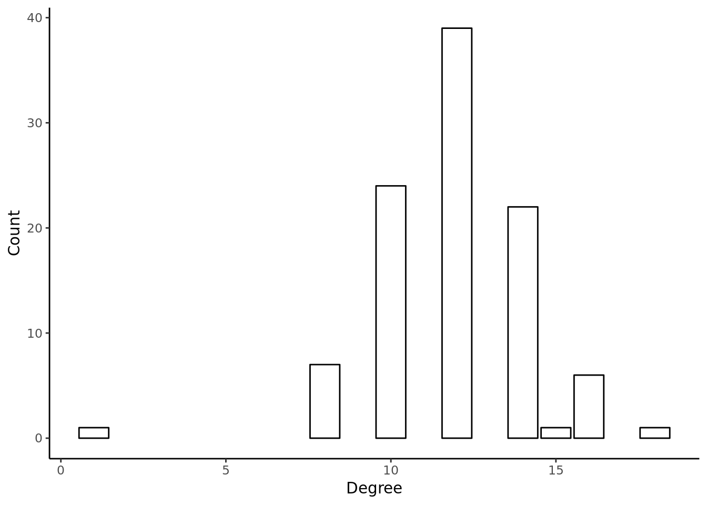

#### Runing time by method 

<table class="table table-condensed" style="width: auto !important; ">
 <thead>
  <tr>
   <th style="text-align:left;">   </th>
   <th style="text-align:left;"> key </th>
   <th style="text-align:right;"> doc_count </th>
   <th style="text-align:right;"> sum_wallTime_ms.value </th>
   <th style="text-align:left;"> avg_wallTime_ms.value </th>
   <th style="text-align:left;"> includedInTotal </th>
  </tr>
 </thead>
<tbody>
  <tr>
   <td style="text-align:left;"> 1 </td>
   <td style="text-align:left;"> knowsAgent </td>
   <td style="text-align:right;"> 601 </td>
   <td style="text-align:right;"> 1,099 </td>
   <td style="text-align:left;"> 1.82861896838602 </td>
   <td style="text-align:left;"> No </td>
  </tr>
  <tr>
   <td style="text-align:left;"> 2 </td>
   <td style="text-align:left;"> addItemToWork </td>
   <td style="text-align:right;"> 440 </td>
   <td style="text-align:right;"> 6,605 </td>
   <td style="text-align:left;"> 15.0113636363636 </td>
   <td style="text-align:left;"> No </td>
  </tr>
  <tr>
   <td style="text-align:left;"> 3 </td>
   <td style="text-align:left;"> ownsWork </td>
   <td style="text-align:right;"> 220 </td>
   <td style="text-align:right;"> 2,972 </td>
   <td style="text-align:left;"> 13.5090909090909 </td>
   <td style="text-align:left;"> No </td>
  </tr>
  <tr>
   <td style="text-align:left;"> 4 </td>
   <td style="text-align:left;"> init </td>
   <td style="text-align:right;"> 103 </td>
   <td style="text-align:right;"> 13,215 </td>
   <td style="text-align:left;"> 128.300970873786 </td>
   <td style="text-align:left;"> No </td>
  </tr>
  <tr>
   <td style="text-align:left;"> 5 </td>
   <td style="text-align:left;"> searchAndConnect </td>
   <td style="text-align:right;"> 101 </td>
   <td style="text-align:right;"> 154,435 </td>
   <td style="text-align:left;"> 1529.05940594059 </td>
   <td style="text-align:left;"> Yes </td>
  </tr>
  <tr>
   <td style="text-align:left;"> 6 </td>
   <td style="text-align:left;"> getWorksItems </td>
   <td style="text-align:right;"> 38 </td>
   <td style="text-align:right;"> 229 </td>
   <td style="text-align:left;"> 6.02631578947368 </td>
   <td style="text-align:left;"> Yes </td>
  </tr>
  <tr>
   <td style="text-align:left;"> 8 </td>
   <td style="text-align:left;"> cycleSearch </td>
   <td style="text-align:right;"> 6 </td>
   <td style="text-align:right;"> 393 </td>
   <td style="text-align:left;"> 65.5 </td>
   <td style="text-align:left;"> Yes </td>
  </tr>
  <tr>
   <td style="text-align:left;"> 9 </td>
   <td style="text-align:left;"> getWorks </td>
   <td style="text-align:right;"> 6 </td>
   <td style="text-align:right;"> 313 </td>
   <td style="text-align:left;"> 52.1666666666667 </td>
   <td style="text-align:left;"> No </td>
  </tr>
  <tr>
   <td style="text-align:left;"> 10 </td>
   <td style="text-align:left;"> individualCycleSearch </td>
   <td style="text-align:right;"> 6 </td>
   <td style="text-align:right;"> 0 </td>
   <td style="text-align:left;"> 0 </td>
   <td style="text-align:left;"> Yes </td>
  </tr>
  <tr>
   <td style="text-align:left;font-weight: bold;"> 11 </td>
   <td style="text-align:left;font-weight: bold;"> Total </td>
   <td style="text-align:right;font-weight: bold;"> 157 </td>
   <td style="text-align:right;font-weight: bold;"> 156,636 </td>
   <td style="text-align:left;font-weight: bold;">  </td>
   <td style="text-align:left;font-weight: bold;">  </td>
  </tr>
</tbody>
</table>
####  Found structures 

#####  Cycles 

Number of cycles found:  4 

<button class="btn btn-primary" data-toggle="collapse" data-target="#TPXWIUKKQU"> Show/Hide foundCycle query </button> 
 
  
     GET /filebeat-*/_search 
              { 
                "query": {
                  "bool": {
                    "must": [
                      { "match_phrase": {
                        "simulationId": "SIM10-13-06-07-3iFoCT--DV"
                        }
                      },
                      { "bool": {
                        "should": [
                          { "match": {
                            "keyword": "foundCycle"
                          }}
                        ]
                      }}
                    ]
                  }
                }
              }
     

#####  Paths 

Number of paths found:  2 

<button class="btn btn-primary" data-toggle="collapse" data-target="#RYMDSAZUVK"> Show/Hide foundPath query </button> 
 
  
     GET /filebeat-*/_search 
              { 
                "query": {
                  "bool": {
                    "must": [
                      { "match_phrase": {
                        "simulationId": "SIM10-13-06-07-3iFoCT--DV"
                        }
                      },
                      { "bool": {
                        "should": [
                          { "match": {
                            "keyword": "foundPath"
                          }}
                        ]
                      }}
                    ]
                  }
                }
              }
     

###  SIM10-13-01-31-soP7zJ--CV 

#### simulationParameters 

<table class="table table-condensed" style="width: auto !important; ">
 <thead>
  <tr>
   <th style="text-align:left;"> agentNumber </th>
   <th style="text-align:left;"> similarityConnectThreshold </th>
   <th style="text-align:left;"> graphType </th>
   <th style="text-align:left;"> chainLength </th>
   <th style="text-align:left;"> similaritySearchThreshold </th>
   <th style="text-align:left;"> maxDistance </th>
   <th style="text-align:left;"> randomWorksNumberMultiplier </th>
  </tr>
 </thead>
<tbody>
  <tr>
   <td style="text-align:left;width: 20em; "> 100 </td>
   <td style="text-align:left;width: 15em; "> 0.96 </td>
   <td style="text-align:left;width: 15em; "> random </td>
   <td style="text-align:left;width: 15em; "> 20 </td>
   <td style="text-align:left;width: 15em; "> 1 </td>
   <td style="text-align:left;width: 15em; "> 5 </td>
   <td style="text-align:left;width: 15em; "> 1 </td>
  </tr>
</tbody>
</table>
#### allEdgesByLabel

<table class="table table-condensed" style="width: auto !important; ">
 <thead>
  <tr>
   <th style="text-align:right;"> edges_offers </th>
   <th style="text-align:right;"> edges_similarity </th>
   <th style="text-align:right;"> edges_owns </th>
   <th style="text-align:right;"> edges_demands </th>
   <th style="text-align:right;"> edges_knows </th>
   <th style="text-align:right;"> edges_total </th>
  </tr>
 </thead>
<tbody>
  <tr>
   <td style="text-align:right;width: 5em; "> 120 </td>
   <td style="text-align:right;width: 5em; "> 4,644 </td>
   <td style="text-align:right;width: 5em; "> 120 </td>
   <td style="text-align:right;width: 5em; "> 120 </td>
   <td style="text-align:right;width: 5em; "> 100 </td>
   <td style="text-align:right;width: 5em; "> 5,104 </td>
  </tr>
</tbody>
</table>
#### allVerticesByType

<table class="table table-condensed" style="width: auto !important; ">
 <thead>
  <tr>
   <th style="text-align:right;"> vertices_agent </th>
   <th style="text-align:right;"> vertices_item </th>
   <th style="text-align:right;"> vertices_work </th>
   <th style="text-align:right;"> vertices_total </th>
  </tr>
 </thead>
<tbody>
  <tr>
   <td style="text-align:right;width: 5em; "> 101 </td>
   <td style="text-align:right;width: 5em; "> 240 </td>
   <td style="text-align:right;width: 5em; "> 120 </td>
   <td style="text-align:right;width: 5em; "> 461 </td>
  </tr>
</tbody>
</table>
#### distribution of similarityEdgesByWeight

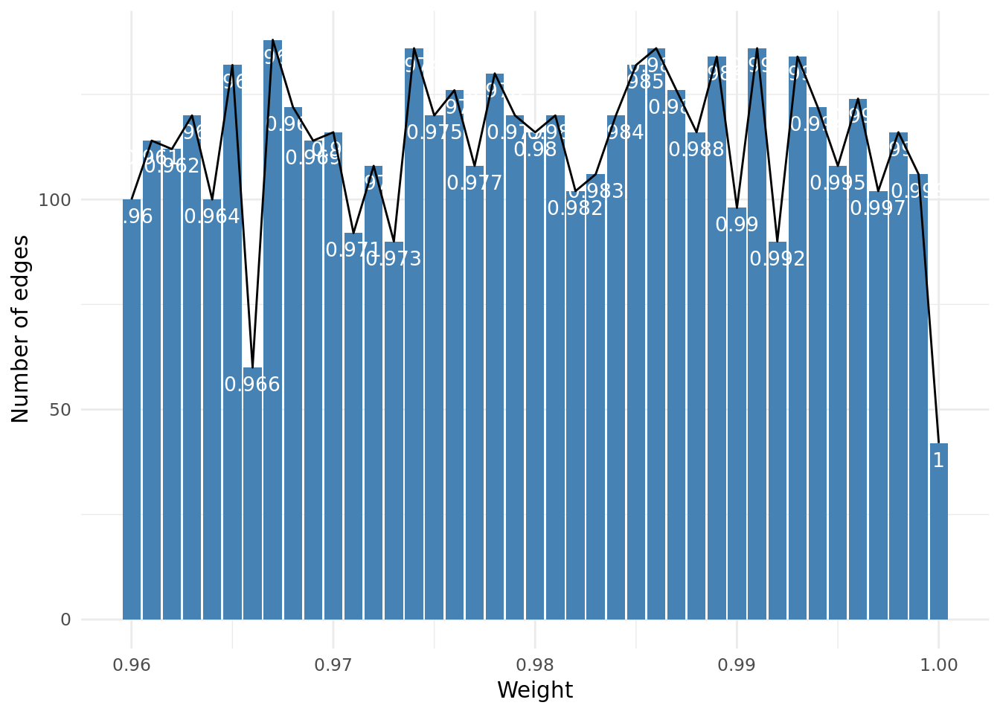

#### Degree distribution of item->similarity->item edges

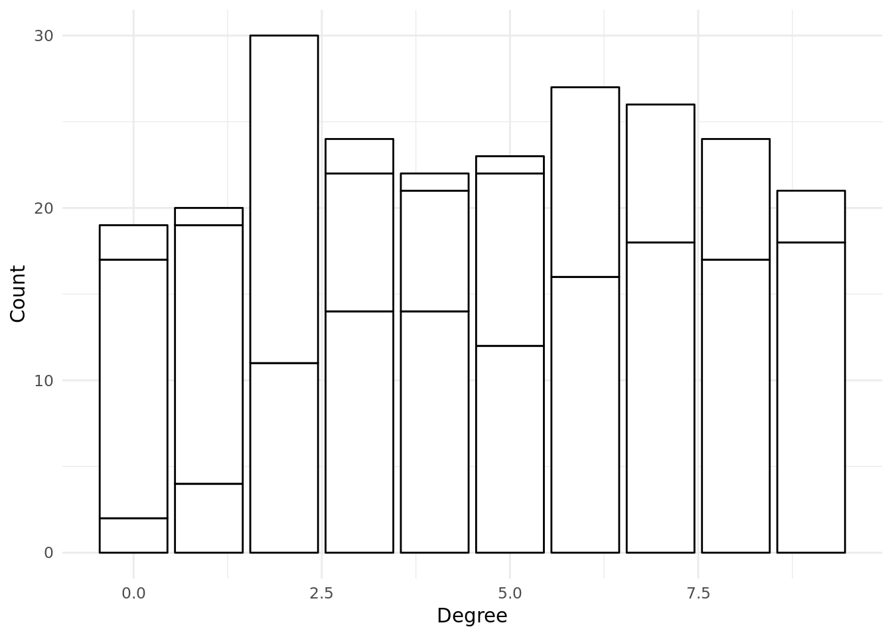

#### Degree distribution of agent->knows->agent edges

#### Runing time by method 

<table class="table table-condensed" style="width: auto !important; ">
 <thead>
  <tr>
   <th style="text-align:left;"> key </th>
   <th style="text-align:right;"> doc_count </th>
   <th style="text-align:right;"> sum_wallTime_ms.value </th>
   <th style="text-align:left;"> avg_wallTime_ms.value </th>
   <th style="text-align:left;"> includedInTotal </th>
  </tr>
 </thead>
<tbody>
  <tr>
   <td style="text-align:left;"> connectIfSimilar </td>
   <td style="text-align:right;"> 28,680 </td>
   <td style="text-align:right;"> 68,362 </td>
   <td style="text-align:left;"> 2.38361227336123 </td>
   <td style="text-align:left;"> No </td>
  </tr>
  <tr>
   <td style="text-align:left;"> existsSimilarity </td>
   <td style="text-align:right;"> 28,680 </td>
   <td style="text-align:right;"> 63,223 </td>
   <td style="text-align:left;"> 2.20442817294282 </td>
   <td style="text-align:left;"> No </td>
  </tr>
  <tr>
   <td style="text-align:left;"> similarityEdges </td>
   <td style="text-align:right;"> 28,680 </td>
   <td style="text-align:right;"> 62,335 </td>
   <td style="text-align:left;"> 2.17346582984658 </td>
   <td style="text-align:left;"> No </td>
  </tr>
  <tr>
   <td style="text-align:left;"> connect </td>
   <td style="text-align:right;"> 1,662 </td>
   <td style="text-align:right;"> 4,602 </td>
   <td style="text-align:left;"> 2.76895306859206 </td>
   <td style="text-align:left;"> Yes </td>
  </tr>
  <tr>
   <td style="text-align:left;"> connectAllSimilar </td>
   <td style="text-align:right;"> 240 </td>
   <td style="text-align:right;"> 68,655 </td>
   <td style="text-align:left;"> 286.0625 </td>
   <td style="text-align:left;"> Yes </td>
  </tr>
  <tr>
   <td style="text-align:left;"> init </td>
   <td style="text-align:right;"> 103 </td>
   <td style="text-align:right;"> 11,931 </td>
   <td style="text-align:left;"> 115.834951456311 </td>
   <td style="text-align:left;"> No </td>
  </tr>
  <tr>
   <td style="text-align:left;font-weight: bold;"> Total </td>
   <td style="text-align:right;font-weight: bold;"> 1,910 </td>
   <td style="text-align:right;font-weight: bold;"> 73,940 </td>
   <td style="text-align:left;font-weight: bold;">  </td>
   <td style="text-align:left;font-weight: bold;">  </td>
  </tr>
</tbody>
</table>
####  Found structures 

#####  Cycles 

Number of cycles found:  1 

<button class="btn btn-primary" data-toggle="collapse" data-target="#BVNWCDOJZC"> Show/Hide foundCycle query </button> 
 
  
     GET /filebeat-*/_search 
              { 
                "query": {
                  "bool": {
                    "must": [
                      { "match_phrase": {
                        "simulationId": "SIM10-13-01-31-soP7zJ--CV"
                        }
                      },
                      { "bool": {
                        "should": [
                          { "match": {
                            "keyword": "foundCycle"
                          }}
                        ]
                      }}
                    ]
                  }
                }
              }
     

#####  Paths 

Number of paths found:  0 

<button class="btn btn-primary" data-toggle="collapse" data-target="#HAHJEVRJQS"> Show/Hide foundPath query </button> 
 
  
     GET /filebeat-*/_search 
              { 
                "query": {
                  "bool": {
                    "must": [
                      { "match_phrase": {
                        "simulationId": "SIM10-13-01-31-soP7zJ--CV"
                        }
                      },
                      { "bool": {
                        "should": [
                          { "match": {
                            "keyword": "foundPath"
                          }}
                        ]
                      }}
                    ]
                  }
                }
              }
     

###  SIM10-13-01-31-soP7zJ--DV 

#### simulationParameters 

<table class="table table-condensed" style="width: auto !important; ">
 <thead>
  <tr>
   <th style="text-align:left;"> agentNumber </th>
   <th style="text-align:left;"> similarityConnectThreshold </th>
   <th style="text-align:left;"> graphType </th>
   <th style="text-align:left;"> chainLength </th>
   <th style="text-align:left;"> similaritySearchThreshold </th>
   <th style="text-align:left;"> maxDistance </th>
   <th style="text-align:left;"> randomWorksNumberMultiplier </th>
  </tr>
 </thead>
<tbody>
  <tr>
   <td style="text-align:left;width: 20em; "> 100 </td>
   <td style="text-align:left;width: 15em; "> 0.96 </td>
   <td style="text-align:left;width: 15em; "> random </td>
   <td style="text-align:left;width: 15em; "> 20 </td>
   <td style="text-align:left;width: 15em; "> 1 </td>
   <td style="text-align:left;width: 15em; "> 5 </td>
   <td style="text-align:left;width: 15em; "> 1 </td>
  </tr>
</tbody>
</table>
#### allEdgesByLabel

<table class="table table-condensed" style="width: auto !important; ">
 <thead>
  <tr>
   <th style="text-align:right;"> edges_offers </th>
   <th style="text-align:right;"> edges_similarity </th>
   <th style="text-align:right;"> edges_owns </th>
   <th style="text-align:right;"> edges_demands </th>
   <th style="text-align:right;"> edges_knows </th>
   <th style="text-align:right;"> edges_total </th>
  </tr>
 </thead>
<tbody>
  <tr>
   <td style="text-align:right;width: 5em; "> 120 </td>
   <td style="text-align:right;width: 5em; "> 1,320 </td>
   <td style="text-align:right;width: 5em; "> 120 </td>
   <td style="text-align:right;width: 5em; "> 120 </td>
   <td style="text-align:right;width: 5em; "> 100 </td>
   <td style="text-align:right;width: 5em; "> 1,780 </td>
  </tr>
</tbody>
</table>
#### allVerticesByType

<table class="table table-condensed" style="width: auto !important; ">
 <thead>
  <tr>
   <th style="text-align:right;"> vertices_agent </th>
   <th style="text-align:right;"> vertices_item </th>
   <th style="text-align:right;"> vertices_work </th>
   <th style="text-align:right;"> vertices_total </th>
  </tr>
 </thead>
<tbody>
  <tr>
   <td style="text-align:right;width: 5em; "> 101 </td>
   <td style="text-align:right;width: 5em; "> 240 </td>
   <td style="text-align:right;width: 5em; "> 120 </td>
   <td style="text-align:right;width: 5em; "> 461 </td>
  </tr>
</tbody>
</table>
#### distribution of similarityEdgesByWeight

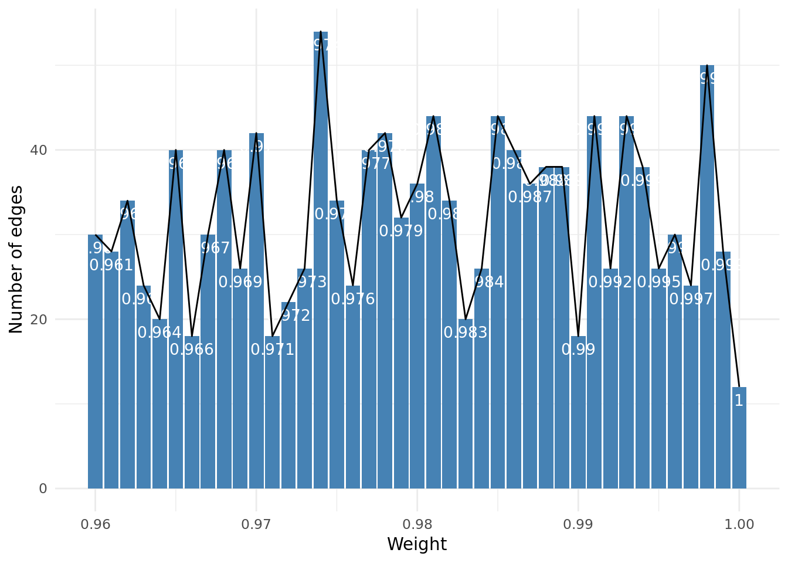

#### Degree distribution of item->similarity->item edges

#### Degree distribution of agent->knows->agent edges

#### Runing time by method 

<table class="table table-condensed" style="width: auto !important; ">
 <thead>
  <tr>
   <th style="text-align:left;">   </th>
   <th style="text-align:left;"> key </th>
   <th style="text-align:right;"> doc_count </th>
   <th style="text-align:right;"> sum_wallTime_ms.value </th>
   <th style="text-align:left;"> avg_wallTime_ms.value </th>
   <th style="text-align:left;"> includedInTotal </th>
  </tr>
 </thead>
<tbody>
  <tr>
   <td style="text-align:left;"> 2 </td>
   <td style="text-align:left;"> cycleSearch </td>
   <td style="text-align:right;"> 3,600 </td>
   <td style="text-align:right;"> 13,882 </td>
   <td style="text-align:left;"> 3.85611111111111 </td>
   <td style="text-align:left;"> Yes </td>
  </tr>
  <tr>
   <td style="text-align:left;"> 3 </td>
   <td style="text-align:left;"> getWorks </td>
   <td style="text-align:right;"> 3,600 </td>
   <td style="text-align:right;"> 57,112 </td>
   <td style="text-align:left;"> 15.8644444444444 </td>
   <td style="text-align:left;"> No </td>
  </tr>
  <tr>
   <td style="text-align:left;"> 4 </td>
   <td style="text-align:left;"> individualCycleSearch </td>
   <td style="text-align:right;"> 3,600 </td>
   <td style="text-align:right;"> 93 </td>
   <td style="text-align:left;"> 0.0258333333333333 </td>
   <td style="text-align:left;"> Yes </td>
  </tr>
  <tr>
   <td style="text-align:left;"> 6 </td>
   <td style="text-align:left;"> addItemToWork </td>
   <td style="text-align:right;"> 240 </td>
   <td style="text-align:right;"> 2,808 </td>
   <td style="text-align:left;"> 11.7 </td>
   <td style="text-align:left;"> No </td>
  </tr>
  <tr>
   <td style="text-align:left;"> 7 </td>
   <td style="text-align:left;"> ownsWork </td>
   <td style="text-align:right;"> 120 </td>
   <td style="text-align:right;"> 2,815 </td>
   <td style="text-align:left;"> 23.4583333333333 </td>
   <td style="text-align:left;"> No </td>
  </tr>
  <tr>
   <td style="text-align:left;"> 8 </td>
   <td style="text-align:left;"> init </td>
   <td style="text-align:right;"> 103 </td>
   <td style="text-align:right;"> 12,668 </td>
   <td style="text-align:left;"> 122.990291262136 </td>
   <td style="text-align:left;"> No </td>
  </tr>
  <tr>
   <td style="text-align:left;"> 9 </td>
   <td style="text-align:left;"> searchAndConnect </td>
   <td style="text-align:right;"> 101 </td>
   <td style="text-align:right;"> 14,616 </td>
   <td style="text-align:left;"> 144.712871287129 </td>
   <td style="text-align:left;"> Yes </td>
  </tr>
  <tr>
   <td style="text-align:left;"> 10 </td>
   <td style="text-align:left;"> knowsAgent </td>
   <td style="text-align:right;"> 100 </td>
   <td style="text-align:right;"> 474 </td>
   <td style="text-align:left;"> 4.74 </td>
   <td style="text-align:left;"> No </td>
  </tr>
  <tr>
   <td style="text-align:left;font-weight: bold;"> 1 </td>
   <td style="text-align:left;font-weight: bold;"> Total </td>
   <td style="text-align:right;font-weight: bold;"> 14,501 </td>
   <td style="text-align:right;font-weight: bold;"> 43,569 </td>
   <td style="text-align:left;font-weight: bold;">  </td>
   <td style="text-align:left;font-weight: bold;">  </td>
  </tr>
</tbody>
</table>
####  Found structures 

#####  Cycles 

Number of cycles found:  0 

<button class="btn btn-primary" data-toggle="collapse" data-target="#ZRSNFLFBEO"> Show/Hide foundCycle query </button> 
 
  
     GET /filebeat-*/_search 
              { 
                "query": {
                  "bool": {
                    "must": [
                      { "match_phrase": {
                        "simulationId": "SIM10-13-01-31-soP7zJ--DV"
                        }
                      },
                      { "bool": {
                        "should": [
                          { "match": {
                            "keyword": "foundCycle"
                          }}
                        ]
                      }}
                    ]
                  }
                }
              }
     

#####  Paths 

Number of paths found:  3600 

<button class="btn btn-primary" data-toggle="collapse" data-target="#SHUXJEKBPS"> Show/Hide foundPath query </button> 
 
  
     GET /filebeat-*/_search 
              { 
                "query": {
                  "bool": {
                    "must": [
                      { "match_phrase": {
                        "simulationId": "SIM10-13-01-31-soP7zJ--DV"
                        }
                      },
                      { "bool": {
                        "should": [
                          { "match": {
                            "keyword": "foundPath"
                          }}
                        ]
                      }}
                    ]
                  }
                }
              }
     

###  SIM10-13-02-33-N49WiL--CV 

#### simulationParameters 

<table class="table table-condensed" style="width: auto !important; ">
 <thead>
  <tr>
   <th style="text-align:left;"> agentNumber </th>
   <th style="text-align:left;"> similarityConnectThreshold </th>
   <th style="text-align:left;"> graphType </th>
   <th style="text-align:left;"> chainLength </th>
   <th style="text-align:left;"> similaritySearchThreshold </th>
   <th style="text-align:left;"> maxDistance </th>
   <th style="text-align:left;"> randomWorksNumberMultiplier </th>
  </tr>
 </thead>
<tbody>
  <tr>
   <td style="text-align:left;width: 20em; "> 100 </td>
   <td style="text-align:left;width: 15em; "> 0.96 </td>
   <td style="text-align:left;width: 15em; "> smallWorld </td>
   <td style="text-align:left;width: 15em; "> 20 </td>
   <td style="text-align:left;width: 15em; "> 1 </td>
   <td style="text-align:left;width: 15em; "> 5 </td>
   <td style="text-align:left;width: 15em; "> 1 </td>
  </tr>
</tbody>
</table>
#### allEdgesByLabel

<table class="table table-condensed" style="width: auto !important; ">
 <thead>
  <tr>
   <th style="text-align:right;"> edges_offers </th>
   <th style="text-align:right;"> edges_similarity </th>
   <th style="text-align:right;"> edges_owns </th>
   <th style="text-align:right;"> edges_demands </th>
   <th style="text-align:right;"> edges_knows </th>
   <th style="text-align:right;"> edges_total </th>
  </tr>
 </thead>
<tbody>
  <tr>
   <td style="text-align:right;width: 5em; "> 120 </td>
   <td style="text-align:right;width: 5em; "> 4,788 </td>
   <td style="text-align:right;width: 5em; "> 120 </td>
   <td style="text-align:right;width: 5em; "> 120 </td>
   <td style="text-align:right;width: 5em; "> 601 </td>
   <td style="text-align:right;width: 5em; "> 5,749 </td>
  </tr>
</tbody>
</table>
#### allVerticesByType

<table class="table table-condensed" style="width: auto !important; ">
 <thead>
  <tr>
   <th style="text-align:right;"> vertices_agent </th>
   <th style="text-align:right;"> vertices_item </th>
   <th style="text-align:right;"> vertices_work </th>
   <th style="text-align:right;"> vertices_total </th>
  </tr>
 </thead>
<tbody>
  <tr>
   <td style="text-align:right;width: 5em; "> 101 </td>
   <td style="text-align:right;width: 5em; "> 240 </td>
   <td style="text-align:right;width: 5em; "> 120 </td>
   <td style="text-align:right;width: 5em; "> 461 </td>
  </tr>
</tbody>
</table>
#### distribution of similarityEdgesByWeight

#### Degree distribution of item->similarity->item edges

#### Degree distribution of agent->knows->agent edges

#### Runing time by method 

<table class="table table-condensed" style="width: auto !important; ">
 <thead>
  <tr>
   <th style="text-align:left;"> key </th>
   <th style="text-align:right;"> doc_count </th>
   <th style="text-align:right;"> sum_wallTime_ms.value </th>
   <th style="text-align:left;"> avg_wallTime_ms.value </th>
   <th style="text-align:left;"> includedInTotal </th>
  </tr>
 </thead>
<tbody>
  <tr>
   <td style="text-align:left;"> connectIfSimilar </td>
   <td style="text-align:right;"> 28,680 </td>
   <td style="text-align:right;"> 67,399 </td>
   <td style="text-align:left;"> 2.35003486750349 </td>
   <td style="text-align:left;"> No </td>
  </tr>
  <tr>
   <td style="text-align:left;"> existsSimilarity </td>
   <td style="text-align:right;"> 28,680 </td>
   <td style="text-align:right;"> 66,810 </td>
   <td style="text-align:left;"> 2.32949790794979 </td>
   <td style="text-align:left;"> No </td>
  </tr>
  <tr>
   <td style="text-align:left;"> similarityEdges </td>
   <td style="text-align:right;"> 28,680 </td>
   <td style="text-align:right;"> 65,875 </td>
   <td style="text-align:left;"> 2.29689679218968 </td>
   <td style="text-align:left;"> No </td>
  </tr>
  <tr>
   <td style="text-align:left;"> connectAllSimilar </td>
   <td style="text-align:right;"> 240 </td>
   <td style="text-align:right;"> 67,684 </td>
   <td style="text-align:left;"> 282.016666666667 </td>
   <td style="text-align:left;"> Yes </td>
  </tr>
  <tr>
   <td style="text-align:left;"> init </td>
   <td style="text-align:right;"> 103 </td>
   <td style="text-align:right;"> 12,637 </td>
   <td style="text-align:left;"> 122.68932038835 </td>
   <td style="text-align:left;"> No </td>
  </tr>
  <tr>
   <td style="text-align:left;"> connect </td>
   <td style="text-align:right;"> 28 </td>
   <td style="text-align:right;"> 84 </td>
   <td style="text-align:left;"> 3 </td>
   <td style="text-align:left;"> Yes </td>
  </tr>
  <tr>
   <td style="text-align:left;font-weight: bold;"> Total </td>
   <td style="text-align:right;font-weight: bold;"> 276 </td>
   <td style="text-align:right;font-weight: bold;"> 68,323 </td>
   <td style="text-align:left;font-weight: bold;">  </td>
   <td style="text-align:left;font-weight: bold;">  </td>
  </tr>
</tbody>
</table>
####  Found structures 

#####  Cycles 

Number of cycles found:  1 

<button class="btn btn-primary" data-toggle="collapse" data-target="#LOTMPBOEAR"> Show/Hide foundCycle query </button> 
 
  
     GET /filebeat-*/_search 
              { 
                "query": {
                  "bool": {
                    "must": [
                      { "match_phrase": {
                        "simulationId": "SIM10-13-02-33-N49WiL--CV"
                        }
                      },
                      { "bool": {
                        "should": [
                          { "match": {
                            "keyword": "foundCycle"
                          }}
                        ]
                      }}
                    ]
                  }
                }
              }
     

#####  Paths 

Number of paths found:  0 

<button class="btn btn-primary" data-toggle="collapse" data-target="#QCBUCVTSAC"> Show/Hide foundPath query </button> 
 
  
     GET /filebeat-*/_search 
              { 
                "query": {
                  "bool": {
                    "must": [
                      { "match_phrase": {
                        "simulationId": "SIM10-13-02-33-N49WiL--CV"
                        }
                      },
                      { "bool": {
                        "should": [
                          { "match": {
                            "keyword": "foundPath"
                          }}
                        ]
                      }}
                    ]
                  }
                }
              }
     

###  SIM10-13-02-33-N49WiL--DV 

#### simulationParameters 

<table class="table table-condensed" style="width: auto !important; ">
 <thead>
  <tr>
   <th style="text-align:left;"> agentNumber </th>
   <th style="text-align:left;"> similarityConnectThreshold </th>
   <th style="text-align:left;"> graphType </th>
   <th style="text-align:left;"> chainLength </th>
   <th style="text-align:left;"> similaritySearchThreshold </th>
   <th style="text-align:left;"> maxDistance </th>
   <th style="text-align:left;"> randomWorksNumberMultiplier </th>
  </tr>
 </thead>
<tbody>
  <tr>
   <td style="text-align:left;width: 20em; "> 100 </td>
   <td style="text-align:left;width: 15em; "> 0.96 </td>
   <td style="text-align:left;width: 15em; "> smallWorld </td>
   <td style="text-align:left;width: 15em; "> 20 </td>
   <td style="text-align:left;width: 15em; "> 1 </td>
   <td style="text-align:left;width: 15em; "> 5 </td>
   <td style="text-align:left;width: 15em; "> 1 </td>
  </tr>
</tbody>
</table>
#### allEdgesByLabel

<table class="table table-condensed" style="width: auto !important; ">
 <thead>
  <tr>
   <th style="text-align:right;"> edges_offers </th>
   <th style="text-align:right;"> edges_similarity </th>
   <th style="text-align:right;"> edges_owns </th>
   <th style="text-align:right;"> edges_demands </th>
   <th style="text-align:right;"> edges_knows </th>
   <th style="text-align:right;"> edges_total </th>
  </tr>
 </thead>
<tbody>
  <tr>
   <td style="text-align:right;width: 5em; "> 120 </td>
   <td style="text-align:right;width: 5em; "> 4,732 </td>
   <td style="text-align:right;width: 5em; "> 120 </td>
   <td style="text-align:right;width: 5em; "> 120 </td>
   <td style="text-align:right;width: 5em; "> 601 </td>
   <td style="text-align:right;width: 5em; "> 5,693 </td>
  </tr>
</tbody>
</table>
#### allVerticesByType

<table class="table table-condensed" style="width: auto !important; ">
 <thead>
  <tr>
   <th style="text-align:right;"> vertices_agent </th>
   <th style="text-align:right;"> vertices_item </th>
   <th style="text-align:right;"> vertices_work </th>
   <th style="text-align:right;"> vertices_total </th>
  </tr>
 </thead>
<tbody>
  <tr>
   <td style="text-align:right;width: 5em; "> 101 </td>
   <td style="text-align:right;width: 5em; "> 240 </td>
   <td style="text-align:right;width: 5em; "> 120 </td>
   <td style="text-align:right;width: 5em; "> 461 </td>
  </tr>
</tbody>
</table>
#### distribution of similarityEdgesByWeight

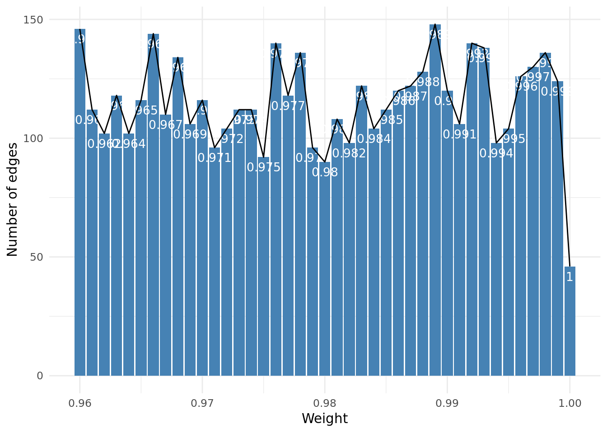

#### Degree distribution of item->similarity->item edges

#### Degree distribution of agent->knows->agent edges

#### Runing time by method 

<table class="table table-condensed" style="width: auto !important; ">
 <thead>
  <tr>
   <th style="text-align:left;">   </th>
   <th style="text-align:left;"> key </th>
   <th style="text-align:right;"> doc_count </th>
   <th style="text-align:right;"> sum_wallTime_ms.value </th>
   <th style="text-align:left;"> avg_wallTime_ms.value </th>
   <th style="text-align:left;"> includedInTotal </th>
  </tr>
 </thead>
<tbody>
  <tr>
   <td style="text-align:left;"> 1 </td>
   <td style="text-align:left;"> knowsAgent </td>
   <td style="text-align:right;"> 601 </td>
   <td style="text-align:right;"> 1,316 </td>
   <td style="text-align:left;"> 2.18968386023294 </td>
   <td style="text-align:left;"> No </td>
  </tr>
  <tr>
   <td style="text-align:left;"> 2 </td>
   <td style="text-align:left;"> addItemToWork </td>
   <td style="text-align:right;"> 240 </td>
   <td style="text-align:right;"> 4,391 </td>
   <td style="text-align:left;"> 18.2958333333333 </td>
   <td style="text-align:left;"> No </td>
  </tr>
  <tr>
   <td style="text-align:left;"> 3 </td>
   <td style="text-align:left;"> ownsWork </td>
   <td style="text-align:right;"> 120 </td>
   <td style="text-align:right;"> 1,774 </td>
   <td style="text-align:left;"> 14.7833333333333 </td>
   <td style="text-align:left;"> No </td>
  </tr>
  <tr>
   <td style="text-align:left;"> 4 </td>
   <td style="text-align:left;"> init </td>
   <td style="text-align:right;"> 103 </td>
   <td style="text-align:right;"> 13,057 </td>
   <td style="text-align:left;"> 126.766990291262 </td>
   <td style="text-align:left;"> No </td>
  </tr>
  <tr>
   <td style="text-align:left;"> 5 </td>
   <td style="text-align:left;"> searchAndConnect </td>
   <td style="text-align:right;"> 101 </td>
   <td style="text-align:right;"> 59,263 </td>
   <td style="text-align:left;"> 586.762376237624 </td>
   <td style="text-align:left;"> Yes </td>
  </tr>
  <tr>
   <td style="text-align:left;"> 6 </td>
   <td style="text-align:left;"> getWorksItems </td>
   <td style="text-align:right;"> 38 </td>
   <td style="text-align:right;"> 80 </td>
   <td style="text-align:left;"> 2.10526315789474 </td>
   <td style="text-align:left;"> Yes </td>
  </tr>
  <tr>
   <td style="text-align:left;"> 9 </td>
   <td style="text-align:left;"> cycleSearch </td>
   <td style="text-align:right;"> 3 </td>
   <td style="text-align:right;"> 449 </td>
   <td style="text-align:left;"> 149.666666666667 </td>
   <td style="text-align:left;"> Yes </td>
  </tr>
  <tr>
   <td style="text-align:left;"> 10 </td>
   <td style="text-align:left;"> getWorks </td>
   <td style="text-align:right;"> 3 </td>
   <td style="text-align:right;"> 465 </td>
   <td style="text-align:left;"> 155 </td>
   <td style="text-align:left;"> No </td>
  </tr>
  <tr>
   <td style="text-align:left;font-weight: bold;"> 11 </td>
   <td style="text-align:left;font-weight: bold;"> Total </td>
   <td style="text-align:right;font-weight: bold;"> 150 </td>
   <td style="text-align:right;font-weight: bold;"> 60,728 </td>
   <td style="text-align:left;font-weight: bold;">  </td>
   <td style="text-align:left;font-weight: bold;">  </td>
  </tr>
</tbody>
</table>
####  Found structures 

#####  Cycles 

Number of cycles found:  3 

<button class="btn btn-primary" data-toggle="collapse" data-target="#VKJGADSWJF"> Show/Hide foundCycle query </button> 
 
  
     GET /filebeat-*/_search 
              { 
                "query": {
                  "bool": {
                    "must": [
                      { "match_phrase": {
                        "simulationId": "SIM10-13-02-33-N49WiL--DV"
                        }
                      },
                      { "bool": {
                        "should": [
                          { "match": {
                            "keyword": "foundCycle"
                          }}
                        ]
                      }}
                    ]
                  }
                }
              }
     

#####  Paths 

Number of paths found:  0 

<button class="btn btn-primary" data-toggle="collapse" data-target="#SSIKLBQWBD"> Show/Hide foundPath query </button> 
 
  
     GET /filebeat-*/_search 
              { 
                "query": {
                  "bool": {
                    "must": [
                      { "match_phrase": {
                        "simulationId": "SIM10-13-02-33-N49WiL--DV"
                        }
                      },
                      { "bool": {
                        "should": [
                          { "match": {
                            "keyword": "foundPath"
                          }}
                        ]
                      }}
                    ]
                  }
                }
              }
     

###  SIM10-13-03-41-a85XGH--CV 

#### simulationParameters 

<table class="table table-condensed" style="width: auto !important; ">
 <thead>
  <tr>
   <th style="text-align:left;"> agentNumber </th>
   <th style="text-align:left;"> similarityConnectThreshold </th>
   <th style="text-align:left;"> graphType </th>
   <th style="text-align:left;"> chainLength </th>
   <th style="text-align:left;"> similaritySearchThreshold </th>
   <th style="text-align:left;"> maxDistance </th>
   <th style="text-align:left;"> randomWorksNumberMultiplier </th>
  </tr>
 </thead>
<tbody>
  <tr>
   <td style="text-align:left;width: 20em; "> 100 </td>
   <td style="text-align:left;width: 15em; "> 0.96 </td>
   <td style="text-align:left;width: 15em; "> random </td>
   <td style="text-align:left;width: 15em; "> 20 </td>
   <td style="text-align:left;width: 15em; "> 1 </td>
   <td style="text-align:left;width: 15em; "> 5 </td>
   <td style="text-align:left;width: 15em; "> 2 </td>
  </tr>
</tbody>
</table>
#### allEdgesByLabel

<table class="table table-condensed" style="width: auto !important; ">
 <thead>
  <tr>
   <th style="text-align:right;"> edges_offers </th>
   <th style="text-align:right;"> edges_similarity </th>
   <th style="text-align:right;"> edges_owns </th>
   <th style="text-align:right;"> edges_demands </th>
   <th style="text-align:right;"> edges_knows </th>
   <th style="text-align:right;"> edges_total </th>
  </tr>
 </thead>
<tbody>
  <tr>
   <td style="text-align:right;width: 5em; "> 220 </td>
   <td style="text-align:right;width: 5em; "> 15,530 </td>
   <td style="text-align:right;width: 5em; "> 220 </td>
   <td style="text-align:right;width: 5em; "> 220 </td>
   <td style="text-align:right;width: 5em; "> 100 </td>
   <td style="text-align:right;width: 5em; "> 16,290 </td>
  </tr>
</tbody>
</table>
#### allVerticesByType

<table class="table table-condensed" style="width: auto !important; ">
 <thead>
  <tr>
   <th style="text-align:right;"> vertices_agent </th>
   <th style="text-align:right;"> vertices_item </th>
   <th style="text-align:right;"> vertices_work </th>
   <th style="text-align:right;"> vertices_total </th>
  </tr>
 </thead>
<tbody>
  <tr>
   <td style="text-align:right;width: 5em; "> 101 </td>
   <td style="text-align:right;width: 5em; "> 440 </td>
   <td style="text-align:right;width: 5em; "> 220 </td>
   <td style="text-align:right;width: 5em; "> 761 </td>
  </tr>
</tbody>
</table>
#### distribution of similarityEdgesByWeight

#### Degree distribution of item->similarity->item edges

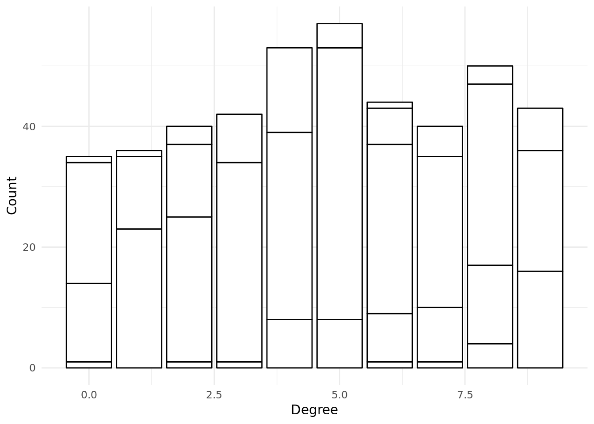

#### Degree distribution of agent->knows->agent edges

#### Runing time by method 

<table class="table table-condensed" style="width: auto !important; ">
 <thead>
  <tr>
   <th style="text-align:left;"> key </th>
   <th style="text-align:right;"> doc_count </th>
   <th style="text-align:right;"> sum_wallTime_ms.value </th>
   <th style="text-align:left;"> avg_wallTime_ms.value </th>
   <th style="text-align:left;"> includedInTotal </th>
  </tr>
 </thead>
<tbody>
  <tr>
   <td style="text-align:left;"> connectIfSimilar </td>
   <td style="text-align:right;"> 96,580 </td>
   <td style="text-align:right;"> 268,678 </td>
   <td style="text-align:left;"> 2.781921722924 </td>
   <td style="text-align:left;"> No </td>
  </tr>
  <tr>
   <td style="text-align:left;"> existsSimilarity </td>
   <td style="text-align:right;"> 96,580 </td>
   <td style="text-align:right;"> 254,222 </td>
   <td style="text-align:left;"> 2.63224270035204 </td>
   <td style="text-align:left;"> No </td>
  </tr>
  <tr>
   <td style="text-align:left;"> similarityEdges </td>
   <td style="text-align:right;"> 96,580 </td>
   <td style="text-align:right;"> 250,604 </td>
   <td style="text-align:left;"> 2.59478152826672 </td>
   <td style="text-align:left;"> No </td>
  </tr>
  <tr>
   <td style="text-align:left;"> connect </td>
   <td style="text-align:right;"> 4,459 </td>
   <td style="text-align:right;"> 12,705 </td>
   <td style="text-align:left;"> 2.84929356357928 </td>
   <td style="text-align:left;"> Yes </td>
  </tr>
  <tr>
   <td style="text-align:left;"> connectAllSimilar </td>
   <td style="text-align:right;"> 440 </td>
   <td style="text-align:right;"> 269,680 </td>
   <td style="text-align:left;"> 612.909090909091 </td>
   <td style="text-align:left;"> Yes </td>
  </tr>
  <tr>
   <td style="text-align:left;"> init </td>
   <td style="text-align:right;"> 103 </td>
   <td style="text-align:right;"> 12,869 </td>
   <td style="text-align:left;"> 124.941747572816 </td>
   <td style="text-align:left;"> No </td>
  </tr>
  <tr>
   <td style="text-align:left;font-weight: bold;"> Total </td>
   <td style="text-align:right;font-weight: bold;"> 4,907 </td>
   <td style="text-align:right;font-weight: bold;"> 283,214 </td>
   <td style="text-align:left;font-weight: bold;">  </td>
   <td style="text-align:left;font-weight: bold;">  </td>
  </tr>
</tbody>
</table>
####  Found structures 

#####  Cycles 

Number of cycles found:  1 

<button class="btn btn-primary" data-toggle="collapse" data-target="#KKRQVMMNBL"> Show/Hide foundCycle query </button> 
 
  
     GET /filebeat-*/_search 
              { 
                "query": {
                  "bool": {
                    "must": [
                      { "match_phrase": {
                        "simulationId": "SIM10-13-03-41-a85XGH--CV"
                        }
                      },
                      { "bool": {
                        "should": [
                          { "match": {
                            "keyword": "foundCycle"
                          }}
                        ]
                      }}
                    ]
                  }
                }
              }
     

#####  Paths 

Number of paths found:  0 

<button class="btn btn-primary" data-toggle="collapse" data-target="#JGPPOXNZCD"> Show/Hide foundPath query </button> 
 
  
     GET /filebeat-*/_search 
              { 
                "query": {
                  "bool": {
                    "must": [
                      { "match_phrase": {
                        "simulationId": "SIM10-13-03-41-a85XGH--CV"
                        }
                      },
                      { "bool": {
                        "should": [
                          { "match": {
                            "keyword": "foundPath"
                          }}
                        ]
                      }}
                    ]
                  }
                }
              }
     

###  SIM10-13-03-41-a85XGH--DV 

#### simulationParameters 

<table class="table table-condensed" style="width: auto !important; ">
 <thead>
  <tr>
   <th style="text-align:left;"> agentNumber </th>
   <th style="text-align:left;"> similarityConnectThreshold </th>
   <th style="text-align:left;"> graphType </th>
   <th style="text-align:left;"> chainLength </th>
   <th style="text-align:left;"> similaritySearchThreshold </th>
   <th style="text-align:left;"> maxDistance </th>
   <th style="text-align:left;"> randomWorksNumberMultiplier </th>
  </tr>
 </thead>
<tbody>
  <tr>
   <td style="text-align:left;width: 20em; "> 100 </td>
   <td style="text-align:left;width: 15em; "> 0.96 </td>
   <td style="text-align:left;width: 15em; "> random </td>
   <td style="text-align:left;width: 15em; "> 20 </td>
   <td style="text-align:left;width: 15em; "> 1 </td>
   <td style="text-align:left;width: 15em; "> 5 </td>
   <td style="text-align:left;width: 15em; "> 2 </td>
  </tr>
</tbody>
</table>
#### allEdgesByLabel

<table class="table table-condensed" style="width: auto !important; ">
 <thead>
  <tr>
   <th style="text-align:right;"> edges_offers </th>
   <th style="text-align:right;"> edges_similarity </th>
   <th style="text-align:right;"> edges_owns </th>
   <th style="text-align:right;"> edges_demands </th>
   <th style="text-align:right;"> edges_knows </th>
   <th style="text-align:right;"> edges_total </th>
  </tr>
 </thead>
<tbody>
  <tr>
   <td style="text-align:right;width: 5em; "> 220 </td>
   <td style="text-align:right;width: 5em; "> 6,612 </td>
   <td style="text-align:right;width: 5em; "> 220 </td>
   <td style="text-align:right;width: 5em; "> 220 </td>
   <td style="text-align:right;width: 5em; "> 100 </td>
   <td style="text-align:right;width: 5em; "> 7,372 </td>
  </tr>
</tbody>
</table>
#### allVerticesByType

<table class="table table-condensed" style="width: auto !important; ">
 <thead>
  <tr>
   <th style="text-align:right;"> vertices_agent </th>
   <th style="text-align:right;"> vertices_item </th>
   <th style="text-align:right;"> vertices_work </th>
   <th style="text-align:right;"> vertices_total </th>
  </tr>
 </thead>
<tbody>
  <tr>
   <td style="text-align:right;width: 5em; "> 101 </td>
   <td style="text-align:right;width: 5em; "> 440 </td>
   <td style="text-align:right;width: 5em; "> 220 </td>
   <td style="text-align:right;width: 5em; "> 761 </td>
  </tr>
</tbody>
</table>
#### distribution of similarityEdgesByWeight

#### Degree distribution of item->similarity->item edges

#### Degree distribution of agent->knows->agent edges

#### Runing time by method 

<table class="table table-condensed" style="width: auto !important; ">
 <thead>
  <tr>
   <th style="text-align:left;">   </th>
   <th style="text-align:left;"> key </th>
   <th style="text-align:right;"> doc_count </th>
   <th style="text-align:right;"> sum_wallTime_ms.value </th>
   <th style="text-align:left;"> avg_wallTime_ms.value </th>
   <th style="text-align:left;"> includedInTotal </th>
  </tr>
 </thead>
<tbody>
  <tr>
   <td style="text-align:left;"> 2 </td>
   <td style="text-align:left;"> cycleSearch </td>
   <td style="text-align:right;"> 3,600 </td>
   <td style="text-align:right;"> 23,727 </td>
   <td style="text-align:left;"> 6.59083333333333 </td>
   <td style="text-align:left;"> Yes </td>
  </tr>
  <tr>
   <td style="text-align:left;"> 3 </td>
   <td style="text-align:left;"> getWorks </td>
   <td style="text-align:right;"> 3,600 </td>
   <td style="text-align:right;"> 58,359 </td>
   <td style="text-align:left;"> 16.2108333333333 </td>
   <td style="text-align:left;"> No </td>
  </tr>
  <tr>
   <td style="text-align:left;"> 4 </td>
   <td style="text-align:left;"> individualCycleSearch </td>
   <td style="text-align:right;"> 3,600 </td>
   <td style="text-align:right;"> 90 </td>
   <td style="text-align:left;"> 0.025 </td>
   <td style="text-align:left;"> Yes </td>
  </tr>
  <tr>
   <td style="text-align:left;"> 6 </td>
   <td style="text-align:left;"> addItemToWork </td>
   <td style="text-align:right;"> 440 </td>
   <td style="text-align:right;"> 7,722 </td>
   <td style="text-align:left;"> 17.55 </td>
   <td style="text-align:left;"> No </td>
  </tr>
  <tr>
   <td style="text-align:left;"> 7 </td>
   <td style="text-align:left;"> ownsWork </td>
   <td style="text-align:right;"> 220 </td>
   <td style="text-align:right;"> 4,716 </td>
   <td style="text-align:left;"> 21.4363636363636 </td>
   <td style="text-align:left;"> No </td>
  </tr>
  <tr>
   <td style="text-align:left;"> 8 </td>
   <td style="text-align:left;"> init </td>
   <td style="text-align:right;"> 103 </td>
   <td style="text-align:right;"> 13,641 </td>
   <td style="text-align:left;"> 132.436893203883 </td>
   <td style="text-align:left;"> No </td>
  </tr>
  <tr>
   <td style="text-align:left;"> 9 </td>
   <td style="text-align:left;"> searchAndConnect </td>
   <td style="text-align:right;"> 101 </td>
   <td style="text-align:right;"> 60,853 </td>
   <td style="text-align:left;"> 602.504950495049 </td>
   <td style="text-align:left;"> Yes </td>
  </tr>
  <tr>
   <td style="text-align:left;"> 10 </td>
   <td style="text-align:left;"> knowsAgent </td>
   <td style="text-align:right;"> 100 </td>
   <td style="text-align:right;"> 460 </td>
   <td style="text-align:left;"> 4.6 </td>
   <td style="text-align:left;"> No </td>
  </tr>
  <tr>
   <td style="text-align:left;font-weight: bold;"> 1 </td>
   <td style="text-align:left;font-weight: bold;"> Total </td>
   <td style="text-align:right;font-weight: bold;"> 14,501 </td>
   <td style="text-align:right;font-weight: bold;"> 144,046 </td>
   <td style="text-align:left;font-weight: bold;">  </td>
   <td style="text-align:left;font-weight: bold;">  </td>
  </tr>
</tbody>
</table>
####  Found structures 

#####  Cycles 

Number of cycles found:  0 

<button class="btn btn-primary" data-toggle="collapse" data-target="#LXUCVTXUPT"> Show/Hide foundCycle query </button> 
 
  
     GET /filebeat-*/_search 
              { 
                "query": {
                  "bool": {
                    "must": [
                      { "match_phrase": {
                        "simulationId": "SIM10-13-03-41-a85XGH--DV"
                        }
                      },
                      { "bool": {
                        "should": [
                          { "match": {
                            "keyword": "foundCycle"
                          }}
                        ]
                      }}
                    ]
                  }
                }
              }
     

#####  Paths 

Number of paths found:  3600 

<button class="btn btn-primary" data-toggle="collapse" data-target="#UCUJBLKEPI"> Show/Hide foundPath query </button> 
 
  
     GET /filebeat-*/_search 
              { 
                "query": {
                  "bool": {
                    "must": [
                      { "match_phrase": {
                        "simulationId": "SIM10-13-03-41-a85XGH--DV"
                        }
                      },
                      { "bool": {
                        "should": [
                          { "match": {
                            "keyword": "foundPath"
                          }}
                        ]
                      }}
                    ]
                  }
                }
              }
     

###  SIM10-13-04-45-vYA7f2--CV 

#### simulationParameters 

<table class="table table-condensed" style="width: auto !important; ">
 <thead>
  <tr>
   <th style="text-align:left;"> agentNumber </th>
   <th style="text-align:left;"> similarityConnectThreshold </th>
   <th style="text-align:left;"> graphType </th>
   <th style="text-align:left;"> chainLength </th>
   <th style="text-align:left;"> similaritySearchThreshold </th>
   <th style="text-align:left;"> maxDistance </th>
   <th style="text-align:left;"> randomWorksNumberMultiplier </th>
  </tr>
 </thead>
<tbody>
  <tr>
   <td style="text-align:left;width: 20em; "> 100 </td>
   <td style="text-align:left;width: 15em; "> 0.96 </td>
   <td style="text-align:left;width: 15em; "> smallWorld </td>
   <td style="text-align:left;width: 15em; "> 20 </td>
   <td style="text-align:left;width: 15em; "> 1 </td>
   <td style="text-align:left;width: 15em; "> 5 </td>
   <td style="text-align:left;width: 15em; "> 2 </td>
  </tr>
</tbody>
</table>
#### allEdgesByLabel

<table class="table table-condensed" style="width: auto !important; ">
 <thead>
  <tr>
   <th style="text-align:right;"> edges_offers </th>
   <th style="text-align:right;"> edges_similarity </th>
   <th style="text-align:right;"> edges_owns </th>
   <th style="text-align:right;"> edges_demands </th>
   <th style="text-align:right;"> edges_knows </th>
   <th style="text-align:right;"> edges_total </th>
  </tr>
 </thead>
<tbody>
  <tr>
   <td style="text-align:right;width: 5em; "> 220 </td>
   <td style="text-align:right;width: 5em; "> 16,836 </td>
   <td style="text-align:right;width: 5em; "> 220 </td>
   <td style="text-align:right;width: 5em; "> 220 </td>
   <td style="text-align:right;width: 5em; "> 601 </td>
   <td style="text-align:right;width: 5em; "> 18,097 </td>
  </tr>
</tbody>
</table>
#### allVerticesByType

<table class="table table-condensed" style="width: auto !important; ">
 <thead>
  <tr>
   <th style="text-align:right;"> vertices_agent </th>
   <th style="text-align:right;"> vertices_item </th>
   <th style="text-align:right;"> vertices_work </th>
   <th style="text-align:right;"> vertices_total </th>
  </tr>
 </thead>
<tbody>
  <tr>
   <td style="text-align:right;width: 5em; "> 101 </td>
   <td style="text-align:right;width: 5em; "> 440 </td>
   <td style="text-align:right;width: 5em; "> 220 </td>
   <td style="text-align:right;width: 5em; "> 761 </td>
  </tr>
</tbody>
</table>
#### distribution of similarityEdgesByWeight

#### Degree distribution of item->similarity->item edges

#### Degree distribution of agent->knows->agent edges

#### Runing time by method 

<table class="table table-condensed" style="width: auto !important; ">
 <thead>
  <tr>
   <th style="text-align:left;"> key </th>
   <th style="text-align:right;"> doc_count </th>
   <th style="text-align:right;"> sum_wallTime_ms.value </th>
   <th style="text-align:left;"> avg_wallTime_ms.value </th>
   <th style="text-align:left;"> includedInTotal </th>
  </tr>
 </thead>
<tbody>
  <tr>
   <td style="text-align:left;"> connectIfSimilar </td>
   <td style="text-align:right;"> 96,580 </td>
   <td style="text-align:right;"> 291,514 </td>
   <td style="text-align:left;"> 3.01836819217229 </td>
   <td style="text-align:left;"> No </td>
  </tr>
  <tr>
   <td style="text-align:left;"> existsSimilarity </td>
   <td style="text-align:right;"> 96,580 </td>
   <td style="text-align:right;"> 289,448 </td>
   <td style="text-align:left;"> 2.99697659971008 </td>
   <td style="text-align:left;"> No </td>
  </tr>
  <tr>
   <td style="text-align:left;"> similarityEdges </td>
   <td style="text-align:right;"> 96,580 </td>
   <td style="text-align:right;"> 285,428 </td>
   <td style="text-align:left;"> 2.95535307517084 </td>
   <td style="text-align:left;"> No </td>
  </tr>
  <tr>
   <td style="text-align:left;"> connectAllSimilar </td>
   <td style="text-align:right;"> 440 </td>
   <td style="text-align:right;"> 292,407 </td>
   <td style="text-align:left;"> 664.561363636364 </td>
   <td style="text-align:left;"> Yes </td>
  </tr>
  <tr>
   <td style="text-align:left;"> init </td>
   <td style="text-align:right;"> 103 </td>
   <td style="text-align:right;"> 12,775 </td>
   <td style="text-align:left;"> 124.029126213592 </td>
   <td style="text-align:left;"> No </td>
  </tr>
  <tr>
   <td style="text-align:left;"> connect </td>
   <td style="text-align:right;"> 75 </td>
   <td style="text-align:right;"> 328 </td>
   <td style="text-align:left;"> 4.37333333333333 </td>
   <td style="text-align:left;"> Yes </td>
  </tr>
  <tr>
   <td style="text-align:left;font-weight: bold;"> Total </td>
   <td style="text-align:right;font-weight: bold;"> 523 </td>
   <td style="text-align:right;font-weight: bold;"> 293,432 </td>
   <td style="text-align:left;font-weight: bold;">  </td>
   <td style="text-align:left;font-weight: bold;">  </td>
  </tr>
</tbody>
</table>
####  Found structures 

#####  Cycles 

Number of cycles found:  1 

<button class="btn btn-primary" data-toggle="collapse" data-target="#SDEPBPJUQY"> Show/Hide foundCycle query </button> 
 
  
     GET /filebeat-*/_search 
              { 
                "query": {
                  "bool": {
                    "must": [
                      { "match_phrase": {
                        "simulationId": "SIM10-13-04-45-vYA7f2--CV"
                        }
                      },
                      { "bool": {
                        "should": [
                          { "match": {
                            "keyword": "foundCycle"
                          }}
                        ]
                      }}
                    ]
                  }
                }
              }
     

#####  Paths 

Number of paths found:  0 

<button class="btn btn-primary" data-toggle="collapse" data-target="#HSNIEPHANX"> Show/Hide foundPath query </button> 
 
  
     GET /filebeat-*/_search 
              { 
                "query": {
                  "bool": {
                    "must": [
                      { "match_phrase": {
                        "simulationId": "SIM10-13-04-45-vYA7f2--CV"
                        }
                      },
                      { "bool": {
                        "should": [
                          { "match": {
                            "keyword": "foundPath"
                          }}
                        ]
                      }}
                    ]
                  }
                }
              }
     

###  SIM10-13-04-45-vYA7f2--DV 

#### simulationParameters 

<table class="table table-condensed" style="width: auto !important; ">
 <thead>
  <tr>
   <th style="text-align:left;"> agentNumber </th>
   <th style="text-align:left;"> similarityConnectThreshold </th>
   <th style="text-align:left;"> graphType </th>
   <th style="text-align:left;"> chainLength </th>
   <th style="text-align:left;"> similaritySearchThreshold </th>
   <th style="text-align:left;"> maxDistance </th>
   <th style="text-align:left;"> randomWorksNumberMultiplier </th>
  </tr>
 </thead>
<tbody>
  <tr>
   <td style="text-align:left;width: 20em; "> 100 </td>
   <td style="text-align:left;width: 15em; "> 0.96 </td>
   <td style="text-align:left;width: 15em; "> smallWorld </td>
   <td style="text-align:left;width: 15em; "> 20 </td>
   <td style="text-align:left;width: 15em; "> 1 </td>
   <td style="text-align:left;width: 15em; "> 5 </td>
   <td style="text-align:left;width: 15em; "> 2 </td>
  </tr>
</tbody>
</table>
#### allEdgesByLabel

<table class="table table-condensed" style="width: auto !important; ">
 <thead>
  <tr>
   <th style="text-align:right;"> edges_offers </th>
   <th style="text-align:right;"> edges_similarity </th>
   <th style="text-align:right;"> edges_owns </th>
   <th style="text-align:right;"> edges_demands </th>
   <th style="text-align:right;"> edges_knows </th>
   <th style="text-align:right;"> edges_total </th>
  </tr>
 </thead>
<tbody>
  <tr>
   <td style="text-align:right;width: 5em; "> 220 </td>
   <td style="text-align:right;width: 5em; "> 16,686 </td>
   <td style="text-align:right;width: 5em; "> 220 </td>
   <td style="text-align:right;width: 5em; "> 220 </td>
   <td style="text-align:right;width: 5em; "> 601 </td>
   <td style="text-align:right;width: 5em; "> 17,947 </td>
  </tr>
</tbody>
</table>
#### allVerticesByType

<table class="table table-condensed" style="width: auto !important; ">
 <thead>
  <tr>
   <th style="text-align:right;"> vertices_agent </th>
   <th style="text-align:right;"> vertices_item </th>
   <th style="text-align:right;"> vertices_work </th>
   <th style="text-align:right;"> vertices_total </th>
  </tr>
 </thead>
<tbody>
  <tr>
   <td style="text-align:right;width: 5em; "> 101 </td>
   <td style="text-align:right;width: 5em; "> 440 </td>
   <td style="text-align:right;width: 5em; "> 220 </td>
   <td style="text-align:right;width: 5em; "> 761 </td>
  </tr>
</tbody>
</table>
#### distribution of similarityEdgesByWeight

#### Degree distribution of item->similarity->item edges

#### Degree distribution of agent->knows->agent edges

#### Runing time by method 

<table class="table table-condensed" style="width: auto !important; ">
 <thead>
  <tr>
   <th style="text-align:left;">   </th>
   <th style="text-align:left;"> key </th>
   <th style="text-align:right;"> doc_count </th>
   <th style="text-align:right;"> sum_wallTime_ms.value </th>
   <th style="text-align:left;"> avg_wallTime_ms.value </th>
   <th style="text-align:left;"> includedInTotal </th>
  </tr>
 </thead>
<tbody>
  <tr>
   <td style="text-align:left;"> 1 </td>
   <td style="text-align:left;"> knowsAgent </td>
   <td style="text-align:right;"> 601 </td>
   <td style="text-align:right;"> 1,636 </td>
   <td style="text-align:left;"> 2.72212978369384 </td>
   <td style="text-align:left;"> No </td>
  </tr>
  <tr>
   <td style="text-align:left;"> 2 </td>
   <td style="text-align:left;"> addItemToWork </td>
   <td style="text-align:right;"> 440 </td>
   <td style="text-align:right;"> 2,777 </td>
   <td style="text-align:left;"> 6.31136363636364 </td>
   <td style="text-align:left;"> No </td>
  </tr>
  <tr>
   <td style="text-align:left;"> 3 </td>
   <td style="text-align:left;"> ownsWork </td>
   <td style="text-align:right;"> 220 </td>
   <td style="text-align:right;"> 2,539 </td>
   <td style="text-align:left;"> 11.5409090909091 </td>
   <td style="text-align:left;"> No </td>
  </tr>
  <tr>
   <td style="text-align:left;"> 4 </td>
   <td style="text-align:left;"> init </td>
   <td style="text-align:right;"> 103 </td>
   <td style="text-align:right;"> 13,604 </td>
   <td style="text-align:left;"> 132.077669902913 </td>
   <td style="text-align:left;"> No </td>
  </tr>
  <tr>
   <td style="text-align:left;"> 5 </td>
   <td style="text-align:left;"> searchAndConnect </td>
   <td style="text-align:right;"> 101 </td>
   <td style="text-align:right;"> 167,226 </td>
   <td style="text-align:left;"> 1655.70297029703 </td>
   <td style="text-align:left;"> Yes </td>
  </tr>
  <tr>
   <td style="text-align:left;"> 6 </td>
   <td style="text-align:left;"> getWorksItems </td>
   <td style="text-align:right;"> 38 </td>
   <td style="text-align:right;"> 52 </td>
   <td style="text-align:left;"> 1.36842105263158 </td>
   <td style="text-align:left;"> Yes </td>
  </tr>
  <tr>
   <td style="text-align:left;"> 8 </td>
   <td style="text-align:left;"> cycleSearch </td>
   <td style="text-align:right;"> 6 </td>
   <td style="text-align:right;"> 230 </td>
   <td style="text-align:left;"> 38.3333333333333 </td>
   <td style="text-align:left;"> Yes </td>
  </tr>
  <tr>
   <td style="text-align:left;"> 9 </td>
   <td style="text-align:left;"> getWorks </td>
   <td style="text-align:right;"> 6 </td>
   <td style="text-align:right;"> 526 </td>
   <td style="text-align:left;"> 87.6666666666667 </td>
   <td style="text-align:left;"> No </td>
  </tr>
  <tr>
   <td style="text-align:left;"> 10 </td>
   <td style="text-align:left;"> individualCycleSearch </td>
   <td style="text-align:right;"> 6 </td>
   <td style="text-align:right;"> 0 </td>
   <td style="text-align:left;"> 0 </td>
   <td style="text-align:left;"> Yes </td>
  </tr>
  <tr>
   <td style="text-align:left;font-weight: bold;"> 11 </td>
   <td style="text-align:left;font-weight: bold;"> Total </td>
   <td style="text-align:right;font-weight: bold;"> 157 </td>
   <td style="text-align:right;font-weight: bold;"> 168,976 </td>
   <td style="text-align:left;font-weight: bold;">  </td>
   <td style="text-align:left;font-weight: bold;">  </td>
  </tr>
</tbody>
</table>
####  Found structures 

#####  Cycles 

Number of cycles found:  5 

<button class="btn btn-primary" data-toggle="collapse" data-target="#CTXQUMPEGY"> Show/Hide foundCycle query </button> 
 
  
     GET /filebeat-*/_search 
              { 
                "query": {
                  "bool": {
                    "must": [
                      { "match_phrase": {
                        "simulationId": "SIM10-13-04-45-vYA7f2--DV"
                        }
                      },
                      { "bool": {
                        "should": [
                          { "match": {
                            "keyword": "foundCycle"
                          }}
                        ]
                      }}
                    ]
                  }
                }
              }
     

#####  Paths 

Number of paths found:  1 

<button class="btn btn-primary" data-toggle="collapse" data-target="#VPFFBPPKUE"> Show/Hide foundPath query </button> 
 
  
     GET /filebeat-*/_search 
              { 
                "query": {
                  "bool": {
                    "must": [
                      { "match_phrase": {
                        "simulationId": "SIM10-13-04-45-vYA7f2--DV"
                        }
                      },
                      { "bool": {
                        "should": [
                          { "match": {
                            "keyword": "foundPath"
                          }}
                        ]
                      }}
                    ]
                  }
                }
              }
     

###  SIM10-13-08-29-apnSom--CV 

#### simulationParameters 

<table class="table table-condensed" style="width: auto !important; ">
 <thead>
  <tr>
   <th style="text-align:left;"> agentNumber </th>
   <th style="text-align:left;"> similarityConnectThreshold </th>
   <th style="text-align:left;"> graphType </th>
   <th style="text-align:left;"> chainLength </th>
   <th style="text-align:left;"> similaritySearchThreshold </th>
   <th style="text-align:left;"> maxDistance </th>
   <th style="text-align:left;"> randomWorksNumberMultiplier </th>
  </tr>
 </thead>
<tbody>
  <tr>
   <td style="text-align:left;width: 20em; "> 100 </td>
   <td style="text-align:left;width: 15em; "> 0.96 </td>
   <td style="text-align:left;width: 15em; "> random </td>
   <td style="text-align:left;width: 15em; "> 5 </td>
   <td style="text-align:left;width: 15em; "> 1 </td>
   <td style="text-align:left;width: 15em; "> 10 </td>
   <td style="text-align:left;width: 15em; "> 1 </td>
  </tr>
</tbody>
</table>
#### allEdgesByLabel

<table class="table table-condensed" style="width: auto !important; ">
 <thead>
  <tr>
   <th style="text-align:right;"> edges_offers </th>
   <th style="text-align:right;"> edges_similarity </th>
   <th style="text-align:right;"> edges_owns </th>
   <th style="text-align:right;"> edges_demands </th>
   <th style="text-align:right;"> edges_knows </th>
   <th style="text-align:right;"> edges_total </th>
  </tr>
 </thead>
<tbody>
  <tr>
   <td style="text-align:right;width: 5em; "> 105 </td>
   <td style="text-align:right;width: 5em; "> 3,876 </td>
   <td style="text-align:right;width: 5em; "> 105 </td>
   <td style="text-align:right;width: 5em; "> 105 </td>
   <td style="text-align:right;width: 5em; "> 100 </td>
   <td style="text-align:right;width: 5em; "> 4,291 </td>
  </tr>
</tbody>
</table>
#### allVerticesByType

<table class="table table-condensed" style="width: auto !important; ">
 <thead>
  <tr>
   <th style="text-align:right;"> vertices_agent </th>
   <th style="text-align:right;"> vertices_item </th>
   <th style="text-align:right;"> vertices_work </th>
   <th style="text-align:right;"> vertices_total </th>
  </tr>
 </thead>
<tbody>
  <tr>
   <td style="text-align:right;width: 5em; "> 101 </td>
   <td style="text-align:right;width: 5em; "> 210 </td>
   <td style="text-align:right;width: 5em; "> 105 </td>
   <td style="text-align:right;width: 5em; "> 416 </td>
  </tr>
</tbody>
</table>
#### distribution of similarityEdgesByWeight

#### Degree distribution of item->similarity->item edges

#### Degree distribution of agent->knows->agent edges

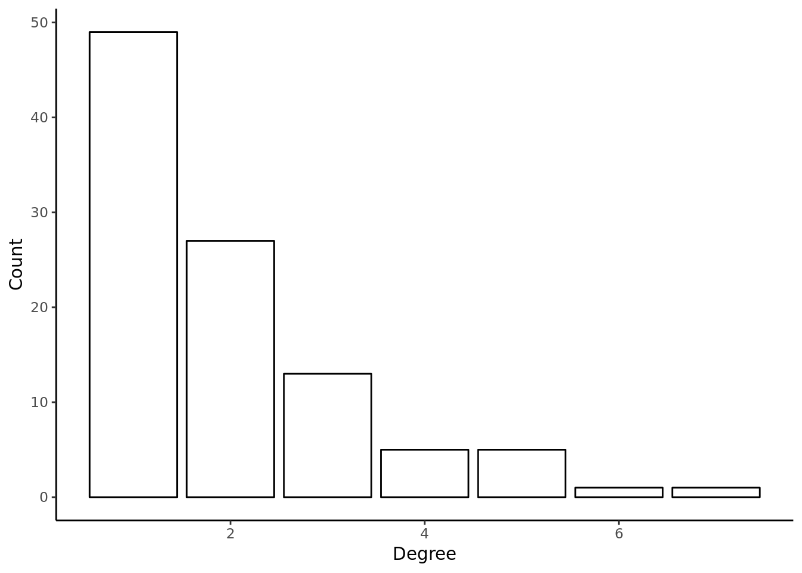

#### Runing time by method 

<table class="table table-condensed" style="width: auto !important; ">
 <thead>
  <tr>
   <th style="text-align:left;"> key </th>
   <th style="text-align:right;"> doc_count </th>
   <th style="text-align:right;"> sum_wallTime_ms.value </th>
   <th style="text-align:left;"> avg_wallTime_ms.value </th>
   <th style="text-align:left;"> includedInTotal </th>
  </tr>
 </thead>
<tbody>
  <tr>
   <td style="text-align:left;"> connectIfSimilar </td>
   <td style="text-align:right;"> 21,945 </td>
   <td style="text-align:right;"> 47,756 </td>
   <td style="text-align:left;"> 2.17616769195717 </td>
   <td style="text-align:left;"> No </td>
  </tr>
  <tr>
   <td style="text-align:left;"> existsSimilarity </td>
   <td style="text-align:right;"> 21,945 </td>
   <td style="text-align:right;"> 46,811 </td>
   <td style="text-align:left;"> 2.13310549100023 </td>
   <td style="text-align:left;"> No </td>
  </tr>
  <tr>
   <td style="text-align:left;"> similarityEdges </td>
   <td style="text-align:right;"> 21,945 </td>
   <td style="text-align:right;"> 46,028 </td>
   <td style="text-align:left;"> 2.09742538163591 </td>
   <td style="text-align:left;"> No </td>
  </tr>
  <tr>
   <td style="text-align:left;"> connect </td>
   <td style="text-align:right;"> 213 </td>
   <td style="text-align:right;"> 515 </td>
   <td style="text-align:left;"> 2.41784037558685 </td>
   <td style="text-align:left;"> Yes </td>
  </tr>
  <tr>
   <td style="text-align:left;"> connectAllSimilar </td>
   <td style="text-align:right;"> 210 </td>
   <td style="text-align:right;"> 47,978 </td>
   <td style="text-align:left;"> 228.466666666667 </td>
   <td style="text-align:left;"> Yes </td>
  </tr>
  <tr>
   <td style="text-align:left;"> init </td>
   <td style="text-align:right;"> 103 </td>
   <td style="text-align:right;"> 11,543 </td>
   <td style="text-align:left;"> 112.067961165049 </td>
   <td style="text-align:left;"> No </td>
  </tr>
  <tr>
   <td style="text-align:left;font-weight: bold;"> Total </td>
   <td style="text-align:right;font-weight: bold;"> 431 </td>
   <td style="text-align:right;font-weight: bold;"> 48,762 </td>
   <td style="text-align:left;font-weight: bold;">  </td>
   <td style="text-align:left;font-weight: bold;">  </td>
  </tr>
</tbody>
</table>
####  Found structures 

#####  Cycles 

Number of cycles found:  1 

<button class="btn btn-primary" data-toggle="collapse" data-target="#FMOOPPULZF"> Show/Hide foundCycle query </button> 
 
  
     GET /filebeat-*/_search 
              { 
                "query": {
                  "bool": {
                    "must": [
                      { "match_phrase": {
                        "simulationId": "SIM10-13-08-29-apnSom--CV"
                        }
                      },
                      { "bool": {
                        "should": [
                          { "match": {
                            "keyword": "foundCycle"
                          }}
                        ]
                      }}
                    ]
                  }
                }
              }
     

#####  Paths 

Number of paths found:  0 

<button class="btn btn-primary" data-toggle="collapse" data-target="#YOJPNJGZRK"> Show/Hide foundPath query </button> 
 
  
     GET /filebeat-*/_search 
              { 
                "query": {
                  "bool": {
                    "must": [
                      { "match_phrase": {
                        "simulationId": "SIM10-13-08-29-apnSom--CV"
                        }
                      },
                      { "bool": {
                        "should": [
                          { "match": {
                            "keyword": "foundPath"
                          }}
                        ]
                      }}
                    ]
                  }
                }
              }
     

###  SIM10-13-08-29-apnSom--DV 

#### simulationParameters 

<table class="table table-condensed" style="width: auto !important; ">
 <thead>
  <tr>
   <th style="text-align:left;"> agentNumber </th>
   <th style="text-align:left;"> similarityConnectThreshold </th>
   <th style="text-align:left;"> graphType </th>
   <th style="text-align:left;"> chainLength </th>
   <th style="text-align:left;"> similaritySearchThreshold </th>
   <th style="text-align:left;"> maxDistance </th>
   <th style="text-align:left;"> randomWorksNumberMultiplier </th>
  </tr>
 </thead>
<tbody>
  <tr>
   <td style="text-align:left;width: 20em; "> 100 </td>
   <td style="text-align:left;width: 15em; "> 0.96 </td>
   <td style="text-align:left;width: 15em; "> random </td>
   <td style="text-align:left;width: 15em; "> 5 </td>
   <td style="text-align:left;width: 15em; "> 1 </td>
   <td style="text-align:left;width: 15em; "> 10 </td>
   <td style="text-align:left;width: 15em; "> 1 </td>
  </tr>
</tbody>
</table>
#### allEdgesByLabel

<table class="table table-condensed" style="width: auto !important; ">
 <thead>
  <tr>
   <th style="text-align:right;"> edges_offers </th>
   <th style="text-align:right;"> edges_similarity </th>
   <th style="text-align:right;"> edges_owns </th>
   <th style="text-align:right;"> edges_demands </th>
   <th style="text-align:right;"> edges_knows </th>
   <th style="text-align:right;"> edges_total </th>
  </tr>
 </thead>
<tbody>
  <tr>
   <td style="text-align:right;width: 5em; "> 105 </td>
   <td style="text-align:right;width: 5em; "> 3,450 </td>
   <td style="text-align:right;width: 5em; "> 105 </td>
   <td style="text-align:right;width: 5em; "> 105 </td>
   <td style="text-align:right;width: 5em; "> 100 </td>
   <td style="text-align:right;width: 5em; "> 3,865 </td>
  </tr>
</tbody>
</table>
#### allVerticesByType

<table class="table table-condensed" style="width: auto !important; ">
 <thead>
  <tr>
   <th style="text-align:right;"> vertices_agent </th>
   <th style="text-align:right;"> vertices_item </th>
   <th style="text-align:right;"> vertices_work </th>
   <th style="text-align:right;"> vertices_total </th>
  </tr>
 </thead>
<tbody>
  <tr>
   <td style="text-align:right;width: 5em; "> 101 </td>
   <td style="text-align:right;width: 5em; "> 210 </td>
   <td style="text-align:right;width: 5em; "> 105 </td>
   <td style="text-align:right;width: 5em; "> 416 </td>
  </tr>
</tbody>
</table>
#### distribution of similarityEdgesByWeight

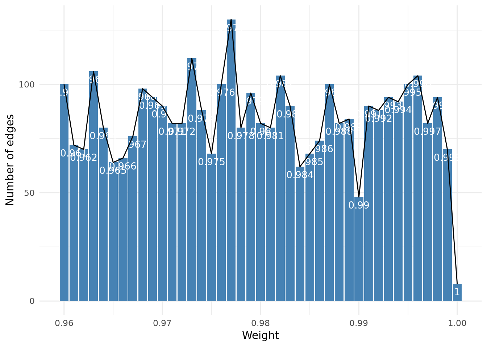

#### Degree distribution of item->similarity->item edges

#### Degree distribution of agent->knows->agent edges

#### Runing time by method 

<table class="table table-condensed" style="width: auto !important; ">
 <thead>
  <tr>
   <th style="text-align:left;">   </th>
   <th style="text-align:left;"> key </th>
   <th style="text-align:right;"> doc_count </th>
   <th style="text-align:right;"> sum_wallTime_ms.value </th>
   <th style="text-align:left;"> avg_wallTime_ms.value </th>
   <th style="text-align:left;"> includedInTotal </th>
  </tr>
 </thead>
<tbody>
  <tr>
   <td style="text-align:left;"> 2 </td>
   <td style="text-align:left;"> cycleSearch </td>
   <td style="text-align:right;"> 3,600 </td>
   <td style="text-align:right;"> 36,078 </td>
   <td style="text-align:left;"> 10.0216666666667 </td>
   <td style="text-align:left;"> Yes </td>
  </tr>
  <tr>
   <td style="text-align:left;"> 3 </td>
   <td style="text-align:left;"> getWorks </td>
   <td style="text-align:right;"> 3,600 </td>
   <td style="text-align:right;"> 46,598 </td>
   <td style="text-align:left;"> 12.9438888888889 </td>
   <td style="text-align:left;"> No </td>
  </tr>
  <tr>
   <td style="text-align:left;"> 4 </td>
   <td style="text-align:left;"> individualCycleSearch </td>
   <td style="text-align:right;"> 3,600 </td>
   <td style="text-align:right;"> 87 </td>
   <td style="text-align:left;"> 0.0241666666666667 </td>
   <td style="text-align:left;"> Yes </td>
  </tr>
  <tr>
   <td style="text-align:left;"> 6 </td>
   <td style="text-align:left;"> addItemToWork </td>
   <td style="text-align:right;"> 210 </td>
   <td style="text-align:right;"> 3,040 </td>
   <td style="text-align:left;"> 14.4761904761905 </td>
   <td style="text-align:left;"> No </td>
  </tr>
  <tr>
   <td style="text-align:left;"> 7 </td>
   <td style="text-align:left;"> ownsWork </td>
   <td style="text-align:right;"> 105 </td>
   <td style="text-align:right;"> 1,788 </td>
   <td style="text-align:left;"> 17.0285714285714 </td>
   <td style="text-align:left;"> No </td>
  </tr>
  <tr>
   <td style="text-align:left;"> 8 </td>
   <td style="text-align:left;"> init </td>
   <td style="text-align:right;"> 103 </td>
   <td style="text-align:right;"> 11,758 </td>
   <td style="text-align:left;"> 114.155339805825 </td>
   <td style="text-align:left;"> No </td>
  </tr>
  <tr>
   <td style="text-align:left;"> 9 </td>
   <td style="text-align:left;"> searchAndConnect </td>
   <td style="text-align:right;"> 101 </td>
   <td style="text-align:right;"> 34,249 </td>
   <td style="text-align:left;"> 339.09900990099 </td>
   <td style="text-align:left;"> Yes </td>
  </tr>
  <tr>
   <td style="text-align:left;"> 10 </td>
   <td style="text-align:left;"> knowsAgent </td>
   <td style="text-align:right;"> 100 </td>
   <td style="text-align:right;"> 366 </td>
   <td style="text-align:left;"> 3.66 </td>
   <td style="text-align:left;"> No </td>
  </tr>
  <tr>
   <td style="text-align:left;font-weight: bold;"> 1 </td>
   <td style="text-align:left;font-weight: bold;"> Total </td>
   <td style="text-align:right;font-weight: bold;"> 14,501 </td>
   <td style="text-align:right;font-weight: bold;"> 188,313 </td>
   <td style="text-align:left;font-weight: bold;">  </td>
   <td style="text-align:left;font-weight: bold;">  </td>
  </tr>
</tbody>
</table>
####  Found structures 

#####  Cycles 

Number of cycles found:  0 

<button class="btn btn-primary" data-toggle="collapse" data-target="#GPFANDNITW"> Show/Hide foundCycle query </button> 
 
  
     GET /filebeat-*/_search 
              { 
                "query": {
                  "bool": {
                    "must": [
                      { "match_phrase": {
                        "simulationId": "SIM10-13-08-29-apnSom--DV"
                        }
                      },
                      { "bool": {
                        "should": [
                          { "match": {
                            "keyword": "foundCycle"
                          }}
                        ]
                      }}
                    ]
                  }
                }
              }
     

#####  Paths 

Number of paths found:  3600 

<button class="btn btn-primary" data-toggle="collapse" data-target="#BWFOPUXUKZ"> Show/Hide foundPath query </button> 
 
  
     GET /filebeat-*/_search 
              { 
                "query": {
                  "bool": {
                    "must": [
                      { "match_phrase": {
                        "simulationId": "SIM10-13-08-29-apnSom--DV"
                        }
                      },
                      { "bool": {
                        "should": [
                          { "match": {
                            "keyword": "foundPath"
                          }}
                        ]
                      }}
                    ]
                  }
                }
              }
     

###  SIM10-13-09-30-Rp8qXP--CV 

#### simulationParameters 

<table class="table table-condensed" style="width: auto !important; ">
 <thead>
  <tr>
   <th style="text-align:left;"> agentNumber </th>
   <th style="text-align:left;"> similarityConnectThreshold </th>
   <th style="text-align:left;"> graphType </th>
   <th style="text-align:left;"> chainLength </th>
   <th style="text-align:left;"> similaritySearchThreshold </th>
   <th style="text-align:left;"> maxDistance </th>
   <th style="text-align:left;"> randomWorksNumberMultiplier </th>
  </tr>
 </thead>
<tbody>
  <tr>
   <td style="text-align:left;width: 20em; "> 100 </td>
   <td style="text-align:left;width: 15em; "> 0.96 </td>
   <td style="text-align:left;width: 15em; "> smallWorld </td>
   <td style="text-align:left;width: 15em; "> 5 </td>
   <td style="text-align:left;width: 15em; "> 1 </td>
   <td style="text-align:left;width: 15em; "> 10 </td>
   <td style="text-align:left;width: 15em; "> 1 </td>
  </tr>
</tbody>
</table>
#### allEdgesByLabel

<table class="table table-condensed" style="width: auto !important; ">
 <thead>
  <tr>
   <th style="text-align:right;"> edges_offers </th>
   <th style="text-align:right;"> edges_similarity </th>
   <th style="text-align:right;"> edges_owns </th>
   <th style="text-align:right;"> edges_demands </th>
   <th style="text-align:right;"> edges_knows </th>
   <th style="text-align:right;"> edges_total </th>
  </tr>
 </thead>
<tbody>
  <tr>
   <td style="text-align:right;width: 5em; "> 105 </td>
   <td style="text-align:right;width: 5em; "> 3,746 </td>
   <td style="text-align:right;width: 5em; "> 105 </td>
   <td style="text-align:right;width: 5em; "> 105 </td>
   <td style="text-align:right;width: 5em; "> 601 </td>
   <td style="text-align:right;width: 5em; "> 4,662 </td>
  </tr>
</tbody>
</table>
#### allVerticesByType

<table class="table table-condensed" style="width: auto !important; ">
 <thead>
  <tr>
   <th style="text-align:right;"> vertices_agent </th>
   <th style="text-align:right;"> vertices_item </th>
   <th style="text-align:right;"> vertices_work </th>
   <th style="text-align:right;"> vertices_total </th>
  </tr>
 </thead>
<tbody>
  <tr>
   <td style="text-align:right;width: 5em; "> 101 </td>
   <td style="text-align:right;width: 5em; "> 210 </td>
   <td style="text-align:right;width: 5em; "> 105 </td>
   <td style="text-align:right;width: 5em; "> 416 </td>
  </tr>
</tbody>
</table>
#### distribution of similarityEdgesByWeight

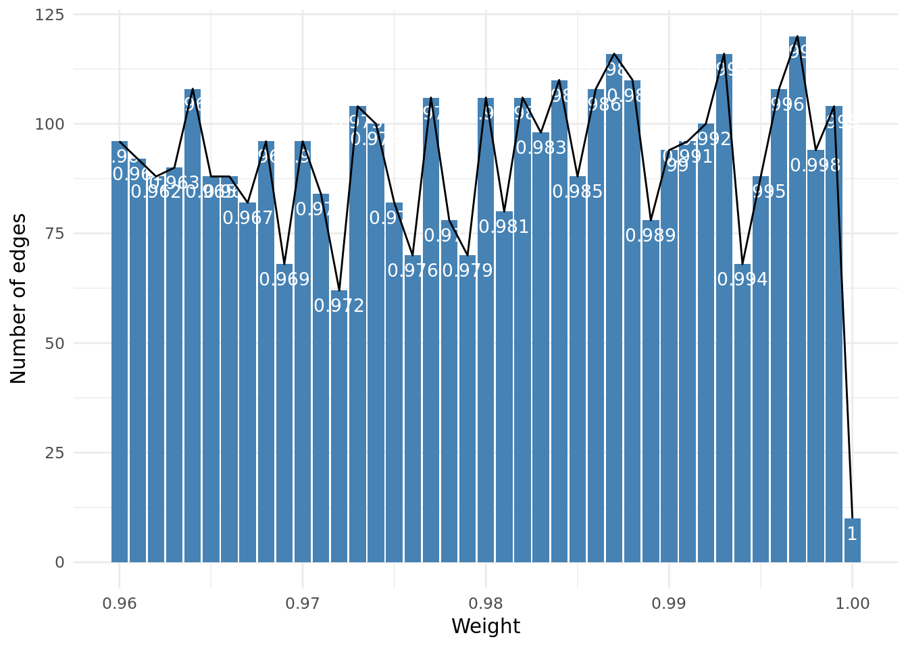

#### Degree distribution of item->similarity->item edges

#### Degree distribution of agent->knows->agent edges

#### Runing time by method 

<table class="table table-condensed" style="width: auto !important; ">
 <thead>
  <tr>
   <th style="text-align:left;"> key </th>
   <th style="text-align:right;"> doc_count </th>
   <th style="text-align:right;"> sum_wallTime_ms.value </th>
   <th style="text-align:left;"> avg_wallTime_ms.value </th>
   <th style="text-align:left;"> includedInTotal </th>
  </tr>
 </thead>
<tbody>
  <tr>
   <td style="text-align:left;"> connectIfSimilar </td>
   <td style="text-align:right;"> 21,945 </td>
   <td style="text-align:right;"> 45,986 </td>
   <td style="text-align:left;"> 2.09551150603782 </td>
   <td style="text-align:left;"> No </td>
  </tr>
  <tr>
   <td style="text-align:left;"> existsSimilarity </td>
   <td style="text-align:right;"> 21,945 </td>
   <td style="text-align:right;"> 45,576 </td>
   <td style="text-align:left;"> 2.07682843472317 </td>
   <td style="text-align:left;"> No </td>
  </tr>
  <tr>
   <td style="text-align:left;"> similarityEdges </td>
   <td style="text-align:right;"> 21,945 </td>
   <td style="text-align:right;"> 44,835 </td>
   <td style="text-align:left;"> 2.04306220095694 </td>
   <td style="text-align:left;"> No </td>
  </tr>
  <tr>
   <td style="text-align:left;"> connectAllSimilar </td>
   <td style="text-align:right;"> 210 </td>
   <td style="text-align:right;"> 46,198 </td>
   <td style="text-align:left;"> 219.990476190476 </td>
   <td style="text-align:left;"> Yes </td>
  </tr>
  <tr>
   <td style="text-align:left;"> init </td>
   <td style="text-align:right;"> 103 </td>
   <td style="text-align:right;"> 11,282 </td>
   <td style="text-align:left;"> 109.533980582524 </td>
   <td style="text-align:left;"> No </td>
  </tr>
  <tr>
   <td style="text-align:left;"> connect </td>
   <td style="text-align:right;"> 19 </td>
   <td style="text-align:right;"> 35 </td>
   <td style="text-align:left;"> 1.84210526315789 </td>
   <td style="text-align:left;"> Yes </td>
  </tr>
  <tr>
   <td style="text-align:left;font-weight: bold;"> Total </td>
   <td style="text-align:right;font-weight: bold;"> 237 </td>
   <td style="text-align:right;font-weight: bold;"> 46,638 </td>
   <td style="text-align:left;font-weight: bold;">  </td>
   <td style="text-align:left;font-weight: bold;">  </td>
  </tr>
</tbody>
</table>
####  Found structures 

#####  Cycles 

Number of cycles found:  1 

<button class="btn btn-primary" data-toggle="collapse" data-target="#THJKLPRTVC"> Show/Hide foundCycle query </button> 
 
  
     GET /filebeat-*/_search 
              { 
                "query": {
                  "bool": {
                    "must": [
                      { "match_phrase": {
                        "simulationId": "SIM10-13-09-30-Rp8qXP--CV"
                        }
                      },
                      { "bool": {
                        "should": [
                          { "match": {
                            "keyword": "foundCycle"
                          }}
                        ]
                      }}
                    ]
                  }
                }
              }
     

#####  Paths 

Number of paths found:  0 

<button class="btn btn-primary" data-toggle="collapse" data-target="#VUNTTRRTVF"> Show/Hide foundPath query </button> 
 
  
     GET /filebeat-*/_search 
              { 
                "query": {
                  "bool": {
                    "must": [
                      { "match_phrase": {
                        "simulationId": "SIM10-13-09-30-Rp8qXP--CV"
                        }
                      },
                      { "bool": {
                        "should": [
                          { "match": {
                            "keyword": "foundPath"
                          }}
                        ]
                      }}
                    ]
                  }
                }
              }
     

###  SIM10-13-09-30-Rp8qXP--DV 

#### simulationParameters 

<table class="table table-condensed" style="width: auto !important; ">
 <thead>
  <tr>
   <th style="text-align:left;"> agentNumber </th>
   <th style="text-align:left;"> similarityConnectThreshold </th>
   <th style="text-align:left;"> graphType </th>
   <th style="text-align:left;"> chainLength </th>
   <th style="text-align:left;"> similaritySearchThreshold </th>
   <th style="text-align:left;"> maxDistance </th>
   <th style="text-align:left;"> randomWorksNumberMultiplier </th>
  </tr>
 </thead>
<tbody>
  <tr>
   <td style="text-align:left;width: 20em; "> 100 </td>
   <td style="text-align:left;width: 15em; "> 0.96 </td>
   <td style="text-align:left;width: 15em; "> smallWorld </td>
   <td style="text-align:left;width: 15em; "> 5 </td>
   <td style="text-align:left;width: 15em; "> 1 </td>
   <td style="text-align:left;width: 15em; "> 10 </td>
   <td style="text-align:left;width: 15em; "> 1 </td>
  </tr>
</tbody>
</table>
#### allEdgesByLabel

<table class="table table-condensed" style="width: auto !important; ">
 <thead>
  <tr>
   <th style="text-align:right;"> edges_offers </th>
   <th style="text-align:right;"> edges_similarity </th>
   <th style="text-align:right;"> edges_owns </th>
   <th style="text-align:right;"> edges_demands </th>
   <th style="text-align:right;"> edges_knows </th>
   <th style="text-align:right;"> edges_total </th>
  </tr>
 </thead>
<tbody>
  <tr>
   <td style="text-align:right;width: 5em; "> 105 </td>
   <td style="text-align:right;width: 5em; "> 3,708 </td>
   <td style="text-align:right;width: 5em; "> 105 </td>
   <td style="text-align:right;width: 5em; "> 105 </td>
   <td style="text-align:right;width: 5em; "> 601 </td>
   <td style="text-align:right;width: 5em; "> 4,624 </td>
  </tr>
</tbody>
</table>
#### allVerticesByType

<table class="table table-condensed" style="width: auto !important; ">
 <thead>
  <tr>
   <th style="text-align:right;"> vertices_agent </th>
   <th style="text-align:right;"> vertices_item </th>
   <th style="text-align:right;"> vertices_work </th>
   <th style="text-align:right;"> vertices_total </th>
  </tr>
 </thead>
<tbody>
  <tr>
   <td style="text-align:right;width: 5em; "> 101 </td>
   <td style="text-align:right;width: 5em; "> 210 </td>
   <td style="text-align:right;width: 5em; "> 105 </td>
   <td style="text-align:right;width: 5em; "> 416 </td>
  </tr>
</tbody>
</table>
#### distribution of similarityEdgesByWeight

#### Degree distribution of item->similarity->item edges

#### Degree distribution of agent->knows->agent edges

#### Runing time by method 

<table class="table table-condensed" style="width: auto !important; ">
 <thead>
  <tr>
   <th style="text-align:left;">   </th>
   <th style="text-align:left;"> key </th>
   <th style="text-align:right;"> doc_count </th>
   <th style="text-align:right;"> sum_wallTime_ms.value </th>
   <th style="text-align:left;"> avg_wallTime_ms.value </th>
   <th style="text-align:left;"> includedInTotal </th>
  </tr>
 </thead>
<tbody>
  <tr>
   <td style="text-align:left;"> 1 </td>
   <td style="text-align:left;"> knowsAgent </td>
   <td style="text-align:right;"> 601 </td>
   <td style="text-align:right;"> 1,133 </td>
   <td style="text-align:left;"> 1.88519134775374 </td>
   <td style="text-align:left;"> No </td>
  </tr>
  <tr>
   <td style="text-align:left;"> 2 </td>
   <td style="text-align:left;"> addItemToWork </td>
   <td style="text-align:right;"> 210 </td>
   <td style="text-align:right;"> 1,395 </td>
   <td style="text-align:left;"> 6.64285714285714 </td>
   <td style="text-align:left;"> No </td>
  </tr>
  <tr>
   <td style="text-align:left;"> 3 </td>
   <td style="text-align:left;"> ownsWork </td>
   <td style="text-align:right;"> 105 </td>
   <td style="text-align:right;"> 1,384 </td>
   <td style="text-align:left;"> 13.1809523809524 </td>
   <td style="text-align:left;"> No </td>
  </tr>
  <tr>
   <td style="text-align:left;"> 4 </td>
   <td style="text-align:left;"> init </td>
   <td style="text-align:right;"> 103 </td>
   <td style="text-align:right;"> 12,175 </td>
   <td style="text-align:left;"> 118.203883495146 </td>
   <td style="text-align:left;"> No </td>
  </tr>
  <tr>
   <td style="text-align:left;"> 5 </td>
   <td style="text-align:left;"> searchAndConnect </td>
   <td style="text-align:right;"> 101 </td>
   <td style="text-align:right;"> 41,327 </td>
   <td style="text-align:left;"> 409.178217821782 </td>
   <td style="text-align:left;"> Yes </td>
  </tr>
  <tr>
   <td style="text-align:left;"> 6 </td>
   <td style="text-align:left;"> getWorksItems </td>
   <td style="text-align:right;"> 8 </td>
   <td style="text-align:right;"> 32 </td>
   <td style="text-align:left;"> 4 </td>
   <td style="text-align:left;"> Yes </td>
  </tr>
  <tr>
   <td style="text-align:left;"> 9 </td>
   <td style="text-align:left;"> cycleSearch </td>
   <td style="text-align:right;"> 2 </td>
   <td style="text-align:right;"> 27 </td>
   <td style="text-align:left;"> 13.5 </td>
   <td style="text-align:left;"> Yes </td>
  </tr>
  <tr>
   <td style="text-align:left;"> 10 </td>
   <td style="text-align:left;"> getWorks </td>
   <td style="text-align:right;"> 2 </td>
   <td style="text-align:right;"> 9 </td>
   <td style="text-align:left;"> 4.5 </td>
   <td style="text-align:left;"> No </td>
  </tr>
  <tr>
   <td style="text-align:left;font-weight: bold;"> 11 </td>
   <td style="text-align:left;font-weight: bold;"> Total </td>
   <td style="text-align:right;font-weight: bold;"> 118 </td>
   <td style="text-align:right;font-weight: bold;"> 41,744 </td>
   <td style="text-align:left;font-weight: bold;">  </td>
   <td style="text-align:left;font-weight: bold;">  </td>
  </tr>
</tbody>
</table>
####  Found structures 

#####  Cycles 

Number of cycles found:  2 

<button class="btn btn-primary" data-toggle="collapse" data-target="#AVTSXXOAPG"> Show/Hide foundCycle query </button> 
 
  
     GET /filebeat-*/_search 
              { 
                "query": {
                  "bool": {
                    "must": [
                      { "match_phrase": {
                        "simulationId": "SIM10-13-09-30-Rp8qXP--DV"
                        }
                      },
                      { "bool": {
                        "should": [
                          { "match": {
                            "keyword": "foundCycle"
                          }}
                        ]
                      }}
                    ]
                  }
                }
              }
     

#####  Paths 

Number of paths found:  0 

<button class="btn btn-primary" data-toggle="collapse" data-target="#TFCFEKDGLY"> Show/Hide foundPath query </button> 
 
  
     GET /filebeat-*/_search 
              { 
                "query": {
                  "bool": {
                    "must": [
                      { "match_phrase": {
                        "simulationId": "SIM10-13-09-30-Rp8qXP--DV"
                        }
                      },
                      { "bool": {
                        "should": [
                          { "match": {
                            "keyword": "foundPath"
                          }}
                        ]
                      }}
                    ]
                  }
                }
              }
     

###  SIM10-13-10-41-YRs3ux--CV 

#### simulationParameters 

<table class="table table-condensed" style="width: auto !important; ">
 <thead>
  <tr>
   <th style="text-align:left;"> agentNumber </th>
   <th style="text-align:left;"> similarityConnectThreshold </th>
   <th style="text-align:left;"> graphType </th>
   <th style="text-align:left;"> chainLength </th>
   <th style="text-align:left;"> similaritySearchThreshold </th>
   <th style="text-align:left;"> maxDistance </th>
   <th style="text-align:left;"> randomWorksNumberMultiplier </th>
  </tr>
 </thead>
<tbody>
  <tr>
   <td style="text-align:left;width: 20em; "> 100 </td>
   <td style="text-align:left;width: 15em; "> 0.96 </td>
   <td style="text-align:left;width: 15em; "> random </td>
   <td style="text-align:left;width: 15em; "> 5 </td>
   <td style="text-align:left;width: 15em; "> 1 </td>
   <td style="text-align:left;width: 15em; "> 10 </td>
   <td style="text-align:left;width: 15em; "> 2 </td>
  </tr>
</tbody>
</table>
#### allEdgesByLabel

<table class="table table-condensed" style="width: auto !important; ">
 <thead>
  <tr>
   <th style="text-align:right;"> edges_offers </th>
   <th style="text-align:right;"> edges_similarity </th>
   <th style="text-align:right;"> edges_owns </th>
   <th style="text-align:right;"> edges_demands </th>
   <th style="text-align:right;"> edges_knows </th>
   <th style="text-align:right;"> edges_total </th>
  </tr>
 </thead>
<tbody>
  <tr>
   <td style="text-align:right;width: 5em; "> 205 </td>
   <td style="text-align:right;width: 5em; "> 14,288 </td>
   <td style="text-align:right;width: 5em; "> 205 </td>
   <td style="text-align:right;width: 5em; "> 205 </td>
   <td style="text-align:right;width: 5em; "> 100 </td>
   <td style="text-align:right;width: 5em; "> 15,003 </td>
  </tr>
</tbody>
</table>
#### allVerticesByType

<table class="table table-condensed" style="width: auto !important; ">
 <thead>
  <tr>
   <th style="text-align:right;"> vertices_agent </th>
   <th style="text-align:right;"> vertices_item </th>
   <th style="text-align:right;"> vertices_work </th>
   <th style="text-align:right;"> vertices_total </th>
  </tr>
 </thead>
<tbody>
  <tr>
   <td style="text-align:right;width: 5em; "> 101 </td>
   <td style="text-align:right;width: 5em; "> 410 </td>
   <td style="text-align:right;width: 5em; "> 205 </td>
   <td style="text-align:right;width: 5em; "> 716 </td>
  </tr>
</tbody>
</table>
#### distribution of similarityEdgesByWeight

#### Degree distribution of item->similarity->item edges

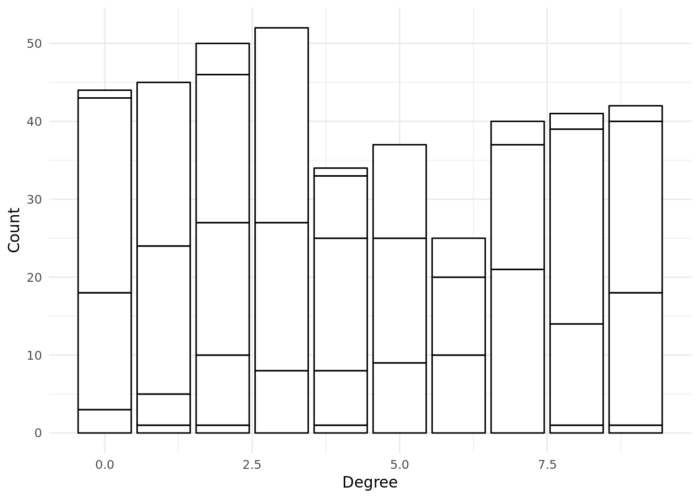

#### Degree distribution of agent->knows->agent edges

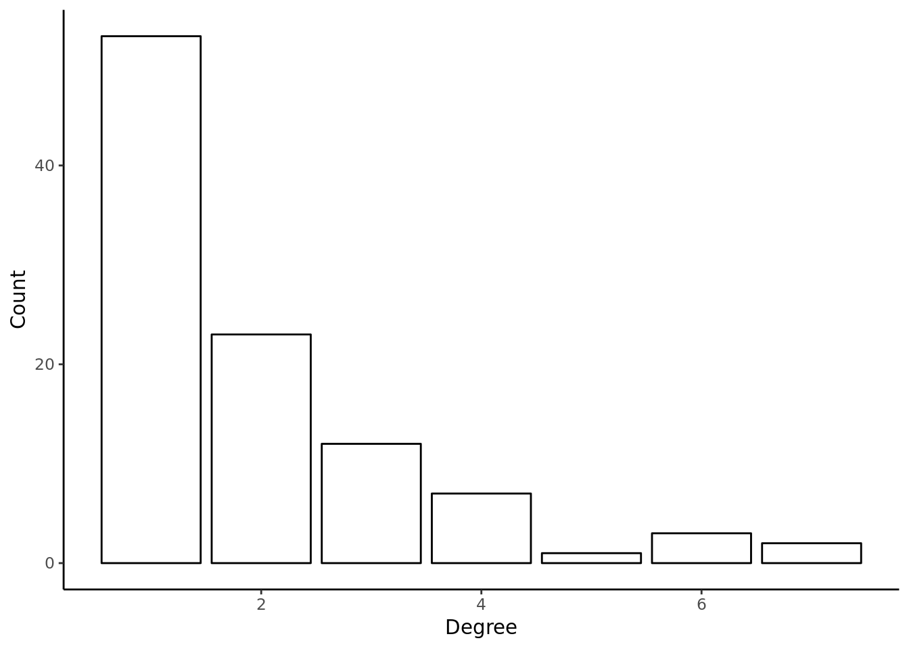

#### Runing time by method 

<table class="table table-condensed" style="width: auto !important; ">
 <thead>
  <tr>
   <th style="text-align:left;"> key </th>
   <th style="text-align:right;"> doc_count </th>
   <th style="text-align:right;"> sum_wallTime_ms.value </th>
   <th style="text-align:left;"> avg_wallTime_ms.value </th>
   <th style="text-align:left;"> includedInTotal </th>
  </tr>
 </thead>
<tbody>
  <tr>
   <td style="text-align:left;"> connectIfSimilar </td>
   <td style="text-align:right;"> 83,845 </td>
   <td style="text-align:right;"> 214,532 </td>
   <td style="text-align:left;"> 2.55867374321665 </td>
   <td style="text-align:left;"> No </td>
  </tr>
  <tr>
   <td style="text-align:left;"> existsSimilarity </td>
   <td style="text-align:right;"> 83,845 </td>
   <td style="text-align:right;"> 211,883 </td>
   <td style="text-align:left;"> 2.52707973045501 </td>
   <td style="text-align:left;"> No </td>
  </tr>
  <tr>
   <td style="text-align:left;"> similarityEdges </td>
   <td style="text-align:right;"> 83,845 </td>
   <td style="text-align:right;"> 208,441 </td>
   <td style="text-align:left;"> 2.48602778937325 </td>
   <td style="text-align:left;"> No </td>
  </tr>
  <tr>
   <td style="text-align:left;"> connect </td>
   <td style="text-align:right;"> 490 </td>
   <td style="text-align:right;"> 1,077 </td>
   <td style="text-align:left;"> 2.19795918367347 </td>
   <td style="text-align:left;"> Yes </td>
  </tr>
  <tr>
   <td style="text-align:left;"> connectAllSimilar </td>
   <td style="text-align:right;"> 410 </td>
   <td style="text-align:right;"> 215,296 </td>
   <td style="text-align:left;"> 525.112195121951 </td>
   <td style="text-align:left;"> Yes </td>
  </tr>
  <tr>
   <td style="text-align:left;"> init </td>
   <td style="text-align:right;"> 103 </td>
   <td style="text-align:right;"> 11,331 </td>
   <td style="text-align:left;"> 110.009708737864 </td>
   <td style="text-align:left;"> No </td>
  </tr>
  <tr>
   <td style="text-align:left;font-weight: bold;"> Total </td>
   <td style="text-align:right;font-weight: bold;"> 908 </td>
   <td style="text-align:right;font-weight: bold;"> 217,034 </td>
   <td style="text-align:left;font-weight: bold;">  </td>
   <td style="text-align:left;font-weight: bold;">  </td>
  </tr>
</tbody>
</table>
####  Found structures 

#####  Cycles 

Number of cycles found:  1 

<button class="btn btn-primary" data-toggle="collapse" data-target="#KHWIMMFQPA"> Show/Hide foundCycle query </button> 
 
  
     GET /filebeat-*/_search 
              { 
                "query": {
                  "bool": {
                    "must": [
                      { "match_phrase": {
                        "simulationId": "SIM10-13-10-41-YRs3ux--CV"
                        }
                      },
                      { "bool": {
                        "should": [
                          { "match": {
                            "keyword": "foundCycle"
                          }}
                        ]
                      }}
                    ]
                  }
                }
              }
     

#####  Paths 

Number of paths found:  0 

<button class="btn btn-primary" data-toggle="collapse" data-target="#LNJSNVBCPJ"> Show/Hide foundPath query </button> 
 
  
     GET /filebeat-*/_search 
              { 
                "query": {
                  "bool": {
                    "must": [
                      { "match_phrase": {
                        "simulationId": "SIM10-13-10-41-YRs3ux--CV"
                        }
                      },
                      { "bool": {
                        "should": [
                          { "match": {
                            "keyword": "foundPath"
                          }}
                        ]
                      }}
                    ]
                  }
                }
              }
     

###  SIM10-13-10-41-YRs3ux--DV 

#### simulationParameters 

<table class="table table-condensed" style="width: auto !important; ">
 <thead>
  <tr>
   <th style="text-align:left;"> agentNumber </th>
   <th style="text-align:left;"> similarityConnectThreshold </th>
   <th style="text-align:left;"> graphType </th>
   <th style="text-align:left;"> chainLength </th>
   <th style="text-align:left;"> similaritySearchThreshold </th>
   <th style="text-align:left;"> maxDistance </th>
   <th style="text-align:left;"> randomWorksNumberMultiplier </th>
  </tr>
 </thead>
<tbody>
  <tr>
   <td style="text-align:left;width: 20em; "> 100 </td>
   <td style="text-align:left;width: 15em; "> 0.96 </td>
   <td style="text-align:left;width: 15em; "> random </td>
   <td style="text-align:left;width: 15em; "> 5 </td>
   <td style="text-align:left;width: 15em; "> 1 </td>
   <td style="text-align:left;width: 15em; "> 10 </td>
   <td style="text-align:left;width: 15em; "> 2 </td>
  </tr>
</tbody>
</table>
#### allEdgesByLabel

<table class="table table-condensed" style="width: auto !important; ">
 <thead>
  <tr>
   <th style="text-align:right;"> edges_offers </th>
   <th style="text-align:right;"> edges_similarity </th>
   <th style="text-align:right;"> edges_owns </th>
   <th style="text-align:right;"> edges_demands </th>
   <th style="text-align:right;"> edges_knows </th>
   <th style="text-align:right;"> edges_total </th>
  </tr>
 </thead>
<tbody>
  <tr>
   <td style="text-align:right;width: 5em; "> 205 </td>
   <td style="text-align:right;width: 5em; "> 13,308 </td>
   <td style="text-align:right;width: 5em; "> 205 </td>
   <td style="text-align:right;width: 5em; "> 205 </td>
   <td style="text-align:right;width: 5em; "> 100 </td>
   <td style="text-align:right;width: 5em; "> 14,023 </td>
  </tr>
</tbody>
</table>
#### allVerticesByType

<table class="table table-condensed" style="width: auto !important; ">
 <thead>
  <tr>
   <th style="text-align:right;"> vertices_agent </th>
   <th style="text-align:right;"> vertices_item </th>
   <th style="text-align:right;"> vertices_work </th>
   <th style="text-align:right;"> vertices_total </th>
  </tr>
 </thead>
<tbody>
  <tr>
   <td style="text-align:right;width: 5em; "> 101 </td>
   <td style="text-align:right;width: 5em; "> 410 </td>
   <td style="text-align:right;width: 5em; "> 205 </td>
   <td style="text-align:right;width: 5em; "> 716 </td>
  </tr>
</tbody>
</table>
#### distribution of similarityEdgesByWeight

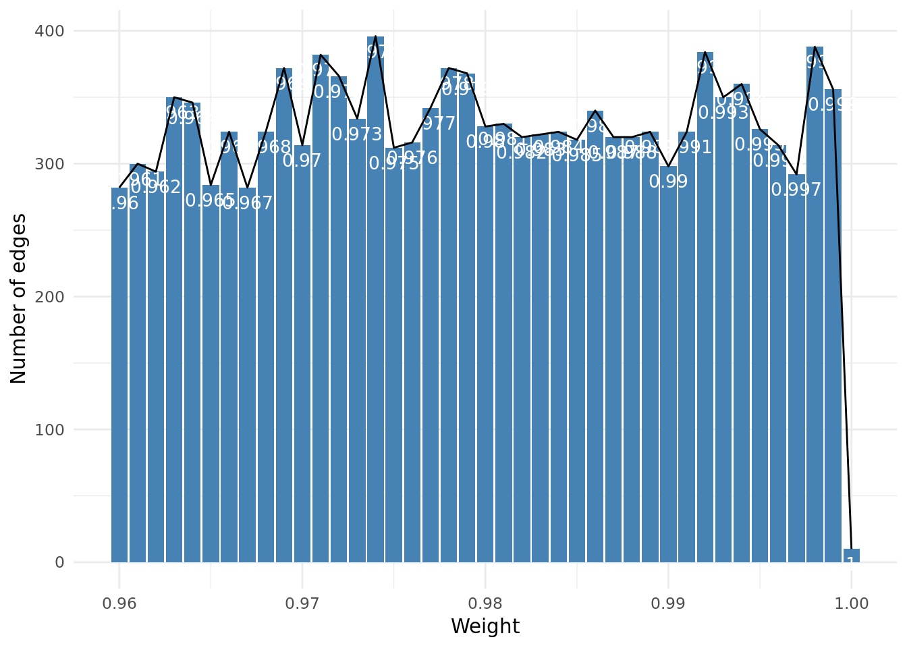

#### Degree distribution of item->similarity->item edges

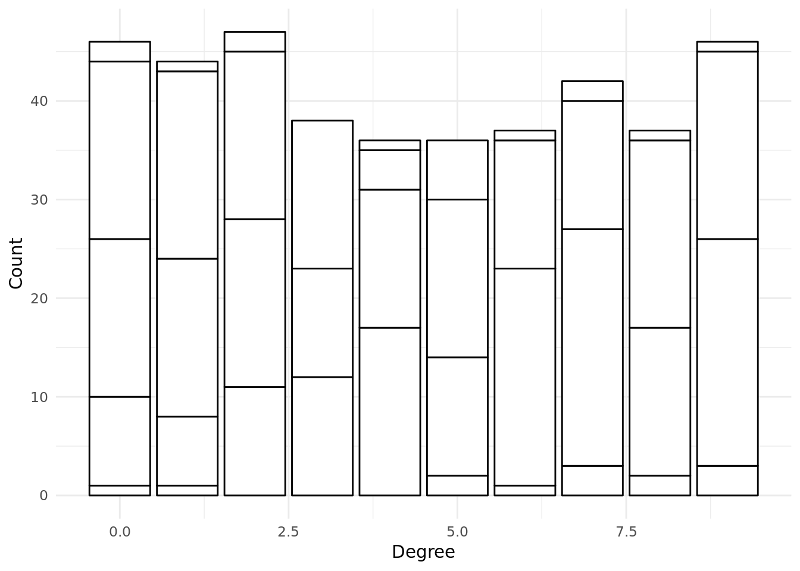

#### Degree distribution of agent->knows->agent edges

#### Runing time by method 

<table class="table table-condensed" style="width: auto !important; ">
 <thead>
  <tr>
   <th style="text-align:left;">   </th>
   <th style="text-align:left;"> key </th>
   <th style="text-align:right;"> doc_count </th>
   <th style="text-align:right;"> sum_wallTime_ms.value </th>
   <th style="text-align:left;"> avg_wallTime_ms.value </th>
   <th style="text-align:left;"> includedInTotal </th>
  </tr>
 </thead>
<tbody>
  <tr>
   <td style="text-align:left;"> 1 </td>
   <td style="text-align:left;"> addItemToWork </td>
   <td style="text-align:right;"> 410 </td>
   <td style="text-align:right;"> 6,330 </td>
   <td style="text-align:left;"> 15.4390243902439 </td>
   <td style="text-align:left;"> No </td>
  </tr>
  <tr>
   <td style="text-align:left;"> 2 </td>
   <td style="text-align:left;"> ownsWork </td>
   <td style="text-align:right;"> 205 </td>
   <td style="text-align:right;"> 4,112 </td>
   <td style="text-align:left;"> 20.0585365853659 </td>
   <td style="text-align:left;"> No </td>
  </tr>
  <tr>
   <td style="text-align:left;"> 3 </td>
   <td style="text-align:left;"> init </td>
   <td style="text-align:right;"> 103 </td>
   <td style="text-align:right;"> 11,738 </td>
   <td style="text-align:left;"> 113.961165048544 </td>
   <td style="text-align:left;"> No </td>
  </tr>
  <tr>
   <td style="text-align:left;"> 4 </td>
   <td style="text-align:left;"> searchAndConnect </td>
   <td style="text-align:right;"> 101 </td>
   <td style="text-align:right;"> 92,957 </td>
   <td style="text-align:left;"> 920.366336633663 </td>
   <td style="text-align:left;"> Yes </td>
  </tr>
  <tr>
   <td style="text-align:left;"> 5 </td>
   <td style="text-align:left;"> knowsAgent </td>
   <td style="text-align:right;"> 100 </td>
   <td style="text-align:right;"> 340 </td>
   <td style="text-align:left;"> 3.4 </td>
   <td style="text-align:left;"> No </td>
  </tr>
  <tr>
   <td style="text-align:left;"> 6 </td>
   <td style="text-align:left;"> getWorksItems </td>
   <td style="text-align:right;"> 8 </td>
   <td style="text-align:right;"> 12 </td>
   <td style="text-align:left;"> 1.5 </td>
   <td style="text-align:left;"> Yes </td>
  </tr>
  <tr>
   <td style="text-align:left;"> 9 </td>
   <td style="text-align:left;"> cycleSearch </td>
   <td style="text-align:right;"> 3 </td>
   <td style="text-align:right;"> 952 </td>
   <td style="text-align:left;"> 317.333333333333 </td>
   <td style="text-align:left;"> Yes </td>
  </tr>
  <tr>
   <td style="text-align:left;"> 10 </td>
   <td style="text-align:left;"> getWorks </td>
   <td style="text-align:right;"> 3 </td>
   <td style="text-align:right;"> 826 </td>
   <td style="text-align:left;"> 275.333333333333 </td>
   <td style="text-align:left;"> No </td>
  </tr>
  <tr>
   <td style="text-align:left;font-weight: bold;"> 11 </td>
   <td style="text-align:left;font-weight: bold;"> Total </td>
   <td style="text-align:right;font-weight: bold;"> 120 </td>
   <td style="text-align:right;font-weight: bold;"> 94,657 </td>
   <td style="text-align:left;font-weight: bold;">  </td>
   <td style="text-align:left;font-weight: bold;">  </td>
  </tr>
</tbody>
</table>
####  Found structures 

#####  Cycles 

Number of cycles found:  3 

<button class="btn btn-primary" data-toggle="collapse" data-target="#MZWAHAGIRQ"> Show/Hide foundCycle query </button> 
 
  
     GET /filebeat-*/_search 
              { 
                "query": {
                  "bool": {
                    "must": [
                      { "match_phrase": {
                        "simulationId": "SIM10-13-10-41-YRs3ux--DV"
                        }
                      },
                      { "bool": {
                        "should": [
                          { "match": {
                            "keyword": "foundCycle"
                          }}
                        ]
                      }}
                    ]
                  }
                }
              }
     

#####  Paths 

Number of paths found:  0 

<button class="btn btn-primary" data-toggle="collapse" data-target="#ONMXKLGMRN"> Show/Hide foundPath query </button> 
 
  
     GET /filebeat-*/_search 
              { 
                "query": {
                  "bool": {
                    "must": [
                      { "match_phrase": {
                        "simulationId": "SIM10-13-10-41-YRs3ux--DV"
                        }
                      },
                      { "bool": {
                        "should": [
                          { "match": {
                            "keyword": "foundPath"
                          }}
                        ]
                      }}
                    ]
                  }
                }
              }
     

###  SIM10-13-10-45-BtyUBG--CV 

#### simulationParameters 

<table class="table table-condensed" style="width: auto !important; ">
 <thead>
  <tr>
   <th style="text-align:left;"> agentNumber </th>
   <th style="text-align:left;"> similarityConnectThreshold </th>
   <th style="text-align:left;"> graphType </th>
   <th style="text-align:left;"> chainLength </th>
   <th style="text-align:left;"> similaritySearchThreshold </th>
   <th style="text-align:left;"> maxDistance </th>
   <th style="text-align:left;"> randomWorksNumberMultiplier </th>
  </tr>
 </thead>
<tbody>
  <tr>
   <td style="text-align:left;width: 20em; "> 100 </td>
   <td style="text-align:left;width: 15em; "> 0.96 </td>
   <td style="text-align:left;width: 15em; "> smallWorld </td>
   <td style="text-align:left;width: 15em; "> 5 </td>
   <td style="text-align:left;width: 15em; "> 1 </td>
   <td style="text-align:left;width: 15em; "> 10 </td>
   <td style="text-align:left;width: 15em; "> 2 </td>
  </tr>
</tbody>
</table>
#### allEdgesByLabel

<table class="table table-condensed" style="width: auto !important; ">
 <thead>
  <tr>
   <th style="text-align:right;"> edges_offers </th>
   <th style="text-align:right;"> edges_similarity </th>
   <th style="text-align:right;"> edges_owns </th>
   <th style="text-align:right;"> edges_demands </th>
   <th style="text-align:right;"> edges_knows </th>
   <th style="text-align:right;"> edges_total </th>
  </tr>
 </thead>
<tbody>
  <tr>
   <td style="text-align:right;width: 5em; "> 205 </td>
   <td style="text-align:right;width: 5em; "> 14,430 </td>
   <td style="text-align:right;width: 5em; "> 205 </td>
   <td style="text-align:right;width: 5em; "> 205 </td>
   <td style="text-align:right;width: 5em; "> 601 </td>
   <td style="text-align:right;width: 5em; "> 15,646 </td>
  </tr>
</tbody>
</table>
#### allVerticesByType

<table class="table table-condensed" style="width: auto !important; ">
 <thead>
  <tr>
   <th style="text-align:right;"> vertices_agent </th>
   <th style="text-align:right;"> vertices_item </th>
   <th style="text-align:right;"> vertices_work </th>
   <th style="text-align:right;"> vertices_total </th>
  </tr>
 </thead>
<tbody>
  <tr>
   <td style="text-align:right;width: 5em; "> 101 </td>
   <td style="text-align:right;width: 5em; "> 410 </td>
   <td style="text-align:right;width: 5em; "> 205 </td>
   <td style="text-align:right;width: 5em; "> 716 </td>
  </tr>
</tbody>
</table>
#### distribution of similarityEdgesByWeight

#### Degree distribution of item->similarity->item edges

#### Degree distribution of agent->knows->agent edges

#### Runing time by method 

<table class="table table-condensed" style="width: auto !important; ">
 <thead>
  <tr>
   <th style="text-align:left;"> key </th>
   <th style="text-align:right;"> doc_count </th>
   <th style="text-align:right;"> sum_wallTime_ms.value </th>
   <th style="text-align:left;"> avg_wallTime_ms.value </th>
   <th style="text-align:left;"> includedInTotal </th>
  </tr>
 </thead>
<tbody>
  <tr>
   <td style="text-align:left;"> connectIfSimilar </td>
   <td style="text-align:right;"> 83,845 </td>
   <td style="text-align:right;"> 212,120 </td>
   <td style="text-align:left;"> 2.52990637485837 </td>
   <td style="text-align:left;"> No </td>
  </tr>
  <tr>
   <td style="text-align:left;"> existsSimilarity </td>
   <td style="text-align:right;"> 83,845 </td>
   <td style="text-align:right;"> 210,477 </td>
   <td style="text-align:left;"> 2.51031069234898 </td>
   <td style="text-align:left;"> No </td>
  </tr>
  <tr>
   <td style="text-align:left;"> similarityEdges </td>
   <td style="text-align:right;"> 83,845 </td>
   <td style="text-align:right;"> 207,421 </td>
   <td style="text-align:left;"> 2.47386248434611 </td>
   <td style="text-align:left;"> No </td>
  </tr>
  <tr>
   <td style="text-align:left;"> connectAllSimilar </td>
   <td style="text-align:right;"> 410 </td>
   <td style="text-align:right;"> 212,903 </td>
   <td style="text-align:left;"> 519.275609756098 </td>
   <td style="text-align:left;"> Yes </td>
  </tr>
  <tr>
   <td style="text-align:left;"> init </td>
   <td style="text-align:right;"> 103 </td>
   <td style="text-align:right;"> 11,631 </td>
   <td style="text-align:left;"> 112.922330097087 </td>
   <td style="text-align:left;"> No </td>
  </tr>
  <tr>
   <td style="text-align:left;"> connect </td>
   <td style="text-align:right;"> 86 </td>
   <td style="text-align:right;"> 269 </td>
   <td style="text-align:left;"> 3.12790697674419 </td>
   <td style="text-align:left;"> Yes </td>
  </tr>
  <tr>
   <td style="text-align:left;font-weight: bold;"> Total </td>
   <td style="text-align:right;font-weight: bold;"> 504 </td>
   <td style="text-align:right;font-weight: bold;"> 213,749 </td>
   <td style="text-align:left;font-weight: bold;">  </td>
   <td style="text-align:left;font-weight: bold;">  </td>
  </tr>
</tbody>
</table>
####  Found structures 

#####  Cycles 

Number of cycles found:  1 

<button class="btn btn-primary" data-toggle="collapse" data-target="#NWCGSRCTQT"> Show/Hide foundCycle query </button> 
 
  
     GET /filebeat-*/_search 
              { 
                "query": {
                  "bool": {
                    "must": [
                      { "match_phrase": {
                        "simulationId": "SIM10-13-10-45-BtyUBG--CV"
                        }
                      },
                      { "bool": {
                        "should": [
                          { "match": {
                            "keyword": "foundCycle"
                          }}
                        ]
                      }}
                    ]
                  }
                }
              }
     

#####  Paths 

Number of paths found:  0 

<button class="btn btn-primary" data-toggle="collapse" data-target="#GGDTFAKPQS"> Show/Hide foundPath query </button> 
 
  
     GET /filebeat-*/_search 
              { 
                "query": {
                  "bool": {
                    "must": [
                      { "match_phrase": {
                        "simulationId": "SIM10-13-10-45-BtyUBG--CV"
                        }
                      },
                      { "bool": {
                        "should": [
                          { "match": {
                            "keyword": "foundPath"
                          }}
                        ]
                      }}
                    ]
                  }
                }
              }
     

###  SIM10-13-10-45-BtyUBG--DV 

#### simulationParameters 

<table class="table table-condensed" style="width: auto !important; ">
 <thead>
  <tr>
   <th style="text-align:left;"> agentNumber </th>
   <th style="text-align:left;"> similarityConnectThreshold </th>
   <th style="text-align:left;"> graphType </th>
   <th style="text-align:left;"> chainLength </th>
   <th style="text-align:left;"> similaritySearchThreshold </th>
   <th style="text-align:left;"> maxDistance </th>
   <th style="text-align:left;"> randomWorksNumberMultiplier </th>
  </tr>
 </thead>
<tbody>
  <tr>
   <td style="text-align:left;width: 20em; "> 100 </td>
   <td style="text-align:left;width: 15em; "> 0.96 </td>
   <td style="text-align:left;width: 15em; "> smallWorld </td>
   <td style="text-align:left;width: 15em; "> 5 </td>
   <td style="text-align:left;width: 15em; "> 1 </td>
   <td style="text-align:left;width: 15em; "> 10 </td>
   <td style="text-align:left;width: 15em; "> 2 </td>
  </tr>
</tbody>
</table>
#### allEdgesByLabel

<table class="table table-condensed" style="width: auto !important; ">
 <thead>
  <tr>
   <th style="text-align:right;"> edges_offers </th>
   <th style="text-align:right;"> edges_similarity </th>
   <th style="text-align:right;"> edges_owns </th>
   <th style="text-align:right;"> edges_demands </th>
   <th style="text-align:right;"> edges_knows </th>
   <th style="text-align:right;"> edges_total </th>
  </tr>
 </thead>
<tbody>
  <tr>
   <td style="text-align:right;width: 5em; "> 205 </td>
   <td style="text-align:right;width: 5em; "> 14,258 </td>
   <td style="text-align:right;width: 5em; "> 205 </td>
   <td style="text-align:right;width: 5em; "> 205 </td>
   <td style="text-align:right;width: 5em; "> 601 </td>
   <td style="text-align:right;width: 5em; "> 15,474 </td>
  </tr>
</tbody>
</table>
#### allVerticesByType

<table class="table table-condensed" style="width: auto !important; ">
 <thead>
  <tr>
   <th style="text-align:right;"> vertices_agent </th>
   <th style="text-align:right;"> vertices_item </th>
   <th style="text-align:right;"> vertices_work </th>
   <th style="text-align:right;"> vertices_total </th>
  </tr>
 </thead>
<tbody>
  <tr>
   <td style="text-align:right;width: 5em; "> 101 </td>
   <td style="text-align:right;width: 5em; "> 410 </td>
   <td style="text-align:right;width: 5em; "> 205 </td>
   <td style="text-align:right;width: 5em; "> 716 </td>
  </tr>
</tbody>
</table>
#### distribution of similarityEdgesByWeight

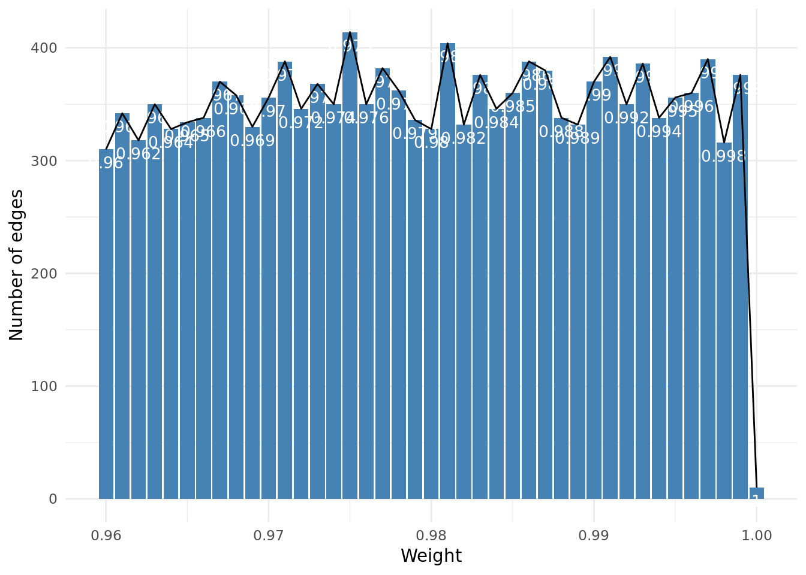

#### Degree distribution of item->similarity->item edges

#### Degree distribution of agent->knows->agent edges

#### Runing time by method 

<table class="table table-condensed" style="width: auto !important; ">
 <thead>
  <tr>
   <th style="text-align:left;">   </th>
   <th style="text-align:left;"> key </th>
   <th style="text-align:right;"> doc_count </th>
   <th style="text-align:right;"> sum_wallTime_ms.value </th>
   <th style="text-align:left;"> avg_wallTime_ms.value </th>
   <th style="text-align:left;"> includedInTotal </th>
  </tr>
 </thead>
<tbody>
  <tr>
   <td style="text-align:left;"> 1 </td>
   <td style="text-align:left;"> knowsAgent </td>
   <td style="text-align:right;"> 601 </td>
   <td style="text-align:right;"> 1,050 </td>
   <td style="text-align:left;"> 1.74708818635607 </td>
   <td style="text-align:left;"> No </td>
  </tr>
  <tr>
   <td style="text-align:left;"> 2 </td>
   <td style="text-align:left;"> addItemToWork </td>
   <td style="text-align:right;"> 410 </td>
   <td style="text-align:right;"> 4,152 </td>
   <td style="text-align:left;"> 10.1268292682927 </td>
   <td style="text-align:left;"> No </td>
  </tr>
  <tr>
   <td style="text-align:left;"> 3 </td>
   <td style="text-align:left;"> ownsWork </td>
   <td style="text-align:right;"> 205 </td>
   <td style="text-align:right;"> 2,785 </td>
   <td style="text-align:left;"> 13.5853658536585 </td>
   <td style="text-align:left;"> No </td>
  </tr>
  <tr>
   <td style="text-align:left;"> 4 </td>
   <td style="text-align:left;"> init </td>
   <td style="text-align:right;"> 103 </td>
   <td style="text-align:right;"> 11,863 </td>
   <td style="text-align:left;"> 115.174757281553 </td>
   <td style="text-align:left;"> No </td>
  </tr>
  <tr>
   <td style="text-align:left;"> 5 </td>
   <td style="text-align:left;"> searchAndConnect </td>
   <td style="text-align:right;"> 101 </td>
   <td style="text-align:right;"> 125,550 </td>
   <td style="text-align:left;"> 1243.06930693069 </td>
   <td style="text-align:left;"> Yes </td>
  </tr>
  <tr>
   <td style="text-align:left;"> 6 </td>
   <td style="text-align:left;"> getWorksItems </td>
   <td style="text-align:right;"> 8 </td>
   <td style="text-align:right;"> 14 </td>
   <td style="text-align:left;"> 1.75 </td>
   <td style="text-align:left;"> Yes </td>
  </tr>
  <tr>
   <td style="text-align:left;"> 9 </td>
   <td style="text-align:left;"> cycleSearch </td>
   <td style="text-align:right;"> 4 </td>
   <td style="text-align:right;"> 207 </td>
   <td style="text-align:left;"> 51.75 </td>
   <td style="text-align:left;"> Yes </td>
  </tr>
  <tr>
   <td style="text-align:left;"> 10 </td>
   <td style="text-align:left;"> getWorks </td>
   <td style="text-align:right;"> 4 </td>
   <td style="text-align:right;"> 1,005 </td>
   <td style="text-align:left;"> 251.25 </td>
   <td style="text-align:left;"> No </td>
  </tr>
  <tr>
   <td style="text-align:left;font-weight: bold;"> 11 </td>
   <td style="text-align:left;font-weight: bold;"> Total </td>
   <td style="text-align:right;font-weight: bold;"> 122 </td>
   <td style="text-align:right;font-weight: bold;"> 126,436 </td>
   <td style="text-align:left;font-weight: bold;">  </td>
   <td style="text-align:left;font-weight: bold;">  </td>
  </tr>
</tbody>
</table>
####  Found structures 

#####  Cycles 

Number of cycles found:  4 

<button class="btn btn-primary" data-toggle="collapse" data-target="#CDCGGSKGXD"> Show/Hide foundCycle query </button> 
 
  
     GET /filebeat-*/_search 
              { 
                "query": {
                  "bool": {
                    "must": [
                      { "match_phrase": {
                        "simulationId": "SIM10-13-10-45-BtyUBG--DV"
                        }
                      },
                      { "bool": {
                        "should": [
                          { "match": {
                            "keyword": "foundCycle"
                          }}
                        ]
                      }}
                    ]
                  }
                }
              }
     

#####  Paths 

Number of paths found:  0 

<button class="btn btn-primary" data-toggle="collapse" data-target="#NEGPYIDTCW"> Show/Hide foundPath query </button> 
 
  
     GET /filebeat-*/_search 
              { 
                "query": {
                  "bool": {
                    "must": [
                      { "match_phrase": {
                        "simulationId": "SIM10-13-10-45-BtyUBG--DV"
                        }
                      },
                      { "bool": {
                        "should": [
                          { "match": {
                            "keyword": "foundPath"
                          }}
                        ]
                      }}
                    ]
                  }
                }
              }
     

###  SIM10-13-09-31-52Xaxm--CV 

#### simulationParameters 

<table class="table table-condensed" style="width: auto !important; ">
 <thead>
  <tr>
   <th style="text-align:left;"> agentNumber </th>
   <th style="text-align:left;"> similarityConnectThreshold </th>
   <th style="text-align:left;"> graphType </th>
   <th style="text-align:left;"> chainLength </th>
   <th style="text-align:left;"> similaritySearchThreshold </th>
   <th style="text-align:left;"> maxDistance </th>
   <th style="text-align:left;"> randomWorksNumberMultiplier </th>
  </tr>
 </thead>
<tbody>
  <tr>
   <td style="text-align:left;width: 20em; "> 100 </td>
   <td style="text-align:left;width: 15em; "> 0.96 </td>
   <td style="text-align:left;width: 15em; "> random </td>
   <td style="text-align:left;width: 15em; "> 5 </td>
   <td style="text-align:left;width: 15em; "> 1 </td>
   <td style="text-align:left;width: 15em; "> 30 </td>
   <td style="text-align:left;width: 15em; "> 1 </td>
  </tr>
</tbody>
</table>
#### allEdgesByLabel

<table class="table table-condensed" style="width: auto !important; ">
 <thead>
  <tr>
   <th style="text-align:right;"> edges_offers </th>
   <th style="text-align:right;"> edges_similarity </th>
   <th style="text-align:right;"> edges_owns </th>
   <th style="text-align:right;"> edges_demands </th>
   <th style="text-align:right;"> edges_knows </th>
   <th style="text-align:right;"> edges_total </th>
  </tr>
 </thead>
<tbody>
  <tr>
   <td style="text-align:right;width: 5em; "> 105 </td>
   <td style="text-align:right;width: 5em; "> 3,808 </td>
   <td style="text-align:right;width: 5em; "> 105 </td>
   <td style="text-align:right;width: 5em; "> 105 </td>
   <td style="text-align:right;width: 5em; "> 100 </td>
   <td style="text-align:right;width: 5em; "> 4,223 </td>
  </tr>
</tbody>
</table>
#### allVerticesByType

<table class="table table-condensed" style="width: auto !important; ">
 <thead>
  <tr>
   <th style="text-align:right;"> vertices_agent </th>
   <th style="text-align:right;"> vertices_item </th>
   <th style="text-align:right;"> vertices_work </th>
   <th style="text-align:right;"> vertices_total </th>
  </tr>
 </thead>
<tbody>
  <tr>
   <td style="text-align:right;width: 5em; "> 101 </td>
   <td style="text-align:right;width: 5em; "> 210 </td>
   <td style="text-align:right;width: 5em; "> 105 </td>
   <td style="text-align:right;width: 5em; "> 416 </td>
  </tr>
</tbody>
</table>
#### distribution of similarityEdgesByWeight

#### Degree distribution of item->similarity->item edges

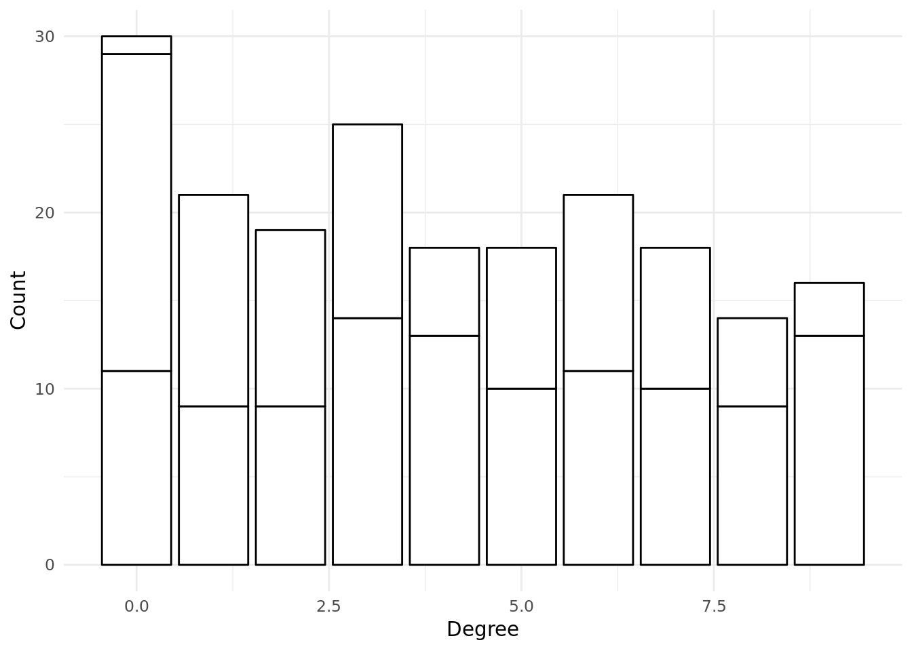

#### Degree distribution of agent->knows->agent edges

#### Runing time by method 

<table class="table table-condensed" style="width: auto !important; ">
 <thead>
  <tr>
   <th style="text-align:left;"> key </th>
   <th style="text-align:right;"> doc_count </th>
   <th style="text-align:right;"> sum_wallTime_ms.value </th>
   <th style="text-align:left;"> avg_wallTime_ms.value </th>
   <th style="text-align:left;"> includedInTotal </th>
  </tr>
 </thead>
<tbody>
  <tr>
   <td style="text-align:left;"> connectIfSimilar </td>
   <td style="text-align:right;"> 21,945 </td>
   <td style="text-align:right;"> 45,514 </td>
   <td style="text-align:left;"> 2.07400318979266 </td>
   <td style="text-align:left;"> No </td>
  </tr>
  <tr>
   <td style="text-align:left;"> existsSimilarity </td>
   <td style="text-align:right;"> 21,945 </td>
   <td style="text-align:right;"> 45,115 </td>
   <td style="text-align:left;"> 2.05582137161085 </td>
   <td style="text-align:left;"> No </td>
  </tr>
  <tr>
   <td style="text-align:left;"> similarityEdges </td>
   <td style="text-align:right;"> 21,945 </td>
   <td style="text-align:right;"> 44,428 </td>
   <td style="text-align:left;"> 2.02451583504215 </td>
   <td style="text-align:left;"> No </td>
  </tr>
  <tr>
   <td style="text-align:left;"> connectAllSimilar </td>
   <td style="text-align:right;"> 210 </td>
   <td style="text-align:right;"> 45,725 </td>
   <td style="text-align:left;"> 217.738095238095 </td>
   <td style="text-align:left;"> Yes </td>
  </tr>
  <tr>
   <td style="text-align:left;"> init </td>
   <td style="text-align:right;"> 103 </td>
   <td style="text-align:right;"> 11,002 </td>
   <td style="text-align:left;"> 106.815533980583 </td>
   <td style="text-align:left;"> No </td>
  </tr>
  <tr>
   <td style="text-align:left;"> connect </td>
   <td style="text-align:right;"> 23 </td>
   <td style="text-align:right;"> 36 </td>
   <td style="text-align:left;"> 1.56521739130435 </td>
   <td style="text-align:left;"> Yes </td>
  </tr>
  <tr>
   <td style="text-align:left;font-weight: bold;"> Total </td>
   <td style="text-align:right;font-weight: bold;"> 241 </td>
   <td style="text-align:right;font-weight: bold;"> 46,089 </td>
   <td style="text-align:left;font-weight: bold;">  </td>
   <td style="text-align:left;font-weight: bold;">  </td>
  </tr>
</tbody>
</table>
####  Found structures 

#####  Cycles 

Number of cycles found:  1 

<button class="btn btn-primary" data-toggle="collapse" data-target="#TYZQMYNNGP"> Show/Hide foundCycle query </button> 
 
  
     GET /filebeat-*/_search 
              { 
                "query": {
                  "bool": {
                    "must": [
                      { "match_phrase": {
                        "simulationId": "SIM10-13-09-31-52Xaxm--CV"
                        }
                      },
                      { "bool": {
                        "should": [
                          { "match": {
                            "keyword": "foundCycle"
                          }}
                        ]
                      }}
                    ]
                  }
                }
              }
     

#####  Paths 

Number of paths found:  0 

<button class="btn btn-primary" data-toggle="collapse" data-target="#MNIETJJYLI"> Show/Hide foundPath query </button> 
 
  
     GET /filebeat-*/_search 
              { 
                "query": {
                  "bool": {
                    "must": [
                      { "match_phrase": {
                        "simulationId": "SIM10-13-09-31-52Xaxm--CV"
                        }
                      },
                      { "bool": {
                        "should": [
                          { "match": {
                            "keyword": "foundPath"
                          }}
                        ]
                      }}
                    ]
                  }
                }
              }
     

###  SIM10-13-09-31-52Xaxm--DV 

#### simulationParameters 

<table class="table table-condensed" style="width: auto !important; ">
 <thead>
  <tr>
   <th style="text-align:left;"> agentNumber </th>
   <th style="text-align:left;"> similarityConnectThreshold </th>
   <th style="text-align:left;"> graphType </th>
   <th style="text-align:left;"> chainLength </th>
   <th style="text-align:left;"> similaritySearchThreshold </th>
   <th style="text-align:left;"> maxDistance </th>
   <th style="text-align:left;"> randomWorksNumberMultiplier </th>
  </tr>
 </thead>
<tbody>
  <tr>
   <td style="text-align:left;width: 20em; "> 100 </td>
   <td style="text-align:left;width: 15em; "> 0.96 </td>
   <td style="text-align:left;width: 15em; "> random </td>
   <td style="text-align:left;width: 15em; "> 5 </td>
   <td style="text-align:left;width: 15em; "> 1 </td>
   <td style="text-align:left;width: 15em; "> 30 </td>
   <td style="text-align:left;width: 15em; "> 1 </td>
  </tr>
</tbody>
</table>
#### allEdgesByLabel

<table class="table table-condensed" style="width: auto !important; ">
 <thead>
  <tr>
   <th style="text-align:right;"> edges_offers </th>
   <th style="text-align:right;"> edges_similarity </th>
   <th style="text-align:right;"> edges_owns </th>
   <th style="text-align:right;"> edges_demands </th>
   <th style="text-align:right;"> edges_knows </th>
   <th style="text-align:right;"> edges_total </th>
  </tr>
 </thead>
<tbody>
  <tr>
   <td style="text-align:right;width: 5em; "> 105 </td>
   <td style="text-align:right;width: 5em; "> 3,762 </td>
   <td style="text-align:right;width: 5em; "> 105 </td>
   <td style="text-align:right;width: 5em; "> 105 </td>
   <td style="text-align:right;width: 5em; "> 100 </td>
   <td style="text-align:right;width: 5em; "> 4,177 </td>
  </tr>
</tbody>
</table>
#### allVerticesByType

<table class="table table-condensed" style="width: auto !important; ">
 <thead>
  <tr>
   <th style="text-align:right;"> vertices_agent </th>
   <th style="text-align:right;"> vertices_item </th>
   <th style="text-align:right;"> vertices_work </th>
   <th style="text-align:right;"> vertices_total </th>
  </tr>
 </thead>
<tbody>
  <tr>
   <td style="text-align:right;width: 5em; "> 101 </td>
   <td style="text-align:right;width: 5em; "> 210 </td>
   <td style="text-align:right;width: 5em; "> 105 </td>
   <td style="text-align:right;width: 5em; "> 416 </td>
  </tr>
</tbody>
</table>
#### distribution of similarityEdgesByWeight

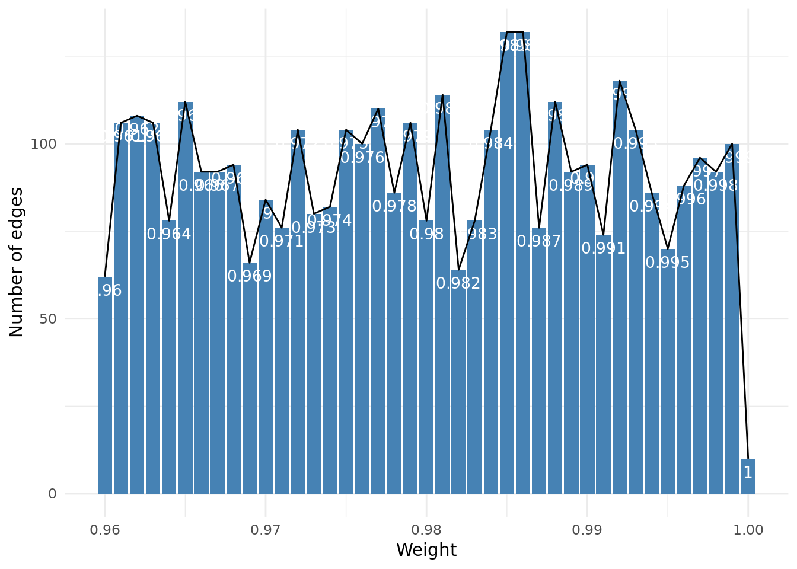

#### Degree distribution of item->similarity->item edges

#### Degree distribution of agent->knows->agent edges

#### Runing time by method 

<table class="table table-condensed" style="width: auto !important; ">
 <thead>
  <tr>
   <th style="text-align:left;">   </th>
   <th style="text-align:left;"> key </th>
   <th style="text-align:right;"> doc_count </th>
   <th style="text-align:right;"> sum_wallTime_ms.value </th>
   <th style="text-align:left;"> avg_wallTime_ms.value </th>
   <th style="text-align:left;"> includedInTotal </th>
  </tr>
 </thead>
<tbody>
  <tr>
   <td style="text-align:left;"> 1 </td>
   <td style="text-align:left;"> addItemToWork </td>
   <td style="text-align:right;"> 210 </td>
   <td style="text-align:right;"> 2,737 </td>
   <td style="text-align:left;"> 13.0333333333333 </td>
   <td style="text-align:left;"> No </td>
  </tr>
  <tr>
   <td style="text-align:left;"> 2 </td>
   <td style="text-align:left;"> ownsWork </td>
   <td style="text-align:right;"> 105 </td>
   <td style="text-align:right;"> 1,677 </td>
   <td style="text-align:left;"> 15.9714285714286 </td>
   <td style="text-align:left;"> No </td>
  </tr>
  <tr>
   <td style="text-align:left;"> 3 </td>
   <td style="text-align:left;"> init </td>
   <td style="text-align:right;"> 103 </td>
   <td style="text-align:right;"> 11,653 </td>
   <td style="text-align:left;"> 113.135922330097 </td>
   <td style="text-align:left;"> No </td>
  </tr>
  <tr>
   <td style="text-align:left;"> 4 </td>
   <td style="text-align:left;"> searchAndConnect </td>
   <td style="text-align:right;"> 101 </td>
   <td style="text-align:right;"> 39,010 </td>
   <td style="text-align:left;"> 386.237623762376 </td>
   <td style="text-align:left;"> Yes </td>
  </tr>
  <tr>
   <td style="text-align:left;"> 5 </td>
   <td style="text-align:left;"> knowsAgent </td>
   <td style="text-align:right;"> 100 </td>
   <td style="text-align:right;"> 601 </td>
   <td style="text-align:left;"> 6.01 </td>
   <td style="text-align:left;"> No </td>
  </tr>
  <tr>
   <td style="text-align:left;"> 6 </td>
   <td style="text-align:left;"> getWorksItems </td>
   <td style="text-align:right;"> 8 </td>
   <td style="text-align:right;"> 41 </td>
   <td style="text-align:left;"> 5.125 </td>
   <td style="text-align:left;"> Yes </td>
  </tr>
  <tr>
   <td style="text-align:left;"> 9 </td>
   <td style="text-align:left;"> cycleSearch </td>
   <td style="text-align:right;"> 2 </td>
   <td style="text-align:right;"> 420 </td>
   <td style="text-align:left;"> 210 </td>
   <td style="text-align:left;"> Yes </td>
  </tr>
  <tr>
   <td style="text-align:left;"> 10 </td>
   <td style="text-align:left;"> getWorks </td>
   <td style="text-align:right;"> 2 </td>
   <td style="text-align:right;"> 239 </td>
   <td style="text-align:left;"> 119.5 </td>
   <td style="text-align:left;"> No </td>
  </tr>
  <tr>
   <td style="text-align:left;font-weight: bold;"> 11 </td>
   <td style="text-align:left;font-weight: bold;"> Total </td>
   <td style="text-align:right;font-weight: bold;"> 118 </td>
   <td style="text-align:right;font-weight: bold;"> 39,892 </td>
   <td style="text-align:left;font-weight: bold;">  </td>
   <td style="text-align:left;font-weight: bold;">  </td>
  </tr>
</tbody>
</table>
####  Found structures 

#####  Cycles 

Number of cycles found:  2 

<button class="btn btn-primary" data-toggle="collapse" data-target="#NSLBXEOQDE"> Show/Hide foundCycle query </button> 
 
  
     GET /filebeat-*/_search 
              { 
                "query": {
                  "bool": {
                    "must": [
                      { "match_phrase": {
                        "simulationId": "SIM10-13-09-31-52Xaxm--DV"
                        }
                      },
                      { "bool": {
                        "should": [
                          { "match": {
                            "keyword": "foundCycle"
                          }}
                        ]
                      }}
                    ]
                  }
                }
              }
     

#####  Paths 

Number of paths found:  0 

<button class="btn btn-primary" data-toggle="collapse" data-target="#FMFKWAFBRP"> Show/Hide foundPath query </button> 
 
  
     GET /filebeat-*/_search 
              { 
                "query": {
                  "bool": {
                    "must": [
                      { "match_phrase": {
                        "simulationId": "SIM10-13-09-31-52Xaxm--DV"
                        }
                      },
                      { "bool": {
                        "should": [
                          { "match": {
                            "keyword": "foundPath"
                          }}
                        ]
                      }}
                    ]
                  }
                }
              }
     

###  SIM10-13-09-32-dSBGBL--CV 

#### simulationParameters 

<table class="table table-condensed" style="width: auto !important; ">
 <thead>
  <tr>
   <th style="text-align:left;"> agentNumber </th>
   <th style="text-align:left;"> similarityConnectThreshold </th>
   <th style="text-align:left;"> graphType </th>
   <th style="text-align:left;"> chainLength </th>
   <th style="text-align:left;"> similaritySearchThreshold </th>
   <th style="text-align:left;"> maxDistance </th>
   <th style="text-align:left;"> randomWorksNumberMultiplier </th>
  </tr>
 </thead>
<tbody>
  <tr>
   <td style="text-align:left;width: 20em; "> 100 </td>
   <td style="text-align:left;width: 15em; "> 0.96 </td>
   <td style="text-align:left;width: 15em; "> smallWorld </td>
   <td style="text-align:left;width: 15em; "> 5 </td>
   <td style="text-align:left;width: 15em; "> 1 </td>
   <td style="text-align:left;width: 15em; "> 30 </td>
   <td style="text-align:left;width: 15em; "> 1 </td>
  </tr>
</tbody>
</table>
#### allEdgesByLabel

<table class="table table-condensed" style="width: auto !important; ">
 <thead>
  <tr>
   <th style="text-align:right;"> edges_offers </th>
   <th style="text-align:right;"> edges_similarity </th>
   <th style="text-align:right;"> edges_owns </th>
   <th style="text-align:right;"> edges_demands </th>
   <th style="text-align:right;"> edges_knows </th>
   <th style="text-align:right;"> edges_total </th>
  </tr>
 </thead>
<tbody>
  <tr>
   <td style="text-align:right;width: 5em; "> 105 </td>
   <td style="text-align:right;width: 5em; "> 3,870 </td>
   <td style="text-align:right;width: 5em; "> 105 </td>
   <td style="text-align:right;width: 5em; "> 105 </td>
   <td style="text-align:right;width: 5em; "> 601 </td>
   <td style="text-align:right;width: 5em; "> 4,786 </td>
  </tr>
</tbody>
</table>
#### allVerticesByType

<table class="table table-condensed" style="width: auto !important; ">
 <thead>
  <tr>
   <th style="text-align:right;"> vertices_agent </th>
   <th style="text-align:right;"> vertices_item </th>
   <th style="text-align:right;"> vertices_work </th>
   <th style="text-align:right;"> vertices_total </th>
  </tr>
 </thead>
<tbody>
  <tr>
   <td style="text-align:right;width: 5em; "> 101 </td>
   <td style="text-align:right;width: 5em; "> 210 </td>
   <td style="text-align:right;width: 5em; "> 105 </td>
   <td style="text-align:right;width: 5em; "> 416 </td>
  </tr>
</tbody>
</table>
#### distribution of similarityEdgesByWeight

#### Degree distribution of item->similarity->item edges

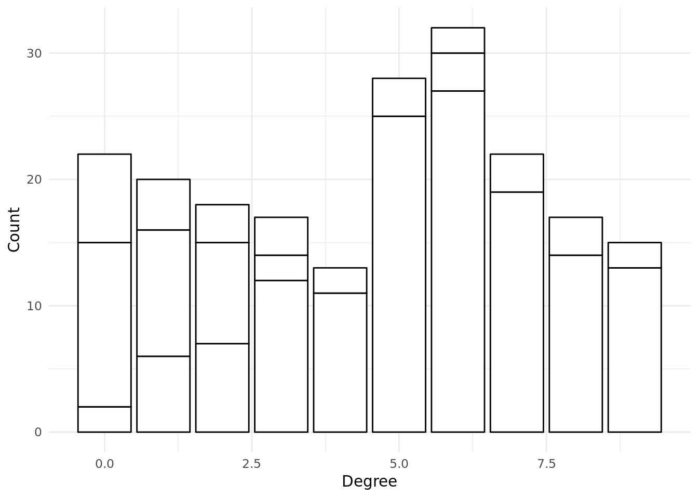

#### Degree distribution of agent->knows->agent edges

#### Runing time by method 

<table class="table table-condensed" style="width: auto !important; ">
 <thead>
  <tr>
   <th style="text-align:left;"> key </th>
   <th style="text-align:right;"> doc_count </th>
   <th style="text-align:right;"> sum_wallTime_ms.value </th>
   <th style="text-align:left;"> avg_wallTime_ms.value </th>
   <th style="text-align:left;"> includedInTotal </th>
  </tr>
 </thead>
<tbody>
  <tr>
   <td style="text-align:left;"> connectIfSimilar </td>
   <td style="text-align:right;"> 21,945 </td>
   <td style="text-align:right;"> 46,095 </td>
   <td style="text-align:left;"> 2.10047846889952 </td>
   <td style="text-align:left;"> No </td>
  </tr>
  <tr>
   <td style="text-align:left;"> existsSimilarity </td>
   <td style="text-align:right;"> 21,945 </td>
   <td style="text-align:right;"> 45,681 </td>
   <td style="text-align:left;"> 2.08161312371839 </td>
   <td style="text-align:left;"> No </td>
  </tr>
  <tr>
   <td style="text-align:left;"> similarityEdges </td>
   <td style="text-align:right;"> 21,945 </td>
   <td style="text-align:right;"> 44,971 </td>
   <td style="text-align:left;"> 2.04925951241741 </td>
   <td style="text-align:left;"> No </td>
  </tr>
  <tr>
   <td style="text-align:left;"> connectAllSimilar </td>
   <td style="text-align:right;"> 210 </td>
   <td style="text-align:right;"> 46,289 </td>
   <td style="text-align:left;"> 220.42380952381 </td>
   <td style="text-align:left;"> Yes </td>
  </tr>
  <tr>
   <td style="text-align:left;"> init </td>
   <td style="text-align:right;"> 103 </td>
   <td style="text-align:right;"> 11,177 </td>
   <td style="text-align:left;"> 108.514563106796 </td>
   <td style="text-align:left;"> No </td>
  </tr>
  <tr>
   <td style="text-align:left;"> connect </td>
   <td style="text-align:right;"> 19 </td>
   <td style="text-align:right;"> 45 </td>
   <td style="text-align:left;"> 2.36842105263158 </td>
   <td style="text-align:left;"> Yes </td>
  </tr>
  <tr>
   <td style="text-align:left;font-weight: bold;"> Total </td>
   <td style="text-align:right;font-weight: bold;"> 237 </td>
   <td style="text-align:right;font-weight: bold;"> 46,747 </td>
   <td style="text-align:left;font-weight: bold;">  </td>
   <td style="text-align:left;font-weight: bold;">  </td>
  </tr>
</tbody>
</table>
####  Found structures 

#####  Cycles 

Number of cycles found:  1 

<button class="btn btn-primary" data-toggle="collapse" data-target="#HKZIMNXTRX"> Show/Hide foundCycle query </button> 
 
  
     GET /filebeat-*/_search 
              { 
                "query": {
                  "bool": {
                    "must": [
                      { "match_phrase": {
                        "simulationId": "SIM10-13-09-32-dSBGBL--CV"
                        }
                      },
                      { "bool": {
                        "should": [
                          { "match": {
                            "keyword": "foundCycle"
                          }}
                        ]
                      }}
                    ]
                  }
                }
              }
     

#####  Paths 

Number of paths found:  0 

<button class="btn btn-primary" data-toggle="collapse" data-target="#GICVJWQFNK"> Show/Hide foundPath query </button> 
 
  
     GET /filebeat-*/_search 
              { 
                "query": {
                  "bool": {
                    "must": [
                      { "match_phrase": {
                        "simulationId": "SIM10-13-09-32-dSBGBL--CV"
                        }
                      },
                      { "bool": {
                        "should": [
                          { "match": {
                            "keyword": "foundPath"
                          }}
                        ]
                      }}
                    ]
                  }
                }
              }
     

###  SIM10-13-09-32-dSBGBL--DV 

#### simulationParameters 

<table class="table table-condensed" style="width: auto !important; ">
 <thead>
  <tr>
   <th style="text-align:left;"> agentNumber </th>
   <th style="text-align:left;"> similarityConnectThreshold </th>
   <th style="text-align:left;"> graphType </th>
   <th style="text-align:left;"> chainLength </th>
   <th style="text-align:left;"> similaritySearchThreshold </th>
   <th style="text-align:left;"> maxDistance </th>
   <th style="text-align:left;"> randomWorksNumberMultiplier </th>
  </tr>
 </thead>
<tbody>
  <tr>
   <td style="text-align:left;width: 20em; "> 100 </td>
   <td style="text-align:left;width: 15em; "> 0.96 </td>
   <td style="text-align:left;width: 15em; "> smallWorld </td>
   <td style="text-align:left;width: 15em; "> 5 </td>
   <td style="text-align:left;width: 15em; "> 1 </td>
   <td style="text-align:left;width: 15em; "> 30 </td>
   <td style="text-align:left;width: 15em; "> 1 </td>
  </tr>
</tbody>
</table>
#### allEdgesByLabel

<table class="table table-condensed" style="width: auto !important; ">
 <thead>
  <tr>
   <th style="text-align:right;"> edges_offers </th>
   <th style="text-align:right;"> edges_similarity </th>
   <th style="text-align:right;"> edges_owns </th>
   <th style="text-align:right;"> edges_demands </th>
   <th style="text-align:right;"> edges_knows </th>
   <th style="text-align:right;"> edges_total </th>
  </tr>
 </thead>
<tbody>
  <tr>
   <td style="text-align:right;width: 5em; "> 105 </td>
   <td style="text-align:right;width: 5em; "> 3,832 </td>
   <td style="text-align:right;width: 5em; "> 105 </td>
   <td style="text-align:right;width: 5em; "> 105 </td>
   <td style="text-align:right;width: 5em; "> 601 </td>
   <td style="text-align:right;width: 5em; "> 4,748 </td>
  </tr>
</tbody>
</table>
#### allVerticesByType

<table class="table table-condensed" style="width: auto !important; ">
 <thead>
  <tr>
   <th style="text-align:right;"> vertices_agent </th>
   <th style="text-align:right;"> vertices_item </th>
   <th style="text-align:right;"> vertices_work </th>
   <th style="text-align:right;"> vertices_total </th>
  </tr>
 </thead>
<tbody>
  <tr>
   <td style="text-align:right;width: 5em; "> 101 </td>
   <td style="text-align:right;width: 5em; "> 210 </td>
   <td style="text-align:right;width: 5em; "> 105 </td>
   <td style="text-align:right;width: 5em; "> 416 </td>
  </tr>
</tbody>
</table>
#### distribution of similarityEdgesByWeight

#### Degree distribution of item->similarity->item edges

#### Degree distribution of agent->knows->agent edges

#### Runing time by method 

<table class="table table-condensed" style="width: auto !important; ">
 <thead>
  <tr>
   <th style="text-align:left;">   </th>
   <th style="text-align:left;"> key </th>
   <th style="text-align:right;"> doc_count </th>
   <th style="text-align:right;"> sum_wallTime_ms.value </th>
   <th style="text-align:left;"> avg_wallTime_ms.value </th>
   <th style="text-align:left;"> includedInTotal </th>
  </tr>
 </thead>
<tbody>
  <tr>
   <td style="text-align:left;"> 1 </td>
   <td style="text-align:left;"> knowsAgent </td>
   <td style="text-align:right;"> 601 </td>
   <td style="text-align:right;"> 1,243 </td>
   <td style="text-align:left;"> 2.06821963394343 </td>
   <td style="text-align:left;"> No </td>
  </tr>
  <tr>
   <td style="text-align:left;"> 2 </td>
   <td style="text-align:left;"> addItemToWork </td>
   <td style="text-align:right;"> 210 </td>
   <td style="text-align:right;"> 2,162 </td>
   <td style="text-align:left;"> 10.2952380952381 </td>
   <td style="text-align:left;"> No </td>
  </tr>
  <tr>
   <td style="text-align:left;"> 3 </td>
   <td style="text-align:left;"> ownsWork </td>
   <td style="text-align:right;"> 105 </td>
   <td style="text-align:right;"> 2,115 </td>
   <td style="text-align:left;"> 20.1428571428571 </td>
   <td style="text-align:left;"> No </td>
  </tr>
  <tr>
   <td style="text-align:left;"> 4 </td>
   <td style="text-align:left;"> init </td>
   <td style="text-align:right;"> 103 </td>
   <td style="text-align:right;"> 11,672 </td>
   <td style="text-align:left;"> 113.320388349515 </td>
   <td style="text-align:left;"> No </td>
  </tr>
  <tr>
   <td style="text-align:left;"> 5 </td>
   <td style="text-align:left;"> searchAndConnect </td>
   <td style="text-align:right;"> 101 </td>
   <td style="text-align:right;"> 48,258 </td>
   <td style="text-align:left;"> 477.80198019802 </td>
   <td style="text-align:left;"> Yes </td>
  </tr>
  <tr>
   <td style="text-align:left;"> 6 </td>
   <td style="text-align:left;"> getWorksItems </td>
   <td style="text-align:right;"> 8 </td>
   <td style="text-align:right;"> 14 </td>
   <td style="text-align:left;"> 1.75 </td>
   <td style="text-align:left;"> Yes </td>
  </tr>
  <tr>
   <td style="text-align:left;"> 9 </td>
   <td style="text-align:left;"> cycleSearch </td>
   <td style="text-align:right;"> 2 </td>
   <td style="text-align:right;"> 87 </td>
   <td style="text-align:left;"> 43.5 </td>
   <td style="text-align:left;"> Yes </td>
  </tr>
  <tr>
   <td style="text-align:left;"> 10 </td>
   <td style="text-align:left;"> getWorks </td>
   <td style="text-align:right;"> 2 </td>
   <td style="text-align:right;"> 229 </td>
   <td style="text-align:left;"> 114.5 </td>
   <td style="text-align:left;"> No </td>
  </tr>
  <tr>
   <td style="text-align:left;font-weight: bold;"> 11 </td>
   <td style="text-align:left;font-weight: bold;"> Total </td>
   <td style="text-align:right;font-weight: bold;"> 118 </td>
   <td style="text-align:right;font-weight: bold;"> 48,736 </td>
   <td style="text-align:left;font-weight: bold;">  </td>
   <td style="text-align:left;font-weight: bold;">  </td>
  </tr>
</tbody>
</table>
####  Found structures 

#####  Cycles 

Number of cycles found:  2 

<button class="btn btn-primary" data-toggle="collapse" data-target="#KLEZVIWSCJ"> Show/Hide foundCycle query </button> 
 
  
     GET /filebeat-*/_search 
              { 
                "query": {
                  "bool": {
                    "must": [
                      { "match_phrase": {
                        "simulationId": "SIM10-13-09-32-dSBGBL--DV"
                        }
                      },
                      { "bool": {
                        "should": [
                          { "match": {
                            "keyword": "foundCycle"
                          }}
                        ]
                      }}
                    ]
                  }
                }
              }
     

#####  Paths 

Number of paths found:  0 

<button class="btn btn-primary" data-toggle="collapse" data-target="#YYIRRTZFFW"> Show/Hide foundPath query </button> 
 
  
     GET /filebeat-*/_search 
              { 
                "query": {
                  "bool": {
                    "must": [
                      { "match_phrase": {
                        "simulationId": "SIM10-13-09-32-dSBGBL--DV"
                        }
                      },
                      { "bool": {
                        "should": [
                          { "match": {
                            "keyword": "foundPath"
                          }}
                        ]
                      }}
                    ]
                  }
                }
              }
     

###  SIM10-13-10-49-N59jsR--CV 

#### simulationParameters 

<table class="table table-condensed" style="width: auto !important; ">
 <thead>
  <tr>
   <th style="text-align:left;"> agentNumber </th>
   <th style="text-align:left;"> similarityConnectThreshold </th>
   <th style="text-align:left;"> graphType </th>
   <th style="text-align:left;"> chainLength </th>
   <th style="text-align:left;"> similaritySearchThreshold </th>
   <th style="text-align:left;"> maxDistance </th>
   <th style="text-align:left;"> randomWorksNumberMultiplier </th>
  </tr>
 </thead>
<tbody>
  <tr>
   <td style="text-align:left;width: 20em; "> 100 </td>
   <td style="text-align:left;width: 15em; "> 0.96 </td>
   <td style="text-align:left;width: 15em; "> random </td>
   <td style="text-align:left;width: 15em; "> 5 </td>
   <td style="text-align:left;width: 15em; "> 1 </td>
   <td style="text-align:left;width: 15em; "> 30 </td>
   <td style="text-align:left;width: 15em; "> 2 </td>
  </tr>
</tbody>
</table>
#### allEdgesByLabel

<table class="table table-condensed" style="width: auto !important; ">
 <thead>
  <tr>
   <th style="text-align:right;"> edges_offers </th>
   <th style="text-align:right;"> edges_similarity </th>
   <th style="text-align:right;"> edges_owns </th>
   <th style="text-align:right;"> edges_demands </th>
   <th style="text-align:right;"> edges_knows </th>
   <th style="text-align:right;"> edges_total </th>
  </tr>
 </thead>
<tbody>
  <tr>
   <td style="text-align:right;width: 5em; "> 205 </td>
   <td style="text-align:right;width: 5em; "> 14,200 </td>
   <td style="text-align:right;width: 5em; "> 205 </td>
   <td style="text-align:right;width: 5em; "> 205 </td>
   <td style="text-align:right;width: 5em; "> 100 </td>
   <td style="text-align:right;width: 5em; "> 14,915 </td>
  </tr>
</tbody>
</table>
#### allVerticesByType

<table class="table table-condensed" style="width: auto !important; ">
 <thead>
  <tr>
   <th style="text-align:right;"> vertices_agent </th>
   <th style="text-align:right;"> vertices_item </th>
   <th style="text-align:right;"> vertices_work </th>
   <th style="text-align:right;"> vertices_total </th>
  </tr>
 </thead>
<tbody>
  <tr>
   <td style="text-align:right;width: 5em; "> 101 </td>
   <td style="text-align:right;width: 5em; "> 410 </td>
   <td style="text-align:right;width: 5em; "> 205 </td>
   <td style="text-align:right;width: 5em; "> 716 </td>
  </tr>
</tbody>
</table>
#### distribution of similarityEdgesByWeight

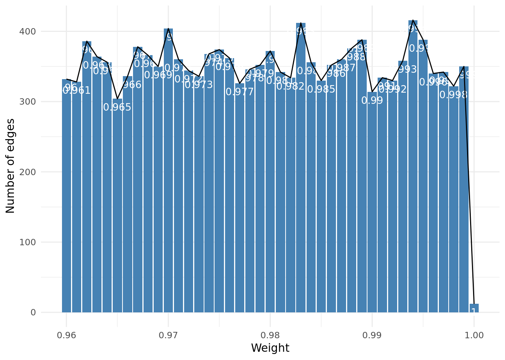

#### Degree distribution of item->similarity->item edges

#### Degree distribution of agent->knows->agent edges

#### Runing time by method 

<table class="table table-condensed" style="width: auto !important; ">
 <thead>
  <tr>
   <th style="text-align:left;"> key </th>
   <th style="text-align:right;"> doc_count </th>
   <th style="text-align:right;"> sum_wallTime_ms.value </th>
   <th style="text-align:left;"> avg_wallTime_ms.value </th>
   <th style="text-align:left;"> includedInTotal </th>
  </tr>
 </thead>
<tbody>
  <tr>
   <td style="text-align:left;"> connectIfSimilar </td>
   <td style="text-align:right;"> 83,845 </td>
   <td style="text-align:right;"> 211,223 </td>
   <td style="text-align:left;"> 2.51920806249627 </td>
   <td style="text-align:left;"> No </td>
  </tr>
  <tr>
   <td style="text-align:left;"> existsSimilarity </td>
   <td style="text-align:right;"> 83,845 </td>
   <td style="text-align:right;"> 209,445 </td>
   <td style="text-align:left;"> 2.49800226608623 </td>
   <td style="text-align:left;"> No </td>
  </tr>
  <tr>
   <td style="text-align:left;"> similarityEdges </td>
   <td style="text-align:right;"> 83,845 </td>
   <td style="text-align:right;"> 206,396 </td>
   <td style="text-align:left;"> 2.46163754547081 </td>
   <td style="text-align:left;"> No </td>
  </tr>
  <tr>
   <td style="text-align:left;"> connectAllSimilar </td>
   <td style="text-align:right;"> 410 </td>
   <td style="text-align:right;"> 212,021 </td>
   <td style="text-align:left;"> 517.124390243902 </td>
   <td style="text-align:left;"> Yes </td>
  </tr>
  <tr>
   <td style="text-align:left;"> init </td>
   <td style="text-align:right;"> 103 </td>
   <td style="text-align:right;"> 11,851 </td>
   <td style="text-align:left;"> 115.058252427184 </td>
   <td style="text-align:left;"> No </td>
  </tr>
  <tr>
   <td style="text-align:left;"> connect </td>
   <td style="text-align:right;"> 85 </td>
   <td style="text-align:right;"> 334 </td>
   <td style="text-align:left;"> 3.92941176470588 </td>
   <td style="text-align:left;"> Yes </td>
  </tr>
  <tr>
   <td style="text-align:left;font-weight: bold;"> Total </td>
   <td style="text-align:right;font-weight: bold;"> 503 </td>
   <td style="text-align:right;font-weight: bold;"> 212,837 </td>
   <td style="text-align:left;font-weight: bold;">  </td>
   <td style="text-align:left;font-weight: bold;">  </td>
  </tr>
</tbody>
</table>
####  Found structures 

#####  Cycles 

Number of cycles found:  1 

<button class="btn btn-primary" data-toggle="collapse" data-target="#VYSNEMGENE"> Show/Hide foundCycle query </button> 
 
  
     GET /filebeat-*/_search 
              { 
                "query": {
                  "bool": {
                    "must": [
                      { "match_phrase": {
                        "simulationId": "SIM10-13-10-49-N59jsR--CV"
                        }
                      },
                      { "bool": {
                        "should": [
                          { "match": {
                            "keyword": "foundCycle"
                          }}
                        ]
                      }}
                    ]
                  }
                }
              }
     

#####  Paths 

Number of paths found:  0 

<button class="btn btn-primary" data-toggle="collapse" data-target="#NMKVISZJFI"> Show/Hide foundPath query </button> 
 
  
     GET /filebeat-*/_search 
              { 
                "query": {
                  "bool": {
                    "must": [
                      { "match_phrase": {
                        "simulationId": "SIM10-13-10-49-N59jsR--CV"
                        }
                      },
                      { "bool": {
                        "should": [
                          { "match": {
                            "keyword": "foundPath"
                          }}
                        ]
                      }}
                    ]
                  }
                }
              }
     

###  SIM10-13-10-49-N59jsR--DV 

#### simulationParameters 

<table class="table table-condensed" style="width: auto !important; ">
 <thead>
  <tr>
   <th style="text-align:left;"> agentNumber </th>
   <th style="text-align:left;"> similarityConnectThreshold </th>
   <th style="text-align:left;"> graphType </th>
   <th style="text-align:left;"> chainLength </th>
   <th style="text-align:left;"> similaritySearchThreshold </th>
   <th style="text-align:left;"> maxDistance </th>
   <th style="text-align:left;"> randomWorksNumberMultiplier </th>
  </tr>
 </thead>
<tbody>
  <tr>
   <td style="text-align:left;width: 20em; "> 100 </td>
   <td style="text-align:left;width: 15em; "> 0.96 </td>
   <td style="text-align:left;width: 15em; "> random </td>
   <td style="text-align:left;width: 15em; "> 5 </td>
   <td style="text-align:left;width: 15em; "> 1 </td>
   <td style="text-align:left;width: 15em; "> 30 </td>
   <td style="text-align:left;width: 15em; "> 2 </td>
  </tr>
</tbody>
</table>
#### allEdgesByLabel

<table class="table table-condensed" style="width: auto !important; ">
 <thead>
  <tr>
   <th style="text-align:right;"> edges_offers </th>
   <th style="text-align:right;"> edges_similarity </th>
   <th style="text-align:right;"> edges_owns </th>
   <th style="text-align:right;"> edges_demands </th>
   <th style="text-align:right;"> edges_knows </th>
   <th style="text-align:right;"> edges_total </th>
  </tr>
 </thead>
<tbody>
  <tr>
   <td style="text-align:right;width: 5em; "> 205 </td>
   <td style="text-align:right;width: 5em; "> 14,030 </td>
   <td style="text-align:right;width: 5em; "> 205 </td>
   <td style="text-align:right;width: 5em; "> 205 </td>
   <td style="text-align:right;width: 5em; "> 100 </td>
   <td style="text-align:right;width: 5em; "> 14,745 </td>
  </tr>
</tbody>
</table>
#### allVerticesByType

<table class="table table-condensed" style="width: auto !important; ">
 <thead>
  <tr>
   <th style="text-align:right;"> vertices_agent </th>
   <th style="text-align:right;"> vertices_item </th>
   <th style="text-align:right;"> vertices_work </th>
   <th style="text-align:right;"> vertices_total </th>
  </tr>
 </thead>
<tbody>
  <tr>
   <td style="text-align:right;width: 5em; "> 101 </td>
   <td style="text-align:right;width: 5em; "> 410 </td>
   <td style="text-align:right;width: 5em; "> 205 </td>
   <td style="text-align:right;width: 5em; "> 716 </td>
  </tr>
</tbody>
</table>
#### distribution of similarityEdgesByWeight

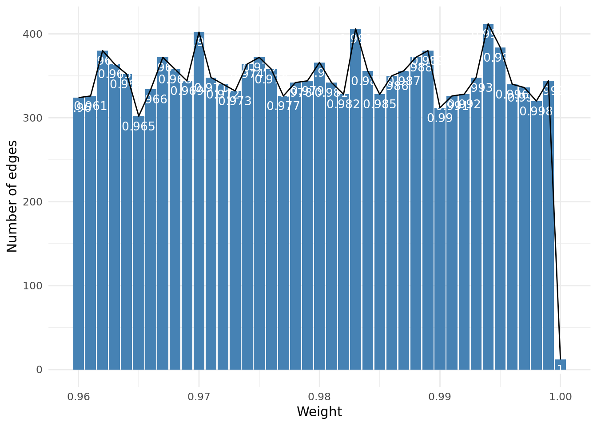

#### Degree distribution of item->similarity->item edges

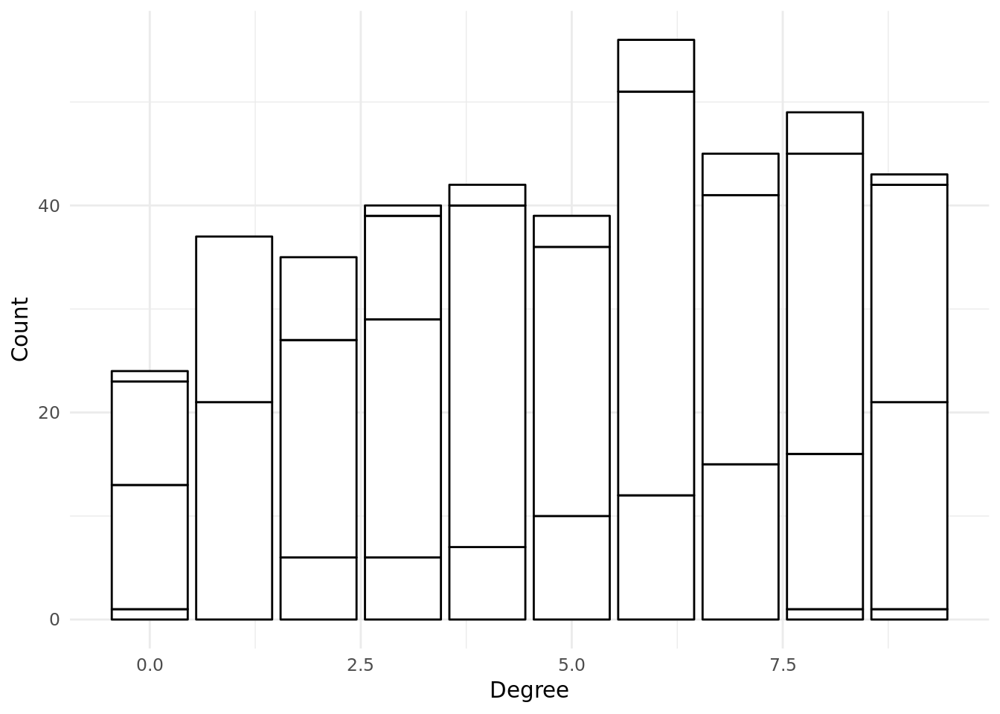

#### Degree distribution of agent->knows->agent edges

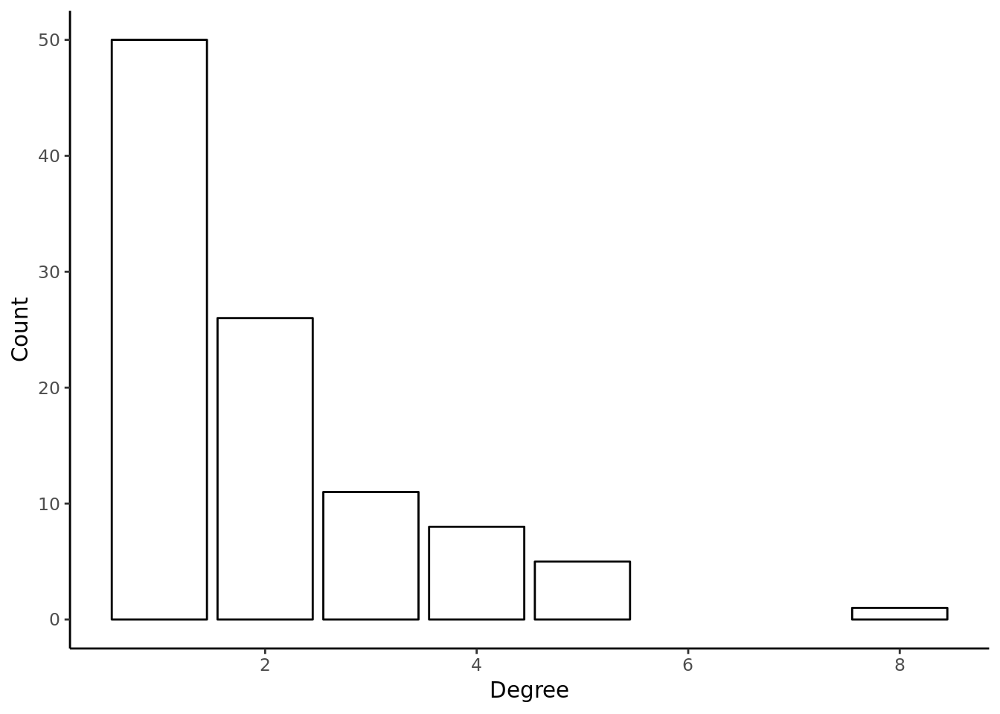

#### Runing time by method 

<table class="table table-condensed" style="width: auto !important; ">
 <thead>
  <tr>
   <th style="text-align:left;">   </th>
   <th style="text-align:left;"> key </th>
   <th style="text-align:right;"> doc_count </th>
   <th style="text-align:right;"> sum_wallTime_ms.value </th>
   <th style="text-align:left;"> avg_wallTime_ms.value </th>
   <th style="text-align:left;"> includedInTotal </th>
  </tr>
 </thead>
<tbody>
  <tr>
   <td style="text-align:left;"> 1 </td>
   <td style="text-align:left;"> addItemToWork </td>
   <td style="text-align:right;"> 410 </td>
   <td style="text-align:right;"> 6,578 </td>
   <td style="text-align:left;"> 16.0439024390244 </td>
   <td style="text-align:left;"> No </td>
  </tr>
  <tr>
   <td style="text-align:left;"> 2 </td>
   <td style="text-align:left;"> ownsWork </td>
   <td style="text-align:right;"> 205 </td>
   <td style="text-align:right;"> 3,097 </td>
   <td style="text-align:left;"> 15.1073170731707 </td>
   <td style="text-align:left;"> No </td>
  </tr>
  <tr>
   <td style="text-align:left;"> 3 </td>
   <td style="text-align:left;"> init </td>
   <td style="text-align:right;"> 103 </td>
   <td style="text-align:right;"> 12,216 </td>
   <td style="text-align:left;"> 118.601941747573 </td>
   <td style="text-align:left;"> No </td>
  </tr>
  <tr>
   <td style="text-align:left;"> 4 </td>
   <td style="text-align:left;"> searchAndConnect </td>
   <td style="text-align:right;"> 101 </td>
   <td style="text-align:right;"> 105,281 </td>
   <td style="text-align:left;"> 1042.38613861386 </td>
   <td style="text-align:left;"> Yes </td>
  </tr>
  <tr>
   <td style="text-align:left;"> 5 </td>
   <td style="text-align:left;"> knowsAgent </td>
   <td style="text-align:right;"> 100 </td>
   <td style="text-align:right;"> 375 </td>
   <td style="text-align:left;"> 3.75 </td>
   <td style="text-align:left;"> No </td>
  </tr>
  <tr>
   <td style="text-align:left;"> 6 </td>
   <td style="text-align:left;"> getWorksItems </td>
   <td style="text-align:right;"> 8 </td>
   <td style="text-align:right;"> 14 </td>
   <td style="text-align:left;"> 1.75 </td>
   <td style="text-align:left;"> Yes </td>
  </tr>
  <tr>
   <td style="text-align:left;"> 9 </td>
   <td style="text-align:left;"> cycleSearch </td>
   <td style="text-align:right;"> 4 </td>
   <td style="text-align:right;"> 1,009 </td>
   <td style="text-align:left;"> 252.25 </td>
   <td style="text-align:left;"> Yes </td>
  </tr>
  <tr>
   <td style="text-align:left;"> 10 </td>
   <td style="text-align:left;"> getWorks </td>
   <td style="text-align:right;"> 4 </td>
   <td style="text-align:right;"> 685 </td>
   <td style="text-align:left;"> 171.25 </td>
   <td style="text-align:left;"> No </td>
  </tr>
  <tr>
   <td style="text-align:left;font-weight: bold;"> 11 </td>
   <td style="text-align:left;font-weight: bold;"> Total </td>
   <td style="text-align:right;font-weight: bold;"> 122 </td>
   <td style="text-align:right;font-weight: bold;"> 107,395 </td>
   <td style="text-align:left;font-weight: bold;">  </td>
   <td style="text-align:left;font-weight: bold;">  </td>
  </tr>
</tbody>
</table>
####  Found structures 

#####  Cycles 

Number of cycles found:  4 

<button class="btn btn-primary" data-toggle="collapse" data-target="#QBQHBCTECC"> Show/Hide foundCycle query </button> 
 
  
     GET /filebeat-*/_search 
              { 
                "query": {
                  "bool": {
                    "must": [
                      { "match_phrase": {
                        "simulationId": "SIM10-13-10-49-N59jsR--DV"
                        }
                      },
                      { "bool": {
                        "should": [
                          { "match": {
                            "keyword": "foundCycle"
                          }}
                        ]
                      }}
                    ]
                  }
                }
              }
     

#####  Paths 

Number of paths found:  0 

<button class="btn btn-primary" data-toggle="collapse" data-target="#XEQKZXGCXW"> Show/Hide foundPath query </button> 
 
  
     GET /filebeat-*/_search 
              { 
                "query": {
                  "bool": {
                    "must": [
                      { "match_phrase": {
                        "simulationId": "SIM10-13-10-49-N59jsR--DV"
                        }
                      },
                      { "bool": {
                        "should": [
                          { "match": {
                            "keyword": "foundPath"
                          }}
                        ]
                      }}
                    ]
                  }
                }
              }
     

###  SIM10-13-10-53-dQWiIf--CV 

#### simulationParameters 

<table class="table table-condensed" style="width: auto !important; ">
 <thead>
  <tr>
   <th style="text-align:left;"> agentNumber </th>
   <th style="text-align:left;"> similarityConnectThreshold </th>
   <th style="text-align:left;"> graphType </th>
   <th style="text-align:left;"> chainLength </th>
   <th style="text-align:left;"> similaritySearchThreshold </th>
   <th style="text-align:left;"> maxDistance </th>
   <th style="text-align:left;"> randomWorksNumberMultiplier </th>
  </tr>
 </thead>
<tbody>
  <tr>
   <td style="text-align:left;width: 20em; "> 100 </td>
   <td style="text-align:left;width: 15em; "> 0.96 </td>
   <td style="text-align:left;width: 15em; "> smallWorld </td>
   <td style="text-align:left;width: 15em; "> 5 </td>
   <td style="text-align:left;width: 15em; "> 1 </td>
   <td style="text-align:left;width: 15em; "> 30 </td>
   <td style="text-align:left;width: 15em; "> 2 </td>
  </tr>
</tbody>
</table>
#### allEdgesByLabel

<table class="table table-condensed" style="width: auto !important; ">
 <thead>
  <tr>
   <th style="text-align:right;"> edges_offers </th>
   <th style="text-align:right;"> edges_similarity </th>
   <th style="text-align:right;"> edges_owns </th>
   <th style="text-align:right;"> edges_demands </th>
   <th style="text-align:right;"> edges_knows </th>
   <th style="text-align:right;"> edges_total </th>
  </tr>
 </thead>
<tbody>
  <tr>
   <td style="text-align:right;width: 5em; "> 205 </td>
   <td style="text-align:right;width: 5em; "> 14,246 </td>
   <td style="text-align:right;width: 5em; "> 205 </td>
   <td style="text-align:right;width: 5em; "> 205 </td>
   <td style="text-align:right;width: 5em; "> 601 </td>
   <td style="text-align:right;width: 5em; "> 15,462 </td>
  </tr>
</tbody>
</table>
#### allVerticesByType

<table class="table table-condensed" style="width: auto !important; ">
 <thead>
  <tr>
   <th style="text-align:right;"> vertices_agent </th>
   <th style="text-align:right;"> vertices_item </th>
   <th style="text-align:right;"> vertices_work </th>
   <th style="text-align:right;"> vertices_total </th>
  </tr>
 </thead>
<tbody>
  <tr>
   <td style="text-align:right;width: 5em; "> 101 </td>
   <td style="text-align:right;width: 5em; "> 410 </td>
   <td style="text-align:right;width: 5em; "> 205 </td>
   <td style="text-align:right;width: 5em; "> 716 </td>
  </tr>
</tbody>
</table>
#### distribution of similarityEdgesByWeight

#### Degree distribution of item->similarity->item edges

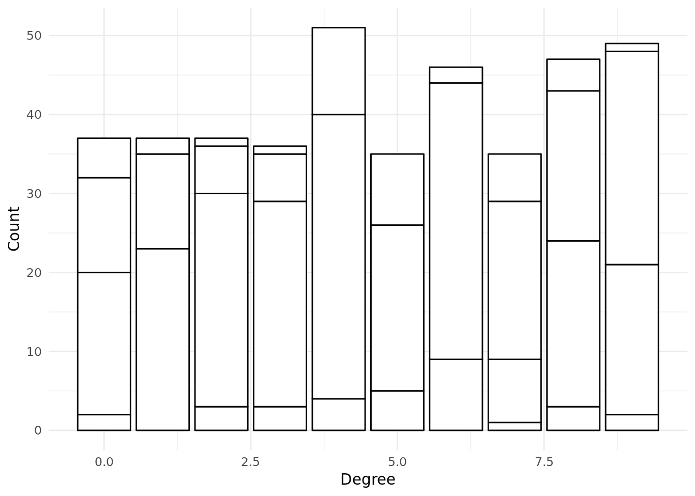

#### Degree distribution of agent->knows->agent edges

#### Runing time by method 

<table class="table table-condensed" style="width: auto !important; ">
 <thead>
  <tr>
   <th style="text-align:left;"> key </th>
   <th style="text-align:right;"> doc_count </th>
   <th style="text-align:right;"> sum_wallTime_ms.value </th>
   <th style="text-align:left;"> avg_wallTime_ms.value </th>
   <th style="text-align:left;"> includedInTotal </th>
  </tr>
 </thead>
<tbody>
  <tr>
   <td style="text-align:left;"> connectIfSimilar </td>
   <td style="text-align:right;"> 83,845 </td>
   <td style="text-align:right;"> 213,212 </td>
   <td style="text-align:left;"> 2.54293040729918 </td>
   <td style="text-align:left;"> No </td>
  </tr>
  <tr>
   <td style="text-align:left;"> existsSimilarity </td>
   <td style="text-align:right;"> 83,845 </td>
   <td style="text-align:right;"> 211,461 </td>
   <td style="text-align:left;"> 2.52204663366927 </td>
   <td style="text-align:left;"> No </td>
  </tr>
  <tr>
   <td style="text-align:left;"> similarityEdges </td>
   <td style="text-align:right;"> 83,845 </td>
   <td style="text-align:right;"> 208,251 </td>
   <td style="text-align:left;"> 2.4837617031427 </td>
   <td style="text-align:left;"> No </td>
  </tr>
  <tr>
   <td style="text-align:left;"> connectAllSimilar </td>
   <td style="text-align:right;"> 410 </td>
   <td style="text-align:right;"> 213,982 </td>
   <td style="text-align:left;"> 521.907317073171 </td>
   <td style="text-align:left;"> Yes </td>
  </tr>
  <tr>
   <td style="text-align:left;"> init </td>
   <td style="text-align:right;"> 103 </td>
   <td style="text-align:right;"> 11,594 </td>
   <td style="text-align:left;"> 112.563106796117 </td>
   <td style="text-align:left;"> No </td>
  </tr>
  <tr>
   <td style="text-align:left;"> connect </td>
   <td style="text-align:right;"> 80 </td>
   <td style="text-align:right;"> 299 </td>
   <td style="text-align:left;"> 3.7375 </td>
   <td style="text-align:left;"> Yes </td>
  </tr>
  <tr>
   <td style="text-align:left;font-weight: bold;"> Total </td>
   <td style="text-align:right;font-weight: bold;"> 498 </td>
   <td style="text-align:right;font-weight: bold;"> 214,796 </td>
   <td style="text-align:left;font-weight: bold;">  </td>
   <td style="text-align:left;font-weight: bold;">  </td>
  </tr>
</tbody>
</table>
####  Found structures 

#####  Cycles 

Number of cycles found:  1 

<button class="btn btn-primary" data-toggle="collapse" data-target="#DBZKCXDEMM"> Show/Hide foundCycle query </button> 
 
  
     GET /filebeat-*/_search 
              { 
                "query": {
                  "bool": {
                    "must": [
                      { "match_phrase": {
                        "simulationId": "SIM10-13-10-53-dQWiIf--CV"
                        }
                      },
                      { "bool": {
                        "should": [
                          { "match": {
                            "keyword": "foundCycle"
                          }}
                        ]
                      }}
                    ]
                  }
                }
              }
     

#####  Paths 

Number of paths found:  0 

<button class="btn btn-primary" data-toggle="collapse" data-target="#ZBSKALVLHG"> Show/Hide foundPath query </button> 
 
  
     GET /filebeat-*/_search 
              { 
                "query": {
                  "bool": {
                    "must": [
                      { "match_phrase": {
                        "simulationId": "SIM10-13-10-53-dQWiIf--CV"
                        }
                      },
                      { "bool": {
                        "should": [
                          { "match": {
                            "keyword": "foundPath"
                          }}
                        ]
                      }}
                    ]
                  }
                }
              }
     

###  SIM10-13-10-53-dQWiIf--DV 

#### simulationParameters 

<table class="table table-condensed" style="width: auto !important; ">
 <thead>
  <tr>
   <th style="text-align:left;"> agentNumber </th>
   <th style="text-align:left;"> similarityConnectThreshold </th>
   <th style="text-align:left;"> graphType </th>
   <th style="text-align:left;"> chainLength </th>
   <th style="text-align:left;"> similaritySearchThreshold </th>
   <th style="text-align:left;"> maxDistance </th>
   <th style="text-align:left;"> randomWorksNumberMultiplier </th>
  </tr>
 </thead>
<tbody>
  <tr>
   <td style="text-align:left;width: 20em; "> 100 </td>
   <td style="text-align:left;width: 15em; "> 0.96 </td>
   <td style="text-align:left;width: 15em; "> smallWorld </td>
   <td style="text-align:left;width: 15em; "> 5 </td>
   <td style="text-align:left;width: 15em; "> 1 </td>
   <td style="text-align:left;width: 15em; "> 30 </td>
   <td style="text-align:left;width: 15em; "> 2 </td>
  </tr>
</tbody>
</table>
#### allEdgesByLabel

<table class="table table-condensed" style="width: auto !important; ">
 <thead>
  <tr>
   <th style="text-align:right;"> edges_offers </th>
   <th style="text-align:right;"> edges_similarity </th>
   <th style="text-align:right;"> edges_owns </th>
   <th style="text-align:right;"> edges_demands </th>
   <th style="text-align:right;"> edges_knows </th>
   <th style="text-align:right;"> edges_total </th>
  </tr>
 </thead>
<tbody>
  <tr>
   <td style="text-align:right;width: 5em; "> 205 </td>
   <td style="text-align:right;width: 5em; "> 14,086 </td>
   <td style="text-align:right;width: 5em; "> 205 </td>
   <td style="text-align:right;width: 5em; "> 205 </td>
   <td style="text-align:right;width: 5em; "> 601 </td>
   <td style="text-align:right;width: 5em; "> 15,302 </td>
  </tr>
</tbody>
</table>
#### allVerticesByType

<table class="table table-condensed" style="width: auto !important; ">
 <thead>
  <tr>
   <th style="text-align:right;"> vertices_agent </th>
   <th style="text-align:right;"> vertices_item </th>
   <th style="text-align:right;"> vertices_work </th>
   <th style="text-align:right;"> vertices_total </th>
  </tr>
 </thead>
<tbody>
  <tr>
   <td style="text-align:right;width: 5em; "> 101 </td>
   <td style="text-align:right;width: 5em; "> 410 </td>
   <td style="text-align:right;width: 5em; "> 205 </td>
   <td style="text-align:right;width: 5em; "> 716 </td>
  </tr>
</tbody>
</table>
#### distribution of similarityEdgesByWeight

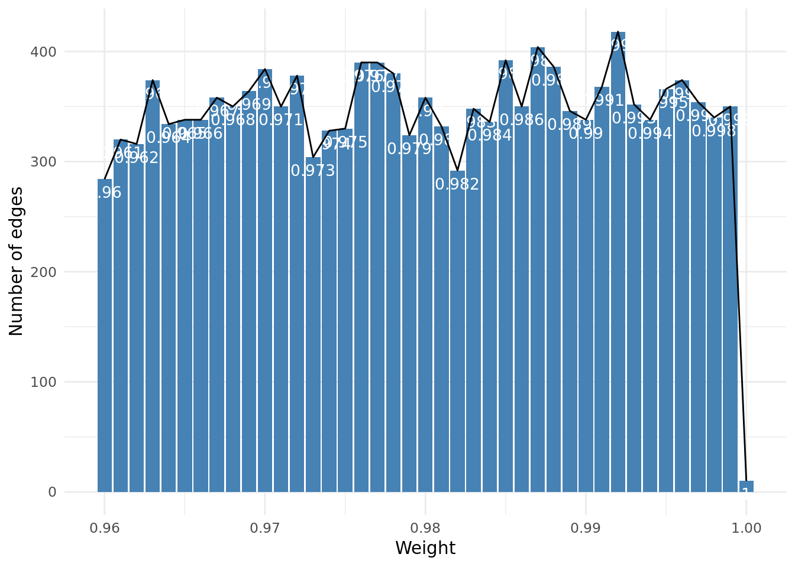

#### Degree distribution of item->similarity->item edges

#### Degree distribution of agent->knows->agent edges

#### Runing time by method 

<table class="table table-condensed" style="width: auto !important; ">
 <thead>
  <tr>
   <th style="text-align:left;">   </th>
   <th style="text-align:left;"> key </th>
   <th style="text-align:right;"> doc_count </th>
   <th style="text-align:right;"> sum_wallTime_ms.value </th>
   <th style="text-align:left;"> avg_wallTime_ms.value </th>
   <th style="text-align:left;"> includedInTotal </th>
  </tr>
 </thead>
<tbody>
  <tr>
   <td style="text-align:left;"> 1 </td>
   <td style="text-align:left;"> knowsAgent </td>
   <td style="text-align:right;"> 601 </td>
   <td style="text-align:right;"> 1,193 </td>
   <td style="text-align:left;"> 1.98502495840266 </td>
   <td style="text-align:left;"> No </td>
  </tr>
  <tr>
   <td style="text-align:left;"> 2 </td>
   <td style="text-align:left;"> addItemToWork </td>
   <td style="text-align:right;"> 410 </td>
   <td style="text-align:right;"> 4,066 </td>
   <td style="text-align:left;"> 9.91707317073171 </td>
   <td style="text-align:left;"> No </td>
  </tr>
  <tr>
   <td style="text-align:left;"> 3 </td>
   <td style="text-align:left;"> ownsWork </td>
   <td style="text-align:right;"> 205 </td>
   <td style="text-align:right;"> 2,525 </td>
   <td style="text-align:left;"> 12.3170731707317 </td>
   <td style="text-align:left;"> No </td>
  </tr>
  <tr>
   <td style="text-align:left;"> 4 </td>
   <td style="text-align:left;"> init </td>
   <td style="text-align:right;"> 103 </td>
   <td style="text-align:right;"> 12,443 </td>
   <td style="text-align:left;"> 120.805825242718 </td>
   <td style="text-align:left;"> No </td>
  </tr>
  <tr>
   <td style="text-align:left;"> 5 </td>
   <td style="text-align:left;"> searchAndConnect </td>
   <td style="text-align:right;"> 101 </td>
   <td style="text-align:right;"> 125,306 </td>
   <td style="text-align:left;"> 1240.65346534653 </td>
   <td style="text-align:left;"> Yes </td>
  </tr>
  <tr>
   <td style="text-align:left;"> 6 </td>
   <td style="text-align:left;"> getWorksItems </td>
   <td style="text-align:right;"> 8 </td>
   <td style="text-align:right;"> 32 </td>
   <td style="text-align:left;"> 4 </td>
   <td style="text-align:left;"> Yes </td>
  </tr>
  <tr>
   <td style="text-align:left;"> 9 </td>
   <td style="text-align:left;"> cycleSearch </td>
   <td style="text-align:right;"> 4 </td>
   <td style="text-align:right;"> 96 </td>
   <td style="text-align:left;"> 24 </td>
   <td style="text-align:left;"> Yes </td>
  </tr>
  <tr>
   <td style="text-align:left;"> 10 </td>
   <td style="text-align:left;"> getWorks </td>
   <td style="text-align:right;"> 4 </td>
   <td style="text-align:right;"> 455 </td>
   <td style="text-align:left;"> 113.75 </td>
   <td style="text-align:left;"> No </td>
  </tr>
  <tr>
   <td style="text-align:left;font-weight: bold;"> 11 </td>
   <td style="text-align:left;font-weight: bold;"> Total </td>
   <td style="text-align:right;font-weight: bold;"> 122 </td>
   <td style="text-align:right;font-weight: bold;"> 126,008 </td>
   <td style="text-align:left;font-weight: bold;">  </td>
   <td style="text-align:left;font-weight: bold;">  </td>
  </tr>
</tbody>
</table>
####  Found structures 

#####  Cycles 

Number of cycles found:  4 

<button class="btn btn-primary" data-toggle="collapse" data-target="#ZLXHVNSWUF"> Show/Hide foundCycle query </button> 
 
  
     GET /filebeat-*/_search 
              { 
                "query": {
                  "bool": {
                    "must": [
                      { "match_phrase": {
                        "simulationId": "SIM10-13-10-53-dQWiIf--DV"
                        }
                      },
                      { "bool": {
                        "should": [
                          { "match": {
                            "keyword": "foundCycle"
                          }}
                        ]
                      }}
                    ]
                  }
                }
              }
     

#####  Paths 

Number of paths found:  0 

<button class="btn btn-primary" data-toggle="collapse" data-target="#WJUQNIYYQU"> Show/Hide foundPath query </button> 
 
  
     GET /filebeat-*/_search 
              { 
                "query": {
                  "bool": {
                    "must": [
                      { "match_phrase": {
                        "simulationId": "SIM10-13-10-53-dQWiIf--DV"
                        }
                      },
                      { "bool": {
                        "should": [
                          { "match": {
                            "keyword": "foundPath"
                          }}
                        ]
                      }}
                    ]
                  }
                }
              }
     

###  SIM10-13-07-26-aJjJ5E--CV 

#### simulationParameters 

<table class="table table-condensed" style="width: auto !important; ">
 <thead>
  <tr>
   <th style="text-align:left;"> agentNumber </th>
   <th style="text-align:left;"> similarityConnectThreshold </th>
   <th style="text-align:left;"> graphType </th>
   <th style="text-align:left;"> chainLength </th>
   <th style="text-align:left;"> similaritySearchThreshold </th>
   <th style="text-align:left;"> maxDistance </th>
   <th style="text-align:left;"> randomWorksNumberMultiplier </th>
  </tr>
 </thead>
<tbody>
  <tr>
   <td style="text-align:left;width: 20em; "> 100 </td>
   <td style="text-align:left;width: 15em; "> 0.96 </td>
   <td style="text-align:left;width: 15em; "> random </td>
   <td style="text-align:left;width: 15em; "> 5 </td>
   <td style="text-align:left;width: 15em; "> 1 </td>
   <td style="text-align:left;width: 15em; "> 5 </td>
   <td style="text-align:left;width: 15em; "> 1 </td>
  </tr>
</tbody>
</table>
#### allEdgesByLabel

<table class="table table-condensed" style="width: auto !important; ">
 <thead>
  <tr>
   <th style="text-align:right;"> edges_offers </th>
   <th style="text-align:right;"> edges_similarity </th>
   <th style="text-align:right;"> edges_owns </th>
   <th style="text-align:right;"> edges_demands </th>
   <th style="text-align:right;"> edges_knows </th>
   <th style="text-align:right;"> edges_total </th>
  </tr>
 </thead>
<tbody>
  <tr>
   <td style="text-align:right;width: 5em; "> 105 </td>
   <td style="text-align:right;width: 5em; "> 3,784 </td>
   <td style="text-align:right;width: 5em; "> 105 </td>
   <td style="text-align:right;width: 5em; "> 105 </td>
   <td style="text-align:right;width: 5em; "> 100 </td>
   <td style="text-align:right;width: 5em; "> 4,199 </td>
  </tr>
</tbody>
</table>
#### allVerticesByType

<table class="table table-condensed" style="width: auto !important; ">
 <thead>
  <tr>
   <th style="text-align:right;"> vertices_agent </th>
   <th style="text-align:right;"> vertices_item </th>
   <th style="text-align:right;"> vertices_work </th>
   <th style="text-align:right;"> vertices_total </th>
  </tr>
 </thead>
<tbody>
  <tr>
   <td style="text-align:right;width: 5em; "> 101 </td>
   <td style="text-align:right;width: 5em; "> 210 </td>
   <td style="text-align:right;width: 5em; "> 105 </td>
   <td style="text-align:right;width: 5em; "> 416 </td>
  </tr>
</tbody>
</table>
#### distribution of similarityEdgesByWeight

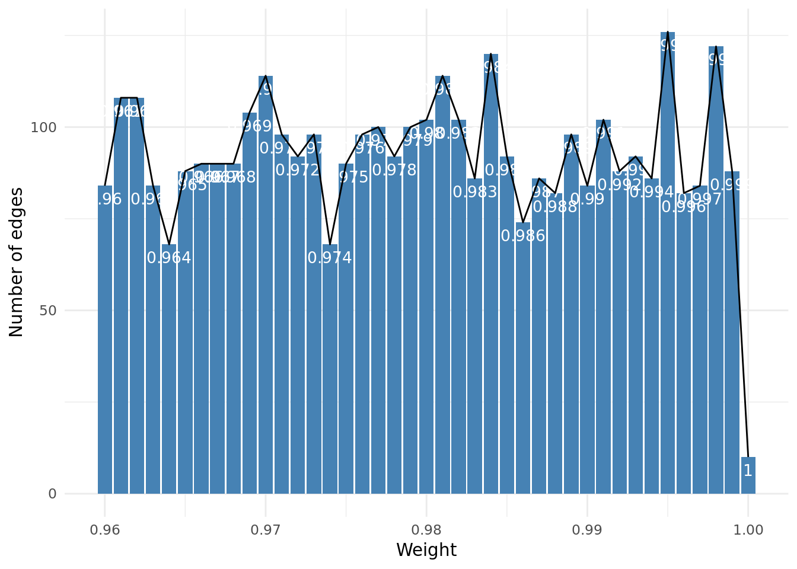

#### Degree distribution of item->similarity->item edges

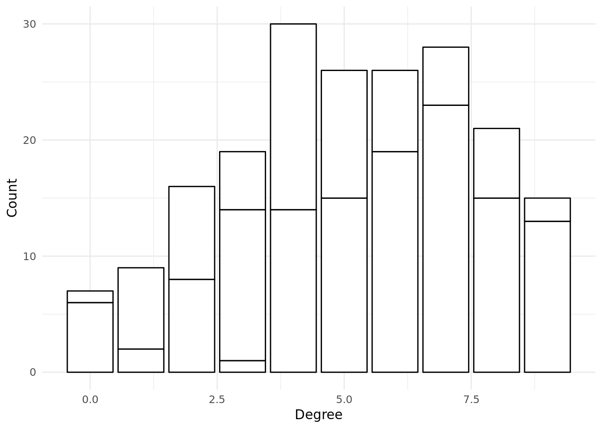

#### Degree distribution of agent->knows->agent edges

#### Runing time by method 

<table class="table table-condensed" style="width: auto !important; ">
 <thead>
  <tr>
   <th style="text-align:left;"> key </th>
   <th style="text-align:right;"> doc_count </th>
   <th style="text-align:right;"> sum_wallTime_ms.value </th>
   <th style="text-align:left;"> avg_wallTime_ms.value </th>
   <th style="text-align:left;"> includedInTotal </th>
  </tr>
 </thead>
<tbody>
  <tr>
   <td style="text-align:left;"> connectIfSimilar </td>
   <td style="text-align:right;"> 21,945 </td>
   <td style="text-align:right;"> 48,431 </td>
   <td style="text-align:left;"> 2.20692640692641 </td>
   <td style="text-align:left;"> No </td>
  </tr>
  <tr>
   <td style="text-align:left;"> existsSimilarity </td>
   <td style="text-align:right;"> 21,945 </td>
   <td style="text-align:right;"> 45,508 </td>
   <td style="text-align:left;"> 2.07372977899294 </td>
   <td style="text-align:left;"> No </td>
  </tr>
  <tr>
   <td style="text-align:left;"> similarityEdges </td>
   <td style="text-align:right;"> 21,945 </td>
   <td style="text-align:right;"> 44,839 </td>
   <td style="text-align:left;"> 2.04324447482342 </td>
   <td style="text-align:left;"> No </td>
  </tr>
  <tr>
   <td style="text-align:left;"> connect </td>
   <td style="text-align:right;"> 1,052 </td>
   <td style="text-align:right;"> 2,533 </td>
   <td style="text-align:left;"> 2.40779467680608 </td>
   <td style="text-align:left;"> Yes </td>
  </tr>
  <tr>
   <td style="text-align:left;"> connectAllSimilar </td>
   <td style="text-align:right;"> 210 </td>
   <td style="text-align:right;"> 48,671 </td>
   <td style="text-align:left;"> 231.766666666667 </td>
   <td style="text-align:left;"> Yes </td>
  </tr>
  <tr>
   <td style="text-align:left;"> init </td>
   <td style="text-align:right;"> 103 </td>
   <td style="text-align:right;"> 11,744 </td>
   <td style="text-align:left;"> 114.019417475728 </td>
   <td style="text-align:left;"> No </td>
  </tr>
  <tr>
   <td style="text-align:left;font-weight: bold;"> Total </td>
   <td style="text-align:right;font-weight: bold;"> 1,270 </td>
   <td style="text-align:right;font-weight: bold;"> 51,413 </td>
   <td style="text-align:left;font-weight: bold;">  </td>
   <td style="text-align:left;font-weight: bold;">  </td>
  </tr>
</tbody>
</table>
####  Found structures 

#####  Cycles 

Number of cycles found:  1 

<button class="btn btn-primary" data-toggle="collapse" data-target="#AJTVKPIZEY"> Show/Hide foundCycle query </button> 
 
  
     GET /filebeat-*/_search 
              { 
                "query": {
                  "bool": {
                    "must": [
                      { "match_phrase": {
                        "simulationId": "SIM10-13-07-26-aJjJ5E--CV"
                        }
                      },
                      { "bool": {
                        "should": [
                          { "match": {
                            "keyword": "foundCycle"
                          }}
                        ]
                      }}
                    ]
                  }
                }
              }
     

#####  Paths 

Number of paths found:  0 

<button class="btn btn-primary" data-toggle="collapse" data-target="#JSTNXGXYAW"> Show/Hide foundPath query </button> 
 
  
     GET /filebeat-*/_search 
              { 
                "query": {
                  "bool": {
                    "must": [
                      { "match_phrase": {
                        "simulationId": "SIM10-13-07-26-aJjJ5E--CV"
                        }
                      },
                      { "bool": {
                        "should": [
                          { "match": {
                            "keyword": "foundPath"
                          }}
                        ]
                      }}
                    ]
                  }
                }
              }
     

###  SIM10-13-07-26-aJjJ5E--DV 

#### simulationParameters 

<table class="table table-condensed" style="width: auto !important; ">
 <thead>
  <tr>
   <th style="text-align:left;"> agentNumber </th>
   <th style="text-align:left;"> similarityConnectThreshold </th>
   <th style="text-align:left;"> graphType </th>
   <th style="text-align:left;"> chainLength </th>
   <th style="text-align:left;"> similaritySearchThreshold </th>
   <th style="text-align:left;"> maxDistance </th>
   <th style="text-align:left;"> randomWorksNumberMultiplier </th>
  </tr>
 </thead>
<tbody>
  <tr>
   <td style="text-align:left;width: 20em; "> 100 </td>
   <td style="text-align:left;width: 15em; "> 0.96 </td>
   <td style="text-align:left;width: 15em; "> random </td>
   <td style="text-align:left;width: 15em; "> 5 </td>
   <td style="text-align:left;width: 15em; "> 1 </td>
   <td style="text-align:left;width: 15em; "> 5 </td>
   <td style="text-align:left;width: 15em; "> 1 </td>
  </tr>
</tbody>
</table>
#### allEdgesByLabel

<table class="table table-condensed" style="width: auto !important; ">
 <thead>
  <tr>
   <th style="text-align:right;"> edges_offers </th>
   <th style="text-align:right;"> edges_similarity </th>
   <th style="text-align:right;"> edges_owns </th>
   <th style="text-align:right;"> edges_demands </th>
   <th style="text-align:right;"> edges_knows </th>
   <th style="text-align:right;"> edges_total </th>
  </tr>
 </thead>
<tbody>
  <tr>
   <td style="text-align:right;width: 5em; "> 105 </td>
   <td style="text-align:right;width: 5em; "> 1,680 </td>
   <td style="text-align:right;width: 5em; "> 105 </td>
   <td style="text-align:right;width: 5em; "> 105 </td>
   <td style="text-align:right;width: 5em; "> 100 </td>
   <td style="text-align:right;width: 5em; "> 2,095 </td>
  </tr>
</tbody>
</table>
#### allVerticesByType

<table class="table table-condensed" style="width: auto !important; ">
 <thead>
  <tr>
   <th style="text-align:right;"> vertices_agent </th>
   <th style="text-align:right;"> vertices_item </th>
   <th style="text-align:right;"> vertices_work </th>
   <th style="text-align:right;"> vertices_total </th>
  </tr>
 </thead>
<tbody>
  <tr>
   <td style="text-align:right;width: 5em; "> 101 </td>
   <td style="text-align:right;width: 5em; "> 210 </td>
   <td style="text-align:right;width: 5em; "> 105 </td>
   <td style="text-align:right;width: 5em; "> 416 </td>
  </tr>
</tbody>
</table>
#### distribution of similarityEdgesByWeight

#### Degree distribution of item->similarity->item edges

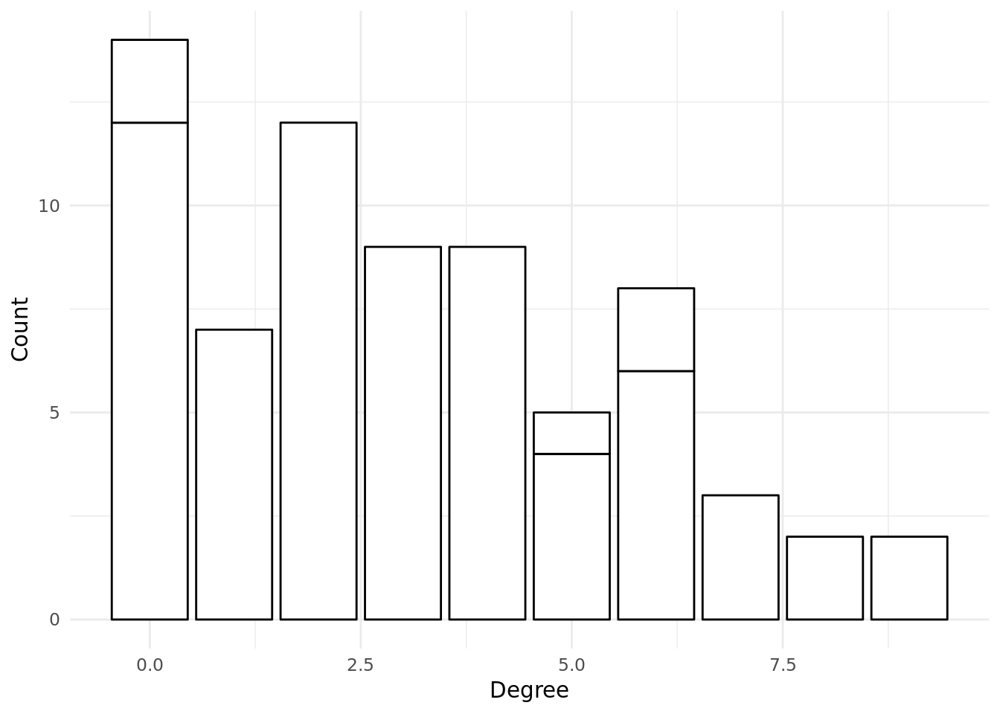

#### Degree distribution of agent->knows->agent edges

#### Runing time by method 

<table class="table table-condensed" style="width: auto !important; ">
 <thead>
  <tr>
   <th style="text-align:left;">   </th>
   <th style="text-align:left;"> key </th>
   <th style="text-align:right;"> doc_count </th>
   <th style="text-align:right;"> sum_wallTime_ms.value </th>
   <th style="text-align:left;"> avg_wallTime_ms.value </th>
   <th style="text-align:left;"> includedInTotal </th>
  </tr>
 </thead>
<tbody>
  <tr>
   <td style="text-align:left;"> 2 </td>
   <td style="text-align:left;"> cycleSearch </td>
   <td style="text-align:right;"> 3,600 </td>
   <td style="text-align:right;"> 16,007 </td>
   <td style="text-align:left;"> 4.44638888888889 </td>
   <td style="text-align:left;"> Yes </td>
  </tr>
  <tr>
   <td style="text-align:left;"> 3 </td>
   <td style="text-align:left;"> getWorks </td>
   <td style="text-align:right;"> 3,600 </td>
   <td style="text-align:right;"> 43,011 </td>
   <td style="text-align:left;"> 11.9475 </td>
   <td style="text-align:left;"> No </td>
  </tr>
  <tr>
   <td style="text-align:left;"> 4 </td>
   <td style="text-align:left;"> individualCycleSearch </td>
   <td style="text-align:right;"> 3,600 </td>
   <td style="text-align:right;"> 127 </td>
   <td style="text-align:left;"> 0.0352777777777778 </td>
   <td style="text-align:left;"> Yes </td>
  </tr>
  <tr>
   <td style="text-align:left;"> 6 </td>
   <td style="text-align:left;"> addItemToWork </td>
   <td style="text-align:right;"> 210 </td>
   <td style="text-align:right;"> 5,154 </td>
   <td style="text-align:left;"> 24.5428571428571 </td>
   <td style="text-align:left;"> No </td>
  </tr>
  <tr>
   <td style="text-align:left;"> 7 </td>
   <td style="text-align:left;"> ownsWork </td>
   <td style="text-align:right;"> 105 </td>
   <td style="text-align:right;"> 2,294 </td>
   <td style="text-align:left;"> 21.847619047619 </td>
   <td style="text-align:left;"> No </td>
  </tr>
  <tr>
   <td style="text-align:left;"> 8 </td>
   <td style="text-align:left;"> init </td>
   <td style="text-align:right;"> 103 </td>
   <td style="text-align:right;"> 10,995 </td>
   <td style="text-align:left;"> 106.747572815534 </td>
   <td style="text-align:left;"> No </td>
  </tr>
  <tr>
   <td style="text-align:left;"> 9 </td>
   <td style="text-align:left;"> searchAndConnect </td>
   <td style="text-align:right;"> 101 </td>
   <td style="text-align:right;"> 14,414 </td>
   <td style="text-align:left;"> 142.712871287129 </td>
   <td style="text-align:left;"> Yes </td>
  </tr>
  <tr>
   <td style="text-align:left;"> 10 </td>
   <td style="text-align:left;"> knowsAgent </td>
   <td style="text-align:right;"> 100 </td>
   <td style="text-align:right;"> 201 </td>
   <td style="text-align:left;"> 2.01 </td>
   <td style="text-align:left;"> No </td>
  </tr>
  <tr>
   <td style="text-align:left;font-weight: bold;"> 1 </td>
   <td style="text-align:left;font-weight: bold;"> Total </td>
   <td style="text-align:right;font-weight: bold;"> 14,501 </td>
   <td style="text-align:right;font-weight: bold;"> 47,516 </td>
   <td style="text-align:left;font-weight: bold;">  </td>
   <td style="text-align:left;font-weight: bold;">  </td>
  </tr>
</tbody>
</table>
####  Found structures 

#####  Cycles 

Number of cycles found:  0 

<button class="btn btn-primary" data-toggle="collapse" data-target="#XQYNLNEQEF"> Show/Hide foundCycle query </button> 
 
  
     GET /filebeat-*/_search 
              { 
                "query": {
                  "bool": {
                    "must": [
                      { "match_phrase": {
                        "simulationId": "SIM10-13-07-26-aJjJ5E--DV"
                        }
                      },
                      { "bool": {
                        "should": [
                          { "match": {
                            "keyword": "foundCycle"
                          }}
                        ]
                      }}
                    ]
                  }
                }
              }
     

#####  Paths 

Number of paths found:  3600 

<button class="btn btn-primary" data-toggle="collapse" data-target="#MWMMRUEBHQ"> Show/Hide foundPath query </button> 
 
  
     GET /filebeat-*/_search 
              { 
                "query": {
                  "bool": {
                    "must": [
                      { "match_phrase": {
                        "simulationId": "SIM10-13-07-26-aJjJ5E--DV"
                        }
                      },
                      { "bool": {
                        "should": [
                          { "match": {
                            "keyword": "foundPath"
                          }}
                        ]
                      }}
                    ]
                  }
                }
              }
     

###  SIM10-13-08-27-y59yK7--CV 

#### simulationParameters 

<table class="table table-condensed" style="width: auto !important; ">
 <thead>
  <tr>
   <th style="text-align:left;"> agentNumber </th>
   <th style="text-align:left;"> similarityConnectThreshold </th>
   <th style="text-align:left;"> graphType </th>
   <th style="text-align:left;"> chainLength </th>
   <th style="text-align:left;"> similaritySearchThreshold </th>
   <th style="text-align:left;"> maxDistance </th>
   <th style="text-align:left;"> randomWorksNumberMultiplier </th>
  </tr>
 </thead>
<tbody>
  <tr>
   <td style="text-align:left;width: 20em; "> 100 </td>
   <td style="text-align:left;width: 15em; "> 0.96 </td>
   <td style="text-align:left;width: 15em; "> smallWorld </td>
   <td style="text-align:left;width: 15em; "> 5 </td>
   <td style="text-align:left;width: 15em; "> 1 </td>
   <td style="text-align:left;width: 15em; "> 5 </td>
   <td style="text-align:left;width: 15em; "> 1 </td>
  </tr>
</tbody>
</table>
#### allEdgesByLabel

<table class="table table-condensed" style="width: auto !important; ">
 <thead>
  <tr>
   <th style="text-align:right;"> edges_offers </th>
   <th style="text-align:right;"> edges_similarity </th>
   <th style="text-align:right;"> edges_owns </th>
   <th style="text-align:right;"> edges_demands </th>
   <th style="text-align:right;"> edges_knows </th>
   <th style="text-align:right;"> edges_total </th>
  </tr>
 </thead>
<tbody>
  <tr>
   <td style="text-align:right;width: 5em; "> 105 </td>
   <td style="text-align:right;width: 5em; "> 3,642 </td>
   <td style="text-align:right;width: 5em; "> 105 </td>
   <td style="text-align:right;width: 5em; "> 105 </td>
   <td style="text-align:right;width: 5em; "> 601 </td>
   <td style="text-align:right;width: 5em; "> 4,558 </td>
  </tr>
</tbody>
</table>
#### allVerticesByType

<table class="table table-condensed" style="width: auto !important; ">
 <thead>
  <tr>
   <th style="text-align:right;"> vertices_agent </th>
   <th style="text-align:right;"> vertices_item </th>
   <th style="text-align:right;"> vertices_work </th>
   <th style="text-align:right;"> vertices_total </th>
  </tr>
 </thead>
<tbody>
  <tr>
   <td style="text-align:right;width: 5em; "> 101 </td>
   <td style="text-align:right;width: 5em; "> 210 </td>
   <td style="text-align:right;width: 5em; "> 105 </td>
   <td style="text-align:right;width: 5em; "> 416 </td>
  </tr>
</tbody>
</table>
#### distribution of similarityEdgesByWeight

#### Degree distribution of item->similarity->item edges

#### Degree distribution of agent->knows->agent edges

#### Runing time by method 

<table class="table table-condensed" style="width: auto !important; ">
 <thead>
  <tr>
   <th style="text-align:left;"> key </th>
   <th style="text-align:right;"> doc_count </th>
   <th style="text-align:right;"> sum_wallTime_ms.value </th>
   <th style="text-align:left;"> avg_wallTime_ms.value </th>
   <th style="text-align:left;"> includedInTotal </th>
  </tr>
 </thead>
<tbody>
  <tr>
   <td style="text-align:left;"> connectIfSimilar </td>
   <td style="text-align:right;"> 21,945 </td>
   <td style="text-align:right;"> 48,652 </td>
   <td style="text-align:left;"> 2.21699703804967 </td>
   <td style="text-align:left;"> No </td>
  </tr>
  <tr>
   <td style="text-align:left;"> existsSimilarity </td>
   <td style="text-align:right;"> 21,945 </td>
   <td style="text-align:right;"> 48,155 </td>
   <td style="text-align:left;"> 2.19434951013898 </td>
   <td style="text-align:left;"> No </td>
  </tr>
  <tr>
   <td style="text-align:left;"> similarityEdges </td>
   <td style="text-align:right;"> 21,945 </td>
   <td style="text-align:right;"> 47,370 </td>
   <td style="text-align:left;"> 2.15857826384142 </td>
   <td style="text-align:left;"> No </td>
  </tr>
  <tr>
   <td style="text-align:left;"> connectAllSimilar </td>
   <td style="text-align:right;"> 210 </td>
   <td style="text-align:right;"> 48,894 </td>
   <td style="text-align:left;"> 232.828571428571 </td>
   <td style="text-align:left;"> Yes </td>
  </tr>
  <tr>
   <td style="text-align:left;"> init </td>
   <td style="text-align:right;"> 103 </td>
   <td style="text-align:right;"> 11,041 </td>
   <td style="text-align:left;"> 107.194174757282 </td>
   <td style="text-align:left;"> No </td>
  </tr>
  <tr>
   <td style="text-align:left;"> connect </td>
   <td style="text-align:right;"> 37 </td>
   <td style="text-align:right;"> 66 </td>
   <td style="text-align:left;"> 1.78378378378378 </td>
   <td style="text-align:left;"> Yes </td>
  </tr>
  <tr>
   <td style="text-align:left;font-weight: bold;"> Total </td>
   <td style="text-align:right;font-weight: bold;"> 255 </td>
   <td style="text-align:right;font-weight: bold;"> 49,405 </td>
   <td style="text-align:left;font-weight: bold;">  </td>
   <td style="text-align:left;font-weight: bold;">  </td>
  </tr>
</tbody>
</table>
####  Found structures 

#####  Cycles 

Number of cycles found:  1 

<button class="btn btn-primary" data-toggle="collapse" data-target="#VSOUURGEBP"> Show/Hide foundCycle query </button> 
 
  
     GET /filebeat-*/_search 
              { 
                "query": {
                  "bool": {
                    "must": [
                      { "match_phrase": {
                        "simulationId": "SIM10-13-08-27-y59yK7--CV"
                        }
                      },
                      { "bool": {
                        "should": [
                          { "match": {
                            "keyword": "foundCycle"
                          }}
                        ]
                      }}
                    ]
                  }
                }
              }
     

#####  Paths 

Number of paths found:  0 

<button class="btn btn-primary" data-toggle="collapse" data-target="#SHQMJSSOZT"> Show/Hide foundPath query </button> 
 
  
     GET /filebeat-*/_search 
              { 
                "query": {
                  "bool": {
                    "must": [
                      { "match_phrase": {
                        "simulationId": "SIM10-13-08-27-y59yK7--CV"
                        }
                      },
                      { "bool": {
                        "should": [
                          { "match": {
                            "keyword": "foundPath"
                          }}
                        ]
                      }}
                    ]
                  }
                }
              }
     

###  SIM10-13-08-27-y59yK7--DV 

#### simulationParameters 

<table class="table table-condensed" style="width: auto !important; ">
 <thead>
  <tr>
   <th style="text-align:left;"> agentNumber </th>
   <th style="text-align:left;"> similarityConnectThreshold </th>
   <th style="text-align:left;"> graphType </th>
   <th style="text-align:left;"> chainLength </th>
   <th style="text-align:left;"> similaritySearchThreshold </th>
   <th style="text-align:left;"> maxDistance </th>
   <th style="text-align:left;"> randomWorksNumberMultiplier </th>
  </tr>
 </thead>
<tbody>
  <tr>
   <td style="text-align:left;width: 20em; "> 100 </td>
   <td style="text-align:left;width: 15em; "> 0.96 </td>
   <td style="text-align:left;width: 15em; "> smallWorld </td>
   <td style="text-align:left;width: 15em; "> 5 </td>
   <td style="text-align:left;width: 15em; "> 1 </td>
   <td style="text-align:left;width: 15em; "> 5 </td>
   <td style="text-align:left;width: 15em; "> 1 </td>
  </tr>
</tbody>
</table>
#### allEdgesByLabel

<table class="table table-condensed" style="width: auto !important; ">
 <thead>
  <tr>
   <th style="text-align:right;"> edges_offers </th>
   <th style="text-align:right;"> edges_similarity </th>
   <th style="text-align:right;"> edges_owns </th>
   <th style="text-align:right;"> edges_demands </th>
   <th style="text-align:right;"> edges_knows </th>
   <th style="text-align:right;"> edges_total </th>
  </tr>
 </thead>
<tbody>
  <tr>
   <td style="text-align:right;width: 5em; "> 105 </td>
   <td style="text-align:right;width: 5em; "> 3,568 </td>
   <td style="text-align:right;width: 5em; "> 105 </td>
   <td style="text-align:right;width: 5em; "> 105 </td>
   <td style="text-align:right;width: 5em; "> 601 </td>
   <td style="text-align:right;width: 5em; "> 4,484 </td>
  </tr>
</tbody>
</table>
#### allVerticesByType

<table class="table table-condensed" style="width: auto !important; ">
 <thead>
  <tr>
   <th style="text-align:right;"> vertices_agent </th>
   <th style="text-align:right;"> vertices_item </th>
   <th style="text-align:right;"> vertices_work </th>
   <th style="text-align:right;"> vertices_total </th>
  </tr>
 </thead>
<tbody>
  <tr>
   <td style="text-align:right;width: 5em; "> 101 </td>
   <td style="text-align:right;width: 5em; "> 210 </td>
   <td style="text-align:right;width: 5em; "> 105 </td>
   <td style="text-align:right;width: 5em; "> 416 </td>
  </tr>
</tbody>
</table>
#### distribution of similarityEdgesByWeight

#### Degree distribution of item->similarity->item edges

#### Degree distribution of agent->knows->agent edges

#### Runing time by method 

<table class="table table-condensed" style="width: auto !important; ">
 <thead>
  <tr>
   <th style="text-align:left;">   </th>
   <th style="text-align:left;"> key </th>
   <th style="text-align:right;"> doc_count </th>
   <th style="text-align:right;"> sum_wallTime_ms.value </th>
   <th style="text-align:left;"> avg_wallTime_ms.value </th>
   <th style="text-align:left;"> includedInTotal </th>
  </tr>
 </thead>
<tbody>
  <tr>
   <td style="text-align:left;"> 1 </td>
   <td style="text-align:left;"> knowsAgent </td>
   <td style="text-align:right;"> 601 </td>
   <td style="text-align:right;"> 936 </td>
   <td style="text-align:left;"> 1.55740432612313 </td>
   <td style="text-align:left;"> No </td>
  </tr>
  <tr>
   <td style="text-align:left;"> 2 </td>
   <td style="text-align:left;"> addItemToWork </td>
   <td style="text-align:right;"> 210 </td>
   <td style="text-align:right;"> 1,477 </td>
   <td style="text-align:left;"> 7.03333333333333 </td>
   <td style="text-align:left;"> No </td>
  </tr>
  <tr>
   <td style="text-align:left;"> 3 </td>
   <td style="text-align:left;"> ownsWork </td>
   <td style="text-align:right;"> 105 </td>
   <td style="text-align:right;"> 1,362 </td>
   <td style="text-align:left;"> 12.9714285714286 </td>
   <td style="text-align:left;"> No </td>
  </tr>
  <tr>
   <td style="text-align:left;"> 4 </td>
   <td style="text-align:left;"> init </td>
   <td style="text-align:right;"> 103 </td>
   <td style="text-align:right;"> 11,725 </td>
   <td style="text-align:left;"> 113.834951456311 </td>
   <td style="text-align:left;"> No </td>
  </tr>
  <tr>
   <td style="text-align:left;"> 5 </td>
   <td style="text-align:left;"> searchAndConnect </td>
   <td style="text-align:right;"> 101 </td>
   <td style="text-align:right;"> 53,659 </td>
   <td style="text-align:left;"> 531.277227722772 </td>
   <td style="text-align:left;"> Yes </td>
  </tr>
  <tr>
   <td style="text-align:left;"> 6 </td>
   <td style="text-align:left;"> getWorksItems </td>
   <td style="text-align:right;"> 8 </td>
   <td style="text-align:right;"> 39 </td>
   <td style="text-align:left;"> 4.875 </td>
   <td style="text-align:left;"> Yes </td>
  </tr>
  <tr>
   <td style="text-align:left;"> 9 </td>
   <td style="text-align:left;"> cycleSearch </td>
   <td style="text-align:right;"> 2 </td>
   <td style="text-align:right;"> 39 </td>
   <td style="text-align:left;"> 19.5 </td>
   <td style="text-align:left;"> Yes </td>
  </tr>
  <tr>
   <td style="text-align:left;"> 10 </td>
   <td style="text-align:left;"> getWorks </td>
   <td style="text-align:right;"> 2 </td>
   <td style="text-align:right;"> 293 </td>
   <td style="text-align:left;"> 146.5 </td>
   <td style="text-align:left;"> No </td>
  </tr>
  <tr>
   <td style="text-align:left;font-weight: bold;"> 11 </td>
   <td style="text-align:left;font-weight: bold;"> Total </td>
   <td style="text-align:right;font-weight: bold;"> 118 </td>
   <td style="text-align:right;font-weight: bold;"> 54,087 </td>
   <td style="text-align:left;font-weight: bold;">  </td>
   <td style="text-align:left;font-weight: bold;">  </td>
  </tr>
</tbody>
</table>
####  Found structures 

#####  Cycles 

Number of cycles found:  2 

<button class="btn btn-primary" data-toggle="collapse" data-target="#UTXMOFHGWY"> Show/Hide foundCycle query </button> 
 
  
     GET /filebeat-*/_search 
              { 
                "query": {
                  "bool": {
                    "must": [
                      { "match_phrase": {
                        "simulationId": "SIM10-13-08-27-y59yK7--DV"
                        }
                      },
                      { "bool": {
                        "should": [
                          { "match": {
                            "keyword": "foundCycle"
                          }}
                        ]
                      }}
                    ]
                  }
                }
              }
     

#####  Paths 

Number of paths found:  0 

<button class="btn btn-primary" data-toggle="collapse" data-target="#YWRSJHERHR"> Show/Hide foundPath query </button> 
 
  
     GET /filebeat-*/_search 
              { 
                "query": {
                  "bool": {
                    "must": [
                      { "match_phrase": {
                        "simulationId": "SIM10-13-08-27-y59yK7--DV"
                        }
                      },
                      { "bool": {
                        "should": [
                          { "match": {
                            "keyword": "foundPath"
                          }}
                        ]
                      }}
                    ]
                  }
                }
              }
     

###  SIM10-13-09-33-t3prjM--CV 

#### simulationParameters 

<table class="table table-condensed" style="width: auto !important; ">
 <thead>
  <tr>
   <th style="text-align:left;"> agentNumber </th>
   <th style="text-align:left;"> similarityConnectThreshold </th>
   <th style="text-align:left;"> graphType </th>
   <th style="text-align:left;"> chainLength </th>
   <th style="text-align:left;"> similaritySearchThreshold </th>
   <th style="text-align:left;"> maxDistance </th>
   <th style="text-align:left;"> randomWorksNumberMultiplier </th>
  </tr>
 </thead>
<tbody>
  <tr>
   <td style="text-align:left;width: 20em; "> 100 </td>
   <td style="text-align:left;width: 15em; "> 0.96 </td>
   <td style="text-align:left;width: 15em; "> random </td>
   <td style="text-align:left;width: 15em; "> 5 </td>
   <td style="text-align:left;width: 15em; "> 1 </td>
   <td style="text-align:left;width: 15em; "> 5 </td>
   <td style="text-align:left;width: 15em; "> 2 </td>
  </tr>
</tbody>
</table>
#### allEdgesByLabel

<table class="table table-condensed" style="width: auto !important; ">
 <thead>
  <tr>
   <th style="text-align:right;"> edges_offers </th>
   <th style="text-align:right;"> edges_similarity </th>
   <th style="text-align:right;"> edges_owns </th>
   <th style="text-align:right;"> edges_demands </th>
   <th style="text-align:right;"> edges_knows </th>
   <th style="text-align:right;"> edges_total </th>
  </tr>
 </thead>
<tbody>
  <tr>
   <td style="text-align:right;width: 5em; "> 205 </td>
   <td style="text-align:right;width: 5em; "> 13,504 </td>
   <td style="text-align:right;width: 5em; "> 205 </td>
   <td style="text-align:right;width: 5em; "> 205 </td>
   <td style="text-align:right;width: 5em; "> 100 </td>
   <td style="text-align:right;width: 5em; "> 14,219 </td>
  </tr>
</tbody>
</table>
#### allVerticesByType

<table class="table table-condensed" style="width: auto !important; ">
 <thead>
  <tr>
   <th style="text-align:right;"> vertices_agent </th>
   <th style="text-align:right;"> vertices_item </th>
   <th style="text-align:right;"> vertices_work </th>
   <th style="text-align:right;"> vertices_total </th>
  </tr>
 </thead>
<tbody>
  <tr>
   <td style="text-align:right;width: 5em; "> 101 </td>
   <td style="text-align:right;width: 5em; "> 410 </td>
   <td style="text-align:right;width: 5em; "> 205 </td>
   <td style="text-align:right;width: 5em; "> 716 </td>
  </tr>
</tbody>
</table>
#### distribution of similarityEdgesByWeight

#### Degree distribution of item->similarity->item edges

#### Degree distribution of agent->knows->agent edges

#### Runing time by method 

<table class="table table-condensed" style="width: auto !important; ">
 <thead>
  <tr>
   <th style="text-align:left;"> key </th>
   <th style="text-align:right;"> doc_count </th>
   <th style="text-align:right;"> sum_wallTime_ms.value </th>
   <th style="text-align:left;"> avg_wallTime_ms.value </th>
   <th style="text-align:left;"> includedInTotal </th>
  </tr>
 </thead>
<tbody>
  <tr>
   <td style="text-align:left;"> connectIfSimilar </td>
   <td style="text-align:right;"> 83,845 </td>
   <td style="text-align:right;"> 203,107 </td>
   <td style="text-align:left;"> 2.42241040014312 </td>
   <td style="text-align:left;"> No </td>
  </tr>
  <tr>
   <td style="text-align:left;"> existsSimilarity </td>
   <td style="text-align:right;"> 83,845 </td>
   <td style="text-align:right;"> 191,302 </td>
   <td style="text-align:left;"> 2.2816148846085 </td>
   <td style="text-align:left;"> No </td>
  </tr>
  <tr>
   <td style="text-align:left;"> similarityEdges </td>
   <td style="text-align:right;"> 83,845 </td>
   <td style="text-align:right;"> 188,223 </td>
   <td style="text-align:left;"> 2.24489236090405 </td>
   <td style="text-align:left;"> No </td>
  </tr>
  <tr>
   <td style="text-align:left;"> connect </td>
   <td style="text-align:right;"> 4,275 </td>
   <td style="text-align:right;"> 10,193 </td>
   <td style="text-align:left;"> 2.38432748538012 </td>
   <td style="text-align:left;"> Yes </td>
  </tr>
  <tr>
   <td style="text-align:left;"> connectAllSimilar </td>
   <td style="text-align:right;"> 410 </td>
   <td style="text-align:right;"> 203,955 </td>
   <td style="text-align:left;"> 497.451219512195 </td>
   <td style="text-align:left;"> Yes </td>
  </tr>
  <tr>
   <td style="text-align:left;"> init </td>
   <td style="text-align:right;"> 103 </td>
   <td style="text-align:right;"> 11,110 </td>
   <td style="text-align:left;"> 107.864077669903 </td>
   <td style="text-align:left;"> No </td>
  </tr>
  <tr>
   <td style="text-align:left;font-weight: bold;"> Total </td>
   <td style="text-align:right;font-weight: bold;"> 4,693 </td>
   <td style="text-align:right;font-weight: bold;"> 214,558 </td>
   <td style="text-align:left;font-weight: bold;">  </td>
   <td style="text-align:left;font-weight: bold;">  </td>
  </tr>
</tbody>
</table>
####  Found structures 

#####  Cycles 

Number of cycles found:  1 

<button class="btn btn-primary" data-toggle="collapse" data-target="#RBPGRUEVZP"> Show/Hide foundCycle query </button> 
 
  
     GET /filebeat-*/_search 
              { 
                "query": {
                  "bool": {
                    "must": [
                      { "match_phrase": {
                        "simulationId": "SIM10-13-09-33-t3prjM--CV"
                        }
                      },
                      { "bool": {
                        "should": [
                          { "match": {
                            "keyword": "foundCycle"
                          }}
                        ]
                      }}
                    ]
                  }
                }
              }
     

#####  Paths 

Number of paths found:  0 

<button class="btn btn-primary" data-toggle="collapse" data-target="#GCWUKZPUKL"> Show/Hide foundPath query </button> 
 
  
     GET /filebeat-*/_search 
              { 
                "query": {
                  "bool": {
                    "must": [
                      { "match_phrase": {
                        "simulationId": "SIM10-13-09-33-t3prjM--CV"
                        }
                      },
                      { "bool": {
                        "should": [
                          { "match": {
                            "keyword": "foundPath"
                          }}
                        ]
                      }}
                    ]
                  }
                }
              }
     

###  SIM10-13-09-33-t3prjM--DV 

#### simulationParameters 

<table class="table table-condensed" style="width: auto !important; ">
 <thead>
  <tr>
   <th style="text-align:left;"> agentNumber </th>
   <th style="text-align:left;"> similarityConnectThreshold </th>
   <th style="text-align:left;"> graphType </th>
   <th style="text-align:left;"> chainLength </th>
   <th style="text-align:left;"> similaritySearchThreshold </th>
   <th style="text-align:left;"> maxDistance </th>
   <th style="text-align:left;"> randomWorksNumberMultiplier </th>
  </tr>
 </thead>
<tbody>
  <tr>
   <td style="text-align:left;width: 20em; "> 100 </td>
   <td style="text-align:left;width: 15em; "> 0.96 </td>
   <td style="text-align:left;width: 15em; "> random </td>
   <td style="text-align:left;width: 15em; "> 5 </td>
   <td style="text-align:left;width: 15em; "> 1 </td>
   <td style="text-align:left;width: 15em; "> 5 </td>
   <td style="text-align:left;width: 15em; "> 2 </td>
  </tr>
</tbody>
</table>
#### allEdgesByLabel

<table class="table table-condensed" style="width: auto !important; ">
 <thead>
  <tr>
   <th style="text-align:right;"> edges_offers </th>
   <th style="text-align:right;"> edges_similarity </th>
   <th style="text-align:right;"> edges_owns </th>
   <th style="text-align:right;"> edges_demands </th>
   <th style="text-align:right;"> edges_knows </th>
   <th style="text-align:right;"> edges_total </th>
  </tr>
 </thead>
<tbody>
  <tr>
   <td style="text-align:right;width: 5em; "> 205 </td>
   <td style="text-align:right;width: 5em; "> 4,954 </td>
   <td style="text-align:right;width: 5em; "> 205 </td>
   <td style="text-align:right;width: 5em; "> 205 </td>
   <td style="text-align:right;width: 5em; "> 100 </td>
   <td style="text-align:right;width: 5em; "> 5,669 </td>
  </tr>
</tbody>
</table>
#### allVerticesByType

<table class="table table-condensed" style="width: auto !important; ">
 <thead>
  <tr>
   <th style="text-align:right;"> vertices_agent </th>
   <th style="text-align:right;"> vertices_item </th>
   <th style="text-align:right;"> vertices_work </th>
   <th style="text-align:right;"> vertices_total </th>
  </tr>
 </thead>
<tbody>
  <tr>
   <td style="text-align:right;width: 5em; "> 101 </td>
   <td style="text-align:right;width: 5em; "> 410 </td>
   <td style="text-align:right;width: 5em; "> 205 </td>
   <td style="text-align:right;width: 5em; "> 716 </td>
  </tr>
</tbody>
</table>
#### distribution of similarityEdgesByWeight

#### Degree distribution of item->similarity->item edges

#### Degree distribution of agent->knows->agent edges

#### Runing time by method 

<table class="table table-condensed" style="width: auto !important; ">
 <thead>
  <tr>
   <th style="text-align:left;">   </th>
   <th style="text-align:left;"> key </th>
   <th style="text-align:right;"> doc_count </th>
   <th style="text-align:right;"> sum_wallTime_ms.value </th>
   <th style="text-align:left;"> avg_wallTime_ms.value </th>
   <th style="text-align:left;"> includedInTotal </th>
  </tr>
 </thead>
<tbody>
  <tr>
   <td style="text-align:left;"> 2 </td>
   <td style="text-align:left;"> cycleSearch </td>
   <td style="text-align:right;"> 3,600 </td>
   <td style="text-align:right;"> 14,264 </td>
   <td style="text-align:left;"> 3.96222222222222 </td>
   <td style="text-align:left;"> Yes </td>
  </tr>
  <tr>
   <td style="text-align:left;"> 3 </td>
   <td style="text-align:left;"> getWorks </td>
   <td style="text-align:right;"> 3,600 </td>
   <td style="text-align:right;"> 47,318 </td>
   <td style="text-align:left;"> 13.1438888888889 </td>
   <td style="text-align:left;"> No </td>
  </tr>
  <tr>
   <td style="text-align:left;"> 4 </td>
   <td style="text-align:left;"> individualCycleSearch </td>
   <td style="text-align:right;"> 3,600 </td>
   <td style="text-align:right;"> 95 </td>
   <td style="text-align:left;"> 0.0263888888888889 </td>
   <td style="text-align:left;"> Yes </td>
  </tr>
  <tr>
   <td style="text-align:left;"> 6 </td>
   <td style="text-align:left;"> addItemToWork </td>
   <td style="text-align:right;"> 410 </td>
   <td style="text-align:right;"> 5,099 </td>
   <td style="text-align:left;"> 12.4365853658537 </td>
   <td style="text-align:left;"> No </td>
  </tr>
  <tr>
   <td style="text-align:left;"> 7 </td>
   <td style="text-align:left;"> ownsWork </td>
   <td style="text-align:right;"> 205 </td>
   <td style="text-align:right;"> 2,293 </td>
   <td style="text-align:left;"> 11.1853658536585 </td>
   <td style="text-align:left;"> No </td>
  </tr>
  <tr>
   <td style="text-align:left;"> 8 </td>
   <td style="text-align:left;"> init </td>
   <td style="text-align:right;"> 103 </td>
   <td style="text-align:right;"> 11,664 </td>
   <td style="text-align:left;"> 113.242718446602 </td>
   <td style="text-align:left;"> No </td>
  </tr>
  <tr>
   <td style="text-align:left;"> 9 </td>
   <td style="text-align:left;"> searchAndConnect </td>
   <td style="text-align:right;"> 101 </td>
   <td style="text-align:right;"> 38,368 </td>
   <td style="text-align:left;"> 379.881188118812 </td>
   <td style="text-align:left;"> Yes </td>
  </tr>
  <tr>
   <td style="text-align:left;"> 10 </td>
   <td style="text-align:left;"> knowsAgent </td>
   <td style="text-align:right;"> 100 </td>
   <td style="text-align:right;"> 355 </td>
   <td style="text-align:left;"> 3.55 </td>
   <td style="text-align:left;"> No </td>
  </tr>
  <tr>
   <td style="text-align:left;font-weight: bold;"> 1 </td>
   <td style="text-align:left;font-weight: bold;"> Total </td>
   <td style="text-align:right;font-weight: bold;"> 14,501 </td>
   <td style="text-align:right;font-weight: bold;"> 66,810 </td>
   <td style="text-align:left;font-weight: bold;">  </td>
   <td style="text-align:left;font-weight: bold;">  </td>
  </tr>
</tbody>
</table>
####  Found structures 

#####  Cycles 

Number of cycles found:  0 

<button class="btn btn-primary" data-toggle="collapse" data-target="#NFGSSYQXWC"> Show/Hide foundCycle query </button> 
 
  
     GET /filebeat-*/_search 
              { 
                "query": {
                  "bool": {
                    "must": [
                      { "match_phrase": {
                        "simulationId": "SIM10-13-09-33-t3prjM--DV"
                        }
                      },
                      { "bool": {
                        "should": [
                          { "match": {
                            "keyword": "foundCycle"
                          }}
                        ]
                      }}
                    ]
                  }
                }
              }
     

#####  Paths 

Number of paths found:  3600 

<button class="btn btn-primary" data-toggle="collapse" data-target="#MSRJWTHEDG"> Show/Hide foundPath query </button> 
 
  
     GET /filebeat-*/_search 
              { 
                "query": {
                  "bool": {
                    "must": [
                      { "match_phrase": {
                        "simulationId": "SIM10-13-09-33-t3prjM--DV"
                        }
                      },
                      { "bool": {
                        "should": [
                          { "match": {
                            "keyword": "foundPath"
                          }}
                        ]
                      }}
                    ]
                  }
                }
              }
     

###  SIM10-13-10-37-CYMQdf--CV 

#### simulationParameters 

<table class="table table-condensed" style="width: auto !important; ">
 <thead>
  <tr>
   <th style="text-align:left;"> agentNumber </th>
   <th style="text-align:left;"> similarityConnectThreshold </th>
   <th style="text-align:left;"> graphType </th>
   <th style="text-align:left;"> chainLength </th>
   <th style="text-align:left;"> similaritySearchThreshold </th>
   <th style="text-align:left;"> maxDistance </th>
   <th style="text-align:left;"> randomWorksNumberMultiplier </th>
  </tr>
 </thead>
<tbody>
  <tr>
   <td style="text-align:left;width: 20em; "> 100 </td>
   <td style="text-align:left;width: 15em; "> 0.96 </td>
   <td style="text-align:left;width: 15em; "> smallWorld </td>
   <td style="text-align:left;width: 15em; "> 5 </td>
   <td style="text-align:left;width: 15em; "> 1 </td>
   <td style="text-align:left;width: 15em; "> 5 </td>
   <td style="text-align:left;width: 15em; "> 2 </td>
  </tr>
</tbody>
</table>
#### allEdgesByLabel

<table class="table table-condensed" style="width: auto !important; ">
 <thead>
  <tr>
   <th style="text-align:right;"> edges_offers </th>
   <th style="text-align:right;"> edges_similarity </th>
   <th style="text-align:right;"> edges_owns </th>
   <th style="text-align:right;"> edges_demands </th>
   <th style="text-align:right;"> edges_knows </th>
   <th style="text-align:right;"> edges_total </th>
  </tr>
 </thead>
<tbody>
  <tr>
   <td style="text-align:right;width: 5em; "> 205 </td>
   <td style="text-align:right;width: 5em; "> 14,356 </td>
   <td style="text-align:right;width: 5em; "> 205 </td>
   <td style="text-align:right;width: 5em; "> 205 </td>
   <td style="text-align:right;width: 5em; "> 601 </td>
   <td style="text-align:right;width: 5em; "> 15,572 </td>
  </tr>
</tbody>
</table>
#### allVerticesByType

<table class="table table-condensed" style="width: auto !important; ">
 <thead>
  <tr>
   <th style="text-align:right;"> vertices_agent </th>
   <th style="text-align:right;"> vertices_item </th>
   <th style="text-align:right;"> vertices_work </th>
   <th style="text-align:right;"> vertices_total </th>
  </tr>
 </thead>
<tbody>
  <tr>
   <td style="text-align:right;width: 5em; "> 101 </td>
   <td style="text-align:right;width: 5em; "> 410 </td>
   <td style="text-align:right;width: 5em; "> 205 </td>
   <td style="text-align:right;width: 5em; "> 716 </td>
  </tr>
</tbody>
</table>
#### distribution of similarityEdgesByWeight

#### Degree distribution of item->similarity->item edges

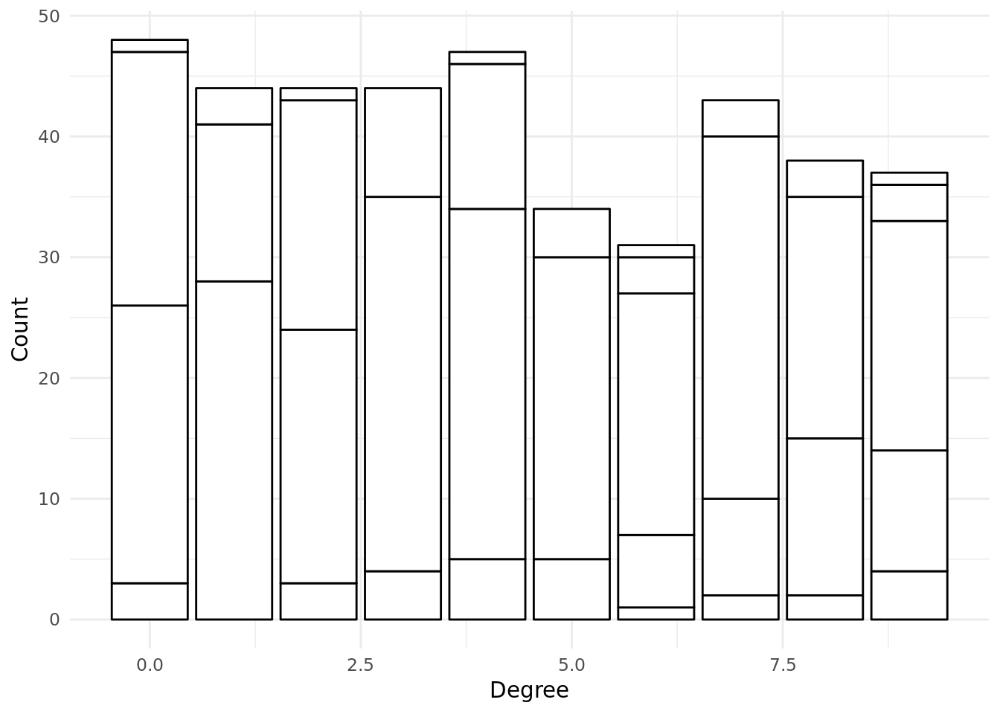

#### Degree distribution of agent->knows->agent edges

#### Runing time by method 

<table class="table table-condensed" style="width: auto !important; ">
 <thead>
  <tr>
   <th style="text-align:left;"> key </th>
   <th style="text-align:right;"> doc_count </th>
   <th style="text-align:right;"> sum_wallTime_ms.value </th>
   <th style="text-align:left;"> avg_wallTime_ms.value </th>
   <th style="text-align:left;"> includedInTotal </th>
  </tr>
 </thead>
<tbody>
  <tr>
   <td style="text-align:left;"> connectIfSimilar </td>
   <td style="text-align:right;"> 83,845 </td>
   <td style="text-align:right;"> 214,276 </td>
   <td style="text-align:left;"> 2.55562049019023 </td>
   <td style="text-align:left;"> No </td>
  </tr>
  <tr>
   <td style="text-align:left;"> existsSimilarity </td>
   <td style="text-align:right;"> 83,845 </td>
   <td style="text-align:right;"> 212,568 </td>
   <td style="text-align:left;"> 2.5352495676546 </td>
   <td style="text-align:left;"> No </td>
  </tr>
  <tr>
   <td style="text-align:left;"> similarityEdges </td>
   <td style="text-align:right;"> 83,845 </td>
   <td style="text-align:right;"> 209,324 </td>
   <td style="text-align:left;"> 2.49655912696046 </td>
   <td style="text-align:left;"> No </td>
  </tr>
  <tr>
   <td style="text-align:left;"> connectAllSimilar </td>
   <td style="text-align:right;"> 410 </td>
   <td style="text-align:right;"> 215,070 </td>
   <td style="text-align:left;"> 524.560975609756 </td>
   <td style="text-align:left;"> Yes </td>
  </tr>
  <tr>
   <td style="text-align:left;"> init </td>
   <td style="text-align:right;"> 103 </td>
   <td style="text-align:right;"> 11,188 </td>
   <td style="text-align:left;"> 108.621359223301 </td>
   <td style="text-align:left;"> No </td>
  </tr>
  <tr>
   <td style="text-align:left;"> connect </td>
   <td style="text-align:right;"> 78 </td>
   <td style="text-align:right;"> 183 </td>
   <td style="text-align:left;"> 2.34615384615385 </td>
   <td style="text-align:left;"> Yes </td>
  </tr>
  <tr>
   <td style="text-align:left;font-weight: bold;"> Total </td>
   <td style="text-align:right;font-weight: bold;"> 496 </td>
   <td style="text-align:right;font-weight: bold;"> 215,807 </td>
   <td style="text-align:left;font-weight: bold;">  </td>
   <td style="text-align:left;font-weight: bold;">  </td>
  </tr>
</tbody>
</table>
####  Found structures 

#####  Cycles 

Number of cycles found:  1 

<button class="btn btn-primary" data-toggle="collapse" data-target="#DGBXINMNCA"> Show/Hide foundCycle query </button> 
 
  
     GET /filebeat-*/_search 
              { 
                "query": {
                  "bool": {
                    "must": [
                      { "match_phrase": {
                        "simulationId": "SIM10-13-10-37-CYMQdf--CV"
                        }
                      },
                      { "bool": {
                        "should": [
                          { "match": {
                            "keyword": "foundCycle"
                          }}
                        ]
                      }}
                    ]
                  }
                }
              }
     

#####  Paths 

Number of paths found:  0 

<button class="btn btn-primary" data-toggle="collapse" data-target="#MOOPUCQRRD"> Show/Hide foundPath query </button> 
 
  
     GET /filebeat-*/_search 
              { 
                "query": {
                  "bool": {
                    "must": [
                      { "match_phrase": {
                        "simulationId": "SIM10-13-10-37-CYMQdf--CV"
                        }
                      },
                      { "bool": {
                        "should": [
                          { "match": {
                            "keyword": "foundPath"
                          }}
                        ]
                      }}
                    ]
                  }
                }
              }
     

###  SIM10-13-10-37-CYMQdf--DV 

#### simulationParameters 

<table class="table table-condensed" style="width: auto !important; ">
 <thead>
  <tr>
   <th style="text-align:left;"> agentNumber </th>
   <th style="text-align:left;"> similarityConnectThreshold </th>
   <th style="text-align:left;"> graphType </th>
   <th style="text-align:left;"> chainLength </th>
   <th style="text-align:left;"> similaritySearchThreshold </th>
   <th style="text-align:left;"> maxDistance </th>
   <th style="text-align:left;"> randomWorksNumberMultiplier </th>
  </tr>
 </thead>
<tbody>
  <tr>
   <td style="text-align:left;width: 20em; "> 100 </td>
   <td style="text-align:left;width: 15em; "> 0.96 </td>
   <td style="text-align:left;width: 15em; "> smallWorld </td>
   <td style="text-align:left;width: 15em; "> 5 </td>
   <td style="text-align:left;width: 15em; "> 1 </td>
   <td style="text-align:left;width: 15em; "> 5 </td>
   <td style="text-align:left;width: 15em; "> 2 </td>
  </tr>
</tbody>
</table>
#### allEdgesByLabel

<table class="table table-condensed" style="width: auto !important; ">
 <thead>
  <tr>
   <th style="text-align:right;"> edges_offers </th>
   <th style="text-align:right;"> edges_similarity </th>
   <th style="text-align:right;"> edges_owns </th>
   <th style="text-align:right;"> edges_demands </th>
   <th style="text-align:right;"> edges_knows </th>
   <th style="text-align:right;"> edges_total </th>
  </tr>
 </thead>
<tbody>
  <tr>
   <td style="text-align:right;width: 5em; "> 205 </td>
   <td style="text-align:right;width: 5em; "> 14,200 </td>
   <td style="text-align:right;width: 5em; "> 205 </td>
   <td style="text-align:right;width: 5em; "> 205 </td>
   <td style="text-align:right;width: 5em; "> 601 </td>
   <td style="text-align:right;width: 5em; "> 15,416 </td>
  </tr>
</tbody>
</table>
#### allVerticesByType

<table class="table table-condensed" style="width: auto !important; ">
 <thead>
  <tr>
   <th style="text-align:right;"> vertices_agent </th>
   <th style="text-align:right;"> vertices_item </th>
   <th style="text-align:right;"> vertices_work </th>
   <th style="text-align:right;"> vertices_total </th>
  </tr>
 </thead>
<tbody>
  <tr>
   <td style="text-align:right;width: 5em; "> 101 </td>
   <td style="text-align:right;width: 5em; "> 410 </td>
   <td style="text-align:right;width: 5em; "> 205 </td>
   <td style="text-align:right;width: 5em; "> 716 </td>
  </tr>
</tbody>
</table>
#### distribution of similarityEdgesByWeight

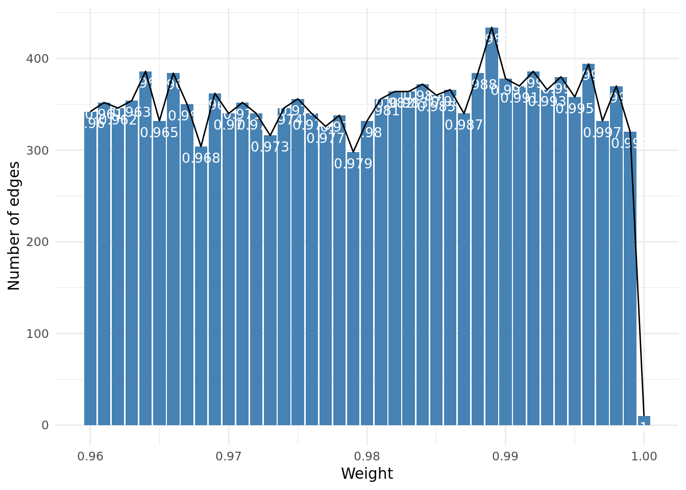

#### Degree distribution of item->similarity->item edges

#### Degree distribution of agent->knows->agent edges

#### Runing time by method 

<table class="table table-condensed" style="width: auto !important; ">
 <thead>
  <tr>
   <th style="text-align:left;">   </th>
   <th style="text-align:left;"> key </th>
   <th style="text-align:right;"> doc_count </th>
   <th style="text-align:right;"> sum_wallTime_ms.value </th>
   <th style="text-align:left;"> avg_wallTime_ms.value </th>
   <th style="text-align:left;"> includedInTotal </th>
  </tr>
 </thead>
<tbody>
  <tr>
   <td style="text-align:left;"> 1 </td>
   <td style="text-align:left;"> knowsAgent </td>
   <td style="text-align:right;"> 601 </td>
   <td style="text-align:right;"> 1,270 </td>
   <td style="text-align:left;"> 2.11314475873544 </td>
   <td style="text-align:left;"> No </td>
  </tr>
  <tr>
   <td style="text-align:left;"> 2 </td>
   <td style="text-align:left;"> addItemToWork </td>
   <td style="text-align:right;"> 410 </td>
   <td style="text-align:right;"> 4,217 </td>
   <td style="text-align:left;"> 10.2853658536585 </td>
   <td style="text-align:left;"> No </td>
  </tr>
  <tr>
   <td style="text-align:left;"> 3 </td>
   <td style="text-align:left;"> ownsWork </td>
   <td style="text-align:right;"> 205 </td>
   <td style="text-align:right;"> 2,657 </td>
   <td style="text-align:left;"> 12.9609756097561 </td>
   <td style="text-align:left;"> No </td>
  </tr>
  <tr>
   <td style="text-align:left;"> 4 </td>
   <td style="text-align:left;"> init </td>
   <td style="text-align:right;"> 103 </td>
   <td style="text-align:right;"> 11,489 </td>
   <td style="text-align:left;"> 111.543689320388 </td>
   <td style="text-align:left;"> No </td>
  </tr>
  <tr>
   <td style="text-align:left;"> 5 </td>
   <td style="text-align:left;"> searchAndConnect </td>
   <td style="text-align:right;"> 101 </td>
   <td style="text-align:right;"> 117,333 </td>
   <td style="text-align:left;"> 1161.71287128713 </td>
   <td style="text-align:left;"> Yes </td>
  </tr>
  <tr>
   <td style="text-align:left;"> 6 </td>
   <td style="text-align:left;"> getWorksItems </td>
   <td style="text-align:right;"> 8 </td>
   <td style="text-align:right;"> 19 </td>
   <td style="text-align:left;"> 2.375 </td>
   <td style="text-align:left;"> Yes </td>
  </tr>
  <tr>
   <td style="text-align:left;"> 9 </td>
   <td style="text-align:left;"> cycleSearch </td>
   <td style="text-align:right;"> 4 </td>
   <td style="text-align:right;"> 1,265 </td>
   <td style="text-align:left;"> 316.25 </td>
   <td style="text-align:left;"> Yes </td>
  </tr>
  <tr>
   <td style="text-align:left;"> 10 </td>
   <td style="text-align:left;"> getWorks </td>
   <td style="text-align:right;"> 4 </td>
   <td style="text-align:right;"> 922 </td>
   <td style="text-align:left;"> 230.5 </td>
   <td style="text-align:left;"> No </td>
  </tr>
  <tr>
   <td style="text-align:left;font-weight: bold;"> 11 </td>
   <td style="text-align:left;font-weight: bold;"> Total </td>
   <td style="text-align:right;font-weight: bold;"> 122 </td>
   <td style="text-align:right;font-weight: bold;"> 119,480 </td>
   <td style="text-align:left;font-weight: bold;">  </td>
   <td style="text-align:left;font-weight: bold;">  </td>
  </tr>
</tbody>
</table>
####  Found structures 

#####  Cycles 

Number of cycles found:  4 

<button class="btn btn-primary" data-toggle="collapse" data-target="#FIHTSQZPCW"> Show/Hide foundCycle query </button> 
 
  
     GET /filebeat-*/_search 
              { 
                "query": {
                  "bool": {
                    "must": [
                      { "match_phrase": {
                        "simulationId": "SIM10-13-10-37-CYMQdf--DV"
                        }
                      },
                      { "bool": {
                        "should": [
                          { "match": {
                            "keyword": "foundCycle"
                          }}
                        ]
                      }}
                    ]
                  }
                }
              }
     

#####  Paths 

Number of paths found:  0 

<button class="btn btn-primary" data-toggle="collapse" data-target="#AYTESSJBKZ"> Show/Hide foundPath query </button> 
 
  
     GET /filebeat-*/_search 
              { 
                "query": {
                  "bool": {
                    "must": [
                      { "match_phrase": {
                        "simulationId": "SIM10-13-10-37-CYMQdf--DV"
                        }
                      },
                      { "bool": {
                        "should": [
                          { "match": {
                            "keyword": "foundPath"
                          }}
                        ]
                      }}
                    ]
                  }
                }
              }
     

###  SIM10-14-01-08-IXTZsY--CV 

#### simulationParameters 

<table class="table table-condensed" style="width: auto !important; ">
 <thead>
  <tr>
   <th style="text-align:left;"> agentNumber </th>
   <th style="text-align:left;"> similarityConnectThreshold </th>
   <th style="text-align:left;"> graphType </th>
   <th style="text-align:left;"> chainLength </th>
   <th style="text-align:left;"> similaritySearchThreshold </th>
   <th style="text-align:left;"> maxDistance </th>
   <th style="text-align:left;"> randomWorksNumberMultiplier </th>
  </tr>
 </thead>
<tbody>
  <tr>
   <td style="text-align:left;width: 20em; "> 200 </td>
   <td style="text-align:left;width: 15em; "> 0.96 </td>
   <td style="text-align:left;width: 15em; "> random </td>
   <td style="text-align:left;width: 15em; "> 10 </td>
   <td style="text-align:left;width: 15em; "> 1 </td>
   <td style="text-align:left;width: 15em; "> 10 </td>
   <td style="text-align:left;width: 15em; "> 1 </td>
  </tr>
</tbody>
</table>
#### allEdgesByLabel

<table class="table table-condensed" style="width: auto !important; ">
 <thead>
  <tr>
   <th style="text-align:right;"> edges_offers </th>
   <th style="text-align:right;"> edges_similarity </th>
   <th style="text-align:right;"> edges_owns </th>
   <th style="text-align:right;"> edges_demands </th>
   <th style="text-align:right;"> edges_knows </th>
   <th style="text-align:right;"> edges_total </th>
  </tr>
 </thead>
<tbody>
  <tr>
   <td style="text-align:right;width: 5em; "> 210 </td>
   <td style="text-align:right;width: 5em; "> 14,600 </td>
   <td style="text-align:right;width: 5em; "> 210 </td>
   <td style="text-align:right;width: 5em; "> 210 </td>
   <td style="text-align:right;width: 5em; "> 200 </td>
   <td style="text-align:right;width: 5em; "> 15,430 </td>
  </tr>
</tbody>
</table>
#### allVerticesByType

<table class="table table-condensed" style="width: auto !important; ">
 <thead>
  <tr>
   <th style="text-align:right;"> vertices_agent </th>
   <th style="text-align:right;"> vertices_item </th>
   <th style="text-align:right;"> vertices_work </th>
   <th style="text-align:right;"> vertices_total </th>
  </tr>
 </thead>
<tbody>
  <tr>
   <td style="text-align:right;width: 5em; "> 201 </td>
   <td style="text-align:right;width: 5em; "> 420 </td>
   <td style="text-align:right;width: 5em; "> 210 </td>
   <td style="text-align:right;width: 5em; "> 831 </td>
  </tr>
</tbody>
</table>
#### distribution of similarityEdgesByWeight

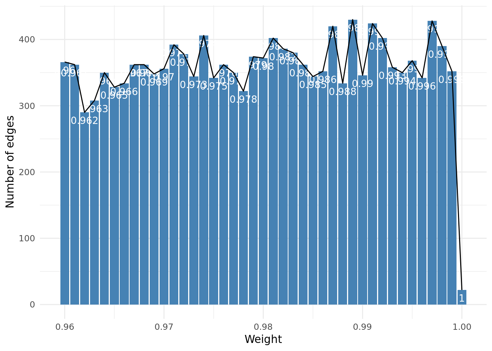

#### Degree distribution of item->similarity->item edges

#### Degree distribution of agent->knows->agent edges

#### Runing time by method 

<table class="table table-condensed" style="width: auto !important; ">
 <thead>
  <tr>
   <th style="text-align:left;"> key </th>
   <th style="text-align:right;"> doc_count </th>
   <th style="text-align:right;"> sum_wallTime_ms.value </th>
   <th style="text-align:left;"> avg_wallTime_ms.value </th>
   <th style="text-align:left;"> includedInTotal </th>
  </tr>
 </thead>
<tbody>
  <tr>
   <td style="text-align:left;"> connectIfSimilar </td>
   <td style="text-align:right;"> 87,990 </td>
   <td style="text-align:right;"> 281,440 </td>
   <td style="text-align:left;"> 3.19854528923741 </td>
   <td style="text-align:left;"> No </td>
  </tr>
  <tr>
   <td style="text-align:left;"> existsSimilarity </td>
   <td style="text-align:right;"> 87,990 </td>
   <td style="text-align:right;"> 273,918 </td>
   <td style="text-align:left;"> 3.11305830207978 </td>
   <td style="text-align:left;"> No </td>
  </tr>
  <tr>
   <td style="text-align:left;"> similarityEdges </td>
   <td style="text-align:right;"> 87,990 </td>
   <td style="text-align:right;"> 270,376 </td>
   <td style="text-align:left;"> 3.07280372769633 </td>
   <td style="text-align:left;"> No </td>
  </tr>
  <tr>
   <td style="text-align:left;"> connect </td>
   <td style="text-align:right;"> 1,692 </td>
   <td style="text-align:right;"> 6,058 </td>
   <td style="text-align:left;"> 3.58037825059102 </td>
   <td style="text-align:left;"> Yes </td>
  </tr>
  <tr>
   <td style="text-align:left;"> connectAllSimilar </td>
   <td style="text-align:right;"> 420 </td>
   <td style="text-align:right;"> 282,274 </td>
   <td style="text-align:left;"> 672.080952380952 </td>
   <td style="text-align:left;"> Yes </td>
  </tr>
  <tr>
   <td style="text-align:left;"> init </td>
   <td style="text-align:right;"> 203 </td>
   <td style="text-align:right;"> 20,448 </td>
   <td style="text-align:left;"> 100.729064039409 </td>
   <td style="text-align:left;"> No </td>
  </tr>
  <tr>
   <td style="text-align:left;font-weight: bold;"> Total </td>
   <td style="text-align:right;font-weight: bold;"> 2,120 </td>
   <td style="text-align:right;font-weight: bold;"> 289,101 </td>
   <td style="text-align:left;font-weight: bold;">  </td>
   <td style="text-align:left;font-weight: bold;">  </td>
  </tr>
</tbody>
</table>
####  Found structures 

#####  Cycles 

Number of cycles found:  1 

<button class="btn btn-primary" data-toggle="collapse" data-target="#VDSUKFZFLQ"> Show/Hide foundCycle query </button> 
 
  
     GET /filebeat-*/_search 
              { 
                "query": {
                  "bool": {
                    "must": [
                      { "match_phrase": {
                        "simulationId": "SIM10-14-01-08-IXTZsY--CV"
                        }
                      },
                      { "bool": {
                        "should": [
                          { "match": {
                            "keyword": "foundCycle"
                          }}
                        ]
                      }}
                    ]
                  }
                }
              }
     

#####  Paths 

Number of paths found:  0 

<button class="btn btn-primary" data-toggle="collapse" data-target="#MUMKHUSLTA"> Show/Hide foundPath query </button> 
 
  
     GET /filebeat-*/_search 
              { 
                "query": {
                  "bool": {
                    "must": [
                      { "match_phrase": {
                        "simulationId": "SIM10-14-01-08-IXTZsY--CV"
                        }
                      },
                      { "bool": {
                        "should": [
                          { "match": {
                            "keyword": "foundPath"
                          }}
                        ]
                      }}
                    ]
                  }
                }
              }
     

###  SIM10-14-01-08-IXTZsY--DV 

#### simulationParameters 

<table class="table table-condensed" style="width: auto !important; ">
 <thead>
  <tr>
   <th style="text-align:left;"> agentNumber </th>
   <th style="text-align:left;"> similarityConnectThreshold </th>
   <th style="text-align:left;"> graphType </th>
   <th style="text-align:left;"> chainLength </th>
   <th style="text-align:left;"> similaritySearchThreshold </th>
   <th style="text-align:left;"> maxDistance </th>
   <th style="text-align:left;"> randomWorksNumberMultiplier </th>
  </tr>
 </thead>
<tbody>
  <tr>
   <td style="text-align:left;width: 20em; "> 200 </td>
   <td style="text-align:left;width: 15em; "> 0.96 </td>
   <td style="text-align:left;width: 15em; "> random </td>
   <td style="text-align:left;width: 15em; "> 10 </td>
   <td style="text-align:left;width: 15em; "> 1 </td>
   <td style="text-align:left;width: 15em; "> 10 </td>
   <td style="text-align:left;width: 15em; "> 1 </td>
  </tr>
</tbody>
</table>
#### allEdgesByLabel

<table class="table table-condensed" style="width: auto !important; ">
 <thead>
  <tr>
   <th style="text-align:right;"> edges_offers </th>
   <th style="text-align:right;"> edges_similarity </th>
   <th style="text-align:right;"> edges_owns </th>
   <th style="text-align:right;"> edges_demands </th>
   <th style="text-align:right;"> edges_knows </th>
   <th style="text-align:right;"> edges_total </th>
  </tr>
 </thead>
<tbody>
  <tr>
   <td style="text-align:right;width: 5em; "> 210 </td>
   <td style="text-align:right;width: 5em; "> 11,216 </td>
   <td style="text-align:right;width: 5em; "> 210 </td>
   <td style="text-align:right;width: 5em; "> 210 </td>
   <td style="text-align:right;width: 5em; "> 200 </td>
   <td style="text-align:right;width: 5em; "> 12,046 </td>
  </tr>
</tbody>
</table>
#### allVerticesByType

<table class="table table-condensed" style="width: auto !important; ">
 <thead>
  <tr>
   <th style="text-align:right;"> vertices_agent </th>
   <th style="text-align:right;"> vertices_item </th>
   <th style="text-align:right;"> vertices_work </th>
   <th style="text-align:right;"> vertices_total </th>
  </tr>
 </thead>
<tbody>
  <tr>
   <td style="text-align:right;width: 5em; "> 201 </td>
   <td style="text-align:right;width: 5em; "> 420 </td>
   <td style="text-align:right;width: 5em; "> 210 </td>
   <td style="text-align:right;width: 5em; "> 831 </td>
  </tr>
</tbody>
</table>
#### distribution of similarityEdgesByWeight

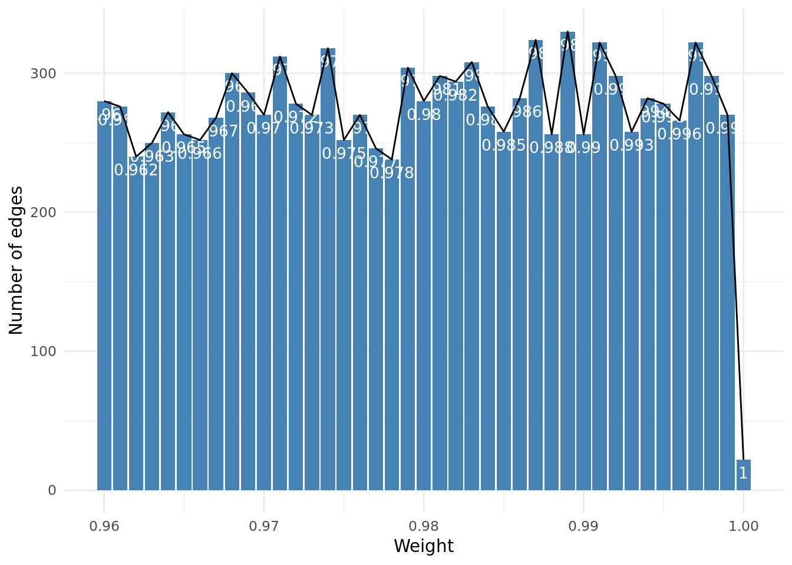

#### Degree distribution of item->similarity->item edges

#### Degree distribution of agent->knows->agent edges

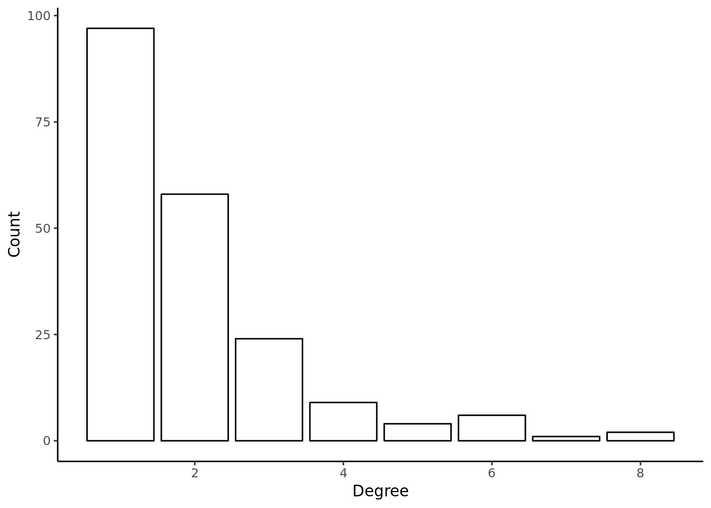

#### Runing time by method 

<table class="table table-condensed" style="width: auto !important; ">
 <thead>
  <tr>
   <th style="text-align:left;">   </th>
   <th style="text-align:left;"> key </th>
   <th style="text-align:right;"> doc_count </th>
   <th style="text-align:right;"> sum_wallTime_ms.value </th>
   <th style="text-align:left;"> avg_wallTime_ms.value </th>
   <th style="text-align:left;"> includedInTotal </th>
  </tr>
 </thead>
<tbody>
  <tr>
   <td style="text-align:left;"> 1 </td>
   <td style="text-align:left;"> addItemToWork </td>
   <td style="text-align:right;"> 420 </td>
   <td style="text-align:right;"> 4,698 </td>
   <td style="text-align:left;"> 11.1857142857143 </td>
   <td style="text-align:left;"> No </td>
  </tr>
  <tr>
   <td style="text-align:left;"> 2 </td>
   <td style="text-align:left;"> ownsWork </td>
   <td style="text-align:right;"> 210 </td>
   <td style="text-align:right;"> 2,761 </td>
   <td style="text-align:left;"> 13.147619047619 </td>
   <td style="text-align:left;"> No </td>
  </tr>
  <tr>
   <td style="text-align:left;"> 3 </td>
   <td style="text-align:left;"> init </td>
   <td style="text-align:right;"> 203 </td>
   <td style="text-align:right;"> 21,244 </td>
   <td style="text-align:left;"> 104.650246305419 </td>
   <td style="text-align:left;"> No </td>
  </tr>
  <tr>
   <td style="text-align:left;"> 4 </td>
   <td style="text-align:left;"> searchAndConnect </td>
   <td style="text-align:right;"> 201 </td>
   <td style="text-align:right;"> 161,333 </td>
   <td style="text-align:left;"> 802.651741293532 </td>
   <td style="text-align:left;"> Yes </td>
  </tr>
  <tr>
   <td style="text-align:left;"> 5 </td>
   <td style="text-align:left;"> knowsAgent </td>
   <td style="text-align:right;"> 200 </td>
   <td style="text-align:right;"> 1,981 </td>
   <td style="text-align:left;"> 9.905 </td>
   <td style="text-align:left;"> No </td>
  </tr>
  <tr>
   <td style="text-align:left;"> 6 </td>
   <td style="text-align:left;"> getWorksItems </td>
   <td style="text-align:right;"> 18 </td>
   <td style="text-align:right;"> 27 </td>
   <td style="text-align:left;"> 1.5 </td>
   <td style="text-align:left;"> Yes </td>
  </tr>
  <tr>
   <td style="text-align:left;"> 8 </td>
   <td style="text-align:left;"> cycleSearch </td>
   <td style="text-align:right;"> 5 </td>
   <td style="text-align:right;"> 253 </td>
   <td style="text-align:left;"> 50.6 </td>
   <td style="text-align:left;"> Yes </td>
  </tr>
  <tr>
   <td style="text-align:left;"> 10 </td>
   <td style="text-align:left;"> getWorks </td>
   <td style="text-align:right;"> 5 </td>
   <td style="text-align:right;"> 557 </td>
   <td style="text-align:left;"> 111.4 </td>
   <td style="text-align:left;"> No </td>
  </tr>
  <tr>
   <td style="text-align:left;font-weight: bold;"> 11 </td>
   <td style="text-align:left;font-weight: bold;"> Total </td>
   <td style="text-align:right;font-weight: bold;"> 234 </td>
   <td style="text-align:right;font-weight: bold;"> 162,856 </td>
   <td style="text-align:left;font-weight: bold;">  </td>
   <td style="text-align:left;font-weight: bold;">  </td>
  </tr>
</tbody>
</table>
####  Found structures 

#####  Cycles 

Number of cycles found:  5 

<button class="btn btn-primary" data-toggle="collapse" data-target="#BNHRROHXRA"> Show/Hide foundCycle query </button> 
 
  
     GET /filebeat-*/_search 
              { 
                "query": {
                  "bool": {
                    "must": [
                      { "match_phrase": {
                        "simulationId": "SIM10-14-01-08-IXTZsY--DV"
                        }
                      },
                      { "bool": {
                        "should": [
                          { "match": {
                            "keyword": "foundCycle"
                          }}
                        ]
                      }}
                    ]
                  }
                }
              }
     

#####  Paths 

Number of paths found:  0 

<button class="btn btn-primary" data-toggle="collapse" data-target="#DWVKEGDLMR"> Show/Hide foundPath query </button> 
 
  
     GET /filebeat-*/_search 
              { 
                "query": {
                  "bool": {
                    "must": [
                      { "match_phrase": {
                        "simulationId": "SIM10-14-01-08-IXTZsY--DV"
                        }
                      },
                      { "bool": {
                        "should": [
                          { "match": {
                            "keyword": "foundPath"
                          }}
                        ]
                      }}
                    ]
                  }
                }
              }
     

###  SIM10-14-01-13-o9uma3--CV 

#### simulationParameters 

<table class="table table-condensed" style="width: auto !important; ">
 <thead>
  <tr>
   <th style="text-align:left;"> agentNumber </th>
   <th style="text-align:left;"> similarityConnectThreshold </th>
   <th style="text-align:left;"> graphType </th>
   <th style="text-align:left;"> chainLength </th>
   <th style="text-align:left;"> similaritySearchThreshold </th>
   <th style="text-align:left;"> maxDistance </th>
   <th style="text-align:left;"> randomWorksNumberMultiplier </th>
  </tr>
 </thead>
<tbody>
  <tr>
   <td style="text-align:left;width: 20em; "> 200 </td>
   <td style="text-align:left;width: 15em; "> 0.96 </td>
   <td style="text-align:left;width: 15em; "> smallWorld </td>
   <td style="text-align:left;width: 15em; "> 10 </td>
   <td style="text-align:left;width: 15em; "> 1 </td>
   <td style="text-align:left;width: 15em; "> 10 </td>
   <td style="text-align:left;width: 15em; "> 1 </td>
  </tr>
</tbody>
</table>
#### allEdgesByLabel

<table class="table table-condensed" style="width: auto !important; ">
 <thead>
  <tr>
   <th style="text-align:right;"> edges_offers </th>
   <th style="text-align:right;"> edges_similarity </th>
   <th style="text-align:right;"> edges_owns </th>
   <th style="text-align:right;"> edges_demands </th>
   <th style="text-align:right;"> edges_knows </th>
   <th style="text-align:right;"> edges_total </th>
  </tr>
 </thead>
<tbody>
  <tr>
   <td style="text-align:right;width: 5em; "> 210 </td>
   <td style="text-align:right;width: 5em; "> 14,476 </td>
   <td style="text-align:right;width: 5em; "> 210 </td>
   <td style="text-align:right;width: 5em; "> 210 </td>
   <td style="text-align:right;width: 5em; "> 1,201 </td>
   <td style="text-align:right;width: 5em; "> 16,307 </td>
  </tr>
</tbody>
</table>
#### allVerticesByType

<table class="table table-condensed" style="width: auto !important; ">
 <thead>
  <tr>
   <th style="text-align:right;"> vertices_agent </th>
   <th style="text-align:right;"> vertices_item </th>
   <th style="text-align:right;"> vertices_work </th>
   <th style="text-align:right;"> vertices_total </th>
  </tr>
 </thead>
<tbody>
  <tr>
   <td style="text-align:right;width: 5em; "> 201 </td>
   <td style="text-align:right;width: 5em; "> 420 </td>
   <td style="text-align:right;width: 5em; "> 210 </td>
   <td style="text-align:right;width: 5em; "> 831 </td>
  </tr>
</tbody>
</table>
#### distribution of similarityEdgesByWeight

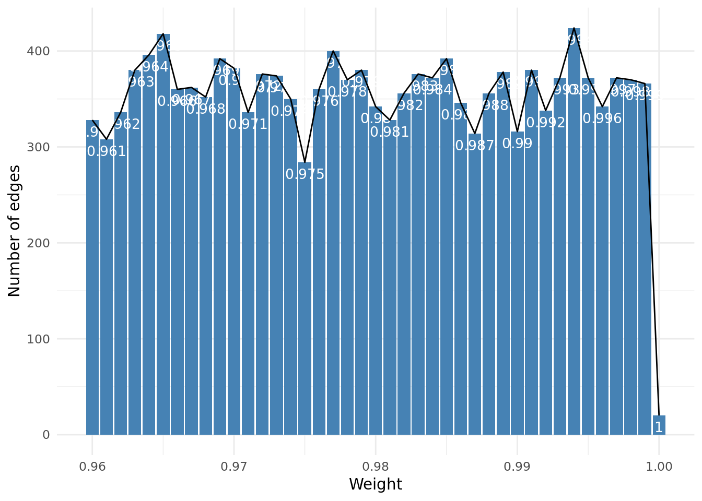

#### Degree distribution of item->similarity->item edges

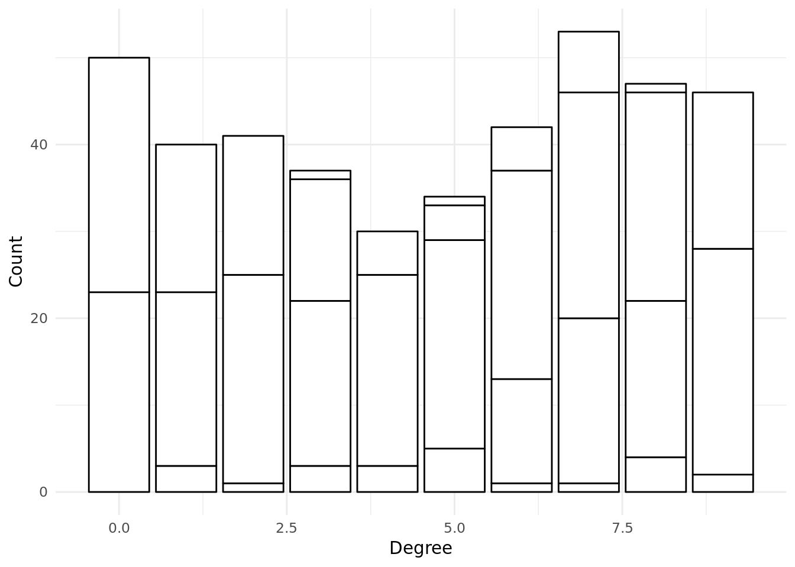

#### Degree distribution of agent->knows->agent edges

#### Runing time by method 

<table class="table table-condensed" style="width: auto !important; ">
 <thead>
  <tr>
   <th style="text-align:left;"> key </th>
   <th style="text-align:right;"> doc_count </th>
   <th style="text-align:right;"> sum_wallTime_ms.value </th>
   <th style="text-align:left;"> avg_wallTime_ms.value </th>
   <th style="text-align:left;"> includedInTotal </th>
  </tr>
 </thead>
<tbody>
  <tr>
   <td style="text-align:left;"> connectIfSimilar </td>
   <td style="text-align:right;"> 87,990 </td>
   <td style="text-align:right;"> 283,760 </td>
   <td style="text-align:left;"> 3.2249119218093 </td>
   <td style="text-align:left;"> No </td>
  </tr>
  <tr>
   <td style="text-align:left;"> existsSimilarity </td>
   <td style="text-align:right;"> 87,990 </td>
   <td style="text-align:right;"> 281,894 </td>
   <td style="text-align:left;"> 3.20370496647346 </td>
   <td style="text-align:left;"> No </td>
  </tr>
  <tr>
   <td style="text-align:left;"> similarityEdges </td>
   <td style="text-align:right;"> 87,990 </td>
   <td style="text-align:right;"> 278,506 </td>
   <td style="text-align:left;"> 3.16520059097625 </td>
   <td style="text-align:left;"> No </td>
  </tr>
  <tr>
   <td style="text-align:left;"> connectAllSimilar </td>
   <td style="text-align:right;"> 420 </td>
   <td style="text-align:right;"> 284,611 </td>
   <td style="text-align:left;"> 677.645238095238 </td>
   <td style="text-align:left;"> Yes </td>
  </tr>
  <tr>
   <td style="text-align:left;"> init </td>
   <td style="text-align:right;"> 203 </td>
   <td style="text-align:right;"> 19,400 </td>
   <td style="text-align:left;"> 95.5665024630542 </td>
   <td style="text-align:left;"> No </td>
  </tr>
  <tr>
   <td style="text-align:left;"> connect </td>
   <td style="text-align:right;"> 62 </td>
   <td style="text-align:right;"> 273 </td>
   <td style="text-align:left;"> 4.40322580645161 </td>
   <td style="text-align:left;"> Yes </td>
  </tr>
  <tr>
   <td style="text-align:left;font-weight: bold;"> Total </td>
   <td style="text-align:right;font-weight: bold;"> 490 </td>
   <td style="text-align:right;font-weight: bold;"> 285,691 </td>
   <td style="text-align:left;font-weight: bold;">  </td>
   <td style="text-align:left;font-weight: bold;">  </td>
  </tr>
</tbody>
</table>
####  Found structures 

#####  Cycles 

Number of cycles found:  1 

<button class="btn btn-primary" data-toggle="collapse" data-target="#UNKEXAJSZN"> Show/Hide foundCycle query </button> 
 
  
     GET /filebeat-*/_search 
              { 
                "query": {
                  "bool": {
                    "must": [
                      { "match_phrase": {
                        "simulationId": "SIM10-14-01-13-o9uma3--CV"
                        }
                      },
                      { "bool": {
                        "should": [
                          { "match": {
                            "keyword": "foundCycle"
                          }}
                        ]
                      }}
                    ]
                  }
                }
              }
     

#####  Paths 

Number of paths found:  0 

<button class="btn btn-primary" data-toggle="collapse" data-target="#TJTSEZLXYX"> Show/Hide foundPath query </button> 
 
  
     GET /filebeat-*/_search 
              { 
                "query": {
                  "bool": {
                    "must": [
                      { "match_phrase": {
                        "simulationId": "SIM10-14-01-13-o9uma3--CV"
                        }
                      },
                      { "bool": {
                        "should": [
                          { "match": {
                            "keyword": "foundPath"
                          }}
                        ]
                      }}
                    ]
                  }
                }
              }
     

###  SIM10-14-01-13-o9uma3--DV 

#### simulationParameters 

<table class="table table-condensed" style="width: auto !important; ">
 <thead>
  <tr>
   <th style="text-align:left;"> agentNumber </th>
   <th style="text-align:left;"> similarityConnectThreshold </th>
   <th style="text-align:left;"> graphType </th>
   <th style="text-align:left;"> chainLength </th>
   <th style="text-align:left;"> similaritySearchThreshold </th>
   <th style="text-align:left;"> maxDistance </th>
   <th style="text-align:left;"> randomWorksNumberMultiplier </th>
  </tr>
 </thead>
<tbody>
  <tr>
   <td style="text-align:left;width: 20em; "> 200 </td>
   <td style="text-align:left;width: 15em; "> 0.96 </td>
   <td style="text-align:left;width: 15em; "> smallWorld </td>
   <td style="text-align:left;width: 15em; "> 10 </td>
   <td style="text-align:left;width: 15em; "> 1 </td>
   <td style="text-align:left;width: 15em; "> 10 </td>
   <td style="text-align:left;width: 15em; "> 1 </td>
  </tr>
</tbody>
</table>
#### allEdgesByLabel

<table class="table table-condensed" style="width: auto !important; ">
 <thead>
  <tr>
   <th style="text-align:right;"> edges_offers </th>
   <th style="text-align:right;"> edges_similarity </th>
   <th style="text-align:right;"> edges_owns </th>
   <th style="text-align:right;"> edges_demands </th>
   <th style="text-align:right;"> edges_knows </th>
   <th style="text-align:right;"> edges_total </th>
  </tr>
 </thead>
<tbody>
  <tr>
   <td style="text-align:right;width: 5em; "> 210 </td>
   <td style="text-align:right;width: 5em; "> 14,352 </td>
   <td style="text-align:right;width: 5em; "> 210 </td>
   <td style="text-align:right;width: 5em; "> 210 </td>
   <td style="text-align:right;width: 5em; "> 1,201 </td>
   <td style="text-align:right;width: 5em; "> 16,183 </td>
  </tr>
</tbody>
</table>
#### allVerticesByType

<table class="table table-condensed" style="width: auto !important; ">
 <thead>
  <tr>
   <th style="text-align:right;"> vertices_agent </th>
   <th style="text-align:right;"> vertices_item </th>
   <th style="text-align:right;"> vertices_work </th>
   <th style="text-align:right;"> vertices_total </th>
  </tr>
 </thead>
<tbody>
  <tr>
   <td style="text-align:right;width: 5em; "> 201 </td>
   <td style="text-align:right;width: 5em; "> 420 </td>
   <td style="text-align:right;width: 5em; "> 210 </td>
   <td style="text-align:right;width: 5em; "> 831 </td>
  </tr>
</tbody>
</table>
#### distribution of similarityEdgesByWeight

#### Degree distribution of item->similarity->item edges

#### Degree distribution of agent->knows->agent edges

#### Runing time by method 

<table class="table table-condensed" style="width: auto !important; ">
 <thead>
  <tr>
   <th style="text-align:left;">   </th>
   <th style="text-align:left;"> key </th>
   <th style="text-align:right;"> doc_count </th>
   <th style="text-align:right;"> sum_wallTime_ms.value </th>
   <th style="text-align:left;"> avg_wallTime_ms.value </th>
   <th style="text-align:left;"> includedInTotal </th>
  </tr>
 </thead>
<tbody>
  <tr>
   <td style="text-align:left;"> 1 </td>
   <td style="text-align:left;"> knowsAgent </td>
   <td style="text-align:right;"> 1,201 </td>
   <td style="text-align:right;"> 3,218 </td>
   <td style="text-align:left;"> 2.67943380516236 </td>
   <td style="text-align:left;"> No </td>
  </tr>
  <tr>
   <td style="text-align:left;"> 2 </td>
   <td style="text-align:left;"> addItemToWork </td>
   <td style="text-align:right;"> 420 </td>
   <td style="text-align:right;"> 6,622 </td>
   <td style="text-align:left;"> 15.7666666666667 </td>
   <td style="text-align:left;"> No </td>
  </tr>
  <tr>
   <td style="text-align:left;"> 3 </td>
   <td style="text-align:left;"> ownsWork </td>
   <td style="text-align:right;"> 210 </td>
   <td style="text-align:right;"> 4,201 </td>
   <td style="text-align:left;"> 20.0047619047619 </td>
   <td style="text-align:left;"> No </td>
  </tr>
  <tr>
   <td style="text-align:left;"> 4 </td>
   <td style="text-align:left;"> init </td>
   <td style="text-align:right;"> 203 </td>
   <td style="text-align:right;"> 22,415 </td>
   <td style="text-align:left;"> 110.418719211823 </td>
   <td style="text-align:left;"> No </td>
  </tr>
  <tr>
   <td style="text-align:left;"> 5 </td>
   <td style="text-align:left;"> searchAndConnect </td>
   <td style="text-align:right;"> 201 </td>
   <td style="text-align:right;"> 256,928 </td>
   <td style="text-align:left;"> 1278.24875621891 </td>
   <td style="text-align:left;"> Yes </td>
  </tr>
  <tr>
   <td style="text-align:left;"> 6 </td>
   <td style="text-align:left;"> getWorksItems </td>
   <td style="text-align:right;"> 18 </td>
   <td style="text-align:right;"> 88 </td>
   <td style="text-align:left;"> 4.88888888888889 </td>
   <td style="text-align:left;"> Yes </td>
  </tr>
  <tr>
   <td style="text-align:left;"> 8 </td>
   <td style="text-align:left;"> cycleSearch </td>
   <td style="text-align:right;"> 9 </td>
   <td style="text-align:right;"> 1,915 </td>
   <td style="text-align:left;"> 212.777777777778 </td>
   <td style="text-align:left;"> Yes </td>
  </tr>
  <tr>
   <td style="text-align:left;"> 9 </td>
   <td style="text-align:left;"> getWorks </td>
   <td style="text-align:right;"> 9 </td>
   <td style="text-align:right;"> 1,161 </td>
   <td style="text-align:left;"> 129 </td>
   <td style="text-align:left;"> No </td>
  </tr>
  <tr>
   <td style="text-align:left;"> 10 </td>
   <td style="text-align:left;"> individualCycleSearch </td>
   <td style="text-align:right;"> 9 </td>
   <td style="text-align:right;"> 0 </td>
   <td style="text-align:left;"> 0 </td>
   <td style="text-align:left;"> Yes </td>
  </tr>
  <tr>
   <td style="text-align:left;font-weight: bold;"> 11 </td>
   <td style="text-align:left;font-weight: bold;"> Total </td>
   <td style="text-align:right;font-weight: bold;"> 246 </td>
   <td style="text-align:right;font-weight: bold;"> 261,431 </td>
   <td style="text-align:left;font-weight: bold;">  </td>
   <td style="text-align:left;font-weight: bold;">  </td>
  </tr>
</tbody>
</table>
####  Found structures 

#####  Cycles 

Number of cycles found:  8 

<button class="btn btn-primary" data-toggle="collapse" data-target="#AYBDWFFENF"> Show/Hide foundCycle query </button> 
 
  
     GET /filebeat-*/_search 
              { 
                "query": {
                  "bool": {
                    "must": [
                      { "match_phrase": {
                        "simulationId": "SIM10-14-01-13-o9uma3--DV"
                        }
                      },
                      { "bool": {
                        "should": [
                          { "match": {
                            "keyword": "foundCycle"
                          }}
                        ]
                      }}
                    ]
                  }
                }
              }
     

#####  Paths 

Number of paths found:  1 

<button class="btn btn-primary" data-toggle="collapse" data-target="#TRXOROMINH"> Show/Hide foundPath query </button> 
 
  
     GET /filebeat-*/_search 
              { 
                "query": {
                  "bool": {
                    "must": [
                      { "match_phrase": {
                        "simulationId": "SIM10-14-01-13-o9uma3--DV"
                        }
                      },
                      { "bool": {
                        "should": [
                          { "match": {
                            "keyword": "foundPath"
                          }}
                        ]
                      }}
                    ]
                  }
                }
              }
     

###  SIM10-14-03-19-b4IbvK--CV 

#### simulationParameters 

<table class="table table-condensed" style="width: auto !important; ">
 <thead>
  <tr>
   <th style="text-align:left;"> agentNumber </th>
   <th style="text-align:left;"> similarityConnectThreshold </th>
   <th style="text-align:left;"> graphType </th>
   <th style="text-align:left;"> chainLength </th>
   <th style="text-align:left;"> similaritySearchThreshold </th>
   <th style="text-align:left;"> maxDistance </th>
   <th style="text-align:left;"> randomWorksNumberMultiplier </th>
  </tr>
 </thead>
<tbody>
  <tr>
   <td style="text-align:left;width: 20em; "> 200 </td>
   <td style="text-align:left;width: 15em; "> 0.96 </td>
   <td style="text-align:left;width: 15em; "> random </td>
   <td style="text-align:left;width: 15em; "> 10 </td>
   <td style="text-align:left;width: 15em; "> 1 </td>
   <td style="text-align:left;width: 15em; "> 10 </td>
   <td style="text-align:left;width: 15em; "> 2 </td>
  </tr>
</tbody>
</table>
#### allEdgesByLabel

<table class="table table-condensed" style="width: auto !important; ">
 <thead>
  <tr>
   <th style="text-align:right;"> edges_offers </th>
   <th style="text-align:right;"> edges_similarity </th>
   <th style="text-align:right;"> edges_owns </th>
   <th style="text-align:right;"> edges_demands </th>
   <th style="text-align:right;"> edges_knows </th>
   <th style="text-align:right;"> edges_total </th>
  </tr>
 </thead>
<tbody>
  <tr>
   <td style="text-align:right;width: 5em; "> 410 </td>
   <td style="text-align:right;width: 5em; "> 54,966 </td>
   <td style="text-align:right;width: 5em; "> 410 </td>
   <td style="text-align:right;width: 5em; "> 410 </td>
   <td style="text-align:right;width: 5em; "> 200 </td>
   <td style="text-align:right;width: 5em; "> 56,396 </td>
  </tr>
</tbody>
</table>
#### allVerticesByType

<table class="table table-condensed" style="width: auto !important; ">
 <thead>
  <tr>
   <th style="text-align:right;"> vertices_agent </th>
   <th style="text-align:right;"> vertices_item </th>
   <th style="text-align:right;"> vertices_work </th>
   <th style="text-align:right;"> vertices_total </th>
  </tr>
 </thead>
<tbody>
  <tr>
   <td style="text-align:right;width: 5em; "> 201 </td>
   <td style="text-align:right;width: 5em; "> 820 </td>
   <td style="text-align:right;width: 5em; "> 410 </td>
   <td style="text-align:right;width: 5em; "> 1,431 </td>
  </tr>
</tbody>
</table>
#### distribution of similarityEdgesByWeight

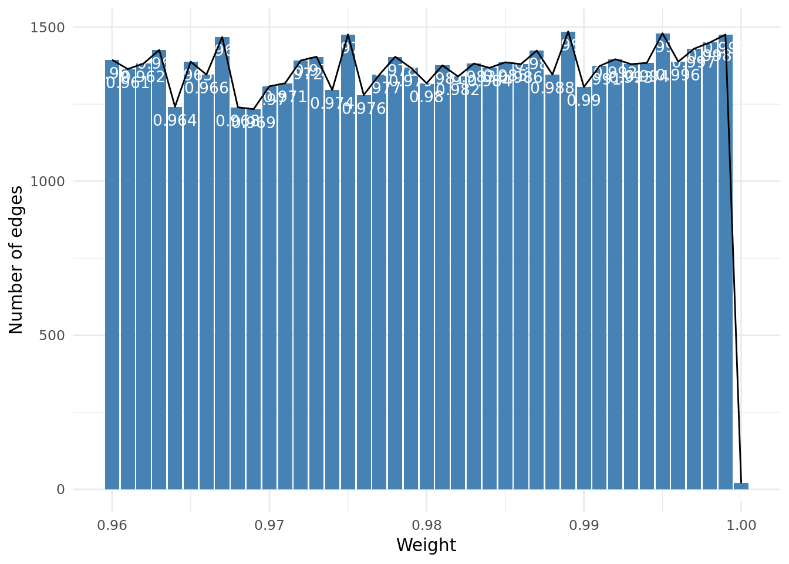

#### Degree distribution of item->similarity->item edges

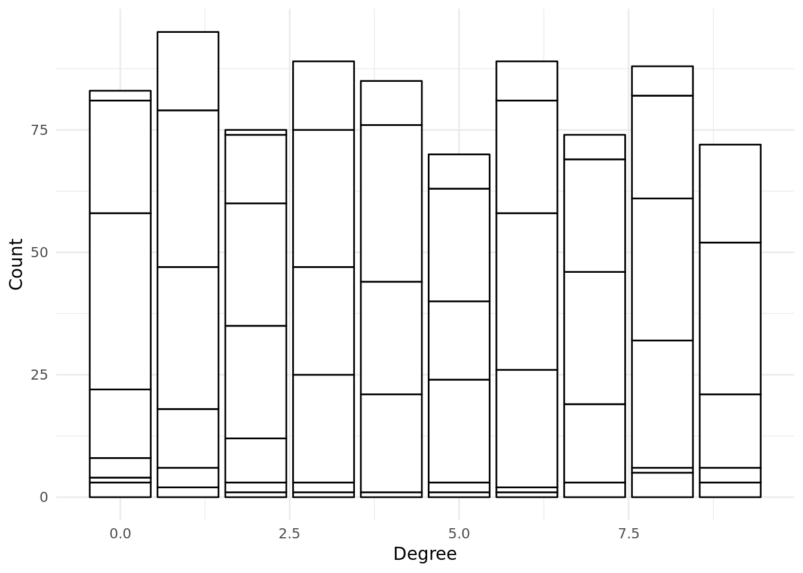

#### Degree distribution of agent->knows->agent edges

#### Runing time by method 

<table class="table table-condensed" style="width: auto !important; ">
 <thead>
  <tr>
   <th style="text-align:left;"> key </th>
   <th style="text-align:right;"> doc_count </th>
   <th style="text-align:right;"> sum_wallTime_ms.value </th>
   <th style="text-align:left;"> avg_wallTime_ms.value </th>
   <th style="text-align:left;"> includedInTotal </th>
  </tr>
 </thead>
<tbody>
  <tr>
   <td style="text-align:left;"> connectIfSimilar </td>
   <td style="text-align:right;"> 335,790 </td>
   <td style="text-align:right;"> 1,477,360 </td>
   <td style="text-align:left;"> 4.39965454599601 </td>
   <td style="text-align:left;"> No </td>
  </tr>
  <tr>
   <td style="text-align:left;"> existsSimilarity </td>
   <td style="text-align:right;"> 335,790 </td>
   <td style="text-align:right;"> 1,458,402 </td>
   <td style="text-align:left;"> 4.34319664075762 </td>
   <td style="text-align:left;"> No </td>
  </tr>
  <tr>
   <td style="text-align:left;"> similarityEdges </td>
   <td style="text-align:right;"> 335,790 </td>
   <td style="text-align:right;"> 1,440,020 </td>
   <td style="text-align:left;"> 4.28845409333214 </td>
   <td style="text-align:left;"> No </td>
  </tr>
  <tr>
   <td style="text-align:left;"> connect </td>
   <td style="text-align:right;"> 2,791 </td>
   <td style="text-align:right;"> 12,763 </td>
   <td style="text-align:left;"> 4.5729129344321 </td>
   <td style="text-align:left;"> Yes </td>
  </tr>
  <tr>
   <td style="text-align:left;"> connectAllSimilar </td>
   <td style="text-align:right;"> 820 </td>
   <td style="text-align:right;"> 1,480,744 </td>
   <td style="text-align:left;"> 1805.78536585366 </td>
   <td style="text-align:left;"> Yes </td>
  </tr>
  <tr>
   <td style="text-align:left;"> init </td>
   <td style="text-align:right;"> 203 </td>
   <td style="text-align:right;"> 20,614 </td>
   <td style="text-align:left;"> 101.546798029557 </td>
   <td style="text-align:left;"> No </td>
  </tr>
  <tr>
   <td style="text-align:left;font-weight: bold;"> Total </td>
   <td style="text-align:right;font-weight: bold;"> 3,619 </td>
   <td style="text-align:right;font-weight: bold;"> 1,495,255 </td>
   <td style="text-align:left;font-weight: bold;">  </td>
   <td style="text-align:left;font-weight: bold;">  </td>
  </tr>
</tbody>
</table>
####  Found structures 

#####  Cycles 

Number of cycles found:  1 

<button class="btn btn-primary" data-toggle="collapse" data-target="#GVBKIJDDZX"> Show/Hide foundCycle query </button> 
 
  
     GET /filebeat-*/_search 
              { 
                "query": {
                  "bool": {
                    "must": [
                      { "match_phrase": {
                        "simulationId": "SIM10-14-03-19-b4IbvK--CV"
                        }
                      },
                      { "bool": {
                        "should": [
                          { "match": {
                            "keyword": "foundCycle"
                          }}
                        ]
                      }}
                    ]
                  }
                }
              }
     

#####  Paths 

Number of paths found:  0 

<button class="btn btn-primary" data-toggle="collapse" data-target="#XDRRCUWONZ"> Show/Hide foundPath query </button> 
 
  
     GET /filebeat-*/_search 
              { 
                "query": {
                  "bool": {
                    "must": [
                      { "match_phrase": {
                        "simulationId": "SIM10-14-03-19-b4IbvK--CV"
                        }
                      },
                      { "bool": {
                        "should": [
                          { "match": {
                            "keyword": "foundPath"
                          }}
                        ]
                      }}
                    ]
                  }
                }
              }
     

###  SIM10-14-03-19-b4IbvK--DV 

#### simulationParameters 

<table class="table table-condensed" style="width: auto !important; ">
 <thead>
  <tr>
   <th style="text-align:left;"> agentNumber </th>
   <th style="text-align:left;"> similarityConnectThreshold </th>
   <th style="text-align:left;"> graphType </th>
   <th style="text-align:left;"> chainLength </th>
   <th style="text-align:left;"> similaritySearchThreshold </th>
   <th style="text-align:left;"> maxDistance </th>
   <th style="text-align:left;"> randomWorksNumberMultiplier </th>
  </tr>
 </thead>
<tbody>
  <tr>
   <td style="text-align:left;width: 20em; "> 200 </td>
   <td style="text-align:left;width: 15em; "> 0.96 </td>
   <td style="text-align:left;width: 15em; "> random </td>
   <td style="text-align:left;width: 15em; "> 10 </td>
   <td style="text-align:left;width: 15em; "> 1 </td>
   <td style="text-align:left;width: 15em; "> 10 </td>
   <td style="text-align:left;width: 15em; "> 2 </td>
  </tr>
</tbody>
</table>
#### allEdgesByLabel

<table class="table table-condensed" style="width: auto !important; ">
 <thead>
  <tr>
   <th style="text-align:right;"> edges_offers </th>
   <th style="text-align:right;"> edges_similarity </th>
   <th style="text-align:right;"> edges_owns </th>
   <th style="text-align:right;"> edges_demands </th>
   <th style="text-align:right;"> edges_knows </th>
   <th style="text-align:right;"> edges_total </th>
  </tr>
 </thead>
<tbody>
  <tr>
   <td style="text-align:right;width: 5em; "> 410 </td>
   <td style="text-align:right;width: 5em; "> 49,384 </td>
   <td style="text-align:right;width: 5em; "> 410 </td>
   <td style="text-align:right;width: 5em; "> 410 </td>
   <td style="text-align:right;width: 5em; "> 200 </td>
   <td style="text-align:right;width: 5em; "> 50,814 </td>
  </tr>
</tbody>
</table>
#### allVerticesByType

<table class="table table-condensed" style="width: auto !important; ">
 <thead>
  <tr>
   <th style="text-align:right;"> vertices_agent </th>
   <th style="text-align:right;"> vertices_item </th>
   <th style="text-align:right;"> vertices_work </th>
   <th style="text-align:right;"> vertices_total </th>
  </tr>
 </thead>
<tbody>
  <tr>
   <td style="text-align:right;width: 5em; "> 201 </td>
   <td style="text-align:right;width: 5em; "> 820 </td>
   <td style="text-align:right;width: 5em; "> 410 </td>
   <td style="text-align:right;width: 5em; "> 1,431 </td>
  </tr>
</tbody>
</table>
#### distribution of similarityEdgesByWeight

#### Degree distribution of item->similarity->item edges

#### Degree distribution of agent->knows->agent edges

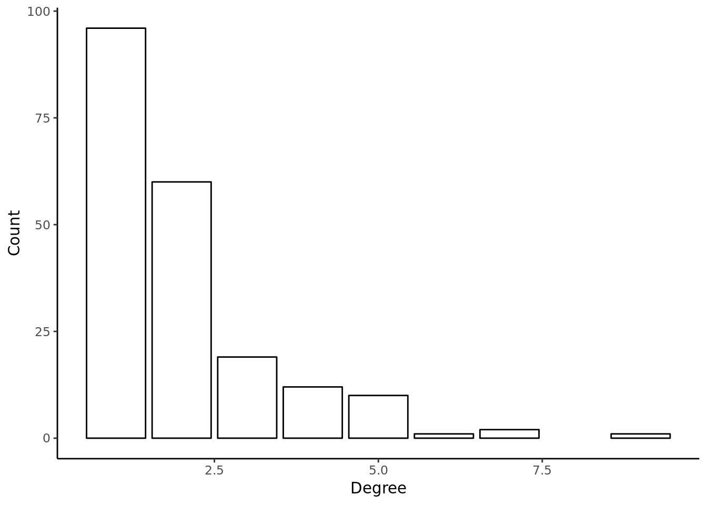

#### Runing time by method 

<table class="table table-condensed" style="width: auto !important; ">
 <thead>
  <tr>
   <th style="text-align:left;">   </th>
   <th style="text-align:left;"> key </th>
   <th style="text-align:right;"> doc_count </th>
   <th style="text-align:right;"> sum_wallTime_ms.value </th>
   <th style="text-align:left;"> avg_wallTime_ms.value </th>
   <th style="text-align:left;"> includedInTotal </th>
  </tr>
 </thead>
<tbody>
  <tr>
   <td style="text-align:left;"> 2 </td>
   <td style="text-align:left;"> cycleSearch </td>
   <td style="text-align:right;"> 3,600 </td>
   <td style="text-align:right;"> 85,211 </td>
   <td style="text-align:left;"> 23.6697222222222 </td>
   <td style="text-align:left;"> Yes </td>
  </tr>
  <tr>
   <td style="text-align:left;"> 3 </td>
   <td style="text-align:left;"> getWorks </td>
   <td style="text-align:right;"> 3,600 </td>
   <td style="text-align:right;"> 91,262 </td>
   <td style="text-align:left;"> 25.3505555555556 </td>
   <td style="text-align:left;"> No </td>
  </tr>
  <tr>
   <td style="text-align:left;"> 4 </td>
   <td style="text-align:left;"> individualCycleSearch </td>
   <td style="text-align:right;"> 3,600 </td>
   <td style="text-align:right;"> 68 </td>
   <td style="text-align:left;"> 0.0188888888888889 </td>
   <td style="text-align:left;"> Yes </td>
  </tr>
  <tr>
   <td style="text-align:left;"> 6 </td>
   <td style="text-align:left;"> addItemToWork </td>
   <td style="text-align:right;"> 820 </td>
   <td style="text-align:right;"> 11,247 </td>
   <td style="text-align:left;"> 13.7158536585366 </td>
   <td style="text-align:left;"> No </td>
  </tr>
  <tr>
   <td style="text-align:left;"> 7 </td>
   <td style="text-align:left;"> ownsWork </td>
   <td style="text-align:right;"> 410 </td>
   <td style="text-align:right;"> 6,012 </td>
   <td style="text-align:left;"> 14.6634146341463 </td>
   <td style="text-align:left;"> No </td>
  </tr>
  <tr>
   <td style="text-align:left;"> 8 </td>
   <td style="text-align:left;"> init </td>
   <td style="text-align:right;"> 203 </td>
   <td style="text-align:right;"> 22,038 </td>
   <td style="text-align:left;"> 108.56157635468 </td>
   <td style="text-align:left;"> No </td>
  </tr>
  <tr>
   <td style="text-align:left;"> 9 </td>
   <td style="text-align:left;"> searchAndConnect </td>
   <td style="text-align:right;"> 201 </td>
   <td style="text-align:right;"> 563,952 </td>
   <td style="text-align:left;"> 2805.73134328358 </td>
   <td style="text-align:left;"> Yes </td>
  </tr>
  <tr>
   <td style="text-align:left;"> 10 </td>
   <td style="text-align:left;"> knowsAgent </td>
   <td style="text-align:right;"> 200 </td>
   <td style="text-align:right;"> 1,093 </td>
   <td style="text-align:left;"> 5.465 </td>
   <td style="text-align:left;"> No </td>
  </tr>
  <tr>
   <td style="text-align:left;font-weight: bold;"> 1 </td>
   <td style="text-align:left;font-weight: bold;"> Total </td>
   <td style="text-align:right;font-weight: bold;"> 14,601 </td>
   <td style="text-align:right;font-weight: bold;"> 991,737 </td>
   <td style="text-align:left;font-weight: bold;">  </td>
   <td style="text-align:left;font-weight: bold;">  </td>
  </tr>
</tbody>
</table>
####  Found structures 

#####  Cycles 

Number of cycles found:  0 

<button class="btn btn-primary" data-toggle="collapse" data-target="#YSWIILUOSR"> Show/Hide foundCycle query </button> 
 
  
     GET /filebeat-*/_search 
              { 
                "query": {
                  "bool": {
                    "must": [
                      { "match_phrase": {
                        "simulationId": "SIM10-14-03-19-b4IbvK--DV"
                        }
                      },
                      { "bool": {
                        "should": [
                          { "match": {
                            "keyword": "foundCycle"
                          }}
                        ]
                      }}
                    ]
                  }
                }
              }
     

#####  Paths 

Number of paths found:  3600 

<button class="btn btn-primary" data-toggle="collapse" data-target="#MIOJMIYBEE"> Show/Hide foundPath query </button> 
 
  
     GET /filebeat-*/_search 
              { 
                "query": {
                  "bool": {
                    "must": [
                      { "match_phrase": {
                        "simulationId": "SIM10-14-03-19-b4IbvK--DV"
                        }
                      },
                      { "bool": {
                        "should": [
                          { "match": {
                            "keyword": "foundPath"
                          }}
                        ]
                      }}
                    ]
                  }
                }
              }
     

###  SIM10-14-04-45-fdhFKu--CV 

#### simulationParameters 

<table class="table table-condensed" style="width: auto !important; ">
 <thead>
  <tr>
   <th style="text-align:left;"> agentNumber </th>
   <th style="text-align:left;"> similarityConnectThreshold </th>
   <th style="text-align:left;"> graphType </th>
   <th style="text-align:left;"> chainLength </th>
   <th style="text-align:left;"> similaritySearchThreshold </th>
   <th style="text-align:left;"> maxDistance </th>
   <th style="text-align:left;"> randomWorksNumberMultiplier </th>
  </tr>
 </thead>
<tbody>
  <tr>
   <td style="text-align:left;width: 20em; "> 200 </td>
   <td style="text-align:left;width: 15em; "> 0.96 </td>
   <td style="text-align:left;width: 15em; "> smallWorld </td>
   <td style="text-align:left;width: 15em; "> 10 </td>
   <td style="text-align:left;width: 15em; "> 1 </td>
   <td style="text-align:left;width: 15em; "> 10 </td>
   <td style="text-align:left;width: 15em; "> 2 </td>
  </tr>
</tbody>
</table>
#### allEdgesByLabel

<table class="table table-condensed" style="width: auto !important; ">
 <thead>
  <tr>
   <th style="text-align:right;"> edges_offers </th>
   <th style="text-align:right;"> edges_similarity </th>
   <th style="text-align:right;"> edges_owns </th>
   <th style="text-align:right;"> edges_demands </th>
   <th style="text-align:right;"> edges_knows </th>
   <th style="text-align:right;"> edges_total </th>
  </tr>
 </thead>
<tbody>
  <tr>
   <td style="text-align:right;width: 5em; "> 410 </td>
   <td style="text-align:right;width: 5em; "> 55,024 </td>
   <td style="text-align:right;width: 5em; "> 410 </td>
   <td style="text-align:right;width: 5em; "> 410 </td>
   <td style="text-align:right;width: 5em; "> 1,201 </td>
   <td style="text-align:right;width: 5em; "> 57,455 </td>
  </tr>
</tbody>
</table>
#### allVerticesByType

<table class="table table-condensed" style="width: auto !important; ">
 <thead>
  <tr>
   <th style="text-align:right;"> vertices_agent </th>
   <th style="text-align:right;"> vertices_item </th>
   <th style="text-align:right;"> vertices_work </th>
   <th style="text-align:right;"> vertices_total </th>
  </tr>
 </thead>
<tbody>
  <tr>
   <td style="text-align:right;width: 5em; "> 201 </td>
   <td style="text-align:right;width: 5em; "> 820 </td>
   <td style="text-align:right;width: 5em; "> 410 </td>
   <td style="text-align:right;width: 5em; "> 1,431 </td>
  </tr>
</tbody>
</table>
#### distribution of similarityEdgesByWeight

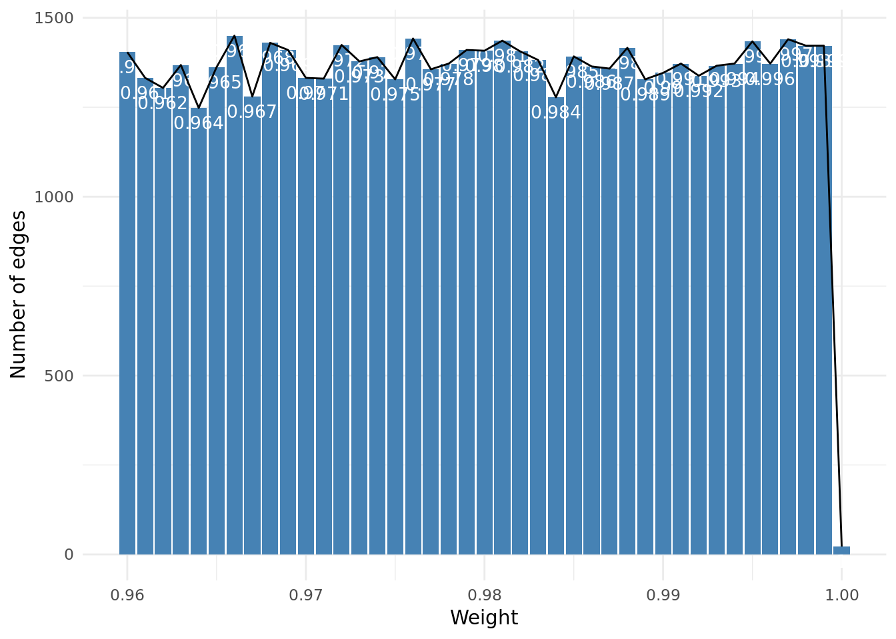

#### Degree distribution of item->similarity->item edges

#### Degree distribution of agent->knows->agent edges

#### Runing time by method 

<table class="table table-condensed" style="width: auto !important; ">
 <thead>
  <tr>
   <th style="text-align:left;"> key </th>
   <th style="text-align:right;"> doc_count </th>
   <th style="text-align:right;"> sum_wallTime_ms.value </th>
   <th style="text-align:left;"> avg_wallTime_ms.value </th>
   <th style="text-align:left;"> includedInTotal </th>
  </tr>
 </thead>
<tbody>
  <tr>
   <td style="text-align:left;"> connectIfSimilar </td>
   <td style="text-align:right;"> 335,790 </td>
   <td style="text-align:right;"> 1,490,122 </td>
   <td style="text-align:left;"> 4.43766044253849 </td>
   <td style="text-align:left;"> No </td>
  </tr>
  <tr>
   <td style="text-align:left;"> existsSimilarity </td>
   <td style="text-align:right;"> 335,790 </td>
   <td style="text-align:right;"> 1,483,214 </td>
   <td style="text-align:left;"> 4.4170880609905 </td>
   <td style="text-align:left;"> No </td>
  </tr>
  <tr>
   <td style="text-align:left;"> similarityEdges </td>
   <td style="text-align:right;"> 335,790 </td>
   <td style="text-align:right;"> 1,464,442 </td>
   <td style="text-align:left;"> 4.36118407337919 </td>
   <td style="text-align:left;"> No </td>
  </tr>
  <tr>
   <td style="text-align:left;"> connectAllSimilar </td>
   <td style="text-align:right;"> 820 </td>
   <td style="text-align:right;"> 1,493,323 </td>
   <td style="text-align:left;"> 1821.1256097561 </td>
   <td style="text-align:left;"> Yes </td>
  </tr>
  <tr>
   <td style="text-align:left;"> init </td>
   <td style="text-align:right;"> 203 </td>
   <td style="text-align:right;"> 21,615 </td>
   <td style="text-align:left;"> 106.477832512315 </td>
   <td style="text-align:left;"> No </td>
  </tr>
  <tr>
   <td style="text-align:left;"> connect </td>
   <td style="text-align:right;"> 157 </td>
   <td style="text-align:right;"> 664 </td>
   <td style="text-align:left;"> 4.22929936305732 </td>
   <td style="text-align:left;"> Yes </td>
  </tr>
  <tr>
   <td style="text-align:left;font-weight: bold;"> Total </td>
   <td style="text-align:right;font-weight: bold;"> 985 </td>
   <td style="text-align:right;font-weight: bold;"> 1,495,471 </td>
   <td style="text-align:left;font-weight: bold;">  </td>
   <td style="text-align:left;font-weight: bold;">  </td>
  </tr>
</tbody>
</table>
####  Found structures 

#####  Cycles 

Number of cycles found:  1 

<button class="btn btn-primary" data-toggle="collapse" data-target="#CLLPHGSYZJ"> Show/Hide foundCycle query </button> 
 
  
     GET /filebeat-*/_search 
              { 
                "query": {
                  "bool": {
                    "must": [
                      { "match_phrase": {
                        "simulationId": "SIM10-14-04-45-fdhFKu--CV"
                        }
                      },
                      { "bool": {
                        "should": [
                          { "match": {
                            "keyword": "foundCycle"
                          }}
                        ]
                      }}
                    ]
                  }
                }
              }
     

#####  Paths 

Number of paths found:  0 

<button class="btn btn-primary" data-toggle="collapse" data-target="#CYBEIXXXXO"> Show/Hide foundPath query </button> 
 
  
     GET /filebeat-*/_search 
              { 
                "query": {
                  "bool": {
                    "must": [
                      { "match_phrase": {
                        "simulationId": "SIM10-14-04-45-fdhFKu--CV"
                        }
                      },
                      { "bool": {
                        "should": [
                          { "match": {
                            "keyword": "foundPath"
                          }}
                        ]
                      }}
                    ]
                  }
                }
              }
     

###  SIM10-14-04-45-fdhFKu--DV 

#### simulationParameters 

<table class="table table-condensed" style="width: auto !important; ">
 <thead>
  <tr>
   <th style="text-align:left;"> agentNumber </th>
   <th style="text-align:left;"> similarityConnectThreshold </th>
   <th style="text-align:left;"> graphType </th>
   <th style="text-align:left;"> chainLength </th>
   <th style="text-align:left;"> similaritySearchThreshold </th>
   <th style="text-align:left;"> maxDistance </th>
   <th style="text-align:left;"> randomWorksNumberMultiplier </th>
  </tr>
 </thead>
<tbody>
  <tr>
   <td style="text-align:left;width: 20em; "> 200 </td>
   <td style="text-align:left;width: 15em; "> 0.96 </td>
   <td style="text-align:left;width: 15em; "> smallWorld </td>
   <td style="text-align:left;width: 15em; "> 10 </td>
   <td style="text-align:left;width: 15em; "> 1 </td>
   <td style="text-align:left;width: 15em; "> 10 </td>
   <td style="text-align:left;width: 15em; "> 2 </td>
  </tr>
</tbody>
</table>
#### allEdgesByLabel

<table class="table table-condensed" style="width: auto !important; ">
 <thead>
  <tr>
   <th style="text-align:right;"> edges_offers </th>
   <th style="text-align:right;"> edges_similarity </th>
   <th style="text-align:right;"> edges_owns </th>
   <th style="text-align:right;"> edges_demands </th>
   <th style="text-align:right;"> edges_knows </th>
   <th style="text-align:right;"> edges_total </th>
  </tr>
 </thead>
<tbody>
  <tr>
   <td style="text-align:right;width: 5em; "> 410 </td>
   <td style="text-align:right;width: 5em; "> 54,710 </td>
   <td style="text-align:right;width: 5em; "> 410 </td>
   <td style="text-align:right;width: 5em; "> 410 </td>
   <td style="text-align:right;width: 5em; "> 1,201 </td>
   <td style="text-align:right;width: 5em; "> 57,141 </td>
  </tr>
</tbody>
</table>
#### allVerticesByType

<table class="table table-condensed" style="width: auto !important; ">
 <thead>
  <tr>
   <th style="text-align:right;"> vertices_agent </th>
   <th style="text-align:right;"> vertices_item </th>
   <th style="text-align:right;"> vertices_work </th>
   <th style="text-align:right;"> vertices_total </th>
  </tr>
 </thead>
<tbody>
  <tr>
   <td style="text-align:right;width: 5em; "> 201 </td>
   <td style="text-align:right;width: 5em; "> 820 </td>
   <td style="text-align:right;width: 5em; "> 410 </td>
   <td style="text-align:right;width: 5em; "> 1,431 </td>
  </tr>
</tbody>
</table>
#### distribution of similarityEdgesByWeight

#### Degree distribution of item->similarity->item edges

#### Degree distribution of agent->knows->agent edges

#### Runing time by method 

<table class="table table-condensed" style="width: auto !important; ">
 <thead>
  <tr>
   <th style="text-align:left;"> key </th>
   <th style="text-align:right;"> doc_count </th>
   <th style="text-align:right;"> sum_wallTime_ms.value </th>
   <th style="text-align:left;"> avg_wallTime_ms.value </th>
   <th style="text-align:left;"> includedInTotal </th>
  </tr>
 </thead>
<tbody>
  <tr>
   <td style="text-align:left;"> knowsAgent </td>
   <td style="text-align:right;"> 1,201 </td>
   <td style="text-align:right;"> 3,278 </td>
   <td style="text-align:left;"> 2.72939217318901 </td>
   <td style="text-align:left;"> No </td>
  </tr>
  <tr>
   <td style="text-align:left;"> addItemToWork </td>
   <td style="text-align:right;"> 820 </td>
   <td style="text-align:right;"> 12,894 </td>
   <td style="text-align:left;"> 15.7243902439024 </td>
   <td style="text-align:left;"> No </td>
  </tr>
  <tr>
   <td style="text-align:left;"> ownsWork </td>
   <td style="text-align:right;"> 410 </td>
   <td style="text-align:right;"> 6,582 </td>
   <td style="text-align:left;"> 16.0536585365854 </td>
   <td style="text-align:left;"> No </td>
  </tr>
  <tr>
   <td style="text-align:left;"> init </td>
   <td style="text-align:right;"> 203 </td>
   <td style="text-align:right;"> 21,921 </td>
   <td style="text-align:left;"> 107.985221674877 </td>
   <td style="text-align:left;"> No </td>
  </tr>
  <tr>
   <td style="text-align:left;"> searchAndConnect </td>
   <td style="text-align:right;"> 201 </td>
   <td style="text-align:right;"> 798,530 </td>
   <td style="text-align:left;"> 3972.78606965174 </td>
   <td style="text-align:left;"> Yes </td>
  </tr>
  <tr>
   <td style="text-align:left;"> cycleSearch </td>
   <td style="text-align:right;"> 23 </td>
   <td style="text-align:right;"> 2,952 </td>
   <td style="text-align:left;"> 128.347826086957 </td>
   <td style="text-align:left;"> Yes </td>
  </tr>
  <tr>
   <td style="text-align:left;"> getWorks </td>
   <td style="text-align:right;"> 23 </td>
   <td style="text-align:right;"> 5,178 </td>
   <td style="text-align:left;"> 225.130434782609 </td>
   <td style="text-align:left;"> No </td>
  </tr>
  <tr>
   <td style="text-align:left;"> individualCycleSearch </td>
   <td style="text-align:right;"> 23 </td>
   <td style="text-align:right;"> 1 </td>
   <td style="text-align:left;"> 0.0434782608695652 </td>
   <td style="text-align:left;"> Yes </td>
  </tr>
  <tr>
   <td style="text-align:left;"> getWorksItems </td>
   <td style="text-align:right;"> 18 </td>
   <td style="text-align:right;"> 59 </td>
   <td style="text-align:left;"> 3.27777777777778 </td>
   <td style="text-align:left;"> Yes </td>
  </tr>
  <tr>
   <td style="text-align:left;font-weight: bold;"> Total </td>
   <td style="text-align:right;font-weight: bold;"> 277 </td>
   <td style="text-align:right;font-weight: bold;"> 804,173 </td>
   <td style="text-align:left;font-weight: bold;">  </td>
   <td style="text-align:left;font-weight: bold;">  </td>
  </tr>
</tbody>
</table>
####  Found structures 

#####  Cycles 

Number of cycles found:  12 

<button class="btn btn-primary" data-toggle="collapse" data-target="#CXVTSSIJOQ"> Show/Hide foundCycle query </button> 
 
  
     GET /filebeat-*/_search 
              { 
                "query": {
                  "bool": {
                    "must": [
                      { "match_phrase": {
                        "simulationId": "SIM10-14-04-45-fdhFKu--DV"
                        }
                      },
                      { "bool": {
                        "should": [
                          { "match": {
                            "keyword": "foundCycle"
                          }}
                        ]
                      }}
                    ]
                  }
                }
              }
     

#####  Paths 

Number of paths found:  0 

<button class="btn btn-primary" data-toggle="collapse" data-target="#KEDSJRABYO"> Show/Hide foundPath query </button> 
 
  
     GET /filebeat-*/_search 
              { 
                "query": {
                  "bool": {
                    "must": [
                      { "match_phrase": {
                        "simulationId": "SIM10-14-04-45-fdhFKu--DV"
                        }
                      },
                      { "bool": {
                        "should": [
                          { "match": {
                            "keyword": "foundPath"
                          }}
                        ]
                      }}
                    ]
                  }
                }
              }
     

###  SIM10-14-01-19-nTmbW6--CV 

#### simulationParameters 

<table class="table table-condensed" style="width: auto !important; ">
 <thead>
  <tr>
   <th style="text-align:left;"> agentNumber </th>
   <th style="text-align:left;"> similarityConnectThreshold </th>
   <th style="text-align:left;"> graphType </th>
   <th style="text-align:left;"> chainLength </th>
   <th style="text-align:left;"> similaritySearchThreshold </th>
   <th style="text-align:left;"> maxDistance </th>
   <th style="text-align:left;"> randomWorksNumberMultiplier </th>
  </tr>
 </thead>
<tbody>
  <tr>
   <td style="text-align:left;width: 20em; "> 200 </td>
   <td style="text-align:left;width: 15em; "> 0.96 </td>
   <td style="text-align:left;width: 15em; "> random </td>
   <td style="text-align:left;width: 15em; "> 10 </td>
   <td style="text-align:left;width: 15em; "> 1 </td>
   <td style="text-align:left;width: 15em; "> 30 </td>
   <td style="text-align:left;width: 15em; "> 1 </td>
  </tr>
</tbody>
</table>
#### allEdgesByLabel

<table class="table table-condensed" style="width: auto !important; ">
 <thead>
  <tr>
   <th style="text-align:right;"> edges_offers </th>
   <th style="text-align:right;"> edges_similarity </th>
   <th style="text-align:right;"> edges_owns </th>
   <th style="text-align:right;"> edges_demands </th>
   <th style="text-align:right;"> edges_knows </th>
   <th style="text-align:right;"> edges_total </th>
  </tr>
 </thead>
<tbody>
  <tr>
   <td style="text-align:right;width: 5em; "> 210 </td>
   <td style="text-align:right;width: 5em; "> 14,534 </td>
   <td style="text-align:right;width: 5em; "> 210 </td>
   <td style="text-align:right;width: 5em; "> 210 </td>
   <td style="text-align:right;width: 5em; "> 200 </td>
   <td style="text-align:right;width: 5em; "> 15,364 </td>
  </tr>
</tbody>
</table>
#### allVerticesByType

<table class="table table-condensed" style="width: auto !important; ">
 <thead>
  <tr>
   <th style="text-align:right;"> vertices_agent </th>
   <th style="text-align:right;"> vertices_item </th>
   <th style="text-align:right;"> vertices_work </th>
   <th style="text-align:right;"> vertices_total </th>
  </tr>
 </thead>
<tbody>
  <tr>
   <td style="text-align:right;width: 5em; "> 201 </td>
   <td style="text-align:right;width: 5em; "> 420 </td>
   <td style="text-align:right;width: 5em; "> 210 </td>
   <td style="text-align:right;width: 5em; "> 831 </td>
  </tr>
</tbody>
</table>
#### distribution of similarityEdgesByWeight

#### Degree distribution of item->similarity->item edges

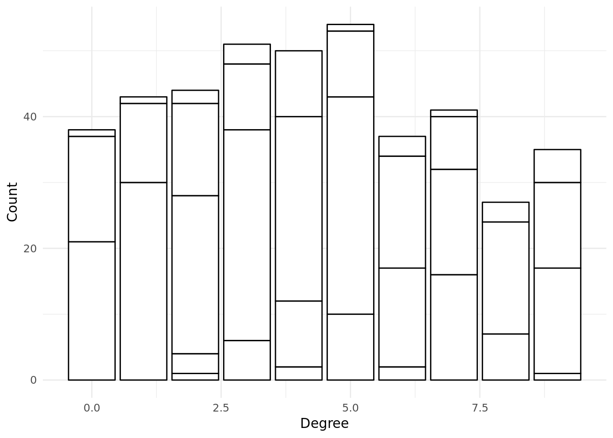

#### Degree distribution of agent->knows->agent edges

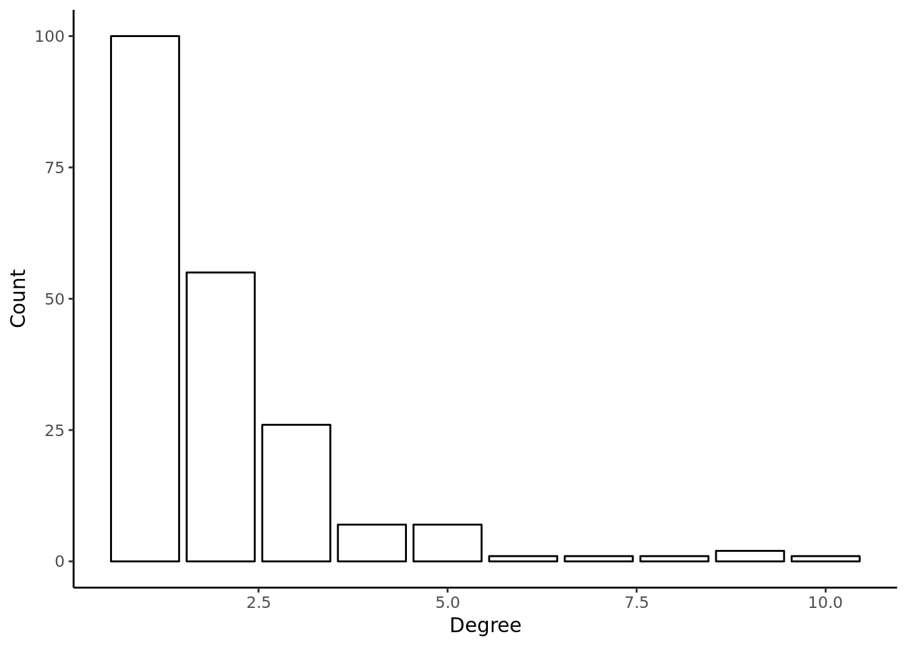

#### Runing time by method 

<table class="table table-condensed" style="width: auto !important; ">
 <thead>
  <tr>
   <th style="text-align:left;"> key </th>
   <th style="text-align:right;"> doc_count </th>
   <th style="text-align:right;"> sum_wallTime_ms.value </th>
   <th style="text-align:left;"> avg_wallTime_ms.value </th>
   <th style="text-align:left;"> includedInTotal </th>
  </tr>
 </thead>
<tbody>
  <tr>
   <td style="text-align:left;"> connectIfSimilar </td>
   <td style="text-align:right;"> 87,990 </td>
   <td style="text-align:right;"> 291,948 </td>
   <td style="text-align:left;"> 3.31796795090351 </td>
   <td style="text-align:left;"> No </td>
  </tr>
  <tr>
   <td style="text-align:left;"> existsSimilarity </td>
   <td style="text-align:right;"> 87,990 </td>
   <td style="text-align:right;"> 290,168 </td>
   <td style="text-align:left;"> 3.29773837936129 </td>
   <td style="text-align:left;"> No </td>
  </tr>
  <tr>
   <td style="text-align:left;"> similarityEdges </td>
   <td style="text-align:right;"> 87,990 </td>
   <td style="text-align:right;"> 286,725 </td>
   <td style="text-align:left;"> 3.25860893283328 </td>
   <td style="text-align:left;"> No </td>
  </tr>
  <tr>
   <td style="text-align:left;"> connectAllSimilar </td>
   <td style="text-align:right;"> 420 </td>
   <td style="text-align:right;"> 292,704 </td>
   <td style="text-align:left;"> 696.914285714286 </td>
   <td style="text-align:left;"> Yes </td>
  </tr>
  <tr>
   <td style="text-align:left;"> init </td>
   <td style="text-align:right;"> 203 </td>
   <td style="text-align:right;"> 21,073 </td>
   <td style="text-align:left;"> 103.807881773399 </td>
   <td style="text-align:left;"> No </td>
  </tr>
  <tr>
   <td style="text-align:left;"> connect </td>
   <td style="text-align:right;"> 52 </td>
   <td style="text-align:right;"> 273 </td>
   <td style="text-align:left;"> 5.25 </td>
   <td style="text-align:left;"> Yes </td>
  </tr>
  <tr>
   <td style="text-align:left;font-weight: bold;"> Total </td>
   <td style="text-align:right;font-weight: bold;"> 480 </td>
   <td style="text-align:right;font-weight: bold;"> 293,688 </td>
   <td style="text-align:left;font-weight: bold;">  </td>
   <td style="text-align:left;font-weight: bold;">  </td>
  </tr>
</tbody>
</table>
####  Found structures 

#####  Cycles 

Number of cycles found:  1 

<button class="btn btn-primary" data-toggle="collapse" data-target="#HZYGDQTKLP"> Show/Hide foundCycle query </button> 
 
  
     GET /filebeat-*/_search 
              { 
                "query": {
                  "bool": {
                    "must": [
                      { "match_phrase": {
                        "simulationId": "SIM10-14-01-19-nTmbW6--CV"
                        }
                      },
                      { "bool": {
                        "should": [
                          { "match": {
                            "keyword": "foundCycle"
                          }}
                        ]
                      }}
                    ]
                  }
                }
              }
     

#####  Paths 

Number of paths found:  0 

<button class="btn btn-primary" data-toggle="collapse" data-target="#ANWHOQWZKG"> Show/Hide foundPath query </button> 
 
  
     GET /filebeat-*/_search 
              { 
                "query": {
                  "bool": {
                    "must": [
                      { "match_phrase": {
                        "simulationId": "SIM10-14-01-19-nTmbW6--CV"
                        }
                      },
                      { "bool": {
                        "should": [
                          { "match": {
                            "keyword": "foundPath"
                          }}
                        ]
                      }}
                    ]
                  }
                }
              }
     

###  SIM10-14-01-19-nTmbW6--DV 

#### simulationParameters 

<table class="table table-condensed" style="width: auto !important; ">
 <thead>
  <tr>
   <th style="text-align:left;"> agentNumber </th>
   <th style="text-align:left;"> similarityConnectThreshold </th>
   <th style="text-align:left;"> graphType </th>
   <th style="text-align:left;"> chainLength </th>
   <th style="text-align:left;"> similaritySearchThreshold </th>
   <th style="text-align:left;"> maxDistance </th>
   <th style="text-align:left;"> randomWorksNumberMultiplier </th>
  </tr>
 </thead>
<tbody>
  <tr>
   <td style="text-align:left;width: 20em; "> 200 </td>
   <td style="text-align:left;width: 15em; "> 0.96 </td>
   <td style="text-align:left;width: 15em; "> random </td>
   <td style="text-align:left;width: 15em; "> 10 </td>
   <td style="text-align:left;width: 15em; "> 1 </td>
   <td style="text-align:left;width: 15em; "> 30 </td>
   <td style="text-align:left;width: 15em; "> 1 </td>
  </tr>
</tbody>
</table>
#### allEdgesByLabel

<table class="table table-condensed" style="width: auto !important; ">
 <thead>
  <tr>
   <th style="text-align:right;"> edges_offers </th>
   <th style="text-align:right;"> edges_similarity </th>
   <th style="text-align:right;"> edges_owns </th>
   <th style="text-align:right;"> edges_demands </th>
   <th style="text-align:right;"> edges_knows </th>
   <th style="text-align:right;"> edges_total </th>
  </tr>
 </thead>
<tbody>
  <tr>
   <td style="text-align:right;width: 5em; "> 210 </td>
   <td style="text-align:right;width: 5em; "> 14,430 </td>
   <td style="text-align:right;width: 5em; "> 210 </td>
   <td style="text-align:right;width: 5em; "> 210 </td>
   <td style="text-align:right;width: 5em; "> 200 </td>
   <td style="text-align:right;width: 5em; "> 15,260 </td>
  </tr>
</tbody>
</table>
#### allVerticesByType

<table class="table table-condensed" style="width: auto !important; ">
 <thead>
  <tr>
   <th style="text-align:right;"> vertices_agent </th>
   <th style="text-align:right;"> vertices_item </th>
   <th style="text-align:right;"> vertices_work </th>
   <th style="text-align:right;"> vertices_total </th>
  </tr>
 </thead>
<tbody>
  <tr>
   <td style="text-align:right;width: 5em; "> 201 </td>
   <td style="text-align:right;width: 5em; "> 420 </td>
   <td style="text-align:right;width: 5em; "> 210 </td>
   <td style="text-align:right;width: 5em; "> 831 </td>
  </tr>
</tbody>
</table>
#### distribution of similarityEdgesByWeight

#### Degree distribution of item->similarity->item edges

#### Degree distribution of agent->knows->agent edges

#### Runing time by method 

<table class="table table-condensed" style="width: auto !important; ">
 <thead>
  <tr>
   <th style="text-align:left;">   </th>
   <th style="text-align:left;"> key </th>
   <th style="text-align:right;"> doc_count </th>
   <th style="text-align:right;"> sum_wallTime_ms.value </th>
   <th style="text-align:left;"> avg_wallTime_ms.value </th>
   <th style="text-align:left;"> includedInTotal </th>
  </tr>
 </thead>
<tbody>
  <tr>
   <td style="text-align:left;"> 1 </td>
   <td style="text-align:left;"> addItemToWork </td>
   <td style="text-align:right;"> 420 </td>
   <td style="text-align:right;"> 2,992 </td>
   <td style="text-align:left;"> 7.12380952380952 </td>
   <td style="text-align:left;"> No </td>
  </tr>
  <tr>
   <td style="text-align:left;"> 2 </td>
   <td style="text-align:left;"> ownsWork </td>
   <td style="text-align:right;"> 210 </td>
   <td style="text-align:right;"> 1,445 </td>
   <td style="text-align:left;"> 6.88095238095238 </td>
   <td style="text-align:left;"> No </td>
  </tr>
  <tr>
   <td style="text-align:left;"> 3 </td>
   <td style="text-align:left;"> init </td>
   <td style="text-align:right;"> 203 </td>
   <td style="text-align:right;"> 21,202 </td>
   <td style="text-align:left;"> 104.443349753695 </td>
   <td style="text-align:left;"> No </td>
  </tr>
  <tr>
   <td style="text-align:left;"> 4 </td>
   <td style="text-align:left;"> searchAndConnect </td>
   <td style="text-align:right;"> 201 </td>
   <td style="text-align:right;"> 226,045 </td>
   <td style="text-align:left;"> 1124.60199004975 </td>
   <td style="text-align:left;"> Yes </td>
  </tr>
  <tr>
   <td style="text-align:left;"> 5 </td>
   <td style="text-align:left;"> knowsAgent </td>
   <td style="text-align:right;"> 200 </td>
   <td style="text-align:right;"> 1,500 </td>
   <td style="text-align:left;"> 7.5 </td>
   <td style="text-align:left;"> No </td>
  </tr>
  <tr>
   <td style="text-align:left;"> 6 </td>
   <td style="text-align:left;"> getWorksItems </td>
   <td style="text-align:right;"> 18 </td>
   <td style="text-align:right;"> 33 </td>
   <td style="text-align:left;"> 1.83333333333333 </td>
   <td style="text-align:left;"> Yes </td>
  </tr>
  <tr>
   <td style="text-align:left;"> 8 </td>
   <td style="text-align:left;"> cycleSearch </td>
   <td style="text-align:right;"> 7 </td>
   <td style="text-align:right;"> 1,271 </td>
   <td style="text-align:left;"> 181.571428571429 </td>
   <td style="text-align:left;"> Yes </td>
  </tr>
  <tr>
   <td style="text-align:left;"> 9 </td>
   <td style="text-align:left;"> getWorks </td>
   <td style="text-align:right;"> 7 </td>
   <td style="text-align:right;"> 793 </td>
   <td style="text-align:left;"> 113.285714285714 </td>
   <td style="text-align:left;"> No </td>
  </tr>
  <tr>
   <td style="text-align:left;"> 10 </td>
   <td style="text-align:left;"> individualCycleSearch </td>
   <td style="text-align:right;"> 7 </td>
   <td style="text-align:right;"> 0 </td>
   <td style="text-align:left;"> 0 </td>
   <td style="text-align:left;"> Yes </td>
  </tr>
  <tr>
   <td style="text-align:left;font-weight: bold;"> 11 </td>
   <td style="text-align:left;font-weight: bold;"> Total </td>
   <td style="text-align:right;font-weight: bold;"> 240 </td>
   <td style="text-align:right;font-weight: bold;"> 228,989 </td>
   <td style="text-align:left;font-weight: bold;">  </td>
   <td style="text-align:left;font-weight: bold;">  </td>
  </tr>
</tbody>
</table>
####  Found structures 

#####  Cycles 

Number of cycles found:  7 

<button class="btn btn-primary" data-toggle="collapse" data-target="#LOOUBFUVCP"> Show/Hide foundCycle query </button> 
 
  
     GET /filebeat-*/_search 
              { 
                "query": {
                  "bool": {
                    "must": [
                      { "match_phrase": {
                        "simulationId": "SIM10-14-01-19-nTmbW6--DV"
                        }
                      },
                      { "bool": {
                        "should": [
                          { "match": {
                            "keyword": "foundCycle"
                          }}
                        ]
                      }}
                    ]
                  }
                }
              }
     

#####  Paths 

Number of paths found:  0 

<button class="btn btn-primary" data-toggle="collapse" data-target="#JLJCXKDYWY"> Show/Hide foundPath query </button> 
 
  
     GET /filebeat-*/_search 
              { 
                "query": {
                  "bool": {
                    "must": [
                      { "match_phrase": {
                        "simulationId": "SIM10-14-01-19-nTmbW6--DV"
                        }
                      },
                      { "bool": {
                        "should": [
                          { "match": {
                            "keyword": "foundPath"
                          }}
                        ]
                      }}
                    ]
                  }
                }
              }
     

###  SIM10-14-01-24-oK6yqo--CV 

#### simulationParameters 

<table class="table table-condensed" style="width: auto !important; ">
 <thead>
  <tr>
   <th style="text-align:left;"> agentNumber </th>
   <th style="text-align:left;"> similarityConnectThreshold </th>
   <th style="text-align:left;"> graphType </th>
   <th style="text-align:left;"> chainLength </th>
   <th style="text-align:left;"> similaritySearchThreshold </th>
   <th style="text-align:left;"> maxDistance </th>
   <th style="text-align:left;"> randomWorksNumberMultiplier </th>
  </tr>
 </thead>
<tbody>
  <tr>
   <td style="text-align:left;width: 20em; "> 200 </td>
   <td style="text-align:left;width: 15em; "> 0.96 </td>
   <td style="text-align:left;width: 15em; "> smallWorld </td>
   <td style="text-align:left;width: 15em; "> 10 </td>
   <td style="text-align:left;width: 15em; "> 1 </td>
   <td style="text-align:left;width: 15em; "> 30 </td>
   <td style="text-align:left;width: 15em; "> 1 </td>
  </tr>
</tbody>
</table>
#### allEdgesByLabel

<table class="table table-condensed" style="width: auto !important; ">
 <thead>
  <tr>
   <th style="text-align:right;"> edges_offers </th>
   <th style="text-align:right;"> edges_similarity </th>
   <th style="text-align:right;"> edges_owns </th>
   <th style="text-align:right;"> edges_demands </th>
   <th style="text-align:right;"> edges_knows </th>
   <th style="text-align:right;"> edges_total </th>
  </tr>
 </thead>
<tbody>
  <tr>
   <td style="text-align:right;width: 5em; "> 210 </td>
   <td style="text-align:right;width: 5em; "> 14,794 </td>
   <td style="text-align:right;width: 5em; "> 210 </td>
   <td style="text-align:right;width: 5em; "> 210 </td>
   <td style="text-align:right;width: 5em; "> 1,201 </td>
   <td style="text-align:right;width: 5em; "> 16,625 </td>
  </tr>
</tbody>
</table>
#### allVerticesByType

<table class="table table-condensed" style="width: auto !important; ">
 <thead>
  <tr>
   <th style="text-align:right;"> vertices_agent </th>
   <th style="text-align:right;"> vertices_item </th>
   <th style="text-align:right;"> vertices_work </th>
   <th style="text-align:right;"> vertices_total </th>
  </tr>
 </thead>
<tbody>
  <tr>
   <td style="text-align:right;width: 5em; "> 201 </td>
   <td style="text-align:right;width: 5em; "> 420 </td>
   <td style="text-align:right;width: 5em; "> 210 </td>
   <td style="text-align:right;width: 5em; "> 831 </td>
  </tr>
</tbody>
</table>
#### distribution of similarityEdgesByWeight

#### Degree distribution of item->similarity->item edges

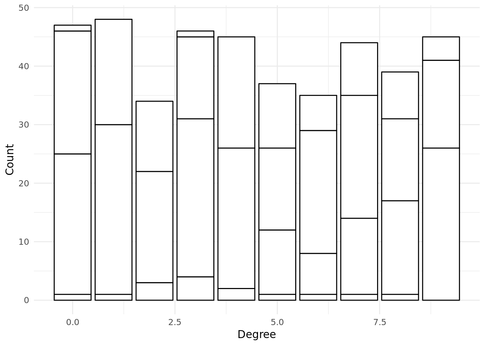

#### Degree distribution of agent->knows->agent edges

#### Runing time by method 

<table class="table table-condensed" style="width: auto !important; ">
 <thead>
  <tr>
   <th style="text-align:left;"> key </th>
   <th style="text-align:right;"> doc_count </th>
   <th style="text-align:right;"> sum_wallTime_ms.value </th>
   <th style="text-align:left;"> avg_wallTime_ms.value </th>
   <th style="text-align:left;"> includedInTotal </th>
  </tr>
 </thead>
<tbody>
  <tr>
   <td style="text-align:left;"> connectIfSimilar </td>
   <td style="text-align:right;"> 87,990 </td>
   <td style="text-align:right;"> 292,655 </td>
   <td style="text-align:left;"> 3.32600295488124 </td>
   <td style="text-align:left;"> No </td>
  </tr>
  <tr>
   <td style="text-align:left;"> existsSimilarity </td>
   <td style="text-align:right;"> 87,990 </td>
   <td style="text-align:right;"> 290,845 </td>
   <td style="text-align:left;"> 3.30543243550403 </td>
   <td style="text-align:left;"> No </td>
  </tr>
  <tr>
   <td style="text-align:left;"> similarityEdges </td>
   <td style="text-align:right;"> 87,990 </td>
   <td style="text-align:right;"> 287,173 </td>
   <td style="text-align:left;"> 3.26370042050233 </td>
   <td style="text-align:left;"> No </td>
  </tr>
  <tr>
   <td style="text-align:left;"> connectAllSimilar </td>
   <td style="text-align:right;"> 420 </td>
   <td style="text-align:right;"> 293,460 </td>
   <td style="text-align:left;"> 698.714285714286 </td>
   <td style="text-align:left;"> Yes </td>
  </tr>
  <tr>
   <td style="text-align:left;"> init </td>
   <td style="text-align:right;"> 203 </td>
   <td style="text-align:right;"> 20,538 </td>
   <td style="text-align:left;"> 101.172413793103 </td>
   <td style="text-align:left;"> No </td>
  </tr>
  <tr>
   <td style="text-align:left;"> connect </td>
   <td style="text-align:right;"> 58 </td>
   <td style="text-align:right;"> 201 </td>
   <td style="text-align:left;"> 3.46551724137931 </td>
   <td style="text-align:left;"> Yes </td>
  </tr>
  <tr>
   <td style="text-align:left;font-weight: bold;"> Total </td>
   <td style="text-align:right;font-weight: bold;"> 486 </td>
   <td style="text-align:right;font-weight: bold;"> 294,715 </td>
   <td style="text-align:left;font-weight: bold;">  </td>
   <td style="text-align:left;font-weight: bold;">  </td>
  </tr>
</tbody>
</table>
####  Found structures 

#####  Cycles 

Number of cycles found:  1 

<button class="btn btn-primary" data-toggle="collapse" data-target="#CRBRWNFQXP"> Show/Hide foundCycle query </button> 
 
  
     GET /filebeat-*/_search 
              { 
                "query": {
                  "bool": {
                    "must": [
                      { "match_phrase": {
                        "simulationId": "SIM10-14-01-24-oK6yqo--CV"
                        }
                      },
                      { "bool": {
                        "should": [
                          { "match": {
                            "keyword": "foundCycle"
                          }}
                        ]
                      }}
                    ]
                  }
                }
              }
     

#####  Paths 

Number of paths found:  0 

<button class="btn btn-primary" data-toggle="collapse" data-target="#YTHNHMETRD"> Show/Hide foundPath query </button> 
 
  
     GET /filebeat-*/_search 
              { 
                "query": {
                  "bool": {
                    "must": [
                      { "match_phrase": {
                        "simulationId": "SIM10-14-01-24-oK6yqo--CV"
                        }
                      },
                      { "bool": {
                        "should": [
                          { "match": {
                            "keyword": "foundPath"
                          }}
                        ]
                      }}
                    ]
                  }
                }
              }
     

###  SIM10-14-01-24-oK6yqo--DV 

#### simulationParameters 

<table class="table table-condensed" style="width: auto !important; ">
 <thead>
  <tr>
   <th style="text-align:left;"> agentNumber </th>
   <th style="text-align:left;"> similarityConnectThreshold </th>
   <th style="text-align:left;"> graphType </th>
   <th style="text-align:left;"> chainLength </th>
   <th style="text-align:left;"> similaritySearchThreshold </th>
   <th style="text-align:left;"> maxDistance </th>
   <th style="text-align:left;"> randomWorksNumberMultiplier </th>
  </tr>
 </thead>
<tbody>
  <tr>
   <td style="text-align:left;width: 20em; "> 200 </td>
   <td style="text-align:left;width: 15em; "> 0.96 </td>
   <td style="text-align:left;width: 15em; "> smallWorld </td>
   <td style="text-align:left;width: 15em; "> 10 </td>
   <td style="text-align:left;width: 15em; "> 1 </td>
   <td style="text-align:left;width: 15em; "> 30 </td>
   <td style="text-align:left;width: 15em; "> 1 </td>
  </tr>
</tbody>
</table>
#### allEdgesByLabel

<table class="table table-condensed" style="width: auto !important; ">
 <thead>
  <tr>
   <th style="text-align:right;"> edges_offers </th>
   <th style="text-align:right;"> edges_similarity </th>
   <th style="text-align:right;"> edges_owns </th>
   <th style="text-align:right;"> edges_demands </th>
   <th style="text-align:right;"> edges_knows </th>
   <th style="text-align:right;"> edges_total </th>
  </tr>
 </thead>
<tbody>
  <tr>
   <td style="text-align:right;width: 5em; "> 210 </td>
   <td style="text-align:right;width: 5em; "> 14,678 </td>
   <td style="text-align:right;width: 5em; "> 210 </td>
   <td style="text-align:right;width: 5em; "> 210 </td>
   <td style="text-align:right;width: 5em; "> 1,201 </td>
   <td style="text-align:right;width: 5em; "> 16,509 </td>
  </tr>
</tbody>
</table>
#### allVerticesByType

<table class="table table-condensed" style="width: auto !important; ">
 <thead>
  <tr>
   <th style="text-align:right;"> vertices_agent </th>
   <th style="text-align:right;"> vertices_item </th>
   <th style="text-align:right;"> vertices_work </th>
   <th style="text-align:right;"> vertices_total </th>
  </tr>
 </thead>
<tbody>
  <tr>
   <td style="text-align:right;width: 5em; "> 201 </td>
   <td style="text-align:right;width: 5em; "> 420 </td>
   <td style="text-align:right;width: 5em; "> 210 </td>
   <td style="text-align:right;width: 5em; "> 831 </td>
  </tr>
</tbody>
</table>
#### distribution of similarityEdgesByWeight

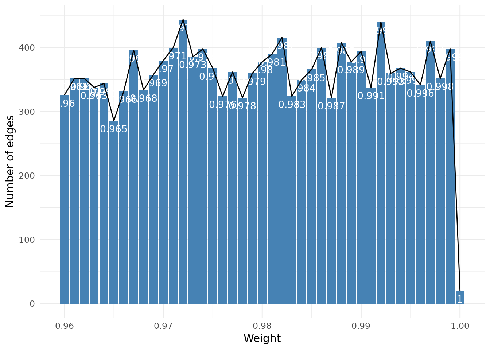

#### Degree distribution of item->similarity->item edges

#### Degree distribution of agent->knows->agent edges

#### Runing time by method 

<table class="table table-condensed" style="width: auto !important; ">
 <thead>
  <tr>
   <th style="text-align:left;"> key </th>
   <th style="text-align:right;"> doc_count </th>
   <th style="text-align:right;"> sum_wallTime_ms.value </th>
   <th style="text-align:left;"> avg_wallTime_ms.value </th>
   <th style="text-align:left;"> includedInTotal </th>
  </tr>
 </thead>
<tbody>
  <tr>
   <td style="text-align:left;"> knowsAgent </td>
   <td style="text-align:right;"> 1,201 </td>
   <td style="text-align:right;"> 2,909 </td>
   <td style="text-align:left;"> 2.42214820982515 </td>
   <td style="text-align:left;"> No </td>
  </tr>
  <tr>
   <td style="text-align:left;"> addItemToWork </td>
   <td style="text-align:right;"> 420 </td>
   <td style="text-align:right;"> 11,477 </td>
   <td style="text-align:left;"> 27.3261904761905 </td>
   <td style="text-align:left;"> No </td>
  </tr>
  <tr>
   <td style="text-align:left;"> ownsWork </td>
   <td style="text-align:right;"> 210 </td>
   <td style="text-align:right;"> 4,150 </td>
   <td style="text-align:left;"> 19.7619047619048 </td>
   <td style="text-align:left;"> No </td>
  </tr>
  <tr>
   <td style="text-align:left;"> init </td>
   <td style="text-align:right;"> 203 </td>
   <td style="text-align:right;"> 21,313 </td>
   <td style="text-align:left;"> 104.990147783251 </td>
   <td style="text-align:left;"> No </td>
  </tr>
  <tr>
   <td style="text-align:left;"> searchAndConnect </td>
   <td style="text-align:right;"> 201 </td>
   <td style="text-align:right;"> 258,767 </td>
   <td style="text-align:left;"> 1287.39800995025 </td>
   <td style="text-align:left;"> Yes </td>
  </tr>
  <tr>
   <td style="text-align:left;"> getWorksItems </td>
   <td style="text-align:right;"> 18 </td>
   <td style="text-align:right;"> 26 </td>
   <td style="text-align:left;"> 1.44444444444444 </td>
   <td style="text-align:left;"> Yes </td>
  </tr>
  <tr>
   <td style="text-align:left;"> cycleSearch </td>
   <td style="text-align:right;"> 8 </td>
   <td style="text-align:right;"> 1,943 </td>
   <td style="text-align:left;"> 242.875 </td>
   <td style="text-align:left;"> Yes </td>
  </tr>
  <tr>
   <td style="text-align:left;"> getWorks </td>
   <td style="text-align:right;"> 8 </td>
   <td style="text-align:right;"> 1,113 </td>
   <td style="text-align:left;"> 139.125 </td>
   <td style="text-align:left;"> No </td>
  </tr>
  <tr>
   <td style="text-align:left;"> individualCycleSearch </td>
   <td style="text-align:right;"> 8 </td>
   <td style="text-align:right;"> 0 </td>
   <td style="text-align:left;"> 0 </td>
   <td style="text-align:left;"> Yes </td>
  </tr>
  <tr>
   <td style="text-align:left;font-weight: bold;"> Total </td>
   <td style="text-align:right;font-weight: bold;"> 242 </td>
   <td style="text-align:right;font-weight: bold;"> 263,126 </td>
   <td style="text-align:left;font-weight: bold;">  </td>
   <td style="text-align:left;font-weight: bold;">  </td>
  </tr>
</tbody>
</table>
####  Found structures 

#####  Cycles 

Number of cycles found:  7 

<button class="btn btn-primary" data-toggle="collapse" data-target="#TXCXWOCHSO"> Show/Hide foundCycle query </button> 
 
  
     GET /filebeat-*/_search 
              { 
                "query": {
                  "bool": {
                    "must": [
                      { "match_phrase": {
                        "simulationId": "SIM10-14-01-24-oK6yqo--DV"
                        }
                      },
                      { "bool": {
                        "should": [
                          { "match": {
                            "keyword": "foundCycle"
                          }}
                        ]
                      }}
                    ]
                  }
                }
              }
     

#####  Paths 

Number of paths found:  0 

<button class="btn btn-primary" data-toggle="collapse" data-target="#EKBJUOBPUO"> Show/Hide foundPath query </button> 
 
  
     GET /filebeat-*/_search 
              { 
                "query": {
                  "bool": {
                    "must": [
                      { "match_phrase": {
                        "simulationId": "SIM10-14-01-24-oK6yqo--DV"
                        }
                      },
                      { "bool": {
                        "should": [
                          { "match": {
                            "keyword": "foundPath"
                          }}
                        ]
                      }}
                    ]
                  }
                }
              }
     

###  SIM10-14-05-11-j7FDhK--CV 

#### simulationParameters 

<table class="table table-condensed" style="width: auto !important; ">
 <thead>
  <tr>
   <th style="text-align:left;"> agentNumber </th>
   <th style="text-align:left;"> similarityConnectThreshold </th>
   <th style="text-align:left;"> graphType </th>
   <th style="text-align:left;"> chainLength </th>
   <th style="text-align:left;"> similaritySearchThreshold </th>
   <th style="text-align:left;"> maxDistance </th>
   <th style="text-align:left;"> randomWorksNumberMultiplier </th>
  </tr>
 </thead>
<tbody>
  <tr>
   <td style="text-align:left;width: 20em; "> 200 </td>
   <td style="text-align:left;width: 15em; "> 0.96 </td>
   <td style="text-align:left;width: 15em; "> random </td>
   <td style="text-align:left;width: 15em; "> 10 </td>
   <td style="text-align:left;width: 15em; "> 1 </td>
   <td style="text-align:left;width: 15em; "> 30 </td>
   <td style="text-align:left;width: 15em; "> 2 </td>
  </tr>
</tbody>
</table>
#### allEdgesByLabel

<table class="table table-condensed" style="width: auto !important; ">
 <thead>
  <tr>
   <th style="text-align:right;"> edges_offers </th>
   <th style="text-align:right;"> edges_similarity </th>
   <th style="text-align:right;"> edges_owns </th>
   <th style="text-align:right;"> edges_demands </th>
   <th style="text-align:right;"> edges_knows </th>
   <th style="text-align:right;"> edges_total </th>
  </tr>
 </thead>
<tbody>
  <tr>
   <td style="text-align:right;width: 5em; "> 410 </td>
   <td style="text-align:right;width: 5em; "> 55,356 </td>
   <td style="text-align:right;width: 5em; "> 410 </td>
   <td style="text-align:right;width: 5em; "> 410 </td>
   <td style="text-align:right;width: 5em; "> 200 </td>
   <td style="text-align:right;width: 5em; "> 56,786 </td>
  </tr>
</tbody>
</table>
#### allVerticesByType

<table class="table table-condensed" style="width: auto !important; ">
 <thead>
  <tr>
   <th style="text-align:right;"> vertices_agent </th>
   <th style="text-align:right;"> vertices_item </th>
   <th style="text-align:right;"> vertices_work </th>
   <th style="text-align:right;"> vertices_total </th>
  </tr>
 </thead>
<tbody>
  <tr>
   <td style="text-align:right;width: 5em; "> 201 </td>
   <td style="text-align:right;width: 5em; "> 820 </td>
   <td style="text-align:right;width: 5em; "> 410 </td>
   <td style="text-align:right;width: 5em; "> 1,431 </td>
  </tr>
</tbody>
</table>
#### distribution of similarityEdgesByWeight

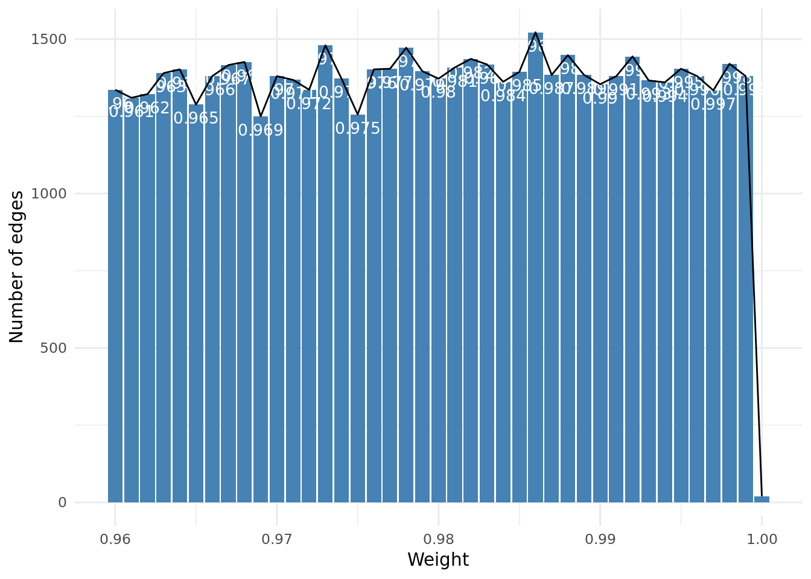

#### Degree distribution of item->similarity->item edges

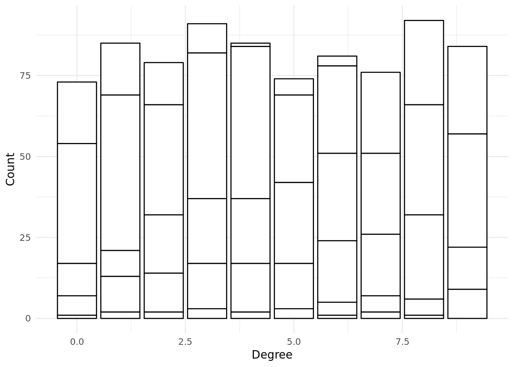

#### Degree distribution of agent->knows->agent edges

#### Runing time by method 

<table class="table table-condensed" style="width: auto !important; ">
 <thead>
  <tr>
   <th style="text-align:left;"> key </th>
   <th style="text-align:right;"> doc_count </th>
   <th style="text-align:right;"> sum_wallTime_ms.value </th>
   <th style="text-align:left;"> avg_wallTime_ms.value </th>
   <th style="text-align:left;"> includedInTotal </th>
  </tr>
 </thead>
<tbody>
  <tr>
   <td style="text-align:left;"> connectIfSimilar </td>
   <td style="text-align:right;"> 335,790 </td>
   <td style="text-align:right;"> 1,513,653 </td>
   <td style="text-align:left;"> 4.50773697846869 </td>
   <td style="text-align:left;"> No </td>
  </tr>
  <tr>
   <td style="text-align:left;"> existsSimilarity </td>
   <td style="text-align:right;"> 335,790 </td>
   <td style="text-align:right;"> 1,506,501 </td>
   <td style="text-align:left;"> 4.48643795229161 </td>
   <td style="text-align:left;"> No </td>
  </tr>
  <tr>
   <td style="text-align:left;"> similarityEdges </td>
   <td style="text-align:right;"> 335,790 </td>
   <td style="text-align:right;"> 1,487,733 </td>
   <td style="text-align:left;"> 4.43054587688734 </td>
   <td style="text-align:left;"> No </td>
  </tr>
  <tr>
   <td style="text-align:left;"> connectAllSimilar </td>
   <td style="text-align:right;"> 820 </td>
   <td style="text-align:right;"> 1,516,956 </td>
   <td style="text-align:left;"> 1849.94634146341 </td>
   <td style="text-align:left;"> Yes </td>
  </tr>
  <tr>
   <td style="text-align:left;"> init </td>
   <td style="text-align:right;"> 203 </td>
   <td style="text-align:right;"> 21,251 </td>
   <td style="text-align:left;"> 104.684729064039 </td>
   <td style="text-align:left;"> No </td>
  </tr>
  <tr>
   <td style="text-align:left;"> connect </td>
   <td style="text-align:right;"> 179 </td>
   <td style="text-align:right;"> 921 </td>
   <td style="text-align:left;"> 5.14525139664805 </td>
   <td style="text-align:left;"> Yes </td>
  </tr>
  <tr>
   <td style="text-align:left;font-weight: bold;"> Total </td>
   <td style="text-align:right;font-weight: bold;"> 1,007 </td>
   <td style="text-align:right;font-weight: bold;"> 1,519,694 </td>
   <td style="text-align:left;font-weight: bold;">  </td>
   <td style="text-align:left;font-weight: bold;">  </td>
  </tr>
</tbody>
</table>
####  Found structures 

#####  Cycles 

Number of cycles found:  1 

<button class="btn btn-primary" data-toggle="collapse" data-target="#CUBAXTQWJH"> Show/Hide foundCycle query </button> 
 
  
     GET /filebeat-*/_search 
              { 
                "query": {
                  "bool": {
                    "must": [
                      { "match_phrase": {
                        "simulationId": "SIM10-14-05-11-j7FDhK--CV"
                        }
                      },
                      { "bool": {
                        "should": [
                          { "match": {
                            "keyword": "foundCycle"
                          }}
                        ]
                      }}
                    ]
                  }
                }
              }
     

#####  Paths 

Number of paths found:  0 

<button class="btn btn-primary" data-toggle="collapse" data-target="#NGRPEOQQUO"> Show/Hide foundPath query </button> 
 
  
     GET /filebeat-*/_search 
              { 
                "query": {
                  "bool": {
                    "must": [
                      { "match_phrase": {
                        "simulationId": "SIM10-14-05-11-j7FDhK--CV"
                        }
                      },
                      { "bool": {
                        "should": [
                          { "match": {
                            "keyword": "foundPath"
                          }}
                        ]
                      }}
                    ]
                  }
                }
              }
     

###  SIM10-14-05-11-j7FDhK--DV 

#### simulationParameters 

<table class="table table-condensed" style="width: auto !important; ">
 <thead>
  <tr>
   <th style="text-align:left;"> agentNumber </th>
   <th style="text-align:left;"> similarityConnectThreshold </th>
   <th style="text-align:left;"> graphType </th>
   <th style="text-align:left;"> chainLength </th>
   <th style="text-align:left;"> similaritySearchThreshold </th>
   <th style="text-align:left;"> maxDistance </th>
   <th style="text-align:left;"> randomWorksNumberMultiplier </th>
  </tr>
 </thead>
<tbody>
  <tr>
   <td style="text-align:left;width: 20em; "> 200 </td>
   <td style="text-align:left;width: 15em; "> 0.96 </td>
   <td style="text-align:left;width: 15em; "> random </td>
   <td style="text-align:left;width: 15em; "> 10 </td>
   <td style="text-align:left;width: 15em; "> 1 </td>
   <td style="text-align:left;width: 15em; "> 30 </td>
   <td style="text-align:left;width: 15em; "> 2 </td>
  </tr>
</tbody>
</table>
#### allEdgesByLabel

<table class="table table-condensed" style="width: auto !important; ">
 <thead>
  <tr>
   <th style="text-align:right;"> edges_offers </th>
   <th style="text-align:right;"> edges_similarity </th>
   <th style="text-align:right;"> edges_owns </th>
   <th style="text-align:right;"> edges_demands </th>
   <th style="text-align:right;"> edges_knows </th>
   <th style="text-align:right;"> edges_total </th>
  </tr>
 </thead>
<tbody>
  <tr>
   <td style="text-align:right;width: 5em; "> 410 </td>
   <td style="text-align:right;width: 5em; "> 54,998 </td>
   <td style="text-align:right;width: 5em; "> 410 </td>
   <td style="text-align:right;width: 5em; "> 410 </td>
   <td style="text-align:right;width: 5em; "> 200 </td>
   <td style="text-align:right;width: 5em; "> 56,428 </td>
  </tr>
</tbody>
</table>
#### allVerticesByType

<table class="table table-condensed" style="width: auto !important; ">
 <thead>
  <tr>
   <th style="text-align:right;"> vertices_agent </th>
   <th style="text-align:right;"> vertices_item </th>
   <th style="text-align:right;"> vertices_work </th>
   <th style="text-align:right;"> vertices_total </th>
  </tr>
 </thead>
<tbody>
  <tr>
   <td style="text-align:right;width: 5em; "> 201 </td>
   <td style="text-align:right;width: 5em; "> 820 </td>
   <td style="text-align:right;width: 5em; "> 410 </td>
   <td style="text-align:right;width: 5em; "> 1,431 </td>
  </tr>
</tbody>
</table>
#### distribution of similarityEdgesByWeight

#### Degree distribution of item->similarity->item edges

#### Degree distribution of agent->knows->agent edges

#### Runing time by method 

<table class="table table-condensed" style="width: auto !important; ">
 <thead>
  <tr>
   <th style="text-align:left;"> key </th>
   <th style="text-align:right;"> doc_count </th>
   <th style="text-align:right;"> sum_wallTime_ms.value </th>
   <th style="text-align:left;"> avg_wallTime_ms.value </th>
   <th style="text-align:left;"> includedInTotal </th>
  </tr>
 </thead>
<tbody>
  <tr>
   <td style="text-align:left;"> addItemToWork </td>
   <td style="text-align:right;"> 820 </td>
   <td style="text-align:right;"> 8,807 </td>
   <td style="text-align:left;"> 10.740243902439 </td>
   <td style="text-align:left;"> No </td>
  </tr>
  <tr>
   <td style="text-align:left;"> ownsWork </td>
   <td style="text-align:right;"> 410 </td>
   <td style="text-align:right;"> 5,207 </td>
   <td style="text-align:left;"> 12.7 </td>
   <td style="text-align:left;"> No </td>
  </tr>
  <tr>
   <td style="text-align:left;"> init </td>
   <td style="text-align:right;"> 203 </td>
   <td style="text-align:right;"> 22,443 </td>
   <td style="text-align:left;"> 110.556650246305 </td>
   <td style="text-align:left;"> No </td>
  </tr>
  <tr>
   <td style="text-align:left;"> searchAndConnect </td>
   <td style="text-align:right;"> 201 </td>
   <td style="text-align:right;"> 648,388 </td>
   <td style="text-align:left;"> 3225.81094527363 </td>
   <td style="text-align:left;"> Yes </td>
  </tr>
  <tr>
   <td style="text-align:left;"> knowsAgent </td>
   <td style="text-align:right;"> 200 </td>
   <td style="text-align:right;"> 1,715 </td>
   <td style="text-align:left;"> 8.575 </td>
   <td style="text-align:left;"> No </td>
  </tr>
  <tr>
   <td style="text-align:left;"> cycleSearch </td>
   <td style="text-align:right;"> 21 </td>
   <td style="text-align:right;"> 7,872 </td>
   <td style="text-align:left;"> 374.857142857143 </td>
   <td style="text-align:left;"> Yes </td>
  </tr>
  <tr>
   <td style="text-align:left;"> getWorks </td>
   <td style="text-align:right;"> 21 </td>
   <td style="text-align:right;"> 4,085 </td>
   <td style="text-align:left;"> 194.52380952381 </td>
   <td style="text-align:left;"> No </td>
  </tr>
  <tr>
   <td style="text-align:left;"> individualCycleSearch </td>
   <td style="text-align:right;"> 21 </td>
   <td style="text-align:right;"> 7 </td>
   <td style="text-align:left;"> 0.333333333333333 </td>
   <td style="text-align:left;"> Yes </td>
  </tr>
  <tr>
   <td style="text-align:left;"> getWorksItems </td>
   <td style="text-align:right;"> 18 </td>
   <td style="text-align:right;"> 63 </td>
   <td style="text-align:left;"> 3.5 </td>
   <td style="text-align:left;"> Yes </td>
  </tr>
  <tr>
   <td style="text-align:left;font-weight: bold;"> Total </td>
   <td style="text-align:right;font-weight: bold;"> 276 </td>
   <td style="text-align:right;font-weight: bold;"> 664,657 </td>
   <td style="text-align:left;font-weight: bold;">  </td>
   <td style="text-align:left;font-weight: bold;">  </td>
  </tr>
</tbody>
</table>
####  Found structures 

#####  Cycles 

Number of cycles found:  14 

<button class="btn btn-primary" data-toggle="collapse" data-target="#ZAFEUARDYH"> Show/Hide foundCycle query </button> 
 
  
     GET /filebeat-*/_search 
              { 
                "query": {
                  "bool": {
                    "must": [
                      { "match_phrase": {
                        "simulationId": "SIM10-14-05-11-j7FDhK--DV"
                        }
                      },
                      { "bool": {
                        "should": [
                          { "match": {
                            "keyword": "foundCycle"
                          }}
                        ]
                      }}
                    ]
                  }
                }
              }
     

#####  Paths 

Number of paths found:  1 

<button class="btn btn-primary" data-toggle="collapse" data-target="#DPEHKPDTZE"> Show/Hide foundPath query </button> 
 
  
     GET /filebeat-*/_search 
              { 
                "query": {
                  "bool": {
                    "must": [
                      { "match_phrase": {
                        "simulationId": "SIM10-14-05-11-j7FDhK--DV"
                        }
                      },
                      { "bool": {
                        "should": [
                          { "match": {
                            "keyword": "foundPath"
                          }}
                        ]
                      }}
                    ]
                  }
                }
              }
     

###  SIM10-14-05-37-Lo5gng--CV 

#### simulationParameters 

<table class="table table-condensed" style="width: auto !important; ">
 <thead>
  <tr>
   <th style="text-align:left;"> agentNumber </th>
   <th style="text-align:left;"> similarityConnectThreshold </th>
   <th style="text-align:left;"> graphType </th>
   <th style="text-align:left;"> chainLength </th>
   <th style="text-align:left;"> similaritySearchThreshold </th>
   <th style="text-align:left;"> maxDistance </th>
   <th style="text-align:left;"> randomWorksNumberMultiplier </th>
  </tr>
 </thead>
<tbody>
  <tr>
   <td style="text-align:left;width: 20em; "> 200 </td>
   <td style="text-align:left;width: 15em; "> 0.96 </td>
   <td style="text-align:left;width: 15em; "> smallWorld </td>
   <td style="text-align:left;width: 15em; "> 10 </td>
   <td style="text-align:left;width: 15em; "> 1 </td>
   <td style="text-align:left;width: 15em; "> 30 </td>
   <td style="text-align:left;width: 15em; "> 2 </td>
  </tr>
</tbody>
</table>
#### allEdgesByLabel

<table class="table table-condensed" style="width: auto !important; ">
 <thead>
  <tr>
   <th style="text-align:right;"> edges_offers </th>
   <th style="text-align:right;"> edges_similarity </th>
   <th style="text-align:right;"> edges_owns </th>
   <th style="text-align:right;"> edges_demands </th>
   <th style="text-align:right;"> edges_knows </th>
   <th style="text-align:right;"> edges_total </th>
  </tr>
 </thead>
<tbody>
  <tr>
   <td style="text-align:right;width: 5em; "> 410 </td>
   <td style="text-align:right;width: 5em; "> 55,336 </td>
   <td style="text-align:right;width: 5em; "> 410 </td>
   <td style="text-align:right;width: 5em; "> 410 </td>
   <td style="text-align:right;width: 5em; "> 1,201 </td>
   <td style="text-align:right;width: 5em; "> 57,767 </td>
  </tr>
</tbody>
</table>
#### allVerticesByType

<table class="table table-condensed" style="width: auto !important; ">
 <thead>
  <tr>
   <th style="text-align:right;"> vertices_agent </th>
   <th style="text-align:right;"> vertices_item </th>
   <th style="text-align:right;"> vertices_work </th>
   <th style="text-align:right;"> vertices_total </th>
  </tr>
 </thead>
<tbody>
  <tr>
   <td style="text-align:right;width: 5em; "> 201 </td>
   <td style="text-align:right;width: 5em; "> 820 </td>
   <td style="text-align:right;width: 5em; "> 410 </td>
   <td style="text-align:right;width: 5em; "> 1,431 </td>
  </tr>
</tbody>
</table>
#### distribution of similarityEdgesByWeight

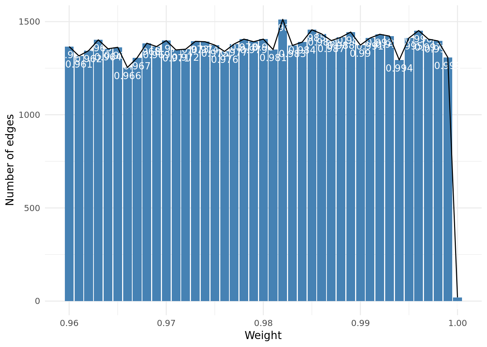

#### Degree distribution of item->similarity->item edges

#### Degree distribution of agent->knows->agent edges

#### Runing time by method 

<table class="table table-condensed" style="width: auto !important; ">
 <thead>
  <tr>
   <th style="text-align:left;"> key </th>
   <th style="text-align:right;"> doc_count </th>
   <th style="text-align:right;"> sum_wallTime_ms.value </th>
   <th style="text-align:left;"> avg_wallTime_ms.value </th>
   <th style="text-align:left;"> includedInTotal </th>
  </tr>
 </thead>
<tbody>
  <tr>
   <td style="text-align:left;"> connectIfSimilar </td>
   <td style="text-align:right;"> 335,790 </td>
   <td style="text-align:right;"> 1,528,934 </td>
   <td style="text-align:left;"> 4.55324458739093 </td>
   <td style="text-align:left;"> No </td>
  </tr>
  <tr>
   <td style="text-align:left;"> existsSimilarity </td>
   <td style="text-align:right;"> 335,790 </td>
   <td style="text-align:right;"> 1,522,163 </td>
   <td style="text-align:left;"> 4.53308019893386 </td>
   <td style="text-align:left;"> No </td>
  </tr>
  <tr>
   <td style="text-align:left;"> similarityEdges </td>
   <td style="text-align:right;"> 335,790 </td>
   <td style="text-align:right;"> 1,503,493 </td>
   <td style="text-align:left;"> 4.47747997260192 </td>
   <td style="text-align:left;"> No </td>
  </tr>
  <tr>
   <td style="text-align:left;"> connectAllSimilar </td>
   <td style="text-align:right;"> 820 </td>
   <td style="text-align:right;"> 1,532,155 </td>
   <td style="text-align:left;"> 1868.48170731707 </td>
   <td style="text-align:left;"> Yes </td>
  </tr>
  <tr>
   <td style="text-align:left;"> init </td>
   <td style="text-align:right;"> 203 </td>
   <td style="text-align:right;"> 21,643 </td>
   <td style="text-align:left;"> 106.615763546798 </td>
   <td style="text-align:left;"> No </td>
  </tr>
  <tr>
   <td style="text-align:left;"> connect </td>
   <td style="text-align:right;"> 160 </td>
   <td style="text-align:right;"> 495 </td>
   <td style="text-align:left;"> 3.09375 </td>
   <td style="text-align:left;"> Yes </td>
  </tr>
  <tr>
   <td style="text-align:left;font-weight: bold;"> Total </td>
   <td style="text-align:right;font-weight: bold;"> 988 </td>
   <td style="text-align:right;font-weight: bold;"> 1,534,233 </td>
   <td style="text-align:left;font-weight: bold;">  </td>
   <td style="text-align:left;font-weight: bold;">  </td>
  </tr>
</tbody>
</table>
####  Found structures 

#####  Cycles 

Number of cycles found:  1 

<button class="btn btn-primary" data-toggle="collapse" data-target="#AYALSXXQWO"> Show/Hide foundCycle query </button> 
 
  
     GET /filebeat-*/_search 
              { 
                "query": {
                  "bool": {
                    "must": [
                      { "match_phrase": {
                        "simulationId": "SIM10-14-05-37-Lo5gng--CV"
                        }
                      },
                      { "bool": {
                        "should": [
                          { "match": {
                            "keyword": "foundCycle"
                          }}
                        ]
                      }}
                    ]
                  }
                }
              }
     

#####  Paths 

Number of paths found:  0 

<button class="btn btn-primary" data-toggle="collapse" data-target="#JIMPXCHUGT"> Show/Hide foundPath query </button> 
 
  
     GET /filebeat-*/_search 
              { 
                "query": {
                  "bool": {
                    "must": [
                      { "match_phrase": {
                        "simulationId": "SIM10-14-05-37-Lo5gng--CV"
                        }
                      },
                      { "bool": {
                        "should": [
                          { "match": {
                            "keyword": "foundPath"
                          }}
                        ]
                      }}
                    ]
                  }
                }
              }
     

###  SIM10-14-05-37-Lo5gng--DV 

#### simulationParameters 

<table class="table table-condensed" style="width: auto !important; ">
 <thead>
  <tr>
   <th style="text-align:left;"> agentNumber </th>
   <th style="text-align:left;"> similarityConnectThreshold </th>
   <th style="text-align:left;"> graphType </th>
   <th style="text-align:left;"> chainLength </th>
   <th style="text-align:left;"> similaritySearchThreshold </th>
   <th style="text-align:left;"> maxDistance </th>
   <th style="text-align:left;"> randomWorksNumberMultiplier </th>
  </tr>
 </thead>
<tbody>
  <tr>
   <td style="text-align:left;width: 20em; "> 200 </td>
   <td style="text-align:left;width: 15em; "> 0.96 </td>
   <td style="text-align:left;width: 15em; "> smallWorld </td>
   <td style="text-align:left;width: 15em; "> 10 </td>
   <td style="text-align:left;width: 15em; "> 1 </td>
   <td style="text-align:left;width: 15em; "> 30 </td>
   <td style="text-align:left;width: 15em; "> 2 </td>
  </tr>
</tbody>
</table>
#### allEdgesByLabel

<table class="table table-condensed" style="width: auto !important; ">
 <thead>
  <tr>
   <th style="text-align:right;"> edges_offers </th>
   <th style="text-align:right;"> edges_similarity </th>
   <th style="text-align:right;"> edges_owns </th>
   <th style="text-align:right;"> edges_demands </th>
   <th style="text-align:right;"> edges_knows </th>
   <th style="text-align:right;"> edges_total </th>
  </tr>
 </thead>
<tbody>
  <tr>
   <td style="text-align:right;width: 5em; "> 410 </td>
   <td style="text-align:right;width: 5em; "> 55,016 </td>
   <td style="text-align:right;width: 5em; "> 410 </td>
   <td style="text-align:right;width: 5em; "> 410 </td>
   <td style="text-align:right;width: 5em; "> 1,201 </td>
   <td style="text-align:right;width: 5em; "> 57,447 </td>
  </tr>
</tbody>
</table>
#### allVerticesByType

<table class="table table-condensed" style="width: auto !important; ">
 <thead>
  <tr>
   <th style="text-align:right;"> vertices_agent </th>
   <th style="text-align:right;"> vertices_item </th>
   <th style="text-align:right;"> vertices_work </th>
   <th style="text-align:right;"> vertices_total </th>
  </tr>
 </thead>
<tbody>
  <tr>
   <td style="text-align:right;width: 5em; "> 201 </td>
   <td style="text-align:right;width: 5em; "> 820 </td>
   <td style="text-align:right;width: 5em; "> 410 </td>
   <td style="text-align:right;width: 5em; "> 1,431 </td>
  </tr>
</tbody>
</table>
#### distribution of similarityEdgesByWeight

#### Degree distribution of item->similarity->item edges

#### Degree distribution of agent->knows->agent edges

#### Runing time by method 

<table class="table table-condensed" style="width: auto !important; ">
 <thead>
  <tr>
   <th style="text-align:left;"> key </th>
   <th style="text-align:right;"> doc_count </th>
   <th style="text-align:right;"> sum_wallTime_ms.value </th>
   <th style="text-align:left;"> avg_wallTime_ms.value </th>
   <th style="text-align:left;"> includedInTotal </th>
  </tr>
 </thead>
<tbody>
  <tr>
   <td style="text-align:left;"> knowsAgent </td>
   <td style="text-align:right;"> 1,201 </td>
   <td style="text-align:right;"> 3,317 </td>
   <td style="text-align:left;"> 2.76186511240633 </td>
   <td style="text-align:left;"> No </td>
  </tr>
  <tr>
   <td style="text-align:left;"> addItemToWork </td>
   <td style="text-align:right;"> 820 </td>
   <td style="text-align:right;"> 10,658 </td>
   <td style="text-align:left;"> 12.9975609756098 </td>
   <td style="text-align:left;"> No </td>
  </tr>
  <tr>
   <td style="text-align:left;"> ownsWork </td>
   <td style="text-align:right;"> 410 </td>
   <td style="text-align:right;"> 4,572 </td>
   <td style="text-align:left;"> 11.1512195121951 </td>
   <td style="text-align:left;"> No </td>
  </tr>
  <tr>
   <td style="text-align:left;"> init </td>
   <td style="text-align:right;"> 203 </td>
   <td style="text-align:right;"> 22,363 </td>
   <td style="text-align:left;"> 110.162561576355 </td>
   <td style="text-align:left;"> No </td>
  </tr>
  <tr>
   <td style="text-align:left;"> searchAndConnect </td>
   <td style="text-align:right;"> 201 </td>
   <td style="text-align:right;"> 806,062 </td>
   <td style="text-align:left;"> 4010.25870646766 </td>
   <td style="text-align:left;"> Yes </td>
  </tr>
  <tr>
   <td style="text-align:left;"> cycleSearch </td>
   <td style="text-align:right;"> 24 </td>
   <td style="text-align:right;"> 3,766 </td>
   <td style="text-align:left;"> 156.916666666667 </td>
   <td style="text-align:left;"> Yes </td>
  </tr>
  <tr>
   <td style="text-align:left;"> getWorks </td>
   <td style="text-align:right;"> 24 </td>
   <td style="text-align:right;"> 3,111 </td>
   <td style="text-align:left;"> 129.625 </td>
   <td style="text-align:left;"> No </td>
  </tr>
  <tr>
   <td style="text-align:left;"> individualCycleSearch </td>
   <td style="text-align:right;"> 24 </td>
   <td style="text-align:right;"> 0 </td>
   <td style="text-align:left;"> 0 </td>
   <td style="text-align:left;"> Yes </td>
  </tr>
  <tr>
   <td style="text-align:left;"> getWorksItems </td>
   <td style="text-align:right;"> 18 </td>
   <td style="text-align:right;"> 188 </td>
   <td style="text-align:left;"> 10.4444444444444 </td>
   <td style="text-align:left;"> Yes </td>
  </tr>
  <tr>
   <td style="text-align:left;font-weight: bold;"> Total </td>
   <td style="text-align:right;font-weight: bold;"> 282 </td>
   <td style="text-align:right;font-weight: bold;"> 812,796 </td>
   <td style="text-align:left;font-weight: bold;">  </td>
   <td style="text-align:left;font-weight: bold;">  </td>
  </tr>
</tbody>
</table>
####  Found structures 

#####  Cycles 

Number of cycles found:  15 

<button class="btn btn-primary" data-toggle="collapse" data-target="#CCRRLAXLVB"> Show/Hide foundCycle query </button> 
 
  
     GET /filebeat-*/_search 
              { 
                "query": {
                  "bool": {
                    "must": [
                      { "match_phrase": {
                        "simulationId": "SIM10-14-05-37-Lo5gng--DV"
                        }
                      },
                      { "bool": {
                        "should": [
                          { "match": {
                            "keyword": "foundCycle"
                          }}
                        ]
                      }}
                    ]
                  }
                }
              }
     

#####  Paths 

Number of paths found:  0 

<button class="btn btn-primary" data-toggle="collapse" data-target="#GNCBDLLLYS"> Show/Hide foundPath query </button> 
 
  
     GET /filebeat-*/_search 
              { 
                "query": {
                  "bool": {
                    "must": [
                      { "match_phrase": {
                        "simulationId": "SIM10-14-05-37-Lo5gng--DV"
                        }
                      },
                      { "bool": {
                        "should": [
                          { "match": {
                            "keyword": "foundPath"
                          }}
                        ]
                      }}
                    ]
                  }
                }
              }
     

###  SIM10-13-11-57-4BqMNd--CV 

#### simulationParameters 

<table class="table table-condensed" style="width: auto !important; ">
 <thead>
  <tr>
   <th style="text-align:left;"> agentNumber </th>
   <th style="text-align:left;"> similarityConnectThreshold </th>
   <th style="text-align:left;"> graphType </th>
   <th style="text-align:left;"> chainLength </th>
   <th style="text-align:left;"> similaritySearchThreshold </th>
   <th style="text-align:left;"> maxDistance </th>
   <th style="text-align:left;"> randomWorksNumberMultiplier </th>
  </tr>
 </thead>
<tbody>
  <tr>
   <td style="text-align:left;width: 20em; "> 200 </td>
   <td style="text-align:left;width: 15em; "> 0.96 </td>
   <td style="text-align:left;width: 15em; "> random </td>
   <td style="text-align:left;width: 15em; "> 10 </td>
   <td style="text-align:left;width: 15em; "> 1 </td>
   <td style="text-align:left;width: 15em; "> 5 </td>
   <td style="text-align:left;width: 15em; "> 1 </td>
  </tr>
</tbody>
</table>
#### allEdgesByLabel

<table class="table table-condensed" style="width: auto !important; ">
 <thead>
  <tr>
   <th style="text-align:right;"> edges_offers </th>
   <th style="text-align:right;"> edges_similarity </th>
   <th style="text-align:right;"> edges_owns </th>
   <th style="text-align:right;"> edges_demands </th>
   <th style="text-align:right;"> edges_knows </th>
   <th style="text-align:right;"> edges_total </th>
  </tr>
 </thead>
<tbody>
  <tr>
   <td style="text-align:right;width: 5em; "> 210 </td>
   <td style="text-align:right;width: 5em; "> 13,562 </td>
   <td style="text-align:right;width: 5em; "> 210 </td>
   <td style="text-align:right;width: 5em; "> 210 </td>
   <td style="text-align:right;width: 5em; "> 200 </td>
   <td style="text-align:right;width: 5em; "> 14,392 </td>
  </tr>
</tbody>
</table>
#### allVerticesByType

<table class="table table-condensed" style="width: auto !important; ">
 <thead>
  <tr>
   <th style="text-align:right;"> vertices_agent </th>
   <th style="text-align:right;"> vertices_item </th>
   <th style="text-align:right;"> vertices_work </th>
   <th style="text-align:right;"> vertices_total </th>
  </tr>
 </thead>
<tbody>
  <tr>
   <td style="text-align:right;width: 5em; "> 201 </td>
   <td style="text-align:right;width: 5em; "> 420 </td>
   <td style="text-align:right;width: 5em; "> 210 </td>
   <td style="text-align:right;width: 5em; "> 831 </td>
  </tr>
</tbody>
</table>
#### distribution of similarityEdgesByWeight

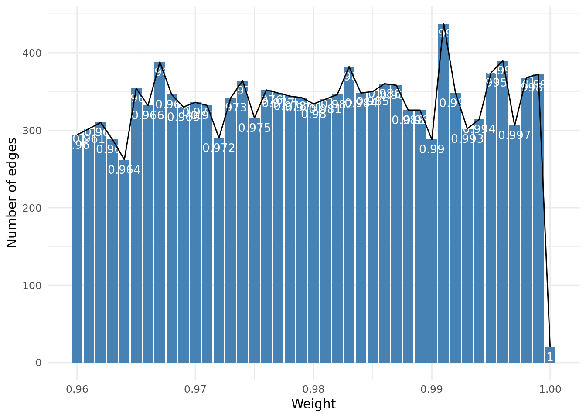

#### Degree distribution of item->similarity->item edges

#### Degree distribution of agent->knows->agent edges

#### Runing time by method 

<table class="table table-condensed" style="width: auto !important; ">
 <thead>
  <tr>
   <th style="text-align:left;"> key </th>
   <th style="text-align:right;"> doc_count </th>
   <th style="text-align:right;"> sum_wallTime_ms.value </th>
   <th style="text-align:left;"> avg_wallTime_ms.value </th>
   <th style="text-align:left;"> includedInTotal </th>
  </tr>
 </thead>
<tbody>
  <tr>
   <td style="text-align:left;"> connectIfSimilar </td>
   <td style="text-align:right;"> 87,990 </td>
   <td style="text-align:right;"> 267,659 </td>
   <td style="text-align:left;"> 3.04192521877486 </td>
   <td style="text-align:left;"> No </td>
  </tr>
  <tr>
   <td style="text-align:left;"> existsSimilarity </td>
   <td style="text-align:right;"> 87,990 </td>
   <td style="text-align:right;"> 251,273 </td>
   <td style="text-align:left;"> 2.8556995113081 </td>
   <td style="text-align:left;"> No </td>
  </tr>
  <tr>
   <td style="text-align:left;"> similarityEdges </td>
   <td style="text-align:right;"> 87,990 </td>
   <td style="text-align:right;"> 248,242 </td>
   <td style="text-align:left;"> 2.82125241504716 </td>
   <td style="text-align:left;"> No </td>
  </tr>
  <tr>
   <td style="text-align:left;"> connect </td>
   <td style="text-align:right;"> 4,894 </td>
   <td style="text-align:right;"> 14,775 </td>
   <td style="text-align:left;"> 3.01900286064569 </td>
   <td style="text-align:left;"> Yes </td>
  </tr>
  <tr>
   <td style="text-align:left;"> connectAllSimilar </td>
   <td style="text-align:right;"> 420 </td>
   <td style="text-align:right;"> 268,548 </td>
   <td style="text-align:left;"> 639.4 </td>
   <td style="text-align:left;"> Yes </td>
  </tr>
  <tr>
   <td style="text-align:left;"> init </td>
   <td style="text-align:right;"> 203 </td>
   <td style="text-align:right;"> 19,222 </td>
   <td style="text-align:left;"> 94.6896551724138 </td>
   <td style="text-align:left;"> No </td>
  </tr>
  <tr>
   <td style="text-align:left;font-weight: bold;"> Total </td>
   <td style="text-align:right;font-weight: bold;"> 5,322 </td>
   <td style="text-align:right;font-weight: bold;"> 284,297 </td>
   <td style="text-align:left;font-weight: bold;">  </td>
   <td style="text-align:left;font-weight: bold;">  </td>
  </tr>
</tbody>
</table>
####  Found structures 

#####  Cycles 

Number of cycles found:  1 

<button class="btn btn-primary" data-toggle="collapse" data-target="#LJUPHOTSPN"> Show/Hide foundCycle query </button> 
 
  
     GET /filebeat-*/_search 
              { 
                "query": {
                  "bool": {
                    "must": [
                      { "match_phrase": {
                        "simulationId": "SIM10-13-11-57-4BqMNd--CV"
                        }
                      },
                      { "bool": {
                        "should": [
                          { "match": {
                            "keyword": "foundCycle"
                          }}
                        ]
                      }}
                    ]
                  }
                }
              }
     

#####  Paths 

Number of paths found:  0 

<button class="btn btn-primary" data-toggle="collapse" data-target="#RXDBLVBOCE"> Show/Hide foundPath query </button> 
 
  
     GET /filebeat-*/_search 
              { 
                "query": {
                  "bool": {
                    "must": [
                      { "match_phrase": {
                        "simulationId": "SIM10-13-11-57-4BqMNd--CV"
                        }
                      },
                      { "bool": {
                        "should": [
                          { "match": {
                            "keyword": "foundPath"
                          }}
                        ]
                      }}
                    ]
                  }
                }
              }
     

###  SIM10-13-11-57-4BqMNd--DV 

#### simulationParameters 

<table class="table table-condensed" style="width: auto !important; ">
 <thead>
  <tr>
   <th style="text-align:left;"> agentNumber </th>
   <th style="text-align:left;"> similarityConnectThreshold </th>
   <th style="text-align:left;"> graphType </th>
   <th style="text-align:left;"> chainLength </th>
   <th style="text-align:left;"> similaritySearchThreshold </th>
   <th style="text-align:left;"> maxDistance </th>
   <th style="text-align:left;"> randomWorksNumberMultiplier </th>
  </tr>
 </thead>
<tbody>
  <tr>
   <td style="text-align:left;width: 20em; "> 200 </td>
   <td style="text-align:left;width: 15em; "> 0.96 </td>
   <td style="text-align:left;width: 15em; "> random </td>
   <td style="text-align:left;width: 15em; "> 10 </td>
   <td style="text-align:left;width: 15em; "> 1 </td>
   <td style="text-align:left;width: 15em; "> 5 </td>
   <td style="text-align:left;width: 15em; "> 1 </td>
  </tr>
</tbody>
</table>
#### allEdgesByLabel

<table class="table table-condensed" style="width: auto !important; ">
 <thead>
  <tr>
   <th style="text-align:right;"> edges_offers </th>
   <th style="text-align:right;"> edges_similarity </th>
   <th style="text-align:right;"> edges_owns </th>
   <th style="text-align:right;"> edges_demands </th>
   <th style="text-align:right;"> edges_knows </th>
   <th style="text-align:right;"> edges_total </th>
  </tr>
 </thead>
<tbody>
  <tr>
   <td style="text-align:right;width: 5em; "> 210 </td>
   <td style="text-align:right;width: 5em; "> 3,774 </td>
   <td style="text-align:right;width: 5em; "> 210 </td>
   <td style="text-align:right;width: 5em; "> 210 </td>
   <td style="text-align:right;width: 5em; "> 200 </td>
   <td style="text-align:right;width: 5em; "> 4,604 </td>
  </tr>
</tbody>
</table>
#### allVerticesByType

<table class="table table-condensed" style="width: auto !important; ">
 <thead>
  <tr>
   <th style="text-align:right;"> vertices_agent </th>
   <th style="text-align:right;"> vertices_item </th>
   <th style="text-align:right;"> vertices_work </th>
   <th style="text-align:right;"> vertices_total </th>
  </tr>
 </thead>
<tbody>
  <tr>
   <td style="text-align:right;width: 5em; "> 201 </td>
   <td style="text-align:right;width: 5em; "> 420 </td>
   <td style="text-align:right;width: 5em; "> 210 </td>
   <td style="text-align:right;width: 5em; "> 831 </td>
  </tr>
</tbody>
</table>
#### distribution of similarityEdgesByWeight

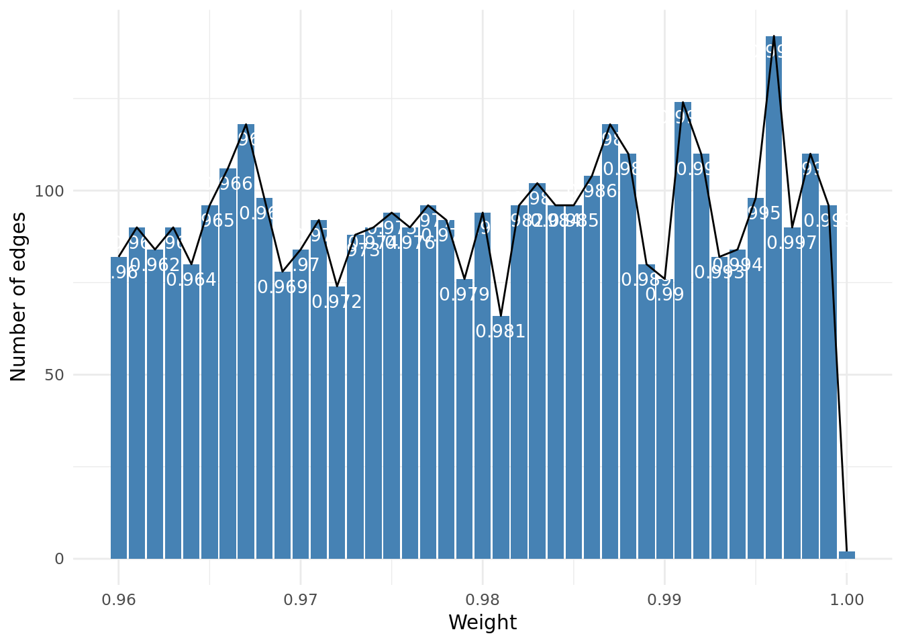

#### Degree distribution of item->similarity->item edges

#### Degree distribution of agent->knows->agent edges

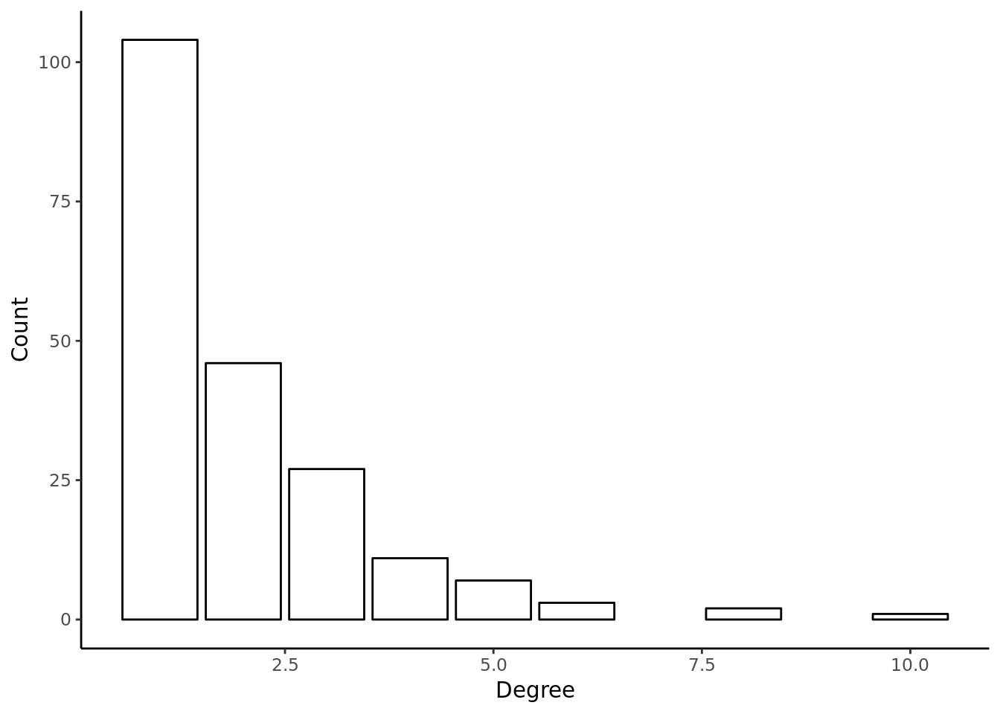

#### Runing time by method 

<table class="table table-condensed" style="width: auto !important; ">
 <thead>
  <tr>
   <th style="text-align:left;">   </th>
   <th style="text-align:left;"> key </th>
   <th style="text-align:right;"> doc_count </th>
   <th style="text-align:right;"> sum_wallTime_ms.value </th>
   <th style="text-align:left;"> avg_wallTime_ms.value </th>
   <th style="text-align:left;"> includedInTotal </th>
  </tr>
 </thead>
<tbody>
  <tr>
   <td style="text-align:left;"> 2 </td>
   <td style="text-align:left;"> cycleSearch </td>
   <td style="text-align:right;"> 3,600 </td>
   <td style="text-align:right;"> 14,606 </td>
   <td style="text-align:left;"> 4.05722222222222 </td>
   <td style="text-align:left;"> Yes </td>
  </tr>
  <tr>
   <td style="text-align:left;"> 3 </td>
   <td style="text-align:left;"> getWorks </td>
   <td style="text-align:right;"> 3,600 </td>
   <td style="text-align:right;"> 73,501 </td>
   <td style="text-align:left;"> 20.4169444444444 </td>
   <td style="text-align:left;"> No </td>
  </tr>
  <tr>
   <td style="text-align:left;"> 4 </td>
   <td style="text-align:left;"> individualCycleSearch </td>
   <td style="text-align:right;"> 3,600 </td>
   <td style="text-align:right;"> 87 </td>
   <td style="text-align:left;"> 0.0241666666666667 </td>
   <td style="text-align:left;"> Yes </td>
  </tr>
  <tr>
   <td style="text-align:left;"> 6 </td>
   <td style="text-align:left;"> addItemToWork </td>
   <td style="text-align:right;"> 420 </td>
   <td style="text-align:right;"> 4,216 </td>
   <td style="text-align:left;"> 10.0380952380952 </td>
   <td style="text-align:left;"> No </td>
  </tr>
  <tr>
   <td style="text-align:left;"> 7 </td>
   <td style="text-align:left;"> ownsWork </td>
   <td style="text-align:right;"> 210 </td>
   <td style="text-align:right;"> 3,745 </td>
   <td style="text-align:left;"> 17.8333333333333 </td>
   <td style="text-align:left;"> No </td>
  </tr>
  <tr>
   <td style="text-align:left;"> 8 </td>
   <td style="text-align:left;"> init </td>
   <td style="text-align:right;"> 203 </td>
   <td style="text-align:right;"> 20,371 </td>
   <td style="text-align:left;"> 100.349753694581 </td>
   <td style="text-align:left;"> No </td>
  </tr>
  <tr>
   <td style="text-align:left;"> 9 </td>
   <td style="text-align:left;"> searchAndConnect </td>
   <td style="text-align:right;"> 201 </td>
   <td style="text-align:right;"> 58,490 </td>
   <td style="text-align:left;"> 290.995024875622 </td>
   <td style="text-align:left;"> Yes </td>
  </tr>
  <tr>
   <td style="text-align:left;"> 10 </td>
   <td style="text-align:left;"> knowsAgent </td>
   <td style="text-align:right;"> 200 </td>
   <td style="text-align:right;"> 1,581 </td>
   <td style="text-align:left;"> 7.905 </td>
   <td style="text-align:left;"> No </td>
  </tr>
  <tr>
   <td style="text-align:left;font-weight: bold;"> 1 </td>
   <td style="text-align:left;font-weight: bold;"> Total </td>
   <td style="text-align:right;font-weight: bold;"> 14,601 </td>
   <td style="text-align:right;font-weight: bold;"> 86,598 </td>
   <td style="text-align:left;font-weight: bold;">  </td>
   <td style="text-align:left;font-weight: bold;">  </td>
  </tr>
</tbody>
</table>
####  Found structures 

#####  Cycles 

Number of cycles found:  0 

<button class="btn btn-primary" data-toggle="collapse" data-target="#BKUTYCTOUT"> Show/Hide foundCycle query </button> 
 
  
     GET /filebeat-*/_search 
              { 
                "query": {
                  "bool": {
                    "must": [
                      { "match_phrase": {
                        "simulationId": "SIM10-13-11-57-4BqMNd--DV"
                        }
                      },
                      { "bool": {
                        "should": [
                          { "match": {
                            "keyword": "foundCycle"
                          }}
                        ]
                      }}
                    ]
                  }
                }
              }
     

#####  Paths 

Number of paths found:  3600 

<button class="btn btn-primary" data-toggle="collapse" data-target="#EXJLKBFVQZ"> Show/Hide foundPath query </button> 
 
  
     GET /filebeat-*/_search 
              { 
                "query": {
                  "bool": {
                    "must": [
                      { "match_phrase": {
                        "simulationId": "SIM10-13-11-57-4BqMNd--DV"
                        }
                      },
                      { "bool": {
                        "should": [
                          { "match": {
                            "keyword": "foundPath"
                          }}
                        ]
                      }}
                    ]
                  }
                }
              }
     

###  SIM10-14-01-02-FxkkYj--CV 

#### simulationParameters 

<table class="table table-condensed" style="width: auto !important; ">
 <thead>
  <tr>
   <th style="text-align:left;"> agentNumber </th>
   <th style="text-align:left;"> similarityConnectThreshold </th>
   <th style="text-align:left;"> graphType </th>
   <th style="text-align:left;"> chainLength </th>
   <th style="text-align:left;"> similaritySearchThreshold </th>
   <th style="text-align:left;"> maxDistance </th>
   <th style="text-align:left;"> randomWorksNumberMultiplier </th>
  </tr>
 </thead>
<tbody>
  <tr>
   <td style="text-align:left;width: 20em; "> 200 </td>
   <td style="text-align:left;width: 15em; "> 0.96 </td>
   <td style="text-align:left;width: 15em; "> smallWorld </td>
   <td style="text-align:left;width: 15em; "> 10 </td>
   <td style="text-align:left;width: 15em; "> 1 </td>
   <td style="text-align:left;width: 15em; "> 5 </td>
   <td style="text-align:left;width: 15em; "> 1 </td>
  </tr>
</tbody>
</table>
#### allEdgesByLabel

<table class="table table-condensed" style="width: auto !important; ">
 <thead>
  <tr>
   <th style="text-align:right;"> edges_offers </th>
   <th style="text-align:right;"> edges_similarity </th>
   <th style="text-align:right;"> edges_owns </th>
   <th style="text-align:right;"> edges_demands </th>
   <th style="text-align:right;"> edges_knows </th>
   <th style="text-align:right;"> edges_total </th>
  </tr>
 </thead>
<tbody>
  <tr>
   <td style="text-align:right;width: 5em; "> 210 </td>
   <td style="text-align:right;width: 5em; "> 14,624 </td>
   <td style="text-align:right;width: 5em; "> 210 </td>
   <td style="text-align:right;width: 5em; "> 210 </td>
   <td style="text-align:right;width: 5em; "> 1,201 </td>
   <td style="text-align:right;width: 5em; "> 16,455 </td>
  </tr>
</tbody>
</table>
#### allVerticesByType

<table class="table table-condensed" style="width: auto !important; ">
 <thead>
  <tr>
   <th style="text-align:right;"> vertices_agent </th>
   <th style="text-align:right;"> vertices_item </th>
   <th style="text-align:right;"> vertices_work </th>
   <th style="text-align:right;"> vertices_total </th>
  </tr>
 </thead>
<tbody>
  <tr>
   <td style="text-align:right;width: 5em; "> 201 </td>
   <td style="text-align:right;width: 5em; "> 420 </td>
   <td style="text-align:right;width: 5em; "> 210 </td>
   <td style="text-align:right;width: 5em; "> 831 </td>
  </tr>
</tbody>
</table>
#### distribution of similarityEdgesByWeight

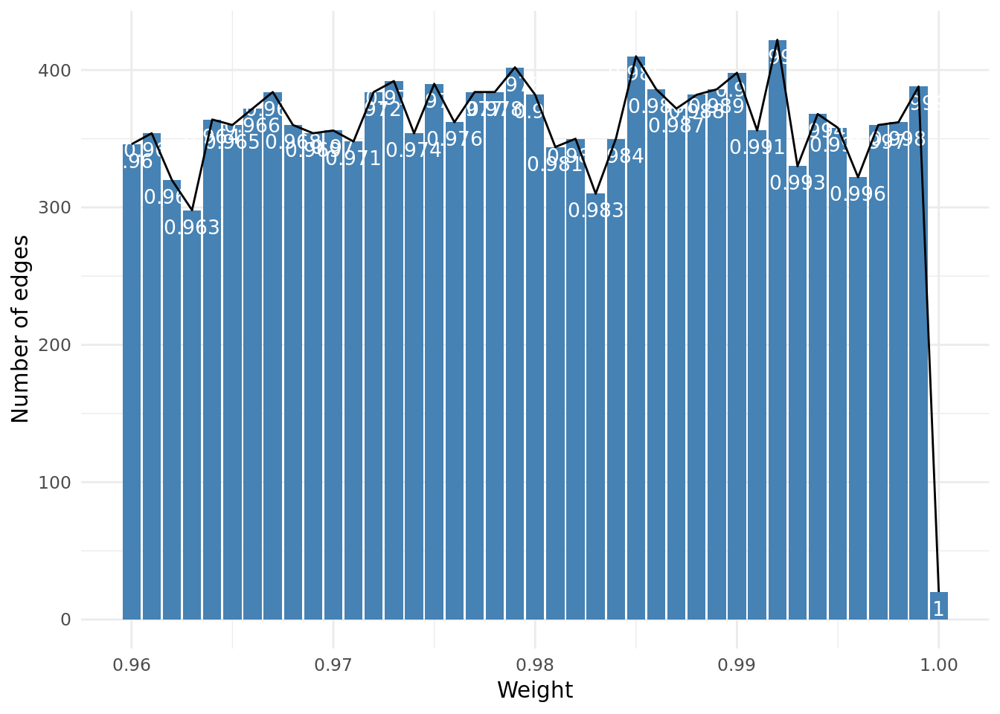

#### Degree distribution of item->similarity->item edges

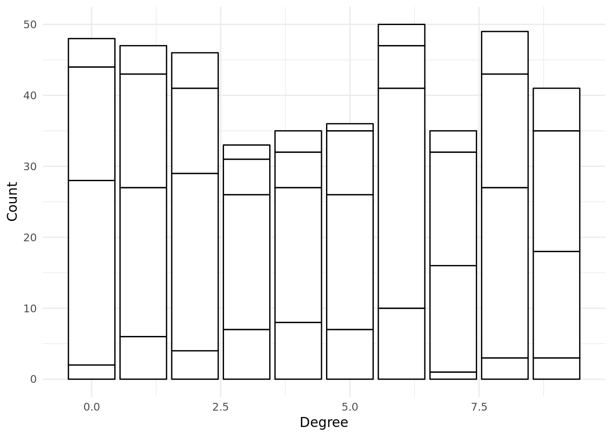

#### Degree distribution of agent->knows->agent edges

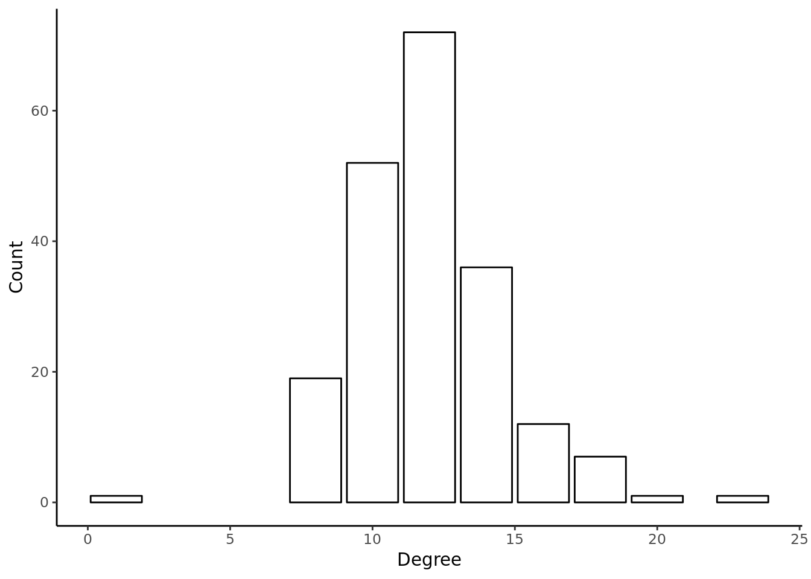

#### Runing time by method 

<table class="table table-condensed" style="width: auto !important; ">
 <thead>
  <tr>
   <th style="text-align:left;"> key </th>
   <th style="text-align:right;"> doc_count </th>
   <th style="text-align:right;"> sum_wallTime_ms.value </th>
   <th style="text-align:left;"> avg_wallTime_ms.value </th>
   <th style="text-align:left;"> includedInTotal </th>
  </tr>
 </thead>
<tbody>
  <tr>
   <td style="text-align:left;"> connectIfSimilar </td>
   <td style="text-align:right;"> 87,990 </td>
   <td style="text-align:right;"> 284,810 </td>
   <td style="text-align:left;"> 3.23684509603364 </td>
   <td style="text-align:left;"> No </td>
  </tr>
  <tr>
   <td style="text-align:left;"> existsSimilarity </td>
   <td style="text-align:right;"> 87,990 </td>
   <td style="text-align:right;"> 283,081 </td>
   <td style="text-align:left;"> 3.21719513581089 </td>
   <td style="text-align:left;"> No </td>
  </tr>
  <tr>
   <td style="text-align:left;"> similarityEdges </td>
   <td style="text-align:right;"> 87,990 </td>
   <td style="text-align:right;"> 279,377 </td>
   <td style="text-align:left;"> 3.17509944311854 </td>
   <td style="text-align:left;"> No </td>
  </tr>
  <tr>
   <td style="text-align:left;"> connectAllSimilar </td>
   <td style="text-align:right;"> 420 </td>
   <td style="text-align:right;"> 285,599 </td>
   <td style="text-align:left;"> 679.997619047619 </td>
   <td style="text-align:left;"> Yes </td>
  </tr>
  <tr>
   <td style="text-align:left;"> init </td>
   <td style="text-align:right;"> 203 </td>
   <td style="text-align:right;"> 19,491 </td>
   <td style="text-align:left;"> 96.0147783251231 </td>
   <td style="text-align:left;"> No </td>
  </tr>
  <tr>
   <td style="text-align:left;"> connect </td>
   <td style="text-align:right;"> 64 </td>
   <td style="text-align:right;"> 235 </td>
   <td style="text-align:left;"> 3.671875 </td>
   <td style="text-align:left;"> Yes </td>
  </tr>
  <tr>
   <td style="text-align:left;font-weight: bold;"> Total </td>
   <td style="text-align:right;font-weight: bold;"> 492 </td>
   <td style="text-align:right;font-weight: bold;"> 286,682 </td>
   <td style="text-align:left;font-weight: bold;">  </td>
   <td style="text-align:left;font-weight: bold;">  </td>
  </tr>
</tbody>
</table>
####  Found structures 

#####  Cycles 

Number of cycles found:  1 

<button class="btn btn-primary" data-toggle="collapse" data-target="#AEGSJCPNKH"> Show/Hide foundCycle query </button> 
 
  
     GET /filebeat-*/_search 
              { 
                "query": {
                  "bool": {
                    "must": [
                      { "match_phrase": {
                        "simulationId": "SIM10-14-01-02-FxkkYj--CV"
                        }
                      },
                      { "bool": {
                        "should": [
                          { "match": {
                            "keyword": "foundCycle"
                          }}
                        ]
                      }}
                    ]
                  }
                }
              }
     

#####  Paths 

Number of paths found:  0 

<button class="btn btn-primary" data-toggle="collapse" data-target="#HXXEKJQLMA"> Show/Hide foundPath query </button> 
 
  
     GET /filebeat-*/_search 
              { 
                "query": {
                  "bool": {
                    "must": [
                      { "match_phrase": {
                        "simulationId": "SIM10-14-01-02-FxkkYj--CV"
                        }
                      },
                      { "bool": {
                        "should": [
                          { "match": {
                            "keyword": "foundPath"
                          }}
                        ]
                      }}
                    ]
                  }
                }
              }
     

###  SIM10-14-01-02-FxkkYj--DV 

#### simulationParameters 

<table class="table table-condensed" style="width: auto !important; ">
 <thead>
  <tr>
   <th style="text-align:left;"> agentNumber </th>
   <th style="text-align:left;"> similarityConnectThreshold </th>
   <th style="text-align:left;"> graphType </th>
   <th style="text-align:left;"> chainLength </th>
   <th style="text-align:left;"> similaritySearchThreshold </th>
   <th style="text-align:left;"> maxDistance </th>
   <th style="text-align:left;"> randomWorksNumberMultiplier </th>
  </tr>
 </thead>
<tbody>
  <tr>
   <td style="text-align:left;width: 20em; "> 200 </td>
   <td style="text-align:left;width: 15em; "> 0.96 </td>
   <td style="text-align:left;width: 15em; "> smallWorld </td>
   <td style="text-align:left;width: 15em; "> 10 </td>
   <td style="text-align:left;width: 15em; "> 1 </td>
   <td style="text-align:left;width: 15em; "> 5 </td>
   <td style="text-align:left;width: 15em; "> 1 </td>
  </tr>
</tbody>
</table>
#### allEdgesByLabel

<table class="table table-condensed" style="width: auto !important; ">
 <thead>
  <tr>
   <th style="text-align:right;"> edges_offers </th>
   <th style="text-align:right;"> edges_similarity </th>
   <th style="text-align:right;"> edges_owns </th>
   <th style="text-align:right;"> edges_demands </th>
   <th style="text-align:right;"> edges_knows </th>
   <th style="text-align:right;"> edges_total </th>
  </tr>
 </thead>
<tbody>
  <tr>
   <td style="text-align:right;width: 5em; "> 210 </td>
   <td style="text-align:right;width: 5em; "> 14,496 </td>
   <td style="text-align:right;width: 5em; "> 210 </td>
   <td style="text-align:right;width: 5em; "> 210 </td>
   <td style="text-align:right;width: 5em; "> 1,201 </td>
   <td style="text-align:right;width: 5em; "> 16,327 </td>
  </tr>
</tbody>
</table>
#### allVerticesByType

<table class="table table-condensed" style="width: auto !important; ">
 <thead>
  <tr>
   <th style="text-align:right;"> vertices_agent </th>
   <th style="text-align:right;"> vertices_item </th>
   <th style="text-align:right;"> vertices_work </th>
   <th style="text-align:right;"> vertices_total </th>
  </tr>
 </thead>
<tbody>
  <tr>
   <td style="text-align:right;width: 5em; "> 201 </td>
   <td style="text-align:right;width: 5em; "> 420 </td>
   <td style="text-align:right;width: 5em; "> 210 </td>
   <td style="text-align:right;width: 5em; "> 831 </td>
  </tr>
</tbody>
</table>
#### distribution of similarityEdgesByWeight

#### Degree distribution of item->similarity->item edges

#### Degree distribution of agent->knows->agent edges

#### Runing time by method 

<table class="table table-condensed" style="width: auto !important; ">
 <thead>
  <tr>
   <th style="text-align:left;">   </th>
   <th style="text-align:left;"> key </th>
   <th style="text-align:right;"> doc_count </th>
   <th style="text-align:right;"> sum_wallTime_ms.value </th>
   <th style="text-align:left;"> avg_wallTime_ms.value </th>
   <th style="text-align:left;"> includedInTotal </th>
  </tr>
 </thead>
<tbody>
  <tr>
   <td style="text-align:left;"> 1 </td>
   <td style="text-align:left;"> knowsAgent </td>
   <td style="text-align:right;"> 1,201 </td>
   <td style="text-align:right;"> 3,384 </td>
   <td style="text-align:left;"> 2.81765195670275 </td>
   <td style="text-align:left;"> No </td>
  </tr>
  <tr>
   <td style="text-align:left;"> 2 </td>
   <td style="text-align:left;"> addItemToWork </td>
   <td style="text-align:right;"> 420 </td>
   <td style="text-align:right;"> 8,515 </td>
   <td style="text-align:left;"> 20.2738095238095 </td>
   <td style="text-align:left;"> No </td>
  </tr>
  <tr>
   <td style="text-align:left;"> 3 </td>
   <td style="text-align:left;"> ownsWork </td>
   <td style="text-align:right;"> 210 </td>
   <td style="text-align:right;"> 4,377 </td>
   <td style="text-align:left;"> 20.8428571428571 </td>
   <td style="text-align:left;"> No </td>
  </tr>
  <tr>
   <td style="text-align:left;"> 4 </td>
   <td style="text-align:left;"> init </td>
   <td style="text-align:right;"> 203 </td>
   <td style="text-align:right;"> 20,139 </td>
   <td style="text-align:left;"> 99.2068965517241 </td>
   <td style="text-align:left;"> No </td>
  </tr>
  <tr>
   <td style="text-align:left;"> 5 </td>
   <td style="text-align:left;"> searchAndConnect </td>
   <td style="text-align:right;"> 201 </td>
   <td style="text-align:right;"> 218,752 </td>
   <td style="text-align:left;"> 1088.3184079602 </td>
   <td style="text-align:left;"> Yes </td>
  </tr>
  <tr>
   <td style="text-align:left;"> 6 </td>
   <td style="text-align:left;"> getWorksItems </td>
   <td style="text-align:right;"> 18 </td>
   <td style="text-align:right;"> 24 </td>
   <td style="text-align:left;"> 1.33333333333333 </td>
   <td style="text-align:left;"> Yes </td>
  </tr>
  <tr>
   <td style="text-align:left;"> 8 </td>
   <td style="text-align:left;"> cycleSearch </td>
   <td style="text-align:right;"> 8 </td>
   <td style="text-align:right;"> 2,994 </td>
   <td style="text-align:left;"> 374.25 </td>
   <td style="text-align:left;"> Yes </td>
  </tr>
  <tr>
   <td style="text-align:left;"> 9 </td>
   <td style="text-align:left;"> getWorks </td>
   <td style="text-align:right;"> 8 </td>
   <td style="text-align:right;"> 1,572 </td>
   <td style="text-align:left;"> 196.5 </td>
   <td style="text-align:left;"> No </td>
  </tr>
  <tr>
   <td style="text-align:left;"> 10 </td>
   <td style="text-align:left;"> individualCycleSearch </td>
   <td style="text-align:right;"> 8 </td>
   <td style="text-align:right;"> 0 </td>
   <td style="text-align:left;"> 0 </td>
   <td style="text-align:left;"> Yes </td>
  </tr>
  <tr>
   <td style="text-align:left;font-weight: bold;"> 11 </td>
   <td style="text-align:left;font-weight: bold;"> Total </td>
   <td style="text-align:right;font-weight: bold;"> 243 </td>
   <td style="text-align:right;font-weight: bold;"> 224,710 </td>
   <td style="text-align:left;font-weight: bold;">  </td>
   <td style="text-align:left;font-weight: bold;">  </td>
  </tr>
</tbody>
</table>
####  Found structures 

#####  Cycles 

Number of cycles found:  3 

<button class="btn btn-primary" data-toggle="collapse" data-target="#TESPPPLSUO"> Show/Hide foundCycle query </button> 
 
  
     GET /filebeat-*/_search 
              { 
                "query": {
                  "bool": {
                    "must": [
                      { "match_phrase": {
                        "simulationId": "SIM10-14-01-02-FxkkYj--DV"
                        }
                      },
                      { "bool": {
                        "should": [
                          { "match": {
                            "keyword": "foundCycle"
                          }}
                        ]
                      }}
                    ]
                  }
                }
              }
     

#####  Paths 

Number of paths found:  5 

<button class="btn btn-primary" data-toggle="collapse" data-target="#AUEUOPJQKV"> Show/Hide foundPath query </button> 
 
  
     GET /filebeat-*/_search 
              { 
                "query": {
                  "bool": {
                    "must": [
                      { "match_phrase": {
                        "simulationId": "SIM10-14-01-02-FxkkYj--DV"
                        }
                      },
                      { "bool": {
                        "should": [
                          { "match": {
                            "keyword": "foundPath"
                          }}
                        ]
                      }}
                    ]
                  }
                }
              }
     

###  SIM10-14-01-30-MRuV6h--CV 

#### simulationParameters 

<table class="table table-condensed" style="width: auto !important; ">
 <thead>
  <tr>
   <th style="text-align:left;"> agentNumber </th>
   <th style="text-align:left;"> similarityConnectThreshold </th>
   <th style="text-align:left;"> graphType </th>
   <th style="text-align:left;"> chainLength </th>
   <th style="text-align:left;"> similaritySearchThreshold </th>
   <th style="text-align:left;"> maxDistance </th>
   <th style="text-align:left;"> randomWorksNumberMultiplier </th>
  </tr>
 </thead>
<tbody>
  <tr>
   <td style="text-align:left;width: 20em; "> 200 </td>
   <td style="text-align:left;width: 15em; "> 0.96 </td>
   <td style="text-align:left;width: 15em; "> random </td>
   <td style="text-align:left;width: 15em; "> 10 </td>
   <td style="text-align:left;width: 15em; "> 1 </td>
   <td style="text-align:left;width: 15em; "> 5 </td>
   <td style="text-align:left;width: 15em; "> 2 </td>
  </tr>
</tbody>
</table>
#### allEdgesByLabel

<table class="table table-condensed" style="width: auto !important; ">
 <thead>
  <tr>
   <th style="text-align:right;"> edges_offers </th>
   <th style="text-align:right;"> edges_similarity </th>
   <th style="text-align:right;"> edges_owns </th>
   <th style="text-align:right;"> edges_demands </th>
   <th style="text-align:right;"> edges_knows </th>
   <th style="text-align:right;"> edges_total </th>
  </tr>
 </thead>
<tbody>
  <tr>
   <td style="text-align:right;width: 5em; "> 410 </td>
   <td style="text-align:right;width: 5em; "> 53,112 </td>
   <td style="text-align:right;width: 5em; "> 410 </td>
   <td style="text-align:right;width: 5em; "> 410 </td>
   <td style="text-align:right;width: 5em; "> 200 </td>
   <td style="text-align:right;width: 5em; "> 54,542 </td>
  </tr>
</tbody>
</table>
#### allVerticesByType

<table class="table table-condensed" style="width: auto !important; ">
 <thead>
  <tr>
   <th style="text-align:right;"> vertices_agent </th>
   <th style="text-align:right;"> vertices_item </th>
   <th style="text-align:right;"> vertices_work </th>
   <th style="text-align:right;"> vertices_total </th>
  </tr>
 </thead>
<tbody>
  <tr>
   <td style="text-align:right;width: 5em; "> 201 </td>
   <td style="text-align:right;width: 5em; "> 820 </td>
   <td style="text-align:right;width: 5em; "> 410 </td>
   <td style="text-align:right;width: 5em; "> 1,431 </td>
  </tr>
</tbody>
</table>
#### distribution of similarityEdgesByWeight

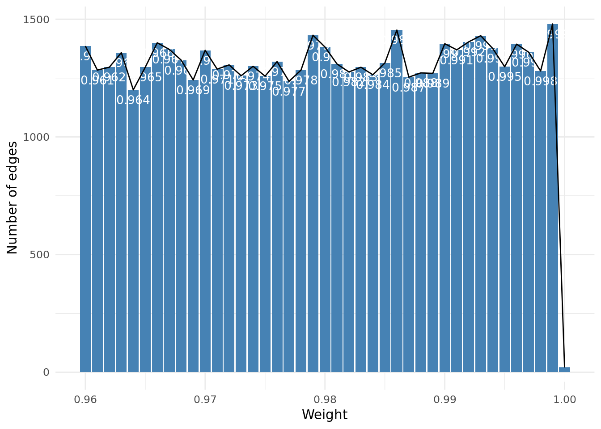

#### Degree distribution of item->similarity->item edges

#### Degree distribution of agent->knows->agent edges

#### Runing time by method 

<table class="table table-condensed" style="width: auto !important; ">
 <thead>
  <tr>
   <th style="text-align:left;"> key </th>
   <th style="text-align:right;"> doc_count </th>
   <th style="text-align:right;"> sum_wallTime_ms.value </th>
   <th style="text-align:left;"> avg_wallTime_ms.value </th>
   <th style="text-align:left;"> includedInTotal </th>
  </tr>
 </thead>
<tbody>
  <tr>
   <td style="text-align:left;"> connectIfSimilar </td>
   <td style="text-align:right;"> 335,790 </td>
   <td style="text-align:right;"> 1,342,948 </td>
   <td style="text-align:left;"> 3.99936865302719 </td>
   <td style="text-align:left;"> No </td>
  </tr>
  <tr>
   <td style="text-align:left;"> existsSimilarity </td>
   <td style="text-align:right;"> 335,790 </td>
   <td style="text-align:right;"> 1,256,148 </td>
   <td style="text-align:left;"> 3.74087376038596 </td>
   <td style="text-align:left;"> No </td>
  </tr>
  <tr>
   <td style="text-align:left;"> similarityEdges </td>
   <td style="text-align:right;"> 335,790 </td>
   <td style="text-align:right;"> 1,240,790 </td>
   <td style="text-align:left;"> 3.69513684147831 </td>
   <td style="text-align:left;"> No </td>
  </tr>
  <tr>
   <td style="text-align:left;"> connect </td>
   <td style="text-align:right;"> 21,056 </td>
   <td style="text-align:right;"> 80,173 </td>
   <td style="text-align:left;"> 3.80760828267477 </td>
   <td style="text-align:left;"> Yes </td>
  </tr>
  <tr>
   <td style="text-align:left;"> connectAllSimilar </td>
   <td style="text-align:right;"> 820 </td>
   <td style="text-align:right;"> 1,346,445 </td>
   <td style="text-align:left;"> 1642.00609756098 </td>
   <td style="text-align:left;"> Yes </td>
  </tr>
  <tr>
   <td style="text-align:left;"> init </td>
   <td style="text-align:right;"> 203 </td>
   <td style="text-align:right;"> 20,379 </td>
   <td style="text-align:left;"> 100.389162561576 </td>
   <td style="text-align:left;"> No </td>
  </tr>
  <tr>
   <td style="text-align:left;font-weight: bold;"> Total </td>
   <td style="text-align:right;font-weight: bold;"> 21,884 </td>
   <td style="text-align:right;font-weight: bold;"> 1,428,385 </td>
   <td style="text-align:left;font-weight: bold;">  </td>
   <td style="text-align:left;font-weight: bold;">  </td>
  </tr>
</tbody>
</table>
####  Found structures 

#####  Cycles 

Number of cycles found:  1 

<button class="btn btn-primary" data-toggle="collapse" data-target="#TRSCRYGUMG"> Show/Hide foundCycle query </button> 
 
  
     GET /filebeat-*/_search 
              { 
                "query": {
                  "bool": {
                    "must": [
                      { "match_phrase": {
                        "simulationId": "SIM10-14-01-30-MRuV6h--CV"
                        }
                      },
                      { "bool": {
                        "should": [
                          { "match": {
                            "keyword": "foundCycle"
                          }}
                        ]
                      }}
                    ]
                  }
                }
              }
     

#####  Paths 

Number of paths found:  0 

<button class="btn btn-primary" data-toggle="collapse" data-target="#ZEJNDJYOKJ"> Show/Hide foundPath query </button> 
 
  
     GET /filebeat-*/_search 
              { 
                "query": {
                  "bool": {
                    "must": [
                      { "match_phrase": {
                        "simulationId": "SIM10-14-01-30-MRuV6h--CV"
                        }
                      },
                      { "bool": {
                        "should": [
                          { "match": {
                            "keyword": "foundPath"
                          }}
                        ]
                      }}
                    ]
                  }
                }
              }
     

###  SIM10-14-01-30-MRuV6h--DV 

#### simulationParameters 

<table class="table table-condensed" style="width: auto !important; ">
 <thead>
  <tr>
   <th style="text-align:left;"> agentNumber </th>
   <th style="text-align:left;"> similarityConnectThreshold </th>
   <th style="text-align:left;"> graphType </th>
   <th style="text-align:left;"> chainLength </th>
   <th style="text-align:left;"> similaritySearchThreshold </th>
   <th style="text-align:left;"> maxDistance </th>
   <th style="text-align:left;"> randomWorksNumberMultiplier </th>
  </tr>
 </thead>
<tbody>
  <tr>
   <td style="text-align:left;width: 20em; "> 200 </td>
   <td style="text-align:left;width: 15em; "> 0.96 </td>
   <td style="text-align:left;width: 15em; "> random </td>
   <td style="text-align:left;width: 15em; "> 10 </td>
   <td style="text-align:left;width: 15em; "> 1 </td>
   <td style="text-align:left;width: 15em; "> 5 </td>
   <td style="text-align:left;width: 15em; "> 2 </td>
  </tr>
</tbody>
</table>
#### allEdgesByLabel

<table class="table table-condensed" style="width: auto !important; ">
 <thead>
  <tr>
   <th style="text-align:right;"> edges_offers </th>
   <th style="text-align:right;"> edges_similarity </th>
   <th style="text-align:right;"> edges_owns </th>
   <th style="text-align:right;"> edges_demands </th>
   <th style="text-align:right;"> edges_knows </th>
   <th style="text-align:right;"> edges_total </th>
  </tr>
 </thead>
<tbody>
  <tr>
   <td style="text-align:right;width: 5em; "> 410 </td>
   <td style="text-align:right;width: 5em; "> 11,000 </td>
   <td style="text-align:right;width: 5em; "> 410 </td>
   <td style="text-align:right;width: 5em; "> 410 </td>
   <td style="text-align:right;width: 5em; "> 200 </td>
   <td style="text-align:right;width: 5em; "> 12,430 </td>
  </tr>
</tbody>
</table>
#### allVerticesByType

<table class="table table-condensed" style="width: auto !important; ">
 <thead>
  <tr>
   <th style="text-align:right;"> vertices_agent </th>
   <th style="text-align:right;"> vertices_item </th>
   <th style="text-align:right;"> vertices_work </th>
   <th style="text-align:right;"> vertices_total </th>
  </tr>
 </thead>
<tbody>
  <tr>
   <td style="text-align:right;width: 5em; "> 201 </td>
   <td style="text-align:right;width: 5em; "> 820 </td>
   <td style="text-align:right;width: 5em; "> 410 </td>
   <td style="text-align:right;width: 5em; "> 1,431 </td>
  </tr>
</tbody>
</table>
#### distribution of similarityEdgesByWeight

#### Degree distribution of item->similarity->item edges

#### Degree distribution of agent->knows->agent edges

#### Runing time by method 

<table class="table table-condensed" style="width: auto !important; ">
 <thead>
  <tr>
   <th style="text-align:left;">   </th>
   <th style="text-align:left;"> key </th>
   <th style="text-align:right;"> doc_count </th>
   <th style="text-align:right;"> sum_wallTime_ms.value </th>
   <th style="text-align:left;"> avg_wallTime_ms.value </th>
   <th style="text-align:left;"> includedInTotal </th>
  </tr>
 </thead>
<tbody>
  <tr>
   <td style="text-align:left;"> 2 </td>
   <td style="text-align:left;"> cycleSearch </td>
   <td style="text-align:right;"> 3,600 </td>
   <td style="text-align:right;"> 18,778 </td>
   <td style="text-align:left;"> 5.21611111111111 </td>
   <td style="text-align:left;"> Yes </td>
  </tr>
  <tr>
   <td style="text-align:left;"> 3 </td>
   <td style="text-align:left;"> getWorks </td>
   <td style="text-align:right;"> 3,600 </td>
   <td style="text-align:right;"> 84,196 </td>
   <td style="text-align:left;"> 23.3877777777778 </td>
   <td style="text-align:left;"> No </td>
  </tr>
  <tr>
   <td style="text-align:left;"> 4 </td>
   <td style="text-align:left;"> individualCycleSearch </td>
   <td style="text-align:right;"> 3,600 </td>
   <td style="text-align:right;"> 96 </td>
   <td style="text-align:left;"> 0.0266666666666667 </td>
   <td style="text-align:left;"> Yes </td>
  </tr>
  <tr>
   <td style="text-align:left;"> 6 </td>
   <td style="text-align:left;"> addItemToWork </td>
   <td style="text-align:right;"> 820 </td>
   <td style="text-align:right;"> 10,427 </td>
   <td style="text-align:left;"> 12.7158536585366 </td>
   <td style="text-align:left;"> No </td>
  </tr>
  <tr>
   <td style="text-align:left;"> 7 </td>
   <td style="text-align:left;"> ownsWork </td>
   <td style="text-align:right;"> 410 </td>
   <td style="text-align:right;"> 5,524 </td>
   <td style="text-align:left;"> 13.4731707317073 </td>
   <td style="text-align:left;"> No </td>
  </tr>
  <tr>
   <td style="text-align:left;"> 8 </td>
   <td style="text-align:left;"> init </td>
   <td style="text-align:right;"> 203 </td>
   <td style="text-align:right;"> 21,934 </td>
   <td style="text-align:left;"> 108.049261083744 </td>
   <td style="text-align:left;"> No </td>
  </tr>
  <tr>
   <td style="text-align:left;"> 9 </td>
   <td style="text-align:left;"> searchAndConnect </td>
   <td style="text-align:right;"> 201 </td>
   <td style="text-align:right;"> 123,065 </td>
   <td style="text-align:left;"> 612.26368159204 </td>
   <td style="text-align:left;"> Yes </td>
  </tr>
  <tr>
   <td style="text-align:left;"> 10 </td>
   <td style="text-align:left;"> knowsAgent </td>
   <td style="text-align:right;"> 200 </td>
   <td style="text-align:right;"> 1,636 </td>
   <td style="text-align:left;"> 8.18 </td>
   <td style="text-align:left;"> No </td>
  </tr>
  <tr>
   <td style="text-align:left;font-weight: bold;"> 1 </td>
   <td style="text-align:left;font-weight: bold;"> Total </td>
   <td style="text-align:right;font-weight: bold;"> 14,601 </td>
   <td style="text-align:right;font-weight: bold;"> 158,132 </td>
   <td style="text-align:left;font-weight: bold;">  </td>
   <td style="text-align:left;font-weight: bold;">  </td>
  </tr>
</tbody>
</table>
####  Found structures 

#####  Cycles 

Number of cycles found:  0 

<button class="btn btn-primary" data-toggle="collapse" data-target="#JBDEHCGXCP"> Show/Hide foundCycle query </button> 
 
  
     GET /filebeat-*/_search 
              { 
                "query": {
                  "bool": {
                    "must": [
                      { "match_phrase": {
                        "simulationId": "SIM10-14-01-30-MRuV6h--DV"
                        }
                      },
                      { "bool": {
                        "should": [
                          { "match": {
                            "keyword": "foundCycle"
                          }}
                        ]
                      }}
                    ]
                  }
                }
              }
     

#####  Paths 

Number of paths found:  3600 

<button class="btn btn-primary" data-toggle="collapse" data-target="#ZEJJATZCAK"> Show/Hide foundPath query </button> 
 
  
     GET /filebeat-*/_search 
              { 
                "query": {
                  "bool": {
                    "must": [
                      { "match_phrase": {
                        "simulationId": "SIM10-14-01-30-MRuV6h--DV"
                        }
                      },
                      { "bool": {
                        "should": [
                          { "match": {
                            "keyword": "foundPath"
                          }}
                        ]
                      }}
                    ]
                  }
                }
              }
     

###  SIM10-14-02-53-9NiDEv--CV 

#### simulationParameters 

<table class="table table-condensed" style="width: auto !important; ">
 <thead>
  <tr>
   <th style="text-align:left;"> agentNumber </th>
   <th style="text-align:left;"> similarityConnectThreshold </th>
   <th style="text-align:left;"> graphType </th>
   <th style="text-align:left;"> chainLength </th>
   <th style="text-align:left;"> similaritySearchThreshold </th>
   <th style="text-align:left;"> maxDistance </th>
   <th style="text-align:left;"> randomWorksNumberMultiplier </th>
  </tr>
 </thead>
<tbody>
  <tr>
   <td style="text-align:left;width: 20em; "> 200 </td>
   <td style="text-align:left;width: 15em; "> 0.96 </td>
   <td style="text-align:left;width: 15em; "> smallWorld </td>
   <td style="text-align:left;width: 15em; "> 10 </td>
   <td style="text-align:left;width: 15em; "> 1 </td>
   <td style="text-align:left;width: 15em; "> 5 </td>
   <td style="text-align:left;width: 15em; "> 2 </td>
  </tr>
</tbody>
</table>
#### allEdgesByLabel

<table class="table table-condensed" style="width: auto !important; ">
 <thead>
  <tr>
   <th style="text-align:right;"> edges_offers </th>
   <th style="text-align:right;"> edges_similarity </th>
   <th style="text-align:right;"> edges_owns </th>
   <th style="text-align:right;"> edges_demands </th>
   <th style="text-align:right;"> edges_knows </th>
   <th style="text-align:right;"> edges_total </th>
  </tr>
 </thead>
<tbody>
  <tr>
   <td style="text-align:right;width: 5em; "> 410 </td>
   <td style="text-align:right;width: 5em; "> 55,428 </td>
   <td style="text-align:right;width: 5em; "> 410 </td>
   <td style="text-align:right;width: 5em; "> 410 </td>
   <td style="text-align:right;width: 5em; "> 1,201 </td>
   <td style="text-align:right;width: 5em; "> 57,859 </td>
  </tr>
</tbody>
</table>
#### allVerticesByType

<table class="table table-condensed" style="width: auto !important; ">
 <thead>
  <tr>
   <th style="text-align:right;"> vertices_agent </th>
   <th style="text-align:right;"> vertices_item </th>
   <th style="text-align:right;"> vertices_work </th>
   <th style="text-align:right;"> vertices_total </th>
  </tr>
 </thead>
<tbody>
  <tr>
   <td style="text-align:right;width: 5em; "> 201 </td>
   <td style="text-align:right;width: 5em; "> 820 </td>
   <td style="text-align:right;width: 5em; "> 410 </td>
   <td style="text-align:right;width: 5em; "> 1,431 </td>
  </tr>
</tbody>
</table>
#### distribution of similarityEdgesByWeight

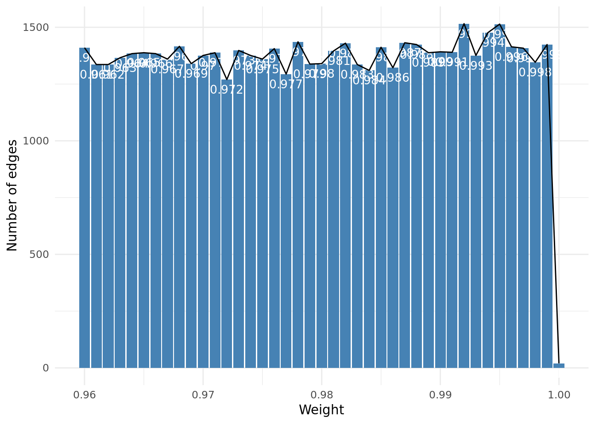

#### Degree distribution of item->similarity->item edges

#### Degree distribution of agent->knows->agent edges

#### Runing time by method 

<table class="table table-condensed" style="width: auto !important; ">
 <thead>
  <tr>
   <th style="text-align:left;"> key </th>
   <th style="text-align:right;"> doc_count </th>
   <th style="text-align:right;"> sum_wallTime_ms.value </th>
   <th style="text-align:left;"> avg_wallTime_ms.value </th>
   <th style="text-align:left;"> includedInTotal </th>
  </tr>
 </thead>
<tbody>
  <tr>
   <td style="text-align:left;"> connectIfSimilar </td>
   <td style="text-align:right;"> 335,790 </td>
   <td style="text-align:right;"> 1,488,402 </td>
   <td style="text-align:left;"> 4.4325381935138 </td>
   <td style="text-align:left;"> No </td>
  </tr>
  <tr>
   <td style="text-align:left;"> existsSimilarity </td>
   <td style="text-align:right;"> 335,790 </td>
   <td style="text-align:right;"> 1,480,927 </td>
   <td style="text-align:left;"> 4.41027725661872 </td>
   <td style="text-align:left;"> No </td>
  </tr>
  <tr>
   <td style="text-align:left;"> similarityEdges </td>
   <td style="text-align:right;"> 335,790 </td>
   <td style="text-align:right;"> 1,462,049 </td>
   <td style="text-align:left;"> 4.35405759552101 </td>
   <td style="text-align:left;"> No </td>
  </tr>
  <tr>
   <td style="text-align:left;"> connectAllSimilar </td>
   <td style="text-align:right;"> 820 </td>
   <td style="text-align:right;"> 1,491,646 </td>
   <td style="text-align:left;"> 1819.08048780488 </td>
   <td style="text-align:left;"> Yes </td>
  </tr>
  <tr>
   <td style="text-align:left;"> connect </td>
   <td style="text-align:right;"> 209 </td>
   <td style="text-align:right;"> 1,324 </td>
   <td style="text-align:left;"> 6.33492822966507 </td>
   <td style="text-align:left;"> Yes </td>
  </tr>
  <tr>
   <td style="text-align:left;"> init </td>
   <td style="text-align:right;"> 203 </td>
   <td style="text-align:right;"> 19,771 </td>
   <td style="text-align:left;"> 97.3940886699507 </td>
   <td style="text-align:left;"> No </td>
  </tr>
  <tr>
   <td style="text-align:left;font-weight: bold;"> Total </td>
   <td style="text-align:right;font-weight: bold;"> 1,037 </td>
   <td style="text-align:right;font-weight: bold;"> 1,494,699 </td>
   <td style="text-align:left;font-weight: bold;">  </td>
   <td style="text-align:left;font-weight: bold;">  </td>
  </tr>
</tbody>
</table>
####  Found structures 

#####  Cycles 

Number of cycles found:  1 

<button class="btn btn-primary" data-toggle="collapse" data-target="#AHOHZKNPEC"> Show/Hide foundCycle query </button> 
 
  
     GET /filebeat-*/_search 
              { 
                "query": {
                  "bool": {
                    "must": [
                      { "match_phrase": {
                        "simulationId": "SIM10-14-02-53-9NiDEv--CV"
                        }
                      },
                      { "bool": {
                        "should": [
                          { "match": {
                            "keyword": "foundCycle"
                          }}
                        ]
                      }}
                    ]
                  }
                }
              }
     

#####  Paths 

Number of paths found:  0 

<button class="btn btn-primary" data-toggle="collapse" data-target="#XASNGUSNCS"> Show/Hide foundPath query </button> 
 
  
     GET /filebeat-*/_search 
              { 
                "query": {
                  "bool": {
                    "must": [
                      { "match_phrase": {
                        "simulationId": "SIM10-14-02-53-9NiDEv--CV"
                        }
                      },
                      { "bool": {
                        "should": [
                          { "match": {
                            "keyword": "foundPath"
                          }}
                        ]
                      }}
                    ]
                  }
                }
              }
     

###  SIM10-14-02-53-9NiDEv--DV 

#### simulationParameters 

<table class="table table-condensed" style="width: auto !important; ">
 <thead>
  <tr>
   <th style="text-align:left;"> agentNumber </th>
   <th style="text-align:left;"> similarityConnectThreshold </th>
   <th style="text-align:left;"> graphType </th>
   <th style="text-align:left;"> chainLength </th>
   <th style="text-align:left;"> similaritySearchThreshold </th>
   <th style="text-align:left;"> maxDistance </th>
   <th style="text-align:left;"> randomWorksNumberMultiplier </th>
  </tr>
 </thead>
<tbody>
  <tr>
   <td style="text-align:left;width: 20em; "> 200 </td>
   <td style="text-align:left;width: 15em; "> 0.96 </td>
   <td style="text-align:left;width: 15em; "> smallWorld </td>
   <td style="text-align:left;width: 15em; "> 10 </td>
   <td style="text-align:left;width: 15em; "> 1 </td>
   <td style="text-align:left;width: 15em; "> 5 </td>
   <td style="text-align:left;width: 15em; "> 2 </td>
  </tr>
</tbody>
</table>
#### allEdgesByLabel

<table class="table table-condensed" style="width: auto !important; ">
 <thead>
  <tr>
   <th style="text-align:right;"> edges_offers </th>
   <th style="text-align:right;"> edges_similarity </th>
   <th style="text-align:right;"> edges_owns </th>
   <th style="text-align:right;"> edges_demands </th>
   <th style="text-align:right;"> edges_knows </th>
   <th style="text-align:right;"> edges_total </th>
  </tr>
 </thead>
<tbody>
  <tr>
   <td style="text-align:right;width: 5em; "> 410 </td>
   <td style="text-align:right;width: 5em; "> 55,010 </td>
   <td style="text-align:right;width: 5em; "> 410 </td>
   <td style="text-align:right;width: 5em; "> 410 </td>
   <td style="text-align:right;width: 5em; "> 1,201 </td>
   <td style="text-align:right;width: 5em; "> 57,441 </td>
  </tr>
</tbody>
</table>
#### allVerticesByType

<table class="table table-condensed" style="width: auto !important; ">
 <thead>
  <tr>
   <th style="text-align:right;"> vertices_agent </th>
   <th style="text-align:right;"> vertices_item </th>
   <th style="text-align:right;"> vertices_work </th>
   <th style="text-align:right;"> vertices_total </th>
  </tr>
 </thead>
<tbody>
  <tr>
   <td style="text-align:right;width: 5em; "> 201 </td>
   <td style="text-align:right;width: 5em; "> 820 </td>
   <td style="text-align:right;width: 5em; "> 410 </td>
   <td style="text-align:right;width: 5em; "> 1,431 </td>
  </tr>
</tbody>
</table>
#### distribution of similarityEdgesByWeight

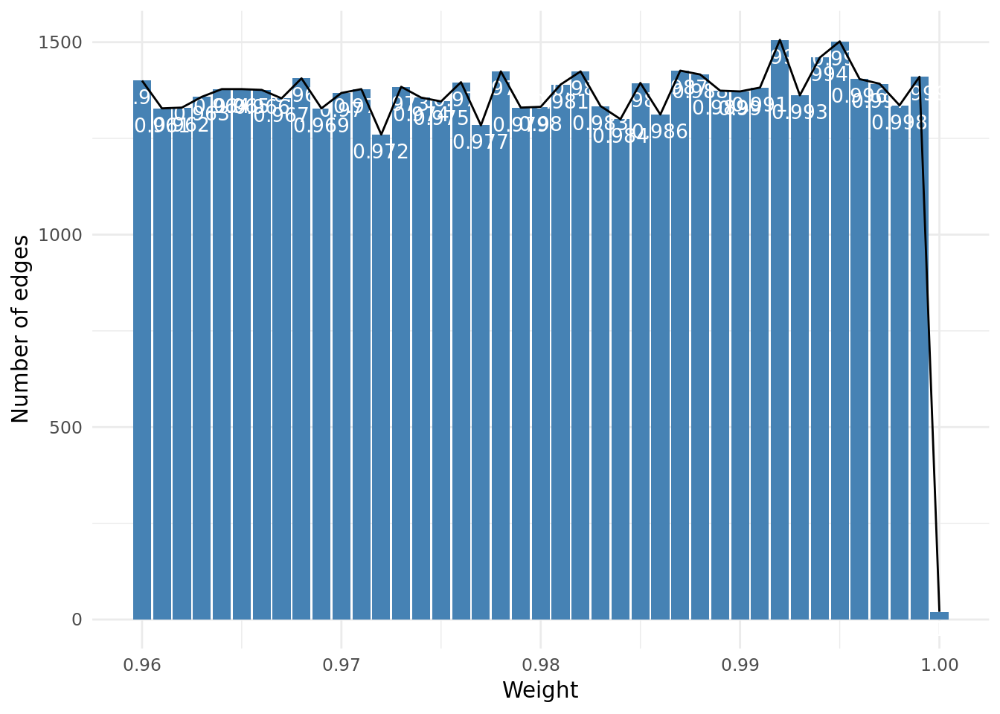

#### Degree distribution of item->similarity->item edges

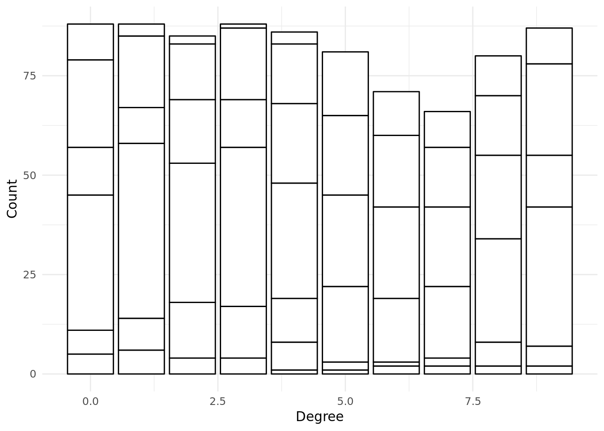

#### Degree distribution of agent->knows->agent edges

#### Runing time by method 

<table class="table table-condensed" style="width: auto !important; ">
 <thead>
  <tr>
   <th style="text-align:left;"> key </th>
   <th style="text-align:right;"> doc_count </th>
   <th style="text-align:right;"> sum_wallTime_ms.value </th>
   <th style="text-align:left;"> avg_wallTime_ms.value </th>
   <th style="text-align:left;"> includedInTotal </th>
  </tr>
 </thead>
<tbody>
  <tr>
   <td style="text-align:left;"> knowsAgent </td>
   <td style="text-align:right;"> 1,201 </td>
   <td style="text-align:right;"> 3,128 </td>
   <td style="text-align:left;"> 2.6044962531224 </td>
   <td style="text-align:left;"> No </td>
  </tr>
  <tr>
   <td style="text-align:left;"> addItemToWork </td>
   <td style="text-align:right;"> 820 </td>
   <td style="text-align:right;"> 12,889 </td>
   <td style="text-align:left;"> 15.7182926829268 </td>
   <td style="text-align:left;"> No </td>
  </tr>
  <tr>
   <td style="text-align:left;"> ownsWork </td>
   <td style="text-align:right;"> 410 </td>
   <td style="text-align:right;"> 7,622 </td>
   <td style="text-align:left;"> 18.590243902439 </td>
   <td style="text-align:left;"> No </td>
  </tr>
  <tr>
   <td style="text-align:left;"> init </td>
   <td style="text-align:right;"> 203 </td>
   <td style="text-align:right;"> 22,010 </td>
   <td style="text-align:left;"> 108.423645320197 </td>
   <td style="text-align:left;"> No </td>
  </tr>
  <tr>
   <td style="text-align:left;"> searchAndConnect </td>
   <td style="text-align:right;"> 201 </td>
   <td style="text-align:right;"> 792,052 </td>
   <td style="text-align:left;"> 3940.55721393035 </td>
   <td style="text-align:left;"> Yes </td>
  </tr>
  <tr>
   <td style="text-align:left;"> cycleSearch </td>
   <td style="text-align:right;"> 23 </td>
   <td style="text-align:right;"> 2,096 </td>
   <td style="text-align:left;"> 91.1304347826087 </td>
   <td style="text-align:left;"> Yes </td>
  </tr>
  <tr>
   <td style="text-align:left;"> getWorks </td>
   <td style="text-align:right;"> 23 </td>
   <td style="text-align:right;"> 4,463 </td>
   <td style="text-align:left;"> 194.04347826087 </td>
   <td style="text-align:left;"> No </td>
  </tr>
  <tr>
   <td style="text-align:left;"> individualCycleSearch </td>
   <td style="text-align:right;"> 23 </td>
   <td style="text-align:right;"> 1 </td>
   <td style="text-align:left;"> 0.0434782608695652 </td>
   <td style="text-align:left;"> Yes </td>
  </tr>
  <tr>
   <td style="text-align:left;"> getWorksItems </td>
   <td style="text-align:right;"> 18 </td>
   <td style="text-align:right;"> 63 </td>
   <td style="text-align:left;"> 3.5 </td>
   <td style="text-align:left;"> Yes </td>
  </tr>
  <tr>
   <td style="text-align:left;font-weight: bold;"> Total </td>
   <td style="text-align:right;font-weight: bold;"> 279 </td>
   <td style="text-align:right;font-weight: bold;"> 796,658 </td>
   <td style="text-align:left;font-weight: bold;">  </td>
   <td style="text-align:left;font-weight: bold;">  </td>
  </tr>
</tbody>
</table>
####  Found structures 

#####  Cycles 

Number of cycles found:  14 

<button class="btn btn-primary" data-toggle="collapse" data-target="#TBXYMZGQZC"> Show/Hide foundCycle query </button> 
 
  
     GET /filebeat-*/_search 
              { 
                "query": {
                  "bool": {
                    "must": [
                      { "match_phrase": {
                        "simulationId": "SIM10-14-02-53-9NiDEv--DV"
                        }
                      },
                      { "bool": {
                        "should": [
                          { "match": {
                            "keyword": "foundCycle"
                          }}
                        ]
                      }}
                    ]
                  }
                }
              }
     

#####  Paths 

Number of paths found:  0 

<button class="btn btn-primary" data-toggle="collapse" data-target="#YJDVJUKJMY"> Show/Hide foundPath query </button> 
 
  
     GET /filebeat-*/_search 
              { 
                "query": {
                  "bool": {
                    "must": [
                      { "match_phrase": {
                        "simulationId": "SIM10-14-02-53-9NiDEv--DV"
                        }
                      },
                      { "bool": {
                        "should": [
                          { "match": {
                            "keyword": "foundPath"
                          }}
                        ]
                      }}
                    ]
                  }
                }
              }
     

###  SIM10-14-02-12-Lbkpar--CV 

#### simulationParameters 

<table class="table table-condensed" style="width: auto !important; ">
 <thead>
  <tr>
   <th style="text-align:left;"> agentNumber </th>
   <th style="text-align:left;"> similarityConnectThreshold </th>
   <th style="text-align:left;"> graphType </th>
   <th style="text-align:left;"> chainLength </th>
   <th style="text-align:left;"> similaritySearchThreshold </th>
   <th style="text-align:left;"> maxDistance </th>
   <th style="text-align:left;"> randomWorksNumberMultiplier </th>
  </tr>
 </thead>
<tbody>
  <tr>
   <td style="text-align:left;width: 20em; "> 200 </td>
   <td style="text-align:left;width: 15em; "> 0.96 </td>
   <td style="text-align:left;width: 15em; "> smallWorld </td>
   <td style="text-align:left;width: 15em; "> 20 </td>
   <td style="text-align:left;width: 15em; "> 1 </td>
   <td style="text-align:left;width: 15em; "> 10 </td>
   <td style="text-align:left;width: 15em; "> 2 </td>
  </tr>
</tbody>
</table>
#### allEdgesByLabel

<table class="table table-condensed" style="width: auto !important; ">
 <thead>
  <tr>
   <th style="text-align:right;"> edges_offers </th>
   <th style="text-align:right;"> edges_similarity </th>
   <th style="text-align:right;"> edges_owns </th>
   <th style="text-align:right;"> edges_demands </th>
   <th style="text-align:right;"> edges_knows </th>
   <th style="text-align:right;"> edges_total </th>
  </tr>
 </thead>
<tbody>
  <tr>
   <td style="text-align:right;width: 5em; "> 420 </td>
   <td style="text-align:right;width: 5em; "> 58,248 </td>
   <td style="text-align:right;width: 5em; "> 420 </td>
   <td style="text-align:right;width: 5em; "> 420 </td>
   <td style="text-align:right;width: 5em; "> 1,201 </td>
   <td style="text-align:right;width: 5em; "> 60,709 </td>
  </tr>
</tbody>
</table>
#### allVerticesByType

<table class="table table-condensed" style="width: auto !important; ">
 <thead>
  <tr>
   <th style="text-align:right;"> vertices_agent </th>
   <th style="text-align:right;"> vertices_item </th>
   <th style="text-align:right;"> vertices_work </th>
   <th style="text-align:right;"> vertices_total </th>
  </tr>
 </thead>
<tbody>
  <tr>
   <td style="text-align:right;width: 5em; "> 201 </td>
   <td style="text-align:right;width: 5em; "> 840 </td>
   <td style="text-align:right;width: 5em; "> 420 </td>
   <td style="text-align:right;width: 5em; "> 1,461 </td>
  </tr>
</tbody>
</table>
#### distribution of similarityEdgesByWeight

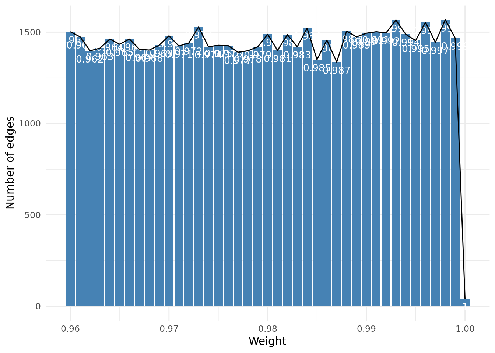

#### Degree distribution of item->similarity->item edges

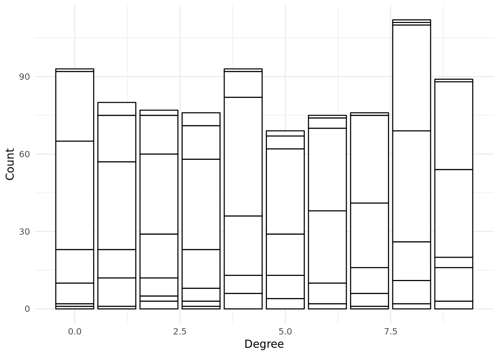

#### Degree distribution of agent->knows->agent edges

#### Runing time by method 

<table class="table table-condensed" style="width: auto !important; ">
 <thead>
  <tr>
   <th style="text-align:left;">   </th>
   <th style="text-align:left;"> key </th>
   <th style="text-align:right;"> doc_count </th>
   <th style="text-align:right;"> sum_wallTime_ms.value </th>
   <th style="text-align:left;"> avg_wallTime_ms.value </th>
   <th style="text-align:left;"> includedInTotal </th>
  </tr>
 </thead>
<tbody>
  <tr>
   <td style="text-align:left;"> 1 </td>
   <td style="text-align:left;"> connectIfSimilar </td>
   <td style="text-align:right;"> 352,380 </td>
   <td style="text-align:right;"> 1,769,800 </td>
   <td style="text-align:left;"> 5.02241897951076 </td>
   <td style="text-align:left;"> No </td>
  </tr>
  <tr>
   <td style="text-align:left;"> 2 </td>
   <td style="text-align:left;"> existsSimilarity </td>
   <td style="text-align:right;"> 352,380 </td>
   <td style="text-align:right;"> 1,762,068 </td>
   <td style="text-align:left;"> 5.00047675804529 </td>
   <td style="text-align:left;"> No </td>
  </tr>
  <tr>
   <td style="text-align:left;"> 3 </td>
   <td style="text-align:left;"> similarityEdges </td>
   <td style="text-align:right;"> 352,380 </td>
   <td style="text-align:right;"> 1,742,060 </td>
   <td style="text-align:left;"> 4.94369714512742 </td>
   <td style="text-align:left;"> No </td>
  </tr>
  <tr>
   <td style="text-align:left;"> 4 </td>
   <td style="text-align:left;"> connectAllSimilar </td>
   <td style="text-align:right;"> 840 </td>
   <td style="text-align:right;"> 1,773,449 </td>
   <td style="text-align:left;"> 2111.24880952381 </td>
   <td style="text-align:left;"> Yes </td>
  </tr>
  <tr>
   <td style="text-align:left;"> 5 </td>
   <td style="text-align:left;"> init </td>
   <td style="text-align:right;"> 203 </td>
   <td style="text-align:right;"> 23,814 </td>
   <td style="text-align:left;"> 117.310344827586 </td>
   <td style="text-align:left;"> No </td>
  </tr>
  <tr>
   <td style="text-align:left;"> 6 </td>
   <td style="text-align:left;"> connect </td>
   <td style="text-align:right;"> 186 </td>
   <td style="text-align:right;"> 1,152 </td>
   <td style="text-align:left;"> 6.19354838709677 </td>
   <td style="text-align:left;"> Yes </td>
  </tr>
  <tr>
   <td style="text-align:left;"> 8 </td>
   <td style="text-align:left;"> cycleSearch </td>
   <td style="text-align:right;"> 2 </td>
   <td style="text-align:right;"> 187 </td>
   <td style="text-align:left;"> 93.5 </td>
   <td style="text-align:left;"> Yes </td>
  </tr>
  <tr>
   <td style="text-align:left;font-weight: bold;"> 11 </td>
   <td style="text-align:left;font-weight: bold;"> Total </td>
   <td style="text-align:right;font-weight: bold;"> 1,035 </td>
   <td style="text-align:right;font-weight: bold;"> 1,776,326 </td>
   <td style="text-align:left;font-weight: bold;">  </td>
   <td style="text-align:left;font-weight: bold;">  </td>
  </tr>
</tbody>
</table>
####  Found structures 

#####  Cycles 

Number of cycles found:  1 

<button class="btn btn-primary" data-toggle="collapse" data-target="#XSRRBFLFUD"> Show/Hide foundCycle query </button> 
 
  
     GET /filebeat-*/_search 
              { 
                "query": {
                  "bool": {
                    "must": [
                      { "match_phrase": {
                        "simulationId": "SIM10-14-02-12-Lbkpar--CV"
                        }
                      },
                      { "bool": {
                        "should": [
                          { "match": {
                            "keyword": "foundCycle"
                          }}
                        ]
                      }}
                    ]
                  }
                }
              }
     

#####  Paths 

Number of paths found:  0 

<button class="btn btn-primary" data-toggle="collapse" data-target="#DWIRGCEWIJ"> Show/Hide foundPath query </button> 
 
  
     GET /filebeat-*/_search 
              { 
                "query": {
                  "bool": {
                    "must": [
                      { "match_phrase": {
                        "simulationId": "SIM10-14-02-12-Lbkpar--CV"
                        }
                      },
                      { "bool": {
                        "should": [
                          { "match": {
                            "keyword": "foundPath"
                          }}
                        ]
                      }}
                    ]
                  }
                }
              }
     

###  SIM10-14-02-12-Lbkpar--DV 

#### simulationParameters 

<table class="table table-condensed" style="width: auto !important; ">
 <thead>
  <tr>
   <th style="text-align:left;"> agentNumber </th>
   <th style="text-align:left;"> similarityConnectThreshold </th>
   <th style="text-align:left;"> graphType </th>
   <th style="text-align:left;"> chainLength </th>
   <th style="text-align:left;"> similaritySearchThreshold </th>
   <th style="text-align:left;"> maxDistance </th>
   <th style="text-align:left;"> randomWorksNumberMultiplier </th>
  </tr>
 </thead>
<tbody>
  <tr>
   <td style="text-align:left;width: 20em; "> 200 </td>
   <td style="text-align:left;width: 15em; "> 0.96 </td>
   <td style="text-align:left;width: 15em; "> smallWorld </td>
   <td style="text-align:left;width: 15em; "> 20 </td>
   <td style="text-align:left;width: 15em; "> 1 </td>
   <td style="text-align:left;width: 15em; "> 10 </td>
   <td style="text-align:left;width: 15em; "> 2 </td>
  </tr>
</tbody>
</table>
#### allEdgesByLabel

<table class="table table-condensed" style="width: auto !important; ">
 <thead>
  <tr>
   <th style="text-align:right;"> edges_offers </th>
   <th style="text-align:right;"> edges_similarity </th>
   <th style="text-align:right;"> edges_owns </th>
   <th style="text-align:right;"> edges_demands </th>
   <th style="text-align:right;"> edges_knows </th>
   <th style="text-align:right;"> edges_total </th>
  </tr>
 </thead>
<tbody>
  <tr>
   <td style="text-align:right;width: 5em; "> 420 </td>
   <td style="text-align:right;width: 5em; "> 57,876 </td>
   <td style="text-align:right;width: 5em; "> 420 </td>
   <td style="text-align:right;width: 5em; "> 420 </td>
   <td style="text-align:right;width: 5em; "> 1,201 </td>
   <td style="text-align:right;width: 5em; "> 60,337 </td>
  </tr>
</tbody>
</table>
#### allVerticesByType

<table class="table table-condensed" style="width: auto !important; ">
 <thead>
  <tr>
   <th style="text-align:right;"> vertices_agent </th>
   <th style="text-align:right;"> vertices_item </th>
   <th style="text-align:right;"> vertices_work </th>
   <th style="text-align:right;"> vertices_total </th>
  </tr>
 </thead>
<tbody>
  <tr>
   <td style="text-align:right;width: 5em; "> 201 </td>
   <td style="text-align:right;width: 5em; "> 840 </td>
   <td style="text-align:right;width: 5em; "> 420 </td>
   <td style="text-align:right;width: 5em; "> 1,461 </td>
  </tr>
</tbody>
</table>
#### distribution of similarityEdgesByWeight

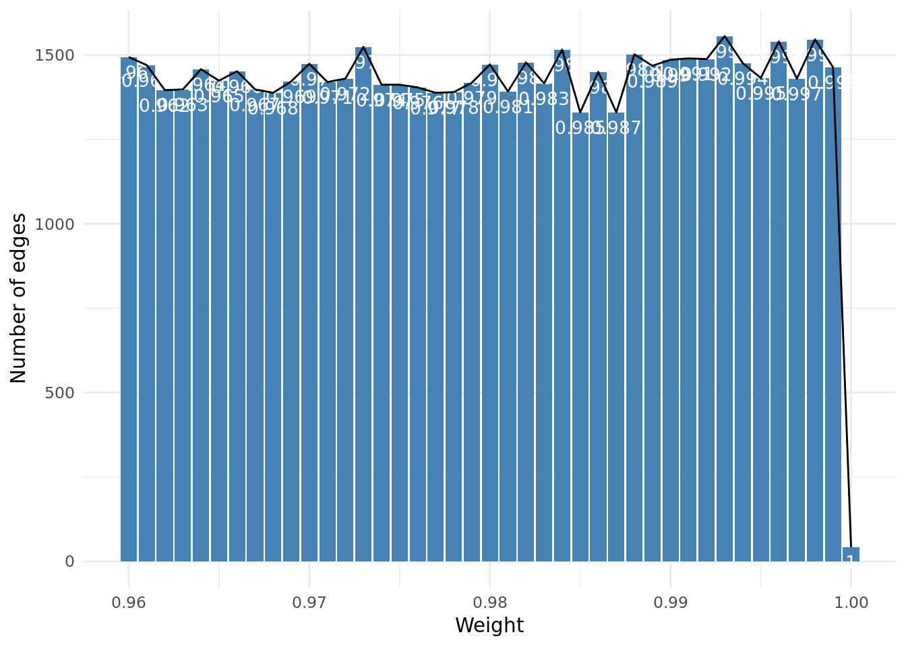

#### Degree distribution of item->similarity->item edges

#### Degree distribution of agent->knows->agent edges

#### Runing time by method 

<table class="table table-condensed" style="width: auto !important; ">
 <thead>
  <tr>
   <th style="text-align:left;"> key </th>
   <th style="text-align:right;"> doc_count </th>
   <th style="text-align:right;"> sum_wallTime_ms.value </th>
   <th style="text-align:left;"> avg_wallTime_ms.value </th>
   <th style="text-align:left;"> includedInTotal </th>
  </tr>
 </thead>
<tbody>
  <tr>
   <td style="text-align:left;"> knowsAgent </td>
   <td style="text-align:right;"> 1,201 </td>
   <td style="text-align:right;"> 3,457 </td>
   <td style="text-align:left;"> 2.87843463780183 </td>
   <td style="text-align:left;"> No </td>
  </tr>
  <tr>
   <td style="text-align:left;"> addItemToWork </td>
   <td style="text-align:right;"> 840 </td>
   <td style="text-align:right;"> 13,103 </td>
   <td style="text-align:left;"> 15.5988095238095 </td>
   <td style="text-align:left;"> No </td>
  </tr>
  <tr>
   <td style="text-align:left;"> ownsWork </td>
   <td style="text-align:right;"> 420 </td>
   <td style="text-align:right;"> 6,312 </td>
   <td style="text-align:left;"> 15.0285714285714 </td>
   <td style="text-align:left;"> No </td>
  </tr>
  <tr>
   <td style="text-align:left;"> init </td>
   <td style="text-align:right;"> 203 </td>
   <td style="text-align:right;"> 24,886 </td>
   <td style="text-align:left;"> 122.591133004926 </td>
   <td style="text-align:left;"> No </td>
  </tr>
  <tr>
   <td style="text-align:left;"> searchAndConnect </td>
   <td style="text-align:right;"> 201 </td>
   <td style="text-align:right;"> 904,815 </td>
   <td style="text-align:left;"> 4501.5671641791 </td>
   <td style="text-align:left;"> Yes </td>
  </tr>
  <tr>
   <td style="text-align:left;"> getWorksItems </td>
   <td style="text-align:right;"> 38 </td>
   <td style="text-align:right;"> 348 </td>
   <td style="text-align:left;"> 9.1578947368421 </td>
   <td style="text-align:left;"> Yes </td>
  </tr>
  <tr>
   <td style="text-align:left;"> getWorks </td>
   <td style="text-align:right;"> 27 </td>
   <td style="text-align:right;"> 3,310 </td>
   <td style="text-align:left;"> 122.592592592593 </td>
   <td style="text-align:left;"> No </td>
  </tr>
  <tr>
   <td style="text-align:left;"> individualCycleSearch </td>
   <td style="text-align:right;"> 27 </td>
   <td style="text-align:right;"> 1 </td>
   <td style="text-align:left;"> 0.037037037037037 </td>
   <td style="text-align:left;"> Yes </td>
  </tr>
  <tr>
   <td style="text-align:left;"> cycleSearch </td>
   <td style="text-align:right;"> 26 </td>
   <td style="text-align:right;"> 7,084 </td>
   <td style="text-align:left;"> 272.461538461538 </td>
   <td style="text-align:left;"> Yes </td>
  </tr>
  <tr>
   <td style="text-align:left;font-weight: bold;"> Total </td>
   <td style="text-align:right;font-weight: bold;"> 299 </td>
   <td style="text-align:right;font-weight: bold;"> 915,304 </td>
   <td style="text-align:left;font-weight: bold;">  </td>
   <td style="text-align:left;font-weight: bold;">  </td>
  </tr>
</tbody>
</table>
####  Found structures 

#####  Cycles 

Number of cycles found:  7 

<button class="btn btn-primary" data-toggle="collapse" data-target="#IHHDXLPDYK"> Show/Hide foundCycle query </button> 
 
  
     GET /filebeat-*/_search 
              { 
                "query": {
                  "bool": {
                    "must": [
                      { "match_phrase": {
                        "simulationId": "SIM10-14-02-12-Lbkpar--DV"
                        }
                      },
                      { "bool": {
                        "should": [
                          { "match": {
                            "keyword": "foundCycle"
                          }}
                        ]
                      }}
                    ]
                  }
                }
              }
     

#####  Paths 

Number of paths found:  0 

<button class="btn btn-primary" data-toggle="collapse" data-target="#XTUSGUXTPS"> Show/Hide foundPath query </button> 
 
  
     GET /filebeat-*/_search 
              { 
                "query": {
                  "bool": {
                    "must": [
                      { "match_phrase": {
                        "simulationId": "SIM10-14-02-12-Lbkpar--DV"
                        }
                      },
                      { "bool": {
                        "should": [
                          { "match": {
                            "keyword": "foundPath"
                          }}
                        ]
                      }}
                    ]
                  }
                }
              }
     

###  SIM10-14-08-17-p7MAJg--CV 

#### simulationParameters 

<table class="table table-condensed" style="width: auto !important; ">
 <thead>
  <tr>
   <th style="text-align:left;"> agentNumber </th>
   <th style="text-align:left;"> similarityConnectThreshold </th>
   <th style="text-align:left;"> graphType </th>
   <th style="text-align:left;"> chainLength </th>
   <th style="text-align:left;"> similaritySearchThreshold </th>
   <th style="text-align:left;"> maxDistance </th>
   <th style="text-align:left;"> randomWorksNumberMultiplier </th>
  </tr>
 </thead>
<tbody>
  <tr>
   <td style="text-align:left;width: 20em; "> 200 </td>
   <td style="text-align:left;width: 15em; "> 0.96 </td>
   <td style="text-align:left;width: 15em; "> random </td>
   <td style="text-align:left;width: 15em; "> 20 </td>
   <td style="text-align:left;width: 15em; "> 1 </td>
   <td style="text-align:left;width: 15em; "> 10 </td>
   <td style="text-align:left;width: 15em; "> 1 </td>
  </tr>
</tbody>
</table>
#### allEdgesByLabel

<table class="table table-condensed" style="width: auto !important; ">
 <thead>
  <tr>
   <th style="text-align:right;"> edges_offers </th>
   <th style="text-align:right;"> edges_similarity </th>
   <th style="text-align:right;"> edges_owns </th>
   <th style="text-align:right;"> edges_demands </th>
   <th style="text-align:right;"> edges_knows </th>
   <th style="text-align:right;"> edges_total </th>
  </tr>
 </thead>
<tbody>
  <tr>
   <td style="text-align:right;width: 5em; "> 220 </td>
   <td style="text-align:right;width: 5em; "> 15,696 </td>
   <td style="text-align:right;width: 5em; "> 220 </td>
   <td style="text-align:right;width: 5em; "> 220 </td>
   <td style="text-align:right;width: 5em; "> 200 </td>
   <td style="text-align:right;width: 5em; "> 16,556 </td>
  </tr>
</tbody>
</table>
#### allVerticesByType

<table class="table table-condensed" style="width: auto !important; ">
 <thead>
  <tr>
   <th style="text-align:right;"> vertices_agent </th>
   <th style="text-align:right;"> vertices_item </th>
   <th style="text-align:right;"> vertices_work </th>
   <th style="text-align:right;"> vertices_total </th>
  </tr>
 </thead>
<tbody>
  <tr>
   <td style="text-align:right;width: 5em; "> 201 </td>
   <td style="text-align:right;width: 5em; "> 440 </td>
   <td style="text-align:right;width: 5em; "> 220 </td>
   <td style="text-align:right;width: 5em; "> 861 </td>
  </tr>
</tbody>
</table>
#### distribution of similarityEdgesByWeight

#### Degree distribution of item->similarity->item edges

#### Degree distribution of agent->knows->agent edges

#### Runing time by method 

<table class="table table-condensed" style="width: auto !important; ">
 <thead>
  <tr>
   <th style="text-align:left;"> key </th>
   <th style="text-align:right;"> doc_count </th>
   <th style="text-align:right;"> sum_wallTime_ms.value </th>
   <th style="text-align:left;"> avg_wallTime_ms.value </th>
   <th style="text-align:left;"> includedInTotal </th>
  </tr>
 </thead>
<tbody>
  <tr>
   <td style="text-align:left;"> connectIfSimilar </td>
   <td style="text-align:right;"> 96,580 </td>
   <td style="text-align:right;"> 346,277 </td>
   <td style="text-align:left;"> 3.58539034996894 </td>
   <td style="text-align:left;"> No </td>
  </tr>
  <tr>
   <td style="text-align:left;"> existsSimilarity </td>
   <td style="text-align:right;"> 96,580 </td>
   <td style="text-align:right;"> 339,747 </td>
   <td style="text-align:left;"> 3.51777800786912 </td>
   <td style="text-align:left;"> No </td>
  </tr>
  <tr>
   <td style="text-align:left;"> similarityEdges </td>
   <td style="text-align:right;"> 96,580 </td>
   <td style="text-align:right;"> 335,822 </td>
   <td style="text-align:left;"> 3.47713812383516 </td>
   <td style="text-align:left;"> No </td>
  </tr>
  <tr>
   <td style="text-align:left;"> connect </td>
   <td style="text-align:right;"> 1,301 </td>
   <td style="text-align:right;"> 4,830 </td>
   <td style="text-align:left;"> 3.71252882398155 </td>
   <td style="text-align:left;"> Yes </td>
  </tr>
  <tr>
   <td style="text-align:left;"> connectAllSimilar </td>
   <td style="text-align:right;"> 440 </td>
   <td style="text-align:right;"> 347,212 </td>
   <td style="text-align:left;"> 789.118181818182 </td>
   <td style="text-align:left;"> Yes </td>
  </tr>
  <tr>
   <td style="text-align:left;"> init </td>
   <td style="text-align:right;"> 203 </td>
   <td style="text-align:right;"> 21,631 </td>
   <td style="text-align:left;"> 106.556650246305 </td>
   <td style="text-align:left;"> No </td>
  </tr>
  <tr>
   <td style="text-align:left;font-weight: bold;"> Total </td>
   <td style="text-align:right;font-weight: bold;"> 1,749 </td>
   <td style="text-align:right;font-weight: bold;"> 353,057 </td>
   <td style="text-align:left;font-weight: bold;">  </td>
   <td style="text-align:left;font-weight: bold;">  </td>
  </tr>
</tbody>
</table>
####  Found structures 

#####  Cycles 

Number of cycles found:  1 

<button class="btn btn-primary" data-toggle="collapse" data-target="#VNSIFCLPCW"> Show/Hide foundCycle query </button> 
 
  
     GET /filebeat-*/_search 
              { 
                "query": {
                  "bool": {
                    "must": [
                      { "match_phrase": {
                        "simulationId": "SIM10-14-08-17-p7MAJg--CV"
                        }
                      },
                      { "bool": {
                        "should": [
                          { "match": {
                            "keyword": "foundCycle"
                          }}
                        ]
                      }}
                    ]
                  }
                }
              }
     

#####  Paths 

Number of paths found:  0 

<button class="btn btn-primary" data-toggle="collapse" data-target="#XFMQBQUQME"> Show/Hide foundPath query </button> 
 
  
     GET /filebeat-*/_search 
              { 
                "query": {
                  "bool": {
                    "must": [
                      { "match_phrase": {
                        "simulationId": "SIM10-14-08-17-p7MAJg--CV"
                        }
                      },
                      { "bool": {
                        "should": [
                          { "match": {
                            "keyword": "foundPath"
                          }}
                        ]
                      }}
                    ]
                  }
                }
              }
     

###  SIM10-14-08-17-p7MAJg--DV 

#### simulationParameters 

<table class="table table-condensed" style="width: auto !important; ">
 <thead>
  <tr>
   <th style="text-align:left;"> agentNumber </th>
   <th style="text-align:left;"> similarityConnectThreshold </th>
   <th style="text-align:left;"> graphType </th>
   <th style="text-align:left;"> chainLength </th>
   <th style="text-align:left;"> similaritySearchThreshold </th>
   <th style="text-align:left;"> maxDistance </th>
   <th style="text-align:left;"> randomWorksNumberMultiplier </th>
  </tr>
 </thead>
<tbody>
  <tr>
   <td style="text-align:left;width: 20em; "> 200 </td>
   <td style="text-align:left;width: 15em; "> 0.96 </td>
   <td style="text-align:left;width: 15em; "> random </td>
   <td style="text-align:left;width: 15em; "> 20 </td>
   <td style="text-align:left;width: 15em; "> 1 </td>
   <td style="text-align:left;width: 15em; "> 10 </td>
   <td style="text-align:left;width: 15em; "> 1 </td>
  </tr>
</tbody>
</table>
#### allEdgesByLabel

<table class="table table-condensed" style="width: auto !important; ">
 <thead>
  <tr>
   <th style="text-align:right;"> edges_offers </th>
   <th style="text-align:right;"> edges_similarity </th>
   <th style="text-align:right;"> edges_owns </th>
   <th style="text-align:right;"> edges_demands </th>
   <th style="text-align:right;"> edges_knows </th>
   <th style="text-align:right;"> edges_total </th>
  </tr>
 </thead>
<tbody>
  <tr>
   <td style="text-align:right;width: 5em; "> 220 </td>
   <td style="text-align:right;width: 5em; "> 13,094 </td>
   <td style="text-align:right;width: 5em; "> 220 </td>
   <td style="text-align:right;width: 5em; "> 220 </td>
   <td style="text-align:right;width: 5em; "> 200 </td>
   <td style="text-align:right;width: 5em; "> 13,954 </td>
  </tr>
</tbody>
</table>
#### allVerticesByType

<table class="table table-condensed" style="width: auto !important; ">
 <thead>
  <tr>
   <th style="text-align:right;"> vertices_agent </th>
   <th style="text-align:right;"> vertices_item </th>
   <th style="text-align:right;"> vertices_work </th>
   <th style="text-align:right;"> vertices_total </th>
  </tr>
 </thead>
<tbody>
  <tr>
   <td style="text-align:right;width: 5em; "> 201 </td>
   <td style="text-align:right;width: 5em; "> 440 </td>
   <td style="text-align:right;width: 5em; "> 220 </td>
   <td style="text-align:right;width: 5em; "> 861 </td>
  </tr>
</tbody>
</table>
#### distribution of similarityEdgesByWeight

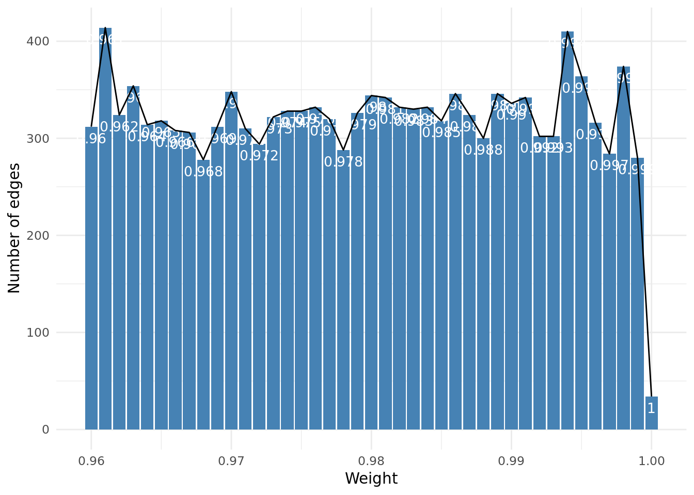

#### Degree distribution of item->similarity->item edges

#### Degree distribution of agent->knows->agent edges

#### Runing time by method 

<table class="table table-condensed" style="width: auto !important; ">
 <thead>
  <tr>
   <th style="text-align:left;">   </th>
   <th style="text-align:left;"> key </th>
   <th style="text-align:right;"> doc_count </th>
   <th style="text-align:right;"> sum_wallTime_ms.value </th>
   <th style="text-align:left;"> avg_wallTime_ms.value </th>
   <th style="text-align:left;"> includedInTotal </th>
  </tr>
 </thead>
<tbody>
  <tr>
   <td style="text-align:left;"> 2 </td>
   <td style="text-align:left;"> cycleSearch </td>
   <td style="text-align:right;"> 3,600 </td>
   <td style="text-align:right;"> 19,779 </td>
   <td style="text-align:left;"> 5.49416666666667 </td>
   <td style="text-align:left;"> Yes </td>
  </tr>
  <tr>
   <td style="text-align:left;"> 3 </td>
   <td style="text-align:left;"> getWorks </td>
   <td style="text-align:right;"> 3,600 </td>
   <td style="text-align:right;"> 89,390 </td>
   <td style="text-align:left;"> 24.8305555555556 </td>
   <td style="text-align:left;"> No </td>
  </tr>
  <tr>
   <td style="text-align:left;"> 4 </td>
   <td style="text-align:left;"> individualCycleSearch </td>
   <td style="text-align:right;"> 3,600 </td>
   <td style="text-align:right;"> 73 </td>
   <td style="text-align:left;"> 0.0202777777777778 </td>
   <td style="text-align:left;"> Yes </td>
  </tr>
  <tr>
   <td style="text-align:left;"> 6 </td>
   <td style="text-align:left;"> addItemToWork </td>
   <td style="text-align:right;"> 440 </td>
   <td style="text-align:right;"> 9,726 </td>
   <td style="text-align:left;"> 22.1045454545455 </td>
   <td style="text-align:left;"> No </td>
  </tr>
  <tr>
   <td style="text-align:left;"> 7 </td>
   <td style="text-align:left;"> ownsWork </td>
   <td style="text-align:right;"> 220 </td>
   <td style="text-align:right;"> 3,646 </td>
   <td style="text-align:left;"> 16.5727272727273 </td>
   <td style="text-align:left;"> No </td>
  </tr>
  <tr>
   <td style="text-align:left;"> 8 </td>
   <td style="text-align:left;"> init </td>
   <td style="text-align:right;"> 203 </td>
   <td style="text-align:right;"> 23,806 </td>
   <td style="text-align:left;"> 117.270935960591 </td>
   <td style="text-align:left;"> No </td>
  </tr>
  <tr>
   <td style="text-align:left;"> 9 </td>
   <td style="text-align:left;"> searchAndConnect </td>
   <td style="text-align:right;"> 201 </td>
   <td style="text-align:right;"> 222,553 </td>
   <td style="text-align:left;"> 1107.22885572139 </td>
   <td style="text-align:left;"> Yes </td>
  </tr>
  <tr>
   <td style="text-align:left;"> 10 </td>
   <td style="text-align:left;"> knowsAgent </td>
   <td style="text-align:right;"> 200 </td>
   <td style="text-align:right;"> 1,213 </td>
   <td style="text-align:left;"> 6.065 </td>
   <td style="text-align:left;"> No </td>
  </tr>
  <tr>
   <td style="text-align:left;font-weight: bold;"> 1 </td>
   <td style="text-align:left;font-weight: bold;"> Total </td>
   <td style="text-align:right;font-weight: bold;"> 14,601 </td>
   <td style="text-align:right;font-weight: bold;"> 259,002 </td>
   <td style="text-align:left;font-weight: bold;">  </td>
   <td style="text-align:left;font-weight: bold;">  </td>
  </tr>
</tbody>
</table>
####  Found structures 

#####  Cycles 

Number of cycles found:  0 

<button class="btn btn-primary" data-toggle="collapse" data-target="#WTOIBXTBZE"> Show/Hide foundCycle query </button> 
 
  
     GET /filebeat-*/_search 
              { 
                "query": {
                  "bool": {
                    "must": [
                      { "match_phrase": {
                        "simulationId": "SIM10-14-08-17-p7MAJg--DV"
                        }
                      },
                      { "bool": {
                        "should": [
                          { "match": {
                            "keyword": "foundCycle"
                          }}
                        ]
                      }}
                    ]
                  }
                }
              }
     

#####  Paths 

Number of paths found:  3600 

<button class="btn btn-primary" data-toggle="collapse" data-target="#SCKPMEXQNK"> Show/Hide foundPath query </button> 
 
  
     GET /filebeat-*/_search 
              { 
                "query": {
                  "bool": {
                    "must": [
                      { "match_phrase": {
                        "simulationId": "SIM10-14-08-17-p7MAJg--DV"
                        }
                      },
                      { "bool": {
                        "should": [
                          { "match": {
                            "keyword": "foundPath"
                          }}
                        ]
                      }}
                    ]
                  }
                }
              }
     

###  SIM10-14-09-23-B7ZeCj--CV 

#### simulationParameters 

<table class="table table-condensed" style="width: auto !important; ">
 <thead>
  <tr>
   <th style="text-align:left;"> agentNumber </th>
   <th style="text-align:left;"> similarityConnectThreshold </th>
   <th style="text-align:left;"> graphType </th>
   <th style="text-align:left;"> chainLength </th>
   <th style="text-align:left;"> similaritySearchThreshold </th>
   <th style="text-align:left;"> maxDistance </th>
   <th style="text-align:left;"> randomWorksNumberMultiplier </th>
  </tr>
 </thead>
<tbody>
  <tr>
   <td style="text-align:left;width: 20em; "> 200 </td>
   <td style="text-align:left;width: 15em; "> 0.96 </td>
   <td style="text-align:left;width: 15em; "> smallWorld </td>
   <td style="text-align:left;width: 15em; "> 20 </td>
   <td style="text-align:left;width: 15em; "> 1 </td>
   <td style="text-align:left;width: 15em; "> 10 </td>
   <td style="text-align:left;width: 15em; "> 1 </td>
  </tr>
</tbody>
</table>
#### allEdgesByLabel

<table class="table table-condensed" style="width: auto !important; ">
 <thead>
  <tr>
   <th style="text-align:right;"> edges_offers </th>
   <th style="text-align:right;"> edges_similarity </th>
   <th style="text-align:right;"> edges_owns </th>
   <th style="text-align:right;"> edges_demands </th>
   <th style="text-align:right;"> edges_knows </th>
   <th style="text-align:right;"> edges_total </th>
  </tr>
 </thead>
<tbody>
  <tr>
   <td style="text-align:right;width: 5em; "> 220 </td>
   <td style="text-align:right;width: 5em; "> 15,982 </td>
   <td style="text-align:right;width: 5em; "> 220 </td>
   <td style="text-align:right;width: 5em; "> 220 </td>
   <td style="text-align:right;width: 5em; "> 1,201 </td>
   <td style="text-align:right;width: 5em; "> 17,843 </td>
  </tr>
</tbody>
</table>
#### allVerticesByType

<table class="table table-condensed" style="width: auto !important; ">
 <thead>
  <tr>
   <th style="text-align:right;"> vertices_agent </th>
   <th style="text-align:right;"> vertices_item </th>
   <th style="text-align:right;"> vertices_work </th>
   <th style="text-align:right;"> vertices_total </th>
  </tr>
 </thead>
<tbody>
  <tr>
   <td style="text-align:right;width: 5em; "> 201 </td>
   <td style="text-align:right;width: 5em; "> 440 </td>
   <td style="text-align:right;width: 5em; "> 220 </td>
   <td style="text-align:right;width: 5em; "> 861 </td>
  </tr>
</tbody>
</table>
#### distribution of similarityEdgesByWeight

#### Degree distribution of item->similarity->item edges

#### Degree distribution of agent->knows->agent edges

#### Runing time by method 

<table class="table table-condensed" style="width: auto !important; ">
 <thead>
  <tr>
   <th style="text-align:left;"> key </th>
   <th style="text-align:right;"> doc_count </th>
   <th style="text-align:right;"> sum_wallTime_ms.value </th>
   <th style="text-align:left;"> avg_wallTime_ms.value </th>
   <th style="text-align:left;"> includedInTotal </th>
  </tr>
 </thead>
<tbody>
  <tr>
   <td style="text-align:left;"> connectIfSimilar </td>
   <td style="text-align:right;"> 96,580 </td>
   <td style="text-align:right;"> 354,864 </td>
   <td style="text-align:left;"> 3.67430109753572 </td>
   <td style="text-align:left;"> No </td>
  </tr>
  <tr>
   <td style="text-align:left;"> existsSimilarity </td>
   <td style="text-align:right;"> 96,580 </td>
   <td style="text-align:right;"> 352,960 </td>
   <td style="text-align:left;"> 3.65458687098778 </td>
   <td style="text-align:left;"> No </td>
  </tr>
  <tr>
   <td style="text-align:left;"> similarityEdges </td>
   <td style="text-align:right;"> 96,580 </td>
   <td style="text-align:right;"> 349,066 </td>
   <td style="text-align:left;"> 3.61426796438186 </td>
   <td style="text-align:left;"> No </td>
  </tr>
  <tr>
   <td style="text-align:left;"> connectAllSimilar </td>
   <td style="text-align:right;"> 440 </td>
   <td style="text-align:right;"> 355,699 </td>
   <td style="text-align:left;"> 808.406818181818 </td>
   <td style="text-align:left;"> Yes </td>
  </tr>
  <tr>
   <td style="text-align:left;"> init </td>
   <td style="text-align:right;"> 203 </td>
   <td style="text-align:right;"> 22,751 </td>
   <td style="text-align:left;"> 112.073891625616 </td>
   <td style="text-align:left;"> No </td>
  </tr>
  <tr>
   <td style="text-align:left;"> connect </td>
   <td style="text-align:right;"> 65 </td>
   <td style="text-align:right;"> 296 </td>
   <td style="text-align:left;"> 4.55384615384615 </td>
   <td style="text-align:left;"> Yes </td>
  </tr>
  <tr>
   <td style="text-align:left;font-weight: bold;"> Total </td>
   <td style="text-align:right;font-weight: bold;"> 513 </td>
   <td style="text-align:right;font-weight: bold;"> 357,249 </td>
   <td style="text-align:left;font-weight: bold;">  </td>
   <td style="text-align:left;font-weight: bold;">  </td>
  </tr>
</tbody>
</table>
####  Found structures 

#####  Cycles 

Number of cycles found:  1 

<button class="btn btn-primary" data-toggle="collapse" data-target="#KHYVJPBEIS"> Show/Hide foundCycle query </button> 
 
  
     GET /filebeat-*/_search 
              { 
                "query": {
                  "bool": {
                    "must": [
                      { "match_phrase": {
                        "simulationId": "SIM10-14-09-23-B7ZeCj--CV"
                        }
                      },
                      { "bool": {
                        "should": [
                          { "match": {
                            "keyword": "foundCycle"
                          }}
                        ]
                      }}
                    ]
                  }
                }
              }
     

#####  Paths 

Number of paths found:  0 

<button class="btn btn-primary" data-toggle="collapse" data-target="#LQSPZYFXKX"> Show/Hide foundPath query </button> 
 
  
     GET /filebeat-*/_search 
              { 
                "query": {
                  "bool": {
                    "must": [
                      { "match_phrase": {
                        "simulationId": "SIM10-14-09-23-B7ZeCj--CV"
                        }
                      },
                      { "bool": {
                        "should": [
                          { "match": {
                            "keyword": "foundPath"
                          }}
                        ]
                      }}
                    ]
                  }
                }
              }
     

###  SIM10-14-09-23-B7ZeCj--DV 

#### simulationParameters 

<table class="table table-condensed" style="width: auto !important; ">
 <thead>
  <tr>
   <th style="text-align:left;"> agentNumber </th>
   <th style="text-align:left;"> similarityConnectThreshold </th>
   <th style="text-align:left;"> graphType </th>
   <th style="text-align:left;"> chainLength </th>
   <th style="text-align:left;"> similaritySearchThreshold </th>
   <th style="text-align:left;"> maxDistance </th>
   <th style="text-align:left;"> randomWorksNumberMultiplier </th>
  </tr>
 </thead>
<tbody>
  <tr>
   <td style="text-align:left;width: 20em; "> 200 </td>
   <td style="text-align:left;width: 15em; "> 0.96 </td>
   <td style="text-align:left;width: 15em; "> smallWorld </td>
   <td style="text-align:left;width: 15em; "> 20 </td>
   <td style="text-align:left;width: 15em; "> 1 </td>
   <td style="text-align:left;width: 15em; "> 10 </td>
   <td style="text-align:left;width: 15em; "> 1 </td>
  </tr>
</tbody>
</table>
#### allEdgesByLabel

<table class="table table-condensed" style="width: auto !important; ">
 <thead>
  <tr>
   <th style="text-align:right;"> edges_offers </th>
   <th style="text-align:right;"> edges_similarity </th>
   <th style="text-align:right;"> edges_owns </th>
   <th style="text-align:right;"> edges_demands </th>
   <th style="text-align:right;"> edges_knows </th>
   <th style="text-align:right;"> edges_total </th>
  </tr>
 </thead>
<tbody>
  <tr>
   <td style="text-align:right;width: 5em; "> 220 </td>
   <td style="text-align:right;width: 5em; "> 15,852 </td>
   <td style="text-align:right;width: 5em; "> 220 </td>
   <td style="text-align:right;width: 5em; "> 220 </td>
   <td style="text-align:right;width: 5em; "> 1,201 </td>
   <td style="text-align:right;width: 5em; "> 17,713 </td>
  </tr>
</tbody>
</table>
#### allVerticesByType

<table class="table table-condensed" style="width: auto !important; ">
 <thead>
  <tr>
   <th style="text-align:right;"> vertices_agent </th>
   <th style="text-align:right;"> vertices_item </th>
   <th style="text-align:right;"> vertices_work </th>
   <th style="text-align:right;"> vertices_total </th>
  </tr>
 </thead>
<tbody>
  <tr>
   <td style="text-align:right;width: 5em; "> 201 </td>
   <td style="text-align:right;width: 5em; "> 440 </td>
   <td style="text-align:right;width: 5em; "> 220 </td>
   <td style="text-align:right;width: 5em; "> 861 </td>
  </tr>
</tbody>
</table>
#### distribution of similarityEdgesByWeight

#### Degree distribution of item->similarity->item edges

#### Degree distribution of agent->knows->agent edges

#### Runing time by method 

<table class="table table-condensed" style="width: auto !important; ">
 <thead>
  <tr>
   <th style="text-align:left;"> key </th>
   <th style="text-align:right;"> doc_count </th>
   <th style="text-align:right;"> sum_wallTime_ms.value </th>
   <th style="text-align:left;"> avg_wallTime_ms.value </th>
   <th style="text-align:left;"> includedInTotal </th>
  </tr>
 </thead>
<tbody>
  <tr>
   <td style="text-align:left;"> knowsAgent </td>
   <td style="text-align:right;"> 1,201 </td>
   <td style="text-align:right;"> 4,039 </td>
   <td style="text-align:left;"> 3.36303080766028 </td>
   <td style="text-align:left;"> No </td>
  </tr>
  <tr>
   <td style="text-align:left;"> addItemToWork </td>
   <td style="text-align:right;"> 440 </td>
   <td style="text-align:right;"> 7,664 </td>
   <td style="text-align:left;"> 17.4181818181818 </td>
   <td style="text-align:left;"> No </td>
  </tr>
  <tr>
   <td style="text-align:left;"> ownsWork </td>
   <td style="text-align:right;"> 220 </td>
   <td style="text-align:right;"> 4,244 </td>
   <td style="text-align:left;"> 19.2909090909091 </td>
   <td style="text-align:left;"> No </td>
  </tr>
  <tr>
   <td style="text-align:left;"> init </td>
   <td style="text-align:right;"> 203 </td>
   <td style="text-align:right;"> 23,115 </td>
   <td style="text-align:left;"> 113.866995073892 </td>
   <td style="text-align:left;"> No </td>
  </tr>
  <tr>
   <td style="text-align:left;"> searchAndConnect </td>
   <td style="text-align:right;"> 201 </td>
   <td style="text-align:right;"> 328,809 </td>
   <td style="text-align:left;"> 1635.86567164179 </td>
   <td style="text-align:left;"> Yes </td>
  </tr>
  <tr>
   <td style="text-align:left;"> getWorksItems </td>
   <td style="text-align:right;"> 38 </td>
   <td style="text-align:right;"> 156 </td>
   <td style="text-align:left;"> 4.10526315789474 </td>
   <td style="text-align:left;"> Yes </td>
  </tr>
  <tr>
   <td style="text-align:left;"> cycleSearch </td>
   <td style="text-align:right;"> 11 </td>
   <td style="text-align:right;"> 1,331 </td>
   <td style="text-align:left;"> 121 </td>
   <td style="text-align:left;"> Yes </td>
  </tr>
  <tr>
   <td style="text-align:left;"> getWorks </td>
   <td style="text-align:right;"> 11 </td>
   <td style="text-align:right;"> 353 </td>
   <td style="text-align:left;"> 32.0909090909091 </td>
   <td style="text-align:left;"> No </td>
  </tr>
  <tr>
   <td style="text-align:left;"> individualCycleSearch </td>
   <td style="text-align:right;"> 11 </td>
   <td style="text-align:right;"> 1 </td>
   <td style="text-align:left;"> 0.0909090909090909 </td>
   <td style="text-align:left;"> Yes </td>
  </tr>
  <tr>
   <td style="text-align:left;font-weight: bold;"> Total </td>
   <td style="text-align:right;font-weight: bold;"> 267 </td>
   <td style="text-align:right;font-weight: bold;"> 332,718 </td>
   <td style="text-align:left;font-weight: bold;">  </td>
   <td style="text-align:left;font-weight: bold;">  </td>
  </tr>
</tbody>
</table>
####  Found structures 

#####  Cycles 

Number of cycles found:  6 

<button class="btn btn-primary" data-toggle="collapse" data-target="#JCWCVTPAFW"> Show/Hide foundCycle query </button> 
 
  
     GET /filebeat-*/_search 
              { 
                "query": {
                  "bool": {
                    "must": [
                      { "match_phrase": {
                        "simulationId": "SIM10-14-09-23-B7ZeCj--DV"
                        }
                      },
                      { "bool": {
                        "should": [
                          { "match": {
                            "keyword": "foundCycle"
                          }}
                        ]
                      }}
                    ]
                  }
                }
              }
     

#####  Paths 

Number of paths found:  0 

<button class="btn btn-primary" data-toggle="collapse" data-target="#IZSEEHTXFC"> Show/Hide foundPath query </button> 
 
  
     GET /filebeat-*/_search 
              { 
                "query": {
                  "bool": {
                    "must": [
                      { "match_phrase": {
                        "simulationId": "SIM10-14-09-23-B7ZeCj--DV"
                        }
                      },
                      { "bool": {
                        "should": [
                          { "match": {
                            "keyword": "foundPath"
                          }}
                        ]
                      }}
                    ]
                  }
                }
              }
     

###  SIM10-14-12-41-8ZwUxK--CV 

#### simulationParameters 

<table class="table table-condensed" style="width: auto !important; ">
 <thead>
  <tr>
   <th style="text-align:left;"> agentNumber </th>
   <th style="text-align:left;"> similarityConnectThreshold </th>
   <th style="text-align:left;"> graphType </th>
   <th style="text-align:left;"> chainLength </th>
   <th style="text-align:left;"> similaritySearchThreshold </th>
   <th style="text-align:left;"> maxDistance </th>
   <th style="text-align:left;"> randomWorksNumberMultiplier </th>
  </tr>
 </thead>
<tbody>
  <tr>
   <td style="text-align:left;width: 20em; "> 200 </td>
   <td style="text-align:left;width: 15em; "> 0.96 </td>
   <td style="text-align:left;width: 15em; "> random </td>
   <td style="text-align:left;width: 15em; "> 20 </td>
   <td style="text-align:left;width: 15em; "> 1 </td>
   <td style="text-align:left;width: 15em; "> 10 </td>
   <td style="text-align:left;width: 15em; "> 2 </td>
  </tr>
</tbody>
</table>
#### allEdgesByLabel

<table class="table table-condensed" style="width: auto !important; ">
 <thead>
  <tr>
   <th style="text-align:right;"> edges_offers </th>
   <th style="text-align:right;"> edges_similarity </th>
   <th style="text-align:right;"> edges_owns </th>
   <th style="text-align:right;"> edges_demands </th>
   <th style="text-align:right;"> edges_knows </th>
   <th style="text-align:right;"> edges_total </th>
  </tr>
 </thead>
<tbody>
  <tr>
   <td style="text-align:right;width: 5em; "> 420 </td>
   <td style="text-align:right;width: 5em; "> 57,616 </td>
   <td style="text-align:right;width: 5em; "> 420 </td>
   <td style="text-align:right;width: 5em; "> 420 </td>
   <td style="text-align:right;width: 5em; "> 200 </td>
   <td style="text-align:right;width: 5em; "> 59,076 </td>
  </tr>
</tbody>
</table>
#### allVerticesByType

<table class="table table-condensed" style="width: auto !important; ">
 <thead>
  <tr>
   <th style="text-align:right;"> vertices_agent </th>
   <th style="text-align:right;"> vertices_item </th>
   <th style="text-align:right;"> vertices_work </th>
   <th style="text-align:right;"> vertices_total </th>
  </tr>
 </thead>
<tbody>
  <tr>
   <td style="text-align:right;width: 5em; "> 201 </td>
   <td style="text-align:right;width: 5em; "> 840 </td>
   <td style="text-align:right;width: 5em; "> 420 </td>
   <td style="text-align:right;width: 5em; "> 1,461 </td>
  </tr>
</tbody>
</table>
#### distribution of similarityEdgesByWeight

#### Degree distribution of item->similarity->item edges

#### Degree distribution of agent->knows->agent edges

#### Runing time by method 

<table class="table table-condensed" style="width: auto !important; ">
 <thead>
  <tr>
   <th style="text-align:left;"> key </th>
   <th style="text-align:right;"> doc_count </th>
   <th style="text-align:right;"> sum_wallTime_ms.value </th>
   <th style="text-align:left;"> avg_wallTime_ms.value </th>
   <th style="text-align:left;"> includedInTotal </th>
  </tr>
 </thead>
<tbody>
  <tr>
   <td style="text-align:left;"> connectIfSimilar </td>
   <td style="text-align:right;"> 352,380 </td>
   <td style="text-align:right;"> 1,788,672 </td>
   <td style="text-align:left;"> 5.07597479993189 </td>
   <td style="text-align:left;"> No </td>
  </tr>
  <tr>
   <td style="text-align:left;"> existsSimilarity </td>
   <td style="text-align:right;"> 352,380 </td>
   <td style="text-align:right;"> 1,768,646 </td>
   <td style="text-align:left;"> 5.01914410579488 </td>
   <td style="text-align:left;"> No </td>
  </tr>
  <tr>
   <td style="text-align:left;"> similarityEdges </td>
   <td style="text-align:right;"> 352,380 </td>
   <td style="text-align:right;"> 1,748,890 </td>
   <td style="text-align:left;"> 4.96307962994495 </td>
   <td style="text-align:left;"> No </td>
  </tr>
  <tr>
   <td style="text-align:left;"> connect </td>
   <td style="text-align:right;"> 2,983 </td>
   <td style="text-align:right;"> 13,309 </td>
   <td style="text-align:left;"> 4.46161582299698 </td>
   <td style="text-align:left;"> Yes </td>
  </tr>
  <tr>
   <td style="text-align:left;"> connectAllSimilar </td>
   <td style="text-align:right;"> 840 </td>
   <td style="text-align:right;"> 1,792,254 </td>
   <td style="text-align:left;"> 2133.63571428571 </td>
   <td style="text-align:left;"> Yes </td>
  </tr>
  <tr>
   <td style="text-align:left;"> init </td>
   <td style="text-align:right;"> 203 </td>
   <td style="text-align:right;"> 24,495 </td>
   <td style="text-align:left;"> 120.665024630542 </td>
   <td style="text-align:left;"> No </td>
  </tr>
  <tr>
   <td style="text-align:left;font-weight: bold;"> Total </td>
   <td style="text-align:right;font-weight: bold;"> 3,831 </td>
   <td style="text-align:right;font-weight: bold;"> 1,807,752 </td>
   <td style="text-align:left;font-weight: bold;">  </td>
   <td style="text-align:left;font-weight: bold;">  </td>
  </tr>
</tbody>
</table>
####  Found structures 

#####  Cycles 

Number of cycles found:  1 

<button class="btn btn-primary" data-toggle="collapse" data-target="#HEQXPBUFQW"> Show/Hide foundCycle query </button> 
 
  
     GET /filebeat-*/_search 
              { 
                "query": {
                  "bool": {
                    "must": [
                      { "match_phrase": {
                        "simulationId": "SIM10-14-12-41-8ZwUxK--CV"
                        }
                      },
                      { "bool": {
                        "should": [
                          { "match": {
                            "keyword": "foundCycle"
                          }}
                        ]
                      }}
                    ]
                  }
                }
              }
     

#####  Paths 

Number of paths found:  0 

<button class="btn btn-primary" data-toggle="collapse" data-target="#JCNKKAUQJN"> Show/Hide foundPath query </button> 
 
  
     GET /filebeat-*/_search 
              { 
                "query": {
                  "bool": {
                    "must": [
                      { "match_phrase": {
                        "simulationId": "SIM10-14-12-41-8ZwUxK--CV"
                        }
                      },
                      { "bool": {
                        "should": [
                          { "match": {
                            "keyword": "foundPath"
                          }}
                        ]
                      }}
                    ]
                  }
                }
              }
     

###  SIM10-14-12-41-8ZwUxK--DV 

#### simulationParameters 

<table class="table table-condensed" style="width: auto !important; ">
 <thead>
  <tr>
   <th style="text-align:left;"> agentNumber </th>
   <th style="text-align:left;"> similarityConnectThreshold </th>
   <th style="text-align:left;"> graphType </th>
   <th style="text-align:left;"> chainLength </th>
   <th style="text-align:left;"> similaritySearchThreshold </th>
   <th style="text-align:left;"> maxDistance </th>
   <th style="text-align:left;"> randomWorksNumberMultiplier </th>
  </tr>
 </thead>
<tbody>
  <tr>
   <td style="text-align:left;width: 20em; "> 200 </td>
   <td style="text-align:left;width: 15em; "> 0.96 </td>
   <td style="text-align:left;width: 15em; "> random </td>
   <td style="text-align:left;width: 15em; "> 20 </td>
   <td style="text-align:left;width: 15em; "> 1 </td>
   <td style="text-align:left;width: 15em; "> 10 </td>
   <td style="text-align:left;width: 15em; "> 2 </td>
  </tr>
</tbody>
</table>
#### allEdgesByLabel

<table class="table table-condensed" style="width: auto !important; ">
 <thead>
  <tr>
   <th style="text-align:right;"> edges_offers </th>
   <th style="text-align:right;"> edges_similarity </th>
   <th style="text-align:right;"> edges_owns </th>
   <th style="text-align:right;"> edges_demands </th>
   <th style="text-align:right;"> edges_knows </th>
   <th style="text-align:right;"> edges_total </th>
  </tr>
 </thead>
<tbody>
  <tr>
   <td style="text-align:right;width: 5em; "> 420 </td>
   <td style="text-align:right;width: 5em; "> 51,650 </td>
   <td style="text-align:right;width: 5em; "> 420 </td>
   <td style="text-align:right;width: 5em; "> 420 </td>
   <td style="text-align:right;width: 5em; "> 200 </td>
   <td style="text-align:right;width: 5em; "> 53,110 </td>
  </tr>
</tbody>
</table>
#### allVerticesByType

<table class="table table-condensed" style="width: auto !important; ">
 <thead>
  <tr>
   <th style="text-align:right;"> vertices_agent </th>
   <th style="text-align:right;"> vertices_item </th>
   <th style="text-align:right;"> vertices_work </th>
   <th style="text-align:right;"> vertices_total </th>
  </tr>
 </thead>
<tbody>
  <tr>
   <td style="text-align:right;width: 5em; "> 201 </td>
   <td style="text-align:right;width: 5em; "> 840 </td>
   <td style="text-align:right;width: 5em; "> 420 </td>
   <td style="text-align:right;width: 5em; "> 1,461 </td>
  </tr>
</tbody>
</table>
#### distribution of similarityEdgesByWeight

#### Degree distribution of item->similarity->item edges

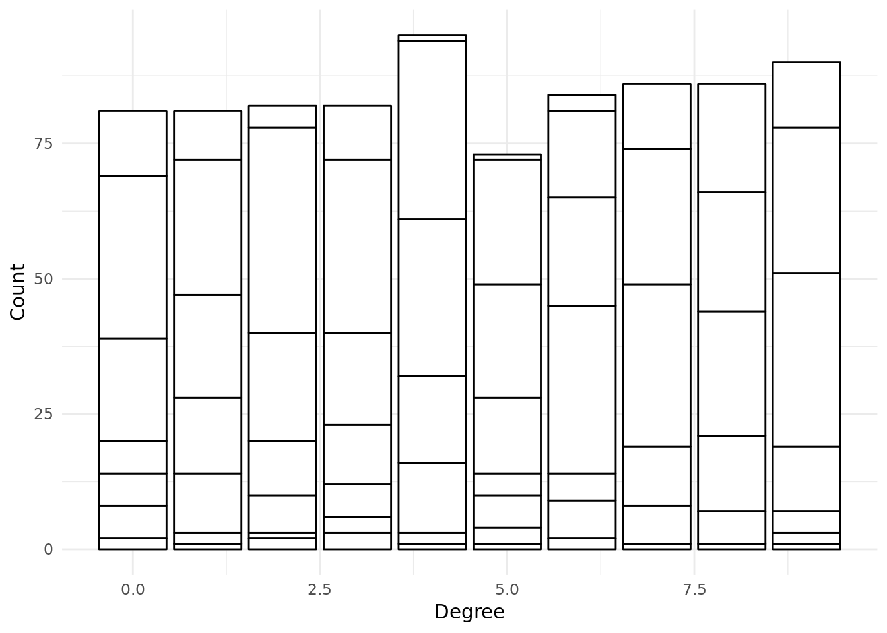

#### Degree distribution of agent->knows->agent edges

#### Runing time by method 

<table class="table table-condensed" style="width: auto !important; ">
 <thead>
  <tr>
   <th style="text-align:left;">   </th>
   <th style="text-align:left;"> key </th>
   <th style="text-align:right;"> doc_count </th>
   <th style="text-align:right;"> sum_wallTime_ms.value </th>
   <th style="text-align:left;"> avg_wallTime_ms.value </th>
   <th style="text-align:left;"> includedInTotal </th>
  </tr>
 </thead>
<tbody>
  <tr>
   <td style="text-align:left;"> 2 </td>
   <td style="text-align:left;"> cycleSearch </td>
   <td style="text-align:right;"> 3,600 </td>
   <td style="text-align:right;"> 182,353 </td>
   <td style="text-align:left;"> 50.6536111111111 </td>
   <td style="text-align:left;"> Yes </td>
  </tr>
  <tr>
   <td style="text-align:left;"> 3 </td>
   <td style="text-align:left;"> getWorks </td>
   <td style="text-align:right;"> 3,600 </td>
   <td style="text-align:right;"> 111,901 </td>
   <td style="text-align:left;"> 31.0836111111111 </td>
   <td style="text-align:left;"> No </td>
  </tr>
  <tr>
   <td style="text-align:left;"> 4 </td>
   <td style="text-align:left;"> individualCycleSearch </td>
   <td style="text-align:right;"> 3,600 </td>
   <td style="text-align:right;"> 92 </td>
   <td style="text-align:left;"> 0.0255555555555556 </td>
   <td style="text-align:left;"> Yes </td>
  </tr>
  <tr>
   <td style="text-align:left;"> 6 </td>
   <td style="text-align:left;"> addItemToWork </td>
   <td style="text-align:right;"> 840 </td>
   <td style="text-align:right;"> 14,290 </td>
   <td style="text-align:left;"> 17.0119047619048 </td>
   <td style="text-align:left;"> No </td>
  </tr>
  <tr>
   <td style="text-align:left;"> 7 </td>
   <td style="text-align:left;"> ownsWork </td>
   <td style="text-align:right;"> 420 </td>
   <td style="text-align:right;"> 6,832 </td>
   <td style="text-align:left;"> 16.2666666666667 </td>
   <td style="text-align:left;"> No </td>
  </tr>
  <tr>
   <td style="text-align:left;"> 8 </td>
   <td style="text-align:left;"> init </td>
   <td style="text-align:right;"> 203 </td>
   <td style="text-align:right;"> 23,695 </td>
   <td style="text-align:left;"> 116.724137931034 </td>
   <td style="text-align:left;"> No </td>
  </tr>
  <tr>
   <td style="text-align:left;"> 9 </td>
   <td style="text-align:left;"> searchAndConnect </td>
   <td style="text-align:right;"> 201 </td>
   <td style="text-align:right;"> 668,783 </td>
   <td style="text-align:left;"> 3327.27860696517 </td>
   <td style="text-align:left;"> Yes </td>
  </tr>
  <tr>
   <td style="text-align:left;"> 10 </td>
   <td style="text-align:left;"> knowsAgent </td>
   <td style="text-align:right;"> 200 </td>
   <td style="text-align:right;"> 1,374 </td>
   <td style="text-align:left;"> 6.87 </td>
   <td style="text-align:left;"> No </td>
  </tr>
  <tr>
   <td style="text-align:left;font-weight: bold;"> 1 </td>
   <td style="text-align:left;font-weight: bold;"> Total </td>
   <td style="text-align:right;font-weight: bold;"> 14,601 </td>
   <td style="text-align:right;font-weight: bold;"> 1,651,652 </td>
   <td style="text-align:left;font-weight: bold;">  </td>
   <td style="text-align:left;font-weight: bold;">  </td>
  </tr>
</tbody>
</table>
####  Found structures 

#####  Cycles 

Number of cycles found:  0 

<button class="btn btn-primary" data-toggle="collapse" data-target="#YUMWECFWUY"> Show/Hide foundCycle query </button> 
 
  
     GET /filebeat-*/_search 
              { 
                "query": {
                  "bool": {
                    "must": [
                      { "match_phrase": {
                        "simulationId": "SIM10-14-12-41-8ZwUxK--DV"
                        }
                      },
                      { "bool": {
                        "should": [
                          { "match": {
                            "keyword": "foundCycle"
                          }}
                        ]
                      }}
                    ]
                  }
                }
              }
     

#####  Paths 

Number of paths found:  3600 

<button class="btn btn-primary" data-toggle="collapse" data-target="#TUKMBBETXV"> Show/Hide foundPath query </button> 
 
  
     GET /filebeat-*/_search 
              { 
                "query": {
                  "bool": {
                    "must": [
                      { "match_phrase": {
                        "simulationId": "SIM10-14-12-41-8ZwUxK--DV"
                        }
                      },
                      { "bool": {
                        "should": [
                          { "match": {
                            "keyword": "foundPath"
                          }}
                        ]
                      }}
                    ]
                  }
                }
              }
     

###  SIM10-14-02-43-jgA6Gz--CV 

#### simulationParameters 

<table class="table table-condensed" style="width: auto !important; ">
 <thead>
  <tr>
   <th style="text-align:left;"> agentNumber </th>
   <th style="text-align:left;"> similarityConnectThreshold </th>
   <th style="text-align:left;"> graphType </th>
   <th style="text-align:left;"> chainLength </th>
   <th style="text-align:left;"> similaritySearchThreshold </th>
   <th style="text-align:left;"> maxDistance </th>
   <th style="text-align:left;"> randomWorksNumberMultiplier </th>
  </tr>
 </thead>
<tbody>
  <tr>
   <td style="text-align:left;width: 20em; "> 200 </td>
   <td style="text-align:left;width: 15em; "> 0.96 </td>
   <td style="text-align:left;width: 15em; "> random </td>
   <td style="text-align:left;width: 15em; "> 20 </td>
   <td style="text-align:left;width: 15em; "> 1 </td>
   <td style="text-align:left;width: 15em; "> 30 </td>
   <td style="text-align:left;width: 15em; "> 2 </td>
  </tr>
</tbody>
</table>
#### allEdgesByLabel

<table class="table table-condensed" style="width: auto !important; ">
 <thead>
  <tr>
   <th style="text-align:right;"> edges_offers </th>
   <th style="text-align:right;"> edges_similarity </th>
   <th style="text-align:right;"> edges_owns </th>
   <th style="text-align:right;"> edges_demands </th>
   <th style="text-align:right;"> edges_knows </th>
   <th style="text-align:right;"> edges_total </th>
  </tr>
 </thead>
<tbody>
  <tr>
   <td style="text-align:right;width: 5em; "> 420 </td>
   <td style="text-align:right;width: 5em; "> 57,030 </td>
   <td style="text-align:right;width: 5em; "> 420 </td>
   <td style="text-align:right;width: 5em; "> 420 </td>
   <td style="text-align:right;width: 5em; "> 200 </td>
   <td style="text-align:right;width: 5em; "> 58,490 </td>
  </tr>
</tbody>
</table>
#### allVerticesByType

<table class="table table-condensed" style="width: auto !important; ">
 <thead>
  <tr>
   <th style="text-align:right;"> vertices_agent </th>
   <th style="text-align:right;"> vertices_item </th>
   <th style="text-align:right;"> vertices_work </th>
   <th style="text-align:right;"> vertices_total </th>
  </tr>
 </thead>
<tbody>
  <tr>
   <td style="text-align:right;width: 5em; "> 201 </td>
   <td style="text-align:right;width: 5em; "> 840 </td>
   <td style="text-align:right;width: 5em; "> 420 </td>
   <td style="text-align:right;width: 5em; "> 1,461 </td>
  </tr>
</tbody>
</table>
#### distribution of similarityEdgesByWeight

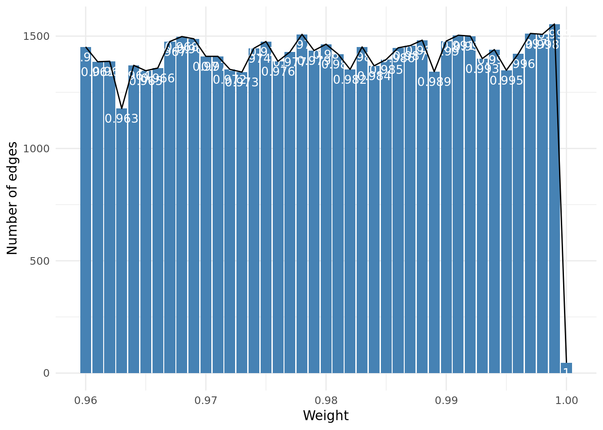

#### Degree distribution of item->similarity->item edges

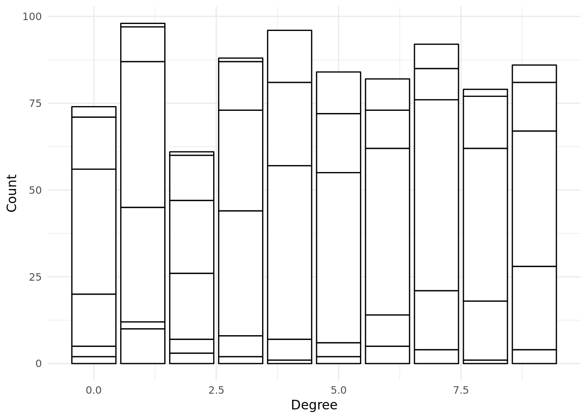

#### Degree distribution of agent->knows->agent edges

#### Runing time by method 

<table class="table table-condensed" style="width: auto !important; ">
 <thead>
  <tr>
   <th style="text-align:left;"> key </th>
   <th style="text-align:right;"> doc_count </th>
   <th style="text-align:right;"> sum_wallTime_ms.value </th>
   <th style="text-align:left;"> avg_wallTime_ms.value </th>
   <th style="text-align:left;"> includedInTotal </th>
  </tr>
 </thead>
<tbody>
  <tr>
   <td style="text-align:left;"> connectIfSimilar </td>
   <td style="text-align:right;"> 352,380 </td>
   <td style="text-align:right;"> 1,773,518 </td>
   <td style="text-align:left;"> 5.03297008910835 </td>
   <td style="text-align:left;"> No </td>
  </tr>
  <tr>
   <td style="text-align:left;"> existsSimilarity </td>
   <td style="text-align:right;"> 352,380 </td>
   <td style="text-align:right;"> 1,766,453 </td>
   <td style="text-align:left;"> 5.01292071059652 </td>
   <td style="text-align:left;"> No </td>
  </tr>
  <tr>
   <td style="text-align:left;"> similarityEdges </td>
   <td style="text-align:right;"> 352,380 </td>
   <td style="text-align:right;"> 1,746,070 </td>
   <td style="text-align:left;"> 4.95507690561326 </td>
   <td style="text-align:left;"> No </td>
  </tr>
  <tr>
   <td style="text-align:left;"> connectAllSimilar </td>
   <td style="text-align:right;"> 840 </td>
   <td style="text-align:right;"> 1,777,080 </td>
   <td style="text-align:left;"> 2115.57142857143 </td>
   <td style="text-align:left;"> Yes </td>
  </tr>
  <tr>
   <td style="text-align:left;"> init </td>
   <td style="text-align:right;"> 203 </td>
   <td style="text-align:right;"> 24,116 </td>
   <td style="text-align:left;"> 118.79802955665 </td>
   <td style="text-align:left;"> No </td>
  </tr>
  <tr>
   <td style="text-align:left;"> connect </td>
   <td style="text-align:right;"> 175 </td>
   <td style="text-align:right;"> 506 </td>
   <td style="text-align:left;"> 2.89142857142857 </td>
   <td style="text-align:left;"> Yes </td>
  </tr>
  <tr>
   <td style="text-align:left;font-weight: bold;"> Total </td>
   <td style="text-align:right;font-weight: bold;"> 1,023 </td>
   <td style="text-align:right;font-weight: bold;"> 1,779,635 </td>
   <td style="text-align:left;font-weight: bold;">  </td>
   <td style="text-align:left;font-weight: bold;">  </td>
  </tr>
</tbody>
</table>
####  Found structures 

#####  Cycles 

Number of cycles found:  1 

<button class="btn btn-primary" data-toggle="collapse" data-target="#YPWCPJHYYT"> Show/Hide foundCycle query </button> 
 
  
     GET /filebeat-*/_search 
              { 
                "query": {
                  "bool": {
                    "must": [
                      { "match_phrase": {
                        "simulationId": "SIM10-14-02-43-jgA6Gz--CV"
                        }
                      },
                      { "bool": {
                        "should": [
                          { "match": {
                            "keyword": "foundCycle"
                          }}
                        ]
                      }}
                    ]
                  }
                }
              }
     

#####  Paths 

Number of paths found:  0 

<button class="btn btn-primary" data-toggle="collapse" data-target="#YZTYFSWABN"> Show/Hide foundPath query </button> 
 
  
     GET /filebeat-*/_search 
              { 
                "query": {
                  "bool": {
                    "must": [
                      { "match_phrase": {
                        "simulationId": "SIM10-14-02-43-jgA6Gz--CV"
                        }
                      },
                      { "bool": {
                        "should": [
                          { "match": {
                            "keyword": "foundPath"
                          }}
                        ]
                      }}
                    ]
                  }
                }
              }
     

###  SIM10-14-02-43-jgA6Gz--DV 

#### simulationParameters 

<table class="table table-condensed" style="width: auto !important; ">
 <thead>
  <tr>
   <th style="text-align:left;"> agentNumber </th>
   <th style="text-align:left;"> similarityConnectThreshold </th>
   <th style="text-align:left;"> graphType </th>
   <th style="text-align:left;"> chainLength </th>
   <th style="text-align:left;"> similaritySearchThreshold </th>
   <th style="text-align:left;"> maxDistance </th>
   <th style="text-align:left;"> randomWorksNumberMultiplier </th>
  </tr>
 </thead>
<tbody>
  <tr>
   <td style="text-align:left;width: 20em; "> 200 </td>
   <td style="text-align:left;width: 15em; "> 0.96 </td>
   <td style="text-align:left;width: 15em; "> random </td>
   <td style="text-align:left;width: 15em; "> 20 </td>
   <td style="text-align:left;width: 15em; "> 1 </td>
   <td style="text-align:left;width: 15em; "> 30 </td>
   <td style="text-align:left;width: 15em; "> 2 </td>
  </tr>
</tbody>
</table>
#### allEdgesByLabel

<table class="table table-condensed" style="width: auto !important; ">
 <thead>
  <tr>
   <th style="text-align:right;"> edges_offers </th>
   <th style="text-align:right;"> edges_similarity </th>
   <th style="text-align:right;"> edges_owns </th>
   <th style="text-align:right;"> edges_demands </th>
   <th style="text-align:right;"> edges_knows </th>
   <th style="text-align:right;"> edges_total </th>
  </tr>
 </thead>
<tbody>
  <tr>
   <td style="text-align:right;width: 5em; "> 420 </td>
   <td style="text-align:right;width: 5em; "> 56,680 </td>
   <td style="text-align:right;width: 5em; "> 420 </td>
   <td style="text-align:right;width: 5em; "> 420 </td>
   <td style="text-align:right;width: 5em; "> 200 </td>
   <td style="text-align:right;width: 5em; "> 58,140 </td>
  </tr>
</tbody>
</table>
#### allVerticesByType

<table class="table table-condensed" style="width: auto !important; ">
 <thead>
  <tr>
   <th style="text-align:right;"> vertices_agent </th>
   <th style="text-align:right;"> vertices_item </th>
   <th style="text-align:right;"> vertices_work </th>
   <th style="text-align:right;"> vertices_total </th>
  </tr>
 </thead>
<tbody>
  <tr>
   <td style="text-align:right;width: 5em; "> 201 </td>
   <td style="text-align:right;width: 5em; "> 840 </td>
   <td style="text-align:right;width: 5em; "> 420 </td>
   <td style="text-align:right;width: 5em; "> 1,461 </td>
  </tr>
</tbody>
</table>
#### distribution of similarityEdgesByWeight

#### Degree distribution of item->similarity->item edges

#### Degree distribution of agent->knows->agent edges

#### Runing time by method 

<table class="table table-condensed" style="width: auto !important; ">
 <thead>
  <tr>
   <th style="text-align:left;"> key </th>
   <th style="text-align:right;"> doc_count </th>
   <th style="text-align:right;"> sum_wallTime_ms.value </th>
   <th style="text-align:left;"> avg_wallTime_ms.value </th>
   <th style="text-align:left;"> includedInTotal </th>
  </tr>
 </thead>
<tbody>
  <tr>
   <td style="text-align:left;"> addItemToWork </td>
   <td style="text-align:right;"> 840 </td>
   <td style="text-align:right;"> 11,230 </td>
   <td style="text-align:left;"> 13.3690476190476 </td>
   <td style="text-align:left;"> No </td>
  </tr>
  <tr>
   <td style="text-align:left;"> ownsWork </td>
   <td style="text-align:right;"> 420 </td>
   <td style="text-align:right;"> 5,025 </td>
   <td style="text-align:left;"> 11.9642857142857 </td>
   <td style="text-align:left;"> No </td>
  </tr>
  <tr>
   <td style="text-align:left;"> init </td>
   <td style="text-align:right;"> 203 </td>
   <td style="text-align:right;"> 26,129 </td>
   <td style="text-align:left;"> 128.714285714286 </td>
   <td style="text-align:left;"> No </td>
  </tr>
  <tr>
   <td style="text-align:left;"> searchAndConnect </td>
   <td style="text-align:right;"> 201 </td>
   <td style="text-align:right;"> 842,501 </td>
   <td style="text-align:left;"> 4191.54726368159 </td>
   <td style="text-align:left;"> Yes </td>
  </tr>
  <tr>
   <td style="text-align:left;"> knowsAgent </td>
   <td style="text-align:right;"> 200 </td>
   <td style="text-align:right;"> 1,379 </td>
   <td style="text-align:left;"> 6.895 </td>
   <td style="text-align:left;"> No </td>
  </tr>
  <tr>
   <td style="text-align:left;"> getWorksItems </td>
   <td style="text-align:right;"> 38 </td>
   <td style="text-align:right;"> 115 </td>
   <td style="text-align:left;"> 3.02631578947368 </td>
   <td style="text-align:left;"> Yes </td>
  </tr>
  <tr>
   <td style="text-align:left;"> cycleSearch </td>
   <td style="text-align:right;"> 26 </td>
   <td style="text-align:right;"> 1,578 </td>
   <td style="text-align:left;"> 60.6923076923077 </td>
   <td style="text-align:left;"> Yes </td>
  </tr>
  <tr>
   <td style="text-align:left;"> getWorks </td>
   <td style="text-align:right;"> 26 </td>
   <td style="text-align:right;"> 4,414 </td>
   <td style="text-align:left;"> 169.769230769231 </td>
   <td style="text-align:left;"> No </td>
  </tr>
  <tr>
   <td style="text-align:left;"> individualCycleSearch </td>
   <td style="text-align:right;"> 26 </td>
   <td style="text-align:right;"> 0 </td>
   <td style="text-align:left;"> 0 </td>
   <td style="text-align:left;"> Yes </td>
  </tr>
  <tr>
   <td style="text-align:left;font-weight: bold;"> Total </td>
   <td style="text-align:right;font-weight: bold;"> 303 </td>
   <td style="text-align:right;font-weight: bold;"> 848,086 </td>
   <td style="text-align:left;font-weight: bold;">  </td>
   <td style="text-align:left;font-weight: bold;">  </td>
  </tr>
</tbody>
</table>
####  Found structures 

#####  Cycles 

Number of cycles found:  8 

<button class="btn btn-primary" data-toggle="collapse" data-target="#UWPCOGTEDJ"> Show/Hide foundCycle query </button> 
 
  
     GET /filebeat-*/_search 
              { 
                "query": {
                  "bool": {
                    "must": [
                      { "match_phrase": {
                        "simulationId": "SIM10-14-02-43-jgA6Gz--DV"
                        }
                      },
                      { "bool": {
                        "should": [
                          { "match": {
                            "keyword": "foundCycle"
                          }}
                        ]
                      }}
                    ]
                  }
                }
              }
     

#####  Paths 

Number of paths found:  4 

<button class="btn btn-primary" data-toggle="collapse" data-target="#ERGHDDXQJC"> Show/Hide foundPath query </button> 
 
  
     GET /filebeat-*/_search 
              { 
                "query": {
                  "bool": {
                    "must": [
                      { "match_phrase": {
                        "simulationId": "SIM10-14-02-43-jgA6Gz--DV"
                        }
                      },
                      { "bool": {
                        "should": [
                          { "match": {
                            "keyword": "foundPath"
                          }}
                        ]
                      }}
                    ]
                  }
                }
              }
     

###  SIM10-14-03-14-6JmFR5--CV 

#### simulationParameters 

<table class="table table-condensed" style="width: auto !important; ">
 <thead>
  <tr>
   <th style="text-align:left;"> agentNumber </th>
   <th style="text-align:left;"> similarityConnectThreshold </th>
   <th style="text-align:left;"> graphType </th>
   <th style="text-align:left;"> chainLength </th>
   <th style="text-align:left;"> similaritySearchThreshold </th>
   <th style="text-align:left;"> maxDistance </th>
   <th style="text-align:left;"> randomWorksNumberMultiplier </th>
  </tr>
 </thead>
<tbody>
  <tr>
   <td style="text-align:left;width: 20em; "> 200 </td>
   <td style="text-align:left;width: 15em; "> 0.96 </td>
   <td style="text-align:left;width: 15em; "> smallWorld </td>
   <td style="text-align:left;width: 15em; "> 20 </td>
   <td style="text-align:left;width: 15em; "> 1 </td>
   <td style="text-align:left;width: 15em; "> 30 </td>
   <td style="text-align:left;width: 15em; "> 2 </td>
  </tr>
</tbody>
</table>
#### allEdgesByLabel

<table class="table table-condensed" style="width: auto !important; ">
 <thead>
  <tr>
   <th style="text-align:right;"> edges_offers </th>
   <th style="text-align:right;"> edges_similarity </th>
   <th style="text-align:right;"> edges_owns </th>
   <th style="text-align:right;"> edges_demands </th>
   <th style="text-align:right;"> edges_knows </th>
   <th style="text-align:right;"> edges_total </th>
  </tr>
 </thead>
<tbody>
  <tr>
   <td style="text-align:right;width: 5em; "> 420 </td>
   <td style="text-align:right;width: 5em; "> 57,538 </td>
   <td style="text-align:right;width: 5em; "> 420 </td>
   <td style="text-align:right;width: 5em; "> 420 </td>
   <td style="text-align:right;width: 5em; "> 1,201 </td>
   <td style="text-align:right;width: 5em; "> 59,999 </td>
  </tr>
</tbody>
</table>
#### allVerticesByType

<table class="table table-condensed" style="width: auto !important; ">
 <thead>
  <tr>
   <th style="text-align:right;"> vertices_agent </th>
   <th style="text-align:right;"> vertices_item </th>
   <th style="text-align:right;"> vertices_work </th>
   <th style="text-align:right;"> vertices_total </th>
  </tr>
 </thead>
<tbody>
  <tr>
   <td style="text-align:right;width: 5em; "> 201 </td>
   <td style="text-align:right;width: 5em; "> 840 </td>
   <td style="text-align:right;width: 5em; "> 420 </td>
   <td style="text-align:right;width: 5em; "> 1,461 </td>
  </tr>
</tbody>
</table>
#### distribution of similarityEdgesByWeight

#### Degree distribution of item->similarity->item edges

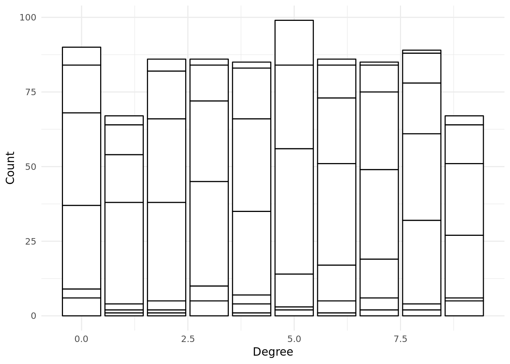

#### Degree distribution of agent->knows->agent edges

#### Runing time by method 

<table class="table table-condensed" style="width: auto !important; ">
 <thead>
  <tr>
   <th style="text-align:left;"> key </th>
   <th style="text-align:right;"> doc_count </th>
   <th style="text-align:right;"> sum_wallTime_ms.value </th>
   <th style="text-align:left;"> avg_wallTime_ms.value </th>
   <th style="text-align:left;"> includedInTotal </th>
  </tr>
 </thead>
<tbody>
  <tr>
   <td style="text-align:left;"> connectIfSimilar </td>
   <td style="text-align:right;"> 352,380 </td>
   <td style="text-align:right;"> 1,810,541 </td>
   <td style="text-align:left;"> 5.13803564333958 </td>
   <td style="text-align:left;"> No </td>
  </tr>
  <tr>
   <td style="text-align:left;"> existsSimilarity </td>
   <td style="text-align:right;"> 352,380 </td>
   <td style="text-align:right;"> 1,803,088 </td>
   <td style="text-align:left;"> 5.11688518077076 </td>
   <td style="text-align:left;"> No </td>
  </tr>
  <tr>
   <td style="text-align:left;"> similarityEdges </td>
   <td style="text-align:right;"> 352,380 </td>
   <td style="text-align:right;"> 1,782,730 </td>
   <td style="text-align:left;"> 5.05911232192519 </td>
   <td style="text-align:left;"> No </td>
  </tr>
  <tr>
   <td style="text-align:left;"> connectAllSimilar </td>
   <td style="text-align:right;"> 840 </td>
   <td style="text-align:right;"> 1,814,156 </td>
   <td style="text-align:left;"> 2159.70952380952 </td>
   <td style="text-align:left;"> Yes </td>
  </tr>
  <tr>
   <td style="text-align:left;"> init </td>
   <td style="text-align:right;"> 202 </td>
   <td style="text-align:right;"> 14,777 </td>
   <td style="text-align:left;"> 73.1534653465347 </td>
   <td style="text-align:left;"> No </td>
  </tr>
  <tr>
   <td style="text-align:left;"> connect </td>
   <td style="text-align:right;"> 178 </td>
   <td style="text-align:right;"> 791 </td>
   <td style="text-align:left;"> 4.4438202247191 </td>
   <td style="text-align:left;"> Yes </td>
  </tr>
  <tr>
   <td style="text-align:left;font-weight: bold;"> Total </td>
   <td style="text-align:right;font-weight: bold;"> 1,026 </td>
   <td style="text-align:right;font-weight: bold;"> 1,817,595 </td>
   <td style="text-align:left;font-weight: bold;">  </td>
   <td style="text-align:left;font-weight: bold;">  </td>
  </tr>
</tbody>
</table>
####  Found structures 

#####  Cycles 

Number of cycles found:  1 

<button class="btn btn-primary" data-toggle="collapse" data-target="#VBRKDMGMDY"> Show/Hide foundCycle query </button> 
 
  
     GET /filebeat-*/_search 
              { 
                "query": {
                  "bool": {
                    "must": [
                      { "match_phrase": {
                        "simulationId": "SIM10-14-03-14-6JmFR5--CV"
                        }
                      },
                      { "bool": {
                        "should": [
                          { "match": {
                            "keyword": "foundCycle"
                          }}
                        ]
                      }}
                    ]
                  }
                }
              }
     

#####  Paths 

Number of paths found:  0 

<button class="btn btn-primary" data-toggle="collapse" data-target="#AKSJFTFSDQ"> Show/Hide foundPath query </button> 
 
  
     GET /filebeat-*/_search 
              { 
                "query": {
                  "bool": {
                    "must": [
                      { "match_phrase": {
                        "simulationId": "SIM10-14-03-14-6JmFR5--CV"
                        }
                      },
                      { "bool": {
                        "should": [
                          { "match": {
                            "keyword": "foundPath"
                          }}
                        ]
                      }}
                    ]
                  }
                }
              }
     

###  SIM10-14-03-14-6JmFR5--DV 

#### simulationParameters 

<table class="table table-condensed" style="width: auto !important; ">
 <thead>
  <tr>
   <th style="text-align:left;"> agentNumber </th>
   <th style="text-align:left;"> similarityConnectThreshold </th>
   <th style="text-align:left;"> graphType </th>
   <th style="text-align:left;"> chainLength </th>
   <th style="text-align:left;"> similaritySearchThreshold </th>
   <th style="text-align:left;"> maxDistance </th>
   <th style="text-align:left;"> randomWorksNumberMultiplier </th>
  </tr>
 </thead>
<tbody>
  <tr>
   <td style="text-align:left;width: 20em; "> 200 </td>
   <td style="text-align:left;width: 15em; "> 0.96 </td>
   <td style="text-align:left;width: 15em; "> smallWorld </td>
   <td style="text-align:left;width: 15em; "> 20 </td>
   <td style="text-align:left;width: 15em; "> 1 </td>
   <td style="text-align:left;width: 15em; "> 30 </td>
   <td style="text-align:left;width: 15em; "> 2 </td>
  </tr>
</tbody>
</table>
#### allEdgesByLabel

<table class="table table-condensed" style="width: auto !important; ">
 <thead>
  <tr>
   <th style="text-align:right;"> edges_offers </th>
   <th style="text-align:right;"> edges_similarity </th>
   <th style="text-align:right;"> edges_owns </th>
   <th style="text-align:right;"> edges_demands </th>
   <th style="text-align:right;"> edges_knows </th>
   <th style="text-align:right;"> edges_total </th>
  </tr>
 </thead>
<tbody>
  <tr>
   <td style="text-align:right;width: 5em; "> 420 </td>
   <td style="text-align:right;width: 5em; "> 57,182 </td>
   <td style="text-align:right;width: 5em; "> 420 </td>
   <td style="text-align:right;width: 5em; "> 420 </td>
   <td style="text-align:right;width: 5em; "> 1,201 </td>
   <td style="text-align:right;width: 5em; "> 59,643 </td>
  </tr>
</tbody>
</table>
#### allVerticesByType

<table class="table table-condensed" style="width: auto !important; ">
 <thead>
  <tr>
   <th style="text-align:right;"> vertices_agent </th>
   <th style="text-align:right;"> vertices_item </th>
   <th style="text-align:right;"> vertices_work </th>
   <th style="text-align:right;"> vertices_total </th>
  </tr>
 </thead>
<tbody>
  <tr>
   <td style="text-align:right;width: 5em; "> 201 </td>
   <td style="text-align:right;width: 5em; "> 840 </td>
   <td style="text-align:right;width: 5em; "> 420 </td>
   <td style="text-align:right;width: 5em; "> 1,461 </td>
  </tr>
</tbody>
</table>
#### distribution of similarityEdgesByWeight

#### Degree distribution of item->similarity->item edges

#### Degree distribution of agent->knows->agent edges

#### Runing time by method 

<table class="table table-condensed" style="width: auto !important; ">
 <thead>
  <tr>
   <th style="text-align:left;"> key </th>
   <th style="text-align:right;"> doc_count </th>
   <th style="text-align:right;"> sum_wallTime_ms.value </th>
   <th style="text-align:left;"> avg_wallTime_ms.value </th>
   <th style="text-align:left;"> includedInTotal </th>
  </tr>
 </thead>
<tbody>
  <tr>
   <td style="text-align:left;"> knowsAgent </td>
   <td style="text-align:right;"> 1,201 </td>
   <td style="text-align:right;"> 4,249 </td>
   <td style="text-align:left;"> 3.53788509575354 </td>
   <td style="text-align:left;"> No </td>
  </tr>
  <tr>
   <td style="text-align:left;"> addItemToWork </td>
   <td style="text-align:right;"> 840 </td>
   <td style="text-align:right;"> 16,742 </td>
   <td style="text-align:left;"> 19.9309523809524 </td>
   <td style="text-align:left;"> No </td>
  </tr>
  <tr>
   <td style="text-align:left;"> ownsWork </td>
   <td style="text-align:right;"> 420 </td>
   <td style="text-align:right;"> 7,514 </td>
   <td style="text-align:left;"> 17.8904761904762 </td>
   <td style="text-align:left;"> No </td>
  </tr>
  <tr>
   <td style="text-align:left;"> init </td>
   <td style="text-align:right;"> 203 </td>
   <td style="text-align:right;"> 26,626 </td>
   <td style="text-align:left;"> 131.162561576355 </td>
   <td style="text-align:left;"> No </td>
  </tr>
  <tr>
   <td style="text-align:left;"> searchAndConnect </td>
   <td style="text-align:right;"> 201 </td>
   <td style="text-align:right;"> 821,866 </td>
   <td style="text-align:left;"> 4088.8855721393 </td>
   <td style="text-align:left;"> Yes </td>
  </tr>
  <tr>
   <td style="text-align:left;"> getWorksItems </td>
   <td style="text-align:right;"> 38 </td>
   <td style="text-align:right;"> 88 </td>
   <td style="text-align:left;"> 2.31578947368421 </td>
   <td style="text-align:left;"> Yes </td>
  </tr>
  <tr>
   <td style="text-align:left;"> cycleSearch </td>
   <td style="text-align:right;"> 28 </td>
   <td style="text-align:right;"> 14,048 </td>
   <td style="text-align:left;"> 501.714285714286 </td>
   <td style="text-align:left;"> Yes </td>
  </tr>
  <tr>
   <td style="text-align:left;"> getWorks </td>
   <td style="text-align:right;"> 28 </td>
   <td style="text-align:right;"> 4,963 </td>
   <td style="text-align:left;"> 177.25 </td>
   <td style="text-align:left;"> No </td>
  </tr>
  <tr>
   <td style="text-align:left;"> individualCycleSearch </td>
   <td style="text-align:right;"> 28 </td>
   <td style="text-align:right;"> 1 </td>
   <td style="text-align:left;"> 0.0357142857142857 </td>
   <td style="text-align:left;"> Yes </td>
  </tr>
  <tr>
   <td style="text-align:left;font-weight: bold;"> Total </td>
   <td style="text-align:right;font-weight: bold;"> 305 </td>
   <td style="text-align:right;font-weight: bold;"> 849,730 </td>
   <td style="text-align:left;font-weight: bold;">  </td>
   <td style="text-align:left;font-weight: bold;">  </td>
  </tr>
</tbody>
</table>
####  Found structures 

#####  Cycles 

Number of cycles found:  8 

<button class="btn btn-primary" data-toggle="collapse" data-target="#CSJZJKAQYE"> Show/Hide foundCycle query </button> 
 
  
     GET /filebeat-*/_search 
              { 
                "query": {
                  "bool": {
                    "must": [
                      { "match_phrase": {
                        "simulationId": "SIM10-14-03-14-6JmFR5--DV"
                        }
                      },
                      { "bool": {
                        "should": [
                          { "match": {
                            "keyword": "foundCycle"
                          }}
                        ]
                      }}
                    ]
                  }
                }
              }
     

#####  Paths 

Number of paths found:  2 

<button class="btn btn-primary" data-toggle="collapse" data-target="#RLFITHVTTH"> Show/Hide foundPath query </button> 
 
  
     GET /filebeat-*/_search 
              { 
                "query": {
                  "bool": {
                    "must": [
                      { "match_phrase": {
                        "simulationId": "SIM10-14-03-14-6JmFR5--DV"
                        }
                      },
                      { "bool": {
                        "should": [
                          { "match": {
                            "keyword": "foundPath"
                          }}
                        ]
                      }}
                    ]
                  }
                }
              }
     

###  SIM10-14-09-30-sGuZe4--CV 

#### simulationParameters 

<table class="table table-condensed" style="width: auto !important; ">
 <thead>
  <tr>
   <th style="text-align:left;"> agentNumber </th>
   <th style="text-align:left;"> similarityConnectThreshold </th>
   <th style="text-align:left;"> graphType </th>
   <th style="text-align:left;"> chainLength </th>
   <th style="text-align:left;"> similaritySearchThreshold </th>
   <th style="text-align:left;"> maxDistance </th>
   <th style="text-align:left;"> randomWorksNumberMultiplier </th>
  </tr>
 </thead>
<tbody>
  <tr>
   <td style="text-align:left;width: 20em; "> 200 </td>
   <td style="text-align:left;width: 15em; "> 0.96 </td>
   <td style="text-align:left;width: 15em; "> random </td>
   <td style="text-align:left;width: 15em; "> 20 </td>
   <td style="text-align:left;width: 15em; "> 1 </td>
   <td style="text-align:left;width: 15em; "> 30 </td>
   <td style="text-align:left;width: 15em; "> 1 </td>
  </tr>
</tbody>
</table>
#### allEdgesByLabel

<table class="table table-condensed" style="width: auto !important; ">
 <thead>
  <tr>
   <th style="text-align:right;"> edges_offers </th>
   <th style="text-align:right;"> edges_similarity </th>
   <th style="text-align:right;"> edges_owns </th>
   <th style="text-align:right;"> edges_demands </th>
   <th style="text-align:right;"> edges_knows </th>
   <th style="text-align:right;"> edges_total </th>
  </tr>
 </thead>
<tbody>
  <tr>
   <td style="text-align:right;width: 5em; "> 220 </td>
   <td style="text-align:right;width: 5em; "> 15,878 </td>
   <td style="text-align:right;width: 5em; "> 220 </td>
   <td style="text-align:right;width: 5em; "> 220 </td>
   <td style="text-align:right;width: 5em; "> 200 </td>
   <td style="text-align:right;width: 5em; "> 16,738 </td>
  </tr>
</tbody>
</table>
#### allVerticesByType

<table class="table table-condensed" style="width: auto !important; ">
 <thead>
  <tr>
   <th style="text-align:right;"> vertices_agent </th>
   <th style="text-align:right;"> vertices_item </th>
   <th style="text-align:right;"> vertices_work </th>
   <th style="text-align:right;"> vertices_total </th>
  </tr>
 </thead>
<tbody>
  <tr>
   <td style="text-align:right;width: 5em; "> 201 </td>
   <td style="text-align:right;width: 5em; "> 440 </td>
   <td style="text-align:right;width: 5em; "> 220 </td>
   <td style="text-align:right;width: 5em; "> 861 </td>
  </tr>
</tbody>
</table>
#### distribution of similarityEdgesByWeight

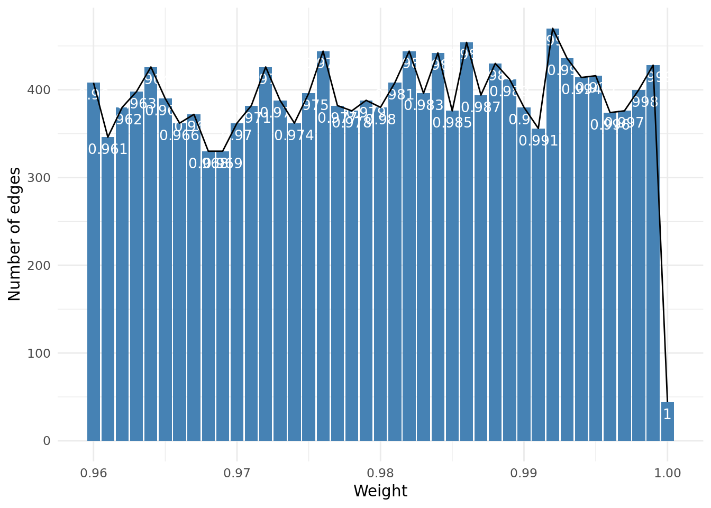

#### Degree distribution of item->similarity->item edges

#### Degree distribution of agent->knows->agent edges

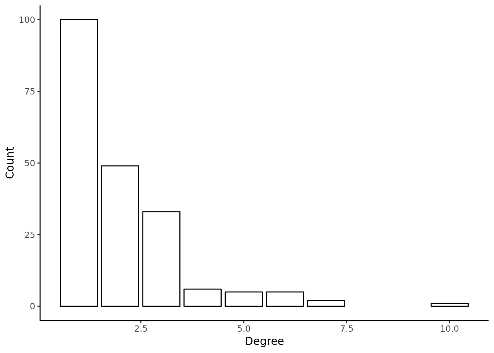

#### Runing time by method 

<table class="table table-condensed" style="width: auto !important; ">
 <thead>
  <tr>
   <th style="text-align:left;"> key </th>
   <th style="text-align:right;"> doc_count </th>
   <th style="text-align:right;"> sum_wallTime_ms.value </th>
   <th style="text-align:left;"> avg_wallTime_ms.value </th>
   <th style="text-align:left;"> includedInTotal </th>
  </tr>
 </thead>
<tbody>
  <tr>
   <td style="text-align:left;"> connectIfSimilar </td>
   <td style="text-align:right;"> 96,580 </td>
   <td style="text-align:right;"> 354,792 </td>
   <td style="text-align:left;"> 3.67355560157382 </td>
   <td style="text-align:left;"> No </td>
  </tr>
  <tr>
   <td style="text-align:left;"> existsSimilarity </td>
   <td style="text-align:right;"> 96,580 </td>
   <td style="text-align:right;"> 352,655 </td>
   <td style="text-align:left;"> 3.6514288672603 </td>
   <td style="text-align:left;"> No </td>
  </tr>
  <tr>
   <td style="text-align:left;"> similarityEdges </td>
   <td style="text-align:right;"> 96,580 </td>
   <td style="text-align:right;"> 348,631 </td>
   <td style="text-align:left;"> 3.60976392627873 </td>
   <td style="text-align:left;"> No </td>
  </tr>
  <tr>
   <td style="text-align:left;"> connectAllSimilar </td>
   <td style="text-align:right;"> 440 </td>
   <td style="text-align:right;"> 355,685 </td>
   <td style="text-align:left;"> 808.375 </td>
   <td style="text-align:left;"> Yes </td>
  </tr>
  <tr>
   <td style="text-align:left;"> init </td>
   <td style="text-align:right;"> 203 </td>
   <td style="text-align:right;"> 21,924 </td>
   <td style="text-align:left;"> 108 </td>
   <td style="text-align:left;"> No </td>
  </tr>
  <tr>
   <td style="text-align:left;"> connect </td>
   <td style="text-align:right;"> 61 </td>
   <td style="text-align:right;"> 480 </td>
   <td style="text-align:left;"> 7.86885245901639 </td>
   <td style="text-align:left;"> Yes </td>
  </tr>
  <tr>
   <td style="text-align:left;font-weight: bold;"> Total </td>
   <td style="text-align:right;font-weight: bold;"> 509 </td>
   <td style="text-align:right;font-weight: bold;"> 357,119 </td>
   <td style="text-align:left;font-weight: bold;">  </td>
   <td style="text-align:left;font-weight: bold;">  </td>
  </tr>
</tbody>
</table>
####  Found structures 

#####  Cycles 

Number of cycles found:  1 

<button class="btn btn-primary" data-toggle="collapse" data-target="#IPAAQZWDSN"> Show/Hide foundCycle query </button> 
 
  
     GET /filebeat-*/_search 
              { 
                "query": {
                  "bool": {
                    "must": [
                      { "match_phrase": {
                        "simulationId": "SIM10-14-09-30-sGuZe4--CV"
                        }
                      },
                      { "bool": {
                        "should": [
                          { "match": {
                            "keyword": "foundCycle"
                          }}
                        ]
                      }}
                    ]
                  }
                }
              }
     

#####  Paths 

Number of paths found:  0 

<button class="btn btn-primary" data-toggle="collapse" data-target="#YRXXISSSDF"> Show/Hide foundPath query </button> 
 
  
     GET /filebeat-*/_search 
              { 
                "query": {
                  "bool": {
                    "must": [
                      { "match_phrase": {
                        "simulationId": "SIM10-14-09-30-sGuZe4--CV"
                        }
                      },
                      { "bool": {
                        "should": [
                          { "match": {
                            "keyword": "foundPath"
                          }}
                        ]
                      }}
                    ]
                  }
                }
              }
     

###  SIM10-14-09-30-sGuZe4--DV 

#### simulationParameters 

<table class="table table-condensed" style="width: auto !important; ">
 <thead>
  <tr>
   <th style="text-align:left;"> agentNumber </th>
   <th style="text-align:left;"> similarityConnectThreshold </th>
   <th style="text-align:left;"> graphType </th>
   <th style="text-align:left;"> chainLength </th>
   <th style="text-align:left;"> similaritySearchThreshold </th>
   <th style="text-align:left;"> maxDistance </th>
   <th style="text-align:left;"> randomWorksNumberMultiplier </th>
  </tr>
 </thead>
<tbody>
  <tr>
   <td style="text-align:left;width: 20em; "> 200 </td>
   <td style="text-align:left;width: 15em; "> 0.96 </td>
   <td style="text-align:left;width: 15em; "> random </td>
   <td style="text-align:left;width: 15em; "> 20 </td>
   <td style="text-align:left;width: 15em; "> 1 </td>
   <td style="text-align:left;width: 15em; "> 30 </td>
   <td style="text-align:left;width: 15em; "> 1 </td>
  </tr>
</tbody>
</table>
#### allEdgesByLabel

<table class="table table-condensed" style="width: auto !important; ">
 <thead>
  <tr>
   <th style="text-align:right;"> edges_offers </th>
   <th style="text-align:right;"> edges_similarity </th>
   <th style="text-align:right;"> edges_owns </th>
   <th style="text-align:right;"> edges_demands </th>
   <th style="text-align:right;"> edges_knows </th>
   <th style="text-align:right;"> edges_total </th>
  </tr>
 </thead>
<tbody>
  <tr>
   <td style="text-align:right;width: 5em; "> 220 </td>
   <td style="text-align:right;width: 5em; "> 15,756 </td>
   <td style="text-align:right;width: 5em; "> 220 </td>
   <td style="text-align:right;width: 5em; "> 220 </td>
   <td style="text-align:right;width: 5em; "> 200 </td>
   <td style="text-align:right;width: 5em; "> 16,616 </td>
  </tr>
</tbody>
</table>
#### allVerticesByType

<table class="table table-condensed" style="width: auto !important; ">
 <thead>
  <tr>
   <th style="text-align:right;"> vertices_agent </th>
   <th style="text-align:right;"> vertices_item </th>
   <th style="text-align:right;"> vertices_work </th>
   <th style="text-align:right;"> vertices_total </th>
  </tr>
 </thead>
<tbody>
  <tr>
   <td style="text-align:right;width: 5em; "> 201 </td>
   <td style="text-align:right;width: 5em; "> 440 </td>
   <td style="text-align:right;width: 5em; "> 220 </td>
   <td style="text-align:right;width: 5em; "> 861 </td>
  </tr>
</tbody>
</table>
#### distribution of similarityEdgesByWeight

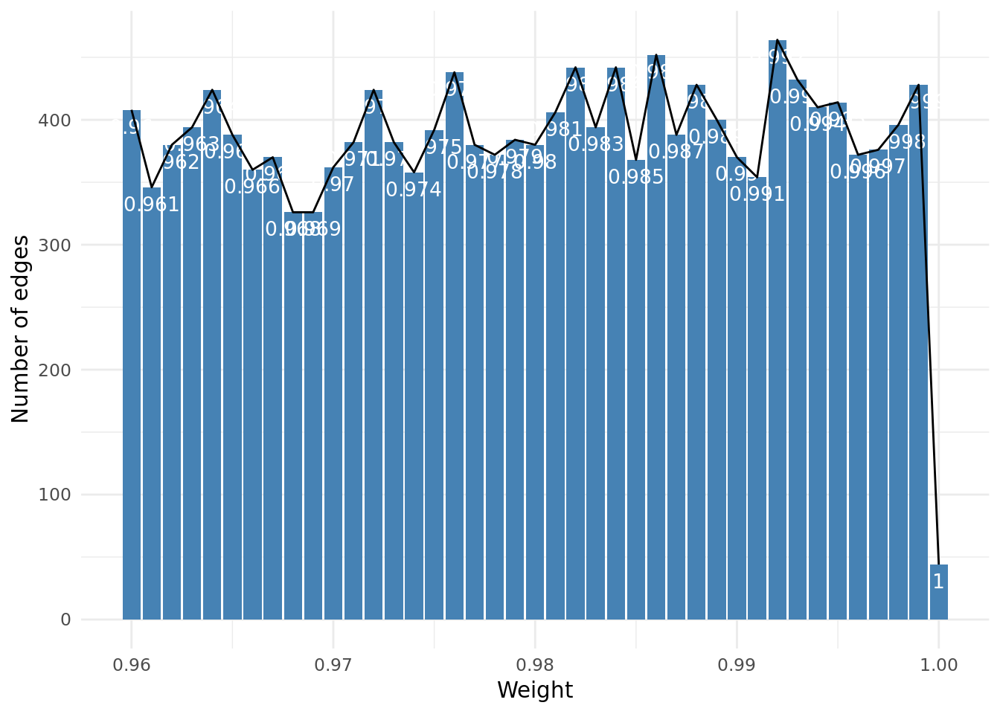

#### Degree distribution of item->similarity->item edges

#### Degree distribution of agent->knows->agent edges

#### Runing time by method 

<table class="table table-condensed" style="width: auto !important; ">
 <thead>
  <tr>
   <th style="text-align:left;">   </th>
   <th style="text-align:left;"> key </th>
   <th style="text-align:right;"> doc_count </th>
   <th style="text-align:right;"> sum_wallTime_ms.value </th>
   <th style="text-align:left;"> avg_wallTime_ms.value </th>
   <th style="text-align:left;"> includedInTotal </th>
  </tr>
 </thead>
<tbody>
  <tr>
   <td style="text-align:left;"> 1 </td>
   <td style="text-align:left;"> addItemToWork </td>
   <td style="text-align:right;"> 440 </td>
   <td style="text-align:right;"> 4,937 </td>
   <td style="text-align:left;"> 11.2204545454545 </td>
   <td style="text-align:left;"> No </td>
  </tr>
  <tr>
   <td style="text-align:left;"> 2 </td>
   <td style="text-align:left;"> ownsWork </td>
   <td style="text-align:right;"> 220 </td>
   <td style="text-align:right;"> 1,542 </td>
   <td style="text-align:left;"> 7.00909090909091 </td>
   <td style="text-align:left;"> No </td>
  </tr>
  <tr>
   <td style="text-align:left;"> 3 </td>
   <td style="text-align:left;"> init </td>
   <td style="text-align:right;"> 203 </td>
   <td style="text-align:right;"> 23,887 </td>
   <td style="text-align:left;"> 117.669950738916 </td>
   <td style="text-align:left;"> No </td>
  </tr>
  <tr>
   <td style="text-align:left;"> 4 </td>
   <td style="text-align:left;"> searchAndConnect </td>
   <td style="text-align:right;"> 201 </td>
   <td style="text-align:right;"> 217,837 </td>
   <td style="text-align:left;"> 1083.76616915423 </td>
   <td style="text-align:left;"> Yes </td>
  </tr>
  <tr>
   <td style="text-align:left;"> 5 </td>
   <td style="text-align:left;"> knowsAgent </td>
   <td style="text-align:right;"> 200 </td>
   <td style="text-align:right;"> 1,994 </td>
   <td style="text-align:left;"> 9.97 </td>
   <td style="text-align:left;"> No </td>
  </tr>
  <tr>
   <td style="text-align:left;"> 6 </td>
   <td style="text-align:left;"> getWorksItems </td>
   <td style="text-align:right;"> 38 </td>
   <td style="text-align:right;"> 118 </td>
   <td style="text-align:left;"> 3.10526315789474 </td>
   <td style="text-align:left;"> Yes </td>
  </tr>
  <tr>
   <td style="text-align:left;"> 8 </td>
   <td style="text-align:left;"> cycleSearch </td>
   <td style="text-align:right;"> 9 </td>
   <td style="text-align:right;"> 3,678 </td>
   <td style="text-align:left;"> 408.666666666667 </td>
   <td style="text-align:left;"> Yes </td>
  </tr>
  <tr>
   <td style="text-align:left;"> 9 </td>
   <td style="text-align:left;"> getWorks </td>
   <td style="text-align:right;"> 9 </td>
   <td style="text-align:right;"> 927 </td>
   <td style="text-align:left;"> 103 </td>
   <td style="text-align:left;"> No </td>
  </tr>
  <tr>
   <td style="text-align:left;"> 10 </td>
   <td style="text-align:left;"> individualCycleSearch </td>
   <td style="text-align:right;"> 9 </td>
   <td style="text-align:right;"> 0 </td>
   <td style="text-align:left;"> 0 </td>
   <td style="text-align:left;"> Yes </td>
  </tr>
  <tr>
   <td style="text-align:left;font-weight: bold;"> 11 </td>
   <td style="text-align:left;font-weight: bold;"> Total </td>
   <td style="text-align:right;font-weight: bold;"> 266 </td>
   <td style="text-align:right;font-weight: bold;"> 225,325 </td>
   <td style="text-align:left;font-weight: bold;">  </td>
   <td style="text-align:left;font-weight: bold;">  </td>
  </tr>
</tbody>
</table>
####  Found structures 

#####  Cycles 

Number of cycles found:  3 

<button class="btn btn-primary" data-toggle="collapse" data-target="#XMFFFGRVDF"> Show/Hide foundCycle query </button> 
 
  
     GET /filebeat-*/_search 
              { 
                "query": {
                  "bool": {
                    "must": [
                      { "match_phrase": {
                        "simulationId": "SIM10-14-09-30-sGuZe4--DV"
                        }
                      },
                      { "bool": {
                        "should": [
                          { "match": {
                            "keyword": "foundCycle"
                          }}
                        ]
                      }}
                    ]
                  }
                }
              }
     

#####  Paths 

Number of paths found:  6 

<button class="btn btn-primary" data-toggle="collapse" data-target="#TNGGUPNWJO"> Show/Hide foundPath query </button> 
 
  
     GET /filebeat-*/_search 
              { 
                "query": {
                  "bool": {
                    "must": [
                      { "match_phrase": {
                        "simulationId": "SIM10-14-09-30-sGuZe4--DV"
                        }
                      },
                      { "bool": {
                        "should": [
                          { "match": {
                            "keyword": "foundPath"
                          }}
                        ]
                      }}
                    ]
                  }
                }
              }
     

###  SIM10-14-09-37-CvzqGq--CV 

#### simulationParameters 

<table class="table table-condensed" style="width: auto !important; ">
 <thead>
  <tr>
   <th style="text-align:left;"> agentNumber </th>
   <th style="text-align:left;"> similarityConnectThreshold </th>
   <th style="text-align:left;"> graphType </th>
   <th style="text-align:left;"> chainLength </th>
   <th style="text-align:left;"> similaritySearchThreshold </th>
   <th style="text-align:left;"> maxDistance </th>
   <th style="text-align:left;"> randomWorksNumberMultiplier </th>
  </tr>
 </thead>
<tbody>
  <tr>
   <td style="text-align:left;width: 20em; "> 200 </td>
   <td style="text-align:left;width: 15em; "> 0.96 </td>
   <td style="text-align:left;width: 15em; "> smallWorld </td>
   <td style="text-align:left;width: 15em; "> 20 </td>
   <td style="text-align:left;width: 15em; "> 1 </td>
   <td style="text-align:left;width: 15em; "> 30 </td>
   <td style="text-align:left;width: 15em; "> 1 </td>
  </tr>
</tbody>
</table>
#### allEdgesByLabel

<table class="table table-condensed" style="width: auto !important; ">
 <thead>
  <tr>
   <th style="text-align:right;"> edges_offers </th>
   <th style="text-align:right;"> edges_similarity </th>
   <th style="text-align:right;"> edges_owns </th>
   <th style="text-align:right;"> edges_demands </th>
   <th style="text-align:right;"> edges_knows </th>
   <th style="text-align:right;"> edges_total </th>
  </tr>
 </thead>
<tbody>
  <tr>
   <td style="text-align:right;width: 5em; "> 220 </td>
   <td style="text-align:right;width: 5em; "> 16,362 </td>
   <td style="text-align:right;width: 5em; "> 220 </td>
   <td style="text-align:right;width: 5em; "> 220 </td>
   <td style="text-align:right;width: 5em; "> 1,201 </td>
   <td style="text-align:right;width: 5em; "> 18,223 </td>
  </tr>
</tbody>
</table>
#### allVerticesByType

<table class="table table-condensed" style="width: auto !important; ">
 <thead>
  <tr>
   <th style="text-align:right;"> vertices_agent </th>
   <th style="text-align:right;"> vertices_item </th>
   <th style="text-align:right;"> vertices_work </th>
   <th style="text-align:right;"> vertices_total </th>
  </tr>
 </thead>
<tbody>
  <tr>
   <td style="text-align:right;width: 5em; "> 201 </td>
   <td style="text-align:right;width: 5em; "> 440 </td>
   <td style="text-align:right;width: 5em; "> 220 </td>
   <td style="text-align:right;width: 5em; "> 861 </td>
  </tr>
</tbody>
</table>
#### distribution of similarityEdgesByWeight

#### Degree distribution of item->similarity->item edges

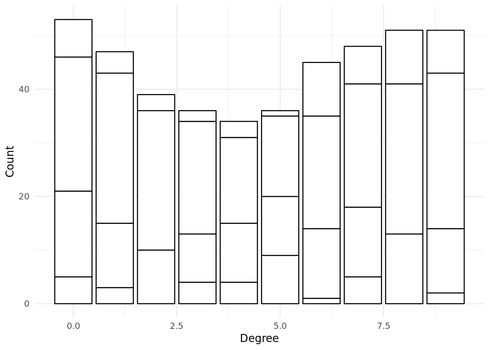

#### Degree distribution of agent->knows->agent edges

#### Runing time by method 

<table class="table table-condensed" style="width: auto !important; ">
 <thead>
  <tr>
   <th style="text-align:left;"> key </th>
   <th style="text-align:right;"> doc_count </th>
   <th style="text-align:right;"> sum_wallTime_ms.value </th>
   <th style="text-align:left;"> avg_wallTime_ms.value </th>
   <th style="text-align:left;"> includedInTotal </th>
  </tr>
 </thead>
<tbody>
  <tr>
   <td style="text-align:left;"> connectIfSimilar </td>
   <td style="text-align:right;"> 96,580 </td>
   <td style="text-align:right;"> 362,079 </td>
   <td style="text-align:left;"> 3.74900600538414 </td>
   <td style="text-align:left;"> No </td>
  </tr>
  <tr>
   <td style="text-align:left;"> existsSimilarity </td>
   <td style="text-align:right;"> 96,580 </td>
   <td style="text-align:right;"> 360,298 </td>
   <td style="text-align:left;"> 3.73056533443777 </td>
   <td style="text-align:left;"> No </td>
  </tr>
  <tr>
   <td style="text-align:left;"> similarityEdges </td>
   <td style="text-align:right;"> 96,580 </td>
   <td style="text-align:right;"> 356,320 </td>
   <td style="text-align:left;"> 3.68937668254297 </td>
   <td style="text-align:left;"> No </td>
  </tr>
  <tr>
   <td style="text-align:left;"> connectAllSimilar </td>
   <td style="text-align:right;"> 440 </td>
   <td style="text-align:right;"> 362,999 </td>
   <td style="text-align:left;"> 824.997727272727 </td>
   <td style="text-align:left;"> Yes </td>
  </tr>
  <tr>
   <td style="text-align:left;"> init </td>
   <td style="text-align:right;"> 203 </td>
   <td style="text-align:right;"> 22,897 </td>
   <td style="text-align:left;"> 112.793103448276 </td>
   <td style="text-align:left;"> No </td>
  </tr>
  <tr>
   <td style="text-align:left;"> connect </td>
   <td style="text-align:right;"> 55 </td>
   <td style="text-align:right;"> 175 </td>
   <td style="text-align:left;"> 3.18181818181818 </td>
   <td style="text-align:left;"> Yes </td>
  </tr>
  <tr>
   <td style="text-align:left;font-weight: bold;"> Total </td>
   <td style="text-align:right;font-weight: bold;"> 503 </td>
   <td style="text-align:right;font-weight: bold;"> 364,562 </td>
   <td style="text-align:left;font-weight: bold;">  </td>
   <td style="text-align:left;font-weight: bold;">  </td>
  </tr>
</tbody>
</table>
####  Found structures 

#####  Cycles 

Number of cycles found:  1 

<button class="btn btn-primary" data-toggle="collapse" data-target="#HJIRBVPRLW"> Show/Hide foundCycle query </button> 
 
  
     GET /filebeat-*/_search 
              { 
                "query": {
                  "bool": {
                    "must": [
                      { "match_phrase": {
                        "simulationId": "SIM10-14-09-37-CvzqGq--CV"
                        }
                      },
                      { "bool": {
                        "should": [
                          { "match": {
                            "keyword": "foundCycle"
                          }}
                        ]
                      }}
                    ]
                  }
                }
              }
     

#####  Paths 

Number of paths found:  0 

<button class="btn btn-primary" data-toggle="collapse" data-target="#UMRZLVEAGZ"> Show/Hide foundPath query </button> 
 
  
     GET /filebeat-*/_search 
              { 
                "query": {
                  "bool": {
                    "must": [
                      { "match_phrase": {
                        "simulationId": "SIM10-14-09-37-CvzqGq--CV"
                        }
                      },
                      { "bool": {
                        "should": [
                          { "match": {
                            "keyword": "foundPath"
                          }}
                        ]
                      }}
                    ]
                  }
                }
              }
     

###  SIM10-14-09-37-CvzqGq--DV 

#### simulationParameters 

<table class="table table-condensed" style="width: auto !important; ">
 <thead>
  <tr>
   <th style="text-align:left;"> agentNumber </th>
   <th style="text-align:left;"> similarityConnectThreshold </th>
   <th style="text-align:left;"> graphType </th>
   <th style="text-align:left;"> chainLength </th>
   <th style="text-align:left;"> similaritySearchThreshold </th>
   <th style="text-align:left;"> maxDistance </th>
   <th style="text-align:left;"> randomWorksNumberMultiplier </th>
  </tr>
 </thead>
<tbody>
  <tr>
   <td style="text-align:left;width: 20em; "> 200 </td>
   <td style="text-align:left;width: 15em; "> 0.96 </td>
   <td style="text-align:left;width: 15em; "> smallWorld </td>
   <td style="text-align:left;width: 15em; "> 20 </td>
   <td style="text-align:left;width: 15em; "> 1 </td>
   <td style="text-align:left;width: 15em; "> 30 </td>
   <td style="text-align:left;width: 15em; "> 1 </td>
  </tr>
</tbody>
</table>
#### allEdgesByLabel

<table class="table table-condensed" style="width: auto !important; ">
 <thead>
  <tr>
   <th style="text-align:right;"> edges_offers </th>
   <th style="text-align:right;"> edges_similarity </th>
   <th style="text-align:right;"> edges_owns </th>
   <th style="text-align:right;"> edges_demands </th>
   <th style="text-align:right;"> edges_knows </th>
   <th style="text-align:right;"> edges_total </th>
  </tr>
 </thead>
<tbody>
  <tr>
   <td style="text-align:right;width: 5em; "> 220 </td>
   <td style="text-align:right;width: 5em; "> 16,252 </td>
   <td style="text-align:right;width: 5em; "> 220 </td>
   <td style="text-align:right;width: 5em; "> 220 </td>
   <td style="text-align:right;width: 5em; "> 1,201 </td>
   <td style="text-align:right;width: 5em; "> 18,113 </td>
  </tr>
</tbody>
</table>
#### allVerticesByType

<table class="table table-condensed" style="width: auto !important; ">
 <thead>
  <tr>
   <th style="text-align:right;"> vertices_agent </th>
   <th style="text-align:right;"> vertices_item </th>
   <th style="text-align:right;"> vertices_work </th>
   <th style="text-align:right;"> vertices_total </th>
  </tr>
 </thead>
<tbody>
  <tr>
   <td style="text-align:right;width: 5em; "> 201 </td>
   <td style="text-align:right;width: 5em; "> 440 </td>
   <td style="text-align:right;width: 5em; "> 220 </td>
   <td style="text-align:right;width: 5em; "> 861 </td>
  </tr>
</tbody>
</table>
#### distribution of similarityEdgesByWeight

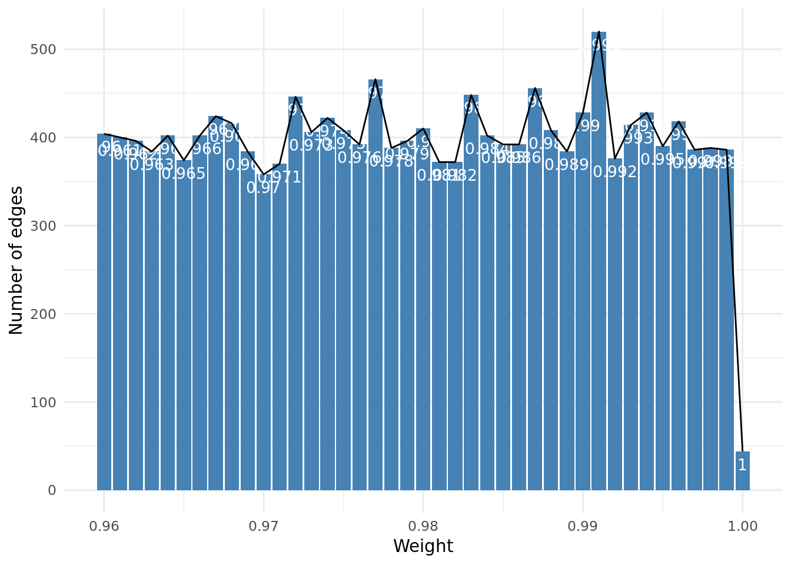

#### Degree distribution of item->similarity->item edges

#### Degree distribution of agent->knows->agent edges

#### Runing time by method 

<table class="table table-condensed" style="width: auto !important; ">
 <thead>
  <tr>
   <th style="text-align:left;"> key </th>
   <th style="text-align:right;"> doc_count </th>
   <th style="text-align:right;"> sum_wallTime_ms.value </th>
   <th style="text-align:left;"> avg_wallTime_ms.value </th>
   <th style="text-align:left;"> includedInTotal </th>
  </tr>
 </thead>
<tbody>
  <tr>
   <td style="text-align:left;"> knowsAgent </td>
   <td style="text-align:right;"> 1,201 </td>
   <td style="text-align:right;"> 4,711 </td>
   <td style="text-align:left;"> 3.9225645295587 </td>
   <td style="text-align:left;"> No </td>
  </tr>
  <tr>
   <td style="text-align:left;"> addItemToWork </td>
   <td style="text-align:right;"> 440 </td>
   <td style="text-align:right;"> 5,042 </td>
   <td style="text-align:left;"> 11.4590909090909 </td>
   <td style="text-align:left;"> No </td>
  </tr>
  <tr>
   <td style="text-align:left;"> ownsWork </td>
   <td style="text-align:right;"> 220 </td>
   <td style="text-align:right;"> 5,138 </td>
   <td style="text-align:left;"> 23.3545454545455 </td>
   <td style="text-align:left;"> No </td>
  </tr>
  <tr>
   <td style="text-align:left;"> init </td>
   <td style="text-align:right;"> 203 </td>
   <td style="text-align:right;"> 22,835 </td>
   <td style="text-align:left;"> 112.487684729064 </td>
   <td style="text-align:left;"> No </td>
  </tr>
  <tr>
   <td style="text-align:left;"> searchAndConnect </td>
   <td style="text-align:right;"> 201 </td>
   <td style="text-align:right;"> 324,812 </td>
   <td style="text-align:left;"> 1615.98009950249 </td>
   <td style="text-align:left;"> Yes </td>
  </tr>
  <tr>
   <td style="text-align:left;"> getWorksItems </td>
   <td style="text-align:right;"> 38 </td>
   <td style="text-align:right;"> 57 </td>
   <td style="text-align:left;"> 1.5 </td>
   <td style="text-align:left;"> Yes </td>
  </tr>
  <tr>
   <td style="text-align:left;"> cycleSearch </td>
   <td style="text-align:right;"> 11 </td>
   <td style="text-align:right;"> 6,668 </td>
   <td style="text-align:left;"> 606.181818181818 </td>
   <td style="text-align:left;"> Yes </td>
  </tr>
  <tr>
   <td style="text-align:left;"> getWorks </td>
   <td style="text-align:right;"> 11 </td>
   <td style="text-align:right;"> 945 </td>
   <td style="text-align:left;"> 85.9090909090909 </td>
   <td style="text-align:left;"> No </td>
  </tr>
  <tr>
   <td style="text-align:left;"> individualCycleSearch </td>
   <td style="text-align:right;"> 11 </td>
   <td style="text-align:right;"> 0 </td>
   <td style="text-align:left;"> 0 </td>
   <td style="text-align:left;"> Yes </td>
  </tr>
  <tr>
   <td style="text-align:left;font-weight: bold;"> Total </td>
   <td style="text-align:right;font-weight: bold;"> 268 </td>
   <td style="text-align:right;font-weight: bold;"> 336,231 </td>
   <td style="text-align:left;font-weight: bold;">  </td>
   <td style="text-align:left;font-weight: bold;">  </td>
  </tr>
</tbody>
</table>
####  Found structures 

#####  Cycles 

Number of cycles found:  6 

<button class="btn btn-primary" data-toggle="collapse" data-target="#FRBQDTKEGO"> Show/Hide foundCycle query </button> 
 
  
     GET /filebeat-*/_search 
              { 
                "query": {
                  "bool": {
                    "must": [
                      { "match_phrase": {
                        "simulationId": "SIM10-14-09-37-CvzqGq--DV"
                        }
                      },
                      { "bool": {
                        "should": [
                          { "match": {
                            "keyword": "foundCycle"
                          }}
                        ]
                      }}
                    ]
                  }
                }
              }
     

#####  Paths 

Number of paths found:  1 

<button class="btn btn-primary" data-toggle="collapse" data-target="#ANJFVIUQVW"> Show/Hide foundPath query </button> 
 
  
     GET /filebeat-*/_search 
              { 
                "query": {
                  "bool": {
                    "must": [
                      { "match_phrase": {
                        "simulationId": "SIM10-14-09-37-CvzqGq--DV"
                        }
                      },
                      { "bool": {
                        "should": [
                          { "match": {
                            "keyword": "foundPath"
                          }}
                        ]
                      }}
                    ]
                  }
                }
              }
     

###  SIM10-14-06-04-6ITMRc--CV 

#### simulationParameters 

<table class="table table-condensed" style="width: auto !important; ">
 <thead>
  <tr>
   <th style="text-align:left;"> agentNumber </th>
   <th style="text-align:left;"> similarityConnectThreshold </th>
   <th style="text-align:left;"> graphType </th>
   <th style="text-align:left;"> chainLength </th>
   <th style="text-align:left;"> similaritySearchThreshold </th>
   <th style="text-align:left;"> maxDistance </th>
   <th style="text-align:left;"> randomWorksNumberMultiplier </th>
  </tr>
 </thead>
<tbody>
  <tr>
   <td style="text-align:left;width: 20em; "> 200 </td>
   <td style="text-align:left;width: 15em; "> 0.96 </td>
   <td style="text-align:left;width: 15em; "> random </td>
   <td style="text-align:left;width: 15em; "> 20 </td>
   <td style="text-align:left;width: 15em; "> 1 </td>
   <td style="text-align:left;width: 15em; "> 5 </td>
   <td style="text-align:left;width: 15em; "> 1 </td>
  </tr>
</tbody>
</table>
#### allEdgesByLabel

<table class="table table-condensed" style="width: auto !important; ">
 <thead>
  <tr>
   <th style="text-align:right;"> edges_offers </th>
   <th style="text-align:right;"> edges_similarity </th>
   <th style="text-align:right;"> edges_owns </th>
   <th style="text-align:right;"> edges_demands </th>
   <th style="text-align:right;"> edges_knows </th>
   <th style="text-align:right;"> edges_total </th>
  </tr>
 </thead>
<tbody>
  <tr>
   <td style="text-align:right;width: 5em; "> 220 </td>
   <td style="text-align:right;width: 5em; "> 15,514 </td>
   <td style="text-align:right;width: 5em; "> 220 </td>
   <td style="text-align:right;width: 5em; "> 220 </td>
   <td style="text-align:right;width: 5em; "> 200 </td>
   <td style="text-align:right;width: 5em; "> 16,374 </td>
  </tr>
</tbody>
</table>
#### allVerticesByType

<table class="table table-condensed" style="width: auto !important; ">
 <thead>
  <tr>
   <th style="text-align:right;"> vertices_agent </th>
   <th style="text-align:right;"> vertices_item </th>
   <th style="text-align:right;"> vertices_work </th>
   <th style="text-align:right;"> vertices_total </th>
  </tr>
 </thead>
<tbody>
  <tr>
   <td style="text-align:right;width: 5em; "> 201 </td>
   <td style="text-align:right;width: 5em; "> 440 </td>
   <td style="text-align:right;width: 5em; "> 220 </td>
   <td style="text-align:right;width: 5em; "> 861 </td>
  </tr>
</tbody>
</table>
#### distribution of similarityEdgesByWeight

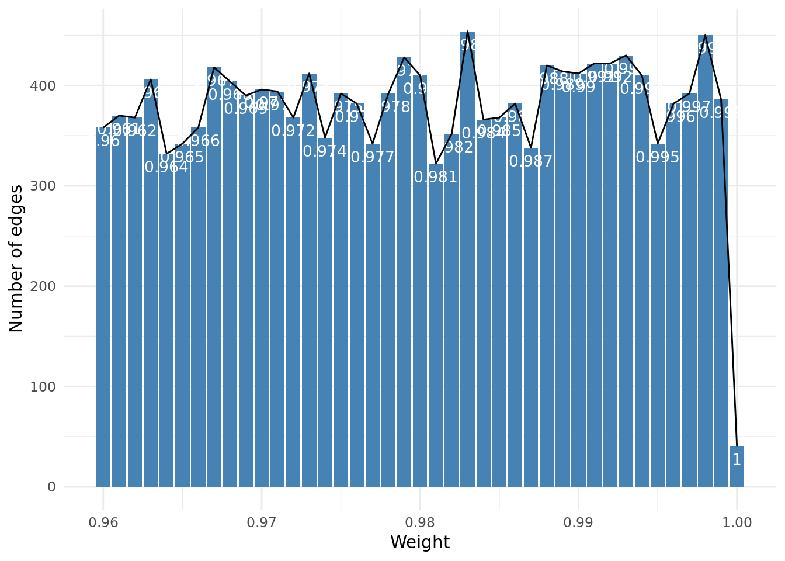

#### Degree distribution of item->similarity->item edges

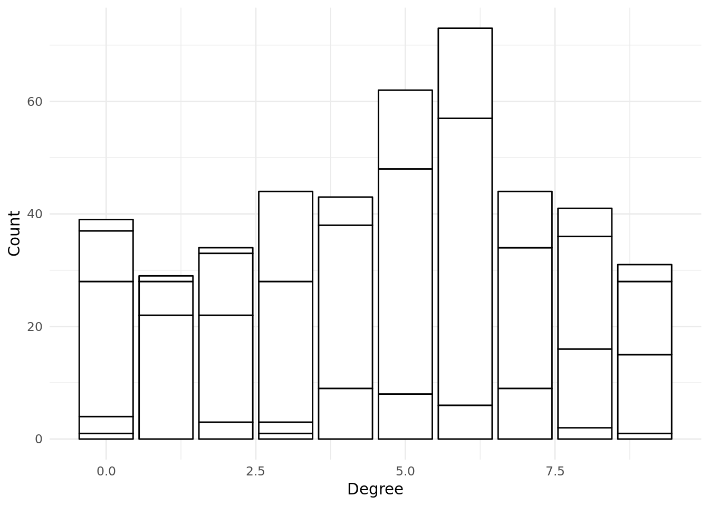

#### Degree distribution of agent->knows->agent edges

#### Runing time by method 

<table class="table table-condensed" style="width: auto !important; ">
 <thead>
  <tr>
   <th style="text-align:left;"> key </th>
   <th style="text-align:right;"> doc_count </th>
   <th style="text-align:right;"> sum_wallTime_ms.value </th>
   <th style="text-align:left;"> avg_wallTime_ms.value </th>
   <th style="text-align:left;"> includedInTotal </th>
  </tr>
 </thead>
<tbody>
  <tr>
   <td style="text-align:left;"> connectIfSimilar </td>
   <td style="text-align:right;"> 96,580 </td>
   <td style="text-align:right;"> 330,857 </td>
   <td style="text-align:left;"> 3.42572996479602 </td>
   <td style="text-align:left;"> No </td>
  </tr>
  <tr>
   <td style="text-align:left;"> existsSimilarity </td>
   <td style="text-align:right;"> 96,580 </td>
   <td style="text-align:right;"> 305,930 </td>
   <td style="text-align:left;"> 3.16763305032098 </td>
   <td style="text-align:left;"> No </td>
  </tr>
  <tr>
   <td style="text-align:left;"> similarityEdges </td>
   <td style="text-align:right;"> 96,580 </td>
   <td style="text-align:right;"> 302,596 </td>
   <td style="text-align:left;"> 3.13311244564092 </td>
   <td style="text-align:left;"> No </td>
  </tr>
  <tr>
   <td style="text-align:left;"> connect </td>
   <td style="text-align:right;"> 6,173 </td>
   <td style="text-align:right;"> 23,209 </td>
   <td style="text-align:left;"> 3.7597602462336 </td>
   <td style="text-align:left;"> Yes </td>
  </tr>
  <tr>
   <td style="text-align:left;"> connectAllSimilar </td>
   <td style="text-align:right;"> 440 </td>
   <td style="text-align:right;"> 331,863 </td>
   <td style="text-align:left;"> 754.234090909091 </td>
   <td style="text-align:left;"> Yes </td>
  </tr>
  <tr>
   <td style="text-align:left;"> init </td>
   <td style="text-align:right;"> 203 </td>
   <td style="text-align:right;"> 21,715 </td>
   <td style="text-align:left;"> 106.970443349754 </td>
   <td style="text-align:left;"> No </td>
  </tr>
  <tr>
   <td style="text-align:left;font-weight: bold;"> Total </td>
   <td style="text-align:right;font-weight: bold;"> 6,621 </td>
   <td style="text-align:right;font-weight: bold;"> 356,341 </td>
   <td style="text-align:left;font-weight: bold;">  </td>
   <td style="text-align:left;font-weight: bold;">  </td>
  </tr>
</tbody>
</table>
####  Found structures 

#####  Cycles 

Number of cycles found:  1 

<button class="btn btn-primary" data-toggle="collapse" data-target="#QZUSIQIZNY"> Show/Hide foundCycle query </button> 
 
  
     GET /filebeat-*/_search 
              { 
                "query": {
                  "bool": {
                    "must": [
                      { "match_phrase": {
                        "simulationId": "SIM10-14-06-04-6ITMRc--CV"
                        }
                      },
                      { "bool": {
                        "should": [
                          { "match": {
                            "keyword": "foundCycle"
                          }}
                        ]
                      }}
                    ]
                  }
                }
              }
     

#####  Paths 

Number of paths found:  0 

<button class="btn btn-primary" data-toggle="collapse" data-target="#TPQNNBWHGD"> Show/Hide foundPath query </button> 
 
  
     GET /filebeat-*/_search 
              { 
                "query": {
                  "bool": {
                    "must": [
                      { "match_phrase": {
                        "simulationId": "SIM10-14-06-04-6ITMRc--CV"
                        }
                      },
                      { "bool": {
                        "should": [
                          { "match": {
                            "keyword": "foundPath"
                          }}
                        ]
                      }}
                    ]
                  }
                }
              }
     

###  SIM10-14-06-04-6ITMRc--DV 

#### simulationParameters 

<table class="table table-condensed" style="width: auto !important; ">
 <thead>
  <tr>
   <th style="text-align:left;"> agentNumber </th>
   <th style="text-align:left;"> similarityConnectThreshold </th>
   <th style="text-align:left;"> graphType </th>
   <th style="text-align:left;"> chainLength </th>
   <th style="text-align:left;"> similaritySearchThreshold </th>
   <th style="text-align:left;"> maxDistance </th>
   <th style="text-align:left;"> randomWorksNumberMultiplier </th>
  </tr>
 </thead>
<tbody>
  <tr>
   <td style="text-align:left;width: 20em; "> 200 </td>
   <td style="text-align:left;width: 15em; "> 0.96 </td>
   <td style="text-align:left;width: 15em; "> random </td>
   <td style="text-align:left;width: 15em; "> 20 </td>
   <td style="text-align:left;width: 15em; "> 1 </td>
   <td style="text-align:left;width: 15em; "> 5 </td>
   <td style="text-align:left;width: 15em; "> 1 </td>
  </tr>
</tbody>
</table>
#### allEdgesByLabel

<table class="table table-condensed" style="width: auto !important; ">
 <thead>
  <tr>
   <th style="text-align:right;"> edges_offers </th>
   <th style="text-align:right;"> edges_similarity </th>
   <th style="text-align:right;"> edges_owns </th>
   <th style="text-align:right;"> edges_demands </th>
   <th style="text-align:right;"> edges_knows </th>
   <th style="text-align:right;"> edges_total </th>
  </tr>
 </thead>
<tbody>
  <tr>
   <td style="text-align:right;width: 5em; "> 220 </td>
   <td style="text-align:right;width: 5em; "> 3,168 </td>
   <td style="text-align:right;width: 5em; "> 220 </td>
   <td style="text-align:right;width: 5em; "> 220 </td>
   <td style="text-align:right;width: 5em; "> 200 </td>
   <td style="text-align:right;width: 5em; "> 4,028 </td>
  </tr>
</tbody>
</table>
#### allVerticesByType

<table class="table table-condensed" style="width: auto !important; ">
 <thead>
  <tr>
   <th style="text-align:right;"> vertices_agent </th>
   <th style="text-align:right;"> vertices_item </th>
   <th style="text-align:right;"> vertices_work </th>
   <th style="text-align:right;"> vertices_total </th>
  </tr>
 </thead>
<tbody>
  <tr>
   <td style="text-align:right;width: 5em; "> 201 </td>
   <td style="text-align:right;width: 5em; "> 440 </td>
   <td style="text-align:right;width: 5em; "> 220 </td>
   <td style="text-align:right;width: 5em; "> 861 </td>
  </tr>
</tbody>
</table>
#### distribution of similarityEdgesByWeight

#### Degree distribution of item->similarity->item edges

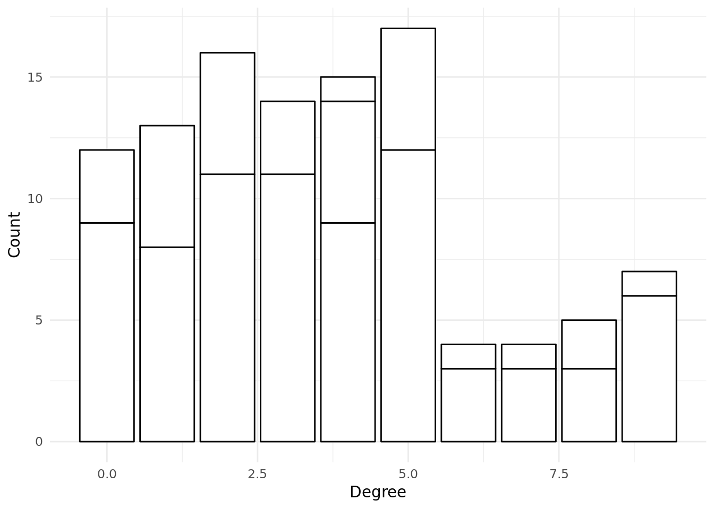

#### Degree distribution of agent->knows->agent edges

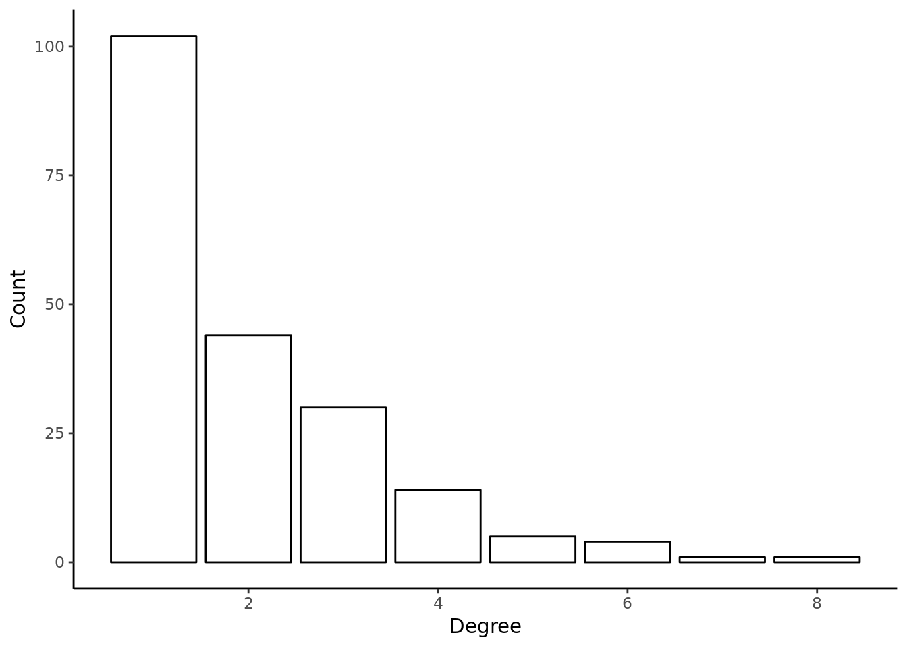

#### Runing time by method 

<table class="table table-condensed" style="width: auto !important; ">
 <thead>
  <tr>
   <th style="text-align:left;">   </th>
   <th style="text-align:left;"> key </th>
   <th style="text-align:right;"> doc_count </th>
   <th style="text-align:right;"> sum_wallTime_ms.value </th>
   <th style="text-align:left;"> avg_wallTime_ms.value </th>
   <th style="text-align:left;"> includedInTotal </th>
  </tr>
 </thead>
<tbody>
  <tr>
   <td style="text-align:left;"> 2 </td>
   <td style="text-align:left;"> cycleSearch </td>
   <td style="text-align:right;"> 3,600 </td>
   <td style="text-align:right;"> 18,442 </td>
   <td style="text-align:left;"> 5.12277777777778 </td>
   <td style="text-align:left;"> Yes </td>
  </tr>
  <tr>
   <td style="text-align:left;"> 3 </td>
   <td style="text-align:left;"> getWorks </td>
   <td style="text-align:right;"> 3,600 </td>
   <td style="text-align:right;"> 92,854 </td>
   <td style="text-align:left;"> 25.7927777777778 </td>
   <td style="text-align:left;"> No </td>
  </tr>
  <tr>
   <td style="text-align:left;"> 4 </td>
   <td style="text-align:left;"> individualCycleSearch </td>
   <td style="text-align:right;"> 3,600 </td>
   <td style="text-align:right;"> 80 </td>
   <td style="text-align:left;"> 0.0222222222222222 </td>
   <td style="text-align:left;"> Yes </td>
  </tr>
  <tr>
   <td style="text-align:left;"> 6 </td>
   <td style="text-align:left;"> addItemToWork </td>
   <td style="text-align:right;"> 440 </td>
   <td style="text-align:right;"> 6,130 </td>
   <td style="text-align:left;"> 13.9318181818182 </td>
   <td style="text-align:left;"> No </td>
  </tr>
  <tr>
   <td style="text-align:left;"> 7 </td>
   <td style="text-align:left;"> ownsWork </td>
   <td style="text-align:right;"> 220 </td>
   <td style="text-align:right;"> 2,679 </td>
   <td style="text-align:left;"> 12.1772727272727 </td>
   <td style="text-align:left;"> No </td>
  </tr>
  <tr>
   <td style="text-align:left;"> 8 </td>
   <td style="text-align:left;"> init </td>
   <td style="text-align:right;"> 203 </td>
   <td style="text-align:right;"> 23,650 </td>
   <td style="text-align:left;"> 116.502463054187 </td>
   <td style="text-align:left;"> No </td>
  </tr>
  <tr>
   <td style="text-align:left;"> 9 </td>
   <td style="text-align:left;"> searchAndConnect </td>
   <td style="text-align:right;"> 201 </td>
   <td style="text-align:right;"> 48,815 </td>
   <td style="text-align:left;"> 242.860696517413 </td>
   <td style="text-align:left;"> Yes </td>
  </tr>
  <tr>
   <td style="text-align:left;"> 10 </td>
   <td style="text-align:left;"> knowsAgent </td>
   <td style="text-align:right;"> 200 </td>
   <td style="text-align:right;"> 1,084 </td>
   <td style="text-align:left;"> 5.42 </td>
   <td style="text-align:left;"> No </td>
  </tr>
  <tr>
   <td style="text-align:left;font-weight: bold;"> 1 </td>
   <td style="text-align:left;font-weight: bold;"> Total </td>
   <td style="text-align:right;font-weight: bold;"> 14,601 </td>
   <td style="text-align:right;font-weight: bold;"> 82,639 </td>
   <td style="text-align:left;font-weight: bold;">  </td>
   <td style="text-align:left;font-weight: bold;">  </td>
  </tr>
</tbody>
</table>
####  Found structures 

#####  Cycles 

Number of cycles found:  0 

<button class="btn btn-primary" data-toggle="collapse" data-target="#NQLIIZYXUB"> Show/Hide foundCycle query </button> 
 
  
     GET /filebeat-*/_search 
              { 
                "query": {
                  "bool": {
                    "must": [
                      { "match_phrase": {
                        "simulationId": "SIM10-14-06-04-6ITMRc--DV"
                        }
                      },
                      { "bool": {
                        "should": [
                          { "match": {
                            "keyword": "foundCycle"
                          }}
                        ]
                      }}
                    ]
                  }
                }
              }
     

#####  Paths 

Number of paths found:  3600 

<button class="btn btn-primary" data-toggle="collapse" data-target="#FQMSCZTPCB"> Show/Hide foundPath query </button> 
 
  
     GET /filebeat-*/_search 
              { 
                "query": {
                  "bool": {
                    "must": [
                      { "match_phrase": {
                        "simulationId": "SIM10-14-06-04-6ITMRc--DV"
                        }
                      },
                      { "bool": {
                        "should": [
                          { "match": {
                            "keyword": "foundPath"
                          }}
                        ]
                      }}
                    ]
                  }
                }
              }
     

###  SIM10-14-07-10-RKcFaA--CV 

#### simulationParameters 

<table class="table table-condensed" style="width: auto !important; ">
 <thead>
  <tr>
   <th style="text-align:left;"> agentNumber </th>
   <th style="text-align:left;"> similarityConnectThreshold </th>
   <th style="text-align:left;"> graphType </th>
   <th style="text-align:left;"> chainLength </th>
   <th style="text-align:left;"> similaritySearchThreshold </th>
   <th style="text-align:left;"> maxDistance </th>
   <th style="text-align:left;"> randomWorksNumberMultiplier </th>
  </tr>
 </thead>
<tbody>
  <tr>
   <td style="text-align:left;width: 20em; "> 200 </td>
   <td style="text-align:left;width: 15em; "> 0.96 </td>
   <td style="text-align:left;width: 15em; "> smallWorld </td>
   <td style="text-align:left;width: 15em; "> 20 </td>
   <td style="text-align:left;width: 15em; "> 1 </td>
   <td style="text-align:left;width: 15em; "> 5 </td>
   <td style="text-align:left;width: 15em; "> 1 </td>
  </tr>
</tbody>
</table>
#### allEdgesByLabel

<table class="table table-condensed" style="width: auto !important; ">
 <thead>
  <tr>
   <th style="text-align:right;"> edges_offers </th>
   <th style="text-align:right;"> edges_similarity </th>
   <th style="text-align:right;"> edges_owns </th>
   <th style="text-align:right;"> edges_demands </th>
   <th style="text-align:right;"> edges_knows </th>
   <th style="text-align:right;"> edges_total </th>
  </tr>
 </thead>
<tbody>
  <tr>
   <td style="text-align:right;width: 5em; "> 220 </td>
   <td style="text-align:right;width: 5em; "> 16,412 </td>
   <td style="text-align:right;width: 5em; "> 220 </td>
   <td style="text-align:right;width: 5em; "> 220 </td>
   <td style="text-align:right;width: 5em; "> 1,201 </td>
   <td style="text-align:right;width: 5em; "> 18,273 </td>
  </tr>
</tbody>
</table>
#### allVerticesByType

<table class="table table-condensed" style="width: auto !important; ">
 <thead>
  <tr>
   <th style="text-align:right;"> vertices_agent </th>
   <th style="text-align:right;"> vertices_item </th>
   <th style="text-align:right;"> vertices_work </th>
   <th style="text-align:right;"> vertices_total </th>
  </tr>
 </thead>
<tbody>
  <tr>
   <td style="text-align:right;width: 5em; "> 201 </td>
   <td style="text-align:right;width: 5em; "> 440 </td>
   <td style="text-align:right;width: 5em; "> 220 </td>
   <td style="text-align:right;width: 5em; "> 861 </td>
  </tr>
</tbody>
</table>
#### distribution of similarityEdgesByWeight

#### Degree distribution of item->similarity->item edges

#### Degree distribution of agent->knows->agent edges

#### Runing time by method 

<table class="table table-condensed" style="width: auto !important; ">
 <thead>
  <tr>
   <th style="text-align:left;"> key </th>
   <th style="text-align:right;"> doc_count </th>
   <th style="text-align:right;"> sum_wallTime_ms.value </th>
   <th style="text-align:left;"> avg_wallTime_ms.value </th>
   <th style="text-align:left;"> includedInTotal </th>
  </tr>
 </thead>
<tbody>
  <tr>
   <td style="text-align:left;"> connectIfSimilar </td>
   <td style="text-align:right;"> 96,580 </td>
   <td style="text-align:right;"> 346,923 </td>
   <td style="text-align:left;"> 3.59207910540485 </td>
   <td style="text-align:left;"> No </td>
  </tr>
  <tr>
   <td style="text-align:left;"> existsSimilarity </td>
   <td style="text-align:right;"> 96,580 </td>
   <td style="text-align:right;"> 345,000 </td>
   <td style="text-align:left;"> 3.57216815075585 </td>
   <td style="text-align:left;"> No </td>
  </tr>
  <tr>
   <td style="text-align:left;"> similarityEdges </td>
   <td style="text-align:right;"> 96,580 </td>
   <td style="text-align:right;"> 341,106 </td>
   <td style="text-align:left;"> 3.53184924414993 </td>
   <td style="text-align:left;"> No </td>
  </tr>
  <tr>
   <td style="text-align:left;"> connectAllSimilar </td>
   <td style="text-align:right;"> 440 </td>
   <td style="text-align:right;"> 347,757 </td>
   <td style="text-align:left;"> 790.356818181818 </td>
   <td style="text-align:left;"> Yes </td>
  </tr>
  <tr>
   <td style="text-align:left;"> init </td>
   <td style="text-align:right;"> 203 </td>
   <td style="text-align:right;"> 21,776 </td>
   <td style="text-align:left;"> 107.270935960591 </td>
   <td style="text-align:left;"> No </td>
  </tr>
  <tr>
   <td style="text-align:left;"> connect </td>
   <td style="text-align:right;"> 84 </td>
   <td style="text-align:right;"> 186 </td>
   <td style="text-align:left;"> 2.21428571428571 </td>
   <td style="text-align:left;"> Yes </td>
  </tr>
  <tr>
   <td style="text-align:left;font-weight: bold;"> Total </td>
   <td style="text-align:right;font-weight: bold;"> 532 </td>
   <td style="text-align:right;font-weight: bold;"> 349,188 </td>
   <td style="text-align:left;font-weight: bold;">  </td>
   <td style="text-align:left;font-weight: bold;">  </td>
  </tr>
</tbody>
</table>
####  Found structures 

#####  Cycles 

Number of cycles found:  1 

<button class="btn btn-primary" data-toggle="collapse" data-target="#VJPOLZVDXB"> Show/Hide foundCycle query </button> 
 
  
     GET /filebeat-*/_search 
              { 
                "query": {
                  "bool": {
                    "must": [
                      { "match_phrase": {
                        "simulationId": "SIM10-14-07-10-RKcFaA--CV"
                        }
                      },
                      { "bool": {
                        "should": [
                          { "match": {
                            "keyword": "foundCycle"
                          }}
                        ]
                      }}
                    ]
                  }
                }
              }
     

#####  Paths 

Number of paths found:  0 

<button class="btn btn-primary" data-toggle="collapse" data-target="#NOAHLDXICN"> Show/Hide foundPath query </button> 
 
  
     GET /filebeat-*/_search 
              { 
                "query": {
                  "bool": {
                    "must": [
                      { "match_phrase": {
                        "simulationId": "SIM10-14-07-10-RKcFaA--CV"
                        }
                      },
                      { "bool": {
                        "should": [
                          { "match": {
                            "keyword": "foundPath"
                          }}
                        ]
                      }}
                    ]
                  }
                }
              }
     

###  SIM10-14-07-10-RKcFaA--DV 

#### simulationParameters 

<table class="table table-condensed" style="width: auto !important; ">
 <thead>
  <tr>
   <th style="text-align:left;"> agentNumber </th>
   <th style="text-align:left;"> similarityConnectThreshold </th>
   <th style="text-align:left;"> graphType </th>
   <th style="text-align:left;"> chainLength </th>
   <th style="text-align:left;"> similaritySearchThreshold </th>
   <th style="text-align:left;"> maxDistance </th>
   <th style="text-align:left;"> randomWorksNumberMultiplier </th>
  </tr>
 </thead>
<tbody>
  <tr>
   <td style="text-align:left;width: 20em; "> 200 </td>
   <td style="text-align:left;width: 15em; "> 0.96 </td>
   <td style="text-align:left;width: 15em; "> smallWorld </td>
   <td style="text-align:left;width: 15em; "> 20 </td>
   <td style="text-align:left;width: 15em; "> 1 </td>
   <td style="text-align:left;width: 15em; "> 5 </td>
   <td style="text-align:left;width: 15em; "> 1 </td>
  </tr>
</tbody>
</table>
#### allEdgesByLabel

<table class="table table-condensed" style="width: auto !important; ">
 <thead>
  <tr>
   <th style="text-align:right;"> edges_offers </th>
   <th style="text-align:right;"> edges_similarity </th>
   <th style="text-align:right;"> edges_owns </th>
   <th style="text-align:right;"> edges_demands </th>
   <th style="text-align:right;"> edges_knows </th>
   <th style="text-align:right;"> edges_total </th>
  </tr>
 </thead>
<tbody>
  <tr>
   <td style="text-align:right;width: 5em; "> 220 </td>
   <td style="text-align:right;width: 5em; "> 16,244 </td>
   <td style="text-align:right;width: 5em; "> 220 </td>
   <td style="text-align:right;width: 5em; "> 220 </td>
   <td style="text-align:right;width: 5em; "> 1,201 </td>
   <td style="text-align:right;width: 5em; "> 18,105 </td>
  </tr>
</tbody>
</table>
#### allVerticesByType

<table class="table table-condensed" style="width: auto !important; ">
 <thead>
  <tr>
   <th style="text-align:right;"> vertices_agent </th>
   <th style="text-align:right;"> vertices_item </th>
   <th style="text-align:right;"> vertices_work </th>
   <th style="text-align:right;"> vertices_total </th>
  </tr>
 </thead>
<tbody>
  <tr>
   <td style="text-align:right;width: 5em; "> 201 </td>
   <td style="text-align:right;width: 5em; "> 440 </td>
   <td style="text-align:right;width: 5em; "> 220 </td>
   <td style="text-align:right;width: 5em; "> 861 </td>
  </tr>
</tbody>
</table>
#### distribution of similarityEdgesByWeight

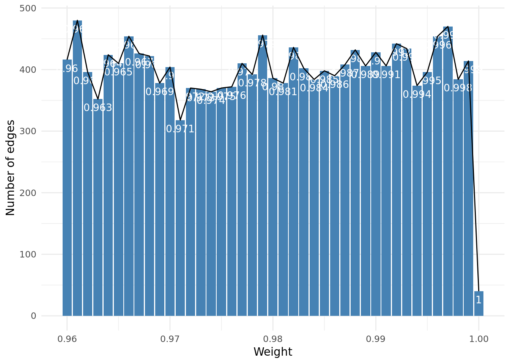

#### Degree distribution of item->similarity->item edges

#### Degree distribution of agent->knows->agent edges

#### Runing time by method 

<table class="table table-condensed" style="width: auto !important; ">
 <thead>
  <tr>
   <th style="text-align:left;">   </th>
   <th style="text-align:left;"> key </th>
   <th style="text-align:right;"> doc_count </th>
   <th style="text-align:right;"> sum_wallTime_ms.value </th>
   <th style="text-align:left;"> avg_wallTime_ms.value </th>
   <th style="text-align:left;"> includedInTotal </th>
  </tr>
 </thead>
<tbody>
  <tr>
   <td style="text-align:left;"> 2 </td>
   <td style="text-align:left;"> cycleSearch </td>
   <td style="text-align:right;"> 3,600 </td>
   <td style="text-align:right;"> 23,467 </td>
   <td style="text-align:left;"> 6.51861111111111 </td>
   <td style="text-align:left;"> Yes </td>
  </tr>
  <tr>
   <td style="text-align:left;"> 3 </td>
   <td style="text-align:left;"> getWorks </td>
   <td style="text-align:right;"> 3,600 </td>
   <td style="text-align:right;"> 90,602 </td>
   <td style="text-align:left;"> 25.1672222222222 </td>
   <td style="text-align:left;"> No </td>
  </tr>
  <tr>
   <td style="text-align:left;"> 4 </td>
   <td style="text-align:left;"> individualCycleSearch </td>
   <td style="text-align:right;"> 3,600 </td>
   <td style="text-align:right;"> 78 </td>
   <td style="text-align:left;"> 0.0216666666666667 </td>
   <td style="text-align:left;"> Yes </td>
  </tr>
  <tr>
   <td style="text-align:left;"> 6 </td>
   <td style="text-align:left;"> knowsAgent </td>
   <td style="text-align:right;"> 1,201 </td>
   <td style="text-align:right;"> 3,429 </td>
   <td style="text-align:left;"> 2.85512073272273 </td>
   <td style="text-align:left;"> No </td>
  </tr>
  <tr>
   <td style="text-align:left;"> 7 </td>
   <td style="text-align:left;"> addItemToWork </td>
   <td style="text-align:right;"> 440 </td>
   <td style="text-align:right;"> 7,324 </td>
   <td style="text-align:left;"> 16.6454545454545 </td>
   <td style="text-align:left;"> No </td>
  </tr>
  <tr>
   <td style="text-align:left;"> 8 </td>
   <td style="text-align:left;"> ownsWork </td>
   <td style="text-align:right;"> 220 </td>
   <td style="text-align:right;"> 4,592 </td>
   <td style="text-align:left;"> 20.8727272727273 </td>
   <td style="text-align:left;"> No </td>
  </tr>
  <tr>
   <td style="text-align:left;"> 9 </td>
   <td style="text-align:left;"> init </td>
   <td style="text-align:right;"> 203 </td>
   <td style="text-align:right;"> 22,950 </td>
   <td style="text-align:left;"> 113.054187192118 </td>
   <td style="text-align:left;"> No </td>
  </tr>
  <tr>
   <td style="text-align:left;"> 10 </td>
   <td style="text-align:left;"> searchAndConnect </td>
   <td style="text-align:right;"> 201 </td>
   <td style="text-align:right;"> 317,505 </td>
   <td style="text-align:left;"> 1579.62686567164 </td>
   <td style="text-align:left;"> Yes </td>
  </tr>
  <tr>
   <td style="text-align:left;font-weight: bold;"> 1 </td>
   <td style="text-align:left;font-weight: bold;"> Total </td>
   <td style="text-align:right;font-weight: bold;"> 14,601 </td>
   <td style="text-align:right;font-weight: bold;"> 358,007 </td>
   <td style="text-align:left;font-weight: bold;">  </td>
   <td style="text-align:left;font-weight: bold;">  </td>
  </tr>
</tbody>
</table>
####  Found structures 

#####  Cycles 

Number of cycles found:  0 

<button class="btn btn-primary" data-toggle="collapse" data-target="#TCFHUKPKPJ"> Show/Hide foundCycle query </button> 
 
  
     GET /filebeat-*/_search 
              { 
                "query": {
                  "bool": {
                    "must": [
                      { "match_phrase": {
                        "simulationId": "SIM10-14-07-10-RKcFaA--DV"
                        }
                      },
                      { "bool": {
                        "should": [
                          { "match": {
                            "keyword": "foundCycle"
                          }}
                        ]
                      }}
                    ]
                  }
                }
              }
     

#####  Paths 

Number of paths found:  3600 

<button class="btn btn-primary" data-toggle="collapse" data-target="#XCIVTJFCLQ"> Show/Hide foundPath query </button> 
 
  
     GET /filebeat-*/_search 
              { 
                "query": {
                  "bool": {
                    "must": [
                      { "match_phrase": {
                        "simulationId": "SIM10-14-07-10-RKcFaA--DV"
                        }
                      },
                      { "bool": {
                        "should": [
                          { "match": {
                            "keyword": "foundPath"
                          }}
                        ]
                      }}
                    ]
                  }
                }
              }
     

###  SIM10-14-09-44-qLAu7G--CV 

#### simulationParameters 

<table class="table table-condensed" style="width: auto !important; ">
 <thead>
  <tr>
   <th style="text-align:left;"> agentNumber </th>
   <th style="text-align:left;"> similarityConnectThreshold </th>
   <th style="text-align:left;"> graphType </th>
   <th style="text-align:left;"> chainLength </th>
   <th style="text-align:left;"> similaritySearchThreshold </th>
   <th style="text-align:left;"> maxDistance </th>
   <th style="text-align:left;"> randomWorksNumberMultiplier </th>
  </tr>
 </thead>
<tbody>
  <tr>
   <td style="text-align:left;width: 20em; "> 200 </td>
   <td style="text-align:left;width: 15em; "> 0.96 </td>
   <td style="text-align:left;width: 15em; "> random </td>
   <td style="text-align:left;width: 15em; "> 20 </td>
   <td style="text-align:left;width: 15em; "> 1 </td>
   <td style="text-align:left;width: 15em; "> 5 </td>
   <td style="text-align:left;width: 15em; "> 2 </td>
  </tr>
</tbody>
</table>
#### allEdgesByLabel

<table class="table table-condensed" style="width: auto !important; ">
 <thead>
  <tr>
   <th style="text-align:right;"> edges_offers </th>
   <th style="text-align:right;"> edges_similarity </th>
   <th style="text-align:right;"> edges_owns </th>
   <th style="text-align:right;"> edges_demands </th>
   <th style="text-align:right;"> edges_knows </th>
   <th style="text-align:right;"> edges_total </th>
  </tr>
 </thead>
<tbody>
  <tr>
   <td style="text-align:right;width: 5em; "> 420 </td>
   <td style="text-align:right;width: 5em; "> 55,860 </td>
   <td style="text-align:right;width: 5em; "> 420 </td>
   <td style="text-align:right;width: 5em; "> 420 </td>
   <td style="text-align:right;width: 5em; "> 200 </td>
   <td style="text-align:right;width: 5em; "> 57,320 </td>
  </tr>
</tbody>
</table>
#### allVerticesByType

<table class="table table-condensed" style="width: auto !important; ">
 <thead>
  <tr>
   <th style="text-align:right;"> vertices_agent </th>
   <th style="text-align:right;"> vertices_item </th>
   <th style="text-align:right;"> vertices_work </th>
   <th style="text-align:right;"> vertices_total </th>
  </tr>
 </thead>
<tbody>
  <tr>
   <td style="text-align:right;width: 5em; "> 201 </td>
   <td style="text-align:right;width: 5em; "> 840 </td>
   <td style="text-align:right;width: 5em; "> 420 </td>
   <td style="text-align:right;width: 5em; "> 1,461 </td>
  </tr>
</tbody>
</table>
#### distribution of similarityEdgesByWeight

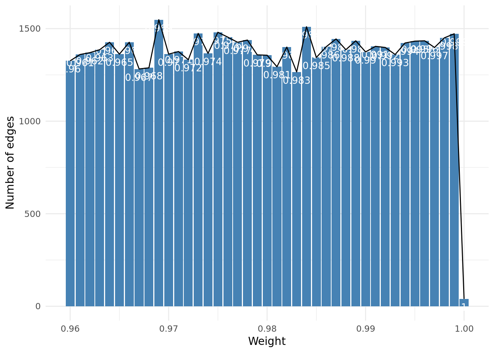

#### Degree distribution of item->similarity->item edges

#### Degree distribution of agent->knows->agent edges

#### Runing time by method 

<table class="table table-condensed" style="width: auto !important; ">
 <thead>
  <tr>
   <th style="text-align:left;"> key </th>
   <th style="text-align:right;"> doc_count </th>
   <th style="text-align:right;"> sum_wallTime_ms.value </th>
   <th style="text-align:left;"> avg_wallTime_ms.value </th>
   <th style="text-align:left;"> includedInTotal </th>
  </tr>
 </thead>
<tbody>
  <tr>
   <td style="text-align:left;"> connectIfSimilar </td>
   <td style="text-align:right;"> 352,380 </td>
   <td style="text-align:right;"> 1,567,271 </td>
   <td style="text-align:left;"> 4.44767296668369 </td>
   <td style="text-align:left;"> No </td>
  </tr>
  <tr>
   <td style="text-align:left;"> existsSimilarity </td>
   <td style="text-align:right;"> 352,380 </td>
   <td style="text-align:right;"> 1,461,138 </td>
   <td style="text-align:left;"> 4.14648390941597 </td>
   <td style="text-align:left;"> No </td>
  </tr>
  <tr>
   <td style="text-align:left;"> similarityEdges </td>
   <td style="text-align:right;"> 352,380 </td>
   <td style="text-align:right;"> 1,444,722 </td>
   <td style="text-align:left;"> 4.09989783756172 </td>
   <td style="text-align:left;"> No </td>
  </tr>
  <tr>
   <td style="text-align:left;"> connect </td>
   <td style="text-align:right;"> 22,775 </td>
   <td style="text-align:right;"> 99,180 </td>
   <td style="text-align:left;"> 4.35477497255763 </td>
   <td style="text-align:left;"> Yes </td>
  </tr>
  <tr>
   <td style="text-align:left;"> connectAllSimilar </td>
   <td style="text-align:right;"> 840 </td>
   <td style="text-align:right;"> 1,571,188 </td>
   <td style="text-align:left;"> 1870.4619047619 </td>
   <td style="text-align:left;"> Yes </td>
  </tr>
  <tr>
   <td style="text-align:left;"> init </td>
   <td style="text-align:right;"> 203 </td>
   <td style="text-align:right;"> 23,474 </td>
   <td style="text-align:left;"> 115.635467980296 </td>
   <td style="text-align:left;"> No </td>
  </tr>
  <tr>
   <td style="text-align:left;font-weight: bold;"> Total </td>
   <td style="text-align:right;font-weight: bold;"> 23,623 </td>
   <td style="text-align:right;font-weight: bold;"> 1,672,309 </td>
   <td style="text-align:left;font-weight: bold;">  </td>
   <td style="text-align:left;font-weight: bold;">  </td>
  </tr>
</tbody>
</table>
####  Found structures 

#####  Cycles 

Number of cycles found:  1 

<button class="btn btn-primary" data-toggle="collapse" data-target="#BEUANGTQHE"> Show/Hide foundCycle query </button> 
 
  
     GET /filebeat-*/_search 
              { 
                "query": {
                  "bool": {
                    "must": [
                      { "match_phrase": {
                        "simulationId": "SIM10-14-09-44-qLAu7G--CV"
                        }
                      },
                      { "bool": {
                        "should": [
                          { "match": {
                            "keyword": "foundCycle"
                          }}
                        ]
                      }}
                    ]
                  }
                }
              }
     

#####  Paths 

Number of paths found:  0 

<button class="btn btn-primary" data-toggle="collapse" data-target="#VOPNAEJUCP"> Show/Hide foundPath query </button> 
 
  
     GET /filebeat-*/_search 
              { 
                "query": {
                  "bool": {
                    "must": [
                      { "match_phrase": {
                        "simulationId": "SIM10-14-09-44-qLAu7G--CV"
                        }
                      },
                      { "bool": {
                        "should": [
                          { "match": {
                            "keyword": "foundPath"
                          }}
                        ]
                      }}
                    ]
                  }
                }
              }
     

###  SIM10-14-09-44-qLAu7G--DV 

#### simulationParameters 

<table class="table table-condensed" style="width: auto !important; ">
 <thead>
  <tr>
   <th style="text-align:left;"> agentNumber </th>
   <th style="text-align:left;"> similarityConnectThreshold </th>
   <th style="text-align:left;"> graphType </th>
   <th style="text-align:left;"> chainLength </th>
   <th style="text-align:left;"> similaritySearchThreshold </th>
   <th style="text-align:left;"> maxDistance </th>
   <th style="text-align:left;"> randomWorksNumberMultiplier </th>
  </tr>
 </thead>
<tbody>
  <tr>
   <td style="text-align:left;width: 20em; "> 200 </td>
   <td style="text-align:left;width: 15em; "> 0.96 </td>
   <td style="text-align:left;width: 15em; "> random </td>
   <td style="text-align:left;width: 15em; "> 20 </td>
   <td style="text-align:left;width: 15em; "> 1 </td>
   <td style="text-align:left;width: 15em; "> 5 </td>
   <td style="text-align:left;width: 15em; "> 2 </td>
  </tr>
</tbody>
</table>
#### allEdgesByLabel

<table class="table table-condensed" style="width: auto !important; ">
 <thead>
  <tr>
   <th style="text-align:right;"> edges_offers </th>
   <th style="text-align:right;"> edges_similarity </th>
   <th style="text-align:right;"> edges_owns </th>
   <th style="text-align:right;"> edges_demands </th>
   <th style="text-align:right;"> edges_knows </th>
   <th style="text-align:right;"> edges_total </th>
  </tr>
 </thead>
<tbody>
  <tr>
   <td style="text-align:right;width: 5em; "> 420 </td>
   <td style="text-align:right;width: 5em; "> 10,310 </td>
   <td style="text-align:right;width: 5em; "> 420 </td>
   <td style="text-align:right;width: 5em; "> 420 </td>
   <td style="text-align:right;width: 5em; "> 200 </td>
   <td style="text-align:right;width: 5em; "> 11,770 </td>
  </tr>
</tbody>
</table>
#### allVerticesByType

<table class="table table-condensed" style="width: auto !important; ">
 <thead>
  <tr>
   <th style="text-align:right;"> vertices_agent </th>
   <th style="text-align:right;"> vertices_item </th>
   <th style="text-align:right;"> vertices_work </th>
   <th style="text-align:right;"> vertices_total </th>
  </tr>
 </thead>
<tbody>
  <tr>
   <td style="text-align:right;width: 5em; "> 201 </td>
   <td style="text-align:right;width: 5em; "> 840 </td>
   <td style="text-align:right;width: 5em; "> 420 </td>
   <td style="text-align:right;width: 5em; "> 1,461 </td>
  </tr>
</tbody>
</table>
#### distribution of similarityEdgesByWeight

#### Degree distribution of item->similarity->item edges

#### Degree distribution of agent->knows->agent edges

#### Runing time by method 

<table class="table table-condensed" style="width: auto !important; ">
 <thead>
  <tr>
   <th style="text-align:left;">   </th>
   <th style="text-align:left;"> key </th>
   <th style="text-align:right;"> doc_count </th>
   <th style="text-align:right;"> sum_wallTime_ms.value </th>
   <th style="text-align:left;"> avg_wallTime_ms.value </th>
   <th style="text-align:left;"> includedInTotal </th>
  </tr>
 </thead>
<tbody>
  <tr>
   <td style="text-align:left;"> 2 </td>
   <td style="text-align:left;"> cycleSearch </td>
   <td style="text-align:right;"> 3,600 </td>
   <td style="text-align:right;"> 22,311 </td>
   <td style="text-align:left;"> 6.1975 </td>
   <td style="text-align:left;"> Yes </td>
  </tr>
  <tr>
   <td style="text-align:left;"> 3 </td>
   <td style="text-align:left;"> getWorks </td>
   <td style="text-align:right;"> 3,600 </td>
   <td style="text-align:right;"> 97,816 </td>
   <td style="text-align:left;"> 27.1711111111111 </td>
   <td style="text-align:left;"> No </td>
  </tr>
  <tr>
   <td style="text-align:left;"> 4 </td>
   <td style="text-align:left;"> individualCycleSearch </td>
   <td style="text-align:right;"> 3,600 </td>
   <td style="text-align:right;"> 76 </td>
   <td style="text-align:left;"> 0.0211111111111111 </td>
   <td style="text-align:left;"> Yes </td>
  </tr>
  <tr>
   <td style="text-align:left;"> 6 </td>
   <td style="text-align:left;"> addItemToWork </td>
   <td style="text-align:right;"> 840 </td>
   <td style="text-align:right;"> 10,447 </td>
   <td style="text-align:left;"> 12.4369047619048 </td>
   <td style="text-align:left;"> No </td>
  </tr>
  <tr>
   <td style="text-align:left;"> 7 </td>
   <td style="text-align:left;"> ownsWork </td>
   <td style="text-align:right;"> 420 </td>
   <td style="text-align:right;"> 5,739 </td>
   <td style="text-align:left;"> 13.6642857142857 </td>
   <td style="text-align:left;"> No </td>
  </tr>
  <tr>
   <td style="text-align:left;"> 8 </td>
   <td style="text-align:left;"> init </td>
   <td style="text-align:right;"> 203 </td>
   <td style="text-align:right;"> 23,586 </td>
   <td style="text-align:left;"> 116.187192118227 </td>
   <td style="text-align:left;"> No </td>
  </tr>
  <tr>
   <td style="text-align:left;"> 9 </td>
   <td style="text-align:left;"> searchAndConnect </td>
   <td style="text-align:right;"> 201 </td>
   <td style="text-align:right;"> 140,302 </td>
   <td style="text-align:left;"> 698.019900497512 </td>
   <td style="text-align:left;"> Yes </td>
  </tr>
  <tr>
   <td style="text-align:left;"> 10 </td>
   <td style="text-align:left;"> knowsAgent </td>
   <td style="text-align:right;"> 200 </td>
   <td style="text-align:right;"> 2,442 </td>
   <td style="text-align:left;"> 12.21 </td>
   <td style="text-align:left;"> No </td>
  </tr>
  <tr>
   <td style="text-align:left;font-weight: bold;"> 1 </td>
   <td style="text-align:left;font-weight: bold;"> Total </td>
   <td style="text-align:right;font-weight: bold;"> 14,601 </td>
   <td style="text-align:right;font-weight: bold;"> 179,981 </td>
   <td style="text-align:left;font-weight: bold;">  </td>
   <td style="text-align:left;font-weight: bold;">  </td>
  </tr>
</tbody>
</table>
####  Found structures 

#####  Cycles 

Number of cycles found:  0 

<button class="btn btn-primary" data-toggle="collapse" data-target="#NXPJLSQTQF"> Show/Hide foundCycle query </button> 
 
  
     GET /filebeat-*/_search 
              { 
                "query": {
                  "bool": {
                    "must": [
                      { "match_phrase": {
                        "simulationId": "SIM10-14-09-44-qLAu7G--DV"
                        }
                      },
                      { "bool": {
                        "should": [
                          { "match": {
                            "keyword": "foundCycle"
                          }}
                        ]
                      }}
                    ]
                  }
                }
              }
     

#####  Paths 

Number of paths found:  3600 

<button class="btn btn-primary" data-toggle="collapse" data-target="#VHIKFTDSXM"> Show/Hide foundPath query </button> 
 
  
     GET /filebeat-*/_search 
              { 
                "query": {
                  "bool": {
                    "must": [
                      { "match_phrase": {
                        "simulationId": "SIM10-14-09-44-qLAu7G--DV"
                        }
                      },
                      { "bool": {
                        "should": [
                          { "match": {
                            "keyword": "foundPath"
                          }}
                        ]
                      }}
                    ]
                  }
                }
              }
     

###  SIM10-14-11-11-eRCoHv--CV 

#### simulationParameters 

<table class="table table-condensed" style="width: auto !important; ">
 <thead>
  <tr>
   <th style="text-align:left;"> agentNumber </th>
   <th style="text-align:left;"> similarityConnectThreshold </th>
   <th style="text-align:left;"> graphType </th>
   <th style="text-align:left;"> chainLength </th>
   <th style="text-align:left;"> similaritySearchThreshold </th>
   <th style="text-align:left;"> maxDistance </th>
   <th style="text-align:left;"> randomWorksNumberMultiplier </th>
  </tr>
 </thead>
<tbody>
  <tr>
   <td style="text-align:left;width: 20em; "> 200 </td>
   <td style="text-align:left;width: 15em; "> 0.96 </td>
   <td style="text-align:left;width: 15em; "> smallWorld </td>
   <td style="text-align:left;width: 15em; "> 20 </td>
   <td style="text-align:left;width: 15em; "> 1 </td>
   <td style="text-align:left;width: 15em; "> 5 </td>
   <td style="text-align:left;width: 15em; "> 2 </td>
  </tr>
</tbody>
</table>
#### allEdgesByLabel

<table class="table table-condensed" style="width: auto !important; ">
 <thead>
  <tr>
   <th style="text-align:right;"> edges_offers </th>
   <th style="text-align:right;"> edges_similarity </th>
   <th style="text-align:right;"> edges_owns </th>
   <th style="text-align:right;"> edges_demands </th>
   <th style="text-align:right;"> edges_knows </th>
   <th style="text-align:right;"> edges_total </th>
  </tr>
 </thead>
<tbody>
  <tr>
   <td style="text-align:right;width: 5em; "> 420 </td>
   <td style="text-align:right;width: 5em; "> 58,668 </td>
   <td style="text-align:right;width: 5em; "> 420 </td>
   <td style="text-align:right;width: 5em; "> 420 </td>
   <td style="text-align:right;width: 5em; "> 1,201 </td>
   <td style="text-align:right;width: 5em; "> 61,129 </td>
  </tr>
</tbody>
</table>
#### allVerticesByType

<table class="table table-condensed" style="width: auto !important; ">
 <thead>
  <tr>
   <th style="text-align:right;"> vertices_agent </th>
   <th style="text-align:right;"> vertices_item </th>
   <th style="text-align:right;"> vertices_work </th>
   <th style="text-align:right;"> vertices_total </th>
  </tr>
 </thead>
<tbody>
  <tr>
   <td style="text-align:right;width: 5em; "> 201 </td>
   <td style="text-align:right;width: 5em; "> 840 </td>
   <td style="text-align:right;width: 5em; "> 420 </td>
   <td style="text-align:right;width: 5em; "> 1,461 </td>
  </tr>
</tbody>
</table>
#### distribution of similarityEdgesByWeight

#### Degree distribution of item->similarity->item edges

#### Degree distribution of agent->knows->agent edges

#### Runing time by method 

<table class="table table-condensed" style="width: auto !important; ">
 <thead>
  <tr>
   <th style="text-align:left;"> key </th>
   <th style="text-align:right;"> doc_count </th>
   <th style="text-align:right;"> sum_wallTime_ms.value </th>
   <th style="text-align:left;"> avg_wallTime_ms.value </th>
   <th style="text-align:left;"> includedInTotal </th>
  </tr>
 </thead>
<tbody>
  <tr>
   <td style="text-align:left;"> connectIfSimilar </td>
   <td style="text-align:right;"> 352,380 </td>
   <td style="text-align:right;"> 1,752,329 </td>
   <td style="text-align:left;"> 4.97283898064589 </td>
   <td style="text-align:left;"> No </td>
  </tr>
  <tr>
   <td style="text-align:left;"> existsSimilarity </td>
   <td style="text-align:right;"> 352,380 </td>
   <td style="text-align:right;"> 1,744,014 </td>
   <td style="text-align:left;"> 4.94924229524945 </td>
   <td style="text-align:left;"> No </td>
  </tr>
  <tr>
   <td style="text-align:left;"> similarityEdges </td>
   <td style="text-align:right;"> 352,380 </td>
   <td style="text-align:right;"> 1,723,304 </td>
   <td style="text-align:left;"> 4.89047051478518 </td>
   <td style="text-align:left;"> No </td>
  </tr>
  <tr>
   <td style="text-align:left;"> connectAllSimilar </td>
   <td style="text-align:right;"> 840 </td>
   <td style="text-align:right;"> 1,755,975 </td>
   <td style="text-align:left;"> 2090.44642857143 </td>
   <td style="text-align:left;"> Yes </td>
  </tr>
  <tr>
   <td style="text-align:left;"> connect </td>
   <td style="text-align:right;"> 255 </td>
   <td style="text-align:right;"> 1,601 </td>
   <td style="text-align:left;"> 6.27843137254902 </td>
   <td style="text-align:left;"> Yes </td>
  </tr>
  <tr>
   <td style="text-align:left;"> init </td>
   <td style="text-align:right;"> 203 </td>
   <td style="text-align:right;"> 22,228 </td>
   <td style="text-align:left;"> 109.497536945813 </td>
   <td style="text-align:left;"> No </td>
  </tr>
  <tr>
   <td style="text-align:left;font-weight: bold;"> Total </td>
   <td style="text-align:right;font-weight: bold;"> 1,103 </td>
   <td style="text-align:right;font-weight: bold;"> 1,759,530 </td>
   <td style="text-align:left;font-weight: bold;">  </td>
   <td style="text-align:left;font-weight: bold;">  </td>
  </tr>
</tbody>
</table>
####  Found structures 

#####  Cycles 

Number of cycles found:  1 

<button class="btn btn-primary" data-toggle="collapse" data-target="#LMRGVRFVDE"> Show/Hide foundCycle query </button> 
 
  
     GET /filebeat-*/_search 
              { 
                "query": {
                  "bool": {
                    "must": [
                      { "match_phrase": {
                        "simulationId": "SIM10-14-11-11-eRCoHv--CV"
                        }
                      },
                      { "bool": {
                        "should": [
                          { "match": {
                            "keyword": "foundCycle"
                          }}
                        ]
                      }}
                    ]
                  }
                }
              }
     

#####  Paths 

Number of paths found:  0 

<button class="btn btn-primary" data-toggle="collapse" data-target="#VOPWJHVRTV"> Show/Hide foundPath query </button> 
 
  
     GET /filebeat-*/_search 
              { 
                "query": {
                  "bool": {
                    "must": [
                      { "match_phrase": {
                        "simulationId": "SIM10-14-11-11-eRCoHv--CV"
                        }
                      },
                      { "bool": {
                        "should": [
                          { "match": {
                            "keyword": "foundPath"
                          }}
                        ]
                      }}
                    ]
                  }
                }
              }
     

###  SIM10-14-11-11-eRCoHv--DV 

#### simulationParameters 

<table class="table table-condensed" style="width: auto !important; ">
 <thead>
  <tr>
   <th style="text-align:left;"> agentNumber </th>
   <th style="text-align:left;"> similarityConnectThreshold </th>
   <th style="text-align:left;"> graphType </th>
   <th style="text-align:left;"> chainLength </th>
   <th style="text-align:left;"> similaritySearchThreshold </th>
   <th style="text-align:left;"> maxDistance </th>
   <th style="text-align:left;"> randomWorksNumberMultiplier </th>
  </tr>
 </thead>
<tbody>
  <tr>
   <td style="text-align:left;width: 20em; "> 200 </td>
   <td style="text-align:left;width: 15em; "> 0.96 </td>
   <td style="text-align:left;width: 15em; "> smallWorld </td>
   <td style="text-align:left;width: 15em; "> 20 </td>
   <td style="text-align:left;width: 15em; "> 1 </td>
   <td style="text-align:left;width: 15em; "> 5 </td>
   <td style="text-align:left;width: 15em; "> 2 </td>
  </tr>
</tbody>
</table>
#### allEdgesByLabel

<table class="table table-condensed" style="width: auto !important; ">
 <thead>
  <tr>
   <th style="text-align:right;"> edges_offers </th>
   <th style="text-align:right;"> edges_similarity </th>
   <th style="text-align:right;"> edges_owns </th>
   <th style="text-align:right;"> edges_demands </th>
   <th style="text-align:right;"> edges_knows </th>
   <th style="text-align:right;"> edges_total </th>
  </tr>
 </thead>
<tbody>
  <tr>
   <td style="text-align:right;width: 5em; "> 420 </td>
   <td style="text-align:right;width: 5em; "> 58,158 </td>
   <td style="text-align:right;width: 5em; "> 420 </td>
   <td style="text-align:right;width: 5em; "> 420 </td>
   <td style="text-align:right;width: 5em; "> 1,201 </td>
   <td style="text-align:right;width: 5em; "> 60,619 </td>
  </tr>
</tbody>
</table>
#### allVerticesByType

<table class="table table-condensed" style="width: auto !important; ">
 <thead>
  <tr>
   <th style="text-align:right;"> vertices_agent </th>
   <th style="text-align:right;"> vertices_item </th>
   <th style="text-align:right;"> vertices_work </th>
   <th style="text-align:right;"> vertices_total </th>
  </tr>
 </thead>
<tbody>
  <tr>
   <td style="text-align:right;width: 5em; "> 201 </td>
   <td style="text-align:right;width: 5em; "> 840 </td>
   <td style="text-align:right;width: 5em; "> 420 </td>
   <td style="text-align:right;width: 5em; "> 1,461 </td>
  </tr>
</tbody>
</table>
#### distribution of similarityEdgesByWeight

#### Degree distribution of item->similarity->item edges

#### Degree distribution of agent->knows->agent edges

#### Runing time by method 

<table class="table table-condensed" style="width: auto !important; ">
 <thead>
  <tr>
   <th style="text-align:left;">   </th>
   <th style="text-align:left;"> key </th>
   <th style="text-align:right;"> doc_count </th>
   <th style="text-align:right;"> sum_wallTime_ms.value </th>
   <th style="text-align:left;"> avg_wallTime_ms.value </th>
   <th style="text-align:left;"> includedInTotal </th>
  </tr>
 </thead>
<tbody>
  <tr>
   <td style="text-align:left;"> 2 </td>
   <td style="text-align:left;"> cycleSearch </td>
   <td style="text-align:right;"> 3,600 </td>
   <td style="text-align:right;"> 29,784 </td>
   <td style="text-align:left;"> 8.27333333333333 </td>
   <td style="text-align:left;"> Yes </td>
  </tr>
  <tr>
   <td style="text-align:left;"> 3 </td>
   <td style="text-align:left;"> getWorks </td>
   <td style="text-align:right;"> 3,600 </td>
   <td style="text-align:right;"> 113,284 </td>
   <td style="text-align:left;"> 31.4677777777778 </td>
   <td style="text-align:left;"> No </td>
  </tr>
  <tr>
   <td style="text-align:left;"> 4 </td>
   <td style="text-align:left;"> individualCycleSearch </td>
   <td style="text-align:right;"> 3,600 </td>
   <td style="text-align:right;"> 83 </td>
   <td style="text-align:left;"> 0.0230555555555556 </td>
   <td style="text-align:left;"> Yes </td>
  </tr>
  <tr>
   <td style="text-align:left;"> 6 </td>
   <td style="text-align:left;"> knowsAgent </td>
   <td style="text-align:right;"> 1,201 </td>
   <td style="text-align:right;"> 3,288 </td>
   <td style="text-align:left;"> 2.73771856786012 </td>
   <td style="text-align:left;"> No </td>
  </tr>
  <tr>
   <td style="text-align:left;"> 7 </td>
   <td style="text-align:left;"> addItemToWork </td>
   <td style="text-align:right;"> 840 </td>
   <td style="text-align:right;"> 10,266 </td>
   <td style="text-align:left;"> 12.2214285714286 </td>
   <td style="text-align:left;"> No </td>
  </tr>
  <tr>
   <td style="text-align:left;"> 8 </td>
   <td style="text-align:left;"> ownsWork </td>
   <td style="text-align:right;"> 420 </td>
   <td style="text-align:right;"> 4,236 </td>
   <td style="text-align:left;"> 10.0857142857143 </td>
   <td style="text-align:left;"> No </td>
  </tr>
  <tr>
   <td style="text-align:left;"> 9 </td>
   <td style="text-align:left;"> init </td>
   <td style="text-align:right;"> 203 </td>
   <td style="text-align:right;"> 25,416 </td>
   <td style="text-align:left;"> 125.20197044335 </td>
   <td style="text-align:left;"> No </td>
  </tr>
  <tr>
   <td style="text-align:left;"> 10 </td>
   <td style="text-align:left;"> searchAndConnect </td>
   <td style="text-align:right;"> 201 </td>
   <td style="text-align:right;"> 819,086 </td>
   <td style="text-align:left;"> 4075.05472636816 </td>
   <td style="text-align:left;"> Yes </td>
  </tr>
  <tr>
   <td style="text-align:left;font-weight: bold;"> 1 </td>
   <td style="text-align:left;font-weight: bold;"> Total </td>
   <td style="text-align:right;font-weight: bold;"> 14,601 </td>
   <td style="text-align:right;font-weight: bold;"> 873,716 </td>
   <td style="text-align:left;font-weight: bold;">  </td>
   <td style="text-align:left;font-weight: bold;">  </td>
  </tr>
</tbody>
</table>
####  Found structures 

#####  Cycles 

Number of cycles found:  0 

<button class="btn btn-primary" data-toggle="collapse" data-target="#WPWRELZHRN"> Show/Hide foundCycle query </button> 
 
  
     GET /filebeat-*/_search 
              { 
                "query": {
                  "bool": {
                    "must": [
                      { "match_phrase": {
                        "simulationId": "SIM10-14-11-11-eRCoHv--DV"
                        }
                      },
                      { "bool": {
                        "should": [
                          { "match": {
                            "keyword": "foundCycle"
                          }}
                        ]
                      }}
                    ]
                  }
                }
              }
     

#####  Paths 

Number of paths found:  3600 

<button class="btn btn-primary" data-toggle="collapse" data-target="#GLBMHHAEQA"> Show/Hide foundPath query </button> 
 
  
     GET /filebeat-*/_search 
              { 
                "query": {
                  "bool": {
                    "must": [
                      { "match_phrase": {
                        "simulationId": "SIM10-14-11-11-eRCoHv--DV"
                        }
                      },
                      { "bool": {
                        "should": [
                          { "match": {
                            "keyword": "foundPath"
                          }}
                        ]
                      }}
                    ]
                  }
                }
              }
     

###  SIM10-13-07-21-XRUh73--CV 

#### simulationParameters 

<table class="table table-condensed" style="width: auto !important; ">
 <thead>
  <tr>
   <th style="text-align:left;"> agentNumber </th>
   <th style="text-align:left;"> similarityConnectThreshold </th>
   <th style="text-align:left;"> graphType </th>
   <th style="text-align:left;"> chainLength </th>
   <th style="text-align:left;"> similaritySearchThreshold </th>
   <th style="text-align:left;"> maxDistance </th>
   <th style="text-align:left;"> randomWorksNumberMultiplier </th>
  </tr>
 </thead>
<tbody>
  <tr>
   <td style="text-align:left;width: 20em; "> 200 </td>
   <td style="text-align:left;width: 15em; "> 0.96 </td>
   <td style="text-align:left;width: 15em; "> random </td>
   <td style="text-align:left;width: 15em; "> 5 </td>
   <td style="text-align:left;width: 15em; "> 1 </td>
   <td style="text-align:left;width: 15em; "> 10 </td>
   <td style="text-align:left;width: 15em; "> 1 </td>
  </tr>
</tbody>
</table>
#### allEdgesByLabel

<table class="table table-condensed" style="width: auto !important; ">
 <thead>
  <tr>
   <th style="text-align:right;"> edges_offers </th>
   <th style="text-align:right;"> edges_similarity </th>
   <th style="text-align:right;"> edges_owns </th>
   <th style="text-align:right;"> edges_demands </th>
   <th style="text-align:right;"> edges_knows </th>
   <th style="text-align:right;"> edges_total </th>
  </tr>
 </thead>
<tbody>
  <tr>
   <td style="text-align:right;width: 5em; "> 205 </td>
   <td style="text-align:right;width: 5em; "> 13,834 </td>
   <td style="text-align:right;width: 5em; "> 205 </td>
   <td style="text-align:right;width: 5em; "> 205 </td>
   <td style="text-align:right;width: 5em; "> 200 </td>
   <td style="text-align:right;width: 5em; "> 14,649 </td>
  </tr>
</tbody>
</table>
#### allVerticesByType

<table class="table table-condensed" style="width: auto !important; ">
 <thead>
  <tr>
   <th style="text-align:right;"> vertices_agent </th>
   <th style="text-align:right;"> vertices_item </th>
   <th style="text-align:right;"> vertices_work </th>
   <th style="text-align:right;"> vertices_total </th>
  </tr>
 </thead>
<tbody>
  <tr>
   <td style="text-align:right;width: 5em; "> 201 </td>
   <td style="text-align:right;width: 5em; "> 410 </td>
   <td style="text-align:right;width: 5em; "> 205 </td>
   <td style="text-align:right;width: 5em; "> 816 </td>
  </tr>
</tbody>
</table>
#### distribution of similarityEdgesByWeight

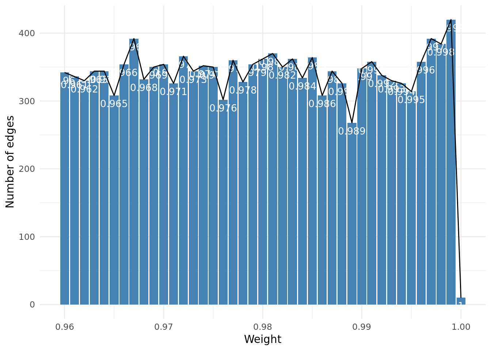

#### Degree distribution of item->similarity->item edges

#### Degree distribution of agent->knows->agent edges

#### Runing time by method 

<table class="table table-condensed" style="width: auto !important; ">
 <thead>
  <tr>
   <th style="text-align:left;"> key </th>
   <th style="text-align:right;"> doc_count </th>
   <th style="text-align:right;"> sum_wallTime_ms.value </th>
   <th style="text-align:left;"> avg_wallTime_ms.value </th>
   <th style="text-align:left;"> includedInTotal </th>
  </tr>
 </thead>
<tbody>
  <tr>
   <td style="text-align:left;"> connectIfSimilar </td>
   <td style="text-align:right;"> 83,845 </td>
   <td style="text-align:right;"> 247,138 </td>
   <td style="text-align:left;"> 2.94755799391735 </td>
   <td style="text-align:left;"> No </td>
  </tr>
  <tr>
   <td style="text-align:left;"> existsSimilarity </td>
   <td style="text-align:right;"> 83,845 </td>
   <td style="text-align:right;"> 242,800 </td>
   <td style="text-align:left;"> 2.89581966724313 </td>
   <td style="text-align:left;"> No </td>
  </tr>
  <tr>
   <td style="text-align:left;"> similarityEdges </td>
   <td style="text-align:right;"> 83,845 </td>
   <td style="text-align:right;"> 239,558 </td>
   <td style="text-align:left;"> 2.85715308008826 </td>
   <td style="text-align:left;"> No </td>
  </tr>
  <tr>
   <td style="text-align:left;"> connect </td>
   <td style="text-align:right;"> 850 </td>
   <td style="text-align:right;"> 2,819 </td>
   <td style="text-align:left;"> 3.31647058823529 </td>
   <td style="text-align:left;"> Yes </td>
  </tr>
  <tr>
   <td style="text-align:left;"> connectAllSimilar </td>
   <td style="text-align:right;"> 410 </td>
   <td style="text-align:right;"> 247,901 </td>
   <td style="text-align:left;"> 604.636585365854 </td>
   <td style="text-align:left;"> Yes </td>
  </tr>
  <tr>
   <td style="text-align:left;"> init </td>
   <td style="text-align:right;"> 203 </td>
   <td style="text-align:right;"> 17,681 </td>
   <td style="text-align:left;"> 87.0985221674877 </td>
   <td style="text-align:left;"> No </td>
  </tr>
  <tr>
   <td style="text-align:left;font-weight: bold;"> Total </td>
   <td style="text-align:right;font-weight: bold;"> 1,268 </td>
   <td style="text-align:right;font-weight: bold;"> 251,415 </td>
   <td style="text-align:left;font-weight: bold;">  </td>
   <td style="text-align:left;font-weight: bold;">  </td>
  </tr>
</tbody>
</table>
####  Found structures 

#####  Cycles 

Number of cycles found:  1 

<button class="btn btn-primary" data-toggle="collapse" data-target="#PPZTQEYTZD"> Show/Hide foundCycle query </button> 
 
  
     GET /filebeat-*/_search 
              { 
                "query": {
                  "bool": {
                    "must": [
                      { "match_phrase": {
                        "simulationId": "SIM10-13-07-21-XRUh73--CV"
                        }
                      },
                      { "bool": {
                        "should": [
                          { "match": {
                            "keyword": "foundCycle"
                          }}
                        ]
                      }}
                    ]
                  }
                }
              }
     

#####  Paths 

Number of paths found:  0 

<button class="btn btn-primary" data-toggle="collapse" data-target="#JHLPURRMLB"> Show/Hide foundPath query </button> 
 
  
     GET /filebeat-*/_search 
              { 
                "query": {
                  "bool": {
                    "must": [
                      { "match_phrase": {
                        "simulationId": "SIM10-13-07-21-XRUh73--CV"
                        }
                      },
                      { "bool": {
                        "should": [
                          { "match": {
                            "keyword": "foundPath"
                          }}
                        ]
                      }}
                    ]
                  }
                }
              }
     

###  SIM10-13-07-21-XRUh73--DV 

#### simulationParameters 

<table class="table table-condensed" style="width: auto !important; ">
 <thead>
  <tr>
   <th style="text-align:left;"> agentNumber </th>
   <th style="text-align:left;"> similarityConnectThreshold </th>
   <th style="text-align:left;"> graphType </th>
   <th style="text-align:left;"> chainLength </th>
   <th style="text-align:left;"> similaritySearchThreshold </th>
   <th style="text-align:left;"> maxDistance </th>
   <th style="text-align:left;"> randomWorksNumberMultiplier </th>
  </tr>
 </thead>
<tbody>
  <tr>
   <td style="text-align:left;width: 20em; "> 200 </td>
   <td style="text-align:left;width: 15em; "> 0.96 </td>
   <td style="text-align:left;width: 15em; "> random </td>
   <td style="text-align:left;width: 15em; "> 5 </td>
   <td style="text-align:left;width: 15em; "> 1 </td>
   <td style="text-align:left;width: 15em; "> 10 </td>
   <td style="text-align:left;width: 15em; "> 1 </td>
  </tr>
</tbody>
</table>
#### allEdgesByLabel

<table class="table table-condensed" style="width: auto !important; ">
 <thead>
  <tr>
   <th style="text-align:right;"> edges_offers </th>
   <th style="text-align:right;"> edges_similarity </th>
   <th style="text-align:right;"> edges_owns </th>
   <th style="text-align:right;"> edges_demands </th>
   <th style="text-align:right;"> edges_knows </th>
   <th style="text-align:right;"> edges_total </th>
  </tr>
 </thead>
<tbody>
  <tr>
   <td style="text-align:right;width: 5em; "> 205 </td>
   <td style="text-align:right;width: 5em; "> 12,134 </td>
   <td style="text-align:right;width: 5em; "> 205 </td>
   <td style="text-align:right;width: 5em; "> 205 </td>
   <td style="text-align:right;width: 5em; "> 200 </td>
   <td style="text-align:right;width: 5em; "> 12,949 </td>
  </tr>
</tbody>
</table>
#### allVerticesByType

<table class="table table-condensed" style="width: auto !important; ">
 <thead>
  <tr>
   <th style="text-align:right;"> vertices_agent </th>
   <th style="text-align:right;"> vertices_item </th>
   <th style="text-align:right;"> vertices_work </th>
   <th style="text-align:right;"> vertices_total </th>
  </tr>
 </thead>
<tbody>
  <tr>
   <td style="text-align:right;width: 5em; "> 201 </td>
   <td style="text-align:right;width: 5em; "> 410 </td>
   <td style="text-align:right;width: 5em; "> 205 </td>
   <td style="text-align:right;width: 5em; "> 816 </td>
  </tr>
</tbody>
</table>
#### distribution of similarityEdgesByWeight

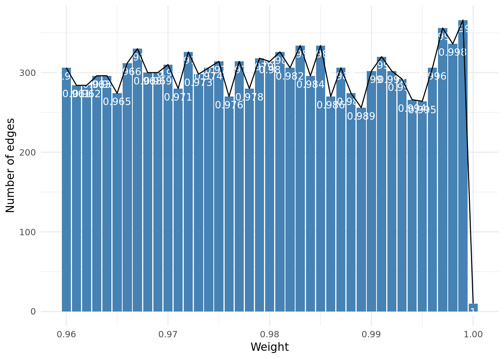

#### Degree distribution of item->similarity->item edges

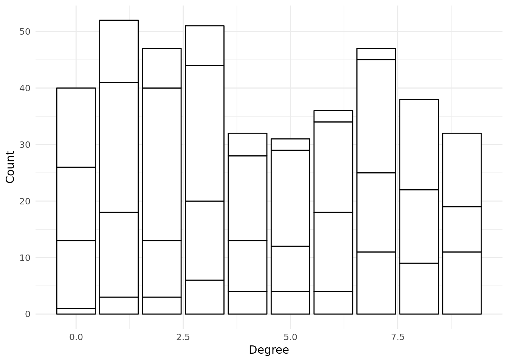

#### Degree distribution of agent->knows->agent edges

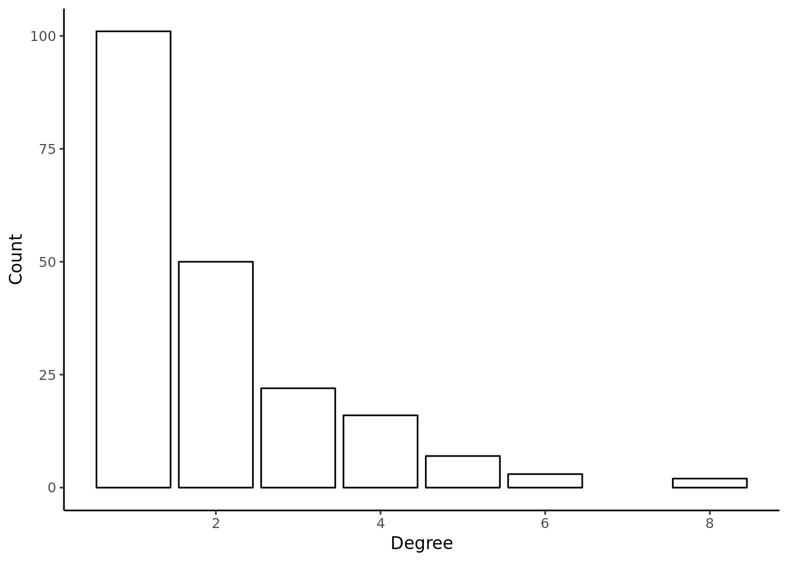

#### Runing time by method 

<table class="table table-condensed" style="width: auto !important; ">
 <thead>
  <tr>
   <th style="text-align:left;">   </th>
   <th style="text-align:left;"> key </th>
   <th style="text-align:right;"> doc_count </th>
   <th style="text-align:right;"> sum_wallTime_ms.value </th>
   <th style="text-align:left;"> avg_wallTime_ms.value </th>
   <th style="text-align:left;"> includedInTotal </th>
  </tr>
 </thead>
<tbody>
  <tr>
   <td style="text-align:left;"> 1 </td>
   <td style="text-align:left;"> addItemToWork </td>
   <td style="text-align:right;"> 410 </td>
   <td style="text-align:right;"> 7,399 </td>
   <td style="text-align:left;"> 18.0463414634146 </td>
   <td style="text-align:left;"> No </td>
  </tr>
  <tr>
   <td style="text-align:left;"> 2 </td>
   <td style="text-align:left;"> ownsWork </td>
   <td style="text-align:right;"> 205 </td>
   <td style="text-align:right;"> 5,871 </td>
   <td style="text-align:left;"> 28.6390243902439 </td>
   <td style="text-align:left;"> No </td>
  </tr>
  <tr>
   <td style="text-align:left;"> 3 </td>
   <td style="text-align:left;"> init </td>
   <td style="text-align:right;"> 203 </td>
   <td style="text-align:right;"> 18,584 </td>
   <td style="text-align:left;"> 91.5467980295567 </td>
   <td style="text-align:left;"> No </td>
  </tr>
  <tr>
   <td style="text-align:left;"> 4 </td>
   <td style="text-align:left;"> searchAndConnect </td>
   <td style="text-align:right;"> 201 </td>
   <td style="text-align:right;"> 163,346 </td>
   <td style="text-align:left;"> 812.666666666667 </td>
   <td style="text-align:left;"> Yes </td>
  </tr>
  <tr>
   <td style="text-align:left;"> 5 </td>
   <td style="text-align:left;"> knowsAgent </td>
   <td style="text-align:right;"> 200 </td>
   <td style="text-align:right;"> 755 </td>
   <td style="text-align:left;"> 3.775 </td>
   <td style="text-align:left;"> No </td>
  </tr>
  <tr>
   <td style="text-align:left;"> 6 </td>
   <td style="text-align:left;"> getWorksItems </td>
   <td style="text-align:right;"> 8 </td>
   <td style="text-align:right;"> 13 </td>
   <td style="text-align:left;"> 1.625 </td>
   <td style="text-align:left;"> Yes </td>
  </tr>
  <tr>
   <td style="text-align:left;"> 8 </td>
   <td style="text-align:left;"> cycleSearch </td>
   <td style="text-align:right;"> 5 </td>
   <td style="text-align:right;"> 1,495 </td>
   <td style="text-align:left;"> 299 </td>
   <td style="text-align:left;"> Yes </td>
  </tr>
  <tr>
   <td style="text-align:left;"> 10 </td>
   <td style="text-align:left;"> getWorks </td>
   <td style="text-align:right;"> 5 </td>
   <td style="text-align:right;"> 926 </td>
   <td style="text-align:left;"> 185.2 </td>
   <td style="text-align:left;"> No </td>
  </tr>
  <tr>
   <td style="text-align:left;font-weight: bold;"> 11 </td>
   <td style="text-align:left;font-weight: bold;"> Total </td>
   <td style="text-align:right;font-weight: bold;"> 224 </td>
   <td style="text-align:right;font-weight: bold;"> 166,706 </td>
   <td style="text-align:left;font-weight: bold;">  </td>
   <td style="text-align:left;font-weight: bold;">  </td>
  </tr>
</tbody>
</table>
####  Found structures 

#####  Cycles 

Number of cycles found:  4 

<button class="btn btn-primary" data-toggle="collapse" data-target="#HUDQXSWKNZ"> Show/Hide foundCycle query </button> 
 
  
     GET /filebeat-*/_search 
              { 
                "query": {
                  "bool": {
                    "must": [
                      { "match_phrase": {
                        "simulationId": "SIM10-13-07-21-XRUh73--DV"
                        }
                      },
                      { "bool": {
                        "should": [
                          { "match": {
                            "keyword": "foundCycle"
                          }}
                        ]
                      }}
                    ]
                  }
                }
              }
     

#####  Paths 

Number of paths found:  1 

<button class="btn btn-primary" data-toggle="collapse" data-target="#ARKRGIGQMN"> Show/Hide foundPath query </button> 
 
  
     GET /filebeat-*/_search 
              { 
                "query": {
                  "bool": {
                    "must": [
                      { "match_phrase": {
                        "simulationId": "SIM10-13-07-21-XRUh73--DV"
                        }
                      },
                      { "bool": {
                        "should": [
                          { "match": {
                            "keyword": "foundPath"
                          }}
                        ]
                      }}
                    ]
                  }
                }
              }
     

###  SIM10-13-07-26-ArzZyr--CV 

#### simulationParameters 

<table class="table table-condensed" style="width: auto !important; ">
 <thead>
  <tr>
   <th style="text-align:left;"> agentNumber </th>
   <th style="text-align:left;"> similarityConnectThreshold </th>
   <th style="text-align:left;"> graphType </th>
   <th style="text-align:left;"> chainLength </th>
   <th style="text-align:left;"> similaritySearchThreshold </th>
   <th style="text-align:left;"> maxDistance </th>
   <th style="text-align:left;"> randomWorksNumberMultiplier </th>
  </tr>
 </thead>
<tbody>
  <tr>
   <td style="text-align:left;width: 20em; "> 200 </td>
   <td style="text-align:left;width: 15em; "> 0.96 </td>
   <td style="text-align:left;width: 15em; "> smallWorld </td>
   <td style="text-align:left;width: 15em; "> 5 </td>
   <td style="text-align:left;width: 15em; "> 1 </td>
   <td style="text-align:left;width: 15em; "> 10 </td>
   <td style="text-align:left;width: 15em; "> 1 </td>
  </tr>
</tbody>
</table>
#### allEdgesByLabel

<table class="table table-condensed" style="width: auto !important; ">
 <thead>
  <tr>
   <th style="text-align:right;"> edges_offers </th>
   <th style="text-align:right;"> edges_similarity </th>
   <th style="text-align:right;"> edges_owns </th>
   <th style="text-align:right;"> edges_demands </th>
   <th style="text-align:right;"> edges_knows </th>
   <th style="text-align:right;"> edges_total </th>
  </tr>
 </thead>
<tbody>
  <tr>
   <td style="text-align:right;width: 5em; "> 205 </td>
   <td style="text-align:right;width: 5em; "> 14,084 </td>
   <td style="text-align:right;width: 5em; "> 205 </td>
   <td style="text-align:right;width: 5em; "> 205 </td>
   <td style="text-align:right;width: 5em; "> 1,201 </td>
   <td style="text-align:right;width: 5em; "> 15,900 </td>
  </tr>
</tbody>
</table>
#### allVerticesByType

<table class="table table-condensed" style="width: auto !important; ">
 <thead>
  <tr>
   <th style="text-align:right;"> vertices_agent </th>
   <th style="text-align:right;"> vertices_item </th>
   <th style="text-align:right;"> vertices_work </th>
   <th style="text-align:right;"> vertices_total </th>
  </tr>
 </thead>
<tbody>
  <tr>
   <td style="text-align:right;width: 5em; "> 201 </td>
   <td style="text-align:right;width: 5em; "> 410 </td>
   <td style="text-align:right;width: 5em; "> 205 </td>
   <td style="text-align:right;width: 5em; "> 816 </td>
  </tr>
</tbody>
</table>
#### distribution of similarityEdgesByWeight

#### Degree distribution of item->similarity->item edges

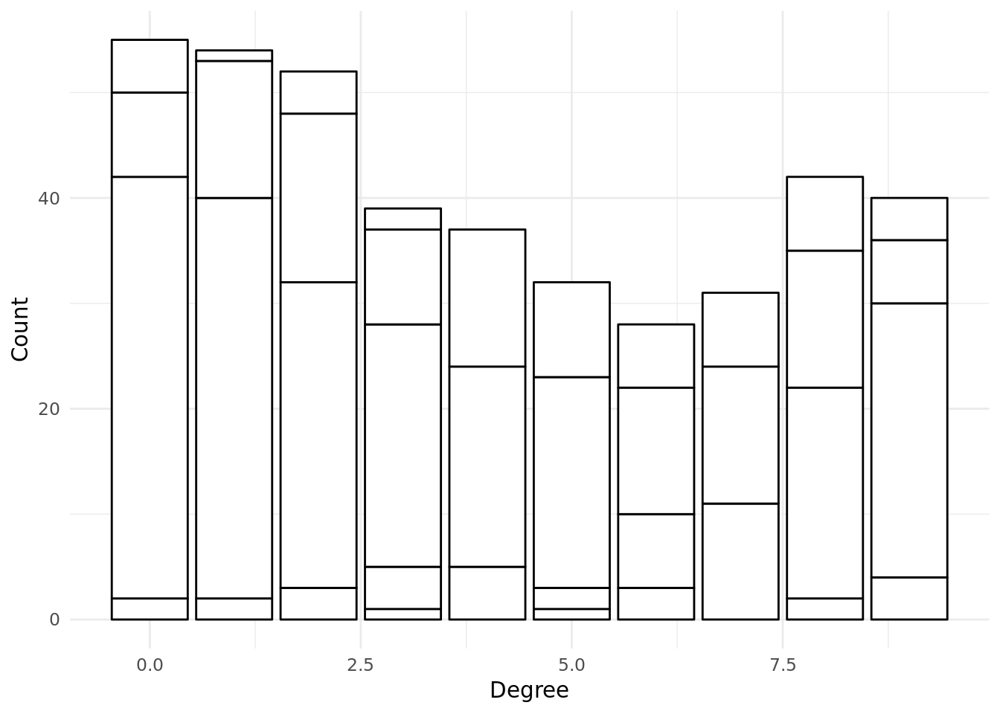

#### Degree distribution of agent->knows->agent edges

#### Runing time by method 

<table class="table table-condensed" style="width: auto !important; ">
 <thead>
  <tr>
   <th style="text-align:left;"> key </th>
   <th style="text-align:right;"> doc_count </th>
   <th style="text-align:right;"> sum_wallTime_ms.value </th>
   <th style="text-align:left;"> avg_wallTime_ms.value </th>
   <th style="text-align:left;"> includedInTotal </th>
  </tr>
 </thead>
<tbody>
  <tr>
   <td style="text-align:left;"> connectIfSimilar </td>
   <td style="text-align:right;"> 83,845 </td>
   <td style="text-align:right;"> 251,087 </td>
   <td style="text-align:left;"> 2.99465680720377 </td>
   <td style="text-align:left;"> No </td>
  </tr>
  <tr>
   <td style="text-align:left;"> existsSimilarity </td>
   <td style="text-align:right;"> 83,845 </td>
   <td style="text-align:right;"> 249,556 </td>
   <td style="text-align:left;"> 2.97639692289343 </td>
   <td style="text-align:left;"> No </td>
  </tr>
  <tr>
   <td style="text-align:left;"> similarityEdges </td>
   <td style="text-align:right;"> 83,845 </td>
   <td style="text-align:right;"> 246,405 </td>
   <td style="text-align:left;"> 2.9388156717753 </td>
   <td style="text-align:left;"> No </td>
  </tr>
  <tr>
   <td style="text-align:left;"> connectAllSimilar </td>
   <td style="text-align:right;"> 410 </td>
   <td style="text-align:right;"> 251,870 </td>
   <td style="text-align:left;"> 614.317073170732 </td>
   <td style="text-align:left;"> Yes </td>
  </tr>
  <tr>
   <td style="text-align:left;"> init </td>
   <td style="text-align:right;"> 203 </td>
   <td style="text-align:right;"> 17,410 </td>
   <td style="text-align:left;"> 85.7635467980296 </td>
   <td style="text-align:left;"> No </td>
  </tr>
  <tr>
   <td style="text-align:left;"> connect </td>
   <td style="text-align:right;"> 49 </td>
   <td style="text-align:right;"> 100 </td>
   <td style="text-align:left;"> 2.04081632653061 </td>
   <td style="text-align:left;"> Yes </td>
  </tr>
  <tr>
   <td style="text-align:left;font-weight: bold;"> Total </td>
   <td style="text-align:right;font-weight: bold;"> 467 </td>
   <td style="text-align:right;font-weight: bold;"> 252,764 </td>
   <td style="text-align:left;font-weight: bold;">  </td>
   <td style="text-align:left;font-weight: bold;">  </td>
  </tr>
</tbody>
</table>
####  Found structures 

#####  Cycles 

Number of cycles found:  1 

<button class="btn btn-primary" data-toggle="collapse" data-target="#MJWCBVMZKC"> Show/Hide foundCycle query </button> 
 
  
     GET /filebeat-*/_search 
              { 
                "query": {
                  "bool": {
                    "must": [
                      { "match_phrase": {
                        "simulationId": "SIM10-13-07-26-ArzZyr--CV"
                        }
                      },
                      { "bool": {
                        "should": [
                          { "match": {
                            "keyword": "foundCycle"
                          }}
                        ]
                      }}
                    ]
                  }
                }
              }
     

#####  Paths 

Number of paths found:  0 

<button class="btn btn-primary" data-toggle="collapse" data-target="#CPUOFPHIBB"> Show/Hide foundPath query </button> 
 
  
     GET /filebeat-*/_search 
              { 
                "query": {
                  "bool": {
                    "must": [
                      { "match_phrase": {
                        "simulationId": "SIM10-13-07-26-ArzZyr--CV"
                        }
                      },
                      { "bool": {
                        "should": [
                          { "match": {
                            "keyword": "foundPath"
                          }}
                        ]
                      }}
                    ]
                  }
                }
              }
     

###  SIM10-13-07-26-ArzZyr--DV 

#### simulationParameters 

<table class="table table-condensed" style="width: auto !important; ">
 <thead>
  <tr>
   <th style="text-align:left;"> agentNumber </th>
   <th style="text-align:left;"> similarityConnectThreshold </th>
   <th style="text-align:left;"> graphType </th>
   <th style="text-align:left;"> chainLength </th>
   <th style="text-align:left;"> similaritySearchThreshold </th>
   <th style="text-align:left;"> maxDistance </th>
   <th style="text-align:left;"> randomWorksNumberMultiplier </th>
  </tr>
 </thead>
<tbody>
  <tr>
   <td style="text-align:left;width: 20em; "> 200 </td>
   <td style="text-align:left;width: 15em; "> 0.96 </td>
   <td style="text-align:left;width: 15em; "> smallWorld </td>
   <td style="text-align:left;width: 15em; "> 5 </td>
   <td style="text-align:left;width: 15em; "> 1 </td>
   <td style="text-align:left;width: 15em; "> 10 </td>
   <td style="text-align:left;width: 15em; "> 1 </td>
  </tr>
</tbody>
</table>
#### allEdgesByLabel

<table class="table table-condensed" style="width: auto !important; ">
 <thead>
  <tr>
   <th style="text-align:right;"> edges_offers </th>
   <th style="text-align:right;"> edges_similarity </th>
   <th style="text-align:right;"> edges_owns </th>
   <th style="text-align:right;"> edges_demands </th>
   <th style="text-align:right;"> edges_knows </th>
   <th style="text-align:right;"> edges_total </th>
  </tr>
 </thead>
<tbody>
  <tr>
   <td style="text-align:right;width: 5em; "> 205 </td>
   <td style="text-align:right;width: 5em; "> 13,986 </td>
   <td style="text-align:right;width: 5em; "> 205 </td>
   <td style="text-align:right;width: 5em; "> 205 </td>
   <td style="text-align:right;width: 5em; "> 1,201 </td>
   <td style="text-align:right;width: 5em; "> 15,802 </td>
  </tr>
</tbody>
</table>
#### allVerticesByType

<table class="table table-condensed" style="width: auto !important; ">
 <thead>
  <tr>
   <th style="text-align:right;"> vertices_agent </th>
   <th style="text-align:right;"> vertices_item </th>
   <th style="text-align:right;"> vertices_work </th>
   <th style="text-align:right;"> vertices_total </th>
  </tr>
 </thead>
<tbody>
  <tr>
   <td style="text-align:right;width: 5em; "> 201 </td>
   <td style="text-align:right;width: 5em; "> 410 </td>
   <td style="text-align:right;width: 5em; "> 205 </td>
   <td style="text-align:right;width: 5em; "> 816 </td>
  </tr>
</tbody>
</table>
#### distribution of similarityEdgesByWeight

#### Degree distribution of item->similarity->item edges

#### Degree distribution of agent->knows->agent edges

#### Runing time by method 

<table class="table table-condensed" style="width: auto !important; ">
 <thead>
  <tr>
   <th style="text-align:left;">   </th>
   <th style="text-align:left;"> key </th>
   <th style="text-align:right;"> doc_count </th>
   <th style="text-align:right;"> sum_wallTime_ms.value </th>
   <th style="text-align:left;"> avg_wallTime_ms.value </th>
   <th style="text-align:left;"> includedInTotal </th>
  </tr>
 </thead>
<tbody>
  <tr>
   <td style="text-align:left;"> 1 </td>
   <td style="text-align:left;"> knowsAgent </td>
   <td style="text-align:right;"> 1,201 </td>
   <td style="text-align:right;"> 2,866 </td>
   <td style="text-align:left;"> 2.38634471273938 </td>
   <td style="text-align:left;"> No </td>
  </tr>
  <tr>
   <td style="text-align:left;"> 2 </td>
   <td style="text-align:left;"> addItemToWork </td>
   <td style="text-align:right;"> 410 </td>
   <td style="text-align:right;"> 4,475 </td>
   <td style="text-align:left;"> 10.9146341463415 </td>
   <td style="text-align:left;"> No </td>
  </tr>
  <tr>
   <td style="text-align:left;"> 3 </td>
   <td style="text-align:left;"> ownsWork </td>
   <td style="text-align:right;"> 205 </td>
   <td style="text-align:right;"> 3,288 </td>
   <td style="text-align:left;"> 16.0390243902439 </td>
   <td style="text-align:left;"> No </td>
  </tr>
  <tr>
   <td style="text-align:left;"> 4 </td>
   <td style="text-align:left;"> init </td>
   <td style="text-align:right;"> 203 </td>
   <td style="text-align:right;"> 18,549 </td>
   <td style="text-align:left;"> 91.3743842364532 </td>
   <td style="text-align:left;"> No </td>
  </tr>
  <tr>
   <td style="text-align:left;"> 5 </td>
   <td style="text-align:left;"> searchAndConnect </td>
   <td style="text-align:right;"> 201 </td>
   <td style="text-align:right;"> 211,636 </td>
   <td style="text-align:left;"> 1052.91542288557 </td>
   <td style="text-align:left;"> Yes </td>
  </tr>
  <tr>
   <td style="text-align:left;"> 6 </td>
   <td style="text-align:left;"> getWorksItems </td>
   <td style="text-align:right;"> 8 </td>
   <td style="text-align:right;"> 21 </td>
   <td style="text-align:left;"> 2.625 </td>
   <td style="text-align:left;"> Yes </td>
  </tr>
  <tr>
   <td style="text-align:left;"> 8 </td>
   <td style="text-align:left;"> cycleSearch </td>
   <td style="text-align:right;"> 5 </td>
   <td style="text-align:right;"> 2,855 </td>
   <td style="text-align:left;"> 571 </td>
   <td style="text-align:left;"> Yes </td>
  </tr>
  <tr>
   <td style="text-align:left;"> 10 </td>
   <td style="text-align:left;"> getWorks </td>
   <td style="text-align:right;"> 5 </td>
   <td style="text-align:right;"> 1,547 </td>
   <td style="text-align:left;"> 309.4 </td>
   <td style="text-align:left;"> No </td>
  </tr>
  <tr>
   <td style="text-align:left;font-weight: bold;"> 11 </td>
   <td style="text-align:left;font-weight: bold;"> Total </td>
   <td style="text-align:right;font-weight: bold;"> 224 </td>
   <td style="text-align:right;font-weight: bold;"> 218,477 </td>
   <td style="text-align:left;font-weight: bold;">  </td>
   <td style="text-align:left;font-weight: bold;">  </td>
  </tr>
</tbody>
</table>
####  Found structures 

#####  Cycles 

Number of cycles found:  4 

<button class="btn btn-primary" data-toggle="collapse" data-target="#GITKMJLLVL"> Show/Hide foundCycle query </button> 
 
  
     GET /filebeat-*/_search 
              { 
                "query": {
                  "bool": {
                    "must": [
                      { "match_phrase": {
                        "simulationId": "SIM10-13-07-26-ArzZyr--DV"
                        }
                      },
                      { "bool": {
                        "should": [
                          { "match": {
                            "keyword": "foundCycle"
                          }}
                        ]
                      }}
                    ]
                  }
                }
              }
     

#####  Paths 

Number of paths found:  1 

<button class="btn btn-primary" data-toggle="collapse" data-target="#PQNUIVQACL"> Show/Hide foundPath query </button> 
 
  
     GET /filebeat-*/_search 
              { 
                "query": {
                  "bool": {
                    "must": [
                      { "match_phrase": {
                        "simulationId": "SIM10-13-07-26-ArzZyr--DV"
                        }
                      },
                      { "bool": {
                        "should": [
                          { "match": {
                            "keyword": "foundPath"
                          }}
                        ]
                      }}
                    ]
                  }
                }
              }
     

###  SIM10-13-09-24-iAKJVd--CV 

#### simulationParameters 

<table class="table table-condensed" style="width: auto !important; ">
 <thead>
  <tr>
   <th style="text-align:left;"> agentNumber </th>
   <th style="text-align:left;"> similarityConnectThreshold </th>
   <th style="text-align:left;"> graphType </th>
   <th style="text-align:left;"> chainLength </th>
   <th style="text-align:left;"> similaritySearchThreshold </th>
   <th style="text-align:left;"> maxDistance </th>
   <th style="text-align:left;"> randomWorksNumberMultiplier </th>
  </tr>
 </thead>
<tbody>
  <tr>
   <td style="text-align:left;width: 20em; "> 200 </td>
   <td style="text-align:left;width: 15em; "> 0.96 </td>
   <td style="text-align:left;width: 15em; "> random </td>
   <td style="text-align:left;width: 15em; "> 5 </td>
   <td style="text-align:left;width: 15em; "> 1 </td>
   <td style="text-align:left;width: 15em; "> 10 </td>
   <td style="text-align:left;width: 15em; "> 2 </td>
  </tr>
</tbody>
</table>
#### allEdgesByLabel

<table class="table table-condensed" style="width: auto !important; ">
 <thead>
  <tr>
   <th style="text-align:right;"> edges_offers </th>
   <th style="text-align:right;"> edges_similarity </th>
   <th style="text-align:right;"> edges_owns </th>
   <th style="text-align:right;"> edges_demands </th>
   <th style="text-align:right;"> edges_knows </th>
   <th style="text-align:right;"> edges_total </th>
  </tr>
 </thead>
<tbody>
  <tr>
   <td style="text-align:right;width: 5em; "> 405 </td>
   <td style="text-align:right;width: 5em; "> 53,414 </td>
   <td style="text-align:right;width: 5em; "> 405 </td>
   <td style="text-align:right;width: 5em; "> 405 </td>
   <td style="text-align:right;width: 5em; "> 200 </td>
   <td style="text-align:right;width: 5em; "> 54,829 </td>
  </tr>
</tbody>
</table>
#### allVerticesByType

<table class="table table-condensed" style="width: auto !important; ">
 <thead>
  <tr>
   <th style="text-align:right;"> vertices_agent </th>
   <th style="text-align:right;"> vertices_item </th>
   <th style="text-align:right;"> vertices_work </th>
   <th style="text-align:right;"> vertices_total </th>
  </tr>
 </thead>
<tbody>
  <tr>
   <td style="text-align:right;width: 5em; "> 201 </td>
   <td style="text-align:right;width: 5em; "> 810 </td>
   <td style="text-align:right;width: 5em; "> 405 </td>
   <td style="text-align:right;width: 5em; "> 1,416 </td>
  </tr>
</tbody>
</table>
#### distribution of similarityEdgesByWeight

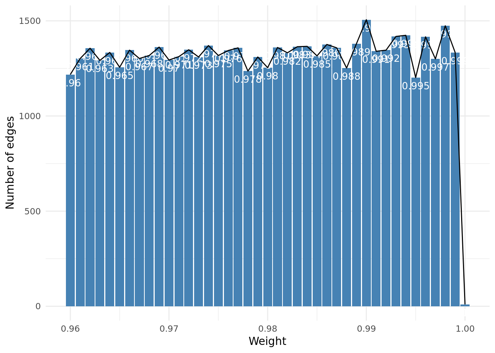

#### Degree distribution of item->similarity->item edges

#### Degree distribution of agent->knows->agent edges

#### Runing time by method 

<table class="table table-condensed" style="width: auto !important; ">
 <thead>
  <tr>
   <th style="text-align:left;"> key </th>
   <th style="text-align:right;"> doc_count </th>
   <th style="text-align:right;"> sum_wallTime_ms.value </th>
   <th style="text-align:left;"> avg_wallTime_ms.value </th>
   <th style="text-align:left;"> includedInTotal </th>
  </tr>
 </thead>
<tbody>
  <tr>
   <td style="text-align:left;"> connectIfSimilar </td>
   <td style="text-align:right;"> 327,645 </td>
   <td style="text-align:right;"> 1,288,062 </td>
   <td style="text-align:left;"> 3.93127317676143 </td>
   <td style="text-align:left;"> No </td>
  </tr>
  <tr>
   <td style="text-align:left;"> existsSimilarity </td>
   <td style="text-align:right;"> 327,645 </td>
   <td style="text-align:right;"> 1,264,258 </td>
   <td style="text-align:left;"> 3.85862137374292 </td>
   <td style="text-align:left;"> No </td>
  </tr>
  <tr>
   <td style="text-align:left;"> similarityEdges </td>
   <td style="text-align:right;"> 327,645 </td>
   <td style="text-align:right;"> 1,247,065 </td>
   <td style="text-align:left;"> 3.80614689679379 </td>
   <td style="text-align:left;"> No </td>
  </tr>
  <tr>
   <td style="text-align:left;"> connect </td>
   <td style="text-align:right;"> 4,676 </td>
   <td style="text-align:right;"> 17,769 </td>
   <td style="text-align:left;"> 3.80004277159966 </td>
   <td style="text-align:left;"> Yes </td>
  </tr>
  <tr>
   <td style="text-align:left;"> connectAllSimilar </td>
   <td style="text-align:right;"> 810 </td>
   <td style="text-align:right;"> 1,291,335 </td>
   <td style="text-align:left;"> 1594.24074074074 </td>
   <td style="text-align:left;"> Yes </td>
  </tr>
  <tr>
   <td style="text-align:left;"> init </td>
   <td style="text-align:right;"> 203 </td>
   <td style="text-align:right;"> 19,024 </td>
   <td style="text-align:left;"> 93.7142857142857 </td>
   <td style="text-align:left;"> No </td>
  </tr>
  <tr>
   <td style="text-align:left;font-weight: bold;"> Total </td>
   <td style="text-align:right;font-weight: bold;"> 5,494 </td>
   <td style="text-align:right;font-weight: bold;"> 1,310,620 </td>
   <td style="text-align:left;font-weight: bold;">  </td>
   <td style="text-align:left;font-weight: bold;">  </td>
  </tr>
</tbody>
</table>
####  Found structures 

#####  Cycles 

Number of cycles found:  1 

<button class="btn btn-primary" data-toggle="collapse" data-target="#TXONFWZMAW"> Show/Hide foundCycle query </button> 
 
  
     GET /filebeat-*/_search 
              { 
                "query": {
                  "bool": {
                    "must": [
                      { "match_phrase": {
                        "simulationId": "SIM10-13-09-24-iAKJVd--CV"
                        }
                      },
                      { "bool": {
                        "should": [
                          { "match": {
                            "keyword": "foundCycle"
                          }}
                        ]
                      }}
                    ]
                  }
                }
              }
     

#####  Paths 

Number of paths found:  0 

<button class="btn btn-primary" data-toggle="collapse" data-target="#PLUCXGBHAR"> Show/Hide foundPath query </button> 
 
  
     GET /filebeat-*/_search 
              { 
                "query": {
                  "bool": {
                    "must": [
                      { "match_phrase": {
                        "simulationId": "SIM10-13-09-24-iAKJVd--CV"
                        }
                      },
                      { "bool": {
                        "should": [
                          { "match": {
                            "keyword": "foundPath"
                          }}
                        ]
                      }}
                    ]
                  }
                }
              }
     

###  SIM10-13-09-24-iAKJVd--DV 

#### simulationParameters 

<table class="table table-condensed" style="width: auto !important; ">
 <thead>
  <tr>
   <th style="text-align:left;"> agentNumber </th>
   <th style="text-align:left;"> similarityConnectThreshold </th>
   <th style="text-align:left;"> graphType </th>
   <th style="text-align:left;"> chainLength </th>
   <th style="text-align:left;"> similaritySearchThreshold </th>
   <th style="text-align:left;"> maxDistance </th>
   <th style="text-align:left;"> randomWorksNumberMultiplier </th>
  </tr>
 </thead>
<tbody>
  <tr>
   <td style="text-align:left;width: 20em; "> 200 </td>
   <td style="text-align:left;width: 15em; "> 0.96 </td>
   <td style="text-align:left;width: 15em; "> random </td>
   <td style="text-align:left;width: 15em; "> 5 </td>
   <td style="text-align:left;width: 15em; "> 1 </td>
   <td style="text-align:left;width: 15em; "> 10 </td>
   <td style="text-align:left;width: 15em; "> 2 </td>
  </tr>
</tbody>
</table>
#### allEdgesByLabel

<table class="table table-condensed" style="width: auto !important; ">
 <thead>
  <tr>
   <th style="text-align:right;"> edges_offers </th>
   <th style="text-align:right;"> edges_similarity </th>
   <th style="text-align:right;"> edges_owns </th>
   <th style="text-align:right;"> edges_demands </th>
   <th style="text-align:right;"> edges_knows </th>
   <th style="text-align:right;"> edges_total </th>
  </tr>
 </thead>
<tbody>
  <tr>
   <td style="text-align:right;width: 5em; "> 405 </td>
   <td style="text-align:right;width: 5em; "> 44,062 </td>
   <td style="text-align:right;width: 5em; "> 405 </td>
   <td style="text-align:right;width: 5em; "> 405 </td>
   <td style="text-align:right;width: 5em; "> 200 </td>
   <td style="text-align:right;width: 5em; "> 45,477 </td>
  </tr>
</tbody>
</table>
#### allVerticesByType

<table class="table table-condensed" style="width: auto !important; ">
 <thead>
  <tr>
   <th style="text-align:right;"> vertices_agent </th>
   <th style="text-align:right;"> vertices_item </th>
   <th style="text-align:right;"> vertices_work </th>
   <th style="text-align:right;"> vertices_total </th>
  </tr>
 </thead>
<tbody>
  <tr>
   <td style="text-align:right;width: 5em; "> 201 </td>
   <td style="text-align:right;width: 5em; "> 810 </td>
   <td style="text-align:right;width: 5em; "> 405 </td>
   <td style="text-align:right;width: 5em; "> 1,416 </td>
  </tr>
</tbody>
</table>
#### distribution of similarityEdgesByWeight

#### Degree distribution of item->similarity->item edges

#### Degree distribution of agent->knows->agent edges

#### Runing time by method 

<table class="table table-condensed" style="width: auto !important; ">
 <thead>
  <tr>
   <th style="text-align:left;">   </th>
   <th style="text-align:left;"> key </th>
   <th style="text-align:right;"> doc_count </th>
   <th style="text-align:right;"> sum_wallTime_ms.value </th>
   <th style="text-align:left;"> avg_wallTime_ms.value </th>
   <th style="text-align:left;"> includedInTotal </th>
  </tr>
 </thead>
<tbody>
  <tr>
   <td style="text-align:left;"> 2 </td>
   <td style="text-align:left;"> cycleSearch </td>
   <td style="text-align:right;"> 3,600 </td>
   <td style="text-align:right;"> 20,583 </td>
   <td style="text-align:left;"> 5.7175 </td>
   <td style="text-align:left;"> Yes </td>
  </tr>
  <tr>
   <td style="text-align:left;"> 3 </td>
   <td style="text-align:left;"> getWorks </td>
   <td style="text-align:right;"> 3,600 </td>
   <td style="text-align:right;"> 67,777 </td>
   <td style="text-align:left;"> 18.8269444444444 </td>
   <td style="text-align:left;"> No </td>
  </tr>
  <tr>
   <td style="text-align:left;"> 4 </td>
   <td style="text-align:left;"> individualCycleSearch </td>
   <td style="text-align:right;"> 3,600 </td>
   <td style="text-align:right;"> 75 </td>
   <td style="text-align:left;"> 0.0208333333333333 </td>
   <td style="text-align:left;"> Yes </td>
  </tr>
  <tr>
   <td style="text-align:left;"> 6 </td>
   <td style="text-align:left;"> addItemToWork </td>
   <td style="text-align:right;"> 810 </td>
   <td style="text-align:right;"> 12,369 </td>
   <td style="text-align:left;"> 15.2703703703704 </td>
   <td style="text-align:left;"> No </td>
  </tr>
  <tr>
   <td style="text-align:left;"> 7 </td>
   <td style="text-align:left;"> ownsWork </td>
   <td style="text-align:right;"> 405 </td>
   <td style="text-align:right;"> 7,517 </td>
   <td style="text-align:left;"> 18.5604938271605 </td>
   <td style="text-align:left;"> No </td>
  </tr>
  <tr>
   <td style="text-align:left;"> 8 </td>
   <td style="text-align:left;"> init </td>
   <td style="text-align:right;"> 203 </td>
   <td style="text-align:right;"> 19,723 </td>
   <td style="text-align:left;"> 97.1576354679803 </td>
   <td style="text-align:left;"> No </td>
  </tr>
  <tr>
   <td style="text-align:left;"> 9 </td>
   <td style="text-align:left;"> searchAndConnect </td>
   <td style="text-align:right;"> 201 </td>
   <td style="text-align:right;"> 466,665 </td>
   <td style="text-align:left;"> 2321.71641791045 </td>
   <td style="text-align:left;"> Yes </td>
  </tr>
  <tr>
   <td style="text-align:left;"> 10 </td>
   <td style="text-align:left;"> knowsAgent </td>
   <td style="text-align:right;"> 200 </td>
   <td style="text-align:right;"> 1,456 </td>
   <td style="text-align:left;"> 7.28 </td>
   <td style="text-align:left;"> No </td>
  </tr>
  <tr>
   <td style="text-align:left;font-weight: bold;"> 1 </td>
   <td style="text-align:left;font-weight: bold;"> Total </td>
   <td style="text-align:right;font-weight: bold;"> 14,601 </td>
   <td style="text-align:right;font-weight: bold;"> 504,907 </td>
   <td style="text-align:left;font-weight: bold;">  </td>
   <td style="text-align:left;font-weight: bold;">  </td>
  </tr>
</tbody>
</table>
####  Found structures 

#####  Cycles 

Number of cycles found:  0 

<button class="btn btn-primary" data-toggle="collapse" data-target="#OTGMGCUIBE"> Show/Hide foundCycle query </button> 
 
  
     GET /filebeat-*/_search 
              { 
                "query": {
                  "bool": {
                    "must": [
                      { "match_phrase": {
                        "simulationId": "SIM10-13-09-24-iAKJVd--DV"
                        }
                      },
                      { "bool": {
                        "should": [
                          { "match": {
                            "keyword": "foundCycle"
                          }}
                        ]
                      }}
                    ]
                  }
                }
              }
     

#####  Paths 

Number of paths found:  3600 

<button class="btn btn-primary" data-toggle="collapse" data-target="#GJFBUBRSEN"> Show/Hide foundPath query </button> 
 
  
     GET /filebeat-*/_search 
              { 
                "query": {
                  "bool": {
                    "must": [
                      { "match_phrase": {
                        "simulationId": "SIM10-13-09-24-iAKJVd--DV"
                        }
                      },
                      { "bool": {
                        "should": [
                          { "match": {
                            "keyword": "foundPath"
                          }}
                        ]
                      }}
                    ]
                  }
                }
              }
     

###  SIM10-13-10-47-Y6sG6y--CV 

#### simulationParameters 

<table class="table table-condensed" style="width: auto !important; ">
 <thead>
  <tr>
   <th style="text-align:left;"> agentNumber </th>
   <th style="text-align:left;"> similarityConnectThreshold </th>
   <th style="text-align:left;"> graphType </th>
   <th style="text-align:left;"> chainLength </th>
   <th style="text-align:left;"> similaritySearchThreshold </th>
   <th style="text-align:left;"> maxDistance </th>
   <th style="text-align:left;"> randomWorksNumberMultiplier </th>
  </tr>
 </thead>
<tbody>
  <tr>
   <td style="text-align:left;width: 20em; "> 200 </td>
   <td style="text-align:left;width: 15em; "> 0.96 </td>
   <td style="text-align:left;width: 15em; "> smallWorld </td>
   <td style="text-align:left;width: 15em; "> 5 </td>
   <td style="text-align:left;width: 15em; "> 1 </td>
   <td style="text-align:left;width: 15em; "> 10 </td>
   <td style="text-align:left;width: 15em; "> 2 </td>
  </tr>
</tbody>
</table>
#### allEdgesByLabel

<table class="table table-condensed" style="width: auto !important; ">
 <thead>
  <tr>
   <th style="text-align:right;"> edges_offers </th>
   <th style="text-align:right;"> edges_similarity </th>
   <th style="text-align:right;"> edges_owns </th>
   <th style="text-align:right;"> edges_demands </th>
   <th style="text-align:right;"> edges_knows </th>
   <th style="text-align:right;"> edges_total </th>
  </tr>
 </thead>
<tbody>
  <tr>
   <td style="text-align:right;width: 5em; "> 405 </td>
   <td style="text-align:right;width: 5em; "> 54,284 </td>
   <td style="text-align:right;width: 5em; "> 405 </td>
   <td style="text-align:right;width: 5em; "> 405 </td>
   <td style="text-align:right;width: 5em; "> 1,201 </td>
   <td style="text-align:right;width: 5em; "> 56,700 </td>
  </tr>
</tbody>
</table>
#### allVerticesByType

<table class="table table-condensed" style="width: auto !important; ">
 <thead>
  <tr>
   <th style="text-align:right;"> vertices_agent </th>
   <th style="text-align:right;"> vertices_item </th>
   <th style="text-align:right;"> vertices_work </th>
   <th style="text-align:right;"> vertices_total </th>
  </tr>
 </thead>
<tbody>
  <tr>
   <td style="text-align:right;width: 5em; "> 201 </td>
   <td style="text-align:right;width: 5em; "> 810 </td>
   <td style="text-align:right;width: 5em; "> 405 </td>
   <td style="text-align:right;width: 5em; "> 1,416 </td>
  </tr>
</tbody>
</table>
#### distribution of similarityEdgesByWeight

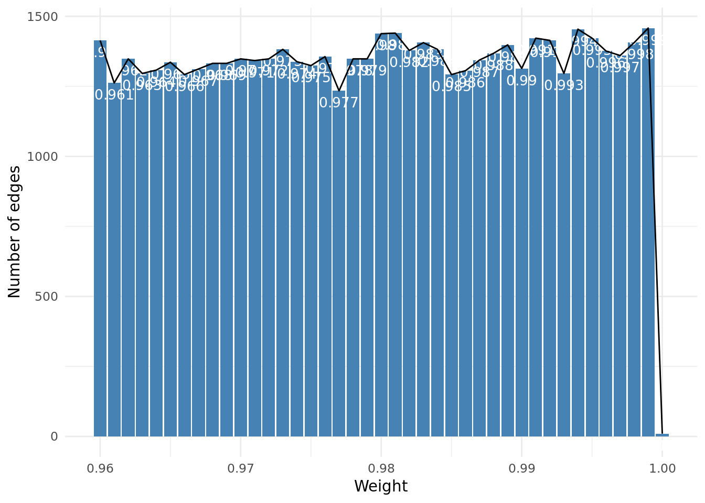

#### Degree distribution of item->similarity->item edges

#### Degree distribution of agent->knows->agent edges

#### Runing time by method 

<table class="table table-condensed" style="width: auto !important; ">
 <thead>
  <tr>
   <th style="text-align:left;"> key </th>
   <th style="text-align:right;"> doc_count </th>
   <th style="text-align:right;"> sum_wallTime_ms.value </th>
   <th style="text-align:left;"> avg_wallTime_ms.value </th>
   <th style="text-align:left;"> includedInTotal </th>
  </tr>
 </thead>
<tbody>
  <tr>
   <td style="text-align:left;"> connectIfSimilar </td>
   <td style="text-align:right;"> 327,645 </td>
   <td style="text-align:right;"> 1,332,956 </td>
   <td style="text-align:left;"> 4.06829342733751 </td>
   <td style="text-align:left;"> No </td>
  </tr>
  <tr>
   <td style="text-align:left;"> existsSimilarity </td>
   <td style="text-align:right;"> 327,645 </td>
   <td style="text-align:right;"> 1,326,343 </td>
   <td style="text-align:left;"> 4.04810999710052 </td>
   <td style="text-align:left;"> No </td>
  </tr>
  <tr>
   <td style="text-align:left;"> similarityEdges </td>
   <td style="text-align:right;"> 327,645 </td>
   <td style="text-align:right;"> 1,308,367 </td>
   <td style="text-align:left;"> 3.99324573852798 </td>
   <td style="text-align:left;"> No </td>
  </tr>
  <tr>
   <td style="text-align:left;"> connectAllSimilar </td>
   <td style="text-align:right;"> 810 </td>
   <td style="text-align:right;"> 1,336,120 </td>
   <td style="text-align:left;"> 1649.53086419753 </td>
   <td style="text-align:left;"> Yes </td>
  </tr>
  <tr>
   <td style="text-align:left;"> init </td>
   <td style="text-align:right;"> 203 </td>
   <td style="text-align:right;"> 19,602 </td>
   <td style="text-align:left;"> 96.5615763546798 </td>
   <td style="text-align:left;"> No </td>
  </tr>
  <tr>
   <td style="text-align:left;"> connect </td>
   <td style="text-align:right;"> 154 </td>
   <td style="text-align:right;"> 432 </td>
   <td style="text-align:left;"> 2.80519480519481 </td>
   <td style="text-align:left;"> Yes </td>
  </tr>
  <tr>
   <td style="text-align:left;font-weight: bold;"> Total </td>
   <td style="text-align:right;font-weight: bold;"> 972 </td>
   <td style="text-align:right;font-weight: bold;"> 1,338,069 </td>
   <td style="text-align:left;font-weight: bold;">  </td>
   <td style="text-align:left;font-weight: bold;">  </td>
  </tr>
</tbody>
</table>
####  Found structures 

#####  Cycles 

Number of cycles found:  1 

<button class="btn btn-primary" data-toggle="collapse" data-target="#QAETDETOMS"> Show/Hide foundCycle query </button> 
 
  
     GET /filebeat-*/_search 
              { 
                "query": {
                  "bool": {
                    "must": [
                      { "match_phrase": {
                        "simulationId": "SIM10-13-10-47-Y6sG6y--CV"
                        }
                      },
                      { "bool": {
                        "should": [
                          { "match": {
                            "keyword": "foundCycle"
                          }}
                        ]
                      }}
                    ]
                  }
                }
              }
     

#####  Paths 

Number of paths found:  0 

<button class="btn btn-primary" data-toggle="collapse" data-target="#PVXKAXOAFW"> Show/Hide foundPath query </button> 
 
  
     GET /filebeat-*/_search 
              { 
                "query": {
                  "bool": {
                    "must": [
                      { "match_phrase": {
                        "simulationId": "SIM10-13-10-47-Y6sG6y--CV"
                        }
                      },
                      { "bool": {
                        "should": [
                          { "match": {
                            "keyword": "foundPath"
                          }}
                        ]
                      }}
                    ]
                  }
                }
              }
     

###  SIM10-13-10-47-Y6sG6y--DV 

#### simulationParameters 

<table class="table table-condensed" style="width: auto !important; ">
 <thead>
  <tr>
   <th style="text-align:left;"> agentNumber </th>
   <th style="text-align:left;"> similarityConnectThreshold </th>
   <th style="text-align:left;"> graphType </th>
   <th style="text-align:left;"> chainLength </th>
   <th style="text-align:left;"> similaritySearchThreshold </th>
   <th style="text-align:left;"> maxDistance </th>
   <th style="text-align:left;"> randomWorksNumberMultiplier </th>
  </tr>
 </thead>
<tbody>
  <tr>
   <td style="text-align:left;width: 20em; "> 200 </td>
   <td style="text-align:left;width: 15em; "> 0.96 </td>
   <td style="text-align:left;width: 15em; "> smallWorld </td>
   <td style="text-align:left;width: 15em; "> 5 </td>
   <td style="text-align:left;width: 15em; "> 1 </td>
   <td style="text-align:left;width: 15em; "> 10 </td>
   <td style="text-align:left;width: 15em; "> 2 </td>
  </tr>
</tbody>
</table>
#### allEdgesByLabel

<table class="table table-condensed" style="width: auto !important; ">
 <thead>
  <tr>
   <th style="text-align:right;"> edges_offers </th>
   <th style="text-align:right;"> edges_similarity </th>
   <th style="text-align:right;"> edges_owns </th>
   <th style="text-align:right;"> edges_demands </th>
   <th style="text-align:right;"> edges_knows </th>
   <th style="text-align:right;"> edges_total </th>
  </tr>
 </thead>
<tbody>
  <tr>
   <td style="text-align:right;width: 5em; "> 405 </td>
   <td style="text-align:right;width: 5em; "> 53,976 </td>
   <td style="text-align:right;width: 5em; "> 405 </td>
   <td style="text-align:right;width: 5em; "> 405 </td>
   <td style="text-align:right;width: 5em; "> 1,201 </td>
   <td style="text-align:right;width: 5em; "> 56,392 </td>
  </tr>
</tbody>
</table>
#### allVerticesByType

<table class="table table-condensed" style="width: auto !important; ">
 <thead>
  <tr>
   <th style="text-align:right;"> vertices_agent </th>
   <th style="text-align:right;"> vertices_item </th>
   <th style="text-align:right;"> vertices_work </th>
   <th style="text-align:right;"> vertices_total </th>
  </tr>
 </thead>
<tbody>
  <tr>
   <td style="text-align:right;width: 5em; "> 201 </td>
   <td style="text-align:right;width: 5em; "> 810 </td>
   <td style="text-align:right;width: 5em; "> 405 </td>
   <td style="text-align:right;width: 5em; "> 1,416 </td>
  </tr>
</tbody>
</table>
#### distribution of similarityEdgesByWeight

#### Degree distribution of item->similarity->item edges

#### Degree distribution of agent->knows->agent edges

#### Runing time by method 

<table class="table table-condensed" style="width: auto !important; ">
 <thead>
  <tr>
   <th style="text-align:left;">   </th>
   <th style="text-align:left;"> key </th>
   <th style="text-align:right;"> doc_count </th>
   <th style="text-align:right;"> sum_wallTime_ms.value </th>
   <th style="text-align:left;"> avg_wallTime_ms.value </th>
   <th style="text-align:left;"> includedInTotal </th>
  </tr>
 </thead>
<tbody>
  <tr>
   <td style="text-align:left;"> 1 </td>
   <td style="text-align:left;"> knowsAgent </td>
   <td style="text-align:right;"> 1,201 </td>
   <td style="text-align:right;"> 3,038 </td>
   <td style="text-align:left;"> 2.52955870108243 </td>
   <td style="text-align:left;"> No </td>
  </tr>
  <tr>
   <td style="text-align:left;"> 2 </td>
   <td style="text-align:left;"> addItemToWork </td>
   <td style="text-align:right;"> 810 </td>
   <td style="text-align:right;"> 13,562 </td>
   <td style="text-align:left;"> 16.7432098765432 </td>
   <td style="text-align:left;"> No </td>
  </tr>
  <tr>
   <td style="text-align:left;"> 3 </td>
   <td style="text-align:left;"> ownsWork </td>
   <td style="text-align:right;"> 405 </td>
   <td style="text-align:right;"> 4,627 </td>
   <td style="text-align:left;"> 11.4246913580247 </td>
   <td style="text-align:left;"> No </td>
  </tr>
  <tr>
   <td style="text-align:left;"> 4 </td>
   <td style="text-align:left;"> init </td>
   <td style="text-align:right;"> 203 </td>
   <td style="text-align:right;"> 20,003 </td>
   <td style="text-align:left;"> 98.5369458128079 </td>
   <td style="text-align:left;"> No </td>
  </tr>
  <tr>
   <td style="text-align:left;"> 5 </td>
   <td style="text-align:left;"> searchAndConnect </td>
   <td style="text-align:right;"> 201 </td>
   <td style="text-align:right;"> 741,694 </td>
   <td style="text-align:left;"> 3690.01990049751 </td>
   <td style="text-align:left;"> Yes </td>
  </tr>
  <tr>
   <td style="text-align:left;"> 7 </td>
   <td style="text-align:left;"> cycleSearch </td>
   <td style="text-align:right;"> 22 </td>
   <td style="text-align:right;"> 3,394 </td>
   <td style="text-align:left;"> 154.272727272727 </td>
   <td style="text-align:left;"> Yes </td>
  </tr>
  <tr>
   <td style="text-align:left;"> 8 </td>
   <td style="text-align:left;"> getWorks </td>
   <td style="text-align:right;"> 22 </td>
   <td style="text-align:right;"> 1,978 </td>
   <td style="text-align:left;"> 89.9090909090909 </td>
   <td style="text-align:left;"> No </td>
  </tr>
  <tr>
   <td style="text-align:left;"> 9 </td>
   <td style="text-align:left;"> individualCycleSearch </td>
   <td style="text-align:right;"> 22 </td>
   <td style="text-align:right;"> 0 </td>
   <td style="text-align:left;"> 0 </td>
   <td style="text-align:left;"> Yes </td>
  </tr>
  <tr>
   <td style="text-align:left;font-weight: bold;"> 11 </td>
   <td style="text-align:left;font-weight: bold;"> Total </td>
   <td style="text-align:right;font-weight: bold;"> 289 </td>
   <td style="text-align:right;font-weight: bold;"> 747,705 </td>
   <td style="text-align:left;font-weight: bold;">  </td>
   <td style="text-align:left;font-weight: bold;">  </td>
  </tr>
</tbody>
</table>
####  Found structures 

#####  Cycles 

Number of cycles found:  22 

<button class="btn btn-primary" data-toggle="collapse" data-target="#YZGQAYTJNB"> Show/Hide foundCycle query </button> 
 
  
     GET /filebeat-*/_search 
              { 
                "query": {
                  "bool": {
                    "must": [
                      { "match_phrase": {
                        "simulationId": "SIM10-13-10-47-Y6sG6y--DV"
                        }
                      },
                      { "bool": {
                        "should": [
                          { "match": {
                            "keyword": "foundCycle"
                          }}
                        ]
                      }}
                    ]
                  }
                }
              }
     

#####  Paths 

Number of paths found:  0 

<button class="btn btn-primary" data-toggle="collapse" data-target="#YQOYEZMPSS"> Show/Hide foundPath query </button> 
 
  
     GET /filebeat-*/_search 
              { 
                "query": {
                  "bool": {
                    "must": [
                      { "match_phrase": {
                        "simulationId": "SIM10-13-10-47-Y6sG6y--DV"
                        }
                      },
                      { "bool": {
                        "should": [
                          { "match": {
                            "keyword": "foundPath"
                          }}
                        ]
                      }}
                    ]
                  }
                }
              }
     

###  SIM10-13-07-31-SaIyTK--CV 

#### simulationParameters 

<table class="table table-condensed" style="width: auto !important; ">
 <thead>
  <tr>
   <th style="text-align:left;"> agentNumber </th>
   <th style="text-align:left;"> similarityConnectThreshold </th>
   <th style="text-align:left;"> graphType </th>
   <th style="text-align:left;"> chainLength </th>
   <th style="text-align:left;"> similaritySearchThreshold </th>
   <th style="text-align:left;"> maxDistance </th>
   <th style="text-align:left;"> randomWorksNumberMultiplier </th>
  </tr>
 </thead>
<tbody>
  <tr>
   <td style="text-align:left;width: 20em; "> 200 </td>
   <td style="text-align:left;width: 15em; "> 0.96 </td>
   <td style="text-align:left;width: 15em; "> random </td>
   <td style="text-align:left;width: 15em; "> 5 </td>
   <td style="text-align:left;width: 15em; "> 1 </td>
   <td style="text-align:left;width: 15em; "> 30 </td>
   <td style="text-align:left;width: 15em; "> 1 </td>
  </tr>
</tbody>
</table>
#### allEdgesByLabel

<table class="table table-condensed" style="width: auto !important; ">
 <thead>
  <tr>
   <th style="text-align:right;"> edges_offers </th>
   <th style="text-align:right;"> edges_similarity </th>
   <th style="text-align:right;"> edges_owns </th>
   <th style="text-align:right;"> edges_demands </th>
   <th style="text-align:right;"> edges_knows </th>
   <th style="text-align:right;"> edges_total </th>
  </tr>
 </thead>
<tbody>
  <tr>
   <td style="text-align:right;width: 5em; "> 205 </td>
   <td style="text-align:right;width: 5em; "> 13,460 </td>
   <td style="text-align:right;width: 5em; "> 205 </td>
   <td style="text-align:right;width: 5em; "> 205 </td>
   <td style="text-align:right;width: 5em; "> 200 </td>
   <td style="text-align:right;width: 5em; "> 14,275 </td>
  </tr>
</tbody>
</table>
#### allVerticesByType

<table class="table table-condensed" style="width: auto !important; ">
 <thead>
  <tr>
   <th style="text-align:right;"> vertices_agent </th>
   <th style="text-align:right;"> vertices_item </th>
   <th style="text-align:right;"> vertices_work </th>
   <th style="text-align:right;"> vertices_total </th>
  </tr>
 </thead>
<tbody>
  <tr>
   <td style="text-align:right;width: 5em; "> 201 </td>
   <td style="text-align:right;width: 5em; "> 410 </td>
   <td style="text-align:right;width: 5em; "> 205 </td>
   <td style="text-align:right;width: 5em; "> 816 </td>
  </tr>
</tbody>
</table>
#### distribution of similarityEdgesByWeight

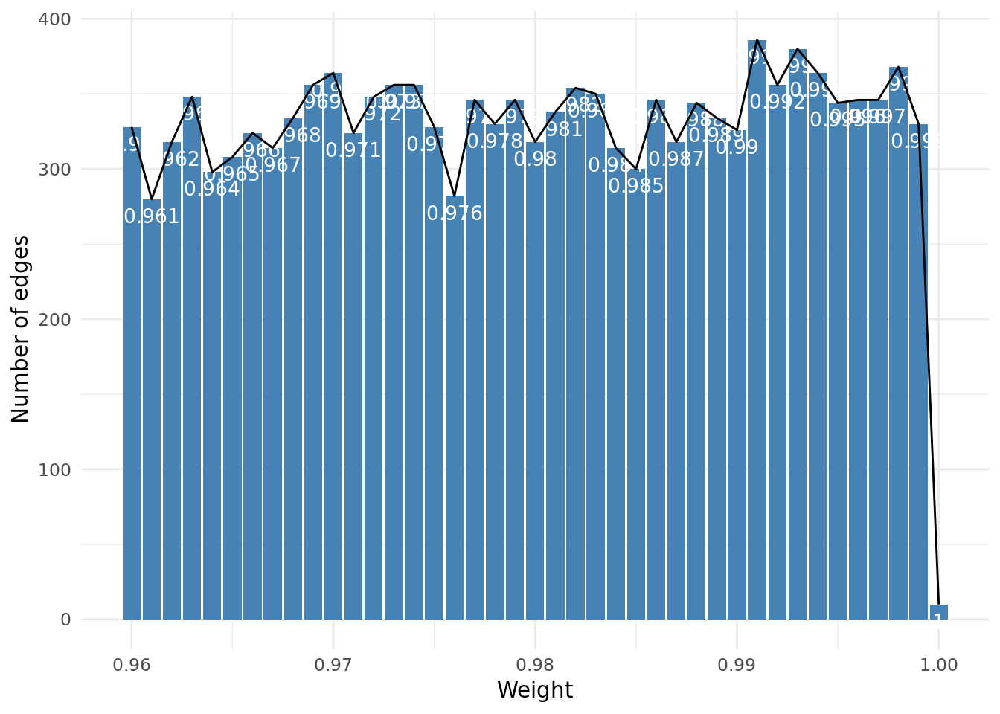

#### Degree distribution of item->similarity->item edges

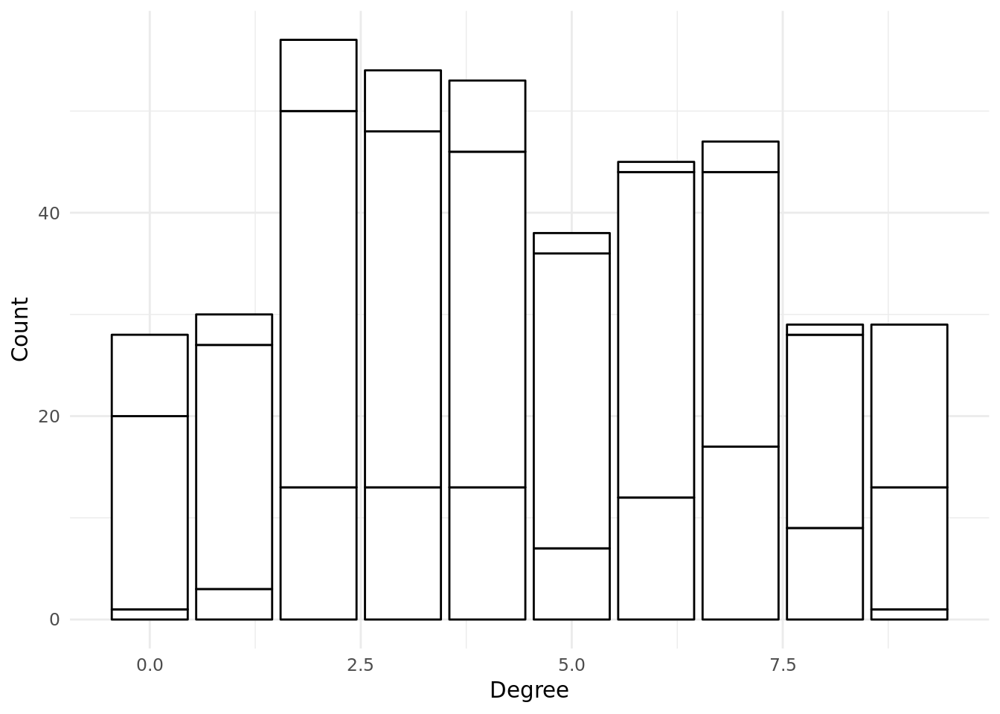

#### Degree distribution of agent->knows->agent edges

#### Runing time by method 

<table class="table table-condensed" style="width: auto !important; ">
 <thead>
  <tr>
   <th style="text-align:left;"> key </th>
   <th style="text-align:right;"> doc_count </th>
   <th style="text-align:right;"> sum_wallTime_ms.value </th>
   <th style="text-align:left;"> avg_wallTime_ms.value </th>
   <th style="text-align:left;"> includedInTotal </th>
  </tr>
 </thead>
<tbody>
  <tr>
   <td style="text-align:left;"> connectIfSimilar </td>
   <td style="text-align:right;"> 83,845 </td>
   <td style="text-align:right;"> 244,794 </td>
   <td style="text-align:left;"> 2.91960164589421 </td>
   <td style="text-align:left;"> No </td>
  </tr>
  <tr>
   <td style="text-align:left;"> existsSimilarity </td>
   <td style="text-align:right;"> 83,845 </td>
   <td style="text-align:right;"> 243,102 </td>
   <td style="text-align:left;"> 2.89942155167273 </td>
   <td style="text-align:left;"> No </td>
  </tr>
  <tr>
   <td style="text-align:left;"> similarityEdges </td>
   <td style="text-align:right;"> 83,845 </td>
   <td style="text-align:right;"> 239,773 </td>
   <td style="text-align:left;"> 2.85971733555966 </td>
   <td style="text-align:left;"> No </td>
  </tr>
  <tr>
   <td style="text-align:left;"> connectAllSimilar </td>
   <td style="text-align:right;"> 410 </td>
   <td style="text-align:right;"> 245,599 </td>
   <td style="text-align:left;"> 599.021951219512 </td>
   <td style="text-align:left;"> Yes </td>
  </tr>
  <tr>
   <td style="text-align:left;"> init </td>
   <td style="text-align:right;"> 203 </td>
   <td style="text-align:right;"> 23,341 </td>
   <td style="text-align:left;"> 114.980295566502 </td>
   <td style="text-align:left;"> No </td>
  </tr>
  <tr>
   <td style="text-align:left;"> connect </td>
   <td style="text-align:right;"> 52 </td>
   <td style="text-align:right;"> 276 </td>
   <td style="text-align:left;"> 5.30769230769231 </td>
   <td style="text-align:left;"> Yes </td>
  </tr>
  <tr>
   <td style="text-align:left;font-weight: bold;"> Total </td>
   <td style="text-align:right;font-weight: bold;"> 470 </td>
   <td style="text-align:right;font-weight: bold;"> 246,682 </td>
   <td style="text-align:left;font-weight: bold;">  </td>
   <td style="text-align:left;font-weight: bold;">  </td>
  </tr>
</tbody>
</table>
####  Found structures 

#####  Cycles 

Number of cycles found:  1 

<button class="btn btn-primary" data-toggle="collapse" data-target="#ZUNFWZEZTB"> Show/Hide foundCycle query </button> 
 
  
     GET /filebeat-*/_search 
              { 
                "query": {
                  "bool": {
                    "must": [
                      { "match_phrase": {
                        "simulationId": "SIM10-13-07-31-SaIyTK--CV"
                        }
                      },
                      { "bool": {
                        "should": [
                          { "match": {
                            "keyword": "foundCycle"
                          }}
                        ]
                      }}
                    ]
                  }
                }
              }
     

#####  Paths 

Number of paths found:  0 

<button class="btn btn-primary" data-toggle="collapse" data-target="#AJSAVXEQIO"> Show/Hide foundPath query </button> 
 
  
     GET /filebeat-*/_search 
              { 
                "query": {
                  "bool": {
                    "must": [
                      { "match_phrase": {
                        "simulationId": "SIM10-13-07-31-SaIyTK--CV"
                        }
                      },
                      { "bool": {
                        "should": [
                          { "match": {
                            "keyword": "foundPath"
                          }}
                        ]
                      }}
                    ]
                  }
                }
              }
     

###  SIM10-13-07-31-SaIyTK--DV 

#### simulationParameters 

<table class="table table-condensed" style="width: auto !important; ">
 <thead>
  <tr>
   <th style="text-align:left;"> agentNumber </th>
   <th style="text-align:left;"> similarityConnectThreshold </th>
   <th style="text-align:left;"> graphType </th>
   <th style="text-align:left;"> chainLength </th>
   <th style="text-align:left;"> similaritySearchThreshold </th>
   <th style="text-align:left;"> maxDistance </th>
   <th style="text-align:left;"> randomWorksNumberMultiplier </th>
  </tr>
 </thead>
<tbody>
  <tr>
   <td style="text-align:left;width: 20em; "> 200 </td>
   <td style="text-align:left;width: 15em; "> 0.96 </td>
   <td style="text-align:left;width: 15em; "> random </td>
   <td style="text-align:left;width: 15em; "> 5 </td>
   <td style="text-align:left;width: 15em; "> 1 </td>
   <td style="text-align:left;width: 15em; "> 30 </td>
   <td style="text-align:left;width: 15em; "> 1 </td>
  </tr>
</tbody>
</table>
#### allEdgesByLabel

<table class="table table-condensed" style="width: auto !important; ">
 <thead>
  <tr>
   <th style="text-align:right;"> edges_offers </th>
   <th style="text-align:right;"> edges_similarity </th>
   <th style="text-align:right;"> edges_owns </th>
   <th style="text-align:right;"> edges_demands </th>
   <th style="text-align:right;"> edges_knows </th>
   <th style="text-align:right;"> edges_total </th>
  </tr>
 </thead>
<tbody>
  <tr>
   <td style="text-align:right;width: 5em; "> 205 </td>
   <td style="text-align:right;width: 5em; "> 13,356 </td>
   <td style="text-align:right;width: 5em; "> 205 </td>
   <td style="text-align:right;width: 5em; "> 205 </td>
   <td style="text-align:right;width: 5em; "> 200 </td>
   <td style="text-align:right;width: 5em; "> 14,171 </td>
  </tr>
</tbody>
</table>
#### allVerticesByType

<table class="table table-condensed" style="width: auto !important; ">
 <thead>
  <tr>
   <th style="text-align:right;"> vertices_agent </th>
   <th style="text-align:right;"> vertices_item </th>
   <th style="text-align:right;"> vertices_work </th>
   <th style="text-align:right;"> vertices_total </th>
  </tr>
 </thead>
<tbody>
  <tr>
   <td style="text-align:right;width: 5em; "> 201 </td>
   <td style="text-align:right;width: 5em; "> 410 </td>
   <td style="text-align:right;width: 5em; "> 205 </td>
   <td style="text-align:right;width: 5em; "> 816 </td>
  </tr>
</tbody>
</table>
#### distribution of similarityEdgesByWeight

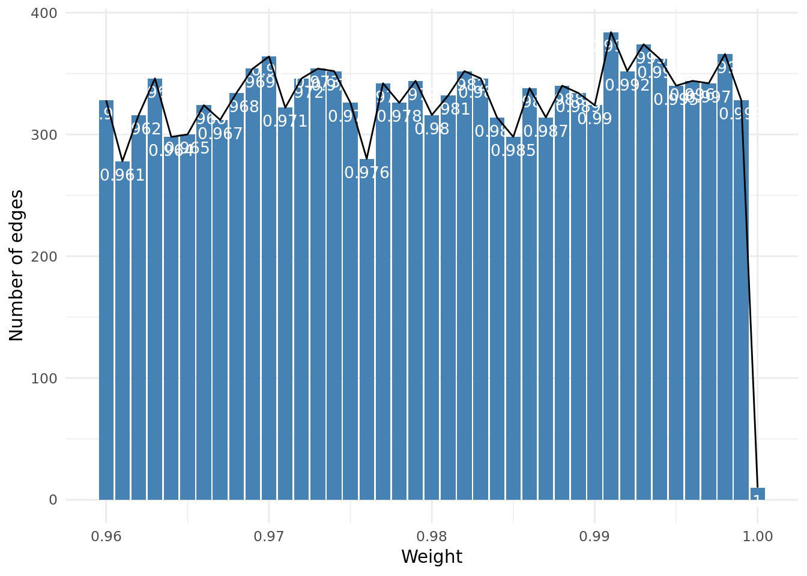

#### Degree distribution of item->similarity->item edges

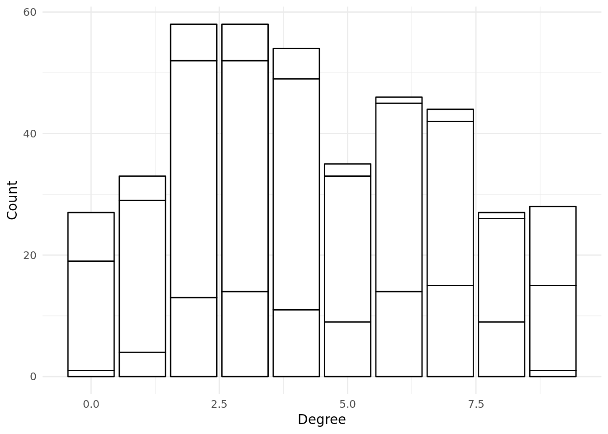

#### Degree distribution of agent->knows->agent edges

#### Runing time by method 

<table class="table table-condensed" style="width: auto !important; ">
 <thead>
  <tr>
   <th style="text-align:left;">   </th>
   <th style="text-align:left;"> key </th>
   <th style="text-align:right;"> doc_count </th>
   <th style="text-align:right;"> sum_wallTime_ms.value </th>
   <th style="text-align:left;"> avg_wallTime_ms.value </th>
   <th style="text-align:left;"> includedInTotal </th>
  </tr>
 </thead>
<tbody>
  <tr>
   <td style="text-align:left;"> 1 </td>
   <td style="text-align:left;"> addItemToWork </td>
   <td style="text-align:right;"> 410 </td>
   <td style="text-align:right;"> 8,683 </td>
   <td style="text-align:left;"> 21.1780487804878 </td>
   <td style="text-align:left;"> No </td>
  </tr>
  <tr>
   <td style="text-align:left;"> 2 </td>
   <td style="text-align:left;"> ownsWork </td>
   <td style="text-align:right;"> 205 </td>
   <td style="text-align:right;"> 5,241 </td>
   <td style="text-align:left;"> 25.5658536585366 </td>
   <td style="text-align:left;"> No </td>
  </tr>
  <tr>
   <td style="text-align:left;"> 3 </td>
   <td style="text-align:left;"> init </td>
   <td style="text-align:right;"> 203 </td>
   <td style="text-align:right;"> 18,599 </td>
   <td style="text-align:left;"> 91.6206896551724 </td>
   <td style="text-align:left;"> No </td>
  </tr>
  <tr>
   <td style="text-align:left;"> 4 </td>
   <td style="text-align:left;"> searchAndConnect </td>
   <td style="text-align:right;"> 201 </td>
   <td style="text-align:right;"> 178,198 </td>
   <td style="text-align:left;"> 886.557213930348 </td>
   <td style="text-align:left;"> Yes </td>
  </tr>
  <tr>
   <td style="text-align:left;"> 5 </td>
   <td style="text-align:left;"> knowsAgent </td>
   <td style="text-align:right;"> 200 </td>
   <td style="text-align:right;"> 1,426 </td>
   <td style="text-align:left;"> 7.13 </td>
   <td style="text-align:left;"> No </td>
  </tr>
  <tr>
   <td style="text-align:left;"> 6 </td>
   <td style="text-align:left;"> getWorksItems </td>
   <td style="text-align:right;"> 8 </td>
   <td style="text-align:right;"> 41 </td>
   <td style="text-align:left;"> 5.125 </td>
   <td style="text-align:left;"> Yes </td>
  </tr>
  <tr>
   <td style="text-align:left;"> 8 </td>
   <td style="text-align:left;"> cycleSearch </td>
   <td style="text-align:right;"> 6 </td>
   <td style="text-align:right;"> 1,525 </td>
   <td style="text-align:left;"> 254.166666666667 </td>
   <td style="text-align:left;"> Yes </td>
  </tr>
  <tr>
   <td style="text-align:left;"> 9 </td>
   <td style="text-align:left;"> getWorks </td>
   <td style="text-align:right;"> 6 </td>
   <td style="text-align:right;"> 1,111 </td>
   <td style="text-align:left;"> 185.166666666667 </td>
   <td style="text-align:left;"> No </td>
  </tr>
  <tr>
   <td style="text-align:left;"> 10 </td>
   <td style="text-align:left;"> individualCycleSearch </td>
   <td style="text-align:right;"> 6 </td>
   <td style="text-align:right;"> 0 </td>
   <td style="text-align:left;"> 0 </td>
   <td style="text-align:left;"> Yes </td>
  </tr>
  <tr>
   <td style="text-align:left;font-weight: bold;"> 11 </td>
   <td style="text-align:left;font-weight: bold;"> Total </td>
   <td style="text-align:right;font-weight: bold;"> 227 </td>
   <td style="text-align:right;font-weight: bold;"> 181,956 </td>
   <td style="text-align:left;font-weight: bold;">  </td>
   <td style="text-align:left;font-weight: bold;">  </td>
  </tr>
</tbody>
</table>
####  Found structures 

#####  Cycles 

Number of cycles found:  5 

<button class="btn btn-primary" data-toggle="collapse" data-target="#QLCUCHKITA"> Show/Hide foundCycle query </button> 
 
  
     GET /filebeat-*/_search 
              { 
                "query": {
                  "bool": {
                    "must": [
                      { "match_phrase": {
                        "simulationId": "SIM10-13-07-31-SaIyTK--DV"
                        }
                      },
                      { "bool": {
                        "should": [
                          { "match": {
                            "keyword": "foundCycle"
                          }}
                        ]
                      }}
                    ]
                  }
                }
              }
     

#####  Paths 

Number of paths found:  1 

<button class="btn btn-primary" data-toggle="collapse" data-target="#QPUDGAXOIX"> Show/Hide foundPath query </button> 
 
  
     GET /filebeat-*/_search 
              { 
                "query": {
                  "bool": {
                    "must": [
                      { "match_phrase": {
                        "simulationId": "SIM10-13-07-31-SaIyTK--DV"
                        }
                      },
                      { "bool": {
                        "should": [
                          { "match": {
                            "keyword": "foundPath"
                          }}
                        ]
                      }}
                    ]
                  }
                }
              }
     

###  SIM10-13-07-36-P4tYrN--CV 

#### simulationParameters 

<table class="table table-condensed" style="width: auto !important; ">
 <thead>
  <tr>
   <th style="text-align:left;"> agentNumber </th>
   <th style="text-align:left;"> similarityConnectThreshold </th>
   <th style="text-align:left;"> graphType </th>
   <th style="text-align:left;"> chainLength </th>
   <th style="text-align:left;"> similaritySearchThreshold </th>
   <th style="text-align:left;"> maxDistance </th>
   <th style="text-align:left;"> randomWorksNumberMultiplier </th>
  </tr>
 </thead>
<tbody>
  <tr>
   <td style="text-align:left;width: 20em; "> 200 </td>
   <td style="text-align:left;width: 15em; "> 0.96 </td>
   <td style="text-align:left;width: 15em; "> smallWorld </td>
   <td style="text-align:left;width: 15em; "> 5 </td>
   <td style="text-align:left;width: 15em; "> 1 </td>
   <td style="text-align:left;width: 15em; "> 30 </td>
   <td style="text-align:left;width: 15em; "> 1 </td>
  </tr>
</tbody>
</table>
#### allEdgesByLabel

<table class="table table-condensed" style="width: auto !important; ">
 <thead>
  <tr>
   <th style="text-align:right;"> edges_offers </th>
   <th style="text-align:right;"> edges_similarity </th>
   <th style="text-align:right;"> edges_owns </th>
   <th style="text-align:right;"> edges_demands </th>
   <th style="text-align:right;"> edges_knows </th>
   <th style="text-align:right;"> edges_total </th>
  </tr>
 </thead>
<tbody>
  <tr>
   <td style="text-align:right;width: 5em; "> 205 </td>
   <td style="text-align:right;width: 5em; "> 14,018 </td>
   <td style="text-align:right;width: 5em; "> 205 </td>
   <td style="text-align:right;width: 5em; "> 205 </td>
   <td style="text-align:right;width: 5em; "> 1,201 </td>
   <td style="text-align:right;width: 5em; "> 15,834 </td>
  </tr>
</tbody>
</table>
#### allVerticesByType

<table class="table table-condensed" style="width: auto !important; ">
 <thead>
  <tr>
   <th style="text-align:right;"> vertices_agent </th>
   <th style="text-align:right;"> vertices_item </th>
   <th style="text-align:right;"> vertices_work </th>
   <th style="text-align:right;"> vertices_total </th>
  </tr>
 </thead>
<tbody>
  <tr>
   <td style="text-align:right;width: 5em; "> 201 </td>
   <td style="text-align:right;width: 5em; "> 410 </td>
   <td style="text-align:right;width: 5em; "> 205 </td>
   <td style="text-align:right;width: 5em; "> 816 </td>
  </tr>
</tbody>
</table>
#### distribution of similarityEdgesByWeight

#### Degree distribution of item->similarity->item edges

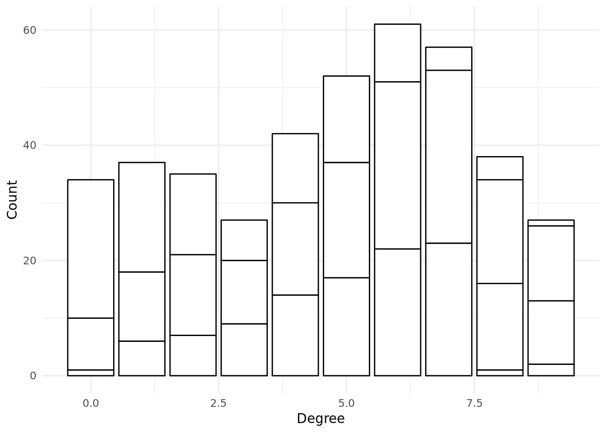

#### Degree distribution of agent->knows->agent edges

#### Runing time by method 

<table class="table table-condensed" style="width: auto !important; ">
 <thead>
  <tr>
   <th style="text-align:left;"> key </th>
   <th style="text-align:right;"> doc_count </th>
   <th style="text-align:right;"> sum_wallTime_ms.value </th>
   <th style="text-align:left;"> avg_wallTime_ms.value </th>
   <th style="text-align:left;"> includedInTotal </th>
  </tr>
 </thead>
<tbody>
  <tr>
   <td style="text-align:left;"> connectIfSimilar </td>
   <td style="text-align:right;"> 83,845 </td>
   <td style="text-align:right;"> 251,445 </td>
   <td style="text-align:left;"> 2.9989265907329 </td>
   <td style="text-align:left;"> No </td>
  </tr>
  <tr>
   <td style="text-align:left;"> existsSimilarity </td>
   <td style="text-align:right;"> 83,845 </td>
   <td style="text-align:right;"> 249,937 </td>
   <td style="text-align:left;"> 2.98094102212416 </td>
   <td style="text-align:left;"> No </td>
  </tr>
  <tr>
   <td style="text-align:left;"> similarityEdges </td>
   <td style="text-align:right;"> 83,845 </td>
   <td style="text-align:right;"> 246,735 </td>
   <td style="text-align:left;"> 2.94275150575467 </td>
   <td style="text-align:left;"> No </td>
  </tr>
  <tr>
   <td style="text-align:left;"> connectAllSimilar </td>
   <td style="text-align:right;"> 410 </td>
   <td style="text-align:right;"> 252,247 </td>
   <td style="text-align:left;"> 615.236585365854 </td>
   <td style="text-align:left;"> Yes </td>
  </tr>
  <tr>
   <td style="text-align:left;"> init </td>
   <td style="text-align:right;"> 203 </td>
   <td style="text-align:right;"> 18,631 </td>
   <td style="text-align:left;"> 91.7783251231527 </td>
   <td style="text-align:left;"> No </td>
  </tr>
  <tr>
   <td style="text-align:left;"> connect </td>
   <td style="text-align:right;"> 33 </td>
   <td style="text-align:right;"> 61 </td>
   <td style="text-align:left;"> 1.84848484848485 </td>
   <td style="text-align:left;"> Yes </td>
  </tr>
  <tr>
   <td style="text-align:left;font-weight: bold;"> Total </td>
   <td style="text-align:right;font-weight: bold;"> 451 </td>
   <td style="text-align:right;font-weight: bold;"> 253,057 </td>
   <td style="text-align:left;font-weight: bold;">  </td>
   <td style="text-align:left;font-weight: bold;">  </td>
  </tr>
</tbody>
</table>
####  Found structures 

#####  Cycles 

Number of cycles found:  1 

<button class="btn btn-primary" data-toggle="collapse" data-target="#TSQXTAMKBY"> Show/Hide foundCycle query </button> 
 
  
     GET /filebeat-*/_search 
              { 
                "query": {
                  "bool": {
                    "must": [
                      { "match_phrase": {
                        "simulationId": "SIM10-13-07-36-P4tYrN--CV"
                        }
                      },
                      { "bool": {
                        "should": [
                          { "match": {
                            "keyword": "foundCycle"
                          }}
                        ]
                      }}
                    ]
                  }
                }
              }
     

#####  Paths 

Number of paths found:  0 

<button class="btn btn-primary" data-toggle="collapse" data-target="#YRZGFXEZPO"> Show/Hide foundPath query </button> 
 
  
     GET /filebeat-*/_search 
              { 
                "query": {
                  "bool": {
                    "must": [
                      { "match_phrase": {
                        "simulationId": "SIM10-13-07-36-P4tYrN--CV"
                        }
                      },
                      { "bool": {
                        "should": [
                          { "match": {
                            "keyword": "foundPath"
                          }}
                        ]
                      }}
                    ]
                  }
                }
              }
     

###  SIM10-13-07-36-P4tYrN--DV 

#### simulationParameters 

<table class="table table-condensed" style="width: auto !important; ">
 <thead>
  <tr>
   <th style="text-align:left;"> agentNumber </th>
   <th style="text-align:left;"> similarityConnectThreshold </th>
   <th style="text-align:left;"> graphType </th>
   <th style="text-align:left;"> chainLength </th>
   <th style="text-align:left;"> similaritySearchThreshold </th>
   <th style="text-align:left;"> maxDistance </th>
   <th style="text-align:left;"> randomWorksNumberMultiplier </th>
  </tr>
 </thead>
<tbody>
  <tr>
   <td style="text-align:left;width: 20em; "> 200 </td>
   <td style="text-align:left;width: 15em; "> 0.96 </td>
   <td style="text-align:left;width: 15em; "> smallWorld </td>
   <td style="text-align:left;width: 15em; "> 5 </td>
   <td style="text-align:left;width: 15em; "> 1 </td>
   <td style="text-align:left;width: 15em; "> 30 </td>
   <td style="text-align:left;width: 15em; "> 1 </td>
  </tr>
</tbody>
</table>
#### allEdgesByLabel

<table class="table table-condensed" style="width: auto !important; ">
 <thead>
  <tr>
   <th style="text-align:right;"> edges_offers </th>
   <th style="text-align:right;"> edges_similarity </th>
   <th style="text-align:right;"> edges_owns </th>
   <th style="text-align:right;"> edges_demands </th>
   <th style="text-align:right;"> edges_knows </th>
   <th style="text-align:right;"> edges_total </th>
  </tr>
 </thead>
<tbody>
  <tr>
   <td style="text-align:right;width: 5em; "> 205 </td>
   <td style="text-align:right;width: 5em; "> 13,952 </td>
   <td style="text-align:right;width: 5em; "> 205 </td>
   <td style="text-align:right;width: 5em; "> 205 </td>
   <td style="text-align:right;width: 5em; "> 1,201 </td>
   <td style="text-align:right;width: 5em; "> 15,768 </td>
  </tr>
</tbody>
</table>
#### allVerticesByType

<table class="table table-condensed" style="width: auto !important; ">
 <thead>
  <tr>
   <th style="text-align:right;"> vertices_agent </th>
   <th style="text-align:right;"> vertices_item </th>
   <th style="text-align:right;"> vertices_work </th>
   <th style="text-align:right;"> vertices_total </th>
  </tr>
 </thead>
<tbody>
  <tr>
   <td style="text-align:right;width: 5em; "> 201 </td>
   <td style="text-align:right;width: 5em; "> 410 </td>
   <td style="text-align:right;width: 5em; "> 205 </td>
   <td style="text-align:right;width: 5em; "> 816 </td>
  </tr>
</tbody>
</table>
#### distribution of similarityEdgesByWeight

#### Degree distribution of item->similarity->item edges

#### Degree distribution of agent->knows->agent edges

#### Runing time by method 

<table class="table table-condensed" style="width: auto !important; ">
 <thead>
  <tr>
   <th style="text-align:left;">   </th>
   <th style="text-align:left;"> key </th>
   <th style="text-align:right;"> doc_count </th>
   <th style="text-align:right;"> sum_wallTime_ms.value </th>
   <th style="text-align:left;"> avg_wallTime_ms.value </th>
   <th style="text-align:left;"> includedInTotal </th>
  </tr>
 </thead>
<tbody>
  <tr>
   <td style="text-align:left;"> 1 </td>
   <td style="text-align:left;"> knowsAgent </td>
   <td style="text-align:right;"> 1,201 </td>
   <td style="text-align:right;"> 2,889 </td>
   <td style="text-align:left;"> 2.40549542048293 </td>
   <td style="text-align:left;"> No </td>
  </tr>
  <tr>
   <td style="text-align:left;"> 2 </td>
   <td style="text-align:left;"> addItemToWork </td>
   <td style="text-align:right;"> 410 </td>
   <td style="text-align:right;"> 3,953 </td>
   <td style="text-align:left;"> 9.64146341463415 </td>
   <td style="text-align:left;"> No </td>
  </tr>
  <tr>
   <td style="text-align:left;"> 3 </td>
   <td style="text-align:left;"> ownsWork </td>
   <td style="text-align:right;"> 205 </td>
   <td style="text-align:right;"> 3,921 </td>
   <td style="text-align:left;"> 19.1268292682927 </td>
   <td style="text-align:left;"> No </td>
  </tr>
  <tr>
   <td style="text-align:left;"> 4 </td>
   <td style="text-align:left;"> init </td>
   <td style="text-align:right;"> 203 </td>
   <td style="text-align:right;"> 24,577 </td>
   <td style="text-align:left;"> 121.068965517241 </td>
   <td style="text-align:left;"> No </td>
  </tr>
  <tr>
   <td style="text-align:left;"> 5 </td>
   <td style="text-align:left;"> searchAndConnect </td>
   <td style="text-align:right;"> 201 </td>
   <td style="text-align:right;"> 241,469 </td>
   <td style="text-align:left;"> 1201.33830845771 </td>
   <td style="text-align:left;"> Yes </td>
  </tr>
  <tr>
   <td style="text-align:left;"> 6 </td>
   <td style="text-align:left;"> getWorksItems </td>
   <td style="text-align:right;"> 8 </td>
   <td style="text-align:right;"> 38 </td>
   <td style="text-align:left;"> 4.75 </td>
   <td style="text-align:left;"> Yes </td>
  </tr>
  <tr>
   <td style="text-align:left;"> 8 </td>
   <td style="text-align:left;"> cycleSearch </td>
   <td style="text-align:right;"> 7 </td>
   <td style="text-align:right;"> 1,869 </td>
   <td style="text-align:left;"> 267 </td>
   <td style="text-align:left;"> Yes </td>
  </tr>
  <tr>
   <td style="text-align:left;"> 9 </td>
   <td style="text-align:left;"> getWorks </td>
   <td style="text-align:right;"> 7 </td>
   <td style="text-align:right;"> 795 </td>
   <td style="text-align:left;"> 113.571428571429 </td>
   <td style="text-align:left;"> No </td>
  </tr>
  <tr>
   <td style="text-align:left;"> 10 </td>
   <td style="text-align:left;"> individualCycleSearch </td>
   <td style="text-align:right;"> 7 </td>
   <td style="text-align:right;"> 1 </td>
   <td style="text-align:left;"> 0.142857142857143 </td>
   <td style="text-align:left;"> Yes </td>
  </tr>
  <tr>
   <td style="text-align:left;font-weight: bold;"> 11 </td>
   <td style="text-align:left;font-weight: bold;"> Total </td>
   <td style="text-align:right;font-weight: bold;"> 230 </td>
   <td style="text-align:right;font-weight: bold;"> 244,986 </td>
   <td style="text-align:left;font-weight: bold;">  </td>
   <td style="text-align:left;font-weight: bold;">  </td>
  </tr>
</tbody>
</table>
####  Found structures 

#####  Cycles 

Number of cycles found:  7 

<button class="btn btn-primary" data-toggle="collapse" data-target="#QZEFBJBLFH"> Show/Hide foundCycle query </button> 
 
  
     GET /filebeat-*/_search 
              { 
                "query": {
                  "bool": {
                    "must": [
                      { "match_phrase": {
                        "simulationId": "SIM10-13-07-36-P4tYrN--DV"
                        }
                      },
                      { "bool": {
                        "should": [
                          { "match": {
                            "keyword": "foundCycle"
                          }}
                        ]
                      }}
                    ]
                  }
                }
              }
     

#####  Paths 

Number of paths found:  0 

<button class="btn btn-primary" data-toggle="collapse" data-target="#HNNGODNZSE"> Show/Hide foundPath query </button> 
 
  
     GET /filebeat-*/_search 
              { 
                "query": {
                  "bool": {
                    "must": [
                      { "match_phrase": {
                        "simulationId": "SIM10-13-07-36-P4tYrN--DV"
                        }
                      },
                      { "bool": {
                        "should": [
                          { "match": {
                            "keyword": "foundPath"
                          }}
                        ]
                      }}
                    ]
                  }
                }
              }
     

###  SIM10-13-11-10-ntabMV--CV 

#### simulationParameters 

<table class="table table-condensed" style="width: auto !important; ">
 <thead>
  <tr>
   <th style="text-align:left;"> agentNumber </th>
   <th style="text-align:left;"> similarityConnectThreshold </th>
   <th style="text-align:left;"> graphType </th>
   <th style="text-align:left;"> chainLength </th>
   <th style="text-align:left;"> similaritySearchThreshold </th>
   <th style="text-align:left;"> maxDistance </th>
   <th style="text-align:left;"> randomWorksNumberMultiplier </th>
  </tr>
 </thead>
<tbody>
  <tr>
   <td style="text-align:left;width: 20em; "> 200 </td>
   <td style="text-align:left;width: 15em; "> 0.96 </td>
   <td style="text-align:left;width: 15em; "> random </td>
   <td style="text-align:left;width: 15em; "> 5 </td>
   <td style="text-align:left;width: 15em; "> 1 </td>
   <td style="text-align:left;width: 15em; "> 30 </td>
   <td style="text-align:left;width: 15em; "> 2 </td>
  </tr>
</tbody>
</table>
#### allEdgesByLabel

<table class="table table-condensed" style="width: auto !important; ">
 <thead>
  <tr>
   <th style="text-align:right;"> edges_offers </th>
   <th style="text-align:right;"> edges_similarity </th>
   <th style="text-align:right;"> edges_owns </th>
   <th style="text-align:right;"> edges_demands </th>
   <th style="text-align:right;"> edges_knows </th>
   <th style="text-align:right;"> edges_total </th>
  </tr>
 </thead>
<tbody>
  <tr>
   <td style="text-align:right;width: 5em; "> 405 </td>
   <td style="text-align:right;width: 5em; "> 54,316 </td>
   <td style="text-align:right;width: 5em; "> 405 </td>
   <td style="text-align:right;width: 5em; "> 405 </td>
   <td style="text-align:right;width: 5em; "> 200 </td>
   <td style="text-align:right;width: 5em; "> 55,731 </td>
  </tr>
</tbody>
</table>
#### allVerticesByType

<table class="table table-condensed" style="width: auto !important; ">
 <thead>
  <tr>
   <th style="text-align:right;"> vertices_agent </th>
   <th style="text-align:right;"> vertices_item </th>
   <th style="text-align:right;"> vertices_work </th>
   <th style="text-align:right;"> vertices_total </th>
  </tr>
 </thead>
<tbody>
  <tr>
   <td style="text-align:right;width: 5em; "> 201 </td>
   <td style="text-align:right;width: 5em; "> 810 </td>
   <td style="text-align:right;width: 5em; "> 405 </td>
   <td style="text-align:right;width: 5em; "> 1,416 </td>
  </tr>
</tbody>
</table>
#### distribution of similarityEdgesByWeight

#### Degree distribution of item->similarity->item edges

#### Degree distribution of agent->knows->agent edges

#### Runing time by method 

<table class="table table-condensed" style="width: auto !important; ">
 <thead>
  <tr>
   <th style="text-align:left;"> key </th>
   <th style="text-align:right;"> doc_count </th>
   <th style="text-align:right;"> sum_wallTime_ms.value </th>
   <th style="text-align:left;"> avg_wallTime_ms.value </th>
   <th style="text-align:left;"> includedInTotal </th>
  </tr>
 </thead>
<tbody>
  <tr>
   <td style="text-align:left;"> connectIfSimilar </td>
   <td style="text-align:right;"> 327,645 </td>
   <td style="text-align:right;"> 1,343,029 </td>
   <td style="text-align:left;"> 4.09903706755787 </td>
   <td style="text-align:left;"> No </td>
  </tr>
  <tr>
   <td style="text-align:left;"> existsSimilarity </td>
   <td style="text-align:right;"> 327,645 </td>
   <td style="text-align:right;"> 1,336,094 </td>
   <td style="text-align:left;"> 4.07787086633399 </td>
   <td style="text-align:left;"> No </td>
  </tr>
  <tr>
   <td style="text-align:left;"> similarityEdges </td>
   <td style="text-align:right;"> 327,645 </td>
   <td style="text-align:right;"> 1,318,077 </td>
   <td style="text-align:left;"> 4.02288147232523 </td>
   <td style="text-align:left;"> No </td>
  </tr>
  <tr>
   <td style="text-align:left;"> connectAllSimilar </td>
   <td style="text-align:right;"> 810 </td>
   <td style="text-align:right;"> 1,346,174 </td>
   <td style="text-align:left;"> 1661.94320987654 </td>
   <td style="text-align:left;"> Yes </td>
  </tr>
  <tr>
   <td style="text-align:left;"> init </td>
   <td style="text-align:right;"> 203 </td>
   <td style="text-align:right;"> 18,572 </td>
   <td style="text-align:left;"> 91.487684729064 </td>
   <td style="text-align:left;"> No </td>
  </tr>
  <tr>
   <td style="text-align:left;"> connect </td>
   <td style="text-align:right;"> 184 </td>
   <td style="text-align:right;"> 687 </td>
   <td style="text-align:left;"> 3.73369565217391 </td>
   <td style="text-align:left;"> Yes </td>
  </tr>
  <tr>
   <td style="text-align:left;font-weight: bold;"> Total </td>
   <td style="text-align:right;font-weight: bold;"> 1,002 </td>
   <td style="text-align:right;font-weight: bold;"> 1,348,308 </td>
   <td style="text-align:left;font-weight: bold;">  </td>
   <td style="text-align:left;font-weight: bold;">  </td>
  </tr>
</tbody>
</table>
####  Found structures 

#####  Cycles 

Number of cycles found:  1 

<button class="btn btn-primary" data-toggle="collapse" data-target="#ZIGUFPCOQZ"> Show/Hide foundCycle query </button> 
 
  
     GET /filebeat-*/_search 
              { 
                "query": {
                  "bool": {
                    "must": [
                      { "match_phrase": {
                        "simulationId": "SIM10-13-11-10-ntabMV--CV"
                        }
                      },
                      { "bool": {
                        "should": [
                          { "match": {
                            "keyword": "foundCycle"
                          }}
                        ]
                      }}
                    ]
                  }
                }
              }
     

#####  Paths 

Number of paths found:  0 

<button class="btn btn-primary" data-toggle="collapse" data-target="#XHCSVPPGAZ"> Show/Hide foundPath query </button> 
 
  
     GET /filebeat-*/_search 
              { 
                "query": {
                  "bool": {
                    "must": [
                      { "match_phrase": {
                        "simulationId": "SIM10-13-11-10-ntabMV--CV"
                        }
                      },
                      { "bool": {
                        "should": [
                          { "match": {
                            "keyword": "foundPath"
                          }}
                        ]
                      }}
                    ]
                  }
                }
              }
     

###  SIM10-13-11-10-ntabMV--DV 

#### simulationParameters 

<table class="table table-condensed" style="width: auto !important; ">
 <thead>
  <tr>
   <th style="text-align:left;"> agentNumber </th>
   <th style="text-align:left;"> similarityConnectThreshold </th>
   <th style="text-align:left;"> graphType </th>
   <th style="text-align:left;"> chainLength </th>
   <th style="text-align:left;"> similaritySearchThreshold </th>
   <th style="text-align:left;"> maxDistance </th>
   <th style="text-align:left;"> randomWorksNumberMultiplier </th>
  </tr>
 </thead>
<tbody>
  <tr>
   <td style="text-align:left;width: 20em; "> 200 </td>
   <td style="text-align:left;width: 15em; "> 0.96 </td>
   <td style="text-align:left;width: 15em; "> random </td>
   <td style="text-align:left;width: 15em; "> 5 </td>
   <td style="text-align:left;width: 15em; "> 1 </td>
   <td style="text-align:left;width: 15em; "> 30 </td>
   <td style="text-align:left;width: 15em; "> 2 </td>
  </tr>
</tbody>
</table>
#### allEdgesByLabel

<table class="table table-condensed" style="width: auto !important; ">
 <thead>
  <tr>
   <th style="text-align:right;"> edges_offers </th>
   <th style="text-align:right;"> edges_similarity </th>
   <th style="text-align:right;"> edges_owns </th>
   <th style="text-align:right;"> edges_demands </th>
   <th style="text-align:right;"> edges_knows </th>
   <th style="text-align:right;"> edges_total </th>
  </tr>
 </thead>
<tbody>
  <tr>
   <td style="text-align:right;width: 5em; "> 405 </td>
   <td style="text-align:right;width: 5em; "> 53,948 </td>
   <td style="text-align:right;width: 5em; "> 405 </td>
   <td style="text-align:right;width: 5em; "> 405 </td>
   <td style="text-align:right;width: 5em; "> 200 </td>
   <td style="text-align:right;width: 5em; "> 55,363 </td>
  </tr>
</tbody>
</table>
#### allVerticesByType

<table class="table table-condensed" style="width: auto !important; ">
 <thead>
  <tr>
   <th style="text-align:right;"> vertices_agent </th>
   <th style="text-align:right;"> vertices_item </th>
   <th style="text-align:right;"> vertices_work </th>
   <th style="text-align:right;"> vertices_total </th>
  </tr>
 </thead>
<tbody>
  <tr>
   <td style="text-align:right;width: 5em; "> 201 </td>
   <td style="text-align:right;width: 5em; "> 810 </td>
   <td style="text-align:right;width: 5em; "> 405 </td>
   <td style="text-align:right;width: 5em; "> 1,416 </td>
  </tr>
</tbody>
</table>
#### distribution of similarityEdgesByWeight

#### Degree distribution of item->similarity->item edges

#### Degree distribution of agent->knows->agent edges

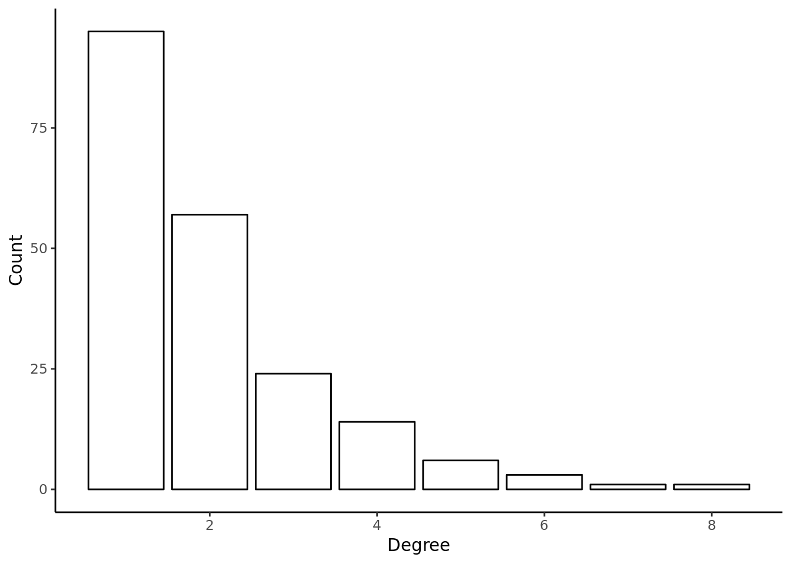

#### Runing time by method 

<table class="table table-condensed" style="width: auto !important; ">
 <thead>
  <tr>
   <th style="text-align:left;">   </th>
   <th style="text-align:left;"> key </th>
   <th style="text-align:right;"> doc_count </th>
   <th style="text-align:right;"> sum_wallTime_ms.value </th>
   <th style="text-align:left;"> avg_wallTime_ms.value </th>
   <th style="text-align:left;"> includedInTotal </th>
  </tr>
 </thead>
<tbody>
  <tr>
   <td style="text-align:left;"> 1 </td>
   <td style="text-align:left;"> addItemToWork </td>
   <td style="text-align:right;"> 810 </td>
   <td style="text-align:right;"> 8,993 </td>
   <td style="text-align:left;"> 11.1024691358025 </td>
   <td style="text-align:left;"> No </td>
  </tr>
  <tr>
   <td style="text-align:left;"> 2 </td>
   <td style="text-align:left;"> ownsWork </td>
   <td style="text-align:right;"> 405 </td>
   <td style="text-align:right;"> 6,017 </td>
   <td style="text-align:left;"> 14.8567901234568 </td>
   <td style="text-align:left;"> No </td>
  </tr>
  <tr>
   <td style="text-align:left;"> 3 </td>
   <td style="text-align:left;"> init </td>
   <td style="text-align:right;"> 203 </td>
   <td style="text-align:right;"> 21,159 </td>
   <td style="text-align:left;"> 104.231527093596 </td>
   <td style="text-align:left;"> No </td>
  </tr>
  <tr>
   <td style="text-align:left;"> 4 </td>
   <td style="text-align:left;"> searchAndConnect </td>
   <td style="text-align:right;"> 201 </td>
   <td style="text-align:right;"> 625,765 </td>
   <td style="text-align:left;"> 3113.25870646766 </td>
   <td style="text-align:left;"> Yes </td>
  </tr>
  <tr>
   <td style="text-align:left;"> 5 </td>
   <td style="text-align:left;"> knowsAgent </td>
   <td style="text-align:right;"> 200 </td>
   <td style="text-align:right;"> 774 </td>
   <td style="text-align:left;"> 3.87 </td>
   <td style="text-align:left;"> No </td>
  </tr>
  <tr>
   <td style="text-align:left;"> 7 </td>
   <td style="text-align:left;"> cycleSearch </td>
   <td style="text-align:right;"> 19 </td>
   <td style="text-align:right;"> 2,546 </td>
   <td style="text-align:left;"> 134 </td>
   <td style="text-align:left;"> Yes </td>
  </tr>
  <tr>
   <td style="text-align:left;"> 8 </td>
   <td style="text-align:left;"> getWorks </td>
   <td style="text-align:right;"> 19 </td>
   <td style="text-align:right;"> 2,209 </td>
   <td style="text-align:left;"> 116.263157894737 </td>
   <td style="text-align:left;"> No </td>
  </tr>
  <tr>
   <td style="text-align:left;"> 9 </td>
   <td style="text-align:left;"> individualCycleSearch </td>
   <td style="text-align:right;"> 19 </td>
   <td style="text-align:right;"> 0 </td>
   <td style="text-align:left;"> 0 </td>
   <td style="text-align:left;"> Yes </td>
  </tr>
  <tr>
   <td style="text-align:left;font-weight: bold;"> 11 </td>
   <td style="text-align:left;font-weight: bold;"> Total </td>
   <td style="text-align:right;font-weight: bold;"> 277 </td>
   <td style="text-align:right;font-weight: bold;"> 629,803 </td>
   <td style="text-align:left;font-weight: bold;">  </td>
   <td style="text-align:left;font-weight: bold;">  </td>
  </tr>
</tbody>
</table>
####  Found structures 

#####  Cycles 

Number of cycles found:  19 

<button class="btn btn-primary" data-toggle="collapse" data-target="#NJNYHTMMQJ"> Show/Hide foundCycle query </button> 
 
  
     GET /filebeat-*/_search 
              { 
                "query": {
                  "bool": {
                    "must": [
                      { "match_phrase": {
                        "simulationId": "SIM10-13-11-10-ntabMV--DV"
                        }
                      },
                      { "bool": {
                        "should": [
                          { "match": {
                            "keyword": "foundCycle"
                          }}
                        ]
                      }}
                    ]
                  }
                }
              }
     

#####  Paths 

Number of paths found:  0 

<button class="btn btn-primary" data-toggle="collapse" data-target="#TJBFYZAPHC"> Show/Hide foundPath query </button> 
 
  
     GET /filebeat-*/_search 
              { 
                "query": {
                  "bool": {
                    "must": [
                      { "match_phrase": {
                        "simulationId": "SIM10-13-11-10-ntabMV--DV"
                        }
                      },
                      { "bool": {
                        "should": [
                          { "match": {
                            "keyword": "foundPath"
                          }}
                        ]
                      }}
                    ]
                  }
                }
              }
     

###  SIM10-13-11-33-zTs5uh--CV 

#### simulationParameters 

<table class="table table-condensed" style="width: auto !important; ">
 <thead>
  <tr>
   <th style="text-align:left;"> agentNumber </th>
   <th style="text-align:left;"> similarityConnectThreshold </th>
   <th style="text-align:left;"> graphType </th>
   <th style="text-align:left;"> chainLength </th>
   <th style="text-align:left;"> similaritySearchThreshold </th>
   <th style="text-align:left;"> maxDistance </th>
   <th style="text-align:left;"> randomWorksNumberMultiplier </th>
  </tr>
 </thead>
<tbody>
  <tr>
   <td style="text-align:left;width: 20em; "> 200 </td>
   <td style="text-align:left;width: 15em; "> 0.96 </td>
   <td style="text-align:left;width: 15em; "> smallWorld </td>
   <td style="text-align:left;width: 15em; "> 5 </td>
   <td style="text-align:left;width: 15em; "> 1 </td>
   <td style="text-align:left;width: 15em; "> 30 </td>
   <td style="text-align:left;width: 15em; "> 2 </td>
  </tr>
</tbody>
</table>
#### allEdgesByLabel

<table class="table table-condensed" style="width: auto !important; ">
 <thead>
  <tr>
   <th style="text-align:right;"> edges_offers </th>
   <th style="text-align:right;"> edges_similarity </th>
   <th style="text-align:right;"> edges_owns </th>
   <th style="text-align:right;"> edges_demands </th>
   <th style="text-align:right;"> edges_knows </th>
   <th style="text-align:right;"> edges_total </th>
  </tr>
 </thead>
<tbody>
  <tr>
   <td style="text-align:right;width: 5em; "> 405 </td>
   <td style="text-align:right;width: 5em; "> 54,252 </td>
   <td style="text-align:right;width: 5em; "> 405 </td>
   <td style="text-align:right;width: 5em; "> 405 </td>
   <td style="text-align:right;width: 5em; "> 1,201 </td>
   <td style="text-align:right;width: 5em; "> 56,668 </td>
  </tr>
</tbody>
</table>
#### allVerticesByType

<table class="table table-condensed" style="width: auto !important; ">
 <thead>
  <tr>
   <th style="text-align:right;"> vertices_agent </th>
   <th style="text-align:right;"> vertices_item </th>
   <th style="text-align:right;"> vertices_work </th>
   <th style="text-align:right;"> vertices_total </th>
  </tr>
 </thead>
<tbody>
  <tr>
   <td style="text-align:right;width: 5em; "> 201 </td>
   <td style="text-align:right;width: 5em; "> 810 </td>
   <td style="text-align:right;width: 5em; "> 405 </td>
   <td style="text-align:right;width: 5em; "> 1,416 </td>
  </tr>
</tbody>
</table>
#### distribution of similarityEdgesByWeight

#### Degree distribution of item->similarity->item edges

#### Degree distribution of agent->knows->agent edges

#### Runing time by method 

<table class="table table-condensed" style="width: auto !important; ">
 <thead>
  <tr>
   <th style="text-align:left;"> key </th>
   <th style="text-align:right;"> doc_count </th>
   <th style="text-align:right;"> sum_wallTime_ms.value </th>
   <th style="text-align:left;"> avg_wallTime_ms.value </th>
   <th style="text-align:left;"> includedInTotal </th>
  </tr>
 </thead>
<tbody>
  <tr>
   <td style="text-align:left;"> connectIfSimilar </td>
   <td style="text-align:right;"> 327,645 </td>
   <td style="text-align:right;"> 1,354,498 </td>
   <td style="text-align:left;"> 4.1340414167773 </td>
   <td style="text-align:left;"> No </td>
  </tr>
  <tr>
   <td style="text-align:left;"> existsSimilarity </td>
   <td style="text-align:right;"> 327,645 </td>
   <td style="text-align:right;"> 1,347,940 </td>
   <td style="text-align:left;"> 4.11402585114987 </td>
   <td style="text-align:left;"> No </td>
  </tr>
  <tr>
   <td style="text-align:left;"> similarityEdges </td>
   <td style="text-align:right;"> 327,645 </td>
   <td style="text-align:right;"> 1,328,873 </td>
   <td style="text-align:left;"> 4.05583176914038 </td>
   <td style="text-align:left;"> No </td>
  </tr>
  <tr>
   <td style="text-align:left;"> connectAllSimilar </td>
   <td style="text-align:right;"> 810 </td>
   <td style="text-align:right;"> 1,357,651 </td>
   <td style="text-align:left;"> 1676.11234567901 </td>
   <td style="text-align:left;"> Yes </td>
  </tr>
  <tr>
   <td style="text-align:left;"> init </td>
   <td style="text-align:right;"> 203 </td>
   <td style="text-align:right;"> 19,204 </td>
   <td style="text-align:left;"> 94.6009852216749 </td>
   <td style="text-align:left;"> No </td>
  </tr>
  <tr>
   <td style="text-align:left;"> connect </td>
   <td style="text-align:right;"> 165 </td>
   <td style="text-align:right;"> 581 </td>
   <td style="text-align:left;"> 3.52121212121212 </td>
   <td style="text-align:left;"> Yes </td>
  </tr>
  <tr>
   <td style="text-align:left;font-weight: bold;"> Total </td>
   <td style="text-align:right;font-weight: bold;"> 983 </td>
   <td style="text-align:right;font-weight: bold;"> 1,359,645 </td>
   <td style="text-align:left;font-weight: bold;">  </td>
   <td style="text-align:left;font-weight: bold;">  </td>
  </tr>
</tbody>
</table>
####  Found structures 

#####  Cycles 

Number of cycles found:  1 

<button class="btn btn-primary" data-toggle="collapse" data-target="#JCANSRSXPT"> Show/Hide foundCycle query </button> 
 
  
     GET /filebeat-*/_search 
              { 
                "query": {
                  "bool": {
                    "must": [
                      { "match_phrase": {
                        "simulationId": "SIM10-13-11-33-zTs5uh--CV"
                        }
                      },
                      { "bool": {
                        "should": [
                          { "match": {
                            "keyword": "foundCycle"
                          }}
                        ]
                      }}
                    ]
                  }
                }
              }
     

#####  Paths 

Number of paths found:  0 

<button class="btn btn-primary" data-toggle="collapse" data-target="#ZSNPNAABFD"> Show/Hide foundPath query </button> 
 
  
     GET /filebeat-*/_search 
              { 
                "query": {
                  "bool": {
                    "must": [
                      { "match_phrase": {
                        "simulationId": "SIM10-13-11-33-zTs5uh--CV"
                        }
                      },
                      { "bool": {
                        "should": [
                          { "match": {
                            "keyword": "foundPath"
                          }}
                        ]
                      }}
                    ]
                  }
                }
              }
     

###  SIM10-13-11-33-zTs5uh--DV 

#### simulationParameters 

<table class="table table-condensed" style="width: auto !important; ">
 <thead>
  <tr>
   <th style="text-align:left;"> agentNumber </th>
   <th style="text-align:left;"> similarityConnectThreshold </th>
   <th style="text-align:left;"> graphType </th>
   <th style="text-align:left;"> chainLength </th>
   <th style="text-align:left;"> similaritySearchThreshold </th>
   <th style="text-align:left;"> maxDistance </th>
   <th style="text-align:left;"> randomWorksNumberMultiplier </th>
  </tr>
 </thead>
<tbody>
  <tr>
   <td style="text-align:left;width: 20em; "> 200 </td>
   <td style="text-align:left;width: 15em; "> 0.96 </td>
   <td style="text-align:left;width: 15em; "> smallWorld </td>
   <td style="text-align:left;width: 15em; "> 5 </td>
   <td style="text-align:left;width: 15em; "> 1 </td>
   <td style="text-align:left;width: 15em; "> 30 </td>
   <td style="text-align:left;width: 15em; "> 2 </td>
  </tr>
</tbody>
</table>
#### allEdgesByLabel

<table class="table table-condensed" style="width: auto !important; ">
 <thead>
  <tr>
   <th style="text-align:right;"> edges_offers </th>
   <th style="text-align:right;"> edges_similarity </th>
   <th style="text-align:right;"> edges_owns </th>
   <th style="text-align:right;"> edges_demands </th>
   <th style="text-align:right;"> edges_knows </th>
   <th style="text-align:right;"> edges_total </th>
  </tr>
 </thead>
<tbody>
  <tr>
   <td style="text-align:right;width: 5em; "> 405 </td>
   <td style="text-align:right;width: 5em; "> 53,922 </td>
   <td style="text-align:right;width: 5em; "> 405 </td>
   <td style="text-align:right;width: 5em; "> 405 </td>
   <td style="text-align:right;width: 5em; "> 1,201 </td>
   <td style="text-align:right;width: 5em; "> 56,338 </td>
  </tr>
</tbody>
</table>
#### allVerticesByType

<table class="table table-condensed" style="width: auto !important; ">
 <thead>
  <tr>
   <th style="text-align:right;"> vertices_agent </th>
   <th style="text-align:right;"> vertices_item </th>
   <th style="text-align:right;"> vertices_work </th>
   <th style="text-align:right;"> vertices_total </th>
  </tr>
 </thead>
<tbody>
  <tr>
   <td style="text-align:right;width: 5em; "> 201 </td>
   <td style="text-align:right;width: 5em; "> 810 </td>
   <td style="text-align:right;width: 5em; "> 405 </td>
   <td style="text-align:right;width: 5em; "> 1,416 </td>
  </tr>
</tbody>
</table>
#### distribution of similarityEdgesByWeight

#### Degree distribution of item->similarity->item edges

#### Degree distribution of agent->knows->agent edges

#### Runing time by method 

<table class="table table-condensed" style="width: auto !important; ">
 <thead>
  <tr>
   <th style="text-align:left;">   </th>
   <th style="text-align:left;"> key </th>
   <th style="text-align:right;"> doc_count </th>
   <th style="text-align:right;"> sum_wallTime_ms.value </th>
   <th style="text-align:left;"> avg_wallTime_ms.value </th>
   <th style="text-align:left;"> includedInTotal </th>
  </tr>
 </thead>
<tbody>
  <tr>
   <td style="text-align:left;"> 1 </td>
   <td style="text-align:left;"> knowsAgent </td>
   <td style="text-align:right;"> 1,201 </td>
   <td style="text-align:right;"> 3,285 </td>
   <td style="text-align:left;"> 2.73522064945878 </td>
   <td style="text-align:left;"> No </td>
  </tr>
  <tr>
   <td style="text-align:left;"> 2 </td>
   <td style="text-align:left;"> addItemToWork </td>
   <td style="text-align:right;"> 810 </td>
   <td style="text-align:right;"> 10,000 </td>
   <td style="text-align:left;"> 12.3456790123457 </td>
   <td style="text-align:left;"> No </td>
  </tr>
  <tr>
   <td style="text-align:left;"> 3 </td>
   <td style="text-align:left;"> ownsWork </td>
   <td style="text-align:right;"> 405 </td>
   <td style="text-align:right;"> 5,297 </td>
   <td style="text-align:left;"> 13.079012345679 </td>
   <td style="text-align:left;"> No </td>
  </tr>
  <tr>
   <td style="text-align:left;"> 4 </td>
   <td style="text-align:left;"> init </td>
   <td style="text-align:right;"> 203 </td>
   <td style="text-align:right;"> 20,814 </td>
   <td style="text-align:left;"> 102.532019704433 </td>
   <td style="text-align:left;"> No </td>
  </tr>
  <tr>
   <td style="text-align:left;"> 5 </td>
   <td style="text-align:left;"> searchAndConnect </td>
   <td style="text-align:right;"> 201 </td>
   <td style="text-align:right;"> 663,068 </td>
   <td style="text-align:left;"> 3298.84577114428 </td>
   <td style="text-align:left;"> Yes </td>
  </tr>
  <tr>
   <td style="text-align:left;"> 7 </td>
   <td style="text-align:left;"> cycleSearch </td>
   <td style="text-align:right;"> 15 </td>
   <td style="text-align:right;"> 6,713 </td>
   <td style="text-align:left;"> 447.533333333333 </td>
   <td style="text-align:left;"> Yes </td>
  </tr>
  <tr>
   <td style="text-align:left;"> 8 </td>
   <td style="text-align:left;"> getWorks </td>
   <td style="text-align:right;"> 15 </td>
   <td style="text-align:right;"> 2,579 </td>
   <td style="text-align:left;"> 171.933333333333 </td>
   <td style="text-align:left;"> No </td>
  </tr>
  <tr>
   <td style="text-align:left;"> 9 </td>
   <td style="text-align:left;"> individualCycleSearch </td>
   <td style="text-align:right;"> 15 </td>
   <td style="text-align:right;"> 0 </td>
   <td style="text-align:left;"> 0 </td>
   <td style="text-align:left;"> Yes </td>
  </tr>
  <tr>
   <td style="text-align:left;font-weight: bold;"> 11 </td>
   <td style="text-align:left;font-weight: bold;"> Total </td>
   <td style="text-align:right;font-weight: bold;"> 261 </td>
   <td style="text-align:right;font-weight: bold;"> 676,911 </td>
   <td style="text-align:left;font-weight: bold;">  </td>
   <td style="text-align:left;font-weight: bold;">  </td>
  </tr>
</tbody>
</table>
####  Found structures 

#####  Cycles 

Number of cycles found:  15 

<button class="btn btn-primary" data-toggle="collapse" data-target="#HQBTLFXEUL"> Show/Hide foundCycle query </button> 
 
  
     GET /filebeat-*/_search 
              { 
                "query": {
                  "bool": {
                    "must": [
                      { "match_phrase": {
                        "simulationId": "SIM10-13-11-33-zTs5uh--DV"
                        }
                      },
                      { "bool": {
                        "should": [
                          { "match": {
                            "keyword": "foundCycle"
                          }}
                        ]
                      }}
                    ]
                  }
                }
              }
     

#####  Paths 

Number of paths found:  0 

<button class="btn btn-primary" data-toggle="collapse" data-target="#TTFTGJDJOC"> Show/Hide foundPath query </button> 
 
  
     GET /filebeat-*/_search 
              { 
                "query": {
                  "bool": {
                    "must": [
                      { "match_phrase": {
                        "simulationId": "SIM10-13-11-33-zTs5uh--DV"
                        }
                      },
                      { "bool": {
                        "should": [
                          { "match": {
                            "keyword": "foundPath"
                          }}
                        ]
                      }}
                    ]
                  }
                }
              }
     

###  SIM10-13-06-12-Ezfymi--CV 

#### simulationParameters 

<table class="table table-condensed" style="width: auto !important; ">
 <thead>
  <tr>
   <th style="text-align:left;"> agentNumber </th>
   <th style="text-align:left;"> similarityConnectThreshold </th>
   <th style="text-align:left;"> graphType </th>
   <th style="text-align:left;"> chainLength </th>
   <th style="text-align:left;"> similaritySearchThreshold </th>
   <th style="text-align:left;"> maxDistance </th>
   <th style="text-align:left;"> randomWorksNumberMultiplier </th>
  </tr>
 </thead>
<tbody>
  <tr>
   <td style="text-align:left;width: 20em; "> 200 </td>
   <td style="text-align:left;width: 15em; "> 0.96 </td>
   <td style="text-align:left;width: 15em; "> random </td>
   <td style="text-align:left;width: 15em; "> 5 </td>
   <td style="text-align:left;width: 15em; "> 1 </td>
   <td style="text-align:left;width: 15em; "> 5 </td>
   <td style="text-align:left;width: 15em; "> 1 </td>
  </tr>
</tbody>
</table>
#### allEdgesByLabel

<table class="table table-condensed" style="width: auto !important; ">
 <thead>
  <tr>
   <th style="text-align:right;"> edges_offers </th>
   <th style="text-align:right;"> edges_similarity </th>
   <th style="text-align:right;"> edges_owns </th>
   <th style="text-align:right;"> edges_demands </th>
   <th style="text-align:right;"> edges_knows </th>
   <th style="text-align:right;"> edges_total </th>
  </tr>
 </thead>
<tbody>
  <tr>
   <td style="text-align:right;width: 5em; "> 205 </td>
   <td style="text-align:right;width: 5em; "> 13,198 </td>
   <td style="text-align:right;width: 5em; "> 205 </td>
   <td style="text-align:right;width: 5em; "> 205 </td>
   <td style="text-align:right;width: 5em; "> 200 </td>
   <td style="text-align:right;width: 5em; "> 14,013 </td>
  </tr>
</tbody>
</table>
#### allVerticesByType

<table class="table table-condensed" style="width: auto !important; ">
 <thead>
  <tr>
   <th style="text-align:right;"> vertices_agent </th>
   <th style="text-align:right;"> vertices_item </th>
   <th style="text-align:right;"> vertices_work </th>
   <th style="text-align:right;"> vertices_total </th>
  </tr>
 </thead>
<tbody>
  <tr>
   <td style="text-align:right;width: 5em; "> 201 </td>
   <td style="text-align:right;width: 5em; "> 410 </td>
   <td style="text-align:right;width: 5em; "> 205 </td>
   <td style="text-align:right;width: 5em; "> 816 </td>
  </tr>
</tbody>
</table>
#### distribution of similarityEdgesByWeight

#### Degree distribution of item->similarity->item edges

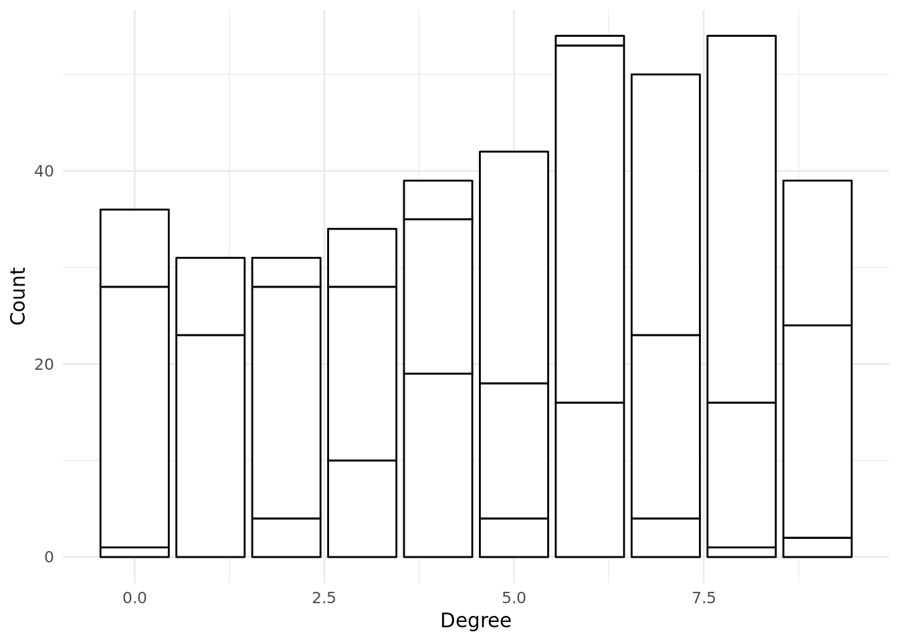

#### Degree distribution of agent->knows->agent edges

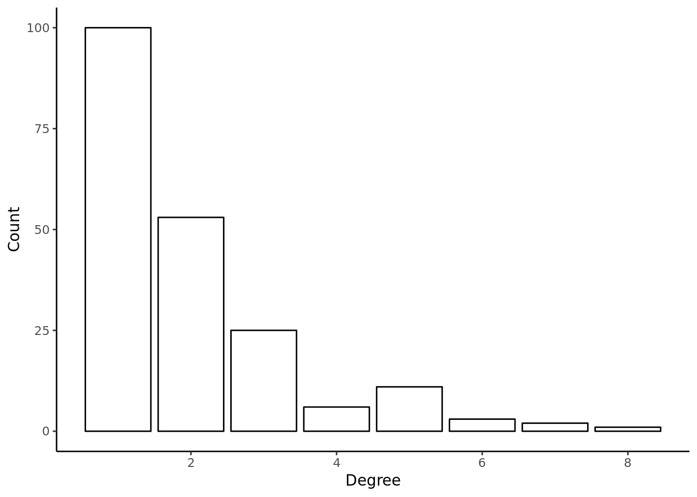

#### Runing time by method 

<table class="table table-condensed" style="width: auto !important; ">
 <thead>
  <tr>
   <th style="text-align:left;"> key </th>
   <th style="text-align:right;"> doc_count </th>
   <th style="text-align:right;"> sum_wallTime_ms.value </th>
   <th style="text-align:left;"> avg_wallTime_ms.value </th>
   <th style="text-align:left;"> includedInTotal </th>
  </tr>
 </thead>
<tbody>
  <tr>
   <td style="text-align:left;"> connectIfSimilar </td>
   <td style="text-align:right;"> 83,845 </td>
   <td style="text-align:right;"> 234,664 </td>
   <td style="text-align:left;"> 2.79878346949729 </td>
   <td style="text-align:left;"> No </td>
  </tr>
  <tr>
   <td style="text-align:left;"> existsSimilarity </td>
   <td style="text-align:right;"> 83,845 </td>
   <td style="text-align:right;"> 217,546 </td>
   <td style="text-align:left;"> 2.59462102689487 </td>
   <td style="text-align:left;"> No </td>
  </tr>
  <tr>
   <td style="text-align:left;"> similarityEdges </td>
   <td style="text-align:right;"> 83,845 </td>
   <td style="text-align:right;"> 214,665 </td>
   <td style="text-align:left;"> 2.56026000357803 </td>
   <td style="text-align:left;"> No </td>
  </tr>
  <tr>
   <td style="text-align:left;"> connect </td>
   <td style="text-align:right;"> 5,278 </td>
   <td style="text-align:right;"> 15,552 </td>
   <td style="text-align:left;"> 2.9465706707086 </td>
   <td style="text-align:left;"> Yes </td>
  </tr>
  <tr>
   <td style="text-align:left;"> connectAllSimilar </td>
   <td style="text-align:right;"> 410 </td>
   <td style="text-align:right;"> 235,532 </td>
   <td style="text-align:left;"> 574.468292682927 </td>
   <td style="text-align:left;"> Yes </td>
  </tr>
  <tr>
   <td style="text-align:left;"> init </td>
   <td style="text-align:right;"> 203 </td>
   <td style="text-align:right;"> 17,075 </td>
   <td style="text-align:left;"> 84.1133004926108 </td>
   <td style="text-align:left;"> No </td>
  </tr>
  <tr>
   <td style="text-align:left;font-weight: bold;"> Total </td>
   <td style="text-align:right;font-weight: bold;"> 5,696 </td>
   <td style="text-align:right;font-weight: bold;"> 251,805 </td>
   <td style="text-align:left;font-weight: bold;">  </td>
   <td style="text-align:left;font-weight: bold;">  </td>
  </tr>
</tbody>
</table>
####  Found structures 

#####  Cycles 

Number of cycles found:  1 

<button class="btn btn-primary" data-toggle="collapse" data-target="#WJJKBCCFJD"> Show/Hide foundCycle query </button> 
 
  
     GET /filebeat-*/_search 
              { 
                "query": {
                  "bool": {
                    "must": [
                      { "match_phrase": {
                        "simulationId": "SIM10-13-06-12-Ezfymi--CV"
                        }
                      },
                      { "bool": {
                        "should": [
                          { "match": {
                            "keyword": "foundCycle"
                          }}
                        ]
                      }}
                    ]
                  }
                }
              }
     

#####  Paths 

Number of paths found:  0 

<button class="btn btn-primary" data-toggle="collapse" data-target="#BWPPPEYCBU"> Show/Hide foundPath query </button> 
 
  
     GET /filebeat-*/_search 
              { 
                "query": {
                  "bool": {
                    "must": [
                      { "match_phrase": {
                        "simulationId": "SIM10-13-06-12-Ezfymi--CV"
                        }
                      },
                      { "bool": {
                        "should": [
                          { "match": {
                            "keyword": "foundPath"
                          }}
                        ]
                      }}
                    ]
                  }
                }
              }
     

###  SIM10-13-06-12-Ezfymi--DV 

#### simulationParameters 

<table class="table table-condensed" style="width: auto !important; ">
 <thead>
  <tr>
   <th style="text-align:left;"> agentNumber </th>
   <th style="text-align:left;"> similarityConnectThreshold </th>
   <th style="text-align:left;"> graphType </th>
   <th style="text-align:left;"> chainLength </th>
   <th style="text-align:left;"> similaritySearchThreshold </th>
   <th style="text-align:left;"> maxDistance </th>
   <th style="text-align:left;"> randomWorksNumberMultiplier </th>
  </tr>
 </thead>
<tbody>
  <tr>
   <td style="text-align:left;width: 20em; "> 200 </td>
   <td style="text-align:left;width: 15em; "> 0.96 </td>
   <td style="text-align:left;width: 15em; "> random </td>
   <td style="text-align:left;width: 15em; "> 5 </td>
   <td style="text-align:left;width: 15em; "> 1 </td>
   <td style="text-align:left;width: 15em; "> 5 </td>
   <td style="text-align:left;width: 15em; "> 1 </td>
  </tr>
</tbody>
</table>
#### allEdgesByLabel

<table class="table table-condensed" style="width: auto !important; ">
 <thead>
  <tr>
   <th style="text-align:right;"> edges_offers </th>
   <th style="text-align:right;"> edges_similarity </th>
   <th style="text-align:right;"> edges_owns </th>
   <th style="text-align:right;"> edges_demands </th>
   <th style="text-align:right;"> edges_knows </th>
   <th style="text-align:right;"> edges_total </th>
  </tr>
 </thead>
<tbody>
  <tr>
   <td style="text-align:right;width: 5em; "> 205 </td>
   <td style="text-align:right;width: 5em; "> 2,642 </td>
   <td style="text-align:right;width: 5em; "> 205 </td>
   <td style="text-align:right;width: 5em; "> 205 </td>
   <td style="text-align:right;width: 5em; "> 200 </td>
   <td style="text-align:right;width: 5em; "> 3,457 </td>
  </tr>
</tbody>
</table>
#### allVerticesByType

<table class="table table-condensed" style="width: auto !important; ">
 <thead>
  <tr>
   <th style="text-align:right;"> vertices_agent </th>
   <th style="text-align:right;"> vertices_item </th>
   <th style="text-align:right;"> vertices_work </th>
   <th style="text-align:right;"> vertices_total </th>
  </tr>
 </thead>
<tbody>
  <tr>
   <td style="text-align:right;width: 5em; "> 201 </td>
   <td style="text-align:right;width: 5em; "> 410 </td>
   <td style="text-align:right;width: 5em; "> 205 </td>
   <td style="text-align:right;width: 5em; "> 816 </td>
  </tr>
</tbody>
</table>
#### distribution of similarityEdgesByWeight

#### Degree distribution of item->similarity->item edges

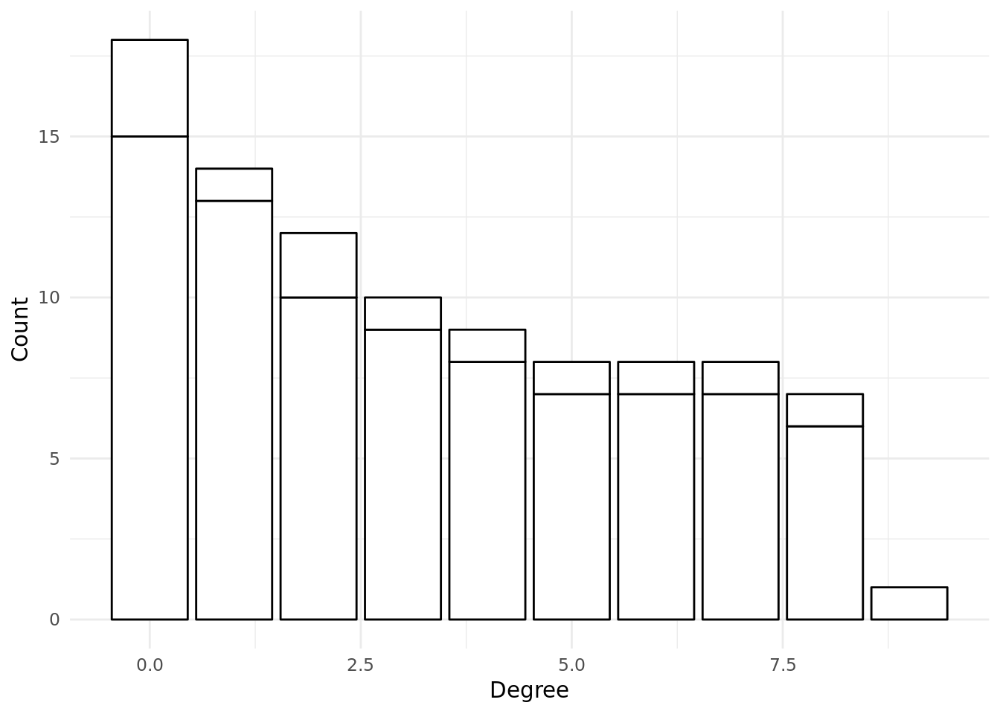

#### Degree distribution of agent->knows->agent edges

#### Runing time by method 

<table class="table table-condensed" style="width: auto !important; ">
 <thead>
  <tr>
   <th style="text-align:left;">   </th>
   <th style="text-align:left;"> key </th>
   <th style="text-align:right;"> doc_count </th>
   <th style="text-align:right;"> sum_wallTime_ms.value </th>
   <th style="text-align:left;"> avg_wallTime_ms.value </th>
   <th style="text-align:left;"> includedInTotal </th>
  </tr>
 </thead>
<tbody>
  <tr>
   <td style="text-align:left;"> 2 </td>
   <td style="text-align:left;"> cycleSearch </td>
   <td style="text-align:right;"> 3,600 </td>
   <td style="text-align:right;"> 13,339 </td>
   <td style="text-align:left;"> 3.70527777777778 </td>
   <td style="text-align:left;"> Yes </td>
  </tr>
  <tr>
   <td style="text-align:left;"> 3 </td>
   <td style="text-align:left;"> getWorks </td>
   <td style="text-align:right;"> 3,600 </td>
   <td style="text-align:right;"> 61,033 </td>
   <td style="text-align:left;"> 16.9536111111111 </td>
   <td style="text-align:left;"> No </td>
  </tr>
  <tr>
   <td style="text-align:left;"> 4 </td>
   <td style="text-align:left;"> individualCycleSearch </td>
   <td style="text-align:right;"> 3,600 </td>
   <td style="text-align:right;"> 77 </td>
   <td style="text-align:left;"> 0.0213888888888889 </td>
   <td style="text-align:left;"> Yes </td>
  </tr>
  <tr>
   <td style="text-align:left;"> 6 </td>
   <td style="text-align:left;"> addItemToWork </td>
   <td style="text-align:right;"> 410 </td>
   <td style="text-align:right;"> 6,267 </td>
   <td style="text-align:left;"> 15.2853658536585 </td>
   <td style="text-align:left;"> No </td>
  </tr>
  <tr>
   <td style="text-align:left;"> 7 </td>
   <td style="text-align:left;"> ownsWork </td>
   <td style="text-align:right;"> 205 </td>
   <td style="text-align:right;"> 3,786 </td>
   <td style="text-align:left;"> 18.4682926829268 </td>
   <td style="text-align:left;"> No </td>
  </tr>
  <tr>
   <td style="text-align:left;"> 8 </td>
   <td style="text-align:left;"> init </td>
   <td style="text-align:right;"> 203 </td>
   <td style="text-align:right;"> 18,106 </td>
   <td style="text-align:left;"> 89.192118226601 </td>
   <td style="text-align:left;"> No </td>
  </tr>
  <tr>
   <td style="text-align:left;"> 9 </td>
   <td style="text-align:left;"> searchAndConnect </td>
   <td style="text-align:right;"> 201 </td>
   <td style="text-align:right;"> 38,221 </td>
   <td style="text-align:left;"> 190.154228855721 </td>
   <td style="text-align:left;"> Yes </td>
  </tr>
  <tr>
   <td style="text-align:left;"> 10 </td>
   <td style="text-align:left;"> knowsAgent </td>
   <td style="text-align:right;"> 200 </td>
   <td style="text-align:right;"> 1,179 </td>
   <td style="text-align:left;"> 5.895 </td>
   <td style="text-align:left;"> No </td>
  </tr>
  <tr>
   <td style="text-align:left;font-weight: bold;"> 1 </td>
   <td style="text-align:left;font-weight: bold;"> Total </td>
   <td style="text-align:right;font-weight: bold;"> 14,601 </td>
   <td style="text-align:right;font-weight: bold;"> 66,030 </td>
   <td style="text-align:left;font-weight: bold;">  </td>
   <td style="text-align:left;font-weight: bold;">  </td>
  </tr>
</tbody>
</table>
####  Found structures 

#####  Cycles 

Number of cycles found:  0 

<button class="btn btn-primary" data-toggle="collapse" data-target="#ERXKZCKHTT"> Show/Hide foundCycle query </button> 
 
  
     GET /filebeat-*/_search 
              { 
                "query": {
                  "bool": {
                    "must": [
                      { "match_phrase": {
                        "simulationId": "SIM10-13-06-12-Ezfymi--DV"
                        }
                      },
                      { "bool": {
                        "should": [
                          { "match": {
                            "keyword": "foundCycle"
                          }}
                        ]
                      }}
                    ]
                  }
                }
              }
     

#####  Paths 

Number of paths found:  3600 

<button class="btn btn-primary" data-toggle="collapse" data-target="#XTBQBFRPMA"> Show/Hide foundPath query </button> 
 
  
     GET /filebeat-*/_search 
              { 
                "query": {
                  "bool": {
                    "must": [
                      { "match_phrase": {
                        "simulationId": "SIM10-13-06-12-Ezfymi--DV"
                        }
                      },
                      { "bool": {
                        "should": [
                          { "match": {
                            "keyword": "foundPath"
                          }}
                        ]
                      }}
                    ]
                  }
                }
              }
     

###  SIM10-13-07-16-z6ZmRg--CV 

#### simulationParameters 

<table class="table table-condensed" style="width: auto !important; ">
 <thead>
  <tr>
   <th style="text-align:left;"> agentNumber </th>
   <th style="text-align:left;"> similarityConnectThreshold </th>
   <th style="text-align:left;"> graphType </th>
   <th style="text-align:left;"> chainLength </th>
   <th style="text-align:left;"> similaritySearchThreshold </th>
   <th style="text-align:left;"> maxDistance </th>
   <th style="text-align:left;"> randomWorksNumberMultiplier </th>
  </tr>
 </thead>
<tbody>
  <tr>
   <td style="text-align:left;width: 20em; "> 200 </td>
   <td style="text-align:left;width: 15em; "> 0.96 </td>
   <td style="text-align:left;width: 15em; "> smallWorld </td>
   <td style="text-align:left;width: 15em; "> 5 </td>
   <td style="text-align:left;width: 15em; "> 1 </td>
   <td style="text-align:left;width: 15em; "> 5 </td>
   <td style="text-align:left;width: 15em; "> 1 </td>
  </tr>
</tbody>
</table>
#### allEdgesByLabel

<table class="table table-condensed" style="width: auto !important; ">
 <thead>
  <tr>
   <th style="text-align:right;"> edges_offers </th>
   <th style="text-align:right;"> edges_similarity </th>
   <th style="text-align:right;"> edges_owns </th>
   <th style="text-align:right;"> edges_demands </th>
   <th style="text-align:right;"> edges_knows </th>
   <th style="text-align:right;"> edges_total </th>
  </tr>
 </thead>
<tbody>
  <tr>
   <td style="text-align:right;width: 5em; "> 205 </td>
   <td style="text-align:right;width: 5em; "> 13,766 </td>
   <td style="text-align:right;width: 5em; "> 205 </td>
   <td style="text-align:right;width: 5em; "> 205 </td>
   <td style="text-align:right;width: 5em; "> 1,201 </td>
   <td style="text-align:right;width: 5em; "> 15,582 </td>
  </tr>
</tbody>
</table>
#### allVerticesByType

<table class="table table-condensed" style="width: auto !important; ">
 <thead>
  <tr>
   <th style="text-align:right;"> vertices_agent </th>
   <th style="text-align:right;"> vertices_item </th>
   <th style="text-align:right;"> vertices_work </th>
   <th style="text-align:right;"> vertices_total </th>
  </tr>
 </thead>
<tbody>
  <tr>
   <td style="text-align:right;width: 5em; "> 201 </td>
   <td style="text-align:right;width: 5em; "> 410 </td>
   <td style="text-align:right;width: 5em; "> 205 </td>
   <td style="text-align:right;width: 5em; "> 816 </td>
  </tr>
</tbody>
</table>
#### distribution of similarityEdgesByWeight

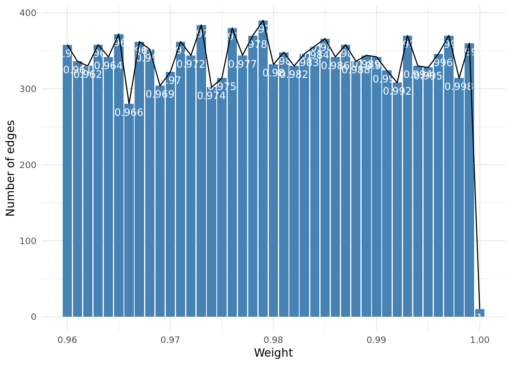

#### Degree distribution of item->similarity->item edges

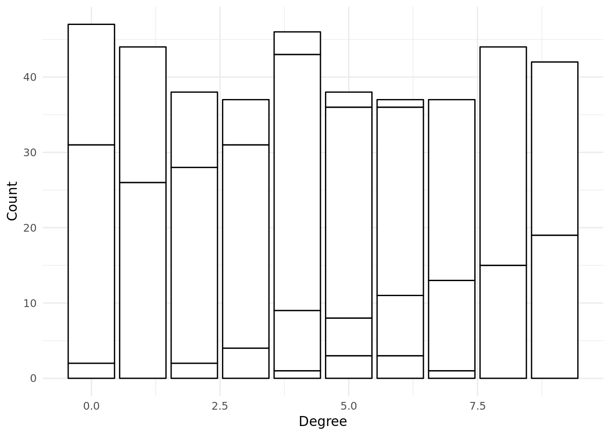

#### Degree distribution of agent->knows->agent edges

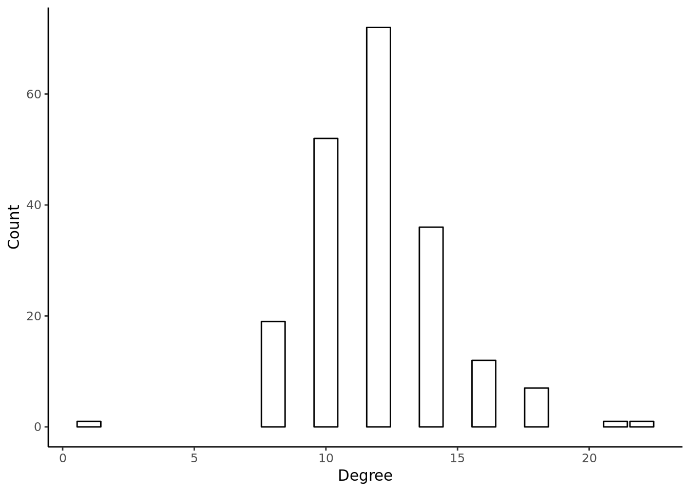

#### Runing time by method 

<table class="table table-condensed" style="width: auto !important; ">
 <thead>
  <tr>
   <th style="text-align:left;"> key </th>
   <th style="text-align:right;"> doc_count </th>
   <th style="text-align:right;"> sum_wallTime_ms.value </th>
   <th style="text-align:left;"> avg_wallTime_ms.value </th>
   <th style="text-align:left;"> includedInTotal </th>
  </tr>
 </thead>
<tbody>
  <tr>
   <td style="text-align:left;"> connectIfSimilar </td>
   <td style="text-align:right;"> 83,845 </td>
   <td style="text-align:right;"> 246,439 </td>
   <td style="text-align:left;"> 2.93922118194287 </td>
   <td style="text-align:left;"> No </td>
  </tr>
  <tr>
   <td style="text-align:left;"> existsSimilarity </td>
   <td style="text-align:right;"> 83,845 </td>
   <td style="text-align:right;"> 244,837 </td>
   <td style="text-align:left;"> 2.92011449698849 </td>
   <td style="text-align:left;"> No </td>
  </tr>
  <tr>
   <td style="text-align:left;"> similarityEdges </td>
   <td style="text-align:right;"> 83,845 </td>
   <td style="text-align:right;"> 241,573 </td>
   <td style="text-align:left;"> 2.88118552090166 </td>
   <td style="text-align:left;"> No </td>
  </tr>
  <tr>
   <td style="text-align:left;"> connectAllSimilar </td>
   <td style="text-align:right;"> 410 </td>
   <td style="text-align:right;"> 247,191 </td>
   <td style="text-align:left;"> 602.90487804878 </td>
   <td style="text-align:left;"> Yes </td>
  </tr>
  <tr>
   <td style="text-align:left;"> init </td>
   <td style="text-align:right;"> 203 </td>
   <td style="text-align:right;"> 17,496 </td>
   <td style="text-align:left;"> 86.1871921182266 </td>
   <td style="text-align:left;"> No </td>
  </tr>
  <tr>
   <td style="text-align:left;"> connect </td>
   <td style="text-align:right;"> 64 </td>
   <td style="text-align:right;"> 192 </td>
   <td style="text-align:left;"> 3 </td>
   <td style="text-align:left;"> Yes </td>
  </tr>
  <tr>
   <td style="text-align:left;font-weight: bold;"> Total </td>
   <td style="text-align:right;font-weight: bold;"> 482 </td>
   <td style="text-align:right;font-weight: bold;"> 248,047 </td>
   <td style="text-align:left;font-weight: bold;">  </td>
   <td style="text-align:left;font-weight: bold;">  </td>
  </tr>
</tbody>
</table>
####  Found structures 

#####  Cycles 

Number of cycles found:  1 

<button class="btn btn-primary" data-toggle="collapse" data-target="#ARVMQBAIIQ"> Show/Hide foundCycle query </button> 
 
  
     GET /filebeat-*/_search 
              { 
                "query": {
                  "bool": {
                    "must": [
                      { "match_phrase": {
                        "simulationId": "SIM10-13-07-16-z6ZmRg--CV"
                        }
                      },
                      { "bool": {
                        "should": [
                          { "match": {
                            "keyword": "foundCycle"
                          }}
                        ]
                      }}
                    ]
                  }
                }
              }
     

#####  Paths 

Number of paths found:  0 

<button class="btn btn-primary" data-toggle="collapse" data-target="#FMXOJOVPYN"> Show/Hide foundPath query </button> 
 
  
     GET /filebeat-*/_search 
              { 
                "query": {
                  "bool": {
                    "must": [
                      { "match_phrase": {
                        "simulationId": "SIM10-13-07-16-z6ZmRg--CV"
                        }
                      },
                      { "bool": {
                        "should": [
                          { "match": {
                            "keyword": "foundPath"
                          }}
                        ]
                      }}
                    ]
                  }
                }
              }
     

###  SIM10-13-07-16-z6ZmRg--DV 

#### simulationParameters 

<table class="table table-condensed" style="width: auto !important; ">
 <thead>
  <tr>
   <th style="text-align:left;"> agentNumber </th>
   <th style="text-align:left;"> similarityConnectThreshold </th>
   <th style="text-align:left;"> graphType </th>
   <th style="text-align:left;"> chainLength </th>
   <th style="text-align:left;"> similaritySearchThreshold </th>
   <th style="text-align:left;"> maxDistance </th>
   <th style="text-align:left;"> randomWorksNumberMultiplier </th>
  </tr>
 </thead>
<tbody>
  <tr>
   <td style="text-align:left;width: 20em; "> 200 </td>
   <td style="text-align:left;width: 15em; "> 0.96 </td>
   <td style="text-align:left;width: 15em; "> smallWorld </td>
   <td style="text-align:left;width: 15em; "> 5 </td>
   <td style="text-align:left;width: 15em; "> 1 </td>
   <td style="text-align:left;width: 15em; "> 5 </td>
   <td style="text-align:left;width: 15em; "> 1 </td>
  </tr>
</tbody>
</table>
#### allEdgesByLabel

<table class="table table-condensed" style="width: auto !important; ">
 <thead>
  <tr>
   <th style="text-align:right;"> edges_offers </th>
   <th style="text-align:right;"> edges_similarity </th>
   <th style="text-align:right;"> edges_owns </th>
   <th style="text-align:right;"> edges_demands </th>
   <th style="text-align:right;"> edges_knows </th>
   <th style="text-align:right;"> edges_total </th>
  </tr>
 </thead>
<tbody>
  <tr>
   <td style="text-align:right;width: 5em; "> 205 </td>
   <td style="text-align:right;width: 5em; "> 13,638 </td>
   <td style="text-align:right;width: 5em; "> 205 </td>
   <td style="text-align:right;width: 5em; "> 205 </td>
   <td style="text-align:right;width: 5em; "> 1,201 </td>
   <td style="text-align:right;width: 5em; "> 15,454 </td>
  </tr>
</tbody>
</table>
#### allVerticesByType

<table class="table table-condensed" style="width: auto !important; ">
 <thead>
  <tr>
   <th style="text-align:right;"> vertices_agent </th>
   <th style="text-align:right;"> vertices_item </th>
   <th style="text-align:right;"> vertices_work </th>
   <th style="text-align:right;"> vertices_total </th>
  </tr>
 </thead>
<tbody>
  <tr>
   <td style="text-align:right;width: 5em; "> 201 </td>
   <td style="text-align:right;width: 5em; "> 410 </td>
   <td style="text-align:right;width: 5em; "> 205 </td>
   <td style="text-align:right;width: 5em; "> 816 </td>
  </tr>
</tbody>
</table>
#### distribution of similarityEdgesByWeight

#### Degree distribution of item->similarity->item edges

#### Degree distribution of agent->knows->agent edges

#### Runing time by method 

<table class="table table-condensed" style="width: auto !important; ">
 <thead>
  <tr>
   <th style="text-align:left;">   </th>
   <th style="text-align:left;"> key </th>
   <th style="text-align:right;"> doc_count </th>
   <th style="text-align:right;"> sum_wallTime_ms.value </th>
   <th style="text-align:left;"> avg_wallTime_ms.value </th>
   <th style="text-align:left;"> includedInTotal </th>
  </tr>
 </thead>
<tbody>
  <tr>
   <td style="text-align:left;"> 1 </td>
   <td style="text-align:left;"> knowsAgent </td>
   <td style="text-align:right;"> 1,201 </td>
   <td style="text-align:right;"> 2,919 </td>
   <td style="text-align:left;"> 2.43047460449625 </td>
   <td style="text-align:left;"> No </td>
  </tr>
  <tr>
   <td style="text-align:left;"> 2 </td>
   <td style="text-align:left;"> addItemToWork </td>
   <td style="text-align:right;"> 410 </td>
   <td style="text-align:right;"> 4,632 </td>
   <td style="text-align:left;"> 11.2975609756098 </td>
   <td style="text-align:left;"> No </td>
  </tr>
  <tr>
   <td style="text-align:left;"> 3 </td>
   <td style="text-align:left;"> ownsWork </td>
   <td style="text-align:right;"> 205 </td>
   <td style="text-align:right;"> 3,109 </td>
   <td style="text-align:left;"> 15.1658536585366 </td>
   <td style="text-align:left;"> No </td>
  </tr>
  <tr>
   <td style="text-align:left;"> 4 </td>
   <td style="text-align:left;"> init </td>
   <td style="text-align:right;"> 203 </td>
   <td style="text-align:right;"> 18,255 </td>
   <td style="text-align:left;"> 89.9261083743842 </td>
   <td style="text-align:left;"> No </td>
  </tr>
  <tr>
   <td style="text-align:left;"> 5 </td>
   <td style="text-align:left;"> searchAndConnect </td>
   <td style="text-align:right;"> 201 </td>
   <td style="text-align:right;"> 221,351 </td>
   <td style="text-align:left;"> 1101.24875621891 </td>
   <td style="text-align:left;"> Yes </td>
  </tr>
  <tr>
   <td style="text-align:left;"> 6 </td>
   <td style="text-align:left;"> getWorksItems </td>
   <td style="text-align:right;"> 8 </td>
   <td style="text-align:right;"> 13 </td>
   <td style="text-align:left;"> 1.625 </td>
   <td style="text-align:left;"> Yes </td>
  </tr>
  <tr>
   <td style="text-align:left;"> 8 </td>
   <td style="text-align:left;"> cycleSearch </td>
   <td style="text-align:right;"> 7 </td>
   <td style="text-align:right;"> 1,880 </td>
   <td style="text-align:left;"> 268.571428571429 </td>
   <td style="text-align:left;"> Yes </td>
  </tr>
  <tr>
   <td style="text-align:left;"> 9 </td>
   <td style="text-align:left;"> getWorks </td>
   <td style="text-align:right;"> 7 </td>
   <td style="text-align:right;"> 717 </td>
   <td style="text-align:left;"> 102.428571428571 </td>
   <td style="text-align:left;"> No </td>
  </tr>
  <tr>
   <td style="text-align:left;"> 10 </td>
   <td style="text-align:left;"> individualCycleSearch </td>
   <td style="text-align:right;"> 7 </td>
   <td style="text-align:right;"> 0 </td>
   <td style="text-align:left;"> 0 </td>
   <td style="text-align:left;"> Yes </td>
  </tr>
  <tr>
   <td style="text-align:left;font-weight: bold;"> 11 </td>
   <td style="text-align:left;font-weight: bold;"> Total </td>
   <td style="text-align:right;font-weight: bold;"> 230 </td>
   <td style="text-align:right;font-weight: bold;"> 224,814 </td>
   <td style="text-align:left;font-weight: bold;">  </td>
   <td style="text-align:left;font-weight: bold;">  </td>
  </tr>
</tbody>
</table>
####  Found structures 

#####  Cycles 

Number of cycles found:  7 

<button class="btn btn-primary" data-toggle="collapse" data-target="#LMBUUTRATE"> Show/Hide foundCycle query </button> 
 
  
     GET /filebeat-*/_search 
              { 
                "query": {
                  "bool": {
                    "must": [
                      { "match_phrase": {
                        "simulationId": "SIM10-13-07-16-z6ZmRg--DV"
                        }
                      },
                      { "bool": {
                        "should": [
                          { "match": {
                            "keyword": "foundCycle"
                          }}
                        ]
                      }}
                    ]
                  }
                }
              }
     

#####  Paths 

Number of paths found:  0 

<button class="btn btn-primary" data-toggle="collapse" data-target="#KSIFGSUAFJ"> Show/Hide foundPath query </button> 
 
  
     GET /filebeat-*/_search 
              { 
                "query": {
                  "bool": {
                    "must": [
                      { "match_phrase": {
                        "simulationId": "SIM10-13-07-16-z6ZmRg--DV"
                        }
                      },
                      { "bool": {
                        "should": [
                          { "match": {
                            "keyword": "foundPath"
                          }}
                        ]
                      }}
                    ]
                  }
                }
              }
     

###  SIM10-13-07-41-qhBaj4--CV 

#### simulationParameters 

<table class="table table-condensed" style="width: auto !important; ">
 <thead>
  <tr>
   <th style="text-align:left;"> agentNumber </th>
   <th style="text-align:left;"> similarityConnectThreshold </th>
   <th style="text-align:left;"> graphType </th>
   <th style="text-align:left;"> chainLength </th>
   <th style="text-align:left;"> similaritySearchThreshold </th>
   <th style="text-align:left;"> maxDistance </th>
   <th style="text-align:left;"> randomWorksNumberMultiplier </th>
  </tr>
 </thead>
<tbody>
  <tr>
   <td style="text-align:left;width: 20em; "> 200 </td>
   <td style="text-align:left;width: 15em; "> 0.96 </td>
   <td style="text-align:left;width: 15em; "> random </td>
   <td style="text-align:left;width: 15em; "> 5 </td>
   <td style="text-align:left;width: 15em; "> 1 </td>
   <td style="text-align:left;width: 15em; "> 5 </td>
   <td style="text-align:left;width: 15em; "> 2 </td>
  </tr>
</tbody>
</table>
#### allEdgesByLabel

<table class="table table-condensed" style="width: auto !important; ">
 <thead>
  <tr>
   <th style="text-align:right;"> edges_offers </th>
   <th style="text-align:right;"> edges_similarity </th>
   <th style="text-align:right;"> edges_owns </th>
   <th style="text-align:right;"> edges_demands </th>
   <th style="text-align:right;"> edges_knows </th>
   <th style="text-align:right;"> edges_total </th>
  </tr>
 </thead>
<tbody>
  <tr>
   <td style="text-align:right;width: 5em; "> 405 </td>
   <td style="text-align:right;width: 5em; "> 52,490 </td>
   <td style="text-align:right;width: 5em; "> 405 </td>
   <td style="text-align:right;width: 5em; "> 405 </td>
   <td style="text-align:right;width: 5em; "> 200 </td>
   <td style="text-align:right;width: 5em; "> 53,905 </td>
  </tr>
</tbody>
</table>
#### allVerticesByType

<table class="table table-condensed" style="width: auto !important; ">
 <thead>
  <tr>
   <th style="text-align:right;"> vertices_agent </th>
   <th style="text-align:right;"> vertices_item </th>
   <th style="text-align:right;"> vertices_work </th>
   <th style="text-align:right;"> vertices_total </th>
  </tr>
 </thead>
<tbody>
  <tr>
   <td style="text-align:right;width: 5em; "> 201 </td>
   <td style="text-align:right;width: 5em; "> 810 </td>
   <td style="text-align:right;width: 5em; "> 405 </td>
   <td style="text-align:right;width: 5em; "> 1,416 </td>
  </tr>
</tbody>
</table>
#### distribution of similarityEdgesByWeight

#### Degree distribution of item->similarity->item edges

#### Degree distribution of agent->knows->agent edges

#### Runing time by method 

<table class="table table-condensed" style="width: auto !important; ">
 <thead>
  <tr>
   <th style="text-align:left;"> key </th>
   <th style="text-align:right;"> doc_count </th>
   <th style="text-align:right;"> sum_wallTime_ms.value </th>
   <th style="text-align:left;"> avg_wallTime_ms.value </th>
   <th style="text-align:left;"> includedInTotal </th>
  </tr>
 </thead>
<tbody>
  <tr>
   <td style="text-align:left;"> connectIfSimilar </td>
   <td style="text-align:right;"> 327,645 </td>
   <td style="text-align:right;"> 1,193,808 </td>
   <td style="text-align:left;"> 3.64360206931282 </td>
   <td style="text-align:left;"> No </td>
  </tr>
  <tr>
   <td style="text-align:left;"> existsSimilarity </td>
   <td style="text-align:right;"> 327,645 </td>
   <td style="text-align:right;"> 1,117,979 </td>
   <td style="text-align:left;"> 3.41216560606754 </td>
   <td style="text-align:left;"> No </td>
  </tr>
  <tr>
   <td style="text-align:left;"> similarityEdges </td>
   <td style="text-align:right;"> 327,645 </td>
   <td style="text-align:right;"> 1,102,761 </td>
   <td style="text-align:left;"> 3.36571899464359 </td>
   <td style="text-align:left;"> No </td>
  </tr>
  <tr>
   <td style="text-align:left;"> connect </td>
   <td style="text-align:right;"> 19,761 </td>
   <td style="text-align:right;"> 69,349 </td>
   <td style="text-align:left;"> 3.50938717676231 </td>
   <td style="text-align:left;"> Yes </td>
  </tr>
  <tr>
   <td style="text-align:left;"> connectAllSimilar </td>
   <td style="text-align:right;"> 810 </td>
   <td style="text-align:right;"> 1,197,253 </td>
   <td style="text-align:left;"> 1478.09012345679 </td>
   <td style="text-align:left;"> Yes </td>
  </tr>
  <tr>
   <td style="text-align:left;"> init </td>
   <td style="text-align:right;"> 203 </td>
   <td style="text-align:right;"> 17,685 </td>
   <td style="text-align:left;"> 87.1182266009852 </td>
   <td style="text-align:left;"> No </td>
  </tr>
  <tr>
   <td style="text-align:left;font-weight: bold;"> Total </td>
   <td style="text-align:right;font-weight: bold;"> 20,579 </td>
   <td style="text-align:right;font-weight: bold;"> 1,268,070 </td>
   <td style="text-align:left;font-weight: bold;">  </td>
   <td style="text-align:left;font-weight: bold;">  </td>
  </tr>
</tbody>
</table>
####  Found structures 

#####  Cycles 

Number of cycles found:  1 

<button class="btn btn-primary" data-toggle="collapse" data-target="#DTECXKFKBJ"> Show/Hide foundCycle query </button> 
 
  
     GET /filebeat-*/_search 
              { 
                "query": {
                  "bool": {
                    "must": [
                      { "match_phrase": {
                        "simulationId": "SIM10-13-07-41-qhBaj4--CV"
                        }
                      },
                      { "bool": {
                        "should": [
                          { "match": {
                            "keyword": "foundCycle"
                          }}
                        ]
                      }}
                    ]
                  }
                }
              }
     

#####  Paths 

Number of paths found:  0 

<button class="btn btn-primary" data-toggle="collapse" data-target="#SJERENYOYJ"> Show/Hide foundPath query </button> 
 
  
     GET /filebeat-*/_search 
              { 
                "query": {
                  "bool": {
                    "must": [
                      { "match_phrase": {
                        "simulationId": "SIM10-13-07-41-qhBaj4--CV"
                        }
                      },
                      { "bool": {
                        "should": [
                          { "match": {
                            "keyword": "foundPath"
                          }}
                        ]
                      }}
                    ]
                  }
                }
              }
     

###  SIM10-13-07-41-qhBaj4--DV 

#### simulationParameters 

<table class="table table-condensed" style="width: auto !important; ">
 <thead>
  <tr>
   <th style="text-align:left;"> agentNumber </th>
   <th style="text-align:left;"> similarityConnectThreshold </th>
   <th style="text-align:left;"> graphType </th>
   <th style="text-align:left;"> chainLength </th>
   <th style="text-align:left;"> similaritySearchThreshold </th>
   <th style="text-align:left;"> maxDistance </th>
   <th style="text-align:left;"> randomWorksNumberMultiplier </th>
  </tr>
 </thead>
<tbody>
  <tr>
   <td style="text-align:left;width: 20em; "> 200 </td>
   <td style="text-align:left;width: 15em; "> 0.96 </td>
   <td style="text-align:left;width: 15em; "> random </td>
   <td style="text-align:left;width: 15em; "> 5 </td>
   <td style="text-align:left;width: 15em; "> 1 </td>
   <td style="text-align:left;width: 15em; "> 5 </td>
   <td style="text-align:left;width: 15em; "> 2 </td>
  </tr>
</tbody>
</table>
#### allEdgesByLabel

<table class="table table-condensed" style="width: auto !important; ">
 <thead>
  <tr>
   <th style="text-align:right;"> edges_offers </th>
   <th style="text-align:right;"> edges_similarity </th>
   <th style="text-align:right;"> edges_owns </th>
   <th style="text-align:right;"> edges_demands </th>
   <th style="text-align:right;"> edges_knows </th>
   <th style="text-align:right;"> edges_total </th>
  </tr>
 </thead>
<tbody>
  <tr>
   <td style="text-align:right;width: 5em; "> 405 </td>
   <td style="text-align:right;width: 5em; "> 12,968 </td>
   <td style="text-align:right;width: 5em; "> 405 </td>
   <td style="text-align:right;width: 5em; "> 405 </td>
   <td style="text-align:right;width: 5em; "> 200 </td>
   <td style="text-align:right;width: 5em; "> 14,383 </td>
  </tr>
</tbody>
</table>
#### allVerticesByType

<table class="table table-condensed" style="width: auto !important; ">
 <thead>
  <tr>
   <th style="text-align:right;"> vertices_agent </th>
   <th style="text-align:right;"> vertices_item </th>
   <th style="text-align:right;"> vertices_work </th>
   <th style="text-align:right;"> vertices_total </th>
  </tr>
 </thead>
<tbody>
  <tr>
   <td style="text-align:right;width: 5em; "> 201 </td>
   <td style="text-align:right;width: 5em; "> 810 </td>
   <td style="text-align:right;width: 5em; "> 405 </td>
   <td style="text-align:right;width: 5em; "> 1,416 </td>
  </tr>
</tbody>
</table>
#### distribution of similarityEdgesByWeight

#### Degree distribution of item->similarity->item edges

#### Degree distribution of agent->knows->agent edges

#### Runing time by method 

<table class="table table-condensed" style="width: auto !important; ">
 <thead>
  <tr>
   <th style="text-align:left;">   </th>
   <th style="text-align:left;"> key </th>
   <th style="text-align:right;"> doc_count </th>
   <th style="text-align:right;"> sum_wallTime_ms.value </th>
   <th style="text-align:left;"> avg_wallTime_ms.value </th>
   <th style="text-align:left;"> includedInTotal </th>
  </tr>
 </thead>
<tbody>
  <tr>
   <td style="text-align:left;"> 2 </td>
   <td style="text-align:left;"> cycleSearch </td>
   <td style="text-align:right;"> 3,600 </td>
   <td style="text-align:right;"> 29,017 </td>
   <td style="text-align:left;"> 8.06027777777778 </td>
   <td style="text-align:left;"> Yes </td>
  </tr>
  <tr>
   <td style="text-align:left;"> 3 </td>
   <td style="text-align:left;"> getWorks </td>
   <td style="text-align:right;"> 3,600 </td>
   <td style="text-align:right;"> 65,877 </td>
   <td style="text-align:left;"> 18.2991666666667 </td>
   <td style="text-align:left;"> No </td>
  </tr>
  <tr>
   <td style="text-align:left;"> 4 </td>
   <td style="text-align:left;"> individualCycleSearch </td>
   <td style="text-align:right;"> 3,600 </td>
   <td style="text-align:right;"> 70 </td>
   <td style="text-align:left;"> 0.0194444444444444 </td>
   <td style="text-align:left;"> Yes </td>
  </tr>
  <tr>
   <td style="text-align:left;"> 6 </td>
   <td style="text-align:left;"> addItemToWork </td>
   <td style="text-align:right;"> 810 </td>
   <td style="text-align:right;"> 9,059 </td>
   <td style="text-align:left;"> 11.183950617284 </td>
   <td style="text-align:left;"> No </td>
  </tr>
  <tr>
   <td style="text-align:left;"> 7 </td>
   <td style="text-align:left;"> ownsWork </td>
   <td style="text-align:right;"> 405 </td>
   <td style="text-align:right;"> 5,168 </td>
   <td style="text-align:left;"> 12.7604938271605 </td>
   <td style="text-align:left;"> No </td>
  </tr>
  <tr>
   <td style="text-align:left;"> 8 </td>
   <td style="text-align:left;"> init </td>
   <td style="text-align:right;"> 203 </td>
   <td style="text-align:right;"> 19,711 </td>
   <td style="text-align:left;"> 97.0985221674877 </td>
   <td style="text-align:left;"> No </td>
  </tr>
  <tr>
   <td style="text-align:left;"> 9 </td>
   <td style="text-align:left;"> searchAndConnect </td>
   <td style="text-align:right;"> 201 </td>
   <td style="text-align:right;"> 131,782 </td>
   <td style="text-align:left;"> 655.63184079602 </td>
   <td style="text-align:left;"> Yes </td>
  </tr>
  <tr>
   <td style="text-align:left;"> 10 </td>
   <td style="text-align:left;"> knowsAgent </td>
   <td style="text-align:right;"> 200 </td>
   <td style="text-align:right;"> 1,150 </td>
   <td style="text-align:left;"> 5.75 </td>
   <td style="text-align:left;"> No </td>
  </tr>
  <tr>
   <td style="text-align:left;font-weight: bold;"> 1 </td>
   <td style="text-align:left;font-weight: bold;"> Total </td>
   <td style="text-align:right;font-weight: bold;"> 14,601 </td>
   <td style="text-align:right;font-weight: bold;"> 224,956 </td>
   <td style="text-align:left;font-weight: bold;">  </td>
   <td style="text-align:left;font-weight: bold;">  </td>
  </tr>
</tbody>
</table>
####  Found structures 

#####  Cycles 

Number of cycles found:  0 

<button class="btn btn-primary" data-toggle="collapse" data-target="#AMABWISVFE"> Show/Hide foundCycle query </button> 
 
  
     GET /filebeat-*/_search 
              { 
                "query": {
                  "bool": {
                    "must": [
                      { "match_phrase": {
                        "simulationId": "SIM10-13-07-41-qhBaj4--DV"
                        }
                      },
                      { "bool": {
                        "should": [
                          { "match": {
                            "keyword": "foundCycle"
                          }}
                        ]
                      }}
                    ]
                  }
                }
              }
     

#####  Paths 

Number of paths found:  3600 

<button class="btn btn-primary" data-toggle="collapse" data-target="#JQNEZKPHNU"> Show/Hide foundPath query </button> 
 
  
     GET /filebeat-*/_search 
              { 
                "query": {
                  "bool": {
                    "must": [
                      { "match_phrase": {
                        "simulationId": "SIM10-13-07-41-qhBaj4--DV"
                        }
                      },
                      { "bool": {
                        "should": [
                          { "match": {
                            "keyword": "foundPath"
                          }}
                        ]
                      }}
                    ]
                  }
                }
              }
     

###  SIM10-13-09-01-ThjPAQ--CV 

#### simulationParameters 

<table class="table table-condensed" style="width: auto !important; ">
 <thead>
  <tr>
   <th style="text-align:left;"> agentNumber </th>
   <th style="text-align:left;"> similarityConnectThreshold </th>
   <th style="text-align:left;"> graphType </th>
   <th style="text-align:left;"> chainLength </th>
   <th style="text-align:left;"> similaritySearchThreshold </th>
   <th style="text-align:left;"> maxDistance </th>
   <th style="text-align:left;"> randomWorksNumberMultiplier </th>
  </tr>
 </thead>
<tbody>
  <tr>
   <td style="text-align:left;width: 20em; "> 200 </td>
   <td style="text-align:left;width: 15em; "> 0.96 </td>
   <td style="text-align:left;width: 15em; "> smallWorld </td>
   <td style="text-align:left;width: 15em; "> 5 </td>
   <td style="text-align:left;width: 15em; "> 1 </td>
   <td style="text-align:left;width: 15em; "> 5 </td>
   <td style="text-align:left;width: 15em; "> 2 </td>
  </tr>
</tbody>
</table>
#### allEdgesByLabel

<table class="table table-condensed" style="width: auto !important; ">
 <thead>
  <tr>
   <th style="text-align:right;"> edges_offers </th>
   <th style="text-align:right;"> edges_similarity </th>
   <th style="text-align:right;"> edges_owns </th>
   <th style="text-align:right;"> edges_demands </th>
   <th style="text-align:right;"> edges_knows </th>
   <th style="text-align:right;"> edges_total </th>
  </tr>
 </thead>
<tbody>
  <tr>
   <td style="text-align:right;width: 5em; "> 405 </td>
   <td style="text-align:right;width: 5em; "> 53,374 </td>
   <td style="text-align:right;width: 5em; "> 405 </td>
   <td style="text-align:right;width: 5em; "> 405 </td>
   <td style="text-align:right;width: 5em; "> 1,201 </td>
   <td style="text-align:right;width: 5em; "> 55,790 </td>
  </tr>
</tbody>
</table>
#### allVerticesByType

<table class="table table-condensed" style="width: auto !important; ">
 <thead>
  <tr>
   <th style="text-align:right;"> vertices_agent </th>
   <th style="text-align:right;"> vertices_item </th>
   <th style="text-align:right;"> vertices_work </th>
   <th style="text-align:right;"> vertices_total </th>
  </tr>
 </thead>
<tbody>
  <tr>
   <td style="text-align:right;width: 5em; "> 201 </td>
   <td style="text-align:right;width: 5em; "> 810 </td>
   <td style="text-align:right;width: 5em; "> 405 </td>
   <td style="text-align:right;width: 5em; "> 1,416 </td>
  </tr>
</tbody>
</table>
#### distribution of similarityEdgesByWeight

#### Degree distribution of item->similarity->item edges

#### Degree distribution of agent->knows->agent edges

#### Runing time by method 

<table class="table table-condensed" style="width: auto !important; ">
 <thead>
  <tr>
   <th style="text-align:left;"> key </th>
   <th style="text-align:right;"> doc_count </th>
   <th style="text-align:right;"> sum_wallTime_ms.value </th>
   <th style="text-align:left;"> avg_wallTime_ms.value </th>
   <th style="text-align:left;"> includedInTotal </th>
  </tr>
 </thead>
<tbody>
  <tr>
   <td style="text-align:left;"> connectIfSimilar </td>
   <td style="text-align:right;"> 327,645 </td>
   <td style="text-align:right;"> 1,314,567 </td>
   <td style="text-align:left;"> 4.01216865815135 </td>
   <td style="text-align:left;"> No </td>
  </tr>
  <tr>
   <td style="text-align:left;"> existsSimilarity </td>
   <td style="text-align:right;"> 327,645 </td>
   <td style="text-align:right;"> 1,307,812 </td>
   <td style="text-align:left;"> 3.99155183201331 </td>
   <td style="text-align:left;"> No </td>
  </tr>
  <tr>
   <td style="text-align:left;"> similarityEdges </td>
   <td style="text-align:right;"> 327,645 </td>
   <td style="text-align:right;"> 1,289,814 </td>
   <td style="text-align:left;"> 3.93662042759694 </td>
   <td style="text-align:left;"> No </td>
  </tr>
  <tr>
   <td style="text-align:left;"> connectAllSimilar </td>
   <td style="text-align:right;"> 810 </td>
   <td style="text-align:right;"> 1,317,671 </td>
   <td style="text-align:left;"> 1626.75432098765 </td>
   <td style="text-align:left;"> Yes </td>
  </tr>
  <tr>
   <td style="text-align:left;"> init </td>
   <td style="text-align:right;"> 203 </td>
   <td style="text-align:right;"> 19,050 </td>
   <td style="text-align:left;"> 93.8423645320197 </td>
   <td style="text-align:left;"> No </td>
  </tr>
  <tr>
   <td style="text-align:left;"> connect </td>
   <td style="text-align:right;"> 193 </td>
   <td style="text-align:right;"> 708 </td>
   <td style="text-align:left;"> 3.66839378238342 </td>
   <td style="text-align:left;"> Yes </td>
  </tr>
  <tr>
   <td style="text-align:left;font-weight: bold;"> Total </td>
   <td style="text-align:right;font-weight: bold;"> 1,011 </td>
   <td style="text-align:right;font-weight: bold;"> 1,319,762 </td>
   <td style="text-align:left;font-weight: bold;">  </td>
   <td style="text-align:left;font-weight: bold;">  </td>
  </tr>
</tbody>
</table>
####  Found structures 

#####  Cycles 

Number of cycles found:  1 

<button class="btn btn-primary" data-toggle="collapse" data-target="#WSXLJXHXRF"> Show/Hide foundCycle query </button> 
 
  
     GET /filebeat-*/_search 
              { 
                "query": {
                  "bool": {
                    "must": [
                      { "match_phrase": {
                        "simulationId": "SIM10-13-09-01-ThjPAQ--CV"
                        }
                      },
                      { "bool": {
                        "should": [
                          { "match": {
                            "keyword": "foundCycle"
                          }}
                        ]
                      }}
                    ]
                  }
                }
              }
     

#####  Paths 

Number of paths found:  0 

<button class="btn btn-primary" data-toggle="collapse" data-target="#WDKWGQBOGF"> Show/Hide foundPath query </button> 
 
  
     GET /filebeat-*/_search 
              { 
                "query": {
                  "bool": {
                    "must": [
                      { "match_phrase": {
                        "simulationId": "SIM10-13-09-01-ThjPAQ--CV"
                        }
                      },
                      { "bool": {
                        "should": [
                          { "match": {
                            "keyword": "foundPath"
                          }}
                        ]
                      }}
                    ]
                  }
                }
              }
     

###  SIM10-13-09-01-ThjPAQ--DV 

#### simulationParameters 

<table class="table table-condensed" style="width: auto !important; ">
 <thead>
  <tr>
   <th style="text-align:left;"> agentNumber </th>
   <th style="text-align:left;"> similarityConnectThreshold </th>
   <th style="text-align:left;"> graphType </th>
   <th style="text-align:left;"> chainLength </th>
   <th style="text-align:left;"> similaritySearchThreshold </th>
   <th style="text-align:left;"> maxDistance </th>
   <th style="text-align:left;"> randomWorksNumberMultiplier </th>
  </tr>
 </thead>
<tbody>
  <tr>
   <td style="text-align:left;width: 20em; "> 200 </td>
   <td style="text-align:left;width: 15em; "> 0.96 </td>
   <td style="text-align:left;width: 15em; "> smallWorld </td>
   <td style="text-align:left;width: 15em; "> 5 </td>
   <td style="text-align:left;width: 15em; "> 1 </td>
   <td style="text-align:left;width: 15em; "> 5 </td>
   <td style="text-align:left;width: 15em; "> 2 </td>
  </tr>
</tbody>
</table>
#### allEdgesByLabel

<table class="table table-condensed" style="width: auto !important; ">
 <thead>
  <tr>
   <th style="text-align:right;"> edges_offers </th>
   <th style="text-align:right;"> edges_similarity </th>
   <th style="text-align:right;"> edges_owns </th>
   <th style="text-align:right;"> edges_demands </th>
   <th style="text-align:right;"> edges_knows </th>
   <th style="text-align:right;"> edges_total </th>
  </tr>
 </thead>
<tbody>
  <tr>
   <td style="text-align:right;width: 5em; "> 405 </td>
   <td style="text-align:right;width: 5em; "> 52,988 </td>
   <td style="text-align:right;width: 5em; "> 405 </td>
   <td style="text-align:right;width: 5em; "> 405 </td>
   <td style="text-align:right;width: 5em; "> 1,201 </td>
   <td style="text-align:right;width: 5em; "> 55,404 </td>
  </tr>
</tbody>
</table>
#### allVerticesByType

<table class="table table-condensed" style="width: auto !important; ">
 <thead>
  <tr>
   <th style="text-align:right;"> vertices_agent </th>
   <th style="text-align:right;"> vertices_item </th>
   <th style="text-align:right;"> vertices_work </th>
   <th style="text-align:right;"> vertices_total </th>
  </tr>
 </thead>
<tbody>
  <tr>
   <td style="text-align:right;width: 5em; "> 201 </td>
   <td style="text-align:right;width: 5em; "> 810 </td>
   <td style="text-align:right;width: 5em; "> 405 </td>
   <td style="text-align:right;width: 5em; "> 1,416 </td>
  </tr>
</tbody>
</table>
#### distribution of similarityEdgesByWeight

#### Degree distribution of item->similarity->item edges

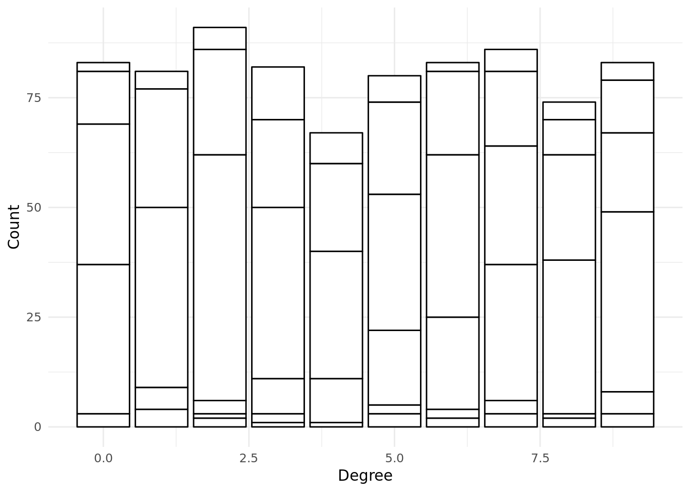

#### Degree distribution of agent->knows->agent edges

#### Runing time by method 

<table class="table table-condensed" style="width: auto !important; ">
 <thead>
  <tr>
   <th style="text-align:left;"> key </th>
   <th style="text-align:right;"> doc_count </th>
   <th style="text-align:right;"> sum_wallTime_ms.value </th>
   <th style="text-align:left;"> avg_wallTime_ms.value </th>
   <th style="text-align:left;"> includedInTotal </th>
  </tr>
 </thead>
<tbody>
  <tr>
   <td style="text-align:left;"> knowsAgent </td>
   <td style="text-align:right;"> 1,201 </td>
   <td style="text-align:right;"> 2,828 </td>
   <td style="text-align:left;"> 2.35470441298918 </td>
   <td style="text-align:left;"> No </td>
  </tr>
  <tr>
   <td style="text-align:left;"> addItemToWork </td>
   <td style="text-align:right;"> 810 </td>
   <td style="text-align:right;"> 9,956 </td>
   <td style="text-align:left;"> 12.2913580246914 </td>
   <td style="text-align:left;"> No </td>
  </tr>
  <tr>
   <td style="text-align:left;"> ownsWork </td>
   <td style="text-align:right;"> 405 </td>
   <td style="text-align:right;"> 4,915 </td>
   <td style="text-align:left;"> 12.1358024691358 </td>
   <td style="text-align:left;"> No </td>
  </tr>
  <tr>
   <td style="text-align:left;"> init </td>
   <td style="text-align:right;"> 203 </td>
   <td style="text-align:right;"> 18,655 </td>
   <td style="text-align:left;"> 91.8965517241379 </td>
   <td style="text-align:left;"> No </td>
  </tr>
  <tr>
   <td style="text-align:left;"> searchAndConnect </td>
   <td style="text-align:right;"> 201 </td>
   <td style="text-align:right;"> 636,608 </td>
   <td style="text-align:left;"> 3167.2039800995 </td>
   <td style="text-align:left;"> Yes </td>
  </tr>
  <tr>
   <td style="text-align:left;"> cycleSearch </td>
   <td style="text-align:right;"> 13 </td>
   <td style="text-align:right;"> 5,401 </td>
   <td style="text-align:left;"> 415.461538461538 </td>
   <td style="text-align:left;"> Yes </td>
  </tr>
  <tr>
   <td style="text-align:left;"> getWorks </td>
   <td style="text-align:right;"> 13 </td>
   <td style="text-align:right;"> 5,604 </td>
   <td style="text-align:left;"> 431.076923076923 </td>
   <td style="text-align:left;"> No </td>
  </tr>
  <tr>
   <td style="text-align:left;"> individualCycleSearch </td>
   <td style="text-align:right;"> 13 </td>
   <td style="text-align:right;"> 1 </td>
   <td style="text-align:left;"> 0.0769230769230769 </td>
   <td style="text-align:left;"> Yes </td>
  </tr>
  <tr>
   <td style="text-align:left;"> getWorksItems </td>
   <td style="text-align:right;"> 8 </td>
   <td style="text-align:right;"> 33 </td>
   <td style="text-align:left;"> 4.125 </td>
   <td style="text-align:left;"> Yes </td>
  </tr>
  <tr>
   <td style="text-align:left;font-weight: bold;"> Total </td>
   <td style="text-align:right;font-weight: bold;"> 240 </td>
   <td style="text-align:right;font-weight: bold;"> 647,614 </td>
   <td style="text-align:left;font-weight: bold;">  </td>
   <td style="text-align:left;font-weight: bold;">  </td>
  </tr>
</tbody>
</table>
####  Found structures 

#####  Cycles 

Number of cycles found:  3 

<button class="btn btn-primary" data-toggle="collapse" data-target="#PWSLQRJWMD"> Show/Hide foundCycle query </button> 
 
  
     GET /filebeat-*/_search 
              { 
                "query": {
                  "bool": {
                    "must": [
                      { "match_phrase": {
                        "simulationId": "SIM10-13-09-01-ThjPAQ--DV"
                        }
                      },
                      { "bool": {
                        "should": [
                          { "match": {
                            "keyword": "foundCycle"
                          }}
                        ]
                      }}
                    ]
                  }
                }
              }
     

#####  Paths 

Number of paths found:  0 

<button class="btn btn-primary" data-toggle="collapse" data-target="#AUPUGBTSTU"> Show/Hide foundPath query </button> 
 
  
     GET /filebeat-*/_search 
              { 
                "query": {
                  "bool": {
                    "must": [
                      { "match_phrase": {
                        "simulationId": "SIM10-13-09-01-ThjPAQ--DV"
                        }
                      },
                      { "bool": {
                        "should": [
                          { "match": {
                            "keyword": "foundPath"
                          }}
                        ]
                      }}
                    ]
                  }
                }
              }
     

###  SIM10-13-03-06-FcPhUK--CV 

#### simulationParameters 

<table class="table table-condensed" style="width: auto !important; ">
 <thead>
  <tr>
   <th style="text-align:left;"> agentNumber </th>
   <th style="text-align:left;"> similarityConnectThreshold </th>
   <th style="text-align:left;"> graphType </th>
   <th style="text-align:left;"> chainLength </th>
   <th style="text-align:left;"> similaritySearchThreshold </th>
   <th style="text-align:left;"> maxDistance </th>
   <th style="text-align:left;"> randomWorksNumberMultiplier </th>
  </tr>
 </thead>
<tbody>
  <tr>
   <td style="text-align:left;width: 20em; "> 50 </td>
   <td style="text-align:left;width: 15em; "> 0.96 </td>
   <td style="text-align:left;width: 15em; "> random </td>
   <td style="text-align:left;width: 15em; "> 10 </td>
   <td style="text-align:left;width: 15em; "> 1 </td>
   <td style="text-align:left;width: 15em; "> 10 </td>
   <td style="text-align:left;width: 15em; "> 1 </td>
  </tr>
</tbody>
</table>
#### allEdgesByLabel

<table class="table table-condensed" style="width: auto !important; ">
 <thead>
  <tr>
   <th style="text-align:right;"> edges_offers </th>
   <th style="text-align:right;"> edges_similarity </th>
   <th style="text-align:right;"> edges_owns </th>
   <th style="text-align:right;"> edges_demands </th>
   <th style="text-align:right;"> edges_knows </th>
   <th style="text-align:right;"> edges_total </th>
  </tr>
 </thead>
<tbody>
  <tr>
   <td style="text-align:right;width: 5em; "> 60 </td>
   <td style="text-align:right;width: 5em; "> 1,528 </td>
   <td style="text-align:right;width: 5em; "> 60 </td>
   <td style="text-align:right;width: 5em; "> 60 </td>
   <td style="text-align:right;width: 5em; "> 50 </td>
   <td style="text-align:right;width: 5em; "> 1,758 </td>
  </tr>
</tbody>
</table>
#### allVerticesByType

<table class="table table-condensed" style="width: auto !important; ">
 <thead>
  <tr>
   <th style="text-align:right;"> vertices_agent </th>
   <th style="text-align:right;"> vertices_item </th>
   <th style="text-align:right;"> vertices_work </th>
   <th style="text-align:right;"> vertices_total </th>
  </tr>
 </thead>
<tbody>
  <tr>
   <td style="text-align:right;width: 5em; "> 51 </td>
   <td style="text-align:right;width: 5em; "> 120 </td>
   <td style="text-align:right;width: 5em; "> 60 </td>
   <td style="text-align:right;width: 5em; "> 231 </td>
  </tr>
</tbody>
</table>
#### distribution of similarityEdgesByWeight

#### Degree distribution of item->similarity->item edges

#### Degree distribution of agent->knows->agent edges

#### Runing time by method 

<table class="table table-condensed" style="width: auto !important; ">
 <thead>
  <tr>
   <th style="text-align:left;"> key </th>
   <th style="text-align:right;"> doc_count </th>
   <th style="text-align:right;"> sum_wallTime_ms.value </th>
   <th style="text-align:left;"> avg_wallTime_ms.value </th>
   <th style="text-align:left;"> includedInTotal </th>
  </tr>
 </thead>
<tbody>
  <tr>
   <td style="text-align:left;"> connectIfSimilar </td>
   <td style="text-align:right;"> 7,140 </td>
   <td style="text-align:right;"> 13,655 </td>
   <td style="text-align:left;"> 1.9124649859944 </td>
   <td style="text-align:left;"> No </td>
  </tr>
  <tr>
   <td style="text-align:left;"> existsSimilarity </td>
   <td style="text-align:right;"> 7,140 </td>
   <td style="text-align:right;"> 13,462 </td>
   <td style="text-align:left;"> 1.88543417366947 </td>
   <td style="text-align:left;"> No </td>
  </tr>
  <tr>
   <td style="text-align:left;"> similarityEdges </td>
   <td style="text-align:right;"> 7,140 </td>
   <td style="text-align:right;"> 13,210 </td>
   <td style="text-align:left;"> 1.85014005602241 </td>
   <td style="text-align:left;"> No </td>
  </tr>
  <tr>
   <td style="text-align:left;"> connectAllSimilar </td>
   <td style="text-align:right;"> 120 </td>
   <td style="text-align:right;"> 13,735 </td>
   <td style="text-align:left;"> 114.458333333333 </td>
   <td style="text-align:left;"> Yes </td>
  </tr>
  <tr>
   <td style="text-align:left;"> init </td>
   <td style="text-align:right;"> 53 </td>
   <td style="text-align:right;"> 8,655 </td>
   <td style="text-align:left;"> 163.301886792453 </td>
   <td style="text-align:left;"> No </td>
  </tr>
  <tr>
   <td style="text-align:left;"> connect </td>
   <td style="text-align:right;"> 21 </td>
   <td style="text-align:right;"> 55 </td>
   <td style="text-align:left;"> 2.61904761904762 </td>
   <td style="text-align:left;"> Yes </td>
  </tr>
  <tr>
   <td style="text-align:left;font-weight: bold;"> Total </td>
   <td style="text-align:right;font-weight: bold;"> 149 </td>
   <td style="text-align:right;font-weight: bold;"> 14,014 </td>
   <td style="text-align:left;font-weight: bold;">  </td>
   <td style="text-align:left;font-weight: bold;">  </td>
  </tr>
</tbody>
</table>
####  Found structures 

#####  Cycles 

Number of cycles found:  1 

<button class="btn btn-primary" data-toggle="collapse" data-target="#UBVOXXJCCK"> Show/Hide foundCycle query </button> 
 
  
     GET /filebeat-*/_search 
              { 
                "query": {
                  "bool": {
                    "must": [
                      { "match_phrase": {
                        "simulationId": "SIM10-13-03-06-FcPhUK--CV"
                        }
                      },
                      { "bool": {
                        "should": [
                          { "match": {
                            "keyword": "foundCycle"
                          }}
                        ]
                      }}
                    ]
                  }
                }
              }
     

#####  Paths 

Number of paths found:  0 

<button class="btn btn-primary" data-toggle="collapse" data-target="#SJSCVCZBXR"> Show/Hide foundPath query </button> 
 
  
     GET /filebeat-*/_search 
              { 
                "query": {
                  "bool": {
                    "must": [
                      { "match_phrase": {
                        "simulationId": "SIM10-13-03-06-FcPhUK--CV"
                        }
                      },
                      { "bool": {
                        "should": [
                          { "match": {
                            "keyword": "foundPath"
                          }}
                        ]
                      }}
                    ]
                  }
                }
              }
     

###  SIM10-13-03-06-FcPhUK--DV 

#### simulationParameters 

<table class="table table-condensed" style="width: auto !important; ">
 <thead>
  <tr>
   <th style="text-align:left;"> agentNumber </th>
   <th style="text-align:left;"> similarityConnectThreshold </th>
   <th style="text-align:left;"> graphType </th>
   <th style="text-align:left;"> chainLength </th>
   <th style="text-align:left;"> similaritySearchThreshold </th>
   <th style="text-align:left;"> maxDistance </th>
   <th style="text-align:left;"> randomWorksNumberMultiplier </th>
  </tr>
 </thead>
<tbody>
  <tr>
   <td style="text-align:left;width: 20em; "> 50 </td>
   <td style="text-align:left;width: 15em; "> 0.96 </td>
   <td style="text-align:left;width: 15em; "> random </td>
   <td style="text-align:left;width: 15em; "> 10 </td>
   <td style="text-align:left;width: 15em; "> 1 </td>
   <td style="text-align:left;width: 15em; "> 10 </td>
   <td style="text-align:left;width: 15em; "> 1 </td>
  </tr>
</tbody>
</table>
#### allEdgesByLabel

<table class="table table-condensed" style="width: auto !important; ">
 <thead>
  <tr>
   <th style="text-align:right;"> edges_offers </th>
   <th style="text-align:right;"> edges_similarity </th>
   <th style="text-align:right;"> edges_owns </th>
   <th style="text-align:right;"> edges_demands </th>
   <th style="text-align:right;"> edges_knows </th>
   <th style="text-align:right;"> edges_total </th>
  </tr>
 </thead>
<tbody>
  <tr>
   <td style="text-align:right;width: 5em; "> 60 </td>
   <td style="text-align:right;width: 5em; "> 1,486 </td>
   <td style="text-align:right;width: 5em; "> 60 </td>
   <td style="text-align:right;width: 5em; "> 60 </td>
   <td style="text-align:right;width: 5em; "> 50 </td>
   <td style="text-align:right;width: 5em; "> 1,716 </td>
  </tr>
</tbody>
</table>
#### allVerticesByType

<table class="table table-condensed" style="width: auto !important; ">
 <thead>
  <tr>
   <th style="text-align:right;"> vertices_agent </th>
   <th style="text-align:right;"> vertices_item </th>
   <th style="text-align:right;"> vertices_work </th>
   <th style="text-align:right;"> vertices_total </th>
  </tr>
 </thead>
<tbody>
  <tr>
   <td style="text-align:right;width: 5em; "> 51 </td>
   <td style="text-align:right;width: 5em; "> 120 </td>
   <td style="text-align:right;width: 5em; "> 60 </td>
   <td style="text-align:right;width: 5em; "> 231 </td>
  </tr>
</tbody>
</table>
#### distribution of similarityEdgesByWeight

#### Degree distribution of item->similarity->item edges

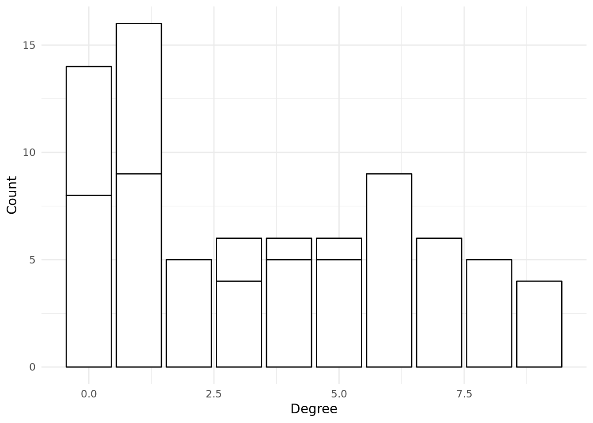

#### Degree distribution of agent->knows->agent edges

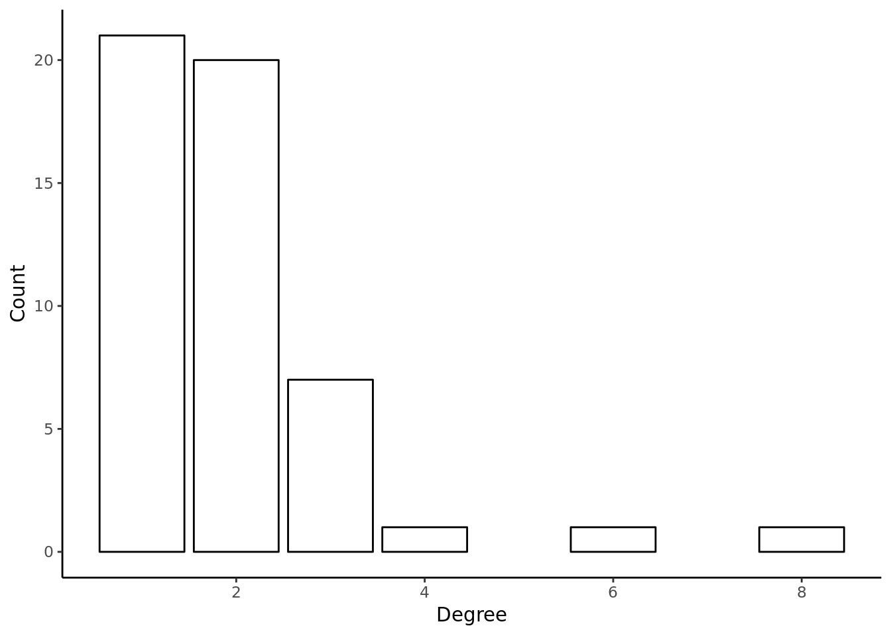

#### Runing time by method 

<table class="table table-condensed" style="width: auto !important; ">
 <thead>
  <tr>
   <th style="text-align:left;">   </th>
   <th style="text-align:left;"> key </th>
   <th style="text-align:right;"> doc_count </th>
   <th style="text-align:right;"> sum_wallTime_ms.value </th>
   <th style="text-align:left;"> avg_wallTime_ms.value </th>
   <th style="text-align:left;"> includedInTotal </th>
  </tr>
 </thead>
<tbody>
  <tr>
   <td style="text-align:left;"> 2 </td>
   <td style="text-align:left;"> cycleSearch </td>
   <td style="text-align:right;"> 3,600 </td>
   <td style="text-align:right;"> 17,167 </td>
   <td style="text-align:left;"> 4.76861111111111 </td>
   <td style="text-align:left;"> Yes </td>
  </tr>
  <tr>
   <td style="text-align:left;"> 3 </td>
   <td style="text-align:left;"> getWorks </td>
   <td style="text-align:right;"> 3,600 </td>
   <td style="text-align:right;"> 38,023 </td>
   <td style="text-align:left;"> 10.5619444444444 </td>
   <td style="text-align:left;"> No </td>
  </tr>
  <tr>
   <td style="text-align:left;"> 4 </td>
   <td style="text-align:left;"> individualCycleSearch </td>
   <td style="text-align:right;"> 3,600 </td>
   <td style="text-align:right;"> 126 </td>
   <td style="text-align:left;"> 0.035 </td>
   <td style="text-align:left;"> Yes </td>
  </tr>
  <tr>
   <td style="text-align:left;"> 6 </td>
   <td style="text-align:left;"> addItemToWork </td>
   <td style="text-align:right;"> 120 </td>
   <td style="text-align:right;"> 698 </td>
   <td style="text-align:left;"> 5.81666666666667 </td>
   <td style="text-align:left;"> No </td>
  </tr>
  <tr>
   <td style="text-align:left;"> 7 </td>
   <td style="text-align:left;"> ownsWork </td>
   <td style="text-align:right;"> 60 </td>
   <td style="text-align:right;"> 693 </td>
   <td style="text-align:left;"> 11.55 </td>
   <td style="text-align:left;"> No </td>
  </tr>
  <tr>
   <td style="text-align:left;"> 8 </td>
   <td style="text-align:left;"> init </td>
   <td style="text-align:right;"> 53 </td>
   <td style="text-align:right;"> 9,087 </td>
   <td style="text-align:left;"> 171.452830188679 </td>
   <td style="text-align:left;"> No </td>
  </tr>
  <tr>
   <td style="text-align:left;"> 9 </td>
   <td style="text-align:left;"> searchAndConnect </td>
   <td style="text-align:right;"> 51 </td>
   <td style="text-align:right;"> 7,367 </td>
   <td style="text-align:left;"> 144.450980392157 </td>
   <td style="text-align:left;"> Yes </td>
  </tr>
  <tr>
   <td style="text-align:left;"> 10 </td>
   <td style="text-align:left;"> knowsAgent </td>
   <td style="text-align:right;"> 50 </td>
   <td style="text-align:right;"> 268 </td>
   <td style="text-align:left;"> 5.36 </td>
   <td style="text-align:left;"> No </td>
  </tr>
  <tr>
   <td style="text-align:left;font-weight: bold;"> 1 </td>
   <td style="text-align:left;font-weight: bold;"> Total </td>
   <td style="text-align:right;font-weight: bold;"> 14,451 </td>
   <td style="text-align:right;font-weight: bold;"> 43,692 </td>
   <td style="text-align:left;font-weight: bold;">  </td>
   <td style="text-align:left;font-weight: bold;">  </td>
  </tr>
</tbody>
</table>
####  Found structures 

#####  Cycles 

Number of cycles found:  0 

<button class="btn btn-primary" data-toggle="collapse" data-target="#EFFFPVWMRK"> Show/Hide foundCycle query </button> 
 
  
     GET /filebeat-*/_search 
              { 
                "query": {
                  "bool": {
                    "must": [
                      { "match_phrase": {
                        "simulationId": "SIM10-13-03-06-FcPhUK--DV"
                        }
                      },
                      { "bool": {
                        "should": [
                          { "match": {
                            "keyword": "foundCycle"
                          }}
                        ]
                      }}
                    ]
                  }
                }
              }
     

#####  Paths 

Number of paths found:  3600 

<button class="btn btn-primary" data-toggle="collapse" data-target="#MQMDOPBQNA"> Show/Hide foundPath query </button> 
 
  
     GET /filebeat-*/_search 
              { 
                "query": {
                  "bool": {
                    "must": [
                      { "match_phrase": {
                        "simulationId": "SIM10-13-03-06-FcPhUK--DV"
                        }
                      },
                      { "bool": {
                        "should": [
                          { "match": {
                            "keyword": "foundPath"
                          }}
                        ]
                      }}
                    ]
                  }
                }
              }
     

###  SIM10-13-04-07-GGgByN--CV 

#### simulationParameters 

<table class="table table-condensed" style="width: auto !important; ">
 <thead>
  <tr>
   <th style="text-align:left;"> agentNumber </th>
   <th style="text-align:left;"> similarityConnectThreshold </th>
   <th style="text-align:left;"> graphType </th>
   <th style="text-align:left;"> chainLength </th>
   <th style="text-align:left;"> similaritySearchThreshold </th>
   <th style="text-align:left;"> maxDistance </th>
   <th style="text-align:left;"> randomWorksNumberMultiplier </th>
  </tr>
 </thead>
<tbody>
  <tr>
   <td style="text-align:left;width: 20em; "> 50 </td>
   <td style="text-align:left;width: 15em; "> 0.96 </td>
   <td style="text-align:left;width: 15em; "> smallWorld </td>
   <td style="text-align:left;width: 15em; "> 10 </td>
   <td style="text-align:left;width: 15em; "> 1 </td>
   <td style="text-align:left;width: 15em; "> 10 </td>
   <td style="text-align:left;width: 15em; "> 1 </td>
  </tr>
</tbody>
</table>
#### allEdgesByLabel

<table class="table table-condensed" style="width: auto !important; ">
 <thead>
  <tr>
   <th style="text-align:right;"> edges_offers </th>
   <th style="text-align:right;"> edges_similarity </th>
   <th style="text-align:right;"> edges_owns </th>
   <th style="text-align:right;"> edges_demands </th>
   <th style="text-align:right;"> edges_knows </th>
   <th style="text-align:right;"> edges_total </th>
  </tr>
 </thead>
<tbody>
  <tr>
   <td style="text-align:right;width: 5em; "> 60 </td>
   <td style="text-align:right;width: 5em; "> 1,374 </td>
   <td style="text-align:right;width: 5em; "> 60 </td>
   <td style="text-align:right;width: 5em; "> 60 </td>
   <td style="text-align:right;width: 5em; "> 201 </td>
   <td style="text-align:right;width: 5em; "> 1,755 </td>
  </tr>
</tbody>
</table>
#### allVerticesByType

<table class="table table-condensed" style="width: auto !important; ">
 <thead>
  <tr>
   <th style="text-align:right;"> vertices_agent </th>
   <th style="text-align:right;"> vertices_item </th>
   <th style="text-align:right;"> vertices_work </th>
   <th style="text-align:right;"> vertices_total </th>
  </tr>
 </thead>
<tbody>
  <tr>
   <td style="text-align:right;width: 5em; "> 51 </td>
   <td style="text-align:right;width: 5em; "> 120 </td>
   <td style="text-align:right;width: 5em; "> 60 </td>
   <td style="text-align:right;width: 5em; "> 231 </td>
  </tr>
</tbody>
</table>
#### distribution of similarityEdgesByWeight

#### Degree distribution of item->similarity->item edges

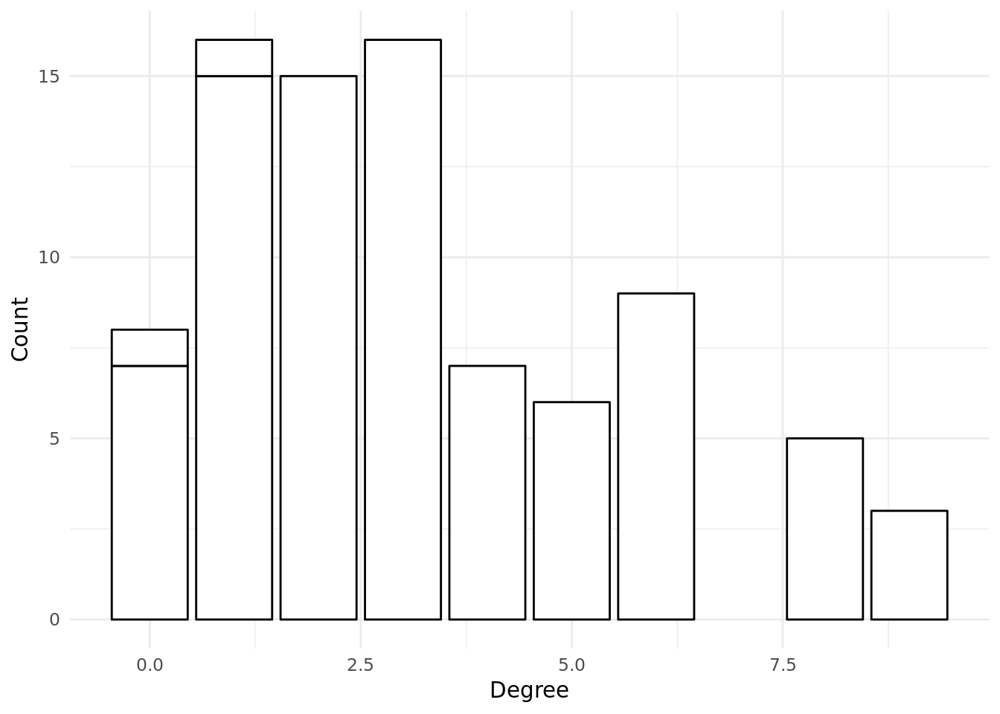

#### Degree distribution of agent->knows->agent edges

#### Runing time by method 

<table class="table table-condensed" style="width: auto !important; ">
 <thead>
  <tr>
   <th style="text-align:left;"> key </th>
   <th style="text-align:right;"> doc_count </th>
   <th style="text-align:right;"> sum_wallTime_ms.value </th>
   <th style="text-align:left;"> avg_wallTime_ms.value </th>
   <th style="text-align:left;"> includedInTotal </th>
  </tr>
 </thead>
<tbody>
  <tr>
   <td style="text-align:left;"> connectIfSimilar </td>
   <td style="text-align:right;"> 7,140 </td>
   <td style="text-align:right;"> 13,702 </td>
   <td style="text-align:left;"> 1.91904761904762 </td>
   <td style="text-align:left;"> No </td>
  </tr>
  <tr>
   <td style="text-align:left;"> existsSimilarity </td>
   <td style="text-align:right;"> 7,140 </td>
   <td style="text-align:right;"> 13,520 </td>
   <td style="text-align:left;"> 1.89355742296919 </td>
   <td style="text-align:left;"> No </td>
  </tr>
  <tr>
   <td style="text-align:left;"> similarityEdges </td>
   <td style="text-align:right;"> 7,140 </td>
   <td style="text-align:right;"> 13,285 </td>
   <td style="text-align:left;"> 1.86064425770308 </td>
   <td style="text-align:left;"> No </td>
  </tr>
  <tr>
   <td style="text-align:left;"> connectAllSimilar </td>
   <td style="text-align:right;"> 120 </td>
   <td style="text-align:right;"> 13,766 </td>
   <td style="text-align:left;"> 114.716666666667 </td>
   <td style="text-align:left;"> Yes </td>
  </tr>
  <tr>
   <td style="text-align:left;"> init </td>
   <td style="text-align:right;"> 53 </td>
   <td style="text-align:right;"> 8,932 </td>
   <td style="text-align:left;"> 168.528301886792 </td>
   <td style="text-align:left;"> No </td>
  </tr>
  <tr>
   <td style="text-align:left;"> connect </td>
   <td style="text-align:right;"> 17 </td>
   <td style="text-align:right;"> 36 </td>
   <td style="text-align:left;"> 2.11764705882353 </td>
   <td style="text-align:left;"> Yes </td>
  </tr>
  <tr>
   <td style="text-align:left;font-weight: bold;"> Total </td>
   <td style="text-align:right;font-weight: bold;"> 145 </td>
   <td style="text-align:right;font-weight: bold;"> 14,115 </td>
   <td style="text-align:left;font-weight: bold;">  </td>
   <td style="text-align:left;font-weight: bold;">  </td>
  </tr>
</tbody>
</table>
####  Found structures 

#####  Cycles 

Number of cycles found:  1 

<button class="btn btn-primary" data-toggle="collapse" data-target="#OZFCNHALJM"> Show/Hide foundCycle query </button> 
 
  
     GET /filebeat-*/_search 
              { 
                "query": {
                  "bool": {
                    "must": [
                      { "match_phrase": {
                        "simulationId": "SIM10-13-04-07-GGgByN--CV"
                        }
                      },
                      { "bool": {
                        "should": [
                          { "match": {
                            "keyword": "foundCycle"
                          }}
                        ]
                      }}
                    ]
                  }
                }
              }
     

#####  Paths 

Number of paths found:  0 

<button class="btn btn-primary" data-toggle="collapse" data-target="#RXMSLLKSVC"> Show/Hide foundPath query </button> 
 
  
     GET /filebeat-*/_search 
              { 
                "query": {
                  "bool": {
                    "must": [
                      { "match_phrase": {
                        "simulationId": "SIM10-13-04-07-GGgByN--CV"
                        }
                      },
                      { "bool": {
                        "should": [
                          { "match": {
                            "keyword": "foundPath"
                          }}
                        ]
                      }}
                    ]
                  }
                }
              }
     

###  SIM10-13-04-07-GGgByN--DV 

#### simulationParameters 

<table class="table table-condensed" style="width: auto !important; ">
 <thead>
  <tr>
   <th style="text-align:left;"> agentNumber </th>
   <th style="text-align:left;"> similarityConnectThreshold </th>
   <th style="text-align:left;"> graphType </th>
   <th style="text-align:left;"> chainLength </th>
   <th style="text-align:left;"> similaritySearchThreshold </th>
   <th style="text-align:left;"> maxDistance </th>
   <th style="text-align:left;"> randomWorksNumberMultiplier </th>
  </tr>
 </thead>
<tbody>
  <tr>
   <td style="text-align:left;width: 20em; "> 50 </td>
   <td style="text-align:left;width: 15em; "> 0.96 </td>
   <td style="text-align:left;width: 15em; "> smallWorld </td>
   <td style="text-align:left;width: 15em; "> 10 </td>
   <td style="text-align:left;width: 15em; "> 1 </td>
   <td style="text-align:left;width: 15em; "> 10 </td>
   <td style="text-align:left;width: 15em; "> 1 </td>
  </tr>
</tbody>
</table>
#### allEdgesByLabel

<table class="table table-condensed" style="width: auto !important; ">
 <thead>
  <tr>
   <th style="text-align:right;"> edges_offers </th>
   <th style="text-align:right;"> edges_similarity </th>
   <th style="text-align:right;"> edges_owns </th>
   <th style="text-align:right;"> edges_demands </th>
   <th style="text-align:right;"> edges_knows </th>
   <th style="text-align:right;"> edges_total </th>
  </tr>
 </thead>
<tbody>
  <tr>
   <td style="text-align:right;width: 5em; "> 60 </td>
   <td style="text-align:right;width: 5em; "> 1,340 </td>
   <td style="text-align:right;width: 5em; "> 60 </td>
   <td style="text-align:right;width: 5em; "> 60 </td>
   <td style="text-align:right;width: 5em; "> 201 </td>
   <td style="text-align:right;width: 5em; "> 1,721 </td>
  </tr>
</tbody>
</table>
#### allVerticesByType

<table class="table table-condensed" style="width: auto !important; ">
 <thead>
  <tr>
   <th style="text-align:right;"> vertices_agent </th>
   <th style="text-align:right;"> vertices_item </th>
   <th style="text-align:right;"> vertices_work </th>
   <th style="text-align:right;"> vertices_total </th>
  </tr>
 </thead>
<tbody>
  <tr>
   <td style="text-align:right;width: 5em; "> 51 </td>
   <td style="text-align:right;width: 5em; "> 120 </td>
   <td style="text-align:right;width: 5em; "> 60 </td>
   <td style="text-align:right;width: 5em; "> 231 </td>
  </tr>
</tbody>
</table>
#### distribution of similarityEdgesByWeight

#### Degree distribution of item->similarity->item edges

#### Degree distribution of agent->knows->agent edges

#### Runing time by method 

<table class="table table-condensed" style="width: auto !important; ">
 <thead>
  <tr>
   <th style="text-align:left;">   </th>
   <th style="text-align:left;"> key </th>
   <th style="text-align:right;"> doc_count </th>
   <th style="text-align:right;"> sum_wallTime_ms.value </th>
   <th style="text-align:left;"> avg_wallTime_ms.value </th>
   <th style="text-align:left;"> includedInTotal </th>
  </tr>
 </thead>
<tbody>
  <tr>
   <td style="text-align:left;"> 1 </td>
   <td style="text-align:left;"> knowsAgent </td>
   <td style="text-align:right;"> 201 </td>
   <td style="text-align:right;"> 434 </td>
   <td style="text-align:left;"> 2.1592039800995 </td>
   <td style="text-align:left;"> No </td>
  </tr>
  <tr>
   <td style="text-align:left;"> 2 </td>
   <td style="text-align:left;"> addItemToWork </td>
   <td style="text-align:right;"> 120 </td>
   <td style="text-align:right;"> 963 </td>
   <td style="text-align:left;"> 8.025 </td>
   <td style="text-align:left;"> No </td>
  </tr>
  <tr>
   <td style="text-align:left;"> 3 </td>
   <td style="text-align:left;"> ownsWork </td>
   <td style="text-align:right;"> 60 </td>
   <td style="text-align:right;"> 889 </td>
   <td style="text-align:left;"> 14.8166666666667 </td>
   <td style="text-align:left;"> No </td>
  </tr>
  <tr>
   <td style="text-align:left;"> 4 </td>
   <td style="text-align:left;"> init </td>
   <td style="text-align:right;"> 53 </td>
   <td style="text-align:right;"> 8,866 </td>
   <td style="text-align:left;"> 167.283018867925 </td>
   <td style="text-align:left;"> No </td>
  </tr>
  <tr>
   <td style="text-align:left;"> 5 </td>
   <td style="text-align:left;"> searchAndConnect </td>
   <td style="text-align:right;"> 51 </td>
   <td style="text-align:right;"> 7,788 </td>
   <td style="text-align:left;"> 152.705882352941 </td>
   <td style="text-align:left;"> Yes </td>
  </tr>
  <tr>
   <td style="text-align:left;"> 6 </td>
   <td style="text-align:left;"> getWorksItems </td>
   <td style="text-align:right;"> 18 </td>
   <td style="text-align:right;"> 36 </td>
   <td style="text-align:left;"> 2 </td>
   <td style="text-align:left;"> Yes </td>
  </tr>
  <tr>
   <td style="text-align:left;"> 8 </td>
   <td style="text-align:left;"> addChainToNetwork </td>
   <td style="text-align:right;"> 1 </td>
   <td style="text-align:right;"> 0 </td>
   <td style="text-align:left;"> 0 </td>
   <td style="text-align:left;"> Yes </td>
  </tr>
  <tr>
   <td style="text-align:left;"> 9 </td>
   <td style="text-align:left;"> addRandomWorksToAgents </td>
   <td style="text-align:right;"> 1 </td>
   <td style="text-align:right;"> 0 </td>
   <td style="text-align:left;"> 0 </td>
   <td style="text-align:left;"> Yes </td>
  </tr>
  <tr>
   <td style="text-align:left;font-weight: bold;"> 11 </td>
   <td style="text-align:left;font-weight: bold;"> Total </td>
   <td style="text-align:right;font-weight: bold;"> 77 </td>
   <td style="text-align:right;font-weight: bold;"> 7,928 </td>
   <td style="text-align:left;font-weight: bold;">  </td>
   <td style="text-align:left;font-weight: bold;">  </td>
  </tr>
</tbody>
</table>
####  Found structures 

#####  Cycles 

Number of cycles found:  1 

<button class="btn btn-primary" data-toggle="collapse" data-target="#DQSBGQXVHR"> Show/Hide foundCycle query </button> 
 
  
     GET /filebeat-*/_search 
              { 
                "query": {
                  "bool": {
                    "must": [
                      { "match_phrase": {
                        "simulationId": "SIM10-13-04-07-GGgByN--DV"
                        }
                      },
                      { "bool": {
                        "should": [
                          { "match": {
                            "keyword": "foundCycle"
                          }}
                        ]
                      }}
                    ]
                  }
                }
              }
     

#####  Paths 

Number of paths found:  0 

<button class="btn btn-primary" data-toggle="collapse" data-target="#QJXJZAIWIH"> Show/Hide foundPath query </button> 
 
  
     GET /filebeat-*/_search 
              { 
                "query": {
                  "bool": {
                    "must": [
                      { "match_phrase": {
                        "simulationId": "SIM10-13-04-07-GGgByN--DV"
                        }
                      },
                      { "bool": {
                        "should": [
                          { "match": {
                            "keyword": "foundPath"
                          }}
                        ]
                      }}
                    ]
                  }
                }
              }
     

###  SIM10-13-05-10-LTjf58--CV 

#### simulationParameters 

<table class="table table-condensed" style="width: auto !important; ">
 <thead>
  <tr>
   <th style="text-align:left;"> agentNumber </th>
   <th style="text-align:left;"> similarityConnectThreshold </th>
   <th style="text-align:left;"> graphType </th>
   <th style="text-align:left;"> chainLength </th>
   <th style="text-align:left;"> similaritySearchThreshold </th>
   <th style="text-align:left;"> maxDistance </th>
   <th style="text-align:left;"> randomWorksNumberMultiplier </th>
  </tr>
 </thead>
<tbody>
  <tr>
   <td style="text-align:left;width: 20em; "> 50 </td>
   <td style="text-align:left;width: 15em; "> 0.96 </td>
   <td style="text-align:left;width: 15em; "> random </td>
   <td style="text-align:left;width: 15em; "> 10 </td>
   <td style="text-align:left;width: 15em; "> 1 </td>
   <td style="text-align:left;width: 15em; "> 10 </td>
   <td style="text-align:left;width: 15em; "> 2 </td>
  </tr>
</tbody>
</table>
#### allEdgesByLabel

<table class="table table-condensed" style="width: auto !important; ">
 <thead>
  <tr>
   <th style="text-align:right;"> edges_offers </th>
   <th style="text-align:right;"> edges_similarity </th>
   <th style="text-align:right;"> edges_owns </th>
   <th style="text-align:right;"> edges_demands </th>
   <th style="text-align:right;"> edges_knows </th>
   <th style="text-align:right;"> edges_total </th>
  </tr>
 </thead>
<tbody>
  <tr>
   <td style="text-align:right;width: 5em; "> 110 </td>
   <td style="text-align:right;width: 5em; "> 4,436 </td>
   <td style="text-align:right;width: 5em; "> 110 </td>
   <td style="text-align:right;width: 5em; "> 110 </td>
   <td style="text-align:right;width: 5em; "> 50 </td>
   <td style="text-align:right;width: 5em; "> 4,816 </td>
  </tr>
</tbody>
</table>
#### allVerticesByType

<table class="table table-condensed" style="width: auto !important; ">
 <thead>
  <tr>
   <th style="text-align:right;"> vertices_agent </th>
   <th style="text-align:right;"> vertices_item </th>
   <th style="text-align:right;"> vertices_work </th>
   <th style="text-align:right;"> vertices_total </th>
  </tr>
 </thead>
<tbody>
  <tr>
   <td style="text-align:right;width: 5em; "> 51 </td>
   <td style="text-align:right;width: 5em; "> 220 </td>
   <td style="text-align:right;width: 5em; "> 110 </td>
   <td style="text-align:right;width: 5em; "> 381 </td>
  </tr>
</tbody>
</table>
#### distribution of similarityEdgesByWeight

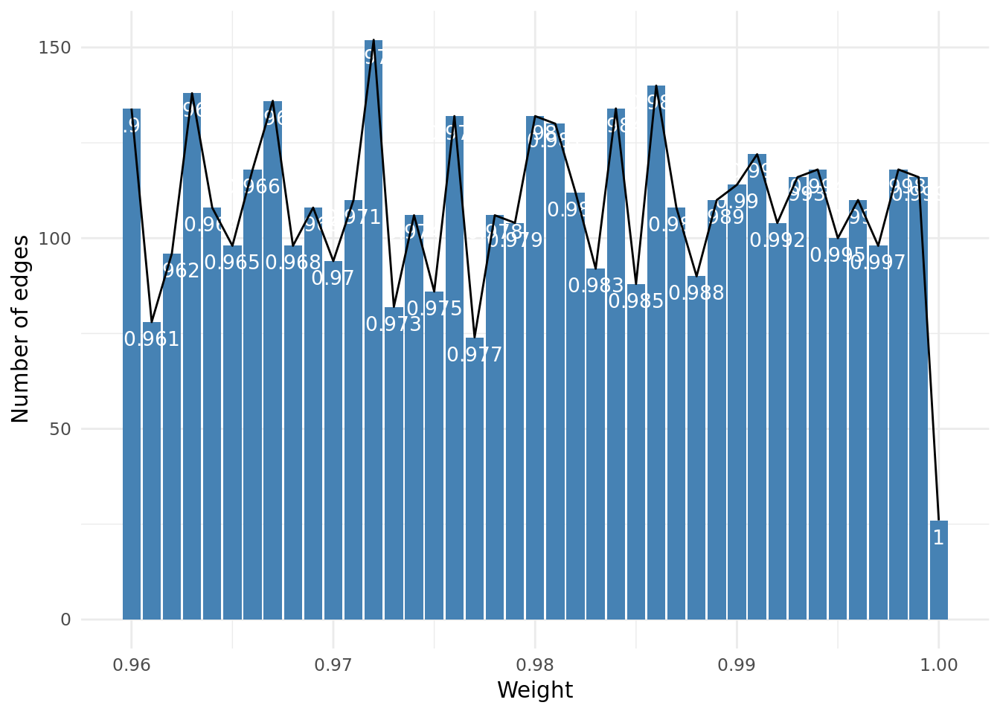

#### Degree distribution of item->similarity->item edges

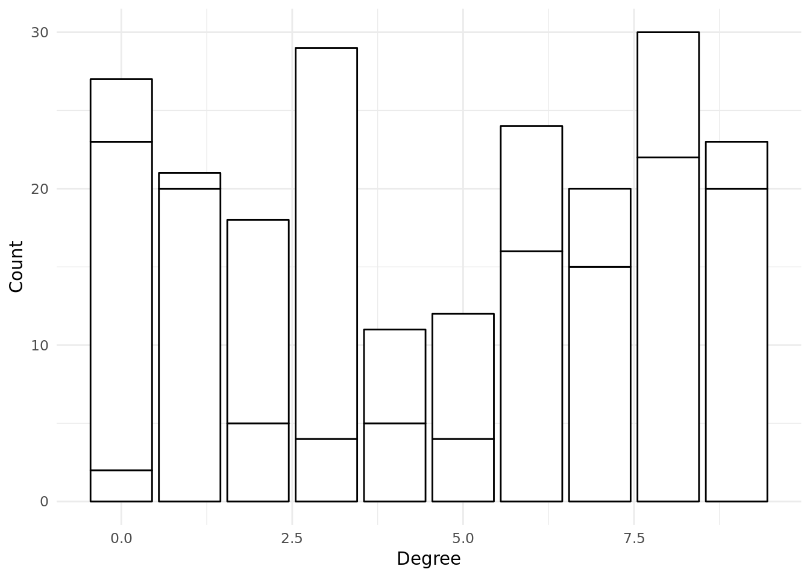

#### Degree distribution of agent->knows->agent edges

#### Runing time by method 

<table class="table table-condensed" style="width: auto !important; ">
 <thead>
  <tr>
   <th style="text-align:left;"> key </th>
   <th style="text-align:right;"> doc_count </th>
   <th style="text-align:right;"> sum_wallTime_ms.value </th>
   <th style="text-align:left;"> avg_wallTime_ms.value </th>
   <th style="text-align:left;"> includedInTotal </th>
  </tr>
 </thead>
<tbody>
  <tr>
   <td style="text-align:left;"> connectIfSimilar </td>
   <td style="text-align:right;"> 24,090 </td>
   <td style="text-align:right;"> 49,016 </td>
   <td style="text-align:left;"> 2.03470319634703 </td>
   <td style="text-align:left;"> No </td>
  </tr>
  <tr>
   <td style="text-align:left;"> existsSimilarity </td>
   <td style="text-align:right;"> 24,090 </td>
   <td style="text-align:right;"> 48,404 </td>
   <td style="text-align:left;"> 2.00929846409298 </td>
   <td style="text-align:left;"> No </td>
  </tr>
  <tr>
   <td style="text-align:left;"> similarityEdges </td>
   <td style="text-align:right;"> 24,090 </td>
   <td style="text-align:right;"> 47,487 </td>
   <td style="text-align:left;"> 1.97123287671233 </td>
   <td style="text-align:left;"> No </td>
  </tr>
  <tr>
   <td style="text-align:left;"> connectAllSimilar </td>
   <td style="text-align:right;"> 220 </td>
   <td style="text-align:right;"> 49,256 </td>
   <td style="text-align:left;"> 223.890909090909 </td>
   <td style="text-align:left;"> Yes </td>
  </tr>
  <tr>
   <td style="text-align:left;"> init </td>
   <td style="text-align:right;"> 53 </td>
   <td style="text-align:right;"> 9,095 </td>
   <td style="text-align:left;"> 171.603773584906 </td>
   <td style="text-align:left;"> No </td>
  </tr>
  <tr>
   <td style="text-align:left;"> connect </td>
   <td style="text-align:right;"> 48 </td>
   <td style="text-align:right;"> 101 </td>
   <td style="text-align:left;"> 2.10416666666667 </td>
   <td style="text-align:left;"> Yes </td>
  </tr>
  <tr>
   <td style="text-align:left;font-weight: bold;"> Total </td>
   <td style="text-align:right;font-weight: bold;"> 276 </td>
   <td style="text-align:right;font-weight: bold;"> 49,627 </td>
   <td style="text-align:left;font-weight: bold;">  </td>
   <td style="text-align:left;font-weight: bold;">  </td>
  </tr>
</tbody>
</table>
####  Found structures 

#####  Cycles 

Number of cycles found:  1 

<button class="btn btn-primary" data-toggle="collapse" data-target="#PMCUGYAQRM"> Show/Hide foundCycle query </button> 
 
  
     GET /filebeat-*/_search 
              { 
                "query": {
                  "bool": {
                    "must": [
                      { "match_phrase": {
                        "simulationId": "SIM10-13-05-10-LTjf58--CV"
                        }
                      },
                      { "bool": {
                        "should": [
                          { "match": {
                            "keyword": "foundCycle"
                          }}
                        ]
                      }}
                    ]
                  }
                }
              }
     

#####  Paths 

Number of paths found:  0 

<button class="btn btn-primary" data-toggle="collapse" data-target="#QMHVUFRPWH"> Show/Hide foundPath query </button> 
 
  
     GET /filebeat-*/_search 
              { 
                "query": {
                  "bool": {
                    "must": [
                      { "match_phrase": {
                        "simulationId": "SIM10-13-05-10-LTjf58--CV"
                        }
                      },
                      { "bool": {
                        "should": [
                          { "match": {
                            "keyword": "foundPath"
                          }}
                        ]
                      }}
                    ]
                  }
                }
              }
     

###  SIM10-13-05-10-LTjf58--DV 

#### simulationParameters 

<table class="table table-condensed" style="width: auto !important; ">
 <thead>
  <tr>
   <th style="text-align:left;"> agentNumber </th>
   <th style="text-align:left;"> similarityConnectThreshold </th>
   <th style="text-align:left;"> graphType </th>
   <th style="text-align:left;"> chainLength </th>
   <th style="text-align:left;"> similaritySearchThreshold </th>
   <th style="text-align:left;"> maxDistance </th>
   <th style="text-align:left;"> randomWorksNumberMultiplier </th>
  </tr>
 </thead>
<tbody>
  <tr>
   <td style="text-align:left;width: 20em; "> 50 </td>
   <td style="text-align:left;width: 15em; "> 0.96 </td>
   <td style="text-align:left;width: 15em; "> random </td>
   <td style="text-align:left;width: 15em; "> 10 </td>
   <td style="text-align:left;width: 15em; "> 1 </td>
   <td style="text-align:left;width: 15em; "> 10 </td>
   <td style="text-align:left;width: 15em; "> 2 </td>
  </tr>
</tbody>
</table>
#### allEdgesByLabel

<table class="table table-condensed" style="width: auto !important; ">
 <thead>
  <tr>
   <th style="text-align:right;"> edges_offers </th>
   <th style="text-align:right;"> edges_similarity </th>
   <th style="text-align:right;"> edges_owns </th>
   <th style="text-align:right;"> edges_demands </th>
   <th style="text-align:right;"> edges_knows </th>
   <th style="text-align:right;"> edges_total </th>
  </tr>
 </thead>
<tbody>
  <tr>
   <td style="text-align:right;width: 5em; "> 110 </td>
   <td style="text-align:right;width: 5em; "> 4,340 </td>
   <td style="text-align:right;width: 5em; "> 110 </td>
   <td style="text-align:right;width: 5em; "> 110 </td>
   <td style="text-align:right;width: 5em; "> 50 </td>
   <td style="text-align:right;width: 5em; "> 4,720 </td>
  </tr>
</tbody>
</table>
#### allVerticesByType

<table class="table table-condensed" style="width: auto !important; ">
 <thead>
  <tr>
   <th style="text-align:right;"> vertices_agent </th>
   <th style="text-align:right;"> vertices_item </th>
   <th style="text-align:right;"> vertices_work </th>
   <th style="text-align:right;"> vertices_total </th>
  </tr>
 </thead>
<tbody>
  <tr>
   <td style="text-align:right;width: 5em; "> 51 </td>
   <td style="text-align:right;width: 5em; "> 220 </td>
   <td style="text-align:right;width: 5em; "> 110 </td>
   <td style="text-align:right;width: 5em; "> 381 </td>
  </tr>
</tbody>
</table>
#### distribution of similarityEdgesByWeight

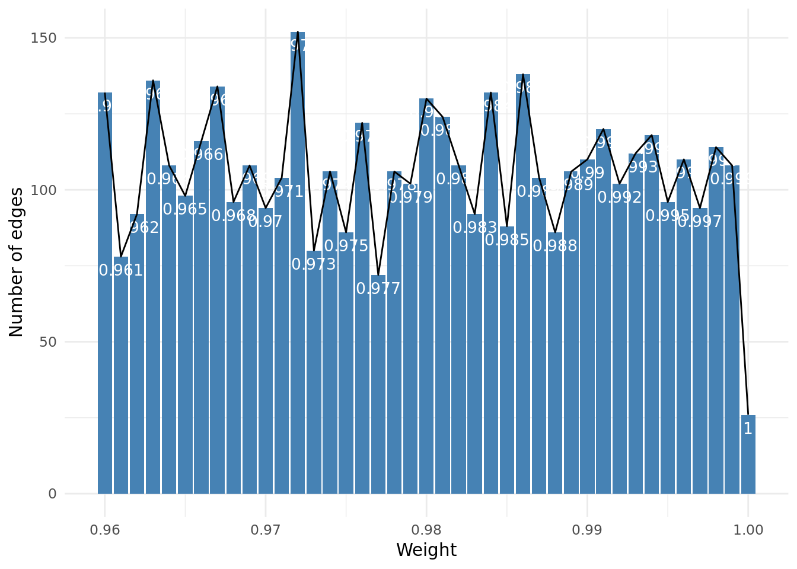

#### Degree distribution of item->similarity->item edges

#### Degree distribution of agent->knows->agent edges

#### Runing time by method 

<table class="table table-condensed" style="width: auto !important; ">
 <thead>
  <tr>
   <th style="text-align:left;">   </th>
   <th style="text-align:left;"> key </th>
   <th style="text-align:right;"> doc_count </th>
   <th style="text-align:right;"> sum_wallTime_ms.value </th>
   <th style="text-align:left;"> avg_wallTime_ms.value </th>
   <th style="text-align:left;"> includedInTotal </th>
  </tr>
 </thead>
<tbody>
  <tr>
   <td style="text-align:left;"> 1 </td>
   <td style="text-align:left;"> addItemToWork </td>
   <td style="text-align:right;"> 220 </td>
   <td style="text-align:right;"> 1,393 </td>
   <td style="text-align:left;"> 6.33181818181818 </td>
   <td style="text-align:left;"> No </td>
  </tr>
  <tr>
   <td style="text-align:left;"> 2 </td>
   <td style="text-align:left;"> ownsWork </td>
   <td style="text-align:right;"> 110 </td>
   <td style="text-align:right;"> 1,314 </td>
   <td style="text-align:left;"> 11.9454545454545 </td>
   <td style="text-align:left;"> No </td>
  </tr>
  <tr>
   <td style="text-align:left;"> 3 </td>
   <td style="text-align:left;"> init </td>
   <td style="text-align:right;"> 53 </td>
   <td style="text-align:right;"> 9,034 </td>
   <td style="text-align:left;"> 170.452830188679 </td>
   <td style="text-align:left;"> No </td>
  </tr>
  <tr>
   <td style="text-align:left;"> 4 </td>
   <td style="text-align:left;"> searchAndConnect </td>
   <td style="text-align:right;"> 51 </td>
   <td style="text-align:right;"> 16,119 </td>
   <td style="text-align:left;"> 316.058823529412 </td>
   <td style="text-align:left;"> Yes </td>
  </tr>
  <tr>
   <td style="text-align:left;"> 5 </td>
   <td style="text-align:left;"> knowsAgent </td>
   <td style="text-align:right;"> 50 </td>
   <td style="text-align:right;"> 195 </td>
   <td style="text-align:left;"> 3.9 </td>
   <td style="text-align:left;"> No </td>
  </tr>
  <tr>
   <td style="text-align:left;"> 6 </td>
   <td style="text-align:left;"> getWorksItems </td>
   <td style="text-align:right;"> 18 </td>
   <td style="text-align:right;"> 27 </td>
   <td style="text-align:left;"> 1.5 </td>
   <td style="text-align:left;"> Yes </td>
  </tr>
  <tr>
   <td style="text-align:left;"> 9 </td>
   <td style="text-align:left;"> cycleSearch </td>
   <td style="text-align:right;"> 2 </td>
   <td style="text-align:right;"> 27 </td>
   <td style="text-align:left;"> 13.5 </td>
   <td style="text-align:left;"> Yes </td>
  </tr>
  <tr>
   <td style="text-align:left;"> 10 </td>
   <td style="text-align:left;"> getWorks </td>
   <td style="text-align:right;"> 2 </td>
   <td style="text-align:right;"> 120 </td>
   <td style="text-align:left;"> 60 </td>
   <td style="text-align:left;"> No </td>
  </tr>
  <tr>
   <td style="text-align:left;font-weight: bold;"> 11 </td>
   <td style="text-align:left;font-weight: bold;"> Total </td>
   <td style="text-align:right;font-weight: bold;"> 78 </td>
   <td style="text-align:right;font-weight: bold;"> 16,570 </td>
   <td style="text-align:left;font-weight: bold;">  </td>
   <td style="text-align:left;font-weight: bold;">  </td>
  </tr>
</tbody>
</table>
####  Found structures 

#####  Cycles 

Number of cycles found:  1 

<button class="btn btn-primary" data-toggle="collapse" data-target="#UCZAPNCLDQ"> Show/Hide foundCycle query </button> 
 
  
     GET /filebeat-*/_search 
              { 
                "query": {
                  "bool": {
                    "must": [
                      { "match_phrase": {
                        "simulationId": "SIM10-13-05-10-LTjf58--DV"
                        }
                      },
                      { "bool": {
                        "should": [
                          { "match": {
                            "keyword": "foundCycle"
                          }}
                        ]
                      }}
                    ]
                  }
                }
              }
     

#####  Paths 

Number of paths found:  1 

<button class="btn btn-primary" data-toggle="collapse" data-target="#ORROVMKQDD"> Show/Hide foundPath query </button> 
 
  
     GET /filebeat-*/_search 
              { 
                "query": {
                  "bool": {
                    "must": [
                      { "match_phrase": {
                        "simulationId": "SIM10-13-05-10-LTjf58--DV"
                        }
                      },
                      { "bool": {
                        "should": [
                          { "match": {
                            "keyword": "foundPath"
                          }}
                        ]
                      }}
                    ]
                  }
                }
              }
     

###  SIM10-13-05-11-hhT57L--CV 

#### simulationParameters 

<table class="table table-condensed" style="width: auto !important; ">
 <thead>
  <tr>
   <th style="text-align:left;"> agentNumber </th>
   <th style="text-align:left;"> similarityConnectThreshold </th>
   <th style="text-align:left;"> graphType </th>
   <th style="text-align:left;"> chainLength </th>
   <th style="text-align:left;"> similaritySearchThreshold </th>
   <th style="text-align:left;"> maxDistance </th>
   <th style="text-align:left;"> randomWorksNumberMultiplier </th>
  </tr>
 </thead>
<tbody>
  <tr>
   <td style="text-align:left;width: 20em; "> 50 </td>
   <td style="text-align:left;width: 15em; "> 0.96 </td>
   <td style="text-align:left;width: 15em; "> smallWorld </td>
   <td style="text-align:left;width: 15em; "> 10 </td>
   <td style="text-align:left;width: 15em; "> 1 </td>
   <td style="text-align:left;width: 15em; "> 10 </td>
   <td style="text-align:left;width: 15em; "> 2 </td>
  </tr>
</tbody>
</table>
#### allEdgesByLabel

<table class="table table-condensed" style="width: auto !important; ">
 <thead>
  <tr>
   <th style="text-align:right;"> edges_offers </th>
   <th style="text-align:right;"> edges_similarity </th>
   <th style="text-align:right;"> edges_owns </th>
   <th style="text-align:right;"> edges_demands </th>
   <th style="text-align:right;"> edges_knows </th>
   <th style="text-align:right;"> edges_total </th>
  </tr>
 </thead>
<tbody>
  <tr>
   <td style="text-align:right;width: 5em; "> 110 </td>
   <td style="text-align:right;width: 5em; "> 4,480 </td>
   <td style="text-align:right;width: 5em; "> 110 </td>
   <td style="text-align:right;width: 5em; "> 110 </td>
   <td style="text-align:right;width: 5em; "> 201 </td>
   <td style="text-align:right;width: 5em; "> 5,011 </td>
  </tr>
</tbody>
</table>
#### allVerticesByType

<table class="table table-condensed" style="width: auto !important; ">
 <thead>
  <tr>
   <th style="text-align:right;"> vertices_agent </th>
   <th style="text-align:right;"> vertices_item </th>
   <th style="text-align:right;"> vertices_work </th>
   <th style="text-align:right;"> vertices_total </th>
  </tr>
 </thead>
<tbody>
  <tr>
   <td style="text-align:right;width: 5em; "> 51 </td>
   <td style="text-align:right;width: 5em; "> 220 </td>
   <td style="text-align:right;width: 5em; "> 110 </td>
   <td style="text-align:right;width: 5em; "> 381 </td>
  </tr>
</tbody>
</table>
#### distribution of similarityEdgesByWeight

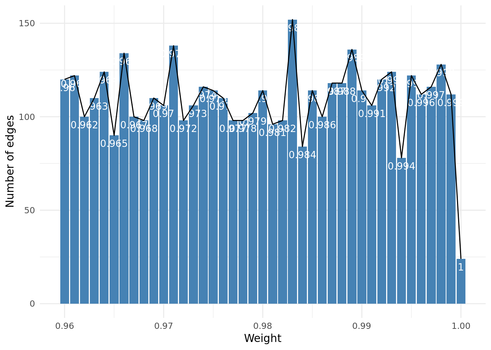

#### Degree distribution of item->similarity->item edges

#### Degree distribution of agent->knows->agent edges

#### Runing time by method 

<table class="table table-condensed" style="width: auto !important; ">
 <thead>
  <tr>
   <th style="text-align:left;"> key </th>
   <th style="text-align:right;"> doc_count </th>
   <th style="text-align:right;"> sum_wallTime_ms.value </th>
   <th style="text-align:left;"> avg_wallTime_ms.value </th>
   <th style="text-align:left;"> includedInTotal </th>
  </tr>
 </thead>
<tbody>
  <tr>
   <td style="text-align:left;"> connectIfSimilar </td>
   <td style="text-align:right;"> 24,090 </td>
   <td style="text-align:right;"> 51,279 </td>
   <td style="text-align:left;"> 2.12864259028643 </td>
   <td style="text-align:left;"> No </td>
  </tr>
  <tr>
   <td style="text-align:left;"> existsSimilarity </td>
   <td style="text-align:right;"> 24,090 </td>
   <td style="text-align:right;"> 50,646 </td>
   <td style="text-align:left;"> 2.10236612702366 </td>
   <td style="text-align:left;"> No </td>
  </tr>
  <tr>
   <td style="text-align:left;"> similarityEdges </td>
   <td style="text-align:right;"> 24,090 </td>
   <td style="text-align:right;"> 49,725 </td>
   <td style="text-align:left;"> 2.06413449564134 </td>
   <td style="text-align:left;"> No </td>
  </tr>
  <tr>
   <td style="text-align:left;"> connectAllSimilar </td>
   <td style="text-align:right;"> 220 </td>
   <td style="text-align:right;"> 51,532 </td>
   <td style="text-align:left;"> 234.236363636364 </td>
   <td style="text-align:left;"> Yes </td>
  </tr>
  <tr>
   <td style="text-align:left;"> init </td>
   <td style="text-align:right;"> 53 </td>
   <td style="text-align:right;"> 8,544 </td>
   <td style="text-align:left;"> 161.207547169811 </td>
   <td style="text-align:left;"> No </td>
  </tr>
  <tr>
   <td style="text-align:left;"> connect </td>
   <td style="text-align:right;"> 52 </td>
   <td style="text-align:right;"> 170 </td>
   <td style="text-align:left;"> 3.26923076923077 </td>
   <td style="text-align:left;"> Yes </td>
  </tr>
  <tr>
   <td style="text-align:left;font-weight: bold;"> Total </td>
   <td style="text-align:right;font-weight: bold;"> 280 </td>
   <td style="text-align:right;font-weight: bold;"> 52,080 </td>
   <td style="text-align:left;font-weight: bold;">  </td>
   <td style="text-align:left;font-weight: bold;">  </td>
  </tr>
</tbody>
</table>
####  Found structures 

#####  Cycles 

Number of cycles found:  1 

<button class="btn btn-primary" data-toggle="collapse" data-target="#HPDRINNQUK"> Show/Hide foundCycle query </button> 
 
  
     GET /filebeat-*/_search 
              { 
                "query": {
                  "bool": {
                    "must": [
                      { "match_phrase": {
                        "simulationId": "SIM10-13-05-11-hhT57L--CV"
                        }
                      },
                      { "bool": {
                        "should": [
                          { "match": {
                            "keyword": "foundCycle"
                          }}
                        ]
                      }}
                    ]
                  }
                }
              }
     

#####  Paths 

Number of paths found:  0 

<button class="btn btn-primary" data-toggle="collapse" data-target="#BCUGODSCEZ"> Show/Hide foundPath query </button> 
 
  
     GET /filebeat-*/_search 
              { 
                "query": {
                  "bool": {
                    "must": [
                      { "match_phrase": {
                        "simulationId": "SIM10-13-05-11-hhT57L--CV"
                        }
                      },
                      { "bool": {
                        "should": [
                          { "match": {
                            "keyword": "foundPath"
                          }}
                        ]
                      }}
                    ]
                  }
                }
              }
     

###  SIM10-13-05-11-hhT57L--DV 

#### simulationParameters 

<table class="table table-condensed" style="width: auto !important; ">
 <thead>
  <tr>
   <th style="text-align:left;"> agentNumber </th>
   <th style="text-align:left;"> similarityConnectThreshold </th>
   <th style="text-align:left;"> graphType </th>
   <th style="text-align:left;"> chainLength </th>
   <th style="text-align:left;"> similaritySearchThreshold </th>
   <th style="text-align:left;"> maxDistance </th>
   <th style="text-align:left;"> randomWorksNumberMultiplier </th>
  </tr>
 </thead>
<tbody>
  <tr>
   <td style="text-align:left;width: 20em; "> 50 </td>
   <td style="text-align:left;width: 15em; "> 0.96 </td>
   <td style="text-align:left;width: 15em; "> smallWorld </td>
   <td style="text-align:left;width: 15em; "> 10 </td>
   <td style="text-align:left;width: 15em; "> 1 </td>
   <td style="text-align:left;width: 15em; "> 10 </td>
   <td style="text-align:left;width: 15em; "> 2 </td>
  </tr>
</tbody>
</table>
#### allEdgesByLabel

<table class="table table-condensed" style="width: auto !important; ">
 <thead>
  <tr>
   <th style="text-align:right;"> edges_offers </th>
   <th style="text-align:right;"> edges_similarity </th>
   <th style="text-align:right;"> edges_owns </th>
   <th style="text-align:right;"> edges_demands </th>
   <th style="text-align:right;"> edges_knows </th>
   <th style="text-align:right;"> edges_total </th>
  </tr>
 </thead>
<tbody>
  <tr>
   <td style="text-align:right;width: 5em; "> 110 </td>
   <td style="text-align:right;width: 5em; "> 4,376 </td>
   <td style="text-align:right;width: 5em; "> 110 </td>
   <td style="text-align:right;width: 5em; "> 110 </td>
   <td style="text-align:right;width: 5em; "> 201 </td>
   <td style="text-align:right;width: 5em; "> 4,907 </td>
  </tr>
</tbody>
</table>
#### allVerticesByType

<table class="table table-condensed" style="width: auto !important; ">
 <thead>
  <tr>
   <th style="text-align:right;"> vertices_agent </th>
   <th style="text-align:right;"> vertices_item </th>
   <th style="text-align:right;"> vertices_work </th>
   <th style="text-align:right;"> vertices_total </th>
  </tr>
 </thead>
<tbody>
  <tr>
   <td style="text-align:right;width: 5em; "> 51 </td>
   <td style="text-align:right;width: 5em; "> 220 </td>
   <td style="text-align:right;width: 5em; "> 110 </td>
   <td style="text-align:right;width: 5em; "> 381 </td>
  </tr>
</tbody>
</table>
#### distribution of similarityEdgesByWeight

#### Degree distribution of item->similarity->item edges

#### Degree distribution of agent->knows->agent edges

#### Runing time by method 

<table class="table table-condensed" style="width: auto !important; ">
 <thead>
  <tr>
   <th style="text-align:left;">   </th>
   <th style="text-align:left;"> key </th>
   <th style="text-align:right;"> doc_count </th>
   <th style="text-align:right;"> sum_wallTime_ms.value </th>
   <th style="text-align:left;"> avg_wallTime_ms.value </th>
   <th style="text-align:left;"> includedInTotal </th>
  </tr>
 </thead>
<tbody>
  <tr>
   <td style="text-align:left;"> 1 </td>
   <td style="text-align:left;"> addItemToWork </td>
   <td style="text-align:right;"> 220 </td>
   <td style="text-align:right;"> 2,519 </td>
   <td style="text-align:left;"> 11.45 </td>
   <td style="text-align:left;"> No </td>
  </tr>
  <tr>
   <td style="text-align:left;"> 2 </td>
   <td style="text-align:left;"> knowsAgent </td>
   <td style="text-align:right;"> 201 </td>
   <td style="text-align:right;"> 359 </td>
   <td style="text-align:left;"> 1.78606965174129 </td>
   <td style="text-align:left;"> No </td>
  </tr>
  <tr>
   <td style="text-align:left;"> 3 </td>
   <td style="text-align:left;"> ownsWork </td>
   <td style="text-align:right;"> 110 </td>
   <td style="text-align:right;"> 1,511 </td>
   <td style="text-align:left;"> 13.7363636363636 </td>
   <td style="text-align:left;"> No </td>
  </tr>
  <tr>
   <td style="text-align:left;"> 4 </td>
   <td style="text-align:left;"> init </td>
   <td style="text-align:right;"> 53 </td>
   <td style="text-align:right;"> 9,224 </td>
   <td style="text-align:left;"> 174.037735849057 </td>
   <td style="text-align:left;"> No </td>
  </tr>
  <tr>
   <td style="text-align:left;"> 5 </td>
   <td style="text-align:left;"> searchAndConnect </td>
   <td style="text-align:right;"> 51 </td>
   <td style="text-align:right;"> 19,218 </td>
   <td style="text-align:left;"> 376.823529411765 </td>
   <td style="text-align:left;"> Yes </td>
  </tr>
  <tr>
   <td style="text-align:left;"> 6 </td>
   <td style="text-align:left;"> getWorksItems </td>
   <td style="text-align:right;"> 18 </td>
   <td style="text-align:right;"> 86 </td>
   <td style="text-align:left;"> 4.77777777777778 </td>
   <td style="text-align:left;"> Yes </td>
  </tr>
  <tr>
   <td style="text-align:left;"> 8 </td>
   <td style="text-align:left;"> addChainToNetwork </td>
   <td style="text-align:right;"> 1 </td>
   <td style="text-align:right;"> 0 </td>
   <td style="text-align:left;"> 0 </td>
   <td style="text-align:left;"> Yes </td>
  </tr>
  <tr>
   <td style="text-align:left;"> 9 </td>
   <td style="text-align:left;"> addRandomWorksToAgents </td>
   <td style="text-align:right;"> 1 </td>
   <td style="text-align:right;"> 0 </td>
   <td style="text-align:left;"> 0 </td>
   <td style="text-align:left;"> Yes </td>
  </tr>
  <tr>
   <td style="text-align:left;font-weight: bold;"> 11 </td>
   <td style="text-align:left;font-weight: bold;"> Total </td>
   <td style="text-align:right;font-weight: bold;"> 77 </td>
   <td style="text-align:right;font-weight: bold;"> 19,510 </td>
   <td style="text-align:left;font-weight: bold;">  </td>
   <td style="text-align:left;font-weight: bold;">  </td>
  </tr>
</tbody>
</table>
####  Found structures 

#####  Cycles 

Number of cycles found:  1 

<button class="btn btn-primary" data-toggle="collapse" data-target="#HQNWZCAXGG"> Show/Hide foundCycle query </button> 
 
  
     GET /filebeat-*/_search 
              { 
                "query": {
                  "bool": {
                    "must": [
                      { "match_phrase": {
                        "simulationId": "SIM10-13-05-11-hhT57L--DV"
                        }
                      },
                      { "bool": {
                        "should": [
                          { "match": {
                            "keyword": "foundCycle"
                          }}
                        ]
                      }}
                    ]
                  }
                }
              }
     

#####  Paths 

Number of paths found:  0 

<button class="btn btn-primary" data-toggle="collapse" data-target="#LAYWGBNBPC"> Show/Hide foundPath query </button> 
 
  
     GET /filebeat-*/_search 
              { 
                "query": {
                  "bool": {
                    "must": [
                      { "match_phrase": {
                        "simulationId": "SIM10-13-05-11-hhT57L--DV"
                        }
                      },
                      { "bool": {
                        "should": [
                          { "match": {
                            "keyword": "foundPath"
                          }}
                        ]
                      }}
                    ]
                  }
                }
              }
     

###  SIM10-13-04-07-Lmpar6--CV 

#### simulationParameters 

<table class="table table-condensed" style="width: auto !important; ">
 <thead>
  <tr>
   <th style="text-align:left;"> agentNumber </th>
   <th style="text-align:left;"> similarityConnectThreshold </th>
   <th style="text-align:left;"> graphType </th>
   <th style="text-align:left;"> chainLength </th>
   <th style="text-align:left;"> similaritySearchThreshold </th>
   <th style="text-align:left;"> maxDistance </th>
   <th style="text-align:left;"> randomWorksNumberMultiplier </th>
  </tr>
 </thead>
<tbody>
  <tr>
   <td style="text-align:left;width: 20em; "> 50 </td>
   <td style="text-align:left;width: 15em; "> 0.96 </td>
   <td style="text-align:left;width: 15em; "> random </td>
   <td style="text-align:left;width: 15em; "> 10 </td>
   <td style="text-align:left;width: 15em; "> 1 </td>
   <td style="text-align:left;width: 15em; "> 30 </td>
   <td style="text-align:left;width: 15em; "> 1 </td>
  </tr>
</tbody>
</table>
#### allEdgesByLabel

<table class="table table-condensed" style="width: auto !important; ">
 <thead>
  <tr>
   <th style="text-align:right;"> edges_offers </th>
   <th style="text-align:right;"> edges_similarity </th>
   <th style="text-align:right;"> edges_owns </th>
   <th style="text-align:right;"> edges_demands </th>
   <th style="text-align:right;"> edges_knows </th>
   <th style="text-align:right;"> edges_total </th>
  </tr>
 </thead>
<tbody>
  <tr>
   <td style="text-align:right;width: 5em; "> 60 </td>
   <td style="text-align:right;width: 5em; "> 1,354 </td>
   <td style="text-align:right;width: 5em; "> 60 </td>
   <td style="text-align:right;width: 5em; "> 60 </td>
   <td style="text-align:right;width: 5em; "> 50 </td>
   <td style="text-align:right;width: 5em; "> 1,584 </td>
  </tr>
</tbody>
</table>
#### allVerticesByType

<table class="table table-condensed" style="width: auto !important; ">
 <thead>
  <tr>
   <th style="text-align:right;"> vertices_agent </th>
   <th style="text-align:right;"> vertices_item </th>
   <th style="text-align:right;"> vertices_work </th>
   <th style="text-align:right;"> vertices_total </th>
  </tr>
 </thead>
<tbody>
  <tr>
   <td style="text-align:right;width: 5em; "> 51 </td>
   <td style="text-align:right;width: 5em; "> 120 </td>
   <td style="text-align:right;width: 5em; "> 60 </td>
   <td style="text-align:right;width: 5em; "> 231 </td>
  </tr>
</tbody>
</table>
#### distribution of similarityEdgesByWeight

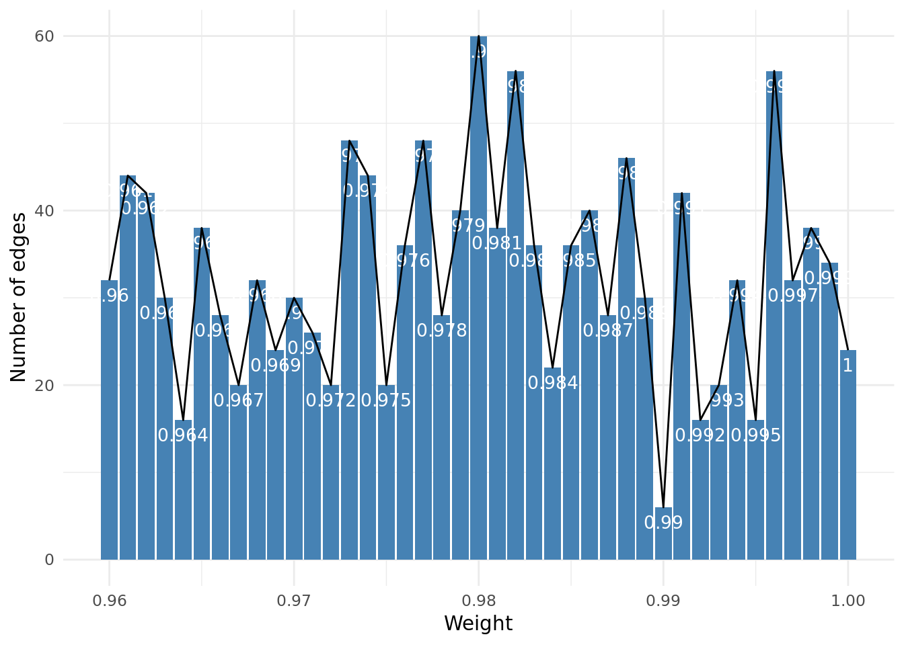

#### Degree distribution of item->similarity->item edges

#### Degree distribution of agent->knows->agent edges

#### Runing time by method 

<table class="table table-condensed" style="width: auto !important; ">
 <thead>
  <tr>
   <th style="text-align:left;"> key </th>
   <th style="text-align:right;"> doc_count </th>
   <th style="text-align:right;"> sum_wallTime_ms.value </th>
   <th style="text-align:left;"> avg_wallTime_ms.value </th>
   <th style="text-align:left;"> includedInTotal </th>
  </tr>
 </thead>
<tbody>
  <tr>
   <td style="text-align:left;"> connectIfSimilar </td>
   <td style="text-align:right;"> 7,140 </td>
   <td style="text-align:right;"> 13,997 </td>
   <td style="text-align:left;"> 1.96036414565826 </td>
   <td style="text-align:left;"> No </td>
  </tr>
  <tr>
   <td style="text-align:left;"> existsSimilarity </td>
   <td style="text-align:right;"> 7,140 </td>
   <td style="text-align:right;"> 13,846 </td>
   <td style="text-align:left;"> 1.93921568627451 </td>
   <td style="text-align:left;"> No </td>
  </tr>
  <tr>
   <td style="text-align:left;"> similarityEdges </td>
   <td style="text-align:right;"> 7,140 </td>
   <td style="text-align:right;"> 13,613 </td>
   <td style="text-align:left;"> 1.90658263305322 </td>
   <td style="text-align:left;"> No </td>
  </tr>
  <tr>
   <td style="text-align:left;"> connectAllSimilar </td>
   <td style="text-align:right;"> 120 </td>
   <td style="text-align:right;"> 14,082 </td>
   <td style="text-align:left;"> 117.35 </td>
   <td style="text-align:left;"> Yes </td>
  </tr>
  <tr>
   <td style="text-align:left;"> init </td>
   <td style="text-align:right;"> 53 </td>
   <td style="text-align:right;"> 8,782 </td>
   <td style="text-align:left;"> 165.698113207547 </td>
   <td style="text-align:left;"> No </td>
  </tr>
  <tr>
   <td style="text-align:left;"> connect </td>
   <td style="text-align:right;"> 9 </td>
   <td style="text-align:right;"> 18 </td>
   <td style="text-align:left;"> 2 </td>
   <td style="text-align:left;"> Yes </td>
  </tr>
  <tr>
   <td style="text-align:left;font-weight: bold;"> Total </td>
   <td style="text-align:right;font-weight: bold;"> 137 </td>
   <td style="text-align:right;font-weight: bold;"> 14,445 </td>
   <td style="text-align:left;font-weight: bold;">  </td>
   <td style="text-align:left;font-weight: bold;">  </td>
  </tr>
</tbody>
</table>
####  Found structures 

#####  Cycles 

Number of cycles found:  1 

<button class="btn btn-primary" data-toggle="collapse" data-target="#DPCXBBAQLD"> Show/Hide foundCycle query </button> 
 
  
     GET /filebeat-*/_search 
              { 
                "query": {
                  "bool": {
                    "must": [
                      { "match_phrase": {
                        "simulationId": "SIM10-13-04-07-Lmpar6--CV"
                        }
                      },
                      { "bool": {
                        "should": [
                          { "match": {
                            "keyword": "foundCycle"
                          }}
                        ]
                      }}
                    ]
                  }
                }
              }
     

#####  Paths 

Number of paths found:  0 

<button class="btn btn-primary" data-toggle="collapse" data-target="#EUGWMDRVIT"> Show/Hide foundPath query </button> 
 
  
     GET /filebeat-*/_search 
              { 
                "query": {
                  "bool": {
                    "must": [
                      { "match_phrase": {
                        "simulationId": "SIM10-13-04-07-Lmpar6--CV"
                        }
                      },
                      { "bool": {
                        "should": [
                          { "match": {
                            "keyword": "foundPath"
                          }}
                        ]
                      }}
                    ]
                  }
                }
              }
     

###  SIM10-13-04-07-Lmpar6--DV 

#### simulationParameters 

<table class="table table-condensed" style="width: auto !important; ">
 <thead>
  <tr>
   <th style="text-align:left;"> agentNumber </th>
   <th style="text-align:left;"> similarityConnectThreshold </th>
   <th style="text-align:left;"> graphType </th>
   <th style="text-align:left;"> chainLength </th>
   <th style="text-align:left;"> similaritySearchThreshold </th>
   <th style="text-align:left;"> maxDistance </th>
   <th style="text-align:left;"> randomWorksNumberMultiplier </th>
  </tr>
 </thead>
<tbody>
  <tr>
   <td style="text-align:left;width: 20em; "> 50 </td>
   <td style="text-align:left;width: 15em; "> 0.96 </td>
   <td style="text-align:left;width: 15em; "> random </td>
   <td style="text-align:left;width: 15em; "> 10 </td>
   <td style="text-align:left;width: 15em; "> 1 </td>
   <td style="text-align:left;width: 15em; "> 30 </td>
   <td style="text-align:left;width: 15em; "> 1 </td>
  </tr>
</tbody>
</table>
#### allEdgesByLabel

<table class="table table-condensed" style="width: auto !important; ">
 <thead>
  <tr>
   <th style="text-align:right;"> edges_offers </th>
   <th style="text-align:right;"> edges_similarity </th>
   <th style="text-align:right;"> edges_owns </th>
   <th style="text-align:right;"> edges_demands </th>
   <th style="text-align:right;"> edges_knows </th>
   <th style="text-align:right;"> edges_total </th>
  </tr>
 </thead>
<tbody>
  <tr>
   <td style="text-align:right;width: 5em; "> 60 </td>
   <td style="text-align:right;width: 5em; "> 1,336 </td>
   <td style="text-align:right;width: 5em; "> 60 </td>
   <td style="text-align:right;width: 5em; "> 60 </td>
   <td style="text-align:right;width: 5em; "> 50 </td>
   <td style="text-align:right;width: 5em; "> 1,566 </td>
  </tr>
</tbody>
</table>
#### allVerticesByType

<table class="table table-condensed" style="width: auto !important; ">
 <thead>
  <tr>
   <th style="text-align:right;"> vertices_agent </th>
   <th style="text-align:right;"> vertices_item </th>
   <th style="text-align:right;"> vertices_work </th>
   <th style="text-align:right;"> vertices_total </th>
  </tr>
 </thead>
<tbody>
  <tr>
   <td style="text-align:right;width: 5em; "> 51 </td>
   <td style="text-align:right;width: 5em; "> 120 </td>
   <td style="text-align:right;width: 5em; "> 60 </td>
   <td style="text-align:right;width: 5em; "> 231 </td>
  </tr>
</tbody>
</table>
#### distribution of similarityEdgesByWeight

#### Degree distribution of item->similarity->item edges

#### Degree distribution of agent->knows->agent edges

#### Runing time by method 

<table class="table table-condensed" style="width: auto !important; ">
 <thead>
  <tr>
   <th style="text-align:left;">   </th>
   <th style="text-align:left;"> key </th>
   <th style="text-align:right;"> doc_count </th>
   <th style="text-align:right;"> sum_wallTime_ms.value </th>
   <th style="text-align:left;"> avg_wallTime_ms.value </th>
   <th style="text-align:left;"> includedInTotal </th>
  </tr>
 </thead>
<tbody>
  <tr>
   <td style="text-align:left;"> 1 </td>
   <td style="text-align:left;"> addItemToWork </td>
   <td style="text-align:right;"> 120 </td>
   <td style="text-align:right;"> 754 </td>
   <td style="text-align:left;"> 6.28333333333333 </td>
   <td style="text-align:left;"> No </td>
  </tr>
  <tr>
   <td style="text-align:left;"> 2 </td>
   <td style="text-align:left;"> ownsWork </td>
   <td style="text-align:right;"> 60 </td>
   <td style="text-align:right;"> 759 </td>
   <td style="text-align:left;"> 12.65 </td>
   <td style="text-align:left;"> No </td>
  </tr>
  <tr>
   <td style="text-align:left;"> 3 </td>
   <td style="text-align:left;"> init </td>
   <td style="text-align:right;"> 53 </td>
   <td style="text-align:right;"> 9,199 </td>
   <td style="text-align:left;"> 173.566037735849 </td>
   <td style="text-align:left;"> No </td>
  </tr>
  <tr>
   <td style="text-align:left;"> 4 </td>
   <td style="text-align:left;"> searchAndConnect </td>
   <td style="text-align:right;"> 51 </td>
   <td style="text-align:right;"> 8,528 </td>
   <td style="text-align:left;"> 167.21568627451 </td>
   <td style="text-align:left;"> Yes </td>
  </tr>
  <tr>
   <td style="text-align:left;"> 5 </td>
   <td style="text-align:left;"> knowsAgent </td>
   <td style="text-align:right;"> 50 </td>
   <td style="text-align:right;"> 99 </td>
   <td style="text-align:left;"> 1.98 </td>
   <td style="text-align:left;"> No </td>
  </tr>
  <tr>
   <td style="text-align:left;"> 6 </td>
   <td style="text-align:left;"> getWorksItems </td>
   <td style="text-align:right;"> 18 </td>
   <td style="text-align:right;"> 32 </td>
   <td style="text-align:left;"> 1.77777777777778 </td>
   <td style="text-align:left;"> Yes </td>
  </tr>
  <tr>
   <td style="text-align:left;"> 9 </td>
   <td style="text-align:left;"> cycleSearch </td>
   <td style="text-align:right;"> 2 </td>
   <td style="text-align:right;"> 78 </td>
   <td style="text-align:left;"> 39 </td>
   <td style="text-align:left;"> Yes </td>
  </tr>
  <tr>
   <td style="text-align:left;"> 10 </td>
   <td style="text-align:left;"> getWorks </td>
   <td style="text-align:right;"> 2 </td>
   <td style="text-align:right;"> 134 </td>
   <td style="text-align:left;"> 67 </td>
   <td style="text-align:left;"> No </td>
  </tr>
  <tr>
   <td style="text-align:left;font-weight: bold;"> 11 </td>
   <td style="text-align:left;font-weight: bold;"> Total </td>
   <td style="text-align:right;font-weight: bold;"> 78 </td>
   <td style="text-align:right;font-weight: bold;"> 8,990 </td>
   <td style="text-align:left;font-weight: bold;">  </td>
   <td style="text-align:left;font-weight: bold;">  </td>
  </tr>
</tbody>
</table>
####  Found structures 

#####  Cycles 

Number of cycles found:  1 

<button class="btn btn-primary" data-toggle="collapse" data-target="#ILLKFJQEUH"> Show/Hide foundCycle query </button> 
 
  
     GET /filebeat-*/_search 
              { 
                "query": {
                  "bool": {
                    "must": [
                      { "match_phrase": {
                        "simulationId": "SIM10-13-04-07-Lmpar6--DV"
                        }
                      },
                      { "bool": {
                        "should": [
                          { "match": {
                            "keyword": "foundCycle"
                          }}
                        ]
                      }}
                    ]
                  }
                }
              }
     

#####  Paths 

Number of paths found:  1 

<button class="btn btn-primary" data-toggle="collapse" data-target="#QRMNQNPQPP"> Show/Hide foundPath query </button> 
 
  
     GET /filebeat-*/_search 
              { 
                "query": {
                  "bool": {
                    "must": [
                      { "match_phrase": {
                        "simulationId": "SIM10-13-04-07-Lmpar6--DV"
                        }
                      },
                      { "bool": {
                        "should": [
                          { "match": {
                            "keyword": "foundPath"
                          }}
                        ]
                      }}
                    ]
                  }
                }
              }
     

###  SIM10-13-04-08-qQDSjR--CV 

#### simulationParameters 

<table class="table table-condensed" style="width: auto !important; ">
 <thead>
  <tr>
   <th style="text-align:left;"> agentNumber </th>
   <th style="text-align:left;"> similarityConnectThreshold </th>
   <th style="text-align:left;"> graphType </th>
   <th style="text-align:left;"> chainLength </th>
   <th style="text-align:left;"> similaritySearchThreshold </th>
   <th style="text-align:left;"> maxDistance </th>
   <th style="text-align:left;"> randomWorksNumberMultiplier </th>
  </tr>
 </thead>
<tbody>
  <tr>
   <td style="text-align:left;width: 20em; "> 50 </td>
   <td style="text-align:left;width: 15em; "> 0.96 </td>
   <td style="text-align:left;width: 15em; "> smallWorld </td>
   <td style="text-align:left;width: 15em; "> 10 </td>
   <td style="text-align:left;width: 15em; "> 1 </td>
   <td style="text-align:left;width: 15em; "> 30 </td>
   <td style="text-align:left;width: 15em; "> 1 </td>
  </tr>
</tbody>
</table>
#### allEdgesByLabel

<table class="table table-condensed" style="width: auto !important; ">
 <thead>
  <tr>
   <th style="text-align:right;"> edges_offers </th>
   <th style="text-align:right;"> edges_similarity </th>
   <th style="text-align:right;"> edges_owns </th>
   <th style="text-align:right;"> edges_demands </th>
   <th style="text-align:right;"> edges_knows </th>
   <th style="text-align:right;"> edges_total </th>
  </tr>
 </thead>
<tbody>
  <tr>
   <td style="text-align:right;width: 5em; "> 60 </td>
   <td style="text-align:right;width: 5em; "> 1,382 </td>
   <td style="text-align:right;width: 5em; "> 60 </td>
   <td style="text-align:right;width: 5em; "> 60 </td>
   <td style="text-align:right;width: 5em; "> 201 </td>
   <td style="text-align:right;width: 5em; "> 1,763 </td>
  </tr>
</tbody>
</table>
#### allVerticesByType

<table class="table table-condensed" style="width: auto !important; ">
 <thead>
  <tr>
   <th style="text-align:right;"> vertices_agent </th>
   <th style="text-align:right;"> vertices_item </th>
   <th style="text-align:right;"> vertices_work </th>
   <th style="text-align:right;"> vertices_total </th>
  </tr>
 </thead>
<tbody>
  <tr>
   <td style="text-align:right;width: 5em; "> 51 </td>
   <td style="text-align:right;width: 5em; "> 120 </td>
   <td style="text-align:right;width: 5em; "> 60 </td>
   <td style="text-align:right;width: 5em; "> 231 </td>
  </tr>
</tbody>
</table>
#### distribution of similarityEdgesByWeight

#### Degree distribution of item->similarity->item edges

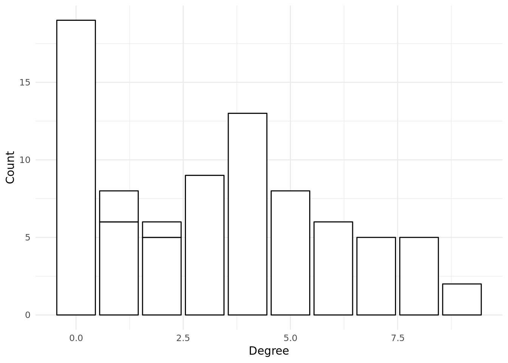

#### Degree distribution of agent->knows->agent edges

#### Runing time by method 

<table class="table table-condensed" style="width: auto !important; ">
 <thead>
  <tr>
   <th style="text-align:left;"> key </th>
   <th style="text-align:right;"> doc_count </th>
   <th style="text-align:right;"> sum_wallTime_ms.value </th>
   <th style="text-align:left;"> avg_wallTime_ms.value </th>
   <th style="text-align:left;"> includedInTotal </th>
  </tr>
 </thead>
<tbody>
  <tr>
   <td style="text-align:left;"> connectIfSimilar </td>
   <td style="text-align:right;"> 7,140 </td>
   <td style="text-align:right;"> 13,787 </td>
   <td style="text-align:left;"> 1.93095238095238 </td>
   <td style="text-align:left;"> No </td>
  </tr>
  <tr>
   <td style="text-align:left;"> existsSimilarity </td>
   <td style="text-align:right;"> 7,140 </td>
   <td style="text-align:right;"> 13,630 </td>
   <td style="text-align:left;"> 1.90896358543417 </td>
   <td style="text-align:left;"> No </td>
  </tr>
  <tr>
   <td style="text-align:left;"> similarityEdges </td>
   <td style="text-align:right;"> 7,140 </td>
   <td style="text-align:right;"> 13,361 </td>
   <td style="text-align:left;"> 1.87128851540616 </td>
   <td style="text-align:left;"> No </td>
  </tr>
  <tr>
   <td style="text-align:left;"> connectAllSimilar </td>
   <td style="text-align:right;"> 120 </td>
   <td style="text-align:right;"> 13,863 </td>
   <td style="text-align:left;"> 115.525 </td>
   <td style="text-align:left;"> Yes </td>
  </tr>
  <tr>
   <td style="text-align:left;"> init </td>
   <td style="text-align:right;"> 53 </td>
   <td style="text-align:right;"> 8,627 </td>
   <td style="text-align:left;"> 162.77358490566 </td>
   <td style="text-align:left;"> No </td>
  </tr>
  <tr>
   <td style="text-align:left;"> connect </td>
   <td style="text-align:right;"> 14 </td>
   <td style="text-align:right;"> 22 </td>
   <td style="text-align:left;"> 1.57142857142857 </td>
   <td style="text-align:left;"> Yes </td>
  </tr>
  <tr>
   <td style="text-align:left;font-weight: bold;"> Total </td>
   <td style="text-align:right;font-weight: bold;"> 142 </td>
   <td style="text-align:right;font-weight: bold;"> 14,141 </td>
   <td style="text-align:left;font-weight: bold;">  </td>
   <td style="text-align:left;font-weight: bold;">  </td>
  </tr>
</tbody>
</table>
####  Found structures 

#####  Cycles 

Number of cycles found:  1 

<button class="btn btn-primary" data-toggle="collapse" data-target="#CDXNHDSBLB"> Show/Hide foundCycle query </button> 
 
  
     GET /filebeat-*/_search 
              { 
                "query": {
                  "bool": {
                    "must": [
                      { "match_phrase": {
                        "simulationId": "SIM10-13-04-08-qQDSjR--CV"
                        }
                      },
                      { "bool": {
                        "should": [
                          { "match": {
                            "keyword": "foundCycle"
                          }}
                        ]
                      }}
                    ]
                  }
                }
              }
     

#####  Paths 

Number of paths found:  0 

<button class="btn btn-primary" data-toggle="collapse" data-target="#WAVRMEKFBP"> Show/Hide foundPath query </button> 
 
  
     GET /filebeat-*/_search 
              { 
                "query": {
                  "bool": {
                    "must": [
                      { "match_phrase": {
                        "simulationId": "SIM10-13-04-08-qQDSjR--CV"
                        }
                      },
                      { "bool": {
                        "should": [
                          { "match": {
                            "keyword": "foundPath"
                          }}
                        ]
                      }}
                    ]
                  }
                }
              }
     

###  SIM10-13-04-08-qQDSjR--DV 

#### simulationParameters 

<table class="table table-condensed" style="width: auto !important; ">
 <thead>
  <tr>
   <th style="text-align:left;"> agentNumber </th>
   <th style="text-align:left;"> similarityConnectThreshold </th>
   <th style="text-align:left;"> graphType </th>
   <th style="text-align:left;"> chainLength </th>
   <th style="text-align:left;"> similaritySearchThreshold </th>
   <th style="text-align:left;"> maxDistance </th>
   <th style="text-align:left;"> randomWorksNumberMultiplier </th>
  </tr>
 </thead>
<tbody>
  <tr>
   <td style="text-align:left;width: 20em; "> 50 </td>
   <td style="text-align:left;width: 15em; "> 0.96 </td>
   <td style="text-align:left;width: 15em; "> smallWorld </td>
   <td style="text-align:left;width: 15em; "> 10 </td>
   <td style="text-align:left;width: 15em; "> 1 </td>
   <td style="text-align:left;width: 15em; "> 30 </td>
   <td style="text-align:left;width: 15em; "> 1 </td>
  </tr>
</tbody>
</table>
#### allEdgesByLabel

<table class="table table-condensed" style="width: auto !important; ">
 <thead>
  <tr>
   <th style="text-align:right;"> edges_offers </th>
   <th style="text-align:right;"> edges_similarity </th>
   <th style="text-align:right;"> edges_owns </th>
   <th style="text-align:right;"> edges_demands </th>
   <th style="text-align:right;"> edges_knows </th>
   <th style="text-align:right;"> edges_total </th>
  </tr>
 </thead>
<tbody>
  <tr>
   <td style="text-align:right;width: 5em; "> 60 </td>
   <td style="text-align:right;width: 5em; "> 1,354 </td>
   <td style="text-align:right;width: 5em; "> 60 </td>
   <td style="text-align:right;width: 5em; "> 60 </td>
   <td style="text-align:right;width: 5em; "> 201 </td>
   <td style="text-align:right;width: 5em; "> 1,735 </td>
  </tr>
</tbody>
</table>
#### allVerticesByType

<table class="table table-condensed" style="width: auto !important; ">
 <thead>
  <tr>
   <th style="text-align:right;"> vertices_agent </th>
   <th style="text-align:right;"> vertices_item </th>
   <th style="text-align:right;"> vertices_work </th>
   <th style="text-align:right;"> vertices_total </th>
  </tr>
 </thead>
<tbody>
  <tr>
   <td style="text-align:right;width: 5em; "> 51 </td>
   <td style="text-align:right;width: 5em; "> 120 </td>
   <td style="text-align:right;width: 5em; "> 60 </td>
   <td style="text-align:right;width: 5em; "> 231 </td>
  </tr>
</tbody>
</table>
#### distribution of similarityEdgesByWeight

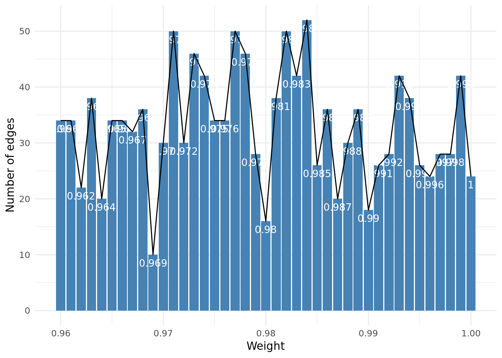

#### Degree distribution of item->similarity->item edges

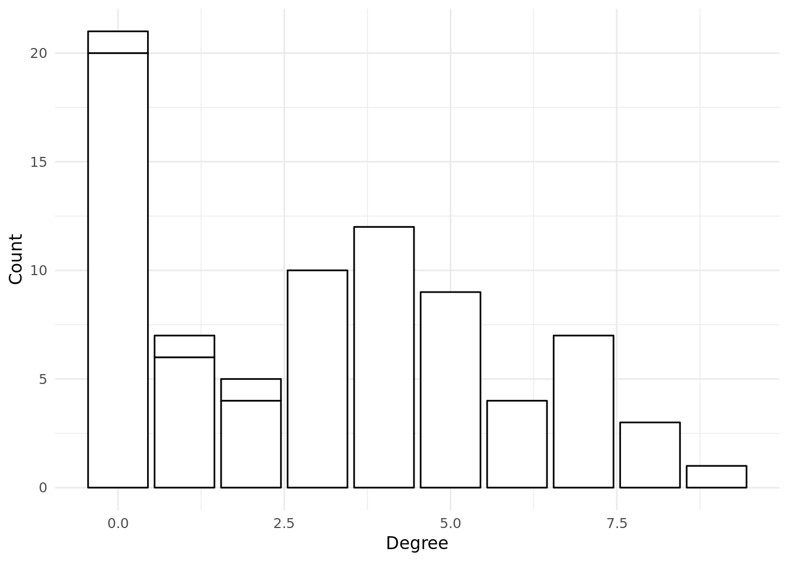

#### Degree distribution of agent->knows->agent edges

#### Runing time by method 

<table class="table table-condensed" style="width: auto !important; ">
 <thead>
  <tr>
   <th style="text-align:left;">   </th>
   <th style="text-align:left;"> key </th>
   <th style="text-align:right;"> doc_count </th>
   <th style="text-align:right;"> sum_wallTime_ms.value </th>
   <th style="text-align:left;"> avg_wallTime_ms.value </th>
   <th style="text-align:left;"> includedInTotal </th>
  </tr>
 </thead>
<tbody>
  <tr>
   <td style="text-align:left;"> 1 </td>
   <td style="text-align:left;"> knowsAgent </td>
   <td style="text-align:right;"> 201 </td>
   <td style="text-align:right;"> 294 </td>
   <td style="text-align:left;"> 1.46268656716418 </td>
   <td style="text-align:left;"> No </td>
  </tr>
  <tr>
   <td style="text-align:left;"> 2 </td>
   <td style="text-align:left;"> addItemToWork </td>
   <td style="text-align:right;"> 120 </td>
   <td style="text-align:right;"> 827 </td>
   <td style="text-align:left;"> 6.89166666666667 </td>
   <td style="text-align:left;"> No </td>
  </tr>
  <tr>
   <td style="text-align:left;"> 3 </td>
   <td style="text-align:left;"> ownsWork </td>
   <td style="text-align:right;"> 60 </td>
   <td style="text-align:right;"> 793 </td>
   <td style="text-align:left;"> 13.2166666666667 </td>
   <td style="text-align:left;"> No </td>
  </tr>
  <tr>
   <td style="text-align:left;"> 4 </td>
   <td style="text-align:left;"> init </td>
   <td style="text-align:right;"> 53 </td>
   <td style="text-align:right;"> 9,051 </td>
   <td style="text-align:left;"> 170.77358490566 </td>
   <td style="text-align:left;"> No </td>
  </tr>
  <tr>
   <td style="text-align:left;"> 5 </td>
   <td style="text-align:left;"> searchAndConnect </td>
   <td style="text-align:right;"> 51 </td>
   <td style="text-align:right;"> 8,849 </td>
   <td style="text-align:left;"> 173.509803921569 </td>
   <td style="text-align:left;"> Yes </td>
  </tr>
  <tr>
   <td style="text-align:left;"> 6 </td>
   <td style="text-align:left;"> getWorksItems </td>
   <td style="text-align:right;"> 18 </td>
   <td style="text-align:right;"> 26 </td>
   <td style="text-align:left;"> 1.44444444444444 </td>
   <td style="text-align:left;"> Yes </td>
  </tr>
  <tr>
   <td style="text-align:left;"> 9 </td>
   <td style="text-align:left;"> cycleSearch </td>
   <td style="text-align:right;"> 2 </td>
   <td style="text-align:right;"> 114 </td>
   <td style="text-align:left;"> 57 </td>
   <td style="text-align:left;"> Yes </td>
  </tr>
  <tr>
   <td style="text-align:left;"> 10 </td>
   <td style="text-align:left;"> getWorks </td>
   <td style="text-align:right;"> 2 </td>
   <td style="text-align:right;"> 175 </td>
   <td style="text-align:left;"> 87.5 </td>
   <td style="text-align:left;"> No </td>
  </tr>
  <tr>
   <td style="text-align:left;font-weight: bold;"> 11 </td>
   <td style="text-align:left;font-weight: bold;"> Total </td>
   <td style="text-align:right;font-weight: bold;"> 78 </td>
   <td style="text-align:right;font-weight: bold;"> 9,472 </td>
   <td style="text-align:left;font-weight: bold;">  </td>
   <td style="text-align:left;font-weight: bold;">  </td>
  </tr>
</tbody>
</table>
####  Found structures 

#####  Cycles 

Number of cycles found:  1 

<button class="btn btn-primary" data-toggle="collapse" data-target="#FHITIWZEQJ"> Show/Hide foundCycle query </button> 
 
  
     GET /filebeat-*/_search 
              { 
                "query": {
                  "bool": {
                    "must": [
                      { "match_phrase": {
                        "simulationId": "SIM10-13-04-08-qQDSjR--DV"
                        }
                      },
                      { "bool": {
                        "should": [
                          { "match": {
                            "keyword": "foundCycle"
                          }}
                        ]
                      }}
                    ]
                  }
                }
              }
     

#####  Paths 

Number of paths found:  1 

<button class="btn btn-primary" data-toggle="collapse" data-target="#AUBEYCSLDT"> Show/Hide foundPath query </button> 
 
  
     GET /filebeat-*/_search 
              { 
                "query": {
                  "bool": {
                    "must": [
                      { "match_phrase": {
                        "simulationId": "SIM10-13-04-08-qQDSjR--DV"
                        }
                      },
                      { "bool": {
                        "should": [
                          { "match": {
                            "keyword": "foundPath"
                          }}
                        ]
                      }}
                    ]
                  }
                }
              }
     

###  SIM10-13-05-13-S52Jif--CV 

#### simulationParameters 

<table class="table table-condensed" style="width: auto !important; ">
 <thead>
  <tr>
   <th style="text-align:left;"> agentNumber </th>
   <th style="text-align:left;"> similarityConnectThreshold </th>
   <th style="text-align:left;"> graphType </th>
   <th style="text-align:left;"> chainLength </th>
   <th style="text-align:left;"> similaritySearchThreshold </th>
   <th style="text-align:left;"> maxDistance </th>
   <th style="text-align:left;"> randomWorksNumberMultiplier </th>
  </tr>
 </thead>
<tbody>
  <tr>
   <td style="text-align:left;width: 20em; "> 50 </td>
   <td style="text-align:left;width: 15em; "> 0.96 </td>
   <td style="text-align:left;width: 15em; "> random </td>
   <td style="text-align:left;width: 15em; "> 10 </td>
   <td style="text-align:left;width: 15em; "> 1 </td>
   <td style="text-align:left;width: 15em; "> 30 </td>
   <td style="text-align:left;width: 15em; "> 2 </td>
  </tr>
</tbody>
</table>
#### allEdgesByLabel

<table class="table table-condensed" style="width: auto !important; ">
 <thead>
  <tr>
   <th style="text-align:right;"> edges_offers </th>
   <th style="text-align:right;"> edges_similarity </th>
   <th style="text-align:right;"> edges_owns </th>
   <th style="text-align:right;"> edges_demands </th>
   <th style="text-align:right;"> edges_knows </th>
   <th style="text-align:right;"> edges_total </th>
  </tr>
 </thead>
<tbody>
  <tr>
   <td style="text-align:right;width: 5em; "> 110 </td>
   <td style="text-align:right;width: 5em; "> 4,312 </td>
   <td style="text-align:right;width: 5em; "> 110 </td>
   <td style="text-align:right;width: 5em; "> 110 </td>
   <td style="text-align:right;width: 5em; "> 50 </td>
   <td style="text-align:right;width: 5em; "> 4,692 </td>
  </tr>
</tbody>
</table>
#### allVerticesByType

<table class="table table-condensed" style="width: auto !important; ">
 <thead>
  <tr>
   <th style="text-align:right;"> vertices_agent </th>
   <th style="text-align:right;"> vertices_item </th>
   <th style="text-align:right;"> vertices_work </th>
   <th style="text-align:right;"> vertices_total </th>
  </tr>
 </thead>
<tbody>
  <tr>
   <td style="text-align:right;width: 5em; "> 51 </td>
   <td style="text-align:right;width: 5em; "> 220 </td>
   <td style="text-align:right;width: 5em; "> 110 </td>
   <td style="text-align:right;width: 5em; "> 381 </td>
  </tr>
</tbody>
</table>
#### distribution of similarityEdgesByWeight

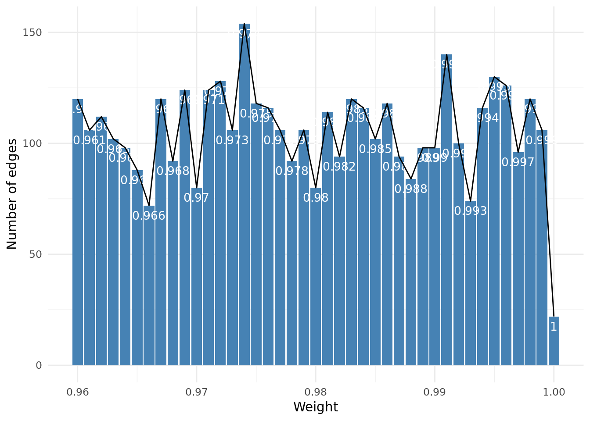

#### Degree distribution of item->similarity->item edges

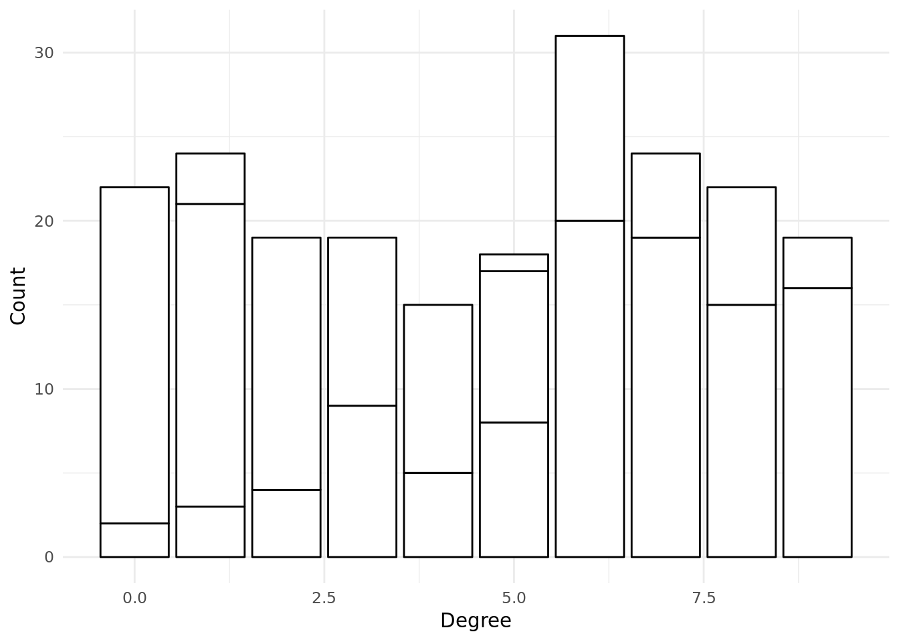

#### Degree distribution of agent->knows->agent edges

#### Runing time by method 

<table class="table table-condensed" style="width: auto !important; ">
 <thead>
  <tr>
   <th style="text-align:left;"> key </th>
   <th style="text-align:right;"> doc_count </th>
   <th style="text-align:right;"> sum_wallTime_ms.value </th>
   <th style="text-align:left;"> avg_wallTime_ms.value </th>
   <th style="text-align:left;"> includedInTotal </th>
  </tr>
 </thead>
<tbody>
  <tr>
   <td style="text-align:left;"> connectIfSimilar </td>
   <td style="text-align:right;"> 24,090 </td>
   <td style="text-align:right;"> 50,017 </td>
   <td style="text-align:left;"> 2.07625570776256 </td>
   <td style="text-align:left;"> No </td>
  </tr>
  <tr>
   <td style="text-align:left;"> existsSimilarity </td>
   <td style="text-align:right;"> 24,090 </td>
   <td style="text-align:right;"> 49,428 </td>
   <td style="text-align:left;"> 2.05180572851806 </td>
   <td style="text-align:left;"> No </td>
  </tr>
  <tr>
   <td style="text-align:left;"> similarityEdges </td>
   <td style="text-align:right;"> 24,090 </td>
   <td style="text-align:right;"> 48,551 </td>
   <td style="text-align:left;"> 2.01540058115401 </td>
   <td style="text-align:left;"> No </td>
  </tr>
  <tr>
   <td style="text-align:left;"> connectAllSimilar </td>
   <td style="text-align:right;"> 220 </td>
   <td style="text-align:right;"> 50,269 </td>
   <td style="text-align:left;"> 228.495454545455 </td>
   <td style="text-align:left;"> Yes </td>
  </tr>
  <tr>
   <td style="text-align:left;"> init </td>
   <td style="text-align:right;"> 53 </td>
   <td style="text-align:right;"> 9,434 </td>
   <td style="text-align:left;"> 178 </td>
   <td style="text-align:left;"> No </td>
  </tr>
  <tr>
   <td style="text-align:left;"> connect </td>
   <td style="text-align:right;"> 50 </td>
   <td style="text-align:right;"> 113 </td>
   <td style="text-align:left;"> 2.26 </td>
   <td style="text-align:left;"> Yes </td>
  </tr>
  <tr>
   <td style="text-align:left;font-weight: bold;"> Total </td>
   <td style="text-align:right;font-weight: bold;"> 278 </td>
   <td style="text-align:right;font-weight: bold;"> 50,775 </td>
   <td style="text-align:left;font-weight: bold;">  </td>
   <td style="text-align:left;font-weight: bold;">  </td>
  </tr>
</tbody>
</table>
####  Found structures 

#####  Cycles 

Number of cycles found:  1 

<button class="btn btn-primary" data-toggle="collapse" data-target="#STOEMQDNTV"> Show/Hide foundCycle query </button> 
 
  
     GET /filebeat-*/_search 
              { 
                "query": {
                  "bool": {
                    "must": [
                      { "match_phrase": {
                        "simulationId": "SIM10-13-05-13-S52Jif--CV"
                        }
                      },
                      { "bool": {
                        "should": [
                          { "match": {
                            "keyword": "foundCycle"
                          }}
                        ]
                      }}
                    ]
                  }
                }
              }
     

#####  Paths 

Number of paths found:  0 

<button class="btn btn-primary" data-toggle="collapse" data-target="#BOAVHGOBLC"> Show/Hide foundPath query </button> 
 
  
     GET /filebeat-*/_search 
              { 
                "query": {
                  "bool": {
                    "must": [
                      { "match_phrase": {
                        "simulationId": "SIM10-13-05-13-S52Jif--CV"
                        }
                      },
                      { "bool": {
                        "should": [
                          { "match": {
                            "keyword": "foundPath"
                          }}
                        ]
                      }}
                    ]
                  }
                }
              }
     

###  SIM10-13-05-13-S52Jif--DV 

#### simulationParameters 

<table class="table table-condensed" style="width: auto !important; ">
 <thead>
  <tr>
   <th style="text-align:left;"> agentNumber </th>
   <th style="text-align:left;"> similarityConnectThreshold </th>
   <th style="text-align:left;"> graphType </th>
   <th style="text-align:left;"> chainLength </th>
   <th style="text-align:left;"> similaritySearchThreshold </th>
   <th style="text-align:left;"> maxDistance </th>
   <th style="text-align:left;"> randomWorksNumberMultiplier </th>
  </tr>
 </thead>
<tbody>
  <tr>
   <td style="text-align:left;width: 20em; "> 50 </td>
   <td style="text-align:left;width: 15em; "> 0.96 </td>
   <td style="text-align:left;width: 15em; "> random </td>
   <td style="text-align:left;width: 15em; "> 10 </td>
   <td style="text-align:left;width: 15em; "> 1 </td>
   <td style="text-align:left;width: 15em; "> 30 </td>
   <td style="text-align:left;width: 15em; "> 2 </td>
  </tr>
</tbody>
</table>
#### allEdgesByLabel

<table class="table table-condensed" style="width: auto !important; ">
 <thead>
  <tr>
   <th style="text-align:right;"> edges_offers </th>
   <th style="text-align:right;"> edges_similarity </th>
   <th style="text-align:right;"> edges_owns </th>
   <th style="text-align:right;"> edges_demands </th>
   <th style="text-align:right;"> edges_knows </th>
   <th style="text-align:right;"> edges_total </th>
  </tr>
 </thead>
<tbody>
  <tr>
   <td style="text-align:right;width: 5em; "> 110 </td>
   <td style="text-align:right;width: 5em; "> 4,212 </td>
   <td style="text-align:right;width: 5em; "> 110 </td>
   <td style="text-align:right;width: 5em; "> 110 </td>
   <td style="text-align:right;width: 5em; "> 50 </td>
   <td style="text-align:right;width: 5em; "> 4,592 </td>
  </tr>
</tbody>
</table>
#### allVerticesByType

<table class="table table-condensed" style="width: auto !important; ">
 <thead>
  <tr>
   <th style="text-align:right;"> vertices_agent </th>
   <th style="text-align:right;"> vertices_item </th>
   <th style="text-align:right;"> vertices_work </th>
   <th style="text-align:right;"> vertices_total </th>
  </tr>
 </thead>
<tbody>
  <tr>
   <td style="text-align:right;width: 5em; "> 51 </td>
   <td style="text-align:right;width: 5em; "> 220 </td>
   <td style="text-align:right;width: 5em; "> 110 </td>
   <td style="text-align:right;width: 5em; "> 381 </td>
  </tr>
</tbody>
</table>
#### distribution of similarityEdgesByWeight

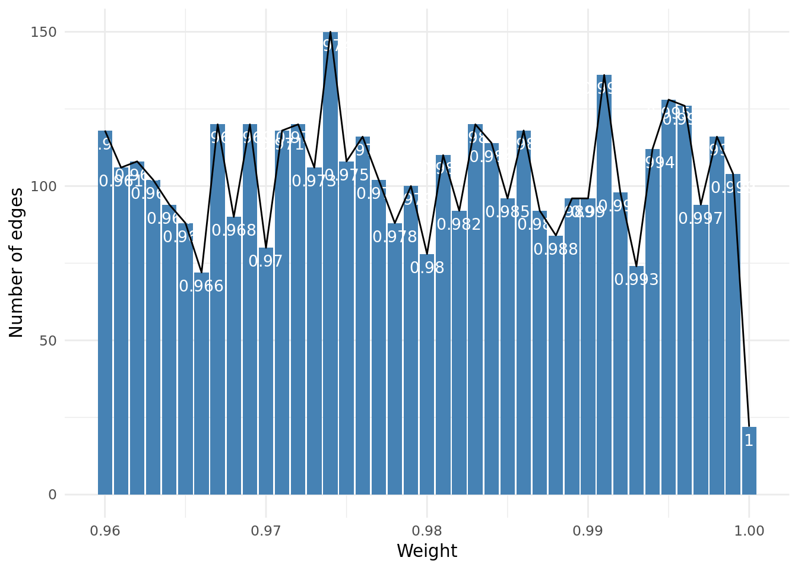

#### Degree distribution of item->similarity->item edges

#### Degree distribution of agent->knows->agent edges

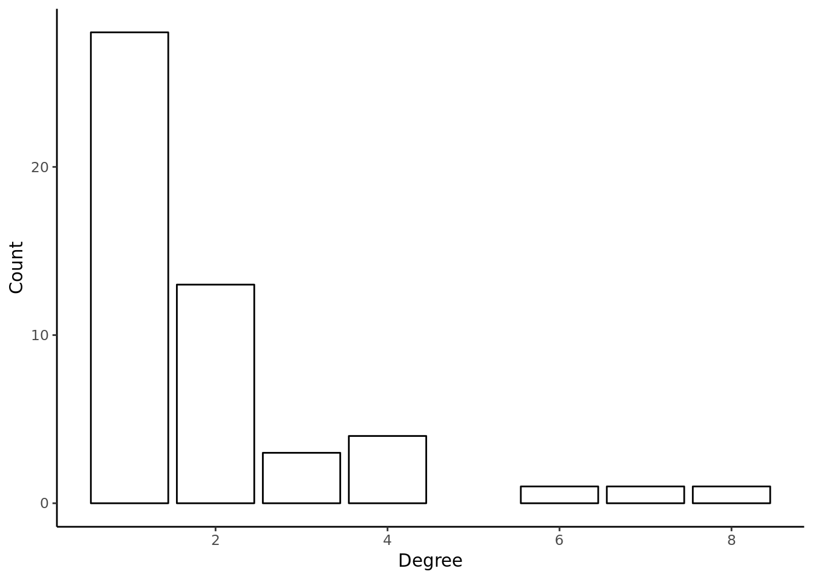

#### Runing time by method 

<table class="table table-condensed" style="width: auto !important; ">
 <thead>
  <tr>
   <th style="text-align:left;">   </th>
   <th style="text-align:left;"> key </th>
   <th style="text-align:right;"> doc_count </th>
   <th style="text-align:right;"> sum_wallTime_ms.value </th>
   <th style="text-align:left;"> avg_wallTime_ms.value </th>
   <th style="text-align:left;"> includedInTotal </th>
  </tr>
 </thead>
<tbody>
  <tr>
   <td style="text-align:left;"> 1 </td>
   <td style="text-align:left;"> addItemToWork </td>
   <td style="text-align:right;"> 220 </td>
   <td style="text-align:right;"> 1,924 </td>
   <td style="text-align:left;"> 8.74545454545455 </td>
   <td style="text-align:left;"> No </td>
  </tr>
  <tr>
   <td style="text-align:left;"> 2 </td>
   <td style="text-align:left;"> ownsWork </td>
   <td style="text-align:right;"> 110 </td>
   <td style="text-align:right;"> 1,457 </td>
   <td style="text-align:left;"> 13.2454545454545 </td>
   <td style="text-align:left;"> No </td>
  </tr>
  <tr>
   <td style="text-align:left;"> 3 </td>
   <td style="text-align:left;"> init </td>
   <td style="text-align:right;"> 53 </td>
   <td style="text-align:right;"> 8,741 </td>
   <td style="text-align:left;"> 164.924528301887 </td>
   <td style="text-align:left;"> No </td>
  </tr>
  <tr>
   <td style="text-align:left;"> 4 </td>
   <td style="text-align:left;"> searchAndConnect </td>
   <td style="text-align:right;"> 51 </td>
   <td style="text-align:right;"> 21,405 </td>
   <td style="text-align:left;"> 419.705882352941 </td>
   <td style="text-align:left;"> Yes </td>
  </tr>
  <tr>
   <td style="text-align:left;"> 5 </td>
   <td style="text-align:left;"> knowsAgent </td>
   <td style="text-align:right;"> 50 </td>
   <td style="text-align:right;"> 115 </td>
   <td style="text-align:left;"> 2.3 </td>
   <td style="text-align:left;"> No </td>
  </tr>
  <tr>
   <td style="text-align:left;"> 6 </td>
   <td style="text-align:left;"> getWorksItems </td>
   <td style="text-align:right;"> 18 </td>
   <td style="text-align:right;"> 34 </td>
   <td style="text-align:left;"> 1.88888888888889 </td>
   <td style="text-align:left;"> Yes </td>
  </tr>
  <tr>
   <td style="text-align:left;"> 9 </td>
   <td style="text-align:left;"> cycleSearch </td>
   <td style="text-align:right;"> 2 </td>
   <td style="text-align:right;"> 26 </td>
   <td style="text-align:left;"> 13 </td>
   <td style="text-align:left;"> Yes </td>
  </tr>
  <tr>
   <td style="text-align:left;"> 10 </td>
   <td style="text-align:left;"> getWorks </td>
   <td style="text-align:right;"> 2 </td>
   <td style="text-align:right;"> 247 </td>
   <td style="text-align:left;"> 123.5 </td>
   <td style="text-align:left;"> No </td>
  </tr>
  <tr>
   <td style="text-align:left;font-weight: bold;"> 11 </td>
   <td style="text-align:left;font-weight: bold;"> Total </td>
   <td style="text-align:right;font-weight: bold;"> 78 </td>
   <td style="text-align:right;font-weight: bold;"> 21,755 </td>
   <td style="text-align:left;font-weight: bold;">  </td>
   <td style="text-align:left;font-weight: bold;">  </td>
  </tr>
</tbody>
</table>
####  Found structures 

#####  Cycles 

Number of cycles found:  1 

<button class="btn btn-primary" data-toggle="collapse" data-target="#DCDXYEZQIE"> Show/Hide foundCycle query </button> 
 
  
     GET /filebeat-*/_search 
              { 
                "query": {
                  "bool": {
                    "must": [
                      { "match_phrase": {
                        "simulationId": "SIM10-13-05-13-S52Jif--DV"
                        }
                      },
                      { "bool": {
                        "should": [
                          { "match": {
                            "keyword": "foundCycle"
                          }}
                        ]
                      }}
                    ]
                  }
                }
              }
     

#####  Paths 

Number of paths found:  1 

<button class="btn btn-primary" data-toggle="collapse" data-target="#KMOTKRSCRC"> Show/Hide foundPath query </button> 
 
  
     GET /filebeat-*/_search 
              { 
                "query": {
                  "bool": {
                    "must": [
                      { "match_phrase": {
                        "simulationId": "SIM10-13-05-13-S52Jif--DV"
                        }
                      },
                      { "bool": {
                        "should": [
                          { "match": {
                            "keyword": "foundPath"
                          }}
                        ]
                      }}
                    ]
                  }
                }
              }
     

###  SIM10-13-05-14-THWrif--CV 

#### simulationParameters 

<table class="table table-condensed" style="width: auto !important; ">
 <thead>
  <tr>
   <th style="text-align:left;"> agentNumber </th>
   <th style="text-align:left;"> similarityConnectThreshold </th>
   <th style="text-align:left;"> graphType </th>
   <th style="text-align:left;"> chainLength </th>
   <th style="text-align:left;"> similaritySearchThreshold </th>
   <th style="text-align:left;"> maxDistance </th>
   <th style="text-align:left;"> randomWorksNumberMultiplier </th>
  </tr>
 </thead>
<tbody>
  <tr>
   <td style="text-align:left;width: 20em; "> 50 </td>
   <td style="text-align:left;width: 15em; "> 0.96 </td>
   <td style="text-align:left;width: 15em; "> smallWorld </td>
   <td style="text-align:left;width: 15em; "> 10 </td>
   <td style="text-align:left;width: 15em; "> 1 </td>
   <td style="text-align:left;width: 15em; "> 30 </td>
   <td style="text-align:left;width: 15em; "> 2 </td>
  </tr>
</tbody>
</table>
#### allEdgesByLabel

<table class="table table-condensed" style="width: auto !important; ">
 <thead>
  <tr>
   <th style="text-align:right;"> edges_offers </th>
   <th style="text-align:right;"> edges_similarity </th>
   <th style="text-align:right;"> edges_owns </th>
   <th style="text-align:right;"> edges_demands </th>
   <th style="text-align:right;"> edges_knows </th>
   <th style="text-align:right;"> edges_total </th>
  </tr>
 </thead>
<tbody>
  <tr>
   <td style="text-align:right;width: 5em; "> 110 </td>
   <td style="text-align:right;width: 5em; "> 4,380 </td>
   <td style="text-align:right;width: 5em; "> 110 </td>
   <td style="text-align:right;width: 5em; "> 110 </td>
   <td style="text-align:right;width: 5em; "> 201 </td>
   <td style="text-align:right;width: 5em; "> 4,911 </td>
  </tr>
</tbody>
</table>
#### allVerticesByType

<table class="table table-condensed" style="width: auto !important; ">
 <thead>
  <tr>
   <th style="text-align:right;"> vertices_agent </th>
   <th style="text-align:right;"> vertices_item </th>
   <th style="text-align:right;"> vertices_work </th>
   <th style="text-align:right;"> vertices_total </th>
  </tr>
 </thead>
<tbody>
  <tr>
   <td style="text-align:right;width: 5em; "> 51 </td>
   <td style="text-align:right;width: 5em; "> 220 </td>
   <td style="text-align:right;width: 5em; "> 110 </td>
   <td style="text-align:right;width: 5em; "> 381 </td>
  </tr>
</tbody>
</table>
#### distribution of similarityEdgesByWeight

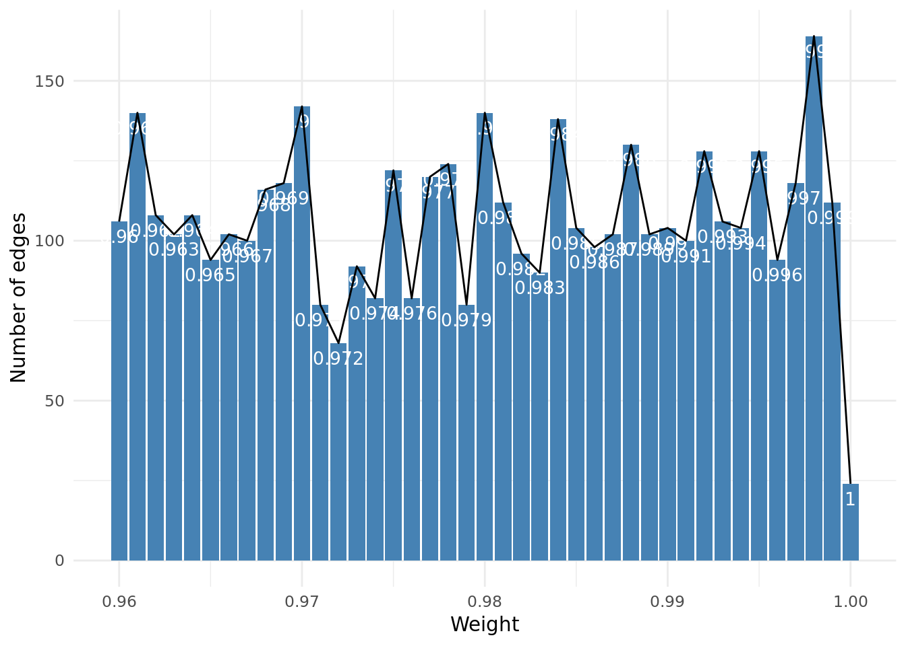

#### Degree distribution of item->similarity->item edges

#### Degree distribution of agent->knows->agent edges

#### Runing time by method 

<table class="table table-condensed" style="width: auto !important; ">
 <thead>
  <tr>
   <th style="text-align:left;"> key </th>
   <th style="text-align:right;"> doc_count </th>
   <th style="text-align:right;"> sum_wallTime_ms.value </th>
   <th style="text-align:left;"> avg_wallTime_ms.value </th>
   <th style="text-align:left;"> includedInTotal </th>
  </tr>
 </thead>
<tbody>
  <tr>
   <td style="text-align:left;"> connectIfSimilar </td>
   <td style="text-align:right;"> 24,090 </td>
   <td style="text-align:right;"> 49,285 </td>
   <td style="text-align:left;"> 2.0458696554587 </td>
   <td style="text-align:left;"> No </td>
  </tr>
  <tr>
   <td style="text-align:left;"> existsSimilarity </td>
   <td style="text-align:right;"> 24,090 </td>
   <td style="text-align:right;"> 48,770 </td>
   <td style="text-align:left;"> 2.02449149024491 </td>
   <td style="text-align:left;"> No </td>
  </tr>
  <tr>
   <td style="text-align:left;"> similarityEdges </td>
   <td style="text-align:right;"> 24,090 </td>
   <td style="text-align:right;"> 47,951 </td>
   <td style="text-align:left;"> 1.99049398090494 </td>
   <td style="text-align:left;"> No </td>
  </tr>
  <tr>
   <td style="text-align:left;"> connectAllSimilar </td>
   <td style="text-align:right;"> 220 </td>
   <td style="text-align:right;"> 49,554 </td>
   <td style="text-align:left;"> 225.245454545455 </td>
   <td style="text-align:left;"> Yes </td>
  </tr>
  <tr>
   <td style="text-align:left;"> init </td>
   <td style="text-align:right;"> 53 </td>
   <td style="text-align:right;"> 8,892 </td>
   <td style="text-align:left;"> 167.77358490566 </td>
   <td style="text-align:left;"> No </td>
  </tr>
  <tr>
   <td style="text-align:left;"> connect </td>
   <td style="text-align:right;"> 38 </td>
   <td style="text-align:right;"> 72 </td>
   <td style="text-align:left;"> 1.89473684210526 </td>
   <td style="text-align:left;"> Yes </td>
  </tr>
  <tr>
   <td style="text-align:left;font-weight: bold;"> Total </td>
   <td style="text-align:right;font-weight: bold;"> 266 </td>
   <td style="text-align:right;font-weight: bold;"> 50,103 </td>
   <td style="text-align:left;font-weight: bold;">  </td>
   <td style="text-align:left;font-weight: bold;">  </td>
  </tr>
</tbody>
</table>
####  Found structures 

#####  Cycles 

Number of cycles found:  1 

<button class="btn btn-primary" data-toggle="collapse" data-target="#ZFAOZHETMU"> Show/Hide foundCycle query </button> 
 
  
     GET /filebeat-*/_search 
              { 
                "query": {
                  "bool": {
                    "must": [
                      { "match_phrase": {
                        "simulationId": "SIM10-13-05-14-THWrif--CV"
                        }
                      },
                      { "bool": {
                        "should": [
                          { "match": {
                            "keyword": "foundCycle"
                          }}
                        ]
                      }}
                    ]
                  }
                }
              }
     

#####  Paths 

Number of paths found:  0 

<button class="btn btn-primary" data-toggle="collapse" data-target="#QMHOUQIAGM"> Show/Hide foundPath query </button> 
 
  
     GET /filebeat-*/_search 
              { 
                "query": {
                  "bool": {
                    "must": [
                      { "match_phrase": {
                        "simulationId": "SIM10-13-05-14-THWrif--CV"
                        }
                      },
                      { "bool": {
                        "should": [
                          { "match": {
                            "keyword": "foundPath"
                          }}
                        ]
                      }}
                    ]
                  }
                }
              }
     

###  SIM10-13-05-14-THWrif--DV 

#### simulationParameters 

<table class="table table-condensed" style="width: auto !important; ">
 <thead>
  <tr>
   <th style="text-align:left;"> agentNumber </th>
   <th style="text-align:left;"> similarityConnectThreshold </th>
   <th style="text-align:left;"> graphType </th>
   <th style="text-align:left;"> chainLength </th>
   <th style="text-align:left;"> similaritySearchThreshold </th>
   <th style="text-align:left;"> maxDistance </th>
   <th style="text-align:left;"> randomWorksNumberMultiplier </th>
  </tr>
 </thead>
<tbody>
  <tr>
   <td style="text-align:left;width: 20em; "> 50 </td>
   <td style="text-align:left;width: 15em; "> 0.96 </td>
   <td style="text-align:left;width: 15em; "> smallWorld </td>
   <td style="text-align:left;width: 15em; "> 10 </td>
   <td style="text-align:left;width: 15em; "> 1 </td>
   <td style="text-align:left;width: 15em; "> 30 </td>
   <td style="text-align:left;width: 15em; "> 2 </td>
  </tr>
</tbody>
</table>
#### allEdgesByLabel

<table class="table table-condensed" style="width: auto !important; ">
 <thead>
  <tr>
   <th style="text-align:right;"> edges_offers </th>
   <th style="text-align:right;"> edges_similarity </th>
   <th style="text-align:right;"> edges_owns </th>
   <th style="text-align:right;"> edges_demands </th>
   <th style="text-align:right;"> edges_knows </th>
   <th style="text-align:right;"> edges_total </th>
  </tr>
 </thead>
<tbody>
  <tr>
   <td style="text-align:right;width: 5em; "> 110 </td>
   <td style="text-align:right;width: 5em; "> 4,304 </td>
   <td style="text-align:right;width: 5em; "> 110 </td>
   <td style="text-align:right;width: 5em; "> 110 </td>
   <td style="text-align:right;width: 5em; "> 201 </td>
   <td style="text-align:right;width: 5em; "> 4,835 </td>
  </tr>
</tbody>
</table>
#### allVerticesByType

<table class="table table-condensed" style="width: auto !important; ">
 <thead>
  <tr>
   <th style="text-align:right;"> vertices_agent </th>
   <th style="text-align:right;"> vertices_item </th>
   <th style="text-align:right;"> vertices_work </th>
   <th style="text-align:right;"> vertices_total </th>
  </tr>
 </thead>
<tbody>
  <tr>
   <td style="text-align:right;width: 5em; "> 51 </td>
   <td style="text-align:right;width: 5em; "> 220 </td>
   <td style="text-align:right;width: 5em; "> 110 </td>
   <td style="text-align:right;width: 5em; "> 381 </td>
  </tr>
</tbody>
</table>
#### distribution of similarityEdgesByWeight

#### Degree distribution of item->similarity->item edges

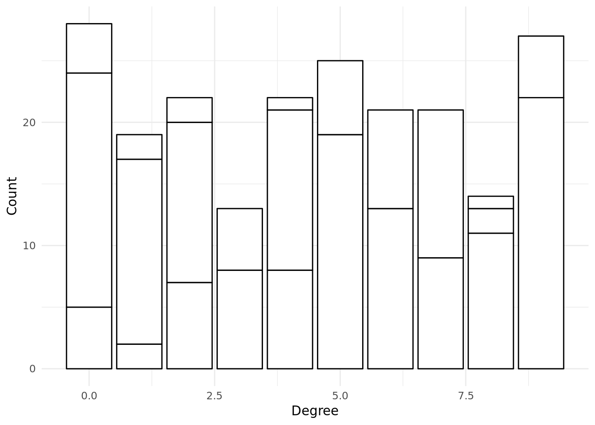

#### Degree distribution of agent->knows->agent edges

#### Runing time by method 

<table class="table table-condensed" style="width: auto !important; ">
 <thead>
  <tr>
   <th style="text-align:left;">   </th>
   <th style="text-align:left;"> key </th>
   <th style="text-align:right;"> doc_count </th>
   <th style="text-align:right;"> sum_wallTime_ms.value </th>
   <th style="text-align:left;"> avg_wallTime_ms.value </th>
   <th style="text-align:left;"> includedInTotal </th>
  </tr>
 </thead>
<tbody>
  <tr>
   <td style="text-align:left;"> 1 </td>
   <td style="text-align:left;"> addItemToWork </td>
   <td style="text-align:right;"> 220 </td>
   <td style="text-align:right;"> 2,080 </td>
   <td style="text-align:left;"> 9.45454545454546 </td>
   <td style="text-align:left;"> No </td>
  </tr>
  <tr>
   <td style="text-align:left;"> 2 </td>
   <td style="text-align:left;"> knowsAgent </td>
   <td style="text-align:right;"> 201 </td>
   <td style="text-align:right;"> 420 </td>
   <td style="text-align:left;"> 2.08955223880597 </td>
   <td style="text-align:left;"> No </td>
  </tr>
  <tr>
   <td style="text-align:left;"> 3 </td>
   <td style="text-align:left;"> ownsWork </td>
   <td style="text-align:right;"> 110 </td>
   <td style="text-align:right;"> 1,396 </td>
   <td style="text-align:left;"> 12.6909090909091 </td>
   <td style="text-align:left;"> No </td>
  </tr>
  <tr>
   <td style="text-align:left;"> 4 </td>
   <td style="text-align:left;"> init </td>
   <td style="text-align:right;"> 53 </td>
   <td style="text-align:right;"> 9,616 </td>
   <td style="text-align:left;"> 181.433962264151 </td>
   <td style="text-align:left;"> No </td>
  </tr>
  <tr>
   <td style="text-align:left;"> 5 </td>
   <td style="text-align:left;"> searchAndConnect </td>
   <td style="text-align:right;"> 51 </td>
   <td style="text-align:right;"> 23,380 </td>
   <td style="text-align:left;"> 458.43137254902 </td>
   <td style="text-align:left;"> Yes </td>
  </tr>
  <tr>
   <td style="text-align:left;"> 6 </td>
   <td style="text-align:left;"> getWorksItems </td>
   <td style="text-align:right;"> 18 </td>
   <td style="text-align:right;"> 27 </td>
   <td style="text-align:left;"> 1.5 </td>
   <td style="text-align:left;"> Yes </td>
  </tr>
  <tr>
   <td style="text-align:left;"> 8 </td>
   <td style="text-align:left;"> addChainToNetwork </td>
   <td style="text-align:right;"> 1 </td>
   <td style="text-align:right;"> 0 </td>
   <td style="text-align:left;"> 0 </td>
   <td style="text-align:left;"> Yes </td>
  </tr>
  <tr>
   <td style="text-align:left;"> 9 </td>
   <td style="text-align:left;"> addRandomWorksToAgents </td>
   <td style="text-align:right;"> 1 </td>
   <td style="text-align:right;"> 58 </td>
   <td style="text-align:left;"> 58 </td>
   <td style="text-align:left;"> Yes </td>
  </tr>
  <tr>
   <td style="text-align:left;font-weight: bold;"> 11 </td>
   <td style="text-align:left;font-weight: bold;"> Total </td>
   <td style="text-align:right;font-weight: bold;"> 77 </td>
   <td style="text-align:right;font-weight: bold;"> 23,629 </td>
   <td style="text-align:left;font-weight: bold;">  </td>
   <td style="text-align:left;font-weight: bold;">  </td>
  </tr>
</tbody>
</table>
####  Found structures 

#####  Cycles 

Number of cycles found:  1 

<button class="btn btn-primary" data-toggle="collapse" data-target="#RKGTSSFLVQ"> Show/Hide foundCycle query </button> 
 
  
     GET /filebeat-*/_search 
              { 
                "query": {
                  "bool": {
                    "must": [
                      { "match_phrase": {
                        "simulationId": "SIM10-13-05-14-THWrif--DV"
                        }
                      },
                      { "bool": {
                        "should": [
                          { "match": {
                            "keyword": "foundCycle"
                          }}
                        ]
                      }}
                    ]
                  }
                }
              }
     

#####  Paths 

Number of paths found:  0 

<button class="btn btn-primary" data-toggle="collapse" data-target="#SECFUFMIHF"> Show/Hide foundPath query </button> 
 
  
     GET /filebeat-*/_search 
              { 
                "query": {
                  "bool": {
                    "must": [
                      { "match_phrase": {
                        "simulationId": "SIM10-13-05-14-THWrif--DV"
                        }
                      },
                      { "bool": {
                        "should": [
                          { "match": {
                            "keyword": "foundPath"
                          }}
                        ]
                      }}
                    ]
                  }
                }
              }
     

###  SIM10-13-02-05-LNrQRE--CV 

#### simulationParameters 

<table class="table table-condensed" style="width: auto !important; ">
 <thead>
  <tr>
   <th style="text-align:left;"> agentNumber </th>
   <th style="text-align:left;"> similarityConnectThreshold </th>
   <th style="text-align:left;"> graphType </th>
   <th style="text-align:left;"> chainLength </th>
   <th style="text-align:left;"> similaritySearchThreshold </th>
   <th style="text-align:left;"> maxDistance </th>
   <th style="text-align:left;"> randomWorksNumberMultiplier </th>
  </tr>
 </thead>
<tbody>
  <tr>
   <td style="text-align:left;width: 20em; "> 50 </td>
   <td style="text-align:left;width: 15em; "> 0.96 </td>
   <td style="text-align:left;width: 15em; "> random </td>
   <td style="text-align:left;width: 15em; "> 10 </td>
   <td style="text-align:left;width: 15em; "> 1 </td>
   <td style="text-align:left;width: 15em; "> 5 </td>
   <td style="text-align:left;width: 15em; "> 1 </td>
  </tr>
</tbody>
</table>
#### allEdgesByLabel

<table class="table table-condensed" style="width: auto !important; ">
 <thead>
  <tr>
   <th style="text-align:right;"> edges_offers </th>
   <th style="text-align:right;"> edges_similarity </th>
   <th style="text-align:right;"> edges_owns </th>
   <th style="text-align:right;"> edges_demands </th>
   <th style="text-align:right;"> edges_knows </th>
   <th style="text-align:right;"> edges_total </th>
  </tr>
 </thead>
<tbody>
  <tr>
   <td style="text-align:right;width: 5em; "> 60 </td>
   <td style="text-align:right;width: 5em; "> 1,268 </td>
   <td style="text-align:right;width: 5em; "> 60 </td>
   <td style="text-align:right;width: 5em; "> 60 </td>
   <td style="text-align:right;width: 5em; "> 50 </td>
   <td style="text-align:right;width: 5em; "> 1,498 </td>
  </tr>
</tbody>
</table>
#### allVerticesByType

<table class="table table-condensed" style="width: auto !important; ">
 <thead>
  <tr>
   <th style="text-align:right;"> vertices_agent </th>
   <th style="text-align:right;"> vertices_item </th>
   <th style="text-align:right;"> vertices_work </th>
   <th style="text-align:right;"> vertices_total </th>
  </tr>
 </thead>
<tbody>
  <tr>
   <td style="text-align:right;width: 5em; "> 51 </td>
   <td style="text-align:right;width: 5em; "> 120 </td>
   <td style="text-align:right;width: 5em; "> 60 </td>
   <td style="text-align:right;width: 5em; "> 231 </td>
  </tr>
</tbody>
</table>
#### distribution of similarityEdgesByWeight

#### Degree distribution of item->similarity->item edges

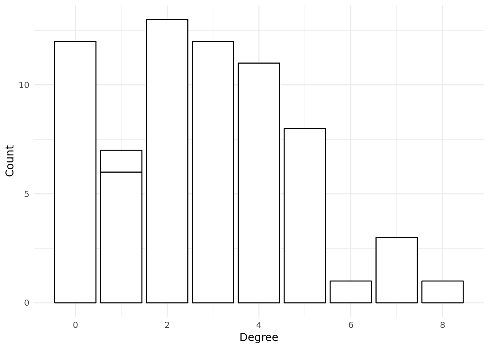

#### Degree distribution of agent->knows->agent edges

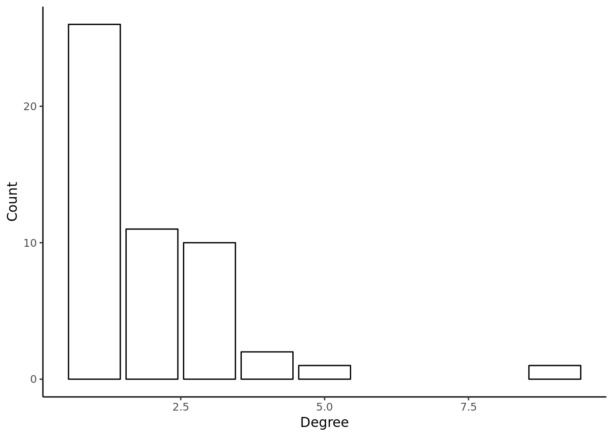

#### Runing time by method 

<table class="table table-condensed" style="width: auto !important; ">
 <thead>
  <tr>
   <th style="text-align:left;"> key </th>
   <th style="text-align:right;"> doc_count </th>
   <th style="text-align:right;"> sum_wallTime_ms.value </th>
   <th style="text-align:left;"> avg_wallTime_ms.value </th>
   <th style="text-align:left;"> includedInTotal </th>
  </tr>
 </thead>
<tbody>
  <tr>
   <td style="text-align:left;"> connectIfSimilar </td>
   <td style="text-align:right;"> 7,140 </td>
   <td style="text-align:right;"> 12,425 </td>
   <td style="text-align:left;"> 1.74019607843137 </td>
   <td style="text-align:left;"> No </td>
  </tr>
  <tr>
   <td style="text-align:left;"> existsSimilarity </td>
   <td style="text-align:right;"> 7,140 </td>
   <td style="text-align:right;"> 11,954 </td>
   <td style="text-align:left;"> 1.67422969187675 </td>
   <td style="text-align:left;"> No </td>
  </tr>
  <tr>
   <td style="text-align:left;"> similarityEdges </td>
   <td style="text-align:right;"> 7,140 </td>
   <td style="text-align:right;"> 11,722 </td>
   <td style="text-align:left;"> 1.64173669467787 </td>
   <td style="text-align:left;"> No </td>
  </tr>
  <tr>
   <td style="text-align:left;"> connect </td>
   <td style="text-align:right;"> 222 </td>
   <td style="text-align:right;"> 351 </td>
   <td style="text-align:left;"> 1.58108108108108 </td>
   <td style="text-align:left;"> Yes </td>
  </tr>
  <tr>
   <td style="text-align:left;"> connectAllSimilar </td>
   <td style="text-align:right;"> 120 </td>
   <td style="text-align:right;"> 12,515 </td>
   <td style="text-align:left;"> 104.291666666667 </td>
   <td style="text-align:left;"> Yes </td>
  </tr>
  <tr>
   <td style="text-align:left;"> init </td>
   <td style="text-align:right;"> 53 </td>
   <td style="text-align:right;"> 9,024 </td>
   <td style="text-align:left;"> 170.264150943396 </td>
   <td style="text-align:left;"> No </td>
  </tr>
  <tr>
   <td style="text-align:left;font-weight: bold;"> Total </td>
   <td style="text-align:right;font-weight: bold;"> 350 </td>
   <td style="text-align:right;font-weight: bold;"> 13,112 </td>
   <td style="text-align:left;font-weight: bold;">  </td>
   <td style="text-align:left;font-weight: bold;">  </td>
  </tr>
</tbody>
</table>
####  Found structures 

#####  Cycles 

Number of cycles found:  1 

<button class="btn btn-primary" data-toggle="collapse" data-target="#BUUNUWJBIY"> Show/Hide foundCycle query </button> 
 
  
     GET /filebeat-*/_search 
              { 
                "query": {
                  "bool": {
                    "must": [
                      { "match_phrase": {
                        "simulationId": "SIM10-13-02-05-LNrQRE--CV"
                        }
                      },
                      { "bool": {
                        "should": [
                          { "match": {
                            "keyword": "foundCycle"
                          }}
                        ]
                      }}
                    ]
                  }
                }
              }
     

#####  Paths 

Number of paths found:  0 

<button class="btn btn-primary" data-toggle="collapse" data-target="#VJSIVFIVVY"> Show/Hide foundPath query </button> 
 
  
     GET /filebeat-*/_search 
              { 
                "query": {
                  "bool": {
                    "must": [
                      { "match_phrase": {
                        "simulationId": "SIM10-13-02-05-LNrQRE--CV"
                        }
                      },
                      { "bool": {
                        "should": [
                          { "match": {
                            "keyword": "foundPath"
                          }}
                        ]
                      }}
                    ]
                  }
                }
              }
     

###  SIM10-13-02-05-LNrQRE--DV 

#### simulationParameters 

<table class="table table-condensed" style="width: auto !important; ">
 <thead>
  <tr>
   <th style="text-align:left;"> agentNumber </th>
   <th style="text-align:left;"> similarityConnectThreshold </th>
   <th style="text-align:left;"> graphType </th>
   <th style="text-align:left;"> chainLength </th>
   <th style="text-align:left;"> similaritySearchThreshold </th>
   <th style="text-align:left;"> maxDistance </th>
   <th style="text-align:left;"> randomWorksNumberMultiplier </th>
  </tr>
 </thead>
<tbody>
  <tr>
   <td style="text-align:left;width: 20em; "> 50 </td>
   <td style="text-align:left;width: 15em; "> 0.96 </td>
   <td style="text-align:left;width: 15em; "> random </td>
   <td style="text-align:left;width: 15em; "> 10 </td>
   <td style="text-align:left;width: 15em; "> 1 </td>
   <td style="text-align:left;width: 15em; "> 5 </td>
   <td style="text-align:left;width: 15em; "> 1 </td>
  </tr>
</tbody>
</table>
#### allEdgesByLabel

<table class="table table-condensed" style="width: auto !important; ">
 <thead>
  <tr>
   <th style="text-align:right;"> edges_offers </th>
   <th style="text-align:right;"> edges_similarity </th>
   <th style="text-align:right;"> edges_owns </th>
   <th style="text-align:right;"> edges_demands </th>
   <th style="text-align:right;"> edges_knows </th>
   <th style="text-align:right;"> edges_total </th>
  </tr>
 </thead>
<tbody>
  <tr>
   <td style="text-align:right;width: 5em; "> 60 </td>
   <td style="text-align:right;width: 5em; "> 824 </td>
   <td style="text-align:right;width: 5em; "> 60 </td>
   <td style="text-align:right;width: 5em; "> 60 </td>
   <td style="text-align:right;width: 5em; "> 50 </td>
   <td style="text-align:right;width: 5em; "> 1,054 </td>
  </tr>
</tbody>
</table>
#### allVerticesByType

<table class="table table-condensed" style="width: auto !important; ">
 <thead>
  <tr>
   <th style="text-align:right;"> vertices_agent </th>
   <th style="text-align:right;"> vertices_item </th>
   <th style="text-align:right;"> vertices_work </th>
   <th style="text-align:right;"> vertices_total </th>
  </tr>
 </thead>
<tbody>
  <tr>
   <td style="text-align:right;width: 5em; "> 51 </td>
   <td style="text-align:right;width: 5em; "> 120 </td>
   <td style="text-align:right;width: 5em; "> 60 </td>
   <td style="text-align:right;width: 5em; "> 231 </td>
  </tr>
</tbody>
</table>
#### distribution of similarityEdgesByWeight

#### Degree distribution of item->similarity->item edges

#### Degree distribution of agent->knows->agent edges

#### Runing time by method 

<table class="table table-condensed" style="width: auto !important; ">
 <thead>
  <tr>
   <th style="text-align:left;">   </th>
   <th style="text-align:left;"> key </th>
   <th style="text-align:right;"> doc_count </th>
   <th style="text-align:right;"> sum_wallTime_ms.value </th>
   <th style="text-align:left;"> avg_wallTime_ms.value </th>
   <th style="text-align:left;"> includedInTotal </th>
  </tr>
 </thead>
<tbody>
  <tr>
   <td style="text-align:left;"> 2 </td>
   <td style="text-align:left;"> cycleSearch </td>
   <td style="text-align:right;"> 3,600 </td>
   <td style="text-align:right;"> 28,519 </td>
   <td style="text-align:left;"> 7.92194444444444 </td>
   <td style="text-align:left;"> Yes </td>
  </tr>
  <tr>
   <td style="text-align:left;"> 3 </td>
   <td style="text-align:left;"> getWorks </td>
   <td style="text-align:right;"> 3,600 </td>
   <td style="text-align:right;"> 33,267 </td>
   <td style="text-align:left;"> 9.24083333333333 </td>
   <td style="text-align:left;"> No </td>
  </tr>
  <tr>
   <td style="text-align:left;"> 4 </td>
   <td style="text-align:left;"> individualCycleSearch </td>
   <td style="text-align:right;"> 3,600 </td>
   <td style="text-align:right;"> 125 </td>
   <td style="text-align:left;"> 0.0347222222222222 </td>
   <td style="text-align:left;"> Yes </td>
  </tr>
  <tr>
   <td style="text-align:left;"> 6 </td>
   <td style="text-align:left;"> addItemToWork </td>
   <td style="text-align:right;"> 120 </td>
   <td style="text-align:right;"> 826 </td>
   <td style="text-align:left;"> 6.88333333333333 </td>
   <td style="text-align:left;"> No </td>
  </tr>
  <tr>
   <td style="text-align:left;"> 7 </td>
   <td style="text-align:left;"> ownsWork </td>
   <td style="text-align:right;"> 60 </td>
   <td style="text-align:right;"> 683 </td>
   <td style="text-align:left;"> 11.3833333333333 </td>
   <td style="text-align:left;"> No </td>
  </tr>
  <tr>
   <td style="text-align:left;"> 8 </td>
   <td style="text-align:left;"> init </td>
   <td style="text-align:right;"> 53 </td>
   <td style="text-align:right;"> 8,657 </td>
   <td style="text-align:left;"> 163.339622641509 </td>
   <td style="text-align:left;"> No </td>
  </tr>
  <tr>
   <td style="text-align:left;"> 9 </td>
   <td style="text-align:left;"> searchAndConnect </td>
   <td style="text-align:right;"> 51 </td>
   <td style="text-align:right;"> 6,865 </td>
   <td style="text-align:left;"> 134.607843137255 </td>
   <td style="text-align:left;"> Yes </td>
  </tr>
  <tr>
   <td style="text-align:left;"> 10 </td>
   <td style="text-align:left;"> knowsAgent </td>
   <td style="text-align:right;"> 50 </td>
   <td style="text-align:right;"> 147 </td>
   <td style="text-align:left;"> 2.94 </td>
   <td style="text-align:left;"> No </td>
  </tr>
  <tr>
   <td style="text-align:left;font-weight: bold;"> 1 </td>
   <td style="text-align:left;font-weight: bold;"> Total </td>
   <td style="text-align:right;font-weight: bold;"> 14,451 </td>
   <td style="text-align:right;font-weight: bold;"> 112,969 </td>
   <td style="text-align:left;font-weight: bold;">  </td>
   <td style="text-align:left;font-weight: bold;">  </td>
  </tr>
</tbody>
</table>
####  Found structures 

#####  Cycles 

Number of cycles found:  0 

<button class="btn btn-primary" data-toggle="collapse" data-target="#ETQJGBAGSR"> Show/Hide foundCycle query </button> 
 
  
     GET /filebeat-*/_search 
              { 
                "query": {
                  "bool": {
                    "must": [
                      { "match_phrase": {
                        "simulationId": "SIM10-13-02-05-LNrQRE--DV"
                        }
                      },
                      { "bool": {
                        "should": [
                          { "match": {
                            "keyword": "foundCycle"
                          }}
                        ]
                      }}
                    ]
                  }
                }
              }
     

#####  Paths 

Number of paths found:  3600 

<button class="btn btn-primary" data-toggle="collapse" data-target="#DHUBLVWTSY"> Show/Hide foundPath query </button> 
 
  
     GET /filebeat-*/_search 
              { 
                "query": {
                  "bool": {
                    "must": [
                      { "match_phrase": {
                        "simulationId": "SIM10-13-02-05-LNrQRE--DV"
                        }
                      },
                      { "bool": {
                        "should": [
                          { "match": {
                            "keyword": "foundPath"
                          }}
                        ]
                      }}
                    ]
                  }
                }
              }
     

###  SIM10-13-03-06-SgmWzp--CV 

#### simulationParameters 

<table class="table table-condensed" style="width: auto !important; ">
 <thead>
  <tr>
   <th style="text-align:left;"> agentNumber </th>
   <th style="text-align:left;"> similarityConnectThreshold </th>
   <th style="text-align:left;"> graphType </th>
   <th style="text-align:left;"> chainLength </th>
   <th style="text-align:left;"> similaritySearchThreshold </th>
   <th style="text-align:left;"> maxDistance </th>
   <th style="text-align:left;"> randomWorksNumberMultiplier </th>
  </tr>
 </thead>
<tbody>
  <tr>
   <td style="text-align:left;width: 20em; "> 50 </td>
   <td style="text-align:left;width: 15em; "> 0.96 </td>
   <td style="text-align:left;width: 15em; "> smallWorld </td>
   <td style="text-align:left;width: 15em; "> 10 </td>
   <td style="text-align:left;width: 15em; "> 1 </td>
   <td style="text-align:left;width: 15em; "> 5 </td>
   <td style="text-align:left;width: 15em; "> 1 </td>
  </tr>
</tbody>
</table>
#### allEdgesByLabel

<table class="table table-condensed" style="width: auto !important; ">
 <thead>
  <tr>
   <th style="text-align:right;"> edges_offers </th>
   <th style="text-align:right;"> edges_similarity </th>
   <th style="text-align:right;"> edges_owns </th>
   <th style="text-align:right;"> edges_demands </th>
   <th style="text-align:right;"> edges_knows </th>
   <th style="text-align:right;"> edges_total </th>
  </tr>
 </thead>
<tbody>
  <tr>
   <td style="text-align:right;width: 5em; "> 60 </td>
   <td style="text-align:right;width: 5em; "> 1,464 </td>
   <td style="text-align:right;width: 5em; "> 60 </td>
   <td style="text-align:right;width: 5em; "> 60 </td>
   <td style="text-align:right;width: 5em; "> 201 </td>
   <td style="text-align:right;width: 5em; "> 1,845 </td>
  </tr>
</tbody>
</table>
#### allVerticesByType

<table class="table table-condensed" style="width: auto !important; ">
 <thead>
  <tr>
   <th style="text-align:right;"> vertices_agent </th>
   <th style="text-align:right;"> vertices_item </th>
   <th style="text-align:right;"> vertices_work </th>
   <th style="text-align:right;"> vertices_total </th>
  </tr>
 </thead>
<tbody>
  <tr>
   <td style="text-align:right;width: 5em; "> 51 </td>
   <td style="text-align:right;width: 5em; "> 120 </td>
   <td style="text-align:right;width: 5em; "> 60 </td>
   <td style="text-align:right;width: 5em; "> 231 </td>
  </tr>
</tbody>
</table>
#### distribution of similarityEdgesByWeight

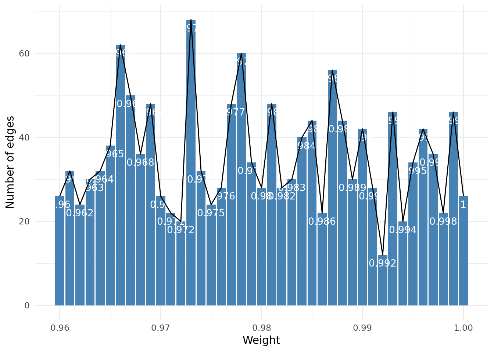

#### Degree distribution of item->similarity->item edges

#### Degree distribution of agent->knows->agent edges

#### Runing time by method 

<table class="table table-condensed" style="width: auto !important; ">
 <thead>
  <tr>
   <th style="text-align:left;"> key </th>
   <th style="text-align:right;"> doc_count </th>
   <th style="text-align:right;"> sum_wallTime_ms.value </th>
   <th style="text-align:left;"> avg_wallTime_ms.value </th>
   <th style="text-align:left;"> includedInTotal </th>
  </tr>
 </thead>
<tbody>
  <tr>
   <td style="text-align:left;"> connectIfSimilar </td>
   <td style="text-align:right;"> 7,140 </td>
   <td style="text-align:right;"> 12,353 </td>
   <td style="text-align:left;"> 1.73011204481793 </td>
   <td style="text-align:left;"> No </td>
  </tr>
  <tr>
   <td style="text-align:left;"> existsSimilarity </td>
   <td style="text-align:right;"> 7,140 </td>
   <td style="text-align:right;"> 12,218 </td>
   <td style="text-align:left;"> 1.71120448179272 </td>
   <td style="text-align:left;"> No </td>
  </tr>
  <tr>
   <td style="text-align:left;"> similarityEdges </td>
   <td style="text-align:right;"> 7,140 </td>
   <td style="text-align:right;"> 12,014 </td>
   <td style="text-align:left;"> 1.68263305322129 </td>
   <td style="text-align:left;"> No </td>
  </tr>
  <tr>
   <td style="text-align:left;"> connectAllSimilar </td>
   <td style="text-align:right;"> 120 </td>
   <td style="text-align:right;"> 12,415 </td>
   <td style="text-align:left;"> 103.458333333333 </td>
   <td style="text-align:left;"> Yes </td>
  </tr>
  <tr>
   <td style="text-align:left;"> init </td>
   <td style="text-align:right;"> 53 </td>
   <td style="text-align:right;"> 8,868 </td>
   <td style="text-align:left;"> 167.320754716981 </td>
   <td style="text-align:left;"> No </td>
  </tr>
  <tr>
   <td style="text-align:left;"> connect </td>
   <td style="text-align:right;"> 13 </td>
   <td style="text-align:right;"> 22 </td>
   <td style="text-align:left;"> 1.69230769230769 </td>
   <td style="text-align:left;"> Yes </td>
  </tr>
  <tr>
   <td style="text-align:left;font-weight: bold;"> Total </td>
   <td style="text-align:right;font-weight: bold;"> 141 </td>
   <td style="text-align:right;font-weight: bold;"> 12,695 </td>
   <td style="text-align:left;font-weight: bold;">  </td>
   <td style="text-align:left;font-weight: bold;">  </td>
  </tr>
</tbody>
</table>
####  Found structures 

#####  Cycles 

Number of cycles found:  1 

<button class="btn btn-primary" data-toggle="collapse" data-target="#PEUOMSCQWG"> Show/Hide foundCycle query </button> 
 
  
     GET /filebeat-*/_search 
              { 
                "query": {
                  "bool": {
                    "must": [
                      { "match_phrase": {
                        "simulationId": "SIM10-13-03-06-SgmWzp--CV"
                        }
                      },
                      { "bool": {
                        "should": [
                          { "match": {
                            "keyword": "foundCycle"
                          }}
                        ]
                      }}
                    ]
                  }
                }
              }
     

#####  Paths 

Number of paths found:  0 

<button class="btn btn-primary" data-toggle="collapse" data-target="#AMKKRALTQN"> Show/Hide foundPath query </button> 
 
  
     GET /filebeat-*/_search 
              { 
                "query": {
                  "bool": {
                    "must": [
                      { "match_phrase": {
                        "simulationId": "SIM10-13-03-06-SgmWzp--CV"
                        }
                      },
                      { "bool": {
                        "should": [
                          { "match": {
                            "keyword": "foundPath"
                          }}
                        ]
                      }}
                    ]
                  }
                }
              }
     

###  SIM10-13-03-06-SgmWzp--DV 

#### simulationParameters 

<table class="table table-condensed" style="width: auto !important; ">
 <thead>
  <tr>
   <th style="text-align:left;"> agentNumber </th>
   <th style="text-align:left;"> similarityConnectThreshold </th>
   <th style="text-align:left;"> graphType </th>
   <th style="text-align:left;"> chainLength </th>
   <th style="text-align:left;"> similaritySearchThreshold </th>
   <th style="text-align:left;"> maxDistance </th>
   <th style="text-align:left;"> randomWorksNumberMultiplier </th>
  </tr>
 </thead>
<tbody>
  <tr>
   <td style="text-align:left;width: 20em; "> 50 </td>
   <td style="text-align:left;width: 15em; "> 0.96 </td>
   <td style="text-align:left;width: 15em; "> smallWorld </td>
   <td style="text-align:left;width: 15em; "> 10 </td>
   <td style="text-align:left;width: 15em; "> 1 </td>
   <td style="text-align:left;width: 15em; "> 5 </td>
   <td style="text-align:left;width: 15em; "> 1 </td>
  </tr>
</tbody>
</table>
#### allEdgesByLabel

<table class="table table-condensed" style="width: auto !important; ">
 <thead>
  <tr>
   <th style="text-align:right;"> edges_offers </th>
   <th style="text-align:right;"> edges_similarity </th>
   <th style="text-align:right;"> edges_owns </th>
   <th style="text-align:right;"> edges_demands </th>
   <th style="text-align:right;"> edges_knows </th>
   <th style="text-align:right;"> edges_total </th>
  </tr>
 </thead>
<tbody>
  <tr>
   <td style="text-align:right;width: 5em; "> 60 </td>
   <td style="text-align:right;width: 5em; "> 1,438 </td>
   <td style="text-align:right;width: 5em; "> 60 </td>
   <td style="text-align:right;width: 5em; "> 60 </td>
   <td style="text-align:right;width: 5em; "> 201 </td>
   <td style="text-align:right;width: 5em; "> 1,819 </td>
  </tr>
</tbody>
</table>
#### allVerticesByType

<table class="table table-condensed" style="width: auto !important; ">
 <thead>
  <tr>
   <th style="text-align:right;"> vertices_agent </th>
   <th style="text-align:right;"> vertices_item </th>
   <th style="text-align:right;"> vertices_work </th>
   <th style="text-align:right;"> vertices_total </th>
  </tr>
 </thead>
<tbody>
  <tr>
   <td style="text-align:right;width: 5em; "> 51 </td>
   <td style="text-align:right;width: 5em; "> 120 </td>
   <td style="text-align:right;width: 5em; "> 60 </td>
   <td style="text-align:right;width: 5em; "> 231 </td>
  </tr>
</tbody>
</table>
#### distribution of similarityEdgesByWeight

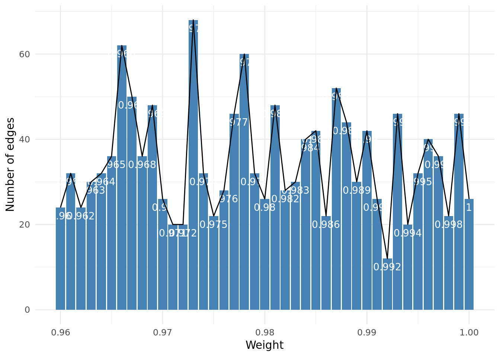

#### Degree distribution of item->similarity->item edges

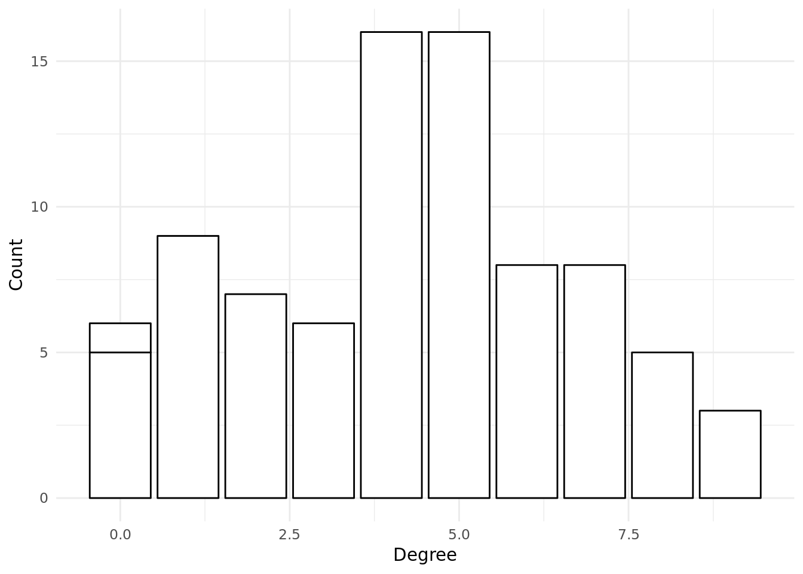

#### Degree distribution of agent->knows->agent edges

#### Runing time by method 

<table class="table table-condensed" style="width: auto !important; ">
 <thead>
  <tr>
   <th style="text-align:left;">   </th>
   <th style="text-align:left;"> key </th>
   <th style="text-align:right;"> doc_count </th>
   <th style="text-align:right;"> sum_wallTime_ms.value </th>
   <th style="text-align:left;"> avg_wallTime_ms.value </th>
   <th style="text-align:left;"> includedInTotal </th>
  </tr>
 </thead>
<tbody>
  <tr>
   <td style="text-align:left;"> 1 </td>
   <td style="text-align:left;"> knowsAgent </td>
   <td style="text-align:right;"> 201 </td>
   <td style="text-align:right;"> 430 </td>
   <td style="text-align:left;"> 2.13930348258706 </td>
   <td style="text-align:left;"> No </td>
  </tr>
  <tr>
   <td style="text-align:left;"> 2 </td>
   <td style="text-align:left;"> addItemToWork </td>
   <td style="text-align:right;"> 120 </td>
   <td style="text-align:right;"> 679 </td>
   <td style="text-align:left;"> 5.65833333333333 </td>
   <td style="text-align:left;"> No </td>
  </tr>
  <tr>
   <td style="text-align:left;"> 3 </td>
   <td style="text-align:left;"> ownsWork </td>
   <td style="text-align:right;"> 60 </td>
   <td style="text-align:right;"> 596 </td>
   <td style="text-align:left;"> 9.93333333333333 </td>
   <td style="text-align:left;"> No </td>
  </tr>
  <tr>
   <td style="text-align:left;"> 4 </td>
   <td style="text-align:left;"> init </td>
   <td style="text-align:right;"> 53 </td>
   <td style="text-align:right;"> 9,124 </td>
   <td style="text-align:left;"> 172.150943396226 </td>
   <td style="text-align:left;"> No </td>
  </tr>
  <tr>
   <td style="text-align:left;"> 5 </td>
   <td style="text-align:left;"> searchAndConnect </td>
   <td style="text-align:right;"> 51 </td>
   <td style="text-align:right;"> 8,267 </td>
   <td style="text-align:left;"> 162.098039215686 </td>
   <td style="text-align:left;"> Yes </td>
  </tr>
  <tr>
   <td style="text-align:left;"> 6 </td>
   <td style="text-align:left;"> getWorksItems </td>
   <td style="text-align:right;"> 18 </td>
   <td style="text-align:right;"> 23 </td>
   <td style="text-align:left;"> 1.27777777777778 </td>
   <td style="text-align:left;"> Yes </td>
  </tr>
  <tr>
   <td style="text-align:left;"> 8 </td>
   <td style="text-align:left;"> addChainToNetwork </td>
   <td style="text-align:right;"> 1 </td>
   <td style="text-align:right;"> 0 </td>
   <td style="text-align:left;"> 0 </td>
   <td style="text-align:left;"> Yes </td>
  </tr>
  <tr>
   <td style="text-align:left;"> 9 </td>
   <td style="text-align:left;"> addRandomWorksToAgents </td>
   <td style="text-align:right;"> 1 </td>
   <td style="text-align:right;"> 4 </td>
   <td style="text-align:left;"> 4 </td>
   <td style="text-align:left;"> Yes </td>
  </tr>
  <tr>
   <td style="text-align:left;font-weight: bold;"> 11 </td>
   <td style="text-align:left;font-weight: bold;"> Total </td>
   <td style="text-align:right;font-weight: bold;"> 77 </td>
   <td style="text-align:right;font-weight: bold;"> 8,551 </td>
   <td style="text-align:left;font-weight: bold;">  </td>
   <td style="text-align:left;font-weight: bold;">  </td>
  </tr>
</tbody>
</table>
####  Found structures 

#####  Cycles 

Number of cycles found:  1 

<button class="btn btn-primary" data-toggle="collapse" data-target="#OINBSUOJMZ"> Show/Hide foundCycle query </button> 
 
  
     GET /filebeat-*/_search 
              { 
                "query": {
                  "bool": {
                    "must": [
                      { "match_phrase": {
                        "simulationId": "SIM10-13-03-06-SgmWzp--DV"
                        }
                      },
                      { "bool": {
                        "should": [
                          { "match": {
                            "keyword": "foundCycle"
                          }}
                        ]
                      }}
                    ]
                  }
                }
              }
     

#####  Paths 

Number of paths found:  0 

<button class="btn btn-primary" data-toggle="collapse" data-target="#TISNJSNGDG"> Show/Hide foundPath query </button> 
 
  
     GET /filebeat-*/_search 
              { 
                "query": {
                  "bool": {
                    "must": [
                      { "match_phrase": {
                        "simulationId": "SIM10-13-03-06-SgmWzp--DV"
                        }
                      },
                      { "bool": {
                        "should": [
                          { "match": {
                            "keyword": "foundPath"
                          }}
                        ]
                      }}
                    ]
                  }
                }
              }
     

###  SIM10-13-04-08-2gyZnc--CV 

#### simulationParameters 

<table class="table table-condensed" style="width: auto !important; ">
 <thead>
  <tr>
   <th style="text-align:left;"> agentNumber </th>
   <th style="text-align:left;"> similarityConnectThreshold </th>
   <th style="text-align:left;"> graphType </th>
   <th style="text-align:left;"> chainLength </th>
   <th style="text-align:left;"> similaritySearchThreshold </th>
   <th style="text-align:left;"> maxDistance </th>
   <th style="text-align:left;"> randomWorksNumberMultiplier </th>
  </tr>
 </thead>
<tbody>
  <tr>
   <td style="text-align:left;width: 20em; "> 50 </td>
   <td style="text-align:left;width: 15em; "> 0.96 </td>
   <td style="text-align:left;width: 15em; "> random </td>
   <td style="text-align:left;width: 15em; "> 10 </td>
   <td style="text-align:left;width: 15em; "> 1 </td>
   <td style="text-align:left;width: 15em; "> 5 </td>
   <td style="text-align:left;width: 15em; "> 2 </td>
  </tr>
</tbody>
</table>
#### allEdgesByLabel

<table class="table table-condensed" style="width: auto !important; ">
 <thead>
  <tr>
   <th style="text-align:right;"> edges_offers </th>
   <th style="text-align:right;"> edges_similarity </th>
   <th style="text-align:right;"> edges_owns </th>
   <th style="text-align:right;"> edges_demands </th>
   <th style="text-align:right;"> edges_knows </th>
   <th style="text-align:right;"> edges_total </th>
  </tr>
 </thead>
<tbody>
  <tr>
   <td style="text-align:right;width: 5em; "> 110 </td>
   <td style="text-align:right;width: 5em; "> 4,612 </td>
   <td style="text-align:right;width: 5em; "> 110 </td>
   <td style="text-align:right;width: 5em; "> 110 </td>
   <td style="text-align:right;width: 5em; "> 50 </td>
   <td style="text-align:right;width: 5em; "> 4,992 </td>
  </tr>
</tbody>
</table>
#### allVerticesByType

<table class="table table-condensed" style="width: auto !important; ">
 <thead>
  <tr>
   <th style="text-align:right;"> vertices_agent </th>
   <th style="text-align:right;"> vertices_item </th>
   <th style="text-align:right;"> vertices_work </th>
   <th style="text-align:right;"> vertices_total </th>
  </tr>
 </thead>
<tbody>
  <tr>
   <td style="text-align:right;width: 5em; "> 51 </td>
   <td style="text-align:right;width: 5em; "> 220 </td>
   <td style="text-align:right;width: 5em; "> 110 </td>
   <td style="text-align:right;width: 5em; "> 381 </td>
  </tr>
</tbody>
</table>
#### distribution of similarityEdgesByWeight

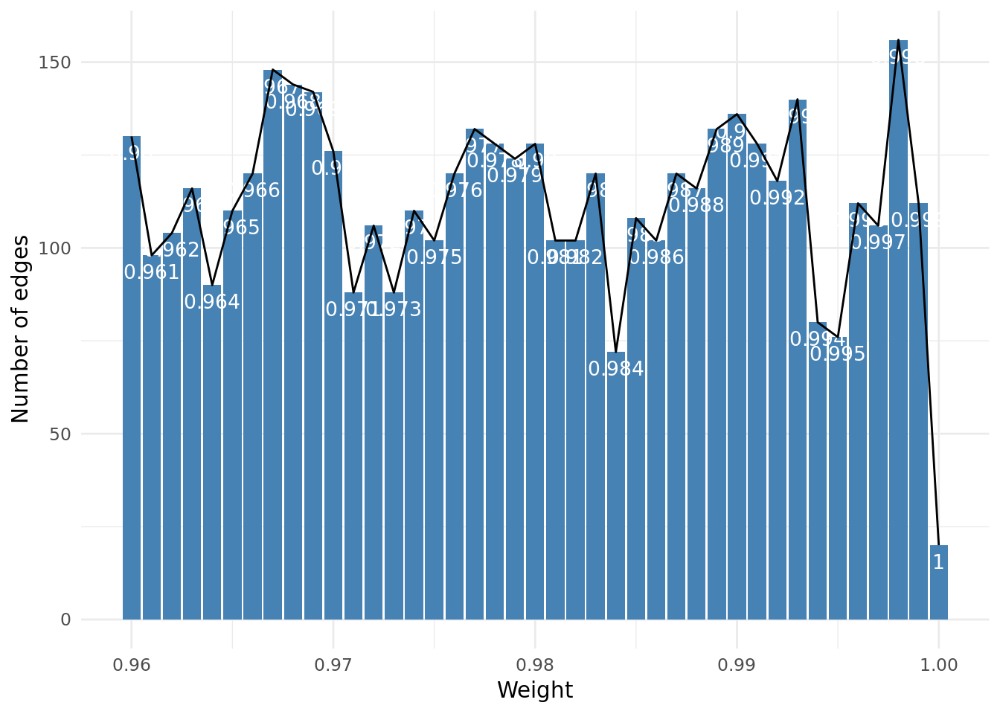

#### Degree distribution of item->similarity->item edges

#### Degree distribution of agent->knows->agent edges

#### Runing time by method 

<table class="table table-condensed" style="width: auto !important; ">
 <thead>
  <tr>
   <th style="text-align:left;"> key </th>
   <th style="text-align:right;"> doc_count </th>
   <th style="text-align:right;"> sum_wallTime_ms.value </th>
   <th style="text-align:left;"> avg_wallTime_ms.value </th>
   <th style="text-align:left;"> includedInTotal </th>
  </tr>
 </thead>
<tbody>
  <tr>
   <td style="text-align:left;"> connectIfSimilar </td>
   <td style="text-align:right;"> 24,090 </td>
   <td style="text-align:right;"> 51,594 </td>
   <td style="text-align:left;"> 2.14171855541719 </td>
   <td style="text-align:left;"> No </td>
  </tr>
  <tr>
   <td style="text-align:left;"> existsSimilarity </td>
   <td style="text-align:right;"> 24,090 </td>
   <td style="text-align:right;"> 49,266 </td>
   <td style="text-align:left;"> 2.04508094645081 </td>
   <td style="text-align:left;"> No </td>
  </tr>
  <tr>
   <td style="text-align:left;"> similarityEdges </td>
   <td style="text-align:right;"> 24,090 </td>
   <td style="text-align:right;"> 48,464 </td>
   <td style="text-align:left;"> 2.01178912411789 </td>
   <td style="text-align:left;"> No </td>
  </tr>
  <tr>
   <td style="text-align:left;"> connect </td>
   <td style="text-align:right;"> 801 </td>
   <td style="text-align:right;"> 1,831 </td>
   <td style="text-align:left;"> 2.28589263420724 </td>
   <td style="text-align:left;"> Yes </td>
  </tr>
  <tr>
   <td style="text-align:left;"> connectAllSimilar </td>
   <td style="text-align:right;"> 220 </td>
   <td style="text-align:right;"> 51,862 </td>
   <td style="text-align:left;"> 235.736363636364 </td>
   <td style="text-align:left;"> Yes </td>
  </tr>
  <tr>
   <td style="text-align:left;"> init </td>
   <td style="text-align:right;"> 53 </td>
   <td style="text-align:right;"> 9,110 </td>
   <td style="text-align:left;"> 171.88679245283 </td>
   <td style="text-align:left;"> No </td>
  </tr>
  <tr>
   <td style="text-align:left;font-weight: bold;"> Total </td>
   <td style="text-align:right;font-weight: bold;"> 1,029 </td>
   <td style="text-align:right;font-weight: bold;"> 54,029 </td>
   <td style="text-align:left;font-weight: bold;">  </td>
   <td style="text-align:left;font-weight: bold;">  </td>
  </tr>
</tbody>
</table>
####  Found structures 

#####  Cycles 

Number of cycles found:  1 

<button class="btn btn-primary" data-toggle="collapse" data-target="#COBGMZAGXN"> Show/Hide foundCycle query </button> 
 
  
     GET /filebeat-*/_search 
              { 
                "query": {
                  "bool": {
                    "must": [
                      { "match_phrase": {
                        "simulationId": "SIM10-13-04-08-2gyZnc--CV"
                        }
                      },
                      { "bool": {
                        "should": [
                          { "match": {
                            "keyword": "foundCycle"
                          }}
                        ]
                      }}
                    ]
                  }
                }
              }
     

#####  Paths 

Number of paths found:  0 

<button class="btn btn-primary" data-toggle="collapse" data-target="#EWPUMIAOYN"> Show/Hide foundPath query </button> 
 
  
     GET /filebeat-*/_search 
              { 
                "query": {
                  "bool": {
                    "must": [
                      { "match_phrase": {
                        "simulationId": "SIM10-13-04-08-2gyZnc--CV"
                        }
                      },
                      { "bool": {
                        "should": [
                          { "match": {
                            "keyword": "foundPath"
                          }}
                        ]
                      }}
                    ]
                  }
                }
              }
     

###  SIM10-13-04-08-2gyZnc--DV 

#### simulationParameters 

<table class="table table-condensed" style="width: auto !important; ">
 <thead>
  <tr>
   <th style="text-align:left;"> agentNumber </th>
   <th style="text-align:left;"> similarityConnectThreshold </th>
   <th style="text-align:left;"> graphType </th>
   <th style="text-align:left;"> chainLength </th>
   <th style="text-align:left;"> similaritySearchThreshold </th>
   <th style="text-align:left;"> maxDistance </th>
   <th style="text-align:left;"> randomWorksNumberMultiplier </th>
  </tr>
 </thead>
<tbody>
  <tr>
   <td style="text-align:left;width: 20em; "> 50 </td>
   <td style="text-align:left;width: 15em; "> 0.96 </td>
   <td style="text-align:left;width: 15em; "> random </td>
   <td style="text-align:left;width: 15em; "> 10 </td>
   <td style="text-align:left;width: 15em; "> 1 </td>
   <td style="text-align:left;width: 15em; "> 5 </td>
   <td style="text-align:left;width: 15em; "> 2 </td>
  </tr>
</tbody>
</table>
#### allEdgesByLabel

<table class="table table-condensed" style="width: auto !important; ">
 <thead>
  <tr>
   <th style="text-align:right;"> edges_offers </th>
   <th style="text-align:right;"> edges_similarity </th>
   <th style="text-align:right;"> edges_owns </th>
   <th style="text-align:right;"> edges_demands </th>
   <th style="text-align:right;"> edges_knows </th>
   <th style="text-align:right;"> edges_total </th>
  </tr>
 </thead>
<tbody>
  <tr>
   <td style="text-align:right;width: 5em; "> 110 </td>
   <td style="text-align:right;width: 5em; "> 3,010 </td>
   <td style="text-align:right;width: 5em; "> 110 </td>
   <td style="text-align:right;width: 5em; "> 110 </td>
   <td style="text-align:right;width: 5em; "> 50 </td>
   <td style="text-align:right;width: 5em; "> 3,390 </td>
  </tr>
</tbody>
</table>
#### allVerticesByType

<table class="table table-condensed" style="width: auto !important; ">
 <thead>
  <tr>
   <th style="text-align:right;"> vertices_agent </th>
   <th style="text-align:right;"> vertices_item </th>
   <th style="text-align:right;"> vertices_work </th>
   <th style="text-align:right;"> vertices_total </th>
  </tr>
 </thead>
<tbody>
  <tr>
   <td style="text-align:right;width: 5em; "> 51 </td>
   <td style="text-align:right;width: 5em; "> 220 </td>
   <td style="text-align:right;width: 5em; "> 110 </td>
   <td style="text-align:right;width: 5em; "> 381 </td>
  </tr>
</tbody>
</table>
#### distribution of similarityEdgesByWeight

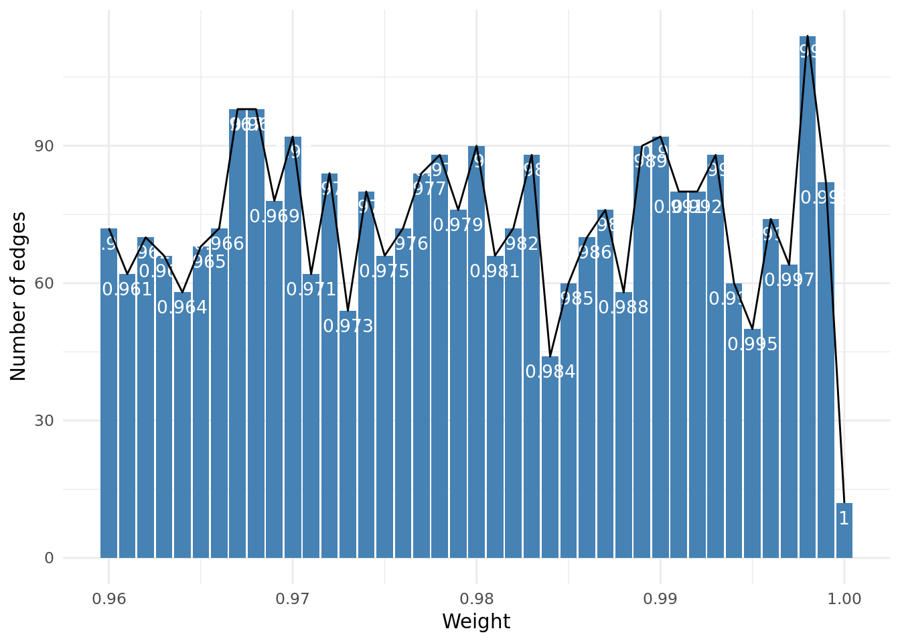

#### Degree distribution of item->similarity->item edges

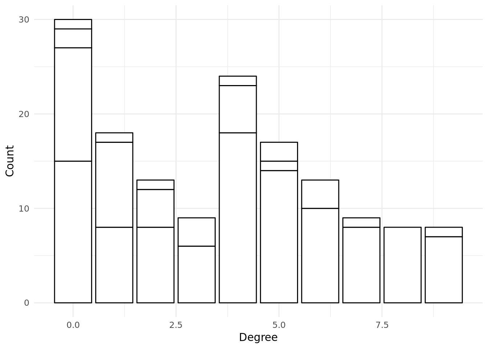

#### Degree distribution of agent->knows->agent edges

#### Runing time by method 

<table class="table table-condensed" style="width: auto !important; ">
 <thead>
  <tr>
   <th style="text-align:left;">   </th>
   <th style="text-align:left;"> key </th>
   <th style="text-align:right;"> doc_count </th>
   <th style="text-align:right;"> sum_wallTime_ms.value </th>
   <th style="text-align:left;"> avg_wallTime_ms.value </th>
   <th style="text-align:left;"> includedInTotal </th>
  </tr>
 </thead>
<tbody>
  <tr>
   <td style="text-align:left;"> 2 </td>
   <td style="text-align:left;"> cycleSearch </td>
   <td style="text-align:right;"> 3,600 </td>
   <td style="text-align:right;"> 17,171 </td>
   <td style="text-align:left;"> 4.76972222222222 </td>
   <td style="text-align:left;"> Yes </td>
  </tr>
  <tr>
   <td style="text-align:left;"> 3 </td>
   <td style="text-align:left;"> getWorks </td>
   <td style="text-align:right;"> 3,600 </td>
   <td style="text-align:right;"> 41,212 </td>
   <td style="text-align:left;"> 11.4477777777778 </td>
   <td style="text-align:left;"> No </td>
  </tr>
  <tr>
   <td style="text-align:left;"> 4 </td>
   <td style="text-align:left;"> individualCycleSearch </td>
   <td style="text-align:right;"> 3,600 </td>
   <td style="text-align:right;"> 78 </td>
   <td style="text-align:left;"> 0.0216666666666667 </td>
   <td style="text-align:left;"> Yes </td>
  </tr>
  <tr>
   <td style="text-align:left;"> 6 </td>
   <td style="text-align:left;"> addItemToWork </td>
   <td style="text-align:right;"> 220 </td>
   <td style="text-align:right;"> 1,207 </td>
   <td style="text-align:left;"> 5.48636363636364 </td>
   <td style="text-align:left;"> No </td>
  </tr>
  <tr>
   <td style="text-align:left;"> 7 </td>
   <td style="text-align:left;"> ownsWork </td>
   <td style="text-align:right;"> 110 </td>
   <td style="text-align:right;"> 796 </td>
   <td style="text-align:left;"> 7.23636363636364 </td>
   <td style="text-align:left;"> No </td>
  </tr>
  <tr>
   <td style="text-align:left;"> 8 </td>
   <td style="text-align:left;"> init </td>
   <td style="text-align:right;"> 53 </td>
   <td style="text-align:right;"> 9,024 </td>
   <td style="text-align:left;"> 170.264150943396 </td>
   <td style="text-align:left;"> No </td>
  </tr>
  <tr>
   <td style="text-align:left;"> 9 </td>
   <td style="text-align:left;"> searchAndConnect </td>
   <td style="text-align:right;"> 51 </td>
   <td style="text-align:right;"> 14,614 </td>
   <td style="text-align:left;"> 286.549019607843 </td>
   <td style="text-align:left;"> Yes </td>
  </tr>
  <tr>
   <td style="text-align:left;"> 10 </td>
   <td style="text-align:left;"> knowsAgent </td>
   <td style="text-align:right;"> 50 </td>
   <td style="text-align:right;"> 274 </td>
   <td style="text-align:left;"> 5.48 </td>
   <td style="text-align:left;"> No </td>
  </tr>
  <tr>
   <td style="text-align:left;font-weight: bold;"> 1 </td>
   <td style="text-align:left;font-weight: bold;"> Total </td>
   <td style="text-align:right;font-weight: bold;"> 14,451 </td>
   <td style="text-align:right;font-weight: bold;"> 51,366 </td>
   <td style="text-align:left;font-weight: bold;">  </td>
   <td style="text-align:left;font-weight: bold;">  </td>
  </tr>
</tbody>
</table>
####  Found structures 

#####  Cycles 

Number of cycles found:  0 

<button class="btn btn-primary" data-toggle="collapse" data-target="#XKUODBHPHK"> Show/Hide foundCycle query </button> 
 
  
     GET /filebeat-*/_search 
              { 
                "query": {
                  "bool": {
                    "must": [
                      { "match_phrase": {
                        "simulationId": "SIM10-13-04-08-2gyZnc--DV"
                        }
                      },
                      { "bool": {
                        "should": [
                          { "match": {
                            "keyword": "foundCycle"
                          }}
                        ]
                      }}
                    ]
                  }
                }
              }
     

#####  Paths 

Number of paths found:  3600 

<button class="btn btn-primary" data-toggle="collapse" data-target="#IXYYUWDZPF"> Show/Hide foundPath query </button> 
 
  
     GET /filebeat-*/_search 
              { 
                "query": {
                  "bool": {
                    "must": [
                      { "match_phrase": {
                        "simulationId": "SIM10-13-04-08-2gyZnc--DV"
                        }
                      },
                      { "bool": {
                        "should": [
                          { "match": {
                            "keyword": "foundPath"
                          }}
                        ]
                      }}
                    ]
                  }
                }
              }
     

###  SIM10-13-05-09-uZiPTU--CV 

#### simulationParameters 

<table class="table table-condensed" style="width: auto !important; ">
 <thead>
  <tr>
   <th style="text-align:left;"> agentNumber </th>
   <th style="text-align:left;"> similarityConnectThreshold </th>
   <th style="text-align:left;"> graphType </th>
   <th style="text-align:left;"> chainLength </th>
   <th style="text-align:left;"> similaritySearchThreshold </th>
   <th style="text-align:left;"> maxDistance </th>
   <th style="text-align:left;"> randomWorksNumberMultiplier </th>
  </tr>
 </thead>
<tbody>
  <tr>
   <td style="text-align:left;width: 20em; "> 50 </td>
   <td style="text-align:left;width: 15em; "> 0.96 </td>
   <td style="text-align:left;width: 15em; "> smallWorld </td>
   <td style="text-align:left;width: 15em; "> 10 </td>
   <td style="text-align:left;width: 15em; "> 1 </td>
   <td style="text-align:left;width: 15em; "> 5 </td>
   <td style="text-align:left;width: 15em; "> 2 </td>
  </tr>
</tbody>
</table>
#### allEdgesByLabel

<table class="table table-condensed" style="width: auto !important; ">
 <thead>
  <tr>
   <th style="text-align:right;"> edges_offers </th>
   <th style="text-align:right;"> edges_similarity </th>
   <th style="text-align:right;"> edges_owns </th>
   <th style="text-align:right;"> edges_demands </th>
   <th style="text-align:right;"> edges_knows </th>
   <th style="text-align:right;"> edges_total </th>
  </tr>
 </thead>
<tbody>
  <tr>
   <td style="text-align:right;width: 5em; "> 110 </td>
   <td style="text-align:right;width: 5em; "> 4,694 </td>
   <td style="text-align:right;width: 5em; "> 110 </td>
   <td style="text-align:right;width: 5em; "> 110 </td>
   <td style="text-align:right;width: 5em; "> 201 </td>
   <td style="text-align:right;width: 5em; "> 5,225 </td>
  </tr>
</tbody>
</table>
#### allVerticesByType

<table class="table table-condensed" style="width: auto !important; ">
 <thead>
  <tr>
   <th style="text-align:right;"> vertices_agent </th>
   <th style="text-align:right;"> vertices_item </th>
   <th style="text-align:right;"> vertices_work </th>
   <th style="text-align:right;"> vertices_total </th>
  </tr>
 </thead>
<tbody>
  <tr>
   <td style="text-align:right;width: 5em; "> 51 </td>
   <td style="text-align:right;width: 5em; "> 220 </td>
   <td style="text-align:right;width: 5em; "> 110 </td>
   <td style="text-align:right;width: 5em; "> 381 </td>
  </tr>
</tbody>
</table>
#### distribution of similarityEdgesByWeight

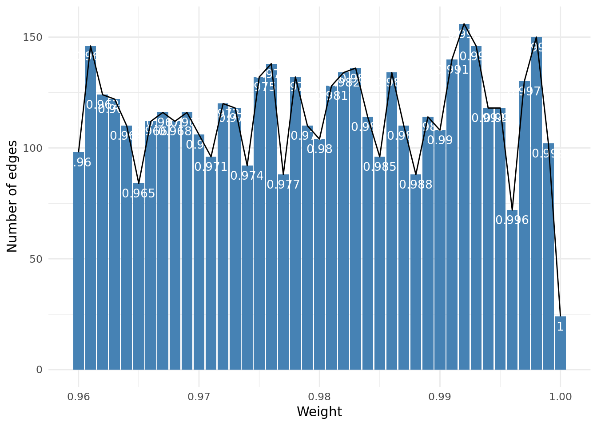

#### Degree distribution of item->similarity->item edges

#### Degree distribution of agent->knows->agent edges

#### Runing time by method 

<table class="table table-condensed" style="width: auto !important; ">
 <thead>
  <tr>
   <th style="text-align:left;"> key </th>
   <th style="text-align:right;"> doc_count </th>
   <th style="text-align:right;"> sum_wallTime_ms.value </th>
   <th style="text-align:left;"> avg_wallTime_ms.value </th>
   <th style="text-align:left;"> includedInTotal </th>
  </tr>
 </thead>
<tbody>
  <tr>
   <td style="text-align:left;"> connectIfSimilar </td>
   <td style="text-align:right;"> 24,090 </td>
   <td style="text-align:right;"> 50,508 </td>
   <td style="text-align:left;"> 2.09663760896638 </td>
   <td style="text-align:left;"> No </td>
  </tr>
  <tr>
   <td style="text-align:left;"> existsSimilarity </td>
   <td style="text-align:right;"> 24,090 </td>
   <td style="text-align:right;"> 49,962 </td>
   <td style="text-align:left;"> 2.07397260273973 </td>
   <td style="text-align:left;"> No </td>
  </tr>
  <tr>
   <td style="text-align:left;"> similarityEdges </td>
   <td style="text-align:right;"> 24,090 </td>
   <td style="text-align:right;"> 49,111 </td>
   <td style="text-align:left;"> 2.03864674138647 </td>
   <td style="text-align:left;"> No </td>
  </tr>
  <tr>
   <td style="text-align:left;"> connectAllSimilar </td>
   <td style="text-align:right;"> 220 </td>
   <td style="text-align:right;"> 50,762 </td>
   <td style="text-align:left;"> 230.736363636364 </td>
   <td style="text-align:left;"> Yes </td>
  </tr>
  <tr>
   <td style="text-align:left;"> connect </td>
   <td style="text-align:right;"> 60 </td>
   <td style="text-align:right;"> 106 </td>
   <td style="text-align:left;"> 1.76666666666667 </td>
   <td style="text-align:left;"> Yes </td>
  </tr>
  <tr>
   <td style="text-align:left;"> init </td>
   <td style="text-align:right;"> 53 </td>
   <td style="text-align:right;"> 8,769 </td>
   <td style="text-align:left;"> 165.452830188679 </td>
   <td style="text-align:left;"> No </td>
  </tr>
  <tr>
   <td style="text-align:left;font-weight: bold;"> Total </td>
   <td style="text-align:right;font-weight: bold;"> 288 </td>
   <td style="text-align:right;font-weight: bold;"> 51,252 </td>
   <td style="text-align:left;font-weight: bold;">  </td>
   <td style="text-align:left;font-weight: bold;">  </td>
  </tr>
</tbody>
</table>
####  Found structures 

#####  Cycles 

Number of cycles found:  1 

<button class="btn btn-primary" data-toggle="collapse" data-target="#PTWDZBZGSX"> Show/Hide foundCycle query </button> 
 
  
     GET /filebeat-*/_search 
              { 
                "query": {
                  "bool": {
                    "must": [
                      { "match_phrase": {
                        "simulationId": "SIM10-13-05-09-uZiPTU--CV"
                        }
                      },
                      { "bool": {
                        "should": [
                          { "match": {
                            "keyword": "foundCycle"
                          }}
                        ]
                      }}
                    ]
                  }
                }
              }
     

#####  Paths 

Number of paths found:  0 

<button class="btn btn-primary" data-toggle="collapse" data-target="#ZFABGALTKH"> Show/Hide foundPath query </button> 
 
  
     GET /filebeat-*/_search 
              { 
                "query": {
                  "bool": {
                    "must": [
                      { "match_phrase": {
                        "simulationId": "SIM10-13-05-09-uZiPTU--CV"
                        }
                      },
                      { "bool": {
                        "should": [
                          { "match": {
                            "keyword": "foundPath"
                          }}
                        ]
                      }}
                    ]
                  }
                }
              }
     

###  SIM10-13-05-09-uZiPTU--DV 

#### simulationParameters 

<table class="table table-condensed" style="width: auto !important; ">
 <thead>
  <tr>
   <th style="text-align:left;"> agentNumber </th>
   <th style="text-align:left;"> similarityConnectThreshold </th>
   <th style="text-align:left;"> graphType </th>
   <th style="text-align:left;"> chainLength </th>
   <th style="text-align:left;"> similaritySearchThreshold </th>
   <th style="text-align:left;"> maxDistance </th>
   <th style="text-align:left;"> randomWorksNumberMultiplier </th>
  </tr>
 </thead>
<tbody>
  <tr>
   <td style="text-align:left;width: 20em; "> 50 </td>
   <td style="text-align:left;width: 15em; "> 0.96 </td>
   <td style="text-align:left;width: 15em; "> smallWorld </td>
   <td style="text-align:left;width: 15em; "> 10 </td>
   <td style="text-align:left;width: 15em; "> 1 </td>
   <td style="text-align:left;width: 15em; "> 5 </td>
   <td style="text-align:left;width: 15em; "> 2 </td>
  </tr>
</tbody>
</table>
#### allEdgesByLabel

<table class="table table-condensed" style="width: auto !important; ">
 <thead>
  <tr>
   <th style="text-align:right;"> edges_offers </th>
   <th style="text-align:right;"> edges_similarity </th>
   <th style="text-align:right;"> edges_owns </th>
   <th style="text-align:right;"> edges_demands </th>
   <th style="text-align:right;"> edges_knows </th>
   <th style="text-align:right;"> edges_total </th>
  </tr>
 </thead>
<tbody>
  <tr>
   <td style="text-align:right;width: 5em; "> 110 </td>
   <td style="text-align:right;width: 5em; "> 4,574 </td>
   <td style="text-align:right;width: 5em; "> 110 </td>
   <td style="text-align:right;width: 5em; "> 110 </td>
   <td style="text-align:right;width: 5em; "> 201 </td>
   <td style="text-align:right;width: 5em; "> 5,105 </td>
  </tr>
</tbody>
</table>
#### allVerticesByType

<table class="table table-condensed" style="width: auto !important; ">
 <thead>
  <tr>
   <th style="text-align:right;"> vertices_agent </th>
   <th style="text-align:right;"> vertices_item </th>
   <th style="text-align:right;"> vertices_work </th>
   <th style="text-align:right;"> vertices_total </th>
  </tr>
 </thead>
<tbody>
  <tr>
   <td style="text-align:right;width: 5em; "> 51 </td>
   <td style="text-align:right;width: 5em; "> 220 </td>
   <td style="text-align:right;width: 5em; "> 110 </td>
   <td style="text-align:right;width: 5em; "> 381 </td>
  </tr>
</tbody>
</table>
#### distribution of similarityEdgesByWeight

#### Degree distribution of item->similarity->item edges

#### Degree distribution of agent->knows->agent edges

#### Runing time by method 

<table class="table table-condensed" style="width: auto !important; ">
 <thead>
  <tr>
   <th style="text-align:left;">   </th>
   <th style="text-align:left;"> key </th>
   <th style="text-align:right;"> doc_count </th>
   <th style="text-align:right;"> sum_wallTime_ms.value </th>
   <th style="text-align:left;"> avg_wallTime_ms.value </th>
   <th style="text-align:left;"> includedInTotal </th>
  </tr>
 </thead>
<tbody>
  <tr>
   <td style="text-align:left;"> 1 </td>
   <td style="text-align:left;"> addItemToWork </td>
   <td style="text-align:right;"> 220 </td>
   <td style="text-align:right;"> 1,836 </td>
   <td style="text-align:left;"> 8.34545454545455 </td>
   <td style="text-align:left;"> No </td>
  </tr>
  <tr>
   <td style="text-align:left;"> 2 </td>
   <td style="text-align:left;"> knowsAgent </td>
   <td style="text-align:right;"> 201 </td>
   <td style="text-align:right;"> 349 </td>
   <td style="text-align:left;"> 1.7363184079602 </td>
   <td style="text-align:left;"> No </td>
  </tr>
  <tr>
   <td style="text-align:left;"> 3 </td>
   <td style="text-align:left;"> ownsWork </td>
   <td style="text-align:right;"> 110 </td>
   <td style="text-align:right;"> 1,336 </td>
   <td style="text-align:left;"> 12.1454545454545 </td>
   <td style="text-align:left;"> No </td>
  </tr>
  <tr>
   <td style="text-align:left;"> 4 </td>
   <td style="text-align:left;"> init </td>
   <td style="text-align:right;"> 53 </td>
   <td style="text-align:right;"> 9,372 </td>
   <td style="text-align:left;"> 176.830188679245 </td>
   <td style="text-align:left;"> No </td>
  </tr>
  <tr>
   <td style="text-align:left;"> 5 </td>
   <td style="text-align:left;"> searchAndConnect </td>
   <td style="text-align:right;"> 51 </td>
   <td style="text-align:right;"> 21,811 </td>
   <td style="text-align:left;"> 427.666666666667 </td>
   <td style="text-align:left;"> Yes </td>
  </tr>
  <tr>
   <td style="text-align:left;"> 6 </td>
   <td style="text-align:left;"> getWorksItems </td>
   <td style="text-align:right;"> 18 </td>
   <td style="text-align:right;"> 27 </td>
   <td style="text-align:left;"> 1.5 </td>
   <td style="text-align:left;"> Yes </td>
  </tr>
  <tr>
   <td style="text-align:left;"> 9 </td>
   <td style="text-align:left;"> cycleSearch </td>
   <td style="text-align:right;"> 2 </td>
   <td style="text-align:right;"> 25 </td>
   <td style="text-align:left;"> 12.5 </td>
   <td style="text-align:left;"> Yes </td>
  </tr>
  <tr>
   <td style="text-align:left;"> 10 </td>
   <td style="text-align:left;"> getWorks </td>
   <td style="text-align:right;"> 2 </td>
   <td style="text-align:right;"> 185 </td>
   <td style="text-align:left;"> 92.5 </td>
   <td style="text-align:left;"> No </td>
  </tr>
  <tr>
   <td style="text-align:left;font-weight: bold;"> 11 </td>
   <td style="text-align:left;font-weight: bold;"> Total </td>
   <td style="text-align:right;font-weight: bold;"> 78 </td>
   <td style="text-align:right;font-weight: bold;"> 22,218 </td>
   <td style="text-align:left;font-weight: bold;">  </td>
   <td style="text-align:left;font-weight: bold;">  </td>
  </tr>
</tbody>
</table>
####  Found structures 

#####  Cycles 

Number of cycles found:  1 

<button class="btn btn-primary" data-toggle="collapse" data-target="#GEHFRAWJOE"> Show/Hide foundCycle query </button> 
 
  
     GET /filebeat-*/_search 
              { 
                "query": {
                  "bool": {
                    "must": [
                      { "match_phrase": {
                        "simulationId": "SIM10-13-05-09-uZiPTU--DV"
                        }
                      },
                      { "bool": {
                        "should": [
                          { "match": {
                            "keyword": "foundCycle"
                          }}
                        ]
                      }}
                    ]
                  }
                }
              }
     

#####  Paths 

Number of paths found:  1 

<button class="btn btn-primary" data-toggle="collapse" data-target="#DPOGLUHODL"> Show/Hide foundPath query </button> 
 
  
     GET /filebeat-*/_search 
              { 
                "query": {
                  "bool": {
                    "must": [
                      { "match_phrase": {
                        "simulationId": "SIM10-13-05-09-uZiPTU--DV"
                        }
                      },
                      { "bool": {
                        "should": [
                          { "match": {
                            "keyword": "foundPath"
                          }}
                        ]
                      }}
                    ]
                  }
                }
              }
     

###  SIM10-13-06-16-ASc3yJ--CV 

#### simulationParameters 

<table class="table table-condensed" style="width: auto !important; ">
 <thead>
  <tr>
   <th style="text-align:left;"> agentNumber </th>
   <th style="text-align:left;"> similarityConnectThreshold </th>
   <th style="text-align:left;"> graphType </th>
   <th style="text-align:left;"> chainLength </th>
   <th style="text-align:left;"> similaritySearchThreshold </th>
   <th style="text-align:left;"> maxDistance </th>
   <th style="text-align:left;"> randomWorksNumberMultiplier </th>
  </tr>
 </thead>
<tbody>
  <tr>
   <td style="text-align:left;width: 20em; "> 50 </td>
   <td style="text-align:left;width: 15em; "> 0.96 </td>
   <td style="text-align:left;width: 15em; "> random </td>
   <td style="text-align:left;width: 15em; "> 20 </td>
   <td style="text-align:left;width: 15em; "> 1 </td>
   <td style="text-align:left;width: 15em; "> 10 </td>
   <td style="text-align:left;width: 15em; "> 1 </td>
  </tr>
</tbody>
</table>
#### allEdgesByLabel

<table class="table table-condensed" style="width: auto !important; ">
 <thead>
  <tr>
   <th style="text-align:right;"> edges_offers </th>
   <th style="text-align:right;"> edges_similarity </th>
   <th style="text-align:right;"> edges_owns </th>
   <th style="text-align:right;"> edges_demands </th>
   <th style="text-align:right;"> edges_knows </th>
   <th style="text-align:right;"> edges_total </th>
  </tr>
 </thead>
<tbody>
  <tr>
   <td style="text-align:right;width: 5em; "> 70 </td>
   <td style="text-align:right;width: 5em; "> 1,978 </td>
   <td style="text-align:right;width: 5em; "> 70 </td>
   <td style="text-align:right;width: 5em; "> 70 </td>
   <td style="text-align:right;width: 5em; "> 50 </td>
   <td style="text-align:right;width: 5em; "> 2,238 </td>
  </tr>
</tbody>
</table>
#### allVerticesByType

<table class="table table-condensed" style="width: auto !important; ">
 <thead>
  <tr>
   <th style="text-align:right;"> vertices_agent </th>
   <th style="text-align:right;"> vertices_item </th>
   <th style="text-align:right;"> vertices_work </th>
   <th style="text-align:right;"> vertices_total </th>
  </tr>
 </thead>
<tbody>
  <tr>
   <td style="text-align:right;width: 5em; "> 51 </td>
   <td style="text-align:right;width: 5em; "> 140 </td>
   <td style="text-align:right;width: 5em; "> 70 </td>
   <td style="text-align:right;width: 5em; "> 261 </td>
  </tr>
</tbody>
</table>
#### distribution of similarityEdgesByWeight

#### Degree distribution of item->similarity->item edges

#### Degree distribution of agent->knows->agent edges

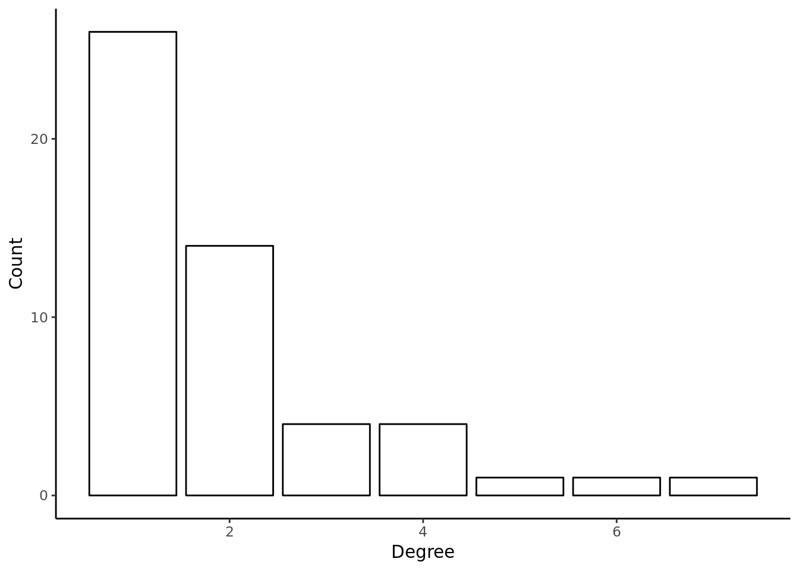

#### Runing time by method 

<table class="table table-condensed" style="width: auto !important; ">
 <thead>
  <tr>
   <th style="text-align:left;"> key </th>
   <th style="text-align:right;"> doc_count </th>
   <th style="text-align:right;"> sum_wallTime_ms.value </th>
   <th style="text-align:left;"> avg_wallTime_ms.value </th>
   <th style="text-align:left;"> includedInTotal </th>
  </tr>
 </thead>
<tbody>
  <tr>
   <td style="text-align:left;"> connectIfSimilar </td>
   <td style="text-align:right;"> 9,730 </td>
   <td style="text-align:right;"> 19,491 </td>
   <td style="text-align:left;"> 2.00318602261048 </td>
   <td style="text-align:left;"> No </td>
  </tr>
  <tr>
   <td style="text-align:left;"> existsSimilarity </td>
   <td style="text-align:right;"> 9,730 </td>
   <td style="text-align:right;"> 19,315 </td>
   <td style="text-align:left;"> 1.98509763617677 </td>
   <td style="text-align:left;"> No </td>
  </tr>
  <tr>
   <td style="text-align:left;"> similarityEdges </td>
   <td style="text-align:right;"> 9,730 </td>
   <td style="text-align:right;"> 18,998 </td>
   <td style="text-align:left;"> 1.95251798561151 </td>
   <td style="text-align:left;"> No </td>
  </tr>
  <tr>
   <td style="text-align:left;"> connectAllSimilar </td>
   <td style="text-align:right;"> 140 </td>
   <td style="text-align:right;"> 19,587 </td>
   <td style="text-align:left;"> 139.907142857143 </td>
   <td style="text-align:left;"> Yes </td>
  </tr>
  <tr>
   <td style="text-align:left;"> init </td>
   <td style="text-align:right;"> 53 </td>
   <td style="text-align:right;"> 8,971 </td>
   <td style="text-align:left;"> 169.264150943396 </td>
   <td style="text-align:left;"> No </td>
  </tr>
  <tr>
   <td style="text-align:left;"> connect </td>
   <td style="text-align:right;"> 17 </td>
   <td style="text-align:right;"> 25 </td>
   <td style="text-align:left;"> 1.47058823529412 </td>
   <td style="text-align:left;"> Yes </td>
  </tr>
  <tr>
   <td style="text-align:left;font-weight: bold;"> Total </td>
   <td style="text-align:right;font-weight: bold;"> 165 </td>
   <td style="text-align:right;font-weight: bold;"> 19,905 </td>
   <td style="text-align:left;font-weight: bold;">  </td>
   <td style="text-align:left;font-weight: bold;">  </td>
  </tr>
</tbody>
</table>
####  Found structures 

#####  Cycles 

Number of cycles found:  1 

<button class="btn btn-primary" data-toggle="collapse" data-target="#WNLZUBMNMA"> Show/Hide foundCycle query </button> 
 
  
     GET /filebeat-*/_search 
              { 
                "query": {
                  "bool": {
                    "must": [
                      { "match_phrase": {
                        "simulationId": "SIM10-13-06-16-ASc3yJ--CV"
                        }
                      },
                      { "bool": {
                        "should": [
                          { "match": {
                            "keyword": "foundCycle"
                          }}
                        ]
                      }}
                    ]
                  }
                }
              }
     

#####  Paths 

Number of paths found:  0 

<button class="btn btn-primary" data-toggle="collapse" data-target="#MYGVVQQHPR"> Show/Hide foundPath query </button> 
 
  
     GET /filebeat-*/_search 
              { 
                "query": {
                  "bool": {
                    "must": [
                      { "match_phrase": {
                        "simulationId": "SIM10-13-06-16-ASc3yJ--CV"
                        }
                      },
                      { "bool": {
                        "should": [
                          { "match": {
                            "keyword": "foundPath"
                          }}
                        ]
                      }}
                    ]
                  }
                }
              }
     

###  SIM10-13-06-16-ASc3yJ--DV 

#### simulationParameters 

<table class="table table-condensed" style="width: auto !important; ">
 <thead>
  <tr>
   <th style="text-align:left;"> agentNumber </th>
   <th style="text-align:left;"> similarityConnectThreshold </th>
   <th style="text-align:left;"> graphType </th>
   <th style="text-align:left;"> chainLength </th>
   <th style="text-align:left;"> similaritySearchThreshold </th>
   <th style="text-align:left;"> maxDistance </th>
   <th style="text-align:left;"> randomWorksNumberMultiplier </th>
  </tr>
 </thead>
<tbody>
  <tr>
   <td style="text-align:left;width: 20em; "> 50 </td>
   <td style="text-align:left;width: 15em; "> 0.96 </td>
   <td style="text-align:left;width: 15em; "> random </td>
   <td style="text-align:left;width: 15em; "> 20 </td>
   <td style="text-align:left;width: 15em; "> 1 </td>
   <td style="text-align:left;width: 15em; "> 10 </td>
   <td style="text-align:left;width: 15em; "> 1 </td>
  </tr>
</tbody>
</table>
#### allEdgesByLabel

<table class="table table-condensed" style="width: auto !important; ">
 <thead>
  <tr>
   <th style="text-align:right;"> edges_offers </th>
   <th style="text-align:right;"> edges_similarity </th>
   <th style="text-align:right;"> edges_owns </th>
   <th style="text-align:right;"> edges_demands </th>
   <th style="text-align:right;"> edges_knows </th>
   <th style="text-align:right;"> edges_total </th>
  </tr>
 </thead>
<tbody>
  <tr>
   <td style="text-align:right;width: 5em; "> 70 </td>
   <td style="text-align:right;width: 5em; "> 1,944 </td>
   <td style="text-align:right;width: 5em; "> 70 </td>
   <td style="text-align:right;width: 5em; "> 70 </td>
   <td style="text-align:right;width: 5em; "> 50 </td>
   <td style="text-align:right;width: 5em; "> 2,204 </td>
  </tr>
</tbody>
</table>
#### allVerticesByType

<table class="table table-condensed" style="width: auto !important; ">
 <thead>
  <tr>
   <th style="text-align:right;"> vertices_agent </th>
   <th style="text-align:right;"> vertices_item </th>
   <th style="text-align:right;"> vertices_work </th>
   <th style="text-align:right;"> vertices_total </th>
  </tr>
 </thead>
<tbody>
  <tr>
   <td style="text-align:right;width: 5em; "> 51 </td>
   <td style="text-align:right;width: 5em; "> 140 </td>
   <td style="text-align:right;width: 5em; "> 70 </td>
   <td style="text-align:right;width: 5em; "> 261 </td>
  </tr>
</tbody>
</table>
#### distribution of similarityEdgesByWeight

#### Degree distribution of item->similarity->item edges

#### Degree distribution of agent->knows->agent edges

#### Runing time by method 

<table class="table table-condensed" style="width: auto !important; ">
 <thead>
  <tr>
   <th style="text-align:left;">   </th>
   <th style="text-align:left;"> key </th>
   <th style="text-align:right;"> doc_count </th>
   <th style="text-align:right;"> sum_wallTime_ms.value </th>
   <th style="text-align:left;"> avg_wallTime_ms.value </th>
   <th style="text-align:left;"> includedInTotal </th>
  </tr>
 </thead>
<tbody>
  <tr>
   <td style="text-align:left;"> 1 </td>
   <td style="text-align:left;"> addItemToWork </td>
   <td style="text-align:right;"> 140 </td>
   <td style="text-align:right;"> 1,908 </td>
   <td style="text-align:left;"> 13.6285714285714 </td>
   <td style="text-align:left;"> No </td>
  </tr>
  <tr>
   <td style="text-align:left;"> 2 </td>
   <td style="text-align:left;"> ownsWork </td>
   <td style="text-align:right;"> 70 </td>
   <td style="text-align:right;"> 1,974 </td>
   <td style="text-align:left;"> 28.2 </td>
   <td style="text-align:left;"> No </td>
  </tr>
  <tr>
   <td style="text-align:left;"> 3 </td>
   <td style="text-align:left;"> init </td>
   <td style="text-align:right;"> 53 </td>
   <td style="text-align:right;"> 9,380 </td>
   <td style="text-align:left;"> 176.981132075472 </td>
   <td style="text-align:left;"> No </td>
  </tr>
  <tr>
   <td style="text-align:left;"> 4 </td>
   <td style="text-align:left;"> searchAndConnect </td>
   <td style="text-align:right;"> 51 </td>
   <td style="text-align:right;"> 10,077 </td>
   <td style="text-align:left;"> 197.588235294118 </td>
   <td style="text-align:left;"> Yes </td>
  </tr>
  <tr>
   <td style="text-align:left;"> 5 </td>
   <td style="text-align:left;"> knowsAgent </td>
   <td style="text-align:right;"> 50 </td>
   <td style="text-align:right;"> 142 </td>
   <td style="text-align:left;"> 2.84 </td>
   <td style="text-align:left;"> No </td>
  </tr>
  <tr>
   <td style="text-align:left;"> 6 </td>
   <td style="text-align:left;"> getWorksItems </td>
   <td style="text-align:right;"> 38 </td>
   <td style="text-align:right;"> 87 </td>
   <td style="text-align:left;"> 2.28947368421053 </td>
   <td style="text-align:left;"> Yes </td>
  </tr>
  <tr>
   <td style="text-align:left;"> 8 </td>
   <td style="text-align:left;"> addChainToNetwork </td>
   <td style="text-align:right;"> 1 </td>
   <td style="text-align:right;"> 0 </td>
   <td style="text-align:left;"> 0 </td>
   <td style="text-align:left;"> Yes </td>
  </tr>
  <tr>
   <td style="text-align:left;"> 9 </td>
   <td style="text-align:left;"> addRandomWorksToAgents </td>
   <td style="text-align:right;"> 1 </td>
   <td style="text-align:right;"> 0 </td>
   <td style="text-align:left;"> 0 </td>
   <td style="text-align:left;"> Yes </td>
  </tr>
  <tr>
   <td style="text-align:left;font-weight: bold;"> 11 </td>
   <td style="text-align:left;font-weight: bold;"> Total </td>
   <td style="text-align:right;font-weight: bold;"> 97 </td>
   <td style="text-align:right;font-weight: bold;"> 10,272 </td>
   <td style="text-align:left;font-weight: bold;">  </td>
   <td style="text-align:left;font-weight: bold;">  </td>
  </tr>
</tbody>
</table>
####  Found structures 

#####  Cycles 

Number of cycles found:  1 

<button class="btn btn-primary" data-toggle="collapse" data-target="#KXOUYBPIZE"> Show/Hide foundCycle query </button> 
 
  
     GET /filebeat-*/_search 
              { 
                "query": {
                  "bool": {
                    "must": [
                      { "match_phrase": {
                        "simulationId": "SIM10-13-06-16-ASc3yJ--DV"
                        }
                      },
                      { "bool": {
                        "should": [
                          { "match": {
                            "keyword": "foundCycle"
                          }}
                        ]
                      }}
                    ]
                  }
                }
              }
     

#####  Paths 

Number of paths found:  0 

<button class="btn btn-primary" data-toggle="collapse" data-target="#XXWAHMOFIE"> Show/Hide foundPath query </button> 
 
  
     GET /filebeat-*/_search 
              { 
                "query": {
                  "bool": {
                    "must": [
                      { "match_phrase": {
                        "simulationId": "SIM10-13-06-16-ASc3yJ--DV"
                        }
                      },
                      { "bool": {
                        "should": [
                          { "match": {
                            "keyword": "foundPath"
                          }}
                        ]
                      }}
                    ]
                  }
                }
              }
     

###  SIM10-13-06-16-TbmyrC--CV 

#### simulationParameters 

<table class="table table-condensed" style="width: auto !important; ">
 <thead>
  <tr>
   <th style="text-align:left;"> agentNumber </th>
   <th style="text-align:left;"> similarityConnectThreshold </th>
   <th style="text-align:left;"> graphType </th>
   <th style="text-align:left;"> chainLength </th>
   <th style="text-align:left;"> similaritySearchThreshold </th>
   <th style="text-align:left;"> maxDistance </th>
   <th style="text-align:left;"> randomWorksNumberMultiplier </th>
  </tr>
 </thead>
<tbody>
  <tr>
   <td style="text-align:left;width: 20em; "> 50 </td>
   <td style="text-align:left;width: 15em; "> 0.96 </td>
   <td style="text-align:left;width: 15em; "> smallWorld </td>
   <td style="text-align:left;width: 15em; "> 20 </td>
   <td style="text-align:left;width: 15em; "> 1 </td>
   <td style="text-align:left;width: 15em; "> 10 </td>
   <td style="text-align:left;width: 15em; "> 1 </td>
  </tr>
</tbody>
</table>
#### allEdgesByLabel

<table class="table table-condensed" style="width: auto !important; ">
 <thead>
  <tr>
   <th style="text-align:right;"> edges_offers </th>
   <th style="text-align:right;"> edges_similarity </th>
   <th style="text-align:right;"> edges_owns </th>
   <th style="text-align:right;"> edges_demands </th>
   <th style="text-align:right;"> edges_knows </th>
   <th style="text-align:right;"> edges_total </th>
  </tr>
 </thead>
<tbody>
  <tr>
   <td style="text-align:right;width: 5em; "> 70 </td>
   <td style="text-align:right;width: 5em; "> 1,938 </td>
   <td style="text-align:right;width: 5em; "> 70 </td>
   <td style="text-align:right;width: 5em; "> 70 </td>
   <td style="text-align:right;width: 5em; "> 201 </td>
   <td style="text-align:right;width: 5em; "> 2,349 </td>
  </tr>
</tbody>
</table>
#### allVerticesByType

<table class="table table-condensed" style="width: auto !important; ">
 <thead>
  <tr>
   <th style="text-align:right;"> vertices_agent </th>
   <th style="text-align:right;"> vertices_item </th>
   <th style="text-align:right;"> vertices_work </th>
   <th style="text-align:right;"> vertices_total </th>
  </tr>
 </thead>
<tbody>
  <tr>
   <td style="text-align:right;width: 5em; "> 51 </td>
   <td style="text-align:right;width: 5em; "> 140 </td>
   <td style="text-align:right;width: 5em; "> 70 </td>
   <td style="text-align:right;width: 5em; "> 261 </td>
  </tr>
</tbody>
</table>
#### distribution of similarityEdgesByWeight

#### Degree distribution of item->similarity->item edges

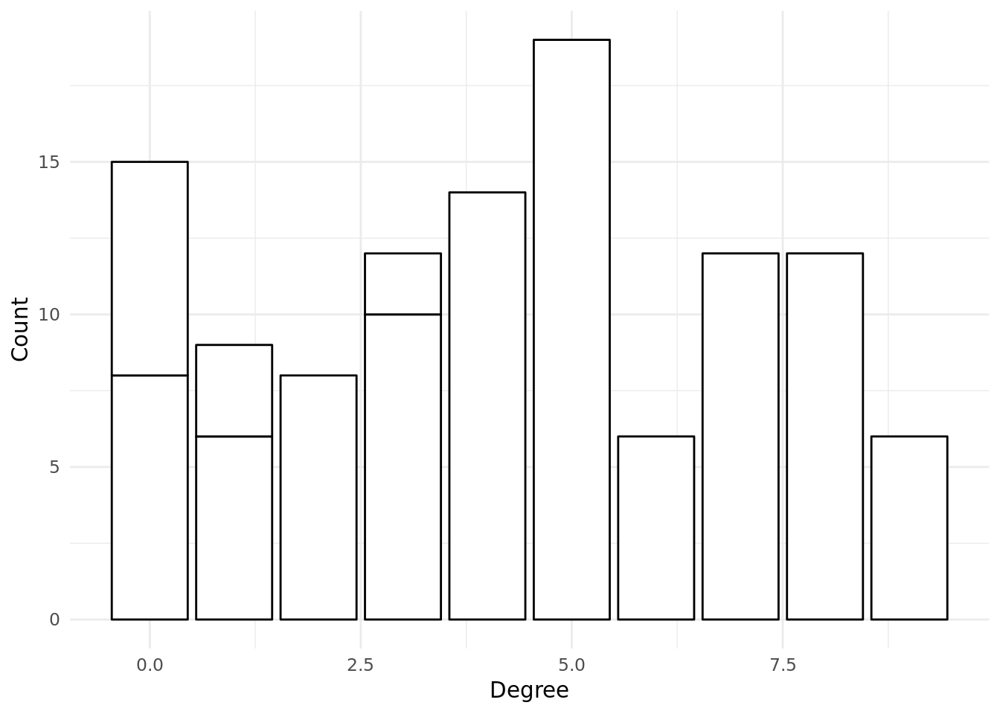

#### Degree distribution of agent->knows->agent edges

#### Runing time by method 

<table class="table table-condensed" style="width: auto !important; ">
 <thead>
  <tr>
   <th style="text-align:left;"> key </th>
   <th style="text-align:right;"> doc_count </th>
   <th style="text-align:right;"> sum_wallTime_ms.value </th>
   <th style="text-align:left;"> avg_wallTime_ms.value </th>
   <th style="text-align:left;"> includedInTotal </th>
  </tr>
 </thead>
<tbody>
  <tr>
   <td style="text-align:left;"> connectIfSimilar </td>
   <td style="text-align:right;"> 9,730 </td>
   <td style="text-align:right;"> 18,066 </td>
   <td style="text-align:left;"> 1.85673175745118 </td>
   <td style="text-align:left;"> No </td>
  </tr>
  <tr>
   <td style="text-align:left;"> existsSimilarity </td>
   <td style="text-align:right;"> 9,730 </td>
   <td style="text-align:right;"> 17,907 </td>
   <td style="text-align:left;"> 1.84039054470709 </td>
   <td style="text-align:left;"> No </td>
  </tr>
  <tr>
   <td style="text-align:left;"> similarityEdges </td>
   <td style="text-align:right;"> 9,730 </td>
   <td style="text-align:right;"> 17,606 </td>
   <td style="text-align:left;"> 1.80945529290853 </td>
   <td style="text-align:left;"> No </td>
  </tr>
  <tr>
   <td style="text-align:left;"> connectAllSimilar </td>
   <td style="text-align:right;"> 140 </td>
   <td style="text-align:right;"> 18,166 </td>
   <td style="text-align:left;"> 129.757142857143 </td>
   <td style="text-align:left;"> Yes </td>
  </tr>
  <tr>
   <td style="text-align:left;"> init </td>
   <td style="text-align:right;"> 53 </td>
   <td style="text-align:right;"> 8,784 </td>
   <td style="text-align:left;"> 165.735849056604 </td>
   <td style="text-align:left;"> No </td>
  </tr>
  <tr>
   <td style="text-align:left;"> connect </td>
   <td style="text-align:right;"> 14 </td>
   <td style="text-align:right;"> 19 </td>
   <td style="text-align:left;"> 1.35714285714286 </td>
   <td style="text-align:left;"> Yes </td>
  </tr>
  <tr>
   <td style="text-align:left;font-weight: bold;"> Total </td>
   <td style="text-align:right;font-weight: bold;"> 162 </td>
   <td style="text-align:right;font-weight: bold;"> 18,478 </td>
   <td style="text-align:left;font-weight: bold;">  </td>
   <td style="text-align:left;font-weight: bold;">  </td>
  </tr>
</tbody>
</table>
####  Found structures 

#####  Cycles 

Number of cycles found:  1 

<button class="btn btn-primary" data-toggle="collapse" data-target="#YCFGHHRMII"> Show/Hide foundCycle query </button> 
 
  
     GET /filebeat-*/_search 
              { 
                "query": {
                  "bool": {
                    "must": [
                      { "match_phrase": {
                        "simulationId": "SIM10-13-06-16-TbmyrC--CV"
                        }
                      },
                      { "bool": {
                        "should": [
                          { "match": {
                            "keyword": "foundCycle"
                          }}
                        ]
                      }}
                    ]
                  }
                }
              }
     

#####  Paths 

Number of paths found:  0 

<button class="btn btn-primary" data-toggle="collapse" data-target="#PJFQGHHRZH"> Show/Hide foundPath query </button> 
 
  
     GET /filebeat-*/_search 
              { 
                "query": {
                  "bool": {
                    "must": [
                      { "match_phrase": {
                        "simulationId": "SIM10-13-06-16-TbmyrC--CV"
                        }
                      },
                      { "bool": {
                        "should": [
                          { "match": {
                            "keyword": "foundPath"
                          }}
                        ]
                      }}
                    ]
                  }
                }
              }
     

###  SIM10-13-06-16-TbmyrC--DV 

#### simulationParameters 

<table class="table table-condensed" style="width: auto !important; ">
 <thead>
  <tr>
   <th style="text-align:left;"> agentNumber </th>
   <th style="text-align:left;"> similarityConnectThreshold </th>
   <th style="text-align:left;"> graphType </th>
   <th style="text-align:left;"> chainLength </th>
   <th style="text-align:left;"> similaritySearchThreshold </th>
   <th style="text-align:left;"> maxDistance </th>
   <th style="text-align:left;"> randomWorksNumberMultiplier </th>
  </tr>
 </thead>
<tbody>
  <tr>
   <td style="text-align:left;width: 20em; "> 50 </td>
   <td style="text-align:left;width: 15em; "> 0.96 </td>
   <td style="text-align:left;width: 15em; "> smallWorld </td>
   <td style="text-align:left;width: 15em; "> 20 </td>
   <td style="text-align:left;width: 15em; "> 1 </td>
   <td style="text-align:left;width: 15em; "> 10 </td>
   <td style="text-align:left;width: 15em; "> 1 </td>
  </tr>
</tbody>
</table>
#### allEdgesByLabel

<table class="table table-condensed" style="width: auto !important; ">
 <thead>
  <tr>
   <th style="text-align:right;"> edges_offers </th>
   <th style="text-align:right;"> edges_similarity </th>
   <th style="text-align:right;"> edges_owns </th>
   <th style="text-align:right;"> edges_demands </th>
   <th style="text-align:right;"> edges_knows </th>
   <th style="text-align:right;"> edges_total </th>
  </tr>
 </thead>
<tbody>
  <tr>
   <td style="text-align:right;width: 5em; "> 70 </td>
   <td style="text-align:right;width: 5em; "> 1,910 </td>
   <td style="text-align:right;width: 5em; "> 70 </td>
   <td style="text-align:right;width: 5em; "> 70 </td>
   <td style="text-align:right;width: 5em; "> 201 </td>
   <td style="text-align:right;width: 5em; "> 2,321 </td>
  </tr>
</tbody>
</table>
#### allVerticesByType

<table class="table table-condensed" style="width: auto !important; ">
 <thead>
  <tr>
   <th style="text-align:right;"> vertices_agent </th>
   <th style="text-align:right;"> vertices_item </th>
   <th style="text-align:right;"> vertices_work </th>
   <th style="text-align:right;"> vertices_total </th>
  </tr>
 </thead>
<tbody>
  <tr>
   <td style="text-align:right;width: 5em; "> 51 </td>
   <td style="text-align:right;width: 5em; "> 140 </td>
   <td style="text-align:right;width: 5em; "> 70 </td>
   <td style="text-align:right;width: 5em; "> 261 </td>
  </tr>
</tbody>
</table>
#### distribution of similarityEdgesByWeight

#### Degree distribution of item->similarity->item edges

#### Degree distribution of agent->knows->agent edges

#### Runing time by method 

<table class="table table-condensed" style="width: auto !important; ">
 <thead>
  <tr>
   <th style="text-align:left;">   </th>
   <th style="text-align:left;"> key </th>
   <th style="text-align:right;"> doc_count </th>
   <th style="text-align:right;"> sum_wallTime_ms.value </th>
   <th style="text-align:left;"> avg_wallTime_ms.value </th>
   <th style="text-align:left;"> includedInTotal </th>
  </tr>
 </thead>
<tbody>
  <tr>
   <td style="text-align:left;"> 1 </td>
   <td style="text-align:left;"> knowsAgent </td>
   <td style="text-align:right;"> 201 </td>
   <td style="text-align:right;"> 412 </td>
   <td style="text-align:left;"> 2.04975124378109 </td>
   <td style="text-align:left;"> No </td>
  </tr>
  <tr>
   <td style="text-align:left;"> 2 </td>
   <td style="text-align:left;"> addItemToWork </td>
   <td style="text-align:right;"> 140 </td>
   <td style="text-align:right;"> 1,093 </td>
   <td style="text-align:left;"> 7.80714285714286 </td>
   <td style="text-align:left;"> No </td>
  </tr>
  <tr>
   <td style="text-align:left;"> 3 </td>
   <td style="text-align:left;"> ownsWork </td>
   <td style="text-align:right;"> 70 </td>
   <td style="text-align:right;"> 1,679 </td>
   <td style="text-align:left;"> 23.9857142857143 </td>
   <td style="text-align:left;"> No </td>
  </tr>
  <tr>
   <td style="text-align:left;"> 4 </td>
   <td style="text-align:left;"> init </td>
   <td style="text-align:right;"> 53 </td>
   <td style="text-align:right;"> 9,372 </td>
   <td style="text-align:left;"> 176.830188679245 </td>
   <td style="text-align:left;"> No </td>
  </tr>
  <tr>
   <td style="text-align:left;"> 5 </td>
   <td style="text-align:left;"> searchAndConnect </td>
   <td style="text-align:right;"> 51 </td>
   <td style="text-align:right;"> 11,930 </td>
   <td style="text-align:left;"> 233.921568627451 </td>
   <td style="text-align:left;"> Yes </td>
  </tr>
  <tr>
   <td style="text-align:left;"> 6 </td>
   <td style="text-align:left;"> getWorksItems </td>
   <td style="text-align:right;"> 38 </td>
   <td style="text-align:right;"> 61 </td>
   <td style="text-align:left;"> 1.60526315789474 </td>
   <td style="text-align:left;"> Yes </td>
  </tr>
  <tr>
   <td style="text-align:left;"> 9 </td>
   <td style="text-align:left;"> cycleSearch </td>
   <td style="text-align:right;"> 2 </td>
   <td style="text-align:right;"> 223 </td>
   <td style="text-align:left;"> 111.5 </td>
   <td style="text-align:left;"> Yes </td>
  </tr>
  <tr>
   <td style="text-align:left;"> 10 </td>
   <td style="text-align:left;"> getWorks </td>
   <td style="text-align:right;"> 2 </td>
   <td style="text-align:right;"> 197 </td>
   <td style="text-align:left;"> 98.5 </td>
   <td style="text-align:left;"> No </td>
  </tr>
  <tr>
   <td style="text-align:left;font-weight: bold;"> 11 </td>
   <td style="text-align:left;font-weight: bold;"> Total </td>
   <td style="text-align:right;font-weight: bold;"> 98 </td>
   <td style="text-align:right;font-weight: bold;"> 12,669 </td>
   <td style="text-align:left;font-weight: bold;">  </td>
   <td style="text-align:left;font-weight: bold;">  </td>
  </tr>
</tbody>
</table>
####  Found structures 

#####  Cycles 

Number of cycles found:  1 

<button class="btn btn-primary" data-toggle="collapse" data-target="#CNSVSEEIHR"> Show/Hide foundCycle query </button> 
 
  
     GET /filebeat-*/_search 
              { 
                "query": {
                  "bool": {
                    "must": [
                      { "match_phrase": {
                        "simulationId": "SIM10-13-06-16-TbmyrC--DV"
                        }
                      },
                      { "bool": {
                        "should": [
                          { "match": {
                            "keyword": "foundCycle"
                          }}
                        ]
                      }}
                    ]
                  }
                }
              }
     

#####  Paths 

Number of paths found:  1 

<button class="btn btn-primary" data-toggle="collapse" data-target="#VCUYEHXJUE"> Show/Hide foundPath query </button> 
 
  
     GET /filebeat-*/_search 
              { 
                "query": {
                  "bool": {
                    "must": [
                      { "match_phrase": {
                        "simulationId": "SIM10-13-06-16-TbmyrC--DV"
                        }
                      },
                      { "bool": {
                        "should": [
                          { "match": {
                            "keyword": "foundPath"
                          }}
                        ]
                      }}
                    ]
                  }
                }
              }
     

###  SIM10-13-07-21-NpmqCz--CV 

#### simulationParameters 

<table class="table table-condensed" style="width: auto !important; ">
 <thead>
  <tr>
   <th style="text-align:left;"> agentNumber </th>
   <th style="text-align:left;"> similarityConnectThreshold </th>
   <th style="text-align:left;"> graphType </th>
   <th style="text-align:left;"> chainLength </th>
   <th style="text-align:left;"> similaritySearchThreshold </th>
   <th style="text-align:left;"> maxDistance </th>
   <th style="text-align:left;"> randomWorksNumberMultiplier </th>
  </tr>
 </thead>
<tbody>
  <tr>
   <td style="text-align:left;width: 20em; "> 50 </td>
   <td style="text-align:left;width: 15em; "> 0.96 </td>
   <td style="text-align:left;width: 15em; "> random </td>
   <td style="text-align:left;width: 15em; "> 20 </td>
   <td style="text-align:left;width: 15em; "> 1 </td>
   <td style="text-align:left;width: 15em; "> 10 </td>
   <td style="text-align:left;width: 15em; "> 2 </td>
  </tr>
</tbody>
</table>
#### allEdgesByLabel

<table class="table table-condensed" style="width: auto !important; ">
 <thead>
  <tr>
   <th style="text-align:right;"> edges_offers </th>
   <th style="text-align:right;"> edges_similarity </th>
   <th style="text-align:right;"> edges_owns </th>
   <th style="text-align:right;"> edges_demands </th>
   <th style="text-align:right;"> edges_knows </th>
   <th style="text-align:right;"> edges_total </th>
  </tr>
 </thead>
<tbody>
  <tr>
   <td style="text-align:right;width: 5em; "> 120 </td>
   <td style="text-align:right;width: 5em; "> 5,074 </td>
   <td style="text-align:right;width: 5em; "> 120 </td>
   <td style="text-align:right;width: 5em; "> 120 </td>
   <td style="text-align:right;width: 5em; "> 50 </td>
   <td style="text-align:right;width: 5em; "> 5,484 </td>
  </tr>
</tbody>
</table>
#### allVerticesByType

<table class="table table-condensed" style="width: auto !important; ">
 <thead>
  <tr>
   <th style="text-align:right;"> vertices_agent </th>
   <th style="text-align:right;"> vertices_item </th>
   <th style="text-align:right;"> vertices_work </th>
   <th style="text-align:right;"> vertices_total </th>
  </tr>
 </thead>
<tbody>
  <tr>
   <td style="text-align:right;width: 5em; "> 51 </td>
   <td style="text-align:right;width: 5em; "> 240 </td>
   <td style="text-align:right;width: 5em; "> 120 </td>
   <td style="text-align:right;width: 5em; "> 411 </td>
  </tr>
</tbody>
</table>
#### distribution of similarityEdgesByWeight

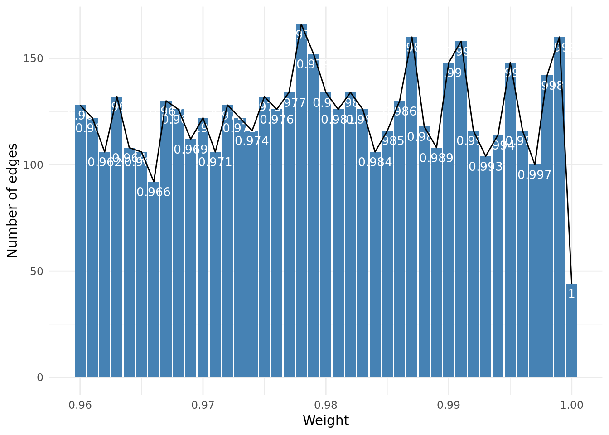

#### Degree distribution of item->similarity->item edges

#### Degree distribution of agent->knows->agent edges

#### Runing time by method 

<table class="table table-condensed" style="width: auto !important; ">
 <thead>
  <tr>
   <th style="text-align:left;"> key </th>
   <th style="text-align:right;"> doc_count </th>
   <th style="text-align:right;"> sum_wallTime_ms.value </th>
   <th style="text-align:left;"> avg_wallTime_ms.value </th>
   <th style="text-align:left;"> includedInTotal </th>
  </tr>
 </thead>
<tbody>
  <tr>
   <td style="text-align:left;"> connectIfSimilar </td>
   <td style="text-align:right;"> 28,680 </td>
   <td style="text-align:right;"> 62,201 </td>
   <td style="text-align:left;"> 2.16879358437936 </td>
   <td style="text-align:left;"> No </td>
  </tr>
  <tr>
   <td style="text-align:left;"> existsSimilarity </td>
   <td style="text-align:right;"> 28,680 </td>
   <td style="text-align:right;"> 61,498 </td>
   <td style="text-align:left;"> 2.14428172942817 </td>
   <td style="text-align:left;"> No </td>
  </tr>
  <tr>
   <td style="text-align:left;"> similarityEdges </td>
   <td style="text-align:right;"> 28,680 </td>
   <td style="text-align:right;"> 60,500 </td>
   <td style="text-align:left;"> 2.1094839609484 </td>
   <td style="text-align:left;"> No </td>
  </tr>
  <tr>
   <td style="text-align:left;"> connectAllSimilar </td>
   <td style="text-align:right;"> 240 </td>
   <td style="text-align:right;"> 62,469 </td>
   <td style="text-align:left;"> 260.2875 </td>
   <td style="text-align:left;"> Yes </td>
  </tr>
  <tr>
   <td style="text-align:left;"> init </td>
   <td style="text-align:right;"> 53 </td>
   <td style="text-align:right;"> 9,289 </td>
   <td style="text-align:left;"> 175.264150943396 </td>
   <td style="text-align:left;"> No </td>
  </tr>
  <tr>
   <td style="text-align:left;"> connect </td>
   <td style="text-align:right;"> 51 </td>
   <td style="text-align:right;"> 175 </td>
   <td style="text-align:left;"> 3.43137254901961 </td>
   <td style="text-align:left;"> Yes </td>
  </tr>
  <tr>
   <td style="text-align:left;font-weight: bold;"> Total </td>
   <td style="text-align:right;font-weight: bold;"> 299 </td>
   <td style="text-align:right;font-weight: bold;"> 63,186 </td>
   <td style="text-align:left;font-weight: bold;">  </td>
   <td style="text-align:left;font-weight: bold;">  </td>
  </tr>
</tbody>
</table>
####  Found structures 

#####  Cycles 

Number of cycles found:  1 

<button class="btn btn-primary" data-toggle="collapse" data-target="#OFVQVWHTLX"> Show/Hide foundCycle query </button> 
 
  
     GET /filebeat-*/_search 
              { 
                "query": {
                  "bool": {
                    "must": [
                      { "match_phrase": {
                        "simulationId": "SIM10-13-07-21-NpmqCz--CV"
                        }
                      },
                      { "bool": {
                        "should": [
                          { "match": {
                            "keyword": "foundCycle"
                          }}
                        ]
                      }}
                    ]
                  }
                }
              }
     

#####  Paths 

Number of paths found:  0 

<button class="btn btn-primary" data-toggle="collapse" data-target="#TNECNFYVGA"> Show/Hide foundPath query </button> 
 
  
     GET /filebeat-*/_search 
              { 
                "query": {
                  "bool": {
                    "must": [
                      { "match_phrase": {
                        "simulationId": "SIM10-13-07-21-NpmqCz--CV"
                        }
                      },
                      { "bool": {
                        "should": [
                          { "match": {
                            "keyword": "foundPath"
                          }}
                        ]
                      }}
                    ]
                  }
                }
              }
     

###  SIM10-13-07-21-NpmqCz--DV 

#### simulationParameters 

<table class="table table-condensed" style="width: auto !important; ">
 <thead>
  <tr>
   <th style="text-align:left;"> agentNumber </th>
   <th style="text-align:left;"> similarityConnectThreshold </th>
   <th style="text-align:left;"> graphType </th>
   <th style="text-align:left;"> chainLength </th>
   <th style="text-align:left;"> similaritySearchThreshold </th>
   <th style="text-align:left;"> maxDistance </th>
   <th style="text-align:left;"> randomWorksNumberMultiplier </th>
  </tr>
 </thead>
<tbody>
  <tr>
   <td style="text-align:left;width: 20em; "> 50 </td>
   <td style="text-align:left;width: 15em; "> 0.96 </td>
   <td style="text-align:left;width: 15em; "> random </td>
   <td style="text-align:left;width: 15em; "> 20 </td>
   <td style="text-align:left;width: 15em; "> 1 </td>
   <td style="text-align:left;width: 15em; "> 10 </td>
   <td style="text-align:left;width: 15em; "> 2 </td>
  </tr>
</tbody>
</table>
#### allEdgesByLabel

<table class="table table-condensed" style="width: auto !important; ">
 <thead>
  <tr>
   <th style="text-align:right;"> edges_offers </th>
   <th style="text-align:right;"> edges_similarity </th>
   <th style="text-align:right;"> edges_owns </th>
   <th style="text-align:right;"> edges_demands </th>
   <th style="text-align:right;"> edges_knows </th>
   <th style="text-align:right;"> edges_total </th>
  </tr>
 </thead>
<tbody>
  <tr>
   <td style="text-align:right;width: 5em; "> 120 </td>
   <td style="text-align:right;width: 5em; "> 4,972 </td>
   <td style="text-align:right;width: 5em; "> 120 </td>
   <td style="text-align:right;width: 5em; "> 120 </td>
   <td style="text-align:right;width: 5em; "> 50 </td>
   <td style="text-align:right;width: 5em; "> 5,382 </td>
  </tr>
</tbody>
</table>
#### allVerticesByType

<table class="table table-condensed" style="width: auto !important; ">
 <thead>
  <tr>
   <th style="text-align:right;"> vertices_agent </th>
   <th style="text-align:right;"> vertices_item </th>
   <th style="text-align:right;"> vertices_work </th>
   <th style="text-align:right;"> vertices_total </th>
  </tr>
 </thead>
<tbody>
  <tr>
   <td style="text-align:right;width: 5em; "> 51 </td>
   <td style="text-align:right;width: 5em; "> 240 </td>
   <td style="text-align:right;width: 5em; "> 120 </td>
   <td style="text-align:right;width: 5em; "> 411 </td>
  </tr>
</tbody>
</table>
#### distribution of similarityEdgesByWeight

#### Degree distribution of item->similarity->item edges

#### Degree distribution of agent->knows->agent edges

#### Runing time by method 

<table class="table table-condensed" style="width: auto !important; ">
 <thead>
  <tr>
   <th style="text-align:left;">   </th>
   <th style="text-align:left;"> key </th>
   <th style="text-align:right;"> doc_count </th>
   <th style="text-align:right;"> sum_wallTime_ms.value </th>
   <th style="text-align:left;"> avg_wallTime_ms.value </th>
   <th style="text-align:left;"> includedInTotal </th>
  </tr>
 </thead>
<tbody>
  <tr>
   <td style="text-align:left;"> 1 </td>
   <td style="text-align:left;"> addItemToWork </td>
   <td style="text-align:right;"> 240 </td>
   <td style="text-align:right;"> 1,630 </td>
   <td style="text-align:left;"> 6.79166666666667 </td>
   <td style="text-align:left;"> No </td>
  </tr>
  <tr>
   <td style="text-align:left;"> 2 </td>
   <td style="text-align:left;"> ownsWork </td>
   <td style="text-align:right;"> 120 </td>
   <td style="text-align:right;"> 1,475 </td>
   <td style="text-align:left;"> 12.2916666666667 </td>
   <td style="text-align:left;"> No </td>
  </tr>
  <tr>
   <td style="text-align:left;"> 3 </td>
   <td style="text-align:left;"> init </td>
   <td style="text-align:right;"> 53 </td>
   <td style="text-align:right;"> 9,414 </td>
   <td style="text-align:left;"> 177.622641509434 </td>
   <td style="text-align:left;"> No </td>
  </tr>
  <tr>
   <td style="text-align:left;"> 4 </td>
   <td style="text-align:left;"> searchAndConnect </td>
   <td style="text-align:right;"> 51 </td>
   <td style="text-align:right;"> 25,072 </td>
   <td style="text-align:left;"> 491.607843137255 </td>
   <td style="text-align:left;"> Yes </td>
  </tr>
  <tr>
   <td style="text-align:left;"> 5 </td>
   <td style="text-align:left;"> knowsAgent </td>
   <td style="text-align:right;"> 50 </td>
   <td style="text-align:right;"> 217 </td>
   <td style="text-align:left;"> 4.34 </td>
   <td style="text-align:left;"> No </td>
  </tr>
  <tr>
   <td style="text-align:left;"> 6 </td>
   <td style="text-align:left;"> getWorksItems </td>
   <td style="text-align:right;"> 38 </td>
   <td style="text-align:right;"> 87 </td>
   <td style="text-align:left;"> 2.28947368421053 </td>
   <td style="text-align:left;"> Yes </td>
  </tr>
  <tr>
   <td style="text-align:left;"> 9 </td>
   <td style="text-align:left;"> cycleSearch </td>
   <td style="text-align:right;"> 2 </td>
   <td style="text-align:right;"> 103 </td>
   <td style="text-align:left;"> 51.5 </td>
   <td style="text-align:left;"> Yes </td>
  </tr>
  <tr>
   <td style="text-align:left;"> 10 </td>
   <td style="text-align:left;"> getWorks </td>
   <td style="text-align:right;"> 2 </td>
   <td style="text-align:right;"> 203 </td>
   <td style="text-align:left;"> 101.5 </td>
   <td style="text-align:left;"> No </td>
  </tr>
  <tr>
   <td style="text-align:left;font-weight: bold;"> 11 </td>
   <td style="text-align:left;font-weight: bold;"> Total </td>
   <td style="text-align:right;font-weight: bold;"> 98 </td>
   <td style="text-align:right;font-weight: bold;"> 25,870 </td>
   <td style="text-align:left;font-weight: bold;">  </td>
   <td style="text-align:left;font-weight: bold;">  </td>
  </tr>
</tbody>
</table>
####  Found structures 

#####  Cycles 

Number of cycles found:  2 

<button class="btn btn-primary" data-toggle="collapse" data-target="#WTPVFRUSPS"> Show/Hide foundCycle query </button> 
 
  
     GET /filebeat-*/_search 
              { 
                "query": {
                  "bool": {
                    "must": [
                      { "match_phrase": {
                        "simulationId": "SIM10-13-07-21-NpmqCz--DV"
                        }
                      },
                      { "bool": {
                        "should": [
                          { "match": {
                            "keyword": "foundCycle"
                          }}
                        ]
                      }}
                    ]
                  }
                }
              }
     

#####  Paths 

Number of paths found:  0 

<button class="btn btn-primary" data-toggle="collapse" data-target="#JYVTSNDZDE"> Show/Hide foundPath query </button> 
 
  
     GET /filebeat-*/_search 
              { 
                "query": {
                  "bool": {
                    "must": [
                      { "match_phrase": {
                        "simulationId": "SIM10-13-07-21-NpmqCz--DV"
                        }
                      },
                      { "bool": {
                        "should": [
                          { "match": {
                            "keyword": "foundPath"
                          }}
                        ]
                      }}
                    ]
                  }
                }
              }
     

###  SIM10-13-07-22-uXJ4sG--CV 

#### simulationParameters 

<table class="table table-condensed" style="width: auto !important; ">
 <thead>
  <tr>
   <th style="text-align:left;"> agentNumber </th>
   <th style="text-align:left;"> similarityConnectThreshold </th>
   <th style="text-align:left;"> graphType </th>
   <th style="text-align:left;"> chainLength </th>
   <th style="text-align:left;"> similaritySearchThreshold </th>
   <th style="text-align:left;"> maxDistance </th>
   <th style="text-align:left;"> randomWorksNumberMultiplier </th>
  </tr>
 </thead>
<tbody>
  <tr>
   <td style="text-align:left;width: 20em; "> 50 </td>
   <td style="text-align:left;width: 15em; "> 0.96 </td>
   <td style="text-align:left;width: 15em; "> smallWorld </td>
   <td style="text-align:left;width: 15em; "> 20 </td>
   <td style="text-align:left;width: 15em; "> 1 </td>
   <td style="text-align:left;width: 15em; "> 10 </td>
   <td style="text-align:left;width: 15em; "> 2 </td>
  </tr>
</tbody>
</table>
#### allEdgesByLabel

<table class="table table-condensed" style="width: auto !important; ">
 <thead>
  <tr>
   <th style="text-align:right;"> edges_offers </th>
   <th style="text-align:right;"> edges_similarity </th>
   <th style="text-align:right;"> edges_owns </th>
   <th style="text-align:right;"> edges_demands </th>
   <th style="text-align:right;"> edges_knows </th>
   <th style="text-align:right;"> edges_total </th>
  </tr>
 </thead>
<tbody>
  <tr>
   <td style="text-align:right;width: 5em; "> 120 </td>
   <td style="text-align:right;width: 5em; "> 5,106 </td>
   <td style="text-align:right;width: 5em; "> 120 </td>
   <td style="text-align:right;width: 5em; "> 120 </td>
   <td style="text-align:right;width: 5em; "> 201 </td>
   <td style="text-align:right;width: 5em; "> 5,667 </td>
  </tr>
</tbody>
</table>
#### allVerticesByType

<table class="table table-condensed" style="width: auto !important; ">
 <thead>
  <tr>
   <th style="text-align:right;"> vertices_agent </th>
   <th style="text-align:right;"> vertices_item </th>
   <th style="text-align:right;"> vertices_work </th>
   <th style="text-align:right;"> vertices_total </th>
  </tr>
 </thead>
<tbody>
  <tr>
   <td style="text-align:right;width: 5em; "> 51 </td>
   <td style="text-align:right;width: 5em; "> 240 </td>
   <td style="text-align:right;width: 5em; "> 120 </td>
   <td style="text-align:right;width: 5em; "> 411 </td>
  </tr>
</tbody>
</table>
#### distribution of similarityEdgesByWeight

#### Degree distribution of item->similarity->item edges

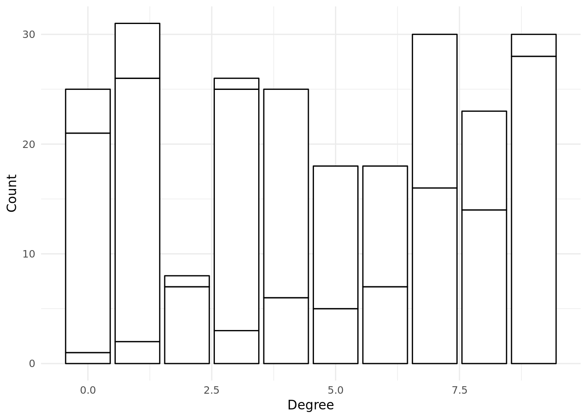

#### Degree distribution of agent->knows->agent edges

#### Runing time by method 

<table class="table table-condensed" style="width: auto !important; ">
 <thead>
  <tr>
   <th style="text-align:left;"> key </th>
   <th style="text-align:right;"> doc_count </th>
   <th style="text-align:right;"> sum_wallTime_ms.value </th>
   <th style="text-align:left;"> avg_wallTime_ms.value </th>
   <th style="text-align:left;"> includedInTotal </th>
  </tr>
 </thead>
<tbody>
  <tr>
   <td style="text-align:left;"> connectIfSimilar </td>
   <td style="text-align:right;"> 28,680 </td>
   <td style="text-align:right;"> 62,025 </td>
   <td style="text-align:left;"> 2.16265690376569 </td>
   <td style="text-align:left;"> No </td>
  </tr>
  <tr>
   <td style="text-align:left;"> existsSimilarity </td>
   <td style="text-align:right;"> 28,680 </td>
   <td style="text-align:right;"> 61,358 </td>
   <td style="text-align:left;"> 2.13940027894003 </td>
   <td style="text-align:left;"> No </td>
  </tr>
  <tr>
   <td style="text-align:left;"> similarityEdges </td>
   <td style="text-align:right;"> 28,680 </td>
   <td style="text-align:right;"> 60,405 </td>
   <td style="text-align:left;"> 2.10617154811716 </td>
   <td style="text-align:left;"> No </td>
  </tr>
  <tr>
   <td style="text-align:left;"> connectAllSimilar </td>
   <td style="text-align:right;"> 240 </td>
   <td style="text-align:right;"> 62,297 </td>
   <td style="text-align:left;"> 259.570833333333 </td>
   <td style="text-align:left;"> Yes </td>
  </tr>
  <tr>
   <td style="text-align:left;"> init </td>
   <td style="text-align:right;"> 53 </td>
   <td style="text-align:right;"> 8,741 </td>
   <td style="text-align:left;"> 164.924528301887 </td>
   <td style="text-align:left;"> No </td>
  </tr>
  <tr>
   <td style="text-align:left;"> connect </td>
   <td style="text-align:right;"> 46 </td>
   <td style="text-align:right;"> 138 </td>
   <td style="text-align:left;"> 3 </td>
   <td style="text-align:left;"> Yes </td>
  </tr>
  <tr>
   <td style="text-align:left;font-weight: bold;"> Total </td>
   <td style="text-align:right;font-weight: bold;"> 294 </td>
   <td style="text-align:right;font-weight: bold;"> 63,111 </td>
   <td style="text-align:left;font-weight: bold;">  </td>
   <td style="text-align:left;font-weight: bold;">  </td>
  </tr>
</tbody>
</table>
####  Found structures 

#####  Cycles 

Number of cycles found:  1 

<button class="btn btn-primary" data-toggle="collapse" data-target="#HFOGWEZNET"> Show/Hide foundCycle query </button> 
 
  
     GET /filebeat-*/_search 
              { 
                "query": {
                  "bool": {
                    "must": [
                      { "match_phrase": {
                        "simulationId": "SIM10-13-07-22-uXJ4sG--CV"
                        }
                      },
                      { "bool": {
                        "should": [
                          { "match": {
                            "keyword": "foundCycle"
                          }}
                        ]
                      }}
                    ]
                  }
                }
              }
     

#####  Paths 

Number of paths found:  0 

<button class="btn btn-primary" data-toggle="collapse" data-target="#SGMDVVOIDV"> Show/Hide foundPath query </button> 
 
  
     GET /filebeat-*/_search 
              { 
                "query": {
                  "bool": {
                    "must": [
                      { "match_phrase": {
                        "simulationId": "SIM10-13-07-22-uXJ4sG--CV"
                        }
                      },
                      { "bool": {
                        "should": [
                          { "match": {
                            "keyword": "foundPath"
                          }}
                        ]
                      }}
                    ]
                  }
                }
              }
     

###  SIM10-13-07-22-uXJ4sG--DV 

#### simulationParameters 

<table class="table table-condensed" style="width: auto !important; ">
 <thead>
  <tr>
   <th style="text-align:left;"> agentNumber </th>
   <th style="text-align:left;"> similarityConnectThreshold </th>
   <th style="text-align:left;"> graphType </th>
   <th style="text-align:left;"> chainLength </th>
   <th style="text-align:left;"> similaritySearchThreshold </th>
   <th style="text-align:left;"> maxDistance </th>
   <th style="text-align:left;"> randomWorksNumberMultiplier </th>
  </tr>
 </thead>
<tbody>
  <tr>
   <td style="text-align:left;width: 20em; "> 50 </td>
   <td style="text-align:left;width: 15em; "> 0.96 </td>
   <td style="text-align:left;width: 15em; "> smallWorld </td>
   <td style="text-align:left;width: 15em; "> 20 </td>
   <td style="text-align:left;width: 15em; "> 1 </td>
   <td style="text-align:left;width: 15em; "> 10 </td>
   <td style="text-align:left;width: 15em; "> 2 </td>
  </tr>
</tbody>
</table>
#### allEdgesByLabel

<table class="table table-condensed" style="width: auto !important; ">
 <thead>
  <tr>
   <th style="text-align:right;"> edges_offers </th>
   <th style="text-align:right;"> edges_similarity </th>
   <th style="text-align:right;"> edges_owns </th>
   <th style="text-align:right;"> edges_demands </th>
   <th style="text-align:right;"> edges_knows </th>
   <th style="text-align:right;"> edges_total </th>
  </tr>
 </thead>
<tbody>
  <tr>
   <td style="text-align:right;width: 5em; "> 120 </td>
   <td style="text-align:right;width: 5em; "> 5,014 </td>
   <td style="text-align:right;width: 5em; "> 120 </td>
   <td style="text-align:right;width: 5em; "> 120 </td>
   <td style="text-align:right;width: 5em; "> 201 </td>
   <td style="text-align:right;width: 5em; "> 5,575 </td>
  </tr>
</tbody>
</table>
#### allVerticesByType

<table class="table table-condensed" style="width: auto !important; ">
 <thead>
  <tr>
   <th style="text-align:right;"> vertices_agent </th>
   <th style="text-align:right;"> vertices_item </th>
   <th style="text-align:right;"> vertices_work </th>
   <th style="text-align:right;"> vertices_total </th>
  </tr>
 </thead>
<tbody>
  <tr>
   <td style="text-align:right;width: 5em; "> 51 </td>
   <td style="text-align:right;width: 5em; "> 240 </td>
   <td style="text-align:right;width: 5em; "> 120 </td>
   <td style="text-align:right;width: 5em; "> 411 </td>
  </tr>
</tbody>
</table>
#### distribution of similarityEdgesByWeight

#### Degree distribution of item->similarity->item edges

#### Degree distribution of agent->knows->agent edges

#### Runing time by method 

<table class="table table-condensed" style="width: auto !important; ">
 <thead>
  <tr>
   <th style="text-align:left;">   </th>
   <th style="text-align:left;"> key </th>
   <th style="text-align:right;"> doc_count </th>
   <th style="text-align:right;"> sum_wallTime_ms.value </th>
   <th style="text-align:left;"> avg_wallTime_ms.value </th>
   <th style="text-align:left;"> includedInTotal </th>
  </tr>
 </thead>
<tbody>
  <tr>
   <td style="text-align:left;"> 1 </td>
   <td style="text-align:left;"> addItemToWork </td>
   <td style="text-align:right;"> 240 </td>
   <td style="text-align:right;"> 4,484 </td>
   <td style="text-align:left;"> 18.6833333333333 </td>
   <td style="text-align:left;"> No </td>
  </tr>
  <tr>
   <td style="text-align:left;"> 2 </td>
   <td style="text-align:left;"> knowsAgent </td>
   <td style="text-align:right;"> 201 </td>
   <td style="text-align:right;"> 398 </td>
   <td style="text-align:left;"> 1.98009950248756 </td>
   <td style="text-align:left;"> No </td>
  </tr>
  <tr>
   <td style="text-align:left;"> 3 </td>
   <td style="text-align:left;"> ownsWork </td>
   <td style="text-align:right;"> 120 </td>
   <td style="text-align:right;"> 2,433 </td>
   <td style="text-align:left;"> 20.275 </td>
   <td style="text-align:left;"> No </td>
  </tr>
  <tr>
   <td style="text-align:left;"> 4 </td>
   <td style="text-align:left;"> init </td>
   <td style="text-align:right;"> 53 </td>
   <td style="text-align:right;"> 9,750 </td>
   <td style="text-align:left;"> 183.962264150943 </td>
   <td style="text-align:left;"> No </td>
  </tr>
  <tr>
   <td style="text-align:left;"> 5 </td>
   <td style="text-align:left;"> searchAndConnect </td>
   <td style="text-align:right;"> 51 </td>
   <td style="text-align:right;"> 27,203 </td>
   <td style="text-align:left;"> 533.392156862745 </td>
   <td style="text-align:left;"> Yes </td>
  </tr>
  <tr>
   <td style="text-align:left;"> 6 </td>
   <td style="text-align:left;"> getWorksItems </td>
   <td style="text-align:right;"> 38 </td>
   <td style="text-align:right;"> 67 </td>
   <td style="text-align:left;"> 1.76315789473684 </td>
   <td style="text-align:left;"> Yes </td>
  </tr>
  <tr>
   <td style="text-align:left;"> 9 </td>
   <td style="text-align:left;"> cycleSearch </td>
   <td style="text-align:right;"> 2 </td>
   <td style="text-align:right;"> 429 </td>
   <td style="text-align:left;"> 214.5 </td>
   <td style="text-align:left;"> Yes </td>
  </tr>
  <tr>
   <td style="text-align:left;"> 10 </td>
   <td style="text-align:left;"> getWorks </td>
   <td style="text-align:right;"> 2 </td>
   <td style="text-align:right;"> 455 </td>
   <td style="text-align:left;"> 227.5 </td>
   <td style="text-align:left;"> No </td>
  </tr>
  <tr>
   <td style="text-align:left;font-weight: bold;"> 11 </td>
   <td style="text-align:left;font-weight: bold;"> Total </td>
   <td style="text-align:right;font-weight: bold;"> 98 </td>
   <td style="text-align:right;font-weight: bold;"> 28,218 </td>
   <td style="text-align:left;font-weight: bold;">  </td>
   <td style="text-align:left;font-weight: bold;">  </td>
  </tr>
</tbody>
</table>
####  Found structures 

#####  Cycles 

Number of cycles found:  2 

<button class="btn btn-primary" data-toggle="collapse" data-target="#WWKXJTUXAO"> Show/Hide foundCycle query </button> 
 
  
     GET /filebeat-*/_search 
              { 
                "query": {
                  "bool": {
                    "must": [
                      { "match_phrase": {
                        "simulationId": "SIM10-13-07-22-uXJ4sG--DV"
                        }
                      },
                      { "bool": {
                        "should": [
                          { "match": {
                            "keyword": "foundCycle"
                          }}
                        ]
                      }}
                    ]
                  }
                }
              }
     

#####  Paths 

Number of paths found:  0 

<button class="btn btn-primary" data-toggle="collapse" data-target="#VKYSTWCRGW"> Show/Hide foundPath query </button> 
 
  
     GET /filebeat-*/_search 
              { 
                "query": {
                  "bool": {
                    "must": [
                      { "match_phrase": {
                        "simulationId": "SIM10-13-07-22-uXJ4sG--DV"
                        }
                      },
                      { "bool": {
                        "should": [
                          { "match": {
                            "keyword": "foundPath"
                          }}
                        ]
                      }}
                    ]
                  }
                }
              }
     

###  SIM10-13-06-17-QDprRS--CV 

#### simulationParameters 

<table class="table table-condensed" style="width: auto !important; ">
 <thead>
  <tr>
   <th style="text-align:left;"> agentNumber </th>
   <th style="text-align:left;"> similarityConnectThreshold </th>
   <th style="text-align:left;"> graphType </th>
   <th style="text-align:left;"> chainLength </th>
   <th style="text-align:left;"> similaritySearchThreshold </th>
   <th style="text-align:left;"> maxDistance </th>
   <th style="text-align:left;"> randomWorksNumberMultiplier </th>
  </tr>
 </thead>
<tbody>
  <tr>
   <td style="text-align:left;width: 20em; "> 50 </td>
   <td style="text-align:left;width: 15em; "> 0.96 </td>
   <td style="text-align:left;width: 15em; "> random </td>
   <td style="text-align:left;width: 15em; "> 20 </td>
   <td style="text-align:left;width: 15em; "> 1 </td>
   <td style="text-align:left;width: 15em; "> 30 </td>
   <td style="text-align:left;width: 15em; "> 1 </td>
  </tr>
</tbody>
</table>
#### allEdgesByLabel

<table class="table table-condensed" style="width: auto !important; ">
 <thead>
  <tr>
   <th style="text-align:right;"> edges_offers </th>
   <th style="text-align:right;"> edges_similarity </th>
   <th style="text-align:right;"> edges_owns </th>
   <th style="text-align:right;"> edges_demands </th>
   <th style="text-align:right;"> edges_knows </th>
   <th style="text-align:right;"> edges_total </th>
  </tr>
 </thead>
<tbody>
  <tr>
   <td style="text-align:right;width: 5em; "> 70 </td>
   <td style="text-align:right;width: 5em; "> 1,964 </td>
   <td style="text-align:right;width: 5em; "> 70 </td>
   <td style="text-align:right;width: 5em; "> 70 </td>
   <td style="text-align:right;width: 5em; "> 50 </td>
   <td style="text-align:right;width: 5em; "> 2,224 </td>
  </tr>
</tbody>
</table>
#### allVerticesByType

<table class="table table-condensed" style="width: auto !important; ">
 <thead>
  <tr>
   <th style="text-align:right;"> vertices_agent </th>
   <th style="text-align:right;"> vertices_item </th>
   <th style="text-align:right;"> vertices_work </th>
   <th style="text-align:right;"> vertices_total </th>
  </tr>
 </thead>
<tbody>
  <tr>
   <td style="text-align:right;width: 5em; "> 51 </td>
   <td style="text-align:right;width: 5em; "> 140 </td>
   <td style="text-align:right;width: 5em; "> 70 </td>
   <td style="text-align:right;width: 5em; "> 261 </td>
  </tr>
</tbody>
</table>
#### distribution of similarityEdgesByWeight

#### Degree distribution of item->similarity->item edges

#### Degree distribution of agent->knows->agent edges

#### Runing time by method 

<table class="table table-condensed" style="width: auto !important; ">
 <thead>
  <tr>
   <th style="text-align:left;"> key </th>
   <th style="text-align:right;"> doc_count </th>
   <th style="text-align:right;"> sum_wallTime_ms.value </th>
   <th style="text-align:left;"> avg_wallTime_ms.value </th>
   <th style="text-align:left;"> includedInTotal </th>
  </tr>
 </thead>
<tbody>
  <tr>
   <td style="text-align:left;"> connectIfSimilar </td>
   <td style="text-align:right;"> 9,730 </td>
   <td style="text-align:right;"> 18,826 </td>
   <td style="text-align:left;"> 1.93484069886948 </td>
   <td style="text-align:left;"> No </td>
  </tr>
  <tr>
   <td style="text-align:left;"> existsSimilarity </td>
   <td style="text-align:right;"> 9,730 </td>
   <td style="text-align:right;"> 18,600 </td>
   <td style="text-align:left;"> 1.91161356628983 </td>
   <td style="text-align:left;"> No </td>
  </tr>
  <tr>
   <td style="text-align:left;"> similarityEdges </td>
   <td style="text-align:right;"> 9,730 </td>
   <td style="text-align:right;"> 18,295 </td>
   <td style="text-align:left;"> 1.88026721479959 </td>
   <td style="text-align:left;"> No </td>
  </tr>
  <tr>
   <td style="text-align:left;"> connectAllSimilar </td>
   <td style="text-align:right;"> 140 </td>
   <td style="text-align:right;"> 18,922 </td>
   <td style="text-align:left;"> 135.157142857143 </td>
   <td style="text-align:left;"> Yes </td>
  </tr>
  <tr>
   <td style="text-align:left;"> init </td>
   <td style="text-align:right;"> 53 </td>
   <td style="text-align:right;"> 9,061 </td>
   <td style="text-align:left;"> 170.962264150943 </td>
   <td style="text-align:left;"> No </td>
  </tr>
  <tr>
   <td style="text-align:left;"> connect </td>
   <td style="text-align:right;"> 19 </td>
   <td style="text-align:right;"> 65 </td>
   <td style="text-align:left;"> 3.42105263157895 </td>
   <td style="text-align:left;"> Yes </td>
  </tr>
  <tr>
   <td style="text-align:left;font-weight: bold;"> Total </td>
   <td style="text-align:right;font-weight: bold;"> 167 </td>
   <td style="text-align:right;font-weight: bold;"> 19,326 </td>
   <td style="text-align:left;font-weight: bold;">  </td>
   <td style="text-align:left;font-weight: bold;">  </td>
  </tr>
</tbody>
</table>
####  Found structures 

#####  Cycles 

Number of cycles found:  1 

<button class="btn btn-primary" data-toggle="collapse" data-target="#UKKGOWTQHV"> Show/Hide foundCycle query </button> 
 
  
     GET /filebeat-*/_search 
              { 
                "query": {
                  "bool": {
                    "must": [
                      { "match_phrase": {
                        "simulationId": "SIM10-13-06-17-QDprRS--CV"
                        }
                      },
                      { "bool": {
                        "should": [
                          { "match": {
                            "keyword": "foundCycle"
                          }}
                        ]
                      }}
                    ]
                  }
                }
              }
     

#####  Paths 

Number of paths found:  0 

<button class="btn btn-primary" data-toggle="collapse" data-target="#EILDACIJVH"> Show/Hide foundPath query </button> 
 
  
     GET /filebeat-*/_search 
              { 
                "query": {
                  "bool": {
                    "must": [
                      { "match_phrase": {
                        "simulationId": "SIM10-13-06-17-QDprRS--CV"
                        }
                      },
                      { "bool": {
                        "should": [
                          { "match": {
                            "keyword": "foundPath"
                          }}
                        ]
                      }}
                    ]
                  }
                }
              }
     

###  SIM10-13-06-17-QDprRS--DV 

#### simulationParameters 

<table class="table table-condensed" style="width: auto !important; ">
 <thead>
  <tr>
   <th style="text-align:left;"> agentNumber </th>
   <th style="text-align:left;"> similarityConnectThreshold </th>
   <th style="text-align:left;"> graphType </th>
   <th style="text-align:left;"> chainLength </th>
   <th style="text-align:left;"> similaritySearchThreshold </th>
   <th style="text-align:left;"> maxDistance </th>
   <th style="text-align:left;"> randomWorksNumberMultiplier </th>
  </tr>
 </thead>
<tbody>
  <tr>
   <td style="text-align:left;width: 20em; "> 50 </td>
   <td style="text-align:left;width: 15em; "> 0.96 </td>
   <td style="text-align:left;width: 15em; "> random </td>
   <td style="text-align:left;width: 15em; "> 20 </td>
   <td style="text-align:left;width: 15em; "> 1 </td>
   <td style="text-align:left;width: 15em; "> 30 </td>
   <td style="text-align:left;width: 15em; "> 1 </td>
  </tr>
</tbody>
</table>
#### allEdgesByLabel

<table class="table table-condensed" style="width: auto !important; ">
 <thead>
  <tr>
   <th style="text-align:right;"> edges_offers </th>
   <th style="text-align:right;"> edges_similarity </th>
   <th style="text-align:right;"> edges_owns </th>
   <th style="text-align:right;"> edges_demands </th>
   <th style="text-align:right;"> edges_knows </th>
   <th style="text-align:right;"> edges_total </th>
  </tr>
 </thead>
<tbody>
  <tr>
   <td style="text-align:right;width: 5em; "> 70 </td>
   <td style="text-align:right;width: 5em; "> 1,926 </td>
   <td style="text-align:right;width: 5em; "> 70 </td>
   <td style="text-align:right;width: 5em; "> 70 </td>
   <td style="text-align:right;width: 5em; "> 50 </td>
   <td style="text-align:right;width: 5em; "> 2,186 </td>
  </tr>
</tbody>
</table>
#### allVerticesByType

<table class="table table-condensed" style="width: auto !important; ">
 <thead>
  <tr>
   <th style="text-align:right;"> vertices_agent </th>
   <th style="text-align:right;"> vertices_item </th>
   <th style="text-align:right;"> vertices_work </th>
   <th style="text-align:right;"> vertices_total </th>
  </tr>
 </thead>
<tbody>
  <tr>
   <td style="text-align:right;width: 5em; "> 51 </td>
   <td style="text-align:right;width: 5em; "> 140 </td>
   <td style="text-align:right;width: 5em; "> 70 </td>
   <td style="text-align:right;width: 5em; "> 261 </td>
  </tr>
</tbody>
</table>
#### distribution of similarityEdgesByWeight

#### Degree distribution of item->similarity->item edges

#### Degree distribution of agent->knows->agent edges

#### Runing time by method 

<table class="table table-condensed" style="width: auto !important; ">
 <thead>
  <tr>
   <th style="text-align:left;">   </th>
   <th style="text-align:left;"> key </th>
   <th style="text-align:right;"> doc_count </th>
   <th style="text-align:right;"> sum_wallTime_ms.value </th>
   <th style="text-align:left;"> avg_wallTime_ms.value </th>
   <th style="text-align:left;"> includedInTotal </th>
  </tr>
 </thead>
<tbody>
  <tr>
   <td style="text-align:left;"> 1 </td>
   <td style="text-align:left;"> addItemToWork </td>
   <td style="text-align:right;"> 140 </td>
   <td style="text-align:right;"> 1,939 </td>
   <td style="text-align:left;"> 13.85 </td>
   <td style="text-align:left;"> No </td>
  </tr>
  <tr>
   <td style="text-align:left;"> 2 </td>
   <td style="text-align:left;"> ownsWork </td>
   <td style="text-align:right;"> 70 </td>
   <td style="text-align:right;"> 1,154 </td>
   <td style="text-align:left;"> 16.4857142857143 </td>
   <td style="text-align:left;"> No </td>
  </tr>
  <tr>
   <td style="text-align:left;"> 3 </td>
   <td style="text-align:left;"> init </td>
   <td style="text-align:right;"> 53 </td>
   <td style="text-align:right;"> 9,018 </td>
   <td style="text-align:left;"> 170.150943396226 </td>
   <td style="text-align:left;"> No </td>
  </tr>
  <tr>
   <td style="text-align:left;"> 4 </td>
   <td style="text-align:left;"> searchAndConnect </td>
   <td style="text-align:right;"> 51 </td>
   <td style="text-align:right;"> 12,103 </td>
   <td style="text-align:left;"> 237.313725490196 </td>
   <td style="text-align:left;"> Yes </td>
  </tr>
  <tr>
   <td style="text-align:left;"> 5 </td>
   <td style="text-align:left;"> knowsAgent </td>
   <td style="text-align:right;"> 50 </td>
   <td style="text-align:right;"> 188 </td>
   <td style="text-align:left;"> 3.76 </td>
   <td style="text-align:left;"> No </td>
  </tr>
  <tr>
   <td style="text-align:left;"> 6 </td>
   <td style="text-align:left;"> getWorksItems </td>
   <td style="text-align:right;"> 38 </td>
   <td style="text-align:right;"> 66 </td>
   <td style="text-align:left;"> 1.73684210526316 </td>
   <td style="text-align:left;"> Yes </td>
  </tr>
  <tr>
   <td style="text-align:left;"> 8 </td>
   <td style="text-align:left;"> addChainToNetwork </td>
   <td style="text-align:right;"> 1 </td>
   <td style="text-align:right;"> 0 </td>
   <td style="text-align:left;"> 0 </td>
   <td style="text-align:left;"> Yes </td>
  </tr>
  <tr>
   <td style="text-align:left;"> 9 </td>
   <td style="text-align:left;"> addRandomWorksToAgents </td>
   <td style="text-align:right;"> 1 </td>
   <td style="text-align:right;"> 0 </td>
   <td style="text-align:left;"> 0 </td>
   <td style="text-align:left;"> Yes </td>
  </tr>
  <tr>
   <td style="text-align:left;font-weight: bold;"> 11 </td>
   <td style="text-align:left;font-weight: bold;"> Total </td>
   <td style="text-align:right;font-weight: bold;"> 97 </td>
   <td style="text-align:right;font-weight: bold;"> 12,373 </td>
   <td style="text-align:left;font-weight: bold;">  </td>
   <td style="text-align:left;font-weight: bold;">  </td>
  </tr>
</tbody>
</table>
####  Found structures 

#####  Cycles 

Number of cycles found:  1 

<button class="btn btn-primary" data-toggle="collapse" data-target="#PRVFZUCKMJ"> Show/Hide foundCycle query </button> 
 
  
     GET /filebeat-*/_search 
              { 
                "query": {
                  "bool": {
                    "must": [
                      { "match_phrase": {
                        "simulationId": "SIM10-13-06-17-QDprRS--DV"
                        }
                      },
                      { "bool": {
                        "should": [
                          { "match": {
                            "keyword": "foundCycle"
                          }}
                        ]
                      }}
                    ]
                  }
                }
              }
     

#####  Paths 

Number of paths found:  0 

<button class="btn btn-primary" data-toggle="collapse" data-target="#YNKHJZJNQG"> Show/Hide foundPath query </button> 
 
  
     GET /filebeat-*/_search 
              { 
                "query": {
                  "bool": {
                    "must": [
                      { "match_phrase": {
                        "simulationId": "SIM10-13-06-17-QDprRS--DV"
                        }
                      },
                      { "bool": {
                        "should": [
                          { "match": {
                            "keyword": "foundPath"
                          }}
                        ]
                      }}
                    ]
                  }
                }
              }
     

###  SIM10-13-06-18-GC8JzU--CV 

#### simulationParameters 

<table class="table table-condensed" style="width: auto !important; ">
 <thead>
  <tr>
   <th style="text-align:left;"> agentNumber </th>
   <th style="text-align:left;"> similarityConnectThreshold </th>
   <th style="text-align:left;"> graphType </th>
   <th style="text-align:left;"> chainLength </th>
   <th style="text-align:left;"> similaritySearchThreshold </th>
   <th style="text-align:left;"> maxDistance </th>
   <th style="text-align:left;"> randomWorksNumberMultiplier </th>
  </tr>
 </thead>
<tbody>
  <tr>
   <td style="text-align:left;width: 20em; "> 50 </td>
   <td style="text-align:left;width: 15em; "> 0.96 </td>
   <td style="text-align:left;width: 15em; "> smallWorld </td>
   <td style="text-align:left;width: 15em; "> 20 </td>
   <td style="text-align:left;width: 15em; "> 1 </td>
   <td style="text-align:left;width: 15em; "> 30 </td>
   <td style="text-align:left;width: 15em; "> 1 </td>
  </tr>
</tbody>
</table>
#### allEdgesByLabel

<table class="table table-condensed" style="width: auto !important; ">
 <thead>
  <tr>
   <th style="text-align:right;"> edges_offers </th>
   <th style="text-align:right;"> edges_similarity </th>
   <th style="text-align:right;"> edges_owns </th>
   <th style="text-align:right;"> edges_demands </th>
   <th style="text-align:right;"> edges_knows </th>
   <th style="text-align:right;"> edges_total </th>
  </tr>
 </thead>
<tbody>
  <tr>
   <td style="text-align:right;width: 5em; "> 70 </td>
   <td style="text-align:right;width: 5em; "> 1,750 </td>
   <td style="text-align:right;width: 5em; "> 70 </td>
   <td style="text-align:right;width: 5em; "> 70 </td>
   <td style="text-align:right;width: 5em; "> 201 </td>
   <td style="text-align:right;width: 5em; "> 2,161 </td>
  </tr>
</tbody>
</table>
#### allVerticesByType

<table class="table table-condensed" style="width: auto !important; ">
 <thead>
  <tr>
   <th style="text-align:right;"> vertices_agent </th>
   <th style="text-align:right;"> vertices_item </th>
   <th style="text-align:right;"> vertices_work </th>
   <th style="text-align:right;"> vertices_total </th>
  </tr>
 </thead>
<tbody>
  <tr>
   <td style="text-align:right;width: 5em; "> 51 </td>
   <td style="text-align:right;width: 5em; "> 140 </td>
   <td style="text-align:right;width: 5em; "> 70 </td>
   <td style="text-align:right;width: 5em; "> 261 </td>
  </tr>
</tbody>
</table>
#### distribution of similarityEdgesByWeight

#### Degree distribution of item->similarity->item edges

#### Degree distribution of agent->knows->agent edges

#### Runing time by method 

<table class="table table-condensed" style="width: auto !important; ">
 <thead>
  <tr>
   <th style="text-align:left;"> key </th>
   <th style="text-align:right;"> doc_count </th>
   <th style="text-align:right;"> sum_wallTime_ms.value </th>
   <th style="text-align:left;"> avg_wallTime_ms.value </th>
   <th style="text-align:left;"> includedInTotal </th>
  </tr>
 </thead>
<tbody>
  <tr>
   <td style="text-align:left;"> connectIfSimilar </td>
   <td style="text-align:right;"> 9,730 </td>
   <td style="text-align:right;"> 18,762 </td>
   <td style="text-align:left;"> 1.92826310380267 </td>
   <td style="text-align:left;"> No </td>
  </tr>
  <tr>
   <td style="text-align:left;"> existsSimilarity </td>
   <td style="text-align:right;"> 9,730 </td>
   <td style="text-align:right;"> 18,501 </td>
   <td style="text-align:left;"> 1.90143884892086 </td>
   <td style="text-align:left;"> No </td>
  </tr>
  <tr>
   <td style="text-align:left;"> similarityEdges </td>
   <td style="text-align:right;"> 9,730 </td>
   <td style="text-align:right;"> 18,214 </td>
   <td style="text-align:left;"> 1.87194244604317 </td>
   <td style="text-align:left;"> No </td>
  </tr>
  <tr>
   <td style="text-align:left;"> connectAllSimilar </td>
   <td style="text-align:right;"> 140 </td>
   <td style="text-align:right;"> 18,861 </td>
   <td style="text-align:left;"> 134.721428571429 </td>
   <td style="text-align:left;"> Yes </td>
  </tr>
  <tr>
   <td style="text-align:left;"> init </td>
   <td style="text-align:right;"> 53 </td>
   <td style="text-align:right;"> 9,493 </td>
   <td style="text-align:left;"> 179.11320754717 </td>
   <td style="text-align:left;"> No </td>
  </tr>
  <tr>
   <td style="text-align:left;"> connect </td>
   <td style="text-align:right;"> 17 </td>
   <td style="text-align:right;"> 70 </td>
   <td style="text-align:left;"> 4.11764705882353 </td>
   <td style="text-align:left;"> Yes </td>
  </tr>
  <tr>
   <td style="text-align:left;font-weight: bold;"> Total </td>
   <td style="text-align:right;font-weight: bold;"> 165 </td>
   <td style="text-align:right;font-weight: bold;"> 19,287 </td>
   <td style="text-align:left;font-weight: bold;">  </td>
   <td style="text-align:left;font-weight: bold;">  </td>
  </tr>
</tbody>
</table>
####  Found structures 

#####  Cycles 

Number of cycles found:  1 

<button class="btn btn-primary" data-toggle="collapse" data-target="#LXTABIPLKV"> Show/Hide foundCycle query </button> 
 
  
     GET /filebeat-*/_search 
              { 
                "query": {
                  "bool": {
                    "must": [
                      { "match_phrase": {
                        "simulationId": "SIM10-13-06-18-GC8JzU--CV"
                        }
                      },
                      { "bool": {
                        "should": [
                          { "match": {
                            "keyword": "foundCycle"
                          }}
                        ]
                      }}
                    ]
                  }
                }
              }
     

#####  Paths 

Number of paths found:  0 

<button class="btn btn-primary" data-toggle="collapse" data-target="#SIJAACJPPX"> Show/Hide foundPath query </button> 
 
  
     GET /filebeat-*/_search 
              { 
                "query": {
                  "bool": {
                    "must": [
                      { "match_phrase": {
                        "simulationId": "SIM10-13-06-18-GC8JzU--CV"
                        }
                      },
                      { "bool": {
                        "should": [
                          { "match": {
                            "keyword": "foundPath"
                          }}
                        ]
                      }}
                    ]
                  }
                }
              }
     

###  SIM10-13-06-18-GC8JzU--DV 

#### simulationParameters 

<table class="table table-condensed" style="width: auto !important; ">
 <thead>
  <tr>
   <th style="text-align:left;"> agentNumber </th>
   <th style="text-align:left;"> similarityConnectThreshold </th>
   <th style="text-align:left;"> graphType </th>
   <th style="text-align:left;"> chainLength </th>
   <th style="text-align:left;"> similaritySearchThreshold </th>
   <th style="text-align:left;"> maxDistance </th>
   <th style="text-align:left;"> randomWorksNumberMultiplier </th>
  </tr>
 </thead>
<tbody>
  <tr>
   <td style="text-align:left;width: 20em; "> 50 </td>
   <td style="text-align:left;width: 15em; "> 0.96 </td>
   <td style="text-align:left;width: 15em; "> smallWorld </td>
   <td style="text-align:left;width: 15em; "> 20 </td>
   <td style="text-align:left;width: 15em; "> 1 </td>
   <td style="text-align:left;width: 15em; "> 30 </td>
   <td style="text-align:left;width: 15em; "> 1 </td>
  </tr>
</tbody>
</table>
#### allEdgesByLabel

<table class="table table-condensed" style="width: auto !important; ">
 <thead>
  <tr>
   <th style="text-align:right;"> edges_offers </th>
   <th style="text-align:right;"> edges_similarity </th>
   <th style="text-align:right;"> edges_owns </th>
   <th style="text-align:right;"> edges_demands </th>
   <th style="text-align:right;"> edges_knows </th>
   <th style="text-align:right;"> edges_total </th>
  </tr>
 </thead>
<tbody>
  <tr>
   <td style="text-align:right;width: 5em; "> 70 </td>
   <td style="text-align:right;width: 5em; "> 1,716 </td>
   <td style="text-align:right;width: 5em; "> 70 </td>
   <td style="text-align:right;width: 5em; "> 70 </td>
   <td style="text-align:right;width: 5em; "> 201 </td>
   <td style="text-align:right;width: 5em; "> 2,127 </td>
  </tr>
</tbody>
</table>
#### allVerticesByType

<table class="table table-condensed" style="width: auto !important; ">
 <thead>
  <tr>
   <th style="text-align:right;"> vertices_agent </th>
   <th style="text-align:right;"> vertices_item </th>
   <th style="text-align:right;"> vertices_work </th>
   <th style="text-align:right;"> vertices_total </th>
  </tr>
 </thead>
<tbody>
  <tr>
   <td style="text-align:right;width: 5em; "> 51 </td>
   <td style="text-align:right;width: 5em; "> 140 </td>
   <td style="text-align:right;width: 5em; "> 70 </td>
   <td style="text-align:right;width: 5em; "> 261 </td>
  </tr>
</tbody>
</table>
#### distribution of similarityEdgesByWeight

#### Degree distribution of item->similarity->item edges

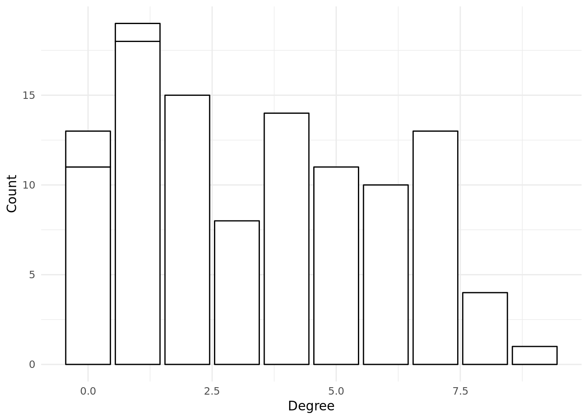

#### Degree distribution of agent->knows->agent edges

#### Runing time by method 

<table class="table table-condensed" style="width: auto !important; ">
 <thead>
  <tr>
   <th style="text-align:left;">   </th>
   <th style="text-align:left;"> key </th>
   <th style="text-align:right;"> doc_count </th>
   <th style="text-align:right;"> sum_wallTime_ms.value </th>
   <th style="text-align:left;"> avg_wallTime_ms.value </th>
   <th style="text-align:left;"> includedInTotal </th>
  </tr>
 </thead>
<tbody>
  <tr>
   <td style="text-align:left;"> 1 </td>
   <td style="text-align:left;"> knowsAgent </td>
   <td style="text-align:right;"> 201 </td>
   <td style="text-align:right;"> 432 </td>
   <td style="text-align:left;"> 2.14925373134328 </td>
   <td style="text-align:left;"> No </td>
  </tr>
  <tr>
   <td style="text-align:left;"> 2 </td>
   <td style="text-align:left;"> addItemToWork </td>
   <td style="text-align:right;"> 140 </td>
   <td style="text-align:right;"> 1,036 </td>
   <td style="text-align:left;"> 7.4 </td>
   <td style="text-align:left;"> No </td>
  </tr>
  <tr>
   <td style="text-align:left;"> 3 </td>
   <td style="text-align:left;"> ownsWork </td>
   <td style="text-align:right;"> 70 </td>
   <td style="text-align:right;"> 1,236 </td>
   <td style="text-align:left;"> 17.6571428571429 </td>
   <td style="text-align:left;"> No </td>
  </tr>
  <tr>
   <td style="text-align:left;"> 4 </td>
   <td style="text-align:left;"> init </td>
   <td style="text-align:right;"> 53 </td>
   <td style="text-align:right;"> 9,559 </td>
   <td style="text-align:left;"> 180.358490566038 </td>
   <td style="text-align:left;"> No </td>
  </tr>
  <tr>
   <td style="text-align:left;"> 5 </td>
   <td style="text-align:left;"> searchAndConnect </td>
   <td style="text-align:right;"> 51 </td>
   <td style="text-align:right;"> 15,685 </td>
   <td style="text-align:left;"> 307.549019607843 </td>
   <td style="text-align:left;"> Yes </td>
  </tr>
  <tr>
   <td style="text-align:left;"> 6 </td>
   <td style="text-align:left;"> getWorksItems </td>
   <td style="text-align:right;"> 38 </td>
   <td style="text-align:right;"> 62 </td>
   <td style="text-align:left;"> 1.63157894736842 </td>
   <td style="text-align:left;"> Yes </td>
  </tr>
  <tr>
   <td style="text-align:left;"> 9 </td>
   <td style="text-align:left;"> cycleSearch </td>
   <td style="text-align:right;"> 2 </td>
   <td style="text-align:right;"> 140 </td>
   <td style="text-align:left;"> 70 </td>
   <td style="text-align:left;"> Yes </td>
  </tr>
  <tr>
   <td style="text-align:left;"> 10 </td>
   <td style="text-align:left;"> getWorks </td>
   <td style="text-align:right;"> 2 </td>
   <td style="text-align:right;"> 163 </td>
   <td style="text-align:left;"> 81.5 </td>
   <td style="text-align:left;"> No </td>
  </tr>
  <tr>
   <td style="text-align:left;font-weight: bold;"> 11 </td>
   <td style="text-align:left;font-weight: bold;"> Total </td>
   <td style="text-align:right;font-weight: bold;"> 98 </td>
   <td style="text-align:right;font-weight: bold;"> 16,540 </td>
   <td style="text-align:left;font-weight: bold;">  </td>
   <td style="text-align:left;font-weight: bold;">  </td>
  </tr>
</tbody>
</table>
####  Found structures 

#####  Cycles 

Number of cycles found:  1 

<button class="btn btn-primary" data-toggle="collapse" data-target="#KXQTYTUZEK"> Show/Hide foundCycle query </button> 
 
  
     GET /filebeat-*/_search 
              { 
                "query": {
                  "bool": {
                    "must": [
                      { "match_phrase": {
                        "simulationId": "SIM10-13-06-18-GC8JzU--DV"
                        }
                      },
                      { "bool": {
                        "should": [
                          { "match": {
                            "keyword": "foundCycle"
                          }}
                        ]
                      }}
                    ]
                  }
                }
              }
     

#####  Paths 

Number of paths found:  1 

<button class="btn btn-primary" data-toggle="collapse" data-target="#PEJYFICFUO"> Show/Hide foundPath query </button> 
 
  
     GET /filebeat-*/_search 
              { 
                "query": {
                  "bool": {
                    "must": [
                      { "match_phrase": {
                        "simulationId": "SIM10-13-06-18-GC8JzU--DV"
                        }
                      },
                      { "bool": {
                        "should": [
                          { "match": {
                            "keyword": "foundPath"
                          }}
                        ]
                      }}
                    ]
                  }
                }
              }
     

###  SIM10-13-07-23-cqz9m4--CV 

#### simulationParameters 

<table class="table table-condensed" style="width: auto !important; ">
 <thead>
  <tr>
   <th style="text-align:left;"> agentNumber </th>
   <th style="text-align:left;"> similarityConnectThreshold </th>
   <th style="text-align:left;"> graphType </th>
   <th style="text-align:left;"> chainLength </th>
   <th style="text-align:left;"> similaritySearchThreshold </th>
   <th style="text-align:left;"> maxDistance </th>
   <th style="text-align:left;"> randomWorksNumberMultiplier </th>
  </tr>
 </thead>
<tbody>
  <tr>
   <td style="text-align:left;width: 20em; "> 50 </td>
   <td style="text-align:left;width: 15em; "> 0.96 </td>
   <td style="text-align:left;width: 15em; "> random </td>
   <td style="text-align:left;width: 15em; "> 20 </td>
   <td style="text-align:left;width: 15em; "> 1 </td>
   <td style="text-align:left;width: 15em; "> 30 </td>
   <td style="text-align:left;width: 15em; "> 2 </td>
  </tr>
</tbody>
</table>
#### allEdgesByLabel

<table class="table table-condensed" style="width: auto !important; ">
 <thead>
  <tr>
   <th style="text-align:right;"> edges_offers </th>
   <th style="text-align:right;"> edges_similarity </th>
   <th style="text-align:right;"> edges_owns </th>
   <th style="text-align:right;"> edges_demands </th>
   <th style="text-align:right;"> edges_knows </th>
   <th style="text-align:right;"> edges_total </th>
  </tr>
 </thead>
<tbody>
  <tr>
   <td style="text-align:right;width: 5em; "> 120 </td>
   <td style="text-align:right;width: 5em; "> 5,346 </td>
   <td style="text-align:right;width: 5em; "> 120 </td>
   <td style="text-align:right;width: 5em; "> 120 </td>
   <td style="text-align:right;width: 5em; "> 50 </td>
   <td style="text-align:right;width: 5em; "> 5,756 </td>
  </tr>
</tbody>
</table>
#### allVerticesByType

<table class="table table-condensed" style="width: auto !important; ">
 <thead>
  <tr>
   <th style="text-align:right;"> vertices_agent </th>
   <th style="text-align:right;"> vertices_item </th>
   <th style="text-align:right;"> vertices_work </th>
   <th style="text-align:right;"> vertices_total </th>
  </tr>
 </thead>
<tbody>
  <tr>
   <td style="text-align:right;width: 5em; "> 51 </td>
   <td style="text-align:right;width: 5em; "> 240 </td>
   <td style="text-align:right;width: 5em; "> 120 </td>
   <td style="text-align:right;width: 5em; "> 411 </td>
  </tr>
</tbody>
</table>
#### distribution of similarityEdgesByWeight

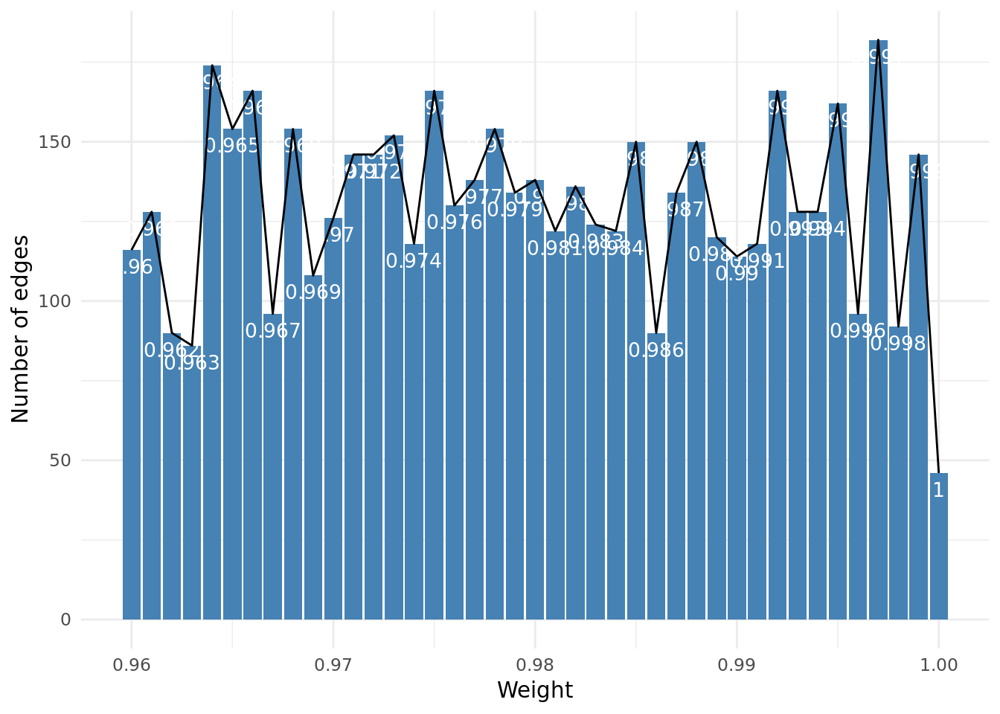

#### Degree distribution of item->similarity->item edges

#### Degree distribution of agent->knows->agent edges

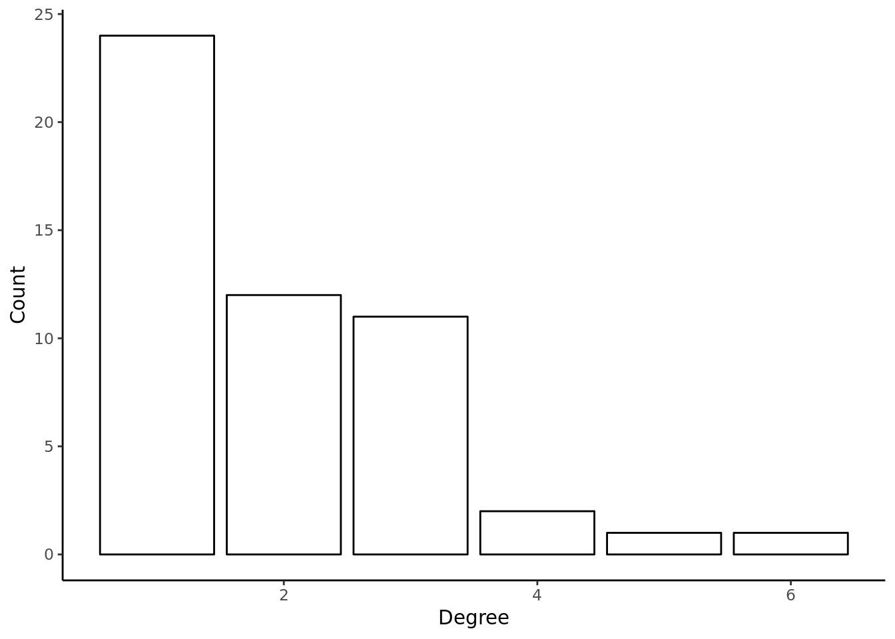

#### Runing time by method 

<table class="table table-condensed" style="width: auto !important; ">
 <thead>
  <tr>
   <th style="text-align:left;"> key </th>
   <th style="text-align:right;"> doc_count </th>
   <th style="text-align:right;"> sum_wallTime_ms.value </th>
   <th style="text-align:left;"> avg_wallTime_ms.value </th>
   <th style="text-align:left;"> includedInTotal </th>
  </tr>
 </thead>
<tbody>
  <tr>
   <td style="text-align:left;"> connectIfSimilar </td>
   <td style="text-align:right;"> 28,680 </td>
   <td style="text-align:right;"> 65,145 </td>
   <td style="text-align:left;"> 2.27144351464435 </td>
   <td style="text-align:left;"> No </td>
  </tr>
  <tr>
   <td style="text-align:left;"> existsSimilarity </td>
   <td style="text-align:right;"> 28,680 </td>
   <td style="text-align:right;"> 64,464 </td>
   <td style="text-align:left;"> 2.24769874476987 </td>
   <td style="text-align:left;"> No </td>
  </tr>
  <tr>
   <td style="text-align:left;"> similarityEdges </td>
   <td style="text-align:right;"> 28,680 </td>
   <td style="text-align:right;"> 63,444 </td>
   <td style="text-align:left;"> 2.21213389121339 </td>
   <td style="text-align:left;"> No </td>
  </tr>
  <tr>
   <td style="text-align:left;"> connectAllSimilar </td>
   <td style="text-align:right;"> 240 </td>
   <td style="text-align:right;"> 65,410 </td>
   <td style="text-align:left;"> 272.541666666667 </td>
   <td style="text-align:left;"> Yes </td>
  </tr>
  <tr>
   <td style="text-align:left;"> init </td>
   <td style="text-align:right;"> 53 </td>
   <td style="text-align:right;"> 8,984 </td>
   <td style="text-align:left;"> 169.509433962264 </td>
   <td style="text-align:left;"> No </td>
  </tr>
  <tr>
   <td style="text-align:left;"> connect </td>
   <td style="text-align:right;"> 47 </td>
   <td style="text-align:right;"> 131 </td>
   <td style="text-align:left;"> 2.78723404255319 </td>
   <td style="text-align:left;"> Yes </td>
  </tr>
  <tr>
   <td style="text-align:left;font-weight: bold;"> Total </td>
   <td style="text-align:right;font-weight: bold;"> 295 </td>
   <td style="text-align:right;font-weight: bold;"> 66,087 </td>
   <td style="text-align:left;font-weight: bold;">  </td>
   <td style="text-align:left;font-weight: bold;">  </td>
  </tr>
</tbody>
</table>
####  Found structures 

#####  Cycles 

Number of cycles found:  1 

<button class="btn btn-primary" data-toggle="collapse" data-target="#RWKEBTSPHE"> Show/Hide foundCycle query </button> 
 
  
     GET /filebeat-*/_search 
              { 
                "query": {
                  "bool": {
                    "must": [
                      { "match_phrase": {
                        "simulationId": "SIM10-13-07-23-cqz9m4--CV"
                        }
                      },
                      { "bool": {
                        "should": [
                          { "match": {
                            "keyword": "foundCycle"
                          }}
                        ]
                      }}
                    ]
                  }
                }
              }
     

#####  Paths 

Number of paths found:  0 

<button class="btn btn-primary" data-toggle="collapse" data-target="#KBLFYRACNV"> Show/Hide foundPath query </button> 
 
  
     GET /filebeat-*/_search 
              { 
                "query": {
                  "bool": {
                    "must": [
                      { "match_phrase": {
                        "simulationId": "SIM10-13-07-23-cqz9m4--CV"
                        }
                      },
                      { "bool": {
                        "should": [
                          { "match": {
                            "keyword": "foundPath"
                          }}
                        ]
                      }}
                    ]
                  }
                }
              }
     

###  SIM10-13-07-23-cqz9m4--DV 

#### simulationParameters 

<table class="table table-condensed" style="width: auto !important; ">
 <thead>
  <tr>
   <th style="text-align:left;"> agentNumber </th>
   <th style="text-align:left;"> similarityConnectThreshold </th>
   <th style="text-align:left;"> graphType </th>
   <th style="text-align:left;"> chainLength </th>
   <th style="text-align:left;"> similaritySearchThreshold </th>
   <th style="text-align:left;"> maxDistance </th>
   <th style="text-align:left;"> randomWorksNumberMultiplier </th>
  </tr>
 </thead>
<tbody>
  <tr>
   <td style="text-align:left;width: 20em; "> 50 </td>
   <td style="text-align:left;width: 15em; "> 0.96 </td>
   <td style="text-align:left;width: 15em; "> random </td>
   <td style="text-align:left;width: 15em; "> 20 </td>
   <td style="text-align:left;width: 15em; "> 1 </td>
   <td style="text-align:left;width: 15em; "> 30 </td>
   <td style="text-align:left;width: 15em; "> 2 </td>
  </tr>
</tbody>
</table>
#### allEdgesByLabel

<table class="table table-condensed" style="width: auto !important; ">
 <thead>
  <tr>
   <th style="text-align:right;"> edges_offers </th>
   <th style="text-align:right;"> edges_similarity </th>
   <th style="text-align:right;"> edges_owns </th>
   <th style="text-align:right;"> edges_demands </th>
   <th style="text-align:right;"> edges_knows </th>
   <th style="text-align:right;"> edges_total </th>
  </tr>
 </thead>
<tbody>
  <tr>
   <td style="text-align:right;width: 5em; "> 120 </td>
   <td style="text-align:right;width: 5em; "> 5,252 </td>
   <td style="text-align:right;width: 5em; "> 120 </td>
   <td style="text-align:right;width: 5em; "> 120 </td>
   <td style="text-align:right;width: 5em; "> 50 </td>
   <td style="text-align:right;width: 5em; "> 5,662 </td>
  </tr>
</tbody>
</table>
#### allVerticesByType

<table class="table table-condensed" style="width: auto !important; ">
 <thead>
  <tr>
   <th style="text-align:right;"> vertices_agent </th>
   <th style="text-align:right;"> vertices_item </th>
   <th style="text-align:right;"> vertices_work </th>
   <th style="text-align:right;"> vertices_total </th>
  </tr>
 </thead>
<tbody>
  <tr>
   <td style="text-align:right;width: 5em; "> 51 </td>
   <td style="text-align:right;width: 5em; "> 240 </td>
   <td style="text-align:right;width: 5em; "> 120 </td>
   <td style="text-align:right;width: 5em; "> 411 </td>
  </tr>
</tbody>
</table>
#### distribution of similarityEdgesByWeight

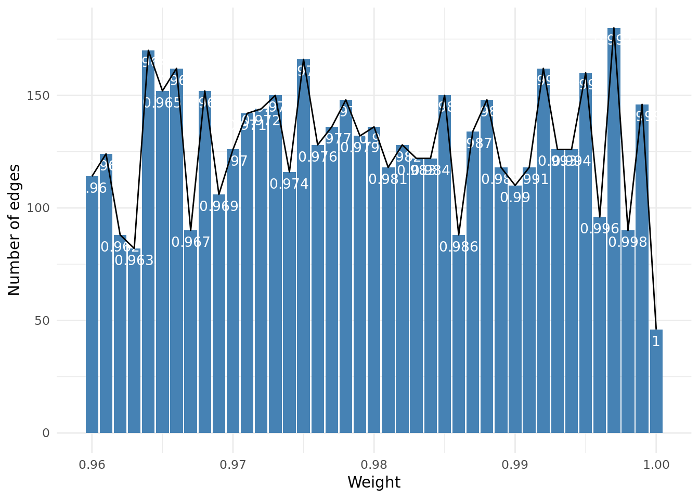

#### Degree distribution of item->similarity->item edges

#### Degree distribution of agent->knows->agent edges

#### Runing time by method 

<table class="table table-condensed" style="width: auto !important; ">
 <thead>
  <tr>
   <th style="text-align:left;">   </th>
   <th style="text-align:left;"> key </th>
   <th style="text-align:right;"> doc_count </th>
   <th style="text-align:right;"> sum_wallTime_ms.value </th>
   <th style="text-align:left;"> avg_wallTime_ms.value </th>
   <th style="text-align:left;"> includedInTotal </th>
  </tr>
 </thead>
<tbody>
  <tr>
   <td style="text-align:left;"> 1 </td>
   <td style="text-align:left;"> addItemToWork </td>
   <td style="text-align:right;"> 240 </td>
   <td style="text-align:right;"> 1,762 </td>
   <td style="text-align:left;"> 7.34166666666667 </td>
   <td style="text-align:left;"> No </td>
  </tr>
  <tr>
   <td style="text-align:left;"> 2 </td>
   <td style="text-align:left;"> ownsWork </td>
   <td style="text-align:right;"> 120 </td>
   <td style="text-align:right;"> 1,603 </td>
   <td style="text-align:left;"> 13.3583333333333 </td>
   <td style="text-align:left;"> No </td>
  </tr>
  <tr>
   <td style="text-align:left;"> 3 </td>
   <td style="text-align:left;"> init </td>
   <td style="text-align:right;"> 53 </td>
   <td style="text-align:right;"> 9,095 </td>
   <td style="text-align:left;"> 171.603773584906 </td>
   <td style="text-align:left;"> No </td>
  </tr>
  <tr>
   <td style="text-align:left;"> 4 </td>
   <td style="text-align:left;"> searchAndConnect </td>
   <td style="text-align:right;"> 51 </td>
   <td style="text-align:right;"> 26,550 </td>
   <td style="text-align:left;"> 520.588235294118 </td>
   <td style="text-align:left;"> Yes </td>
  </tr>
  <tr>
   <td style="text-align:left;"> 5 </td>
   <td style="text-align:left;"> knowsAgent </td>
   <td style="text-align:right;"> 50 </td>
   <td style="text-align:right;"> 415 </td>
   <td style="text-align:left;"> 8.3 </td>
   <td style="text-align:left;"> No </td>
  </tr>
  <tr>
   <td style="text-align:left;"> 6 </td>
   <td style="text-align:left;"> getWorksItems </td>
   <td style="text-align:right;"> 38 </td>
   <td style="text-align:right;"> 50 </td>
   <td style="text-align:left;"> 1.31578947368421 </td>
   <td style="text-align:left;"> Yes </td>
  </tr>
  <tr>
   <td style="text-align:left;"> 9 </td>
   <td style="text-align:left;"> cycleSearch </td>
   <td style="text-align:right;"> 2 </td>
   <td style="text-align:right;"> 277 </td>
   <td style="text-align:left;"> 138.5 </td>
   <td style="text-align:left;"> Yes </td>
  </tr>
  <tr>
   <td style="text-align:left;"> 10 </td>
   <td style="text-align:left;"> getWorks </td>
   <td style="text-align:right;"> 2 </td>
   <td style="text-align:right;"> 494 </td>
   <td style="text-align:left;"> 247 </td>
   <td style="text-align:left;"> No </td>
  </tr>
  <tr>
   <td style="text-align:left;font-weight: bold;"> 11 </td>
   <td style="text-align:left;font-weight: bold;"> Total </td>
   <td style="text-align:right;font-weight: bold;"> 98 </td>
   <td style="text-align:right;font-weight: bold;"> 27,404 </td>
   <td style="text-align:left;font-weight: bold;">  </td>
   <td style="text-align:left;font-weight: bold;">  </td>
  </tr>
</tbody>
</table>
####  Found structures 

#####  Cycles 

Number of cycles found:  1 

<button class="btn btn-primary" data-toggle="collapse" data-target="#KVBPWASABS"> Show/Hide foundCycle query </button> 
 
  
     GET /filebeat-*/_search 
              { 
                "query": {
                  "bool": {
                    "must": [
                      { "match_phrase": {
                        "simulationId": "SIM10-13-07-23-cqz9m4--DV"
                        }
                      },
                      { "bool": {
                        "should": [
                          { "match": {
                            "keyword": "foundCycle"
                          }}
                        ]
                      }}
                    ]
                  }
                }
              }
     

#####  Paths 

Number of paths found:  1 

<button class="btn btn-primary" data-toggle="collapse" data-target="#OCJEBYGLMJ"> Show/Hide foundPath query </button> 
 
  
     GET /filebeat-*/_search 
              { 
                "query": {
                  "bool": {
                    "must": [
                      { "match_phrase": {
                        "simulationId": "SIM10-13-07-23-cqz9m4--DV"
                        }
                      },
                      { "bool": {
                        "should": [
                          { "match": {
                            "keyword": "foundPath"
                          }}
                        ]
                      }}
                    ]
                  }
                }
              }
     

###  SIM10-13-07-25-3msrMN--CV 

#### simulationParameters 

<table class="table table-condensed" style="width: auto !important; ">
 <thead>
  <tr>
   <th style="text-align:left;"> agentNumber </th>
   <th style="text-align:left;"> similarityConnectThreshold </th>
   <th style="text-align:left;"> graphType </th>
   <th style="text-align:left;"> chainLength </th>
   <th style="text-align:left;"> similaritySearchThreshold </th>
   <th style="text-align:left;"> maxDistance </th>
   <th style="text-align:left;"> randomWorksNumberMultiplier </th>
  </tr>
 </thead>
<tbody>
  <tr>
   <td style="text-align:left;width: 20em; "> 50 </td>
   <td style="text-align:left;width: 15em; "> 0.96 </td>
   <td style="text-align:left;width: 15em; "> smallWorld </td>
   <td style="text-align:left;width: 15em; "> 20 </td>
   <td style="text-align:left;width: 15em; "> 1 </td>
   <td style="text-align:left;width: 15em; "> 30 </td>
   <td style="text-align:left;width: 15em; "> 2 </td>
  </tr>
</tbody>
</table>
#### allEdgesByLabel

<table class="table table-condensed" style="width: auto !important; ">
 <thead>
  <tr>
   <th style="text-align:right;"> edges_offers </th>
   <th style="text-align:right;"> edges_similarity </th>
   <th style="text-align:right;"> edges_owns </th>
   <th style="text-align:right;"> edges_demands </th>
   <th style="text-align:right;"> edges_knows </th>
   <th style="text-align:right;"> edges_total </th>
  </tr>
 </thead>
<tbody>
  <tr>
   <td style="text-align:right;width: 5em; "> 120 </td>
   <td style="text-align:right;width: 5em; "> 5,142 </td>
   <td style="text-align:right;width: 5em; "> 120 </td>
   <td style="text-align:right;width: 5em; "> 120 </td>
   <td style="text-align:right;width: 5em; "> 201 </td>
   <td style="text-align:right;width: 5em; "> 5,703 </td>
  </tr>
</tbody>
</table>
#### allVerticesByType

<table class="table table-condensed" style="width: auto !important; ">
 <thead>
  <tr>
   <th style="text-align:right;"> vertices_agent </th>
   <th style="text-align:right;"> vertices_item </th>
   <th style="text-align:right;"> vertices_work </th>
   <th style="text-align:right;"> vertices_total </th>
  </tr>
 </thead>
<tbody>
  <tr>
   <td style="text-align:right;width: 5em; "> 51 </td>
   <td style="text-align:right;width: 5em; "> 240 </td>
   <td style="text-align:right;width: 5em; "> 120 </td>
   <td style="text-align:right;width: 5em; "> 411 </td>
  </tr>
</tbody>
</table>
#### distribution of similarityEdgesByWeight

#### Degree distribution of item->similarity->item edges

#### Degree distribution of agent->knows->agent edges

#### Runing time by method 

<table class="table table-condensed" style="width: auto !important; ">
 <thead>
  <tr>
   <th style="text-align:left;"> key </th>
   <th style="text-align:right;"> doc_count </th>
   <th style="text-align:right;"> sum_wallTime_ms.value </th>
   <th style="text-align:left;"> avg_wallTime_ms.value </th>
   <th style="text-align:left;"> includedInTotal </th>
  </tr>
 </thead>
<tbody>
  <tr>
   <td style="text-align:left;"> connectIfSimilar </td>
   <td style="text-align:right;"> 28,680 </td>
   <td style="text-align:right;"> 65,454 </td>
   <td style="text-align:left;"> 2.28221757322176 </td>
   <td style="text-align:left;"> No </td>
  </tr>
  <tr>
   <td style="text-align:left;"> existsSimilarity </td>
   <td style="text-align:right;"> 28,680 </td>
   <td style="text-align:right;"> 64,836 </td>
   <td style="text-align:left;"> 2.26066945606695 </td>
   <td style="text-align:left;"> No </td>
  </tr>
  <tr>
   <td style="text-align:left;"> similarityEdges </td>
   <td style="text-align:right;"> 28,680 </td>
   <td style="text-align:right;"> 63,752 </td>
   <td style="text-align:left;"> 2.22287308228731 </td>
   <td style="text-align:left;"> No </td>
  </tr>
  <tr>
   <td style="text-align:left;"> connectAllSimilar </td>
   <td style="text-align:right;"> 240 </td>
   <td style="text-align:right;"> 65,765 </td>
   <td style="text-align:left;"> 274.020833333333 </td>
   <td style="text-align:left;"> Yes </td>
  </tr>
  <tr>
   <td style="text-align:left;"> init </td>
   <td style="text-align:right;"> 53 </td>
   <td style="text-align:right;"> 9,029 </td>
   <td style="text-align:left;"> 170.358490566038 </td>
   <td style="text-align:left;"> No </td>
  </tr>
  <tr>
   <td style="text-align:left;"> connect </td>
   <td style="text-align:right;"> 32 </td>
   <td style="text-align:right;"> 75 </td>
   <td style="text-align:left;"> 2.34375 </td>
   <td style="text-align:left;"> Yes </td>
  </tr>
  <tr>
   <td style="text-align:left;font-weight: bold;"> Total </td>
   <td style="text-align:right;font-weight: bold;"> 280 </td>
   <td style="text-align:right;font-weight: bold;"> 66,252 </td>
   <td style="text-align:left;font-weight: bold;">  </td>
   <td style="text-align:left;font-weight: bold;">  </td>
  </tr>
</tbody>
</table>
####  Found structures 

#####  Cycles 

Number of cycles found:  1 

<button class="btn btn-primary" data-toggle="collapse" data-target="#CALHJTRZKS"> Show/Hide foundCycle query </button> 
 
  
     GET /filebeat-*/_search 
              { 
                "query": {
                  "bool": {
                    "must": [
                      { "match_phrase": {
                        "simulationId": "SIM10-13-07-25-3msrMN--CV"
                        }
                      },
                      { "bool": {
                        "should": [
                          { "match": {
                            "keyword": "foundCycle"
                          }}
                        ]
                      }}
                    ]
                  }
                }
              }
     

#####  Paths 

Number of paths found:  0 

<button class="btn btn-primary" data-toggle="collapse" data-target="#WZIIRFQFRT"> Show/Hide foundPath query </button> 
 
  
     GET /filebeat-*/_search 
              { 
                "query": {
                  "bool": {
                    "must": [
                      { "match_phrase": {
                        "simulationId": "SIM10-13-07-25-3msrMN--CV"
                        }
                      },
                      { "bool": {
                        "should": [
                          { "match": {
                            "keyword": "foundPath"
                          }}
                        ]
                      }}
                    ]
                  }
                }
              }
     

###  SIM10-13-07-25-3msrMN--DV 

#### simulationParameters 

<table class="table table-condensed" style="width: auto !important; ">
 <thead>
  <tr>
   <th style="text-align:left;"> agentNumber </th>
   <th style="text-align:left;"> similarityConnectThreshold </th>
   <th style="text-align:left;"> graphType </th>
   <th style="text-align:left;"> chainLength </th>
   <th style="text-align:left;"> similaritySearchThreshold </th>
   <th style="text-align:left;"> maxDistance </th>
   <th style="text-align:left;"> randomWorksNumberMultiplier </th>
  </tr>
 </thead>
<tbody>
  <tr>
   <td style="text-align:left;width: 20em; "> 50 </td>
   <td style="text-align:left;width: 15em; "> 0.96 </td>
   <td style="text-align:left;width: 15em; "> smallWorld </td>
   <td style="text-align:left;width: 15em; "> 20 </td>
   <td style="text-align:left;width: 15em; "> 1 </td>
   <td style="text-align:left;width: 15em; "> 30 </td>
   <td style="text-align:left;width: 15em; "> 2 </td>
  </tr>
</tbody>
</table>
#### allEdgesByLabel

<table class="table table-condensed" style="width: auto !important; ">
 <thead>
  <tr>
   <th style="text-align:right;"> edges_offers </th>
   <th style="text-align:right;"> edges_similarity </th>
   <th style="text-align:right;"> edges_owns </th>
   <th style="text-align:right;"> edges_demands </th>
   <th style="text-align:right;"> edges_knows </th>
   <th style="text-align:right;"> edges_total </th>
  </tr>
 </thead>
<tbody>
  <tr>
   <td style="text-align:right;width: 5em; "> 120 </td>
   <td style="text-align:right;width: 5em; "> 5,078 </td>
   <td style="text-align:right;width: 5em; "> 120 </td>
   <td style="text-align:right;width: 5em; "> 120 </td>
   <td style="text-align:right;width: 5em; "> 201 </td>
   <td style="text-align:right;width: 5em; "> 5,639 </td>
  </tr>
</tbody>
</table>
#### allVerticesByType

<table class="table table-condensed" style="width: auto !important; ">
 <thead>
  <tr>
   <th style="text-align:right;"> vertices_agent </th>
   <th style="text-align:right;"> vertices_item </th>
   <th style="text-align:right;"> vertices_work </th>
   <th style="text-align:right;"> vertices_total </th>
  </tr>
 </thead>
<tbody>
  <tr>
   <td style="text-align:right;width: 5em; "> 51 </td>
   <td style="text-align:right;width: 5em; "> 240 </td>
   <td style="text-align:right;width: 5em; "> 120 </td>
   <td style="text-align:right;width: 5em; "> 411 </td>
  </tr>
</tbody>
</table>
#### distribution of similarityEdgesByWeight

#### Degree distribution of item->similarity->item edges

#### Degree distribution of agent->knows->agent edges

#### Runing time by method 

<table class="table table-condensed" style="width: auto !important; ">
 <thead>
  <tr>
   <th style="text-align:left;">   </th>
   <th style="text-align:left;"> key </th>
   <th style="text-align:right;"> doc_count </th>
   <th style="text-align:right;"> sum_wallTime_ms.value </th>
   <th style="text-align:left;"> avg_wallTime_ms.value </th>
   <th style="text-align:left;"> includedInTotal </th>
  </tr>
 </thead>
<tbody>
  <tr>
   <td style="text-align:left;"> 1 </td>
   <td style="text-align:left;"> addItemToWork </td>
   <td style="text-align:right;"> 240 </td>
   <td style="text-align:right;"> 2,875 </td>
   <td style="text-align:left;"> 11.9791666666667 </td>
   <td style="text-align:left;"> No </td>
  </tr>
  <tr>
   <td style="text-align:left;"> 2 </td>
   <td style="text-align:left;"> knowsAgent </td>
   <td style="text-align:right;"> 201 </td>
   <td style="text-align:right;"> 430 </td>
   <td style="text-align:left;"> 2.13930348258706 </td>
   <td style="text-align:left;"> No </td>
  </tr>
  <tr>
   <td style="text-align:left;"> 3 </td>
   <td style="text-align:left;"> ownsWork </td>
   <td style="text-align:right;"> 120 </td>
   <td style="text-align:right;"> 2,641 </td>
   <td style="text-align:left;"> 22.0083333333333 </td>
   <td style="text-align:left;"> No </td>
  </tr>
  <tr>
   <td style="text-align:left;"> 4 </td>
   <td style="text-align:left;"> init </td>
   <td style="text-align:right;"> 53 </td>
   <td style="text-align:right;"> 9,420 </td>
   <td style="text-align:left;"> 177.735849056604 </td>
   <td style="text-align:left;"> No </td>
  </tr>
  <tr>
   <td style="text-align:left;"> 5 </td>
   <td style="text-align:left;"> searchAndConnect </td>
   <td style="text-align:right;"> 51 </td>
   <td style="text-align:right;"> 27,263 </td>
   <td style="text-align:left;"> 534.56862745098 </td>
   <td style="text-align:left;"> Yes </td>
  </tr>
  <tr>
   <td style="text-align:left;"> 6 </td>
   <td style="text-align:left;"> getWorksItems </td>
   <td style="text-align:right;"> 38 </td>
   <td style="text-align:right;"> 53 </td>
   <td style="text-align:left;"> 1.39473684210526 </td>
   <td style="text-align:left;"> Yes </td>
  </tr>
  <tr>
   <td style="text-align:left;"> 9 </td>
   <td style="text-align:left;"> cycleSearch </td>
   <td style="text-align:right;"> 2 </td>
   <td style="text-align:right;"> 129 </td>
   <td style="text-align:left;"> 64.5 </td>
   <td style="text-align:left;"> Yes </td>
  </tr>
  <tr>
   <td style="text-align:left;"> 10 </td>
   <td style="text-align:left;"> getWorks </td>
   <td style="text-align:right;"> 2 </td>
   <td style="text-align:right;"> 546 </td>
   <td style="text-align:left;"> 273 </td>
   <td style="text-align:left;"> No </td>
  </tr>
  <tr>
   <td style="text-align:left;font-weight: bold;"> 11 </td>
   <td style="text-align:left;font-weight: bold;"> Total </td>
   <td style="text-align:right;font-weight: bold;"> 98 </td>
   <td style="text-align:right;font-weight: bold;"> 27,943 </td>
   <td style="text-align:left;font-weight: bold;">  </td>
   <td style="text-align:left;font-weight: bold;">  </td>
  </tr>
</tbody>
</table>
####  Found structures 

#####  Cycles 

Number of cycles found:  1 

<button class="btn btn-primary" data-toggle="collapse" data-target="#IJPGVXVFMB"> Show/Hide foundCycle query </button> 
 
  
     GET /filebeat-*/_search 
              { 
                "query": {
                  "bool": {
                    "must": [
                      { "match_phrase": {
                        "simulationId": "SIM10-13-07-25-3msrMN--DV"
                        }
                      },
                      { "bool": {
                        "should": [
                          { "match": {
                            "keyword": "foundCycle"
                          }}
                        ]
                      }}
                    ]
                  }
                }
              }
     

#####  Paths 

Number of paths found:  1 

<button class="btn btn-primary" data-toggle="collapse" data-target="#ERYZQLPQPJ"> Show/Hide foundPath query </button> 
 
  
     GET /filebeat-*/_search 
              { 
                "query": {
                  "bool": {
                    "must": [
                      { "match_phrase": {
                        "simulationId": "SIM10-13-07-25-3msrMN--DV"
                        }
                      },
                      { "bool": {
                        "should": [
                          { "match": {
                            "keyword": "foundPath"
                          }}
                        ]
                      }}
                    ]
                  }
                }
              }
     

###  SIM10-13-05-15-ZVTXe5--CV 

#### simulationParameters 

<table class="table table-condensed" style="width: auto !important; ">
 <thead>
  <tr>
   <th style="text-align:left;"> agentNumber </th>
   <th style="text-align:left;"> similarityConnectThreshold </th>
   <th style="text-align:left;"> graphType </th>
   <th style="text-align:left;"> chainLength </th>
   <th style="text-align:left;"> similaritySearchThreshold </th>
   <th style="text-align:left;"> maxDistance </th>
   <th style="text-align:left;"> randomWorksNumberMultiplier </th>
  </tr>
 </thead>
<tbody>
  <tr>
   <td style="text-align:left;width: 20em; "> 50 </td>
   <td style="text-align:left;width: 15em; "> 0.96 </td>
   <td style="text-align:left;width: 15em; "> random </td>
   <td style="text-align:left;width: 15em; "> 20 </td>
   <td style="text-align:left;width: 15em; "> 1 </td>
   <td style="text-align:left;width: 15em; "> 5 </td>
   <td style="text-align:left;width: 15em; "> 1 </td>
  </tr>
</tbody>
</table>
#### allEdgesByLabel

<table class="table table-condensed" style="width: auto !important; ">
 <thead>
  <tr>
   <th style="text-align:right;"> edges_offers </th>
   <th style="text-align:right;"> edges_similarity </th>
   <th style="text-align:right;"> edges_owns </th>
   <th style="text-align:right;"> edges_demands </th>
   <th style="text-align:right;"> edges_knows </th>
   <th style="text-align:right;"> edges_total </th>
  </tr>
 </thead>
<tbody>
  <tr>
   <td style="text-align:right;width: 5em; "> 70 </td>
   <td style="text-align:right;width: 5em; "> 1,806 </td>
   <td style="text-align:right;width: 5em; "> 70 </td>
   <td style="text-align:right;width: 5em; "> 70 </td>
   <td style="text-align:right;width: 5em; "> 50 </td>
   <td style="text-align:right;width: 5em; "> 2,066 </td>
  </tr>
</tbody>
</table>
#### allVerticesByType

<table class="table table-condensed" style="width: auto !important; ">
 <thead>
  <tr>
   <th style="text-align:right;"> vertices_agent </th>
   <th style="text-align:right;"> vertices_item </th>
   <th style="text-align:right;"> vertices_work </th>
   <th style="text-align:right;"> vertices_total </th>
  </tr>
 </thead>
<tbody>
  <tr>
   <td style="text-align:right;width: 5em; "> 51 </td>
   <td style="text-align:right;width: 5em; "> 140 </td>
   <td style="text-align:right;width: 5em; "> 70 </td>
   <td style="text-align:right;width: 5em; "> 261 </td>
  </tr>
</tbody>
</table>
#### distribution of similarityEdgesByWeight

#### Degree distribution of item->similarity->item edges

#### Degree distribution of agent->knows->agent edges

#### Runing time by method 

<table class="table table-condensed" style="width: auto !important; ">
 <thead>
  <tr>
   <th style="text-align:left;"> key </th>
   <th style="text-align:right;"> doc_count </th>
   <th style="text-align:right;"> sum_wallTime_ms.value </th>
   <th style="text-align:left;"> avg_wallTime_ms.value </th>
   <th style="text-align:left;"> includedInTotal </th>
  </tr>
 </thead>
<tbody>
  <tr>
   <td style="text-align:left;"> connectIfSimilar </td>
   <td style="text-align:right;"> 9,730 </td>
   <td style="text-align:right;"> 18,694 </td>
   <td style="text-align:left;"> 1.92127440904419 </td>
   <td style="text-align:left;"> No </td>
  </tr>
  <tr>
   <td style="text-align:left;"> existsSimilarity </td>
   <td style="text-align:right;"> 9,730 </td>
   <td style="text-align:right;"> 17,531 </td>
   <td style="text-align:left;"> 1.80174717368962 </td>
   <td style="text-align:left;"> No </td>
  </tr>
  <tr>
   <td style="text-align:left;"> similarityEdges </td>
   <td style="text-align:right;"> 9,730 </td>
   <td style="text-align:right;"> 17,249 </td>
   <td style="text-align:left;"> 1.77276464542652 </td>
   <td style="text-align:left;"> No </td>
  </tr>
  <tr>
   <td style="text-align:left;"> connect </td>
   <td style="text-align:right;"> 395 </td>
   <td style="text-align:right;"> 974 </td>
   <td style="text-align:left;"> 2.46582278481013 </td>
   <td style="text-align:left;"> Yes </td>
  </tr>
  <tr>
   <td style="text-align:left;"> connectAllSimilar </td>
   <td style="text-align:right;"> 140 </td>
   <td style="text-align:right;"> 18,813 </td>
   <td style="text-align:left;"> 134.378571428571 </td>
   <td style="text-align:left;"> Yes </td>
  </tr>
  <tr>
   <td style="text-align:left;"> init </td>
   <td style="text-align:right;"> 53 </td>
   <td style="text-align:right;"> 8,862 </td>
   <td style="text-align:left;"> 167.207547169811 </td>
   <td style="text-align:left;"> No </td>
  </tr>
  <tr>
   <td style="text-align:left;font-weight: bold;"> Total </td>
   <td style="text-align:right;font-weight: bold;"> 543 </td>
   <td style="text-align:right;font-weight: bold;"> 20,141 </td>
   <td style="text-align:left;font-weight: bold;">  </td>
   <td style="text-align:left;font-weight: bold;">  </td>
  </tr>
</tbody>
</table>
####  Found structures 

#####  Cycles 

Number of cycles found:  1 

<button class="btn btn-primary" data-toggle="collapse" data-target="#LBNDPVNAIT"> Show/Hide foundCycle query </button> 
 
  
     GET /filebeat-*/_search 
              { 
                "query": {
                  "bool": {
                    "must": [
                      { "match_phrase": {
                        "simulationId": "SIM10-13-05-15-ZVTXe5--CV"
                        }
                      },
                      { "bool": {
                        "should": [
                          { "match": {
                            "keyword": "foundCycle"
                          }}
                        ]
                      }}
                    ]
                  }
                }
              }
     

#####  Paths 

Number of paths found:  0 

<button class="btn btn-primary" data-toggle="collapse" data-target="#SZHHTKFSQJ"> Show/Hide foundPath query </button> 
 
  
     GET /filebeat-*/_search 
              { 
                "query": {
                  "bool": {
                    "must": [
                      { "match_phrase": {
                        "simulationId": "SIM10-13-05-15-ZVTXe5--CV"
                        }
                      },
                      { "bool": {
                        "should": [
                          { "match": {
                            "keyword": "foundPath"
                          }}
                        ]
                      }}
                    ]
                  }
                }
              }
     

###  SIM10-13-05-15-ZVTXe5--DV 

#### simulationParameters 

<table class="table table-condensed" style="width: auto !important; ">
 <thead>
  <tr>
   <th style="text-align:left;"> agentNumber </th>
   <th style="text-align:left;"> similarityConnectThreshold </th>
   <th style="text-align:left;"> graphType </th>
   <th style="text-align:left;"> chainLength </th>
   <th style="text-align:left;"> similaritySearchThreshold </th>
   <th style="text-align:left;"> maxDistance </th>
   <th style="text-align:left;"> randomWorksNumberMultiplier </th>
  </tr>
 </thead>
<tbody>
  <tr>
   <td style="text-align:left;width: 20em; "> 50 </td>
   <td style="text-align:left;width: 15em; "> 0.96 </td>
   <td style="text-align:left;width: 15em; "> random </td>
   <td style="text-align:left;width: 15em; "> 20 </td>
   <td style="text-align:left;width: 15em; "> 1 </td>
   <td style="text-align:left;width: 15em; "> 5 </td>
   <td style="text-align:left;width: 15em; "> 1 </td>
  </tr>
</tbody>
</table>
#### allEdgesByLabel

<table class="table table-condensed" style="width: auto !important; ">
 <thead>
  <tr>
   <th style="text-align:right;"> edges_offers </th>
   <th style="text-align:right;"> edges_similarity </th>
   <th style="text-align:right;"> edges_owns </th>
   <th style="text-align:right;"> edges_demands </th>
   <th style="text-align:right;"> edges_knows </th>
   <th style="text-align:right;"> edges_total </th>
  </tr>
 </thead>
<tbody>
  <tr>
   <td style="text-align:right;width: 5em; "> 70 </td>
   <td style="text-align:right;width: 5em; "> 1,016 </td>
   <td style="text-align:right;width: 5em; "> 70 </td>
   <td style="text-align:right;width: 5em; "> 70 </td>
   <td style="text-align:right;width: 5em; "> 50 </td>
   <td style="text-align:right;width: 5em; "> 1,276 </td>
  </tr>
</tbody>
</table>
#### allVerticesByType

<table class="table table-condensed" style="width: auto !important; ">
 <thead>
  <tr>
   <th style="text-align:right;"> vertices_agent </th>
   <th style="text-align:right;"> vertices_item </th>
   <th style="text-align:right;"> vertices_work </th>
   <th style="text-align:right;"> vertices_total </th>
  </tr>
 </thead>
<tbody>
  <tr>
   <td style="text-align:right;width: 5em; "> 51 </td>
   <td style="text-align:right;width: 5em; "> 140 </td>
   <td style="text-align:right;width: 5em; "> 70 </td>
   <td style="text-align:right;width: 5em; "> 261 </td>
  </tr>
</tbody>
</table>
#### distribution of similarityEdgesByWeight

#### Degree distribution of item->similarity->item edges

#### Degree distribution of agent->knows->agent edges

#### Runing time by method 

<table class="table table-condensed" style="width: auto !important; ">
 <thead>
  <tr>
   <th style="text-align:left;">   </th>
   <th style="text-align:left;"> key </th>
   <th style="text-align:right;"> doc_count </th>
   <th style="text-align:right;"> sum_wallTime_ms.value </th>
   <th style="text-align:left;"> avg_wallTime_ms.value </th>
   <th style="text-align:left;"> includedInTotal </th>
  </tr>
 </thead>
<tbody>
  <tr>
   <td style="text-align:left;"> 2 </td>
   <td style="text-align:left;"> cycleSearch </td>
   <td style="text-align:right;"> 3,600 </td>
   <td style="text-align:right;"> 39,381 </td>
   <td style="text-align:left;"> 10.9391666666667 </td>
   <td style="text-align:left;"> Yes </td>
  </tr>
  <tr>
   <td style="text-align:left;"> 3 </td>
   <td style="text-align:left;"> getWorks </td>
   <td style="text-align:right;"> 3,600 </td>
   <td style="text-align:right;"> 41,703 </td>
   <td style="text-align:left;"> 11.5841666666667 </td>
   <td style="text-align:left;"> No </td>
  </tr>
  <tr>
   <td style="text-align:left;"> 4 </td>
   <td style="text-align:left;"> individualCycleSearch </td>
   <td style="text-align:right;"> 3,600 </td>
   <td style="text-align:right;"> 114 </td>
   <td style="text-align:left;"> 0.0316666666666667 </td>
   <td style="text-align:left;"> Yes </td>
  </tr>
  <tr>
   <td style="text-align:left;"> 6 </td>
   <td style="text-align:left;"> addItemToWork </td>
   <td style="text-align:right;"> 140 </td>
   <td style="text-align:right;"> 887 </td>
   <td style="text-align:left;"> 6.33571428571429 </td>
   <td style="text-align:left;"> No </td>
  </tr>
  <tr>
   <td style="text-align:left;"> 7 </td>
   <td style="text-align:left;"> ownsWork </td>
   <td style="text-align:right;"> 70 </td>
   <td style="text-align:right;"> 733 </td>
   <td style="text-align:left;"> 10.4714285714286 </td>
   <td style="text-align:left;"> No </td>
  </tr>
  <tr>
   <td style="text-align:left;"> 8 </td>
   <td style="text-align:left;"> init </td>
   <td style="text-align:right;"> 53 </td>
   <td style="text-align:right;"> 9,234 </td>
   <td style="text-align:left;"> 174.22641509434 </td>
   <td style="text-align:left;"> No </td>
  </tr>
  <tr>
   <td style="text-align:left;"> 9 </td>
   <td style="text-align:left;"> searchAndConnect </td>
   <td style="text-align:right;"> 51 </td>
   <td style="text-align:right;"> 7,930 </td>
   <td style="text-align:left;"> 155.490196078431 </td>
   <td style="text-align:left;"> Yes </td>
  </tr>
  <tr>
   <td style="text-align:left;"> 10 </td>
   <td style="text-align:left;"> knowsAgent </td>
   <td style="text-align:right;"> 50 </td>
   <td style="text-align:right;"> 173 </td>
   <td style="text-align:left;"> 3.46 </td>
   <td style="text-align:left;"> No </td>
  </tr>
  <tr>
   <td style="text-align:left;font-weight: bold;"> 1 </td>
   <td style="text-align:left;font-weight: bold;"> Total </td>
   <td style="text-align:right;font-weight: bold;"> 14,451 </td>
   <td style="text-align:right;font-weight: bold;"> 171,790 </td>
   <td style="text-align:left;font-weight: bold;">  </td>
   <td style="text-align:left;font-weight: bold;">  </td>
  </tr>
</tbody>
</table>
####  Found structures 

#####  Cycles 

Number of cycles found:  0 

<button class="btn btn-primary" data-toggle="collapse" data-target="#SUGBGXJDPZ"> Show/Hide foundCycle query </button> 
 
  
     GET /filebeat-*/_search 
              { 
                "query": {
                  "bool": {
                    "must": [
                      { "match_phrase": {
                        "simulationId": "SIM10-13-05-15-ZVTXe5--DV"
                        }
                      },
                      { "bool": {
                        "should": [
                          { "match": {
                            "keyword": "foundCycle"
                          }}
                        ]
                      }}
                    ]
                  }
                }
              }
     

#####  Paths 

Number of paths found:  3600 

<button class="btn btn-primary" data-toggle="collapse" data-target="#IPNTWZKQOE"> Show/Hide foundPath query </button> 
 
  
     GET /filebeat-*/_search 
              { 
                "query": {
                  "bool": {
                    "must": [
                      { "match_phrase": {
                        "simulationId": "SIM10-13-05-15-ZVTXe5--DV"
                        }
                      },
                      { "bool": {
                        "should": [
                          { "match": {
                            "keyword": "foundPath"
                          }}
                        ]
                      }}
                    ]
                  }
                }
              }
     

###  SIM10-13-06-15-uaTzgj--CV 

#### simulationParameters 

<table class="table table-condensed" style="width: auto !important; ">
 <thead>
  <tr>
   <th style="text-align:left;"> agentNumber </th>
   <th style="text-align:left;"> similarityConnectThreshold </th>
   <th style="text-align:left;"> graphType </th>
   <th style="text-align:left;"> chainLength </th>
   <th style="text-align:left;"> similaritySearchThreshold </th>
   <th style="text-align:left;"> maxDistance </th>
   <th style="text-align:left;"> randomWorksNumberMultiplier </th>
  </tr>
 </thead>
<tbody>
  <tr>
   <td style="text-align:left;width: 20em; "> 50 </td>
   <td style="text-align:left;width: 15em; "> 0.96 </td>
   <td style="text-align:left;width: 15em; "> smallWorld </td>
   <td style="text-align:left;width: 15em; "> 20 </td>
   <td style="text-align:left;width: 15em; "> 1 </td>
   <td style="text-align:left;width: 15em; "> 5 </td>
   <td style="text-align:left;width: 15em; "> 1 </td>
  </tr>
</tbody>
</table>
#### allEdgesByLabel

<table class="table table-condensed" style="width: auto !important; ">
 <thead>
  <tr>
   <th style="text-align:right;"> edges_offers </th>
   <th style="text-align:right;"> edges_similarity </th>
   <th style="text-align:right;"> edges_owns </th>
   <th style="text-align:right;"> edges_demands </th>
   <th style="text-align:right;"> edges_knows </th>
   <th style="text-align:right;"> edges_total </th>
  </tr>
 </thead>
<tbody>
  <tr>
   <td style="text-align:right;width: 5em; "> 70 </td>
   <td style="text-align:right;width: 5em; "> 1,860 </td>
   <td style="text-align:right;width: 5em; "> 70 </td>
   <td style="text-align:right;width: 5em; "> 70 </td>
   <td style="text-align:right;width: 5em; "> 201 </td>
   <td style="text-align:right;width: 5em; "> 2,271 </td>
  </tr>
</tbody>
</table>
#### allVerticesByType

<table class="table table-condensed" style="width: auto !important; ">
 <thead>
  <tr>
   <th style="text-align:right;"> vertices_agent </th>
   <th style="text-align:right;"> vertices_item </th>
   <th style="text-align:right;"> vertices_work </th>
   <th style="text-align:right;"> vertices_total </th>
  </tr>
 </thead>
<tbody>
  <tr>
   <td style="text-align:right;width: 5em; "> 51 </td>
   <td style="text-align:right;width: 5em; "> 140 </td>
   <td style="text-align:right;width: 5em; "> 70 </td>
   <td style="text-align:right;width: 5em; "> 261 </td>
  </tr>
</tbody>
</table>
#### distribution of similarityEdgesByWeight

#### Degree distribution of item->similarity->item edges

#### Degree distribution of agent->knows->agent edges

#### Runing time by method 

<table class="table table-condensed" style="width: auto !important; ">
 <thead>
  <tr>
   <th style="text-align:left;"> key </th>
   <th style="text-align:right;"> doc_count </th>
   <th style="text-align:right;"> sum_wallTime_ms.value </th>
   <th style="text-align:left;"> avg_wallTime_ms.value </th>
   <th style="text-align:left;"> includedInTotal </th>
  </tr>
 </thead>
<tbody>
  <tr>
   <td style="text-align:left;"> connectIfSimilar </td>
   <td style="text-align:right;"> 9,730 </td>
   <td style="text-align:right;"> 18,658 </td>
   <td style="text-align:left;"> 1.91757451181912 </td>
   <td style="text-align:left;"> No </td>
  </tr>
  <tr>
   <td style="text-align:left;"> existsSimilarity </td>
   <td style="text-align:right;"> 9,730 </td>
   <td style="text-align:right;"> 18,436 </td>
   <td style="text-align:left;"> 1.89475847893114 </td>
   <td style="text-align:left;"> No </td>
  </tr>
  <tr>
   <td style="text-align:left;"> similarityEdges </td>
   <td style="text-align:right;"> 9,730 </td>
   <td style="text-align:right;"> 18,117 </td>
   <td style="text-align:left;"> 1.86197327852004 </td>
   <td style="text-align:left;"> No </td>
  </tr>
  <tr>
   <td style="text-align:left;"> connectAllSimilar </td>
   <td style="text-align:right;"> 140 </td>
   <td style="text-align:right;"> 18,774 </td>
   <td style="text-align:left;"> 134.1 </td>
   <td style="text-align:left;"> Yes </td>
  </tr>
  <tr>
   <td style="text-align:left;"> init </td>
   <td style="text-align:right;"> 53 </td>
   <td style="text-align:right;"> 9,389 </td>
   <td style="text-align:left;"> 177.150943396226 </td>
   <td style="text-align:left;"> No </td>
  </tr>
  <tr>
   <td style="text-align:left;"> connect </td>
   <td style="text-align:right;"> 22 </td>
   <td style="text-align:right;"> 40 </td>
   <td style="text-align:left;"> 1.81818181818182 </td>
   <td style="text-align:left;"> Yes </td>
  </tr>
  <tr>
   <td style="text-align:left;font-weight: bold;"> Total </td>
   <td style="text-align:right;font-weight: bold;"> 170 </td>
   <td style="text-align:right;font-weight: bold;"> 19,182 </td>
   <td style="text-align:left;font-weight: bold;">  </td>
   <td style="text-align:left;font-weight: bold;">  </td>
  </tr>
</tbody>
</table>
####  Found structures 

#####  Cycles 

Number of cycles found:  1 

<button class="btn btn-primary" data-toggle="collapse" data-target="#SGSJFWNPNZ"> Show/Hide foundCycle query </button> 
 
  
     GET /filebeat-*/_search 
              { 
                "query": {
                  "bool": {
                    "must": [
                      { "match_phrase": {
                        "simulationId": "SIM10-13-06-15-uaTzgj--CV"
                        }
                      },
                      { "bool": {
                        "should": [
                          { "match": {
                            "keyword": "foundCycle"
                          }}
                        ]
                      }}
                    ]
                  }
                }
              }
     

#####  Paths 

Number of paths found:  0 

<button class="btn btn-primary" data-toggle="collapse" data-target="#CGUKPNLNLZ"> Show/Hide foundPath query </button> 
 
  
     GET /filebeat-*/_search 
              { 
                "query": {
                  "bool": {
                    "must": [
                      { "match_phrase": {
                        "simulationId": "SIM10-13-06-15-uaTzgj--CV"
                        }
                      },
                      { "bool": {
                        "should": [
                          { "match": {
                            "keyword": "foundPath"
                          }}
                        ]
                      }}
                    ]
                  }
                }
              }
     

###  SIM10-13-06-15-uaTzgj--DV 

#### simulationParameters 

<table class="table table-condensed" style="width: auto !important; ">
 <thead>
  <tr>
   <th style="text-align:left;"> agentNumber </th>
   <th style="text-align:left;"> similarityConnectThreshold </th>
   <th style="text-align:left;"> graphType </th>
   <th style="text-align:left;"> chainLength </th>
   <th style="text-align:left;"> similaritySearchThreshold </th>
   <th style="text-align:left;"> maxDistance </th>
   <th style="text-align:left;"> randomWorksNumberMultiplier </th>
  </tr>
 </thead>
<tbody>
  <tr>
   <td style="text-align:left;width: 20em; "> 50 </td>
   <td style="text-align:left;width: 15em; "> 0.96 </td>
   <td style="text-align:left;width: 15em; "> smallWorld </td>
   <td style="text-align:left;width: 15em; "> 20 </td>
   <td style="text-align:left;width: 15em; "> 1 </td>
   <td style="text-align:left;width: 15em; "> 5 </td>
   <td style="text-align:left;width: 15em; "> 1 </td>
  </tr>
</tbody>
</table>
#### allEdgesByLabel

<table class="table table-condensed" style="width: auto !important; ">
 <thead>
  <tr>
   <th style="text-align:right;"> edges_offers </th>
   <th style="text-align:right;"> edges_similarity </th>
   <th style="text-align:right;"> edges_owns </th>
   <th style="text-align:right;"> edges_demands </th>
   <th style="text-align:right;"> edges_knows </th>
   <th style="text-align:right;"> edges_total </th>
  </tr>
 </thead>
<tbody>
  <tr>
   <td style="text-align:right;width: 5em; "> 70 </td>
   <td style="text-align:right;width: 5em; "> 1,816 </td>
   <td style="text-align:right;width: 5em; "> 70 </td>
   <td style="text-align:right;width: 5em; "> 70 </td>
   <td style="text-align:right;width: 5em; "> 201 </td>
   <td style="text-align:right;width: 5em; "> 2,227 </td>
  </tr>
</tbody>
</table>
#### allVerticesByType

<table class="table table-condensed" style="width: auto !important; ">
 <thead>
  <tr>
   <th style="text-align:right;"> vertices_agent </th>
   <th style="text-align:right;"> vertices_item </th>
   <th style="text-align:right;"> vertices_work </th>
   <th style="text-align:right;"> vertices_total </th>
  </tr>
 </thead>
<tbody>
  <tr>
   <td style="text-align:right;width: 5em; "> 51 </td>
   <td style="text-align:right;width: 5em; "> 140 </td>
   <td style="text-align:right;width: 5em; "> 70 </td>
   <td style="text-align:right;width: 5em; "> 261 </td>
  </tr>
</tbody>
</table>
#### distribution of similarityEdgesByWeight

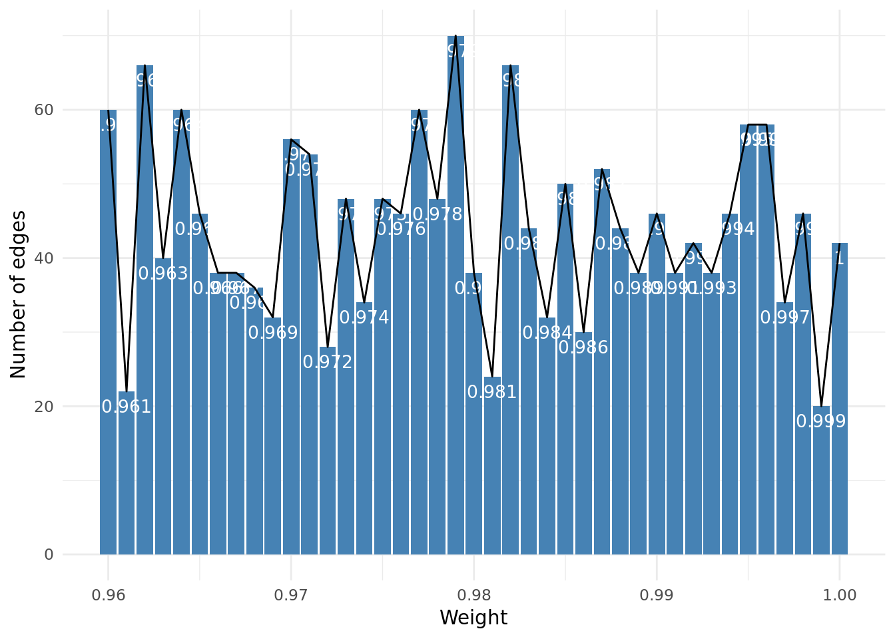

#### Degree distribution of item->similarity->item edges

#### Degree distribution of agent->knows->agent edges

#### Runing time by method 

<table class="table table-condensed" style="width: auto !important; ">
 <thead>
  <tr>
   <th style="text-align:left;">   </th>
   <th style="text-align:left;"> key </th>
   <th style="text-align:right;"> doc_count </th>
   <th style="text-align:right;"> sum_wallTime_ms.value </th>
   <th style="text-align:left;"> avg_wallTime_ms.value </th>
   <th style="text-align:left;"> includedInTotal </th>
  </tr>
 </thead>
<tbody>
  <tr>
   <td style="text-align:left;"> 1 </td>
   <td style="text-align:left;"> knowsAgent </td>
   <td style="text-align:right;"> 201 </td>
   <td style="text-align:right;"> 360 </td>
   <td style="text-align:left;"> 1.7910447761194 </td>
   <td style="text-align:left;"> No </td>
  </tr>
  <tr>
   <td style="text-align:left;"> 2 </td>
   <td style="text-align:left;"> addItemToWork </td>
   <td style="text-align:right;"> 140 </td>
   <td style="text-align:right;"> 718 </td>
   <td style="text-align:left;"> 5.12857142857143 </td>
   <td style="text-align:left;"> No </td>
  </tr>
  <tr>
   <td style="text-align:left;"> 3 </td>
   <td style="text-align:left;"> ownsWork </td>
   <td style="text-align:right;"> 70 </td>
   <td style="text-align:right;"> 729 </td>
   <td style="text-align:left;"> 10.4142857142857 </td>
   <td style="text-align:left;"> No </td>
  </tr>
  <tr>
   <td style="text-align:left;"> 4 </td>
   <td style="text-align:left;"> init </td>
   <td style="text-align:right;"> 53 </td>
   <td style="text-align:right;"> 9,241 </td>
   <td style="text-align:left;"> 174.358490566038 </td>
   <td style="text-align:left;"> No </td>
  </tr>
  <tr>
   <td style="text-align:left;"> 5 </td>
   <td style="text-align:left;"> searchAndConnect </td>
   <td style="text-align:right;"> 51 </td>
   <td style="text-align:right;"> 11,814 </td>
   <td style="text-align:left;"> 231.647058823529 </td>
   <td style="text-align:left;"> Yes </td>
  </tr>
  <tr>
   <td style="text-align:left;"> 6 </td>
   <td style="text-align:left;"> getWorksItems </td>
   <td style="text-align:right;"> 38 </td>
   <td style="text-align:right;"> 63 </td>
   <td style="text-align:left;"> 1.65789473684211 </td>
   <td style="text-align:left;"> Yes </td>
  </tr>
  <tr>
   <td style="text-align:left;"> 8 </td>
   <td style="text-align:left;"> addChainToNetwork </td>
   <td style="text-align:right;"> 1 </td>
   <td style="text-align:right;"> 0 </td>
   <td style="text-align:left;"> 0 </td>
   <td style="text-align:left;"> Yes </td>
  </tr>
  <tr>
   <td style="text-align:left;"> 9 </td>
   <td style="text-align:left;"> addRandomWorksToAgents </td>
   <td style="text-align:right;"> 1 </td>
   <td style="text-align:right;"> 0 </td>
   <td style="text-align:left;"> 0 </td>
   <td style="text-align:left;"> Yes </td>
  </tr>
  <tr>
   <td style="text-align:left;font-weight: bold;"> 11 </td>
   <td style="text-align:left;font-weight: bold;"> Total </td>
   <td style="text-align:right;font-weight: bold;"> 97 </td>
   <td style="text-align:right;font-weight: bold;"> 12,057 </td>
   <td style="text-align:left;font-weight: bold;">  </td>
   <td style="text-align:left;font-weight: bold;">  </td>
  </tr>
</tbody>
</table>
####  Found structures 

#####  Cycles 

Number of cycles found:  1 

<button class="btn btn-primary" data-toggle="collapse" data-target="#LCAYLYNXVF"> Show/Hide foundCycle query </button> 
 
  
     GET /filebeat-*/_search 
              { 
                "query": {
                  "bool": {
                    "must": [
                      { "match_phrase": {
                        "simulationId": "SIM10-13-06-15-uaTzgj--DV"
                        }
                      },
                      { "bool": {
                        "should": [
                          { "match": {
                            "keyword": "foundCycle"
                          }}
                        ]
                      }}
                    ]
                  }
                }
              }
     

#####  Paths 

Number of paths found:  0 

<button class="btn btn-primary" data-toggle="collapse" data-target="#QASSEIZTEF"> Show/Hide foundPath query </button> 
 
  
     GET /filebeat-*/_search 
              { 
                "query": {
                  "bool": {
                    "must": [
                      { "match_phrase": {
                        "simulationId": "SIM10-13-06-15-uaTzgj--DV"
                        }
                      },
                      { "bool": {
                        "should": [
                          { "match": {
                            "keyword": "foundPath"
                          }}
                        ]
                      }}
                    ]
                  }
                }
              }
     

###  SIM10-13-06-18-fiJxYE--CV 

#### simulationParameters 

<table class="table table-condensed" style="width: auto !important; ">
 <thead>
  <tr>
   <th style="text-align:left;"> agentNumber </th>
   <th style="text-align:left;"> similarityConnectThreshold </th>
   <th style="text-align:left;"> graphType </th>
   <th style="text-align:left;"> chainLength </th>
   <th style="text-align:left;"> similaritySearchThreshold </th>
   <th style="text-align:left;"> maxDistance </th>
   <th style="text-align:left;"> randomWorksNumberMultiplier </th>
  </tr>
 </thead>
<tbody>
  <tr>
   <td style="text-align:left;width: 20em; "> 50 </td>
   <td style="text-align:left;width: 15em; "> 0.96 </td>
   <td style="text-align:left;width: 15em; "> random </td>
   <td style="text-align:left;width: 15em; "> 20 </td>
   <td style="text-align:left;width: 15em; "> 1 </td>
   <td style="text-align:left;width: 15em; "> 5 </td>
   <td style="text-align:left;width: 15em; "> 2 </td>
  </tr>
</tbody>
</table>
#### allEdgesByLabel

<table class="table table-condensed" style="width: auto !important; ">
 <thead>
  <tr>
   <th style="text-align:right;"> edges_offers </th>
   <th style="text-align:right;"> edges_similarity </th>
   <th style="text-align:right;"> edges_owns </th>
   <th style="text-align:right;"> edges_demands </th>
   <th style="text-align:right;"> edges_knows </th>
   <th style="text-align:right;"> edges_total </th>
  </tr>
 </thead>
<tbody>
  <tr>
   <td style="text-align:right;width: 5em; "> 120 </td>
   <td style="text-align:right;width: 5em; "> 5,058 </td>
   <td style="text-align:right;width: 5em; "> 120 </td>
   <td style="text-align:right;width: 5em; "> 120 </td>
   <td style="text-align:right;width: 5em; "> 50 </td>
   <td style="text-align:right;width: 5em; "> 5,468 </td>
  </tr>
</tbody>
</table>
#### allVerticesByType

<table class="table table-condensed" style="width: auto !important; ">
 <thead>
  <tr>
   <th style="text-align:right;"> vertices_agent </th>
   <th style="text-align:right;"> vertices_item </th>
   <th style="text-align:right;"> vertices_work </th>
   <th style="text-align:right;"> vertices_total </th>
  </tr>
 </thead>
<tbody>
  <tr>
   <td style="text-align:right;width: 5em; "> 51 </td>
   <td style="text-align:right;width: 5em; "> 240 </td>
   <td style="text-align:right;width: 5em; "> 120 </td>
   <td style="text-align:right;width: 5em; "> 411 </td>
  </tr>
</tbody>
</table>
#### distribution of similarityEdgesByWeight

#### Degree distribution of item->similarity->item edges

#### Degree distribution of agent->knows->agent edges

#### Runing time by method 

<table class="table table-condensed" style="width: auto !important; ">
 <thead>
  <tr>
   <th style="text-align:left;"> key </th>
   <th style="text-align:right;"> doc_count </th>
   <th style="text-align:right;"> sum_wallTime_ms.value </th>
   <th style="text-align:left;"> avg_wallTime_ms.value </th>
   <th style="text-align:left;"> includedInTotal </th>
  </tr>
 </thead>
<tbody>
  <tr>
   <td style="text-align:left;"> connectIfSimilar </td>
   <td style="text-align:right;"> 28,680 </td>
   <td style="text-align:right;"> 60,139 </td>
   <td style="text-align:left;"> 2.09689679218968 </td>
   <td style="text-align:left;"> No </td>
  </tr>
  <tr>
   <td style="text-align:left;"> existsSimilarity </td>
   <td style="text-align:right;"> 28,680 </td>
   <td style="text-align:right;"> 57,599 </td>
   <td style="text-align:left;"> 2.00833333333333 </td>
   <td style="text-align:left;"> No </td>
  </tr>
  <tr>
   <td style="text-align:left;"> similarityEdges </td>
   <td style="text-align:right;"> 28,680 </td>
   <td style="text-align:right;"> 56,659 </td>
   <td style="text-align:left;"> 1.97555788005579 </td>
   <td style="text-align:left;"> No </td>
  </tr>
  <tr>
   <td style="text-align:left;"> connect </td>
   <td style="text-align:right;"> 876 </td>
   <td style="text-align:right;"> 2,002 </td>
   <td style="text-align:left;"> 2.28538812785388 </td>
   <td style="text-align:left;"> Yes </td>
  </tr>
  <tr>
   <td style="text-align:left;"> connectAllSimilar </td>
   <td style="text-align:right;"> 240 </td>
   <td style="text-align:right;"> 60,396 </td>
   <td style="text-align:left;"> 251.65 </td>
   <td style="text-align:left;"> Yes </td>
  </tr>
  <tr>
   <td style="text-align:left;"> init </td>
   <td style="text-align:right;"> 53 </td>
   <td style="text-align:right;"> 9,753 </td>
   <td style="text-align:left;"> 184.018867924528 </td>
   <td style="text-align:left;"> No </td>
  </tr>
  <tr>
   <td style="text-align:left;font-weight: bold;"> Total </td>
   <td style="text-align:right;font-weight: bold;"> 1,124 </td>
   <td style="text-align:right;font-weight: bold;"> 62,860 </td>
   <td style="text-align:left;font-weight: bold;">  </td>
   <td style="text-align:left;font-weight: bold;">  </td>
  </tr>
</tbody>
</table>
####  Found structures 

#####  Cycles 

Number of cycles found:  1 

<button class="btn btn-primary" data-toggle="collapse" data-target="#YZVHTKLOQJ"> Show/Hide foundCycle query </button> 
 
  
     GET /filebeat-*/_search 
              { 
                "query": {
                  "bool": {
                    "must": [
                      { "match_phrase": {
                        "simulationId": "SIM10-13-06-18-fiJxYE--CV"
                        }
                      },
                      { "bool": {
                        "should": [
                          { "match": {
                            "keyword": "foundCycle"
                          }}
                        ]
                      }}
                    ]
                  }
                }
              }
     

#####  Paths 

Number of paths found:  0 

<button class="btn btn-primary" data-toggle="collapse" data-target="#ONGJFXAYLT"> Show/Hide foundPath query </button> 
 
  
     GET /filebeat-*/_search 
              { 
                "query": {
                  "bool": {
                    "must": [
                      { "match_phrase": {
                        "simulationId": "SIM10-13-06-18-fiJxYE--CV"
                        }
                      },
                      { "bool": {
                        "should": [
                          { "match": {
                            "keyword": "foundPath"
                          }}
                        ]
                      }}
                    ]
                  }
                }
              }
     

###  SIM10-13-06-18-fiJxYE--DV 

#### simulationParameters 

<table class="table table-condensed" style="width: auto !important; ">
 <thead>
  <tr>
   <th style="text-align:left;"> agentNumber </th>
   <th style="text-align:left;"> similarityConnectThreshold </th>
   <th style="text-align:left;"> graphType </th>
   <th style="text-align:left;"> chainLength </th>
   <th style="text-align:left;"> similaritySearchThreshold </th>
   <th style="text-align:left;"> maxDistance </th>
   <th style="text-align:left;"> randomWorksNumberMultiplier </th>
  </tr>
 </thead>
<tbody>
  <tr>
   <td style="text-align:left;width: 20em; "> 50 </td>
   <td style="text-align:left;width: 15em; "> 0.96 </td>
   <td style="text-align:left;width: 15em; "> random </td>
   <td style="text-align:left;width: 15em; "> 20 </td>
   <td style="text-align:left;width: 15em; "> 1 </td>
   <td style="text-align:left;width: 15em; "> 5 </td>
   <td style="text-align:left;width: 15em; "> 2 </td>
  </tr>
</tbody>
</table>
#### allEdgesByLabel

<table class="table table-condensed" style="width: auto !important; ">
 <thead>
  <tr>
   <th style="text-align:right;"> edges_offers </th>
   <th style="text-align:right;"> edges_similarity </th>
   <th style="text-align:right;"> edges_owns </th>
   <th style="text-align:right;"> edges_demands </th>
   <th style="text-align:right;"> edges_knows </th>
   <th style="text-align:right;"> edges_total </th>
  </tr>
 </thead>
<tbody>
  <tr>
   <td style="text-align:right;width: 5em; "> 120 </td>
   <td style="text-align:right;width: 5em; "> 3,306 </td>
   <td style="text-align:right;width: 5em; "> 120 </td>
   <td style="text-align:right;width: 5em; "> 120 </td>
   <td style="text-align:right;width: 5em; "> 50 </td>
   <td style="text-align:right;width: 5em; "> 3,716 </td>
  </tr>
</tbody>
</table>
#### allVerticesByType

<table class="table table-condensed" style="width: auto !important; ">
 <thead>
  <tr>
   <th style="text-align:right;"> vertices_agent </th>
   <th style="text-align:right;"> vertices_item </th>
   <th style="text-align:right;"> vertices_work </th>
   <th style="text-align:right;"> vertices_total </th>
  </tr>
 </thead>
<tbody>
  <tr>
   <td style="text-align:right;width: 5em; "> 51 </td>
   <td style="text-align:right;width: 5em; "> 240 </td>
   <td style="text-align:right;width: 5em; "> 120 </td>
   <td style="text-align:right;width: 5em; "> 411 </td>
  </tr>
</tbody>
</table>
#### distribution of similarityEdgesByWeight

#### Degree distribution of item->similarity->item edges

#### Degree distribution of agent->knows->agent edges

#### Runing time by method 

<table class="table table-condensed" style="width: auto !important; ">
 <thead>
  <tr>
   <th style="text-align:left;">   </th>
   <th style="text-align:left;"> key </th>
   <th style="text-align:right;"> doc_count </th>
   <th style="text-align:right;"> sum_wallTime_ms.value </th>
   <th style="text-align:left;"> avg_wallTime_ms.value </th>
   <th style="text-align:left;"> includedInTotal </th>
  </tr>
 </thead>
<tbody>
  <tr>
   <td style="text-align:left;"> 2 </td>
   <td style="text-align:left;"> cycleSearch </td>
   <td style="text-align:right;"> 3,600 </td>
   <td style="text-align:right;"> 13,216 </td>
   <td style="text-align:left;"> 3.67111111111111 </td>
   <td style="text-align:left;"> Yes </td>
  </tr>
  <tr>
   <td style="text-align:left;"> 3 </td>
   <td style="text-align:left;"> getWorks </td>
   <td style="text-align:right;"> 3,600 </td>
   <td style="text-align:right;"> 41,257 </td>
   <td style="text-align:left;"> 11.4602777777778 </td>
   <td style="text-align:left;"> No </td>
  </tr>
  <tr>
   <td style="text-align:left;"> 4 </td>
   <td style="text-align:left;"> individualCycleSearch </td>
   <td style="text-align:right;"> 3,600 </td>
   <td style="text-align:right;"> 75 </td>
   <td style="text-align:left;"> 0.0208333333333333 </td>
   <td style="text-align:left;"> Yes </td>
  </tr>
  <tr>
   <td style="text-align:left;"> 6 </td>
   <td style="text-align:left;"> addItemToWork </td>
   <td style="text-align:right;"> 240 </td>
   <td style="text-align:right;"> 2,291 </td>
   <td style="text-align:left;"> 9.54583333333333 </td>
   <td style="text-align:left;"> No </td>
  </tr>
  <tr>
   <td style="text-align:left;"> 7 </td>
   <td style="text-align:left;"> ownsWork </td>
   <td style="text-align:right;"> 120 </td>
   <td style="text-align:right;"> 1,803 </td>
   <td style="text-align:left;"> 15.025 </td>
   <td style="text-align:left;"> No </td>
  </tr>
  <tr>
   <td style="text-align:left;"> 8 </td>
   <td style="text-align:left;"> init </td>
   <td style="text-align:right;"> 53 </td>
   <td style="text-align:right;"> 9,824 </td>
   <td style="text-align:left;"> 185.358490566038 </td>
   <td style="text-align:left;"> No </td>
  </tr>
  <tr>
   <td style="text-align:left;"> 9 </td>
   <td style="text-align:left;"> searchAndConnect </td>
   <td style="text-align:right;"> 51 </td>
   <td style="text-align:right;"> 18,727 </td>
   <td style="text-align:left;"> 367.196078431373 </td>
   <td style="text-align:left;"> Yes </td>
  </tr>
  <tr>
   <td style="text-align:left;"> 10 </td>
   <td style="text-align:left;"> knowsAgent </td>
   <td style="text-align:right;"> 50 </td>
   <td style="text-align:right;"> 208 </td>
   <td style="text-align:left;"> 4.16 </td>
   <td style="text-align:left;"> No </td>
  </tr>
  <tr>
   <td style="text-align:left;font-weight: bold;"> 1 </td>
   <td style="text-align:left;font-weight: bold;"> Total </td>
   <td style="text-align:right;font-weight: bold;"> 14,451 </td>
   <td style="text-align:right;font-weight: bold;"> 46,652 </td>
   <td style="text-align:left;font-weight: bold;">  </td>
   <td style="text-align:left;font-weight: bold;">  </td>
  </tr>
</tbody>
</table>
####  Found structures 

#####  Cycles 

Number of cycles found:  0 

<button class="btn btn-primary" data-toggle="collapse" data-target="#YJOXXPNELQ"> Show/Hide foundCycle query </button> 
 
  
     GET /filebeat-*/_search 
              { 
                "query": {
                  "bool": {
                    "must": [
                      { "match_phrase": {
                        "simulationId": "SIM10-13-06-18-fiJxYE--DV"
                        }
                      },
                      { "bool": {
                        "should": [
                          { "match": {
                            "keyword": "foundCycle"
                          }}
                        ]
                      }}
                    ]
                  }
                }
              }
     

#####  Paths 

Number of paths found:  3600 

<button class="btn btn-primary" data-toggle="collapse" data-target="#KHTQQGWTDG"> Show/Hide foundPath query </button> 
 
  
     GET /filebeat-*/_search 
              { 
                "query": {
                  "bool": {
                    "must": [
                      { "match_phrase": {
                        "simulationId": "SIM10-13-06-18-fiJxYE--DV"
                        }
                      },
                      { "bool": {
                        "should": [
                          { "match": {
                            "keyword": "foundPath"
                          }}
                        ]
                      }}
                    ]
                  }
                }
              }
     

###  SIM10-13-07-19-zgrbTn--CV 

#### simulationParameters 

<table class="table table-condensed" style="width: auto !important; ">
 <thead>
  <tr>
   <th style="text-align:left;"> agentNumber </th>
   <th style="text-align:left;"> similarityConnectThreshold </th>
   <th style="text-align:left;"> graphType </th>
   <th style="text-align:left;"> chainLength </th>
   <th style="text-align:left;"> similaritySearchThreshold </th>
   <th style="text-align:left;"> maxDistance </th>
   <th style="text-align:left;"> randomWorksNumberMultiplier </th>
  </tr>
 </thead>
<tbody>
  <tr>
   <td style="text-align:left;width: 20em; "> 50 </td>
   <td style="text-align:left;width: 15em; "> 0.96 </td>
   <td style="text-align:left;width: 15em; "> smallWorld </td>
   <td style="text-align:left;width: 15em; "> 20 </td>
   <td style="text-align:left;width: 15em; "> 1 </td>
   <td style="text-align:left;width: 15em; "> 5 </td>
   <td style="text-align:left;width: 15em; "> 2 </td>
  </tr>
</tbody>
</table>
#### allEdgesByLabel

<table class="table table-condensed" style="width: auto !important; ">
 <thead>
  <tr>
   <th style="text-align:right;"> edges_offers </th>
   <th style="text-align:right;"> edges_similarity </th>
   <th style="text-align:right;"> edges_owns </th>
   <th style="text-align:right;"> edges_demands </th>
   <th style="text-align:right;"> edges_knows </th>
   <th style="text-align:right;"> edges_total </th>
  </tr>
 </thead>
<tbody>
  <tr>
   <td style="text-align:right;width: 5em; "> 120 </td>
   <td style="text-align:right;width: 5em; "> 5,130 </td>
   <td style="text-align:right;width: 5em; "> 120 </td>
   <td style="text-align:right;width: 5em; "> 120 </td>
   <td style="text-align:right;width: 5em; "> 201 </td>
   <td style="text-align:right;width: 5em; "> 5,691 </td>
  </tr>
</tbody>
</table>
#### allVerticesByType

<table class="table table-condensed" style="width: auto !important; ">
 <thead>
  <tr>
   <th style="text-align:right;"> vertices_agent </th>
   <th style="text-align:right;"> vertices_item </th>
   <th style="text-align:right;"> vertices_work </th>
   <th style="text-align:right;"> vertices_total </th>
  </tr>
 </thead>
<tbody>
  <tr>
   <td style="text-align:right;width: 5em; "> 51 </td>
   <td style="text-align:right;width: 5em; "> 240 </td>
   <td style="text-align:right;width: 5em; "> 120 </td>
   <td style="text-align:right;width: 5em; "> 411 </td>
  </tr>
</tbody>
</table>
#### distribution of similarityEdgesByWeight

#### Degree distribution of item->similarity->item edges

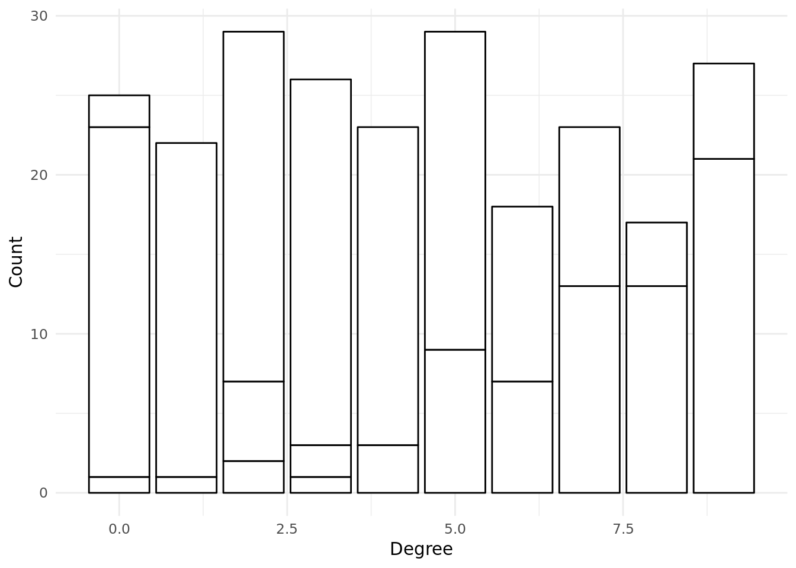

#### Degree distribution of agent->knows->agent edges

#### Runing time by method 

<table class="table table-condensed" style="width: auto !important; ">
 <thead>
  <tr>
   <th style="text-align:left;"> key </th>
   <th style="text-align:right;"> doc_count </th>
   <th style="text-align:right;"> sum_wallTime_ms.value </th>
   <th style="text-align:left;"> avg_wallTime_ms.value </th>
   <th style="text-align:left;"> includedInTotal </th>
  </tr>
 </thead>
<tbody>
  <tr>
   <td style="text-align:left;"> connectIfSimilar </td>
   <td style="text-align:right;"> 28,680 </td>
   <td style="text-align:right;"> 59,492 </td>
   <td style="text-align:left;"> 2.07433751743375 </td>
   <td style="text-align:left;"> No </td>
  </tr>
  <tr>
   <td style="text-align:left;"> existsSimilarity </td>
   <td style="text-align:right;"> 28,680 </td>
   <td style="text-align:right;"> 58,935 </td>
   <td style="text-align:left;"> 2.05491631799163 </td>
   <td style="text-align:left;"> No </td>
  </tr>
  <tr>
   <td style="text-align:left;"> similarityEdges </td>
   <td style="text-align:right;"> 28,680 </td>
   <td style="text-align:right;"> 57,923 </td>
   <td style="text-align:left;"> 2.01963040446304 </td>
   <td style="text-align:left;"> No </td>
  </tr>
  <tr>
   <td style="text-align:left;"> connectAllSimilar </td>
   <td style="text-align:right;"> 240 </td>
   <td style="text-align:right;"> 59,764 </td>
   <td style="text-align:left;"> 249.016666666667 </td>
   <td style="text-align:left;"> Yes </td>
  </tr>
  <tr>
   <td style="text-align:left;"> init </td>
   <td style="text-align:right;"> 53 </td>
   <td style="text-align:right;"> 9,018 </td>
   <td style="text-align:left;"> 170.150943396226 </td>
   <td style="text-align:left;"> No </td>
  </tr>
  <tr>
   <td style="text-align:left;"> connect </td>
   <td style="text-align:right;"> 51 </td>
   <td style="text-align:right;"> 101 </td>
   <td style="text-align:left;"> 1.98039215686275 </td>
   <td style="text-align:left;"> Yes </td>
  </tr>
  <tr>
   <td style="text-align:left;font-weight: bold;"> Total </td>
   <td style="text-align:right;font-weight: bold;"> 299 </td>
   <td style="text-align:right;font-weight: bold;"> 60,266 </td>
   <td style="text-align:left;font-weight: bold;">  </td>
   <td style="text-align:left;font-weight: bold;">  </td>
  </tr>
</tbody>
</table>
####  Found structures 

#####  Cycles 

Number of cycles found:  1 

<button class="btn btn-primary" data-toggle="collapse" data-target="#BFDJNKFUJW"> Show/Hide foundCycle query </button> 
 
  
     GET /filebeat-*/_search 
              { 
                "query": {
                  "bool": {
                    "must": [
                      { "match_phrase": {
                        "simulationId": "SIM10-13-07-19-zgrbTn--CV"
                        }
                      },
                      { "bool": {
                        "should": [
                          { "match": {
                            "keyword": "foundCycle"
                          }}
                        ]
                      }}
                    ]
                  }
                }
              }
     

#####  Paths 

Number of paths found:  0 

<button class="btn btn-primary" data-toggle="collapse" data-target="#WVDLBRCFDM"> Show/Hide foundPath query </button> 
 
  
     GET /filebeat-*/_search 
              { 
                "query": {
                  "bool": {
                    "must": [
                      { "match_phrase": {
                        "simulationId": "SIM10-13-07-19-zgrbTn--CV"
                        }
                      },
                      { "bool": {
                        "should": [
                          { "match": {
                            "keyword": "foundPath"
                          }}
                        ]
                      }}
                    ]
                  }
                }
              }
     

###  SIM10-13-07-19-zgrbTn--DV 

#### simulationParameters 

<table class="table table-condensed" style="width: auto !important; ">
 <thead>
  <tr>
   <th style="text-align:left;"> agentNumber </th>
   <th style="text-align:left;"> similarityConnectThreshold </th>
   <th style="text-align:left;"> graphType </th>
   <th style="text-align:left;"> chainLength </th>
   <th style="text-align:left;"> similaritySearchThreshold </th>
   <th style="text-align:left;"> maxDistance </th>
   <th style="text-align:left;"> randomWorksNumberMultiplier </th>
  </tr>
 </thead>
<tbody>
  <tr>
   <td style="text-align:left;width: 20em; "> 50 </td>
   <td style="text-align:left;width: 15em; "> 0.96 </td>
   <td style="text-align:left;width: 15em; "> smallWorld </td>
   <td style="text-align:left;width: 15em; "> 20 </td>
   <td style="text-align:left;width: 15em; "> 1 </td>
   <td style="text-align:left;width: 15em; "> 5 </td>
   <td style="text-align:left;width: 15em; "> 2 </td>
  </tr>
</tbody>
</table>
#### allEdgesByLabel

<table class="table table-condensed" style="width: auto !important; ">
 <thead>
  <tr>
   <th style="text-align:right;"> edges_offers </th>
   <th style="text-align:right;"> edges_similarity </th>
   <th style="text-align:right;"> edges_owns </th>
   <th style="text-align:right;"> edges_demands </th>
   <th style="text-align:right;"> edges_knows </th>
   <th style="text-align:right;"> edges_total </th>
  </tr>
 </thead>
<tbody>
  <tr>
   <td style="text-align:right;width: 5em; "> 120 </td>
   <td style="text-align:right;width: 5em; "> 5,028 </td>
   <td style="text-align:right;width: 5em; "> 120 </td>
   <td style="text-align:right;width: 5em; "> 120 </td>
   <td style="text-align:right;width: 5em; "> 201 </td>
   <td style="text-align:right;width: 5em; "> 5,589 </td>
  </tr>
</tbody>
</table>
#### allVerticesByType

<table class="table table-condensed" style="width: auto !important; ">
 <thead>
  <tr>
   <th style="text-align:right;"> vertices_agent </th>
   <th style="text-align:right;"> vertices_item </th>
   <th style="text-align:right;"> vertices_work </th>
   <th style="text-align:right;"> vertices_total </th>
  </tr>
 </thead>
<tbody>
  <tr>
   <td style="text-align:right;width: 5em; "> 51 </td>
   <td style="text-align:right;width: 5em; "> 240 </td>
   <td style="text-align:right;width: 5em; "> 120 </td>
   <td style="text-align:right;width: 5em; "> 411 </td>
  </tr>
</tbody>
</table>
#### distribution of similarityEdgesByWeight

#### Degree distribution of item->similarity->item edges

#### Degree distribution of agent->knows->agent edges

#### Runing time by method 

<table class="table table-condensed" style="width: auto !important; ">
 <thead>
  <tr>
   <th style="text-align:left;">   </th>
   <th style="text-align:left;"> key </th>
   <th style="text-align:right;"> doc_count </th>
   <th style="text-align:right;"> sum_wallTime_ms.value </th>
   <th style="text-align:left;"> avg_wallTime_ms.value </th>
   <th style="text-align:left;"> includedInTotal </th>
  </tr>
 </thead>
<tbody>
  <tr>
   <td style="text-align:left;"> 1 </td>
   <td style="text-align:left;"> addItemToWork </td>
   <td style="text-align:right;"> 240 </td>
   <td style="text-align:right;"> 1,307 </td>
   <td style="text-align:left;"> 5.44583333333333 </td>
   <td style="text-align:left;"> No </td>
  </tr>
  <tr>
   <td style="text-align:left;"> 2 </td>
   <td style="text-align:left;"> knowsAgent </td>
   <td style="text-align:right;"> 201 </td>
   <td style="text-align:right;"> 472 </td>
   <td style="text-align:left;"> 2.34825870646766 </td>
   <td style="text-align:left;"> No </td>
  </tr>
  <tr>
   <td style="text-align:left;"> 3 </td>
   <td style="text-align:left;"> ownsWork </td>
   <td style="text-align:right;"> 120 </td>
   <td style="text-align:right;"> 1,115 </td>
   <td style="text-align:left;"> 9.29166666666667 </td>
   <td style="text-align:left;"> No </td>
  </tr>
  <tr>
   <td style="text-align:left;"> 4 </td>
   <td style="text-align:left;"> init </td>
   <td style="text-align:right;"> 53 </td>
   <td style="text-align:right;"> 10,101 </td>
   <td style="text-align:left;"> 190.584905660377 </td>
   <td style="text-align:left;"> No </td>
  </tr>
  <tr>
   <td style="text-align:left;"> 5 </td>
   <td style="text-align:left;"> searchAndConnect </td>
   <td style="text-align:right;"> 51 </td>
   <td style="text-align:right;"> 26,827 </td>
   <td style="text-align:left;"> 526.019607843137 </td>
   <td style="text-align:left;"> Yes </td>
  </tr>
  <tr>
   <td style="text-align:left;"> 6 </td>
   <td style="text-align:left;"> getWorksItems </td>
   <td style="text-align:right;"> 38 </td>
   <td style="text-align:right;"> 88 </td>
   <td style="text-align:left;"> 2.31578947368421 </td>
   <td style="text-align:left;"> Yes </td>
  </tr>
  <tr>
   <td style="text-align:left;"> 9 </td>
   <td style="text-align:left;"> cycleSearch </td>
   <td style="text-align:right;"> 2 </td>
   <td style="text-align:right;"> 115 </td>
   <td style="text-align:left;"> 57.5 </td>
   <td style="text-align:left;"> Yes </td>
  </tr>
  <tr>
   <td style="text-align:left;"> 10 </td>
   <td style="text-align:left;"> getWorks </td>
   <td style="text-align:right;"> 2 </td>
   <td style="text-align:right;"> 218 </td>
   <td style="text-align:left;"> 109 </td>
   <td style="text-align:left;"> No </td>
  </tr>
  <tr>
   <td style="text-align:left;font-weight: bold;"> 11 </td>
   <td style="text-align:left;font-weight: bold;"> Total </td>
   <td style="text-align:right;font-weight: bold;"> 98 </td>
   <td style="text-align:right;font-weight: bold;"> 27,699 </td>
   <td style="text-align:left;font-weight: bold;">  </td>
   <td style="text-align:left;font-weight: bold;">  </td>
  </tr>
</tbody>
</table>
####  Found structures 

#####  Cycles 

Number of cycles found:  2 

<button class="btn btn-primary" data-toggle="collapse" data-target="#AIBOOFXYYM"> Show/Hide foundCycle query </button> 
 
  
     GET /filebeat-*/_search 
              { 
                "query": {
                  "bool": {
                    "must": [
                      { "match_phrase": {
                        "simulationId": "SIM10-13-07-19-zgrbTn--DV"
                        }
                      },
                      { "bool": {
                        "should": [
                          { "match": {
                            "keyword": "foundCycle"
                          }}
                        ]
                      }}
                    ]
                  }
                }
              }
     

#####  Paths 

Number of paths found:  0 

<button class="btn btn-primary" data-toggle="collapse" data-target="#YFCBVCRNMO"> Show/Hide foundPath query </button> 
 
  
     GET /filebeat-*/_search 
              { 
                "query": {
                  "bool": {
                    "must": [
                      { "match_phrase": {
                        "simulationId": "SIM10-13-07-19-zgrbTn--DV"
                        }
                      },
                      { "bool": {
                        "should": [
                          { "match": {
                            "keyword": "foundPath"
                          }}
                        ]
                      }}
                    ]
                  }
                }
              }
     

###  SIM10-13-02-01-PF3goV--CV 

#### simulationParameters 

<table class="table table-condensed" style="width: auto !important; ">
 <thead>
  <tr>
   <th style="text-align:left;"> agentNumber </th>
   <th style="text-align:left;"> similarityConnectThreshold </th>
   <th style="text-align:left;"> graphType </th>
   <th style="text-align:left;"> chainLength </th>
   <th style="text-align:left;"> similaritySearchThreshold </th>
   <th style="text-align:left;"> maxDistance </th>
   <th style="text-align:left;"> randomWorksNumberMultiplier </th>
  </tr>
 </thead>
<tbody>
  <tr>
   <td style="text-align:left;width: 20em; "> 50 </td>
   <td style="text-align:left;width: 15em; "> 0.96 </td>
   <td style="text-align:left;width: 15em; "> random </td>
   <td style="text-align:left;width: 15em; "> 5 </td>
   <td style="text-align:left;width: 15em; "> 1 </td>
   <td style="text-align:left;width: 15em; "> 10 </td>
   <td style="text-align:left;width: 15em; "> 2 </td>
  </tr>
</tbody>
</table>
#### allEdgesByLabel

<table class="table table-condensed" style="width: auto !important; ">
 <thead>
  <tr>
   <th style="text-align:right;"> edges_offers </th>
   <th style="text-align:right;"> edges_similarity </th>
   <th style="text-align:right;"> edges_owns </th>
   <th style="text-align:right;"> edges_demands </th>
   <th style="text-align:right;"> edges_knows </th>
   <th style="text-align:right;"> edges_total </th>
  </tr>
 </thead>
<tbody>
  <tr>
   <td style="text-align:right;width: 5em; "> 105 </td>
   <td style="text-align:right;width: 5em; "> 4,126 </td>
   <td style="text-align:right;width: 5em; "> 105 </td>
   <td style="text-align:right;width: 5em; "> 105 </td>
   <td style="text-align:right;width: 5em; "> 50 </td>
   <td style="text-align:right;width: 5em; "> 4,491 </td>
  </tr>
</tbody>
</table>
#### allVerticesByType

<table class="table table-condensed" style="width: auto !important; ">
 <thead>
  <tr>
   <th style="text-align:right;"> vertices_agent </th>
   <th style="text-align:right;"> vertices_item </th>
   <th style="text-align:right;"> vertices_work </th>
   <th style="text-align:right;"> vertices_total </th>
  </tr>
 </thead>
<tbody>
  <tr>
   <td style="text-align:right;width: 5em; "> 51 </td>
   <td style="text-align:right;width: 5em; "> 210 </td>
   <td style="text-align:right;width: 5em; "> 105 </td>
   <td style="text-align:right;width: 5em; "> 366 </td>
  </tr>
</tbody>
</table>
#### distribution of similarityEdgesByWeight

#### Degree distribution of item->similarity->item edges

#### Degree distribution of agent->knows->agent edges

#### Runing time by method 

<table class="table table-condensed" style="width: auto !important; ">
 <thead>
  <tr>
   <th style="text-align:left;"> key </th>
   <th style="text-align:right;"> doc_count </th>
   <th style="text-align:right;"> sum_wallTime_ms.value </th>
   <th style="text-align:left;"> avg_wallTime_ms.value </th>
   <th style="text-align:left;"> includedInTotal </th>
  </tr>
 </thead>
<tbody>
  <tr>
   <td style="text-align:left;"> connectIfSimilar </td>
   <td style="text-align:right;"> 21,945 </td>
   <td style="text-align:right;"> 48,554 </td>
   <td style="text-align:left;"> 2.2125313283208 </td>
   <td style="text-align:left;"> No </td>
  </tr>
  <tr>
   <td style="text-align:left;"> existsSimilarity </td>
   <td style="text-align:right;"> 21,945 </td>
   <td style="text-align:right;"> 47,969 </td>
   <td style="text-align:left;"> 2.18587377534746 </td>
   <td style="text-align:left;"> No </td>
  </tr>
  <tr>
   <td style="text-align:left;"> similarityEdges </td>
   <td style="text-align:right;"> 21,945 </td>
   <td style="text-align:right;"> 47,030 </td>
   <td style="text-align:left;"> 2.14308498519025 </td>
   <td style="text-align:left;"> No </td>
  </tr>
  <tr>
   <td style="text-align:left;"> connectAllSimilar </td>
   <td style="text-align:right;"> 210 </td>
   <td style="text-align:right;"> 48,820 </td>
   <td style="text-align:left;"> 232.47619047619 </td>
   <td style="text-align:left;"> Yes </td>
  </tr>
  <tr>
   <td style="text-align:left;"> connect </td>
   <td style="text-align:right;"> 66 </td>
   <td style="text-align:right;"> 128 </td>
   <td style="text-align:left;"> 1.93939393939394 </td>
   <td style="text-align:left;"> Yes </td>
  </tr>
  <tr>
   <td style="text-align:left;"> init </td>
   <td style="text-align:right;"> 53 </td>
   <td style="text-align:right;"> 8,917 </td>
   <td style="text-align:left;"> 168.245283018868 </td>
   <td style="text-align:left;"> No </td>
  </tr>
  <tr>
   <td style="text-align:left;font-weight: bold;"> Total </td>
   <td style="text-align:right;font-weight: bold;"> 284 </td>
   <td style="text-align:right;font-weight: bold;"> 49,230 </td>
   <td style="text-align:left;font-weight: bold;">  </td>
   <td style="text-align:left;font-weight: bold;">  </td>
  </tr>
</tbody>
</table>
####  Found structures 

#####  Cycles 

Number of cycles found:  1 

<button class="btn btn-primary" data-toggle="collapse" data-target="#YLZFWPEUQT"> Show/Hide foundCycle query </button> 
 
  
     GET /filebeat-*/_search 
              { 
                "query": {
                  "bool": {
                    "must": [
                      { "match_phrase": {
                        "simulationId": "SIM10-13-02-01-PF3goV--CV"
                        }
                      },
                      { "bool": {
                        "should": [
                          { "match": {
                            "keyword": "foundCycle"
                          }}
                        ]
                      }}
                    ]
                  }
                }
              }
     

#####  Paths 

Number of paths found:  0 

<button class="btn btn-primary" data-toggle="collapse" data-target="#MIQHIWJPAM"> Show/Hide foundPath query </button> 
 
  
     GET /filebeat-*/_search 
              { 
                "query": {
                  "bool": {
                    "must": [
                      { "match_phrase": {
                        "simulationId": "SIM10-13-02-01-PF3goV--CV"
                        }
                      },
                      { "bool": {
                        "should": [
                          { "match": {
                            "keyword": "foundPath"
                          }}
                        ]
                      }}
                    ]
                  }
                }
              }
     

###  SIM10-13-02-01-PF3goV--DV 

#### simulationParameters 

<table class="table table-condensed" style="width: auto !important; ">
 <thead>
  <tr>
   <th style="text-align:left;"> agentNumber </th>
   <th style="text-align:left;"> similarityConnectThreshold </th>
   <th style="text-align:left;"> graphType </th>
   <th style="text-align:left;"> chainLength </th>
   <th style="text-align:left;"> similaritySearchThreshold </th>
   <th style="text-align:left;"> maxDistance </th>
   <th style="text-align:left;"> randomWorksNumberMultiplier </th>
  </tr>
 </thead>
<tbody>
  <tr>
   <td style="text-align:left;width: 20em; "> 50 </td>
   <td style="text-align:left;width: 15em; "> 0.96 </td>
   <td style="text-align:left;width: 15em; "> random </td>
   <td style="text-align:left;width: 15em; "> 5 </td>
   <td style="text-align:left;width: 15em; "> 1 </td>
   <td style="text-align:left;width: 15em; "> 10 </td>
   <td style="text-align:left;width: 15em; "> 2 </td>
  </tr>
</tbody>
</table>
#### allEdgesByLabel

<table class="table table-condensed" style="width: auto !important; ">
 <thead>
  <tr>
   <th style="text-align:right;"> edges_offers </th>
   <th style="text-align:right;"> edges_similarity </th>
   <th style="text-align:right;"> edges_owns </th>
   <th style="text-align:right;"> edges_demands </th>
   <th style="text-align:right;"> edges_knows </th>
   <th style="text-align:right;"> edges_total </th>
  </tr>
 </thead>
<tbody>
  <tr>
   <td style="text-align:right;width: 5em; "> 105 </td>
   <td style="text-align:right;width: 5em; "> 3,994 </td>
   <td style="text-align:right;width: 5em; "> 105 </td>
   <td style="text-align:right;width: 5em; "> 105 </td>
   <td style="text-align:right;width: 5em; "> 50 </td>
   <td style="text-align:right;width: 5em; "> 4,359 </td>
  </tr>
</tbody>
</table>
#### allVerticesByType

<table class="table table-condensed" style="width: auto !important; ">
 <thead>
  <tr>
   <th style="text-align:right;"> vertices_agent </th>
   <th style="text-align:right;"> vertices_item </th>
   <th style="text-align:right;"> vertices_work </th>
   <th style="text-align:right;"> vertices_total </th>
  </tr>
 </thead>
<tbody>
  <tr>
   <td style="text-align:right;width: 5em; "> 51 </td>
   <td style="text-align:right;width: 5em; "> 210 </td>
   <td style="text-align:right;width: 5em; "> 105 </td>
   <td style="text-align:right;width: 5em; "> 366 </td>
  </tr>
</tbody>
</table>
#### distribution of similarityEdgesByWeight

#### Degree distribution of item->similarity->item edges

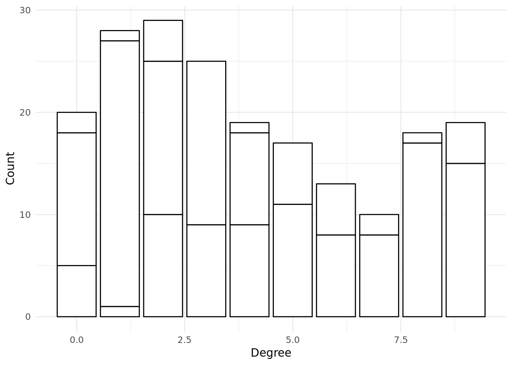

#### Degree distribution of agent->knows->agent edges

#### Runing time by method 

<table class="table table-condensed" style="width: auto !important; ">
 <thead>
  <tr>
   <th style="text-align:left;">   </th>
   <th style="text-align:left;"> key </th>
   <th style="text-align:right;"> doc_count </th>
   <th style="text-align:right;"> sum_wallTime_ms.value </th>
   <th style="text-align:left;"> avg_wallTime_ms.value </th>
   <th style="text-align:left;"> includedInTotal </th>
  </tr>
 </thead>
<tbody>
  <tr>
   <td style="text-align:left;"> 1 </td>
   <td style="text-align:left;"> addItemToWork </td>
   <td style="text-align:right;"> 210 </td>
   <td style="text-align:right;"> 1,135 </td>
   <td style="text-align:left;"> 5.40476190476191 </td>
   <td style="text-align:left;"> No </td>
  </tr>
  <tr>
   <td style="text-align:left;"> 2 </td>
   <td style="text-align:left;"> ownsWork </td>
   <td style="text-align:right;"> 105 </td>
   <td style="text-align:right;"> 845 </td>
   <td style="text-align:left;"> 8.04761904761905 </td>
   <td style="text-align:left;"> No </td>
  </tr>
  <tr>
   <td style="text-align:left;"> 3 </td>
   <td style="text-align:left;"> init </td>
   <td style="text-align:right;"> 53 </td>
   <td style="text-align:right;"> 9,367 </td>
   <td style="text-align:left;"> 176.735849056604 </td>
   <td style="text-align:left;"> No </td>
  </tr>
  <tr>
   <td style="text-align:left;"> 4 </td>
   <td style="text-align:left;"> searchAndConnect </td>
   <td style="text-align:right;"> 51 </td>
   <td style="text-align:right;"> 15,881 </td>
   <td style="text-align:left;"> 311.392156862745 </td>
   <td style="text-align:left;"> Yes </td>
  </tr>
  <tr>
   <td style="text-align:left;"> 5 </td>
   <td style="text-align:left;"> knowsAgent </td>
   <td style="text-align:right;"> 50 </td>
   <td style="text-align:right;"> 83 </td>
   <td style="text-align:left;"> 1.66 </td>
   <td style="text-align:left;"> No </td>
  </tr>
  <tr>
   <td style="text-align:left;"> 6 </td>
   <td style="text-align:left;"> getWorksItems </td>
   <td style="text-align:right;"> 8 </td>
   <td style="text-align:right;"> 11 </td>
   <td style="text-align:left;"> 1.375 </td>
   <td style="text-align:left;"> Yes </td>
  </tr>
  <tr>
   <td style="text-align:left;"> 8 </td>
   <td style="text-align:left;"> addChainToNetwork </td>
   <td style="text-align:right;"> 1 </td>
   <td style="text-align:right;"> 0 </td>
   <td style="text-align:left;"> 0 </td>
   <td style="text-align:left;"> Yes </td>
  </tr>
  <tr>
   <td style="text-align:left;"> 9 </td>
   <td style="text-align:left;"> addRandomWorksToAgents </td>
   <td style="text-align:right;"> 1 </td>
   <td style="text-align:right;"> 4 </td>
   <td style="text-align:left;"> 4 </td>
   <td style="text-align:left;"> Yes </td>
  </tr>
  <tr>
   <td style="text-align:left;font-weight: bold;"> 11 </td>
   <td style="text-align:left;font-weight: bold;"> Total </td>
   <td style="text-align:right;font-weight: bold;"> 67 </td>
   <td style="text-align:right;font-weight: bold;"> 16,114 </td>
   <td style="text-align:left;font-weight: bold;">  </td>
   <td style="text-align:left;font-weight: bold;">  </td>
  </tr>
</tbody>
</table>
####  Found structures 

#####  Cycles 

Number of cycles found:  1 

<button class="btn btn-primary" data-toggle="collapse" data-target="#KEJKMTKHCG"> Show/Hide foundCycle query </button> 
 
  
     GET /filebeat-*/_search 
              { 
                "query": {
                  "bool": {
                    "must": [
                      { "match_phrase": {
                        "simulationId": "SIM10-13-02-01-PF3goV--DV"
                        }
                      },
                      { "bool": {
                        "should": [
                          { "match": {
                            "keyword": "foundCycle"
                          }}
                        ]
                      }}
                    ]
                  }
                }
              }
     

#####  Paths 

Number of paths found:  0 

<button class="btn btn-primary" data-toggle="collapse" data-target="#RIQYEFJRQF"> Show/Hide foundPath query </button> 
 
  
     GET /filebeat-*/_search 
              { 
                "query": {
                  "bool": {
                    "must": [
                      { "match_phrase": {
                        "simulationId": "SIM10-13-02-01-PF3goV--DV"
                        }
                      },
                      { "bool": {
                        "should": [
                          { "match": {
                            "keyword": "foundPath"
                          }}
                        ]
                      }}
                    ]
                  }
                }
              }
     

###  SIM10-13-02-02-uBHuk6--CV 

#### simulationParameters 

<table class="table table-condensed" style="width: auto !important; ">
 <thead>
  <tr>
   <th style="text-align:left;"> agentNumber </th>
   <th style="text-align:left;"> similarityConnectThreshold </th>
   <th style="text-align:left;"> graphType </th>
   <th style="text-align:left;"> chainLength </th>
   <th style="text-align:left;"> similaritySearchThreshold </th>
   <th style="text-align:left;"> maxDistance </th>
   <th style="text-align:left;"> randomWorksNumberMultiplier </th>
  </tr>
 </thead>
<tbody>
  <tr>
   <td style="text-align:left;width: 20em; "> 50 </td>
   <td style="text-align:left;width: 15em; "> 0.96 </td>
   <td style="text-align:left;width: 15em; "> smallWorld </td>
   <td style="text-align:left;width: 15em; "> 5 </td>
   <td style="text-align:left;width: 15em; "> 1 </td>
   <td style="text-align:left;width: 15em; "> 10 </td>
   <td style="text-align:left;width: 15em; "> 2 </td>
  </tr>
</tbody>
</table>
#### allEdgesByLabel

<table class="table table-condensed" style="width: auto !important; ">
 <thead>
  <tr>
   <th style="text-align:right;"> edges_offers </th>
   <th style="text-align:right;"> edges_similarity </th>
   <th style="text-align:right;"> edges_owns </th>
   <th style="text-align:right;"> edges_demands </th>
   <th style="text-align:right;"> edges_knows </th>
   <th style="text-align:right;"> edges_total </th>
  </tr>
 </thead>
<tbody>
  <tr>
   <td style="text-align:right;width: 5em; "> 105 </td>
   <td style="text-align:right;width: 5em; "> 3,928 </td>
   <td style="text-align:right;width: 5em; "> 105 </td>
   <td style="text-align:right;width: 5em; "> 105 </td>
   <td style="text-align:right;width: 5em; "> 201 </td>
   <td style="text-align:right;width: 5em; "> 4,444 </td>
  </tr>
</tbody>
</table>
#### allVerticesByType

<table class="table table-condensed" style="width: auto !important; ">
 <thead>
  <tr>
   <th style="text-align:right;"> vertices_agent </th>
   <th style="text-align:right;"> vertices_item </th>
   <th style="text-align:right;"> vertices_work </th>
   <th style="text-align:right;"> vertices_total </th>
  </tr>
 </thead>
<tbody>
  <tr>
   <td style="text-align:right;width: 5em; "> 51 </td>
   <td style="text-align:right;width: 5em; "> 210 </td>
   <td style="text-align:right;width: 5em; "> 105 </td>
   <td style="text-align:right;width: 5em; "> 366 </td>
  </tr>
</tbody>
</table>
#### distribution of similarityEdgesByWeight

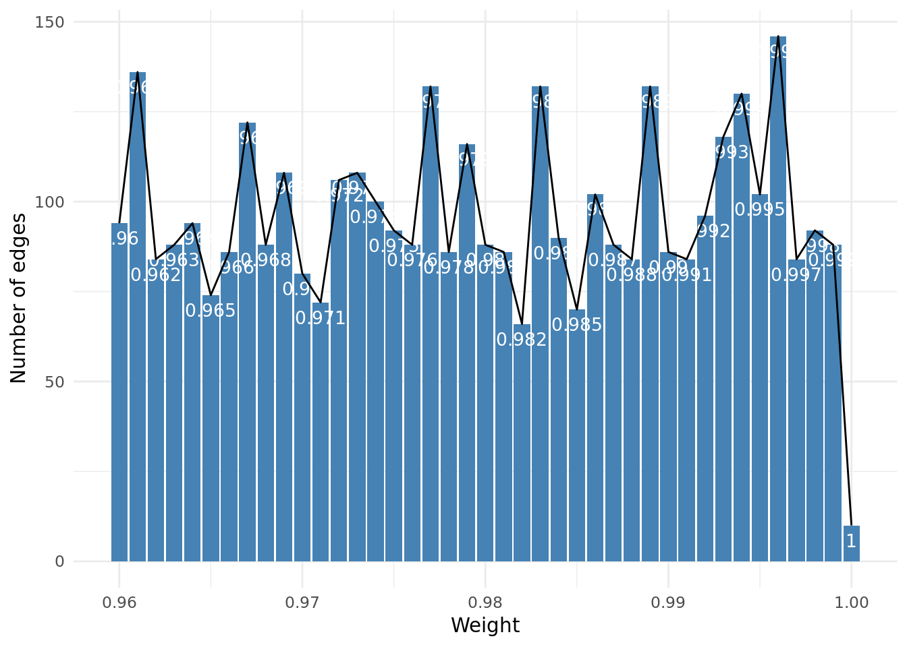

#### Degree distribution of item->similarity->item edges

#### Degree distribution of agent->knows->agent edges

#### Runing time by method 

<table class="table table-condensed" style="width: auto !important; ">
 <thead>
  <tr>
   <th style="text-align:left;"> key </th>
   <th style="text-align:right;"> doc_count </th>
   <th style="text-align:right;"> sum_wallTime_ms.value </th>
   <th style="text-align:left;"> avg_wallTime_ms.value </th>
   <th style="text-align:left;"> includedInTotal </th>
  </tr>
 </thead>
<tbody>
  <tr>
   <td style="text-align:left;"> connectIfSimilar </td>
   <td style="text-align:right;"> 21,945 </td>
   <td style="text-align:right;"> 47,961 </td>
   <td style="text-align:left;"> 2.18550922761449 </td>
   <td style="text-align:left;"> No </td>
  </tr>
  <tr>
   <td style="text-align:left;"> existsSimilarity </td>
   <td style="text-align:right;"> 21,945 </td>
   <td style="text-align:right;"> 47,448 </td>
   <td style="text-align:left;"> 2.16213260423787 </td>
   <td style="text-align:left;"> No </td>
  </tr>
  <tr>
   <td style="text-align:left;"> similarityEdges </td>
   <td style="text-align:right;"> 21,945 </td>
   <td style="text-align:right;"> 46,570 </td>
   <td style="text-align:left;"> 2.12212349054454 </td>
   <td style="text-align:left;"> No </td>
  </tr>
  <tr>
   <td style="text-align:left;"> connectAllSimilar </td>
   <td style="text-align:right;"> 210 </td>
   <td style="text-align:right;"> 48,248 </td>
   <td style="text-align:left;"> 229.752380952381 </td>
   <td style="text-align:left;"> Yes </td>
  </tr>
  <tr>
   <td style="text-align:left;"> init </td>
   <td style="text-align:right;"> 53 </td>
   <td style="text-align:right;"> 8,889 </td>
   <td style="text-align:left;"> 167.716981132075 </td>
   <td style="text-align:left;"> No </td>
  </tr>
  <tr>
   <td style="text-align:left;"> connect </td>
   <td style="text-align:right;"> 35 </td>
   <td style="text-align:right;"> 69 </td>
   <td style="text-align:left;"> 1.97142857142857 </td>
   <td style="text-align:left;"> Yes </td>
  </tr>
  <tr>
   <td style="text-align:left;font-weight: bold;"> Total </td>
   <td style="text-align:right;font-weight: bold;"> 253 </td>
   <td style="text-align:right;font-weight: bold;"> 48,587 </td>
   <td style="text-align:left;font-weight: bold;">  </td>
   <td style="text-align:left;font-weight: bold;">  </td>
  </tr>
</tbody>
</table>
####  Found structures 

#####  Cycles 

Number of cycles found:  1 

<button class="btn btn-primary" data-toggle="collapse" data-target="#UGAOJWZPWP"> Show/Hide foundCycle query </button> 
 
  
     GET /filebeat-*/_search 
              { 
                "query": {
                  "bool": {
                    "must": [
                      { "match_phrase": {
                        "simulationId": "SIM10-13-02-02-uBHuk6--CV"
                        }
                      },
                      { "bool": {
                        "should": [
                          { "match": {
                            "keyword": "foundCycle"
                          }}
                        ]
                      }}
                    ]
                  }
                }
              }
     

#####  Paths 

Number of paths found:  0 

<button class="btn btn-primary" data-toggle="collapse" data-target="#EZVZUJGNUI"> Show/Hide foundPath query </button> 
 
  
     GET /filebeat-*/_search 
              { 
                "query": {
                  "bool": {
                    "must": [
                      { "match_phrase": {
                        "simulationId": "SIM10-13-02-02-uBHuk6--CV"
                        }
                      },
                      { "bool": {
                        "should": [
                          { "match": {
                            "keyword": "foundPath"
                          }}
                        ]
                      }}
                    ]
                  }
                }
              }
     

###  SIM10-13-02-02-uBHuk6--DV 

#### simulationParameters 

<table class="table table-condensed" style="width: auto !important; ">
 <thead>
  <tr>
   <th style="text-align:left;"> agentNumber </th>
   <th style="text-align:left;"> similarityConnectThreshold </th>
   <th style="text-align:left;"> graphType </th>
   <th style="text-align:left;"> chainLength </th>
   <th style="text-align:left;"> similaritySearchThreshold </th>
   <th style="text-align:left;"> maxDistance </th>
   <th style="text-align:left;"> randomWorksNumberMultiplier </th>
  </tr>
 </thead>
<tbody>
  <tr>
   <td style="text-align:left;width: 20em; "> 50 </td>
   <td style="text-align:left;width: 15em; "> 0.96 </td>
   <td style="text-align:left;width: 15em; "> smallWorld </td>
   <td style="text-align:left;width: 15em; "> 5 </td>
   <td style="text-align:left;width: 15em; "> 1 </td>
   <td style="text-align:left;width: 15em; "> 10 </td>
   <td style="text-align:left;width: 15em; "> 2 </td>
  </tr>
</tbody>
</table>
#### allEdgesByLabel

<table class="table table-condensed" style="width: auto !important; ">
 <thead>
  <tr>
   <th style="text-align:right;"> edges_offers </th>
   <th style="text-align:right;"> edges_similarity </th>
   <th style="text-align:right;"> edges_owns </th>
   <th style="text-align:right;"> edges_demands </th>
   <th style="text-align:right;"> edges_knows </th>
   <th style="text-align:right;"> edges_total </th>
  </tr>
 </thead>
<tbody>
  <tr>
   <td style="text-align:right;width: 5em; "> 105 </td>
   <td style="text-align:right;width: 5em; "> 3,858 </td>
   <td style="text-align:right;width: 5em; "> 105 </td>
   <td style="text-align:right;width: 5em; "> 105 </td>
   <td style="text-align:right;width: 5em; "> 201 </td>
   <td style="text-align:right;width: 5em; "> 4,374 </td>
  </tr>
</tbody>
</table>
#### allVerticesByType

<table class="table table-condensed" style="width: auto !important; ">
 <thead>
  <tr>
   <th style="text-align:right;"> vertices_agent </th>
   <th style="text-align:right;"> vertices_item </th>
   <th style="text-align:right;"> vertices_work </th>
   <th style="text-align:right;"> vertices_total </th>
  </tr>
 </thead>
<tbody>
  <tr>
   <td style="text-align:right;width: 5em; "> 51 </td>
   <td style="text-align:right;width: 5em; "> 210 </td>
   <td style="text-align:right;width: 5em; "> 105 </td>
   <td style="text-align:right;width: 5em; "> 366 </td>
  </tr>
</tbody>
</table>
#### distribution of similarityEdgesByWeight

#### Degree distribution of item->similarity->item edges

#### Degree distribution of agent->knows->agent edges

#### Runing time by method 

<table class="table table-condensed" style="width: auto !important; ">
 <thead>
  <tr>
   <th style="text-align:left;">   </th>
   <th style="text-align:left;"> key </th>
   <th style="text-align:right;"> doc_count </th>
   <th style="text-align:right;"> sum_wallTime_ms.value </th>
   <th style="text-align:left;"> avg_wallTime_ms.value </th>
   <th style="text-align:left;"> includedInTotal </th>
  </tr>
 </thead>
<tbody>
  <tr>
   <td style="text-align:left;"> 1 </td>
   <td style="text-align:left;"> addItemToWork </td>
   <td style="text-align:right;"> 210 </td>
   <td style="text-align:right;"> 1,157 </td>
   <td style="text-align:left;"> 5.50952380952381 </td>
   <td style="text-align:left;"> No </td>
  </tr>
  <tr>
   <td style="text-align:left;"> 2 </td>
   <td style="text-align:left;"> knowsAgent </td>
   <td style="text-align:right;"> 201 </td>
   <td style="text-align:right;"> 295 </td>
   <td style="text-align:left;"> 1.46766169154229 </td>
   <td style="text-align:left;"> No </td>
  </tr>
  <tr>
   <td style="text-align:left;"> 3 </td>
   <td style="text-align:left;"> ownsWork </td>
   <td style="text-align:right;"> 105 </td>
   <td style="text-align:right;"> 872 </td>
   <td style="text-align:left;"> 8.30476190476191 </td>
   <td style="text-align:left;"> No </td>
  </tr>
  <tr>
   <td style="text-align:left;"> 4 </td>
   <td style="text-align:left;"> init </td>
   <td style="text-align:right;"> 53 </td>
   <td style="text-align:right;"> 9,065 </td>
   <td style="text-align:left;"> 171.037735849057 </td>
   <td style="text-align:left;"> No </td>
  </tr>
  <tr>
   <td style="text-align:left;"> 5 </td>
   <td style="text-align:left;"> searchAndConnect </td>
   <td style="text-align:right;"> 51 </td>
   <td style="text-align:right;"> 19,773 </td>
   <td style="text-align:left;"> 387.705882352941 </td>
   <td style="text-align:left;"> Yes </td>
  </tr>
  <tr>
   <td style="text-align:left;"> 6 </td>
   <td style="text-align:left;"> getWorksItems </td>
   <td style="text-align:right;"> 8 </td>
   <td style="text-align:right;"> 15 </td>
   <td style="text-align:left;"> 1.875 </td>
   <td style="text-align:left;"> Yes </td>
  </tr>
  <tr>
   <td style="text-align:left;"> 8 </td>
   <td style="text-align:left;"> addChainToNetwork </td>
   <td style="text-align:right;"> 1 </td>
   <td style="text-align:right;"> 0 </td>
   <td style="text-align:left;"> 0 </td>
   <td style="text-align:left;"> Yes </td>
  </tr>
  <tr>
   <td style="text-align:left;"> 9 </td>
   <td style="text-align:left;"> addRandomWorksToAgents </td>
   <td style="text-align:right;"> 1 </td>
   <td style="text-align:right;"> 4 </td>
   <td style="text-align:left;"> 4 </td>
   <td style="text-align:left;"> Yes </td>
  </tr>
  <tr>
   <td style="text-align:left;font-weight: bold;"> 11 </td>
   <td style="text-align:left;font-weight: bold;"> Total </td>
   <td style="text-align:right;font-weight: bold;"> 67 </td>
   <td style="text-align:right;font-weight: bold;"> 20,287 </td>
   <td style="text-align:left;font-weight: bold;">  </td>
   <td style="text-align:left;font-weight: bold;">  </td>
  </tr>
</tbody>
</table>
####  Found structures 

#####  Cycles 

Number of cycles found:  1 

<button class="btn btn-primary" data-toggle="collapse" data-target="#WIFJMRMKYW"> Show/Hide foundCycle query </button> 
 
  
     GET /filebeat-*/_search 
              { 
                "query": {
                  "bool": {
                    "must": [
                      { "match_phrase": {
                        "simulationId": "SIM10-13-02-02-uBHuk6--DV"
                        }
                      },
                      { "bool": {
                        "should": [
                          { "match": {
                            "keyword": "foundCycle"
                          }}
                        ]
                      }}
                    ]
                  }
                }
              }
     

#####  Paths 

Number of paths found:  0 

<button class="btn btn-primary" data-toggle="collapse" data-target="#WTBZRJOOJZ"> Show/Hide foundPath query </button> 
 
  
     GET /filebeat-*/_search 
              { 
                "query": {
                  "bool": {
                    "must": [
                      { "match_phrase": {
                        "simulationId": "SIM10-13-02-02-uBHuk6--DV"
                        }
                      },
                      { "bool": {
                        "should": [
                          { "match": {
                            "keyword": "foundPath"
                          }}
                        ]
                      }}
                    ]
                  }
                }
              }
     

###  SIM10-13-12-57-VQzsdS--CV 

#### simulationParameters 

<table class="table table-condensed" style="width: auto !important; ">
 <thead>
  <tr>
   <th style="text-align:left;"> agentNumber </th>
   <th style="text-align:left;"> similarityConnectThreshold </th>
   <th style="text-align:left;"> graphType </th>
   <th style="text-align:left;"> chainLength </th>
   <th style="text-align:left;"> similaritySearchThreshold </th>
   <th style="text-align:left;"> maxDistance </th>
   <th style="text-align:left;"> randomWorksNumberMultiplier </th>
  </tr>
 </thead>
<tbody>
  <tr>
   <td style="text-align:left;width: 20em; "> 50 </td>
   <td style="text-align:left;width: 15em; "> 0.96 </td>
   <td style="text-align:left;width: 15em; "> random </td>
   <td style="text-align:left;width: 15em; "> 5 </td>
   <td style="text-align:left;width: 15em; "> 1 </td>
   <td style="text-align:left;width: 15em; "> 10 </td>
   <td style="text-align:left;width: 15em; "> 1 </td>
  </tr>
</tbody>
</table>
#### allEdgesByLabel

<table class="table table-condensed" style="width: auto !important; ">
 <thead>
  <tr>
   <th style="text-align:right;"> edges_offers </th>
   <th style="text-align:right;"> edges_similarity </th>
   <th style="text-align:right;"> edges_owns </th>
   <th style="text-align:right;"> edges_demands </th>
   <th style="text-align:right;"> edges_knows </th>
   <th style="text-align:right;"> edges_total </th>
  </tr>
 </thead>
<tbody>
  <tr>
   <td style="text-align:right;width: 5em; "> 55 </td>
   <td style="text-align:right;width: 5em; "> 1,142 </td>
   <td style="text-align:right;width: 5em; "> 55 </td>
   <td style="text-align:right;width: 5em; "> 55 </td>
   <td style="text-align:right;width: 5em; "> 50 </td>
   <td style="text-align:right;width: 5em; "> 1,357 </td>
  </tr>
</tbody>
</table>
#### allVerticesByType

<table class="table table-condensed" style="width: auto !important; ">
 <thead>
  <tr>
   <th style="text-align:right;"> vertices_agent </th>
   <th style="text-align:right;"> vertices_item </th>
   <th style="text-align:right;"> vertices_work </th>
   <th style="text-align:right;"> vertices_total </th>
  </tr>
 </thead>
<tbody>
  <tr>
   <td style="text-align:right;width: 5em; "> 51 </td>
   <td style="text-align:right;width: 5em; "> 110 </td>
   <td style="text-align:right;width: 5em; "> 55 </td>
   <td style="text-align:right;width: 5em; "> 216 </td>
  </tr>
</tbody>
</table>
#### distribution of similarityEdgesByWeight

#### Degree distribution of item->similarity->item edges

#### Degree distribution of agent->knows->agent edges

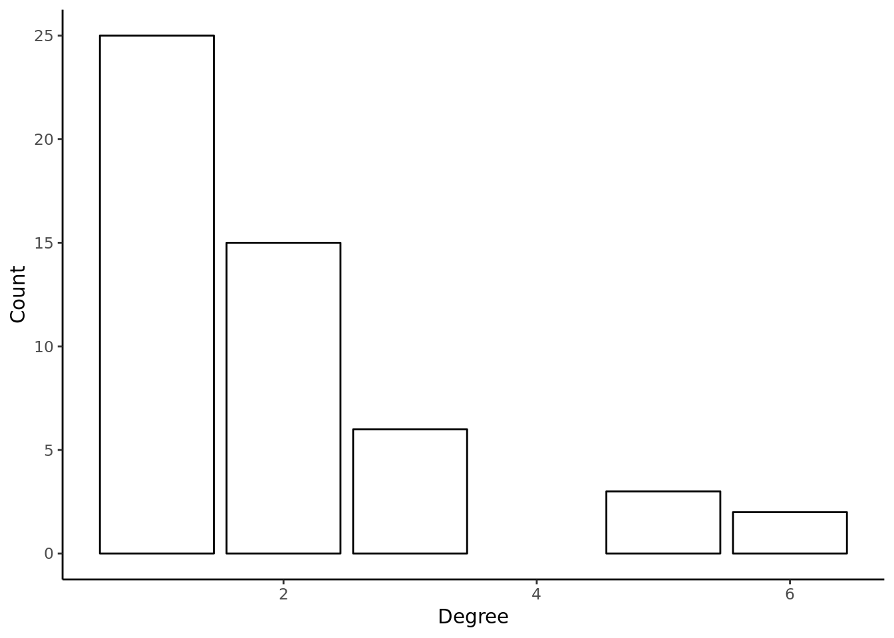

#### Runing time by method 

<table class="table table-condensed" style="width: auto !important; ">
 <thead>
  <tr>
   <th style="text-align:left;"> key </th>
   <th style="text-align:right;"> doc_count </th>
   <th style="text-align:right;"> sum_wallTime_ms.value </th>
   <th style="text-align:left;"> avg_wallTime_ms.value </th>
   <th style="text-align:left;"> includedInTotal </th>
  </tr>
 </thead>
<tbody>
  <tr>
   <td style="text-align:left;"> connectIfSimilar </td>
   <td style="text-align:right;"> 5,995 </td>
   <td style="text-align:right;"> 10,845 </td>
   <td style="text-align:left;"> 1.80900750625521 </td>
   <td style="text-align:left;"> No </td>
  </tr>
  <tr>
   <td style="text-align:left;"> existsSimilarity </td>
   <td style="text-align:right;"> 5,995 </td>
   <td style="text-align:right;"> 10,674 </td>
   <td style="text-align:left;"> 1.78048373644704 </td>
   <td style="text-align:left;"> No </td>
  </tr>
  <tr>
   <td style="text-align:left;"> similarityEdges </td>
   <td style="text-align:right;"> 5,995 </td>
   <td style="text-align:right;"> 10,463 </td>
   <td style="text-align:left;"> 1.74528773978315 </td>
   <td style="text-align:left;"> No </td>
  </tr>
  <tr>
   <td style="text-align:left;"> connectAllSimilar </td>
   <td style="text-align:right;"> 110 </td>
   <td style="text-align:right;"> 10,902 </td>
   <td style="text-align:left;"> 99.1090909090909 </td>
   <td style="text-align:left;"> Yes </td>
  </tr>
  <tr>
   <td style="text-align:left;"> init </td>
   <td style="text-align:right;"> 53 </td>
   <td style="text-align:right;"> 9,062 </td>
   <td style="text-align:left;"> 170.981132075472 </td>
   <td style="text-align:left;"> No </td>
  </tr>
  <tr>
   <td style="text-align:left;"> connect </td>
   <td style="text-align:right;"> 11 </td>
   <td style="text-align:right;"> 35 </td>
   <td style="text-align:left;"> 3.18181818181818 </td>
   <td style="text-align:left;"> Yes </td>
  </tr>
  <tr>
   <td style="text-align:left;font-weight: bold;"> Total </td>
   <td style="text-align:right;font-weight: bold;"> 129 </td>
   <td style="text-align:right;font-weight: bold;"> 11,347 </td>
   <td style="text-align:left;font-weight: bold;">  </td>
   <td style="text-align:left;font-weight: bold;">  </td>
  </tr>
</tbody>
</table>
####  Found structures 

#####  Cycles 

Number of cycles found:  1 

<button class="btn btn-primary" data-toggle="collapse" data-target="#TFYGFDKPGY"> Show/Hide foundCycle query </button> 
 
  
     GET /filebeat-*/_search 
              { 
                "query": {
                  "bool": {
                    "must": [
                      { "match_phrase": {
                        "simulationId": "SIM10-13-12-57-VQzsdS--CV"
                        }
                      },
                      { "bool": {
                        "should": [
                          { "match": {
                            "keyword": "foundCycle"
                          }}
                        ]
                      }}
                    ]
                  }
                }
              }
     

#####  Paths 

Number of paths found:  0 

<button class="btn btn-primary" data-toggle="collapse" data-target="#PUGWRSCZYH"> Show/Hide foundPath query </button> 
 
  
     GET /filebeat-*/_search 
              { 
                "query": {
                  "bool": {
                    "must": [
                      { "match_phrase": {
                        "simulationId": "SIM10-13-12-57-VQzsdS--CV"
                        }
                      },
                      { "bool": {
                        "should": [
                          { "match": {
                            "keyword": "foundPath"
                          }}
                        ]
                      }}
                    ]
                  }
                }
              }
     

###  SIM10-13-12-57-VQzsdS--DV 

#### simulationParameters 

<table class="table table-condensed" style="width: auto !important; ">
 <thead>
  <tr>
   <th style="text-align:left;"> agentNumber </th>
   <th style="text-align:left;"> similarityConnectThreshold </th>
   <th style="text-align:left;"> graphType </th>
   <th style="text-align:left;"> chainLength </th>
   <th style="text-align:left;"> similaritySearchThreshold </th>
   <th style="text-align:left;"> maxDistance </th>
   <th style="text-align:left;"> randomWorksNumberMultiplier </th>
  </tr>
 </thead>
<tbody>
  <tr>
   <td style="text-align:left;width: 20em; "> 50 </td>
   <td style="text-align:left;width: 15em; "> 0.96 </td>
   <td style="text-align:left;width: 15em; "> random </td>
   <td style="text-align:left;width: 15em; "> 5 </td>
   <td style="text-align:left;width: 15em; "> 1 </td>
   <td style="text-align:left;width: 15em; "> 10 </td>
   <td style="text-align:left;width: 15em; "> 1 </td>
  </tr>
</tbody>
</table>
#### allEdgesByLabel

<table class="table table-condensed" style="width: auto !important; ">
 <thead>
  <tr>
   <th style="text-align:right;"> edges_offers </th>
   <th style="text-align:right;"> edges_similarity </th>
   <th style="text-align:right;"> edges_owns </th>
   <th style="text-align:right;"> edges_demands </th>
   <th style="text-align:right;"> edges_knows </th>
   <th style="text-align:right;"> edges_total </th>
  </tr>
 </thead>
<tbody>
  <tr>
   <td style="text-align:right;width: 5em; "> 55 </td>
   <td style="text-align:right;width: 5em; "> 1,120 </td>
   <td style="text-align:right;width: 5em; "> 55 </td>
   <td style="text-align:right;width: 5em; "> 55 </td>
   <td style="text-align:right;width: 5em; "> 50 </td>
   <td style="text-align:right;width: 5em; "> 1,335 </td>
  </tr>
</tbody>
</table>
#### allVerticesByType

<table class="table table-condensed" style="width: auto !important; ">
 <thead>
  <tr>
   <th style="text-align:right;"> vertices_agent </th>
   <th style="text-align:right;"> vertices_item </th>
   <th style="text-align:right;"> vertices_work </th>
   <th style="text-align:right;"> vertices_total </th>
  </tr>
 </thead>
<tbody>
  <tr>
   <td style="text-align:right;width: 5em; "> 51 </td>
   <td style="text-align:right;width: 5em; "> 110 </td>
   <td style="text-align:right;width: 5em; "> 55 </td>
   <td style="text-align:right;width: 5em; "> 216 </td>
  </tr>
</tbody>
</table>
#### distribution of similarityEdgesByWeight

#### Degree distribution of item->similarity->item edges

#### Degree distribution of agent->knows->agent edges

#### Runing time by method 

<table class="table table-condensed" style="width: auto !important; ">
 <thead>
  <tr>
   <th style="text-align:left;">   </th>
   <th style="text-align:left;"> key </th>
   <th style="text-align:right;"> doc_count </th>
   <th style="text-align:right;"> sum_wallTime_ms.value </th>
   <th style="text-align:left;"> avg_wallTime_ms.value </th>
   <th style="text-align:left;"> includedInTotal </th>
  </tr>
 </thead>
<tbody>
  <tr>
   <td style="text-align:left;"> 1 </td>
   <td style="text-align:left;"> addItemToWork </td>
   <td style="text-align:right;"> 110 </td>
   <td style="text-align:right;"> 601 </td>
   <td style="text-align:left;"> 5.46363636363636 </td>
   <td style="text-align:left;"> No </td>
  </tr>
  <tr>
   <td style="text-align:left;"> 2 </td>
   <td style="text-align:left;"> ownsWork </td>
   <td style="text-align:right;"> 55 </td>
   <td style="text-align:right;"> 397 </td>
   <td style="text-align:left;"> 7.21818181818182 </td>
   <td style="text-align:left;"> No </td>
  </tr>
  <tr>
   <td style="text-align:left;"> 3 </td>
   <td style="text-align:left;"> init </td>
   <td style="text-align:right;"> 53 </td>
   <td style="text-align:right;"> 8,980 </td>
   <td style="text-align:left;"> 169.433962264151 </td>
   <td style="text-align:left;"> No </td>
  </tr>
  <tr>
   <td style="text-align:left;"> 4 </td>
   <td style="text-align:left;"> searchAndConnect </td>
   <td style="text-align:right;"> 51 </td>
   <td style="text-align:right;"> 6,507 </td>
   <td style="text-align:left;"> 127.588235294118 </td>
   <td style="text-align:left;"> Yes </td>
  </tr>
  <tr>
   <td style="text-align:left;"> 5 </td>
   <td style="text-align:left;"> knowsAgent </td>
   <td style="text-align:right;"> 50 </td>
   <td style="text-align:right;"> 157 </td>
   <td style="text-align:left;"> 3.14 </td>
   <td style="text-align:left;"> No </td>
  </tr>
  <tr>
   <td style="text-align:left;"> 6 </td>
   <td style="text-align:left;"> getWorksItems </td>
   <td style="text-align:right;"> 8 </td>
   <td style="text-align:right;"> 20 </td>
   <td style="text-align:left;"> 2.5 </td>
   <td style="text-align:left;"> Yes </td>
  </tr>
  <tr>
   <td style="text-align:left;"> 8 </td>
   <td style="text-align:left;"> addChainToNetwork </td>
   <td style="text-align:right;"> 1 </td>
   <td style="text-align:right;"> 0 </td>
   <td style="text-align:left;"> 0 </td>
   <td style="text-align:left;"> Yes </td>
  </tr>
  <tr>
   <td style="text-align:left;"> 9 </td>
   <td style="text-align:left;"> addRandomWorksToAgents </td>
   <td style="text-align:right;"> 1 </td>
   <td style="text-align:right;"> 2 </td>
   <td style="text-align:left;"> 2 </td>
   <td style="text-align:left;"> Yes </td>
  </tr>
  <tr>
   <td style="text-align:left;font-weight: bold;"> 11 </td>
   <td style="text-align:left;font-weight: bold;"> Total </td>
   <td style="text-align:right;font-weight: bold;"> 67 </td>
   <td style="text-align:right;font-weight: bold;"> 6,795 </td>
   <td style="text-align:left;font-weight: bold;">  </td>
   <td style="text-align:left;font-weight: bold;">  </td>
  </tr>
</tbody>
</table>
####  Found structures 

#####  Cycles 

Number of cycles found:  1 

<button class="btn btn-primary" data-toggle="collapse" data-target="#KLFEFMDHQT"> Show/Hide foundCycle query </button> 
 
  
     GET /filebeat-*/_search 
              { 
                "query": {
                  "bool": {
                    "must": [
                      { "match_phrase": {
                        "simulationId": "SIM10-13-12-57-VQzsdS--DV"
                        }
                      },
                      { "bool": {
                        "should": [
                          { "match": {
                            "keyword": "foundCycle"
                          }}
                        ]
                      }}
                    ]
                  }
                }
              }
     

#####  Paths 

Number of paths found:  0 

<button class="btn btn-primary" data-toggle="collapse" data-target="#QNBZHRRBZC"> Show/Hide foundPath query </button> 
 
  
     GET /filebeat-*/_search 
              { 
                "query": {
                  "bool": {
                    "must": [
                      { "match_phrase": {
                        "simulationId": "SIM10-13-12-57-VQzsdS--DV"
                        }
                      },
                      { "bool": {
                        "should": [
                          { "match": {
                            "keyword": "foundPath"
                          }}
                        ]
                      }}
                    ]
                  }
                }
              }
     

###  SIM10-13-12-58-G2HfzH--CV 

#### simulationParameters 

<table class="table table-condensed" style="width: auto !important; ">
 <thead>
  <tr>
   <th style="text-align:left;"> agentNumber </th>
   <th style="text-align:left;"> similarityConnectThreshold </th>
   <th style="text-align:left;"> graphType </th>
   <th style="text-align:left;"> chainLength </th>
   <th style="text-align:left;"> similaritySearchThreshold </th>
   <th style="text-align:left;"> maxDistance </th>
   <th style="text-align:left;"> randomWorksNumberMultiplier </th>
  </tr>
 </thead>
<tbody>
  <tr>
   <td style="text-align:left;width: 20em; "> 50 </td>
   <td style="text-align:left;width: 15em; "> 0.96 </td>
   <td style="text-align:left;width: 15em; "> smallWorld </td>
   <td style="text-align:left;width: 15em; "> 5 </td>
   <td style="text-align:left;width: 15em; "> 1 </td>
   <td style="text-align:left;width: 15em; "> 10 </td>
   <td style="text-align:left;width: 15em; "> 1 </td>
  </tr>
</tbody>
</table>
#### allEdgesByLabel

<table class="table table-condensed" style="width: auto !important; ">
 <thead>
  <tr>
   <th style="text-align:right;"> edges_offers </th>
   <th style="text-align:right;"> edges_similarity </th>
   <th style="text-align:right;"> edges_owns </th>
   <th style="text-align:right;"> edges_demands </th>
   <th style="text-align:right;"> edges_knows </th>
   <th style="text-align:right;"> edges_total </th>
  </tr>
 </thead>
<tbody>
  <tr>
   <td style="text-align:right;width: 5em; "> 55 </td>
   <td style="text-align:right;width: 5em; "> 1,218 </td>
   <td style="text-align:right;width: 5em; "> 55 </td>
   <td style="text-align:right;width: 5em; "> 55 </td>
   <td style="text-align:right;width: 5em; "> 201 </td>
   <td style="text-align:right;width: 5em; "> 1,584 </td>
  </tr>
</tbody>
</table>
#### allVerticesByType

<table class="table table-condensed" style="width: auto !important; ">
 <thead>
  <tr>
   <th style="text-align:right;"> vertices_agent </th>
   <th style="text-align:right;"> vertices_item </th>
   <th style="text-align:right;"> vertices_work </th>
   <th style="text-align:right;"> vertices_total </th>
  </tr>
 </thead>
<tbody>
  <tr>
   <td style="text-align:right;width: 5em; "> 51 </td>
   <td style="text-align:right;width: 5em; "> 110 </td>
   <td style="text-align:right;width: 5em; "> 55 </td>
   <td style="text-align:right;width: 5em; "> 216 </td>
  </tr>
</tbody>
</table>
#### distribution of similarityEdgesByWeight

#### Degree distribution of item->similarity->item edges

#### Degree distribution of agent->knows->agent edges

#### Runing time by method 

<table class="table table-condensed" style="width: auto !important; ">
 <thead>
  <tr>
   <th style="text-align:left;"> key </th>
   <th style="text-align:right;"> doc_count </th>
   <th style="text-align:right;"> sum_wallTime_ms.value </th>
   <th style="text-align:left;"> avg_wallTime_ms.value </th>
   <th style="text-align:left;"> includedInTotal </th>
  </tr>
 </thead>
<tbody>
  <tr>
   <td style="text-align:left;"> connectIfSimilar </td>
   <td style="text-align:right;"> 5,995 </td>
   <td style="text-align:right;"> 10,665 </td>
   <td style="text-align:left;"> 1.7789824854045 </td>
   <td style="text-align:left;"> No </td>
  </tr>
  <tr>
   <td style="text-align:left;"> existsSimilarity </td>
   <td style="text-align:right;"> 5,995 </td>
   <td style="text-align:right;"> 10,529 </td>
   <td style="text-align:left;"> 1.75629691409508 </td>
   <td style="text-align:left;"> No </td>
  </tr>
  <tr>
   <td style="text-align:left;"> similarityEdges </td>
   <td style="text-align:right;"> 5,995 </td>
   <td style="text-align:right;"> 10,341 </td>
   <td style="text-align:left;"> 1.72493744787323 </td>
   <td style="text-align:left;"> No </td>
  </tr>
  <tr>
   <td style="text-align:left;"> connectAllSimilar </td>
   <td style="text-align:right;"> 110 </td>
   <td style="text-align:right;"> 10,736 </td>
   <td style="text-align:left;"> 97.6 </td>
   <td style="text-align:left;"> Yes </td>
  </tr>
  <tr>
   <td style="text-align:left;"> init </td>
   <td style="text-align:right;"> 53 </td>
   <td style="text-align:right;"> 8,762 </td>
   <td style="text-align:left;"> 165.320754716981 </td>
   <td style="text-align:left;"> No </td>
  </tr>
  <tr>
   <td style="text-align:left;"> connect </td>
   <td style="text-align:right;"> 13 </td>
   <td style="text-align:right;"> 31 </td>
   <td style="text-align:left;"> 2.38461538461538 </td>
   <td style="text-align:left;"> Yes </td>
  </tr>
  <tr>
   <td style="text-align:left;font-weight: bold;"> Total </td>
   <td style="text-align:right;font-weight: bold;"> 131 </td>
   <td style="text-align:right;font-weight: bold;"> 11,012 </td>
   <td style="text-align:left;font-weight: bold;">  </td>
   <td style="text-align:left;font-weight: bold;">  </td>
  </tr>
</tbody>
</table>
####  Found structures 

#####  Cycles 

Number of cycles found:  1 

<button class="btn btn-primary" data-toggle="collapse" data-target="#MREWMEVSON"> Show/Hide foundCycle query </button> 
 
  
     GET /filebeat-*/_search 
              { 
                "query": {
                  "bool": {
                    "must": [
                      { "match_phrase": {
                        "simulationId": "SIM10-13-12-58-G2HfzH--CV"
                        }
                      },
                      { "bool": {
                        "should": [
                          { "match": {
                            "keyword": "foundCycle"
                          }}
                        ]
                      }}
                    ]
                  }
                }
              }
     

#####  Paths 

Number of paths found:  0 

<button class="btn btn-primary" data-toggle="collapse" data-target="#KNLGHODKJM"> Show/Hide foundPath query </button> 
 
  
     GET /filebeat-*/_search 
              { 
                "query": {
                  "bool": {
                    "must": [
                      { "match_phrase": {
                        "simulationId": "SIM10-13-12-58-G2HfzH--CV"
                        }
                      },
                      { "bool": {
                        "should": [
                          { "match": {
                            "keyword": "foundPath"
                          }}
                        ]
                      }}
                    ]
                  }
                }
              }
     

###  SIM10-13-12-58-G2HfzH--DV 

#### simulationParameters 

<table class="table table-condensed" style="width: auto !important; ">
 <thead>
  <tr>
   <th style="text-align:left;"> agentNumber </th>
   <th style="text-align:left;"> similarityConnectThreshold </th>
   <th style="text-align:left;"> graphType </th>
   <th style="text-align:left;"> chainLength </th>
   <th style="text-align:left;"> similaritySearchThreshold </th>
   <th style="text-align:left;"> maxDistance </th>
   <th style="text-align:left;"> randomWorksNumberMultiplier </th>
  </tr>
 </thead>
<tbody>
  <tr>
   <td style="text-align:left;width: 20em; "> 50 </td>
   <td style="text-align:left;width: 15em; "> 0.96 </td>
   <td style="text-align:left;width: 15em; "> smallWorld </td>
   <td style="text-align:left;width: 15em; "> 5 </td>
   <td style="text-align:left;width: 15em; "> 1 </td>
   <td style="text-align:left;width: 15em; "> 10 </td>
   <td style="text-align:left;width: 15em; "> 1 </td>
  </tr>
</tbody>
</table>
#### allEdgesByLabel

<table class="table table-condensed" style="width: auto !important; ">
 <thead>
  <tr>
   <th style="text-align:right;"> edges_offers </th>
   <th style="text-align:right;"> edges_similarity </th>
   <th style="text-align:right;"> edges_owns </th>
   <th style="text-align:right;"> edges_demands </th>
   <th style="text-align:right;"> edges_knows </th>
   <th style="text-align:right;"> edges_total </th>
  </tr>
 </thead>
<tbody>
  <tr>
   <td style="text-align:right;width: 5em; "> 55 </td>
   <td style="text-align:right;width: 5em; "> 1,192 </td>
   <td style="text-align:right;width: 5em; "> 55 </td>
   <td style="text-align:right;width: 5em; "> 55 </td>
   <td style="text-align:right;width: 5em; "> 201 </td>
   <td style="text-align:right;width: 5em; "> 1,558 </td>
  </tr>
</tbody>
</table>
#### allVerticesByType

<table class="table table-condensed" style="width: auto !important; ">
 <thead>
  <tr>
   <th style="text-align:right;"> vertices_agent </th>
   <th style="text-align:right;"> vertices_item </th>
   <th style="text-align:right;"> vertices_work </th>
   <th style="text-align:right;"> vertices_total </th>
  </tr>
 </thead>
<tbody>
  <tr>
   <td style="text-align:right;width: 5em; "> 51 </td>
   <td style="text-align:right;width: 5em; "> 110 </td>
   <td style="text-align:right;width: 5em; "> 55 </td>
   <td style="text-align:right;width: 5em; "> 216 </td>
  </tr>
</tbody>
</table>
#### distribution of similarityEdgesByWeight

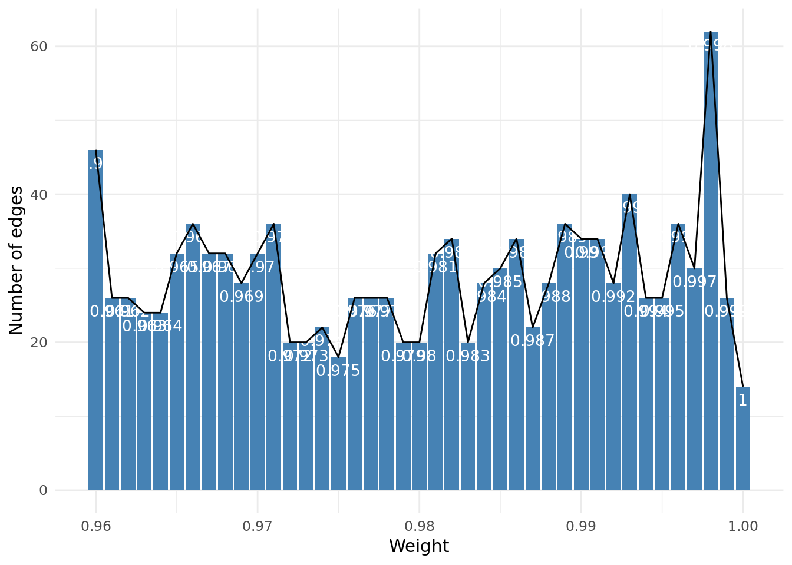

#### Degree distribution of item->similarity->item edges

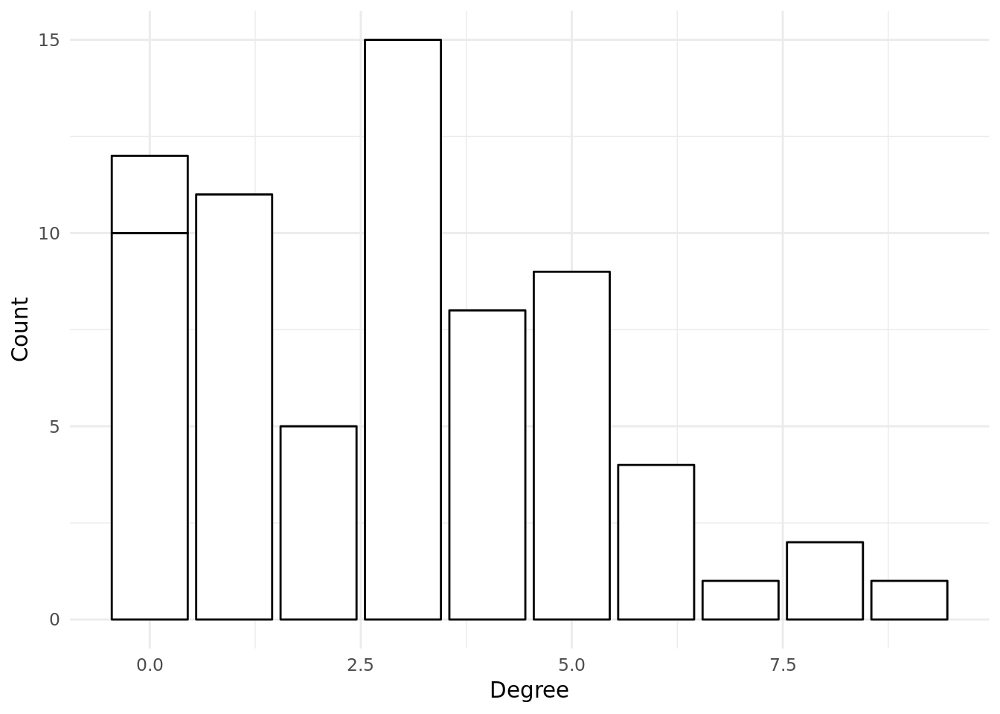

#### Degree distribution of agent->knows->agent edges

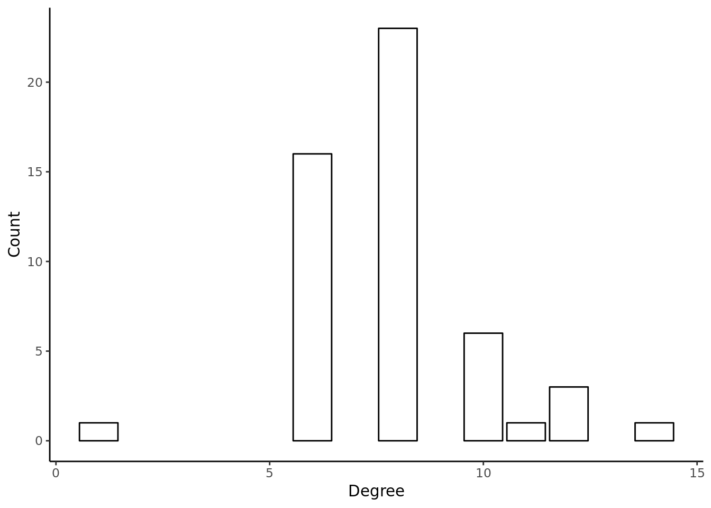

#### Runing time by method 

<table class="table table-condensed" style="width: auto !important; ">
 <thead>
  <tr>
   <th style="text-align:left;">   </th>
   <th style="text-align:left;"> key </th>
   <th style="text-align:right;"> doc_count </th>
   <th style="text-align:right;"> sum_wallTime_ms.value </th>
   <th style="text-align:left;"> avg_wallTime_ms.value </th>
   <th style="text-align:left;"> includedInTotal </th>
  </tr>
 </thead>
<tbody>
  <tr>
   <td style="text-align:left;"> 1 </td>
   <td style="text-align:left;"> knowsAgent </td>
   <td style="text-align:right;"> 201 </td>
   <td style="text-align:right;"> 314 </td>
   <td style="text-align:left;"> 1.56218905472637 </td>
   <td style="text-align:left;"> No </td>
  </tr>
  <tr>
   <td style="text-align:left;"> 2 </td>
   <td style="text-align:left;"> addItemToWork </td>
   <td style="text-align:right;"> 110 </td>
   <td style="text-align:right;"> 574 </td>
   <td style="text-align:left;"> 5.21818181818182 </td>
   <td style="text-align:left;"> No </td>
  </tr>
  <tr>
   <td style="text-align:left;"> 3 </td>
   <td style="text-align:left;"> ownsWork </td>
   <td style="text-align:right;"> 55 </td>
   <td style="text-align:right;"> 446 </td>
   <td style="text-align:left;"> 8.10909090909091 </td>
   <td style="text-align:left;"> No </td>
  </tr>
  <tr>
   <td style="text-align:left;"> 4 </td>
   <td style="text-align:left;"> init </td>
   <td style="text-align:right;"> 53 </td>
   <td style="text-align:right;"> 9,146 </td>
   <td style="text-align:left;"> 172.566037735849 </td>
   <td style="text-align:left;"> No </td>
  </tr>
  <tr>
   <td style="text-align:left;"> 5 </td>
   <td style="text-align:left;"> searchAndConnect </td>
   <td style="text-align:right;"> 51 </td>
   <td style="text-align:right;"> 7,326 </td>
   <td style="text-align:left;"> 143.647058823529 </td>
   <td style="text-align:left;"> Yes </td>
  </tr>
  <tr>
   <td style="text-align:left;"> 6 </td>
   <td style="text-align:left;"> getWorksItems </td>
   <td style="text-align:right;"> 8 </td>
   <td style="text-align:right;"> 16 </td>
   <td style="text-align:left;"> 2 </td>
   <td style="text-align:left;"> Yes </td>
  </tr>
  <tr>
   <td style="text-align:left;"> 8 </td>
   <td style="text-align:left;"> addChainToNetwork </td>
   <td style="text-align:right;"> 1 </td>
   <td style="text-align:right;"> 0 </td>
   <td style="text-align:left;"> 0 </td>
   <td style="text-align:left;"> Yes </td>
  </tr>
  <tr>
   <td style="text-align:left;"> 9 </td>
   <td style="text-align:left;"> addRandomWorksToAgents </td>
   <td style="text-align:right;"> 1 </td>
   <td style="text-align:right;"> 3 </td>
   <td style="text-align:left;"> 3 </td>
   <td style="text-align:left;"> Yes </td>
  </tr>
  <tr>
   <td style="text-align:left;font-weight: bold;"> 11 </td>
   <td style="text-align:left;font-weight: bold;"> Total </td>
   <td style="text-align:right;font-weight: bold;"> 67 </td>
   <td style="text-align:right;font-weight: bold;"> 7,442 </td>
   <td style="text-align:left;font-weight: bold;">  </td>
   <td style="text-align:left;font-weight: bold;">  </td>
  </tr>
</tbody>
</table>
####  Found structures 

#####  Cycles 

Number of cycles found:  1 

<button class="btn btn-primary" data-toggle="collapse" data-target="#PZNFJTMEQD"> Show/Hide foundCycle query </button> 
 
  
     GET /filebeat-*/_search 
              { 
                "query": {
                  "bool": {
                    "must": [
                      { "match_phrase": {
                        "simulationId": "SIM10-13-12-58-G2HfzH--DV"
                        }
                      },
                      { "bool": {
                        "should": [
                          { "match": {
                            "keyword": "foundCycle"
                          }}
                        ]
                      }}
                    ]
                  }
                }
              }
     

#####  Paths 

Number of paths found:  0 

<button class="btn btn-primary" data-toggle="collapse" data-target="#AZJGDSFVIJ"> Show/Hide foundPath query </button> 
 
  
     GET /filebeat-*/_search 
              { 
                "query": {
                  "bool": {
                    "must": [
                      { "match_phrase": {
                        "simulationId": "SIM10-13-12-58-G2HfzH--DV"
                        }
                      },
                      { "bool": {
                        "should": [
                          { "match": {
                            "keyword": "foundPath"
                          }}
                        ]
                      }}
                    ]
                  }
                }
              }
     

###  SIM10-13-02-03-3vnohZ--CV 

#### simulationParameters 

<table class="table table-condensed" style="width: auto !important; ">
 <thead>
  <tr>
   <th style="text-align:left;"> agentNumber </th>
   <th style="text-align:left;"> similarityConnectThreshold </th>
   <th style="text-align:left;"> graphType </th>
   <th style="text-align:left;"> chainLength </th>
   <th style="text-align:left;"> similaritySearchThreshold </th>
   <th style="text-align:left;"> maxDistance </th>
   <th style="text-align:left;"> randomWorksNumberMultiplier </th>
  </tr>
 </thead>
<tbody>
  <tr>
   <td style="text-align:left;width: 20em; "> 50 </td>
   <td style="text-align:left;width: 15em; "> 0.96 </td>
   <td style="text-align:left;width: 15em; "> random </td>
   <td style="text-align:left;width: 15em; "> 5 </td>
   <td style="text-align:left;width: 15em; "> 1 </td>
   <td style="text-align:left;width: 15em; "> 30 </td>
   <td style="text-align:left;width: 15em; "> 2 </td>
  </tr>
</tbody>
</table>
#### allEdgesByLabel

<table class="table table-condensed" style="width: auto !important; ">
 <thead>
  <tr>
   <th style="text-align:right;"> edges_offers </th>
   <th style="text-align:right;"> edges_similarity </th>
   <th style="text-align:right;"> edges_owns </th>
   <th style="text-align:right;"> edges_demands </th>
   <th style="text-align:right;"> edges_knows </th>
   <th style="text-align:right;"> edges_total </th>
  </tr>
 </thead>
<tbody>
  <tr>
   <td style="text-align:right;width: 5em; "> 105 </td>
   <td style="text-align:right;width: 5em; "> 4,242 </td>
   <td style="text-align:right;width: 5em; "> 105 </td>
   <td style="text-align:right;width: 5em; "> 105 </td>
   <td style="text-align:right;width: 5em; "> 50 </td>
   <td style="text-align:right;width: 5em; "> 4,607 </td>
  </tr>
</tbody>
</table>
#### allVerticesByType

<table class="table table-condensed" style="width: auto !important; ">
 <thead>
  <tr>
   <th style="text-align:right;"> vertices_agent </th>
   <th style="text-align:right;"> vertices_item </th>
   <th style="text-align:right;"> vertices_work </th>
   <th style="text-align:right;"> vertices_total </th>
  </tr>
 </thead>
<tbody>
  <tr>
   <td style="text-align:right;width: 5em; "> 51 </td>
   <td style="text-align:right;width: 5em; "> 210 </td>
   <td style="text-align:right;width: 5em; "> 105 </td>
   <td style="text-align:right;width: 5em; "> 366 </td>
  </tr>
</tbody>
</table>
#### distribution of similarityEdgesByWeight

#### Degree distribution of item->similarity->item edges

#### Degree distribution of agent->knows->agent edges

#### Runing time by method 

<table class="table table-condensed" style="width: auto !important; ">
 <thead>
  <tr>
   <th style="text-align:left;"> key </th>
   <th style="text-align:right;"> doc_count </th>
   <th style="text-align:right;"> sum_wallTime_ms.value </th>
   <th style="text-align:left;"> avg_wallTime_ms.value </th>
   <th style="text-align:left;"> includedInTotal </th>
  </tr>
 </thead>
<tbody>
  <tr>
   <td style="text-align:left;"> connectIfSimilar </td>
   <td style="text-align:right;"> 21,945 </td>
   <td style="text-align:right;"> 46,761 </td>
   <td style="text-align:left;"> 2.13082706766917 </td>
   <td style="text-align:left;"> No </td>
  </tr>
  <tr>
   <td style="text-align:left;"> existsSimilarity </td>
   <td style="text-align:right;"> 21,945 </td>
   <td style="text-align:right;"> 46,235 </td>
   <td style="text-align:left;"> 2.10685805422648 </td>
   <td style="text-align:left;"> No </td>
  </tr>
  <tr>
   <td style="text-align:left;"> similarityEdges </td>
   <td style="text-align:right;"> 21,945 </td>
   <td style="text-align:right;"> 45,382 </td>
   <td style="text-align:left;"> 2.06798815219868 </td>
   <td style="text-align:left;"> No </td>
  </tr>
  <tr>
   <td style="text-align:left;"> connectAllSimilar </td>
   <td style="text-align:right;"> 210 </td>
   <td style="text-align:right;"> 46,995 </td>
   <td style="text-align:left;"> 223.785714285714 </td>
   <td style="text-align:left;"> Yes </td>
  </tr>
  <tr>
   <td style="text-align:left;"> init </td>
   <td style="text-align:right;"> 53 </td>
   <td style="text-align:right;"> 8,852 </td>
   <td style="text-align:left;"> 167.018867924528 </td>
   <td style="text-align:left;"> No </td>
  </tr>
  <tr>
   <td style="text-align:left;"> connect </td>
   <td style="text-align:right;"> 44 </td>
   <td style="text-align:right;"> 92 </td>
   <td style="text-align:left;"> 2.09090909090909 </td>
   <td style="text-align:left;"> Yes </td>
  </tr>
  <tr>
   <td style="text-align:left;font-weight: bold;"> Total </td>
   <td style="text-align:right;font-weight: bold;"> 262 </td>
   <td style="text-align:right;font-weight: bold;"> 47,406 </td>
   <td style="text-align:left;font-weight: bold;">  </td>
   <td style="text-align:left;font-weight: bold;">  </td>
  </tr>
</tbody>
</table>
####  Found structures 

#####  Cycles 

Number of cycles found:  1 

<button class="btn btn-primary" data-toggle="collapse" data-target="#XAOWUNBAOY"> Show/Hide foundCycle query </button> 
 
  
     GET /filebeat-*/_search 
              { 
                "query": {
                  "bool": {
                    "must": [
                      { "match_phrase": {
                        "simulationId": "SIM10-13-02-03-3vnohZ--CV"
                        }
                      },
                      { "bool": {
                        "should": [
                          { "match": {
                            "keyword": "foundCycle"
                          }}
                        ]
                      }}
                    ]
                  }
                }
              }
     

#####  Paths 

Number of paths found:  0 

<button class="btn btn-primary" data-toggle="collapse" data-target="#PMZFPYPDMN"> Show/Hide foundPath query </button> 
 
  
     GET /filebeat-*/_search 
              { 
                "query": {
                  "bool": {
                    "must": [
                      { "match_phrase": {
                        "simulationId": "SIM10-13-02-03-3vnohZ--CV"
                        }
                      },
                      { "bool": {
                        "should": [
                          { "match": {
                            "keyword": "foundPath"
                          }}
                        ]
                      }}
                    ]
                  }
                }
              }
     

###  SIM10-13-02-03-3vnohZ--DV 

#### simulationParameters 

<table class="table table-condensed" style="width: auto !important; ">
 <thead>
  <tr>
   <th style="text-align:left;"> agentNumber </th>
   <th style="text-align:left;"> similarityConnectThreshold </th>
   <th style="text-align:left;"> graphType </th>
   <th style="text-align:left;"> chainLength </th>
   <th style="text-align:left;"> similaritySearchThreshold </th>
   <th style="text-align:left;"> maxDistance </th>
   <th style="text-align:left;"> randomWorksNumberMultiplier </th>
  </tr>
 </thead>
<tbody>
  <tr>
   <td style="text-align:left;width: 20em; "> 50 </td>
   <td style="text-align:left;width: 15em; "> 0.96 </td>
   <td style="text-align:left;width: 15em; "> random </td>
   <td style="text-align:left;width: 15em; "> 5 </td>
   <td style="text-align:left;width: 15em; "> 1 </td>
   <td style="text-align:left;width: 15em; "> 30 </td>
   <td style="text-align:left;width: 15em; "> 2 </td>
  </tr>
</tbody>
</table>
#### allEdgesByLabel

<table class="table table-condensed" style="width: auto !important; ">
 <thead>
  <tr>
   <th style="text-align:right;"> edges_offers </th>
   <th style="text-align:right;"> edges_similarity </th>
   <th style="text-align:right;"> edges_owns </th>
   <th style="text-align:right;"> edges_demands </th>
   <th style="text-align:right;"> edges_knows </th>
   <th style="text-align:right;"> edges_total </th>
  </tr>
 </thead>
<tbody>
  <tr>
   <td style="text-align:right;width: 5em; "> 105 </td>
   <td style="text-align:right;width: 5em; "> 4,154 </td>
   <td style="text-align:right;width: 5em; "> 105 </td>
   <td style="text-align:right;width: 5em; "> 105 </td>
   <td style="text-align:right;width: 5em; "> 50 </td>
   <td style="text-align:right;width: 5em; "> 4,519 </td>
  </tr>
</tbody>
</table>
#### allVerticesByType

<table class="table table-condensed" style="width: auto !important; ">
 <thead>
  <tr>
   <th style="text-align:right;"> vertices_agent </th>
   <th style="text-align:right;"> vertices_item </th>
   <th style="text-align:right;"> vertices_work </th>
   <th style="text-align:right;"> vertices_total </th>
  </tr>
 </thead>
<tbody>
  <tr>
   <td style="text-align:right;width: 5em; "> 51 </td>
   <td style="text-align:right;width: 5em; "> 210 </td>
   <td style="text-align:right;width: 5em; "> 105 </td>
   <td style="text-align:right;width: 5em; "> 366 </td>
  </tr>
</tbody>
</table>
#### distribution of similarityEdgesByWeight

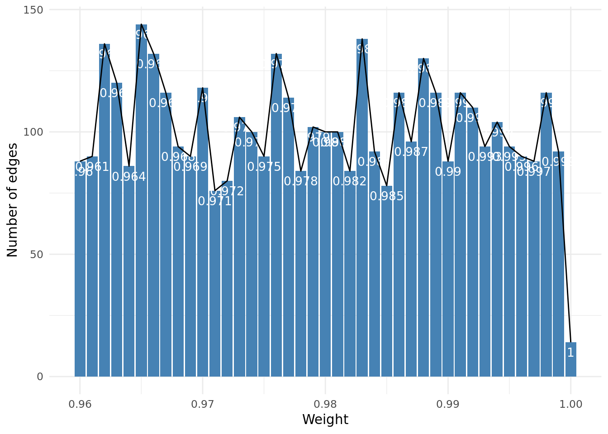

#### Degree distribution of item->similarity->item edges

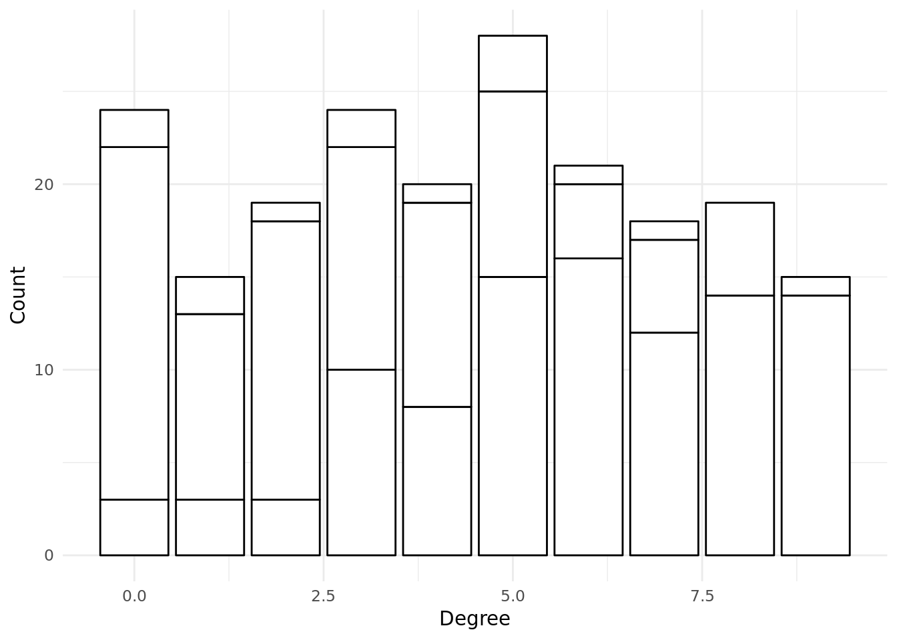

#### Degree distribution of agent->knows->agent edges

#### Runing time by method 

<table class="table table-condensed" style="width: auto !important; ">
 <thead>
  <tr>
   <th style="text-align:left;">   </th>
   <th style="text-align:left;"> key </th>
   <th style="text-align:right;"> doc_count </th>
   <th style="text-align:right;"> sum_wallTime_ms.value </th>
   <th style="text-align:left;"> avg_wallTime_ms.value </th>
   <th style="text-align:left;"> includedInTotal </th>
  </tr>
 </thead>
<tbody>
  <tr>
   <td style="text-align:left;"> 1 </td>
   <td style="text-align:left;"> addItemToWork </td>
   <td style="text-align:right;"> 210 </td>
   <td style="text-align:right;"> 1,302 </td>
   <td style="text-align:left;"> 6.2 </td>
   <td style="text-align:left;"> No </td>
  </tr>
  <tr>
   <td style="text-align:left;"> 2 </td>
   <td style="text-align:left;"> ownsWork </td>
   <td style="text-align:right;"> 105 </td>
   <td style="text-align:right;"> 883 </td>
   <td style="text-align:left;"> 8.40952380952381 </td>
   <td style="text-align:left;"> No </td>
  </tr>
  <tr>
   <td style="text-align:left;"> 3 </td>
   <td style="text-align:left;"> init </td>
   <td style="text-align:right;"> 53 </td>
   <td style="text-align:right;"> 8,993 </td>
   <td style="text-align:left;"> 169.679245283019 </td>
   <td style="text-align:left;"> No </td>
  </tr>
  <tr>
   <td style="text-align:left;"> 4 </td>
   <td style="text-align:left;"> searchAndConnect </td>
   <td style="text-align:right;"> 51 </td>
   <td style="text-align:right;"> 20,214 </td>
   <td style="text-align:left;"> 396.352941176471 </td>
   <td style="text-align:left;"> Yes </td>
  </tr>
  <tr>
   <td style="text-align:left;"> 5 </td>
   <td style="text-align:left;"> knowsAgent </td>
   <td style="text-align:right;"> 50 </td>
   <td style="text-align:right;"> 219 </td>
   <td style="text-align:left;"> 4.38 </td>
   <td style="text-align:left;"> No </td>
  </tr>
  <tr>
   <td style="text-align:left;"> 6 </td>
   <td style="text-align:left;"> getWorksItems </td>
   <td style="text-align:right;"> 8 </td>
   <td style="text-align:right;"> 19 </td>
   <td style="text-align:left;"> 2.375 </td>
   <td style="text-align:left;"> Yes </td>
  </tr>
  <tr>
   <td style="text-align:left;"> 8 </td>
   <td style="text-align:left;"> addChainToNetwork </td>
   <td style="text-align:right;"> 1 </td>
   <td style="text-align:right;"> 0 </td>
   <td style="text-align:left;"> 0 </td>
   <td style="text-align:left;"> Yes </td>
  </tr>
  <tr>
   <td style="text-align:left;"> 9 </td>
   <td style="text-align:left;"> addRandomWorksToAgents </td>
   <td style="text-align:right;"> 1 </td>
   <td style="text-align:right;"> 4 </td>
   <td style="text-align:left;"> 4 </td>
   <td style="text-align:left;"> Yes </td>
  </tr>
  <tr>
   <td style="text-align:left;font-weight: bold;"> 11 </td>
   <td style="text-align:left;font-weight: bold;"> Total </td>
   <td style="text-align:right;font-weight: bold;"> 67 </td>
   <td style="text-align:right;font-weight: bold;"> 20,537 </td>
   <td style="text-align:left;font-weight: bold;">  </td>
   <td style="text-align:left;font-weight: bold;">  </td>
  </tr>
</tbody>
</table>
####  Found structures 

#####  Cycles 

Number of cycles found:  1 

<button class="btn btn-primary" data-toggle="collapse" data-target="#AVMYZXURUY"> Show/Hide foundCycle query </button> 
 
  
     GET /filebeat-*/_search 
              { 
                "query": {
                  "bool": {
                    "must": [
                      { "match_phrase": {
                        "simulationId": "SIM10-13-02-03-3vnohZ--DV"
                        }
                      },
                      { "bool": {
                        "should": [
                          { "match": {
                            "keyword": "foundCycle"
                          }}
                        ]
                      }}
                    ]
                  }
                }
              }
     

#####  Paths 

Number of paths found:  0 

<button class="btn btn-primary" data-toggle="collapse" data-target="#LUMFTUHAGV"> Show/Hide foundPath query </button> 
 
  
     GET /filebeat-*/_search 
              { 
                "query": {
                  "bool": {
                    "must": [
                      { "match_phrase": {
                        "simulationId": "SIM10-13-02-03-3vnohZ--DV"
                        }
                      },
                      { "bool": {
                        "should": [
                          { "match": {
                            "keyword": "foundPath"
                          }}
                        ]
                      }}
                    ]
                  }
                }
              }
     

###  SIM10-13-02-04-XEVVCI--CV 

#### simulationParameters 

<table class="table table-condensed" style="width: auto !important; ">
 <thead>
  <tr>
   <th style="text-align:left;"> agentNumber </th>
   <th style="text-align:left;"> similarityConnectThreshold </th>
   <th style="text-align:left;"> graphType </th>
   <th style="text-align:left;"> chainLength </th>
   <th style="text-align:left;"> similaritySearchThreshold </th>
   <th style="text-align:left;"> maxDistance </th>
   <th style="text-align:left;"> randomWorksNumberMultiplier </th>
  </tr>
 </thead>
<tbody>
  <tr>
   <td style="text-align:left;width: 20em; "> 50 </td>
   <td style="text-align:left;width: 15em; "> 0.96 </td>
   <td style="text-align:left;width: 15em; "> smallWorld </td>
   <td style="text-align:left;width: 15em; "> 5 </td>
   <td style="text-align:left;width: 15em; "> 1 </td>
   <td style="text-align:left;width: 15em; "> 30 </td>
   <td style="text-align:left;width: 15em; "> 2 </td>
  </tr>
</tbody>
</table>
#### allEdgesByLabel

<table class="table table-condensed" style="width: auto !important; ">
 <thead>
  <tr>
   <th style="text-align:right;"> edges_offers </th>
   <th style="text-align:right;"> edges_similarity </th>
   <th style="text-align:right;"> edges_owns </th>
   <th style="text-align:right;"> edges_demands </th>
   <th style="text-align:right;"> edges_knows </th>
   <th style="text-align:right;"> edges_total </th>
  </tr>
 </thead>
<tbody>
  <tr>
   <td style="text-align:right;width: 5em; "> 105 </td>
   <td style="text-align:right;width: 5em; "> 3,974 </td>
   <td style="text-align:right;width: 5em; "> 105 </td>
   <td style="text-align:right;width: 5em; "> 105 </td>
   <td style="text-align:right;width: 5em; "> 201 </td>
   <td style="text-align:right;width: 5em; "> 4,490 </td>
  </tr>
</tbody>
</table>
#### allVerticesByType

<table class="table table-condensed" style="width: auto !important; ">
 <thead>
  <tr>
   <th style="text-align:right;"> vertices_agent </th>
   <th style="text-align:right;"> vertices_item </th>
   <th style="text-align:right;"> vertices_work </th>
   <th style="text-align:right;"> vertices_total </th>
  </tr>
 </thead>
<tbody>
  <tr>
   <td style="text-align:right;width: 5em; "> 51 </td>
   <td style="text-align:right;width: 5em; "> 210 </td>
   <td style="text-align:right;width: 5em; "> 105 </td>
   <td style="text-align:right;width: 5em; "> 366 </td>
  </tr>
</tbody>
</table>
#### distribution of similarityEdgesByWeight

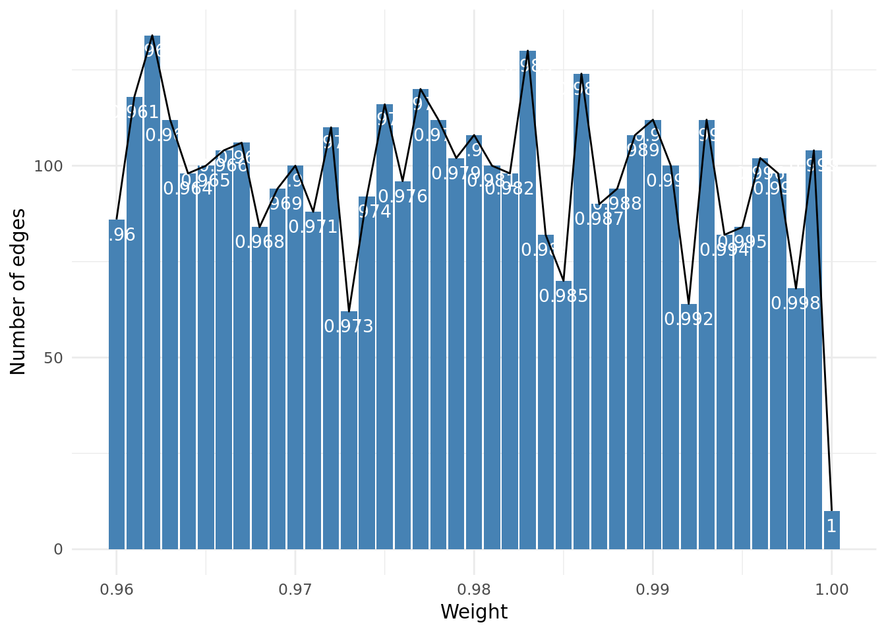

#### Degree distribution of item->similarity->item edges

#### Degree distribution of agent->knows->agent edges

#### Runing time by method 

<table class="table table-condensed" style="width: auto !important; ">
 <thead>
  <tr>
   <th style="text-align:left;"> key </th>
   <th style="text-align:right;"> doc_count </th>
   <th style="text-align:right;"> sum_wallTime_ms.value </th>
   <th style="text-align:left;"> avg_wallTime_ms.value </th>
   <th style="text-align:left;"> includedInTotal </th>
  </tr>
 </thead>
<tbody>
  <tr>
   <td style="text-align:left;"> connectIfSimilar </td>
   <td style="text-align:right;"> 21,945 </td>
   <td style="text-align:right;"> 43,803 </td>
   <td style="text-align:left;"> 1.99603554340396 </td>
   <td style="text-align:left;"> No </td>
  </tr>
  <tr>
   <td style="text-align:left;"> existsSimilarity </td>
   <td style="text-align:right;"> 21,945 </td>
   <td style="text-align:right;"> 43,241 </td>
   <td style="text-align:left;"> 1.97042606516291 </td>
   <td style="text-align:left;"> No </td>
  </tr>
  <tr>
   <td style="text-align:left;"> similarityEdges </td>
   <td style="text-align:right;"> 21,945 </td>
   <td style="text-align:right;"> 42,396 </td>
   <td style="text-align:left;"> 1.93192071086808 </td>
   <td style="text-align:left;"> No </td>
  </tr>
  <tr>
   <td style="text-align:left;"> connectAllSimilar </td>
   <td style="text-align:right;"> 210 </td>
   <td style="text-align:right;"> 44,036 </td>
   <td style="text-align:left;"> 209.695238095238 </td>
   <td style="text-align:left;"> Yes </td>
  </tr>
  <tr>
   <td style="text-align:left;"> init </td>
   <td style="text-align:right;"> 53 </td>
   <td style="text-align:right;"> 8,219 </td>
   <td style="text-align:left;"> 155.075471698113 </td>
   <td style="text-align:left;"> No </td>
  </tr>
  <tr>
   <td style="text-align:left;"> connect </td>
   <td style="text-align:right;"> 44 </td>
   <td style="text-align:right;"> 134 </td>
   <td style="text-align:left;"> 3.04545454545455 </td>
   <td style="text-align:left;"> Yes </td>
  </tr>
  <tr>
   <td style="text-align:left;font-weight: bold;"> Total </td>
   <td style="text-align:right;font-weight: bold;"> 262 </td>
   <td style="text-align:right;font-weight: bold;"> 44,348 </td>
   <td style="text-align:left;font-weight: bold;">  </td>
   <td style="text-align:left;font-weight: bold;">  </td>
  </tr>
</tbody>
</table>
####  Found structures 

#####  Cycles 

Number of cycles found:  1 

<button class="btn btn-primary" data-toggle="collapse" data-target="#DFILOOTHNH"> Show/Hide foundCycle query </button> 
 
  
     GET /filebeat-*/_search 
              { 
                "query": {
                  "bool": {
                    "must": [
                      { "match_phrase": {
                        "simulationId": "SIM10-13-02-04-XEVVCI--CV"
                        }
                      },
                      { "bool": {
                        "should": [
                          { "match": {
                            "keyword": "foundCycle"
                          }}
                        ]
                      }}
                    ]
                  }
                }
              }
     

#####  Paths 

Number of paths found:  0 

<button class="btn btn-primary" data-toggle="collapse" data-target="#JHAMREIBJA"> Show/Hide foundPath query </button> 
 
  
     GET /filebeat-*/_search 
              { 
                "query": {
                  "bool": {
                    "must": [
                      { "match_phrase": {
                        "simulationId": "SIM10-13-02-04-XEVVCI--CV"
                        }
                      },
                      { "bool": {
                        "should": [
                          { "match": {
                            "keyword": "foundPath"
                          }}
                        ]
                      }}
                    ]
                  }
                }
              }
     

###  SIM10-13-02-04-XEVVCI--DV 

#### simulationParameters 

<table class="table table-condensed" style="width: auto !important; ">
 <thead>
  <tr>
   <th style="text-align:left;"> agentNumber </th>
   <th style="text-align:left;"> similarityConnectThreshold </th>
   <th style="text-align:left;"> graphType </th>
   <th style="text-align:left;"> chainLength </th>
   <th style="text-align:left;"> similaritySearchThreshold </th>
   <th style="text-align:left;"> maxDistance </th>
   <th style="text-align:left;"> randomWorksNumberMultiplier </th>
  </tr>
 </thead>
<tbody>
  <tr>
   <td style="text-align:left;width: 20em; "> 50 </td>
   <td style="text-align:left;width: 15em; "> 0.96 </td>
   <td style="text-align:left;width: 15em; "> smallWorld </td>
   <td style="text-align:left;width: 15em; "> 5 </td>
   <td style="text-align:left;width: 15em; "> 1 </td>
   <td style="text-align:left;width: 15em; "> 30 </td>
   <td style="text-align:left;width: 15em; "> 2 </td>
  </tr>
</tbody>
</table>
#### allEdgesByLabel

<table class="table table-condensed" style="width: auto !important; ">
 <thead>
  <tr>
   <th style="text-align:right;"> edges_offers </th>
   <th style="text-align:right;"> edges_similarity </th>
   <th style="text-align:right;"> edges_owns </th>
   <th style="text-align:right;"> edges_demands </th>
   <th style="text-align:right;"> edges_knows </th>
   <th style="text-align:right;"> edges_total </th>
  </tr>
 </thead>
<tbody>
  <tr>
   <td style="text-align:right;width: 5em; "> 105 </td>
   <td style="text-align:right;width: 5em; "> 3,886 </td>
   <td style="text-align:right;width: 5em; "> 105 </td>
   <td style="text-align:right;width: 5em; "> 105 </td>
   <td style="text-align:right;width: 5em; "> 201 </td>
   <td style="text-align:right;width: 5em; "> 4,402 </td>
  </tr>
</tbody>
</table>
#### allVerticesByType

<table class="table table-condensed" style="width: auto !important; ">
 <thead>
  <tr>
   <th style="text-align:right;"> vertices_agent </th>
   <th style="text-align:right;"> vertices_item </th>
   <th style="text-align:right;"> vertices_work </th>
   <th style="text-align:right;"> vertices_total </th>
  </tr>
 </thead>
<tbody>
  <tr>
   <td style="text-align:right;width: 5em; "> 51 </td>
   <td style="text-align:right;width: 5em; "> 210 </td>
   <td style="text-align:right;width: 5em; "> 105 </td>
   <td style="text-align:right;width: 5em; "> 366 </td>
  </tr>
</tbody>
</table>
#### distribution of similarityEdgesByWeight

#### Degree distribution of item->similarity->item edges

#### Degree distribution of agent->knows->agent edges

#### Runing time by method 

<table class="table table-condensed" style="width: auto !important; ">
 <thead>
  <tr>
   <th style="text-align:left;">   </th>
   <th style="text-align:left;"> key </th>
   <th style="text-align:right;"> doc_count </th>
   <th style="text-align:right;"> sum_wallTime_ms.value </th>
   <th style="text-align:left;"> avg_wallTime_ms.value </th>
   <th style="text-align:left;"> includedInTotal </th>
  </tr>
 </thead>
<tbody>
  <tr>
   <td style="text-align:left;"> 1 </td>
   <td style="text-align:left;"> addItemToWork </td>
   <td style="text-align:right;"> 210 </td>
   <td style="text-align:right;"> 1,277 </td>
   <td style="text-align:left;"> 6.08095238095238 </td>
   <td style="text-align:left;"> No </td>
  </tr>
  <tr>
   <td style="text-align:left;"> 2 </td>
   <td style="text-align:left;"> knowsAgent </td>
   <td style="text-align:right;"> 201 </td>
   <td style="text-align:right;"> 514 </td>
   <td style="text-align:left;"> 2.55721393034826 </td>
   <td style="text-align:left;"> No </td>
  </tr>
  <tr>
   <td style="text-align:left;"> 3 </td>
   <td style="text-align:left;"> ownsWork </td>
   <td style="text-align:right;"> 105 </td>
   <td style="text-align:right;"> 719 </td>
   <td style="text-align:left;"> 6.84761904761905 </td>
   <td style="text-align:left;"> No </td>
  </tr>
  <tr>
   <td style="text-align:left;"> 4 </td>
   <td style="text-align:left;"> init </td>
   <td style="text-align:right;"> 53 </td>
   <td style="text-align:right;"> 8,996 </td>
   <td style="text-align:left;"> 169.735849056604 </td>
   <td style="text-align:left;"> No </td>
  </tr>
  <tr>
   <td style="text-align:left;"> 5 </td>
   <td style="text-align:left;"> searchAndConnect </td>
   <td style="text-align:right;"> 51 </td>
   <td style="text-align:right;"> 22,165 </td>
   <td style="text-align:left;"> 434.607843137255 </td>
   <td style="text-align:left;"> Yes </td>
  </tr>
  <tr>
   <td style="text-align:left;"> 6 </td>
   <td style="text-align:left;"> getWorksItems </td>
   <td style="text-align:right;"> 8 </td>
   <td style="text-align:right;"> 22 </td>
   <td style="text-align:left;"> 2.75 </td>
   <td style="text-align:left;"> Yes </td>
  </tr>
  <tr>
   <td style="text-align:left;"> 9 </td>
   <td style="text-align:left;"> cycleSearch </td>
   <td style="text-align:right;"> 2 </td>
   <td style="text-align:right;"> 31 </td>
   <td style="text-align:left;"> 15.5 </td>
   <td style="text-align:left;"> Yes </td>
  </tr>
  <tr>
   <td style="text-align:left;"> 10 </td>
   <td style="text-align:left;"> getWorks </td>
   <td style="text-align:right;"> 2 </td>
   <td style="text-align:right;"> 281 </td>
   <td style="text-align:left;"> 140.5 </td>
   <td style="text-align:left;"> No </td>
  </tr>
  <tr>
   <td style="text-align:left;font-weight: bold;"> 11 </td>
   <td style="text-align:left;font-weight: bold;"> Total </td>
   <td style="text-align:right;font-weight: bold;"> 68 </td>
   <td style="text-align:right;font-weight: bold;"> 22,507 </td>
   <td style="text-align:left;font-weight: bold;">  </td>
   <td style="text-align:left;font-weight: bold;">  </td>
  </tr>
</tbody>
</table>
####  Found structures 

#####  Cycles 

Number of cycles found:  1 

<button class="btn btn-primary" data-toggle="collapse" data-target="#HHBLEMSEKO"> Show/Hide foundCycle query </button> 
 
  
     GET /filebeat-*/_search 
              { 
                "query": {
                  "bool": {
                    "must": [
                      { "match_phrase": {
                        "simulationId": "SIM10-13-02-04-XEVVCI--DV"
                        }
                      },
                      { "bool": {
                        "should": [
                          { "match": {
                            "keyword": "foundCycle"
                          }}
                        ]
                      }}
                    ]
                  }
                }
              }
     

#####  Paths 

Number of paths found:  1 

<button class="btn btn-primary" data-toggle="collapse" data-target="#RZAFSQRYMG"> Show/Hide foundPath query </button> 
 
  
     GET /filebeat-*/_search 
              { 
                "query": {
                  "bool": {
                    "must": [
                      { "match_phrase": {
                        "simulationId": "SIM10-13-02-04-XEVVCI--DV"
                        }
                      },
                      { "bool": {
                        "should": [
                          { "match": {
                            "keyword": "foundPath"
                          }}
                        ]
                      }}
                    ]
                  }
                }
              }
     

###  SIM10-13-12-58-69ws7g--CV 

#### simulationParameters 

<table class="table table-condensed" style="width: auto !important; ">
 <thead>
  <tr>
   <th style="text-align:left;"> agentNumber </th>
   <th style="text-align:left;"> similarityConnectThreshold </th>
   <th style="text-align:left;"> graphType </th>
   <th style="text-align:left;"> chainLength </th>
   <th style="text-align:left;"> similaritySearchThreshold </th>
   <th style="text-align:left;"> maxDistance </th>
   <th style="text-align:left;"> randomWorksNumberMultiplier </th>
  </tr>
 </thead>
<tbody>
  <tr>
   <td style="text-align:left;width: 20em; "> 50 </td>
   <td style="text-align:left;width: 15em; "> 0.96 </td>
   <td style="text-align:left;width: 15em; "> smallWorld </td>
   <td style="text-align:left;width: 15em; "> 5 </td>
   <td style="text-align:left;width: 15em; "> 1 </td>
   <td style="text-align:left;width: 15em; "> 30 </td>
   <td style="text-align:left;width: 15em; "> 1 </td>
  </tr>
</tbody>
</table>
#### allEdgesByLabel

<table class="table table-condensed" style="width: auto !important; ">
 <thead>
  <tr>
   <th style="text-align:right;"> edges_offers </th>
   <th style="text-align:right;"> edges_similarity </th>
   <th style="text-align:right;"> edges_owns </th>
   <th style="text-align:right;"> edges_demands </th>
   <th style="text-align:right;"> edges_knows </th>
   <th style="text-align:right;"> edges_total </th>
  </tr>
 </thead>
<tbody>
  <tr>
   <td style="text-align:right;width: 5em; "> 55 </td>
   <td style="text-align:right;width: 5em; "> 1,174 </td>
   <td style="text-align:right;width: 5em; "> 55 </td>
   <td style="text-align:right;width: 5em; "> 55 </td>
   <td style="text-align:right;width: 5em; "> 201 </td>
   <td style="text-align:right;width: 5em; "> 1,540 </td>
  </tr>
</tbody>
</table>
#### allVerticesByType

<table class="table table-condensed" style="width: auto !important; ">
 <thead>
  <tr>
   <th style="text-align:right;"> vertices_agent </th>
   <th style="text-align:right;"> vertices_item </th>
   <th style="text-align:right;"> vertices_work </th>
   <th style="text-align:right;"> vertices_total </th>
  </tr>
 </thead>
<tbody>
  <tr>
   <td style="text-align:right;width: 5em; "> 51 </td>
   <td style="text-align:right;width: 5em; "> 110 </td>
   <td style="text-align:right;width: 5em; "> 55 </td>
   <td style="text-align:right;width: 5em; "> 216 </td>
  </tr>
</tbody>
</table>
#### distribution of similarityEdgesByWeight

#### Degree distribution of item->similarity->item edges

#### Degree distribution of agent->knows->agent edges

#### Runing time by method 

<table class="table table-condensed" style="width: auto !important; ">
 <thead>
  <tr>
   <th style="text-align:left;"> key </th>
   <th style="text-align:right;"> doc_count </th>
   <th style="text-align:right;"> sum_wallTime_ms.value </th>
   <th style="text-align:left;"> avg_wallTime_ms.value </th>
   <th style="text-align:left;"> includedInTotal </th>
  </tr>
 </thead>
<tbody>
  <tr>
   <td style="text-align:left;"> connectIfSimilar </td>
   <td style="text-align:right;"> 5,995 </td>
   <td style="text-align:right;"> 11,935 </td>
   <td style="text-align:left;"> 1.99082568807339 </td>
   <td style="text-align:left;"> No </td>
  </tr>
  <tr>
   <td style="text-align:left;"> existsSimilarity </td>
   <td style="text-align:right;"> 5,995 </td>
   <td style="text-align:right;"> 11,771 </td>
   <td style="text-align:left;"> 1.96346955796497 </td>
   <td style="text-align:left;"> No </td>
  </tr>
  <tr>
   <td style="text-align:left;"> similarityEdges </td>
   <td style="text-align:right;"> 5,995 </td>
   <td style="text-align:right;"> 11,572 </td>
   <td style="text-align:left;"> 1.9302752293578 </td>
   <td style="text-align:left;"> No </td>
  </tr>
  <tr>
   <td style="text-align:left;"> connectAllSimilar </td>
   <td style="text-align:right;"> 110 </td>
   <td style="text-align:right;"> 12,004 </td>
   <td style="text-align:left;"> 109.127272727273 </td>
   <td style="text-align:left;"> Yes </td>
  </tr>
  <tr>
   <td style="text-align:left;"> init </td>
   <td style="text-align:right;"> 53 </td>
   <td style="text-align:right;"> 8,930 </td>
   <td style="text-align:left;"> 168.490566037736 </td>
   <td style="text-align:left;"> No </td>
  </tr>
  <tr>
   <td style="text-align:left;"> connect </td>
   <td style="text-align:right;"> 16 </td>
   <td style="text-align:right;"> 25 </td>
   <td style="text-align:left;"> 1.5625 </td>
   <td style="text-align:left;"> Yes </td>
  </tr>
  <tr>
   <td style="text-align:left;font-weight: bold;"> Total </td>
   <td style="text-align:right;font-weight: bold;"> 134 </td>
   <td style="text-align:right;font-weight: bold;"> 12,167 </td>
   <td style="text-align:left;font-weight: bold;">  </td>
   <td style="text-align:left;font-weight: bold;">  </td>
  </tr>
</tbody>
</table>
####  Found structures 

#####  Cycles 

Number of cycles found:  1 

<button class="btn btn-primary" data-toggle="collapse" data-target="#LNQOPQMSWK"> Show/Hide foundCycle query </button> 
 
  
     GET /filebeat-*/_search 
              { 
                "query": {
                  "bool": {
                    "must": [
                      { "match_phrase": {
                        "simulationId": "SIM10-13-12-58-69ws7g--CV"
                        }
                      },
                      { "bool": {
                        "should": [
                          { "match": {
                            "keyword": "foundCycle"
                          }}
                        ]
                      }}
                    ]
                  }
                }
              }
     

#####  Paths 

Number of paths found:  0 

<button class="btn btn-primary" data-toggle="collapse" data-target="#KTPLJGFOFI"> Show/Hide foundPath query </button> 
 
  
     GET /filebeat-*/_search 
              { 
                "query": {
                  "bool": {
                    "must": [
                      { "match_phrase": {
                        "simulationId": "SIM10-13-12-58-69ws7g--CV"
                        }
                      },
                      { "bool": {
                        "should": [
                          { "match": {
                            "keyword": "foundPath"
                          }}
                        ]
                      }}
                    ]
                  }
                }
              }
     

###  SIM10-13-12-58-69ws7g--DV 

#### simulationParameters 

<table class="table table-condensed" style="width: auto !important; ">
 <thead>
  <tr>
   <th style="text-align:left;"> agentNumber </th>
   <th style="text-align:left;"> similarityConnectThreshold </th>
   <th style="text-align:left;"> graphType </th>
   <th style="text-align:left;"> chainLength </th>
   <th style="text-align:left;"> similaritySearchThreshold </th>
   <th style="text-align:left;"> maxDistance </th>
   <th style="text-align:left;"> randomWorksNumberMultiplier </th>
  </tr>
 </thead>
<tbody>
  <tr>
   <td style="text-align:left;width: 20em; "> 50 </td>
   <td style="text-align:left;width: 15em; "> 0.96 </td>
   <td style="text-align:left;width: 15em; "> smallWorld </td>
   <td style="text-align:left;width: 15em; "> 5 </td>
   <td style="text-align:left;width: 15em; "> 1 </td>
   <td style="text-align:left;width: 15em; "> 30 </td>
   <td style="text-align:left;width: 15em; "> 1 </td>
  </tr>
</tbody>
</table>
#### allEdgesByLabel

<table class="table table-condensed" style="width: auto !important; ">
 <thead>
  <tr>
   <th style="text-align:right;"> edges_offers </th>
   <th style="text-align:right;"> edges_similarity </th>
   <th style="text-align:right;"> edges_owns </th>
   <th style="text-align:right;"> edges_demands </th>
   <th style="text-align:right;"> edges_knows </th>
   <th style="text-align:right;"> edges_total </th>
  </tr>
 </thead>
<tbody>
  <tr>
   <td style="text-align:right;width: 5em; "> 55 </td>
   <td style="text-align:right;width: 5em; "> 1,142 </td>
   <td style="text-align:right;width: 5em; "> 55 </td>
   <td style="text-align:right;width: 5em; "> 55 </td>
   <td style="text-align:right;width: 5em; "> 201 </td>
   <td style="text-align:right;width: 5em; "> 1,508 </td>
  </tr>
</tbody>
</table>
#### allVerticesByType

<table class="table table-condensed" style="width: auto !important; ">
 <thead>
  <tr>
   <th style="text-align:right;"> vertices_agent </th>
   <th style="text-align:right;"> vertices_item </th>
   <th style="text-align:right;"> vertices_work </th>
   <th style="text-align:right;"> vertices_total </th>
  </tr>
 </thead>
<tbody>
  <tr>
   <td style="text-align:right;width: 5em; "> 51 </td>
   <td style="text-align:right;width: 5em; "> 110 </td>
   <td style="text-align:right;width: 5em; "> 55 </td>
   <td style="text-align:right;width: 5em; "> 216 </td>
  </tr>
</tbody>
</table>
#### distribution of similarityEdgesByWeight

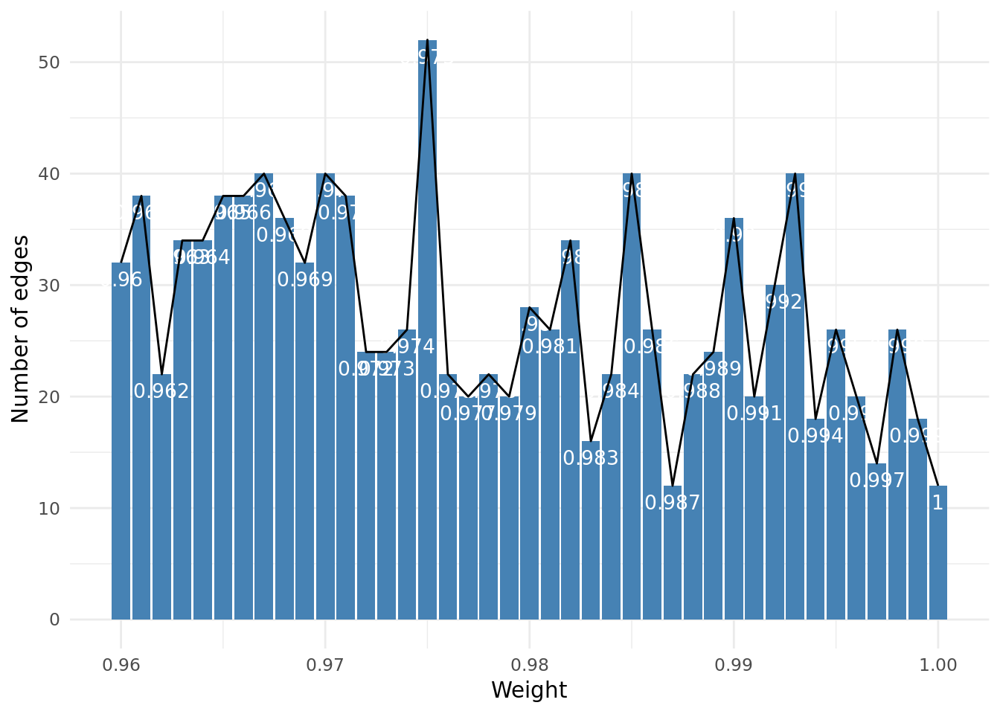

#### Degree distribution of item->similarity->item edges

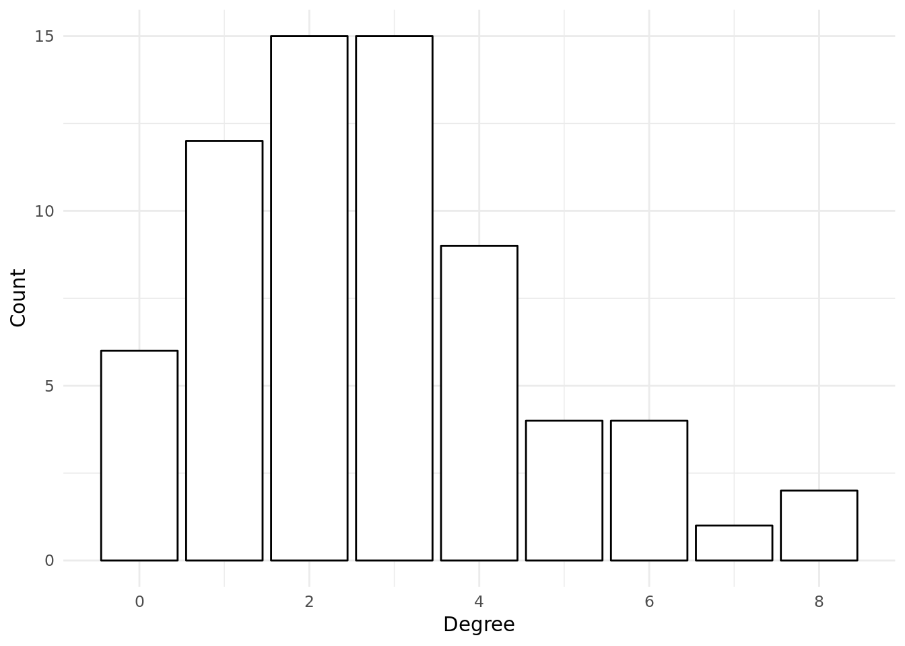

#### Degree distribution of agent->knows->agent edges

#### Runing time by method 

<table class="table table-condensed" style="width: auto !important; ">
 <thead>
  <tr>
   <th style="text-align:left;">   </th>
   <th style="text-align:left;"> key </th>
   <th style="text-align:right;"> doc_count </th>
   <th style="text-align:right;"> sum_wallTime_ms.value </th>
   <th style="text-align:left;"> avg_wallTime_ms.value </th>
   <th style="text-align:left;"> includedInTotal </th>
  </tr>
 </thead>
<tbody>
  <tr>
   <td style="text-align:left;"> 1 </td>
   <td style="text-align:left;"> knowsAgent </td>
   <td style="text-align:right;"> 201 </td>
   <td style="text-align:right;"> 314 </td>
   <td style="text-align:left;"> 1.56218905472637 </td>
   <td style="text-align:left;"> No </td>
  </tr>
  <tr>
   <td style="text-align:left;"> 2 </td>
   <td style="text-align:left;"> addItemToWork </td>
   <td style="text-align:right;"> 110 </td>
   <td style="text-align:right;"> 607 </td>
   <td style="text-align:left;"> 5.51818181818182 </td>
   <td style="text-align:left;"> No </td>
  </tr>
  <tr>
   <td style="text-align:left;"> 3 </td>
   <td style="text-align:left;"> ownsWork </td>
   <td style="text-align:right;"> 55 </td>
   <td style="text-align:right;"> 393 </td>
   <td style="text-align:left;"> 7.14545454545455 </td>
   <td style="text-align:left;"> No </td>
  </tr>
  <tr>
   <td style="text-align:left;"> 4 </td>
   <td style="text-align:left;"> init </td>
   <td style="text-align:right;"> 53 </td>
   <td style="text-align:right;"> 8,955 </td>
   <td style="text-align:left;"> 168.962264150943 </td>
   <td style="text-align:left;"> No </td>
  </tr>
  <tr>
   <td style="text-align:left;"> 5 </td>
   <td style="text-align:left;"> searchAndConnect </td>
   <td style="text-align:right;"> 51 </td>
   <td style="text-align:right;"> 6,768 </td>
   <td style="text-align:left;"> 132.705882352941 </td>
   <td style="text-align:left;"> Yes </td>
  </tr>
  <tr>
   <td style="text-align:left;"> 6 </td>
   <td style="text-align:left;"> getWorksItems </td>
   <td style="text-align:right;"> 8 </td>
   <td style="text-align:right;"> 17 </td>
   <td style="text-align:left;"> 2.125 </td>
   <td style="text-align:left;"> Yes </td>
  </tr>
  <tr>
   <td style="text-align:left;"> 9 </td>
   <td style="text-align:left;"> cycleSearch </td>
   <td style="text-align:right;"> 2 </td>
   <td style="text-align:right;"> 15 </td>
   <td style="text-align:left;"> 7.5 </td>
   <td style="text-align:left;"> Yes </td>
  </tr>
  <tr>
   <td style="text-align:left;"> 10 </td>
   <td style="text-align:left;"> getWorks </td>
   <td style="text-align:right;"> 2 </td>
   <td style="text-align:right;"> 44 </td>
   <td style="text-align:left;"> 22 </td>
   <td style="text-align:left;"> No </td>
  </tr>
  <tr>
   <td style="text-align:left;font-weight: bold;"> 11 </td>
   <td style="text-align:left;font-weight: bold;"> Total </td>
   <td style="text-align:right;font-weight: bold;"> 68 </td>
   <td style="text-align:right;font-weight: bold;"> 6,976 </td>
   <td style="text-align:left;font-weight: bold;">  </td>
   <td style="text-align:left;font-weight: bold;">  </td>
  </tr>
</tbody>
</table>
####  Found structures 

#####  Cycles 

Number of cycles found:  1 

<button class="btn btn-primary" data-toggle="collapse" data-target="#EMUQTTEDPD"> Show/Hide foundCycle query </button> 
 
  
     GET /filebeat-*/_search 
              { 
                "query": {
                  "bool": {
                    "must": [
                      { "match_phrase": {
                        "simulationId": "SIM10-13-12-58-69ws7g--DV"
                        }
                      },
                      { "bool": {
                        "should": [
                          { "match": {
                            "keyword": "foundCycle"
                          }}
                        ]
                      }}
                    ]
                  }
                }
              }
     

#####  Paths 

Number of paths found:  1 

<button class="btn btn-primary" data-toggle="collapse" data-target="#SWEBTZAGFM"> Show/Hide foundPath query </button> 
 
  
     GET /filebeat-*/_search 
              { 
                "query": {
                  "bool": {
                    "must": [
                      { "match_phrase": {
                        "simulationId": "SIM10-13-12-58-69ws7g--DV"
                        }
                      },
                      { "bool": {
                        "should": [
                          { "match": {
                            "keyword": "foundPath"
                          }}
                        ]
                      }}
                    ]
                  }
                }
              }
     

###  SIM10-13-12-58-JPL73N--CV 

#### simulationParameters 

<table class="table table-condensed" style="width: auto !important; ">
 <thead>
  <tr>
   <th style="text-align:left;"> agentNumber </th>
   <th style="text-align:left;"> similarityConnectThreshold </th>
   <th style="text-align:left;"> graphType </th>
   <th style="text-align:left;"> chainLength </th>
   <th style="text-align:left;"> similaritySearchThreshold </th>
   <th style="text-align:left;"> maxDistance </th>
   <th style="text-align:left;"> randomWorksNumberMultiplier </th>
  </tr>
 </thead>
<tbody>
  <tr>
   <td style="text-align:left;width: 20em; "> 50 </td>
   <td style="text-align:left;width: 15em; "> 0.96 </td>
   <td style="text-align:left;width: 15em; "> random </td>
   <td style="text-align:left;width: 15em; "> 5 </td>
   <td style="text-align:left;width: 15em; "> 1 </td>
   <td style="text-align:left;width: 15em; "> 30 </td>
   <td style="text-align:left;width: 15em; "> 1 </td>
  </tr>
</tbody>
</table>
#### allEdgesByLabel

<table class="table table-condensed" style="width: auto !important; ">
 <thead>
  <tr>
   <th style="text-align:right;"> edges_offers </th>
   <th style="text-align:right;"> edges_similarity </th>
   <th style="text-align:right;"> edges_owns </th>
   <th style="text-align:right;"> edges_demands </th>
   <th style="text-align:right;"> edges_knows </th>
   <th style="text-align:right;"> edges_total </th>
  </tr>
 </thead>
<tbody>
  <tr>
   <td style="text-align:right;width: 5em; "> 55 </td>
   <td style="text-align:right;width: 5em; "> 1,118 </td>
   <td style="text-align:right;width: 5em; "> 55 </td>
   <td style="text-align:right;width: 5em; "> 55 </td>
   <td style="text-align:right;width: 5em; "> 50 </td>
   <td style="text-align:right;width: 5em; "> 1,333 </td>
  </tr>
</tbody>
</table>
#### allVerticesByType

<table class="table table-condensed" style="width: auto !important; ">
 <thead>
  <tr>
   <th style="text-align:right;"> vertices_agent </th>
   <th style="text-align:right;"> vertices_item </th>
   <th style="text-align:right;"> vertices_work </th>
   <th style="text-align:right;"> vertices_total </th>
  </tr>
 </thead>
<tbody>
  <tr>
   <td style="text-align:right;width: 5em; "> 51 </td>
   <td style="text-align:right;width: 5em; "> 110 </td>
   <td style="text-align:right;width: 5em; "> 55 </td>
   <td style="text-align:right;width: 5em; "> 216 </td>
  </tr>
</tbody>
</table>
#### distribution of similarityEdgesByWeight

#### Degree distribution of item->similarity->item edges

#### Degree distribution of agent->knows->agent edges

#### Runing time by method 

<table class="table table-condensed" style="width: auto !important; ">
 <thead>
  <tr>
   <th style="text-align:left;"> key </th>
   <th style="text-align:right;"> doc_count </th>
   <th style="text-align:right;"> sum_wallTime_ms.value </th>
   <th style="text-align:left;"> avg_wallTime_ms.value </th>
   <th style="text-align:left;"> includedInTotal </th>
  </tr>
 </thead>
<tbody>
  <tr>
   <td style="text-align:left;"> connectIfSimilar </td>
   <td style="text-align:right;"> 5,995 </td>
   <td style="text-align:right;"> 11,336 </td>
   <td style="text-align:left;"> 1.89090909090909 </td>
   <td style="text-align:left;"> No </td>
  </tr>
  <tr>
   <td style="text-align:left;"> existsSimilarity </td>
   <td style="text-align:right;"> 5,995 </td>
   <td style="text-align:right;"> 11,191 </td>
   <td style="text-align:left;"> 1.86672226855713 </td>
   <td style="text-align:left;"> No </td>
  </tr>
  <tr>
   <td style="text-align:left;"> similarityEdges </td>
   <td style="text-align:right;"> 5,995 </td>
   <td style="text-align:right;"> 10,978 </td>
   <td style="text-align:left;"> 1.83119266055046 </td>
   <td style="text-align:left;"> No </td>
  </tr>
  <tr>
   <td style="text-align:left;"> connectAllSimilar </td>
   <td style="text-align:right;"> 110 </td>
   <td style="text-align:right;"> 11,399 </td>
   <td style="text-align:left;"> 103.627272727273 </td>
   <td style="text-align:left;"> Yes </td>
  </tr>
  <tr>
   <td style="text-align:left;"> init </td>
   <td style="text-align:right;"> 53 </td>
   <td style="text-align:right;"> 8,760 </td>
   <td style="text-align:left;"> 165.283018867925 </td>
   <td style="text-align:left;"> No </td>
  </tr>
  <tr>
   <td style="text-align:left;"> connect </td>
   <td style="text-align:right;"> 10 </td>
   <td style="text-align:right;"> 17 </td>
   <td style="text-align:left;"> 1.7 </td>
   <td style="text-align:left;"> Yes </td>
  </tr>
  <tr>
   <td style="text-align:left;font-weight: bold;"> Total </td>
   <td style="text-align:right;font-weight: bold;"> 128 </td>
   <td style="text-align:right;font-weight: bold;"> 11,602 </td>
   <td style="text-align:left;font-weight: bold;">  </td>
   <td style="text-align:left;font-weight: bold;">  </td>
  </tr>
</tbody>
</table>
####  Found structures 

#####  Cycles 

Number of cycles found:  1 

<button class="btn btn-primary" data-toggle="collapse" data-target="#MDPHOMOTCO"> Show/Hide foundCycle query </button> 
 
  
     GET /filebeat-*/_search 
              { 
                "query": {
                  "bool": {
                    "must": [
                      { "match_phrase": {
                        "simulationId": "SIM10-13-12-58-JPL73N--CV"
                        }
                      },
                      { "bool": {
                        "should": [
                          { "match": {
                            "keyword": "foundCycle"
                          }}
                        ]
                      }}
                    ]
                  }
                }
              }
     

#####  Paths 

Number of paths found:  0 

<button class="btn btn-primary" data-toggle="collapse" data-target="#CHTQCYMEPB"> Show/Hide foundPath query </button> 
 
  
     GET /filebeat-*/_search 
              { 
                "query": {
                  "bool": {
                    "must": [
                      { "match_phrase": {
                        "simulationId": "SIM10-13-12-58-JPL73N--CV"
                        }
                      },
                      { "bool": {
                        "should": [
                          { "match": {
                            "keyword": "foundPath"
                          }}
                        ]
                      }}
                    ]
                  }
                }
              }
     

###  SIM10-13-12-58-JPL73N--DV 

#### simulationParameters 

<table class="table table-condensed" style="width: auto !important; ">
 <thead>
  <tr>
   <th style="text-align:left;"> agentNumber </th>
   <th style="text-align:left;"> similarityConnectThreshold </th>
   <th style="text-align:left;"> graphType </th>
   <th style="text-align:left;"> chainLength </th>
   <th style="text-align:left;"> similaritySearchThreshold </th>
   <th style="text-align:left;"> maxDistance </th>
   <th style="text-align:left;"> randomWorksNumberMultiplier </th>
  </tr>
 </thead>
<tbody>
  <tr>
   <td style="text-align:left;width: 20em; "> 50 </td>
   <td style="text-align:left;width: 15em; "> 0.96 </td>
   <td style="text-align:left;width: 15em; "> random </td>
   <td style="text-align:left;width: 15em; "> 5 </td>
   <td style="text-align:left;width: 15em; "> 1 </td>
   <td style="text-align:left;width: 15em; "> 30 </td>
   <td style="text-align:left;width: 15em; "> 1 </td>
  </tr>
</tbody>
</table>
#### allEdgesByLabel

<table class="table table-condensed" style="width: auto !important; ">
 <thead>
  <tr>
   <th style="text-align:right;"> edges_offers </th>
   <th style="text-align:right;"> edges_similarity </th>
   <th style="text-align:right;"> edges_owns </th>
   <th style="text-align:right;"> edges_demands </th>
   <th style="text-align:right;"> edges_knows </th>
   <th style="text-align:right;"> edges_total </th>
  </tr>
 </thead>
<tbody>
  <tr>
   <td style="text-align:right;width: 5em; "> 55 </td>
   <td style="text-align:right;width: 5em; "> 1,098 </td>
   <td style="text-align:right;width: 5em; "> 55 </td>
   <td style="text-align:right;width: 5em; "> 55 </td>
   <td style="text-align:right;width: 5em; "> 50 </td>
   <td style="text-align:right;width: 5em; "> 1,313 </td>
  </tr>
</tbody>
</table>
#### allVerticesByType

<table class="table table-condensed" style="width: auto !important; ">
 <thead>
  <tr>
   <th style="text-align:right;"> vertices_agent </th>
   <th style="text-align:right;"> vertices_item </th>
   <th style="text-align:right;"> vertices_work </th>
   <th style="text-align:right;"> vertices_total </th>
  </tr>
 </thead>
<tbody>
  <tr>
   <td style="text-align:right;width: 5em; "> 51 </td>
   <td style="text-align:right;width: 5em; "> 110 </td>
   <td style="text-align:right;width: 5em; "> 55 </td>
   <td style="text-align:right;width: 5em; "> 216 </td>
  </tr>
</tbody>
</table>
#### distribution of similarityEdgesByWeight

#### Degree distribution of item->similarity->item edges

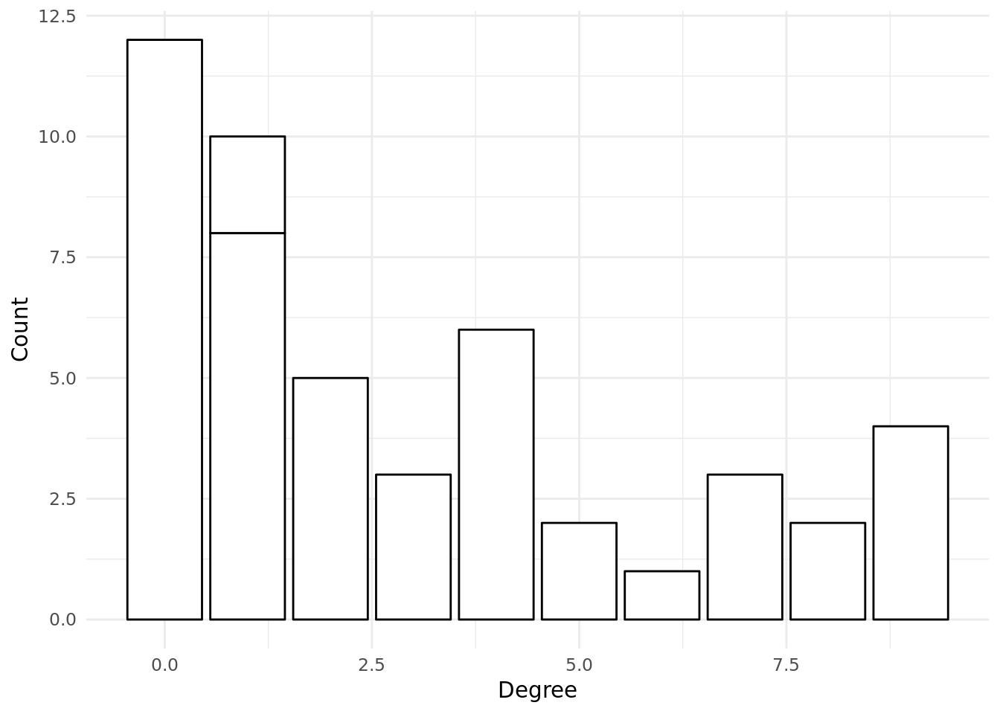

#### Degree distribution of agent->knows->agent edges

#### Runing time by method 

<table class="table table-condensed" style="width: auto !important; ">
 <thead>
  <tr>
   <th style="text-align:left;">   </th>
   <th style="text-align:left;"> key </th>
   <th style="text-align:right;"> doc_count </th>
   <th style="text-align:right;"> sum_wallTime_ms.value </th>
   <th style="text-align:left;"> avg_wallTime_ms.value </th>
   <th style="text-align:left;"> includedInTotal </th>
  </tr>
 </thead>
<tbody>
  <tr>
   <td style="text-align:left;"> 1 </td>
   <td style="text-align:left;"> addItemToWork </td>
   <td style="text-align:right;"> 110 </td>
   <td style="text-align:right;"> 463 </td>
   <td style="text-align:left;"> 4.20909090909091 </td>
   <td style="text-align:left;"> No </td>
  </tr>
  <tr>
   <td style="text-align:left;"> 2 </td>
   <td style="text-align:left;"> ownsWork </td>
   <td style="text-align:right;"> 55 </td>
   <td style="text-align:right;"> 392 </td>
   <td style="text-align:left;"> 7.12727272727273 </td>
   <td style="text-align:left;"> No </td>
  </tr>
  <tr>
   <td style="text-align:left;"> 3 </td>
   <td style="text-align:left;"> init </td>
   <td style="text-align:right;"> 53 </td>
   <td style="text-align:right;"> 8,870 </td>
   <td style="text-align:left;"> 167.358490566038 </td>
   <td style="text-align:left;"> No </td>
  </tr>
  <tr>
   <td style="text-align:left;"> 4 </td>
   <td style="text-align:left;"> searchAndConnect </td>
   <td style="text-align:right;"> 51 </td>
   <td style="text-align:right;"> 6,253 </td>
   <td style="text-align:left;"> 122.607843137255 </td>
   <td style="text-align:left;"> Yes </td>
  </tr>
  <tr>
   <td style="text-align:left;"> 5 </td>
   <td style="text-align:left;"> knowsAgent </td>
   <td style="text-align:right;"> 50 </td>
   <td style="text-align:right;"> 93 </td>
   <td style="text-align:left;"> 1.86 </td>
   <td style="text-align:left;"> No </td>
  </tr>
  <tr>
   <td style="text-align:left;"> 6 </td>
   <td style="text-align:left;"> getWorksItems </td>
   <td style="text-align:right;"> 8 </td>
   <td style="text-align:right;"> 17 </td>
   <td style="text-align:left;"> 2.125 </td>
   <td style="text-align:left;"> Yes </td>
  </tr>
  <tr>
   <td style="text-align:left;"> 8 </td>
   <td style="text-align:left;"> addChainToNetwork </td>
   <td style="text-align:right;"> 1 </td>
   <td style="text-align:right;"> 0 </td>
   <td style="text-align:left;"> 0 </td>
   <td style="text-align:left;"> Yes </td>
  </tr>
  <tr>
   <td style="text-align:left;"> 9 </td>
   <td style="text-align:left;"> addRandomWorksToAgents </td>
   <td style="text-align:right;"> 1 </td>
   <td style="text-align:right;"> 17 </td>
   <td style="text-align:left;"> 17 </td>
   <td style="text-align:left;"> Yes </td>
  </tr>
  <tr>
   <td style="text-align:left;font-weight: bold;"> 11 </td>
   <td style="text-align:left;font-weight: bold;"> Total </td>
   <td style="text-align:right;font-weight: bold;"> 67 </td>
   <td style="text-align:right;font-weight: bold;"> 6,495 </td>
   <td style="text-align:left;font-weight: bold;">  </td>
   <td style="text-align:left;font-weight: bold;">  </td>
  </tr>
</tbody>
</table>
####  Found structures 

#####  Cycles 

Number of cycles found:  1 

<button class="btn btn-primary" data-toggle="collapse" data-target="#ZBACWUVMYY"> Show/Hide foundCycle query </button> 
 
  
     GET /filebeat-*/_search 
              { 
                "query": {
                  "bool": {
                    "must": [
                      { "match_phrase": {
                        "simulationId": "SIM10-13-12-58-JPL73N--DV"
                        }
                      },
                      { "bool": {
                        "should": [
                          { "match": {
                            "keyword": "foundCycle"
                          }}
                        ]
                      }}
                    ]
                  }
                }
              }
     

#####  Paths 

Number of paths found:  0 

<button class="btn btn-primary" data-toggle="collapse" data-target="#PTIBCDUGKA"> Show/Hide foundPath query </button> 
 
  
     GET /filebeat-*/_search 
              { 
                "query": {
                  "bool": {
                    "must": [
                      { "match_phrase": {
                        "simulationId": "SIM10-13-12-58-JPL73N--DV"
                        }
                      },
                      { "bool": {
                        "should": [
                          { "match": {
                            "keyword": "foundPath"
                          }}
                        ]
                      }}
                    ]
                  }
                }
              }
     

###  SIM10-13-02-00-Yik2jB--CV 

#### simulationParameters 

<table class="table table-condensed" style="width: auto !important; ">
 <thead>
  <tr>
   <th style="text-align:left;"> agentNumber </th>
   <th style="text-align:left;"> similarityConnectThreshold </th>
   <th style="text-align:left;"> graphType </th>
   <th style="text-align:left;"> chainLength </th>
   <th style="text-align:left;"> similaritySearchThreshold </th>
   <th style="text-align:left;"> maxDistance </th>
   <th style="text-align:left;"> randomWorksNumberMultiplier </th>
  </tr>
 </thead>
<tbody>
  <tr>
   <td style="text-align:left;width: 20em; "> 50 </td>
   <td style="text-align:left;width: 15em; "> 0.96 </td>
   <td style="text-align:left;width: 15em; "> smallWorld </td>
   <td style="text-align:left;width: 15em; "> 5 </td>
   <td style="text-align:left;width: 15em; "> 1 </td>
   <td style="text-align:left;width: 15em; "> 5 </td>
   <td style="text-align:left;width: 15em; "> 2 </td>
  </tr>
</tbody>
</table>
#### allEdgesByLabel

<table class="table table-condensed" style="width: auto !important; ">
 <thead>
  <tr>
   <th style="text-align:right;"> edges_offers </th>
   <th style="text-align:right;"> edges_similarity </th>
   <th style="text-align:right;"> edges_owns </th>
   <th style="text-align:right;"> edges_demands </th>
   <th style="text-align:right;"> edges_knows </th>
   <th style="text-align:right;"> edges_total </th>
  </tr>
 </thead>
<tbody>
  <tr>
   <td style="text-align:right;width: 5em; "> 105 </td>
   <td style="text-align:right;width: 5em; "> 4,218 </td>
   <td style="text-align:right;width: 5em; "> 105 </td>
   <td style="text-align:right;width: 5em; "> 105 </td>
   <td style="text-align:right;width: 5em; "> 201 </td>
   <td style="text-align:right;width: 5em; "> 4,734 </td>
  </tr>
</tbody>
</table>
#### allVerticesByType

<table class="table table-condensed" style="width: auto !important; ">
 <thead>
  <tr>
   <th style="text-align:right;"> vertices_agent </th>
   <th style="text-align:right;"> vertices_item </th>
   <th style="text-align:right;"> vertices_work </th>
   <th style="text-align:right;"> vertices_total </th>
  </tr>
 </thead>
<tbody>
  <tr>
   <td style="text-align:right;width: 5em; "> 51 </td>
   <td style="text-align:right;width: 5em; "> 210 </td>
   <td style="text-align:right;width: 5em; "> 105 </td>
   <td style="text-align:right;width: 5em; "> 366 </td>
  </tr>
</tbody>
</table>
#### distribution of similarityEdgesByWeight

#### Degree distribution of item->similarity->item edges

#### Degree distribution of agent->knows->agent edges

#### Runing time by method 

<table class="table table-condensed" style="width: auto !important; ">
 <thead>
  <tr>
   <th style="text-align:left;"> key </th>
   <th style="text-align:right;"> doc_count </th>
   <th style="text-align:right;"> sum_wallTime_ms.value </th>
   <th style="text-align:left;"> avg_wallTime_ms.value </th>
   <th style="text-align:left;"> includedInTotal </th>
  </tr>
 </thead>
<tbody>
  <tr>
   <td style="text-align:left;"> connectIfSimilar </td>
   <td style="text-align:right;"> 21,945 </td>
   <td style="text-align:right;"> 47,336 </td>
   <td style="text-align:left;"> 2.1570289359763 </td>
   <td style="text-align:left;"> No </td>
  </tr>
  <tr>
   <td style="text-align:left;"> existsSimilarity </td>
   <td style="text-align:right;"> 21,945 </td>
   <td style="text-align:right;"> 46,822 </td>
   <td style="text-align:left;"> 2.13360674413306 </td>
   <td style="text-align:left;"> No </td>
  </tr>
  <tr>
   <td style="text-align:left;"> similarityEdges </td>
   <td style="text-align:right;"> 21,945 </td>
   <td style="text-align:right;"> 45,942 </td>
   <td style="text-align:left;"> 2.09350649350649 </td>
   <td style="text-align:left;"> No </td>
  </tr>
  <tr>
   <td style="text-align:left;"> connectAllSimilar </td>
   <td style="text-align:right;"> 210 </td>
   <td style="text-align:right;"> 47,568 </td>
   <td style="text-align:left;"> 226.514285714286 </td>
   <td style="text-align:left;"> Yes </td>
  </tr>
  <tr>
   <td style="text-align:left;"> init </td>
   <td style="text-align:right;"> 53 </td>
   <td style="text-align:right;"> 9,223 </td>
   <td style="text-align:left;"> 174.018867924528 </td>
   <td style="text-align:left;"> No </td>
  </tr>
  <tr>
   <td style="text-align:left;"> connect </td>
   <td style="text-align:right;"> 44 </td>
   <td style="text-align:right;"> 88 </td>
   <td style="text-align:left;"> 2 </td>
   <td style="text-align:left;"> Yes </td>
  </tr>
  <tr>
   <td style="text-align:left;font-weight: bold;"> Total </td>
   <td style="text-align:right;font-weight: bold;"> 262 </td>
   <td style="text-align:right;font-weight: bold;"> 47,840 </td>
   <td style="text-align:left;font-weight: bold;">  </td>
   <td style="text-align:left;font-weight: bold;">  </td>
  </tr>
</tbody>
</table>
####  Found structures 

#####  Cycles 

Number of cycles found:  1 

<button class="btn btn-primary" data-toggle="collapse" data-target="#EMPRAQSUQD"> Show/Hide foundCycle query </button> 
 
  
     GET /filebeat-*/_search 
              { 
                "query": {
                  "bool": {
                    "must": [
                      { "match_phrase": {
                        "simulationId": "SIM10-13-02-00-Yik2jB--CV"
                        }
                      },
                      { "bool": {
                        "should": [
                          { "match": {
                            "keyword": "foundCycle"
                          }}
                        ]
                      }}
                    ]
                  }
                }
              }
     

#####  Paths 

Number of paths found:  0 

<button class="btn btn-primary" data-toggle="collapse" data-target="#ORSLUSLDVN"> Show/Hide foundPath query </button> 
 
  
     GET /filebeat-*/_search 
              { 
                "query": {
                  "bool": {
                    "must": [
                      { "match_phrase": {
                        "simulationId": "SIM10-13-02-00-Yik2jB--CV"
                        }
                      },
                      { "bool": {
                        "should": [
                          { "match": {
                            "keyword": "foundPath"
                          }}
                        ]
                      }}
                    ]
                  }
                }
              }
     

###  SIM10-13-02-00-Yik2jB--DV 

#### simulationParameters 

<table class="table table-condensed" style="width: auto !important; ">
 <thead>
  <tr>
   <th style="text-align:left;"> agentNumber </th>
   <th style="text-align:left;"> similarityConnectThreshold </th>
   <th style="text-align:left;"> graphType </th>
   <th style="text-align:left;"> chainLength </th>
   <th style="text-align:left;"> similaritySearchThreshold </th>
   <th style="text-align:left;"> maxDistance </th>
   <th style="text-align:left;"> randomWorksNumberMultiplier </th>
  </tr>
 </thead>
<tbody>
  <tr>
   <td style="text-align:left;width: 20em; "> 50 </td>
   <td style="text-align:left;width: 15em; "> 0.96 </td>
   <td style="text-align:left;width: 15em; "> smallWorld </td>
   <td style="text-align:left;width: 15em; "> 5 </td>
   <td style="text-align:left;width: 15em; "> 1 </td>
   <td style="text-align:left;width: 15em; "> 5 </td>
   <td style="text-align:left;width: 15em; "> 2 </td>
  </tr>
</tbody>
</table>
#### allEdgesByLabel

<table class="table table-condensed" style="width: auto !important; ">
 <thead>
  <tr>
   <th style="text-align:right;"> edges_offers </th>
   <th style="text-align:right;"> edges_similarity </th>
   <th style="text-align:right;"> edges_owns </th>
   <th style="text-align:right;"> edges_demands </th>
   <th style="text-align:right;"> edges_knows </th>
   <th style="text-align:right;"> edges_total </th>
  </tr>
 </thead>
<tbody>
  <tr>
   <td style="text-align:right;width: 5em; "> 105 </td>
   <td style="text-align:right;width: 5em; "> 4,130 </td>
   <td style="text-align:right;width: 5em; "> 105 </td>
   <td style="text-align:right;width: 5em; "> 105 </td>
   <td style="text-align:right;width: 5em; "> 201 </td>
   <td style="text-align:right;width: 5em; "> 4,646 </td>
  </tr>
</tbody>
</table>
#### allVerticesByType

<table class="table table-condensed" style="width: auto !important; ">
 <thead>
  <tr>
   <th style="text-align:right;"> vertices_agent </th>
   <th style="text-align:right;"> vertices_item </th>
   <th style="text-align:right;"> vertices_work </th>
   <th style="text-align:right;"> vertices_total </th>
  </tr>
 </thead>
<tbody>
  <tr>
   <td style="text-align:right;width: 5em; "> 51 </td>
   <td style="text-align:right;width: 5em; "> 210 </td>
   <td style="text-align:right;width: 5em; "> 105 </td>
   <td style="text-align:right;width: 5em; "> 366 </td>
  </tr>
</tbody>
</table>
#### distribution of similarityEdgesByWeight

#### Degree distribution of item->similarity->item edges

#### Degree distribution of agent->knows->agent edges

#### Runing time by method 

<table class="table table-condensed" style="width: auto !important; ">
 <thead>
  <tr>
   <th style="text-align:left;">   </th>
   <th style="text-align:left;"> key </th>
   <th style="text-align:right;"> doc_count </th>
   <th style="text-align:right;"> sum_wallTime_ms.value </th>
   <th style="text-align:left;"> avg_wallTime_ms.value </th>
   <th style="text-align:left;"> includedInTotal </th>
  </tr>
 </thead>
<tbody>
  <tr>
   <td style="text-align:left;"> 1 </td>
   <td style="text-align:left;"> addItemToWork </td>
   <td style="text-align:right;"> 210 </td>
   <td style="text-align:right;"> 1,661 </td>
   <td style="text-align:left;"> 7.90952380952381 </td>
   <td style="text-align:left;"> No </td>
  </tr>
  <tr>
   <td style="text-align:left;"> 2 </td>
   <td style="text-align:left;"> knowsAgent </td>
   <td style="text-align:right;"> 201 </td>
   <td style="text-align:right;"> 329 </td>
   <td style="text-align:left;"> 1.63681592039801 </td>
   <td style="text-align:left;"> No </td>
  </tr>
  <tr>
   <td style="text-align:left;"> 3 </td>
   <td style="text-align:left;"> ownsWork </td>
   <td style="text-align:right;"> 105 </td>
   <td style="text-align:right;"> 1,125 </td>
   <td style="text-align:left;"> 10.7142857142857 </td>
   <td style="text-align:left;"> No </td>
  </tr>
  <tr>
   <td style="text-align:left;"> 4 </td>
   <td style="text-align:left;"> init </td>
   <td style="text-align:right;"> 53 </td>
   <td style="text-align:right;"> 9,227 </td>
   <td style="text-align:left;"> 174.094339622642 </td>
   <td style="text-align:left;"> No </td>
  </tr>
  <tr>
   <td style="text-align:left;"> 5 </td>
   <td style="text-align:left;"> searchAndConnect </td>
   <td style="text-align:right;"> 51 </td>
   <td style="text-align:right;"> 23,088 </td>
   <td style="text-align:left;"> 452.705882352941 </td>
   <td style="text-align:left;"> Yes </td>
  </tr>
  <tr>
   <td style="text-align:left;"> 6 </td>
   <td style="text-align:left;"> getWorksItems </td>
   <td style="text-align:right;"> 8 </td>
   <td style="text-align:right;"> 31 </td>
   <td style="text-align:left;"> 3.875 </td>
   <td style="text-align:left;"> Yes </td>
  </tr>
  <tr>
   <td style="text-align:left;"> 8 </td>
   <td style="text-align:left;"> addChainToNetwork </td>
   <td style="text-align:right;"> 1 </td>
   <td style="text-align:right;"> 0 </td>
   <td style="text-align:left;"> 0 </td>
   <td style="text-align:left;"> Yes </td>
  </tr>
  <tr>
   <td style="text-align:left;"> 9 </td>
   <td style="text-align:left;"> addRandomWorksToAgents </td>
   <td style="text-align:right;"> 1 </td>
   <td style="text-align:right;"> 7 </td>
   <td style="text-align:left;"> 7 </td>
   <td style="text-align:left;"> Yes </td>
  </tr>
  <tr>
   <td style="text-align:left;font-weight: bold;"> 11 </td>
   <td style="text-align:left;font-weight: bold;"> Total </td>
   <td style="text-align:right;font-weight: bold;"> 67 </td>
   <td style="text-align:right;font-weight: bold;"> 23,623 </td>
   <td style="text-align:left;font-weight: bold;">  </td>
   <td style="text-align:left;font-weight: bold;">  </td>
  </tr>
</tbody>
</table>
####  Found structures 

#####  Cycles 

Number of cycles found:  1 

<button class="btn btn-primary" data-toggle="collapse" data-target="#TZBPOMKEAZ"> Show/Hide foundCycle query </button> 
 
  
     GET /filebeat-*/_search 
              { 
                "query": {
                  "bool": {
                    "must": [
                      { "match_phrase": {
                        "simulationId": "SIM10-13-02-00-Yik2jB--DV"
                        }
                      },
                      { "bool": {
                        "should": [
                          { "match": {
                            "keyword": "foundCycle"
                          }}
                        ]
                      }}
                    ]
                  }
                }
              }
     

#####  Paths 

Number of paths found:  0 

<button class="btn btn-primary" data-toggle="collapse" data-target="#CBTFGGKHDD"> Show/Hide foundPath query </button> 
 
  
     GET /filebeat-*/_search 
              { 
                "query": {
                  "bool": {
                    "must": [
                      { "match_phrase": {
                        "simulationId": "SIM10-13-02-00-Yik2jB--DV"
                        }
                      },
                      { "bool": {
                        "should": [
                          { "match": {
                            "keyword": "foundPath"
                          }}
                        ]
                      }}
                    ]
                  }
                }
              }
     

###  SIM10-13-12-56-bmib3J--CV 

#### simulationParameters 

<table class="table table-condensed" style="width: auto !important; ">
 <thead>
  <tr>
   <th style="text-align:left;"> agentNumber </th>
   <th style="text-align:left;"> similarityConnectThreshold </th>
   <th style="text-align:left;"> graphType </th>
   <th style="text-align:left;"> chainLength </th>
   <th style="text-align:left;"> similaritySearchThreshold </th>
   <th style="text-align:left;"> maxDistance </th>
   <th style="text-align:left;"> randomWorksNumberMultiplier </th>
  </tr>
 </thead>
<tbody>
  <tr>
   <td style="text-align:left;width: 20em; "> 50 </td>
   <td style="text-align:left;width: 15em; "> 0.96 </td>
   <td style="text-align:left;width: 15em; "> random </td>
   <td style="text-align:left;width: 15em; "> 5 </td>
   <td style="text-align:left;width: 15em; "> 1 </td>
   <td style="text-align:left;width: 15em; "> 5 </td>
   <td style="text-align:left;width: 15em; "> 1 </td>
  </tr>
</tbody>
</table>
#### allEdgesByLabel

<table class="table table-condensed" style="width: auto !important; ">
 <thead>
  <tr>
   <th style="text-align:right;"> edges_offers </th>
   <th style="text-align:right;"> edges_similarity </th>
   <th style="text-align:right;"> edges_owns </th>
   <th style="text-align:right;"> edges_demands </th>
   <th style="text-align:right;"> edges_knows </th>
   <th style="text-align:right;"> edges_total </th>
  </tr>
 </thead>
<tbody>
  <tr>
   <td style="text-align:right;width: 5em; "> 55 </td>
   <td style="text-align:right;width: 5em; "> 1,002 </td>
   <td style="text-align:right;width: 5em; "> 55 </td>
   <td style="text-align:right;width: 5em; "> 55 </td>
   <td style="text-align:right;width: 5em; "> 50 </td>
   <td style="text-align:right;width: 5em; "> 1,217 </td>
  </tr>
</tbody>
</table>
#### allVerticesByType

<table class="table table-condensed" style="width: auto !important; ">
 <thead>
  <tr>
   <th style="text-align:right;"> vertices_agent </th>
   <th style="text-align:right;"> vertices_item </th>
   <th style="text-align:right;"> vertices_work </th>
   <th style="text-align:right;"> vertices_total </th>
  </tr>
 </thead>
<tbody>
  <tr>
   <td style="text-align:right;width: 5em; "> 51 </td>
   <td style="text-align:right;width: 5em; "> 110 </td>
   <td style="text-align:right;width: 5em; "> 55 </td>
   <td style="text-align:right;width: 5em; "> 216 </td>
  </tr>
</tbody>
</table>
#### distribution of similarityEdgesByWeight

#### Degree distribution of item->similarity->item edges

#### Degree distribution of agent->knows->agent edges

#### Runing time by method 

<table class="table table-condensed" style="width: auto !important; ">
 <thead>
  <tr>
   <th style="text-align:left;"> key </th>
   <th style="text-align:right;"> doc_count </th>
   <th style="text-align:right;"> sum_wallTime_ms.value </th>
   <th style="text-align:left;"> avg_wallTime_ms.value </th>
   <th style="text-align:left;"> includedInTotal </th>
  </tr>
 </thead>
<tbody>
  <tr>
   <td style="text-align:left;"> connectIfSimilar </td>
   <td style="text-align:right;"> 5,995 </td>
   <td style="text-align:right;"> 10,992 </td>
   <td style="text-align:left;"> 1.83352793994996 </td>
   <td style="text-align:left;"> No </td>
  </tr>
  <tr>
   <td style="text-align:left;"> existsSimilarity </td>
   <td style="text-align:right;"> 5,995 </td>
   <td style="text-align:right;"> 10,343 </td>
   <td style="text-align:left;"> 1.72527105921601 </td>
   <td style="text-align:left;"> No </td>
  </tr>
  <tr>
   <td style="text-align:left;"> similarityEdges </td>
   <td style="text-align:right;"> 5,995 </td>
   <td style="text-align:right;"> 10,102 </td>
   <td style="text-align:left;"> 1.68507089241034 </td>
   <td style="text-align:left;"> No </td>
  </tr>
  <tr>
   <td style="text-align:left;"> connect </td>
   <td style="text-align:right;"> 199 </td>
   <td style="text-align:right;"> 442 </td>
   <td style="text-align:left;"> 2.22110552763819 </td>
   <td style="text-align:left;"> Yes </td>
  </tr>
  <tr>
   <td style="text-align:left;"> connectAllSimilar </td>
   <td style="text-align:right;"> 110 </td>
   <td style="text-align:right;"> 11,094 </td>
   <td style="text-align:left;"> 100.854545454545 </td>
   <td style="text-align:left;"> Yes </td>
  </tr>
  <tr>
   <td style="text-align:left;"> init </td>
   <td style="text-align:right;"> 53 </td>
   <td style="text-align:right;"> 8,838 </td>
   <td style="text-align:left;"> 166.754716981132 </td>
   <td style="text-align:left;"> No </td>
  </tr>
  <tr>
   <td style="text-align:left;font-weight: bold;"> Total </td>
   <td style="text-align:right;font-weight: bold;"> 317 </td>
   <td style="text-align:right;font-weight: bold;"> 11,696 </td>
   <td style="text-align:left;font-weight: bold;">  </td>
   <td style="text-align:left;font-weight: bold;">  </td>
  </tr>
</tbody>
</table>
####  Found structures 

#####  Cycles 

Number of cycles found:  1 

<button class="btn btn-primary" data-toggle="collapse" data-target="#ZUFFCFIZDR"> Show/Hide foundCycle query </button> 
 
  
     GET /filebeat-*/_search 
              { 
                "query": {
                  "bool": {
                    "must": [
                      { "match_phrase": {
                        "simulationId": "SIM10-13-12-56-bmib3J--CV"
                        }
                      },
                      { "bool": {
                        "should": [
                          { "match": {
                            "keyword": "foundCycle"
                          }}
                        ]
                      }}
                    ]
                  }
                }
              }
     

#####  Paths 

Number of paths found:  0 

<button class="btn btn-primary" data-toggle="collapse" data-target="#JTOUYGYEJJ"> Show/Hide foundPath query </button> 
 
  
     GET /filebeat-*/_search 
              { 
                "query": {
                  "bool": {
                    "must": [
                      { "match_phrase": {
                        "simulationId": "SIM10-13-12-56-bmib3J--CV"
                        }
                      },
                      { "bool": {
                        "should": [
                          { "match": {
                            "keyword": "foundPath"
                          }}
                        ]
                      }}
                    ]
                  }
                }
              }
     

###  SIM10-13-12-56-bmib3J--DV 

#### simulationParameters 

<table class="table table-condensed" style="width: auto !important; ">
 <thead>
  <tr>
   <th style="text-align:left;"> agentNumber </th>
   <th style="text-align:left;"> similarityConnectThreshold </th>
   <th style="text-align:left;"> graphType </th>
   <th style="text-align:left;"> chainLength </th>
   <th style="text-align:left;"> similaritySearchThreshold </th>
   <th style="text-align:left;"> maxDistance </th>
   <th style="text-align:left;"> randomWorksNumberMultiplier </th>
  </tr>
 </thead>
<tbody>
  <tr>
   <td style="text-align:left;width: 20em; "> 50 </td>
   <td style="text-align:left;width: 15em; "> 0.96 </td>
   <td style="text-align:left;width: 15em; "> random </td>
   <td style="text-align:left;width: 15em; "> 5 </td>
   <td style="text-align:left;width: 15em; "> 1 </td>
   <td style="text-align:left;width: 15em; "> 5 </td>
   <td style="text-align:left;width: 15em; "> 1 </td>
  </tr>
</tbody>
</table>
#### allEdgesByLabel

<table class="table table-condensed" style="width: auto !important; ">
 <thead>
  <tr>
   <th style="text-align:right;"> edges_offers </th>
   <th style="text-align:right;"> edges_similarity </th>
   <th style="text-align:right;"> edges_owns </th>
   <th style="text-align:right;"> edges_demands </th>
   <th style="text-align:right;"> edges_knows </th>
   <th style="text-align:right;"> edges_total </th>
  </tr>
 </thead>
<tbody>
  <tr>
   <td style="text-align:right;width: 5em; "> 55 </td>
   <td style="text-align:right;width: 5em; "> 604 </td>
   <td style="text-align:right;width: 5em; "> 55 </td>
   <td style="text-align:right;width: 5em; "> 55 </td>
   <td style="text-align:right;width: 5em; "> 50 </td>
   <td style="text-align:right;width: 5em; "> 819 </td>
  </tr>
</tbody>
</table>
#### allVerticesByType

<table class="table table-condensed" style="width: auto !important; ">
 <thead>
  <tr>
   <th style="text-align:right;"> vertices_agent </th>
   <th style="text-align:right;"> vertices_item </th>
   <th style="text-align:right;"> vertices_work </th>
   <th style="text-align:right;"> vertices_total </th>
  </tr>
 </thead>
<tbody>
  <tr>
   <td style="text-align:right;width: 5em; "> 51 </td>
   <td style="text-align:right;width: 5em; "> 110 </td>
   <td style="text-align:right;width: 5em; "> 55 </td>
   <td style="text-align:right;width: 5em; "> 216 </td>
  </tr>
</tbody>
</table>
#### distribution of similarityEdgesByWeight

#### Degree distribution of item->similarity->item edges

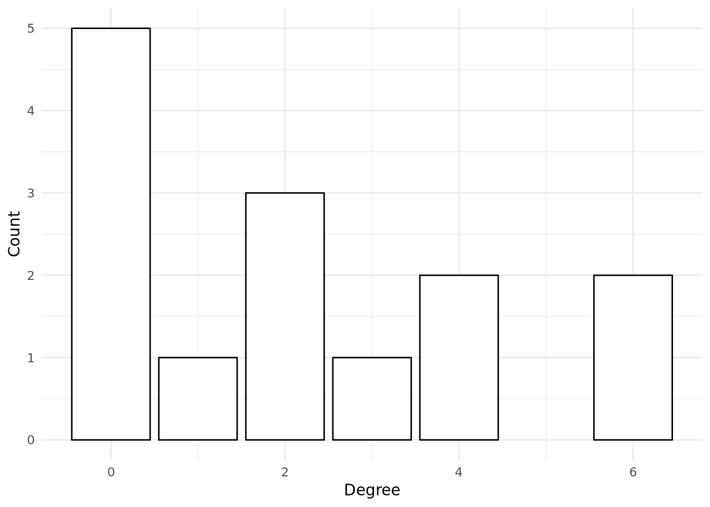

#### Degree distribution of agent->knows->agent edges

#### Runing time by method 

<table class="table table-condensed" style="width: auto !important; ">
 <thead>
  <tr>
   <th style="text-align:left;">   </th>
   <th style="text-align:left;"> key </th>
   <th style="text-align:right;"> doc_count </th>
   <th style="text-align:right;"> sum_wallTime_ms.value </th>
   <th style="text-align:left;"> avg_wallTime_ms.value </th>
   <th style="text-align:left;"> includedInTotal </th>
  </tr>
 </thead>
<tbody>
  <tr>
   <td style="text-align:left;"> 1 </td>
   <td style="text-align:left;"> addItemToWork </td>
   <td style="text-align:right;"> 110 </td>
   <td style="text-align:right;"> 1,298 </td>
   <td style="text-align:left;"> 11.8 </td>
   <td style="text-align:left;"> No </td>
  </tr>
  <tr>
   <td style="text-align:left;"> 2 </td>
   <td style="text-align:left;"> ownsWork </td>
   <td style="text-align:right;"> 55 </td>
   <td style="text-align:right;"> 483 </td>
   <td style="text-align:left;"> 8.78181818181818 </td>
   <td style="text-align:left;"> No </td>
  </tr>
  <tr>
   <td style="text-align:left;"> 3 </td>
   <td style="text-align:left;"> init </td>
   <td style="text-align:right;"> 53 </td>
   <td style="text-align:right;"> 10,324 </td>
   <td style="text-align:left;"> 194.792452830189 </td>
   <td style="text-align:left;"> No </td>
  </tr>
  <tr>
   <td style="text-align:left;"> 4 </td>
   <td style="text-align:left;"> searchAndConnect </td>
   <td style="text-align:right;"> 51 </td>
   <td style="text-align:right;"> 7,354 </td>
   <td style="text-align:left;"> 144.196078431373 </td>
   <td style="text-align:left;"> Yes </td>
  </tr>
  <tr>
   <td style="text-align:left;"> 5 </td>
   <td style="text-align:left;"> knowsAgent </td>
   <td style="text-align:right;"> 50 </td>
   <td style="text-align:right;"> 155 </td>
   <td style="text-align:left;"> 3.1 </td>
   <td style="text-align:left;"> No </td>
  </tr>
  <tr>
   <td style="text-align:left;"> 6 </td>
   <td style="text-align:left;"> getWorksItems </td>
   <td style="text-align:right;"> 8 </td>
   <td style="text-align:right;"> 30 </td>
   <td style="text-align:left;"> 3.75 </td>
   <td style="text-align:left;"> Yes </td>
  </tr>
  <tr>
   <td style="text-align:left;"> 8 </td>
   <td style="text-align:left;"> addChainToNetwork </td>
   <td style="text-align:right;"> 1 </td>
   <td style="text-align:right;"> 0 </td>
   <td style="text-align:left;"> 0 </td>
   <td style="text-align:left;"> Yes </td>
  </tr>
  <tr>
   <td style="text-align:left;"> 9 </td>
   <td style="text-align:left;"> addRandomWorksToAgents </td>
   <td style="text-align:right;"> 1 </td>
   <td style="text-align:right;"> 29 </td>
   <td style="text-align:left;"> 29 </td>
   <td style="text-align:left;"> Yes </td>
  </tr>
  <tr>
   <td style="text-align:left;font-weight: bold;"> 11 </td>
   <td style="text-align:left;font-weight: bold;"> Total </td>
   <td style="text-align:right;font-weight: bold;"> 67 </td>
   <td style="text-align:right;font-weight: bold;"> 7,660 </td>
   <td style="text-align:left;font-weight: bold;">  </td>
   <td style="text-align:left;font-weight: bold;">  </td>
  </tr>
</tbody>
</table>
####  Found structures 

#####  Cycles 

Number of cycles found:  1 

<button class="btn btn-primary" data-toggle="collapse" data-target="#UJSMJMVOMX"> Show/Hide foundCycle query </button> 
 
  
     GET /filebeat-*/_search 
              { 
                "query": {
                  "bool": {
                    "must": [
                      { "match_phrase": {
                        "simulationId": "SIM10-13-12-56-bmib3J--DV"
                        }
                      },
                      { "bool": {
                        "should": [
                          { "match": {
                            "keyword": "foundCycle"
                          }}
                        ]
                      }}
                    ]
                  }
                }
              }
     

#####  Paths 

Number of paths found:  0 

<button class="btn btn-primary" data-toggle="collapse" data-target="#UHMYHXXQLX"> Show/Hide foundPath query </button> 
 
  
     GET /filebeat-*/_search 
              { 
                "query": {
                  "bool": {
                    "must": [
                      { "match_phrase": {
                        "simulationId": "SIM10-13-12-56-bmib3J--DV"
                        }
                      },
                      { "bool": {
                        "should": [
                          { "match": {
                            "keyword": "foundPath"
                          }}
                        ]
                      }}
                    ]
                  }
                }
              }
     

###  SIM10-13-12-57-Mqqt3Q--CV 

#### simulationParameters 

<table class="table table-condensed" style="width: auto !important; ">
 <thead>
  <tr>
   <th style="text-align:left;"> agentNumber </th>
   <th style="text-align:left;"> similarityConnectThreshold </th>
   <th style="text-align:left;"> graphType </th>
   <th style="text-align:left;"> chainLength </th>
   <th style="text-align:left;"> similaritySearchThreshold </th>
   <th style="text-align:left;"> maxDistance </th>
   <th style="text-align:left;"> randomWorksNumberMultiplier </th>
  </tr>
 </thead>
<tbody>
  <tr>
   <td style="text-align:left;width: 20em; "> 50 </td>
   <td style="text-align:left;width: 15em; "> 0.96 </td>
   <td style="text-align:left;width: 15em; "> smallWorld </td>
   <td style="text-align:left;width: 15em; "> 5 </td>
   <td style="text-align:left;width: 15em; "> 1 </td>
   <td style="text-align:left;width: 15em; "> 5 </td>
   <td style="text-align:left;width: 15em; "> 1 </td>
  </tr>
</tbody>
</table>
#### allEdgesByLabel

<table class="table table-condensed" style="width: auto !important; ">
 <thead>
  <tr>
   <th style="text-align:right;"> edges_offers </th>
   <th style="text-align:right;"> edges_similarity </th>
   <th style="text-align:right;"> edges_owns </th>
   <th style="text-align:right;"> edges_demands </th>
   <th style="text-align:right;"> edges_knows </th>
   <th style="text-align:right;"> edges_total </th>
  </tr>
 </thead>
<tbody>
  <tr>
   <td style="text-align:right;width: 5em; "> 55 </td>
   <td style="text-align:right;width: 5em; "> 1,140 </td>
   <td style="text-align:right;width: 5em; "> 55 </td>
   <td style="text-align:right;width: 5em; "> 55 </td>
   <td style="text-align:right;width: 5em; "> 201 </td>
   <td style="text-align:right;width: 5em; "> 1,506 </td>
  </tr>
</tbody>
</table>
#### allVerticesByType

<table class="table table-condensed" style="width: auto !important; ">
 <thead>
  <tr>
   <th style="text-align:right;"> vertices_agent </th>
   <th style="text-align:right;"> vertices_item </th>
   <th style="text-align:right;"> vertices_work </th>
   <th style="text-align:right;"> vertices_total </th>
  </tr>
 </thead>
<tbody>
  <tr>
   <td style="text-align:right;width: 5em; "> 51 </td>
   <td style="text-align:right;width: 5em; "> 110 </td>
   <td style="text-align:right;width: 5em; "> 55 </td>
   <td style="text-align:right;width: 5em; "> 216 </td>
  </tr>
</tbody>
</table>
#### distribution of similarityEdgesByWeight

#### Degree distribution of item->similarity->item edges

#### Degree distribution of agent->knows->agent edges

#### Runing time by method 

<table class="table table-condensed" style="width: auto !important; ">
 <thead>
  <tr>
   <th style="text-align:left;"> key </th>
   <th style="text-align:right;"> doc_count </th>
   <th style="text-align:right;"> sum_wallTime_ms.value </th>
   <th style="text-align:left;"> avg_wallTime_ms.value </th>
   <th style="text-align:left;"> includedInTotal </th>
  </tr>
 </thead>
<tbody>
  <tr>
   <td style="text-align:left;"> connectIfSimilar </td>
   <td style="text-align:right;"> 5,995 </td>
   <td style="text-align:right;"> 11,419 </td>
   <td style="text-align:left;"> 1.9047539616347 </td>
   <td style="text-align:left;"> No </td>
  </tr>
  <tr>
   <td style="text-align:left;"> existsSimilarity </td>
   <td style="text-align:right;"> 5,995 </td>
   <td style="text-align:right;"> 11,282 </td>
   <td style="text-align:left;"> 1.88190158465388 </td>
   <td style="text-align:left;"> No </td>
  </tr>
  <tr>
   <td style="text-align:left;"> similarityEdges </td>
   <td style="text-align:right;"> 5,995 </td>
   <td style="text-align:right;"> 11,043 </td>
   <td style="text-align:left;"> 1.84203502919099 </td>
   <td style="text-align:left;"> No </td>
  </tr>
  <tr>
   <td style="text-align:left;"> connectAllSimilar </td>
   <td style="text-align:right;"> 110 </td>
   <td style="text-align:right;"> 11,506 </td>
   <td style="text-align:left;"> 104.6 </td>
   <td style="text-align:left;"> Yes </td>
  </tr>
  <tr>
   <td style="text-align:left;"> init </td>
   <td style="text-align:right;"> 53 </td>
   <td style="text-align:right;"> 8,956 </td>
   <td style="text-align:left;"> 168.981132075472 </td>
   <td style="text-align:left;"> No </td>
  </tr>
  <tr>
   <td style="text-align:left;"> connect </td>
   <td style="text-align:right;"> 12 </td>
   <td style="text-align:right;"> 20 </td>
   <td style="text-align:left;"> 1.66666666666667 </td>
   <td style="text-align:left;"> Yes </td>
  </tr>
  <tr>
   <td style="text-align:left;font-weight: bold;"> Total </td>
   <td style="text-align:right;font-weight: bold;"> 130 </td>
   <td style="text-align:right;font-weight: bold;"> 11,738 </td>
   <td style="text-align:left;font-weight: bold;">  </td>
   <td style="text-align:left;font-weight: bold;">  </td>
  </tr>
</tbody>
</table>
####  Found structures 

#####  Cycles 

Number of cycles found:  1 

<button class="btn btn-primary" data-toggle="collapse" data-target="#DWPNGMTDPD"> Show/Hide foundCycle query </button> 
 
  
     GET /filebeat-*/_search 
              { 
                "query": {
                  "bool": {
                    "must": [
                      { "match_phrase": {
                        "simulationId": "SIM10-13-12-57-Mqqt3Q--CV"
                        }
                      },
                      { "bool": {
                        "should": [
                          { "match": {
                            "keyword": "foundCycle"
                          }}
                        ]
                      }}
                    ]
                  }
                }
              }
     

#####  Paths 

Number of paths found:  0 

<button class="btn btn-primary" data-toggle="collapse" data-target="#LRJPLBHQZR"> Show/Hide foundPath query </button> 
 
  
     GET /filebeat-*/_search 
              { 
                "query": {
                  "bool": {
                    "must": [
                      { "match_phrase": {
                        "simulationId": "SIM10-13-12-57-Mqqt3Q--CV"
                        }
                      },
                      { "bool": {
                        "should": [
                          { "match": {
                            "keyword": "foundPath"
                          }}
                        ]
                      }}
                    ]
                  }
                }
              }
     

###  SIM10-13-12-57-Mqqt3Q--DV 

#### simulationParameters 

<table class="table table-condensed" style="width: auto !important; ">
 <thead>
  <tr>
   <th style="text-align:left;"> agentNumber </th>
   <th style="text-align:left;"> similarityConnectThreshold </th>
   <th style="text-align:left;"> graphType </th>
   <th style="text-align:left;"> chainLength </th>
   <th style="text-align:left;"> similaritySearchThreshold </th>
   <th style="text-align:left;"> maxDistance </th>
   <th style="text-align:left;"> randomWorksNumberMultiplier </th>
  </tr>
 </thead>
<tbody>
  <tr>
   <td style="text-align:left;width: 20em; "> 50 </td>
   <td style="text-align:left;width: 15em; "> 0.96 </td>
   <td style="text-align:left;width: 15em; "> smallWorld </td>
   <td style="text-align:left;width: 15em; "> 5 </td>
   <td style="text-align:left;width: 15em; "> 1 </td>
   <td style="text-align:left;width: 15em; "> 5 </td>
   <td style="text-align:left;width: 15em; "> 1 </td>
  </tr>
</tbody>
</table>
#### allEdgesByLabel

<table class="table table-condensed" style="width: auto !important; ">
 <thead>
  <tr>
   <th style="text-align:right;"> edges_offers </th>
   <th style="text-align:right;"> edges_similarity </th>
   <th style="text-align:right;"> edges_owns </th>
   <th style="text-align:right;"> edges_demands </th>
   <th style="text-align:right;"> edges_knows </th>
   <th style="text-align:right;"> edges_total </th>
  </tr>
 </thead>
<tbody>
  <tr>
   <td style="text-align:right;width: 5em; "> 55 </td>
   <td style="text-align:right;width: 5em; "> 1,116 </td>
   <td style="text-align:right;width: 5em; "> 55 </td>
   <td style="text-align:right;width: 5em; "> 55 </td>
   <td style="text-align:right;width: 5em; "> 201 </td>
   <td style="text-align:right;width: 5em; "> 1,482 </td>
  </tr>
</tbody>
</table>
#### allVerticesByType

<table class="table table-condensed" style="width: auto !important; ">
 <thead>
  <tr>
   <th style="text-align:right;"> vertices_agent </th>
   <th style="text-align:right;"> vertices_item </th>
   <th style="text-align:right;"> vertices_work </th>
   <th style="text-align:right;"> vertices_total </th>
  </tr>
 </thead>
<tbody>
  <tr>
   <td style="text-align:right;width: 5em; "> 51 </td>
   <td style="text-align:right;width: 5em; "> 110 </td>
   <td style="text-align:right;width: 5em; "> 55 </td>
   <td style="text-align:right;width: 5em; "> 216 </td>
  </tr>
</tbody>
</table>
#### distribution of similarityEdgesByWeight

#### Degree distribution of item->similarity->item edges

#### Degree distribution of agent->knows->agent edges

#### Runing time by method 

<table class="table table-condensed" style="width: auto !important; ">
 <thead>
  <tr>
   <th style="text-align:left;">   </th>
   <th style="text-align:left;"> key </th>
   <th style="text-align:right;"> doc_count </th>
   <th style="text-align:right;"> sum_wallTime_ms.value </th>
   <th style="text-align:left;"> avg_wallTime_ms.value </th>
   <th style="text-align:left;"> includedInTotal </th>
  </tr>
 </thead>
<tbody>
  <tr>
   <td style="text-align:left;"> 1 </td>
   <td style="text-align:left;"> knowsAgent </td>
   <td style="text-align:right;"> 201 </td>
   <td style="text-align:right;"> 330 </td>
   <td style="text-align:left;"> 1.64179104477612 </td>
   <td style="text-align:left;"> No </td>
  </tr>
  <tr>
   <td style="text-align:left;"> 2 </td>
   <td style="text-align:left;"> addItemToWork </td>
   <td style="text-align:right;"> 110 </td>
   <td style="text-align:right;"> 493 </td>
   <td style="text-align:left;"> 4.48181818181818 </td>
   <td style="text-align:left;"> No </td>
  </tr>
  <tr>
   <td style="text-align:left;"> 3 </td>
   <td style="text-align:left;"> ownsWork </td>
   <td style="text-align:right;"> 55 </td>
   <td style="text-align:right;"> 252 </td>
   <td style="text-align:left;"> 4.58181818181818 </td>
   <td style="text-align:left;"> No </td>
  </tr>
  <tr>
   <td style="text-align:left;"> 4 </td>
   <td style="text-align:left;"> init </td>
   <td style="text-align:right;"> 53 </td>
   <td style="text-align:right;"> 8,862 </td>
   <td style="text-align:left;"> 167.207547169811 </td>
   <td style="text-align:left;"> No </td>
  </tr>
  <tr>
   <td style="text-align:left;"> 5 </td>
   <td style="text-align:left;"> searchAndConnect </td>
   <td style="text-align:right;"> 51 </td>
   <td style="text-align:right;"> 7,230 </td>
   <td style="text-align:left;"> 141.764705882353 </td>
   <td style="text-align:left;"> Yes </td>
  </tr>
  <tr>
   <td style="text-align:left;"> 6 </td>
   <td style="text-align:left;"> getWorksItems </td>
   <td style="text-align:right;"> 8 </td>
   <td style="text-align:right;"> 13 </td>
   <td style="text-align:left;"> 1.625 </td>
   <td style="text-align:left;"> Yes </td>
  </tr>
  <tr>
   <td style="text-align:left;"> 8 </td>
   <td style="text-align:left;"> addChainToNetwork </td>
   <td style="text-align:right;"> 1 </td>
   <td style="text-align:right;"> 0 </td>
   <td style="text-align:left;"> 0 </td>
   <td style="text-align:left;"> Yes </td>
  </tr>
  <tr>
   <td style="text-align:left;"> 9 </td>
   <td style="text-align:left;"> addRandomWorksToAgents </td>
   <td style="text-align:right;"> 1 </td>
   <td style="text-align:right;"> 34 </td>
   <td style="text-align:left;"> 34 </td>
   <td style="text-align:left;"> Yes </td>
  </tr>
  <tr>
   <td style="text-align:left;font-weight: bold;"> 11 </td>
   <td style="text-align:left;font-weight: bold;"> Total </td>
   <td style="text-align:right;font-weight: bold;"> 67 </td>
   <td style="text-align:right;font-weight: bold;"> 7,443 </td>
   <td style="text-align:left;font-weight: bold;">  </td>
   <td style="text-align:left;font-weight: bold;">  </td>
  </tr>
</tbody>
</table>
####  Found structures 

#####  Cycles 

Number of cycles found:  1 

<button class="btn btn-primary" data-toggle="collapse" data-target="#ANNZIOZKXY"> Show/Hide foundCycle query </button> 
 
  
     GET /filebeat-*/_search 
              { 
                "query": {
                  "bool": {
                    "must": [
                      { "match_phrase": {
                        "simulationId": "SIM10-13-12-57-Mqqt3Q--DV"
                        }
                      },
                      { "bool": {
                        "should": [
                          { "match": {
                            "keyword": "foundCycle"
                          }}
                        ]
                      }}
                    ]
                  }
                }
              }
     

#####  Paths 

Number of paths found:  0 

<button class="btn btn-primary" data-toggle="collapse" data-target="#FYZEDXQFHD"> Show/Hide foundPath query </button> 
 
  
     GET /filebeat-*/_search 
              { 
                "query": {
                  "bool": {
                    "must": [
                      { "match_phrase": {
                        "simulationId": "SIM10-13-12-57-Mqqt3Q--DV"
                        }
                      },
                      { "bool": {
                        "should": [
                          { "match": {
                            "keyword": "foundPath"
                          }}
                        ]
                      }}
                    ]
                  }
                }
              }
     

###  SIM10-13-12-59-VF5x6b--CV 

#### simulationParameters 

<table class="table table-condensed" style="width: auto !important; ">
 <thead>
  <tr>
   <th style="text-align:left;"> agentNumber </th>
   <th style="text-align:left;"> similarityConnectThreshold </th>
   <th style="text-align:left;"> graphType </th>
   <th style="text-align:left;"> chainLength </th>
   <th style="text-align:left;"> similaritySearchThreshold </th>
   <th style="text-align:left;"> maxDistance </th>
   <th style="text-align:left;"> randomWorksNumberMultiplier </th>
  </tr>
 </thead>
<tbody>
  <tr>
   <td style="text-align:left;width: 20em; "> 50 </td>
   <td style="text-align:left;width: 15em; "> 0.96 </td>
   <td style="text-align:left;width: 15em; "> random </td>
   <td style="text-align:left;width: 15em; "> 5 </td>
   <td style="text-align:left;width: 15em; "> 1 </td>
   <td style="text-align:left;width: 15em; "> 5 </td>
   <td style="text-align:left;width: 15em; "> 2 </td>
  </tr>
</tbody>
</table>
#### allEdgesByLabel

<table class="table table-condensed" style="width: auto !important; ">
 <thead>
  <tr>
   <th style="text-align:right;"> edges_offers </th>
   <th style="text-align:right;"> edges_similarity </th>
   <th style="text-align:right;"> edges_owns </th>
   <th style="text-align:right;"> edges_demands </th>
   <th style="text-align:right;"> edges_knows </th>
   <th style="text-align:right;"> edges_total </th>
  </tr>
 </thead>
<tbody>
  <tr>
   <td style="text-align:right;width: 5em; "> 105 </td>
   <td style="text-align:right;width: 5em; "> 3,930 </td>
   <td style="text-align:right;width: 5em; "> 105 </td>
   <td style="text-align:right;width: 5em; "> 105 </td>
   <td style="text-align:right;width: 5em; "> 50 </td>
   <td style="text-align:right;width: 5em; "> 4,295 </td>
  </tr>
</tbody>
</table>
#### allVerticesByType

<table class="table table-condensed" style="width: auto !important; ">
 <thead>
  <tr>
   <th style="text-align:right;"> vertices_agent </th>
   <th style="text-align:right;"> vertices_item </th>
   <th style="text-align:right;"> vertices_work </th>
   <th style="text-align:right;"> vertices_total </th>
  </tr>
 </thead>
<tbody>
  <tr>
   <td style="text-align:right;width: 5em; "> 51 </td>
   <td style="text-align:right;width: 5em; "> 210 </td>
   <td style="text-align:right;width: 5em; "> 105 </td>
   <td style="text-align:right;width: 5em; "> 366 </td>
  </tr>
</tbody>
</table>
#### distribution of similarityEdgesByWeight

#### Degree distribution of item->similarity->item edges

#### Degree distribution of agent->knows->agent edges

#### Runing time by method 

<table class="table table-condensed" style="width: auto !important; ">
 <thead>
  <tr>
   <th style="text-align:left;"> key </th>
   <th style="text-align:right;"> doc_count </th>
   <th style="text-align:right;"> sum_wallTime_ms.value </th>
   <th style="text-align:left;"> avg_wallTime_ms.value </th>
   <th style="text-align:left;"> includedInTotal </th>
  </tr>
 </thead>
<tbody>
  <tr>
   <td style="text-align:left;"> connectIfSimilar </td>
   <td style="text-align:right;"> 21,945 </td>
   <td style="text-align:right;"> 46,253 </td>
   <td style="text-align:left;"> 2.10767828662566 </td>
   <td style="text-align:left;"> No </td>
  </tr>
  <tr>
   <td style="text-align:left;"> existsSimilarity </td>
   <td style="text-align:right;"> 21,945 </td>
   <td style="text-align:right;"> 44,589 </td>
   <td style="text-align:left;"> 2.03185235816815 </td>
   <td style="text-align:left;"> No </td>
  </tr>
  <tr>
   <td style="text-align:left;"> similarityEdges </td>
   <td style="text-align:right;"> 21,945 </td>
   <td style="text-align:right;"> 43,731 </td>
   <td style="text-align:left;"> 1.99275461380725 </td>
   <td style="text-align:left;"> No </td>
  </tr>
  <tr>
   <td style="text-align:left;"> connect </td>
   <td style="text-align:right;"> 477 </td>
   <td style="text-align:right;"> 1,182 </td>
   <td style="text-align:left;"> 2.47798742138365 </td>
   <td style="text-align:left;"> Yes </td>
  </tr>
  <tr>
   <td style="text-align:left;"> connectAllSimilar </td>
   <td style="text-align:right;"> 210 </td>
   <td style="text-align:right;"> 46,490 </td>
   <td style="text-align:left;"> 221.380952380952 </td>
   <td style="text-align:left;"> Yes </td>
  </tr>
  <tr>
   <td style="text-align:left;"> init </td>
   <td style="text-align:right;"> 53 </td>
   <td style="text-align:right;"> 8,983 </td>
   <td style="text-align:left;"> 169.490566037736 </td>
   <td style="text-align:left;"> No </td>
  </tr>
  <tr>
   <td style="text-align:left;font-weight: bold;"> Total </td>
   <td style="text-align:right;font-weight: bold;"> 695 </td>
   <td style="text-align:right;font-weight: bold;"> 47,983 </td>
   <td style="text-align:left;font-weight: bold;">  </td>
   <td style="text-align:left;font-weight: bold;">  </td>
  </tr>
</tbody>
</table>
####  Found structures 

#####  Cycles 

Number of cycles found:  1 

<button class="btn btn-primary" data-toggle="collapse" data-target="#OUWQXCODJC"> Show/Hide foundCycle query </button> 
 
  
     GET /filebeat-*/_search 
              { 
                "query": {
                  "bool": {
                    "must": [
                      { "match_phrase": {
                        "simulationId": "SIM10-13-12-59-VF5x6b--CV"
                        }
                      },
                      { "bool": {
                        "should": [
                          { "match": {
                            "keyword": "foundCycle"
                          }}
                        ]
                      }}
                    ]
                  }
                }
              }
     

#####  Paths 

Number of paths found:  0 

<button class="btn btn-primary" data-toggle="collapse" data-target="#ZWRDATSMOD"> Show/Hide foundPath query </button> 
 
  
     GET /filebeat-*/_search 
              { 
                "query": {
                  "bool": {
                    "must": [
                      { "match_phrase": {
                        "simulationId": "SIM10-13-12-59-VF5x6b--CV"
                        }
                      },
                      { "bool": {
                        "should": [
                          { "match": {
                            "keyword": "foundPath"
                          }}
                        ]
                      }}
                    ]
                  }
                }
              }
     

###  SIM10-13-12-59-VF5x6b--DV 

#### simulationParameters 

<table class="table table-condensed" style="width: auto !important; ">
 <thead>
  <tr>
   <th style="text-align:left;"> agentNumber </th>
   <th style="text-align:left;"> similarityConnectThreshold </th>
   <th style="text-align:left;"> graphType </th>
   <th style="text-align:left;"> chainLength </th>
   <th style="text-align:left;"> similaritySearchThreshold </th>
   <th style="text-align:left;"> maxDistance </th>
   <th style="text-align:left;"> randomWorksNumberMultiplier </th>
  </tr>
 </thead>
<tbody>
  <tr>
   <td style="text-align:left;width: 20em; "> 50 </td>
   <td style="text-align:left;width: 15em; "> 0.96 </td>
   <td style="text-align:left;width: 15em; "> random </td>
   <td style="text-align:left;width: 15em; "> 5 </td>
   <td style="text-align:left;width: 15em; "> 1 </td>
   <td style="text-align:left;width: 15em; "> 5 </td>
   <td style="text-align:left;width: 15em; "> 2 </td>
  </tr>
</tbody>
</table>
#### allEdgesByLabel

<table class="table table-condensed" style="width: auto !important; ">
 <thead>
  <tr>
   <th style="text-align:right;"> edges_offers </th>
   <th style="text-align:right;"> edges_similarity </th>
   <th style="text-align:right;"> edges_owns </th>
   <th style="text-align:right;"> edges_demands </th>
   <th style="text-align:right;"> edges_knows </th>
   <th style="text-align:right;"> edges_total </th>
  </tr>
 </thead>
<tbody>
  <tr>
   <td style="text-align:right;width: 5em; "> 105 </td>
   <td style="text-align:right;width: 5em; "> 2,976 </td>
   <td style="text-align:right;width: 5em; "> 105 </td>
   <td style="text-align:right;width: 5em; "> 105 </td>
   <td style="text-align:right;width: 5em; "> 50 </td>
   <td style="text-align:right;width: 5em; "> 3,341 </td>
  </tr>
</tbody>
</table>
#### allVerticesByType

<table class="table table-condensed" style="width: auto !important; ">
 <thead>
  <tr>
   <th style="text-align:right;"> vertices_agent </th>
   <th style="text-align:right;"> vertices_item </th>
   <th style="text-align:right;"> vertices_work </th>
   <th style="text-align:right;"> vertices_total </th>
  </tr>
 </thead>
<tbody>
  <tr>
   <td style="text-align:right;width: 5em; "> 51 </td>
   <td style="text-align:right;width: 5em; "> 210 </td>
   <td style="text-align:right;width: 5em; "> 105 </td>
   <td style="text-align:right;width: 5em; "> 366 </td>
  </tr>
</tbody>
</table>
#### distribution of similarityEdgesByWeight

#### Degree distribution of item->similarity->item edges

#### Degree distribution of agent->knows->agent edges

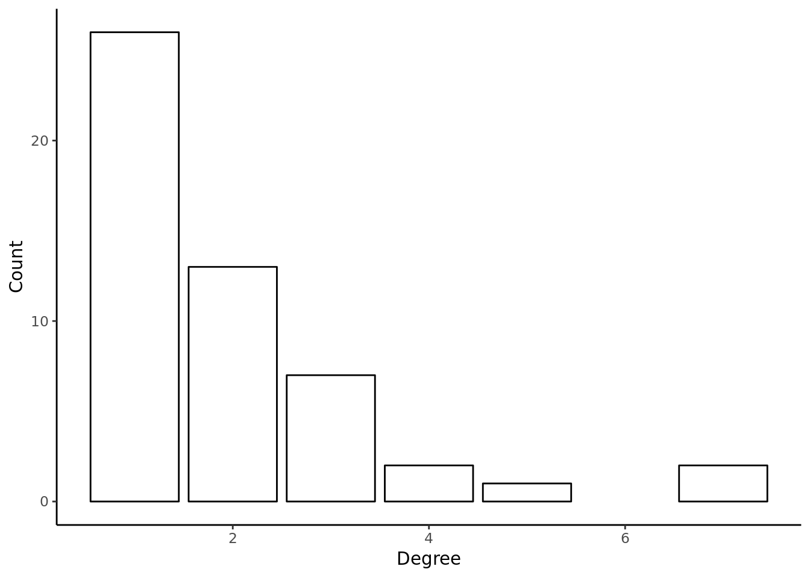

#### Runing time by method 

<table class="table table-condensed" style="width: auto !important; ">
 <thead>
  <tr>
   <th style="text-align:left;">   </th>
   <th style="text-align:left;"> key </th>
   <th style="text-align:right;"> doc_count </th>
   <th style="text-align:right;"> sum_wallTime_ms.value </th>
   <th style="text-align:left;"> avg_wallTime_ms.value </th>
   <th style="text-align:left;"> includedInTotal </th>
  </tr>
 </thead>
<tbody>
  <tr>
   <td style="text-align:left;"> 2 </td>
   <td style="text-align:left;"> cycleSearch </td>
   <td style="text-align:right;"> 3,600 </td>
   <td style="text-align:right;"> 18,992 </td>
   <td style="text-align:left;"> 5.27555555555556 </td>
   <td style="text-align:left;"> Yes </td>
  </tr>
  <tr>
   <td style="text-align:left;"> 3 </td>
   <td style="text-align:left;"> getWorks </td>
   <td style="text-align:right;"> 3,600 </td>
   <td style="text-align:right;"> 36,591 </td>
   <td style="text-align:left;"> 10.1641666666667 </td>
   <td style="text-align:left;"> No </td>
  </tr>
  <tr>
   <td style="text-align:left;"> 4 </td>
   <td style="text-align:left;"> individualCycleSearch </td>
   <td style="text-align:right;"> 3,600 </td>
   <td style="text-align:right;"> 164 </td>
   <td style="text-align:left;"> 0.0455555555555556 </td>
   <td style="text-align:left;"> Yes </td>
  </tr>
  <tr>
   <td style="text-align:left;"> 6 </td>
   <td style="text-align:left;"> addItemToWork </td>
   <td style="text-align:right;"> 210 </td>
   <td style="text-align:right;"> 1,261 </td>
   <td style="text-align:left;"> 6.0047619047619 </td>
   <td style="text-align:left;"> No </td>
  </tr>
  <tr>
   <td style="text-align:left;"> 7 </td>
   <td style="text-align:left;"> ownsWork </td>
   <td style="text-align:right;"> 105 </td>
   <td style="text-align:right;"> 959 </td>
   <td style="text-align:left;"> 9.13333333333333 </td>
   <td style="text-align:left;"> No </td>
  </tr>
  <tr>
   <td style="text-align:left;"> 8 </td>
   <td style="text-align:left;"> init </td>
   <td style="text-align:right;"> 53 </td>
   <td style="text-align:right;"> 9,056 </td>
   <td style="text-align:left;"> 170.867924528302 </td>
   <td style="text-align:left;"> No </td>
  </tr>
  <tr>
   <td style="text-align:left;"> 9 </td>
   <td style="text-align:left;"> searchAndConnect </td>
   <td style="text-align:right;"> 51 </td>
   <td style="text-align:right;"> 13,031 </td>
   <td style="text-align:left;"> 255.509803921569 </td>
   <td style="text-align:left;"> Yes </td>
  </tr>
  <tr>
   <td style="text-align:left;"> 10 </td>
   <td style="text-align:left;"> knowsAgent </td>
   <td style="text-align:right;"> 50 </td>
   <td style="text-align:right;"> 85 </td>
   <td style="text-align:left;"> 1.7 </td>
   <td style="text-align:left;"> No </td>
  </tr>
  <tr>
   <td style="text-align:left;font-weight: bold;"> 1 </td>
   <td style="text-align:left;font-weight: bold;"> Total </td>
   <td style="text-align:right;font-weight: bold;"> 14,451 </td>
   <td style="text-align:right;font-weight: bold;"> 54,768 </td>
   <td style="text-align:left;font-weight: bold;">  </td>
   <td style="text-align:left;font-weight: bold;">  </td>
  </tr>
</tbody>
</table>
####  Found structures 

#####  Cycles 

Number of cycles found:  0 

<button class="btn btn-primary" data-toggle="collapse" data-target="#VUYOLPVZSB"> Show/Hide foundCycle query </button> 
 
  
     GET /filebeat-*/_search 
              { 
                "query": {
                  "bool": {
                    "must": [
                      { "match_phrase": {
                        "simulationId": "SIM10-13-12-59-VF5x6b--DV"
                        }
                      },
                      { "bool": {
                        "should": [
                          { "match": {
                            "keyword": "foundCycle"
                          }}
                        ]
                      }}
                    ]
                  }
                }
              }
     

#####  Paths 

Number of paths found:  3600 

<button class="btn btn-primary" data-toggle="collapse" data-target="#CRKENCWTBF"> Show/Hide foundPath query </button> 
 
  
     GET /filebeat-*/_search 
              { 
                "query": {
                  "bool": {
                    "must": [
                      { "match_phrase": {
                        "simulationId": "SIM10-13-12-59-VF5x6b--DV"
                        }
                      },
                      { "bool": {
                        "should": [
                          { "match": {
                            "keyword": "foundPath"
                          }}
                        ]
                      }}
                    ]
                  }
                }
              }
     

## Scatterplots of experiment 

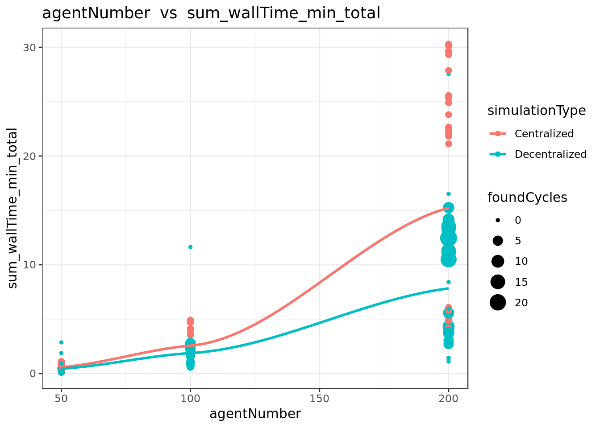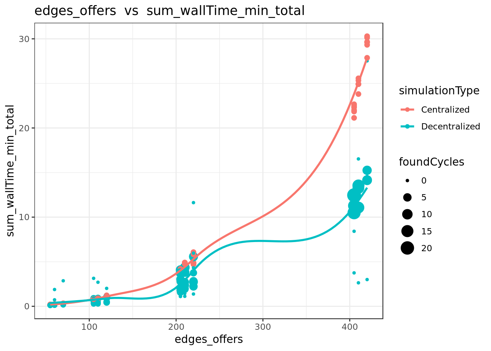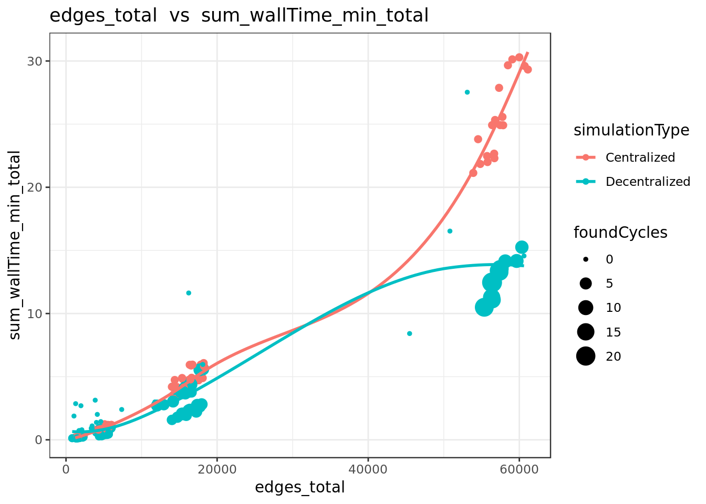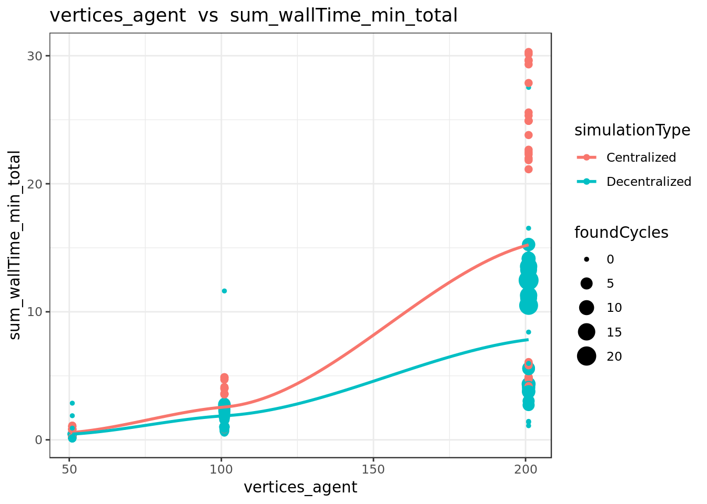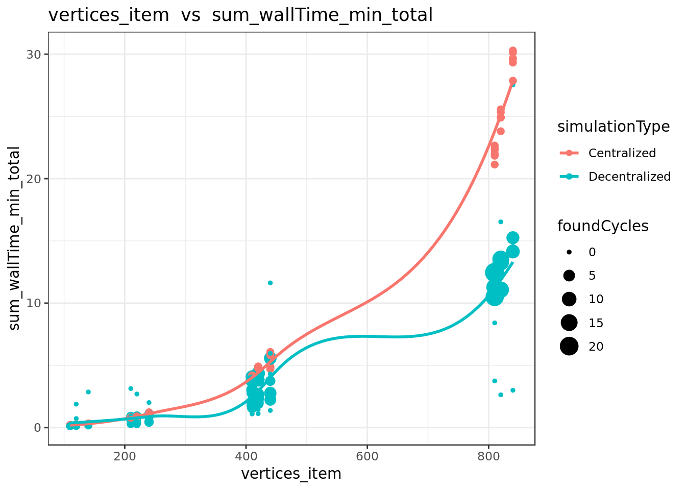  

# Cross analysis of all additional experiments

## Summary data 

<table class="table table-condensed" style="width: auto !important; ">
 <thead>
  <tr>
   <th style="text-align:left;"> experimentId </th>
   <th style="text-align:left;"> simulationId </th>
   <th style="text-align:right;"> agentNumber </th>
   <th style="text-align:left;"> similarityConnectThreshold </th>
   <th style="text-align:left;"> graphType </th>
   <th style="text-align:right;"> chainLength </th>
   <th style="text-align:right;"> similaritySearchThreshold </th>
   <th style="text-align:left;"> maxDistance </th>
   <th style="text-align:right;"> randomWorksNumberMultiplier </th>
   <th style="text-align:right;"> edges_offers </th>
   <th style="text-align:right;"> edges_similarity </th>
   <th style="text-align:right;"> edges_owns </th>
   <th style="text-align:right;"> edges_demands </th>
   <th style="text-align:right;"> edges_knows </th>
   <th style="text-align:right;"> edges_total </th>
   <th style="text-align:right;"> vertices_agent </th>
   <th style="text-align:right;"> vertices_item </th>
   <th style="text-align:right;"> vertices_work </th>
   <th style="text-align:right;"> vertices_total </th>
   <th style="text-align:right;"> sum_wallTime_ms_total </th>
   <th style="text-align:right;"> process_total </th>
   <th style="text-align:right;"> foundCycles </th>
   <th style="text-align:right;"> foundPaths </th>
   <th style="text-align:right;"> sum_wallTime_min_total </th>
   <th style="text-align:left;"> simulationType </th>
  </tr>
 </thead>
<tbody>
  <tr>
   <td style="text-align:left;"> EXP10-13-12-56-ZEvsxw </td>
   <td style="text-align:left;"> SIM10-13-01-13-MMNy8z--CV </td>
   <td style="text-align:right;"> 100 </td>
   <td style="text-align:left;"> 0.96 </td>
   <td style="text-align:left;"> random </td>
   <td style="text-align:right;"> 10 </td>
   <td style="text-align:right;"> 1 </td>
   <td style="text-align:left;"> 10 </td>
   <td style="text-align:right;"> 2 </td>
   <td style="text-align:right;"> 210 </td>
   <td style="text-align:right;"> 15,444 </td>
   <td style="text-align:right;"> 210 </td>
   <td style="text-align:right;"> 210 </td>
   <td style="text-align:right;"> 100 </td>
   <td style="text-align:right;"> 16,174 </td>
   <td style="text-align:right;"> 101 </td>
   <td style="text-align:right;"> 420 </td>
   <td style="text-align:right;"> 210 </td>
   <td style="text-align:right;"> 731 </td>
   <td style="text-align:right;"> 240,914 </td>
   <td style="text-align:right;"> 559 </td>
   <td style="text-align:right;"> 1 </td>
   <td style="text-align:right;"> 0 </td>
   <td style="text-align:right;"> 4.0152333 </td>
   <td style="text-align:left;"> Centralized </td>
  </tr>
  <tr>
   <td style="text-align:left;"> EXP10-13-12-56-ZEvsxw </td>
   <td style="text-align:left;"> SIM10-13-01-13-MMNy8z--DV </td>
   <td style="text-align:right;"> 100 </td>
   <td style="text-align:left;"> 0.96 </td>
   <td style="text-align:left;"> random </td>
   <td style="text-align:right;"> 10 </td>
   <td style="text-align:right;"> 1 </td>
   <td style="text-align:left;"> 10 </td>
   <td style="text-align:right;"> 2 </td>
   <td style="text-align:right;"> 210 </td>
   <td style="text-align:right;"> 15,182 </td>
   <td style="text-align:right;"> 210 </td>
   <td style="text-align:right;"> 210 </td>
   <td style="text-align:right;"> 100 </td>
   <td style="text-align:right;"> 15,912 </td>
   <td style="text-align:right;"> 101 </td>
   <td style="text-align:right;"> 420 </td>
   <td style="text-align:right;"> 210 </td>
   <td style="text-align:right;"> 731 </td>
   <td style="text-align:right;"> 116,175 </td>
   <td style="text-align:right;"> 132 </td>
   <td style="text-align:right;"> 4 </td>
   <td style="text-align:right;"> 0 </td>
   <td style="text-align:right;"> 1.9362500 </td>
   <td style="text-align:left;"> Decentralized </td>
  </tr>
  <tr>
   <td style="text-align:left;"> EXP10-13-12-56-ZEvsxw </td>
   <td style="text-align:left;"> SIM10-13-01-18-ATARi9--CV </td>
   <td style="text-align:right;"> 100 </td>
   <td style="text-align:left;"> 0.96 </td>
   <td style="text-align:left;"> smallWorld </td>
   <td style="text-align:right;"> 10 </td>
   <td style="text-align:right;"> 1 </td>
   <td style="text-align:left;"> 10 </td>
   <td style="text-align:right;"> 2 </td>
   <td style="text-align:right;"> 210 </td>
   <td style="text-align:right;"> 15,166 </td>
   <td style="text-align:right;"> 210 </td>
   <td style="text-align:right;"> 210 </td>
   <td style="text-align:right;"> 601 </td>
   <td style="text-align:right;"> 16,397 </td>
   <td style="text-align:right;"> 101 </td>
   <td style="text-align:right;"> 420 </td>
   <td style="text-align:right;"> 210 </td>
   <td style="text-align:right;"> 731 </td>
   <td style="text-align:right;"> 240,216 </td>
   <td style="text-align:right;"> 513 </td>
   <td style="text-align:right;"> 1 </td>
   <td style="text-align:right;"> 0 </td>
   <td style="text-align:right;"> 4.0036000 </td>
   <td style="text-align:left;"> Centralized </td>
  </tr>
  <tr>
   <td style="text-align:left;"> EXP10-13-12-56-ZEvsxw </td>
   <td style="text-align:left;"> SIM10-13-01-18-ATARi9--DV </td>
   <td style="text-align:right;"> 100 </td>
   <td style="text-align:left;"> 0.96 </td>
   <td style="text-align:left;"> smallWorld </td>
   <td style="text-align:right;"> 10 </td>
   <td style="text-align:right;"> 1 </td>
   <td style="text-align:left;"> 10 </td>
   <td style="text-align:right;"> 2 </td>
   <td style="text-align:right;"> 210 </td>
   <td style="text-align:right;"> 14,996 </td>
   <td style="text-align:right;"> 210 </td>
   <td style="text-align:right;"> 210 </td>
   <td style="text-align:right;"> 601 </td>
   <td style="text-align:right;"> 16,227 </td>
   <td style="text-align:right;"> 101 </td>
   <td style="text-align:right;"> 420 </td>
   <td style="text-align:right;"> 210 </td>
   <td style="text-align:right;"> 731 </td>
   <td style="text-align:right;"> 139,957 </td>
   <td style="text-align:right;"> 134 </td>
   <td style="text-align:right;"> 5 </td>
   <td style="text-align:right;"> 0 </td>
   <td style="text-align:right;"> 2.3326167 </td>
   <td style="text-align:left;"> Decentralized </td>
  </tr>
  <tr>
   <td style="text-align:left;"> EXP10-13-12-56-ZEvsxw </td>
   <td style="text-align:left;"> SIM10-13-11-59-8BI6sm--CV </td>
   <td style="text-align:right;"> 100 </td>
   <td style="text-align:left;"> 0.96 </td>
   <td style="text-align:left;"> random </td>
   <td style="text-align:right;"> 10 </td>
   <td style="text-align:right;"> 1 </td>
   <td style="text-align:left;"> 10 </td>
   <td style="text-align:right;"> 1 </td>
   <td style="text-align:right;"> 110 </td>
   <td style="text-align:right;"> 4,100 </td>
   <td style="text-align:right;"> 110 </td>
   <td style="text-align:right;"> 110 </td>
   <td style="text-align:right;"> 100 </td>
   <td style="text-align:right;"> 4,530 </td>
   <td style="text-align:right;"> 101 </td>
   <td style="text-align:right;"> 220 </td>
   <td style="text-align:right;"> 110 </td>
   <td style="text-align:right;"> 431 </td>
   <td style="text-align:right;"> 56,078 </td>
   <td style="text-align:right;"> 489 </td>
   <td style="text-align:right;"> 1 </td>
   <td style="text-align:right;"> 0 </td>
   <td style="text-align:right;"> 0.9346333 </td>
   <td style="text-align:left;"> Centralized </td>
  </tr>
  <tr>
   <td style="text-align:left;"> EXP10-13-12-56-ZEvsxw </td>
   <td style="text-align:left;"> SIM10-13-11-59-8BI6sm--DV </td>
   <td style="text-align:right;"> 100 </td>
   <td style="text-align:left;"> 0.96 </td>
   <td style="text-align:left;"> random </td>
   <td style="text-align:right;"> 10 </td>
   <td style="text-align:right;"> 1 </td>
   <td style="text-align:left;"> 10 </td>
   <td style="text-align:right;"> 1 </td>
   <td style="text-align:right;"> 110 </td>
   <td style="text-align:right;"> 3,578 </td>
   <td style="text-align:right;"> 110 </td>
   <td style="text-align:right;"> 110 </td>
   <td style="text-align:right;"> 100 </td>
   <td style="text-align:right;"> 4,008 </td>
   <td style="text-align:right;"> 101 </td>
   <td style="text-align:right;"> 220 </td>
   <td style="text-align:right;"> 110 </td>
   <td style="text-align:right;"> 431 </td>
   <td style="text-align:right;"> 34,011 </td>
   <td style="text-align:right;"> 128 </td>
   <td style="text-align:right;"> 1 </td>
   <td style="text-align:right;"> 1 </td>
   <td style="text-align:right;"> 0.5668500 </td>
   <td style="text-align:left;"> Decentralized </td>
  </tr>
  <tr>
   <td style="text-align:left;"> EXP10-13-12-56-ZEvsxw </td>
   <td style="text-align:left;"> SIM10-13-12-01-GqYGvr--CV </td>
   <td style="text-align:right;"> 100 </td>
   <td style="text-align:left;"> 0.96 </td>
   <td style="text-align:left;"> smallWorld </td>
   <td style="text-align:right;"> 10 </td>
   <td style="text-align:right;"> 1 </td>
   <td style="text-align:left;"> 10 </td>
   <td style="text-align:right;"> 1 </td>
   <td style="text-align:right;"> 110 </td>
   <td style="text-align:right;"> 4,244 </td>
   <td style="text-align:right;"> 110 </td>
   <td style="text-align:right;"> 110 </td>
   <td style="text-align:right;"> 601 </td>
   <td style="text-align:right;"> 5,175 </td>
   <td style="text-align:right;"> 101 </td>
   <td style="text-align:right;"> 220 </td>
   <td style="text-align:right;"> 110 </td>
   <td style="text-align:right;"> 431 </td>
   <td style="text-align:right;"> 54,635 </td>
   <td style="text-align:right;"> 264 </td>
   <td style="text-align:right;"> 1 </td>
   <td style="text-align:right;"> 0 </td>
   <td style="text-align:right;"> 0.9105833 </td>
   <td style="text-align:left;"> Centralized </td>
  </tr>
  <tr>
   <td style="text-align:left;"> EXP10-13-12-56-ZEvsxw </td>
   <td style="text-align:left;"> SIM10-13-12-01-GqYGvr--DV </td>
   <td style="text-align:right;"> 100 </td>
   <td style="text-align:left;"> 0.96 </td>
   <td style="text-align:left;"> smallWorld </td>
   <td style="text-align:right;"> 10 </td>
   <td style="text-align:right;"> 1 </td>
   <td style="text-align:left;"> 10 </td>
   <td style="text-align:right;"> 1 </td>
   <td style="text-align:right;"> 110 </td>
   <td style="text-align:right;"> 4,172 </td>
   <td style="text-align:right;"> 110 </td>
   <td style="text-align:right;"> 110 </td>
   <td style="text-align:right;"> 601 </td>
   <td style="text-align:right;"> 5,103 </td>
   <td style="text-align:right;"> 101 </td>
   <td style="text-align:right;"> 220 </td>
   <td style="text-align:right;"> 110 </td>
   <td style="text-align:right;"> 431 </td>
   <td style="text-align:right;"> 50,426 </td>
   <td style="text-align:right;"> 128 </td>
   <td style="text-align:right;"> 2 </td>
   <td style="text-align:right;"> 0 </td>
   <td style="text-align:right;"> 0.8404333 </td>
   <td style="text-align:left;"> Decentralized </td>
  </tr>
  <tr>
   <td style="text-align:left;"> EXP10-13-12-56-ZEvsxw </td>
   <td style="text-align:left;"> SIM10-13-01-22-iDF56F--CV </td>
   <td style="text-align:right;"> 100 </td>
   <td style="text-align:left;"> 0.96 </td>
   <td style="text-align:left;"> random </td>
   <td style="text-align:right;"> 10 </td>
   <td style="text-align:right;"> 1 </td>
   <td style="text-align:left;"> 30 </td>
   <td style="text-align:right;"> 2 </td>
   <td style="text-align:right;"> 210 </td>
   <td style="text-align:right;"> 15,122 </td>
   <td style="text-align:right;"> 210 </td>
   <td style="text-align:right;"> 210 </td>
   <td style="text-align:right;"> 100 </td>
   <td style="text-align:right;"> 15,852 </td>
   <td style="text-align:right;"> 101 </td>
   <td style="text-align:right;"> 420 </td>
   <td style="text-align:right;"> 210 </td>
   <td style="text-align:right;"> 731 </td>
   <td style="text-align:right;"> 247,256 </td>
   <td style="text-align:right;"> 490 </td>
   <td style="text-align:right;"> 1 </td>
   <td style="text-align:right;"> 0 </td>
   <td style="text-align:right;"> 4.1209333 </td>
   <td style="text-align:left;"> Centralized </td>
  </tr>
  <tr>
   <td style="text-align:left;"> EXP10-13-12-56-ZEvsxw </td>
   <td style="text-align:left;"> SIM10-13-01-22-iDF56F--DV </td>
   <td style="text-align:right;"> 100 </td>
   <td style="text-align:left;"> 0.96 </td>
   <td style="text-align:left;"> random </td>
   <td style="text-align:right;"> 10 </td>
   <td style="text-align:right;"> 1 </td>
   <td style="text-align:left;"> 30 </td>
   <td style="text-align:right;"> 2 </td>
   <td style="text-align:right;"> 210 </td>
   <td style="text-align:right;"> 14,998 </td>
   <td style="text-align:right;"> 210 </td>
   <td style="text-align:right;"> 210 </td>
   <td style="text-align:right;"> 100 </td>
   <td style="text-align:right;"> 15,728 </td>
   <td style="text-align:right;"> 101 </td>
   <td style="text-align:right;"> 420 </td>
   <td style="text-align:right;"> 210 </td>
   <td style="text-align:right;"> 731 </td>
   <td style="text-align:right;"> 121,927 </td>
   <td style="text-align:right;"> 132 </td>
   <td style="text-align:right;"> 4 </td>
   <td style="text-align:right;"> 0 </td>
   <td style="text-align:right;"> 2.0321167 </td>
   <td style="text-align:left;"> Decentralized </td>
  </tr>
  <tr>
   <td style="text-align:left;"> EXP10-13-12-56-ZEvsxw </td>
   <td style="text-align:left;"> SIM10-13-01-27-oRsogM--CV </td>
   <td style="text-align:right;"> 100 </td>
   <td style="text-align:left;"> 0.96 </td>
   <td style="text-align:left;"> smallWorld </td>
   <td style="text-align:right;"> 10 </td>
   <td style="text-align:right;"> 1 </td>
   <td style="text-align:left;"> 30 </td>
   <td style="text-align:right;"> 2 </td>
   <td style="text-align:right;"> 210 </td>
   <td style="text-align:right;"> 15,230 </td>
   <td style="text-align:right;"> 210 </td>
   <td style="text-align:right;"> 210 </td>
   <td style="text-align:right;"> 601 </td>
   <td style="text-align:right;"> 16,461 </td>
   <td style="text-align:right;"> 101 </td>
   <td style="text-align:right;"> 420 </td>
   <td style="text-align:right;"> 210 </td>
   <td style="text-align:right;"> 731 </td>
   <td style="text-align:right;"> 246,176 </td>
   <td style="text-align:right;"> 508 </td>
   <td style="text-align:right;"> 1 </td>
   <td style="text-align:right;"> 0 </td>
   <td style="text-align:right;"> 4.1029333 </td>
   <td style="text-align:left;"> Centralized </td>
  </tr>
  <tr>
   <td style="text-align:left;"> EXP10-13-12-56-ZEvsxw </td>
   <td style="text-align:left;"> SIM10-13-01-27-oRsogM--DV </td>
   <td style="text-align:right;"> 100 </td>
   <td style="text-align:left;"> 0.96 </td>
   <td style="text-align:left;"> smallWorld </td>
   <td style="text-align:right;"> 10 </td>
   <td style="text-align:right;"> 1 </td>
   <td style="text-align:left;"> 30 </td>
   <td style="text-align:right;"> 2 </td>
   <td style="text-align:right;"> 210 </td>
   <td style="text-align:right;"> 15,070 </td>
   <td style="text-align:right;"> 210 </td>
   <td style="text-align:right;"> 210 </td>
   <td style="text-align:right;"> 601 </td>
   <td style="text-align:right;"> 16,301 </td>
   <td style="text-align:right;"> 101 </td>
   <td style="text-align:right;"> 420 </td>
   <td style="text-align:right;"> 210 </td>
   <td style="text-align:right;"> 731 </td>
   <td style="text-align:right;"> 143,112 </td>
   <td style="text-align:right;"> 134 </td>
   <td style="text-align:right;"> 4 </td>
   <td style="text-align:right;"> 1 </td>
   <td style="text-align:right;"> 2.3852000 </td>
   <td style="text-align:left;"> Decentralized </td>
  </tr>
  <tr>
   <td style="text-align:left;"> EXP10-13-12-56-ZEvsxw </td>
   <td style="text-align:left;"> SIM10-13-12-02-EpmeFW--CV </td>
   <td style="text-align:right;"> 100 </td>
   <td style="text-align:left;"> 0.96 </td>
   <td style="text-align:left;"> random </td>
   <td style="text-align:right;"> 10 </td>
   <td style="text-align:right;"> 1 </td>
   <td style="text-align:left;"> 30 </td>
   <td style="text-align:right;"> 1 </td>
   <td style="text-align:right;"> 110 </td>
   <td style="text-align:right;"> 4,346 </td>
   <td style="text-align:right;"> 110 </td>
   <td style="text-align:right;"> 110 </td>
   <td style="text-align:right;"> 100 </td>
   <td style="text-align:right;"> 4,776 </td>
   <td style="text-align:right;"> 101 </td>
   <td style="text-align:right;"> 220 </td>
   <td style="text-align:right;"> 110 </td>
   <td style="text-align:right;"> 431 </td>
   <td style="text-align:right;"> 57,189 </td>
   <td style="text-align:right;"> 247 </td>
   <td style="text-align:right;"> 1 </td>
   <td style="text-align:right;"> 0 </td>
   <td style="text-align:right;"> 0.9531500 </td>
   <td style="text-align:left;"> Centralized </td>
  </tr>
  <tr>
   <td style="text-align:left;"> EXP10-13-12-56-ZEvsxw </td>
   <td style="text-align:left;"> SIM10-13-12-02-EpmeFW--DV </td>
   <td style="text-align:right;"> 100 </td>
   <td style="text-align:left;"> 0.96 </td>
   <td style="text-align:left;"> random </td>
   <td style="text-align:right;"> 10 </td>
   <td style="text-align:right;"> 1 </td>
   <td style="text-align:left;"> 30 </td>
   <td style="text-align:right;"> 1 </td>
   <td style="text-align:right;"> 110 </td>
   <td style="text-align:right;"> 4,308 </td>
   <td style="text-align:right;"> 110 </td>
   <td style="text-align:right;"> 110 </td>
   <td style="text-align:right;"> 100 </td>
   <td style="text-align:right;"> 4,738 </td>
   <td style="text-align:right;"> 101 </td>
   <td style="text-align:right;"> 220 </td>
   <td style="text-align:right;"> 110 </td>
   <td style="text-align:right;"> 431 </td>
   <td style="text-align:right;"> 44,297 </td>
   <td style="text-align:right;"> 128 </td>
   <td style="text-align:right;"> 1 </td>
   <td style="text-align:right;"> 1 </td>
   <td style="text-align:right;"> 0.7382833 </td>
   <td style="text-align:left;"> Decentralized </td>
  </tr>
  <tr>
   <td style="text-align:left;"> EXP10-13-12-56-ZEvsxw </td>
   <td style="text-align:left;"> SIM10-13-12-03-fd5I7g--CV </td>
   <td style="text-align:right;"> 100 </td>
   <td style="text-align:left;"> 0.96 </td>
   <td style="text-align:left;"> smallWorld </td>
   <td style="text-align:right;"> 10 </td>
   <td style="text-align:right;"> 1 </td>
   <td style="text-align:left;"> 30 </td>
   <td style="text-align:right;"> 1 </td>
   <td style="text-align:right;"> 110 </td>
   <td style="text-align:right;"> 4,336 </td>
   <td style="text-align:right;"> 110 </td>
   <td style="text-align:right;"> 110 </td>
   <td style="text-align:right;"> 601 </td>
   <td style="text-align:right;"> 5,267 </td>
   <td style="text-align:right;"> 101 </td>
   <td style="text-align:right;"> 220 </td>
   <td style="text-align:right;"> 110 </td>
   <td style="text-align:right;"> 431 </td>
   <td style="text-align:right;"> 55,706 </td>
   <td style="text-align:right;"> 250 </td>
   <td style="text-align:right;"> 1 </td>
   <td style="text-align:right;"> 0 </td>
   <td style="text-align:right;"> 0.9284333 </td>
   <td style="text-align:left;"> Centralized </td>
  </tr>
  <tr>
   <td style="text-align:left;"> EXP10-13-12-56-ZEvsxw </td>
   <td style="text-align:left;"> SIM10-13-12-03-fd5I7g--DV </td>
   <td style="text-align:right;"> 100 </td>
   <td style="text-align:left;"> 0.96 </td>
   <td style="text-align:left;"> smallWorld </td>
   <td style="text-align:right;"> 10 </td>
   <td style="text-align:right;"> 1 </td>
   <td style="text-align:left;"> 30 </td>
   <td style="text-align:right;"> 1 </td>
   <td style="text-align:right;"> 110 </td>
   <td style="text-align:right;"> 4,292 </td>
   <td style="text-align:right;"> 110 </td>
   <td style="text-align:right;"> 110 </td>
   <td style="text-align:right;"> 601 </td>
   <td style="text-align:right;"> 5,223 </td>
   <td style="text-align:right;"> 101 </td>
   <td style="text-align:right;"> 220 </td>
   <td style="text-align:right;"> 110 </td>
   <td style="text-align:right;"> 431 </td>
   <td style="text-align:right;"> 53,846 </td>
   <td style="text-align:right;"> 128 </td>
   <td style="text-align:right;"> 2 </td>
   <td style="text-align:right;"> 0 </td>
   <td style="text-align:right;"> 0.8974333 </td>
   <td style="text-align:left;"> Decentralized </td>
  </tr>
  <tr>
   <td style="text-align:left;"> EXP10-13-12-56-ZEvsxw </td>
   <td style="text-align:left;"> SIM10-13-01-09-KXfm7X--CV </td>
   <td style="text-align:right;"> 100 </td>
   <td style="text-align:left;"> 0.96 </td>
   <td style="text-align:left;"> smallWorld </td>
   <td style="text-align:right;"> 10 </td>
   <td style="text-align:right;"> 1 </td>
   <td style="text-align:left;"> 5 </td>
   <td style="text-align:right;"> 2 </td>
   <td style="text-align:right;"> 210 </td>
   <td style="text-align:right;"> 15,326 </td>
   <td style="text-align:right;"> 210 </td>
   <td style="text-align:right;"> 210 </td>
   <td style="text-align:right;"> 601 </td>
   <td style="text-align:right;"> 16,557 </td>
   <td style="text-align:right;"> 101 </td>
   <td style="text-align:right;"> 420 </td>
   <td style="text-align:right;"> 210 </td>
   <td style="text-align:right;"> 731 </td>
   <td style="text-align:right;"> 242,815 </td>
   <td style="text-align:right;"> 501 </td>
   <td style="text-align:right;"> 1 </td>
   <td style="text-align:right;"> 0 </td>
   <td style="text-align:right;"> 4.0469167 </td>
   <td style="text-align:left;"> Centralized </td>
  </tr>
  <tr>
   <td style="text-align:left;"> EXP10-13-12-56-ZEvsxw </td>
   <td style="text-align:left;"> SIM10-13-01-09-KXfm7X--DV </td>
   <td style="text-align:right;"> 100 </td>
   <td style="text-align:left;"> 0.96 </td>
   <td style="text-align:left;"> smallWorld </td>
   <td style="text-align:right;"> 10 </td>
   <td style="text-align:right;"> 1 </td>
   <td style="text-align:left;"> 5 </td>
   <td style="text-align:right;"> 2 </td>
   <td style="text-align:right;"> 210 </td>
   <td style="text-align:right;"> 15,180 </td>
   <td style="text-align:right;"> 210 </td>
   <td style="text-align:right;"> 210 </td>
   <td style="text-align:right;"> 601 </td>
   <td style="text-align:right;"> 16,411 </td>
   <td style="text-align:right;"> 101 </td>
   <td style="text-align:right;"> 420 </td>
   <td style="text-align:right;"> 210 </td>
   <td style="text-align:right;"> 731 </td>
   <td style="text-align:right;"> 143,159 </td>
   <td style="text-align:right;"> 134 </td>
   <td style="text-align:right;"> 5 </td>
   <td style="text-align:right;"> 0 </td>
   <td style="text-align:right;"> 2.3859833 </td>
   <td style="text-align:left;"> Decentralized </td>
  </tr>
  <tr>
   <td style="text-align:left;"> EXP10-13-12-56-ZEvsxw </td>
   <td style="text-align:left;"> SIM10-13-10-57-Uqhqah--CV </td>
   <td style="text-align:right;"> 100 </td>
   <td style="text-align:left;"> 0.96 </td>
   <td style="text-align:left;"> random </td>
   <td style="text-align:right;"> 10 </td>
   <td style="text-align:right;"> 1 </td>
   <td style="text-align:left;"> 5 </td>
   <td style="text-align:right;"> 1 </td>
   <td style="text-align:right;"> 110 </td>
   <td style="text-align:right;"> 4,020 </td>
   <td style="text-align:right;"> 110 </td>
   <td style="text-align:right;"> 110 </td>
   <td style="text-align:right;"> 100 </td>
   <td style="text-align:right;"> 4,450 </td>
   <td style="text-align:right;"> 101 </td>
   <td style="text-align:right;"> 220 </td>
   <td style="text-align:right;"> 110 </td>
   <td style="text-align:right;"> 431 </td>
   <td style="text-align:right;"> 58,386 </td>
   <td style="text-align:right;"> 1,465 </td>
   <td style="text-align:right;"> 1 </td>
   <td style="text-align:right;"> 0 </td>
   <td style="text-align:right;"> 0.9731000 </td>
   <td style="text-align:left;"> Centralized </td>
  </tr>
  <tr>
   <td style="text-align:left;"> EXP10-13-12-56-ZEvsxw </td>
   <td style="text-align:left;"> SIM10-13-10-57-Uqhqah--DV </td>
   <td style="text-align:right;"> 100 </td>
   <td style="text-align:left;"> 0.96 </td>
   <td style="text-align:left;"> random </td>
   <td style="text-align:right;"> 10 </td>
   <td style="text-align:right;"> 1 </td>
   <td style="text-align:left;"> 5 </td>
   <td style="text-align:right;"> 1 </td>
   <td style="text-align:right;"> 110 </td>
   <td style="text-align:right;"> 1,546 </td>
   <td style="text-align:right;"> 110 </td>
   <td style="text-align:right;"> 110 </td>
   <td style="text-align:right;"> 100 </td>
   <td style="text-align:right;"> 1,976 </td>
   <td style="text-align:right;"> 101 </td>
   <td style="text-align:right;"> 220 </td>
   <td style="text-align:right;"> 110 </td>
   <td style="text-align:right;"> 431 </td>
   <td style="text-align:right;"> 161,927 </td>
   <td style="text-align:right;"> 14,501 </td>
   <td style="text-align:right;"> 0 </td>
   <td style="text-align:right;"> 3,600 </td>
   <td style="text-align:right;"> 2.6987833 </td>
   <td style="text-align:left;"> Decentralized </td>
  </tr>
  <tr>
   <td style="text-align:left;"> EXP10-13-12-56-ZEvsxw </td>
   <td style="text-align:left;"> SIM10-13-11-58-fCLnXJ--CV </td>
   <td style="text-align:right;"> 100 </td>
   <td style="text-align:left;"> 0.96 </td>
   <td style="text-align:left;"> smallWorld </td>
   <td style="text-align:right;"> 10 </td>
   <td style="text-align:right;"> 1 </td>
   <td style="text-align:left;"> 5 </td>
   <td style="text-align:right;"> 1 </td>
   <td style="text-align:right;"> 110 </td>
   <td style="text-align:right;"> 4,478 </td>
   <td style="text-align:right;"> 110 </td>
   <td style="text-align:right;"> 110 </td>
   <td style="text-align:right;"> 601 </td>
   <td style="text-align:right;"> 5,409 </td>
   <td style="text-align:right;"> 101 </td>
   <td style="text-align:right;"> 220 </td>
   <td style="text-align:right;"> 110 </td>
   <td style="text-align:right;"> 431 </td>
   <td style="text-align:right;"> 54,938 </td>
   <td style="text-align:right;"> 254 </td>
   <td style="text-align:right;"> 1 </td>
   <td style="text-align:right;"> 0 </td>
   <td style="text-align:right;"> 0.9156333 </td>
   <td style="text-align:left;"> Centralized </td>
  </tr>
  <tr>
   <td style="text-align:left;"> EXP10-13-12-56-ZEvsxw </td>
   <td style="text-align:left;"> SIM10-13-11-58-fCLnXJ--DV </td>
   <td style="text-align:right;"> 100 </td>
   <td style="text-align:left;"> 0.96 </td>
   <td style="text-align:left;"> smallWorld </td>
   <td style="text-align:right;"> 10 </td>
   <td style="text-align:right;"> 1 </td>
   <td style="text-align:left;"> 5 </td>
   <td style="text-align:right;"> 1 </td>
   <td style="text-align:right;"> 110 </td>
   <td style="text-align:right;"> 4,426 </td>
   <td style="text-align:right;"> 110 </td>
   <td style="text-align:right;"> 110 </td>
   <td style="text-align:right;"> 601 </td>
   <td style="text-align:right;"> 5,357 </td>
   <td style="text-align:right;"> 101 </td>
   <td style="text-align:right;"> 220 </td>
   <td style="text-align:right;"> 110 </td>
   <td style="text-align:right;"> 431 </td>
   <td style="text-align:right;"> 56,268 </td>
   <td style="text-align:right;"> 130 </td>
   <td style="text-align:right;"> 2 </td>
   <td style="text-align:right;"> 1 </td>
   <td style="text-align:right;"> 0.9378000 </td>
   <td style="text-align:left;"> Decentralized </td>
  </tr>
  <tr>
   <td style="text-align:left;"> EXP10-13-12-56-ZEvsxw </td>
   <td style="text-align:left;"> SIM10-13-12-05-4zLNmU--CV </td>
   <td style="text-align:right;"> 100 </td>
   <td style="text-align:left;"> 0.96 </td>
   <td style="text-align:left;"> random </td>
   <td style="text-align:right;"> 10 </td>
   <td style="text-align:right;"> 1 </td>
   <td style="text-align:left;"> 5 </td>
   <td style="text-align:right;"> 2 </td>
   <td style="text-align:right;"> 210 </td>
   <td style="text-align:right;"> 14,206 </td>
   <td style="text-align:right;"> 210 </td>
   <td style="text-align:right;"> 210 </td>
   <td style="text-align:right;"> 100 </td>
   <td style="text-align:right;"> 14,936 </td>
   <td style="text-align:right;"> 101 </td>
   <td style="text-align:right;"> 420 </td>
   <td style="text-align:right;"> 210 </td>
   <td style="text-align:right;"> 731 </td>
   <td style="text-align:right;"> 240,457 </td>
   <td style="text-align:right;"> 5,017 </td>
   <td style="text-align:right;"> 1 </td>
   <td style="text-align:right;"> 0 </td>
   <td style="text-align:right;"> 4.0076167 </td>
   <td style="text-align:left;"> Centralized </td>
  </tr>
  <tr>
   <td style="text-align:left;"> EXP10-13-12-56-ZEvsxw </td>
   <td style="text-align:left;"> SIM10-13-12-05-4zLNmU--DV </td>
   <td style="text-align:right;"> 100 </td>
   <td style="text-align:left;"> 0.96 </td>
   <td style="text-align:left;"> random </td>
   <td style="text-align:right;"> 10 </td>
   <td style="text-align:right;"> 1 </td>
   <td style="text-align:left;"> 5 </td>
   <td style="text-align:right;"> 2 </td>
   <td style="text-align:right;"> 210 </td>
   <td style="text-align:right;"> 5,028 </td>
   <td style="text-align:right;"> 210 </td>
   <td style="text-align:right;"> 210 </td>
   <td style="text-align:right;"> 100 </td>
   <td style="text-align:right;"> 5,758 </td>
   <td style="text-align:right;"> 101 </td>
   <td style="text-align:right;"> 420 </td>
   <td style="text-align:right;"> 210 </td>
   <td style="text-align:right;"> 731 </td>
   <td style="text-align:right;"> 67,252 </td>
   <td style="text-align:right;"> 14,501 </td>
   <td style="text-align:right;"> 0 </td>
   <td style="text-align:right;"> 3,600 </td>
   <td style="text-align:right;"> 1.1208667 </td>
   <td style="text-align:left;"> Decentralized </td>
  </tr>
  <tr>
   <td style="text-align:left;"> EXP10-13-12-56-ZEvsxw </td>
   <td style="text-align:left;"> SIM10-13-02-34-MTC3HQ--CV </td>
   <td style="text-align:right;"> 100 </td>
   <td style="text-align:left;"> 0.96 </td>
   <td style="text-align:left;"> random </td>
   <td style="text-align:right;"> 20 </td>
   <td style="text-align:right;"> 1 </td>
   <td style="text-align:left;"> 10 </td>
   <td style="text-align:right;"> 1 </td>
   <td style="text-align:right;"> 120 </td>
   <td style="text-align:right;"> 5,062 </td>
   <td style="text-align:right;"> 120 </td>
   <td style="text-align:right;"> 120 </td>
   <td style="text-align:right;"> 100 </td>
   <td style="text-align:right;"> 5,522 </td>
   <td style="text-align:right;"> 101 </td>
   <td style="text-align:right;"> 240 </td>
   <td style="text-align:right;"> 120 </td>
   <td style="text-align:right;"> 461 </td>
   <td style="text-align:right;"> 70,823 </td>
   <td style="text-align:right;"> 938 </td>
   <td style="text-align:right;"> 1 </td>
   <td style="text-align:right;"> 0 </td>
   <td style="text-align:right;"> 1.1803833 </td>
   <td style="text-align:left;"> Centralized </td>
  </tr>
  <tr>
   <td style="text-align:left;"> EXP10-13-12-56-ZEvsxw </td>
   <td style="text-align:left;"> SIM10-13-02-34-MTC3HQ--DV </td>
   <td style="text-align:right;"> 100 </td>
   <td style="text-align:left;"> 0.96 </td>
   <td style="text-align:left;"> random </td>
   <td style="text-align:right;"> 20 </td>
   <td style="text-align:right;"> 1 </td>
   <td style="text-align:left;"> 10 </td>
   <td style="text-align:right;"> 1 </td>
   <td style="text-align:right;"> 120 </td>
   <td style="text-align:right;"> 3,682 </td>
   <td style="text-align:right;"> 120 </td>
   <td style="text-align:right;"> 120 </td>
   <td style="text-align:right;"> 100 </td>
   <td style="text-align:right;"> 4,142 </td>
   <td style="text-align:right;"> 101 </td>
   <td style="text-align:right;"> 240 </td>
   <td style="text-align:right;"> 120 </td>
   <td style="text-align:right;"> 461 </td>
   <td style="text-align:right;"> 120,728 </td>
   <td style="text-align:right;"> 14,501 </td>
   <td style="text-align:right;"> 0 </td>
   <td style="text-align:right;"> 3,600 </td>
   <td style="text-align:right;"> 2.0121333 </td>
   <td style="text-align:left;"> Decentralized </td>
  </tr>
  <tr>
   <td style="text-align:left;"> EXP10-13-12-56-ZEvsxw </td>
   <td style="text-align:left;"> SIM10-13-03-36-TDnCpk--CV </td>
   <td style="text-align:right;"> 100 </td>
   <td style="text-align:left;"> 0.96 </td>
   <td style="text-align:left;"> smallWorld </td>
   <td style="text-align:right;"> 20 </td>
   <td style="text-align:right;"> 1 </td>
   <td style="text-align:left;"> 10 </td>
   <td style="text-align:right;"> 1 </td>
   <td style="text-align:right;"> 120 </td>
   <td style="text-align:right;"> 5,018 </td>
   <td style="text-align:right;"> 120 </td>
   <td style="text-align:right;"> 120 </td>
   <td style="text-align:right;"> 601 </td>
   <td style="text-align:right;"> 5,979 </td>
   <td style="text-align:right;"> 101 </td>
   <td style="text-align:right;"> 240 </td>
   <td style="text-align:right;"> 120 </td>
   <td style="text-align:right;"> 461 </td>
   <td style="text-align:right;"> 70,342 </td>
   <td style="text-align:right;"> 280 </td>
   <td style="text-align:right;"> 1 </td>
   <td style="text-align:right;"> 0 </td>
   <td style="text-align:right;"> 1.1723667 </td>
   <td style="text-align:left;"> Centralized </td>
  </tr>
  <tr>
   <td style="text-align:left;"> EXP10-13-12-56-ZEvsxw </td>
   <td style="text-align:left;"> SIM10-13-03-36-TDnCpk--DV </td>
   <td style="text-align:right;"> 100 </td>
   <td style="text-align:left;"> 0.96 </td>
   <td style="text-align:left;"> smallWorld </td>
   <td style="text-align:right;"> 20 </td>
   <td style="text-align:right;"> 1 </td>
   <td style="text-align:left;"> 10 </td>
   <td style="text-align:right;"> 1 </td>
   <td style="text-align:right;"> 120 </td>
   <td style="text-align:right;"> 4,954 </td>
   <td style="text-align:right;"> 120 </td>
   <td style="text-align:right;"> 120 </td>
   <td style="text-align:right;"> 601 </td>
   <td style="text-align:right;"> 5,915 </td>
   <td style="text-align:right;"> 101 </td>
   <td style="text-align:right;"> 240 </td>
   <td style="text-align:right;"> 120 </td>
   <td style="text-align:right;"> 461 </td>
   <td style="text-align:right;"> 60,546 </td>
   <td style="text-align:right;"> 150 </td>
   <td style="text-align:right;"> 3 </td>
   <td style="text-align:right;"> 0 </td>
   <td style="text-align:right;"> 1.0091000 </td>
   <td style="text-align:left;"> Decentralized </td>
  </tr>
  <tr>
   <td style="text-align:left;"> EXP10-13-12-56-ZEvsxw </td>
   <td style="text-align:left;"> SIM10-13-04-51-F4UWaU--CV </td>
   <td style="text-align:right;"> 100 </td>
   <td style="text-align:left;"> 0.96 </td>
   <td style="text-align:left;"> random </td>
   <td style="text-align:right;"> 20 </td>
   <td style="text-align:right;"> 1 </td>
   <td style="text-align:left;"> 10 </td>
   <td style="text-align:right;"> 2 </td>
   <td style="text-align:right;"> 220 </td>
   <td style="text-align:right;"> 16,412 </td>
   <td style="text-align:right;"> 220 </td>
   <td style="text-align:right;"> 220 </td>
   <td style="text-align:right;"> 100 </td>
   <td style="text-align:right;"> 17,172 </td>
   <td style="text-align:right;"> 101 </td>
   <td style="text-align:right;"> 440 </td>
   <td style="text-align:right;"> 220 </td>
   <td style="text-align:right;"> 761 </td>
   <td style="text-align:right;"> 288,124 </td>
   <td style="text-align:right;"> 914 </td>
   <td style="text-align:right;"> 1 </td>
   <td style="text-align:right;"> 0 </td>
   <td style="text-align:right;"> 4.8020667 </td>
   <td style="text-align:left;"> Centralized </td>
  </tr>
  <tr>
   <td style="text-align:left;"> EXP10-13-12-56-ZEvsxw </td>
   <td style="text-align:left;"> SIM10-13-04-51-F4UWaU--DV </td>
   <td style="text-align:right;"> 100 </td>
   <td style="text-align:left;"> 0.96 </td>
   <td style="text-align:left;"> random </td>
   <td style="text-align:right;"> 20 </td>
   <td style="text-align:right;"> 1 </td>
   <td style="text-align:left;"> 10 </td>
   <td style="text-align:right;"> 2 </td>
   <td style="text-align:right;"> 220 </td>
   <td style="text-align:right;"> 15,480 </td>
   <td style="text-align:right;"> 220 </td>
   <td style="text-align:right;"> 220 </td>
   <td style="text-align:right;"> 100 </td>
   <td style="text-align:right;"> 16,240 </td>
   <td style="text-align:right;"> 101 </td>
   <td style="text-align:right;"> 440 </td>
   <td style="text-align:right;"> 220 </td>
   <td style="text-align:right;"> 761 </td>
   <td style="text-align:right;"> 697,674 </td>
   <td style="text-align:right;"> 14,501 </td>
   <td style="text-align:right;"> 0 </td>
   <td style="text-align:right;"> 3,600 </td>
   <td style="text-align:right;"> 11.6279000 </td>
   <td style="text-align:left;"> Decentralized </td>
  </tr>
  <tr>
   <td style="text-align:left;"> EXP10-13-12-56-ZEvsxw </td>
   <td style="text-align:left;"> SIM10-13-05-56-ptLUe9--CV </td>
   <td style="text-align:right;"> 100 </td>
   <td style="text-align:left;"> 0.96 </td>
   <td style="text-align:left;"> smallWorld </td>
   <td style="text-align:right;"> 20 </td>
   <td style="text-align:right;"> 1 </td>
   <td style="text-align:left;"> 10 </td>
   <td style="text-align:right;"> 2 </td>
   <td style="text-align:right;"> 220 </td>
   <td style="text-align:right;"> 16,280 </td>
   <td style="text-align:right;"> 220 </td>
   <td style="text-align:right;"> 220 </td>
   <td style="text-align:right;"> 601 </td>
   <td style="text-align:right;"> 17,541 </td>
   <td style="text-align:right;"> 101 </td>
   <td style="text-align:right;"> 440 </td>
   <td style="text-align:right;"> 220 </td>
   <td style="text-align:right;"> 761 </td>
   <td style="text-align:right;"> 282,766 </td>
   <td style="text-align:right;"> 528 </td>
   <td style="text-align:right;"> 1 </td>
   <td style="text-align:right;"> 0 </td>
   <td style="text-align:right;"> 4.7127667 </td>
   <td style="text-align:left;"> Centralized </td>
  </tr>
  <tr>
   <td style="text-align:left;"> EXP10-13-12-56-ZEvsxw </td>
   <td style="text-align:left;"> SIM10-13-05-56-ptLUe9--DV </td>
   <td style="text-align:right;"> 100 </td>
   <td style="text-align:left;"> 0.96 </td>
   <td style="text-align:left;"> smallWorld </td>
   <td style="text-align:right;"> 20 </td>
   <td style="text-align:right;"> 1 </td>
   <td style="text-align:left;"> 10 </td>
   <td style="text-align:right;"> 2 </td>
   <td style="text-align:right;"> 220 </td>
   <td style="text-align:right;"> 16,120 </td>
   <td style="text-align:right;"> 220 </td>
   <td style="text-align:right;"> 220 </td>
   <td style="text-align:right;"> 601 </td>
   <td style="text-align:right;"> 17,381 </td>
   <td style="text-align:right;"> 101 </td>
   <td style="text-align:right;"> 440 </td>
   <td style="text-align:right;"> 220 </td>
   <td style="text-align:right;"> 761 </td>
   <td style="text-align:right;"> 164,428 </td>
   <td style="text-align:right;"> 157 </td>
   <td style="text-align:right;"> 6 </td>
   <td style="text-align:right;"> 0 </td>
   <td style="text-align:right;"> 2.7404667 </td>
   <td style="text-align:left;"> Decentralized </td>
  </tr>
  <tr>
   <td style="text-align:left;"> EXP10-13-12-56-ZEvsxw </td>
   <td style="text-align:left;"> SIM10-13-03-37-Nnbvpf--CV </td>
   <td style="text-align:right;"> 100 </td>
   <td style="text-align:left;"> 0.96 </td>
   <td style="text-align:left;"> random </td>
   <td style="text-align:right;"> 20 </td>
   <td style="text-align:right;"> 1 </td>
   <td style="text-align:left;"> 30 </td>
   <td style="text-align:right;"> 1 </td>
   <td style="text-align:right;"> 120 </td>
   <td style="text-align:right;"> 5,218 </td>
   <td style="text-align:right;"> 120 </td>
   <td style="text-align:right;"> 120 </td>
   <td style="text-align:right;"> 100 </td>
   <td style="text-align:right;"> 5,678 </td>
   <td style="text-align:right;"> 101 </td>
   <td style="text-align:right;"> 240 </td>
   <td style="text-align:right;"> 120 </td>
   <td style="text-align:right;"> 461 </td>
   <td style="text-align:right;"> 70,084 </td>
   <td style="text-align:right;"> 284 </td>
   <td style="text-align:right;"> 1 </td>
   <td style="text-align:right;"> 0 </td>
   <td style="text-align:right;"> 1.1680667 </td>
   <td style="text-align:left;"> Centralized </td>
  </tr>
  <tr>
   <td style="text-align:left;"> EXP10-13-12-56-ZEvsxw </td>
   <td style="text-align:left;"> SIM10-13-03-37-Nnbvpf--DV </td>
   <td style="text-align:right;"> 100 </td>
   <td style="text-align:left;"> 0.96 </td>
   <td style="text-align:left;"> random </td>
   <td style="text-align:right;"> 20 </td>
   <td style="text-align:right;"> 1 </td>
   <td style="text-align:left;"> 30 </td>
   <td style="text-align:right;"> 1 </td>
   <td style="text-align:right;"> 120 </td>
   <td style="text-align:right;"> 5,146 </td>
   <td style="text-align:right;"> 120 </td>
   <td style="text-align:right;"> 120 </td>
   <td style="text-align:right;"> 100 </td>
   <td style="text-align:right;"> 5,606 </td>
   <td style="text-align:right;"> 101 </td>
   <td style="text-align:right;"> 240 </td>
   <td style="text-align:right;"> 120 </td>
   <td style="text-align:right;"> 461 </td>
   <td style="text-align:right;"> 51,053 </td>
   <td style="text-align:right;"> 148 </td>
   <td style="text-align:right;"> 2 </td>
   <td style="text-align:right;"> 0 </td>
   <td style="text-align:right;"> 0.8508833 </td>
   <td style="text-align:left;"> Decentralized </td>
  </tr>
  <tr>
   <td style="text-align:left;"> EXP10-13-12-56-ZEvsxw </td>
   <td style="text-align:left;"> SIM10-13-03-39-NQdbEk--CV </td>
   <td style="text-align:right;"> 100 </td>
   <td style="text-align:left;"> 0.96 </td>
   <td style="text-align:left;"> smallWorld </td>
   <td style="text-align:right;"> 20 </td>
   <td style="text-align:right;"> 1 </td>
   <td style="text-align:left;"> 30 </td>
   <td style="text-align:right;"> 1 </td>
   <td style="text-align:right;"> 120 </td>
   <td style="text-align:right;"> 5,046 </td>
   <td style="text-align:right;"> 120 </td>
   <td style="text-align:right;"> 120 </td>
   <td style="text-align:right;"> 601 </td>
   <td style="text-align:right;"> 6,007 </td>
   <td style="text-align:right;"> 101 </td>
   <td style="text-align:right;"> 240 </td>
   <td style="text-align:right;"> 120 </td>
   <td style="text-align:right;"> 461 </td>
   <td style="text-align:right;"> 70,911 </td>
   <td style="text-align:right;"> 276 </td>
   <td style="text-align:right;"> 1 </td>
   <td style="text-align:right;"> 0 </td>
   <td style="text-align:right;"> 1.1818500 </td>
   <td style="text-align:left;"> Centralized </td>
  </tr>
  <tr>
   <td style="text-align:left;"> EXP10-13-12-56-ZEvsxw </td>
   <td style="text-align:left;"> SIM10-13-03-39-NQdbEk--DV </td>
   <td style="text-align:right;"> 100 </td>
   <td style="text-align:left;"> 0.96 </td>
   <td style="text-align:left;"> smallWorld </td>
   <td style="text-align:right;"> 20 </td>
   <td style="text-align:right;"> 1 </td>
   <td style="text-align:left;"> 30 </td>
   <td style="text-align:right;"> 1 </td>
   <td style="text-align:right;"> 120 </td>
   <td style="text-align:right;"> 4,990 </td>
   <td style="text-align:right;"> 120 </td>
   <td style="text-align:right;"> 120 </td>
   <td style="text-align:right;"> 601 </td>
   <td style="text-align:right;"> 5,951 </td>
   <td style="text-align:right;"> 101 </td>
   <td style="text-align:right;"> 240 </td>
   <td style="text-align:right;"> 120 </td>
   <td style="text-align:right;"> 461 </td>
   <td style="text-align:right;"> 55,691 </td>
   <td style="text-align:right;"> 150 </td>
   <td style="text-align:right;"> 2 </td>
   <td style="text-align:right;"> 1 </td>
   <td style="text-align:right;"> 0.9281833 </td>
   <td style="text-align:left;"> Decentralized </td>
  </tr>
  <tr>
   <td style="text-align:left;"> EXP10-13-12-56-ZEvsxw </td>
   <td style="text-align:left;"> SIM10-13-06-01-vyXKso--CV </td>
   <td style="text-align:right;"> 100 </td>
   <td style="text-align:left;"> 0.96 </td>
   <td style="text-align:left;"> random </td>
   <td style="text-align:right;"> 20 </td>
   <td style="text-align:right;"> 1 </td>
   <td style="text-align:left;"> 30 </td>
   <td style="text-align:right;"> 2 </td>
   <td style="text-align:right;"> 220 </td>
   <td style="text-align:right;"> 16,686 </td>
   <td style="text-align:right;"> 220 </td>
   <td style="text-align:right;"> 220 </td>
   <td style="text-align:right;"> 100 </td>
   <td style="text-align:right;"> 17,446 </td>
   <td style="text-align:right;"> 101 </td>
   <td style="text-align:right;"> 440 </td>
   <td style="text-align:right;"> 220 </td>
   <td style="text-align:right;"> 761 </td>
   <td style="text-align:right;"> 292,613 </td>
   <td style="text-align:right;"> 552 </td>
   <td style="text-align:right;"> 1 </td>
   <td style="text-align:right;"> 0 </td>
   <td style="text-align:right;"> 4.8768833 </td>
   <td style="text-align:left;"> Centralized </td>
  </tr>
  <tr>
   <td style="text-align:left;"> EXP10-13-12-56-ZEvsxw </td>
   <td style="text-align:left;"> SIM10-13-06-01-vyXKso--DV </td>
   <td style="text-align:right;"> 100 </td>
   <td style="text-align:left;"> 0.96 </td>
   <td style="text-align:left;"> random </td>
   <td style="text-align:right;"> 20 </td>
   <td style="text-align:right;"> 1 </td>
   <td style="text-align:left;"> 30 </td>
   <td style="text-align:right;"> 2 </td>
   <td style="text-align:right;"> 220 </td>
   <td style="text-align:right;"> 16,478 </td>
   <td style="text-align:right;"> 220 </td>
   <td style="text-align:right;"> 220 </td>
   <td style="text-align:right;"> 100 </td>
   <td style="text-align:right;"> 17,238 </td>
   <td style="text-align:right;"> 101 </td>
   <td style="text-align:right;"> 440 </td>
   <td style="text-align:right;"> 220 </td>
   <td style="text-align:right;"> 761 </td>
   <td style="text-align:right;"> 133,803 </td>
   <td style="text-align:right;"> 154 </td>
   <td style="text-align:right;"> 5 </td>
   <td style="text-align:right;"> 0 </td>
   <td style="text-align:right;"> 2.2300500 </td>
   <td style="text-align:left;"> Decentralized </td>
  </tr>
  <tr>
   <td style="text-align:left;"> EXP10-13-12-56-ZEvsxw </td>
   <td style="text-align:left;"> SIM10-13-06-07-3iFoCT--CV </td>
   <td style="text-align:right;"> 100 </td>
   <td style="text-align:left;"> 0.96 </td>
   <td style="text-align:left;"> smallWorld </td>
   <td style="text-align:right;"> 20 </td>
   <td style="text-align:right;"> 1 </td>
   <td style="text-align:left;"> 30 </td>
   <td style="text-align:right;"> 2 </td>
   <td style="text-align:right;"> 220 </td>
   <td style="text-align:right;"> 16,678 </td>
   <td style="text-align:right;"> 220 </td>
   <td style="text-align:right;"> 220 </td>
   <td style="text-align:right;"> 601 </td>
   <td style="text-align:right;"> 17,939 </td>
   <td style="text-align:right;"> 101 </td>
   <td style="text-align:right;"> 440 </td>
   <td style="text-align:right;"> 220 </td>
   <td style="text-align:right;"> 761 </td>
   <td style="text-align:right;"> 293,496 </td>
   <td style="text-align:right;"> 550 </td>
   <td style="text-align:right;"> 1 </td>
   <td style="text-align:right;"> 0 </td>
   <td style="text-align:right;"> 4.8916000 </td>
   <td style="text-align:left;"> Centralized </td>
  </tr>
  <tr>
   <td style="text-align:left;"> EXP10-13-12-56-ZEvsxw </td>
   <td style="text-align:left;"> SIM10-13-06-07-3iFoCT--DV </td>
   <td style="text-align:right;"> 100 </td>
   <td style="text-align:left;"> 0.96 </td>
   <td style="text-align:left;"> smallWorld </td>
   <td style="text-align:right;"> 20 </td>
   <td style="text-align:right;"> 1 </td>
   <td style="text-align:left;"> 30 </td>
   <td style="text-align:right;"> 2 </td>
   <td style="text-align:right;"> 220 </td>
   <td style="text-align:right;"> 16,474 </td>
   <td style="text-align:right;"> 220 </td>
   <td style="text-align:right;"> 220 </td>
   <td style="text-align:right;"> 601 </td>
   <td style="text-align:right;"> 17,735 </td>
   <td style="text-align:right;"> 101 </td>
   <td style="text-align:right;"> 440 </td>
   <td style="text-align:right;"> 220 </td>
   <td style="text-align:right;"> 761 </td>
   <td style="text-align:right;"> 156,636 </td>
   <td style="text-align:right;"> 157 </td>
   <td style="text-align:right;"> 4 </td>
   <td style="text-align:right;"> 2 </td>
   <td style="text-align:right;"> 2.6106000 </td>
   <td style="text-align:left;"> Decentralized </td>
  </tr>
  <tr>
   <td style="text-align:left;"> EXP10-13-12-56-ZEvsxw </td>
   <td style="text-align:left;"> SIM10-13-01-31-soP7zJ--CV </td>
   <td style="text-align:right;"> 100 </td>
   <td style="text-align:left;"> 0.96 </td>
   <td style="text-align:left;"> random </td>
   <td style="text-align:right;"> 20 </td>
   <td style="text-align:right;"> 1 </td>
   <td style="text-align:left;"> 5 </td>
   <td style="text-align:right;"> 1 </td>
   <td style="text-align:right;"> 120 </td>
   <td style="text-align:right;"> 4,644 </td>
   <td style="text-align:right;"> 120 </td>
   <td style="text-align:right;"> 120 </td>
   <td style="text-align:right;"> 100 </td>
   <td style="text-align:right;"> 5,104 </td>
   <td style="text-align:right;"> 101 </td>
   <td style="text-align:right;"> 240 </td>
   <td style="text-align:right;"> 120 </td>
   <td style="text-align:right;"> 461 </td>
   <td style="text-align:right;"> 73,940 </td>
   <td style="text-align:right;"> 1,910 </td>
   <td style="text-align:right;"> 1 </td>
   <td style="text-align:right;"> 0 </td>
   <td style="text-align:right;"> 1.2323333 </td>
   <td style="text-align:left;"> Centralized </td>
  </tr>
  <tr>
   <td style="text-align:left;"> EXP10-13-12-56-ZEvsxw </td>
   <td style="text-align:left;"> SIM10-13-01-31-soP7zJ--DV </td>
   <td style="text-align:right;"> 100 </td>
   <td style="text-align:left;"> 0.96 </td>
   <td style="text-align:left;"> random </td>
   <td style="text-align:right;"> 20 </td>
   <td style="text-align:right;"> 1 </td>
   <td style="text-align:left;"> 5 </td>
   <td style="text-align:right;"> 1 </td>
   <td style="text-align:right;"> 120 </td>
   <td style="text-align:right;"> 1,320 </td>
   <td style="text-align:right;"> 120 </td>
   <td style="text-align:right;"> 120 </td>
   <td style="text-align:right;"> 100 </td>
   <td style="text-align:right;"> 1,780 </td>
   <td style="text-align:right;"> 101 </td>
   <td style="text-align:right;"> 240 </td>
   <td style="text-align:right;"> 120 </td>
   <td style="text-align:right;"> 461 </td>
   <td style="text-align:right;"> 43,569 </td>
   <td style="text-align:right;"> 14,501 </td>
   <td style="text-align:right;"> 0 </td>
   <td style="text-align:right;"> 3,600 </td>
   <td style="text-align:right;"> 0.7261500 </td>
   <td style="text-align:left;"> Decentralized </td>
  </tr>
  <tr>
   <td style="text-align:left;"> EXP10-13-12-56-ZEvsxw </td>
   <td style="text-align:left;"> SIM10-13-02-33-N49WiL--CV </td>
   <td style="text-align:right;"> 100 </td>
   <td style="text-align:left;"> 0.96 </td>
   <td style="text-align:left;"> smallWorld </td>
   <td style="text-align:right;"> 20 </td>
   <td style="text-align:right;"> 1 </td>
   <td style="text-align:left;"> 5 </td>
   <td style="text-align:right;"> 1 </td>
   <td style="text-align:right;"> 120 </td>
   <td style="text-align:right;"> 4,788 </td>
   <td style="text-align:right;"> 120 </td>
   <td style="text-align:right;"> 120 </td>
   <td style="text-align:right;"> 601 </td>
   <td style="text-align:right;"> 5,749 </td>
   <td style="text-align:right;"> 101 </td>
   <td style="text-align:right;"> 240 </td>
   <td style="text-align:right;"> 120 </td>
   <td style="text-align:right;"> 461 </td>
   <td style="text-align:right;"> 68,323 </td>
   <td style="text-align:right;"> 276 </td>
   <td style="text-align:right;"> 1 </td>
   <td style="text-align:right;"> 0 </td>
   <td style="text-align:right;"> 1.1387167 </td>
   <td style="text-align:left;"> Centralized </td>
  </tr>
  <tr>
   <td style="text-align:left;"> EXP10-13-12-56-ZEvsxw </td>
   <td style="text-align:left;"> SIM10-13-02-33-N49WiL--DV </td>
   <td style="text-align:right;"> 100 </td>
   <td style="text-align:left;"> 0.96 </td>
   <td style="text-align:left;"> smallWorld </td>
   <td style="text-align:right;"> 20 </td>
   <td style="text-align:right;"> 1 </td>
   <td style="text-align:left;"> 5 </td>
   <td style="text-align:right;"> 1 </td>
   <td style="text-align:right;"> 120 </td>
   <td style="text-align:right;"> 4,732 </td>
   <td style="text-align:right;"> 120 </td>
   <td style="text-align:right;"> 120 </td>
   <td style="text-align:right;"> 601 </td>
   <td style="text-align:right;"> 5,693 </td>
   <td style="text-align:right;"> 101 </td>
   <td style="text-align:right;"> 240 </td>
   <td style="text-align:right;"> 120 </td>
   <td style="text-align:right;"> 461 </td>
   <td style="text-align:right;"> 60,728 </td>
   <td style="text-align:right;"> 150 </td>
   <td style="text-align:right;"> 3 </td>
   <td style="text-align:right;"> 0 </td>
   <td style="text-align:right;"> 1.0121333 </td>
   <td style="text-align:left;"> Decentralized </td>
  </tr>
  <tr>
   <td style="text-align:left;"> EXP10-13-12-56-ZEvsxw </td>
   <td style="text-align:left;"> SIM10-13-03-41-a85XGH--CV </td>
   <td style="text-align:right;"> 100 </td>
   <td style="text-align:left;"> 0.96 </td>
   <td style="text-align:left;"> random </td>
   <td style="text-align:right;"> 20 </td>
   <td style="text-align:right;"> 1 </td>
   <td style="text-align:left;"> 5 </td>
   <td style="text-align:right;"> 2 </td>
   <td style="text-align:right;"> 220 </td>
   <td style="text-align:right;"> 15,530 </td>
   <td style="text-align:right;"> 220 </td>
   <td style="text-align:right;"> 220 </td>
   <td style="text-align:right;"> 100 </td>
   <td style="text-align:right;"> 16,290 </td>
   <td style="text-align:right;"> 101 </td>
   <td style="text-align:right;"> 440 </td>
   <td style="text-align:right;"> 220 </td>
   <td style="text-align:right;"> 761 </td>
   <td style="text-align:right;"> 283,214 </td>
   <td style="text-align:right;"> 4,907 </td>
   <td style="text-align:right;"> 1 </td>
   <td style="text-align:right;"> 0 </td>
   <td style="text-align:right;"> 4.7202333 </td>
   <td style="text-align:left;"> Centralized </td>
  </tr>
  <tr>
   <td style="text-align:left;"> EXP10-13-12-56-ZEvsxw </td>
   <td style="text-align:left;"> SIM10-13-03-41-a85XGH--DV </td>
   <td style="text-align:right;"> 100 </td>
   <td style="text-align:left;"> 0.96 </td>
   <td style="text-align:left;"> random </td>
   <td style="text-align:right;"> 20 </td>
   <td style="text-align:right;"> 1 </td>
   <td style="text-align:left;"> 5 </td>
   <td style="text-align:right;"> 2 </td>
   <td style="text-align:right;"> 220 </td>
   <td style="text-align:right;"> 6,612 </td>
   <td style="text-align:right;"> 220 </td>
   <td style="text-align:right;"> 220 </td>
   <td style="text-align:right;"> 100 </td>
   <td style="text-align:right;"> 7,372 </td>
   <td style="text-align:right;"> 101 </td>
   <td style="text-align:right;"> 440 </td>
   <td style="text-align:right;"> 220 </td>
   <td style="text-align:right;"> 761 </td>
   <td style="text-align:right;"> 144,046 </td>
   <td style="text-align:right;"> 14,501 </td>
   <td style="text-align:right;"> 0 </td>
   <td style="text-align:right;"> 3,600 </td>
   <td style="text-align:right;"> 2.4007667 </td>
   <td style="text-align:left;"> Decentralized </td>
  </tr>
  <tr>
   <td style="text-align:left;"> EXP10-13-12-56-ZEvsxw </td>
   <td style="text-align:left;"> SIM10-13-04-45-vYA7f2--CV </td>
   <td style="text-align:right;"> 100 </td>
   <td style="text-align:left;"> 0.96 </td>
   <td style="text-align:left;"> smallWorld </td>
   <td style="text-align:right;"> 20 </td>
   <td style="text-align:right;"> 1 </td>
   <td style="text-align:left;"> 5 </td>
   <td style="text-align:right;"> 2 </td>
   <td style="text-align:right;"> 220 </td>
   <td style="text-align:right;"> 16,836 </td>
   <td style="text-align:right;"> 220 </td>
   <td style="text-align:right;"> 220 </td>
   <td style="text-align:right;"> 601 </td>
   <td style="text-align:right;"> 18,097 </td>
   <td style="text-align:right;"> 101 </td>
   <td style="text-align:right;"> 440 </td>
   <td style="text-align:right;"> 220 </td>
   <td style="text-align:right;"> 761 </td>
   <td style="text-align:right;"> 293,432 </td>
   <td style="text-align:right;"> 523 </td>
   <td style="text-align:right;"> 1 </td>
   <td style="text-align:right;"> 0 </td>
   <td style="text-align:right;"> 4.8905333 </td>
   <td style="text-align:left;"> Centralized </td>
  </tr>
  <tr>
   <td style="text-align:left;"> EXP10-13-12-56-ZEvsxw </td>
   <td style="text-align:left;"> SIM10-13-04-45-vYA7f2--DV </td>
   <td style="text-align:right;"> 100 </td>
   <td style="text-align:left;"> 0.96 </td>
   <td style="text-align:left;"> smallWorld </td>
   <td style="text-align:right;"> 20 </td>
   <td style="text-align:right;"> 1 </td>
   <td style="text-align:left;"> 5 </td>
   <td style="text-align:right;"> 2 </td>
   <td style="text-align:right;"> 220 </td>
   <td style="text-align:right;"> 16,686 </td>
   <td style="text-align:right;"> 220 </td>
   <td style="text-align:right;"> 220 </td>
   <td style="text-align:right;"> 601 </td>
   <td style="text-align:right;"> 17,947 </td>
   <td style="text-align:right;"> 101 </td>
   <td style="text-align:right;"> 440 </td>
   <td style="text-align:right;"> 220 </td>
   <td style="text-align:right;"> 761 </td>
   <td style="text-align:right;"> 168,976 </td>
   <td style="text-align:right;"> 157 </td>
   <td style="text-align:right;"> 5 </td>
   <td style="text-align:right;"> 1 </td>
   <td style="text-align:right;"> 2.8162667 </td>
   <td style="text-align:left;"> Decentralized </td>
  </tr>
  <tr>
   <td style="text-align:left;"> EXP10-13-12-56-ZEvsxw </td>
   <td style="text-align:left;"> SIM10-13-08-29-apnSom--CV </td>
   <td style="text-align:right;"> 100 </td>
   <td style="text-align:left;"> 0.96 </td>
   <td style="text-align:left;"> random </td>
   <td style="text-align:right;"> 5 </td>
   <td style="text-align:right;"> 1 </td>
   <td style="text-align:left;"> 10 </td>
   <td style="text-align:right;"> 1 </td>
   <td style="text-align:right;"> 105 </td>
   <td style="text-align:right;"> 3,876 </td>
   <td style="text-align:right;"> 105 </td>
   <td style="text-align:right;"> 105 </td>
   <td style="text-align:right;"> 100 </td>
   <td style="text-align:right;"> 4,291 </td>
   <td style="text-align:right;"> 101 </td>
   <td style="text-align:right;"> 210 </td>
   <td style="text-align:right;"> 105 </td>
   <td style="text-align:right;"> 416 </td>
   <td style="text-align:right;"> 48,762 </td>
   <td style="text-align:right;"> 431 </td>
   <td style="text-align:right;"> 1 </td>
   <td style="text-align:right;"> 0 </td>
   <td style="text-align:right;"> 0.8127000 </td>
   <td style="text-align:left;"> Centralized </td>
  </tr>
  <tr>
   <td style="text-align:left;"> EXP10-13-12-56-ZEvsxw </td>
   <td style="text-align:left;"> SIM10-13-08-29-apnSom--DV </td>
   <td style="text-align:right;"> 100 </td>
   <td style="text-align:left;"> 0.96 </td>
   <td style="text-align:left;"> random </td>
   <td style="text-align:right;"> 5 </td>
   <td style="text-align:right;"> 1 </td>
   <td style="text-align:left;"> 10 </td>
   <td style="text-align:right;"> 1 </td>
   <td style="text-align:right;"> 105 </td>
   <td style="text-align:right;"> 3,450 </td>
   <td style="text-align:right;"> 105 </td>
   <td style="text-align:right;"> 105 </td>
   <td style="text-align:right;"> 100 </td>
   <td style="text-align:right;"> 3,865 </td>
   <td style="text-align:right;"> 101 </td>
   <td style="text-align:right;"> 210 </td>
   <td style="text-align:right;"> 105 </td>
   <td style="text-align:right;"> 416 </td>
   <td style="text-align:right;"> 188,313 </td>
   <td style="text-align:right;"> 14,501 </td>
   <td style="text-align:right;"> 0 </td>
   <td style="text-align:right;"> 3,600 </td>
   <td style="text-align:right;"> 3.1385500 </td>
   <td style="text-align:left;"> Decentralized </td>
  </tr>
  <tr>
   <td style="text-align:left;"> EXP10-13-12-56-ZEvsxw </td>
   <td style="text-align:left;"> SIM10-13-09-30-Rp8qXP--CV </td>
   <td style="text-align:right;"> 100 </td>
   <td style="text-align:left;"> 0.96 </td>
   <td style="text-align:left;"> smallWorld </td>
   <td style="text-align:right;"> 5 </td>
   <td style="text-align:right;"> 1 </td>
   <td style="text-align:left;"> 10 </td>
   <td style="text-align:right;"> 1 </td>
   <td style="text-align:right;"> 105 </td>
   <td style="text-align:right;"> 3,746 </td>
   <td style="text-align:right;"> 105 </td>
   <td style="text-align:right;"> 105 </td>
   <td style="text-align:right;"> 601 </td>
   <td style="text-align:right;"> 4,662 </td>
   <td style="text-align:right;"> 101 </td>
   <td style="text-align:right;"> 210 </td>
   <td style="text-align:right;"> 105 </td>
   <td style="text-align:right;"> 416 </td>
   <td style="text-align:right;"> 46,638 </td>
   <td style="text-align:right;"> 237 </td>
   <td style="text-align:right;"> 1 </td>
   <td style="text-align:right;"> 0 </td>
   <td style="text-align:right;"> 0.7773000 </td>
   <td style="text-align:left;"> Centralized </td>
  </tr>
  <tr>
   <td style="text-align:left;"> EXP10-13-12-56-ZEvsxw </td>
   <td style="text-align:left;"> SIM10-13-09-30-Rp8qXP--DV </td>
   <td style="text-align:right;"> 100 </td>
   <td style="text-align:left;"> 0.96 </td>
   <td style="text-align:left;"> smallWorld </td>
   <td style="text-align:right;"> 5 </td>
   <td style="text-align:right;"> 1 </td>
   <td style="text-align:left;"> 10 </td>
   <td style="text-align:right;"> 1 </td>
   <td style="text-align:right;"> 105 </td>
   <td style="text-align:right;"> 3,708 </td>
   <td style="text-align:right;"> 105 </td>
   <td style="text-align:right;"> 105 </td>
   <td style="text-align:right;"> 601 </td>
   <td style="text-align:right;"> 4,624 </td>
   <td style="text-align:right;"> 101 </td>
   <td style="text-align:right;"> 210 </td>
   <td style="text-align:right;"> 105 </td>
   <td style="text-align:right;"> 416 </td>
   <td style="text-align:right;"> 41,744 </td>
   <td style="text-align:right;"> 118 </td>
   <td style="text-align:right;"> 2 </td>
   <td style="text-align:right;"> 0 </td>
   <td style="text-align:right;"> 0.6957333 </td>
   <td style="text-align:left;"> Decentralized </td>
  </tr>
  <tr>
   <td style="text-align:left;"> EXP10-13-12-56-ZEvsxw </td>
   <td style="text-align:left;"> SIM10-13-10-41-YRs3ux--CV </td>
   <td style="text-align:right;"> 100 </td>
   <td style="text-align:left;"> 0.96 </td>
   <td style="text-align:left;"> random </td>
   <td style="text-align:right;"> 5 </td>
   <td style="text-align:right;"> 1 </td>
   <td style="text-align:left;"> 10 </td>
   <td style="text-align:right;"> 2 </td>
   <td style="text-align:right;"> 205 </td>
   <td style="text-align:right;"> 14,288 </td>
   <td style="text-align:right;"> 205 </td>
   <td style="text-align:right;"> 205 </td>
   <td style="text-align:right;"> 100 </td>
   <td style="text-align:right;"> 15,003 </td>
   <td style="text-align:right;"> 101 </td>
   <td style="text-align:right;"> 410 </td>
   <td style="text-align:right;"> 205 </td>
   <td style="text-align:right;"> 716 </td>
   <td style="text-align:right;"> 217,034 </td>
   <td style="text-align:right;"> 908 </td>
   <td style="text-align:right;"> 1 </td>
   <td style="text-align:right;"> 0 </td>
   <td style="text-align:right;"> 3.6172333 </td>
   <td style="text-align:left;"> Centralized </td>
  </tr>
  <tr>
   <td style="text-align:left;"> EXP10-13-12-56-ZEvsxw </td>
   <td style="text-align:left;"> SIM10-13-10-41-YRs3ux--DV </td>
   <td style="text-align:right;"> 100 </td>
   <td style="text-align:left;"> 0.96 </td>
   <td style="text-align:left;"> random </td>
   <td style="text-align:right;"> 5 </td>
   <td style="text-align:right;"> 1 </td>
   <td style="text-align:left;"> 10 </td>
   <td style="text-align:right;"> 2 </td>
   <td style="text-align:right;"> 205 </td>
   <td style="text-align:right;"> 13,308 </td>
   <td style="text-align:right;"> 205 </td>
   <td style="text-align:right;"> 205 </td>
   <td style="text-align:right;"> 100 </td>
   <td style="text-align:right;"> 14,023 </td>
   <td style="text-align:right;"> 101 </td>
   <td style="text-align:right;"> 410 </td>
   <td style="text-align:right;"> 205 </td>
   <td style="text-align:right;"> 716 </td>
   <td style="text-align:right;"> 94,657 </td>
   <td style="text-align:right;"> 120 </td>
   <td style="text-align:right;"> 3 </td>
   <td style="text-align:right;"> 0 </td>
   <td style="text-align:right;"> 1.5776167 </td>
   <td style="text-align:left;"> Decentralized </td>
  </tr>
  <tr>
   <td style="text-align:left;"> EXP10-13-12-56-ZEvsxw </td>
   <td style="text-align:left;"> SIM10-13-10-45-BtyUBG--CV </td>
   <td style="text-align:right;"> 100 </td>
   <td style="text-align:left;"> 0.96 </td>
   <td style="text-align:left;"> smallWorld </td>
   <td style="text-align:right;"> 5 </td>
   <td style="text-align:right;"> 1 </td>
   <td style="text-align:left;"> 10 </td>
   <td style="text-align:right;"> 2 </td>
   <td style="text-align:right;"> 205 </td>
   <td style="text-align:right;"> 14,430 </td>
   <td style="text-align:right;"> 205 </td>
   <td style="text-align:right;"> 205 </td>
   <td style="text-align:right;"> 601 </td>
   <td style="text-align:right;"> 15,646 </td>
   <td style="text-align:right;"> 101 </td>
   <td style="text-align:right;"> 410 </td>
   <td style="text-align:right;"> 205 </td>
   <td style="text-align:right;"> 716 </td>
   <td style="text-align:right;"> 213,749 </td>
   <td style="text-align:right;"> 504 </td>
   <td style="text-align:right;"> 1 </td>
   <td style="text-align:right;"> 0 </td>
   <td style="text-align:right;"> 3.5624833 </td>
   <td style="text-align:left;"> Centralized </td>
  </tr>
  <tr>
   <td style="text-align:left;"> EXP10-13-12-56-ZEvsxw </td>
   <td style="text-align:left;"> SIM10-13-10-45-BtyUBG--DV </td>
   <td style="text-align:right;"> 100 </td>
   <td style="text-align:left;"> 0.96 </td>
   <td style="text-align:left;"> smallWorld </td>
   <td style="text-align:right;"> 5 </td>
   <td style="text-align:right;"> 1 </td>
   <td style="text-align:left;"> 10 </td>
   <td style="text-align:right;"> 2 </td>
   <td style="text-align:right;"> 205 </td>
   <td style="text-align:right;"> 14,258 </td>
   <td style="text-align:right;"> 205 </td>
   <td style="text-align:right;"> 205 </td>
   <td style="text-align:right;"> 601 </td>
   <td style="text-align:right;"> 15,474 </td>
   <td style="text-align:right;"> 101 </td>
   <td style="text-align:right;"> 410 </td>
   <td style="text-align:right;"> 205 </td>
   <td style="text-align:right;"> 716 </td>
   <td style="text-align:right;"> 126,436 </td>
   <td style="text-align:right;"> 122 </td>
   <td style="text-align:right;"> 4 </td>
   <td style="text-align:right;"> 0 </td>
   <td style="text-align:right;"> 2.1072667 </td>
   <td style="text-align:left;"> Decentralized </td>
  </tr>
  <tr>
   <td style="text-align:left;"> EXP10-13-12-56-ZEvsxw </td>
   <td style="text-align:left;"> SIM10-13-09-31-52Xaxm--CV </td>
   <td style="text-align:right;"> 100 </td>
   <td style="text-align:left;"> 0.96 </td>
   <td style="text-align:left;"> random </td>
   <td style="text-align:right;"> 5 </td>
   <td style="text-align:right;"> 1 </td>
   <td style="text-align:left;"> 30 </td>
   <td style="text-align:right;"> 1 </td>
   <td style="text-align:right;"> 105 </td>
   <td style="text-align:right;"> 3,808 </td>
   <td style="text-align:right;"> 105 </td>
   <td style="text-align:right;"> 105 </td>
   <td style="text-align:right;"> 100 </td>
   <td style="text-align:right;"> 4,223 </td>
   <td style="text-align:right;"> 101 </td>
   <td style="text-align:right;"> 210 </td>
   <td style="text-align:right;"> 105 </td>
   <td style="text-align:right;"> 416 </td>
   <td style="text-align:right;"> 46,089 </td>
   <td style="text-align:right;"> 241 </td>
   <td style="text-align:right;"> 1 </td>
   <td style="text-align:right;"> 0 </td>
   <td style="text-align:right;"> 0.7681500 </td>
   <td style="text-align:left;"> Centralized </td>
  </tr>
  <tr>
   <td style="text-align:left;"> EXP10-13-12-56-ZEvsxw </td>
   <td style="text-align:left;"> SIM10-13-09-31-52Xaxm--DV </td>
   <td style="text-align:right;"> 100 </td>
   <td style="text-align:left;"> 0.96 </td>
   <td style="text-align:left;"> random </td>
   <td style="text-align:right;"> 5 </td>
   <td style="text-align:right;"> 1 </td>
   <td style="text-align:left;"> 30 </td>
   <td style="text-align:right;"> 1 </td>
   <td style="text-align:right;"> 105 </td>
   <td style="text-align:right;"> 3,762 </td>
   <td style="text-align:right;"> 105 </td>
   <td style="text-align:right;"> 105 </td>
   <td style="text-align:right;"> 100 </td>
   <td style="text-align:right;"> 4,177 </td>
   <td style="text-align:right;"> 101 </td>
   <td style="text-align:right;"> 210 </td>
   <td style="text-align:right;"> 105 </td>
   <td style="text-align:right;"> 416 </td>
   <td style="text-align:right;"> 39,892 </td>
   <td style="text-align:right;"> 118 </td>
   <td style="text-align:right;"> 2 </td>
   <td style="text-align:right;"> 0 </td>
   <td style="text-align:right;"> 0.6648667 </td>
   <td style="text-align:left;"> Decentralized </td>
  </tr>
  <tr>
   <td style="text-align:left;"> EXP10-13-12-56-ZEvsxw </td>
   <td style="text-align:left;"> SIM10-13-09-32-dSBGBL--CV </td>
   <td style="text-align:right;"> 100 </td>
   <td style="text-align:left;"> 0.96 </td>
   <td style="text-align:left;"> smallWorld </td>
   <td style="text-align:right;"> 5 </td>
   <td style="text-align:right;"> 1 </td>
   <td style="text-align:left;"> 30 </td>
   <td style="text-align:right;"> 1 </td>
   <td style="text-align:right;"> 105 </td>
   <td style="text-align:right;"> 3,870 </td>
   <td style="text-align:right;"> 105 </td>
   <td style="text-align:right;"> 105 </td>
   <td style="text-align:right;"> 601 </td>
   <td style="text-align:right;"> 4,786 </td>
   <td style="text-align:right;"> 101 </td>
   <td style="text-align:right;"> 210 </td>
   <td style="text-align:right;"> 105 </td>
   <td style="text-align:right;"> 416 </td>
   <td style="text-align:right;"> 46,747 </td>
   <td style="text-align:right;"> 237 </td>
   <td style="text-align:right;"> 1 </td>
   <td style="text-align:right;"> 0 </td>
   <td style="text-align:right;"> 0.7791167 </td>
   <td style="text-align:left;"> Centralized </td>
  </tr>
  <tr>
   <td style="text-align:left;"> EXP10-13-12-56-ZEvsxw </td>
   <td style="text-align:left;"> SIM10-13-09-32-dSBGBL--DV </td>
   <td style="text-align:right;"> 100 </td>
   <td style="text-align:left;"> 0.96 </td>
   <td style="text-align:left;"> smallWorld </td>
   <td style="text-align:right;"> 5 </td>
   <td style="text-align:right;"> 1 </td>
   <td style="text-align:left;"> 30 </td>
   <td style="text-align:right;"> 1 </td>
   <td style="text-align:right;"> 105 </td>
   <td style="text-align:right;"> 3,832 </td>
   <td style="text-align:right;"> 105 </td>
   <td style="text-align:right;"> 105 </td>
   <td style="text-align:right;"> 601 </td>
   <td style="text-align:right;"> 4,748 </td>
   <td style="text-align:right;"> 101 </td>
   <td style="text-align:right;"> 210 </td>
   <td style="text-align:right;"> 105 </td>
   <td style="text-align:right;"> 416 </td>
   <td style="text-align:right;"> 48,736 </td>
   <td style="text-align:right;"> 118 </td>
   <td style="text-align:right;"> 2 </td>
   <td style="text-align:right;"> 0 </td>
   <td style="text-align:right;"> 0.8122667 </td>
   <td style="text-align:left;"> Decentralized </td>
  </tr>
  <tr>
   <td style="text-align:left;"> EXP10-13-12-56-ZEvsxw </td>
   <td style="text-align:left;"> SIM10-13-10-49-N59jsR--CV </td>
   <td style="text-align:right;"> 100 </td>
   <td style="text-align:left;"> 0.96 </td>
   <td style="text-align:left;"> random </td>
   <td style="text-align:right;"> 5 </td>
   <td style="text-align:right;"> 1 </td>
   <td style="text-align:left;"> 30 </td>
   <td style="text-align:right;"> 2 </td>
   <td style="text-align:right;"> 205 </td>
   <td style="text-align:right;"> 14,200 </td>
   <td style="text-align:right;"> 205 </td>
   <td style="text-align:right;"> 205 </td>
   <td style="text-align:right;"> 100 </td>
   <td style="text-align:right;"> 14,915 </td>
   <td style="text-align:right;"> 101 </td>
   <td style="text-align:right;"> 410 </td>
   <td style="text-align:right;"> 205 </td>
   <td style="text-align:right;"> 716 </td>
   <td style="text-align:right;"> 212,837 </td>
   <td style="text-align:right;"> 503 </td>
   <td style="text-align:right;"> 1 </td>
   <td style="text-align:right;"> 0 </td>
   <td style="text-align:right;"> 3.5472833 </td>
   <td style="text-align:left;"> Centralized </td>
  </tr>
  <tr>
   <td style="text-align:left;"> EXP10-13-12-56-ZEvsxw </td>
   <td style="text-align:left;"> SIM10-13-10-49-N59jsR--DV </td>
   <td style="text-align:right;"> 100 </td>
   <td style="text-align:left;"> 0.96 </td>
   <td style="text-align:left;"> random </td>
   <td style="text-align:right;"> 5 </td>
   <td style="text-align:right;"> 1 </td>
   <td style="text-align:left;"> 30 </td>
   <td style="text-align:right;"> 2 </td>
   <td style="text-align:right;"> 205 </td>
   <td style="text-align:right;"> 14,030 </td>
   <td style="text-align:right;"> 205 </td>
   <td style="text-align:right;"> 205 </td>
   <td style="text-align:right;"> 100 </td>
   <td style="text-align:right;"> 14,745 </td>
   <td style="text-align:right;"> 101 </td>
   <td style="text-align:right;"> 410 </td>
   <td style="text-align:right;"> 205 </td>
   <td style="text-align:right;"> 716 </td>
   <td style="text-align:right;"> 107,395 </td>
   <td style="text-align:right;"> 122 </td>
   <td style="text-align:right;"> 4 </td>
   <td style="text-align:right;"> 0 </td>
   <td style="text-align:right;"> 1.7899167 </td>
   <td style="text-align:left;"> Decentralized </td>
  </tr>
  <tr>
   <td style="text-align:left;"> EXP10-13-12-56-ZEvsxw </td>
   <td style="text-align:left;"> SIM10-13-10-53-dQWiIf--CV </td>
   <td style="text-align:right;"> 100 </td>
   <td style="text-align:left;"> 0.96 </td>
   <td style="text-align:left;"> smallWorld </td>
   <td style="text-align:right;"> 5 </td>
   <td style="text-align:right;"> 1 </td>
   <td style="text-align:left;"> 30 </td>
   <td style="text-align:right;"> 2 </td>
   <td style="text-align:right;"> 205 </td>
   <td style="text-align:right;"> 14,246 </td>
   <td style="text-align:right;"> 205 </td>
   <td style="text-align:right;"> 205 </td>
   <td style="text-align:right;"> 601 </td>
   <td style="text-align:right;"> 15,462 </td>
   <td style="text-align:right;"> 101 </td>
   <td style="text-align:right;"> 410 </td>
   <td style="text-align:right;"> 205 </td>
   <td style="text-align:right;"> 716 </td>
   <td style="text-align:right;"> 214,796 </td>
   <td style="text-align:right;"> 498 </td>
   <td style="text-align:right;"> 1 </td>
   <td style="text-align:right;"> 0 </td>
   <td style="text-align:right;"> 3.5799333 </td>
   <td style="text-align:left;"> Centralized </td>
  </tr>
  <tr>
   <td style="text-align:left;"> EXP10-13-12-56-ZEvsxw </td>
   <td style="text-align:left;"> SIM10-13-10-53-dQWiIf--DV </td>
   <td style="text-align:right;"> 100 </td>
   <td style="text-align:left;"> 0.96 </td>
   <td style="text-align:left;"> smallWorld </td>
   <td style="text-align:right;"> 5 </td>
   <td style="text-align:right;"> 1 </td>
   <td style="text-align:left;"> 30 </td>
   <td style="text-align:right;"> 2 </td>
   <td style="text-align:right;"> 205 </td>
   <td style="text-align:right;"> 14,086 </td>
   <td style="text-align:right;"> 205 </td>
   <td style="text-align:right;"> 205 </td>
   <td style="text-align:right;"> 601 </td>
   <td style="text-align:right;"> 15,302 </td>
   <td style="text-align:right;"> 101 </td>
   <td style="text-align:right;"> 410 </td>
   <td style="text-align:right;"> 205 </td>
   <td style="text-align:right;"> 716 </td>
   <td style="text-align:right;"> 126,008 </td>
   <td style="text-align:right;"> 122 </td>
   <td style="text-align:right;"> 4 </td>
   <td style="text-align:right;"> 0 </td>
   <td style="text-align:right;"> 2.1001333 </td>
   <td style="text-align:left;"> Decentralized </td>
  </tr>
  <tr>
   <td style="text-align:left;"> EXP10-13-12-56-ZEvsxw </td>
   <td style="text-align:left;"> SIM10-13-07-26-aJjJ5E--CV </td>
   <td style="text-align:right;"> 100 </td>
   <td style="text-align:left;"> 0.96 </td>
   <td style="text-align:left;"> random </td>
   <td style="text-align:right;"> 5 </td>
   <td style="text-align:right;"> 1 </td>
   <td style="text-align:left;"> 5 </td>
   <td style="text-align:right;"> 1 </td>
   <td style="text-align:right;"> 105 </td>
   <td style="text-align:right;"> 3,784 </td>
   <td style="text-align:right;"> 105 </td>
   <td style="text-align:right;"> 105 </td>
   <td style="text-align:right;"> 100 </td>
   <td style="text-align:right;"> 4,199 </td>
   <td style="text-align:right;"> 101 </td>
   <td style="text-align:right;"> 210 </td>
   <td style="text-align:right;"> 105 </td>
   <td style="text-align:right;"> 416 </td>
   <td style="text-align:right;"> 51,413 </td>
   <td style="text-align:right;"> 1,270 </td>
   <td style="text-align:right;"> 1 </td>
   <td style="text-align:right;"> 0 </td>
   <td style="text-align:right;"> 0.8568833 </td>
   <td style="text-align:left;"> Centralized </td>
  </tr>
  <tr>
   <td style="text-align:left;"> EXP10-13-12-56-ZEvsxw </td>
   <td style="text-align:left;"> SIM10-13-07-26-aJjJ5E--DV </td>
   <td style="text-align:right;"> 100 </td>
   <td style="text-align:left;"> 0.96 </td>
   <td style="text-align:left;"> random </td>
   <td style="text-align:right;"> 5 </td>
   <td style="text-align:right;"> 1 </td>
   <td style="text-align:left;"> 5 </td>
   <td style="text-align:right;"> 1 </td>
   <td style="text-align:right;"> 105 </td>
   <td style="text-align:right;"> 1,680 </td>
   <td style="text-align:right;"> 105 </td>
   <td style="text-align:right;"> 105 </td>
   <td style="text-align:right;"> 100 </td>
   <td style="text-align:right;"> 2,095 </td>
   <td style="text-align:right;"> 101 </td>
   <td style="text-align:right;"> 210 </td>
   <td style="text-align:right;"> 105 </td>
   <td style="text-align:right;"> 416 </td>
   <td style="text-align:right;"> 47,516 </td>
   <td style="text-align:right;"> 14,501 </td>
   <td style="text-align:right;"> 0 </td>
   <td style="text-align:right;"> 3,600 </td>
   <td style="text-align:right;"> 0.7919333 </td>
   <td style="text-align:left;"> Decentralized </td>
  </tr>
  <tr>
   <td style="text-align:left;"> EXP10-13-12-56-ZEvsxw </td>
   <td style="text-align:left;"> SIM10-13-08-27-y59yK7--CV </td>
   <td style="text-align:right;"> 100 </td>
   <td style="text-align:left;"> 0.96 </td>
   <td style="text-align:left;"> smallWorld </td>
   <td style="text-align:right;"> 5 </td>
   <td style="text-align:right;"> 1 </td>
   <td style="text-align:left;"> 5 </td>
   <td style="text-align:right;"> 1 </td>
   <td style="text-align:right;"> 105 </td>
   <td style="text-align:right;"> 3,642 </td>
   <td style="text-align:right;"> 105 </td>
   <td style="text-align:right;"> 105 </td>
   <td style="text-align:right;"> 601 </td>
   <td style="text-align:right;"> 4,558 </td>
   <td style="text-align:right;"> 101 </td>
   <td style="text-align:right;"> 210 </td>
   <td style="text-align:right;"> 105 </td>
   <td style="text-align:right;"> 416 </td>
   <td style="text-align:right;"> 49,405 </td>
   <td style="text-align:right;"> 255 </td>
   <td style="text-align:right;"> 1 </td>
   <td style="text-align:right;"> 0 </td>
   <td style="text-align:right;"> 0.8234167 </td>
   <td style="text-align:left;"> Centralized </td>
  </tr>
  <tr>
   <td style="text-align:left;"> EXP10-13-12-56-ZEvsxw </td>
   <td style="text-align:left;"> SIM10-13-08-27-y59yK7--DV </td>
   <td style="text-align:right;"> 100 </td>
   <td style="text-align:left;"> 0.96 </td>
   <td style="text-align:left;"> smallWorld </td>
   <td style="text-align:right;"> 5 </td>
   <td style="text-align:right;"> 1 </td>
   <td style="text-align:left;"> 5 </td>
   <td style="text-align:right;"> 1 </td>
   <td style="text-align:right;"> 105 </td>
   <td style="text-align:right;"> 3,568 </td>
   <td style="text-align:right;"> 105 </td>
   <td style="text-align:right;"> 105 </td>
   <td style="text-align:right;"> 601 </td>
   <td style="text-align:right;"> 4,484 </td>
   <td style="text-align:right;"> 101 </td>
   <td style="text-align:right;"> 210 </td>
   <td style="text-align:right;"> 105 </td>
   <td style="text-align:right;"> 416 </td>
   <td style="text-align:right;"> 54,087 </td>
   <td style="text-align:right;"> 118 </td>
   <td style="text-align:right;"> 2 </td>
   <td style="text-align:right;"> 0 </td>
   <td style="text-align:right;"> 0.9014500 </td>
   <td style="text-align:left;"> Decentralized </td>
  </tr>
  <tr>
   <td style="text-align:left;"> EXP10-13-12-56-ZEvsxw </td>
   <td style="text-align:left;"> SIM10-13-09-33-t3prjM--CV </td>
   <td style="text-align:right;"> 100 </td>
   <td style="text-align:left;"> 0.96 </td>
   <td style="text-align:left;"> random </td>
   <td style="text-align:right;"> 5 </td>
   <td style="text-align:right;"> 1 </td>
   <td style="text-align:left;"> 5 </td>
   <td style="text-align:right;"> 2 </td>
   <td style="text-align:right;"> 205 </td>
   <td style="text-align:right;"> 13,504 </td>
   <td style="text-align:right;"> 205 </td>
   <td style="text-align:right;"> 205 </td>
   <td style="text-align:right;"> 100 </td>
   <td style="text-align:right;"> 14,219 </td>
   <td style="text-align:right;"> 101 </td>
   <td style="text-align:right;"> 410 </td>
   <td style="text-align:right;"> 205 </td>
   <td style="text-align:right;"> 716 </td>
   <td style="text-align:right;"> 214,558 </td>
   <td style="text-align:right;"> 4,693 </td>
   <td style="text-align:right;"> 1 </td>
   <td style="text-align:right;"> 0 </td>
   <td style="text-align:right;"> 3.5759667 </td>
   <td style="text-align:left;"> Centralized </td>
  </tr>
  <tr>
   <td style="text-align:left;"> EXP10-13-12-56-ZEvsxw </td>
   <td style="text-align:left;"> SIM10-13-09-33-t3prjM--DV </td>
   <td style="text-align:right;"> 100 </td>
   <td style="text-align:left;"> 0.96 </td>
   <td style="text-align:left;"> random </td>
   <td style="text-align:right;"> 5 </td>
   <td style="text-align:right;"> 1 </td>
   <td style="text-align:left;"> 5 </td>
   <td style="text-align:right;"> 2 </td>
   <td style="text-align:right;"> 205 </td>
   <td style="text-align:right;"> 4,954 </td>
   <td style="text-align:right;"> 205 </td>
   <td style="text-align:right;"> 205 </td>
   <td style="text-align:right;"> 100 </td>
   <td style="text-align:right;"> 5,669 </td>
   <td style="text-align:right;"> 101 </td>
   <td style="text-align:right;"> 410 </td>
   <td style="text-align:right;"> 205 </td>
   <td style="text-align:right;"> 716 </td>
   <td style="text-align:right;"> 66,810 </td>
   <td style="text-align:right;"> 14,501 </td>
   <td style="text-align:right;"> 0 </td>
   <td style="text-align:right;"> 3,600 </td>
   <td style="text-align:right;"> 1.1135000 </td>
   <td style="text-align:left;"> Decentralized </td>
  </tr>
  <tr>
   <td style="text-align:left;"> EXP10-13-12-56-ZEvsxw </td>
   <td style="text-align:left;"> SIM10-13-10-37-CYMQdf--CV </td>
   <td style="text-align:right;"> 100 </td>
   <td style="text-align:left;"> 0.96 </td>
   <td style="text-align:left;"> smallWorld </td>
   <td style="text-align:right;"> 5 </td>
   <td style="text-align:right;"> 1 </td>
   <td style="text-align:left;"> 5 </td>
   <td style="text-align:right;"> 2 </td>
   <td style="text-align:right;"> 205 </td>
   <td style="text-align:right;"> 14,356 </td>
   <td style="text-align:right;"> 205 </td>
   <td style="text-align:right;"> 205 </td>
   <td style="text-align:right;"> 601 </td>
   <td style="text-align:right;"> 15,572 </td>
   <td style="text-align:right;"> 101 </td>
   <td style="text-align:right;"> 410 </td>
   <td style="text-align:right;"> 205 </td>
   <td style="text-align:right;"> 716 </td>
   <td style="text-align:right;"> 215,807 </td>
   <td style="text-align:right;"> 496 </td>
   <td style="text-align:right;"> 1 </td>
   <td style="text-align:right;"> 0 </td>
   <td style="text-align:right;"> 3.5967833 </td>
   <td style="text-align:left;"> Centralized </td>
  </tr>
  <tr>
   <td style="text-align:left;"> EXP10-13-12-56-ZEvsxw </td>
   <td style="text-align:left;"> SIM10-13-10-37-CYMQdf--DV </td>
   <td style="text-align:right;"> 100 </td>
   <td style="text-align:left;"> 0.96 </td>
   <td style="text-align:left;"> smallWorld </td>
   <td style="text-align:right;"> 5 </td>
   <td style="text-align:right;"> 1 </td>
   <td style="text-align:left;"> 5 </td>
   <td style="text-align:right;"> 2 </td>
   <td style="text-align:right;"> 205 </td>
   <td style="text-align:right;"> 14,200 </td>
   <td style="text-align:right;"> 205 </td>
   <td style="text-align:right;"> 205 </td>
   <td style="text-align:right;"> 601 </td>
   <td style="text-align:right;"> 15,416 </td>
   <td style="text-align:right;"> 101 </td>
   <td style="text-align:right;"> 410 </td>
   <td style="text-align:right;"> 205 </td>
   <td style="text-align:right;"> 716 </td>
   <td style="text-align:right;"> 119,480 </td>
   <td style="text-align:right;"> 122 </td>
   <td style="text-align:right;"> 4 </td>
   <td style="text-align:right;"> 0 </td>
   <td style="text-align:right;"> 1.9913333 </td>
   <td style="text-align:left;"> Decentralized </td>
  </tr>
  <tr>
   <td style="text-align:left;"> EXP10-13-12-56-ZEvsxw </td>
   <td style="text-align:left;"> SIM10-14-01-08-IXTZsY--CV </td>
   <td style="text-align:right;"> 200 </td>
   <td style="text-align:left;"> 0.96 </td>
   <td style="text-align:left;"> random </td>
   <td style="text-align:right;"> 10 </td>
   <td style="text-align:right;"> 1 </td>
   <td style="text-align:left;"> 10 </td>
   <td style="text-align:right;"> 1 </td>
   <td style="text-align:right;"> 210 </td>
   <td style="text-align:right;"> 14,600 </td>
   <td style="text-align:right;"> 210 </td>
   <td style="text-align:right;"> 210 </td>
   <td style="text-align:right;"> 200 </td>
   <td style="text-align:right;"> 15,430 </td>
   <td style="text-align:right;"> 201 </td>
   <td style="text-align:right;"> 420 </td>
   <td style="text-align:right;"> 210 </td>
   <td style="text-align:right;"> 831 </td>
   <td style="text-align:right;"> 289,101 </td>
   <td style="text-align:right;"> 2,120 </td>
   <td style="text-align:right;"> 1 </td>
   <td style="text-align:right;"> 0 </td>
   <td style="text-align:right;"> 4.8183500 </td>
   <td style="text-align:left;"> Centralized </td>
  </tr>
  <tr>
   <td style="text-align:left;"> EXP10-13-12-56-ZEvsxw </td>
   <td style="text-align:left;"> SIM10-14-01-08-IXTZsY--DV </td>
   <td style="text-align:right;"> 200 </td>
   <td style="text-align:left;"> 0.96 </td>
   <td style="text-align:left;"> random </td>
   <td style="text-align:right;"> 10 </td>
   <td style="text-align:right;"> 1 </td>
   <td style="text-align:left;"> 10 </td>
   <td style="text-align:right;"> 1 </td>
   <td style="text-align:right;"> 210 </td>
   <td style="text-align:right;"> 11,216 </td>
   <td style="text-align:right;"> 210 </td>
   <td style="text-align:right;"> 210 </td>
   <td style="text-align:right;"> 200 </td>
   <td style="text-align:right;"> 12,046 </td>
   <td style="text-align:right;"> 201 </td>
   <td style="text-align:right;"> 420 </td>
   <td style="text-align:right;"> 210 </td>
   <td style="text-align:right;"> 831 </td>
   <td style="text-align:right;"> 162,856 </td>
   <td style="text-align:right;"> 234 </td>
   <td style="text-align:right;"> 5 </td>
   <td style="text-align:right;"> 0 </td>
   <td style="text-align:right;"> 2.7142667 </td>
   <td style="text-align:left;"> Decentralized </td>
  </tr>
  <tr>
   <td style="text-align:left;"> EXP10-13-12-56-ZEvsxw </td>
   <td style="text-align:left;"> SIM10-14-01-13-o9uma3--CV </td>
   <td style="text-align:right;"> 200 </td>
   <td style="text-align:left;"> 0.96 </td>
   <td style="text-align:left;"> smallWorld </td>
   <td style="text-align:right;"> 10 </td>
   <td style="text-align:right;"> 1 </td>
   <td style="text-align:left;"> 10 </td>
   <td style="text-align:right;"> 1 </td>
   <td style="text-align:right;"> 210 </td>
   <td style="text-align:right;"> 14,476 </td>
   <td style="text-align:right;"> 210 </td>
   <td style="text-align:right;"> 210 </td>
   <td style="text-align:right;"> 1,201 </td>
   <td style="text-align:right;"> 16,307 </td>
   <td style="text-align:right;"> 201 </td>
   <td style="text-align:right;"> 420 </td>
   <td style="text-align:right;"> 210 </td>
   <td style="text-align:right;"> 831 </td>
   <td style="text-align:right;"> 285,691 </td>
   <td style="text-align:right;"> 490 </td>
   <td style="text-align:right;"> 1 </td>
   <td style="text-align:right;"> 0 </td>
   <td style="text-align:right;"> 4.7615167 </td>
   <td style="text-align:left;"> Centralized </td>
  </tr>
  <tr>
   <td style="text-align:left;"> EXP10-13-12-56-ZEvsxw </td>
   <td style="text-align:left;"> SIM10-14-01-13-o9uma3--DV </td>
   <td style="text-align:right;"> 200 </td>
   <td style="text-align:left;"> 0.96 </td>
   <td style="text-align:left;"> smallWorld </td>
   <td style="text-align:right;"> 10 </td>
   <td style="text-align:right;"> 1 </td>
   <td style="text-align:left;"> 10 </td>
   <td style="text-align:right;"> 1 </td>
   <td style="text-align:right;"> 210 </td>
   <td style="text-align:right;"> 14,352 </td>
   <td style="text-align:right;"> 210 </td>
   <td style="text-align:right;"> 210 </td>
   <td style="text-align:right;"> 1,201 </td>
   <td style="text-align:right;"> 16,183 </td>
   <td style="text-align:right;"> 201 </td>
   <td style="text-align:right;"> 420 </td>
   <td style="text-align:right;"> 210 </td>
   <td style="text-align:right;"> 831 </td>
   <td style="text-align:right;"> 261,431 </td>
   <td style="text-align:right;"> 246 </td>
   <td style="text-align:right;"> 8 </td>
   <td style="text-align:right;"> 1 </td>
   <td style="text-align:right;"> 4.3571833 </td>
   <td style="text-align:left;"> Decentralized </td>
  </tr>
  <tr>
   <td style="text-align:left;"> EXP10-13-12-56-ZEvsxw </td>
   <td style="text-align:left;"> SIM10-14-03-19-b4IbvK--CV </td>
   <td style="text-align:right;"> 200 </td>
   <td style="text-align:left;"> 0.96 </td>
   <td style="text-align:left;"> random </td>
   <td style="text-align:right;"> 10 </td>
   <td style="text-align:right;"> 1 </td>
   <td style="text-align:left;"> 10 </td>
   <td style="text-align:right;"> 2 </td>
   <td style="text-align:right;"> 410 </td>
   <td style="text-align:right;"> 54,966 </td>
   <td style="text-align:right;"> 410 </td>
   <td style="text-align:right;"> 410 </td>
   <td style="text-align:right;"> 200 </td>
   <td style="text-align:right;"> 56,396 </td>
   <td style="text-align:right;"> 201 </td>
   <td style="text-align:right;"> 820 </td>
   <td style="text-align:right;"> 410 </td>
   <td style="text-align:right;"> 1,431 </td>
   <td style="text-align:right;"> 1,495,255 </td>
   <td style="text-align:right;"> 3,619 </td>
   <td style="text-align:right;"> 1 </td>
   <td style="text-align:right;"> 0 </td>
   <td style="text-align:right;"> 24.9209167 </td>
   <td style="text-align:left;"> Centralized </td>
  </tr>
  <tr>
   <td style="text-align:left;"> EXP10-13-12-56-ZEvsxw </td>
   <td style="text-align:left;"> SIM10-14-03-19-b4IbvK--DV </td>
   <td style="text-align:right;"> 200 </td>
   <td style="text-align:left;"> 0.96 </td>
   <td style="text-align:left;"> random </td>
   <td style="text-align:right;"> 10 </td>
   <td style="text-align:right;"> 1 </td>
   <td style="text-align:left;"> 10 </td>
   <td style="text-align:right;"> 2 </td>
   <td style="text-align:right;"> 410 </td>
   <td style="text-align:right;"> 49,384 </td>
   <td style="text-align:right;"> 410 </td>
   <td style="text-align:right;"> 410 </td>
   <td style="text-align:right;"> 200 </td>
   <td style="text-align:right;"> 50,814 </td>
   <td style="text-align:right;"> 201 </td>
   <td style="text-align:right;"> 820 </td>
   <td style="text-align:right;"> 410 </td>
   <td style="text-align:right;"> 1,431 </td>
   <td style="text-align:right;"> 991,737 </td>
   <td style="text-align:right;"> 14,601 </td>
   <td style="text-align:right;"> 0 </td>
   <td style="text-align:right;"> 3,600 </td>
   <td style="text-align:right;"> 16.5289500 </td>
   <td style="text-align:left;"> Decentralized </td>
  </tr>
  <tr>
   <td style="text-align:left;"> EXP10-13-12-56-ZEvsxw </td>
   <td style="text-align:left;"> SIM10-14-04-45-fdhFKu--CV </td>
   <td style="text-align:right;"> 200 </td>
   <td style="text-align:left;"> 0.96 </td>
   <td style="text-align:left;"> smallWorld </td>
   <td style="text-align:right;"> 10 </td>
   <td style="text-align:right;"> 1 </td>
   <td style="text-align:left;"> 10 </td>
   <td style="text-align:right;"> 2 </td>
   <td style="text-align:right;"> 410 </td>
   <td style="text-align:right;"> 55,024 </td>
   <td style="text-align:right;"> 410 </td>
   <td style="text-align:right;"> 410 </td>
   <td style="text-align:right;"> 1,201 </td>
   <td style="text-align:right;"> 57,455 </td>
   <td style="text-align:right;"> 201 </td>
   <td style="text-align:right;"> 820 </td>
   <td style="text-align:right;"> 410 </td>
   <td style="text-align:right;"> 1,431 </td>
   <td style="text-align:right;"> 1,495,471 </td>
   <td style="text-align:right;"> 985 </td>
   <td style="text-align:right;"> 1 </td>
   <td style="text-align:right;"> 0 </td>
   <td style="text-align:right;"> 24.9245167 </td>
   <td style="text-align:left;"> Centralized </td>
  </tr>
  <tr>
   <td style="text-align:left;"> EXP10-13-12-56-ZEvsxw </td>
   <td style="text-align:left;"> SIM10-14-04-45-fdhFKu--DV </td>
   <td style="text-align:right;"> 200 </td>
   <td style="text-align:left;"> 0.96 </td>
   <td style="text-align:left;"> smallWorld </td>
   <td style="text-align:right;"> 10 </td>
   <td style="text-align:right;"> 1 </td>
   <td style="text-align:left;"> 10 </td>
   <td style="text-align:right;"> 2 </td>
   <td style="text-align:right;"> 410 </td>
   <td style="text-align:right;"> 54,710 </td>
   <td style="text-align:right;"> 410 </td>
   <td style="text-align:right;"> 410 </td>
   <td style="text-align:right;"> 1,201 </td>
   <td style="text-align:right;"> 57,141 </td>
   <td style="text-align:right;"> 201 </td>
   <td style="text-align:right;"> 820 </td>
   <td style="text-align:right;"> 410 </td>
   <td style="text-align:right;"> 1,431 </td>
   <td style="text-align:right;"> 804,173 </td>
   <td style="text-align:right;"> 277 </td>
   <td style="text-align:right;"> 12 </td>
   <td style="text-align:right;"> 0 </td>
   <td style="text-align:right;"> 13.4028833 </td>
   <td style="text-align:left;"> Decentralized </td>
  </tr>
  <tr>
   <td style="text-align:left;"> EXP10-13-12-56-ZEvsxw </td>
   <td style="text-align:left;"> SIM10-14-01-19-nTmbW6--CV </td>
   <td style="text-align:right;"> 200 </td>
   <td style="text-align:left;"> 0.96 </td>
   <td style="text-align:left;"> random </td>
   <td style="text-align:right;"> 10 </td>
   <td style="text-align:right;"> 1 </td>
   <td style="text-align:left;"> 30 </td>
   <td style="text-align:right;"> 1 </td>
   <td style="text-align:right;"> 210 </td>
   <td style="text-align:right;"> 14,534 </td>
   <td style="text-align:right;"> 210 </td>
   <td style="text-align:right;"> 210 </td>
   <td style="text-align:right;"> 200 </td>
   <td style="text-align:right;"> 15,364 </td>
   <td style="text-align:right;"> 201 </td>
   <td style="text-align:right;"> 420 </td>
   <td style="text-align:right;"> 210 </td>
   <td style="text-align:right;"> 831 </td>
   <td style="text-align:right;"> 293,688 </td>
   <td style="text-align:right;"> 480 </td>
   <td style="text-align:right;"> 1 </td>
   <td style="text-align:right;"> 0 </td>
   <td style="text-align:right;"> 4.8948000 </td>
   <td style="text-align:left;"> Centralized </td>
  </tr>
  <tr>
   <td style="text-align:left;"> EXP10-13-12-56-ZEvsxw </td>
   <td style="text-align:left;"> SIM10-14-01-19-nTmbW6--DV </td>
   <td style="text-align:right;"> 200 </td>
   <td style="text-align:left;"> 0.96 </td>
   <td style="text-align:left;"> random </td>
   <td style="text-align:right;"> 10 </td>
   <td style="text-align:right;"> 1 </td>
   <td style="text-align:left;"> 30 </td>
   <td style="text-align:right;"> 1 </td>
   <td style="text-align:right;"> 210 </td>
   <td style="text-align:right;"> 14,430 </td>
   <td style="text-align:right;"> 210 </td>
   <td style="text-align:right;"> 210 </td>
   <td style="text-align:right;"> 200 </td>
   <td style="text-align:right;"> 15,260 </td>
   <td style="text-align:right;"> 201 </td>
   <td style="text-align:right;"> 420 </td>
   <td style="text-align:right;"> 210 </td>
   <td style="text-align:right;"> 831 </td>
   <td style="text-align:right;"> 228,989 </td>
   <td style="text-align:right;"> 240 </td>
   <td style="text-align:right;"> 7 </td>
   <td style="text-align:right;"> 0 </td>
   <td style="text-align:right;"> 3.8164833 </td>
   <td style="text-align:left;"> Decentralized </td>
  </tr>
  <tr>
   <td style="text-align:left;"> EXP10-13-12-56-ZEvsxw </td>
   <td style="text-align:left;"> SIM10-14-01-24-oK6yqo--CV </td>
   <td style="text-align:right;"> 200 </td>
   <td style="text-align:left;"> 0.96 </td>
   <td style="text-align:left;"> smallWorld </td>
   <td style="text-align:right;"> 10 </td>
   <td style="text-align:right;"> 1 </td>
   <td style="text-align:left;"> 30 </td>
   <td style="text-align:right;"> 1 </td>
   <td style="text-align:right;"> 210 </td>
   <td style="text-align:right;"> 14,794 </td>
   <td style="text-align:right;"> 210 </td>
   <td style="text-align:right;"> 210 </td>
   <td style="text-align:right;"> 1,201 </td>
   <td style="text-align:right;"> 16,625 </td>
   <td style="text-align:right;"> 201 </td>
   <td style="text-align:right;"> 420 </td>
   <td style="text-align:right;"> 210 </td>
   <td style="text-align:right;"> 831 </td>
   <td style="text-align:right;"> 294,715 </td>
   <td style="text-align:right;"> 486 </td>
   <td style="text-align:right;"> 1 </td>
   <td style="text-align:right;"> 0 </td>
   <td style="text-align:right;"> 4.9119167 </td>
   <td style="text-align:left;"> Centralized </td>
  </tr>
  <tr>
   <td style="text-align:left;"> EXP10-13-12-56-ZEvsxw </td>
   <td style="text-align:left;"> SIM10-14-01-24-oK6yqo--DV </td>
   <td style="text-align:right;"> 200 </td>
   <td style="text-align:left;"> 0.96 </td>
   <td style="text-align:left;"> smallWorld </td>
   <td style="text-align:right;"> 10 </td>
   <td style="text-align:right;"> 1 </td>
   <td style="text-align:left;"> 30 </td>
   <td style="text-align:right;"> 1 </td>
   <td style="text-align:right;"> 210 </td>
   <td style="text-align:right;"> 14,678 </td>
   <td style="text-align:right;"> 210 </td>
   <td style="text-align:right;"> 210 </td>
   <td style="text-align:right;"> 1,201 </td>
   <td style="text-align:right;"> 16,509 </td>
   <td style="text-align:right;"> 201 </td>
   <td style="text-align:right;"> 420 </td>
   <td style="text-align:right;"> 210 </td>
   <td style="text-align:right;"> 831 </td>
   <td style="text-align:right;"> 263,126 </td>
   <td style="text-align:right;"> 242 </td>
   <td style="text-align:right;"> 7 </td>
   <td style="text-align:right;"> 0 </td>
   <td style="text-align:right;"> 4.3854333 </td>
   <td style="text-align:left;"> Decentralized </td>
  </tr>
  <tr>
   <td style="text-align:left;"> EXP10-13-12-56-ZEvsxw </td>
   <td style="text-align:left;"> SIM10-14-05-11-j7FDhK--CV </td>
   <td style="text-align:right;"> 200 </td>
   <td style="text-align:left;"> 0.96 </td>
   <td style="text-align:left;"> random </td>
   <td style="text-align:right;"> 10 </td>
   <td style="text-align:right;"> 1 </td>
   <td style="text-align:left;"> 30 </td>
   <td style="text-align:right;"> 2 </td>
   <td style="text-align:right;"> 410 </td>
   <td style="text-align:right;"> 55,356 </td>
   <td style="text-align:right;"> 410 </td>
   <td style="text-align:right;"> 410 </td>
   <td style="text-align:right;"> 200 </td>
   <td style="text-align:right;"> 56,786 </td>
   <td style="text-align:right;"> 201 </td>
   <td style="text-align:right;"> 820 </td>
   <td style="text-align:right;"> 410 </td>
   <td style="text-align:right;"> 1,431 </td>
   <td style="text-align:right;"> 1,519,694 </td>
   <td style="text-align:right;"> 1,007 </td>
   <td style="text-align:right;"> 1 </td>
   <td style="text-align:right;"> 0 </td>
   <td style="text-align:right;"> 25.3282333 </td>
   <td style="text-align:left;"> Centralized </td>
  </tr>
  <tr>
   <td style="text-align:left;"> EXP10-13-12-56-ZEvsxw </td>
   <td style="text-align:left;"> SIM10-14-05-11-j7FDhK--DV </td>
   <td style="text-align:right;"> 200 </td>
   <td style="text-align:left;"> 0.96 </td>
   <td style="text-align:left;"> random </td>
   <td style="text-align:right;"> 10 </td>
   <td style="text-align:right;"> 1 </td>
   <td style="text-align:left;"> 30 </td>
   <td style="text-align:right;"> 2 </td>
   <td style="text-align:right;"> 410 </td>
   <td style="text-align:right;"> 54,998 </td>
   <td style="text-align:right;"> 410 </td>
   <td style="text-align:right;"> 410 </td>
   <td style="text-align:right;"> 200 </td>
   <td style="text-align:right;"> 56,428 </td>
   <td style="text-align:right;"> 201 </td>
   <td style="text-align:right;"> 820 </td>
   <td style="text-align:right;"> 410 </td>
   <td style="text-align:right;"> 1,431 </td>
   <td style="text-align:right;"> 664,657 </td>
   <td style="text-align:right;"> 276 </td>
   <td style="text-align:right;"> 14 </td>
   <td style="text-align:right;"> 1 </td>
   <td style="text-align:right;"> 11.0776167 </td>
   <td style="text-align:left;"> Decentralized </td>
  </tr>
  <tr>
   <td style="text-align:left;"> EXP10-13-12-56-ZEvsxw </td>
   <td style="text-align:left;"> SIM10-14-05-37-Lo5gng--CV </td>
   <td style="text-align:right;"> 200 </td>
   <td style="text-align:left;"> 0.96 </td>
   <td style="text-align:left;"> smallWorld </td>
   <td style="text-align:right;"> 10 </td>
   <td style="text-align:right;"> 1 </td>
   <td style="text-align:left;"> 30 </td>
   <td style="text-align:right;"> 2 </td>
   <td style="text-align:right;"> 410 </td>
   <td style="text-align:right;"> 55,336 </td>
   <td style="text-align:right;"> 410 </td>
   <td style="text-align:right;"> 410 </td>
   <td style="text-align:right;"> 1,201 </td>
   <td style="text-align:right;"> 57,767 </td>
   <td style="text-align:right;"> 201 </td>
   <td style="text-align:right;"> 820 </td>
   <td style="text-align:right;"> 410 </td>
   <td style="text-align:right;"> 1,431 </td>
   <td style="text-align:right;"> 1,534,233 </td>
   <td style="text-align:right;"> 988 </td>
   <td style="text-align:right;"> 1 </td>
   <td style="text-align:right;"> 0 </td>
   <td style="text-align:right;"> 25.5705500 </td>
   <td style="text-align:left;"> Centralized </td>
  </tr>
  <tr>
   <td style="text-align:left;"> EXP10-13-12-56-ZEvsxw </td>
   <td style="text-align:left;"> SIM10-14-05-37-Lo5gng--DV </td>
   <td style="text-align:right;"> 200 </td>
   <td style="text-align:left;"> 0.96 </td>
   <td style="text-align:left;"> smallWorld </td>
   <td style="text-align:right;"> 10 </td>
   <td style="text-align:right;"> 1 </td>
   <td style="text-align:left;"> 30 </td>
   <td style="text-align:right;"> 2 </td>
   <td style="text-align:right;"> 410 </td>
   <td style="text-align:right;"> 55,016 </td>
   <td style="text-align:right;"> 410 </td>
   <td style="text-align:right;"> 410 </td>
   <td style="text-align:right;"> 1,201 </td>
   <td style="text-align:right;"> 57,447 </td>
   <td style="text-align:right;"> 201 </td>
   <td style="text-align:right;"> 820 </td>
   <td style="text-align:right;"> 410 </td>
   <td style="text-align:right;"> 1,431 </td>
   <td style="text-align:right;"> 812,796 </td>
   <td style="text-align:right;"> 282 </td>
   <td style="text-align:right;"> 15 </td>
   <td style="text-align:right;"> 0 </td>
   <td style="text-align:right;"> 13.5466000 </td>
   <td style="text-align:left;"> Decentralized </td>
  </tr>
  <tr>
   <td style="text-align:left;"> EXP10-13-12-56-ZEvsxw </td>
   <td style="text-align:left;"> SIM10-13-11-57-4BqMNd--CV </td>
   <td style="text-align:right;"> 200 </td>
   <td style="text-align:left;"> 0.96 </td>
   <td style="text-align:left;"> random </td>
   <td style="text-align:right;"> 10 </td>
   <td style="text-align:right;"> 1 </td>
   <td style="text-align:left;"> 5 </td>
   <td style="text-align:right;"> 1 </td>
   <td style="text-align:right;"> 210 </td>
   <td style="text-align:right;"> 13,562 </td>
   <td style="text-align:right;"> 210 </td>
   <td style="text-align:right;"> 210 </td>
   <td style="text-align:right;"> 200 </td>
   <td style="text-align:right;"> 14,392 </td>
   <td style="text-align:right;"> 201 </td>
   <td style="text-align:right;"> 420 </td>
   <td style="text-align:right;"> 210 </td>
   <td style="text-align:right;"> 831 </td>
   <td style="text-align:right;"> 284,297 </td>
   <td style="text-align:right;"> 5,322 </td>
   <td style="text-align:right;"> 1 </td>
   <td style="text-align:right;"> 0 </td>
   <td style="text-align:right;"> 4.7382833 </td>
   <td style="text-align:left;"> Centralized </td>
  </tr>
  <tr>
   <td style="text-align:left;"> EXP10-13-12-56-ZEvsxw </td>
   <td style="text-align:left;"> SIM10-13-11-57-4BqMNd--DV </td>
   <td style="text-align:right;"> 200 </td>
   <td style="text-align:left;"> 0.96 </td>
   <td style="text-align:left;"> random </td>
   <td style="text-align:right;"> 10 </td>
   <td style="text-align:right;"> 1 </td>
   <td style="text-align:left;"> 5 </td>
   <td style="text-align:right;"> 1 </td>
   <td style="text-align:right;"> 210 </td>
   <td style="text-align:right;"> 3,774 </td>
   <td style="text-align:right;"> 210 </td>
   <td style="text-align:right;"> 210 </td>
   <td style="text-align:right;"> 200 </td>
   <td style="text-align:right;"> 4,604 </td>
   <td style="text-align:right;"> 201 </td>
   <td style="text-align:right;"> 420 </td>
   <td style="text-align:right;"> 210 </td>
   <td style="text-align:right;"> 831 </td>
   <td style="text-align:right;"> 86,598 </td>
   <td style="text-align:right;"> 14,601 </td>
   <td style="text-align:right;"> 0 </td>
   <td style="text-align:right;"> 3,600 </td>
   <td style="text-align:right;"> 1.4433000 </td>
   <td style="text-align:left;"> Decentralized </td>
  </tr>
  <tr>
   <td style="text-align:left;"> EXP10-13-12-56-ZEvsxw </td>
   <td style="text-align:left;"> SIM10-14-01-02-FxkkYj--CV </td>
   <td style="text-align:right;"> 200 </td>
   <td style="text-align:left;"> 0.96 </td>
   <td style="text-align:left;"> smallWorld </td>
   <td style="text-align:right;"> 10 </td>
   <td style="text-align:right;"> 1 </td>
   <td style="text-align:left;"> 5 </td>
   <td style="text-align:right;"> 1 </td>
   <td style="text-align:right;"> 210 </td>
   <td style="text-align:right;"> 14,624 </td>
   <td style="text-align:right;"> 210 </td>
   <td style="text-align:right;"> 210 </td>
   <td style="text-align:right;"> 1,201 </td>
   <td style="text-align:right;"> 16,455 </td>
   <td style="text-align:right;"> 201 </td>
   <td style="text-align:right;"> 420 </td>
   <td style="text-align:right;"> 210 </td>
   <td style="text-align:right;"> 831 </td>
   <td style="text-align:right;"> 286,682 </td>
   <td style="text-align:right;"> 492 </td>
   <td style="text-align:right;"> 1 </td>
   <td style="text-align:right;"> 0 </td>
   <td style="text-align:right;"> 4.7780333 </td>
   <td style="text-align:left;"> Centralized </td>
  </tr>
  <tr>
   <td style="text-align:left;"> EXP10-13-12-56-ZEvsxw </td>
   <td style="text-align:left;"> SIM10-14-01-02-FxkkYj--DV </td>
   <td style="text-align:right;"> 200 </td>
   <td style="text-align:left;"> 0.96 </td>
   <td style="text-align:left;"> smallWorld </td>
   <td style="text-align:right;"> 10 </td>
   <td style="text-align:right;"> 1 </td>
   <td style="text-align:left;"> 5 </td>
   <td style="text-align:right;"> 1 </td>
   <td style="text-align:right;"> 210 </td>
   <td style="text-align:right;"> 14,496 </td>
   <td style="text-align:right;"> 210 </td>
   <td style="text-align:right;"> 210 </td>
   <td style="text-align:right;"> 1,201 </td>
   <td style="text-align:right;"> 16,327 </td>
   <td style="text-align:right;"> 201 </td>
   <td style="text-align:right;"> 420 </td>
   <td style="text-align:right;"> 210 </td>
   <td style="text-align:right;"> 831 </td>
   <td style="text-align:right;"> 224,710 </td>
   <td style="text-align:right;"> 243 </td>
   <td style="text-align:right;"> 3 </td>
   <td style="text-align:right;"> 5 </td>
   <td style="text-align:right;"> 3.7451667 </td>
   <td style="text-align:left;"> Decentralized </td>
  </tr>
  <tr>
   <td style="text-align:left;"> EXP10-13-12-56-ZEvsxw </td>
   <td style="text-align:left;"> SIM10-14-01-30-MRuV6h--CV </td>
   <td style="text-align:right;"> 200 </td>
   <td style="text-align:left;"> 0.96 </td>
   <td style="text-align:left;"> random </td>
   <td style="text-align:right;"> 10 </td>
   <td style="text-align:right;"> 1 </td>
   <td style="text-align:left;"> 5 </td>
   <td style="text-align:right;"> 2 </td>
   <td style="text-align:right;"> 410 </td>
   <td style="text-align:right;"> 53,112 </td>
   <td style="text-align:right;"> 410 </td>
   <td style="text-align:right;"> 410 </td>
   <td style="text-align:right;"> 200 </td>
   <td style="text-align:right;"> 54,542 </td>
   <td style="text-align:right;"> 201 </td>
   <td style="text-align:right;"> 820 </td>
   <td style="text-align:right;"> 410 </td>
   <td style="text-align:right;"> 1,431 </td>
   <td style="text-align:right;"> 1,428,385 </td>
   <td style="text-align:right;"> 21,884 </td>
   <td style="text-align:right;"> 1 </td>
   <td style="text-align:right;"> 0 </td>
   <td style="text-align:right;"> 23.8064167 </td>
   <td style="text-align:left;"> Centralized </td>
  </tr>
  <tr>
   <td style="text-align:left;"> EXP10-13-12-56-ZEvsxw </td>
   <td style="text-align:left;"> SIM10-14-01-30-MRuV6h--DV </td>
   <td style="text-align:right;"> 200 </td>
   <td style="text-align:left;"> 0.96 </td>
   <td style="text-align:left;"> random </td>
   <td style="text-align:right;"> 10 </td>
   <td style="text-align:right;"> 1 </td>
   <td style="text-align:left;"> 5 </td>
   <td style="text-align:right;"> 2 </td>
   <td style="text-align:right;"> 410 </td>
   <td style="text-align:right;"> 11,000 </td>
   <td style="text-align:right;"> 410 </td>
   <td style="text-align:right;"> 410 </td>
   <td style="text-align:right;"> 200 </td>
   <td style="text-align:right;"> 12,430 </td>
   <td style="text-align:right;"> 201 </td>
   <td style="text-align:right;"> 820 </td>
   <td style="text-align:right;"> 410 </td>
   <td style="text-align:right;"> 1,431 </td>
   <td style="text-align:right;"> 158,132 </td>
   <td style="text-align:right;"> 14,601 </td>
   <td style="text-align:right;"> 0 </td>
   <td style="text-align:right;"> 3,600 </td>
   <td style="text-align:right;"> 2.6355333 </td>
   <td style="text-align:left;"> Decentralized </td>
  </tr>
  <tr>
   <td style="text-align:left;"> EXP10-13-12-56-ZEvsxw </td>
   <td style="text-align:left;"> SIM10-14-02-53-9NiDEv--CV </td>
   <td style="text-align:right;"> 200 </td>
   <td style="text-align:left;"> 0.96 </td>
   <td style="text-align:left;"> smallWorld </td>
   <td style="text-align:right;"> 10 </td>
   <td style="text-align:right;"> 1 </td>
   <td style="text-align:left;"> 5 </td>
   <td style="text-align:right;"> 2 </td>
   <td style="text-align:right;"> 410 </td>
   <td style="text-align:right;"> 55,428 </td>
   <td style="text-align:right;"> 410 </td>
   <td style="text-align:right;"> 410 </td>
   <td style="text-align:right;"> 1,201 </td>
   <td style="text-align:right;"> 57,859 </td>
   <td style="text-align:right;"> 201 </td>
   <td style="text-align:right;"> 820 </td>
   <td style="text-align:right;"> 410 </td>
   <td style="text-align:right;"> 1,431 </td>
   <td style="text-align:right;"> 1,494,699 </td>
   <td style="text-align:right;"> 1,037 </td>
   <td style="text-align:right;"> 1 </td>
   <td style="text-align:right;"> 0 </td>
   <td style="text-align:right;"> 24.9116500 </td>
   <td style="text-align:left;"> Centralized </td>
  </tr>
  <tr>
   <td style="text-align:left;"> EXP10-13-12-56-ZEvsxw </td>
   <td style="text-align:left;"> SIM10-14-02-53-9NiDEv--DV </td>
   <td style="text-align:right;"> 200 </td>
   <td style="text-align:left;"> 0.96 </td>
   <td style="text-align:left;"> smallWorld </td>
   <td style="text-align:right;"> 10 </td>
   <td style="text-align:right;"> 1 </td>
   <td style="text-align:left;"> 5 </td>
   <td style="text-align:right;"> 2 </td>
   <td style="text-align:right;"> 410 </td>
   <td style="text-align:right;"> 55,010 </td>
   <td style="text-align:right;"> 410 </td>
   <td style="text-align:right;"> 410 </td>
   <td style="text-align:right;"> 1,201 </td>
   <td style="text-align:right;"> 57,441 </td>
   <td style="text-align:right;"> 201 </td>
   <td style="text-align:right;"> 820 </td>
   <td style="text-align:right;"> 410 </td>
   <td style="text-align:right;"> 1,431 </td>
   <td style="text-align:right;"> 796,658 </td>
   <td style="text-align:right;"> 279 </td>
   <td style="text-align:right;"> 14 </td>
   <td style="text-align:right;"> 0 </td>
   <td style="text-align:right;"> 13.2776333 </td>
   <td style="text-align:left;"> Decentralized </td>
  </tr>
  <tr>
   <td style="text-align:left;"> EXP10-13-12-56-ZEvsxw </td>
   <td style="text-align:left;"> SIM10-14-02-12-Lbkpar--CV </td>
   <td style="text-align:right;"> 200 </td>
   <td style="text-align:left;"> 0.96 </td>
   <td style="text-align:left;"> smallWorld </td>
   <td style="text-align:right;"> 20 </td>
   <td style="text-align:right;"> 1 </td>
   <td style="text-align:left;"> 10 </td>
   <td style="text-align:right;"> 2 </td>
   <td style="text-align:right;"> 420 </td>
   <td style="text-align:right;"> 58,248 </td>
   <td style="text-align:right;"> 420 </td>
   <td style="text-align:right;"> 420 </td>
   <td style="text-align:right;"> 1,201 </td>
   <td style="text-align:right;"> 60,709 </td>
   <td style="text-align:right;"> 201 </td>
   <td style="text-align:right;"> 840 </td>
   <td style="text-align:right;"> 420 </td>
   <td style="text-align:right;"> 1,461 </td>
   <td style="text-align:right;"> 1,776,326 </td>
   <td style="text-align:right;"> 1,035 </td>
   <td style="text-align:right;"> 1 </td>
   <td style="text-align:right;"> 0 </td>
   <td style="text-align:right;"> 29.6054333 </td>
   <td style="text-align:left;"> Centralized </td>
  </tr>
  <tr>
   <td style="text-align:left;"> EXP10-13-12-56-ZEvsxw </td>
   <td style="text-align:left;"> SIM10-14-02-12-Lbkpar--DV </td>
   <td style="text-align:right;"> 200 </td>
   <td style="text-align:left;"> 0.96 </td>
   <td style="text-align:left;"> smallWorld </td>
   <td style="text-align:right;"> 20 </td>
   <td style="text-align:right;"> 1 </td>
   <td style="text-align:left;"> 10 </td>
   <td style="text-align:right;"> 2 </td>
   <td style="text-align:right;"> 420 </td>
   <td style="text-align:right;"> 57,876 </td>
   <td style="text-align:right;"> 420 </td>
   <td style="text-align:right;"> 420 </td>
   <td style="text-align:right;"> 1,201 </td>
   <td style="text-align:right;"> 60,337 </td>
   <td style="text-align:right;"> 201 </td>
   <td style="text-align:right;"> 840 </td>
   <td style="text-align:right;"> 420 </td>
   <td style="text-align:right;"> 1,461 </td>
   <td style="text-align:right;"> 915,304 </td>
   <td style="text-align:right;"> 299 </td>
   <td style="text-align:right;"> 7 </td>
   <td style="text-align:right;"> 0 </td>
   <td style="text-align:right;"> 15.2550667 </td>
   <td style="text-align:left;"> Decentralized </td>
  </tr>
  <tr>
   <td style="text-align:left;"> EXP10-13-12-56-ZEvsxw </td>
   <td style="text-align:left;"> SIM10-14-08-17-p7MAJg--CV </td>
   <td style="text-align:right;"> 200 </td>
   <td style="text-align:left;"> 0.96 </td>
   <td style="text-align:left;"> random </td>
   <td style="text-align:right;"> 20 </td>
   <td style="text-align:right;"> 1 </td>
   <td style="text-align:left;"> 10 </td>
   <td style="text-align:right;"> 1 </td>
   <td style="text-align:right;"> 220 </td>
   <td style="text-align:right;"> 15,696 </td>
   <td style="text-align:right;"> 220 </td>
   <td style="text-align:right;"> 220 </td>
   <td style="text-align:right;"> 200 </td>
   <td style="text-align:right;"> 16,556 </td>
   <td style="text-align:right;"> 201 </td>
   <td style="text-align:right;"> 440 </td>
   <td style="text-align:right;"> 220 </td>
   <td style="text-align:right;"> 861 </td>
   <td style="text-align:right;"> 353,057 </td>
   <td style="text-align:right;"> 1,749 </td>
   <td style="text-align:right;"> 1 </td>
   <td style="text-align:right;"> 0 </td>
   <td style="text-align:right;"> 5.8842833 </td>
   <td style="text-align:left;"> Centralized </td>
  </tr>
  <tr>
   <td style="text-align:left;"> EXP10-13-12-56-ZEvsxw </td>
   <td style="text-align:left;"> SIM10-14-08-17-p7MAJg--DV </td>
   <td style="text-align:right;"> 200 </td>
   <td style="text-align:left;"> 0.96 </td>
   <td style="text-align:left;"> random </td>
   <td style="text-align:right;"> 20 </td>
   <td style="text-align:right;"> 1 </td>
   <td style="text-align:left;"> 10 </td>
   <td style="text-align:right;"> 1 </td>
   <td style="text-align:right;"> 220 </td>
   <td style="text-align:right;"> 13,094 </td>
   <td style="text-align:right;"> 220 </td>
   <td style="text-align:right;"> 220 </td>
   <td style="text-align:right;"> 200 </td>
   <td style="text-align:right;"> 13,954 </td>
   <td style="text-align:right;"> 201 </td>
   <td style="text-align:right;"> 440 </td>
   <td style="text-align:right;"> 220 </td>
   <td style="text-align:right;"> 861 </td>
   <td style="text-align:right;"> 259,002 </td>
   <td style="text-align:right;"> 14,601 </td>
   <td style="text-align:right;"> 0 </td>
   <td style="text-align:right;"> 3,600 </td>
   <td style="text-align:right;"> 4.3167000 </td>
   <td style="text-align:left;"> Decentralized </td>
  </tr>
  <tr>
   <td style="text-align:left;"> EXP10-13-12-56-ZEvsxw </td>
   <td style="text-align:left;"> SIM10-14-09-23-B7ZeCj--CV </td>
   <td style="text-align:right;"> 200 </td>
   <td style="text-align:left;"> 0.96 </td>
   <td style="text-align:left;"> smallWorld </td>
   <td style="text-align:right;"> 20 </td>
   <td style="text-align:right;"> 1 </td>
   <td style="text-align:left;"> 10 </td>
   <td style="text-align:right;"> 1 </td>
   <td style="text-align:right;"> 220 </td>
   <td style="text-align:right;"> 15,982 </td>
   <td style="text-align:right;"> 220 </td>
   <td style="text-align:right;"> 220 </td>
   <td style="text-align:right;"> 1,201 </td>
   <td style="text-align:right;"> 17,843 </td>
   <td style="text-align:right;"> 201 </td>
   <td style="text-align:right;"> 440 </td>
   <td style="text-align:right;"> 220 </td>
   <td style="text-align:right;"> 861 </td>
   <td style="text-align:right;"> 357,249 </td>
   <td style="text-align:right;"> 513 </td>
   <td style="text-align:right;"> 1 </td>
   <td style="text-align:right;"> 0 </td>
   <td style="text-align:right;"> 5.9541500 </td>
   <td style="text-align:left;"> Centralized </td>
  </tr>
  <tr>
   <td style="text-align:left;"> EXP10-13-12-56-ZEvsxw </td>
   <td style="text-align:left;"> SIM10-14-09-23-B7ZeCj--DV </td>
   <td style="text-align:right;"> 200 </td>
   <td style="text-align:left;"> 0.96 </td>
   <td style="text-align:left;"> smallWorld </td>
   <td style="text-align:right;"> 20 </td>
   <td style="text-align:right;"> 1 </td>
   <td style="text-align:left;"> 10 </td>
   <td style="text-align:right;"> 1 </td>
   <td style="text-align:right;"> 220 </td>
   <td style="text-align:right;"> 15,852 </td>
   <td style="text-align:right;"> 220 </td>
   <td style="text-align:right;"> 220 </td>
   <td style="text-align:right;"> 1,201 </td>
   <td style="text-align:right;"> 17,713 </td>
   <td style="text-align:right;"> 201 </td>
   <td style="text-align:right;"> 440 </td>
   <td style="text-align:right;"> 220 </td>
   <td style="text-align:right;"> 861 </td>
   <td style="text-align:right;"> 332,718 </td>
   <td style="text-align:right;"> 267 </td>
   <td style="text-align:right;"> 6 </td>
   <td style="text-align:right;"> 0 </td>
   <td style="text-align:right;"> 5.5453000 </td>
   <td style="text-align:left;"> Decentralized </td>
  </tr>
  <tr>
   <td style="text-align:left;"> EXP10-13-12-56-ZEvsxw </td>
   <td style="text-align:left;"> SIM10-14-12-41-8ZwUxK--CV </td>
   <td style="text-align:right;"> 200 </td>
   <td style="text-align:left;"> 0.96 </td>
   <td style="text-align:left;"> random </td>
   <td style="text-align:right;"> 20 </td>
   <td style="text-align:right;"> 1 </td>
   <td style="text-align:left;"> 10 </td>
   <td style="text-align:right;"> 2 </td>
   <td style="text-align:right;"> 420 </td>
   <td style="text-align:right;"> 57,616 </td>
   <td style="text-align:right;"> 420 </td>
   <td style="text-align:right;"> 420 </td>
   <td style="text-align:right;"> 200 </td>
   <td style="text-align:right;"> 59,076 </td>
   <td style="text-align:right;"> 201 </td>
   <td style="text-align:right;"> 840 </td>
   <td style="text-align:right;"> 420 </td>
   <td style="text-align:right;"> 1,461 </td>
   <td style="text-align:right;"> 1,807,752 </td>
   <td style="text-align:right;"> 3,831 </td>
   <td style="text-align:right;"> 1 </td>
   <td style="text-align:right;"> 0 </td>
   <td style="text-align:right;"> 30.1292000 </td>
   <td style="text-align:left;"> Centralized </td>
  </tr>
  <tr>
   <td style="text-align:left;"> EXP10-13-12-56-ZEvsxw </td>
   <td style="text-align:left;"> SIM10-14-12-41-8ZwUxK--DV </td>
   <td style="text-align:right;"> 200 </td>
   <td style="text-align:left;"> 0.96 </td>
   <td style="text-align:left;"> random </td>
   <td style="text-align:right;"> 20 </td>
   <td style="text-align:right;"> 1 </td>
   <td style="text-align:left;"> 10 </td>
   <td style="text-align:right;"> 2 </td>
   <td style="text-align:right;"> 420 </td>
   <td style="text-align:right;"> 51,650 </td>
   <td style="text-align:right;"> 420 </td>
   <td style="text-align:right;"> 420 </td>
   <td style="text-align:right;"> 200 </td>
   <td style="text-align:right;"> 53,110 </td>
   <td style="text-align:right;"> 201 </td>
   <td style="text-align:right;"> 840 </td>
   <td style="text-align:right;"> 420 </td>
   <td style="text-align:right;"> 1,461 </td>
   <td style="text-align:right;"> 1,651,652 </td>
   <td style="text-align:right;"> 14,601 </td>
   <td style="text-align:right;"> 0 </td>
   <td style="text-align:right;"> 3,600 </td>
   <td style="text-align:right;"> 27.5275333 </td>
   <td style="text-align:left;"> Decentralized </td>
  </tr>
  <tr>
   <td style="text-align:left;"> EXP10-13-12-56-ZEvsxw </td>
   <td style="text-align:left;"> SIM10-14-02-43-jgA6Gz--CV </td>
   <td style="text-align:right;"> 200 </td>
   <td style="text-align:left;"> 0.96 </td>
   <td style="text-align:left;"> random </td>
   <td style="text-align:right;"> 20 </td>
   <td style="text-align:right;"> 1 </td>
   <td style="text-align:left;"> 30 </td>
   <td style="text-align:right;"> 2 </td>
   <td style="text-align:right;"> 420 </td>
   <td style="text-align:right;"> 57,030 </td>
   <td style="text-align:right;"> 420 </td>
   <td style="text-align:right;"> 420 </td>
   <td style="text-align:right;"> 200 </td>
   <td style="text-align:right;"> 58,490 </td>
   <td style="text-align:right;"> 201 </td>
   <td style="text-align:right;"> 840 </td>
   <td style="text-align:right;"> 420 </td>
   <td style="text-align:right;"> 1,461 </td>
   <td style="text-align:right;"> 1,779,635 </td>
   <td style="text-align:right;"> 1,023 </td>
   <td style="text-align:right;"> 1 </td>
   <td style="text-align:right;"> 0 </td>
   <td style="text-align:right;"> 29.6605833 </td>
   <td style="text-align:left;"> Centralized </td>
  </tr>
  <tr>
   <td style="text-align:left;"> EXP10-13-12-56-ZEvsxw </td>
   <td style="text-align:left;"> SIM10-14-02-43-jgA6Gz--DV </td>
   <td style="text-align:right;"> 200 </td>
   <td style="text-align:left;"> 0.96 </td>
   <td style="text-align:left;"> random </td>
   <td style="text-align:right;"> 20 </td>
   <td style="text-align:right;"> 1 </td>
   <td style="text-align:left;"> 30 </td>
   <td style="text-align:right;"> 2 </td>
   <td style="text-align:right;"> 420 </td>
   <td style="text-align:right;"> 56,680 </td>
   <td style="text-align:right;"> 420 </td>
   <td style="text-align:right;"> 420 </td>
   <td style="text-align:right;"> 200 </td>
   <td style="text-align:right;"> 58,140 </td>
   <td style="text-align:right;"> 201 </td>
   <td style="text-align:right;"> 840 </td>
   <td style="text-align:right;"> 420 </td>
   <td style="text-align:right;"> 1,461 </td>
   <td style="text-align:right;"> 848,086 </td>
   <td style="text-align:right;"> 303 </td>
   <td style="text-align:right;"> 8 </td>
   <td style="text-align:right;"> 4 </td>
   <td style="text-align:right;"> 14.1347667 </td>
   <td style="text-align:left;"> Decentralized </td>
  </tr>
  <tr>
   <td style="text-align:left;"> EXP10-13-12-56-ZEvsxw </td>
   <td style="text-align:left;"> SIM10-14-03-14-6JmFR5--CV </td>
   <td style="text-align:right;"> 200 </td>
   <td style="text-align:left;"> 0.96 </td>
   <td style="text-align:left;"> smallWorld </td>
   <td style="text-align:right;"> 20 </td>
   <td style="text-align:right;"> 1 </td>
   <td style="text-align:left;"> 30 </td>
   <td style="text-align:right;"> 2 </td>
   <td style="text-align:right;"> 420 </td>
   <td style="text-align:right;"> 57,538 </td>
   <td style="text-align:right;"> 420 </td>
   <td style="text-align:right;"> 420 </td>
   <td style="text-align:right;"> 1,201 </td>
   <td style="text-align:right;"> 59,999 </td>
   <td style="text-align:right;"> 201 </td>
   <td style="text-align:right;"> 840 </td>
   <td style="text-align:right;"> 420 </td>
   <td style="text-align:right;"> 1,461 </td>
   <td style="text-align:right;"> 1,817,595 </td>
   <td style="text-align:right;"> 1,026 </td>
   <td style="text-align:right;"> 1 </td>
   <td style="text-align:right;"> 0 </td>
   <td style="text-align:right;"> 30.2932500 </td>
   <td style="text-align:left;"> Centralized </td>
  </tr>
  <tr>
   <td style="text-align:left;"> EXP10-13-12-56-ZEvsxw </td>
   <td style="text-align:left;"> SIM10-14-03-14-6JmFR5--DV </td>
   <td style="text-align:right;"> 200 </td>
   <td style="text-align:left;"> 0.96 </td>
   <td style="text-align:left;"> smallWorld </td>
   <td style="text-align:right;"> 20 </td>
   <td style="text-align:right;"> 1 </td>
   <td style="text-align:left;"> 30 </td>
   <td style="text-align:right;"> 2 </td>
   <td style="text-align:right;"> 420 </td>
   <td style="text-align:right;"> 57,182 </td>
   <td style="text-align:right;"> 420 </td>
   <td style="text-align:right;"> 420 </td>
   <td style="text-align:right;"> 1,201 </td>
   <td style="text-align:right;"> 59,643 </td>
   <td style="text-align:right;"> 201 </td>
   <td style="text-align:right;"> 840 </td>
   <td style="text-align:right;"> 420 </td>
   <td style="text-align:right;"> 1,461 </td>
   <td style="text-align:right;"> 849,730 </td>
   <td style="text-align:right;"> 305 </td>
   <td style="text-align:right;"> 8 </td>
   <td style="text-align:right;"> 2 </td>
   <td style="text-align:right;"> 14.1621667 </td>
   <td style="text-align:left;"> Decentralized </td>
  </tr>
  <tr>
   <td style="text-align:left;"> EXP10-13-12-56-ZEvsxw </td>
   <td style="text-align:left;"> SIM10-14-09-30-sGuZe4--CV </td>
   <td style="text-align:right;"> 200 </td>
   <td style="text-align:left;"> 0.96 </td>
   <td style="text-align:left;"> random </td>
   <td style="text-align:right;"> 20 </td>
   <td style="text-align:right;"> 1 </td>
   <td style="text-align:left;"> 30 </td>
   <td style="text-align:right;"> 1 </td>
   <td style="text-align:right;"> 220 </td>
   <td style="text-align:right;"> 15,878 </td>
   <td style="text-align:right;"> 220 </td>
   <td style="text-align:right;"> 220 </td>
   <td style="text-align:right;"> 200 </td>
   <td style="text-align:right;"> 16,738 </td>
   <td style="text-align:right;"> 201 </td>
   <td style="text-align:right;"> 440 </td>
   <td style="text-align:right;"> 220 </td>
   <td style="text-align:right;"> 861 </td>
   <td style="text-align:right;"> 357,119 </td>
   <td style="text-align:right;"> 509 </td>
   <td style="text-align:right;"> 1 </td>
   <td style="text-align:right;"> 0 </td>
   <td style="text-align:right;"> 5.9519833 </td>
   <td style="text-align:left;"> Centralized </td>
  </tr>
  <tr>
   <td style="text-align:left;"> EXP10-13-12-56-ZEvsxw </td>
   <td style="text-align:left;"> SIM10-14-09-30-sGuZe4--DV </td>
   <td style="text-align:right;"> 200 </td>
   <td style="text-align:left;"> 0.96 </td>
   <td style="text-align:left;"> random </td>
   <td style="text-align:right;"> 20 </td>
   <td style="text-align:right;"> 1 </td>
   <td style="text-align:left;"> 30 </td>
   <td style="text-align:right;"> 1 </td>
   <td style="text-align:right;"> 220 </td>
   <td style="text-align:right;"> 15,756 </td>
   <td style="text-align:right;"> 220 </td>
   <td style="text-align:right;"> 220 </td>
   <td style="text-align:right;"> 200 </td>
   <td style="text-align:right;"> 16,616 </td>
   <td style="text-align:right;"> 201 </td>
   <td style="text-align:right;"> 440 </td>
   <td style="text-align:right;"> 220 </td>
   <td style="text-align:right;"> 861 </td>
   <td style="text-align:right;"> 225,325 </td>
   <td style="text-align:right;"> 266 </td>
   <td style="text-align:right;"> 3 </td>
   <td style="text-align:right;"> 6 </td>
   <td style="text-align:right;"> 3.7554167 </td>
   <td style="text-align:left;"> Decentralized </td>
  </tr>
  <tr>
   <td style="text-align:left;"> EXP10-13-12-56-ZEvsxw </td>
   <td style="text-align:left;"> SIM10-14-09-37-CvzqGq--CV </td>
   <td style="text-align:right;"> 200 </td>
   <td style="text-align:left;"> 0.96 </td>
   <td style="text-align:left;"> smallWorld </td>
   <td style="text-align:right;"> 20 </td>
   <td style="text-align:right;"> 1 </td>
   <td style="text-align:left;"> 30 </td>
   <td style="text-align:right;"> 1 </td>
   <td style="text-align:right;"> 220 </td>
   <td style="text-align:right;"> 16,362 </td>
   <td style="text-align:right;"> 220 </td>
   <td style="text-align:right;"> 220 </td>
   <td style="text-align:right;"> 1,201 </td>
   <td style="text-align:right;"> 18,223 </td>
   <td style="text-align:right;"> 201 </td>
   <td style="text-align:right;"> 440 </td>
   <td style="text-align:right;"> 220 </td>
   <td style="text-align:right;"> 861 </td>
   <td style="text-align:right;"> 364,562 </td>
   <td style="text-align:right;"> 503 </td>
   <td style="text-align:right;"> 1 </td>
   <td style="text-align:right;"> 0 </td>
   <td style="text-align:right;"> 6.0760333 </td>
   <td style="text-align:left;"> Centralized </td>
  </tr>
  <tr>
   <td style="text-align:left;"> EXP10-13-12-56-ZEvsxw </td>
   <td style="text-align:left;"> SIM10-14-09-37-CvzqGq--DV </td>
   <td style="text-align:right;"> 200 </td>
   <td style="text-align:left;"> 0.96 </td>
   <td style="text-align:left;"> smallWorld </td>
   <td style="text-align:right;"> 20 </td>
   <td style="text-align:right;"> 1 </td>
   <td style="text-align:left;"> 30 </td>
   <td style="text-align:right;"> 1 </td>
   <td style="text-align:right;"> 220 </td>
   <td style="text-align:right;"> 16,252 </td>
   <td style="text-align:right;"> 220 </td>
   <td style="text-align:right;"> 220 </td>
   <td style="text-align:right;"> 1,201 </td>
   <td style="text-align:right;"> 18,113 </td>
   <td style="text-align:right;"> 201 </td>
   <td style="text-align:right;"> 440 </td>
   <td style="text-align:right;"> 220 </td>
   <td style="text-align:right;"> 861 </td>
   <td style="text-align:right;"> 336,231 </td>
   <td style="text-align:right;"> 268 </td>
   <td style="text-align:right;"> 6 </td>
   <td style="text-align:right;"> 1 </td>
   <td style="text-align:right;"> 5.6038500 </td>
   <td style="text-align:left;"> Decentralized </td>
  </tr>
  <tr>
   <td style="text-align:left;"> EXP10-13-12-56-ZEvsxw </td>
   <td style="text-align:left;"> SIM10-14-06-04-6ITMRc--CV </td>
   <td style="text-align:right;"> 200 </td>
   <td style="text-align:left;"> 0.96 </td>
   <td style="text-align:left;"> random </td>
   <td style="text-align:right;"> 20 </td>
   <td style="text-align:right;"> 1 </td>
   <td style="text-align:left;"> 5 </td>
   <td style="text-align:right;"> 1 </td>
   <td style="text-align:right;"> 220 </td>
   <td style="text-align:right;"> 15,514 </td>
   <td style="text-align:right;"> 220 </td>
   <td style="text-align:right;"> 220 </td>
   <td style="text-align:right;"> 200 </td>
   <td style="text-align:right;"> 16,374 </td>
   <td style="text-align:right;"> 201 </td>
   <td style="text-align:right;"> 440 </td>
   <td style="text-align:right;"> 220 </td>
   <td style="text-align:right;"> 861 </td>
   <td style="text-align:right;"> 356,341 </td>
   <td style="text-align:right;"> 6,621 </td>
   <td style="text-align:right;"> 1 </td>
   <td style="text-align:right;"> 0 </td>
   <td style="text-align:right;"> 5.9390167 </td>
   <td style="text-align:left;"> Centralized </td>
  </tr>
  <tr>
   <td style="text-align:left;"> EXP10-13-12-56-ZEvsxw </td>
   <td style="text-align:left;"> SIM10-14-06-04-6ITMRc--DV </td>
   <td style="text-align:right;"> 200 </td>
   <td style="text-align:left;"> 0.96 </td>
   <td style="text-align:left;"> random </td>
   <td style="text-align:right;"> 20 </td>
   <td style="text-align:right;"> 1 </td>
   <td style="text-align:left;"> 5 </td>
   <td style="text-align:right;"> 1 </td>
   <td style="text-align:right;"> 220 </td>
   <td style="text-align:right;"> 3,168 </td>
   <td style="text-align:right;"> 220 </td>
   <td style="text-align:right;"> 220 </td>
   <td style="text-align:right;"> 200 </td>
   <td style="text-align:right;"> 4,028 </td>
   <td style="text-align:right;"> 201 </td>
   <td style="text-align:right;"> 440 </td>
   <td style="text-align:right;"> 220 </td>
   <td style="text-align:right;"> 861 </td>
   <td style="text-align:right;"> 82,639 </td>
   <td style="text-align:right;"> 14,601 </td>
   <td style="text-align:right;"> 0 </td>
   <td style="text-align:right;"> 3,600 </td>
   <td style="text-align:right;"> 1.3773167 </td>
   <td style="text-align:left;"> Decentralized </td>
  </tr>
  <tr>
   <td style="text-align:left;"> EXP10-13-12-56-ZEvsxw </td>
   <td style="text-align:left;"> SIM10-14-07-10-RKcFaA--CV </td>
   <td style="text-align:right;"> 200 </td>
   <td style="text-align:left;"> 0.96 </td>
   <td style="text-align:left;"> smallWorld </td>
   <td style="text-align:right;"> 20 </td>
   <td style="text-align:right;"> 1 </td>
   <td style="text-align:left;"> 5 </td>
   <td style="text-align:right;"> 1 </td>
   <td style="text-align:right;"> 220 </td>
   <td style="text-align:right;"> 16,412 </td>
   <td style="text-align:right;"> 220 </td>
   <td style="text-align:right;"> 220 </td>
   <td style="text-align:right;"> 1,201 </td>
   <td style="text-align:right;"> 18,273 </td>
   <td style="text-align:right;"> 201 </td>
   <td style="text-align:right;"> 440 </td>
   <td style="text-align:right;"> 220 </td>
   <td style="text-align:right;"> 861 </td>
   <td style="text-align:right;"> 349,188 </td>
   <td style="text-align:right;"> 532 </td>
   <td style="text-align:right;"> 1 </td>
   <td style="text-align:right;"> 0 </td>
   <td style="text-align:right;"> 5.8198000 </td>
   <td style="text-align:left;"> Centralized </td>
  </tr>
  <tr>
   <td style="text-align:left;"> EXP10-13-12-56-ZEvsxw </td>
   <td style="text-align:left;"> SIM10-14-07-10-RKcFaA--DV </td>
   <td style="text-align:right;"> 200 </td>
   <td style="text-align:left;"> 0.96 </td>
   <td style="text-align:left;"> smallWorld </td>
   <td style="text-align:right;"> 20 </td>
   <td style="text-align:right;"> 1 </td>
   <td style="text-align:left;"> 5 </td>
   <td style="text-align:right;"> 1 </td>
   <td style="text-align:right;"> 220 </td>
   <td style="text-align:right;"> 16,244 </td>
   <td style="text-align:right;"> 220 </td>
   <td style="text-align:right;"> 220 </td>
   <td style="text-align:right;"> 1,201 </td>
   <td style="text-align:right;"> 18,105 </td>
   <td style="text-align:right;"> 201 </td>
   <td style="text-align:right;"> 440 </td>
   <td style="text-align:right;"> 220 </td>
   <td style="text-align:right;"> 861 </td>
   <td style="text-align:right;"> 358,007 </td>
   <td style="text-align:right;"> 14,601 </td>
   <td style="text-align:right;"> 0 </td>
   <td style="text-align:right;"> 3,600 </td>
   <td style="text-align:right;"> 5.9667833 </td>
   <td style="text-align:left;"> Decentralized </td>
  </tr>
  <tr>
   <td style="text-align:left;"> EXP10-13-12-56-ZEvsxw </td>
   <td style="text-align:left;"> SIM10-14-09-44-qLAu7G--CV </td>
   <td style="text-align:right;"> 200 </td>
   <td style="text-align:left;"> 0.96 </td>
   <td style="text-align:left;"> random </td>
   <td style="text-align:right;"> 20 </td>
   <td style="text-align:right;"> 1 </td>
   <td style="text-align:left;"> 5 </td>
   <td style="text-align:right;"> 2 </td>
   <td style="text-align:right;"> 420 </td>
   <td style="text-align:right;"> 55,860 </td>
   <td style="text-align:right;"> 420 </td>
   <td style="text-align:right;"> 420 </td>
   <td style="text-align:right;"> 200 </td>
   <td style="text-align:right;"> 57,320 </td>
   <td style="text-align:right;"> 201 </td>
   <td style="text-align:right;"> 840 </td>
   <td style="text-align:right;"> 420 </td>
   <td style="text-align:right;"> 1,461 </td>
   <td style="text-align:right;"> 1,672,309 </td>
   <td style="text-align:right;"> 23,623 </td>
   <td style="text-align:right;"> 1 </td>
   <td style="text-align:right;"> 0 </td>
   <td style="text-align:right;"> 27.8718167 </td>
   <td style="text-align:left;"> Centralized </td>
  </tr>
  <tr>
   <td style="text-align:left;"> EXP10-13-12-56-ZEvsxw </td>
   <td style="text-align:left;"> SIM10-14-09-44-qLAu7G--DV </td>
   <td style="text-align:right;"> 200 </td>
   <td style="text-align:left;"> 0.96 </td>
   <td style="text-align:left;"> random </td>
   <td style="text-align:right;"> 20 </td>
   <td style="text-align:right;"> 1 </td>
   <td style="text-align:left;"> 5 </td>
   <td style="text-align:right;"> 2 </td>
   <td style="text-align:right;"> 420 </td>
   <td style="text-align:right;"> 10,310 </td>
   <td style="text-align:right;"> 420 </td>
   <td style="text-align:right;"> 420 </td>
   <td style="text-align:right;"> 200 </td>
   <td style="text-align:right;"> 11,770 </td>
   <td style="text-align:right;"> 201 </td>
   <td style="text-align:right;"> 840 </td>
   <td style="text-align:right;"> 420 </td>
   <td style="text-align:right;"> 1,461 </td>
   <td style="text-align:right;"> 179,981 </td>
   <td style="text-align:right;"> 14,601 </td>
   <td style="text-align:right;"> 0 </td>
   <td style="text-align:right;"> 3,600 </td>
   <td style="text-align:right;"> 2.9996833 </td>
   <td style="text-align:left;"> Decentralized </td>
  </tr>
  <tr>
   <td style="text-align:left;"> EXP10-13-12-56-ZEvsxw </td>
   <td style="text-align:left;"> SIM10-14-11-11-eRCoHv--CV </td>
   <td style="text-align:right;"> 200 </td>
   <td style="text-align:left;"> 0.96 </td>
   <td style="text-align:left;"> smallWorld </td>
   <td style="text-align:right;"> 20 </td>
   <td style="text-align:right;"> 1 </td>
   <td style="text-align:left;"> 5 </td>
   <td style="text-align:right;"> 2 </td>
   <td style="text-align:right;"> 420 </td>
   <td style="text-align:right;"> 58,668 </td>
   <td style="text-align:right;"> 420 </td>
   <td style="text-align:right;"> 420 </td>
   <td style="text-align:right;"> 1,201 </td>
   <td style="text-align:right;"> 61,129 </td>
   <td style="text-align:right;"> 201 </td>
   <td style="text-align:right;"> 840 </td>
   <td style="text-align:right;"> 420 </td>
   <td style="text-align:right;"> 1,461 </td>
   <td style="text-align:right;"> 1,759,530 </td>
   <td style="text-align:right;"> 1,103 </td>
   <td style="text-align:right;"> 1 </td>
   <td style="text-align:right;"> 0 </td>
   <td style="text-align:right;"> 29.3255000 </td>
   <td style="text-align:left;"> Centralized </td>
  </tr>
  <tr>
   <td style="text-align:left;"> EXP10-13-12-56-ZEvsxw </td>
   <td style="text-align:left;"> SIM10-14-11-11-eRCoHv--DV </td>
   <td style="text-align:right;"> 200 </td>
   <td style="text-align:left;"> 0.96 </td>
   <td style="text-align:left;"> smallWorld </td>
   <td style="text-align:right;"> 20 </td>
   <td style="text-align:right;"> 1 </td>
   <td style="text-align:left;"> 5 </td>
   <td style="text-align:right;"> 2 </td>
   <td style="text-align:right;"> 420 </td>
   <td style="text-align:right;"> 58,158 </td>
   <td style="text-align:right;"> 420 </td>
   <td style="text-align:right;"> 420 </td>
   <td style="text-align:right;"> 1,201 </td>
   <td style="text-align:right;"> 60,619 </td>
   <td style="text-align:right;"> 201 </td>
   <td style="text-align:right;"> 840 </td>
   <td style="text-align:right;"> 420 </td>
   <td style="text-align:right;"> 1,461 </td>
   <td style="text-align:right;"> 873,716 </td>
   <td style="text-align:right;"> 14,601 </td>
   <td style="text-align:right;"> 0 </td>
   <td style="text-align:right;"> 3,600 </td>
   <td style="text-align:right;"> 14.5619333 </td>
   <td style="text-align:left;"> Decentralized </td>
  </tr>
  <tr>
   <td style="text-align:left;"> EXP10-13-12-56-ZEvsxw </td>
   <td style="text-align:left;"> SIM10-13-07-21-XRUh73--CV </td>
   <td style="text-align:right;"> 200 </td>
   <td style="text-align:left;"> 0.96 </td>
   <td style="text-align:left;"> random </td>
   <td style="text-align:right;"> 5 </td>
   <td style="text-align:right;"> 1 </td>
   <td style="text-align:left;"> 10 </td>
   <td style="text-align:right;"> 1 </td>
   <td style="text-align:right;"> 205 </td>
   <td style="text-align:right;"> 13,834 </td>
   <td style="text-align:right;"> 205 </td>
   <td style="text-align:right;"> 205 </td>
   <td style="text-align:right;"> 200 </td>
   <td style="text-align:right;"> 14,649 </td>
   <td style="text-align:right;"> 201 </td>
   <td style="text-align:right;"> 410 </td>
   <td style="text-align:right;"> 205 </td>
   <td style="text-align:right;"> 816 </td>
   <td style="text-align:right;"> 251,415 </td>
   <td style="text-align:right;"> 1,268 </td>
   <td style="text-align:right;"> 1 </td>
   <td style="text-align:right;"> 0 </td>
   <td style="text-align:right;"> 4.1902500 </td>
   <td style="text-align:left;"> Centralized </td>
  </tr>
  <tr>
   <td style="text-align:left;"> EXP10-13-12-56-ZEvsxw </td>
   <td style="text-align:left;"> SIM10-13-07-21-XRUh73--DV </td>
   <td style="text-align:right;"> 200 </td>
   <td style="text-align:left;"> 0.96 </td>
   <td style="text-align:left;"> random </td>
   <td style="text-align:right;"> 5 </td>
   <td style="text-align:right;"> 1 </td>
   <td style="text-align:left;"> 10 </td>
   <td style="text-align:right;"> 1 </td>
   <td style="text-align:right;"> 205 </td>
   <td style="text-align:right;"> 12,134 </td>
   <td style="text-align:right;"> 205 </td>
   <td style="text-align:right;"> 205 </td>
   <td style="text-align:right;"> 200 </td>
   <td style="text-align:right;"> 12,949 </td>
   <td style="text-align:right;"> 201 </td>
   <td style="text-align:right;"> 410 </td>
   <td style="text-align:right;"> 205 </td>
   <td style="text-align:right;"> 816 </td>
   <td style="text-align:right;"> 166,706 </td>
   <td style="text-align:right;"> 224 </td>
   <td style="text-align:right;"> 4 </td>
   <td style="text-align:right;"> 1 </td>
   <td style="text-align:right;"> 2.7784333 </td>
   <td style="text-align:left;"> Decentralized </td>
  </tr>
  <tr>
   <td style="text-align:left;"> EXP10-13-12-56-ZEvsxw </td>
   <td style="text-align:left;"> SIM10-13-07-26-ArzZyr--CV </td>
   <td style="text-align:right;"> 200 </td>
   <td style="text-align:left;"> 0.96 </td>
   <td style="text-align:left;"> smallWorld </td>
   <td style="text-align:right;"> 5 </td>
   <td style="text-align:right;"> 1 </td>
   <td style="text-align:left;"> 10 </td>
   <td style="text-align:right;"> 1 </td>
   <td style="text-align:right;"> 205 </td>
   <td style="text-align:right;"> 14,084 </td>
   <td style="text-align:right;"> 205 </td>
   <td style="text-align:right;"> 205 </td>
   <td style="text-align:right;"> 1,201 </td>
   <td style="text-align:right;"> 15,900 </td>
   <td style="text-align:right;"> 201 </td>
   <td style="text-align:right;"> 410 </td>
   <td style="text-align:right;"> 205 </td>
   <td style="text-align:right;"> 816 </td>
   <td style="text-align:right;"> 252,764 </td>
   <td style="text-align:right;"> 467 </td>
   <td style="text-align:right;"> 1 </td>
   <td style="text-align:right;"> 0 </td>
   <td style="text-align:right;"> 4.2127333 </td>
   <td style="text-align:left;"> Centralized </td>
  </tr>
  <tr>
   <td style="text-align:left;"> EXP10-13-12-56-ZEvsxw </td>
   <td style="text-align:left;"> SIM10-13-07-26-ArzZyr--DV </td>
   <td style="text-align:right;"> 200 </td>
   <td style="text-align:left;"> 0.96 </td>
   <td style="text-align:left;"> smallWorld </td>
   <td style="text-align:right;"> 5 </td>
   <td style="text-align:right;"> 1 </td>
   <td style="text-align:left;"> 10 </td>
   <td style="text-align:right;"> 1 </td>
   <td style="text-align:right;"> 205 </td>
   <td style="text-align:right;"> 13,986 </td>
   <td style="text-align:right;"> 205 </td>
   <td style="text-align:right;"> 205 </td>
   <td style="text-align:right;"> 1,201 </td>
   <td style="text-align:right;"> 15,802 </td>
   <td style="text-align:right;"> 201 </td>
   <td style="text-align:right;"> 410 </td>
   <td style="text-align:right;"> 205 </td>
   <td style="text-align:right;"> 816 </td>
   <td style="text-align:right;"> 218,477 </td>
   <td style="text-align:right;"> 224 </td>
   <td style="text-align:right;"> 4 </td>
   <td style="text-align:right;"> 1 </td>
   <td style="text-align:right;"> 3.6412833 </td>
   <td style="text-align:left;"> Decentralized </td>
  </tr>
  <tr>
   <td style="text-align:left;"> EXP10-13-12-56-ZEvsxw </td>
   <td style="text-align:left;"> SIM10-13-09-24-iAKJVd--CV </td>
   <td style="text-align:right;"> 200 </td>
   <td style="text-align:left;"> 0.96 </td>
   <td style="text-align:left;"> random </td>
   <td style="text-align:right;"> 5 </td>
   <td style="text-align:right;"> 1 </td>
   <td style="text-align:left;"> 10 </td>
   <td style="text-align:right;"> 2 </td>
   <td style="text-align:right;"> 405 </td>
   <td style="text-align:right;"> 53,414 </td>
   <td style="text-align:right;"> 405 </td>
   <td style="text-align:right;"> 405 </td>
   <td style="text-align:right;"> 200 </td>
   <td style="text-align:right;"> 54,829 </td>
   <td style="text-align:right;"> 201 </td>
   <td style="text-align:right;"> 810 </td>
   <td style="text-align:right;"> 405 </td>
   <td style="text-align:right;"> 1,416 </td>
   <td style="text-align:right;"> 1,310,620 </td>
   <td style="text-align:right;"> 5,494 </td>
   <td style="text-align:right;"> 1 </td>
   <td style="text-align:right;"> 0 </td>
   <td style="text-align:right;"> 21.8436667 </td>
   <td style="text-align:left;"> Centralized </td>
  </tr>
  <tr>
   <td style="text-align:left;"> EXP10-13-12-56-ZEvsxw </td>
   <td style="text-align:left;"> SIM10-13-09-24-iAKJVd--DV </td>
   <td style="text-align:right;"> 200 </td>
   <td style="text-align:left;"> 0.96 </td>
   <td style="text-align:left;"> random </td>
   <td style="text-align:right;"> 5 </td>
   <td style="text-align:right;"> 1 </td>
   <td style="text-align:left;"> 10 </td>
   <td style="text-align:right;"> 2 </td>
   <td style="text-align:right;"> 405 </td>
   <td style="text-align:right;"> 44,062 </td>
   <td style="text-align:right;"> 405 </td>
   <td style="text-align:right;"> 405 </td>
   <td style="text-align:right;"> 200 </td>
   <td style="text-align:right;"> 45,477 </td>
   <td style="text-align:right;"> 201 </td>
   <td style="text-align:right;"> 810 </td>
   <td style="text-align:right;"> 405 </td>
   <td style="text-align:right;"> 1,416 </td>
   <td style="text-align:right;"> 504,907 </td>
   <td style="text-align:right;"> 14,601 </td>
   <td style="text-align:right;"> 0 </td>
   <td style="text-align:right;"> 3,600 </td>
   <td style="text-align:right;"> 8.4151167 </td>
   <td style="text-align:left;"> Decentralized </td>
  </tr>
  <tr>
   <td style="text-align:left;"> EXP10-13-12-56-ZEvsxw </td>
   <td style="text-align:left;"> SIM10-13-10-47-Y6sG6y--CV </td>
   <td style="text-align:right;"> 200 </td>
   <td style="text-align:left;"> 0.96 </td>
   <td style="text-align:left;"> smallWorld </td>
   <td style="text-align:right;"> 5 </td>
   <td style="text-align:right;"> 1 </td>
   <td style="text-align:left;"> 10 </td>
   <td style="text-align:right;"> 2 </td>
   <td style="text-align:right;"> 405 </td>
   <td style="text-align:right;"> 54,284 </td>
   <td style="text-align:right;"> 405 </td>
   <td style="text-align:right;"> 405 </td>
   <td style="text-align:right;"> 1,201 </td>
   <td style="text-align:right;"> 56,700 </td>
   <td style="text-align:right;"> 201 </td>
   <td style="text-align:right;"> 810 </td>
   <td style="text-align:right;"> 405 </td>
   <td style="text-align:right;"> 1,416 </td>
   <td style="text-align:right;"> 1,338,069 </td>
   <td style="text-align:right;"> 972 </td>
   <td style="text-align:right;"> 1 </td>
   <td style="text-align:right;"> 0 </td>
   <td style="text-align:right;"> 22.3011500 </td>
   <td style="text-align:left;"> Centralized </td>
  </tr>
  <tr>
   <td style="text-align:left;"> EXP10-13-12-56-ZEvsxw </td>
   <td style="text-align:left;"> SIM10-13-10-47-Y6sG6y--DV </td>
   <td style="text-align:right;"> 200 </td>
   <td style="text-align:left;"> 0.96 </td>
   <td style="text-align:left;"> smallWorld </td>
   <td style="text-align:right;"> 5 </td>
   <td style="text-align:right;"> 1 </td>
   <td style="text-align:left;"> 10 </td>
   <td style="text-align:right;"> 2 </td>
   <td style="text-align:right;"> 405 </td>
   <td style="text-align:right;"> 53,976 </td>
   <td style="text-align:right;"> 405 </td>
   <td style="text-align:right;"> 405 </td>
   <td style="text-align:right;"> 1,201 </td>
   <td style="text-align:right;"> 56,392 </td>
   <td style="text-align:right;"> 201 </td>
   <td style="text-align:right;"> 810 </td>
   <td style="text-align:right;"> 405 </td>
   <td style="text-align:right;"> 1,416 </td>
   <td style="text-align:right;"> 747,705 </td>
   <td style="text-align:right;"> 289 </td>
   <td style="text-align:right;"> 22 </td>
   <td style="text-align:right;"> 0 </td>
   <td style="text-align:right;"> 12.4617500 </td>
   <td style="text-align:left;"> Decentralized </td>
  </tr>
  <tr>
   <td style="text-align:left;"> EXP10-13-12-56-ZEvsxw </td>
   <td style="text-align:left;"> SIM10-13-07-31-SaIyTK--CV </td>
   <td style="text-align:right;"> 200 </td>
   <td style="text-align:left;"> 0.96 </td>
   <td style="text-align:left;"> random </td>
   <td style="text-align:right;"> 5 </td>
   <td style="text-align:right;"> 1 </td>
   <td style="text-align:left;"> 30 </td>
   <td style="text-align:right;"> 1 </td>
   <td style="text-align:right;"> 205 </td>
   <td style="text-align:right;"> 13,460 </td>
   <td style="text-align:right;"> 205 </td>
   <td style="text-align:right;"> 205 </td>
   <td style="text-align:right;"> 200 </td>
   <td style="text-align:right;"> 14,275 </td>
   <td style="text-align:right;"> 201 </td>
   <td style="text-align:right;"> 410 </td>
   <td style="text-align:right;"> 205 </td>
   <td style="text-align:right;"> 816 </td>
   <td style="text-align:right;"> 246,682 </td>
   <td style="text-align:right;"> 470 </td>
   <td style="text-align:right;"> 1 </td>
   <td style="text-align:right;"> 0 </td>
   <td style="text-align:right;"> 4.1113667 </td>
   <td style="text-align:left;"> Centralized </td>
  </tr>
  <tr>
   <td style="text-align:left;"> EXP10-13-12-56-ZEvsxw </td>
   <td style="text-align:left;"> SIM10-13-07-31-SaIyTK--DV </td>
   <td style="text-align:right;"> 200 </td>
   <td style="text-align:left;"> 0.96 </td>
   <td style="text-align:left;"> random </td>
   <td style="text-align:right;"> 5 </td>
   <td style="text-align:right;"> 1 </td>
   <td style="text-align:left;"> 30 </td>
   <td style="text-align:right;"> 1 </td>
   <td style="text-align:right;"> 205 </td>
   <td style="text-align:right;"> 13,356 </td>
   <td style="text-align:right;"> 205 </td>
   <td style="text-align:right;"> 205 </td>
   <td style="text-align:right;"> 200 </td>
   <td style="text-align:right;"> 14,171 </td>
   <td style="text-align:right;"> 201 </td>
   <td style="text-align:right;"> 410 </td>
   <td style="text-align:right;"> 205 </td>
   <td style="text-align:right;"> 816 </td>
   <td style="text-align:right;"> 181,956 </td>
   <td style="text-align:right;"> 227 </td>
   <td style="text-align:right;"> 5 </td>
   <td style="text-align:right;"> 1 </td>
   <td style="text-align:right;"> 3.0326000 </td>
   <td style="text-align:left;"> Decentralized </td>
  </tr>
  <tr>
   <td style="text-align:left;"> EXP10-13-12-56-ZEvsxw </td>
   <td style="text-align:left;"> SIM10-13-07-36-P4tYrN--CV </td>
   <td style="text-align:right;"> 200 </td>
   <td style="text-align:left;"> 0.96 </td>
   <td style="text-align:left;"> smallWorld </td>
   <td style="text-align:right;"> 5 </td>
   <td style="text-align:right;"> 1 </td>
   <td style="text-align:left;"> 30 </td>
   <td style="text-align:right;"> 1 </td>
   <td style="text-align:right;"> 205 </td>
   <td style="text-align:right;"> 14,018 </td>
   <td style="text-align:right;"> 205 </td>
   <td style="text-align:right;"> 205 </td>
   <td style="text-align:right;"> 1,201 </td>
   <td style="text-align:right;"> 15,834 </td>
   <td style="text-align:right;"> 201 </td>
   <td style="text-align:right;"> 410 </td>
   <td style="text-align:right;"> 205 </td>
   <td style="text-align:right;"> 816 </td>
   <td style="text-align:right;"> 253,057 </td>
   <td style="text-align:right;"> 451 </td>
   <td style="text-align:right;"> 1 </td>
   <td style="text-align:right;"> 0 </td>
   <td style="text-align:right;"> 4.2176167 </td>
   <td style="text-align:left;"> Centralized </td>
  </tr>
  <tr>
   <td style="text-align:left;"> EXP10-13-12-56-ZEvsxw </td>
   <td style="text-align:left;"> SIM10-13-07-36-P4tYrN--DV </td>
   <td style="text-align:right;"> 200 </td>
   <td style="text-align:left;"> 0.96 </td>
   <td style="text-align:left;"> smallWorld </td>
   <td style="text-align:right;"> 5 </td>
   <td style="text-align:right;"> 1 </td>
   <td style="text-align:left;"> 30 </td>
   <td style="text-align:right;"> 1 </td>
   <td style="text-align:right;"> 205 </td>
   <td style="text-align:right;"> 13,952 </td>
   <td style="text-align:right;"> 205 </td>
   <td style="text-align:right;"> 205 </td>
   <td style="text-align:right;"> 1,201 </td>
   <td style="text-align:right;"> 15,768 </td>
   <td style="text-align:right;"> 201 </td>
   <td style="text-align:right;"> 410 </td>
   <td style="text-align:right;"> 205 </td>
   <td style="text-align:right;"> 816 </td>
   <td style="text-align:right;"> 244,986 </td>
   <td style="text-align:right;"> 230 </td>
   <td style="text-align:right;"> 7 </td>
   <td style="text-align:right;"> 0 </td>
   <td style="text-align:right;"> 4.0831000 </td>
   <td style="text-align:left;"> Decentralized </td>
  </tr>
  <tr>
   <td style="text-align:left;"> EXP10-13-12-56-ZEvsxw </td>
   <td style="text-align:left;"> SIM10-13-11-10-ntabMV--CV </td>
   <td style="text-align:right;"> 200 </td>
   <td style="text-align:left;"> 0.96 </td>
   <td style="text-align:left;"> random </td>
   <td style="text-align:right;"> 5 </td>
   <td style="text-align:right;"> 1 </td>
   <td style="text-align:left;"> 30 </td>
   <td style="text-align:right;"> 2 </td>
   <td style="text-align:right;"> 405 </td>
   <td style="text-align:right;"> 54,316 </td>
   <td style="text-align:right;"> 405 </td>
   <td style="text-align:right;"> 405 </td>
   <td style="text-align:right;"> 200 </td>
   <td style="text-align:right;"> 55,731 </td>
   <td style="text-align:right;"> 201 </td>
   <td style="text-align:right;"> 810 </td>
   <td style="text-align:right;"> 405 </td>
   <td style="text-align:right;"> 1,416 </td>
   <td style="text-align:right;"> 1,348,308 </td>
   <td style="text-align:right;"> 1,002 </td>
   <td style="text-align:right;"> 1 </td>
   <td style="text-align:right;"> 0 </td>
   <td style="text-align:right;"> 22.4718000 </td>
   <td style="text-align:left;"> Centralized </td>
  </tr>
  <tr>
   <td style="text-align:left;"> EXP10-13-12-56-ZEvsxw </td>
   <td style="text-align:left;"> SIM10-13-11-10-ntabMV--DV </td>
   <td style="text-align:right;"> 200 </td>
   <td style="text-align:left;"> 0.96 </td>
   <td style="text-align:left;"> random </td>
   <td style="text-align:right;"> 5 </td>
   <td style="text-align:right;"> 1 </td>
   <td style="text-align:left;"> 30 </td>
   <td style="text-align:right;"> 2 </td>
   <td style="text-align:right;"> 405 </td>
   <td style="text-align:right;"> 53,948 </td>
   <td style="text-align:right;"> 405 </td>
   <td style="text-align:right;"> 405 </td>
   <td style="text-align:right;"> 200 </td>
   <td style="text-align:right;"> 55,363 </td>
   <td style="text-align:right;"> 201 </td>
   <td style="text-align:right;"> 810 </td>
   <td style="text-align:right;"> 405 </td>
   <td style="text-align:right;"> 1,416 </td>
   <td style="text-align:right;"> 629,803 </td>
   <td style="text-align:right;"> 277 </td>
   <td style="text-align:right;"> 19 </td>
   <td style="text-align:right;"> 0 </td>
   <td style="text-align:right;"> 10.4967167 </td>
   <td style="text-align:left;"> Decentralized </td>
  </tr>
  <tr>
   <td style="text-align:left;"> EXP10-13-12-56-ZEvsxw </td>
   <td style="text-align:left;"> SIM10-13-11-33-zTs5uh--CV </td>
   <td style="text-align:right;"> 200 </td>
   <td style="text-align:left;"> 0.96 </td>
   <td style="text-align:left;"> smallWorld </td>
   <td style="text-align:right;"> 5 </td>
   <td style="text-align:right;"> 1 </td>
   <td style="text-align:left;"> 30 </td>
   <td style="text-align:right;"> 2 </td>
   <td style="text-align:right;"> 405 </td>
   <td style="text-align:right;"> 54,252 </td>
   <td style="text-align:right;"> 405 </td>
   <td style="text-align:right;"> 405 </td>
   <td style="text-align:right;"> 1,201 </td>
   <td style="text-align:right;"> 56,668 </td>
   <td style="text-align:right;"> 201 </td>
   <td style="text-align:right;"> 810 </td>
   <td style="text-align:right;"> 405 </td>
   <td style="text-align:right;"> 1,416 </td>
   <td style="text-align:right;"> 1,359,645 </td>
   <td style="text-align:right;"> 983 </td>
   <td style="text-align:right;"> 1 </td>
   <td style="text-align:right;"> 0 </td>
   <td style="text-align:right;"> 22.6607500 </td>
   <td style="text-align:left;"> Centralized </td>
  </tr>
  <tr>
   <td style="text-align:left;"> EXP10-13-12-56-ZEvsxw </td>
   <td style="text-align:left;"> SIM10-13-11-33-zTs5uh--DV </td>
   <td style="text-align:right;"> 200 </td>
   <td style="text-align:left;"> 0.96 </td>
   <td style="text-align:left;"> smallWorld </td>
   <td style="text-align:right;"> 5 </td>
   <td style="text-align:right;"> 1 </td>
   <td style="text-align:left;"> 30 </td>
   <td style="text-align:right;"> 2 </td>
   <td style="text-align:right;"> 405 </td>
   <td style="text-align:right;"> 53,922 </td>
   <td style="text-align:right;"> 405 </td>
   <td style="text-align:right;"> 405 </td>
   <td style="text-align:right;"> 1,201 </td>
   <td style="text-align:right;"> 56,338 </td>
   <td style="text-align:right;"> 201 </td>
   <td style="text-align:right;"> 810 </td>
   <td style="text-align:right;"> 405 </td>
   <td style="text-align:right;"> 1,416 </td>
   <td style="text-align:right;"> 676,911 </td>
   <td style="text-align:right;"> 261 </td>
   <td style="text-align:right;"> 15 </td>
   <td style="text-align:right;"> 0 </td>
   <td style="text-align:right;"> 11.2818500 </td>
   <td style="text-align:left;"> Decentralized </td>
  </tr>
  <tr>
   <td style="text-align:left;"> EXP10-13-12-56-ZEvsxw </td>
   <td style="text-align:left;"> SIM10-13-06-12-Ezfymi--CV </td>
   <td style="text-align:right;"> 200 </td>
   <td style="text-align:left;"> 0.96 </td>
   <td style="text-align:left;"> random </td>
   <td style="text-align:right;"> 5 </td>
   <td style="text-align:right;"> 1 </td>
   <td style="text-align:left;"> 5 </td>
   <td style="text-align:right;"> 1 </td>
   <td style="text-align:right;"> 205 </td>
   <td style="text-align:right;"> 13,198 </td>
   <td style="text-align:right;"> 205 </td>
   <td style="text-align:right;"> 205 </td>
   <td style="text-align:right;"> 200 </td>
   <td style="text-align:right;"> 14,013 </td>
   <td style="text-align:right;"> 201 </td>
   <td style="text-align:right;"> 410 </td>
   <td style="text-align:right;"> 205 </td>
   <td style="text-align:right;"> 816 </td>
   <td style="text-align:right;"> 251,805 </td>
   <td style="text-align:right;"> 5,696 </td>
   <td style="text-align:right;"> 1 </td>
   <td style="text-align:right;"> 0 </td>
   <td style="text-align:right;"> 4.1967500 </td>
   <td style="text-align:left;"> Centralized </td>
  </tr>
  <tr>
   <td style="text-align:left;"> EXP10-13-12-56-ZEvsxw </td>
   <td style="text-align:left;"> SIM10-13-06-12-Ezfymi--DV </td>
   <td style="text-align:right;"> 200 </td>
   <td style="text-align:left;"> 0.96 </td>
   <td style="text-align:left;"> random </td>
   <td style="text-align:right;"> 5 </td>
   <td style="text-align:right;"> 1 </td>
   <td style="text-align:left;"> 5 </td>
   <td style="text-align:right;"> 1 </td>
   <td style="text-align:right;"> 205 </td>
   <td style="text-align:right;"> 2,642 </td>
   <td style="text-align:right;"> 205 </td>
   <td style="text-align:right;"> 205 </td>
   <td style="text-align:right;"> 200 </td>
   <td style="text-align:right;"> 3,457 </td>
   <td style="text-align:right;"> 201 </td>
   <td style="text-align:right;"> 410 </td>
   <td style="text-align:right;"> 205 </td>
   <td style="text-align:right;"> 816 </td>
   <td style="text-align:right;"> 66,030 </td>
   <td style="text-align:right;"> 14,601 </td>
   <td style="text-align:right;"> 0 </td>
   <td style="text-align:right;"> 3,600 </td>
   <td style="text-align:right;"> 1.1005000 </td>
   <td style="text-align:left;"> Decentralized </td>
  </tr>
  <tr>
   <td style="text-align:left;"> EXP10-13-12-56-ZEvsxw </td>
   <td style="text-align:left;"> SIM10-13-07-16-z6ZmRg--CV </td>
   <td style="text-align:right;"> 200 </td>
   <td style="text-align:left;"> 0.96 </td>
   <td style="text-align:left;"> smallWorld </td>
   <td style="text-align:right;"> 5 </td>
   <td style="text-align:right;"> 1 </td>
   <td style="text-align:left;"> 5 </td>
   <td style="text-align:right;"> 1 </td>
   <td style="text-align:right;"> 205 </td>
   <td style="text-align:right;"> 13,766 </td>
   <td style="text-align:right;"> 205 </td>
   <td style="text-align:right;"> 205 </td>
   <td style="text-align:right;"> 1,201 </td>
   <td style="text-align:right;"> 15,582 </td>
   <td style="text-align:right;"> 201 </td>
   <td style="text-align:right;"> 410 </td>
   <td style="text-align:right;"> 205 </td>
   <td style="text-align:right;"> 816 </td>
   <td style="text-align:right;"> 248,047 </td>
   <td style="text-align:right;"> 482 </td>
   <td style="text-align:right;"> 1 </td>
   <td style="text-align:right;"> 0 </td>
   <td style="text-align:right;"> 4.1341167 </td>
   <td style="text-align:left;"> Centralized </td>
  </tr>
  <tr>
   <td style="text-align:left;"> EXP10-13-12-56-ZEvsxw </td>
   <td style="text-align:left;"> SIM10-13-07-16-z6ZmRg--DV </td>
   <td style="text-align:right;"> 200 </td>
   <td style="text-align:left;"> 0.96 </td>
   <td style="text-align:left;"> smallWorld </td>
   <td style="text-align:right;"> 5 </td>
   <td style="text-align:right;"> 1 </td>
   <td style="text-align:left;"> 5 </td>
   <td style="text-align:right;"> 1 </td>
   <td style="text-align:right;"> 205 </td>
   <td style="text-align:right;"> 13,638 </td>
   <td style="text-align:right;"> 205 </td>
   <td style="text-align:right;"> 205 </td>
   <td style="text-align:right;"> 1,201 </td>
   <td style="text-align:right;"> 15,454 </td>
   <td style="text-align:right;"> 201 </td>
   <td style="text-align:right;"> 410 </td>
   <td style="text-align:right;"> 205 </td>
   <td style="text-align:right;"> 816 </td>
   <td style="text-align:right;"> 224,814 </td>
   <td style="text-align:right;"> 230 </td>
   <td style="text-align:right;"> 7 </td>
   <td style="text-align:right;"> 0 </td>
   <td style="text-align:right;"> 3.7469000 </td>
   <td style="text-align:left;"> Decentralized </td>
  </tr>
  <tr>
   <td style="text-align:left;"> EXP10-13-12-56-ZEvsxw </td>
   <td style="text-align:left;"> SIM10-13-07-41-qhBaj4--CV </td>
   <td style="text-align:right;"> 200 </td>
   <td style="text-align:left;"> 0.96 </td>
   <td style="text-align:left;"> random </td>
   <td style="text-align:right;"> 5 </td>
   <td style="text-align:right;"> 1 </td>
   <td style="text-align:left;"> 5 </td>
   <td style="text-align:right;"> 2 </td>
   <td style="text-align:right;"> 405 </td>
   <td style="text-align:right;"> 52,490 </td>
   <td style="text-align:right;"> 405 </td>
   <td style="text-align:right;"> 405 </td>
   <td style="text-align:right;"> 200 </td>
   <td style="text-align:right;"> 53,905 </td>
   <td style="text-align:right;"> 201 </td>
   <td style="text-align:right;"> 810 </td>
   <td style="text-align:right;"> 405 </td>
   <td style="text-align:right;"> 1,416 </td>
   <td style="text-align:right;"> 1,268,070 </td>
   <td style="text-align:right;"> 20,579 </td>
   <td style="text-align:right;"> 1 </td>
   <td style="text-align:right;"> 0 </td>
   <td style="text-align:right;"> 21.1345000 </td>
   <td style="text-align:left;"> Centralized </td>
  </tr>
  <tr>
   <td style="text-align:left;"> EXP10-13-12-56-ZEvsxw </td>
   <td style="text-align:left;"> SIM10-13-07-41-qhBaj4--DV </td>
   <td style="text-align:right;"> 200 </td>
   <td style="text-align:left;"> 0.96 </td>
   <td style="text-align:left;"> random </td>
   <td style="text-align:right;"> 5 </td>
   <td style="text-align:right;"> 1 </td>
   <td style="text-align:left;"> 5 </td>
   <td style="text-align:right;"> 2 </td>
   <td style="text-align:right;"> 405 </td>
   <td style="text-align:right;"> 12,968 </td>
   <td style="text-align:right;"> 405 </td>
   <td style="text-align:right;"> 405 </td>
   <td style="text-align:right;"> 200 </td>
   <td style="text-align:right;"> 14,383 </td>
   <td style="text-align:right;"> 201 </td>
   <td style="text-align:right;"> 810 </td>
   <td style="text-align:right;"> 405 </td>
   <td style="text-align:right;"> 1,416 </td>
   <td style="text-align:right;"> 224,956 </td>
   <td style="text-align:right;"> 14,601 </td>
   <td style="text-align:right;"> 0 </td>
   <td style="text-align:right;"> 3,600 </td>
   <td style="text-align:right;"> 3.7492667 </td>
   <td style="text-align:left;"> Decentralized </td>
  </tr>
  <tr>
   <td style="text-align:left;"> EXP10-13-12-56-ZEvsxw </td>
   <td style="text-align:left;"> SIM10-13-09-01-ThjPAQ--CV </td>
   <td style="text-align:right;"> 200 </td>
   <td style="text-align:left;"> 0.96 </td>
   <td style="text-align:left;"> smallWorld </td>
   <td style="text-align:right;"> 5 </td>
   <td style="text-align:right;"> 1 </td>
   <td style="text-align:left;"> 5 </td>
   <td style="text-align:right;"> 2 </td>
   <td style="text-align:right;"> 405 </td>
   <td style="text-align:right;"> 53,374 </td>
   <td style="text-align:right;"> 405 </td>
   <td style="text-align:right;"> 405 </td>
   <td style="text-align:right;"> 1,201 </td>
   <td style="text-align:right;"> 55,790 </td>
   <td style="text-align:right;"> 201 </td>
   <td style="text-align:right;"> 810 </td>
   <td style="text-align:right;"> 405 </td>
   <td style="text-align:right;"> 1,416 </td>
   <td style="text-align:right;"> 1,319,762 </td>
   <td style="text-align:right;"> 1,011 </td>
   <td style="text-align:right;"> 1 </td>
   <td style="text-align:right;"> 0 </td>
   <td style="text-align:right;"> 21.9960333 </td>
   <td style="text-align:left;"> Centralized </td>
  </tr>
  <tr>
   <td style="text-align:left;"> EXP10-13-12-56-ZEvsxw </td>
   <td style="text-align:left;"> SIM10-13-09-01-ThjPAQ--DV </td>
   <td style="text-align:right;"> 200 </td>
   <td style="text-align:left;"> 0.96 </td>
   <td style="text-align:left;"> smallWorld </td>
   <td style="text-align:right;"> 5 </td>
   <td style="text-align:right;"> 1 </td>
   <td style="text-align:left;"> 5 </td>
   <td style="text-align:right;"> 2 </td>
   <td style="text-align:right;"> 405 </td>
   <td style="text-align:right;"> 52,988 </td>
   <td style="text-align:right;"> 405 </td>
   <td style="text-align:right;"> 405 </td>
   <td style="text-align:right;"> 1,201 </td>
   <td style="text-align:right;"> 55,404 </td>
   <td style="text-align:right;"> 201 </td>
   <td style="text-align:right;"> 810 </td>
   <td style="text-align:right;"> 405 </td>
   <td style="text-align:right;"> 1,416 </td>
   <td style="text-align:right;"> 647,614 </td>
   <td style="text-align:right;"> 240 </td>
   <td style="text-align:right;"> 3 </td>
   <td style="text-align:right;"> 0 </td>
   <td style="text-align:right;"> 10.7935667 </td>
   <td style="text-align:left;"> Decentralized </td>
  </tr>
  <tr>
   <td style="text-align:left;"> EXP10-13-12-56-ZEvsxw </td>
   <td style="text-align:left;"> SIM10-13-03-06-FcPhUK--CV </td>
   <td style="text-align:right;"> 50 </td>
   <td style="text-align:left;"> 0.96 </td>
   <td style="text-align:left;"> random </td>
   <td style="text-align:right;"> 10 </td>
   <td style="text-align:right;"> 1 </td>
   <td style="text-align:left;"> 10 </td>
   <td style="text-align:right;"> 1 </td>
   <td style="text-align:right;"> 60 </td>
   <td style="text-align:right;"> 1,528 </td>
   <td style="text-align:right;"> 60 </td>
   <td style="text-align:right;"> 60 </td>
   <td style="text-align:right;"> 50 </td>
   <td style="text-align:right;"> 1,758 </td>
   <td style="text-align:right;"> 51 </td>
   <td style="text-align:right;"> 120 </td>
   <td style="text-align:right;"> 60 </td>
   <td style="text-align:right;"> 231 </td>
   <td style="text-align:right;"> 14,014 </td>
   <td style="text-align:right;"> 149 </td>
   <td style="text-align:right;"> 1 </td>
   <td style="text-align:right;"> 0 </td>
   <td style="text-align:right;"> 0.2335667 </td>
   <td style="text-align:left;"> Centralized </td>
  </tr>
  <tr>
   <td style="text-align:left;"> EXP10-13-12-56-ZEvsxw </td>
   <td style="text-align:left;"> SIM10-13-03-06-FcPhUK--DV </td>
   <td style="text-align:right;"> 50 </td>
   <td style="text-align:left;"> 0.96 </td>
   <td style="text-align:left;"> random </td>
   <td style="text-align:right;"> 10 </td>
   <td style="text-align:right;"> 1 </td>
   <td style="text-align:left;"> 10 </td>
   <td style="text-align:right;"> 1 </td>
   <td style="text-align:right;"> 60 </td>
   <td style="text-align:right;"> 1,486 </td>
   <td style="text-align:right;"> 60 </td>
   <td style="text-align:right;"> 60 </td>
   <td style="text-align:right;"> 50 </td>
   <td style="text-align:right;"> 1,716 </td>
   <td style="text-align:right;"> 51 </td>
   <td style="text-align:right;"> 120 </td>
   <td style="text-align:right;"> 60 </td>
   <td style="text-align:right;"> 231 </td>
   <td style="text-align:right;"> 43,692 </td>
   <td style="text-align:right;"> 14,451 </td>
   <td style="text-align:right;"> 0 </td>
   <td style="text-align:right;"> 3,600 </td>
   <td style="text-align:right;"> 0.7282000 </td>
   <td style="text-align:left;"> Decentralized </td>
  </tr>
  <tr>
   <td style="text-align:left;"> EXP10-13-12-56-ZEvsxw </td>
   <td style="text-align:left;"> SIM10-13-04-07-GGgByN--CV </td>
   <td style="text-align:right;"> 50 </td>
   <td style="text-align:left;"> 0.96 </td>
   <td style="text-align:left;"> smallWorld </td>
   <td style="text-align:right;"> 10 </td>
   <td style="text-align:right;"> 1 </td>
   <td style="text-align:left;"> 10 </td>
   <td style="text-align:right;"> 1 </td>
   <td style="text-align:right;"> 60 </td>
   <td style="text-align:right;"> 1,374 </td>
   <td style="text-align:right;"> 60 </td>
   <td style="text-align:right;"> 60 </td>
   <td style="text-align:right;"> 201 </td>
   <td style="text-align:right;"> 1,755 </td>
   <td style="text-align:right;"> 51 </td>
   <td style="text-align:right;"> 120 </td>
   <td style="text-align:right;"> 60 </td>
   <td style="text-align:right;"> 231 </td>
   <td style="text-align:right;"> 14,115 </td>
   <td style="text-align:right;"> 145 </td>
   <td style="text-align:right;"> 1 </td>
   <td style="text-align:right;"> 0 </td>
   <td style="text-align:right;"> 0.2352500 </td>
   <td style="text-align:left;"> Centralized </td>
  </tr>
  <tr>
   <td style="text-align:left;"> EXP10-13-12-56-ZEvsxw </td>
   <td style="text-align:left;"> SIM10-13-04-07-GGgByN--DV </td>
   <td style="text-align:right;"> 50 </td>
   <td style="text-align:left;"> 0.96 </td>
   <td style="text-align:left;"> smallWorld </td>
   <td style="text-align:right;"> 10 </td>
   <td style="text-align:right;"> 1 </td>
   <td style="text-align:left;"> 10 </td>
   <td style="text-align:right;"> 1 </td>
   <td style="text-align:right;"> 60 </td>
   <td style="text-align:right;"> 1,340 </td>
   <td style="text-align:right;"> 60 </td>
   <td style="text-align:right;"> 60 </td>
   <td style="text-align:right;"> 201 </td>
   <td style="text-align:right;"> 1,721 </td>
   <td style="text-align:right;"> 51 </td>
   <td style="text-align:right;"> 120 </td>
   <td style="text-align:right;"> 60 </td>
   <td style="text-align:right;"> 231 </td>
   <td style="text-align:right;"> 7,928 </td>
   <td style="text-align:right;"> 77 </td>
   <td style="text-align:right;"> 1 </td>
   <td style="text-align:right;"> 0 </td>
   <td style="text-align:right;"> 0.1321333 </td>
   <td style="text-align:left;"> Decentralized </td>
  </tr>
  <tr>
   <td style="text-align:left;"> EXP10-13-12-56-ZEvsxw </td>
   <td style="text-align:left;"> SIM10-13-05-10-LTjf58--CV </td>
   <td style="text-align:right;"> 50 </td>
   <td style="text-align:left;"> 0.96 </td>
   <td style="text-align:left;"> random </td>
   <td style="text-align:right;"> 10 </td>
   <td style="text-align:right;"> 1 </td>
   <td style="text-align:left;"> 10 </td>
   <td style="text-align:right;"> 2 </td>
   <td style="text-align:right;"> 110 </td>
   <td style="text-align:right;"> 4,436 </td>
   <td style="text-align:right;"> 110 </td>
   <td style="text-align:right;"> 110 </td>
   <td style="text-align:right;"> 50 </td>
   <td style="text-align:right;"> 4,816 </td>
   <td style="text-align:right;"> 51 </td>
   <td style="text-align:right;"> 220 </td>
   <td style="text-align:right;"> 110 </td>
   <td style="text-align:right;"> 381 </td>
   <td style="text-align:right;"> 49,627 </td>
   <td style="text-align:right;"> 276 </td>
   <td style="text-align:right;"> 1 </td>
   <td style="text-align:right;"> 0 </td>
   <td style="text-align:right;"> 0.8271167 </td>
   <td style="text-align:left;"> Centralized </td>
  </tr>
  <tr>
   <td style="text-align:left;"> EXP10-13-12-56-ZEvsxw </td>
   <td style="text-align:left;"> SIM10-13-05-10-LTjf58--DV </td>
   <td style="text-align:right;"> 50 </td>
   <td style="text-align:left;"> 0.96 </td>
   <td style="text-align:left;"> random </td>
   <td style="text-align:right;"> 10 </td>
   <td style="text-align:right;"> 1 </td>
   <td style="text-align:left;"> 10 </td>
   <td style="text-align:right;"> 2 </td>
   <td style="text-align:right;"> 110 </td>
   <td style="text-align:right;"> 4,340 </td>
   <td style="text-align:right;"> 110 </td>
   <td style="text-align:right;"> 110 </td>
   <td style="text-align:right;"> 50 </td>
   <td style="text-align:right;"> 4,720 </td>
   <td style="text-align:right;"> 51 </td>
   <td style="text-align:right;"> 220 </td>
   <td style="text-align:right;"> 110 </td>
   <td style="text-align:right;"> 381 </td>
   <td style="text-align:right;"> 16,570 </td>
   <td style="text-align:right;"> 78 </td>
   <td style="text-align:right;"> 1 </td>
   <td style="text-align:right;"> 1 </td>
   <td style="text-align:right;"> 0.2761667 </td>
   <td style="text-align:left;"> Decentralized </td>
  </tr>
  <tr>
   <td style="text-align:left;"> EXP10-13-12-56-ZEvsxw </td>
   <td style="text-align:left;"> SIM10-13-05-11-hhT57L--CV </td>
   <td style="text-align:right;"> 50 </td>
   <td style="text-align:left;"> 0.96 </td>
   <td style="text-align:left;"> smallWorld </td>
   <td style="text-align:right;"> 10 </td>
   <td style="text-align:right;"> 1 </td>
   <td style="text-align:left;"> 10 </td>
   <td style="text-align:right;"> 2 </td>
   <td style="text-align:right;"> 110 </td>
   <td style="text-align:right;"> 4,480 </td>
   <td style="text-align:right;"> 110 </td>
   <td style="text-align:right;"> 110 </td>
   <td style="text-align:right;"> 201 </td>
   <td style="text-align:right;"> 5,011 </td>
   <td style="text-align:right;"> 51 </td>
   <td style="text-align:right;"> 220 </td>
   <td style="text-align:right;"> 110 </td>
   <td style="text-align:right;"> 381 </td>
   <td style="text-align:right;"> 52,080 </td>
   <td style="text-align:right;"> 280 </td>
   <td style="text-align:right;"> 1 </td>
   <td style="text-align:right;"> 0 </td>
   <td style="text-align:right;"> 0.8680000 </td>
   <td style="text-align:left;"> Centralized </td>
  </tr>
  <tr>
   <td style="text-align:left;"> EXP10-13-12-56-ZEvsxw </td>
   <td style="text-align:left;"> SIM10-13-05-11-hhT57L--DV </td>
   <td style="text-align:right;"> 50 </td>
   <td style="text-align:left;"> 0.96 </td>
   <td style="text-align:left;"> smallWorld </td>
   <td style="text-align:right;"> 10 </td>
   <td style="text-align:right;"> 1 </td>
   <td style="text-align:left;"> 10 </td>
   <td style="text-align:right;"> 2 </td>
   <td style="text-align:right;"> 110 </td>
   <td style="text-align:right;"> 4,376 </td>
   <td style="text-align:right;"> 110 </td>
   <td style="text-align:right;"> 110 </td>
   <td style="text-align:right;"> 201 </td>
   <td style="text-align:right;"> 4,907 </td>
   <td style="text-align:right;"> 51 </td>
   <td style="text-align:right;"> 220 </td>
   <td style="text-align:right;"> 110 </td>
   <td style="text-align:right;"> 381 </td>
   <td style="text-align:right;"> 19,510 </td>
   <td style="text-align:right;"> 77 </td>
   <td style="text-align:right;"> 1 </td>
   <td style="text-align:right;"> 0 </td>
   <td style="text-align:right;"> 0.3251667 </td>
   <td style="text-align:left;"> Decentralized </td>
  </tr>
  <tr>
   <td style="text-align:left;"> EXP10-13-12-56-ZEvsxw </td>
   <td style="text-align:left;"> SIM10-13-04-07-Lmpar6--CV </td>
   <td style="text-align:right;"> 50 </td>
   <td style="text-align:left;"> 0.96 </td>
   <td style="text-align:left;"> random </td>
   <td style="text-align:right;"> 10 </td>
   <td style="text-align:right;"> 1 </td>
   <td style="text-align:left;"> 30 </td>
   <td style="text-align:right;"> 1 </td>
   <td style="text-align:right;"> 60 </td>
   <td style="text-align:right;"> 1,354 </td>
   <td style="text-align:right;"> 60 </td>
   <td style="text-align:right;"> 60 </td>
   <td style="text-align:right;"> 50 </td>
   <td style="text-align:right;"> 1,584 </td>
   <td style="text-align:right;"> 51 </td>
   <td style="text-align:right;"> 120 </td>
   <td style="text-align:right;"> 60 </td>
   <td style="text-align:right;"> 231 </td>
   <td style="text-align:right;"> 14,445 </td>
   <td style="text-align:right;"> 137 </td>
   <td style="text-align:right;"> 1 </td>
   <td style="text-align:right;"> 0 </td>
   <td style="text-align:right;"> 0.2407500 </td>
   <td style="text-align:left;"> Centralized </td>
  </tr>
  <tr>
   <td style="text-align:left;"> EXP10-13-12-56-ZEvsxw </td>
   <td style="text-align:left;"> SIM10-13-04-07-Lmpar6--DV </td>
   <td style="text-align:right;"> 50 </td>
   <td style="text-align:left;"> 0.96 </td>
   <td style="text-align:left;"> random </td>
   <td style="text-align:right;"> 10 </td>
   <td style="text-align:right;"> 1 </td>
   <td style="text-align:left;"> 30 </td>
   <td style="text-align:right;"> 1 </td>
   <td style="text-align:right;"> 60 </td>
   <td style="text-align:right;"> 1,336 </td>
   <td style="text-align:right;"> 60 </td>
   <td style="text-align:right;"> 60 </td>
   <td style="text-align:right;"> 50 </td>
   <td style="text-align:right;"> 1,566 </td>
   <td style="text-align:right;"> 51 </td>
   <td style="text-align:right;"> 120 </td>
   <td style="text-align:right;"> 60 </td>
   <td style="text-align:right;"> 231 </td>
   <td style="text-align:right;"> 8,990 </td>
   <td style="text-align:right;"> 78 </td>
   <td style="text-align:right;"> 1 </td>
   <td style="text-align:right;"> 1 </td>
   <td style="text-align:right;"> 0.1498333 </td>
   <td style="text-align:left;"> Decentralized </td>
  </tr>
  <tr>
   <td style="text-align:left;"> EXP10-13-12-56-ZEvsxw </td>
   <td style="text-align:left;"> SIM10-13-04-08-qQDSjR--CV </td>
   <td style="text-align:right;"> 50 </td>
   <td style="text-align:left;"> 0.96 </td>
   <td style="text-align:left;"> smallWorld </td>
   <td style="text-align:right;"> 10 </td>
   <td style="text-align:right;"> 1 </td>
   <td style="text-align:left;"> 30 </td>
   <td style="text-align:right;"> 1 </td>
   <td style="text-align:right;"> 60 </td>
   <td style="text-align:right;"> 1,382 </td>
   <td style="text-align:right;"> 60 </td>
   <td style="text-align:right;"> 60 </td>
   <td style="text-align:right;"> 201 </td>
   <td style="text-align:right;"> 1,763 </td>
   <td style="text-align:right;"> 51 </td>
   <td style="text-align:right;"> 120 </td>
   <td style="text-align:right;"> 60 </td>
   <td style="text-align:right;"> 231 </td>
   <td style="text-align:right;"> 14,141 </td>
   <td style="text-align:right;"> 142 </td>
   <td style="text-align:right;"> 1 </td>
   <td style="text-align:right;"> 0 </td>
   <td style="text-align:right;"> 0.2356833 </td>
   <td style="text-align:left;"> Centralized </td>
  </tr>
  <tr>
   <td style="text-align:left;"> EXP10-13-12-56-ZEvsxw </td>
   <td style="text-align:left;"> SIM10-13-04-08-qQDSjR--DV </td>
   <td style="text-align:right;"> 50 </td>
   <td style="text-align:left;"> 0.96 </td>
   <td style="text-align:left;"> smallWorld </td>
   <td style="text-align:right;"> 10 </td>
   <td style="text-align:right;"> 1 </td>
   <td style="text-align:left;"> 30 </td>
   <td style="text-align:right;"> 1 </td>
   <td style="text-align:right;"> 60 </td>
   <td style="text-align:right;"> 1,354 </td>
   <td style="text-align:right;"> 60 </td>
   <td style="text-align:right;"> 60 </td>
   <td style="text-align:right;"> 201 </td>
   <td style="text-align:right;"> 1,735 </td>
   <td style="text-align:right;"> 51 </td>
   <td style="text-align:right;"> 120 </td>
   <td style="text-align:right;"> 60 </td>
   <td style="text-align:right;"> 231 </td>
   <td style="text-align:right;"> 9,472 </td>
   <td style="text-align:right;"> 78 </td>
   <td style="text-align:right;"> 1 </td>
   <td style="text-align:right;"> 1 </td>
   <td style="text-align:right;"> 0.1578667 </td>
   <td style="text-align:left;"> Decentralized </td>
  </tr>
  <tr>
   <td style="text-align:left;"> EXP10-13-12-56-ZEvsxw </td>
   <td style="text-align:left;"> SIM10-13-05-13-S52Jif--CV </td>
   <td style="text-align:right;"> 50 </td>
   <td style="text-align:left;"> 0.96 </td>
   <td style="text-align:left;"> random </td>
   <td style="text-align:right;"> 10 </td>
   <td style="text-align:right;"> 1 </td>
   <td style="text-align:left;"> 30 </td>
   <td style="text-align:right;"> 2 </td>
   <td style="text-align:right;"> 110 </td>
   <td style="text-align:right;"> 4,312 </td>
   <td style="text-align:right;"> 110 </td>
   <td style="text-align:right;"> 110 </td>
   <td style="text-align:right;"> 50 </td>
   <td style="text-align:right;"> 4,692 </td>
   <td style="text-align:right;"> 51 </td>
   <td style="text-align:right;"> 220 </td>
   <td style="text-align:right;"> 110 </td>
   <td style="text-align:right;"> 381 </td>
   <td style="text-align:right;"> 50,775 </td>
   <td style="text-align:right;"> 278 </td>
   <td style="text-align:right;"> 1 </td>
   <td style="text-align:right;"> 0 </td>
   <td style="text-align:right;"> 0.8462500 </td>
   <td style="text-align:left;"> Centralized </td>
  </tr>
  <tr>
   <td style="text-align:left;"> EXP10-13-12-56-ZEvsxw </td>
   <td style="text-align:left;"> SIM10-13-05-13-S52Jif--DV </td>
   <td style="text-align:right;"> 50 </td>
   <td style="text-align:left;"> 0.96 </td>
   <td style="text-align:left;"> random </td>
   <td style="text-align:right;"> 10 </td>
   <td style="text-align:right;"> 1 </td>
   <td style="text-align:left;"> 30 </td>
   <td style="text-align:right;"> 2 </td>
   <td style="text-align:right;"> 110 </td>
   <td style="text-align:right;"> 4,212 </td>
   <td style="text-align:right;"> 110 </td>
   <td style="text-align:right;"> 110 </td>
   <td style="text-align:right;"> 50 </td>
   <td style="text-align:right;"> 4,592 </td>
   <td style="text-align:right;"> 51 </td>
   <td style="text-align:right;"> 220 </td>
   <td style="text-align:right;"> 110 </td>
   <td style="text-align:right;"> 381 </td>
   <td style="text-align:right;"> 21,755 </td>
   <td style="text-align:right;"> 78 </td>
   <td style="text-align:right;"> 1 </td>
   <td style="text-align:right;"> 1 </td>
   <td style="text-align:right;"> 0.3625833 </td>
   <td style="text-align:left;"> Decentralized </td>
  </tr>
  <tr>
   <td style="text-align:left;"> EXP10-13-12-56-ZEvsxw </td>
   <td style="text-align:left;"> SIM10-13-05-14-THWrif--CV </td>
   <td style="text-align:right;"> 50 </td>
   <td style="text-align:left;"> 0.96 </td>
   <td style="text-align:left;"> smallWorld </td>
   <td style="text-align:right;"> 10 </td>
   <td style="text-align:right;"> 1 </td>
   <td style="text-align:left;"> 30 </td>
   <td style="text-align:right;"> 2 </td>
   <td style="text-align:right;"> 110 </td>
   <td style="text-align:right;"> 4,380 </td>
   <td style="text-align:right;"> 110 </td>
   <td style="text-align:right;"> 110 </td>
   <td style="text-align:right;"> 201 </td>
   <td style="text-align:right;"> 4,911 </td>
   <td style="text-align:right;"> 51 </td>
   <td style="text-align:right;"> 220 </td>
   <td style="text-align:right;"> 110 </td>
   <td style="text-align:right;"> 381 </td>
   <td style="text-align:right;"> 50,103 </td>
   <td style="text-align:right;"> 266 </td>
   <td style="text-align:right;"> 1 </td>
   <td style="text-align:right;"> 0 </td>
   <td style="text-align:right;"> 0.8350500 </td>
   <td style="text-align:left;"> Centralized </td>
  </tr>
  <tr>
   <td style="text-align:left;"> EXP10-13-12-56-ZEvsxw </td>
   <td style="text-align:left;"> SIM10-13-05-14-THWrif--DV </td>
   <td style="text-align:right;"> 50 </td>
   <td style="text-align:left;"> 0.96 </td>
   <td style="text-align:left;"> smallWorld </td>
   <td style="text-align:right;"> 10 </td>
   <td style="text-align:right;"> 1 </td>
   <td style="text-align:left;"> 30 </td>
   <td style="text-align:right;"> 2 </td>
   <td style="text-align:right;"> 110 </td>
   <td style="text-align:right;"> 4,304 </td>
   <td style="text-align:right;"> 110 </td>
   <td style="text-align:right;"> 110 </td>
   <td style="text-align:right;"> 201 </td>
   <td style="text-align:right;"> 4,835 </td>
   <td style="text-align:right;"> 51 </td>
   <td style="text-align:right;"> 220 </td>
   <td style="text-align:right;"> 110 </td>
   <td style="text-align:right;"> 381 </td>
   <td style="text-align:right;"> 23,629 </td>
   <td style="text-align:right;"> 77 </td>
   <td style="text-align:right;"> 1 </td>
   <td style="text-align:right;"> 0 </td>
   <td style="text-align:right;"> 0.3938167 </td>
   <td style="text-align:left;"> Decentralized </td>
  </tr>
  <tr>
   <td style="text-align:left;"> EXP10-13-12-56-ZEvsxw </td>
   <td style="text-align:left;"> SIM10-13-02-05-LNrQRE--CV </td>
   <td style="text-align:right;"> 50 </td>
   <td style="text-align:left;"> 0.96 </td>
   <td style="text-align:left;"> random </td>
   <td style="text-align:right;"> 10 </td>
   <td style="text-align:right;"> 1 </td>
   <td style="text-align:left;"> 5 </td>
   <td style="text-align:right;"> 1 </td>
   <td style="text-align:right;"> 60 </td>
   <td style="text-align:right;"> 1,268 </td>
   <td style="text-align:right;"> 60 </td>
   <td style="text-align:right;"> 60 </td>
   <td style="text-align:right;"> 50 </td>
   <td style="text-align:right;"> 1,498 </td>
   <td style="text-align:right;"> 51 </td>
   <td style="text-align:right;"> 120 </td>
   <td style="text-align:right;"> 60 </td>
   <td style="text-align:right;"> 231 </td>
   <td style="text-align:right;"> 13,112 </td>
   <td style="text-align:right;"> 350 </td>
   <td style="text-align:right;"> 1 </td>
   <td style="text-align:right;"> 0 </td>
   <td style="text-align:right;"> 0.2185333 </td>
   <td style="text-align:left;"> Centralized </td>
  </tr>
  <tr>
   <td style="text-align:left;"> EXP10-13-12-56-ZEvsxw </td>
   <td style="text-align:left;"> SIM10-13-02-05-LNrQRE--DV </td>
   <td style="text-align:right;"> 50 </td>
   <td style="text-align:left;"> 0.96 </td>
   <td style="text-align:left;"> random </td>
   <td style="text-align:right;"> 10 </td>
   <td style="text-align:right;"> 1 </td>
   <td style="text-align:left;"> 5 </td>
   <td style="text-align:right;"> 1 </td>
   <td style="text-align:right;"> 60 </td>
   <td style="text-align:right;"> 824 </td>
   <td style="text-align:right;"> 60 </td>
   <td style="text-align:right;"> 60 </td>
   <td style="text-align:right;"> 50 </td>
   <td style="text-align:right;"> 1,054 </td>
   <td style="text-align:right;"> 51 </td>
   <td style="text-align:right;"> 120 </td>
   <td style="text-align:right;"> 60 </td>
   <td style="text-align:right;"> 231 </td>
   <td style="text-align:right;"> 112,969 </td>
   <td style="text-align:right;"> 14,451 </td>
   <td style="text-align:right;"> 0 </td>
   <td style="text-align:right;"> 3,600 </td>
   <td style="text-align:right;"> 1.8828167 </td>
   <td style="text-align:left;"> Decentralized </td>
  </tr>
  <tr>
   <td style="text-align:left;"> EXP10-13-12-56-ZEvsxw </td>
   <td style="text-align:left;"> SIM10-13-03-06-SgmWzp--CV </td>
   <td style="text-align:right;"> 50 </td>
   <td style="text-align:left;"> 0.96 </td>
   <td style="text-align:left;"> smallWorld </td>
   <td style="text-align:right;"> 10 </td>
   <td style="text-align:right;"> 1 </td>
   <td style="text-align:left;"> 5 </td>
   <td style="text-align:right;"> 1 </td>
   <td style="text-align:right;"> 60 </td>
   <td style="text-align:right;"> 1,464 </td>
   <td style="text-align:right;"> 60 </td>
   <td style="text-align:right;"> 60 </td>
   <td style="text-align:right;"> 201 </td>
   <td style="text-align:right;"> 1,845 </td>
   <td style="text-align:right;"> 51 </td>
   <td style="text-align:right;"> 120 </td>
   <td style="text-align:right;"> 60 </td>
   <td style="text-align:right;"> 231 </td>
   <td style="text-align:right;"> 12,695 </td>
   <td style="text-align:right;"> 141 </td>
   <td style="text-align:right;"> 1 </td>
   <td style="text-align:right;"> 0 </td>
   <td style="text-align:right;"> 0.2115833 </td>
   <td style="text-align:left;"> Centralized </td>
  </tr>
  <tr>
   <td style="text-align:left;"> EXP10-13-12-56-ZEvsxw </td>
   <td style="text-align:left;"> SIM10-13-03-06-SgmWzp--DV </td>
   <td style="text-align:right;"> 50 </td>
   <td style="text-align:left;"> 0.96 </td>
   <td style="text-align:left;"> smallWorld </td>
   <td style="text-align:right;"> 10 </td>
   <td style="text-align:right;"> 1 </td>
   <td style="text-align:left;"> 5 </td>
   <td style="text-align:right;"> 1 </td>
   <td style="text-align:right;"> 60 </td>
   <td style="text-align:right;"> 1,438 </td>
   <td style="text-align:right;"> 60 </td>
   <td style="text-align:right;"> 60 </td>
   <td style="text-align:right;"> 201 </td>
   <td style="text-align:right;"> 1,819 </td>
   <td style="text-align:right;"> 51 </td>
   <td style="text-align:right;"> 120 </td>
   <td style="text-align:right;"> 60 </td>
   <td style="text-align:right;"> 231 </td>
   <td style="text-align:right;"> 8,551 </td>
   <td style="text-align:right;"> 77 </td>
   <td style="text-align:right;"> 1 </td>
   <td style="text-align:right;"> 0 </td>
   <td style="text-align:right;"> 0.1425167 </td>
   <td style="text-align:left;"> Decentralized </td>
  </tr>
  <tr>
   <td style="text-align:left;"> EXP10-13-12-56-ZEvsxw </td>
   <td style="text-align:left;"> SIM10-13-04-08-2gyZnc--CV </td>
   <td style="text-align:right;"> 50 </td>
   <td style="text-align:left;"> 0.96 </td>
   <td style="text-align:left;"> random </td>
   <td style="text-align:right;"> 10 </td>
   <td style="text-align:right;"> 1 </td>
   <td style="text-align:left;"> 5 </td>
   <td style="text-align:right;"> 2 </td>
   <td style="text-align:right;"> 110 </td>
   <td style="text-align:right;"> 4,612 </td>
   <td style="text-align:right;"> 110 </td>
   <td style="text-align:right;"> 110 </td>
   <td style="text-align:right;"> 50 </td>
   <td style="text-align:right;"> 4,992 </td>
   <td style="text-align:right;"> 51 </td>
   <td style="text-align:right;"> 220 </td>
   <td style="text-align:right;"> 110 </td>
   <td style="text-align:right;"> 381 </td>
   <td style="text-align:right;"> 54,029 </td>
   <td style="text-align:right;"> 1,029 </td>
   <td style="text-align:right;"> 1 </td>
   <td style="text-align:right;"> 0 </td>
   <td style="text-align:right;"> 0.9004833 </td>
   <td style="text-align:left;"> Centralized </td>
  </tr>
  <tr>
   <td style="text-align:left;"> EXP10-13-12-56-ZEvsxw </td>
   <td style="text-align:left;"> SIM10-13-04-08-2gyZnc--DV </td>
   <td style="text-align:right;"> 50 </td>
   <td style="text-align:left;"> 0.96 </td>
   <td style="text-align:left;"> random </td>
   <td style="text-align:right;"> 10 </td>
   <td style="text-align:right;"> 1 </td>
   <td style="text-align:left;"> 5 </td>
   <td style="text-align:right;"> 2 </td>
   <td style="text-align:right;"> 110 </td>
   <td style="text-align:right;"> 3,010 </td>
   <td style="text-align:right;"> 110 </td>
   <td style="text-align:right;"> 110 </td>
   <td style="text-align:right;"> 50 </td>
   <td style="text-align:right;"> 3,390 </td>
   <td style="text-align:right;"> 51 </td>
   <td style="text-align:right;"> 220 </td>
   <td style="text-align:right;"> 110 </td>
   <td style="text-align:right;"> 381 </td>
   <td style="text-align:right;"> 51,366 </td>
   <td style="text-align:right;"> 14,451 </td>
   <td style="text-align:right;"> 0 </td>
   <td style="text-align:right;"> 3,600 </td>
   <td style="text-align:right;"> 0.8561000 </td>
   <td style="text-align:left;"> Decentralized </td>
  </tr>
  <tr>
   <td style="text-align:left;"> EXP10-13-12-56-ZEvsxw </td>
   <td style="text-align:left;"> SIM10-13-05-09-uZiPTU--CV </td>
   <td style="text-align:right;"> 50 </td>
   <td style="text-align:left;"> 0.96 </td>
   <td style="text-align:left;"> smallWorld </td>
   <td style="text-align:right;"> 10 </td>
   <td style="text-align:right;"> 1 </td>
   <td style="text-align:left;"> 5 </td>
   <td style="text-align:right;"> 2 </td>
   <td style="text-align:right;"> 110 </td>
   <td style="text-align:right;"> 4,694 </td>
   <td style="text-align:right;"> 110 </td>
   <td style="text-align:right;"> 110 </td>
   <td style="text-align:right;"> 201 </td>
   <td style="text-align:right;"> 5,225 </td>
   <td style="text-align:right;"> 51 </td>
   <td style="text-align:right;"> 220 </td>
   <td style="text-align:right;"> 110 </td>
   <td style="text-align:right;"> 381 </td>
   <td style="text-align:right;"> 51,252 </td>
   <td style="text-align:right;"> 288 </td>
   <td style="text-align:right;"> 1 </td>
   <td style="text-align:right;"> 0 </td>
   <td style="text-align:right;"> 0.8542000 </td>
   <td style="text-align:left;"> Centralized </td>
  </tr>
  <tr>
   <td style="text-align:left;"> EXP10-13-12-56-ZEvsxw </td>
   <td style="text-align:left;"> SIM10-13-05-09-uZiPTU--DV </td>
   <td style="text-align:right;"> 50 </td>
   <td style="text-align:left;"> 0.96 </td>
   <td style="text-align:left;"> smallWorld </td>
   <td style="text-align:right;"> 10 </td>
   <td style="text-align:right;"> 1 </td>
   <td style="text-align:left;"> 5 </td>
   <td style="text-align:right;"> 2 </td>
   <td style="text-align:right;"> 110 </td>
   <td style="text-align:right;"> 4,574 </td>
   <td style="text-align:right;"> 110 </td>
   <td style="text-align:right;"> 110 </td>
   <td style="text-align:right;"> 201 </td>
   <td style="text-align:right;"> 5,105 </td>
   <td style="text-align:right;"> 51 </td>
   <td style="text-align:right;"> 220 </td>
   <td style="text-align:right;"> 110 </td>
   <td style="text-align:right;"> 381 </td>
   <td style="text-align:right;"> 22,218 </td>
   <td style="text-align:right;"> 78 </td>
   <td style="text-align:right;"> 1 </td>
   <td style="text-align:right;"> 1 </td>
   <td style="text-align:right;"> 0.3703000 </td>
   <td style="text-align:left;"> Decentralized </td>
  </tr>
  <tr>
   <td style="text-align:left;"> EXP10-13-12-56-ZEvsxw </td>
   <td style="text-align:left;"> SIM10-13-06-16-ASc3yJ--CV </td>
   <td style="text-align:right;"> 50 </td>
   <td style="text-align:left;"> 0.96 </td>
   <td style="text-align:left;"> random </td>
   <td style="text-align:right;"> 20 </td>
   <td style="text-align:right;"> 1 </td>
   <td style="text-align:left;"> 10 </td>
   <td style="text-align:right;"> 1 </td>
   <td style="text-align:right;"> 70 </td>
   <td style="text-align:right;"> 1,978 </td>
   <td style="text-align:right;"> 70 </td>
   <td style="text-align:right;"> 70 </td>
   <td style="text-align:right;"> 50 </td>
   <td style="text-align:right;"> 2,238 </td>
   <td style="text-align:right;"> 51 </td>
   <td style="text-align:right;"> 140 </td>
   <td style="text-align:right;"> 70 </td>
   <td style="text-align:right;"> 261 </td>
   <td style="text-align:right;"> 19,905 </td>
   <td style="text-align:right;"> 165 </td>
   <td style="text-align:right;"> 1 </td>
   <td style="text-align:right;"> 0 </td>
   <td style="text-align:right;"> 0.3317500 </td>
   <td style="text-align:left;"> Centralized </td>
  </tr>
  <tr>
   <td style="text-align:left;"> EXP10-13-12-56-ZEvsxw </td>
   <td style="text-align:left;"> SIM10-13-06-16-ASc3yJ--DV </td>
   <td style="text-align:right;"> 50 </td>
   <td style="text-align:left;"> 0.96 </td>
   <td style="text-align:left;"> random </td>
   <td style="text-align:right;"> 20 </td>
   <td style="text-align:right;"> 1 </td>
   <td style="text-align:left;"> 10 </td>
   <td style="text-align:right;"> 1 </td>
   <td style="text-align:right;"> 70 </td>
   <td style="text-align:right;"> 1,944 </td>
   <td style="text-align:right;"> 70 </td>
   <td style="text-align:right;"> 70 </td>
   <td style="text-align:right;"> 50 </td>
   <td style="text-align:right;"> 2,204 </td>
   <td style="text-align:right;"> 51 </td>
   <td style="text-align:right;"> 140 </td>
   <td style="text-align:right;"> 70 </td>
   <td style="text-align:right;"> 261 </td>
   <td style="text-align:right;"> 10,272 </td>
   <td style="text-align:right;"> 97 </td>
   <td style="text-align:right;"> 1 </td>
   <td style="text-align:right;"> 0 </td>
   <td style="text-align:right;"> 0.1712000 </td>
   <td style="text-align:left;"> Decentralized </td>
  </tr>
  <tr>
   <td style="text-align:left;"> EXP10-13-12-56-ZEvsxw </td>
   <td style="text-align:left;"> SIM10-13-06-16-TbmyrC--CV </td>
   <td style="text-align:right;"> 50 </td>
   <td style="text-align:left;"> 0.96 </td>
   <td style="text-align:left;"> smallWorld </td>
   <td style="text-align:right;"> 20 </td>
   <td style="text-align:right;"> 1 </td>
   <td style="text-align:left;"> 10 </td>
   <td style="text-align:right;"> 1 </td>
   <td style="text-align:right;"> 70 </td>
   <td style="text-align:right;"> 1,938 </td>
   <td style="text-align:right;"> 70 </td>
   <td style="text-align:right;"> 70 </td>
   <td style="text-align:right;"> 201 </td>
   <td style="text-align:right;"> 2,349 </td>
   <td style="text-align:right;"> 51 </td>
   <td style="text-align:right;"> 140 </td>
   <td style="text-align:right;"> 70 </td>
   <td style="text-align:right;"> 261 </td>
   <td style="text-align:right;"> 18,478 </td>
   <td style="text-align:right;"> 162 </td>
   <td style="text-align:right;"> 1 </td>
   <td style="text-align:right;"> 0 </td>
   <td style="text-align:right;"> 0.3079667 </td>
   <td style="text-align:left;"> Centralized </td>
  </tr>
  <tr>
   <td style="text-align:left;"> EXP10-13-12-56-ZEvsxw </td>
   <td style="text-align:left;"> SIM10-13-06-16-TbmyrC--DV </td>
   <td style="text-align:right;"> 50 </td>
   <td style="text-align:left;"> 0.96 </td>
   <td style="text-align:left;"> smallWorld </td>
   <td style="text-align:right;"> 20 </td>
   <td style="text-align:right;"> 1 </td>
   <td style="text-align:left;"> 10 </td>
   <td style="text-align:right;"> 1 </td>
   <td style="text-align:right;"> 70 </td>
   <td style="text-align:right;"> 1,910 </td>
   <td style="text-align:right;"> 70 </td>
   <td style="text-align:right;"> 70 </td>
   <td style="text-align:right;"> 201 </td>
   <td style="text-align:right;"> 2,321 </td>
   <td style="text-align:right;"> 51 </td>
   <td style="text-align:right;"> 140 </td>
   <td style="text-align:right;"> 70 </td>
   <td style="text-align:right;"> 261 </td>
   <td style="text-align:right;"> 12,669 </td>
   <td style="text-align:right;"> 98 </td>
   <td style="text-align:right;"> 1 </td>
   <td style="text-align:right;"> 1 </td>
   <td style="text-align:right;"> 0.2111500 </td>
   <td style="text-align:left;"> Decentralized </td>
  </tr>
  <tr>
   <td style="text-align:left;"> EXP10-13-12-56-ZEvsxw </td>
   <td style="text-align:left;"> SIM10-13-07-21-NpmqCz--CV </td>
   <td style="text-align:right;"> 50 </td>
   <td style="text-align:left;"> 0.96 </td>
   <td style="text-align:left;"> random </td>
   <td style="text-align:right;"> 20 </td>
   <td style="text-align:right;"> 1 </td>
   <td style="text-align:left;"> 10 </td>
   <td style="text-align:right;"> 2 </td>
   <td style="text-align:right;"> 120 </td>
   <td style="text-align:right;"> 5,074 </td>
   <td style="text-align:right;"> 120 </td>
   <td style="text-align:right;"> 120 </td>
   <td style="text-align:right;"> 50 </td>
   <td style="text-align:right;"> 5,484 </td>
   <td style="text-align:right;"> 51 </td>
   <td style="text-align:right;"> 240 </td>
   <td style="text-align:right;"> 120 </td>
   <td style="text-align:right;"> 411 </td>
   <td style="text-align:right;"> 63,186 </td>
   <td style="text-align:right;"> 299 </td>
   <td style="text-align:right;"> 1 </td>
   <td style="text-align:right;"> 0 </td>
   <td style="text-align:right;"> 1.0531000 </td>
   <td style="text-align:left;"> Centralized </td>
  </tr>
  <tr>
   <td style="text-align:left;"> EXP10-13-12-56-ZEvsxw </td>
   <td style="text-align:left;"> SIM10-13-07-21-NpmqCz--DV </td>
   <td style="text-align:right;"> 50 </td>
   <td style="text-align:left;"> 0.96 </td>
   <td style="text-align:left;"> random </td>
   <td style="text-align:right;"> 20 </td>
   <td style="text-align:right;"> 1 </td>
   <td style="text-align:left;"> 10 </td>
   <td style="text-align:right;"> 2 </td>
   <td style="text-align:right;"> 120 </td>
   <td style="text-align:right;"> 4,972 </td>
   <td style="text-align:right;"> 120 </td>
   <td style="text-align:right;"> 120 </td>
   <td style="text-align:right;"> 50 </td>
   <td style="text-align:right;"> 5,382 </td>
   <td style="text-align:right;"> 51 </td>
   <td style="text-align:right;"> 240 </td>
   <td style="text-align:right;"> 120 </td>
   <td style="text-align:right;"> 411 </td>
   <td style="text-align:right;"> 25,870 </td>
   <td style="text-align:right;"> 98 </td>
   <td style="text-align:right;"> 2 </td>
   <td style="text-align:right;"> 0 </td>
   <td style="text-align:right;"> 0.4311667 </td>
   <td style="text-align:left;"> Decentralized </td>
  </tr>
  <tr>
   <td style="text-align:left;"> EXP10-13-12-56-ZEvsxw </td>
   <td style="text-align:left;"> SIM10-13-07-22-uXJ4sG--CV </td>
   <td style="text-align:right;"> 50 </td>
   <td style="text-align:left;"> 0.96 </td>
   <td style="text-align:left;"> smallWorld </td>
   <td style="text-align:right;"> 20 </td>
   <td style="text-align:right;"> 1 </td>
   <td style="text-align:left;"> 10 </td>
   <td style="text-align:right;"> 2 </td>
   <td style="text-align:right;"> 120 </td>
   <td style="text-align:right;"> 5,106 </td>
   <td style="text-align:right;"> 120 </td>
   <td style="text-align:right;"> 120 </td>
   <td style="text-align:right;"> 201 </td>
   <td style="text-align:right;"> 5,667 </td>
   <td style="text-align:right;"> 51 </td>
   <td style="text-align:right;"> 240 </td>
   <td style="text-align:right;"> 120 </td>
   <td style="text-align:right;"> 411 </td>
   <td style="text-align:right;"> 63,111 </td>
   <td style="text-align:right;"> 294 </td>
   <td style="text-align:right;"> 1 </td>
   <td style="text-align:right;"> 0 </td>
   <td style="text-align:right;"> 1.0518500 </td>
   <td style="text-align:left;"> Centralized </td>
  </tr>
  <tr>
   <td style="text-align:left;"> EXP10-13-12-56-ZEvsxw </td>
   <td style="text-align:left;"> SIM10-13-07-22-uXJ4sG--DV </td>
   <td style="text-align:right;"> 50 </td>
   <td style="text-align:left;"> 0.96 </td>
   <td style="text-align:left;"> smallWorld </td>
   <td style="text-align:right;"> 20 </td>
   <td style="text-align:right;"> 1 </td>
   <td style="text-align:left;"> 10 </td>
   <td style="text-align:right;"> 2 </td>
   <td style="text-align:right;"> 120 </td>
   <td style="text-align:right;"> 5,014 </td>
   <td style="text-align:right;"> 120 </td>
   <td style="text-align:right;"> 120 </td>
   <td style="text-align:right;"> 201 </td>
   <td style="text-align:right;"> 5,575 </td>
   <td style="text-align:right;"> 51 </td>
   <td style="text-align:right;"> 240 </td>
   <td style="text-align:right;"> 120 </td>
   <td style="text-align:right;"> 411 </td>
   <td style="text-align:right;"> 28,218 </td>
   <td style="text-align:right;"> 98 </td>
   <td style="text-align:right;"> 2 </td>
   <td style="text-align:right;"> 0 </td>
   <td style="text-align:right;"> 0.4703000 </td>
   <td style="text-align:left;"> Decentralized </td>
  </tr>
  <tr>
   <td style="text-align:left;"> EXP10-13-12-56-ZEvsxw </td>
   <td style="text-align:left;"> SIM10-13-06-17-QDprRS--CV </td>
   <td style="text-align:right;"> 50 </td>
   <td style="text-align:left;"> 0.96 </td>
   <td style="text-align:left;"> random </td>
   <td style="text-align:right;"> 20 </td>
   <td style="text-align:right;"> 1 </td>
   <td style="text-align:left;"> 30 </td>
   <td style="text-align:right;"> 1 </td>
   <td style="text-align:right;"> 70 </td>
   <td style="text-align:right;"> 1,964 </td>
   <td style="text-align:right;"> 70 </td>
   <td style="text-align:right;"> 70 </td>
   <td style="text-align:right;"> 50 </td>
   <td style="text-align:right;"> 2,224 </td>
   <td style="text-align:right;"> 51 </td>
   <td style="text-align:right;"> 140 </td>
   <td style="text-align:right;"> 70 </td>
   <td style="text-align:right;"> 261 </td>
   <td style="text-align:right;"> 19,326 </td>
   <td style="text-align:right;"> 167 </td>
   <td style="text-align:right;"> 1 </td>
   <td style="text-align:right;"> 0 </td>
   <td style="text-align:right;"> 0.3221000 </td>
   <td style="text-align:left;"> Centralized </td>
  </tr>
  <tr>
   <td style="text-align:left;"> EXP10-13-12-56-ZEvsxw </td>
   <td style="text-align:left;"> SIM10-13-06-17-QDprRS--DV </td>
   <td style="text-align:right;"> 50 </td>
   <td style="text-align:left;"> 0.96 </td>
   <td style="text-align:left;"> random </td>
   <td style="text-align:right;"> 20 </td>
   <td style="text-align:right;"> 1 </td>
   <td style="text-align:left;"> 30 </td>
   <td style="text-align:right;"> 1 </td>
   <td style="text-align:right;"> 70 </td>
   <td style="text-align:right;"> 1,926 </td>
   <td style="text-align:right;"> 70 </td>
   <td style="text-align:right;"> 70 </td>
   <td style="text-align:right;"> 50 </td>
   <td style="text-align:right;"> 2,186 </td>
   <td style="text-align:right;"> 51 </td>
   <td style="text-align:right;"> 140 </td>
   <td style="text-align:right;"> 70 </td>
   <td style="text-align:right;"> 261 </td>
   <td style="text-align:right;"> 12,373 </td>
   <td style="text-align:right;"> 97 </td>
   <td style="text-align:right;"> 1 </td>
   <td style="text-align:right;"> 0 </td>
   <td style="text-align:right;"> 0.2062167 </td>
   <td style="text-align:left;"> Decentralized </td>
  </tr>
  <tr>
   <td style="text-align:left;"> EXP10-13-12-56-ZEvsxw </td>
   <td style="text-align:left;"> SIM10-13-06-18-GC8JzU--CV </td>
   <td style="text-align:right;"> 50 </td>
   <td style="text-align:left;"> 0.96 </td>
   <td style="text-align:left;"> smallWorld </td>
   <td style="text-align:right;"> 20 </td>
   <td style="text-align:right;"> 1 </td>
   <td style="text-align:left;"> 30 </td>
   <td style="text-align:right;"> 1 </td>
   <td style="text-align:right;"> 70 </td>
   <td style="text-align:right;"> 1,750 </td>
   <td style="text-align:right;"> 70 </td>
   <td style="text-align:right;"> 70 </td>
   <td style="text-align:right;"> 201 </td>
   <td style="text-align:right;"> 2,161 </td>
   <td style="text-align:right;"> 51 </td>
   <td style="text-align:right;"> 140 </td>
   <td style="text-align:right;"> 70 </td>
   <td style="text-align:right;"> 261 </td>
   <td style="text-align:right;"> 19,287 </td>
   <td style="text-align:right;"> 165 </td>
   <td style="text-align:right;"> 1 </td>
   <td style="text-align:right;"> 0 </td>
   <td style="text-align:right;"> 0.3214500 </td>
   <td style="text-align:left;"> Centralized </td>
  </tr>
  <tr>
   <td style="text-align:left;"> EXP10-13-12-56-ZEvsxw </td>
   <td style="text-align:left;"> SIM10-13-06-18-GC8JzU--DV </td>
   <td style="text-align:right;"> 50 </td>
   <td style="text-align:left;"> 0.96 </td>
   <td style="text-align:left;"> smallWorld </td>
   <td style="text-align:right;"> 20 </td>
   <td style="text-align:right;"> 1 </td>
   <td style="text-align:left;"> 30 </td>
   <td style="text-align:right;"> 1 </td>
   <td style="text-align:right;"> 70 </td>
   <td style="text-align:right;"> 1,716 </td>
   <td style="text-align:right;"> 70 </td>
   <td style="text-align:right;"> 70 </td>
   <td style="text-align:right;"> 201 </td>
   <td style="text-align:right;"> 2,127 </td>
   <td style="text-align:right;"> 51 </td>
   <td style="text-align:right;"> 140 </td>
   <td style="text-align:right;"> 70 </td>
   <td style="text-align:right;"> 261 </td>
   <td style="text-align:right;"> 16,540 </td>
   <td style="text-align:right;"> 98 </td>
   <td style="text-align:right;"> 1 </td>
   <td style="text-align:right;"> 1 </td>
   <td style="text-align:right;"> 0.2756667 </td>
   <td style="text-align:left;"> Decentralized </td>
  </tr>
  <tr>
   <td style="text-align:left;"> EXP10-13-12-56-ZEvsxw </td>
   <td style="text-align:left;"> SIM10-13-07-23-cqz9m4--CV </td>
   <td style="text-align:right;"> 50 </td>
   <td style="text-align:left;"> 0.96 </td>
   <td style="text-align:left;"> random </td>
   <td style="text-align:right;"> 20 </td>
   <td style="text-align:right;"> 1 </td>
   <td style="text-align:left;"> 30 </td>
   <td style="text-align:right;"> 2 </td>
   <td style="text-align:right;"> 120 </td>
   <td style="text-align:right;"> 5,346 </td>
   <td style="text-align:right;"> 120 </td>
   <td style="text-align:right;"> 120 </td>
   <td style="text-align:right;"> 50 </td>
   <td style="text-align:right;"> 5,756 </td>
   <td style="text-align:right;"> 51 </td>
   <td style="text-align:right;"> 240 </td>
   <td style="text-align:right;"> 120 </td>
   <td style="text-align:right;"> 411 </td>
   <td style="text-align:right;"> 66,087 </td>
   <td style="text-align:right;"> 295 </td>
   <td style="text-align:right;"> 1 </td>
   <td style="text-align:right;"> 0 </td>
   <td style="text-align:right;"> 1.1014500 </td>
   <td style="text-align:left;"> Centralized </td>
  </tr>
  <tr>
   <td style="text-align:left;"> EXP10-13-12-56-ZEvsxw </td>
   <td style="text-align:left;"> SIM10-13-07-23-cqz9m4--DV </td>
   <td style="text-align:right;"> 50 </td>
   <td style="text-align:left;"> 0.96 </td>
   <td style="text-align:left;"> random </td>
   <td style="text-align:right;"> 20 </td>
   <td style="text-align:right;"> 1 </td>
   <td style="text-align:left;"> 30 </td>
   <td style="text-align:right;"> 2 </td>
   <td style="text-align:right;"> 120 </td>
   <td style="text-align:right;"> 5,252 </td>
   <td style="text-align:right;"> 120 </td>
   <td style="text-align:right;"> 120 </td>
   <td style="text-align:right;"> 50 </td>
   <td style="text-align:right;"> 5,662 </td>
   <td style="text-align:right;"> 51 </td>
   <td style="text-align:right;"> 240 </td>
   <td style="text-align:right;"> 120 </td>
   <td style="text-align:right;"> 411 </td>
   <td style="text-align:right;"> 27,404 </td>
   <td style="text-align:right;"> 98 </td>
   <td style="text-align:right;"> 1 </td>
   <td style="text-align:right;"> 1 </td>
   <td style="text-align:right;"> 0.4567333 </td>
   <td style="text-align:left;"> Decentralized </td>
  </tr>
  <tr>
   <td style="text-align:left;"> EXP10-13-12-56-ZEvsxw </td>
   <td style="text-align:left;"> SIM10-13-07-25-3msrMN--CV </td>
   <td style="text-align:right;"> 50 </td>
   <td style="text-align:left;"> 0.96 </td>
   <td style="text-align:left;"> smallWorld </td>
   <td style="text-align:right;"> 20 </td>
   <td style="text-align:right;"> 1 </td>
   <td style="text-align:left;"> 30 </td>
   <td style="text-align:right;"> 2 </td>
   <td style="text-align:right;"> 120 </td>
   <td style="text-align:right;"> 5,142 </td>
   <td style="text-align:right;"> 120 </td>
   <td style="text-align:right;"> 120 </td>
   <td style="text-align:right;"> 201 </td>
   <td style="text-align:right;"> 5,703 </td>
   <td style="text-align:right;"> 51 </td>
   <td style="text-align:right;"> 240 </td>
   <td style="text-align:right;"> 120 </td>
   <td style="text-align:right;"> 411 </td>
   <td style="text-align:right;"> 66,252 </td>
   <td style="text-align:right;"> 280 </td>
   <td style="text-align:right;"> 1 </td>
   <td style="text-align:right;"> 0 </td>
   <td style="text-align:right;"> 1.1042000 </td>
   <td style="text-align:left;"> Centralized </td>
  </tr>
  <tr>
   <td style="text-align:left;"> EXP10-13-12-56-ZEvsxw </td>
   <td style="text-align:left;"> SIM10-13-07-25-3msrMN--DV </td>
   <td style="text-align:right;"> 50 </td>
   <td style="text-align:left;"> 0.96 </td>
   <td style="text-align:left;"> smallWorld </td>
   <td style="text-align:right;"> 20 </td>
   <td style="text-align:right;"> 1 </td>
   <td style="text-align:left;"> 30 </td>
   <td style="text-align:right;"> 2 </td>
   <td style="text-align:right;"> 120 </td>
   <td style="text-align:right;"> 5,078 </td>
   <td style="text-align:right;"> 120 </td>
   <td style="text-align:right;"> 120 </td>
   <td style="text-align:right;"> 201 </td>
   <td style="text-align:right;"> 5,639 </td>
   <td style="text-align:right;"> 51 </td>
   <td style="text-align:right;"> 240 </td>
   <td style="text-align:right;"> 120 </td>
   <td style="text-align:right;"> 411 </td>
   <td style="text-align:right;"> 27,943 </td>
   <td style="text-align:right;"> 98 </td>
   <td style="text-align:right;"> 1 </td>
   <td style="text-align:right;"> 1 </td>
   <td style="text-align:right;"> 0.4657167 </td>
   <td style="text-align:left;"> Decentralized </td>
  </tr>
  <tr>
   <td style="text-align:left;"> EXP10-13-12-56-ZEvsxw </td>
   <td style="text-align:left;"> SIM10-13-05-15-ZVTXe5--CV </td>
   <td style="text-align:right;"> 50 </td>
   <td style="text-align:left;"> 0.96 </td>
   <td style="text-align:left;"> random </td>
   <td style="text-align:right;"> 20 </td>
   <td style="text-align:right;"> 1 </td>
   <td style="text-align:left;"> 5 </td>
   <td style="text-align:right;"> 1 </td>
   <td style="text-align:right;"> 70 </td>
   <td style="text-align:right;"> 1,806 </td>
   <td style="text-align:right;"> 70 </td>
   <td style="text-align:right;"> 70 </td>
   <td style="text-align:right;"> 50 </td>
   <td style="text-align:right;"> 2,066 </td>
   <td style="text-align:right;"> 51 </td>
   <td style="text-align:right;"> 140 </td>
   <td style="text-align:right;"> 70 </td>
   <td style="text-align:right;"> 261 </td>
   <td style="text-align:right;"> 20,141 </td>
   <td style="text-align:right;"> 543 </td>
   <td style="text-align:right;"> 1 </td>
   <td style="text-align:right;"> 0 </td>
   <td style="text-align:right;"> 0.3356833 </td>
   <td style="text-align:left;"> Centralized </td>
  </tr>
  <tr>
   <td style="text-align:left;"> EXP10-13-12-56-ZEvsxw </td>
   <td style="text-align:left;"> SIM10-13-05-15-ZVTXe5--DV </td>
   <td style="text-align:right;"> 50 </td>
   <td style="text-align:left;"> 0.96 </td>
   <td style="text-align:left;"> random </td>
   <td style="text-align:right;"> 20 </td>
   <td style="text-align:right;"> 1 </td>
   <td style="text-align:left;"> 5 </td>
   <td style="text-align:right;"> 1 </td>
   <td style="text-align:right;"> 70 </td>
   <td style="text-align:right;"> 1,016 </td>
   <td style="text-align:right;"> 70 </td>
   <td style="text-align:right;"> 70 </td>
   <td style="text-align:right;"> 50 </td>
   <td style="text-align:right;"> 1,276 </td>
   <td style="text-align:right;"> 51 </td>
   <td style="text-align:right;"> 140 </td>
   <td style="text-align:right;"> 70 </td>
   <td style="text-align:right;"> 261 </td>
   <td style="text-align:right;"> 171,790 </td>
   <td style="text-align:right;"> 14,451 </td>
   <td style="text-align:right;"> 0 </td>
   <td style="text-align:right;"> 3,600 </td>
   <td style="text-align:right;"> 2.8631667 </td>
   <td style="text-align:left;"> Decentralized </td>
  </tr>
  <tr>
   <td style="text-align:left;"> EXP10-13-12-56-ZEvsxw </td>
   <td style="text-align:left;"> SIM10-13-06-15-uaTzgj--CV </td>
   <td style="text-align:right;"> 50 </td>
   <td style="text-align:left;"> 0.96 </td>
   <td style="text-align:left;"> smallWorld </td>
   <td style="text-align:right;"> 20 </td>
   <td style="text-align:right;"> 1 </td>
   <td style="text-align:left;"> 5 </td>
   <td style="text-align:right;"> 1 </td>
   <td style="text-align:right;"> 70 </td>
   <td style="text-align:right;"> 1,860 </td>
   <td style="text-align:right;"> 70 </td>
   <td style="text-align:right;"> 70 </td>
   <td style="text-align:right;"> 201 </td>
   <td style="text-align:right;"> 2,271 </td>
   <td style="text-align:right;"> 51 </td>
   <td style="text-align:right;"> 140 </td>
   <td style="text-align:right;"> 70 </td>
   <td style="text-align:right;"> 261 </td>
   <td style="text-align:right;"> 19,182 </td>
   <td style="text-align:right;"> 170 </td>
   <td style="text-align:right;"> 1 </td>
   <td style="text-align:right;"> 0 </td>
   <td style="text-align:right;"> 0.3197000 </td>
   <td style="text-align:left;"> Centralized </td>
  </tr>
  <tr>
   <td style="text-align:left;"> EXP10-13-12-56-ZEvsxw </td>
   <td style="text-align:left;"> SIM10-13-06-15-uaTzgj--DV </td>
   <td style="text-align:right;"> 50 </td>
   <td style="text-align:left;"> 0.96 </td>
   <td style="text-align:left;"> smallWorld </td>
   <td style="text-align:right;"> 20 </td>
   <td style="text-align:right;"> 1 </td>
   <td style="text-align:left;"> 5 </td>
   <td style="text-align:right;"> 1 </td>
   <td style="text-align:right;"> 70 </td>
   <td style="text-align:right;"> 1,816 </td>
   <td style="text-align:right;"> 70 </td>
   <td style="text-align:right;"> 70 </td>
   <td style="text-align:right;"> 201 </td>
   <td style="text-align:right;"> 2,227 </td>
   <td style="text-align:right;"> 51 </td>
   <td style="text-align:right;"> 140 </td>
   <td style="text-align:right;"> 70 </td>
   <td style="text-align:right;"> 261 </td>
   <td style="text-align:right;"> 12,057 </td>
   <td style="text-align:right;"> 97 </td>
   <td style="text-align:right;"> 1 </td>
   <td style="text-align:right;"> 0 </td>
   <td style="text-align:right;"> 0.2009500 </td>
   <td style="text-align:left;"> Decentralized </td>
  </tr>
  <tr>
   <td style="text-align:left;"> EXP10-13-12-56-ZEvsxw </td>
   <td style="text-align:left;"> SIM10-13-06-18-fiJxYE--CV </td>
   <td style="text-align:right;"> 50 </td>
   <td style="text-align:left;"> 0.96 </td>
   <td style="text-align:left;"> random </td>
   <td style="text-align:right;"> 20 </td>
   <td style="text-align:right;"> 1 </td>
   <td style="text-align:left;"> 5 </td>
   <td style="text-align:right;"> 2 </td>
   <td style="text-align:right;"> 120 </td>
   <td style="text-align:right;"> 5,058 </td>
   <td style="text-align:right;"> 120 </td>
   <td style="text-align:right;"> 120 </td>
   <td style="text-align:right;"> 50 </td>
   <td style="text-align:right;"> 5,468 </td>
   <td style="text-align:right;"> 51 </td>
   <td style="text-align:right;"> 240 </td>
   <td style="text-align:right;"> 120 </td>
   <td style="text-align:right;"> 411 </td>
   <td style="text-align:right;"> 62,860 </td>
   <td style="text-align:right;"> 1,124 </td>
   <td style="text-align:right;"> 1 </td>
   <td style="text-align:right;"> 0 </td>
   <td style="text-align:right;"> 1.0476667 </td>
   <td style="text-align:left;"> Centralized </td>
  </tr>
  <tr>
   <td style="text-align:left;"> EXP10-13-12-56-ZEvsxw </td>
   <td style="text-align:left;"> SIM10-13-06-18-fiJxYE--DV </td>
   <td style="text-align:right;"> 50 </td>
   <td style="text-align:left;"> 0.96 </td>
   <td style="text-align:left;"> random </td>
   <td style="text-align:right;"> 20 </td>
   <td style="text-align:right;"> 1 </td>
   <td style="text-align:left;"> 5 </td>
   <td style="text-align:right;"> 2 </td>
   <td style="text-align:right;"> 120 </td>
   <td style="text-align:right;"> 3,306 </td>
   <td style="text-align:right;"> 120 </td>
   <td style="text-align:right;"> 120 </td>
   <td style="text-align:right;"> 50 </td>
   <td style="text-align:right;"> 3,716 </td>
   <td style="text-align:right;"> 51 </td>
   <td style="text-align:right;"> 240 </td>
   <td style="text-align:right;"> 120 </td>
   <td style="text-align:right;"> 411 </td>
   <td style="text-align:right;"> 46,652 </td>
   <td style="text-align:right;"> 14,451 </td>
   <td style="text-align:right;"> 0 </td>
   <td style="text-align:right;"> 3,600 </td>
   <td style="text-align:right;"> 0.7775333 </td>
   <td style="text-align:left;"> Decentralized </td>
  </tr>
  <tr>
   <td style="text-align:left;"> EXP10-13-12-56-ZEvsxw </td>
   <td style="text-align:left;"> SIM10-13-07-19-zgrbTn--CV </td>
   <td style="text-align:right;"> 50 </td>
   <td style="text-align:left;"> 0.96 </td>
   <td style="text-align:left;"> smallWorld </td>
   <td style="text-align:right;"> 20 </td>
   <td style="text-align:right;"> 1 </td>
   <td style="text-align:left;"> 5 </td>
   <td style="text-align:right;"> 2 </td>
   <td style="text-align:right;"> 120 </td>
   <td style="text-align:right;"> 5,130 </td>
   <td style="text-align:right;"> 120 </td>
   <td style="text-align:right;"> 120 </td>
   <td style="text-align:right;"> 201 </td>
   <td style="text-align:right;"> 5,691 </td>
   <td style="text-align:right;"> 51 </td>
   <td style="text-align:right;"> 240 </td>
   <td style="text-align:right;"> 120 </td>
   <td style="text-align:right;"> 411 </td>
   <td style="text-align:right;"> 60,266 </td>
   <td style="text-align:right;"> 299 </td>
   <td style="text-align:right;"> 1 </td>
   <td style="text-align:right;"> 0 </td>
   <td style="text-align:right;"> 1.0044333 </td>
   <td style="text-align:left;"> Centralized </td>
  </tr>
  <tr>
   <td style="text-align:left;"> EXP10-13-12-56-ZEvsxw </td>
   <td style="text-align:left;"> SIM10-13-07-19-zgrbTn--DV </td>
   <td style="text-align:right;"> 50 </td>
   <td style="text-align:left;"> 0.96 </td>
   <td style="text-align:left;"> smallWorld </td>
   <td style="text-align:right;"> 20 </td>
   <td style="text-align:right;"> 1 </td>
   <td style="text-align:left;"> 5 </td>
   <td style="text-align:right;"> 2 </td>
   <td style="text-align:right;"> 120 </td>
   <td style="text-align:right;"> 5,028 </td>
   <td style="text-align:right;"> 120 </td>
   <td style="text-align:right;"> 120 </td>
   <td style="text-align:right;"> 201 </td>
   <td style="text-align:right;"> 5,589 </td>
   <td style="text-align:right;"> 51 </td>
   <td style="text-align:right;"> 240 </td>
   <td style="text-align:right;"> 120 </td>
   <td style="text-align:right;"> 411 </td>
   <td style="text-align:right;"> 27,699 </td>
   <td style="text-align:right;"> 98 </td>
   <td style="text-align:right;"> 2 </td>
   <td style="text-align:right;"> 0 </td>
   <td style="text-align:right;"> 0.4616500 </td>
   <td style="text-align:left;"> Decentralized </td>
  </tr>
  <tr>
   <td style="text-align:left;"> EXP10-13-12-56-ZEvsxw </td>
   <td style="text-align:left;"> SIM10-13-02-01-PF3goV--CV </td>
   <td style="text-align:right;"> 50 </td>
   <td style="text-align:left;"> 0.96 </td>
   <td style="text-align:left;"> random </td>
   <td style="text-align:right;"> 5 </td>
   <td style="text-align:right;"> 1 </td>
   <td style="text-align:left;"> 10 </td>
   <td style="text-align:right;"> 2 </td>
   <td style="text-align:right;"> 105 </td>
   <td style="text-align:right;"> 4,126 </td>
   <td style="text-align:right;"> 105 </td>
   <td style="text-align:right;"> 105 </td>
   <td style="text-align:right;"> 50 </td>
   <td style="text-align:right;"> 4,491 </td>
   <td style="text-align:right;"> 51 </td>
   <td style="text-align:right;"> 210 </td>
   <td style="text-align:right;"> 105 </td>
   <td style="text-align:right;"> 366 </td>
   <td style="text-align:right;"> 49,230 </td>
   <td style="text-align:right;"> 284 </td>
   <td style="text-align:right;"> 1 </td>
   <td style="text-align:right;"> 0 </td>
   <td style="text-align:right;"> 0.8205000 </td>
   <td style="text-align:left;"> Centralized </td>
  </tr>
  <tr>
   <td style="text-align:left;"> EXP10-13-12-56-ZEvsxw </td>
   <td style="text-align:left;"> SIM10-13-02-01-PF3goV--DV </td>
   <td style="text-align:right;"> 50 </td>
   <td style="text-align:left;"> 0.96 </td>
   <td style="text-align:left;"> random </td>
   <td style="text-align:right;"> 5 </td>
   <td style="text-align:right;"> 1 </td>
   <td style="text-align:left;"> 10 </td>
   <td style="text-align:right;"> 2 </td>
   <td style="text-align:right;"> 105 </td>
   <td style="text-align:right;"> 3,994 </td>
   <td style="text-align:right;"> 105 </td>
   <td style="text-align:right;"> 105 </td>
   <td style="text-align:right;"> 50 </td>
   <td style="text-align:right;"> 4,359 </td>
   <td style="text-align:right;"> 51 </td>
   <td style="text-align:right;"> 210 </td>
   <td style="text-align:right;"> 105 </td>
   <td style="text-align:right;"> 366 </td>
   <td style="text-align:right;"> 16,114 </td>
   <td style="text-align:right;"> 67 </td>
   <td style="text-align:right;"> 1 </td>
   <td style="text-align:right;"> 0 </td>
   <td style="text-align:right;"> 0.2685667 </td>
   <td style="text-align:left;"> Decentralized </td>
  </tr>
  <tr>
   <td style="text-align:left;"> EXP10-13-12-56-ZEvsxw </td>
   <td style="text-align:left;"> SIM10-13-02-02-uBHuk6--CV </td>
   <td style="text-align:right;"> 50 </td>
   <td style="text-align:left;"> 0.96 </td>
   <td style="text-align:left;"> smallWorld </td>
   <td style="text-align:right;"> 5 </td>
   <td style="text-align:right;"> 1 </td>
   <td style="text-align:left;"> 10 </td>
   <td style="text-align:right;"> 2 </td>
   <td style="text-align:right;"> 105 </td>
   <td style="text-align:right;"> 3,928 </td>
   <td style="text-align:right;"> 105 </td>
   <td style="text-align:right;"> 105 </td>
   <td style="text-align:right;"> 201 </td>
   <td style="text-align:right;"> 4,444 </td>
   <td style="text-align:right;"> 51 </td>
   <td style="text-align:right;"> 210 </td>
   <td style="text-align:right;"> 105 </td>
   <td style="text-align:right;"> 366 </td>
   <td style="text-align:right;"> 48,587 </td>
   <td style="text-align:right;"> 253 </td>
   <td style="text-align:right;"> 1 </td>
   <td style="text-align:right;"> 0 </td>
   <td style="text-align:right;"> 0.8097833 </td>
   <td style="text-align:left;"> Centralized </td>
  </tr>
  <tr>
   <td style="text-align:left;"> EXP10-13-12-56-ZEvsxw </td>
   <td style="text-align:left;"> SIM10-13-02-02-uBHuk6--DV </td>
   <td style="text-align:right;"> 50 </td>
   <td style="text-align:left;"> 0.96 </td>
   <td style="text-align:left;"> smallWorld </td>
   <td style="text-align:right;"> 5 </td>
   <td style="text-align:right;"> 1 </td>
   <td style="text-align:left;"> 10 </td>
   <td style="text-align:right;"> 2 </td>
   <td style="text-align:right;"> 105 </td>
   <td style="text-align:right;"> 3,858 </td>
   <td style="text-align:right;"> 105 </td>
   <td style="text-align:right;"> 105 </td>
   <td style="text-align:right;"> 201 </td>
   <td style="text-align:right;"> 4,374 </td>
   <td style="text-align:right;"> 51 </td>
   <td style="text-align:right;"> 210 </td>
   <td style="text-align:right;"> 105 </td>
   <td style="text-align:right;"> 366 </td>
   <td style="text-align:right;"> 20,287 </td>
   <td style="text-align:right;"> 67 </td>
   <td style="text-align:right;"> 1 </td>
   <td style="text-align:right;"> 0 </td>
   <td style="text-align:right;"> 0.3381167 </td>
   <td style="text-align:left;"> Decentralized </td>
  </tr>
  <tr>
   <td style="text-align:left;"> EXP10-13-12-56-ZEvsxw </td>
   <td style="text-align:left;"> SIM10-13-12-57-VQzsdS--CV </td>
   <td style="text-align:right;"> 50 </td>
   <td style="text-align:left;"> 0.96 </td>
   <td style="text-align:left;"> random </td>
   <td style="text-align:right;"> 5 </td>
   <td style="text-align:right;"> 1 </td>
   <td style="text-align:left;"> 10 </td>
   <td style="text-align:right;"> 1 </td>
   <td style="text-align:right;"> 55 </td>
   <td style="text-align:right;"> 1,142 </td>
   <td style="text-align:right;"> 55 </td>
   <td style="text-align:right;"> 55 </td>
   <td style="text-align:right;"> 50 </td>
   <td style="text-align:right;"> 1,357 </td>
   <td style="text-align:right;"> 51 </td>
   <td style="text-align:right;"> 110 </td>
   <td style="text-align:right;"> 55 </td>
   <td style="text-align:right;"> 216 </td>
   <td style="text-align:right;"> 11,347 </td>
   <td style="text-align:right;"> 129 </td>
   <td style="text-align:right;"> 1 </td>
   <td style="text-align:right;"> 0 </td>
   <td style="text-align:right;"> 0.1891167 </td>
   <td style="text-align:left;"> Centralized </td>
  </tr>
  <tr>
   <td style="text-align:left;"> EXP10-13-12-56-ZEvsxw </td>
   <td style="text-align:left;"> SIM10-13-12-57-VQzsdS--DV </td>
   <td style="text-align:right;"> 50 </td>
   <td style="text-align:left;"> 0.96 </td>
   <td style="text-align:left;"> random </td>
   <td style="text-align:right;"> 5 </td>
   <td style="text-align:right;"> 1 </td>
   <td style="text-align:left;"> 10 </td>
   <td style="text-align:right;"> 1 </td>
   <td style="text-align:right;"> 55 </td>
   <td style="text-align:right;"> 1,120 </td>
   <td style="text-align:right;"> 55 </td>
   <td style="text-align:right;"> 55 </td>
   <td style="text-align:right;"> 50 </td>
   <td style="text-align:right;"> 1,335 </td>
   <td style="text-align:right;"> 51 </td>
   <td style="text-align:right;"> 110 </td>
   <td style="text-align:right;"> 55 </td>
   <td style="text-align:right;"> 216 </td>
   <td style="text-align:right;"> 6,795 </td>
   <td style="text-align:right;"> 67 </td>
   <td style="text-align:right;"> 1 </td>
   <td style="text-align:right;"> 0 </td>
   <td style="text-align:right;"> 0.1132500 </td>
   <td style="text-align:left;"> Decentralized </td>
  </tr>
  <tr>
   <td style="text-align:left;"> EXP10-13-12-56-ZEvsxw </td>
   <td style="text-align:left;"> SIM10-13-12-58-G2HfzH--CV </td>
   <td style="text-align:right;"> 50 </td>
   <td style="text-align:left;"> 0.96 </td>
   <td style="text-align:left;"> smallWorld </td>
   <td style="text-align:right;"> 5 </td>
   <td style="text-align:right;"> 1 </td>
   <td style="text-align:left;"> 10 </td>
   <td style="text-align:right;"> 1 </td>
   <td style="text-align:right;"> 55 </td>
   <td style="text-align:right;"> 1,218 </td>
   <td style="text-align:right;"> 55 </td>
   <td style="text-align:right;"> 55 </td>
   <td style="text-align:right;"> 201 </td>
   <td style="text-align:right;"> 1,584 </td>
   <td style="text-align:right;"> 51 </td>
   <td style="text-align:right;"> 110 </td>
   <td style="text-align:right;"> 55 </td>
   <td style="text-align:right;"> 216 </td>
   <td style="text-align:right;"> 11,012 </td>
   <td style="text-align:right;"> 131 </td>
   <td style="text-align:right;"> 1 </td>
   <td style="text-align:right;"> 0 </td>
   <td style="text-align:right;"> 0.1835333 </td>
   <td style="text-align:left;"> Centralized </td>
  </tr>
  <tr>
   <td style="text-align:left;"> EXP10-13-12-56-ZEvsxw </td>
   <td style="text-align:left;"> SIM10-13-12-58-G2HfzH--DV </td>
   <td style="text-align:right;"> 50 </td>
   <td style="text-align:left;"> 0.96 </td>
   <td style="text-align:left;"> smallWorld </td>
   <td style="text-align:right;"> 5 </td>
   <td style="text-align:right;"> 1 </td>
   <td style="text-align:left;"> 10 </td>
   <td style="text-align:right;"> 1 </td>
   <td style="text-align:right;"> 55 </td>
   <td style="text-align:right;"> 1,192 </td>
   <td style="text-align:right;"> 55 </td>
   <td style="text-align:right;"> 55 </td>
   <td style="text-align:right;"> 201 </td>
   <td style="text-align:right;"> 1,558 </td>
   <td style="text-align:right;"> 51 </td>
   <td style="text-align:right;"> 110 </td>
   <td style="text-align:right;"> 55 </td>
   <td style="text-align:right;"> 216 </td>
   <td style="text-align:right;"> 7,442 </td>
   <td style="text-align:right;"> 67 </td>
   <td style="text-align:right;"> 1 </td>
   <td style="text-align:right;"> 0 </td>
   <td style="text-align:right;"> 0.1240333 </td>
   <td style="text-align:left;"> Decentralized </td>
  </tr>
  <tr>
   <td style="text-align:left;"> EXP10-13-12-56-ZEvsxw </td>
   <td style="text-align:left;"> SIM10-13-02-03-3vnohZ--CV </td>
   <td style="text-align:right;"> 50 </td>
   <td style="text-align:left;"> 0.96 </td>
   <td style="text-align:left;"> random </td>
   <td style="text-align:right;"> 5 </td>
   <td style="text-align:right;"> 1 </td>
   <td style="text-align:left;"> 30 </td>
   <td style="text-align:right;"> 2 </td>
   <td style="text-align:right;"> 105 </td>
   <td style="text-align:right;"> 4,242 </td>
   <td style="text-align:right;"> 105 </td>
   <td style="text-align:right;"> 105 </td>
   <td style="text-align:right;"> 50 </td>
   <td style="text-align:right;"> 4,607 </td>
   <td style="text-align:right;"> 51 </td>
   <td style="text-align:right;"> 210 </td>
   <td style="text-align:right;"> 105 </td>
   <td style="text-align:right;"> 366 </td>
   <td style="text-align:right;"> 47,406 </td>
   <td style="text-align:right;"> 262 </td>
   <td style="text-align:right;"> 1 </td>
   <td style="text-align:right;"> 0 </td>
   <td style="text-align:right;"> 0.7901000 </td>
   <td style="text-align:left;"> Centralized </td>
  </tr>
  <tr>
   <td style="text-align:left;"> EXP10-13-12-56-ZEvsxw </td>
   <td style="text-align:left;"> SIM10-13-02-03-3vnohZ--DV </td>
   <td style="text-align:right;"> 50 </td>
   <td style="text-align:left;"> 0.96 </td>
   <td style="text-align:left;"> random </td>
   <td style="text-align:right;"> 5 </td>
   <td style="text-align:right;"> 1 </td>
   <td style="text-align:left;"> 30 </td>
   <td style="text-align:right;"> 2 </td>
   <td style="text-align:right;"> 105 </td>
   <td style="text-align:right;"> 4,154 </td>
   <td style="text-align:right;"> 105 </td>
   <td style="text-align:right;"> 105 </td>
   <td style="text-align:right;"> 50 </td>
   <td style="text-align:right;"> 4,519 </td>
   <td style="text-align:right;"> 51 </td>
   <td style="text-align:right;"> 210 </td>
   <td style="text-align:right;"> 105 </td>
   <td style="text-align:right;"> 366 </td>
   <td style="text-align:right;"> 20,537 </td>
   <td style="text-align:right;"> 67 </td>
   <td style="text-align:right;"> 1 </td>
   <td style="text-align:right;"> 0 </td>
   <td style="text-align:right;"> 0.3422833 </td>
   <td style="text-align:left;"> Decentralized </td>
  </tr>
  <tr>
   <td style="text-align:left;"> EXP10-13-12-56-ZEvsxw </td>
   <td style="text-align:left;"> SIM10-13-02-04-XEVVCI--CV </td>
   <td style="text-align:right;"> 50 </td>
   <td style="text-align:left;"> 0.96 </td>
   <td style="text-align:left;"> smallWorld </td>
   <td style="text-align:right;"> 5 </td>
   <td style="text-align:right;"> 1 </td>
   <td style="text-align:left;"> 30 </td>
   <td style="text-align:right;"> 2 </td>
   <td style="text-align:right;"> 105 </td>
   <td style="text-align:right;"> 3,974 </td>
   <td style="text-align:right;"> 105 </td>
   <td style="text-align:right;"> 105 </td>
   <td style="text-align:right;"> 201 </td>
   <td style="text-align:right;"> 4,490 </td>
   <td style="text-align:right;"> 51 </td>
   <td style="text-align:right;"> 210 </td>
   <td style="text-align:right;"> 105 </td>
   <td style="text-align:right;"> 366 </td>
   <td style="text-align:right;"> 44,348 </td>
   <td style="text-align:right;"> 262 </td>
   <td style="text-align:right;"> 1 </td>
   <td style="text-align:right;"> 0 </td>
   <td style="text-align:right;"> 0.7391333 </td>
   <td style="text-align:left;"> Centralized </td>
  </tr>
  <tr>
   <td style="text-align:left;"> EXP10-13-12-56-ZEvsxw </td>
   <td style="text-align:left;"> SIM10-13-02-04-XEVVCI--DV </td>
   <td style="text-align:right;"> 50 </td>
   <td style="text-align:left;"> 0.96 </td>
   <td style="text-align:left;"> smallWorld </td>
   <td style="text-align:right;"> 5 </td>
   <td style="text-align:right;"> 1 </td>
   <td style="text-align:left;"> 30 </td>
   <td style="text-align:right;"> 2 </td>
   <td style="text-align:right;"> 105 </td>
   <td style="text-align:right;"> 3,886 </td>
   <td style="text-align:right;"> 105 </td>
   <td style="text-align:right;"> 105 </td>
   <td style="text-align:right;"> 201 </td>
   <td style="text-align:right;"> 4,402 </td>
   <td style="text-align:right;"> 51 </td>
   <td style="text-align:right;"> 210 </td>
   <td style="text-align:right;"> 105 </td>
   <td style="text-align:right;"> 366 </td>
   <td style="text-align:right;"> 22,507 </td>
   <td style="text-align:right;"> 68 </td>
   <td style="text-align:right;"> 1 </td>
   <td style="text-align:right;"> 1 </td>
   <td style="text-align:right;"> 0.3751167 </td>
   <td style="text-align:left;"> Decentralized </td>
  </tr>
  <tr>
   <td style="text-align:left;"> EXP10-13-12-56-ZEvsxw </td>
   <td style="text-align:left;"> SIM10-13-12-58-69ws7g--CV </td>
   <td style="text-align:right;"> 50 </td>
   <td style="text-align:left;"> 0.96 </td>
   <td style="text-align:left;"> smallWorld </td>
   <td style="text-align:right;"> 5 </td>
   <td style="text-align:right;"> 1 </td>
   <td style="text-align:left;"> 30 </td>
   <td style="text-align:right;"> 1 </td>
   <td style="text-align:right;"> 55 </td>
   <td style="text-align:right;"> 1,174 </td>
   <td style="text-align:right;"> 55 </td>
   <td style="text-align:right;"> 55 </td>
   <td style="text-align:right;"> 201 </td>
   <td style="text-align:right;"> 1,540 </td>
   <td style="text-align:right;"> 51 </td>
   <td style="text-align:right;"> 110 </td>
   <td style="text-align:right;"> 55 </td>
   <td style="text-align:right;"> 216 </td>
   <td style="text-align:right;"> 12,167 </td>
   <td style="text-align:right;"> 134 </td>
   <td style="text-align:right;"> 1 </td>
   <td style="text-align:right;"> 0 </td>
   <td style="text-align:right;"> 0.2027833 </td>
   <td style="text-align:left;"> Centralized </td>
  </tr>
  <tr>
   <td style="text-align:left;"> EXP10-13-12-56-ZEvsxw </td>
   <td style="text-align:left;"> SIM10-13-12-58-69ws7g--DV </td>
   <td style="text-align:right;"> 50 </td>
   <td style="text-align:left;"> 0.96 </td>
   <td style="text-align:left;"> smallWorld </td>
   <td style="text-align:right;"> 5 </td>
   <td style="text-align:right;"> 1 </td>
   <td style="text-align:left;"> 30 </td>
   <td style="text-align:right;"> 1 </td>
   <td style="text-align:right;"> 55 </td>
   <td style="text-align:right;"> 1,142 </td>
   <td style="text-align:right;"> 55 </td>
   <td style="text-align:right;"> 55 </td>
   <td style="text-align:right;"> 201 </td>
   <td style="text-align:right;"> 1,508 </td>
   <td style="text-align:right;"> 51 </td>
   <td style="text-align:right;"> 110 </td>
   <td style="text-align:right;"> 55 </td>
   <td style="text-align:right;"> 216 </td>
   <td style="text-align:right;"> 6,976 </td>
   <td style="text-align:right;"> 68 </td>
   <td style="text-align:right;"> 1 </td>
   <td style="text-align:right;"> 1 </td>
   <td style="text-align:right;"> 0.1162667 </td>
   <td style="text-align:left;"> Decentralized </td>
  </tr>
  <tr>
   <td style="text-align:left;"> EXP10-13-12-56-ZEvsxw </td>
   <td style="text-align:left;"> SIM10-13-12-58-JPL73N--CV </td>
   <td style="text-align:right;"> 50 </td>
   <td style="text-align:left;"> 0.96 </td>
   <td style="text-align:left;"> random </td>
   <td style="text-align:right;"> 5 </td>
   <td style="text-align:right;"> 1 </td>
   <td style="text-align:left;"> 30 </td>
   <td style="text-align:right;"> 1 </td>
   <td style="text-align:right;"> 55 </td>
   <td style="text-align:right;"> 1,118 </td>
   <td style="text-align:right;"> 55 </td>
   <td style="text-align:right;"> 55 </td>
   <td style="text-align:right;"> 50 </td>
   <td style="text-align:right;"> 1,333 </td>
   <td style="text-align:right;"> 51 </td>
   <td style="text-align:right;"> 110 </td>
   <td style="text-align:right;"> 55 </td>
   <td style="text-align:right;"> 216 </td>
   <td style="text-align:right;"> 11,602 </td>
   <td style="text-align:right;"> 128 </td>
   <td style="text-align:right;"> 1 </td>
   <td style="text-align:right;"> 0 </td>
   <td style="text-align:right;"> 0.1933667 </td>
   <td style="text-align:left;"> Centralized </td>
  </tr>
  <tr>
   <td style="text-align:left;"> EXP10-13-12-56-ZEvsxw </td>
   <td style="text-align:left;"> SIM10-13-12-58-JPL73N--DV </td>
   <td style="text-align:right;"> 50 </td>
   <td style="text-align:left;"> 0.96 </td>
   <td style="text-align:left;"> random </td>
   <td style="text-align:right;"> 5 </td>
   <td style="text-align:right;"> 1 </td>
   <td style="text-align:left;"> 30 </td>
   <td style="text-align:right;"> 1 </td>
   <td style="text-align:right;"> 55 </td>
   <td style="text-align:right;"> 1,098 </td>
   <td style="text-align:right;"> 55 </td>
   <td style="text-align:right;"> 55 </td>
   <td style="text-align:right;"> 50 </td>
   <td style="text-align:right;"> 1,313 </td>
   <td style="text-align:right;"> 51 </td>
   <td style="text-align:right;"> 110 </td>
   <td style="text-align:right;"> 55 </td>
   <td style="text-align:right;"> 216 </td>
   <td style="text-align:right;"> 6,495 </td>
   <td style="text-align:right;"> 67 </td>
   <td style="text-align:right;"> 1 </td>
   <td style="text-align:right;"> 0 </td>
   <td style="text-align:right;"> 0.1082500 </td>
   <td style="text-align:left;"> Decentralized </td>
  </tr>
  <tr>
   <td style="text-align:left;"> EXP10-13-12-56-ZEvsxw </td>
   <td style="text-align:left;"> SIM10-13-02-00-Yik2jB--CV </td>
   <td style="text-align:right;"> 50 </td>
   <td style="text-align:left;"> 0.96 </td>
   <td style="text-align:left;"> smallWorld </td>
   <td style="text-align:right;"> 5 </td>
   <td style="text-align:right;"> 1 </td>
   <td style="text-align:left;"> 5 </td>
   <td style="text-align:right;"> 2 </td>
   <td style="text-align:right;"> 105 </td>
   <td style="text-align:right;"> 4,218 </td>
   <td style="text-align:right;"> 105 </td>
   <td style="text-align:right;"> 105 </td>
   <td style="text-align:right;"> 201 </td>
   <td style="text-align:right;"> 4,734 </td>
   <td style="text-align:right;"> 51 </td>
   <td style="text-align:right;"> 210 </td>
   <td style="text-align:right;"> 105 </td>
   <td style="text-align:right;"> 366 </td>
   <td style="text-align:right;"> 47,840 </td>
   <td style="text-align:right;"> 262 </td>
   <td style="text-align:right;"> 1 </td>
   <td style="text-align:right;"> 0 </td>
   <td style="text-align:right;"> 0.7973333 </td>
   <td style="text-align:left;"> Centralized </td>
  </tr>
  <tr>
   <td style="text-align:left;"> EXP10-13-12-56-ZEvsxw </td>
   <td style="text-align:left;"> SIM10-13-02-00-Yik2jB--DV </td>
   <td style="text-align:right;"> 50 </td>
   <td style="text-align:left;"> 0.96 </td>
   <td style="text-align:left;"> smallWorld </td>
   <td style="text-align:right;"> 5 </td>
   <td style="text-align:right;"> 1 </td>
   <td style="text-align:left;"> 5 </td>
   <td style="text-align:right;"> 2 </td>
   <td style="text-align:right;"> 105 </td>
   <td style="text-align:right;"> 4,130 </td>
   <td style="text-align:right;"> 105 </td>
   <td style="text-align:right;"> 105 </td>
   <td style="text-align:right;"> 201 </td>
   <td style="text-align:right;"> 4,646 </td>
   <td style="text-align:right;"> 51 </td>
   <td style="text-align:right;"> 210 </td>
   <td style="text-align:right;"> 105 </td>
   <td style="text-align:right;"> 366 </td>
   <td style="text-align:right;"> 23,623 </td>
   <td style="text-align:right;"> 67 </td>
   <td style="text-align:right;"> 1 </td>
   <td style="text-align:right;"> 0 </td>
   <td style="text-align:right;"> 0.3937167 </td>
   <td style="text-align:left;"> Decentralized </td>
  </tr>
  <tr>
   <td style="text-align:left;"> EXP10-13-12-56-ZEvsxw </td>
   <td style="text-align:left;"> SIM10-13-12-56-bmib3J--CV </td>
   <td style="text-align:right;"> 50 </td>
   <td style="text-align:left;"> 0.96 </td>
   <td style="text-align:left;"> random </td>
   <td style="text-align:right;"> 5 </td>
   <td style="text-align:right;"> 1 </td>
   <td style="text-align:left;"> 5 </td>
   <td style="text-align:right;"> 1 </td>
   <td style="text-align:right;"> 55 </td>
   <td style="text-align:right;"> 1,002 </td>
   <td style="text-align:right;"> 55 </td>
   <td style="text-align:right;"> 55 </td>
   <td style="text-align:right;"> 50 </td>
   <td style="text-align:right;"> 1,217 </td>
   <td style="text-align:right;"> 51 </td>
   <td style="text-align:right;"> 110 </td>
   <td style="text-align:right;"> 55 </td>
   <td style="text-align:right;"> 216 </td>
   <td style="text-align:right;"> 11,696 </td>
   <td style="text-align:right;"> 317 </td>
   <td style="text-align:right;"> 1 </td>
   <td style="text-align:right;"> 0 </td>
   <td style="text-align:right;"> 0.1949333 </td>
   <td style="text-align:left;"> Centralized </td>
  </tr>
  <tr>
   <td style="text-align:left;"> EXP10-13-12-56-ZEvsxw </td>
   <td style="text-align:left;"> SIM10-13-12-56-bmib3J--DV </td>
   <td style="text-align:right;"> 50 </td>
   <td style="text-align:left;"> 0.96 </td>
   <td style="text-align:left;"> random </td>
   <td style="text-align:right;"> 5 </td>
   <td style="text-align:right;"> 1 </td>
   <td style="text-align:left;"> 5 </td>
   <td style="text-align:right;"> 1 </td>
   <td style="text-align:right;"> 55 </td>
   <td style="text-align:right;"> 604 </td>
   <td style="text-align:right;"> 55 </td>
   <td style="text-align:right;"> 55 </td>
   <td style="text-align:right;"> 50 </td>
   <td style="text-align:right;"> 819 </td>
   <td style="text-align:right;"> 51 </td>
   <td style="text-align:right;"> 110 </td>
   <td style="text-align:right;"> 55 </td>
   <td style="text-align:right;"> 216 </td>
   <td style="text-align:right;"> 7,660 </td>
   <td style="text-align:right;"> 67 </td>
   <td style="text-align:right;"> 1 </td>
   <td style="text-align:right;"> 0 </td>
   <td style="text-align:right;"> 0.1276667 </td>
   <td style="text-align:left;"> Decentralized </td>
  </tr>
  <tr>
   <td style="text-align:left;"> EXP10-13-12-56-ZEvsxw </td>
   <td style="text-align:left;"> SIM10-13-12-57-Mqqt3Q--CV </td>
   <td style="text-align:right;"> 50 </td>
   <td style="text-align:left;"> 0.96 </td>
   <td style="text-align:left;"> smallWorld </td>
   <td style="text-align:right;"> 5 </td>
   <td style="text-align:right;"> 1 </td>
   <td style="text-align:left;"> 5 </td>
   <td style="text-align:right;"> 1 </td>
   <td style="text-align:right;"> 55 </td>
   <td style="text-align:right;"> 1,140 </td>
   <td style="text-align:right;"> 55 </td>
   <td style="text-align:right;"> 55 </td>
   <td style="text-align:right;"> 201 </td>
   <td style="text-align:right;"> 1,506 </td>
   <td style="text-align:right;"> 51 </td>
   <td style="text-align:right;"> 110 </td>
   <td style="text-align:right;"> 55 </td>
   <td style="text-align:right;"> 216 </td>
   <td style="text-align:right;"> 11,738 </td>
   <td style="text-align:right;"> 130 </td>
   <td style="text-align:right;"> 1 </td>
   <td style="text-align:right;"> 0 </td>
   <td style="text-align:right;"> 0.1956333 </td>
   <td style="text-align:left;"> Centralized </td>
  </tr>
  <tr>
   <td style="text-align:left;"> EXP10-13-12-56-ZEvsxw </td>
   <td style="text-align:left;"> SIM10-13-12-57-Mqqt3Q--DV </td>
   <td style="text-align:right;"> 50 </td>
   <td style="text-align:left;"> 0.96 </td>
   <td style="text-align:left;"> smallWorld </td>
   <td style="text-align:right;"> 5 </td>
   <td style="text-align:right;"> 1 </td>
   <td style="text-align:left;"> 5 </td>
   <td style="text-align:right;"> 1 </td>
   <td style="text-align:right;"> 55 </td>
   <td style="text-align:right;"> 1,116 </td>
   <td style="text-align:right;"> 55 </td>
   <td style="text-align:right;"> 55 </td>
   <td style="text-align:right;"> 201 </td>
   <td style="text-align:right;"> 1,482 </td>
   <td style="text-align:right;"> 51 </td>
   <td style="text-align:right;"> 110 </td>
   <td style="text-align:right;"> 55 </td>
   <td style="text-align:right;"> 216 </td>
   <td style="text-align:right;"> 7,443 </td>
   <td style="text-align:right;"> 67 </td>
   <td style="text-align:right;"> 1 </td>
   <td style="text-align:right;"> 0 </td>
   <td style="text-align:right;"> 0.1240500 </td>
   <td style="text-align:left;"> Decentralized </td>
  </tr>
  <tr>
   <td style="text-align:left;"> EXP10-13-12-56-ZEvsxw </td>
   <td style="text-align:left;"> SIM10-13-12-59-VF5x6b--CV </td>
   <td style="text-align:right;"> 50 </td>
   <td style="text-align:left;"> 0.96 </td>
   <td style="text-align:left;"> random </td>
   <td style="text-align:right;"> 5 </td>
   <td style="text-align:right;"> 1 </td>
   <td style="text-align:left;"> 5 </td>
   <td style="text-align:right;"> 2 </td>
   <td style="text-align:right;"> 105 </td>
   <td style="text-align:right;"> 3,930 </td>
   <td style="text-align:right;"> 105 </td>
   <td style="text-align:right;"> 105 </td>
   <td style="text-align:right;"> 50 </td>
   <td style="text-align:right;"> 4,295 </td>
   <td style="text-align:right;"> 51 </td>
   <td style="text-align:right;"> 210 </td>
   <td style="text-align:right;"> 105 </td>
   <td style="text-align:right;"> 366 </td>
   <td style="text-align:right;"> 47,983 </td>
   <td style="text-align:right;"> 695 </td>
   <td style="text-align:right;"> 1 </td>
   <td style="text-align:right;"> 0 </td>
   <td style="text-align:right;"> 0.7997167 </td>
   <td style="text-align:left;"> Centralized </td>
  </tr>
  <tr>
   <td style="text-align:left;"> EXP10-13-12-56-ZEvsxw </td>
   <td style="text-align:left;"> SIM10-13-12-59-VF5x6b--DV </td>
   <td style="text-align:right;"> 50 </td>
   <td style="text-align:left;"> 0.96 </td>
   <td style="text-align:left;"> random </td>
   <td style="text-align:right;"> 5 </td>
   <td style="text-align:right;"> 1 </td>
   <td style="text-align:left;"> 5 </td>
   <td style="text-align:right;"> 2 </td>
   <td style="text-align:right;"> 105 </td>
   <td style="text-align:right;"> 2,976 </td>
   <td style="text-align:right;"> 105 </td>
   <td style="text-align:right;"> 105 </td>
   <td style="text-align:right;"> 50 </td>
   <td style="text-align:right;"> 3,341 </td>
   <td style="text-align:right;"> 51 </td>
   <td style="text-align:right;"> 210 </td>
   <td style="text-align:right;"> 105 </td>
   <td style="text-align:right;"> 366 </td>
   <td style="text-align:right;"> 54,768 </td>
   <td style="text-align:right;"> 14,451 </td>
   <td style="text-align:right;"> 0 </td>
   <td style="text-align:right;"> 3,600 </td>
   <td style="text-align:right;"> 0.9128000 </td>
   <td style="text-align:left;"> Decentralized </td>
  </tr>
</tbody>
</table>

## Scatterplots of all experiments 

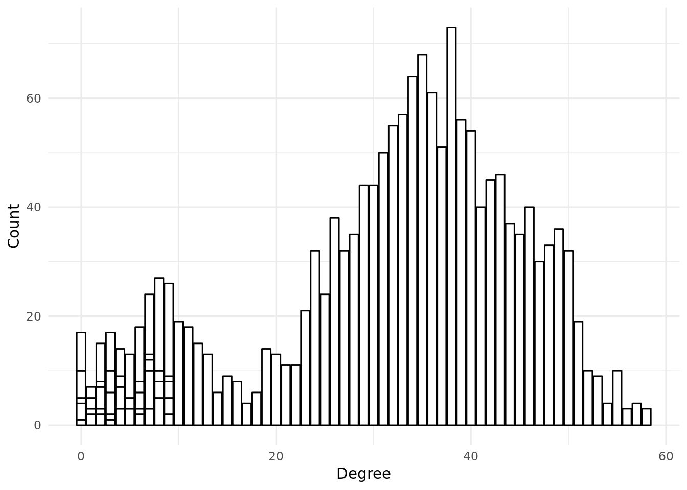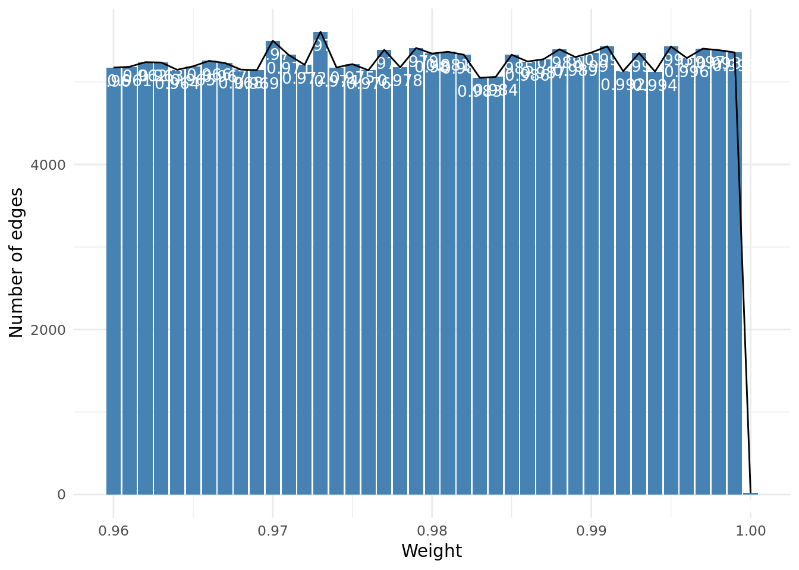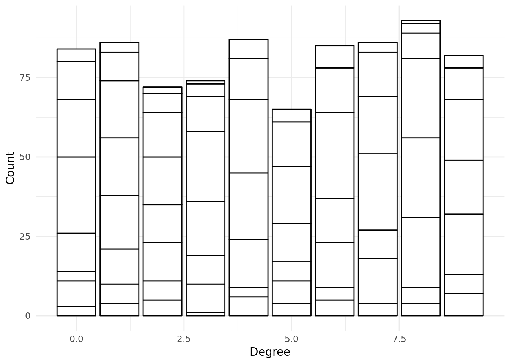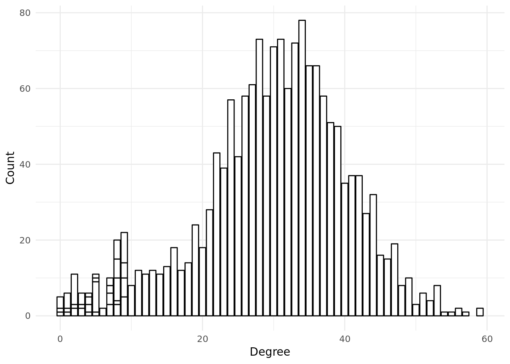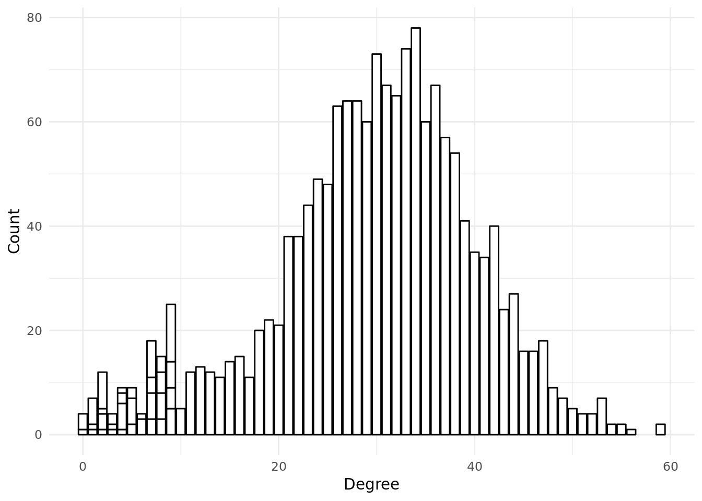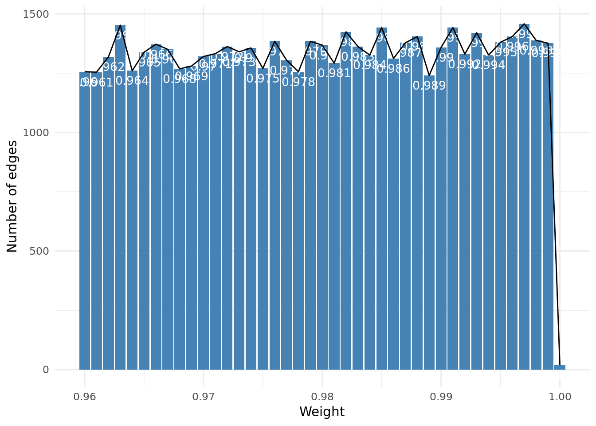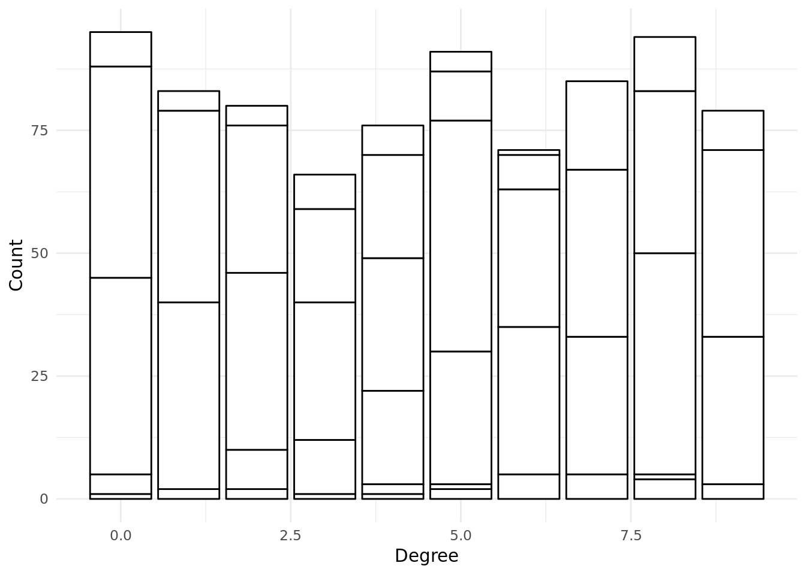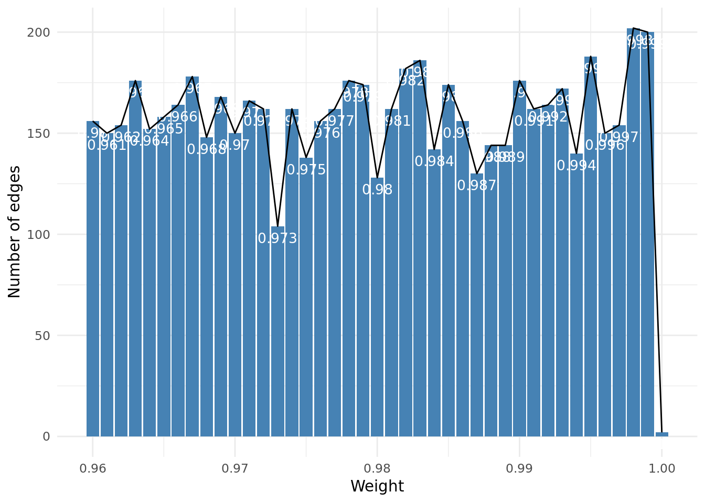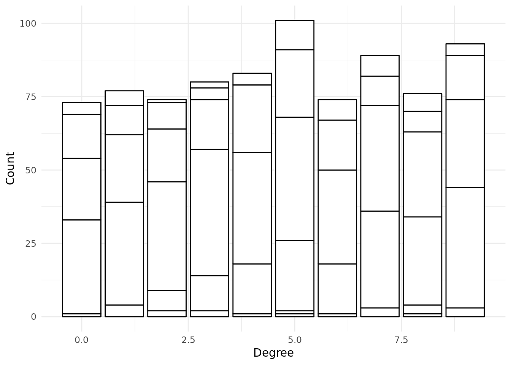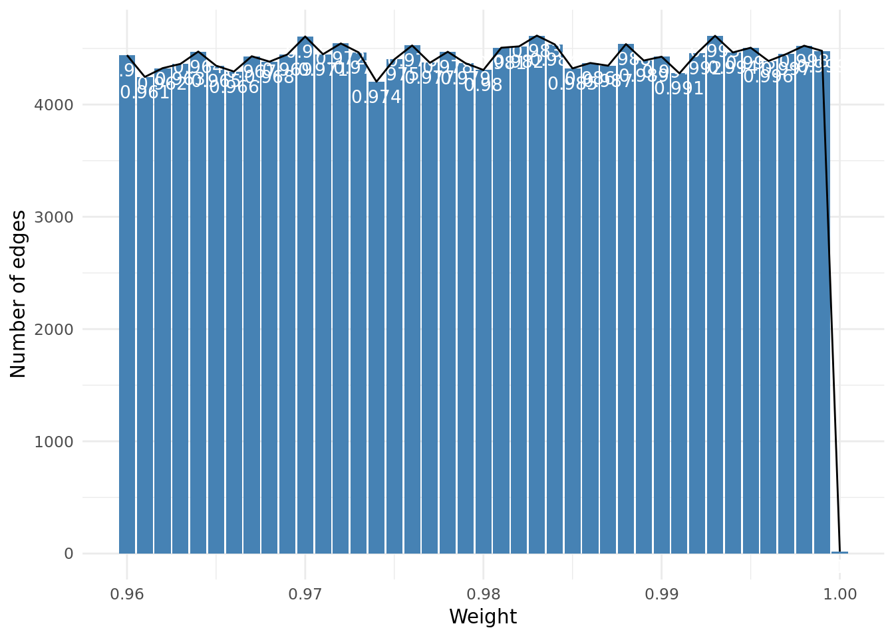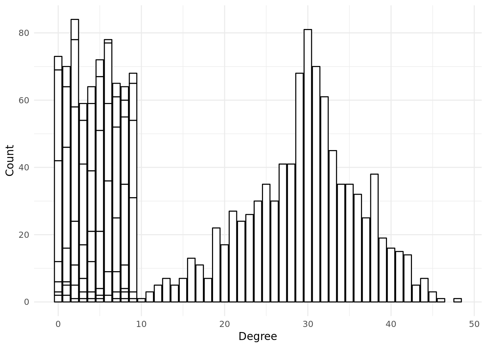  

## Regression analysis 

<table style="text-align:center"><tr><td colspan="4" style="border-bottom: 1px solid black"></td></tr><tr><td style="text-align:left"></td><td colspan="3"><em>Dependent variable:</em></td></tr>
<tr><td></td><td colspan="3" style="border-bottom: 1px solid black"></td></tr>
<tr><td style="text-align:left"></td><td colspan="3">sum_wallTime_min_total</td></tr>
<tr><td style="text-align:left"></td><td>Centralized</td><td>Decentralized</td><td>All</td></tr>
<tr><td style="text-align:left"></td><td>(1)</td><td>(2)</td><td>(3)</td></tr>
<tr><td colspan="4" style="border-bottom: 1px solid black"></td></tr><tr><td style="text-align:left">agentNumber</td><td>0.046***</td><td>-0.005</td><td>-0.017</td></tr>
<tr><td style="text-align:left"></td><td>(0.011)</td><td>(0.012)</td><td>(0.013)</td></tr>
<tr><td style="text-align:left"></td><td></td><td></td><td></td></tr>
<tr><td style="text-align:left">vertices_total</td><td>-0.023***</td><td>0.002</td><td>0.002</td></tr>
<tr><td style="text-align:left"></td><td>(0.003)</td><td>(0.003)</td><td>(0.003)</td></tr>
<tr><td style="text-align:left"></td><td></td><td></td><td></td></tr>
<tr><td style="text-align:left">edges_total</td><td>0.001***</td><td>0.0002***</td><td>0.0004***</td></tr>
<tr><td style="text-align:left"></td><td>(0.00004)</td><td>(0.00003)</td><td>(0.00003)</td></tr>
<tr><td style="text-align:left"></td><td></td><td></td><td></td></tr>
<tr><td style="text-align:left">factor(simulationType)Decentralized</td><td></td><td></td><td>-1.887***</td></tr>
<tr><td style="text-align:left"></td><td></td><td></td><td>(0.356)</td></tr>
<tr><td style="text-align:left"></td><td></td><td></td><td></td></tr>
<tr><td style="text-align:left">chainLength</td><td>0.090***</td><td>0.073**</td><td>0.062**</td></tr>
<tr><td style="text-align:left"></td><td>(0.015)</td><td>(0.029)</td><td>(0.029)</td></tr>
<tr><td style="text-align:left"></td><td></td><td></td><td></td></tr>
<tr><td style="text-align:left">maxDistance30</td><td>0.058</td><td>-1.056**</td><td>-0.555</td></tr>
<tr><td style="text-align:left"></td><td>(0.210)</td><td>(0.437)</td><td>(0.428)</td></tr>
<tr><td style="text-align:left"></td><td></td><td></td><td></td></tr>
<tr><td style="text-align:left">maxDistance5</td><td>0.076</td><td>-0.435</td><td>0.109</td></tr>
<tr><td style="text-align:left"></td><td>(0.210)</td><td>(0.455)</td><td>(0.435)</td></tr>
<tr><td style="text-align:left"></td><td></td><td></td><td></td></tr>
<tr><td style="text-align:left">randomWorksNumberMultiplier</td><td>1.318**</td><td>-1.161</td><td>-1.702**</td></tr>
<tr><td style="text-align:left"></td><td>(0.581)</td><td>(0.795)</td><td>(0.815)</td></tr>
<tr><td style="text-align:left"></td><td></td><td></td><td></td></tr>
<tr><td style="text-align:left">Constant</td><td>-0.393</td><td>0.631</td><td>1.968</td></tr>
<tr><td style="text-align:left"></td><td>(0.659)</td><td>(1.276)</td><td>(1.275)</td></tr>
<tr><td style="text-align:left"></td><td></td><td></td><td></td></tr>
<tr><td colspan="4" style="border-bottom: 1px solid black"></td></tr><tr><td style="text-align:left">Observations</td><td>108</td><td>108</td><td>216</td></tr>
<tr><td style="text-align:left">R2</td><td>0.991</td><td>0.860</td><td>0.881</td></tr>
<tr><td style="text-align:left">Adjusted R2</td><td>0.990</td><td>0.850</td><td>0.877</td></tr>
<tr><td style="text-align:left">Residual Std. Error</td><td>0.892 (df = 100)</td><td>1.852 (df = 100)</td><td>2.565 (df = 207)</td></tr>
<tr><td style="text-align:left">F Statistic</td><td>1,534.713*** (df = 7; 100)</td><td>87.533*** (df = 7; 100)</td><td>192.088*** (df = 8; 207)</td></tr>
<tr><td colspan="4" style="border-bottom: 1px solid black"></td></tr><tr><td style="text-align:left"><em>Note:</em></td><td colspan="3" style="text-align:right">*p<0.1; **p<0.05; ***p<0.01</td></tr>
</table>
