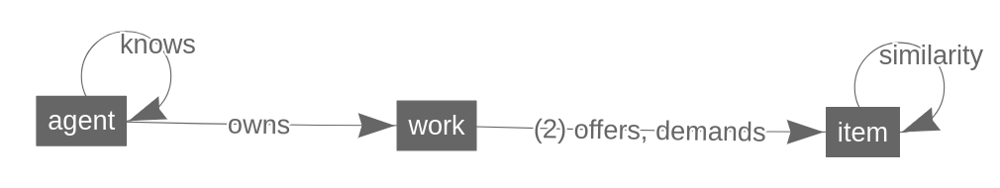

Date: Tue Aug 14 10:05:35 2018  
ExperimentId: EXP08-11-12-58-3BvMSL  
Codebase version: [a6f9dfc](https://github.com/singnet/offernet/commit/a6f9dfc)  

# Decentralized vs centralized search in OfferNet

## OfferNet system

OfferNet is a connected social network of agents, which are related to all other agents via direct or indirect `knows` relations. Every agent can theoretically reach another agent in the network through traveling these relations. The ability to reach any corner in the network is only a function of how many levels of "frieds of friends" an agent is willing to consult in order to receive the desired information.

The goal of engaging into Offer Network for agents is the ability to publish `works` that they are prepared to do and look for the ways to perform them. In the current simulation, a "work" is just a wilingness to provide an `item` in exchange to another `item` -- a good or a service. These are called {demand <-> offer} pairs. Yet this ontology supports arbitrary complex workflows in which a `work` is an elementary unit of a workflow, relating inputs to outputs via some process that may require energy. By `owning` a work an agent warrants the supply of energy to the process. Furthermore, works can be connected into arbitrary complex workflows -- a work owned by one agent can `demand` input from a work owned by its distant neibgbours and `offer` output to a work that `demands` it and is owned by a close friend. A generalized process of finding workflows in such a network is called "matching" complexity of which as well as comparison of algorithms from the mathematical perspective were investigated by [@goertzel_offer_2017].

We are conceiving a decantralized system that supports dynamic bottom-up self-organization of Offer Network as a social network and workflows within it without positing a centralized control -- an *a priori* defined global process(es) or data structure(s). The underlying motivation of conceiving such system is its potential to inform, simulate and implement "economic" networks where agents of biological and non-biological origin (read -- humans and AIs) exchange data, goods and services and by that form assemblages able to perform more complex tasks than any agent grasps individually. Aiming at this potential we consider and strictly follow certain theoretical, computational and practical constraints which are not warranted from purely mathematical point of view.

The experiment documented here is a step towards this direction with the goal of gaining deeper understanding of tradeoffs between centralized matching and decentralized search algorithms. For this purpose it is enough to consider only simple works `demand`ing single input and `offer`ing single output without any energies required for the exchange to happen. A workflow in this case is a simple chain of an arbitrary number of works connected via their `demands` and `offers`. Since agents initially do not know anything apart from one or more other agents which they `know` (by the virtue of participation in a social network) and there is no "omniscient" agency (repository, database, global agent, etc.) which could provide such information, the best an only action for each agent is to search for "matches" to their `offers` and `demands` by asking neighbours to ask their neighbours to ask if they know somebody who has corresponding `demands` or `offers` on their own.  

We start by considering a static social network of `agents` with `works` and `items` :

(\#fig:architecture-big)Offer Network -- initial structure

(\#fig:architecture-small)Offer Network -- initial structure

This data structure is a [property graph](https://github.com/opencypher/openCypher/blob/master/docs/property-graph-model.adoc), defined "in graph theoretical terms as a directed, vertex-labelled, edge-labelled multigraph with self-edges, where edges have their own identity" [^1]. Additionally to the initial OfferNet graph pictured above the schema features `similarity` links between `items` representing a measure of their semantic similarity which is used in determining if an agent can consider an `item` found in the network `similar` enough to its `offered` or `demanded` item in order for the exchange to happen. In the current simulation `similarity` measure is represented as a real number in the range $[0,1]$, but it can be an arbitrary complex relationship depending on the practical application of the framework -- see [conceptual framework](https://singnet.github.io/offernet/public/offernet-documentation/conceptual-framework.html#description-of-items-of-exchange) for the discussion of possibilities.  

[^1]: GitHub repository of OpenCypher project  https://github.com/opencypher/openCypher/blob/master/docs/property-graph-model.adoc

(\#fig:schema)OfferNet graph schema

We achieve "matching" in the Offer Network via combination of two general processes: similarity search and cycle / path search. In order to understand the trade-offs between centralization and decentralization we implement these in both ways.

## Similarity search

Similarity search is the process which searches similar `items` and connects them with `similarity` links. The `value` of an item is represented as a real number range $[0,1]$. Similarity between two items is calculated using the formula $Sim = 1 - abs(value_{i1} - value_{i2})$ which also results in the real number of range $[0,1]$ -- the closer the number to one, the more `similar` items are. 

### Decentralized flavour

Decentralized similarity search is achieved when a number of agents launch a 'greedy' graph traversal trough their neighbourhood networks looking for items owned by these neighbours, calculating their similarities to the items `offered` or `demanded` by itself and connecting them with appropriate links if the `similarity` exceeds certain threshold value. These processes are completely asynchronous and not coordinated among each other, they can be of different depth, take different amount of time to finish and require different computational resources based on `individual` decision of an agent. Currently decentralized similarity search is implemented with [Agent.searchAndConnect(Object similarityThreshold, Integer maxReachDistance)](https://github.com/kabirkbr/offernet/blob/665627a36cee2a8c247ce015f5d8931e3c40e243/src/main/groovy/Agent.groovy#L364) routine which takes the `similarityThreshold` argument -- defining the minimum similarity considered for connection of items -- and `maxReachDistance` -- how deep the local neighbourhood network will be traversed.

### Centralized flavour

Centralized similarity search in its current incarnation simply iterates though all permutations of item pairs in the network, checks their similarity and connects the ones which exceeds the `similarityThreshold` value. It guarantees that all agents are visited and all their `works` and `items` are considered. The current implementation is [OfferNet.searchAndConnect(Object similarityThreshold)](https://github.com/kabirkbr/offernet/blob/665627a36cee2a8c247ce015f5d8931e3c40e243/src/main/groovy/OfferNet.groovy#L637). Note that it takes only `similarityThreshold` parameter, since it does centrally controlled full graph scan and therefore there is no need to stop the traversal when a certain depth is reached. The cost of this is that full graph scans are very inefficient and hardly practical with large graphs. 

## Cycle search

### Decentralized flavour

Similarly to the decentralized similarity search, cycle search is achieved when each agent launches a 'greedy' graph traversal from their respective `demands` and `offer` items via `similarity` links that were created by the similarity search process as explained above. Cycle search is therefore much less expensive as it just searches for items connected with `similarity` links of certain length -- see the Gremlin implementation of the traversal: [Agent.cycleSearch(Object similarityConstraint)](https://github.com/kabirkbr/offernet/blob/665627a36cee2a8c247ce015f5d8931e3c40e243/src/main/groovy/Agent.groovy#L666). The routine takes `similarityConstraint` parameters, which defines the minimum `similarity` value which is still considered by the agent good enough in order to exchange items. For the present experiment we use `similarityConstraint=1`, i.e. consider only cycles of equivalent items. Yet in practice it will probably be beneficial to be able to run fuzzy searches and searches where agents specify their preferences incompletely.

### Centralized flavour

Centralized similarity search simulates classical [naive graph search](https://www.coursera.org/lecture/algorithms-on-graphs/naive-algorithm-BVj0X) (current implementation [Simulation.naiveCentralizedCycleSearch(Object similaritySearchThreshold, List chainedWorksJson)](https://github.com/kabirkbr/offernet/blob/665627a36cee2a8c247ce015f5d8931e3c40e243/src/main/groovy/Simulation.groovy#L414)), or [Dijkstra's algorithm](https://www.coursera.org/lecture/algorithms-on-graphs/dijkstras-algorithm-intuition-and-example-ZS5pm) ([Simulation.depthFirstCycleSearch(Object similaritySearchThreshold, List chainedWorksJson)](https://github.com/kabirkbr/offernet/blob/665627a36cee2a8c247ce015f5d8931e3c40e243/src/main/groovy/Simulation.groovy#L464)). 

