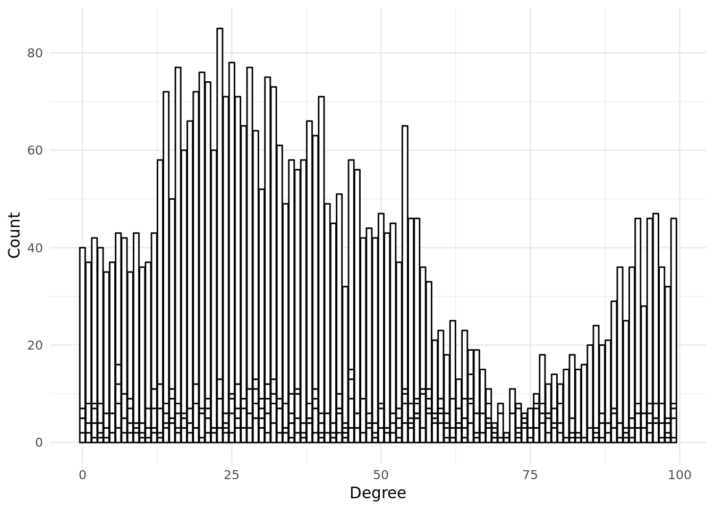
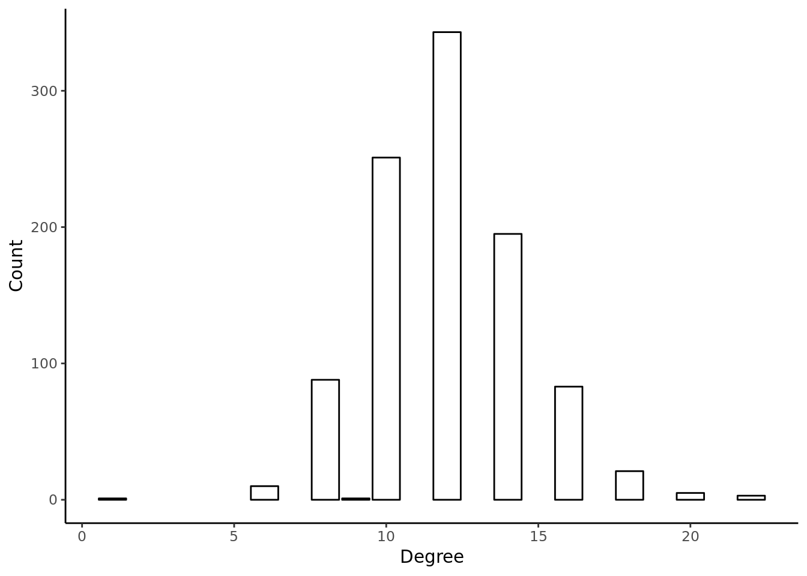
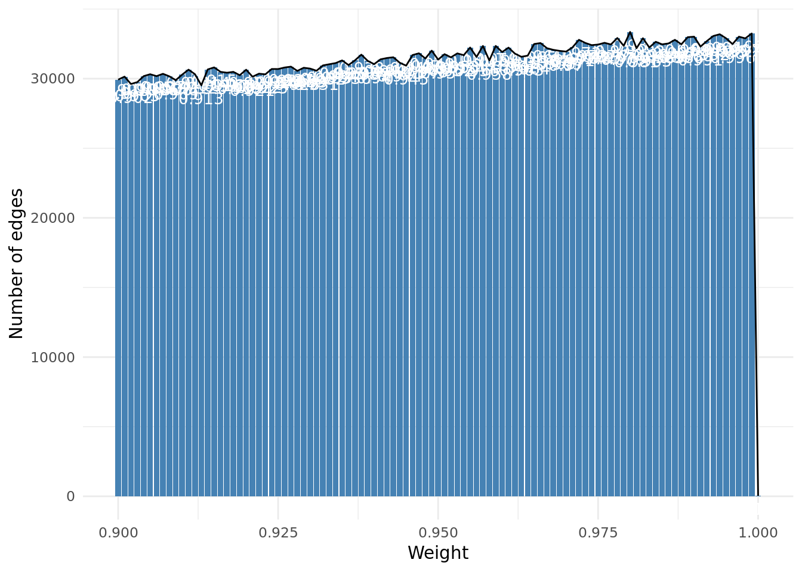
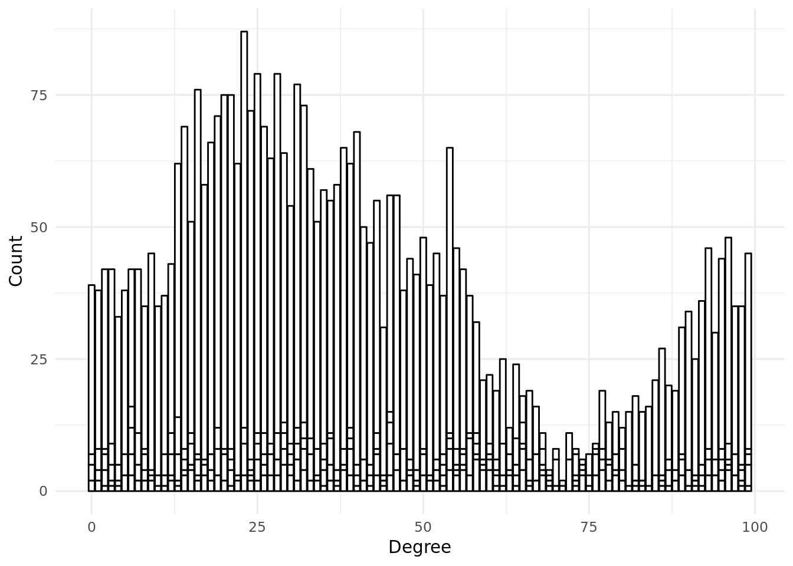

# Experiment 1

Randomly connected social network of agents of unknown diameter; similarityConnectThreshold = 0.5.

## Experimental set up

<!--#### variables: -->
<table class="table table-condensed" style="width: auto !important; ">
 <thead>
  <tr>
   <th style="text-align:left;">   </th>
   <th style="text-align:left;"> Values </th>
  </tr>
 </thead>
<tbody>
  <tr>
   <td style="text-align:left;"> experimentId </td>
   <td style="text-align:left;"> EXP08-10-01-33-JYSw5Z </td>
  </tr>
  <tr>
   <td style="text-align:left;"> agentNumbers </td>
   <td style="text-align:left;"> 1000 </td>
  </tr>
  <tr>
   <td style="text-align:left;"> maxDistances </td>
   <td style="text-align:left;"> 10 </td>
  </tr>
  <tr>
   <td style="text-align:left;"> randomWorksNumberMultipliers </td>
   <td style="text-align:left;"> 2 </td>
  </tr>
  <tr>
   <td style="text-align:left;"> similarityConnectThreshold </td>
   <td style="text-align:left;"> 0.5 </td>
  </tr>
  <tr>
   <td style="text-align:left;"> similaritySearchThresholds </td>
   <td style="text-align:left;"> 1 </td>
  </tr>
  <tr>
   <td style="text-align:left;"> chainLengths </td>
   <td style="text-align:left;"> 20 </td>
  </tr>
</tbody>
</table>

### Descriptive analysis of each simulation

###  SIM08-10-01-33-niVTL7--CV 

#### simulationParameters 

<table class="table table-condensed" style="width: auto !important; ">
 <thead>
  <tr>
   <th style="text-align:left;"> agentNumber </th>
   <th style="text-align:right;"> similarityConnectThreshold </th>
   <th style="text-align:left;"> chainLength </th>
   <th style="text-align:left;"> similaritySearchThreshold </th>
   <th style="text-align:left;"> maxDistance </th>
  </tr>
 </thead>
<tbody>
  <tr>
   <td style="text-align:left;width: 20em; "> 1000 </td>
   <td style="text-align:right;width: 15em; "> 0.5 </td>
   <td style="text-align:left;width: 15em; "> 20 </td>
   <td style="text-align:left;width: 15em; "> 1 </td>
   <td style="text-align:left;width: 15em; "> 10 </td>
  </tr>
</tbody>
</table>
#### allEdgesByLabel

<table class="table table-condensed" style="width: auto !important; ">
 <thead>
  <tr>
   <th style="text-align:right;"> offers </th>
   <th style="text-align:right;"> similarity </th>
   <th style="text-align:right;"> owns </th>
   <th style="text-align:right;"> demands </th>
   <th style="text-align:right;"> knows </th>
   <th style="text-align:right;"> Total </th>
  </tr>
 </thead>
<tbody>
  <tr>
   <td style="text-align:right;width: 5em; "> 2,020 </td>
   <td style="text-align:right;width: 5em; "> 3,154,142 </td>
   <td style="text-align:right;width: 5em; "> 2,020 </td>
   <td style="text-align:right;width: 5em; "> 2,020 </td>
   <td style="text-align:right;width: 5em; "> 6,001 </td>
   <td style="text-align:right;width: 5em; "> 3,166,203 </td>
  </tr>
</tbody>
</table>
#### allVerticesByType

<table class="table table-condensed" style="width: auto !important; ">
 <thead>
  <tr>
   <th style="text-align:right;"> agent </th>
   <th style="text-align:right;"> item </th>
   <th style="text-align:right;"> work </th>
   <th style="text-align:right;"> Total </th>
  </tr>
 </thead>
<tbody>
  <tr>
   <td style="text-align:right;width: 5em; "> 1,001 </td>
   <td style="text-align:right;width: 5em; "> 4,040 </td>
   <td style="text-align:right;width: 5em; "> 2,020 </td>
   <td style="text-align:right;width: 5em; "> 7,061 </td>
  </tr>
</tbody>
</table>
#### distribution of similarityEdgesByWeight

#### Degree distribution of item->similarity->item edges

#### Degree distribution of agent->knows->agent edges

###  SIM08-10-01-33-niVTL7--DV 

#### simulationParameters 

<table class="table table-condensed" style="width: auto !important; ">
 <thead>
  <tr>
   <th style="text-align:left;"> agentNumber </th>
   <th style="text-align:right;"> similarityConnectThreshold </th>
   <th style="text-align:left;"> chainLength </th>
   <th style="text-align:left;"> similaritySearchThreshold </th>
   <th style="text-align:left;"> maxDistance </th>
  </tr>
 </thead>
<tbody>
  <tr>
   <td style="text-align:left;width: 20em; "> 1000 </td>
   <td style="text-align:right;width: 15em; "> 0.5 </td>
   <td style="text-align:left;width: 15em; "> 20 </td>
   <td style="text-align:left;width: 15em; "> 1 </td>
   <td style="text-align:left;width: 15em; "> 10 </td>
  </tr>
</tbody>
</table>
#### allEdgesByLabel

<table class="table table-condensed" style="width: auto !important; ">
 <thead>
  <tr>
   <th style="text-align:right;"> offers </th>
   <th style="text-align:right;"> similarity </th>
   <th style="text-align:right;"> owns </th>
   <th style="text-align:right;"> demands </th>
   <th style="text-align:right;"> knows </th>
   <th style="text-align:right;"> Total </th>
  </tr>
 </thead>
<tbody>
  <tr>
   <td style="text-align:right;width: 5em; "> 2,020 </td>
   <td style="text-align:right;width: 5em; "> 3,154,029 </td>
   <td style="text-align:right;width: 5em; "> 2,020 </td>
   <td style="text-align:right;width: 5em; "> 2,020 </td>
   <td style="text-align:right;width: 5em; "> 6,001 </td>
   <td style="text-align:right;width: 5em; "> 3,166,090 </td>
  </tr>
</tbody>
</table>
#### allVerticesByType

<table class="table table-condensed" style="width: auto !important; ">
 <thead>
  <tr>
   <th style="text-align:right;"> agent </th>
   <th style="text-align:right;"> item </th>
   <th style="text-align:right;"> work </th>
   <th style="text-align:right;"> Total </th>
  </tr>
 </thead>
<tbody>
  <tr>
   <td style="text-align:right;width: 5em; "> 1,001 </td>
   <td style="text-align:right;width: 5em; "> 4,040 </td>
   <td style="text-align:right;width: 5em; "> 2,020 </td>
   <td style="text-align:right;width: 5em; "> 7,061 </td>
  </tr>
</tbody>
</table>
#### distribution of similarityEdgesByWeight

#### Degree distribution of item->similarity->item edges

#### Degree distribution of agent->knows->agent edges

## Discussion and notes

Degree distributions over item -> similarity -> item links are clearly incorrect (the total number of similarity links in graphs are much higher than displayed in the graph -- need to test this).
